{0}------------------------------------------------

# **UNITED STATES SECURITIES AND EXCHANGE COMMISSION Washington, D.C. 20549 FORM 10-K**

(Mark One)

# x **Annual Report Pursuant To Section 13 or 15(d) Of The Securities Exchange Act of 1934**

For the fiscal year ended December 31, 2022.

Or

# o **Transition Report Pursuant To Section 13 or 15(d) Of The Securities Exchange Act of 1934**

For the transition period from ______________ to ______________.

Commission file number: **000-50275**

# **BCB BANCORP, INC.**

(Exact name of registrant as specified in its charter)

|                                                                                                                                                                                                                                                                                                                                                                           | New Jersey                                                                                                              |                                                                      | 26-0065262                                                                                                                                                                                                                                         |  |  |  |  |  |  |
|---------------------------------------------------------------------------------------------------------------------------------------------------------------------------------------------------------------------------------------------------------------------------------------------------------------------------------------------------------------------------|-------------------------------------------------------------------------------------------------------------------------|----------------------------------------------------------------------|----------------------------------------------------------------------------------------------------------------------------------------------------------------------------------------------------------------------------------------------------|--|--|--|--|--|--|
|                                                                                                                                                                                                                                                                                                                                                                           | (State or other jurisdiction of incorporation or organization)                                                          |                                                                      | (I.R.S. Employer Identification No.)                                                                                                                                                                                                               |  |  |  |  |  |  |
|                                                                                                                                                                                                                                                                                                                                                                           | 104-110 Avenue C, Bayonne, New Jersey                                                                                   |                                                                      | 07002                                                                                                                                                                                                                                              |  |  |  |  |  |  |
|                                                                                                                                                                                                                                                                                                                                                                           | (Address of principal executive offices)                                                                                |                                                                      | (Zip Code)                                                                                                                                                                                                                                         |  |  |  |  |  |  |
|                                                                                                                                                                                                                                                                                                                                                                           |                                                                                                                         | Registrant's telephone number, including area code: 1-(800)-680-6872 |                                                                                                                                                                                                                                                    |  |  |  |  |  |  |
|                                                                                                                                                                                                                                                                                                                                                                           |                                                                                                                         | Securities registered pursuant to Section 12(b) of the Act:          |                                                                                                                                                                                                                                                    |  |  |  |  |  |  |
|                                                                                                                                                                                                                                                                                                                                                                           | Title of each class                                                                                                     |                                                                      | Name of each exchange on which registered                                                                                                                                                                                                          |  |  |  |  |  |  |
|                                                                                                                                                                                                                                                                                                                                                                           | Common Stock, no par value                                                                                              |                                                                      | The NASDAQ Stock Market, LLC                                                                                                                                                                                                                       |  |  |  |  |  |  |
|                                                                                                                                                                                                                                                                                                                                                                           |                                                                                                                         | Trading Symbol BCBP                                               |                                                                                                                                                                                                                                                    |  |  |  |  |  |  |
|                                                                                                                                                                                                                                                                                                                                                                           |                                                                                                                         | Securities registered pursuant to Section 12(g) of the Act: None     |                                                                                                                                                                                                                                                    |  |  |  |  |  |  |
|                                                                                                                                                                                                                                                                                                                                                                           | Indicate by check mark if the registrant is a well-known seasoned issuer, as defined in Rule 405 of the Securities Act. |                                                                      | YES o NO x                                                                                                                                                                                                                                         |  |  |  |  |  |  |
| Indicate by check mark if the registrant is not required to file reports pursuant to Section 13 or Section 15(d) of the Act.                                                                                                                                                                                                                                              |                                                                                                                         |                                                                      |                                                                                                                                                                                                                                                    |  |  |  |  |  |  |
| YES o NO x Indicate by check mark whether the Registrant (1) has filed all reports required to be filed by Section 13 or 15(d) of the Securities Exchange Act of 1934 during the preceding 12 months (or for such shorter period that the registrant was required to file such reports), and (2) has been subject to such filing requirements for the past 90 days. |                                                                                                                         |                                                                      |                                                                                                                                                                                                                                                    |  |  |  |  |  |  |
| the Registrant was required to submit such files).                                                                                                                                                                                                                                                                                                                        |                                                                                                                         |                                                                      | YES x NO o Indicate by check mark whether the Registrant has submitted electronically every Interactive Data File required to be submitted pursuant to Rule 405 of Regulation S-T during the preceding 12 months (or such shorter period that   |  |  |  |  |  |  |
|                                                                                                                                                                                                                                                                                                                                                                           | "accelerated filer," "smaller reporting company," and "emerging growth company" in Rule 12b-2 of the Exchange Act.:     |                                                                      | YES x NO o Indicate by check mark whether the registrant is a large accelerated filer, an accelerated filer, a non-accelerated filer, a smaller reporting company, or an emerging growth company. See definitions of "large accelerated filer," |  |  |  |  |  |  |
| Large accelerated filer                                                                                                                                                                                                                                                                                                                                                   | Accelerated filer x                                                                                                     | Non-accelerated filer o                                              | Smaller reporting company x Emerging Growth company o                                                                                                                                                                                              |  |  |  |  |  |  |
| 13(a) of the Exchange Act o                                                                                                                                                                                                                                                                                                                                               |                                                                                                                         |                                                                      | If any emerging growth company, indicate by check mark if the registrant has elected not to use the extended transition period for complying with any new or revised financial accounting standards provided pursuant to Section                   |  |  |  |  |  |  |
|                                                                                                                                                                                                                                                                                                                                                                           | (15 U.S.C. 7262(b)) by the registered public accounting firm that prepared or issued its audit report. x                |                                                                      | Indicate by check mark whether the registrant has filed a report on and attestation to its management's assessment of the effectiveness of its internal control over financial reporting under Section 404(b) of the Sarbanes-Oxley Act            |  |  |  |  |  |  |
| statements. o                                                                                                                                                                                                                                                                                                                                                             |                                                                                                                         |                                                                      | If securities are registered pursuant to Section 12(b) of the Act, indicate by check mark whether the financial statements of the registrant included in the filing reflect the correction of an error to previously issued financial              |  |  |  |  |  |  |
| period pursuant to §240.10D-1(b). o                                                                                                                                                                                                                                                                                                                                       |                                                                                                                         |                                                                      | Indicate by check mark whether any of those error corrections are restatements that required a recovery analysis of incentive-based compensation received by any of registrant's executive officers during the relevant recovery                   |  |  |  |  |  |  |

Indicate by check mark whether the registrant is a shell company (as defined in Rule 12b-2 of the Act). YES ¨ NO x

The aggregate market value of the voting and non-voting common equity held by non-affiliates of the Registrant, computed by reference to the last sale price on June 30, 2022, as reported by the Nasdaq Global Market, was approximately \$255.3 million.

As of March 3, 2023, there were 16,941,267 shares of the Registrant's Common Stock outstanding.

#### **DOCUMENTS INCORPORATED BY REFERENCE:**

(1) Proxy Statement for the 2023 Annual Meeting of Stockholders of the Registrant (Part III)

{1}------------------------------------------------

# **TABLE OF CONTENTS**

| Item     |                                                                                                              | Page Number |
|----------|--------------------------------------------------------------------------------------------------------------|----------------|
| ITEM 1.  | BUSINESS                                                                                                     | 1              |
| ITEM 1A. | RISK FACTORS                                                                                                 | 17             |
| ITEM 1B. | UNRESOLVED STAFF COMMENTS                                                                                    | 23             |
| ITEM 2.  | PROPERTIES                                                                                                   | 24             |
| ITEM 3.  | LEGAL PROCEEDINGS                                                                                            | 25             |
| ITEM 4.  | MINE SAFETY DISCLOSURES                                                                                      | 25             |
| ITEM 5.  | MARKET FOR REGISTRANT'S COMMON EQUITY, RELATED STOCKHOLDER MATTERS AND ISSUER PURCHASES OF EQUITY SECURITIES | 25             |
| ITEM 6.  | [RESERVED]                                                                                                   | 27             |
| ITEM 7.  | MANAGEMENT'S DISCUSSION AND ANALYSIS OF FINANCIAL CONDITION AND RESULTS OF OPERATIONS                        | 27             |
| ITEM 7A. | QUANTITATIVE AND QUALITATIVE DISCLOSURES ABOUT MARKET RISK                                                   | 31             |
| ITEM 8.  | FINANICAL STATEMENTS AND SUPPLEMENTARY DATA                                                                  | 32             |
| ITEM 9.  | CHANGES IN AND DISAGREEMENTS WITH ACCOUNTANTS ON ACCOUNTING AND FINANCIAL DISCLOSURES                        | 72             |
| ITEM 9A. | CONTROLS AND PROCEDURES                                                                                      | 72             |
| ITEM 9B. | OTHER INFORMATION                                                                                            | 72             |
| ITEM 9C  | DISCLOSURE REGARDING FOREIGN JURISDICTIONS THAT PREVENT INSPECTIONS                                          | 72             |
| ITEM 10. | DIRECTORS, EXECUTIVE OFFICERS AND CORPORATE GOVERNANCE                                                       | 73             |
| ITEM 11. | EXECUTIVE COMPENSATION                                                                                       | 73             |
| ITEM 12. | SECURITY OWNERSHIP OF CERTAIN BENEFICIAL OWNERS AND MANAGEMENT AND RELATED STOCKHOLDER MATTERS               | 73             |
| ITEM 13. | CERTAIN RELATIONSHIPS AND RELATED TRANSACTIONS, AND DIRECTOR INDEPENDENCE                                    | 73             |
| ITEM 14. | PRINCIPALACCOUNTANT FEES AND SERVICES                                                                        | 73             |
| ITEM 15. | EXHIBITS AND FINANCIAL STATEMENT SCHEDULES                                                                   | 74             |
| ITEM 16. | FORM 10-K SUMMARY                                                                                            | 75             |

# ii

{2}------------------------------------------------

### **PART I**

# **ITEM 1. BUSINESS**

### **Forward-Looking Statements**

This report on Form 10-K contains forward-looking statements that are based on assumptions and may describe future plans, strategies and expectations of BCB Bancorp, Inc. and subsidiaries. This document may include forward-looking statements within the meaning of Section 27A of the Securities Act of 1933 and Section 21E of the Securities Exchange Act of 1934. The Company intends such forward-looking statements to be covered by the safe harbor provisions for forward-looking statements contained in the Private Securities Litigation Reform Act of 1995, and is including this statement for purposes of said safe harbor provisions. Forward-looking information is inherently subject to risks and uncertainties, and actual results could differ materially from those currently anticipated due to a number of factors, which include, but are not limited to, factors discussed in this Annual Report on Form 10-K and in other documents filed with the Securities and Exchange Commission. These forward-looking statements, which are based on certain assumptions and describe future plans, strategies, and expectations of the Company, are generally identified by use of the words "anticipate," "believe," "estimate," "expect," "intend," "plan," "project," "seek," "strive," "try," or future or conditional verbs such as "will," "would," "should," "could," "may," or similar expressions. Although we believe that our plans, intentions and expectations, as reflected in these forward-looking statements are reasonable, we can give no assurance that these plans, intentions or expectations will be achieved or realized. By identifying these statements for you in this manner, we are alerting you to the possibility that our actual results and financial condition may differ, possibly materially, from the anticipated results and financial condition indicated in these forward-looking statements. Important factors that could cause our actual results and financial condition to differ from those indicated in the forward-looking statements include, among others, changes in market interest rates, general economic conditions, legislation, and regulation; changes in monetary and fiscal policies of the United States Government, including policies of the United States Treasury and Federal Reserve Board; changes in the quality or composition of the loan or investment portfolios; changes in deposit flows, competition, and demand for financial services, loans, deposits and investment products in our local markets; changes in accounting principles and guidelines; war or terrorist activities; and other economic, competitive, governmental, regulatory, geopolitical and technological factors affecting the our operations, pricing and services, and those discussed under "Risk Factors" in Part I, Item 1A of this Annual Report on Form 10-K. Although we believe that the expectations reflected in the forward-looking statements are reasonable, we cannot guarantee future results, levels of activity, performance or achievements. You should not place undue reliance on these forward-looking statements, which reflect our expectations only as of the date of this report. We do not assume any obligation to revise forward-looking statements to reflect events or circumstances that occur after the date on which such statements were made, except as may be required by law.

#### **BCB Bancorp, Inc.**

BCB Bancorp, Inc. (individually referred to herein as the "Parent Company" and together with its subsidiaries, collectively referred to herein as the "Company") is a New Jersey corporation established in 2003, and is the holding company parent of BCB Community Bank (the "Bank"). The Company has not engaged in any significant business activity other than owning all of the outstanding common stock of BCB Community Bank. Our executive office is located at 104-110 Avenue C, Bayonne, New Jersey 07002. Our telephone number is 1-(800)-680-6872 and our website is www.bcb.bank. Information on our website is not incorporated into this Annual Report on Form 10-K. At December 31, 2022 we had approximately \$3.546 billion in consolidated assets, \$2.812 billion in deposits and \$291.3 million in consolidated stockholders' equity. The Parent Company is subject to extensive regulation by the Board of Governors of the Federal Reserve System.

#### **Human Capital Resources**

At December 31, 2022 we employed 301 full-time equivalent employees, all located in New Jersey and New York. Our employees are not represented by any collective bargaining group. Management believes that we have good relations with our employees. We strive to have a positive, collaborative culture that engages employees, as we believe engaged employees serve our customers well.

The safety, health and wellness of our employees is a top priority. The COVID-19 pandemic presented a unique challenge with regard to maintaining employee safety while continuing successful operations. Through teamwork and the adaptability of our management and staff, we were able to transition during the peak of the pandemic, over a short period of time, to a rotational work schedule allowing employees to effectively work from remote locations and ensure a safely-distanced working environment for employees performing customer facing activities, at branches and operations centers.

On an ongoing basis, we remain focused on promoting the health and wellness of our employees by strongly encouraging work-life balance, offering flexible work schedules, and keeping the employee portion of health care premiums to a minimum. We are committed to maintaining a work environment where every team member is treated with dignity and respect, free from the threat of discrimination and harassment.

We expect these same standards apply to all stakeholders, to our interactions with customers, vendors and independent contractors.

#### **BCB Community Bank**

The Bank opened for business on November 1, 2000 as Bayonne Community Bank, a New Jersey chartered commercial bank. The Bank changed its name from Bayonne Community Bank to BCB Community Bank in April 2007. At December 31, 2022, the Bank operated at 27 locations in Bayonne, Edison, Hoboken, Fairfield, Holmdel, Jersey City, Lyndhurst, Maplewood, Monroe Township, Newark, Parsippany, Plainsboro, River Edge, Rutherford, South Orange, Union, and Woodbridge, New Jersey, as well as three branches in Staten Island and Hicksville, New York, through executive offices located at 104-110 Avenue C, and an administrative office located at 591-595 Avenue C, Bayonne, New Jersey 07002. The Bank's deposit accounts are insured by the Federal Deposit Insurance Corporation (the "FDIC") and the Bank is a member of the Federal Home Loan Bank ("FHLB") System.

We are a community-oriented financial institution. Our business is to offer FDIC-insured deposit products and to invest funds held in deposit accounts at the Bank, together with funds generated from operations, in loans and investment securities. We offer our customers:

- loans, including commercial and multi-family real estate loans, one-to-four family mortgage loans, commercial business loans, construction loans, home equity loans, and consumer loans. In recent years the primary growth in our loan portfolio has been in loans secured by commercial real estate and multi-family properties;
- FDIC-insured deposit products, including savings and club accounts, interest and non-interest-bearing demand accounts, money market accounts, certificates of deposit, and individual retirement accounts; and,
- retail and commercial banking services including wire transfers, money orders, safe deposit boxes, night depository, debit cards, online banking, mobile banking, fraud detection (positive pay), and automated teller services.

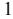

{3}------------------------------------------------

### **Recent Events**

On September 23, 2022, the company closed a round of private placement of Series I Noncumulative Perpetual Stock, par value \$0.01 per share (the "Series I Preferred Stock"), resulting in gross proceeds of \$4,440,000 for 444 shares.

On May 1, 2022, the Parent Company redeemed all 940 outstanding shares of its Series D 4.5% Noncumulative Perpetual Preferred Stock, at their face value of \$10,000 per share, for a total redemption amount of \$9.4 million.

On March 24, 2022, the Parent Company closed a round of private placement of the Series I Preferred Stock, resulting in gross proceeds of \$2,620,000 for 260 shares.

On February 4, 2022, the Parent Company redeemed all 533 outstanding shares of its Series G 6.0% Noncumulative Perpetual Preferred Stock, at their face value of \$10,000 per share, for a total redemption amount of \$5.3 million.

On December 29, 2021, the Board of Directors of the Company implemented a defined benefit supplemental executive retirement plan ("SERP") for the benefit of Thomas M. Coughlin, President and Chief Executive Officer of the Bank and the Company. The SERP provides supplemental nonqualified pension benefits to Mr. Coughlin in the form of a life annuity.

On December 21, 2021, the Parent Company closed a private placement of Series I Preferred Stock, resulting in gross proceeds of \$3,200,000 for 320 shares.

#### **Business Strategy**

Our business strategy is to operate as a well-capitalized, profitable, and independent community-oriented financial institution dedicated to providing the highest quality customer service. Management's and the Board of Directors' extensive knowledge of the markets we serve helps to differentiate us from our competitors. Our business strategy incorporates the following elements: maintaining a community focus, focusing on profitability, strengthening our balance sheet, concentrating on real estate- based lending, capitalizing on market dynamics, providing attentive and personalized service, and attracting highly qualified and experienced personnel. These attributes coupled with our desire to seek out under-served markets for banking products and services, facilitate our plan to grow our franchise footprint organically and synergistically.

Maintaining a community focus. Our management and Board of Directors have strong ties to the communities we serve. Many members of the management team are New Jersey natives and are active in the communities we serve through non-profit board membership, local business development organizations, and industry associations. In addition, our board members are well-established professionals and business leaders in the communities we serve. Management and the Board are interested in making a lasting contribution to these communities, and they have succeeded in attracting deposits and loans through attentive and personalized service.

Focusing on profitability. Over the last few years, the Company has opened several new branches throughout New Jersey and New York. The Company intends to continue its growth through the maturation of these new branches and through acquisitions. While this will serve to expand our geographic footprint, it should also provide additional sources of liquidity and as new branches mature, increase profitability. Management continues to be committed to managing and controlling our non-interest expenses to improve our efficiency ratio, and to remain as a well-capitalized institution.

Strengthening our balance sheet. For the year ended December 31, 2022, our return on average equity was 16.99 percent and our return on average assets was 1.46 percent. Our earnings per diluted share was \$2.58 for the year ended December 31, 2022 compared to \$1.92 for the year ended December 31, 2021. Management remains committed to strengthening the Company's statements of financial condition and maintaining profitability by diversifying the products, pricing and services we offer. Additionally, the Company is very focused on operating with stable liquidity and capital positions and maintaining robust asset quality as the industry continues to face challenges from an uncertain macroeconomic environment.

Concentrating on real estate-based lending. A primary focus of our business strategy is to originate loans secured by commercial and multi-family properties. Such loans generally provide higher returns than loans secured by one-to-four family properties. As a result of our underwriting practices, including debt service requirements for commercial real estate and multi-family loans, management believes that such loans offer us an opportunity to obtain higher returns without a significant increased level of risk.

Capitalizing on market dynamics. The consolidation of the banking industry in northeast New Jersey has provided a unique opportunity for a customer-focused banking institution, such as the Bank. We believe our local roots and community focus provide the Bank with an opportunity to capitalize on the consolidation in our market area. This consolidation has moved decision making away from local, community-based banks to much larger banks headquartered outside of New Jersey. We believe our local roots and community focus provide the Bank with an opportunity to capitalize on the consolidation in our market area.

Providing attentive and personalized service. Management believes that providing attentive and personalized service is the key to gaining deposit and loan relationships in the markets we serve and their surrounding communities.

Attracting highly experienced and qualified personnel. An important part of our strategy is to hire bankers who have prior experience in the markets we serve, as well as pre-existing business relationships. Our management team averages over 20 years of banking experience, while our lenders and branch personnel have significant experience at community banks and regional banks throughout the region. Management believes that its knowledge of these markets has been a critical element in the success of the Bank. Management's extensive knowledge of the local communities has allowed us to develop and implement a highly focused and disciplined approach to lending, and has enabled the Bank to attract a high percentage of low-cost deposits.

#### **Our Market Area**

We are located in Bayonne, Jersey City and Hoboken in Hudson County, Edison, Monroe Township, Plainsboro and Woodbridge in Middlesex County, Lyndhurst, River Edge, and Rutherford in Bergen County and Fairfield, Maplewood, Newark, and South Orange in Essex County, Holmdel in Monmouth County, Parsippany in Morris County, and Union in Union County, New Jersey. The Bank also operates two branches in Staten Island, New York and one in Hicksville, New York. The Bank's locations are easily accessible and provide convenient services to businesses and individuals throughout our market area. These areas are all considered "bedroom" or "commuter" communities to Manhattan. Our market area is well-served by a network of arterial roadways, including Route 440 and the New Jersey Turnpike.

Our market area has a high level of commercial business activity. Businesses are concentrated in the service sector and retail trade areas. Major employers in our market area include certain medical centers, municipalities, and local boards of education.

{4}------------------------------------------------

#### **Competition**

The banking industry in northeast New Jersey and New York City is extremely competitive. We compete for deposits and loans with existing New Jersey and out-of-state financial institutions that have longer operating histories, larger capital reserves, and more established customer bases. Our competition includes large financial services companies and other entities, in addition to traditional banking institutions, such as savings and loan associations, savings banks, commercial banks and credit unions. Our larger competitors have a greater ability to finance wide-ranging advertising campaigns through greater capital resources. Our marketing efforts depend heavily upon referrals from officers, directors, stockholders, advertising in local media, and through a social media presence. We compete for business principally on the basis of personal service to customers, customer access to our business development officers, loan officers, executive officers and directors, and competitive interest rates and fees.

In the financial services industry in recent years, intense market demands, technological and regulatory changes, and economic pressures have eroded industry classifications that were once clearly defined. Banks have diversified their services, competitively priced their deposit products and become more cost-effective as a result of competition with each other and with new types of financial service companies, including non-banking competitors. Some of these market dynamics have resulted in a number of new bank and non-bank competitors, increased merger activity, and increased customer awareness of product and service differences among competitors

{5}------------------------------------------------

# **Lending Activities**

*Loan Maturities.* The following table sets forth the contractual maturity of our loan portfolio at December 31, 2022. The amount shown represents outstanding principal balances. Demand loans, loans having no stated schedule of repayments and no stated maturity and overdrafts are reported as being due in one year or less. The table does not include prepayments or scheduled principal repayments.

|                                | Due within 1 Year |         | Due after 1 through 5 Years |         | After 5 Years through 15 Years |                | After 15 Years |           | Total |           |
|--------------------------------|----------------------|---------|-----------------------------------|---------|--------------------------------------|----------------|-------------------|-----------|-------|-----------|
|                                |                      |         |                                   |         |                                      | (In Thousands) |                   |           |       |           |
| Residential One-to-four family | \$                   | 20      | \$                                | 1,726   | \$                                   | 33,448         | \$                | 214,929   | \$    | 250,123   |
| Construction                   |                      | 77,440  |                                   | 63,154  |                                      | -              |                   | 4,337     |       | 144,931   |
| (1) Commercial business     |                      | 49,634  |                                   | 150,044 |                                      | 70,209         |                   | 12,120    |       | 282,007   |
| Commercial and multi-family    |                      | 102,608 |                                   | 449,248 |                                      | 426,305        |                   | 1,367,068 |       | 2,345,229 |
| (2) Home equity             |                      | 990     |                                   | 1,890   |                                      | 10,827         |                   | 43,181    |       | 56,888    |
| Consumer                       |                      | 447     |                                   | 2,336   |                                      | 451            |                   | 6         |       | 3,240     |
| Total amount due               | \$                   | 231,139 | \$                                | 668,398 | \$                                   | 541,240        | \$                | 1,641,641 | \$    | 3,082,418 |
| __________                     |                      |         |                                   |         |                                      |                |                   |           |       |           |

(1) Includes business lines of credit. (2) Includes home equity lines of credit.

*Loans with Fixed or Floating or Adjustable Rates of Interest*. The following table sets forth the dollar amount of all loans at December 31, 2022 that are due after December 31, 2023, and have fixed interest rates or that have floating or adjustable interest rates.

|                                | Fixed Rates   |    | Floating or Adjustable Rates (In Thousands) |    | Total     |
|--------------------------------|---------------|----|------------------------------------------------------|----|-----------|
| Residential One-to-four family | \$ 169,878 | \$ | 80,225                                               | \$ | 250,103   |
| Construction                   | 22,305        |    | 45,186                                               |    | 67,491    |
| (1) Commercial business     | 108,660       |    | 123,713                                              |    | 232,373   |
| Commercial and multi-family    | 546,783       |    | 1,695,838                                            |    | 2,242,621 |
| (2) Home equity             | 12,383        |    | 43,515                                               |    | 55,898    |
| Consumer                       | 2,793         |    | -                                                    |    | 2,793     |
| Total amount due               | \$ 862,802 | \$ | 1,988,477                                            | \$ | 2,851,279 |

(1) Includes business lines of credit. (2) Includes home equity lines of credit.

*Commercial and Multi-family Real Estate Loans*. Commercial real estate loans are secured by improved property such as office buildings, mixed use buildings, retail stores, shopping centers, warehouses, and other non-residential buildings. Loans secured by multi-family properties contain five or more residential units. Generally, the Bank offers fully amortizing loans on both property types at loan amounts up to 75 percent of the appraised value of the property. Both commercial and multi-family real estate loans are generally made at rates that adjust above the Federal Home Loan Bank of New York interest rate, with terms of up to 30 years. In addition, the Bank offers balloon loans with fixed interest rates which generally mature in three to five years with amortization periods up to 30 years. As of December 31, 2022, the Bank's largest commercial real estate loan had an outstanding principal balance of \$40.0 million. This loan is secured by various properties located in Jersey City, NJ. This loan is performing in accordance with its terms at December 31, 2022.

Loans secured by commercial and multi-family real estate are generally larger and involve a greater degree of risk than one-to-four family residential mortgage loans. The borrower's creditworthiness, as well as the property's continued viability and cash flow potential are of primary concern in commercial and multi-family real estate lending. Commercial loans secured by owner occupied properties involve different risks when measured against one-to-four family residential and non-owner-occupied commercial mortgage loans. Cash flow on owner occupied properties is often dependent on the success of the business operation contained within the subject property. The Bank intends to continue emphasizing the origination of loans secured by commercial real estate and multi-family properties.

*Construction Loans*. The Bank offers loans to finance the construction of various types of commercial and residential properties. Generally, construction loans are offered with terms of up to thirty months, with adjustable interest rates tied to a margin above Prime Rate. Customarily, the Bank originates loans on projects which have all necessary permits in place to the Bank's satisfaction. Construction loan funds are disbursed as the project progresses. The Bank also offers construction loans that convert to a permanent mortgage on the property upon completion of the project, provided compliance with conditions set forth at loan approval. Terms of such permanent mortgage loans are similar to other mortgage loans secured by similar properties, with the interest rate established at the time of conversion. As of December 31, 2022, the Bank's largest construction loan has a borrowing capacity of \$24.9 million, of which \$14.5 million has been disbursed. This loan is performing in accordance with its terms at December 31, 2022.

Construction financing is generally considered a higher risk lending product. To mitigate risks, the Bank will, among other things, obtain a plan and cost review from a third-party vendor, which reviews the borrowers proposed construction budget for appropriateness. The Bank will also obtain an appraisal report which provides values based on various possible project results. These reports generally include value scenarios such as "As Is," "As Completed," "As a Rental," "As Sellout," and "As a Bulk Sale."

{6}------------------------------------------------

*Commercial Business Loans*. The Bank offers a variety of commercial business loans in the form of either lines of credit or fully amortizing term loans. Lines of credit (LOCs) are typically utilized for working capital purposes. LOCs are either revolving or non-revolving and provide loan terms between one and three years. LOC repayment is generally interest only with adjustable interest rates tied to a margin above Prime Rate. Term loans are typically utilized for the purchase of a business or equipment for a business, and carry fully amortizing terms between five and twenty-five years. Term loan interest rates are adjustable and tied to a margin above the Federal Home Loan Bank of New York rate. Commercial business loans are underwritten based upon the borrower's ability to service such debt from income. These loans are generally made to small and mid-sized companies located within the Bank's primary and secondary lending areas. Depending on the circumstances, a commercial business loan may be secured by equipment, accounts receivable, inventory, chattel or other assets. As of December 31, 2022, the Bank's largest commercial business loan has an outstanding balance of \$25.9 million and is collateralized by 2 nd mortgages on various franchises. This loan is performing in accordance with its terms at December 31, 2022.

Commercial business loans generally have higher rates and shorter terms than one-to-four family residential loans, but may also involve higher average balances and a higher risk of default, as their repayment generally depends on the success of the borrower's business.

*SBA Lending.* The Bank offers qualifying business loans guaranteed by the U.S. Small Business Administration ("SBA"). Amongst other characteristics, SBA borrowers are often sound businesses, but may have a smaller amount of equity funds to invest in their businesses, may be at an emergent stage of business development, or have other characteristics that may make them ineligible for conventional bank loans. There is a well-developed market for the sale of the guaranteed portion of SBA 7(a) loans. As of December 31, 2022, the Bank's largest SBA loan is a construction loan secured by a gym located in Marlboro, NJ. The loan has a borrowing capacity of \$4.6 million of which \$4.3 million is outstanding. This loan is performing in accordance with its terms at December 31, 2022.

*Residential Lending.* Residential loans are secured by one-to-four family dwellings, condominiums and cooperative units. Residential mortgage loans are secured by properties located in our primary lending areas of Bergen, Essex, Middlesex, Hudson, Monmouth and Richmond Counties; adjoining counties are considered as our secondary lending areas. Generally, we originate residential mortgage loans up to 80 percent loan-to-value at a maximum loan amount of \$2.5 million and 75 percent loan-to-value at a maximum loan amount of \$5.0 million for primary residences. The loan-tovalue ratio is based on the lesser of the appraised value or the purchase price without the requirement of private mortgage insurance. We will originate loans with loan-to-value ratios up to 90 percent, provided the borrower obtains private mortgage insurance approval. We originate both fixed and adjustable rate residential loans with a term of up to 30 years. We offer 15, 20, and 30 year fixed, 15/30-year balloon and 3/1, 5/1, 7/1 and 10/1 adjustable rate loans with payments being calculated to include principal, interest, taxes and insurance. The 3/1 and 5/1 adjustable rate loans are qualified at 2.0 percent above the start rate; all other loans are qualified at the start rate. We have a number of correspondent relationships with third party lenders in which we deliver closed first mortgage loans. Our correspondent banking relationships allow us to offer customers competitive long-term fixed and adjustable rate loans we could not otherwise originate, while providing the Bank a source of fee income. During 2022, loans totaling approximately \$6.9 million were sold in the secondary market and gains of approximately \$129,000 were recognized from the sale of such loans.

*Home Equity Loans and Home Equity Lines of Credit*. The Bank offers home equity loans and lines of credit that are secured by either the borrower's primary residence, a secondary residence or an investment property. Our home equity loans can be structured as loans that are disbursed in full at closing or as lines of credit. Home equity lines of credit are offered with terms up to 30 years. Virtually all of our home equity loans are originated with fixed rates of interest and home equity lines of credit are originated with adjustable interest rates tied to the prime rate. Home equity loans and lines of credit are underwritten utilizing the same criteria used to underwrite one-to-four family residential loans. Home equity lines of credit may be underwritten with a loan-to-value ratio of up to 80 percent in a first lien position. At December 31, 2022, the outstanding and committed balances of home equity loans and lines of credit totaled \$56.9 million and \$45.2 million, respectively.

*Consumer Loans*. The Bank makes secured passbook, automobile and, on occasion, unsecured consumer loans. Consumer loans generally have terms between one and five years. They generally are made on a fixed rate basis, fully-amortizing.

*Loan Approval Authority and Underwriting*. The Bank's Lending Policy has established lending limits for executive management. Two senior officers have the authority to approve loan requests up to \$3.0 million (Level 1). Two officers with authority, one designated senior officer and one executive officer (CEO, CLO, and/or COO), have authority to approve loan requests greater than \$3.0 million (Level 2). Loan requests greater than \$20.0 million, with certain policy exceptions, Level 3 authorization is required. Level 3 requires Level 2 signatures plus a majority of the Bank's Loan Committee Members. Deviation of 5 basis points or less from Policy DSCR and/or LTV calculations (regardless of single credit or exposure amount), may be approved at the discretion of management. Loans approved by the Loan Committee shall be presented to the Board of Directors for ratification in a timely manner.

The Bank will customarily begin its underwriting analysis of a loan request upon receipt of a completed loan application, and all appropriate financial information from a prospective borrower. Property valuations or appraisals are required for all real estate collateralized loans. Appraisals are prepared by a state certified independent appraiser approved by the Bank Board of Directors.

*Loan Commitments*. Written commitments are given to prospective borrowers on all approved loans. Generally, we honor commitments for up to 60 days from the date of issuance. At December 31, 2022, our outstanding loan origination commitments totaled \$165.6 million, standby letters of credit totaled \$3.7 million, undisbursed construction funds totaled \$96.9 million, and undisbursed lines of credit funds totaled \$219.0 million.

*Loan Delinquencies*. Notices of nonpayment are generated to borrowers once the loan account(s) becomes either 10 or 15 days past due, as specified in the applicable promissory note. A nonresponsive borrower will receive collection calls and a site visit from a bank representative in addition to follow-up delinquency notices. If such payment is not received after 60 days, a notice of right to cure default is sent to the borrower providing 30 additional days to bring the loan current before foreclosure or other remedies are commenced. The Bank utilizes various reporting tools to closely monitor the performance and asset quality of the loan portfolio. The Bank complies with all federal, state and local laws regarding collection of its delinquent accounts.

*Non-Accrual Status*. Loans are placed on a non-accrual status when the loan becomes more than 90 days delinquent or when, in our opinion, the collection of payment is doubtful. Once placed on nonaccrual status, the accrual of interest income is discontinued until the loan has been returned to accrual status. At December 31, 2022, the Bank had \$5.1 million in non-accruing loans. The largest exposure of non-performing loans was a construction loan with an outstanding principal balance of approximately \$3.2 million fully collateralized by a restaurant in Keansburg and 3 residential properties in New Jersey.

As of December 31, 2022, non-accrual loans differed from the amount of total loans past due greater than 90 days due to TDRs or loans that were previously 90 days past due both of which are maintained on non-accrual status for a minimum of six months until the borrower has demonstrated their ability to satisfy the terms of the loan.

*Impairment Status.* A loan is considered impaired when it is probable the borrower will not repay the loan according to the contractual terms of the loan agreement. Impaired loans can be loans which are more than 90 days delinquent, troubled debt restructured, modified under Section 4013 of the Cares Act, part of our special residential program, in the process of foreclosure, or a forced Bankruptcy plan. We have determined that an insignificant delay (less than 90 days) will not cause a loan to be classified as impaired if we expect to collect all amounts due including interest accrued at the contractual interest rate for the period of delay. We independently evaluate all loans identified as impaired. We estimate credit losses on impaired loans based on the present value of expected cash flows or the fair value of the underlying collateral if the loan repayment will be derived from the sale or operation of such collateral. Impaired loans, or portions of such loans, are charged off when we determine

{7}------------------------------------------------

#### Table of [Contents](#page-1-0)

a realized loss has occurred. Until such time, an allowance for loan losses is maintained for estimated losses. Cash receipts on impaired loans are applied first to accrued interest receivable unless otherwise required by the loan terms, except when an impaired loan is also a nonaccrual loan, in which case the portion of the receipts related to interest is applied to principal. At December 31, 2022, we had 68 loans with carrying balance totaling \$ 28.3 million which are classified as impaired and on which loan loss allowances totaling \$2.8 million have been established.

*Troubled Debt Restructuring.* A troubled debt restructuring ("TDR") is a loan that has been modified whereby the Bank has agreed to make certain concessions to a borrower to meet the needs of both the borrower and the Bank to maximize the ultimate recovery of a loan. A TDR occurs when a borrower is experiencing, or is expected to experience, financial difficulties and the loan is modified using a modification that would otherwise not be granted to the borrower. The types of concessions granted generally included, but were not limited to, interest rate reductions, limitations on the accrued interest charged, term extensions, and deferment of principal. The total troubled debt restructured loans were \$11.0 million at December 31, 2022, of which \$10.6 million were classified as accruing and \$399,000 were classified as non-accrual. All TDRs are considered impaired.

The Bank had allocated \$231,000 and \$409,000 of specific reserves to customers whose loan terms have been modified in troubled debt restructurings as of December 31, 2022, and December 31, 2021, respectively.

If management determines that the value of the modified loan is less than the recorded investment in the loan, impairment is recognized through an allowance estimate or charge-off to the allowance. This process is used, regardless of loan type, and for loans modified as TDRs that subsequently default on their modified terms.

*Criticized and Classified Loans*. The Bank's Lending Policy contains an internal rating system which evaluates the overall risk of a problem loan. When a loan is classified and determined to be impaired, the Bank may establish specific allowances for loan losses. General allowances represent loss allowances which have been established to recognize the inherent risk associated with lending activities, but which, unlike specific allowances, have not been allocated to particular problem assets. A portion of general loss allowances established to cover possible losses related to assets classified as substandard or doubtful may be included in determining our regulatory capital. Specific valuation allowances for loan losses generally do not qualify as regulatory capital. At December 31, 2022, the Bank reported \$17.8 million in classified assets.

The Company's internal credit risk grades are based on the definitions currently utilized by the banking regulatory agencies. The grades assigned and definitions are as follows, and loans graded excellent, above average, good and watch list (risk ratings 1-5) are treated as "pass" for grading purposes. The "criticized" risk rating (6) and the "classified" risk ratings (7-9) are detailed below:

*6 – Special Mention-* Loans currently performing but with potential weaknesses including adverse trends in borrower's operations, credit quality, financial strength, or possible collateral deficiency.

*7 – Substandard*- Loans that are inadequately protected by current sound worth, paying capacity, and collateral support. Loans on "nonaccrual" status. The loan needs special and corrective attention.

*8 – Doubtful*- Weaknesses in credit quality and collateral support make full collection improbable, but pending reasonable factors remain sufficient to defer the loss status.

*9 – Loss*- Continuance as a bankable asset is not warranted. However, this does not preclude future attempts of recovery.

The grades are determined through the use of qualitative and quantitative matrices that consider various characteristics of the loan such as payment performance, quality of management, principals'/guarantors' character, balance sheet strength, collateral quality, cash flow coverage, position within the industry, loan structure and documentation.

*Allowances for Loan Losses*. A provision for loan losses is charged to operations based on management's estimation of the losses that may be incurred in our loan portfolio. In addition, our determination of the amount of the allowance for loan losses is subject to review by the New Jersey Department of Banking and Insurance and the FDIC, as part of their examination process. After a review of the information available, our regulators might require the establishment of an additional allowance. Any increase in the loan loss allowance required by regulators would have a negative impact on our earnings. Management reviews the adequacy of the allowance on at least a quarterly basis to ensure that the provision for loan losses has been charged against earnings in an amount necessary to maintain the allowance at a level that is adequate based on management's assessment of probable estimated losses. The Bank's methodology for assessing the adequacy of the allowance for loan losses consists of several key elements. These elements include a general allocated allowance for non-impaired loans, a specific allowance for impaired loans, and an unallocated portion.

The Bank consistently applies the following comprehensive methodology. During the quarterly review of the allowance for loan losses, the Bank considers a variety of factors that include:

- Lending Policies and Procedures;
- Personnel responsible for the particular portfolio relative to experience and ability of staff;
- Trend for past due, criticized and classified loans;
- Relevant economic factors;
- Quality of the loan review system;
- Value of collateral for collateral dependent loans;
- The effect of any concentrations of credit and the changes in the level of such concentrations; and,
- Other external factors.

The methodology includes the segregation of the loan portfolio into two divisions: performing loans and loans determined to be impaired. Loans which are performing are evaluated homogeneously by loan class or loan type. The allowance for performing loans is evaluated based on historical loan loss experience with an adjustment for the qualitative factors listed above. Impaired loans can be loans which are more than 90 days delinquent, troubled debt restructured, in the process of foreclosure, or a forced bankruptcy plan. These loans are individually evaluated for loan loss either by current appraisal, or net present value of expected cash flows. Management reviews the overall estimate for feasibility and bases the loan loss provision accordingly. During 2022 and 2021, additional stress tests were performed to model a potential collateral deficiency on those loans that are in sectors that have demonstrated a weakness in the current COVID environment. These stress tests supported an additional allowance by estimating probable losses for loans in sectors that were specifically challenged in the pandemic condition.

The Bank also maintains an unallocated allowance to cover uncertainties that could affect management's estimate of probable losses. The unallocated component of the allowance reflects the margin of imprecision inherent in the underlying assumptions used in the methodologies for estimating allocated and general reserves in the portfolio. Management must make estimates using assumptions and information that is often subjective and subject to change.

{8}------------------------------------------------

Purchase Credit-Impaired ("PCI") loans are loans acquired at a discount, due in part to credit quality. PCI loans are accounted for in accordance with ASC Subtopic 310-30, *Loans and Debt Securities Acquired with Deteriorated Credit Quality*, and are initially recorded at fair value. The difference between contractually required payments at acquisition and the cash flows expected to be collected at acquisition is referred to as the nonaccretable discount. The nonaccretable discount represents estimated future credit losses expected to be incurred over the life of the loan. Subsequent decreases to the expected cash flows require an evaluation to determine the need for an allowance for credit losses. Subsequent improvements in expected cash flows result in the reversal of a corresponding amount of the nonaccretable discount which is then reclassified as accretable discount that is recognized into interest income over the remaining life of the loan using the interest method. The evaluation of the amount of future cash flows that is expected to be collected is performed in a similar manner as that used to determine our allowance for credit losses. Charge-offs of the principal amount on acquired loans would be first applied to the nonaccretable discount portion of the fair value adjustment. The carrying value of our PCI loans, which were acquired in our acquisition of IA Bancorp, Inc. ("IAB") in April 2018 was \$800,000 at December 31, 2022 and \$1.0 million at December 31, 2021.

{9}------------------------------------------------

*Allocation of the Allowance for Loan Losses*. The following table illustrates the allocation of the allowance for loan losses for each category of loan. The allocation of the allowance to each category is not necessarily indicative of future loss in any particular category and does not restrict our use of the allowance to absorb losses in other loan categories.

|                                |                                                                  | December 31, |                                  |    |                                                        |         |  |  |  |  |
|--------------------------------|------------------------------------------------------------------|--------------|----------------------------------|----|--------------------------------------------------------|---------|--|--|--|--|
|                                |                                                                  |              | 2022                             |    | 2021                                                   |         |  |  |  |  |
|                                | Percent of Loans in each Category to Amount Total Loans |              | Amount (Dollars in Thousands) |    | Percent of Loans in each Category to Total Loans |         |  |  |  |  |
| Residential one-to-four family | \$                                                               | 2,474        | 8.11 %                           | \$ | 4,094                                                  | 9.58%   |  |  |  |  |
| Commercial and Multi-family    |                                                                  | 21,749       | 76.08                            |    | 22,065                                                 | 73.39   |  |  |  |  |
| Construction                   |                                                                  | 2,094        | 4.70                             |    | 2,231                                                  | 6.57    |  |  |  |  |
| (1) Commercial business     |                                                                  | 5,367        | 9.15                             |    | 8,000                                                  | 8.15    |  |  |  |  |
| (2) Home equity             |                                                                  | 485          | 1.85                             |    | 533                                                    | 2.15    |  |  |  |  |
| Consumer                       |                                                                  | 24           | 0.11                             |    | 14                                                     | 0.16    |  |  |  |  |
| Unallocated                    |                                                                  | 180          | -                                |    | 182                                                    | -       |  |  |  |  |
| Total                          | \$                                                               | 32,373       | 100.00%                          | \$ | 37,119                                                 | 100.00% |  |  |  |  |

8

(1) Includes business lines of credit.

(2) Includes home equity lines of credit.

{10}------------------------------------------------

The following table presents, for the years indicated, an analysis of the allowance for loan losses and other related data.

|                                                                                 | Years Ended December 31, |    |           |  |
|---------------------------------------------------------------------------------|--------------------------|----|-----------|--|
|                                                                                 | 2022                     |    | 2021      |  |
| Allowance for loan losses to total loans outstanding                            | 1.05 %                   |    | 1.58 %    |  |
| Allowance for loan losses                                                       | \$ 32,373             | \$ | 37,119    |  |
| Total loans outstanding                                                         | \$ 3,077,704          | \$ | 2,342,061 |  |
| Nonaccrual loans to total loans outstanding                                     | 0.17 %                   |    | 0.64 %    |  |
| Nonaccrual loans                                                                | \$ 5,109              | \$ | 14,889    |  |
| Total loans outstanding                                                         | \$ 3,077,704          | \$ | 2,342,061 |  |
| Allowance for loan losses to nonaccrual loans                                   | 633.65 %                 |    | 249.30 %  |  |
| Allowance for loan losses                                                       | \$ 32,373             | \$ | 37,119    |  |
| Nonaccrual loans                                                                | \$ 5,109              | \$ | 14,889    |  |
| Net charge-offs (recovery) during the period to daily average loans outstanding |                          |    |           |  |
| Residential one-to-four family                                                  | 0.01 %                   |    | 0.02 %    |  |
| Net charge-off (recovery) during the period                                     | (23)                     |    | 42        |  |
| Average amount outstanding                                                      | \$ 232,916            | \$ | 228,478   |  |
| Commercial and multi-family                                                     | -%                       |    | -%        |  |
| Net charge-off (recovery) during the period                                     | -                        |    | -         |  |
| Average amount outstanding                                                      | \$ 1,981,862          | \$ | 1,725,947 |  |
| Construction                                                                    | -%                       |    | -%        |  |
| Net charge-off (recovery) during the period                                     | -                        |    | -         |  |
| Average amount outstanding                                                      | \$ 147,411            | \$ | 145,649   |  |
| Commercial business (1)                                                         | (0.91)%                  |    | 0.12 %    |  |
| Net charge-off (recovery) during the period                                     | 1,904                    |    | 202       |  |
| Average amount outstanding                                                      | \$ 208,996            | \$ | 172,816   |  |
| Home equity (2)                                                                 | 0.02 %                   |    | (0.13)%   |  |
| Net charge-off (recovery) during the period                                     | (12)                     |    | (67)      |  |
| Average amount outstanding                                                      | \$ 53,038             | \$ | 53,495    |  |
| Consumer                                                                        | 7.96 %                   |    | 14.18 %   |  |
| Net charge-off (recovery) during the period                                     | (198)                    |    | 198       |  |
| Average amount outstanding                                                      | \$ 2,487              | \$ | 1,396     |  |
| Total Loans                                                                     | (0.06)%                  |    | 0.02 %    |  |
| Net charge-off (recovery) during the period                                     | 1,671                    |    | 375       |  |
| Average amount outstanding                                                      | \$ 2,626,710          | \$ | 2,327,781 |  |

# **Investment Activities**

*Investment Securities*. We are required, under federal regulations, to maintain a minimum amount of liquid assets that may be invested in specified short-term securities and certain other investments. The level of liquid assets varies depending upon several factors, including: (i) the yields on investment alternatives, (ii) our judgment as to the attractiveness of the yields then-available in relation to other opportunities, (iii) expectation of future yield levels, and (iv) our projections as to the short-term demand for funds to be used in loan origination and other activities. Debt securities, including mortgage-backed securities, are classified at the time of purchase, based upon management's intentions and abilities, as securities held-to-maturity or securities available-for-sale. Debt securities acquired with the intent and ability to hold to maturity may be classified as held-to-maturity and stated at cost and adjusted for amortization of premium and accretion of discount, which are computed using the level yield method and recognized as adjustments of interest income. All other debt securities are classified as available-for-sale to serve principally as a source of liquidity.

As of December 31, 2022, there were no securities classified as held-to-maturity. We had \$91.7 million in securities classified as available for sale, \$17.7 million in equity investments, and no securities classified as trading. Securities classified as available for sale were reported for financial reporting purposes at the fair value with net changes in the fair value from period to period included as a separate component of stockholders' equity, net of income taxes. Changes in the fair value of debt securities classified as held-to-maturity or available-for-sale do not affect our income, unless we determine there to be an other-than-temporary impairment for those securities in an unrealized loss position. As of December 31, 2022, management concluded that all unrealized losses were temporary in nature since they were related to interest rate fluctuations rather than any underlying credit quality of the issuers. Additionally, the Bank has no plans to sell these securities and has concluded that it is unlikely it would have to sell these securities prior to the anticipated recovery of the unrealized losses.

{11}------------------------------------------------

As of December 31, 2022, our investment policy allowed investments in instruments such as: (i) U.S. Treasury obligations; (ii) U.S. federal agency or federally sponsored enterprise obligations; (iii) mortgage-backed securities; (iv) municipal obligations; (v) equity securities (including preferred stock); (vi) certificates of deposit; and (vii) corporate debt (including subordinated debt). The Board of Directors may authorize additional investments.

To supplement our lending activities, we have invested in residential mortgage-backed securities. Mortgage-backed securities generally yield less than the loans that underlie such securities because of payment guarantees or credit enhancements that reduce credit risk. Mortgage-backed securities can serve as collateral for borrowings, to insure New Jersey municipal deposits through the Governmental Unit Deposit Protection Act ("GUDPA") and, through repayments, as a source of liquidity. Mortgage-backed securities represent a participation interest in a pool of single-family or other types of mortgages. Principal and interest payments are passed from the mortgage originators, through intermediaries (generally government-sponsored enterprises) that pool and repackage the participation interests in the form of securities, to investors. The government-sponsored enterprises guarantee the payment of principal and interest to investors and include Freddie Mac, Ginnie Mae, and Fannie Mae.

Mortgage-backed securities typically are issued with stated principal amounts. The securities are backed by pools of mortgage loans that have interest rates that are within a set range and have varying maturities. The underlying pool of mortgages can be composed of either fixed rate or adjustable rate mortgage loans. Mortgage-backed securities are generally referred to as mortgage participation certificates or pass-through certificates. The interest rate risk characteristics of the underlying pool of mortgages (i.e., fixed rate or adjustable rate) and the prepayment risk, are passed on to the certificate holder. The life of a mortgage-backed pass-through security is equal to the life of the underlying mortgages. Expected maturities will differ from contractual maturities due to scheduled repayments and because borrowers may have the right to call or prepay obligations with or without prepayment penalties.

{12}------------------------------------------------

*Maturities and yields of Securities Portfolio*. The following table sets forth information regarding the scheduled maturities, amortized cost, estimated fair values, and weighted average yields for the Bank's debt securities portfolio at December 31, 2022 by final contractual maturity. Average yield calculation equals the investments estimated annual income divided by the amortized cost. The following table does not take into consideration the effects of scheduled repayments, the effects of possible prepayments, or equity investments. Certain securities have interest rates that are adjustable and will reprice annually within the various maturity ranges. The effect of these repricings are not reflected in the table below.

|                            | December 31, 2022 |                  |  |                                |                  |                        |                                |                  |  |                     |                  |  |                             |  |                   |                  |
|----------------------------|-------------------|------------------|--|--------------------------------|------------------|------------------------|--------------------------------|------------------|--|---------------------|------------------|--|-----------------------------|--|-------------------|------------------|
|                            | Within one year   |                  |  | More than One to five years |                  |                        | More than five to ten years |                  |  | More than ten years |                  |  | Total investment securities |  |                   |                  |
|                            | Amortized Cost | Average Yield |  | Amortized Cost              | Average Yield |                        | Amortized Cost              | Average Yield |  | Amortized Cost   | Average Yield |  | Fair Value               |  | Amortized Cost | Average Yield |
|                            |                   |                  |  |                                |                  | (Dollars in Thousands) |                                |                  |  |                     |                  |  |                             |  |                   |                  |
| Municipal obligations      | \$ -           | -% \$            |  | -                              | -% \$            |                        | -                              | -% \$            |  | 3,997               | 5.00% \$         |  | 3,991 \$                    |  | 3,997             | 5.00%            |
| Mortgage-backed securities | -                 | -                |  | -                              | -                |                        | 5,445                          | 2.48             |  | 23,210              | 2.90             |  | 24,870                      |  | 28,655            | 2.82             |
| Corporate debt securities  | 7,321             | 5.13             |  | -                              | -                |                        | 59,629                         | 5.24             |  | -                   | -                |  | 62,854                      |  | 66,950            | 5.22             |
| Total Debt Securities      | \$ 7,321       | 5.13% \$         |  | -                              | -% \$            |                        | 65,074                         | 5.01% \$         |  | 27,207              | 3.21% \$         |  | 91,715 \$                   |  | 99,602            | 4.52%            |

{13}------------------------------------------------

# **Sources of Funds**

__________

Our major external source of funds for lending and other investment purposes is deposits. Funds are also derived from the receipt of payments on loans, prepayment of loans, maturities of investment securities and mortgage-backed securities and borrowings. Scheduled loan principal repayments are a relatively stable source of funds, while deposit inflows and outflows and loan prepayments are significantly influenced by general interest rates and market conditions.

*Deposits*. Consumer and commercial deposits are attracted principally from within our primary market area through the offering of a selection of deposit instruments including demand, NOW, savings and club accounts, money market accounts, and term certificate accounts. Deposit account terms vary according to the minimum balance required, the time period the funds must remain on deposit, and the interest rate.

The interest rates paid by us on deposits are set at the direction of our senior management. Interest rates are determined based on our liquidity requirements, interest rates paid by our competitors, our growth goals, and applicable regulatory restrictions and requirements. As of December 31, 2022, we had \$335.0 million in brokered certificate deposits and \$35.0 million in brokered demand deposits. Reciprocal deposits are not considered brokered deposits under applicable regulations.

*Deposit Accounts*. The following table sets forth the dollar amount of deposits in the various types of deposit programs we offered as of the dates indicated.

|                              | December 31,     |      |                        |                  |    |           |  |  |  |  |  |  |
|------------------------------|------------------|------|------------------------|------------------|----|-----------|--|--|--|--|--|--|
|                              |                  | 2022 |                        | 2021             |    |           |  |  |  |  |  |  |
|                              | Weighted Average |      |                        | Weighted Average |    |           |  |  |  |  |  |  |
|                              | (1) Rate      |      | Amount                 | (1) Rate      |    | Amount    |  |  |  |  |  |  |
|                              |                  |      | (Dollars in Thousands) |                  |    |           |  |  |  |  |  |  |
| Noninterest bearing accounts | -%               | \$   | 613,910                | -%               | \$ | 588,207   |  |  |  |  |  |  |
| Interest bearing checking    | 0.40             |      | 757,615                | 0.42             |    | 668,262   |  |  |  |  |  |  |
| Savings and club accounts    | 0.13             |      | 329,752                | 0.16             |    | 329,724   |  |  |  |  |  |  |
| Money market                 | 0.66             |      | 305,556                | 0.50             |    | 337,126   |  |  |  |  |  |  |
| Certificates of deposit      | 1.12             |      | 804,774                | 0.92             |    | 638,083   |  |  |  |  |  |  |
| Total                        | 0.61%            | \$   | 2,811,607              | 0.56%            | \$ | 2,561,402 |  |  |  |  |  |  |

(1) Represents annual interest expense divided by daily average balance.

The following table sets forth our deposit flows during the years indicated.

|                                       | Years Ended December 31, |                        |           |  |  |  |
|---------------------------------------|--------------------------|------------------------|-----------|--|--|--|
|                                       | 2022 2021             |                        |           |  |  |  |
|                                       |                          | (Dollars in Thousands) |           |  |  |  |
| Beginning of year                     | \$ 2,561,402          | \$                     | 2,318,050 |  |  |  |
| Net deposits                          | 238,502                  |                        | 232,124   |  |  |  |
| Interest credited on deposit accounts | 11,703                   |                        | 11,228    |  |  |  |
| Total increase in deposit accounts    | 250,205                  |                        | 243,352   |  |  |  |
| Ending balance                        | \$ 2,811,607          | \$                     | 2,561,402 |  |  |  |
| Percent increase                      | 9.77%                    |                        | 10.50%    |  |  |  |

*Uninsured Deposits*. The following table indicates the amount of uninsured deposits and the portion of uninsured time deposits in excess of FDIC insurance limits by time remaining until maturity.

|                                   |      | For the Year Ended December 31, |    |           |  |  |
|-----------------------------------|------|---------------------------------|----|-----------|--|--|
|                                   | 2022 |                                 |    |           |  |  |
|                                   |      | (Dollars in thousands)          |    |           |  |  |
| Uninsured deposits                | \$   | 1,087,703                       |    | 1,055,945 |  |  |
|                                   |      |                                 |    |           |  |  |
| Uninsured U.S. time deposits with |      |                                 |    |           |  |  |
| a maturity of:                    |      |                                 |    |           |  |  |
| 3 months or less                  | \$   | 35,089                          | \$ | 38,355    |  |  |
| Over 3 months through 6 months    |      | 26,826                          |    | 27,639    |  |  |
| Over 6 months through 12 months   |      | 67,584                          |    | 101,221   |  |  |
| Over 12 months                    |      | 8,705                           |    | 18,530    |  |  |
| Total                             | \$   | 138,204                         | \$ | 185,745   |  |  |
|                                   |      |                                 |    |           |  |  |

{14}------------------------------------------------

The following table presents, by rate category, our certificate of deposit accounts as of the dates indicated.

|                               | At December 31, |         |         |    |                        |         |  |  |  |  |  |
|-------------------------------|-----------------|---------|---------|----|------------------------|---------|--|--|--|--|--|
|                               |                 |         | 2022    |    | 2021                   |         |  |  |  |  |  |
|                               | Amount          |         | Percent |    | Amount                 | Percent |  |  |  |  |  |
|                               |                 |         |         |    | (Dollars in Thousands) |         |  |  |  |  |  |
| Certificate of deposit rates: |                 |         |         |    |                        |         |  |  |  |  |  |
| 0.00% - 0.99%                 | \$              | 219,120 | 27.23 % | \$ | 580,002                | 90.90 % |  |  |  |  |  |
| 1.00% - 1.99%                 |                 | 45,228  | 5.62    |    | 23,305                 | 3.65    |  |  |  |  |  |
| 2.00% - 2.99%                 |                 | 89,872  | 11.17   |    | 31,783                 | 4.98    |  |  |  |  |  |
| 3.00% - 3.99%                 |                 | 206,496 | 25.66   |    | 2,993                  | 0.47    |  |  |  |  |  |
| 4.00% - 4.99%                 |                 | 226,734 | 28.17   |    | -                      | -       |  |  |  |  |  |
| 5.00% - 5.99%                 |                 | 17,324  | 2.15    |    | -                      | -       |  |  |  |  |  |
| Total                         | \$              | 804,774 | 100.00% | \$ | 638,083                | 100.00% |  |  |  |  |  |

The following table presents, by rate category, the remaining period to maturity of certificate of deposit accounts outstanding as of December 31, 2022.

|                | Maturity Date     |    |                      |    |                                        |    |                 |    |         |
|----------------|-------------------|----|----------------------|----|----------------------------------------|----|-----------------|----|---------|
|                | 1 Year or Less |    | Over 1 to 2 Years |    | Over 2 to 3 Years (In Thousands) |    | Over 3 Years |    | Total   |
| Interest rate: |                   |    |                      |    |                                        |    |                 |    |         |
| 0.00% - 0.99%  | \$ 196,439     | \$ | 16,060               | \$ | 5,141.00                               | \$ | 1,480           | \$ | 219,120 |
| 1.00% - 1.99%  | 40,384            |    | 3,583                |    | 1,261.00                               |    | -               |    | 45,228  |
| 2.00% - 2.99%  | 82,521            |    | 6,155                |    | -                                      |    | 1,196           |    | 89,872  |
| 3.00% - 3.99%  | 203,418           |    | 2,429                |    | 352                                    |    | 297             |    | 206,496 |
| 4.00% - 4.99%  | 226,734           |    | -                    |    | -                                      |    | -               |    | 226,734 |
| 5.00% - 5.99%  | 17,324            |    | -                    |    | -                                      |    | -               |    | 17,324  |
| Total          | \$ 766,820     | \$ | 28,227               | \$ | 6,754                                  | \$ | 2,973           | \$ | 804,774 |

*Borrowings*. The Overnight Advance Program permits the Bank to borrow overnight up to its maximum borrowing capacity at the FHLB. At December 31, 2022, the Bank's total credit exposure cannot exceed 50 percent of its total assets, or \$1.773 billion, based on the borrowing limitations outlined in the FHLB member products guide. The total credit exposure limit to 50 percent of total assets is recalculated each quarter. Additionally, at December 31, 2022 we had a floating rate junior subordinated debenture of \$4.1 million which has been callable at the Bank's option since June 17, 2009, and quarterly thereafter, and a fixed-to-floating rate 10-year subordinated debenture of \$33.5 million.

The following table sets forth information concerning balances and interest rates on our short-term borrowings at the dates and for the years indicated.

|                                               |                        | At or For the Years Ended December 31, |    |       |  |  |  |
|-----------------------------------------------|------------------------|----------------------------------------|----|-------|--|--|--|
|                                               |                        | 2022                                   |    |       |  |  |  |
|                                               | (Dollars in Thousands) |                                        |    |       |  |  |  |
| Balance at end of year                        | \$                     | 60,000                                 | \$ | -     |  |  |  |
| Average balance during year                   | \$                     | 1,313                                  | \$ | 48    |  |  |  |
| Maximum outstanding at any month end          | \$                     | 87,000                                 | \$ | -     |  |  |  |
| Weighted average interest rate at end of year |                        | 4.61%                                  |    | -%    |  |  |  |
| Average interest rate during year             |                        | 3.13%                                  |    | 0.50% |  |  |  |

#### **Subsidiaries**

We have three non-bank subsidiaries. BCB Holding Company Investment Corp. was established in 2004 for the purpose of holding and investing in securities. Only securities authorized to be purchased by BCB Community Bank are held by BCB Holding Company Investment Corp. At December 31, 2022, this company held \$109.4 million in securities. As a part of the merger with IAB in April, 2018, the Company acquired Special Asset REO 1, LLC and Special Asset REO 2, LLC, both of which were inactive at December 31, 2022.

### **Supervision and Regulation**

Bank holding companies and banks are extensively regulated under both federal and state law. These laws and regulations are primarily intended to protect depositors and the deposit insurance funds, rather than to protect shareholders and creditors. The description below is limited to certain material aspects of the statutes and regulations addressed, and is not intended to be a complete description of such statutes and regulations and their effects on the Parent Company or the Bank.

{15}------------------------------------------------

Set forth below is a summary of certain material regulatory requirements applicable to the Parent Company and the Bank. These and any other changes in applicable laws or regulations, whether by Congress or regulatory agencies, may have a material effect on the business and prospects of the Parent Company and the Bank.

#### **The Dodd-Frank Act**

The Dodd-Frank Wall Street Reform and Consumer Protection Act (the "Dodd-Frank Act") significantly changed bank regulation and has affected the lending, investment, trading, and operating activities of depository institutions and their holding companies. The Dodd-Frank Act also created the Consumer Financial Protection Bureau (the "CFPB") with extensive powers to supervise and enforce consumer protection laws. The CFPB has broad rule-making authority for a wide range of consumer protection laws that apply to all banks and savings institutions, including the authority to prohibit "unfair, deceptive, or abusive" acts and practices. The Dodd-Frank Act required the CFPB to issue regulations requiring lenders to make a reasonable good faith determination as to a prospective borrower's ability to repay a residential mortgage loan. The final "Ability to Repay" rules, which were effective beginning January 2014, established a "qualified mortgage" safe harbor for loans whose terms and features are deemed to make the loan less risky.

The Dodd-Frank Act broadened the base for FDIC assessments for deposit insurance and permanently increased the maximum amount of deposit insurance to \$250,000 per depositor. The legislation also, among other things, requires originators of certain securitized loans to retain a portion of the credit risk, stipulates regulatory rate-setting for certain debit card interchange fees, repealed restrictions on the payment of interest on commercial demand deposits, and contains a number of reforms related to mortgage originations. The legislation also directed the Board of Governors of the Federal Reserve System (the "Federal Reserve Board") to promulgate rules prohibiting excessive compensation paid to company executives, regardless of whether the company is publicly traded or not.

On May 24, 2018, the Economic Growth, Regulatory Relief and Consumer Protection Act of 2018 (the "Regulatory Relief Act") was enacted, which repeals or modifies certain provisions of the Dodd-Frank Act and eases regulations on all but the largest banks. The Regulatory Relief Act's provisions include, among other things: (i) exempting banks with less than \$10.0 billion in assets from the ability-to-repay requirements for certain qualified residential mortgage loans held in portfolio; (ii) not requiring appraisals for certain transactions valued at less than \$400,000 in rural areas; (iii) exempting banks that originate fewer than 500 open-end and 500 closed-end mortgages from HMDA's expanded data disclosures; (iv) clarifying that, subject to various conditions, reciprocal deposits of another depository institution obtained using a deposit broker through a deposit placement network for purposes of obtaining maximum deposit insurance would not be considered brokered deposits subject to the FDIC's brokered-deposit regulations; (v) raising eligibility for the 18-month exam cycle from \$1.0 billion to banks with \$3.0 billion in assets; and (vi) simplifying capital calculations by requiring regulators to establish, for institutions under \$10.0 billion in assets, a community bank leverage ratio ("CBLR") at a percentage not less than 8.0 percent and not greater than 10.0 percent that such institutions may elect to replace the general applicable risk-based capital requirements for determining well-capitalized status. In addition, the Federal Reserve Board raised the asset threshold under its Small Bank Holding Company Policy Statement. Bank and savings and loan holding companies with total assets up to \$3.0 billion are permitted to have debt levels higher than would be permitted for larger holding companies, provided that such companies meet certain other conditions such as not engaging in significant nonbanking activities and not having a material amount of debt or equity securities outstanding that are registered with the Securities and Exchange Commission. The Company no longer meets the definition of a Small Bank Holding Company and the qualifications set forth in the "Regulatory Relief Act" at December 31, 2022 and will be subject to the larger company capital requirements at March 31, 2023.

On March 27, 2020, the Coronavirus Aid, Relief, and Economic Security Act (the "CARES" Act) was enacted, which provided over \$2.0 trillion in emergency economic relief to individuals and businesses impacted by the COVID-19 pandemic. Under Section 4013 of the CARES Act, loans less than 30 days past due as of December 31, 2019 that were modified or deferred due to COVID-19 are not required to be deemed as TDRs under Generally Accepted Accounting Principles ("GAAP") determination of a loan. These loans are subject to the Bank's policies regarding accruing interest and the Bank is considering the loans within the overall allowance for loan loss analysis. Pursuant to the CARES Act, the federal banking regulators set the CBLR at 8.0 percent beginning in the second quarter of 2020 through the end of 2020. Beginning in 2021, the CBLR increased to 8.5 percent for the calendar year. As of January 1, 2022, the CBLR requirement returned to 9.0 percent. The CARES Act also authorized the SBA to temporarily guarantee loans under a new 7(a) loan program called the Paycheck Protection Program ("PPP"). PPP loans are forgivable, in whole or in part, if the proceeds are used for payroll and other permitted purposes in accordance with the requirements of the PPP. These loans carry a fixed rate of 1.0 percent and generally a term of two years, if not forgiven, in whole or in part. Payments were deferred for the first six months of the loan. The loans are 100.0 percent guaranteed by the SBA. The SBA pays the originating bank a processing fee ranging from 1.0 percent to 5.0 percent, based on the size of the loan.

#### **Bank Holding Company Regulation**

As a bank holding company registered under the Bank Holding Company Act of 1956, as amended, the Company is subject to the regulation and supervision applicable to bank holding companies by the Federal Reserve Board. The Company is also subject to the provisions of the New Jersey Banking Act of 1948 (the "New Jersey Banking Act") and the regulations of the Commissioner of the New Jersey Department of Banking and Insurance ("Commissioner"). The Company is required to file reports with the Federal Reserve Board and the Commissioner regarding its business operations and those of its subsidiaries.

*Federal Regulation*. The Company is required to obtain the prior approval of the Federal Reserve Board to acquire all, or substantially all, of the assets of any bank or bank holding company. Prior Federal Reserve Board approval would be required for the Company to acquire direct or indirect ownership or control of any voting securities of any bank or bank holding company if it would, directly or indirectly, own or control more than 5.0 percent of any class of voting shares of the bank or bank holding company.

A bank holding company is generally prohibited from engaging in, or acquiring, direct or indirect control of more than 5.0 percent of the voting securities of any company engaged in non-banking activities. One of the principal exceptions to this prohibition is for activities found by the Federal Reserve Board to be so closely related to banking or managing or controlling banks as to be a proper incident thereto. Some of the principal activities that the Federal Reserve Board has determined by regulation to be closely related to banking are: (i) making or servicing loans; (ii) performing certain data processing services; (iii) providing securities brokerage services; (iv) acting as fiduciary, investment or financial advisor; (v) leasing personal or real property under certain conditions; (vi) making investments in corporations or projects designed primarily to promote community welfare; and (vii) acquiring a savings association.

A bank holding company that meets specified conditions, including depository institutions subsidiaries that are "well capitalized" and "well managed," may opt to become a "financial holding company." A "financial holding company" may engage in a broader array of financial activities than permitted a typical bank holding company. Such activities can include insurance underwriting and investment banking. The Company has not elected "financial holding company" status.

A bank holding company is generally required to give the Federal Reserve Board prior written notice of any purchase or redemption of then-outstanding equity securities if the gross consideration for the purchase or redemption, when combined with the net consideration paid for all such purchases or redemptions during the preceding 12 months, is equal to 10.0 percent or more of the company's consolidated net worth. The Federal Reserve Board may disapprove such a purchase or redemption if it determines that the proposal would constitute an unsafe and unsound practice, or would violate any law, regulation, Federal Reserve Board order or directive, or any condition imposed by, or written agreement with, the Federal Reserve Board. The Federal Reserve Board has adopted an exception to that approval requirement for well-capitalized bank holding companies that meet certain other conditions.

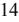

{16}------------------------------------------------

The Federal Reserve Board has issued a policy statement regarding the payment of dividends by bank holding companies. In general, the Federal Reserve Board's policies provide that dividends should be paid only out of current earnings and only if the prospective rate of earnings retention by the bank holding company appears consistent with the organization's capital needs, asset quality and overall financial condition. The Federal Reserve Board's policies also require that a bank holding company serve as a source of financial strength to its subsidiary banks by using available resources to provide capital funds during periods of financial stress or adversity and by maintaining the financial flexibility and capital-raising capacity to obtain additional resources for assisting its subsidiary banks where necessary. The Dodd-Frank Act codified the source of strength policy. Under the prompt corrective action laws, the ability of a bank holding company to pay dividends may be restricted if a subsidiary bank becomes undercapitalized. These regulatory policies could affect the ability of the Company to pay dividends or otherwise engage in capital distributions.

The Company's status as a registered bank holding company under the Bank Holding Company Act will not exempt it from certain federal and state laws and regulations applicable to corporations generally, including, without limitation, certain provisions of the federal securities laws.

*New Jersey Regulation.* Under the New Jersey Banking Act, a company owning or controlling a bank is regulated as a bank holding company and must file certain reports with the Commissioner and is subject to examination by the Commissioner. Under the New Jersey Banking Act, as well as Federal law, no person may acquire control of the Company or the Bank without first obtaining approval of such acquisition of control from the Federal Reserve Board and the Commissioner.

#### **Bank Regulation**

As a New Jersey-chartered commercial bank, the Bank is subject to the regulation, supervision, and examination of the Commissioner. As a state-chartered bank, the Bank is subject to the regulation, supervision, and examination of the FDIC as its primary federal regulator. The regulations of the FDIC and the Commissioner impact virtually all of our activities, including the minimum level of capital we must maintain, our ability to pay dividends, our ability to expand through new branches or acquisitions, and various other matters.

*Capital Requirements.* Federal regulations require FDIC-insured depository institutions to meet several minimum capital standards: a common equity Tier 1 capital to risk-based assets ratio of 4.5 percent, a Tier 1 capital to risk-based assets ratio of 6.0 percent, a total capital to risk-based assets of 8.0 percent, and a 4.0 percent Tier l capital to total assets leverage ratio.

In addition to establishing the minimum regulatory capital requirements, the regulations limit capital distributions and certain discretionary bonus payments to management if the institution does not hold a "capital conservation buffer" consisting of 2.5 percent of common equity Tier 1 capital to risk-weighted asset above the amount necessary to meet its minimum risk-based capital requirements.

On September 17, 2019, the FDIC passed a final rule providing qualifying community banking organizations the ability to opt-in to a new community bank leverage ratio ("CBLR") framework, (tier 1 capital to average consolidated assets) at 9.0 percent for institutions under \$10.0 billion in assets that such institutions may elect to utilize in lieu of the general applicable risk-based capital requirements under Basel III. Such institutions that meet the CBLR and certain other qualifying criteria will automatically be deemed to be well-capitalized. The Bank decided to opt-in to the new CBLR, effective for the quarter ended March 31, 2020. Pursuant to the CARES Act, the federal banking regulators in April, 2020 issued interim final rules to set the CBLR at 8.0 percent beginning in the second quarter of 2020 through the end of 2020. Beginning in 2021, the CBLR increased to 8.5 percent for the calendar year. As of January 1, 2022, the CBLR requirement returned to 9.0 percent.

*Standards for Safety and Soundness.* As required by statute, the federal banking agencies adopted final regulations and Interagency Guidelines Establishing Standards for Safety and Soundness to implement safety and soundness standards. The guidelines set forth the safety and soundness standards that the federal banking agencies use to identify and address problems at insured depository institutions before capital becomes impaired. The guidelines address internal controls and information systems, internal audit system, credit underwriting, loan documentation, interest rate exposure, asset growth, asset quality, earnings, compensation, fees and benefits and, more recently, safeguarding customer information. If the appropriate federal banking agency determines that an institution fails to meet any standard prescribed by the guidelines, the agency may require the institution to submit to the agency an acceptable plan to achieve compliance with the standard.

*Business and Investment Activities.* Under federal law, all state-chartered FDIC-insured banks have been limited in their activities as principal and in their equity investments to the type and the amount authorized for national banks, notwithstanding state law. Federal law permits exceptions to these limitations. For example, certain state-chartered banks may, with FDIC approval, continue to exercise state authority to invest in common or preferred stocks listed on a national securities exchange and in the shares of an investment company registered under the Investment Company Act of 1940, as amended. The maximum permissible investment is the lesser of 100.0 percent of Tier 1 capital or the maximum amount permitted by New Jersey law.

The FDIC is also authorized to permit state banks to engage in state-authorized activities or investments not permissible for national banks (other than non-subsidiary equity investments) if they meet all applicable capital requirements and it is determined that such activities or investments do not pose a significant risk to the FDIC insurance fund. The FDIC has adopted regulations governing the procedures for institutions seeking approval to engage in such activities or investments. The Gramm-Leach-Bliley Act of 1999 specified that a state bank may control a subsidiary that engages in activities as principal that would only be permitted for a national bank to conduct in a "financial subsidiary," if a bank meets specified conditions and deducts its investment in the subsidiary for regulatory capital purposes.

*Prompt Corrective Regulatory Action.* Federal law requires, among other things, that federal bank regulatory authorities take "prompt corrective action" with respect to banks that do not meet minimum capital requirements. For these purposes, the law establishes five capital categories: well-capitalized, adequately-capitalized, undercapitalized, significantly undercapitalized, and critically undercapitalized.

Under FDIC regulations, an institution is deemed to be "well-capitalized" if it has a total risk-based capital ratio of 10.0 percent or greater, a Tier 1 risk-based capital ratio of 8.0 percent or greater, a leverage ratio of 5.0 percent or greater, and a common equity Tier 1 ratio of 6.5 percent or greater. An institution is "adequately-capitalized" if it has a total risk-based capital ratio of 8.0 percent or greater, a Tier 1 risk-based capital ratio of 6.0 percent or greater, a leverage ratio of 4.0 percent or greater and a common equity Tier 1 ratio of 4.5 percent or greater. An institution is "undercapitalized" if it has a total risk-based capital ratio of less than 8.0 percent, a Tier 1 risk-based capital ratio of less than 6.0 percent, a leverage ratio of less than 4.0 percent or a common equity Tier 1 ratio of less than 4.5 percent. An institution is deemed to be "significantly undercapitalized" if it has a total risk-based capital ratio of less than 6.0 percent, a Tier 1 risk-based capital ratio of less than 4.0 percent, a leverage ratio of less than 3.0 percent or a common equity Tier 1 ratio of less than 3.0 percent. An institution is considered to be "critically undercapitalized" if it has a ratio of tangible equity (as defined in the regulations) to total assets that is equal to or less than 2.0 percent.

As noted above, the Regulatory Relief Act has eliminated the Basel III requirements for banks with less than \$10.0 billion in assets who elect to follow the CBLR. The FDIC's rule provides that the bank will be well-capitalized, with a community bank leverage ratio of 9.0 percent or greater. A banking organization that has a leverage ratio that is greater than 8.0 percent and equal to or less than 9.0 percent is allowed a two-quarter grace period after which it must either (i) again meet all qualifying criteria or (ii) apply and report the generally applicable rule. During this two-quarter period, a banking organization that is an insured depository institution and that has

{17}------------------------------------------------

a leverage ratio that is greater than 8.0 percent would be considered to have met the well-capitalized capital ratio requirements for prompt corrective action purposes. An electing banking organization with a leverage ratio of 8.0 percent or less is not eligible for the grace period and must comply with the generally applicable rule, i.e. for the quarter in which the banking organization reports a leverage ratio of 8.0 percent or less. An electing banking organization experiencing or anticipating such an event would be expected to notify its primary federal supervisory agency, which would respond as appropriate to the circumstances of the banking organization. As noted above, pursuant to the CARES Act, federal banking regulators set the CBLR at 8.0 percent beginning in the second quarter of 2020 through the end of 2020. Beginning in 2021, the CBLR increased to 8.5 percent for the calendar year. As of January 1, 2022, the CBLR requirement will return to 9.0 percent.

"Undercapitalized" banks must adhere to growth, capital distribution (including dividend) and other limitations and are required to submit a capital restoration plan. A bank's compliance with such a plan must be guaranteed by any company that controls the undercapitalized institution in an amount equal to the lesser of 5.0 percent of the institution's total assets when deemed undercapitalized or the amount necessary to achieve the status of adequately capitalized. If an "undercapitalized" bank fails to submit an acceptable plan, it is treated as if it is "significantly undercapitalized." "Significantly undercapitalized" banks must comply with one or more of a number of additional measures, including, but not limited to, a required sale of sufficient voting stock to become adequately capitalized, a requirement to reduce total assets, cessation of taking deposits from correspondent banks, the dismissal of directors or officers, restrictions on interest rates paid on deposits, compensation of executive officers, and capital distributions by the parent holding company. "Critically undercapitalized" institutions are subject to additional measures including, subject to a narrow exception, the appointment of a receiver or conservator within 270 days after it obtains such status.

*Enforcement.* The FDIC has extensive enforcement authority over insured state banks, including the Bank. That enforcement authority includes, among other things, the ability to assess civil money penalties, issue cease and desist orders, and remove directors and officers. In general, enforcement actions may be initiated in response to violations of laws and regulations and unsafe or unsound practices. The FDIC also has authority under federal law to appoint a conservator or receiver for an insured bank under certain circumstances. The FDIC is required, with certain exceptions, to appoint a receiver or conservator for an insured state non-member bank if that bank was "critically undercapitalized" on average during the calendar quarter beginning 270 days after the date on which the institution became "critically undercapitalized."

*Federal Insurance of Deposit Accounts.* Our deposits are insured by the FDIC in the maximum amount permitted of \$250,000 per depositor.

The Bank pays assessments to the FDIC to support its Deposit Insurance Fund ("DIF"). The FDIC has adopted a risk-based assessment system whereby FDIC-insured institutions pay insurance premiums at rates based on their risk classification. For institutions like the Bank that are not considered large and highly complex banking organizations, assessments are now based on examination ratings and financial ratios. The total base assessment rates currently range from 1.5 basis points to 30 basis points. At least semi-annually, the FDIC updates its loss and income projections for the DIF and, if needed, increases or decreases the assessment rates, following notice and comment on proposed rulemaking. The assessment base against which an FDIC-insured institution's deposit insurance premiums paid to the DIF has been calculated since effectiveness of the Dodd-Frank Act based on its average consolidated total assets less its average tangible equity.

The FDIC has authority to increase insurance assessments. Any significant increases would have an adverse effect on the operating expenses and results of operations of the Bank. Management cannot predict what assessment rates will be in the future.

Insurance of deposits may be terminated by the FDIC upon a finding that an institution has engaged in unsafe or unsound practices, is in an unsafe or unsound condition to continue operations, or has violated any applicable law, regulation, rule, order, or condition imposed by the FDIC. We do not currently know of any practice, condition or violation that may lead to termination of our deposit insurance.

*Community Reinvestment Act*. Under the Community Reinvestment Act ("CRA"), a bank has a continuing and affirmative obligation, consistent with its safe and sound operation, to help meet the credit needs of its entire community, including low-and-moderate income neighborhoods. The CRA does not establish specific lending requirements or programs for financial institutions, nor does it limit an institution's discretion to develop the types of products and services that it believes are best suited to its particular community. The CRA does require the FDIC, in connection with its examination of a bank, to assess the institution's record of meeting the credit needs of its community and to take such record into account in its evaluation of certain applications by such institution, including applications to establish or acquire branches and merger with other depository institutions. The CRA requires the FDIC to provide a written evaluation of an institution's CRA performance utilizing a four-tiered descriptive rating system. BCB Community Bank's latest FDIC CRA rating, dated September 20, 2021 was "satisfactory." The federal banking regulators have proposed extensive changes to the regulations under the CRA, but no final rules have been yet adopted. We have not yet examined the proposed changes, but we do not believe that they will materially affect the operation of the Bank if they are adopted.

*Cyber-security.* Federal regulators have issued two related statements regarding cyber-security. One statement indicates that financial institutions should design multiple layers of security controls to establish lines of defense and ensure their risk management processes also address the risk posed by compromised client credentials, including security measures to reliably authenticate clients accessing internet-based services of the financial institution. The other statement indicates that a financial institution's management is expected to maintain sufficient business continuity planning processes to ensure the rapid recovery, resumption, and maintenance of the institution's operations after a cyber-attack involving destructive malware. A financial institution is also expected to develop appropriate processes to enable recovery of data and business operations and address rebuilding network capabilities and restoring data if the institution or its critical service providers fall victim to this type of cyber-attack. If we fail to observe the regulatory guidance, we could be subject to various regulatory sanctions, including financial penalties.

In the ordinary course of business, we rely on electronic communications and information systems to conduct our operations and to store sensitive data. We employ a variety of preventative and detective controls and tools to monitor, block, and provide alerts regarding suspicious activity and to report on any suspected advanced persistent threats. We also offset cyber risk through internal training, testing of our employees, and we procure insurance to provide assistance on significant incidents and to offset potential liability.

We have not experienced a significant compromise, significant data loss, or any material financial losses related to cyber-security attacks. Risks and exposures related to cyber-security attacks are expected to remain high for the foreseeable future due to the rapidly evolving nature and sophistication of these threats, as well as due to the expanding use of third-party service providers, internet banking, mobile banking, and other technology-based products and services by us and our clients.

#### **Transactions with Affiliates**

Transactions between banks and their related parties or affiliates are limited by Sections 23A and 23B of the Federal Reserve Act. An affiliate of a bank is any company or entity that controls, is controlled by, or is under common control with the bank. In a holding company context, the parent bank holding company and any companies which are controlled by such parent holding company are affiliates of the bank. Generally, Sections 23A and 23B of the Federal Reserve Act and Regulation W (i) limit the extent to which the bank or its subsidiaries may engage in "covered transactions" with any one affiliate to an amount equal to 10.0 percent of such institution's capital stock and surplus, and contain an aggregate limit on all such transactions with all affiliates to an amount equal to 20.0 percent of such institution's capital stock and surplus and (ii) require that all such transactions be on terms substantially the same, or at least as favorable, to the institution or subsidiary as those provided to non

{18}------------------------------------------------

affiliates. The term "covered transaction" includes the making of loans, purchasing of assets, issuance of a guarantee, and other similar transactions. In addition, loans or other extensions of credit by the financial institution to the affiliate are required to be collateralized in accordance with the requirements set forth in Section 23A of the Federal Reserve Act. The Sarbanes-Oxley Act of 2002 generally prohibits loans by a company to its executive officers and directors. However, the law contains a specific exception for loans by a depository institution to its executive officers and directors in compliance with federal banking laws assuming such loans are also permitted under the law of the institution's chartering state. Under such laws, the Bank's authority to extend credit to executive officers, directors and 10.0 percent shareholders ("insiders"), as well as entities such person's control, is limited. The law limits both the individual and aggregate amount of loans the Bank may make to insiders based, in part, on the Bank's capital position and requires certain board approval procedures to be followed. Such loans are required to be made on terms substantially the same as those offered to unaffiliated individuals and not involve more than the normal risk of repayment. There is an exception for loans made pursuant to a benefit or compensation program that is widely available to all employees of the institution and does not give preference to insiders over other employees. Loans to executive officers are further limited by specific categories.

#### **Dividends**

The primary source of cash to pay dividends to the Parent Company's shareholders and to meet the Parent Company's obligations is dividends paid to the Primary Company by the Bank. The Bank may pay dividends to the Parent Company as declared from time to time by the Board of Directors out of funds legally available, subject to certain restrictions. Under the New Jersey Banking Act of 1948, as amended, the Bank may not pay a cash dividend unless, following the payment, the Bank's capital stock will be unimpaired and the Bank will have a surplus of no less than 50.0 percent of the Bank capital stock or, if not, the payment of the dividend will not reduce the surplus. In addition, the Bank cannot pay dividends in amounts that would reduce the Bank's capital below regulatory imposed minimums.

See the discussion above under "Bank Holding Company Regulation" for a description of the Federal Reserve Board's policy on bank holding companies paying cash dividends. Under New Jersey law, corporations like the Parent Company may not pay dividends when insolvent.

### **Federal Securities Laws**

The Company's common stock is registered with the SEC under the Securities Exchange Act of 1934, as amended ("Exchange Act"). The Company is subject to the information, proxy solicitation, insider trading restrictions, and other requirements under the Securities Exchange Act of 1934. We prepare this Annual Report on Form 10-K, our proxy materials and our other periodic and current reports as a "smaller reporting company" consistent with the rules of the Securities and Exchange Commission.

Under the Exchange Act, the Company is required to conduct a comprehensive review and assessment of the adequacy of our existing financial systems and controls. For the year ended December 31, 2022, the Company's auditors are required to audit our internal control over financial reporting.

#### **AVAILABILITY OF ANNUAL REPORT**

Our Annual Report is available on our website, www.bcb.bank. We will also provide our Annual Report on Form 10-K free of charge to shareholders who request a copy in writing from the Corporate Secretary at 104-110 Avenue C, Bayonne, New Jersey 07002.

#### **ITEM 1A. RISK FACTORS**

Our business and results of operations are subject to numerous risks and uncertainties, many of which are beyond our control. The material risks and uncertainties that management believes affect the Company are described below. Additional risks and uncertainties that management is not aware of or that management currently deems immaterial may also impair the Company's business operations. This report is qualified in its entirety by these risk factors. If any of the following risks actually occur, our business, financial condition, and results of operations could be materially and adversely affected.

Our risk factors can be broadly summarized by the following categories:

- Credit and Interest Rate Risks;
- Risks Related to the Company's Common Stock;
- Economic Risks;
- Operational Risks;
- Risks Related to the Regulation of our Industry; and,
- Strategic Risks.

#### **CREDIT AND INTEREST RATE RISKS**

#### **Our loan portfolio consists of a high percentage of loans secured by commercial real estate and multi-family real estate. These loans are riskier than loans secured by one-to-four family properties.**

At December 31, 2022, \$2.345 billion, or 76.08 percent, of our loan portfolio consisted of commercial and multi-family real estate loans. We intend to continue to emphasize the origination of these types of loans. These loans generally expose a lender to greater risk of nonpayment and loss than one-to-four family residential mortgage loans because repayment of the loans often depends on the successful operation and income stream of the collateral that is pledged. Such loans typically involve larger loan balances to single borrowers or groups of related borrowers compared to one-tofour family residential mortgage loans. Consequently, an adverse development with respect to one loan or one credit relationship can expose us to a significantly greater risk of loss compared to an adverse development with respect to a one-to-four family residential mortgage loan.

Commercial loans and commercial real estate loans generally carry larger balances and can involve a greater degree of financial and credit risk than other loans. As a result, banking regulators continue to give greater scrutiny to lenders with a high concentration of commercial real estate loans in their portfolios, such as us, and such lenders are expected to implement stricter underwriting standards, internal controls, risk management policies, and portfolio stress testing, as well as higher capital levels and loss allowances. The increased financial and credit risk associated with these types of loans are a result of several factors, including the concentration of principal in a limited number of loans and borrowers, the size of loan balances, the effects of general economic conditions on income-producing properties, and the increased difficulty of evaluating and monitoring these types of loans. If we cannot effectively manage the risk associated with our high concentration of commercial real estate loans, our financial condition and results of operations may be adversely affected.

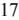

{19}------------------------------------------------

#### **If our allowance for loan losses is not sufficient to cover actual loan losses, our earnings could decrease.**

Our loan customers may not repay their loans according to the terms of their loans, and the collateral securing the payment of their loans may be insufficient to assure repayment. We may experience significant credit losses, which could have a material adverse effect on our operating results. We make various assumptions and judgments about the collectability of our loan portfolio, including the creditworthiness of our borrowers and the value of the real estate and other assets serving as collateral for the repayment of many of our loans. In determining the amount of the allowance for loan losses, we review our loans and our loss and delinquency experience, and we evaluate economic conditions. If our assumptions prove to be incorrect, our allowance for loan losses may not cover losses in our loan portfolio at the date of the financial statements. Material additions to our allowance would materially decrease our net income. At December 31, 2022, our allowance for loan losses totaled \$32.4 million, representing 1.05 percent of total loans or 633.6 percent of non-performing loans.

While we have only been operating for 22 years, we have experienced significant growth in our loan portfolio, particularly in loans secured by commercial real estate. Although we believe we have underwriting standards to manage normal lending risks, it is difficult to assess the future performance of our loan portfolio due to the relatively recent origination of many of these loans. We can give you no assurance that our non-performing loans will not increase or that our non-performing or delinquent loans will not adversely affect our future performance.

In addition, federal and state regulators periodically review our allowance for loan losses and may require us to increase our allowance for loan losses or recognize further loan charge-offs. Any increase in our allowance for loan losses or loan charge-offs as required by these regulatory agencies could have a material adverse effect on our results of operations and financial condition.

#### **The asset quality of our loan portfolio may deteriorate if the economy falters, resulting in a portion of our loans failing to perform in accordance with their terms. Under such circumstances our profitability will be adversely affected.**

At December 31, 2022, we had \$17.8 million in classified loans of which none were classified as doubtful or loss. We also had \$18.9 million of loans that were classified as special mention. In addition, at that date we had \$5.1 million in non-accruing loans, or 0.17 percent of total loans. We have adhered to stringent underwriting standards in the origination of our loans, but there can be no assurance that loans that we originated will not experience asset quality deterioration as a result of a downturn in the local or broader economy. Should our local or regional economy weaken, our asset quality may deteriorate resulting in losses to the Company.

#### *The replacement of the LIBOR as a financial benchmark presents risks to the financial instruments issued or held by the Company.*

The United Kingdom Financial Conduct Authority, which regulates the process for establishing LIBOR, announced that LIBOR will cease after June 30, 2023. The federal banking agencies required banks to cease entering into any new contract that uses LIBOR as a reference rate by no later than December 31, 2021. In addition, banks were encouraged to identify LIBOR-referencing contracts that extend beyond June 30, 2023 and implement plans to identify and address insufficient contingency provisions in those contracts. Further, on March 15, 2022, Congress passed the Adjustable Interest Rate Act (the "AIR Act") to address references to LIBOR in contracts that (i) are governed by U.S. law, (ii) will not mature before June 30, 2023, and (iii) lack fallback provisions providing for a clearly defined and practicable replacement for LIBOR. On December 16, 2022, the Federal Reserve Board adopted a final rule implementing the AIR Act that replaces references to LIBOR in financial contracts addressed by the AIR Act with certain Federal Reserve Board -selected benchmark rates based on the Secured Overnight Finance Rate (SOFR).

The market transition away from LIBOR could have a range of effects on the Company's business, financial condition, and results of operations and the Company is actively reviewing available alternatives to address these changes in the most effective manner.

#### **Changes in interest rates could hurt our profits.**

Our profitability, like most financial institutions, depends to a large extent upon our net interest income, which is the difference between interest income on interest-earning assets, such as loans and securities, and interest expense on interest-bearing liabilities, such as deposits and borrowed funds. Accordingly, our results of operations depend largely on movements in market interest rates and our ability to manage our interest-rate-sensitive assets and liabilities in response to these movements. Factors such as inflation, recession, and instability in financial markets, among other factors beyond our control, may affect interest rates.

If interest rates rise, and if rates on our deposits and variable rate borrowings reprice upwards faster than the rates on our long-term loans and investments, we could experience compression of our interest rate spread, which would have a negative effect on our profitability. Conversely, decreases in interest rates can result in increased prepayments of loans and mortgage-related securities, as borrowers refinance to reduce their borrowing costs. Under these circumstances, we are subject to reinvestment risk, as we may have to redeploy such loan or securities proceeds into lower-yielding assets, which might also negatively impact our income.

Any substantial, unexpected, prolonged change in market interest rates could have a material adverse effect on our financial condition, liquidity and results of operations. Further, a prolonged period of exceptionally low market interest rates limits our ability to lower our interest expense, while the average yield on our interest-earning assets may continue to decrease as our loans reprice or are originated at these low market rates. Accordingly, our net interest income may decrease, which may have an adverse effect on our profitability. Also, our interest rate risk-modeling techniques and assumptions likely may not fully predict or capture the impact of actual interest rate changes on our balance sheet or projected operating results.

While we pursue an asset/liability strategy designed to mitigate our risk from changes in interest rates, changes in interest rates can still have a material adverse effect on our financial condition and results of operations. Changes in the level of interest rates also may negatively affect our ability to originate real estate loans, the value of our assets and our ability to realize gains from the sale of our assets, all of which ultimately affect our earnings. For further discussion of how changes in interest rates could impact us, see "Item 7A. – Quantitative and Qualitative Disclosure About Market Risk."

#### **The FASB has issued an accounting standard update that will result in a significant change in how we recognize credit losses and may have a material impact on our financial condition or results of operations.**

In June 2016, the Financial Accounting Standards Board ("FASB") issued an accounting standard update, "Financial Instruments-Credit Losses (Topic 326), Measurement of Credit Losses on Financial Instruments," which replaces the current "incurred loss" model for recognizing credit losses with an "expected loss" model referred to as the Current Expected Credit Loss ("CECL") model. Under the CECL model, banks will be required to present certain financial assets carried at amortized cost, such as loans held for investment and held-to-maturity debt securities, at the net amount expected to be collected. The measurement of expected credit losses is to be based on information about past events, including historical experience, current conditions, and reasonable and supportable forecasts that affect the collectability of the reported amount. This measurement will take place at the time the financial asset is first added to the balance sheet and periodically thereafter. This differs significantly

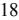

{20}------------------------------------------------

from the "incurred loss" model required under current generally accepted accounting principles ("GAAP"), which delays recognition until it is probable a loss has been incurred. Moreover, the CECL model may create more volatility in the level of the allowance for loan losses as the model is sensitive to the economic forecast and other key assumptions including but not limited to the estimation of probability of default rates, loss given default rates, and prepayment rates.

The Company will adopt the Current Expected Credit Loss methodology during the first quarter of 2023. The Company has engaged third-party vendors to assist in the development of a CECL model and to perform validation of our CECL model. The Company does not expect the adoption of CECL to have a material impact on regulatory capital and capital ratios.

#### **RISKS RELATED TO THE COMPANY'S COMMON STOCK**

#### **Our dividend policy may change without notice, and our future ability to pay dividends is also subject to regulatory restrictions.**

Holders of our common stock are entitled to receive only such cash dividends as our board of directors may declare out of funds legally available for the payment of dividends. We are a holding company that conducts substantially all of our operations through the Bank. As a result, our ability to make dividend payments on our common stock will depend primarily upon the receipt of dividends and other distributions from the Bank. Under New Jersey banking law, the Bank may pay a dividend to the Company provided that following the payment of the dividend the capital stock of the Bank will be unimpaired and the Bank will have a surplus of not less than 50 percent of its capital stock, or if not, the payment of such dividend will not reduce the surplus of the Bank.

Under New Jersey law, the Company may not make a distribution, if, after giving effect to the distribution, it would be unable to pay its debts as they become due in the usual course of business or if its total assets would be less than its liabilities. Our current intention is to continue to pay a quarterly cash dividend of \$0.16 per share. However, any declaration and payment of dividends on common stock will substantially depend upon our earnings and financial condition, liquidity and capital requirements, regulatory and state law restrictions, general economic conditions and regulatory climate and other factors deemed relevant by our board of directors. Furthermore, consistent with our strategic plans, growth initiatives, capital availability, projected liquidity needs, and other factors, we have made, and will continue to make, capital management decisions and policies that could adversely impact the amount of dividends, if any, paid to our stockholders.

#### **Our common stock is not heavily traded, and the stock price may fluctuate significantly.**

Our common stock is traded on the NASDAQ under the symbol "BCBP." Certain brokers currently make a market in the common stock, but such transactions are infrequent and the volume of shares traded is relatively small. Management cannot predict whether these or other brokers will continue to make a market in our common stock. Prices on stock that is not heavily traded, such as our common stock, can be more volatile than heavily traded stock. Factors such as our financial results, the introduction of new products and services by us or our competitors, publicity regarding the banking industry, inflation, changing interest rates, and various other factors affecting the banking industry may have a significant impact on the market price of the shares of the common stock. Management cannot predict the extent to which an active public market for our common stock will develop or be sustained in the future. Accordingly, stockholders may not be able to sell their shares of our common stock at the volumes, prices, or times that they desire.

#### **ECONOMIC RISKS**

#### **Inflation can have an adverse impact on the Company's business and its customers.**

Inflation risk is the risk that the value of assets or income from investments will be worth less in the future as inflation decreases the value of money. Over the past year, in response to a pronounced rise in inflation, the Federal Reserve has raised certain benchmark interest rates to combat inflation. As discussed above under CREDIT AND INTEREST RATE RISKS— Changes in interest rates could hurt our profits, as inflation increases and market interest rates rise, the value of the Company's investment securities, particularly those with longer maturities, would decrease, although this effect can be less pronounced for floating rate instruments. In addition, inflation generally increases the cost of goods and services the Company uses in its business operations, such as electricity and other utilities, and also generally increases employee wages, any of which can increase the Company's non-interest expenses. Furthermore, the Company's customers are also affected by inflation and the rising costs of goods and services used in their households and businesses, which could have a negative impact on their ability to repay their loans with the Company. Sustained higher interest rates by the Federal Reserve Board to tame persistent inflationary price pressures could also push down asset prices and weaken economic activity. A deterioration in economic conditions in the United States and the Company's markets could result in an increase in loan delinquencies and non-performing assets, decreases in loan collateral values and a decrease in demand for the Company's products and services, all of which, in turn, would adversely affect the Company's business, financial condition and results of operations.

#### **Events similar to the COVID-19 pandemic could adversely affect our business activities, financial condition, and results of operations.**

The occurrence of events which adversely affect the global, national and regional economies, like the COVID-19 pandemic, may have a negative impact on our business. Like other financial institutions, our business relies upon the ability and willingness of our customers to transact business with us, including banking, borrowing and other financial transactions. A strong and stable economy at each of the local, federal and global levels is often a critical component of consumer confidence and typically correlates positively with our customers' ability and willingness to transact certain types of business with us. Local and global events outside of our control which disrupt the New Jersey, New York, United States and/or global economy may therefore negatively impact our business and financial condition. A public health crisis such as the COVID-19 pandemic is no exception, and its adverse health and economic effects may adversely impact our business and financial condition.

#### **OPERATIONAL RISKS**

#### **Our deposit services for businesses in the state licensed cannabis industry could expose us to liabilities and regulatory compliance costs.**

In 2014 we implemented specialized deposit services intended for a limited number of state-licensed medical-use cannabis business customers. Medical use cannabis, as well as recreational use businesses are legal in numerous states and the District of Columbia, including our primary markets of New Jersey and New York. However, such businesses are not legal at the federal level and marijuana remains a Schedule I drug under the Controlled Substances Act of 1970. In 2014, the U.S. Department of the Treasury's Financial Crimes Enforcement Network (FinCEN) published guidelines for financial institutions servicing state legal cannabis businesses. We have implemented a comprehensive control framework that includes written policies and procedures related to the onboarding of such businesses and the monitoring and maintenance of such business accounts that comports with the FinCEN guidance. Additionally, our policies call for due diligence review of the cannabis business before the business is on-boarded, including confirmation that the business is properly licensed and maintains the license in good standing in the applicable state. Throughout the relationship, our policies call for continued monitoring of the business, including site visits, to determine if the business continues to meet our requirements,

{21}------------------------------------------------

including maintenance of required licenses and calls for undertaking periodic financial reviews of the business. The Bank's program originally was limited to offering depository products to medical cannabis businesses. Deposit transactions are monitored for compliance with the applicable state medical program rules and other regulations. In 2022, the Bank expanded its cannabis-related business offerings to some limited lending on real estate and deposit services to licensed recreational dispensaries. The Bank may offer additional banking products and services to such customers in the future.

While we believe our policies and procedures allow us to operate in compliance with the FinCEN guidelines, there can be no assurance that compliance with the FinCEN guidelines will protect us from federal prosecution or other regulatory sanctions. Federal prosecutors have significant discretion and there can be no assurance that the federal prosecutors will not choose to strictly enforce the federal laws governing cannabis. Any change in the federal government's enforcement position could potentially subject us to criminal prosecution and other regulatory sanctions. As a general matter, the medical and recreational cannabis business is considered high-risk, thus increasing the risk of a regulatory action against our BSA/AML program that has adverse consequences, including but not limited to, preventing us from undertaking mergers, acquisitions and other expansion activities.

#### **Adverse events in New Jersey, where our business is generally concentrated, could adversely affect our results and future growth.**

Our business, the location of our branches, and the real estate collateralizing our real estate loans are generally concentrated in New Jersey and the New York metropolitan area. As a result, we are exposed to geographic risks. The occurrence of an economic downturn in New Jersey or the New York metropolitan area, or adverse changes in laws or regulations in New Jersey or the New York metropolitan area, could impact the credit quality of our assets, the business of our customers and our ability to expand our business.

Our success significantly depends upon the growth in population, income levels, deposits, and housing in our market area. If the communities in which we operate do not grow or if prevailing economic conditions locally, regionally, or nationally are unfavorable, our business may be negatively affected. In addition, the economies of the communities in which we operate are substantially dependent on the growth of the economy in the State of New Jersey and the New York metropolitan area. To the extent that economic conditions in New Jersey are unfavorable or do not continue to grow as projected, the economy in our market area would be adversely affected. Moreover, we cannot give any assurance that we will benefit from any market growth or favorable economic conditions in our market area if they do occur.

In addition, the market value of the real estate securing loans as collateral could be adversely affected by unfavorable changes in market and economic conditions. As of December 31, 2022, approximately 92.0 percent of our total loans were secured by real estate. Adverse developments affecting commerce or real estate values in the local economies in our primary market areas could increase the credit risk associated with our loan portfolio. In addition, a significant percentage of our loans are to individuals and businesses in New Jersey. Our business customers may not have customer bases that are as diverse as businesses serving regional or national markets. Consequently, any decline in the economy of our market area could have an adverse impact on our revenues and financial condition. In particular, we may experience increased loan delinquencies, which could result in a higher provision for loan losses and increased charge-offs. Any sustained period of increased non-payment, delinquencies, foreclosures, or losses caused by adverse market or economic conditions in our market area could adversely affect the value of our assets, revenues, results of operations and financial condition.

#### **We depend primarily on net interest income for our earnings rather than fee income.**

Net interest income is the most significant component of our operating income. We have less reliance on traditional sources of fee income utilized by some community banks, such as fees from sales of insurance, securities, or investment advisory products or services. For the years ended December 31, 2022 and 2021, our net interest income was \$113.9 million and \$97.4 million, respectively. The amount of our net interest income is influenced by the overall interest rate environment, competition, and the amount of our interest-earning assets relative to the amount of our interest-bearing liabilities. In the event that one or more of these factors were to result in a decrease in our net interest income, we do not have significant sources of fee income to make up for decreases in net interest income.

#### **Risks associated with system failures, interruptions, or breaches of security could negatively affect our earnings.**

Information technology systems are critical to our business. We use various technology systems to manage our customer relationships, general ledger, securities investments, deposits, and loans. We have established policies and procedures to prevent or limit the impact of system failures, interruptions, and security breaches (including privacy breaches and cyber-attacks), but such events may still occur or may not be adequately addressed if they do occur. In addition, any compromise of our systems could deter customers from using our products and services. Although we take protective measures, the security of our computer systems, software, and networks may be vulnerable to breaches, unauthorized access, misuse, computer viruses, or other malicious code and cyberattacks that could have an impact on information security.

In addition, we outsource a majority of our data processing to certain third-party providers. If these third-party providers encounter difficulties, or if we have difficulty communicating with them, our ability to adequately process and account for transactions could be affected, and our business operations could be adversely affected. Threats to information security also exist in the processing of customer information through various other vendors and their personnel.

There have been increasing efforts on the part of third parties, including through cyber-attacks, to breach data security at financial institutions or with respect to financial transactions. Cybercrime risks have increased as electronic and mobile banking activities increased as a result of the COVID-19 pandemic, and may increase as a result of the Russia invasion of Ukraine. There have been several recent instances involving financial services and consumer-based companies reporting the unauthorized disclosure of client or customer information or the destruction or theft of corporate data. In addition, because the techniques used to cause such security breaches change frequently and often are not recognized until launched against a target and may originate from lessregulated and remote areas of the world, we may be unable to proactively address these techniques or to implement adequate preventative measures. The ability of our customers to bank remotely, including through online and mobile devices, requires secure transmission of confidential information and increases the risk of data security breaches.

The occurrence of any system failures, interruption, or breach of security could damage our reputation and result in a loss of customers and business, thereby subjecting us to additional regulatory scrutiny, or could expose us to litigation and possible financial liability. Any of these events could have a material adverse effect on our financial condition and results of operations.

#### **The Bank's reliance on brokered and reciprocal deposits could adversely affect its liquidity and operating results.**

Among other sources of funds, the Company, from time to time, relies on brokered deposits to provide funds with which to make loans and provide for other liquidity needs. At December 31, 2022, the Bank had \$335.0 million in brokered certificate deposits and \$35 million in brokered demand deposits. One of the Bank's sources for brokered deposits is the Certificate of Deposit Account Registry Service ("CDARS"). At December 31, 2022, the Bank has \$3.6 million in CDARS reciprocal deposits and \$4.1 million in Insured Cash Sweep or ICS network deposits. These amounts, are reciprocal and are not considered brokered deposits under recent regulatory reform.

{22}------------------------------------------------

Generally, brokered and reciprocal deposits may not be as stable as other types of deposits. In the future, those depositors may not replace their brokered or reciprocal deposits with us as they mature, or we may have to pay a higher rate of interest to keep those deposits, or to replace them with other deposits or other sources of funds. Not being able to maintain or replace those deposits as they mature would adversely affect our liquidity. Paying higher deposit rates to maintain or replace such deposits would adversely affect our net interest margin and operating results.

#### **If deposit levels are not sufficient, it may be more expensive to fund loan originations.**

Our deposits have been our primary funding source. In current market conditions, depositors may choose to redeploy their funds into the stock market or other investment alternatives, regardless of our effort to retain such depositors. If this occurs, it would hamper our ability to grow deposits and could result in a net outflow of deposits. We will continue to focus on deposit growth, which we use to fund loan originations. However, if we are unable to sufficiently increase our deposit balances, we may be required to increase our use of alternative sources of funding, including Federal Home Loan Bank advances, or to increase our deposit rates in order to attract additional deposits, each of which would increase our cost of funds.

#### **We could be adversely affected by failure in our internal controls.**

A failure in our internal controls could have a significant negative impact not only on our earnings, but also on the perception that customers, regulators and investors may have of us. We continue to devote a significant amount of effort, time and resources to continually strengthening our internal controls and ensuring compliance with complex accounting standards and banking regulations.

#### **If we cannot favorably assess the effectiveness of our internal controls over financial reporting or if our independent registered public accounting firm is unable to provide an unqualified attestation report on our internal controls, we may be subject to additional regulatory scrutiny**.

Under the rules of the FDIC and the SEC, Company management is required to prepare a report that contains an assessment by management of the effectiveness of our internal control structure and procedures for financial reporting (including the Call Report that is submitted to the FDIC) as of the end of each fiscal year. Our independent registered public accounting firm is also required to examine, attest to and report on the assessment of our management concerning the effectiveness of our internal control structure and procedures for financial reporting. The rules that must be met for management to assess our internal controls over financial reporting are complex and require significant documentation and testing and possible remediation of internal control weaknesses. The effort to comply with regulatory requirements relating to internal controls will likely cause us to incur increased expenses and will cause a diversion of management's time and other internal resources. We also may encounter problems or delays in completing the implementation of any changes necessary to make a favorable assessment of our internal control over financial reporting. In addition, in connection with the attestation process, we may encounter problems or delays in completing the implementation of any requested improvements or receiving a favorable attestation from our independent registered public accounting firm. If we cannot favorably assess the effectiveness of our internal control over financial reporting, or if our independent registered public accounting firm is unable to provide an unqualified attestation report on our internal controls, investor confidence and the price of our common stock could be adversely affected and we may be subject to additional regulatory scrutiny.

#### **The increasing use of social media platforms presents new risks and challenges and the inability or failure to recognize, respond to, and effectively manage the accelerated impact of social media could materially adversely impact the Bank's business.**

There has been a marked increase in the use of social media platforms, including weblogs (blogs), social media websites, and other forms of Internet-based communications which allow individuals' access to a broad audience of consumers and other interested persons. Social media practices in the banking industry are evolving, which creates uncertainty and risk of noncompliance with regulations applicable to the Bank's business. Consumers value readily available information concerning businesses and their goods and services and often act on such information without further investigation and without regard to its accuracy. Many social media platforms immediately publish the content their subscribers and participants' post, often without filters or checks on accuracy of the content posted. Information posted on such platforms at any time may be adverse to the Bank's interests and/or may be inaccurate. The dissemination of information online could harm the Bank's business, prospects, financial condition, and results of operations, regardless of the information's accuracy. The harm may be immediate without affording the Bank an opportunity for redress or correction.

Other risks associated with the use of social media include improper disclosure of proprietary information, negative comments about the Bank's business, exposure of personally identifiable information, fraud, out-of-date information, and improper use by employees, directors and customers. The inappropriate use of social media by the Bank's customers, directors or employees could result in negative consequences such as remediation costs including training for employees, additional regulatory scrutiny and possible regulatory penalties, litigation, or negative publicity that could damage the Bank's reputation adversely affecting customer or investor confidence.

#### **Market conditions and economic cyclicality may adversely affect our industry.**

Market developments, including unemployment, price levels, stock and bond volatility, and other changes due to world events, affect consumer confidence levels, economic activity and inflation. Changes in payment behaviors and payment rates may increase in delinquencies and default rates, which could affect our earnings and credit quality.

#### **RISKS RELATED TO THE REGULATION OF OUR INDUSTRY**

#### **We are subject to stringent capital requirements, which may adversely impact our return on equity or constrain us from paying dividends or repurchasing shares.**

Federal regulations require FDIC-insured depository institutions to meet several minimum capital standards: a common equity Tier 1 capital to risk-based assets ratio of 4.5 percent, a Tier 1 capital to risk-based assets ratio of 6.0 percent, a total capital to risk-based assets of 8.0 percent, and a 4.0 percent Tier l capital to total assets leverage ratio. In addition to establishing the minimum regulatory capital requirements, the regulations limit capital distributions and certain discretionary bonus payments to management if the institution does not hold a "capital conservation buffer" consisting of 2.5 percent of common equity Tier 1 capital to risk-weighted asset above the amount necessary to meet its minimum risk-based capital requirements.

In 2019, the FDIC passed a final rule providing qualifying community banking organizations the ability to opt-in to a new community bank leverage ratio ("CBLR") framework, (tier 1 capital to average consolidated assets) at 9.0 percent for institutions under \$10.0 billion in assets that such institutions may elect to utilize in lieu of the general applicable risk-based capital requirements under Basel III. Such institutions that meet the CBLR and certain other qualifying criteria will automatically be deemed to be well-capitalized. The Bank decided to opt-in to the new CBLR, effective for the quarter ended March 31, 2020. Pursuant to the CARES

{23}------------------------------------------------

Act, the federal banking regulators set the CBLR at 8.0 percent beginning in the second quarter of 2020 through the end of 2020. Beginning in 2021, the CBLR increased to 8.5 percent for the calendar year. At January 1, 2022, the CBLR requirement returned to 9.0 percent. Pursuant to the "Regulatory Relief Act", the Federal Reserve Board raised the asset threshold under its Small Bank Holding Company Policy Statement from \$1.0 billion to \$3.0 billion for bank or savings and loan holding companies are permitted to have debt levels higher than would be permitted for larger holding companies, provided that such companies meet certain other conditions such as not engaging in significant nonbanking activities. The Company no longer meets the definition of a Small Bank Holding Company and the qualifications set forth in the "Regulatory Relief Act" at December 31, 2022 and will be subject to the larger company capital requirements at March 31, 2023.

The application of more stringent capital requirements likely will result in lower returns on equity and could require raising additional capital in the future or result in regulatory actions if we are unable to comply with such requirements.

#### **We operate in a highly regulated environment, and we may be adversely affected by changes in federal, state and local laws and regulations.**

We are subject to extensive regulation, supervision, and examination by federal and state banking authorities. Any change in applicable regulations or federal, state or local legislation could have a substantial impact on us and our operations. Additional legislation and regulations that could significantly affect our powers, authority, and operations may be enacted or adopted in the future, which could have a material adverse effect on our financial condition and results of operations. Further, regulators have significant discretion and authority to prevent or remedy unsafe or unsound practices or violations of laws by banks and bank holding companies in the performance of their supervisory and enforcement duties. The exercise of regulatory authority may have a negative impact on our results of operations and financial condition.

The USA PATRIOT and Bank Secrecy Acts require financial institutions to develop programs to prevent financial institutions from being used for money laundering and terrorist activities. If such activities are detected, financial institutions are obligated to file suspicious activity reports with the U.S. Treasury's Office of Financial Crimes Enforcement Network. These rules require financial institutions to establish procedures for identifying and verifying the identity of customers seeking to open new financial accounts. Failure to comply with these regulations could result in fines or sanctions, including restrictions on conducting acquisitions or establishing new branches. During the last few years, several banking institutions have received large fines for non-compliance with these laws and regulations. While we have developed policies and procedures designed to assist in compliance with these laws and regulations, these policies and procedures may not be effective in preventing violations of these laws and regulations. Because we operate our business in the highly urbanized greater Newark/New York City metropolitan area, we may be at greater risk of scrutiny by government regulators for compliance with these laws.

#### **The level of our commercial real estate loan portfolio subjects us to additional regulatory scrutiny.**

The FDIC and the other federal bank regulatory agencies have promulgated joint guidance on sound risk management practices for financial institutions with concentrations in commercial real estate lending. Under the guidance, a financial institution that, like us, is actively involved in commercial real estate lending should perform a risk assessment to identify concentrations. A financial institution may have a concentration in commercial real estate lending if, among other factors, (i) total reported loans for construction, land acquisition and development, and other land represent 100 percent or more of total capital, or (ii) total reported loans secured by multi-family and non-owner occupied, non-farm, non-residential properties, loans for construction, land acquisition and development and other land, and loans otherwise sensitive to the general commercial real estate market, including loans to commercial real estate related entities, represent 300 percent or more of total capital. Based on these factors, we have a concentration in loans of the type described in (ii) above of 487.3 percent of our risk-based capital at December 31, 2022. The purpose of the guidance is to assist banks in developing risk management practices and capital levels commensurate with the level and nature of real estate concentrations. The guidance states that management should employ heightened risk management practices including board and management oversight and strategic planning, development of underwriting standards, risk assessment and monitoring through market analysis and stress testing. Our bank regulators could require us to implement additional policies and procedures consistent with their interpretation of the guidance that may result in additional costs to us or that may result in a curtailment of our commercial real estate and multi-family lending and/or the requirement that we maintain higher levels of regulatory capital, either of which would adversely affect our loan originations and profitability.

{24}------------------------------------------------

#### **STRATEGIC RISKS**

#### **Our strategy of pursuing acquisitions exposes us to financial, execution and operational risks that could have a material adverse effect on our business, financial condition, results of operations and growth prospects.**

We intend to continue pursuing a strategy that includes acquisitions. An acquisition strategy involves significant risks, including the following:

- finding suitable candidates for acquisition;
- attracting funding to support additional growth within acceptable risk tolerances;
- maintaining asset quality;
- retaining the target's customers and key personnel;
- obtaining necessary regulatory approvals;
- conducting adequate due diligence and managing known and unknown risks and uncertainties;
- integrating acquired businesses; and,
- maintaining adequate regulatory capital.

The market for acquisition targets is highly competitive, which may adversely affect our ability to find acquisition candidates that fit our strategy and standards. To the extent that we are unable to find suitable acquisition targets, an important component of our growth strategy may not be realized. Acquisitions will be subject to regulatory approvals, and we may be unable to obtain such approvals. Acquisitions of financial institutions also involve operational risks and uncertainties. Acquired companies may have unknown or contingent liabilities with no available manner of recourse, exposure to unexpected problems such as asset quality, the retention of key employees and customers, and other issues that could negatively affect our business. We may not be able to complete future acquisitions or, if completed, we may not be able to successfully integrate the operations, technology platforms, management, products, or services of the entities that we acquire and to realize our attempts to eliminate redundancies. The integration process may also require significant time and attention from our management that they would otherwise be able to direct toward servicing existing business and developing new business. Acquisitions typically involve the payment of a premium over book and market trading values and, therefore, some dilution of our tangible book value and net income per common share may occur in connection with any future acquisition of a financial institution or service company, and the carrying amount of any goodwill that we acquire may be subject to impairment in future periods. Failure to successfully integrate the entities we acquire into our existing operations may increase our operating costs significantly and adversely affect our business, financial condition, and results of operations.

#### **Strong competition within our market area may limit our growth and profitability.**

Competition is intense within the banking and financial services industry in New Jersey and the New York metropolitan area. In our market area, we compete with commercial banks, savings institutions, mortgage brokerage firms, credit unions, finance companies, mutual funds, insurance companies, and brokerage and investment banking firms operating locally and elsewhere. Many of these competitors have substantially greater resources, higher lending limits and offer services that we do not or cannot provide. This competition makes it more difficult for us to originate new loans and retain and attract new deposits. Price competition for loans may result in originating fewer loans or earning less on our loans. Price competition for deposits may result in a reduction of our deposit base or paying more on our deposits.

#### **The small to mid-sized businesses that we lend to may have fewer resources to weather a downturn in the economy, which may impair a borrower's ability to repay a loan to us that could materially harm our operating results.**

We target our business development and marketing strategy primarily to serve the banking and financial services needs of small to mid-sized businesses. These small to mid-sized businesses frequently have smaller market share than their competition, may be more vulnerable to economic downturns, often need substantial additional capital to expand or compete and may experience significant volatility in operating results. In addition, the success of a small to midsized business often depends on the management talents and efforts of one or two persons or a small group of persons, and the death, disability or resignation of one or more of these persons could have a material adverse impact on the business and its ability to repay a loan. Economic downturns and other events that negatively impact our market areas could cause us to incur substantial credit losses that could negatively affect our results of operations and financial condition.

#### **ITEM 1B. UNRESOLVED STAFF COMMENTS**

None.

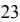

{25}------------------------------------------------

# **ITEM 2. PROPERTIES**

At December 31, 2022, the Bank conducted its business through an executive office, two administrative offices, and 28 branch offices. 13 offices have drive-up facilities. The Bank has 37 automatic teller machines at its branch facilities and three other off-site locations. The following table sets forth information relating to each of the Bank's offices at December 31, 2022. The total net book value of the Bank's premises and equipment at December 31, 2022 was \$10.5 million.

| Location                                                   | Year Office Opened | Net Book Value |  |
|------------------------------------------------------------|--------------------|----------------|--|
|                                                            |                    | (In Thousands) |  |
| Executive Office                                           |                    |                |  |
| 104-110 Avenue C, Bayonne, New Jersey                      | 2003 \$         | 2,249          |  |
| Administrative and Other Offices                           |                    |                |  |
| 591-597 Avenue C, Bayonne, New Jersey                      | 2010               | 51 (1)         |  |
| 27 West 18th Street, Bayonne, New Jersey                   | 2014               | 197 (1)        |  |
| Branch Offices                                             |                    |                |  |
| 860 Broadway, Bayonne, New Jersey                          | 2000               | 544 (1)        |  |
| 510 Broadway, Bayonne, New Jersey                          | 2003               | 24 (1)         |  |
| 401 Washington Street, Hoboken, New Jersey                 | 2010               | 124 (1)        |  |
| 987 Broadway, Bayonne, New Jersey                          | 2010               | -(1)           |  |
| 473 Spotswood Englishtown Rd., Monroe Township, New Jersey | 2010               | 114 (1)        |  |
| 611 Avenue C, Bayonne, New Jersey                          | 2010               | 6 (1)          |  |
| 181 Avenue A, Bayonne, New Jersey                          | 2010               | 2,040          |  |
| 211 Washington St., Jersey City, New Jersey                | 2010               | - (1)          |  |
| 200 Valley Street, South Orange, New Jersey                | 2011               | 957            |  |
| 378 Amboy Road, Woodbridge, New Jersey                     | 2019               | 149 (1)        |  |
| 165 Passaic Avenue, Fairfield, New Jersey                  | 2014               | - (1)          |  |
| 354 New Dorp Lane, Staten Island, New York                 | 2015               | (1) -       |  |
| 190 Park Avenue, Rutherford, New Jersey                    | 2015               | 85 (1)         |  |
| 1500 Forest Avenue, Staten Island, New York                | 2016               | 735 (1)        |  |
| 626 Laurel Avenue, Holmdel, New Jersey                     | 2016               | 10 (1)         |  |
| 734 Ridge Road, Lyndhurst, New Jersey                      | 2016               | 88(1)          |  |
| 803 Roosevelt Avenue, Carteret, New Jersey                 | 2016               | -(1)           |  |
| 2000 Morris Avenue, Union, New Jersey                      | 2016               | 49 (1)         |  |
| 155 Maplewood Avenue, Maplewood, New Jersey                | 2018               | 381 (1)        |  |
| 1630 Oak Tree Road, Edison, New Jersey                     | 2018               | 388 (1)        |  |
| 1452 Route 46 West, Parsippany, New Jersey                 | 2018               | 160 (1)        |  |
| 781 Newark Avenue, Jersey City, New Jersey                 | 2018               | 10 (1)         |  |
| 70 Broadway, Hicksville, New York                          | 2018               | 11 (1)         |  |
| 10 Schalks Crossing Road, Plainsboro, New Jersey           | 2018               | 149 (1)        |  |
| 876 Kinderkamack Road, River Edge, New Jersey              | 2019               | 98 (1)         |  |
| 1100 Washington Street, Hoboken, New Jersey                | 2019               | 228 (1)        |  |
| 269 Ferry Street, Newark, New Jersey                       | 2020               | 379 (1)        |  |
| Net book value of properties                               |                    | 9,226          |  |
| Net book value of furnishings and equipment                |                    | 1,282 (2)      |  |
| Total premises and equipment                               | \$                 | 10,508         |  |

(1) Leased property

(2) Includes off-site ATMs

{26}------------------------------------------------

## **ITEM 3. LEGAL PROCEEDINGS**

We are involved, from time to time, as plaintiff or defendant in various legal actions arising in the normal course of business. As of December 31, 2022, we were not involved in any material legal proceedings the outcome of which, if determined in a manner adverse to the Company, would have a material adverse effect on our financial condition or results of operations.

#### **ITEM 4. MINE SAFETY DISCLOSURES**

Not applicable.

# **PART II**

#### **ITEM 5. MARKET FOR REGISTRANT'S COMMON EQUITY, RELATED STOCKHOLDER MATTERS AND ISSUER PURCHASES OF EQUITY SECURITIES**

#### **Market Information**

The Company's common stock trades on the Nasdaq Global Market under the symbol "BCBP."

#### **Stockholders.**

At March 1, 2023, the Company had approximately 5,000 stockholders of record.

#### **Recent Sales of Unregistered Securities**

None.

#### **Dividends**

The Company has declared and paid cash dividends of \$0.16 in each quarter for the year ended December 31, 2022. The payment of dividends to shareholders of the Company is dependent on the Bank paying dividends to the Company. The Bank may pay dividends as declared from time to time by the Board of Directors out of funds legally available, subject to certain restrictions. Under the New Jersey Banking Act of 1948, as amended, the Bank may not pay a cash dividend unless, following the payment, the Bank's capital stock will be unimpaired and the Bank will have a surplus of no less than 50.0 percent of the Bank's capital stock or, if not, the payment of the dividend will not reduce the surplus. In addition, the Bank cannot pay dividends in amounts that would reduce the Bank's capital below regulatory imposed minimums.

#### **Issuer Purchases of Equity Securities**

On December 11, 2020, the Company issued a press release announcing the adoption of a new stock repurchase program, effective December 16, 2020. Under the stock repurchase program, management is authorized to repurchase up to 500,000 shares of the Company's common stock. On October 17, 2022, the Company issued a press release announcing an amendment to its stock repurchase program. The amendment to the stock repurchase program increased the number of shares yet to be repurchased from 82,350 shares to a total number of 500,000 shares. The Company repurchased 198,976 shares during the year ended December 31, 2022.

Purchases in the fourth quarter were as follows:

| Period                                                  | Total Number of Shares Purchased | Average Price Paid per Share | Total Number of Shares Purchased as Part of Publicly Announced Plans or Program | Maximum Number (or Approximate Dollar Value) of Shares that May Yet Be Purchased Under the Plans or Programs |  |  |
|---------------------------------------------------------|-------------------------------------|---------------------------------|---------------------------------------------------------------------------------------|--------------------------------------------------------------------------------------------------------------------|--|--|
| October 1, 2022 through October 31, 2022 | 82,350                              | 17.06                           | 82,350                                                                                | 417,650                                                                                                            |  |  |
| November 1, 2022 through November 30, 2022  | -                                   | -                               | -                                                                                     | 417,650                                                                                                            |  |  |
| December 1, 2022 through December 31, 2022  | -                                   | -                               | -                                                                                     | 417,650                                                                                                            |  |  |
|                                                         | 82,350                              | 17.06                           | 82,350                                                                                |                                                                                                                    |  |  |

#### **Compensation Plans**

_____________________________

Set forth below is information as of December 31, 2022 regarding equity compensation plans that have been approved by shareholders. The Company has no equity-based benefit plans that were not approved by shareholders.

| (1)                                                                      |                                                                                      |                                           |                                                                      |  |  |  |  |  |
|--------------------------------------------------------------------------|--------------------------------------------------------------------------------------|-------------------------------------------|----------------------------------------------------------------------|--|--|--|--|--|
| Plan                                                                     | Number of securities to be issued upon exercise of outstanding options and rights | Weighted average (1) Exercise price | Number of securities remaining available for issuance under plans |  |  |  |  |  |
| 2011 Stock Option Plan                                                   | 700,600                                                                              | \$11.79                                   | —                                                                    |  |  |  |  |  |
| 2018 Equity Incentive Plan                                               | 384,525                                                                              | \$11.98                                   | 192,638                                                              |  |  |  |  |  |
| Equity compensation plans not approved by shareholders | —                                                                                    | —                                         | —                                                                    |  |  |  |  |  |
| Total                                                                    | 1,085,125                                                                            | \$11.86                                   | 192,638                                                              |  |  |  |  |  |

(1) The weighted average exercise price reflects the exercise prices ranging from \$9.02-\$13.68 per share for options granted under the 2011 Stock Option Plan and the 2018 Equity Incentive Plan. As of December 31, 2022, the 2011 Stock Option Plan has expired.

{27}------------------------------------------------

## **Common Stock Performance Graph**

Set forth hereunder is a stock performance graph comparing (a) the cumulative total return on the common stock for the period beginning with the closing sales price on December 31, 2017 through December 31, 2022, (b) the cumulative total return on all publicly traded commercial bank stocks over such period, as repriced on the SNL Banks Index, and (c) the cumulative total return of the Nasdaq Market Index over such period. Cumulative return assumes the reinvestment of dividends, and is expressed in dollars based on an assumed investment of \$100.

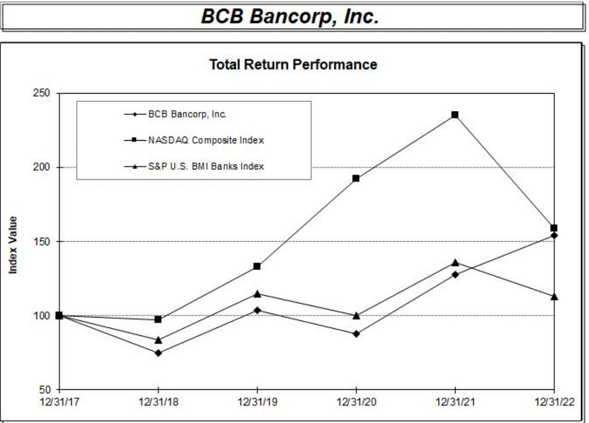

|                          | Period Ending |          |          |          |          |          |  |  |
|--------------------------|---------------|----------|----------|----------|----------|----------|--|--|
| Index                    | 12/31/17      | 12/31/18 | 12/31/19 | 12/31/20 | 12/31/21 | 12/31/22 |  |  |
| BCB Bancorp, Inc.        | 100.00        | 75.08    | 103.41   | 87.90    | 127.90   | 154.35   |  |  |
| NASDAQ Composite Index   | 100.00        | 97.16    | 132.81   | 192.47   | 235.15   | 158.65   |  |  |
| S&P U.S. BMI Banks Index | 100.00        | 83.54    | 114.74   | 100.10   | 136.10   | 112.89   |  |  |

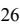

{28}------------------------------------------------

# **ITEM 6. [RESERVED]**

# **ITEM 7. MANAGEMENT'S DISCUSSION AND ANALYSIS OF FINANCIAL CONDITION AND RESULTS OF OPERATIONS**

#### **Critical Accounting Estimates**

Critical accounting estimates are those accounting policies that can have a significant impact on the Company's financial position and results of operations that require the use of complex and subjective estimates based upon past experiences and management's judgment. Because of the uncertainty inherent in such estimates, actual results may differ from these estimates. Below are those policies applied in preparing the Company's consolidated financial statements that management believes are the most dependent on the application of estimates and assumptions. For additional accounting policies, see Note 2 of "Notes to Consolidated Financial Statements."

#### *Allowance for Loan Losses*

Loans receivable are presented net of an allowance for loan losses and net deferred loan fees. In determining the appropriate level of the allowance, management considers a combination of factors, such as economic and industry trends, real estate market conditions, size and type of loans in portfolio, nature and value of collateral held, borrowers' financial strength and credit ratings, and prepayment and default history. The calculation of the appropriate allowance for loan losses requires a substantial amount of judgment regarding the impact of the aforementioned factors, as well as other factors, on the ultimate realization of loans receivable. In addition, our determination of the amount of the allowance for loan losses is subject to review by the New Jersey Department of Banking and Insurance and the FDIC, as part of their examination process. After a review of the information available, our regulators might require the establishment of an additional allowance. Any increase in the allowance for loan loss required by regulators would have a negative impact on our earnings.

#### *Other-than-Temporary Impairment of Securities*

If the fair value of a security is less than its amortized cost, the security is deemed to be impaired. Management evaluates all securities with unrealized losses quarterly to determine if such impairments are "temporary" or "other-than-temporary" in accordance with Accounting Standards Codification ("ASC") Topic 320, *Investments – Debt Securities.* Accordingly, temporary impairments are accounted for based upon the classification of the related securities as either available for sale or held to maturity. Temporary impairments on available for sale securities are recognized, on a taxeffected basis, through Other Comprehensive Income ("OCI") with offsetting entries adjusting the carrying value of the securities and the balance of deferred taxes. Conversely, the carrying values of held to maturity securities are not adjusted for temporary impairments. Information concerning the amount and duration of temporary impairments on both available for sale and held to maturity securities is generally disclosed in the notes to the consolidated financial statements.

Other-than-temporary impairments are accounted for based upon several considerations. First, other-than-temporary impairments on debt securities that the Company has decided to sell as of the close of a fiscal period, or will, more likely than not, be required to sell prior to the full recovery of fair value to a level equal to or exceeding amortized cost, are recognized in earnings. If neither of these conditions regarding the likelihood of the sale of debt securities are applicable, then the other-than-temporary impairment is bifurcated into credit-related and noncredit-related components. A creditrelated impairment represents the amount by which the present value of the cash flows that are expected to be collected on a debt security fall below its amortized cost. The noncredit-related component represents the remaining portion of the impairment not otherwise designated as credit-related. Credit-related other-than-temporary impairments are recognized in earnings and noncreditrelated other-than-temporary impairments are recognized in OCI.

#### *Goodwill*

The Company accounts for goodwill and other intangible assets in accordance with FASB ASC Topic 350, "Intangibles – Goodwill and Other," which allows an entity to first assess qualitative factors to determine whether it is necessary to perform the quantitative goodwill impairment test. Based on a qualitative assessment, management determined that the Company's recorded goodwill totaling \$5.2 million, is not impaired as of December 31, 2022.

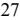

{29}------------------------------------------------

#### **Financial Condition at December 31, 2022 and 2021**

Total assets increased by \$578.7 million, or 19.5 percent, to \$3.546 billion at December 31, 2022, from \$2.968 billion at December 31, 2021. The increase in total assets was mainly related to increases in total loans.

Total cash and cash equivalents decreased by \$182.3 million, or 44.3 percent, to \$229.4 million at December 31, 2022 from \$411.6 million at December 31, 2021. This decrease was primarily due to the redeployment of cash and cash equivalents into loans.

Loans receivable, net, increased by \$740.4 million, or 32.1 percent, to \$3.045 billion at December 31, 2022 from \$2.305 billion at December 31, 2021. Total loan increases for 2022 included increases of \$625.1 million in commercial real estate and multi-family loans, \$90.9 million in commercial business loans, \$25.6 million in residential one-to-four family loans and \$6.4 million in home equity loans, partly offset by decreases of \$9.0 million in construction loans and \$477 thousand in consumer loans. The allowance for loan losses decreased \$4.7 million to \$32.4 million, or 633.6 percent of non-accruing loans and 1.05 percent of gross loans, at December 31, 2022 as compared to an allowance for loan losses of \$37.1 million, or 249.3 percent of non-accruing loans and 1.58 percent of gross loans, at December 31, 2021.

Total investment securities decreased by \$972,000, or 0.88 percent, to \$109.4 million at December 31, 2022 from \$110.4 million at December 31, 2021, representing repayments, calls and maturities, and unrealized losses, partly offset by purchases of \$27.5 million, and sales of \$1.2 million.

Deposit liabilities increased by \$250.2 million, or 9.8 percent, to \$2.812 billion at December 31, 2022 from \$2.561 billion at December 31, 2021. Total increases for 2022 included \$25.7 million in non-interest-bearing deposit accounts, \$89.4 million in NOW deposit accounts, and \$166.7 million in certificates of deposit, including listing service and brokered deposit accounts. The increase in deposits was partly offset by a decrease of \$31.6 million in money market accounts.

Debt obligations increased by \$310.8 million to \$419.8 million at December 31, 2022 from \$109.0 million at December 31, 2021. The weighted average interest rate of FHLB advances was 4.07 percent at December 31, 2022 and 1.39 percent at December 31, 2021. The weighted average maturity of FHLB advances as of December 31,2022 was 1.10 years. The fixed interest rate of our subordinated debt balances was 5.625 percent at December 31, 2022 and December 31, 2021.

Stockholders' equity increased by \$17.2 million, or 6.3 percent, to \$291.3 million at December 31, 2022 from \$274.0 million at December 31, 2021. The increase was primarily attributable to the increase in retained earnings of \$33.9 million, or 41.8 percent, to \$115.1 million at December 31, 2022 from \$81.2 million at December 31, 2021, related to net income less dividends paid for the twelve months ended December 31, 2022. The increase was partly offset by a decrease of \$7.9 million in additional paid-in-capital for preferred stock, an increase in accumulated other comprehensive losses of \$7.6 million, and an increase in treasury stock of \$3.4 million. The decrease in additional paid-in-capital for preferred stock was primarily related to the redemption of \$9.4 million of the Company's then-outstanding Series D 4.5% Noncumulative Perpetual Preferred Stock and \$5.3 million of the Company's then-outstanding Series G 6% Noncumulative Perpetual Preferred Stock, partially offset by the issuance of \$6.8 million of Series I Noncumulative Perpetual Preferred Stock. The decrease in accumulated other comprehensive income over the prior year was based upon unfavorable market conditions related to the Company's available-for-sale debt securities, caused by the recent increase in interest rates generally. The increase in treasury stock was due to the Company's stock repurchase program.

{30}------------------------------------------------

#### **Analysis of Net Interest Income**

Net interest income is the difference between interest income on interest-earning assets and interest expense on interest-bearing liabilities. Net interest income depends on the relative amounts of interest-earning assets and interest-bearing liabilities and the interest rates earned or paid on them, respectively.

The following table sets forth average balance sheets, yields and costs, and certain other information for the years indicated. All average balances are daily average balances. The yields set forth below include the effect of deferred fees, discounts and premiums, which are included in interest income.

|                                            | Year ended December 31, 2022 |    |                      |                    | Year ended December 31, 2021 |                        |    |                      |                    |
|--------------------------------------------|------------------------------|----|----------------------|--------------------|------------------------------|------------------------|----|----------------------|--------------------|
|                                            | Average Daily Balance        |    | Interest Earned/Paid | Average Yield/Rate |                              | Average Daily Balance  |    | Interest Earned/Paid | Average Yield/Rate |
|                                            |                              |    |                      |                    |                              | (Dollars in Thousands) |    |                      |                    |
| Interest-earning assets:                   |                              |    |                      |                    |                              |                        |    |                      |                    |
| Loans receivable (1) (2)                   | \$ 2,626,710 \$           |    | 123,577              | 4.70% \$           |                              | 2,327,781 \$           |    | 107,660              | 4.63%              |
| Investment securities (3)                  | 109,604                      |    | 4,731                | 4.32               |                              | 108,545                |    | 3,954                | 3.64               |
| Interest-earning deposits                  | 274,649                      |    | 3,133                | 1.14               |                              | 377,209                |    | 959                  | 0.25               |
| Total interest-earning assets              | 3,010,963                    |    | 131,441              | 4.37%              |                              | 2,813,535              |    | 112,573              | 4.00%              |
| Non-interest-earning assets                | 106,712                      |    |                      |                    |                              | 106,039                |    |                      |                    |
| Total assets                               | \$ 3,117,675              |    |                      |                    | \$                           | 2,919,574              |    |                      |                    |
| Interest-bearing liabilities:              |                              |    |                      |                    |                              |                        |    |                      |                    |
| Interest-bearing demand accounts           | \$ 751,708 \$             |    | 2,970                | 0.40% \$           |                              | 637,671 \$             |    | 2,657                | 0.42%              |
| Money market accounts                      | 350,207                      |    | 2,313                | 0.66               |                              | 335,824                |    | 1,678                | 0.50               |
| Savings accounts                           | 340,232                      |    | 449                  | 0.13               |                              | 317,301                |    | 505                  | 0.16               |
| Certificates of deposit                    | 614,346                      |    | 6,889                | 1.12               |                              | 673,233                |    | 6,160                | 0.92               |
| Total interest-bearing deposits            | 2,056,493                    |    | 12,621               | 0.61               |                              | 1,964,029              |    | 11,000               | 0.56               |
| Borrowed funds                             | 149,354                      |    | 4,875                | 3.26               |                              | 173,341                |    | 4,180                | 2.41               |
| Total interest-bearing liabilities         | 2,205,847                    |    | 17,496               | 0.79%              |                              | 2,137,370              |    | 15,180               | 0.71%              |
| Non-interest-bearing liabilities           | 636,217                      |    |                      |                    |                              | 524,668                |    |                      |                    |
| Total liabilities                          | 2,842,064                    |    |                      |                    |                              | 2,662,038              |    |                      |                    |
| Stockholders' equity                       | 275,611                      |    |                      |                    |                              | 257,536                |    |                      |                    |
| Total liabilities and stockholders' equity | 3,117,675                    |    |                      |                    |                              | 2,919,574              |    |                      |                    |
| Net interest income                        |                              | \$ | 113,945              |                    |                              |                        | \$ | 97,393               |                    |
| Net interest rate spread (4)               |                              |    |                      | 3.57%              |                              |                        |    |                      | 3.29%              |
| Net interest margin (5)                    |                              |    |                      | 3.78%              |                              |                        |    |                      | 3.46%              |
| _______________                            |                              |    |                      |                    |                              |                        |    |                      |                    |

(1) Excludes allowance for loan losses.

(2) Includes non-accrual loans which are immaterial to the yield.

(3) Includes Federal Home Loan Bank of New York stock.

(4) Interest rate spread represents the difference between the average yield on interest-earning assets and the average cost of interest-bearing liabilities.

(5) Net interest margin represents net interest income as a percentage of average interest-earning assets.

{31}------------------------------------------------

### **Rate/Volume Analysis**

The table below sets forth certain information regarding changes in our interest income and interest expense for the years indicated. For each category of interest-earning assets and interest-bearing liabilities, information is provided on changes attributable to (i) changes in average volume (changes in average volume multiplied by old rate); (ii) changes in rate (change in rate multiplied by old average volume); (iii) changes due to combined changes in rate and volume; and (iv) the net change.

|                                    | Years Ended December 31,   |    |       |    |               |    |                                 |                            |         |    |          |    |               |    |                                 |
|------------------------------------|----------------------------|----|-------|----|---------------|----|---------------------------------|----------------------------|---------|----|----------|----|---------------|----|---------------------------------|
|                                    |                            |    |       |    | 2022 vs. 2021 |    |                                 |                            |         |    |          |    | 2021 vs. 2020 |    |                                 |
|                                    | Increase (Decrease) Due to |    |       |    |               |    |                                 | Increase (Decrease) Due to |         |    |          |    |               |    |                                 |
|                                    | Volume                     |    | Rate  |    | Rate/Volume   |    | Total Increase (Decrease) |                            | Volume  |    | Rate     |    | Rate/Volume   |    | Total Increase (Decrease) |
|                                    |                            |    |       |    |               |    | (In thousands)                  |                            |         |    |          |    |               |    |                                 |
| Interest income:                   |                            |    |       |    |               |    |                                 |                            |         |    |          |    |               |    |                                 |
| Loans receivable                   | \$ 13,825               | \$ | 1,854 | \$ | 238           | \$ | 15,917                          | \$                         | 371     | \$ | 136      | \$ | 0             | \$ | 507                             |
| Investment securities              | 39                         |    | 731   |    | 7             |    | 777                             |                            | (277)   |    | 862      |    | (69)          |    | 516                             |
| Interest-earning deposits          | (261)                      |    | 3,344 |    | (909)         |    | 2,174                           |                            | (175)   |    | (1,813)  |    | 112           |    | (1,876)                         |
| Total interest-earning assets      | 13,603                     |    | 5,929 |    | (664)         |    | 18,868                          |                            | (81)    |    | (815)    |    | 43            |    | (853)                           |
| Interest expense:                  |                            |    |       |    |               |    |                                 |                            |         |    |          |    |               |    |                                 |
| Interest-bearing demand accounts   | 475                        |    | (138) |    | (24)          |    | 313                             |                            | 950     |    | (1,024)  |    | (319)         |    | (393)                           |
| Money market deposits              | 72                         |    | 540   |    | 23            |    | 635                             |                            | 144     |    | (1,494)  |    | (69)          |    | (1,419)                         |
| Savings deposits                   | 36                         |    | (86)  |    | (6)           |    | (56)                            |                            | 64      |    | -        |    | -             |    | 64                              |
| Certificates of Deposits           | (538)                      |    | 1,389 |    | (122)         |    | 729                             |                            | (5,369) |    | (10,835) |    | 3,005         |    | (13,199)                        |
| Borrowings                         | (578)                      |    | 1,478 |    | (205)         |    | 695                             |                            | (2,636) |    | (404)    |    | 151           |    | (2,889)                         |
| Total interest-bearing liabilities | (533)                      |    | 3,183 |    | (334)         |    | 2,316                           |                            | (6,847) |    | (13,757) |    | 2,768         |    | (17,836)                        |
| Change in net interest income      | \$ 14,136               | \$ | 2,746 | \$ | (330)         | \$ | 16,552                          | \$                         | 6,766   | \$ | 12,942   | \$ | (2,725)       | \$ | 16,983                          |

#### **Results of Operations for the Years Ended December 31, 2022 and 2021**

Net income increased by \$11.3 million, or 33.1 percent, to \$45.6 million for the year ended December 31, 2022 from \$34.2 million for the year ended December 31, 2021. The increase in net income was driven by an increase in total interest income and the credit for loan loss provision, which were partly offset by a decrease in non-interest income and increases in interest expense, non-interest expenses, and a higher income tax provision for 2022 as compared to 2021.

Net interest income increased by \$16.6 million, or 17.0 percent, to \$113.9 million for the year of 2022 from \$97.4 million for the year of 2021. The increase in net interest income resulted from a \$18.9 million increase in interest income, partly offset by an increase of \$2.3 million in interest expense.

Interest income increased by \$18.9 million, or 16.8 percent, to \$131.4 million for 2022, from \$112.6 million for 2021. The average balance of interest-earning assets increased \$197.4 million, or 7.0 percent, to \$3.011 billion for 2022, from \$2.814 for 2021, while the average yield increased 37 basis points to 4.37 percent for 2022, from 4.00 percent for 2021. The increase in the average balance of interest-earning assets mainly related to an increase in the Company's level of average loans receivable for 2022, as compared to 2021.

The increase in interest income mainly related to an increase in the average balance of loans receivable of \$298.9 million to \$2.627 billion for 2022, from \$2.328 billion for 2021. The increase in the average balance on loans receivable was a result of the continued strength of the Company's loan pipeline. Interest income on loans for 2022 also included \$1.4 million of amortization of purchase credit fair value adjustments related to a prior acquisition, which added approximately five basis points to the average yield on interest earning assets.

Interest expense increased by \$2.3 million, or 15.3 percent, to \$17.5 million for 2022, from \$15.2 million for 2021. This increase resulted primarily from an increase in the average rate on interestbearing liabilities of 8 basis points to 0.79 percent for 2022, from 0.71 percent for 2021, and an increase in the average balance of interest-bearing liabilities of \$68.5 million, or 3.2 percent, to \$2.206 billion 2022, from \$2.137 billion for 2021. The increase in the average cost of funds primarily resulted from the higher interest rate environment in 2022.

Net interest margin was 3.78 percent for 2022, compared to 3.46 percent for 2021. The increase in the net interest margin compared to the prior period was the result of an increase in the average volume of loans receivable as well as an increase in the yield on loans partially offset by the increase in the Company's cost of funds.

During the year ended December 31, 2022, the Company experienced \$1.7 million in net charge offs compared to \$375,000 in net charge offs for the year ended December 31, 2021. The Bank had non-accrual loans totaling \$5.1 million, or 0.17 percent, of gross loans at December 31, 2022 as compared to \$14.9 million, or 0.64 percent of gross loans at December 31, 2021. The allowance for loan losses was \$32.4 million, or 1.05 percent of gross loans at December 31, 2022, and \$37.1 million, or 1.58 percent of gross loans at December 31, 2021. The credit for loan losses was \$3.1 million for 2022 compared to loan loss provision expense of \$3.9 million for 2021. The credit for provision for 2022 reflected the improving asset quality and more favorable economic metrics compared to the COVID-19 environment in 2021. Management believes that the allowance for loan losses was adequate at December 31, 2022 and December 31, 2021.

Noninterest income decreased by \$7.1 million, or 81.7 percent, to \$1.6 million for 2022 from \$8.7 million for 2021. The decrease was mainly related to a decrease of \$6.4 million in the realized and unrealized gains and losses on equity securities (from a gain of \$147,000 in 2021 to a loss of \$6.3 million in 2022), as well as a decrease of \$538,000 in gain on sale of loans, \$371,000 in gain on sale of premises, and \$391,000 in other income. The realized and unrealized gains or losses on equity securities are based on market conditions.

Noninterest expense increased by \$1.5 million, or 2.8 percent, to \$55.5 million for the year ended December 31, 2022 from \$54.0 million for the year ended December 31, 2021. The increase in operating expenses for 2022 was driven higher by a consulting fee expense of \$1.6 million for which there was no comparable expense in 2021. Other factors that contributed to the increase in operating expenses for 2022 included higher salaries and employee benefits and higher advertising and promotion expenses compared to 2021. The increase in salaries related to normal compensation increases, higher commission expenses from strong loan production, and hiring of additional staff. The number of full-time equivalent employees for the year ended December 31, 2022 was 301, as compared with 292 for the same period in 2021. Occupancy and equipment expense decreased by \$733,000 to \$10.7 million for the year ended December 31, 2022 from \$11.4 million for the year ended December 31, 2021, mainly related to costs associated with branch closures in 2021.

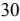

{32}------------------------------------------------

The income tax provision increased by \$3.5 million or 25.1 percent, to \$17.5 million for 2022 from \$14.0 million in 2021. The increase in the income tax provision was a result of the higher taxable income for the year ended December 31, 2022 compared to the year ended December 31, 2021. The consolidated effective tax rate was 27.8% for 2022 compared to 29.0 percent for 2021.

#### **Liquidity and Capital Resources**

The overall objective of our liquidity management practices is to ensure the availability of sufficient funds to meet financial commitments and to take advantage of lending and investment opportunities. The Company manages liquidity in order to meet deposit withdrawals on demand or at contractual maturity, to repay borrowings and other obligations as they mature, and to fund loan and investment portfolio opportunities as they arise.

The Company's primary sources of funds to satisfy its objectives are net growth in deposits (primarily retail), principal and interest payments on loans and investment securities, proceeds from the sale of originated loans and FHLB and other borrowings. The scheduled amortization of loans is a predictable source of funds. Deposit flows and mortgage prepayments are greatly influenced by general interest rates, economic conditions and competition. The Company has other sources of liquidity if a need for additional funds arises, including unsecured overnight lines of credit and other collateralized borrowings from the FHLB and other correspondent banks.

At December 31, 2022 and December 31, 2021, the Company had \$60 million in overnight borrowings outstanding with the FHLB. The Company utilizes overnight borrowings from time to time to fund short-term liquidity needs. The Company had total outstanding borrowings of \$419.8 million at December 31, 2022 as compared to \$109.0 million at December 31, 2021.

At December 31, 2022, the Company had the ability to obtain additional funding from the FHLB of \$289.5 million, utilizing unencumbered loan collateral. The Company expects to have sufficient funds available to meet current loan commitments in the normal course of business through typical sources of liquidity. Time deposits scheduled to mature in one year or less totaled \$766.8 million at December 31, 2022. Based upon historical experience data, management estimates that a significant portion of such deposits will remain with the Company.

The Company was well-positioned with adequate levels of cash and liquid assets as of December 31, 2022, as well as wholesale borrowing capacity of over \$1.161 billion.

At December 31, 2022 and December 31, 2021, the capital ratios of the Bank exceeded the quantitative capital ratios required for an institution to be considered "well-capitalized".

#### **ITEM 7A. QUANTITATIVE AND QUALITATIVE DISCLOSURES ABOUT MARKET RISK**

#### **Management of Market Risk**

*Qualitative Analysis.* The majority of our assets and liabilities are monetary in nature. Consequently, one of our most significant forms of market risk is interest rate risk. Our assets, consisting primarily of mortgage loans, have longer maturities than our liabilities, consisting primarily of deposits. As a result, a principal part of our business strategy is to manage interest rate risk and reduce the exposure of our net interest income to changes in market interest rates. Accordingly, our Board of Directors has established an Asset/Liability Committee which is responsible for evaluating the interest rate risk inherent in our assets and liabilities, for determining the level of risk that is appropriate given our business strategy, operating environment, capital, liquidity and performance objectives, and for managing this risk consistent with the guidelines approved by the Board of Directors. Senior management monitors the level of interest rate risk on a regular basis and the Asset/Liability Committee, which consists of senior management and outside directors operating under a policy adopted by the Board of Directors, meets as needed to review our asset/liability policies and interest rate risk position.

*Quantitative Analysis.* The following table presents the Company's net portfolio value ("NPV"). These calculations were based upon assumptions believed to be fundamentally sound, although they may vary from assumptions utilized by other financial institutions. The information set forth below is based on data that included all financial instruments as of December 31, 2022. Assumptions have been made by the Company relating to interest rates, loan prepayment rates, core deposit duration, and the market values of certain assets and liabilities under the various interest rate scenarios. Actual maturity dates were used for fixed rate loans and certificate accounts. Investment securities were scheduled at either the maturity date or the next scheduled call date based upon management's judgment of whether the particular security would be called in the current interest rate environment and under assumed interest rate scenarios. Variable rate loans were scheduled as of their next scheduled interest rate repricing date. Additional assumptions made in the preparation of the NPV table include prepayment rates on loans and mortgage-backed securities, core deposits without stated maturity dates were scheduled with an assumed term of 48 months, and money market and noninterest bearing accounts were scheduled with an assumed term of 24 months. The NPV at "PAR" represents the difference between the Company's estimated value of assets and estimated value of liabilities assuming no change in interest rates. The NPV for a decrease of 200 to 300 basis points has been excluded since it would not be meaningful in the interest rate environment as of December 31, 2022. The following sets forth the Company's NPV as of December 31, 2022.

|                        |                     |    |                    |                   |   |           | NPV as a % of Assets |        |     |  |
|------------------------|---------------------|----|--------------------|-------------------|---|-----------|----------------------|--------|-----|--|
| Change in calculation  | Net Portfolio Value |    | \$ Change from PAR | % Change from PAR |   | NPV Ratio |                      | Change |     |  |
| (Dollars in Thousands) |                     |    |                    |                   |   |           |                      |        |     |  |
| +300bp                 | \$ 409,323       | \$ | (35,227)           | (7.92)            | % | 12.87     | %                    | (0.26) | bps |  |
| +200bp                 | 423,698             |    | (20,851)           | (4.69)            |   | 13.05     |                      | (0.08) | bps |  |
| +100bp                 | 436,034             |    | (8,516)            | (1.92)            |   | 13.15     |                      | 0.02   | bps |  |
| PAR                    | 444,550             |    | -                  | 0.00              |   | 13.13     |                      | 0.00   | bps |  |
| -100bp                 | 445,634             |    | 1,084              | 0.24              |   | 12.88     |                      | (0.25) | bps |  |
| _________              |                     |    |                    |                   |   |           |                      |        |     |  |

#### bps-basis point

The table above indicates that at December 31, 2022, in the event of a 100-basis point increase in interest rates, we would experience a 0.02 basis point decrease in NPV, as compared to a 0.26 percent decrease at December 31, 2021.

Certain shortcomings are inherent in the methodology used in the above interest rate risk measurement. Modeling changes in NPV require making certain assumptions that may or may not reflect the manner in which actual yields and costs respond to changes in market interest rates. In this regard, the NPV table presented assumes that the composition of our interest-sensitive assets and liabilities existing at the beginning of a period remains constant over the period being measured and assumes that a particular change in interest rates is reflected uniformly across the yield curve regardless of the duration or repricing of specific assets and liabilities. Accordingly, although the NPV table provides an indication of our interest rate risk exposure at a particular point in time, such measurements are not intended to and do not provide a precise forecast of the effect of changes in market interest rates on our net interest income, and will differ from actual results.

{33}------------------------------------------------

# **ITEM 8. FINANCIAL STATEMENTS AND SUPPLEMENTARY DATA**

#### **Report of Independent Registered Public Accounting Firm**

To the Stockholders and Board of Directors of BCB Bancorp, Inc.

#### **Opinion on the Financial Statements**

We have audited the accompanying consolidated statements of financial condition of BCB Bancorp, Inc. and subsidiaries (the "Company") as of December 31, 2022 and 2021, the related consolidated statements of operations, comprehensive income, changes in stockholders' equity and cash flows, for each of the years then ended, and the related notes to the consolidated financial statements (collectively, the "financial statements"). In our opinion, the financial statements present fairly, in all material respects, the financial position of the Company as of December 31, 2022 and 2021, and the results of its operations and its cash flows for each of the years then ended, in conformity with accounting principles generally accepted in the United States of America.

We have also audited, in accordance with the standards of the Public Company Accounting Oversight Board (United States) ("PCAOB"), the Company's internal control over financial reporting as of December 31, 2022, based on criteria established in Internal Control — Integrated Framework issued by the Committee of Sponsoring Organizations of the Treadway Commission in 2013, and our report dated March 9, 2023 expressed an unqualified opinion on the effectiveness of the Company's internal control over financial reporting.

#### **Basis for Opinion**

These financial statements are the responsibility of the Company's management. Our responsibility is to express an opinion on the Company's financial statements based on our audits. We are a public accounting firm registered with the PCAOB and are required to be independent with respect to the Company in accordance with U.S. federal securities laws and the applicable rules and regulations of the Securities and Exchange Commission and the PCAOB.

We conducted our audits in accordance with the standards of the PCAOB. Those standards require that we plan and perform the audits to obtain reasonable assurance about whether the financial statements are free of material misstatement, whether due to error or fraud. Our audits included performing procedures to assess the risks of material misstatement of the financial statements, whether due to error or fraud, and performing procedures that respond to those risks. Such procedures included examining, on a test basis, evidence regarding the amounts and disclosures in the financial statements. Our audits also included evaluating the accounting principles used and significant estimates made by management, as well as evaluating the overall presentation of the financial statements. We believe that our audits provide a reasonable basis for our opinion.

#### **Critical Audit Matter**

The critical audit matter communicated below is a matter arising from the current period audit of the financial statements that was communicated or required to be communicated to the audit committee and that: (1) relates to accounts or disclosures that are material to the financial statements and (2) involved our especially challenging, subjective, or complex judgments. The communication of a critical audit matter does not alter in any way our opinion on the financial statements, taken as a whole, and we are not, by communicating the critical audit matter below, providing a separate opinion on the critical audit matter or on the accounts or disclosures to which it relates.

#### Allowance for Loan Losses

#### *Critical Audit Matter Description*

As described in Notes 2 and 5 to the financial statements, the Company has recorded an allowance for loan losses in the amount of \$32.4 million as of December 31, 2022, representing management's estimate of the probable losses inherent in the loan portfolio as of that date. The allowance is established as losses are estimated to have occurred through a provision for loan losses charged to earnings.

We determined that performing procedures relating to the Company's determination of its allowance for loan losses is a critical audit matter. The principal considerations for our determination are (i) the application of significant judgment and estimation on the part of management, which in turn led to a high degree of auditor judgment and subjectivity in performing procedures and evaluating audit evidence obtained, and (ii) significant audit effort was necessary in evaluating management's methodology, significant assumptions and calculations.

#### *How the Critical Audit Matter was addressed in the Audit*

Addressing the matter involved performing procedures and evaluating audit evidence in connection with forming our overall opinion on the financial statements. These procedures included testing the effectiveness of controls relating to the Company's process for estimating the allowance covering the key assumptions and judgments of its estimation model. These procedures also included, among others, testing management's process for determining the qualitative reserve components and testing the completeness and accuracy of data utilized by management.

We have served as the Company's auditor since 2018.

/s/ Wolf & Company, P.C. Auditor ID: 392 Boston, Massachusetts March 9, 2023

{34}------------------------------------------------

# **Report of Independent Registered Public Accounting Firm**

To the Stockholders and Board of Directors of BCB Bancorp, Inc.

#### **Opinion on Internal Control Over Financial Reporting**

We have audited BCB Bancorp Inc. and subsidiaries' (the "Company") internal control over financial reporting as of December 31, 2022, based on criteria established in *Internal Control — Integrated Framework* issued by the Committee of Sponsoring Organizations of the Treadway Commission ("COSO") in 2013. In our opinion, the Company maintained, in all material respects, effective internal control over financial reporting as of December 31, 2022, based on criteria established in *Internal Control — Integrated Framework (2013)* issued by COSO.

We have also audited, in accordance with the standards of the Public Company Accounting Oversight Board (United States) ("PCAOB"), the consolidated financial statements of the Company as of December 31, 2022 and 2021 and for the years then ended and our report dated March 9, 2023 expressed an unqualified opinion.

#### **Basis for Opinion**

The Company's management is responsible for maintaining effective internal control over financial reporting and for its assessment of the effectiveness of internal control over financial reporting included in the accompanying *Management's Annual Report on Internal Control over Financial Reporting*. Our responsibility is to express an opinion on the Company's internal control over financial reporting based on our audit. We are a public accounting firm registered with the PCAOB and are required to be independent with respect to the Company in accordance with U.S. federal securities laws and the applicable rules and regulations of the Securities and Exchange Commission and the PCAOB.

We conducted our audit in accordance with the standards of the PCAOB. Those standards require that we plan and perform the audit to obtain reasonable assurance about whether effective internal control over financial reporting was maintained in all material respects. Our audit included obtaining an understanding of internal control over financial reporting, assessing the risk that a material weakness exists, and testing and evaluating the design and operating effectiveness of internal control based on the assessed risk. Our audit also included performing such other procedures as we considered necessary in the circumstances. We believe that our audit provides a reasonable basis for our opinion.

#### **Definition and Limitations of Internal Control Over Financial Reporting**

A company's internal control over financial reporting is a process designed to provide reasonable assurance regarding the reliability of financial reporting and the preparation of financial statements for external purposes in accordance with generally accepted accounting principles. A company's internal control over financial reporting includes those policies and procedures that (1) pertain to the maintenance of records that, in reasonable detail, accurately and fairly reflect the transactions and dispositions of the assets of the company; (2) provide reasonable assurance that transactions are recorded as necessary to permit preparation of financial statements in accordance with generally accepted accounting principles, and that receipts and expenditures of the company are being made only in accordance with authorizations of management and directors of the company; and (3) provide reasonable assurance regarding prevention or timely detection of unauthorized acquisition, use or disposition of the company's assets that could have a material effect on the financial statements.

Because of its inherent limitations, internal control over financial reporting may not prevent or detect misstatements. Also, projections of any evaluation of effectiveness to future periods are subject to the risk that controls may become inadequate because of changes in conditions, or that the degree of compliance with the policies or procedures may deteriorate.

/s/ Wolf & Company, P.C. Auditor ID: 392 Boston, Massachusetts March 9, 2023

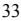

{35}------------------------------------------------

**Consolidated Statements of Financial Condition**

|                                                                    |                 | December 31,                                    |  |  |  |
|--------------------------------------------------------------------|-----------------|-------------------------------------------------|--|--|--|
|                                                                    | 2022            | 2021                                            |  |  |  |
|                                                                    |                 | (In Thousands, Except Share and Per Share Data) |  |  |  |
| ASSETS                                                             |                 |                                                 |  |  |  |
| Cash and amounts due from depository institutions                  | \$ 11,520    | \$ 9,606                                     |  |  |  |
| Interest-earning deposits                                          | 217,839         | 402,023                                         |  |  |  |
| Total cash and cash equivalents                                    | 229,359         | 411,629                                         |  |  |  |
|                                                                    |                 |                                                 |  |  |  |
| Interest-earning time deposits                                     | 735             | 735                                             |  |  |  |
| Debt securities available for sale                                 | 91,715          | 85,186                                          |  |  |  |
| Equity investments                                                 | 17,686          | 25,187                                          |  |  |  |
| Loans held for sale                                                | 658             | 952                                             |  |  |  |
| Loans receivable, net of allowance for loan losses of \$32,373 and |                 |                                                 |  |  |  |
| \$37,119, respectively                                             | 3,045,331       | 2,304,942                                       |  |  |  |
| Federal Home Loan Bank of New York stock, at cost                  | 20,113          | 6,084                                           |  |  |  |
| Premises and equipment, net                                        | 10,508          | 12,237                                          |  |  |  |
| Accrued interest receivable                                        | 13,455          | 9,183                                           |  |  |  |
| Other real estate owned                                            |                 | 75 75                                        |  |  |  |
| Deferred income taxes                                              | 16,462          | 12,959                                          |  |  |  |
| Goodwill and other intangibles                                     | 5,382           | 5,431                                           |  |  |  |
| Operating lease right-of-use assets                                | 13,520          | 12,457                                          |  |  |  |
| Bank-owned Life Insurance ("BOLI")                                 | 71,656          | 72,485                                          |  |  |  |
| Other assets                                                       | 9,538           | 7,986                                           |  |  |  |
| Total Assets                                                       | \$ 3,546,193 | \$ 2,967,528                                 |  |  |  |
|                                                                    |                 |                                                 |  |  |  |

# **LIABILITIES AND STOCKHOLDERS' EQUITY**

| LIABILITIES                   |               |               |
|-------------------------------|---------------|---------------|
| Non-interest-bearing deposits | \$ 613,910 | \$ 588,207 |
| Interest bearing deposits     | 2,197,697     | 1,973,195     |
| Total deposits                | 2,811,607     | 2,561,402     |
| FHLB Advances                 | 382,261       | 71,711        |
| Subordinated debentures       | 37,508        | 37,275        |
| Operating lease liability     | 13,859        | 12,752        |
| Other liabilities             | 9,704         | 10,364        |
| Total Liabilities             | 3,254,939     | 2,693,504     |

# **STOCKHOLDERS' EQUITY**

Preferred stock: \$0.01 par value, 10,000,000 shares authorized; issued and outstanding 2,123 shares of Series H 3.5% and Series I 3.0%, (liquidation value \$10,000 per share) noncumulative perpetual preferred stock at December 31, 2022 and 2,916 shares of Series D 4.5%, Series G 6%, Series H 3.5% and Series I 3% (liquidation value \$10,000 per share) noncumulative perpetual preferred stock at December 31,

# 2021 **-** -

| Additional paid-in capital preferred stock                                                                                       | 21,003          | 28,923          |
|----------------------------------------------------------------------------------------------------------------------------------|-----------------|-----------------|
| Common stock: no par value; 40,000,000 shares authorized, issued 19,898,197 and 19,708,375 at December 31, 2022 and December 31, |                 |                 |
| 2021 respectively, outstanding 16,930,979 shares and 16,940,133 shares, at December 31, 2022 and December 31, 2021 respectively  | -               | -               |
| Additional paid-in capital common stock                                                                                          | 196,164         | 193,927         |
| Retained earnings                                                                                                                | 115,109         | 81,171          |
| Accumulated other comprehensive income (loss)                                                                                    | (6,491)         | 1,128           |
| Treasury stock, at cost, 2,967,218 and 2,768,242 shares at December 31, 2022 and December 31, 2021 respectively                  | (34,531)        | (31,125)        |
| Total Stockholders' Equity                                                                                                       | 291,254         | 274,024         |
|                                                                                                                                  |                 |                 |
| Total Liabilities and Stockholders' Equity                                                                                       | \$ 3,546,193 | \$ 2,967,528 |
|                                                                                                                                  |                 |                 |

*See accompanying notes to consolidated financial statements*.

{36}------------------------------------------------

**Consolidated Statements of Operations**

|                                                                                                                                                                                                                                                          | Ye a r s                                        | E n d e d D e c e m b e r 3 1 , |                                                          |  |  |
|----------------------------------------------------------------------------------------------------------------------------------------------------------------------------------------------------------------------------------------------------------|----------------------------------------------------------|------------------------------------------------------------------------------|----------------------------------------------------------|--|--|
|                                                                                                                                                                                                                                                          | 2 0 2 2                                         |                                                                              | 2 0 2 1                                         |  |  |
|                                                                                                                                                                                                                                                          | ( I n T h o u s a n d s | , E x c e p t fo r P                              | e r S h a r e D a t a ) |  |  |
| I n t e r e s t a n d d i v i d e n d i n c o m e :                                                                                                                           |                                                          |                                                                              |                                                          |  |  |
| L o a n s, i n c l u d i n g fe e s                                                                                                                                                                         | \$ 1 2 3 , 5                              | 7 7 \$                                                                 | 1 0 7,6 6 0                                  |  |  |
| M o r t g a g e - b a c k e d s e c u r i t i e s                                                                                                                                | 5                                                        | 6 4                                                                       | 6 8 0                                              |  |  |
| O th e r i n v e s t m e n t s e c u r i t i e s                                                                                                                                    | 4 , 1                                              | 6 7                                                                       | 3,2 7 4                                            |  |  |
| F H L B s t o c k d i v i d e n d s a n d o t h e r i n t e r e s t e a r n i n g a s s e t s                  | 3 , 1                                              | 3 3                                                                       | 9 5 9                                              |  |  |
| To t a l i n t e r e s t a n d d i v i d e n d i n c o m e                                                                                                           | 1 3 1 , 4                                    | 4 1                                                                       | 1 1 2,5 7 3                                  |  |  |
| I n t e r e s t e x p e n s e :                                                                                                                                                                             |                                                          |                                                                              |                                                          |  |  |
| D e p o s i t s:                                                                                                                                                                                                                    |                                                          |                                                                              |                                                          |  |  |
| Demand                                                                                                                                                                                                                                                   | 5 , 2                                              | 8 3                                                                       | 4,3 3 5                                            |  |  |
| S a v i n g s a n d c l u b                                                                                                                                                                                       | 4                                                        | 4 9                                                                       | 5 0 5                                              |  |  |
| C e r t i fi c a t e s o f d e p o s i t                                                                                                                                                        | 6 , 8                                              | 8 9                                                                       | 6,1 6 0                                            |  |  |
|                                                                                                                                                                                                                                                          | 1 2 , 6                                         | 2 1                                                                       | 1 1,0 0 0                                       |  |  |
| B o r r o w in g s                                                                                                                                                                                                               | 4 , 8                                              | 7 5                                                                       | 4,1 8 0                                            |  |  |
| To t a l i n t e r e s t e x p e n s e                                                                                                                                                             | 1 7 , 4                                         | 9 6                                                                       | 1 5,1 8 0                                       |  |  |
| N e t i n t e r e s t i n c o m e                                                                                                                                                                        | 1 1 3 , 9                                    | 4 5                                                                       | 9 7,3 9 3                                       |  |  |
|                                                                                                                                                                                                                                                          | ( 3 ,0                                             | 7 5 )                                                                  | 3,8 5 5                                            |  |  |
| ( C r e d i t ) p r o v i s i o n fo r l o a n l o s s e s                                                                                                           | 1 1 7 , 0                                    | 2 0                                                                       | 9 3,5 3 8                                       |  |  |
| N e t i n t e r e s t i n c o m e a ft e r ( c r e d i t ) p r o v i s i o n fo r l o a n l o s s e s |                                                          |                                                                              |                                                          |  |  |
| N o n - i n t e r e s t i n c o m e :                                                                                                                                                              |                                                          |                                                                              |                                                          |  |  |
| F e e s a n d s e r v i c e c h a r g e s                                                                                                                                                    | 4 , 8                                              | 1 6                                                                       | 3,9 7 2                                            |  |  |
| B O L I i n c o m e                                                                                                                                                                                                           | 2 , 6                                              | 7 1                                                                       | 2,9 5 2                                            |  |  |
| G a i n o n s a l e s o f l o a n s                                                                                                                                                                   | 1                                                        | 2 9                                                                       | 6 6 7                                              |  |  |
| ( L o s s ) g a i n o n s a l e o f i m p a i r e d l o a n s h e l d i n p o r t fo l i o                           |                                                          | -                                                                            | ( 6 4 )                                         |  |  |
| G a i n ( l o s s ) o n s a l e s o f o t h e r r e a l e s t a t e o w n e d                                                          |                                                          | -                                                                            | 1 1                                                   |  |  |
| G a i n o n s a l e o f p r e m is e s                                                                                                                                                             |                                                          | -                                                                            | 3 7 1                                              |  |  |
| R e a l i z e d a n d u n r e a l i z e d ( l o s s ) g a i n o n e q u i t y i n v e s t m e n t s   | ( 6 ,2                                             | 6 9 )                                                                  | 1 4 7                                              |  |  |
| O th e r                                                                                                                                                                                                                                        | 2                                                        | 4 8                                                                       | 6 3 9                                              |  |  |
| To t a l n o n - i n t e r e s t i n c o m e                                                                                                                                              | 1 , 5                                              | 9 5                                                                       | 8,6 9 5                                            |  |  |
| N o n - i n t e r e s t e x p e n s e :                                                                                                                                                         |                                                          |                                                                              |                                                          |  |  |
| S a l a r i e s a n d e m p l o y e e b e n e fi t s                                                                                                                          | 2 8 , 0                                         | 2 1                                                                       | 2 6,4 1 0                                       |  |  |
| O c c up a n c y a n d e q u i p m e n t                                                                                                                                                        | 1 0 , 6                                         | 2 7                                                                       | 1 1,3 6 0                                       |  |  |
| D a t a p r o c e s s i n g s e r v i c e fe e s                                                                                                                                    | 6 , 0                                              | 3 3                                                                       | 6,0 2 4                                            |  |  |
| P r o fe s s i o n a l fe e s                                                                                                                                                                                     | 3 , 7                                              | 6 6                                                                       | 1,9 1 9                                            |  |  |
| D ir e c t o r fe e s                                                                                                                                                                                                         | 1 , 2                                              | 5 3                                                                       | 1,0 4 3                                            |  |  |
| R e g u l a t o r y a s s e s s m e n t s                                                                                                                                                    | 1 , 2                                              | 4 3                                                                       | 1,3 1 0                                            |  |  |
| A d v e r t i s i n g a n d p r o m o t i o n a l                                                                                                                                | 9                                                        | 4 1                                                                       | 5 5 4                                              |  |  |
| O th e r r e a l e s t a t e o w n e d, n e t                                                                                                                                                |                                                          | 1 0                                                                       | 3 5                                                   |  |  |
| L o s s fr o m e x t i n g u i s h m e n t o f d e b t                                                                                                                     |                                                          | -                                                                            | 1,5 9 7                                            |  |  |
| O th e r                                                                                                                                                                                                                                        | 3 ,6                                                  | 1 1                                                                       | 3,7 2 3                                            |  |  |
| To t a l n o n - i n t e r e s t e x p e n s e                                                                                                                                         | 5 5 , 5                                         | 0 5                                                                       | 5 3,9 7 5                                       |  |  |
| I n c o m e b e fo r e i n c o m e t a x p r o v i s i o n                                                                                                           | 6 3 ,1                                             | 1 0                                                                       | 4 8,2 5 8                                       |  |  |
| I n c o m e t a x p r o v i s i o n                                                                                                                                                                   | 1 7 , 5                                         | 3 1                                                                       | 1 4,0 1 8                                       |  |  |
| N e t I n c o m e                                                                                                                                                                                                                | \$ 4 5 , 5                                   | 7 9 \$                                                                 | 3 4,2 4 0                                       |  |  |
| P r e fe r r e d s t o c k d i v i d e n d s                                                                                                                                              | 7                                                        | 9 6                                                                       | 1,1 6 0                                            |  |  |
| N e t I n c o m e a v a i l a b l e t o c o m m o n s t o c k h o l d e r s                                                               | \$ 4 4 , 7                                   | 8 3 \$                                                                 | 3 3,0 8 0                                       |  |  |
| N e t I n c o m e p e r c o m m o n s h a r e - b a s i c a n d d i l u t e d                                                          |                                                          |                                                                              |                                                          |  |  |
| B a s i c                                                                                                                                                                                                                                    | \$ 2                                                  | 6 4 \$                                                                 | 1.9 4                                                 |  |  |
| D il u t e d                                                                                                                                                                                                                              | \$ 2                                                  | 5 8 \$                                                                 | 1.9 2                                                 |  |  |
| We i g h t e d a v e r a g e n u m b e r o f c o m m o n s h a r e s o u t s t a n d i n g                           |                                                          |                                                                              |                                                          |  |  |
| B a s i c                                                                                                                                                                                                                                    | 1 6 , 9                                         | 6 9                                                                       | 1 7,0 6 3                                       |  |  |
| D il u t e d                                                                                                                                                                                                                              | 1 7 , 3                                         | 4 9                                                                       | 1 7,2 3 9                                       |  |  |
|                                                                                                                                                                                                                                                          |                                                          |                                                                              |                                                          |  |  |

*Se e a c c o mp a ny i n g n o t e s t o c o n s o l i da t e d fi n a n c i a l s t a t e m e n ts.*

{37}------------------------------------------------

**Consolidated Statements of Comprehensiv e I n c o m e**

|                                                                                                                                                                                                                                            | Ye a r s | E n d e d D e c e m b e r 3 1 , |
|--------------------------------------------------------------------------------------------------------------------------------------------------------------------------------------------------------------------------------------------|-------------------|------------------------------------------------------------------------------|
|                                                                                                                                                                                                                                            | 2 0 2 2  | 2 0 2 1                                                             |
|                                                                                                                                                                                                                                            |                   | ( I n T h o u s a n d s )                |
| N e t I n c o m e                                                                                                                                                                                                  | \$                | 4 5 , 5 7 9 \$ 3 4,2 4 0                       |
| O t h e r c o m p r e h e n s i v e i n c o m e ( l o s s ), n e t o f t a x:                                                  |                   |                                                                              |
| Unrealized losses on available-for-sale sec u r i t i e s:                                                                                                                                                            |                   |                                                                              |
| Unrealized holding losses arising during the pe r i o d                                                                                                                                                                        | ( 1            | 0 , 3 2 7 ) ( 2 4 2 )                          |
| R e c l a s s i fi c a t i o n a dj u s t m e n t fo r g a i n s r e a l i z e d i n i n c o m e |                   | - -                                                                       |
| N e t u n r e a l i z e d l o s s e s                                                                                                                                                | ( 1            | 0 , 3 2 7 ) ( 2 4 2 )                          |
| Ta x e ffe c t s                                                                                                                                                                                                         |                   | 2 , 5 6 0 6 0                                              |
| N e t - o f t a x a m o u n t                                                                                                                                                                    | (                 | 7 , 7 6 7 ) ( 1 8 2 )                          |
| B e n e fi t P l a n s:                                                                                                                                                                                      |                   |                                                                              |
| Actuarial g a i n                                                                                                                                                                                                                 |                   | 2 1 2 2,1 6 5                                                 |
| I n c o m e t a x e x p e n s e                                                                                                                                                               |                   | ( 6 4 ) ( 6 5 0 )                                    |
| O th e r c o m p r e h e n s i v e i n c o m e o n b e n e fi t p l a n s                                                         |                   | 1 4 8 1,5 1 5                                                 |
| To t a l o t h e r c o m p r e h e n s i v e ( l o s s ) i n c o m e                                                                    | (                 | 7 , 6 1 9 ) 1,3 3 3                                  |
| C o m p r e h e n s i v e i n c o m e                                                                                                                                                | \$                | 3 7 , 9 6 0 \$ 3 5,5 7 3                       |

*Se e a c c o mp a ny i n g n o t e s t o c o n s o l i da t e d fi n a n c i a l s t a t e m e n ts.*

{38}------------------------------------------------

**Consolidated Statements of Changes in Stockholders' Equity**

|                                                                                                                                                                                          | Preferred Stock |        | Common Stock |        | Additional Paid In Capital | Retained Earnings | Treasury Stock                     | Accumulated Other Comprehensive Income (Loss) | Total Stockholders' Equity |
|------------------------------------------------------------------------------------------------------------------------------------------------------------------------------------------|--------------------|--------|-----------------|--------|----------------------------------|----------------------|---------------------------------------|-----------------------------------------------------|----------------------------------|
|                                                                                                                                                                                          |                    |        |                 |        |                                  |                      | (In Thousands, Except Per Share Data) |                                                     |                                  |
| Balance at December 31, 2020                                                                                                                                                             | \$                 | - \$   |                 | - \$   | 217,999                          | \$ 58,335         | \$ (26,918) \$                     | (205) \$                                            | 249,211                          |
|                                                                                                                                                                                          |                    |        |                 |        |                                  |                      |                                       |                                                     |                                  |
| Net income                                                                                                                                                                               |                    | -      |                 | -      | -                                | 34,240               | -                                     | -                                                   | 34,240                           |
| Other comprehensive income                                                                                                                                                               |                    | -      |                 | -      | -                                | -                    | -                                     | 1,333                                               | 1,333                            |
| Issuance of Series I Preferred Stock                                                                                                                                                     |                    | -      |                 | -      | 3,200                            | -                    | -                                     | -                                                   | 3,200                            |
| Exercise of Stock Options (39,291 shares)                                                                                                                                                |                    | -      |                 | -      | 287                              | -                    | -                                     | -                                                   | 287                              |
| Stock-based compensation expense                                                                                                                                                         |                    | -      |                 | -      | 417                              | -                    | -                                     | -                                                   | 417                              |
| Dividends payable on Series D 4.5%, Series G 6%, Series H 3.5% and Series I 3.0% noncumulative perpetual preferred stock                                                              |                    | -      |                 | -      | -                                | (1,160)              | -                                     | -                                                   | (1,160)                          |
| Cash dividends on common stock (\$0.14 per share declared for the first two quarters ended June 30, 2021, and \$0.16 per share for the last two quarters ended December 31, 2021). |                    | -      |                 | -      | -                                | (9,775)              | -                                     | -                                                   | (9,775)                          |
| Dividend Reinvestment Plan                                                                                                                                                               |                    | -      |                 | -      | 469                              | (469)                | -                                     | -                                                   | -                                |
| Stock Purchase Plan                                                                                                                                                                      |                    | -      |                 | -      | 478                              | -                    | -                                     | -                                                   | 478                              |
| Treasury Stock Purchases (301,024 shares)                                                                                                                                                |                    | -      |                 | -      | -                                | -                    | (4,207)                               | -                                                   | (4,207)                          |
| Balance at December 31, 2021                                                                                                                                                             | \$                 | - \$   |                 | - \$   | 222,850                          | \$ 81,171         | \$ (31,125) \$                     | 1,128                                               | \$ 274,024                    |
| Net income                                                                                                                                                                               |                    |        |                 |        |                                  |                      |                                       |                                                     |                                  |
| Other comprehensive income                                                                                                                                                               |                    | -      |                 | -      | -                                | 45,579               | -                                     | -                                                   | 45,579                           |
| Redemption of Series D and G Preferred Stock                                                                                                                                             |                    | -      |                 | -      | -                                | -                    | -                                     | (7,619)                                             | (7,619)                          |
| Issuance of Series I Preferred Stock                                                                                                                                                     |                    | -      |                 | -      | (14,730)                         | -                    | -                                     | -                                                   | (14,730)                         |
| Exercise of Stock Options (72,846 shares)                                                                                                                                                |                    | - - |                 | - - | 6,810 220                     | - -               | - -                                | - -                                              | 6,810 220                     |
| Stock-based compensation expense                                                                                                                                                         |                    | -      |                 | -      | 1,132                            | -                    | -                                     | -                                                   | 1,132                            |
| Dividends payable on Series D 4.5%, Series G 6%, Series H 3.5%, and Series I 3% noncumulative perpetual preferred stock                                                               |                    | -      |                 | -      | -                                | (796)                | -                                     | -                                                   | (796)                            |
| Cash dividends on common stock (\$0.16 per share declared)                                                                                                                               |                    | -      |                 | -      | -                                | (10,379)             | -                                     | -                                                   | (10,379)                         |
| Dividend Reinvestment Plan                                                                                                                                                               |                    | -      |                 | -      | 466                              | (466)                | -                                     | -                                                   | -                                |
| Stock Purchase Plan                                                                                                                                                                      |                    | -      |                 | -      | 419                              | -                    | -                                     | -                                                   | 419                              |
| Treasury Stock Purchases (198,976 shares)                                                                                                                                                |                    | -      |                 | -      | -                                | -                    | (3,406)                               | -                                                   | (3,406)                          |
| Ending balance at December 31, 2022                                                                                                                                                      | \$                 | - \$   |                 | - \$   | 217,167                          | \$ 115,109           | \$ (34,531) \$                     | (6,491) \$                                          | 291,254                          |

*See accompanying notes to consolidated financial statements.*

{39}------------------------------------------------

# **Consolidated Statements of Cash Flows**

|                                                                                   |      | Years Ended December 31, |                |  |
|-----------------------------------------------------------------------------------|------|--------------------------|----------------|--|
|                                                                                   | 2022 |                          | 2021           |  |
| Cash flows from Operating Activities:                                             |      |                          | (In Thousands) |  |
| Net income                                                                        | \$   | 45,579                   | \$ 34,240   |  |
| Adjustments to reconcile net income to net cash provided by operating activities: |      |                          |                |  |
| Depreciation of premises and equipment                                            |      | 2,246                    | 2,989          |  |
| Amortization and accretion, net                                                   |      | (1,607)                  | (767)          |  |
| (Credit) provision for loan losses                                                |      | (3,075)                  | 3,855          |  |
| Deferred income tax benefit                                                       |      | (1,007)                  | (975)          |  |
| Loans originated for sale                                                         |      | (6,608)                  | (26,159)       |  |
| Proceeds from sale of loans                                                       |      | 7,031                    | 29,404         |  |
| Gains on sales of loans                                                           |      | (129)                    | (667)          |  |
| Fair value adjustment of OREO                                                     |      | -                        | 6              |  |
| Gain on sales of premises                                                         |      | -                        | (371)          |  |
| Realized and unrealized loss (gain) on equity investments                         |      | 6,269                    | (147)          |  |
| (Gain) loss from sales of other real estate owned                                 |      | -                        | (11)           |  |
| Loss (gain) on sale of impaired loans                                             |      | -                        | 64             |  |
| Increase in cash surrender value of BOLI                                          |      | (2,671)                  | (2,952)        |  |
| Stock-based compensation expense                                                  |      | 1,132                    | 417            |  |
| (Increase) decrease in accrued interest receivable                                |      | (4,272)                  | 3,741          |  |
| (Increase) decrease in other assets                                               |      | (1,552)                  | 1,025          |  |
| Increase (decrease) in accrued interest payable                                   |      | 2,022                    | (412)          |  |
| (Decrease) increase in other liabilities                                          |      | (2,469)                  | 2,613          |  |
| Net Cash Provided by Operating Activities                                         |      | 40,889                   | 45,893         |  |
| Cash flows from Investing Activities:                                             |      |                          |                |  |
| Proceeds from repayments, calls, and maturities on securities                     |      | 10,102                   | 32,597         |  |
| Purchases of securities                                                           |      | (27,468)                 | (26,141)       |  |
| Proceeds from sales of securities                                                 |      | 1,232                    | -              |  |
| Proceeds from sales of premises                                                   |      | -                        | 742            |  |
| Purchase of BOLI                                                                  |      | -                        | (8,500)        |  |
| Proceeds from BOLI                                                                |      | 3,500                    | -              |  |
| Proceeds from sales of other real estate owned                                    |      | -                        | 425            |  |
| Proceeds from bulk sale of impaired loans held in portfolio                       |      | -                        | 3,442          |  |
| Net increase in loans receivable                                                  |      | (734,321)                | (15,148)       |  |
| Additions to premises and equipment                                               |      | (518)                    | (325)          |  |
| (Purchase) sale of Federal Home Loan Bank of New York stock                       |      | (14,029)                 | 5,240          |  |
|                                                                                   |      | (761,502)                | (7,668)        |  |
| Net Cash Used In Investing Activities Cash flows from Financing Activities:    |      |                          |                |  |
|                                                                                   |      |                          |                |  |
| Net increase (decrease) in deposits                                               |      | 250,205                  | 243,352        |  |
| Proceeds from Federal Home Loan Bank of New York Long Term Advances               |      | 150,000                  | 10,000         |  |
| Repayments Federal Home Loan Bank of New York Long Term Advances                  |      | -                        | (130,000)      |  |
| Net proceeds from Federal Home Loan Bank of New York Short Term Advances          |      | 160,000                  | -              |  |
| Purchase of treasury stock                                                        |      | (3,406)                  | (4,207)        |  |
| Cash dividends paid on common stock                                               |      | (10,379)                 | (9,775)        |  |
| Cash dividends paid on preferred stock                                            |      | (796)                    | (1,160)        |  |
| Net proceeds from issuance of common stock                                        |      | 419                      | 478            |  |
| Net proceeds from issuance of preferred stock                                     |      | 6,810                    | 3,200          |  |
| Payments for redemption of preferred stock                                        |      | (14,730)                 | -              |  |
| Exercise of stock options                                                         |      | 220                      | 287            |  |
| Net Cash Provided by (Used In) Financing Activities                               |      | 538,343                  | 112,175        |  |
| Net Increase (Decrease) in Cash and Cash Equivalents                              |      | (182,270)                | 150,400        |  |
| Cash and Cash Equivalents-Beginning                                               |      | 411,629                  | 261,229        |  |
| Cash and Cash Equivalents-Ending                                                  | \$   | 229,359                  | \$ 411,629  |  |

{40}------------------------------------------------

**Consolidated Statements of Cash Flows**

|                                                              |      | Years Ended December 31, |    |        |  |  |
|--------------------------------------------------------------|------|--------------------------|----|--------|--|--|
|                                                              | 2022 | 2021                     |    |        |  |  |
|                                                              |      | (In Thousands)           |    |        |  |  |
| Supplementary Cash Flow Information                          |      |                          |    |        |  |  |
| Cash paid during the year for:                               |      |                          |    |        |  |  |
| Income taxes                                                 | \$   | 18,804                   | \$ | 12,020 |  |  |
| Interest                                                     | \$   | 15,475                   | \$ | 15,592 |  |  |
| Non-cash items:                                              |      |                          |    |        |  |  |
| Transfer of loans to other real estate owned                 | \$   | -                        | \$ | 81     |  |  |
|                                                              |      |                          |    |        |  |  |
|                                                              |      |                          |    |        |  |  |
| See accompanying notes to consolidated financial statements. |      |                          |    |        |  |  |

{41}------------------------------------------------

#### **Note 1 - Organization**

BCB Bancorp, Inc. (the "Company") is incorporated in the State of New Jersey and is a bank holding company. The common stock of the Company is listed on the NASDAQ Global Market and trades under the symbol "BCBP".

The Company's primary business is the ownership and operation of BCB Community Bank (the "Bank"). The Bank is a New Jersey commercial bank which, as of December 31, 2022, operated at 27 locations in Bayonne, Edison, Fairfield, Hoboken, Holmdel, Jersey City, Lyndhurst, Maplewood, Monroe Township, Newark, Parsippany, Plainsboro, South Orange, River Edge, Rutherford, Union, and Woodbridge New Jersey, as well as Staten Island and Hicksville, New York and is subject to regulation, supervision, and examination by the New Jersey Department of Banking and Insurance and the Federal Deposit Insurance Corporation. The Bank is principally engaged in the business of attracting deposits from the general public and using these deposits, together with borrowed funds, to invest in securities and to make loans collateralized by residential and commercial real estate and, to a lesser extent, business and consumer loans. BCB Holding Company Investment Corp. (the "New Jersey Investment Company") was organized in January 2005 under New Jersey law as a New Jersey investment company primarily to hold investment and mortgage-backed securities. As a part of the merger with IA Bancorp, Inc., the Company acquired Special Asset REO 1, LLC and Special Asset REO 2, LLC, both of which were inactive at December 31, 2022.

#### **Note 2 - Summary of Significant Accounting Policies**

#### **Basis of Consolidated Financial Statement Presentation**

The consolidated financial statements which include the accounts of the Company and its wholly-owned subsidiaries, the Bank, the New Jersey Investment Company, Special Asset REO 1, LLC, and Special Asset REO 2, LLC have been prepared in conformity with U.S. generally accepted accounting principles ("GAAP"). All significant intercompany accounts and transactions have been eliminated in consolidation.

In preparing the consolidated financial statements, management is required to make estimates and assumptions that affect the reported amounts of assets and liabilities, disclosure of contingent assets and liabilities at the date of the consolidated financial statements and the reported amounts of revenues and expenses for the years then ended. Material estimates that are particularly susceptible to significant change relate to the determination of the allowance for loan losses, the identification of other-than-temporary impairment of securities, a determination as to possible impairment of goodwill. Management believes that the allowance for loan losses is adequate and no securities in unrealized loss positions are other-than-temporarily impaired. While management uses available information to recognize losses on loans, future additions to the allowance for loan losses may be necessary based on changes in economic conditions in the market area. Management's assessment regarding impairment of securities is based on future projections of cash flow which are subject to change. Management performed a qualitative assessment of goodwill and determined there was no impairment as of December 31, 2022.

In addition, various regulatory agencies, as an integral part of their examination process, periodically review the Bank's allowance for loan losses. Such agencies may require the Bank to recognize additions to the allowance based on their judgments about information available to them at the time of their examination.

In preparing these consolidated financial statements, the Company evaluated the events that occurred between December 31, 2022 and the date these consolidated financial statements were issued.

#### **Cash and Cash Equivalents**

Cash and cash equivalents include cash and amounts due from depository institutions and interest-earning deposits in other banks having original maturities of three months or less.

{42}------------------------------------------------

# **Note 2 - Summary of Significant Accounting Policies (continued**)

#### **Debt Securities**

Investments in debt securities that the Bank has the positive intent and ability to hold to maturity are classified as held-to-maturity securities and reported at amortized cost. Debt securities that are bought and held principally for the purpose of selling them in the near-term are classified as trading securities and reported at fair value, with unrealized holding gains and losses included in earnings. Debt securities not classified as trading securities or as held-to-maturity securities are classified as available-for-sale securities ("AFS") and reported at fair value, with unrealized holding gains or losses, net of applicable deferred income taxes, reported in the accumulated other comprehensive income (loss) component of stockholders' equity. Gains and losses on the sale of securities are recorded on the trade date and are determined using the specific identification method.

If the fair value of a security is less than its amortized cost, the security is deemed to be impaired. Management evaluates all securities with unrealized losses quarterly to determine if such impairments are "temporary" or "other-than-temporary" in accordance with Accounting Standards Codification ("ASC") Topic 320, *Investments – Debt Securities.* Accordingly, temporary impairments are accounted for based upon the classification of the related securities as either available-for-sale or held-to-maturity. Temporary impairments on available-for sale-securities are recognized, on a taxeffected basis, through Other Comprehensive Income ("OCI") with offsetting entries adjusting the carrying value of the securities and the balance of deferred taxes. Information concerning the amount and duration of temporary impairments on both available-for-sale and held-to-maturity securities is disclosed in the notes to the consolidated financial statements.

Other-than-temporary impairments are accounted for based upon several considerations. First, impairments on debt securities that the Company has decided to sell as of the close of a fiscal period, or will, more likely than not, be required to sell, prior to the full recovery of fair value to a level equal to or exceeding amortized cost, are recognized in operations. If neither of these conditions regarding the likelihood of the sale of debt securities are applicable, then the other-than-temporary impairment is bifurcated into credit-related and noncredit-related components. A credit-related impairment generally represents the amount by which the present value of the cash flows that are expected to be collected on a debt security fall below its amortized cost. The noncredit-related component represents the remaining portion of the impairment not otherwise designated as credit-related. Credit-related, other-than-temporary impairments are recognized in earnings and noncredit-related, otherthan-temporary impairments are recognized, net of deferred taxes, in OCI.

Discounts on securities are amortized/accreted to maturity using the interest method. Premiums on securities are amortized to maturity or the earliest call date for callable securities using the interest method. Interest and dividend income on securities, which includes amortization of premiums and accretion of discounts, are recognized in the consolidated financial statements when earned.

#### **Loans Held For Sale**

Loans held for sale consist primarily of residential mortgage loans intended for sale and are carried at the lower of cost or estimated fair market value using the aggregate method. These loans are generally sold with servicing rights released. Gains and losses recognized on loan sales are based upon the cash proceeds received and the cost of the related loans sold.

#### **Loans Receivable**

Loans receivable are stated at unpaid principal balances, less net deferred loan origination fees and the allowance for loan losses. Loan origination fees and certain direct loan origination costs are deferred and amortized/accreted, as an adjustment of yield, over the contractual lives of the related loans.

Generally, the accrual of interest on loans that are contractually delinquent more than ninety days is discontinued and the related loans are placed on nonaccrual status. All payments received while in nonaccrual status, are applied to principal until the loan has performed as expected for a minimum of six (6) months or until the loan is determined to qualify for return to normal accruing status. Loans may be returned to accrual status when all the principal and interest contractually due are brought current and future payments are reasonably assured.

#### **Acquired Loans**

Loans that were acquired in acquisitions are recorded at fair value with no carryover of the related allowance for credit losses. Determining the fair value of the loans involves estimating the amount and timing of principal and interest cash flows expected to be collected on the loans and discounting those cash flows at a market rate of interest. The excess of cash flows expected at acquisition over the estimated fair value is referred to as the accretable discount and is recognized into interest income over the remaining life of the loan.

Purchase Credit-Impaired ("PCI") loans are loans acquired at a discount, due in part to credit quality. PCI loans are accounted for in accordance with ASC Subtopic 310-30, *Loans and Debt Securities Acquired with Deteriorated Credit Quality*, and are initially recorded at fair value. The difference between contractually required payments at acquisition and the cash flows expected to be collected at acquisition is referred to as the nonaccretable discount. The nonaccretable discount represents estimated future credit losses expected to be incurred over the life of the loan. Subsequent decreases to the expected cash flows require an evaluation to determine the need for an allowance for credit losses. Subsequent improvements in expected cash flows result in the reversal of a corresponding amount of the nonaccretable discount which is then reclassified as accretable discount that is recognized into interest income over the remaining life of the loan using the interest method. The evaluation of the amount of future cash flows that is expected to be collected is performed in a similar manner as that used to determine our allowance for credit losses. Charge-offs of the principal amount on acquired loans would be first applied to the nonaccretable discount portion of the fair value adjustment.

#### **Concentration of Risk**

Financial instruments which potentially subject the Company and its subsidiaries to concentrations of credit risk consist of cash and cash equivalents, investment and mortgage-backed securities and loans.

Cash and cash equivalents include amounts placed with highly rated financial institutions. Securities include securities backed by the U.S. Government and other highly rated instruments. The Bank's lending activity is primarily concentrated in loans collateralized by real estate in the State of New Jersey and the New York metropolitan area as a result, credit risk related to loans is broadly dependent on the real estate market and general economic conditions in the area.

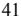

{43}------------------------------------------------

# **Note 2 - Summary of Significant Accounting Policies (continued**)

#### **Allowance for Loan Losses**

The allowance for loan losses is increased through provisions charged to operations and by recoveries, if any, on previously charged-off loans and reduced by charge-offs on loans which are determined to be a loss in accordance with Bank policy.

The allowance for loan losses is maintained at a level considered adequate to absorb loan losses. Management, in determining the allowance for loan losses, considers the risks inherent in its loan portfolio and changes in the nature and volume of its loan activities, along with the general economic and real estate market conditions. The Bank utilizes a two-tier approach: (1) identification of impaired loans and establishment of specific loss allowances on such loans; and (2) establishment of general valuation allowances on the remainder of its loan portfolio. The Bank maintains a loan review system which allows for a periodic review of its loan portfolio and the early identification of potentially impaired loans. Such a system takes into consideration, but is not limited to, delinquency status, size of loans, types and value of collateral, and financial condition of the borrowers. Specific loan loss allowances are established for impaired loans based on a review of such information and/or appraisals of the underlying collateral. General loan loss allowances are based upon a combination of factors including, but not limited to, actual loan loss experience, composition of the loan portfolio, current economic conditions, and management's judgment. Although management believes that adequate specific and general allowances for loan losses are established, actual losses are dependent upon future events and, as such, further additions to the level of specific and general loan loss allowances may be necessary.

Impaired loans and performing troubled debt restructure loans ("TDRs") are analyzed on an individual basis for impairment and are measured based on the present value of expected cash flows discounted at the loan's effective interest rate, or as a practical expedient, at the loan's observable market price, or the fair value of the collateral if the loan is collateral dependent. A loan evaluated for impairment is deemed to be impaired when, based on current information and events, it is probable that the Bank will be unable to collect all amounts due according to the contractual terms of the loan agreement. All loans identified as impaired are evaluated individually. The Bank does not aggregate such loans for evaluation purposes.

When a loan is classified as nonaccrual, interest accruals discontinue and generally, until the loan becomes current, any payments received from the borrower are applied to outstanding principal under the cost recovery method until such time as management determines that the financial condition of the borrower and other factors merit recognition of a portion of such payments as interest income.

### **Premises and Equipment**

Land is carried at cost. Buildings, building improvements, leasehold improvements and furniture, fixtures and equipment are carried at cost less accumulated depreciation and amortization. Significant renovations and additions are charged to the property and equipment account. Maintenance and repairs are charged to expense in the period incurred. Depreciation charges are computed on the straight-line method over the following estimated useful lives of each type of asset.

|                                   | Years                                   |
|-----------------------------------|-----------------------------------------|
| Buildings                         | 40                                      |
| Building improvements             | 7 - 40                                  |
| Furniture, fixtures and equipment | 5 - 7                                   |
| Leasehold improvements            | Shorter of useful life or term of lease |

### **Federal Home Loan Bank of New York Stock**

Federal law requires a member institution of the FHLB system to purchase and hold restricted stock of its district FHLB according to a predetermined formula. Such stock is carried at cost. The Company reviews for impairment based on the ultimate recoverability of the cost basis of the stock. No impairment charges were recorded related to the FHLB of New York stock during 2022 or 2021.

#### **Other Real Estate Owned**

Assets acquired through, or in lieu of, loan foreclosures are held for sale and are initially recorded at fair value less cost to sell at the date of foreclosure, establishing a new cost basis. Subsequent to foreclosure, valuations are periodically performed by management and the assets are carried at the lower of carrying amount or fair value less cost to sell. Costs relating to development and improvement of property are capitalized, whereas costs relating to the holding of property are expensed. At December 31, 2022, the Bank owned one property totaling \$75,000. At December 31, 2021, the Bank owned one property totaling \$75,000.

#### **Interest Rate Risk**

The Bank is principally engaged in the business of attracting deposits from the general public and using these deposits, together with other funds, to make loans primarily secured by real estate and to purchase securities. The potential for interest-rate risk exists as a result of the difference in duration of the Bank's interest-sensitive liabilities compared to its interest-sensitive assets. For this reason, management regularly monitors the maturity structure of the Bank's interest-earning assets and interest-bearing liabilities in order to measure its level of interest-rate risk and to plan for future volatility.

{44}------------------------------------------------

# **Note 2 - Summary of Significant Accounting Policies (continued**)

#### **Fair Value Hierarchy**

ASC Topic 820, Fair Value Measurements and Disclosures, establishes a fair value hierarchy that prioritizes the inputs to valuation methods used to measure fair value. The hierarchy gives the highest priority to unadjusted quoted prices in active markets for identical assets or liabilities (Level 1 measurements) and the lowest priority to unobservable inputs (Level 3 measurements). The three levels of the fair value hierarchy are as follows:

- Level 1: Unadjusted quoted prices in active markets that are accessible at the measurement date for identical, unrestricted assets or liabilities.
- Level 2: Quoted prices in markets that are not active, or inputs that are observable either directly or indirectly, for substantially the full term of the asset or liability.
- Level 3: Prices or valuation techniques that require inputs that are both significant to the fair value measurement and unobservable (i.e., supported with little or no market activity).

An asset's or liability's level within the fair value hierarchy is based on the lowest level of input that is significant to the fair value measurement.

#### **Mortgage Servicing Rights**

The Company recognizes as separate assets the rights to service mortgage loans. The right to service loans for others is generally obtained through the sale of loans with servicing retained. The initial asset recognized for originated mortgage servicing rights ("MSR") is measured at fair value. The estimated fair value of MSR is obtained through independent third-party valuations through an analysis of future cash flows, incorporating assumptions market participants would use in determining fair value including market discount rates, prepayment speeds, servicing income, servicing costs, default rates and other market driven data, including the market's perception of future interest rate movements. MSR are amortized in proportion to and over the period of estimated net servicing income. We apply the amortization method for measurements of our MSR. MSR are assessed for impairment based on fair value at each reporting date. MSR impairment, if any, is recognized in a valuation allowance through charges to earnings as a component of fees and service charges. Subsequent increases in the fair value of impaired MSR are recognized only up to the amount of the previously recognized valuation allowance. Fees earned for servicing loans are reported as income when the related mortgage loan payments are collected.

#### **Transfers of Financial Assets**

Transfers of financial assets are accounted for as sales, when control over the assets has been surrendered. Control over transferred assets is deemed to be surrendered when (1) the assets have been isolated from the Company, (2) the transferee obtains the right (free of conditions that constrain it from taking advantage of that right) to pledge or exchange the transferred assets, and (3) the Company does not maintain effective control over the transferred assets through an agreement to repurchase them before their maturity.

#### **Bank-Owned Life Insurance**

Bank-Owned Life Insurance policies are reflected on the consolidated statements of financial condition at cash surrender value. Changes in the net cash surrender value of the policies, as well as insurance proceeds received, are reflected in non-interest income on the consolidated statements of operations and are not subject to income taxes.

#### **Goodwill and Other Intangible Assets**

Goodwill resulting from a business combination is generally determined as the excess of the fair value of the consideration transferred over the fair value of the net assets acquired as of the acquisition date. Goodwill acquired in a business combination and determined to have an indefinite useful life is not amortized, but tested for impairment at least annually. The Company has selected October 31 as the date to perform the annual goodwill impairment test.

#### **Income Taxes**

The Company and its subsidiaries file a consolidated federal income tax return. Income taxes are allocated to the Company and its subsidiaries based upon their respective income or loss included in the consolidated income tax return. Separate state income tax returns are filed by the Company and its subsidiaries.

Federal and state income tax expense has been provided on the basis of reported income. The amounts reflected on the tax returns differ from these provisions due principally to temporary differences in the reporting of certain items for financial reporting and income tax reporting purposes. The tax effect of these temporary differences is accounted for as deferred taxes applicable to future periods. Deferred income tax expense or (benefit) is determined by recognizing deferred tax assets and liabilities for the estimated future tax consequences attributable to differences between the financial statement carrying amounts of existing assets and liabilities and their respective tax bases. Deferred tax assets and liabilities are measured using enacted tax rates expected to apply to taxable income in the years in which those temporary differences are expected to be recovered or settled. The effect on deferred tax assets and liabilities of a change in tax rates is recognized in earnings in the period that includes the enactment date. The realization of deferred tax assets is assessed and a valuation allowance provided, when necessary, for that portion of the asset which is not more likely than not to be realized.

The Company accounts for uncertainty in income taxes recognized in the consolidated financial statements in accordance with ASC Topic 740, *Income Taxes*, which prescribes a recognition threshold and measurement attribute for the financial statement recognition and measurement of a tax position taken or expected to be taken in a tax return, and also provides guidance on derecognition, classification, interest and penalties, accounting in interim periods, disclosure and transition. A tax position is recognized as a benefit only if it is "more likely than not" that the tax position would be sustained in a tax examination, with a tax examination being presumed to occur. The amount recognized is the largest amount of tax benefit that has a likelihood of being realized on examination of more than 50 percent. For tax positions not meeting the "more likely than not" test, no tax benefit is recorded. Under the "more likely than not" threshold guidelines, the Company believes no significant uncertain tax positions exist, either individually or in the aggregate, that would give rise to the non-recognition of an existing tax benefit. The Company recognizes interest and penalties on unrecognized tax benefits in income taxes expense in the Consolidated Statement of Operations. The Company did not recognize any interest and penalties for the years ended December 31, 2022 or 2021. The tax years subject to examination by the Federal taxing authority are the years ended December 31, 2021, 2020, and 2019. The tax years subject to examination by the State taxing authorities are the years ended December 31, 2021, 2020, 2019, and 2018. In 2022, the company received notice that it had been selected for audit by the State of New Jersey for the years ending December 31, 2020, 2019, and 2018. The audit was completed in 2022 and resulted in a nominal audit adjustment. In 2022, the Company received notice that it had been selected for an audit by the City of New York for the years ending December 31, 2020, 2019, 2018, and 2017. The audit was completed in 2022 and resulted in a nominal audit adjustment.

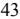

{45}------------------------------------------------

#### **Note 2 – Summary of Significant Accounting Policies (continued)**

#### **Net Income per Common Share**

Basic net income per common share is computed by dividing net income less dividends on preferred stock by the weighted average number of shares of common stock outstanding. The diluted net income per common share is computed by adjusting the weighted average number of shares of common stock outstanding to include the effects of outstanding stock options, if dilutive, using the treasury stock method. Dilution is not applicable in periods of net loss. For the years ended December 31, 2022 and 2021, the difference in the weighted average number of basic and diluted common shares was due solely to the effects of outstanding stock options. No adjustments to net income were necessary in calculating basic and diluted net income per share. For the year ended December 31, 2022, the Company had 0 shares considered to be anti-dilutive. For the year ended December 31, 2021, the Company had 3,588 shares considered to be anti-dilutive.

|                                | For the Year Ended December 31, |                         |    |                                       |    |                           |                         |    |                     |  |  |
|--------------------------------|---------------------------------|-------------------------|----|---------------------------------------|----|---------------------------|-------------------------|----|---------------------|--|--|
|                                | 2022                            |                         |    |                                       |    | 2021                      |                         |    |                     |  |  |
|                                | Net Income (Numerator)       | Shares (Denominator) |    | Per Share Amount                   |    | Net Income (Numerator) | Shares (Denominator) |    | Per Share Amount |  |  |
|                                |                                 |                         |    | (In Thousands, Except per share data) |    |                           |                         |    |                     |  |  |
| Net income                     | \$ 45,579                    |                         |    |                                       | \$ | 34,240                    |                         |    |                     |  |  |
| Basic earnings per share       |                                 |                         |    |                                       |    |                           |                         |    |                     |  |  |
| Income available to            |                                 |                         |    |                                       |    |                           |                         |    |                     |  |  |
| Common stockholders            | \$ 44,783                    | 16,969                  | \$ | 2.64                                  | \$ | 33,080                    | 17,063                  | \$ | 1.94                |  |  |
| Effect of dilutive securities: |                                 |                         |    |                                       |    |                           |                         |    |                     |  |  |
| Stock options                  |                                 | 380                     |    |                                       |    |                           | 176                     |    |                     |  |  |
| Diluted earnings per share     |                                 |                         |    |                                       |    |                           |                         |    |                     |  |  |
| Income available to            |                                 |                         |    |                                       |    |                           |                         |    |                     |  |  |
| Common stockholders            | \$ 44,783                    | 17,349                  | \$ | 2.58                                  | \$ | 33,080                    | 17,239                  | \$ | 1.92                |  |  |

#### **Stock-Based Compensation Plans**

The Company, under plans approved by its stockholders in 2018 and 2011, has granted stock options to employees and outside directors. See Note 12 for additional information as to option grants. Compensation expense recognized for option grants is net of estimated forfeitures and is recognized over the awards' respective requisite service periods. The fair values relating to options granted are estimated using a Black-Scholes option pricing model. Expected volatilities are based on historical volatility of the Company's stock and other factors, such as implied market volatility using the respective options' expected term. The Company used the mid-point of the original vesting period and original option life to estimate the options' expected term, which represents the period of time that the options granted are expected to be outstanding. The risk-free rate for periods within the contractual life of the option is based on the U.S. Treasury yield curve in effect at the time of grant. The Company recognizes compensation expense for the fair values of option awards, which have graded vesting, on a straight-line basis.

#### **Benefit Plans**

The Company acquired, through the merger with Pamrapo Bancorp, Inc., a non-contributory defined benefit pension plan covering all eligible employees of Pamrapo Savings Bank. Effective January 1, 2010, the defined benefit pension plan (the "Pension Plan"), was frozen by Pamrapo Savings Bank. All benefits for eligible participants accrued in the Pension Plan to January 1, 2010 have been retained. The benefits are based on years of service and employee's compensation. The Pension Plan is funded in conformity with funding requirements of applicable government regulations. Prior service costs for the Pension Plan generally are amortized over the estimated remaining service periods of employees.

The Bank entered into a Supplemental Executive Retirement Agreement (the "SERP Agreement") with its Chief Executive Officer ("the CEO") in December 2021. Upon the CEO's retirement, the Bank will provide for a monthly retirement payment for his lifetime. The SERP Agreement provides that a retirement benefit is payable upon his attaining age sixty-five (65) while in service to the Bank and a lesser benefit is payable upon early retirement. The SERP Agreement provides the CEO with supplemental retirement income payable in the form of a life annuity. Upon the Executive's separation from service after reaching normal retirement age (age 65), for any reason other than death, benefit payments will commence on the first day of the second month following CEO's separation from service, payable monthly and continuing for the CEO's lifetime. The monthly benefit payment will be \$10,000. The amount charged to expense follows the vesting schedule in the SERP Agreement and was \$328,000 in 2022.

#### **Comprehensive Income (Loss)**

The Company records unrealized gains and losses, net of deferred income taxes, on securities available-for-sale in accumulated other comprehensive income (loss). Realized gains and losses, if any, are reclassified to non-interest income upon sale of the related securities or upon the recognition of an impairment loss. Accumulated other comprehensive income (loss) also includes benefit plan amounts recognized in accordance with ASC 715, *Compensation-Retirement Benefits*, which reflect, net of tax, the unrecognized gains (losses) on the benefit plans.

{46}------------------------------------------------

#### **Note 2 – Summary of Significant Accounting Policies (continued)**

#### **Recent Accounting Pronouncements**

In December 2022, the financial Accounting Standards Board ("FASB") issued Accounting Standards Update ("ASU") 2022-06, *Reference Rate Reform (Topic 848): Deferral of the Sunset Date of Topic 848.* The amendments n this ASU defer the sunset date of Topic 848 from December 31, 2022, to December 31, 2024, after which entities will no longer be permitted to apply the relief in Topic 848. The ASU is effective upon issuance. The FASB had previously issued 2020-04 - *Facilitation of the Ef ects of Reference Rate Reform on Financial Reporting* and related amendments in 2020 to ease the potential burden in accounting for reference rate reform. The amendments in ASU 2020-04 were elective and applied to all entities that have contracts, hedging relationships, and other transactions that reference the London Inter-bank Offer Rate ("LIBOR") or another reference rate expected to be discontinued due to reference rate reform. The Company does not anticipate the adoption of the new ASU will not have an impact on the Company's consolidated financial statements.

In March 2022, the FASB issued ASU 2022-02, *Financial Instruments—Credit Losses (Topic 326): Troubled Debt Restructurings and Vintage Disclosures.* The amendments in this update eliminate the existing accounting guidance for troubled debt restructures ("TDRs") by creditors in *Subtopic 310-40, Receivables - Troubled Debt Restructurings by Creditor*s and instead requires that an entity evaluate whether a modification represents a new loan or a continuation of an existing loan. The amendments also enhance disclosure requirements for certain loan refinancing and restructuring by creditors when a borrower is experiencing financial difficulty. All amendments in this update are effective for fiscal years beginning after December 15, 2022, including interim periods within those fiscal years. The Company does not expect that the adoption of this standard will have a material effect on the Company's financial statements

In June 2016, the Financial Accounting Standards Board ("FASB") issued ASU 2016-13, *Financial Instruments - Credit Losses* ASU 2016-13, and related guidance, requires entities to report "expected" credit losses on financial instruments and other commitments to extend credit rather than the current "incurred loss" model. These expected credit losses for financial assets held at the reporting date are to be based on historical experience, current conditions, and reasonable and supportable forecasts. This ASU will also require enhanced disclosures to help investors and other financial statement users better understand significant estimates and judgments used in estimating credit losses, as well as the credit quality and underwriting standards of an entity's portfolio. These disclosures include qualitative and quantitative requirements that provide additional information about the amounts recorded in the consolidated financial statements.

The amendments are effective for the Company in 2023. The Company engaged a third-party vendor to assist in the development of a CECL model that would be used in the calculation of the allowance for loan and lease losses. The Company also engaged a third-party vendor to perform validation of our model.

There are a number of key factors and assumptions that are involved in the Company's CECL methodology. The following are some of the factors:

- methods based on probability of default and loss given default which are modeled based on macroeconomic scenarios;
- a reasonable and supportable forecast period determined based on management's current review of macroeconomic environment;
- a reversion period after the reasonable and supportable forecast period;
- estimated prepayment rates based on the Company's historical experience and future macroeconomic environment; and
- incorporation of qualitative factors not captured within the modeled results.

The adoption of ASU 2016-13 will result in an allowance for credit losses amount at January 1, 2023. The impact upon adoption will be reflected as a cumulative effect adjustment to retained earnings, net of taxes. The Company is currently finalizing the execution of its implementation controls and concluding the model validation process. The Company does not expect the cumulativeeffect adjustment to retained earnings for the change in the allowance for credit losses upon adoption to have a material impact on regulatory capital and ratios (unaudited).

#### **Note 3 - Related Party Transactions**

The Bank leases a property from New Bay, LLC. ("New Bay"), a limited liability company 100 percent owned by a majority of the Directors of the Bank and the Company. In conjunction with the lease, New Bay substantially removed the pre-existing structure on the site and constructed a new building suitable to the Bank for its banking operations. Under the terms of the lease, the cost of this project was reimbursed to New Bay by the Bank. The amount reimbursed, which occurred during the year 2000, was \$943,000, and is included in property and equipment under the caption "Building and improvements" (see Note 6). On May 1, 2006, the Bank renegotiated the lease to a twenty-five-year term. The Bank paid New Bay \$165,000 a year (\$13,750 per month) which is included in the Consolidated Statements of Operations for 2022 and 2021, within occupancy expense. The rent is to be adjusted every five years thereafter at the fair market rental value. The Bank expects to pay \$165,000 in rental expense for the year 2023.

On March 6, 2014, the Bank entered into a ten-year lease of property in Rutherford, New Jersey with 190 Park Avenue, LLC, which is owned by two Directors of the Bank and the Company. The rent is \$7,588 per month and lease payments of \$102,053 and \$99,482 were made in years 2022 and 2021, which is reflected in the Consolidated Statement of Operations within occupancy expense. The Bank expects to pay \$102,883 in rental expense for the year 2023.

On August 3, 2018, the Bank entered in to a ten-year lease of property in River Edge, New Jersey with 876 Kinderkamack, LLC, which is owned by a majority of the directors of the Bank and the Company. The rent is \$8,000 per month and lease payments of \$96,000 and \$96,000 were made in the years 2022 and 2021, which is reflected in the Consolidated Statements of Operations within occupancy expense. The Bank expects to pay \$96,000 in rental expense for the year 2023.

On April 2, 2021, the Bank renewed a five-year lease of property in Lyndhurst, New Jersey with 734 Ridge Realty, LLC, which is owned by seven Directors of the Bank and the Company. The rent is \$7,718 per month and lease payments of \$92,610 and \$90,773 were made in years 2022 and 2021, which is reflected in the Consolidated Statement of Operations within occupancy expense. The Bank expects to pay \$92,610 in rental expense for the year 2023.

During the years ended December 31, 2022 and 2021, legal fees were paid to a law firm owned by a Director of the Bank and the Company totaling \$75,000 and \$0, respectively.

# **Note 4- Securities**

# **Equity Securities**

Equity securities are reported at fair value on the Company's Consolidated Statements of Financial Condition. The Company's portfolio of equity securities had an estimated fair value of \$17.7 million and \$25.2 million as of December 31, 2022 and December 31, 2021, respectively. Included in this category are equity holdings of financial institutions. Equity securities are defined to include (a) preferred, common and other ownership interests in entities including partnerships, joint ventures and limited liability companies and (b) rights to acquire or dispose of ownership interest in entities at fixed or determinable prices.

{47}------------------------------------------------

#### **Note 4- Securities (continued)**

Equity securities are generally required to be measured at fair value with market value adjustments being reflected in net income.

The following table presents the disaggregated net losses on equity securities reported in the Consolidated Statements of Operations (In Thousands):

|                                                                                                                        | For the Twelve Months Ended December 31, 2022 | For the Twelve Months Ended December 31, 2021 |
|------------------------------------------------------------------------------------------------------------------------|--------------------------------------------------|--------------------------------------------------|
| Net gains (losses) recognized during the period on equity securities                                                   | \$ (6,269)                                    | \$ 147                                        |
| Less: Net gains (losses) recognized during the period on equity securities sold during the period                      | (59)                                             | -                                                |
| Unrealized gains (losses) recognized during the reporting period on equity securities still held at the reporting date | \$ (6,210)                                    | \$ 147                                        |

#### **Debt Securities Available for Sale**

The following table sets forth information regarding the amortized cost, estimated fair values, and unrealized gains and losses for the Bank's debt securities portfolio at December 31, 2022 by final contractual maturity. The following table does not take into consideration the effects of scheduled repayments or the effects of possible prepayments. Certain securities have interest rates that are adjustable and will reprice annually within the various maturity ranges. The effect of these repricings are not reflected in the table below.

|                                          | December 31, 2022 |    |                |                               |    |            |  |  |
|------------------------------------------|-------------------|----|----------------|-------------------------------|----|------------|--|--|
|                                          | Amortized Cost |    |                | Gross Unrealized Losses |    | Fair Value |  |  |
|                                          |                   |    | (In Thousands) |                               |    |            |  |  |
| Residential Mortgage-backed securities:  |                   |    |                |                               |    |            |  |  |
| More than five to ten years              | \$ 5,445       | \$ | - \$        | 350                           | \$ | 5,095      |  |  |
| More than ten years                      | 23,210            |    | -              | 3,435                         |    | 19,775     |  |  |
| Sub-total:                               | 28,655            |    | -              | 3,785                         |    | 24,870     |  |  |
|                                          |                   |    |                |                               |    |            |  |  |
| Corporate Debt Securities:               |                   |    |                |                               |    |            |  |  |
| Due within one year                      | 7,321             |    |                | 91                            |    | 7,230      |  |  |
| More than five to ten years              | 59,629            |    | -              | 4,005                         |    | 55,624     |  |  |
| Sub-total:                               | 66,950            |    | -              | 4,096                         |    | 62,854     |  |  |
|                                          |                   |    |                |                               |    |            |  |  |
| Municipal obligations:                   |                   |    |                |                               |    |            |  |  |
| Due after ten years                      | 3,997             |    | -              | 6                             |    | 3,991      |  |  |
| Sub-total:                               | 3,997             |    | -              | 6                             |    | 3,991      |  |  |
|                                          |                   |    |                |                               |    |            |  |  |
| Total Debt Securities Available-for-Sale | \$ 99,602      | \$ | - \$        | 7,887                         | \$ | 91,715     |  |  |

|                                          |    | December 31, 2021 |    |                     |    |            |    |            |  |
|------------------------------------------|----|-------------------|----|---------------------|----|------------|----|------------|--|
|                                          |    |                   |    | Gross               |    | Gross      |    |            |  |
|                                          |    | Amortized Cost |    | Unrealized Gains |    | Unrealized |    |            |  |
|                                          |    |                   |    |                     |    | Losses     |    | Fair Value |  |
|                                          |    |                   |    | (In Thousands)      |    |            |    |            |  |
| Residential Mortgage-backed securities   |    |                   |    |                     |    |            |    |            |  |
| Due within one year                      | \$ | 2,952             | \$ | -                   | \$ | 114        | \$ | 2,838      |  |
| More than one to five years              |    | 53                |    | -                   |    | -          |    | 53         |  |
| More than five to ten years              |    | 6,317             |    | 165                 |    | 27         |    | 6,455      |  |
| More than ten years                      |    | 21,555            |    | 298                 |    | 287        |    | 21,566     |  |
| Sub-total:                               |    | 30,877            |    | 463                 |    | 428        |    | 30,912     |  |
|                                          |    |                   |    |                     |    |            |    |            |  |
| Corporate Debt Securities:               |    |                   |    |                     |    |            |    |            |  |
| More than five to ten years              |    | 47,765            |    | 2,465               |    | 159        |    | 50,071     |  |
| Sub-total:                               |    | 47,765            |    | 2,465               |    | 159        |    | 50,071     |  |
|                                          |    |                   |    |                     |    |            |    |            |  |
| Municipal obligations:                   |    |                   |    |                     |    |            |    |            |  |
| Due after ten years                      |    | 4,104             |    | 99                  |    | -          |    | 4,203      |  |
| Sub-total:                               |    | 4,104             |    | 99                  |    | -          |    | 4,203      |  |
|                                          |    |                   |    |                     |    |            |    |            |  |
| Total Debt Securities Available-for-Sale | \$ | 82,746            | \$ | 3,027               | \$ | 587        | \$ | 85,186     |  |
|                                          |    |                   |    |                     |    |            |    |            |  |

{48}------------------------------------------------

#### **Note 4- Securities (continued)**

The unrealized losses, categorized by the length of time of continuous loss position, and fair value of related securities available for sale were as follows:

|                                        | Less than 12 Months |    | More than 12 Months |                |    | Total      |    |        |    |            |
|----------------------------------------|---------------------|----|---------------------|----------------|----|------------|----|--------|----|------------|
|                                        | Fair                |    | Unrealized          | Fair           |    | Unrealized |    | Fair   |    | Unrealized |
|                                        | Value               |    | Losses              | Value          |    | Losses     |    | Value  |    | Losses     |
|                                        |                     |    |                     | (In Thousands) |    |            |    |        |    |            |
| December 31, 2022                      |                     |    |                     |                |    |            |    |        |    |            |
| Residential mortgage-backed securities | \$ 17,362        | \$ | 2,022               | \$ 7,508    | \$ | 1,763      | \$ | 24,870 | \$ | 3,785      |
| Corporate Debt Securities              | 51,607              |    | 3,199               | 9,948          |    | 897        |    | 61,555 |    | 4,096      |
| Muni Bond                              | 3,991               |    | 6                   |                |    |            |    | 3,991  |    | 6          |
|                                        | \$ 72,960        | \$ | 5,227               | \$ 17,456   | \$ | 2,660      | \$ | 90,416 | \$ | 7,887      |
| December 31, 2021                      |                     |    |                     |                |    |            |    |        |    |            |
| Residential mortgage-backed securities | \$ 7,801         | \$ | 159                 | \$ 4,681    | \$ | 269        | \$ | 12,482 | \$ | 428        |
| Corporate Debt Securities              | 12,324              |    | 159                 | -              |    | -          |    | 12,324 |    | 159        |
|                                        | \$ 20,125        | \$ | 318                 | \$ 4,681    | \$ | 269        | \$ | 24,806 | \$ | 587        |

Management evaluates securities for other-than-temporary impairment ("OTTI") at least on a quarterly basis, and more frequently when economic or market conditions warrant such evaluation. Consideration is given to (1) the length of time and the extent to which the fair value has been less than cost, (2) the financial condition and near-term prospects of the issuer, and (3) whether the Company intends to sell the security or more likely than not will be required to sell the security before its anticipated recovery. At December 31, 2022 and 2021, management performed an assessment for possible OTTI of the Company's residential mortgage-backed securities, corporate debt securities, and municipal obligations relying on information obtained from various sources, including publicly available financial data, ratings by external agencies, brokers and other sources. The extent of individual analysis applied to each security depended on the size of the Company's investment, as well as management's perception of the credit risk associated with each security. Based on the results of the assessment, management believes impairment of these securities, at December 31, 2022 and 2021 to be temporary.

#### **Note 5 - Loans Receivable and Allowance for Loan Losses**

The following table presents the recorded investment in loans receivable at December 31, 2022 and December 31, 2021 by segment and class:

|                                | December 31, 2022 | December 31, 2021 |                |  |  |
|--------------------------------|-------------------|-------------------|----------------|--|--|
|                                |                   |                   | (In Thousands) |  |  |
| Loans:                         |                   |                   |                |  |  |
| Residential one-to-four family | \$ 250,123     | \$                | 224,534        |  |  |
| Commercial and multi-family    | 2,345,229         |                   | 1,720,174      |  |  |
| Construction                   | 144,931           |                   | 153,904        |  |  |
| (1) Commercial business     | 282,007           |                   | 191,139        |  |  |
| (2) Home equity             | 56,888            |                   | 50,469         |  |  |
| Consumer                       | 3,240             |                   | 3,717          |  |  |
| Total Loans                    | 3,082,418         |                   | 2,343,937      |  |  |
| Less:                          |                   |                   |                |  |  |
| Deferred loan fees, net        | (4,714)           |                   | (1,876)        |  |  |
| Allowance for loan losses      | (32,373)          |                   | (37,119)       |  |  |
|                                | (37,087)          |                   | (38,995)       |  |  |
| Total Loans, net               | \$ 3,045,331   | \$                | 2,304,942      |  |  |
| __________                     |                   |                   |                |  |  |

(1) Includes business lines of credit.

(2) Includes home equity lines of credit.

The Company occasionally transfers a portion of its originated commercial loans to participating lending partners. The amounts transferred have been accounted for as sales and are therefore not included in the Company's accompanying consolidated Statements of Financial Condition. The Company and its lending partners share proportionally in any gains or losses that may result from a borrower's lack of compliance with contractual terms of the loan. The Company continues to service the loans, collects cash payments from the borrowers, remits payments (net of servicing fees), and disburses required escrow funds to relevant parties.

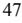

{49}------------------------------------------------

#### **Note 5 - Loans Receivable and Allowance for Loan Losses (continued)**

At December 31, 2022 and 2021, loans serviced by the Bank for the benefit of others totaled approximately \$159.3 million and \$196.3 million, respectively.

#### **Acquired Loans**

The difference between the undiscounted cash flows expected at acquisition and the investment in the acquired loans, or the "accretable yield," is recognized as interest income utilizing the level-yield method over the life of each loan. Contractually required payments for interest and principal that exceed the undiscounted cash flows expected at acquisition, or the "non- accretable difference," are not recognized as a yield adjustment, as a loss accrual or as a valuation allowance. Under ASC Subtopic 310-30, these PCI loans may be aggregated and accounted for as pools of loans if the loans being aggregated have common risk characteristics. The Company elected to account for the loans with evidence of credit deterioration individually rather than aggregate them into pools.

Increases in expected cash flows subsequent to the acquisition are recognized prospectively through an adjustment of the yield on the loans over the remaining life, while decreases in expected cash flows are recognized as impairments through a loss provision and an increase in the allowance for loan losses. Valuation allowances (recognized in the allowance for loan losses) on these impaired loans reflect only losses incurred after the acquisition (representing all cash flows that were expected at acquisition but currently are not expected to be received).

The following table presents the unpaid principal balance and the related recorded investment of all acquired loans included in the Company's Consolidated Statements of Financial Condition.

|                          | December 31,   |    |         |  |
|--------------------------|----------------|----|---------|--|
|                          | 2022           |    | 2021    |  |
|                          | (In Thousands) |    |         |  |
| Unpaid principal balance | \$ 114,053  | \$ | 140,969 |  |
| Recorded investment      | 101,430        |    | 122,533 |  |
|                          |                |    |         |  |

The accretable discount on loans acquired with deteriorated credit quality was not material.

#### **Related-Party Loans**

The Bank grants loans to its officers and directors and to their associates. The activity with respect to loans to directors, officers and associates of such persons, is as follows:

|                          |              | Years Ended December 31, |
|--------------------------|--------------|--------------------------|
|                          | 2022         | 2021                     |
|                          |              | (In Thousands)           |
| Balance – beginning      | \$ 31,696 | \$ 29,159             |
| Loans originated         | -            | 14,875                   |
| Collections of principal | (5,431)      | (12,338)                 |
| Balance - ending         | \$ 26,265 | \$ 31,696             |

#### **Allowance for Loan Losses**

The allowance for loan loss is evaluated regularly by management and reflects consideration of all significant factors that affect the collectability of the loan portfolio. The Company's methodology for assessing the adequacy of the allowance for loan losses consists of several key elements. These elements include a general allocated reserve for performing loans, a specific reserve for impaired loans and an unallocated portion.

The Company consistently applies the following comprehensive methodology. During the quarterly review of the allowance for loan losses, the Company considers a variety of qualitative factors that include:

- Lending Policies and Procedures;
- Personnel responsible for the particular portfolio relative to experience and ability of staff;
- Trend for past due, criticized and classified loans;
- Relevant economic factors;
- Quality of the loan review system;
- Value of collateral for collateral dependent loans;
- The effect of any concentrations of credit and the changes in the level of such concentrations; and
- Other external factors.

The methodology includes the segregation of the loan portfolio into two divisions: performing loans and loans determined to be impaired. Loans which are performing are evaluated homogeneously by loan class or loan type. The allowance for performing loans is evaluated based on historical loan loss experience with an adjustment for the qualitative factors listed above. Impaired loans can be loans which are more than 90 days delinquent, troubled debt restructured, in the process of foreclosure, or a forced bankruptcy plan. These loans are individually evaluated for loan loss either by current appraisal, or net present value of expected cash flows. Management reviews the overall estimate for feasibility and bases the loan loss provision accordingly. During 2022 and 2021, additional stress tests were performed to model a potential collateral deficiency on those loans that are in sectors that have demonstrated a weakness in the current COVID environment.

The Bank also maintains an unallocated allowance to cover uncertainties that could affect management's estimate of probable losses. The unallocated component of the allowance reflects the margin of imprecision inherent in the underlying assumptions used in the methodologies for estimating allocated and general reserves in the portfolio. Management must make estimates using assumptions and information that is often subjective and subject to change.

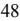

{50}------------------------------------------------

# **Note 5 - Loans Receivable and Allowance for Loan Losses (continued)**

The loan portfolio is segmented into the following loan segments, where the risk level for each class is analyzed when determining the allowance for loan losses:

Residential one-to-four family real estate loans involve certain risks such as interest rate risk and risk of non-repayment. Adjustable-rate residential real estate loans decrease the interest rate risk to the Bank that is associated with changes in interest rates but involve other risks, primarily because as interest rates rise, the payment by the borrower rises to the extent permitted by the terms of the loan, thereby increasing the potential for default. At the same time, the marketability of the underlying properties may be adversely affected by higher interest rates. Repayment risk may be affected by a number of factors including, but not necessarily limited to, job loss, divorce, illness and personal bankruptcy of the borrower.

Commercial and multi-family real estate lending entails additional risks as compared with residential family property lending. Such loans typically involve large loan balances to single borrowers or groups of related borrowers. The payment experience on such loans is typically dependent on the successful operation of the real estate project. The success of such projects is sensitive to changes in supply and demand conditions in the market for commercial real estate as well as economic conditions generally.

Construction lending is generally considered to involve a high risk due to the concentration of principal in a limited number of loans and borrowers and the effects of the general economic conditions on developers and builders. Moreover, a construction loan can involve additional risks because of the inherent difficulty in estimating both a property's value at completion of the project and the estimated cost (including interest) of the project. The nature of these loans is such that they are generally difficult to evaluate and monitor. In addition, speculative construction loans to a builder are not necessarily pre-sold and thus pose a greater potential risk to the Bank than construction loans to individuals on their personal residence.

Commercial business lending, including lines of credit, is generally considered higher risk due to the concentration of principal in a limited number of loans and borrowers and the effects of general economic conditions on the business. Commercial business loans are primarily secured by inventories and other business assets. In many cases, any repossessed collateral for a defaulted commercial business loans will not provide an adequate source of repayment of the outstanding loan balance.

Home equity lending entails certain risks such as interest rate risk and risk of non-repayment. The marketability of the underlying property may be adversely affected by higher interest rates, decreasing the collateral value securing the loan. Repayment risk can be affected by job loss, divorce, illness and personal bankruptcy of the borrower. Home equity line of credit lending entails securing an equity interest in the borrower's home. In many cases, the Bank's position in these loans is as a junior lien holder to another institution's superior lien. This type of lending is often priced on an adjustable rate basis with the rate set at or above a predefined index. Adjustable-rate loans decrease the interest rate risk to the Bank that is associated with changes in interest rates but involve other risks, primarily because as interest rates rise, the payment by the borrower rises to the extent permitted by the terms of the loan, thereby increasing the potential for default.

Other consumer loans generally have more credit risk because of the type and nature of the collateral and, in certain cases, the absence of collateral. Consumer loans generally have shorter terms and higher interest rates than other lending. In addition, consumer lending collections are dependent on the borrower's continuing financial stability, and thus are more likely to be adversely affected by job loss, divorce, illness and personal bankruptcy. In many cases, any repossessed collateral for a defaulted consumer loan will not provide an adequate source of repayment of the outstanding loan.

{51}------------------------------------------------

# **Note 5- Loans Receivable and Allowance for Loan Losses (continued)**

The following tables set forth the activity in the Bank's allowance for loan losses and recorded investment in loans receivable at December 31, 2022 and December 31, 2021. The table also details the amount of total loans receivable, that are evaluated individually, and collectively, for impairment, and the related portion of the allowance for loan losses that is allocated to each loan class (In Thousands):

|                                       | Residential   | Commercial & Multi family |           | Construction |         | Commercial Business (1) |         | Home Equity (2) |        | Consumer |       | Unallocated |        |      | Total     |  |
|---------------------------------------|---------------|---------------------------------|-----------|--------------|---------|----------------------------|---------|--------------------|--------|----------|-------|-------------|--------|------|-----------|--|
| Allowance for credit losses:          |               |                                 |           |              |         |                            |         |                    |        |          |       |             |        |      |           |  |
| Beginning Balance, December 31, 2021  | \$ 4,094   | \$                              | 22,065    | \$           | 2,231   | \$                         | 8,000   | \$                 | 533    | \$       | 14    | \$          | 182 \$ |      | 37,119    |  |
|                                       |               |                                 |           |              |         |                            |         |                    |        |          |       |             |        |      |           |  |
| Charge-offs:                          | -             |                                 | -         |              | -       |                            | (2,095) |                    | -      |          | -     |             | -      |      | (2,095)   |  |
| Recoveries:                           | 23            |                                 | -         |              | -       |                            | 191     |                    | 12     |          | 198   |             | -      |      | 424       |  |
| Provision (credit):                   | (1,643)       |                                 | (316)     |              | (137)   |                            | (729)   |                    | (60)   |          | (188) |             | (2)    |      | (3,075)   |  |
| Ending Balance, December 31, 2022     | \$ 2,474   | \$                              | 21,749    | \$           | 2,094   | \$                         | 5,367   | \$                 | 485    | \$       | 24    | \$          | 180 \$ |      | 32,373    |  |
|                                       |               |                                 |           |              |         |                            |         |                    |        |          |       |             |        |      |           |  |
| Ending Balance attributable to loans: |               |                                 |           |              |         |                            |         |                    |        |          |       |             |        |      |           |  |
| Individually evaluated for impairment | \$ 196     | \$                              | -         | \$           | 518     | \$                         | 2,066   | \$                 | 4      | \$       |       | - \$        |        | \$   | 2,784     |  |
| Collectively evaluated for impairment | 2,278         |                                 | 21,749    |              | 1,576   |                            | 3,301   |                    | 481    |          | 24    |             | 180    |      | 29,589    |  |
| Ending Balance, December 31, 2022     | \$ 2,474   | \$                              | 21,749    | \$           | 2,094   | \$                         | 5,367   | \$                 | 485    | \$       | 24    | \$          | 180 \$ |      | 32,373    |  |
|                                       |               |                                 |           |              |         |                            |         |                    |        |          |       |             |        |      |           |  |
| Loans Receivables:                    |               |                                 |           |              |         |                            |         |                    |        |          |       |             |        |      |           |  |
| Individually evaluated for impairment | \$ 5,147   | \$                              | 15,397    | \$           | 3,180   | \$                         | 3,821   | \$                 | 727    | \$       |       | - \$        |        | - \$ | 28,272    |  |
| Collectively evaluated for impairment | 244,976       |                                 | 2,329,832 |              | 141,751 |                            | 278,186 |                    | 56,161 |          | 3,240 |             | -      |      | 3,054,146 |  |
| Total Gross Loans                     | \$ 250,123 | \$                              | 2,345,229 | \$           | 144,931 | \$                         | 282,007 | \$                 | 56,888 | \$       | 3,240 | \$          |        | - \$ | 3,082,418 |  |
| __________                            |               |                                 |           |              |         |                            |         |                    |        |          |       |             |        |      |           |  |

(1) Includes business lines of credit.

(2) Includes home equity lines of credit.

|                                       | Residential   | Commercial & Multi family |    | Construction |    | Commercial Business (1) |    | Home Equity (2) |    | Consumer |      | Unallocated |      | Total     |
|---------------------------------------|---------------|---------------------------------|----|--------------|----|----------------------------|----|--------------------|----|----------|------|-------------|------|-----------|
| Allowance for credit losses:          |               |                                 |    |              |    |                            |    |                    |    |          |      |             |      |           |
| Beginning Balance, December 31, 2020  | \$ 3,293   | \$ 21,772                    | \$ | 1,977        | \$ | 6,306                      | \$ | 286                | \$ |          | - \$ | 5           | \$   | 33,639    |
|                                       |               |                                 |    |              |    |                            |    |                    |    |          |      |             |      |           |
| Charge-offs:                          | (69)          | -                               |    | -            |    | (205)                      |    | -                  |    | (198)    |      | -           |      | (472)     |
| Recoveries:                           | 27            | -                               |    | -            |    | 3                          |    | 67                 |    | -        |      | -           |      | 97        |
| Provision (credit):                   | 843           | 293                             |    | 254          |    | 1,896                      |    | 180                |    | 212      |      | 177         |      | 3,855     |
| Ending Balance, December 31, 2021     | \$ 4,094   | \$ 22,065                    | \$ | 2,231        | \$ | 8,000                      | \$ | 533                | \$ | 14       | \$   | 182         | \$   | 37,119    |
|                                       |               |                                 |    |              |    |                            |    |                    |    |          |      |             |      |           |
| Ending Balance attributable to loans: |               |                                 |    |              |    |                            |    |                    |    |          |      |             |      |           |
| Individually evaluated for impairment | \$ 265     | \$ 1,690                     | \$ | 210          | \$ | 5,650                      | \$ | 13                 | \$ |          | - \$ |             | - \$ | 7,828     |
| Collectively evaluated for impairment | 3,829         | 20,375                          |    | 2,021        |    | 2,350                      |    | 520                |    | 14       |      | 182         |      | 29,291    |
| Ending Balance, December 31, 2021     | \$ 4,094   | \$ 22,065                    | \$ | 2,231        | \$ | 8,000                      | \$ | 533                | \$ | 14       | \$   | 182         | \$   | 37,119    |
|                                       |               |                                 |    |              |    |                            |    |                    |    |          |      |             |      |           |
| Loans Receivables:                    |               |                                 |    |              |    |                            |    |                    |    |          |      |             |      |           |
| Individually evaluated for impairment | \$ 4,961   | \$ 31,745                    | \$ | 2,847        | \$ | 8,746                      | \$ | 1,083              | \$ |          | - \$ |             | - \$ | 49,382    |
| Collectively evaluated for impairment | 219,573       | 1,688,429                       |    | 151,057      |    | 182,393                    |    | 49,386             |    | 3,717    |      | -           |      | 2,294,555 |
| Total Gross Loans                     | \$ 224,534 | \$ 1,720,174                 | \$ | 153,904      | \$ | 191,139                    | \$ | 50,469             | \$ | 3,717    | \$   |             | - \$ | 2,343,937 |
|                                       |               |                                 |    |              |    |                            |    |                    |    |          |      |             |      |           |

(1) Includes business lines of credit.

__________

(2) Includes home equity lines of credit.

{52}------------------------------------------------

#### **Note 5- Loans Receivable and Allowance for Loan Losses (continued)**

The table below sets forth the amounts and types of non-accrual loans in the Bank's loan portfolio at December 31, 2022 and 2021, respectively. Loans are generally placed on non-accrual status when they become more than 90 days delinquent, or when the collection of principal and/or interest become doubtful.

As of December 31, 2022, non-accrual loans differed from the amount of total loans past due greater than 90 days due to troubled debt restructuring of loans, loans 90 days past due but still accruing interest, or loans that were previously 90 days past due both of which are maintained on non-accrual status for a minimum of six months until the borrower has demonstrated their ability to satisfy the terms of the loan.

|                                |                | As of December 31, 2022 |    | As of December 31, 2021 |  |  |
|--------------------------------|----------------|----------------------------|----|----------------------------|--|--|
|                                | (In Thousands) |                            |    | (In Thousands)             |  |  |
| Non-Accruing Loans:            |                |                            |    |                            |  |  |
|                                |                |                            |    |                            |  |  |
| Residential one-to-four family | \$             | 243                        | \$ | 282                        |  |  |
| Commercial and multi-family    |                | 346                        |    | 8,601                      |  |  |
| Construction                   |                | 3,180                      |    | 2,847                      |  |  |
| (1) Commercial business     |                | 1,340                      |    | 3,132                      |  |  |
| (2) Home equity             |                | -                          |    | 27                         |  |  |
| Total                          | \$             | 5,109                      | \$ | 14,889                     |  |  |
| __________                     |                |                            |    |                            |  |  |

(1) Includes business lines of credit.

(2) Includes home equity lines of credit.

Had non-accrual loans been performing in accordance with their original terms, the interest income recognized for the years ended December 31, 2022 and 2021 would have been approximately \$1.0 million and \$1.3 million, respectively. Interest income recognized on loans returned to accrual was approximately \$1.6 million and \$1.2 million, respectively. The Bank is not committed to lend additional funds to the borrowers whose loans have been placed on a nonaccrual status. At December 31, 2022 and 2021, there were \$0 and \$3.1 million, respectively, of loans which were more than ninety days past due and still accruing interest.

Nonaccrual loans in the preceding table do not include loans acquired with deteriorated credit quality of \$0 at December 31, 2022, and \$668,000 at December 31, 2021, which were recorded at their fair value at acquisition.

The following table summarizes the recorded investment and unpaid principal balances of impaired loans for the years ended December 31, 2022 and December 31, 2021. (In Thousands):

|                                                          | As of December 31, 2022 |           |                             |           |  |                      |                        | As of December 31, 2021 |  |                             |  |                      |  |  |  |  |
|----------------------------------------------------------|-------------------------|-----------|-----------------------------|-----------|--|----------------------|------------------------|-------------------------|--|-----------------------------|--|----------------------|--|--|--|--|
|                                                          | Recorded Investment  |           | Unpaid Principal Balance |           |  | Related Allowance | Recorded Investment |                         |  | Unpaid Principal Balance |  | Related Allowance |  |  |  |  |
| Loans with no related allowance:                         |                         |           |                             |           |  |                      |                        |                         |  |                             |  |                      |  |  |  |  |
| Residential one-to-four family                           | \$                      | 3,313 \$  |                             | 3,472 \$  |  | -                    | \$                     | 2,950 \$                |  | 3,300 \$                    |  | -                    |  |  |  |  |
| Commercial and multi-family                              |                         | 15,397    |                             | 16,355    |  | -                    |                        | 20,915                  |  | 22,100                      |  | -                    |  |  |  |  |
| (1) Commercial business                               |                         | 691       |                             | 4,648     |  | -                    |                        | 2,114                   |  | 6,905                       |  | -                    |  |  |  |  |
| (2) Home equity                                       |                         | 500       |                             | 500       |  | -                    |                        | 779                     |  | 780                         |  | -                    |  |  |  |  |
| Total Impaired Loans with no related allowance recorded: | \$                      | 19,901 \$ |                             | 24,975 \$ |  | -                    | \$                     | 26,758 \$               |  | 33,085 \$                   |  | -                    |  |  |  |  |
| Loans with an allowance recorded:                        |                         |           |                             |           |  |                      |                        |                         |  |                             |  |                      |  |  |  |  |
| Residential one-to-four family                           | \$                      | 1,834 \$  |                             | 1,856 \$  |  | 196 \$               |                        | 2,011 \$                |  | 2,032 \$                    |  | 265                  |  |  |  |  |
| Commercial and Multi-family                              |                         | -         |                             | -         |  | -                    |                        | 10,830                  |  | 14,494                      |  | 1,690                |  |  |  |  |
| Construction                                             |                         | 3,180     |                             | 3,180     |  | 518                  |                        | 2,847                   |  | 2,847                       |  | 210                  |  |  |  |  |
| (1) Commercial business                               |                         | 3,130     |                             | 8,276     |  | 2,066                |                        | 6,632                   |  | 17,514                      |  | 5,650                |  |  |  |  |
| (2) Home equity                                       |                         | 227       |                             | 227       |  | 4                    |                        | 304                     |  | 304                         |  | 13                   |  |  |  |  |
| Total Impaired Loans with an allowance recorded:         | \$                      | 8,371 \$  |                             | 13,539 \$ |  | 2,784 \$             |                        | 22,624 \$               |  | 37,191 \$                   |  | 7,828                |  |  |  |  |
| Total Impaired Loans:                                    | \$                      | 28,272 \$ |                             | 38,514 \$ |  | 2,784 \$             |                        | 49,382 \$               |  | 70,276 \$                   |  | 7,828                |  |  |  |  |

(1) Includes business lines of credit.

(2) Includes home equity lines of credit.

{53}------------------------------------------------

### **Note 5- Loans Receivable and Allowance for Loan Losses (continued)**

The following table summarizes the average recorded investment and actual interest income recognized on impaired loans for the years ended December 31, 2022 and December 31, 2021 (In Thousands).

|                                                  | Years Ended December 31, |    |            |    |            |    |            |  |  |  |  |
|--------------------------------------------------|--------------------------|----|------------|----|------------|----|------------|--|--|--|--|
|                                                  | 2022                     |    | 2022       |    | 2021       |    | 2021       |  |  |  |  |
|                                                  | Average                  |    | Interest   |    | Average    |    | Interest   |  |  |  |  |
|                                                  | Recorded                 |    | Income     |    | Recorded   |    | Income     |  |  |  |  |
|                                                  | Investment               |    | Recognized |    | Investment |    | Recognized |  |  |  |  |
| Loans with no related allowance recorded:        |                          |    |            |    |            |    |            |  |  |  |  |
| Residential one-to-four family                   | \$ 2,981              | \$ | 149        | \$ | 2,968      | \$ | 145        |  |  |  |  |
| Commercial and multi-family                      | 22,511                   |    | 1,088      |    | 28,189     |    | 1,073      |  |  |  |  |
| Construction                                     | -                        |    | -          |    | 697        |    | 36         |  |  |  |  |
| (1) Commercial business                       | 1,250                    |    | 73         |    | 2,886      |    | 182        |  |  |  |  |
| (2) Home equity                               | 540                      |    | 24         |    | 981        |    | 44         |  |  |  |  |
| Total Impaired Loans with no allowance recorded: | \$ 27,282             | \$ | 1,334      | \$ | 35,721     | \$ | 1,480      |  |  |  |  |
|                                                  |                          |    |            |    |            |    |            |  |  |  |  |
| Loans with an allowance recorded:                |                          |    |            |    |            |    |            |  |  |  |  |
| Residential one-to-four family                   | \$ 1,948              | \$ | 63         | \$ | 2,230      | \$ | 231        |  |  |  |  |
| Commercial and Multi-family                      | 2,841                    |    | 266        |    | 11,111     |    | 380        |  |  |  |  |
| Construction                                     | 3,041                    |    | 41         |    | 2,105      |    | 9          |  |  |  |  |
| (1) Commercial business                       | 4,924                    |    | 105        |    | 7,949      |    | 164        |  |  |  |  |
| (2) Home equity                               | 272                      |    | 5          |    | 352        |    | 2          |  |  |  |  |
| Total Impaired Loans with an allowance recorded: | \$ 13,026             | \$ | 480        | \$ | 23,747     | \$ | 786        |  |  |  |  |
| Total Impaired Loans:                            | \$ 40,308             | \$ | 1,814      | \$ | 59,468     | \$ | 2,266      |  |  |  |  |
| __________                                       |                          |    |            |    |            |    |            |  |  |  |  |

(1) Includes business lines of credit.

(2) Includes home equity lines of credit.

A troubled debt restructuring ("TDR") is a loan that has been modified whereby the Company has agreed to make certain concessions to a borrower to meet the needs of both the borrower and the Company to maximize the ultimate recovery of a loan. A TDR occurs when a borrower is experiencing, or is expected to experience, financial difficulties and the loan is modified using a concession that would otherwise not be granted to the borrower. All TDRs were considered impaired and therefore were individually evaluated for impairment in the calculation of the allowance for loan losses. Prior to their classification as TDRs, certain of these loans had been collectively evaluated for impairment in the calculation of the allowance for loan losses.

|                                   |    | At December 31, 2022 |    | At December 31, 2021 |
|-----------------------------------|----|----------------------|----|----------------------|
|                                   |    |                      |    |                      |
| Recorded investment in TDRs:      |    |                      |    |                      |
| Accrual status                    | \$ | 10,636               | \$ | 12,402               |
| Non-accrual status                |    | 399                  |    | 3,570                |
| Total recorded investment in TDRs | \$ | 11,035               | \$ | 15,972               |

The following tables summarize information with regard to troubled debt restructurings which occurred during the years ended December 31, 2022 and 2021 (Dollars in Thousands).

Year Ended December 31, 2022

|                             | Number of Contracts | Pre-Modification Recorded Investments | Post-Modification Recorded Investments |
|-----------------------------|------------------------|------------------------------------------|-------------------------------------------|
| Commercial and multi-family | 1                      | 115                                      | 115                                       |
| Residential                 | 1                      | 169                                      | 180                                       |
| Total                       | 2                      | \$ 284                                | \$ 295                                 |
|                             |                        |                                          |                                           |

|                                |                        | Pre-Modification Outstanding | Post-Modification Outstanding |
|--------------------------------|------------------------|---------------------------------|----------------------------------|
| Year Ended December 31, 2021   | Number of Contracts | Recorded Investments            | Recorded Investments             |
| Residential one-to-four family | 2                      | 3,261                           | 3,169                            |
| (1) Commercial business     | 2                      | 130                             | 120                              |
| (2) Home equity             | 1                      | 96                              | 95                               |
| Total                          | 5                      | \$ 3,487                     | \$ 3,384                      |

There were no troubled debt restructurings for which there was a payment default within twelve months of restructuring in 2022 or in 2021.

{54}------------------------------------------------

#### **Note 5 - Loans Receivable and Allowance for Loan Losses (continued)**

The loans included above are considered TDRs as a result of the Company implementing the following concessions: adjusting the interest rate to a below market rate and/or accepting interest only for a period of time or a change in amortization period.

The following table sets forth the delinquency status of total loans receivable at December 31, 2022:

|                                | 30-59 Days Past Due | 60-90 Days Past Due |       | Greater Than 90 Days |       |    | Total Past Due | Current         | Total Loans Receivable |           |    | Loans Receivable >90 Days and Accruing |
|--------------------------------|------------------------|------------------------|-------|-------------------------|-------|----|-------------------|-----------------|---------------------------|-----------|----|----------------------------------------------|
|                                |                        |                        |       |                         |       |    | (In Thousands)    |                 |                           |           |    |                                              |
| Residential one-to-four family | \$ 253              | \$                     | 314   | \$                      | -     | \$ | 567               | \$ 249,556   | \$                        | 250,123   | \$ | -                                            |
| Commercial and multi-family    | 2,163                  |                        | 428   |                         | -     |    | 2,591             | 2,342,638       |                           | 2,345,229 |    | -                                            |
| Construction                   | -                      |                        | -     |                         | 3,180 |    | 3,180             | 141,751         |                           | 144,931   |    | -                                            |
| (1) Commercial business     | 190                    |                        | 1,115 |                         | 1,086 |    | 2,391             | 279,616         |                           | 282,007   |    | -                                            |
| (2) Home equity             | 699                    |                        | -     |                         | -     |    | 699               | 56,189          |                           | 56,888    |    | -                                            |
| Consumer                       | -                      |                        | -     |                         | -     |    | -                 | 3,240           |                           | 3,240     |    | -                                            |
| Total                          | \$ 3,305            | \$                     | 1,857 | \$                      | 4,266 | \$ | 9,428             | \$ 3,072,990 | \$                        | 3,082,418 | \$ | -                                            |

(1) Includes business lines of credit.

__________

__________

(2) Includes home equity lines of credit.

The following table sets forth the delinquency status of total loans receivable at December 31, 2021:

|                                | 30-59 Days Past Due |     | 60-90 Days Past Due | Greater Than 90 Days | Total Past Due | Current         | Total Loans Receivable | Loans Receivable >90 Days and Accruing |
|--------------------------------|------------------------|-----|------------------------|-------------------------|-------------------|-----------------|---------------------------|----------------------------------------------|
|                                |                        |     |                        |                         | (In Thousands)    |                 |                           |                                              |
| Residential one-to-four family | \$ 1,063            |     | \$ -                | \$ 86                | \$ 1,149       | \$ 223,385   | \$ 224,534             | \$ -                                      |
| Commercial and multi-family    | 1,181                  |     | -                      | 5,167                   | 6,348             | 1,713,826       | 1,720,174                 | -                                            |
| Construction                   | 2,899                  |     | -                      | 2,847                   | 5,746             | 148,158         | 153,904                   | -                                            |
| (1) Commercial business     |                        | 405 | 166                    | 6,775                   | 7,346             | 183,793         | 191,139                   | 3,124                                        |
| (2) Home equity             |                        | 190 | -                      | 27                      | 217               | 50,252          | 50,469                    | -                                            |
| Consumer                       |                        | -   | -                      | -                       | -                 | 3,717           | 3,717                     | -                                            |
| Total                          | \$ 5,738            |     | \$ 166              | \$ 14,902            | \$ 20,806      | \$ 2,323,131 | \$ 2,343,937           | \$ 3,124                                  |

(1) Includes business lines of credit.

(2) Includes home equity lines of credit.

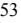

{55}------------------------------------------------

## **Note 5 - Loans Receivable and Allowance for Loan Losses (continued)**

#### **Criticized and Classified Assets**

The Company's policies provide for a classification system for problem assets. Under this classification system, problem assets are classified as "substandard," "doubtful," or "loss."

When the Company classifies problem assets, the Company may establish general allowances for loan losses in an amount deemed prudent by management. General allowances represent loss allowances which have been established to recognize the inherent risk associated with lending activities, but which, unlike specific allowances, have not been allocated to particular problem assets. A portion of general loss allowances established to cover possible losses related to assets classified as substandard or doubtful may be included in determining our regulatory capital. Specific valuation allowances for loan losses generally do not qualify as regulatory capital. As of December 31, 2022, the Company had \$17.8 million in assets classified as substandard, which were also classified as impaired. As of December 31, 2021, the Company had \$39.2 million in assets classified as substandard, which were also classified as impaired. The loans classified as substandard represent primarily commercial loans secured either by residential real estate, commercial real estate or heavy equipment. The loans that have been classified substandard were classified as such primarily due to payment status, because updated financial information has not been timely provided, or the collateral underlying the loan is in the process of being revalued.

The Company's internal credit risk grades are based on the definitions currently utilized by the banking regulatory agencies. The grades assigned and definitions are as follows, and loans graded excellent, above average, good and watch list (risk ratings 1-5) are treated as "pass" for grading purposes. The "criticized" risk rating (6) and the "classified" risk ratings (7-9) are detailed below:

*6 – Special Mention-* Loans currently performing but with potential weaknesses including adverse trends in borrower's operations, credit quality, financial strength, or possible collateral deficiency.

- *7 – Substandard* Loans that are inadequately protected by current sound worth, paying capacity, and collateral support. Loans on "nonaccrual" status. The loan needs special and corrective attention.
- *8 – Doubtful* Weaknesses in credit quality and collateral support make full collection improbable, but pending reasonable factors remain sufficient to defer the loss status.

*9 – Loss*- Continuance as a bankable asset is not warranted. However, this does not preclude future attempts at partial recovery.

Residential, home equity, and consumer loans are rated pass at origination with subsequent adjustments based on delinquency status.

The following table presents the loan portfolio types summarized by the aggregate pass rating and the classified ratings of special mention, substandard, doubtful, and loss within the Company's internal risk rating system as of December 31, 2022 and 2021. (In Thousands):

|                                | Pass            | Special Mention |        | Substandard  |    | Doubtful | Loss |   |  | Total           |
|--------------------------------|-----------------|-----------------|--------|--------------|----|----------|------|---|--|-----------------|
| December 31, 2022              |                 |                 |        |              |    |          |      |   |  |                 |
| Residential one-to-four family | \$ 249,398   | \$              | 303    | \$ 422    | \$ | -        | \$   | - |  | \$ 250,123   |
| Commercial and multi-family    | 2,320,865       |                 | 14,183 | 10,181       |    | -        |      | - |  | 2,345,229       |
| Construction                   | 141,751         |                 | -      | 3,180        |    | -        |      | - |  | 144,931         |
| (1) Commercial business     | 273,770         |                 | 4,416  | 3,821        |    | -        |      | - |  | 282,007         |
| (2) Home equity             | 56,676          |                 | -      | 212          |    | -        |      | - |  | 56,888          |
| Consumer                       | 3,240           |                 | -      | -            |    | -        |      | - |  | 3,240           |
| Total Gross Loans              | \$ 3,045,700 | \$              | 18,902 | \$ 17,816 | \$ | -        | \$   | - |  | \$ 3,082,418 |
| __________                     |                 |                 |        |              |    |          |      |   |  |                 |

(1) Includes business lines of credit.

(2) Includes home equity lines of credit.

|                                | Pass            | Special Mention | Substandard  | Doubtful | Loss |   | Total           |
|--------------------------------|-----------------|-----------------|--------------|----------|------|---|-----------------|
| December 31, 2021              |                 |                 |              |          |      |   |                 |
| Residential one-to-four family | \$ 223,660   | \$ 505       | \$ 369    | \$ -  | \$   | - | \$ 224,534   |
| Commercial and multi-family    | 1,647,701       | 45,087          | 27,386       | -        |      | - | 1,720,174       |
| Construction                   | 151,057         | -               | 2,847        | -        |      | - | 153,904         |
| (1) Commercial business     | 178,056         | 4,767           | 8,316        | -        |      | - | 191,139         |
| (2) Home equity             | 50,230          | -               | 239          | -        |      | - | 50,469          |
| Consumer                       | 3,717           | -               | -            | -        |      | - | 3,717           |
| Total Gross Loans              | \$ 2,254,421 | \$ 50,359    | \$ 39,157 | \$ -  | \$   | - | \$ 2,343,937 |
| __________                     |                 |                 |              |          |      |   |                 |

(1) Includes business lines of credit.

(2) Includes home equity lines of credit.

{56}------------------------------------------------

#### Table of [Contents](#page-1-0)

#### **Note 6 - Premises and Equipment**

Premises and equipment as of December 31, 2022 and 2021 consists of the following:

|                                           |          | December 31,   |          |  |  |
|-------------------------------------------|----------|----------------|----------|--|--|
|                                           | 2022     |                | 2021     |  |  |
|                                           |          | (In Thousands) |          |  |  |
| Land                                      | \$       | 1,447 \$    | 1,447    |  |  |
| Buildings and improvements                |          | 6,514          | 6,468    |  |  |
| Leasehold improvements                    |          | 12,750         | 12,760   |  |  |
| Furniture, fixtures and equipment         |          | 9,111          | 8,961    |  |  |
|                                           |          | 29,822         | 29,636   |  |  |
| Accumulated depreciation and amortization | (19,314) |                | (17,399) |  |  |
|                                           | \$       | 10,508 \$   | 12,237   |  |  |
|                                           |          |                |          |  |  |

Depreciation and amortization expense for the years ended December 31, 2022 and 2021 was \$2,246,000 and \$2,989,000, respectively.

Buildings and improvements include a building constructed on property leased from a related party (see Note 3).

#### **Note 7 - Interest Receivable**

The distribution of interest receivable at December 31, 2022 and 2021 was as follows:

|            | December 31, |                |  |  |  |
|------------|--------------|----------------|--|--|--|
|            | 2022         | 2021           |  |  |  |
|            |              | (In Thousands) |  |  |  |
| Loans      | \$ 12,577 | \$ 8,461    |  |  |  |
| Securities | 878          | 722            |  |  |  |
|            | \$ 13,455 | \$ 9,183    |  |  |  |

#### **Note 8 – Deposits**

The distribution of deposits at December 31, 2022 and 2021 were as follows:

|                         | December 31,          |           |  |  |  |
|-------------------------|-----------------------|-----------|--|--|--|
|                         | 2022                  |           |  |  |  |
|                         | (In Thousands)        |           |  |  |  |
| Demand:                 |                       |           |  |  |  |
| Non-interest bearing    | \$ 613,910 \$   | 588,207   |  |  |  |
| Interest bearing        | 757,615               | 668,262   |  |  |  |
| Money market            | 305,556               | 337,126   |  |  |  |
|                         | 1,677,081             | 1,593,595 |  |  |  |
| Savings and club        | 329,752               | 329,724   |  |  |  |
| Certificates of deposit | 804,774               | 638,083   |  |  |  |
|                         | \$ 2,811,607 \$ | 2,561,402 |  |  |  |

Deposits of certain municipalities and local government agencies are collateralized by \$24.9 million of investment securities and by a \$230.0 million Municipal Letter of Credit with the FHLB.

At December 31, 2022 and 2021, certificates of deposit of \$250,000 or more totaled approximately \$207.7 million and \$275.0 million, respectively.

At December 31, 2022, deposits from officers, directors and their associates totaled approximately \$93.0 million.

The scheduled maturities of certificates of deposit at December 31, 2022, were as follows (In thousands):

|            | Amount        |
|------------|---------------|
| 2023       | \$ 766,820 |
| 2024       | 28,227        |
| 2025       | 6,754         |
| 2026       | 721           |
| Thereafter | 2,252         |
|            | \$ 804,774 |

As of December 31, 2022, the Company had \$335.0 million in brokered certificate deposits and \$35.0 million in brokered demand deposits. The Company had no brokered deposits at December 31, 2021. Reciprocal deposits are not considered brokered deposits under applicable regulations.

{57}------------------------------------------------

#### Table of [Contents](#page-1-0)

#### **Note 9 - Short-Term Debt and Long-Term Debt**

Information regarding short-term borrowings is as follows:

|                                             | December 31, |                 |        |       |  |  |
|---------------------------------------------|--------------|-----------------|--------|-------|--|--|
|                                             | 2022         |                 |        | 2021  |  |  |
|                                             | Amount       | ( In Thousands) | Amount |       |  |  |
| Balance at end of period                    | \$ 60,000 | \$              |        | -     |  |  |
| Average balance outstanding during the year | \$ 1,313  | \$              |        | 48    |  |  |
| Highest month-end balance during the year   | \$ 87,000 | \$              |        | -     |  |  |
| Average interest rate during the year       | 3.13%        |                 |        | 0.50% |  |  |
| Weighted average interest rate at year-end  | 4.61%        |                 |        | -%    |  |  |

#### Long-term debt consists of the following:

|                                  |      | December 31,     |                          |                  |                 |  |  |  |
|----------------------------------|------|------------------|--------------------------|------------------|-----------------|--|--|--|
|                                  |      | 2022             |                          | 2021             |                 |  |  |  |
|                                  |      | Weighted Average |                          | Weighted Average |                 |  |  |  |
|                                  |      | Rate             | Amount (\$000s)          | Rate             | Amount (\$000s) |  |  |  |
| Federal Home Loan Bank Advances: |      |                  |                          |                  |                 |  |  |  |
|                                  |      |                  | Maturing by December 31, |                  |                 |  |  |  |
|                                  | 2023 | 4.85 %           | 250,000                  | -                | -               |  |  |  |
|                                  | 2024 | 0.48             | 18,000                   | 0.48             | 18,000          |  |  |  |
|                                  | 2025 | 1.84             | 44,261                   | 1.84             | 43,711          |  |  |  |
|                                  | 2026 | 0.65             | 10,000                   | 0.65             | 10,000          |  |  |  |
|                                  |      | 4.07 % \$        | 322,261                  | 1.39 % \$        | 71,711          |  |  |  |

FHLB advances are presented net of unamortized prepayment penalties totaling \$1.5 million at December 31, 2022, and \$2.1 million at December 31, 2021.

At December 31, 2022 and 2021 loans with carrying values of approximately \$1.2 billion and \$733.3 million, respectively, were pledged to secure the above noted Federal Home Loan Bank of New York borrowings. No securities were pledged for borrowings at December 31, 2022 and 2021. The Bank's total credit exposure cannot exceed 50.0 percent of its total assets, or \$1.773 billion, based on the borrowing limitations outlined in the FHLB of New York's member products guide. The total credit exposure limit of 50.0 percent of total assets is recalculated each quarter.

During the year ended December 31, 2021, the Company opted to extinguish \$115.0 million of FHLB advances which held an average rate of 1.60 percent and were originally set to mature in 2021, 2022, 2023 and 2024. The effect of the extinguishment of the debt reduced the weighted average cost of FHLB borrowings by approximately 16 basis points on an annualized basis. The related expense for the extinguishment of this debt is included in noninterest expense.

#### **Note 10 – Subordinated Debt**

On July 30, 2018, the Company issued \$33.5 million of fixed-to-floating rate subordinated debentures (the "Notes") in a private placement. The Notes have a ten-year term and bear interest at a fixed annual rate of 5.625 percent for the first five years of the term (the "Fixed Interest Rate Period"). From and including August 1, 2023, the interest rate will adjust to a floating rate based on the threemonth LIBOR plus 2.72 percent until redemption or maturity (the "Floating Interest Rate Period"). The Notes are scheduled to mature on August 1, 2028. Subject to limited exceptions, the Company cannot redeem the Notes for the first five years of the term. The Company will pay interest in arrears semi-annually during the Fixed Interest Rate Period and quarterly during the Floating Interest Rate Period during the term of the Notes. The Notes constitute an unsecured and subordinated obligation of the Company and rank junior in right of payment to any senior indebtedness and obligations to general and secured

creditors. The Notes qualify as Tier 2 capital for the Company for regulatory purposes and the portion that the Company contributes to the Bank will qualify as Tier 1 capital for the Bank. The additional capital is used for general corporate purposes including organic growth initiatives. Subordinated debt includes associated deferred costs of \$116,000 and \$349,000 at December 31, 2022 and 2021, respectively.

The Company also has \$4.1 million of mandatory redeemable Trust Preferred securities. The interest rate on these floating rate junior subordinated debentures adjusts quarterly based on the threemonth LIBOR plus 2.650 percent. The rate paid as of December 31, 2022 and 2021 was 7.388 percent and 2.866 percent, respectively. The trust preferred debenture became callable, at the Company's option, on June 17, 2009, and quarterly thereafter.

#### **Note 11 - Regulatory Matters**

The Bank is subject to various regulatory capital requirements administered by the federal banking agencies. Failure to meet the minimum capital requirements can initiate certain mandatory and possibly additional discretionary actions by regulators that, if undertaken, could have a direct material effect on the Company's consolidated financial statements. Under capital adequacy guidelines and the regulatory framework for prompt corrective action, the Bank must meet specific capital guidelines that involve quantitative measures of the Bank's assets, liabilities and certain off-balance sheet items as calculated under regulatory accounting practices. The Bank's capital amounts and classification are also subject to qualitative judgments by the regulators about components, riskweightings and other factors.

In July 2013, the FDIC and the other federal bank regulatory agencies issued a final rule that revised their leverage and risk-based capital requirements and the method for calculating risk-weighted assets to make them consistent with agreements that were reached by the Basel Committee on Banking Supervision and certain provisions of the Dodd-Frank Act. Among other things, the new rule established a new common equity Tier 1 minimum capital requirement (4.5 percent of risk-weighted assets), increased the minimum Tier 1 capital to risk-based assets requirement (from 4.0 percent to 6.0 percent of risk-weighted assets) and assigned a higher risk weight (150 percent) to exposures that are more than 90 days past due or are on nonaccrual status and to certain commercial real estate facilities that finance the acquisition, development or construction of real property.

The final rule also requires unrealized gains and losses on certain available-for-sale securities holdings and defined benefit plan obligations to be included for purposes of calculating regulatory capital requirements unless a one-time opt-in or opt-out is exercised. The Bank exercised the opt-out election. The rule limits a banking

{58}------------------------------------------------

organization's capital distributions and certain discretionary bonus payments if the banking organization does not hold a "capital conservation buffer" consisting of 2.5 percent of common equity Tier 1 capital to risk-weighted assets in addition to the amount necessary to meet its minimum risk-based capital requirements.

The final rule became effective for the Bank on January 1, 2015. The capital conservation buffer was phased in until it reached 2.5 percent in 2019. The Bank currently complies with the minimum capital requirements set forth in the final rule.

On September 17, 2019, the FDIC passed a final rule providing qualifying community banking organizations the ability to opt-in to a new community bank leverage ratio ("CBLR") framework, (tier 1 capital to average consolidated assets) at 9.0 percent for institutions under \$10.0 billion in assets that such institutions may elect to utilize in lieu of the general applicable risk-based capital requirements under Basel III. Such institutions that meet the community bank leverage ratio and certain other qualifying criteria will automatically be deemed to be well-capitalized. On November 4, 2019, the FDIC, Office of the Comptroller of the Currency and the Federal Reserve Board jointly issued a final rule that permits insured depository institutions and depository institution holding companies to implement the simplifications to the capital rule on January 1, 2020, rather than April 1, 2020. These banking organizations may elect to use the revised effective date of January 1, 2020, or wait until the quarter beginning April 1, 2020. The Bank has opted-in to the CBLR. Pursuant to the CARES Act, the federal banking regulators in April, 2020 issued interim final rules to set the CBLR at 8.0 percent beginning in the second quarter of 2020 through the end of 2020. Beginning in 2021, the CBLR increased to 8.5 percent for the calendar year. As of January 1, 2022, the CBLR requirement returned to 9.0 percent.

The following table presents information as to the Bank's capital levels. The Company will be subject to the larger capital requirements at March 31, 2023.

|                                 | Actual        |       | For Capital Adequacy Purposes |                                 |    | To be Well Capitalized under Prompt Corrective Action Provisions |       |  |
|---------------------------------|---------------|-------|----------------------------------|---------------------------------|----|------------------------------------------------------------------------|-------|--|
|                                 | Amount        | Ratio | Amount                           | Ratio (Dollars in Thousands) |    | Amount                                                                 | Ratio |  |
| As of December 31, 2022         |               |       |                                  |                                 |    |                                                                        |       |  |
| Bank                            |               |       |                                  |                                 |    |                                                                        |       |  |
| Community Bank Leverage Ratio   | 327,806       | 9.86  | 265,557                          | 8.00                            |    | 298,752                                                                | 9.00  |  |
| As of December 31, 2021 Bank |               |       |                                  |                                 |    |                                                                        |       |  |
| Community Bank Leverage Ratio   | \$ 299,247 | 9.92% | \$ 211,177                    | 7.00%                           | \$ | 256,429                                                                | 8.50% |  |

As of December 31, 2022 and 2021, the most recent notification from the Bank's regulators categorized the Bank as "well-capitalized" under the regulatory framework for prompt corrective action. There are no conditions or events occurring since that notification that management believes have changed the Bank's category.

On December 11, 2020 the Company authorized another stock repurchase plan, which would allow it to repurchase up to 500,000 shares of stock. On October 17, 2022, the Company authorized an amendment to its stock repurchase program to increase the number of shares yet to be repurchased from 82,350 shares to a total number of 500,000 shares. The Company repurchased 198,976 shares during the year ended December 31, 2022.

{59}------------------------------------------------

# **Note 12- Benefits Plans**

#### **Pension Plan**

The Company acquired, through the merger with Pamrapo Bancorp, Inc. a non-contributory defined benefit pension plan ("Pension Plan") covering all eligible employees of Pamrapo Savings Bank. Effective January 1, 2010, the Pension Plan was frozen by Pamrapo Savings Bank. All benefits for eligible participants accrued in the Pension Plan to the freeze date have been retained. The benefits are based on years of service and employee's compensation. The Pension Plan is funded in conformity with funding requirements of applicable government regulations. Prior service costs for the Pension Plan generally are amortized over the estimated remaining service periods of employees.

The following tables set forth the Pension Plan's funded status at December 31, 2022 and 2021 and components of net periodic pension cost for the years ended December 31, 2022 and 2021:

| Change in Benefit Obligation:                                             |      | December 31,   |       |  |  |  |  |  |
|---------------------------------------------------------------------------|------|----------------|-------|--|--|--|--|--|
|                                                                           | 2022 |                | 2021  |  |  |  |  |  |
|                                                                           |      | (In Thousands) |       |  |  |  |  |  |
| Benefit obligation, beginning of year                                     | \$   | 6,492 \$    | 8,194 |  |  |  |  |  |
| Interest cost                                                             |      | 178            | 201   |  |  |  |  |  |
| Actuarial (gain) loss                                                     |      | (1,362)        | (929) |  |  |  |  |  |
| Benefits paid                                                             |      | (363)          | (459) |  |  |  |  |  |
| Lump sum distributions                                                    |      | (10)           | (515) |  |  |  |  |  |
| Benefit obligation, ending                                                | \$   | 4,935 \$    | 6,492 |  |  |  |  |  |
| Change in Plan Assets:                                                    |      |                |       |  |  |  |  |  |
| Fair value of assets, beginning of year                                   | \$   | 7,144 \$    | 7,112 |  |  |  |  |  |
| Actual return on plan assets                                              |      | (806)          | 1,006 |  |  |  |  |  |
| Benefits paid                                                             |      | (363)          | (459) |  |  |  |  |  |
| Lump sum distributions                                                    |      | (10)           | (515) |  |  |  |  |  |
| Fair value of assets, ending                                              | \$   | 5,965 \$    | 7,144 |  |  |  |  |  |
| Reconciliation of Funded Status:                                          |      |                |       |  |  |  |  |  |
| Projected benefit obligation                                              | \$   | 4,935 \$    | 6,492 |  |  |  |  |  |
| Fair value of assets                                                      |      | 5,965          | 7,144 |  |  |  |  |  |
| Funded (unfunded) status, included in other liabilities, net              | \$   | 1,030 \$    | 652   |  |  |  |  |  |
| Valuation assumptions used to determine benefit obligation at period end: |      |                |       |  |  |  |  |  |
| Discount rate                                                             |      | 5.02%          | 2.83% |  |  |  |  |  |
| Salary increase rate                                                      |      | N/A            | N/A   |  |  |  |  |  |

| Net Periodic Pension Expense:                                                   | December 31, |       |                |       |
|---------------------------------------------------------------------------------|--------------|-------|----------------|-------|
|                                                                                 |              | 2022  |                | 2021  |
|                                                                                 |              |       | (In Thousands) |       |
| Interest cost                                                                   | \$           | 178   | \$             | 201   |
| Expected return on assets                                                       |              | (417) |                | (413) |
| Amortization of net loss                                                        |              | 66    |                | 635   |
| Net Periodic Pension Cost and Settlements                                       | \$           | (173) | \$             | 423   |
| Valuation assumptions used to determine net periodic benefit cost for the year: |              |       |                |       |
| Discount rate                                                                   |              | 2.83% |                | 2.52% |
| Long term rate of return on plan assets                                         |              | 6.00% |                | 6.00% |
| Salary increase rate                                                            |              | N/A   |                | N/A   |

At December 31, 2022 and December 31, 2021, unrecognized net losses of \$559,000 and \$707,000, respectively, were included, net of deferred income tax, in accumulated other comprehensive loss in accordance with ASC 715-20 and ASC 715-30.

{60}------------------------------------------------

# **Note 12 - Benefits Plan (continued)**

#### **Plan Assets**

#### **Investment Policies and Strategies**

The primary long-term objective for the Pension Plan is to maintain assets at a level that will sufficiently cover future beneficiary obligations. The Pension Plan is structured to include a volatility reducing component (the fixed income commitment) and a growth component (the equity commitment).

To achieve the Bank's long-term investment objectives, the trustee invests the assets of the Pension Plan in a diversified combination of asset classes, investment strategies, and pooled vehicles. The asset allocation guidelines in the table below reflect the Bank's risk tolerance and long-term objectives for the Pension Plan. These parameters will be reviewed on a regular basis and subject to change following discussions between the Bank and the trustee.

The following asset allocation targets and ranges guides the trustee in structuring the overall allocation in the Pension Plan's investment portfolio. The Bank or the trustee may amend these allocations to reflect the most appropriate standards consistent with changing circumstances. Any such fundamental amendments in strategy will be discussed between the Bank and the trustee prior to implementation.

Based on the above considerations, the following asset allocation ranges will be implemented:

| Asset Allocation Parameters by Asset Class |         |        |         |  |  |  |  |
|--------------------------------------------|---------|--------|---------|--|--|--|--|
|                                            | Minimum | Target | Maximum |  |  |  |  |
| Equity                                     |         |        |         |  |  |  |  |
| Large-Cap U.S.                             |         | 38%    |         |  |  |  |  |
| Mid/Small-Cap U.S.                         |         | 16%    |         |  |  |  |  |
| Non-U.S.                                   |         | 1%     |         |  |  |  |  |
| Total-Equity                               | 40%     | 55%    | 60%     |  |  |  |  |
|                                            |         |        |         |  |  |  |  |
| Fixed Income                               |         |        |         |  |  |  |  |
| Long/Short Duration                        |         | 44%    |         |  |  |  |  |
| Money Market/Certificates of Deposit       |         | 1%     |         |  |  |  |  |
| Total-Fixed Income                         | 40%     | 45%    | 60%     |  |  |  |  |

The parameters for each asset class provide the trustee with the latitude for managing the Pension Plan within a minimum and maximum range. The trustee has full discretion to buy, sell, invest and reinvest in these asset segments based on these guidelines which includes allowing the underlying investments to fluctuate within the stated policy ranges. The Pension Plan maintains a cash equivalents component (not to exceed 3 percent under normal circumstances) within the fixed income allocation for liquidity purposes.

The trustee monitors the actual asset segment exposures of the Pension Plan on a regular basis and, periodically, may adjust the asset allocation within the ranges set forth above as it deems appropriate. Periodic reallocations of assets are based on the trustee's perception of the changing risk/return opportunities of the respective asset classes.

#### **Determination of Long-Term Rate of Return**

The long-term rate of return on assets assumption was set based on historical returns earned by equities and fixed income securities, adjusted to reflect expectations of future returns as applied to the Pension Plan's target allocation of asset classes. Equities and fixed income securities were assumed to earn real rates of return in the ranges of 6.0 to 10.0 percent and 2.0 to 6.0 percent, respectively. The long-term inflation rate was estimated to be 3.0 percent. When these overall return expectations are applied to the Pension Plan's target allocation, the result is an expected rate of return of 4.0 to 7.0 percent.

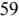

{61}------------------------------------------------

#### Table of [Contents](#page-1-0)

# **Note 12 - Benefits Plan (continued)**

The fair values of the Pension Plan assets at December 31, 2022, by asset category (see Note 2 for the definitions of levels), are as follows (In Thousands):

| Asset Category Mutual funds-Equity | Total       | (Level 1)   | (Level 2) | (Level 3) |
|---------------------------------------|-------------|-------------|-----------|-----------|
| Large-Cap Value (a)                   | \$ 1,052 | \$ 1,052 | \$ -   | \$ -   |
| Large-Cap Growth (b)                  | 170         | 170         | -         | -         |
| Diversified Emerging Markets (f)      | 96          | 96          | -         | -         |
| Large Blend (d)                       | 957         | 957         | -         | -         |
| Technology (g)                        | 96          | 96          | -         | -         |
| Mutual Funds-Fixed Income             |             |             |           |           |
| Long Government (h)                   | 48          | 48          | -         | -         |
| Multi-Sector Bond (c)                 | 1,244       | 1,244       | -         | -         |
| High Yield Bond (e)                   | 622         | 622         | -         | -         |
| Intermediate Core Bond (i)            | 670         | 670         |           |           |
| BCB Common Stock                      | 932         | 932         | -         | -         |
| Cash Equivalents                      |             |             |           |           |
| Money Market                          | \$ 78    | \$ 78    | \$ -   | \$ -   |
| Total                                 | \$ 5,965 | \$ 5,965 | \$ -   | \$ -   |

The fair values of the Company's pension plan assets at December 31, 2021, by asset category (see Note 2 for the definitions of levels), are as follows (In Thousands):

| Asset Category Mutual funds-Equity | Total       | (Level 1)   | (Level 2) | (Level 3) |
|---------------------------------------|-------------|-------------|-----------|-----------|
| Large-Cap Value (a)                   | \$ 1,021 | \$ 1,021 | \$ -   | \$ -   |
| Large-Cap Growth (b)                  | 259         | 259         | -         | -         |
| Diversified Emerging Markets (f)      | 247         | 247         | -         | -         |
| Large Blend (d)                       | 1,748       | 1,748       | -         | -         |
| Technology (g)                        | 305         | 305         | -         | -         |
| Mutual Funds-Fixed Income             |             |             |           |           |
| Long Government (h)                   | 204         | 204         | -         | -         |
| Multi-Sector Bond (c)                 | 1,047       | 1,047       | -         | -         |
| High Yield Bond (e)                   | 732         | 732         | -         | -         |
| Intermediate Core Bond (i)            | 737         | 737         | -         | -         |
| BCB Common Stock                      | 800         | 800         | -         | -         |
| Cash Equivalents                      |             |             |           |           |
| Money Market                          | \$ 44    | 44          | \$ -   | \$ -   |
| Total                                 | \$ 7,144 | \$ 7,144 | \$ -   | \$ -   |

a) Large-value portfolios invest primarily in big U.S. companies that are less expensive or growing more slowly than other large-cap stocks. Stocks in the top 70 percent of the capitalization of the U.S. equity market are defined as large cap. Value is defined based on low valuations (low price ratios and high dividend yields) and slow growth (low growth rates for earnings, sales, book value, and cash flow).

b) Large Cap Growth Stocks of large cap companies that are projected to grow faster than other large cap stocks. Stocks in the top 70% of the capitalization of the U.S. equity market defined as large cap. Growth is defined based on fast growth (high growth rates for earnings, sales, book value, and cash flow) and high valuations (high price ratios and low dividend yields).

c) Multi Sector portfolios seek income by diversifying their assets among several fixed-income sectors, usually U.S. government obligations, foreign bonds, and high-yield domestic debt securities.

d) This fund invests in 500 of the largest U.S. companies, which span many different industries and account for about three-fourths of the U.S. Stock Markets value. e) High Yield Bond funds invest at least 65 percent of assets in bonds rated below BBB. This fund seeks to provide shareholders with a high level of current income with capital growth as a secondary objective.

f) The fund invests at least 80% of the value of its assets in equity securities and equity related instruments that are tied economically to emerging markets.

g) The fund normally invests at least 80% of the fund's net assets in securities of issuers principally engaged in offering, using or developing products, processes or services that will provide or benefit significantly from technological advances and improvements.

h) The fund normally invests at least 80% of assets in securities included in the Bloomberg Barclays U.S. Long Treasury Bond Index.

i) Intermediate term core bond portfolios invest primarily in investment grade U.S. fixed-income issues including government, corporate, and securitized debt, and hold less than 5% in below-investment grade exposures.

{62}------------------------------------------------

# **Note 12 - Benefits Plan (continued)**

The Company does not expect to contribute, based upon actuarial estimates, to the Pension Plan in 2023.

Benefit payments are expected to be paid for the years ended December 31 as follows (In thousands):

| 2023      | \$ 409 |
|-----------|-----------|
| 2024      | 395       |
| 2025      | 399       |
| 2026      | 398       |
| 2027      | 398       |
| 2028-2032 | 1,835     |
|           |           |

#### **Equity Incentive Plans**

The Company, under the plan approved by its shareholders on April 26, 2018 ("2018 Equity Incentive Plan"), authorized the issuance of up to 1,000,000 shares of common stock of the Company pursuant to grants of stock options and restricted stock units. Employees and directors of the Company and the Bank are eligible to participate in the 2018 Stock Plan. All stock options will be granted in the form of either "incentive" stock options or "non-qualified" stock options. Incentive stock options have certain tax advantages that must comply with the requirements of Section 422 of the Internal Revenue Code. Only employees are permitted to receive incentive stock options.

The Company, under the plan approved by its shareholders on April 28, 2011 ("2011 Stock Plan"), authorized the issuance of up to 900,000 shares of common stock of the Company pursuant to grants of stock options. Employees and directors of the Company and the Bank are eligible to participate in the 2011 Stock Plan. All stock options were granted in the form of either "incentive" stock options or "non-qualified" stock options. Incentive stock options have certain tax advantages that must comply with the requirements of Section 422 of the Internal Revenue Code. Only employees are permitted to receive incentive stock options.

On September 30, 2022, awards of 36,000 shares of restricted stock, in aggregate, were declared for certain executive officers of the Bank and the Company, which fully vested on November 30, 2022. On January 12, 2022, awards of 33,000 shares of restricted stock were declared for members of the Board of Directors of the Bank and the Company, which vest over a 4-year period, commencing on the anniversary of the award date.

On February 10, 2021, awards of 26,400 shares of restricted stock, in aggregate, were awarded to members of the Board of Directors of the Bank and the Company, which vest over a 4-year period, commencing on the anniversary of the award date. On February 19, 2021, an award of 300 shares of restricted stock was awarded to an officer of the Bank and the Company, which vests over a 2-year period, commencing on the anniversary of the award date.

The following table presents the share-based compensation expense for the years ended December 31, 2022 and 2021 (Dollars in Thousands).

|                                        | Years Ended December 31, |    |      |  |
|----------------------------------------|--------------------------|----|------|--|
|                                        | 2022                     |    | 2021 |  |
| Stock Option Expense                   | \$ 216                | \$ | 230  |  |
| Restricted Stock Expense               | 916                      |    | 187  |  |
| Total share-based compensation expense | \$ 1,132              | \$ | 417  |  |

The following is a summary of the status of the Company's restricted shares as of December 31, 2022.

|                                 | Number of Shares Awarded | Weighted Average Grant Date Fair Value |       |  |
|---------------------------------|-----------------------------|-------------------------------------------|-------|--|
| Non-vested at December 31, 2021 | 24,300                      | \$                                        | 12.89 |  |
| Granted                         | 69,000                      |                                           | 13.05 |  |
| Vested                          | (45,150)                    |                                           | 13.18 |  |
| Forfeited                       | -                           |                                           | -     |  |
| Non-vested at December 31, 2022 | 48,150                      | \$                                        | 14.83 |  |

The remaining non-vested restricted shares outstanding as of December 31, 2022 will be charged to expense in 2023-2025, totaling \$494,000

{63}------------------------------------------------

__________

# **Note 12 - Benefits Plan (continued)**

A summary of stock option activity, follows:

|                                  | Number of Options | Range of Exercise Price | Weighted Average Exercise Price | Weighted Average Remaining Contractual Term | Aggregate Intrinsic Value (000's) |
|----------------------------------|-------------------|----------------------------|---------------------------------------|---------------------------------------------------------|-----------------------------------------|
| Outstanding at January 1, 2021   | 1,192,348         | \$ 8.93-13.32           | \$ 11.45                           | 6.04                                                    | \$ 333                               |
| Options forfeited                | -                 | -                          | -                                     | -                                                       | -                                       |
| Options exercised                | (70,723)          | 8.93-12.46                 | 9.87                                  | -                                                       | -                                       |
| Options granted                  | 72,800            | 12.89-13.68                | 12.96                                 | -                                                       | -                                       |
| Options expired                  | -                 | -                          | -                                     | -                                                       | -                                       |
| Outstanding at December 31, 2021 | 1,194,425         | \$ 9.02-13.68           | \$ 11.64                           | 5.44                                                    | \$ 4,528                             |
| Options forfeited                | -                 | -                          | -                                     | -                                                       | -                                       |
| Options exercised (1)            | (157,450)         | 9.03-13.68                 | 11.10                                 | -                                                       | -                                       |
| Options granted                  | -                 | -                          | -                                     | -                                                       | -                                       |
| Options expired                  | -                 | -                          | -                                     | -                                                       | -                                       |
| Outstanding at December 31, 2022 | 1,036,975         | \$ 9.03-13.68           | \$ 11.72                           | 4.47                                                    | \$ 6,502                             |
| Exercisable at December 31, 2022 | 806,535           |                            |                                       |                                                         |                                         |

(1) Includes 84,604 and 31,432 cashless exercise of options during 2022 and 2021, respectively.

It is Company policy to issue new shares upon share option exercise. Expected future compensation expense relating to the 230,440 shares of unvested options outstanding as of December 31, 2022, is \$387,000 and will be recognized over a weighted average period of 3.72 years.

Under the 2018 Equity Incentive Plan, on February 10, 2021, grants of 66,000 options, in aggregate, were declared for members of the Board of Directors of the Bank and the Company which vest over a 5-year period, commencing on the first anniversary of the grant date. The exercise price was recorded as of close of business on February 10, 2021.

Further, on April 26, 2021, grants of 6,800 options, in aggregate, were declared for certain officers of the Bank and the Company, which vest over a 5-year period commencing on the first anniversary of the grant date. The exercise price was recorded as of close of business on April 26, 2021.

There were no options awarded during the year ended December 31, 2022.

#### **Supplemental Executive Retirement Plan**

The Bank entered into a Supplemental Executive Retirement Agreement (the "SERP Agreement") with its Chief Executive Officer ("the CEO") in December 2021, payable in the form of a life annuity.

In the event the CEO experiences a separation from service for cause, the CEO will forfeit his entire SERP benefit, regardless of vesting. In the event the CEO dies while in active service with the Bank, his beneficiary will receive a lump sum payment equal to his account balance (the liability accrued by the Bank under generally accepted accounting principles as of such date) at the time of death in a single lump sum. In the event the CEO dies after a separation from service but before receiving 180 monthly payments, his beneficiary will receive the monthly benefit payments that CEO was entitled to at the time of his death until 180 monthly payments have been made. If the CEO has already received 180 monthly payments at the time of his death, his beneficiary will not be entitled to a death benefit.

The SERP Agreement is an unfunded arrangement maintained primarily to provide supplemental retirement benefits and comply with Section 409A of the Internal Revenue Code. The cost of the benefit is being amortized over a three-year vesting period beginning in 2021. In 2022, the Bank recorded compensation expense of \$328,000 related to the Plan. The anticipated expense for the years ended December 31, 2023 and December 31, 2024 is \$350,000 and \$45,000, respectively. The Bank has elected to fund the retirement benefit by purchasing annuities that have been designed to provide a future source of funds for the lifetime retirement benefits of the SERP Agreement, totaling \$1.81 million, which is included in other assets.

#### **Note 13 – Stockholders' Equity**

On September 23, 2022, the Company closed a round of private placement of Series I Noncumulative Perpetual Stock, par value \$0.01 per share (the "Series I Preferred Stock"), resulting in gross proceeds of \$4,440,000 for 444 shares.

On May 1, 2022, the Company redeemed all 940 outstanding shares of it's Series D 4.5% Noncumulative Perpetual Preferred Stock, at their face value of \$10,000 per share, for a total redemption amount of \$9.4 million.

On March 24, 2022, BCB Bancorp, Inc. (the "Company") closed a round of private placement of Series I Noncumulative Perpetual Stock, par value \$0.01 per share (the "Series I Preferred Stock"), resulting in gross proceeds of \$2,620,000 for 260 shares.

On February 4, 2022, the Company redeemed all 533 outstanding shares of its Series G 6.0% Noncumulative Perpetual Preferred Stock, at their face value of \$10,000 per share, for a total redemption amount of \$5.3 million.

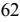

{64}------------------------------------------------

#### **Note 14 – Goodwill and Other Intangible Assets**

The Company's intangible assets consist of goodwill and core deposit intangibles in connection with acquisitions. The initial recording of goodwill and other intangible assets requires subjective judgments concerning estimates of the fair value of the acquired assets and assumed liabilities. Goodwill is not amortized but is subject to annual tests for impairment or more often if events or circumstances indicate it may be impaired.

Amortization expense of the core deposit intangibles was \$49,000 and \$57,000 for the years ended December 31, 2022 and December 31, 2021, respectively. The unamortized balance of the core deposit intangibles and the amount of goodwill at December 31, 2022 was \$129,000 and \$5.2 million, respectively. The unamortized balance of the core deposit intangibles and the amount of goodwill at December 31, 2021 was \$178,000 and \$5.2 million, respectively.

The Company's core deposit intangibles are amortized on an accelerated basis using an estimated life of 10 years and in accordance with U.S. GAAP are evaluated annually for impairment. An impairment loss will be recognized if the carrying amount of the intangible asset is not recoverable and exceeds fair value. The carrying amount of the intangible asset is not considered recoverable if it exceeds the sum of the undiscounted cash flows expected to result from the use of the asset.

The Company conducts impairment analysis on goodwill at least annually or more often as conditions require. Pursuant to ASC 350-20-35, the Company conducted a qualitative assessment of goodwill as of October 31, 2022, and determined that it was more likely than not that goodwill was not impaired. Accordingly, there was no impairment at December 31, 2022.

The Company performed interim analyses of goodwill impairment each quarter in 2021 due to a triggering event of the stock price falling below the Company's calculated book value, largely related to the effects of the COVID-19 pandemic. Pursuant to ASC 350-20-35-70, the Company elected to proceed to a quantitative assessment of goodwill at October 31, 2020 to compare its fair value with its carrying amount. ASC Topic 820 - (Fair Value Measures and Disclosures) defines fair value as "the price that would be received to sell an asset or paid to transfer a liability in an orderly transaction between market participants at the measurement date." The Company determined that the Income and Market Approach were deemed appropriate in determining the fair value of the Bank, which as the primary reporting unit of the Company, is the reporting unit to which goodwill applies. Based on the results of this assessment, the Company determined that the fair value of goodwill was in excess of its carrying amounts and therefore there was no impairment at December 31, 2021.

#### **Note 15 - Dividend Restrictions**

Payment of cash dividends on common stock is conditional on earnings, financial condition, cash needs, capital considerations, the discretion of the Board of Directors of the Company, and compliance with regulatory requirements. State and federal law and regulations impose limitations on the Bank's ability to pay dividends to the Company. Under New Jersey law, the Company is permitted to declare dividends on its common stock only if, after payment of the dividend, the capital stock of the Bank will be unimpaired and either the Bank will have a surplus of not less than 50 percent of its capital stock or the payment of the dividend will not reduce the Bank's surplus. During 2022 and 2021, the Bank paid the Company total dividends of \$22,338,000 and \$15,885,000, respectively. The Company's ability to declare dividends is dependent upon the amount of dividends paid to the Company by the Bank.

### **Note 16 - Income Taxes**

The components of income tax expense are summarized as follows:

|                              | Years Ended December 31, |    |        |  |
|------------------------------|--------------------------|----|--------|--|
|                              | 2022                     |    | 2021   |  |
|                              | (In Thousands)           |    |        |  |
| Current income tax expense:  |                          |    |        |  |
| Federal                      | \$ 12,323             | \$ | 8,736  |  |
| State                        | 6,215                    |    | 6,257  |  |
|                              | 18,538                   |    | 14,993 |  |
| Deferred income tax benefit: |                          |    |        |  |
| Federal                      | (967)                    |    | (571)  |  |
| State                        | (40)                     |    | (404)  |  |
|                              | (1,007)                  |    | (975)  |  |
| Total Income Tax Expense     | \$ 17,531             | \$ | 14,018 |  |
|                              |                          |    |        |  |

{65}------------------------------------------------

#### **Note 16 - Income Taxes (continued)**

The tax effects of existing temporary differences that give rise to significant portions of the deferred income tax assets and deferred income tax liabilities are as follows:

|                                                                   | December 31,   |              |  |
|-------------------------------------------------------------------|----------------|--------------|--|
|                                                                   | 2022           | 2021         |  |
| Deferred income tax assets:                                       | (In Thousands) |              |  |
| Allowance for loan losses                                         | \$ 9,253    | \$ 10,610 |  |
| Other real estate owned expenses                                  | 2              | 11           |  |
| Non-accrual interest                                              | 279            | 361          |  |
| Benefit plan-accumulated other comprehensive loss                 | 159            | 234          |  |
| Purchase accounting adjustment on loans receivable acquired       | 752            | 1,277        |  |
| Net operating loss carry forwards                                 | 1,263          | 1,359        |  |
| Lease liability                                                   | 3,961          | 3,645        |  |
| Unrealized loss on securities                                     | 2,974          | -            |  |
| Other                                                             | 2,783          | 1,509        |  |
|                                                                   | 21,426         | 19,006       |  |
| Deferred income tax liabilities:                                  |                |              |  |
| Purchase accounting adjustment on premises and equipment acquired | 74             | 77           |  |
| Right-of-use assets                                               | 3,865          | 3,561        |  |
| Unrealized gain on securities                                     | -              | 1,028        |  |
| SBA servicing asset                                               | 368            | 520          |  |
| Borrowing modification                                            | 440            | 597          |  |
| Benefit plans                                                     | 217            | 264          |  |
|                                                                   | 4,964          | 6,047        |  |
| Net Deferred Tax Asset                                            | \$ 16,462   | \$ 12,959 |  |

A summary of the change in the net deferred tax asset is as follows:

| Years Ended December 31, |                |  |  |
|--------------------------|----------------|--|--|
| 2022                     | 2021           |  |  |
|                          | (In Thousands) |  |  |
| \$ 12,959             | \$ 12,574   |  |  |
| 1,007                    | 975            |  |  |
|                          |                |  |  |
| 2,560                    | 60             |  |  |
| (64)                     | (650)          |  |  |
| \$ 16,462             | \$ 12,959   |  |  |
|                          |                |  |  |

In assessing the realizability of deferred tax assets, management considers whether it is more likely than not that some portion or all of the deferred tax assets will not be realized. In making this assessment, management has considered the profitability of current core operations, future market growth, forecasted earnings, future taxable income, and ongoing, feasible and permissible tax planning strategies. If the Company was to determine that it would not be able to realize a portion of its net deferred tax asset in the future for which there is currently no valuation allowance, an adjustment to the net deferred tax asset would be charged to earnings in the period such determination was made. The ultimate realization of deferred tax assets is dependent upon the generation of future taxable income during the periods in which temporary differences are deductible and carry forwards are available. The Company believes it will generate sufficient future taxable income to realize the tax benefits related to the remaining net deferred tax assets in our consolidated balance sheet.

In conjunction with the Company's acquisition of IA Bancorp in 2018, the Company acquired a federal net operating loss carry forward of \$8.7 million. This carry forward is available for use through 2035; however, in accordance with Internal Revenue Code Section 382, usage of the carry forward is limited to \$459,000 annually on a cumulative basis (portions of the \$459,000 not used in a particular year may be added to subsequent usage). At December 31, 2022 and 2021, the Company had approximately \$6.0 million and \$6.5 million remaining of this federal net operating loss carry forward available to offset future taxable income for federal tax reporting purposes.

{66}------------------------------------------------

# **Note 16 - Income Taxes (continued)**

The following table presents a reconciliation between the reported income tax expense and the income tax expense which would be computed by applying the normal federal income tax rate of 21.0 percent to income before income tax expense.

|                                                     | Years Ended December 31, |        |  |
|-----------------------------------------------------|--------------------------|--------|--|
|                                                     | 2022                     | 2021   |  |
|                                                     | (In Thousands)           |        |  |
| Federal income tax expense at statutory rate        | \$ 13,253 \$       | 10,134 |  |
| Increases in income taxes resulting from:           |                          |        |  |
| State income tax , net of federal income tax effect | 4,878                    | 4,684  |  |
| Tax-exempt income                                   | (63)                     | (45)   |  |
| Bank-owned life insurance earnings                  | (561)                    | (620)  |  |
| Other items, net                                    | 24                       | (135)  |  |
| Effective Income Tax Expense                        | \$ 17,531 \$       | 14,018 |  |
| Effective Income Tax Rate                           | 27.8%                    | 29.0%  |  |

#### **Note 17- Commitments and Contingencies**

The Bank is a party to financial instruments with off-balance-sheet risk in the normal course of business to meet the financing needs of its customers. These financial instruments primarily include commitments to extend credit. The Bank's exposure to credit loss, in the event of nonperformance by the other party to the financial instrument for commitments to extend credit, is represented by the contractual amount of those instruments. The Bank uses the same credit policies in making commitments and conditional obligations as it does for on-balance-sheet instruments.

Outstanding loan related commitments were as follows:

|                               | December 31,  |                |         |  |
|-------------------------------|---------------|----------------|---------|--|
|                               | 2022          |                | 2021    |  |
|                               |               | (In Thousands) |         |  |
| Loan origination commitments  | \$ 165,579 | \$             | 67,392  |  |
| Standby letters of credit     | 3,701         |                | 3,309   |  |
| Construction loans in process | 96,905        |                | 84,195  |  |
| Unused lines of credit        | 218,865       |                | 114,779 |  |
|                               | \$ 485,050 | \$             | 269,675 |  |

Commitments to extend credit are agreements to lend to a customer as long as there is no violation of any condition established in the contract. Commitments generally have fixed expiration dates or other termination clauses and may require payment of a fee. Since many of the commitments are expected to expire without being drawn upon, total commitment amounts do not necessarily represent future cash requirements. The Bank evaluates each customer's creditworthiness on a case-by-case basis. The amount of collateral obtained, if deemed necessary by the Bank upon extension of credit, is based on management's credit evaluation of the counterparty. Collateral held varies but primarily includes residential real estate properties.

#### **Leases**

At December 31, 2022, the Company leased 27 of its offices under various operating lease agreements. The leases have remaining terms of 1 year to 12 years. The leases contain provisions for the payment by the Company of its pro-rata share of real estate taxes, insurance, common area maintenance and other variable expenses. The Company will allocate payments made under such leases between lease and non-lease components. Some leases contain renewal options and options to purchase the assets.

The Company evaluates its contracts and service agreements in order to determine if there is an asset imbedded in such contracts and agreements. Such determination is based upon whether there is a specific asset covered by the agreement, whether the Company is entitled to all of the economic benefits to the asset over the term of the agreement, and whether the Company has full control and use of the asset over the term of the agreement without substitution rights or direction of use of the asset by the lessor.

The Company includes in its determination of its lease liability and concurrent right of use asset those renewal or purchase options for which it is reasonably certain it will exercise. Currently, the Company does not expect to exercise such purchase options and, accordingly, those are excluded in the determination of the lease liabilities and the concurrent right of use assets.

The Company has elected not to recognize a lease liability and a right of use asset for leases with a lease term of 12 or fewer months.

To calculate its lease liabilities, the Company used a discount rate based upon the applicable borrowing rates of the Federal Home Loan Bank at the inception of the lease agreement, which corresponds to the length of the lease term.

{67}------------------------------------------------

# **Note 17- Commitments and Contingencies (continued)**

The following tables present certain information related to the Company's lease obligations (in thousands):

| Twelve Months Ended December 31, 2022 | Twelve Months Ended December 31, 2021 |
|------------------------------------------|------------------------------------------|
| \$ 3,758                              | \$ 3,711                              |
| 1,002                                    | 976                                      |
| \$ 4,760                              | \$ 4,687                              |
|                                          |                                          |
| At December 31, 2022                     | At December 31, 2021                     |
|                                          |                                          |
|                                          |                                          |
| \$ 13,520                             | \$ 12,457                             |
|                                          |                                          |
|                                          |                                          |
| \$ 3,062                              | \$ 3,296                              |
| 12,218                                   | 10,529                                   |
| (1,421)                                  | (1,073)                                  |
| \$ 13,859                             | \$ 12,752                             |
|                                          |                                          |

The following tables summarize the Company's weighted average remaining lease terms and weighted average discount rates:

| Weighted Average Remaining Lease Term |            |            |
|---------------------------------------|------------|------------|
| Operating leases                      | 6.49 years | 5.99 years |
|                                       |            |            |
| Weighted Average Discount Rate        |            |            |
| Operating leases                      | 2.83 %     | 2.60 %     |
|                                       |            |            |

The following table summarizes the Company's maturity of lease obligations for operating leases at December 31, 2022 (in thousands):

# **Maturities of lease liabilities (discounted):**

|                                     | At December 31, 2022 |
|-------------------------------------|----------------------|
|                                     | Operating Leases     |
| One year or less                    | \$ 3,062          |
| Over one year through three years   | 4,766                |
| Over three years through five years | 3,496                |
| Over five years                     | 3,956                |
| Gross Operating Lease Liabilities   | \$ 15,280         |
| Imputed Interest                    | (1,421)              |
| Total Operating Lease Liabilities   | \$ 13,859         |

#### **Legal Contingencies**

The Company is involved, from time to time, as plaintiff or defendant in various legal actions arising in the normal course of business. As of December 31, 2022, the Company was not involved in any material legal proceedings the outcome of which, if determined in a manner adverse to the Company, would have a material adverse effect on our financial condition or results of operations.

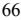

{68}------------------------------------------------

# **Note 18 - Fair Value Measurements and Fair Values of Financial Instruments**

Management uses its best judgment in estimating the fair value of the Company's financial instruments; however, there are inherent weaknesses in any estimation technique. Therefore, for substantially all financial instruments, the fair value estimates herein are not necessarily indicative of the amounts the Company could have realized in a sales transaction on the dates indicated. The estimated fair value amounts have been measured as of their respective year-ends and have not been re-evaluated or updated for purposes of these consolidated financial statements subsequent to those respective dates. As such, the estimated fair values of these financial instruments subsequent to the respective reporting dates may be different than the amounts reported at each year-end.

ASC Topic 820, *Fair Value Measurements and Disclosures*, establishes a fair value hierarchy that prioritizes the inputs to valuation methods used to measure fair value. The hierarchy gives the highest priority to unadjusted quoted prices in active markets for identical assets or liabilities (Level 1 measurements) and the lowest priority to unobservable inputs (Level 3 measurements).

An asset's or liability's level within the fair value hierarchy is based on the lowest level of input that is significant to the fair value measurement.

For assets and liabilities measured at fair value on a recurring basis, the fair value measurements, by level, within the fair value hierarchy are as follows:

| Description                                               | Total         | (Level 1) Quoted Prices in Active Markets for Identical Assets | (Level 2) Significant Other Observable Inputs | (Level 3) Significant Unobservable Inputs |
|-----------------------------------------------------------|---------------|----------------------------------------------------------------------------|-----------------------------------------------------------|----------------------------------------------------|
|                                                           |               | (In Thousands)                                                             |                                                           |                                                    |
| As of December 31, 2022: Securities Available for Sale |               |                                                                            |                                                           |                                                    |
| Debt Securities Available for Sale                        | \$ 91,715  | \$ -                                                                    | \$ 91,715                                              | \$ -                                            |
| Marketable Equities                                       | 17,686        | 17,686                                                                     | -                                                         | -                                                  |
| Total Securities Available for Sale                       | \$ 109,401 | \$ 17,686                                                               | \$ 91,715                                              | \$ -                                            |
|                                                           |               |                                                                            |                                                           |                                                    |
| As of December 31, 2021:                                  |               |                                                                            |                                                           |                                                    |
| Securities Available for Sale                             |               |                                                                            |                                                           |                                                    |
| Debt Securities Available for Sale                        | \$ 85,186  | \$ -                                                                    | \$ 85,186                                              | \$ -                                            |
| Marketable Equities                                       | 25,187        | 25,187                                                                     | -                                                         | -                                                  |
| Total Securities Available for Sale                       | \$ 110,373 | \$ 25,187                                                               | \$ 85,186                                              | \$ -                                            |
|                                                           |               |                                                                            |                                                           |                                                    |

For assets and liabilities measured at fair value on a nonrecurring basis, the fair value measurements by level within the fair value hierarchy are as follows:

| Description As of December 31, 2022: | Total        | (Level 1) Quoted Prices in Active Markets for Identical Assets | (Level 2) Significant Other Observable Inputs (In Thousands) |         | (Level 3) Significant Unobservable Inputs |
|-----------------------------------------|--------------|----------------------------------------------------------------------------|-----------------------------------------------------------------------------|---------|----------------------------------------------------|
| Impaired loans                          | \$ 5,587  | \$                                                                         | - \$                                                                     | - \$ | 5,587                                              |
| Other real estate owned                 | \$ 75     | \$                                                                         | - \$                                                                     | - \$ | 75                                                 |
| As of December 31, 2021:                |              |                                                                            |                                                                             |         |                                                    |
| Impaired loans                          | \$ 14,796 | \$                                                                         | - \$                                                                     | - \$ | 14,796                                             |
| Other real estate owned                 | \$ 75     | \$                                                                         | - \$                                                                     | - \$ | 75                                                 |

Certain impaired loans were adjusted to the fair value, less costs to sell, of the underlying collateral securing these loans resulting in losses. The loss is not recorded directly as an adjustment to current earnings, but rather as a component in determining the allowance for loan losses. Fair value was measured using appraised values of collateral and adjusted as necessary by management based on unobservable inputs for specific properties. Losses (recoveries) on impaired loans for the years ended December 31, 2022 and 2021 were (\$5.0) million and \$5.7 million respectively.

The following table presents additional quantitative information about assets measured at fair value on a nonrecurring basis and for which the Company has utilized adjusted Level 3 inputs to determine fair value, (Dollars in thousands):

|                         | Quantitative Information about Level 3 Fair Value Measurements |                             |                           |        |  |  |  |
|-------------------------|----------------------------------------------------------------|-----------------------------|---------------------------|--------|--|--|--|
|                         | Fair Value Estimate                                         | Valuation Techniques     | Unobservable Input     | Range  |  |  |  |
| December 31, 2022:      |                                                                |                             |                           |        |  |  |  |
| Impaired Loans          | \$ 5,587                                                    | Appraisal of collateral (1) | Appraisal adjustments (2) | 0%-10% |  |  |  |
|                         |                                                                |                             |                           |        |  |  |  |
| Other Real Estate Owned | \$ 75                                                       | Appraisal of collateral (1) | Appraisal adjustments (2) | 0%-10% |  |  |  |

{69}------------------------------------------------

## **Note 18- Fair Value Measurements and Fair Value of Financial Instruments (continued)**

| Quantitative Information about Level 3 Fair Value Measurements |    |                                         |                             |                           |        |  |  |  |
|----------------------------------------------------------------|----|-----------------------------------------|-----------------------------|---------------------------|--------|--|--|--|
|                                                                |    | Fair Value Valuation Unobservable |                             |                           |        |  |  |  |
|                                                                |    | Estimate                                | Techniques                  | Input                     |        |  |  |  |
| December 31, 2021:                                             |    |                                         |                             |                           |        |  |  |  |
| Impaired Loans                                                 | \$ | 14,796                                  | Appraisal of collateral (1) | Appraisal adjustments (2) | 0%-10% |  |  |  |
|                                                                |    |                                         |                             |                           |        |  |  |  |
| Other Real Estate Owned                                        | \$ | 75                                      | Appraisal of collateral (1) | Appraisal adjustments (2) | 0%-10% |  |  |  |

(1) Fair value is generally determined through independent appraisals of the underlying collateral, which generally include various level 3 inputs which are not identifiable.

- (2) Appraisals may be adjusted by management for qualitative factors such as age of appraisal, expected condition of property, economic conditions, and estimated liquidation expenses. The range of liquidation expenses and other appraisal adjustments are presented as a percent of the appraisal.
The following information should not be interpreted as an estimate of the fair value of the entire Company since a fair value calculation is only provided for a limited portion of the Company's assets and liabilities. Due to a wide range of valuation techniques and the degree of subjectivity used in making the estimates, comparisons between the Company's disclosures and those of other companies may not be meaningful. The following methods and assumptions were used to estimate the fair values of the Company's financial instruments at December 31, 2022 and 2021:

#### **Cash and Cash Equivalents (Carried at Cost)**

The carrying amounts reported in the consolidated statements of financial condition for cash and interest-earning deposits approximate those assets' fair values.

#### **Securities (Carried at Fair Value)**

The fair value of securities is determined by obtaining quoted market prices on nationally recognized securities exchanges (Level 1), or matrix pricing (Level 2), which is a mathematical technique used widely in the industry to value debt securities without relying exclusively on quoted market prices for the specific securities but rather by relying on the securities' relationship to other benchmark quoted prices.

#### **Loans Held for Sale (Carried at Cost)**

The fair value of loans held for sale is determined, when possible, using quoted secondary-market prices. If no such quoted prices exist, the fair value of a loan is determined using quoted prices for a similar loan or loans, adjusted for specific attributes of that loan. Loans held for sale are carried at the lower of cost or fair value.

#### **Loans Receivable (Carried at Cost)**

The fair values of loans, except for certain impaired loans, are estimated using discounted cash flow analyses, using market rates at the date of the Statement of Financial Condition that reflect the credit and interest rate-risk inherent in the loans. Projected future cash flows are calculated based upon contractual maturity or call dates, projected repayments and prepayments of principal. Generally, for variable rate loans that reprice frequently and with no significant change in credit risk, fair values are based on carrying values.

#### **Impaired Loans (Generally Carried at Fair Value)**

Impaired loans are those for which the Company has measured and recorded an impairment generally based on the fair value of the loan's collateral, less estimated costs to sell. Fair value is generally determined based upon independent third-party appraisals of the properties, or discounted cash flows based upon the expected proceeds. These assets are included as Level 3 fair values, based upon the lowest level of input that is significant to the fair value measurements. The fair value at December 31, 2022 and 2021 consists of the loan balances of \$8,371,000 and \$22,624,000 net of a valuation allowance of \$2,784,000 and \$7,828,000, respectively.

#### **FHLB of New York Stock (Carried at Cost)**

The carrying amount of restricted investment in bank stock approximates fair value, and considers the limited marketability of such securities.

#### **Accrued Interest Receivable and Payable (Carried at Cost)**

The carrying amount of accrued interest receivable and accrued interest payable approximates its fair value.

#### **Deposits (Carried at Cost)**

The fair values disclosed for demand deposits (e.g., interest and non-interest checking, passbook savings and money market accounts) are, by definition, equal to the amount payable on demand at the reporting date (i.e., their carrying amounts). Fair values for fixed-rate certificates of deposit are estimated using a discounted cash flow calculation that applies interest rates currently being offered in the market on certificates to a schedule of aggregated expected monthly maturities on time deposits.

#### **Debt Including Subordinated Debentures (Carried at Cost)**

Fair values of debt are estimated using discounted cash flow analysis, based on quoted prices for new long-term debt with similar credit risk characteristics, terms and remaining maturity. These prices obtained from this active market represent a market value that is deemed to represent the transfer price if the liability were assumed by a third party.

{70}------------------------------------------------

# **Note 18- Fair Value Measurements and Fair Value of Financial Instruments (continued)**

### **Off-Balance Sheet Financial Instruments (Disclosed at Cost)**

Fair values for the Bank's off-balance sheet financial instruments (lending commitments and unused lines of credit) are based on fees currently charged in the market to enter into similar agreements, taking into account, the remaining terms of the agreements and the counterparties' credit standing. The fair value of these commitments was deemed immaterial and is not presented in the accompanying table.

The carrying values and estimated fair values of financial instruments were as follows at December 31, 2022 and 2021:

|                                    | As of December 31, 2022 |           |    |            |    |                                                         |    |                                        |                                    |  |
|------------------------------------|-------------------------|-----------|----|------------|----|---------------------------------------------------------|----|----------------------------------------|------------------------------------|--|
|                                    | Carrying                |           |    |            |    | Quoted Prices in Active Markets for Identical Assets |    | Significant Other Observable Inputs | Significant Unobservable Inputs |  |
|                                    |                         | Value     |    | Fair Value |    | (Level 1) (Level 2)                                  |    |                                        | (Level 3)                          |  |
|                                    |                         |           |    |            |    | (In Thousands)                                          |    |                                        |                                    |  |
| Financial assets:                  |                         |           |    |            |    |                                                         |    |                                        |                                    |  |
| Cash and cash equivalents          | \$                      | 229,359   | \$ | 229,359    | \$ | 229,359                                                 | \$ | -                                      | \$ -                            |  |
| Interest-earning time deposits     |                         | 735       |    | 735        |    | -                                                       |    | 735                                    | -                                  |  |
| Debt securities available for sale |                         | 91,715    |    | 91,715     |    | -                                                       |    | 91,715                                 | -                                  |  |
| Equity investments                 |                         | 17,686    |    | 17,686     |    | 17,686                                                  |    | -                                      | -                                  |  |
| Loans held for sale                |                         | 658       |    | 658        |    | -                                                       |    | 658                                    | -                                  |  |
| Loans receivable, net              |                         | 3,045,331 |    | 2,876,925  |    | -                                                       |    | -                                      | 2,876,925                          |  |
| FHLB of New York stock, at cost    |                         | 20,113    |    | 20,113     |    | -                                                       |    | 20,113                                 | -                                  |  |
| Accrued interest receivable        |                         | 13,455    |    | 13,455     |    | -                                                       |    | 13,455                                 | -                                  |  |
|                                    |                         |           |    |            |    |                                                         |    |                                        |                                    |  |
| Financial liabilities:             |                         |           |    |            |    |                                                         |    |                                        |                                    |  |
| Deposits                           |                         | 2,811,607 |    | 2,499,978  |    | 1,713,754                                               |    | 786,224                                | -                                  |  |
| Debt                               |                         | 382,261   |    | 377,227    |    | -                                                       |    | 377,227                                | -                                  |  |
| Subordinated debentures            |                         | 37,508    |    | 40,113     |    | -                                                       |    | 40,113                                 | -                                  |  |
| Accrued interest payable           |                         | 3,073     |    | 3,073      |    | -                                                       |    | 3,073                                  | -                                  |  |

|                                    | As of December 31, 2021 |    |            |    |                                                                      |    |                                                     |                                                 |
|------------------------------------|-------------------------|----|------------|----|----------------------------------------------------------------------|----|-----------------------------------------------------|-------------------------------------------------|
|                                    | Carrying Value       |    | Fair Value |    | Quoted Prices in Active Markets for Identical Assets (Level 1) |    | Significant Other Observable Inputs (Level 2) | Significant Unobservable Inputs (Level 3) |
|                                    |                         |    |            |    | (In Thousands)                                                       |    |                                                     |                                                 |
| Financial assets:                  |                         |    |            |    |                                                                      |    |                                                     |                                                 |
| Cash and cash equivalents          | \$ 411,629           | \$ | 411,629    | \$ | 411,629                                                              | \$ | -                                                   | \$ -                                         |
| Interest-earning time deposits     | 735                     |    | 735        |    | -                                                                    |    | 735                                                 | -                                               |
| Debt securities available for sale | 85,186                  |    | 85,186     |    | -                                                                    |    | 85,186                                              | -                                               |
| Equity investments                 | 25,187                  |    | 25,187     |    | 25,187                                                               |    | -                                                   | -                                               |
| Loans held for sale                | 952                     |    | 952        |    | -                                                                    |    | 952                                                 | -                                               |
| Loans receivable, net              | 2,304,942               |    | 2,313,204  |    | -                                                                    |    | -                                                   | 2,313,204                                       |
| FHLB of New York stock, at cost    | 6,084                   |    | 6,084      |    | -                                                                    |    | 6,084                                               | -                                               |
| Accrued interest receivable        | 9,183                   |    | 9,183      |    | -                                                                    |    | 9,183                                               | -                                               |
|                                    |                         |    |            |    |                                                                      |    |                                                     |                                                 |
| Financial liabilities:             |                         |    |            |    |                                                                      |    |                                                     |                                                 |
| Deposits                           | 2,561,402               |    | 2,520,191  |    | 1,881,121                                                            |    | 639,070                                             | -                                               |
| Debt                               | 71,711                  |    | 71,214     |    | -                                                                    |    | 71,214                                              | -                                               |
| Subordinated debentures            | 37,275                  |    | 45,020     |    | -                                                                    |    | 45,020                                              | -                                               |
| Accrued interest payable +      | 1,051                   |    | 1,051      |    | -                                                                    |    | 1,051                                               | -                                               |

{71}------------------------------------------------

# **Note 19 - Accumulated Other Comprehensive Loss**

The components of accumulated other comprehensive loss included in stockholders' equity are as follows:

|                                                      | At December 31, |    |       |  |
|------------------------------------------------------|-----------------|----|-------|--|
|                                                      | 2022            |    | 2021  |  |
|                                                      | (In Thousands)  |    |       |  |
| Net unrealized loss on securities available for sale | \$ (7,887)   | \$ | 2,440 |  |
| Tax effect                                           | 1,955           |    | (605) |  |
| Net of tax amount                                    | (5,932)         |    | 1,835 |  |
| Benefit plan adjustments                             | (718)           |    | (930) |  |
| Tax effect                                           | 159             |    | 223   |  |
| Net of tax amount                                    | (559)           |    | (707) |  |
| Accumulated other comprehensive loss                 | \$ (6,491)   | \$ | 1,128 |  |

#### **Note 20 - Parent Only Condensed Financial Information**

### **STATEMENTS OF FINANCIAL CONDITION Years Ended December 31, 2022** 2021 **(In Thousands) Assets** Cash and due from banks **\$ 1,553** \$ 3,812 Investment in subsidiaries **327,960** 307,165 Restricted common stock **124** 124 Other assets **110** 1,331 **Total assets 329,747** 312,432 **Liabilities and Stockholders' Equity Liabilities** Subordinated debentures **\$ 37,508** \$ 37,275 Other Liabilities **985** 1,133 **Total liabilities 38,493** 38,408 **Stockholder's Equity 291,254** 274,024 **Total Liabilities and Stockholders' Equity \$ 329,747** \$ 312,432

#### **STATEMENTS OF OPERATIONS**

| 2022 2021                                                                                    |        |
|-------------------------------------------------------------------------------------------------|--------|
|                                                                                                 |        |
| (In Thousands)                                                                                  |        |
| Dividends from Bank \$ 22,338 \$                                                       | 15,885 |
| Interest and dividends from investments -                                                    | -      |
| Total Income 22,338                                                                          | 15,885 |
| Interest expense, borrowed money 2,299                                                       | 2,230  |
| Other 366                                                                                    | 353    |
| Total Expense 2,665                                                                          | 2,583  |
| Income before Income Tax Expense and Equity in Undistributed Earnings of Subsidiaries 19,673 | 13,302 |
| Income tax benefit (843)                                                                     | (777)  |
| Income before Equity in Undistributed Earnings of Subsidiaries 20,516                        | 14,079 |
| Equity in undistributed earnings of subsidiaries 25,063                                      | 20,161 |
| Net Income \$ 45,579 \$                                                                | 34,240 |

{72}------------------------------------------------

# **STATEMENTS OF CASH FLOWS**

|                                                                                   |               | Years Ended December 31, |          |  |
|-----------------------------------------------------------------------------------|---------------|--------------------------|----------|--|
|                                                                                   | 2022          |                          | 2021     |  |
|                                                                                   |               | (In Thousands)           |          |  |
| Cash Flows from Operating Activities                                              |               |                          |          |  |
| Net Income                                                                        | \$ 45,579  | \$                       | 34,240   |  |
| Adjustments to reconcile net income to net cash provided by operating activities: |               |                          |          |  |
| Amortization                                                                      |               | 233                      | 233      |  |
| Equity in undistributed earnings of subsidiaries                                  | (25,063)      |                          | (20,161) |  |
| Decrease (increase) in other assets                                               | 1,223         |                          | (781)    |  |
| (Decrease) increase in other liabilities                                          | (149)         |                          | 10       |  |
| Net Cash Provided By Operating Activities                                         | 21,823        |                          | 13,541   |  |
| Cash Flows from Investing Activities                                              |               |                          |          |  |
| Additional investment in subsidiary                                               | (2,220)       |                          | (289)    |  |
| Net Cash Used In Investing Activities                                             | \$ (2,220) | \$                       | (289)    |  |
| Cash Flows from Financing Activities                                              |               |                          |          |  |
| Proceeds from issuance of preferred stock                                         | 6,810         |                          | 3,200    |  |
| Redemption of preferred stock                                                     | (14,730)      |                          | -        |  |
| Proceeds from issuance of common stock                                            |               | 639                      | 765      |  |
| Cash dividends paid                                                               | (11,175)      |                          | (10,935) |  |
| Purchase of treasury stock                                                        | (3,406)       |                          | (4,207)  |  |
| Net Cash Provided by (Used in) Financing Activities                               | (21,862)      |                          | (11,177) |  |
| Net Increase (Decrease) in Cash and Cash Equivalents                              | (2,259)       |                          | 2,075    |  |
| Cash and Cash Equivalents - Beginning                                             | \$ 3,812   | \$                       | 1,737    |  |
| Cash and Cash Equivalents - Ending                                                | \$ 1,553   | \$                       | 3,812    |  |

{73}------------------------------------------------

# **Note 21 - Subsequent Events**

Subsequent Events are events or transactions that occur after the balance sheet date but before financial statements are issued or available to be issued. Financial statements are considered issued when they are widely distributed to stockholders and other financial statement users for general use and reliance in a form and format that complies with GAAP.

On January 26, 2023, the Company declared a cash dividend of \$0.16 per share and was paid to stockholders on February 17, 2023, with a record date of February 3, 2023.

#### **ITEM 9. CHANGES IN AND DISAGREEMENTS WITH ACCOUNTANTS ON ACCOUNTING AND FINANCIAL DISCLOSURE**

Not applicable.

#### **ITEM 9A. CONTROLS AND PROCEDURES**

#### (a) Evaluation of disclosure controls and procedures.

Under the supervision and with the participation of our management, including our Chief Executive Officer and Chief Financial Officer, we evaluated the effectiveness of the design and operation of our disclosure controls and procedures (as defined in Rule 13a-15(e) and 15d-15(e) under the Exchange Act) as of December 31, 2022 (the "Evaluation Date"). Based upon that evaluation, the Chief Executive Officer and Chief Financial Officer concluded that, as of the Evaluation Date, our disclosure controls and procedures were effective in timely alerting them to the material information relating to us (or our consolidated subsidiaries) required to be included in our periodic SEC filings.

#### (b) Management's Annual Report on Internal Control over Financial Reporting.

Management of BCB Bancorp, Inc., and subsidiaries (the "Company") is responsible for establishing and maintaining adequate internal control over financial reporting. The Company's system of internal control is designed under the supervision of management, including our Chief Executive Officer and Chief Financial Officer, to provide reasonable assurance regarding the reliability of our financial reporting and the preparation of the Company's consolidated financial statements for external reporting purposes in accordance with accounting principles generally accepted in the United States of America ("GAAP").

Our internal control over financial reporting includes policies and procedures that pertain to the maintenance of records that, in reasonable detail, accurately and fairly reflect transactions and dispositions of assets; provide reasonable assurances that transactions are recorded as necessary to permit preparation of consolidated financial statements in accordance with GAAP, and that receipts and expenditures are made only in accordance with the authorization of management and the Board of Directors; and provide reasonable assurance regarding prevention or timely detection of unauthorized acquisition, use, or disposition of the Company's assets that could have a material effect on our consolidated financial statements. Because of its inherent limitations, internal control over financial reporting may not prevent or detect misstatements. Projections on any evaluation of effectiveness to future periods are subject to the risk that the controls may become inadequate because of changes in conditions or that the degree of compliance with policies and procedures may deteriorate.

As of December 31, 2022, management assessed the effectiveness of the Company's internal control over financial reporting based upon the framework established in *Internal Control – Integrated Framework (2013)* issued by the Committee of Sponsoring Organizations of the Treadway Commission (COSO). Based upon its assessment, management believes that the Company's internal control over financial reporting as of December 31, 2022 is effective and meets the criteria of the *Internal Control – Integrated Framework (2013)*.

There were no changes in the Company's internal control over financial reporting (as defined in Rule 13a-15(f) and 15d-15(f) under the Exchange Act) that occurred during the fourth fiscal quarter of 2022 that have materially affected, or are reasonably likely to materially affect, the Company's internal control over financial reporting.

Wolf and Company, P.C., the independent registered public accounting firm that audited the Company's consolidated financial statements, has issued an audit report on the Company's internal control over financial reporting as of December 31, 2022 that appears in Item 8 of this Form 10-K.

#### **ITEM 9B. OTHER INFORMATION**

None

### **ITEM 9C. DISCLOSURE REGARDING FOREIGN JURISDICTIONS THAT PREVENT INSPECTIONS**

Not applicable.

{74}------------------------------------------------

#### **PART III**

# **ITEM 10. DIRECTORS, EXECUTIVE OFFICERS AND CORPORATE GOVERNANCE**

The Company has adopted a Code of Ethics that applies to the Company's Chief Executive Officer, Chief Financial Officer, Controller, and/or any persons performing similar functions. The Code of Ethics is available for free by writing to: President and Chief Executive Officer, BCB Bancorp, Inc., 104-110 Avenue C, Bayonne, New Jersey 07002. The Code of Ethics was filed as an exhibit to the Form 10-K for the year ended December 31, 2004 and is incorporated by reference as an exhibit to this report.

The "Proposal I—Election of Directors" section of the Company's definitive Proxy Statement for the Company's 2023 Annual Meeting of Stockholders (the "2023 Proxy Statement"), including the sections entitled "Biographical Information Regarding Nominees, Continuing Directors and Named Executive Officers", is incorporated herein by reference.

In addition, the information under the captions "Section 16(a) Beneficial Ownership Reporting Compliance", "Code of Ethics" and "The Audit Committee" of the 2023 Proxy Statement is incorporated herein by reference.

There have been no changes during the last year in the procedures by which security holders may recommend nominees to the Company's board of directors.

# **ITEM 11. EXECUTIVE COMPENSATION**

The sections of the 2023 Proxy Statement entitled "Executive Compensation" and "The Compensation Committee" are incorporated herein by reference.

# **ITEM 12. SECURITY OWNERSHIP OF CERTAIN BENEFICIAL OWNERS AND MANAGEMENT AND RELATED STOCKHOLDER MATTERS**

The sections of the 2023 Proxy Statement entitled "Equity Compensation Plan Information", "Voting Securities And Principal Holders Thereof", and ""Proposal I—Election of Directors" are incorporated herein by reference.

# **ITEM 13. CERTAIN RELATIONSHIPS AND RELATED TRANSACTIONS, AND DIRECTOR INDEPENDENCE**

The sections of the 2023 Proxy Statement entitled "Related Party Transactions" and "Proposal I-Election of Directors—Board Independence" are incorporated herein by reference.

# **ITEM 14. PRINCIPALACCOUNTANT FEES AND SERVICES**

Information required by Item 14 is incorporated by reference to the sections of the 2023 Proxy Statement entitled "PROPOSAL II - RATIFICATION OF THE APPOINTMENT OF THE INDEPENDENT REGISTERED PUBLIC ACCOUNTING FIRM—Fees Paid to Wolf & Company, P.C." and "---Policy on Audit Committee Pre-Approval of Audit and Non-Audit Services of the Independent Registered Public Accounting Firm."

{75}------------------------------------------------

# **PART IV**

#### **ITEM 15. EXHIBITS AND FINANCIAL STATEMENT SCHEDULES**

(a)(1) Financial Statements

The exhibits and financial statement schedules filed as a part of this Form 10-K are as follows:

- (A) Report of Independent Registered Public Accounting Firm
- (B) Consolidated Statements of Financial Condition as of December 31, 2022 and 2021
- (C) Consolidated Statements of Operations for the years ended December 31, 2022 and 2021
- (D) Consolidated Statements of Comprehensive Income for the years ended December 31, 2022 and 2021
- (E) Consolidated Statements of Changes in Stockholders' Equity for the years ended December 31, 2022 and 2021
- (F) Consolidated Statements of Cash Flows for the years ended December 31, 2022 and 2021
- (G) Notes to Consolidated Financial Statements
- (a)(2) Financial Statement Schedules

All schedules are omitted because they are not required or applicable, or the required information is shown in the consolidated statements or the notes thereto.

#### (b) Exhibits

_______

| 3.1   | Restated Certificate of Incorporation of BCB Bancorp, Inc. (1)                                                                 |
|-------|--------------------------------------------------------------------------------------------------------------------------------|
| 3.2   | Bylaws of BCB Bancorp, Inc. (2)                                                                                                |
| 4.1   | Specimen Stock Certificate (3)                                                                                                 |
| 4.2   | Description of Common Stock (4)                                                                                                |
| 4.3   | Form of Subordinated Note Purchase Agreement (5)                                                                               |
| 4.4   | Form of Subordinated Note (6)                                                                                                  |
| 10.1  | BCB Community Bank 2002 Stock Option Plan (7)                                                                                  |
| 10.2  | BCB Community Bank 2003 Stock Option Plan (8)                                                                                  |
| 10.3  | Amendment to 2002 and 2003 Stock Option Plans (9)                                                                              |
| 10.4  | 2005 Director Deferred Compensation Plan (10)                                                                                  |
| 10.5  | Employment Agreement with Thomas M. Coughlin (11)                                                                              |
| 10.6  | BCB Bancorp, Inc. 2011 Stock Option Plan (12)                                                                                  |
| 10.7  | BCB Bancorp, Inc. 2018 Equity Incentive Plan (13)                                                                              |
| 10.8  | Defined Benefit Supplemental Executive Retirement Plan (14)                                                                    |
| 10.9  | Employment Agreement with Kenneth G. Emerson (15)                                                                              |
| 10.10 | Employment Agreement with Ryan Blake (16)                                                                                      |
| 10.11 | Employment Agreement with Sandra L. Sievewright (17)                                                                           |
| 10.12 | Employment Agreement with Wing K. Siu (18)                                                                                     |
| 10.13 | Employment Agreement with Jawad Chaudhry (19)                                                                                  |
| 14    | Code of Ethics (20)                                                                                                            |
| 21    | Subsidiaries of the Company                                                                                                    |
| 23    | Consent of Independent Registered Public Accounting Firm – Wolf & Company, P.C                                                 |
| 31.1  | Certification of Chief Executive Officer pursuant to Section 302 of the Sarbanes-Oxley Act of 2002                             |
| 31.2  | Certification of Chief Financial Officer pursuant to Section 302 of the Sarbanes-Oxley Act of 2002                             |
| 32    | Certification of Chief Executive Officer and Chief Financial Officer pursuant to Section 906 of the Sarbanes-Oxley Act of 2002 |

{76}------------------------------------------------

- (1) Incorporated by reference to Exhibit 3.1 to the Annual Report on Form 10-K filed with the Securities and Exchange Commission on March 9, 2022.
- (2) Incorporated by reference to Exhibit 3.1 to the Form 8-K filed with the Securities and Exchange Commission on February 22, 2023.
- (3) Incorporated by reference to Exhibit 4 to the Form 8-K-12g3 filed with the Securities and Exchange Commission on May 1, 2003.
- (4) Incorporated by reference to Exhibit 4.3 to the Annual Report on Form 10-K filed with the Securities and Exchange Commission on March 11, 2020.
- (5) Incorporated by reference to Exhibit 10.1 to the Form 8-K filed with the Securities and Exchange Commission on July 31, 2018.
- (6) Incorporated by reference to Exhibit 4.1 to the Form 8-K filed with the Securities and Exchange Commission on July 31, 2018.
- (7) Incorporated by reference to Exhibit 10.1 to the Company's Registration Statement on Form S-8 filed with Securities and Exchange Commission on January 26, 2004.
- (8) Incorporated by reference to Exhibit 10.2 to the Company's Registration Statement on Form S-8 filed with Securities and Exchange Commission on January 26, 2004.
- (9) Incorporated by reference to Exhibit 10.14 to the Annual Report on Form 10-K filed with the Securities and Exchange Commission on March 16, 2006.
- (10) Incorporated by reference to Exhibit 10.3 to the Company's Registration Statement on Form S-1, as amended, (Commission File Number 333-128214) originally filed with the Securities and Exchange Commission on September 9, 2005.
- (11) Incorporated by reference to Exhibit 10.1 to the Form 8-K filed with the Securities and Exchange Commission on September 29, 2022.
- (12) Incorporated by reference to Appendix A to the proxy statement for the Company's Annual Meeting of Shareholders (File No. 000-50275), filed by the Company with the Securities and Exchange Commission on Schedule 14A on March 28, 2011.
- (13) Incorporated by reference to Appendix A to the proxy statement for the Company's Annual Meeting of Stockholders by the Company with the Securities and Exchange Commission on March 26, 2018.
- (14) Incorporated by reference to Exhibit 10.1 to the Form 8-K filed with the Securities and Exchange Commission on January 3, 2022.
- (15) Incorporated by reference to Exhibit 10.2 to the Form 8-K filed with the Securities and Exchange Commission on February 23, 2022.
- (16) Incorporated by reference to Exhibit 10.11 to the Annual Report on Form 10-K filed with the Securities and Exchange Commission on March 9, 2022.
- (17) Incorporated by reference to Exhibit 10.12 to the Annual Report on Form 10-K filed with the Securities and Exchange Commission on March 9, 2022.
- (18) Incorporated by reference to Exhibit 10.13 to the Annual Report on Form 10-K filed with the Securities and Exchange Commission on March 9, 2022.
- (19) Incorporated by reference to Exhibit 10.2 to the Form 8-K filed with the Securities and Exchange Commission on September 29, 2022.
- (20) Incorporated by reference to Exhibit 14 to the Annual Report on Form 10-K filed with the Securities and Exchange Commission on March 26, 2004.

**ITEM 16. FORM 10-K SUMMARY** None.

{77}------------------------------------------------

### **Signatures**

Pursuant to the requirements of Section 13 of the Securities Exchange Act of 1934, the Registrant has duly caused this report to be signed on its behalf by the undersigned, thereunto duly authorized.

#### **BCB BANCORP, INC.**

Date: March 9, 2023 By: /s/ Thomas Coughlin Thomas Coughlin President and Chief Executive Officer (Principal Executive Officer) (Duly Authorized Representative)

Pursuant to the requirements of the Securities Exchange of 1934, this report has been signed below by the following persons on behalf of the Registrant and in the capacities and on the dates indicated.

| Signatures                  | Title                                                                            | Date          |
|-----------------------------|----------------------------------------------------------------------------------|---------------|
| /s/ Thomas Coughlin         |                                                                                  |               |
| Thomas Coughlin             | President, Chief Executive Officer and Director (Principal Executive Officer) | March 9, 2023 |
| /s/ Jawad Chaudhry          |                                                                                  |               |
| Jawad Chaudhry              | Chief Financial Officer (Principal Financial and Accounting Officer)          | March 9, 2023 |
| /s/ Mark D. Hogan           |                                                                                  |               |
| Mark D. Hogan               | Chairman of the Board                                                            | March 9, 2023 |
| /s/ Robert Ballance         |                                                                                  |               |
| Robert Ballance             | Director                                                                         | March 9, 2023 |
| /s/ Judith Q. Bielan        |                                                                                  |               |
| Judith Q. Bielan            | Director                                                                         | March 9, 2023 |
| /s/ James E. Collins        |                                                                                  |               |
| James E. Collins            | Director                                                                         | March 9, 2023 |
| /s/ Vincent DiDomenico, Jr. |                                                                                  |               |
| Vincent DiDomenico, Jr.     | Director                                                                         | March 9, 2023 |
| /s/ Joseph Lyga             |                                                                                  |               |
| Joseph Lyga                 | Director                                                                         | March 9, 2023 |
| /s/ John Pulomena           |                                                                                  |               |
| John Pulomena               | Director                                                                         | March 9, 2023 |
| /s/ James Rizzo             |                                                                                  |               |
| James Rizzo                 | Director                                                                         | March 9, 2023 |
| /s/ Spencer B. Robbins      |                                                                                  |               |
| Spencer B. Robbins          | Director                                                                         | March 9, 2023 |

{78}------------------------------------------------

# **EXHIBIT 21**

# **SUBSIDIARIES OF THE COMPANY**

# **Subsidiaries of the Registrant**

The following is a list of the Subsidiaries of BCB Bancorp, Inc.

| Name                                 | State of Incorporation |
|--------------------------------------|------------------------|
| BCB Community Bank                   | New Jersey             |
|                                      |                        |
| BCB Holding Company Investment Corp. | New Jersey             |
|                                      |                        |
| Special Asset REO 1, LLC             | New Jersey             |
|                                      |                        |
| Special Asset REO 2, LLC             | New Jersey             |
|                                      |                        |

{79}------------------------------------------------

# **CONSENT OF INDEPENDENT REGISTERED PUBLIC ACCOUNTING FIRM**

We consent to the incorporation by reference in the Registration Statements (Nos. 333-240128, 333-219617, 333-199424, 333-197366, and 333-177502) on Form S-3 and (Nos. 333-224925, 333-175545, 333-174639, 333- 169337, 333-165127, and 333-112201) on Form S-8 of BCB Bancorp, Inc. (the "Company") of our reports dated March 9, 2022 related to the consolidated financial statements and the effectiveness of internal control over financial reporting of the Company, as they appear in this Annual Report on Form 10-K of the Company for the year ended December 31, 2021.

/s/ Wolf & Company, P.C.

Boston, Massachusetts March 9, 2022

{80}------------------------------------------------

I, Thomas Coughlin, certify that:

- 1. I have reviewed this Annual Report on Form 10-K of BCB Bancorp, Inc.;
- 2. Based on my knowledge, this report does not contain any untrue statement of a material fact or omit to state a material fact necessary to make the statements made, in light of the circumstances under which such statements were made, not misleading with respect to the period covered by this annual report;
- 3. Based on my knowledge, the financial statements, and other financial information included in this report, fairly present in all material respects the financial condition, results of operations and cash flows of the registrant as of, and for, the periods presented in this report;
- 4. The registrant's other certifying officer and I are responsible for establishing and maintaining disclosure controls and procedures (as defined in Exchange Act Rules 13a-15(e) and 15d-15(e)) and internal control over financial reporting (as defined in Exchange Act Rules 13a-15(f) and 15d-15(f)) for the registrant and have:
	- a) designed such disclosure controls and procedures, or caused such disclosure controls and procedures to be designed under our supervision, to ensure that material information relating to the registrant, including its consolidated subsidiaries, is made known to us by others within those entities, particularly during the period in which this report is being prepared;
	- b) designed such internal control over financial reporting, or caused such internal control over financial reporting to be designed under our supervision, to provide reasonable assurance regarding the reliability of financial reporting and the preparation of financial statements for external purposes in accordance with generally accepted accounting principles;
	- c) evaluated the effectiveness of the registrant's disclosure controls and procedures and presented in this report our conclusions about the effectiveness of the disclosure controls and procedures, as of the end of the period covered by this report based on such evaluation; and
	- d) disclosed in this report any change in the registrant's internal control over financial reporting that occurred during the registrant's most recent fiscal quarter (the registrant's fourth fiscal quarter in the case of an annual report) that has materially affected, or is reasonably likely to materially affect, the registrant's internal control over financial reporting; and
- 5. The registrant's other certifying officer and I have disclosed, based on our most recent evaluation of internal control over financial reporting, to the registrant's auditors and the audit committee of registrant's board of directors (or persons performing the equivalent functions):
	- a) all significant deficiencies and material weaknesses in the design or operation of internal control over financial reporting which are reasonably likely to adversely affect the registrant's ability to record, process, summarize and report financial information; and
	- b) any fraud, whether or not material, that involves management or other employees who have a significant role in the registrant's internal control over financial reporting.

Date: March 9, 2022 /s/ Thomas Coughlin

Thomas Coughlin President and Chief Executive Officer (Principal Executive Officer)

{81}------------------------------------------------

#### **Certification of Principal Accounting Officer** Pursuant to Section 302 of the Sarbanes-Oxley Act of 2002

I, Karen M. Duran, certify that:

- 1. I have reviewed this Annual Report on Form 10-K of BCB Bancorp, Inc.;
- 2. Based on my knowledge, this report does not contain any untrue statement of a material fact or omit to state a material fact necessary to make the statements made, in light of the circumstances under which such statements were made, not misleading with respect to the period covered by this annual report;
- 3. Based on my knowledge, the financial statements, and other financial information included in this report, fairly present in all material respects the financial condition, results of operations and cash flows of the registrant as of, and for, the periods presented in this report;
- 4. The registrant's other certifying officer and I are responsible for establishing and maintaining disclosure controls and procedures (as defined in Exchange Act Rules 13a-15(e) and 15d-15(e)) and internal control over financial reporting (as defined in Exchange Act Rules 13a-15(f) and 15d-15(f)) for the registrant and have:
	- a) designed such disclosure controls and procedures, or caused such disclosure controls and procedures to be designed under our supervision, to ensure that material information relating to the registrant, including its consolidated subsidiaries, is made known to us by others within those entities, particularly during the period in which this report is being prepared;
	- b) designed such internal control over financial reporting, or caused such internal control over financial reporting to be designed under our supervision, to provide reasonable assurance regarding the reliability of financial reporting and the preparation of financial statements for external purposes in accordance with generally accepted accounting principles;
	- c) evaluated the effectiveness of the registrant's disclosure controls and procedures and presented in this report our conclusions about the effectiveness of the disclosure controls and procedures, as of the end of the period covered by this report based on such evaluation; and
	- d) disclosed in this report any change in the registrant's internal control over financial reporting that occurred during the registrant's most recent fiscal quarter (the registrant's fourth fiscal quarter in the case of an annual report) that has materially affected, or is reasonably likely to materially affect, the registrant's internal control over financial reporting; and
- 5. The registrant's other certifying officer and I have disclosed, based on our most recent evaluation of internal control over financial reporting, to the registrant's auditors and the audit committee of registrant's board of directors (or persons performing the equivalent functions):
	- a) all significant deficiencies and material weaknesses in the design or operation of internal control over financial reporting which are reasonably likely to adversely affect the registrant's ability to record, process, summarize and report financial information; and
	- b) any fraud, whether or not material, that involves management or other employees who have a significant role in the registrant's internal control over financial reporting.

Date: March 9, 2022 /s/ Karen M. Duran

Karen M. Duran Interim Chief Financial Officer (Principal Accounting and Financial Officer)

{82}------------------------------------------------

#### **Certification pursuant to 18 U.S.C. Section 1350, as adopted pursuant to Section 906 of the Sarbanes-Oxley Act of 2002**

Thomas Coughlin, President and Chief Executive Officer and Karen M. Duran, Interim Chief Financial Officer of BCB Bancorp, Inc. (the "Company") each certify in his capacity as an officer of the Company that he has reviewed the annual report of the Company on Form 10-K for the fiscal year ended December 31, 2021 and that to the best of his knowledge:

- (1) the report fully complies with the requirements of Section 13(a) of the Securities Exchange Act of 1934; and
- (2) the information contained in the report fairly presents, in all material respects, the financial condition and results of operations of the Company.

The purpose of this statement is solely to comply with Title 18, Chapter 63, Section 1350 of the United States Code, as amended by Section 906 of the Sarbanes-Oxley Act of 2002.

Date: March 9, 2022

/s/ Thomas Coughlin President and Chief Executive Officer (Principal Executive Officer)

Date: March 9, 2022

/s/ Karen M. Duran Interim Chief Financial Officer (Principal Accounting and Financial Officer)