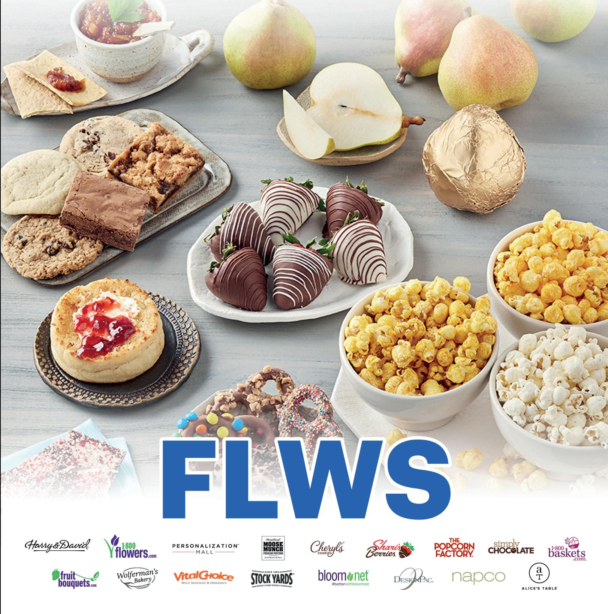
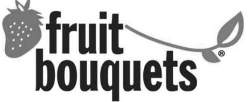
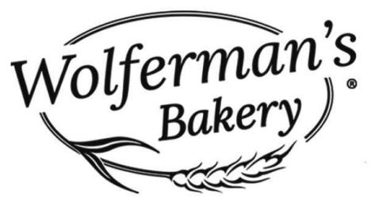
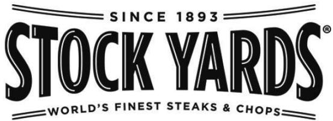
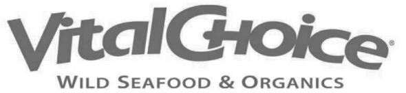
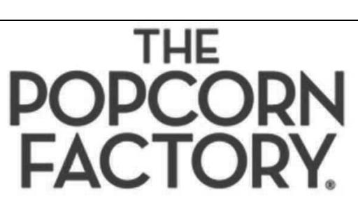
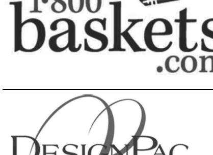
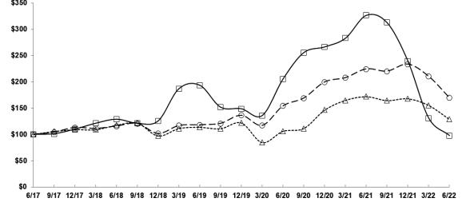
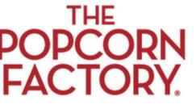
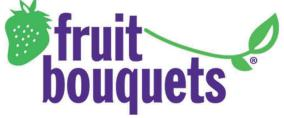

{0}------------------------------------------------

{1}------------------------------------------------

{2}------------------------------------------------

# 1-800-FLOWERS.COM, INC. LETTER TO SHAREHOLDERS

Dear Fellow Shareholders,

As the world began to transition to a post-COVID environment through fiscal 2022, we along with many other businesses faced new and unprecedented challenges in this ever-changing landscape, including a seismic shift in consumer behavior as they responded to significant inflation that impacted both their discretionary and non-discretionary purchases. Nonetheless, as a result of the strategic investments that we have made over the last several years, our company grew revenues by 4 percent in fiscal 2022, which was on top of the more than 40 percent growth that we experienced in the prior year.

Our revenue growth demonstrates the scalability of our e-commerce platform and our ability to retain and build on the gains we achieved over the past two years. Most notably, our revenue is now more than 75 percent higher than it was during the pre-pandemic levels of 2019 and we have essentially doubled the size of our company over the past several years. This reflects the healthy growth that we have seen in our customer file, our expanded product offerings and our ever-increasing focus on customer engagement through a combination of highly relevant content and unique experiences.

While we were able to grow our customer base and revenue in fiscal 2022 incremental to the significant growth we experienced in the prior year, our profits were pressured by the significant macro inflationary headwinds on our cost structure. We generated \$99 million of adjusted EBITDA for the fiscal year as our revenue growth was offset by the significant increase in product and operating costs. In the years ahead, we are confident that our bottom-line performance will reflect the significant top line growth we have experienced. Our initiatives to improve operational efficiencies through automation and logistics optimization, as well as a reversion to the mean of some of our cost structure, such as lower shipping container and fuel costs, are already beginning to be realized.

As we look ahead, it's just as important to take a moment and reflect on some of the significant changes that have occurred with our business and the economy over the last several years and determine which we expect to be more transitory vs permanent in nature.

Our business and the broader economy have gone through several significant stages over the past few years. Prior to the pandemic, we made the decision to increase our investments in marketing, particularly in our flagship 1-800-Flowers and Harry & David brands, to accelerate revenue growth. This effort enabled us to accelerate our revenue growth rate from the low single-digit range in fiscal 2018 to double-digits during the latter half of fiscal 2020. Additionally, we accelerated the growth of our most valuable asset, our customer file and our Celebrations Passport loyalty program during this period.

With the advent of the COVID pandemic in the Spring of 2020 and the introduction of lockdowns, social distancing and the shift to remote work, we experienced an unprecedented surge in demand as customers looked to stay connected with the important people in their lives. The resourcefulness and unwavering commitment of our team, coupled with the investments that we made in our business platform positioned us well to respond to this extraordinary environment. This surge not only benefited our top and bottom-line results, but most importantly, grew our customer file to record levels.

{3}------------------------------------------------

As the pandemic began to wane, we once again saw dramatic and sudden shifts in the macro economy and consumer behavior. On one hand, we witnessed increased travel, dining out, group celebrations, along with other pent-up activities. And on the other, we saw rapidly increasing inflation that affected customer demand, unprecedented disruptions in the global supply chain, geopolitical turmoil, and an extremely tight labor market – all of which increased prices on everything from labor to shipping to commodities. Though inflationary pressures remain, we are beginning to see early improvements in certain areas, including fuel prices that are off their peak, a decline in ocean freight costs, and a stabilization of labor rates.

While we are encouraged by these positive trends, our company has taken proactive steps to address and further mitigate these issues. We have utilized our balance sheet to invest in our operating platform and continue to build for the future, which includes:

- automating our warehouse and distribution facilities to reduce our exposure to escalating labor costs,
- buying and building inventories early to get ahead of the continuing global supply chain issues, and
- implementing logistics optimization programs to enhance our outbound shipping operations and manage rising rates.

These initiatives, coupled with our strategic pricing programs across our family of brands, are expected to help us mitigate rising costs and gradually improve our gross margins and bottom-line results beginning in the latter half of fiscal 2023.

Beyond these initiatives, our customers have strongly responded to our newest bundled product offerings and latest engagement initiatives. Offering Harry & David wine with Shari's Berries confections and 1-800-Flowers bouquets continues to be a big hit and increases our average order value. And to create a true community for our customers, we amplified our interactive engagement through a broad range of non-transactional experiences and content, including our Celebrations Pulse emails, Celebrations Chatter podcast, interactive blogs and virtual workshops, that feature collaborative design and confection of everything from floral arrangements to charcuterie boards.

These efforts, coupled with our Connections Communities social media platform and a growing number of influencer campaigns, enabled us to achieve more than 127 million non-transactional consumer engagements, well past our goal for the year. This is significant as customers who engage with our content convert significantly higher than those who do not. A combination of these initiatives and continued product expansion enabled us to attract more than 5 million new customers this fiscal year. And our existing active customer base grew by 5.3 percent.

In addition, our Celebrations Passport loyalty program continued to grow at a double-digit rate during the fiscal year with membership exceeding 1.4 million. This customer cohort along with those who purchase across our categories or brands represent our best customers. We believe the significant size and robust growth of our customer file and our Celebrations Passport loyalty program, along with our expanded product offerings positions us well to inspire our customers to give more, connect more, and build more and better relationships, which in turn will continue to grow our business over the longterm.

In this current environment where the only certainty has been uncertainty, we remain focused on executing on our strategic initiatives to grow our customer base and increase revenue from our existing customer base, while simultaneously increasing operating efficiencies through automation and logistics. 

{4}------------------------------------------------

Our balance sheet remains strong, and we expect it to benefit from lower capital expenditures and working capital improvements – in fiscal 2022, we made a proactive decision to buy and build inventory ahead of the upcoming holiday season to reduce our exposure to global supply chain challenges, which will reverse in the current fiscal year as we sell through that inventory.

I am very proud of our team's efforts to manage our business in this challenging environment. Our company has transformed into a leading e-commerce platform that inspires our customers to express, connect and celebrate. We are well-positioned to deepen our customer relationships by engaging with them across a broad range of communication channels as we work to build a true community and offer our customers the most robust online gifting experience. As always, we remain laser-focused on our Vision: to inspire more human expression, connection, and celebration – and our Mission: to deliver smiles. I would like to thank all our associates, vendors, suppliers, and shareholders for their continued support. We look forward to driving growth and building long-term shareholder value in fiscal 2023 and beyond.

Sincerely,

Chris McCann Chief Executive Officer 

{5}------------------------------------------------

[This page intentionally left blank]

{6}------------------------------------------------

# **UNITED STATES SECURITIES AND EXCHANGE COMMISSION**

WASHINGTON, D.C. 20549

#### **FORM 10-K**

☒ ANNUAL REPORT PURSUANT TO SECTION 13 OR 15(d) OF THE SECURITIES EXCHANGE ACT OF 1934

For the fiscal year ended **July 3, 2022**

or

☐ TRANSITION REPORT PURSUANT TO SECTION 13 OR 15(d) OF THE SECURITIES EXCHANGE ACT OF 1934

Commission File No. **0-26841 1-800-FLOWERS.COM, Inc.**

(Exact name of registrant as specified in its charter)

**Delaware**

(State or other jurisdiction of incorporation or organization) **Two Jericho Plaza, Suite 200, Jericho, NY 11753** (Address of principal executive offices) (Zip code)

**11-3117311**  (I.R.S. Employer Identification No.) **(516) 237-6000** (Registrant's telephone number, including area code)

Securities registered pursuant to Section 12(b) of the Act:

| Title of each class  | Trading symbol(s) | registered              |
|----------------------|-------------------|-------------------------|
| Class A common stock | FLWS              | The Nasdaq Stock Market |

**Name of each exchange on which registered**

Table of Contents

Securities registered pursuant to Section 12(g) of the Act: None

Indicate by check mark if the registrant is a well-known seasoned issuer, as defined in Rule 405 of the Securities Act. Yes ☐ No ☒

Indicate by check mark if the registrant is not required to file reports pursuant to Section 13 or Section 15 (d) of the Act. Yes ☐ No ☒

Indicate by check mark whether the registrant (1) has filed all reports required to be filed by Section 13 or 15(d) of the Securities Exchange Act of 1934 during the preceding 12 months (or for such shorter period that the registrant was required to file such reports), and (2) has been subject to such filing requirements for the past 90 days. Yes ☒ No ☐

Indicate by check mark whether the registrant has submitted electronically every Interactive Data File required to be submitted pursuant to Rule 405 of Regulation S-T (Section 232.405 of this chapter) during the preceding 12 months (or for such shorter period that the registrant was required to submit such files). Yes ☒ No ☐

Indicate by check mark whether the registrant is a large accelerated filer, an accelerated filer, a non-accelerated filer, a smaller reporting company, or an emerging growth company. See the definitions of "large accelerated filer," "accelerated filer," "smaller reporting company," and "emerging growth company" in Rule 12b-2 of the Exchange Act.

☐ Large accelerated filer ☒ Accelerated filer

- 
☐ Non-accelerated filer ☐ Smaller reporting company

- ☐ Emerging growth company
If an emerging growth company, indicate by check mark if the registrant has elected not to use the extended transition period for complying with any new or revised financial accounting standards provided pursuant to Section 13(a) of the Exchange Act. ☐

 Indicate by check mark whether the registrant has filed a report on and attestation to its management's assessment of the effectiveness of its internal control over financial reporting under Section 404(b) of the Sarbanes-Oxley Act (15 U.S.C.7262(b)) by the registered public accounting firm that prepared or issued its audit report. ☒

{7}------------------------------------------------

Indicate by check mark whether the registrant is a shell company (as defined in Rule 12b-2 of the Exchange Act). Yes ☐ No ☒

The aggregate market value of the voting stock held by non-affiliates of the registrant, computed by reference to the closing price as of the last business day of the registrant's most recently completed second fiscal quarter, December 28, 2021, was approximately \$596,576,000. The registrant has no non-voting common stock.

37,287,993

(Number of shares of class A common stock outstanding as of September 9, 2022)

27,249,614

(Number of shares of class B common stock outstanding as of September 9, 2022)

#### DOCUMENTS INCORPORATED BY REFERENCE:

Portions of the Registrant's Definitive Proxy Statement for the 2022 Annual Meeting of Stockholders (the Definitive Proxy Statement) are incorporated by reference into Part III of this Report.

{8}------------------------------------------------

# **1-800-FLOWERS.COM, INC. FORM 10-K For the fiscal year ended July 3, 2022 TABLE OF CONTENTS**

Table of Contents

| Part I. Item 1.    | Business                                                                                                        | 1     |
|-----------------------|-----------------------------------------------------------------------------------------------------------------|-------|
| Item 1A.              | Risk Factors                                                                                                    | 11    |
| Item 1B.              | Unresolved Staff Comments                                                                                       | 20    |
| Item 2.               | Properties                                                                                                      | 21    |
| Item 3.               | Legal Proceedings                                                                                               | 21    |
| Item 4.               | Mine Safety Disclosures                                                                                         | 21    |
| Part II. Item 5.   | Market for Registrant's Common Equity, Related Stockholder Matters and Issuer Purchases of Equity Securities | 22    |
| Item 6.               | Reserved                                                                                                        | 24    |
| Item 7.               | Management's Discussion and Analysis of Financial Condition and Results of Operations                           | 24    |
| Item 7A.              | Quantitative and Qualitative Disclosures about Market Risk                                                      | 43    |
| Item 8.               | Financial Statements and Supplementary Data                                                                     | 43    |
| Item 9.               | Changes in and Disagreements with Accountants on Accounting and Financial Disclosure                            | 43    |
| Item 9A.              | Controls and Procedures                                                                                         | 43    |
| Item 9B.              | Other Information                                                                                               | 47    |
| Item 9C.              | DISCLOSURE REGARDING FOREIGN JURISDICTIONS tHAT PREVENT INSPECTIONS                                             | 47    |
| Part III. Item 10. | Directors, Executive Officers and Corporate Governance                                                          | 47    |
| Item 11.              | Executive Compensation                                                                                          | 47    |
| Item 12.              | Security Ownership of Certain Beneficial Owners and Management and Related Stockholder Matters                  | 47    |
| Item 13.              | Certain Relationships and Related Transactions, and Director Independence                                       | 47    |
| Item 14.              | Principal Accounting Fees and Services                                                                          | 47    |
| Part IV. Item 15.  | Exhibits, Financial Statement Schedules                                                                         | 48    |
| Item 16.              | Form 10-K Summary                                                                                               | 50    |
| Signatures            |                                                                                                                 | 51-52 |

{9}------------------------------------------------

[This page intentionally left blank]

{10}------------------------------------------------

# **Item 1. BUSINESS**

# **The Company**

Table of Contents

 

1-800-FLOWERS.COM, Inc. and its subsidiaries (collectively, the "Company") is a leading provider of gifts designed to help customers express, connect and celebrate. The Company's business platform features our all-star family of brands, including: 1-800- Flowers.com®, 1-800-Baskets.com®, Cheryl's Cookies®, Harry & David®, PersonalizationMall.com®, Shari's Berries®, FruitBouquets.com®, Moose Munch®, The Popcorn Factory®, Wolferman's Bakery®, Vital Choice®, Stock Yards® and Simply Chocolate®. Through the Celebrations Passport® loyalty program, which provides members with free standard shipping and no service charge across our portfolio of brands, 1-800-FLOWERS.COM, Inc. strives to deepen relationships with customers. The Company also operates BloomNet®, an international floral and gift industry service provider offering a broad-range of products and services designed to help its members grow their businesses profitably; Napco℠, a resource for floral gifts and seasonal décor; DesignPac Gifts, LLC, a manufacturer of gift baskets and towers; and Alice's Table®, a lifestyle business offering fully digital livestreaming floral, culinary and other experiences to guests across the country.

Shares in 1-800-FLOWERS.COM, Inc. are traded on the NASDAQ Global Select Market, ticker symbol: FLWS.

References in this Annual Report on Form 10-K to "1-800-FLOWERS.COM" and the "Company" refer to 1-800-FLOWERS.COM, Inc. and its subsidiaries. The Company's principal offices are located at Two Jericho Plaza, Suite 200, Jericho, NY 11753 and its telephone number at that location is (516) 237-6000.

# **Narrative Description of Business**

#### **The Origins of 1-800-FLOWERS.COM**

The Company's operations began in 1976 when James F. McCann, the Company's founder and current Executive Chairman of the Board of Directors, acquired a single retail florist in New York City, which he subsequently expanded to a 14-store chain. Thereafter, the Company modified its business strategy to take advantage of the rapid emergence of toll-free calling. The Company acquired the right to use the toll-free telephone number 1-800-FLOWERS, adopted it as its corporate identity and began to aggressively build a national brand around it.

#### **The Company**'**s Strategy**

1-800-FLOWERS.COM's objective is to be the leading authority on thoughtful gifting, to serve an expanding range of our customers' celebratory needs, thereby helping our customers express themselves and connect with the important people in their lives. The Company will continue to build on the trusted relationships with our customers by providing them with ease of access, tasteful and appropriate gifts, and superior service. By engaging with our customers, we help to inspire more human expression and connection – sentiments that are more important than ever in the current environment.

The Company believes that 1-800-FLOWERS.COM is one of the most recognized brands in the floral and gift industry. The strength of its brand has enabled the Company to extend its product offerings beyond the floral category into complementary products, which include gourmet popcorn, cookies and related baked and snack food products, premium chocolate and confections, wine gifts, gourmet gift baskets, fruit bouquet arrangements, and gift-quality fruit baskets, dipped berries, as well as steaks, chops and prepared meals. Most recently, on August 3, 2020, the Company completed its acquisition of PersonalizationMall.com LLC ("PersonalizationMall"), adding an extensive selection of personalized products to our offerings, and on October 27, 2021, acquired Vital Choice Seafood LLC ("Vital Choice"), a purveyor of wild-caught seafood and sustainably farmed shellfish, pastured proteins, and organic foods. On December 31, 2021, the Company acquired Alice's Table® to supplement our product portfolio with lifestyle offerings, including fully digital livestreaming floral, culinary and other experiences to guests across the country. This extended line of gift offerings helps our customers with all of their celebratory occasions, and will enable the Company to increase the purchase frequency and average order value for existing customers who have come to trust the 1-800-FLOWERS.COM brand, as well as continue to attract new customers. The Company's consolidated customer database and multi-brand website is designed to dynamically engage our customers, further enhancing the Company's position as a leading, one-stop destination for all of our customers' gifting and celebratory needs.

As part of the Company's continuing effort to serve the thoughtful gifting needs of our customers, and leverage its business platform, the Company continues to execute its vision to build a "Celebratory Ecosystem", including a collection of premium gifting brands, and an increasing suite of products and services designed to help our customers deliver smiles to the important people in their lives.

 The platform that the Company has built allows it to expand rapidly into new product categories using a "marketplace" concept, providing its customers with a wider selection of solutions to help them express, connect and celebrate for all occasions and recipients – including themselves. The Company intends to accomplish this through organic development, and where appropriate, through acquisition of complementary businesses. A summary of the Company's significant brands and/or businesses follows:

{11}------------------------------------------------

Table of Contents

Direct-to-consumer, multi-channel provider of fresh flowers, plants, fruit and gift basket products, balloons, candles, keepsake gifts, jewelry and plush stuffed animals.

Direct-to-consumer, multi-channel provider of artistically carved fresh fruit arrangements.

Franchisor and operator of retail flower shops, acquired in August 2011.

Direct-to-consumer provider of fresh flowers, plants, fruits and gift baskets.

E-commerce provider of personalized gifts and keepsakes, acquired in August 2020.

Provider of lifestyle offerings, including fully digital livestreaming floral, culinary and other experiences to guests across the country, acquired in December 2021.

**BLOOMNET** 

Provider of products and services to the professional florist.

Wholesale merchandiser and marketer of floral industry and related products, acquired in July 2008.

 **GOURMET FOODS & GIFT BASKETS SEGMENT**

Multi-channel specialty retailer and producer of premium gift quality fruit, gourmet food products and other gifts marketed under the Harry & David® and Cushman's® brands, acquired in September 2014.

{12}------------------------------------------------

Manufacturer and retailer of indulgent bakery gifts, including super-thick English muffins, toppings, and desserts, acquired in September 2014 in conjunction with the purchase of Harry & David.

{13}------------------------------------------------

Table of Contents

Multi-channel retailer and manufacturer of small batch gourmet buttery caramel and chocolate covered popcorn, acquired in September 2014 in conjunction with the purchase of Harry & David.

E-commerce provider of gourmet steaks, chops, burgers and other gourmet meat gifts.

E-commerce provider of wild-caught seafood and sustainably farmed shellfish, pastured proteins, organic foods, and marine-sourced nutritional supplements, acquired in October 2021.

Manufacturer of giftable premium popcorn and specialty treats, acquired in May 2002.

E-commerce baker and retailer of premium cookies and related baked gifts, acquired in March 2005, including Mrs. Beasley's®, a baker of cakes, muffins and gourmet gift baskets, acquired in March 2011.

E-commerce retailer of gift baskets and towers.

Designer, assembler and distributor of wholesale gift baskets, gourmet food towers and gift sets, acquired in April 2008.

{14}------------------------------------------------

E-commerce retailer of artisan chocolates and confections.

E-commerce retailer of dipped berries and other specialty treats, acquired in August 2019.

Although the Company's family of brands maintain their own sense of identity, the Company has taken a holistic approach towards operating its brand portfolio. A key feature of this approach is that the Company proactively shares best practices across its functional areas, through centralized operational centers of excellence focused on identifying initiatives designed to enhance top and bottom-line growth opportunities.

{15}------------------------------------------------

# **The Company**'**s Products and Service Offerings**

Table of Contents

The Company offers a wide range of products including fresh-cut flowers, floral and fruit arrangements and plants, gifts, personalized products, dipped berries, popcorn, gourmet foods and gift baskets, cookies, chocolates, candy, wine, and gift-quality fruit. In order to maximize sales opportunities, products are not exclusive to certain brands, and may be sold across business categories. The Company's differentiated and value-added product offerings create the opportunity to have a relationship with customers who purchase items not only for gift-giving occasions but also for everyday consumption. The Company's product development team works closely with its production team to select and design its floral, gourmet foods and gift baskets, as well as other gift-related products that accommodate our customers' needs to celebrate a special occasion or convey a sentiment. As part of this continuing effort, the Company intends to continue to develop differentiated products and signature collections that customers have embraced and come to expect.

 The Company's net revenues from international sources were not material during fiscal years 2022, 2021 and 2020.

*Flowers and Plants.* The Company's flagship 1-800-Flowers.com brand offers fresh-cut flowers and floral and fruit arrangements for all occasions and holidays, available for same-day delivery. The Company provides its customers with a choice of florist designed products, including traditional floral and gift offerings, and the Company's line of fruit arrangements, under the Fruit Bouquets brand, and flowers delivered fresh from the farm. The Company also offers a wide variety of popular plants to brighten the home and/or office, and accent gardens and landscapes. With the acquisition of Alice's Table the Company now also provides lifestyle offerings, including fully digital livestreaming floral, culinary and other experiences to guests across the country.

*Personalized Gifts.* Through its PersonalizationMall brand, the Company offers a wide assortment of products using sublimation, embroidery, digital printing, engraving, and sandblasting to provide a unique, personalized experience to our customers.

*Gourmet Foods & Gift Baskets.* Harry & David is a vertically integrated, multi-channel specialty retailer and producer of branded premium gift-quality fruit, food products, land and sea-based proteins, and gifts marketed under the Harry & David, Wolferman's Bakery, Vital Choice, Cushman's and Moose Munch brands. The Company also licenses the Stock Yards name through which it sells premium meats. The Company manufactures premium cookies and baked gift items under the Cheryl's and Mrs. Beasley's brands, which are delivered in beautiful and innovative gift boxes and containers, providing customers with a variety of assortments from which to choose. The Popcorn Factory brand pops premium popcorn and specialty snack products. The 1-800-BASKETS.COM brand features a collection of gourmet gift baskets and related products confected by DesignPac, as well as through third parties. Simply Chocolate offers artisan chocolates and confections. Many of the Company's gourmet products are packaged in seasonal, occasion specific or decorative tins, fitting the "giftable" requirement of individual customers, while also adding the capability to customize the tins with corporate logos and other personalized features for the Company's corporate customers' gifting needs.

*BloomNet.* The Company's BloomNet business provides its members with products and services, including: (i) settlement processing, consisting of the settlement of orders between referring florists (including the 1-800-Flowers.com brand) and fulfilling florists, (ii) advertising, in the form of member directories, including the industry's first on-line directory, (iii) access services, by which BloomNet florists are able to refer and fulfill orders, using Bloomlink®, the Company's proprietary Internet-based system, (iv) other products and services, including web hosting, marketing, designer education and point of sale systems, and (v) wholesale products, which consist of branded and non-branded floral supplies, enabling member florists to reduce their costs through 1-800-Flowers.com purchasing leverage, while also ensuring that member florists will be able to fulfill 1-800-Flowers.com brand orders based on recipe specifications. While maintaining industry-high quality standards for its 1-800-Flowers.com brand customers, the Company offers florists a compelling value proposition, offering products and services that its florists need to grow their business and to enhance profitability.

#### **Marketing and Promotion**

The Company's marketing and promotional strategy is designed to strengthen the 1-800-FLOWERS.COM brands, engage with its customers, increase customer acquisition, build customer loyalty, encourage repeat purchases and drive long-term growth. The Company's goal is to create a celebratory ecosystem that makes its brands synonymous with thoughtful gifting and to help our customers "send smiles" every day. To do this, the Company intends to invest in its brands and acquire new customers through the use of selective on and off-line media, direct marketing, public relations, social media and strategic relationships, while cost-effectively capitalizing on the Company's large and loyal customer base. The Company's focus is to create marketing messaging that is more relevant to the customer, to engage with our customers in a two-way dialog and to focus on the experience of the connection. It plans to improve customer purchase frequency via product exposure through its multi-brand portal, and our Celebrations Passport® loyalty program, as well as continually investing and innovating how and where it engages with its customers.

{16}------------------------------------------------

The Company's strong appeal and brand recognition provide it with significant marketing opportunities. For example, the Company was featured in an episode of the CBS TV hit reality show *Undercover Boss*, providing a great opportunity for its brands to receive broad national exposure, while also being included in the *Walk of Shame* movie. Our "Summer of a Million Smiles" charitable efforts deliver smiles to local charities, communities and service initiatives across the country. We also sponsor our enterprise-wide "Gifts That Give Back" collection in support of our Smiles Farms philanthropic initiative, which is focused on creating meaningful employment opportunities for individuals with developmental disabilities – a program that we are proud to have founded. And, in what can be considered one of the best compliments a brand can receive, 1-800-Flowers.com's place in America's cultural fabric was confirmed when the brand was featured in a great spoof on Mother's Day family relations during a Saturday Night Live skit.

# **Technology Infrastructure**

Table of Contents

The Company believes it has been and continues to be a leader in implementing new technologies to give its customers the best possible shopping experience, whether online or over the telephone. Orders are fed directly from the Company's secure websites, or with the assistance of a gift advisor, into our internally developed transaction processing system, which captures the required customer and recipient information. The system then routes the order to the appropriate distribution center or, for florist fulfilled or drop-shipped items, selects a florist or vendor to fulfill the customer's order and electronically refers the necessary information using BloomLink, the Company's proprietary Internet-based system. The Company's gift advisors have electronic access to this system, enabling them to assist in order fulfillment and subsequently track other customer and/or order information.

# **Fulfillment and Manufacturing Operations**

The Company's customers primarily place their orders either online or over the telephone. The Company's hybrid fulfillment system, which enables the Company to offer same-day, next-day and any-day delivery, combines the use of BloomNet (comprised of independent florists operating retail flower shops and franchise florist shops) with Company-owned distribution centers and vendors who ship directly to the Company's customers. While providing a significant competitive advantage in terms of delivery options, the Company's fulfillment system also has the added benefit of reducing the Company's capital investments in inventory and infrastructure. The Company's products are backed by a 100% satisfaction guarantee, and the Company's business is not dependent on any single third-party supplier.

Fulfillment and manufacturing of products is as follows:

*Flowers and Plants.* A majority of the Company's floral orders are fulfilled by one of the Company's BloomNet members, allowing the Company to deliver its floral and fruit bouquet products on a same-day or next-day basis to ensure freshness and to meet its customers' need for immediate gifting. In addition to these florist designed products, the Company also offers fresh cut floral arrangements in a wide assortment of combinations, themes and designer bouquets and collections through its direct ship products program, fresh from the farm.

*Personalized Gifts.* Through its acquisition of PersonalizationMall, the Company offers a broad selection of personalized gifts and keepsakes which are manufactured utilizing same-day/next-day capabilities, and distributed from its Bolingbrook, IL facility.

*Gourmet Foods & Gift Baskets.* The Company offers a wide array of premium brand signature baked products, confections, gift baskets, gourmet popcorn, dipped berries, giftable fruit towers and baskets, and "good for you" products through its Gourmet Foods & Gift Baskets' brands. The Company's Cheryl's cookies and baked gifts are manufactured in its baking facility in Westerville, Ohio, while The Popcorn Factory and Moose Munch premium snack products are popped in Medford, Oregon and Lake Forest, Illinois. Harry & David products are grown and manufactured primarily from its facilities in Medford, Oregon, supplemented by specialty products that are sourced across the U.S. and the world. Gift basket confection and fulfillment for both wholesale and 1-800-Baskets.com is handled by DesignPac, located in Melrose Park, Illinois. Our products are distributed from a combination of Company owned and leased distribution facilities, across the country, which are shared by our brands in order to reduce both transit time to customer and overall logistics costs. Dipped berries and other specialty treats for our Shari's Berries brand are manufactured and fulfilled through our network of dropship vendors.

{17}------------------------------------------------

# **Sources and Availability of Raw Materials**

The Company's raw materials consist of ingredients for manufactured products (including various commodities such as sugar, flour, cacao, eggs, fruit and flowers), packaging supplies, and other supplies used in the manufacturing and transportation processes (such as fuel, natural gas and derivative products). Except for certain crops which are grown in our Harry & David orchards, all of the raw materials used by the Company are purchased from third parties, some of whom are single-source suppliers. The prices we pay, and the availability of these materials and other commodities are subject to fluctuation. When prices for these items change, we may or may not pass the change to our customers. We utilize a global supply chain that includes both U.S. and international suppliers. Our suppliers are subject to standards of conduct, including requirements that they comply with local labor laws, local worker safety laws and other applicable laws. Our ability to acquire from our suppliers the assortment and volume we need to meet customer demand, to receive those materials timely through our supply chain and to produce, manufacture and distribute those products determines, in part, our ability to grow the business, and the appeal of our merchandise assortment we offer to our customers.

# **Seasonality**

Table of Contents

The Company's quarterly results may experience seasonal fluctuations. Due to the seasonal nature of the Company's business, and its continued expansion into non-floral products, the Thanksgiving through Christmas holiday season, which falls within the Company's second fiscal quarter, generates over 40% of the Company's annual revenues, and all of its earnings. However, with the onset of the pandemic of the novel strain of coronavirus ("COVID-19"), our customers increasingly turned to our brands and our expanded product offerings to help them connect and express themselves, and our "everyday" gifting product line had experienced significantly increased volume. While the continuing impacts of COVID-19, and its after effects, are difficult to predict, the Company expects that its fiscal second quarter will continue to be its largest in terms of annual revenues and earnings. Due to the number of major floral gifting occasions, including Mother's Day, Valentine's Day, Easter and Administrative Professionals Week, revenues also rise during the Company's fiscal third and fourth quarters in comparison to its fiscal first quarter. During fiscal 2022, our fiscal second quarter revenues represented approximately 43% of annual revenues, while our first, third and fourth quarters generated 14%, 21%, and 22% of annual revenues, respectively.

In preparation for the Company's second quarter holiday season, the Company significantly increases its inventories. This seasonal build has traditionally been financed by cash flows from operations, supplemented by a bank line of credit, which peaks in November. The Company has historically repaid all revolving bank lines of credit with cash generated from operations, prior to the end of the Company's fiscal second quarter.

#### **Competition**

The growing popularity and convenience of e-commerce shopping has continued to give rise to established businesses on the Internet. In addition to selling their products over the Internet, many of these retailers sell their products through a combination of channels by maintaining a website, a toll-free phone number and physical locations. Additionally, several of these merchants offer an expanding variety of products and some are attracting an increasing number of customers. Certain mass merchants have expanded their offerings to include competing products and may continue to do so in the future. These businesses, as well as other potential competitors, may be able to:

- undertake more extensive marketing campaigns for their brands and services;
- adopt more aggressive pricing policies; and
- make more attractive offers to potential employees, distributors and retailers.

In addition, the Company faces intense competition in each of its individual product categories. In the floral industry, there are various providers of floral products, none of which is dominant in the industry. The Company's competitors include:

- retail floral shops, some of which maintain toll-free telephone numbers and websites;
- online floral retailers, as well as retailers offering substitute gift products;
- catalog companies that offer floral products;
- floral telemarketers and wire services; and
- supermarkets, mass merchants and specialty retailers with floral departments.

Similarly, the plant, gift basket and gourmet foods categories are highly competitive. Each of these categories encompasses a wide range of products, is highly fragmented and is served by a large number of companies, none of which is dominant. Products in these categories may be purchased from a number of outlets, including mass merchants, telemarketers, retail specialty shops, online retailers and mailorder catalogs.

{18}------------------------------------------------

The Company believes the strength of its brands, product selection, customer relationships, technology infrastructure and fulfillment capabilities position it to compete effectively against its current and potential competitors in each of its product categories. However, increased competition could result in:

- price reductions, decreased revenues and lower profit margins;
- loss of market share; and

Table of Contents

- increased marketing expenditures.
These and other competitive factors may adversely impact the Company's business and results of operations.

# **Government Regulation and Legal Uncertainties**

The Internet continues to evolve and there are laws and regulations directly applicable to e-commerce. Legislatures are also considering an increasing number of laws and regulations pertaining to the Internet, including laws and regulations addressing:

- user privacy;
- pricing;
- content;
- connectivity;
- intellectual property;
- distribution;
- taxation and tariffs;
- liabilities;
- antitrust; and
- characteristics and quality of products and services.

Further, the growth and development of the market for online services may prompt more stringent consumer protection laws that may impose additional burdens on those companies conducting business online. The adoption of any additional laws or regulations may impair the growth of the Internet or commercial online services. This could decrease the demand for the Company's services and increase its cost of doing business. Moreover, the applicability to the Internet of existing laws regarding issues like property ownership, taxes, libel and personal privacy is uncertain. Any new legislation or regulation that has an adverse impact on the Internet or the application of existing laws and regulations to the Internet could have a material adverse effect on the Company's business, financial condition and results of operations.

States or foreign countries might attempt to regulate the Company's business or levy additional sales or other taxes relating to its activities. Because the Company's products and services are available over the Internet anywhere in the world, multiple jurisdictions may claim that the Company is required to do business as a foreign corporation in one or more of those jurisdictions. Failure to qualify as a foreign corporation in a jurisdiction where the Company is required to do so could subject it to taxes and penalties. States or foreign governments may charge the Company with violations of local laws.

# **Intellectual Property**

The Company regards its service marks, trademarks, trade secrets, domain names and similar intellectual property as critical to its success. The Company has applied for or received trademark and/or service mark registration for, among others, "1-800- FLOWERS.COM", "1-800-FLOWERS", "1-800-Baskets.com", "FruitBrouquets.com", "BloomNet", "GreatFood.com", "The Popcorn Factory", "Cheryl's Cookies", "Mrs. Beasley's", "Celebrations Passport", "Flowerama", "DesignPac", "Napco", "Harry & David", "Wolferman's Bakery", "Moose Munch", Cushman's", "Simply Chocolate", "Personalization Universe", "PersonalizationMall", "Shari's Berries", "Vital Choice" and "Alice's Table". The Company also has rights to numerous domain names, including: www.1800flowers.com, www.800flowers.com, www.1800baskets.com, www.flowers.com, www.personalizationuniverse.com, www.personalizationmall.com, www.plants.com, www.florists.com, www.greatfoods.com, www.stockyards.com, www.cheryls.com, www.celebrations.com, www.flowerama.com, www.designpac.com, www.simplychocolate.com, www.mybloomnet.net, www.napcoimports.com, www.thepopcornfactory.com, www.harryanddavid.com, www.wolfermans.com, www.vitalchoice.com, www.alicestable.com, www.berries.com, and www.sharisberries.com. In addition, the Company owns a number of international trademarks and/or service marks. The Company has also developed transaction processing and operating systems as well as marketing data, and customer and recipient information databases.

{19}------------------------------------------------

The Company relies on trademark, unfair competition and copyright law, trade secret protection and contracts such as confidentiality and license agreements with its employees, customers, vendors and others to protect its proprietary rights. Despite the Company's precautions, it may be possible for competitors to obtain and/or use the Company's proprietary information without authorization or to develop technologies similar to the Company's and independently create a similarly functioning infrastructure. Furthermore, the protection of proprietary rights in Internet-related industries is uncertain and still evolving. The laws of some foreign countries do not protect proprietary rights to the same extent as do the laws of the United States. The Company's means of protecting its proprietary rights in the United States or abroad may not be adequate.

Third parties have in the past infringed or misappropriated the Company's intellectual property or similar proprietary rights. The Company believes infringements and misappropriations will continue to occur in the future. The Company intends to guard against infringement and misappropriation. However, the Company cannot guarantee it will be able to enforce its rights and enjoin the alleged infringers from their use of confusingly similar trademarks, service marks, telephone numbers and domain names.

In addition, third parties may assert infringement claims against the Company. The Company cannot be certain that its technologies or its products and services do not infringe valid patents, trademarks, copyrights or other proprietary rights held by third parties. The Company may be subject to legal proceedings and claims from time to time relating to its intellectual property and the intellectual property of others in the ordinary course of its business. Intellectual property litigation is expensive and time-consuming and could divert management resources away from running the Company's business.

# **Human Capital**

Table of Contents

*Employees*. We focus on attracting, developing and retaining skilled, diverse talent, including recruiting from among the universities across the markets in which we compete and are generally able to select top talent. We focus on developing our employees by providing a variety of job experiences, training programs and skill development opportunities. As of July 3, 2022, the Company had approximately 4,700 full and part-time employees, all located in the United States. During peak periods, the Company substantially increases the number of customer service, manufacturing, and fulfillment personnel. The Company's employees are not represented under collective bargaining agreements and the Company considers its relations with its employees to be good. Our employees are a key source of competitive advantage and their actions, guided by our Code of Ethics, are critical to the long- term success of our business.

*Workforce Diversity.* As a company we are committed to building an inclusive and equitable culture that embraces and celebrates our associates' diverse backgrounds and unique life experiences.

*Compensation and Benefits*. The Company aims to attract and retain a talented workforce by offering competitive compensation and benefits, strong career development and a respectful and inclusive culture that provides equal opportunity for all. We believe our base wages and salaries, which we review annually, are fair and competitive with the external labor markets in which our associates work. We encourage and reward employees based upon the achievement of financial and other key performance metrics, which strengthens the connection between pay and performance. We also grant equity compensation awards that vest over time through our long-term incentive plan to eligible associates to align such associates' incentives with the Company's long-term strategic objectives and the interests of our stockholders. We also offer competitive benefit programs, in line with local practices with flexibility to accommodate the needs of a diverse workforce, including paid vacation and holidays, family leave, disability insurance, life insurance, healthcare, and a 401(k) plan with a company match.

*Health, Safety and Wellness.* From a workplace safety standpoint, we focus on training, awareness, behavioral based work observation practices, and culture in our continuous effort to reduce workplace injuries and accidents. We are continually focused on the safety of our associates and have a strong emphasis on identifying and addressing the safety risks to and concerns of our associates. We acted quickly to develop and implement enhanced safety protocols to address the COVID-19 pandemic and protect the health and safety of our associates.

{20}------------------------------------------------

# **Item 1A. Risk Factors**

Table of Contents

#### *Cautionary Statements Under the Private Securities Litigation Reform Act of 1995*

Our disclosures and analysis in this Form 10-K contain some forward-looking statements that set forth anticipated results based on management's plans and assumptions. From time to time, we also provide forward-looking statements in other statements we release to the public as well as oral forward-looking statements. Such statements give our current expectations or forecasts of future events; they do not relate strictly to historical or current facts. We have tried, wherever possible, to identify such statements by using words such as "anticipate," "estimate," "expect," "project," "intend," "plan," "believe" and similar expressions in connection with any discussion of future operating or financial performance. In particular, these include statements relating to future actions; the effectiveness of our marketing programs; the performance of our existing products and services; our ability to attract and retain customers and expand our customer base; our ability to enter into or renew online marketing agreements; our ability to respond to competitive pressures; expenses, including shipping costs and the costs of marketing our current and future products and services; the outcome of contingencies, including legal proceedings in the normal course of business; and our ability to integrate acquisitions.

We cannot guarantee that any forward-looking statement will be realized, although we believe we have been prudent in our plans and assumptions. Achievement of future results is subject to risk, uncertainties and potentially inaccurate assumptions. Should known or unknown risks or uncertainties materialize, or should underlying assumptions prove inaccurate, actual results could differ materially from past results and those anticipated, estimated or projected. You should bear this in mind as you consider forward looking statements.

We undertake no obligation to publicly update forward-looking statements, whether as a result of new information, future events or otherwise. You are advised, however, to consult any further disclosures we make on related subjects in our 10-Q and 8-K reports to the United States Securities and Exchange Commission ("SEC"). Also note we provide the following cautionary discussion of risks, uncertainties and possibly inaccurate assumptions relevant to our business. These are factors that, individually or in the aggregate, we think could cause our actual results to differ materially from expected and historical results. We note these factors for investors as permitted by the Private Securities Litigation Reform Act of 1995.

#### **Macroeconomic Conditions and Related Risk Factors**

*The financial and credit markets and consumer sentiment have and will experience significant volatility, which may have an adverse effect on our customers*' *spending patterns and in turn our business, financial condition and results of operations.* The Company's business and operating results are subject to economic conditions and their impact on consumer discretionary spending. Factors that may negatively impact consumer spending include high levels of unemployment, higher consumer debt levels, reductions in net worth, declines in asset values, and related market uncertainty; home foreclosures and reductions in home values; fluctuating interest rates and credit availability; fluctuating fuel and other energy costs; fluctuating commodity prices; and general uncertainty regarding the overall future political and economic environment. Consumer spending patterns are difficult to predict and are sensitive to the general economic climate, the consumer's level of disposable income, consumer debt, and overall consumer confidence. In the recent past, such factors have impacted and may continue to impact our business in a number of ways. Included among these current and potential future negative impacts are reduced demand and lower prices for our products and services. Adverse economic changes could reduce consumer confidence and could thereby affect our operating results. In challenging and uncertain economic environments, including the COVID-19 pandemic, its after effects, and the geopolitical climate, we cannot predict when macroeconomic conditions uncertainty may arise and whether such circumstances could impact the Company.

*The impact of the spread of COVID-19 is creating significant uncertainty for our business, financial condition and results of operations and for the prices of our publicly traded securities.* The extent of the impact of the COVID-19 pandemic on our business and financial results will depend on numerous evolving factors that we are not able to accurately predict and which will vary by market, including the duration and scope of the pandemic, global economic conditions during and after the pandemic, governmental actions that have been taken, or may be taken in the future, in response to the pandemic, and changes in consumer behavior in response to the pandemic, some of which may be more than just temporary.

{21}------------------------------------------------

Our operations expose us to risks associated with the COVID-19 pandemic, which has resulted in challenging operating environments. COVID-19 has spread across the globe to the countries and states in which we do business. Authorities in many of these markets have implemented numerous measures to stall the spread of COVID-19, including travel bans and restrictions, quarantines, curfews, shelter in place orders, and business shutdowns. These measures have impacted and will further impact us and our business partners (such as customers, employees, suppliers, franchisees, florists and other third parties with whom we do business). There is considerable uncertainty regarding how these measures and future measures in response to the pandemic will impact our business, including whether they will result in further changes in demand for our products, further increases in operating costs (whether as a result of changes to our supply chain or increases in employee costs or otherwise), how they will further impact our supply chain and whether they will result in further reduced availability of air or other commercial transport, port closures or border restrictions, each or all of which can impact our ability to make, manufacture, distribute and sell our products. In addition, measures that impact our ability to access our offices, plants, warehouses, distribution centers or other facilities, or that impact the ability of our business partners to do the same, may impact the availability of our and their employees, many of whom are not able to perform their job functions remotely. If a significant percentage of our or our business partners' workforce is unable to work, our operations will be negatively impacted. Any sustained interruption in our or our business partners' operations, distribution network or supply chain or any significant continuous shortage of raw materials or other supplies as a result of these measures, restrictions or disruptions can impair our ability to make, manufacture, distribute or sell our products.

Table of Contents

Compliance with governmental measures imposed in response to COVID-19 has caused and may continue to cause us to incur additional costs, and any inability to comply with such measures can subject us to restrictions on our business activities, fines, and other penalties, any of which can adversely affect our business. The continuation of the COVID-19 pandemic and various governmental responses may continue to restrict our ability to carry on business development activities and business-related travel, and our sales activity may be adversely affected. In addition, the increase in certain of our employees working remotely has amplified certain risks to our business, including increased demand on our information technology resources and systems, increased phishing and other cybersecurity attacks as cybercriminals try to exploit the uncertainty surrounding the COVID-19 pandemic, and an increase in the number of points of potential attack, such as laptops and mobile devices (both of which are now being used in increased numbers), to be secured, and any failure to effectively manage these risks, including to timely identify and appropriately respond to any cyberattacks, may adversely affect our business.

Public concern regarding the risk of contracting COVID-19 impacts demand from customers, including due to customers not leaving their homes or otherwise shopping in a different manner than they historically have or because some of our customers have lower discretionary income due to unemployment or reduced or limited work as a result of measures taken in response to the pandemic. As we sell a wide variety of products, the profile of the products we sell and the amount of revenue attributable to such products varies by jurisdiction and changes in demand as a result of COVID-19 will vary in scope and timing across these markets. In addition, changes in consumer purchasing and consumption patterns may result in changes in demand for our products, thereby impacting our earnings. Any reduced demand for our products or change in customers purchasing and consumption patterns, as well as continued economic uncertainty, can adversely affect our customers' and business partners' financial condition, resulting in an inability to pay for our products, reduced or canceled orders of our products, closing of florist or franchise locations, stores, or our business partners' inability to supply us with ingredients or other items necessary for us to make, manufacture, distribute or sell our products. Such adverse changes in our customers' or business partners' financial condition may also result in our recording impairment charges for our inability to recover or collect any accounts receivable, owned or leased assets, or prepaid expenses. In addition, economic uncertainty associated with the COVID-19 pandemic has resulted in volatility in the global capital and credit markets, and in foreign currency exchange rates, commodity prices, and interest rates, which can impair our ability to access these markets on terms commercially acceptable to us, or at all. Even now that the COVID-19 global pandemic is subsiding, we may experience adverse impacts to our business as a result of any economic recession or depression that has occurred or may occur in the future.

While we have developed and implemented and continue to develop and implement health and safety protocols, business continuity plans and crisis management protocols in an effort to try to mitigate the negative impact of COVID-19 on our employees and our business, there can be no assurance that we will be successful in our efforts, and as a result, our business, financial condition and results of operations and the prices of our publicly traded securities may be adversely affected.

*Consumer spending on products sold by the Company may vary with general economic conditions.* If general economic conditions deteriorate and the Company's customers have less disposable income, consumers may spend less on its products and its operating results may suffer.

{22}------------------------------------------------

*Increased shipping costs and supply chain disruptions may adversely affect sales of the Company*'*s products.* Many of the Company's products are delivered to customers either directly from the manufacturer or from the Company's fulfillment centers. The Company has established relationships with Federal Express and other common carriers for the delivery of these products. If these carriers were to further increase the prices they charge to ship the Company's goods, and if the Company is forced to pass these costs onto its customers, or if carrier capacity becomes constrained, the Company's sales could be negatively impacted. In addition, ocean container availability and cost, as well as port disruptions could impact the Company's ability to deliver products on a timely basis to our customers and adversely affect its customer relationships, revenues and earnings.

#### *We are dependent on international vendors for our supply of flowers, as well as certain components and products, exposing us to significant regulatory, global economic, taxation, political instability and other risks, which could adversely impact our financial results.*

 The availability and price of flowers, as well as certain components and products that we rely on to manufacture and sell our products could be adversely affected by a number of factors affecting international locations, including:

- import duties and quotas;
- agricultural limitations and restrictions to manage pests and disease;
- changes in trading status;
- economic uncertainties and currency fluctuations;
- severe weather;

Table of Contents

- work stoppages;
- foreign government regulations and political unrest; and
- **●** trade restrictions, including United States retaliation against foreign trade practices.

The U.S. administration has instituted or proposed changes in trade policies that include the negotiation or termination of trade agreements, the imposition of higher tariffs on imports into the U.S., economic sanctions on individuals, corporations or countries, and other government regulations affecting trade between the U.S. and other countries where we conduct business. As a result, there may be greater restrictions and economic disincentives on international trade and such changes have the potential to adversely impact the U.S. economy, our industry and the demand for our products. In addition, it may be time-consuming and expensive for us to alter our business operations in order to adapt to or comply with any such changes, and as a result, such changes could have a material adverse effect on our business, financial condition and results of operations.

*If the supply of flowers for sale becomes limited, the price of flowers could rise or flowers may be unavailable and the Company*'*s revenues and gross margins could decline.* A variety of factors affect the supply of flowers in the United States and the price of the Company's floral products. If the supply of flowers available for sale is limited due to weather conditions, farm closures, economic conditions, or other factors, prices for flowers could rise and as a result customer demand for the Company's floral products may be reduced, causing revenues and gross margins to decline. Alternatively, the Company may not be able to obtain high quality flowers in an amount sufficient to meet customer demand. Even if available, flowers from alternative sources may be of lesser quality and/or may be more expensive than those currently offered by the Company.

Most of the flowers sold in the United States are grown by farmers located abroad, primarily in Colombia, Ecuador and Holland, and the Company expects that this will continue in the future.

*The Company's operating results may suffer due to economic, political and social unrest or disturbances.* Like other American businesses, the Company is unable to predict what long-term effect acts of terrorism, war, or similar unforeseen events may have on its business. The Company's results of operations and financial condition could be adversely impacted if such events cause an economic slowdown in the United States, or other negative effects that cannot now be anticipated.

*Discontinuation, reform or replacement of LIBOR and other benchmark rates, or uncertainty related to the potential for any of the foregoing, may adversely affect our business.* The U.K. Financial Conduct Authority announced that it intends to phase out LIBOR in 2023. In addition, other regulators have suggested reforming or replacing other benchmark rates. The discontinuation, reform or replacement of LIBOR or any other benchmark rates may have an unpredictable impact on contractual mechanics in the credit markets or cause disruption to the broader financial markets. Uncertainty as to the nature of such potential discontinuation, reform or replacement may negatively impact interest expense related to borrowings under our credit facilities. We may in the future pursue amendments to our credit facilities to provide for a transition mechanism or other reference rate in anticipation of LIBOR's discontinuation, but we may not be able to reach agreement with our lenders on any such amendments.

{23}------------------------------------------------

# **Business and Operational Risk Factors**

Table of Contents

*Our recent growth rates may not be sustainable or indicative of our future growth.* Our ability to maintain the increased sales we have experienced since the onset of the COVID-19 pandemic is uncertain. This uncertainty could result in volatility of our stock price.

*The Company*'*s operating results may fluctuate, and this fluctuation could cause financial results to be below expectations.* The Company's operating results may fluctuate from period to period for a number of reasons. In budgeting the Company's operating expenses for the foreseeable future, the Company makes assumptions regarding revenue trends; however, some of the Company's operating expenses are fixed in the short term. Sales of the Company's products are seasonal, concentrated in the fourth calendar quarter, due to the Thanksgiving and Christmas-time holidays, and the second calendar quarter, due to Mother's Day and Administrative Professionals' Week. In anticipation of increased sales activity during these periods, the Company hires a significant number of temporary employees to supplement its permanent staff and the Company increases its inventory levels. If revenues during these periods do not meet the Company's expectations, it may not generate sufficient revenue to offset these increased costs and its operating results may suffer.

*The Company*'*s quarterly operating results may significantly fluctuate and you should not rely on them as an indication of its future results.* The Company's future revenues and results of operations may significantly fluctuate due to a combination of factors, many of which are outside of management's control. The most important of these factors include:

- seasonality;
- the retail economy;
- the timing and effectiveness of marketing programs;
- the timing of the introduction of new products and services;
- the Company's ability to find and maintain reliable sources for certain of its products;
- the impact of severe weather or natural disasters on consumer demand;
- the timing and effectiveness of capital expenditures;
- the Company's ability to enter into or renew online marketing agreements; and
- competition.

The Company may be unable to reduce operating expenses quickly enough to offset any unexpected revenue shortfall. If the Company has a shortfall in revenue without a corresponding reduction to its expenses, operating results may suffer. The Company's operating results for any particular quarter may not be indicative of future operating results. You should not rely on quarter-to-quarter comparisons of results of operations as an indication of the Company's future performance. It is possible that results of operations may be below the expectations of public market analysts and investors, which could cause the trading price of the Company's Class A common stock to fall.

*During peak periods, the Company utilizes temporary employees and outsourced staff, who may not be as well-trained or committed to its customers as its permanent employees, and if they fail to provide the Company*'*s customers with high quality customer service the customers may not return, which could have a material adverse effect on the Company*'*s business, financial condition, results of operations and cash flows.* The Company depends on its customer service department to respond to its customers should they have questions or problems with their orders. During peak periods, the Company relies on its permanent employees, as well as temporary employees and outsourced staff to respond to customer inquiries. These temporary employees and outsourced staff may not have the same level of commitment to the Company's customers or be as well trained as its permanent employees. If the Company's customers are dissatisfied with the quality of the customer service they receive, they may not shop with the Company again, which could have a material adverse effect on its business, financial condition, results of operations and cash flows.

*If the Company fails to develop and maintain its brands, it may not increase or maintain its customer base or its revenues.* The Company must continue to develop and maintain the 1-800-FLOWERS.COM brands to expand its customer base and its revenues. In addition, the Company has introduced and acquired other brands in the past, and may continue to do so in the future. The Company believes that the importance of brand recognition will increase as it expands its product offerings. Many of the Company's customers may not be aware of the Company's non-floral products. If the Company fails to advertise and market its products effectively, it may not succeed in establishing its brands and may lose customers leading to a reduction of revenues.

{24}------------------------------------------------

The Company's success in promoting and enhancing the 1-800-FLOWERS.COM brands will also depend on its success in providing its customers high-quality products and a high level of customer service. If the Company's customers do not perceive its products and services to be of high quality, the value of the 1-800-FLOWERS.COM brands would be diminished and the Company may lose customers and its revenues may decline.

*A failure to establish and maintain strategic online and social media relationships that generate a significant amount of traffic could limit the growth of the Company*'*s business.* Although the Company expects a significant portion of its online customers will continue to come directly to its website, it will also rely on third party websites, search engines and affiliates with which the Company has strategic relationships for traffic. If these third-parties do not attract a significant number of visitors, the Company may not receive a significant number of online customers from these relationships and its revenues from these relationships may decrease or remain flat. There continues to be strong competition to establish or maintain relationships with leading Internet companies, and the Company may not successfully enter into additional relationships, or renew existing ones beyond their current terms. The Company may also be required to pay significant fees to maintain and expand existing relationships. The Company's online revenues may suffer if it does not enter into new relationships or maintain existing relationships or if these relationships do not result in traffic sufficient to justify their costs.

*If local florists and other third-party vendors do not fulfill orders to the Company*'*s customers' satisfaction, customers may not shop with the Company again.* In many cases, floral orders placed by the Company's customers are fulfilled by local independent florists, a majority of which are members of BloomNet. The Company does not directly control any of these florists. In addition, many of the nonfloral products sold by the Company are manufactured and delivered to its customers by independent third-party vendors. If customers are dissatisfied with the performance of the local florist or other third-party vendors, they may not utilize the Company's services when placing future orders and its revenues may decrease.

*If a florist discontinues its relationship with the Company, the Company*'*s customers may experience delays in service or declines in quality and may not shop with the Company again.* Many of the Company's arrangements with local florists for order fulfillment may be terminated by either party with 10 days' notice. If a florist discontinues its relationship with the Company, the Company will be required to obtain a suitable replacement located in the same geographic area, which may cause delays in delivery or a decline in quality, leading to customer dissatisfaction and loss of customers.

*If a significant number of customers are not satisfied with their purchase, the Company will be required to incur substantial costs to issue refunds, credits or replacement products*. The Company offers its customers a 100% satisfaction guarantee on its products. If customers are not satisfied with the products they receive, the Company will either replace the product for the customer or issue the customer a refund or credit. The Company's net income would decrease if a significant number of customers request replacement products, refunds or credits and the Company is unable to pass such costs onto the supplier.

*If the Company fails to continuously improve its website (on all relevant platforms, including mobile), it may not attract or retain customers.* If potential or existing customers do not find the Company's website (on all relevant platforms, including mobile) a convenient place to shop, the Company may not attract or retain customers and its sales may suffer. To encourage the use of the Company's website, it must continuously improve its accessibility, content and ease of use. Customer traffic and the Company's business would be adversely affected if competitors' websites are perceived as easier to use or better able to satisfy customer needs.

*Competition in the floral, plant, gift basket, gourmet food, and specialty gift industries is intense and a failure to respond to competitive pressure could result in lost revenues.* There are many companies that offer products in these categories. In the floral category, the Company's competitors include:

- retail floral shops, some of which maintain toll-free telephone numbers and websites;
- online floral retailers;

Table of Contents

- catalog companies that offer floral products;
- floral telemarketers and wire services; and
- supermarkets, mass merchants and specialty gift retailers with floral departments.

*Similarly, the plant, gift basket, gourmet food, cookie, candy, fruit and specialty gift categories are highly competitive*. Each of these categories encompasses a wide range of products and is highly fragmented. Products in these categories may be purchased from a number of outlets, including mass merchants, retail shops, online retailers and mail-order catalogs.

{25}------------------------------------------------

Competition is intense and the Company expects it to increase. Increased competition could result in:

- price reductions, decreased revenue and lower profit margins;
- loss of market share; and

Table of Contents

- increased marketing expenditures.
These and other competitive factors could materially and adversely affect the Company's results of operations.

*If the Company does not accurately predict customer demand for its products, it may lose customers or experience increased costs.* If the Company overestimates customer demand for its products, excess inventory and outdated merchandise could accumulate, tying up working capital and potentially resulting in reduced warehouse capacity and inventory losses due to damage, theft and obsolescence. If the Company underestimates customer demand, it may disappoint customers who may turn to its competitors. Moreover, the strength of the 1-800-FLOWERS.COM brands could be diminished due to misjudgments in merchandise selection.

*Various diseases, pests and certain weather conditions can affect fruit production.* Various diseases, pests, fungi, viruses, drought, frosts, hail, wildfires, floods and certain other weather conditions could affect the quality and quantity of our fruit production in our Harry & David orchards, decreasing the supply of our products and negatively impacting profitability. Our producing orchards also require adequate water supplies. A substantial reduction in water supplies could result in material losses of crops, which could lead to a shortage of our product supply.

*The ripening of our fruits is subject to seasonal fluctuations which could negatively impact profitability.* The ripening of our fruits in the Harry & David orchards can happen earlier than predicted due to warmer temperatures during the year. This would result in an oversupply of fruits that we might not be able to sell on a timely basis and could result in significant inventory write-offs. The ripening of the Company's fruits can also happen later than predicted due to colder temperatures during the year. This can cause a delay in product shipments and not being able to timely meet customer demand during the critical holiday season. Both of these scenarios could adversely affect our business, financial condition and results of operations.

*If the Company is unable to hire and retain key personnel, its business may suffer.* The Company's success is dependent on its ability to hire, retain and motivate highly qualified personnel. In particular, the Company's success depends on the continued efforts of its Chief Executive Officer, Christopher G. McCann, as well as its senior management team which help manage its business. The loss of the services of any of the Company's executive management or key personnel or its inability to attract qualified additional personnel could cause its business to suffer and force it to expend time and resources in locating and training additional personnel.

*A failure to integrate our acquisitions may cause the results of the acquired company, as well as the results of the Company to suffer*. The Company has opportunistically acquired a number of companies over the past several years. Additionally, the Company may look to acquire additional companies in the future. As part of the acquisition process, the Company embarks upon a project management effort to integrate the acquisition onto our information technology systems and management processes. If we are unsuccessful in integrating our acquisitions, the results of our acquisitions may suffer, management may have to divert valuable resources to oversee and manage the acquisitions, the Company may have to expend additional investments in the acquired company to upgrade personnel and/or information technology systems and the results of the Company may suffer.

*A failure to dispose of assets or businesses in a timely manner may cause the results of the Company to suffer*. The Company continues to evaluate the potential disposition of assets and businesses that may no longer help it meet its objectives. When the Company decides to sell assets or a business, it may encounter difficulty in finding buyers or alternative exit strategies on acceptable terms in a timely manner, which could delay the accomplishment of its strategic objectives. Alternatively, the Company may dispose of a business at a price or on terms that are less than it had anticipated. After reaching an agreement with a buyer or seller for the disposition of a business, the Company is subject to satisfaction of pre-closing conditions, which may prevent the Company from completing the transaction. Dispositions may also involve continued financial involvement in the divested business, such as through continuing equity ownership, guarantees, indemnities or other financial obligations. Under these arrangements, performance by the divested businesses or other conditions outside the Company's control could affect its future financial results.

{26}------------------------------------------------

# **Information Technology and Systems**

Table of Contents

*Failure to protect our website, networks and computer systems against disruption and cyber security threats, or otherwise protect our and our customers*' *confidential information, could damage our relationships with our customers, harm our reputation, expose us to litigation and adversely affect our business.* We rely extensively on our computer systems for the successful operation of our business, including corporate email communications to and from employees, customers and retail operations, the design, manufacture and distribution of our finished goods, digital marketing efforts, collection and retention of customer data, employee information, the processing of credit card transactions, online e-commerce activities and our interaction with the public in the social media space. Our systems are subject to damage or interruption from computer viruses, malicious attacks and other security breaches. The possibility of a cyber-attack on any one or all of these systems is always a serious threat and consumer awareness and sensitivity to privacy breaches and cyber security threats is at an all-time high. If a cybersecurity incident occurs, or there is a public perception that we have suffered a breach, our reputation and brand could be damaged and we could be required to expend significant capital and other resources to alleviate problems.

As part of our business model, we collect, retain, and transmit confidential information over public networks. In addition to our own databases, we use third party service providers to store, process and transmit this information on our behalf. Although we contractually require these service providers to implement and use reasonable security measures, we cannot control third parties and cannot guarantee that a security breach will not occur in the future either at their location or within their systems. We have confidential security measures in place to protect both our physical facilities and digital systems from attacks. Despite these efforts, we may be vulnerable to targeted or random security breaches, acts of vandalism, computer viruses, misplaced or lost data, programming and/or human errors, or other similar events.

Given the robust nature of our e-commerce presence and digital strategy, it is imperative that we and our e-commerce partners maintain uninterrupted operation of our: (i) computer hardware, (ii) software systems, (iii) customer marketing databases, and (iv) ability to email our current and potential customers.

If our systems are damaged or fail to function properly or reliably, we may incur substantial repair or replacement costs, experience data loss or theft and impediments to our ability to conduct our operations. Any material disruptions in our e-commerce presence or information technology systems could have a material adverse effect on our business, financial condition and results of operations.

*The Company*'*s business could be injured by significant credit card, debit card and gift card fraud.* Customers typically pay for their on-line or telephone orders with debit or credit cards as well as a portion of their orders using gift cards. The Company's revenues and gross margins could decrease if it experienced significant credit card, debit card and gift card fraud. Failure to adequately detect and avoid fraudulent credit card, debit card and gift card transactions could cause the Company to lose its ability to accept credit cards or debit cards as forms of payment and/or result in charge-backs of the fraudulently charged amounts and/or significantly decrease revenues. Furthermore, widespread credit card, debit card and gift card fraud may lessen the Company's customers' willingness to purchase products through the Company's websites or toll-free telephone numbers. For this reason, such failure could have a material adverse effect on the Company's business, financial condition, results of operations and cash flows.

*Unexpected system interruptions caused by system failures may result in reduced revenues and harm to the Company*'*s brand.* In the past, particularly during peak holiday periods, the Company has experienced significant increases in traffic on its website and in its tollfree customer service centers. The Company's operations are dependent on its ability to maintain its computer and telecommunications systems in effective working order and to protect its systems against damage from fire, natural disaster, power loss, telecommunications failure, security breaches (including breaches of our transaction processing or other systems that could result in the compromise of confidential customer data) or similar events. The Company's systems have in the past, and may in the future, experience:

- system interruptions;
- long response times; and
- degradation in service.

The Company's business depends on customers making purchases on its systems. Its revenues may decrease and its reputation could be harmed if it experiences frequent or long system delays or interruptions or if a disruption occurs during a peak holiday season.

{27}------------------------------------------------

*If the Company*'*s telecommunications providers do not adequately maintain the Company*'*s service, the Company may experience system failures and its revenues may decrease.* The Company is dependent on telecommunication providers to provide telephone services to its customer service centers and connectivity with its data centers. Although the Company maintains redundant telecommunications systems, if these providers experience system failures or fail to adequately maintain the Company's systems, the Company may experience interruptions and will be unable to generate revenue. The Company depends upon these third-party relationships because it does not have the resources to maintain its service without these or other third parties. Failure to maintain these relationships or replace them on financially attractive terms may disrupt the Company's operations or require it to incur significant unanticipated costs.

*Failure to remediate a material weakness related to our controls over logical access and segregation of duties, at the application control level, in certain information technology environments, could result in material misstatements in our financial statements*. Our management has identified a material weakness related to our controls over logical access and segregation of duties, at the application control level, in certain information technology environments and has concluded that, due to such material weakness, our disclosure controls and procedures were not effective as of July 3, 2022. While remediation is in process, our failure to establish and maintain effective disclosure controls and procedures and internal control over financial reporting could result in material misstatements in our financial statements, and a failure to meet our reporting and financial obligations, each of which could have a material adverse effect on our financial condition and the trading price of our common stock.

# **Legal, Regulatory, Tax and Other Risks**

Table of Contents

*Unauthorized use of the Company*'*s intellectual property by third parties may damage its brands.* Unauthorized use of the Company's intellectual property by third parties may damage its brands and its reputation and may likely result in a loss of customers. It may be possible for third parties to obtain and use the Company's intellectual property without authorization. Third parties have in the past infringed or misappropriated the Company's intellectual property or similar proprietary rights. The Company believes infringements and misappropriations will continue to occur in the future. Furthermore, the validity, enforceability and scope of protection of intellectual property in Internet-related industries is uncertain and still evolving. The Company has been unable to register certain of its intellectual property in some foreign countries and furthermore, the laws of some foreign countries are uncertain or do not protect intellectual property rights to the same extent as do the laws of the United States.

*The Company*'*s franchisees may damage its brands or increase its costs by failing to comply with its franchise agreements or its operating standards.* The Company's franchise business is governed by its Uniform Franchise Disclosure Document, franchise agreements and applicable franchise law. If the Company's franchisees do not comply with its established operating standards or the terms of the franchise agreements, the 1-800-FLOWERS.COM brands may be damaged. The Company may incur significant additional costs, including time-consuming and expensive litigation, to enforce its rights under the franchise agreements. Additionally, the Company is the primary tenant on certain leases, which the franchisees sublease from the Company. If a franchisee fails to meet its obligations as subtenant, the Company could incur significant costs to avoid default under the primary lease. Furthermore, as a franchisor, the Company has obligations to its franchisees. Franchisees may challenge the performance of the Company's obligations under the franchise agreements and subject it to costs in defending these claims and, if the claims are successful, costs in connection with their compliance.

*If third parties acquire rights to use similar domain names or phone numbers or if the Company loses the right to use its phone numbers, its brands may be damaged and it may lose sales.* The Company's Internet domain names are an important aspect of its brand recognition. The Company cannot practically acquire rights to all domain names similar to www.1800flowers.com, or its other brands, whether under existing top level domains or those issued in the future. If third parties obtain rights to similar domain names, these third parties may confuse the Company's customers and cause its customers to inadvertently place orders with these third parties, which could result in lost sales and could damage its brands.

Likewise, the phone number that spells 1-800-FLOWERS is important to the Company's brand and its business. While the Company has obtained the right to use the phone numbers 1-800-FLOWERS, 1-888-FLOWERS and 1-877-FLOWERS, as well as common tollfree "FLOWERS" misdials, it may not be able to obtain rights to use the FLOWERS phone number as new toll-free prefixes are issued, or the rights to all similar and potentially confusing numbers. If third parties obtain the phone number that spells "FLOWERS" with a different prefix or a toll-free number similar to FLOWERS, these parties may also confuse the Company's customers and cause lost sales and potential damage to its brands. In addition, under applicable FCC rules, ownership rights to phone numbers cannot be acquired. Accordingly, the FCC may rescind the Company's right to use any of its phone numbers, including 1-800-FLOWERS (1-800-356- 9377).

*Defending against intellectual property infringement claims could be expensive and, if the Company is not successful, could disrupt its ability to conduct business.* The Company has been unable to register certain of its intellectual properties in some foreign countries, including, "1-800-Flowers.com", "1-800-Flowers" and "800-Flowers". The Company cannot be certain that the products it sells, or services it offers, do not or will not infringe valid patents, trademarks, copyrights or other intellectual property rights held by third parties. The Company may be a party to legal proceedings and claims relating to the intellectual property of others from time to time in the ordinary course of its business. The Company may incur substantial expense in defending against these third-party infringement claims, regardless of their merit. Successful infringement claims against the Company may result in substantial monetary liability or may materially disrupt its ability to conduct business.

{28}------------------------------------------------

*Product liability claims may subject the Company to increased costs.* Several of the products the Company sells, including perishable food and alcoholic beverage products may expose it to product liability claims in the event that the use or consumption of these products results in personal injury or property damage. Although the Company has not experienced any material losses due to product liability claims to date, it may be a party to product liability claims in the future and incur significant costs in their defense. Product liability claims often create negative publicity, which could materially damage the Company's reputation and its brands. Although the Company maintains insurance against product liability claims, its coverage may be inadequate to cover any liabilities it may incur.

Table of Contents

*Future litigation could have a material adverse effect on our business and results of operations.* Lawsuits and other administrative or legal proceedings that may arise in the course of our operations can involve substantial costs, including the costs associated with investigation, litigation and possible settlement, judgment, penalty or fine. In addition, lawsuits and other legal proceedings may be time consuming and may require a commitment of management and personnel resources that will be diverted from our normal business operations. Although we generally maintain insurance to mitigate certain costs, there can be no assurance that costs associated with lawsuits or other legal proceedings will not exceed the limits of insurance policies. Moreover, we may be unable to continue to maintain our existing insurance at a reasonable cost, if at all, or to secure additional coverage, which may result in costs associated with lawsuits and other legal proceedings being uninsured. Our business, financial condition, and results of operations could be adversely affected if a judgment, penalty or fine is not fully covered by insurance.

*A privacy or data security breach could expose us to costly government enforcement actions and private litigation and adversely affect our business.* An important component of our business involves the receipt, processing, transmittal, and storage of personal, confidential or sensitive information about our customers. We have programs in place to detect, contain and respond to data security incidents. However, because the techniques used to obtain unauthorized access, disable or degrade service, or sabotage systems change frequently and may be difficult to detect for long periods of time, we may be unable to anticipate these techniques or implement adequate preventive measures. In addition, hardware, software, or applications we develop or procure from third parties may contain defects in design or manufacture or other problems that could unexpectedly compromise information security. Unauthorized parties may also attempt to gain access to our systems or facilities, or those of third parties with whom we do business, through fraud, trickery, or other forms of deceiving our team members, contractors, vendors, and temporary staff. In addition, security breaches can also occur as a result of intentional or inadvertent breaches by our employees or by persons with whom we have commercial relationships. Any actual or suspected security breach or other compromise of our security measures or those of our third party vendors whether as a result of banking efforts, denialof-service attacks, viruses, malicious software, break-ins, phishing attacks, social engineering or otherwise, could harm our reputation and business, damage our brand and make it harder to retain existing customers or acquire new ones, require us to expend significant capital and other resources to address the breach, and result in a violation of applicable laws regulations or other legal obligations. Moreover, any insurance coverage we may carry may be inadequate to cover the expenses and other potential financial exposure we could face as a result of a privacy or data breach.

*Failure to comply with federal, state and international laws and regulations relating to privacy, data protection and consumer protection, or the expansion of current or the enactment of new laws or regulations relating to privacy, data protection and consumer protection, could adversely affect our business and our financial condition.* A variety of federal, state and international laws and regulations govern the collection, use, retention, sharing, export and security of personal information. We also may choose to comply with, or may be required to comply with, self-regulatory obligations or other industry standards. Laws and regulations relating to privacy, data protection and consumer protection are evolving and subject to potentially differing interpretations, and laws providing for new privacy and security rights and requirements may be enacted or come into effect in different jurisdictions. These requirements may be enacted, interpreted or applied in a manner that is inconsistent from one jurisdiction to another or in a manner that conflicts with other rules or our practices. As a result, our practices may not comply, or may not comply in the future with all such laws, regulations, requirements and obligations. Any failure, or perceived failure, by us to comply with any federal, state or international privacy or consumer protection- related laws, regulations, regulatory guidance, orders to which we may be subject or other legal obligations relating to privacy or consumer protection could adversely affect our reputation, brand and business, and may result in claims, proceedings or actions against us by governmental entities or others, including claims for statutory damages asserted on behalf of purported classes of affected persons or other liabilities or require us to change our business practices, including changing, limiting or ceasing altogether the collection, use, sharing, or transfer of data relating to customers, which could materially adversely affect our business, financial condition and operating results.

{29}------------------------------------------------

*Many governmental regulations may impact the Internet, which could affect the Company*'*s ability to conduct business.* Any new law or regulation, or the application or interpretation of existing laws, may adversely impact the growth in the use of the Internet or the Company's websites. The Company expects there will be an increasing number of laws and regulations pertaining to the Internet in the United States and throughout the world. These laws or regulations may relate to liability for information received from or transmitted over the Internet, online content regulation, user privacy, taxation and quality of products and services sold over the Internet. Moreover, the applicability to the Internet of existing laws governing intellectual property ownership and infringement, copyright, trademark, trade secret, obscenity, libel, employment, personal privacy and other issues is uncertain and developing. This could decrease the demand for the Company's products, increase its costs or otherwise adversely affect its business.

*Regulations imposed by the Federal Trade Commission may adversely affect the growth of the Company*'*s Internet business or its marketing efforts.* The Federal Trade Commission has proposed regulations regarding the collection and use of personal identifying information obtained from individuals when accessing websites, with particular emphasis on access by minors. These regulations may include requirements that the Company establish procedures to disclose and notify users of privacy and security policies, obtain consent from users for collection and use of information and provide users with the ability to access, correct and delete personal information stored by the Company. These regulations may also include enforcement and redress provisions. Moreover, even in the absence of those regulations, the Federal Trade Commission has begun investigations into the privacy practices of other companies that collect information on the Internet. One investigation resulted in a consent decree under which an Internet company agreed to establish programs to implement the principles noted above. The Company may become a party to a similar investigation, or the Federal Trade Commission's regulatory and enforcement efforts, or those of other governmental bodies, may adversely affect its ability to collect demographic and personal information from users, which could adversely affect its marketing efforts.

*The price at which the Company*'*s Class A common stock will trade may be highly volatile and may fluctuate substantially.* The stock market has from time to time experienced price and volume fluctuations that have affected the market prices of securities, particularly securities of companies with Internet operations. As a result, investors may experience a material decline in the market price of the Company's Class A common stock, regardless of the Company's operating performance. In the past, following periods of volatility in the market price of a particular company's securities, securities class action litigation has often been brought against that company. The Company may become involved in this type of litigation in the future. Litigation of this type is often expensive and diverts management's attention and resources and could have a material adverse effect on the Company's business and its results of operations.

# **Additional Information**

Table of Contents

 

The Company's internet address is www.1800flowers.com. We make available, through the investor relations tab located on our website at www.1800flowersinc.com, access to our Annual Report on Form 10-K, quarterly reports on Form 10-Q, current reports on Form 8- K and any amendments to those reports filed or furnished pursuant to Section 13(a) or 15(d) of the Securities Exchange Act of 1934 as soon as reasonably practicable after they are electronically filed with or furnished to the SEC. All such filings on our investor relations website are available free of charge. (The information posted on the Company's website is not incorporated into this Annual Report on Form 10-K.)

A copy of this Annual Report on Form 10-K is available without charge upon written request to: Investor Relations, 1-800- FLOWERS.COM, Inc., Two Jericho Plaza, Suite 200, Jericho, NY 11753. In addition, the SEC maintains a website (http://www.sec.gov) that contains reports, proxy and information statements, and other information regarding issuers that file electronically with the SEC.

# **Item 1B. Unresolved Staff Comments**

We have received no written comments regarding our current or periodic reports from the staff of the SEC that were issued 180 days or more preceding the end of our fiscal year ended July 3, 2022 that remain unresolved.

{30}------------------------------------------------

# **Item 2. PROPERTIES**

Table of Contents

 

| Location             | Type                        | Principal Use                                        |     | Square Footage | Ownership |
|----------------------|-----------------------------|------------------------------------------------------|-----|----------------|-----------|
| Medford, OR          | Office, plant and warehouse | Manufacturing, distribution and administrative    |     | 1,103,000      | owned     |
| Bolingbrook, IL      | Office, plant and warehouse | Manufacturing, distribution and administrative    |     | 361,176        | leased    |
| Medford, OR          | Warehouse                   | Storage                                              |     | 310,000        | leased    |
| Hebron, OH           | Office, plant and warehouse | Manufacturing, distribution and administrative    |     | 330,900        | owned     |
| Atlanta, GA          | Warehouse                   | Manufacturing and distribution                       |     | 272,821        | leased    |
| Melrose Park, IL     | Office and warehouse        | Distribution, administrative and customer service |     | 250,000        | leased    |
| Obetz, OH            | Warehouse                   | Distribution                                         |     | 339,000        | leased    |
| Jacksonville, FL     | Office and warehouse        | Distribution and administrative                      |     | 180,000        | owned     |
| Lake Forest, IL      | Office, plant and warehouse | Manufacturing, distribution and administrative    |     | 148,000        | leased    |
| Hebron, OH           | Warehouse                   | Storage                                              |     | 116,000        | leased    |
| Burr Ridge, IL       | Office, plant and warehouse | Manufacturing, distribution administrative     | and | 109,722        | leased    |
| Jericho, NY          | Office                      | Headquarters                                         |     | 92,700         | leased    |
| Westerville, OH      | Office, plant and warehouse | Manufacturing, distribution and administrative    |     | 88,000         | owned     |
| Reno, NV             | Warehouse                   | Distribution                                         |     | 70,000         | leased    |
| Memphis, TN          | Warehouse                   | Distribution                                         |     | 70,000         | leased    |
| Obetz, OH            | Warehouse                   | Storage - Holiday                                    |     | 62,000         | leased    |
| Jackson County, OR   | Orchards                    | Farming                                              |     | 41 (acres)     | leased    |
| Jackson County, OR   | Orchards                    | Farming                                              |     | 1,590 (acres)  | owned     |
| Jackson County, OR   | Land                        | Fallow land                                          |     | 1,771 (acres)  | owned     |
| Josephine County, OR | Orchards                    | Farming                                              |     | 138.4 (acres)  | owned     |
| Josephine County, OR | Land                        | Fallow land                                          |     | 41 (acres)     | owned     |

The table below lists the Company's material properties at July 3, 2022:

# **Item 3. LEGAL PROCEEDINGS**

See Note 17. in Part IV, Item 15, for details.

#### **Item 4. MINE SAFETY DISCLOSURES**

**Not applicable.**

 

 

{31}------------------------------------------------

#### **PART II**

# **Item 5. MARKET FOR REGISTRANT**'**S COMMON EQUITY, RELATED STOCKHOLDER MATTERS AND ISSUER PURCHASES OF EQUITY SECURITIES**

# **Market Information**

Table of Contents

 

1-800-FLOWERS.COM's Class A common stock trades on The NASDAQ Global Select Market under the ticker symbol "FLWS." There is no established public trading market for the Company's Class B common stock.

# **Rights of Common Stock**

Holders of Class A common stock generally have the same rights as the holders of Class B common stock, except that holders of Class A common stock have one vote per share and holders of Class B common stock have 10 votes per share on all matters submitted to the vote of stockholders. Holders of Class A common stock and Class B common stock generally vote together as a single class on all matters presented to the stockholders for their vote or approval, except as may be required by Delaware law. Class B common stock may be converted into Class A common stock at any time on a one-for-one share basis. Each share of Class B common stock will automatically convert into one share of Class A common stock upon its transfer, with limited exceptions. During fiscal 2022 and 2021, 904,000 and 389,209 shares of Class B common stock were converted into shares of Class A common stock, respectively, while none were converted during fiscal year 2020.

# **Holders**

As of September 9, 2022, there were approximately 201 stockholders of record of the Company's Class A common stock, although the Company believes that there is a significantly larger number of beneficial owners. As of September 9, 2022, there were approximately 13 stockholders of record of the Company's Class B common stock.

# **Purchases of Equity Securities by the Issuer**

The Company has a stock repurchase plan through which purchases can be made from time to time in the open market and through privately negotiated transactions, subject to general market conditions. The repurchase program is financed utilizing available cash. On April 22, 2021, the Company's Board of Directors authorized an increase to its stock repurchase plan of up to \$40.0 million. In addition, on February 3, 2022, the Company's Board of Directors authorized an additional increase to its stock repurchase plan of up to \$40.0 million. The Company repurchased a total of \$38.2 million (1,592,555 shares), \$22.4 million (862,290 shares), and \$10.7 million (754,458 shares), during the fiscal years ended July 3, 2022, June 27, 2021, and June 28, 2020, respectively, under this program. As of July 3, 2022, \$33.2 million remains authorized under the plan.

{32}------------------------------------------------

The following table sets forth, for the months indicated, the Company's purchase of common stock during the fiscal year 2022, which includes the period June 28, 2021 through July 3, 2022:

| Period              | Total Number of Shares Purchased | Total Number of Shares Purchased as Average Part of Price Publicly Paid Per Announced Share Plans or (1) Programs (in thousands, except shares and average price paid per share) |       |            | Dollar Value of Shares that May Yet Be Purchased Under the Plans or Programs |        |
|---------------------|----------------------------------------------|----------------------------------------------------------------------------------------------------------------------------------------------------------------------------------------------------------------------------------|-------|------------|------------------------------------------------------------------------------------------------------------|--------|
| 06/28/21 - 07/25/21 | 34,835 \$                                    |                                                                                                                                                                                                                                  | 30.03 | 34,835 \$  |                                                                                                            | 31,409 |
| 07/26/21 - 08/22/21 | 99,602 \$                                    |                                                                                                                                                                                                                                  | 31.07 | 99,602 \$  |                                                                                                            | 28,312 |
| 08/23/21 - 09/26/21 | 153,589 \$                                   |                                                                                                                                                                                                                                  | 32.01 | 153,589 \$ |                                                                                                            | 23,393 |
| 09/27/21 - 10/24/21 | 100,000 \$                                   |                                                                                                                                                                                                                                  | 30.60 | 100,000 \$ |                                                                                                            | 20,330 |
| 10/25/21 - 11/21/21 | 284,281 \$                                   |                                                                                                                                                                                                                                  | 34.11 | 284,281 \$ |                                                                                                            | 10,633 |
| 11/22/21 - 12/26/21 | 155,331 \$                                   |                                                                                                                                                                                                                                  | 23.82 | 155,331 \$ |                                                                                                            | 6,926  |
| 12/27/21 - 01/23/22 | 185,000 \$                                   |                                                                                                                                                                                                                                  | 23.83 | 185,000 \$ |                                                                                                            | 2,512  |
| 01/24/22 - 02/20/22 | 77,783 \$                                    |                                                                                                                                                                                                                                  | 18.34 | 77,783 \$  |                                                                                                            | 39,876 |
| 02/21/22 - 03/27/22 | 240,000 \$                                   |                                                                                                                                                                                                                                  | 14.24 | 240,000 \$ |                                                                                                            | 36,576 |
| 03/28/22 - 04/24/22 | 190,000 \$                                   |                                                                                                                                                                                                                                  | 13.41 | 190,000 \$ |                                                                                                            | 34,022 |
| 04/25/22 - 05/22/22 | 72,134 \$                                    |                                                                                                                                                                                                                                  | 11.32 | 72,134 \$  |                                                                                                            | 33,203 |
| 05/23/22 – 07/03/22 |                                              | - \$                                                                                                                                                                                                                             | -     |            | - \$                                                                                                       | 33,203 |
| Total               | 1,592,555 \$                                 |                                                                                                                                                                                                                                  | 23.94 | 1,592,555  |                                                                                                            |        |

*(1) Average price per share excludes commissions and other transaction fees.*

#### **Dividends**

Table of Contents

We have never declared or paid cash dividends on our common stock. We currently do not anticipate paying any cash dividends in the foreseeable future. Any future determination to declare cash dividends will be made at the discretion of our board of directors, subject to applicable laws, and will depend on our financial condition, results of operations, capital requirements, general business conditions and other factors that our board of directors may deem relevant.

{33}------------------------------------------------

Table of Contents

 

 

# **Item 7. MANAGEMENT**'**S DISCUSSION AND ANALYSIS OF FINANCIAL CONDITION AND RESULTS OF OPERATIONS**

*This* "*Management*'*s Discussion and Analysis of Financial Condition and Results of Operations*" *(MD&A) is intended to provide an understanding of our financial condition, change in financial condition, cash flow, liquidity and results of operations. The following MD&A discussion should be read in conjunction with the consolidated financial statements and notes to those statements that appear elsewhere in this Form 10-K. The following discussion contains forward-looking statements that reflect the Company*'*s plans, estimates and beliefs. The Company*'*s actual results could differ materially from those discussed in the forward-looking statements. Factors that could cause or contribute to any differences include, but are not limited to, those discussed under the caption* "*Forward-Looking Information*" *and under Item 1A* — "*Risk Factors.*"

#### **Business overview**

The Company is a leading provider of gifts designed to help customers express, connect and celebrate. See Item 1 in Part I for a detailed description of the Company's business.

#### **Business Segments**

The Company operates in the following three business segments: Consumer Floral & Gifts, Gourmet Foods & Gift Baskets, and BloomNet. The Consumer Floral & Gifts segment includes the operations of the Company's flagship brand, 1-800-Flowers.com, PersonalizationMall, FruitBouquets.com, Flowerama and Alice's Table, while the Gourmet Foods & Gift Baskets segment includes the operations of Harry & David, Wolferman's Bakery, Vital Choice, Moose Munch, Stock Yards, Cheryl's, Mrs. Beasley's, The Popcorn Factory, DesignPac, 1-800-Baskets.com, Simply Chocolate and Shari's Berries. The BloomNet segment includes the operations of BloomNet and Napco.

#### **Fiscal 2022 Results**

During fiscal 2022, the Company recorded revenue growth of 4.0%, with total revenues exceeding \$2.2 billion. This growth comes on top of the 42.5% revenue growth we saw in fiscal 2021, and represents revenue growth of 76.8% compared with fiscal 2019 (48.8%, excluding the impact of acquisitions), our last full fiscal year prior to the start of the pandemic. However, this was a challenging year for the Company due to a change in consumer behavior, in reaction to unprecedented inflation in the macro economy, which also resulted in a rapid rise of costs, that negatively impacted our gross margins and operating expenses. As a result, our earnings were well below our expectations.

Our business – and the macro-economy – have gone through several significant stages over the past few years. Prior to the pandemic, we made the decision to step up our investments in marketing – particularly in our flagship 1-800-Flowers and Harry & David brands, to accelerate revenue growth. This enabled us to significantly accelerate our revenue growth rate from the second half of fiscal 2018 through the first three quarters of fiscal 2020, when we went from low single-digit to double-digit growth. During that period, we also accelerated the growth of our customer file and membership in our Celebrations Passport Loyalty program. These initiatives, along with continued investments in our business platform, positioned us well to respond to the surge that we saw in consumer demand when the world changed dramatically in the spring of 2020 with the advent of the COVID pandemic. Through lockdowns, social distancing and the shift to remote work, the resourcefulness and dedication of our team helped our customers stay connected with the important people in their lives. With the surge in demand, we saw our top and bottom-line results, and our customer file, grow to record levels. As the world began to emerge from the pandemic last year, we once again saw dramatic changes in the macro-economy and consumer behavior, with increased travel, dining out, group celebrations and other pent-up activities. We also experienced rapidly increasing price inflation, unprecedented disruptions in the global supply chain, geopolitical turmoil, and an extremely tight labor market. As a result, we saw consumer demand moderate, while steep cost increases in everything from labor to shipping to commodities, have negatively impacted our gross margins, and increased digital advertising rates resulted in an unfavorable operating expense ratio.

As a result, despite a 4.0% increase in revenues, the aforementioned cost pressures caused a 500 basis point decrease in gross margin, which combined with an inflationary increase in marketing costs, partially offset by non-gross margin related labor reductions due to the elimination of performance bonuses for executives, resulted in a significant decline in Adjusted EBITDA from \$213.1 million in fiscal 2021 to \$99.0 million in fiscal 2022. (Refer to Reconciliation of Net Income to Adjusted EBITDA below.)

{34}------------------------------------------------

While inflationary pressures remain, as we enter fiscal 2023, we are beginning to see early improvements in certain areas, including fuel prices that have pulled back from their peak highs, albeit still significantly higher year-over-year, softening in ocean freight rates, and stabilization of labor rates with some improvement in availability. While we hope that these positive trends will continue, we have taken proactive steps to address these issues, utilizing our balance sheet to invest in our operating platform and continuing to build for the future. These investments, include:

- o the automation of our warehouse and distribution facilities, which reduces our exposure to both labor rate increases and seasonal labor shortages;
- o buying and building inventories early to mitigate continuing global supply chain issues, and;
- o implementing logistics optimization programs to manage rising carrier rates.

We anticipate that these initiatives, combined with strategic pricing programs across our brands, will help us manage rising costs and gradually improve our gross margins and bottom-line results during the latter half of fiscal 2023.

# **Acquisition of PersonalizationMall**

Table of Contents

On August 3, 2020, the Company completed its acquisition of PersonalizationMall.com LLC ("PersonalizationMall"), a leading ecommerce provider of personalized products. The extensive offerings of PersonalizationMall include a wide variety of personalization processes such as sublimation, embroidery, digital printing, engraving and sandblasting, while providing an industry-leading customer experience based on a fully integrated business platform that includes a highly automated personalization process and rapid order fulfillment.

The Company used a combination of cash on its balance sheet and its existing credit facility to fund the \$245.0 million purchase (subject to certain working capital and other adjustments), which included its newly renovated, leased 360,000 square foot state-of-the-art production and distribution facility, as well as customer database, tradenames and website. PersonalizationMall's revenues were approximately \$171.2 million during its fiscal year ended February 29, 2020 - see Note 4 – Acquisitions in Item 15.

# **Acquisition of Vital Choice**

On October 27, 2021, the Company completed its acquisition of Vital Choice Seafood LLC ("Vital Choice"), a provider of wild-caught seafood and sustainably farmed shellfish, pastured proteins, organic foods, and marine-sourced nutritional supplements. The Company utilized its existing credit facility to fund the \$20.0 million purchase (subject to certain working capital and other adjustments), which included tradenames, customer lists, websites and operations. Vital Choice revenues were approximately \$27.8 million during its most recent year ended December 31, 2020 - see Note 4 – Acquisitions in Item 15.

# **Acquisition of Alice**'**s Table**

On December 31, 2021, the Company completed its acquisition of Alice Table LLC ("Alice's Table"), a lifestyle business offering fully digital livestreaming floral, culinary and other experiences to guests across the country. The Company utilized existing cash of \$0.8 million, converted the existing accounts receivable from Alice's Table of \$0.3 million and its previous \$0.3 million cost method investment in Alice's Table, in order to acquire 100% ownership in Alice's Table, which included tradenames, customer lists, websites and operations. Alice's Table revenues were approximately \$3.8 million during the twelve-month period ended September 30, 2021 see Note 4 – Acquisitions in Item 15.

#### **Amended Credit Agreement**

Subsequent to, but in contemplation of the acquisition of PersonalizationMall, on August 20, 2020, the Company entered into a First Amendment to its 2019 Credit Agreement to: (i) increase the aggregate principal amount of the existing revolving credit facility ("Revolver") commitments from \$200.0 million to \$250.0 million, (ii) establish a new tranche of term A-1 loans in an aggregate principal amount of \$100.0 million (the "2020 Term Loan"), (iii) increase the working capital sublimit with respect to the Revolver from \$175.0 million to \$200.0 million, and (iv) increase the seasonally-reduced Revolver commitments from \$100.0 million to \$125.0 million for the period from January 1 through August 1 for each fiscal year of the Company. The 2020 Term Loan will mature on May 31, 2024. The 2020 Term Loan is payable in 15 quarterly installments of principal and interest beginning on September 27, 2020, with escalating principal payments, at the rate of 5.0% per annum for the first four payments, and 10.0% per annum for the remaining 11 payments, with the remaining balance of \$67.5 million due upon maturity. The \$100.0 million proceeds of the 2020 Term Loan were used to repay the \$95.0 million borrowing, which had been drawn on its existing Revolver to finance the acquisition, as well as financing fees of approximately \$2.0 million.

{35}------------------------------------------------

On November 8, 2021, the Company, entered into a Second Amendment to the Company's existing credit agreement, to, among other modifications, decrease the interest margins and LIBOR floor applicable to the 2020 Term Loan, and subsequent to fiscal 2022 yearend, on August 29, 2022, the Company entered into a Third Amendment to, among other modifications, (A) alter the financial maintenance covenants set forth therein by (1) increasing the required maximum consolidated leverage ratio, for the reference period ending October 2, 2022, from 3.25 to 1.00 to 4.25 to 1.00 and (2) decreasing the required minimum consolidated fixed charge coverage ratio, for the reference periods ending October 2, 2022, January 1, 2023, and April 2, 2023, from 1.50 to 1.00 to 1.00 to 1.00 and (B) increase the amount of certain capital expenditures that may be disregarded for purposes of calculating the consolidated fixed charge coverage ratio from \$25.0 million to \$35.0 million (See Note 9 - Debt, in Item 15. for details).

#### **COVID-19**

Table of Contents

The global COVID-19 pandemic, and its related impacts, have affected, and will continue to affect, our operations and financial results for the foreseeable future. In response to the pandemic, the Company has taken actions to promote employee safety and business continuity, informed by the guidelines set forth by local, state and federal government and health officials. These initiatives are governed by our "Pandemic Preparedness and Response Plan," which established an internal "nerve center" to assist efforts surrounding: communication and coordination throughout the business, workforce protection and supply chain management, and support for the Company's customers, vendors, franchisees, and our BloomNet member florists.

# **Fiscal 2023 Guidance**

Based on the highly unpredictable nature of the current macro economy, the Company has decided to provide guidance on a quarter-byquarter basis, including current business trends to date at the time of its regular quarterly results releases.

- Through the first two months of fiscal 2023, we have seen continued cautious consumer spending behavior reflecting the impact of price inflation, particularly in food and gasoline. As a result, the Company anticipates that its fiscal first quarter revenues will be down in a range of 3.0-to-6.0 percent, compared with the prior year period.
- In terms of cost inputs, the Company anticipates that year-over-year costs for labor, shipping, commodities, and digital marketing will remain high through the first quarter, compared with the prior year period.
- As a result, the Company anticipates that its Adjusted EBITDA loss for the current fiscal first quarter will be in a range of \$28.0 million-to-\$33.0 million.
- Looking ahead, the Company anticipates that the combination of the investments it has made, and continues to make in its business platform, along with strategic pricing programs and moderation of cost inputs, will enable it to gradually achieve improved gross margins and bottom-line results during the latter half of the current fiscal year.
- For the full year, the Company anticipates reduced capital expenditures as well as lower working capital needs compared with the prior year. As a result, the Company expects to generate substantial positive year-over-year free cash flow.

#### **Definitions of non-GAAP financial measures:**

We sometimes use financial measures derived from consolidated financial information, but not presented in our financial statements prepared in accordance with U.S. generally accepted accounting principles ("GAAP"). Certain of these are considered "non-GAAP financial measures" under the U.S. Securities and Exchange Commission rules. See below for definitions and the reasons why we use these non-GAAP financial measures. Where applicable, see the Segment Information and Results of Operations sections below for reconciliations of these non-GAAP financial measures to their most directly comparable GAAP financial measures. These non-GAAP financial measures are referred to as "non-GAAP", " adjusted" or "on a comparable basis" below, as these terms are used interchangeably. Reconciliations for forward-looking figures would require unreasonable efforts at this time because of the uncertainty and variability of the nature and amount of certain components of various necessary GAAP components, including, for example, those related to compensation, tax items, amortization or others that may arise during the year, and the Company's management believes such reconciliations would imply a degree of precision that would be confusing or misleading to investors. For the same reasons, the Company is unable to address the probable significance of the unavailable information. The lack of such reconciling information should be considered when assessing the impact of such disclosures.

# *EBITDA and adjusted EBITDA*

We define EBITDA as net income (loss) before interest, taxes, depreciation and amortization. Adjusted EBITDA is defined as EBITDA adjusted for the impact of stock-based compensation, Non-Qualified Plan Investment appreciation/depreciation, and certain items affecting period to period comparability. See Segment Information for details on how EBITDA and adjusted EBITDA were calculated for each period presented.

{36}------------------------------------------------

The Company presents EBITDA and adjusted EBITDA because it considers such information meaningful supplemental measures of its performance and believes such information is frequently used by the investment community in the evaluation of similarly situated companies. The Company uses EBITDA and adjusted EBITDA as factors used to determine the total amount of incentive compensation available to be awarded to executive officers and other employees. The Company's credit agreement uses EBITDA and adjusted EBITDA to determine its interest rate and to measure compliance with certain covenants. EBITDA and adjusted EBITDA are also used by the Company to evaluate and price potential acquisition candidates.

EBITDA and adjusted EBITDA have limitations as analytical tools and should not be considered in isolation or as a substitute for analysis of the Company's results as reported under GAAP. Some of the limitations are: (a) EBITDA and adjusted EBITDA do not reflect changes in, or cash requirements for, the Company's working capital needs; (b) EBITDA and adjusted EBITDA do not reflect the significant interest expense, or the cash requirements necessary to service interest or principal payments, on the Company's debts; and (c) although depreciation and amortization are non-cash charges, the assets being depreciated and amortized may have to be replaced in the future and EBITDA does not reflect any cash requirements for such capital expenditures. EBITDA should only be used on a supplemental basis combined with GAAP results when evaluating the Company's performance.

# *Segment contribution margin and adjusted segment contribution margin*

We define segment contribution margin as earnings before interest, taxes, depreciation and amortization, before the allocation of corporate overhead expenses. Adjusted segment contribution margin is defined as contribution margin adjusted for certain items affecting period-to-period comparability. See Segment Information for details on how segment contribution margin was calculated for each period presented.

When viewed together with our GAAP results, we believe segment contribution margin and adjusted segment contribution margin provide management and users of the financial statements meaningful information about the performance of our business segments.

Segment contribution margin and adjusted segment contribution margin are used in addition to and in conjunction with results presented in accordance with GAAP and should not be relied upon to the exclusion of GAAP financial measures. The material limitation associated with the use of the segment contribution margin and adjusted segment contribution margin is that they are an incomplete measure of profitability as they do not include all operating expenses or non-operating income and expenses. Management compensates for these limitations when using this measure by looking at other GAAP measures, such as Operating Income and Net Income.

#### *Adjusted net income and adjusted net income per common share*

We define adjusted net income and adjusted net income per common share as net income and net income per common share adjusted for certain items affecting period to period comparability. See Segment Information below for details on how adjusted net income and adjusted net income per common share were calculated for each period presented.

We believe that adjusted net income and adjusted net income per common share are meaningful measures because they increase the comparability of period-to-period results.

Since these are not measures of performance calculated in accordance with GAAP, they should not be considered in isolation of, or as a substitute for, GAAP net income and net income per common share, as indicators of operating performance and they may not be comparable to similarly titled measures employed by other companies.

# *Free Cash Flow*

Table of Contents

We define Free Cash Flow as net cash provided by operating activities, less capital expenditures. The Company considers Free Cash Flow to be a liquidity measure that provides useful information to management and investors about the amount of cash generated by the business after the purchases of fixed assets, which can then be used to, among other things, invest in the Company's business, make strategic acquisitions, strengthen the balance sheet and repurchase stock or retire debt. Free Cash Flow is a liquidity measure that is frequently used by the investment community in the evaluation of similarly situated companies. Since Free Cash Flow is not a measure of performance calculated in accordance with GAAP, it should not be considered in isolation or as a substitute for analysis of the Company's results as reported under GAAP. A limitation of the utility of free cash flow as a measure of financial performance is that it does not represent the total increase or decrease in the company's cash balance for the period.

{37}------------------------------------------------

#### **Segment Information**

Table of Contents

The following table presents the net revenues, gross profit and segment contribution margin from each of the Company's business segments, as well as consolidated EBITDA, adjusted EBITDA and adjusted net income, for fiscal years ended July 3, 2022 and June 27, 2021. For segment information for the fiscal year ended June 28, 2020, please refer to our Annual Report on Form 10-K for the fiscal year ended June 28, 2020.

|                                                                   |                 |                                                                 |                          |                                                    | Years Ended                    |                                                              |                                                  |                                                     |             |
|-------------------------------------------------------------------|-----------------|-----------------------------------------------------------------|--------------------------|----------------------------------------------------|--------------------------------|--------------------------------------------------------------|--------------------------------------------------|-----------------------------------------------------|-------------|
|                                                                   | July 3, 2022 | Vital Choice and Alice's Table Transaction Costs | Litigation Settlement | As Adjusted (non GAAP) July 3, 2022 | June 27, 2021               | Personalization Mall Litigation & Transaction Costs | Harry & David Store Closure Costs | As Adjusted (non GAAP) June 27, 2021 | % Change |
| Net revenues:                                                     |                 |                                                                 |                          |                                                    |                                |                                                              |                                                  |                                                     |             |
| Consumer Floral & Gifts                                           | \$ 1,059,570 \$ |                                                                 | - \$                     |                                                    | - \$ 1,059,570 \$ 1,025,015 \$ |                                                              | - \$                                             | - \$ 1,025,015                                      | 3.4 %       |
| BloomNet                                                          | 145,702         |                                                                 |                          | 145,702                                            | 142,919                        |                                                              |                                                  | 142,919                                             | 1.9 %       |
| Gourmet Foods & Gift Baskets                                      | 1,004,272       |                                                                 |                          | 1,004,272                                          | 955,607                        |                                                              |                                                  | 955,607                                             | 5.1 %       |
| Corporate                                                         | 201             |                                                                 |                          | 201                                                | 341                            |                                                              |                                                  | 341                                                 | -41.1 %     |
| Intercompany eliminations                                         | (1,860 )        |                                                                 |                          | (1,860 )                                           | (1,637 )                       |                                                              |                                                  | (1,637 )                                            | -13.6 %     |
| Total net revenues                                                | \$ 2,207,885 \$ |                                                                 | - \$                     |                                                    | - \$ 2,207,885 \$ 2,122,245 \$ |                                                              | - \$                                             | - \$ 2,122,245                                      | 4.0 %       |
| Gross profit:                                                     |                 |                                                                 |                          |                                                    |                                |                                                              |                                                  |                                                     |             |
| Consumer Floral & Gifts                                           | \$ 416,591 \$   |                                                                 | - \$                     |                                                    | - \$ 416,591 \$ 420,860 \$     |                                                              | - \$                                             | - \$ 420,860                                        | -1.0 %      |
|                                                                   | 39.3 %          |                                                                 |                          | 39.3 %                                             | 41.1 %                         |                                                              |                                                  | 41.1 %                                              |             |
| BloomNet                                                          | 61,562          |                                                                 |                          | 61,562                                             | 64,978                         |                                                              |                                                  | 64,978                                              | -5.3 %      |
|                                                                   | 42.3 %          |                                                                 |                          | 42.3 %                                             | 45.5 %                         |                                                              |                                                  | 45.5 %                                              |             |
| Gourmet Foods & Gift Baskets                                      | 343,163         |                                                                 |                          | 343,163                                            | 410,208                        |                                                              |                                                  | 410,208                                             | -16.3 %     |
|                                                                   | 34.2 %          |                                                                 |                          | 34.2 %                                             | 42.9 %                         |                                                              |                                                  | 42.9 %                                              |             |
| Corporate                                                         | 422             |                                                                 |                          | 422                                                | 383                            |                                                              |                                                  | 383                                                 | 10.2 %      |
|                                                                   | 210.0 %         |                                                                 |                          | 210.0 %                                            | 112.3 %                        |                                                              |                                                  | 112.3 %                                             |             |
| Total gross profit                                                | \$ 821,738 \$   |                                                                 | - \$                     |                                                    | - \$ 821,738 \$ 896,429 \$     |                                                              | - \$                                             | - \$ 896,429                                        | -8.3 %      |
|                                                                   | 37.2 %          | -                                                               | -                        | 37.2 %                                             | 42.2 %                         | -                                                            | -                                                | 42.2 %                                              |             |
| EBITDA (non-GAAP):                                                |                 |                                                                 |                          |                                                    |                                |                                                              |                                                  |                                                     |             |
| Segment Contribution Margin (non GAAP) (a):                    |                 |                                                                 |                          |                                                    |                                |                                                              |                                                  |                                                     |             |
| Consumer Floral & Gifts                                           | \$ 104,319 \$   |                                                                 | - \$                     |                                                    | - \$ 104,319 \$ 128,625 \$     |                                                              | - \$                                             | - \$ 128,625                                        | -18.9 %     |
| BloomNet                                                          | 42,515          |                                                                 |                          | 42,515                                             | 45,875                         |                                                              |                                                  | 45,875                                              | -7.3 %      |
| Gourmet Foods & Gift Baskets                                      | 62,021          |                                                                 | 2,900                    | 64,921                                             | 149,377                        |                                                              | (483 )                                           | 148,894                                             | -56.4 %     |
| Segment Contribution Margin Subtotal                              | 208,855         | -                                                               | 2,900                    | 211,755                                            | 323,877                        | -                                                            | (483 )                                           | 323,394                                             | -34.5 %     |
| Corporate (b)                                                     | (117,676 )      | 540                                                             |                          | (117,136 )                                         | (132,280 )                     | 5,403                                                        |                                                  | (126,877 )                                          | 7.7 %       |
| EBITDA (non-GAAP)                                                 | 91,179          | 540                                                             | 2,900                    | 94,619                                             | 191,597                        | 5,403                                                        | (483 )                                           | 196,517                                             | -51.9 %     |
| Add: Stock-based compensation Add: Compensation charge related | 7,947           |                                                                 |                          | 7,947                                              | 10,835                         |                                                              |                                                  | 10,835                                              | -26.7 %     |
| to NQ Plan Investment (Depreciation) Appreciation              | (3,583 )        |                                                                 |                          | (3,583 )                                           | 5,713                          |                                                              |                                                  | 5,713                                               | -162.7 %    |
| Adjusted EBITDA (non-GAAP)                                        | \$ 95,543 \$ | 540 \$                                                          | 2,900 \$                 |                                                    | 98,983 \$ 208,145 \$           |                                                              |                                                  | 5,403 \$ (483 ) \$ 213,065                          | -53.5 %     |
|                                                                   |                 |                                                                 |                          |                                                    |                                |                                                              |                                                  |                                                     |             |

{38}------------------------------------------------

| Reconciliation of net income to adjusted net income (non-GAAP):                                           | Years Ended |                 |  |                  |  |  |
|-----------------------------------------------------------------------------------------------------------|-------------|-----------------|--|------------------|--|--|
|                                                                                                           |             | July 3, 2022 |  | June 27, 2021 |  |  |
| Net income                                                                                                | \$          | 29,610 \$       |  | 118,652          |  |  |
| Adjustments to reconcile net income to adjusted net income (non-GAAP)                                     |             |                 |  |                  |  |  |
| Add: Transaction costs                                                                                    |             | 540             |  | 5,403            |  |  |
| Add: Litigation settlement                                                                                |             | 2,900           |  | -                |  |  |
| Deduct: Harry & David store closure cost adjustment                                                       |             | -               |  | (483 )           |  |  |
| Deduct: Income tax effect on adjustments (c)                                                              |             | (165 )          |  | (1,005 )         |  |  |
| Adjusted net income (non-GAAP)                                                                            | \$          | 32,885 \$       |  | 122,567          |  |  |
| Basic and diluted net income per common share                                                             |             |                 |  |                  |  |  |
| Basic                                                                                                     | \$          | 0.46 \$         |  | 1.83             |  |  |
| Diluted                                                                                                   | \$          | 0.45 \$         |  | 1.78             |  |  |
|                                                                                                           |             |                 |  |                  |  |  |
| Basic and diluted adjusted net income per common share (non-GAAP)                                         |             |                 |  |                  |  |  |
| Basic                                                                                                     | \$          | 0.51 \$         |  | 1.89             |  |  |
| Diluted                                                                                                   | \$          | 0.50 \$         |  | 1.84             |  |  |
|                                                                                                           |             |                 |  |                  |  |  |
| Weighted average shares used in the calculation of net income and adjusted net income per common share |             |                 |  |                  |  |  |
| Basic                                                                                                     |             | 64,977          |  | 64,739           |  |  |
| Diluted                                                                                                   |             | 65,617          |  | 66,546           |  |  |

Table of Contents

{39}------------------------------------------------

| Reconciliation of net income to adjusted EBITDA (non-GAAP):                        |    | Years Ended     |  |                  |  |  |  |
|------------------------------------------------------------------------------------|----|-----------------|--|------------------|--|--|--|
|                                                                                    |    | July 3, 2022 |  | June 27, 2021 |  |  |  |
| Net income                                                                         | \$ | 29,610 \$       |  | 118,652          |  |  |  |
| Add: Interest expense and other expense (income), net                              |    | 10,999          |  | (28 )            |  |  |  |
| Add: Depreciation and amortization                                                 |    | 49,078          |  | 42,510           |  |  |  |
| Add: Income tax expense                                                            |    | 1,492           |  | 30,463           |  |  |  |
| EBITDA                                                                             |    | 91,179          |  | 191,597          |  |  |  |
| Add: Stock-based compensation                                                      |    | 7,947           |  | 10,835           |  |  |  |
| Add: Compensation charge related to NQ plan investment (depreciation) appreciation |    | (3,583 )        |  | 5,713            |  |  |  |
| Add: Transaction costs                                                             |    | 540             |  | 5,403            |  |  |  |
| Add: Litigation settlement                                                         |    | 2,900           |  | -                |  |  |  |
| Deduct: Harry & David store closure cost adjustment                                |    | -               |  | (483 )           |  |  |  |
| Adjusted EBITDA                                                                    | \$ | 98,983 \$       |  | 213,065          |  |  |  |

- (a) Segment performance is measured based on segment contribution margin or segment Adjusted EBITDA, reflecting only the direct controllable revenue and operating expenses of the segments, both of which are non-GAAP measurements. As such, management's measure of profitability for these segments does not include the effect of corporate overhead, described above, depreciation and amortization, other income (net), and other items that we do not consider indicative of our core operating performance.
- (b) Corporate expenses consist of the Company's enterprise shared service cost centers, and include, among other items, Information Technology, Human Resources, Accounting and Finance, Legal, Executive and Customer Service Center functions, as well as stock-based compensation. In order to leverage the Company's infrastructure, these functions are operated under a centralized management platform, providing support services throughout the organization. The costs of these functions, other than those of the Customer Service Center, which are allocated directly to the above categories based upon usage, are included within corporate expenses as they are not directly allocable to a specific segment.

(c) Income tax effect on adjustments is calculated based upon the Company's effective tax rate during the applicable period.

# **Results of Operations**

Table of Contents

 The Company's fiscal year is a 52- or 53-week period ending on the Sunday nearest to June 30. Fiscal year 2022, which ended on July 3, 2022, consisted of 53 weeks. Fiscal years 2021 and 2020, which ended on June 27, 2021 and June 28, 2020, respectively, each consisted of 52 weeks.

# *Net Revenues*

|               |              | Years Ended |                        |          |                     |  |  |
|---------------|--------------|-------------|------------------------|----------|---------------------|--|--|
|               | July 3, 2022 | % Change    | June 27, 2021       | % Change | June 28, 2020    |  |  |
|               |              |             | (dollars in thousands) |          |                     |  |  |
| Net revenues: |              |             |                        |          |                     |  |  |
| E-Commerce    | \$ 1,934,648 |             | 2.9 % \$ 1,879,550     |          | 52.8 % \$ 1,230,385 |  |  |
| Other         | 273,237      | 12.6 %      | 242,695                | -6.4 %   | 259,252             |  |  |
|               | \$ 2,207,885 |             | 4.0 % \$ 2,122,245     |          | 42.5 % \$ 1,489,637 |  |  |

 Net revenues consist primarily of the selling price of the merchandise, service or outbound shipping charges, less discounts, returns and credits.

During the year ended July 3, 2022, net revenues increased 4.0% in comparison to prior year due to higher volumes across all three of our segments. Adjusted for the non-comparative impact of PersonalizationMall, Alice's Table and Vital Choice, which were acquired on August 3, 2020, December 31, 2021 and October 27, 2021, respectively, consolidated net revenues increased 2.5%, in comparison to the prior year period. This revenue growth followed the 42.5% (26.6% excluding PersonalizationMall) revenue growth we reported for fiscal 2021, which benefitted from the accelerated growth of e-commerce shopping during the pandemic, continuing the strong growth momentum that we had generated over the past several years, as a result of increased recognition and relevance for our family of brands for gifting and connective occasions. We also continued to see growth from our existing customers as our Celebrations Passport loyalty program continued to drive increased cross-brand purchasing, frequency, retention, and customer life-time value. However, during fiscal 2022, the macro economy changed dramatically once again, and we were, and will continue to be faced with significant 

{40}------------------------------------------------

headwinds which have slowed consumer demand and increased our costs, including limited availability of production and distribution labor, escalating global supply-chain disruptions that caused shortages of key components for some products, geopolitical turmoil, commodity shortages, rapid price inflation, and increased digital marketing costs.

To provide perspective, our post-pandemic fiscal 2022 revenues exceeded our pre-pandemic fiscal 2019 revenues by 76.8%. This revenue growth includes the impact of PersonalizationMall, which was acquired on August 3, 2020, as well as Vital Choice, which was acquired on October 27, 2021, Shari's Berries, which was acquired in August 2019, and Alice's Table, which was acquired on December 31, 2021. Excluding revenues from these acquisitions, pro-forma revenue growth exceeded pre-pandemic fiscal 2019 revenues by 48.8%.

During the year ended June 27, 2021, net revenues increased 42.5% in comparison to the prior year, reflecting strong growth across the Company's three business segments. Excluding revenues of PersonalizationMall.com, which was acquired on August 3, 2020, total net revenues grew 26.6% in comparison to the prior year, as the favorable growth trends we had been seeing in everyday gifting occasions, beginning with the fourth quarter of fiscal 2020, continued through the third quarter of fiscal 2021, before normalizing with the annualization of the pandemic during the fourth quarter of fiscal 2021.

{41}------------------------------------------------

### Disaggregated revenue by channel follows:

Table of Contents

|                       |                 |                           |             |                 |                             | Years Ended                     |                 |                               |             |                 |                          |                 |                                                        |             |
|-----------------------|-----------------|---------------------------|-------------|-----------------|-----------------------------|---------------------------------|-----------------|-------------------------------|-------------|-----------------|--------------------------|-----------------|--------------------------------------------------------|-------------|
|                       |                 | Consumer Floral & Gifts   | BloomNet    |                 |                             | Gourmet Foods & Gift Baskets |                 | Corporate and Eliminations |             | Consolidated    |                          |                 |                                                        |             |
|                       | July 3, 2022 | June 27, 2021          | % Change | July 3, 2022 | June 27, 2021            | % Change                     | July 3, 2022 | June 27, 2021              | % Change | July 3, 2022 | June 27, 2021      | July 3, 2022 | June 27, 2021                                       | % Change |
| Net revenues          |                 |                           |             |                 |                             |                                 |                 |                               |             |                 |                          |                 |                                                        |             |
| E-commerce            |                 | \$ 1,049,821 \$ 1,015,716 | 3.4 % \$    |                 | - \$ -                   |                                 |                 | - \$ 884,827 \$ 863,834       | 2.4 % \$    |                 | - \$                     |                 | - \$ 1,934,648 \$ 1,879,550                            | 2.9 %       |
| Other                 | 9,749           | 9,299                     |             |                 | 4.8 % 145,702 142,919       | 1.9 %                           | 119,445         | 91,773                        |             |                 | 30.2 % (1,659 ) (1,296 ) | 273,237         | 242,695                                                | 12.6 %      |
| Total net revenues    |                 | \$ 1,059,570 \$ 1,025,015 |             |                 | 3.4 % \$ 145,702 \$ 142,919 |                                 |                 | 1.9 % \$ 1,004,272 \$ 955,607 |             |                 |                          |                 | 5.1 % \$ (1,659 ) \$ (1,296 )\$ 2,207,885 \$ 2,122,245 | 4.0 %       |
| Other revenues detail |                 |                           |             |                 |                             |                                 |                 |                               |             |                 |                          |                 |                                                        |             |
| Retail and other      | 9,749           | 9,299                     | 4.8 %       | -               | -                           | -                               | 10,134          | 9,134                         | 10.9 %      | -               | -                        | 19,883          | 18,433                                                 | 7.9 %       |
| Wholesale             | -               | -                         | -           | 53,957          | 45,299                      | 19.1 %                          | 109,311         | 82,639                        | 32.3 %      | -               | -                        | 163,268         | 127,938                                                | 27.6 %      |
| BloomNet services     | -               | -                         | -           | 91,745          | 97,620                      | -6.0 %                          |                 | - -                        | -           | -               | -                        | 91,745          | 97,620                                                 | -6.0 %      |
| Corporate             | -               | -                         | -           | -               | -                           | -                               |                 | - -                        | -           | 201             | 341                      | 201             | 341                                                    | -41.1 %     |
| Eliminations          | -               | -                         | -           | -               | -                           | -                               |                 | - -                        | -           |                 | (1,860 ) (1,637 )        | (1,860 )        | (1,637 )                                               | -13.6 %     |
| Total other revenues  | \$ 9,749 \$  | 9,299                     |             |                 | 4.8 % \$ 145,702 \$ 142,919 |                                 |                 | 1.9 % \$ 119,445 \$ 91,773    |             |                 |                          |                 | 30.2 % \$ (1,659 ) \$ (1,296 ) \$ 273,237 \$ 242,695   | 12.6 %      |

{42}------------------------------------------------

#### **Revenue by sales channel:**

Table of Contents

- **E-commerce revenues (combined online and telephonic)** increased 2.9% during fiscal 2022, comprised of 2.4% growth within the Gourmet Foods & Gift Baskets segment, which includes revenues of Vital Choice, acquired on October 27, 2021, and 3.4% growth within the Consumer Floral & Gifts segment, which includes the revenues of PersonalizationMall and Alice's Table since their dates of acquisition on August 3, 2020 and December 31, 2021, respectively. These revenue increases were attributable to pricing initiatives and product mix, which drove a higher average order value (\$78.77, +9.0%), partially offset by lower order volume (24.5 million, -5.6%, as compared with fiscal 2021).
E-commerce revenues increased 52.8% during fiscal 2021, comprised of 73.5% growth within the Consumer Floral & Gifts segment and 34.0% growth in the Gourmet Foods & Gift Baskets segment. During fiscal 2021, the Company fulfilled approximately 26.0 million e-commerce orders (an increase of 54.9% compared to fiscal 2020) at an average order value of \$72.22 (a decrease of 1.4% compared to fiscal 2020).

- **Other revenues** are comprised of the Company's BloomNet segment, as well as the wholesale and retail channels of its 1-800- Flowers.com Consumer Floral & Gifts and Gourmet Foods & Gift Baskets segments. Other revenues increased by 12.6% during fiscal 2022 due to increased wholesale product demand, partially offset by a decrease in BloomNet services revenues.
Other revenues decreased 6.4% during fiscal 2021, primarily as a result of the disposition of Harry & David stores in April 2020, and weak wholesale demand attributable to COVID-19, partially offset by 27.9% growth within the BloomNet segment.

# **Revenue by segment:**

**Consumer Floral & Gifts** – this segment, which historically has consisted primarily of the operations of the 1-800-Flowers.com brand, but now includes revenues attributable to PersonalizationMall and Alice's Table, subsequent to their August 3, 2020 and December 31, 2021 acquisition dates, respectively, derives revenue from the sale of consumer floral products and gifts, primarily through its ecommerce sales channel (telephonic and online sales), as well as retail stores, and royalties from its franchise operations.

Net revenues increased 3.4% during fiscal 2022 (including the impact of PersonalizationMall acquired on August 3, 2020, and Alice's Table, which was acquired on December 31, 2021). Adjusting for the acquisitions of PersonalizationMall and Alice's Table, pro-forma segment revenue growth was 2.0%, reflecting the marketing and merchandising investments made in our flagship brand, which are continuing to drive growth and market share gains, with more pronounced growth during the Valentine's Day and Mother's Day holiday periods as "Everyday" volume has slowed during this inflationary post-pandemic period. For point of reference, fiscal 2022 revenue increased 112.9%, compared with pre-pandemic fiscal 2019 revenues. Excluding revenue from acquisitions, pro-forma revenue growth during this period was 62.0%.

Net revenues increased 72.8%, during fiscal 2021, reflecting: (i) the marketing and merchandising investments made in our flagship brand, which have driven our growth and market share gains that began in the second half of fiscal 2018, continued through fiscal 2020, and accelerated with the start of the pandemic, and (ii) the incremental revenues of PersonalizationMall. Excluding the revenues derived from PersonalizationMall, segment pro-forma revenue growth was 33.0% during fiscal 2021, despite the shift of the Valentine's Day date placement from Friday in fiscal 2020 to Sunday in fiscal 2021, which normally results in a 20% reduction in demand. The revenue increase was supported by the Company's customer acquisition strategy, and a strategic combination of organic and investment spend, resulting in growth across our "everyday" gifting occasions, which focused on "Birthday", "Anniversary", "Sympathy" and "Just Because" occasions, as well as holiday specific occasions, including the Christmas, Valentine's Day and Mother's Day holidays. The acquisition of PersonalizationMall and its complementary product line contributed to the accelerated growth rate as it filled the personalization gift niche that our consumer and BGS customers requested.

**BloomNet** - revenues in this segment are derived from membership fees, as well as other product and service offerings to florists.

Net revenues increased 1.9% during fiscal 2022 due to wholesale products growth, partially offset by lower services revenue due to unfavorable membership/transaction fee revenues, resulting from unfavorable 1-800-Flowers and shop-to-shop order volume, attributable to overall macro-economic conditions, and lower referral fees, partially offset by increased directory services due to ad volume and fee amount increases. For point of reference, revenue increased 41.6%, compared with pre-pandemic fiscal 2019 revenue.

{43}------------------------------------------------

Net revenues increased 27.9% during fiscal 2021, primarily due to increased: (i) settlement processing revenues, due to higher floristto-florist order volume, (ii) transaction, reciprocity and membership fees, driven primarily by increased order volume referred through the network, and (iii) favorable wholesale demand. This growth was supported by the strategic decision made in April 2020, to temporarily waive fees and establish health and safety protocols to help member florists, until they could safely re-establish operations during the pandemic.

**Gourmet Foods & Gift Baskets** – this segment includes the operations of Harry & David, Wolferman's Bakery, Stock Yards, Cheryl's Cookies, The Popcorn Factory, 1-800-Baskets/DesignPac, Shari's Berries (subsequent to its acquisition date of August 14, 2019), and Vital Choice (subsequent to its acquisition date of October 27, 2021). Revenue is derived from the sale of gourmet fruits, cookies, baked gifts, premium chocolates and confections, gourmet popcorn, gift baskets, dipped berries, prime steaks, chops, and fish, through the Company's e-commerce sales channels (telephonic and online sales) and company-owned and operated retail stores under the Harry & David and Cheryl's brand names, as well as wholesale operations.

Net revenues increased 5.1%, during fiscal 2022 as a result of favorable e-commerce sales, resulting from the acquisition of Vital Choice, increased volume driven by Shari's Berries and Harry & David, at holiday, as well as a higher average order due to product mix and price increases, partially offset by lower demand across the remainder of the segment, combined with favorable wholesale and retail revenue growth due to improving demand as COVID-19 restrictions were lifted and foot-traffic in customer locations continued to return to more normalized levels. This segment has seen the most dramatic reductions in "EveryDay" volumes, due to the disproportionate impact of the macro-economic conditions noted above, combined with the fact that it also experienced the highest growth rates during the Pandemic when food gifts/self-consumption peaked. For point of reference, revenue increased 54.9%, compared with pre-pandemic fiscal 2019 revenue. Excluding revenue from acquisitions, pro-forma revenue growth during this period was 39.9%.

Net revenues increased 21.6%, during the fiscal year 2021, due to favorable e-commerce revenues across the segment, partially offset by reduced wholesale and retail volumes. E-commerce revenue growth of 34.0% during fiscal 2021 was the result of increased penetration of "everyday" volume, and increased holiday volume in the second quarter of fiscal 2021, both of which benefitted from the impact of the COVID-19 pandemic as product offerings, convenience, and brand sentiment resonated with customers. Wholesale/retail channel revenues declined 34.8% during the fiscal year 2021, as big-box retail store customers reduced order volumes due to the pandemic, and as a result of the closure of the Harry & David retail store operations in the fourth quarter of fiscal 2020.

# *Gross Profit*

Table of Contents

|                | Years Ended |              |           |                        |          |                      |  |  |
|----------------|-------------|--------------|-----------|------------------------|----------|----------------------|--|--|
|                |             | July 3, 2022 | % Change  | June 27, 2021       | % Change | June 28, 2020        |  |  |
|                |             |              |           | (dollars in thousands) |          |                      |  |  |
| Gross profit   | \$          | 821,738      | -8.3 % \$ | 896,429                |          | 44.1 % \$ 622,196 |  |  |
| Gross margin % |             | 37.2 %       |           | 42.2 %                 |          | 41.8 %               |  |  |

Gross profit consists of net revenues less cost of revenues, which is comprised primarily of florist fulfillment costs (fees paid directly to florists), the cost of floral and non-floral merchandise sold from inventory or through third parties, and associated costs, including inbound and outbound shipping charges. Additionally, cost of revenues includes labor and facility costs related to direct-to-consumer and wholesale production operations, as well as payments made to referring florists related to order volume sent through the Company's BloomNet network.

{44}------------------------------------------------

Gross profit decreased 8.3% during fiscal 2022 due to a significantly lower gross profit percentage, partially offset by the higher revenues noted above. Adjusting for the impact of PersonalizationMall, Alice's Table and Vital Choice, on a pro-forma basis, gross margin percentage remained 37.2%. Gross profit percentage decreased during fiscal 2022 primarily due to lower margins across all three segments, reflecting macro-economic headwinds including: continued disruptions in the global supply chain, the escalation of increased commodity costs, increased year-over-year labor rates, as well as widespread delays and increased costs for inbound and outbound shipping, including an acceleration in fuel surcharges related to rising oil prices, and the write-off of certain inventories of expired perishable products, reflecting softer than anticipated demand levels. The Company has and will continue to implement strategic initiatives designed to mitigate the impact of these issues, including pricing initiatives across our product assortment, as well as prebuilding inventory to offset supply chain delays, implementing logistics optimization programs to enhance our outbound shipping operations and manage rising third-party shipping costs, and deploying automation to increase throughput and address labor shortages.

Table of Contents

Gross profit increased 44.1% during fiscal 2021 primarily due to the increase in revenues noted above. Gross profit percentage increased 40 basis points during the fiscal year 2021, as higher margins within the Consumer Floral & Gifts (due to the acquisition of PersonalizationMall) and Gourmet Foods & Gift Baskets segments were offset, in part, by lower margins within the BloomNet segment. On a pro-forma basis, excluding the impact of PersonalizationMall, gross margin percentage was 41.1%.

**Consumer Floral & Gifts segment** – Gross profit (including the impact of Pmall, acquired on August 3, 2020, and Alice's Table, acquired on December 31, 2021) was unfavorable in comparison to prior year by 1.0%, as a result of an unfavorable gross profit percentage, partially offset by the higher revenues noted above. On a pro-forma basis, adjusting for the impact of PersonalizationMall and Alice's Table, gross profit percentage was 39.2% during fiscal 2022, a decrease of 190 basis points compared to fiscal 2021. Gross profit percentage was negatively impacted by increased inbound and outbound shipping costs, labor, and raw material component input costs, partially offset by pricing initiatives, reflected in the higher average order value note above.

Gross profit increased 79.9% during fiscal 2021, due to the aforementioned revenue growth and an increase in gross profit percentage of 170 basis points to 41.1%. The higher gross profit percentage was primarily attributable to the acquisition of PersonalizationMall, which carries higher margins, as well as pricing initiatives and reductions in promotional activity after the onset of COVID-19, partially offset by higher florist fulfillment, credits, product and delivery costs which increased as a result of the pandemic. On a pro-forma basis, excluding the impact of PersonalizationMall, acquired on August 3, 2020, gross margin percentage was 37.9% during the fiscal year 2021.

**BloomNet segment** – Gross profit from the BloomNet segment was unfavorable in comparison to prior year by 5.3%, due to lower margins, partially offset by the increased revenues noted above. The lower margins were caused by the impact of sales mix (a greater proportion of revenues were derived from lower margin wholesale volume), compounded by higher cost of merchandise due to increased ocean freight costs and product costs, as well as supply chain issues, partially offset by lower rebates (due to lower shop-to-shop volumes).

Gross profit increased 19.9% during fiscal 2021, due to the increase in revenues noted above, partially offset by a decrease in gross profit percentage of 300 basis points to 45.5%. The decrease in gross margin % was due to higher rebates (higher florist to florist volume), combined with unfavorable wholesale product margins due to product mix, and higher shipping/merchandising costs.

**Gourmet Foods & Gift Baskets segment** – Gross profit was unfavorable in comparison to prior year by 16.3%, due to a decrease in gross profit percentage of 870 basis points, to 34.2%, partially offset by the aforementioned increase in revenues. The unfavorable gross profit percentage was due to macro-economic headwinds including: continued disruptions in the global supply chain, the escalation of increased commodity costs, increased year-over-year labor rates across the Company, as well as widespread delays and increased costs for inbound and outbound shipping, including an acceleration in fuel surcharges related to rising oil prices, and the write-off of certain inventories of expired perishable products, reflecting softer than anticipated demand levels, as well as certain product mix shift into lower margins channels, partially offset by pricing initiatives and increased average order value.

Gross profit increased by 23.0% during fiscal 2021, due to the increase in revenues noted above, as well as an increase in gross profit percentage of 40 basis points, to 42.9%. The increase in gross profit percentage was primarily attributable to lower promotions, merchandise assortment, channel mix, and fixed cost efficiency, partially offset by higher transportation costs due to surcharges and expedited ship methods, as well as increased labor costs.

{45}------------------------------------------------

# *Marketing and Sales Expense*

Table of Contents

|                     |               | Years Ended                                            |         |           |         |  |  |  |
|---------------------|---------------|--------------------------------------------------------|---------|-----------|---------|--|--|--|
|                     |               | June 27,                                               |         |           |         |  |  |  |
|                     | July 3, 2022  | % Change 2021 % Change (dollars in thousands) |         |           | 2020    |  |  |  |
| Marketing and sales | \$ 571,661 | 7.2 % \$                                               | 533,268 | 46.8 % \$ | 363,227 |  |  |  |
| Percentage of sales | 25.9 %        |                                                        | 25.1 %  |           | 24.4 %  |  |  |  |

Marketing and sales expense consists primarily of advertising and promotional expenditures, catalog costs, online portal and search costs, retail store and fulfillment operations (other than costs included in cost of revenues) and customer service center expenses, as well as the operating expenses of the Company's departments engaged in marketing, selling and merchandising activities.

Marketing and sales expense increased 7.2% during fiscal 2022 due to the variable components associated with the higher revenue noted above, combined with an increase in advertising spend due to efforts to drive revenue growth, combined with advertising rates which have risen above historical rates, and the impact of the acquisitions of Vital Choice, and PersonalizationMall, partially offset by a reduction in labor costs as a result of lower performance-related bonuses.

Marketing and sales expense increased 46.8% during fiscal 2021, as a result of marketing initiatives designed to accelerate revenue growth and capture market share within both the Gourmet Foods & Gift Baskets segment, and the Consumer Floral & Gifts segment, which includes the incremental marketing costs of PersonalizationMall, which was acquired on August 3, 2020. On a pro-forma basis, excluding the impact of PersonalizationMall, and Harry & David store closure costs, marketing and sales as a percentage of net revenues, was 24.6% during fiscal 2021, compared with 24.0% in fiscal 2020, primarily reflecting the year-over-year increase in marketing costs during the fourth quarter of fiscal 2021, due to the low cost of marketing during the early stages of the pandemic.

During fiscal 2022, the Company added approximately 5.3 million new e-commerce customers, a decrease of 13.6% over the prior year, while purchase activity from existing customers increased 5.3% in comparison to the prior year. During fiscal 2021, the Company added approximately 6.1 million new e-commerce customers (5.2 million on a proforma basis excluding PersonalizationMall).

# *Technology and Development Expense*

|                            |              | Years Ended            |          |                  |           |                  |  |  |
|----------------------------|--------------|------------------------|----------|------------------|-----------|------------------|--|--|
|                            | July 3, 2022 |                        | % Change | June 27, 2021 | % Change  | June 28, 2020 |  |  |
|                            |              | (dollars in thousands) |          |                  |           |                  |  |  |
| Technology and development | \$           | 56,561                 | 3.9 % \$ | 54,428           | 11.8 % \$ | 48,698           |  |  |
| Percentage of sales        |              | 2.6 %                  |          | 2.6 %            |           | 3.3 %            |  |  |

Technology and development expense consists primarily of payroll and operating expenses of the Company's information technology group, costs associated with its websites, including hosting, design, content development and maintenance and support costs related to the Company's order entry, customer service, fulfillment and database systems.

Technology and development expenses increased by 3.9% during fiscal 2022, primarily due to higher maintenance and support incurred to support the Company's technology platform enhancements, partially offset by lower labor costs, resulting from reductions in performance related bonuses.

Technology and development expenses increased by 11.8% during fiscal 2021, primarily due to increased consulting and labor costs, increased hosting and maintenance costs incurred to support the Company's technology platform, in addition to the incremental technology costs associated with PersonalizationMall, which was acquired on August 3, 2020.

During the fiscal years 2022, 2021 and 2020, the Company expended \$83.2 million, \$79.7 million and \$69.5 million, respectively, on technology and development, of which \$26.6 million, \$25.3 million and \$20.8 million, respectively, has been capitalized.

{46}------------------------------------------------

Table of Contents

 

|                            |               | Years Ended                                |                  |           |        |  |  |  |
|----------------------------|---------------|--------------------------------------------|------------------|-----------|--------|--|--|--|
|                            | July 3, 2022  | June 27, % Change                       | June 28, 2020 |           |        |  |  |  |
|                            |               | 2021 % Change (dollars in thousands) |                  |           |        |  |  |  |
| General and administrative | \$ 102,337 | -12.6 % \$                                 | 117,136          | 20.3 % \$ | 97,394 |  |  |  |
| Percentage of sales        | 4.6 %         |                                            | 5.5 %            |           | 6.5 %  |  |  |  |

General and administrative expense consists of payroll and other expenses in support of the Company's executive, finance and accounting, legal, human resources and other administrative functions, as well as professional fees and other general corporate expenses.

 General and administrative expense decreased 12.6% during fiscal 2022, primarily due to: (i) lower labor costs as a result of lower performance-related bonuses, and a decrease in the value of the Company's non-qualified deferred compensation plan investments in the current year of \$3.6 million compared to a \$5.7 million increase in the prior year (refer to equal offset in "Other income/expense, net"), partially offset by overall increased labor rates, and (ii) lower professional fees due to lower litigation and transaction costs, partially offset by higher insurance costs due to increased health claims and business insurance rates.

General and administrative expense increased 20.3% during fiscal 2021, due to incremental costs related to: (i) PersonalizationMall (including transaction and litigation-related costs), (ii) higher labor costs due to annual merit increases and performance-related bonuses, as well as investment earnings on the Company's NQDC Plan assets (offset within Other (income) expenses noted below), (iii) incremental health and safety-related COVID-19 related expenses, partially offset by (iv) lower travel expenses, and (v) lower bad debt expense compared to the impact of COVID-19 on certain business and wholesale accounts in fiscal 2020.

# *Depreciation and Amortization*

|                               | Years Ended            |           |                  |           |                  |  |  |  |
|-------------------------------|------------------------|-----------|------------------|-----------|------------------|--|--|--|
|                               | July 3, 2022           | % Change  | June 27, 2021 | % Change  | June 28, 2020 |  |  |  |
|                               | (dollars in thousands) |           |                  |           |                  |  |  |  |
| Depreciation and amortization | \$ 49,078           | 15.5 % \$ | 42,510           | 30.7 % \$ | 32,513           |  |  |  |
| Percentage of sales           | 2.2 %                  |           | 2.0 %            |           | 2.2 %            |  |  |  |

Depreciation and amortization expense increased 15.5% during fiscal 2022, primarily due to recent increases in distribution facility automation projects and IT related e-commerce/platform enhancements, as well as an incremental amortization related to the acquisition of Vital Choice, and the incremental depreciation and customer list amortization associated with PersonalizationMall.

Depreciation and amortization expense increased 30.7% during fiscal 2021, primarily due to the incremental depreciation and customer list amortization associated with PersonalizationMall, recent short-lived IT related ecommerce/platform enhancements and accelerated depreciation on certain legacy systems, which are being replaced with modern platforms.

{47}------------------------------------------------

Table of Contents

|                       | Years Ended  |       |           |                                 |            |       |  |  |
|-----------------------|--------------|-------|-----------|---------------------------------|------------|-------|--|--|
|                       | July 3, 2022 |       | % Change  | June 28, 2020                |            |       |  |  |
| Interest expense, net | \$           | 5,667 | -3.3 % \$ | (dollars in thousands) 5,860 | 140.4 % \$ | 2,438 |  |  |
|                       |              |       |           |                                 |            |       |  |  |

Interest expense, net consists primarily of interest expense and amortization of deferred financing costs attributable to the Company's credit facility (See Note 9. in Part IV, Item 15 for details), net of income earned on the Company's available cash balances.

Interest expense, net decreased 3.3% during fiscal 2022, due to lower interest rates attributable to the amendment of the Company's credit facility, partially offset by the annualization of the incremental debt that was used to partially finance the acquisition of PersonalizationMall.

Interest expense, net increased 140.4% during fiscal 2021, due to the incremental interest expense associated with a new tranche of term loan in the aggregate principal of \$100.0 million which was used to partially finance the acquisition of PersonalizationMall, and lower interest income on the Company's outstanding cash balances due to lower interest rates.

# *Other (income) expense, net*

|                             |              | Years Ended |             |                        |                  |    |  |  |  |
|-----------------------------|--------------|-------------|-------------|------------------------|------------------|----|--|--|--|
|                             | July 3, 2022 |             | % Change    | % Change               | June 28, 2020 |    |  |  |  |
|                             |              |             |             | (dollars in thousands) |                  |    |  |  |  |
| Other (income) expense, net | \$           | 5,332       | -190.6 % \$ | (5,888 )               | 7,109.5 % \$     | 84 |  |  |  |
|                             |              |             |             |                        |                  |    |  |  |  |

Other expense, net during fiscal 2022 consists of a \$3.6 million loss on the Company's NQDC deferred compensation investments (for which the offsetting expense was recorded in the General and Administration expense line item), compared to a \$5.7mm gain in the prior year, (ii) a \$0.7 million impairment of the Company's investment in Alice's Table, prior to completion of the acquisition during Q3, and (iii) a \$1.2 million impairment of certain of the Company's cost method investments. Other income, net for the fiscal years 2021 and 2020, respectively, consist primarily of investment (earnings)/ losses on the Company's NQDC Plan assets.

# *Income Taxes*

During the fiscal years 2022, 2021 and 2020, the Company recorded income tax expense of \$1.5 million, \$30.5 million and \$18.8 million, respectively, resulting in an effective tax rate of 4.8%, 20.4% and 24.2%, respectively. The Company's effective tax rate for fiscal 2022 and fiscal 2021 differed from the U.S. federal statutory rate of 21.0% primarily due to excess tax benefits from stock-based compensation and various tax credits, partially offset by state income taxes and nondeductible expenses for executive compensation. Further impacting fiscal 2022, was a reduction in the Company's valuation allowance, offset in part by the expiration of capital loss carryforwards, as well as enhanced deductions. The Company's effective tax rate for fiscal 2020 differed from the U.S. federal statutory rate of 21% primarily due to state income taxes and nondeductible expenses for executive compensation, partially offset by excess tax benefits from stock-based compensation and various tax credits.

At July 3, 2022, the Company's federal enhanced deduction and tax credit carryforwards were \$9.6 million and \$1.3 million, respectively, which if not utilized, will expire in fiscal 2027 and fiscal 2042, respectively. At July 3, 2022, the Company's state and foreign net operating loss carryforwards were \$57.7 million and \$4.9 million, respectively, which if not utilized, will begin to expire in fiscal 2023 and fiscal 2034, respectively.

{48}------------------------------------------------

# **Liquidity and Capital Resources**

# *Liquidity and borrowings*

Table of Contents

 The Company's principal sources of liquidity are cash on hand, cash flows generated from operations and borrowings available under the Company's credit agreement (see Note 9. in Part IV, Item 15 for details). At July 3, 2022, the Company had working capital of \$82.5 million, including cash and cash equivalents of \$31.5 million, compared to working capital of \$134.1 million, including cash and cash equivalents of \$173.6 million at June 27, 2021.

As of July 3, 2022, there were no borrowings outstanding under the Company's Revolver.

Due to the seasonal nature of the Company's business, and its continued expansion into non-floral products, the Thanksgiving through Christmas holiday season, which falls within the Company's second fiscal quarter, generates over 40% of the Company's annual revenues. Since the onset of the pandemic of the novel strain of coronavirus ("COVID-19"), our customers have turned to our brands and our expanded product offerings to help them connect and express themselves. While the continuing impacts of COVID-19 are difficult to predict, the Company expects that its fiscal second quarter will continue to be its largest in terms of revenues, and the Company will likely generate all of its earnings within this quarter. Due to the number of major floral gifting occasions, including Mother's Day, Valentine's Day, Easter and Administrative Professionals Week, revenues also have historically risen during the Company's fiscal third and fourth quarters in comparison to its fiscal first quarter.

The Company utilized cash on hand to fund its operations through the first quarter of fiscal 2022. In the beginning of the second quarter, the Company borrowed under its Revolver to fund short-term working capital needs, and the acquisition of Vital Choice, with borrowings peaking at \$125.0 million in November 2021. Cash generated from operations during the Christmas holiday shopping season enabled the Company to repay the borrowings under the Revolver in December 2021. Based on current projected cash flows, the Company expects to borrow against its Revolver to fund pre-holiday manufacturing and inventory purchases during the first quarter of fiscal 2023. The Company expects to be able to repay all working capital borrowings prior to the end of the second quarter in fiscal 2023.

While we believe that our sources of funding will be sufficient to meet our anticipated operating cash needs for at least the next twelve months, any projections of future cash needs and cash flows are subject to substantial uncertainty. We continually evaluate, and will, from time to time, consider the acquisition of, or investment in, complementary businesses, products, services, capital infrastructure, and technologies, which might affect our liquidity requirements or cause us to require additional financing.

To date, we have not identified any material liquidity deficiencies as a result of the COVID-19 pandemic. Based on the information currently available to us, we do not expect the impact of COVID-19 to have a negative impact on our liquidity. We will continue to monitor and assess the impact COVID-19 may have on our business and financial results. See Part I. Item 1A. "Risk Factors" and Part II. Item 7. "Management's Discussion and Analysis of Financial Condition and Results of Operations" for further information.

#### *Cash Flows*

Net cash provided by operating activities of \$5.2 million for the fiscal 2022 was primarily attributable to the Company's net income, adjusted for non-cash charges including depreciation and amortization and stock-based compensation, offset by the accelerated timing of our seasonal inventory build to support holiday sales.

Net cash used in investing activities of \$89.7 million was primarily attributable to the acquisitions of Vital Choice and Alice's Table for a combined \$21.3 million, and capital expenditures of \$66.4 million related to the Company's technology initiatives, as well as manufacturing production and warehousing equipment.

Net cash used in financing activities of \$57.6 million related to net repayment of notes payable of \$20.0 million, and the acquisition of \$38.2 million of treasury stock.

# *Stock Repurchase Program*

SeeItem 5 in Part II for details.

{49}------------------------------------------------

# *Contractual Obligations*

Table of Contents

 

At July 3, 2022, the Company's contractual obligations consist of:

- Long-term debt obligations payments due under the Company's existing Credit Agreement (See Note 9 Long-Term Debt in Item 15 for details).
- Operating lease obligations payments due under the Company's long-term operating leases (See Note 16 Leases in Item 15 for details).
- Purchase commitments consisting primarily of inventory and IT- related equipment purchase orders and license agreements made in the ordinary course of business – see below for the contractual payments due by period.

|                      |               | Payments due by period |          |          |        |            |              |  |  |
|----------------------|---------------|------------------------|----------|----------|--------|------------|--------------|--|--|
|                      |               | (in thousands)         |          |          |        |            |              |  |  |
|                      | Fiscal        | Fiscal                 | Fiscal   | Fiscal   | Fiscal |            |              |  |  |
|                      | 2023          | 2024                   | 2025     | 2026     | 2027   | Thereafter | Total        |  |  |
| Purchase commitments | \$ 169,291 \$ | 11,236 \$              | 6,724 \$ | 2,472 \$ | 148 \$ |            | - \$ 189,871 |  |  |

{50}------------------------------------------------

# **Critical Accounting Policies and Estimates**

The Company's discussion and analysis of its financial position and results of operations are based upon the consolidated financial statements of 1-800-FLOWERS.COM, Inc., which have been prepared in accordance with U.S. generally accepted accounting principles. The preparation of these financial statements requires management to make estimates and assumptions that affect the reported amount of assets, liabilities, revenue and expenses, and related disclosure of contingent assets and liabilities. Management evaluates its estimates on an ongoing basis, and bases its estimates and judgments on historical experience and on various other factors that are believed to be reasonable under the circumstances. Actual results may differ from these estimates under different assumptions or conditions. We consider accounting estimates to be critical if both: (i) the nature of the estimate or assumption is material due to the levels of subjectivity and judgment involved, and (ii) the impact within a reasonable range of outcomes of the estimate and assumption is material to the Company's financial condition. Our critical accounting policies relate to goodwill, other intangible assets and income taxes. Management of the Company has discussed the selection of critical accounting policies and the effect of estimates with the audit committee of the Company's board of directors.

# *Goodwill*

Table of Contents

Goodwill represents the excess of the purchase price over the fair value of the net assets acquired in each business combination, with the carrying value of the Company's goodwill allocated to its reporting units, in accordance with the acquisition method of accounting. Goodwill is not amortized, but it is subject to an annual assessment for impairment, which the Company performs during the fourth quarter, or more frequently if events occur or circumstances change such that it is more likely than not that an impairment may exist. The Company tests goodwill for impairment at the reporting unit level. The Company identifies its reporting units by assessing whether the components of its operating segments constitute businesses for which discrete financial information is available and management of each reporting unit regularly reviews the operating results of those components.

In applying the goodwill impairment test, the Company has the option to perform a qualitative test (also known as "Step 0") or a quantitative test ( "Step 1"). Under the Step 0 test, the Company first assesses qualitative factors to determine whether it is more likely than not that the fair value of the reporting units is less than its carrying value. Qualitative factors may include, but are not limited to, economic conditions, industry and market considerations, cost factors, overall financial performance of the reporting unit and other entity and reporting unit specific events. If after assessing these qualitative factors, the Company determines it is "more-likely-than-not" that the fair value of the reporting unit is less than the carrying value, then performing the Step 1 quantitative test is necessary.

Step 1 of the quantitative test requires comparison of the fair value of each of the reporting units to the respective carrying value. If the carrying value of the reporting unit is less than the fair value, no impairment exists. Otherwise, the Company would recognize an impairment charge for the amount by which the carrying amount of a reporting unit exceeds its fair value up to the amount of goodwill allocated to that reporting unit.

The Company generally estimates the fair value of a reporting unit using an equal weighting of the income and market approaches. The Company uses industry accepted valuation models and set criteria that are reviewed and approved by various levels of management. Under the income approach, the Company uses a discounted cash flow methodology which requires management to make significant estimates and assumptions related to forecasted revenues, gross profit margins, operating income margins, working capital cash flow, perpetual growth rates, and long-term discount rates, among others. For the market approach, the Company uses the guideline public company method. Under this method the Company utilizes information from comparable publicly traded companies with similar operating and investment characteristics as the reporting units, to create valuation multiples that are applied to the operating performance of the reporting unit being tested, in order to obtain their respective fair values. The Company also reconciles the aggregate fair values of its reporting units determined in the first step (as described above) to its current market capitalization, allowing for a reasonable control premium.

The assessment of the recoverability of goodwill contains uncertainties requiring management to make assumptions and to apply judgment to estimate economic factors and the profitability of future operations. The Company's stock price, and resulting market capitalization reconciliation, are subject to the Company's financial performance, as well as fluctuations in the equity market resulting from economic, geo-political, consumer-confidence, inflation, natural disasters and pandemics. Actual results could differ from these assumptions and projections, resulting in us revising our assumptions and, if required, recognizing an impairment loss.

For further discussion of the methods used and factors considered in our estimates as part of the impairment testing for Goodwill, seeNote 2and Note 6 in Part IV, Item 15

# *Other Intangibles, net*

Other intangibles consist of definite-lived intangible assets (such as investment in licenses, customer lists, and others) and indefinitelived intangible assets (such as acquired trade names and trademarks). The cost of definite-lived intangible assets is amortized to reflect the pattern of economic benefits consumed, over the estimated periods benefited, ranging from 3 to 16 years, while indefinite-lived intangible assets are not amortized.

{51}------------------------------------------------

Definite-lived intangibles are reviewed for impairment whenever changes in circumstances or events may indicate that the carrying amounts are not recoverable. When such events or changes in circumstances occur, a recoverability test is performed comparing projected undiscounted cash flows from the use and eventual disposition of an asset or asset group to its carrying value. If the projected undiscounted cash flows are less than the carrying value, then an impairment charge would be recorded for the excess of the carrying value over the fair value, which is determined by discounting future cash flows.

The Company tests indefinite-lived intangible assets for impairment at least annually, during the fourth quarter, or whenever changes in circumstances or events may indicate that the carrying amounts are not recoverable. In applying the impairment test, the Company has the option to perform a qualitative test (also known as "Step 0") or a quantitative test. Under the Step 0 test, the Company assesses qualitative factors to determine whether it is more likely than not that an indefinite-lived intangible asset is impaired. Qualitative factors may include, but are not limited to economic conditions, industry and market considerations, cost factors, financial performance, legal and other entity and asset specific events. If, after assessing these qualitative factors, the Company determines it is "more-likely-thannot" that the indefinite-lived intangible asset is impaired, then performing the quantitative test is necessary. The quantitative impairment test for indefinite-lived intangible assets encompasses calculating a fair value of an indefinite-lived intangible asset and comparing the fair value to its carrying value. If the carrying value exceeds the fair value, impairment is recognized for the difference. To determine fair value of other indefinite-lived intangible assets, the Company uses an income approach, the relief-from-royalty method. This method assumes that, in lieu of ownership, a third party would be willing to pay a royalty in order to obtain the rights to use the comparable asset. Other indefinite-lived intangible assets' fair values require significant judgments in determining both the assets' estimated cash flows as well as the appropriate discount and royalty rates applied to those cash flows to determine fair value.

The assessment of the recoverability of intangible assets contains uncertainties requiring management to make assumptions and to apply judgment to estimate economic factors and the profitability of future operations. Actual results could differ from these assumptions and projections, resulting in us revising our assumptions and, if required, recognizing an impairment loss.

For further discussion of the methods used and factors considered in our estimates as part of the impairment testing for other intangibles, see Note 2 and Note 6 in Part IV, Item 15.

# *Income Taxes*

Table of Contents

The Company uses the asset and liability method to account for income taxes. The Company has established deferred tax assets and liabilities for temporary differences between the financial reporting bases and the income tax bases of its assets and liabilities at enacted tax rates expected to be in effect when such assets or liabilities are realized or settled. The Company recognizes as a deferred tax asset, the tax benefits associated with losses related to operations. Realization of these deferred tax assets assumes that we will be able to generate sufficient future taxable income so that these assets will be realized. The factors that the Company considers in assessing the likelihood of realization include the forecast of future taxable income and available tax planning strategies that could be implemented to realize the deferred tax assets.

The Company recognizes the tax benefit from an uncertain tax position only if it is more likely than not that the tax position will be sustained on examination by the taxing authorities based on the technical merits of the position. The tax benefits recognized in the financial statements on a particular tax position are measured based on the largest benefit that has a greater than a 50% likelihood of being realized upon settlement. The amount of unrecognized tax benefits ("UTBs") is adjusted as appropriate for changes in facts and circumstances, such as significant amendments to existing tax law, new regulations or interpretations by the taxing authorities, new information obtained during a tax examination, or resolution of an examination. We recognize both accrued interest and penalties, where appropriate, related to UTBs in income tax expense. Assumptions, judgment and the use of estimates are required in determining if the "more likely than not" standard has been met when developing the provision for income taxes. For further discussion see Note 11, in Part IV, Item 15.

#### *Recently Issued Accounting Pronouncements*

See Note 2. in Part IV, Item 15 for details regarding the impact of accounting standards that were recently issued, on our consolidated financial statements. 

{52}------------------------------------------------

# **Item 7A. QUANTITATIVE AND QUALITATIVE DISCLOSURES ABOUT MARKET RISK**

The Company is exposed to market risk from the effect of interest rate changes and changes in the market values of its investments.

# *Interest Rate Risk*

Table of Contents

 

 

 

 

The Company's exposure to market risk for changes in interest rates relates primarily to the Company's investment of available cash balances and its long-term debt. The Company generally invests its cash and cash equivalents in investment grade corporate and U.S. government securities. Due to the currently low rates of return the Company is receiving on its cash equivalents, the potential for a significant decrease in short-term interest rates is low and, therefore, a further decrease would not have a material impact on the Company's interest income. Borrowings under the Company's credit facility bear interest at a variable rate, plus an applicable margin, and therefore expose the Company to market risk for changes in interest rates. The effect of a 50 basis point increase in current interest rates on the Company's interest expense would have been approximately \$1.0 million during the fiscal year ended July 3, 2022.

# **Item 8. FINANCIAL STATEMENTS AND SUPPLEMENTARY DATA**

**Annual Financial Statements:** SeePart IV, Item 15 of this Annual Report on Form 10-K. **Selected Quarterly Financial Data:** See Part II, Item 7 of this Annual Report on Form 10-K.

# **Item 9. CHANGES IN AND DISAGREEMENTS WITH ACCOUNTANTS ON ACCOUNTING AND FINANCIAL DISCLOSURE**

 Not applicable.

# **Item 9A. CONTROLS AND PROCEDURES**

# **Evaluation of Disclosure Controls and Procedures**

The Company's management, with the participation of the Company's Chief Executive Officer and Chief Financial Officer, has evaluated the effectiveness of the Company's disclosure controls and procedures, as defined in Rules 13a-15(e) and 15d-15(e) of the Securities Exchange Act of 1934, as of July 3, 2022. Based on that evaluation, the Company's Chief Executive Officer and Chief Financial Officer have each concluded that the Company's disclosure controls and procedures were not effective as of July 3, 2022, due to a material weakness in internal control over financial reporting related to logical access and segregation of duties, at the application control level, in certain information technology environments, as discussed in Management's Report on Internal Control over Financial Reporting referred to below.

In light of this material weakness, management performed additional procedures over our IT environment and personnel affected to determine if any unauthorized action had been taken and found no such instances.

Notwithstanding the material weakness described in Management's Report on logical access and segregation of duties in certain technology environments, our management has concluded that our consolidated financial statements for the periods covered by and included in this Annual Report are prepared in accordance with accounting principles generally accepted in the United States ("GAAP") and fairly present, in all material respects, our financial position, results of operations and cash flows for each of the periods presented herein.

{53}------------------------------------------------

# **Management**'**s Report on Internal Control Over Financial Reporting**

Table of Contents

Management is responsible for establishing and maintaining adequate internal control over financial reporting. Internal control over financial reporting is defined in Rules 13a-15(f) and 15d-15(f) under the Exchange Act as a process designed by, or under the supervision of, the Company's principal executive and principal financial officers and effectuated by the Company's board of directors, management and other personnel to provide reasonable assurance regarding the reliability of financial reporting and the preparation of financial statements for external purposes in accordance with U.S. generally accepted accounting principles ("U.S. GAAP"), and includes those policies and procedures that:

- pertain to the maintenance of records that, in reasonable detail, accurately and fairly reflect the transactions and dispositions of the assets of the Company;
- provide reasonable assurance that transactions are recorded as necessary to permit preparation of financial statements in accordance with U.S. GAAP, and that receipts and expenditures of the Company are being made in accordance with authorization of management and directors of the Company; and
- provide reasonable assurance regarding prevention or timely detection of unauthorized acquisition, use or disposition of the Company's assets that could have a material effect on the financial statements.

Because of its inherent limitations, internal control over financial reporting may not prevent or detect misstatements. Projections of any evaluation of effectiveness to future periods are subject to the risk that controls may become inadequate because of changes in conditions, or that the degree of compliance with the policies or procedures may deteriorate.

Management, including the Company's Chief Executive Officer and Chief Financial Officer, assessed the effectiveness of the Company's internal control over financial reporting based on criteria established in Internal Control-Integrated Framework issued by the Committee of Sponsoring Organizations of the Treadway Commission (2013 framework). Based on this assessment, management concluded that the Company's internal control over financial reporting was not effective as of July 3, 2022, because of the material weakness described below.

Based on the COSO criteria, management identified control deficiencies that constitute a material weakness. A "material weakness" is a deficiency, or combination of deficiencies, in internal control over financial reporting, such that there is more than a reasonable possibility that a material misstatement of the Company's annual or interim financial statements will not be prevented or detected on a timely basis. The following material weakness was identified:

# **Material Weakness Related to Information Technology General Controls**

During the year ended July 3, 2022, we identified deficiencies related to the design of our controls over logical access and segregation of duties, at the application control level, in certain information technology environments.

Management has taken steps to remediate these deficiencies, including redesigning the logical access and placing enhanced segregation of duties, enhancing its internal documentation and monitoring approach to ensure that all procedures designed to restrict access to applications and data are operating in an optimal manner in order to provide management with comfort that access is properly limited to the appropriate internal personnel. Management began to implement these remedial steps during the first quarter of fiscal 2023. In accordance with our internal control compliance program, a material weakness is not considered remediated until the remediation processes have been operational for a sufficient period of time and successfully tested.

The Company's independent registered public accounting firm, BDO USA, LLP, audited the effectiveness of the Company's internal control over financial reporting as of July 3, 2022. BDO USA, LLP's report on the effectiveness of the Company's internal control over financial reporting as of July 3, 2022 is set forth below.

{54}------------------------------------------------

# **Report of Independent Registered Public Accounting Firm**

Board of Directors and Stockholders 1-800-FLOWERS.COM, Inc. Jericho, NY

Table of Contents

#### **Opinion on Internal Control over Financial Reporting**

We have audited 1-800-FLOWERS.COM, Inc. and Subsidiaries (the "Company") internal control over financial reporting as of July 3 2022, based on criteria established in Internal Control – Integrated Framework (2013) issued by the Committee of Sponsoring Organizations of the Treadway Commission (the "COSO criteria"). In our opinion, the Company did not maintain, in all material respects, effective internal control over financial reporting as of July 3, 2022, based on the COSO criteria.

We do not express an opinion or any other form of assurance on management's statements referring to any corrective actions taken by the Company after the date of management's assessment.

We also have audited, in accordance with the standards of the Public Company Accounting Oversight Board (United States) ("PCAOB"), the consolidated balance sheets of 1-800-FLOWERS.COM, Inc. and Subsidiaries as of July 3, 2022 and June 27, 2021 and the related consolidated statements of income and comprehensive income, stockholders' equity and cash flows for each of the three years in the period ended July 3, 2022, and the related notes and schedule and our report dated September 16, 2022 expressing an unqualified opinion thereon.

# **Basis for Opinion**

The Company's management is responsible for maintaining effective internal control over financial reporting and for its assessment of the effectiveness of internal control over financial reporting, included in the accompanying Item 9A, Management's Report on Internal Control over Financial Reporting. Our responsibility is to express an opinion on the Company's internal control over financial reporting based on our audit. We are a public accounting firm registered with the PCAOB and are required to be independent with respect to the Company in accordance with U.S. federal securities laws and the applicable rules and regulations of the Securities and Exchange Commission and the PCAOB.

We conducted our audit of internal control over financial reporting in accordance with the standards of the PCAOB. Those standards require that we plan and perform the audit to obtain reasonable assurance about whether effective internal control over financial reporting was maintained in all material respects. Our audit included obtaining an understanding of internal control over financial reporting, assessing the risk that a material weakness exists, and testing and evaluating the design and operating effectiveness of internal control based on the assessed risk. Our audit also included performing such other procedures as we considered necessary in the circumstances. We believe that our audit provides a reasonable basis for our opinion.

A material weakness is a deficiency, or a combination of deficiencies, in internal control over financial reporting, such that there is a reasonable possibility that a material misstatement of the company's annual or interim financial statements will not be prevented or detected on a timely basis. A material weakness regarding management's failure to maintain effective controls over the logical access and segregation of duties at the application control level in certain information technology environments has been identified and described in management's assessment. This material weakness was considered in determining the nature, timing, and extent of audit tests applied in our audit of the 2022 financial statements, and this report does not affect our report dated September 16, 2022 on those consolidated financial statements.

# **Definition and Limitations of Internal Control over Financial Reporting**

A company's internal control over financial reporting is a process designed to provide reasonable assurance regarding the reliability of financial reporting and the preparation of financial statements for external purposes in accordance with generally accepted accounting principles. A company's internal control over financial reporting includes those policies and procedures that (1) pertain to the maintenance of records that, in reasonable detail, accurately and fairly reflect the transactions and dispositions of the assets of the company; (2) provide reasonable assurance that transactions are recorded as necessary to permit preparation of financial statements in accordance with generally accepted accounting principles, and that receipts and expenditures of the company are being made only in accordance with authorizations of management and directors of the company; and (3) provide reasonable assurance regarding prevention or timely detection of unauthorized acquisition, use, or disposition of the company's assets that could have a material effect on the financial statements.

Because of its inherent limitations, internal control over financial reporting may not prevent or detect misstatements. Also, projections of any evaluation of effectiveness to future periods are subject to the risk that controls may become inadequate because of changes in conditions, or that the degree of compliance with the policies or procedures may deteriorate.

{55}------------------------------------------------

/s/ BDO USA, LLP

 

Melville, New York September 16, 2022

{56}------------------------------------------------

# **Item 9B. OTHER INFORMATION**

None.

 

 

 

 

 

 

#### **Item 9C. DISCLOSURE REGARDING FOREIGN JURISDICTIONS THAT PREVENT INSPECTIONS**

Not applicable.

Table of Contents

# **PART III**

#### **Item 10. DIRECTORS, EXECUTIVE OFFICERS AND CORPORATE GOVERNANCE**

The information required by Item 10 of Part III with respect to directors, executive officers, audit committee and audit committee financial experts of the Company and Section 16(a) beneficial ownership reporting compliance will be included in our Proxy Statement relating to our 2022 annual meeting of stockholders and is incorporated herein by reference.

The Company maintains a Code of Business Conduct and Ethics, which is applicable to all directors, officers and employees on the Investor Relations-Corporate Governance tab of the Company's investor relations website (investor.1800flowers.com), which is also accessible through a link at the bottom of the main Company page at www.1800flowers.com. Any amendment or waiver to the Code of Business Conduct and Ethics that applies to our directors or executive officers will be posted on our website or in a report filed with the SEC on Form 8-K to the extent required by applicable law or the regulations of any exchange applicable to the Company. A copy of the Code of Business Conduct and Ethics is available without charge upon written request to: Investor Relations, 1-800-FLOWERS.COM, Inc., Two Jericho Plaza, Suite 200, Jericho, New York 11753.

# **Item 11. EXECUTIVE COMPENSATION**

The information required by Item 11 of Part III will be included in our Proxy Statement relating to our 2022 annual meeting of stockholders and is incorporated herein by reference.

# **Item 12. SECURITY OWNERSHIP OF CERTAIN BENEFICIAL OWNERS AND MANAGEMENT AND RELATED STOCKHOLDER MATTERS**

The information required by Item 12 of Part III will be included in our Proxy Statement relating to our 2022 annual meeting of stockholders and is incorporated herein by reference.

# **Item 13. CERTAIN RELATIONSHIPS AND RELATED TRANSACTIONS, AND DIRECTOR INDEPENDENCE**

The information required by Item 13 of Part III will be included in our Proxy Statement relating to our 2022 annual meeting of stockholders and is incorporated herein by reference.

# **Item 14. PRINCIPAL ACCOUNTING FEES AND SERVICES**

The information required by Item 14 of Part III will be included in our Proxy Statement relating to our 2022 annual meeting of stockholders and is incorporated herein by reference.

{57}------------------------------------------------

#### **PART IV**

# **Item 15. EXHIBITS AND FINANCIAL STATEMENT SCHEDULES**

(a) (1) Index to Consolidated Financial Statements:

Table of Contents

 

| Report of Independent Registered Public Accounting Firm (BDO USA, LLP; Melville, NY; PCAOB ID#243) | Page F-1 |  |  |  |  |  |  |  |
|----------------------------------------------------------------------------------------------------------------------------------------|-------------|--|--|--|--|--|--|--|
| Consolidated Balance Sheets as of July 3, 2022 and June 27, 2021                                                                       |             |  |  |  |  |  |  |  |
| Consolidated Statements of Income and Comprehensive Income for the years ended July 3, 2022, June 27, 2021 and June 28, 2020        |             |  |  |  |  |  |  |  |
| Consolidated Statements of Stockholders' Equity for the years ended July 3, 2022, June 27, 2021 and June 28, 2020                      |             |  |  |  |  |  |  |  |
| Consolidated Statements of Cash Flows for the years ended July 3, 2022, June 27, 2021 and June 28, 2020                                |             |  |  |  |  |  |  |  |
| Notes to Consolidated Financial Statements                                                                                             |             |  |  |  |  |  |  |  |

(a) (2) Index to Financial Statement Schedule:

Schedule II- Valuation and Qualifying Accounts F-31

All other information and financial statement schedules are omitted because they are not applicable, or required, or because the required information is included in the consolidated financial statements or notes thereto. 

{58}------------------------------------------------

# (a) (3) Index to Exhibits

 

 Exhibits marked with an asterisk (*) are incorporated by reference to exhibits or appendices previously filed with the SEC, as indicated by the reference in brackets. All other exhibits are filed herewith. Exhibits 10.1, 10.2, 10.3, 10.4. 10.5, 10.6, 10.7, 10.8, 10.9, 10.10 and 10.11 are management contracts or compensatory plans or arrangements.

# **Exhibit Description**

- *2.1 Equity Purchase Agreement dated as of February 14, 2020, by an among 1-800-Flowers.com, Inc., 800-Flowers, Inc. PersonalizationMall.com, LLC, and Bed Bath & Beyond Inc. (Current Report on Form 8-K filed on February 18, 2020, Exhibit 2.1)
- *3.1 Third Amended and Restated Certificate of Incorporation. (Quarterly Report on Form 10-Q filed on February 10, 2017, Exhibit 3.1)
- *3.2 Amendment No. 1 to Third Amended and Restated Certificate of Incorporation. (Registration Statement on Form S-1/A (No. 333-78985) filed on July 22, 1999, Exhibit 3.2)
- *3.3 Amendment No. 2 to Third Amended and Restated Certificate of Incorporation. (Current Report on Form 8-K filed on December 15, 2016, Exhibit 3.1)
- *3.4 Second Amended and Restated By-laws. (Current Report on Form 8-K filed on April 29, 2019, Exhibit 3.2)
- *4.1 Specimen Class A common stock certificate. (Registration Statement on Form S-1/A (No. 333-78985 filed on July 9, 1999, Exhibit 4.1)
- *4.2 Description of Securities. (Annual Report on Form 10-K filed on September 13, 2019, Exhibit 4.2)
- *10.1 Employment Agreement made October 4, 2016, effective as of July 4, 2016, between 1-800-Flowers.com, Inc. and James F. McCann (Current report on form 8-K filed on October 6, 2016, Exhibit 10.1)
- *10.2 Employment Agreement made October 4, 2016, effective as of July 4, 2016, between 1-800-Flowers.com, Inc. and Christopher G. McCann (Current report on form 8-K filed on October 6, 2016, Exhibit 10.2)
- *10.3 Section 16 Executive Officer's Bonus Plan (as amended and restated as of September 14, 2016) (Quarterly Report on Form 10-Q filed on February 10, 2017, Exhibit 10.2)
- *10.4 Nonqualified Supplemental Deferred Compensation Plan dated December 21, 2010 (Quarterly Report on Form 10-Q filed on November 14, 2016, Exhibit 10.24)
- *10.5 2003 Long Term Incentive and Share Award Plan (as amended and restated as of October 22, 2009, as amended as of October 28, 2011 and September 14, 2016) (Quarterly Report on Form 10-Q filed on February 10, 2017, Exhibit 10.1)
- *10.6 Form of Restricted Share Agreement under 2003 Long Term Incentive and Share Award Plan. (Annual Report on Form 10- K for the fiscal year ended June 29, 2008 filed on September 12, 2008, Exhibit 10.15)
- *10.7 Form of Incentive Stock Option Agreement under 2003 Long Term Incentive and Share Award Plan. (Annual Report on Form 10-K for the fiscal year ended June 29, 2008 filed on September 12, 2008, Exhibit 10.16)
- *10.8 Form of Non-statutory Stock Option Agreement under 2003 Long Term Incentive and Share Award Plan. (Annual Report on Form 10-K for the fiscal year ended June 29, 2008 filed on September 12, 2008, Exhibit 10.17)
- *10.9 Form of Restricted Share Agreement under 2003 Long Term Incentive and Share Award Plan (Quarterly Report on Form 10- Q filed on February 10, 2012, Exhibit 10.20)
- *10.10 Form of Performance Restricted Share Agreement under 2003 Long Term Incentive and Share Award Plan (Quarterly Report on Form 10-Q filed on February 10, 2012, Exhibit 10.21)
- *10.11 Form of Non-Statutory Stock Option Agreement under 2003 Long Term Incentive and Share Award Plan (Quarterly Report on Form 10-Q filed on February 10, 2012, Exhibit 10.22)
- *10.12 Second Amended and Restated Credit Agreement dated as of May 31, 2019 among 1-800-FLOWERS.COM, Inc., the subsidiary borrowers party thereto, the guarantors party thereto, the lenders party thereto and J.P. Morgan Chase Bank, N.A., as Administrative Agent (Current Report on Form 8-K filed on June 5, 2019, Exhibit 10.1)
- *10.13 First Amendment, dated as of August 20, 2020, among 1-800-FLOWERS.COM, Inc., the subsidiary borrowers party thereto, the subsidiary guarantors party thereto, the lenders party thereto, and JPMorgan Chase Bank, N.A., as Administrative Agent, to that certain Second Amended and Restated Credit Agreement, dated as of May 31, 2019 (Current Report on Form 8-K filed on August 24, 2020, Exhibit 10.1).
- *10.14 Lease, dated May 20, 2005, between Treeline Mineola, LLC and 1-800-FLOWERS.COM, Inc. (Annual Report on Form 10- K for the fiscal year ended July 3, 2005 filed on September 15, 2005, Exhibit 10.26)
- *10.15 Amendment to Equity Purchase Agreement dated July 20, 2020 (Current Report on Form 8-K filed on July 22, 2020, Exhibit 10.1)
- *10.16 Second Amendment, dated as of November 8, 2021, among 1-800-FLOWERS.COM, INC., the subsidiary borrowers party thereto, the subsidiary guarantors party thereto, the lenders party thereto, and JPMorgan Chase Bank, N.A., as Administrative Agent, to that certain Second Amended and Restated Credit Agreement, dated as of May 31, 2019 (Current Report on Form 8-K filed on November 12, 2021, Exhibit 10.1)

{59}------------------------------------------------

- *10.17 Third Amendment, dated as of August 29, 2022, among 1-800-FLOWERS.COM, INC., the subsidiary borrowers party thereto, the subsidiary guarantors party thereto, the lenders party thereto, and JPMorgan Chase Bank, N.A., as Administrative Agent, to that certain Second Amended and Restated Credit Agreement, dated as of May 31, 2019 (Current Report on Form 8-K filed on September 2, 2022, Exhibit 10.1)
- 21.1 Subsidiaries of the Registrant.
- 23.1 Consent of Independent Registered Public Accounting Firm.
- 31.1 Certification of the principal executive officer pursuant to Section 302 of the Sarbanes-Oxley Act of 2002.
- 31.2 Certification of the principal financial officer pursuant to Section 302 of the Sarbanes-Oxley Act of 2002.
- 32.1 Certifications pursuant to 18 U.S.C. Section 1350, as adopted pursuant to Section 906 of the Sarbanes-Oxley Act of 2002.
- 101.INS Inline XBRL Instance Document
- 101.SCH Inline XBRL Taxonomy Extension Schema Document
- 101.CAL Inline XBRL Taxonomy Calculation Linkbase Document
- 101.DEF Inline XBRL Taxonomy Extension Definition Linkbase Document
- 101.LAB Inline XBRL Taxonomy Extension Label Document
- 101.PRE Inline XBRL Taxonomy Definition Presentation Document
- 104 Cover Page Interactive Data File (formatted as Inline XBRL and contained in Exhibit 101)

**Item 16. FORM 10-K SUMMARY**

Not applicable.

 

{60}------------------------------------------------

#### **SIGNATURES**

Pursuant to the requirements of Section 13 or 15(d) of the Securities Exchange Act of 1934, the registrant has duly caused this Annual Report to be signed on its behalf by the undersigned, thereunto duly authorized.

Table of Contents

 

 

Dated: September 16, 2022 1-800-FLOWERS.COM, Inc.

By: /s/ Christopher G. McCann Christopher G. McCann Chief Executive Officer, Director (Principal Executive Officer)

Pursuant to the requirements of the Securities Exchange Act of 1934, this report has been signed below by the following persons on behalf of the registrant and in the capacities and on the dates indicated below:

| Dated: September 16, 2022 | By: /s/ Christopher G. McCann Christopher G. McCann Chief Executive Officer, Director (Principal Executive Officer)                               |
|---------------------------|------------------------------------------------------------------------------------------------------------------------------------------------------------|
| Dated: September 16, 2022 | By: /s/ William E. Shea William E. Shea Senior Vice President, Treasurer and Chief Financial Officer (Principal Financial and Accounting Officer) |
| Dated: September 16, 2022 | By: /s/ James F. McCann James F. McCann Executive Chairman                                                                                           |
| Dated: September 16, 2022 | By: /s/ Celia R. Brown Celia R. Brown Director                                                                                                       |
| Dated: September 16, 2022 | By: /s/ James A. Cannavino James A. Cannavino Director                                                                                               |
| Dated: September 16, 2022 | By: /s/ Dina M. Colombo Dina Colombo Director                                                                                                        |
| Dated: September 16, 2022 | By: /s/ Eugene F. DeMark Eugene F. DeMark Director                                                                                                   |
| Dated: September 16, 2022 | By: /s/ Leonard J. Elmore Leonard J. Elmore Director                                                                                                 |
| Dated: September 16, 2022 | By: /s/ Adam Hanft Adam Hanft Director                                                                                                               |
| Dated: September 16, 2022 | By: /s/ Stephanie Redish Hofmann Stephanie Redish Hofmann Director                                                                                   |

{61}------------------------------------------------

Dated: September 16, 2022 By: /s/ Larry Zarin

Katherine Oliver Directo r

Larry Zarin Directo r

{62}------------------------------------------------

 Board of Directors and Stockholders 1-800-FLOWERS.COM, Inc. Jericho, NY

Table of Contents

 

# **Opinion on the Consolidated Financial Statements**

We have audited the accompanying consolidated balance sheets of 1-800-FLOWERS.COM, Inc. and Subsidiaries (the "Company") as of July 3, 2022 and June 27, 2021, the related consolidated statements of income and comprehensive income, stockholders' equity, and cash flows for each of the three years in the period ended July 3, 2022, and the related notes and schedule (collectively referred to as the "consolidated financial statements"). In our opinion, the consolidated financial statements present fairly, in all material respects, the financial position of the Company at July 3, 2022 and June 27, 2021, and the results of its operations and its cash flows for each of the three years in the period ended July 3, 2022, in conformity with accounting principles generally accepted in the United States of America.

We also have audited, in accordance with the standards of the Public Company Accounting Oversight Board (United States) ("PCAOB"), the Company's internal control over financial reporting as of July 3, 2022, based on criteria established in Internal Control – Integrated Framework (2013) issued by the Committee of Sponsoring Organizations of the Treadway Commission ("COSO") and our report dated September 16, 2022 expressed an adverse opinion thereon.

#### **Basis for Opinion**

These consolidated financial statements are the responsibility of the Company's management. Our responsibility is to express an opinion on the Company's consolidated financial statements based on our audits. We are a public accounting firm registered with the Public Company Accounting Oversight Board (United States) ("PCAOB") and are required to be independent with respect to the Company in accordance with the U.S. federal securities laws and the applicable rules and regulations of the Securities and Exchange Commission and the PCAOB.

We conducted our audits in accordance with the standards of the PCAOB. Those standards require that we plan and perform the audit to obtain reasonable assurance about whether the consolidated financial statements are free of material misstatement, whether due to error or fraud. Our audits included performing procedures to assess the risks of material misstatement of the consolidated financial statements, whether due to error or fraud, and performing procedures that respond to those risks. Such procedures included examining, on a test basis, evidence regarding the amounts and disclosures in the consolidated financial statements. Our audits also included evaluating the accounting principles used and significant estimates made by management, as well as evaluating the overall presentation of the consolidated financial statements. We believe that our audits provide a reasonable basis for our opinion.

# **Critical Audit Matter**

The critical audit matter communicated below is a matter arising from the current period audit of the consolidated financial statements that was communicated or required to be communicated to the Audit Committee of the Board of Directors and that: (1) relates to accounts or disclosures that are material to the consolidated financial statements; and (2) involved our especially challenging, subjective or complex judgments. The communication of critical audit matters does not alter in any way our opinion on the consolidated financial statements, taken as a whole, and we are not, by communicating the critical audit matter below, providing a separate opinion on the critical audit matter or on the accounts or disclosures to which it relates.

# *Valuation of goodwill related to the Gourmet Foods & Gift Baskets Reporting Unit*

As described in Note 6 to the consolidated financial statements, the Company's consolidated goodwill balance was \$213.3 million at July 3, 2022, which was allocated between three reporting units. The Company's evaluation of goodwill for impairment involves the comparison of the fair value of each reporting unit to its carrying value. Management assesses goodwill impairment annually in the fourth quarter. The Company prepared the valuations of the reporting units for the annual assessment using an equal weighting of the income and market approaches, which requires management to make significant estimates and assumptions related to discount rates and forecasts of future revenue and earnings.

{63}------------------------------------------------

We identified the valuation of goodwill for the Gourmet Foods & Gift Baskets reporting unit during the annual impairment assessment as a critical audit matter. Auditing management's impairment tests for its reporting units are complex and highly judgmental due to the significant estimation required in determining the fair value of the Gourmet Foods & Gift Baskets reporting unit. The determination of the fair value of the Gourmet Foods and Gift Baskets reporting unit is sensitive to significant assumptions, such as the estimated future levels of gross and operating profits, which are affected by expected future market and economic conditions. Auditing management's impairment assessment involved especially challenging and subjective auditor judgment due to the uncertainty surrounding future events and the extent of specialized skill required to test certain valuation inputs.

 The primary procedures we performed to address this critical audit matter included:

• Evaluating the reasonableness of assumptions used in the Company's analysis, including the revenue growth rate, profit margins, and the macroeconomic and inflationary impacts, such as shipping costs and cost of logistics that is expected to have an impact on the Company's performance and this reporting unit by: (i) comparing to historical results and industry trends, (ii) assessing the reasonableness of management's expected timing to return to historical profitability levels, and (iii) comparing the actual results for the historical years to the projections that management used for their assessment.

• Testing the accuracy and completeness of the data used by management to develop its projections.

• Utilizing personnel with specialized skills and knowledge in valuation approach and methodologies to assist in: (i) assessing the appropriateness of the fair value methodology, (ii) evaluating the reasonableness of certain assumptions used, including the discount rate.

We have served as the Company's auditor since 2014.

/s/ BDO USA, LLP

Table of Contents

 

Melville, New York September 16, 2022

{64}------------------------------------------------

# **1-800-FLOWERS.COM, Inc. and Subsidiaries Consolidated Balance Sheets**

*(in thousands, except share data)*

|                                                                                                                                                    | July 3, 2022       | June 27, 2021 |
|----------------------------------------------------------------------------------------------------------------------------------------------------|--------------------|---------------|
| Assets                                                                                                                                             |                    |               |
| Current assets:                                                                                                                                    |                    |               |
| Cash and cash equivalents                                                                                                                          | \$ 31,465 \$    | 173,573       |
| Trade receivables, net                                                                                                                             | 23,812             | 20,831        |
| Inventories                                                                                                                                        | 247,563            | 153,863       |
| Prepaid and other                                                                                                                                  | 45,398             | 51,792        |
| Total current assets                                                                                                                               | 348,238            | 400,059       |
| Property, plant and equipment, net                                                                                                                 | 236,481            | 215,287       |
| Operating lease right-of-use assets                                                                                                                | 129,390            | 86,230        |
| Goodwill                                                                                                                                           | 213,287            | 208,150       |
| Other intangibles, net                                                                                                                             | 145,568            | 139,048       |
| Other assets                                                                                                                                       | 21,927             | 27,905        |
| Total assets                                                                                                                                       | \$ 1,094,891 \$ | 1,076,679     |
| Liabilities and Stockholders' Equity                                                                                                               |                    |               |
| Current liabilities:                                                                                                                               |                    |               |
| Accounts payable                                                                                                                                   | \$ 57,386 \$    | 57,434        |
| Accrued expenses                                                                                                                                   | 175,392            | 178,512       |
| Current maturities of long-term debt                                                                                                               | 20,000             | 20,000        |
| Current portion of long-term operating lease liabilities                                                                                           | 12,919             | 9,992         |
| Total current liabilities                                                                                                                          | 265,697            | 265,938       |
|                                                                                                                                                    |                    |               |
| Long-term debt, net                                                                                                                                | 142,497            | 161,512       |
| Long-term operating lease liabilities                                                                                                              | 123,662            | 79,375        |
| Deferred tax liabilities, net                                                                                                                      | 35,742             | 34,162        |
| Other liabilities                                                                                                                                  | 17,884             | 26,622        |
| Total liabilities                                                                                                                                  | 585,482            | 567,609       |
| Commitments and contingencies (Note 17)                                                                                                            |                    |               |
|                                                                                                                                                    |                    |               |
| Stockholders' equity:                                                                                                                              |                    |               |
| Preferred stock, \$.01 par value, 10,000,000 shares authorized, none issued                                                                        | -                  | -             |
| Class A common stock, \$.01 par value, 200,000,000 shares authorized, 57,706,389 and                                                               |                    |               |
| 55,675,661 shares issued in 2022 and 2021, respectively                                                                                            | 577                | 557           |
| Class B common stock, \$.01 par value, 200,000,000 shares authorized, 32,529,614 and                                                               |                    |               |
| 33,433,614 shares issued in 2022 and 2021, respectively                                                                                            | 325                | 334           |
| Additional paid-in capital                                                                                                                         | 379,885            | 371,103       |
| Retained earnings                                                                                                                                  | 315,785            | 286,175       |
| Accumulated other comprehensive loss                                                                                                               | (211 )             | (318 )        |
| Treasury stock, at cost, 20,418,396 and 18,825,841 Class A shares in 2022 and 2021, respectively, and 5,280,000 Class B shares in 2022 and 2021 | (186,952 )         | (148,781 )    |
| Total stockholders' equity                                                                                                                         | 509,409            | 509,070       |
| Total liabilities and stockholders' equity                                                                                                         | \$ 1,094,891 \$ | 1,076,679     |
|                                                                                                                                                    |                    |               |

*See accompanying Notes to Consolidated Financial Statements.*

Table of Contents

 

{65}------------------------------------------------

# **1-800-FLOWERS.COM, Inc. and Subsidiaries Consolidated Statements of Income and Comprehensive Income**

*(in thousands, except per share data)*

|                                                                                    | Years ended  |              |  |               |               |           |
|------------------------------------------------------------------------------------|--------------|--------------|--|---------------|---------------|-----------|
|                                                                                    | July 3, 2022 |              |  | June 27, 2021 | June 28, 2020 |           |
| Net revenues                                                                       | \$           | 2,207,885 \$ |  | 2,122,245 \$  |               | 1,489,637 |
| Cost of revenues                                                                   |              | 1,386,147    |  | 1,225,816     |               | 867,441   |
| Gross profit                                                                       |              | 821,738      |  | 896,429       |               | 622,196   |
| Operating expenses:                                                                |              |              |  |               |               |           |
| Marketing and sales                                                                |              | 571,661      |  | 533,268       |               | 363,227   |
| Technology and development                                                         |              | 56,561       |  | 54,428        |               | 48,698    |
| General and administrative                                                         |              | 102,337      |  | 117,136       |               | 97,394    |
| Depreciation and amortization                                                      |              | 49,078       |  | 42,510        |               | 32,513    |
| Total operating expenses                                                           |              | 779,637      |  | 747,342       |               | 541,832   |
| Operating income                                                                   |              | 42,101       |  | 149,087       |               | 80,364    |
| Interest expense, net                                                              |              | 5,667        |  | 5,860         |               | 2,438     |
| Other (income) expense, net                                                        |              | 5,332        |  | (5,888 )      |               | 84        |
| Income before income taxes                                                         |              | 31,102       |  | 149,115       |               | 77,842    |
| Income tax expense                                                                 |              | 1,492        |  | 30,463        |               | 18,844    |
| Net income                                                                         |              | 29,610       |  | 118,652       |               | 58,998    |
| Other comprehensive income (loss) (currency translation)                           |              | 107          |  | (75 )         |               | 26        |
| Comprehensive income                                                               | \$           | 29,717 \$    |  | 118,577 \$    |               | 59,024    |
| Basic net income per common share                                                  | \$           | 0.46 \$      |  | 1.83 \$       |               | 0.92      |
|                                                                                    |              |              |  |               |               |           |
| Diluted net income per common share                                                | \$           | 0.45 \$      |  | 1.78 \$       |               | 0.89      |
| Weighted average shares used in the calculation of net income per common share: |              |              |  |               |               |           |
| Basic                                                                              |              | 64,977       |  | 64,739        |               | 64,463    |
| Diluted                                                                            |              | 65,617       |  | 66,546        |               | 66,408    |
|                                                                                    |              |              |  |               |               |           |

*See accompanying Notes to Consolidated Financial Statements.*

Table of Contents

 

{66}------------------------------------------------

# **1-800-FLOWERS.COM, Inc. and Subsidiaries Consolidated Statements of Stockholders' Equity Years ended July 3, 2022, June 27, 2021 and June 28, 2020** *(in thousands, except share data)*

|                             |                   |        |                   |        |                     |                       |  | Accumulated                    |                          |                                 |                         |
|-----------------------------|-------------------|--------|-------------------|--------|---------------------|-----------------------|--|--------------------------------|--------------------------|---------------------------------|-------------------------|
|                             | Common Stock      |        |                   |        | Additional Retained | Other                 |  |                                | Total                    |                                 |                         |
|                             | Class A Shares | Amount | Class B Shares | Amount | Paid-in Capital  |                       |  | Earnings Comprehensive Loss | Treasury Stock Shares | Amount                          | Stockholders' Equity |
|                             |                   |        |                   |        |                     | (Deficit)             |  |                                |                          |                                 |                         |
| Balance at                  |                   |        |                   |        |                     |                       |  |                                |                          |                                 |                         |
| June 30, 2019 53,084,127 \$ |                   |        | 530 33,822,823 \$ | 338 \$ |                     | 349,319 \$ 108,525 \$ |  |                                |                          | (269) 22,489,093 \$(115,732) \$ | 342,711                 |
| Net income                  | -                 | -      | -                 | -      | -                   | 58,998                |  | -                              | -                        | -                               | 58,998                  |
| Translation                 |                   |        |                   |        |                     |                       |  |                                |                          |                                 |                         |
| adjustment                  | -                 | -      | -                 | -      | -                   | -                     |  | 26                             | -                        | -                               | 26                      |
| Stock-based                 |                   |        |                   |        |                     |                       |  |                                |                          |                                 |                         |
| compensation                | 470,350           | 5      | -                 | -      | 8,429               | -                     |  | -                              | -                        | -                               | 8,434                   |
| Exercise of                 |                   |        |                   |        |                     |                       |  |                                |                          |                                 |                         |
| stock options               | 150,000           | 2      | -                 | -      | 283                 | -                     |  | -                              | -                        | -                               | 285                     |
| Acquisition of              |                   |        |                   |        |                     |                       |  |                                |                          |                                 |                         |
| Class A                     |                   |        |                   |        |                     |                       |  |                                |                          |                                 |                         |
| treasury stock              | -                 | -      | -                 | -      | -                   | -                     |  | -                              | 754,458                  | (10,680 )                       | (10,680 )               |
| Balance at                  |                   |        |                   |        |                     |                       |  |                                |                          |                                 |                         |
| June 28, 2020 53,704,477 \$ |                   |        | 537 33,822,823 \$ | 338 \$ |                     | 358,031 \$ 167,523 \$ |  |                                |                          | (243) 23,243,551 \$(126,412) \$ | 399,774                 |
| Net income                  | -                 | -      | -                 | -      | -                   | 118,652               |  | -                              | -                        | -                               | 118,652                 |
| Translation                 |                   |        |                   |        |                     |                       |  |                                |                          |                                 |                         |
| adjustment                  | -                 | -      | -                 | -      | -                   | -                     |  | (75 )                          | -                        | -                               | (75 )                   |
| Stock-based                 |                   |        |                   |        |                     |                       |  |                                |                          |                                 |                         |
| compensation                | 688,675           | 7      | -                 | -      | 10,828              | -                     |  | -                              | -                        | -                               | 10,835                  |
| Exercise of                 |                   |        |                   |        |                     |                       |  |                                |                          |                                 |                         |
| stock options               | 893,300           | 9      | -                 | -      | 2,244               | -                     |  | -                              | -                        | -                               | 2,253                   |
| Conversion of               |                   |        |                   |        |                     |                       |  |                                |                          |                                 |                         |
| Class B stock               |                   |        |                   |        |                     |                       |  |                                |                          |                                 |                         |
| into Class A                |                   |        |                   |        |                     |                       |  |                                |                          |                                 |                         |
| stock                       | 389,209           | 4      | (389,209 )        | (4 )   | -                   | -                     |  | -                              | -                        | -                               | -                       |
| Acquisition of              |                   |        |                   |        |                     |                       |  |                                |                          |                                 |                         |
| Class A                     |                   |        |                   |        |                     |                       |  |                                |                          |                                 |                         |
| treasury stock              | -                 | -      | -                 | -      | -                   | -                     |  | -                              | 862,290                  | (22,369 )                       | (22,369 )               |
| Balance at                  |                   |        |                   |        |                     |                       |  |                                |                          |                                 |                         |
| June 27, 2021 55,675,661 \$ |                   |        | 557 33,433,614 \$ | 334 \$ |                     | 371,103 \$ 286,175 \$ |  |                                |                          | (318) 24,105,841 \$(148,781) \$ | 509,070                 |
| Net income                  | -                 | -      | -                 | -      | -                   | 29,610                |  | -                              | -                        | -                               | 29,610                  |
| Translation                 |                   |        |                   |        |                     |                       |  |                                |                          |                                 |                         |
| adjustment                  | -                 | -      | -                 | -      | -                   | -                     |  | 107                            | -                        | -                               | 107                     |
| Stock-based                 |                   |        |                   |        |                     |                       |  |                                |                          |                                 |                         |
| compensation                | 805,028           | 8      | -                 | -      | 7,939               | -                     |  | -                              | -                        | -                               | 7,947                   |
| Exercise of                 |                   |        |                   |        |                     |                       |  |                                |                          |                                 |                         |
| stock options               | 321,700           | 3      | -                 | -      | 843                 | -                     |  | -                              | -                        | -                               | 846                     |
| Conversion of               |                   |        |                   |        |                     |                       |  |                                |                          |                                 |                         |
| Class B stock               |                   |        |                   |        |                     |                       |  |                                |                          |                                 |                         |
| into Class A stock       | 904,000           | 9      | (904,000 )        | (9 )   | -                   | -                     |  | -                              | -                        | -                               | -                       |
| Acquisition of              |                   |        |                   |        |                     |                       |  |                                |                          |                                 |                         |
| Class A                     |                   |        |                   |        |                     |                       |  |                                |                          |                                 |                         |
| treasury stock              | -                 | -      | -                 | -      | -                   | -                     |  | -                              | 1,592,555                | (38,171 )                       | (38,171 )               |
| Balance at                  |                   |        |                   |        |                     |                       |  |                                |                          |                                 |                         |
| July 3, 2022                | 57,706,389 \$     |        | 577 32,529,614 \$ | 325 \$ |                     | 379,885 \$ 315,785 \$ |  |                                |                          | (211) 25,698,396 \$(186,952) \$ | 509,409                 |

*See accompanying Notes to Consolidated Financial Statements.*

Table of Contents

 

{67}------------------------------------------------

#### **1-800-FLOWERS.COM, Inc. and Subsidiaries Consolidated Statements of Cash Flows**

*(in thousands)*

|                                                                           | Years ended |              |    |               |               |           |
|---------------------------------------------------------------------------|-------------|--------------|----|---------------|---------------|-----------|
|                                                                           |             | July 3, 2022 |    | June 27, 2021 | June 28, 2020 |           |
| Operating activities:                                                     |             |              |    |               |               |           |
| Net income                                                                | \$          | 29,610 \$    |    | 118,652 \$    |               | 58,998    |
| Reconciliation of net income to net cash provided by operating activities |             |              |    |               |               |           |
| net of acquisitions:                                                      |             |              |    |               |               |           |
| Depreciation and amortization                                             |             | 49,078       |    | 42,510        |               | 32,513    |
| Amortization of deferred financing costs                                  |             | 1,269        |    | 1,143         |               | 646       |
| Deferred income taxes                                                     |             | 1,579        |    | 5,530         |               | (266 )    |
| Bad debt expense (recoveries)                                             |             | (411 )       |    | 964           |               | 4,143     |
| Stock-based compensation                                                  |             | 7,947        |    | 10,835        |               | 8,434     |
| Other non-cash items                                                      |             | 3,194        |    | 645           |               | 1,032     |
| Changes in operating items:                                               |             |              |    |               |               |           |
| Trade receivables                                                         |             | (2,452 )     |    | (5,236 )      |               | (6,947 )  |
| Inventories                                                               |             | (85,047 )    |    | (39,104 )     |               | (4,371 )  |
| Prepaid and other                                                         |             | 6,731        |    | (22,850 )     |               | (726 )    |
| Accounts payable and accrued expenses                                     |             | (6,595 )     |    | 57,397        |               | 44,359    |
| Other assets and other liabilities                                        |             | 286          |    | 2,804         |               | 1,602     |
| Net cash provided by operating activities                                 |             | 5,189        |    | 173,290       |               | 139,417   |
|                                                                           |             |              |    |               |               |           |
| Investing activities:                                                     |             |              |    |               |               |           |
| Acquisitions, net of cash acquired                                        |             | (21,280 )    |    | (250,942 )    |               | (20,500 ) |
| Capital expenditures, net of non-cash expenditures                        |             | (66,408 )    |    | (55,219 )     |               | (34,703 ) |
| Purchase of equity investments                                            |             | (2,000 )     |    | (1,756 )      |               | (1,176 )  |
| Net cash used in investing activities                                     |             | (89,688)     |    | (307,917)     |               | (56,379)  |
| Financing activities:                                                     |             |              |    |               |               |           |
| Acquisition of treasury stock                                             |             | (38,171 )    |    | (22,369 )     |               | (10,680 ) |
| Proceeds from exercise of employee stock options                          |             | 846          |    | 2,253         |               | 285       |
| Proceeds from bank borrowings                                             |             | 125,000      |    | 265,000       |               | 20,000    |
| Repayment of notes payable and bank borrowings                            |             | (145,000 )   |    | (174,997 )    |               | (25,000 ) |
| Debt issuance costs                                                       |             | (284 )       |    | (2,193 )      |               | (60 )     |
| Net cash provided by (used in) financing activities                       |             | (57,609)     |    | 67,694        |               | (15,455)  |
| Net change in cash and cash equivalents                                   |             | (142,108)    |    | (66,933)      |               | 67,583    |
| Cash and cash equivalents:                                                |             |              |    |               |               |           |
| Beginning of year                                                         |             | 173,573      |    | 240,506       |               | 172,923   |
| End of year                                                               | \$          | 31,465       | \$ | 173,573       | \$            | 240,506   |

Supplemental Cash Flow Information:

 

Table of Contents

 

- Interest paid amounted to \$4.6 million, \$5.2 million, and \$3.5 million for the years ended July 3, 2022, June 27, 2021, and June 28, 2020, respectively.
- The Company paid income taxes of approximately \$1.4 million, \$37.2 million, and \$15.5 million, net of tax refunds received, for the years ended July 3, 2022, June 27, 2021, and June 28, 2020, respectively.
- Acquisition of treasury stock includes treasury stock acquired to cover required employee withholding, upon vesting of restricted stock awards.

#### *See accompanying Notes to Consolidated Financial Statements.*

{68}------------------------------------------------

# **1-800-FLOWERS.COM, Inc. and Subsidiaries Notes to Consolidated Financial Statements**

# **Note 1. Description of Business**

Table of Contents

 

 

1-800-FLOWERS.COM, Inc. is a leading provider of gifts designed to help customers express, connect and celebrate. The Company's business platform features our all-star family of brands, including: 1-800-Flowers.com®, 1-800-Baskets.com®, Cheryl's Cookies®, Harry & David®, PersonalizationMall.com®, Shari's Berries®, FruitBouquets.com®, Moose Munch®, The Popcorn Factory®, Wolferman's Bakery®, Vital Choice®, Stock Yards® and Simply Chocolate®. Through the Celebrations Passport® loyalty program, which provides members with free standard shipping and no service charge across our portfolio of brands, 1-800-FLOWERS.COM, Inc. strives to deepen relationships with customers. The Company also operates BloomNet®, an international floral and gift industry service provider offering a broad-range of products and services designed to help its members grow their businesses profitably; Napco℠, a resource for floral gifts and seasonal décor; DesignPac Gifts, LLC, a manufacturer of gift baskets and towers; and Alice's Table®, a lifestyle business offering fully digital livestreaming floral, culinary and other experiences to guests across the country.

# **Note 2. Significant Accounting Policies**

#### *Basis of Presentation*

The consolidated financial statements include the accounts of 1-800-FLOWERS.COM, Inc. and its subsidiaries. All significant intercompany accounts and transactions have been eliminated in consolidation. The Company's net revenues from international sources were not material during fiscal years 2022, 2021 and 2020.

# *Fiscal Year*

The Company's fiscal year is a 52- or 53-week period ending on the Sunday nearest to June 30. Fiscal year 2022, which ended on July 3, 2022, consisted of 53 weeks. Fiscal years 2021 and 2020, which ended on June 27, 2021 and June 28, 2020, respectively, each consisted of 52 weeks.

# *Use of Estimates*

The preparation of financial statements in conformity with U.S. generally accepted accounting principles requires management to make estimates and assumptions that affect the amounts reported in the financial statements and accompanying notes. Actual results could differ from those estimates.

# *Cash and Cash Equivalents*

Cash and cash equivalents consist of demand deposits with banks, highly liquid money market funds, United States government securities, overnight repurchase agreements and commercial paper with maturities of three months or less when purchased.

#### *Inventories*

Inventories are valued at the lower of cost or market using the first-in, first-out method of accounting.

# *Property, Plant and Equipment*

Property, plant and equipment are stated at cost less accumulated depreciation and amortization. Depreciation expense is computed using the straight-line method over the assets' estimated useful lives. Amortization of leasehold improvements and capital leases is computed using the straight-line method over the shorter of the estimated useful lives and the initial lease terms. The Company capitalizes certain internal and external costs incurred to acquire or develop internal-use software. Capitalized software costs are amortized on a straight-line basis over the estimated useful life of the software. Orchards in production, consisting of direct labor and materials, supervision and other items, are capitalized as part of capital projects in progress – orchards until the orchards produce fruit in commercial quantities, at which time they are reclassified to orchards in production. Estimated useful lives are periodically reviewed, and where appropriate, changes are made prospectively.

{69}------------------------------------------------

The Company's property, plant and equipment are depreciated using the following estimated lives:

| Building and building improvements (years)           | 10 - 40 |
|------------------------------------------------------|---------|
| Leasehold improvements (years)                       | 3 - 10  |
| Furniture, fixtures and production equipment (years) | 43 - 20 |
| Software (years)                                     | 3 - 7   |
| Orchards in production and land improvements (years) | 15 - 45 |
|                                                      |         |

Property, plant and equipment are reviewed for impairment whenever changes in circumstances or events may indicate that the carrying amounts are not recoverable.

# *Goodwill*

Table of Contents

Goodwill represents the excess of the purchase price over the fair value of the net assets acquired in each business combination, with the carrying value of the Company's goodwill allocated to its reporting units, in accordance with the acquisition method of accounting. Goodwill is not amortized, but it is subject to an annual assessment for impairment, which the Company performs during the fourth quarter, or more frequently if events occur or circumstances change such that it is more likely than not that an impairment may exist. The Company tests goodwill for impairment at the reporting unit level. The Company identifies its reporting units by assessing whether the components of its operating segments constitute businesses for which discrete financial information is available and management of each reporting unit regularly reviews the operating results of those components.

In applying the goodwill impairment test, the Company has the option to perform a qualitative test (also known as "Step 0") or a quantitative test ( "Step 1"). Under the Step 0 test, the Company first assesses qualitative factors to determine whether it is more likely than not that the fair value of the reporting units is less than its carrying value. Qualitative factors may include, but are not limited to, economic conditions, industry and market considerations, cost factors, overall financial performance of the reporting unit and other entity and reporting unit specific events. If after assessing these qualitative factors, the Company determines it is "more-likely-than-not" that the fair value of the reporting unit is less than the carrying value, then performing the Step 1 quantitative test is necessary.

Step 1 of the quantitative test requires comparison of the fair value of each of the reporting units to the respective carrying value. If the carrying value of the reporting unit is less than the fair value, no impairment exists. Otherwise, the Company would recognize an impairment charge for the amount by which the carrying amount of a reporting unit exceeds its fair value up to the amount of goodwill allocated to that reporting unit.

The Company generally estimates the fair value of a reporting unit using an equal weighting of the income and market approaches. The Company uses industry accepted valuation models and set criteria that are reviewed and approved by various levels of management. Under the income approach, the Company uses a discounted cash flow methodology which requires management to make significant estimates and assumptions related to forecasted revenues, gross profit margins, operating income margins, working capital cash flow, perpetual growth rates, and long-term discount rates, among others. For the market approach, the Company uses the guideline public company method. Under this method the Company utilizes information from comparable publicly traded companies with similar operating and investment characteristics as the reporting units, to create valuation multiples that are applied to the operating performance of the reporting unit being tested, in order to obtain their respective fair values. The Company also reconciles the aggregate fair values of its reporting units determined in the first step (as described above) to its current market capitalization, allowing for a reasonable control premium.

During fiscal years 2021 and 2020, the Company performed a Step 0 analysis and determined that it was not "more likely than not" that the fair values of its reporting units were less than their carrying amounts. During the year-ended July 3, 2022, the Company experienced a sustained decline in its share price and a resulting decrease in its market capitalization, primarily due to the overall macroeconomic environment. Inflationary cost increases, which began during the earlier half of our fiscal year, were exacerbated by the war in the Ukraine, further pressuring the Company's gross margin and operating expenses. Due to this overall market decline and the Company's operating performance, the Company performed a Step 1 analysis, quantitatively comparing the fair value of our three reporting units (only our Consumer Floral & Gifts and Gourmet Food & Gift Basket reporting units currently bear goodwill) to their respective carrying amounts. As of July 3, 2022, utilizing an equal weighting of the income and market approaches, and a discount rate of 14%, the fair values of the Consumer Floral & Gifts and Gourmet Foods & Gift Baskets reporting units exceeded their carrying amounts by approximately \$128 million and \$40 million, respectively.

{70}------------------------------------------------

The assessment of the recoverability of goodwill contains uncertainties requiring management to make assumptions and to apply judgment to estimate economic factors and the profitability of future operations. Actual results could differ from these assumptions and projections, resulting in us revising our assumptions and, if required, recognizing an impairment loss.

# **Other Intangibles, net**

Table of Contents

Other intangibles consist of definite-lived intangible assets (such as investment in licenses, customer lists, and others) and indefinitelived intangible assets (such as acquired trade names and trademarks). The cost of definite-lived intangible assets is amortized to reflect the pattern of economic benefits consumed, over the estimated periods benefited, ranging from 3 to 16 years, while indefinite-lived intangible assets are not amortized.

Definite-lived intangibles are reviewed for impairment whenever changes in circumstances or events may indicate that the carrying amounts are not recoverable. When such events or changes in circumstances occur, a recoverability test is performed comparing projected undiscounted cash flows from the use and eventual disposition of an asset or asset group to its carrying value. If the projected undiscounted cash flows are less than the carrying value, then an impairment charge would be recorded for the excess of the carrying value over the fair value, which is determined by discounting future cash flows.

The Company tests indefinite-lived intangible assets for impairment at least annually, during the fourth quarter, or whenever changes in circumstances or events may indicate that the carrying amounts are not recoverable. In applying the impairment test, the Company has the option to perform a qualitative test (also known as "Step 0") or a quantitative test. Under the Step 0 test, the Company assesses qualitative factors to determine whether it is more likely than not that an indefinite-lived intangible asset is impaired. Qualitative factors may include, but are not limited to economic conditions, industry and market considerations, cost factors, financial performance, legal and other entity and asset specific events. If, after assessing these qualitative factors, the Company determines it is "more-likely-thannot" that the indefinite-lived intangible asset is impaired, then performing the quantitative test is necessary. The quantitative impairment test for indefinite-lived intangible assets encompasses calculating a fair value of an indefinite-lived intangible asset and comparing the fair value to its carrying value. If the carrying value exceeds the fair value, impairment is recognized for the difference. To determine fair value of other indefinite-lived intangible assets, the Company uses an income approach, the relief-from-royalty method. This method assumes that, in lieu of ownership, a third party would be willing to pay a royalty in order to obtain the rights to use the comparable asset. Other indefinite-lived intangible assets' fair values require significant judgments in determining both the assets' estimated cash flows as well as the appropriate discount and royalty rates applied to those cash flows to determine fair value.

 During fiscal years 2021 and 2020, the Company performed a Step 0 analysis and determined that it was not "more likely than not" that the fair values of the indefinite-lived intangibles were less than their carrying amounts.

During fiscal year 2022, the Company performed a quantitative test, which determined that the estimated fair value of the Company's intangibles exceeded their respective carrying value in all material respects. Future changes in the estimates and assumptions above could materially affect the results of our reviews for impairment of intangibles.

The assessment of the recoverability of intangible assets contains uncertainties requiring management to make assumptions and to apply judgment to estimate economic factors and the profitability of future operations. Actual results could differ from these assumptions and projections, resulting in us revising our assumptions and, if required, recognizing an impairment loss.

# *Business Combinations*

 The Company accounts for business combinations in accordance with ASC Topic 805, which requires, among other things, the acquiring entity in a business combination to recognize the fair value of all the assets acquired and liabilities assumed; the recognition of acquisition-related costs in the consolidated results of operations; the recognition of restructuring costs in the consolidated results of operations for which the acquirer becomes obligated after the acquisition date; and contingent purchase consideration to be recognized at their fair values on the acquisition date with subsequent adjustments recognized in the consolidated results of operations. The fair values assigned to identifiable intangible assets acquired are determined primarily by using an income approach, which is based on assumptions and estimates made by management. Significant assumptions utilized in the income approach are based on company specific information and projections which are not observable in the market and are therefore considered Level 3 measurements. The excess of the purchase price over the fair value of the identified assets and liabilities is recorded as goodwill. Operating results of the acquired entity are reflected in the Company's consolidated financial statements from date of acquisition.

{71}------------------------------------------------

# *Deferred Catalog Costs*

Table of Contents

The Company capitalizes the costs of producing and distributing its catalogs and expenses them upon mailing. Included within prepaid and other current assets were \$3.1 million and \$2.7 million at July 3, 2022 and June 27, 2021 respectively, relating to prepaid catalog expenses.

#### *Investments*

# *Equity investments without a readily determinable fair value*

Investments in non-marketable equity instruments of private companies, where the Company does not possess the ability to exercise significant influence, are accounted for at cost, less impairment (assessed qualitatively at each reporting period), adjusted for observable price changes from orderly transactions for identical or similar investments of the same issuer. These investments are included within "Other assets" in the Company's consolidated balance sheets. The aggregate carrying amount of the Company's cost method investments was \$3.5 million as of July 3, 2022 and \$4.6 million as of June 27, 2021.

# *Equity investments with a readily determinable fair value*

The Company also holds certain trading securities associated with its Non-Qualified Deferred Compensation Plan ("NQDC Plan"). These investments are measured using quoted market prices at the reporting date and are included within the "Other assets" line item in the consolidated balance sheets (see Note 10 - Fair Value Measurements).

# *Concentration of Credit Risk*

Financial instruments that potentially subject the Company to significant concentrations of credit risk consist principally of cash and cash equivalents and accounts receivable. The Company maintains cash and cash equivalents with high quality financial institutions. Concentration of credit risk with respect to accounts receivable is limited due to the Company's large number of customers and their dispersion throughout the United States, and the fact that a substantial portion of receivables are related to balances owed by major credit card companies. Allowances relating to consumer, corporate and franchise accounts receivable (\$2.4 million at July 3, 2022 and \$4.0 million at June 27, 2021) have been recorded based upon previous experience and management's evaluation.

# *Revenue Recognition*

 Net revenue is measured based on the amount of consideration that we expect to receive, reduced by discounts and estimates for credits and returns (calculated based upon previous experience and management's evaluation). Service and outbound shipping charged to customers are recognized at the time the related merchandise revenues are recognized and are included in net revenues. Inbound and outbound shipping and delivery costs are included in cost of revenues. Net revenues exclude sales and other similar taxes collected from customers.

A description of our principal revenue generating activities is as follows:

- E-commerce revenues consumer products sold through our online and telephonic channels. Revenue is recognized when control of the merchandise is transferred to the customer, which generally occurs upon shipment. Payment is typically due prior to the date of shipment.
- Retail revenues consumer products sold through our retail stores. Revenue is recognized when control of the goods is transferred to the customer, at the point of sale, at which time payment is received.
- Wholesale revenues products sold to our wholesale customers for subsequent resale. Revenue is recognized when control of the goods is transferred to the customer, in accordance with the terms of the applicable agreement. Payment terms are typically 30 days from the date control over the product is transferred to the customer.
- BloomNet Services membership fees as well as other service offerings to florists. Membership and other subscription-based fees are recognized monthly as earned. Services revenues related to orders sent through the floral network are variable, based on either the number of orders or the value of orders, and are recognized in the period in which the orders are delivered. The contracts within BloomNet Services are typically month-to-month and as a result no consideration allocation is necessary across multiple reporting periods. Payment is typically due less than 30 days from the date the services were performed.

{72}------------------------------------------------

# *Deferred Revenues*

Table of Contents

Deferred revenues are recorded when the Company has received consideration (i.e., advance payment) before satisfying its performance obligations. As such, customer orders are recorded as deferred revenue prior to shipment or rendering of product or services. Deferred revenues primarily relate to e-commerce orders placed, but not shipped, prior to the end of the fiscal period, as well as for subscription programs, including our various food, wine, and plant-of-the-month clubs and our Celebrations Passport® program.

Our total deferred revenue as of June 27, 2021 was \$33.4 million (included in "Accrued expenses" on our consolidated balance sheets), of which, \$32.8 million was recognized as revenue during the year ended July 3, 2022. The deferred revenue balance as of July 3, 2022 was \$33.7 million.

# *Cost of Revenues*

Cost of revenues consists primarily of florist fulfillment costs (fees paid directly to florists), the cost of floral and non-floral merchandise sold from inventory or through third parties, and associated costs, including inbound and outbound shipping charges. Additionally, cost of revenues includes labor and facility costs related to manufacturing and production operations.

# *Marketing and Sales*

Marketing and sales expense consists primarily of advertising expenses, catalog costs, online portal and search expenses, retail store and fulfillment operations (other than costs included in cost of revenues), and customer service center expenses, as well as the operating expenses of the Company's departments engaged in marketing, selling and merchandising activities.

The Company expenses all advertising costs, with the exception of catalog costs (see *Deferred Catalog Costs* above), at the time the advertisement is first shown. Advertising expense was \$347.7 million, \$307.9 million and \$171.4 million for the years ended July 3, 2022, June 27, 2021 and June 28, 2020, respectively.

# *Technology and Development*

Technology and development expense consists primarily of payroll and operating expenses of the Company's information technology group, costs associated with its websites, including hosting, content development and maintenance and support costs related to the Company's order entry, customer service, fulfillment and database systems. Costs associated with the acquisition or development of software for internal use are capitalized if the software is expected to have a useful life beyond one year and amortized over the software's useful life, typically three to seven years. Costs associated with repair maintenance or the development of website content are expensed as incurred, as the useful lives of such software modifications are less than one year.

### *Stock-Based Compensation*

The Company records compensation expense associated with restricted stock awards and other forms of equity compensation based upon the fair value of stock-based awards as measured at the grant date. The cost associated with share-based awards that are subject solely to time-based vesting requirements is recognized over the awards' service period for the entire award on a straight-line basis. The cost associated with performance-based equity awards is recognized for each tranche over the service period, based on an assessment of the likelihood that the applicable performance goals will be achieved.

# *Derivatives and Hedging*

The Company does not enter into derivative transactions for trading purposes, but rather, on occasion to manage its exposure to interest rate fluctuations. When entering into these transactions, the Company has periodically managed its floating rate debt using interest rate swaps in order to reduce its exposure to the impact of changing interest rates on its consolidated results of operations and future cash outflows for interest. The Company did not have any open derivative positions at July 3, 2022 and June 27, 2021.

{73}------------------------------------------------

# *Income Taxes*

Table of Contents

The Company uses the asset and liability method to account for income taxes. The Company has established deferred tax assets and liabilities for temporary differences between the financial reporting bases and the income tax bases of its assets and liabilities at enacted tax rates expected to be in effect when such assets or liabilities are realized or settled. The Company recognizes as a deferred tax asset, the tax benefits associated with losses related to operations. Realization of these deferred tax assets assumes that we will be able to generate sufficient future taxable income so that these assets will be realized. The factors that the Company considers in assessing the likelihood of realization include the forecast of future taxable income and available tax planning strategies that could be implemented to realize the deferred tax assets.

The Company recognizes the tax benefit from an uncertain tax position only if it is more likely than not that the tax position will be sustained on examination by the taxing authorities based on the technical merits of the position. The tax benefits recognized in the financial statements on a particular tax position are measured based on the largest benefit that has a greater than 50% likelihood of being realized upon settlement. The amount of unrecognized tax benefits ("UTBs") is adjusted as appropriate for changes in facts and circumstances, such as significant amendments to existing tax law, new regulations or interpretations by the taxing authorities, new information obtained during a tax examination, or resolution of an examination. We recognize both accrued interest and penalties, where appropriate, related to UTBs in income tax expense. Assumptions, judgment and the use of estimates are required in determining if the "more likely than not" standard has been met when developing the provision for income taxes.

#### *Net Income Per Share*

Basic net income per common share is computed by dividing the net income during the period by the weighted average number of common shares outstanding during the period. Diluted net income per common share is computed by dividing the net income during the period by the sum of the weighted-average number of common shares outstanding during the period and the potential dilutive common shares (consisting of employee stock options and unvested restricted stock awards).

# *Recently Issued Accounting Pronouncements - Adopted*

**Financial Instruments** – **Measurement of Credit Losses.** In June 2016, the FASB issued ASU No. 2016-13, "Financial Instruments-Credit Losses (Topic 326): Measurement of Credit Losses on Financial Instruments." ASU 2016-13 introduces a new forward-looking "expected loss" approach, to estimate credit losses on most financial assets and certain other instruments, including trade receivables. The estimate of expected credit losses requires entities to incorporate considerations of historical information, current information and reasonable and supportable forecasts. This ASU also expands the disclosure requirements to enable users of financial statements to understand the entity's assumptions, models and methods for estimating expected credit losses. We adopted ASU 2016-13 for the Company's fiscal 2021 (quarter ending September 27, 2020), using the modified-retrospective approach. There was no material impact of adopting this guidance on our consolidated financial statements.

**Goodwill** – **Impairment Test.** In January 2017, the FASB issued ASU No. 2017-04, "Intangibles - Goodwill and Other (Topic 350): Simplifying the Test for Goodwill Impairment," which eliminates step two from the goodwill impairment test. Under ASU 2017-04, an entity should recognize an impairment charge for the amount by which the carrying amount of a reporting unit exceeds its fair value up to the amount of goodwill allocated to that reporting unit. We adopted this guidance for the Company's fiscal 2021 (quarter ending September 27, 2020), on a prospective basis. There was no material impact of adopting this guidance on our consolidated financial statements.

# *COVID-19*

On March 27, 2020, the Coronavirus Aid, Relief, and Economic Security ("CARES") Act was signed into law. The CARES Act provided a substantial stimulus and assistance package intended to address the impact of COVID-19, including tax relief and government loans, grants and investments. The CARES Act did not have a material impact on the Company's consolidated financial statements during fiscal 2022 and 2021.

{74}------------------------------------------------

The Company is closely monitoring the impact of COVID-19 on its business, including how it affects its customers, workforce, suppliers, vendors, franchisees, florists, and production and distribution channels, as well as its financial statements. The extent to which COVID-19 impacts the Company's business and financial results will depend on numerous evolving factors, including, but not limited to: the magnitude and duration of COVID-19, including any variants, the extent to which it continues to impact macroeconomic conditions, including interest rates, employment rates and consumer confidence, product and delivery supply chain capacity and rates, and governmental, business and individual consumer reactions to the pandemic. The Company assessed certain accounting matters that generally require consideration of forecasted financial information in context with the information reasonably available to the Company and the unknown future impacts of COVID-19 as of July 3, 2022 and through the date of this report. The accounting matters assessed included, but were not limited to, the Company's allowance for doubtful accounts and credit losses, inventory and related reserves and the carrying value of goodwill and other long-lived assets. While there was not a material impact to the Company's consolidated financial statements as of and for the years ended July 3, 2022 and June 27, 2021, the Company's future assessment of these factors and the evolving factors described above, could result in material impacts to the Company's consolidated financial statements in future reporting periods.

# **Note 3** – **Net Income Per Common Share**

Table of Contents

 

The following table sets forth the computation of basic and diluted net income:

|                                                          | Years Ended  |                                       |               |            |               |        |  |
|----------------------------------------------------------|--------------|---------------------------------------|---------------|------------|---------------|--------|--|
|                                                          | July 3, 2022 |                                       | June 27, 2021 |            | June 28, 2020 |        |  |
|                                                          |              | (in thousands, except per share data) |               |            |               |        |  |
| Numerator:                                               |              |                                       |               |            |               |        |  |
| Net income                                               | \$           | 29,610 \$                             |               | 118,652 \$ |               | 58,998 |  |
|                                                          |              |                                       |               |            |               |        |  |
| Denominator:                                             |              |                                       |               |            |               |        |  |
| Weighted average shares outstanding                      |              | 64,977                                |               | 64,739     |               | 64,463 |  |
|                                                          |              |                                       |               |            |               |        |  |
| Effect of dilutive securities:                           |              |                                       |               |            |               |        |  |
| Employee stock options                                   |              | 45                                    |               | 727        |               | 1,042  |  |
| Employee restricted stock awards                         |              | 595                                   |               | 1,080      |               | 903    |  |
| Total effect of dilutive securities                      |              | 640                                   |               | 1,807      |               | 1,945  |  |
|                                                          |              |                                       |               |            |               |        |  |
| Adjusted weighted-average shares and assumed conversions |              | 65,617                                |               | 66,546     |               | 66,408 |  |
|                                                          |              |                                       |               |            |               |        |  |
| Net income per common share:                             |              |                                       |               |            |               |        |  |
| Basic                                                    | \$           | 0.46 \$                               |               | 1.83 \$    |               | 0.92   |  |
| Diluted                                                  | \$           | 0.45 \$                               |               | 1.78 \$    |               | 0.89   |  |
|                                                          |              |                                       |               |            |               |        |  |

# **Note 4. Acquisitions**

#### *Acquisition of Shari*'*s Berries*

On August 14, 2019, the Company completed its acquisition of the Shari's Berries business ("Shari's Berries"), a leading provider of dipped berries and other specialty treats, through a bankruptcy proceeding of certain assets of the gourmet food business of the FTD Companies, Inc. The transaction, for a purchase price of \$20.5 million, included the Shari's Berries domain names, copyrights, trademarks, customer data, phone numbers and other intellectual property, as well as certain raw material inventory and the assumption of specified liabilities.

{75}------------------------------------------------

During the quarter ended June 28, 2020, the Company finalized the allocation of the purchase price to the identifiable assets acquired and liabilities assumed based on its estimates of their fair values on the acquisition date. Of the acquired intangible assets, \$0.6 million was assigned to customer lists, which is being amortized over the estimated remaining life of 2 years, \$6.9 million was assigned to tradenames, and \$12.1 million was assigned to goodwill, which is expected to be deductible for tax purposes. The goodwill recognized in conjunction with our acquisition of Shari's Berries is primarily related to synergistic value created in terms of both operating costs and revenue growth opportunities, enhanced financial and operational scale, and other strategic benefits.

The following table summarizes the allocation of the purchase price to the estimated fair values of assets acquired and liabilities assumed at the date of the acquisition:

|                       | Shari's Berries Purchase Price Allocation (in thousands) |  |
|-----------------------|-------------------------------------------------------------------|--|
| Current assets        | \$ 1,029                                                       |  |
| Intangible assets     | 7,540                                                             |  |
| Goodwill              | 12,121                                                            |  |
| Total assets acquired | 20,690                                                            |  |
|                       |                                                                   |  |
| Current liabilities   | 190                                                               |  |
| Net assets acquired   | \$ 20,500                                                      |  |

Raw materials inventory was valued at book value, as there have not been any significant price fluctuations or other events that would materially change the cost to replace the raw materials.

The estimated fair value of the acquired tradenames was determined using the relief from royalty method, which is a risk-adjusted discounted cash flow approach. The relief from royalty method values an intangible asset by estimating the royalties saved through ownership of the asset. The relief from royalty method requires identifying the future revenue that would be generated by the trademark, multiplying it by a royalty rate deemed to be avoided through ownership of the asset and discounting the projected royalty savings amounts back to the acquisition date. The royalty rate used in the valuation was based on a consideration of market rates for similar categories of assets. The discount rate used in the valuation was based on the Company's weighted average cost of capital, the riskiness of the earnings stream associated with the trademarks and the overall composition of the acquired assets.

The estimated fair value of the acquired customer lists was determined using the excess earnings method under the income approach. This method requires identifying the future revenue that would be generated by existing customers at the time of the acquisition, considering an appropriate attrition rate based on the historical experience of the Company. Appropriate expenses are then deducted from the revenues and economic rents are charged for the return on contributory assets. The after-tax cash flows attributable to the asset are discounted back to their net present value at an appropriate intangible asset rate of return and summed to calculate the value of the customer lists.

Operating results of the Shari's Berries brand are reflected in the Company's consolidated financial statements from the date of acquisition, within the Gourmet Foods & Gift Baskets segment. Pro forma results of operations have not been presented, as the impact on the Company's consolidated financial results would not have been material.

# *Acquisition of PersonalizationMall*

Table of Contents

On February 14, 2020, 1-800-Flowers.com, Inc., 800-Flowers, Inc., a wholly-owned subsidiary of 1-800-Flowers.com, Inc. (the "Purchaser"), PersonalizationMall.com, LLC ("PersonalizationMall"), and Bed Bath & Beyond Inc. ("Seller"), entered into an Equity Purchase Agreement (the "Purchase Agreement") pursuant to which Seller agreed to sell to the Purchaser, and the Purchaser agreed to purchase from Seller, all of the issued and outstanding membership interests of PersonalizationMall for \$252.0 million in cash (subject to certain working capital and other adjustments). On July 20, 2020, Purchaser, PersonalizationMall, and Seller entered into an amendment (the "Amendment") to the Purchase Agreement to, among other things, amend the purchase price to \$245.0 million (subject to certain working capital and other adjustments). On August 3, 2020, the Company completed its acquisition of PersonalizationMall, including its newly renovated, leased 360,000 square foot, state-of-the-art production and distribution facility, as well as customer database, tradenames and website. After working capital and related adjustments, total consideration paid was approximately \$250.9 million.

{76}------------------------------------------------

The total purchase price was allocated to the identifiable assets acquired and liabilities assumed based on our preliminary estimates of their fair values on the acquisition date. The fair values assigned to PersonalizationMall's tangible and intangible assets and liabilities assumed were considered preliminary and were based on the information that was available as of the date of the acquisition. As of June 27, 2021, the Company had finalized its allocation and this resulted in immaterial adjustments to the carrying value of the respective recorded assets and the determination of the residual amount that was allocated to goodwill.

The following table summarizes the allocation of the purchase price to the estimated fair values of assets acquired and liabilities assumed:

Table of Contents

|                                       | PersonalizationMall's Preliminary Purchase Price Allocation August 3, 2020 | Measurement Period Adjustments (1) (in thousands) |         |         |  |  |  |  |  |  |  | PersonalizationMall's Final Purchase Price Allocation June 27, 2021 |
|---------------------------------------|----------------------------------------------------------------------------------------|---------------------------------------------------------------|---------|---------|--|--|--|--|--|--|--|------------------------------------------------------------------------------|
| Assets Acquired:                      |                                                                                        |                                                               |         |         |  |  |  |  |  |  |  |                                                                              |
| Inventories                           | \$ 16,998 \$                                                                        |                                                               | - \$    | 16,998  |  |  |  |  |  |  |  |                                                                              |
| Other assets                          | 5,216                                                                                  |                                                               | (1 )    | 5,215   |  |  |  |  |  |  |  |                                                                              |
| Property, plant and equipment, net    | 30,792                                                                                 |                                                               | -       | 30,792  |  |  |  |  |  |  |  |                                                                              |
| Operating lease right-of-use assets   | 21,438                                                                                 |                                                               | -       | 21,438  |  |  |  |  |  |  |  |                                                                              |
| Goodwill                              | 133,337                                                                                | 102                                                           |         | 133,439 |  |  |  |  |  |  |  |                                                                              |
| Other intangibles, net                | 76,000                                                                                 |                                                               | -       | 76,000  |  |  |  |  |  |  |  |                                                                              |
| Total assets acquired                 | \$ 283,781 \$                                                                       |                                                               | 101 \$  | 283,882 |  |  |  |  |  |  |  |                                                                              |
|                                       |                                                                                        |                                                               |         |         |  |  |  |  |  |  |  |                                                                              |
| Liabilities assumed:                  |                                                                                        |                                                               |         |         |  |  |  |  |  |  |  |                                                                              |
| Accounts payable and accrued expenses | \$ 11,400 \$                                                                        |                                                               | 102 \$  | 11,502  |  |  |  |  |  |  |  |                                                                              |
| Operating lease liabilities           | 21,438                                                                                 |                                                               | -       | 21,438  |  |  |  |  |  |  |  |                                                                              |
| Total liabilities assumed             | \$ 32,838 \$                                                                        |                                                               | 102 \$  | 32,940  |  |  |  |  |  |  |  |                                                                              |
|                                       |                                                                                        |                                                               |         |         |  |  |  |  |  |  |  |                                                                              |
| Net assets acquired                   | \$ 250,943 \$                                                                       |                                                               | (1 ) \$ | 250,942 |  |  |  |  |  |  |  |                                                                              |

(1) The measurement period adjustments did not have a significant impact on the Company's condensed consolidated statements of income for the year ended June 27, 2021.

The determination of the fair values of the acquired assets and assumed liabilities (and the related determination of estimated lives of depreciable tangible and identifiable intangible assets) requires significant judgment. The estimates and assumptions include the projected timing and amount of future cash flows and discount rates reflecting risk inherent in the future cash flows.

Acquired inventory, consisting of raw materials and supplies, was valued at book value, as there have not been any significant price fluctuations or other events that would materially change the cost to replace the raw materials.

Property, plant and equipment was valued at book value (cost less accumulated depreciation and amortization), due to the nature of the assets, which included recently acquired production equipment and leasehold improvements for PersonalizationMall's production facility, which became operational in September 2019.

Based on the valuation as of August 3, 2020, of the acquired intangible assets, \$11.0 million was assigned to customer lists (4 year life), \$65.0 million was assigned to tradenames (indefinite life), and the residual amount of \$133.4 million was allocated to goodwill (indefinite life and deductible for tax purposes). The goodwill recognized in conjunction with the Purchaser's acquisition of PersonalizationMall is primarily related to synergistic value created in terms of both operating costs and revenue growth opportunities, enhanced financial and operational scale, and other strategic benefits. It also includes certain other intangible assets that do not qualify for separate recognition, such as an assembled workforce.

{77}------------------------------------------------

The estimated fair value of the acquired trade names was determined using the relief from royalty method, which is a risk-adjusted discounted cash flow approach. The relief from royalty method values an intangible asset by estimating the royalties saved through ownership of the asset. The relief from royalty method requires identifying the future revenue that would be generated by the trademark, multiplying it by a royalty rate deemed to be avoided through ownership of the asset and discounting the projected royalty savings amounts back to the acquisition date. The royalty rate used in the valuation was based on a consideration of market rates for similar categories of assets. The discount rate used in the valuation was based on PersonalizationMall's weighted average cost of capital, the riskiness of the earnings stream associated with the trademarks and the overall composition of the acquired assets.

The estimated fair value of the acquired customer lists was determined using the excess earnings method under the income approach. This method requires identifying the future revenue that would be generated by existing customers at the time of the acquisition, considering an appropriate attrition rate based on the historical experience of the Company. Appropriate expenses are then deducted from the revenues and economic rents are charged for the return on contributory assets. The after-tax cash flows attributable to the asset are discounted back to their net present value at an appropriate intangible asset rate of return and summed to calculate the value of the customer lists.

As required by ASC 805, "Business Combinations," the following unaudited pro forma financial information for the year ended June 27, 2021 and June 28, 2020, give effect to the PersonalizationMall acquisition as if it had been completed on July 1, 2019. The unaudited pro forma financial information is prepared by management for informational purposes only in accordance with ASC 805 and is not necessarily indicative of or intended to represent the results that would have been achieved had the acquisition been consummated as of the dates presented, and should not be taken as representative of future consolidated results of operations. The unaudited pro forma financial information does not reflect any operating efficiencies and/or cost savings that the Company may achieve with respect to the combined companies. The pro forma information has been adjusted to give effect to nonrecurring items that are directly attributable to the acquisition.

|              | Year ended June 27, 2021 | Year ended June 28, 2020 |        |  |  |  |
|--------------|-----------------------------|-----------------------------|--------|--|--|--|
|              | (in thousands)              |                             |        |  |  |  |
| Net Revenues | \$ 2,138,238 \$          | 1,635,424                   |        |  |  |  |
| Net Income   | 125,213                     |                             | 63,871 |  |  |  |

 The unaudited pro forma amounts above include the following adjustments:

- A decrease of operating expenses by \$5.4 and \$2.7 million during the years ended June 27, 2021 and June 28, 2020, respectively, to eliminate transaction and litigation costs directly related to the transaction that do not have a continuing impact on operating results.
- An increase of operating expenses by \$0.2 million during the year ended June 27, 2021 and \$2.8 million during the year ended June 28, 2020, respectively, to reflect the additional amortization expense related to the increase in definite lived intangible assets.
- An increase in interest expense of \$0.6 million during the year ended June 27, 2021 and \$4.1 million during the year ended June 28, 2020, respectively, which is comprised of incremental interest and amortization of deferred financing costs associated with the 2020 Term Loan (as defined below). The interest rate used for the purposes of these pro forma statements, of 3.5%, was the rate in effect at loan inception.
- The combined pro forma results were tax effected using the Company's effective tax rate for the respective periods.

Net revenue attributable to PersonalizationMall, included within the year ended July 3, 2022 and June 27, 2021 was \$252.2 million and \$236.0 million, respectively. Corresponding operating income during the year ended July 3, 2022 was \$22.3 million and during the year ended June 27, 2021, excluding litigation and transaction costs, was \$34.7 million.

# *Acquisition of Vital Choice*

Table of Contents

On October 27, 2021, the Company completed its acquisition of all of the membership interest in Vital Choice Seafood LLC ("Vital Choice"), a provider of wild-caught seafood and sustainably farmed shellfish, pastured proteins, organic foods, and marine-sourced nutritional supplements. The Company utilized its existing credit facility to fund the \$20.0 million purchase (subject to certain working capital and other adjustments), which included tradenames, customer lists, websites and operations. Vital Choice revenues were approximately \$27.8 million during its most recent year ended December 31, 2020.

{78}------------------------------------------------

After working capital and related adjustments, total consideration was approximately \$20.3 million, and was preliminarily allocated to the identifiable assets acquired and liabilities assumed based on our preliminary estimates of their fair values on the acquisition date. The Company is in the process of finalizing its allocation and has booked certain immaterial adjustments during the current quarter. The final allocation may result in additional adjustments to the carrying value of the respective recorded assets and liabilities, establishment of certain additional intangible assets, revisions of useful lives of intangible assets, and the determination of any residual amount that will be allocated to goodwill.

Table of Contents

The following table summarizes the preliminary allocation of the purchase price to the estimated fair values of assets acquired and liabilities assumed at the date of the acquisition:

|                               | Vital Choice Preliminary Purchase Price Allocation October 27, 2021 |          |    | Measurement Period Interim Adjustments (in thousands) | Vital Choice Preliminary Purchase Price Allocation July 3, 2022 |        |
|-------------------------------|---------------------------------------------------------------------------------|----------|----|-------------------------------------------------------------|-----------------------------------------------------------------------------|--------|
| Inventory                     | \$                                                                              | 8,653    | \$ | -                                                           | \$                                                                          | 8,653  |
| Other current assets          |                                                                                 | 929      |    | (474 )                                                      |                                                                             | 455    |
| Property, plant and equipment |                                                                                 | 205      |    | (205 )                                                      |                                                                             | -      |
| Intangible assets             |                                                                                 | 9,800    |    | -                                                           |                                                                             | 9,800  |
| Goodwill                      |                                                                                 | 4,383    |    | 34                                                          |                                                                             | 4,417  |
| Total assets acquired         |                                                                                 | 23,970 ) |    | (645 )                                                      |                                                                             | 23,325 |
| Current liabilities           |                                                                                 | 3,621 )  |    | (256 )                                                      |                                                                             | 3,365  |
| Net assets acquired           | \$                                                                              | 20,349   | \$ | (389 ) \$                                                   |                                                                             | 19,960 |

The estimated fair value of the acquired work in process and finished goods inventory was determined utilizing the income approach. The income approach estimates the fair value of the inventory based on the net retail value of the inventory, less operating expenses and a reasonable profit allowance. Raw materials inventory was valued at book value, as there have not been any significant price fluctuations or other events that would materially change the cost to replace the raw materials.

Of the acquired intangible assets, \$4.5 million was assigned to customer lists, which is being amortized over the estimated remaining life of 5 years, \$5.3 million was assigned to tradenames (indefinite life), and \$4.4 million was assigned to goodwill (indefinite life), which is expected to be deductible for tax purposes. The goodwill recognized is primarily related to synergistic value created in terms of both operating costs and revenue growth opportunities, enhanced financial and operational scale, and other strategic benefits.

The estimated fair value of the acquired tradenames was determined using the relief from royalty method, which is a risk-adjusted discounted cash flow approach. The relief from royalty method values an intangible asset by estimating the royalties saved through ownership of the asset. The relief from royalty method requires identifying the future revenue that would be generated by the trademark, multiplying it by a royalty rate deemed to be avoided through ownership of the asset and discounting the projected royalty savings amounts back to the acquisition date. The royalty rate used in the valuation was based on a consideration of market rates for similar categories of assets. The discount rate used in the valuation was based on the Company's weighted average cost of capital, the riskiness of the earnings stream associated with the trademarks and the overall composition of the acquired assets.

The estimated fair value of the acquired customer lists was determined using the excess earnings method under the income approach. This method requires identifying the future revenue that would be generated by existing customers at the time of the acquisition, considering an appropriate attrition rate based on the historical experience of the Company. Appropriate expenses are then deducted from the revenues and economic rents are charged for the return on contributory assets. The after-tax cash flows attributable to the asset are discounted back to their net present value at an appropriate intangible asset rate of return and summed to calculate the value of the customer lists.

Operating results of the Vital Choice business are reflected in the Company's consolidated financial statements from the date of acquisition within the Gourmet Foods & Gift Baskets segment. Pro forma results of operations have not been presented, as the impact on the Company's consolidated financial results was not material.

{79}------------------------------------------------

# *Acquisition of Alice*'*s Table*

Table of Contents

 

 

On December 31, 2021*,* the Company completed its acquisition of Alice's Table, Inc. ("Alice's Table"), a lifestyle business offering fully digital livestreaming floral, culinary and other experiences. The Company utilized existing cash of \$0.8 million, contributed accounts receivable due from Alice's Table of \$0.3 million, and converted its cost method investment in Alice's Table of \$0.3 million, in order to acquire 100% ownership in Alice's Table, which included tradenames, customer lists, websites and operations. Immediately prior to completing the acquisition, the Company wrote down its previous cost method investment in Alice's Table to its \$0.3 million fair value, on the date of the acquisition, resulting in an impairment of \$0.7 million, which is recorded in the "Other (income) expense, net" line item on the Statement of Operations. Alice's Table revenues were approximately \$3.8 million during its most recent fiscal year ended September 30, 2021.

The resulting total consideration of \$1.3 million was preliminarily allocated to the identifiable assets acquired and liabilities assumed based on our preliminary estimates of their fair values on the acquisition date, including: goodwill of \$0.7 million, trademarks of \$0.5 million, customer lists of \$0.2 million (4-year life) and deferred revenue of \$0.1 million. The Company is in the process of finalizing its allocation and this may result in potential adjustments to the carrying value of the respective recorded assets and liabilities, establishment of certain additional intangible assets, revisions of useful lives of intangible assets, and the determination of any residual amount that will be allocated to goodwill.

# **Note 5. Inventory**

The Company's inventory, stated at cost, which is not in excess of market, includes purchased and manufactured finished goods for sale, packaging supplies, crops, raw material ingredients for manufactured products and associated manufacturing labor and is classified as follows:

|                 | July 3, 2022 (in thousands) |            |  | June 27, 2021 |  |
|-----------------|--------------------------------|------------|--|---------------|--|
| Finished goods  | \$                             | 128,760 \$ |  | 72,267        |  |
| Work-in-process |                                | 29,270     |  | 19,058        |  |
| Raw materials   |                                | 89,533     |  | 62,538        |  |
| Total inventory | \$                             | 247,563 \$ |  | 153,863       |  |

#### **Note 6. Goodwill and Intangible Assets**

The following table presents goodwill by segment and the related change in the net carrying amount:

|                                    | Consumer Floral & Gifts | BloomNet       |      | Gourmet Foods & Gift Baskets | Total   |
|------------------------------------|-------------------------------|----------------|------|---------------------------------------|---------|
|                                    |                               | (in thousands) |      |                                       |         |
| Balance at June 28, 2020           | \$ 17,441 \$               |                | - \$ | 57,270 \$                             | 74,711  |
| Acquisition of PersonalizationMall | 133,439 \$                    | -              |      | -                                     | 133,439 |
| Balance at June 27, 2021           | \$ 150,880 \$              |                | - \$ | 57,270 \$                             | 208,150 |
| Acquisition of Vital Choice        | -                             | -              |      | 4,417                                 | 4,417   |
| Acquisition of Alice's Table       | 720                           | -              |      | -                                     | 720     |
| Balance at July 3, 2022            | \$ 151,600 \$              |                | - \$ | 61,687 \$                             | 213,287 |

There were no goodwill impairment charges in any segment during the years ended July 3, 2022, June 27, 2021 and June 28, 2020, respectively.

{80}------------------------------------------------

The Company's other intangible assets consist of the following:

Table of Contents

 

|                                                    |                                      |    |                             | July 3, 2022                |                                 |                             | June 27, 2021               |                   |
|----------------------------------------------------|--------------------------------------|----|-----------------------------|-----------------------------|---------------------------------|-----------------------------|-----------------------------|-------------------|
|                                                    | Amortization Period (in years) |    | Gross Carrying Amount | Accumulated Amortization | Net (in thousands)           | Gross Carrying Amount | Accumulated Amortization | Net               |
| Intangible assets with determinable lives       |                                      |    |                             |                             |                                 |                             |                             |                   |
| Investment in licenses                             | 14 - 16                              | \$ | 7,420 \$                    | 6,464 \$                    | 956 \$                          | 7,420 \$                    | 6,359 \$                    | 1,061             |
| Customer lists                                     | 3 - 10                               |    | 28,509                      | 17,473                      | 11,036                          | 23,825                      | 13,697                      | 10,128            |
| Other                                              | 5 - 14                               |    | 2,946                       | 2,543                       | 403                             | 2,946                       | 2,483                       | 463               |
| Total intangible assets with determinable lives |                                      |    | 38,875                      | 26,480                      | 12,395                          | 34,191                      | 22,539                      | 11,652            |
| Trademarks with indefinite lives                |                                      |    | 133,173                     | -                           | 133,173                         | 127,396                     | -                           | 127,396           |
| Total identifiable intangible assets            |                                      |    | \$ 172,048 \$               |                             | 26,480 \$ 145,568 \$ 161,587 \$ |                             |                             | 22,539 \$ 139,048 |

Intangible assets with determinable lives are reviewed for impairment whenever events or changes in circumstances indicate that the carrying amount of an asset or asset group may not be recoverable. No material impairments were recognized for the years ended July 3, 2022, June 27, 2021 and June 28, 2020, respectively.

The amortization of intangible assets for the years ended July 3, 2022, June 27, 2021 and June 28, 2020 was \$3.9 million, \$3.3 million and \$0.9 million, respectively. Future estimated amortization expense is as follows: 2023 - \$4.3 million, 2024 - \$4.2 million, 2025 - \$1.7 million, 2026 - \$1.2 million, 2027 - \$0.5 million and thereafter - \$0.5 million.

#### **Note 7. Property, Plant and Equipment**

|                                              | July 3, 2022     |  | June 27, 2021 |  |
|----------------------------------------------|------------------|--|---------------|--|
|                                              | (in thousands)   |  |               |  |
| Land                                         | \$ 33,862 \$  |  | 30,284        |  |
| Orchards in production and land improvements | 19,773           |  | 18,829        |  |
| Building and building improvements           | 65,909           |  | 62,232        |  |
| Leasehold improvements                       | 26,266           |  | 26,451        |  |
| Production equipment                         | 106,244          |  | 82,526        |  |
| Furniture and fixtures                       | 8,985            |  | 8,860         |  |
| Computer and telecommunication equipment     | 38,934           |  | 55,841        |  |
| Software                                     | 165,289          |  | 177,844       |  |
| Capital projects in progress                 | 14,525           |  | 18,090        |  |
| Property, plant and equipment, gross         | 479,787          |  | 480,957       |  |
| Accumulated depreciation and amortization    | (243,306 )       |  | (265,670 )    |  |
| Property, plant and equipment, net           | \$ 236,481 \$ |  | 215,287       |  |

Depreciation expense for the years ended July 3, 2022, June 27, 2021, and June 28, 2020 was \$45.2 million, \$39.2 million, and \$31.6 million, respectively.

{81}------------------------------------------------

#### **Note 8. Accrued Expenses**

Table of Contents

 

 

Accrued expenses consisted of the following:

|                               | July 3, 2022     |  | June 27, 2021 |
|-------------------------------|------------------|--|---------------|
|                               | (in thousands)   |  |               |
| Payroll and employee benefits | \$ 37,617 \$  |  | 56,134        |
| Deferred revenue              | 33,746           |  | 33,388        |
| Accrued marketing expenses    | 19,506           |  | 16,591        |
| Accrued florist payout        | 18,938           |  | 17,926        |
| Accrued purchases             | 32,141           |  | 17,259        |
| Other                         | 33,444           |  | 37,214        |
| Accrued expenses              | \$ 175,392 \$ |  | 178,512       |

#### **Note 9. Long-Term Debt**

The Company's current and long-term debt consists of the following:

|                          | July 3, 2022 (in thousands) |      | June 27, 2021 |
|--------------------------|--------------------------------|------|---------------|
| Revolver (1)             | \$                             | - \$ | -             |
| Term Loan (1)            | 165,000                        |      | 185,000       |
| Deferred financing costs | (2,503 )                       |      | (3,488 )      |
| Total debt               | 162,497                        |      | 181,512       |
| Less: current debt       | 20,000                         |      | 20,000        |
| Long-term debt           | \$ 142,497 \$               |      | 161,512       |

- (1) On May 31, 2019, the Company and certain of its U.S. subsidiaries entered into a Second Amended and Restated Credit Agreement (the "2019 Credit Agreement") with JPMorgan Chase Bank, N.A. as administrative agent, and a group of lenders. The 2019 Credit Agreement amended and restated the Company's existing amended and restated credit agreement dated as of December 23, 2016 to, among other modifications: (i) increase the amount of the outstanding term loan ("Term Loan") from approximately \$97 million to \$100 million, (ii) extend the maturity date of the outstanding Term Loan and the revolving credit facility ("Revolver") by approximately 29 months to May 31, 2024, and (iii) decrease the applicable interest rate margins for LIBOR and base rate loans by 25 basis points. The Term Loan is payable in 19 quarterly installments of principal and interest beginning on September 29, 2019, with escalating principal payments, at the rate of 5.0% per annum for the first eight payments, and 10.0% per annum for the remaining 11 payments, with the remaining balance of \$62.5 million due upon maturity. The Revolver, in the aggregate amount of \$200 million, subject to seasonal reduction to an aggregate amount of \$100 million for the period from January 1 through August 1, may be used for working capital and general corporate purposes, subject to certain restrictions. For each borrowing under the Existing Credit Agreement (as defined below), the Company may elect that such borrowing bear interest at an annual rate equal to either: (1) a base rate plus an applicable margin varying based on the Company's consolidated leverage ratio, where the base rate is the highest of (a) the prime rate, (b) the New York fed bank rate plus 0.5%, and (c) a LIBOR rate plus 1%, or (2) an adjusted LIBOR rate plus an applicable margin varying based on the Company's consolidated leverage ratio.
On August 20, 2020, the Company, the Subsidiary Guarantors, JPMorgan Chase Bank, N.A. as administrative agent, and a group of lenders entered into a First Amendment (the "First Amendment") to the 2019 Credit Agreement. The First Amendment amends the 2019 Credit Agreement to, among other modifications, (i) increase the aggregate principal amount of the existing Revolver commitments from \$200.0 million to \$250.0 million, (ii) establish a new tranche of term A-1 loans in an aggregate principal amount of \$100.0 million (the "2020 Term Loan"), (iii) increase the working capital sublimit with respect to the Revolver from \$175.0 million to \$200.0 million, and (iv) increase the seasonally-reduced Revolver commitments from \$100.0 million to \$125.0 million for the period from January 1 through August 1 for each fiscal year of the Company.

{82}------------------------------------------------

The 2020 Term Loan will mature on May 31, 2024. Proceeds of the borrowing under the 2020 Term Loan may be used for working capital and general corporate purposes of the Company and its subsidiaries, subject to certain restrictions. The 2020 Term Loan is payable in 15 quarterly installments of principal and interest beginning on September 27, 2020, with escalating principal payments, at the rate of 5.0% per annum for the first four payments, and 10.0% per annum for the remaining 11 payments, with the remaining balance of \$67.5 million due upon maturity.

On November 8, 2021, the Company, certain of its U.S. subsidiaries, the lenders party thereto and JPMorgan Chase Bank, N.A., as Administrative Agent, entered into a Second Amendment (the "Second Amendment") to the 2019 Credit Agreement. The Second Amendment amended the 2019 Credit Agreement to, among other modifications, decrease the interest margins and LIBOR floor applicable to the 2020 Term Loan.

Subsequent to year-end, on August 29, 2022, the Company, certain of its U.S. subsidiaries, the lenders party thereto and JPMorgan Chase Bank, N.A., as Administrative Agent, entered into a Third Amendment (the "Third Amendment") to the 2019 Credit Agreement. The Third Amendment amends the 2019 Credit Agreement (the 2019 Credit Agreement, as amended by the First Amendment, the Second Amendment, and the Third Amendment, the "Existing Credit Agreement") to, among other modifications, (A) alter the financial maintenance covenants set forth therein by (1) increasing the required maximum consolidated leverage ratio, for the reference period ending October 2, 2022, from 3.25 to 1.00 to 4.25 to 1.00 and (2) decreasing the required minimum consolidated fixed charge coverage ratio, for the reference periods ending October 2, 2022, January 1, 2023, and April 2, 2023, from 1.50 to 1.00 to 1.00 to 1.00 and (B) increase the amount of certain capital expenditures that may be disregarded for purposes of calculating the consolidated fixed charge coverage ratio from \$25.0 million to \$35.0 million.

The Existing Credit Agreement requires that while any borrowings or commitments are outstanding the Company comply with certain financial covenants and affirmative covenants as well as certain negative covenants that, subject to certain exceptions, limit the Company's ability to, among other things, incur additional indebtedness, make certain investments and make certain restricted payments. The Company was in compliance with these covenants as of July 3, 2022. The Existing Credit Agreement is secured by substantially all of the assets of the Company.

Future principal payments under the Term Loan and 2020 Term Loan, in the aggregate, are as follows: \$20.0 million – fiscal 2023 and \$145.0 million – fiscal 2024.

# **Note 10. Fair Value Measurements**

Table of Contents

 

Cash and cash equivalents, trade and other receivables, prepaids, accounts payable and accrued expenses are reflected in the consolidated balance sheets at carrying value, which approximates fair value due to the short-term nature of these instruments. Although no trading market exists, the Company believes that the carrying amount of its debt approximates fair value due to its variable nature. The Company's investments in non-marketable equity instruments of private companies are carried at cost and are periodically assessed for other-than-temporary impairment, when an event or circumstances indicate that an other-than-temporary decline in value may have occurred. The Company's remaining financial assets and liabilities are measured and recorded at fair value (see table below). The Company's non-financial assets, such as definite lived intangible assets and property, plant and equipment, are recorded at cost and are assessed for impairment when an event or circumstance indicates that an other-than-temporary decline in value may have occurred. Goodwill and indefinite lived intangibles are tested for impairment annually, or more frequently, if events occur or circumstances change such that it is more likely than not that an impairment may exist, as required under the accounting standards.

Fair value is defined as the price that would be received to sell an asset or paid to transfer a liability, in the principal or most advantageous market for the asset or liability, in an orderly transaction between market participants at the measurement date. The authoritative guidance for fair value measurements establishes a fair value hierarchy that prioritizes the inputs to valuation techniques used to measure fair value. The hierarchy gives the highest priority to unadjusted quoted prices in active markets for identical assets or liabilities (level 1 measurements) and the lowest priority to unobservable inputs (level 3 measurements). The three levels of the fair value hierarchy under the guidance are described below:

- Level 1 Valuations based on quoted prices in active markets for identical assets or liabilities that the entity has the ability to access.

{83}------------------------------------------------

- Level 2 Valuations based on quoted prices for similar assets or liabilities, quoted prices in markets that are not active, or other inputs that are observable or can be corroborated by observable data for substantially the full term of the assets or liabilities.
- Level 3 Valuations based on inputs that are supported by little or no market activity and that are significant to the fair value of the assets or liabilities.

The following table presents by level, within the fair value hierarchy, financial assets and liabilities measured at fair value on a recurring basis:

|                                                | Carrying Value |           | Fair Value Measurements Assets (Liabilities) |           |
|------------------------------------------------|-------------------|-----------|-------------------------------------------------|-----------|
|                                                |                   | Level 1   | Level 2                                         | Level 3   |
|                                                |                   |           | (in thousands)                                  |           |
| Assets (liabilities) as of July 3, 2022:       |                   |           |                                                 |           |
| Trading securities held in a "rabbi trust" (1) | \$ 17,760 \$   | 17,760 \$ |                                                 | - \$ - |
|                                                | \$ 17,760 \$   | 17,760 \$ |                                                 | - \$ - |
| Assets (liabilities) as of June 27, 2021:      |                   |           |                                                 |           |
| Trading securities held in a "rabbi trust" (1) | \$ 21,651 \$   | 21,651 \$ |                                                 | - \$ - |
|                                                | \$ 21,651 \$   | 21,651 \$ |                                                 | - \$ - |

 (1) The Company has established a Non-qualified Deferred Compensation Plan (the "NQDC Plan") for certain members of senior management. Deferred compensation plan assets are invested in mutual funds held in a "rabbi trust," which is restricted for payment to participants of the NQDC Plan. Trading securities held in the rabbi trust are measured using quoted market prices at the reporting date and are included in the "Other assets" line item, with the corresponding liability included in the "Other liabilities" line item in the consolidated balance sheets.

#### **Note 11. Income Taxes**

Table of Contents

 

Significant components of the income tax provision are as follows:

|                                       | Years ended  |             |               |                |               |        |
|---------------------------------------|--------------|-------------|---------------|----------------|---------------|--------|
|                                       | July 3, 2022 |             | June 27, 2021 |                | June 28, 2020 |        |
|                                       |              |             |               | (in thousands) |               |        |
| Current provision (benefit):          |              |             |               |                |               |        |
| Federal                               | \$           | (1,676 ) \$ |               | 17,594 \$      |               | 14,727 |
| State                                 |              | 1,589       |               | 7,339          |               | 4,383  |
| Current income tax expense (benefit)  |              | (87 )       |               | 24,933         |               | 19,110 |
| Deferred provision (benefit):         |              |             |               |                |               |        |
| Federal                               |              | 2,679       |               | 5,160          |               | (62 )  |
| State                                 |              | (1,100 )    |               | 370            |               | (204 ) |
| Deferred income tax expense (benefit) |              | 1,579       |               | 5,530          |               | (266 ) |
| Income tax expense                    | \$           | 1,492 \$    |               | 30,463 \$      |               | 18,844 |

{84}------------------------------------------------

A reconciliation of the U.S. federal statutory tax rate to the Company's effective tax rate is as follows:

Table of Contents

|                                                  | Years ended  |               |               |  |  |
|--------------------------------------------------|--------------|---------------|---------------|--|--|
|                                                  | July 3, 2022 | June 27, 2021 | June 28, 2020 |  |  |
|                                                  |              |               |               |  |  |
| Tax at U.S. statutory rates                      | 21.0 %       | 21.0 %        | 21.0 %        |  |  |
| State income taxes, net of federal tax benefit   | 4.2          | 4.2           | 4.5           |  |  |
| Capital loss expiration                          | 15.5         | -             | -             |  |  |
| Valuation allowance change                       | (19.8 )      | (0.3 )        | (0.3 )        |  |  |
| Non-deductible compensation                      | 5.3          | 0.7           | 1.1           |  |  |
| Excess tax benefit from stock-based compensation | (16.1 )      | (4.1 )        | (1.0 )        |  |  |
| Tax credits                                      | (3.9 )       | (0.9 )        | (1.1 )        |  |  |
| Enhanced deductions                              | (2.1 )       | (0.2 )        | (0.4 )        |  |  |
| Other, net                                       | 0.7          | -             | 0.4           |  |  |
| Effective tax rate                               | 4.8 %        | 20.4 %        | 24.2 %        |  |  |

Deferred income taxes reflect the net tax effects of temporary differences between the carrying amounts of assets and liabilities for financial reporting purposes and the amounts used for income tax purposes. The significant components of the Company's deferred income tax assets (liabilities) are as follows:

|                                     | Years ended    |              |               |           |
|-------------------------------------|----------------|--------------|---------------|-----------|
|                                     | July 3, 2022   |              | June 27, 2021 |           |
|                                     | (in thousands) |              |               |           |
| Deferred income tax assets:         |                |              |               |           |
| Loss and credit carryforwards       | \$             | 7,590 \$     |               | 10,016    |
| Accrued expenses and reserves       |                | 7,550        |               | 5,842     |
| Inventory                           |                | 5,897        |               | 3,428     |
| Stock-based compensation            |                | 1,330        |               | 2,593     |
| Deferred compensation               |                | 3,723        |               | 3,074     |
| Operating lease liability           |                | 33,847       |               | 22,262    |
| Gross deferred income tax assets    |                | 59,937       |               | 47,215    |
| Less: Valuation allowance           |                | (3,096 )     |               | (9,258 )  |
| Deferred tax assets, net            |                | 56,841       |               | 37,957    |
|                                     |                |              |               |           |
| Deferred income tax liabilities:    |                |              |               |           |
| Other intangibles                   |                | (21,764 )    |               | (18,695 ) |
| Tax in excess of book depreciation  |                | (38,755 )    |               | (31,944 ) |
| Operating lease right-of-use asset  |                | (32,064 )    |               | (21,480 ) |
| Deferred tax liabilities            |                | (92,583 )    |               | (72,119 ) |
| Net deferred income tax liabilities | \$             | (35,742 ) \$ |               | (34,162 ) |

A valuation allowance is provided when it is more likely than not that some portion, or all, of the deferred tax assets will not be realized. During fiscal 2022, the Company's federal and state capital loss carryforward expired, lowering the corresponding valuation allowance by approximately \$6.2 million. At July 3, 2022, the Company has valuation allowances of approximately \$3.1 million, primarily related to certain state and foreign net operating losses. At July 3, 2022, the Company's federal enhanced deduction and tax credit carryforwards were \$9.6 million and \$1.3 million, respectively, which if not utilized, will expire in 2027 and 2042, respectively. At July 3, 2022, the Company's state and foreign net operating loss carryforwards were \$57.7 million and \$4.9 million, respectively, which if not utilized, will begin to expire in fiscal 2023 and 2034, respectively.

The Company files income tax returns in the U.S. federal jurisdiction, various state jurisdictions, and various foreign countries. The Company completed its U.S. federal examination for fiscal 2018, however, fiscal 2019, fiscal 2020, and fiscal 2021 remain subject to U.S. federal examination. Due to ongoing state examinations and nonconformity with the U.S. federal statute of limitations for assessment, certain states remain open from fiscal 2016. The Company's foreign income tax filings from fiscal 2017 forward are open for examination by its respective foreign tax authorities, mainly Canada, Brazil, and the United Kingdom.

{85}------------------------------------------------

The Company's policy is to recognize interest and penalties accrued on any unrecognized tax benefits as a component of income tax expense. At July 3, 2022, the Company has an unrecognized tax benefit, including accrued interest and penalties, of approximately \$1.4 million. The Company believes that \$0.2 million of the unrecognized tax positions will be resolved over the next twelve months.

# **Note 12. Capital Stock**

Table of Contents

 

 

Holders of Class A common stock generally have the same rights as the holders of Class B common stock, except that holders of Class A common stock have one vote per share and holders of Class B common stock have 10 votes per share on all matters submitted to the vote of stockholders. Holders of Class A common stock and Class B common stock generally vote together as a single class on all matters presented to the stockholders for their vote or approval, except as may be required by Delaware law. Class B common stock may be converted into Class A common stock at any time on a one-for-one share basis. Each share of Class B common stock will automatically convert into one share of Class A common stock upon its transfer, with limited exceptions. During fiscal 2022 and 2021, 904,000 and 389,209 shares of Class B common stock, respectively, were converted into shares of Class A common stock, while none were converted during fiscal 2020.

 The Company has a stock repurchase plan through which purchases can be made from time to time in the open market and through privately negotiated transactions, subject to general market conditions. The repurchase program is financed utilizing available cash. On April 22, 2021, the Company's Board of Directors authorized an increase to its stock repurchase plan of up to \$40.0 million. In addition, on February 3, 2022, the Company's Board of Directors authorized an additional increase to its stock repurchase plan of up to \$40.0 million. The Company repurchased a total of \$38.2 million (1,592,555 shares), \$22.4 million (862,290 shares), and \$10.7 million (754,458 shares), during the fiscal years ended July 3, 2022, June 27, 2021, and June 28, 2020, respectively, under this program. As of July 3, 2022, \$33.2 million remains authorized under the plan.

The Company has stock options and restricted stock awards outstanding to participants under the 1-800-FLOWERS.COM 2003 Long Term Incentive and Share Award Plan (as amended and restated as of October 22, 2009, October 28, 2011, September 14, 2016 and October 15, 2020, the "Plan"). The Plan is a broad-based, long-term incentive program that is intended to provide incentives to attract, retain and motivate employees, consultants and directors in order to achieve the Company's long-term growth and profitability objectives. The Plan provides for the grant to eligible employees, consultants and directors of stock options, share appreciation rights ("SARs"), restricted shares, restricted share units, performance shares, performance units, dividend equivalents, and other share-based awards (collectively, "Awards").

# **Note 13. Stock Based Compensation**

The Plan is administered by the Compensation Committee or such other Board committee (or the entire Board) as may be designated by the Board.

The amounts of stock-based compensation expense recognized within operating income (1) in the periods presented are as follows:

|                                       |              |          | Years Ended    |               |       |
|---------------------------------------|--------------|----------|----------------|---------------|-------|
|                                       | July 3, 2022 |          | June 27, 2021  | June 28, 2020 |       |
|                                       |              |          | (in thousands) |               |       |
| Stock options                         | \$           | (41 ) \$ | 36 \$          |               | 104   |
| Restricted stock awards               |              | 7,988    | 10,799         |               | 8,330 |
| Total                                 |              | 7,947    | 10,835         |               | 8,434 |
| Deferred income tax benefit           |              | 1,943    | 2,673          |               | 2,084 |
| Stock-based compensation expense, net | \$           | 6,004 \$ | 8,162 \$       |               | 6,350 |

{86}------------------------------------------------

Stock based compensation expense is recorded within the following line items of operating expenses:

|                            | Years Ended  |          |               |                |               |       |
|----------------------------|--------------|----------|---------------|----------------|---------------|-------|
|                            | July 3, 2022 |          | June 27, 2021 |                | June 28, 2020 |       |
|                            |              |          |               | (in thousands) |               |       |
| Marketing and sales        | \$           | 3,414 \$ |               | 4,943 \$       |               | 3,999 |
| Technology and development |              | 319      |               | 652            |               | 649   |
| General and administrative |              | 4,214    |               | 5,240          |               | 3,786 |
| Total                      | \$           | 7,947 \$ |               | 10,835 \$      |               | 8,434 |

 (1) Stock-based compensation expense has not been allocated between business segments, but is reflected as part of Corporate overhead. (See Note 15. for details).

#### *Stock Options*

Table of Contents

The weighted average fair value of stock options on the date of grant, and the assumptions used to estimate the fair value of the stock options using the Black-Scholes option valuation model, were as follows:

|                                                | Years ended      |        |               |       |  |  |  |
|------------------------------------------------|------------------|--------|---------------|-------|--|--|--|
|                                                | June 27, 2021    |        |               |       |  |  |  |
|                                                | July 3, 2022 (1) | (1)    | June 28, 2020 |       |  |  |  |
| Weighted average fair value of options granted | n/a              | n/a \$ |               | 10.11 |  |  |  |
| Expected volatility                            | n/a              | n/a    |               | 60 %  |  |  |  |
| Expected life (in years)                       | n/a              | n/a    |               | 8.0   |  |  |  |
| Risk-free interest rate                        | n/a              | n/a    |               | n/a   |  |  |  |
| Expected dividend yield                        | n/a              | n/a    |               | 0.0 % |  |  |  |
|                                                |                  |        |               |       |  |  |  |

(1) No options were granted during the fiscal years ended July 3, 2022 and June 27, 2021.

The expected volatility of the option is determined using historical volatilities based on historical stock prices. The Company estimated the expected life of options granted based upon the historical weighted average. The risk-free interest rate is determined using the yield available for zero-coupon U.S. government issues with a remaining term equal to the expected life of the option. The Company has never paid a dividend, and as such the dividend yield is 0.0%.

The following table summarizes stock option activity during the year ended July 3, 2022:

|                                 | Options       |      | Weighted Average Exercise Price | Weighted Average Remaining Contractual Term (in years) | Aggregate Intrinsic Value (in thousands) |
|---------------------------------|---------------|------|------------------------------------------|-----------------------------------------------------------------------|------------------------------------------------------|
| Outstanding beginning of period | 336,700 \$    |      | 3.44                                     |                                                                       |                                                      |
| Granted                         |               | - \$ | -                                        |                                                                       |                                                      |
| Exercised                       | (321,700 ) \$ |      | 2.63                                     |                                                                       |                                                      |
| Forfeited/Expired               | (15,000 ) \$  |      | 20.72                                    |                                                                       |                                                      |
| Outstanding end of period       |               | - \$ | -                                        |                                                                       | - \$ -                                            |
| Exercisable at July 3, 2022     |               | - \$ | -                                        |                                                                       | - \$ -                                            |

{87}------------------------------------------------

The aggregate intrinsic value in the table above represents the total pre-tax intrinsic value (the difference between the Company's closing stock price on the last trading day of fiscal 2022 and the exercise price, multiplied by the number of in-the-money options) that would have been received by the option holders had all option holders exercised their options on July 3, 2022. This amount changes based on the fair market value of the Company's stock. The total intrinsic value of options exercised during the years ended July 3, 2022, June 27, 2021, and June 28, 2020 were \$9.2 million, \$22.6 million, and \$2.3 million, respectively.

# *Restricted Stock*

Table of Contents

 

 The Company grants shares of Common Stock to its employees that are subject to restrictions on transfer and risk of forfeiture until fulfillment of applicable service conditions and, in certain cases, holding periods (Restricted Stock).

 The following table summarizes the activity of non-vested restricted stock during the year ended July 3, 2022:

|                                     | Shares        | Weighted Average Grant Date Fair Value |
|-------------------------------------|---------------|-------------------------------------------------|
| Non-vested – beginning of period | 1,638,806 \$  | 18.12                                           |
| Granted                             | 668,790 \$    | 28.53                                           |
| Vested                              | (805,028 ) \$ | 14.23                                           |
| Forfeited                           | (572,859 ) \$ | 29.73                                           |
| Non-vested - end of period          | 929,709 \$    | 21.82                                           |

The fair value of non-vested shares is determined based on the closing stock price on the grant date. As of July 3, 2022, there was \$11.3 million of total unrecognized compensation cost related to non-vested restricted stock-based compensation to be recognized over a weighted-average period of 2.4 years.

# **Note 14. Employee Retirement Plans**

The Company has a 401(k) Profit Sharing Plan covering substantially all of its eligible employees. All employees who have attained the age of 21 are eligible to participate upon completion of one month of service. Participants may elect to make voluntary contributions to the 401(k) plan in amounts not exceeding federal guidelines. On an annual basis the Company, as determined by its board of directors, may make certain discretionary contributions. Employees are vested in the Company's contributions based upon years of service. The Company contributed \$1.9 million, \$1.6 million, and \$1.5 million during fiscal years 2022, 2021, and 2020, respectively.

The Company also has a nonqualified supplemental deferred compensation plan for certain executives pursuant to Section 409A of the Internal Revenue Code. Participants can defer from 1% up to a maximum of 100% of salary and performance and non-performance based bonus. There were no Company contributions to the plan during fiscal years 2022, 2021 and 2020. Distributions will be made to participants upon termination of employment or death in a lump sum, unless installments are selected by the participant. As of July 3, 2022 and June 27, 2021, these plan liabilities, which are included in "Other liabilities" within the Company's consolidated balance sheets, totaled \$17.8 million and \$21.7 million, respectively. The associated plan assets, which are subject to the claims of the creditors, are primarily invested in mutual funds and are included in "Other assets" within the Company's consolidated balance sheets. The gains (losses) on these investments, which were (\$3.6 million), \$5.7 million, and \$0.3 million, for the years ended July 3, 2022, June 27, 2021, and June 28, 2020, respectively, are included in "Other (income) expense, net," within the Company's consolidated statements of income.

{88}------------------------------------------------

# **Note 15. Business Segments**

The Company's management reviews the results of the Company's operations by the following three business segments:

- Consumer Floral & Gifts,
- BloomNet, and

Table of Contents

 

- Gourmet Foods & Gift Baskets
Segment performance is measured based on contribution margin, which includes only the direct controllable revenue and operating expenses of the segments. As such, management's measure of profitability for these segments does not include the effect of corporate overhead (see (a) below), nor does it include depreciation and amortization, other (income) expense, net and income taxes, or stockbased compensation, which are included within corporate overhead. Assets and liabilities are reviewed at the consolidated level by management and not accounted for by segment.

|                              | Years ended  |              |  |                |               |           |  |  |  |
|------------------------------|--------------|--------------|--|----------------|---------------|-----------|--|--|--|
| Net revenues                 | July 3, 2022 |              |  | June 27, 2021  | June 28, 2020 |           |  |  |  |
|                              |              |              |  | (in thousands) |               |           |  |  |  |
| Net revenues:                |              |              |  |                |               |           |  |  |  |
| Consumer Floral & Gifts      | \$           | 1,059,570 \$ |  | 1,025,015 \$   |               | 593,197   |  |  |  |
| BloomNet                     |              | 145,702      |  | 142,919        |               | 111,766   |  |  |  |
| Gourmet Foods & Gift Baskets |              | 1,004,272    |  | 955,607        |               | 785,547   |  |  |  |
| Corporate                    |              | 201          |  | 341            |               | 591       |  |  |  |
| Intercompany eliminations    |              | (1,860 )     |  | (1,637 )       |               | (1,464 )  |  |  |  |
| Total net revenues           | \$           | 2,207,885 \$ |  | 2,122,245 \$   |               | 1,489,637 |  |  |  |

|                                      |              |            |  | Years ended                     |               |
|--------------------------------------|--------------|------------|--|---------------------------------|---------------|
| Operating Income                     | July 3, 2022 |            |  | June 27, 2021 (in thousands) | June 28, 2020 |
| Segment Contribution Margin:         |              |            |  |                                 |               |
| Consumer Floral & Gifts              | \$           | 104,319 \$ |  | 128,625 \$                      | 73,806        |
| BloomNet                             |              | 42,515     |  | 45,875                          | 35,111        |
| Gourmet Foods & Gift Baskets         |              | 62,021     |  | 149,377                         | 110,627       |
| Segment Contribution Margin Subtotal |              | 208,855    |  | 323,877                         | 219,544       |
| Corporate (a)                        |              | (117,676 ) |  | (132,280 )                      | (106,667 )    |
| Depreciation and amortization        |              | (49,078 )  |  | (42,510 )                       | (32,513 )     |
| Operating income                     | \$           | 42,101 \$  |  | 149,087 \$                      | 80,364        |

 (a) Corporate expenses consist of the Company's enterprise shared service cost centers, and include, among other items, Information Technology, Human Resources, Accounting and Finance, Legal, Executive and Customer Service Center functions, as well as stock-based compensation. In order to leverage the Company's infrastructure, these functions are operated under a centralized management platform, providing support services throughout the organization. The costs of these functions, other than those of the Customer Service Center, which are allocated directly to the above categories based upon usage, are included within corporate expenses as they are not directly allocable to a specific segment.

{89}------------------------------------------------

The following tables represent a disaggregation of revenue from contracts with customers, by channel:

Table of Contents

|                         |                         |                                         |                  |                 |                  |                  |                                       | Years Ended      |                  |                               |                            |                     |                 |                  |                                                                                                                                                                                   |
|-------------------------|-------------------------|-----------------------------------------|------------------|-----------------|------------------|------------------|---------------------------------------|------------------|------------------|-------------------------------|----------------------------|---------------------|-----------------|------------------|-----------------------------------------------------------------------------------------------------------------------------------------------------------------------------------|
|                         | Consumer Floral & Gifts |                                         |                  | BloomNet        |                  |                  | Gourmet Foods & Gift Baskets          |                  |                  | Corporate and Eliminations |                            |                     | Consolidated    |                  |                                                                                                                                                                                   |
|                         | July 3, 2022         | June 27, 2021                        | June 28, 2020 | July 3, 2022 | June 27, 2021 | June 28, 2020 | July 3, 2022                       | June 27, 2021 | June 28, 2020 | July 3, 2022               | June 27, 2021        | June 28, 2020 | July 3, 2022 | June 27, 2021 | June 28, 2020                                                                                                                                                                  |
| Net revenues            |                         |                                         |                  |                 |                  |                  |                                       |                  |                  |                               |                            |                     |                 |                  |                                                                                                                                                                                   |
| E-commerce              |                         | \$ 1,049,821 \$ 1,015,716 \$ 585,585 \$ |                  |                 | - \$             | - \$             | - \$ 884,827 \$ 863,834 \$ 644,800 \$ |                  |                  |                               | - \$ - \$               |                     |                 |                  | - \$ 1,934,648 \$ 1,879,550 \$ 1,230,385                                                                                                                                          |
| Other                   | 9,749                   | 9,299                                   |                  | 7,612 145,702   | 142,919          | 111,766          | 119,445                               | 91,773           | 140,747          |                               | (1,659 ) (1,296 )          | (873 )              | 273,237         |                  | 242,695 \$ 259,252                                                                                                                                                                |
| Total net               |                         |                                         |                  |                 |                  |                  |                                       |                  |                  |                               |                            |                     |                 |                  |                                                                                                                                                                                   |
| revenues                |                         |                                         |                  |                 |                  |                  |                                       |                  |                  |                               |                            |                     |                 |                  | \$ 1,059,570 \$ 1,025,015 \$ 593,197 \$ 145,702 \$ 142,919 \$ 111,766 \$ 1,004,272 \$ 955,607 \$ 785,547 \$ (1,659 ) \$ (1,296 ) \$ (873 ) \$ 2,207,885 \$ 2,122,245 \$ 1,489,637 |
|                         |                         |                                         |                  |                 |                  |                  |                                       |                  |                  |                               |                            |                     |                 |                  |                                                                                                                                                                                   |
| Other revenues detail   |                         |                                         |                  |                 |                  |                  |                                       |                  |                  |                               |                            |                     |                 |                  |                                                                                                                                                                                   |
| Retail and              |                         |                                         |                  |                 |                  |                  |                                       |                  |                  |                               |                            |                     |                 |                  |                                                                                                                                                                                   |
| miscellaneous           | 9,749                   | 9,299                                   | 7,612            | -               | -                | -                | 10,134                                | 9,134            | 37,076           | -                             | -                          | -                   | 19,883          | 18,433           | 44,688                                                                                                                                                                            |
| Wholesale               | -                       | -                                       | -                | 53,957          | 45,299           | 33,675           | 109,311                               | 82,639           | 103,671          | -                             | -                          | -                   | 163,268         | 127,938          | 137,346                                                                                                                                                                           |
| BloomNet                |                         |                                         |                  |                 |                  |                  |                                       |                  |                  |                               |                            |                     |                 |                  |                                                                                                                                                                                   |
| services                | -                       | -                                       | -                | 91,745          | 97,620           | 78,091           | -                                     | -                | -                | -                             | -                          | -                   | 91,745          | 97,620           | 78,091                                                                                                                                                                            |
| Corporate               | -                       | -                                       | -                | -               | -                | -                | -                                     | -                | -                | 201                           | 341                        | 591                 | 201             | 341              | 591                                                                                                                                                                               |
| Eliminations            | -                       | -                                       | -                | -               | -                | -                | -                                     | -                | -                |                               | (1,860 ) (1,637 ) (1,464 ) |                     | (1,860 )        | (1,637 )         | (1,464 )                                                                                                                                                                          |
| Total other revenues | \$ 9,749 \$          |                                         |                  |                 |                  |                  |                                       |                  |                  |                               |                            |                     |                 |                  | 9,299 \$ 7,612 \$ 145,702 \$ 142,919 \$ 111,766 \$ 119,445 \$ 91,773 \$ 140,747 \$ (1,659 ) \$ (1,296 ) \$ (873 ) \$ 273,237 \$ 242,695 \$ 259,252                                |

{90}------------------------------------------------

#### **Note 16. Leases**

 

Table of Contents

The Company currently leases plants, warehouses, offices, store facilities, and equipment under various leases through fiscal 2036. While most lease agreements are of a long-term nature (over a year), the Company also enters into short-term leases, primarily for seasonal needs. Lease agreements may contain renewal options and rent escalation clauses and require the Company to pay real estate taxes, insurance, common area maintenance and operating expenses applicable to the leased properties. The Company accounts for its leases in accordance with ASC 842. At contract inception, we determine whether a contract is, or contains, a lease by determining whether it conveys the right to control the use of the identified asset for a period of time, by assessing whether we have the right to obtain substantially all of the economic benefits from use of the identified asset, and the right to direct the use of the identified asset.

At the lease commencement date, we determine if a lease should be classified as an operating or a finance lease (we currently have no finance leases) and recognize a corresponding lease liability and a right-of-use asset on our Balance Sheet. The lease liability is initially and subsequently measured as the present value of the remaining fixed minimum rental payments (including base rent and fixed common area maintenance) using discount rates as of the commencement date. Variable payments (including most utilities, real estate taxes, insurance and variable common area maintenance) are expensed as incurred. Further, we elected a short-term lease exception policy, permitting us to not apply the recognition requirements of this standard to short-term leases (i.e. leases with terms of 12 months or less) and an accounting policy to account for lease and non-lease components as a single component for certain classes of assets. The rightof-use asset is initially and subsequently measured at the carrying amount of the lease liability adjusted for any prepaid or accrued lease payments, remaining balance of lease incentives received, unamortized initial direct costs, or impairment charges relating to the rightof-use asset. Right-of-use assets are assessed for impairment using the long-lived assets impairment guidance. The discount rate used to determine the present value of lease payments is our estimated collateralized incremental borrowing rate, based on the yield curve for the respective lease terms, as we generally cannot determine the interest rate implicit in the lease.

We recognize expense for our operating leases on a straight-line basis over the lease term. As these leases expire, it can be expected that in the normal course of business they will be renewed or replaced. Renewal option periods are included in the measurement of lease liability, where the exercise is reasonably certain to occur. Key estimates and judgments in accounting for leases include how we determine: (1) lease payments, (2) lease term, and (3) the discount rate used in calculating the lease liability.

Additional information related to our leases is as follows:

|                                                                              |              | Years Ended    |                |               |  |  |
|------------------------------------------------------------------------------|--------------|----------------|----------------|---------------|--|--|
|                                                                              | July 3, 2022 |                |                | June 27, 2021 |  |  |
|                                                                              |              | (in thousands) |                |               |  |  |
| Lease costs:                                                                 |              |                |                |               |  |  |
| Operating lease costs                                                        | \$           | 19,402 \$      |                | 14,308        |  |  |
| Variable lease costs                                                         |              | 21,823         |                | 19,342        |  |  |
| Short-term lease cost                                                        |              | 5,224          |                | 6,639         |  |  |
| Sublease income                                                              |              | (751 )         |                | (812 )        |  |  |
| Total lease costs                                                            | \$           | 45,698 \$      |                | 39,477        |  |  |
|                                                                              |              |                | Years Ended    |               |  |  |
|                                                                              |              | July 3, 2022   |                | June 27, 2021 |  |  |
|                                                                              |              |                | (in thousands) |               |  |  |
| Cash paid for amounts included in measurement of operating lease liabilities |              | \$             | 16,486 \$      | 14,802        |  |  |
| Right-of-use assets obtained in exchange for new operating lease liabilities |              | \$             | 57,494 \$      | 30,622        |  |  |

|                                                                     | July 3, 2022 | June 27, 2021  |  |
|---------------------------------------------------------------------|--------------|----------------|--|
|                                                                     |              | (in thousands) |  |
| Weighted-average remaining lease term - operating leases (in years) | 9.5          | 8.7            |  |
| Weighted-discount rate - operating leases                           | 3.9 %        | 3.8 %          |  |

{91}------------------------------------------------

Maturities of lease liabilities in accordance with ASC 842 as of July 3, 2022 are as follows (in thousands):

| 2023                                | \$ 17,917  |
|-------------------------------------|---------------|
| 2024                                | 20,729        |
| 2025                                | 18,424        |
| 2026                                | 16,459        |
| 2027                                | 14,768        |
| Thereafter                          | 78,318        |
| Total Future Minimum Lease Payments | 166,615       |
| Less Imputed Remaining Interest     | 30,034        |
| Total                               | \$ 136,581 |

# **Note 17. Commitments and Contingencies**

### **Other Commitments**

Table of Contents

 

The Company's purchase commitments consist primarily of inventory, equipment and technology (hardware and software) purchase orders made in the ordinary course of business, most of which have terms less than one year. As of July 3, 2022, the Company had fixed and determinable off-balance sheet purchase commitments with remaining terms in excess of one year of approximately \$20.6 million, primarily related to the Company's technology infrastructure and inventory commitments.

The Company had approximately \$2.3 million in unused stand-by letters of credit as of July 3, 2022 and June 27, 2021.

# **Litigation**

# *Bed Bath & Beyond*:

On April 1, 2020, the Seller commenced an action against the Company in the Court of Chancery for the State of Delaware, which is captioned *Bed Bath & Beyond Inc. v. 1-800-Flowers.com, et ano.,* C.A. (the "Complaint"), alleging a breach of the Equity Purchase Agreement (the "Purchase Agreement"), dated February 14, 2020, between Seller, PersonalizationMall, the Company and the Purchaser, pursuant to which the Seller agreed to sell to Purchaser, and the Purchaser agreed to purchase from Seller, all of the issued and outstanding membership interests of PersonalizationMall. The action was initiated after the Company requested a reasonable delay of the closing under the Purchase Agreement due to the unprecedented circumstances created by COVID-19. The Complaint requested an order of specific performance to consummate the transaction under the Purchase Agreement plus attorney's fees and costs in connection with the action. The Company filed its answer to the Complaint on April 17, 2020 and an order governing expedited proceedings was approved on April 9, 2020 that set a trial date for late September 2020. On July 21, 2020, the Company and Seller entered into a settlement agreement, pursuant to which the Company agreed to move forward with its purchase of PersonalizationMall for \$245.0 million, subject to certain working capital and other adjustments. The transaction closed on August 3, 2020. In connection with the settlement agreement, the parties executed a Stipulation and Proposed Order of Dismissal, resulting in the voluntary dismissal with prejudice of the litigation relating to the transaction.

# *Call Center Worker Claim:*

 In March of 2018, a putative class action lawsuit was filed against a subsidiary of the Company (the "Subsidiary") in the U.S. District Court for the District of Oregon, Medford Division (the "Court"), alleging violations of the federal Fair Labor Standards Act (FLSA) and Oregon state law. The complaint was brought on behalf of a putative class of call center workers and alleged that certain Subsidiary policies and practices resulted in class members' performance of unpaid work. The plaintiff sought class certification, compensation for alleged unpaid and underpaid wages, civil penalties, prejudgment interest, liquidated damages, litigation costs, and attorneys' fees. Following mediation, the parties reached an agreement in April 2022 to resolve all claims. The settlement agreement remains subject to certain judicial approvals. The Subsidiary's payment liability under the settlement agreement is capped at a maximum amount of \$3.3 million, and the amount payable will depend on the number of claims filed by class members and the amounts of attorneys' fees and litigation costs approved by the Court. We anticipate that final Court approval, and determination and payment of the final settlement amount, may occur during the third quarter of fiscal 2023. In entering into the settlement agreement, the Subsidiary is making no admission of liability.

In addition, there are various claims, lawsuits, and pending actions against the Company and its subsidiaries incident to the operations of its businesses. It is the opinion of management, after consultation with counsel, that the final resolution of such claims, lawsuits and pending actions will not have a material adverse effect on the Company's consolidated financial position, results of operations or liquidity.

{92}------------------------------------------------

### **1-800-FLOWERS.COM, Inc. and Subsidiaries Schedule II - Valuation and Qualifying Accounts**

|                                                                                 | Additions |                                                       |  |                                                             |  |                                             |              |                                                                                                    |                                                    |
|---------------------------------------------------------------------------------|-----------|-------------------------------------------------------|--|-------------------------------------------------------------|--|---------------------------------------------|--------------|----------------------------------------------------------------------------------------------------|----------------------------------------------------|
| Description                                                                     |           | Balance at Beginning of Period                  |  | Charged to Costs and Expenses                      |  | Charged to Other Accounts Describe |              | Deductions Describe (a)                                                                         | Balance at End of Period                     |
| Reserves and allowances deducted from asset accounts:                        |           |                                                       |  |                                                             |  |                                             |              |                                                                                                    |                                                    |
| Reserve for estimated doubtful accounts accounts/notes receivable            |           |                                                       |  |                                                             |  |                                             |              |                                                                                                    |                                                    |
| Year Ended July 3, 2022 Year Ended June 27, 2021 Year Ended June 28, 2020 |           | \$ 4,032,000 \$ \$ 5,665,000 \$                    |  | (411,000 ) \$ 964,000 \$ \$ 2,777,000 \$ 4,143,000 \$ |  |                                             |              | - \$ (1,225,000 ) \$ 2,396,000 - \$ (2,597,000 ) \$ 4,032,000 - \$ (1,255,000 ) \$ 5,665,000 |                                                    |
| Valuation allowance for deferred tax assets                                     |           |                                                       |  |                                                             |  |                                             |              |                                                                                                    |                                                    |
| Year Ended July 3, 2022 Year Ended June 27, 2021 Year Ended June 28, 2020 |           | \$ 9,258,000 \$ \$ 9,681,000 \$ \$ 9,872,000 \$ |  | 57,000 \$ 174,000 \$ 37,000 \$                        |  |                                             | - \$ - \$ | - \$ (6,220,000 ) \$ 3,095,000                                                                     | (597,000 ) \$ 9,258,000 (228,000 ) \$ 9,681,000 |

(a) Reduction in reserve due to amounts written off/recovered.

Table of Contents

 

{93}------------------------------------------------

 

1-800-FLOWERS Retail Inc. (Delaware) 1-800-FLOWERS Service Support Center, Inc. (New York) 1-800-FLOWERS Team Services, Inc. (Delaware) 1-800-FLOWERS.COM Franchise Co., Inc. (Delaware) 1-800-Flowers.com DO Brasil Participacoes LTDA (Brazil) 1800Flowers.com Australia Pty LTD (Australia) 1873349 Ontario Inc. (Canada) 18F UK Holding Company Limited (United Kingdom) 18F Virginia, Inc. (Virginia) 800-Flowers, Inc. (New York) Alice Table LLC (Delaware) Bear Creek Orchards, Inc. (Delaware) BloomNet, Inc. (Delaware) Celebrations.com, LLC (Delaware) Cheryl & Co. (Ohio) Conroy's Inc. (California) DesignPac Co., Inc. (Delaware) DesignPac Gifts LLC (Illinois) Floranet Iberia S.L. (Spain) Flowerama of America, Inc. (Iowa) FOL UK Holding Company Limited (United Kingdom) Fresh Gift Cards, Inc. (Florida) Goodsey.com, LLC (Delaware) Great Foods, LLC (Delaware) Guarded Realty Holdings, LLC (Delaware) Harry & David Holdings, Inc. (Delaware) Harry and David, LLC (Oregon) Harry & David Operations, Inc. (Delaware) MyFlorist.net, LLC (Delaware) Napco Marketing Corp. (Delaware) Plants.com, LLC (Delaware) PersonalizationMall.com, LLC (Delaware) Personalization Universe, LLC (Delaware) Shari's Berries.com, LLC (Delaware) The Popcorn Factory, Inc. (Delaware) Vital Choice Seafood LLC (Delaware)

{94}------------------------------------------------

# **Consent of Independent Registered Public Accounting Firm**

 1-800-FLOWERS.COM, Inc. Jericho, New York

 

 

 

 

We hereby consent to the incorporation by reference in the Registration Statements on Form S-8 (No.333-259759, No.333-54590, 333- 119999, 333-164727 and 333-192304) of 1-800-FLOWERS.COM, Inc. and Subsidiaries of our reports dated September 16, 2022, relating to the consolidated financial statements and financial statement schedule, and the effectiveness of 1-800-FLOWERS.COM, Inc. and Subsidiaries internal control over financial reporting, which appear in this Form 10-K. Our report on the effectiveness of internal control over financial reporting expresses an adverse opinion on the effectiveness of the Company's internal control over financial reporting as of July 3, 2022.

 /s/ BDO USA, LLP Melville, New York

 September 16, 2022

{95}------------------------------------------------

# **CERTIFICATIONS PURSUANT TO SECTION 302 OF THE SARBANES-OXLEY ACT OF 2002 (RULE 13a-14 (a))**

- I, Christopher G. McCann, certify that:
 

 

- (1) I have reviewed this annual report on Form 10-K of 1-800-FLOWERS.COM, Inc.;
- (2) Based on my knowledge, this report does not contain any untrue statement of a material fact or omit to state a material fact necessary to make the statements made, in light of the circumstances under which such statements were made, not misleading with respect to the period covered by this report;
- (3) Based on my knowledge, the financial statements, and other financial information included in this report, fairly present in all material respects the financial condition, results of operations and cash flows of the registrant as of, and for, the periods presented in this report;
- (4) The registrant's other certifying officer and I are responsible for establishing and maintaining disclosure controls and procedures (as defined in Exchange Act Rules 13a-15(e) and 15d-15(e)) and internal control over financial reporting (as defined in Exchange Act Rules 13a-15(f) and 15d-15(f)) for the registrant and have:
- (a) designed such disclosure controls and procedures, or caused such disclosure controls and procedures to be designed under our supervision, to ensure that material information relating to the registrant, including its consolidated subsidiaries, is made known to us by others within those entities, particularly during the period in which this report is being prepared;
- (b) designed such internal control over financial reporting, or caused such internal control over financial reporting to be designed under our supervision, to provide reasonable assurance regarding the reliability of financial reporting and the preparation of financial statements for external purposes in accordance with generally accepted accounting principles;
- (c) evaluated the effectiveness of the registrant's disclosure controls and procedures and presented in this report our conclusions about the effectiveness of the disclosure controls and procedures, as of the end of the period covered by this report based on such evaluation; and
- (d) disclosed in this report any change in the registrant's internal control over financial reporting that occurred during the registrant's most recent fiscal quarter (the registrant's fourth fiscal quarter in the case of an annual report) that has materially affected, or is reasonably likely to materially affect, the registrant's internal control over financial reporting; and
- (5) The registrant's other certifying officer and I have disclosed, based on our most recent evaluation of internal control over financial reporting, to the registrant's auditors and the audit committee of the registrant's Board of Directors (or persons performing the equivalent functions):
- (a) all significant deficiencies and material weaknesses in the design or operation of internal control over financial reporting which are reasonably likely to adversely affect the registrant's ability to record, process, summarize and report financial information; and
- (b) any fraud, whether or not material, that involves management or other employees who have a significant role in the registrant's internal control over financial reporting.

Date: September 16, 2022 /s/ Christopher G. McCann Christopher G. McCann Chief Executive Officer, Director

{96}------------------------------------------------

# **CERTIFICATIONS PURSUANT TO SECTION 302 OF THE SARBANES-OXLEY ACT OF 2002 (RULE 13a-14 (a))**

I, William E. Shea, certify that:

 

- (1) I have reviewed this annual report on Form 10-K of 1-800-FLOWERS.COM, Inc.;
- (2) Based on my knowledge, this report does not contain any untrue statement of a material fact or omit to state a material fact necessary to make the statements made, in light of the circumstances under which such statements were made, not misleading with respect to the period covered by this report;
- (3) Based on my knowledge, the financial statements, and other financial information included in this report, fairly present in all material respects the financial condition, results of operations and cash flows of the registrant as of, and for, the periods presented in this report;
- (4) The registrant's other certifying officer and I are responsible for establishing and maintaining disclosure controls and procedures (as defined in Exchange Act Rules 13a-15(e) and 15d-15(e)) and internal control over financial reporting (as defined in Exchange Act Rules 13a-15(f) and 15d-15(f)) for the registrant and have:
- (a) designed such disclosure controls and procedures, or caused such disclosure controls and procedures to be designed under our supervision, to ensure that material information relating to the registrant, including its consolidated subsidiaries, is made known to us by others within those entities, particularly during the period in which this report is being prepared;
- (b) designed such internal control over financial reporting, or caused such internal control over financial reporting to be designed under our supervision, to provide reasonable assurance regarding the reliability of financial reporting and the preparation of financial statements for external purposes in accordance with generally accepted accounting principles;
- (c) evaluated the effectiveness of the registrant's disclosure controls and procedures and presented in this report our conclusions about the effectiveness of the disclosure controls and procedures, as of the end of the period covered by this report based on such evaluation; and
- (d) disclosed in this report any change in the registrant's internal control over financial reporting that occurred during the registrant's most recent fiscal quarter (the registrant's fourth fiscal quarter in the case of an annual report) that has materially affected, or is reasonably likely to materially affect, the registrant's internal control over financial reporting; and
- (5) The registrant's other certifying officer and I have disclosed, based on our most recent evaluation of internal control over financial reporting, to the registrant's auditors and the audit committee of the registrant's Board of Directors (or persons performing the equivalent functions):
- (a) all significant deficiencies and material weaknesses in the design or operation of internal control over the financial reporting which are reasonably likely to adversely affect the registrant's ability to record, process, summarize and report financial information; and
- (b) any fraud, whether or not material, that involves management or other employees who have a significant role in the registrant's internal control over financial reporting.

Date: September 16, 2022 /s/ William E. Shea

 William E. Shea Senior Vice President, Treasurer and Chief Financial Officer

{97}------------------------------------------------

# **CERTIFICATIONS PURSUANT TO 18 U.S.C. SECTION 1350 AS ADOPTED PURSUANT TO SECTION 906 OF THE SARBANES-OXLEY ACT OF 2002**

Pursuant to 18 U.S.C. Section 1350, as adopted pursuant to Section 906 of the Sarbanes-Oxley Act of 2002, the undersigned officers of 1-800-FLOWERS.COM, Inc. (the "Company") hereby certifies, to the best of such officers' knowledge, that:

(1) the Annual Report on Form 10-K of the Company for the year ended July 3, 2022, as filed with the Securities and Exchange Commission on the date hereof (the "Report"), fully complies with the requirements of Section 13(a) or Section 15(d), as applicable, of the Securities Exchange Act of 1934, as amended; and

(2) the information contained in the Report fairly presents, in all material respects, the financial condition and results of operations of the Company.

Dated: September 16, 2022 /s/ Christopher G. McCann

 

 

 

 

 

 Christopher G. McCann Chief Executive Officer, Director

Dated: September 16, 2022 /s/ William E. Shea

 William E. Shea Senior Vice President, Treasurer and Chief Financial Officer

These certifications are furnished pursuant to Section 906 of the Sarbanes-Oxley Act of 2002 and shall not, except to the extent required by such Act, be deemed filed by the Company for purposes of Section 18 of the Securities Exchange Act of 1934, as amended (the "Exchange Act"). Such certifications will not be deemed to be incorporated by reference into any filing under the Securities Act of 1933, as amended, or the Exchange Act, except to the extent that the Company specifically incorporates them by reference.

{98}------------------------------------------------

# **CORPORATE**

# **INFORMATION**

• BOARD OF DIRECTORS •

**James F. McCann**  Founder and Executive Chairman, 1-800-FLOWERS.COM, Inc.

> **Christopher G. McCann** Chief Executive Officer 1-800-FLOWERS.COM, Inc.

**Celia R. Brown**  Former Executive Vice President, Group HR Director, Willis Group

> **James A. Cannavino**  Senior Vice President, IBM Company, Retired

**Dina M. Colombo** Chief Operating Officer and Chief Financial Officer, GreyLion Capital LP

#### **Eugene F. DeMark C.P.A.**

Area Managing Partner KPMG, LLP, Retired, Former Director, BankUnited and MSG Network

**Leonard J. Elmore**  Network Television Sports Analyst, Attorney at Law

**Adam Hanft**  Founder and Chief Executive Officer, Hanft Projects LLC

> **Stephanie Redish Hofmann** Managing Director, Google

**Katherine Oliver** Principal, Bloomberg Associates

**Larry Zarin**  Senior Vice President, Chief Marketing Officer, Express Scripts, Inc., Retired

• LEADERSHIP TEAM •

**Christopher G. McCann** Chief Executive Officer

**Thomas G. Hartnett** President

**William E. Shea** Senior Vice President, Treasurer and Chief Financial Officer

**Michael R. Manley** Senior Vice President, General Counsel and Corporate Secretary

> **Arnold P. Leap**  Chief Information Officer

**Steve Roberts** Senior Vice President, Business Development

> **Jason John** Chief Marketing Officer

**Joseph Rowland** Group President, Gourmet Foods & Gift Baskets

> **Faeth Bradley** Chief Human Resources Officer **Dinesh Popat** President, BloomNet

**Andrew Deren** President, PersonalizationMall.com **Abhay Patel** Brand President, 1-800-Flowers.com

# **STOCKHOLDER INFORMATION**

# • STOCK PERFORMANCE •

**Comparison of 5 Year Cumulative Total Return*** 

Among 1-800-FLOWERS.COM, Inc., the Russell 2000 Index and the NASDAQ Non-Financial Index

**Corporate Headquarters** 1-800-FLOWERS.COM, Inc. Two Jericho Plaza, Suite 200 Jericho, NY 11753 (516) 237-6000

**Stock Exchange Listing** NASDAQ Global Select Market Symbol: FLWS

# **Transfer Agent & Registrar**

American Stock Transfer & Trust Company 6201 15th Avenue Brooklyn, New York 11219 (718) 921-8200

#### **Independent Auditors**

BDO USA, LLP 401 Broadhollow Road, Suite 201 Melville, NY 11747 (631) 501-9600

**SEC Counsel**

Cahill Gordon and Reindel LLP 32 Old Slip New York, NY 10005 (212) 701-3000

#### **Shareholder Inquiries**

Copies of the Company's reports on Forms 10-K and 10-Q as filed with the Securities and Exchange Commission and additional information about 1-800-FLOWERS.COM, Inc. may be obtained by visiting the Investors section at www.1800flowersinc.com.

{99}------------------------------------------------

