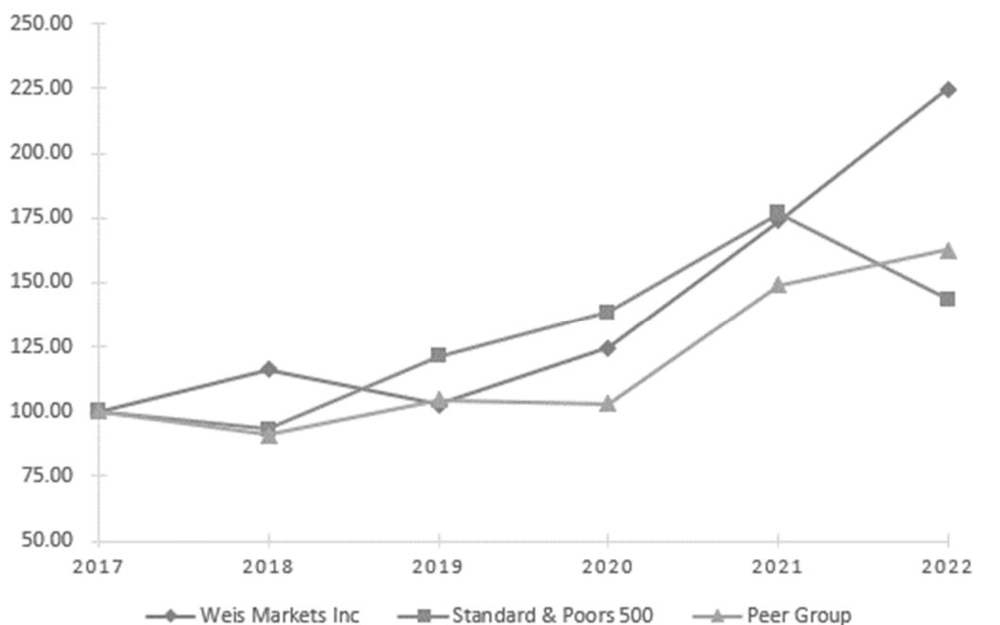

{0}------------------------------------------------

# UNITED STATES SECURITIES AND EXCHANGE COMMISSION Washington, D.C. 20549

#### **FORM 10-K**

(Mark One)

[X] ANNUAL REPORT PURSUANT TO SECTION 13 OR 15(d) OF THE SECURITIES EXCHANGE ACT OF 1934 For the fiscal year ended **December 31, 2022**

OR

[ ] TRANSITION REPORT PURSUANT TO SECTION 13 OR 15(d) OF THE SECURITIES EXCHANGE ACT OF 1934

For the transition period from __________to_________

Commission File Number 1-5039

# **WEIS MARKETS, INC.**

(Exact name of registrant as specified in its charter)

Pennsylvania

(State or other jurisdiction of incorporation or organization) 1000 S. Second Street P. O. Box 471 Sunbury, Pennsylvania

(Address of principal executive offices) Registrant's telephone number, including area code: (570) 286-4571

24-0755415 (I.R.S. Employer Identification No.)

> 17801-0471 (Zip Code)

Registrant's web address: www.weismarkets.com

Securities registered pursuant to Section 12(b) of the Act:

| Title of each class        | Trading symbol | Name of exchange on which registered |
|----------------------------|----------------|--------------------------------------|
| Common stock, no par value | WMK            | New York Stock Exchange              |

Securities registered pursuant to Section 12(g) of the act: None

Indicate by check mark if the registrant is a well-known seasoned issuer, as defined in Rule 405 of the Securities Act. Yes [ ] No [X]

Indicate by check mark if the registrant is not required to file reports pursuant to Section 13 or Section 15(d) of the Act. Yes [ ] No [X]

Indicate by check mark whether the registrant (1) has filed all reports required to be filed by Section 13 or 15(d) of the Securities Exchange Act of 1934 during the preceding 12 months (or for such shorter period that the registrant was required to file such reports), and (2) has been subject to such filing requirements for the past 90 days. Yes [X] No [ ]

Indicate by check mark whether the registrant has submitted electronically every Interactive Data File required to be submitted pursuant to Rule 405 of Regulation S-T (§ 232.405 of this chapter) during the preceding 12 months (or for such shorter period that the registrant was required to submit such files). Yes [X] No [ ]

Indicate by check mark whether the registrant is a large accelerated filer, an accelerated filer, a non-accelerated filer, a smaller reporting company, or an emerging growth company. See the definitions of "large accelerated filer," "accelerated filer", "smaller reporting company", and "emerging growth company" in Rule 12b-2 of the Exchange Act.

Large accelerated filer [ X ] Accelerated filer [ ]

Non-accelerated filer [ ] Smaller reporting company [ ] Emerging growth company [ ]

If an emerging growth company, indicate by check mark if the registrant has elected not to use the extended transition period for complying with any new or revised financial accounting standards provided pursuant to Section 13(a) of the Exchange Act. [ ]

Indicate by check mark whether the registrant has filed a report on and attestation to its management's assessment of the effectiveness of its internal control over financial reporting under Section 404(b) of the Sarbanes-Oxley Act (15 U.S.C.7262(b)) by the registered public accounting firm that prepared or issued its audit report. [X]

If securities are registered pursuant to Section 12(b) of the Act, indicate by check mark whether the financial statements of the registrant included in the filing reflect the correction of an error to previously issued financial statements. [ ]

Indicate by check mark whether any of those error corrections are restatements that required a recovery analysis of incentive-based compensation received by any of the registrant's executive officers during the relevant recovery period pursuant to §240.10D-1(b). [ ]

Indicate by check mark whether the registrant is a shell company (as defined in Rule 12b-2 of the Act). Yes [ ] No [X]

The aggregate market value of Common Stock held by non-affiliates of the Registrant is approximately \$706,000,000 as of June 25, 2022 the last business day of the most recently completed second fiscal quarter.

Shares of common stock outstanding as of March 1, 2023 - 26,898,443.

DOCUMENTS INCORPORATED BY REFERENCE: Selected portions of the Weis Markets, Inc. 2023 definitive proxy statement are incorporated by reference in Part III of this Form 10-K.

{1}------------------------------------------------

#### **TABLE OF CONTENTS**

| FORM 10-K                                                                                                            | Page |
|----------------------------------------------------------------------------------------------------------------------|------|
| Part I                                                                                                               |      |
| Item 1. Business                                                                                                     | 1    |
| Item 1a. Risk Factors                                                                                                | 4    |
| Item 1b. Unresolved Staff Comments                                                                                   | 7    |
| Item 2. Properties                                                                                                   | 7    |
| Item 3. Legal Proceedings                                                                                            | 7    |
| Item 4. Mine Safety Disclosures                                                                                      | 7    |
| Information about our Executive Officers                                                                             | 8    |
| Part II                                                                                                              | 9    |
| Item 5. Market for Registrant's Common Equity, Related Stockholder Matters and Issuer Purchases of Equity Securities | 9    |
| Item 6. [Reserved]                                                                                                   | 10   |
| Item 7. Management's Discussion and Analysis of Financial Condition and Results of Operations                        | 11   |
| Item 7a. Quantitative and Qualitative Disclosures about Market Risk                                                  | 20   |
| Item 8. Financial Statements and Supplementary Data                                                                  | 22   |
| Item 9. Changes in and Disagreements With Accountants on Accounting and Financial Disclosure                         | 42   |
| Item 9a. Controls and Procedures                                                                                     | 42   |
| Item 9b. Other Information                                                                                           | 42   |
| Item 9c. Disclosure Regarding Foreign Jurisdictions that Prevent Inspections                                         | 42   |
| Part III                                                                                                             |      |
| Item 10. Directors, Executive Officers and Corporate Governance                                                      | 43   |
| Item 11. Executive Compensation                                                                                      | 43   |
| Item 12. Security Ownership of Certain Beneficial Owners and Management and Related Stockholder Matters              | 43   |
| Item 13. Certain Relationships and Related Transactions, and Director Independence                                   | 43   |
| Item 14. Principal Accountant Fees and Services                                                                      | 43   |
| Part IV                                                                                                              |      |
| Item 15. Exhibits, Financial Statement Schedules                                                                     | 43   |
| Item 15(c)(3). Schedule II - Valuation and Qualifying Accounts                                                       | 45   |
| Item 16. Form 10-K Summary                                                                                           | 45   |
| Signatures                                                                                                           | 46   |
| Exhibit 21 Subsidiaries of the Registrant                                                                            |      |
| Exhibit 31.1 Rule 13a-14(a) Certification - CEO                                                                      |      |
| Exhibit 31.2 Rule 13a-14(a) Certification - CFO                                                                      |      |

Exhibit 32 Certification Pursuant to 18 U.S.C. Section 1350

{2}------------------------------------------------

#### **PART I**

#### **Item 1. Business:**

Weis Markets, Inc. is a Pennsylvania business founded by Harry and Sigmund Weis in 1912 and incorporated in 1924. The Company is engaged principally in the retail sale of food in Pennsylvania and surrounding states. There was no material change in the nature of the Company's business during fiscal 2022. The Company's stock has been traded on the New York Stock Exchange since 1965 under the symbol "WMK." The Weis family currently owns approximately 65% of the outstanding shares. Jonathan H. Weis serves as Chairman of the Board of Directors, President and Chief Executive Officer.

The Company's retail food stores sell groceries, dairy products, frozen foods, meats, seafood, fresh produce, floral, pharmacy services, deli products, prepared foods, bakery products, beer and wine, fuel and general merchandise items, such as health and beauty care and household products. The store product selection includes national, local and private brands including natural, gluten-free and organic varieties. The Company advertises its products and promotes its brand through digital and printed circulars; radio ads; e-mail blasts; and on-line via its web site, social media and mobile applications. The Company promotes competitive pricing by using Everyday Lower Price; Low Price Guarantee; Low, Low Price; 3 Day Sale; senior and military discounts; and Loyalty programs. The Loyalty program includes reward points that may be redeemed for discounts on items in store, at the Company's fuel stations or one of its third-party fuel station partners. The Company currently owns and operates 197 retail food stores many of which have on-line order customer service. The Company's operations are reported as a single reportable segment. The majority of the Company's revenues are generally not seasonal in nature. However, revenues tend to be higher during the major holidays throughout the year. Additionally, significant inclement weather systems, particularly winter storms, tend to affect sales trends.

The following table provides additional detail on the percentage of consolidated net sales contributed by product category for fiscal years 2022, 2021 and 2020, respectively:

|                        | 2022    | 2021    | 2020    |
|------------------------|---------|---------|---------|
| Center Store (1)       | 54.7 %  | 54.9 %  | 57.7 %  |
| Fresh (2)              | 30.0    | 31.1    | 30.5    |
| Pharmacy Services      | 9.4     | 9.4     | 8.7     |
| Fuel                   | 5.6     | 4.4     | 2.9     |
| Other                  | 0.3     | 0.2     | 0.2     |
| Consolidated net sales | 100.0 % | 100.0 % | 100.0 % |

(1) Consists primarily of groceries, dairy products, frozen foods, beer and wine, and general merchandise items, such as health and beauty care and household products.

(2) Consists primarily of meats, seafood, fresh produce, floral, deli products, prepared foods and bakery products.

At the end of 2022, Weis Markets, Inc. operated 3 stores in Delaware, 49 stores in Maryland, 6 stores in New Jersey, 9 stores in New York, 118 stores in Pennsylvania, 9 stores in Virginia and 3 stores in West Virginia, for a total of 197 retail food stores operating under the Weis Markets trade name.

{3}------------------------------------------------

### **Item 1. Business: (continued)**

All retail food store locations operate as conventional supermarkets. The retail food stores range in size from 8,000 to 71,000 square feet, with an average size of approximately 49,000 square feet. The Company's store fleet includes a variety of sizes with a few locations in operation since the 1950's; all stores are branded Weis Markets and provide the same basic offerings scaled to the size of each store. The following summarizes the number of stores by size categories as of year-end:

|                  | 2022 | 2022 | 2021                                                    | 2021 |
|------------------|------|------|---------------------------------------------------------|------|
| Square feet      |      |      | Number of stores % of Total Number of stores % of Total |      |
| Over 55,000      | 64   | 32%  | 62                                                      | 32%  |
| 45,000 to 54,999 | 70   | 36%  | 70                                                      | 35%  |
| 35,000 to 44,999 | 46   | 23%  | 47                                                      | 24%  |
| 25,000 to 34,999 | 12   | 6%   | 12                                                      | 6%   |
| Under 25,000     | 5    | 3%   | 5                                                       | 3%   |
| Total            | 197  | 100% | 196                                                     | 100% |

The Company believes that opening new stores and remodeling current stores are vital for future Company growth. The location and appearance of its stores are important components of attracting new and retaining current customers. On an average basis, the Company has two to three new/relocated stores in the process of being developed and dedicates one third of its capital expenditure budget to new stores annually, excluding acquisitions. Generally, another fifteen to twenty percent of the capital expenditure budget is dedicated to store remodels while the remainder is attributable to supply chain, technology, smaller in-store sales-driven projects, store maintenance and store support function expenditures. See the "Liquidity and Capital Resources" section included in "Item 7. Management's Discussion and Analysis of the Financial Condition and Results of Operations" for more details regarding the Company's capital expenditures.

The following schedule shows the changes in the number of retail food stores, total square footage and store additions/remodels as of year-end:

|                                        | 2022  | 2021  | 2020  | 2019  | 2018  |
|----------------------------------------|-------|-------|-------|-------|-------|
| Beginning store count                  | 196   | 196   | 198   | 202   | 205   |
| New/relocated stores                   | 2     | 4     | 2     | 1     | 2     |
| Closed/relocated stores                | (1)   | (4)   | (4)   | (5)   | (5)   |
| Ending store count                     | 197   | 196   | 196   | 198   | 202   |
| Total square feet (000's), at year-end | 9,710 | 9,617 | 9,568 | 9,642 | 9,800 |
| Additions/major remodels               | 9     | 13    | 13    | 12    | 3     |

Utilizing its own strategically located distribution center and transportation fleet, Weis Markets self distributes approximately 63% of product supplied to stores with the remaining being supplied by direct store vendors and regional wholesalers. In addition, the Company has three manufacturing facilities which process milk, ice cream and fresh meat products. The corporate offices are located in Sunbury, Pennsylvania where the Company was founded in 1912.

{4}------------------------------------------------

#### **Item 1. Business: (continued)**

The Company strives to be good stewards of the environment and makes this an important part of its overall mission. Its sustainability strategy operates under four key pillars: green design, natural resource conservation, food and agricultural impact and social responsibility. The goal of the sustainability strategy is to reduce the Company's overall carbon footprint by reducing greenhouse gas emissions and reducing the impact on climate change. The Company continues to be a member of the EPA GreenChill program for advancing environmentally beneficial refrigerant management systems. The Company currently has eighteen stores registered under this program and plans to expand this program to more stores. Since 2016, the Company has replaced 100% of its tractor fleet with more fuel-efficient and lower-emission tractors. The Company continues to emphasize recycling in all areas, most recently noting a decrease in store waste where the Company has diverted 45 thousand tons of waste from landfills. These statistics and more can be found in the Company's most recently published sustainability report, linked below in Item 7. Management's Discussion and Analysis of Financial Condition and Results of Operations.

The Company operates in a highly competitive marketplace. The number and the variety of competitors vary by market. The Company's principal competition consists of international, national, regional and local food chains, as well as independent food stores. The Company also faces substantial competition from convenience stores, membership warehouse clubs, specialty retailers, supercenters and large-scale drug and pharmaceutical chains. This competition is augmented by the food retail industry's expansion into the online market in recent years. The Company continues to effectively compete by offering a strong combination of value, quality and service. The Company offers Weis 2 Go curbside pickup and delivery, further enhancing service offerings and providing additional convenience to customers.

**Human Capital.** The Company believes that talent is a business differentiator and is committed to creating a sustainable competitive advantage through the selection, development and promotion of talented, highly motivated people. The Company believes that establishing a learning culture supports its commitment to be an employer of choice and helps drive customer engagement with its associates. Improvements in the Company's talent management and development will help drive business impact while providing internal career opportunities. The Company continues to grow leaders at every level throughout the organization by creating a culture of mentoring, coaching and leveraging on-the-job assignments for continued development. The Company believes that a strong employment brand is necessary to attract and retain top talent and affects its ability to compete and execute strategic plans. The Company will continue to assess and upgrade underlying technologies to support human capital development as a strategic imperative for future growth.

The Company currently employs approximately 23,000 full-time and part-time associates. Approximately 97% of Weis Markets associates are paid an hourly wage.

**Trade Names and Trademarks.** The Company has invested significantly in the development and protection of "Weis Markets" both as a trade name and a trademark and considers it to be an important asset. The Company is the exclusive licensee of nearly 100 trademarks registered and/or pending in the United States Patent and Trademark Office from WMK Holdings, Inc., including trademarks for its product lines and promotions such as Weis, Weis 2 Go, Weis Great Meals Start Here, Weis Gas-n-Go and Weis Nutri-Facts. Each trademark registration is for an initial period of 10 years and may be renewed so long as it is in continued use in commerce.

The Company considers its trademarks to be of material importance to its business and actively defends and enforces its rights.

The Company maintains a corporate web site at www.weismarkets.com/investor-relations. The Company makes available, free of charge, on the "Investor Relations" page of its web site, its Annual Reports on Form 10-K, quarterly reports on Form 10-Q, current reports on Form 8-K and amendments to those reports filed or furnished pursuant to Section 13(a) or 15(d) of the Exchange Act, as soon as reasonably practicable after the Company electronically files such material or furnishes it to the U.S. Securities and Exchange Commission (SEC) by clicking on the "SEC Information" link.

{5}------------------------------------------------

### **Item 1. Business: (continued)**

The Company's Corporate Governance materials can be found on the "Governance" page of its web site. These materials include the Corporate Governance Guidelines; the Charters of the Audit, Compensation and Disclosure Committees; and both the Code of Business Conduct and Ethics and the Code of Ethics for the CEO and CFO. A copy of the foregoing corporate governance materials is available upon written request to the Company's principal executive offices.

# **Item 1a. Risk Factors:**

# **Competitive and Reputational Risks**

# **The Company's industry is highly competitive. If the Company is unable to compete effectively, the Company's financial condition and results of operations could be materially affected.**

The retail food industry is intensely price competitive, and the competition the Company encounters may have a negative impact on product retail prices. The operating environment continues to be characterized by aggressive expansion, entry of non-traditional competitors, market consolidation and increasing fragmentation of retail and online formats. The introduction of on-line food retail in recent years has augmented competition in industry. The financial results may be adversely impacted by a competitive environment that could cause the Company to reduce retail prices without a reduction in its product cost to maintain market share; thus, reducing sales and gross profit margins.

### **Food safety issues could result in the loss of consumer confidence in the Company.**

Customers count on the Company to provide them with safe and wholesome food products. Concerns regarding the safety of food products sold in its stores could cause shoppers to avoid purchasing certain products from the Company, or to seek alternative sources of supply for all of their food needs, even if the basis for the concern is outside of the Company's control. A loss in confidence on the part of its customers would be difficult and costly to reestablish. As such, any issue regarding the safety of any food items sold by the Company, regardless of the cause, could have a substantial and adverse effect on operations.

### **The Company may be unable to retain key management personnel.**

The Company's success depends to a significant degree upon the continued contributions of senior management. The loss of any key member of management may prevent the Company from implementing its business plans in a timely manner. In addition, employment conditions specifically may affect the Company's ability to hire and train qualified associates.

### **Financial, Investments and Infrastructure Risks**

# **The failure to execute expansion plans could have a material adverse effect on the Company's business and results of its operations.**

Circumstances outside the Company's control could negatively impact anticipated capital investments in store, distribution and manufacturing projects, information technology and equipment. The Company cannot determine with certainty whether its new or acquired stores will meet expected benefits including, among other things, operating efficiencies, procurement savings, innovation, sharing of best practices and increased market share that may allow for future growth. Achieving the anticipated benefits may be subject to a number of significant challenges and uncertainties, including, without limitation, the possibility of imprecise assumptions underlying expectations regarding potential synergies and the integration process, unforeseen expenses and delays diverting management's time and attention and competitive factors in the marketplace.

{6}------------------------------------------------

### **Item 1a. Risk Factors: (continued)**

# **The Company's investment portfolio may suffer losses from changes in market interest rates and changes in market conditions which could adversely affect results of operations and liquidity.**

The Company's marketable securities consist of corporate and municipal bonds, commercial paper and equity securities. These investments are subject to general credit, liquidity, market and interest rate risks. As a result, the Company may experience a reduction in value or loss of liquidity from investments, which may have a negative impact on the Company's financial condition and results of operations.

# **Unexpected factors affecting self-insurance claims and reserve estimates could adversely affect the Company.**

The Company uses a combination of insurance and self-insurance to provide for potential liabilities for workers' compensation, general liability, vehicle accident, property and associate medical benefit claims. Management estimates the liabilities associated with the risks retained by the Company, in part, by considering historical claims experience, demographic and severity factors and other actuarial assumptions which, by their nature, are subject to a high degree of variability. Any projection of losses concerning workers' compensation and general liability is subject to a high degree of variability. Among the causes of this variability are unpredictable external factors affecting future inflation rates, litigation trends, legal interpretations, benefit level changes and claim settlement patterns.

# **Information Security, Cybersecurity and Data Privacy Risks**

# **Disruptions or cybersecurity breaches in the Company's information technology systems could adversely affect results of operations.**

The Company's business is highly dependent on complex information technology systems that are vital to its continuing operations. If the Company was to experience difficulties maintaining existing systems or implementing new systems, significant losses could be incurred due to disruptions in its operations. Additionally, these systems contain valuable proprietary data as well as receipt and storage of personal information about its associates and customers, in particular electronic payment data and personal health information that, if breached, would have an adverse effect on the Company. Such an occurrence could adversely affect the Company's reputation with its customers, associates, and vendors, as well as the Company's financial condition, results of operations, and liquidity with potential litigation against the Company or the imposition of penalties.

# **Supply Chain and Third-Party Risks**

# **The Company is affected by certain operating costs which could increase or fluctuate considerably.**

Associate expenses contribute to the majority of the Company's operating costs. The Company's financial performance is potentially affected by increasing wage and benefit costs, a competitive labor market, regulatory wage increases and the risk of unionized labor disruptions of its non-union workforce. The Company's profit is particularly sensitive to the cost of oil. Oil prices directly affect the Company's product transportation costs, as well as its utility and petroleumbased supply costs. It also affects the costs of its suppliers, which impacts its cost of goods.

# **Changes in vendor promotions or allowances, including the way vendors target their promotional spending, and the Company's ability to effectively manage these programs could significantly impact margins and profitability.**

The Company cooperatively engages in a variety of promotional programs with its vendors. As the parties assess the results of specific promotions and plan for future promotions, the nature of these programs and the allocation of dollars among them changes over time. The Company manages these programs to maintain or improve margins while at the same time increasing sales. A reduction in overall promotional spending or a shift by vendors in promotional spending away from certain types of promotions that the Company and its customers have historically utilized could have a significant impact on profitability.

{7}------------------------------------------------

# **Item 1a. Risk Factors: (continued)**

# **Legal, Regulatory and Other External Risks**

# **The trade area of the Company is located within a region and is subject to the economic, social and climate variables of that region.**

The majority of the Company's stores are concentrated in central and northeast Pennsylvania, central Maryland, suburban Washington, DC and Baltimore regions and New York's Southern Tier. Changes in economic and social conditions in the Company's operating regions, including fluctuations in the inflation rate along with changes in population and employment and job growth rates and changes in government benefits such as SNAP/EBT or child care credits, affect customer shopping habits. Business disruptions due to weather and catastrophic events historically have been few. The Company's geographic regions could receive an extreme variance in the amount of annual snowfall that may materially affect sales and expense results.

### **Various aspects of the Company's business are subject to federal, state and local laws and regulations.**

The Company is subject to various federal, state and local laws, regulations and administrative practices that affect the Company's business. The Company must comply with numerous provisions regulating health and sanitation standards, food labeling, equal employment opportunity, minimum wages and licensing for the sale of food, drugs and alcoholic beverages. The Company's compliance with these regulations may require additional capital expenditures and could adversely affect the Company's ability to conduct the Company's business as planned. Management cannot predict either the nature of future laws, regulations, interpretations or applications, or the effect either additional government regulations or administrative orders, when and if promulgated, or disparate federal, state, and local regulatory schemes would have on the Company's future business. They could, however, require the reformulation of certain products to meet new standards, the recall or discontinuance of certain products not able to be reformulated, additional record keeping, expanded documentation of the properties of certain products, expanded or different labeling and/or scientific substantiation. Any or all of such requirements could have an adverse effect on the Company's financial condition, results of operations and liquidity.

### **Changes in tax laws may result in higher income tax.**

The Company's future effective tax rate may increase from current rates due to changes in laws and the status of pending items with various taxing authorities. Currently, the Company benefits from a combination of its corporate structure and certain state tax laws.

# **The Company is a controlled Company due to the common stock holdings of the Weis family.**

The Weis family's share ownership represents approximately 65% of the combined voting power of the Company's common stock as of December 31, 2022. As a result, the Weis family has the power to elect a majority of the Company's directors and approve any action requiring the approval of the shareholders of the Company, including adopting certain amendments to the Company's charter and approving mergers or sales of substantially all of the Company's assets. Currently, one of the Company's five directors is a member of the Weis family.

{8}------------------------------------------------

# **Item 1a. Risk Factors: (continued)**

# **The Company's business and operations, and the operations of the Company's suppliers, have been, and may in the future be adversely affected by epidemics or pandemics such as the novel Coronavirus (COVID-19) pandemic outbreak.**

The Company may face risks related to health epidemics and pandemics or other outbreaks of communicable diseases. The global spread of COVID-19 created significant volatility, uncertainty and economic disruption. The Company's business was deemed essential during the novel coronavirus pandemic and the Company is committed to maintaining a safe work and shopping environment. Management cannot assess the ultimate economic impact to the Company, which will be determined by, among other things, the length of time that such circumstances occur, nor can the Company predict the effects of governmental and public responses to changing conditions. The risks and uncertainties surrounding the coronavirus pandemic, as well as any future pandemics, are broad; however, below is a list of risks management is monitoring which could have a material impact on the Company's business:

- Employees Reduced workforces due to the temporary inability to work caused by illness, quarantine, or government mandates.
- Supply Chain Interruption in the Company's supply chain due to the novel coronavirus.
- Lawsuits Future litigation arising from issues concerning the novel coronavirus.
- Future government regulation Future laws, regulations, interpretations, administrative orders, or applications that may have an adverse impact on the Company's financial condition and liquidity.
- Customer trends Changes in the methods in which customers procure the Company's products.
- Cyber security Increased cyber-attacks due to "work at home" requirements.

# **Item 1b. Unresolved Staff Comments:**

There are no unresolved staff comments.

# **Item 2. Properties:**

As of December 31, 2022, the Company owned and operated 101 of its retail food stores and leased and operated 96 stores under operating leases that expire at various dates through 2036. The Company owns all trade fixtures and equipment in its stores and several parcels of vacant land, which are available as locations for possible future stores or other expansion.

The Company owns and operates one distribution center in Milton, Pennsylvania of approximately 1.3 million square feet, and one in Northumberland, Pennsylvania totaling approximately 76 thousand square feet. The Company also owns one warehouse complex in Sunbury, Pennsylvania totaling approximately 535 thousand square feet. The Company utilizes 258 thousand square feet of its Sunbury location to operate its three manufacturing facilities which process milk, ice cream and fresh meat products.

# **Item 3. Legal Proceedings:**

Neither the Company nor any subsidiary is presently a party to, nor is any of their property subject to, any pending legal proceedings, other than routine litigation incidental to the business that would not have a material adverse effect on the financial results. The Company estimates any exposure to these legal proceedings and establishes accruals for the estimated liabilities, where it is reasonably possible to estimate and where an adverse outcome is probable.

### **Item 4. Mine Safety Disclosures:**

Not Applicable.

{9}------------------------------------------------

# **Information about Our Executive Officers**

The following sets forth the names and ages of the Company's executive officers as of March 1, 2023, indicating all positions held during the past five years:

| Name                   | Age | Title                                                           |
|------------------------|-----|-----------------------------------------------------------------|
| Robert G. Gleeson (a)  | 57  | Senior Vice President of Merchandising and Marketing            |
| David W. Gose II (b)   | 56  | Senior Vice President of Operations                             |
| Harold G. Graber (c)   | 67  | Senior Vice President of Real Estate and Development, Secretary |
| Michael T. Lockard (d) | 53  | Senior Vice President, Chief Financial Officer and Treasurer    |
| James E. Marcil (e)    | 64  | Senior Vice President of Human Resources                        |
| Kurt A. Schertle (f)   | 51  | Chief Operating Officer                                         |
| Jonathan H. Weis (g)   | 55  | Chairman of the Board, President and Chief Executive Officer    |
| Richard G. Zeh Jr. (h) | 50  | Senior Vice President, Chief Information Officer                |

(a) *Robert G. Gleeson.* Mr. Gleeson joined the Company in October 2018 and was promoted to Vice President of Fresh Merchandising in July 2019. In March 2021, Mr. Gleeson was promoted to Senior Vice President of Merchandising and Marketing. Prior to joining the Company, Mr. Gleeson held senior level merchandising positions, including Vice President of Center Store for Shoppers and Senior Vice President of Merchandising and Division President for Supervalu.

- (b) *David W. Gose II.* Mr. Gose joined the Company in May 2014 as Senior Vice President of Operations. Prior to joining the Company, Mr. Gose was Senior Director and Regional General Manager of Walmart Ohio, a retail store Supercenter, from February 2010 until May 2014. Walmart Ohio consisted of 92 stores that geographically included all stores south of Toledo, Cleveland, Akron and Youngstown.
- (c) *Harold G. Graber.* Mr. Graber joined the Company in October 1989 as the Director of Real Estate. Mr. Graber, who served the Company as Vice President for Real Estate since 1996, was promoted to Senior Vice President of Real Estate and Development in February 2010. Mr. Graber was elected as Secretary of the Company in February 2014.
- (d) *Michael T. Lockard.* Mr. Lockard joined the Company in January 2021 as Senior Vice President and also became Chief Financial Officer and Treasurer effective March 12, 2021. Prior to joining the Company, Mr. Lockard was Senior Vice President and Chief Financial Officer of K-VA-T Food Stores, Inc. from March 2012 until January 2021. K-VA-T Food Stores, Inc. is a self-distributing regional supermarket chain operating in Kentucky, Virginia, Tennessee, Georgia and Alabama. Prior to 2012, Mr. Lockard held various financial management positions with Walmart and UPS.
- (e) *James E. Marcil.* Mr. Marcil joined the Company in September 2002 as Vice President of Human Resources. In February 2010, Mr. Marcil was promoted to Senior Vice President of Human Resources. Prior to joining the Company, Mr. Marcil held senior level Human Resources positions with CVS and General Electric.
- (f) *Kurt A. Schertle.* Mr. Schertle joined the company in March 2009 as its Vice President of Sales and Merchandising, which included the responsibility of overseeing the Marketing Department. In February 2010, Mr. Schertle was promoted to Senior Vice President of Sales and Merchandising. In July 2012, Mr. Schertle was promoted to Executive Vice President of Sales and Merchandising at which time, he assumed the additional responsibility of overseeing the Company's Supply Chain. In September 2013, Mr. Schertle assumed the additional responsibility of overseeing Store Operations and Mr. Schertle was promoted to Chief Operating Officer in March 2014.

{10}------------------------------------------------

### **Information about Our Executive Officers (continued)**

- (g) *Jonathan H. Weis.* The Company has employed Mr. Weis since 1989. Mr. Weis served the Company as Vice President of Property Management and Development from 1996 until April 2002, at which time he was appointed as Vice President and Secretary. In January of 2004, the Board appointed Mr. Weis as Vice Chairman and Secretary. Mr. Weis became the Company's interim President and Chief Executive Officer in September 2013 and was appointed as President and Chief Executive Officer in February 2014. The Board elected Mr. Weis as Chairman of the Board in April 2015.
- (h) *Richard G. Zeh, Jr.* Mr. Zeh joined the Company in September 2016 as Chief Information Officer. In February 2021, Mr. Zeh was promoted to Senior Vice President, Chief Information Officer. Prior to joining the Company, Mr. Zeh was Chief Financial Officer of Mazzone Management Group. During his career, Mr. Zeh has worked in senior finance and information technology positions in the food retail and service industries including as Vice President and Chief Information Officer at The Golub Corporation/ Price Chopper Supermarkets.

### **PART II**

# **Item 5. Market for Registrant's Common Equity, Related Stockholder Matters and Issuer Purchases of Equity Securities:**

The Company's stock is traded on the New York Stock Exchange (ticker symbol WMK). The approximate number of shareholders, including individual participants in security position listings on March 1, 2023 was 13,868.

{11}------------------------------------------------

#### **Item 5. Market for Registrant's Common Equity, Related Stockholder Matters and Issuer Purchases of Equity Securities: (continued)**

The following line graph compares the yearly percentage change in the cumulative total shareholder return on the Company's common stock against the cumulative total return of the S&P Composite-500 Stock Index and the cumulative total return of a Company-selected group index that the Company deems most properly represents its "Peer Group", for the period of five years. The Peer group is made up of five retail grocers that the Company feels most closely relate to its size and business profile, including one national grocer the Company believes to be an industry market leader. The companies making up the Peer Group, in no particular order, are, Ingles Markets, Inc.; Village Super Market, Inc.; Smart & Final Stores, Inc. (included through June 20, 2019 when it was acquired by Apollo Global Management, LLC); Sprouts Farmers Market, Inc. and The Kroger Company. The graph depicts \$100 invested at the close of trading on the last trading day preceding the first day of the fifth preceding year in Weis Markets, Inc. common stock, S&P 500, and the Peer Group. The cumulative total return assumes reinvestment of dividends.

#### **Comparative Five-Year Total Returns**

|                    | 2017   | 2018   | 2019   | 2020   | 2021   | 2022   |
|--------------------|--------|--------|--------|--------|--------|--------|
| Weis Markets, Inc. | 100.00 | 116.20 | 102.61 | 124.57 | 173.92 | 224.84 |
| S&P 500            | 100.00 | 92.97  | 121.19 | 138.50 | 176.76 | 143.61 |
| Peer Group         | 100.00 | 90.68  | 104.46 | 102.90 | 148.92 | 162.57 |

#### **Item 6. [Reserved]**

{12}------------------------------------------------

# **Item 7. Management's Discussion and Analysis of Financial Condition and Results of Operations:**

# **Overview**

The following Management's Discussion and Analysis of Financial Condition and Results of Operations (MD&A) is intended to help the reader understand Weis Markets, Inc., its operations and its present business environment. The MD&A is provided as a supplement to and should be read in conjunction with the Consolidated Financial Statements and the accompanying notes thereto contained in "Item 8. Financial Statements and Supplementary Data" of this report. The following analysis should also be read in conjunction with the Financial Statements included in the Quarterly Reports on Form 10-Q and the Annual Report on Form 10-K filed with the U.S. Securities and Exchange Commission, as well as the cautionary statement captioned "Forward-Looking Statements" immediately following this analysis. This overview summarizes the MD&A, which includes the following sections:

- Company Overview a general description of the Company's business and strategic imperatives.
- Results of Operations an analysis of the Company's consolidated results of operations for the three years presented in the Company's Consolidated Financial Statements.
- Liquidity and Capital Resources an analysis of cash flows, aggregate contractual obligations, and off-balance sheet arrangements.
- Critical Accounting Policies and Estimates a discussion of accounting policies that require critical judgments and estimates.

# **Company Overview**

# **General**

Weis Markets is a conventional supermarket chain that operates 197 retail stores with approximately 23 thousand associates located in Pennsylvania and six surrounding states: Delaware, Maryland, New Jersey, New York, Virginia, and West Virginia. Approximately 97% of Weis Markets associates are paid an hourly wage. Its products sold include groceries, dairy products, frozen foods, meats, seafood, fresh produce, floral, pharmacy services at locations, deli products, prepared foods, bakery products, beer and wine, fuel, and general merchandise items, such as health and beauty care and household products. The store product selection includes national, local and private brands and the Company promotes competitive pricing by using Everyday Lower Price; Low Price Guarantee; Low, Low Price; 3 Day Sale; senior and military discounts; and Loyalty programs. The Loyalty program includes reward points that may be redeemed for discounts on items in store, at one of the Company's fuel stations or one of its third-party fuel station partners.

Utilizing its own strategically located distribution center and transportation fleet, Weis Markets self distributes approximately 63% of product supplied to stores with the remaining being supplied by direct store vendors and regional wholesalers. In addition, the Company has three manufacturing facilities which process milk, ice cream and fresh meat products. The corporate offices are located in Sunbury, Pennsylvania where the Company was founded in 1912.

The COVID-19 pandemic resulted in government mandated shutdowns in early 2020, as well as multiple legislative acts to provide emergency economic assistance for individuals, families and businesses affected by the novel coronavirus pandemic. These events were accretive to the Company's sales and gross profits compared to the time periods preceding the impact of the novel coronavirus pandemic.

{13}------------------------------------------------

# **Item 7. Management's Discussion and Analysis of Financial Condition and Results of Operations: (continued)**

# **Company Overview (continued)**

The Company continues to innovate and remain relevant to industry trends and offer customer convenience by presenting programs like "Weis 2 Go Online" and home delivery. In 2022, the Company offered Weis 2 Go Online in 188 of its locations, adding 2 stores since the end of 2021. Weis 2 Go Online allows the customer to order on-line and then pick up their order at a drive-thru location at the store. The Company began offering home delivery during the third quarter of 2018 and currently offers this convenience to customers in 195 different locations via Shipt®, DoorDash®, and InstaCart®.

# **Strategic Imperatives**

The following strategic imperatives continue to be focused upon by the Company to attempt to ensure the success of the Company in the coming years:

- Establish a Sales Driven Culture The Company continues to focus on sales and profits growth, improved operating practices, increased productivity and positive cash flow. The Company believes disciplined growth will increase its market share and operating profits, resulting in enhanced shareholder value. The Company's method of driving sales includes focused preparation and execution of sales programs, investing in new stores and remodels, and strategic acquisitions. Communicating clear executable standards and aligning performance measures across the organization will help to instill a sales-driven operating environment.
- Build and Support Human Capital The Company believes that talent is a business differentiator and is committed to creating a sustainable competitive advantage through the selection, development and promotion of talented, highly motivated people. The Company believes that establishing a learning culture supports its commitment to be an employer of choice and helps drive customer engagement with its associates. Improvements in the Company's talent management and development will help drive business impact while providing internal career opportunities. The Company continues to grow leaders at every level throughout the organization by creating a culture of mentoring, coaching and leveraging on-the-job assignments for continued development. The Company believes that a strong employment brand is necessary to attract and retain top talent and affects its ability to compete and execute strategic plans. The Company will continue to assess and upgrade underlying technologies to support human capital development as a strategic imperative for future growth.
- Become More Relevant to Consumers Understanding the consumer is crucial to the Company's strategic plan. The Company will develop and cultivate a culture where it's continually "on trend" with its consumers at the current time and where they are going next. The Company researches and studies the wants and needs of core consumers and casual consumers. It measures customer satisfaction and shares insights across the organization to improve communication between management and its consumers. The Company uses consumer data to measure the value of programs offered and support consumer attraction and retention. The Company believes that its private brand products exceed consumer expectations and will continue to focus on the value and attribute messaging to drive organic growth.
- Create Meaningful Differentiation The Company recognizes the need to offer a compelling reason for customers to choose them over other channels. The Company has identified product pricing and promotion, customer shopping experience, and merchandising strategies as critical components of future success. The Company recognizes that the core of the strategy will focus on alignment of merchandising programs that foster customer engagement supported by a shopping experience that surpasses customers' expectations. As part of this strategy, management is committed to offering its customers a strong combination of quality, service and value.

{14}------------------------------------------------

# **Item 7. Management's Discussion and Analysis of Financial Condition and Results of Operations: (continued)**

# **Company Overview (continued)**

- Develop and Align Organizational Capabilities The Company will elevate organizational capacity to support decision effectiveness and deliver consistent execution. To support this strategy the Company will assess organizational capacity to support the Company's strategic direction. The Company will align business functions and processes to enhance key capabilities and to support scalability of operations. Continued investments in information technology systems to improve associate engagement, increase productivity, and provide valuable insight into customer behavior/shopping trends will remain a focus of the Company. The Company believes these systems will continue to play a key role in the measurement of the Company's strategic decisions and financial returns.
- Focus on Sustainability Strategies The Company strives to be good stewards of the environment and makes this an important part of its overall mission. Its sustainability strategy operates under four key pillars: green design, natural resource conservation, food and agricultural impact and social responsibility. The goal of the sustainability strategy is to reduce the Company's overall carbon footprint by reducing greenhouse gas emissions and reducing the impact on climate change. The Company's most recently published sustainability report is located at: https://www.weismarkets.com/sustainability.

# **Results of Operations**

### **Two-Year Stacked Comparable Store Sales Analysis**

Management is providing Comparable Store Sales Two-Year Stacked analysis, a non-GAAP measure, because management believes this metric is useful to investors and analysts. A Comparable Store Sales Two-Year Stacked analysis presents a comparison of results and trends over a longer period of time to demonstrate the effect of the novel coronavirus pandemic on the operating results of the Company. Information presented in the tables below is not intended for use as an alternative to any other measure of performance. It is not recommended that this table be considered a substitute for the Company's operating results as reported in accordance with GAAP.

Year-over-year and sequential comparisons are the primary calculations used to analyze operating results, however, due to significant fluctuations caused by the novel coronavirus pandemic management believes it is necessary to provide a Two-Year Stacked Comparable Store Sales analysis. The following table provides the two-year stacked comparable store sales, excluding fuel and adjusted for an additional week in 2022 for the fiscal years ended December 31, 2022, and December 25, 2021, as well as fiscal years ended December 25, 2021, and December 26, 2020, respectively.

|                                                                                 | Percentage Change |   |               |   |
|---------------------------------------------------------------------------------|-------------------|---|---------------|---|
|                                                                                 | 2022 vs. 2021     |   | 2021 vs. 2020 |   |
| Comparable store sales (individual year)                                        | 10.9              | % | 1.7           | % |
| Comparable store sales (two-year stacked)                                       | 12.6              |   |               |   |
| Comparable store sales, excluding fuel (individual year)                        | 9.5               |   | 0.2           |   |
| Comparable store sales, excluding fuel (two-year stacked)                       | 9.7               |   |               |   |
| Comparable store sales, adjusted for an additional week in 2022 (individual     |                   |   |               |   |
| year)                                                                           | 8.8               |   | 1.7           |   |
| Comparable store sales, adjusted for an additional week in 2022 (two-year       |                   |   |               |   |
| stacked)                                                                        | 10.5              |   |               |   |
| Comparable store sales, adjusted for an additional week in 2022, excluding fuel |                   |   |               |   |
| (individual year)                                                               | 7.5               |   | 0.2           | % |
| Comparable store sales, adjusted for an additional week in 2022, excluding fuel |                   |   |               |   |
| (two-year stacked)                                                              | 7.7               | % |               |   |
|                                                                                 |                   |   |               |   |

*The 2021 and 2020 years were comprised of 52 weeks, whereas the 2022 year was comprised of 53 weeks.*

{15}------------------------------------------------

# **Item 7. Management's Discussion and Analysis of Financial Condition and Results of Operations: (continued)**

### **Results of Operations (continued)**

When calculating the percentage change in comparable store sales, the Company defines a new store to be comparable after it has been in operation for five full fiscal quarters. Relocated stores and stores with expanded square footage are included in comparable store sales since these units are located in existing markets and are open during construction. Planned store dispositions are excluded from the calculation. The Company only includes retail food stores in the calculation.

#### **Analysis of Consolidated Statements of Income**

|                                                                             |               |               |               | Percentage Change |          |
|-----------------------------------------------------------------------------|---------------|---------------|---------------|-------------------|----------|
| (amounts in thousands except per share amounts)                             | 2022          | 2021          | 2020          | 2022 vs.          | 2021 vs. |
| For the Fiscal Years Ended December 31, 2022, December 25, 2021 and         | (53 Weeks)    | (52 Weeks)    | (52 Weeks)    |                   |          |
| December 26, 2020                                                           |               |               |               | 2021              | 2020     |
| Net sales                                                                   | \$ 4,695,943  | \$ 4,224,417  | \$ 4,112,601  | 11.2 %            | 2.7 %    |
| Cost of sales, including advertising, warehousing and distribution expenses | 3,514,029     | 3,108,710     | 3,012,167     | 13.0              | 3.2      |
| Gross profit on sales                                                       | 1,181,914     | 1,115,707     | 1,100,434     | 5.9               | 1.4      |
| Gross profit margin                                                         | 25.2 %        | 26.4 %        | 26.8 %        |                   |          |
| Operating, general and administrative expenses                              | 1,024,862     | 968,996       | 937,256       | 5.8               | 3.4      |
| O, G & A, percent of net sales                                              | 21.8 %        | 22.9 %        | 22.8 %        |                   |          |
| Income from operations                                                      | 157,052       | 146,711       | 163,178       | 7.0               | (10.1)   |
| Operating margin                                                            | 3.3 %         | 3.5 %         | 4.0 %         |                   |          |
| Investment income (loss) and interest expense                               | (82)          | 5,007         | 3,817         | (101.6)           | 31.2     |
| Investment income (loss) and interest expense, percent of net sales         | - %           | 0.1 %         | 0.1 %         |                   |          |
| Other income (expense)                                                      | 3,807         | (3,411)       | (3,316)       | 211.6             | 2.9      |
| Other income (expense), percent of net sales                                | 0.1 %         | (0.1)%        | (0.1)%        |                   |          |
| Income before provision for income taxes                                    | 160,777       | 148,307       | 163,679       | 8.4               | (9.4)    |
| Income before provision for income taxes, percent of net sales              | 3.4 %         | 3.5 %         | 4.0 %         |                   |          |
| Provision for income taxes                                                  | 35,581        | 39,458        | 44,762        | (9.8)             | (11.8)   |
| Effective income tax rate                                                   | 22.1 %        | 26.6 %        | 27.3 %        |                   |          |
| Net income                                                                  | \$ 125,196 | \$ 108,849 | \$ 118,917 | 15.0 %            | (8.5) %  |
| Net income, percent of net sales                                            | 2.7 %         | 2.6 %         | 2.9 %         |                   |          |
| Basic and diluted earnings per share                                        | \$ 4.65    | \$ 4.05    | \$ 4.42    | 14.8 %            | (8.4) %  |

### *Net Sales*

### **Individual Year-Over-Year Analysis of Sales**

|                                                                    |          | Percentage Change |  |  |
|--------------------------------------------------------------------|----------|-------------------|--|--|
|                                                                    | 2022 vs. | 2021 vs. 2020  |  |  |
|                                                                    | 2021     |                   |  |  |
| Net sales                                                          | 11.2 %   | 2.7 %             |  |  |
| Net sales, excluding fuel                                          | 9.6      | 1.2               |  |  |
| Net sales, adjusted for an additional week in 2022                 | 8.8      |                   |  |  |
| Net sales, adjusted for an additional week in 2022, excluding fuel | 7.5      |                   |  |  |
| Comparable store sales                                             | 10.9     | 1.7               |  |  |
| Comparable store sales, excluding fuel                             | 9.5 %    | 0.2 %             |  |  |

*The 2021 and 2020 years were comprised of 52 weeks, whereas the 2022 year was comprised of 53 weeks.* 

When calculating the percentage change in comparable store sales, the Company defines a new store to be comparable when it has been in operation after five full fiscal quarters. Relocated stores and stores with expanded square footage are included in comparable store sales since these units are located in existing markets and are open during construction. Planned store dispositions are excluded from the calculation. The Company only includes retail food stores in the calculation.

{16}------------------------------------------------

# **Item 7. Management's Discussion and Analysis of Financial Condition and Results of Operations: (continued)**

# **Results of Operations (continued)**

# *Net Sales (continued)*

According to the latest U.S. Bureau of Labor Statistics' report, the annual Seasonally Adjusted Food-at-Home Consumer Price Index increased 11.4% in 2022, 3.5% in 2021 and 3.5% in 2020. Even though the U.S. Bureau of Labor Statistics' index rates may be reflective of a trend, it will not necessarily be indicative of the Company's actual results. According to the U.S. Department of Energy, the 53-week average price of gasoline in the Central Atlantic States increased 31.4%, or \$1.00 per gallon, in 2022 compared to the 52-week average in 2021. The 52-week average price of gasoline in the Central Atlantic States, according to the U.S. Department of Energy, increased 31.2%, or \$0.76 per gallon, in 2021 compared to the 52-week average in 2020.

Comparable store sales increased for all years presented, in small part due to an additional selling week in 2022. On a comparable store sales basis fresh, pharmacy services and fuel increased in sales. The Company's 2022 sales were favorably impacted as a result of increased pharmacy prescription volume, administering COVID-19 vaccines and higher fuel sales. Comparable store sales, adjusted for an additional week in 2022 increased 8.8% including fuel and 7.5% excluding fuel for 2022 compared to 2021. The Company has provided additional product offerings and customer conveniences such as "Weis 2 Go Online," currently offered at 188 store locations. "Weis 2 Go Online" allows the customer to order on-line and have their order delivered or picked up at an expedient store drive-thru.

The Company has experienced retail inflation and deflation in various commodities for the periods presented. Management cannot accurately measure the full impact of inflation or deflation on retail pricing due to changes in the types of merchandise sold between periods, shifts in customer buying patterns and the fluctuation of competitive factors. In addition, impacts of the novel coronavirus pandemic have caused uncertainty about future economic conditions and may change future product mix. Management remains confident in its ability to generate long-term sales growth in a highly competitive environment, but also understands some competitors have greater financial resources and could use these resources to take measures which could adversely affect the Company's competitive position.

# *Cost of Sales and Gross Profit*

Cost of sales consists of direct product costs (net of discounts and allowances), net advertising costs, warehousing costs, transportation costs, as well as manufacturing facility costs. Increased sales volume resulted in an increase in cost of sales. Both direct product cost and distribution cost increase when sales volume increases.

Gross profit rate was 25.2% in 2022, 26.4% in 2021 and 26.8% in 2020. The decrease in gross profit rate is attributable to sales deleverage, primarily in fresh selling departments; increased pharmacy and fuel sales, which have a lower gross profit margin than grocery sales; and higher product and supply chain costs.

The Company experienced unfavorable non-cash LIFO inventory valuation adjustments, decreasing gross profit by \$29.2 million and \$4.0 million in 2022 and 2021, respectively. A favorable non-cash LIFO inventory valuation adjustment increased gross profit by \$275 thousand in 2020.

The Company has experienced retail inflation and deflation in various commodities for the periods presented. Management cannot accurately measure the full impact of inflation or deflation on retail pricing due to changes in the types of merchandise sold between periods, shifts in customer buying patterns and the fluctuation of competitive factors.

{17}------------------------------------------------

# **Item 7. Management's Discussion and Analysis of Financial Condition and Results of Operations: (continued)**

# **Results of Operations (continued)**

# *Operating, General and Administrative Expenses*

The majority of the expenses were driven by increased sales volume.

Employee-related costs such as wages, employer paid taxes, health care benefits and retirement plans, comprise approximately 60.7% of the total "Operating, general and administrative expenses." As a percent of sales, direct store labor decreased 0.5% in 2022 compared to 2021 and decreased 0.1% in 2021 compared to 2020. While direct store labor expenses increased in 2022 compared to 2021, and 2021 compared to 2020, the sales increases have outpaced the labor expense increase causing the rate to fall, primarily due to the fixed component of store labor. Management continues to monitor store labor efficiencies and develop labor standards to reduce costs while maintaining the Company's customer service expectations. Currently, the Company is continuing a multi-year initiative to install or upgrade self-checkouts in its stores in response to customer preference and labor supply, including adding convertible dual-use checkout lanes.

The Company's self-insured health care benefit expenses decreased by 0.2% in 2022 compared to 2021 and increased by 0.2% in 2021 compared to 2020.

Depreciation and amortization expense charged to "Operating, general and administrative expenses" was \$94.6 million, or 2.0% of net sales, for 2022 compared to \$93.8 million, or 2.2% of net sales, for 2021 and \$90.2 million, or 2.2% of net sales, for 2020. See the Liquidity and Capital Resources section for further information regarding the Company's capital expenditure program.

*A breakdown of the material increases (decreases) as a percent of sales in "Operating, general and administrative expenses" is as follows:* 

|                                                                                        | 2022 vs. 2021 |                     |  |  |
|----------------------------------------------------------------------------------------|---------------|---------------------|--|--|
| (amounts in thousands)                                                                 | Increase      | Increase (Decrease) |  |  |
| December 31, 2022                                                                      | (Decrease)    | as a % of sales     |  |  |
| Employee expense                                                                       | \$ 18,910  | (1.0)%              |  |  |
| Utilities expense                                                                      | 12,375        | 0.2                 |  |  |
| Fixed expense (amortization, depreciation, insurance expenses, and occupancy costs)    | 5,389         | (0.3)               |  |  |
| Other expenses (financial service fees, technology, repairs and maintenance, supplies) | 21,209        | 0.1                 |  |  |

|                                                                                        |    | 2021 vs. 2020 |                     |  |  |  |
|----------------------------------------------------------------------------------------|----|---------------|---------------------|--|--|--|
| (amounts in thousands)                                                                 |    | Increase      | Increase (Decrease) |  |  |  |
| December 25, 2021                                                                      |    | (Decrease)    | as a % of sales     |  |  |  |
| Employee expense                                                                       | \$ | 5,517         | (0.2)%              |  |  |  |
| Utilities expense                                                                      |    | 3,819         | 0.1                 |  |  |  |
| Fixed expense (amortization, depreciation, insurance expenses, and occupancy costs)    |    | 4,007         | (0.1)               |  |  |  |
| Other expenses (financial service fees, technology, repairs and maintenance, supplies) |    | 11,564        | 0.2                 |  |  |  |

The majority of the increases in other expenses from 2020 to 2021 and 2022 were higher financial service fees due to more sales transaction dollars paid with debit and credit cards and higher information technology expenses due to more third-party subscription and consulting services.

{18}------------------------------------------------

# **Item 7. Management's Discussion and Analysis of Financial Condition and Results of Operations: (continued)**

# **Results of Operations (continued)**

# *Provision for Income Taxes*

The effective income tax rate was 22.1%, 26.6% and 27.3% in 2022, 2021 and 2020, respectively. The effective income tax rate differs from the federal statutory rate of 21% primarily due to state taxes as well as nondeductible employee expenses. The Company reduced its provision for income taxes by \$5.5 million in 2022 primarily due to the effects of Pennsylvania House Bill 1342 which was enacted on July 8, 2022. The bill made significant changes to the Commonwealth's corporate income tax laws which included lowering the tax rate gradually from 9.99% in 2022 to 4.99% in 2031, updating market sourcing rules, and codifying the economic nexus standard.

# **Liquidity and Capital Resources**

The primary source of cash is cash flows generated from operations. In addition, the Company has access to a revolving credit agreement entered into on September 1, 2016, and amended on September 29, 2021, with Wells Fargo Bank, N.A. (the "Credit Agreement"). The Credit Agreement matures on September 1, 2024 and provides for an unsecured revolving credit facility with an aggregate principal amount not to exceed \$30.0 million with an additional discretionary amount available of \$70.0 million. As of December 31, 2022, the availability under the revolving credit agreement was \$25.5 million with \$4.5 million of letters of credit outstanding. The letters of credit are maintained primarily to support performance, payment, deposit or surety obligations of the Company. The Company has not had an obligation on the Credit Agreement since the second quarter of 2018.

The Company's investment portfolio consists of high-grade bonds with maturity dates between one and 20 years and four high yield, large capitalized public company equity securities. The portfolio totaled \$186.4 million as of December 31, 2022. Management anticipates maintaining the investment portfolio but has the ability to liquidate if needed. See "Item 7a. Quantitative and Qualitative Disclosures about Market Risk" for more details regarding the Company's market risk.

The Company's capital expenditure program includes the construction of new superstores, the expansion and remodeling of existing units, the acquisition of sites for future expansion, new technology purchases and the continued upgrade of the Company's distribution facilities and transportation fleet. Management currently plans to invest approximately \$150 million in its capital expenditure program in 2023, including multiple carryover projects from 2022 that were delayed due to labor and supply chain disruptions.

The Board of Directors' 2004 resolution authorizing the repurchase of up to one million shares of the Company's common stock has a remaining balance of 752,468 shares.

# *Quarterly Cash Dividends*

Total cash dividend payments on common stock, on a per share basis, amounted to \$1.30 in 2022, \$1.25 in 2021 and \$1.24 in 2020. The Company increased its quarterly dividend from 32 cents per share to 34 cents per share in the fourth quarter of 2022. The Company expects to continue paying regular cash dividends on a quarterly basis. However, the Board of Directors reconsiders the declaration of dividends quarterly. The Company pays these dividends at the discretion of the Board of Directors and the continuation of these payments and the amount of the dividends depends upon the financial condition of the Company, results of operations and other factors which the Board of Directors deems relevant.

{19}------------------------------------------------

#### **Item 7. Management's Discussion and Analysis of Financial Condition and Results of Operations: (continued)**

### **Results of Operations (continued)**

### *Cash Flow Information*

| (amounts in thousands)                        |            |            |            |            |             |
|-----------------------------------------------|------------|------------|------------|------------|-------------|
| For the Fiscal Years Ended December 31, 2022, | 2022       | 2021       | 2020       | 2022 vs.   | 2021 vs.    |
| December 25, 2021 and December 26, 2020       | (53 Weeks) | (52 weeks) | (52 weeks) | 2021       | 2020        |
| Net cash provided by (used in):               |            |            |            |            |             |
| Operating activities                          | \$ 218,024 | \$ 227,709 | \$ 277,990 | \$ (9,685) | \$ (50,281) |
| Investing activities                          | (111,107)  | (244,650)  | (174,895)  | 133,543    | (69,755)    |
| Financing activities                          | (34,968)   | (33,623)   | (33,354)   | (1,345)    | (269)       |

#### *Operating*

Cash flows from operating activities decreased in 2022 as compared to 2021 and 2021 as compared to 2020, respectively. The decrease in 2022 from 2021 is due to increases in inventory and in 2021 from 2020 is due to settling working capital obligations.

#### *Investing*

Property and equipment purchases totaled \$122.2 million in 2022, compared to \$151.8 million in 2021 and \$131.0 million in 2020. As a percentage of sales, capital expenditures totaled 2.5% in 2022, 3.6% in 2021 and 3.2% in 2020. Multiple projects from 2022 are expected to be completed in 2023 due to labor and supply chain disruptions. The Company significantly increased its marketable securities holdings in 2021 by approximately \$96.6 million and in 2022, the Company maintained its marketable securities portfolio.

#### *Financing*

The Company paid dividends of \$35.0 million in 2022, \$33.6 million in 2021 and \$33.4 million in 2020. The Company increased its quarterly dividend from 32 cents per share to 34 cents per share in the fourth quarter of 2022. The Company previously increased its quarterly dividend from 31 cents per share to 32 cents per share in the fourth quarter of 2021.

# **Contractual Obligations**

The following table represents scheduled maturities of the Company's long-term contractual obligations as of December 31, 2022.

|                        | Payments due by period |           |           |           |              |  |  |  |
|------------------------|------------------------|-----------|-----------|-----------|--------------|--|--|--|
|                        |                        | Less than |           |           | More than    |  |  |  |
| (dollars in thousands) | Total                  | 1 year    | 1-3 years | 3-5 years | 5 years      |  |  |  |
| Operating leases       | \$ 208,567             | \$ 48,090 | \$ 77,954 | \$ 45,846 | \$ 36,677 |  |  |  |
| Total                  | \$ 208,567             | \$ 48,090 | \$ 77,954 | \$ 45,846 | \$ 36,677 |  |  |  |

# **Off-Balance Sheet Arrangements**

The Company is not a party to any off-balance sheet arrangements that have, or are reasonably likely to have, a current or future effect on the Company's financial condition, results of operations or cash flows.

{20}------------------------------------------------

#### **Item 7. Management's Discussion and Analysis of Financial Condition and Results of Operations: (continued)**

#### **Critical Accounting Policies and Estimates**

The Company has chosen accounting policies that it believes are appropriate to accurately and fairly report its operating results and financial position, and the Company applies those accounting policies in a consistent manner. The Significant Accounting Policies are summarized in Note 1 to the Consolidated Financial Statements.

The preparation of financial statements in conformity with accounting principles generally accepted in the United States of America requires that the Company makes estimates and assumptions that affect the reported amounts of assets, liabilities, revenues and expenses. These estimates and assumptions are based on historical and other factors believed to be reasonable under the circumstances. The Company evaluates these estimates and assumptions on an ongoing basis and may retain outside consultants, lawyers and actuaries to assist in its evaluation. The Company believes the following accounting policies are the most critical because they involve the most significant judgments and estimates used in preparation of its Consolidated Financial Statements.

#### **Inventories**

Inventories are valued at the lower of cost or net realizable value, using both the retail inventory and average cost methods. The retail inventory method is commonly used by retail companies to determine cost and calculate gross margin based on applying a cost-to-retail ratio to each similar merchandise category's ending retail value. The Company's center store and pharmacy inventories are valued using last in, first out (LIFO). The Company's fresh inventories are valued using average cost. The Company evaluates inventory shortages throughout the year based on actual physical counts in its facilities. Allowances for inventory shortages are recorded based on the results of these counts and to provide for estimated shortages from the last physical count to the financial statement date.

#### **Vendor Allowances**

Vendor allowances related to the Company's buying and merchandising activities are recorded as a reduction of cost of sales as they are earned, in accordance with the underlying agreement. Off-invoice and bill-back allowances are used to reduce direct product costs upon the receipt of goods. Promotional rebates and credits are accounted for as a reduction in the cost of inventory and recognized when the related inventory is sold. Volume incentive discounts are accounted for as a reduction of cost of sales and realized using estimated amounts at the time it is deemed probable that the incentive target will be reached. Long-term contract incentives, which require an exclusive vendor relationship, are allocated over the life of the contract. Promotional allowance funds for specific vendor-sponsored programs are recognized as a reduction of cost of sales as the program occurs and the funds are earned per the agreement. Cash discounts for prompt payment of invoices are realized in cost of sales as invoices are paid. Warehouse and back-haul allowances provided by suppliers for distributing their product through the Company's distribution system are recorded in cost of sales as the required performance is completed. Warehouse slotting allowances are recorded in cost of sales when new items are initially set up in the Company's distribution system, which is when the related expenses are incurred and performance under the agreement is complete. Swell allowances for damaged goods are realized in cost of sales as provided by the supplier, helping to offset product shrink losses also recorded in cost of sales.

#### **Income Taxes**

Income taxes are inherently complex and require management's evaluation and estimates, specifically regarding current and deferred income taxes and uncertain tax positions. The Company reviews the tax positions taken, or expected to be taken, on tax returns to determine whether, and to what extent, a benefit can be recognized in its Consolidated Financial Statements. The assessment of the Company's tax position relies on the judgment of management to estimate the more likely than not merits associated with the Company's various tax positions.

{21}------------------------------------------------

#### **Item 7. Management's Discussion and Analysis of Financial Condition and Results of Operations: (continued)**

### **Critical Accounting Policies and Estimates (continued)**

#### **Leases**

The Company leases approximately 49% of its open store facilities under operating leases that expire at various dates through 2036, with the remaining store facilities being owned. These leases generally provide for fixed annual rentals; however, several provide for minimum annual rentals plus variable lease costs related to real estate taxes and insurance as well as contingent rentals based on a percentage of annual sales or increases periodically based on inflation. These variable lease costs are not included in the measurement of the operating lease right-to-use assets or lease liabilities and are charged to the related expense category included in "Operating, general and administrative expenses." Most of the leases contain multiple renewal options, under which the Company may extend the lease terms from 5 to 20 years. Additionally, the Company has operating leases for certain transportation and other equipment. The Company leases or subleases space to tenants in owned, vacated and open store facilities. Rental income is recorded when earned as a component of "Operating, general and administrative expenses."

### **Self-Insurance**

The Company is self-insured for a majority of its workers' compensation, general liability, vehicle accident and associate medical benefit claims. The self-insurance liability for most of the medical benefit claims is determined based on historical data and an estimate of claims incurred but not reported. The other self-insurance liabilities including workers' compensation are determined actuarially, based on claims filed and an estimate of claims incurred but not yet reported. The Company is self-insured for certain healthcare claims and stop-loss coverage is maintained for individual annual claim occurrences exceeding a \$500 thousand specific deductible. The Company is liable for workers' compensation claims ranging from \$1.0 million to \$2.0 million per claim. Property and casualty insurance coverage is maintained with outside carriers at deductible or retention levels ranging from \$250 thousand to \$1.0 million. Significant assumptions used in the development of the actuarial estimates include reliance on the Company's historical claims data including average monthly claims and average lag time between incurrence and reporting of the claim.

#### **Forward-Looking Statements**

In addition to historical information, this Annual Report may contain forward-looking statements, which are included pursuant to the "safe harbor" provisions of the Private Securities Litigation Reform Act of 1995. Any forward-looking statements contained herein are subject to certain risks and uncertainties that could cause actual results to differ materially from those projected. For example, risks and uncertainties can arise with changes in: general economic conditions, including their impact on capital expenditures; business conditions in the retail industry; the regulatory environment; rapidly changing technology and competitive factors, including increased competition with regional and national retailers; and price pressures. Readers are cautioned not to place undue reliance on forward-looking statements, which reflect management's analysis only as of the date hereof. The Company undertakes no obligation to publicly revise or update these forward-looking statements to reflect events or circumstances that arise after the date hereof. Readers should carefully review the risk factors described in other documents the Company files periodically with the Securities and Exchange Commission.

#### **Item 7a. Quantitative and Qualitative Disclosures about Market Risk:**

| (dollars in thousands)            | Expected Maturity Dates |           |           |           |           |    | Fair Value |            |    |               |
|-----------------------------------|-------------------------|-----------|-----------|-----------|-----------|----|------------|------------|----|---------------|
| December 31, 2022                 | 2023                    | 2024      | 2025      | 2026      | 2027      |    | Thereafter | Total      |    | Dec. 31, 2022 |
| Rate sensitive assets:            |                         |           |           |           |           |    |            |            |    |               |
| Fixed interest rate securities | \$ 50,092               | \$ 42,625 | \$ 12,825 | \$ 16,000 | \$ 13,459 | \$ | 47,135     | \$ 182,136 | \$ | 181,234       |
| Average interest rate             | 3.02 %                  | 4.03 %    | 3.83 %    | 3.70 %    | 3.77 %    |    | 4.05 %     | 3.80 %     |    |               |

{22}------------------------------------------------

# **Other Relevant Market Risks**

The Company's equity securities at December 31, 2022 had a fair value of \$5.2 million. The dividend yield realized on these equity investments was 6.6% in 2022. By their nature, both the fixed interest rate securities and the equity investments inherently expose the holders to market risk. The extent of the Company's interest rate and other market risk is not quantifiable or predictable with precision due to the variability of future interest rates and other changes in market conditions. However, the Company believes that its exposure in this area is not material.

The Company's revolving credit agreement is exposed to interest rate fluctuations to the extent of changes in the SOFR rate. The Company believes this exposure is not material due to availability of liquid assets to eliminate the outstanding credit facility.

{23}------------------------------------------------

#### **Item 8. Financial Statements and Supplementary Data:**

# **WEIS MARKETS, INC. CONSOLIDATED BALANCE SHEETS**

| (amounts in thousands, except shares)                                                           | December 31, 2022 |           | December 25, 2021 |           |
|-------------------------------------------------------------------------------------------------|-------------------|-----------|-------------------|-----------|
| Assets                                                                                          |                   |           |                   |           |
| Current:                                                                                        |                   |           |                   |           |
| Cash and cash equivalents                                                                       | \$                | 157,997   | \$                | 86,048    |
| Marketable securities                                                                           |                   | 186,419   |                   | 205,744   |
| SERP investment                                                                                 |                   | 22,696    |                   | 27,059    |
| Accounts receivable, net                                                                        |                   | 50,863    |                   | 52,108    |
| Inventories                                                                                     |                   | 293,274   |                   | 269,587   |
| Prepaid expenses and other current assets                                                       |                   | 29,921    |                   | 31,112    |
| Total current assets                                                                            |                   | 741,170   |                   | 671,658   |
| Property and equipment, net                                                                     |                   | 970,913   |                   | 977,787   |
| Operating lease right-to-use                                                                    |                   | 175,952   |                   | 191,175   |
| Goodwill                                                                                        |                   | 52,330    |                   | 52,330    |
| Intangible and other assets, net                                                                |                   | 18,785    |                   | 17,525    |
| Total assets                                                                                    | \$                | 1,959,150 | \$                | 1,910,475 |
|                                                                                                 |                   |           |                   |           |
| Liabilities                                                                                     |                   |           |                   |           |
| Current:                                                                                        |                   |           |                   |           |
| Accounts payable                                                                                | \$                | 206,849   | \$                | 218,774   |
| Accrued expenses                                                                                |                   | 57,431    |                   | 48,654    |
| Operating leases                                                                                |                   | 43,527    |                   | 39,940    |
| Accrued self-insurance                                                                          |                   | 19,416    |                   | 18,568    |
| Deferred revenue, net                                                                           |                   | 11,774    |                   | 11,901    |
| Income taxes payable                                                                            |                   | 6,354     |                   | 7,360     |
| Total current liabilities                                                                       |                   | 345,351   |                   | 345,197   |
| Postretirement benefit obligations                                                              |                   | 25,270    |                   | 29,964    |
| Accrued self-insurance                                                                          |                   | 23,712    |                   | 23,400    |
| Operating leases                                                                                |                   | 142,424   |                   | 161,669   |
| Deferred income taxes                                                                           |                   | 111,225   |                   | 115,087   |
| Other                                                                                           |                   | 9,334     |                   | 15,416    |
| Total liabilities                                                                               |                   | 657,316   |                   | 690,733   |
| Shareholders' Equity                                                                            |                   |           |                   |           |
| Common stock, no par value, 100,800,000 shares authorized, 33,047,807 shares issued, 26,898,443 |                   |           |                   |           |
| shares outstanding                                                                              |                   | 9,949     |                   | 9,949     |
| Retained earnings                                                                               |                   | 1,449,191 |                   | 1,358,963 |
| Accumulated other comprehensive income (loss)                                                   |                   |           |                   |           |
| (Net of deferred taxes of \$2,342 in 2022 and \$669 in 2021)                                    |                   | (6,449)   |                   | 1,687     |
|                                                                                                 |                   | 1,452,691 |                   | 1,370,599 |
| Treasury stock at cost, 6,149,364 shares                                                        |                   | (150,857) |                   | (150,857) |
| Total shareholders' equity                                                                      |                   | 1,301,834 |                   | 1,219,742 |
| Total liabilities and shareholders' equity                                                      | \$                | 1,959,150 | \$                | 1,910,475 |

{24}------------------------------------------------

### **WEIS MARKETS, INC. CONSOLIDATED STATEMENTS OF INCOME**

| (amounts in thousands, except shares and per share amounts)                 |                 |                 |                 |
|-----------------------------------------------------------------------------|-----------------|-----------------|-----------------|
| For the Fiscal Years Ended December 31, 2022,                               | 2022            | 2021            | 2020            |
| December 25, 2021 and December 26, 2020                                     | (53 weeks)      | (52 weeks)      | (52 weeks)      |
| Net sales                                                                   | \$ 4,695,943 | \$ 4,224,417 | \$ 4,112,601 |
| Cost of sales, including advertising, warehousing and distribution expenses | 3,514,029       | 3,108,710       | 3,012,167       |
| Gross profit on sales                                                       | 1,181,914       | 1,115,707       | 1,100,434       |
| Operating, general and administrative expenses                              | 1,024,862       | 968,996         | 937,256         |
| Income from operations                                                      | 157,052         | 146,711         | 163,178         |
| Investment income (loss) and interest expense                               | (82)            | 5,007           | 3,817           |
| Other income (expense)                                                      | 3,807           | (3,411)         | (3,316)         |
| Income before provision for income taxes                                    | 160,777         | 148,307         | 163,679         |
| Provision for income taxes                                                  | 35,581          | 39,458          | 44,762          |
| Net income                                                                  | \$ 125,196   | \$ 108,849   | \$ 118,917   |
|                                                                             |                 |                 |                 |
| Weighted-average shares outstanding, basic and diluted                      | 26,898,443      | 26,898,443      | 26,898,443      |
| Cash dividends per share                                                    | \$ 1.30      | \$ 1.25      | \$ 1.24      |
| Basic and diluted earnings per share                                        | \$ 4.65      | \$ 4.05      | \$ 4.42      |

{25}------------------------------------------------

### **WEIS MARKETS, INC. CONSOLIDATED STATEMENTS OF COMPREHENSIVE INCOME**

| (amounts in thousands)                                                                                                       |            |         |            |         |            |         |
|------------------------------------------------------------------------------------------------------------------------------|------------|---------|------------|---------|------------|---------|
| For the Fiscal Years Ended December 31, 2022,                                                                                | 2022       |         | 2021       |         | 2020       |         |
| December 25, 2021 and December 26, 2020                                                                                      | (53 weeks) |         | (52 weeks) |         | (52 weeks) |         |
| Net income                                                                                                                   | \$         | 125,196 | \$         | 108,849 | \$         | 118,917 |
| Other comprehensive income (loss) by component, net of tax:                                                                  |            |         |            |         |            |         |
| Available-for-sale marketable securities                                                                                     |            |         |            |         |            |         |
| Unrealized holding gains (losses) arising during period (Net of deferred taxes of \$3,011, \$630 and \$706, respectively) |            | (8,135) |            | (1,599) |            | 1,806   |
| Other comprehensive income (loss), net of tax                                                                                |            | (8,135) |            | (1,599) |            | 1,806   |
| Comprehensive income, net of tax                                                                                             | \$         | 117,061 | \$         | 107,250 | \$         | 120,723 |

{26}------------------------------------------------

#### **WEIS MARKETS, INC. CONSOLIDATED STATEMENTS OF SHAREHOLDERS' EQUITY**

| (amounts in thousands, except shares)         |            |              |              | Accumulated Other |                |               | Total           |
|-----------------------------------------------|------------|--------------|--------------|----------------------|----------------|---------------|-----------------|
| For the Fiscal Years Ended December 31, 2022, |            | Common Stock |              | Comprehensive        | Treasury Stock | Shareholders' |                 |
| December 25, 2021 and December 26, 2020       | Shares     | Amount       | Earnings     | Income (Loss)        | Shares         | Amount        | Equity          |
| Balance at December 28, 2019                  | 33,047,807 | \$ 9,949     | \$ 1,198,173 | \$ 1,480          | 6,149,364      | \$ (150,857)  | \$ 1,058,745 |
| Net income                                    | —          | —            | 118,917      | —                    | —              | —             | 118,917         |
| Other comprehensive income (loss), net of tax | —          | —            | —            | 1,806                | —              | —             | 1,806           |
| Dividends paid                                | —          | —            | (33,354)     | —                    | —              | —             | (33,354)        |
| Balance at December 26, 2020                  | 33,047,807 | \$ 9,949     | \$ 1,283,737 | \$ 3,286          | 6,149,364      | \$ (150,857)  | \$ 1,146,115 |
| Net income                                    | —          | —            | 108,849      | —                    | —              | —             | 108,849         |
| Other comprehensive income (loss), net of tax | —          | —            | —            | (1,599)              | —              | —             | (1,599)         |
| Dividends paid                                | —          | —            | (33,623)     | —                    | —              | —             | (33,623)        |
| Balance at December 25, 2021                  | 33,047,807 | \$ 9,949     | \$ 1,358,963 | \$ 1,687          | 6,149,364      | \$ (150,857)  | \$ 1,219,742 |
| Net income                                    | —          | —            | 125,196      | —                    | —              | —             | 125,196         |
| Other comprehensive income (loss), net of tax | —          | —            | —            | (8,135)              | —              | —             | (8,135)         |
| Dividends paid                                | —          | —            | (34,968)     | —                    | —              | —             | (34,968)        |
| Balance at December 31, 2022                  | 33,047,807 | \$ 9,949     | \$ 1,449,191 | \$ (6,449)        | 6,149,364      | \$ (150,857)  | \$ 1,301,834 |

{27}------------------------------------------------

# **WEIS MARKETS, INC. CONSOLIDATED STATEMENTS OF CASH FLOWS**

|                                                                |    | 53 Weeks Ended |                                                       | 52 Weeks Ended |  |  |
|----------------------------------------------------------------|----|----------------|-------------------------------------------------------|----------------|--|--|
| (amounts in thousands)                                         |    |                | December 31, 2022 December 25, 2021 December 26, 2020 |                |  |  |
| Cash flows from operating activities:                          |    |                |                                                       |                |  |  |
| Net income                                                     | \$ | 125,196 \$     | 108,849 \$                                            | 118,917        |  |  |
| Adjustments to reconcile net income to                         |    |                |                                                       |                |  |  |
| net cash provided by operating activities:                     |    |                |                                                       |                |  |  |
| Depreciation and amortization                                  |    | 104,026        | 102,804                                               | 99,370         |  |  |
| (Gain) loss on disposition of fixed assets                     |    | (2,407)        | 1,026                                                 | 3,914          |  |  |
| Unrealized (gain) loss in value of equity securities           |    | 1,325          | 900                                                   | 1,791          |  |  |
| Deferred income taxes                                          |    | (852)          | 12,313                                                | 5,657          |  |  |
| Unrealized (gain) loss in SERP                                 |    | 5,653          | (2,309)                                               | (2,641)        |  |  |
| Changes in operating assets and liabilities:                   |    |                |                                                       |                |  |  |
| Inventories                                                    |    | (23,687)       | (563)                                                 | 10,782         |  |  |
| Accounts receivable and prepaid expenses                       |    | 2,436          | 2,727                                                 | (6,804)        |  |  |
| Accounts payable and other liabilities                         |    | 7,695          | 174                                                   | 54,658         |  |  |
| Income taxes                                                   |    | (1,005)        | 2,302                                                 | (3,139)        |  |  |
| Other                                                          |    | (356)          | (514)                                                 | (4,515)        |  |  |
| Net cash provided by operating activities                      |    | 218,024        | 227,709                                               | 277,990        |  |  |
| Cash flows from investing activities:                          |    |                |                                                       |                |  |  |
| Purchase of property and equipment                             |    | (122,169)      | (151,800)                                             | (130,991)      |  |  |
| Proceeds from the sale of property and equipment               |    | 6,691          | 5,932                                                 | 470            |  |  |
| Purchase of marketable securities                              |    | (355,757)      | (116,268)                                             | (50,789)       |  |  |
| Proceeds from the sale and maturities of marketable securities |    | 362,237        | 19,680                                                | 7,730          |  |  |
| Purchase of intangible assets                                  |    | (819)          | (208)                                                 | (127)          |  |  |
| Change in SERP investment                                      |    | (1,290)        | (1,986)                                               | (1,188)        |  |  |
| Net cash used in investing activities                          |    | (111,107)      | (244,650)                                             | (174,895)      |  |  |
| Cash flows from financing activities:                          |    |                |                                                       |                |  |  |
| Dividends paid                                                 |    | (34,968)       | (33,623)                                              | (33,354)       |  |  |
| Net cash used in financing activities                          |    | (34,968)       | (33,623)                                              | (33,354)       |  |  |
| Net increase (decrease) in cash and cash equivalents           |    | 71,949         | (50,564)                                              | 69,741         |  |  |
| Cash and cash equivalents at beginning of year                 |    | 86,048         | 136,612                                               | 66,871         |  |  |
| Cash and cash equivalents at end of period                     | \$ | 157,997 \$     | 86,048 \$                                             | 136,612        |  |  |

*See accompanying notes to Consolidated Financial Statements. Cash paid for income taxes was \$37.4 million, \$24.8 million and \$42.3 million in 2022, 2021 and 2020, respectively. Cash paid for interest related to long-term debt was \$40 thousand, \$32 thousand and \$34 thousand in 2022, 2021 and 2020, respectively.* 

{28}------------------------------------------------

# **WEIS MARKETS, INC. NOTES TO THE CONSOLIDATED FINANCIAL STATEMENTS**

### **Note 1 Summary of Significant Accounting Policies**

The following is a summary of the significant accounting policies utilized in preparing the Company's Consolidated Financial Statements:

# **(a) Description of Business**

Weis Markets, Inc. is a Pennsylvania business corporation founded in 1912 and incorporated in 1924. The Company is engaged principally in the retail sale of food in Pennsylvania and surrounding states. The Company's operations are reported as a single reportable segment. There was no material change in the nature of the Company's business during fiscal 2022.

# **(b) Definition of Fiscal Year**

The Company's fiscal year ends on the last Saturday in December. Fiscal 2022 was comprised of 53 weeks, ending on December 31, 2022. Fiscal 2021 was comprised of 52 weeks, ending on December 25, 2021. Fiscal 2020 was comprised of 52 weeks, ending on December 26, 2020. References to years in this Annual Report relate to fiscal years.

# **(c) Principles of Consolidation**

The Consolidated Financial Statements include the accounts of the Company and its subsidiaries. All significant intercompany accounts and transactions have been eliminated in consolidation.

# **(d) Use of Estimates**

Management of the Company has made a number of estimates and assumptions relating to the reporting of assets and liabilities and the disclosure of contingent assets and liabilities to prepare these Consolidated Financial Statements in conformity with accounting principles generally accepted in the United States of America. Actual results could differ from those estimates.

# **(e) Cash and Cash Equivalents**

The Company maintains its cash balances in the form of core checking accounts and money market accounts. The Company maintains cash deposits with banks that at times exceed applicable insurance limits. The Company reduces its exposure to credit risk by maintaining such deposits with high quality financial institutions that management believes are creditworthy.

The Company considers investments with an original maturity of three months or less to be cash equivalents. Investment amounts classified as cash equivalents as of December 31, 2022 and December 25, 2021 totaled \$80.5 million and \$692 thousand, respectively.

Consumer electronic payments accepted at the point of sale, including all credit card, debit card and electronic benefits transfer transactions that process in three days or less are classified as cash equivalents. Consumer electronic payment amounts classified as cash equivalents as of December 31, 2022 and December 25, 2021 totaled \$42.9 million and \$38.6 million, respectively.

{29}------------------------------------------------

### **Note 1 Summary of Significant Accounting Policies (continued)**

# **(f) Marketable Securities**

Marketable securities consist of corporate and municipal bonds, commercial paper and equity securities. The Company invests primarily in high-grade marketable debt securities. The Company classifies all of its marketable securities as available-for-sale.

Available-for-sale securities are recorded at fair value as determined by quoted market price based on national markets. To determine fair value the Company utilizes standard pricing procedures of its investment advisory firm(s), which include various third-party pricing services. If the cost of an investment exceeds its fair value, the Company evaluates general market conditions, credit quality of debt instrument issuers, and the extent to which the fair value is less than cost. Unrealized holding gains and losses, net of the related tax effect, on corporate and municipal bonds and commercial paper are excluded from earnings and are reported as a separate component of shareholders' equity until realized. Unrealized holding gains and losses on equity securities are recorded in investment income (loss) and interest expense. Dividend and interest income is recognized when earned. Realized gains and losses are included in earnings and are derived using the specific identification method for determining the cost of securities.

Investment amounts classified as marketable securities as of December 31, 2022 and December 25, 2021 totaled \$186.4 million and \$205.7 million, respectively.

Equity securities are measured at fair value and the unrealized holding gains and losses are recorded in investment income (loss) and interest expense. The Company recognized a \$1.3 million loss in 2022 and a \$900 thousand loss in 2021.

# **(g) Accounts Receivable**

Accounts receivable are stated net of an allowance for uncollectible accounts of \$4.6 million and \$3.4 million as of December 31, 2022 and December 25, 2021, respectively. The reserve balance relates to amounts due from pharmacy third party providers, retail customer returned checks, manufacturing customers, vendors and tenants. The Company maintains an allowance for the amount of receivables deemed to be uncollectible and calculates this amount based upon historical collection activity adjusted for current conditions.

# **(h) Inventories**

Inventories are valued at the lower of cost or net realizable value, using both the retail inventory and average cost methods. The retail inventory method is commonly used by retail companies to determine cost and calculate gross margin based on applying a cost-toretail ratio to each similar merchandise category's ending retail value. The Company's center store and pharmacy inventories are valued using last in, first out (LIFO). The Company's fresh inventories are valued using average cost. The Company evaluates inventory shortages throughout the year based on actual physical counts in its facilities. Allowances for inventory shortages are recorded based on the results of these counts and to provide for estimated shortages from the last physical count to the financial statement date.

### **(i) Property and Equipment**

Property and equipment are recorded at cost. Depreciation is provided on the cost of buildings and improvements and equipment using the straight-line method.

Leasehold improvements are amortized using the straight-line method over the terms of the leases or the useful lives of the assets, whichever is shorter.

Maintenance and repairs are expensed and renewals and betterments are capitalized. When assets are retired or otherwise disposed of, the assets and accumulated depreciation are removed from the respective accounts and any profit or loss on the disposition is credited or charged to "Operating, general and administrative expenses."

{30}------------------------------------------------

#### **WEIS MARKETS, INC. Note 1 Summary of Significant Accounting Policies (continued)**

# **(j) Leases**

The Company leases approximately 49% of its open store facilities under operating leases that expire at various dates through 2036, with the remaining store facilities being owned. These leases generally provide for fixed annual rentals; however, several provide for minimum annual rentals plus variable lease costs related to real estate taxes and insurance as well as contingent rentals based on a percentage of annual sales or increases periodically based on inflation. These variable lease costs are not included in the measurement of the operating lease right-to-use assets or lease liabilities and are charged to the related expense category included in "Operating, general and administrative expenses." Most of the leases contain multiple renewal options, under which the Company may extend the lease terms from 5 to 20 years. Additionally, the Company has operating leases for certain transportation and other equipment. The Company leases or subleases space to tenants in owned, vacated and open store facilities. Rental income is recorded when earned as a component of "Operating, general and administrative expenses."

# **(k) Goodwill and Intangible Assets**

Goodwill is not amortized but tested for impairment on an annual basis and between annual tests when indicators of impairment are identified. Intangible assets with an indefinite useful life are not amortized until their useful life is determined to be no longer indefinite and are tested for impairment annually or more frequently if events or changes in circumstances indicate that the asset might be impaired.

The Company's intangible assets and related accumulated amortization at December 31, 2022 and December 25, 2021 consisted of the following:

|                              | December 31, 2022 Accumulated |        |              |       | December 25, 2021 Accumulated |        |       |        |              |       |     |        |
|------------------------------|----------------------------------|--------|--------------|-------|----------------------------------|--------|-------|--------|--------------|-------|-----|--------|
| (amounts in thousands)       |                                  | Gross  | Amortization |       | Net                              |        | Gross |        | Amortization |       | Net |        |
| Liquor licenses              | \$                               | 15,899 | \$           | —     | \$                               | 15,899 | \$    | 15,240 | \$           | —     | \$  | 15,240 |
| Asset acquisitions and other |                                  | 2,566  |              | 1,433 |                                  | 1,133  |       | 5,083  |              | 3,788 |     | 1,295  |
| Total                        | \$                               | 18,465 | \$           | 1,433 | \$                               | 17,032 | \$    | 20,323 | \$           | 3,788 | \$  | 16,535 |

Intangible assets with a definite useful life are generally amortized on a straight-line basis over periods up to 10 years for customer lists. Estimated amortization expense for the next five fiscal years is approximately \$326 thousand in 2023, \$326 thousand in 2024, \$163 thousand in 2025, \$156 thousand in 2026 and \$66 thousand in 2027. As of December 31, 2022, the Company's intangible assets with indefinite lives consisted of goodwill and liquor licenses.

### **(l) Impairment of Long-Lived Assets**

The Company periodically evaluates the period of depreciation or amortization for long-lived assets to determine whether current circumstances warrant revised estimates of useful lives. The Company completes an impairment test annually. The Company also reviews its property and equipment for impairment whenever events or changes in circumstances indicate the carrying value of an asset may not be recoverable. Recoverability is measured by a comparison of the carrying amount to the net undiscounted cash flows expected to be generated by the asset. An impairment loss would be recorded for the excess of net book value over the fair value of the asset impaired. The fair value is estimated based on current market values or expected discounted future cash flows.

With respect to owned property and equipment associated with closed stores, the value of the property and equipment would be adjusted to reflect recoverable values if current economic conditions and estimated fair values of the property was less than the net book value.

In accordance with Accounting Standards Codification No. 360, *Property, Plant and Equipment*, the Company believes that, based on current conditions, materially different reported results are not likely to result from long-lived asset impairments.

{31}------------------------------------------------

### **Note 1 Summary of Significant Accounting Policies (continued)**

#### **(l) Impairment of Long-Lived Assets (continued)**

The results of impairment tests are subject to management's estimates and assumptions of projected cash flows and operating results. The Company believes that, based on current conditions, materially different reported results are not likely to result from long-lived asset impairments. However, a change in assumptions or market conditions could result in a change in estimated future cash flows and the likelihood of materially different reported results.

#### **(m) Self-Insurance**

The Company is self-insured for a majority of its workers' compensation, general liability, vehicle accident and associate medical benefit claims. The self-insurance liability for most of the medical benefit claims is determined based on historical data and an estimate of claims incurred but not reported. The other self-insurance liabilities including workers' compensation are determined actuarially, based on claims filed and an estimate of claims incurred but not yet reported. The Company is self-insured for certain healthcare claims and stop-loss coverage is maintained for individual annual claim occurrences exceeding a \$500 thousand specific deductible. The Company is liable for workers' compensation claims ranging from \$1.0 million to \$2.0 million per claim. Property and casualty insurance coverage is maintained with outside carriers at deductible or retention levels ranging from \$100 thousand to \$1.0 million. Significant assumptions used in the development of the actuarial estimates include reliance on the Company's historical claims data including average monthly claims and average lag time between incurrence and reporting of the claim.

### **(n) Income Taxes**

The Company recognizes deferred tax assets and liabilities for the future tax consequences attributable to differences between the financial statement carrying amounts of existing assets and liabilities and their respective tax bases. Deferred tax assets and liabilities are measured using enacted tax rates expected to apply to taxable income in the years in which those temporary differences are expected to be recovered or settled. The Company reviews the tax positions taken or expected to be taken on tax returns to determine whether and to what extent a benefit can be recognized in the Consolidated Financial Statements. Refer to Note 9 to the Consolidated Financial Statements for the amount of unrecognized tax benefits and other disclosures related to uncertain tax positions. To the extent interest and penalties would be assessed by taxing authorities on any underpayment of income tax, such amounts are accrued and classified as a component of income tax expense.

#### **(o) Earnings Per Share**

Earnings per share are based on the weighted-average number of common shares outstanding.

### **(p) Revenue Recognition**

Revenue from the sale of products to the Company's customers is recognized at the point of sale. Discounts provided to customers at the point of sale through the Weis Club Preferred Shopper loyalty program are recognized as a reduction in sales as products are sold. Periodically, the Company will run a point-based sales incentive program that rewards customers with future sales discounts. The Company makes reasonable and reliable estimates of the amount of future discounts based upon historical experience and its customer data tracking software. Sales are reduced rationally and systematically by these estimates over the life of the program. Discounts to customers at the point of sale provided by vendors, usually in the form of paper coupons, are not recognized as a reduction in sales provided the discounts are redeemable at any retailer that accepts those discounts. The Company records "Deferred revenue" for the sale of gift cards and revenue is recognized in "Net sales" at the time of customer redemption for products. Gift card breakage income is recognized in "Operating, general and administrative expenses" based upon historical redemption patterns and represents the balance of gift cards for which the Company believes the likelihood of redemption by the customer is remote. Sales tax is excluded from "Net sales." The Company charges sales tax on all taxable customer purchases and remits these taxes monthly to the appropriate taxing jurisdiction. Merchandise return activity is immaterial to revenues due to products being returned quickly and the relatively low unit cost.

#### **(q) Cost of Sales, Including Advertising, Warehousing and Distribution Expenses**

"Cost of sales, including advertising, warehousing and distribution expenses" consists of direct product costs (net of discounts and allowances), advertising (net of vendor paid cooperative advertising credits), distribution center and transportation costs, as well as manufacturing facility operations. Advertising costs, net of vendor paid cooperative advertising credits, are expensed as incurred which are primarily funded by vendor cooperative advertising credits and occur in the same period as the product is sold.

{32}------------------------------------------------

#### **WEIS MARKETS, INC. Note 1 Summary of Significant Accounting Policies (continued)**

#### **(r) Vendor Allowances**

Vendor allowances related to the Company's buying and merchandising activities are recorded as a reduction of cost of sales as they are earned, in accordance with the underlying agreement. Off-invoice and bill-back allowances are used to reduce direct product costs upon the receipt of goods. Promotional rebates and credits are accounted for as a reduction in the cost of inventory and recognized when the related inventory is sold. Volume incentive discounts are accounted for as a reduction of cost of sales and realized using estimated amounts at the time it is deemed probable that the incentive target will be reached. Long-term contract incentives, which require an exclusive vendor relationship, are allocated over the life of the contract. Promotional allowance funds for specific vendorsponsored programs are recognized as a reduction of cost of sales as the program occurs and the funds are earned per the agreement. Cash discounts for prompt payment of invoices are realized in cost of sales as invoices are paid. Warehouse and back-haul allowances provided by suppliers for distributing their product through the Company's distribution system are recorded in cost of sales offsetting costs incurred. Warehouse slotting allowances are recorded in cost of sales when new items are initially set up in the Company's distribution system, which is when the related expenses are incurred and performance under the agreement is complete. Swell allowances for damaged goods are realized in cost of sales as provided by the supplier, helping to offset product shrink losses also recorded in cost of sales.

Vendor allowances recorded as credits in cost of sales totaled \$120.0 million in 2022, \$100.1 million in 2021 and \$133.5 million in 2020. Vendor paid cooperative advertising credits totaled \$2.9 million in 2022, \$3.4 million in 2021 and \$21.7 million in 2020. These credits were netted against advertising costs within "Cost of Sales, including Advertising, Warehousing and Distribution expenses." The Company had accounts receivable due from vendors of \$617 thousand and \$585 thousand for earned advertising credits and \$3.5 million and \$3.6 million for earned promotional discounts as of December 31, 2022 and December 25, 2021, respectively. The Company had \$3.3 million and \$2.5 million in unearned income included in accrued liabilities for unearned vendor programs under long-term contracts for display and shelf space allocation as of December 31, 2022 and December 25, 2021, respectively.

#### **(s) Operating, General and Administrative Expenses**

Business operating costs including expenses generated from administration and purchasing functions, are recorded in "Operating, general and administrative expenses" in the Consolidated Statements of Income. Business operating costs include items such as wages, benefits, utilities, repairs and maintenance, rent, insurance, depreciation, leasehold amortization and costs for outside provided services.

#### **(t) Advertising Costs**

The Company expenses advertising costs as incurred. The Company recorded advertising expense, before vendor paid cooperative advertising credits, of \$23.7 million in 2022, \$24.9 million in 2021 and \$24.5 million in 2020 in "Cost of Sales, including Advertising, Warehousing and Distribution Expenses."

#### **(u) Rental and Commission Income**

The Company leases or subleases space to tenants in owned, vacated and open store facilities. Rental income is recorded when earned as a component of "Operating, general and administrative expenses." All leases are operating leases. Refer to Note 5 to the Consolidated Financial Statements for further disclosure on operating leases and rental income.

The Company provides a variety of services to its customers, including but not limited to lottery, money orders, third-party gift cards, and third-party bill pay services. Commission income earned from these services are recorded when earned as a component of "Operating, general and administrative expenses." The Company recorded commission income of \$18.0 million in 2022, \$18.9 million in 2021 and \$17.7 million in 2020.

#### **(v) Current Relevant Accounting Standards**

The Company regularly monitors recently issued accounting standards and assesses their applicability and impact. The Company believes that there are no accounting standard updates that have or will have a material or significant impact on the Company's accounting policies.

{33}------------------------------------------------

# **Note 2 Marketable Securities**

The Company's marketable securities are all classified as available-for-sale within "Current Assets" in the Company's Consolidated Balance Sheets. Financial Accounting Standards Board (FASB) has established three levels of inputs that may be used to measure fair value:

Level 1 Observable inputs such as quoted prices in active markets for identical assets or liabilities; Level 2 Observable inputs, other than Level 1 inputs in active markets, that are observable either directly or indirectly; and Level 3 Unobservable inputs for which there is little or no market data, which require the reporting entity to develop its own assumptions.

The Company's marketable securities valued using Level 1 inputs include four public company equity securities, for which quoted market prices are available. The Company's bond and commercial paper portfolio is valued using Level 2 inputs. The Company's corporate and municipal bonds and commercial paper are valued using a combination of pricing for similar securities, recently executed transactions, cash flow models with yield curves and other pricing models utilizing observable inputs, which are considered Level 2 inputs.

For Level 2 investment valuation, the Company utilizes standard pricing procedures of its investment advisory firm(s), which include various third-party pricing services. These procedures also require specific price monitoring practices as well as pricing review reports, valuation oversight and pricing challenge procedures to maintain the most accurate representation of investment fair market value.

The Company accrues interest on its bond and commercial paper portfolio throughout the life of each bond and commercial paper held. Dividends from the equity securities are recognized as received. Both interest and dividends are recognized in "Investment income and interest expense" on the Company's Consolidated Statements of Income. The Company recognized investment income of \$3.8 million, \$1.6 million and \$536 thousand which included unrealized losses of \$1.3 million, \$900 thousand, and \$1.8 million in the fiscal years ended December 31, 2022, December 25, 2021 and December 26, 2020, respectively.

Marketable securities, as of December 31, 2022 and December 25, 2021, consisted of:

|                               |            | Gross         | Gross          |             |
|-------------------------------|------------|---------------|----------------|-------------|
| (amounts in thousands)        | Amortized  | Unrealized    | Unrealized     | Fair        |
| December 31, 2022             | Cost       | Holding Gains | Holding Losses | Value       |
| Available-for-sale:           |            |               |                |             |
| Level 1                       |            |               |                |             |
| Equity securities             |            |               |                | \$ 5,185 |
| Level 2                       |            |               |                |             |
| Corporate and municipal bonds | \$ 190,025 | \$ 2,110   | \$ (10,901) | 181,234     |
| Total                         | \$ 190,025 | \$ 2,110   | \$ (10,901) | \$ 186,419  |

| (amounts in thousands) December 25, 2021 | Amortized Cost | Gross Unrealized Holding Gains | Gross Unrealized Holding Losses | Fair Value |
|---------------------------------------------|-------------------|--------------------------------------|---------------------------------------|---------------|
| Available-for-sale:                         |                   |                                      |                                       |               |
| Level 1                                     |                   |                                      |                                       |               |
| Equity securities                           |                   |                                      |                                       | \$ 6,509   |
| Level 2                                     |                   |                                      |                                       |               |
| Corporate and municipal bonds               | \$ 151,947        | \$ 4,753                          | \$ (2,384)                         | 154,315       |
| Commercial paper                            | 44,931            | 2                                    | (13)                                  | 44,920        |
| Total                                       | \$ 196,878        | \$ 4,755                          | \$ (2,397)                         | \$ 205,744    |

{34}------------------------------------------------

# **Note 2 Marketable Securities (continued)**

Maturities of marketable securities classified as available-for-sale at December 31, 2022, were as follows:

|                                        | Amortized |         | Fair          |  |
|----------------------------------------|-----------|---------|---------------|--|
| (amounts in thousands)                 |           | Cost    | Value         |  |
| Available-for-sale:                    |           |         |               |  |
| Due within one year                    | \$        | 50,645  | \$ 48,635  |  |
| Due after one year through five years  |           | 86,011  | 82,959        |  |
| Due after five years through ten years |           | 29,923  | 26,843        |  |
| Due after ten years                    |           | 23,446  | 22,797        |  |
| Total                                  | \$        | 190,025 | \$ 181,234 |  |

# *SERP Investments*

The Company also maintains a non-qualified supplemental executive retirement plan for certain of its associates which allows them to defer income to future periods. Participants in the plans earn a return on their deferrals based on mutual fund investments. The Company chooses to invest in the underlying mutual fund investments to offset the liability associated with the non-qualified deferred compensation plans. Such investments are reported on the Company's Consolidated Balance Sheets as "SERP investment," are classified as trading securities and are measured at fair value using Level 1 inputs with gains and losses included in "Investment income and interest expense" on the Company's Consolidated Statements of Income. The Company recognized investment loss of \$3.8 million in the fiscal year ended December 31, 2022, and investment income of \$3.4 million and \$3.3 million in fiscal years ended December 25, 2021 and December 26, 2020, respectively. The changes in the underlying liability to the associates are recorded in "Other income (expense)."

### **Note 3 Inventories**

Inventories, as of December 31, 2022 and December 25, 2021, were valued as follows:

| (amounts in thousands) | 2022          | 2021          |
|------------------------|---------------|---------------|
| LIFO                   | \$ 192,984 | \$ 178,520 |
| Average cost           | 100,290       | 91,067        |
| Total                  | \$ 293,274 | \$ 269,587 |

Management believes the use of the LIFO method for valuing certain inventories represents the most appropriate matching of costs and revenues in the Company's circumstances. If all inventories were valued on the average cost method, which approximates current cost, total inventories would have been \$103.6 million and \$74.5 million higher than as reported on the above methods as of December 31, 2022 and December 25, 2021, respectively. During 2021 the Company had certain decrements in its LIFO pools, which had an insignificant impact on the cost of sales.

### **Note 4 Property and Equipment**

Property and equipment, as of December 31, 2022 and December 25, 2021, consisted of:

|                                                | Useful Life |               |               |
|------------------------------------------------|-------------|---------------|---------------|
| (amounts in thousands)                         | (in years)  | 2022          | 2021          |
| Land                                           |             | \$ 137,132 | \$ 136,486 |
| Buildings and improvements                     | 10-60       | 828,407       | 815,108       |
| Equipment                                      | 3-12        | 1,313,676     | 1,225,296     |
| Leasehold improvements                         | 5-20        | 233,300       | 244,250       |
| Total, at cost                                 |             | 2,512,515     | 2,421,140     |
| Less accumulated depreciation and amortization |             | 1,541,602     | 1,443,353     |
| Total                                          |             | \$ 970,913 | \$ 977,787 |

{35}------------------------------------------------

# **Note 5 Lease Commitments**

The following is a schedule of the lease costs included in "Operating, general and administrative expenses" for the fiscal years ended December 31, 2022, December 25, 2021 and December 26, 2020.

|                          | 53 Weeks Ended    | 52 Weeks Ended    |                   |  |
|--------------------------|-------------------|-------------------|-------------------|--|
| (amounts in thousands)   | December 31, 2022 | December 25, 2021 | December 26, 2020 |  |
| Operating lease cost     | \$ 48,289      | \$ 45,435      | \$ 46,283      |  |
| Variable lease cost      | 11,221            | 10,875            | 11,167            |  |
| Lease or sublease income | (9,744)           | (10,055)          | (8,636)           |  |
| Net lease cost           | \$ 49,766      | \$ 46,255      | \$ 48,814      |  |

The following is a schedule by year of the future minimum rental payments required under operating leases and total minimum sublease and lease rental income to be received as of December 31, 2022.

| (amounts in thousands)             | Leases        | Subleases |
|------------------------------------|---------------|-----------|
| 2023                               | \$ 48,090  | (4,363)   |
| 2024                               | 42,838        | (3,504)   |
| 2025                               | 35,116        | (2,925)   |
| 2026                               | 26,841        | (2,166)   |
| 2027                               | 19,005        | (1,721)   |
| Thereafter                         | 36,677        | (4,902)   |
| Total Lease Payments               | \$ 208,567 | (19,581)  |
| Less: Interest                     | 22,616        | —         |
| Present value of lease liabilities | 185,951       | (19,581)  |

The following is a schedule of weighted-average remaining lease terms and weighted-average discount rates as of December 31, 2022, December 25, 2021, and December 26, 2020.

| Lease Term and Discount Rate          | December 31, 2022 | December 25, 2021 | December 26, 2020 |
|---------------------------------------|-------------------|-------------------|-------------------|
| Weighted-average remaining lease term | 3.85              | 4.11              | 4.06              |
| Weighted-average discount rate        | 2.81%             | 2.73%             | 3.36%             |

The following is a schedule of supplemental cash flow information related to leases as of December 31, 2022, December 25, 2021, and December 26, 2020.

| (amounts in thousands)                                                           | December 31, 2022 | December 25, 2021 | December 26, 2020 |
|----------------------------------------------------------------------------------|-------------------|-------------------|-------------------|
| Cash paid for amounts included in the measurement of operating lease liabilities | 48,744            | 47,799            | 48,045            |
| Right of use assets obtained in exchange for operating lease liabilities         | 27,364            | 31,663            | 28,758            |

{36}------------------------------------------------

# **Note 6 Retirement Plans**

The following is a schedule of the retirement plan costs for the fiscal years ended December 31, 2022, December 25, 2021 and December 26, 2020.

| (amounts in thousands)                 | 2022        | 2021        | 2020        |
|----------------------------------------|-------------|-------------|-------------|
| Retirement savings plan                | 5,155       | 3,692       | 2,249       |
| Profit Sharing                         | —           | 2,450       | 2,700       |
| Deferred compensation plan             | 815         | 810         | 806         |
| Supplemental executive retirement plan | 709         | 703         | 463         |
| Total                                  | \$ 6,679 | \$ 7,655 | \$ 6,218 |

The Company has a qualified retirement savings plan, the Weis Markets, Inc. Retirement Savings Plan, covering substantially all associates. Employer contributions are made at the sole discretion of the Company. Prior to 2022, employer contributions consisted of a noncontributory profit-sharing component to a limited number of associates and a contributory component equal to \$0.25 for every dollar that all eligible associates contributed to the plan, up to 6% of their eligible pay. In 2022, the plan was adjusted to benefit more associates by eliminating the noncontributory profit-sharing component and increasing the contributory component to \$0.50 for every dollar that all eligible associates contributed to the plan, up to 6% of their eligible pay.

The Company maintains a non-qualified deferred compensation plan for the payment of specific amounts of annual retirement benefits to certain officers or their beneficiaries over an actuarially computed normal life expectancy. Currently, there are no active officers in the plan. The expected payments under the plan provisions were determined through actuarial calculations dependent on the age of the recipient, using an assumed discount rate. The plan is unfunded and accounted for on an accrual basis. The recorded liability at December 31, 2022 is \$3.6 million which is based on expected payments to be made over the remaining lives of the beneficiaries. This amount is included in "Accrued expenses" and "Postretirement benefit obligations" in the Consolidated Balance Sheets. The expected payment amounts are approximately \$1.0 million for 2023 and for the years thereafter dependent on the lives of the beneficiaries.

The Company also maintains a non-qualified supplemental executive retirement plan covering highly compensated associates. This plan is designed to provide retirement benefits and salary deferral opportunities because of limitations imposed by the Internal Revenue Code and the Regulations implemented by the Internal Revenue Service. This plan is unfunded and accounted for on an accrual basis. Plan participants are 100% vested in their accounts after three years of service with the Company. Benefits are distributed among participants upon termination or retirement. Substantial risk of benefit forfeiture does exist for participants in this plan. The present value of accumulated benefits amounted to \$22.7 million and \$27.2 million at December 31, 2022 and December 25, 2021, respectively, and is included in "Postretirement benefit obligations" in the Consolidated Balance Sheets.

# **Note 7 Revenue Recognition**

The Chief Operating Officer, the Company's chief operating decision maker, analyzed store operational revenues by geographical area but each area offers customers similar product, has similar distribution methods, and supported by centralized management processes. The Company's operations are reported as a single reportable segment.

The following table represents net sales by product category for years ending December 31, 2022, December 25, 2021 and December 26, 2020.

|                        | 53 Weeks Ended    |     | 52 Weeks Ended       |     |                      |         |
|------------------------|-------------------|-----|----------------------|-----|----------------------|---------|
| (amounts in thousands) | December 31, 2022 |     | December 25, 2021    |     | December 26, 2020    |         |
| Grocery                | \$ 3,978,397      |     | 84.7 % \$ 3,633,023  |     | 86.1 % \$ 3,627,898  | 88.2 %  |
| Pharmacy               | 441,840           | 9.4 | 399,128              | 9.4 | 356,630              | 8.7     |
| Fuel                   | 263,265           | 5.6 | 183,631              | 4.3 | 117,800              | 2.9     |
| Manufacturing          | 12,441            | 0.3 | 8,635                | 0.2 | 10,273               | 0.2     |
| Total net sales        | \$ 4,695,943      |     | 100.0 % \$ 4,224,417 |     | 100.0 % \$ 4,112,601 | 100.0 % |

{37}------------------------------------------------

#### **Note 8 Accumulated Other Comprehensive Income**

All balances in accumulated other comprehensive income are related to available-for-sale marketable securities. The following table sets forth the balance of the Company's accumulated other comprehensive income, net of tax.

| (amounts in thousands)                                                        | Unrealized Gains (Losses) on Available-for-Sale Marketable Securities |         |  |  |  |
|-------------------------------------------------------------------------------|-----------------------------------------------------------------------------|---------|--|--|--|
| Accumulated other comprehensive income (loss) balance as of December 26, 2020 | \$                                                                          | 3,286   |  |  |  |
| Other comprehensive income (loss)                                             |                                                                             | (1,599) |  |  |  |
| Net current period other comprehensive income (loss)                          |                                                                             | (1,599) |  |  |  |
| Accumulated other comprehensive income (loss) balance as of December 25, 2021 | \$                                                                          | 1,687   |  |  |  |
| Other comprehensive income (loss)                                             |                                                                             | (8,135) |  |  |  |
| Net current period other comprehensive income (loss)                          |                                                                             | (8,135) |  |  |  |
| Accumulated other comprehensive income (loss) balance as of December 31, 2022 | \$                                                                          | (6,449) |  |  |  |

#### **Note 9 Income Taxes**

| (amounts in thousands) | 2022         | 2021         |    | 2020   |  |
|------------------------|--------------|--------------|----|--------|--|
| Current:               |              |              |    |        |  |
| Federal                | \$ 28,536 | \$ 20,771 | \$ | 29,121 |  |
| State                  | 7,896        | 6,374        |    | 9,984  |  |
| Deferred:              |              |              |    |        |  |
| Federal                | 3,191        | 8,074        |    | 4,090  |  |
| State                  | (4,042)      | 4,239        |    | 1,567  |  |
| Total                  | \$ 35,581 | \$ 39,458 | \$ | 44,762 |  |

The reconciliation of income taxes has been computed at the federal statutory rate of 21% in 2022, 2021 and 2020. Ending deferred tax liability has been computed at the federal statutory rate of 21%.

| (amounts in thousands)                                | 2022 |         | 2021 |        | 2020 |        |
|-------------------------------------------------------|------|---------|------|--------|------|--------|
| Income taxes at federal statutory rate                | \$   | 33,763  | \$   | 31,144 | \$   | 34,373 |
| State income taxes, net of federal income tax benefit |      | 4,700   |      | 6,207  |      | 7,261  |
| Nondeductible employee-related expenses               |      | 2,235   |      | 2,530  |      | 2,223  |
| State deferred rate change                            |      | (5,462) |      | —      |      | -      |
| Other                                                 |      | 345     |      | (423)  |      | 905    |
| Provision for income taxes                            | \$   | 35,581  | \$   | 39,458 | \$   | 44,762 |

The effective income tax rate was 22.1%, 26.6% and 27.3% in 2022, 2021, and 2020, respectively. The effective income tax rate differs from the federal statutory rate of 21% primarily due to state taxes as well as nondeductible employee-related expenses. The Company reduced its provision for income taxes by \$5.5 million in 2022 primarily due to the effects of Pennsylvania House Bill 1342 which was enacted on July 8, 2022. The bill made significant changes to the Commonwealth's corporate income tax laws which included lowering the tax rate gradually from 9.99% in 2022 to 4.99% in 2031, updating market sourcing rules, and codifying the economic nexus standard.

Cash paid for federal income taxes was \$29.4 million, \$20.4 million \$33.5 million and in 2022, 2021 and 2020 respectively. Cash paid for state income taxes was \$8.0 million, \$4.4 million and \$8.8 million in 2022, 2021 and 2020 respectively.

{38}------------------------------------------------

### **Note 9 Income Taxes (continued)**

The tax effects of temporary differences that give rise to deferred tax assets and deferred tax liabilities at December 31, 2022 and December 25, 2021, are:

| (amounts in thousands)                      | 2022 |           | 2021 |           |
|---------------------------------------------|------|-----------|------|-----------|
| Deferred tax assets:                        |      |           |      |           |
| Accounts receivable                         | \$   | 1,195     | \$   | 951       |
| Employment incentives                       |      | 6,329     |      | 6,886     |
| Self-insurance liability                    |      | 8,717     |      | 9,324     |
| Postretirement benefit obligations          |      | 5,963     |      | 7,412     |
| Net operating loss and credit carryforwards |      | 5,009     |      | 6,202     |
| Unrecognized tax benefits                   |      | 2,869     |      | 2,108     |
| Other                                       |      | 1,101     |      | 1,830     |
| Total deferred tax assets                   |      | 31,183    |      | 34,713    |
| Deferred tax liabilities:                   |      |           |      |           |
| Inventories                                 |      | (13,398)  |      | (16,038)  |
| Unrealized gains on marketable securities   |      | 1,280     |      | (2,177)   |
| Prepaids                                    |      | (5,570)   |      | (6,365)   |
| Depreciation                                |      | (124,720) |      | (125,220) |
| Total deferred tax liabilities              |      | (142,408) |      | (149,800) |
| Net deferred tax liability                  | \$   | (111,225) | \$   | (115,087) |

The following table summarizes the activity related to the Company's unrecognized tax benefits:

| (amounts in thousands)                                           | 2022         | 2021         |
|------------------------------------------------------------------|--------------|--------------|
| Unrecognized tax benefits at beginning of year                   | \$ 10,036 | \$ 8,337  |
| Increases based on tax positions related to the current year     | 2,376        | 1,699        |
| Additions for tax positions of prior year                        | 1,249        | —            |
| Reductions for tax positions of prior years                      | —            | —            |
| Settlements                                                      | —            | —            |
| Expiration of the statute of limitations for assessment of taxes | —            | —            |
| Unrecognized tax benefits at end of year                         | \$ 13,661 | \$ 10,036 |

The total amount of unrecognized tax benefits that, if recognized, would affect the effective tax rate was \$3.6 million in 2022, \$1.7 million in 2021 and \$1.7 million in 2020.

The Company or one of its subsidiaries files tax returns in the United States and various state jurisdictions. The tax years subject to examination in the United States and in Pennsylvania, where the majority of the Company's revenues are generated, are 2016 to 2022.

The Company has net operating loss carryforwards of \$46 million available for state income tax purposes. The net operating losses will begin to expire starting in 2027. The Company expects to fully utilize these net operating loss carryforwards.

# **Note 10 Fair Value Information**

The carrying amounts for cash, accounts receivable and accounts payable approximate fair value because of the short maturities of these instruments. The fair values of the Company's marketable securities, as disclosed in Note 2, are based on quoted market prices and institutional pricing guidelines for those securities not classified as Level 1 securities. The Company's SERP investments are classified as trading securities and are carried at fair value using Level 1 inputs.

{39}------------------------------------------------

# **Note 11 Commitments and Contingencies**

The Company is involved in various legal actions arising out of the normal course of business. The Company also accrues for contingencies when it is probable that a liability has been incurred and the amount of the contingency can be reasonably estimated, based on experience. In the opinion of management, the ultimate disposition of these matters will not have a material adverse effect on the Company's consolidated financial position, results of operations, and liquidity.

# **Note 12 Long-Term Debt**

On September 1, 2016 Weis Markets entered into a revolving credit agreement with Wells Fargo Bank, N.A. (the "Credit Agreement"), which was amended on September 29, 2021 and matures on September 1, 2024. The Credit Agreement provides for an unsecured revolving credit facility with an aggregate principal amount not to exceed \$30.0 million with an additional discretionary amount available of \$70.0 million. As of December 31, 2022, the availability under the revolving credit agreement was \$25.5 million with \$4.5 million of letters of credit outstanding. The letters of credit are maintained primarily to support performance, payment, deposit or surety obligations of the Company. The Company has not had an obligation on the Credit Agreement since the second quarter of 2018.

Interest expense related to long-term debt was \$32 thousand, \$32 thousand and \$35 thousand for 2022, 2021 and 2020, respectively.

# **Note 13 COVID-19**

In March 2020, the federal government declared a national state of emergency for the COVID-19 novel coronavirus pandemic and state governments in the Company's geographic operating area began instituting preventative shut down measures in order to combat the pandemic. The coronavirus and actions taken to mitigate the spread of it had an adverse impact on the economies and financial markets of the geographical area in which the Company operates. On March 27, 2020, the Coronavirus Aid, Relief, and Economic Security Act (CARES Act) was enacted to amongst other provisions, provide emergency assistance for individuals, families and businesses affected by the novel coronavirus pandemic.

The Company's business being deemed essential resulted in incremental financial performance that may not have been indicative of future financial results and there remains uncertainty and increased risks concerning its employees, customers, supply chain and government regulation.

{40}------------------------------------------------

#### **WEIS MARKETS, INC. REPORT OF INDEPENDENT REGISTERED PUBLIC ACCOUNTING FIRM**

To the Shareholders and the Board of Directors of Weis Markets, Inc.

#### **Opinion on the Financial Statements**

We have audited the accompanying consolidated balance sheets of Weis Markets, Inc. and its subsidiaries (the Company) as of December 31, 2022 and December 25, 2021, the related consolidated statements of income, comprehensive income, shareholders' equity, and cash flows for the 53 week period ended December 31, 2022, and the 52 week periods ending December 25, 2021 and December 26, 2020, and the related notes to the consolidated financial statements and the financial statement schedule listed in the accompanying index (collectively, the financial statements). In our opinion, the financial statements present fairly, in all material respects, the financial position of the Company as of December 31, 2022 and December 25, 2021, and the results of its operations and its cash flows for the 53 week period ended December 31, 2022, and the 52 week periods ended December 25, 2021 and December 26, 2020, in conformity with accounting principles generally accepted in the United States of America.

We have also audited, in accordance with the standards of the Public Company Accounting Oversight Board (United States) (PCAOB), the Company's internal control over financial reporting as of December 31, 2022, based on criteria established in Internal Control — Integrated Framework issued by the Committee of Sponsoring Organizations of the Treadway Commission in 2013, and our report dated March 1, 2023 expressed an unqualified opinion on the effectiveness of the Company's internal control over financial reporting.

#### **Basis for Opinion**

These financial statements are the responsibility of the Company's management. Our responsibility is to express an opinion on the Company's financial statements based on our audits. We are a public accounting firm registered with the PCAOB and are required to be independent with respect to the Company in accordance with U.S. federal securities laws and the applicable rules and regulations of the Securities and Exchange Commission and the PCAOB.

We conducted our audits in accordance with the standards of the PCAOB. Those standards require that we plan and perform the audits to obtain reasonable assurance about whether the financial statements are free of material misstatement, whether due to error or fraud. Our audits included performing procedures to assess the risks of material misstatement of the financial statements, whether due to error or fraud, and performing procedures that respond to those risks. Such procedures included examining, on a test basis, evidence regarding the amounts and disclosures in the financial statements. Our audits also included evaluating the accounting principles used and significant estimates made by management, as well as evaluating the overall presentation of the financial statements. We believe that our audits provide a reasonable basis for our opinion.

#### **Critical Audit Matters**

The critical audit matters communicated below are matters arising from the current period audit of the consolidated financial statements that were communicated or required to be communicated to the audit committee and that: (1) relate to accounts or disclosures that are material to the financial statements and (2) involved our especially challenging, subjective, or complex judgments. The communication of critical audit matters does not alter in any way our opinion on the financial statements, taken as a whole, and we are not, by communicating the critical audit matters below, providing separate opinions on the critical audit matters or on the accounts or disclosures to which they relate.

#### **Income taxes**

As described in Notes 1 and 9 of the consolidated financial statements, the Company operates 197 stores across seven states in the U.S. and a centralized distribution center in Pennsylvania. The Company's provision for income taxes is impacted based on interpretations of various state and local income tax laws. Management prepared the Company's provision for state income taxes using significant judgment when interpreting the provisions of state and local tax regulations and assessing the positions taken as a result of these considerations as to whether or not the amount of benefit recorded would be more likely than not to be sustained upon examination.

We identified the evaluation of the Company's provision for state income taxes and its assessment of more likely than not surrounding state tax positions as a critical audit matter due to the significant judgments made by management when assessing the complex provisions of the tax laws and regulations. Auditing the matter required significant auditor judgment and increased audit effort, including the use of our state and local tax professionals, in evaluating the recorded results of management's tax positions and their assessment of the sustainability of these tax positions.

{41}------------------------------------------------

Our audit procedures related to the Company's provision for state income taxes and its assessment of more likely than not surrounding state tax positions include the following, among others:

• We obtained an understanding of the relevant controls related to the determination of current and deferred taxes and the assessment of more likely than not surrounding state tax positions and tested such controls for design and operating effectiveness, including controls related to the interpretation and application of tax laws.

• We involved our state and local tax professionals to assist in evaluating the application of state and local tax regulations. Our professionals developed an independent assessment of interpretations of state and local tax positions requiring significant judgement and compared them to the Company's recorded positions.

• We tested the accuracy and completeness of the data and inputs used to calculate the effective state tax rate, current provision calculations, deferred tax assets/liabilities, more likely than not state tax positions assessment and income taxes receivable/payable rollforward.

# **Retail inventory and related cost of sales**

As described in Note 1 to the consolidated financial statements, the Company accounts for retail center store inventory under the retail inventory method (RIM) using the last-in, first-out (LIFO) method. RIM is commonly used by retail companies to determine cost and calculate gross margin based on applying a cost-to-retail ratio to each similar merchandise category's ending retail value. We identified the auditing of RIM inventory as a critical audit matter due to the increased audit effort, including involvement of more experienced audit team members and our information technology (IT) professionals. The RIM inventory computations utilize critical inputs dependent on multiple information systems that capture and process high volume transactions that elevates the importance of data interfaces and reliability of information systems.

Our audit procedures related to the Company's RIM inventory include the following, among others:

• We obtained an understanding of the relevant controls, including IT general controls, surrounding the retail inventory valuation process and tested such controls for design and operating effectiveness, including automated processes and transactional data interfaces and managements review controls over these data inputs and the Company's RIM calculation outputs.

• We tested the accuracy and completeness of the key inputs into the RIM calculation, including purchases, sales, discounts, shrink and price changes (markdowns) by comparing the key inputs back to source information such as point of sale information via retail pricing and tender/cash receipts, third-party vendor invoices and third-party inventory count information, including testing of a rollforward from the inventory count date to year-end inventory valuation.

• We performed analytical procedures disaggregated by inventory category. Such disaggregated analytical procedures included trend analysis of RIM inputs based on warehouse and direct store delivery purchases as percent of sales, cost of sales percentages compared to historical periods and trends, and discounts and markdown analytics based on inquiries with various Company personnel to assess the level of retail price changes due to pricing and promotional strategies and inflation/deflation within a category. Additional analytics include trends analyses on store count and shrink results, store square footage analytics related to ending store level inventory values and gross profit analytics by category.

/s/ RSM US LLP

We have served as the Company's auditor since 2016.

Philadelphia, Pennsylvania March 1, 2023

{42}------------------------------------------------

#### **WEIS MARKETS, INC. REPORT OF INDEPENDENT REGISTERED PUBLIC ACCOUNTING FIRM**

To the Shareholders and the Board of Directors of Weis Markets, Inc.

# **Opinion on the Internal Control Over Financial Reporting**

We have audited Weis Markets, Inc.'s (the Company) internal control over financial reporting as of December 31, 2022, based on criteria established in Internal Control – Integrated Framework issued by the Committee of Sponsoring Organizations of the Treadway Commission in 2013. In our opinion, the Company maintained, in all material respects, effective internal control over financial reporting as of December 31, 2022, based on criteria established in Internal Control – Integrated Framework issued by the Committee of Sponsoring Organizations of the Treadway Commission in 2013.

 We have also audited, in accordance with the standards of the Public Company Accounting Oversight Board (United States) (PCAOB), the consolidated balance sheets of the Company as of December 31, 2022 and December 25, 2021, and the related consolidated statements of income, comprehensive income, shareholders' equity and cash flows for the 53 week period ended December 31, 2022 and the 52 week periods ended December 25, 2021 and December 26, 2020, and the related notes to the consolidated financial statements and the financial statement schedule listed in the accompanying index, and our report dated March 1, 2023 expressed an unqualified opinion.

#### **Basis for Opinion**

The Company's management is responsible for maintaining effective internal control over financial reporting and for its assessment of the effectiveness of internal control over financial reporting in the accompanying Management's Report on Internal Control Over Financial Reporting. Our responsibility is to express an opinion on the Company's internal control over financial reporting based on our audit. We are a public accounting firm registered with the PCAOB and are required to be independent with respect to the Company in accordance with U.S. federal securities laws and the applicable rules and regulations of the Securities and Exchange Commission and the PCAOB.

We conducted our audit in accordance with the standards of the PCAOB. Those standards require that we plan and perform the audit to obtain reasonable assurance about whether effective internal control over financial reporting was maintained in all material respects. Our audit included obtaining an understanding of internal control over financial reporting, assessing the risk that a material weakness exists, and testing and evaluating the design and operating effectiveness of internal control based on the assessed risk. Our audit also included performing such other procedures as we considered necessary in the circumstances. We believe that our audit provides a reasonable basis for our opinion.

### **Definition and Limitations of Internal Control Over Financial Reporting**

A company's internal control over financial reporting is a process designed to provide reasonable assurance regarding the reliability of financial reporting and the preparation of financial statements for external purposes in accordance with generally accepted accounting principles. A company's internal control over financial reporting includes those policies and procedures that (1) pertain to the maintenance of records that, in reasonable detail, accurately and fairly reflect the transactions and dispositions of the assets of the company; (2) provide reasonable assurance that transactions are recorded as necessary to permit preparation of financial statements in accordance with generally accepted accounting principles, and that receipts and expenditures of the company are being made only in accordance with authorizations of management and directors of the company; and (3) provide reasonable assurance regarding prevention or timely detection of unauthorized acquisition, use or disposition of the company's assets that could have a material effect on the financial statements.

Because of its inherent limitations, internal control over financial reporting may not prevent or detect misstatements. Also, projections of any evaluation of effectiveness to future periods are subject to the risk that controls may become inadequate because of changes in conditions, or that the degree of compliance with the policies or procedures may deteriorate. /s/ RSM US LLP

Philadelphia, Pennsylvania March 1, 2023

{43}------------------------------------------------

# **Item 9. Changes in and Disagreements with Accountants on Accounting and Financial Disclosure:**

None.

# **Item 9a. Controls and Procedures:**

# **Management's Report on Disclosure Controls and Procedures**

The Chief Executive Officer and the Chief Financial Officer of the Company (its principal executive officer and principal financial officer, respectively) have concluded, based on their evaluation as of the close of the period covered by this Report, that the Company's disclosure controls and procedures are effective to ensure that information required to be disclosed by the Company in the reports filed or submitted by it under the Securities Exchange Act of 1934, as amended, is recorded, processed, summarized and reported within the time periods specified in the SEC's rules and forms, and include controls and procedures designed to ensure that information required to be disclosed by the Company in such reports is accumulated and communicated to the Company's management, including the Chief Executive Officer and Chief Financial Officer, as appropriate to allow timely decisions regarding required disclosure.

# **Management's Report on Internal Control Over Financial Reporting**

The management of the Company is responsible for establishing and maintaining adequate internal control over financial reporting (as defined in Rules 13a-15(f) under the Exchange Act). Under the supervision and with the participation of management, including the Company's Chief Executive Officer and Chief Financial Officer, the Company conducted an evaluation of the effectiveness of internal control over financial reporting based on the framework issued by the Committee of Sponsoring Organizations of the Treadway Commission (COSO) in *Internal Control – Integrated Framework* (2013 framework). The Company's internal control system was designed to provide reasonable assurance to the Company's management and Board of Directors regarding the preparation and fair presentation of published financial statements. All internal control systems, no matter how well designed, have inherent limitations. Therefore, even those systems determined to be effective can provide only reasonable assurance with respect to financial statement preparation and presentation. Based on the Company's evaluation, management concluded that the Company's internal control over financial reporting was effective as of December 31, 2022.

RSM US LLP, an independent registered public accounting firm, has audited the Consolidated Financial Statements included in this Annual Report on Form 10-K and, as part of their audit, has issued their attestation report on the Company's internal control over financial reporting as of December 31, 2022. The report can be found in Item 8 of this Annual Report on Form 10-K.

# **Changes in Internal Control over Financial Reporting**

There were no changes in the Company's internal control over financial reporting during the fiscal year ended December 31, 2022, that has materially affected, or is reasonably likely to materially affect, the Company's internal control over financial reporting.

# **Item 9b. Other Information:**

There was no information required on Form 8-K during this quarter that was not reported.

# **Item 9c. Disclosure Regarding Foreign Jurisdictions that Prevent Inspections:**

None.

{44}------------------------------------------------

# **WEIS MARKETS, INC. PART III**

# **Item 10. Directors, Executive Officers and Corporate Governance:**

In addition to the information reported in Part I of this Form 10-K under the caption "Information about our Executive Officers," "Election of Directors," "Board Committees and Meeting Attendance, Audit Committee," "Corporate Governance Matters," "Compensation Tables" and "Stock Ownership" of the Weis Markets, Inc. 2023 definitive proxy statement are incorporated herein by reference.

# **Item 11. Executive Compensation:**

"Board Committees and Meeting Attendance, Compensation Committee," "Executive Compensation, Compensation Discussion and Analysis," "Compensation Committee Report," "Compensation Tables" and "Other Information Concerning the Board of Directors, Compensation Committee Interlocks and Insider Participation" of the 2023 Weis Markets, Inc. definitive proxy statement are incorporated herein by reference.

# **Item 12. Security Ownership of Certain Beneficial Owners and Management and Related Stockholder Matters:**

"Stock Ownership" of the 2023 Weis Markets, Inc. definitive proxy statement is incorporated herein by reference.

# **Item 13. Certain Relationships and Related Transactions, and Director Independence:**

"Other Information Concerning the Board of Directors, Review and Approval of Related Party Transactions" and "Independence of Directors" of the 2023 Weis Markets, Inc. definitive proxy statement are incorporated herein by reference.

# **Item 14. Principal Accounting Fees and Services:**

"Ratification Of Appointment Of Independent Registered Public Accounting Firm" of the 2023 Weis Markets, Inc. definitive proxy statement dated is incorporated herein by reference.

# **PART IV**

### **Item 15. Exhibits, Financial Statement Schedules:**

(a)(1)- The Company's 2022 Consolidated Financial Statements and the Report of Independent Registered Public Accounting Firm are included in Item 8 of Part II.

| Financial Statements                                                  | Page |
|-----------------------------------------------------------------------|------|
| Consolidated Balance Sheets                                           | 22   |
| Consolidated Statements of Income                                     | 23   |
| Consolidated Statements of Comprehensive Income                       | 24   |
| Consolidated Statements of Shareholders' Equity                       | 25   |
| Consolidated Statements of Cash Flows                                 | 26   |
| Notes to Consolidated Financial Statements                            | 27   |
| Report of Independent Registered Public Accounting Firm (PCAOB ID:49) | 39   |

(a)(2)- Financial statement schedules required to be filed by Item 8 of this form, and by Item 15(c)(3) below: Schedule II - Valuation and Qualifying Accounts, page 46 of this Annual Report on Form 10-K

All other schedules for which provision is made in the applicable accounting regulation of the Securities and Exchange Commission are not required under the related instructions or are inapplicable and therefore have been omitted.

{45}------------------------------------------------

### **WEIS MARKETS, INC. Item 15. Exhibits, Financial Statement Schedules: (continued)**

(a)(3) A listing of exhibits filed or incorporated by reference is as follows:

| Exhibit No. | Exhibits                                                                                                            |
|-------------|---------------------------------------------------------------------------------------------------------------------|
| 3-A         | Articles of Incorporation, filed as exhibit 4.1 in Form S-8 on September 13, 2002 and incorporated herein by        |
|             | reference.                                                                                                          |
| 3-B         | By-Laws, filed as exhibit under Part IV, Item 14(c) in the Annual Report on Form 10-K for the fiscal year ended     |
|             | December 29, 2001 and incorporated herein by reference.                                                             |
| 4-A         | Description of Securities Registered under Section 12 of the Securities Exchange Act of 1934, as amended, filed as  |
|             | exhibit 4-A in the Annual Report on Form 10-K for the fiscal year ended December 28, 2019 and incorporated herein   |
|             | by reference.                                                                                                       |
| 10-B        | Supplemental Executive Retirement Plan, filed as exhibit 10-B in the Annual Report on Form 10-K for the fiscal year |
|             | ended December 28, 2019 and incorporated herein by reference. *                                                     |
| 10-D        | Supplemental Executive Retirement Plan Amendment, filed as exhibit 10-D in the Annual Report on Form 10-K for       |
|             | the fiscal year ended December 25, 2021 and incorporated herein by reference. *                                     |
| 10-E        | Deferred Compensation Agreement between the Company and Mr. Robert F. Weis, filed as exhibit under Part IV,         |
|             | Item 15(a)(3) in the Annual Report on Form 10-K for the fiscal year ended December 26, 2009 and incorporated        |
|             | herein by reference. *                                                                                              |
| 10-I        | Executive Employment Agreement between the Company and Jonathan H Weis, Chairman, President and Chief               |
|             | Executive Officer, signed on November 15, 2019 effective January 1, 2020 and continuing thereafter through          |
|             | December 31, 2023, filed as Exhibit 10.1 to Form 8-K November 18, 2019 and incorporated herein by reference. *      |
| 10-J        | Chief Executive Office Incentive Award Plan between the Company and Jonathan H Weis, Chairman, President and        |
|             | Chief Executive Officer, effective January 1, 2020, amended and restated effective as of January 1, 2021 and        |
|             | continuing thereafter through December 31, 2022, filed as Exhibit 10.2 to Form 8-K March 9, 2021 and incorporated   |
|             | herein by reference. *                                                                                              |
| 21          | Subsidiaries of the Registrant, filed with this Annual Report on Form 10-K                                          |
| 31.1        | Rule 13a-14(a) Certification - CEO, filed with this Annual Report on Form 10-K                                      |
| 31.2        | Rule 13a-14(a) Certification - CFO, filed with this Annual Report on Form 10-K                                      |
| 32          | Certification Pursuant to 18 U.S.C. Section 1350, filed with this Annual Report on Form 10-K                        |

* Management contract or compensatory plan arrangement.

The Company will provide a copy of any exhibit upon receipt of a written request for the particular exhibit or exhibits desired. All requests should be addressed to the Company's principal executive offices.

(b) The Company files as exhibits to this Annual Report on Form 10-K, those exhibits listed in Item 15(a)(3) above.

{46}------------------------------------------------

#### **Item 15(c)(3). Financial Statement Schedules:**

# **Schedule II - Valuation and Qualifying Accounts:**

# **SCHEDULE II - VALUATION AND QUALIFYING ACCOUNTS WEIS MARKETS, INC.**

*(amounts in thousands)* 

| Col. A                               | Col. B                  |                         | Col. C    |                        | Col. D       | Col. E               |  |
|--------------------------------------|-------------------------|-------------------------|-----------|------------------------|--------------|----------------------|--|
|                                      |                         |                         | Additions |                        |              |                      |  |
|                                      | Balance at Beginning | Charged to Costs and |           | Charged to Accounts | Deductions   | Balance at End of |  |
| Description                          | of Period               | Expenses                |           | Describe               | Describe (1) | Period               |  |
| Fiscal Year ended December 31, 2022: |                         |                         |           |                        |              |                      |  |
| Deducted from asset accounts:        |                         |                         |           |                        |              |                      |  |
| Allowance for uncollectible accounts | \$ 3,451             | \$ 2,489             | \$        | —                      | \$ 1,363  | \$ 4,577          |  |
|                                      |                         |                         |           |                        |              |                      |  |
| Fiscal Year ended December 25, 2021: |                         |                         |           |                        |              |                      |  |
| Deducted from asset accounts:        |                         |                         |           |                        |              |                      |  |
| Allowance for uncollectible accounts | \$ 2,427             | \$ 2,986             | \$        | —                      | \$ 1,962  | \$ 3,451          |  |
|                                      |                         |                         |           |                        |              |                      |  |
| Fiscal Year ended December 26, 2020: |                         |                         |           |                        |              |                      |  |
| Deducted from asset accounts:        |                         |                         |           |                        |              |                      |  |
| Allowance for uncollectible accounts | \$ 2,757             | \$ 1,556             | \$        | —                      | \$ 1,886  | \$ 2,427          |  |

(1) Deductions are uncollectible accounts written off, net of recoveries.

#### **Item 16. Form 10-K Summary:**

None**.** 

{47}------------------------------------------------

#### **WEIS MARKETS, INC. SIGNATURES**

Pursuant to the requirements of Section 13 or 15(d) of the Securities Exchange Act of 1934, the Registrant has duly caused this report to be signed on its behalf by the undersigned, thereunto duly authorized.

|      |                                                                            | WEIS MARKETS, INC.                                                                                                                 |
|------|----------------------------------------------------------------------------|------------------------------------------------------------------------------------------------------------------------------------|
|      |                                                                            | (Registrant)                                                                                                                       |
|      | Date: 3/1/2023                                                             | /S/Jonathan H. Weis                                                                                                                |
|      |                                                                            | Jonathan H. Weis                                                                                                                   |
|      |                                                                            | Chairman,                                                                                                                          |
|      |                                                                            | President and Chief Executive Officer                                                                                              |
|      |                                                                            | (Principal Executive Officer)                                                                                                      |
|      | behalf of the Registrant and in the capacities and on the dates indicated. | Pursuant to the requirements of the Securities Exchange Act of 1934, this report has been signed below by the following persons on |
| Date | 3/1/2023                                                                   | /S/Jonathan H. Weis                                                                                                                |
|      |                                                                            | Jonathan H. Weis                                                                                                                   |
|      |                                                                            | Chairman,                                                                                                                          |
|      |                                                                            | President and Chief Executive Officer                                                                                              |
|      |                                                                            | and Director                                                                                                                       |
|      |                                                                            | (Principal Executive Officer)                                                                                                      |
| Date | 3/1/2023                                                                   | /S/Michael T. Lockard                                                                                                              |
|      |                                                                            | Michael T. Lockard                                                                                                                 |
|      |                                                                            | Senior Vice President, Chief Financial Officer                                                                                     |
|      |                                                                            | and Treasurer                                                                                                                      |
|      |                                                                            | (Principal Financial Officer)                                                                                                      |
| Date | 3/1/2023                                                                   | /S/Harold G. Graber                                                                                                                |
|      |                                                                            | Harold G. Graber                                                                                                                   |
|      |                                                                            | Senior Vice President of Real Estate and Development                                                                               |
|      |                                                                            | and Secretary                                                                                                                      |
|      |                                                                            | and Director                                                                                                                       |
| Date | 3/1/2023                                                                   | /S/Dennis G. Hatchell                                                                                                              |
|      |                                                                            | Dennis G. Hatchell                                                                                                                 |
|      |                                                                            | Director                                                                                                                           |
| Date | 3/1/2023                                                                   | /S/Edward J. Lauth III                                                                                                             |
|      |                                                                            | Edward J. Lauth III                                                                                                                |
|      |                                                                            | Director                                                                                                                           |
| Date | 3/1/2023                                                                   | /S/Gerrald B. Silverman                                                                                                            |
|      |                                                                            | Gerrald B. Silverman                                                                                                               |
|      |                                                                            | Director                                                                                                                           |
| Date | 3/1/2023                                                                   | /S/Jeanette R. Rogers                                                                                                              |
|      |                                                                            | Jeanette R. Rogers                                                                                                                 |
|      |                                                                            | Vice President, Corporate Controller                                                                                               |

(Principal Accounting Officer)

{48}------------------------------------------------

Beginning of XBRL-Only Content Section

Cover Page / DEI Information

| Element                      | Value      |
|------------------------------|------------|
| Entity Central Index Key     | 0000105418 |
| Document Fiscal Period Focus | FY         |
| Amendment Flag               | False      |
| Amendment Description        |            |

End of XBRL-Only Content Section