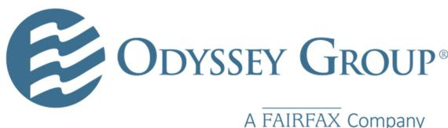

{0}------------------------------------------------

# **CONSOLIDATED FINANCIAL STATEMENTS**

# **ODYSSEY GROUP HOLDINGS, INC.**

# **AND SUBSIDIARIES**

# **AS OF DECEMBER 31, 2022 AND 2021**

# **AND**

# **FOR THE YEARS ENDED DECEMBER 31, 2022 AND 2021**

{1}------------------------------------------------

### **Report of Independent Auditors**

To the Board of Directors of Odyssey Group Holdings, Inc.

# *Opinion*

We have audited the accompanying consolidated financial statements of Odyssey Group Holdings, Inc. and its subsidiaries (the "Company"), which comprise the consolidated balance sheets as of December 31, 2022 and 2021, and the related consolidated statements of operations, of comprehensive income, of shareholders' equity and of cash flows for the years then ended, including the related notes (collectively referred to as the "consolidated financial statements").

In our opinion, the accompanying consolidated financial statements present fairly, in all material respects, the financial position of the Company as of December 31, 2022 and 2021, and the results of its operations and its cash flows for the years then ended in accordance with accounting principles generally accepted in the United States of America.

### *Basis for Opinion*

We conducted our audit in accordance with auditing standards generally accepted in the United States of America (US GAAS). Our responsibilities under those standards are further described in the Auditors' Responsibilities for the Audit of the Consolidated Financial Statements section of our report. We are required to be independent of the Company and to meet our other ethical responsibilities, in accordance with the relevant ethical requirements relating to our audit. We believe that the audit evidence we have obtained is sufficient and appropriate to provide a basis for our audit opinion.

# *Responsibilities of Management for the Consolidated Financial Statements*

Management is responsible for the preparation and fair presentation of the consolidated financial statements in accordance with accounting principles generally accepted in the United States of America, and for the design, implementation, and maintenance of internal control relevant to the preparation and fair presentation of consolidated financial statements that are free from material misstatement, whether due to fraud or error.

In preparing the consolidated financial statements, management is required to evaluate whether there are conditions or events, considered in the aggregate, that raise substantial doubt about the Company's ability to continue as a going concern for one year after the date the consolidated financial statements are available to be issued.

# *Auditors' Responsibilities for the Audit of the Consolidated Financial Statements*

Our objectives are to obtain reasonable assurance about whether the consolidated financial statements as a whole are free from material misstatement, whether due to fraud or error, and to issue an auditors' report that includes our opinion. Reasonable assurance is a high level of assurance but is not absolute assurance and therefore is not a guarantee that an audit conducted in accordance with US GAAS will always detect a material misstatement when it exists. The risk of not detecting a material misstatement resulting from fraud is higher than for one resulting from error, as fraud may involve collusion, forgery, intentional omissions, misrepresentations, or the override of internal control. Misstatements are considered material if there is a substantial likelihood that, individually or in the aggregate, they would influence the judgment made by a reasonable user based on the consolidated financial statements.

{2}------------------------------------------------

In performing an audit in accordance with US GAAS, we:

- Exercise professional judgment and maintain professional skepticism throughout the audit.
- Identify and assess the risks of material misstatement of the consolidated financial statements, whether due to fraud or error, and design and perform audit procedures responsive to those risks. Such procedures include examining, on a test basis, evidence regarding the amounts and disclosures in the consolidated financial statements.
- Obtain an understanding of internal control relevant to the audit in order to design audit procedures that are appropriate in the circumstances, but not for the purpose of expressing an opinion on the effectiveness of the Company's internal control. Accordingly, no such opinion is expressed.
- Evaluate the appropriateness of accounting policies used and the reasonableness of significant accounting estimates made by management, as well as evaluate the overall presentation of the consolidated financial statements.
- Conclude whether, in our judgment, there are conditions or events, considered in the aggregate, that raise substantial doubt about the Company's ability to continue as a going concern for a reasonable period of time.

We are required to communicate with those charged with governance regarding, among other matters, the planned scope and timing of the audit, significant audit findings, and certain internal control-related matters that we identified during the audit.

### *Other Matters*

Accounting principles generally accepted in the United States of America require that the information about incurred and paid claims development that precedes the current reporting period and the historical claims payout percentages included in Note 6 from page 32 to 39 be presented to supplement the basic financial statements. Such information is the responsibility of management and, although not a part of the basic financial statements, is required by the Financial Accounting Board (FASB) who considers it to be an essential part of financial reporting for placing the basic financial statements in an appropriate operational, economic, or historical context. We have applied certain limited procedures to the required supplementary information in accordance with auditing standards generally accepted in the United States of America, which consisted of inquiries of management about the methods of preparing the information and comparing the information for consistency with management's responses to our inquiries, the basic financial statements, and other knowledge we obtained during our audit of the basic financial statements. We do not express an opinion or provide any assurance on the information because the limited procedures do not provide us with sufficient evidence to express an opinion or provide any assurance.

New York, New York April 4, 2023

{3}------------------------------------------------

#### **CONSOLIDATED BALANCE SHEETS**

|                                                                                    |      | December 31,                                         |    |          |  |
|------------------------------------------------------------------------------------|------|------------------------------------------------------|----|----------|--|
|                                                                                    | 2022 |                                                      |    | 2021     |  |
|                                                                                    |      | (In millions, except share and per share amounts) |    |          |  |
| ASSETS                                                                             |      |                                                      |    |          |  |
| Investments and cash:                                                              |      |                                                      |    |          |  |
| Fixed income securities, available for sale, at fair value (amortized cost \$0     |      |                                                      |    |          |  |
| and \$4.3, respectively)                                                           | \$   | —                                                    | \$ | 4.4      |  |
| Fixed income securities, held for trading, at fair value (amortized cost \$6,606.4 |      |                                                      |    |          |  |
| and \$1,874.8, respectively)                                                       |      | 6,472.1                                              |    | 2,016.2  |  |
| Preferred stocks, held for trading, at fair value (cost \$335.5 and \$193.6,       |      |                                                      |    |          |  |
| respectively)                                                                      |      | 265.6                                                |    | 194.5    |  |
| Equity securities:                                                                 |      |                                                      |    |          |  |
| Common stocks, at fair value (cost \$1,230.5 and \$1,022.9, respectively)          |      | 1,046.8                                              |    | 967.2    |  |
| Common stocks, at equity                                                           |      | 2,076.3                                              |    | 1,585.0  |  |
| Short-term investments, held for trading, at fair value (amortized cost \$628.9    |      |                                                      |    |          |  |
| and \$2,319.8, respectively)                                                       |      | 628.9                                                |    | 2,319.8  |  |
| Cash and cash equivalents                                                          |      | 783.9                                                |    | 2,996.5  |  |
| Cash and cash equivalents held as collateral                                       |      | 40.8                                                 |    | 231.7    |  |
| Other invested assets                                                              |      | 2,043.5                                              |    | 1,871.4  |  |
| Total investments and cash                                                         |      | 13,357.9                                             |    | 12,186.7 |  |
| Accrued investment income                                                          |      | 61.9                                                 |    | 35.1     |  |
| Premiums receivable                                                                |      | 2,471.6                                              |    | 2,104.0  |  |
| Recoverable from reinsurers                                                        |      | 2,212.4                                              |    | 1,670.9  |  |
| Funds held by reinsureds                                                           |      | 217.3                                                |    | 226.6    |  |
| Deferred acquisition costs                                                         |      | 493.9                                                |    | 431.3    |  |
| Current federal and foreign income taxes receivable                                |      | 0.5                                                  |    | 18.2     |  |
| Deferred federal and foreign income taxes receivable                               |      | 162.3                                                |    | 70.2     |  |
| Other assets                                                                       |      | 348.1                                                |    | 307.6    |  |
| Total assets                                                                       | \$   | 19,325.9                                             | \$ | 17,050.6 |  |
| LIABILITIES                                                                        |      |                                                      |    |          |  |
| Unpaid losses and loss adjustment expenses                                         | \$   | 9,094.4                                              | \$ | 7,795.4  |  |
| Unearned premiums                                                                  |      | 2,585.1                                              |    | 2,341.9  |  |
| (Re)insurance balances payable                                                     |      | 1,470.3                                              |    | 813.7    |  |
| Funds held under reinsurance contracts                                             |      | 232.8                                                |    | 189.7    |  |
| Current federal and foreign income taxes payable                                   |      | 18.8                                                 |    | 15.3     |  |
| Other liabilities                                                                  |      | 623.0                                                |    | 674.3    |  |
| Total liabilities                                                                  |      | 14,024.4                                             |    | 11,830.3 |  |
|                                                                                    |      |                                                      |    |          |  |
| Commitments and contingencies (Note 11)                                            |      |                                                      |    |          |  |
|                                                                                    |      |                                                      |    |          |  |
| SHAREHOLDERS' EQUITY                                                               |      |                                                      |    |          |  |
| Non-controlling interest - preferred shares of subsidiaries                        |      | 29.3                                                 |    | 29.3     |  |
| Common shares: \$0.01 par value per share; Class A shares; 25,000                  |      |                                                      |    |          |  |
| shares authorized; 5,744 shares issued: Class B Shares; 125,000 shares             |      |                                                      |    |          |  |
| authorized; 51,752 issued and outstanding                                          |      | —                                                    |    | —        |  |
| Additional paid-in capital                                                         |      | 2,907.1                                              |    | 2,895.3  |  |
| Accumulated other comprehensive loss, net of deferred income taxes                 |      | (63.1)                                               |    | (83.3)   |  |
| Retained earnings                                                                  |      | 2,428.2                                              |    | 2,379.0  |  |
| Total shareholders' equity                                                         |      | 5,301.5                                              |    | 5,220.3  |  |
| Total liabilities and shareholders' equity                                         | \$   | 19,325.9                                             | \$ | 17,050.6 |  |

{4}------------------------------------------------

#### **CONSOLIDATED STATEMENTS OF OPERATIONS**

|                                                          | Years Ended December 31, |               |         |  |
|----------------------------------------------------------|--------------------------|---------------|---------|--|
|                                                          | 2022                     | 2021          |         |  |
|                                                          |                          | (In millions) |         |  |
| REVENUES                                                 |                          |               |         |  |
| Gross premiums written                                   | \$ 6,810.0            | \$            | 5,746.3 |  |
| Ceded premiums written                                   | 902.0                    |               | 896.9   |  |
| Net premiums written                                     | 5,908.0                  |               | 4,849.4 |  |
| Increase in net unearned premiums                        | (241.7)                  |               | (603.5) |  |
| Net premiums earned                                      | 5,666.3                  |               | 4,245.9 |  |
| Net investment income                                    | 430.3                    |               | 254.2   |  |
| Net realized investment (losses) gains:                  |                          |               |         |  |
| Realized investment (losses) gains                       | (486.9)                  |               | 423.7   |  |
| Other-than-temporary impairment losses                   | (9.5)                    |               | (75.3)  |  |
| Total net realized investment (losses) gains             | (496.4)                  |               | 348.4   |  |
| Total revenues                                           | 5,600.2                  |               | 4,848.5 |  |
|                                                          |                          |               |         |  |
| EXPENSES                                                 |                          |               |         |  |
| Losses and loss adjustment expenses                      | 3,900.7                  |               | 2,980.8 |  |
| Acquisition costs                                        | 1,136.1                  |               | 796.6   |  |
| Other underwriting expenses                              | 399.5                    |               | 365.5   |  |
| Other expenses, net                                      | 2.9                      |               | 8.3     |  |
| Interest expense                                         | 3.4                      |               | 4.4     |  |
| Total expenses                                           | 5,442.6                  |               | 4,155.6 |  |
| Income before income tax                                 | 157.6                    |               | 692.9   |  |
|                                                          |                          |               |         |  |
| Federal and foreign income tax provision (benefit):      |                          |               |         |  |
| Current                                                  | 89.6                     |               | 57.6    |  |
| Deferred                                                 | (97.5)                   |               | 91.6    |  |
| Total federal and foreign income tax (benefit) provision | (7.9)                    |               | 149.2   |  |
| Net income                                               | \$ 165.5              | \$            | 543.7   |  |

{5}------------------------------------------------

#### **CONSOLIDATED STATEMENTS OF COMPREHENSIVE INCOME**

|                                                                | Years Ended December 31, |    |               |  |
|----------------------------------------------------------------|--------------------------|----|---------------|--|
|                                                                | 2022                     |    | 2021          |  |
|                                                                |                          |    | (In millions) |  |
| Net Income                                                     | \$ 165.5              | \$ | 543.7         |  |
| OTHER COMPREHENSIVE (LOSS) INCOME, BEFORE TAX                  |                          |    |               |  |
| Unrealized net depreciation on securities arising              |                          |    |               |  |
| during the year                                                | (28.2)                   |    | (63.9)        |  |
| Reclassification adjustment for net realized investment losses |                          |    |               |  |
| included in net income                                         | 35.5                     |    | 61.9          |  |
| Foreign currency translation adjustments                       | (59.8)                   |    | 24.4          |  |
| Change in benefit plan liabilities                             | 78.1                     |    | 36.1          |  |
| Other comprehensive Income, before tax                         | 25.6                     |    | 58.5          |  |
| TAX BENEFIT (PROVISION)                                        |                          |    |               |  |
| Unrealized net depreciation on securities arising              |                          |    |               |  |
| during the year                                                | 5.9                      |    | 13.4          |  |
| Reclassification adjustment for net realized investment losses |                          |    |               |  |
| included in net income                                         | (7.5)                    |    | (13.0)        |  |
| Foreign currency translation adjustments                       | 12.6                     |    | (5.1)         |  |
| Change in benefit plan liabilities                             | (16.4)                   |    | (7.6)         |  |
| Total tax provision                                            | (5.4)                    |    | (12.3)        |  |
| Other comprehensive income, net of tax                         | 20.2                     |    | 46.2          |  |
| Comprehensive income                                           | \$ 185.7              |    | 589.9         |  |

{6}------------------------------------------------

### **CONSOLIDATED STATEMENTS OF SHAREHOLDERS' EQUITY**

|                                                                | Years Ended December 31, |    |                                            |  |  |
|----------------------------------------------------------------|--------------------------|----|--------------------------------------------|--|--|
|                                                                | 2022                     |    | 2021                                       |  |  |
|                                                                |                          |    | (In millions, except common share amounts) |  |  |
| NON-CONTROLLING INTEREST - PREFERRED SHARES OF SUBSIDIARIES |                          |    |                                            |  |  |
| Balance, beginning and end of year                             | \$ 29.3               | \$ | 29.3                                       |  |  |
| COMMON SHARES (par value)                                      |                          |    |                                            |  |  |
| Balance, beginning of year                                     | —                        |    | 0.5                                        |  |  |
| Common shares capital exchange                                 | —                        |    | (0.5)                                      |  |  |
| Balance, end of year                                           | —                        |    | —                                          |  |  |
| ADDITIONAL PAID-IN CAPITAL                                     |                          |    |                                            |  |  |
| Balance, beginning of year                                     | 2,895.3                  |    | 1,936.9                                    |  |  |
| Common shares capital contributions                            | —                        |    | 50.0                                       |  |  |
| Common shares capital exchange                                 | —                        |    | (2,072.0)                                  |  |  |
| Common shares - Class A - capital contributions                | —                        |    | 900.0                                      |  |  |
| Common shares - Class B - capital contributions                | —                        |    | 2,072.5                                    |  |  |
| Net change due to stock option exercises and                   |                          |    |                                            |  |  |
| restricted share awards                                        | 11.8                     |    | 7.9                                        |  |  |
| Balance, end of year                                           | 2,907.1                  |    | 2,895.3                                    |  |  |
| ACCUMULATED OTHER COMPREHENSIVE LOSS                           |                          |    |                                            |  |  |
| NET OF DEFERRED INCOME TAXES                                   |                          |    |                                            |  |  |
| Balance, beginning of year                                     | (83.3)                   |    | (129.5)                                    |  |  |
| Unrealized depreciation on securities, net of reclassification |                          |    |                                            |  |  |
| adjustments                                                    | 5.7                      |    | (1.6)                                      |  |  |
| Foreign currency translation adjustments                       | (47.2)                   |    | 19.3                                       |  |  |
| Change in benefit plan liabilities                             | 61.7                     |    | 28.5                                       |  |  |
| Balance, end of year                                           | (63.1)                   |    | (83.3)                                     |  |  |
| RETAINED EARNINGS                                              |                          |    |                                            |  |  |
| Balance, beginning of year                                     | 2,379.0                  |    | 2,936.9                                    |  |  |
| Net income                                                     | 165.5                    |    | 543.7                                      |  |  |
| Dividends to preferred shareholder and non-controlling         |                          |    |                                            |  |  |
| interest                                                       | (1.3)                    |    | (1.6)                                      |  |  |
| Dividends to common shareholders                               | (115.0)                  |    | (1,100.0)                                  |  |  |
| Balance, end of year                                           | 2,428.2                  |    | 2,379.0                                    |  |  |
| TOTAL SHAREHOLDERS' EQUITY                                     | \$ 5,301.5            | \$ | 5,220.3                                    |  |  |
| COMMON SHARES OUTSTANDING                                      |                          |    |                                            |  |  |
| Balance, beginning of year                                     | 57,496                   |    | 51,752                                     |  |  |
| Shares issued                                                  | —                        |    | 5,744                                      |  |  |
| Balance, end of year                                           | 57,496                   |    | 57,496                                     |  |  |
|                                                                |                          |    |                                            |  |  |

{7}------------------------------------------------

#### **CONSOLIDATED STATEMENTS OF CASH FLOWS**

|                                                                                   |      | Years Ended December 31, |               |           |  |
|-----------------------------------------------------------------------------------|------|--------------------------|---------------|-----------|--|
|                                                                                   | 2022 |                          |               | 2021      |  |
|                                                                                   |      |                          | (In millions) |           |  |
| CASH FLOWS FROM OPERATING ACTIVITIES                                              |      |                          |               |           |  |
| Net income                                                                        | \$   | 165.5                    | \$            | 543.7     |  |
| Adjustments to reconcile net income to net cash provided by operating activities: |      |                          |               |           |  |
| Increase in premiums receivable and funds held, net of reinsurance                |      | (17.9)                   |               | (518.3)   |  |
| Increase in unearned premiums and prepaid reinsurance premiums, net               |      | 254.0                    |               | 599.2     |  |
| Increase in unpaid losses and loss adjustment expenses, net of reinsurance        |      | 1,334.2                  |               | 1,041.5   |  |
| (Increase) decrease in current and deferred federal and foreign income taxes, net |      | (76.1)                   |               | 144.0     |  |
| Increase in deferred acquisition costs                                            |      | (70.4)                   |               | (128.8)   |  |
| Change in other assets and other liabilities, net                                 |      | (304.9)                  |               | (78.1)    |  |
| Net realized investment losses (gains)                                            |      | 496.4                    |               | (348.4)   |  |
| Bond discount amortization, net                                                   |      | (8.7)                    |               | 9.3       |  |
| Amortization of compensation plans                                                |      | 24.3                     |               | 23.1      |  |
| Net cash provided by operating activities                                         |      | 1,796.4                  |               | 1,287.2   |  |
| CASH FLOWS FROM INVESTING ACTIVITIES                                              |      |                          |               |           |  |
| Maturities of fixed income securities, available for sale                         |      | 3.9                      |               | 11.3      |  |
| Sales of equity securities                                                        |      | 1.9                      |               | 4.2       |  |
| Purchases of equity securities                                                    |      | (329.1)                  |               | (2.0)     |  |
| Net settlements of other invested assets                                          |      | 266.3                    |               | 344.2     |  |
| Purchases of other invested assets                                                |      | (480.6)                  |               | (292.0)   |  |
| Sales of trading securities                                                       |      | 5,768.4                  |               | 10,357.7  |  |
| Purchases of trading securities                                                   |      | (9,240.3)                |               | (9,472.7) |  |
| Net purchases of fixed assets                                                     |      | (19.6)                   |               | (13.7)    |  |
| Acquisition of net assets of a business                                           |      | (1.3)                    |               | (5.8)     |  |
| Net cash (used in) provided by investing activities                               |      | (4,030.4)                |               | 931.2     |  |
|                                                                                   |      |                          |               |           |  |
| CASH FLOWS FROM FINANCING ACTIVITIES                                              |      |                          |               |           |  |
| Common shares capital contributions                                               |      | —                        |               | 950.0     |  |
| Repayment of debt obligations upon maturity                                       |      | —                        |               | (90.0)    |  |
| Purchases of restricted shares of parent                                          |      | (11.4)                   |               | (10.8)    |  |
| Dividends paid to preferred shareholders                                          |      | (1.3)                    |               | (1.6)     |  |
| Dividends paid to common shareholders                                             |      | (107.6)                  |               | (900.0)   |  |
| Net cash used in financing activities                                             |      | (120.3)                  |               | (52.4)    |  |
| Effect of exchange rate changes on cash and cash equivalents                      |      | (49.2)                   |               | (13.0)    |  |
| (Decrease) increase in cash and cash equivalents                                  |      | (2,403.5)                |               | 2,153.0   |  |
| Cash and cash equivalents, beginning of year                                      |      | 3,228.2                  |               | 1,075.2   |  |
| Cash and cash equivalents, end of year                                            | \$   | 824.7                    | \$            | 3,228.2   |  |
|                                                                                   |      |                          |               |           |  |
| Supplemental disclosures of cash flow information:                                |      |                          |               |           |  |
| Interest paid                                                                     | \$   | —                        | \$            | 0.8       |  |
| Income taxes paid                                                                 | \$   | 67.9                     | \$            | 5.4       |  |
| Non-cash activity:                                                                |      |                          |               |           |  |
| Dividends paid to common shareholders                                             | \$   | 7.4                      | \$            | 200.0     |  |
|                                                                                   |      |                          |               |           |  |

{8}------------------------------------------------

# **1. Organization**

Odyssey Group Holdings, Inc., a Delaware corporation (together with its subsidiaries, the "Company", or "OGHI" on a stand-alone basis), is an underwriter of reinsurance, providing a full range of property and casualty products on a worldwide basis, and of specialty insurance, primarily in the United States and through the Lloyd's of London ("Lloyd's") marketplace. OGHI owns all the common shares of Odyssey Reinsurance Company ("ORC"), its principal operating subsidiary, which is domiciled in the state of Connecticut. ORC directly or indirectly owns all of the common shares of the following subsidiaries:

- Hudson Insurance Company ("Hudson") and its subsidiaries:
	- Hudson Excess Insurance Company ("Hudson Excess");
	- Hilltop Specialty Insurance Company ("Hilltop");
- Greystone Insurance Company ("Greystone");
- Newline Holdings U.K. Limited and its subsidiaries (collectively, "Newline"):
	- Newline Underwriting Management Limited, which manages Newline Syndicate (1218), a member of Lloyd's;
	- Newline Insurance Company Limited ("NICL") and its subsidiaries:
		- Newline Europe Holdings GmbH and its subsidiary:
			- Newline Europe Versicherung AG ("NV");
	- Newline Corporate Name Limited ("NCNL"), which provides capital for and receives distributed earnings from Newline Syndicate (1218); and
	- Newline Group Services Limited;
- Odyssey Re Europe Holdings S.A.S. ("OREH") and its subsidiary:
	- Odyssey Re Europe S.A. ("ORESA"); and
- Odyssey Reinsurance (Barbados) Ltd. ("ORB").

Fairfax Financial Holdings Limited ("Fairfax"), a publicly traded holding company based in Toronto, Canada, ultimately owns 90.01% of the common shares of OGHI and 100% of the non-controlling interest - preferred shares of OGHI's subsidiaries. The direct owner of the 90.01% interest in OGHI is Odyssey US Holdings Inc. ("OUSHI"), all the common shares of which are ultimately owned by Fairfax. On December 15, 2021, the Company issued shares representing an aggregate 9.99% equity interest to a wholly-owned subsidiary of the Canada Pension Plan Investment Board ("CPPIB") and OMERS, the pension plan for Ontario's municipal employees, for cash consideration of \$900.0m, which was subsequently paid by OGHI as a dividend to Fairfax. Fairfax has the flexibility to repurchase the interests of CPPIB and OMERS in OGHI over time.

{9}------------------------------------------------

### **2. Summary of Significant Accounting Policies**

(a) *Basis of Presentation*. The accompanying consolidated financial statements have been prepared in accordance with accounting principles generally accepted in the United States of America ("GAAP"). The consolidated financial statements include the accounts of the Company and its subsidiaries. Intercompany transactions have been eliminated.

The preparation of consolidated financial statements in conformity with GAAP requires the Company to make estimates and assumptions that could differ materially from actual results affecting the reported amounts of assets, liabilities, revenues and expenses and disclosures of contingent assets and liabilities. The Company considers its accounting policies that are most dependent on the application of estimates and assumptions as critical accounting estimates, which are defined as estimates that are both: i) important to the portrayal of the Company's financial condition and results of operations and ii) require the Company to exercise significant judgment. These estimates, by necessity, are based on assumptions about numerous factors.

The Company reviews its critical accounting estimates and assumptions on a quarterly basis, including: the valuation of the reserves for unpaid losses and loss adjustment expenses; analysis of the recoverability of deferred income tax assets; and valuation of the investment portfolio, including a review for other-than-temporary declines in estimated fair value and the pricing of level 3 securities.

Certain prior year balances have been reclassified to conform to the current year presentation.

(b) *Investments*. The majority of the Company's investments in fixed income securities and common stocks are categorized as "held for trading" and are recorded at their estimated fair value based on quoted market prices (see Note 3). Most investments in common stocks of affiliates are carried at the Company's proportionate share of the equity of those affiliates. Short-term investments, which are classified as "held for trading" and which have a maturity of one year or less from the date of purchase, are carried at fair value. The Company considers all highly liquid debt instruments purchased with an original maturity of three months or less to be cash equivalents. Cash equivalents include certificates of deposits totaling \$46.2m and \$22.4m as of December 31, 2022 and 2021, respectively. Investments in limited partnerships, investment funds, mortgage loans, collateral loans, affiliate loans, real estate and contingent considerations have been reported in other invested assets. Other invested assets also include accounts relating to the Company's unqualified benefit plans and certain derivative securities, all of which are carried at fair value. The Company routinely evaluates the carrying value of its investments in common stocks of affiliates and in partnerships and investment funds. In the case of limited partnerships and investment funds, the carrying value is generally established based on the net valuation criteria as determined by the managers of the investments. Such valuations could differ significantly from the values that would have been available had markets existed for the securities. Investment transactions are recorded on their trade date, with balances pending settlement reflected in the consolidated balance sheets as a component of other assets or other liabilities.

Investment income, which is reported net of applicable investment expenses, is recorded as earned. Realized investment gains or losses are determined based on average cost. The Company records, in investment income, its proportionate share of income or loss, including realized gains or losses, for those securities for which the equity method of accounting is utilized, which include most common stocks of affiliates, limited partnerships and investment funds. Due to the timing of when financial information is reported by equity investees and received by the Company, results attributable to these investments are generally reported by the Company on a one month or one quarter lag. Unrealized appreciation and depreciation related to trading securities is recorded as realized investment gains or losses in the consolidated statements of operations.

The net amount of unrealized appreciation or depreciation on the Company's available for sale investments, net of applicable deferred income taxes, is reflected in shareholders' equity in accumulated other comprehensive income. A decline in the fair value of an available for sale investment below its cost or amortized cost that is deemed other-than-temporary is recorded as a realized investment loss in the consolidated statements of operations, resulting in a new cost or amortized cost basis for the investment. Other-than-temporary declines in the carrying values of investments recorded in accordance with the equity method of accounting are recorded in net investment income in the consolidated statements of operations.

{10}------------------------------------------------

(c) *Revenue Recognition*. Reinsurance assumed premiums written and related costs are based upon reports received from ceding companies. When reinsurance assumed premiums written have not been reported by the ceding company they are estimated, at the individual contract level, based on historical patterns and experience from the ceding company and judgment of the Company. Subsequent adjustments to premiums written, based on actual results or revised estimates from the ceding company, are recorded in the period in which they become known. Reinsurance assumed premiums written related to proportional treaty business are established on a basis that is consistent with the coverage periods under the terms of the underlying insurance contracts. Reinsurance assumed premiums written related to excess of loss and facultative reinsurance business are recorded over the coverage term of the contracts, which is generally one year. Unearned premium reserves are established for the portion of reinsurance assumed premiums written that are to be recognized over the remaining contract period. Unearned premium reserves related to proportional treaty contracts are computed based on reports received from ceding companies, which show premiums written but not yet earned. Premium adjustments made over the life of the contract are recognized as earned premiums based on the applicable contract period. Insurance premiums written are based upon the effective date of the underlying policy and are generally earned on a pro rata basis over the policy period, which is usually one year. A reserve for uncollectible premiums is established when deemed necessary. The Company has established a reserve for potentially uncollectible premium receivable balances of \$3.8m and \$10.3m as of December 31, 2022 and 2021, respectively, which has been netted against premiums receivable.

The cost of reinsurance purchased by the Company (reinsurance premiums ceded) is reported as prepaid reinsurance premiums and amortized over the contract period in proportion to the amount of reinsurance protection provided; unearned premiums are included in recoverables from reinsurers on the consolidated balance sheets. The ultimate amount of premiums, including adjustments, is recognized as premiums ceded, and amortized over the applicable contract period. Premiums earned are reported net of reinsurance ceded premiums earned in the consolidated statements of operations. Amounts paid by the Company for retroactive reinsurance that meet the conditions for reinsurance accounting are reported as reinsurance receivables to the extent those amounts do not exceed the associated liabilities. If the liabilities exceed the amounts paid, reinsurance receivables are increased to reflect the difference, and the resulting gain is deferred and amortized over the estimated settlement period. If the amounts paid for retroactive reinsurance exceed the liabilities, the related liabilities are increased or the reinsurance receivable is reduced, or both, at the time the reinsurance contract is effective, and the excess is charged to net income. Changes in the estimated amount of liabilities relating to the underlying reinsured contracts are recognized in net income in the period of the changes. Assumed and ceded reinstatement premiums represent additional premiums related to reinsurance coverages, principally catastrophe excess of loss contracts, which are paid when the incurred loss limits have been utilized under the reinsurance contract and such limits are reinstated. Premiums written and earned premiums related to a loss event are estimated and accrued as earned. The accrual is adjusted based upon any change to the ultimate losses incurred under the contract.

Leasing revenue is generally recognized ratably over the term of the leases. All of the Company's leasing revenue is generated from operating leases. Assets held for leases consist of land and buildings with estimated useful lives of 30 to 39 years and are valued at \$279.6m.

(d) *Deferred Acquisition Costs*. Acquisition costs, which are reported net of costs recovered under ceded contracts, consist of commissions and brokerage expenses incurred on insurance and reinsurance business written, and premium taxes on direct insurance written, and are deferred and amortized over the period in which the related premiums are earned. Commission adjustments are accrued based on changes in premiums and losses recorded by the Company in the period in which they become known. Deferred acquisition costs are limited to their estimated realizable value based on the related unearned premium, which considers anticipated losses and loss adjustment expenses and estimated remaining costs of servicing the business, all based on historical experience. The realizable value of the Company's deferred acquisition costs is determined without consideration of investment income.

Included in acquisition costs in the consolidated statements of operations are amortized deferred acquisition costs of \$1,105.5m and \$769.8m for the years ended December 31, 2022 and 2021, respectively.

{11}------------------------------------------------

(e) *Goodwill and Intangible Assets*. The Company accounts for goodwill and intangible assets as required by GAAP. A purchase price paid that is in excess of net assets arising from a business combination is recorded as an asset ("goodwill") and is not amortized. Intangible assets with finite lives are amortized over the estimated useful life of the asset. Intangible assets with indefinite useful lives are not amortized. Goodwill and intangible assets are analyzed for impairment on an annual basis to determine if the carrying amount may not be recoverable. If the goodwill or intangible asset is impaired, it is written down to its realizable value with a corresponding expense reflected in the consolidated statements of operations. For the years ended December 31, 2022 and 2021 the Company did not impair any goodwill or intangible assets.

The following table reflects the carrying amount of goodwill, intangible assets with indefinite lives and intangible assets with finite lives as of December 31, 2022 and 2021:

|                            |            | Intangible Assets |     |              |       |            |
|----------------------------|------------|-------------------|-----|--------------|-------|------------|
|                            | Goodwill   | Indefinite Lives  |     | Finite Lives |       | Total      |
| Balance, January 1, 2021   | \$ 52.3 | \$                | 5.8 | \$           | 15.1  | \$ 73.2 |
| Acquired during 2021       | —          |                   | —   |              | 5.7   | 5.7        |
| Amortization during 2021   | —          |                   | —   |              | (6.7) | (6.7)      |
| Balance, December 31, 2021 | 52.3       |                   | 5.8 |              | 14.1  | 72.2       |
| Acquired during 2022       | —          |                   | —   |              | 1.3   | 1.3        |
| Amortization during 2022   | —          |                   | —   |              | (6.8) | (6.8)      |
| Balance, December 31, 2022 | \$ 52.3 | \$                | 5.8 | \$           | 8.6   | \$ 66.7 |

The following table provides the estimated amortization expense related to intangible assets for the succeeding years:

|                            | Years Ended December 31, |    |      |    |      |    |      |   |    |      |   |                        |
|----------------------------|--------------------------|----|------|----|------|----|------|---|----|------|---|------------------------|
|                            | 2023                     |    | 2024 |    | 2025 |    | 2026 |   |    | 2027 |   | 2028 and thereafter |
| Amortization of intangible |                          |    |      |    |      |    |      |   |    |      |   |                        |
| assets                     | \$ 5.4                | \$ | 1.9  | \$ | 0.9  | \$ |      | — | \$ |      | — | \$ —                |

f) *Unpaid losses and loss adjustment expenses*. Unpaid loss and loss adjustment expenses represent reserves for the estimated amounts that the Company is obligated to pay for reported and unreported claims and related loss adjustment expenses incurred under its contracts of insurance and reinsurance. The estimates are based on assumptions related to the ultimate cost to settle such claims. The inherent uncertainties of estimating reserves are greater for reinsurance contracts than for direct insurance policies due to the diversity of development patterns among different types of reinsurance contracts and the necessary reliance on ceding companies for information regarding reported claims. As a result, there can be no assurance that the ultimate liability will not exceed amounts reserved, with a resulting adverse effect on the Company.

The reserves for unpaid losses and loss adjustment expenses are based on the Company's evaluations of reported claims and individual case estimates received from ceding companies for reinsurance business or the estimates advised by the Company's claims adjusters for insurance business. The Company utilizes generally accepted actuarial methodologies to determine reserves for losses and loss adjustment expenses based on historical experience and other estimates. The reserves are reviewed continually during the year and changes in estimates for losses and loss adjustment expenses are reflected as expenses in the consolidated statements of operations in the period that the changes are identified. Reinsurance recoverables on unpaid losses and loss adjustment expenses are reported as assets. A reserve for uncollectible reinsurance recoverables is established based on an evaluation of each reinsurer or retrocessionaire and historical experience. The Company uses tabular reserving for workers' compensation indemnity loss reserves, which are considered to be fixed and determinable, and discounts such reserves using an interest rate of 3.5% and the Life Table for Total Population: United States, 2009.

{12}------------------------------------------------

(g) *Deposit Assets and Liabilities*. The Company may enter into assumed and ceded reinsurance contracts that contain certain loss limiting provisions and, as a result, do not meet the risk transfer provisions of GAAP. These contracts are deemed as either transferring only significant timing risk or only significant underwriting risk or transferring neither significant timing nor underwriting risk and are accounted for using the deposit accounting method, under which revenues and expenses from reinsurance contracts are not recognized as written premium and incurred losses. Instead, the profits or losses from these contracts are recognized net, as other income or other expense, over the contract or contractual settlement periods.

For such contracts, the Company initially records the amount of consideration paid as a deposit asset or received as a deposit liability. Revenue or expense is recognized over the term of the contract, with any deferred amount recorded as a component of assets or liabilities until such time it is earned. The ultimate asset or liability under these contracts is estimated, and the asset or liability initially established, which represents the consideration transferred, is increased or decreased over the term of the contract. The change during the period is recorded in the Company's consolidated statements of operations, with increases and decreases in the ultimate asset or liability shown in other expense, net. As of December 31, 2022 and 2021, the Company had reflected \$2.1m and \$1.6m, for December 31, 2022 and 2021, in other assets and \$0.0m and \$0.2m, for December 31, 2022 and 2021, in other liabilities, related to deposit contracts. In cases where cedants retain the consideration on a funds held basis, the Company records those assets in other assets, and records the related investment income on the assets in the Company's consolidated statements of operations as investment income.

(h) *Income Taxes.* The Company records deferred income taxes to provide for the net tax effect of temporary differences between the carrying values of assets and liabilities in the Company's consolidated financial statements and their tax bases. Such differences relate principally to deferred acquisition costs, unearned premiums, unpaid losses and loss adjustment expenses, investments and tax credits. Deferred tax assets are reduced by a valuation allowance when the Company believes it is "more likely than not" that all or a portion of deferred taxes will not be realized. As of December 31, 2021, the Company had determined that it is more likely than not that its foreign tax credit carryovers ("FTC") would not be utilized prior to expiration and a valuation allowance of \$39.1m was recorded against the FTC deferred tax asset. Due to increased foreign sourced income during 2022 and the expectation that such income would continue in future years, this allowance was released in 2022. The Company has elected to recognize accrued interest and penalties associated with uncertain tax positions as part of the income tax provision.

(i) *Derivatives*. The Company utilizes derivative instruments to manage against potential adverse changes in the value of its assets and liabilities. Derivatives include total return swaps, interest rate swaps, forward currency contracts, U.S. Treasury bond forward contracts, CPI-linked derivative contracts, credit default swaps, call options, put options, warrants and other equity and credit derivatives. In addition, the Company holds options on certain securities within its fixed income portfolio that allow the Company to extend the maturity date on fixed income securities or convert fixed income securities to equity securities. The Company categorizes these investments as trading securities, and, except as noted below with respect to certain Crop-related products and derivative instruments purchased and sold to hedge the Company's exposure to such Crop-related products, changes in fair value are recorded as realized investment gains or losses in the consolidated statements of operations. All derivative instruments are recognized as either assets or liabilities on the consolidated balance sheets and are measured at their fair value. Gains or losses from changes in the derivative values are reported based on how the derivative is used and whether it qualifies for hedge accounting. Except as noted below, for derivative instruments that do not qualify for hedge accounting, changes in fair value are included in realized investment gains and losses in the consolidated statements of operations. Margin balances required by counterparties in support of derivative positions are included in fixed income securities and short-term investments.

The Company has accounted for certain U.S. Crop-related products that do not qualify as insurance contracts and related reinsurance on such contracts as derivative instruments, reflecting the fair value of such instruments as either other assets or other liabilities in its consolidated balance sheet, depending upon the position of each instrument as of each reporting date. The Company has hedged its net exposure to losses from these contracts using put options and collars acquired at or near the initial issuance date of the contracts, reflecting the fair value of such instruments as either other assets or other liabilities in its consolidated balance sheet, depending upon the position of such hedging instruments as of each reporting date. Changes in fair value for both the hedged contracts and the hedging instruments are reflected in loss and loss adjustment expenses in the consolidated statement of operations.

(j) *Foreign Currency*. Foreign currency transaction gains or losses resulting from a change in exchange rates between the currency in which a transaction is denominated, or the original currency, and the functional currency are reflected in the consolidated statements of operations in the period in which they occur. The Company translates the financial statements of its foreign subsidiaries and branches that have functional currencies other than the U.S. dollar into U.S. dollars by translating balance sheet accounts at the balance sheet date exchange rate and income statement accounts at the rate at which the

{13}------------------------------------------------

transaction occurs or the average exchange rate for each quarter. Translation gains or losses are recorded, net of deferred income taxes, as a component of accumulated other comprehensive income.

The following table presents the foreign exchange effects, net of the effects of foreign currency forward contracts purchased as an economic hedge against foreign exchange rate volatility and of tax, on specific line items in the Company's financial statements for the years ended December 31, 2022 and 2021:

|                                                           | 2022         | 2021        |
|-----------------------------------------------------------|--------------|-------------|
| Statements of operations:                                 |              |             |
| Realized investment (losses) gains:                       |              |             |
| Foreign currency forward contracts gains (losses)         | \$ 60.4   | \$ (6.8) |
| Other investment losses                                   | (7.4)        | (33.8)      |
| Non-Investment realized (losses) gains                    | (8.9)        | 8.7         |
| Total realized investment gains (losses)                  | 44.1         | (31.9)      |
| Net investment loss                                       | (0.4)        | (1.0)       |
| Income (loss) before income tax                           | 43.7         | (32.9)      |
| Total federal and foreign income tax provision (benefit)  | 9.2          | (6.9)       |
| Net income (loss)                                         | 34.5         | (26.0)      |
| Other comprehensive loss:                                 |              |             |
| Other comprehensive (loss) income before income tax       | (59.8)       | 24.4        |
| Federal and foreign income tax (benefit) provision before |              |             |
| income tax                                                | (12.6)       | 5.1         |
| Other comprehensive (loss) income, net of tax             | (47.2)       | 19.3        |
| Total effects on comprehensive loss and                   |              |             |
| shareholders' equity                                      | \$ (12.7) | \$ (6.7) |

(k) *Stock-Based Compensation Plans*. The Company reflects awards of restricted common stock of Fairfax to employees as a reduction to additional paid-in-capital when the shares are purchased. The award value is amortized through compensation expense over the related vesting periods.

(l) *Claims Payments*. Payments of claims by the Company, as reinsurer, to a broker on behalf of a reinsured company are recorded in the Company's financial statements as paid losses at the time the cash is disbursed and are treated as paid to the reinsured. Premiums due to the Company from the reinsured are recorded as receivables from the reinsured until the cash is received by the Company, either directly from the reinsured or from the broker.

(m) *Funds Held Balances*. "Funds held under reinsurance contracts" represents amounts due to reinsurers arising from the Company's receipt of a deposit from a reinsurer, or the withholding of a portion of the premiums due, in accordance with contractual terms, as a guarantee that the reinsurer will meet its loss and other obligations. Interest generally accrues on withheld funds in accordance with contract terms. "Funds held by reinsured" represents amount due from a ceding company that withholds, in accordance with the contractual terms, a portion of the premium due the Company as a guarantee that the Company will meet its loss and other obligations.

(n) *Fixed Assets*. Fixed assets, with a net book value of \$110.9m and \$106.2m as of December 31, 2022 and 2021, respectively, are recorded at amortized cost and are included in other assets. Depreciation and amortization are generally computed on a straight-line basis over the following estimated useful lives:

| Leasehold improvements                             | 10 years or term of lease, if shorter |
|----------------------------------------------------|---------------------------------------|
| Electronic data processing equipment and furniture | 5 years                               |
| Personal computers and software                    | 3 years                               |

Depreciation and amortization expense for the years ended December 31, 2022 and 2021 was \$30.2m and \$27.5m, respectively.

{14}------------------------------------------------

(o) *Contingent Liabilities*. Amounts are accrued for the resolution of claims that have either been asserted or are deemed probable of assertion if, in the opinion of the Company, it is both probable that a liability has been incurred and the amount of the liability can be reasonably estimated. In many cases it is not possible to determine whether a liability has been incurred or to estimate the ultimate or minimum amount of that liability until years after the contingency arises, in which case no accrual is made until that time. As of December 31, 2022 and 2021, no contingent liabilities have been recorded (see Note 11).

(p) *Recent Accounting Pronouncements.* The Financial Accounting Standards Board ("FASB") is the organization responsible for establishing and improving GAAP.

In June 2016, the FASB issued ASU 2016-13, "Financial Instruments - Credit Losses," which provides for the recognition and measurement at the reporting date of all expected credit losses for financial assets that are not accounted for at fair value through net income, including investments in available-for-sale debt securities and loans, premiums receivable and reinsurance recoverable. The updated guidance amends the current other-than-temporary impairment model for availablefor-sale debt securities by requiring the recognition of impairments relating to credit losses through an allowance account and limits the amount of credit loss to the difference between a security's amortized cost basis and its fair value. This guidance also applies a new current expected credit loss model for determining credit-related impairments for financial instruments measured at amortized cost. In November 2019, the FASB issued ASU 2019-10, which deferred the effective date of ASU 2016-13 to 2023 (with early adoption permitted), and ASU 2019-11, which amended and clarified certain guidance contained in ASU 2016-13. The Company evaluated the effect this standard will have on its consolidated financial statement and determined the impact to be insignificant.

In December 2019, the FASB issued ASU 2019-12, "Simplifying the Accounting for Income Taxes." ASU 2019-12 provides the simplification of existing guidance for income taxes, including the removal of certain exceptions related to the recognition of deferred tax liabilities on foreign subsidiaries. The Company adopted ASU 2019-12 effective in 2022 as required; the adoption did not have a material effect on the Company's consolidated financial statements.

The Company has determined that all recently issued guidance and pronouncements, other than those directly referenced above, are either not applicable or are immaterial to the Company's consolidated financial statements.

(q) *Equity Method Investments Valuation and Changes Misstatement*. The Company has concluded that, as a result of the misapplication of accounting guidance for the accounting of equity method investments, the carrying value and the changes in value related to certain of the Company's investments were misstated as presented in its financial statements for 2021.

The effect of the misstatements were such that December 31, 2021 common stocks, at equity, were understated by \$53.7m, shareholders' equity was understated by \$42.4 million (including the overstatement of accumulated other comprehensive loss net of deferred income taxes by \$52.1m and retained earnings by \$9.7m), deferred tax assets were overstated by \$11.3m, net income was overstated by \$10.5m (net of tax) and other comprehensive income was understated by \$7.0m. These misstatements were corrected in the consolidated financial statements for the year ended December 31, 2022.

The Company performed both a qualitative and quantitative assessment of the materiality of the adjustments and concluded that the effects were not material to the Company's financial position or results of operations within the 2021 annual consolidated financial statements or for the 2022 annual consolidated financial statements in which they were adjusted.

(r) *Subsequent Events*. The Company has evaluated the significance of events occurring subsequent to December 31, 2022 with respect to disclosing the nature and expected impact of such events as of April 4, 2023, the date these consolidated financial statements were available to be issued.

{15}------------------------------------------------

### **3. Fair Value Measurements**

The Company accounts for a significant portion of its financial instruments at fair value as required by GAAP.

### *Fair Value Hierarchy*

The assets and liabilities recorded at fair value in the consolidated balance sheets are measured and classified in a three-level hierarchy for disclosure purposes based on the observability of inputs available in the marketplace used to measure fair values. The fair value hierarchy gives the highest priority to quoted prices in active markets for identical assets or liabilities (Level 1) and the lowest priority to unobservable inputs (Level 3). When the inputs used to measure fair value fall within different levels of the hierarchy, the level within which the fair value measurement is categorized is based on the lowest level input that is significant to the fair value measurement in its entirety. Gains and losses for assets and liabilities categorized within the Level 3 table below, therefore, may include changes in fair value that are attributable to both observable inputs (Levels 1 and 2) and unobservable inputs (Level 3). Financial assets and liabilities recorded in the consolidated balance sheets are categorized based on the inputs to the valuation techniques as follows:

*Level 1* financial instruments are financial assets and liabilities for which the values are based on unadjusted quoted prices for identical assets or liabilities in an active market that the Company has the ability to access. Market price data generally is obtained from exchange markets. The Company does not adjust the quoted price for such instruments. The majority of the Company's Level 1 investments are common stocks that are actively traded in a public market and short-term investments and cash equivalents, for which the cost basis approximates fair value.

*Level 2* financial instruments are financial assets and liabilities for which the values are based on quoted prices in markets that are not active, or model inputs that are observable either directly or indirectly for substantially the full term of the asset or liability. Level 2 inputs include the following:

- a) Quoted prices for similar assets or liabilities in active markets;
- b) Quoted prices for identical or similar assets or liabilities in non-active markets;
- c) Pricing models, the inputs for which are observable for substantially the full term of the asset or liability; and
- d) Pricing models, the inputs for which are derived principally from, or corroborated by, observable market data through correlation or other means, for substantially the full term of the asset or liability.

Assets and liabilities measured at fair value on a recurring basis and classified as Level 2 include government and corporate fixed income securities, which are priced using publicly traded over-the-counter prices and broker-dealer quotes. Observable inputs such as benchmark yields, reported trades, broker-dealer quotes, issuer spreads and bids are available for these investments. Also included in Level 2 are inactively traded convertible corporate debentures that are valued using a pricing model that includes observable inputs such as credit spreads and discount rates in the calculation.

*Level 3* financial instruments are financial assets and liabilities for which the values are based on prices or valuation techniques that require inputs that are both unobservable and significant to the overall fair value measurement. These measurements include circumstances in which there is little, if any, market activity for the asset or liability. In certain cases, the inputs used to measure fair value may fall into different levels of the fair value hierarchy. In such cases, the level in the fair value hierarchy within which the fair value measurement is categorized is based on the lowest level input that is significant to the fair value measurement in its entirety. Therefore, these inputs reflect the Company's own assumptions about the methodology and valuation techniques that a market participant would use in pricing the asset or liability.

For the years ended December 31, 2022 and 2021, no securities were transferred into or out of Level 3.

During the years ended December 31, 2022 and 2021, the Company purchased \$262.8m and \$142.7m, respectively, of investments that are classified as Level 3. As of December 31, 2022 and 2021, the Company held \$586.6m and \$571.9m, respectively, of investments that are classified as Level 3. Level 3 investments include CPI-linked derivative contracts, and certain loans, bonds, preferred stocks and common stocks.

{16}------------------------------------------------

A review of fair value hierarchy classifications is conducted on a quarterly basis. Changes in the observability of valuation inputs may result in a reclassification for certain financial assets or liabilities. Reclassifications impacting Level 3 of the fair value hierarchy are generally reported as transfers in or out of the Level 3 category as of the beginning of the period in which the reclassifications occur. The Company has determined, after carefully considering the impact of recent economic conditions and liquidity in the credit markets on the Company's portfolio, that it should not re-classify any of its investments from Level 1 or Level 2 to Level 3 for the years ended December 31, 2022 and 2021. There were no transfers of securities between Level 1 and Level 2 during the years ended December 31, 2022 and 2021.

The Company is responsible for determining the fair value of its investment portfolio by utilizing market driven fair value measurements obtained from active markets, where available, by considering other observable and unobservable inputs and by employing valuation techniques that make use of current market data. For the majority of the Company's investment portfolio, the Company uses quoted prices and other information from independent pricing sources to determine fair values.

The following tables present the fair value hierarchy for those assets and liabilities measured at fair value on a recurring basis as of December 31, 2022 and 2021:

|                                                   | Fair Value Measurements as of December 31, 2022 |                        |    |         |    |         |    |         |
|---------------------------------------------------|-------------------------------------------------|------------------------|----|---------|----|---------|----|---------|
|                                                   |                                                 | Reported Fair Value |    | Level 1 |    | Level 2 |    | Level 3 |
| Fixed income securities, held for trading:        |                                                 |                        |    |         |    |         |    |         |
| United States government, government agencies     |                                                 |                        |    |         |    |         |    |         |
| and authorities                                   | \$                                              | 4,239.1                | \$ | —       | \$ | 4,239.1 | \$ | —       |
| States, municipalities and political subdivisions |                                                 | 105.5                  |    | —       |    | 105.5   |    | —       |
| Foreign governments                               |                                                 | 947.9                  |    | —       |    | 947.9   |    | —       |
| Corporate                                         |                                                 | 1,179.6                |    | 5.4     |    | 1,005.0 |    | 169.2   |
| Total fixed income securities, held for trading   |                                                 | 6,472.1                |    | 5.4     |    | 6,297.5 |    | 169.2   |
| Preferred stocks, held for trading                |                                                 | 265.6                  |    | 0.1     |    | 156.1   |    | 109.4   |
| Common stocks, at fair value                      |                                                 | 680.8                  |    | 556.2   |    | —       |    | 124.6   |
| Short-term investments, held for trading          |                                                 | 628.9                  |    | 504.0   |    | 124.9   |    | —       |
| Cash equivalents                                  |                                                 | 422.5                  |    | 422.5   |    |         |    | —       |
| Derivatives                                       |                                                 | 54.6                   |    |         |    | 35.0    |    | 19.6    |
| Other investments                                 |                                                 | 186.7                  |    | —       |    | 22.9    |    | 163.8   |
| Total assets measured at fair value               | \$                                              | 8,711.2                | \$ | 1,488.2 | \$ | 6,636.4 | \$ | 586.6   |
|                                                   |                                                 |                        |    |         |    |         |    |         |
| Derivative liabilities                            | \$                                              | 24.1                   | \$ | —       | \$ | 24.1    | \$ | —       |
| Total liabilities measured at fair value          | \$                                              | 24.1                   | \$ | —       | \$ | 24.1    | \$ | —       |

{17}------------------------------------------------

|                                                   | Fair Value Measurements as of December 31, 2021 |            |    |         |    |         |    |         |
|---------------------------------------------------|-------------------------------------------------|------------|----|---------|----|---------|----|---------|
|                                                   | Reported                                        |            |    |         |    |         |    |         |
|                                                   |                                                 | Fair Value |    | Level 1 |    | Level 2 |    | Level 3 |
| Fixed income securities, available for sale:      |                                                 |            |    |         |    |         |    |         |
| United States government, government agencies     |                                                 |            |    |         |    |         |    |         |
| and authorities                                   | \$                                              | 0.5        | \$ | —       | \$ | 0.5     | \$ | —       |
| States, municipalities and political subdivisions |                                                 | 3.9        |    | —       |    | 3.9     |    | —       |
| Total fixed income securities, available for      |                                                 |            |    |         |    |         |    |         |
| sale                                              |                                                 | 4.4        |    | —       |    | 4.4     |    | —       |
| Fixed income securities, held for trading:        |                                                 |            |    |         |    |         |    |         |
| United States government, government agencies     |                                                 |            |    |         |    |         |    |         |
| and authorities                                   |                                                 | 346.7      |    | —       |    | 346.7   |    | —       |
| States, municipalities and political subdivisions |                                                 | 119.9      |    | —       |    | 119.9   |    | —       |
| Foreign governments                               |                                                 | 526.3      |    | —       |    | 526.3   |    | —       |
| Corporate                                         |                                                 | 1,023.3    |    | 13.2    |    | 691.6   |    | 318.5   |
| Total fixed income securities, held for trading   |                                                 | 2,016.2    |    | 13.2    |    | 1,684.5 |    | 318.5   |
| Preferred stocks, held for trading                |                                                 | 194.5      |    | 0.2     |    | 174.0   |    | 20.3    |
| Common stocks, at fair value                      |                                                 | 596.7      |    | 521.7   |    | —       |    | 75.0    |
| Short-term investments, held for trading          |                                                 | 2,319.8    |    | 2,291.0 |    | 28.8    |    | —       |
| Cash equivalents                                  |                                                 | 1,968.2    |    | 1,968.2 |    | —       |    | —       |
| Derivatives                                       |                                                 | 41.1       |    | —       |    | 31.0    |    | 10.1    |
| Other investments                                 |                                                 | 172.9      |    | —       |    | 24.9    |    | 148.0   |
| Total assets measured at fair value               | \$                                              | 7,313.8    | \$ | 4,794.3 | \$ | 1,947.6 | \$ | 571.9   |
|                                                   |                                                 |            |    |         |    |         |    |         |
| Derivative liabilities                            | \$                                              | 15.2       | \$ | -       | \$ | 15.2    | \$ | -       |
| Total liabilities measured at fair value          | \$                                              | 15.2       | \$ | -       | \$ | 15.2    | \$ | -       |

In accordance with ASU 2015-17, "Fair Value Measurement (Topic 820): Disclosure for Investments in Certain Entities That Calculate Net Asset Value ("NAV") per Share (or Its Equivalent)," investments that are measured at fair value using the NAV per share (or its equivalent) as a practical expedient, have not been classified in the fair value hierarchy. As of December 31, 2022 and 2021, \$1,071.2m and \$1,108.0m, respectively, of investments reported as equity securities and other invested assets, based upon NAV, are not included within the fair value hierarchy tables.

The following table provides a summary of changes in the fair value of Level 3 financial assets for the years ended December 31, 2022 and 2021:

|                                            | Fixed Income Securities |         |    | Other Invested Assets |    | Equity Securities |
|--------------------------------------------|----------------------------|---------|----|--------------------------|----|----------------------|
| Balance, January 1, 2021                   | \$                         | 272.3   | \$ | 204.7                    | \$ | 15.4                 |
| Change in value related to securities sold |                            | (0.2)   |    | 2.8                      |    | 0.4                  |
| Change in value related to securities held |                            | 55.8    |    | 2.1                      |    | (0.2)                |
| Purchases / additions                      |                            | —       |    | 60.1                     |    | 82.6                 |
| Settlements / paydowns                     |                            | (9.4)   |    | (111.6)                  |    | (2.9)                |
| Balance, December 31, 2021                 |                            | 318.5   |    | 158.1                    |    | 95.3                 |
| Change in value related to securities sold |                            | —       |    | (5.1)                    |    | 1.5                  |
| Change in value related to securities held |                            | (146.6) |    | (26.4)                   |    | (52.0)               |
| Purchases / additions                      |                            | —       |    | 59.3                     |    | 203.5                |
| Settlements / paydowns                     |                            | (2.7)   |    | (2.5)                    |    | (14.3)               |
| Balance, December 31, 2022                 | \$                         | 169.2   | \$ | 183.4                    | \$ | 234.0                |

{18}------------------------------------------------

The following tables present changes in value included in net income related to Level 3 assets for the years ended December 31, 2022 and 2021:

| Year ended December 31, 2022                  |    | Net Investment Income (Losses) | Net Realized Capital Gains (Losses) |         |    | Currency Translation | Total         |
|-----------------------------------------------|----|--------------------------------------|-------------------------------------------|---------|----|-------------------------|---------------|
| Fixed income securities                       | \$ | 3.3                                  | \$                                        | (146.5) | \$ | (0.1)                   | \$ (143.3) |
| Other invested assets                         |    | 8.9                                  |                                           | (31.6)  |    | —                       | (22.7)        |
| Equity securities                             |    | 8.2                                  |                                           | (50.6)  |    | —                       | (42.4)        |
| Total changes in value included in net income | \$ | 20.4                                 | \$                                        | (228.7) | \$ | (0.1)                   | \$ (208.4) |
| Year ended December 31, 2021                  |    |                                      |                                           |         |    |                         |               |
| Fixed income securities                       | \$ | 4.3                                  | \$                                        | 55.4    | \$ | 0.2                     | \$ 59.9    |
| Other invested assets                         |    | 6.8                                  |                                           | 4.9     |    | —                       | 11.7          |
| Equity securities                             |    | 5.4                                  |                                           | 0.2     |    | —                       | 5.6           |
| Total changes in value included in net income | \$ | 16.5                                 | \$                                        | 60.5    | \$ | 0.2                     | \$ 77.2    |

The Company uses valuation techniques to establish the fair value of Level 3 investments. The following table provides information on the valuation techniques, significant unobservable inputs and ranges for each major category of Level 3 assets measured at fair value on a recurring basis at December 31, 2022 and 2021:

|                                                   |    |                    |             | Significant                                       |                       |              |  |  |  |
|---------------------------------------------------|----|--------------------|-------------|---------------------------------------------------|-----------------------|--------------|--|--|--|
|                                                   |    | As of December 31, |             | Unobservable                                      | Range                 |              |  |  |  |
| Valuation Technique/Asset Type Market Approach |    | 2022               | 2021        | Inputs                                            | 2022                  | 2021         |  |  |  |
|                                                   |    |                    |             |                                                   |                       |              |  |  |  |
| Fixed income securities                           | \$ | 169.1              | \$ 318.5 | Credit risk premium                               | 5.3% - 6.0%           | 1.0% - 5.1%  |  |  |  |
|                                                   |    |                    |             | Wtd Average                                       | 5.3%                  | 3.9%         |  |  |  |
| Preferred stocks                                  |    | 88.8               | 12.8        | Credit risk premium                               | 5.8%                  | 3.8% - 8.0%  |  |  |  |
|                                                   |    |                    |             | Wtd Average                                       | 5.8%                  | 5.3%         |  |  |  |
| Preferred stocks                                  |    | 20.6               | 7.5         | Recent transaction price                          | N/A                   | N/A          |  |  |  |
| Warrants                                          |    | 14.8               | 3.7         | Volatility                                        | 31.8% - 46.8%         | 75.1%        |  |  |  |
|                                                   |    |                    |             | Wtd Average                                       | 34.5%                 | 75.1%        |  |  |  |
| Warrants                                          |    | 4.8                | 6.4         | Recent transaction price                          | N/A                   | N/A          |  |  |  |
| Other investment                                  |    | 163.8              | 148.0       | Credit risk premium                               | 7.4% - 12.3%          | 5.6% - 22.1% |  |  |  |
|                                                   |    |                    |             | Discount rate                                     | 20.8% - 21.5%         |              |  |  |  |
| Total valued using market approach                |    | 461.9              | 496.9       |                                                   |                       |              |  |  |  |
|                                                   |    |                    |             |                                                   |                       |              |  |  |  |
| Income Approach                                   |    |                    |             |                                                   |                       |              |  |  |  |
| Common stocks, held for trading                   |    | 75.0               | -           | Credit spread /disc rate/ terminal growth rate | 2.1% / 15.1%/ 1.5% | N/A          |  |  |  |
|                                                   |    | -                  | 75.0        | Recent transaction price                          | N/A                   | N/A          |  |  |  |
| Common stocks, held for trading                   |    | 49.7               | -           | Recent transaction price                          | N/A                   | N/A          |  |  |  |
| Total valued using income approach                |    | 124.7              | 75.0        |                                                   |                       |              |  |  |  |
| Total - Level 3                                   | \$ | 586.6              | \$ 571.9 |                                                   |                       |              |  |  |  |
|                                                   |    |                    |             |                                                   |                       |              |  |  |  |

(1) Valued using broker-dealer quotes that use market observable inputs except for the inflation volatility input, which is not market observable.

(2) The Company evaluates observable price-to-book multiples of peer companies and applies such to the most recently available book value per share.

{19}------------------------------------------------

#### *Fair Value Measurements on a Non-Recurring Basis*

The Company measures the fair value of certain assets on a non-recurring basis, generally quarterly, annually or when events or changes in circumstances indicate that the carrying amount of the assets may not be recoverable. These assets may include equity-method investments, mortgage loans and investments in real estate. As of December 31, 2022 and 2021, the Company did not carry any equity method investments, mortgage loans, or investments in real estate at fair value.

The Company purchases investments in mortgage loans in the normal course of its business. The carrying value of mortgage loans are at amortized cost, which approximates their fair value, was \$740.7m and \$569.9m at December 31, 2022 and 2021, respectively. Mortgage loans are considered to be Level 3 assets in the fair value hierarchy. Mortgage loans are valued using the market approach and discounted cash flow method. By increasing (decreasing) the credit spreads applied at December 31, 2022 by 100 basis points, the fair value of the mortgage loans would not change significantly primarily due to the short term nature of these instruments.

# *Fair Value Option*

The fair value option ("FVO") allows companies to irrevocably elect fair value as the initial and subsequent measurement attribute for certain financial assets and liabilities. Changes in the fair value of assets and liabilities for which the election is made are recognized in net income as they occur. The FVO election is permitted on an instrument-byinstrument basis at initial recognition of an asset or liability or upon the occurrence of an event that gives rise to a new basis of accounting for that instrument.

The Company owns Classes A, C, E, G, H, I, J, K and Q common shares of HWIC Asia Fund ("HWIC Asia"), which is 100% owned by Fairfax and of which the Company owns 34.5% as of December 31, 2022. At the time of the purchase of each class of shares, the Company elected the FVO for these investments, as HWIC Asia is a multi-class investment company that reports its investments at fair value and provides a NAV on a monthly basis.

The Company owns shares of HWIC QIAIF Value Opportunities Fund ("HWIC VOF"), shares in HWIC QIAIF Property Fund I ("HWIC PFI") and shares in HWIC QIAIF Property Fund II ("HWIC PF2"), which are each 100% owned by Fairfax and of which the Company owns 2.8%, 24.1% and 29.8%, respectively. At the time of purchase of the HWIC VOF and the HWIC PFI investments, the Company elected the FVO for these investments, as they are investment companies that report investments at fair value and provide a NAV on a monthly basis.

The carrying values of the Company's investment in the various HWIC Asia, HWIC VOF and HWIC PFI and HWIC PF2 common share issues as of December 31, 2022 and 2021, which are included in common stocks at fair value on the balance sheet, and the changes in fair value for each issue for the years then ended, are summarized below:

|                                    | HWIC Asia Class A | HWIC Asia Class C |       | HWIC Asia Class E | HWIC Asia Class G |       | HWIC Asia Class H |        | HWIC Asia Class I |      | HWIC Asia Class J | HWIC Asia Class K |    | HWIC Asia Class Q |    | HWIC VOF | HWIC PFI |       | HWIC PF2 |       | Total       |
|------------------------------------|-------------------------|-------------------------|-------|-------------------------|-------------------------|-------|-------------------------|--------|-------------------------|------|-------------------------|-------------------------|----|-------------------------|----|-------------|-------------|-------|-------------|-------|-------------|
| Fair value as of                   |                         |                         |       |                         |                         |       |                         |        |                         |      |                         |                         |    |                         |    |             |             |       |             |       |             |
| January 1, 2021                    | \$ 2.9               | \$                      | 7.8   | \$ 0.1               | \$                      | 69.4  | \$                      | 67.8   | \$                      | —    | \$ 43.4                 | \$ 24.4                 | \$ | 20.3                    | \$ | 5.8         | \$          | 13.8  | \$          | 53.2  | \$ 308.9 |
| Purchases/ (Sales)                 | (2.3)                   |                         | —     | 8.1                     |                         | 1.2   |                         | —      |                         | —    | —                       | 60.6                    |    | —                       |    | 0.1         |             | —     |             | —     | 67.7        |
| Change in fair value               | 1.5                     |                         | (2.0) | (0.1)                   |                         | (5.0) |                         | 26.0   |                         | —    | (3.6)                   | (17.7)                  |    | (1.6)                   |    | 0.9         |             | (1.0) |             | (2.3) | (4.9)       |
| Currency translation adjustment | —                       |                         | —     | (0.1)                   |                         | —     |                         | —      |                         | —    | —                       | (0.1)                   |    | —                       |    | (0.4)       |             | —     |             | (0.3) | (0.9)       |
| Fair value as of                   |                         |                         |       |                         |                         |       |                         |        |                         |      |                         |                         |    |                         |    |             |             |       |             |       |             |
| December 31, 2021                  | 2.1                     |                         | 5.8   | 8.0                     |                         | 65.6  |                         | 93.8   |                         | —    | 39.8                    | 67.2                    |    | 18.7                    |    | 6.4         |             | 12.8  |             | 50.6  | 370.8       |
| Purchases/ (Sales)                 | —                       |                         | —     | (7.2)                   |                         | —     |                         | —      |                         | 20.0 | —                       | 6.5                     |    | —                       |    | —           |             | —     |             | —     | 19.3        |
| Change in fair value               | (0.4)                   |                         | (0.9) | (0.1)                   |                         | (5.6) |                         | (29.5) |                         | 2.7  | (2.6)                   | 18.1                    |    | (0.5)                   |    | 0.7         |             | 0.6   |             | 5.6   | (11.9)      |
| Currency translation adjustment | —                       |                         | —     | (0.7)                   |                         | —     |                         | (0.2)  |                         | —    | (1.3)                   | (1.1)                   |    | (1.0)                   |    | (0.5)       |             | (1.4) |             | (6.0) | (12.2)      |
| Fair value as of                   |                         |                         |       |                         |                         |       |                         |        |                         |      |                         |                         |    |                         |    |             |             |       |             |       |             |
| December 31, 2022                  | \$ 1.7               | \$                      | 4.9   | \$ —                 | \$                      | 60.0  | \$                      | 64.1   | \$                      | 22.7 | \$ 35.9                 | \$ 90.7                 | \$ | 17.2                    | \$ | 6.6         | \$          | 12.0  | \$          | 50.2  | \$ 366.0 |

The Company did not elect the FVO for its other affiliated investments, as these affiliated investments were ultimately 100% owned by Fairfax and its subsidiaries, and fair values were deemed to be not readily obtainable.

As of December 31, 2022 and 2021, respectively, the Company has not elected the FVO for any of its liabilities.

{20}------------------------------------------------

### **4. Investments and Cash**

The Company did not have any available for sale securities as of December 31, 2022. The Company had a fair value of \$4.4m and amortized cost of \$4.3M of available for sale securities, primarily US government bonds as of December 31, 2021.

Common stocks accounted for under the equity method of accounting were carried at \$2,076.3m and \$1,585.0m as of December 31, 2022 and 2021, respectively. Common stocks at equity had gross unrealized appreciation of \$7.9m and \$3.2m and gross unrealized depreciation of \$71.0m and \$73.6m as of December 31, 2022 and 2021, respectively. Other invested assets were carried at \$2,043.5m and \$1,871.4m as of December 31, 2022 and 2021, respectively, reflecting no gross unrealized appreciation or depreciation.

A summary of the Company's held for trading and fair value option portfolios as of December 31, 2022 and 2021 is as follows:

|                                                   | 2022 Fair Value | 2021 Fair Value |         |  |  |
|---------------------------------------------------|--------------------|--------------------|---------|--|--|
| Fixed income securities:                          |                    |                    |         |  |  |
| United States government, government agencies     |                    |                    |         |  |  |
| and authorities                                   | \$ 4,239.2      | \$                 | 346.7   |  |  |
| States, municipalities and political subdivisions | 105.4              |                    | 119.9   |  |  |
| Foreign governments                               | 947.9              |                    | 526.3   |  |  |
| Corporate                                         | 1,179.6            |                    | 1,023.3 |  |  |
| Total fixed income securities                     | 6,472.1            |                    | 2,016.2 |  |  |
| Preferred stocks                                  | 265.6              |                    | 194.5   |  |  |
| Common stocks                                     | 1,046.8            |                    | 967.2   |  |  |
| Short-term investments                            | 628.9              |                    | 2,319.8 |  |  |
| Cash and cash equivalents                         | 783.9              |                    | 2,996.5 |  |  |
| Cash and cash equivalents held as collateral      | 40.8               |                    | 231.7   |  |  |
| Total                                             | \$ 9,238.1      | \$                 | 8,725.9 |  |  |

# *(a) Fixed Income Maturity Schedule*

The amortized cost and fair value of fixed income securities as of December 31, 2022, by contractual maturity, are shown below:

|                                        | At December 31, 2022 |                              |    |            |                          |  |  |  |  |  |
|----------------------------------------|----------------------|------------------------------|----|------------|--------------------------|--|--|--|--|--|
|                                        |                      | Held for Trading             |    |            |                          |  |  |  |  |  |
|                                        |                      | Cost or Amortized Cost |    | Fair Value | % of Total Fair Value |  |  |  |  |  |
| Due in one year or less                | \$                   | 2,408.0                      | \$ | 2,361.6    | 36.5%                    |  |  |  |  |  |
| Due after one year through five years  |                      | 3,962.2                      |    | 3,896.0    | 60.2                     |  |  |  |  |  |
| Due after five years through ten years |                      | 56.5                         |    | 51.0       | 0.8                      |  |  |  |  |  |
| Due after ten years                    |                      | 179.7                        |    | 163.5      | 2.5                      |  |  |  |  |  |
| Total fixed income securities          | \$                   | 6,606.4                      | \$ | 6,472.1    | 100.0%                   |  |  |  |  |  |

Actual maturities may differ from the contractual maturities shown in the previous table due to the existence of call options. In the case of securities containing call options, the actual maturity will be the same as the contractual maturity if the issuer elects not to exercise its call option. Total securities subject to call options represent approximately 9.9% of the total fair value.

{21}------------------------------------------------

### *(b) Net Investment Income and Realized Investment Gains (Losses)*

The following table sets forth the sources and components of net investment income for the years ended December 31, 2022 and 2021:

|                                             | 2022        | 2021        |
|---------------------------------------------|-------------|-------------|
| Interest on fixed income securities         | \$ 120.0 | \$ 92.0  |
| Dividends on preferred stocks               | 20.3        | 5.6         |
| Dividends on common stocks                  | 19.2        | 12.9        |
| Net income of common stocks, at equity      | 221.2       | 126.8       |
| Interest on cash and short-term investments | 17.0        | 1.4         |
| Net income from other invested assets       | 100.1       | 82.8        |
| Gross investment income                     | 497.8       | 321.5       |
| Less: investment expenses                   | 67.5        | 67.3        |
| Net investment income                       | \$ 430.3 | \$ 254.2 |

The following table summarizes the Company's net realized investment gains and losses for the years ended December 31, 2022 and 2021:

|                                              | 2022          | 2021        |
|----------------------------------------------|---------------|-------------|
| Available for sale / equity method:          |               |             |
| From sales                                   | \$ (26.1)  | \$ 13.7  |
| Other-than-temporary impairments             | (9.4)         | (75.3)      |
| Total available for sale                     | (35.5)        | (61.6)      |
| Held for trading:                            |               |             |
| From sales and settlements                   | 120.3         | 147.7       |
| From mark to market adjustments              | (581.2)       | 262.3       |
| Total held for trading                       | (460.9)       | 410.0       |
| Total net realized investment (losses) gains | \$ (496.4) | \$ 348.4 |

The following table sets forth the components of net realized investment gains and losses on the Company's equity investments for the years ended December 31, 2022 and 2021:

|                                      | 2022         | 2021         |
|--------------------------------------|--------------|--------------|
| Common stocks, at equity:            |              |              |
| Realized investment gains            | 11.7         | 29.8         |
| Realized investment losses           | (37.8)       | (16.1)       |
| Other-than-temporary impairments     | (9.4)        | (75.3)       |
| Net realized investment losses       | (35.5)       | (61.6)       |
|                                      |              |              |
| Total available for sale securities: |              |              |
| Realized investment gains            | 11.7         | 29.8         |
| Realized investment losses           | (37.8)       | (16.1)       |
| Other-than-temporary impairments     | (9.4)        | (75.3)       |
| Net realized investment losses       | \$ (35.5) | \$ (61.6) |

{22}------------------------------------------------

The net realized investment gains or losses on disposal of held for trading securities in the table below represent the total gains or losses from the purchase dates of the investments and have been reported in net realized investment gains in the consolidated statements of operations. The change in fair value presented below consists of two components: (i) the reversal of the gain or loss recognized in previous years on securities sold and (ii) the change in fair value resulting from markto-market adjustments on contracts still outstanding. The following table sets forth the total net realized investment gains and losses on held for trading securities for the years ended December 31, 2022 and 2021:

|                                                     | 2022          | 2021           |
|-----------------------------------------------------|---------------|----------------|
| Fixed income securities:                            |               |                |
| Net realized investment (losses) gains on disposal  | \$ (18.8)  | \$ 83.1     |
| Change in fair value                                | (276.4)       | (103.9)        |
| Net realized investment losses                      | (295.2)       | (20.8)         |
|                                                     |               |                |
| Preferred stock:                                    |               |                |
| Net realized investment gains on disposal           |               | 2.4 1.7     |
| Change in fair value                                | (70.8)        | (1.5)          |
| Net realized investment (losses) gains              | (68.4)        | 0.2            |
| Equity securities:                                  |               |                |
| Net realized investment gains on disposal           |               | 4.1 12.0    |
| Change in fair value                                | (127.0)       | 99.8           |
| Net realized investment (losses) gains              | (122.9)       | 111.8          |
| Derivative securities:                              |               |                |
| Net realized investment gains (losses) on disposal/ |               |                |
| settlement                                          | 55.5          | (51.9)         |
| Change in fair value                                | (24.0)        | 116.0          |
| Net realized investment gains                       | 31.5          | 64.1           |
|                                                     |               |                |
| Other securities:                                   |               |                |
| Net realized investment gains on disposal           | 77.1          | 102.8          |
| Change in fair value                                | (83.0)        | 151.9          |
| Net realized investment (losses) gains              |               | (5.9) 254.7 |
| Total held for trading securities:                  |               |                |
| Net realized investment gains on disposal           | 120.3         | 147.7          |
| Change in fair value                                | (581.2)       | 262.3          |
| Net realized investment (losses) gains              | \$ (460.9) | \$ 410.0    |

# *(c) Unrealized (Depreciation) Appreciation*

The following table sets forth the changes in net unrealized (depreciation) appreciation of investments, and the related tax effect, reflected in accumulated other comprehensive income for the years ended December 31, 2022 and 2021:

|                                                                                         | 2022      | 2021        |
|-----------------------------------------------------------------------------------------|-----------|-------------|
| Fixed income securities                                                                 | \$ —   | \$ (0.1) |
| Equity securities                                                                       | 7.4       | (1.9)       |
| Decrease in unrealized net depreciation of                                              |           |             |
| investments                                                                             | 7.4       | (2.0)       |
| Deferred income tax benefit                                                             | (1.6)     | 0.4         |
| Change in net unrealized depreciation of investments included in other comprehensive |           |             |
| loss                                                                                    | \$ 5.8 | \$ (1.6) |

{23}------------------------------------------------

On a quarterly basis, the Company reviews its investment portfolio classified as available for sale for declines in value and specifically evaluates securities with fair values that have declined to less than 80% of their cost or amortized cost at the time of review. Declines in the fair value of investments that are determined to be temporary are recorded as unrealized depreciation, net of tax, in accumulated other comprehensive income. If the Company determines that a decline relating to credit issues is "other-than-temporary," the cost or amortized cost of the investment will be written down to the fair value, and a realized loss will be recorded in the Company's consolidated statements of operations. If the Company determines that a decline related to other factors (e.g., interest rates or market conditions) is "other-than-temporary," the cost or amortized cost of the investment will be written down to the fair value within other comprehensive income.

In assessing the value of the Company's debt securities that are classified as available for sale, and equity securities that are carried at equity, and possible impairments of such securities, the Company reviews (i) the issuer's current financial position and disclosures related thereto, (ii) general and specific market and industry developments, (iii) the timely payment by the issuer of its principal, interest and other obligations, (iv) the outlook and expected financial performance of the issuer, (v) current and historical valuation parameters for the issuer and similar companies, (vi) relevant forecasts, analyses and recommendations by research analysts, rating agencies and investment advisors, and (vii) other information the Company may consider relevant. Generally, a change in the market or interest rate environment would not, of itself, result in an impairment of an investment. In addition, the Company considers its ability and intent to hold the security to recovery when evaluating possible impairments.

The facts and circumstances involved in making a decision regarding an other-than-temporary impairment are those that exist at that time. Should the facts and circumstances change such that an other-than-temporary impairment is considered appropriate, the Company will recognize the impairment by reducing the cost, amortized cost or carrying value of the investment to its fair value and recording the loss in its consolidated statements of operations. Upon the disposition of a security where an "other-than-temporary" impairment has been taken, the Company will record a gain or loss based on the adjusted cost or carrying value of the investment.

The Company did not have any fixed income securities at fair value classified as available for sale that were in an unrealized depreciation position as of December 31, 2022 or 2021, respectively.

# *(d) Common Stocks, at Equity*

The following table sets forth the components of common stocks, at equity, as of December 31, 2022 and 2021:

|                                      | Goodwill and Other included in Quoted |         |    |         |                |        |    |              |    | Relative Economic |    |           |       |
|--------------------------------------|---------------------------------------------|---------|----|---------|----------------|--------|----|--------------|----|----------------------|----|-----------|-------|
|                                      | Carrying Value                              |         |    |         | Carrying Value |        |    | Market Value |    |                      |    | Ownership |       |
|                                      |                                             | 2022    |    | 2021    |                | 2022   |    | 2021         |    | 2022                 |    | 2021      | 2022  |
| Atlas Corporation                    | \$                                          | 804.6   | \$ | 557.3   | \$             | 122.4  | \$ | 77.0         | \$ | 823.7                | \$ | 582.7     | 19.7% |
| Eurobank Ergasias                    |                                             | 489.2   |    | 430.4   |                | 240.2  |    | 229.2        |    | 471.5                |    | 424.5     | 11.3% |
| Fairfax India Holdings Corp          |                                             | 187.2   |    | 175.5   |                | (13.4) |    | —            |    | 130.6                |    | 108.5     | 7.7%  |
| Recipe Unlimited Corporation         |                                             | 173.1   |    | 134.8   |                | 37.9   |    | 100.7        |    | —                    |    | 101.6     | 21.3% |
| Grivalia Hospitality S.A.            |                                             | 147.3   |    | —       |                | 17.1   |    | —            |    | —                    |    | —         | 28.3% |
| EXCO Resources, Inc.                 |                                             | 85.3    |    | 58.9    |                | (6.6)  |    | (6.6)        |    | —                    |    | —         | 14.1% |
| Dexterra Group Inc.                  |                                             | 50.2    |    | 55.4    |                | 14.1   |    | 15.1         |    | 44.3                 |    | 74.7      | 16.9% |
| Zenith National Insurance Corp.      |                                             | 42.9    |    | 44.2    |                | 3.9    |    | 3.9          |    | —                    |    | —         | 6.1%  |
| Sigma Companies International Corp.  |                                             | 24.9    |    | 21.0    |                | —      |    | —            |    | —                    |    | —         | 41.9% |
| Helios Fairfax Partners Corporation. |                                             | 23.9    |    | 30.9    |                | —      |    | —            |    | 33.8                 |    | 37.8      | 10.9% |
| 2018296 Alberta ULC                  |                                             | 18.6    |    | 25.5    |                | —      |    | —            |    | —                    |    | —         | 27.3% |
| Singapore Reinsurance Corp Ltd.      |                                             | 14.6    |    | 14.9    |                | (4.0)  |    | (4.0)        |    | —                    |    | —         | 8.8%  |
| Peak Achievement Athletics Inc.      |                                             | 11.5    |    | 11.8    |                | 0.5    |    | 0.5          |    | —                    |    | —         | 3.8%  |
| Sterling Roads Films                 |                                             | 2.0     |    | 2.0     |                | —      |    | —            |    | —                    |    | —         | 20.0% |
| Farmers Edge Inc.                    |                                             | 1.0     |    | 18.4    |                | —      |    | 4.3          |    | 1.5                  |    | 18.4      | 17.5% |
| AGT Food and Ingredients, Inc.       |                                             | —       |    | 3.8     |                | 0.1    |    | 0.1          |    | —                    |    | —         | 7.8%  |
| Other                                |                                             | —       |    | 0.2     |                | —      |    | —            |    | —                    |    | —         | 0.0%  |
| Total common stocks, at equity       | \$                                          | 2,076.3 | \$ | 1,585.0 | \$             | 412.2  | \$ | 420.2        | \$ | 1,505.4              | \$ | 1,348.2   |       |

{24}------------------------------------------------

Zenith National Insurance Corp., Singapore Reinsurance Corporation Limited, and 2018296 Alberta ULC are whollyowned subsidiaries of Fairfax, while Fairfax is the controlling or largest shareholder of Grivalia Hospitality S.A. (78.4%), Eurobank (32.2%), Atlas (43.3%), Fairfax India Holdings Corp. (34.7%), Recipe Unlimited Corporation ("Recipe") (75.7%), Helios Fairfax Partners Corporation (32.6%), Sigma Companies International Corp. (81.1%), AGT Food and Ingredients, Inc. (59.6%), EXCO Resources, Inc. (44.4%), Peak Achievement Athletics Inc. (42.6%), Farmers Edge Inc. (61.3%), Dexterra Group Inc (48.7%) and Sterling Road Films (20.0%).

The Company impaired its investment in Farmers Edge Inc. to its current market value on September 30, 2022 in the amount of \$9.4m. The Company impaired its investment in Farmers Edge Inc. to its current market value on December 31, 2021 in the amount of \$75.3m.

On October 28, 2022, Fairfax completed the privatization of Recipe. The shares of Recipe were delisted from the Toronto Stock Exchange on November 1, 2022.

# *(e) Other Invested Assets*

The following table shows the components of other invested assets as of December 31, 2022 and 2021:

|                                                  | 2022          | 2021          |
|--------------------------------------------------|---------------|---------------|
| Investment funds and partnerships, at fair value | \$ 705.2   | \$ 737.4   |
| Investment funds and partnerships, at equity     | 76.7          | 55.8          |
| Real estate                                      | 279.6         | 286.1         |
| Affiliate loans                                  | 123.1         | 129.3         |
| Derivatives, at fair value                       | 54.6          | 41.1          |
| Mortgage loans                                   | 740.7         | 569.9         |
| Benefit plan funds, at fair value                | 22.9          | 24.9          |
| Other                                            | 40.7          | 26.9          |
| Total other invested assets                      | \$ 2,043.5 | \$ 1,871.4 |

The Company's investment funds and partnership investments may be subject to restrictions on redemptions or sales, which are determined by the governing documents thereof, and may limit the Company's ability to liquidate these investments in the short term. Due to a time lag in reporting by a majority of investment fund and partnership fund managers, valuations for these investments are recorded by the Company on a one month or one quarter lag. For the year ended December 31, 2022 and 2021, the Company recognized net investment expense of \$10.3m and \$0.1m, respectively, from its investment funds and partnership investments. For the years ended December 31, 2022 and 2021, the Company recognized net realized investment gains of \$16.7m and \$255.4m, respectively, from its investment funds and partnerships that are held as trading securities. With respect to the Company's \$781.9m in investments in investment funds and partnerships, the Company has commitments that may require additional funding of up to \$332.1m.

The Company's investments in real estate consist of land of \$73.7m as of December 31, 2022 and 2021. Investments in buildings consist of \$231.7m as of December 31, 2022 and 2021, less depreciation of \$25.8m and \$19.3m as of December 31, 2022 and 2021.

The Company's investments in mortgage loans consist of loans collateralized by commercial and residential property in various locations in Canada, Great Britain, Ireland, California, Hawaii, Washington, Nebraska, Utah, Arizona, Texas, Louisiana, New Mexico, Oregon, Illinois and Minnesota.

{25}------------------------------------------------

### *(f) Derivative Investments*

The Company has utilized CPI-linked derivative contracts, total return swaps, forward currency contracts, U.S. Treasury bond forward contracts and various other contracts, to manage against adverse changes in the values of assets and liabilities. These products are typically not directly linked to specific assets or liabilities on the consolidated balance sheets or a forecasted transaction. The following tables set forth the Company's derivative positions, which are included in other invested assets or other liabilities in the consolidated balance sheets, as of December 31, 2022 and 2021, respectively:

|                                      |        | Exposure/ |    |      |            |           |            |
|--------------------------------------|--------|-----------|----|------|------------|-----------|------------|
|                                      |        | Notional  |    |      | Fair Value |           | Fair Value |
| As of December 31, 2022              | Amount |           |    | Cost | Asset      | Liability |            |
| CPI-linked derivative contracts      | \$     | 16,457.4  | \$ | 66.2 | \$ —    | \$        | —          |
| Forward currency contracts           |        | 1,122.3   |    | —    | 30.5       |           | 23.9       |
| Equity warrants                      |        | 187.7     |    | 30.5 | 19.6       |           | —          |
| Long total return swaps              |        | 81.0      |    | —    | 4.6        |           | —          |
| U.S. Treasury bond forward contracts |        | 20.8      |    | —    | —          |           | 0.2        |
| Total                                |        |           | \$ | 96.7 | \$ 54.7 | \$        | 24.1       |

| As of December 31, 2021              | Exposure/ Notional Amount | Cost       | Fair Value Asset | Fair Value Liability |      |  |
|--------------------------------------|---------------------------------|------------|---------------------|-------------------------|------|--|
| CPI-linked derivative contracts      | \$ 17,052.0                  | \$ 66.2 | \$ 0.1           | \$                      | —    |  |
| Forward currency contracts           | 1,407.4                         | —          | 31.0                |                         | 13.7 |  |
| Long total return swaps              | 64.7                            | —          | —                   |                         | 1.1  |  |
| U.S. Treasury bond forward contracts | 66.8                            | —          | —                   |                         | 0.4  |  |
| Equity warrants                      | 22.4                            | 2.3        | 10.0                |                         | —    |  |
| Total                                |                                 | \$ 68.5 | \$ 41.1          | \$                      | 15.2 |  |

The Company held long position common stock total return swaps, with a total notional value of \$81.0m and \$64.7m as of December 31, 2022 and 2021, respectively, as replications of investments in publicly-listed common stocks. The common stock total return swaps, which are carried at fair value, are recorded in other invested assets or other liabilities based on the positive or negative value of the underlying contracts as of the financial statement date. Changes in the fair value of common stock total return swaps are recorded as realized investment gains or losses in the consolidated statements of operations in the period in which they occur.

To reduce its exposure to interest rate risk, the Company holds forward contracts to sell long dated U.S. Treasury bonds. These contracts have an average term to maturity of less than one year and may be renewed at market rates. The U.S. Treasury bond forward contracts are recorded at fair value in other invested assets or in other liabilities based on the positive or negative value of the underlying contracts as of the financial statement date, with the related changes in fair value recognized as realized investment gains or losses in the consolidated statements of operations in the period in which they occur.

As an economic hedge against the potential adverse impact on the Company of decreasing price levels in the economy, the Company has purchased derivative contracts referenced to consumer price indices ("CPI") in various geographic regions in which the Company operates. These contracts had a remaining average life of 0.8 and 1.8 years as of December 31, 2022 and 2021, respectively. As the remaining life of a contract declines, the fair value of the contract (excluding the impact of CPI changes) will generally decline. The initial premium paid for the contracts is recorded as a derivative asset and subsequently adjusted for changes in the unrealized fair value of the contracts at each balance sheet date. Changes in the unrealized fair value of the contracts are recorded as realized gains or losses on investments in the Company's consolidated statements of operations with a corresponding adjustment to the carrying value of the derivative asset. In the event of a sale, expiration or early settlement of one of the Company's CPI-linked derivative contracts, the Company would receive the fair value of that contract on the date of the transaction. The Company's maximum potential cash loss is limited to the premiums already paid to enter into the derivative contracts.

{26}------------------------------------------------

The Company has entered into forward currency contracts to manage its foreign currency exchange rate risk on a macro basis. Under a forward currency contract, the Company and the counterparty are obligated to purchase or sell an underlying currency at a specified price and time. Forward currency contracts are recorded at fair value in other invested assets or other liabilities based on the positive or negative value of the underlying contracts as of the financial statement date, with the related changes in fair value recognized as realized investment gains or losses in the consolidated statements of operations in the period in which they occur.

The Company had investments in call options, which are contracts that grant the holder the right (but not the obligation) to purchase a financial instrument at a specified price within a specific time period. Call options, which are included in other invested assets, are recorded at fair value, with changes in the fair value recognized as realized investment gains or losses in the consolidated statement of operations in the period in which they occur.

The Company has investments in warrants, which are contracts that grant the holder the right (but not the obligation) to purchase an underlying financial instrument at a given price and time or at a series of prices and times. Warrants, which were included in other invested assets, are recorded at fair value, with the related changes in fair value recognized as realized investment gains or losses in the consolidated statements of operations in the period in which they occur.

The Company had investments in written put options, which are contracts that grant the holder the right (but not the obligation) to purchase a financial instrument at a specified price within a specific time period. Written put options, which were included in other liabilities, are recorded at fair value, with the changes in the fair value recognized as realized gains or losses in the consolidated statements of operations in the period in which they occur.

The Company had investments in put options, which are contracts that grant the holder the right (but not the obligation) to sell a financial instrument at a specified price within a specific time period. Put options, which were included in other invested assets, are recorded at fair value, with the changes in the fair value recognized as realized gains or losses in the consolidated statements of operations in the period in which they occur.

Pursuant to the agreements governing various derivative contracts, the fair value of collateral deposited by the Company with the contracts' counterparties totaled \$22.7m and \$68.0m as of December 31, 2022 and 2021, respectively, while the fair value of collateral deposited by various counterparties for the benefit of the Company was \$30.3m and \$24.4m as of December 31, 2022 and 2021, respectively.

Counterparties to the derivative instruments expose the Company to credit risk in the event of non-performance. The Company believes this risk is low, given the diversification of the placement of the contracts among various highly rated counterparties. The credit risk exposure is reflected in the fair value of the derivative instruments.

{27}------------------------------------------------

The net realized investment gains or losses on disposal of derivatives in the table below represent the total gains or losses for the years ended December 31, 2022 and 2021 from the purchase dates of the investments and have been reported in net realized investment gains in the consolidated statements of operations; the change in fair value presented consists of two components: (i) the reversal of the gain or loss recognized in previous years on securities sold and (ii) the change in fair value resulting from mark-to-market adjustments on contracts still outstanding:

|                                                    | 2022       | 2021       |
|----------------------------------------------------|------------|------------|
| CPI-linked derivative contracts:                   |            |            |
| Net realized investment losses on disposal         | \$ -    | (52.4)     |
| Change in fair value                               | (0.1)      | 52.1       |
| Net realized investment losses                     | (0.1)      | (0.3)      |
| Forward currency contracts:                        |            |            |
| Net realized investment gains (losses) on disposal | 71.8       | (61.0)     |
| Change in fair value                               | (11.4)     | 54.2       |
| Net realized investment gains (losses)             | 60.4       | (6.8)      |
| U.S. Treasury bond forward contracts:              |            |            |
| Net realized investment gains on disposal          | 11.9       | 5.9        |
| Change in fair value                               | 0.2        | (1.1)      |
| Net realized investment gains                      | 12.1       | 4.8        |
| Long total return swaps:                           |            |            |
| Net realized investment (losses) gains on disposal | (29.2)     | 86.8       |
| Change in fair value                               | 5.7        | (27.3)     |
| Net realized investment (losses) gains             | (23.5)     | 59.5       |
| Warrants:                                          |            |            |
| Net realized investment gains on disposal          | 1.0        | -          |
| Change in fair value                               | (18.4)     | 7.8        |
| Net realized investment (losses) gains             | (17.4)     | 7.8        |
| Put options:                                       |            |            |
| Net realized investment losses on disposal         | -          | (2.5)      |
| Change in fair value                               | -          | 2.5        |
| Net realized investment losses                     | -          | -          |
| Put options - written                              |            |            |
| Net realized investment gains on disposal          | -          | 1.6        |
| Change in fair value                               | -          | (1.4)      |
| Net realized investment gains                      | -          | 0.2        |
| Call options:                                      |            |            |
| Net realized investment losses on disposal         | -          | (32.8)     |
| Change in fair value                               | -          | 29.2       |
| Net realized investment losses                     | -          | (3.6)      |
| Call options - written                             |            |            |
| Net realized investment gains on disposal          | -          | 2.5        |
| Total derivatives:                                 |            |            |
| Net realized investment gains (losses) on disposal | 55.5       | (51.9)     |
| Change in fair value                               | (24.0)     | 116.0      |
| Net realized investment gains                      | \$ 31.5 | \$ 64.1 |

{28}------------------------------------------------

### *(g) Crop-Related Derivative Instruments*

The following table sets forth the Company's derivative positions for certain U.S. Crop-related products and related reinsurance on such contracts, as well as the instruments purchased and sold to hedge the Company's net exposure to losses from such contract, which are included in other assets or other liabilities in the consolidated balance sheet and the changes in fair value of all such derivative instruments, which are included in loss and loss adjustment expenses in the consolidated statements of operations:

| As of December 31, 2022       | Exposure/ Notional Amount |    | Cost   | Fair Value Asset | Fair Value Liability | Pre-Tax Income Impact |        |  |
|-------------------------------|---------------------------------|----|--------|---------------------|-------------------------|--------------------------|--------|--|
| Company issued contracts      | \$ —                         |    | —      | \$ 39.1          | \$ (12.2)            | \$                       | 20.8   |  |
| Government share of issued    |                                 | \$ |        |                     |                         |                          |        |  |
| contracts                     | —                               |    | —      | 5.9                 | (32.9)                  |                          | —      |  |
| Hedging instruments:          |                                 |    |        |                     |                         |                          |        |  |
| Purchased commodity options   | 1,894.6                         |    | 87.0   | 78.6                | —                       |                          | (38.7) |  |
| Written commodity options     | (1,458.9)                       |    | (31.5) | —                   | (22.7)                  |                          | 29.3   |  |
| Total hedging                 | 435.7                           |    | 55.5   | 78.6                | (22.7)                  |                          | (9.4)  |  |
| Total crop-related derivative |                                 |    |        |                     |                         |                          |        |  |
| instruments                   |                                 | \$ | 55.5   | \$ 123.6         | \$ (67.8)            | \$                       | 11.4   |  |

| As of December 31, 2021       | Exposure/ Notional Amount | Cost       | Fair Value Asset | Fair Value Liability | Pre-Tax Income Impact |        |  |
|-------------------------------|---------------------------------|------------|---------------------|-------------------------|--------------------------|--------|--|
| Company issued contracts      | \$ —                         | \$ —    | \$ 41.4          | \$ 0.4               | \$                       | 10.6   |  |
| Government share of issued    |                                 |            |                     |                         |                          |        |  |
| contracts                     | —                               | —          | (0.3)               | (31.9)                  |                          | —      |  |
| Hedging instruments:          |                                 |            |                     |                         |                          |        |  |
| Purchased commodity options   | 918.9                           | 29.1       | 14.2                | —                       |                          | (42.6) |  |
| Written commodity options     | (742.9)                         | (10.5)     | —                   | (6.4)                   |                          | 15.7   |  |
| Total hedging                 | 176.0                           | 18.6       | 14.2                | (6.4)                   |                          | (26.9) |  |
| Total crop-related derivative |                                 |            |                     |                         |                          |        |  |
| instruments                   |                                 | \$ 18.6 | \$ 55.3          | \$ (37.9)            | \$                       | (16.3) |  |

{29}------------------------------------------------

# *(h) Assets on Deposit*

The Company is required to maintain assets on deposit with various regulatory authorities to support its insurance and reinsurance operations. These requirements are generally promulgated in the statutes and regulations of the individual jurisdictions. The assets on deposit are available to settle insurance and reinsurance liabilities. For certain reinsurance contracts, derivative contracts and affiliate guarantees, the Company utilizes trust funds to collateralize its obligations or potential obligations to the ceding companies and counterparties. As of December 31, 2022, restricted assets supporting these deposits and trust fund requirements totaled \$1.3 billion, as depicted in the following table:

|                                        | Restricted Assets Relating to: |       |                                                       |       |                  |       |                     |     |              |      |                   |     |                    |     |    |         |
|----------------------------------------|--------------------------------|-------|-------------------------------------------------------|-------|------------------|-------|---------------------|-----|--------------|------|-------------------|-----|--------------------|-----|----|---------|
|                                        | Fixed Income Securities  |       | Cash Cash Equivalents Short-term Investments |       | Common Stocks |       | Preferred Stocks |     | Partnerships |      | Mortgage Loans |     | Equity Warrants |     |    | Total   |
| U.S. regulatory requirements        | \$                             | 68.8  | \$                                                    | —     | \$               | —     | \$                  | —   | \$           | —    | \$                | —   | \$                 | —   | \$ | 68.8    |
| Foreign regulatory /Lloyd's         |                                |       |                                                       |       |                  |       |                     |     |              |      |                   |     |                    |     |    |         |
| requirements                           |                                | 351.0 |                                                       | 33.2  |                  | 35.2  |                     | —   |              | —    |                   | —   |                    | —   |    | 419.4   |
| Derivative collateral requirements  |                                | 22.7  |                                                       | —     |                  | —     |                     | —   |              | —    |                   | —   |                    | —   |    | 22.7    |
| Reinsurance collateral requirements |                                | 367.8 |                                                       | 71.2  |                  | 254.7 |                     | 5.2 |              | 22.3 |                   | 6.0 |                    | 1.9 |    | 729.1   |
| Guarantee collateral                   |                                |       |                                                       |       |                  |       |                     |     |              |      |                   |     |                    |     |    |         |
| requirements                           |                                | 69.4  |                                                       | 0.2   |                  | —     |                     | —   |              | —    |                   | —   |                    | —   |    | 69.6    |
| Total                                  | \$                             | 879.8 | \$                                                    | 104.6 | \$               | 289.9 | \$                  | 5.2 | \$           | 22.3 | \$                | 6.0 | \$                 | 1.9 | \$ | 1,309.7 |

### **5. Accumulated Other Comprehensive Income**

The following table shows the components of the change in accumulated other comprehensive income, net of deferred income taxes, for the years ended December 31, 2022 and 2021:

|                                                                 | 2022         | 2021          |
|-----------------------------------------------------------------|--------------|---------------|
| Beginning balance of unrealized depreciation on securities      | \$ (53.6) | \$ (52.0)  |
| Ending balance of unrealized net depreciation on                |              |               |
| securities                                                      | (47.9)       | (53.6)        |
| Current period change in unrealized net depreciation            |              |               |
| on securities                                                   | 5.7          | (1.6)         |
| Beginning balance of foreign currency translation on securities | 10.3         | (9.0)         |
| Ending balance of foreign currency translation adjustments      | (36.9)       | 10.3          |
| Current period change in foreign currency translation           |              |               |
| adjustments                                                     | (47.2)       | 19.3          |
| Beginning balance of benefit plan liabilities on securities     | (40.0)       | (68.5)        |
| Ending balance of benefit plan liabilities                      | 21.7         | (40.0)        |
| Current period change in benefit plan liabilities               | 61.7         | 28.5          |
| Other comprehensive income                                      | \$ 20.2   | \$ 46.2    |
|                                                                 |              |               |
| Beginning balance of accumulated other comprehensive loss       | \$ (83.3) | \$ (129.5) |
| Other comprehensive income                                      | 20.2         | 46.2          |
| Ending balance of accumulated other comprehensive               |              |               |
| loss                                                            | \$ (63.1) | \$ (83.3)  |

{30}------------------------------------------------

The following table shows the components of accumulated other comprehensive income and the related deferred income taxes on each component, as of December 31, 2022 and 2021:

|                                             | 2022         | 2021          |
|---------------------------------------------|--------------|---------------|
| Gross:                                      |              |               |
| Unrealized depreciation on securities       | \$ (60.5) | \$ (67.8)  |
| Foreign currency translation adjustments    | (46.7)       | 13.0          |
| Benefit plan liabilities                    | 27.3         | (50.7)        |
| Total accumulated other comprehensive loss, |              |               |
| gross of deferred income taxes              | \$ (79.9) | \$ (105.5) |
|                                             |              |               |
| Deferred taxes:                             |              |               |
| Unrealized appreciation on securities       | \$ 12.6   | \$ 14.2    |
| Foreign currency translation adjustments    | 9.8          | (2.7)         |
| Benefit plan liabilities                    | (5.6)        | 10.7          |
| Total deferred taxes on accumulated         |              |               |
| other comprehensive income                  | \$ 16.8   | \$ 22.2    |

The following table shows the changes in the balances of each component of accumulated other comprehensive income (loss), for the years ended December 31, 2022 and 2021:

|                                         | Unrealized Gains and Losses on Securities | Foreign Currency Items | Benefit Plan Items | Total         |
|-----------------------------------------|----------------------------------------------------|------------------------------|-----------------------|---------------|
| Balance, January 1, 2021                | \$ (52.0)                                       | \$ (9.0)                  | \$ (68.5)          | \$ (129.5) |
| Amounts arising during the period       | (50.5)                                             | 19.1                         | 27.9                  | (3.5)         |
| Reclassification adjustment included in |                                                    |                              |                       |               |
| net income                              | 48.9                                               | 0.2                          | 0.6                   | 49.7          |
| Net other comprehensive (loss) income   | (1.6)                                              | 19.3                         | 28.5                  | 46.2          |
| Balance, December 31, 2021              | (53.6)                                             | 10.3                         | (40.0)                | (83.3)        |
| Amounts arising during the period       | (22.3)                                             | (47.2)                       | 67.8                  | (1.7)         |
| Reclassification adjustment included in |                                                    |                              |                       |               |
| net income                              | 28.0                                               | —                            | (6.1)                 | 21.9          |
| Net other comprehensive income (loss)   | 5.7                                                | (47.2)                       | 61.7                  | 20.2          |
| Balance, December 31, 2022              | \$ (47.9)                                       | \$ (36.9)                 | \$ 21.7            | \$ (63.1)  |

{31}------------------------------------------------

The following table shows the significant amounts reclassified out of each component of accumulated other comprehensive income for the years ended of December 31, 2022 and 2021:

| Details about Accumulated Other Comprehensive Income Components |             | Amount Reclassified from Accumulated Other Comprehensive Income (a) | Affected Line Item in the Consolidated Statement of Operations Where Net Income is Presented |
|--------------------------------------------------------------------|-------------|------------------------------------------------------------------------|----------------------------------------------------------------------------------------------------|
|                                                                    | 2022        | 2021                                                                   |                                                                                                    |
| Unrealized net depreciation (appreciation) of securities:       |             |                                                                        |                                                                                                    |
|                                                                    | \$ —     | \$ 61.9                                                             | Net realized investment gains (losses)                                                             |
|                                                                    | —           | (13.0)                                                                 | Total federal and foreign                                                                          |
|                                                                    |             |                                                                        | income tax (benefit) provision                                                                     |
|                                                                    | \$ —     | \$ 48.9                                                             | Net income                                                                                         |
| Foreign currency translations:                                     |             |                                                                        |                                                                                                    |
|                                                                    | \$ —     | \$ 0.2                                                              | Net realized investment gains (losses)                                                             |
|                                                                    | —           |                                                                        | Total federal and foreign income tax (benefit) provision                                        |
|                                                                    | \$ —     | \$ 0.2                                                              | Net gain                                                                                           |
| Amortization of benefit plan items:                                |             |                                                                        |                                                                                                    |
| Net actuarial gain                                                 | \$ 3.2   | \$ 11.8                                                             | Other underwriting expenses (b)                                                                    |
| Prior service income                                               | (11.0)      | (11.0)                                                                 | Other underwriting expenses (b)                                                                    |
|                                                                    | (7.8)       | 0.8                                                                    | Gain before federal and foreign income tax benefit                                              |
|                                                                    | 1.7         | (0.2)                                                                  | Total federal and foreign income tax benefit                                                    |
|                                                                    | \$ (6.1) | \$ 0.6                                                              | Net gain                                                                                           |
| Total reclassifications                                            | \$ (6.2) | \$ 49.7                                                             |                                                                                                    |

(a) Amounts in parentheses indicate increases to the indicated line item of the consolidated statements of operations.

(b) These accumulated other comprehensive income components are included in the computation of net periodic benefit plan costs (see Note 14 for additional details).

### **6. Unpaid Losses and Loss Adjustment Expenses**

Estimates of reserves for unpaid losses and loss adjustment expenses, which relate to loss events that have occurred on or before the balance sheet date, are contingent on many assumptions that may or may not occur in the future. The estimates reflect assumptions regarding initial expectations of losses and patterns of loss reporting, both for claims with higher frequency and lower severity as well as for claims with lower frequency and higher severity associated with individual large loss events, such as earthquakes, windstorms, and floods. The eventual outcome of these loss events may be different from the assumptions underlying the Company's reserve estimates. When the business environment and loss trends diverge from expected trends, the Company may have to adjust its reserves accordingly, potentially resulting in adverse or favorable effects to the Company's financial results. The Company believes that the recorded estimate represents the best estimate of unpaid losses and loss adjustment expenses based on the information available as of December 31, 2022. The estimate is reviewed on a quarterly basis and the ultimate liability may be greater or less than the amounts provided, for which any adjustments will be reflected in the periods in which they become known.

The Company's estimate of ultimate loss is determined based on a review of the results of several commonly accepted actuarial projection methodologies incorporating the quantitative and qualitative information described above. The specific methodologies the Company utilizes in its loss reserve review process include, but may not be limited to (i) incurred and paid loss development methods, (ii) incurred and paid Bornhuetter Ferguson ("BF") methods and (iii) loss ratio methods. The incurred and paid loss development methods utilize loss development patterns derived from historical loss emergence trends

{32}------------------------------------------------

usually based on cedant/insured claim information to determine ultimate loss. These methods assume that the ratio of losses in one period to losses in an earlier period will remain constant in the future. Loss ratio methods multiply expected loss ratios, derived from aggregated analyses of internally developed pricing trends, by earned premium to determine ultimate loss. The incurred and paid BF methods are a blend of the loss development and loss ratio methods. These methods utilize both loss development patterns, as well as expected loss ratios, to determine ultimate loss. When using the BF methods, the initial treaty year ultimate loss is based predominantly on expected loss ratios. As loss experience matures, the estimate of ultimate loss using this methodology is based predominantly on loss development patterns. The Company generally does not utilize methodologies that are dependent on claim counts reported, claim counts settled or claim counts open. Due to the nature of the Company's business, this information is not routinely provided for every treaty/program. Consequently, actuarial methods utilizing this information generally cannot be relied upon by the Company in its loss reserve estimation process. As a result, for much of the Company's business, the separate analysis of frequency and severity of loss activity underlying overall loss emergence trends is not practical. Generally, the Company relies on BF and loss ratio methods for estimating ultimate loss liabilities for more recent treaty years. These methodologies, at least in part, apply a loss ratio, determined from aggregated analyses of internally developed pricing trends across reserve cells, to premium earned on that business. Adjustments to premium estimates generate appropriate adjustments to ultimate loss estimates in the quarter in which they occur, using the BF and loss ratio methods. To estimate losses for more mature treaty years, the Company generally relies on the incurred loss development methodology, which does not rely on premium estimates. In addition, the Company may use other methods to estimate liabilities for specific types of claims. For property catastrophe losses, the Company may utilize vendor catastrophe models to estimate ultimate loss soon after a loss occurs, where loss information is not yet reported to the Company from cedants/insureds. Incurred but not reported reserves are determined by subtracting the total of paid loss and case reserves, including additional case reserves, from ultimate loss.

The Company completes comprehensive loss reserve reviews, which include a reassessment of loss development and expected loss ratio assumptions, on an annual basis. The Company completed this year's annual review in the fourth quarter of 2022. The results of these reviews are reflected in the period in which they are completed. Quarterly, the Company compares actual loss emergence to expectations established by the comprehensive loss reserve review process. In the event that loss trends diverge from expected trends, the Company may have to adjust its reserves for losses and loss adjustment expenses ("LAE") accordingly. Any adjustments will be reflected in the periods in which they become known, potentially resulting in adverse or favorable effects to our financial results. The Company believes that the recorded estimate represents the best estimate of unpaid losses and LAE based on the information available at December 31, 2022. The Company's most significant assumptions underlying its estimate of losses and LAE reserves are as follows: (i) that historical loss emergence trends are indicative of future loss development trends; (ii) that internally developed pricing trends provide a reasonable basis for determining loss ratio expectations for recent underwriting years; and (iii) that no provision is made for extraordinary future emergence of new classes of loss or types of loss that are not sufficiently represented in its historical database or that are not yet quantifiable if not in its database.

{33}------------------------------------------------

### *U.S. Casualty Reinsurance*

The following tables present i) incurred loss and allocated loss adjustment expenses (net of reinsurance), ii) total incurred but not reported ("IBNR") liabilities plus expected development on reported loss and iii) cumulative paid loss and allocated loss adjustment expenses (net of reinsurance) for the U.S. Casualty Reinsurance line of business for the year ended and as of December 31, 2022:

| Accident | Incurred Loss and Allocated Loss Adjustment Expenses, Net of Reinsurance For the Years Ended December 31, (unaudited) |          |          |          |          |          |                      |          |          |                 |            |  |  |
|----------|-----------------------------------------------------------------------------------------------------------------------------|----------|----------|----------|----------|----------|----------------------|----------|----------|-----------------|------------|--|--|
| Year     | 2013                                                                                                                        | 2014     | 2015     | 2016     | 2017     | 2018     | 2019 2020 2021 |          | 2022     | Reported Losses |            |  |  |
| 2013     | \$ 173.4                                                                                                                    | \$ 179.3 | \$ 185.5 | \$ 188.5 | \$ 185.4 | \$ 171.5 | \$ 160.5             | \$ 157.3 | \$ 157.9 | \$ 159.3        | \$ 15.5 |  |  |
| 2014     | —                                                                                                                           | 185.7    | 191.0    | 193.2    | 194.2    | 188.4    | 180.6                | 176.1    | 177.3    | 181.3           | 15.0       |  |  |
| 2015     | —                                                                                                                           | —        | 189.3    | 189.5    | 193.1    | 194.1    | 191.8                | 187.9    | 191.5    | 198.5           | 15.8       |  |  |
| 2016     | —                                                                                                                           | —        | —        | 202.3    | 206.6    | 208.3    | 214.8                | 212.4    | 215.8    | 229.5           | 16.3       |  |  |
| 2017     | —                                                                                                                           | —        | —        | —        | 225.2    | 230.1    | 236.8                | 242.9    | 250.7    | 269.5           | 32.5       |  |  |
| 2018     | —                                                                                                                           | —        | —        | —        | —        | 259.9    | 271.9                | 286.0    | 300.2    | 316.9           | 66.8       |  |  |
| 2019     | —                                                                                                                           | —        | —        | —        | —        | —        | 266.0                | 282.1    | 291.3    | 306.7           | 97.0       |  |  |
| 2020     | —                                                                                                                           | —        | —        | —        | —        | —        | —                    | 282.1    | 280.9    | 287.7           | 131.8      |  |  |
| 2021     | —                                                                                                                           | —        | —        | —        | —        | —        | —                    | —        | 407.2    | 419.7           | 300.7      |  |  |
| 2022     | —                                                                                                                           | —        | —        | —        | —        | —        | —                    | —        | —        | 509.3           | 434.1      |  |  |
|          |                                                                                                                             |          |          |          |          |          |                      |          |          |                 |            |  |  |

Total incurred loss and loss adjustment expenses \$ 2,878.4

#### **Cumulative Paid Loss and Allocated Loss Adjustment Expenses, Net of Reinsurance For the Years Ended December 31,**

| Accident |      |      |    |      |    |      |    |      |      | (unaudited) |      |       |      |       |      |       |      |       |      |       |      |  |      |  |      |  |
|----------|------|------|----|------|----|------|----|------|------|-------------|------|-------|------|-------|------|-------|------|-------|------|-------|------|--|------|--|------|--|
| Year     | 2013 |      |    |      |    |      |    |      | 2014 |             | 2015 |       | 2016 |       | 2017 |       | 2018 |       | 2019 |       | 2020 |  | 2021 |  | 2022 |  |
|          |      |      |    |      |    |      |    |      |      |             |      |       |      |       |      |       |      |       |      |       |      |  |      |  |      |  |
| 2013     | \$   | 10.0 | \$ | 17.0 | \$ | 46.5 | \$ | 70.3 | \$   | 89.4        | \$   | 102.7 | \$   | 111.9 | \$   | 121.3 | \$   | 125.1 | \$   | 131.1 |      |  |      |  |      |  |
| 2014     |      | —    |    | 13.1 |    | 30.9 |    | 52.3 |      | 74.7        |      | 92.2  |      | 107.4 |      | 122.2 |      | 138.9 |      | 146.2 |      |  |      |  |      |  |
| 2015     |      | —    |    | —    |    | 11.4 |    | 29.3 |      | 56.2        |      | 79.2  |      | 111.8 |      | 135.0 |      | 142.9 |      | 153.4 |      |  |      |  |      |  |
| 2016     |      | —    |    | —    |    | —    |    | 18.1 |      | 44.2        |      | 68.9  |      | 102.6 |      | 136.2 |      | 152.7 |      | 173.6 |      |  |      |  |      |  |
| 2017     |      | —    |    | —    |    | —    |    | —    |      | 19.9        |      | 42.2  |      | 78.3  |      | 121.9 |      | 152.0 |      | 181.8 |      |  |      |  |      |  |
| 2018     |      | —    |    | —    |    | —    |    | —    |      | —           |      | 30.5  |      | 63.4  |      | 108.2 |      | 145.6 |      | 183.3 |      |  |      |  |      |  |
| 2019     |      | —    |    | —    |    | —    |    | —    |      | —           |      | —     |      | 24.4  |      | 69.0  |      | 106.5 |      | 147.6 |      |  |      |  |      |  |
| 2020     |      | —    |    | —    |    | —    |    | —    |      | —           |      | —     |      | —     |      | 19.8  |      | 65.7  |      | 107.9 |      |  |      |  |      |  |
| 2021     |      | —    |    | —    |    | —    |    | —    |      | —           |      | —     |      | —     |      | —     |      | 28.1  |      | 72.9  |      |  |      |  |      |  |
| 2022     |      | —    |    | —    |    | —    |    | —    |      | —           |      | —     |      | —     |      | —     |      | —     |      | 38.9  |      |  |      |  |      |  |
|          |      |      |    |      |    |      |    |      |      |             |      |       |      |       |      |       |      |       |      |       |      |  |      |  |      |  |

| Total paid loss and loss adjustment expenses     | 1,336.7 |
|--------------------------------------------------|---------|
| Total incurred loss and loss adjustment expenses | 2,878.4 |

Outstanding liabilities for loss and allocated loss adjustment expenses for accident years prior to 2013 141.5

Liabilities for loss and allocated loss adjustment expenses, net of reinsurance \$ 1,683.2

#### **Average Annual Percentage Payout of Incurred Loss and Allocated Loss Adjustment Expenses by Age, Net of Reinsurance**

| 10   |
|------|
|      |
|      |
| 2.6% |
|      |

{34}------------------------------------------------

### *U.S. Property Reinsurance*

The following tables present i) incurred loss and allocated loss adjustment expenses (net of reinsurance), ii) total IBNR liabilities plus expected development on reported loss and iii) cumulative paid loss and allocated loss adjustment expenses (net of reinsurance) for the U.S. Property Reinsurance line of business for the year ended and as of December 31, 2022:

| Accident     | Incurred Loss and Allocated Loss Adjustment Expenses, Net of Reinsurance For the Years Ended December 31, (unaudited) |             |             |             |             |             |             |             |             |             |                 |  |
|--------------|-----------------------------------------------------------------------------------------------------------------------------|-------------|-------------|-------------|-------------|-------------|-------------|-------------|-------------|-------------|-----------------|--|
| Year 2013 |                                                                                                                             | 2014        | 2015        | 2016        | 2017        | 2018        | 2019        | 2020        | 2021        | 2022        | Reported Losses |  |
| 2013         | \$ 220.4                                                                                                                 | \$ 219.9 | \$ 208.2 | \$ 197.4 | \$ 190.1 | \$ 190.0 | \$ 189.7 | \$ 188.2 | \$ 188.2 | \$ 188.1 | \$ 0.1       |  |
| 2014         | —                                                                                                                           | 153.7       | 156.0       | 142.4       | 139.2       | 138.7       | 138.6       | 139.0       | 139.1       | 139.2       | 0.2             |  |
| 2015         | —                                                                                                                           | —           | 147.9       | 142.8       | 135.0       | 134.5       | 133.9       | 133.9       | 133.9       | 134.0       | 0.2             |  |
| 2016         | —                                                                                                                           | —           | —           | 141.7       | 137.8       | 136.7       | 137.0       | 138.0       | 138.2       | 139.1       | 0.4             |  |
| 2017         | —                                                                                                                           | —           | —           | —           | 307.8       | 272.0       | 290.8       | 292.3       | 287.0       | 284.4       | 0.5             |  |
| 2018         | —                                                                                                                           | —           | —           | —           | —           | 313.8       | 290.4       | 245.4       | 236.1       | 231.6       | 1.1             |  |
| 2019         | —                                                                                                                           | —           | —           | —           | —           | —           | 252.8       | 245.8       | 235.5       | 234.4       | 2.4             |  |
| 2020         | —                                                                                                                           | —           | —           | —           | —           | —           | —           | 376.6       | 389.5       | 383.2       | 16.6            |  |
| 2021         | —                                                                                                                           | —           | —           | —           | —           | —           | —           | —           | 445.2       | 427.7       | 73.8            |  |
| 2022         | —                                                                                                                           | —           | —           | —           | —           | —           | —           | —           | —           | 864.2       | 526.5           |  |

Total incurred loss and loss adjustment expenses \$ 3,025.9

#### **Cumulative Paid Loss and Allocated Loss Adjustment Expenses, Net of Reinsurance For the Years Ended December 31,**

| Accident     | (unaudited) |      |      |       |      |       |      |       |      |       |      |       |             |             |      |       |             |
|--------------|-------------|------|------|-------|------|-------|------|-------|------|-------|------|-------|-------------|-------------|------|-------|-------------|
| Year 2013 |             |      | 2014 |       | 2015 |       | 2016 |       | 2017 |       | 2018 | 2019  | 2020        |             | 2021 | 2022  |             |
|              |             |      |      |       |      |       |      |       |      |       |      |       |             |             |      |       |             |
| 2013         | \$          | 85.8 | \$   | 144.0 | \$   | 170.8 | \$   | 182.0 | \$   | 184.2 | \$   | 184.8 | \$ 186.4 | \$ 187.0 | \$   | 187.2 | \$ 187.6 |
| 2014         |             | —    |      | 53.5  |      | 97.0  |      | 124.6 |      | 133.0 |      | 135.3 | 136.5       | 137.3       |      | 137.8 | 138.3       |
| 2015         |             | —    |      | —     |      | 65.7  |      | 100.7 |      | 117.2 |      | 125.8 | 129.9       | 131.4       |      | 132.3 | 133.2       |
| 2016         |             | —    |      | —     |      | —     |      | 48.5  |      | 117.9 |      | 122.1 | 132.3       | 135.2       |      | 137.3 | 138.1       |
| 2017         |             | —    |      | —     |      | —     |      | —     |      | 93.8  |      | 238.0 | 284.6       | 286.3       |      | 275.7 | 280.6       |
| 2018         |             | —    |      | —     |      | —     |      | —     |      | —     |      | 78.4  | 216.8       | 219.7       |      | 214.2 | 220.1       |
| 2019         |             | —    |      | —     |      | —     |      | —     |      | —     |      | —     | 55.0        | 207.9       |      | 217.0 | 223.2       |
| 2020         |             | —    |      | —     |      | —     |      | —     |      | —     |      | —     | —           | 115.2       |      | 265.6 | 327.8       |
| 2021         |             | —    |      | —     |      | —     |      | —     |      | —     |      | —     | —           | —           |      | 126.5 | 264.4       |
| 2022         |             | —    |      | —     |      | —     |      | —     |      | —     |      | —     | —           | —           |      | —     | 226.1       |

Total paid loss and loss adjustment expenses 2,139.4

Total incurred loss and loss adjustment expenses 3,025.9

Outstanding liabilities for loss and allocated loss adjustment expenses for accident years prior to 2013 2.8

#### Liabilities for loss and allocated loss adjustment expenses, net of reinsurance \$ 889.3

#### **Average Annual Percentage Payout of Incurred Loss and Allocated Loss Adjustment Expenses by Age,**

|  | Net of Reinsurance |
|--|--------------------|
|  |                    |

| In Year:                | 1     | 2     | 3     | 4    | 5    | 6    | 7    | 8    | 9    | 10   |
|-------------------------|-------|-------|-------|------|------|------|------|------|------|------|
| Average of each year | 31.3% | 45.1% | 14.9% | 4.7% | 0.8% | 1.6% | 0.6% | 0.3% | 0.2% | 0.3% |

{35}------------------------------------------------

### *Non-U.S. Casualty Reinsurance*

The following tables present i) incurred loss and allocated loss adjustment expenses (net of reinsurance), ii) total IBNR liabilities plus expected development on reported loss and iii) cumulative paid loss and allocated loss adjustment expenses (net of reinsurance) for the Non-U.S. Casualty Reinsurance line of business for the year ended and as of December 31, 2022:

| Accident | Incurred Loss and Allocated Loss Adjustment Expenses, Net of Reinsurance For the Years Ended December 31, (unaudited) |      |      |      |      |      |      |      |    |       |    |       |    |       | As of December 31, 2022 Total of IBNR Liabilities Plus Expected Development on |       |    |       |      |       |                 |
|----------|-----------------------------------------------------------------------------------------------------------------------------|------|------|------|------|------|------|------|----|-------|----|-------|----|-------|-----------------------------------------------------------------------------------------------|-------|----|-------|------|-------|-----------------|
| Year     | 2013                                                                                                                        |      | 2014 |      | 2015 |      | 2016 |      |    | 2017  |    | 2018  |    | 2019  |                                                                                               | 2020  |    | 2021  | 2022 |       | Reported Losses |
| 2013     | \$                                                                                                                          | 90.1 | \$   | 87.9 | \$   | 88.7 | \$   | 88.5 | \$ | 77.8  | \$ | 74.8  | \$ | 70.2  | \$                                                                                            | 69.6  | \$ | 66.5  | \$   | 64.1  | \$ 5.5       |
| 2014     |                                                                                                                             | —    |      | 80.4 |      | 82.1 |      | 86.8 |    | 92.3  |    | 91.1  |    | 82.3  |                                                                                               | 81.8  |    | 79.1  |      | 76.1  | 5.7             |
| 2015     |                                                                                                                             | —    |      | —    |      | 79.2 |      | 80.1 |    | 97.6  |    | 96.2  |    | 87.1  |                                                                                               | 84.5  |    | 78.0  |      | 75.4  | 7.6             |
| 2016     |                                                                                                                             | —    |      | —    |      | —    |      | 86.6 |    | 92.8  |    | 98.1  |    | 91.1  |                                                                                               | 88.5  |    | 82.8  |      | 81.3  | 9.6             |
| 2017     |                                                                                                                             | —    |      | —    |      | —    |      | —    |    | 116.3 |    | 118.8 |    | 116.3 |                                                                                               | 115.4 |    | 109.2 |      | 103.6 | 11.7            |
| 2018     |                                                                                                                             | —    |      | —    |      | —    |      | —    |    | —     |    | 132.6 |    | 130.3 |                                                                                               | 129.8 |    | 128.7 |      | 125.3 | 20.6            |
| 2019     |                                                                                                                             | —    |      | —    |      | —    |      | —    |    | —     |    | —     |    | 162.7 |                                                                                               | 160.5 |    | 161.7 |      | 163.1 | 48.8            |
| 2020     |                                                                                                                             | —    |      | —    |      | —    |      | —    |    | —     |    | —     |    | —     |                                                                                               | 164.3 |    | 165.1 |      | 169.6 | 75.1            |
| 2021     |                                                                                                                             | —    |      | —    |      | —    |      | —    |    | —     |    | —     |    | —     |                                                                                               | —     |    | 184.6 |      | 189.3 | 105.2           |
| 2022     |                                                                                                                             | —    |      | —    |      | —    |      | —    |    | —     |    | —     |    | —     |                                                                                               | —     |    | —     |      | 251.0 | 190.6           |

Total incurred loss and loss adjustment expenses \$ 1,298.8

| Cumulative Paid Loss and Allocated Loss Adjustment Expenses, Net of Reinsurance |
|---------------------------------------------------------------------------------|
| For the Years Ended December 31,                                                |

| Accident | (unaudited) |      |      |      |      |      |      |      |      |      |      |      |      |      |      |      |      |      |      |      |
|----------|-------------|------|------|------|------|------|------|------|------|------|------|------|------|------|------|------|------|------|------|------|
| Year     | 2013        |      | 2014 |      | 2015 |      | 2016 |      | 2017 |      | 2018 |      | 2019 |      | 2020 |      | 2021 |      | 2022 |      |
|          |             |      |      |      |      |      |      |      |      |      |      |      |      |      |      |      |      |      |      |      |
| 2013     | \$          | 11.3 | \$   | 20.4 | \$   | 25.2 | \$   | 28.8 | \$   | 33.0 | \$   | 35.8 | \$   | 40.0 | \$   | 42.4 | \$   | 43.3 | \$   | 44.2 |
| 2014     |             | —    |      | 8.5  |      | 18.9 |      | 24.6 |      | 29.4 |      | 33.5 |      | 37.9 |      | 40.6 |      | 42.2 |      | 44.8 |
| 2015     |             | —    |      | —    |      | 7.9  |      | 17.2 |      | 23.7 |      | 27.6 |      | 31.9 |      | 35.1 |      | 38.2 |      | 42.0 |
| 2016     |             | —    |      | —    |      | —    |      | 8.2  |      | 21.9 |      | 28.5 |      | 33.4 |      | 38.7 |      | 42.9 |      | 47.6 |
| 2017     |             | —    |      | —    |      | —    |      | —    |      | 9.9  |      | 23.4 |      | 33.9 |      | 41.9 |      | 48.1 |      | 54.4 |
| 2018     |             | —    |      | —    |      | —    |      | —    |      | —    |      | 13.2 |      | 31.0 |      | 44.5 |      | 52.6 |      | 60.4 |
| 2019     |             | —    |      | —    |      | —    |      | —    |      | —    |      | —    |      | 16.3 |      | 35.0 |      | 53.3 |      | 65.1 |
| 2020     |             | —    |      | —    |      | —    |      | —    |      | —    |      | —    |      | —    |      | 15.1 |      | 33.6 |      | 51.8 |
| 2021     |             | —    |      | —    |      | —    |      | —    |      | —    |      | —    |      | —    |      | —    |      | 13.5 |      | 43.1 |
| 2022     |             | —    |      | —    |      | —    |      | —    |      | —    |      | —    |      | —    |      | —    |      | —    |      | 14.5 |

Total paid loss and loss adjustment expenses 467.9

Total incurred loss and loss adjustment expenses 1,298.8

Outstanding liabilities for loss and allocated loss adjustment expenses for accident years prior to 2013 205.5

Liabilities for loss and allocated loss adjustment expenses, net of reinsurance \$ 1,036.4

#### **Average Annual Percentage Payout of Incurred Loss and Allocated Loss Adjustment Expenses by Age, Net of Reinsurance**

| In Year:   | 1    | 2     | 3    | 4    | 5    | 6    | 7    | 8    | 9    | 10   |
|------------|------|-------|------|------|------|------|------|------|------|------|
|            |      |       |      |      |      |      |      |      |      |      |
| Average of |      |       |      |      |      |      |      |      |      |      |
| each year  | 9.1% | 14.2% | 9.9% | 7.2% | 6.3% | 4.7% | 4.6% | 2.7% | 4.1% | 6.1% |

{36}------------------------------------------------

### *Non-U.S. Property Reinsurance*

The following tables present i) incurred loss and allocated loss adjustment expenses (net of reinsurance), ii) total IBNR liabilities plus expected development on reported loss and iii) cumulative paid loss and allocated loss adjustment expenses (net of reinsurance) for the Non-U.S. Property Reinsurance line of business for the year ended and as of December 31, 2022:

| Accident | Incurred Loss and Allocated Loss Adjustment Expenses, Net of Reinsurance For the Years Ended December 31, (unaudited) |             |             |             |             |             |             |             |             |             |                 |  |  |  |
|----------|-----------------------------------------------------------------------------------------------------------------------------|-------------|-------------|-------------|-------------|-------------|-------------|-------------|-------------|-------------|-----------------|--|--|--|
| Year     | 2013                                                                                                                        | 2014        | 2015        | 2016        | 2017        | 2018        | 2019        | 2020        | 2021        | 2022        | Reported Losses |  |  |  |
| 2013     | \$ 355.2                                                                                                                 | \$ 326.6 | \$ 302.8 | \$ 290.6 | \$ 275.4 | \$ 269.9 | \$ 269.8 | \$ 266.6 | \$ 267.3 | \$ 266.9 | \$ 1.9       |  |  |  |
| 2014     | —                                                                                                                           | 345.3       | 311.5       | 285.8       | 266.3       | 259.3       | 255.4       | 252.6       | 251.7       | 251.3       | 2.9             |  |  |  |
| 2015     | —                                                                                                                           | —           | 350.3       | 262.5       | 244.2       | 229.7       | 224.1       | 220.5       | 220.3       | 218.5       | 4.3             |  |  |  |
| 2016     | —                                                                                                                           | —           | —           | 354.7       | 351.0       | 327.4       | 318.1       | 312.7       | 309.8       | 306.6       | 4.7             |  |  |  |
| 2017     | —                                                                                                                           | —           | —           | —           | 371.8       | 342.8       | 330.5       | 324.8       | 313.8       | 310.4       | 5.9             |  |  |  |
| 2018     | —                                                                                                                           | —           | —           | —           | —           | 381.6       | 369.3       | 358.1       | 351.2       | 348.7       | 7.1             |  |  |  |
| 2019     | —                                                                                                                           | —           | —           | —           | —           | —           | 473.1       | 423.9       | 421.2       | 407.2       | 18.7            |  |  |  |
| 2020     | —                                                                                                                           | —           | —           | —           | —           | —           | —           | 561.8       | 580.7       | 541.9       | 81.5            |  |  |  |
| 2021     | —                                                                                                                           | —           | —           | —           | —           | —           | —           | —           | 626.1       | 605.7       | 96.1            |  |  |  |
| 2022     | —                                                                                                                           | —           | —           | —           | —           | —           | —           | —           | —           | 705.3       | 352.3           |  |  |  |

Total incurred loss and loss adjustment expenses \$ 3,962.5

#### **Cumulative Paid Loss and Allocated Loss Adjustment Expenses, Net of Reinsurance For the Years Ended December 31,**

| Accident     |      | (unaudited) |      |               |    |                |      |                |    |                |    |                |    |                |    |                |    |                |    |                |
|--------------|------|-------------|------|---------------|----|----------------|------|----------------|----|----------------|----|----------------|----|----------------|----|----------------|----|----------------|----|----------------|
| Year         | 2013 |             | 2014 |               |    |                | 2015 |                |    | 2017           |    | 2018           |    | 2019           |    | 2020           |    | 2021           |    | 2022           |
|              |      |             |      |               |    |                |      |                |    |                |    |                |    |                |    |                |    |                |    |                |
| 2013 2014 | \$   | 48.0 —   | \$   | 155.0 64.5 | \$ | 214.7 165.8 | \$   | 237.3 211.3 | \$ | 248.6 225.4 | \$ | 254.9 233.3 | \$ | 258.5 237.2 | \$ | 260.4 240.1 | \$ | 261.2 240.8 | \$ | 261.2 241.5 |
| 2015         |      | —           |      | —             |    | 50.9           |      | 147.0          |    | 177.3          |    | 187.3          |    | 199.4          |    | 205.3          |    | 207.1          |    | 208.3          |
| 2016         |      | —           |      | —             |    | —              |      | 58.3           |    | 184.9          |    | 226.7          |    | 251.4          |    | 262.7          |    | 270.1          |    | 275.0          |
| 2017         |      | —           |      | —             |    | —              |      | —              |    | 59.3           |    | 188.6          |    | 251.5          |    | 277.2          |    | 278.3          |    | 289.4          |
| 2018         |      | —           |      | —             |    | —              |      | —              |    | —              |    | 48.2           |    | 188.5          |    | 248.8          |    | 275.0          |    | 286.5          |
| 2019         |      | —           |      | —             |    | —              |      | —              |    | —              |    | —              |    | 52.3           |    | 222.7          |    | 291.3          |    | 317.0          |
| 2020         |      | —           |      | —             |    | —              |      | —              |    | —              |    | —              |    | —              |    | 82.7           |    | 245.1          |    | 355.9          |
| 2021         |      | —           |      | —             |    | —              |      | —              |    | —              |    | —              |    | —              |    | —              |    | 102.5          |    | 314.2          |
| 2022         |      | —           |      | —             |    | —              |      | —              |    | —              |    | —              |    | —              |    | —              |    | —              |    | 99.7           |

Total paid loss and loss adjustment expenses 2,648.7

Total incurred loss and loss adjustment expenses 3,962.5

Outstanding liabilities for loss and allocated loss adjustment expenses for accident years prior to 2013 41.5

Liabilities for loss and allocated loss adjustment expenses, net of reinsurance \$ 1,355.3

#### **Average Annual Percentage Payout of Incurred Loss and Allocated Loss Adjustment Expenses by Age,**

|  | Net of Reinsurance |
|--|--------------------|
|  |                    |

| In Year:   | 1     | 2     | 3     | 4    | 5    | 6    | 7    | 8    | 9    | 10   |
|------------|-------|-------|-------|------|------|------|------|------|------|------|
| Average of |       |       |       |      |      |      |      |      |      |      |
| each year  | 16.8% | 38.8% | 19.0% | 9.4% | 4.7% | 4.2% | 1.2% | 2.3% | 0.7% | 1.0% |

{37}------------------------------------------------

### *U.S. Casualty Insurance*

The following tables present i) incurred loss and allocated loss adjustment expenses (net of reinsurance), ii) total IBNR liabilities plus expected development on reported loss, iii) cumulative number of reported loss (determined by the number of events, not claimants, regardless of whether or not any payments were ultimately made) and iv) cumulative paid loss and allocated loss adjustment expenses (net of reinsurance) for the U.S. Casualty Insurance line of business for the year ended and as of December 31, 2022:

|          |          |          |                                                                          | As of                                                           |                                     |          |          |          |          |             |                 |        |
|----------|----------|----------|--------------------------------------------------------------------------|-----------------------------------------------------------------|-------------------------------------|----------|----------|----------|----------|-------------|-----------------|--------|
|          |          |          | Incurred Loss and Allocated Loss Adjustment Expenses, Net of Reinsurance |                                                                 | December 31, 2022                   |          |          |          |          |             |                 |        |
| Accident |          |          |                                                                          | Total of IBNR Liabilities Plus Expected Development on | Cumulative Number of Reported |          |          |          |          |             |                 |        |
| Year     | 2013     | 2014     | 2015                                                                     | 2016                                                            | 2017                                | 2018     | 2019     | 2020     | 2021     | 2022        | Reported Losses | Claims |
| 2013     | \$ 246.6 | \$ 243.6 | \$ 239.8                                                                 | \$ 219.1                                                        | \$ 208.9                            | \$ 208.0 | \$ 206.9 | \$ 206.1 | \$ 204.6 | \$ 204.8 | \$ 2.3       | 23,017 |
| 2014     | —        | 294.2    | 275.3                                                                    | 269.9                                                           | 259.3                               | 252.4    | 243.1    | 239.0    | 238.2    | 238.3       | 2.9             | 29,567 |
| 2015     | —        | —        | 287.4                                                                    | 286.7                                                           | 278.2                               | 258.9    | 250.8    | 246.2    | 245.3    | 247.9       | 3.1             | 27,676 |
| 2016     | —        | —        | —                                                                        | 278.5                                                           | 278.0                               | 263.8    | 244.7    | 238.7    | 240.5    | 249.5       | 3.8             | 18,928 |
| 2017     | —        | —        | —                                                                        | —                                                               | 341.7                               | 356.7    | 349.5    | 328.9    | 328.0    | 341.1       | 4.6             | 17,909 |
| 2018     | —        | —        | —                                                                        | —                                                               | —                                   | 458.3    | 476.2    | 464.9    | 452.3    | 468.5       | 17.1            | 19,023 |
| 2019     | —        | —        | —                                                                        | —                                                               | —                                   | —        | 541.7    | 546.4    | 533.8    | 536.8       | 79.4            | 18,661 |
| 2020     | —        | —        | —                                                                        | —                                                               | —                                   | —        | —        | 585.8    | 577.5    | 562.8       | 176.7           | 16,446 |
| 2021     | —        | —        | —                                                                        | —                                                               | —                                   | —        | —        | —        | 647.3    | 635.4       | 329.3           | 13,417 |
| 2022     | —        | —        | —                                                                        | —                                                               | —                                   | —        | —        | —        | —        | 740.7       | 592.0           | 9,424  |
|          |          |          |                                                                          |                                                                 |                                     |          |          |          |          |             |                 |        |

Total incurred loss and loss adjustment expenses \$4,225.8

#### **Cumulative Paid Loss and Allocated Loss Adjustment Expenses, Net of Reinsurance For the Years Ended December 31,**

| Accident | (unaudited)  |      |    |              |    |       |      |       |      |       |      |       |              |       |             |    |       |    |       |
|----------|--------------|------|----|--------------|----|-------|------|-------|------|-------|------|-------|--------------|-------|-------------|----|-------|----|-------|
| Year     | 2013 2014 |      |    | 2015 2016 |    |       | 2017 |       | 2018 |       | 2019 |       | 2020 2021 |       | 2022        |    |       |    |       |
| 2013     | \$           | 53.8 | \$ | 88.3         | \$ | 130.3 | \$   | 163.9 | \$   | 176.6 | \$   | 188.3 | \$           | 194.1 | \$ 195.9 | \$ | 198.7 | \$ | 200.4 |
| 2014     |              | —    |    | 59.7         |    | 94.9  |      | 143.2 |      | 177.8 |      | 209.9 |              | 221.2 | 225.5       |    | 229.1 |    | 232.8 |
| 2015     |              | —    |    | —            |    | 66.6  |      | 103.0 |      | 155.0 |      | 196.1 |              | 217.7 | 224.9       |    | 231.0 |    | 236.7 |
| 2016     |              | —    |    | —            |    | —     |      | 59.7  |      | 100.6 |      | 154.2 |              | 187.6 | 207.5       |    | 218.4 |    | 231.8 |
| 2017     |              | —    |    | —            |    | —     |      | —     |      | 60.0  |      | 118.6 |              | 191.3 | 249.5       |    | 281.0 |    | 308.6 |
| 2018     |              | —    |    | —            |    | —     |      | —     |      | —     |      | 74.2  |              | 177.5 | 271.4       |    | 336.0 |    | 401.2 |
| 2019     |              | —    |    | —            |    | —     |      | —     |      | —     |      | —     |              | 91.5  | 191.7       |    | 292.3 |    | 384.3 |
| 2020     |              | —    |    | —            |    | —     |      | —     |      | —     |      | —     |              | —     | 95.1        |    | 185.6 |    | 288.9 |
| 2021     |              | —    |    | —            |    | —     |      | —     |      | —     |      | —     |              | —     | —           |    | 67.2  |    | 195.1 |
| 2022     |              | —    |    | —            |    | —     |      | —     |      | —     |      | —     |              | —     | —           |    | —     |    | 64.0  |

Total paid loss and loss adjustment expenses 2,543.8

Total incurred loss and loss adjustment expenses 4,225.8

Outstanding liabilities for loss and allocated loss adjustment expenses for accident years prior to 2013 4.7

Liabilities for loss and allocated loss adjustment expenses, net of reinsurance \$ 1,686.7

#### **Average Annual Percentage Payout of Incurred Loss and Allocated Loss Adjustment Expenses by Age, Net of Reinsurance**

| In Year:                | 1     | 2     | 3     | 4     | 5     | 6    | 7    | 8    | 9    | 10   |
|-------------------------|-------|-------|-------|-------|-------|------|------|------|------|------|
| Average of each year | 16.4% | 19.6% | 21.1% | 17.0% | 11.2% | 5.3% | 3.2% | 1.9% | 1.6% | 0.4% |

{38}------------------------------------------------

### *U.S. Property Insurance*

The following tables present i) incurred loss and allocated loss adjustment expenses (net of reinsurance), ii) total IBNR liabilities plus expected development on reported loss, iii) cumulative number of reported loss (determined by the number of events, not claimants, regardless of whether or not any payments were ultimately made) and iv) cumulative paid loss and allocated loss adjustment expenses (net of reinsurance) for the U.S. Property Insurance line of business for the year ended and as of December 31, 2022:

|          |                                                                                                                             |          |          |          | As of             |          |          |          |          |             |                 |                                     |
|----------|-----------------------------------------------------------------------------------------------------------------------------|----------|----------|----------|-------------------|----------|----------|----------|----------|-------------|-----------------|-------------------------------------|
|          |                                                                                                                             |          |          |          | December 31, 2022 |          |          |          |          |             |                 |                                     |
| Accident | Incurred Loss and Allocated Loss Adjustment Expenses, Net of Reinsurance For the Years Ended December 31, (unaudited) |          |          |          |                   |          |          |          |          |             |                 | Cumulative Number of Reported |
| Year     | 2013                                                                                                                        | 2014     | 2015     | 2016     | 2017              | 2018     | 2019     | 2020     | 2021     | 2022        | Reported Losses | Claims                              |
| 2013     | \$ 212.2                                                                                                                    | \$ 204.0 | \$ 197.5 | \$ 197.1 | \$ 196.4          | \$ 196.4 | \$ 196.3 | \$ 196.4 | \$ 196.2 | \$ 196.0 | \$ —         | 10,604                              |
| 2014     | —                                                                                                                           | 227.2    | 233.1    | 232.2    | 231.4             | 230.9    | 229.5    | 229.5    | 229.4    | 229.3       | —               | 12,402                              |
| 2015     | —                                                                                                                           | —        | 187.3    | 197.5    | 195.1             | 194.3    | 193.9    | 194.0    | 193.9    | 193.9       | —               | 13,916                              |
| 2016     | —                                                                                                                           | —        | —        | 221.6    | 209.6             | 205.7    | 205.6    | 205.2    | 206.0    | 205.9       | —               | 14,008                              |
| 2017     | —                                                                                                                           | —        | —        | —        | 230.7             | 224.1    | 221.8    | 221.4    | 221.2    | 221.2       | —               | 19,611                              |
| 2018     | —                                                                                                                           | —        | —        | —        | —                 | 289.1    | 267.6    | 267.2    | 265.9    | 265.9       | —               | 25,128                              |
| 2019     | —                                                                                                                           | —        | —        | —        | —                 | —        | 374.7    | 371.9    | 370.9    | 371.0       | 0.7             | 30,462                              |
| 2020     | —                                                                                                                           | —        | —        | —        | —                 | —        | —        | 360.4    | 358.5    | 357.1       | 1.1             | 32,435                              |
| 2021     | —                                                                                                                           | —        | —        | —        | —                 | —        | —        | —        | 395.3    | 386.2       | 3.5             | 31,906                              |
| 2022     | —                                                                                                                           | —        | —        | —        | —                 | —        | —        | —        | —        | 528.2       | 80.9            | 32,566                              |
|          |                                                                                                                             |          |          |          |                   |          |          |          |          |             |                 |                                     |

Total incurred loss and loss adjustment expenses \$2,954.7

#### **Cumulative Paid Loss and Allocated Loss Adjustment Expenses, Net of Reinsurance For the Years Ended December 31,**

| Accident | (unaudited) |       |      |       |      |       |      |       |      |       |      |       |      |       |      |       |      |       |      |       |
|----------|-------------|-------|------|-------|------|-------|------|-------|------|-------|------|-------|------|-------|------|-------|------|-------|------|-------|
| Year     | 2013        |       | 2014 |       | 2015 |       | 2016 |       | 2017 |       | 2018 |       | 2019 |       | 2020 |       | 2021 |       | 2022 |       |
| 2013     | \$          | 101.5 | \$   | 190.1 | \$   | 192.0 | \$   | 194.4 | \$   | 196.0 | \$   | 196.1 | \$   | 196.1 | \$   | 196.1 | \$   | 196.0 | \$   | 196.0 |
| 2014     |             | —     |      | 80.3  |      | 221.2 |      | 228.8 |      | 230.6 |      | 230.5 |      | 229.2 |      | 229.2 |      | 229.2 |      | 229.2 |
| 2015     |             | —     |      | —     |      | 77.4  |      | 181.6 |      | 193.6 |      | 193.5 |      | 193.6 |      | 193.7 |      | 193.7 |      | 193.8 |
| 2016     |             | —     |      | —     |      | —     |      | 75.3  |      | 199.4 |      | 203.2 |      | 204.1 |      | 204.2 |      | 205.2 |      | 205.2 |
| 2017     |             | —     |      | —     |      | —     |      | —     |      | 77.4  |      | 208.7 |      | 217.1 |      | 219.4 |      | 220.1 |      | 220.4 |
| 2018     |             | —     |      | —     |      | —     |      | —     |      | —     |      | 113.1 |      | 259.6 |      | 263.5 |      | 263.5 |      | 264.3 |
| 2019     |             | —     |      | —     |      | —     |      | —     |      | —     |      | —     |      | 205.9 |      | 358.9 |      | 364.3 |      | 365.5 |
| 2020     |             | —     |      | —     |      | —     |      | —     |      | —     |      | —     |      | —     |      | 194.8 |      | 342.5 |      | 349.2 |
| 2021     |             | —     |      | —     |      | —     |      | —     |      | —     |      | —     |      | —     |      | —     |      | 182.3 |      | 370.1 |
| 2022     |             | —     |      | —     |      | —     |      | —     |      | —     |      | —     |      | —     |      | —     |      | —     |      | 348.5 |

Total paid loss and loss adjustment expenses 2,742.2

Total incurred loss and loss adjustment expenses 2,954.7

Outstanding liabilities for loss and allocated loss adjustment expenses for accident years prior to 2013 0.5

Liabilities for loss and allocated loss adjustment expenses, net of reinsurance \$ 213.0

#### **Average Annual Percentage Payout of Incurred Loss and Allocated Loss Adjustment Expenses by Age, Net of Reinsurance**

| In Year:                | 1     | 2     | 3    | 4    | 5    | 6    | 7    | 8    | 9    | 10   |
|-------------------------|-------|-------|------|------|------|------|------|------|------|------|
| Average of each year | 49.3% | 46.8% | 2.5% | 0.7% | 0.4% | 0.1% | 0.1% | 0.1% | 0.0% | 0.0% |

{39}------------------------------------------------

### *Non-U.S. Casualty Insurance*

The following tables present i) incurred loss and allocated loss adjustment expenses (net of reinsurance) and ii) total IBNR liabilities plus expected development on reported loss and iii) cumulative paid loss and allocated loss adjustment expenses (net of reinsurance) for the Non-U.S. Casualty Insurance line of business for the year ended and as of December 31, 2022:

| Accident | Incurred Loss and Allocated Loss Adjustment Expenses, Net of Reinsurance For the Years Ended December 31, (unaudited) |      |    |      |    |      |    |      |    |      |      |       |      |       |      | As of December 31, 2022 Total of IBNR Liabilities Plus Expected Development on |      |       |      |       |      |       |      |  |      |  |  |                 |
|----------|-----------------------------------------------------------------------------------------------------------------------------|------|----|------|----|------|----|------|----|------|------|-------|------|-------|------|-----------------------------------------------------------------------------------------------|------|-------|------|-------|------|-------|------|--|------|--|--|-----------------|
| Year     | 2013 2014                                                                                                                |      |    |      |    |      |    |      |    |      | 2015 |       | 2016 |       | 2017 |                                                                                               | 2018 |       | 2019 |       | 2020 |       | 2021 |  | 2022 |  |  | Reported Losses |
| 2013     | \$                                                                                                                          | 86.7 | \$ | 83.2 | \$ | 83.5 | \$ | 84.7 | \$ | 83.3 | \$   | 87.3  | \$   | 81.5  | \$   | 81.6                                                                                          | \$   | 84.5  | \$   | 82.3  | \$   | 8.4   |      |  |      |  |  |                 |
| 2014     |                                                                                                                             | —    |    | 87.0 |    | 87.6 |    | 85.9 |    | 83.6 |      | 77.4  |      | 77.2  |      | 77.3                                                                                          |      | 76.0  |      | 75.1  |      | 14.3  |      |  |      |  |  |                 |
| 2015     |                                                                                                                             | —    |    | —    |    | 88.0 |    | 86.0 |    | 84.5 |      | 76.6  |      | 79.5  |      | 80.8                                                                                          |      | 79.0  |      | 78.3  |      | 18.4  |      |  |      |  |  |                 |
| 2016     |                                                                                                                             | —    |    | —    |    | —    |    | 82.2 |    | 77.7 |      | 80.6  |      | 78.8  |      | 75.3                                                                                          |      | 72.2  |      | 76.3  |      | 18.9  |      |  |      |  |  |                 |
| 2017     |                                                                                                                             | —    |    | —    |    | —    |    | —    |    | 93.2 |      | 93.8  |      | 90.0  |      | 86.7                                                                                          |      | 83.5  |      | 84.3  |      | 23.9  |      |  |      |  |  |                 |
| 2018     |                                                                                                                             | —    |    | —    |    | —    |    | —    |    | —    |      | 106.1 |      | 104.7 |      | 105.1                                                                                         |      | 103.0 |      | 100.9 |      | 23.9  |      |  |      |  |  |                 |
| 2019     |                                                                                                                             | —    |    | —    |    | —    |    | —    |    | —    |      | —     |      | 143.4 |      | 143.8                                                                                         |      | 144.6 |      | 143.0 |      | 53.8  |      |  |      |  |  |                 |
| 2020     |                                                                                                                             | —    |    | —    |    | —    |    | —    |    | —    |      | —     |      | —     |      | 167.3                                                                                         |      | 167.6 |      | 166.9 |      | 98.0  |      |  |      |  |  |                 |
| 2021     |                                                                                                                             | —    |    | —    |    | —    |    | —    |    | —    |      | —     |      | —     |      | —                                                                                             |      | 209.2 |      | 210.1 |      | 172.5 |      |  |      |  |  |                 |
| 2022     |                                                                                                                             | —    |    | —    |    | —    |    | —    |    | —    |      | —     |      | —     |      | —                                                                                             |      | —     |      | 223.3 |      | 200.6 |      |  |      |  |  |                 |

Total incurred loss and loss adjustment expenses \$ 1,240.5

#### **Cumulative Paid Loss and Allocated Loss Adjustment Expenses, Net of Reinsurance For the Years Ended December 31,**

| Accident | (unaudited) |     |      |     |      |      |      |      |      |      |      |      |      |      |      |      |      |      |      |      |
|----------|-------------|-----|------|-----|------|------|------|------|------|------|------|------|------|------|------|------|------|------|------|------|
| Year     | 2013        |     | 2014 |     | 2015 |      | 2016 |      | 2017 |      | 2018 |      | 2019 |      | 2020 |      | 2021 |      | 2022 |      |
| 2013     | \$          | 5.8 | \$   | 9.4 | \$   | 17.4 | \$   | 25.6 | \$   | 35.7 | \$   | 41.8 | \$   | 47.8 | \$   | 56.9 | \$   | 64.4 | \$   | 66.8 |
| 2014     |             | —   |      | 5.1 |      | 12.2 |      | 19.9 |      | 32.5 |      | 37.7 |      | 44.2 |      | 47.4 |      | 51.6 |      | 54.6 |
| 2015     |             | —   |      | —   |      | 4.0  |      | 9.0  |      | 19.4 |      | 26.6 |      | 34.1 |      | 41.7 |      | 47.1 |      | 49.2 |
| 2016     |             | —   |      | —   |      | —    |      | 3.5  |      | 10.7 |      | 18.4 |      | 24.7 |      | 37.3 |      | 45.6 |      | 48.8 |
| 2017     |             | —   |      | —   |      | —    |      | —    |      | 4.3  |      | 13.0 |      | 21.1 |      | 30.6 |      | 40.5 |      | 47.1 |
| 2018     |             | —   |      | —   |      | —    |      | —    |      | —    |      | 5.2  |      | 20.8 |      | 35.4 |      | 46.6 |      | 56.3 |
| 2019     |             | —   |      | —   |      | —    |      | —    |      | —    |      | —    |      | 14.0 |      | 35.8 |      | 53.6 |      | 63.8 |
| 2020     |             | —   |      | —   |      | —    |      | —    |      | —    |      | —    |      | —    |      | 12.9 |      | 34.2 |      | 45.0 |
| 2021     |             | —   |      | —   |      | —    |      | —    |      | —    |      | —    |      | —    |      | —    |      | 14.1 |      | 27.0 |
| 2022     |             | —   |      | —   |      | —    |      | —    |      | —    |      | —    |      | —    |      | —    |      | —    |      | 16.4 |

| 475.0   | Total paid loss and loss adjustment expenses     |
|---------|--------------------------------------------------|
| 1,240.5 | Total incurred loss and loss adjustment expenses |
|         |                                                  |

Outstanding liabilities for loss and allocated loss adjustment expenses for accident years prior to 2013 41.1

Liabilities for loss and allocated loss adjustment expenses, net of reinsurance \$ 806.6

# **Average Annual Percentage Payout of Incurred Loss and Allocated Loss Adjustment Expenses by Age,**

**Net of Reinsurance**

| In Year:                | 1    | 2     | 3     | 4     | 5    | 6    | 7    | 8    | 9    | 10   |
|-------------------------|------|-------|-------|-------|------|------|------|------|------|------|
| Average of each year | 6.9% | 10.0% | 11.6% | 10.6% | 9.5% | 7.0% | 5.6% | 5.7% | 8.6% | 5.3% |

{40}------------------------------------------------

The reconciliation of the net incurred and paid claims development tables (preceding) to the liability for unpaid losses and loss adjustment expenses in the consolidated statement of financial position as of December 31, 2022 is as follows:

|                                                                                                     |    | December 31, 2022 |  |  |
|-----------------------------------------------------------------------------------------------------|----|----------------------|--|--|
| Net unpaid loss and allocated loss adjustment expenses:                                             |    |                      |  |  |
| U.S. Casualty Reinsurance                                                                           | \$ | 1,683.2              |  |  |
| U.S. Property Reinsurance                                                                           |    | 889.3                |  |  |
| Non-U.S. Casualty Reinsurance                                                                       |    | 1,036.4              |  |  |
| Non-U.S. Property Reinsurance                                                                       |    | 1,355.3              |  |  |
| U.S. Casualty Insurance                                                                             |    | 1,686.7              |  |  |
| U.S. Property Insurance                                                                             |    | 213.0                |  |  |
| Non-U.S. Casualty Insurance                                                                         |    | 806.6                |  |  |
| Unallocated loss adjustment expenses                                                                |    | 123.5                |  |  |
| Workers' compensation discount                                                                      |    | (30.0)               |  |  |
| Other                                                                                               |    | 207.3                |  |  |
| Effect of foreign exchange rates                                                                    |    | (85.8)               |  |  |
| Total unpaid loss and allocated loss adjustment expenses, net of reinsurance                        |    | 7,885.5              |  |  |
| Reinsurance recoverable on unpaid losses and loss adjustment expenses: U.S. Casualty Reinsurance |    | 8.3                  |  |  |
| U.S. Property Reinsurance                                                                           |    | 15.8                 |  |  |
| Non-U.S. Casualty Reinsurance                                                                       |    | 0.2                  |  |  |
| Non-U.S. Property Reinsurance                                                                       |    | 100.0                |  |  |
| U.S. Casualty Insurance                                                                             |    | 503.9                |  |  |
| U.S. Property Insurance                                                                             |    | 124.0                |  |  |
| Non-U.S. Casualty Insurance                                                                         |    | 340.2                |  |  |
| Unallocated loss adjustment expenses                                                                |    | 0.3                  |  |  |
| Effect of foreign exchange rates                                                                    |    | (12.2)               |  |  |
| Other                                                                                               |    | 128.4                |  |  |
| Total reinsurance recoverable on unpaid losses                                                      |    | 1,208.9              |  |  |
| Total gross unpaid loss and loss adjustment expenses                                                | \$ | 9,094.4              |  |  |

{41}------------------------------------------------

The following table sets forth the activity in the liability for unpaid losses and loss adjustment expenses for the years ended December 31, 2022 and 2021:

|                                                                   | 2022          | 2021          |
|-------------------------------------------------------------------|---------------|---------------|
| Gross unpaid losses and loss adjustment expenses,                 |               |               |
| beginning of year                                                 | \$ 7,795.4 | \$ 6,844.6 |
| Less: Ceded unpaid losses and loss adjustment                     |               |               |
| expenses, beginning of year                                       | 1,059.4       | 1,047.8       |
| Net unpaid losses and loss adjustment expenses,                   |               |               |
| beginning of year                                                 | 6,736.0       | 5,796.8       |
| Add: Net incurred losses and loss adjustment expenses related to: |               |               |
| Current year                                                      | 3,950.6       | 3,100.9       |
| Prior years                                                       | (49.9)        | (120.1)       |
| Total net incurred losses and loss adjustment                     |               |               |
| expenses                                                          | 3,900.7       | 2,980.8       |
|                                                                   |               |               |
| Less: Net paid losses and loss adjustment expenses related to:    |               |               |
| Current year                                                      | 837.3         | 580.0         |
| Prior years                                                       | 1,761.8       | 1,353.0       |
| Total net paid losses and loss adjustment                         |               |               |
| expenses                                                          | 2,599.1       | 1,933.0       |
|                                                                   |               |               |
| Effect of exchange rate changes                                   | (152.1)       | (109.5)       |
| Acquired unpaid loss and loss adjustment expenses                 | -             | 0.9           |
|                                                                   |               |               |
| Net unpaid losses and loss adjustment expenses, end of year       | 7,885.5       | 6,736.0       |
| Add: Ceded unpaid losses and loss adjustment                      |               |               |
| expenses, end of year                                             | 1,208.9       | 1,059.4       |
| Gross unpaid losses and loss adjustment                           |               |               |
| expenses, end of year                                             | \$ 9,094.4 | \$ 7,795.4 |

Net incurred losses and loss adjustment expenses related to the current year were \$3,950.6m and \$3,100.9m for the years ended December 31, 2022 and 2021, respectively. The increase in incurred losses and loss adjustment expenses for the year ended December 31, 2022 was principally related to increased losses associated with premium growth. For the years ended December 31, 2022 and 2021, current year property catastrophe losses were \$451.4m and \$446.0m, respectively. For the year ended December 31, 2022, current year property catastrophe losses included \$126.1m related to Hurricane Ian, \$85.0m related to France Hailstorms, \$25.4m related to Windstorm Eunice and \$18.4m related to South Africa Floods. For the year ended December 31, 2021, current year property catastrophe losses included \$137.9m related to Germany Flood Bernd, \$77.8m related to Hurricane Ida, \$49.1m related to Texas Windstorm and \$18.6m related to Storm Volker.

Net incurred losses and loss adjustment expenses related to prior years included reductions in loss estimates of \$49.9m and \$120.1m for the years ended December 31, 2022 and 2021, respectively. The reduction in prior years' incurred losses and loss adjustment expenses for the year ended December 31, 2022 was principally attributable to decreased loss estimates on property catastrophe losses. The reduction in prior years' incurred losses and loss adjustment expenses for the year ended December 31, 2021 was attributable to decreased loss estimates due to loss emergence lower than expectations in most regions and lines of business. The decrease in the prior year reduction to incurred losses and loss adjustment expenses for the year ended December 31, 2022 was principally related to U.S. Casualty Reinsurance and U.S. Casualty Insurance lines of business.

{42}------------------------------------------------

Net paid losses and loss adjustment expenses related to the current year were \$837.3m and \$580.0m for the years ended December 31, 2022 and 2021, respectively. The increase in current year paid losses and loss adjustment expenses for the year ended December 31, 2022 was principally due increased payments on U.S. Property Insurance and U.S. Property Reinsurance lines of business. The increases in paid losses and loss adjustment expenses for the year ended December 31, 2021 was principally due to increased payments on current year catastrophe losses.

The effects of exchange rate changes on net unpaid losses and loss adjustment expenses resulted in decreases of \$152.1m and \$109.5m for the years ended December 31, 2022 and 2021, respectively, and were attributable to Non-U.S. Reinsurance and Non-U.S. Insurance lines business.

Ceded unpaid losses and loss adjustment expenses were \$1,208.9m and \$1,059.4m as of December 31, 2022 and 2021, respectively. The increase in ceded unpaid losses and loss adjustment expenses for the year ended December 31, 2022 was principally attributable to U.S. Casualty Insurance business. The increase in ceded unpaid losses and loss adjustment expenses for the year ended December 31, 2021 was principally attributable to Insurance business, largely offset by reduction in ceded property catastrophe reserves.

The Company uses tabular reserving for workers' compensation indemnity loss reserves, which are considered to be fixed and determinable, and discounts such reserves using an interest rate of 3.5%. Workers' compensation indemnity loss reserves have been discounted using the Life Table for Total Population: United States, 2009. Reserves reported at the discounted value were \$42.9m and \$44.6m as of December 31, 2022 and 2021, respectively. The amount of case reserve discount was \$13.0m and \$13.6m as of December 31, 2022 and 2021, respectively. The amount of incurred but not reported reserve discount was \$17.0m and \$17.2m as of December 31, 2022 and 2021, respectively.

The Company is not materially exposed to asbestos and environmentally-related liabilities and does not establish a specific reserve for such exposures.

### **7. Reinsurance and Retrocessions**

The Company utilizes reinsurance and retrocessional agreements to reduce and spread the risk of loss on its insurance and reinsurance business and to limit exposure to multiple claims arising from a single occurrence. The Company is subject to accumulation risk with respect to catastrophic events involving multiple treaties, facultative certificates and insurance policies. To protect against these risks, the Company purchases catastrophe excess of loss protection. The retention, the level of capacity purchased, the geographical scope of the coverage and the costs vary from year to year. Additionally, the Company purchases specific protections related to the insurance business underwritten in both the U.S. and abroad.

There is credit risk with respect to reinsurance, which would result in the Company recording a charge to earnings in the event that such reinsuring companies are unable, at some later date, to meet their obligations under the reinsurance agreements in force. Reinsurance recoverables are recorded as assets and a reserve for uncollectible reinsurance recoverables is established based on the Company's evaluation of each reinsurer's or retrocessionaire's ability to meet its obligations under the agreements. Premiums written and earned are stated net of reinsurance ceded in the consolidated statements of operations. Direct, reinsurance assumed, reinsurance ceded and net amounts for the years ended December 31, 2022 and 2021 follow:

|                  | Year Ended December 31, |    |         |  |
|------------------|-------------------------|----|---------|--|
|                  | 2022                    |    | 2021    |  |
| Premiums Written |                         |    |         |  |
| Direct           | \$ 3,041.7           | \$ | 2,904.6 |  |
| Add: assumed     | 3,768.3                 |    | 2,841.7 |  |
| Less: ceded      | 902.0                   |    | 896.9   |  |
| Net              | \$ 5,908.0           | \$ | 4,849.4 |  |
|                  |                         |    |         |  |
| Premiums Earned  |                         |    |         |  |
| Direct           | \$ 2,953.1           | \$ | 2,620.6 |  |
| Add: assumed     | 3,592.1                 |    | 2,447.1 |  |
| Less: ceded      | 878.9                   |    | 821.8   |  |
| Net              | \$ 5,666.3           | \$ | 4,245.9 |  |

{43}------------------------------------------------

### **8. Reinsurance Recoverables**

The total amount of recoverable from reinsurers is \$2,212.4m consist of reinsurance recoverable on paid losses of \$627.0m and \$254.3m, reinsurance recoverable on unpaid losses of \$1,208.9m and \$1,059.4m and prepaid reinsurance premiums of \$376.5m and \$357.2m, as of December 31, 2022 and 2021, respectively. The reserve for uncollectible reinsurance recoverable was \$9.6m and \$9.0m, as of December 31, 2022 and 2021, respectively, and has been netted against recoverable from reinsurers in the consolidated balance sheets.

The Company's ten largest reinsurers represent 72.3% of its total reinsurance recoverables as of December 31, 2022. Amounts due from all other reinsurers are diversified, with no other individual reinsurer representing more than \$31.0m, or 1.7%, of reinsurance recoverables as of December 31, 2022, and the average balance is less than \$2.9m. The Company held total collateral of \$231.9m as of December 31, 2022, representing 12.6% of total reinsurance recoverables. The following table shows the total amount as of December 31, 2022 that is recoverable from each of the Company's ten largest reinsurers for paid and unpaid losses, the amount of collateral held and each reinsurer's A.M. Best rating:

|                                                        |               |           |            | A.M.   |
|--------------------------------------------------------|---------------|-----------|------------|--------|
|                                                        | Reinsurance   | % of      |            | Best   |
| Reinsurer                                              | Recoverable   | Total     | Collateral | Rating |
| Federal Crop Insurance Corporation                     | \$ 602.3   | 32.9%     | —          | NR     |
| Lloyd's Syndicates (excluding Brit PLC Syndicate 2987) | 239.9         | 13.1      | 4.1        | A      |
| CRC Reinsurance Limited                                | 125.8         | 6.9       | 125.8      | NR     |
| Hannover Rueck SE                                      | 76.5          | 4.2       | 0.3        | A+     |
| Everest Reinsurance Co (USA)                           | 76.0          | 4.1       | —          | A+     |
| Berkley Insurance Company                              | 55.0          | 3.0       | —          | A+     |
| Markel Global Reinsurance Company                      | 49.6          | 2.7       | —          | A      |
| Swiss Reinsurance America Corporation                  | 38.7          | 2.1       | —          | A+     |
| XL Re Europe SE                                        | 31.6          | 1.7       | 5.5        | A+     |
| Partner Reinsurance Company of US                      | 31.2          | 1.7       | 0.7        | A+     |
| Sub-total                                              | 1,326.6       | 72.3      | 136.4      |        |
| All other                                              | 509.3         | 27.7      | 95.5       |        |
| Total                                                  | \$ 1,835.9 | 100.0% \$ | 231.9      |        |

Several individual reinsurers are part of the same corporate group. The following table shows the five largest aggregate amounts that are recoverable from all individual entities that form part of the same corporate group as of December 31, 2022 and the amount of collateral held from each group:

| Reinsurer                                              | Reinsurance Recoverable |         | % of Total | Collateral  |
|--------------------------------------------------------|----------------------------|---------|---------------|-------------|
| Federal Crop Insurance Corporation                     | \$                         | 602.3   | 32.9%         | —           |
| Lloyd's Syndicates (excluding Brit PLC Syndicate 2987) |                            | 239.9   | 13.1          | 4.1         |
| Fairfax Financial Holdings Ltd.                        |                            | 227.2   | 12.3          | 156.3       |
| Everest Reinsurance                                    |                            | 104.4   | 5.7           | 3.6         |
| Hannover                                               |                            | 77.7    | 4.2           | 1.5         |
| Sub-total                                              |                            | 1,251.5 | 68.2          | 165.5       |
| All other                                              |                            | 584.4   | 31.8          | 66.4        |
| Total                                                  | \$                         | 1,835.9 | 100.0%        | \$ 231.9 |

Collateral held for reinsurance recoverable on paid and unpaid losses was \$191.0m, or 14.5% of the reinsurance recoverable balance, as of December 31, 2021.

{44}------------------------------------------------

The Company is the beneficiary of letters of credit, cash and other forms of collateral to secure certain amounts due from its reinsurers. Collateral held by the Company as of December 31, 2022 was comprised of the following forms:

|                                |    |            | % of         |  |
|--------------------------------|----|------------|--------------|--|
| Form of Collateral             |    | Collateral | Recoverables |  |
| Trust agreements               | \$ | 14.6       | 0.8%         |  |
| Funds withheld from reinsurers |    | 165.0      | 8.9          |  |
| Letters of credit              |    | 52.3       | 2.9          |  |
| Total                          | \$ | 231.9      | 12.6%        |  |

Each reinsurance contract between the Company and the reinsurer describes the losses that are covered under the contract and terms upon which payments are to be made. The Company often has the ability to utilize collateral to settle unpaid balances due under its reinsurance contracts when it determines that the reinsurer has not met its contractual obligations. Letters of credit are for the sole benefit of the Company to support the obligations of the reinsurer, providing the Company with the unconditional ability, in its sole discretion, to draw upon the letters of credit in support of any unpaid amounts due under the relevant contracts. Cash and investments supporting funds withheld from reinsurers are included in the Company's invested assets. Funds withheld from reinsurers are typically used to automatically offset payments due to the Company in accordance with the terms of the relevant reinsurance contracts. Amounts held under trust agreements are typically comprised of cash and investment grade fixed income securities and are not included in the Company's invested assets. The ability of the Company to draw upon funds held under trust agreements to satisfy any unpaid amounts due under the relevant reinsurance contracts is typically unconditional and at the sole discretion of the Company.

### **9. Common Shares and Non-Controlling Interest – Preferred Shares of Subsidiaries**

### *Common Shares*

The issued share capital of the Company consists of the following (in thousands):

|                                          | December 31, |     |    | December 31, |  |
|------------------------------------------|--------------|-----|----|--------------|--|
|                                          | 2022         |     |    | 2021         |  |
| Class A shares 5,744 shares outstanding  | \$           | —   | \$ | —            |  |
| Class B shares 51,752 shares outstanding |              | 1.0 |    | 1.0          |  |
| Share capital at the end of the period   | \$           | 1.0 | \$ | 1.0          |  |

The company did not issue any common shares during the year ended December 31, 2022.

On December 15, 2021, the Company issued Class A shares to co-investors which gives them a direct ownership in the Company. In addition, the Company's original common shares were exchanged for Class B shares. The par value of the Class A and Class B shares is \$0.01 per common share.

The Company received a capital contribution of \$50.0m from OUSHI during the first quarter of 2021. No common shares were issued in exchange for the capital contribution.

The Company declared and paid dividends of \$115.0m of which \$7.4m was non-cash during the year ended December 31, 2022. The Company declared and paid dividends of \$1,100.0m during the year ended December 31, 2021.

### *Non-Controlling Interest – Preferred Shares of Subsidiaries*

TIG Insurance Company ("TIG"), a Fairfax affiliate, holds all 23,807 shares of Hudson's 5.5% Series A preferred stock with a liquidation preference of \$1.0 thousand per share and an aggregate book value of \$23.8m, and all 5,492 shares of Greystone's 5.5% Series A preferred stock, with a liquidation preference of \$1.0 thousand per share and an aggregate book value of \$5.5m. The shares are not redeemable by Hudson or Greystone prior to January 1, 2031. On or after January 1, 2031, the shares are redeemable, in whole or in part, by Hudson or Greystone. On October 5, 2022, Hudson's Board of Directors declared a preferred dividend to TIG in the amount \$1.3m, which was paid on October 21, 2022. Greystone Board of Directors did not declare or pay a preferred dividend to TIG in the year ended December 31, 2022. On October 5, 2021, Greystone's Board of Directors declared a preferred dividend to TIG in the amount of \$0.3m, which was paid on October 21, 2021 and Hudson's Board of Directors declared a preferred dividend to TIG in the amount \$1.3m, which was paid on October 21, 2021.

{45}------------------------------------------------

### **10. Federal and Foreign Income Taxes**

The components of the federal and foreign income tax provision included in the consolidated statements of operations for the years ended December 31, 2022 and 2021 are as follows:

|                                                          | 2022        | 2021        |
|----------------------------------------------------------|-------------|-------------|
| Current:                                                 |             |             |
| United States                                            | \$ 60.9  | \$ 17.5  |
| Foreign                                                  | 28.7        | 40.1        |
| Total current income tax provision                       | 89.6        | 57.6        |
| Deferred:                                                |             |             |
| United States tax (benefit) expense                      | (64.0)      | 83.1        |
| United States change in valuation allowance              |             |             |
| on certain foreign tax credits                           | (39.1)      | 11.0        |
| Foreign tax expense (benefit)                            | 5.6         | (2.5)       |
| Total deferred income tax (benefit) provision            | (97.5)      | 91.6        |
| Total federal and foreign income tax (benefit) provision | \$ (7.9) | \$ 149.2 |

Deferred federal and foreign income taxes reflect the tax impact of temporary differences between the amount of assets and liabilities for financial reporting purposes and such amounts as measured by tax laws and regulations. Components of federal and foreign income tax assets and liabilities as of December 31, 2022 and 2021 are as follows:

|                                                | 2022 |       |    | 2021   |  |
|------------------------------------------------|------|-------|----|--------|--|
| Gross Deferred Tax Assets:                     |      |       |    |        |  |
|                                                |      |       |    |        |  |
| Unpaid losses and loss adjustment expenses     | \$   | 67.7  | \$ | 59.9   |  |
| Unearned premiums                              |      | 87.0  |    | 75.4   |  |
| Reserve for potentially uncollectible balances |      | 2.1   |    | 2.9    |  |
| Pension and benefit accruals                   |      | 29.5  |    | 29.4   |  |
| Investments                                    |      | 45.2  |    | —      |  |
| Foreign tax credit                             |      | 9.9   |    | 53.1   |  |
| Other                                          |      | 5.1   |    | 0.8    |  |
| Total deferred tax assets                      |      | 246.5 |    | 221.5  |  |
| Less valuation allowance                       |      | —     |    | (39.1) |  |
| Deferred tax assets after valuation allowance  |      | 246.5 |    | 182.4  |  |

# **Gross Deferred Tax Liabilities:**

| 95.1  | 80.7  |
|-------|-------|
|       |       |
| —     | 42.6  |
| 4.7   | 10.2  |
| 1.2   | 0.8   |
| 101.0 | 134.3 |
|       |       |
| 145.5 | 48.1  |
|       |       |
| 16.8  | 22.1  |
| 162.3 | 70.2  |
|       | \$    |

{46}------------------------------------------------

The following table reconciles federal and foreign income taxes at the statutory federal income tax rate to the Company's tax provision and effective tax rate for the years ended December 31, 2022 and 2021:

|                                                | 2022        |                           |    | 2021   |                           |  |
|------------------------------------------------|-------------|---------------------------|----|--------|---------------------------|--|
|                                                | Amount      | % of Pre-tax Income |    | Amount | % of Pre-tax Income |  |
| Income before income tax                       | \$ 157.6 |                           | \$ | 692.9  |                           |  |
| Income tax provision computed at the           |             |                           |    |        |                           |  |
| U.S. statutory tax rate on income              | \$ 33.1  | 21.0%                     | \$ | 145.5  | 21.0%                     |  |
| (Decrease) increase in income tax              |             |                           |    |        |                           |  |
| resulting from:                                |             |                           |    |        |                           |  |
| Dividend received deduction                    | (12.4)      | (7.9)                     |    | (5.7)  | (0.8)                     |  |
| Tax-exempt income                              | (0.8)       | (0.5)                     |    | (0.9)  | (0.1)                     |  |
| Proration recovery of tax preferred            |             |                           |    |        |                           |  |
| income                                         | 0.4         | 0.3                       |    | 0.2    | —                         |  |
| Income earned outside local jurisdictions      | 10.7        | 6.8                       |    | 0.7    | 0.1                       |  |
| State tax expense                              | 1.3         | 0.8                       |    | 0.9    | 0.1                       |  |
| True-up of prior year taxes                    | (0.3)       | (0.2)                     |    | (2.2)  | (0.3)                     |  |
| Change in valuation allowance                  | (39.1)      | (24.8)                    |    | 11.0   | 1.6                       |  |
| Other, net                                     | (0.8)       | (0.5)                     |    | (0.3)  | —                         |  |
| Total federal and foreign income tax provision | \$ (7.9) | (5.0)% \$                 |    | 149.2  | 21.6%                     |  |

Pre-tax income generated in the United States was \$19.9m, and \$518.0m for the years ended December 31, 2022 and 2021, respectively. Foreign pre-tax income was \$137.7m and \$174.9m for the years ended December 31, 2022 and 2021, respectively.

The Company has claimed the benefit of a foreign tax credit ("FTC") in the tax years ended December 31, 2022 and 2021.

The Company is included in the United States tax group of Fairfax (US) Inc. ("Fairfax (US)"). The method of allocation among the companies is subject to a written agreement. Tax payments are made to, or refunds received from, Fairfax (US) in amounts equal to the amounts as if separate income tax returns were filed with federal taxing authorities.

The United States Tax Cuts and Jobs Act (the "Act") was signed into law on December 22, 2017. The Act included a minimum base erosion and anti-abuse tax ("BEAT") on certain payments to foreign affiliates and a US tax on foreign earnings for certain global intangible low-taxed income ("GILTI"). The Company has evaluated the accounting policy election related to the BEAT and GILTI provisions and has concluded both will be treated as period costs. As a result, no related deferred taxes were recorded.

The effects of the Act related to loss reserve discounting included a special transition rule allowing for the changes to loss reserve discounting as of December 31, 2017 to be spread ratably over 8 years. During 2019 the Internal Revenue Service ("IRS") issued final regulations and Revenue Procedure 2019-31 resulting in a \$2.0m increase to the initial computation. The Company will recognize the adjusted benefit of \$11.4m ratably from years ending December 31, 2018 to December 31, 2025.

On August 16, 2022, the U.S. government enacted the Inflation Reduction Act of 2022, which, among other things implements a 15% alternative minimum tax ("CAMT") on book income of certain large corporations and a 1% excise tax on net stock repurchases. Both provisions are effective in taxable years beginning after December 31, 2022. Based upon projected adjusted financial statement income for 2023, the Company (or the controlled group of corporations of which the Company is a member) has determined that the average "adjusted financial statement income" is above the thresholds required to perform the CAMT calculation for the 2023 tax year. The impact of the alternative minimum tax, if any, will vary from year to year based on the relationship of the Company's financial statement income to the Company's taxable income.

The Company paid federal and foreign income taxes of \$67.9m and \$5.4m for the years ended December 31, 2022 and 2021, respectively. As of December 31, 2022, the Company had a net current tax payable of \$18.3m, which included \$1.6m payable to Fairfax (US) and a net payable of \$16.7m to and from various foreign governments. As of December 31, 2021, the Company had a net current tax receivable of \$2.8m, which included \$18.2m receivable from Fairfax (US) and a net payable of \$15.4m to and from various foreign jurisdictions. The Company files income tax returns with various federal, state and foreign jurisdictions.

{47}------------------------------------------------

The Company's U.S. federal income tax returns for tax years prior to 2020 are closed. Effective for tax years 2019 and prior, the Company participated in the IRS's Compliance Assurance Program ("CAP"). Under CAP, the IRS begins their examination of the tax year before the income tax return is filed. The goal of CAP is to expedite the exam process and reduce the level of uncertainty regarding a taxpayer's filing positions by examining significant transactions and events as they occur. The IRS did not propose any material adjustments as part of the Company's previous examinations. Effective for tax year 2020 and later, the IRS changed requirements for continued participation in CAP, the Company no longer participates in the program, and will be subject to the normal IRS audit selection process. Income tax returns filed with various state and foreign jurisdictions remain open to examination in accordance with individual statutes.

The Company has elected to recognize accrued interest and penalties associated with uncertain tax positions as part of the income tax provision. The Company does not have any material unrecognized tax benefits and has not recognized any accrued interest or penalties associated with uncertain tax positions.

For federal income tax return purposes, the Company has FTC carryovers of \$9.9m, of which \$9.9m expire in 2031.

When necessary, valuation allowances are established to reduce the deferred tax assets to amounts that are "more likely than not" to be realized. In assessing the need for a valuation allowance, the Company considers all available evidence for each tax jurisdiction, including past operating results, estimates of future taxable income, and the feasibility of tax planning strategies. The Company assessed the realization of its FTC carryovers based on currently enacted U.S. and foreign tax laws and determined that it is "more likely than not" that most of the FTC carryovers related to foreign branch income will not be utilized prior to expiration. For the year ended December 31, 2022, a valuation allowance of \$39.1m against the FTC carryovers was released and is included in the Company's 2022 effective tax rate reconciliation as change in valuation allowance. The total valuation allowance of as of December 31, 2022 is \$0. The amount of the deferred tax asset considered realizable, however, could change if future taxable income during the carryforward period differs from current estimates.

### **11. Commitments and Contingencies**

### (a) *Contingencies*

The Company participates in Lloyd's through its 100% ownership of the capital provider for Newline Syndicate (1218), for which the Company directly or indirectly provides 100% of the capacity. The results of Newline Syndicate (1218) are consolidated in the financial statements of the Company. In support of Newline Syndicate (1218)'s capacity at Lloyd's, the Company has pledged securities and cash with a fair value of \$378.1m as of December 31, 2022 in a deposit trust account in favor of the Society and Council of Lloyd's. The securities may be substituted with other securities at the discretion of the Company, subject to approval by Lloyd's. The securities are carried at fair value and are included in investments and cash in the Company's consolidated balance sheets. Interest earned on the securities is included in investment income. The pledge of assets in support of Newline Syndicate (1218) provides the Company with the ability to participate in writing business through Lloyd's, which remains an important part of the Company's business. The pledged assets effectively secure the contingent obligations of Newline Syndicate (1218) should it not meet its obligations. The Company's contingent liability to the Society and Council of Lloyd's is limited to the aggregate amount of the pledged assets. The Company has the ability to remove funds at Lloyd's annually, subject to certain minimum amounts required to support outstanding liabilities as determined under risk-based capital models and approved by Lloyd's. The funds used to support outstanding liabilities are adjusted annually and the obligations of the Company to support these liabilities will continue until they are settled or the liabilities are reinsured by a third party approved by Lloyd's. The Company expects to continue to actively operate Newline Syndicate (1218) and support its requirements at Lloyd's, and the Company believes that Newline Syndicate (1218) maintains sufficient liquidity and financial resources to support its ultimate liabilities, and the Company does not anticipate that the pledged assets will be utilized.

{48}------------------------------------------------

ORC agreed to guarantee the performance of all the insurance and reinsurance contract obligations of Compagnie Transcontinentale de Réassurance ("CTR"), a former subsidiary of Fairfax, in the event CTR became insolvent and CTR was not otherwise indemnified under its guarantee agreement with a Fairfax affiliate. CTR was dissolved and its assets and liabilities were assumed by subsidiaries of Fairfax that have the responsibility for the run-off of its liabilities. Fairfax has agreed to indemnify ORC for all its obligations incurred under its guarantee. The Company's potential exposure in connection with this agreement stems from the remaining gross reserves relating to these liabilities, which are estimated to be \$45.0m as of December 31, 2022. The Company believes that the financial resources of the Fairfax subsidiaries that have assumed CTR's liabilities provide adequate protection to satisfy the obligations that are subject to this guarantee. The Company does not expect to make payments under this guarantee and does not consider its potential exposure under this guarantee to be material to its consolidated financial position.

ORC has agreed to guarantee the payment of all of the insurance contract obligations (the "Subject Contracts"), whether incurred before or after the agreement, of Falcon Insurance Company (Hong Kong) Limited ("Falcon"), a subsidiary of Fairfax Asia, in the event Falcon becomes insolvent. The guarantee by ORC was made to assist Falcon in writing business through access to ORC's financial strength ratings and capital resources. ORC is paid a fee for this guarantee of one quarter of one percent of all gross premiums earned associated with the Subject Contracts on a quarterly basis. For each of the years ended December 31, 2022 and 2021, Falcon paid \$0.1m to ORC in connection with this guarantee. ORC's potential exposure in connection with this agreement is estimated to be \$174.0m, based on Falcon's loss reserves at December 31, 2022. Fairfax has agreed to indemnify ORC for any obligation under this guarantee. The Company believes that the financial resources of Falcon provide adequate protection to support its liabilities in the ordinary course of business. The Company anticipates that Falcon will meet all of its obligations in the normal course of business and does not expect to make any payments under this guarantee. The Company does not consider its potential exposure under this guarantee to be material to its consolidated financial position.

During 2015, in consideration for an appropriate fee, ORC agreed to guarantee the payment of certain obligations of TIG with respect to a certain contract of reinsurance of asbestos, pollution and health hazard claims (the "APH contract") entered into by TIG with an unrelated third party. The guarantee was made to enable TIG to access ORC's financial strength ratings, subsidiary of Fairfax, and capital resources for securing the APH Contract. ORC's maximum exposure in connection with this guarantee is \$350.0m. As of December 31, 2022, the Company's estimated exposure under the guarantee is \$14.9m, based on TIG's loss reserves for the APH Contract at December 31, 2022. The Company i) believes that the financial resources of TIG provide adequate protection to support is liabilities in the ordinary course of business; ii) anticipates that TIG will meet all of its obligations in the normal course of business; and iii) does not expect to make any payments under this guarantee.

The Company and its subsidiaries are involved, from time to time, in ordinary litigation, arbitration proceedings and regulatory assessments as part of the Company's business operations. In the Company's opinion, the outcome of these actions, individually or collectively, is not likely to result in outcomes that would be material to the financial condition or results of operations of the Company.

# (b) *Commitments*

The Company and its subsidiaries lease office space and furniture and equipment under long-term operating leases expiring through the year 2033. Minimum annual rentals are as follows:

|                     | Amount     |
|---------------------|------------|
| 2023                | \$ 14.4 |
| 2024                | 13.5       |
| 2025                | 12.0       |
| 2026                | 11.6       |
| 2027                | 11.3       |
| 2028 and thereafter | 30.8       |
| Total               | \$ 93.6 |

{49}------------------------------------------------

The Company leases certain office and retail space held as an investment under various operating leases. Lease income for the years ended December 31, 2022 and 2021 was \$35.3m, and \$35.7m, respectively. Future rental income from these leases are as follows:

|                     | Amount      |  |
|---------------------|-------------|--|
| 2023                | \$ 30.0  |  |
| 2024                | 23.3        |  |
| 2025                | 20.6        |  |
| 2026                | 17.5        |  |
| 2027                | 16.3        |  |
| 2028 and thereafter | 60.5        |  |
| Total               | \$ 168.2 |  |

Rental expense, before sublease income under these operating leases, was \$22.1m and \$19.1m for the years ended December 31, 2022 and 2021, respectively. The Company recovered less than \$0.1m for the years ended December 31, 2022 and 2021.

The adoption of ASU 2016-02 and ASU 2018-11, both entitled "Leases", did not have a material effect on the Company's results of operations or liquidity. Additional information regarding the Company's operating leases are as follows:

|                                                                                | As of 12/31/2022 |         | As of 12/31/2021 |         |
|--------------------------------------------------------------------------------|------------------|---------|------------------|---------|
| Operating lease right of use asset                                             | \$               | 61.5    | \$               | 63.5    |
| Operating lease liabilities                                                    |                  | 77.3    |                  | 75.4    |
| Weighted average remaining operating lease term                                |                  | 4 years |                  | 4 years |
| Weighted average discount rate on operating leases                             |                  | 4.31%   |                  | 4.31%   |
| Maturities of the existing lease liabilities are expected to occur as follows: |                  |         |                  |         |
| 2023                                                                           | \$               | 14.4    |                  |         |
| 2024                                                                           |                  | 13.5    |                  |         |
| 2025                                                                           |                  | 12.0    |                  |         |
| 2026                                                                           |                  | 11.6    |                  |         |
| 2027                                                                           |                  | 11.3    |                  |         |
| Thereafter                                                                     |                  | 30.8    |                  |         |
| Undiscounted lease payments                                                    |                  | 93.6    |                  |         |
| Less: present value adjustment                                                 |                  | 16.3    |                  |         |
| Total operating lease liability                                                | \$               | 77.3    |                  |         |

### **12. Statutory Information and Dividend Restrictions**

ORC, the Company's principal operating subsidiary, is subject to state regulatory restrictions that limit the maximum amount of dividends payable. In any 12-month period, ORC may pay dividends equal to the greater of (i) 10% of statutory capital and surplus as of the prior year end or (ii) net income for such prior year, without prior approval of the Insurance Commissioner of the State of Connecticut (the "Connecticut Commissioner"). Connecticut law further provides that (i) ORC must report to the Connecticut Commissioner, for informational purposes, all dividends and other distributions within five business days after the declaration thereof and at least ten days prior to payment and (ii) ORC may not pay any dividend or distribution in excess of its earned surplus, defined as the insurer's "unassigned funds surplus" reduced by 25% of unrealized appreciation in value or revaluation of assets or unrealized profits on investments, as reflected in its most recent statutory annual statement on file with the Connecticut Commissioner, without the Connecticut Commissioner's approval. The maximum ordinary dividend capacity available during 2023, without prior approval, is \$767.2m. ORC did not declare or pay any dividends to OGHI during the year ended December 31, 2022. ORC declared and paid to OGHI dividends of \$200.0m during the year ended December 31, 2021. Hudson declared and paid dividends on its preferred shares owned by TIG of \$1.3m during each of the years ended December 31, 2022 and 2021. Greystone did not declared or pay dividends on its

{50}------------------------------------------------

preferred shares owned by TIG during the year ended December 31, 2022. Greystone declared and paid dividends on its preferred shares owned by TIG of \$0.3m during the year ended December 31, 2021.

The following is the consolidated statutory basis net income and policyholders' surplus of ORC and its subsidiaries, for each of the years ended and as of December 31, 2022 and 2021:

|                        | 2022        | 2021       |  |  |
|------------------------|-------------|------------|--|--|
| Net income             | \$ 396.6 | \$ 94.3 |  |  |
| Policyholders' surplus | 4,310.6     | 4,049.8    |  |  |

### **13. Related Party Transactions**

The Company has entered into various reinsurance arrangements with Fairfax and its affiliates. The amounts included in or deducted from income, expense, assets and liabilities in the accompanying consolidated financial statements with respect to reinsurance assumed and ceded from and to affiliates as of and for the years ended December 31, 2022 and 2021, as follows:

| 2022        | 2021 |       |
|-------------|------|-------|
|             |      |       |
| \$ 282.4 | \$   | 231.5 |
| 257.1       |      | 206.7 |
| 201.5       |      | 119.6 |
| 62.7        |      | 35.4  |
| 14.4        |      | 16.0  |
| 58.8        |      | 68.9  |
| 393.8       |      | 272.9 |
| 120.8       |      | 95.8  |
|             |      |       |
|             |      |       |
| \$ 141.3 | \$   | 125.0 |
| 133.6       |      | 102.7 |
| 108.4       |      | 57.8  |
| 29.4        |      | 23.4  |
| 1.6         |      | 12.1  |
| 7.0         |      | 3.7   |
| 227.0       |      | 167.2 |
| 75.4        |      | 68.9  |
|             |      |       |

The Company's subsidiaries have entered into investment management agreements with Fairfax and its wholly-owned subsidiary, Hamblin Watsa Investment Counsel Ltd. These agreements generally provide for an annual base fee, calculated and paid quarterly based upon each subsidiary's average invested assets for the preceding three months, and an incentive fee, which is payable if realized gains on equity investments exceed certain benchmarks. These agreements may be terminated by either party on 30 days' notice. For the years ended December 31, 2022 and 2021, total fees, including incentive fees, of \$24.2m and \$30.1m, respectively, are included in the consolidated statements of operations.

Included in other expenses, net, for the years ended December 31, 2022 and 2021, are charitable contribution expenses of \$7.8m and \$7.3m, respectively, primarily representing amounts to be funded by OGHI to the Odyssey Group Foundation, a not-for-profit entity through which the Company provides funding to charitable organizations active in the communities in which the Company operates.

Due to expense sharing and investment management agreements with Fairfax and its affiliates, the Company has accrued, on its consolidated balance sheet, amounts receivable from affiliates of \$1.9m and \$3.0m as of December 31, 2022 and 2021, respectively, and amounts payable to affiliates of \$2.5m and \$10.9m as of December 31, 2022 and 2021, respectively.

Between 2017 and 2021, the Company loaned an affiliate, Farmers Edge Inc. ("Farmers Edge"), \$85.9m. The loans bore interest at 12% per annum and were due on June 30, 2021. The Farmers Edge loans contained a conversion feature where the Company has the option (but not the obligation) to convert all or part of the unpaid principal amount and the accrued

{51}------------------------------------------------

and unpaid interest on the loans as of the conversion into common shares at the conversion price. In conjunction with the IPO of Farmers Edge on March 3, 2021, the Company converted all amounts due from Farmers Edge into common shares at a value equal to the IPO price and recognized a gain upon conversion of the loans of \$11.9m.

During 2022, the Company loaned Farmers Edge \$5.9m under a new credit facility. The loans on the credit facility bear interest at 6% per annum and are due on January 31, 2025.

On July 9, 2021, the Company loaned Fairfax (US) \$200.0m at an interest rate of 0.12%; the loan was converted into an in-kind dividend to OUSHI on December 15, 2021. On June 23, 2022, the Company loaned Fairfax (US) \$50.0 million at an interest rate of 2.21%; the loan was repaid with interest on August 8, 2022.

Between 2019 and 2022, the Company loaned an affiliate, Sigma Co International Corp, \$6.5m. The loan bears interest as 5.0% and has a maturity date of June 19, 2024.

On April 17, 2019, the Company loaned an affiliate, AGT Food and Ingredients Inc. ("AGT"), \$70.8m. The loan to AGT bears interest at 6.0% and had a maturity date of April 16, 2020. The loan may be successively extended for an additional 364 days with written notice. The maturity on this loan was extended to April 16, 2021. On January 4, 2021, the loan was extended with a maturity of April 17, 2022. On December 24, 2022, the loan was extended with a maturity date of April 16, 2024.

On April 17, 2019, the Company loaned an affiliate, Alliance Pulse Processors Inc. ("Alliance"), \$16.7m. The loan to Alliance bears interest at 6.0% and had a maturity date of April 16, 2020. The loan may be successively extended an additional 364 days with written notice. The maturity on this loan was extended to April 16, 2021. On January 4, 2021, the loan was extended with a maturity of April 17, 2022. On December 24, 2022, the loan was extended with a maturity date of April 16, 2024.

On January 28, 2020, the Company loaned an affiliate, Toys "R" Us (Canada) Ltd. ("Toys"), \$18.9m. The loan to Toys bore interest at 9.5% and had a maturity date of January 28, 2023. On August 19, 2021, the Company sold its common stock interest in Toys and, as part of the sales agreement, forgave the loan due from Toys.

On September 28, 2021, the Company loaned Arbel Bakliyat Hububat Sanayi Ve Ticaret A.S ("Arbel"), \$25.0m. The loan to Arbel bears interest of 6.0% and has a maturity date of September 27, 2022. The loan may be extended an additional 364 days with written notice. The maturity on this loan was extended to February 15, 2023 and subsequently extended to April 15, 2023.

In the ordinary course of the Company's investment activities, the Company makes investments in investment funds, limited partnerships and other investment vehicles in which Fairfax or its affiliates may also be investors.

### **14. Employee Benefits**

The Company provides its employees with benefits through various plans as described below.

### *Defined Benefit Pension Plan*

The Company maintains a qualified, non-contributory, defined benefit pension plan (the "Pension Plan") covering substantially all employees in the United States hired prior to August 1, 2011 who have reached age twenty-one. Employer contributions to the Pension Plan are in accordance with the minimum funding requirements of the Employee Retirement Income Security Act of 1974, as amended.

{52}------------------------------------------------

The following tables set forth the Pension Plan's unfunded status and accrued pension cost recognized in the Company's consolidated financial statements as of December 31, 2022 and 2021:

|                                                           | 2022 |        | 2021 |        |
|-----------------------------------------------------------|------|--------|------|--------|
| Change in projected benefit obligation:                   |      |        |      |        |
| Benefit obligation at beginning of year                   | \$   | 281.3  | \$   | 284.0  |
| Service cost                                              |      | 8.4    |      | 10.9   |
| Interest cost                                             |      | 8.5    |      | 7.0    |
| Actuarial gain                                            |      | (80.5) |      | (10.7) |
| Benefits paid                                             |      | (10.8) |      | (9.9)  |
| Benefit obligation at end of year                         |      | 206.9  |      | 281.3  |
| Change in Plan assets:                                    |      |        |      |        |
| Fair value of Pension Plan assets at beginning of year    |      | 187.6  |      | 150.6  |
| Actual (depreciation) appreciation on Pension Plan assets |      | (9.1)  |      | 29.1   |
| Actual contributions during the year                      |      | 9.8    |      | 17.8   |
| Benefits paid                                             |      | (10.8) |      | (9.9)  |
| Fair value of Pension Plan assets at end of year          |      | 177.5  |      | 187.6  |
| Funded status and accrued pension cost                    | \$   | (29.4) | \$   | (93.7) |

The net amount reported in the consolidated balance sheets related to the accrued pension cost for the Pension Plan of \$29.4m and \$93.7m, as of December 31, 2022 and 2021, respectively, is included in other liabilities. The unamortized amount of accumulated other comprehensive loss related to the Pension Plan is \$4.6m and \$67.9m, before taxes, as of December 31, 2022 and 2021, respectively.

As of December 31, 2022 and 2021, the fair value and percentage of fair value of the total Pension Plan assets by type of investment are as follows:

|                                        | As of December 31, |           |  |       |        |  |
|----------------------------------------|--------------------|-----------|--|-------|--------|--|
| Equity securities                      | 2022               |           |  | 2021  |        |  |
|                                        | \$ 139.7        | 78.7% \$  |  | 150.3 | 80.1%  |  |
| Mutual funds - fixed income securities | 12.3               | 6.9%      |  | 13.4  | 7.1%   |  |
| Money market                           | 25.5               | 14.4%     |  | 23.9  | 12.8%  |  |
| Fair value of Plan assets              | \$ 177.5        | 100.0% \$ |  | 187.6 | 100.0% |  |

The Pension Plan seeks to maximize the economic value of its investments by applying a long-term, value-oriented approach to optimize the total investment returns of the Pension Plan's invested assets. Assets are transferred and allocated among various investment vehicles, when appropriate. The long-term rate of return assumption is based on this flexibility to adjust to market conditions. The actual return on assets has historically been in line with the Company's assumptions of expected returns. The Company contributed \$9.8m and \$17.8m to the Pension Plan during the years ended December 31, 2022 and 2021, respectively. The Company currently expects to make a contribution to the Pension Plan of \$7.8m during 2023.

The Company accounts for its Pension Plan assets at fair value as required by GAAP. The Company has categorized its Pension Plan assets, based on the priority of the inputs to the valuation technique, into a three-level fair value hierarchy, using the three-level hierarchy approach described in Note 3.

Quoted market prices are used for determining the fair value of the Company's Pension Plan assets. The majority of these Pension Plan assets are common stocks and mutual funds that are actively traded in a public market. The Pension Plan's money market account, for which the cost basis approximates fair value, is also classified as a Level 1 investment. As of December 31, 2022, a majority of the Pension Plan assets were categorized as Level 1 assets except for the investments measured using NAV.

In accordance with ASU 2015-07, investments that are measured at fair value using NAV per share (or its equivalent) as a practical expedient, have not been classified in the fair value hierarchy. As of December 31, 2022 and 2021, \$31.0m and \$32.3m, respectively, of investments reported as equity securities are not included within the fair value hierarchy tables.

{53}------------------------------------------------

The Company's Level 3 Pension Plan assets were valued by a third party, providing a net asset value, by using valuation techniques that include unobservable inputs. Generally, hedge funds invest in securities that trade in active markets, and as a result, their net asset values reflect their fair values. The Plan did not have Level 3 investments as of December 31, 2022 and 2021.

The following table provides a summary of the Plan's investment that is measured at fair value using reported NAV per share as a practical expedient for the year ended December 31, 2022:

|                            | Fair Value Estimated Using Net Asset Value per Share as of December 31, 2022 |      |            |   |            |            |                          |
|----------------------------|------------------------------------------------------------------------------|------|------------|---|------------|------------|--------------------------|
|                            |                                                                              |      | Unfunded   |   | Settlement | Redemption | Redemption Notice Period |
| Investment                 | Fair Value                                                                   |      | Commitment |   | Terms      | Frequency  | Frequency                |
| India Capital Fund Limited | \$                                                                           | 31.0 | \$         | — | (1)        | Monthly    | 60 days + month end      |

(1) The last business day of each month.

The NAV of each share is determined by dividing the NAV of that class of share by the number of redeemable participating preference shares in issue in that class of shares. The Plan invests in a fund that is valued at NAV per share as a practical expedient.

The following table presents the targeted asset allocation percentages for the Pension Plan's assets by type:

|                                        | Targeted Asset |
|----------------------------------------|-------------------|
|                                        | Allocation        |
|                                        | %                 |
| Equities                               | 80.00             |
| Mutual funds - fixed income securities | 20.00             |
| Total target asset allocations         | 100.00            |

The weighted average assumptions used to calculate the benefit obligation as of December 31, 2022 and 2021 are as follows:

|                               | 2022  | 2021  |
|-------------------------------|-------|-------|
| Discount rate                 | 5.00% | 2.75% |
| Rate of compensation increase | 4.35% | 3.60% |

The discount rate represents the Company's estimate of the interest rate at which the Pension Plan's benefits could be effectively settled. The discount rates are used in the measurement of the Pension Plan's accumulated benefit obligations and the service and interest cost components of net periodic Pension Plan benefit cost.

The net periodic benefit cost included in the Company's consolidated statements of operations for the years ended December 31, 2022 and 2021 is comprised of the following:

|                            | 2022      | 2021       |
|----------------------------|-----------|------------|
| Net Periodic Benefit Cost: |           |            |
| Service cost               | \$ 8.4 | \$ 10.9 |
| Interest cost              | 8.5       | 7.0        |
| Return on Plan assets      | (10.5)    | (8.9)      |
| Recognized actuarial loss  | 2.4       | 9.4        |
| Net periodic benefit cost  | \$ 8.8 | \$ 18.4 |

{54}------------------------------------------------

The Company does not expect amortization of actuarial losses and of prior service costs (currently reflected in accumulated other comprehensive income) as components of net periodic cost for the year ended December 31, 2023.

The amortization period for unamortized pension costs and credits, including prior service costs, if any, and actuarial gains and losses, is based on the remaining service period for those employees expected to receive pension benefits. Actuarial gains and losses result when actual experience differs from that assumed or when actuarial assumptions are changed.

|                                                                  | 2022       | 2021        |
|------------------------------------------------------------------|------------|-------------|
| Change in accumulated other comprehensive loss:                  |            |             |
| Beginning balance                                                | \$ 67.9 | \$ 108.2 |
| Actuarial gain and return on plan assets arising during the year | (60.9)     | (30.9)      |
| Amortization of actuarial gain recognized in net periodic costs  | (2.4)      | (9.4)       |
| Accumulated other comprehensive loss at end of year              | \$ 4.6  | \$ 67.9  |

The weighted average assumptions used to calculate the net periodic benefit cost for the years ended December 31, 2022 and 2021 are as follows:

|                                                          | 2022  | 2021  |
|----------------------------------------------------------|-------|-------|
| Discount rate                                            | 4.50% | 2.50% |
| Rate of compensation increase                            | 3.60% | 3.60% |
| Expected long term rate of return on Pension Plan assets | 6.00% | 6.00% |
|                                                          |       |       |

The accumulated benefit obligation for the Pension Plan was \$181.6m and \$245.8m as of the December 31, 2022 and 2021 measurement dates, respectively.

The Pension Plan's expected future benefit payments for the next 10 years are shown below:

| Year        | Amount     |
|-------------|------------|
| 2023        | \$ 10.7 |
| 2024        | 11.7       |
| 2025        | 12.5       |
| 2026        | 13.4       |
| 2027        | 14.0       |
| 2028 - 2032 | 81.2       |

{55}------------------------------------------------

### *Excess Benefit Plans*

The Company maintains two non-qualified excess benefit plans (the "Excess Plans") that provide more highly compensated officers and employees in the United States hired prior to August 1, 2011 with defined retirement benefits in excess of qualified plan limits imposed by federal tax law. The following tables set forth the combined amounts recognized for the Excess Plans in the Company's consolidated financial statements as of December 31, 2022 and 2021:

|                                                         | 2022         | 2021         |
|---------------------------------------------------------|--------------|--------------|
| Change in projected benefit obligation:                 |              |              |
| Benefit obligation at beginning of year                 | \$ 39.1   | \$ 41.8   |
| Service cost                                            | 1.1          | 1.5          |
| Interest cost                                           | 1.1          | 1.0          |
| Actuarial gain                                          | (13.3)       | (2.7)        |
| Settlement loss                                         | 0.4          | —            |
| Settlement payments                                     | (2.4)        | —            |
| Benefits paid                                           | (0.4)        | (2.5)        |
| Benefit obligation at end of year                       | 25.6         | 39.1         |
| Change in Excess Plans' assets:                         |              |              |
| Fair value of Excess Plans' assets at beginning of year |              | — —       |
| Actual contributions during the year                    | 2.8          | 2.5          |
| Settlement payments                                     | (2.4)        | —            |
| Benefits paid                                           | (0.4)        | (2.5)        |
| Fair value of Excess Plans' assets at end of year       |              | — —       |
| Funded status and accrued pension cost                  | \$ (25.6) | \$ (39.1) |

The net amount reported in the consolidated balance sheets related to the accrued pension cost for the Excess Plans of \$25.6m and \$39.1m, as of December 31, 2022 and 2021, respectively, is included in other liabilities. The unamortized amount of accumulated other comprehensive (income) loss related to the Excess Plan is \$(3.2m) and \$10.2m, before taxes, as of December 31, 2022 and 2021, respectively.

The weighted average assumptions used to calculate the benefit obligation as of December 31, 2022 and 2021 are as follows:

|                               | 2022  | 2021  |
|-------------------------------|-------|-------|
| Discount rate                 | 5.00% | 2.75% |
| Rate of compensation increase | 4.35% | 3.60% |

The discount rate represents the Company's estimate of the interest rate at which the Excess Plans' benefits could be effectively settled. The discount rates are used in the measurement of the Excess Plans' accumulated benefit obligations and the service and interest cost components of net periodic Excess Plans' benefit cost.

Net periodic benefit cost included in the Company's consolidated statements of operations for the years ended December 31, 2022 and 2021 is comprised of the following:

|                               | 2022      | 2021      |
|-------------------------------|-----------|-----------|
| Net Periodic Benefit Cost:    |           |           |
| Service cost                  | \$ 1.1 | \$ 1.5 |
| Interest cost                 | 1.1       | 1.0       |
| Recognized net actuarial loss | 0.4       | 1.3       |
| Settlement                    | 0.1       | —         |
| Net periodic benefit cost     | \$ 2.7 | \$ 3.8 |

The amortization of actuarial (gains) and of prior service costs (currently reflected in accumulated other comprehensive income) as components of net periodic costs are expected to be \$(0.1m) and less than \$0.0m respectively, for the year ended December 31, 2023.

{56}------------------------------------------------

The Company expects to contribute \$3.1m to the Excess Plans during the year ended December 31, 2023, which represents the amount necessary to fund the 2023 expected benefit payments.

|                                                                 | 2022        | 2021       |
|-----------------------------------------------------------------|-------------|------------|
| Change in accumulated other comprehensive loss:                 |             |            |
| Beginning balance                                               | \$ 10.2  | \$ 14.2 |
| Actuarial gain arising during the year                          | (13.3)      | (2.7)      |
| Settlement loss arising during the year                         | 0.4         | —          |
| Amortization of actuarial gain recognized in net periodic costs | (0.4)       | (1.3)      |
| Amortization of settlement gains                                | (0.1)       | —          |
| Accumulated other comprehensive (income) loss at end of year    | \$ (3.2) | \$ 10.2 |
|                                                                 |             |            |

The weighted average assumptions used to calculate the net periodic benefit cost for the years ended December 31, 2022 and 2021 are as follows:

|                               | 2022  | 2021  |
|-------------------------------|-------|-------|
| Discount rate                 | 4.50% | 2.50% |
| Rate of compensation increase | 3.60% | 3.60% |

The accumulated benefit obligation for the Excess Plans was \$23.7m and \$31.0m as of December 31, 2022 and 2021, respectively.

The Excess Plans' expected benefit payments for the next 10 years are shown below:

| Year        | Amount    |
|-------------|-----------|
| 2023        | \$ 3.1 |
| 2024        | 3.6       |
| 2025        | 2.8       |
| 2026        | 3.4       |
| 2027        | 2.4       |
| 2028 - 2032 | 10.4      |

### *Postretirement Benefit Plan*

The Company provides certain health care and life insurance ("postretirement") benefits for retired employees in the United States. Substantially all employees in the United States hired prior to August 1, 2011 may become eligible for these benefits if they reach retirement age while working for the Company. The Company's cost for providing postretirement benefits other than pensions is accounted for in accordance with ASC 715, "Compensation – Retirement Benefits." The following tables set forth the amounts recognized for the postretirement benefit plan in the Company's consolidated financial statements as of December 31, 2022 and 2021:

|                                                            | 2022         | 2021         |
|------------------------------------------------------------|--------------|--------------|
| Change in accumulated post retirement obligation:          |              |              |
| Accumulated postretirement obligation at beginning of year | \$ 49.9   | \$ 50.6   |
| Service cost                                               | 1.2          | 1.4          |
| Interest cost                                              | 1.6          | 1.2          |
| Actuarial gain                                             | (12.0)       | (1.6)        |
| Benefits paid                                              | (2.1)        | (1.9)        |
| Participant contributions                                  | 0.2          | 0.2          |
| Accumulated post retirement obligation at end of year      | 38.8         | 49.9         |
| Funded status and accrued prepaid pension cost             | \$ (38.8) | \$ (49.9) |

{57}------------------------------------------------

The net amount reported in the consolidated balance sheets related to the accrued benefit cost for the postretirement plan of \$38.8m and \$49.9m, as of December 31, 2022 and 2021, respectively, is included in other liabilities. The accumulated other comprehensive income for the post retirement plan is \$28.9m and \$27.4m, before taxes, as of December 31, 2022 and 2021, respectively.

The weighted average assumptions used to calculate the benefit obligation as of December 31, 2022 and 2021 are as follows:

|                               | 2022  | 2021  |
|-------------------------------|-------|-------|
| Discount rate                 | 5.00% | 2.75% |
| Rate of compensation increase | 3.80% | 3.80% |

The discount rate represents the Company's estimate of the interest rate at which the postretirement benefit plan benefits could be effectively settled. The discount rates are used in the measurement of the postretirement accumulated postretirement benefit obligations and the service and interest cost of net periodic postretirement benefit cost.

Net periodic benefit cost included in the Company's consolidated statements of operations for the years ended December 31, 2022 and 2021 is comprised of the following:

|                                     | 2022        | 2021        |
|-------------------------------------|-------------|-------------|
| Net Periodic Benefit Cost:          |             |             |
| Service cost                        | \$ 1.2   | \$ 1.4   |
| Interest cost                       | 1.6         | 1.2         |
| Amortization of prior service costs | (11.0)      | (10.9)      |
| Recognized actuarial loss           | 0.4         | 1.1         |
| Net periodic benefit cost           | \$ (7.8) | \$ (7.2) |

The amortization of actuarial losses and of prior service costs (currently reflected in accumulated other comprehensive income) as components of net periodic costs are expected to be \$0.0m and \$(11.0m) respectively, for the year ended December 31, 2023.

|                                                                 | 2022         | 2021         |
|-----------------------------------------------------------------|--------------|--------------|
| Change in accumulated other comprehensive income:               |              |              |
| Beginning balance                                               | \$ (27.4) | \$ (35.6) |
| Actuarial gain arising during the year                          | (12.1)       | (1.6)        |
| Amortization of prior service costs                             | 11.0         | 10.9         |
| Amortization of actuarial gain recognized in net periodic costs | (0.4)        | (1.1)        |
| Accumulated other comprehensive income at end of year           | \$ (28.9) | \$ (27.4) |

The weighted average assumptions used to calculate the net periodic benefit cost for the years ended December 31, 2022 and 2021 are as follows:

|                               | 2022  | 2021  |
|-------------------------------|-------|-------|
| Discount rate                 | 4.50% | 2.50% |
| Rate of compensation increase | 3.80% | 3.80% |

The postretirement plan's expected benefit payments for the next 10 years are shown below:

| Year        | Amount    |
|-------------|-----------|
| 2023        | \$ 2.1 |
| 2024        | 2.3       |
| 2025        | 2.5       |
| 2026        | 2.8       |
| 2027        | 3.0       |
| 2028 - 2032 | 15.0      |

{58}------------------------------------------------

The annual assumed rate of increase in the per capita cost of covered benefits (i.e., health care cost trend rate) is assumed to be 6.84% in 2023, gradually decreasing to 4.00% in 2048 and remaining constant thereafter. The health care cost trend rate assumption has a significant effect on the amounts reported. For example, increasing the assumed health care cost trend rates by one percentage point in each year would increase the accumulated postretirement benefit obligation by \$4.2m (10.8% of the benefit obligation as of December 31, 2022) and the service and interest cost components of net periodic postretirement benefit costs by \$0.2m for the year ended December 31, 2022. Decreasing the assumed health care cost trend rates by one percentage point in each year would decrease the accumulated postretirement benefit obligation and the service and interest cost components of net periodic postretirement benefit cost for the year ended December 31, 2022 by \$3.6m and \$0.2m, respectively.

## *Other Plans*

The Company also maintains a defined contribution profit sharing plan for all eligible employees. Each year, the Board of Directors may authorize payment of an amount equal to a percentage of each participant's basic annual earnings based on the results of the Company for that year. These amounts are credited to the employees' accounts maintained by a third party, which has contracted to provide benefits under the plan. No additional discretionary contributions were authorized for the years ended December 31, 2022 and 2021.

The Company maintains a qualified deferred compensation plan pursuant to Section 401(k) of the Internal Revenue Code of 1986, as amended. Employees may contribute up to 50% of base salary on a pre-tax basis, subject to annual maximum contributions set by law (\$22.5 thousand in 2023 plus an additional \$7.5 thousand if an employee is age 50 or older). The Company contributes an amount equal to 100% of each employee's pre-tax contribution up to certain limits. The maximum matching contribution is 4.0% of annual base salary, with certain government-mandated restrictions on contributions to highly compensated employees. The Company also maintains a non-qualified deferred compensation plan to allow for contributions in excess of qualified plan limitations. The Company's contributions to both of these plans, which totaled \$4.5m and \$3.7m for the years ended December 31, 2022 and 2021, respectively, are included primarily in other underwriting expenses in the consolidated statements of operations.

All employees in the United States hired on or after August 1, 2011 are eligible for an annual profit sharing contribution, subject to the profit sharing plan limitations. The Company makes this contribution regardless of whether or not elective deferrals were made during the year. The profit sharing contribution is paid each January and uses the prior year's 401(k) compensation (base pay, short-term disability earnings and any overtime earnings) to determine the actual contribution for each employee. These profit sharing contributions are calculated as a percentage of earnings at the end of each year and allocated to participant accounts in January of the following year, with contribution percentages based upon each employee's years of service as follows:

| Years of Service                               | Percent |
|------------------------------------------------|---------|
| Less than or equal to 5 years                  | 6%      |
| More than 5 years but less than or equal to 15 | 7%      |
| More than 15 years                             | 8%      |

The profit sharing contribution amounts vest based upon the following vesting schedule:

| Years of Service        | Percent |
|-------------------------|---------|
| Less than 2 years       | 0%      |
| 2 years but less than 3 | 20%     |
| 3 years but less than 4 | 40%     |
| 4 years but less than 5 | 60%     |
| 5 years but less than 6 | 80%     |
| 6 years or more         | 100%    |

{59}------------------------------------------------

### **15. Stock-Based Compensation Plans**

### *Fairfax Restricted Share Plan and Share Option Plan*

In 1999, Fairfax established the Fairfax Financial 1999 Restricted Share Plan (the "Fairfax Restricted Share Plan") and the Share Option Plan (the "Option Plan") (collectively, the "Fairfax Plans"), in which the Company participates. The Fairfax Plans generally provide officers, key employees and directors who were employed by or provided services to the Company with awards of restricted shares or stock options (with a grant price of zero) of Fairfax common stock (collectively, "Restricted Share Awards"). The Restricted Share Awards generally vest over five years. The Company had 593,691 Restricted Share Awards outstanding as of December 31, 2022.

The fair value of the Restricted Share Awards is estimated on the date of grant based on the market price of Fairfax's stock and is amortized to compensation expense on a straight-line basis over the related vesting periods. The Company purchases Fairfax common stock on the open market to cover the grant of a Restricted Share Award and reflects such purchase as a reduction in the Company's additional paid-in capital. As of December 31, 2022, there was \$55.9m of unrecognized compensation cost related to unvested Restricted Share Awards granted from the Fairfax Plans that was netted against additional paid-in capital, which is expected to be recognized over a remaining weighted-average vesting period of 2.2 years. The total fair values of the Restricted Share Awards granted for the years ended December 31, 2022 and 2021 were \$29.6m and \$27.6m, respectively. As of December 31, 2022, the aggregate fair value of the Restricted Share Awards outstanding was \$284.5m. For the years ended December 31, 2022 and 2021, the Company recognized expense related to the Fairfax Plans of \$24.4m and \$23.1m, respectively.

The following table summarizes activity for the Fairfax Plans for the year ended December 31, 2022:

|                                                | Shares / Options | Weighted Average Value at Grant Date |
|------------------------------------------------|---------------------|--------------------------------------------|
| Awards outstanding as of December 31, 2021     | 600,940             | \$ 393.55                               |
| Granted                                        | 62,772              | 471.39                                     |
| Vested                                         | (33,341)            | 428.55                                     |
| Forfeited                                      | (6,229)             | 438.43                                     |
| Unallocated                                    | (30,451)            | 469.54                                     |
| Awards outstanding as of December 31, 2022     | 593,691             | \$ 392.42                               |
| Vested and exercisable as of December 31, 2022 | 22,036              | \$ 460.13                               |

# *Employee Share Purchase Plans*

Under the terms of the Odyssey Re Holdings Corp. (Non-Qualified) 2010 Employee Share Purchase Plan (the "2010 ESPP"), eligible employees are given the election to purchase Fairfax common shares in an amount up to 10% of their annual base salary. The Company matches these contributions by purchasing, on the employee's behalf, a number of Fairfax's common shares equal in value to 30% of the employee's contribution. In the event that the Company achieves a net combined ratio in any calendar year that is less than the lesser of i) 100% or ii) the average of the reported net combined ratios of the ten (10) most recent calendar years prior to the current calendar year, additional shares are purchased by the Company for the employee's benefit, in an amount equal in value to 20% of the employee's contribution during that year. During the year ended December 31, 2022, the Company purchased 18,044 Fairfax common shares on behalf of employees pursuant to the 2010 ESPP, at an average purchase price of \$514.24. The compensation expense recognized by the Company for purchases of Fairfax's common shares under the 2010 ESPP was \$1.9m and \$2.0m for the years ended December 31, 2022 and 2021, respectively.