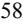

{0}------------------------------------------------

# **UNITED STATES SECURITIES AND EXCHANGE COMMISSION Washington, D.C. 20549**

**FORM 10-K**

**(Mark One)**

x **ANNUAL REPORT PURSUANT TO SECTION 13 OR 15(d) OF THE SECURITIES EXCHANGE ACT OF 1934**

**For the fiscal year ended December 31, 2022. OR**

o **TRANSITION REPORT PURSUANT TO SECTION 13 OR 15(d) OF THE SECURITIES EXCHANGE ACT OF 1934**

**For the transition period from to**

**Commission file number 001-38134**

**Blue Apron Holdings, Inc.** (Exact name of registrant as specified in its charter) **Delaware 81-4777373** (State or Other Jurisdiction of Incorporation or Organization) (I.R.S. Employer Identification No.) **28 Liberty Street, New York, New York 10005** (Address of Principal Executive Offices) (Zip Code) Registrant's telephone number, including area code **(347) 719-4312** Securities registered pursuant to Section 12(b) of the Act: **Title of Each Class Trading Symbol Name of Exchange on Which Registered** Class A Common Stock, \$0.0001 par value per share APRN New York Stock Exchange LLC Securities registered pursuant to Section 12(g) of the Act: None. Indicate by check mark if the registrant is a well-known seasoned issuer, as defined in Rule 405 of the Securities Act. Yes o No x Indicate by check mark if the registrant is not required to file reports pursuant to Section 13 or Section 15(d) of the Act. Yes o No x Indicate by check mark whether the registrant (1) has filed all reports required to be filed by Section 13 or 15(d) of the Securities Exchange Act of 1934 during the preceding 12 months (or for such shorter period that registrant was required to file such reports), and (2) has been subject to such filing requirements for the past 90 days. Yes x No o months (or for such shorter period that the registrant was required to submit such files). Yes x No o Indicate by check mark whether the registrant is a large accelerated filer, an accelerated filer, a non-accelerated filer, smaller reporting company, or an emerging growth company. See the definitions of "large accelerated Large accelerated filer o Accelerated filer x Smaller reporting company x Emerging growth company o If securities are registered pursuant to Section 12(b) of the Act, indicate by check mark whether the financial statements of the registrant included in the filing reflect the correction of an error to previously issued Yes o No x Based on the closing price of the Registrant's Class A Common Stock on the last business day of the Registrant's most recently completed second fiscal quarter, which was June 30, 2022, the aggregate market value of its Class A Common Stock and Class B Common Stock (based on a closing price of \$3.64 per share on June 30, 2022 as reported on the New York Stock Exchange) held by non-affiliates was approximately \$93.8

As of February 28, 2023, there were 69,291,499 shares of Class A Common Stock, 0 shares of Class B Common Stock and 0 shares of Class C Capital Stock outstanding.

**Documents Incorporated by Reference:**

Portions of the proxy statement to be filed pursuant to Regulation 14A of the Exchange Act no later than 120 days after the end of this fiscal year covered by this Annual Report on Form 10-K are incorporated by reference into Part III of this Form 10-K.

Indicate by check mark whether the registrant has submitted electronically every Interactive Data File required to be submitted pursuant to Rule 405 of Regulation S-T (§232.405 of this chapter) during the preceding 12

filer," "accelerated filer," "smaller reporting company," and "emerging growth company" in Rule 12b-2 of the Exchange Act.

Non-accelerated filer o

million.

If an emerging growth company, indicate by check mark if the registrant has elected not to use the extended transition period for complying with any new or revised financial accounting standards provided pursuant to Section 13(a) of the Exchange Act. o

Indicate by check mark whether the registrant has filed a report on and attestation to its management's assessment of the effectiveness of its internal control over financial reporting under Section 404(b) of the Sarbanes-Oxley Act (15 U.S.C. 7262(b)) by the registered public accounting firm that prepared or issued its audit report. x

financial statements. □

Indicate by check mark whether any of those error corrections are restatements that required a recovery analysis of incentive-based compensation received by any of the registrant's executive officers during the relevant recovery period pursuant to § 240.10D-1(b). □

Indicate by check mark whether the registrant is a shell company (as defined by Rule 12b-2 of the Exchange Act).

{1}------------------------------------------------

#### **TABLE OF CONTENTS**

| PART I         |          |                                                                                                              |    |
|----------------|----------|--------------------------------------------------------------------------------------------------------------|----|
|                | Item 1.  | Business                                                                                                     | 6  |
|                | Item 1A. | Risk Factors                                                                                                 | 15 |
|                | Item 1B. | Unresolved Staff Comments                                                                                    | 46 |
|                | Item 2.  | Properties                                                                                                   | 46 |
|                | Item 3.  | Legal Proceedings                                                                                            | 46 |
|                | Item 4.  | Mine Safety Disclosures                                                                                      | 46 |
| PART II        |          |                                                                                                              |    |
|                | Item 5.  | Market for Registrant's Common Equity, Related Stockholder Matters and Issuer Purchases of Equity Securities | 47 |
|                | Item 6.  | [Reserved]                                                                                                   | 47 |
|                | Item 7.  | Management's Discussion and Analysis of Financial Condition and Results of Operations                        | 48 |
|                | Item 7A. | Quantitative and Qualitative Disclosures about Market Risk                                                   | 74 |
|                | Item 8.  | Financial Statements and Supplementary Data                                                                  | 74 |
|                | Item 9.  | Changes in and Disagreements with Accountants on Accounting and Financial Disclosure                         | 74 |
|                | Item 9A. | Controls and Procedures                                                                                      | 74 |
|                | Item 9B. | Other Information                                                                                            | 75 |
|                | Item 9C. | Disclosure Regarding Foreign Jurisdictions that Prevent Inspections                                          | 76 |
| PART III       |          |                                                                                                              |    |
|                | Item 10. | Directors, Executive Officers, and Corporate Governance                                                      | 77 |
|                | Item 11. | Executive Compensation                                                                                       | 77 |
|                | Item 12. | Security Ownership of Certain Beneficial Owners and Management and Related Stockholder Matters               | 77 |
|                | Item 13. | Certain Relationships and Related Transactions, and Director Independence                                    | 77 |
|                | Item 14. | Principal Accountant Fees and Services                                                                       | 77 |
| PART IV        |          |                                                                                                              |    |
|                | Item 15. | Exhibits and Financial Statement Schedule                                                                    | 78 |
|                | Item 16. | Form 10-K Summary                                                                                            | 78 |
| EXHIBITS INDEX |          |                                                                                                              | 78 |

**[SIGNATURES](#page-81-0)** [83](#page-81-0)

Unless the context otherwise requires, we use the terms "Blue Apron", the "Company", "we", "us", and "our" in this Annual Report, to refer to Blue Apron Holdings, Inc. and, where appropriate, our consolidated subsidiaries.

See "Management's Discussion and Analysis of Financial Condition and Results of Operations – Key Financial and Operating Metrics" for the definitions of the following terms used in this Annual Report: "Orders", "Customers", "Average Order Value", "Orders per Customer", and "Average Revenue per Customer".

{2}------------------------------------------------

### **CAUTIONARY NOTE REGARDING FORWARD-LOOKING STATEMENTS**

This Annual Report on Form 10-K contains forward-looking statements. All statements other than statements of historical fact contained in this Annual Report on Form 10-K, including statements regarding our future results of operations and financial position, business strategy and plans, and objectives of management for future operations, are forward-looking statements. These statements involve known and unknown risks, uncertainties, and other important factors that may cause our actual results, performance or achievements to be materially different from any future results, performance, or achievements expressed or implied by the forward-looking statements.

In some cases, you can identify forward-looking statements by terms such as "may," "should," "expects," "plans," "anticipates," "could," "intends," "target," "projects," "contemplates," "believes," "estimates," "predicts," "potential," or "continue," or the negative of these terms or other similar expressions. The forward-looking statements in this Annual Report on Form 10-K are only predictions. We have based these forward-looking statements largely on our current expectations and projections about future events and financial trends that we believe may affect our business, financial condition and results of operations. These forward-looking statements speak only as of the date of this Annual Report on Form 10-K and are subject to a number of risks, uncertainties and assumptions described in the "Risk Factors" section and elsewhere in this Annual Report on Form 10-K. Because forward-looking statements are inherently subject to risks and uncertainties, some of which cannot be predicted or quantified, you should not rely on these forward-looking statements as predictions of future events. The events and circumstances reflected in our forward-looking statements may not be achieved or occur and actual results could differ materially from those projected in the forward-looking statements. Some of the key factors that could cause actual results to differ from our expectations include:

- the sufficiency of our cash resources and ability to operate as a going concern in the event that prior to the end of the second quarter of 2023, RJB Partners, LLC ("RJB") and certain other affiliates of Joseph N. Sanberg do not fund their remaining respective obligations under the \$56.5 million private placement and \$12.7 million gift card transaction, we are unable to raise sufficient funds from our February 2023 at-the-market offering or from other financing sources, we are unable to dispose of some or all of the pledged securities securing the RJB private placement obligation in a private or other sale and receive cash proceeds sufficient to satisfy amounts owed to us from Mr. Sanberg's affiliates, or we are unable to realize the anticipated benefits from identified, and to be identified, expense reductions or incur unforeseen additional cash expenses; our expectations regarding our expenses and revenue; the outcome of discussions with our noteholder in the event we breach a covenant or other obligation under our note purchase and guarantee agreement, dated as of May 5, 2022 (as amended, the "note purchase agreement"), including with respect to our ability to meet the financial, reporting and other covenants or our ability to make a payment on the accelerated payment schedule agreed to in March 2023; and our ability, including the timing and extent, to sufficiently manage costs and to fund investments in our operations in amounts necessary to maintain compliance with financial and other covenants under our indebtedness, while continuing to support the execution of our strategy;
- our ability, including the timing and extent, to successfully support the execution of our strategy; our ability to cost-effectively attract new customers and retain existing customers (including, on the one hand, our ability to execute our marketing strategy with a reduced marketing budget, or on the other hand, our ability to sustain any increase in demand we may experience); our ability to continue to expand our product offerings and distribution channels; our ability to sustain any increase in demand and/or ability to continue to execute operational efficiency practices announced in December 2022, including managing our corporate workforce reduction costs and the impact of our workforce reduction on executing our strategy;
- our expectations regarding, and the stability of, our supply chain, including potential shortages, interruptions or continued increased costs in the supply or delivery of ingredients, and parcel and freight carrier interruptions or delays and/or higher freight or fuel costs, as a result of inflation or otherwise;
- our ability to respond to changes in consumer behaviors, tastes, and preferences that could lead to changes in demand, including as a result of, among other things, the impact of inflation or other macroeconomic factors, and to some extent, long-term impacts on consumer behavior and spending habits;
- the company's ability to attract and retain qualified employees and personnel in sufficient numbers; our ability to effectively compete;
- our ability to maintain and grow the value of our brand and reputation;

{3}------------------------------------------------

- any material challenges in employee recruiting and retention; any prolonged closures, or series of temporary closures, of one or both of our fulfillment centers, supply chain or carrier interruptions or delays, and any resulting need to cancel or shift customer orders;
- our ability to achieve our environmental, social and corporate governance ("ESG") goals on our anticipated timeframe, if at all;
- our ability to maintain food safety and prevent food-borne illness incidents and our susceptibility to supplier-initiated recalls;
- our ability to comply with modified or new laws and regulations applying to our business, or the impact that such compliance may have on our business;
- our vulnerability to adverse weather conditions, natural disasters, wars, and public health crises, including pandemics;
- our ability to protect the security and integrity of our data and protect against data security risks and breaches; and
- our ability to obtain and maintain intellectual property protection.

While we may elect to update these forward-looking statements at some point in the future, whether as a result of any new information, future events, or otherwise, we have no current intention of doing so except to the extent required by applicable law.

{4}------------------------------------------------

### **SUMMARY OF RISK FACTORS**

You should consider carefully the risks described under the "Risk Factors" section and elsewhere in this Annual Report on Form 10-K. These risks, which include the following, could materially and adversely affect our business, financial condition, operating results, cash flow, and prospects, which could cause the trading price of our Class A common stock to decline and could result in a partial or total loss of your investment*:*

- Our consolidated financial statements contain a statement regarding a substantial doubt about our ability to continue as a going concern because funding of the remaining amounts due to us in connection with the liquidity transactions (as defined below) has not yet occurred and we have not yet raised sufficient alternative funds through our at-the-market offerings or otherwise. If such transactions, as described below, do not close and we do not secure sufficient amounts of alternative financing, and/or we do not realize the anticipated benefits of our identified and to be identified cost savings, we will be unable to meet our current obligations and we will be unable to continue as a going concern as early as the second quarter of 2023.
- Our indebtedness could materially adversely affect our business and financial condition. In particular, any failure to comply with the covenants in the note purchase agreement or failure to timely pay the accelerated payment obligations agreed to in March 2023 would materially adversely affect our business. Furthermore, the restrictive covenants in our note purchase agreement may limit our ability to pursue our business strategies, which would materially adversely affect our operating results, and the failure to comply with such restrictions could materially adversely affect our business.
- We have a history of losses, and we may be unable to achieve or sustain profitability.
- We may be unable to successfully continue to execute our strategy. If we fail to cost effectively acquire new customers or retain our existing customers or if we fail to derive profitable net revenue from our customers, our business would be materially adversely affected.
- If we fail to effectively attain or manage any future revenue growth, or if we fail to effectively manage costs, our business could be materially adversely affected.
- If we do not successfully maintain, operate and optimize our fulfillment centers and logistics channels, and manage our ongoing real property and operational needs, our business, financial condition and operating results could be materially adversely affected.
- Our business depends on a strong and trusted brand, and any failure to maintain, protect or enhance our brand, including as a result of events outside our control, could materially adversely affect our business.
- Increased competition presents an ongoing threat to the success of our business.
- Changes in consumer tastes and preferences or in consumer spending due to inflation or otherwise, and other economic or financial market conditions could materially adversely affect our business.
- Our ability to source quality ingredients and other products is critical to our business, and any disruption to our supply or supply chain could materially adversely affect our business.
- Food safety and food-borne illness incidents or advertising or product mislabeling may materially adversely affect our business by exposing us to lawsuits, product recalls or regulatory enforcement actions, increasing our operating costs and reducing demand for our product offerings.
- If we lose key management or fail to meet our need for qualified employees, with specialized skills, our business, financial condition and operating results could be materially adversely affected.
- We rely on our proprietary technology and data to forecast customer demand and to manage our supply chain, and any failure of this technology, or the quality of our data, could materially adversely affect our business, financial condition and operating results.
- • We are subject to extensive governmental regulations which require significant expenditures and ongoing compliance efforts. Even inadvertent, nonnegligent or unknowing violations of federal, state or local regulatory requirements could expose us to adverse governmental action and materially adversely affect our business, financial condition and operating results. Further, changes to law, regulation or policy applicable to food could leave us vulnerable to adverse governmental action and materially adversely affect our business, financial condition and operating results.

{5}------------------------------------------------

### **PART I**

#### **ITEM 1. BUSINESS.**

Blue Apron's vision is Better Living Through Better Food™. Founded in 2012, we are on a mission to spark discovery, connection and joy through cooking. We offer fresh, chef-designed recipes that empower our customers to embrace their culinary curiosity and challenge their abilities to see what a difference cooking quality food can make in their lives.

Our core product is the meal experience we help our customers create. These experiences extend from discovering new recipes, ingredients, and cooking techniques to preparing meals with families and loved ones to sharing photos and stories of culinary triumphs. Central to these experiences are the original recipes we design with fresh, seasonally-inspired produce and high-quality ingredients sent directly to our customers. We also sell wine, which can be paired with our meals or can be purchased à la carte, through Blue Apron Wine, our direct-to-consumer wine delivery service. Through Blue Apron Market, our e-commerce platform, we sell a curated selection of cooking tools, utensils, pantry items, and add-on products for different culinary occasions, which are tested and recommended by our culinary team. Our products are available to purchase through our website, mobile app, and beginning in the second quarter of 2022, our meal kits are also available for sale on third-party sales platforms. Our customers span ages, geographies, income brackets, and levels of culinary expertise. They include young couples, families, singles, and empty nesters. Our passionate community of home cooks tell us, through emails, phone calls, and social media, how much Blue Apron has changed their lives.

Central to our operations, we have developed an integrated network that employs technology and expertise across many disciplines. Our supply-demand coordination activities––demand planning, recipe creation, procurement, recipe merchandising, fulfillment operations, distribution, customer service, and marketing––drive our end-to-end value chain.

#### **Our Products**

#### *Meals*

On our direct-to-consumer platform, we strive to offer our customers a balanced mix of ingredients, cuisines, familiarity, discovery, and preparation times. We are focused on offering a variety of choices every week, including a range of recipes designed for a healthy lifestyle, so that customers can make selections based on their individual or household needs and preferences. We currently offer our customers four weekly meal plans - a Two-Serving Signature Plan, a Two-Serving Vegetarian Plan, a Two-Serving Wellness Plan, and a Four-Serving Signature Plan.

For meal plans, customers have the flexibility to choose any combination of the core recipes offered in any week, regardless of their plan. For each Order per week, this includes a minimum of two recipes with up to sixteen choices on the Two-Serving Plan and a minimum of two recipes with up to fourteen choices on the Four-Serving Plan. Beginning in 2022, the weekly main course recipe options also include two Ready to Cook recipes, which are shipped with a recyclable cooking tray and require no knife work or chopping. In addition, each week customers can add unlimited Add-ons recipes to each Order, which includes breakfast, appetizers, side dishes, desserts, à la carte proteins, and/or Heat & Eat meals, which are microwavable meals ready in minutes.

Customers are also able to purchase a second Order each week, allowing them to select additional recipes per week at staggered times, or double recipes to serve up to eight people per meal on the Four-Serving Plan. In 2021, Blue Apron also introduced a select number of meal kits that are available for purchase on Blue Apron Market, our e-commerce market, without a subscription. In 2022, we expanded the optionality to purchase non-subscription boxes to third-party e-commerce channels.

Based on the number of Orders in 2022 per plan type, approximately 80% of our meal orders were for the Two-Serving Plan, and approximately 20% were for the Four-Serving Plan. Our customers can tailor their orders to complement their individual tastes and lifestyles. Some customers prefer to let our recipe recommendation algorithm choose their recipes based on the food preferences they have provided to us, while other customers actively choose several weeks in advance of delivery which recipes to receive. Customers can choose to receive orders each week, or less frequently if that better suits their schedules. Customers can make their weekly order selections on our website or through our mobile application.

{6}------------------------------------------------

In addition, customers have the option to customize some of their recipe selections, such as the ability to upgrade a protein for a more premium protein, replace a meat with a plant protein, or increase the serving size from two to four. We also offer Premium recipes, including our Craft offering, that introduce our customers to specialty protein combinations, advanced culinary techniques, and unique flavor twists. Both our customized options and Premium recipes are priced at a premium to our standard rates. We also sell seasonally-inspired occasion-based offerings throughout the year consisting of multiple recipes for six to eight people, which we sell as part of our subscription meal plan, along with the Blue Apron Market and third-party e-commerce channels.

Our culinary team, including chefs who are alumni of some of the best restaurants in the world, such as Michelin-starred Per Se and Blue Hill at Stone Barns, begins the recipe creation process with various seasonally-inspired ingredients. Our chefs apply to these raw ingredients their expertise and insights from our customer feedback and recipe ratings to create our recipe offerings, with an eye towards what is delicious and accessible for individuals and families to eat week in and week out.

We merchandise our recipes through various campaigns geared toward seasonality, dietary preferences, ingredients, and healthy lifestyles. Our approach to menu design seeks to balance ingredient supply and cost while appealing to a variety of customer lifestyles and cooking attitudes across a broad range of demographics and taste profiles.

We are committed to sourcing fresh produce and other high-quality ingredients year-round from our supplier network that includes farmers, ranchers, fisheries, and artisans. Our recipes change every week based on the season and often feature specialty ingredients not readily available elsewhere. By merchandising these ingredients into carefully crafted recipes, we are able to introduce our customers to ingredients they may have never experienced before. We also collaborate with suppliers to create ingredients specifically for our recipes, such as custom sauces, unique spice blends, or, for example, bespoke ramen noodles from a thirdgeneration noodle maker.

Our ingredient standards are critically important to us and our customers. We source only ingredients that are as sustainable as possible. All of our beef, poultry, and pork comes from animals not treated with added hormones or sub-therapeutic antibiotics, and our eggs are Certified Humane Raised and Handled pasture raised. Similarly, we source high-quality seafood consistent with the standards established by Monterey Bay Aquarium Seafood Watch, one of the world's most respected sustainable seafood organizations, and we prioritize sourcing seafood with additional third-party verified sustainability certifications. ®

#### *Wine*

Blue Apron Wine, our direct-to-consumer wine delivery service, uses an integrated supply chain and direct sourcing relationships to deliver high-quality wines at compelling values. We work directly with vineyards and consult with acclaimed winemakers to create custom Blue Apron wines that are specially crafted for our customers and uniquely curated to pair with our meals. Our wines included in our monthly wine delivery service are sized for a dinner for two (in 500ml bottles, rather than traditional 750ml bottles). Customers have the flexibility to customize their box, choosing six bottles from a monthly selection of wines that best meet their taste preferences. A pairing key system provides insight into the wine profiles, and enables customers to pair their Blue Apron meals and wines. Our wine offerings include curated red, white, rosé and sparkling wines, tasting notes, pairing tips, and the story behind each wine. We are a licensed winery, and currently ship directly to customers in 31 states and Washington, D.C.

As with our meals, customers may choose to actively manage their monthly wine orders by adjusting deliveries to fit their schedules, or they may simply sign up and receive one or two deliveries each month. Wine customers can also order a second box per monthly cycle. In addition to our monthly wine service, customers have the ability to order curated assortments and wine by 500ml and 750ml bottles, half-case, case, or other bundles on the Blue Apron Market, outside of the monthly subscription model.

#### *Market*

Blue Apron Market, our e-commerce market, features a curated selection of cooking tools, utensils, pantry items, and add-on products for different culinary occasions, which are tested in our test kitchen and recommended by our culinary team. A number of these items are not available elsewhere, and we regularly evaluate expanding our exclusive items and partnerships. Our recipe cards feature cooking tools and utensils from Blue Apron Market, creating an integrated brand experience for our community of home cooks and repeated merchandising opportunities for our company. A selection of non-subscription meal kit boxes and our wines are also sold on the Blue Apron Market website.

{7}------------------------------------------------

#### *Digital Experience*

Customers can find recipes, register their dietary preferences, manage their accounts, and make purchases on our website or on our iOS and Android mobile applications. Our digital customer experience is immersive: we offer how-to cooking videos, stories about our suppliers, a step-by-step interactive cook along, and our collection of thousands of recipes that customers can access on their own.

#### **How We Do It**

We have created an integrated network that enables us to source high quality, differentiated ingredients, design original recipes around those ingredients, and combine them into meaningful cooking experiences that we deliver to customers across the contiguous United States. Our interconnected end-to-end value chain allows us to execute cost-effectively and at scale. Coordination between our culinary team, procurement and operations teams, our marketing practices, and technology tools help us pair customer demand with supply, as well as to work with our suppliers to deliver high quality food at compelling values. Our kitchen manufacturing, fulfillment and logistics operations are built to support our ongoing product innovation.

#### *Supply-Demand Coordination*

Our supply-demand coordination activities include demand planning, recipe development, recipe merchandising, and marketing. We use near-term and long-term demand forecasting based on proprietary data and software to inform decisions along our value chain, including fulfillment center capacity and ingredient purchasing. This process continues through recipe development, and merchandising, as we craft recipes around available ingredients, and have the ability to make adjustments up to just a few weeks prior to fulfillment. We have also tailored our marketing strategies based on these demand forecasts and planning to optimize our marketing return on investment.

#### *Supplier Relationships*

Our deep supplier relationships provide us the ability to source high quality ingredients. This enables us to collaborate on demand planning to manage inventories and optimize yields in effort to reduce waste and cost while minimizing our supply chain footprint. Blue Apron often aims to work directly with farmers when practicable to ensure customers receive high quality, seasonally-inspired produce at optimal freshness, at the best value. We source from farmers, ranchers, fisheries, and other suppliers of meat, seafood, and poultry products that meet our animal welfare standards, enabling us to provide premium ingredients to our customers such as pasture raised beef and Certified Humane Raised and Handled pasture raised eggs. ®

#### *Operations*

Our purchasing, production, fulfillment, and logistics operations are integrated with our demand management and supplier relationships. Successfully integrating these disparate activities requires us to possess a variety of competencies: a team with deep, ingredient-specific expertise; a technology-enabled platform that connects our end-to-end operations; and a scalable architecture that adapts to surges in demand as well as variations in available supply. Our enhanced planning and process-driven strategies enable us to make informed purchasing decisions and provide opportunities to better manage food costs, allocate labor and reduce waste in our fulfillment centers.

### *Informed Purchasing*

While we work directly with our suppliers months in advance to plan our supply needs, we place purchase orders closer to the expected fulfillment, after coordinating supply and demand through processes such as recipe merchandising and analyzing the outputs of our demand planning and forecasting tools.

#### *Production and Fulfillment*

As of December 31, 2022, we operated two fulfillment centers. Our fulfillment centers are designed to effectively manage our variable, high-throughput, perishable inventory, as well as flexible production and labor needs. We have invested extensively in our fulfillment centers, including the opening of our Linden, New Jersey center in 2017 and the implementation of automation equipment in our Linden and Richmond, California fulfillment centers, and continue to optimize our network with a focus on maximizing efficiencies.

{8}------------------------------------------------

Because we prep and ship perishable products, our fulfillment centers must adhere to stringent food safety standards, temperature protocols, and regulatory guidelines, and our fulfillment centers are staffed with trained professionals to ensure that our ingredients adhere to our food safety and quality standards. Our Linden and Richmond fulfillment centers are certified under the Safe Quality Food (SQF) Food Safety Code for Manufacturing nationwide, a globally recognized, independent food safety standard administered by the Safe Quality Food Institute.

To support our fulfillment operations we have developed proprietary technology, such as our proprietary inventory management tools to assess incoming ingredients for quality and our proprietary kitchen prep software that demonstrates to fulfillment center associates how to prep ingredients for each recipe, and provides instructions on selecting the correct type of packaging for each ingredient. We also use third-party technology in fulfillment operations to complement our proprietary systems.

#### *Logistics*

Our logistics team designs, manages, and optimizes a ground-based delivery network of several third-party service providers capable of delivering within the contiguous United States. We analyze outbound logistics on a zip code by zip code basis to enable cost-effective and timely delivery of orders, while also adjusting the packaging of our ingredients and other components of our fulfillment operations based on the expected delivery route, weather, or ultimate destination. All of our packaging materials are chosen with environmental impact in mind. We select packaging that is recyclable or biodegradable when practicable. Our packaging innovation team, with the support of third-party sustainability experts, is focused on innovating to improve our packaging design, lower overall costs, and reduce our carbon footprint.

#### **Our Brand and Marketing**

We are continuing to build a consumer lifestyle brand that empowers our customers to embrace their culinary curiosity and challenge their abilities to see what a difference cooking quality food can make in their lives. Several nights a week, our customers invite us into their homes. We take part in some of the most joyful parts of their days, helping them create a meal for themselves, their families and their loved ones. Their challenges are opportunities for us to learn together, and their accomplishments are among our proudest achievements. We hear their success stories every day. Unlike a purely transactional e-commerce platform, we believe the emotional connection that customers have with our brand will enable us to have a more meaningful role in their lives.

We believe in utilizing a strategic mix of marketing channels to efficiently add new customers as well as to engage and create value for our existing customers. This includes a diverse mix of online and offline channels, as well as strategic partnerships that enable us to expand our brand to new segments of customers. We deliberately focus on the marketing channels we believe to be the most efficient and on customer segments that have demonstrated stronger affinity and retention. We believe our customers continue to be some of our best marketers, and we see them share their Blue Apron moments through social media, blogs, and referrals. We also have a customer referral program through which certain existing customers may invite others to receive a single complimentary meal kit box.

For all of our products, we use a combination of paid, earned, and owned media to increase the awareness of our brand and attract new customers. Our content enables customers to connect and interact with our brand even when they are not cooking with us. For example, we leverage both our digital channels and printed content within deliveries to highlight specific ingredients, provide general cooking tips and techniques and foster conversation within our community of home cooks.

In addition, strategic brand partnerships are an important opportunity for us to leverage the platform we are building to add value for our existing customers and showcase our brand to new customer segments.

Finally, as we continue to promote our brand to attract new customers, we are focused on investments in marketing technology, especially in response to the ongoing elimination of cookie-based tracking. This work includes building out a customer data platform to better manage our first party data and investing in our engineering capabilities to improve overall user experience.

{9}------------------------------------------------

### *Our Customers*

Our customers represent a broad range of demographics including a wide range of age groups and incomes. Customers of all kinds are able to successfully incorporate Blue Apron into a wide variety of lifestyles.

We also believe our customers roughly mirror the general geographical population distribution of the United States. According to the 2020 Current Population Survey by the U.S. Census Bureau, the top ten states account for 54% of total U.S. households. Similarly, we estimate that these states accounted for 53% of our customers in the fourth quarter of 2022.

*Source: Customer email survey of Blue Apron account holders, December 2022, with 1,635 respondents*.

{10}------------------------------------------------

*Source: Blue Apron Customers for the quarter ended December 31, 2022.*

#### **Our Competition**

The markets in which we compete are rapidly evolving and intensely competitive, and we face an array of competitors from many different industry sectors. Our current and potential competitors include: (1) other food and meal delivery companies; (2) the supermarket industry, including online supermarket retailers; (3) a wide array of food retailers, including natural and organic, specialty, conventional, mass, discount, and other food retail formats; (4) casual dining and quick-service restaurants and other food service businesses in the restaurant industry; (5) online wine retailers, wine specialty stores, and retail liquor stores; and (6) food manufacturers, consumer packaged goods companies, providers of logistics services, and other food and ingredient producers.

We believe that the principal competitive factors upon which we compete include: marketing; variety and flexibility of product offering; price and value perception; brand reputation; product quality (including uniqueness of ingredients, flavors and techniques); customer satisfaction; convenience; food safety; customer service; and reliable and timely fulfillment.

#### **Intellectual Property**

Our ability to protect our intellectual property rights, including our proprietary technology and our customer data, is an important factor in our strategy and the success of our business. We seek to protect our intellectual property rights through a combination of trademark, copyright and patent, and other intellectual property protections under applicable law. We register domain names, trademarks and service marks in the United States and abroad. We also seek to protect and avoid disclosure of our intellectual property through confidentiality, non-disclosure and invention assignment agreements with employees, and through appropriate agreements with our suppliers and others. We have two registered patents related to product packaging.

{11}------------------------------------------------

### **Government Regulation**

Our business is subject to a variety of federal, state, and local regulatory requirements, including regulation of our food and wine operations.

### *Government Regulation of Food and Food Companies*

Food companies, such as Blue Apron, are subject to extensive government regulation. Federal statutes applicable to food production include, for example, the Federal Food, Drug, and Cosmetic Act, the Federal Meat Inspection Act, the Poultry Products Inspection Act, the Perishable Agricultural Commodities Act, the Nutrition Labeling and Education Act, the Food Allergen Labeling and Consumer Protection Act, the FDA Food Safety Modernization Act, and the Federal Trade Commission Act. Federal regulators have promulgated extensive regulatory schemes to implement these and other relevant statutes. These evolving regulatory structures govern matters including manufacturing, formulating, labeling, advertising, packaging, storing, and implementing safety measures for our food products. In particular, the Food and Drug Administration, or FDA, continues its implementation of the FDA Food Safety Modernization Act by promulgating substantial numbers of new regulations and introducing multiple versions of non-binding, draft guidance documents suggesting new compliance measures for the food industry. Understanding within the food industry of how to apply these regulations and the suggestions offered in FDA guidance documents continues to evolve.

State and local jurisdictions also regulate U.S. food manufacturing facilities. For example, we currently produce and fulfill products in the states of California and New Jersey. State and local governments exert regulatory authority over our operations in these jurisdictions. The states and localities in which a food production facility is located can impose registration, licensing, and inspection requirements in addition to those imposed by federal law. Some also enforce significant consumer protection-focused statutory schemes, which can impose additional costs and complexity on food producers.

Food companies in the United States are subject to government inspection with or without notice at any time, with concomitant responsibility to provide access to facilities and equipment, produce extensive operational documentation, and furnish product, packaging, and labeling samples for governmental examination. Federal, state, and local governmental agencies enjoy extensive discretion to determine whether, when and how to conduct these activities. Food companies are therefore vulnerable to unexpected business interruptions and publicity.

All food companies in the United States bear legal responsibility for any violation of applicable food laws or regulations, whether that violation is negligent, non-negligent, or deliberate. Any U.S. company found to have violated food laws or regulations may have its products seized, its operations enjoined, its goods recalled from the market and destroyed, and its business exposed to significant adverse publicity. It is also possible that new laws or regulations, or changes in the enforcement of existing requirements, might require us to change our compliance policies, incur additional cost, or result in unexpected liabilities that could be significant.

### *Food Safety and Quality Assurance*

We maintain a food safety and quality program to verify that the food products supplied to our customers are processed in a safe and sanitary environment and are in compliance with applicable food safety and regulatory requirements and standards. All meat and poultry products that we source are processed in facilities inspected by the U.S. Department of Agriculture, or USDA, or by the equivalent agencies in countries deemed eligible by USDA for exporting meat and poultry to the United States. Accordingly, these products must conform to USDA requirements. All food and packaging suppliers are prequalified and have agreed to comply with our requirements. While we perform supplier inspections and conduct product audits to evaluate suppliers and products for compliance with our company standards and specifications, we may not be able to prevent individual suppliers from failing to comply with food safety laws or our requirements, and we may not be able to locate each failure to comply with food safety laws or our requirements prior to receiving food products. Our customer experience team captures and addresses customer feedback, including inquiries and complaints about the safety and quality of our food products.

### *Government Regulation of Our Wine Business*

The production, sale, and shipment of wine in the United States is regulated by the federal government and by each state government. State laws are not uniform, so business models that are national in scope must account for the state-by-state rules to achieve compliance.

{12}------------------------------------------------

Our wholly-owned subsidiary BAW, Inc., or BAW, is a licensed California winery, and must comply with federal and California law controlling winery operations, and with the laws of each state to which we ship wine. Various regulations control production, excise tax, labeling, alcohol content and recordkeeping. In addition, the promotion and marketing of wine, including pricing, is subject to federal or state regulations. For example, wine marketing cannot be targeted to children, and some states restrict excessive discounts on wine. To assist with federal and state regulatory compliance, BAW relies on various internal and external personnel with relevant experience.

Alcohol distribution in the United States is traditionally conducted through a "three tier" system, in which alcohol passes from manufacturer to wholesaler to retailer in each state, before it can be sold to a consumer. However, applicable state regulations permit manufacturers to ship wine directly to consumers around the country. As a licensed California winery, BAW relies on such regulations to sell and ship wine to the residents of 31 states plus the District of Columbia. Each state permit held by BAW has specific compliance requirements, such as monthly reporting, limits on the amount of wine that can be shipped to a given household, and obtaining an adult signature on delivery.

#### **Human Capital Management**

### *Overview of Human Capital Management*

Our human capital management plan is designed to meet the diverse needs of our employee population. Our employee base includes management professionals, engineers, culinary and food safety professionals, fulfillment center employees, and customer service employees in multiple locations across the United States.

As of December 31, 2022, we employed 1,549 full- and part-time employees, of which a little over 80% were based in our fulfillment centers in Linden, New Jersey, and Richmond, California. From time to time, we also supplement our hourly fulfillment and customer service staffing with temporary personnel.

In addition, on December 8, 2022, to better align internal resources with strategic priorities, we announced a reduction in corporate personnel. This action resulted in a reduction of approximately 10% of our total corporate workforce, inclusive of both then current and vacant roles.

Expanding and evolving our human capital management plan continues to be at the forefront of how we attract and retain qualified talent. Our people strategy is overseen by our Chief People Officer, our executive and senior leadership team, and senior human resource professionals, and management regularly provides updates to our board of directors. Our employees are not represented by a labor union or covered by a collective bargaining agreement. We have not experienced any work stoppages, and we consider our relations with our employees to be good.

#### *Attraction, Retention, and Development of Talent*

Our human capital management strategy is focused on building a culture of accountability, high performance, and inclusion for our employees. We strive to recruit and retain the best people for the job regardless of race, gender, sexual orientation, religion, or other differences.

In 2022, as a result of an increase in our hourly pay rate to \$18.00 per hour in the fourth quarter of 2021, we were able to attract and retain more talent into our fulfillment centers through large-scale onsite hiring events. We continue to work on enhanced attraction and retention opportunities in our fulfillment centers, including a more robust onboarding process and ongoing training programs.

In 2022, we also strengthened our benefits offerings across the company with the introduction of a new 401(k) matching program as of January 1, 2022. We also continue to assess and review all components of our compensation and benefit programs to ensure these programs are competitive and aligned against the markets in which we operate.

Investing in our employee's growth and development has been and remains a key focus area. In 2022, we implemented multiple programs throughout the year to support those efforts, including:

- Establishing a leadership development program, "At Our Best," that provided our senior leaders with tools to operate at their best individually and collectively, with inclusion and empathy at the core, and to lead meaningful and sustainable change within the company;
- Instituting a culture of accountability and implementing best-practice foundations to support better talent planning for our people which is designed to allow us to more effectively and efficiently deliver against our strategy, drive performance and accountability; and

{13}------------------------------------------------

- Introducing new incentive programs in our fulfillment centers to promote awareness around team performance in critical areas, focusing on quality and efficiency and creating a special place to work.
### *Health and Safety*

The health and safety of our employees has been and remains our top priority. We have a dedicated Environmental, Health & Safety, or EHS, team composed of representatives from across the company. The EHS team coordinates health and safety matters at all of our locations, including safety training at our fulfillment centers. Our team regularly evaluates injury rates, safety observations and near-misses, as well as other proactive actions taken at our fulfillment centers to enhance worker safety. In addition to this team, we also have a Food Safety and Quality Assurance team which focuses on maintaining good manufacturing practices at our fulfillment centers in accordance with FDA guidance.

In addition, in response to the COVID-19 pandemic, we developed and implemented new procedures and protocols to minimize the risk to the health and safety of our employees while allowing us to continue to operate our facilities and provide high quality products to our customers on a timely basis. Throughout the pandemic, we were able to continue to service our customers, while at the same time making investments to prioritize the health, safety, and welfare of our employees. We continue to monitor federal, state and local regulations to continue to adapt our health and safety COVID-19 policies in each of our locations.

### *Diversity, Equity, and Inclusion Initiatives*

We embrace diversity and collaboration in our workforce, our ways of thinking, and our business experiences. As part of our investment in our people, we strive to prioritize diversity, equity, and inclusion. We aim to create a culture where we value, respect, and provide fair treatment and equal opportunities for all employees. By recognizing and celebrating our differences, our goal is to cultivate an inclusive environment representing our core values and mission.

We also demonstrate diversity, equity, and inclusion at the highest levels of our company. As of December 31, 2022, 71% of our executive leadership team identify as female. We are committed to using our reasonable best efforts to maintain gender diversity and increase the racial diversity on our board of directors. As of December 31, 2022, 83.3% of our board of directors identify as female and 50% identify as racially diverse.

As part of our "Aprons for All" initiative, our internal program for Diversity, Equity and Inclusion, that we launched in 2020, we created two key councils:

- The Responsible Sourcing Council to help set guidelines and standards for product sourcing, business relationships, and marketing partnerships to align with "Aprons For All"; and
- The Diversity Council to foster an environment that ensures that people from all backgrounds have equal opportunities to succeed and grow at Blue Apron.

### **Our Corporate Information**

Our principal executive offices are located at 28 Liberty Street, New York, New York 10005, and our telephone number at that address is (347) 719-4312. Our website address is www.blueapron.com.

We make available, free of charge, on or through our Internet website, our annual reports on Form 10-K, quarterly reports on Form 10-Q, current reports on Form 8-K and amendments thereto that we have filed or furnished with the U.S. Securities and Exchange Commission (the "SEC"), as soon as reasonably practicable after we electronically file them with the SEC. We are not, however, including the information contained on our website, or information that may be accessed through links on our website, as part of, or incorporating such information by reference into, this annual report on Form 10-K.

{14}------------------------------------------------

#### **ITEM 1A. RISK FACTORS**

*Investing in our Class A common stock involves a high degree of risk. Certain factors may have a material adverse ef ect on our business, financial condition, and results of operation. You should carefully consider the risks and uncertainties described below, together with all of the other information included in this Annual Report on Form 10-K, including our consolidated financial statements and the related notes, and in our other filings with the SEC. Our business, financial condition, operating results, cash flow and prospects could be materially and adversely af ected by any of these risks or uncertainties. In that case, the trading price of our Class A common stock could decline, and you may lose all or part of your investment.*

#### **Risks Related to Our Business and Industry**

*Our consolidated financial statements contain a statement regarding a substantial doubt about our ability to continue as a going concern because funding of the remaining amounts due to us in connection with the liquidity transactions (as defined below) has not yet occurred and we have not yet raised suf icient alternative funds through our at-the-market of erings or otherwise. If such transactions, as described below, do not close and we do not secure suf icient amounts of alternative financing and/or we do not realize the anticipated benefits of our identified and to be identified cost savings, we will be unable to meet our current obligations and we will be unable to continue as a going concern as early as the end of the second quarter of 2023.*

In connection with the second closing contemplated by that certain purchase agreement between us and RJB, an affiliate of Joseph N. Sanberg, one of our existing stockholders, dated as of April 29, 2022, as amended in August 2022 and September 2022 (the "RJB Purchase Agreement"), we agreed to issue and sell to RJB, and RJB agreed to purchase from us 10,000,000 shares of Class A common stock for an aggregate purchase price of \$56.5 million (or \$5.65 per share) (such amount, the "outstanding obligated amount") (the "RJB Second Closing"). As of the date of the filing of this Annual Report on Form 10-K, we have received \$1.0 million of the outstanding obligated amount and we have not yet received the remaining \$55.5 million from RJB, and the RJB Second Closing as contemplated by the RJB Purchase Agreement has not closed. Additionally, as of the date of this Annual Report on Form 10-K, while we have received \$5.8 million of a gift card receivable, we have not received the remaining \$12.7 million gift card receivable owed to us from an affiliate of Mr. Sanberg, pursuant to that certain gift card sponsorship agreement dated as of May 5, 2022 (as amended or modified, the "Sponsorship Gift Cards Agreement" and together with the RJB Second Closing, the "liquidity transactions"). Mr. Sanberg has agreed to personally guarantee (i) the payment of the outstanding obligated amount under the RJB Purchase Agreement and (ii) the payment of \$12.7 million owed under the Sponsorship Gift Cards Agreement.

On November 6, 2022, we and an affiliate of Mr. Sanberg (the "pledgor") entered into a Guaranty and Pledge Agreement (the "pledge agreement"), pursuant to which the pledgor (i) agreed to guarantee the payment of RJB's outstanding obligated amount and (ii) to secure its obligation to pay the outstanding obligated amount, granted us a security interest in pledgor's interests in certain equity securities (the "pledged shares"), of certain privately-held issuers (the "pledged entities"), including the certificates (if any) representing the pledged shares, and all dividends, distributions cash, instruments and other property or proceeds from time to time received, receivable or otherwise distributed in respect of or in exchange for any or all of the pledged shares, or collectively, the pledge collateral. Because the outstanding obligated amount remained unpaid after November 30, 2022, we are permitted to exercise remedies in respect of the pledged shares. In particular, we have the right to foreclose on and take ownership of the pledged shares and we are evaluating our options to monetize the pledged shares. There is no assurance that the outstanding obligated amount will be paid by pledgor, RJB or Mr. Sanberg.

Because the pledged entities are privately-held companies, there is no public trading market for the pledged shares. As a result, the value of the pledged shares could be less than the outstanding obligated amount, and, if we seek to foreclose upon the pledged shares to satisfy pledgor's obligation to pay the remaining outstanding obligated amount, the proceeds of any private sale of the pledged shares, to the extent any such private sale is permissible and effected subject to regulatory and contractual limitations that may apply, may be less than could have been obtained from a sale in a public trading market and may be less than the remaining outstanding obligated amount.

Because we have agreed under the note purchase agreement amendment (as defined below) to repay our \$30.0 million of outstanding senior secured notes in full by the end of the second quarter of 2023, if we do not receive the remaining \$68.2 million due to us in connection with the liquidity transactions, and if we are unable to raise additional capital from other financing sources, including from the February 2023 ATM (as defined below), the disposition of the pledged collateral, or otherwise, and/or achieve the anticipated benefits of our identified and to be identified cost savings and working capital management, including our corporate workforce reduction announced in December 2022 and any additional cost reduction initiatives, we expect that we will be unable to meet our current obligations and that we will be unable to continue as a going concern, as early as the end of the second quarter of 2023.

{15}------------------------------------------------

Our ability to continue as a going concern requires us to have sufficient capital to meet our minimum liquidity covenant, as applicable, as well as to continue to make investments and to fund our operations. As discussed more below, because we have agreed to repay our \$30.0 million of outstanding senior secured notes in full by the end of the second quarter of 2023, our operating cash flows alone are not expected to provide us with sufficient capital to continue to make investments and to fund our operations for the twelve months following the date of this report, and as early as the end of the second quarter of 2023 based on our current operating plans and programs, we are dependent upon our ability to receive the remaining \$68.2 million due to us in connection with the liquidity transactions, any cash proceeds from the disposition of the pledged collateral, if any, our ability to obtain additional funding and raise additional capital, including as a result of the February 2023 ATM or otherwise, and our ability to achieve the anticipated savings through the implementation of expense reductions in areas identified and to be identified by us in product, technology, general and administrative costs and marketing expenditures. In addition to the foregoing, we may also seek to pursue and execute financing opportunities, a business combination or other strategic transaction, although there is no assurance that we can identify or consummate any such transaction.

Absent additional debt or equity funding or expense and operating adjustments, we cannot assure you that our future cash and cash equivalents, together with cash generated from operations, will be sufficient to allow us to fund our operations or any future growth, including to attract and retain customers. If such financing is not available and such expense and operating adjustments cannot be made, we will be unable to operate our business, develop new business or execute on our strategic plan, and our operating results would suffer. Additionally, any new debt financing may increase expenses, contain covenants that further restrict the operation of our business, and will need to be repaid regardless of operating results. For example, covenants contained in our senior secured notes include limitations on our ability to pay dividends; create, incur or assume indebtedness or liens; consummate a merger, sale, disposition or similar transaction; engage in transactions with affiliates; and make investments. Additional equity financing, debt financing that is convertible into equity, or debt or equity financing in which we issue equity or derivative securities, including any shares of Class A common stock issuable in connection with the liquidity transactions, other financing transactions, business combinations or strategic transactions would result in dilution to our existing stockholders.

If we are not able to secure adequate additional funding, we may be forced to make additional reductions in spending, extend payment terms with suppliers, liquidate assets where possible, and/or suspend or curtail planned programs. Any of these actions could materially harm our business, results of operations, and future prospects. In addition, we could also be forced to commence a bankruptcy or take other defensive action, which would materially adversely affect our business, financial condition and operating results. See "Management's Discussion and Analysis of Financial Condition and Results of Operations – Liquidity and Capital Resources."

### *Our indebtedness could materially adversely af ect our business and financial condition. In particular, any failure to comply with the covenants in the note purchase agreement or failure to timely pay the accelerated payment obligations agreed to in March 2023 would materially adversely af ect our business*

As of December 31, 2022, we had \$30.0 million in outstanding borrowings under our senior secured notes pursuant to the note purchase agreement. Our debt could have important consequences for our business, including: making it more difficult for us to satisfy our obligations under the senior secured notes or to our trade or other creditors; increasing our vulnerability to adverse economic or industry conditions; limiting our ability to obtain additional financing to fund our existing operations or any future expansion of our business, including our strategic plan to achieve and maintain net revenue growth, particularly when the availability of financing in the capital markets may be limited; requiring us to dedicate a substantial portion of our cash flow from operations for payments on our indebtedness and thus reducing the availability of our cash flow to fund working capital, capital expenditures, business development, acquisitions and general corporate or other requirements; increasing our vulnerability to and limiting our flexibility in planning for, or reacting to, changes in our business and the industries in which we operate; increasing our vulnerability to general adverse conditions; restricting us from making acquisitions or cause us to make non-strategic divestitures; placing us at a competitive disadvantage to less-leveraged competitors; and limiting our ability to obtain additional debt and equity financing for working capital, capital expenditures, business development, debt service requirements, acquisitions and general corporate or other purposes.

In addition, on March 15, 2023, we entered into a waiver, consent, and amendment to the note purchase agreement (the "note purchase agreement amendment"), pursuant to which we agreed to pay the full outstanding principal balance on the senior secured notes in four amortization installments, including all accrued and unpaid interest, as follows: \$7.5 million paid in connection with the signing of the note purchase agreement amendment; \$7.5 million on April 15, 2023; \$7.5 million on May 15, 2023; and \$7.5 million on June 15, 2023. Under the note purchase agreement amendment, the noteholder also agreed to reduce the minimum liquidity covenant amount on a dollar-for-dollar basis equal to the amount of the amortization payments (subject to a \$10.0 million floor until the debt is repaid in full). Further, conditioned upon the

{16}------------------------------------------------

timely payment of all of the amortization payments, the noteholder agreed to waive all prepayment premiums and the ESG KPI Fee (as defined below) that would otherwise have been owing by us at maturity. Furthermore, in connection with the note purchase agreement amendment, the noteholder consented to the surrender of ownership to us, by the pledgor, of certain pledged shares, in satisfaction of certain obligations of the pledgor under the pledge agreement, should such a surrender of collateral be agreed by us and the pledgor. The note purchase agreement amendment also clarified that such pledged shares, when surrendered, would become collateral for our obligations under the note purchase agreement. The note purchase agreement amendment also contains additional and modified reporting and information requirements, including the removal of a requirement to deliver an audit opinion of our independent registered public accounting firm relating to our financial statements for the year ended December 31, 2022 that does not include a "going concern" explanatory paragraph expressing substantial doubt about our ability to continue as a going concern. The note purchase agreement amendment also clarifies that to the extent, if any, that certain prior events related to the Pledge Agreement or amendments to the RJB Purchase Agreement constituted defaults under the note purchase agreement, such defaults are waived, although it is our position that no such defaults existed at any time.

Our ability to make scheduled payments on the accelerated terms agreed to under the note purchase agreement amendment, or to refinance our debt obligations, including the senior secured notes, depends on our financial condition and operating performance and the condition of the debt and capital markets, which are subject to prevailing economic, industry and competitive conditions, as well as certain financial, business, legislative, political, regulatory and other factors beyond our control. We expect to use cash flow from operations to meet our current and future financial obligations, including funding our operations, debt service requirements and capital expenditures. Our business may not generate sufficient cash flow from operations in the future, which could result in our being unable to repay indebtedness or to fund other liquidity needs. In addition, the note purchase agreement governing the senior secured notes contains covenants that will limit our ability to engage in activities that may be in our long-term best interests. Our failure to comply with those covenants could result in an event of default, which, if not cured or waived, could result in the acceleration of all of our indebtedness.

### *We have a history of losses, and we may be unable to achieve or sustain profitability.*

We have experienced net losses in each year since our inception. In the years ended December 31, 2022, 2021 and 2020, we incurred net losses of \$109.7 million, \$88.4 million, and \$46.2 million, respectively. In December 2022, we identified multiple initiatives to both reduce expense and streamline decision-making and organization structure, including a plan for meaningful reduction on marketing and consulting expenses, including a reduction of approximately 10% of our total corporate workforce, inclusive of both then current and vacant roles, of up to an aggregate of approximately \$50.0 million. We may also increase marketing expenses in the future in the event we are able to receive the remaining \$68.2 million due to us in connection with the liquidity transactions, raise additional capital, including from the February 2023 ATM, the disposition of the pledged collateral, if any, or other financing sources. Our decision to decrease marketing spending starting in December 2022 and in 2023 may negatively impact our ability to continue to attract new and retain existing customers, enhance our technology and infrastructure, our ability to invest to optimize and drive efficiency in our distribution and fulfillment capabilities, and expand our product offerings and we may not succeed in achieving margins sufficient to offset our expenses which may require us to further reduce certain expenditures that could be important to maintaining or increasing our net revenue and margins. If we are able to receive the remaining \$68.2 million due to us in connection with the liquidity transactions, raise capital from alternative sources, including from the February 2023 ATM, the disposition of the pledged collateral, if any, or other financing sources, we anticipate that we may again incur substantial operating expenses in the future, including later in 2023, to continue to attract new and retain existing customers, enhance our technology and infrastructure invest to optimize and drive efficiency in our distribution and fulfillment capabilities, and expand our product offerings. If we are able to increase marketing expenditures in the future, our efforts may prove more expensive than we anticipate, and we may not succeed in increasing our customer count, net revenue and margins sufficiently to offset these expenses or at all, which may require us to further reduce certain expenditures that could be important to maintaining or increasing our net revenue and margins. We also incur significant expenses in operating our fulfillment centers, including personnel costs, obtaining and storing ingredients and other products, and developing our technology and we have seen, and may continue to see, as a result of inflation or other factors, higher ingredient, shipping and labor costs, which have, and could continue to have, a negative impact on margins. In addition, many of our expenses, including the costs associated with our fulfillment centers, are fixed. Accordingly, we may not be able to achieve or maintain profitability, maintain efficient variable margins, and we may incur significant losses for the foreseeable future.

*We may be unable to successfully execute our strategy. If we fail to cost-ef ectively acquire new customers or retain our existing customers or if we fail to derive profitable net revenue from our customers, our business would be materially adversely af ected.*

{17}------------------------------------------------

Our strategy, and our ability to operate profitably depends largely on our ability to cost-effectively acquire new customers, retain existing customers, and to keep customers engaged so that they continue to purchase products from us, including our higher value offerings. If we are unable to cost-effectively acquire new customers, retain our existing customers, or keep customers engaged, our business, financial condition and operating results would be materially adversely affected. For example, the number of our customers declined to approximately 298,000 in the three months ended December 31, 2022 from approximately 336,000 in the three months ended December 30, 2021, and our net revenue declined slightly to \$106.8 million from \$107.0 million in that same period. While we experienced an increase in demand starting in 2020 due, in part, to the impact the COVID-19 pandemic has had on consumer behaviors, we saw a decrease in demand in 2022 and 2021 compared to 2020 as more normal consumer behaviors patterns started to return. In addition, if, like we did during the height of the COVID-19 pandemic, we face significant disruptions in our supply chain, are unable to continue to operate one or more of our fulfillment centers or are unable to timely deliver orders to our customers, as a result of future surges of COVID-19 or otherwise, we may not be able to retain our customers or attract new customers. Further, to meet increased demand and eliminate complexity in our operations during 2020, we cut back on or delayed certain product offerings and we delayed the launch of other new product offerings that are part of our strategy, and if we need to cut back or delay certain product offerings in the future as a result of, supply chain issues, the pandemic or otherwise, there could be an adverse effect on our ability to retain or attract customers.

We have historically spent significant amounts on advertising and other marketing activities, such as digital and social media, television, radio and podcasts, direct mail, and email, to acquire new customers, retain and engage existing customers, and promote our brand. While we have reduced our marketing expenditures from historic levels, in late 2019, during parts of 2020 and 2021, we increased marketing expenditures to more normal levels. For example, in the fourth quarter of 2021, using a portion of the proceeds from the November 2021 capital raise we significantly increased our marketing expenses. Furthermore, in December 2022, in connection with cost-savings actions, we announced that we were significantly reducing marketing expenses for 2023, and our ability to increase marketing expenses in the future is dependent upon our ability to receive the remaining \$68.2 million due to us in connection with the liquidity transactions, our ability to raise additional capital, including from the February 2023 ATM, the disposition of the pledged collateral, if any, or other financing sources. For the years ended December 31, 2022, 2021, and 2020, our marketing expenses were \$84.1 million, \$72.1 million, and \$49.9 million, respectively, representing approximately 18.3%, 15.3%, and 10.8% of net revenue, respectively. If we are unable to deliver results from our new marketing strategy, or otherwise effectively manage expenses and cash flows, we may further reduce spending, to the extent needed in order to comply with the liquidity covenant or accelerated premium payment obligations we agreed to in March 2023 under our senior secured notes or to preserve cash, which may materially adversely impact net revenue and our ability to execute our strategy. For example, in late 2018, we significantly reduced marketing expenditures as part of our efforts to deliberately prioritize operational stability which led to a sustained decrease in the number of customers and revenues in the years thereafter prior to the impact of the COVID-19 pandemic. We expect a reduction in customers and revenues in 2023 as a result of our new marketing strategy, and we cannot assure you that we will not see a significant decrease in customers and revenues. See "Management's Discussion and Analysis of Financial Condition and Results of Operations – Liquidity and Capital Resources."

In addition, if we are able to receive the remaining \$68.2 million due to us in connection with the liquidity transactions, secure additional financing or raise additional capital, including from the February 2023 ATM, the disposition of the pledged collateral, if any, or other financing sources, we may fail to identify or execute cost efficient marketing opportunities as we adjust our investments in marketing, including our ability to successfully make new marketing technology investments, or fail to fully understand or estimate the conditions, characteristics and behaviors that drive customer behavior. As we continue to refine our marketing strategy to strategically prioritize customer acquisition channels that we believe will be more successful at attracting high affinity customers, we may fail to identify channels that accomplish this objective or fail to understand or mitigate continuing and new negative effects of reducing our marketing expenses or of limiting our investment in historical marketing channels. Any of these failures may adversely impact our ability to attract or retain potential customers, including by making us less competitive relative to competitors. Additionally, our decision to strategically invest in new and existing customers who we believe have high potential to be valuable to the business may fail to properly identify such customers or retain customers who generate the value that we anticipate. In addition, the increased demand we saw as a result of the impact the COVID-19 pandemic had on consumer behaviors resulted in us, at times, temporarily reducing marketing spend for portions of 2020 in order to manage capacity. If any of our marketing activities prove less successful than anticipated in attracting new customers or retaining existing customers, we may not be able to recover our marketing spend, our cost to acquire new customers may increase, and our existing customers may reduce the frequency or size of their purchases from us. In addition, our third-party marketing partners may not provide adequate value for their services. Any of the foregoing events could materially adversely affect our business, financial condition and operating results, as well as present a risk that we fail to comply with certain covenants under our senior secured notes, which could lead to an event of default under our senior secured notes.

Our net revenue in any period is essentially a function of our ability to attract and retain customers and the frequency and size of the orders placed by those customers. If customers do not perceive our product offerings to be of

{18}------------------------------------------------

sufficient value and quality, or if we fail to offer new and relevant product offerings, we may not be able to attract or retain customers or engage existing customers so that they continue to purchase products from us. Many of our new customers originate from referrals from existing customers, and therefore we must ensure that our existing customers remain loyal to us in order to continue receiving those referrals. Our new customers typically evaluate whether our product offerings fit their lifestyles, tastes and preferences before deciding whether to continue purchasing our product offerings and, if so, the frequency at which they make purchases. While an increase in order frequency or size could potentially offset losses of customers and, similarly, an increase in the number of customers could potentially offset a reduction in the frequency or size of the orders placed by our customers, our continued failure to attract and retain customers would materially adversely affect our business, financial condition and operating results.

### *If we fail to ef ectively attain or manage any future net revenue growth, or if we fail to ef ectively manage costs, our business could be materially adversely af ected.*

Our net revenue increased from \$460.6 million in 2020 to \$470.4 million in 2021 and decreased to \$458.5 million in 2022. The number of our full-time employees declined from 1,934 at December 31, 2020 to 1,795 at December 31, 2021 and to 1,541 at December 31, 2022. Our ability to grow net revenue in the future is dependent upon our ability to receive the remaining \$68.2 million due to us in connection with the liquidity transactions, our ability to secure additional funding and raise additional capital, including from the February 2023 ATM, the disposition of the pledged collateral, if any, or other financing sources. As such, we expect that our current marketing reduction plans and any future reductions in marketing investments will impact our net revenue. If our net revenues continue to decline faster than we anticipate or if we do not effectively manage our costs, or if we fail to recognize the benefits of past or any future price increases, or if we fail to accurately forecast net revenue to plan operating expenses, our business, financial condition and operating results would be materially adversely affected. In addition, any future growth and expansion of our business and our product offerings may place additional demands on our operations teams and require significant additional financial, operational, human capital, technological and other resources to meet our needs, which may not be available in a cost-effective manner or at all. We are also required to manage relationships with various suppliers and other third parties, and expend time and effort to integrate new suppliers into our fulfillment operations. If we do not effectively manage costs, including as a result of inflation or our ability to realize the benefits of the non-marketing cost reductions we identified in December 2022, we may not be able to execute on our business plan, respond to competitive pressures, take advantage of market opportunities, satisfy customer requirements, maintain high quality product offerings, or maintain compliance with our accelerated payment obligations and certain covenants in our senior secured notes. See "Management's Discussion and Analysis of Financial Condition and Results of Operations – Liquidity and Capital Resources."

In addition, changes to our actual or projected operating results may indicate that the carrying value of our long-lived assets may not be recoverable, which may require us to recognize impairment charges on any of our assets, or require us to reduce investment in the business or engage in additional business restructurings and incur additional restructuring charges. These changes may include any deterioration of operating results, changes in business plans or changes in anticipated cash flows. Any significant shortfall, now or in the future, in net revenue resulting from our inability to resume and sustain net revenue growth or to effectively manage our net revenue or any future growth could lead to an indication that the carrying value of our long-lived assets may not be recoverable, which could result in an impairment. Any such charges could materially adversely affect our business, financial condition and operating results.

#### *Changes in food costs and availability could materially adversely af ect our business.*

The success of our business depends in part on our ability to anticipate and react to changes in food and supply costs and availability. We are susceptible to increases in food costs as a result of factors beyond our control, such as general economic conditions, inflation, market changes, increased competition, exchange rate fluctuations, seasonal fluctuations, shortages or interruptions, weather conditions, changes in global climates, global demand, food safety concerns, public health crises, such as pandemics and epidemics, generalized infectious diseases, changes in law or policy, wars, declines in fertile or arable lands, product recalls and government regulations. For example, any prolonged negative impact of inflationary periods, such as the current inflationary environment, on food, supply and logistics costs and availability could materially and adversely impact our business, financial condition and operating results. In addition, deflation in food prices could reduce the attractiveness of our product offerings relative to competing products and thus impede our ability to maintain or increase overall sales, while food inflation, particularly periods of rapid inflation, have and could continue to reduce our operating margins as there may be a lag between the time of the price increase and the time at which we are able to increase the price of our product offerings. We generally do not have long term supply contracts or guaranteed purchase commitments with our food suppliers, and we do not hedge our commodity risks. In limited circumstances, we may enter into strategic purchasing commitment contracts with certain suppliers, but many of these contracts are relatively short in duration and may provide only limited protection from price fluctuations, and the use of these arrangements may limit our ability to benefit from favorable price movements. As a result, we may not be able to anticipate, react to or mitigate against cost fluctuations which could materially adversely affect our business, financial condition and operating results.

{19}------------------------------------------------

Any increase in the prices of the ingredients most critical to our recipes, or scarcity of such ingredients, such as vegetables, poultry, beef, pork and seafood, would adversely affect our operating results. Alternatively, in the event of cost increases or decrease of availability with respect to one or more of our key ingredients, we may choose to temporarily suspend including such ingredients in our recipes, rather than paying the increased cost for the ingredients. Any such changes to our available recipes could materially adversely affect our business, financial condition and operating results.

#### *Restrictive covenants in the note purchase agreement governing the senior secured notes may limit our ability to pursue our business strategies.*

The note purchase agreement governing the senior secured notes limits our ability, and the terms of any future indebtedness may limit our ability, among other things, to:

- incur or guarantee additional indebtedness or issue certain preferred stock;
- make capital expenditures;
- make certain investments;
- pay dividends or make distributions on our capital stock or make certain other restricted payments;
- sell assets, including capital stock of our subsidiaries;
- enter into certain transactions with our affiliates;
- create or incur liens on certain assets;
- agree to payment restrictions affecting our restricted subsidiaries; and
- consolidate, merge, sell or otherwise dispose of all or substantially all of our assets.

In addition, the note purchase agreement, as amended by the note purchase agreement amendment, contains (i) a liquidity maintenance covenant, which requires our liquidity (as defined in the notes purchase agreement) to be no less than \$25.0 million, which reduces to \$17.5 million in connection with the first \$7.5 million amortization payment; and which will be further reduced to \$10.0 million until the senior secured notes are repaid in full after the second amortization payment is made, and (ii) an asset coverage ratio covenant, which requires our liquidity to be no less than 1.25:1.00 on each quarterly test date.

A breach of the covenants or restrictions under the note purchase agreement could result in a default thereunder. Any such default may allow the noteholder to accelerate the notes and may result in the acceleration of any other future debt to which a cross-acceleration or cross-default provision applies. If we are unable to repay the amounts due and payable under the note purchase agreement, holders of the senior secured notes could, pursuant to the security documents proceed against the collateral in which they have first-priority security interests. In the event the holders of senior secured notes accelerate the repayment of the senior secured notes, we cannot assure you that we would have sufficient assets to repay such indebtedness or be able to borrow or raise additional equity in an amount sufficient to repay such indebtedness. Even if we are able to obtain new financing, it may not be on commercially reasonable terms or on terms acceptable to us. As a result of these restrictions, we may be:

- limited in how we conduct our business and execute our business strategy;
- unable to raise additional debt or equity financing to fund our operations; or
- unable to compete effectively or to take advantage of new business opportunities.

These restrictions may also affect our ability to grow in accordance with our growth plans.

### *If we fail to successfully improve our customer experience, including by continuing to develop new product of erings and enhancing our existing product of erings and enhancing our digital experience and developing our technology infrastructure, our ability to attract new customers and retain existing customers may be materially adversely af ected, and we may not be able to comply with the covenants in our senior secured notes.*

Our customers have a wide variety of options for purchasing food, including traditional and online grocery stores and restaurants, and consumer tastes and preferences may change from time to time, including as they did in 2020 and parts of 2021 as a result of the COVID-19 pandemic and the resulting restrictions that were affected throughout most of the United States, which limited some of these options for consumers. Our ability to retain existing customers, attract new customers and increase customer engagement with us will depend in part on our ability to successfully improve our customer experience, including by having sufficient funds to continue creating and introducing new product offerings,

{20}------------------------------------------------

improving upon and enhancing our existing product offerings and strengthening our customers' digital interactions with our brand and products through an enhanced technology infrastructure, including online and mobile. As a result, we may introduce significant changes to our existing product offerings, develop and introduce new and unproven product offerings, revise our customers' digital experiences and/or offer our products through new distribution channels. If our new or enhanced product offerings are unsuccessful, including because they fail to generate sufficient net revenue or operating profit to justify our investments in them, or if we are unable to timely develop enhancements to our technology infrastructure, we may be unable to attract or retain customers, and our business and operating results could be materially adversely affected. Furthermore, new or shifting customer demands, tastes or interests, superior competitive offerings or a deterioration in our product quality or our ability to bring new or enhanced product offerings to market quickly and efficiently could negatively affect the attractiveness of our products and the economics of our business and require us to make substantial changes to and additional investments in our product offerings or business model. In addition, we frequently experiment with and test different product offerings and marketing and pricing strategies, such as our implementation of a shipping charge on all subscription meal kit and wine orders in 2021 and our new meal and wine price increase implemented in the second quarter of 2022, as well as our customers' digital experiences, including by updating our online and mobile platforms. If these experiments, tests and updates are unsuccessful, or if the product offerings and strategies we introduce based on the results of such experiments, tests and updates do not perform as expected, our ability to retain existing customers, attract new customers, and increase customer engagement may be adversely affected.

Developing and launching new product offerings or enhancements to our existing product offerings involves significant risks and uncertainties, including risks related to the reception of such product offerings by our existing and potential future customers, increases in operational complexity, unanticipated delays or challenges in implementing such offerings or enhancements, increased strain on our operational and internal resources (including an impairment of our ability to accurately forecast demand and related supply), inability to adequately support new offerings or enhancements with sufficient technology and marketing investment and negative publicity in the event such new or enhanced product offerings are perceived to be unsuccessful. In addition, as a result of both the increased demand we saw as a result of the impact the COVID-19 pandemic had on consumer behaviors and due to pandemic-related labor shortages, in 2020 we delayed, and may in the future delay, launching certain new product offerings or cut back on certain weekly cycles in order to remove some operational complexities to meet demand levels, which may have an adverse effect on our ability to retain or attract new customers. In addition, in connection with our expense reduction efforts introduced in December 2022, we expect to be less focused on new product development in 2023.

Significant new initiatives have in the past resulted in, and any new initiatives may in the future result in, operational challenges affecting our business. In addition, developing and launching certain new product offerings and enhancements to our existing product offerings may involve significant capital investments and such investments may not prove to be justified. Any of the foregoing risks and challenges could materially adversely affect our ability to attract and retain customers as well as our visibility into expected operating results, and could materially adversely affect our business, financial condition and operating results.

### *If we do not successfully maintain, operate and optimize our fulfillment centers and logistics channels, and manage our ongoing real property and operational needs, our business, financial condition and operating results could be materially adversely af ected.*

If we do not successfully maintain, operate and optimize our fulfillment centers, or if we vacate these facilities, or repurpose parts of these facilities as part of our operating efficiency initiatives or otherwise, we may experience insufficient or excess fulfillment capacity, increased costs, impairment charges or other harm to our business. For example, following the closure of the Arlington, Texas fulfillment center in the first half of 2020, we temporarily reopened it in January 2021 to leverage existing assets to meet forecasted demand while we continued to identify and implement other operating efficiencies in our other fulfillment centers; we then closed the Arlington fulfillment center in April 2021, consolidating production volume at our other fulfillment centers. We have encountered in the past, and may encounter in the future, both as a result of the COVID-19 pandemic and otherwise, higher levels of worker absenteeism and difficulty in hiring a sufficient number of employees to adequately staff our fulfillment centers, causing us to use higher levels of temporary workers through third parties, generally at greater cost and providing lower levels of performance, and to cancel or delay customer orders and close some weekly offering cycles early to manage demand. If we do not have sufficient fulfillment capacity or experience problems or delays in fulfilling orders, our customers may experience delays in receiving their meal deliveries, receive deficient orders and/or have their orders canceled, which could harm our reputation and our customer relationships and could materially adversely affect our business, financial condition and operating results. In addition, any disruption in, or the loss of operations at, one or more of our fulfillment centers, even on a shortterm basis, whether as a result of COVID-19 or otherwise, could delay or postpone production of our products, which could materially adversely affect our business, financial condition and operating results.

If events or circumstances indicate that the carrying value of our long-lived assets may not be recoverable, we may be required to recognize impairment charges on any of our assets. For example, in 2017 we recorded impairment

{21}------------------------------------------------

charges of \$9.5 million on long-lived assets primarily related to the transition of all of our Jersey City fulfillment center operations to our fulfillment center in Linden, New Jersey, as well as our decision to no longer pursue the planned build-out of the Fairfield, California facility, which lease was terminated on March 30, 2020. We also rely on fixed duration leases for our other real properties, including for our headquarters in New York, New York, which we entered into in October 2019 and expires in December 2024. If we are unable to timely enter into suitable lease agreements or extensions for any of our real properties, we may incur additional unanticipated costs associated with identifying and securing an alternative premise, suffer disruptions to our operations as a result of any necessary transition, face employee attrition or experience other harm to our business. In May 2021, we entered into an agreement to sublease the remainder of our Arlington fulfillment center, which sublease is expected to continue through the duration of our existing lease for the fulfillment center. See "We have implemented significant reorganization activities in our business, including the closure of our fulfillment center in Arlington, Texas in 2020. These and other reorganization activities could have long-term adverse effects on our business, including additional attrition in personnel and the failure to achieve the anticipated benefits and savings from these activities" for more information.

We have designed and built our own fulfillment center infrastructure, including customizing third-party inventory and package handling software systems, which is tailored to meet the specific needs of our business. Furthermore, we are continuing to expand the use of automated production equipment and processes in our fulfillment centers. To the extent we add capacity, capabilities and automated production equipment and processes to our fulfillment centers, our fulfillment operations will become increasingly complex and challenging. Any failure to hire, train and/or retain employees capable of operating our fulfillment centers could materially adversely affect our business, financial condition and operating results. We also may be unable to procure and implement automated production equipment and processes on a timely basis, and they may not operate as intended or achieve anticipated cost efficiencies. For example, suppliers could miss their equipment delivery schedules, new production lines and operations could improve less rapidly than expected, or not at all, the equipment or processes could require longer design time than anticipated or redesigning after installation, and new production technology may involve equipment and processes with which we are not fully experienced. Difficulties we experience in further automating our fulfillment processes could impair our ability to reduce costs and could materially adversely affect our business, financial condition and operating results. Furthermore, we currently, and may in the future continue to, contract with third parties to conduct certain of our fulfillment processes and operations on our behalf. Interruptions or failures in these services, or operational impacts arising from transitioning between these third-party providers, could delay or prevent the delivery of our products and adversely affect our ability to fulfill our customers' orders. In addition, any disruption in the operation of our fulfillment centers, including due to factors such as earthquakes, extreme weather, fires, floods, public health crises, such as pandemics and epidemics, government-mandated closures, power losses, telecommunications failures, acts of war or terrorism, human errors and similar events or disruptions, could materially adversely affect our business, financial condition and operating results.

We may incur future capital expenditures in our fulfillment centers in order to optimize and drive efficiency in our operations. For a discussion of our projected future capital expenditures and risks related to such capital expenditures, see "Management's Discussion and Analysis of Financial Condition and Results of Operations—Liquidity and Capital Resources." If we expand our product offerings in the future, we may be unable to effectively increase our fulfillment capacity or effectively control expansion related expenses. In addition, as we continue to execute our strategy, we may experience problems fulfilling orders in a timely manner or in a manner our customers expect, or our customers may experience delays in receiving their purchases, or, if in the future we grow faster than anticipated, we may exceed our fulfillment center capacity sooner than we anticipate, any of which could harm our reputation and our relationships with our customers. Many of the expenses and investments with respect to our fulfillment centers are fixed, and any expansion of such fulfillment centers will require additional investment of capital. We expect to continue to incur certain capital expenditures in the future for our fulfillment center operations. We may incur such expenses or make such investments in advance of expected sales, and such expected sales may not occur. The timing and amount of our projected capital expenditures is dependent upon a number of factors and may vary significantly from our estimates. We cannot assure you that we will have sufficient capital resources to fund future capital expenditures or if any future capital expenditures will be timely or effectively integrated into our existing operations, any adjustments to production volume, including transitions between fulfillment centers, will be completed on an efficient and timely basis without adversely impacting our operations, that our fulfillment software systems will continue to meet our business needs, or that we will be able to execute on our strategic plans or recruit qualified managerial and operational personnel necessary to support our strategic plans. In addition, we intend to reduce spending on capital expenditures, to the extent needed, if we are unable to deliver results from our strategy, or otherwise effectively manage expenses and cash flows, in order to manage our business and comply with the financial covenants in our senior secured notes, which will negatively and materially impact net revenue and our ability to execute our strategy. Any changes to our overall fulfillment capacity or existing fulfillment center operations will put pressure on our managerial, financial, operational, technological and other resources.

*Our business depends on a strong and trusted brand, and any failure to maintain, protect or enhance our brand, including as a result of events outside our control, could materially adversely af ect our business.*

{22}------------------------------------------------

We have developed a strong and trusted brand, and we believe our future success depends on our ability to maintain and grow the value of the Blue Apron brand. Maintaining, promoting and positioning our brand and reputation will depend on, among other factors, the success of our food safety, quality assurance, marketing and merchandising efforts and our ability to provide a consistent, high quality customer experience. Any negative publicity, regardless of its accuracy, could materially adversely affect our business. Brand value is based in large part on perceptions of subjective qualities, and any incident that erodes the loyalty of our customers or suppliers, including adverse publicity or a governmental investigation or litigation, could significantly reduce the value of our brand and significantly damage our business.

We believe that our customers hold us and our products to a high food safety standard. Therefore, real or perceived quality or food safety concerns or failures to comply with applicable food regulations and requirements, whether or not ultimately based on fact and whether or not involving us (such as incidents involving our competitors), could cause negative publicity and lost confidence in our company, brand or products, which could in turn harm our reputation and sales, and could materially adversely affect our business, financial condition and operating results.

In addition, social media platforms and other forms of Internet-based communications provide individuals with access to broad audiences, and the availability of information on social media platforms is virtually immediate, as can be its impact. Many social media platforms immediately publish the content their participants post, often without filters or checks on accuracy of the content posted. Furthermore, other Internet-based or traditional media outlets may in turn reference or republish such social media content to an even broader audience. Information concerning us, regardless of its accuracy, may be posted on such platforms at any time. Information posted may be adverse to our interests or may be inaccurate, each of which may materially harm our brand, reputation, performance, prospects and business, and such harm may be immediate and we may have little or no opportunity to respond or to seek redress or a correction.

The value of our brand also depends on effective customer support to provide a high-quality customer experience, which requires significant personnel expense. If not managed properly, this expense could impact our profitability. Failure to manage or train our own or outsourced customer support representatives properly, or our inability to hire and/or retain sufficient customer support representatives in sufficient numbers could result in lower-quality customer support and/or increased customer response times, compromising our ability to handle customer complaints effectively. For example, we have experienced labor shortages in the past and, if we experience any future labor shortages, we may have difficulty hiring and retaining customer support representatives, resulting in increased customer response times.

As we have seen disruptions in labor availability from time to time, whether as a result of the COVID-19 pandemic, general market trends or otherwise, we have had to, and may in the future have to, cancel or delay some customer orders, and we have closed, and may continue to close, some weekly offering cycles early to manage demand.

### *Environmental, social and governance matters may impact our business and reputation.*

There has been increased focus, including by consumers, investors and other stakeholders, as well as by governmental and non-governmental organizations, on ESG matters. We have and plan to continue undertaking ESG initiatives. Any failure to meet our ESG commitments could negatively impact our business, financial condition and operating results. These impacts could be difficult and costly to overcome. We are also subject to an ESG covenant under our senior secured notes which may require us to pay a 1% fee upon repayment of the senior secured notes at maturity if we fail to meet that covenant, however, if we timely repay the senior secured notes on the accelerated payment schedule agreed to in March 2023, this fee would be waived.

In addition, achieving our ESG initiatives may result in increased costs in our supply chain, fulfillment, and/or corporate business operations, and could deviate from our initial estimates and have a material adverse effect on our business and financial condition. In addition, standards and research regarding ESG initiatives could change and become more onerous for both for us and our third-party suppliers and vendors to meet successfully. Evolving data and research could undermine our claims and beliefs that we have made in reliance on current research, which could also result in costs, a decrease in net revenue, and negative market perception that could have a material adverse effect on our business and financial condition.

#### *Increased competition presents an ongoing threat to the success of our business.*

We expect competition in food sales generally, and with companies providing food delivery in particular, to continue to increase. We compete with other meal kit, food and meal delivery companies, the supermarket industry, including online supermarket retailers, and a wide array of food retailers (including natural and organic, specialty, conventional, mass, discount and other food retail formats). We also compete with a wide array of casual dining and quick service restaurants and other food service businesses in the restaurant industry, as well as a broad range of online wine retailers, wine specialty stores and retail liquor stores. In addition, we compete with food manufacturers, consumer packaged goods companies, and other food and ingredient producers.

{23}------------------------------------------------

We believe that our ability to compete depends upon many factors both within and beyond our control, including:

- our cash resources and related marketing efforts;
- the flexibility and variety of our product offerings relative to our competitors, and our ability to timely launch new product initiatives;
- the quality and price of products offered by us and our competitors;
- our reputation and brand strength relative to our competitors;
- customer satisfaction;
- consumer tastes and preferences and trends in consumer spending, which have changed, and may continue to change, in response to macroeconomic factors, like inflation, the impact of the COVID-19 pandemic or otherwise;
- the size and composition of our customer base;
- the convenience of the experience that we provide;
- the strength of our food safety and quality program;
- our ability to comply with, and manage the costs of complying with, laws and regulations applicable to our business; and
- our ability to cost-effectively source and distribute the products we offer and to manage our operations.

Some of our current competitors have, and potential competitors may have, longer operating histories, larger or more efficient fulfillment infrastructures, greater technical capabilities, significantly greater financial, marketing and other resources and larger customer bases than we do. In addition, business combinations and consolidation in and across the industries in which we compete could further increase the competition we face and result in competitors with significantly greater resources and customer bases than us. Further, some of our other current or potential competitors may be smaller, less regulated, and have a greater ability to reposition their product offerings than companies that, like us, operate at a larger scale. These factors may allow our competitors to derive greater sales and profits from their existing customer base, acquire customers at lower costs, respond more quickly than we can to changes in consumer demand and tastes, or otherwise compete with us effectively, which may adversely affect our business, financial condition and operating results. These competitors may engage in more extensive research and development efforts, undertake more far-reaching marketing campaigns and adopt more aggressive pricing policies, which may allow them to build larger customer bases or generate additional sales more effectively than we do.

Our deliberate decision to reduce marketing expenses for 2023 may negatively impact our ability to compete which may have a material adverse impact on our ability to acquire or retain customers. In addition, as the COVID-19 pandemic's impact on consumer behaviors has tapered, and consumers seek out other dining options or resume traveling, we have and may continue to see an increase in competition, which may be significant, and which could have an adverse effect on our business, financial condition and operating results.

### *Food safety and food-borne illness incidents or advertising or product mislabeling may materially adversely af ect our business by exposing us to lawsuits, product recalls or regulatory enforcement actions, increasing our operating costs and reducing demand for our product of erings.*

Selling food for human consumption involves inherent legal and other risks, and there is increasing governmental scrutiny of and public awareness regarding food safety. Unexpected side effects, illness, injury or death related to allergens, food borne illnesses or other food safety incidents (including food tampering or contamination) caused by products we sell, or involving suppliers that supply us with ingredients and other products, could result in the discontinuance of sales of these products or our relationships with such suppliers, or otherwise result in increased operating costs or harm to our reputation. Shipment of adulterated products, even if inadvertent, can result in criminal or civil liability. Such incidents could also expose us to product liability, negligence or other lawsuits brought by consumers, consumer agencies or others. Any claims brought against us may exceed or be outside the scope of our existing or future insurance policy coverage or limits. Any judgment against us that is in excess of our insurance policy limits or not covered by our policies or not subject to insurance would have to be paid from our cash reserves, which would reduce our capital resources, which could impact our ability to execute our strategy and/or comply with the accelerated repayment obligations or minimum liquidity covenant in our senior secured notes.

The occurrence of food borne illnesses or other food safety incidents could also adversely affect the price and availability of affected ingredients, resulting in higher costs, disruptions in supply and a reduction in our sales. Furthermore, any instances of food contamination, whether or not caused by our products, could subject us or our suppliers

{24}------------------------------------------------

to a food recall pursuant to the Food Safety Modernization Act of the United States Food and Drug Administration, or FDA, and comparable state laws. The risk of food contamination may be also heightened further due to changes in government funding or a government shutdown. Our meat and poultry suppliers may operate only under inspection by the United States Department of Agriculture, or USDA. While USDA meat and poultry inspections are considered essential services, a government shutdown or lapse in funding may increase the risk that inspectors perform their duties inadequately, fail to report for work, or leave their positions without prompt replacement, potentially compromising food safety.

We have been in the past, and could be in the future, subject to food recalls. Food recalls could result in significant losses due to their costs, the destruction of product inventory, lost net revenues due to customer credits and refunds, lost future sales due to the unavailability of the product for a period of time and potential loss of existing customers and a potential negative impact on our ability to retain existing customers and attract new customers due to negative consumer experiences or as a result of an adverse impact on our brand and reputation.

In addition, food companies have been subject to targeted, large-scale tampering as well as to opportunistic, individual product tampering, and we could be a target for product tampering. Forms of tampering could include the introduction of foreign material, chemical contaminants and pathological organisms into consumer products as well as product substitution. Beginning in July 2019, FDA requirements require companies like us to analyze, prepare and implement "food defense" mitigation strategies specifically to address tampering designed to inflict widespread public health harm. If we do not adequately address the possibility, or any actual instance, of product tampering, we could face possible seizure or recall of our products and the imposition of civil or criminal sanctions, which could materially adversely affect our business, financial condition and operating results.

### *Changes in consumer tastes and preferences or in consumer spending due to inflation or otherwise, and other economic or financial market conditions could materially adversely af ect our business.*

Our operating results may be materially adversely affected by changes in consumer tastes and preferences. Our future success depends in part on our ability to anticipate the tastes, eating habits and lifestyle preferences of consumers and to offer products that appeal to consumer tastes and preferences. Consumer tastes and preferences may change from time to time and can be affected by a number of different trends and other factors that are beyond our control. For example, our net revenue could be materially adversely affected by changes in consumer demand in response to nutritional and dietary trends, dietary concerns regarding items such as calories, sodium, carbohydrates or fat, or concerns regarding food safety. Our competitors may react more efficiently and effectively to these changes than we can. We cannot provide any assurances regarding our ability to respond effectively to changes in consumer health perceptions or our ability to adapt our product offerings to trends in eating habits. If we fail to anticipate, identify or react to these changes and trends, or to introduce new and improved products on a timely basis, or if we cease offering such products or fail to maintain partnerships that react to these changes and trends, we may experience reduced demand for our products, which could materially adversely affect our business, financial condition and operating results.

In addition, the business of selling food products over the Internet is dynamic and continues to evolve. The market segment for food delivery has grown significantly, and this growth may not continue or may decline, including specifically with respect to the meal solutions sector. If customers cease to find value in this model or otherwise lose interest in our product offerings or our business model generally, we may not acquire new customers in numbers sufficient to sustain growth in our business or retain existing customers at rates consistent with our business model, which could be materially adversely affect our business, financial condition, and operating results.

Furthermore, preferences and overall economic conditions, such as inflation, that impact consumer confidence and spending, including discretionary spending, could have a material impact on our business. Economic conditions affecting disposable consumer income such as employment levels, business conditions, higher rates of inflation, slower growth or recession, market volatility, negative financial news, changes in housing market conditions, the availability of credit, interest rates, tax rates, new or increased tariffs, fuel and energy costs, the effect of natural disasters or acts of terrorism, and other matters, could reduce consumer spending or cause consumers to shift their spending to lower priced alternatives, each of which could materially adversely affect our business, financial condition and operating results.

In addition, the business of selling food products over the Internet is dynamic and continues to evolve. The market segment for food delivery has grown significantly, and this growth may not continue or may decline, including specifically with respect to the meal solutions sector. If customers cease to find value in this model or otherwise lose interest in our product offerings or our business model generally, we may not acquire new customers in numbers sufficient to sustain growth in our business or retain existing customers at rates consistent with our business model, which could be materially adversely affect our business, financial condition, and operating results.

{25}------------------------------------------------

In addition to an adverse impact on demand for our products, uncertainty about, or a decline in, economic conditions could have a significant impact on our suppliers, logistics providers and other business partners, including resulting in financial instability, inability to obtain credit to finance operations and insolvency. Certain of our suppliers, and their manufacturing and assembly activities, are located outside the United States, and as a result our operations and performance depend on both global and regional economic conditions. These and other economic factors could materially adversely affect our business, financial condition and operating results.

### *Our ability to source quality ingredients and other products is critical to our business, and any disruption to our supply or supply chain could materially adversely af ect our business.*

We depend on frequent deliveries of ingredients and other products from a variety of local, regional, national and international suppliers, and some of our suppliers may depend on a variety of other local, regional, national and international suppliers to fulfill the purchase orders we place with them. The availability of such ingredients and other products at competitive prices depends on many factors beyond our control, including the number and size of farms, ranches, vineyards and other suppliers that provide crops, livestock and other raw materials that meet our quality and production standards.

We rely on our suppliers, and their supply chains, to meet our quality and production standards and specifications and supply ingredients and other products in a timely and safe manner. We have developed and implemented a series of measures to ensure the safety and quality of our third-party supplied products, including using contract specifications, certificates of identity for some products or ingredients, sample testing by suppliers and sensory based testing. However, no safety and quality measures can eliminate the possibility that suppliers may provide us with defective or out of specification products against which regulators may take action or which may subject us to litigation or require a recall. Suppliers may provide us with food that is or may be unsafe, food that is below our quality standards or food that is improperly labeled. In addition to a negative customer experience, we could face possible seizure or recall of our products and the imposition of civil or criminal sanctions if we incorporate a defective or out of specification item into one of our deliveries.

Furthermore, there are many factors beyond our control which could cause shortages or interruptions in the supply of our ingredients and other products, including adverse weather, environmental factors, natural disasters, prolonged utility outages, unanticipated demand, shipping and distribution issues, labor problems, public health crises, such as pandemics and epidemics, changes in law or policy, food safety issues by our suppliers and their supply chains, and the financial health of our suppliers and their supply chains. For example, any future negative impact on our supply chain as a result of the COVID-19, or other, pandemic, weather, gas prices or otherwise, could materially and adversely impact our business, financial condition and operating results. Production of the agricultural products used in our business may also be materially adversely affected by drought, water scarcity, temperature extremes, scarcity of agricultural labor, changes in government agricultural programs or subsidies, import restrictions, scarcity of suitable agricultural land, crop conditions, crop or animal diseases or crop pests. Failure to take adequate steps to mitigate the likelihood or potential effect of such events, or to effectively manage such events if they occur, may materially adversely affect our business, financial condition and operating results, particularly in circumstances where an ingredient or product is sourced from a single supplier or location.

In addition, unexpected delays in deliveries from suppliers that ship directly to our fulfillment centers or increases in transportation costs, including through increased fuel costs, could materially adversely affect our business, financial condition and operating results. Labor shortages or work stoppages in the transportation industry, long term disruptions to the national transportation infrastructure, reduction in capacity and industry specific regulations such as hours of service rules that lead to delays or interruptions of deliveries could also materially adversely affect our business, financial condition and operating results.

We currently source certain of our ingredients from suppliers located outside of the United States. Any event causing a disruption or delay of imports from suppliers located outside of the United States, including weather, drought, crop related diseases, the imposition of import or export restrictions, restrictions on the transfer of funds or increased tariffs, destination based taxes, value added taxes, quotas or increased regulatory requirements, could increase the cost or reduce the supply of our ingredients and the other materials required by our product offerings, which could materially adversely affect our business, financial condition and operating results. Furthermore, our suppliers' operations may be adversely affected by political and financial instability, resulting in the disruption of trade from exporting countries, restrictions on the transfer of funds or other trade disruptions, each of which could adversely affect our access or ability to source ingredients and other materials used in our product offerings on a timely or cost-effective basis.

*We have implemented significant reorganization activities in our business. These and other reorganization activities could have long-term adverse ef ects on our business, including additional attrition in personnel and the failure to achieve the anticipated benefits and savings from these activities.*

{26}------------------------------------------------

We have implemented significant reorganization activities in our business to adjust our cost structure, and we may engage in similar reorganization activities in the future. For example, in December 2022, to better align internal resources with strategic priorities, we announced a reduction in corporate personnel, which resulted in a reduction of approximately 10%, our corporate workforce, inclusive of both then current and vacant roles. As a result, we incurred approximately \$1.5 million of employee-related expenses, primarily consisting of severance payments, substantially all of which are cash expenditures to be paid in the first half of 2023. In addition, in February 2020, we announced a plan to close our fulfillment center in Arlington, Texas. As part of this plan, in the first and second quarters of 2020 we transferred all of the remaining production volume from our Arlington, Texas fulfillment center to our Linden, New Jersey and Richmond, California fulfillment centers. These actions resulted and could result in the future in the loss of employees across various functions through attrition or the need for further reductions, the loss of institutional knowledge and expertise and the reallocation and combination of certain roles and responsibilities across our organization, all of which could adversely affect our operations. In addition, there is a risk of reduced employee morale and, as a result, we could face further employee attrition following a reorganization activity. We may also be unable to efficiently transition the production volume between our fulfillment centers or maintain our production efficiencies during or after any such transfer. For example, we temporarily reopened the Arlington fulfillment center in January 2021 to leverage existing assets to meet forecasted demand while we continued to identify and implement other operating efficiencies in our other fulfillment centers; we then closed the Arlington fulfillment center in April 2021, consolidating production volume at our other fulfillment centers.

Other reorganization activities in which we may engage in the future, as well as other ongoing or future cost reduction activities, may reduce our available talent, assets, capabilities and other resources and could slow improvements in our products and services, adversely affect our ability to respond to competition and limit our ability to satisfy customer demands. As a result, our management may need to divert a disproportionate amount of its attention away from our day-to-day strategic and operational activities, and devote a substantial amount of time to managing the organizational changes brought about by our reorganization. If we do not have sufficient resources, we may not be able to effectively manage the changes in our business operations resulting from the reorganization, which may result in weaknesses in our operations, risks that we may not be able to comply with legal and regulatory requirements, loss of business opportunities, loss of employees and reduced productivity among remaining employees. If we are unable to effectively manage these activities, our expenses may be higher than expected, and we may not be able to implement our business strategy or achieve the anticipated benefits and savings from any such activities.

We may also determine to take additional measures to reduce costs, especially if we do not receive the remaining \$68.2 million due to us in connection with the liquidity transactions, secure alternative funding or raise additional capital, including from our the February 2023 ATM, the disposition of the pledged collateral, if any, or other financing sources which could result in further disruptions to our operations and present additional challenges to the effective management of our company. For example, if we are unable to deliver results from our strategy, or otherwise effectively manage expenses and cash flows, we intend to further reduce spending, particularly in marketing and capital expenditures, to the extent needed in order to comply with the minimum liquidity covenant in our senior secured notes, which will negatively and materially impact net revenue and our ability to execute our strategy. In addition, delays in implementing planned restructuring activities, unexpected costs, or the failure to meet targeted improvements may diminish the operational or financial benefits we realize from such actions. Any of the circumstances described above could materially adversely affect our business and operating and financial results.

### *If we lose key management or fail to meet our need for qualified employees with specialized skills, our business, financial condition and operating results could be materially adversely af ected.*

Our future success is dependent upon our ability to retain key management. Our executive officers and other management personnel are employees "at will" and could elect to terminate their employment with us at any time. For example, since 2017, we have had three different chief executive officers and since 2018 we have had four chief financial officers and three individuals serving in the role of chief operating officers/chief supply chain officer. We do not maintain "key person" insurance on the lives of any of our executive officers.

Our future success is also dependent upon our ability to attract, retain and effectively deploy qualified employees, including management, possessing a broad range of skills and expertise. We may need to offer higher compensation and other benefits in order to attract and retain key personnel in the future, and, to attract top talent, we must offer competitive compensation packages before we have the opportunity to validate the productivity and effectiveness of new employees. Additionally, from time to time we have not been, and we may not in the future be, able to hire sufficient workforce quickly enough or to retain sufficient workforce, or if we do not receive the remaining \$68.2 million due to us in connection with the liquidity transactions or raise additional capital, including through the February 2023 ATM, the disposition of the pledged collateral, if any, or other financing sources, we may not have adequate resources to meet our hiring needs, and we must effectively deploy our workforce in order to efficiently allocate our internal resources. For example, in December 2022, in order to better align internal resources with strategic priorities, we announced a reduction

{27}------------------------------------------------

in corporate personnel which resulted in a reduction of approximately 10% of our total corporate workforce, inclusive of both then current and vacant roles and we may experience a negative impact of the workforce reduction on executing our strategy. If we fail to hire or retain qualified employees, or effectively deploy our existing personnel, our efficiency and ability to meet our forecasts, our ability to successfully execute on our strategic plan and our employee morale, productivity and retention could all suffer. Any of these factors could materially adversely affect our business, financial condition and operating results.

### *Our past net revenue growth masked seasonal fluctuations in our operating results. If our net revenue declines or if it begins to increase at a more moderate rate, or as seasonal patterns become more pronounced, seasonality could have a material impact on our results.*

Our business is seasonal in nature, which impacts the levels at which customers engage with our products and brand, and, as a result, the trends of our revenue and our expenses fluctuate from quarter to quarter. For example, prior to the effect of the economic and social impact of the COVID-19 pandemic, we historically anticipated that the first quarter of each year would generally represent our strongest quarter in terms of customer engagement. Conversely, during the summer months and the end of year holidays, when people are vacationing more often or have less predictable weekly routines, we historically anticipated lower customer engagement. In addition, our marketing strategies and expenditures, which may be informed by these seasonal trends, will impact our quarterly results of operations. These seasonal trends may cause our net revenue and our cash requirements to vary from quarter to quarter depending on the variability in the volume and timing of sales. We believe that these seasonal trends have affected and will continue to affect our quarterly results in the future. However, we cannot predict the impact that macroeconomic trends such as inflation may have on seasonality. Our past net revenue growth, due in part to the impact of the COVID-19 pandemic on consumer behaviors, masked seasonality, but if our net revenue continues to decline or if it increases at a moderate rate, or if seasonal spending by our customers becomes more pronounced, seasonality could have a more significant impact on our operating results from period to period. In addition, in the first and second quarters of 2022, we entered into sponsorship agreements with a related party under which we agreed to issue \$27.5 million of gift cards (net of promotional discounts), which may result in higher levels of card breakage revenue which may inflate net revenue or mask seasonality in future periods. As of the date of this Annual Report on Form 10-K, we have not yet received the remaining \$12.7 million relating to the Sponsorship Gift Cards Agreement. See Note 14 to the consolidated financial statements in this Annual Report on Form 10-K.

### *We rely on our proprietary technology and data to forecast customer demand and to manage our supply chain, and any failure of this technology, or the quality of our data, could materially adversely af ect our business, financial condition and operating results.*

We rely on our proprietary technology and data to forecast demand and predict our customers' orders, determine the amounts of ingredients and other supply to purchase, and to optimize our in-bound and out-bound logistics for delivery and transport of our supply to our fulfillment centers and of our product offerings to customers. If this technology fails or produces inaccurate results at any step in this process—such as if the data we collect from customers is insufficient or incorrect, if we over or underestimate future demand, or if we fail to optimize delivery routes to our customers—we could experience increased food waste or shortages in key ingredients, the operational efficiency of our supply chain may suffer (including as a result of excess or shortage of fulfillment center capacity) or our customers may experience delays or failures in the delivery of our product offerings, for example by missing ingredients. Moreover, forecasts based on historical data, regardless of any historical patterns or the quality of the underlying data, are inherently uncertain, and unforeseen changes in consumer tastes or external events could result in material inaccuracy of our forecasts, which could result in disruptions in our business and our incurrence of significant costs and waste. Furthermore, any interruptions or delays in our ability to use or access our proprietary technology could lead to interruptions or delays in our supply chain. The occurrence of any of the foregoing risks could materially adversely affect our business, financial condition and operating results.

### *The reliable and cost-ef ective storage, transport and delivery of ingredients and other products and our product of erings is critical to our business, and any interruptions, delays or failures could materially adversely af ect our reputation, business, financial condition and operating results.*

We maintain arrangements with third parties to store ingredients and other products, to deliver ingredients and other products from our suppliers to our fulfillment centers and to transport ingredients and other products between our fulfillment centers. Interruptions or failures in these services could delay or prevent the delivery of these ingredients and other products to us and therefore adversely affect our ability to fulfill our customers' orders. These interruptions may be due to events that are beyond our control or the control of the third parties with whom we contract.

We also maintain arrangements with third-party transport carriers to deliver the food products we sell to our customers. Interruptions, delays or failures in these carrier services could prevent the timely or proper delivery of these products, which may result in significant product inventory losses given the highly perishable nature of our food products.

{28}------------------------------------------------

These interruptions may be due to events that are beyond our control or the control of these carriers, including adverse weather, natural disasters and public health crises, such as pandemics and epidemics. If these carriers experience performance problems or other difficulties, we may not be able to deliver orders in a timely manner and meet customer expectations, and our business and reputation could suffer. For example, carrier interruptions and delays as a result of the COVID-19 pandemic or otherwise have in the past, and could again in the future impact our ability to deliver orders to our customers which could materially and adversely impact our business, financial condition and operating results. In addition, if we are not able to maintain acceptable pricing and other terms with these carriers, whether as a result of inflation or otherwise, and we do not increase the price of our product offerings, we may experience reduced operating margins.

We rely on third-party transport carriers for the delivery of our wines to our customers. State and federal laws regulate the ability of transport carriers to transport wine, and carriers may be required to obtain licenses in order to deliver wine to our customers. Changes in our access to those carriers, including changes in prices and fuel surcharges or changes in our relationships with those carriers, changes in the laws allowing third party transport of wine, or regulatory discipline against licenses held by those carriers, could materially adversely affect our wine business.

Delivery of the products we sell to our customers could also be affected or interrupted by the merger, acquisition, insolvency, or government shutdown of the carriers we engage to make deliveries. If the products we sell are not delivered in proper condition or on a timely basis, our business and reputation could suffer.

#### *Unionization activities may disrupt our operations and adversely af ect our business.*

Although none of our employees is currently covered under a collective bargaining agreement, our employees may elect to seek to be represented by labor unions in the future. For example, in April 2018, a local labor union filed an election petition with the National Labor Relations Board seeking to represent certain employees at our Linden, New Jersey facility; however, such employees subsequently voted to not be represented by the union and one of our competitors recently faced a union election in three states. If a significant number of our employees were to become unionized and collective bargaining agreement terms were to deviate significantly from our current compensation and benefits structure, our business, financial condition and operating results could be materially adversely affected. In addition, a labor dispute involving some or all of our employees may harm our reputation, disrupt our operations and reduce our net revenues, and the resolution of labor disputes may increase our costs.

### *Any failure to adequately store, maintain and deliver quality perishable foods could materially adversely af ect our business, financial condition and operating results.*

Our ability to adequately store, maintain and deliver quality perishable foods is critical to our business. We store food products, which are highly perishable, in refrigerated fulfillment centers and ship them to our customers inside boxes that are insulated with thermal or corrugate liners and frozen refrigerants to maintain appropriate temperatures in transit and use refrigerated third-party delivery trucks to support temperature control for shipments to certain locations. Keeping our food products at specific temperatures maintains freshness and enhances food safety. In the event of extended power outages, natural disasters or other catastrophic occurrences, failures of the refrigeration systems in our fulfillment centers or third-party delivery trucks, failure to use adequate packaging to maintain appropriate temperatures, or other circumstances both within and beyond our control, our inability to store highly perishable inventory at specific temperatures could result in significant product inventory losses as well as increased risk of food borne illnesses and other food safety risks. Improper handling or storage of food by a customer—without any fault by us—could result in food borne illnesses, which could nonetheless result in negative publicity and harm to our brand and reputation. Further, we contract with third parties to conduct certain fulfillment processes and operations on our behalf. Any failure by such third party to adequately store, maintain or transport perishable foods could negatively impact the safety, quality and merchantability of our products and the experience of our customers. The occurrence of any of these risks could materially adversely affect our business, financial condition and operating results.

#### *Disruptions in our data and information systems could harm our reputation and our ability to run our business.*

We rely extensively on data and information systems for our supply chain, order processing, fulfillment operations, financial reporting, human resources and various other operations, processes and transactions. Furthermore, a significant portion of the communications between, and storage of personal data of, our personnel, customers and suppliers depends on information technology. Our data and information systems are subject to damage or interruption from power outages, computer and telecommunications failures, computer viruses, security breaches (including breaches of our transaction processing or other systems that could result in the compromise of confidential customer data), catastrophic events, data breaches and usage errors by our employees or third-party service providers. Our data and information technology systems may also fail to perform as we anticipate, and we may encounter difficulties in adapting these systems to changing technologies or expanding them to meet the future needs of our business. If our systems are breached, damaged or cease to function properly, we may have to make significant investments to fix or replace them, suffer interruptions in

{29}------------------------------------------------

our operations, incur liability to our customers and others or face costly litigation, and our reputation with our customers may be harmed. We also rely on third parties for a majority of our data and information systems, including for third-party hosting and payment processing. If these facilities fail, or if they suffer a security breach or interruption or degradation of service, a significant amount of our data could be lost or compromised and our ability to operate our business and deliver our product offerings could be materially impaired. In addition, various third parties, such as our suppliers and payment processors, also rely heavily on information technology systems, and any failure of these systems could also cause loss of sales, transactional or other data and significant interruptions to our business. Any material interruption in the data and information technology systems we rely on, including the data or information technology systems of third parties, could materially adversely affect our business, financial condition and operating results.

#### *Our business is subject to data security risks, including security breaches.*

We, or our third-party vendors on our behalf, collect, process, store and transmit substantial amounts of information, including information about our customers and suppliers. We take steps to protect the security and integrity of the information we collect, process, store or transmit, but there is no guarantee that inadvertent or unauthorized use or disclosure will not occur or that third parties will not gain unauthorized access to this information despite such efforts. Security breaches, computer malware, computer hacking attacks and other compromises of information security measures have become more prevalent in the business world and may occur on our systems or those of our vendors in the future. Large Internet companies and websites have from time to time disclosed sophisticated and targeted attacks on portions of their websites, and an increasing number have reported such attacks resulting in breaches of their information security. We and our third-party vendors are at risk of suffering from similar attacks and breaches. Although we take steps to maintain confidential and proprietary information on our information systems, these measures and technology may not adequately prevent security breaches and we rely on our third-party vendors to take appropriate measures to protect the security and integrity of the information on those information systems. Because techniques used to obtain unauthorized access to or to sabotage information systems change frequently and may not be known until launched against us, we may be unable to anticipate or prevent these attacks. In addition, we have experienced, and may experience in the future, a "credentials stuffing" incident, which is where a third party is able to illicitly obtain a customer's identification and password credentials on the dark web to access a customer's account and certain account data. We have also experienced, and may experience in the future, fraudulent use of promotional coupons or gift card codes.

Any actual or suspected security breach or other compromise of our security measures or those of our third-party vendors, whether as a result of hacking efforts, denial of service attacks, viruses, malicious software, break ins, phishing attacks, social engineering or otherwise, could harm our reputation and business, damage our brand and make it harder to retain existing customers or acquire new ones, require us to expend significant capital and other resources to address the breach, and result in a violation of applicable laws, regulations or other legal obligations. Our insurance policies may not be adequate to reimburse us for direct losses caused by any such security breach or indirect losses due to resulting customer attrition.

We rely on email and other messaging services to connect with our existing and potential customers. Our customers may be targeted by parties using fraudulent spoofing and phishing emails to misappropriate passwords, payment information or other personal information or to introduce viruses through Trojan horse programs or otherwise through our customers' computers, smartphones, tablets or other devices. Despite our efforts to mitigate the effectiveness of such malicious email campaigns through product improvements, spoofing and phishing may damage our brand and increase our costs. Any of these events or circumstances could materially adversely affect our business, financial condition and operating results.

#### *We are subject to risks associated with payments to us from our customers and other third parties, including risks associated with fraud.*

Nearly all of our customers' payments are made by credit card or debit card. We currently rely exclusively on one third-party vendor to provide payment processing services, including the processing of payments from credit cards and debit cards, and our business would be disrupted if this vendor becomes unwilling or unable to provide these services to us and we are unable to find a suitable replacement on a timely basis. We are also subject to payment brand operating rules, payment card industry data security standards and certification requirements, which could change or be reinterpreted to make it more difficult or impossible for us to comply. If we fail to comply with these rules or requirements, we may be subject to fines and higher transaction fees and lose our ability to accept credit and debit card payments from customers, which would make our services less convenient and attractive to our customers and likely result in a substantial reduction in net revenue. We may also incur losses as a result of claims that the customer did not authorize given purchases, fraud, erroneous transmissions and customers who have closed bank accounts or have insufficient funds in their accounts to satisfy payments owed to us.

{30}------------------------------------------------

We are subject to, or voluntarily comply with, a number of other laws and regulations relating to the payments we accept from our customers and third parties, including with respect to money laundering, money transfers, privacy, and information security, and electronic fund transfers. These laws and regulations could change or be reinterpreted to make it difficult or impossible for us to comply. If we were found to be in violation of any of these applicable laws or regulations, we could be subject to civil or criminal penalties and higher transaction fees or lose our ability to accept credit and debit card payments from our customers, process electronic funds transfers or facilitate other types of online payments, which may make our services less convenient and less attractive to our customers and diminish the customer experience.

### *The termination of, or material changes to, our relationships with key suppliers or vendors could materially adversely af ect our business, financial condition and operating results.*

We currently depend on a limited number of suppliers for some of our key ingredients. We strive to work with suppliers that engage in certain growing, raising or farming standards that we believe are superior to conventional practices and that can deliver products that are specific to our quality, food safety and production standards. Currently, there are a limited number of meat and seafood suppliers that are able to simultaneously meet our standards and volume requirements. As such, these suppliers could be difficult to replace if we were no longer able to rely on them. We also work with suppliers that produce specialty or unique ingredients for us. It can take a significant amount of time and resources to identify, develop and maintain relationships with certain suppliers, including suppliers that produce specialty or unique products for us. In the event of any disruptions to our relationships with our suppliers of specialty products, the ingredients they produce for us would be difficult to replace. The termination of, or material changes to, arrangements with key suppliers or vendors, disagreements with key suppliers or vendors as to payment or other terms, or the failure of a key supplier or vendor to meet its contractual obligations to us may require us to contract with alternative suppliers or vendors. For example, the failure of a key supplier to meet its obligations to us or otherwise deliver ingredients at the volumes that meet our quality and production standards could require us to make purchases from alternative suppliers or make changes to our product offerings. If we have to replace key suppliers or vendors, we may be subject to pricing or other terms less favorable than those we currently enjoy, and it may be difficult to identify and secure relationships with alternative suppliers or vendors that are able to meet our volume requirements, food safety and quality or other standards. If we cannot replace or engage suppliers or vendors who meet our specifications and standards in a short period of time, we could encounter increased expenses, shortages of ingredients and other items, disruptions or delays in customer shipments or other harm. In this event, we could experience a significant reduction in sales and incur higher costs for replacement goods and customer refunds during the shortage or thereafter, any of which could materially adversely affect our business, financial condition and operating results.

In our wine business, we rely on the use of third-party alternating proprietorship winemaking facilities. We rely on the host or owner of such facilities to ensure that the facilities are operational and maintained in good condition. Changes in those facilities or our access to those facilities, including changes in prices or changes in our relationships with the third parties who own and operate those facilities, or regulatory discipline against licenses held by those third parties, or any failure by such third parties to maintain their facilities in good condition, may impair our ability to produce wines at such facilities and could materially adversely affect our wine business.

#### *Our results could be adversely af ected by natural disasters, public health crises, such as pandemics and epidemics, political crises or other catastrophic events.*

Natural disasters, such as hurricanes, tornadoes, floods, earthquakes, droughts and other adverse weather and climate conditions; crop pests or diseases; animal diseases; unforeseen public health crises, such as pandemics and epidemics, such as the COVID-19 pandemic; political crises, such as terrorist attacks, war and other political instability or uncertainty; or other catastrophic events, whether occurring in the United States or internationally, could disrupt our operations or the operations of one or more of our suppliers or vendors. In particular, these types of events could impact our supply chain from or to the impacted region given our dependency on frequent deliveries of ingredients and other products from a variety of local, regional and national suppliers. In addition, these types of events could adversely affect consumer spending in the impacted regions or our ability to deliver our products to our customers safely, cost-effectively or at all. To the extent any of these events occur, our business, financial condition and operating results could be materially and adversely affected.

### *We have identified a material weakness in our internal controls over financial reporting related to inef ective information technology general controls. Failure to establish and maintain ef ective internal controls in accordance with Section 404 of the Sarbanes-Oxley Act in the future could have a material adverse ef ect on our business and stock price.*

As a public company, we are required to comply with the rules of the SEC implementing Sections 302 and 404 of the Sarbanes-Oxley Act, which requires management to certify financial and other information in our quarterly and annual reports and provide an annual management report on the effectiveness of controls over financial reporting. We are required

{31}------------------------------------------------

to disclose changes made in our internal controls and procedures on a quarterly basis and to make annual assessments of our internal control over financial reporting pursuant to Section 404. In addition, as of January 1, 2023, we are no longer an emerging growth company and therefore, as an accelerated filer with annual revenues greater than \$100 million, our independent registered public accounting firm is now required to attest to the effectiveness of our internal control over financial reporting pursuant to Section 404 .Our independent registered public accounting firm, and management, may issue a report that is adverse in the event it is not satisfied with the level at which our controls are documented, designed or operating.

To comply with the requirements of being a public company, we have undertaken various actions, and may need to take additional actions, such as implementing new internal controls and procedures and hiring additional accounting or internal audit staff. Testing and maintaining internal control can divert our management's attention from other matters that are important to the operation of our business.

Additionally, when evaluating our internal control over financial reporting, we may identify material weaknesses and significant deficiencies and, as of December 31, 2022, our management has identified a material weakness in internal controls related to ineffective information technology general controls. The material weakness did not result in any identified misstatements to the financial statements and there were no changes to previously identified financial results. Management has developed and is implementing a remediation plan to address the material weakness. However, we cannot assure you that the testing of the operational effectiveness of the new control will be complete within a specific timeframe.

There is no assurance that another material weaknesses or significant deficiencies will not occur or that we will be able to remediate such material weaknesses or significant deficiencies in time to meet the applicable deadline imposed upon us for compliance with the requirements of Section 404. If we identify any material weaknesses in our internal control over financial reporting or are unable to comply with the requirements of Section 404 in a timely manner or assert that our internal control over financial reporting is effective, or if our independent registered public accounting firm is unable to express an opinion as to the effectiveness of our internal control over financial reporting, investors may lose confidence in the accuracy and completeness of our financial reports and the market price of our Class A common stock could be materially adversely affected, and we could become subject to investigations by the stock exchange on which our securities are listed, the SEC or other regulatory authorities, which could require additional financial and management resources.

#### **Risks Related to Our Intellectual Property**

### *We may be accused of infringing or violating the intellectual property rights of others.*

Other parties have claimed or may claim in the future that we infringe or violate their trademarks, patents, copyrights, domain names, publicity rights or other proprietary rights. Such claims, regardless of their merit, could result in litigation or other proceedings and could require us to expend significant financial resources and attention by our management and other personnel that otherwise would be focused on our business operations, result in injunctions against us that prevent us from using material intellectual property rights, or require us to pay damages to third parties. We may need to obtain licenses from third parties who allege that we have infringed or violated their rights, but such licenses may not be available on terms acceptable to us or at all. In addition, we may not be able to obtain or use on terms that are favorable to us, or at all, licenses or other rights with respect to intellectual property that we do not own, which would require us to develop alternative intellectual property. To the extent we rely on open-source software, we may face claims from third parties that claim ownership of the opensource software or derivative works that were developed using such software, or otherwise seek to enforce the terms of the applicable open-source license. Similar claims might also be asserted regarding our in-house software. These risks have been amplified by the increase in intellectual property claims by third parties whose sole or primary business is to assert such claims. As knowledge of our business expands, we are likely to be subject to intellectual property claims against us with increasing frequency, scope and magnitude. We may also be obligated to indemnify affiliates or other partners who are accused of violating third parties' intellectual property rights by virtue of those affiliates or partners' agreements with us, and this could increase our costs in defending such claims and our damages. Furthermore, such affiliates and partners may discontinue their relationship with us either as a result of injunctions or otherwise. The occurrence of these results could harm our brand or materially adversely affect our business, financial position and operating results.

#### *We may not be able to adequately protect our intellectual property rights.*

We regard our customer lists and other consumer data, trademarks, service marks, domain names, copyrights, trade dress, trade secrets, know how, proprietary technology and similar intellectual property as critical to our future success. We cannot be sure that our intellectual property portfolio will not be infringed, violated or otherwise challenged by third parties, or that we will be successful in enforcing, defending or combating any such infringements, violations, or

{32}------------------------------------------------

challenges. We also cannot be sure that the law might not change in a way that would affect the nature or extent of our intellectual property ownership.

We rely on patent, registered and unregistered trademark, copyright and trade secret protection and other intellectual property protections under applicable law to protect these proprietary rights. While we have taken steps toward procuring trademark registration for several of our trademarks in key countries around the world and have entered or may enter into contracts to assist with the procurement and protection of our trademarks, we cannot assure you that our common law, applied for, or registered trademarks are valid and enforceable, that our trademark registrations and applications or use of our trademarks will not be challenged by known or unknown third parties, or that any pending trademark or patent applications will issue or provide us with any competitive advantage. Effective intellectual property protection may not be available to us or may be challenged by third parties. Furthermore, regulations governing domain names may not protect our trademarks and other proprietary rights that may be displayed on or in conjunction with our website and other marketing media. We may be unable to prevent third parties from acquiring or retaining domain names that are similar to, infringe upon, or diminish the value of our trademarks and other proprietary rights.

We also rely on confidentiality, supplier, license and other agreements with our employees, suppliers and others. There is no guarantee that these third parties will comply with these agreements and refrain from misappropriating our proprietary rights. Misappropriation of our proprietary rights could materially adversely affect our business, financial position and operating results.

We may not be able to discover or determine the extent of any unauthorized use or infringement or violation of our intellectual property or proprietary rights. Third parties also may take actions that diminish the value of our proprietary rights or our reputation. The protection of our intellectual property may require the expenditure of significant financial and managerial resources. Moreover, the steps we take to protect our intellectual property may not adequately protect our proprietary rights or prevent third parties from continuing to infringe or misappropriate these rights. We also cannot be certain that others will not independently develop or otherwise acquire equivalent or superior technology or other intellectual property rights, which could materially adversely affect our business, financial condition and operating results.

Despite our efforts to protect our proprietary rights, unauthorized parties may attempt to obtain and use information that we regard as proprietary. Litigation may be necessary in the future to enforce our intellectual property rights, to protect our trade secrets, to determine the validity and scope of the proprietary rights of others or to defend against claims of infringement or invalidity. Such litigation could be costly, time consuming and distracting to management, result in a diversion of resources, the impairment or loss of portions of our intellectual property and could materially adversely affect our business, financial condition and operating results. Furthermore, our efforts to enforce our intellectual property rights may be met with defenses, counterclaims and countersuits attacking the validity and enforceability of our intellectual property rights. These steps may be inadequate to protect our intellectual property. We will not be able to protect our intellectual property if we are unable to enforce our rights or if we do not detect unauthorized use of our intellectual property. Despite our precautions, it may be possible for unauthorized third parties to use information that we regard as proprietary to create product offerings that compete with ours.

#### **Risks Related to Government Regulation of Our Food Operations**

#### *We are subject to extensive governmental regulations, which require significant expenditures and ongoing compliance ef orts.*

We are subject to extensive federal, state and local regulations. Our food processing facilities and products are subject to inspection by the USDA, the FDA and various state and local health and agricultural agencies. Applicable statutes and regulations governing food products include rules for labeling the content of specific types of foods, the nutritional value of that food and its serving size, as well as rules that protect against contamination of products by food borne pathogens and food production rules addressing the discharge of materials and pollutants and animal welfare. Many jurisdictions also provide that food producers adhere to good manufacturing or production practices (the definitions of which may vary by jurisdiction) with respect to processing food. Recently, the food safety practices of the meat processing industry and produce industry have been subject to intense scrutiny and oversight by the USDA and FDA, respectively, and the FDA has begun to evaluate the possible need for new regulations for e-commerce food delivery companies, and future food-borne illness outbreaks or other food safety incidents related to meat or produce could lead to further governmental regulation of our business or of our suppliers. In addition, our fulfillment centers are subject to various federal, state and local laws and regulations relating to workplace safety and workplace health. Our fulfillment centers and offices, as applicable continue to also be subject to additional FDA, Centers for Disease Control and Prevention, Occupational Safety and Health Administration regulations and guidelines and local guidelines relating to COVID-19. Failure to comply with all applicable laws and regulations could subject us, our suppliers or other strategic partners to civil remedies, including fines, injunctions, product recalls or seizures and criminal sanctions, any of which could have a material adverse effect on our business, financial condition and operating results. Furthermore, compliance with current or future laws or regulations

{33}------------------------------------------------

could require us to make significant expenditures or otherwise materially adversely affect our business, financial condition and operating results.

### *Even inadvertent, non-negligent or unknowing violations of federal, state or local regulatory requirements could expose us to adverse governmental action and materially adversely af ect our business, financial condition and operating results.*

The Federal Food, Drug, and Cosmetic Act, or FDCA, which governs the shipment of foods in interstate commerce, generally does not distinguish between intentional and unknowing, non-negligent violations of the law's requirements. Most state and local laws operate similarly. Consequently, almost any deviation from subjective or objective requirements of the FDCA or state or local law leaves us vulnerable to a variety of civil and criminal penalties.

In the future, we may deploy new equipment, update our facilities or occupy new facilities. These activities require us to adjust our operations and regulatory compliance systems to meet rapidly changing conditions. Although we have adopted and implemented systems to prevent the production of unsafe or mislabeled products, any failure of those systems to prevent or anticipate an instance or category of deficiency could result in significant business interruption and financial losses to us. The occurrence of events that are difficult to prevent completely, such as the introduction of pathogenic organisms from the outside environment into our facilities, also may result in the failure of our products to meet legal standards. Under these conditions we could be exposed to civil and criminal regulatory action.

In some instances, we may be responsible or held liable for the activities and compliance of our third-party vendors, suppliers or other strategic partners, despite limited visibility into their operations. Although we monitor and carefully select our third-party vendors, suppliers, or other strategic partners, they may fail to adhere to regulatory standards, our safety and quality standards or labor and employment practices, and we may fail to identify deficiencies or violations on a timely basis or at all. In addition, a statute in California called the Transparency in Supply Chains Act of 2010 requires us to audit our suppliers with respect to certain risks related to slavery and human trafficking and to mitigate any such risks in our operations, and any failure to disclose issues or other non-compliance could subject us to action by the California Attorney General.

We cannot assure you that we will always be in full compliance with all applicable laws and regulations or that we will be able to comply with any future laws and regulations. Failure to comply with these laws and regulations could materially adversely affect our business, financial condition and operating results.

### *Changes to law, regulation or policy applicable to foods could leave us vulnerable to adverse governmental action and materially adversely af ect our business, financial condition and operating results.*

The food industry is highly regulated. We invest significant resources in our efforts to comply with the local, state and federal food regulatory regimes under which we operate. However, we cannot assure you that existing laws and regulations will not be revised or that new, more restrictive laws, regulations, guidance or enforcement policies will not be adopted or become applicable to us, our suppliers or the products we distribute. We also operate under a business model that is relatively new to the food industry, in which we rapidly source, process, store and package meal ingredients—including fresh fruits and vegetables, and poultry, beef and seafood, each of which may be subject to a unique regulatory regime—and ship them directly to consumers in the course of e-commerce transactions. Our business model leaves our business particularly susceptible to changes in and reinterpretations of compliance policies of the FDA and other government agencies, and some of our competitors may interpret the applicability of the same or similar laws and regulations to their businesses differently than we interpret them. Furthermore, it is unclear how the FDA may interpret and enforce certain recently promulgated regulations, such as the requirements regarding food defense mitigation strategies, or if the FDA will adopt new regulations for e-commerce food delivery companies, which present considerable future uncertainty. Recent and ongoing changes in senior federal government officials and policy priorities create additional uncertainty.

Our existing compliance structures may be insufficient to address the changing regulatory environment and changing expectations from government regulators regarding our business model. This may result in gaps in compliance coverage or the omission of necessary new compliance activity.

#### *Our facilities and operations are governed by numerous and sometimes conflicting registration, licensing and reporting requirements.*

Our fulfillment centers are required to be registered with the federal government and, depending on their location, are also subject to the authority of state and local governments. In some cases, disparate registration and licensing requirements lead to legal uncertainty, inconsistent government classifications of our operations and unpredictable governmental actions. Regulators may also change prior interpretations of governing licensing and registration

{34}------------------------------------------------

requirements. Our relatively new business model leaves us particularly susceptible to these factors. If we misapply or misidentify licensing or registration requirements, fail to maintain our registrations or licenses or otherwise violate applicable requirements, our products may be subject to seizure or recall and our operations subject to injunction. This could materially adversely affect our business, financial condition and operating results.

Similarly, we are required to submit reports to the FDA's Reportable Food Registry in the event that we determine a product may present a serious danger to consumers. The reporting requirement may be triggered based on a subjective assessment of incomplete and changing facts. Our inventory moves very rapidly throughout our supply and distribution chain. Should we fail, in a timely fashion, to identify and report a potentially reportable event which, subsequently, is determined to have been reportable, government authorities may institute civil or criminal enforcement actions against us, and may result in civil litigation against us or criminal charges against certain of our employees. This could materially adversely affect our business, financial condition and operating results.

#### *Good manufacturing process standards and food safety compliance metrics are complex, highly subjective and selectively enforced.*

The federal regulatory scheme governing food products establishes guideposts and objectives for complying with legal requirements rather than providing clear direction on when particular standards apply or how they must be met. For example, FDA regulations referred to as Hazard Analysis and Risk Based Preventive Controls for Human Food require that we evaluate food safety hazards inherent to our specific products and operations. We must then implement "preventive controls" in cases where we determine that qualified food safety personnel would recommend that we do so. Determining what constitutes a food safety hazard, or what a qualified food safety expert might recommend to prevent such a hazard, requires evaluating a variety of situational factors. This analysis is necessarily subjective, and a government regulator may find our analysis or conclusions inadequate. Similarly, the standard of "good manufacturing practice" to which we are held in our food production operations relies on a hypothesis regarding what individuals and organizations qualified in food manufacturing and food safety would find to be appropriate practices in the context of our operations. Our business model, and the scale and nature of our operations, have relatively few meaningful comparisons among traditional food companies. Government regulators may disagree with our analyses and decisions regarding the good manufacturing practices appropriate for our operations.

Decisions made or processes adopted by us in producing our products are subject to after the fact review by government authorities, sometimes years after the fact. Similarly, governmental agencies and personnel within those agencies may alter, clarify or even reverse previous interpretations of compliance requirements and the circumstances under which they will institute formal enforcement activity. It is not always possible accurately to predict regulators' responses to actual or alleged food production deficiencies due to the large degree of discretion afforded regulators. We may be vulnerable to civil or criminal enforcement action by government regulators if they disagree with our analyses, conclusions, actions or practices. This could materially adversely affect our business, financial condition and operating results.

### *Packaging, labeling and advertising requirements are subject to varied interpretation and selective enforcement.*

We operate under a novel business model in which we source, process, store and package meal ingredients and ship them directly to consumers. Most FDA requirements for mandatory food labeling are decades old and were adopted prior to the advent of large-scale, direct to consumer food sales and e-commerce platforms. Consequently, we, like our competitors, must make judgments regarding how best to comply with labeling and packaging regulations and industry practices not designed with our specific business model in mind. Government regulators may disagree with these judgments, leaving us open to civil or criminal enforcement action. This could materially adversely affect our business, financial condition and operating results.

We are subject to detailed and complex requirements for how our products may be labeled and advertised, which may also be supplemented by guidance from governmental agencies. Generally speaking, these requirements divide information into mandatory information that we must present to consumers and voluntary information that we may present to consumers. Packaging, labeling, disclosure and advertising regulations may describe what mandatory information must be provided to consumers, where and how that information is to be displayed physically on our materials or elsewhere, the terms, words or phrases in which it must be disclosed, and the penalties for non-compliance.

Voluntary statements made by us or by certain third parties, whether on package labels or labeling, on websites, in print, in radio, on social media channels, or on television, can be subject to FDA regulation, Federal Trade Commission, or FTC, regulation, USDA regulation, state and local regulation, or any combination of the foregoing. These statements may be subject to specific requirements, subjective regulatory evaluation, and legal challenges by plaintiffs. FDA, FTC, USDA and state and local level regulations and guidance can be confusing and subject to conflicting interpretations. Guidelines, standards and market practice for, and consumers' understandings of, certain types of voluntary statements, such as those

{35}------------------------------------------------

characterizing the nutritional and other attributes of food products, continue to evolve rapidly, and regulators may attempt to impose civil or criminal penalties against us if they disagree with our approach to using voluntary statements. Furthermore, in recent years the FDA has increased enforcement of its regulations with respect to nutritional, health and other claims related to food products, and plaintiffs have commenced legal actions against a number of companies that market food products positioned as "natural" or "healthy," asserting false, misleading and deceptive advertising and labeling claims, including claims related to such food being "all natural" or that they lack any genetically modified ingredients. Should we become subject to similar claims or actions, consumers may avoid purchasing products from us or seek alternatives, even if the basis for the claim is unfounded, and the cost of defending against any such claims could be significant. The occurrence of any of the foregoing risks could materially adversely affect our business, financial condition and operating results.

#### **Risks Related to Government Regulation of our Wine Business**

#### *If we do not comply with the specialized regulations and laws that regulate the alcoholic beverage industry, our business could be materially adversely af ected.*

Alcoholic beverages are highly regulated at both the federal and state levels. Regulated areas include production, importation, product labeling, taxes, marketing, pricing, delivery, ownership restrictions, prohibitions on sales to minors, and relationships among alcoholic beverage producers, wholesalers and retailers. We cannot assure you that we will always be in full compliance with all applicable regulations or laws, that we will be able to comply with any future regulations and laws, that we will not incur material costs or liabilities in connection with compliance with applicable regulatory and legal requirements, or that such regulations and laws will not materially adversely affect our wine business. We rely on various internal and external personnel with relevant experience complying with applicable regulatory and legal requirements, and the loss of personnel with such expertise could adversely affect our wine business.

Licenses issued by state and federal alcoholic beverage regulatory agencies are required in order to produce, sell and ship wine. We have state and federal licenses, and must remain in compliance with state and federal laws in order to keep our licenses in good standing. Compliance failures can result in fines, license suspension or license revocation. In some cases, compliance failures can also result in cease-and-desist orders, injunctive proceedings or other criminal or civil penalties. If our licenses do not remain in good standing, our wine business could be materially adversely affected.

Our wine business relies substantially on state laws that authorize the shipping of wine by out of state producers directly to in state consumers. Those laws are relatively new in many states, and it is common for the laws to be modified or regulators to change prior interpretations of governing licensing requirements. Adverse changes to laws or their interpretation allowing a producer to ship wine to consumers across state lines could materially adversely affect our wine business.

### **Other Risks Related to Government Regulation**

### *Government regulation of the Internet, e-commerce and other aspects of our business is evolving, and we may experience unfavorable changes in or failure to comply with existing or future regulations and laws.*

We are subject to a number of regulations and laws that apply generally to businesses, as well as regulations and laws specifically governing the Internet and e-commerce and the marketing, sale and delivery of goods and services over the Internet. Existing and future regulations and laws may impede the growth and availability of the Internet and online services and may limit our ability to operate our business. These laws and regulations, which continue to evolve, cover taxation, tariffs, privacy and data protection, data security, pricing, content, copyrights, distribution, mobile and other communications, advertising practices, electronic contracts, sales procedures, automatic subscription renewals, credit card processing procedures, consumer protections, the provision of online payment services, unencumbered Internet access to our services, the design and operation of websites, and the characteristics and quality of product offerings that are offered online. We cannot guarantee that we have been or will be fully compliant in every jurisdiction, as it is not entirely clear how existing laws and regulations governing issues such as property ownership, sales and other taxes, consumer protection, libel and personal privacy apply or will be enforced with respect to the Internet and ecommerce, as many of these laws were adopted prior to the advent of the Internet and e-commerce and do not contemplate or address the unique issues they raise. Moreover, as e-commerce continues to evolve, increasing regulation and enforcement efforts by federal and state agencies and the prospects for private litigation claims related to our data collection, privacy policies or other e-commerce practices become more likely. In addition, the adoption of any laws or regulations, or the imposition of other legal requirements, that adversely affect our ability to market, sell, and deliver our products could decrease our ability to offer, or customer demand for, our offerings, resulting in lower net revenue, and existing or future laws or regulations could impair our ability to expand our product offerings, which could also result in lower net revenue and make us more vulnerable to increased competition. Future regulations, or changes in laws and regulations or their existing interpretations or

{36}------------------------------------------------

applications, could also require us to change our business practices, raise compliance costs or other costs of doing business and materially adversely affect our business, financial condition and operating results.

### *Failure to comply with privacy related obligations, including federal and state privacy laws and regulations and other legal obligations, or the expansion of current or the enactment of new privacy related obligations could materially adversely af ect our business.*

A variety of federal and state laws and regulations govern the collection, use, retention, sharing, transfer and security of customer data. We also may choose to comply with, or may be required to comply with, self-regulatory obligations or other industry standards with respect to our collection, use, retention, sharing or security of customer data.

We strive to comply with all applicable laws, regulations, self-regulatory requirements, policies and legal obligations relating to privacy, data usage, and data protection. It is possible, however, that these laws, regulations and other obligations may be interpreted and applied in a manner that is inconsistent from one jurisdiction to another and which may conflict with other rules or requirements or our practices. We cannot guarantee that our practices have complied, comply, or will comply fully with all such laws, regulations, requirements and obligations.

We have posted our privacy policy which describes our practice related to the collection, use and disclosure of customer data on our website and in our mobile application. Any failure, or perceived failure, by us to comply with our posted privacy policy or with any federal or state laws, regulations, self-regulatory requirements, industry standards, or other legal obligations could result in claims, proceedings or actions against us by governmental entities, customers or others, or other liabilities, or could result in a loss of customers, any of which could materially adversely affect our business, financial condition and operating results. In addition, a failure or perceived failure to comply with industry standards or with our own privacy policy and practices could result in a loss of customers and could materially adversely affect our business, financial condition and operating results.

Additionally, existing privacy related laws, regulations, self-regulatory obligations and other legal obligations are evolving and are subject to potentially differing interpretations. Various federal and state legislative and regulatory bodies may expand current laws or enact new laws regarding privacy matters, and courts may interpret existing privacy related laws and regulations in new or different manners. For example, we are subject to the California Consumer Privacy Act of 2018, which came into effect on January 1, 2020 and its successor, the California Privacy Rights Act, which took effect on January 1, 2023, which require, among other things, that companies that process information on California residents to provide new disclosures to California consumers, allows such consumers to opt out of data sharing with third parties and provides a new cause of action for data breaches. Some other states have adopted, and many other states are considering, similar legislation. While we have invested and may continue to invest in readiness to comply with the applicable legislation, the effects of these new and evolving laws, regulations, and other obligations potentially are far-reaching and may require us to further modify our data processing practices and policies and to incur substantial costs and expenses in an effort to comply.

Changes in privacy related laws, regulations, self-regulatory obligations and other legal obligations, or changes in industry standards or consumer sentiment, such as our need to adjust our digital marketing in response to the ongoing elimination of cookie-based tracking, could require us to incur substantial costs or to change our business practices, including changing, limiting or ceasing altogether the collection, use, sharing, or transfer of data relating to consumers. Any of these effects could materially adversely affect our business, financial condition and operating results.

### *Our failure to collect state or local sales, use or other similar taxes could result in substantial tax liabilities, including for past sales, as well as penalties and interest, and our business could be materially adversely af ected.*

In general, we have not historically collected state or local sales, use or other similar taxes in any jurisdictions in which we do not have a tax nexus, in reliance on court decisions or applicable exemptions that restrict or preclude the imposition of obligations to collect state and local sales, use and other similar taxes with respect to online sales of our products. In addition, we have not historically collected state or local sales, use or other similar taxes in certain jurisdictions in which we do have a physical presence in reliance on applicable exemptions. On June 21, 2018, the U.S. Supreme Court decided, in South Dakota v. Wayfair, Inc., that state and local jurisdictions may, at least in certain circumstances, enforce a sales and use tax collection obligation on remote vendors that have no physical presence in such jurisdiction. A number of states have already begun, or have positioned themselves to begin, requiring sales and use tax collection by remote vendors and/or by online marketplaces. The details and effective dates of these collection requirements vary from state to state. It is possible that one or more jurisdictions may assert that we have liability for periods for which we have not collected sales, use or other similar taxes, and if such an assertion or assertions were successful it could result in substantial tax liabilities, including for past sales as well as penalties and interest, which could materially adversely affect our business, financial condition and operating results.

{37}------------------------------------------------

### *Changes in tax treatment of companies engaged in e-commerce could materially adversely af ect the commercial use of our sites and our business, financial condition and operating results.*

The decision of the U.S. Supreme Court in South Dakota v. Wayfair, Inc., discussed above, permits state and local jurisdictions, in certain circumstances, to impose sales and use tax collection obligation on remote vendors, and a number of states have already begun imposing such obligations on Internet vendors and online marketplaces. In addition, due to the global nature of the Internet, it is possible that various states might attempt to impose additional or new regulation on our business or levy additional or new sales, income or other taxes relating to our activities. Tax authorities at the federal, state, and local levels are currently reviewing the appropriate treatment of companies engaged in e-commerce. New or revised federal, state, or local tax regulations may subject us or our customers to additional sales, income, and other taxes. New or revised taxes and, in particular, sales taxes, value added taxes and similar taxes (including sales and use taxes that we may be required to collect as a result of the Wayfair decision) are likely to increase costs to our customers and increase the cost of doing business online (including the cost of compliance processes necessary to capture data and collect and remit taxes), and such taxes may decrease the attractiveness of purchasing products over the Internet. Any of these events could materially adversely affect our business, financial condition and operating results.

### *Our ability to use our net operating losses to of set future taxable income may be subject to certain limitations which could subject our business to higher tax liability.*

We may be limited in the portion of net operating loss carryforwards that we can use in the future to offset taxable income for U.S. federal and state income tax purposes. As of December 31, 2022 and 2021, we had U.S. federal net operating loss carryforwards of \$563.9 million and \$460.9 million, respectively, and state net operating loss carryforwards of \$249.7 million and \$197.7 million, respectively, that are available to offset future tax liabilities. Of the \$563.9 million of federal net operating loss carryforwards, \$221.4 million was generated before January 1, 2018 and is subject to a 20-year carryforward period. The remaining \$342.5 million can be carried forward indefinitely, but is subject to an 80% taxable income limitation, in any future taxable year. The pre-2018 federal and all state net operating losses will begin to expire in 2032 and 2033, respectively, if not utilized.

Furthermore, Section 382 of the Internal Revenue Code of 1986, as amended ("the Code"), limits the ability of a company that undergoes an "ownership change" (generally defined as a greater than 50 percentage point cumulative change (by value) in the equity ownership of certain stockholders over a rolling threeyear period) to utilize net operating loss carryforwards and tax credit carryforwards and certain built-in losses recognized in years after the ownership change. Future changes in our stock ownership, some of which may be outside of our control, could result in an ownership change under Section 382 of the Code. In addition, Section 383 of the Code generally limits the amount of tax liability in any post-ownership change year that can be reduced by pre-ownership change tax credit carryforwards. If we were to undergo an "ownership change," it could materially limit our ability to utilize our net operating loss carryforwards and other deferred tax assets.

### **Risks Related to Our Class A Common Stock**

### *We may not be able to remain in compliance with the New York Stock Exchange's requirements for the continued listing of our Class A common stock on the exchange.*

On December 21, 2022, we were notified by the New York Stock Exchange (the "NYSE") that we were no longer in compliance with the NYSE's continued listing standards set forth in Section 802.01B of the NYSE Listed Company Manual because our average global market capitalization over a consecutive 30 trading-day period was less than \$50.0 million and, at the same time, our last reported stockholders' equity was less than \$50.0 million. If our average global market capitalization over a consecutive 30 trading-day period drops below \$15.0 million, the NYSE will initiate delisting proceedings. As required by the NYSE, on January 6, 2023, we notified the NYSE of our intent to cure the deficiency and restore our compliance with the NYSE continued listing standards. In accordance with applicable NYSE procedures, on February 6, 2023, we submitted a plan advising the NYSE of the definitive actions we have taken and are taking, that would bring us into compliance with the NYSE continued listing standards within 18 months of receipt of the written notice. On February 28, 2023, the NYSE accepted the plan and our Class A common stock will continue to be listed and traded on the NYSE during the 18-month period from December 21, 2022, subject to our compliance with other NYSE continued listing standards and continued periodic review by the NYSE of our progress with respect to our plan. We can provide no assurances that we will be able to satisfy any of the steps outlined in the plan approved by the NYSE and maintain the listing of our shares on the NYSE.

In addition, on December 21, 2022, we were notified by the NYSE that we no longer satisfied the continued listing compliance standard set forth Section 802.01C of the NYSE Listed Company Manual because the average closing price of our Class A common stock was less than \$1.00 per share over a consecutive 30 day trading period. The notice has

{38}------------------------------------------------

no immediate impact on the listing of our Class A common stock which will continue to trade on the NYSE during the applicable cure period.

We are closely monitoring the closing share price of our Class A common stock and are considering all available options. We intend to regain compliance with the NYSE listing standards by pursing measures that are in our best interest and the best interests of our shareholders, which could include seeking to effect a reverse stock split. Although we anticipate that we will regain compliance with Section 802.01C of the NYSE Listed Company Manual within the cure period, the price of our Class A common stock is influenced by many factors, many of which are beyond our control. There is no assurance that our efforts will be successful, nor is there any assurance that we will remain in compliance with Section 802.01C of the NYSE Listed Company Manual or other NYSE continued listing standards in the future.

A delisting of our Class A common stock could negatively impact our company and holders of our Class A common stock, including by reducing the willingness of investors to hold our Class A common stock because of the resulting decreased price, liquidity and trading of our Class A common stock, limited availability of price quotations, and reduced news and analyst coverage. These developments may also require brokers trading in our Class A common stock to adhere to more stringent rules and may limit our ability to raise capital by issuing additional shares of Class A common stock in the future. Delisting may adversely impact the perception of our financial condition, cause reputational harm with investors, our employees and parties conducting business with us, and limit our access to debt and equity financing. The perceived decrease in value of employee equity incentive awards may reduce their effectiveness in encouraging performance and retention.

### *The market price of our Class A common stock has been and may in the future be highly volatile, and could be subject to wide fluctuations in response to various factors, some of which are beyond our control, and which could result in substantial losses for investors purchasing our shares.*

The stock market in general and the market for our Class A common stock in particular has, from time to time, and may again, experience extreme volatility that has often been unrelated to the operating performance of particular companies. For example, since our initial public offering in June 2017, the market price of our Class A common stock has ranged from a high of \$165.00 (adjusted for the reverse stock split that occurred in June 2019) to a low of \$0.61. Some of the factors that may cause the market price of our Class A common stock to fluctuate include:

- price and volume fluctuations in the overall stock market from time to time;
- volatility in the market price and trading volume of comparable companies;
- actual or anticipated changes in our earnings or fluctuations in our operating results or in the expectations of securities analysts;
- announcements of new service offerings, strategic alliances or significant agreements by us or by our competitors;
- departure of key personnel;
- litigation involving us or that may be perceived as having an adverse effect on our business;
- changes in general economic, industry and market conditions and trends, including as a result of high inflationary pressures;
- investors' general perception of us;
- sales or perceived sales of large blocks of our stock; and
- announcements regarding industry consolidation.

In the past, following periods of volatility in the market price of a company's securities, securities class action litigation has often been brought against that company. For example, we have been subject to several putative class action lawsuits alleging federal securities law violations in connection with our initial public offering, or IPO. Because of the past and the potential future volatility of our stock price, we may become the target of additional securities litigation in the future. Securities litigation could result in substantial costs and divert management's attention and resources from our business.

### *Our quarterly operating results or other operating metrics may fluctuate significantly, which could cause the trading price of our Class A common stock to continue to decline.*

Our quarterly operating results and other operating metrics have fluctuated in the past and may in the future fluctuate as a result of a number of factors, many of which are outside of our control and may be difficult to predict, including:

{39}------------------------------------------------

- the timing and amount of raising additional capital, if any;
- the level of demand for our service offerings and our ability to maintain our customer base,
- the timing and success of new service introductions by us or our competitors or any other change in the competitive landscape of our market;
- the mix of products sold;
- order rates by our customers;
- pricing pressure as a result of competition or otherwise;
- delays or disruptions in our supply chain;
- our ability to reduce costs;
- errors in our forecasting of the demand for our products, which could lead to lower net revenue or increased costs;
- seasonal or other variations in buying patterns by our customers;
- changes in and timing of sales and marketing and other operating expenses that we may incur;
- levels of customer credits and refunds;
- adverse litigation judgments, settlements or other litigation related costs;
- food safety concerns, regulatory proceedings or other adverse publicity about us or our products;
- costs related to the acquisition of businesses, talent, technologies or intellectual property, including potentially significant amortization costs and possible write downs;
- changes in consumer tastes and preferences and consumer spending habits; and
- general economic conditions, including general economic changes as a result of high inflationary pressures

Any one of the factors above or the cumulative effect of some or all of the factors above may result in significant fluctuations in our operating results.

The variability and unpredictability of our quarterly operating results or other operating metrics could result in our failure to meet our expectations or those of any analysts that cover us or investors with respect to net revenue or other operating results for a particular period. If we fail to meet or exceed such expectations for these or any other reasons, the market price of our Class A common stock could continue to fall substantially, and we could face costly lawsuits, including securities class action suits.

### *If securities or industry analysts do not publish research or reports about us, our business or our market, or if they publish negative evaluations of our stock or the stock of other companies in our industry, the price of our stock and trading volume could decline.*

The trading market for our Class A common stock is influenced by the research and reports that industry or securities analysts may publish about us, our business, our market or our competitors. If the analyst(s) covering our business downgrade their evaluations of our stock or the stock of other companies in our industry, the price of our stock could decline. Since December 31, 2018, thirteen of the analysts who formerly covered our stock have ceased to cover our stock and we currently have only four analysts covering our stock, three of whom have commenced coverage last year. If these analysts cease to cover our stock and other analysts do not begin to cover our stock, we could lose additional visibility in the market for our stock, which in turn could cause our stock price to decline further. The trading market for our Class A common stock is influenced by the research and reports that industry or financial analysts publish about us or our business. There can be no assurance that existing analysts will continue to cover us or that new analysts will begin to cover us. There is also no assurance that any covering analyst will provide favorable coverage. A lack of research coverage or adverse coverage may negatively impact the market price of our Class A common stock. In addition, if one or more of the analysts covering our business downgrade their evaluations of our stock or the stock of other companies in our industry, the price of our Class A common stock could decline.

## *Because we do not expect to pay any dividends on our Class A common stock for the foreseeable future, investors may never receive a return on their investment.*

You should not rely on an investment in our Class A common stock to provide dividend income. We have never paid cash dividends to holders of our Class A common stock and do not anticipate that we will pay any cash dividends to holders of our Class A common stock in the foreseeable future. Instead, we plan to retain any earnings to maintain and support our existing operations. Accordingly, investors must rely on sales of their Class A common stock after price

{40}------------------------------------------------

appreciation, which may never occur, as the only way to realize any return on their investment. As a result, investors seeking cash dividends should not purchase our Class A common stock.

### *Joseph N. Sanberg and certain of his af iliates and other related parties beneficially own a significant portion of our outstanding Class A common stock, and therefore have significant influence over the outcome of matters subject to stockholder approval, including a change of control, which could make our Class A common stock less attractive to some investors or otherwise harm our stock price, or such parties could sell their shares into the market, which could negatively impact the trading price of our Class A common stock.*

As of February 28, 2023, Mr. Sanberg and his affiliates beneficially own an aggregate of 8,467,864 shares of our outstanding Class A common stock held directly, and Mr. Sanberg and his affiliates also beneficially own an additional 9,021,620 shares issuable upon exercise of warrants held by Mr. Sanberg's affiliates, which collectively represents approximately 22.3% of our outstanding capital stock. The shares underlying the warrants are only entitled to voting rights upon exercise of such warrants. In addition, we have agreed to issue 9,823,009 additional shares of Class A common stock to RJB at the closing of the transactions contemplated by the RJB Purchase Agreement (as amended). If that transaction closes, upon the issuance of the additional shares, Mr. Sanberg and his affiliates would own, assuming the exercise of all warrants held by them, approximately 31.0% of our outstanding capital stock. For additional information regarding the beneficial ownership of Mr. Sanberg and his affiliates, see "Substantial sales of shares of our Class A common stock could cause the market price of our Class A common stock to decline and/or result in dilution to our stockholders."

Pursuant to a purchase agreement (the "2021 Purchase Agreement") among us, RJB and Mr. M. Salzberg, dated September 15, 2021, RJB is subject to a voting agreement, pursuant to which RJB agreed to cause all of our voting securities beneficially owned by it or certain of its affiliates, including Mr. Sanberg, in excess of 19.9% of the total voting power of our outstanding capital stock to be voted in proportion to, and accordance with, the vote of all of our stockholders, limiting the effective voting power of the securities beneficially held by Mr. Sanberg.

In addition, under the August 2022 amendment to the RJB Purchase Agreement, we agreed at that time, effectively immediately following, and contingent upon, the RJB Second Closing, to appoint the individual designated by Joseph N. Sanberg to serve as a director on our board of directors until the expiration of the standstill period in the 2021 Purchase Agreement with RJB.

As a result, Mr. Sanberg and his affiliates have significant influence over matters submitted to our stockholders for approval, including the election of directors and the approval of any merger, consolidation or sale of all or substantially all of our assets. This concentration of voting power might delay, defer or prevent a change in control or delay or prevent a merger, consolidation, takeover or other business combination involving us on terms that other stockholders may desire, which, in each case, could adversely affect the market price of our Class A common stock.

### *Substantial sales of shares of our Class A common stock could cause the market price of our Class A common stock to decline and/or result in dilution to our stockholders.*

Sales of a substantial number of shares of our Class A common stock in the public market, or the perception that these sales might occur, could reduce the market price of our Class A common stock and could impair our ability to raise capital through the sale of additional equity or other securities. We are unable to predict the effect that such sales may have on the prevailing market price of our Class A common stock.

As of February 28, 2023, an aggregate of 4,790,732 shares of our common stock remained available for future grants under our equity incentive plans. The issuance of such shares would dilute the ownership of existing stockholders. Shares registered under our registration statements on Form S-8 are available for sale in the public market subject to vesting arrangements and exercise of options, and the restrictions of Rule 144 under the Securities Act of 1933, or the Securities Act. If these shares are sold, or if it is perceived that they will be sold, in the public market, the trading price of our Class A common stock could decline.

Additionally, as of February 28, 2023, the holders of an aggregate of approximately 1.9 million registrable securities have rights, subject to certain conditions, to include their securities in registration statements that we may file for ourselves or other stockholders, inclusive of the 176,991 shares of Class A common stock issued to Remember Bruce, LLC under the RJB Purchase Agreement. If the Second RJB Closing occurs, holders of an additional 9,823,009 shares of Class A common stock would have rights, subject to certain conditions, to include their securities in registration statements that we may file for ourselves or other stockholders. If we were to register these securities for resale, they could be freely sold in the public market. If these additional securities are sold, or if it is perceived that they will be sold, in the public market, the trading price of our Class A common stock could decline.

{41}------------------------------------------------

In connection with the amendment to our prior senior secured term loan, on the first day of each quarter that our senior secured notes were outstanding, beginning on or after July 1, 2021, we were obligated to issue warrants to the lenders to purchase such number of shares of Class A common stock as equals 0.50% of the then outstanding shares of our common stock on a fully-diluted basis and we were required to file a registration statement with the SEC to register for resale the shares of Class A common stock underlying the warrants. Pursuant to this obligation, (i) on July 1, 2021, we issued warrants to the lenders exercisable for an aggregate of 130,350 shares of Class A common stock, (ii) on October 1, 2021, we issued warrants to the lenders exercisable for an aggregate of 133,868 shares of Class A common stock, (iii) on January 1, 2022 we issued warrants to the lenders exercisable for an aggregate of 224,516 shares of Class A common stock, and (iv) on April 1, 2022, we issued warrants to the lenders exercisable for an aggregate of 236,016 shares of Class A common stock; all such warrants have been fully exercised, and a total of 724,750 shares have been issued to the lenders upon such exercises. We have filed registration statements for the resale of such shares with the SEC.

On September 15, 2021, in connection with the private placement with Mr. M. Salzberg pursuant to the 2021 Purchase Agreement, we issued to Mr. M. Salzberg (i) 300,000 shares of Class A common stock, (ii) warrants to purchase 240,000 shares of Class A common stock at an exercise price of \$15.00 per share, (iii) warrants to purchase 120,000 shares of Class A common stock at an exercise price of \$18.00 per share, and (iv) warrants to purchase 60,000 shares of Class A common stock at an exercise price of \$20.00 per share, for an aggregate purchase price of \$3.0 million.

On November 4, 2021, in connection with the 2021 Purchase Agreement and concurrently with the closing of the rights offering, we issued to RJB an aggregate of (i) 6,265,813 shares of Class A common stock, (ii) warrants to purchase 5,012,354.58219726 shares of Class A common stock at an exercise price of \$15.00 per share, (iii) warrants to purchase 2,506,177.291098630 shares of Class A common stock at an exercise price of \$18.00 per share, and (iv) warrants to purchase 1,253,088.645549316 shares of Class A common stock at an exercise price of \$20.00 per share, for an aggregate purchase price of \$62.7 million in two private placements, which was financed, according to Mr. Sanberg's Schedule 13D filed on November 15, 2021 through a loan secured by a pledge of such shares of Class A common stock. On November 4, 2021, we entered into a registration rights agreement with RJB and Mr. M. Salzberg, pursuant to which RJB, Mr. M. Salzberg and their respective permitted transferees, including pledgees, have the right to request that we file a shelf registration statement with respect to all or a portion of the shares that they hold, which include (x) shares of Class A common stock held prior to the execution of the 2021 Purchase Agreement, and (y) shares of Class A common stock and shares underlying the warrants purchased in connection with the 2021 Purchase Agreement. On December 10, 2021, we filed a registration statement for the resale of such shares and warrants with the SEC, which permits Mr. Sanberg, RJB, Mr. M. Salzberg and their respective permitted transferees, to sell such shares and/or warrants at any time and from time to time.

On February 14, 2022, in connection with a private placement with RJB pursuant to a purchase agreement (the "February Purchase Agreement"), we issued to RJB an aggregate of (i) 357,143 shares of Class A common stock, (ii) warrants to purchase 285,714 shares of Class A common stock at an exercise price of \$15.00 per share, (iii) warrants to purchase 142,857 shares of Class A common stock at an exercise price of \$18.00 per share, and (iv) warrants to purchase 71,429 shares of Class A common stock at an exercise price of \$20.00 per share, for an aggregate purchase price of \$5.0 million. On February 14, 2022, we entered into a registration rights agreement with RJB pursuant to which, among other things, RJB and its permitted transferees have the right to request that we file a shelf registration statement with respect to all or a portion of the shares of Class A common stock and shares underlying the warrants purchased in connection with the February Purchase Agreement.

On April 29, 2022, in connection with a private placement with RJB, pursuant to the RJB Purchase Agreement, we issued to (i) Long Live Bruce, LLC ("LLB"), which was assigned RJB's rights to purchase the foregoing shares, an aggregate of 1,666,667 shares of Class A common stock for an aggregate purchase price of \$20.0 million, which was financed, according to Mr. Sanberg's Schedule 13D filed on May 2, 2022 through a loan secured by a pledge of such shares of Class A common stock. On April 29, 2022, in connection with a separate private placement with Linda Findley, a director and our President and Chief Executive Officer, pursuant to a purchase agreement (the "Findley Purchase Agreement"), we issued to Ms. Findley an aggregate of 41,666 shares of Class A common stock. On April 29, 2022, (i) we and RJB entered into an amendment and restatement of the registration rights agreement entered into with RJB in connection with the February 2022 private placement, pursuant to which, among other things, RJB and its permitted transferees, including pledgees, have the right to request that we file a shelf registration statement with respect to all or a portion of the shares Class A common stock purchased in connection with the RJB Purchase Agreement and the shares of Class A common stock and shares underlying the warrants purchased in connection with the February Purchase Agreement, and (ii) a registration rights agreement with Ms. Findley, pursuant to which, among other things, Ms. Findley and her permitted transferees, including pledgees, have the right to request that we file a shelf registration statement with respect to all or a portion of the shares of Class A common stock purchased in connection with the Findley Purchase Agreement. On August 7, 2022 we and RJB entered into an amendment to the amended and restated registration rights agreement to establish certain registration rights in respect of the 176,991 shares of Class A common stock issued to Remember Bruce, LLC under the RJB Purchase Agreement in December 2022 and 9,823,009 additional shares of common

{42}------------------------------------------------

stock that we have agreed to issue to RJB at the closing of the transactions contemplated by the RJB Purchase Agreement, , which are consistent with those registration rights in respect of the 1,666,667 shares of Class A common stock purchased by RJB on April 29, 2022.

The stockholders above, or their permitted transferees, including pledgees, could decide to sell their shares of Class A common stock into the market at any time, including on a rapid basis, and in one or more block trades or series of transactions, which could negatively impact the trading price of our Class A common stock.

On April 29, 2020, we filed a universal shelf registration statement on Form S-3 with the SEC, as amended by Amendment No. 1 to Form S-3 filed in July 2020 (the "2020 Shelf"), to register for sale from time to time up to \$75.0 million of Class A common stock, preferred stock, debt securities and/or warrants in one or more offerings, which became effective on July 23, 2020. In addition, on November 7, 2022, we filed a universal shelf registration statement (the "2022 Shelf") on Form S-3 with the SEC, to register for sale from time to time up to \$100.0 million of Class A common stock, preferred stock, debt securities and/or warrants in one or more offerings, which became effective on November 10, 2022.

On October 3, 2022, we entered into an equity distribution agreement with Canaccord Genuity LLC, as sales agent (the "Sales Agent"), pursuant to which we could issue and sell shares of our Class A common stock having an aggregate offering price of up to \$14,999,425 from time to time through the Sales Agent, pursuant to an "at-the-market" offering (the "October 2022 ATM"). The 4,622,772 shares of our Class A common stock issued and sold pursuant to the October 2022 ATM were issued and sold under our 2020 Shelf. In addition, on November 10, 2022, we entered into an equity distribution agreement with the Sales Agent, pursuant to which we could issue and sell shares of our Class A common stock having an aggregate offering price of up to \$30.0 million from time to time through the Sales Agent, pursuant to an "at-the-market" offering (the "November 2022 ATM"). The 28,998,010 million shares of our Class A common stock issued and sold pursuant to the November 2022 ATM were issued and sold under the 2022 Shelf. Furthermore, on February 10, 2023, we entered into an equity distribution agreement with the Sales Agent, pursuant to which we may issue and sell shares of our Class A common stock having an aggregate offering price of up to \$70.0 million from time to time through the Sales Agent, pursuant to an "at-the-market" offering (the "February 2023 ATM"). The shares of Class A common stock issued and sold pursuant to the February 2023 ATM have been, and will be, issued and sold under our 2022 Shelf. As of February 28, 2023, we have issued and sold 394,483 shares of Class A common stock pursuant to the February 2023 ATM.

Sales of additional amounts of shares of our Class A common stock or other securities convertible into shares of Class A common stock, including the warrants issued to our prior lenders in connection with the amendment to our prior senior secured notes and the warrants issued pursuant to the 2021 Purchase Agreement and the February Purchase Agreement, for which we have filed or are obligated to file shelf registrations with the SEC relating to the shares underlying those warrants, would dilute our stockholders' ownership in us.

#### *The exclusion of our Class A common stock from major stock indexes could adversely af ect the trading market and price of our Class A common stock.*

Prior to September 15, 2021, we had issued and outstanding shares of Class B common stock with ten votes per share. Since that date, all issued and outstanding shares of Class B common stock were converted into Class A common stock and all shares now consist of Class A common stock with one vote per share. However, because our certificate of incorporation authorizes the issuance of different classes of stock with different voting rights, our Class A common stock could be excluded from stock indexes that exclude the securities of companies with unequal voting rights. Exclusion from stock indexes could make it more difficult, or impossible, for some fund managers to buy the excluded securities, particularly in the case of index tracking mutual funds and exchange traded funds. The exclusion of our Class A common stock from major stock indexes could adversely affect the trading market and price of our Class A common stock.

### *Anti-takeover provisions in our restated certificate of incorporation and our amended and restated bylaws, as well as provisions of Delaware law, might discourage, delay or prevent a change in control of our company or changes in our management and, therefore, depress the trading price of our Class A common stock.*

Our restated certificate of incorporation and amended and restated bylaws and Delaware law contain provisions that may discourage, delay or prevent a merger, acquisition or other change in control that stockholders may consider favorable, including transactions in which you might otherwise receive a premium for your shares of our Class A common stock. These provisions may also prevent or delay attempts by our stockholders to replace or remove our management. Our corporate governance documents include provisions:

- establishing a classified board of directors with staggered three-year terms so that not all members of our board are elected at one time, which will be fully phased out in 2024;

{43}------------------------------------------------

- providing that directors may be removed by stockholders only for cause and only with a vote of the holders of at least 66 2/3% of the votes that all our stockholders would be entitled to cast for the election of directors;
- limiting the ability of our stockholders to call and bring business before special meetings and to take action by written consent in lieu of a meeting;
- requiring advance notice of stockholder proposals for business to be conducted at meetings of our stockholders and for nominations of candidates for election to our board of directors;
- authorizing blank check preferred stock, which could be issued with voting, liquidation, dividend and other rights superior to our Class A common stock; and
- limiting the liability of, and providing indemnification to, our directors and officers.

As a Delaware corporation, we are also subject to provisions of Delaware law, including Section 203 of the Delaware General Corporation Law, which limits the ability of stockholders holding shares representing more than 15% of the voting power of our outstanding voting stock from engaging in certain business combinations with us. Any provision of our restated certificate of incorporation or amended and restated bylaws, each as may be further amended and/or amended and restated from time to time, or Delaware law that has the effect of delaying or deterring a change in control could limit the opportunity for our stockholders to receive a premium for their shares of our Class A common stock, and could also affect the price that some investors are willing to pay for our Class A common stock.

The existence of the foregoing provisions and anti-takeover measures could limit the price that investors might be willing to pay in the future for shares of our Class A common stock. They could also deter potential acquirers of our company, thereby reducing the likelihood that you could receive a premium for your Class A common stock in an acquisition.

### *Our restated certificate of incorporation provides that the Court of Chancery of the State of Delaware is the sole and exclusive forum for substantially all disputes between us and our stockholders. Our restated certificate of incorporation further provides that the federal district courts of the United States of America are the sole and exclusive forum for the resolution of any complaint asserting a cause of action arising under the Securities Act. These choice of forum provisions could limit our stockholders' ability to obtain a favorable judicial forum for disputes with us or our directors, of icers or employees.*

Our restated certificate of incorporation provides that the Court of Chancery of the State of Delaware is the sole and exclusive forum for (1) any derivative action or proceeding brought on behalf of our company, (2) any action asserting a claim of breach of fiduciary duty owed by any director, officer or other employee or stockholder of our company to us or our stockholders, (3) any action asserting a claim arising pursuant to any provision of the General Corporation Law or as to which the General Corporation Law of the State of Delaware confers jurisdiction on the Court of Chancery or (4) any action asserting a claim governed by the internal affairs doctrine. This choice of forum provision may limit a stockholder's ability to bring a claim in a judicial forum that it finds favorable for disputes with us or our directors, officers or other employees, which may discourage such lawsuits against us and our directors, officers and other employees. Alternatively, if a court were to find this choice of forum provision contained in our restated certificate of incorporation to be inapplicable or unenforceable in an action, we may incur additional costs associated with resolving such action in other jurisdictions, which could materially adversely affect our business, financial condition and operating results.

Our restated certificate of incorporation further provides that, unless we consent in writing to the selection of an alternative forum, the federal district courts of the United States of America shall, to the fullest extent permitted by law, be the sole and exclusive forum for the resolution of any complaint asserting a cause of action arising under the Securities Act.

#### *Some members of our management team have limited experience managing a public company.*

Some members of our management team have limited experience managing a publicly traded company, interacting with public company investors and/or complying with the increasingly complex laws pertaining to public companies. Our management team may not successfully or efficiently continue to manage being a public company subject to significant regulatory oversight and reporting obligations under the federal securities laws and the scrutiny of securities analysts and investors. These obligations and constituents require significant attention from our management team and could divert their attention away from the day-to-day management of our business, which could materially adversely affect our business, financial condition and operating results.

### *The requirements of being a public company may strain our resources, divert management's attention and af ect our ability to attract and retain qualified board members.*

{44}------------------------------------------------

As a public company, we are subject to the reporting requirements of the Securities Exchange Act of 1934 (the "Exchange Act"), the Sarbanes-Oxley Act of 2002, the listing requirements of the NYSE and other applicable securities rules and regulations. Compliance with these rules and regulations may continue to increase our legal and financial compliance costs, make some activities more difficult, time consuming or costly, and increase demand on our systems and resources, particularly after we are no longer an emerging growth company or a smaller reporting company. Among other things, the Exchange Act requires that we file annual, quarterly and current reports with respect to our business and operating results and maintain effective disclosure controls and procedures and internal control over financial reporting. In order to maintain and, if required, improve our disclosure controls and procedures and internal control over financial reporting to meet this standard, significant resources and management oversight may be required. As a result, management's attention may be diverted from other business concerns, which could harm our business and operating results. Although we have already hired additional employees to comply with these requirements, we may need to hire even more employees in the future, which will increase our costs and expenses.

As a public company, we are required to evaluate our internal controls and during the evaluation and testing process, if we identify one or more material weaknesses in our internal control over financial reporting that we are unable to remediate before the end of the same fiscal year in which the material weakness is identified, we will be unable to assert that our internal controls are effective. If we are unable to assert that our internal control over financial reporting is effective, or if our auditors are unable to attest to management's report on the effectiveness of our internal controls, which will be required after we are no longer an emerging growth company, we could lose investor confidence in the accuracy and completeness of our financial reports, which would cause the price of our Class A common stock to decline. As of December 31, 2022, our management has identified a material weakness in internal controls related to ineffective information technology general controls. For a more detailed discussion of this material weakness, see the risk factor herein entitled "*We have identified a material weakness in our internal controls over financial reporting related to inef ective information technology general controls. Failure to establish and maintain ef ective internal controls in accordance with Section 404 of the Sarbanes-Oxley Act in the future could have a material adverse ef ect on our business and stock price."*

In addition, changing laws, regulations and standards relating to corporate governance and public disclosure are creating uncertainty for public companies, increasing legal and financial compliance costs and making some activities more time consuming. These laws, regulations, and standards are subject to varying interpretations, in many cases due to their lack of specificity, and, as a result, their application in practice may evolve over time as new guidance is provided by regulatory and governing bodies. This could result in continuing uncertainty regarding compliance matters and higher costs necessitated by ongoing revisions to disclosure and governance practices. To comply with evolving laws, regulations and standards, we may need to invest additional resources, and this investment may result in increased general and administrative expense and a diversion of management's time and attention from revenue generating activities to compliance activities. If our efforts to comply with new laws, regulations and standards differ from the activities intended by regulatory or governing bodies, regulatory authorities may initiate legal proceedings against us and our business could be materially harmed.

As a result of being a public company and the accompanying rules and regulations, it is more expensive for us to obtain director and officer liability insurance, and, in the future, we may be required to accept reduced coverage or incur substantially higher costs to obtain coverage. These factors could also make it more difficult for us to attract and retain qualified members of our board of directors, particularly to serve on our audit committee and compensation committee, and qualified executive officers.

### *We are a "smaller reporting company," and the reduced disclosure requirements applicable to smaller reporting companies may make our Class A common stock less attractive to investors.*

We qualify as a smaller reporting company, which allows us to take advantage of certain exemptions from disclosure requirements, including reduced disclosure obligations regarding executive compensation. In general, we will qualify as a smaller reporting company for as long as we have less than \$250 million of public float (calculated as the aggregate market value of our Class A common stock and Class B common stock held by non-affiliates, based on the closing price of our Class A common stock on the NYSE on the last business day of our second fiscal quarter). We cannot predict whether investors will find our Class A common stock less attractive if we rely on these exemptions. If some investors find our Class A common stock less attractive as a result, there may be a less active trading market for our Class A common stock and our stock price may be more volatile.

### **General Risk Factors**

*Higher labor costs due to statutory and regulatory changes could materially adversely af ect our business, financial condition and operating results.*

{45}------------------------------------------------

Various federal and state labor laws, including new laws and regulations enacted in response to COVID-19, govern our relationships with our employees and affect operating costs. These laws include employee classifications as exempt or non-exempt, minimum wage requirements, unemployment tax rates, workers' compensation rates, overtime, family leave, workplace health and safety standards, payroll taxes, citizenship requirements and other wage and benefit requirements for employees classified as non-exempt. As our employees are paid at rates set at, or above but related to, the applicable minimum wage, further increases in the minimum wage could increase our labor costs. Significant additional government regulations could materially adversely affect our business, financial condition and operating results.

#### **ITEM 1B. UNRESOLVED STAFF COMMENTS.**

None.

### **ITEM 2. PROPERTIES.**

Our principal executive office is located in New York, New York, where we lease approximately 25,000 square feet of space pursuant to leases that expire in 2024. Our customer service operations and certain back-office functions are based in Austin, Texas, where we lease approximately 25,000 square feet of space pursuant to a lease expiring in 2024. We have engaged a real estate broker to explore subleasing the Austin, Texas property and convert employees located at this property to remote work.

Our current fulfillment centers occupy leased facilities in Richmond, California and Linden, New Jersey. Our fulfillment center in Richmond, California occupies approximately 165,000 square feet of space pursuant to a lease expiring in 2027 (subject to early termination rights held by us and the landlord for terminations effective after December 31, 2025 upon 12 months' notice); our fulfillment center in Linden, New Jersey occupies approximately 495,000 square feet of space pursuant to a lease expiring in 2026 with an option to extend the term for two consecutive five-year periods at then prevailing market rates. We have engaged a real estate broker to explore subleasing excess square footage at the Linden, New Jersey fulfillment center.

For additional information on our lease obligations, see Note 6 to the Consolidated Financial Statements of this Annual Report on Form 10-K.

#### **ITEM 3. LEGAL PROCEEDINGS.**

This information is set forth under "Note 11 – Commitments and Contingencies – Legal Proceedings" to the Consolidated Financial Statements of this Annual Report on Form 10-K and is incorporated herein by reference.

#### **ITEM 4. MINE SAFETY DISCLOSURES.**

Not applicable.

{46}------------------------------------------------

### **PART II**

### **ITEM 5. MARKET FOR REGISTRANT'S COMMON EQUITY, RELATED STOCKHOLDER MATTERS AND ISSUER PURCHASES OF EQUITY SECURITIES.**

### *Certain Information Regarding the Trading of Our Common Stock*

Our Class A common stock has been traded on the New York Stock Exchange (the "NYSE") under the symbol "APRN" since June 29, 2017. Prior to that time, there was no public market for our Class A common stock. On September 15, 2021, we converted all of our outstanding shares of Class B common stock into Class A common stock on a one-for-one share basis; our Class B common stock was not listed or traded on any stock exchange.

#### *Holders of Our Common Stock*

As of February 28, 2023, there were approximately 83 holders of record of shares of our Class A common stock and 0 holders of record of shares of our Class B common stock. The actual number of stockholders is greater than this number of record holders, and includes stockholders who are beneficial owners, whose shares are held of record by banks, brokers, and other financial institutions.

### *Dividends*

We have never declared or paid cash dividends on our capital stock. We anticipate that we will retain all of our future earnings to finance the operation of our business and do not anticipate declaring or paying any cash dividends on our capital stock in the foreseeable future. Any future determination to declare and pay cash dividends, if any, will be made at the discretion of our board of directors and will depend on a variety of factors, including applicable laws, our financial condition, results of operations, contractual restrictions, capital requirements, business prospects, general business or financial market conditions, and other factors our board of directors may deem relevant. In addition, our senior secured term loan contains covenants that restricts our ability to pay cash dividends.

#### *Securities Authorized for Issuance Under Equity Compensation Plans*

The information required by this item will be set forth in the definitive proxy statement we will file in connection with our 2023 Annual Meeting of Stockholders and is incorporated by reference herein.

#### *Recent Sales of Unregistered Securities*

On December 14, 2022, under that certain purchase agreement between us and RJB Partners LLC, an affiliate of Joseph N. Sanberg, one of our existing stockholders, dated as of April 29, 2022 (as amended, the "RJB Purchase Agreement"), we issued and sold 176,991 shares of Class A common stock for an aggregate purchase price of \$1.0 million (or \$5.65 per share) to an affiliate of Joseph N. Sanberg, resulting in approximately \$0.6 million of proceeds, net of issuance costs. The issuance of the shares was made in reliance on the exemption from registration provided by Section 4(a)(2) of the Securities Act of 1933, as amended, for a transaction by an issuer not involving any public offering. The Sanberg affiliate represented to us at issuance that it was an "accredited investor" and that it was acquiring the respective shares for investment only and not with a view to or for sale in connection with any distribution thereof.

47

### *Issuer Purchases of Equity Securities*

We did not purchase any of our registered equity securities during the period covered by this Annual Report on Form 10-K.

### **ITEM 6. [RESERVED]**

{47}------------------------------------------------

### **ITEM 7. MANAGEMENT'S DISCUSSION AND ANALYSIS OF FINANCIAL CONDITION AND RESULTS OF OPERATIONS.**

*You should read the following discussion of our financial condition and results of operations together with our consolidated financial statements and the related notes and other financial information included elsewhere in this Annual Report on Form 10-K. The following discussion contains forward-looking statements that reflect our plans, estimates, and beliefs. Our actual results could dif er materially from those discussed in the forward-looking statements. Factors that could cause or contribute to these dif erences include those discussed below and elsewhere in this Annual Report on Form 10-K, particularly in the section titled "Risk Factors." In this discussion, we use financial measures that are considered non-GAAP financial measures under Securities and Exchange Commission rules. These rules require supplemental explanation and reconciliation, which is included elsewhere in this Annual Report on Form 10-K. Investors should not consider non-GAAP financial measures in isolation from or in substitution for, financial information presented in compliance with U.S. generally accepted accounting principles. In the below discussion, we use the term basis points to refer to units of one-hundredth of one percent.*

#### **Overview**

Blue Apron's vision is Better Living Through Better Food™. Founded in 2012, we are on a mission to spark discovery, connection, and joy through cooking. We offer fresh, chef-designed recipes that empower our customers to embrace their culinary curiosity and challenge their abilities to see what a difference cooking quality food can make in their lives.

Our core product is the meal experience we help our customers create. These experiences extend from discovering new recipes, ingredients, and cooking techniques to preparing meals with families and loved ones to sharing photos and stories of culinary triumphs. Central to these experiences are the original recipes we design with fresh, seasonally-inspired produce and high-quality ingredients sent directly to our customers.

Central to our operations, we have developed an integrated network that employs technology and expertise across many disciplines. Our supply-demand coordination activities – demand planning, recipe creation, procurement, recipe merchandising, fulfillment operations, distribution, customer service, and marketing – to drive our end-to-end value chain.

We currently offer our customers four weekly meal plans—a Two Serving Signature Plan, a Two-Serving Vegetarian Plan, a Two-Serving Wellness Plan, and a Four-Serving Signature Plan. In addition, each week, customers can add unlimited Add-ons recipes to each Order, which includes breakfast, appetizers, side dishes, desserts, à la carte proteins, and/or Heat & Eat meals, which are microwaveable meals ready in minutes.

We also sell wine, which can be paired with our meals or can be purchased à la carte, through Blue Apron Wine, our direct-to-consumer wine delivery service. Through Blue Apron Market, our e-commerce market, we sell a curated selection of cooking tools, utensils, pantry items, and add-on products for different culinary occasions, which are tested in our test kitchen and recommended by our culinary team. Our products are available to purchase through our website, mobile app, and beginning in the second quarter of 2022, third-party sales platforms for our meal kit products.

#### **Key Financial and Operating Metrics**

We use the following key financial and operating metrics to evaluate our business and operations, measure our performance, identify trends affecting our business, project our future performance, and make strategic decisions. You should read the key financial and operating metrics in conjunction with the following discussion of our results of operations and financial condition together with our consolidated financial statements and the related notes and other financial information included elsewhere in this Annual Report on Form 10-K.

|                                              | Year Ended December 31, |    |             |    |          |
|----------------------------------------------|-------------------------|----|-------------|----|----------|
|                                              | 2022                    |    | 2021        |    | 2020     |
|                                              | (In thousands)          |    |             |    |          |
| Net revenue                                  | \$ 458,457           | \$ | 470,377     | \$ | 460,608  |
| Net income (loss)                            | \$ (109,733) \$      |    | (88,381) \$ |    | (46,154) |
| Adjusted EBITDA                              | \$ (79,253) \$       |    | (39,215) \$ |    | (1,037)  |
| Net cash from (used in) operating activities | \$ (91,587) \$       |    | (48,962) \$ |    | (5,372)  |
| Free cash flow                               | \$ (98,228) \$       |    | (54,039) \$ |    | (11,369) |

{48}------------------------------------------------

|                              | Three Months Ended |    |          |    |               |              |
|------------------------------|--------------------|----|----------|----|---------------|--------------|
|                              | March 31,          |    | June 30, |    | September 30, | December 31, |
| 2022                         |                    |    |          |    |               |              |
| Orders (in thousands)        | 1,869              |    | 1,701    |    | 1,548         | 1,460        |
| Customers (in thousands)     | 367                |    | 349      |    | 323           | 298          |
| Average Order Value          | \$ 62.99        | \$ | 67.14    | \$ | 70.83         | \$ 73.15  |
| Orders per Customer          | 5.1                |    | 4.9      |    | 4.8           | 4.9          |
| Average Revenue per Customer | \$ 321          | \$ | 328      | \$ | 340           | \$ 358    |
|                              |                    |    |          |    |               |              |
| 2021                         |                    |    |          |    |               |              |
| Orders (in thousands)        | 2,104              |    | 1,977    |    | 1,760         | 1,678        |
| Customers (in thousands)     | 391                |    | 375      |    | 350           | 336          |
| Average Order Value          | \$ 61.63        | \$ | 62.72    | \$ | 62.30         | \$ 63.78  |
| Orders per Customer          | 5.4                |    | 5.3      |    | 5.0           | 5.0          |
| Average Revenue per Customer | \$ 331          | \$ | 330      | \$ | 313           | \$ 319    |
|                              |                    |    |          |    |               |              |
| 2020                         |                    |    |          |    |               |              |
| Orders (in thousands)        | 1,763              |    | 2,152    |    | 1,917         | 1,879        |
| Customers (in thousands)     | 376                |    | 396      |    | 357           | 353          |
| Average Order Value          | \$ 57.68        | \$ | 60.88    | \$ | 58.56         | \$ 61.43  |
| Orders per Customer          | 4.7                |    | 5.4      |    | 5.4           | 5.3          |
| Average Revenue per Customer | \$ 271          | \$ | 331      | \$ | 314           | \$ 327    |

#### *Orders*

We define Orders as the number of paid orders by our Customers across our meal, wine, and market products sold on our e-commerce platforms and, beginning in the second quarter of 2022, through third-party sales platforms in any reporting period, inclusive of orders that may have eventually been refunded or credited to customers. Orders, together with Average Order Value, is an indicator of the net revenue we expect to recognize in a given period. We view Orders delivered as a key indicator of our scale and financial performance, however Orders has limitations as a financial and operating metric as it does not reflect the product mix chosen by our Customers or the purchasing behavior of our customers. Because of these and other limitations, we consider, and you should consider, Orders in conjunction with our other metrics, including net revenue, net income (loss), adjusted EBITDA, net cash from (used in) operating activities, free cash flow, Average Order Value, and Orders per Customer.

#### *Customers*

We determine our number of Customers by counting the total number of individual customers who have paid for at least one Order from Blue Apron across our meal, wine, or market products sold on our e-commerce platforms and, beginning in the second quarter of 2022, through third-party sales platforms, in a given reporting period. For example, the number of Customers in the quarter ended December 31, 2022 was determined based on the total number of individual customers who paid for at least one Order across our meal, wine or market products in the quarter ended December 31, 2022, including sales made on third-party sales platforms. We view the number of Customers as a key indicator of our scale and financial performance, however Customers has limitations as a financial and operating metric as it does not reflect the product mix chosen by our customers, Order frequency, or the purchasing behavior of our Customers. Because of these and other limitations, we consider, and you should consider, Customers in conjunction with our other metrics, including net revenue, net income (loss), adjusted EBITDA, net cash from (used in) operating activities, free cash flow, Orders per Customer, and Average Revenue per Customer.

#### *Average Order Value*

We define Average Order Value as our net revenue from our meal, wine, and market products sold on our e-commerce platforms and, beginning in the second quarter of 2022, through third-party sales platforms, in a given reporting

{49}------------------------------------------------

period divided by the number of Orders in that period. We view Average Order Value as a key indicator of the mix of our product offerings chosen by our customers, the mix of promotional discounts, and the purchasing behavior of our customers.

#### *Orders per Customer*

We define Orders per Customer as the number of Orders in a given reporting period divided by the number of Customers in that period. We view Orders per Customer as a key indicator of our customers' purchasing patterns, including their repeat purchase behavior.

#### *Average Revenue per Customer*

We define Average Revenue per Customer as our net revenue from our meal, wine, and market products sold on our e-commerce platforms and, beginning in the second quarter of 2022, through third-party sales platforms in a given reporting period divided by the number of Customers in that period. We view Average Revenue per Customer as a key indicator of our customers' purchasing patterns, including their repeat purchase behavior.

#### *Adjusted EBITDA*

Adjusted EBITDA is a non-GAAP financial measure defined by us as net income (loss) before interest income (expense), net, other operating expense, gain (loss) on extinguishment of debt, other income (expense), net, benefit (provision) for income taxes, depreciation and amortization, and share-based compensation expense. We have presented adjusted EBITDA in this Annual Report on Form 10-K because it is a key measure used by our management and board of directors to understand and evaluate our operating performance, generate future operating plans and make strategic decisions regarding the allocation of capital. In particular, we believe that the exclusion of certain items in calculating adjusted EBITDA can produce a useful measure for period-to-period comparisons of our business. Accordingly, we believe that adjusted EBITDA provides useful information in understanding and evaluating our operating results. Please see "Non-GAAP Financial Measures" for a discussion of the use of non-GAAP financial measures and for a reconciliation of adjusted EBITDA to net income (loss), the most directly comparable measure calculated in accordance with GAAP.

#### *Free Cash Flow*

Free cash flow is a non-GAAP financial measure defined by us as net cash from (used in) operating activities less purchases of property and equipment. We have presented free cash flow in this Annual Report on Form 10-K because it is used by our management and board of directors as an indicator of the amount of cash we generate or use and to evaluate our ability to satisfy current and future obligations and to fund future business opportunities. Accordingly, we believe that free cash flow provides useful information to investors and others in understanding and evaluating our operating results, enhancing the overall understanding of our ability to satisfy our financial obligations and pursue business opportunities, and allowing for greater transparency with respect to a key financial metric used by our management in their financial and operational decision-making. Free cash flow is not a measure of cash available for discretionary expenditures since we have certain non-discretionary obligations such as debt repayments and capital lease obligations that are not deducted from the measure. Additionally, other companies, including companies in our industry, may calculate free cash flow differently, which reduces its usefulness as a comparative measure. Please see "Non-GAAP Financial Measures" for a discussion of the use of non-GAAP financial measures and for a reconciliation of free cash flow to net cash from (used in) operating activities, the most directly comparable measure calculated in accordance with GAAP.

#### **Impact of COVID-19 on our Business**

Beginning in late March 2020, we experienced an increase in demand due in part to changes in consumer behaviors resulting from the various restrictions that had been enacted throughout much of the United States in response to the COVID-19 pandemic. As restrictions were lifted and as vaccines became more widely available in the United States starting in the first half of 2021, and as people have resumed pre-pandemic activities, such as travel and dining out, the increased demand due to the pandemic began to decline after the first quarter of 2021. We believe there is no continuing material impact on demand, if any, from the COVID-19 pandemic.

The COVID-19 pandemic or any future pandemics may have other adverse effects on our business, operations, and financial results and condition, including, among other things, as a result of adverse impacts on labor availability, our fulfillment center operations, supply chain and logistics disruptions, consumer behaviors, and on the overall economy, including recent high inflation levels impacting consumer spending.

{50}------------------------------------------------

#### **Key Factors Affecting Our Performance**

We believe that our performance and future success depend on a number of factors that present significant opportunities but also pose risks and challenges, including those discussed below and under "Risk Factors" under Part I, Item 1A.

#### *Marketing and Customer Lifecycle Management*

Our performance and future success depend in large part on our ongoing ability to invest in marketing to sufficiently support our strategic priorities and cost-effectively launch marketing campaigns that attract, retain, and engage customers. We use various online paid advertising channels (such as digital and social media and email), offline paid advertising channels (such as direct mail, television, and radio and podcasts), and strategic brand partnerships. We typically complement our paid advertising channels by offering promotional discounts to new customers for use on their first Order. We also attract new customers by word of mouth, including through our customer referral program, through which certain existing customers may invite others to receive a single complimentary meal kit box.

As part of the execution of our strategic priorities, we significantly increased marketing expenses toward the end of the fourth quarter of 2021 and throughout most of 2022 to drive customer acquisition with a deliberate focus on the marketing channels we believe to be the most efficient and customer segments that demonstrate stronger affinity and retention. However, in December 2022, we identified multiple cost savings initiatives, including a plan for a meaningful reduction in marketing expenses in 2023. Our ability to increase marketing expenses in the future, is dependent upon our ability to receive the remaining \$68.2 million pursuant to the liquidity transactions (as defined below) with related parties, our ability to obtain additional funding from other sources, or raise additional capital, including through the February 2023 ATM (as defined below) or otherwise, receive any cash proceeds from the disposition of the Pledged Collateral (as defined below), as well as macroeconomic and other factors.

In addition to marketing, we continue to invest in our products, brand and overall customer experience, each of which further drives customer acquisition, customer retention and customer engagement and encourages repeat purchases. We also engage with our customers through social media, our website, blog, in-box content and mobile application, including through how-to videos and visual imagery, to deepen our customers' connection with our brand. Our flexible platform allows customers to interact with us by either actively managing or passively receiving orders, and we believe this flexibility drives higher customer engagement, loyalty and retention over the long term. Our ability to efficiently acquire new customers, retain existing customers and drive customer engagement through marketing investment and other business initiatives significantly impacts our revenue and results of operations. For example, in order to maintain compliance with the financial covenants under our senior secured notes, we have reduced marketing expenditures and may be required to further reduce marketing expenditures, which would negatively impact revenue, our strategy, and our business. See "Liquidity and Capital Resources" below for further discussion.

#### *Product Of erings*

Our ability to enhance our existing products and introduce new products impacts our revenue and results of operations. We make ongoing changes to our products intended to enhance the customer experience and strive to offer our customers a balanced mix of ingredients, cuisines, familiarity, discovery, and preparation times. To accommodate various customer lifestyles, we currently offer four weekly meal plans - a Two-Serving Signature Plan, a Two-Serving Vegetarian Plan, a Two-Serving Wellness Plan, and a Four-Serving Signature Plan for our meals, each with flexibility in recipe selection. We are focused on offering a variety of choices every week, including a range of recipes designed for a healthy lifestyle so that customers can make selections based on their individual household needs and preferences.

Customers have the option to customize some of their recipe selections, such as the ability to upgrade a protein for a more premium protein, replace a meat with a plant protein, or increase the serving size from two to four. We also offer Premium recipes, including our Craft offering, that introduce our customers to specialty protein combinations, advanced culinary techniques, and unique flavor twists. In addition, customers can add unlimited Add-ons recipes to each Order, which includes breakfast, appetizers, side dishes or desserts, à la carte proteins and / or Heat & Eat meals, which are pre-made meals ready to heat and eat in minutes.

We are also focused on brand extensions that are complementary to our meal experience, such as Blue Apron Wine and Blue Apron Market. We sell seasonally-inspired occasion-based offerings throughout the year consisting of multiple recipes for 6-8 people, which we sell both on our subscription meal plan, along with the Blue Apron Market and third-party e-commerce channels. A selection of non-subscription meal kit boxes and our wines are also sold on the Blue

{51}------------------------------------------------

Apron Market website, and beginning in the second quarter of 2022, we also sell non-subscription meal kit boxes on third party sales platforms. We believe that by introducing new products and by increasing the choices available, we will better attract, engage and retain customers. Our customers' choices from among our product offerings will impact our revenue and results of operations, and as we introduce additional products and increase flexibility in our existing products, our customers' behavior and engagement with us may change.

#### *Operational Execution*

Our ability to effectively coordinate supply and demand and execute across our end-to-end value chain impacts our customer experience and our operating results. We begin by working with our suppliers, often months in advance of creating our menus. We then continue to forecast demand as well as monitor and evaluate our expected supply of ingredients, retaining flexibility to finalize recipes in the weeks leading up to fulfillment. As of December 31, 2022, we operated two technology-enabled, refrigerated fulfillment centers that collectively employed approximately 78% employees. Each fulfillment center includes an operation that portions ingredients into exact quantities for each week's recipes using a combination of automated methods, manual labor, and warehousing, packaging, and shipping operations. We utilize a company-managed, third party delivery network that optimizes outbound logistics, including packing materials and the choice of carrier, on a ZIP code by ZIP code basis to ensure cost-effective, timely, and safe delivery of our orders.

#### *Capital Investment to Support our Strategic Initiatives*

Our strategic investments in our fulfillment center operations will continue to significantly impact our ability to successfully execute on our strategic priorities, introduce new products, increase variety to customers, and create efficiencies in our cost structure. We made significant investments to scale our operations and support the expansion of our business, including the build-out of our fulfillment center in Linden, New Jersey which we completed in 2017, which have contributed to meaningful efficiencies in our fulfillment operations. In the future, to the extent we are able to raise sufficient capital, we plan to further invest in capital expenditures primarily related to executing our strategic priorities and to further optimize and drive efficiency in our operations and capitalized software costs.

#### *Seasonality*

We experience seasonality in our business that impacts the level at which customers engage with our products and brand and our quarterly results of operations. We anticipate that the first quarter of each year will generally represent our strongest quarter in terms of customer engagement. Conversely, during the summer months and the end of year holidays, when people are vacationing more often or have less predictable weekly routines, we generally anticipate lower customer engagement. In 2020, the economic and social impact of the COVID-19 pandemic masked, in part, the seasonal fluctuations in our operating results as we saw our strongest quarter in the second quarter of 2020. We believe that historical seasonal trends have affected and will continue to affect our quarterly results in the future. However, we cannot predict any future impact of the COVID-19 or other pandemics or other macroeconomic factors, such as inflation, may have on seasonality in future periods as we saw a return to normal seasonality in 2021 and 2022. Our marketing strategies, which we significantly increased in the fourth quarter of 2021 and throughout most of 2022, but which we reduced in December 2022 and plan to significantly reduce in 2023, will also impact our quarterly results of operations.

#### **Components of Our Results of Operations**

### *Net Revenue*

We generate net revenue primarily from the sale of meals to customers through our Two‑Serving and Four-Serving Plans, as well as our Add-On, premium, and customization and other up-sell offerings. We also generate net revenue through sales of Blue Apron Wine, sales on Blue Apron Market, sales of meal kits on third-party sales platforms, and to a more limited extent, through enterprise bulk sales on an ad hoc basis. We generally derive substantially all of our net revenue from sales of our meal kit boxes through our direct-to-consumer platform. We deduct promotional discounts, actual customer credits and refunds as well as customer credits and refunds expected to be issued to determine net revenue. Customers who receive a damaged meal or wine order or are dissatisfied with a meal or wine order and contact us within seven days of receipt of the order may receive a full or partial refund, full or partial credit against future purchase, or replacement, at our sole discretion. Credits only remain available for customers who maintain a valid account with us. Customers who return an unused, undamaged Blue Apron Market product within 30 days of receipt receive a full refund.

Our business is seasonal in nature and, as a result, our revenue and expenses and associated revenue trends fluctuate from quarter to quarter. We anticipate that the first quarter of each year will generally represent our strongest

{52}------------------------------------------------

quarter in terms of customer engagement. Conversely, during the summer months and the end of year holidays, when people are vacationing more often or have less predictable weekly routines, we generally anticipate lower customer engagement. However, seasonal trends may be masked and impacted by marketing investments. In 2020, the economic and social impact of the COVID-19 pandemic masked, in part, the seasonal fluctuations in our operating results as we saw our strongest quarter in the second quarter of 2020. We believe that historical seasonal trends have affected and will continue to affect our quarterly results in the future. However, we cannot predict any future impact, if any, that pandemics, such as COVID-19 or other macroeconomic factors, such as inflation, or our marketing investment levels, may have on seasonality in future periods and we saw a return to normal seasonality starting in 2021 and more so in 2022. We also anticipate that our net revenue will be impacted by the execution of strategic priorities, including our ability to develop and execute product expansion initiatives, pricing updates, as well as the timing and extent of the sale and issuance of gift cards and the associated revenue upon the redemption of those gift cards, which generally occurs within one year of gift card issuance. Net revenue will also be impacted by gift card breakage revenue, which is our estimate of the portion of our gift card balance not expected to be redeemed. During 2022, we entered into various agreements and amendments to such agreements with related parties under which we ultimately agreed to issue \$27.5 million (net of promotional discounts) of gift cards, which may result in higher levels of gift card breakage revenue and which may inflate net revenue or mask seasonal trends in future periods. As of the date of this Annual Report on Form 10-K, \$12.7 million of gift card proceeds from the related party have not been funded and no gift cards have yet been issued against those funds. See Note 14 to the consolidated financial statements in this Annual Report on Form 10-K for further discussion.

In addition, our net revenue is impacted by our marketing strategies, including the timing and amount of paid advertising and promotional activity. As part of the execution of our strategic priorities using the proceeds from the 2021 Capital Raise (as defined below) that closed in November 2021, we significantly increased marketing expenses toward the end of the fourth quarter of 2021 and throughout most of 2022. However, in December 2022, we announced that we were focused on driving towards profitability in the future and plan to significantly reduce marketing expenses in 2023, which is expected to negatively impact customers and net revenue in 2023. Our ability to grow net revenue and to continue to increase marketing expenses in the future, is dependent upon our ability to receive the remaining \$68.2 million pursuant to the liquidity transactions (as defined below) with related parties or our ability to obtain additional funding from other sources or raise additional capital, including through our February 2023 ATM (as defined below) or otherwise, or receive any cash proceeds from the disposition of the Pledged Collateral (as defined below).

Credit card charges are recorded in deferred revenue until the criteria for revenue recognition have been met. Because we generally charge credit cards in advance of shipment and, historically, customers have most frequently requested delivery of their meals earlier in the week, our deferred revenue balance at the end of a financial reporting period may fluctuate significantly based on the day of the week on which that period ends. Consequently, large changes in deferred revenue at any particular time are not meaningful indicators of our financial results or future net revenue trends.

#### *Cost of Goods Sold, excluding Depreciation and Amortization*

Cost of goods sold, excluding depreciation and amortization, consists of product and fulfillment costs. Product costs include the cost of food, packaging for food that is portioned prior to delivery to customers, labor and related personnel costs incurred to portion food for our meals, inbound shipping costs, and cost of products sold through Blue Apron Wine and Blue Apron Market. Fulfillment costs consist of costs incurred in the shipping and handling of inventory including the shipping costs to our customers, labor and related personnel costs related to receiving, inspecting, warehousing, picking inventory, and preparing customer orders for shipment, and the cost of packaging materials and shipping supplies. As noted above, our business is seasonal in nature and, as a result we anticipate that the third quarter of each year will generally reflect higher levels of cost of goods sold, excluding depreciation and amortization, due to higher packaging and shipping costs due to warmer temperatures. In the near-term we expect that these expenses will be higher due to higher labor costs, including our minimum wage increase for hourly employees in the fourth quarter of 2021, to help recruit and retain fulfillment center employees, higher food costs, due in part to inflationary pressures, higher fuel and logistics costs, and ongoing investments in product innovation to provide product variety, flexibility, and additional choice for our customers. Over time, we expect such expenses to decrease as a percentage of net revenue as we continue to focus on operational improvements and optimizing our fulfillment center operations.

#### *Marketing*

Our marketing expenses consist primarily of costs incurred to acquire new customers, retain existing customers, and build our brand awareness through various online and offline paid channels, including digital and social media, television, direct mail, radio and podcasts, email, brand activations, and certain variable and fixed payments to strategic brand partnerships. Also included in marketing expenses are the costs of orders through our customer referral program, in which certain existing customers may invite others to receive a complimentary meal kit, as well as costs paid to third parties to market our products. The cost of the customer referral program is based on our costs incurred for fulfilling a complimentary meal delivery, including product and fulfillment costs.

{53}------------------------------------------------

As part of the execution of our strategic priorities in prior periods, we increased marketing expenses toward the end of the fourth quarter of 2021 and throughout most of 2022. However, in December 2022, we determined to significantly reduce marketing expenditures, and we expect marketing expenses to decrease meaningfully, both in absolute dollars and as a percentage of net revenue in 2023 compared to 2022, as we prioritize profitability and marketing efficiency. Our ability to continue to have higher marketing expenses in the future, is dependent upon our ability to receive the remaining \$68.2 million pursuant to the liquidity transactions (as defined below) with related parties, our ability to obtain additional funding from other sources, or raise additional capital, including from our February 2023 ATM (as defined below), or receive any cash proceeds from the disposition of the Pledged Collateral (as defined below). We anticipate that our marketing strategies, including the timing and extent of our marketing investments, will be informed by the sufficiency of our cash resources, our strategic priorities, our ability to execute on our strategic priorities, the seasonal trends in our business, our marketing technology capabilities, and the competitive landscape of our market, and will fluctuate from quarter-to-quarter and have a significant impact on our quarterly results of operations. We also anticipate that our future marketing strategies and investments may continue to be impacted by macroeconomic and other factors. For example, we may further reduce marketing expenditures in future periods if we experience heightened demand in a short period of time to help us manage unforeseen demand to alleviate any future capacity constraints.

### *Product, Technology, General and Administrative*

Product, technology, general and administrative expenses consist of costs related to the development of our products and technology, general and administrative expenses, and overhead expenses, which include: payroll and related expenses for employees involved in the application, production, and maintenance of our platform and other technology infrastructure costs; payroll and related expenses for employees performing corporate and other managerial functions; facilities' costs such as occupancy and rent costs for our corporate offices and fulfillment centers; professional fees; payment processing fees; carbon offsets, and other general corporate and administrative costs. We expect these expenses to decrease in absolute dollars in 2023 compared to 2022, as we realize savings from the corporate workforce reduction announced in December 2022 and continue to focus on expense management.

#### *Depreciation and Amortization*

Depreciation and amortization consists of depreciation expense for our property and equipment and amortization expense for capitalized software development costs.

#### *Other Operating Expense*

Other operating expense consists of a non-cash gain, net of a termination fee, on the Fairfield lease termination (as defined in Note 10 to the Consolidated Financial Statements of this Annual Report on Form 10-K), impairment losses on long-lived assets, charges for estimated legal settlements, and restructuring costs related to the Arlington, Texas facility closure in 2020 and the corporate workforce reduction in December 2022.

#### *Gain (Loss) on Extinguishment of Debt*

Gain (loss) on extinguishment of debt relates to the extinguishment loss recorded upon the amendment of the 2020 Term Loan in May 2021 and the extinguishment gain recorded upon the termination of the financing agreement with Blue Torch Finance LLC ("Blue Torch") in May 2022.

#### *Interest Income (Expense), Net*

Interest income (expense), net consists primarily of interest expense on our outstanding borrowings, capital and finance lease costs, and build-to-suit lease financings partially offset by interest income on cash and cash equivalents balances.

#### *Other Income (Expense), Net*

Other income (expense), net consists of the change in fair value of the Blue Torch warrant obligation upon remeasurement as of each reporting period, as well as the gain recorded upon its derecognition.

### *Benefit (Provision) for Income Taxes*

Our benefit (provision) for income taxes and our effective tax rates are affected by permanent differences between GAAP and statutory tax laws, certain one-time items, and the impact of valuation allowances. For each of the years ending December 31, 2022, 2021 and 2020, our benefit (provision) for income taxes was \$(0.0) million, resulting in an effective

{54}------------------------------------------------

tax rate of (0.03)%, (0.03)% and (0.09)%, respectively. We continue to maintain a valuation allowance for federal and state tax jurisdictions. Our tax provision results from state taxes in a jurisdiction in which net operating losses were not available to offset our tax obligation.

As of December 31, 2022, we had U.S. federal and state net operating loss carryforwards of \$563.9 million and \$249.7 million, respectively. Of the \$563.9 million of federal net operating loss carryforwards, \$221.4 million was generated before January 1, 2018 and is subject to a 20-year carryforward period. The remaining \$342.5 million can be carried forward indefinitely, but is subject to an 80% taxable income limitation in any future taxable year. The pre-2018 federal and all state net operating losses will begin to expire in 2032 and 2033, respectively, if not utilized.

### **Results of Operations**

The following sets forth our consolidated statements of operations data for each of the periods indicated:

|                                                             | Year Ended December 31, |              |      |             |      |          |
|-------------------------------------------------------------|-------------------------|--------------|------|-------------|------|----------|
|                                                             | 2022                    |              | 2021 |             | 2020 |          |
|                                                             | (In thousands)          |              |      |             |      |          |
| Net revenue                                                 | \$                      | 458,467      | \$   | 470,377     | \$   | 460,608  |
| Operating expenses:                                         |                         |              |      |             |      |          |
| Cost of goods sold, excluding depreciation and amortization |                         | 304,574      |      | 301,763     |      | 282,924  |
| Marketing                                                   |                         | 84,118       |      | 72,086      |      | 49,934   |
| Product, technology, general and administrative             |                         | 155,101      |      | 145,442     |      | 137,244  |
| Depreciation and amortization                               |                         | 21,862       |      | 22,203      |      | 24,503   |
| Other operating expense                                     |                         | 1,530        |      | —           |      | 4,567    |
| Total operating expenses                                    |                         | 567,185      |      | 541,494     |      | 499,172  |
| Income (loss) from operations                               |                         | (108,718)    |      | (71,117)    |      | (38,564) |
| Gain (loss) on extinguishment of debt                       |                         | 650          |      | (4,089)     |      | —        |
| Interest income (expense), net                              |                         | (3,664)      |      | (8,131)     |      | (7,548)  |
| Other income (expense), net                                 |                         | 2,033        |      | (5,021)     |      | —        |
| Income (loss) before income taxes                           |                         | (109,699)    |      | (88,358)    |      | (46,112) |
| Benefit (provision) for income taxes                        |                         | (34)         |      | (23)        |      | (42)     |
| Net income (loss)                                           | \$                      | (109,733) \$ |      | (88,381) \$ |      | (46,154) |

{55}------------------------------------------------

The following table sets forth our consolidated statements of operations data as a percentage of net revenue for each of the periods indicated:

|                                                             |         | Year Ended December 31, |         |  |  |  |
|-------------------------------------------------------------|---------|-------------------------|---------|--|--|--|
|                                                             | 2022    | 2021                    | 2020    |  |  |  |
| Net revenue                                                 | 100.0 % | 100.0 %                 | 100.0 % |  |  |  |
| Operating expenses:                                         |         |                         |         |  |  |  |
| Cost of goods sold, excluding depreciation and amortization | 66.4 %  | 64.2 %                  | 61.4 %  |  |  |  |
| Marketing                                                   | 18.3 %  | 15.3 %                  | 10.8 %  |  |  |  |
| Product, technology, general and administrative             | 33.8 %  | 30.9 %                  | 29.8 %  |  |  |  |
| Depreciation and amortization                               | 4.8 %   | 4.7 %                   | 5.3 %   |  |  |  |
| Other operating expense                                     | 0.3 %   | — %                     | 1.0 %   |  |  |  |
| Total operating expenses                                    | 123.6 % | 115.1 %                 | 108.4 % |  |  |  |
| Income (loss) from operations                               | (23.6)% | (15.1)%                 | (8.4)%  |  |  |  |
| Gain (loss) on extinguishment of debt                       | 0.1 %   | (0.9)%                  | — %     |  |  |  |
| Interest income (expense), net                              | (0.8)%  | (1.7)%                  | (1.6)%  |  |  |  |
| Other income (expense), net                                 | 0.4 %   | (1.1)%                  | — %     |  |  |  |
| Income (loss) before income taxes                           | (23.9)% | (18.8)%                 | (10.0)% |  |  |  |
| Benefit (provision) for income taxes                        | 0.0 %   | 0.0 %                   | 0.0 %   |  |  |  |
| Net income (loss)                                           | (23.9)% | (18.8)%                 | (10.0)% |  |  |  |

### *Year Ended December 31, 2022 Compared to Year Ended December 31, 2021*

### *Net Revenue*

|    | Year Ended December 31, |         |          |
|----|----------------------------|---------|----------|
|    | 2022                       | 2021    | % Change |
|    | (In thousands)             |         |          |
| \$ | 458,467 \$              | 470,377 | (3)%     |

Net revenue decreased by \$11.9 million, or 3%, to \$458.5 million for 2022 from \$470.4 million for 2021. The decrease in net revenue was primarily due to decreases in Customers and Orders, which were due, in part, to macroeconomic pressures on consumer spending due to the inflationary environment, partially offset by an increase in Average Order Value due to pricing increases and advances in product innovation and variety.

### *Operating Expenses*

*Cost of Goods Sold, excluding Depreciation and Amortization*

|                                                             | Year Ended December 31, |               |          |
|-------------------------------------------------------------|----------------------------|---------------|----------|
|                                                             | 2022                       | 2021          | % Change |
|                                                             | (In thousands)             |               |          |
| Cost of goods sold, excluding depreciation and amortization | \$ 304,574              | \$ 301,763 | 1 %      |
| % of net revenue                                            | 66.4 %                     |               | 64.2 %   |

Cost of goods sold, excluding depreciation and amortization, increased by \$2.8 million, or 1%, to \$304.6 million for 2022 from \$301.8 million for 2021. The increase was primarily due to the reasons set forth below, partially offset by a decrease in Orders. As a percentage of net revenue, cost of goods sold, excluding depreciation and amortization, increased to 66.4% for 2022 from 64.2% for 2021. The increase in cost of goods sold, excluding depreciation and amortization, as a percentage of net revenue, was primarily due to:

{56}------------------------------------------------

- an increase of 130 basis points in shipping and fulfillment packaging due to rate increases and fuel surcharges from shipping carriers;
- an increase of 80 basis points in food and product packaging costs, driven by the costs related to new product offerings and enhancements to our existing product offerings to provide variety, flexibility, and additional choice for our customers; and
- an increase of 10 basis points in labor costs due to minimum wage increases for our hourly employees beginning in the fourth quarter of 2021.

### *Marketing*

|    | Year Ended December 31, |                |        |          |  |
|----|----------------------------|----------------|--------|----------|--|
|    | 2022                       |                | 2021   | % Change |  |
|    |                            | (In thousands) |        |          |  |
| \$ | 84,118                     | \$             | 72,086 | 17 %     |  |
|    | 18.3 %                     |                | 15.3 % |          |  |

Marketing expenses increased by \$12.0 million, or 17%, to \$84.1 million for 2022 from \$72.1 million for 2021. The increase was seen across various offline and online paid channels. As a percentage of net revenue, marketing expenses increased to 18.3% for 2022 from 15.3% for 2021. This increase, as a percentage of net revenue, included an increase of 180 basis points in offline paid channels, an increase of 120 basis points in online paid channels.

The significant increase in marketing expenses in 2022, which began towards the end of the fourth quarter of 2021 following the 2021 Capital Raise (as defined below), was part of the acceleration of our strategy to drive customer acquisition.

### *Product, Technology, General and Administrative*

|                                                 | Year Ended December 31, |                |         |          |
|-------------------------------------------------|----------------------------|----------------|---------|----------|
|                                                 | 2022                       |                | 2021    | % Change |
|                                                 |                            | (In thousands) |         |          |
| Product, technology, general and administrative | \$ 155,101              | \$             | 145,442 | 7 %      |
| % of net revenue                                | 33.8 %                     |                | 30.9 %  |          |

Product, technology, general and administrative expenses increased by \$9.7 million, or 7%, to \$155.1 million for 2022 from \$145.4 million for 2021. This increase was primarily driven by investments to support our business and execute on key business initiatives, including:

- an increase of \$6.6 million in facilities costs for our corporate offices and fulfillment centers, primarily driven by the purchase and subsequent retirement of carbon offsets in order to fulfill our commitment to being carbon neutral as of March 31, 2022 and by amounts previously recognized as interest expense under build-to-suit accounting now recognized within product, technology, general and administrative expenses upon the adoption of ASC 842;
- an increase of \$4.4 million in corporate overhead and administrative costs, driven by investments in external consultants to support operational efficiency; partially offset by
- a decrease of \$1.3 million in personnel costs, primarily driven by a decrease in share-based compensation as a result of forfeitures.

As a percentage of net revenue, product, technology, general and administrative expenses increased to 33.8% for 2022 from 30.9% for 2021 primarily due to investments to support our business and execute on key business initiatives.

In December 2022, we implemented a reduction in corporate personnel to better align internal resources with our strategic priorities, which resulted in a reduction of approximately 10% of our total corporate workforce, inclusive of both

{57}------------------------------------------------

then current and vacant roles. As a result of the corporate workforce reduction, we expect annual savings beginning in 2023 of approximately \$5.5 million to product, technology, general and administrative expenses.

#### *Depreciation and Amortization*

|                               | Year Ended December 31, |        |          |
|-------------------------------|----------------------------|--------|----------|
|                               | 2022                       | 2021   | % Change |
|                               | (In thousands)             |        |          |
| Depreciation and amortization | \$ 21,862 \$         | 22,203 | (2)%     |
| % of net revenue              | 4.8 %                      | 4.7 %  |          |

Depreciation and amortization decreased by \$0.3 million, or 1%, to \$21.9 million for 2022 from \$22.2 million for 2021. This decrease was primarily due to amounts previously capitalized as property and equipment, net under build-to-suit accounting being derecognized upon the adoption of ASC 842, and subsequently no longer depreciated. As a percentage of net revenue, depreciation and amortization for 2022 and 2021 was 4.8% and 4.7%, respectively.

#### *Other Operating Expense*

Other operating expense for 2022 and 2021 was \$1.5 million and \$0.0 million, respectively. Other operating expense for 2022 represents \$1.5 million of employee-related charges, primarily severance payments, associated with the corporate workforce reduction announced in December 2022 to support our strategic priorities.

#### *Income (Loss) from Operations*

|                               | Year Ended December 31, |                |          |          |  |
|-------------------------------|----------------------------|----------------|----------|----------|--|
|                               | 2022                       |                | 2021     | % Change |  |
|                               |                            | (In thousands) |          |          |  |
| Income (loss) from operations | \$ (108,718)            | \$             | (71,117) | 53 %     |  |
|                               | (23.6)%                    |                | (15.1)%  |          |  |

Income (loss) from operations for 2022 and 2021 was \$(108.7) million and \$(71.1) million, respectively. This change was due to an increase in operating expenses of \$25.7 million, and a decrease in net revenue of \$11.9 million. As a percentage of net revenue, income (loss) from operations was (23.6)% and (15.1)% for 2022 and 2021, respectively. This change was primarily driven by increases as a percentage of net revenue in marketing expenses, product, technology, general and administrative expenses, cost of goods sold, excluding depreciation and amortization, other operating expense, and depreciation and amortization, for the reasons set forth above.

### *Interest Income (Expense), Net*

Interest income (expense), net for 2022 and 2021 was \$(3.6) million and \$(8.1) million, respectively. This change was primarily driven by amounts previously recognized as interest expense under build-to-suit accounting now recognized within product, technology, general and administrative expenses upon the adoption of ASC 842.

#### *Other Income (Expense), net*

Other income (expense), net for 2022 and 2021 was \$2.0 million and \$(5.0) million, respectively. This change consists of the change in fair value of the Blue Torch warrant obligation upon remeasurement as of each reporting period, as well as during 2022, the gain recorded upon its derecognition.

#### *Benefit (Provision) for Income Taxes*

The provision for income taxes recorded in 2022 and 2021 reflects state income taxes in a jurisdiction in which net operating losses were not available to offset our tax obligations.

{58}------------------------------------------------

## *Year Ended December 31, 2021 Compared to Year Ended December 31, 2020*

### *Net Revenue*

|             | Year Ended December 31, |                |          |
|-------------|----------------------------|----------------|----------|
|             | 2021                       | 2020           | % Change |
|             |                            | (In thousands) |          |
| Net revenue | \$ 470,377              | \$ 460,608  | 2 %      |

Net revenue increased by \$9.8 million, or 2%, to \$470.4 million for 2021 from \$460.6 million for 2020. The increase in net revenue was primarily due to an increase in Average Order Value and Average Revenue per Customer during 2021 as a result of both the continued execution of our then growth strategy, including through product innovation, and the changes in consumer behaviors relating to the COVID-19 pandemic.

### *Operating Expenses*

*Cost of Goods Sold, excluding Depreciation and Amortization*

|                                                             | Year Ended December 31, |                |         |          |  |
|-------------------------------------------------------------|----------------------------|----------------|---------|----------|--|
|                                                             | 2021 2020               |                |         | % Change |  |
|                                                             |                            | (In thousands) |         |          |  |
| Cost of goods sold, excluding depreciation and amortization | \$ 301,763              | \$             | 282,924 | 7 %      |  |
| % of net revenue                                            | 64.2 %                     |                | 61.4 %  |          |  |

Cost of goods sold, excluding depreciation and amortization, increased by \$18.9 million, or 7%, to \$301.8 million for 2021 from \$282.9 million for 2020. As a percentage of net revenue, cost of goods sold, excluding depreciation and amortization, increased to 64.2% for 2021 from 61.4% for 2020. The increase in cost of goods sold, excluding depreciation and amortization, as a percentage of net revenue, was primarily due to:

- an increase of 190 basis points in food and product packaging costs, driven by price increases, the cost of premium and specialty ingredients related to new product offerings and enhancements to our existing product offerings to provide variety, flexibility, and additional choice for our customers, as well as increased usage of higher-priced pre-packaged produce to facilitate and improve capacity at our fulfillment centers;
- an increase of 60 basis points in shipping and fulfillment packaging largely due to rate increases and fuel surcharges from shipping carriers, and
- an increase of 30 basis points in labor costs driven by the minimum wage increase for hourly employees in the fourth quarter of 2021.

#### *Marketing*

|    | Year Ended December 31, |        |          |  |
|----|----------------------------|--------|----------|--|
|    | 2021                       | 2020   | % Change |  |
|    | (In thousands)             |        |          |  |
| \$ | 72,086 \$               | 49,934 | 44 %     |  |
|    | 15.3 %                     | 10.8 % |          |  |

Marketing expenses increased by \$22.2 million, or 44%, to \$72.1 million for 2021 from \$49.9 million for 2020. The increase was seen across various online paid channels, partially offset by decreases in various offline paid channels and our customer referral program. As a percentage of net revenue, marketing expenses increased to 15.3% for 2021 from 10.8% for 2020. This increase, as a percentage of net revenue, included an increase of 480 basis points in online paid channels, partially offset by a decrease of 20 basis points in our customer referral program primarily driven by a decrease in the mix of customer referral orders versus total Orders, and a decrease of 10 basis points in offline paid channels. The

{59}------------------------------------------------

significant increase in marketing expenses toward the end of the fourth quarter of 2021 following the 2021 Capital Raise (as defined below), as well as plans to significantly increase marketing expenses in 2022, was part of the acceleration of our then growth strategy to continue to drive customer acquisition and target new consumers that we believe will exhibit high affinity and retention through marketing channels we believe to be the most efficient.

### *Product, Technology, General and Administrative*

|                                                 | Year Ended December 31, |         |          |  |
|-------------------------------------------------|----------------------------|---------|----------|--|
|                                                 | 2021                       | 2020    | % Change |  |
|                                                 | (In thousands)             |         |          |  |
| Product, technology, general and administrative | \$ 145,442 \$        | 137,244 | 6 %      |  |
| % of net revenue                                | 30.9 %                     | 29.8 %  |          |  |

Product, technology, general and administrative expenses increased by \$8.2 million, or 6%, to \$145.4 million for 2021 from \$137.2 million for 2020. This increase was primarily driven by investments to support our business and execute on key business initiatives, including:

- an increase of \$5.6 million in corporate overhead and administrative costs, driven by investments in external consultants to support our then growth strategy;
- an increase of \$2.2 million in personnel costs driven by wage increases and certain headcount increases to support our then growth strategy, and an increase in shared-based compensation; and
- an increase of \$0.4 million in facilities costs for our corporate offices and fulfillment centers, primarily driven by the costs of administering COVID-19 tests to workers at our fulfillment centers.

As a percentage of net revenue, product, technology, general and administrative expenses increased to 30.9% for 2021 from 29.8% for 2020 primarily due to investments to support our business and execute on key business initiatives.

#### *Depreciation and Amortization*

|                               |              | Year Ended December 31, |        |          |
|-------------------------------|--------------|----------------------------|--------|----------|
|                               | 2021         |                            | 2020   | % Change |
|                               |              | (In thousands)             |        |          |
| Depreciation and amortization | \$ 22,203 | \$                         | 24,503 | (9)%     |
| % of net revenue              | 4.7 %        |                            | 5.3 %  |          |

Depreciation and amortization decreased by \$2.3 million, or 9%, to \$22.2 million for 2021 from \$24.5 million for 2020. This decrease was primarily driven by impairment charges and write-offs on long-lived assets. As a percentage of net revenue, depreciation and amortization decreased to 4.7% in 2021 from 5.3% in 2020.

### *Other Operating Expense*

Other operating expense for 2021 and 2020 was \$0.0 million and \$4.6 million, respectively. Other operating expense for 2020 represents charges of \$8.4 million related to the Arlington, Texas fulfillment center closure announced in February 2020, including \$7.6 million of non-cash impairment charges on long-lived assets, \$0.4 million of employee-related expenses, primarily consisting of severance payments, and \$0.4 million of other exit costs, as well as a \$1.1 million charge for an estimated legal settlement, partially offset by a \$4.9 million non-cash gain, net of a \$1.5 million termination fee, on the Fairfield lease termination in March 2020.

{60}------------------------------------------------

#### *Income (Loss) from Operations*

|                               |    | Year Ended December 31, |         |    |          |          |  |
|-------------------------------|----|----------------------------|---------|----|----------|----------|--|
|                               |    | 2021 (In thousands)     |         |    | 2020     | % Change |  |
|                               |    |                            |         |    |          |          |  |
| Income (loss) from operations | \$ | (71,117)                   |         | \$ | (38,564) | 84 %     |  |
| % of net revenue              |    |                            | (15.1)% |    | (8.4)%   |          |  |

Income (loss) from operations for 2021 and 2020 was \$(71.1) million and \$(38.6) million, respectively. This change was due to an increase in operating expenses of \$42.3 million, which was partially offset by an increase in net revenue of \$9.8 million. As a percentage of net revenue, income (loss) from operations was (15.1)% and (8.4)% for 2021 and 2020, respectively. This increase was primarily driven by increases as a percentage of net revenue in marketing expenses, cost of goods sold, excluding depreciation and amortization, and product, technology, general and administrative expenses, partially offset by decreases as a percentage of net revenue in other operating expense and depreciation and amortization, for the reasons set forth above.

#### *Gain (Loss) on Extinguishment of Debt*

Gain (loss) on extinguishment of debt for 2021 and 2020 was \$(4.1) million and \$0.0 million, respectively. This change was due to the extinguishment loss recorded upon the amendment of the 2020 Term Loan in May 2021.

#### *Interest Income (Expense), Net*

Interest income (expense), net for 2021 and 2020 was \$(8.1) million and \$(7.5) million, respectively. This change was primarily due to increased interest expense incurred on outstanding borrowings of \$1.1 million, as well as decreased interest income on cash and cash equivalents of \$0.1 million, partially offset by a decrease of \$0.6 million associated with build-to-suit lease financings as a result of the Fairfield lease termination.

### *Other Income (Expense), Net*

Other income (expense), net for 2021 and 2020 was \$(5.0) million and \$0.0 million, respectively. This change consists of the change in fair value of the Blue Torch warrant obligation, issued in May 2021 in conjunction with the amendment of the 2020 Term Loan (as defined below), upon remeasurement as of each reporting period.

#### *Benefit (Provision) for Income Taxes*

The provision for income taxes recorded in 2021 and 2020 reflects state income taxes in a jurisdiction in which net operating losses were not available to offset our tax obligations.

#### **Non-GAAP Financial Measures**

To provide additional information regarding our financial results, we monitor and have presented within this Annual Report on Form 10-K adjusted EBITDA and free cash flow, which are non-GAAP financial measures. These non-GAAP financial measures are not based on any standardized methodology prescribed by U.S. generally accepted accounting principles, or GAAP, and are not necessarily comparable to similarly-titled measures presented by other companies.

We define adjusted EBITDA as net income (loss) before interest income (expense), net, other operating expense, gain (loss) on extinguishment of debt, other income (expense), net, benefit (provision) for income taxes, depreciation and amortization, and share-based compensation expense. We have presented adjusted EBITDA in this Annual Report on Form 10-K because it is a key measure used by our management and board of directors to understand and evaluate our operating performance, generate future operating plans and make strategic decisions regarding the allocation of capital. In particular, we believe that the exclusion of certain items in calculating adjusted EBITDA can produce a useful measure for period-to-period comparisons of our business.

{61}------------------------------------------------

We use adjusted EBITDA to evaluate our operating performance and trends and make planning decisions. We believe adjusted EBITDA helps identify underlying trends in our business that could otherwise be masked by the effect of the expenses that we exclude. Accordingly, we believe that adjusted EBITDA provides useful information to investors and others in understanding and evaluating our operating results, enhancing the overall understanding of our past performance and future prospects, and allowing for greater transparency with respect to key financial metrics used by our management in its financial and operational decision-making.

Our adjusted EBITDA is not prepared in accordance with GAAP, and should not be considered in isolation of, or as an alternative to, measures prepared in accordance with GAAP. There are a number of limitations related to the use of adjusted EBITDA rather than net income (loss), which is the most directly comparable GAAP equivalent. Some of these limitations are:

- adjusted EBITDA excludes share-based compensation expense, as share-based compensation expense has recently been, and will continue to be for the foreseeable future, a significant recurring expense for our business and an important part of our compensation strategy;
- adjusted EBITDA excludes depreciation and amortization expense and, although these are non-cash expenses, the assets being depreciated may have to be replaced in the future;
- adjusted EBITDA excludes other operating expense, as other operating expense represents non-cash impairment charges on long-lived assets, a noncash gain, net of a termination fee, on a lease termination, charges for estimated legal settlements, and restructuring costs;
- adjusted EBITDA excludes gains and losses on extinguishment of debt, as these primarily represent non-cash accounting adjustments;
- adjusted EBITDA does not reflect interest expense, or the cash requirements necessary to service interest, which reduces cash available to us;
- adjusted EBITDA does not reflect other (income) expense, net as this represents changes in the fair value of the Blue Torch warrant obligation as of each reporting period, which must be settled either in cash, which would have harmed our liquidity, or our Class A common shares, which would have resulted in dilution to our stockholders;
- adjusted EBITDA does not reflect income tax payments that reduce cash available to us; and
- other companies, including companies in our industry, may calculate adjusted EBITDA differently, which reduces its usefulness as a comparative measure.

We define free cash flow as net cash from (used in) operating activities less purchases of property and equipment. We have presented free cash flow in this Annual Report on Form 10-K because it is used by our management and board of directors as an indicator of the amount of cash we generate or use and to evaluate our ability to satisfy current and future obligations and to fund future business opportunities. Accordingly, we believe that free cash flow provides useful information to investors and others in understanding and evaluating our operating results, enhancing the overall understanding of our ability to satisfy our financial obligations and pursue business opportunities, and allowing for greater transparency with respect to a key financial metric used by our management in their financial and operational decision-making.

Our free cash flow is not prepared in accordance with GAAP, and should not be considered in isolation of, or as an alternative to, measures prepared in accordance with GAAP. There are a number of limitations related to the use of free cash flow rather than net cash from (used in) operating activities, which is the most directly comparable GAAP equivalent. Some of these limitations are:

- free cash flow is not a measure of cash available for discretionary expenditures since we have certain non-discretionary obligations such as debt repayments and capital lease obligations that are not deducted from the measure; and
- other companies, including companies in our industry, may calculate free cash flow differently, which reduces its usefulness as a comparative measure.

Because of these limitations, we consider, and you should consider, adjusted EBITDA and free cash flow together with other financial information presented in accordance with GAAP. The following tables present a reconciliation of these

{62}------------------------------------------------

non-GAAP measures to the most directly comparable measure calculated in accordance with GAAP, for each of the periods presented:

|                                                        | Year Ended December 31, |              |  |              |  |             |  |             |           |
|--------------------------------------------------------|-------------------------|--------------|--|--------------|--|-------------|--|-------------|-----------|
|                                                        | 2022                    |              |  | 2021 2020 |  | 2019        |  | 2018        |           |
|                                                        | (In thousands)          |              |  |              |  |             |  |             |           |
| Reconciliation of net income (loss) to adjusted EBITDA |                         |              |  |              |  |             |  |             |           |
| Net income (loss)                                      | \$                      | (109,733) \$ |  | (88,381) \$  |  | (46,154) \$ |  | (61,081) \$ | (122,149) |
| Share-based compensation                               |                         | 6,073        |  | 9,699        |  | 8,457       |  | 8,970       | 16,320    |
| Depreciation and amortization                          |                         | 21,862       |  | 22,203       |  | 24,503      |  | 31,200      | 34,517    |
| Other operating expense                                |                         | 1,530        |  | —            |  | 4,567       |  | 3,571       | 2,170     |
| Loss (gain) on extinguishment of debt                  |                         | (650)        |  | 4,089        |  | —           |  | —           | —         |
| Interest (income) expense, net                         |                         | 3,664        |  | 8,131        |  | 7,548       |  | 8,943       | 7,683     |
| Other (income) expense, net                            |                         | (2,033)      |  | 5,021        |  | —           |  | —           | —         |
| Provision (benefit) for income taxes                   |                         | 34           |  | 23           |  | 42          |  | 42          | 88        |
| Adjusted EBITDA                                        | \$                      | (79,253) \$  |  | (39,215) \$  |  | (1,037) \$  |  | (8,355) \$  | (61,371)  |

|                                                                                  | Year Ended December 31, |  |             |  |          |  |
|----------------------------------------------------------------------------------|-------------------------|--|-------------|--|----------|--|
|                                                                                  | 2022                    |  | 2021        |  | 2020     |  |
|                                                                                  | (In thousands)          |  |             |  |          |  |
| Reconciliation of net cash from (used in) operating activities to free cash flow |                         |  |             |  |          |  |
| Net cash from (used in) operating activities                                     | \$ (91,587) \$       |  | (48,962) \$ |  | (5,372)  |  |
| Purchases of property and equipment                                              | (6,641)                 |  | (5,077)     |  | (5,997)  |  |
| Free cash flow                                                                   | \$ (98,228) \$       |  | (54,039) \$ |  | (11,369) |  |

### **Liquidity and Capital Resources**

The following table shows our cash and cash equivalents, accounts receivable, net, restricted cash, and working capital as of the dates indicated:

|                                                               |                | December 31, 2022 |    | December 31, 2021 |
|---------------------------------------------------------------|----------------|----------------------|----|----------------------|
|                                                               | (In thousands) |                      |    |                      |
| Cash and cash equivalents                                     | \$             | 33,476               | \$ | 82,160               |
| Accounts receivable, net                                      | \$             | 556                  | \$ | 234                  |
| Restricted cash included in Prepaid expenses and other assets | \$             | 111                  | \$ | 608                  |
| Restricted cash included in Other noncurrent assets           | \$             | 1,069                | \$ | 829                  |
| Working capital (1)                                           | \$             | (33,283) \$          |    | (30,399)             |

(1) We define working capital as the difference between our current assets (excluding cash and cash equivalents) and current liabilities (excluding the current portion of long-term debt and the current portion of the Blue Torch warrant obligation).

Our cash requirements are principally for working capital and capital expenditures to support our business, including investments at our fulfillment centers, investment in marketing to support execution on our strategic priorities, and investment in marketing to support execution on our strategic priorities. Our primary sources of liquidity are cash and cash equivalents, cash flows from the operations of our business, and cash generated through financing activities, as discussed below.

{63}------------------------------------------------

### *Equity Financing Transactions*

#### *RJB and Findley Private Placements*

On April 29, 2022, we entered into a purchase agreement with RJB Partners LLC ("RJB") (as amended, the "RJB Purchase Agreement"), an affiliate of Joseph N. Sanberg, one of our existing stockholders. The RJB Purchase Agreement provided for, among other things, 3,333,333 shares of Class A common stock for an aggregate purchase price of \$40.0 million (or \$12.00 per share). An affiliate of Joseph N. Sanberg was assigned RJB's rights to 1,666,667 shares of Class A common stock for an aggregate purchase price of \$20.0 million under the RJB Purchase Agreement, which was issued and sold concurrently with the execution of the purchase agreement (the "first closing"). The remainder of the Class A common shares under the RJB Purchase Agreement were to be issued and sold under a second closing, initially expected to close by May 30, 2022 or such other date as agreed to by the parties.

In addition, on April 29, 2022, we entered into a purchase agreement with Linda Findley, one of our directors and our President and Chief Executive Officer, under which we agreed to issue and sell to Ms. Findley in a separate private placement, which closed concurrently with the execution of the first closing, 41,666 shares of Class A common stock for an aggregate purchase price of \$0.5 million (or \$12.00 per share) (the "Findley Private Placement").

The first closing of the RJB Purchase Agreement and the Findley Private Placement (collectively, the "April 2022 Private Placements") resulted in \$20.1 million of proceeds, net of issuance costs.

We used the net proceeds of the April 2022 Private Placements to support the execution of our strategic priorities and for other working capital and general corporate purposes.

On August 7, 2022, we amended the RJB Purchase Agreement, pursuant to which RJB agreed to purchase from us (i) the 1,666,667 shares of Class A common stock under the initial RJB Purchase Agreement at a price of \$5.00 per share, instead of a price of \$12.00 per share, and (ii) an additional 8,333,333 shares of Class A common stock at a price of \$5.00 per share (the "RJB Second Closing"). Upon execution, the RJB Second Closing comprised in the aggregate a purchase price of \$50.0 million and 10,000,000 shares of Class A common stock in total, as well as agreeing to extend the date of the second closing to on or before August 31, 2022. In addition, pursuant to the amendment, Joseph N. Sanberg agreed to personally guarantee the payment of the aggregate purchase price.

On September 7, 2022, we further amended the RJB Purchase Agreement to extend the closing date to September 30, 2022 or such earlier date as may be agreed to by ourselves and RJB, and to change the price per share to \$5.65, instead of a price per share of \$5.00, for the purchase of the 10,000,000 shares of Class A common stock remaining to be sold and issued, for an aggregate purchase price of \$56.5 million (the "Outstanding Obligated Amount").

On November 6, 2022, we entered into a Guaranty and Pledge Agreement with an affiliate of Joseph N. Sanberg (the "Pledgor"), pursuant to which the Pledgor (i) guaranteed the Outstanding Obligated Amount and (ii) to secure its obligation to pay the Outstanding Obligated Amount, granted us security interests in the Pledgor's equity interests in securities (the "Pledged Shares") of certain privately-held issuers (the "Pledged Entities"), the certificates (if any) representing the Pledged Shares, and all dividends, distributions, cash, instruments and other property or proceeds from time to time received, receivable or otherwise distributed in respect of or in exchange for any or all of the Pledged Shares (collectively, the "Pledged Collateral"). Because the Outstanding Obligated Amount remained unpaid after November 30, 2022, we are permitted to exercise remedies in respect to the Pledged Shares, including foreclosing on the Pledged Shares.

On December 14, 2022, pursuant to the RJB Purchase Agreement, we issued and sold 176,991 shares of Class A common stock to the Pledgor for an aggregate purchase price of \$1.0 million (or \$5.65 per share), resulting in \$0.6 million of proceeds, net of issuance costs. As of the date of this Annual Report on Form 10-K, the remaining \$55.5 million of the Outstanding Obligated Amount remains unfunded.

Because the Pledged Entities are privately held companies, there is no public trading market for the Pledged Shares. As a result, the value of the Pledged Shares could have been less than the Outstanding Obligated Amount, and, if we seek to foreclose upon the Pledged Shares to satisfy the Pledgor's obligation to pay the Outstanding Obligated Amount, the proceeds of any private sale of the Pledged Shares, to the extent any such private sale is permissible and effected subject to regulatory and contractual limitations that may apply, may be less than could be obtained from a sale in a public trading market and may be less than the Outstanding Obligated Amount.

{64}------------------------------------------------

We filed a UCC-1 Financing Statement to perfect our security interests in the Pledged Shares. As with any perfection of a security interest in pledged shares through the filing of a UCC-1 Financing Statement, such perfection may be subject to perfection of other security interests held by other secured parties, if any, in the pledged shares, achieved by possession or control of the pledged shares and thus may be superior to the security interests granted to us. We have also perfected our security interest in the Pledged Collateral through possession of certificated securities.

We expect to invest the proceeds from the RJB Second Closing, if received, in executing upon strategic priorities, or for general corporate purposes.

#### *February 2022 Private Placement*

On February 14, 2022, we entered into a purchase agreement with RJB, under which we agreed to issue and sell to RJB units of Class A common stock and warrants to purchase shares of Class A common stock in a private placement which closed concurrently with the execution of the purchase agreement for an aggregate purchase price of \$5.0 million (or \$14.00 per unit). In the aggregate, RJB received (i) 357,143 shares of Class A common stock, and (ii) warrants to purchase 500,000 shares of Class A common stock at various exercise prices of \$15.00 per share, \$18.00 per share, and \$20.00 per share, resulting in \$4.8 million of proceeds, net of issuance costs.

The net proceeds of the private placement were used for working capital and general corporate purposes, including executing on strategic priorities.

#### *2021 Capital Raise*

On November 4, 2021, we closed a series of transactions referred to as the 2021 Capital Raise, which resulted in the issuance of (i) 7,500,000 shares of Class A common stock, and (ii) warrants to purchase 10,500,000 shares of Class A common stock at exercise prices of \$15.00 per share, \$18.00 per share, and \$20.00 per share, resulting in \$70.3 million of proceeds, net of issuance costs.

On September 15, 2021, we closed a private placement with Matthew B. Salzberg, as contemplated within the 2021 Capital Raise described above, and which resulted in the issuance of (i) 300,000 shares of Class A common stock, and (ii) warrants to purchase 420,000 shares of Class A common stock at exercise prices of \$15.00 per share, \$18.00 per share, and \$20.00 per share, resulting in \$2.8 million of proceeds, net of issuance costs.

The net proceeds of the 2021 Capital Raise were used for general corporate purposes, primarily consisting of (i) an acceleration and expansion of our previous growth strategy, (ii) an acceleration of certain of our environmental and sustainability initiatives, including the achievement of our goal of carbon neutrality by March 31, 2022, and (iii) increased investments in our hourly employees, including raising the base hourly compensation rate to at least \$18.00 per hour for employees in October 2021, as well as enhancing our employee benefits and programs.

#### *Public Equity Of erings*

On April 29, 2020, we filed a universal shelf registration statement on Form S-3 (the "2020 Shelf") with the Securities and Exchange Commission (the "SEC"), to register for sale from time to time up to \$75.0 million of Class A common stock, preferred stock, debt securities and/or warrants in one or more offerings, which became effective on July 23, 2020.

On August 10, 2020, we completed an underwritten public offering of 4,000,000 shares of our Class A common stock under the 2020 Shelf, resulting in \$32.9 million of proceeds, net of underwriting discounts and commissions and offering costs.

On June 18, 2021, we completed an underwritten public offering of 5,411,900 shares of our Class A common stock, including the 705,900 shares issuable upon the underwriter's exercise of its option to purchase additional shares, under the 2020 Shelf, resulting in \$21.1 million of proceeds, net of underwriting discounts and commissions and offering costs.

On October 6, 2022, we completed an "at-the-market" equity offering, pursuant to which we issued and sold 4,622,772 shares of our Class A common stock, resulting in \$14.1 million of proceeds, net of commissions and offering costs, and which exhausted the remaining amount of Class A common stock, preferred stock, debt securities and/or warrants available for issuance under the 2020 Shelf.

{65}------------------------------------------------

On November 7, 2022, we filed a universal shelf registration statement on Form S-3 (the "2022 Shelf") with the SEC, to register for sale from time to time up to \$100.0 million of Class A common stock, preferred stock, debt securities and/or warrants in one or more offerings, which became effective on November 10, 2022. On November 10, 2022, we entered into an Equity Distribution Agreement with the Sales Agent, pursuant to which we may issue and sell shares of our Class A common stock having an aggregate offering price of up to \$30.0 million through the Sales Agent, pursuant to an "at-the-market" offering (the "November 2022 ATM"). On January 19, 2023, we completed the November 2022 ATM, pursuant to which we issued and sold 28,998,010 shares of our Class A common stock, resulting in \$29.0 million of proceeds, net of commissions and offering costs. As of December 31, 2022, 13,002,941 shares were issued and sold, resulting in \$12.8 million of proceeds, net of commissions and offering costs. In January 2023, the remaining 15,995,069 shares were issued and sold, resulting in \$16.2 million of proceeds, net of commissions and offering costs. The shares of Class A common stock issued and sold in the November 2022 ATM were issued and sold under the 2022 Shelf.

On February 10, 2023, we launched an "at-the-market" equity offering for the sale from time to time of up to \$70.0 million of Class A common stock from time to time through the Sales Agent, pursuant to an "at-the-market" offering (the "February 2023 ATM"). As of February 28, 2023, the Company had issued and sold 394,483 shares of its Class A common stock pursuant to the February 2023 ATM, resulting in \$0.3 million of proceeds, net of commissions and offering costs. The shares of Class A common stock issued and sold in the February 2023 ATM as of February 28, 2023, and any additional shares that may be issued and sold, were or will be issued and sold under the 2022 Shelf.

#### *Debt financing transactions*

On October 16, 2020, we entered into a financing agreement which provided for a senior secured term loan in the aggregate principal amount of \$35.0 million (the "2020 Term Loan"). The 2020 Term Loan bore interest at a rate equal to LIBOR (subject to a 1.50% floor) plus 8.00% per annum, with the principal amount repayable in equal quarterly installments of \$875,000 through December 31, 2022, and the remaining unpaid principal amount of the 2020 Term Loan due on March 31, 2023.

On May 5, 2022 (the "issue date"), we entered into a note purchase and guarantee agreement (the "note purchase agreement"), which provides for, among other things, the issuance of \$30.0 million in aggregate principal amount of senior secured notes due May 5, 2027 (the "senior secured notes") at a purchase price equal to 94.00% thereof. The proceeds of the senior secured notes were used, together with cash on hand, to repay in full the outstanding amount under our 2020 Term Loan and pay fees and expenses in connection with the transactions contemplated by the note purchase agreement. We terminated our financing agreement effective as of the same date.

On August 30, 2022, we amended the note purchase agreement (the "amendment"), which would have been effective the first date that a minimum of \$50.0 million of the equity proceeds are received under the RJB Second Closing, amongst other closing conditions. The amendment would have, among other things:

- allowed us to voluntarily prepay the senior secured notes within 18 months of the issue date, subject to an Applicable Premium (as defined within the amendment) penalty;
- allowed us to repurchase up to \$25.0 million of our outstanding equity interests, subject to certain conditions; and
- added certain limitations to the definition of Cash Flow Forecast (as defined within the amendment).

As of the date of this Annual Report on Form 10-K, the closing conditions of the amendment had not been met, and as such, the amendment was superseded by the March 2023 note purchase agreement amendment described below.

On March 15, 2023, we entered into a waiver, consent, and amendment to the note purchase agreement which among other things accelerates the repayment of our senior secured notes due originally in May 2027 to an effective maturity of June 2023. We have agreed to pay the full outstanding principal balance on the senior secured notes in four equal amortization installments of \$7.5 million with the first installment paid in connection with the signing of the note purchase agreement amendment and with the final installment due on June 15, 2023, including any accrued and unpaid interest. Under the note purchase agreement amendment, the noteholder also agreed to reduce the minimum liquidity covenant amount, which was previously set at \$25.0 million, to \$17.5 million following the first amortization payment and to \$10.0 million following the first and second amortization payments until the senior secured notes are repaid in full. Furthermore, conditioned upon the timely payment of all the amortization payments, the noteholder agreed to waive all prepayment premiums and the ESG KPI Fee that would otherwise have been owed by us at maturity in May 2027.

In connection with the note purchase agreement amendment, the noteholder consented to the surrender of ownership to the Company, by the Pledgor, of certain of the Pledged Shares in satisfaction of certain obligations of the Pledgor under the Pledge Agreement, should a surrender of the collateral be agreed by us and the Pledgor. The note

{66}------------------------------------------------

purchase agreement amendment also clarified that such surrendered Pledged Shares would become collateral for our obligation under the note purchase agreement.

The note purchase agreement amendment also contains additional and modified reporting and information requirements, including amending the requirement to deliver an audit report of our independent registered public accounting firm, which report shall not include a "going concern" explanatory paragraph expressing substantial doubt about our ability to continue as a going concern to exclude the audit opinion relating to the financial statements as of and for the year ended December 31, 2022. In addition, the note purchase agreement amendment clarifies that, to the extent, if any, that certain prior events related to the Pledge Agreement or amendments to the RJB Purchase Agreement constituted defaults under the note purchase agreement, such defaults are waived, although it is our position that no such defaults existed at any time.

After receiving a minimum specified bond rating after the issue date, as specified within the terms of the note purchase agreement, the senior secured notes bear interest at a rate equal to 8.875% per annum, payable in arrears on June 30 and December 31 of each calendar year. Prior to the note purchase agreement amendment the senior secured notes amortized semi-annually in equal installments of \$1.5 million beginning on December 31, 2025, with the remaining unpaid principal amount of the senior secured notes due on May 5, 2027.

The note purchase agreement contains two financial maintenance covenants:

- a minimum liquidity covenant of:
	- i. for any date prior to or ending on June 30, 2022, including those within required cash flow forecasts provided to the noteholders, \$15.0 million; and
	- ii. prior to the note purchase agreement amendment (as described above) for any date thereafter, including those within required 13-week cash flow forecasts provided to the noteholders:
		- \$15.0 million if our most recent Asset Valuation (as defined in the note purchase agreement) is greater than \$25.0 million;
		- \$20.0 million if our most recent Asset Valuation is greater than \$20.0 million but less than \$25.0 million; or
		- \$25.0 million if our most recent Asset Valuation is less than or equal to \$20.0 million, or is as of yet uncompleted; and
- a covenant requiring us to maintain a minimum Asset Coverage Ratio (as described below) of at least 1.25 to 1.00.

As a result of the initial Asset Valuation completed on August 31, 2022, and the most recent Asset Valuation completed on January 30, 2023, the minimum liquidity covenant was set at \$25.0 million as of December 31, 2022. Subsequent to the initial report, the Asset Valuation is required to be provided to the noteholders no later than 30 days after June 30 and December 31 of each fiscal year. Under the note purchase agreement amendment, the noteholder agreed to reduce the minimum liquidity covenant amount to \$17.5 million following the first amortization payment in connection with the signing of the note purchase agreement amendment and to \$10.0 million following the first and second amortization payments until the senior secured notes are repaid in full.

The Asset Coverage Ratio is measured as of each quarter-end, and represents the ratio of (a) the aggregate amount of Adjusted Eligible Collateral (as defined within the note purchase agreement) to (b) the aggregate outstanding principal amount of the senior secured notes at such time.

We have also agreed to use commercially reasonable efforts to cause 90% of the packaging for our meal kit boxes to be recyclable, reusable, or compostable (the "ESG KPI Goal"); the failure to achieve the ESG KPI Goal prior to the date on which the senior secured notes are repaid will require us to pay a fee equal to 1% of the principal amount of the senior secured notes. Conditioned upon the timely payment of all the amortization payments, the noteholder agreed to waive the ESG KPI Fee under the note purchase agreement amendment.

The note purchase agreement contains additional restrictive covenants and affirmative and financial reporting covenants restricting our and our subsidiaries' activities. Restrictive covenants include limitations on the incurrence of indebtedness and liens, restrictions on affiliate transactions, restrictions on the sale or other disposition of collateral, and limitations on dividends and stock repurchases.

Total outstanding debt, net of debt issuance costs and issued letters of credit outstanding were \$27.5 million and \$1.2 million, respectively, as of December 31, 2022, and \$29.4 million and \$1.4 million, respectively, as of December 31, 2021. In addition, as of December 31, 2022, we believe we were in compliance with all of the covenants under the note

{67}------------------------------------------------

purchase agreement. However, our noteholder has alleged that we were in default with respect to certain prior events related to the Pledge Agreement or amendments to the RJB Purchase Agreement made without their consent. We dispute that any such defaults existed or exist, but to the extent that such defaults did exist, we have received a waiver from our noteholder pursuant to the note purchase agreement amendment.

#### *Silicon Valley Bank*

On March 10, 2023, Silicon Valley Bank ("SVB") was closed by the California Department of Financial Protection and Innovation, which appointed the Federal Deposit Insurance Corporation ("FDIC") as receiver. SVB's deposits are insured by the FDIC in amounts up to \$250,000 for each deposit account. Substantially all of our cash and cash equivalents are held in four SVB deposit accounts and substantially all of which was not insured by the FDIC (the "uninsured amount). On March 12, 2023, the U.S. Treasury, Federal Reserve, and FDIC announced that SVB depositors will have access to all of their money, including the uninsured amount, starting March 13, 2023. Starting on March 13, 2023, we regained full access to all of our cash and cash equivalents.

#### *Known Liquidity Trends*

Management considered conditions and events that could raise substantial doubt about our ability to continue as a going concern within twelve months of the issuance date of this Annual Report on Form 10-K, and considered our current financial condition and liquidity sources, including current funds available, forecasted future cash flows, and our conditional and unconditional obligations before such date.

We have a history of significant net losses, including \$109.7 million, \$88.4 million and \$46.2 million for the years ended December 31, 2022, 2021 and 2020, respectively, and operating cash flows of \$(91.6) million, \$(49.0) million and \$(5.4) million for each of the years ending December 31, 2022, 2021 and 2020, respectively. Our current operating plan indicates we will continue to incur net losses and generate negative cash flows from operating activities.

In addition to the financing transactions discussed above, on May 5, 2022, we entered into a gift card sponsorship agreement (the "Sponsorship Gift Cards Agreement") with an affiliate of Joseph N. Sanberg, pursuant to which such affiliate agreed to pay us a \$20.0 million net sponsorship fee to support a marketing program through which we will distribute gift cards, at our sole discretion, in order to support our previous growth strategy. On August 7, 2022, we amended the Sponsorship Gift Cards Agreement to extend the funding date to on or before August 31, 2022, and pursuant to which, Joseph N. Sanberg personally guaranteed his affiliate's obligation.

On September 7, 2022, the Sponsorship Gift Cards Agreement was further amended to reduce the net sponsorship fee to \$18.5 million and extend its due date to September 19, 2022. As of the date of this Annual Report on Form 10-K, the Sanberg affiliate has paid \$5.8 million of its commitment under this agreement with \$12.7 million remaining to be paid.

As we have agreed, under the note purchase agreement amendment, to repay our outstanding indebtedness in full by the end of the second quarter of 2023, if we do not receive the remaining amounts owed to us under the RJB Second Closing and the Sponsorship Gift Cards Agreement (collectively, the "liquidity transactions"), and if we are unable to raise any additional capital, including in connection with the February 2023 ATM or receive any cash proceeds from the disposition of the Pledged Collateral, our forecast of future cash flows indicates that such cash flows would not be sufficient to meet our current obligations as early as June 2023.

While management was able to obtain personal guarantees from Joseph N. Sanberg relating to his affiliates' obligations to fund the liquidity transactions via the executed amendments above, as well as the Pledged Shares from the Pledgor, there is no assurance that the liquidity transactions will be consummated in a timely manner, or that we will be able to sell the Pledged Shares in amounts that are sufficient to meet our obligations as they become due, or on terms acceptable to us, or at all.

Although we have been reviewing a number of potential alternatives regarding our liquidity, including identified and to be identified cost reduction initiatives, monetizing the Pledged Shares, and/or securing alternative sources for additional financing, such alternatives may not be achievable on favorable conditions, or at all, and these conditions and events in the aggregate raise substantial doubt regarding our ability to continue as a going concern. In addition to the foregoing, we may also seek to pursue and execute financing opportunities, a business combination or other strategic transaction.

{68}------------------------------------------------

### *Cash Flows*

The following table presents the major components of net cash flows from and used in operating, investing, and financing activities for the periods indicated:

|                                                                        | Year Ended December 31, |          |      |                |    |         |
|------------------------------------------------------------------------|-------------------------|----------|------|----------------|----|---------|
|                                                                        | 2022                    |          | 2021 |                |    | 2020    |
|                                                                        |                         |          |      | (In thousands) |    |         |
| Net cash from (used in) operating activities                           | \$                      | (91,587) | \$   | (48,962)       | \$ | (5,372) |
| Net cash from (used in) investing activities                           |                         | (6,418)  |      | (3,666)        |    | (5,777) |
| Net cash from (used in) financing activities                           |                         | 49,064   |      | 90,383         |    | 10,548  |
| Net increase (decrease) in cash, cash equivalents, and restricted cash |                         | (48,941) |      | 37,755         |    | (601)   |
| Cash, cash equivalents, and restricted cash–beginning of period        |                         | 83,597   |      | 45,842         |    | 46,443  |
| Cash, cash equivalents, and restricted cash–end of period              | \$                      | 34,656   | \$   | 83,597         | \$ | 45,842  |

### *Net Cash from (used in) Operating Activities*

Net cash from (used in) operating activities consists of net income adjusted for certain non-cash items and changes in operating assets and liabilities.

In 2022, net cash from (used in) operating activities was \$(91.6) million and consisted of net income (loss) of \$(109.7) million, non-cash items of \$25.8 million, and a net change in operating assets and liabilities of \$(7.6) million. Changes in operating assets and liabilities were primarily driven by decreases in accounts payable, operating lease liabilities, and accrued expenses and other current liabilities of \$22.2 million and increases in prepaid expenses and other current assets, other noncurrent assets and liabilities, and receivables of \$9.5 million, partially offset by decreases in deferred revenue, current portion of related party payables, and related party payables of \$16.6 million and decreases in operating lease right-of-use assets and inventories of \$7.5 million.

In 2021, net cash from (used in) operating activities was \$(49.0) million and consisted of net income (loss) of \$(88.4) million, non-cash items of \$41.1 million, and a net change in operating assets and liabilities of \$(1.7) million. Changes in operating assets and liabilities were primarily driven by decreases in accrued expenses and other current liabilities and other noncurrent assets and liabilities of \$12.0 million and increases in inventories and receivables of \$6.9 million, partially offset by a decrease in prepaid expenses and other current assets of \$11.2 million and increases in accounts payable and deferred revenue of \$6.0 million.

In 2020, net cash from (used in) operating activities was \$(5.4) million and consisted of net income (loss) of \$(46.2) million, primarily non-cash items of \$36.3 million, and a net change in operating assets and liabilities of \$4.5 million. Changes in operating assets and liabilities were primarily driven by increases in accrued expenses and other current liabilities, deferred revenue, and other noncurrent assets and liabilities of \$11.2 million and decreases in inventory and receivables of \$8.2 million, partially offset by an increase in prepaid expenses and other current assets of \$14.4 million and a decrease in accounts payable of \$0.5 million.

#### *Net Cash from (used in) Investing Activities*

In 2022, net cash from (used in) investing activities was \$(6.4) million and consisted primarily of \$(6.6) million for purchases of property and equipment, of which \$(4.7) million relates to capitalized software costs, to support business initiatives and ongoing product expansion, partially offset by \$0.2 million of proceeds from the sales of fixed assets. In the future we expect to incur capital expenditures primarily related to the execution of our strategic priorities and to further optimize and drive efficiency in our operations and capitalized software costs. As of December 31, 2022, our projected capital expenditures are expected to amount to approximately \$4.0 million to \$6.0 million in the aggregate for 2023. The timing and amount of our projected expenditures is dependent upon a number of factors, including our ability to successfully execute on our strategic priorities, and may vary significantly from our estimates.

In 2021, net cash from (used in) investing activities was \$(3.7) million and consisted primarily of \$(5.1) million for purchases of property and equipment, of which \$(2.7) million relates to capitalized software costs, to support business initiatives and ongoing product expansion, partially offset by \$1.4 million of proceeds from the sales of fixed assets.

{69}------------------------------------------------

In 2020, net cash from (used in) investing activities was \$(5.8) million and consisted primarily of \$(6.0) million for purchases of property and equipment, of which \$(2.9) million relates to capitalized software costs, to support business initiatives and ongoing product expansion. Cash paid for capital expenditures in 2020 was primarily driven by acquisition of fixed assets and development of software to support business initiatives and ongoing product expansion.

### *Net Cash from (used in) Financing Activities*

Net cash from (used in) financing activities primarily relates to proceeds from issuances of Class A common stock, net borrowings and repayments of debt, payments of debt issuance costs, proceeds from exercises of stock options, and principal payments on capital lease obligations.

In 2022, net cash from (used in) financing activities was \$49.1 million and consisted primarily of the net proceeds relating to our debt, equity, and warrant issuances, partially offset by repayments of debt and payments of debt and equity issuance costs.

In 2021, net cash from (used in) financing activities was \$90.4 million and consisted primarily of \$99.6 million of the net proceeds from equity and warrant issuances and the deemed receipt of funds held in escrow relating to the amendment of the 2020 Term Loan in May 2021, partially offset by the release back to the lenders of the funds held in escrow relating to the amendment of the 2020 Term Loan, repayments of debt, payments of debt and equity issuance costs, and principal payments on capital lease obligations.

In 2020, net cash from (used in) financing activities was \$10.5 million and consisted primarily of \$33.0 million of proceeds from our senior secured term loan, net of debt issuance costs, \$32.9 million of proceeds from the public offering of Class A common stock, net of offering costs, and \$0.5 million of proceeds from the exercise of stock options, partially offset by \$55.6 million of repayments of all outstanding indebtedness under our revolving credit facility, and principal payments on capital lease obligations. The proceeds of the senior secured term loan were used, together with cash on hand, to repay in full all outstanding indebtedness under the revolving credit facility and to pay fees and expenses in connection with the transactions contemplated by the senior secured term loan. For additional information on the 2020 Term Loan, see Note 10 to the Consolidated Financial Statements of this Annual Report on Form 10-K.

### *Free Cash Flow*

We define free cash flow as net cash from (used in) operating activities less purchases of property and equipment.

Our free cash flow was \$(98.2) million, \$(54.0) million, and \$(11.4) million for the years ended December 31, 2022, 2021, and 2020, respectively. In 2022, free cash flow consisted of \$(91.6) million of net cash from (used in) operating activities and \$(6.6) million for purchases of property and equipment, of which \$(4.7) million relates to capitalized software costs. In 2021, free cash flow consisted of \$(49.0) million of net cash from (used in) operating activities and \$(5.1) million for purchases of property and equipment, of which \$(2.7) million relates to capitalized software costs. In 2020, free cash flow consisted of \$(5.4) million of net cash from (used in) operating activities and \$(6.0) million for purchases of property and equipment, of which \$(2.9) million relates to capitalized software costs. Please see "Non-GAAP Financial Measures" for a discussion of the use of non-GAAP financial measures and for a reconciliation of free cash flow to net cash from (used in) operating activities, the most directly comparable measure calculated in accordance with GAAP.

### *NYSE Deficiency*

On December 21, 2022, we were notified by the New York Stock Exchange (the "NYSE") that we were no longer in compliance with the NYSE's continued listing standards set forth in Section 802.01B of the NYSE Listed Company Manual because our average global market capitalization over a consecutive 30 trading-day period was less than \$50.0 million and, at the same time, our last reported stockholders' equity was less than \$50.0 million. As required by the NYSE, on January 6, 2023, we notified the NYSE of our intent to cure the deficiency and restore our compliance with the NYSE continued listing standards. In accordance with applicable NYSE procedures, on February 6, 2023, we submitted a plan advising the NYSE of the definitive actions we have taken and are taking, that would bring us into compliance with the NYSE continued listing standards within 18 months of receipt of the written notice. On February 28, 2023, the NYSE accepted the plan and our Class A common stock will continue to be listed and traded on the NYSE during the 18-month period from December 21, 2022, subject to our compliance with other NYSE continued listing standards and continued periodic review by the NYSE of our progress with respect to our plan.

{70}------------------------------------------------

In addition, the notice further notified us that we no longer satisfied the continued listing compliance standard set forth Section 802.01C of the NYSE Listed Company Manual because the average closing price of our Class A common stock was less than \$1.00 per share over a consecutive 30-day trading period. The notice has no immediate impact on the listing of our Class A common stock which will continue to trade on the NYSE during the applicable cure period. We are closely monitoring the closing share price of our Class A common stock and are considering all available options. We intend to regain compliance with the NYSE listing standards by pursing measures that are in our best interest and the best interests of our shareholders, which could include seeking to effect a reverse stock split.

There can be no assurance that we regain compliance with either of the above-mentioned NYSE continued listing standards. Any potential delisting of our Class A common stock from the NYSE would likely result in decreased liquidity and increased volatility for our Class A common stock and would adversely affect our ability to raise additional capital or enter into strategic transactions. As of the date of this Annual Report on Form 10-K, we have not yet regained compliance with either of the above-mentioned NYSE continued listing standards.

#### *Contractual Obligations*

#### *Debt*

As of December 31, 2022, the remaining principal payments required under our senior secured notes were \$30.0 million. The senior secured notes will amortize in four equal installments of \$7.5 million, with the first installment paid in connection with the signing of the note purchase agreement amendment, and the final installment due on June 15, 2023. Following the note purchase agreement amendment, the remaining interest payments required under our senior secured notes are \$0.9 million, which are due in connection with the amortization payments. For additional information, refer to "Liquidity and Capital Resources – Debt financing transactions" above.

#### *Leases*

We lease fulfillment centers and office space under non-cancelable operating lease arrangements that expire on various dates through 2027, including noncancelable operating leases for office space in New York City, New York and Austin, Texas, currently occupied fulfillment centers in Linden, New Jersey and Richmond, California, and a previously occupied fulfillment centers in Arlington, Texas and Jersey City, New Jersey. We also have various non-cancelable operating leases for certain equipment. As of December 31, 2022, we had lease payment obligations of \$42.3 million, of which \$13.2 million is payable within 12 months.

We have also entered into agreements to sublease portions of our corporate offices and fulfillment centers. The subleases continue through the duration of our existing leases for each location and entitle us to future minimum sublease payments of \$4.7 million as of December 31, 2022, of which \$2.6 million is receivable within 12 months.

#### **Critical Accounting Policies and Significant Estimates**

In preparing our consolidated financial statements in accordance with GAAP, we are required to make estimates and assumptions that affect the amounts of assets, liabilities, revenue, costs and expenses, and disclosure of contingent assets and liabilities that are reported in the consolidated financial statements and accompanying disclosures. We believe that the estimates, assumptions and judgments involved in the accounting policies described below have the greatest potential impact on our financial statements because they involve the most difficult, subjective or complex judgments about the effect of matters that are inherently uncertain. Therefore, we consider these to be our critical accounting policies. Accordingly, we evaluate our estimates and assumptions on an ongoing basis. Our actual results may differ from these estimates and assumptions. See Note 2 to the Consolidated Financial Statements of this Annual Report on Form 10-K for information about these critical accounting policies, as well as a description of our other accounting policies.

### *Revenue Recognition*

We primarily generate revenue from the sale of our products to customers, including meals, wine and kitchen tools, and through enterprise bulk sales on an ad hoc basis. For the years ended December 31, 2022, 2021, and 2020, we derived substantially all of our Net revenue from sales of our meals.

Our revenue contracts represent a single performance obligation to sell our products to our customers. We recognize revenue upon transfer of control, including passage of title to the customer and transfer of risk of loss related to the products, in an amount that reflects the consideration we expect to be entitled to. In general, we charge credit cards in

{71}------------------------------------------------

advance of shipment. Transfer of control generally passes upon delivery to the customer. Sales taxes imposed on our sales are presented on a net basis in the Consolidated Statements of Operations, and therefore do not impact Net revenue or Cost of goods sold, excluding depreciation and amortization.

We deduct promotional discounts, actual customer credits and refunds as well as credits and refunds expected to be issued to determine Net revenue. Customers who receive a damaged meal or wine order or are dissatisfied with an order and contact us within seven days of receipt of the order may receive a full or partial refund, full or partial credit against future purchase, or replacement, at our sole discretion. Credits only remain available for customers who maintain a valid account with us. Customers who return an unused, undamaged Blue Apron Market product within 30 days of receipt receive a full refund. We estimate and record expected credits and refunds based on prior history, recent trends, and projections for credits and refunds on sales in the current period. Reserves for credits and refunds are included within Accrued expenses and other current liabilities on the Consolidated Balance Sheets.

We periodically enter into agreements with third parties to market our products. We record revenue from such arrangements at the gross amount as we are the principal in these arrangements as we are primarily responsible for fulfilling the goods to customers, provide primary customer service for such products sold on its website, have latitude in establishing price and selecting such products sold on our website, and maintain inventory risk.

We have two types of contractual liabilities: (i) cash collections from our customers prior to delivery of products purchased, which are included in Deferred revenue on the Consolidated Balance Sheets, and are recognized as revenue upon transfer of control of our products, and (ii) unredeemed gift cards and other prepaid orders, which are included in Deferred revenue on the Consolidated Balance Sheets, and are recognized as revenue when gift cards are redeemed and the products are delivered. Certain gift cards are not expected to be redeemed, also known as breakage, and are recognized as revenue over the expected redemption period, subject to requirements to remit balances to governmental agencies.

#### *Inventories, Net*

Inventories, net consist primarily of bulk and prepped food, products available for resale, packaging, containers, and wine products which are stated at the lower of cost or net realizable value. Inventory costs consist of product costs, inbound shipping and handling costs, and applicable direct labor costs. Inventories are valued on a first-in, first-out cost basis. We record an inventory valuation reserve when applicable, based on currently available information, about the likely method of disposition, such as through sales to individual customers, donations or liquidations, and expected recoverable values of each inventory category. For the years ended December 31, 2022, 2021, and 2020, the inventory valuation reserve was \$0.2 million, \$0.4 million, and \$0.3 million, respectively.

#### *Leases*

At the inception of an arrangement, we determine whether the arrangement is or contains a lease based on the unique facts and circumstances present. Leases are recognized on the Consolidated Balance Sheet as right-of-use ("ROU") assets, lease obligations and, if applicable, long-term lease obligations. Lease obligations and their corresponding ROU assets are recorded based on the present value of lease payments over the expected lease term. As the interest rate implicit in lease contracts is typically not readily determinable, we utilize the appropriate incremental borrowing rate, which is the rate incurred to borrow on a collateralized basis over a similar term an amount equal to the lease payments in a similar economic environment. Certain adjustments to the ROU asset may be required for items such as initial direct costs paid or incentives received. The lease term may include options to extend or terminate the lease when it is reasonably certain that we will exercise that option. The components of a lease should be split into three categories: lease components, including land, building, or other similar components; nonlease components, including common area maintenance, maintenance, consumables, or other similar components; and non-components, including property taxes, insurance, or other similar components. However, we have elected to combine lease and non-lease components as a single component. The lease expense is recognized over the expected term on a straight-line basis.

#### *Share-Based Payments*

We recognize share-based compensation for share-based awards, including stock options and restricted stock units, based on the estimated fair value of the awards, on a straight-line basis over the period in which the employee is required to provide services, generally up to four years.

In February 2022, we granted 247,161 shares of performance-based restricted stock units for our Class A common stock to certain employees, including our executive officers. Such units are subject to vesting conditions that are tied to the performance of our stock price relative to the performance of a peer group of publicly traded companies'stock price over a

{72}------------------------------------------------

performance period beginning February 25, 2022 through February 25, 2025. As this grant was determined to include a market condition, we utilized the Monte Carlo simulation valuation model to value the grant. The total grant date fair value was \$1.3 million, and will be recognized on a straight-line basis over the performance period of three years.

In February 2021, we granted 1,190,250 shares of performance-based restricted stock units for our Class A common stock to certain employees, including our executive officers. Such units are subject to vesting conditions that are tied to the achievement of certain stock price targets and time-based requirements beginning February 25, 2021 and continuing through February 25, 2024. As this grant was determined to include a market condition, we utilized the Monte Carlo simulation valuation model to value the grant. The total grant date fair value was \$7.7 million, and will be recognized on a straight-line basis over the derived service periods, which range from 0.99 to 2.99 years, as determined by the Monte Carlo simulation valuation model.

In 2020, we did not grant any performance stock units.

#### *Warrant Obligation*

The Blue Torch warrant obligation in conjunction with the Amendment, as discussed in "Liquidity and Capital Resources – Debt financing transactions" above, was accounted for in accordance with ASC 815-40, *Contracts in an Entity's Own Equity*, as a liability recognized at fair value, and was remeasured as of each balance sheet date with changes in fair value recorded in Other income (expense), net in the Consolidated Statements of Operations. The amount of each warrant to be issued under the obligation set forth in the financing agreement was based upon 0.50% of the then-outstanding shares of our common stock on a fullydiluted basis on the first day of each quarter beginning on or after July 1, 2021, so long as the 2020 Term Loan remained outstanding. As such, the fair value of the Blue Torch warrant obligation was calculated using the estimated amount of warrants to be issued over the life of the financing agreement multiplied by the closing price of our stock as of the balance sheet date, less \$0.01 per share to represent each warrant's exercise price. The estimated amount of shares to be issued was derived from our estimate of shares of our common stock on a fully-diluted basis over the life of the financing agreement.

On May 5, 2022, we fully repaid the 2020 Term Loan with the proceeds of our senior secured notes and cash on hand and terminated our financing agreement with Blue Torch effective as of the same date, which also resulted in the termination of the warrant obligation. As of May 5, 2022, all warrants that had been issued under the Blue Torch warrant obligation had been exercised in full, resulting in no liability-classified warrants outstanding.

In 2022, we recorded a non-cash gain in Other income (expense) of \$2.0 million in our Statement of Operations resulting from the change in the fair value of the Blue Torch warrant obligation upon remeasurement as of each reporting period, as well as the gain recognized upon derecognition. In 2021, we recorded a non-cash loss in Other income (expense) of \$(5.0) million in our Statement of Operations resulting from the change in the fair value of the Blue Torch warrant obligation upon remeasurement as of each reporting period.

#### *Recoverability of Long-Lived Assets*

Our long-lived assets consist of property and equipment and capitalized software development costs. We periodically evaluate whether events and circumstances have occurred that indicate the remaining estimated useful life of long-lived assets may warrant revision or that the remaining balance may not be recoverable. These factors may include a significant deterioration of operating results, changes in business plans, or changes in anticipated cash flows. Recoverability is measured by comparing the carrying amount of an asset group to future undiscounted net cash flows expected to be generated from the use of the asset and its eventual disposition, where applicable. If future undiscounted cash flows are less than the carrying value, an impairment is recognized in earnings to the extent that the carrying value exceeds fair value. In determining future cash flows, we use industry accepted valuation models and engage third party valuation specialists, as needed. When multiple valuation methodologies are used, the results are weighted appropriately. In addition to the recoverability assessment, we routinely review the remaining estimated useful lives of our long-lived assets. If we reduce the estimated useful life assumption for any asset, the remaining balance would be depreciated over the revised estimated useful life.

For the years ended December 31, 2022 and 2021, there were no impairments of long-lived assets. For the year ended December 31, 2020, we recorded impairment charges of \$7.6 million in Other operating expense on long-lived assets related to our Arlington, Texas fulfillment center. See Note 7 to the Consolidated Financial Statements of this Annual Report on Form 10-K for further discussion.

{73}------------------------------------------------

#### *Contingencies*

We record accruals for loss contingencies when it is probable that a liability will be incurred and the amount of the loss can be reasonably estimated. If the reasonable estimate of the loss is a range and no amount within the range is a better estimate, the minimum amount of the range is recorded as a liability. If a probable loss is not reasonably estimable, or we determine that a loss is reasonably possible, but not probable, we disclose the matter, and the amount or range of the possible losses, if estimable, in the notes to the Consolidated Financial Statements. As of December 31, 2022, 2021, and 2020, we had accruals of \$0.0 million, \$0.0 million, and \$1.1 million in Other operating expense for estimated legal settlements for which we concluded the loss was probable and reasonably possible.

#### **Recent Accounting Pronouncements**

For information about recent accounting pronouncements, see Note 2 to the Consolidated Financial Statements of this Annual Report on Form 10-K.

### **ITEM 7A. QUANTITATIVE AND QUALITATIVE DISCLOSURES ABOUT MARKET RISK.**

We are a "smaller reporting company," as defined by Rule 12b-2 of the Securities Exchange Act of 1934 and are not required to provide information under this item.

### **ITEM 8. FINANCIAL STATEMENTS AND SUPPLEMENTARY DATA.**

The information required by this item is incorporated herein by reference to the financial statements set forth in Item 15. "Exhibits and Financial Statement Schedule."

### **ITEM 9. CHANGES IN AND DISAGREEMENTS WITH ACCOUNTANTS ON ACCOUNTING AND FINANCIAL DISCLOSURE.**

None.

### **ITEM 9A. CONTROLS AND PROCEDURES.**

#### *Evaluation of Disclosure Controls and Procedures*

Our management, with the participation of our Chief Executive Officer and Interim Chief Financial Officer, evaluated the effectiveness of our disclosure controls and procedures, as defined by Rules 13a-15€ and 15d-15(e) under the Exchange Act, as of December 31, 2022. Based on the evaluation of our disclosure controls and procedures, our Chief Executive Officer and Interim Chief Financial Officer concluded that our disclosure controls and procedures were not effective as of December 31, 2022 at the reasonable assurance level due to the material weakness described below.

Notwithstanding the ineffective disclosure controls and procedures as a result of the identified material weakness, our Chief Executive Officer and Interim Chief Financial Officer have concluded that the consolidated financial statements included in this Annual Report on Form 10-K present fairly, in all material respects, the Company's financial position, results of operations and cash flows in accordance with generally accepted accounting principles in the United States.

#### *Management's Annual Report on Internal Control Over Financial Reporting*

Our management is responsible for establishing and maintaining adequate internal control over financial reporting. Internal control over financial reporting is defined in Rules 13a-15(f) and 15d-15(f) promulgated under the Exchange Act as a process designed by, or under the supervision of, our principal executive and principal financial officers and effected by our board of directors, management and other personnel to provide reasonable assurance regarding the reliability of financial reporting and the preparation of financial statements for external purposes in accordance with generally accepted accounting principles and includes those policies and procedures that:

- pertain to the maintenance of records that in reasonable detail accurately and fairly reflect the transactions and dispositions of the assets of the company;
- provide reasonable assurance that transactions are recorded as necessary to permit preparation of financial statements in accordance with generally accepted accounting principles, and that receipts and expenditures of the

{74}------------------------------------------------

company are being made only in accordance with authorizations of management and directors of the company; and

- provide reasonable assurance regarding prevention or timely detection of unauthorized acquisition, use or disposition of the company's assets that could have a material effect on the financial statements.
Because of its inherent limitations, internal control over financial reporting may not prevent or detect misstatements. Therefore, even those systems determined to be effective can provide only reasonable assurance with respect to financial statement preparation and presentation. Projections of any evaluation of effectiveness to future periods are subject to the risk that controls may become inadequate because of changes in conditions or that the degree of compliance with the policies or procedures may deteriorate.

Our management assessed the effectiveness of our internal control over financial reporting as of December 31, 2022. In making this assessment, our management used the criteria set forth by the Committee of Sponsoring Organizations of the Treadway Commission in Internal Control—Integrated Framework (2013). Based on its assessment, our management has concluded that, as of December 31, 2022, our internal control over financial reporting was not effective due to the material weakness described below.

### *Material Weakness*

A material weakness is a deficiency, or combination of deficiencies, in internal control over financial reporting, such that there is a reasonable possibility that a material misstatement of our annual or interim financial statements will not be prevented or detected on a timely basis. Management has identified a material weakness in our information technology general controls and IT dependent controls related to revenue and inventory. Our manage access information technology general controls over certain key IT systems were not designed and did not operate effectively. Specifically, user access recertifications were not complete and precise to validate permissions granted to the user/system account continue to be appropriate. As a result of these deficiencies, the related process-level IT dependent manual and automated application controls could not be relied upon. As a result, we did not have effective controls over the completeness and accuracy of data used to support accounts related to the revenue and inventory processes.

In order to remediate this material weakness, we are implementing the following measures:

- Providing training of internal controls to key stakeholders within the IT process
- Enhancing user access review procedures to ensure completeness and precision around user access permission validations

The effectiveness of our internal control over financial reporting as of December 31, 2022 has been audited by Ernst & Young LLP, an independent registered public accounting firm, as stated in its report which is included below.

#### *Attestation Report of Independent Registered Public Accounting Firm on Internal Control Over Financial Reporting*

The attestation report of the independent registered public accounting firm, Ernst & Young LLP, on the Company's internal control over financial reporting is included below under the heading "Report of Independent Registered Public Accounting Firm."

*Previously Identified Material Weaknesses in Internal Control Over Financial Reporting*

None.

#### *Changes in Internal Control over Financial Reporting*

Except as disclosed above, there were no changes in our internal control over financial reporting identified in management's evaluation pursuant to Rules 13a-15(d) or 15d-15(d) of the Exchange Act during the period covered by this Annual Report on Form 10-K that materially affected, or are reasonably likely to materially affect, our internal control over financial reporting.

#### **ITEM 9B. OTHER INFORMATION.**

None.

{75}------------------------------------------------

# **ITEM 9C. DISCLOSURE REGARDING FOREIGN JURISDICTIONS THAT PREVENT INSPECTIONS.**

None.

{76}------------------------------------------------

# **PART III**

### **ITEM 10. DIRECTORS, EXECUTIVE OFFICERS AND CORPORATE GOVERNANCE.**

The information required by this item will be included under the caption "Directors, Executive Officers and Corporate Governance" in our Proxy Statement for the 2023 Annual Meeting of Stockholders to be filed with the SEC within 120 days of the fiscal year ended December 31, 2022, which we refer to as our 2023 Proxy Statement, and is hereby incorporated by reference into this Annual Report on Form 10-K.

Our board of directors has adopted a Code of Conduct and Ethics applicable to all officers, directors, and employees, including our principal executive officer, principal financial officer, principal accounting officer or controller, or persons performing similar functions. A copy of the code is available at the Investor Relations section of our website, located at investors.blueapron.com, under "Corporate Governance**—**Governance Documents." We intend to make all required disclosures regarding any amendments to, or waivers from, any provisions of the code at the same location of our website.

### **ITEM 11. EXECUTIVE COMPENSATION.**

The information required by this item will be included under the caption Executive Compensation in our 2023 Proxy Statement and is, other than the information required by Item 402(v) of Regulation S-K hereby incorporated by reference into this Annual Report on Form 10-K.

### **ITEM 12. SECURITY OWNERSHIP OF CERTAIN BENEFICIAL OWNERS AND MANAGEMENT AND RELATED STOCKHOLDER MATTERS.**

The information required by this item will be included under the caption Security Ownership of Management and Certain Beneficial Owners and Management and Related Stockholder Matters in our 2023 Proxy Statement and is hereby incorporated by reference into this Annual Report on Form 10-K.

### **ITEM 13. CERTAIN RELATIONSHIPS AND RELATED TRANSACTIONS, AND DIRECTOR INDEPENDENCE.**

The information required by this item will be included under the caption Certain Relationships and Related Transactions, and Director Independence in our 2023 Proxy Statement and is hereby incorporated by reference into this Annual Report on Form 10-K.

### **ITEM 14. PRINCIPALACCOUNTANT FEES AND SERVICES.**

The information required by this item will be included under the caption Principal Accounting Fees and Services in our 2023 Proxy Statement and is hereby incorporated by reference into this Annual Report on Form 10-K.

{77}------------------------------------------------

### **PART IV**

### **ITEM 15. EXHIBITS AND FINANCIAL STATEMENT SCHEDULE.**

- (a) Financial Statements and Financial Statement Schedule
See "Index to Consolidated Financial Statements."

- (b) Exhibits
See "Exhibit Index."

### **ITEM 16. FORM 10-K SUMMARY.**

None.

#### **EXHIBIT INDEX**

| Exhibit Number | Exhibit Description                                                               | Form  | File Number | Exhibit | Filing Date | Filed Herewith |
|----------------|-----------------------------------------------------------------------------------|-------|-------------|---------|-------------|----------------|
| 3.1            | Restated Certificate of Incorporation of Blue Apron Holdings, Inc., as amended | S-3   | 333-258315  | 4.1     | 07/30/2021  |                |
| 3.2            | Amended and Restated Bylaws of Blue Apron Holdings, Inc.                       | 8-K   | 001-38134   | 3.1     | 11/04/2021  |                |
| 4.1            | Specimen stock certificate evidencing shares of Class A common stock           | S-1/A | 333-218425  | 4.1     | 06/19/2017  |                |
| 4.2            | Description of Registered Securities                                              |       |             |         |             | X              |
| 4.3            | Form of Rights Offering Warrant                                                   | S-3/A | 333-259677  | 4.2     | 09/28/2021  |                |
| 4.4            | Form of 2021 Private Placement Warrant                                            | 8-K   | 001-38145   | 4.1     | 09/15/2021  |                |
| 4.5            | Form of Warrant Agent Agreement                                                   | S-3/A | 333-259677  | 4.4     | 09/28/2021  |                |
| 4.6            | Form of 2022 Private Placement Warrant                                            | 8-K   | 001-38134   | 4.1     | 02/15/2022  |                |
| 10.1           | Form of Indemnification Agreement with directors and executive officers        | S-1/A | 333-218425  | 10.2    | 06/19/2017  |                |
| 10.2*          | 2012 Equity Incentive Plan                                                        | S-1   | 333-218425  | 10.3    | 06/01/2017  |                |
| 10.3*          | Form of Incentive Stock Option Agreement under 2012 Equity Incentive Plan      | S-1   | 333-218425  | 10.4    | 06/01/2017  |                |
| 10.4*          | Form of Non-Qualified Stock Option Agreement under 2012 Equity Incentive Plan  | S-1   | 333-218425  | 10.5    | 06/01/2017  |                |

{78}------------------------------------------------

### Table of [Contents](#page-0-0)

| 10.5*  | Form of Restricted Stock Agreement under 2012 Equity Incentive Plan                                                                                                                                 | S-1   | 333-218425 | 10.6  | 06/01/2017 |
|--------|--------------------------------------------------------------------------------------------------------------------------------------------------------------------------------------------------------|-------|------------|-------|------------|
| 10.6*  | 2017 Equity Incentive Plan                                                                                                                                                                             | S-1/A | 333-218425 | 10.7  | 06/19/2017 |
| 10.7*  | Form of Stock Option Agreement under 2017 Equity Incentive Plan                                                                                                                                     | S-1/A | 333-218425 | 10.8  | 06/19/2017 |
| 10.8*  | Form of Restricted Stock Unit Agreement under 2017 Equity Incentive Plan                                                                                                                            | S-1/A | 333-218425 | 10.9  | 06/19/2017 |
| 10.9*  | 2022 Form of Restricted Stock Unit Agreement under 2017 Equity Incentive Plan                                                                                                                       | 10-Q  | 001-38134  | 10.4  | 05/09/2022 |
| 10.10* | 2021 Form of Performance Stock Unit Agreement under 2017 Equity Incentive Plan                                                                                                                      | 10-Q  | 001-38134  | 10.1  | 05/06/2021 |
| 10.11* | 2022 Form of Performance Stock Unit Agreement under 2017 Equity Incentive Plan                                                                                                                      | 10-Q  | 001-38134  | 10.3  | 05/09/2022 |
| 10.12  | Lease, dated as of July 15, 2013, as amended, by and between Dreisbach Enterprises, Inc. and Blue Apron, LLC (formerly known as Blue Apron, Inc.)                                             | S-1   | 333-218425 | 10.12 | 06/01/2017 |
| 10.13  | Sixth Amendment to Lease, dated as of July 15, 2013, by and between Dreisbach Enterprises, Inc. and Blue Apron, LLC (formerly known as Blue Apron, Inc.), dated as of January 29, 2019        | 10-K  | 001-38134  | 10.11 | 02/25/2019 |
| 10.14  | Seventh Amendment to Lease, dated as of July 15, 2013, by and between Dreisbach Enterprises, Inc. and Blue Apron, LLC (formerly known as Blue Apron, Inc.), dated as of September 29, 2021 | 10-Q  | 001-38134  | 10.1  | 11/09/2021 |
| 10.15  | Standard Industrial/Commercial Single-Tenant Lease, dated as of August 1, 2014, by and between DF/Hilltop, LLC and Blue Apron, LLC (formerly known as Blue Apron, Inc.)                       | S-1   | 333-218425 | 10.16 | 06/01/2017 |
| 10.16  | Lease, dated as of March 21, 2016 by and between Duke Linden, LLC and Blue Apron, LLC (formerly known as Blue Apron, Inc.)                                                                       | S-1   | 333-218425 | 10.18 | 06/01/2017 |

{79}------------------------------------------------

### Table of [Contents](#page-0-0)

| 10.17 | Lease Agreement, dated as of August 23, 2016, by and between Gateway 80 Industrial, LLC and Blue Apron, LLC (formerly known as Blue Apron, Inc.)               | S-1 | 333-218425 | 10.20 | 06/01/2017 |
|-------|-------------------------------------------------------------------------------------------------------------------------------------------------------------------------|-----|------------|-------|------------|
| 10.18 | Note Purchase and Guarantee Agreement, dated as of May 5, 2022, among Blue Apron, LLC, The Bank of New York Mellon Trust Company and the other parties thereto | 8-K | 001-38134  | 10.5  | 05/05/2022 |
| 10.19 | Purchase Agreement, dated as of September 15, 2021, by and among Blue Apron Holdings, Inc., RJB Partners LLC and Matthew B. Salzberg                              | 8-K | 001-38134  | 10.1  | 09/15/2021 |
| 10.20 | Registration Rights Agreement dated November 4, 2021, by and among Blue Apron Holdings, Inc., RJB Partners LLC and Matthew B. Salzberg                         | 8-K | 001-38134  | 10.1  | 11/04/2021 |
| 10.21 | Purchase Agreement, dated as of February 14, 2022, by and between Blue Apron Holdings, Inc. and RJB Partners LLC                                                  | 8-K | 001-38134  | 10.1  | 2/15/2022  |
| 10.22 | Registration Rights Agreement, dated as of February 14, 2022, by and between Blue Apron Holdings, Inc. and RJB Partners LLC                                       | 8-K | 001-38134  | 10.2  | 2/15/2022  |
| 10.23 | Purchase Agreement, dated as of April 29, 2022, by and between Blue Apron Holdings, Inc. and RJB Partners LLC                                                     | 8-K | 001-38134  | 10.1  | 05/05/2022 |
| 10.24 | Purchase Agreement, dated as of April 29, 2022, by and between Blue Apron Holdings, Inc. and Linda Findley                                                        | 8-K | 001-38134  | 10.2  | 05/05/2022 |
| 10.25 | Amended and Restated Registration Rights Agreement, dated as of April 29, 2022, by and between Blue Apron Holdings, Inc. and RJB Partners LLC                  | 8-K | 001-38134  | 10.3  | 05/05/2022 |
| 10.26 | Registration Rights Agreement, dated as of April 29, 2022, by and between Blue Apron Holdings, Inc. and Linda Findley                                             | 8-K | 001-38134  | 10.4  | 05/05/2022 |
| 10.27 | Amendment No. 1 to Purchase Agreement, dated as of August 7, 2022, by and between Blue Apron Holdings, Inc., RJB Partners LLC and Joseph N. Sanberg            | 8-K | 001-38134  | 10.2  | 08/08/2022 |

{80}------------------------------------------------

### Table of [Contents](#page-0-0)

| 10.28  | Amendment No. 1 to Amended and Restated Registration Rights Agreement, dated as of August 7, 2022, by and between Blue Apron Holdings, Inc. and RJB Partners LLC | 8-K  | 001-38134 | 10.3  | 08/08/2022 |   |
|--------|---------------------------------------------------------------------------------------------------------------------------------------------------------------------------|------|-----------|-------|------------|---|
| 10.29  | Waiver and Extension of Board Diversity Goal, dated as of June 22, 2022, by and between Blue Apron Holdings, Inc. and RJB Partners LLC                              | 10-Q | 001-38134 | 10.3  | 08/08/2022 |   |
| 10.30  | Registration Rights Agreement, dated as of June 1, 2022, by and between Blue Apron Holdings, Inc. and Long Live Bruce, LLC                                          | 10-Q | 001-38134 | 10.8  | 08/08/2022 |   |
| 10.31  | Amendment No. 2 to Purchase Agreement, dated as of September 7, 2022, by and between Blue Apron Holdings, Inc., RJB Partners LLC and Joseph N. Sanberg           | 10-Q | 001-38134 | 10.2  | 11/07/2022 |   |
| 10.32  | Guaranty and Pledge Agreement dated as of November 6, 2022 by and between Blue Apron Holdings, Inc. and Remember Bruce LLC                                          |      |           |       |            | X |
| 10.33* | Blue Apron Holdings, Inc. Executive Severance Benefits Plan                                                                                                            | 10-Q | 001-38134 | 10.1  | 05/03/2018 |   |
| 10.34* | Offer Letter for Linda Findley                                                                                                                                            | 8-K  | 001-38134 | 99.2  | 04/02/2019 |   |
| 10.35* | Offer Letter for Meredith L. Deutsch                                                                                                                                      | 10-K | 001-38134 | 10.26 | 02/25/2022 |   |
| 10.36* | Offer Letter for Christopher Halkyard                                                                                                                                     |      |           |       |            | X |
| 10.37* | Offer Letter for Irina Krechmer                                                                                                                                           |      |           |       |            | X |
| 10.38* | Separation and Release of Claims Agreement, dated as of October 17, 2022, by and between Blue Apron, LLC and Randy Greben                                           |      |           |       |            | X |
| 10.39* | Separation and Release of Claims Agreement, dated as of November 23, 2022, by and between Blue Apron, LLC and Charlean Gmunder                                      |      |           |       |            | X |
| 10.40* | Interim Services Agreement, dated as of September 29, 2022, by and between Blue Apron Holdings, Inc. and Randstad Professionals US, LLC d/b/a Tatum              | 10-Q | 001-38134 | 10.5  | 11/07/2022 |   |
| 21.1   | List of Subsidiaries                                                                                                                                                      | 10-K | 001-38134 | 21.1  | 02/22/2018 |   |
| 23.1   | Consent of Ernst & Young LLP, independent registered public accounting firm                                                                                            |      |           |       |            | X |

{81}------------------------------------------------

| 3 1.1                | C e r t i fi c a t i o n o f P r i n c i p a l E x e c u t i v e O ffi c e r P u r s u a n t t o Ru l e s 1 3 a - 1 4 ( a ) a n d 1 5 d - 1 4 ( a ) u n d e r t h e S e c u r i t i e s E x c h a n g e A c t o f 1 9 3 4, a s A d o p t e d P u r s u a n t t o S e c t i o n 3 0 2 o f t h e S a rb a n e s - O x l e y A c t o f 2 0 0 2 | X |
|-------------------------|------------------------------------------------------------------------------------------------------------------------------------------------------------------------------------------------------------------------------------------------------------------------------------------------------------------------------------------------------------------------------------------------------------------------------------------------------------------------------------------------------------------------------------------------------------------------------------------------------------------------------------------------------------------------------------------------------------------------------------------------------------------------------------------------------------------------------------------------|---|
| 3 1.2                | C e r t i fi c a t i o n o f P r i n c i p a l F i n a n c i a l O ffi c e r P u r s u a n t t o Ru l e s 1 3 a - 1 4 ( a ) a n d 1 5 d - 1 4 ( a ) u n d e r t h e S e c u r i t i e s E x c h a n g e A c t o f 1 9 3 4, a s A d o p t e d P u r s u a n t t o S e c t i o n 3 0 2 o f t h e S a rb a n e s - O x l e y A c t o f 2 0 0 2 | X |
| 3 2.1                | C e r t i fi c a t i o n o f P r i n c i p a l E x e c u t i v e O ffi c e r P u r s u a n t t o 1 8 U.S.C. S e c t i o n 1 3 5 0, a s A d o p t e d P u r s u a n t t o S e c t i o n 9 0 6 o f t h e S a rb a n e s - O x l e y A c t o f 2 0 0 2                                                                                                                                                                                                                                      | X |
| 3 2.2                | C e r t i fi c a t i o n o f P r i n c i p a l F i n a n c i a l O ffi c e r P u r s u a n t t o 1 8 U.S.C. S e c t i o n 1 3 5 0, a s A d o p t e d P u r s u a n t t o S e c t i o n 9 0 6 o f t h e S a rb a n e s - O x l e y A c t o f 2 0 0 2                                                                                                                                                                                                                                      | X |
| 1 0 1.I N S | I n l i n e X B R L I n s t a n c e D o c u m e n t                                                                                                                                                                                                                                                                                                                                                                                                                                                                                                                                                                                                                                                                                                                 | X |
| 1 0 1.S C H | I n l i n e X B R L Ta x o n o m y E x t e n s i o n S c h e m a D o c u m e n t                                                                                                                                                                                                                                                                                                                                                                                                                                                                                                                                                                                                                                          | X |
| 1 0 1.C A L | I n l i n e X B R L Ta x o n o m y E x t e n s i o n C a l c u l a t i o n L i n kb a s e D o c u m e n t                                                                                                                                                                                                                                                                                                                                                                                                                                                                                                                                                                             | X |
| 1 0 1.D E F | I n l i n e X B R L Ta x o n o m y E x t e n s i o n D e fi n i t i o n L i n kb a s e D o c u m e n t                                                                                                                                                                                                                                                                                                                                                                                                                                                                                                                                                                                      | X |
| 1 0 1.L A B | I n l i n e X B R L Ta x o n o m y E x t e n s i o n L a b e l L i n kb a s e D o c u m e n t                                                                                                                                                                                                                                                                                                                                                                                                                                                                                                                                                                                                           | X |
| 1 0 1.P R E | I n l i n e X B R L Ta x o n o m y E x t e n s i o n P r e s e n t a t i o n L i n kb a s e D o c u m e n t                                                                                                                                                                                                                                                                                                                                                                                                                                                                                                                                                                        | X |
| 1 0 4             | C o v e r P a g e I n t e r a c t i v e D a t a F i l e ( fo r m a t t e d a s I n l i n e X B R L w it h ap p l i c a b l e t a x o n o m y e x t e n s i o n i n fo r m a t i o n c o n t a i n e d i n E x h i b i t s 1 0 1 )                                                                                                                                                                                                                                                                    | X |

* Indicates management c o n t r a c t o r c o m p e n s a t o r y p l a n.

_____________________

{82}------------------------------------------------

#### **SIGNATURES**

Pursuant to the requirements of Section 13 or 15(d) of the Securities Exchange Act of 1934, the registrant has duly caused this report to be signed on its behalf by the undersigned, thereunto duly authorized.

### **BLUE APRON HOLDINGS, INC.**

Dated: March 16, 2023 /s/ Linda Findley

Linda Findley President, Chief Executive Officer, and Director

Pursuant to the requirements of the Securities Exchange Act of 1934, this report has been signed below by the following persons on behalf of the registrant and in the capacities indicated on the 16 of March 2023. th

| /s/ Linda Findley         | President, Chief Executive Officer, and Director |
|---------------------------|--------------------------------------------------|
| Linda Findley             | (Principal Executive Officer)                    |
| /s/ Mitch Cohen           | Interim Chief Financial Officer and Treasurer    |
| Mitch Cohen               | (Principal Financial and Accounting Officer)     |
| /s/ Jennifer Carr-Smith   | Director and Chairperson                         |
| Jennifer Carr-Smith       |                                                  |
| /s/ Beverly K. Carmichael | Director                                         |
| Beverly K. Carmichael     |                                                  |
| /s/ Brenda Freeman        | Director                                         |
| Brenda Freeman            |                                                  |
| /s/ Elizabeth Huebner     | Director                                         |
| Elizabeth Huebner         |                                                  |
| /s/ Amit Shah             | Director                                         |
| Amit Shah                 |                                                  |
|                           |                                                  |

{83}------------------------------------------------

#### **INDEX TO CONSOLIDATED FINANCIAL STATEMENTS**

| Reports of Independent Registered Public Accounting Firm (PCAOB ID 42) | F-2  |
|------------------------------------------------------------------------|------|
| Consolidated Balance Sheets                                            | F-6  |
| Consolidated Statements of Operations                                  | F-7  |
| Consolidated Statements of Stockholders' Equity                        | F-8  |
| Consolidated Statements of Cash Flows                                  | F-9  |
| Notes to Consolidated Financial Statements                             | F-10 |

### F-1

{84}------------------------------------------------

# **REPORT OF INDEPENDENT REGISTERED PUBLIC ACCOUNTING FIRM**

To the Stockholders and the Board of Directors Blue Apron Holdings, Inc.

### **Opinion on the Financial Statements**

We have audited the accompanying consolidated balance sheets of Blue Apron Holdings, Inc. (the Company) as of December 31, 2022 and 2021, the related consolidated statements of operations, stockholders' equity and cash flows for each of the three years in the period ended December 31, 2022, and the related notes and financial statement schedule listed in the Index at Item 15(a) (collectively referred to as the "consolidated financial statements"). In our opinion, the consolidated financial statements present fairly, in all material respects, the financial position of the Company at December 31, 2022 and 2021, and the results of its operations and its cash flows for each of the three years in the period ended December 31, 2022, in conformity with U.S. generally accepted accounting principles.

We also have audited, in accordance with the standards of the Public Company Accounting Oversight Board (United States) (PCAOB), the Company's internal control over financial reporting as of December 31, 2022, based on criteria established in Internal Control-Integrated Framework issued by the Committee of Sponsoring Organizations of the Treadway Commission (2013 framework) and our report dated March 16, 2023 expressed an adverse opinion thereon.

### **Adoption of New Accounting Standard**

As discussed in Note 2 to the consolidated financial statements, the Company changed its method of accounting for its leases in 2022 due to its modified retrospective adoption of Accounting Standards Update (ASU) 2016-02, Leases (Topic 842).

### **The Company's Ability to Continue as a Going Concern**

The accompanying consolidated financial statements have been prepared assuming that the Company will continue as a going concern. As discussed in Note 2 to the consolidated financial statements, the Company has suffered recurring losses from operations, has a working capital deficiency, and has stated that substantial doubt exists about the Company's ability to continue as a going concern. Management's evaluation of the events and conditions and management's plans regarding these matters are also described in Note 2. The consolidated financial statements do not include any adjustments that might result from the outcome of this uncertainty.

### **Basis for Opinion**

These financial statements are the responsibility of the Company's management. Our responsibility is to express an opinion on the Company's financial statements based on our audits. We are a public accounting firm registered with the Public Company Accounting Oversight Board (United States) (PCAOB) and are required to be independent with respect to the Company in accordance with the U.S. federal securities laws and the applicable rules and regulations of the Securities and Exchange Commission and the PCAOB.

We conducted our audits in accordance with the standards of the PCAOB. Those standards require that we plan and perform the audit to obtain reasonable assurance about whether the financial statements are free of material misstatement, whether due to error or fraud. Our audits included performing procedures to assess the risks of material misstatements of the financial statements, whether due to error or fraud, and performing procedures that respond to those risks. Such procedures included examining, on a test basis, evidence regarding the amounts and disclosures in the financial statements. Our audits also included evaluating the accounting principles used and significant estimates made by management, as well as evaluating the overall presentation of the financial statements. We believe that our audits provide a reasonable basis for our opinion.

### **Critical Audit Matter**

The critical audit matter communicated below is a matter arising from the current period audit of the financial statements that was communicated or required to be communicated to the audit committee and that: (1) relates to accounts or disclosures that are material to the financial statements and (2) involved our especially challenging, subjective or complex judgments. The communication of the critical audit matter does not alter in any way our opinion on the consolidated financial statements, taken as a whole, and we are not, by communicating the critical audit matter below, providing a separate opinion on the critical audit matter or on the accounts or disclosures to which it relates.

{85}------------------------------------------------

### *Adoption of ASU 2016-02, Leases (Topic 842)*

sensitivity of the model.

*Description of the Matter* As discussed above and in Note 2 of the consolidated financial statements, on January 1, 2022, the Company adopted Accounting Standards Update 2016-02, *Leases* (ASC 842), using the modified retrospective approach, and recorded \$39.4 million in operating lease right-of-use assets, \$40.1 million in operating lease liabilities, and derecognized the facility financing obligation and related building assets recorded as a result of its failed sale and leaseback transactions that existed as of December 31, 2021. The resulting net impact to opening accumulated deficit from the adoption was \$0.5 million. Operating lease liabilities and the corresponding right-of-use assets are recorded based on the present value of lease payments over the expected lease term, utilizing the Company's estimated incremental borrowing rate. At December 31, 2022, the Company's operating lease right-of-use assets and operating lease liabilities were \$32.3 million and \$32.3 million, respectively. Auditing management's initial recognition of the operating lease liabilities and operating lease right-of-use assets upon adoption of ASC 842 was especially complex and challenging as the Company's estimated incremental borrowing rate is highly sensitive and had a significant effect on the measurement of the operating lease liabilities and the operating lease right-of use assets recognized upon adoption. *How We Addressed the Matter in Our Audit* We tested the completeness and accuracy of the data used in the Company's initial recognition of the operating lease liabilities and operating lease right-of-use assets. Our audit procedures included, among others, comparing lease information including lease term, commencement date and payment terms in a sample of lease agreements to the Company's analysis. We also tested the completeness of the lease population through the evidence obtained from inquiries of Company personnel and an assessment of leases based on our knowledge of the Company's building and warehouse locations. We involved our internal valuation specialists to assist in evaluating the key assumptions and methodologies management used to develop the estimated incremental borrowing rate. We independently

/s/ Ernst & Young LLP

We have served as the Company's auditor since 2015.

New York, New York March 16, 2023

F-3

calculated a range of incremental borrowing rates, compared it to the rates used by the Company and evaluated the

{86}------------------------------------------------

### **REPORT OF INDEPENDENT REGISTERED PUBLIC ACCOUNTING FIRM**

To the Stockholders and the Board of Directors Blue Apron Holdings, Inc.

### **Opinion on Internal Control over Financial Reporting**

We have audited Blue Apron Holdings, Inc.'s internal control over financial reporting as of December 31, 2022, based on criteria established in Internal Control — Integrated Framework issued by the Committee of Sponsoring Organizations of the Treadway Commission (2013 framework) (the COSO criteria). In our opinion, because of the effect of the material weakness described below on the achievement of the objectives of the control criteria, Blue Apron Holdings, Inc. (the Company) has not maintained effective internal control over financial reporting as of December 31, 2022, based on the COSO criteria.

A material weakness is a deficiency, or combination of deficiencies, in internal control over financial reporting, such that there is a reasonable possibility that a material misstatement of the company's annual or interim financial statements will not be prevented or detected on a timely basis. The following material weakness has been identified and included in management's assessment. Management has identified a material weakness in the Company's information technology general controls and IT dependent controls related to revenue and inventory processes.

We also have audited, in accordance with the standards of the Public Company Accounting Oversight Board (United States) (PCAOB), the consolidated balance sheets of the Company as of December 31, 2022 and 2021, the related consolidated statements of operations, stockholders' equity and cash flows for each of the three years in the period ended December 31, 2022, and the related notes and financial statement schedule listed in the Index at Item 15(a) (collectively referred to as the "consolidated financial statements"). This material weakness was considered in determining the nature, timing and extent of audit tests applied in our audit of the 2022 consolidated financial statements, and this report does not affect our report dated March 16, 2023, which expressed an unqualified opinion thereon.

### **Basis for Opinion**

The Company's management is responsible for maintaining effective internal control over financial reporting and for its assessment of the effectiveness of internal control over financial reporting included in the accompanying Management's Report on Internal Control over Financial Reporting. Our responsibility is to express an opinion on the Company's internal control over financial reporting based on our audit. We are a public accounting firm registered with the PCAOB and are required to be independent with respect to the Company in accordance with the U.S. federal securities laws and the applicable rules and regulations of the Securities and Exchange Commission and the PCAOB.

We conducted our audit in accordance with the standards of the PCAOB. Those standards require that we plan and perform the audit to obtain reasonable assurance about whether effective internal control over financial reporting was maintained in all material respects.

Our audit included obtaining an understanding of internal control over financial reporting, assessing the risk that a material weakness exists, testing and evaluating the design and operating effectiveness of internal control based on the assessed risk, and performing such other procedures as we considered necessary in the circumstances. We believe that our audit provides a reasonable basis for our opinion.

#### **Definition and Limitations of Internal Control Over Financial Reporting**

A company's internal control over financial reporting is a process designed to provide reasonable assurance regarding the reliability of financial reporting and the preparation of financial statements for external purposes in accordance with generally accepted accounting principles. A company's internal control over financial reporting includes those policies and procedures that (1) pertain to the maintenance of records that, in reasonable detail, accurately and fairly reflect the transactions and dispositions of the assets of the company; (2) provide reasonable assurance that transactions are recorded as necessary to permit preparation of financial statements in accordance with generally accepted accounting principles, and that receipts and expenditures of the company are being made only in accordance with authorizations of management and

{87}------------------------------------------------

directors of the company; and (3) provide reasonable assurance regarding prevention or timely detection of unauthorized acquisition, use, or disposition of the company's assets that could have a material effect on the financial statements.

Because of its inherent limitations, internal control over financial reporting may not prevent or detect misstatements. Also, projections of any evaluation of effectiveness to future periods are subject to the risk that controls may become inadequate because of changes in conditions, or that the degree of compliance with the policies or procedures may deteriorate.

/s/ Ernst & Young LLP New York, New York March 16, 2023

{88}------------------------------------------------

### **Consolidated Balance Sheets**

### **(In thousands, except share and per-share data)**

|                                                                                                                                                                                                                                                                  | December 31, 2022 | December 31, 2021 |
|------------------------------------------------------------------------------------------------------------------------------------------------------------------------------------------------------------------------------------------------------------------|----------------------|----------------------|
| ASSETS                                                                                                                                                                                                                                                           |                      |                      |
| CURRENT ASSETS:                                                                                                                                                                                                                                                  |                      |                      |
| Cash and cash equivalents                                                                                                                                                                                                                                        | \$ 33,476         | \$ 82,160         |
| Accounts receivable, net                                                                                                                                                                                                                                         | 556                  | 234                  |
| Inventories, net                                                                                                                                                                                                                                                 | 25,023               | 24,989               |
| Prepaid expenses and other current assets                                                                                                                                                                                                                        | 17,657               | 12,249               |
| Total current assets                                                                                                                                                                                                                                             | 76,712               | 119,632              |
| Property and equipment, net                                                                                                                                                                                                                                      | 57,186               | 108,355              |
| Operating lease right-of-use assets                                                                                                                                                                                                                              | 32,340               | —                    |
| Other noncurrent assets                                                                                                                                                                                                                                          | 4,904                | 3,719                |
| TOTAL ASSETS                                                                                                                                                                                                                                                     | \$ 171,142        | \$ 231,706        |
| LIABILITIES AND STOCKHOLDERS' EQUITY                                                                                                                                                                                                                             |                      |                      |
| CURRENT LIABILITIES:                                                                                                                                                                                                                                             |                      |                      |
| Accounts payable                                                                                                                                                                                                                                                 | \$ 18,709         | \$ 27,962         |
| Current portion of related party payables                                                                                                                                                                                                                        | 3,000                | —                    |
| Accrued expenses and other current liabilities                                                                                                                                                                                                                   | 27,077               | 31,951               |
| Current portion of long-term debt                                                                                                                                                                                                                                | 27,512               | 3,500                |
| Operating lease liabilities, current                                                                                                                                                                                                                             | 8,650                | —                    |
| Deferred revenue                                                                                                                                                                                                                                                 | 19,083               | 7,958                |
| Warrant obligation                                                                                                                                                                                                                                               | —                    | 8,001                |
| Total current liabilities                                                                                                                                                                                                                                        | 104,031              | 79,372               |
| Long-term debt                                                                                                                                                                                                                                                   | —                    | 25,886               |
| Facility financing obligation                                                                                                                                                                                                                                    | —                    | 35,886               |
| Operating lease liabilities, long-term                                                                                                                                                                                                                           | 23,699               | —                    |
| Related party payables                                                                                                                                                                                                                                           | 2,500                | —                    |
| Other noncurrent liabilities                                                                                                                                                                                                                                     | 7,191                | 10,509               |
| TOTAL LIABILITIES                                                                                                                                                                                                                                                | 137,421              | 151,653              |
| Commitments and contingencies (Note 10)                                                                                                                                                                                                                          |                      |                      |
| STOCKHOLDERS' EQUITY:                                                                                                                                                                                                                                            |                      |                      |
| Class A common stock, par value of \$0.0001 per share — 1,500,000,000 shares authorized as of December 31, 2022 and December 31, 2021; 52,901,947 and 31,694,400 shares issued and outstanding as of December 31, 2022 and December 31, 2021, respectively | 5                    | 3                    |
| Class B common stock, par value of \$0.0001 per share — 175,000,000 shares authorized as of December 31, 2022 and December 31, 2021; 0 shares issued and outstanding as of December 31, 2022 and December 31, 2021, respectively                           | —                    | —                    |
| Class C capital stock, par value of \$0.0001 per share — 500,000,000 shares authorized as of December 31, 2022 and December 31, 2021; 0 shares issued and outstanding as of December 31, 2022 and December 31, 2021                                           | —                    | —                    |
| Additional paid-in capital                                                                                                                                                                                                                                       | 810,508              | 746,564              |
| Accumulated deficit                                                                                                                                                                                                                                              | (776,792)            | (666,514)            |
| TOTAL STOCKHOLDERS' EQUITY                                                                                                                                                                                                                                       | 33,721               | 80,053               |
| TOTAL LIABILITIES AND STOCKHOLDERS' EQUITY                                                                                                                                                                                                                       | \$ 171,142        | \$ 231,706        |

The accompanying notes are an integral part of these Consolidated Financial Statements.

{89}------------------------------------------------

### **Consolidated Statements of Operations**

#### **(In thousands, except share and per-share data)**

|                                                                                                                                 | Year Ended December 31, |              |    |             |    |            |
|---------------------------------------------------------------------------------------------------------------------------------|-------------------------|--------------|----|-------------|----|------------|
|                                                                                                                                 |                         | 2022         |    | 2021        |    | 2020       |
| Net revenue                                                                                                                     | \$                      | 458,467      | \$ | 470,377     | \$ | 460,608    |
| Operating expenses:                                                                                                             |                         |              |    |             |    |            |
| Cost of goods sold, excluding depreciation and amortization                                                                     |                         | 304,574      |    | 301,763     |    | 282,924    |
| Marketing                                                                                                                       |                         | 84,118       |    | 72,086      |    | 49,934     |
| Product, technology, general and administrative                                                                                 |                         | 155,101      |    | 145,442     |    | 137,244    |
| Depreciation and amortization                                                                                                   |                         | 21,862       |    | 22,203      |    | 24,503     |
| Other operating expense                                                                                                         |                         | 1,530        |    | —           |    | 4,567      |
| Total operating expenses                                                                                                        |                         | 567,185      |    | 541,494     |    | 499,172    |
| Income (loss) from operations                                                                                                   |                         | (108,718)    |    | (71,117)    |    | (38,564)   |
| Gain (loss) on extinguishment of debt                                                                                           |                         | 650          |    | (4,089)     |    | —          |
| Interest income (expense), net                                                                                                  |                         | (3,664)      |    | (8,131)     |    | (7,548)    |
| Other income (expense), net                                                                                                     |                         | 2,033        |    | (5,021)     |    | —          |
| Income (loss) before income taxes                                                                                               |                         | (109,699)    |    | (88,358)    |    | (46,112)   |
| Benefit (provision) for income taxes                                                                                            |                         | (34)         |    | (23)        |    | (42)       |
| Net income (loss)                                                                                                               | \$                      | (109,733) \$ |    | (88,381) \$ |    | (46,154)   |
| Net income (loss) per share attributable to Class A and Class B common stockholders:                                            |                         |              |    |             |    |            |
| Basic                                                                                                                           | \$                      | (3.02) \$    |    | (3.97) \$   |    | (3.06)     |
| Diluted                                                                                                                         | \$                      | (3.02) \$    |    | (3.97) \$   |    | (3.06)     |
| Weighted-average shares used to compute net income (loss) per share attributable to Class A and Class B common stockholders: |                         |              |    |             |    |            |
| Basic                                                                                                                           |                         | 36,342,161   |    | 22,289,803  |    | 15,098,783 |
| Diluted                                                                                                                         |                         | 36,342,161   |    | 22,289,803  |    | 15,098,783 |

The accompanying notes are an integral part of these Consolidated Financial Statements.

### F-7

{90}------------------------------------------------

### **Consolidated Statements of Stockholders' Equity**

#### **(In thousands, except share data)**

|                                                                                                                        | Class A Common Stock |        | Class B Common Stock |  | Additional Paid-In Accumulated |               |    | Total Stockholders' |  |           |
|------------------------------------------------------------------------------------------------------------------------|----------------------|--------|----------------------|--|--------------------------------------|---------------|----|---------------------|--|-----------|
|                                                                                                                        | Shares               | Amount | Shares               |  | Amount                               | Capital       |    | Deficit             |  | Equity    |
| Balance — December 31, 2019                                                                                            | 7,799,093 \$         | 1      | 5,464,196 \$         |  | 1                                    | \$ 599,976 | \$ | (531,979) \$        |  | 67,999    |
| Conversion from Class B to Class A common stock                                                                     | 1,996,404            | 0      | (1,996,404)          |  | 0                                    | —             |    | —                   |  | —         |
| Issuance of common stock upon exercise of stock options and vesting of restricted stock, net of tax withholdings | 570,167              | 0      | 25,999               |  | 0                                    | 468           |    | —                   |  | 468       |
| Issuance of common stock, net of offering costs                                                                        | 4,000,000            | 0      | —                    |  | —                                    | 32,867        |    | —                   |  | 32,867    |
| Share-based compensation                                                                                               | —                    | —      | —                    |  | —                                    | 8,795         |    | —                   |  | 8,795     |
| Net income (loss)                                                                                                      | —                    | —      | —                    |  | —                                    | —             |    | (46,154)            |  | (46,154)  |
| Balance — December 31, 2020                                                                                            | 14,365,664 \$        | 1      | 3,493,791 \$         |  | 1                                    | \$ 642,106 | \$ | (578,133) \$        |  | 63,975    |
| Conversion from Class B to Class A common stock                                                                     | 3,493,791            | 0      | (3,493,791)          |  | (1)                                  | —             |    | —                   |  | (1)       |
| Issuance of common stock upon exercise of stock options and vesting of restricted stock, net of tax withholdings | 623,045              | 0      | —                    |  | —                                    | —             |    | —                   |  | —         |
| Issuance of common stock, net of offering costs                                                                        | 5,411,900            | 1      | —                    |  | —                                    | 21,143        |    | —                   |  | 21,144    |
| Issuance of common stock from the Salzberg Private Placement, net of issuance costs                                 | 300,000              | 0      | —                    |  | —                                    | 2,799         |    | —                   |  | 2,799     |
| Issuance of common stock from the November 2021 Capital Raise, net of issuance costs                                | 7,500,000            | 1      | —                    |  | —                                    | 70,288        |    | —                   |  | 70,289    |
| Share-based compensation                                                                                               | —                    | —      | —                    |  | —                                    | 10,228        |    | —                   |  | 10,228    |
| Net income (loss)                                                                                                      | —                    | —      | —                    |  | —                                    | —             |    | (88,381)            |  | (88,381)  |
| Balance — December 31, 2021                                                                                            | 31,694,400 \$        | 3      | — \$                 |  | — \$                                 | 746,564       | \$ | (666,514) \$        |  | 80,053    |
| Issuance of common stock upon exercise of stock options and vesting of restricted stock, net of tax withholdings | 615,984              | 0      | —                    |  | —                                    | —             |    | —                   |  | —         |
| Issuance of common stock upon exercise of warrants                                                                  | 723,384              | 0      | —                    |  | —                                    | 953           |    | —                   |  | 953       |
| Issuance of common stock from private placements, net of issuance costs                                             | 2,242,466            | 0      | —                    |  | —                                    | 29,543        |    | —                   |  | 29,543    |
| Issuance of common stock from public equity offerings, net of issuance costs                                        | 17,625,713           | 2      | —                    |  | —                                    | 26,928        |    | —                   |  | 26,930    |
| Share-based compensation                                                                                               | —                    | —      | —                    |  | —                                    | 6,520         |    | —                   |  | 6,520     |
| Cumulative effect adjustment related to the adoption of the leasing standard                                        | —                    | —      | —                    |  | —                                    | —             |    | (545)               |  | (545)     |
| Net income (loss)                                                                                                      | —                    | —      | —                    |  | —                                    | —             |    | (109,733)           |  | (109,733) |
| Balance — December 31, 2022                                                                                            | 52,901,947 \$        | 5      | — \$                 |  | — \$                                 | 810,508       | \$ | (776,792) \$        |  | 33,721    |

The accompanying notes are an integral part of these Consolidated Financial Statements.

F-8

{91}------------------------------------------------

### **Consolidated Statements of Cash Flows**

#### **(In thousands)**

|                                                                                                | Year Ended December 31, |              |               |  |  |  |
|------------------------------------------------------------------------------------------------|-------------------------|--------------|---------------|--|--|--|
|                                                                                                | 2022                    | 2021         | 2020          |  |  |  |
| CASH FLOWS FROM OPERATING ACTIVITIES:                                                          |                         |              |               |  |  |  |
| Net income (loss)                                                                              | \$ (109,733) \$      | (88,381) \$  | (46,154)      |  |  |  |
| Adjustments to reconcile net income (loss) to net cash from (used in) operating activities:    |                         |              |               |  |  |  |
| Depreciation and amortization of property and equipment                                        | 21,862                  | 22,203       | 24,503        |  |  |  |
| Loss (gain) on disposal of property and equipment                                              | 147                     | (987)        | 17            |  |  |  |
| Loss (gain) on build-to-suit accounting derecognition                                          | —                       | —            | (4,936)       |  |  |  |
| Loss on impairment                                                                             | —                       | —            | 7,585         |  |  |  |
| Loss (gain) on extinguishment of debt                                                          | (650)                   | 4,089        | —             |  |  |  |
| Loss (gain) upon derecognition of Blue Torch warrant obligation                                | (214)                   | —            | —             |  |  |  |
| Change in fair value of warrant obligation                                                     | (1,819)                 | 5,021        | —             |  |  |  |
| Changes in reserves and allowances                                                             | (392)                   | (254)        | (807)         |  |  |  |
| Share-based compensation                                                                       | 6,073                   | 9,699        | 8,457         |  |  |  |
| Non-cash interest expense                                                                      | 762                     | 1,365        | 1,452         |  |  |  |
| Changes in operating assets and liabilities:                                                   |                         |              |               |  |  |  |
| Accounts receivable                                                                            | (328)                   | (118)        | 132           |  |  |  |
| Inventories                                                                                    | 172                     | (6,839)      | 8,066         |  |  |  |
| Prepaid expenses and other current assets                                                      | (6,025)                 | 11,183       | (14,387)      |  |  |  |
| Operating lease right-of-use assets                                                            | 7,300                   | —            | —             |  |  |  |
| Accounts payable                                                                               | (9,185)                 | 4,345        | (473)         |  |  |  |
| Current portion of related party payables                                                      | 3,000                   | —            | —             |  |  |  |
| Accrued expenses and other current liabilities                                                 | (5,243)                 | (9,401)      | 9,527         |  |  |  |
| Operating lease liabilities                                                                    | (7,781)                 | —            | —             |  |  |  |
| Deferred revenue                                                                               | 11,125                  | 1,689        | 149           |  |  |  |
| Other noncurrent assets and liabilities                                                        | (3,158)                 | (2,576)      | 1,497         |  |  |  |
| Related party payables                                                                         | 2,500                   | —            | —             |  |  |  |
| Net cash from (used in) operating activities                                                   | (91,587)                | (48,962)     | (5,372)       |  |  |  |
| CASH FLOWS FROM INVESTING ACTIVITIES:                                                          |                         |              |               |  |  |  |
| Purchases of property and equipment                                                            | (6,641)                 | (5,077)      | (5,997)       |  |  |  |
| Proceeds from sale of property and equipment                                                   | 223                     | 1,411        | 220           |  |  |  |
| Net cash from (used in) investing activities                                                   | (6,418)                 | (3,666)      | (5,777)       |  |  |  |
| CASH FLOWS FROM FINANCING ACTIVITIES:                                                          |                         |              |               |  |  |  |
| Net proceeds from debt issuances                                                               | 28,200                  | —            | 34,028        |  |  |  |
| Net proceeds from equity and warrant issuances                                                 | 53,987                  | 99,571       | 34,120        |  |  |  |
| Repayments of debt                                                                             | (30,625)                | (3,500)      | (55,553)      |  |  |  |
| Payments of debt and equity issuance costs                                                     | (2,288)                 | (5,553)      | (2,329)       |  |  |  |
| Receipt of funds held in escrow                                                                | —                       | 5,000        | —             |  |  |  |
| Release of funds held in escrow                                                                | —                       | (5,000)      | —             |  |  |  |
| Proceeds from exercise of stock options                                                        | —                       | —            | 487           |  |  |  |
| Principal payments on financing lease obligations                                              | (210)                   | (135)        | (205)         |  |  |  |
| Net cash from (used in) financing activities                                                   | 49,064                  | 90,383       | 10,548        |  |  |  |
| NET INCREASE (DECREASE) IN CASH, CASH EQUIVALENTS, AND RESTRICTED CASH                         | (48,941)                | 37,755       | (601)         |  |  |  |
| CASH, CASH EQUIVALENTS, AND RESTRICTED CASH — Beginning of period                              | 83,597                  | 45,842       | 46,443        |  |  |  |
| CASH, CASH EQUIVALENTS, AND RESTRICTED CASH — End of period                                    | \$ 34,656            | \$ 83,597 | \$ 45,842  |  |  |  |
|                                                                                                |                         |              |               |  |  |  |
| SUPPLEMENTAL DISCLOSURES OF CASH FLOW INFORMATION:                                             |                         |              |               |  |  |  |
| Cash paid for income taxes, net of refunds                                                     | \$ 36                | \$ 40     | \$ 60      |  |  |  |
| Cash paid for interest                                                                         | \$ 3,531             | \$ 7,009  | \$ 6,259   |  |  |  |
| SUPPLEMENTAL DISCLOSURES OF NON-CASH INVESTING AND FINANCING INFORMATION:                   |                         |              |               |  |  |  |
| Acquisition (disposal) of property and equipment financed under finance lease obligations      | \$ 279               | \$           | — \$ (565) |  |  |  |
| Non-cash additions to property and equipment                                                   | \$ 447               | \$ 553    | \$ 338     |  |  |  |
| Purchases of property and equipment in Accounts payable and Accrued expenses and other current |                         |              |               |  |  |  |
| liabilities                                                                                    | \$ 369               | \$ 438    | \$ 512     |  |  |  |

{92}------------------------------------------------

The accompanying notes are an integral part of these Consolidated Financial Statements.

{93}------------------------------------------------

#### **Notes to Consolidated Financial Statements**

#### **1. Organization and Description of Business**

When used in these notes, Blue Apron Holdings, Inc. and its subsidiaries are collectively referred to as the "Company."

The Company designs original recipes with fresh, seasonally-inspired produce and high-quality ingredients, which are sent directly to customers for them to prepare, cook, and enjoy. The Company creates meal experiences around original recipes every week based on what's in-season with farming partners and other suppliers. Customers can choose which recipes they would like to receive in a given week, and the Company delivers those recipes to their doorsteps along with the pre-portioned ingredients required to cook or prepare those recipes.

In addition to meals, the Company sells wine through Blue Apron Wine, a direct-to-consumer wine delivery service. The Company also sells a curated selection of cooking tools, utensils, pantry items, and add-on products for different culinary occasions, as well as non-subscription meal kits and wine products, through Blue Apron Market, its e-commerce market.

Blue Apron Holdings, Inc., was incorporated in Delaware in December 2016 to enable Blue Apron, Inc. to implement a holding company organizational structure, effected by a merger conducted pursuant to Section 251(g) of the General Corporation Law of the State of Delaware. The Company refers to this transaction as its "Corporate Reorganization." In December 2016, immediately after the merger, Blue Apron, Inc. converted into Blue Apron, LLC, a Delaware limited liability company. The Company's headquarters are in New York, New York.

#### **2. Summary of Significant Accounting Policies**

#### **Basis of Presentation and Principles of Consolidation**

The accompanying Consolidated Financial Statements include the accounts of Blue Apron Holdings, Inc. and its wholly-owned subsidiaries. All intercompany balances and transactions have been eliminated in consolidation. The Company prepares its Consolidated Financial Statements and related disclosures in conformity with accounting principles generally accepted in the United States ("GAAP"). Certain reclassifications were made to prior year amounts to conform to current year presentation.

#### **Liquidity and Going Concern Evaluation**

Under Accounting Standards Codification ("ASC") 205-40, *Going Concern*, the Company is required to evaluate whether there is substantial doubt regarding its ability to continue as a going concern each reporting period, including interim periods.

In this evaluation, management considered the conditions and events that could raise substantial doubt about the Company's ability to continue as a going concern within twelve months of the issuance date of this Annual Report on Form 10-K, and considered the Company's current financial condition and liquidity sources, including current funds available, forecasted future cash flows, and the Company's conditional and unconditional obligations due during this period.

#### *Results and Liquidity*

The Company has a history of significant net losses, including \$109.7 million, \$88.4 million and \$46.2 million for the years ended December 31, 2022, 2021 and 2020, respectively, and operating cash flows of \$(91.6) million, \$(49.0) million and \$(5.4) million for the years ended December 31, 2022, 2021, and 2020, respectively. The Company's current operating plan indicates it will continue to incur net losses and generate negative cash flows from operating activities.

As of December 31, 2022, the Company had cash and cash equivalents of \$33.5 million and total outstanding debt of \$27.5 million, net of unamortized debt issuance costs, all of which was classified as current portion of long-term debt.

{94}------------------------------------------------

### *Public Equity Of erings*

On October 6, 2022, the Company completed an "at-the-market" equity offering, pursuant to its universal shelf registration statement filed with the SEC on April 29, 2020. As a result of the offering, the Company issued and sold 4,622,772 shares of its Class A common stock, resulting in \$14.1 million of proceeds, net of commissions and offering costs.

On January 19, 2023, the Company completed an "at-the-market" equity offering, pursuant to its November 2022 Shelf. As a result of the offering, the Company issued and sold a total of 28,998,010 shares of its Class A common stock, resulting in \$29.0 million of aggregate proceeds, net of commissions and offering costs. As of December 31, 2022, 13,002,941 shares were issued and sold pursuant to this offering, resulting in proceeds of \$12.8 million, net of commissions and offering costs. In January 2023, the remaining 15,995,069 shares were issued and sold, resulting in \$16.2 million of proceeds, net of commissions and offering costs.

On February 10, 2023, the Company launched an "at-the-market" equity offering under its universal shelf registration statement filed with the SEC on November 7, 2022 (the "November 2022 Shelf") for sale from time to time of up to \$70.0 million of Class A common stock. As of February 28, 2023, as a result of the offering, the Company issued and sold 394,483 shares of its Class A common stock, resulting in \$0.3 million of proceeds, net of commissions and offering costs. See Note 19 for further discussion.

#### *RJB Private Placement*

On April 29, 2022, the Company entered into a purchase agreement with RJB Partners LLC ("RJB") (as amended, the "RJB Purchase Agreement"), an affiliate of Joseph N. Sanberg, an existing stockholder of the Company. Under the agreement, the Company agreed to issue and sell 3,333,333 shares of Class A common stock for an aggregate purchase price of \$40.0 million (or \$12.00 per share), of which 1,666,666 shares of Class A common stock were issued and sold to an affiliate of Joseph N. Sanberg for an aggregate purchase price of \$20.0 million concurrently with the execution of the agreement, and with the remainder to be issued and sold under a second closing, initially expected to close by May 30, 2022 or such other date as agreed to by the parties.

On August 7, 2022, the Company amended the RJB Purchase Agreement, pursuant to which RJB agreed to purchase from the Company (i) the 1,666,667 shares of Class A common stock remaining to be issued and sold under the initial RJB Purchase Agreement at a \$5.00 price per share, instead of a price of \$12.00 per share, and (ii) an additional 8,333,333 shares of Class A common stock at a price of \$5.00 price per share (the "RJB Second Closing"). Upon execution, the RJB Second Closing comprised in the aggregate a purchase price of \$50.0 million and 10,000,000 shares of Class A common stock to be issued and sold, as well as agreeing to extend the date of the second closing to on or before August 31, 2022. In addition, pursuant to the amendment, Joseph N. Sanberg agreed to personally guarantee the payment of the aggregate purchase price.

On September 7, 2022, the Company further amended the RJB Purchase Agreement to extend the RJB Second closing date to September 30, 2022 or such earlier date as may be agreed to by the Company and RJB, and to change the price per share to \$5.65 for the purchase of the 10,000,000 shares of Class A common stock remaining to be sold and issued, for an aggregate purchase price of \$56.5 million (the "Outstanding Obligated Amount").

On November 6, 2022, the Company entered into an agreement (the "Pledge Agreement") with an affiliate of Joseph N. Sanberg (the "Pledgor"), pursuant to which the Pledgor (i) guaranteed the Outstanding Obligated Amount and (ii) to secure its obligation to pay the Outstanding Obligated Amount, granted the Company security interests in the Pledgor's equity interests in securities (the "Pledged Shares") of certain privately-held issuers (the "Pledged Entities"), the certificates (if any) representing the Pledged Shares, and all dividends, distributions, cash, instruments and other property or proceeds from time to time received, receivable or otherwise distributed in respect of or in exchange for any or all of the Pledged Shares (collectively, the "Pledged Collateral"). Because the Outstanding Obligated Amount remained unpaid after November 30, 2022, the Company is permitted to exercise remedies in respect to the Pledged Shares, including foreclosing on the Pledged Shares.

On December 14, 2022, pursuant to the RJB Purchase Agreement, RJB funded \$1.0 million of the Outstanding Obligated Amount in exchange for which the Company issued and sold 176,991 shares of its Class A common stock, resulting in \$0.6 million of proceeds, net of issuance costs. As of the date of this Annual Report on Form 10-K, the remaining \$55.5 million of the Outstanding Obligated Amount remains unfunded.

F-11

{95}------------------------------------------------

### *Sponsorship Gift Cards*

On May 5, 2022, the Company entered into a gift card sponsorship agreement with an affiliate of Joseph N. Sanberg (the "Sponsorship Gift Cards Agreement"), pursuant to which such affiliate agreed to pay the Company a \$20.0 million net sponsorship fee to support a marketing program through which the Company will distribute gift cards (the "May Sponsorship Gift Cards"), at the Company's sole discretion, in order to support its previous growth strategy. On August 7, 2022, the Company amended the Sponsorship Gift Cards Agreement to extend the funding date to on or before August 31, 2022, and pursuant to which, Joseph N. Sanberg personally guaranteed his affiliate's obligation.

On September 7, 2022, the Sponsorship Gift Cards Agreement was further amended to reduce the net sponsorship fee to \$18.5 million and extend its due date to September 19, 2022. As of the date of this Annual Report on Form 10-K, the Sanberg affiliate has paid \$5.8 million of its commitment under said agreement, with \$12.7 million remaining to be paid.

#### *Debt Covenants*

On May 5, 2022, the Company entered into a note purchase and guarantee agreement (the "note purchase agreement"), the proceeds of which were used, together with cash on hand, to repay in full and terminate its previous financing agreement. The note purchase agreement contains two financial maintenance covenants: (i) a minimum liquidity covenant that is set between \$15.0 million and \$25.0 million, depending on the results of the most recently performed Asset Valuation (as defined in the note purchase agreement), for any date subsequent to June 30, 2022, including within required cash flow forecasts provided to the noteholders, and (ii) a covenant requiring a minimum Asset Coverage Ratio (as defined in the note purchase agreement) of at least 1.25 to 1.00.

As a result of the Company's initial Asset Valuation completed on August 31, 2022, and the most recent Asset Valuation completed on January 30, 2023, the minimum liquidity covenant was set at \$25.0 million as of December 31, 2022. The Company believes it was in compliance with all of the covenants under the note purchase agreement as of December 31, 2022. The noteholder has alleged that the Company was in default with respect to certain prior events related to the Pledge Agreement or amendments to the RJB Purchase Agreement made without their consent. The Company has disputed that any such defaults existed or exist, but to the extent that such defaults did exist, the Company obtained a waiver from its noteholder pursuant to the note purchase agreement amendment, as discussed further below.

#### *March 2023 Note Purchase Agreement Amendment*

On March 15, 2023, the Company entered into a waiver, consent, and amendment to the note purchase agreement (the "note purchase agreement amendment") which among other things accelerates the repayment of the \$30.0 million in aggregate principal amount of the senior secured notes due originally in May 2027 to an effective maturity of June 2023. The Company has agreed to pay the full outstanding principal balance on the senior secured notes in four equal amortization installments of \$7.5 million with the first installment paid in connection with the signing of the note purchase agreement amendment and with the final installment due on June 15, 2023, including any accrued and unpaid interest. Under the note purchase agreement amendment, the noteholder also agreed to reduce the minimum liquidity covenant amount, which was previously set at \$25.0 million, to \$17.5 million following the first amortization payment and to \$10.0 million following the first and second amortization payments until the senior secured notes are repaid in full. Furthermore, conditioned upon the timely payment of all the amortization payments, the noteholder agreed to waive all prepayment premiums and the ESG KPI Fee (as defined below) that would otherwise have been owed by the Company at maturity in May 2027.

In connection with the note purchase agreement amendment, the noteholder consented to the surrender of ownership to the Company, by the Pledgor, of certain of the Pledged Shares in satisfaction of certain obligations of the Pledgor, should a surrender of the collateral be agreed by the Company and the Pledgor. The note purchase agreement amendment also clarified that such surrendered Pledged Shares would become collateral for the Company's obligation under the note purchase agreement.

The note purchase agreement amendment also contains additional and modified reporting and information requirements, including amending the requirement to deliver an audit report of the Company's independent registered public accounting firm, which report shall not include a "going concern" explanatory paragraph expressing substantial doubt about the Company's ability to continue as a going concern to exclude the audit opinion relating to the financial statements as of and for the year ended December 31, 2022. In addition, the note purchase agreement amendment clarifies that, to the extent, if any, that certain prior events related to the Pledge Agreement or amendments to the RJB Purchase Agreement constituted defaults under the note purchase agreement, such defaults are waived, although it is the Company's position that no such defaults existed at any time.

{96}------------------------------------------------

### *Management Evaluation*

As the Company has agreed, under the note purchase agreement amendment, to repay its outstanding indebtedness in full by the end of the second quarter of 2023, the Company's forecast of future cash flows indicates that such cash flows would not be sufficient for the Company to meet its current obligations as early as June 2023.

While management was able to obtain personal guarantees from Joseph N. Sanberg relating to his affiliates' obligations to fund the liquidity transactions via the executed amendments above, as well as the Pledged Shares from the Pledgor affiliate, there is no assurance that the liquidity transactions will be consummated in a timely manner, or that the Company will be able to sell the Pledged Shares in amounts that are sufficient to meet the Company's obligations as they become due, or on terms acceptable to the Company, or at all.

Although the Company has been reviewing a number of potential alternatives regarding its liquidity, including identified and to be identified cost reduction initiatives, monetizing the Pledged Shares, and/or securing alternative sources for additional financing, including raising additional capital through the "at-themarket" equity offering launched on February 10, 2023, such alternatives may not be achievable on favorable conditions, or at all, and these conditions and events in the aggregate raise substantial doubt regarding the Company's ability to continue as a going concern. The Company's Consolidated Financial Statements do not include any adjustments that may result from the outcome of this uncertainty and have been prepared assuming the Company will continue as a going concern.

#### **Use of Estimates**

In preparing its Consolidated Financial Statements in accordance with GAAP, the Company is required to make estimates and assumptions that affect the amounts of assets, liabilities, revenue, costs, and expenses, and disclosure of contingent assets and liabilities which are reported in the Consolidated Financial Statements and accompanying disclosures. The accounting estimates that require the most difficult and subjective judgments include revenue recognition, inventory valuation, leases, the fair value of share-based awards, the fair value of the Blue Torch warrant obligation (as defined in Note 10), recoverability of long-lived assets, and the recognition and measurement of contingencies. The Company evaluates its estimates and assumptions on an ongoing basis using historical experience and other factors and adjusts those estimates and assumptions when facts and circumstances dictate. Actual results could materially differ from the Company's estimates and assumptions.

### **Cash and Cash Equivalents**

All highly liquid investments with original maturities of three months or less at the date of purchase are considered to be cash equivalents. Cash and cash equivalents are stated at cost plus accrued interest and consist of cash on hand, money market accounts, and amounts held by third party financial institutions for credit and debit card transactions. Cash and cash equivalents as of December 31, 2022 and 2021 was \$33.5 million and \$82.2 million, respectively, and consist of qualifying money market accounts and amounts due from third party institutions which generally settle within three business days, of \$4.8 million and \$4.3 million as of December 31, 2022 and 2021, respectively.

### **Accounts Receivable**

Accounts receivable primarily represent amounts due from third parties that market the Company's products and other trade receivables. Accounts receivable are recorded at invoiced amounts, net of allowances for doubtful accounts if applicable, are unsecured, and do not bear interest. The allowance for doubtful accounts was \$0.0 million and \$0.1 million as of December 31, 2022 and 2021, respectively.

#### **Certain Risks and Concentrations**

Financial instruments that subject the Company to significant concentrations of credit risk consist of cash, cash equivalents, and restricted cash. All of the Company's cash, cash equivalents, and restricted cash are held at financial institutions in the United States that management believes to be of high credit quality. Deposits held in the United States with these financial institutions exceed federally insured limits.

On March 10, 2023, Silicon Valley Bank ("SVB") was closed by the California Department of Financial Protection and Innovation, which appointed the FDIC as receiver. SVB's deposits are insured by the FDIC in amounts up to \$250,000 for each deposit account. Substantially all of the Company's cash and cash equivalents are held in four SVB deposit accounts and substantially all of which was not insured by the FDIC. On March 12, 2023, the U.S. Treasury,

{97}------------------------------------------------

Federal Reserve, and FDIC announced that SVB depositors will have access to all of their money, including the uninsured amount, starting March 13, 2023. Starting March 13, 2023, the Company regained full access to all of its cash and cash equivalents.

The primary focus of the Company's investment strategy is to preserve capital and meet liquidity requirements. The Company's investment policy addresses the level of credit exposure by limiting the concentration in any one corporate issuer or sector and establishing a minimum allowable credit rating.

No individual customer accounted for 10% or more of the Company's total Net revenue for the years ended December 31, 2022, 2021, and 2020. There are no significant concentration risks within the Company's Accounts receivable as of December 31, 2022 and 2021.

For the years ended December 31, 2022, 2021, and 2020, an individual shipping carrier accounted for 13.4%, 13.4% and 13.7% of the Company's total Cost of goods sold, excluding depreciation and amortization, respectively. No individual supplier accounted for 10% or more of total Accounts payable as of December 31, 2022 and 2021.

### **Inventories, Net**

Inventories, net consist primarily of bulk and prepped food, products available for resale, packaging, containers, and wine products which are stated at the lower of cost or net realizable value. Inventory costs consist of product costs, inbound shipping and handling costs, and applicable direct labor costs. Inventories are valued on a first in, first out cost basis. The Company records an inventory valuation reserve when applicable based on currently available information about the likely method of disposition, such as through sales to individual customers, donations, or liquidations and expected recoverable values of each inventory category.

#### **Leases**

At the inception of an arrangement, the Company determines whether the arrangement is or contains a lease based on the unique facts and circumstances present. Leases are recognized on the Consolidated Balance Sheet as right-of-use ("ROU") assets, lease obligations and, if applicable, long-term lease obligations. Lease obligations and their corresponding ROU assets are recorded based on the present value of lease payments over the expected lease term. As the interest rate implicit in lease contracts is typically not readily determinable, the Company utilizes the appropriate incremental borrowing rate, which is the rate incurred to borrow on a collateralized basis over a similar term in an amount equal to the lease payments in a similar economic environment. Certain adjustments to the ROU asset may be required for items such as initial direct costs paid or incentives received. The lease term may include options to extend or terminate the lease when it is reasonably certain that the Company will exercise that option. The components of a lease should be split into three categories: lease components, including land, building, or other similar components; non-lease components, including common area maintenance, maintenance, consumables, or other similar components; and non-components, including property taxes, insurance, or other similar components. However, the Company has elected to combine lease and non-lease components as a single component. The lease expense is recognized over the expected term on a straight-line basis.

#### **Property and Equipment, Net**

Property and equipment, net, including leasehold improvements, are stated at cost and are depreciated using a straight-line method over the estimated useful lives of the related assets. The estimated useful lives are as follows:

| Computer equipment     | 2 - 3 years                                   |
|------------------------|-----------------------------------------------|
| Capitalized software   | 2 years                                       |
| Fulfillment equipment  | 5 - 7 years                                   |
| Furniture and fixtures | 5 years                                       |
| Leasehold improvements | Shorter of expected useful life or lease term |
| Buildings              | 30 years                                      |

#### **Capitalized Software Development Costs**

The Company capitalizes qualifying internally-developed software development costs that are incurred during the application development stage, so long as management with the relevant authority authorizes the project, it is probable the

{98}------------------------------------------------

project will be completed, and the software will be used to perform the function intended. Capitalized costs are amortized on a straight-line basis over their expected useful lives, which is approximately two years. Costs incurred for enhancements that are expected to result in additional significant functionality are capitalized and amortized over the estimated useful life of the enhancement. Costs related to preliminary project activities and post-implementation operation activities, including training and maintenance, are expensed as incurred. Capitalized software development costs net of accumulated amortization are included as a component of Property and equipment, net in the accompanying Consolidated Balance Sheets.

#### **Recoverability of Long-Lived Assets**

Long-lived assets consist of the Company's property and equipment and capitalized software development costs. The Company periodically evaluates whether events and circumstances have occurred that indicate the remaining estimated useful life of long-lived assets may warrant revision or that the remaining balance may not be recoverable. These factors may include a significant deterioration of operating results, changes in business plans, or changes in anticipated cash flows. Recoverability is measured by comparing the carrying amount of an asset group to future undiscounted net cash flows expected to be generated. If future undiscounted cash flows are less than the carrying value, an impairment is recognized in earnings to the extent that the carrying value exceeds fair value.

For the years ended December 31, 2022 and 2021, there were no impairments of long-lived assets. For the year ended December 31, 2020, the Company recorded impairment charges of \$7.6 million in Other operating expense on long-lived assets related to its Arlington, Texas fulfillment center.

#### **Fair Value Estimates**

The fair value of financial instruments and non-financial instruments is determined based on assumptions that market participants would use when pricing an asset or liability at the balance sheet date. Certain assets are categorized based on the following fair value hierarchy of market participant assumptions:

- Level 1 Unadjusted quoted prices in active markets that are accessible at the measurement date for identical assets or liabilities.
- Level 2 Inputs, other than quoted prices in active markets, that are observable either directly or indirectly.
- Level 3 Prices or valuation techniques that require inputs that are both significant to the fair value of the asset or liability and supported by little or no market activity.

The Company uses observable market data when available, and minimizes the use of unobservable inputs when determining fair value.

Cash and cash equivalents, restricted cash, receivables, accounts payable, and accrued liabilities are stated at carrying amounts as reported in the Consolidated Financial Statements, which approximates fair value due to their short-term nature. The fair value of the long-term debt approximates its carrying value based on the variable nature of interest rates and current market rates available to the Company.

The Blue Torch warrant obligation issued in conjunction with the Amendment, as discussed in Note 10, was accounted for in accordance with ASC 815-40, *Contracts in an Entity's Own Equity*, as a liability recognized at fair value, and was remeasured as of each balance sheet date with changes in fair value recorded in Other income (expense), net in the Consolidated Statements of Operations. The Blue Torch warrant obligation was terminated within the termination of the Company's financing agreement with Blue Torch. For additional information on the Blue Torch warrant obligation, see Note 10.

### **Revenue Recognition**

The Company primarily generates revenue from the sale of its products to customers, including meals, wine, and kitchen tools, and through enterprise bulk sales on an ad hoc basis. For the years ended December 31, 2022, 2021, and 2020, the Company derived substantially all of its Net revenue from sales of its meal kits.

The Company's revenue contracts represent a single performance obligation to sell its products to its customers. The Company recognizes revenue upon transfer of control, including passage of title to the customer and transfer of risk of loss related to the products, in an amount that reflects the consideration the Company expects to be entitled to. In general, the Company charges credit cards in advance of shipment. Transfer of control generally passes upon delivery to the

{99}------------------------------------------------

customer. Sales taxes imposed on the Company's sales are presented on a net basis in the Consolidated Statements of Operations, and therefore do not impact Net revenue or Cost of goods sold, excluding depreciation and amortization.

The Company deducts promotional discounts, actual customer credits and refunds as well as credits and refunds expected to be issued to determine Net revenue. Customers who receive a damaged meal or wine order or are dissatisfied with an order and contact the Company within seven days of receipt of the order may receive a full or partial refund, full or partial credit against future purchase, or replacement, at the Company's sole discretion. Credits only remain available for customers who maintain a valid account with the Company. Customers who return an unused, undamaged Blue Apron Market product within 30 days of receipt receive a full refund. The Company estimates and records expected credits and refunds based on prior history, recent trends, and projections for credits and refunds on sales in the current period. Reserves for credits and refunds are included within Accrued expenses and other current liabilities on the Consolidated Balance Sheets.

The Company periodically enters into agreements with third parties to market the Company's products. The Company records revenue from such arrangements at the gross amount as the Company is the principal in these arrangements as it is primarily responsible for fulfilling the goods to customers, provides primary customer service for such products sold on its website, has latitude in establishing price and selecting such products sold on its website, and maintains inventory risk.

The Company has two types of contractual liabilities: (i) cash collections from its customers prior to delivery of products purchased, which are included in Deferred revenue on the Consolidated Balance Sheets, and are recognized as revenue upon transfer of control of its products, and (ii) unredeemed gift cards and other prepaid orders, which are included in Deferred revenue on the Consolidated Balance Sheets, and are recognized as revenue when gift cards are redeemed and the products are delivered. Certain gift cards are not expected to be redeemed, also known as breakage, and are recognized as revenue over the expected redemption period, subject to requirements to remit balances to governmental agencies.

Contractual liabilities included in Deferred revenue on the Consolidated Balance Sheets were \$19.1 million and \$8.0 million as of December 31, 2022 and December 31, 2021, respectively. During the year ended December 31, 2022, the Company recognized \$6.9 million to Net revenue from the Deferred revenue at December 31, 2021.

See Note 14 for further information regarding the March Sponsorship Gift Cards (as defined below) and May Sponsorship Gift Cards.

#### **Cost of Goods Sold, Excluding Depreciation and Amortization**

Cost of goods sold, excluding depreciation and amortization consists of product and fulfillment costs. Product costs include the cost of food, packaging for food that is portioned prior to delivery to customers, labor and related personnel costs incurred to portion food for the Company's meals, inbound shipping costs, and cost of products sold through Blue Apron Wine, and Blue Apron Market. Fulfillment costs consist of costs incurred in the shipping and handling of inventory including the shipping costs to the Company's customers, labor and related personnel costs related to receiving, inspecting, warehousing, picking inventory, and preparing customer orders for shipment, and the cost of packaging materials and shipping supplies.

### **Advertising Costs**

Advertising costs are charged to Marketing expense in the accompanying Consolidated Statements of Operations. Advertising costs were \$80.2 million, \$68.4 million, and \$45.1 million for the years ended December 31, 2022, 2021, and 2020, respectively. The Company recognizes advertising costs the first time the advertising takes place. Deferred advertising, marketing, and promotional costs, which principally relate to advertisements that have not yet been exhibited or services that have not yet been received, were \$0.3 million and \$1.0 million as of December 31, 2022 and 2021, respectively, and are recorded within Prepaid expenses and other current assets in the Consolidated Balance Sheets.

#### **Product, Technology, General and Administrative**

Product, technology, general and administrative expenses consist of costs related to the development of the Company's products and technology, general and administrative expenses, and overhead expenses, which include: payroll and related expenses for employees involved in the application, production, and maintenance of the Company's platform and other technology infrastructure costs; payroll and related expenses for employees performing corporate and other

F-16

{100}------------------------------------------------

managerial functions; facilities costs such as occupancy and rent costs for the Company's corporate offices and fulfillment centers; professional fees; payment processing fees; carbon offsets purchased in 2022, and other general corporate and administrative costs.

#### **Share-Based Compensation**

The Company recognizes share-based compensation for share-based awards, including stock options and restricted stock units, based on the estimated fair value of the awards on a straight-line basis over the period in which the employee is required to provide services, generally up to four years. The Company estimates the fair value of stock options on the grant date generally using the Black-Scholes option-pricing model. The Company estimates the fair value of performancebased restricted stock units utilizing the Monte Carlo simulation valuation model if it is determined to include a market condition. The fair value of restricted stock units is determined based on the closing price of the Company's Class A common stock on the New York Stock Exchange on the grant date. The Company recognizes forfeitures as they occur.

#### **Other Operating Expense**

Other operating expense consists of a non-cash gain, net of a termination fee, on the Fairfield lease termination, impairment losses on long-lived assets, charges for estimated legal settlements, and restructuring costs.

#### **Interest Income (Expense), Net**

Interest income and expense consists primarily of interest expense associated with the Company's outstanding borrowings and finance leases, offset by interest income on cash and cash equivalents.

#### **Other Income (Expense), Net**

Other income and expense consists of the change in fair value of the Blue Torch warrant obligation upon remeasurement as of each reporting period, as well as the gain recorded upon its derecognition. For additional information on the Blue Torch warrant obligation, see Note 10 and Note 17.

#### **Income Taxes**

The Company uses the asset and liability method of accounting for income taxes. Under this method, deferred tax assets and liabilities are determined based on the differences between the financial reporting and the tax bases of assets and liabilities, and are measured using the enacted tax rates and laws that will be in effect when the differences are expected to reverse. Management makes an assessment of the likelihood that the resulting deferred tax assets will be realized. A valuation allowance is provided when it is more likely than not that some portion or all of a deferred tax asset will not be realized. In evaluating the ability to recover deferred tax assets in the jurisdiction from which they arise, the Company considers all available positive and negative evidence, including historical operating results, ongoing tax planning, and forecasts of future taxable income. Based on the Company's historical operating losses, the Company has recorded a valuation allowance to reduce our net deferred tax assets to the amount that is more likely than not to be realized.

The Company recognizes uncertain income tax positions at the largest amount that is more likely than not to be sustained upon audit in accordance with ASC 740, *Income Taxes*. An uncertain income tax position will not be recognized if it has less than a 50% likelihood of being sustained. Changes in recognition or measurement are reflected in the period in which judgment occurs. The Company's policy is to recognize interest and penalties related to the underpayment of income taxes as a component of provision for income taxes.

#### **Segments**

Operating segments are defined as components of an entity for which discrete financial information is available and that is regularly reviewed by the Chief Operating Decision Maker ("CODM") in deciding how to allocate resources to an individual segment and in assessing performance. The Company's CODM is its Chief Executive Officer. The Company has determined it operates in one operating segment and one reportable segment, as the CODM reviews financial information presented on a consolidated basis for purposes of making operating decisions, allocating resources, and evaluating financial performance.

#### F-17

{101}------------------------------------------------

### **Emerging Growth Company Status**

Upon the completion of the Company's IPO, the Company elected to be an "emerging growth company", as defined in the Jumpstart Our Business Startups Act. This classification allowed the Company to elect to take advantage of the extended transition period afforded for the implementation of new or revised accounting standards. The Company ceased to be an emerging growth company on December 31, 2022, the last day of the fiscal year following the fifth anniversary of the IPO, and as a result, adopted all accounting pronouncements deferred under the emerging growth company election according to public company standards. The adoption dates for the new accounting pronouncements disclosed below are presented accordingly.

#### **Smaller Reporting Company Status**

The Company is a "smaller reporting company," as defined by Rule 12b-2 of the Securities Exchange Act of 1934, and therefore qualifies for reduced disclosure requirements for smaller reporting companies.

#### **Recently Adopted Accounting Pronouncements**

In February 2016, the Financial Accounting Standards Board ("FASB") issued Accounting Standards Update ("ASU") No. 2016-02, *"Leases"* (ASC 842), which requires lessees to record most leases on their balance sheets but recognize the expenses on their income statements in a manner similar to Accounting Standards Codification ("ASC") 840, "*Leases*" ("ASC 840"). ASC 842 requires that a lessee recognize a lease liability for the obligation to make lease payments and a right-of-use asset for the right to use the underlying asset for the lease term.

ASC 842 is first effective for the Company within this annual period, resulting in the adoption of this standard effective as of January 1, 2022. The Company adopted ASU 2016-02 using the modified retrospective approach, which permits application of this new guidance at the beginning of the period of adoption, with comparative periods continuing to be reported under ASC 840. The Company also elected the package of practical expedients permitted under the transition guidance within ASC 842, which among other things, permits the Company to not reassess under the new standard the Company's prior conclusions about lease identification, lease classification, and initial direct costs. The Company did not elect the use-of-hindsight practical expedient or the practical expedient pertaining to land easements, the latter not being applicable to the Company. The Company also elected to continue to recognize lease payments related to shortterm leases as an expense on a straight-line basis over the lease term.

In June 2017 the Company applied build-to-suit accounting treatment to its fulfillment center in Linden, New Jersey, as the Company was deemed the accounting owner of the construction project because of the Company's involvement in the build-out of the space. Upon adoption, the Company derecognized the facility financing obligation and related building assets recorded as a result of the failed sale and leaseback transactions and recorded any difference as a cumulative-effect adjustment to accumulated deficit. The lease is now accounted for as an operating lease. In addition, all amounts spent relating to the build-out of the fulfillment center were reclassified from Buildings to Leasehold improvements, and will be depreciated over the remaining term of the lease.

Adoption of ASC 842 resulted in the following adjustments to the balance sheet:

$$\text{F-18}$$

{102}------------------------------------------------

| Balance sheet line item:                       | Balance as of December 31, 2021 |           |    | ASC 842 Adjustment | Balance as of January 1, 2022 |           |  |
|------------------------------------------------|------------------------------------|-----------|----|--------------------|----------------------------------|-----------|--|
|                                                |                                    |           |    | (In thousands)     |                                  |           |  |
| Assets:                                        |                                    |           |    |                    |                                  |           |  |
| Property and equipment, net                    | \$                                 | 108,355   | \$ | (36,431)           | \$                               | 71,924    |  |
| Operating lease right-of-use assets            | \$                                 | —         | \$ | 39,405             | \$                               | 39,405    |  |
| Other noncurrent assets                        | \$                                 | 3,719     | \$ | (2,087)            | \$                               | 1,632     |  |
| Liabilities and Stockholders' Equity:          |                                    |           |    |                    |                                  |           |  |
| Accrued expenses and other current liabilities | \$                                 | 31,951    | \$ | (1,084)            | \$                               | 30,867    |  |
| Operating lease liabilities, current           | \$                                 | —         | \$ | 7,997              | \$                               | 7,997     |  |
| Facility financing obligation                  | \$                                 | 35,886    | \$ | (35,886)           | \$                               | —         |  |
| Operating lease liabilities, long-term         | \$                                 | —         | \$ | 32,133             | \$                               | 32,133    |  |
| Other noncurrent liabilities                   | \$                                 | 10,509    | \$ | (1,728)            | \$                               | 8,781     |  |
| Accumulated deficit                            | \$                                 | (666,514) | \$ | (545)              | \$                               | (667,059) |  |

In December 2019, the FASB issued Accounting Standards Update No. 2019-12 ("ASU 2019-12*"), Income Taxes (Topic 740): Simplifying the Accounting for Income Taxes*. The standard is intended to simplify the accounting for income taxes by removing certain exceptions to the general principles in Topic 740, as well as improve consistent application of and simplify GAAP for other areas of Topic 740 by clarifying and amending existing guidance. The Company adopted ASU 2019-12 for the annual period beginning January 1, 2022 using a prospective approach. The adoption of this guidance did not have a material impact on the Company's Consolidated Financial Statements.

### **3. Inventories, Net**

Inventories, net consist of the following:

|                  | December 31, |        |                |        |
|------------------|--------------|--------|----------------|--------|
|                  |              | 2022   |                | 2021   |
|                  |              |        | (In thousands) |        |
| Fulfillment      | \$           | 2,315  | \$             | 1,879  |
| Product          |              | 22,708 |                | 23,110 |
| Inventories, net | \$           | 25,023 | \$             | 24,989 |

Product inventory primarily consists of bulk and prepped food, containers, products available for resale, and wine products. Fulfillment inventory consists of packaging used for shipping and handling. Product and fulfillment inventories are recognized as components of Cost of goods sold, excluding depreciation and amortization in the Consolidated Statements of Operations when sold**.**

### **4. Prepaid Expenses and Other Current Assets**

Prepaid expenses and other current assets consist of the following:

|                                           | December 31,   |    |        |  |
|-------------------------------------------|----------------|----|--------|--|
|                                           | 2022           |    | 2021   |  |
|                                           | (In thousands) |    |        |  |
| Prepaid insurance                         | \$ 8,241    | \$ | 6,929  |  |
| Other current assets                      | 9,416          |    | 5,320  |  |
| Prepaid expenses and other current assets | \$ 17,657   | \$ | 12,249 |  |

{103}------------------------------------------------

### **5. Restricted Cash**

Restricted cash reflects pledged cash deposited into savings accounts that is used as security primarily for fulfillment centers and office space leases, and as of December 31, 2020, cash that was held in escrow related to a pending legal judgment that was returned to the Company in the second quarter of 2020 following final resolution of the case.

The following table provides a reconciliation of cash, cash equivalents, and restricted cash reported within the Consolidated Balance Sheets that sum to the total of the same amounts reported in the accompanying Consolidated Statements of Cash Flows:

|                                                                       | December 31, |        |    |                |              |    |        |
|-----------------------------------------------------------------------|--------------|--------|----|----------------|--------------|----|--------|
|                                                                       |              | 2022   |    | 2021           | 2020         |    | 2019   |
|                                                                       |              |        |    | (in thousands) |              |    |        |
| Cash and cash equivalents                                             | \$           | 33,476 | \$ | 82,160         | \$ 44,122 | \$ | 43,531 |
| Restricted cash included in Prepaid expenses and other current assets |              | 111    |    | 608            | 610          |    | —      |
| Restricted cash included in Other noncurrent assets                   |              | 1,069  |    | 829            | 1,110        |    | 2,912  |
| Total cash, cash equivalents, and restricted cash                     | \$           | 34,656 | \$ | 83,597         | \$ 45,842 | \$ | 46,443 |

### **6. Leases**

The Company leases fulfillment centers and office space under non‑cancelable operating lease arrangements that expire on various dates through 2027. These arrangements require the Company to pay certain operating expenses, such as taxes, repairs, and insurance, and contain renewal and escalation clauses. While certain leases contain renewal options, the Company has determined that its options to renew would not be reasonably certain in determining the expected lease terms, and therefore are not included as part of its right-of-use assets and lease liabilities. In addition, the Company leases certain equipment under finance lease arrangements that expire at various dates through 2027.

The Company has entered into agreements to sublease portions of its corporate office and fulfillment centers. The subleases continue through the duration of the Company's existing leases for each location and entitle the Company to future minimum sublease payments of \$4.7 million and \$7.7 million as of December 31, 2022 and 2021, respectively.

$$\text{F-20}$$

{104}------------------------------------------------

The following table summarizes the weighted-average remaining lease terms and weighted average discount rates:

|                                        | Year Ended   |  |
|----------------------------------------|--------------|--|
|                                        | December 31, |  |
|                                        | 2022         |  |
| Weighted average remaining lease term: |              |  |
| Operating leases                       | 3.55 years   |  |
| Finance leases                         | 4.61 years   |  |
| Weighted average discount rate:        |              |  |
| Operating leases                       | 16.20 %      |  |
| Finance leases                         | 16.23 %      |  |

Lease cost consists of the following:

|                                     | Year Ended |                |  |
|-------------------------------------|------------|----------------|--|
|                                     |            | December 31,   |  |
|                                     | 2022       |                |  |
|                                     |            | (In thousands) |  |
| Operating lease cost                | \$         | 13,017         |  |
| Finance lease cost:                 |            |                |  |
| Amortization of right-of-use assets | \$         | 17             |  |
| Interest on lease liabilities       |            | 17             |  |
| Total lease cost                    |            | 13,051         |  |
| Sublease income                     | \$         | (3,683)        |  |
| Net lease cost                      | \$         | 9,368          |  |

The following table presents the lease-related assets and liabilities recorded on the Consolidated Balance Sheet:

|                                                       |    | Year Ended December 31, 2022 (In thousands) |  |
|-------------------------------------------------------|----|------------------------------------------------------|--|
|                                                       |    |                                                      |  |
|                                                       |    |                                                      |  |
| Operating leases:                                     |    |                                                      |  |
| Operating lease right-of use assets                   | \$ | 32,340                                               |  |
| Operating lease right-of use liabilities, current     | \$ | (8,650)                                              |  |
| Operating lease right-of use liabilities, non-current | \$ | (23,699)                                             |  |
| Finance leases:                                       |    |                                                      |  |
| Property and equipment, net                           | \$ | 260                                                  |  |
| Accrued expenses and other current liabilities        | \$ | (45)                                                 |  |
| Other noncurrent liabilities                          | \$ | (225)                                                |  |

{105}------------------------------------------------

As of December 31, 2022, the aggregate future non-cancelable minimum lease payments consist of the following:

| Year Ended December 31:              | Finance Leases |       |                | Operating Leases |
|--------------------------------------|-------------------|-------|----------------|---------------------|
|                                      |                   |       | (In thousands) |                     |
| 2023                                 | \$                | 85    | \$             | 13,089              |
| 2024                                 |                   | 81    |                | 12,383              |
| 2025                                 |                   | 81    |                | 8,933               |
| 2026                                 |                   | 81    |                | 7,464               |
| 2027                                 |                   | 52    |                | —                   |
| Thereafter                           |                   | —     |                | —                   |
|                                      | \$                | 380   | \$             | 41,869              |
| Less: imputed interest               |                   | (110) |                |                     |
| Total liability                      |                   | 270   |                |                     |
| Less: current portion of liabilities |                   | (45)  |                |                     |
| Non-current portion of liabilities   | \$                | 225   |                |                     |

Supplemental cash flow information and non-cash activity related to our operating leases are as follows:

|                                                                        | Year Ended        |  |  |
|------------------------------------------------------------------------|-------------------|--|--|
| (in thousands)                                                         | December 31, 2022 |  |  |
| Operating cash flow information:                                       |                   |  |  |
| Cash paid for amounts included in the measurement of lease liabilities | \$ (13,733)    |  |  |
| Non-cash activity:                                                     |                   |  |  |
| Right-of-use assets obtained in exchange for lease obligations         | \$ 39,917      |  |  |

### *Supplemental Information for Comparative Periods*

The following table represents the Company's commitments under its previous presentation of its capital, operating, and build-to-suit lease agreements as of December 31, 2021:

| Years Ended December 31:                           | Capital Leases Leases |      |    | Build-to-suit Leases |    | Operating Leases |
|----------------------------------------------------|--------------------------|------|----|----------------------|----|---------------------|
|                                                    | (In thousands)           |      |    |                      |    |                     |
| 2022                                               | \$                       | 27   | \$ | 2,528                | \$ | 13,589              |
| 2023                                               |                          | 4    |    | 2,579                |    | 9,946               |
| 2024                                               |                          | —    |    | 2,631                |    | 8,741               |
| 2025                                               |                          | —    |    | 2,683                |    | 6,181               |
| 2026                                               |                          | —    |    | 1,812                |    | 5,651               |
| Thereafter                                         |                          | —    |    | —                    |    | —                   |
|                                                    | \$                       | 31   | \$ | — \$                 |    | —                   |
| Less: amount representing interest and taxes       |                          | (1)  |    |                      |    |                     |
| Lease obligations net of interest and taxes        |                          | 30   |    |                      |    |                     |
| Less: current portion of capital lease obligations |                          | (25) |    |                      |    |                     |
| Noncurrent portion of capital lease obligations    | \$                       | 5    |    |                      |    |                     |

{106}------------------------------------------------

Operating lease cost was \$6.3 million and \$7.1 million for the years ended December 31, 2021, and 2020, respectively, and was recognized in Product, technology, general, and administrative expenses in the Consolidated Statements of Operations.

#### *Fairfield Lease Termination*

In August 2016, the Company signed a lease for a fulfillment center in Fairfield, California, which was set to expire in 2028. As a result of the nature of the Company's involvement in the construction of the fulfillment centers, the Company was considered to be the owner for accounting purposes. The Company followed build-to-suit lease accounting for these arrangements and capitalized the fair value of the buildings and direct construction costs incurred along with a corresponding facility financing liability.

In October 2017, the Company performed a review of its real estate needs and decided to no longer pursue its planned build-out of the Fairfield facility and as a result, pursued potential alternatives for the leased Fairfield property. On March 30, 2020 (the "termination date"), the Company terminated the lease, effective immediately, for its Fairfield facility (the "Fairfield lease termination"). In connection with the Fairfield lease termination, the Company agreed to a termination fee in the amount of \$1.5 million, recognized upon the termination date and paid in the second quarter of 2020.

Prior to the lease termination, the net carrying value of the build-to-suit assets totaled \$31.1 million, the facility financing obligation totaled \$35.7 million, and the Company had deferred rent of \$1.8 million. Accordingly, as of the termination date, the Company derecognized the net carrying value of the build-to-suit assets and liabilities and the deferred rent balance. As a result, the Company recorded a non-cash gain of \$4.9 million, net of the lease termination fee, in Other operating expense during the first quarter of 2020.

#### **7. Property and Equipment, Net**

_____________________

Property and equipment, net consists of the following:

|                                                 |              | December 31,           |  |  |
|-------------------------------------------------|--------------|------------------------|--|--|
|                                                 | 2022         | 2021 (In thousands) |  |  |
|                                                 |              |                        |  |  |
| Computer equipment                              | \$ 12,308 | \$ 11,556           |  |  |
| Capitalized software                            | 28,831       | 24,163                 |  |  |
| Fulfillment equipment                           | 51,639       | 52,058                 |  |  |
| Furniture and fixtures                          | 2,757        | 2,730                  |  |  |
| Leasehold improvements                          | 113,703      | 32,507                 |  |  |
| (1) Buildings                                |              | — 114,877           |  |  |
| Construction in process (2)                  | 2,466        | 1,746                  |  |  |
| Property and equipment, gross                   | 211,704      | 239,637                |  |  |
| Less: accumulated depreciation and amortization | (154,518)    | (131,282)              |  |  |
| Property and equipment, net                     | \$ 57,186 | \$ 108,355          |  |  |
|                                                 |              |                        |  |  |

(1) As of December 31, 2021, buildings included a build-to-suit lease financing in Linden, New Jersey where the Company was considered the owner for accounting purposes, and contained \$31.3 million of the capitalized fair value of the building, \$80.8 million of costs incurred by the Company relating to this arrangement, and \$2.8 million of capitalized interest for related construction projects. The Company capitalized the cost of interest for the related construction projects based on the applicable capitalization rate for the project. Upon adoption of ASC 842, the build-to-suit fair value accounting was derecognized and the \$80.8 million of costs incurred by the Company was reclassified to leasehold improvements.

(2) Construction in process includes all costs capitalized related to projects that have not yet been placed in service.

Depreciation and amortization related to the Company's Property and equipment, net for the years ended December 31, 2022, 2021, and 2020 was \$21.9 million, \$22.2 million, and \$24.5 million, respectively.

{107}------------------------------------------------

As of December 31, 2021, total equipment financed under capital leases was \$0.7 million, with related accumulated depreciation of \$0.7 million. For the years ended December 31, 2021 and 2020, depreciation expense related to property and equipment under capital leases was \$0.0 million and \$0.1 million, respectively.

For the years ended December 31, 2022, 2021, and 2020 the Company capitalized software development costs of \$5.1 million, \$3.4 million, and \$2.1 million including share-based compensation of \$0.4 million, \$0.6 million, and \$0.3 million, respectively. As of December 31, 2022 and 2021, the net book value of capitalized software development costs was \$6.3 million and \$4.6 million, respectively. Amortization expense for capitalized software development costs recognized in Depreciation and amortization in the Consolidated Statements of Operations for the years ended December 31, 2022, 2021, and 2020 was \$3.3 million, \$2.7 million and \$3.6 million, respectively.

#### *Impairment Charges on Long-Lived Assets*

In February 2020, the Company announced the closure of its fulfillment center in Arlington, Texas and the consolidation of production volume from the Arlington, Texas fulfillment center to the Company's fulfillment centers in Linden, New Jersey and Richmond, California in order to more efficiently continue to service its national footprint while also enabling the Company to redirect its financial resources into other parts of the business, including previous growth initiatives.

The Company concluded that this change in operations represents a triggering event with respect to its long-lived assets at the Arlington fulfillment center and therefore performed an impairment test in accordance with ASC 360, *Property, Plant, and Equipment*. The carrying amount of the Company's long-lived assets at the Arlington fulfillment center was \$11.7 million and the fair value was \$4.1 million as of the impairment date, resulting in an impairment of \$7.6 million, primarily consisting of leasehold improvements and equipment, recorded in Other operating expense during the year ended December 31, 2020. The fair value was primarily determined based on estimated market prices of the assets and represented a Level 3 valuation in the fair value hierarchy. See Note 18 for further discussion of the closure of the Arlington fulfillment center.

#### **8. Accrued Expenses and Other Current Liabilities**

Accrued expenses and other current liabilities consist of the following:

|                                                | December 31, |                |        |  |
|------------------------------------------------|--------------|----------------|--------|--|
|                                                | 2022         |                | 2021   |  |
|                                                |              | (In thousands) |        |  |
| Accrued compensation                           | \$ 9,653  | \$             | 11,490 |  |
| Accrued credits and refunds reserve            | 1,053        |                | 1,258  |  |
| Accrued marketing expenses                     | 3,968        |                | 7,095  |  |
| Accrued shipping expenses                      | 2,132        |                | 1,344  |  |
| Accrued workers' compensation reserve          | 4,260        |                | 3,358  |  |
| Other current liabilities                      | 6,011        |                | 7,406  |  |
| Accrued expenses and other current liabilities | \$ 27,077 | \$             | 31,951 |  |
|                                                |              |                |        |  |

### **9. Deferred Revenue**

Deferred revenue consists of the following:

|                                       | December 31,   |    |       |
|---------------------------------------|----------------|----|-------|
|                                       | 2022           |    | 2021  |
|                                       | (In thousands) |    |       |
| Cash received prior to fulfillment    | \$ 4,940    | \$ | 4,861 |
| Gift cards, prepaid orders, and other | 14,143         |    | 3,097 |
| Deferred revenue                      | \$ 19,083   | \$ | 7,958 |

{108}------------------------------------------------

### **10. Debt**

#### **2020 and 2021 Term Loans**

On October 16, 2020, the Company entered into a financing agreement which provided for a senior secured term loan in the aggregate principal amount of \$35.0 million (the "2020 Term Loan"). The 2020 Term Loan bore interest at a rate equal to LIBOR (subject to a 1.50% floor) plus 8.00% per annum, with the principal amount repayable in equal quarterly installments of \$875,000 through December 31, 2022, and the remaining unpaid principal amount of the 2020 Term Loan due on March 31, 2023.

### *2020 Term Loan Amendment and Debt Extinguishment*

On May 5, 2021 (the "closing date"), the Company amended the financing agreement (the "May 2021 Amendment"), which modified certain provisions of the financing agreement, such as increasing the interest rate margin on the 2020 Term Loan by 1.00% per annum, resulting in the 2020 Term Loan bearing interest, from and after the closing date, at a rate equal to LIBOR (subject to a 1.50% floor) plus 9.00% per annum. In addition, the amendment provided for a \$5.0 million term loan (the "2021 Term Loan") that was funded into an escrow account and subsequently released in full from the escrow account to the lenders upon the Company's completion of an underwritten public offering in June 2021.

The Company evaluated the May 2021 Amendment under ASC 470-50 regarding the modification of an existing debt instrument, which states that if the modification of the terms of an existing debt agreement is considered substantial, the transaction shall be accounted for as an extinguishment, with the amended debt instrument then initially recorded at fair value. The Company concluded that the modification was considered substantial, and qualified for extinguishment accounting under such guidance. Accordingly, the Company recorded a \$4.1 million extinguishment loss in the Consolidated Statements of Operations, which consisted of (i) a \$4.6 million loss related to the contemporaneous issuance of the Blue Torch warrant obligation, as discussed below, and (ii) a \$0.1 million loss related to fees paid on behalf of the lender, which were partially offset by (iii) a \$0.6 million gain related to the difference between the fair value of the modified debt instrument and the net carrying value of the debt immediately before extinguishment.

The 2020 Term Loan was repaid in full on May 5, 2022 with the proceeds of the senior secured notes issued under the note purchase agreement described below.

#### *Blue Torch Warrant Obligation*

In connection with the May 2021 Amendment, the Company agreed to prospectively grant warrants (the "Blue Torch warrant obligation") to the lenders. Under the terms of the Blue Torch warrant obligation, so long as the 2020 Term Loan remained outstanding, on the first day of each quarter beginning on July 1, 2021, the Company issued a warrant to the lenders to purchase at an exercise price of \$0.01 per share such number of shares of Class A common stock of the Company as equaled 0.50% of the then outstanding shares of common stock of the Company, on a fully-diluted basis.

The Blue Torch warrant obligation was accounted for in accordance with ASC 815-40*, Contracts in an Entity's Own Equity*, as a liability recognized at fair value as of the closing date, due to certain settlement provisions within the corresponding warrant obligation provisions under the financing agreement that did not meet the criteria to be classified in stockholders' equity. The Blue Torch warrant obligation was remeasured to fair value at each balance sheet date, with changes in fair value recorded in Other income (expense), net in the Consolidated Statements of Operations. The Blue Torch warrant obligation was terminated within the termination of the Company's financing agreement, as discussed below.

#### **Senior Secured Notes and Blue Torch Warrant Obligation Termination**

On May 5, 2022 (the "issue date"), the Company entered into a note purchase and guarantee agreement (the "note purchase agreement"), which provides for, among other things, the issuance of \$30.0 million in aggregate principal amount of senior secured notes due May 5, 2027 (the "senior secured notes") at a purchase price equal to 94.00% thereof. The proceeds of the senior secured notes were used, together with cash on hand, to repay in full the outstanding amount under the 2020 Term Loan and pay fees and expenses in connection with the transactions contemplated by the note purchase agreement. The Company subsequently terminated its financing agreement with Blue Torch, effective as of the issue date, which also resulted in the termination of the Blue Torch warrant obligation.

#### *2020 Term Loan Debt Extinguishment*

The Company evaluated the termination of the financing agreement under ASC 470-50 regarding the extinguishment of debt, which states that the difference between the reacquisition price and the net carrying amount of the

### F-25

{109}------------------------------------------------

extinguished debt shall be recognized in the current period as an extinguishment gain or loss. Accordingly, the Company recorded a \$0.7 million extinguishment gain in the Consolidated Statements of Operations, which consisted of (i) a \$2.6 million gain related to the allocation of the reacquisition price between the 2020 Term Loan and the Blue Torch warrant obligation, as discussed below, partially offset by (ii) a \$0.9 million loss related to the 2020 Term Loan prepayment fee, (iii) a \$0.9 million loss related to the derecognition of unamortized debt issuance costs, and (iv) a \$0.1 million loss related to legal and consulting fees incurred.

In addition, ASC 470-50 states that if upon extinguishment of debt the parties also exchange unstated (or stated) rights or privileges, the portion of the consideration exchanged allocable to such unstated (or stated) rights or privileges shall be given appropriate accounting recognition. As such, the Company allocated a portion of the reacquisition price to the exchange of the Blue Torch warrant obligation, which resulted in a \$0.2 million gain recorded in Other income (expense), net in the Consolidated Statements of Operations upon its derecognition.

### *August 2022 Note Purchase Agreement Amendment*

On August 30, 2022, the Company amended the note purchase agreement, which would have been effective the first date that a minimum of \$50.0 million of the equity proceeds are received under the RJB Second Closing, amongst other closing conditions. The amendment would have, among other things:

- allowed the Company to voluntarily prepay the senior secured notes within 18 months of the issue date, subject to an Applicable Premium (as defined within the amendment) penalty;
- allowed for the Company to repurchase up to \$25.0 million of its outstanding equity interests, subject to certain conditions; and
- added certain limitations to the definition of Cash Flow Forecast (as defined within the amendment).

As of the date of this Annual Report on Form 10-K, the closing conditions of the amendment had not been met, and as such, the amendment was superseded by the March 2023 note purchase agreement amendment described below.

### *March 2023 Note Purchase Agreement Amendment*

On March 15, 2023, the Company entered into a waiver, consent, and amendment to the note purchase agreement which among other things accelerates the repayment of the senior secured notes due originally in May 2027 to an effective maturity of June 2023. The Company has agreed to pay the full outstanding principal balance on the senior secured notes in four equal amortization installments of \$7.5 million with the first installment paid in connection with the signing of the note purchase agreement amendment and with the final installment due on June 15, 2023, including any accrued and unpaid interest. Under the note purchase agreement amendment, the noteholder also agreed to reduce the minimum liquidity covenant amount, which was previously set at \$25.0 million, to \$17.5 million following the first amortization payment and to \$10.0 million following the first and second amortization payments until the senior secured notes are repaid in full. Furthermore, conditioned upon the timely payment of all the amortization payments, the noteholder agreed to waive all prepayment premiums and the ESG KPI Fee that would otherwise have been owed by the Company at maturity in May 2027.

In connection with the note purchase agreement amendment, the noteholder consented to the surrender of ownership to the Company, by the Pledgor, of certain of the Pledged Shares in satisfaction of certain obligations of the Pledgor under the Pledge Agreement, should a surrender of the collateral be agreed by the Company and the Pledgor. The note purchase agreement amendment also clarified that such surrendered Pledged Shares would become collateral for the Company's obligation under the note purchase agreement.

The note purchase agreement amendment also contains additional and modified reporting and information requirements, including amending the requirement to deliver an audit report of the Company's independent registered public accounting firm, which report shall not include a "going concern" explanatory paragraph expressing substantial doubt about the Company's ability to continue as a going concern to exclude the audit opinion relating to the financial statements for the year ended December 31, 2022. In addition, the note purchase agreement amendment clarifies that, to the extent, if any, that prior events related to the Pledge Agreement or amendments to the RJB Purchase Agreement constituted defaults under the note purchase agreement, such defaults are waived, although it is the Company's position that no such defaults existed at any time.

As a result, as of December 31, 2022, the total outstanding debt of \$27.5 million, net of unamortized debt issuance costs, was classified within Current portion of long-term debt.

{110}------------------------------------------------

#### *Senior Secured Notes Terms and Covenants*

After receiving a minimum specified bond rating after the issue date, as specified within the terms of the note purchase agreement, the senior secured notes bear interest at a rate equal to 8.875% per annum, payable in arrears on June 30 and December 31 of each calendar year. Prior to the March 2023 note purchase agreement amendment, the senior secured notes amortized semi-annually in equal installments of \$1.5 million beginning on December 31, 2025, with the remaining unpaid principal amount of the senior secured notes due on May 5, 2027.

The note purchase agreement contains two financial maintenance covenants:

- a minimum liquidity covenant of:
	- i. for any date ending prior to or ending on June 30, 2022, including those within required cash flow forecasts provided to the noteholders, \$15.0 million;
	- ii. prior to the note purchase agreement amendment, for any date thereafter, including those within required 13-week cash flow forecasts provided to the noteholders:
	- \$15.0 million if the most recent Asset Valuation (as defined in the note purchase agreement) is greater than \$25 million;
	- \$20.0 million if the most recent Asset Valuation is greater than \$20.0 million but less than \$25 million; or
	- \$25.0 million if the most recent Asset Valuation is less than or equal to \$20.0 million, or is as of yet uncompleted; and
- a covenant requiring a minimum Asset Coverage Ratio (as discussed below) of at least 1.25 to 1.00.

As a result of the Company's initial Asset Valuation completed on August 31, 2022 and the most recent Asset Valuation completed on January 30, 2023, the minimum liquidity covenant was set at \$25.0 million as of December 31, 2022. Subsequent to the initial report, the Asset Valuation is required to be provided to the noteholder no later than 30 days after June 30 and December 31 of each fiscal year.

Following the payment of the first \$7.5 million amortization payment in connection with the signing of the note purchase agreement amendment, the minimum liquidity covenant is set at \$17.5 million.

The Asset Coverage Ratio is measured as of each quarter-end, and represents the ratio of (a) the aggregate amount of Adjusted Eligible Collateral (as defined within the note purchase agreement) to (b) the aggregate outstanding principal amount of the senior secured notes at such time.

The Company has also agreed to use commercially reasonable efforts to cause 90% of the packaging for its meal kit boxes to be recyclable, reusable, or compostable (the "ESG KPI Goal"). If the Company fails to achieve the ESG KPI Goal prior to the date on which the senior secured notes are due, the Company will be required to pay a fee equal to 1% of the principal amount of the senior secured notes. Conditioned upon the timely payment of all amortization payments the noteholder has agreed to waive such fee.

The borrower under the note purchase agreement is the Company's wholly-owned subsidiary, Blue Apron, LLC. The obligations under the note purchase agreement are guaranteed by Blue Apron Holdings, Inc. and its subsidiaries other than the borrower, and secured by substantially all of the assets of the borrower and the guarantors. The note purchase agreement contains additional restrictive covenants and affirmative and financial reporting covenants restricting the Company and the Company's subsidiaries' activities. Restrictive covenants include limitations on the incurrence of indebtedness and liens, restrictions on affiliate transactions, restrictions on the sale or other disposition of collateral, and limitations on dividends and stock repurchases.

As of December 31, 2022, the Company believes it was in compliance with all of the covenants under the note purchase agreement. The Company's noteholder has alleged that the Company was in default with respect to certain prior events related to the Pledge Agreement or amendments to the RJB Purchase Agreement made without their consent. The Company has disputed that any such defaults existed or exist, but to the extent that such defaults did exist, the Company obtained a waiver from its noteholder pursuant to the note purchase agreement amendment.

In connection with the note purchase agreement, the Company capitalized \$2.9 million in deferred financing costs in Long-term debt, which are being amortized using the effective interest method over the life of the debt, in accordance with ASC 835-30, *Imputation of Interest*. The following table summarizes the presentation of the Company's debt balances in the Consolidated Balance Sheets as of the dates indicated below:

{111}------------------------------------------------

|                                   | Senior secured notes |                | 2020 Term Loan | Debt issuance costs, net | Net    |
|-----------------------------------|----------------------|----------------|----------------|--------------------------|--------|
|                                   |                      | (In thousands) |                |                          |        |
| December 31, 2022                 |                      |                |                |                          |        |
| Current portion of long-term debt | 30,000               | \$             | —              | (2,488) \$               | 27,512 |
| Long-term debt                    | —                    |                | —              | —                        | —      |
| Total                             | \$ 30,000         | \$             | — \$           | (2,488) \$               | 27,512 |
|                                   |                      |                |                |                          |        |
| December 31, 2021                 |                      |                |                |                          |        |
| Current portion of long-term debt | \$ — \$           |                | 3,500          | \$ — \$               | 3,500  |
| Long-term debt                    | —                    |                | 27,125         | (1,239)                  | 25,886 |
| Total                             | \$ — \$           |                | 30,625         | \$ (1,239) \$         | 29,386 |

### **Facility Financing Obligation**

As of December 31, 2022 and 2021, the Company had a facility financing obligation of \$0.0 million and \$35.9 million, respectively, related to the leased facility in Linden, New Jersey under the build-to-suit accounting guidance.

#### **11. Commitments and Contingencies**

#### **Letters of Credit**

As of December 31, 2022 and 2021, the Company had \$1.2 million and \$1.4 million, respectively, in letters of credit issued. The letters of credit serve as security primarily for fulfillment centers and office space leases entered into by the Company. As of December 31, 2022 and 2021, the letters of credit were collateralized by noncurrent restricted cash of \$1.1 million and \$0.8 million, respectively, and current restricted cash of \$0.1 million and \$0.6 million, respectively. As of December 31, 2022 and 2021, the beneficiaries of the letters of credit had not drawn upon any of the letters of credit.

#### **Legal Proceedings**

The Company records accruals for loss contingencies associated with legal matters when it is probable that a liability will be incurred and the amount of the loss can be reasonably estimated. If the Company determines that a loss is reasonably possible, the Company discloses the matter, and, if estimable, the amount or range of the possible loss in the notes to the Consolidated Financial Statements.

The Company was subject to a consolidated putative class action lawsuit in the U.S. District Court for the Eastern District of New York alleging federal securities law violations in connection with the Company's IPO. The amended complaint alleged that the Company and certain current and former officers and directors made material misstatements or omissions in the Company's registration statement and prospectus that caused the stock price to drop. Pursuant to a stipulated schedule entered by the parties, defendants filed a motion to dismiss the amended complaint on May 21, 2018. Plaintiffs filed a response on July 12, 2018 and defendants filed a reply on August 13, 2018. On April 22, 2020, the Court entered an order (i) denying the motion to dismiss insofar as Plaintiffs' allegations pertained to certain of the disclosures in the registration statement and prospectus claimed by plaintiff, and (ii) narrowing the factual issues in the case. On August 11, 2020, the parties held a mediation after which they entered into a memorandum of understanding on August 14, 2020 regarding a proposed settlement. Discovery has been stayed since August 14, 2020. The Company entered into a stipulation and agreement of settlement to resolve the class action litigation on October 28, 2020, which was subsequently amended on November 12, 2020. Under the terms of the settlement, a payment of \$13.3 million was to be made by the Company and/or its insurers in exchange for the release of claims against the defendants and other released parties by the lead plaintiff and all settlement class members and for the dismissal of the action with prejudice. The court granted preliminary approval of the settlement on February 1, 2021 and the Company paid \$1.0 million of the settlement amount into escrow, with the remaining \$12.3 million balance of the settlement funded by the Company's insurers. The Company's contribution to the settlement represented the portion of its insurance retention amount, less the \$1.0 million which had been paid by the Company as of December 31, 2021 to cover legal fees relating to this case and the related cases described below, as well as the settlement of the state court action described below. The court granted final approval of the settlement on May 10, 2021, and the deadline to appeal the court's final approval order has passed. The Company was also subject to two state putative class action lawsuits alleging federal securities law violations in connection with the IPO, which were substantially

F-28

{112}------------------------------------------------

similar to the above-referenced federal court action. One of the state court actions was originally filed in the New York Supreme Court, but was voluntarily dismissed by plaintiffs on September 15, 2020 and subsequently re-filed in the U.S. District Court for the Eastern District of New York on October 2, 2020. On December 2, 2020, the Company settled this lawsuit, which did not have a material impact on the Company's Consolidated Financial Statements. The second state lawsuit was voluntarily dismissed on May 12, 2021.

In June 2020, certain of the Company's current and former officers and directors were named as defendants in a shareholder derivative action filed in the Eastern District of New York, captioned Jeffrey Peters v. Matthew B. Salzberg, et al., 1:20-cv-02627. The complaint sought contribution from the officer and director defendants for any damages that the Company may incur as a result of the above-referenced class action lawsuit, attorneys' fees, and other costs, as well as an order directing the Company to reform and improve its corporate governance and internal procedures to comply with applicable laws. On September 11, 2020, this case was stayed pending resolution of the federal securities case. On June 16, 2021, the plaintiff filed a notice of voluntary dismissal requesting that the court to dismiss the action without prejudice and retain jurisdiction of the action solely for the purpose of adjudicating the plaintiff's counsel's anticipated application for an award of attorney's fees and reimbursement of expenses in connection with purportedly mooted claims asserted by the plaintiff in the action. On June 22, 2021, the court dismissed the action but retained jurisdiction of the action solely for the purpose of adjudicating the plaintiff's counsel's anticipated application for fees and expenses. On July 28, 2021, the Company and plaintiff's counsel reached an agreement concerning plaintiff's counsel's claim for fees and costs without the need for court intervention.

The Company was subject to a lawsuit filed in California Superior Court under the Private Attorneys General Act on behalf of certain non-exempt employees in the Company's Richmond, California fulfillment center. The complaint was filed on October 16, 2017, and alleges that the Company failed to pay wages and overtime, provide required meal and rest breaks, provide suitable resting facilities and provide accurate wage statements, to non-exempt employees in violation of California law. Plaintiffs' counsel filed a separate class action lawsuit alleging largely the same claims, but covering a longer period, which is now pending in the United States District Court for the Northern District of California. A mediation was held on November 20, 2019, at which time the cases were not resolved. On December 16, 2019, Plaintiff filed a motion for class certification in federal court. On December 18, 2019, the parties entered into a memorandum of understanding which, if finalized and approved by the court, will resolve both actions in their entirety. The parties finalized a settlement agreement on March 2, 2020 and the court has vacated all other deadlines in the class-action case, including the due date for the Company's opposition to the motion for class certification. On July 6, 2020, the court granted preliminary approval of the final settlement agreement. A hearing for final approval was held on November 19, 2020 and the court granted final approval of the settlement agreement on that day. The Company paid approximately \$2.0 million under the settlement agreement on December 9, 2020.

Although the Company believes that it is reasonably possible that it may incur losses in these cases, the Company is currently unable to estimate the amount of such losses, except as noted above, due to the early stages of certain of the litigations, among other factors.

In addition, from time to time the Company may become involved in legal proceedings or be subject to claims arising in the ordinary course of its business. Although the results of such litigation and claims cannot be predicted with certainty, the Company currently believes that the final outcome of these ordinary course matters will not have a material adverse effect on its business, operating results, financial condition or cash flows.

### **12. Stockholders' Equity (Deficit)**

#### **Public Equity Offerings**

On February 10, 2023, the Company launched an "at-the-market" equity offering under its November 2022 Shelf for sale from time to time of up to \$70.0 million of Class A common stock. See Note 19 for further discussion.

On January 19, 2023, the Company completed an "at-the-market" equity offering, pursuant to its November 2022 Shelf. As a result of the offering, the Company issued and sold 28,998,010 shares of its Class A common stock, resulting in \$29.0 million of proceeds, net of commissions and offering costs. As of December 31, 2022, 13,002,941 shares were issued and sold, resulting in proceeds of \$12.8 million, net of commissions and offering costs. In January 2023, the remaining 15,995,069 shares were issued and sold, resulting in \$16.2 million of proceeds, net of commissions and offering costs.

On October 6, 2022, the Company completed an "at-the-market" equity offering, pursuant to its universal shelf registration statement filed with the SEC on April 29, 2020 (the "2020 Shelf"). As a result of the offering, the Company

{113}------------------------------------------------

issued and sold 4,622,772 shares of its Class A common stock, resulting in \$14.1 million of proceeds, net of commissions and offering costs.

On June 18, 2021, the Company completed an underwritten public offering, pursuant to the 2020 Shelf, of 5,411,900 shares of the Company's Class A common stock, including the 705,900 shares issuable upon the underwriter's exercise of its option to purchase additional shares, resulting in \$21.1 million of proceeds, net of underwriting discounts and commissions and offering costs.

On August 10, 2020, the Company completed an underwritten public offering, pursuant to the 2020 Shelf, of 4,000,000 shares of the Company's Class A common stock, resulting in \$32.9 million of proceeds, net of underwriting discounts and commissions and offering costs.

#### **April 2022 Private Placements**

On April 29, 2022, the Company entered into the RJB Purchase Agreement, which provided for, among other things, 3,333,333 shares of Class A common stock for an aggregate purchase price of \$40.0 million (or \$12.00 per share). Long Live Bruce, LLC, an affiliate of Joseph N. Sanberg, was assigned RJB's rights to 1,666,666 shares of Class A common stock for an aggregate purchase price of \$20.0 million under the RJB Purchase Agreement, which was issued and sold concurrently with the execution of the purchase agreement (the "first closing"). The remainder of the Class A common shares under the RJB Purchase Agreement were to be issued and sold under the RJB Second Closing, initially expected to close by May 30, 2022 or such other date as agreed to by the parties.

In addition, on April 29, 2022, the Company entered into a purchase agreement with Linda Findley, a director of the Company and its President and Chief Executive Officer, under which the Company agreed to issue and sell to Ms. Findley in a separate private placement, which closed concurrently with the execution of the first closing, 41,666 shares of Class A common stock for an aggregate purchase price of \$0.5 million (or \$12.00 per share) (the "Findley Private Placement").

The first closing of the RJB Purchase Agreement and the concurrent closing of the Findley Private Placement (collectively, the "April 2022 Private Placements") resulted in \$20.1 million of proceeds, net of issuance costs.

On August 7, 2022, the Company amended the RJB Purchase Agreement, pursuant to which RJB agreed to purchase from the Company (i) the 1,666,667 shares of Class A common stock remaining to be issued and sold under the initial RJB Purchase Agreement at a \$5.00 price per share, instead of a \$12.00 price per share, and (ii) an additional 8,333,333 shares of Class A common stock at a \$5.00 price per share. Upon execution, the RJB Second Closing comprised in the aggregate a purchase price of \$50.0 million and 10,000,000 shares of Class A common stock to be issued and sold, as well as agreeing to extend the date of the second closing to on or before August 31, 2022. In addition, pursuant to the amendment, Joseph N. Sanberg agreed to personally guarantee the payment of the aggregate purchase price.

On September 7, 2022, the Company further amended the RJB Purchase Agreement to extend the closing date to September 30, 2022 or such earlier date as may be agreed to by the Company and RJB, and to change the price per share to \$5.65, instead of a \$5.00 price per share, for the purchase of the 10,000,000 shares of Class A common stock remaining to be sold and issued, for an aggregate purchase price of \$56.5 million pursuant to the August 2022 amendment to the RJB Purchase Agreement.

On November 6, 2022, the Company entered into the Pledge Agreement with the Pledgor regarding the Outstanding Obligated Amount. See Note 2 for further details.

On December 14, 2022, RJB funded \$1.0 million of the Outstanding Obligated Amount in exchange for which the Company issued and sold 176,991 shares of Class A common stock, resulting in \$0.6 million of proceeds, net of issuance costs. As of the date of this Annual Report on Form 10-K, the remaining \$55.5 million of the Outstanding Obligated Amount remains unfunded.

#### **February 2022 Private Placement**

On February 14, 2022, the Company entered into a purchase agreement with RJB under which the Company agreed to issue and sell to RJB units consisting of Class A common stock and warrants to purchase shares of Class A common stock in a private placement (the "February 2022 Private Placement") which closed concurrently with the execution of the purchase agreement for an aggregate purchase price of \$5.0 million (or \$14.00 per unit). In the aggregate, RJB received (i) 357,143 shares of Class A common stock, and (ii) warrants to purchase 500,000 shares of Class A common stock at exercise prices of \$15.00 per share, \$18.00 per share, and \$20.00 per share, resulting in \$4.8 million of proceeds, net of issuance costs.

{114}------------------------------------------------

The shares of Class A common stock and warrants were issued separately and constitute separate securities. The Company conducted an assessment of the classification of the warrants issued in the February 2022 Private Placement and, based on their terms, concluded the warrants were equity-classified. Accordingly, the net proceeds were recorded within Additional paid-in capital.

#### **2021 Capital Raise**

On November 4, 2021, the Company closed a series of transactions referred to as the 2021 Capital Raise, which resulted in the issuance of (i) 7,500,000 shares of Class A common stock, and (ii) equity-classified warrants to purchase 10,500,000 shares of Class A common stock at exercise prices of \$15.00 per share, \$18.00 per share, and \$20.00 per share, resulting in \$70.3 million of proceeds, net of issuance costs.

On September 15, 2021, the Company closed a private placement with Matthew B. Salzberg, as contemplated within the 2021 Capital Raise described above, and which resulted in the issuance of (i) 300,000 shares of Class A common stock, and (ii) equity-classified warrants to purchase 420,000 shares of Class A common stock at exercise prices of \$15.00 per share, \$18.00 per share, and \$20.00 per share, resulting in \$2.8 million of proceeds, net of issuance costs.

The net proceeds of the 2021 Capital Raise were used for general corporate purposes, primarily consisting of (i) an acceleration and expansion of our previous growth strategy, (ii) an acceleration of certain of our environmental and sustainability initiatives, including the achievement of our goal of carbon neutrality by March 31, 2022, and (iii) increased investments in our hourly employees, including raising the base hourly compensation rate to at least \$18.00 per hour for employees in October 2021, as well as enhancing our employee benefits and programs.

#### **Warrant Terms**

Each equity-classified warrant issued by the Company has a term of seven years from the date of issuance. Each such warrant may only be exercised for cash, except in connection with certain fundamental transactions, and no fractional shares will be issued upon exercise of the warrants. The warrants are nontransferable, except in limited circumstances, and have not been and will not be listed or otherwise trade on any stock exchange. The number of shares issuable upon exercise of the warrants and the applicable exercise prices is subject to adjustment upon the occurrence of certain events.

As of December 31, 2022, the equity-classified warrants issued by the Company were as follows:

| Exercise Price | Issued    | Exercised | Outstanding as of December 31, 2022 |
|----------------|-----------|-----------|-------------------------------------|
| \$ 15.00    | 6,525,714 | —         | 6,525,714                           |
| \$ 18.00    | 3,262,857 | —         | 3,262,857                           |
| \$ 20.00    | 1,631,429 | —         | 1,631,429                           |

#### **13. Share-based Compensation**

The Company recognized share-based compensation for share-based awards in Cost of goods sold, excluding depreciation and amortization, and Product, technology, general and administrative expenses as follows:

|                                                             | Year Ended December 31, |          |             |  |  |  |
|-------------------------------------------------------------|-------------------------|----------|-------------|--|--|--|
|                                                             | 2022                    | 2021     | 2020        |  |  |  |
|                                                             | (In thousands)          |          |             |  |  |  |
| Cost of goods sold, excluding depreciation and amortization | \$                      | 2 \$     | 45 \$ 98 |  |  |  |
| Product, technology, general and administrative             | 6,071                   | 9,654    | 8,359       |  |  |  |
| Total share-based compensation                              | \$ 6,073 \$          | 9,699 \$ | 8,457       |  |  |  |

#### *Performance Stock Awards*

In February 2022, the Company granted 247,161 shares of performance-based restricted stock units of its Class A common stock to certain employees, including the Company's executive officers. Such units are subject to vesting conditions that are tied to the performance of the Company's stock price relative to the performance of a peer group of

{115}------------------------------------------------

publicly traded companies'stock price over a performance period beginning February 25, 2022 through February 25, 2025. The Company utilized the Monte Carlo simulation valuation model to value the grant as it was determined to include a market condition. The total grant date fair value was \$1.3 million, and will be recognized on a straight-line basis over the performance period of 3 years.

In February 2021, the Company granted 1,190,250 shares of performance-based restricted stock units for its Class A common stock to certain employees, including the Company's executive officers. Such units are subject to vesting conditions that are tied to the achievement of certain stock price targets and time-based requirements beginning February 25, 2021 and continuing through February 25, 2024. As this grant was determined to include a market condition, the Company utilized the Monte Carlo simulation valuation model to value the grant. The total grant date fair value was \$7.7 million, and will be recognized on a straight-line basis over the derived service periods, which range from 0.99 to 2.99 years, as determined by the Monte Carlo simulation valuation model.

In 2020, the Company did not grant any performance stock units.

### *Equity Incentive Plan*

In connection with the IPO, the Company's board of directors adopted the 2017 Equity Incentive Plan for the purpose of granting incentive stock options, non-qualified stock options, restricted stock, restricted stock units, and other share-based awards to employees, directors, and consultants. Options may be granted at a price per share not less than 100% of the fair market value at the date of grant. If, at the time the Company grants an incentive stock option, the optionee owns stock that holds more than 10% of the total combined voting power of all classes of the Company's stock ("10% stockholder"), the exercise price must be at least 110% of the fair value of the common stock on the grant date. Options granted are exercisable over a maximum term of ten years from the date of grant, or five years from the date of grant for a 10% stockholder and generally vest over a period of four years.

In August 2012, the Company's board of directors adopted the 2012 Equity Incentive Plan for the purpose of granting incentive stock options, nonqualified stock options, restricted stock, and restricted stock units to employees, directors, and consultants. Options may be granted at a price per share not less than 100% of the fair market value at the date of grant. If, at the time the Company grants an incentive stock option, the optionee owns stock that holds more than 10% of the total combined voting power of all classes of the Company's stock ("10% stockholder"), the exercise price must be at least 110% of the fair value of the common stock on the grant date. Options granted are exercisable over a maximum term of ten years from the date of grant, or five years from the date of grant for a 10% stockholder and generally vest over a period of four years. In August 2016, the Company's stockholders approved an increase of 280,000 Class B common stock shares available in the Plan.

In connection with the Corporate Reorganization as discussed in Note 1, Blue Apron Holdings, Inc. assumed Blue Apron, Inc.'s Restated 2012 Equity Incentive Plan, as previously amended, and then amended and restated the plan in its entirety. Following the assumption of the 2012 Equity Incentive Plan, outstanding options to purchase Blue Apron, Inc.'s common stock were automatically converted into options to purchase an equal number of shares of Class B common stock of Blue Apron Holdings, Inc. with no change in the applicable exercise price, vesting schedule, or term. Upon completion of the Corporate Reorganization and adoption of the 2017 Equity Incentive Plan, 3,177,114 shares of Class A and Class B common stock were reserved for issuance. Following the adoption and effectiveness of the 2017 Equity Incentive Plan, no additional awards have been granted under the 2012 Equity Incentive Plan.

As of December 31, 2022, 2021 and 2020, 2,131,798, 1,453,718 and 1,369,567 shares of Class A common stock remained available for future grants under the 2017 Equity Plan. Under the 2017 Equity incentive plan an annual increase to the number of shares of Class A common stock issuable is added on the first day of each fiscal year, beginning with the fiscal year ending December 31, 2019 and continuing for each fiscal year until, and including the fiscal year ending December 31, 2027. The increase is equal to the lesser of 666,667 shares of Class A common stock, 5% of the outstanding shares of Class A common stock, Class B common stock, and Class C capital stock, and an amount determined by the Board of Directors.

### *Executive Severance Benefits Plan*

During 2019, the Company adopted an executive severance benefits plan covering certain designated eligible executive officers of the Company, which provides for, among other things, severance benefits upon certain termination events, including full accelerated vesting of the executive officer's unvested, timebased equity awards if such executive

{116}------------------------------------------------

officer is terminated without cause, or terminates his or her employment for good reason, within 12 months following a change in control of the Company.

### *Restricted Stock Units*

The following table summarizes outstanding restricted stock units, including performance-based restricted stock units, which were granted under the 2017 Equity Incentive Plan:

|                              | Number of Shares | Weighted-Average Grant Date Fair Value |
|------------------------------|------------------------|----------------------------------------------|
| Unvested — December 31, 2021 | 1,987,070 \$           | 6.86                                         |
| Granted                      | 1,987,932              | 4.68                                         |
| Vested                       | (614,179)              | 7.69                                         |
| Forfeited / canceled         | (1,070,218)            | 5.97                                         |
| Unvested — December 31, 2022 | 2,290,605 \$           | 5.15                                         |

For the years ended December 31, 2022, 2021, and 2020, 614,179, 627,914, and 569,272 shares of restricted stock units vested and were released to employees under the 2017 Equity Incentive Plan. These shares primarily vest over a period of four years. Compensation expense related to the restricted stock units is recognized using the grant date fair value recognized evenly over the service period.

As of December 31, 2022 and 2021, the unrecognized share-based compensation related to unvested restricted stock units was \$7.0 million and \$9.4 million, respectively. As of December 31, 2022 and 2021, these costs are expected to be recognized over a weighted-average period of 1.62 and 1.85 years, respectively.

#### *Stock Options*

The following table summarizes outstanding options, which were granted under the 2012 Equity Incentive Plan and 2017 Equity Incentive Plan:

|                                 | Number of Options | Weighted Average Exercise Price | Weighted Average Remaining Contractual Term | Aggregate Intrinsic Value of Outstanding Options |
|---------------------------------|-------------------------|------------------------------------------|---------------------------------------------------------|--------------------------------------------------------------|
|                                 |                         |                                          | (Years)                                                 | (In thousands)                                               |
| Outstanding — December 31, 2021 | 37,758 \$               | 97.33                                    | 4.09 \$                                                 | —                                                            |
| Granted                         | —                       |                                          | —                                                       |                                                              |
| Exercised                       | —                       |                                          | —                                                       |                                                              |
| Forfeited / canceled            | (11,053)                | 101.22                                   |                                                         |                                                              |
| Outstanding — December 31, 2022 | 26,705 \$               | 95.49                                    | 3.19 \$                                                 | —                                                            |
| Exercisable — December 31, 2022 | 26,705 \$               | 95.49                                    | 3.19 \$                                                 | —                                                            |

The weighted-average grant date fair value of options granted for the years ended December 31, 2022, 2021, and 2020 was \$0.00. The total intrinsic value of options exercised for the years ended December 31, 2022, 2021, and 2020 was \$0.0 million. The total grant date fair value of options vested for the years ended December 31, 2022, 2021, and 2020 was \$1.9 million, \$3.1 million and \$1.0 million, respectively. For the years ended December 31, 2022, 2021, and 2020, the Company received \$0.0 million, \$0.0 million, and \$0.5 million, respectively, from the exercise of share options granted under share-based payment arrangements. There was no tax benefit realized from stock options exercised during these periods.

As of December 31, 2022 and 2021, total unrecognized share-based compensation related to unvested options was \$0.0 million. As of December 31, 2022 and 2021, the weighted-average recognition period was 0.00 years.

{117}------------------------------------------------

#### **14. Related Party Transactions**

Due to their status as beneficial owners of more than 10 percent (10%) of the voting power of the outstanding capital stock of the Company, Joseph N. Sanberg and his affiliates meet the definition of "related parties" per ASC 850, *Related Party Disclosures*.

#### **Feeding America Bulk Sale**

On June 23, 2022, the Company entered into a purchase agreement with Feeding America for a bulk purchase of meal kit boxes and other bulk product items for an aggregate net purchase price of \$10.0 million, funded by a donation from an affiliate of Joseph N. Sanberg.

### **Gift Card Sponsorship Agreements**

#### *March and May Sponsorship Gift Cards*

On March 11, 2022, the Company entered into a gift card sponsorship agreement with an affiliate of Joseph N. Sanberg, pursuant to which such affiliate agreed to pay the Company a \$9.0 million net sponsorship fee to support a marketing program through which the Company would distribute gift cards (the "March Sponsorship Gift Cards"), at the Company's sole discretion, in order to support its previous growth strategy.

On May 5, 2022, the Company entered into the Sponsorship Gift Cards Agreement with an affiliate of Joseph N. Sanberg, pursuant to which such affiliate agreed to pay the Company a \$20.0 million net sponsorship fee to support a marketing program through which the Company will distribute gift cards, at the Company's sole discretion, in order to support its previous growth strategy. On August 7, 2022, the Company amended the Sponsorship Gift Cards Agreement to extend the funding date to on or before August 31, 2022, and pursuant to which, Joseph N. Sanberg personally guaranteed his affiliate's obligation.

On September 7, 2022, the Sponsorship Gift Cards Agreement was further amended to reduce the net sponsorship fee to \$18.5 million and extend the due date to September 19, 2022. As of the date of this Annual Report on Form 10-K, the Sanberg affiliate has paid \$5.8 million of its commitment under said agreement, with \$12.7 million remaining to be paid.

As the Company concluded the remaining amount to be paid under the Sponsorship Gift Cards Agreement did not meet the collectability criterion under ASC 606, *Revenue from Contracts with Customers*, as of the date of this Annual Report on Form 10-K, the \$12.7 million receivable was not recognized within the Consolidated Financial Statements.

#### **Sustainability and Carbon Credit Agreement**

On March 31, 2022, the Company entered into a Sustainability and Carbon Credit Agreement (the "Sustainability Agreement") with an affiliate of Joseph N. Sanberg. Under the terms of the agreement, the Company purchased and subsequently retired \$3.0 million of carbon offsets, which were recognized in Product, technology, general and administrative expenses during the three months ended March 31, 2022.

Such affiliate also performed the assessment of the Company's 2021 annual carbon footprint that provided it with the basis for determining the amount of carbon offsets the Company needed to purchase. The fee for these services was waived as a condition of entering into the Sustainability Agreement.

On June 30, 2022, the Company entered into a statement of work under the Sustainability Agreement, through which the affiliate transferred to the Company a sufficient amount of carbon offsets for its estimated 2023 and 2024 Scope 1, Scope 2, and Scope 3 emissions based upon its 2021 annual carbon footprint, for a purchase price of \$6.0 million, which was expected to be paid in twenty-four equal monthly installments beginning on July 31, 2022.

On February 2, 2023, the Company and its affiliate terminated the Sustainability Agreement, which released the Company of its future payment obligation of \$5.5 million. Under the terms of the termination agreement, the Company retained a number of carbon credits purchased for \$0.5 million and paid to the affiliate as of December 31, 2022. Such retained carbon credits are expected to offset the Company's estimated 2023 and 2024 Scope 1 and Scope 2 emissions.

#### **2022 Private Placements**

See Notes 2 and 12 for further discussion of the RJB Private Placement and Findley Private Placement during the year ended December 31, 2022.

{118}------------------------------------------------

The following table summarizes the composition and amounts of the transactions in the Company's Consolidated Statements of Operations involving its related parties:

|                                                             | Year Ended December 31, |    |                |      |  |  |  |
|-------------------------------------------------------------|----------------------------|----|----------------|------|--|--|--|
|                                                             | 2022                       |    | 2021           | 2020 |  |  |  |
|                                                             |                            |    | (In thousands) |      |  |  |  |
| Net revenue:                                                |                            |    |                |      |  |  |  |
| Feeding America bulk sale                                   | \$ 10,000               | \$ | — \$           | —    |  |  |  |
| March Sponsorship Gift Cards                                | \$ 4,319                | \$ | — \$           | —    |  |  |  |
| Cost of goods sold, excluding depreciation and amortization | \$ 7,869                | \$ | — \$           | —    |  |  |  |
| Product, technology, general and administrative             | \$ 3,000                | \$ | — \$           | —    |  |  |  |

### **15. Earnings per Share**

_____________________

Basic net income (loss) per share attributable to common stockholders is computed by dividing the net income (loss) attributable to common stockholders by the weighted-average number of common shares outstanding for the period.

Diluted net income (loss) per share attributable to common stockholders is computed by dividing the diluted net income (loss) attributable to common stockholders by the weighted-average number of common shares, including potential dilutive common shares assuming the dilutive effect of outstanding common stock options, restricted stock units, and warrants. For periods in which the Company has reported net loss, diluted net loss per share attributable to common stockholders is the same as basic net loss per share attributable to common stockholders, because dilutive common shares are not assumed to have been issued if their effect is anti-dilutive.

|                                                                                                                        | Year Ended December 31, |              |  |         |      |             |  |            |      |             |  |           |
|------------------------------------------------------------------------------------------------------------------------|-------------------------|--------------|--|---------|------|-------------|--|------------|------|-------------|--|-----------|
|                                                                                                                        | 2022                    |              |  |         | 2021 |             |  |            | 2020 |             |  |           |
|                                                                                                                        |                         | Class A      |  | Class B |      | Class A     |  | Class B    |      | Class A     |  | Class B   |
| (In thousands, except share and per-share data)                                                                        |                         |              |  |         |      |             |  |            |      |             |  |           |
| Numerator:                                                                                                             |                         |              |  |         |      |             |  |            |      |             |  |           |
| Net income (loss) attributable to common stockholders                                                                  | \$                      | (109,733) \$ |  | — \$    |      | (78,861) \$ |  | (9,520) \$ |      | (34,453) \$ |  | (11,701)  |
| Denominator:                                                                                                           |                         |              |  |         |      |             |  |            |      |             |  |           |
| Weighted-average shares used to compute net income (loss) per share attributable to common stockholders— basic   |                         | 36,342,161   |  | —       |      | 19,888,995  |  | 2,400,808  |      | 11,270,830  |  | 3,827,953 |
| Weighted-average shares used to compute net income (loss) per share attributable to common stockholders— diluted |                         | 36,342,161   |  | —       |      | 19,888,995  |  | 2,400,808  |      | 11,270,830  |  | 3,827,953 |
|                                                                                                                        |                         |              |  |         |      |             |  |            |      |             |  |           |
| Net income (loss) per share attributable to common stockholders—basic (1)                                           | \$                      | (3.02) \$    |  | — \$    |      | (3.97) \$   |  | (3.97) \$  |      | (3.06) \$   |  | (3.06)    |
| Net income (loss) per share attributable to common stockholders—diluted (1)                                      | \$                      | (3.02) \$    |  | — \$    |      | (3.97) \$   |  | (3.97) \$  |      | (3.06) \$   |  | (3.06)    |
|                                                                                                                        |                         |              |  |         |      |             |  |            |      |             |  |           |

(1) Net income (loss) per share attributable to common stockholders — basic and net income (loss) per share attributable to common stockholders — diluted may not recalculate due to rounding.

{119}------------------------------------------------

The following have been excluded from the computation of diluted net income (loss) per share attributable to common stockholders as their effect would have been anti-dilutive:

|                                | Year Ended December 31, |         |            |         |           |         |  |  |  |  |  |
|--------------------------------|-------------------------|---------|------------|---------|-----------|---------|--|--|--|--|--|
|                                | 2022                    |         | 2021       |         | 2020      |         |  |  |  |  |  |
|                                | Class A                 | Class B | Class A    | Class B | Class A   | Class B |  |  |  |  |  |
| Stock options                  | 32,334                  | —       | 46,537     | —       | 3,923     | 123,817 |  |  |  |  |  |
| Restricted stock units         | 2,360,080               | —       | 2,208,666  | —       | 1,688,527 | —       |  |  |  |  |  |
| Warrants                       | 11,411,120              | —       | 11,184,218 | —       | —         | —       |  |  |  |  |  |
| Total anti-dilutive securities | 13,803,534              | —       | 13,439,421 | —       | 1,692,450 | 123,817 |  |  |  |  |  |

### **16. Income Taxes**

The components of the provision for income taxes are as follows:

|                                      | Year Ended December 31, |      |                |      |    |  |
|--------------------------------------|-------------------------|------|----------------|------|----|--|
|                                      |                         | 2022 | 2021           | 2020 |    |  |
|                                      |                         |      | (In thousands) |      |    |  |
| Current provisions for income taxes: |                         |      |                |      |    |  |
| Federal                              | \$                      | — \$ | — \$           |      | —  |  |
| State                                |                         | 34   | 23             |      | 42 |  |
| Total current                        |                         | 34   | 23             |      | 42 |  |
| Deferred tax benefit:                |                         |      |                |      |    |  |
| Federal                              |                         | —    | —              |      | —  |  |
| State                                |                         | —    | —              |      | —  |  |
| Total deferred                       |                         | —    | —              |      | —  |  |
| Provision for income taxes           | \$                      | 34   | \$ 23       | \$   | 42 |  |

A reconciliation of the provisions (benefits) for income taxes to the amounts computed by applying the statutory federal income tax rate to income (loss) before income taxes is shown as follows:

|                                            |          | Year Ended December 31, |          |  |  |  |
|--------------------------------------------|----------|-------------------------|----------|--|--|--|
|                                            | 2022     | 2021                    | 2020     |  |  |  |
| Tax at statutory federal rate              | 21.00 %  | 21.00 %                 | 21.00 %  |  |  |  |
| State tax — net of federal benefit         | 0.01 %   | (0.04)%                 | (0.05)%  |  |  |  |
| Change in valuation allowance              | (19.22)% | (12.85)%                | (11.10)% |  |  |  |
| Share-based compensation                   | (0.45)%  | (0.79)%                 | (3.41)%  |  |  |  |
| Debt extinguishment and warrant obligation | 0.25 %   | (3)%                    | — %      |  |  |  |
| Charitable contributions                   | (2.27)%  | (4.73)%                 | (6.20)%  |  |  |  |
| Other                                      | 0.65 %   | 0.70 %                  | (0.33)%  |  |  |  |
| Provision for income taxes                 | (0.03)%  | (0.03)%                 | (0.09)%  |  |  |  |
|                                            |          |                         |          |  |  |  |

F-36

{120}------------------------------------------------

The tax effects of cumulative temporary differences that give rise to significant deferred tax assets and deferred tax liabilities are as follows:

|                                        | December 31,   |               |         |
|----------------------------------------|----------------|---------------|---------|
|                                        | 2022           |               | 2021    |
|                                        | (In thousands) |               |         |
| Deferred tax assets:                   |                |               |         |
| Tax attribute carryforwards            | \$             | 145,294 \$ | 121,346 |
| Operating lease liability              |                | 8,271         | —       |
| Build-to-suit deferred tax assets      |                | —             | 9,237   |
| Inventories                            |                | 3,127         | 3,052   |
| Share-based compensation               |                | 1,234         | 1,074   |
| Accruals, reserves, and other          |                | 16,191        | 12,370  |
| Gross deferred tax assets              |                | 174,117       | 147,079 |
| Deferred tax liabilities:              |                |               |         |
| Operating right-of-use asset           |                | 8,266         | —       |
| Build-to-suit deferred tax liabilities |                | —             | 6,857   |
| Gross deferred tax liabilities         |                | 8,266         | 6,857   |
|                                        |                |               |         |
| Valuation allowance                    |                | 165,851       | 140,222 |
| Net deferred taxes                     | \$             | — \$          | —       |

Recognition of deferred tax assets is appropriate when realization of these assets is more likely than not. Each reporting period the Company assesses the recoverability of its deferred tax assets and are required to establish a valuation allowance for any portion of the assets that the Company concludes is not more likely than not realizable. Based upon the weight of available evidence, which includes the Company's historical operating performance and the recorded cumulative net losses in prior fiscal periods, the Company recorded a valuation allowance of \$165.9 million and \$140.2 million against the net U.S. deferred tax assets as of December 31, 2022 and 2021, respectively. The valuation allowance increased by \$25.6 million during 2022, which was primarily a result of additional losses generated, partially offset by the expiration of certain charitable contribution carryforwards.

As of December 31, 2022, the Company had U.S. federal and state net operating loss carryforwards of \$563.9 million and \$249.7 million, respectively. Of the \$563.9 million of federal net operating loss carryforwards, \$221.4 million was generated before January 1, 2018, and is subject to a 20-year carryforward period. The remaining \$342.5 million can be carried forward indefinitely, but is subject to an 80% taxable income limitation in any future taxable year. The pre-2018 federal and all state net operating loss carryforwards will begin to expire in 2032 and 2033, respectively, if not utilized.

The Company's tax attributes may be limited by the ownership provisions of Section 382 of the Internal Revenue Code. As a result, if the Company experienced an "ownership change" during any three-year period, its use of these tax attributes may be limited. The Company has not performed a detailed analysis to determine if an ownership change has occurred.

#### **Uncertain Tax Positions**

As of December 31, 2022 and 2021, the Company did not have any gross unrecognized tax benefits. The Company's policy for classifying interest and penalties associated with unrecognized income tax benefits is to include such items in the provision for income tax.

The Company files U.S. federal and state income tax returns in jurisdictions with varying statutes of limitations. The Company's tax years from 2012 (inception) are subject to examination by the United States and state authorities due to the carry forward of unutilized net operating losses.

{121}------------------------------------------------

### **17. Fair Value Measurements**

### **Financial Instruments**

The fair value of financial instruments is determined based on assumptions that market participants would use when pricing an asset or liability at the balance sheet date. The Company uses observable market data when available, and minimizes the use of unobservable inputs when determining fair value.

The Company did not measure any assets or liabilities at fair value as of December 31, 2022. The following are the major categories of assets and liabilities measured at fair value on a recurring basis as of December 31, 2021 using quoted prices in active markets for identical assets (Level 1), significant other observable inputs (Level 2) and significant unobservable inputs (Level 3):

|                                          | December 31, 2021 |         |                |          |      |       |  |
|------------------------------------------|-------------------|---------|----------------|----------|------|-------|--|
|                                          | Level 1           | Level 2 |                | Level 3  |      | Total |  |
|                                          |                   |         | (In thousands) |          |      |       |  |
| Assets:                                  |                   |         |                |          |      |       |  |
| Cash and cash equivalents:               |                   |         |                |          |      |       |  |
| Money market accounts                    | \$ 2,635 \$    |         | — \$           |          | — \$ | 2,635 |  |
| Total assets measured at fair value      | \$ 2,635 \$    |         | — \$           |          | — \$ | 2,635 |  |
|                                          |                   |         |                |          |      |       |  |
| Liabilities:                             |                   |         |                |          |      |       |  |
| Warrant obligation                       | \$ — \$        |         | — \$           | 8,001 \$ |      | 8,001 |  |
| Other noncurrent liabilities:            |                   |         |                |          |      |       |  |
| Warrant obligation                       | \$ — \$        |         | — \$           | 1,588 \$ |      | 1,588 |  |
| Total liabilities measured at fair value | \$ — \$        |         | — \$           | 9,589 \$ |      | 9,589 |  |
|                                          |                   |         |                |          |      |       |  |

#### **Money market accounts**

Money market accounts are classified within Level 1 of the fair value hierarchy as they are valued using observable inputs that reflect quoted prices for identical assets in active markets. The carrying amount of the Company's money market accounts approximates fair value due to their short-term maturities.

#### **Warrant obligation**

The Blue Torch warrant obligation in conjunction with the Amendment, as discussed in Note 10, was accounted for in accordance with ASC 815-40, *Contracts in an Entity's Own Equity*, as a liability recognized at fair value, and was remeasured as of each balance sheet date with changes in fair value recorded in Other income (expense), net in the Consolidated Statements of Operations. The amount of each warrant to be issued under the obligation set forth in the financing agreement was based upon 0.50% of the then-outstanding shares of the Company's common stock on a fully-diluted basis on the first day of each quarter, beginning on July 1, 2021, so long as the 2020 Term Loan remained outstanding. As such, the fair value of the Blue Torch warrant obligation was calculated using the estimated amount of warrants to be issued over the life of the financing agreement multiplied by the price of the Company's stock as of the closing date, less \$0.01 per share to represent each warrant's exercise price. The estimated amount of shares to be issued was derived from the Company's estimate of shares of the Company's common stock on a fully-diluted basis over the life of the financing agreement.

On May 5, 2022, the Company fully repaid the 2020 Term Loan with the proceeds of its senior secured notes and cash on hand and terminated its financing agreement effective as of the same date, which also resulted in the termination of the warrant obligation. As of May 5, 2022, all warrants that had been issued under the Blue Torch warrant obligation had been exercised in full, resulting in no liability-classified warrants outstanding. See Note 10 for further discussion.

The following table summarizes the changes of the Blue Torch warrant obligation as of December 31, 2022 and December 31, 2021:

{122}------------------------------------------------

|                    | Balance as of December 31, 2021 |       | Loss (gain) on changes in stock price |            | Loss (gain) on changes in estimated common stock on a fully-diluted basis | Exercise of warrants | Derecognition | Balance as of December 31, 2022 |
|--------------------|------------------------------------|-------|------------------------------------------|------------|------------------------------------------------------------------------------------|----------------------|---------------|------------------------------------|
|                    |                                    |       |                                          |            | (In thousands)                                                                     |                      |               |                                    |
| Warrant obligation | \$                                 | 9,589 | \$                                       | (1,971) \$ | 153                                                                                | \$ (5,050) \$     | (2,721)       | \$ —                            |

#### **Non-Financial Assets**

Certain non-financial assets, such as long-lived assets, are only recorded at fair value if an impairment loss is recognized. Impairment losses recognized for the years ended December 31, 2022, 2021, and 2020 were \$0.0 million, \$0.0 million, and \$7.6 million, respectively. See Note 7 for further discussion on the longlived assets' impairment losses.

#### **18. Restructuring Costs**

In December 2022, the Company implemented a reduction in corporate personnel to better align internal resources with strategic priorities, which resulted in a reduction of approximately 10% of the Company's total corporate workforce, inclusive of both current and vacant roles. As a result, during the three months ended December 31, 2022, the Company recorded \$1.5 million in employee-related expenses in Other operating expense, primarily consisting of severance payments, substantially all of which will result in cash expenditures in the first half of 2023.

|                             |                | Employee-Related Costs |  |  |  |  |
|-----------------------------|----------------|------------------------|--|--|--|--|
|                             | (in thousands) |                        |  |  |  |  |
| Balance - December 31, 2021 | \$             | —                      |  |  |  |  |
| Charges                     |                | 1,530                  |  |  |  |  |
| Cash payments               |                | (235)                  |  |  |  |  |
| Balance - December 31, 2022 | \$             | 1,295                  |  |  |  |  |

In February 2020, the Company announced the closure of its fulfillment center in Arlington, Texas and the consolidation of production volume from the Arlington, Texas fulfillment center to the Company's fulfillment centers in Linden, New Jersey and Richmond, California in order to more efficiently continue to service the Company's national footprint while also enabling the Company to redirect financial resources into other parts of the business, including previous growth initiatives.

As a result of the action, which was completed in May 2020, the Company recorded \$0.8 million in total restructuring costs during the first half of 2020, including \$0.4 million of employee-related expenses, primarily consisting of severance payments, and \$0.4 million of other exit costs in Other operating expense, substantially all of which resulted in cash expenditures. In addition, during the first half of 2020, the Company recorded non-cash impairment charges of \$7.6 million, primarily consisting of leasehold improvements and equipment. See Note 7 for further discussion of the impairment charges.

The Company temporarily reopened its Arlington, Texas fulfillment center beginning in January 2021 to leverage existing assets to meet forecasted demand while continuing to implement operating efficiencies at its other fulfillment centers. In April 2021, the Company closed down the temporarily reopened Arlington fulfillment center, with all production volume consolidated at its other fulfillment centers. The closure of the Arlington fulfillment center after its temporary reopening did not have a material impact on the Company's Consolidated Financial Statements.

#### **19. Subsequent Events**

#### *Silicon Valley Bank*

On March 10, 2023, Silicon Valley Bank ("SVB") was closed by the California Department of Financial Protection and Innovation, which appointed the Federal Deposit Insurance Corporation ("FDIC") as receiver. SVB's deposits are insured by the FDIC in amounts up to \$250,000 for each deposit account. Substantially all of the Company's cash and cash equivalents are held in four SVB deposit accounts and substantially all of which was not insured by the

F-39

{123}------------------------------------------------

FDIC (the "uninsured amount"). On March 12, 2023, the U.S. Treasury, Federal Reserve, and FDIC announced that SVB depositors will have access to all of their money, including the uninsured amount, starting March 13, 2023. On March 13, 2023, the Company regained full access to all of its cash and cash equivalents.

#### *March 2023 Note Purchase Agreement Amendment*

On March 15, 2023, the Company entered into a waiver, consent, and amendment to the note purchase agreement which among other things accelerates the repayment of the senior secured notes due originally in May 2027 to an effective maturity of June 2023. The Company has agreed to pay the full outstanding principal balance on the senior secured notes in four equal amortization installments of \$7.5 million with the first installment paid in connection with the note purchase agreement amendment and with the final installment due on June 15, 2023, including any accrued and unpaid interest. Under the note purchase agreement amendment, the noteholder also agreed to reduce the minimum liquidity covenant amount, which was previously set at \$25.0 million, to \$17.5 million following the first amortization payment and to \$10.0 million following the first and second amortization payments until the senior secured notes are repaid in full. Furthermore, conditioned upon the timely payment of all the amortization payments, the noteholder agreed to waive all prepayment premiums and the ESG KPI Fee that would otherwise have been owed by the Company at maturity in May 2027.

In connection with the note purchase agreement amendment, the noteholder consented to the surrender of ownership to the Company, by the Pledgor, of the Pledged Shares in satisfaction of certain obligations of the Pledgor, should a surrender of the collateral be agreed by the Company and the Pledgor. The note purchase agreement amendment also clarified that such surrendered Pledged Shares would become collateral for the Company's obligation under the note purchase agreement.

The note purchase agreement amendment also contains additional and modified reporting and information requirements, including amending the requirement to deliver an audit report of the Company's independent registered public accounting firm, which report shall not include a "going concern" explanatory paragraph expressing substantial doubt about the Company's ability to continue as a going concern to exclude the audit opinion relating to the financial statements as of and for the year ended December 31, 2022. In addition, the note purchase agreement amendment clarifies that, to the extent, if any, that certain prior events related to the Pledge Agreement or amendments to the RJB Purchase Agreement constituted defaults under the note purchase agreement, such defaults are waived, though it is the Company's position that no such defaults existed at any time.

#### *Public Equity Of erings*

On February 10, 2023, the Company launched an "at-the-market" equity offering under its November 2022 Shelf for sale from time to time of up to \$70.0 million of Class A common stock, and launched an "at-the-market" equity offering. As of February 28, 2023, as a result of the offering, the Company issued and sold 394,483 shares of its Class A common stock, resulting in \$0.3 million of proceeds, net of commissions and offering costs.

On January 19, 2023, the Company completed an "at-the-market" equity offering, pursuant to its November 2022 Shelf. As a result of the offering, the Company issued and sold 28,998,010 shares of its Class A common stock, resulting in \$29.0 million of proceeds, net of commissions and offering costs. As of December 31, 2022, 13,002,941 shares were issued and sold, resulting in proceeds of \$12.8 million, net of commissions and offering costs. In January 2023, the remaining 15,995,069 shares were issued and sold, resulting in \$16.2 million of proceeds, net of commissions and offering costs.

{124}------------------------------------------------

_____________________

### **Schedule II: Valuation and Qualifying Accounts**

|                                         |                                   |            | Additions                        |           |       |                |            |             |                             |         |
|-----------------------------------------|-----------------------------------|------------|----------------------------------|-----------|-------|----------------|------------|-------------|-----------------------------|---------|
|                                         | Balance at Beginning of Period |            | Charges to Costs and Expenses |           | Other |                | Reductions |             | Balance at End of Period |         |
|                                         |                                   |            |                                  |           |       | (In thousands) |            |             |                             |         |
| Deferred Tax Asset Valuation Allowance: |                                   |            |                                  |           |       |                |            |             |                             |         |
| Fiscal year ended December 31, 2022     | \$                                | 140,222 \$ |                                  |           | - \$  | 25,629 \$      |            |             | - \$                        | 165,851 |
| Fiscal year ended December 31, 2021     | \$                                | 126,007 \$ |                                  |           | - \$  | 14,215 \$      |            |             | - \$                        | 140,222 |
| Fiscal year ended December 31, 2020     | \$                                | 120,330 \$ |                                  |           | - \$  | 5,677 \$       |            |             | - \$                        | 126,007 |
|                                         |                                   |            |                                  |           |       |                |            |             |                             |         |
| Inventory Valuation Reserve:            |                                   |            |                                  |           |       |                |            |             |                             |         |
| Fiscal year ended December 31, 2022     | \$                                | 365 \$     |                                  | 242 \$    |       |                | - \$       | (447) \$    |                             | 160     |
| Fiscal year ended December 31, 2021     | \$                                | 330 \$     |                                  | 827 \$    |       |                | - \$       | (792) \$    |                             | 365     |
| Fiscal year ended December 31, 2020     | \$                                | 1,474 \$   |                                  | 441 \$    |       |                | - \$       | (1,585) \$  |                             | 330     |
|                                         |                                   |            |                                  |           |       |                |            |             |                             |         |
| Credits and Refunds Reserve:            |                                   |            |                                  |           |       |                |            |             |                             |         |
| Fiscal year ended December 31, 2022     | \$                                | 1,235 \$   |                                  | 15,804 \$ |       |                | - \$       | (16,026) \$ |                             | 1,013   |
| Fiscal year ended December 31, 2021     | \$                                | 1,522 \$   |                                  | 19,552 \$ |       |                | - \$       | (19,839) \$ |                             | 1,235   |
| Fiscal year ended December 31, 2020     | \$                                | 1,172 \$   |                                  | 18,797 \$ |       |                | - \$       | (18,447) \$ |                             | 1,522   |

F-41

{125}------------------------------------------------

# **GUARANTY AND PLEDGE AGREEMENT**

This **GUARANTY AND PLEDGE AGREEMENT**, dated as of November 6, 2022 (as amended, restated supplemented or otherwise modified from time to time, this "Pledge Agreement"), by and among **REMEMBER BRUCE, LLC**, a Delaware limited liability company ("Pledgor"), and **BLUE APRON HOLDINGS, INC.**, a Delaware corporation ("Pledgee").

**WHEREAS,** and Pledgor and RJB Partners LLC ("Initial Obligor") are parties to that certain Purchase Agreement dated as of April 29, 2022 (as amended, the "Purchase Agreement"); and

**WHEREAS,** pursuant to the Purchase Agreement, Initial Obligor agreed to purchase, on or before May 30, 2022, 1,666,667 shares of Class A common stock of Pledgee (the "Initial Shares") at a price of \$12.00 per share, for an obligation of \$20,000,000; and

**WHEREAS,** Initial Obligor did not purchase the Initial Shares on or before May 30, 2022; and

**WHEREAS,** as of August 7, 2022, Initial Obligor, Joseph N. Sanberg ("Initial Guarantor") and Pledgee entered into that certain Amendment No. 1 to Purchase Agreement to amend the Purchaser Agreement (the "First Amendment"), pursuant to which (1) the Initial Obligor agreed (a) to purchase the Initial Shares at an adjusted price of \$5.00 per share, for an obligation of \$8,333,335, and (b) to purchase an additional 8,333,333 shares of Class A common stock of Pledgee (the "Second Shares" and, together with the Initial Shares, the "Total Shares"), at a price of \$5.00 per share, for an obligation of \$41,666,665; and (2) Initial Guarantor agreed to guarantee the obligations of the Initial Obligor under the Purchase Agreement; and

**WHEREAS,** Initial Obligor did not purchase the Total Shares on or before August 31, 2022, and Initial Guarantor has not satisfied Initial Obligor's obligation to do so; and

**WHEREAS,** as of September 7, 2022, Initial Obligor, Initial Guarantor, and Pledgee entered into the certain Amendment No. 2 to Purchase Agreement to further amend the Purchase Agreement (the "Second Amendment"), pursuant to which the parties agreed to extend the August 31, 2022 deadline for purchasing the Total Shares to September 30, 2022 and to increase the price per share for the Total Shares to \$5.65, for an aggregate obligation of \$56,500,000 (the "Obligated Amount"), as to which Obligated Amount Initial Obligor is obligated as a primary obligor and as to which Obligated Amount Initial Guarantor is obligated as a guarantor; and

**WHEREAS,** Initial Obligor did not purchase the Total Shares on or before September 30, 2022 and has not purchased any of the Total Shares as of the date hereof, and Initial Guarantor has not satisfied Initial Obligor's obligation to do so; and

**WHEREAS,** without waiving any rights with respect to the Purchase Agreement or otherwise, Pledgee has requested, and Pledgor has agreed to, serve as an additional guarantor of the Obligated Amount and to secure its obligations in respect of the Obligated Amount through the pledge of certain equity interests owned by Pledgor with a value in excess the Obligated Amount;

**NOW, THEREFORE,** in consideration of the premises and mutual covenants herein contained, and for other good and valuable consideration, the receipt and sufficiency of which are hereby acknowledged, the parties hereto agree as follows:

1. Definitions. Unless otherwise defined herein, terms defined in the Loan Agreement are used herein as therein defined, and the following shall have (unless otherwise provided elsewhere in this Pledge Agreement) the following respective meanings (such meanings being equally applicable to both the singular and plural form of the terms defined):

"Bankruptcy Code" means Title 11, United States Code, as amended from time to time, and any successor statute thereto.

{126}------------------------------------------------

"Equity Interests" means, with respect to any Pledged Entity, the capital stock, partnership or limited liability company interest, or other equity securities or equity ownership interests of such Pledged Entity.

"Forbearance Date" means the earliest of (a) November 30, 2022; (b) the date of the commencement of any bankruptcy, receivership, dissolution, assignment for the benefit of creditors, or other insolvency proceeding for Pledgor or any merger, consolidation, or sale of Pledgor or all or substantially all of the assets of Pledgor or any change in ownership of Pledgor that results in the Initial Obligor not being in direct or indirect voting and economic control of all equity interests issued by Pledgor; and (c) the breach or default by Pledgor of any representation, warranty, or covenant under this Pledge Agreement, which breach or default, if curable, has not been cured within ten (10) days following the earlier of Pledgor's knowledge thereof of the delivery of written notice thereof by Pledgee to Pledgor, provided that it shall be an immediate and uncurable breach and default of Pledgor under this Pledge Agreement if the Secured Obligations are not satisfied in full prior to November 30, 2022.

"Pledged Collateral" has the meaning assigned to such term in Section 2 hereof.

"Pledged Entity" means an issuer of Pledged Shares.

"Pledged Shares" means all Equity Interests of a Pledged Entity listed on Schedule I.

2. Guarantee and Pledge. Pledgor hereby irrevocably and unconditionally guarantees the payment and performance by the Initial Obligor and the Initial Guarantor of their respective obligations under the Purchase Agreement, including payment in full of the Obligated Amount (the "Guarantee"). Notice of acceptance of the Guarantee, as well as demand and protest with respect to such underlying payment obligations, are hereby waived by Pledgor. The Guarantee is and shall be an irrevocable, continuing, absolute and unconditional guarantee by Pledgor. The obligations of Pledgor under the Guarantee shall not be subject to any counterclaim, setoff, deduction or defense based on any claim Pledgor may have against the Pledgee, the Initial Obligor, the Initial Guarantor, or any other person or entity and shall remain in full force and effect without regard to, and shall not be released, suspended, abated, deferred, reduced, limited, discharged, terminated or otherwise impaired or adversely affected by any circumstance or occurrence whatsoever, other than the full payment and performance of the Secured Obligations. The Guarantee is a primary obligation of Pledgor, and it shall be a breach and default under this Pledge Agreement if the Secured Obligations are not satisfied in full prior to November 30, 2022. As security for the Secured Obligations (as defined below), including the Guarantee, Pledgor hereby pledges to Pledgee, and grants to Pledgee, a first priority security interest in all of the following of such Pledgor (collectively, the "Pledged Collateral"): the Pledged Shares and the certificates representing the Pledged Shares, and all dividends, distributions, cash, instruments and other property or proceeds from time to time received, receivable or otherwise distributed in respect of or in exchange for any or all of the Pledged Shares.

3. Security for Obligations. This Pledge Agreement secures, and the Pledged Collateral is security for, the payment and performance by Pledgor of its obligations under this Pledge Agreement, including the Guarantee (the "Secured Obligations").

4. Delivery of Pledged Collateral. All certificates and instruments evidencing the Pledged Collateral in existence on the date hereof shall be delivered to and held by or on behalf of Pledgee concurrently with the execution and delivery of this Pledge Agreement. All certificated Pledged Shares shall be accompanied by duly executed instruments of transfer or assignment in blank, all in form and substance satisfactory to Pledgee. At the request of Pledgee, Pledgor shall promptly, and in any event within fifteen (15) days following the date hereof, obtain and deliver to Pledgee certificates representing all or any portion of the Pledged Shares subject to any such request and corresponding duly executed instruments of transfer or assignment in blank, all in form and substance satisfactory to Pledgee.

5. Representations and Warranties. Pledgor represents and warrants to Pledgee that:

(a) Pledgor is, and at the time of delivery of the Pledged Shares to Pledgee will be, the sole holder of record and the sole beneficial owner of such Pledged Collateral pledged by Pledgor to Pledgee free and clear of any lien, pledge, rehypothecation, security interest or encumbrance (each a "Lien") thereon or affecting the title thereto;

- 2 -

{127}------------------------------------------------

(b) All of the Pledged Shares have been duly authorized, validly issued and are (to the extent applicable) fully paid and non-assessable;

(c) The value of the Pledged Shares as of the date hereof is equal to an amount in excess of the Obligated Amount; the valuation materials provided to Pledgee are fair, accurate, and complete valuations of the Pledged Shares prepared by an independent thirdparty;

(d) Pledgor has the right and requisite authority to pledge, assign, transfer, deliver, deposit and set over the Pledged Collateral pledged by Pledgor to Pledgee as provided herein;

(e) None of the Pledged Shares has been issued or transferred in violation of the securities registration, securities disclosure or similar laws of any jurisdiction to which such issuance or transfer may be subject or in violation of any contractual or other restrictions applicable to the Pledged Shares;

(f) All of the Pledged Shares are presently owned by Pledgor, and are either presently represented by the certificates listed on Schedule I hereto, or if there is no certificate, it is so noted on Schedule I hereto. As of the date hereof, there are no existing options, warrants, calls or commitments of any character whatsoever relating to the Pledged Shares;

(g) Joseph N. Sanberg, directly or indirectly, holds sole voting and economic control of all equity interests issued by Pledgor, and Pledgor derives material benefits from entry into this Pledge Agreement such that entry into this Pledge Agreement is necessary or convenient to the conduct, promotion, or attainment of the business of Pledgor;

(h) No consent, approval, authorization or other order or other action (other than any already taken) by, and other than the filing of UCC financing statements, no notice to or filing with, any governmental authority or any other Person is required (i) for the pledge by Pledgor of the Pledged Collateral pursuant to this Pledge Agreement or for the execution, delivery or performance of this Pledge Agreement by Pledgor, or (ii) for the exercise by Pledgee of the voting or other rights provided for in this Pledge Agreement or the remedies in respect of the Pledged Collateral pursuant to this Pledge Agreement, except as may be required in connection with such disposition by laws affecting the offering and sale of securities generally;

(i) The pledge and delivery of the Pledged Collateral pursuant to this Pledge Agreement and filing of appropriate financing statements (and compliance with foreign laws relating to perfection of security interests in the Pledged Collateral) will create a valid first priority Lien on and a first priority perfected security interest in favor of Pledgee in the Pledged Collateral and the proceeds thereof, securing the payment of the Secured Obligations, subject to no other Lien;

(j) This Pledge Agreement has been duly authorized, executed and delivered by such Pledgor and constitutes a legal, valid and binding obligation of Pledgor enforceable against Pledgor in accordance with its terms subject only to bankruptcy, moratorium, insolvency and other laws of general application affecting secured creditors and general principles of equity; and

(k) The Pledged Shares constitute the percentage of the issued and outstanding Equity Interests of each Pledged Entity as set forth in Schedule I.

The representations and warranties set forth in this Section 5 shall survive the execution and delivery of this Pledge Agreement.

6. Covenants. Pledgor covenants and agrees that until the Termination Date:

(a) Without the prior written consent of Pledgee, Pledgor will not sell, assign, transfer, pledge, rehypothecate, or otherwise encumber any of its rights in or to the Pledged Collateral, or any unpaid dividends, interest or other distributions or payments with respect to the Pledged Collateral or grant a Lien in the Pledged Collateral;

- 3 -

{128}------------------------------------------------

(b) Pledgor will, at its expense, promptly execute, acknowledge and deliver all such instruments and take all such actions as Pledgee from time to time may reasonably request in order to ensure to Pledgee the benefits of the Liens in and to the Pledged Collateral intended to be created by this Pledge Agreement, including the filing of any necessary Uniform Commercial Code financing statements, which may be filed by Pledgee with or (to the extent permitted by law) without the signature of Pledgor, and will cooperate with Pledgee, at Pledgor's expense, in obtaining all necessary approvals and making all necessary filings under federal, state, local or foreign law in connection with such Liens or any sale or transfer of the Pledged Collateral;

(c) Pledgor has and will defend the title to the Pledged Collateral and the Liens of Pledgee in the Pledged Collateral against the claim of any person or entity and will maintain and preserve such Liens; and

(d) Pledgor will, upon obtaining ownership of any additional Equity Interests constituting Pledged Collateral, promptly deliver to Pledgee a Pledge Amendment, duly executed by Pledgor, in substantially the form of Exhibit A hereto (a "Pledge Amendment") in respect of any such additional Equity Interests, whereupon Schedule I shall be deemed updated to include such Pledged Collateral. Each party hereto agrees such Pledge Amendment shall be deemed to be automatically incorporated into this Pledge Agreement, and Pledgor hereby authorizes Pledgee to attach each Pledge Amendment to this Pledge Agreement and agrees that all Pledged Shares listed on any Pledge Amendment delivered to Pledgee shall for all purposes hereunder be considered Pledged Collateral and shall be incorporated in Schedule I appended hereto.

7. Pledgor's Rights. Prior to the Forbearance Date and until the Termination Date:

(a) Pledgor shall have the right, from time to time, to vote and give consents with respect to the Pledged Collateral, or any part thereof for all purposes not inconsistent with the provisions of this Pledge Agreement; provided, however, that no vote shall be cast, and no consent shall be given or action taken, which would have the effect of impairing the position or interest of Pledgee in respect of the Pledged Collateral; and

(b) Pledgor shall be entitled, from time to time, to collect and receive for their own use all cash dividends, principal and interest paid in respect of the Pledged Shares; provided, however, that until actually paid all rights to such distributions shall remain subject to the Lien created by this Pledge Agreement; and

(c) other than as set forth in Section 7(b) above, all dividends and interest and all other distributions in respect of any of the Pledged Shares, whenever paid or made, to the extent constituting Pledged Collateral required to be delivered hereunder, shall be delivered to Pledgee to hold as Pledged Collateral and shall, if received by Pledgor, be received in trust for the benefit of Pledgee, be segregated from the other property or funds of Pledgor, and be forthwith delivered to Pledgee as Pledged Collateral in the same form as so received (with any necessary indorsement).

## 8. Defaults and Remedies; Proxy.

(a) Following the Forbearance Date and until the Termination Date, Pledgee (personally or through an agent) is hereby authorized and empowered to transfer and register in its name or in the name of its nominee the whole or any part of the Pledged Collateral, to exchange certificates or instruments representing or evidencing Pledged Collateral for certificates or instruments of smaller or larger denominations, to exercise the voting and all other rights as a holder with respect thereto, to collect and receive all cash dividends, interest, principal and other distributions made thereon, to sell in one or more sales after ten (10) calendar days' notice of the time and place of any public sale or of the time at which a private sale is to take place (which notice Pledgor agree is commercially reasonable) the whole or any part of the Pledged Collateral and to otherwise act with respect to the Pledged Collateral as though Pledgee was the outright owner thereof. Any sale shall be made at a public or private sale at Pledgee's place of business, or at any place to be named in the notice of sale, either for cash or upon credit or for future delivery at such price as Pledgee may deem fair, and Pledgee may be the purchaser of the whole or any part of the Pledged Collateral so sold and hold the same thereafter in its own right free from any claim of

- 4 -

{129}------------------------------------------------

Pledgor or any right of redemption. Each sale shall be made to the highest bidder, but Pledgee reserves the right to reject any and all bids at such sale which, in its discretion, it shall deem inadequate. Demands of performance, except as otherwise herein specifically provided for, notices of sale, advertisements and the presence of property at sale are hereby waived and any sale hereunder may be conducted by an auctioneer or any officer or agent of Pledgee. PLEDGOR HEREBY IRREVOCABLY CONSTITUTE AND APPOINTS PLEDGEE AS THE PROXY AND ATTORNEY-IN-FACT OF PLEDGOR WITH RESPECT TO THE PLEDGED COLLATERAL, EXERCISABLE AFTER THE FORBEARANCE DATE AND UNTIL THE TERMINATION DATE, INCLUDING THE RIGHT TO VOTE THE PLEDGED SHARES, WITH FULL POWER OF SUBSTITUTION TO DO SO. THE FOREGOING APPOINTMENT OF PLEDGEE AS PROXY AND ATTORNEY-IN-FACT IS COUPLED WITH AN INTEREST AND SHALL BE IRREVOCABLE UNTIL THE TERMINATION DATE. IN ADDITION TO THE RIGHT TO VOTE THE PLEDGED SHARES, THE APPOINTMENT OF PLEDGEE AS PROXY AND ATTORNEY-INFACT SHALL INCLUDE THE RIGHT, EXERCISABLE AFTER THE FORBEARANCE DATE AND UNTIL THE TERMINATION DATE, TO EXERCISE ALL OTHER RIGHTS, POWERS, PRIVILEGES AND REMEDIES TO WHICH A HOLDER OF THE PLEDGED SHARES WOULD BE ENTITLED (INCLUDING GIVING OR WITHHOLDING WRITTEN CONSENTS OF SHAREHOLDERS, CALLING SPECIAL MEETINGS OF SHAREHOLDERS AND VOTING AT SUCH MEETINGS). SUCH PROXY SHALL BE EFFECTIVE, AUTOMATICALLY AND WITHOUT THE NECESSITY OF ANY ACTION (INCLUDING ANY TRANSFER OF ANY PLEDGED SHARES ON THE RECORD BOOKS OF THE ISSUER THEREOF) BY ANY PERSON (INCLUDING THE ISSUER OF THE PLEDGED SHARES OR ANY OFFICER OR PLEDGEE THEREOF). NOTWITHSTANDING THE FOREGOING, PLEDGEE SHALL NOT HAVE ANY DUTY TO EXERCISE ANY SUCH RIGHT OR TO PRESERVE THE SAME AND SHALL NOT BE LIABLE FOR ANY FAILURE TO DO SO OR FOR ANY DELAY IN DOING SO.

(b) If, at the original time or times appointed for the sale of the whole or any part of the Pledged Collateral, the highest bid, if there be but one sale, shall be inadequate to discharge in full all the Secured Obligations, or if the Pledged Collateral be offered for sale in lots, if at any of such sales, the highest bid for the lot offered for sale would indicate to Pledgee, in its discretion, that the proceeds of the sales of the whole of the Pledged Collateral would be unlikely to be sufficient to discharge all the Secured Obligations, Pledgee may, on one or more occasions and in its discretion, postpone any of said sales by public announcement at the time of sale or the time of previous postponement of sale, and no other notice of such postponement or postponements of sale need be given, any other notice being hereby waived; provided, however, that any sale or sales made after such postponement shall be after ten (10) days' notice to Pledgor.

(c) If, at any time when Pledgee in its sole discretion determines, following the Forbearance Date and until the Termination Date, that, in connection with any actual or contemplated exercise of its rights (when permitted under this Section 8) to sell the whole or any part of the Pledged Shares hereunder, it is necessary or advisable to effect a public registration of all or part of the Pledged Collateral pursuant to the Securities Act of 1933, as amended (or any similar statute then in effect) (the "Act"), Pledgor shall, in an expeditious manner, to the extent legally capable of doing so, cause the Pledged Entities to:

(i) Prepare and file with the Securities and Exchange Commission (the "Commission") a registration statement with respect to the Pledged Shares and in good faith use commercially reasonable efforts to cause such registration statement to become and remain effective;

(ii) Prepare and file with the Commission such amendments and supplements to such registration statement and the prospectus used in connection therewith as may be necessary to keep such registration statement effective and to comply with the provisions of the Act with respect to the sale or other disposition of the Pledged Shares covered by such registration statement whenever Pledgee shall desire to sell or otherwise dispose of the Pledged Shares;

(iii) Furnish to Pledgee such numbers of copies of a prospectus and a preliminary prospectus, in conformity with the requirements of the Act, and such other documents as

- 5 -

{130}------------------------------------------------

Pledgee may request in order to facilitate the public sale or other disposition of the Pledged Shares by Pledgee;

(iv) Use commercially reasonable efforts to register or qualify the Pledged Shares covered by such registration statement under such other securities or blue sky laws of such jurisdictions within the United States as Pledgee shall request, and do such other reasonable acts and things as may be required of it to enable Pledgee to consummate the public sale or other disposition in such jurisdictions of the Pledged Shares by Pledgee;

(v) Furnish, at the request of Pledgee, on the date that shares of the Pledged Collateral are delivered to the underwriters for sale pursuant to such registration or, if the security is not being sold through underwriters, on the date that the registration statement with respect to such Pledged Shares becomes effective, (A) an opinion, dated such date, of the independent counsel representing such registrant for the purposes of such registration, addressed to the underwriters, if any, and in the event the Pledged Shares are not being sold through underwriters, then to Pledgee, in customary form and covering matters of the type customarily covered in such legal opinions; and (B) a comfort letter, dated such date, from the independent certified public accountants of such registrant, addressed to the underwriters, if any, and in the event the Pledged Shares are not being sold through underwriters, then to Pledgee, in a customary form and covering matters of the type customarily covered by such comfort letters and as the underwriters or Pledgee shall reasonably request. The opinion of counsel referred to above shall additionally cover such other legal matters with respect to the registration ·in respect of which such opinion is being given as Pledgee may reasonably request. The letter referred to above from the independent certified public accountants shall additionally cover such other financial matters (including information as to the period ending not more than five (5) Business Days prior to the date of such letter) with respect to the registration in respect of which such letter is being given as Pledgee may reasonably request; and

(vi) Otherwise use commercially reasonable efforts to comply with all applicable rules and regulations of the Commission, and make available to its security holders, as soon as reasonably practicable but not later than 18 months after the effective date of the registration statement, an earnings statement covering the period of at least 12 months beginning with the first full month after the effective date of such registration statement, which earnings statement shall satisfy the provisions of Section 12(a) of the Act.

(d) All expenses incurred in complying with Section 8(c) hereof, including, without limitation, all registration and filing fees (including all expenses incident to filing with the National Association of Securities Dealers, Inc.), printing expenses, fees and disbursements of counsel for the registrant, the fees and expenses of counsel for Pledgee, expenses of the independent certified public accountants (including any special audits incident to or required by any such registration) and expenses of complying with the securities or blue sky laws or any jurisdictions, shall be paid by the Pledgor.

(e) Pledgee may, at any time when Pledgee shall determine to exercise its right to sell the whole or any part of the Pledged Collateral hereunder, in its discretion (subject only to applicable requirements of law), sell such Pledged Collateral or part thereof by private sale in such manner and under such circumstances as Pledgee may deem necessary or advisable, but subject to the other requirements of this Section 8, and shall not be required to effect a registration of such Pledged Collateral under the Act or to cause the same to be effected. Without limiting the generality of the foregoing, in any such event, Pledgee in its discretion (x) may, in accordance with applicable securities laws, proceed to make such private sale notwithstanding that a registration statement for the purpose of registering such Pledged Collateral or part thereof could be or shall have been filed under said Act (or similar statute), (y) may approach and negotiate with a single possible purchaser to effect such sale, and (z) may restrict such sale to a purchaser who is an accredited investor under the Act and who will represent and agree that such purchaser is purchasing for its own account, for investment and not with a view to the distribution or sale of such Pledged Collateral or any part thereof. In addition to a private sale as provided above in this Section 8, if any of the Pledged Collateral shall not be freely distributable to the public without registration under the Act (or similar statute) at the time of any proposed sale pursuant to this Section 8, then Pledgee shall not be required to effect such registration or cause the same to be effected but, in its discretion (subject only to

- 6 -

{131}------------------------------------------------

applicable requirements of law), may require that any sale hereunder (including a sale at auction) be conducted subject to restrictions:

sale;

(i) as to the financial sophistication and ability of any person or entity permitted to bid or purchase at any such

(ii) as to the content of legends to be placed upon any certificates representing the Pledged Collateral sold in such sale, including restrictions on future transfer thereof;

(iii) as to the representations required to be made by each person or entity bidding or purchasing at such sale relating to that person's or entity's access to financial information about Pledgor and such person's or entity's intentions as to the holding of the Pledged Collateral so sold for investment for its own account and not with a view to the distribution thereof; and

(iv) as to such other matters as Pledgee may, in its discretion, deem necessary or appropriate in order that such sale (notwithstanding any failure so to register) may be effected in compliance with the Bankruptcy Code and other laws affecting the enforcement of creditors' rights and the Act and all applicable state securities laws.

(f) Pledgor recognizes that Pledgee may be unable to effect a public sale of any or all the Pledged Collateral and may be compelled to resort to one or more private sales thereof in accordance with clause (e) above. Pledgor also acknowledges that any such private sale may result in prices and other terms less favorable to the seller than if such sale were a public sale and, notwithstanding such circumstances, agrees that any such private sale shall not be deemed to have been made in a commercially unreasonable manner solely by virtue of such sale being private. Pledgee shall be under no obligation to delay a sale of any of the Pledged Collateral for the period of time necessary to permit the Pledged Entity to register such securities for public sale under the Act, or under applicable state securities laws, even if Pledgor and the Pledged Entity would agree to do so.

(g) Pledgor agrees to the maximum extent permitted by applicable law that following the Forbearance Date and until the Termination Date it will not at any time plead, claim or take the benefit of any appraisal, valuation, stay, extension, moratorium or redemption law now or hereafter in force in order to prevent or delay the enforcement of this Pledge Agreement, or the absolute sale of the whole or any part of the Pledged Collateral or the possession thereof by any purchaser at any sale hereunder, and Pledgor waives the benefit of all such laws to the extent it lawfully may do so. Pledgor agrees that it will not interfere with any right, power and remedy of Pledgee provided for in this Pledge Agreement, the Purchase Agreement, or now or hereafter existing at law or in equity or by statute or otherwise, or the exercise or beginning of the exercise by Pledgee of any one or more of such rights, powers or remedies. No failure or delay on the part of Pledgee to exercise any such right, power or remedy and no notice or demand which may be given to or made upon Pledgor by Pledgee with respect to any such remedies shall operate as a waiver thereof, or limit or impair Pledgee's right to take any action or to exercise any power or remedy hereunder, without notice or demand, or prejudice its rights as against Pledgor in any respect.

(h) Pledgor further agrees that a breach of any of the covenants contained in this Section 8 will cause irreparable injury to Pledgee, that Pledgee shall have no adequate remedy at law in respect of such breach and, as a consequence, agrees that each and every covenant contained in this Section 8 shall be specifically enforceable against Pledgor, and Pledgor hereby waives and agrees not to assert any defenses against an action for specific performance of such covenants. Pledgor agrees that the Obligated Amount is presently due and payable.

9. Assignment. Neither Pledgor nor Pledgee may assign this Pledge Agreement or any of their respective rights or obligations hereunder without the prior written consent of the other party.

10. Termination. Upon the date that all Secured Obligations, including the Obligated Amount, are paid and performed in full (such date, the "Termination Date"), Pledgee shall deliver to Pledgor the remaining Pledged Collateral, if any, pledged by Pledgor at the time subject to this Pledge Agreement

- 7 -

{132}------------------------------------------------

and all remaining instruments of assignment executed in connection therewith, if any, free and clear of the Liens hereof and, except as otherwise provided herein, all of Pledgor's obligations hereunder shall at such time terminate.

11. Lien Absolute. All rights of Pledgee hereunder, and all obligations of Pledgor hereunder, shall be absolute and unconditional irrespective of:

(a) any change in the time, manner or place of payment of, or in any other term of, all or any part of the Secured Obligations, or any other amendment or waiver of or any consent to any departure from the Purchase Agreement;

(b) any exchange, release or non-perfection of any other Collateral, or any release or amendment or waiver of or consent to departure from any guaranty, for all or any of the Secured Obligations;

Pledgor; or

(c) the bankruptcy, receivership, dissolution, assignment for the benefit of creditors, or other insolvency proceeding of

(d) any other circumstance which might otherwise constitute a defense available to, or a discharge of, Pledgor.

12. Reinstatement. This Pledge Agreement shall remain in full force and effect and continue to be effective should any petition be filed by or against any Pledgor or any Pledged Entity for bankruptcy, including any liquidation or reorganization, should Pledgor or any Pledged Entity become insolvent or make an assignment for the benefit of creditors or should a receiver or trustee be appointed for all or any significant part of Pledgor's or a Pledged Entity's assets, and shall continue to be effective or be reinstated, as the case may be, if at any time payment and performance of the Secured Obligations, or any part thereof, is, pursuant to applicable law, rescinded or reduced in amount, or must otherwise be restored or returned by any obligee of the Secured Obligations, whether as a "voidable preference", "fraudulent conveyance", or otherwise, all as though such payment or performance had not been made. In the event that any payment, or any part thereof, is rescinded, reduced, restored or returned, the Secured Obligations shall be reinstated and deemed reduced only by such amount paid and not so rescinded, reduced, restored or returned.

13. Notices. Except as otherwise provided herein, whenever it is provided herein that any notice, demand, request, consent, approval, declaration or other communication shall or may be given to or served upon any of the parties by any other party, or whenever any of the parties desires to give and serve upon any other party any communication with respect to this Pledge Agreement, each such notice, demand, request, consent, approval, declaration or other communication shall be in writing and shall be given in the manner, and deemed received, as provided for in the Purchase Agreement.

14. Severability. Whenever possible, each provision of this Pledge Agreement shall be interpreted in a manner as to be effective and valid under applicable law, but if any provision of this Pledge Agreement shall be prohibited by or invalid under applicable law, such provision shall be ineffective to the extent of such prohibition or invalidity without invalidating the remainder of such provision or the remaining provisions of this Pledge Agreement.

15. No Waiver; Cumulative Remedies. Pledgee shall not by any act, delay, omission or otherwise be deemed to have waived any of its rights or remedies hereunder, and no waiver shall be valid unless in writing, signed by Pledgee and then only to the extent therein set forth. A waiver by Pledgee of any right or remedy hereunder on any one occasion shall not be construed as a bar to any right or remedy which Pledgee would otherwise have had on any future occasion. No failure to exercise nor any delay in exercising on the part of Pledgee, any right, power or privilege hereunder, shall operate as a waiver thereof, nor shall any single or partial exercise of any right, power or privilege hereunder preclude any other or future exercise thereof or the exercise of any other right, power or privilege. The rights and remedies hereunder provided are cumulative and may be exercised singly or concurrently, and are not exclusive of any rights and remedies provided by law. None of the terms or provisions of this Pledge Agreement may be waived, altered, modified or amended except by an instrument in writing, duly executed by Pledgee and Pledgor. For avoidance of doubt, by entering into this Pledge Agreement and taking actions permitted hereunder, Pledgee is not waiving or limiting any rights of Pledgee under or in respect of the Purchase Agreement.

- 8 -

{133}------------------------------------------------

16. Limitation By Law. All rights, remedies and powers provided in this Pledge Agreement may be exercised only to the extent that the exercise thereof does not violate any applicable provision of law, and all the provisions of this Pledge Agreement are intended to be subject to all applicable mandatory provisions of law that may be controlling and to be limited to the extent necessary so that they shall not render this Pledge Agreement invalid, unenforceable, in whole or in part, or not entitled to be recorded, registered or filed under the provisions of any applicable law.

17. Successors And Assigns. This Pledge Agreement and all obligations of Pledgor hereunder shall be binding upon the successors and assigns of Pledgor (including any debtor-in-possession on behalf of Pledgor) and shall, together with the rights and remedies of Pledgee, hereunder, inure to Pledgee and its successors and assigns.

18. Counterparts. This Pledge Agreement may be executed in any number of separate counterparts, and by different parties hereto in separate counterparts, each of which shall collectively and separately constitute one agreement. This Pledge Agreement may be authenticated by manual signature, facsimile or electronic means, all of which shall be equally valid.

19. Section Titles. The Section titles contained in this Pledge Agreement are and shall be without substantive meaning or content of any kind whatsoever and are not a part of the agreement between the parties hereto.

20. No Strict Construction. The parties hereto have participated jointly in the negotiation and drafting of this Pledge Agreement. In the event an ambiguity or question of intent or interpretation arises, this Pledge Agreement shall be construed as if drafted jointly by the parties hereto and no presumption or burden of proof shall arise favoring or disfavoring any party by virtue of the authorship of any provisions of this Pledge Agreement.

21. Advice of Counsel. Each of the parties represents to each other party hereto that it has discussed this Pledge Agreement with its counsel.

22. Governing Law. This Pledge Agreement shall be governed by, and construed and enforced in accordance with, the laws of the State of New York, excluding conflict of laws principles that would cause the application of laws of any other jurisdiction.

[signature page follows]

- 9 -

{134}------------------------------------------------

IN WITNESS WHEREOF, each of the parties hereto has caused this Pledge Agreement to be executed and delivered by its duly authorized officer as of the date first set forth above.

### **Pledgor:**

### **REMEMBER BRUCE, LLC, a Delaware limited liability company**

By: /s/ Joseph N. Sanberg Name: Joseph N. Sanberg Title: Managing Member

> *PLEDGE AGREEMENT PLEDGOR SIGNATURE PAGE*

{135}------------------------------------------------

**Pledgee:**

### **BLUE APRON HOLDINGS, INC.**

By: /s/ Linda Findley Name: Linda Findley Title: President and Chief Executive Officer

{136}------------------------------------------------

**Exhibit 10.36**

November 3, 2022

Christopher Halkyard

Dear Chris,

Congratulations! We are delighted to offer you the opportunity to share in our vision of Better Living through Better Food. We are confident that your skills and experience will be an asset to our company, and we are excited for you to become a part of our team.

This letter confirms our previous conversations regarding the employment opportunity available to you with Blue Apron, LLC (the "Company"), an affiliate of Blue Apron Holdings, Inc. ("Blue Apron" and, collectively with its affiliates, including the Company, the "Company Group"), and sets forth the terms and conditions of that employment.

The Company hereby offers you full-time employment as Chief Supply Chain Officer of Blue Apron beginning on Monday, November 7, 2022 (the "Effective Date"), with an annual base salary of \$440,000. In this position you will primarily work from our Linden NJ facility, with the understanding that you will be present in the Company's New York office as well as our Richmond CA facility on a regular basis as agreed with your manager. Also as discussed, initially you will report directly to me, but reporting lines may change in future. Your position is classified as exempt from the state and federal wage and hour laws, so you will not receive any overtime pay.

# **Annual Bonus**

You will be eligible to receive a discretionary bonus on an annual basis with a target of 75% of your annual base salary, subject to both your and the Company's performance. Your bonus payment amount will be based on your performance against the goals you align on with your manager and based on overall Company performance. You are not eligible for a 2022 annual bonus and will become eligible to participate in our annual bonus program starting with the 2023 performance year, with bonus payments, if any, anticipated in March of each year following a completed annual bonus period. You must be employed by the Company on the date bonus payments are made to receive any bonus award.

{137}------------------------------------------------

# **Sign-On Bonus**

As an inducement for you to accept employment with the Company, the Company shall pay you a one-time sign-on bonus of \$50,000 (the "Sign-On Bonus"), subject to any applicable local, state and federal tax withholdings. The sign-on bonus will be paid to you in March 2023 assuming you remain an employee at such time. In the event that you terminate your employment with the Company for any reason or if your employment is terminated by the Company for Cause (as defined in Blue Apron's Executive Severance Benefits Plan), you will be required to repay one hundred percent (100%) of the Sign-On Bonus if such termination occurs within one year of the Effective Date, within thirty (30) days of such termination.

# **Equity**

If you decide to join the Company, it will be recommended to Blue Apron's Board of Directors that Blue Apron grant you an equity award having a target value of \$525,000 at an \$8.0311 share price (the "New Hire Grant"). The New Hire Grant will be in the form of time-based restricted stock units (RSUs) and will be subject to the terms and conditions of Blue Apron's equity incentive plan, equity compensation program and the applicable award agreement, including vesting requirements. Management will also consider recommending that you be considered for a 2023 annual equity grant with a target value to be determined in the Board of Directors'sole discretion. For the avoidance of doubt, the Board of Directors retain the sole discretion to not make a 2023 annual grant to you.

Beginning in 2024, you will also be eligible to participate in Blue Apron's annual equity-based incentive plan applicable to similarly situated executive officers in amounts and on terms and conditions determined by the Board of Directors in its sole discretion and in accordance with the various plan documents and awards agreements governing any such awards.

# **Required Travel**

In connection with your acceptance of the Chief Supply Chain Officer role, you acknowledge that the Company will require you to travel to other Company office locations in New York and California on a regular basis. All required travel shall be approved by the CEO in advance.

Reimbursement for all travel and other business related expenses shall be made in accordance with the Company's Reimbursement Policies, following submission by you of reimbursement expense forms in a form consistent with the Reimbursement Policies.

# **Executive Severance Benefits Plan**

If you decide to join the Company, it will also be recommended to Blue Apron's Board of Directors that you be designated as a "Covered Employee" under Blue Apron's Executive Severance Benefits Plan and thus be eligible to receive the associated benefits thereunder.

# **Terms and Conditions**

During the period of your employment, you shall (a) devote your entire working time for or at the direction of the Company Group, (b) use your best efforts to complete all assignments, and (c) adhere to the Company Group's procedures and policies in place from time-to-time. During your employment with the Company, you may not engage in any other paid activities without the prior written consent of an authorized officer of the Company or Blue Apron or any other unpaid activities

{138}------------------------------------------------

that inhibit or prohibit the performance of your duties to the Company or inhibit or conflict in any way with the business of the Company Group. Notwithstanding the foregoing, you will be permitted to serve as a member of the board of directors of (x) the entities set forth on Exhibit A attached hereto and (y) certain other businesses, civic or charitable organizations with the prior written consent of the the Chief Executive Officer in each instance (such consent not to be unreasonably withheld); provided, in each case, that such activities are not inconsistent with any agreement between you and the Company Group, including without limitation, this agreement and the Covenants Agreement (as defined below) or the business practices and policies of the Company Group and do not otherwise materially interfere with the performance of your duties and responsibilities hereunder.

During your employment with the Company, you will be entitled to participate in all of our then-current customary employee benefit plans and programs, subject to eligibility requirements, enrollment criteria, and the other terms and conditions of such plans and programs, when the Company establishes such plans. The Company reserves the right to change or rescind its benefit plans and programs and alter employee contribution levels in its discretion.

By executing this letter below, you agree that during the course of your employment and thereafter that you shall not use or disclose, in whole or in part, any of the Company Group's, or any of its users', vendors', or affiliates', trade secrets, confidential and proprietary information, customer lists and information, to any person, firm, corporation, or other entity for any reason or purpose whatsoever other than in the course of your employment with the Company or with the prior written permission of the Chief Executive Officer or General Counsel of Blue Apron. You also will be required to execute the annexed employee non-disclosure and invention assignment agreement (the "Covenants Agreement"), the terms of which are in addition to the terms of this offer letter.

This offer of employment with the Company is contingent upon our satisfactory completion of reference checks, drug testing and proof of your authorization to work in the United States. If, based upon a unique circumstance, you commence work before the Company has completed its inquiry, you will be deemed a conditional employee. Although we hope that your employment with us is mutually satisfactory, employment at the Company is "at will." This means that, just as you may resign from the Company at any time for any reason or no reason, the Company has the right to terminate this employment relationship at any time with or without cause or notice. Neither this letter nor any other communication, either written or oral, should be construed as a contract of employment, unless it is signed by both you and the Chief Executive Officer of Blue Apron, and such agreement is expressly acknowledged as an employment contract.

I hope that you elect to accept this offer of employment. Kindly sign your name at the end of this letter to signify your understanding and acceptance of these terms and that no one at the Company has made any other representation to you. The Company welcomes you as an employee and looks forward to a successful relationship in which you will find your work both challenging and rewarding. This offer must be accepted on or before November 1, 2022, and will be deemed to have been withdrawn if your executed acceptance of this offer, together with the signed Covenants Agreement, is not received by the undersigned on or before the above referenced date.

Sincerely,

/s/ Linda Findley

{139}------------------------------------------------

Linda Findley, CEO

Agreed and accepted as of the date set forth below:

/s/ Christoper Halkyard__ Christopher Halkyard

Date: November 3, 2022

{140}------------------------------------------------

**Exhibit 10.37**

June 6, 2019 Irina Krechmer ____________

____________ ____________

Dear Irina,

Congratulations! We are delighted to offer you the opportunity to share in our mission of making incredible home cooking accessible to everyone. We are confident that your skills and experience will be an asset to our company, and are excited for you to become a part of our team.

This letter confirms our previous conversations regarding the employment opportunity available to you with Blue Apron, LLC (the "Company"), an affiliate of Blue Apron Holdings, Inc. ("Blue Apron" and, collectively with its affiliates, including the Company, the "Company Group"), and sets forth the terms and conditions of that employment.

The Company hereby offers you full-time employment as Chief Technology Officer of Blue Apron beginning on or about June 17, 2019 with an annual base salary of \$335,000.00 at the Company's offices located in New York, New York (Flatiron). Your position is classified as exempt from the state and federal wage and hour laws, so you will not receive any overtime pay.

# **Equity**

If you decide to join the Company, it will be recommended to Blue Apron's Board of Directors that Blue Apron grant you an equity award having a target value of \$450,000 (the "New Hire Grant") and a one-time equity award having a target value of \$200,000 (the "Initial Grant"). Your New Hire Grant and your Initial Grant will each vest over four years in accordance with the vesting schedule applicable to such equity award. The New Hire Grant and the Initial Grant will be subject to the terms and conditions of Blue Apron's equity incentive plan, equity compensation program and the applicable award agreement, including vesting requirements. In addition, in connection with the Company's annual employee review process, you will also be eligible to receive an annually recurring equity award having a target value equal to the target value of your New Hire Grant (the "Annual Grant"), subject to the approval of Blue Apron's Board of Directors at such time. In order to be eligible for the next Annual Grant, you must commence employment with the Company prior to November 1. Your Annual Grant will vest over four years in accordance with the vesting schedule applicable to such equity award, and shall be subject to the terms and conditions of Blue Apron's equity incentive plan, equity compensation program and the award agreement applicable to the Annual Grant, including vesting requirements. **Bonus**

{141}------------------------------------------------

You will be eligible to receive a discretionary bonus on an annual basis with a target of 75% of your annual base salary, subject to both your and the Company's performance. Your payment amount will be based on your performance against the goals you outline and align on with your manager and based on overall Company performance. Notwithstanding the foregoing, your bonus payment for the 2019 fiscal year shall be guaranteed at 100% of your target bonus amount subject to proration based on your start date with the Company. You must be employed by the Company on the date bonus payments are made to receive such bonus award.

## **Executive Severance Benefits Plan**

If you decide to join the Company, it will also be recommended to Blue Apron's Board of Directors that you be designated as a "Covered Employee" under Blue Apron's Executive Severance Benefits Plan and thus be eligible to receive the associated benefits thereunder.

# **Terms and Conditions**

During the period of your employment, you shall (a) devote your entire working time for or at the direction of the Company Group, (b) use your best efforts to complete all assignments, and (c) adhere to the Company Group's procedures and policies in place from time-to-time. During your employment with the Company, you may not engage in any other paid activities without the prior written consent of an authorized officer of the Company or Blue Apron or any other unpaid activities that inhibit or prohibit the performance of your duties to the Company or inhibit or conflict in any way with the business of the Company Group.

During your employment with the Company you will be entitled to participate in all of our then-current customary employee benefit plans and programs, subject to eligibility requirements, enrollment criteria, and the other terms and conditions of such plans and programs, when the Company establishes such plans. The Company reserves the right to change or rescind its benefit plans and programs and alter employee contribution levels in its discretion.

By executing this letter below, you agree that during the course of your employment and thereafter that you shall not use or disclose, in whole or in part, any of the Company Group's, or any of its users', vendors', or affiliates', trade secrets, confidential and proprietary information, customer lists and information, to any person, firm, corporation, or other entity for any reason or purpose whatsoever other than in the course of your employment with the Company or with the prior written permission of the Chief Executive Officer or General Counsel of Blue Apron. You also will be required to execute the annexed employee non-disclosure and invention assignment agreement (the "Covenants Agreement"), the terms of which are in addition to the terms of this offer letter.

This offer of employment with the Company is contingent upon our satisfactory completion of reference checks, drug testing and proof of your authorization to work in the United States. If, based upon a unique circumstance, you commence work before the Company has completed its inquiry, you will be deemed a conditional employee. Although we hope that your employment with us is mutually satisfactory, employment at the Company is "at will." This means that, just as you may resign from the Company at any time for any reason or no reason, the Company has the right to terminate this employment relationship at any time with or without cause or notice. Neither this letter nor any other communication, either written or oral, should be construed as a contract of employment, unless it is signed by both you and the Chief Executive Officer of Blue Apron, and such agreement is expressly acknowledged as an employment contract.

I hope that you elect to accept this offer of employment. Kindly sign your name at the end of this letter to signify your understanding and acceptance of these terms and that no one at the Company has made any other representation to you. The Company welcomes you as an employee and looks forward to a successful relationship in which you will find your work both challenging and rewarding. This offer must be accepted on or before June 10, 2019 and will be deemed to have been withdrawn if your executed acceptance of this offer, together with the signed Covenants Agreement, is not received by the undersigned on or before the above referenced date.

Sincerely,

{142}------------------------------------------------

/s/ Linda Kozlowski Linda Kozlowski, CEO

Agreed and accepted as of the date set forth below:

/s/ Irina Krechmer Irina Krechmer

Date: June 7, 2019

{143}------------------------------------------------

October 17, 2022

### Via Email and Docusign

Dear Randy:

This letter agreement and general release (this "Agreement") confirms our mutual agreement regarding the terms and conditions of your separation from employment with Blue Apron, LLC and each of its parents, subsidiaries and other affiliates, as applicable (collectively, the "Company"). The Company and you are each referred to herein individually as a "Party" and together as the "Parties." You and the Company agree as follows:

- 1. Employment. Your last day of employment with the Company will be October 17, 2022 ("Last Day of Employment"). To the extent applicable, any unreimbursed expenses incurred during the previous thirty (30) day period must be submitted as soon as possible but in any event no later than ten (10) days after the date hereof, and the Company will reimburse you for any approved expenses as soon as administratively feasible in accordance with the Company's then-current policies and practices.
Your benefits under the Company's group health plan, to the extent you are participating, will continue through October 31, 2022in accordance with the terms stated therein. After October 31, 2022, if you are eligible, you will be permitted to continue participation in the Company's group medical plan pursuant to the health care continuation coverage available under the Consolidated Omnibus Budget Reconciliation Act of 1985 ("COBRA"). You are solely responsible for electing such coverage by properly returning the COBRA election form that is provided to you in a separate letter, and you will be responsible for paying all the premiums for such coverage. All such coverage will be subject to the terms and conditions of the medical plan documents.

- 2. Severance. Provided you timely execute this Agreement, and in consideration for the promises contained herein, the Company will, in accordance with the terms and conditions set forth herein:
	- a) Make a one-time lump sum severance payment to you in the total amount of One Hundred and Forty Thousand Dollars (\$140,000.00), (less all applicable deductions and withholdings), for which the Company will issue you a Form W-2, to be paid within fifteen (15) days of the Effective Date of this Agreement, in accordance with the Company's regular payroll practices.
	- b) To the extent applicable, waive any and all claims it has against you for repayment of relocation costs and expenses, to the extent a relocation agreement was previously entered into by the Parties.
- 3. Release.
	- a) In consideration of the benefits set forth in Paragraph 2 hereof, to the fullest extent permitted by law, you hereby waive, release and forever discharge the Company and each of its past, present and future parents, subsidiaries, and affiliates, and each of its and their respective past, present and future directors, officers, employees, contractors, equityholders, members, trustees, representatives, agents, advisors, employee benefit plans (and such plans' administrators, fiduciaries, trustees, recordkeepers and service providers), successors and permitted assigns, each and all of them in their personal and representative capacities (collectively the "Company Releasees"), from any and

{144}------------------------------------------------

all claims legally capable of being waived, grievances, injuries, controversies, agreements, covenants, promises, debts, accounts, actions, causes of action, suits, arbitrations, sums of money, attorneys' fees, costs, damages, or any right to any monetary recovery or any other personal relief, whether known or unknown, in law or in equity, which you now have, have ever had, or may hereafter have, based upon or arising from any fact or set of facts, whether known or unknown to you, from the beginning of time until the date of execution of this Agreement, arising out of or relating in any way to your employment relationship with the Company or any of the other Company Releasees, or other associations with the Company or any of the other Company Releasees, or any termination thereof to the maximum extent permitted by law. Without limiting the generality of the foregoing, this waiver, release, and discharge includes any claim or right, to the extent legally capable of being waived, based upon or arising under any federal, state or local fair employment practices or equal opportunity laws, including, but not limited to, 42 U.S.C. Section 1981, Title VII of the Civil Rights Act of 1964, the Equal Pay Act, the Employee Retirement Income Security Act ("ERISA") (including, but not limited to, claims for breach of fiduciary duty under ERISA), the Americans With Disabilities Act, and the Family and Medical Leave Act of 1993, the Worker Adjustment and Retraining Notification Act ("WARN"), and, to the extent applicable in relation to your location(s) of work for the Company, the New York State Executive Law, including its Human Rights Law, the New York City Administrative Code, including its Human Rights Law, the New York Labor Law, the New York Equal Pay Law, the New York Equal Rights Law, the New York Off-Duty Conduct Lawful Activities Discrimination Law, the New York State Labor Relations Act, the New York Whistleblower Statute, the New York Family Leave Law, the New York WARN Laws, the New York Civil Rights Law, the New York State Corrections Law, the New York City Earned Sick Time Act, the New York City Fair Chance Act, the New York State Constitution, the New Jersey Law Against Discrimination, the New Jersey Conscientious Employee Protection Act, the New Jersey State Wage and Hour Law, the New Jersey Equal Pay Act, the New Jersey Family Leave Act, the New Jersey Security and Financial Empowerment Act, the New Jersey State Constitution, the Texas Labor Code (specifically including the Texas Payday Act, the Texas Anti-Retaliation Act, Chapter 21 of the Texas Labor Code, the Texas Minimum Wage Act, and the Texas Whistleblower Act), Chapter 121 of the Texas Human Resource Code, the Texas Health & Safety Code, the Texas Deceptive Trade Practices Act, the Texas State Constitution, including all amendments thereto.

- b) By entering into this Agreement, you acknowledge that you are waiving and releasing any rights you may have under the Age Discrimination in Employment Act of 1967 ("ADEA"), and that this waiver and release is knowing and voluntary. You understand and agree that this waiver and release does not apply to any rights or claims that may arise under the ADEA after the Effective Date. You understand and acknowledge that the consideration given for this waiver and release is in addition to anything of value to which you were already entitled. You further understand and acknowledge that you have been advised by this writing that: (a) you should consult with an attorney prior to executing this Agreement; (b) you have twenty-one (21) days within which to consider this Agreement; (c) you have seven (7) days following your execution of this Agreement to revoke this Agreement; and (d) this Agreement shall not be effective until after the revocation period has expired.

{145}------------------------------------------------

- c) Notwithstanding the generality of the foregoing, nothing herein constitutes a release or waiver by you of, or prevents you from making or asserting (i) any claim or right you may have under COBRA; (ii) any claim or right you may have for unemployment insurance or workers' compensation benefits; (iii) any claim to vested benefits under the written terms of a qualified employee pension benefit plan; (iv) any medical claim incurred during your employment that is payable under applicable medical plans or an employer-insured liability plan; (v) any claim or right that may arise after the execution of this Agreement; (vi) claims that are not otherwise waivable under applicable law; or (vii) any claim or right you may have under this Agreement. In addition, nothing herein shall prevent you from filing a charge or complaint with the Equal Employment Opportunity Commission ("EEOC") or similar federal or state agency or your ability to participate in any investigation or proceeding conducted by such agency; provided, however, that pursuant to Paragraph 3(a), you are waiving any right to recover monetary damages or any other form of personal relief in connection with any such charge, complaint, investigation or proceeding. To the extent you receive any personal or monetary relief in connection with any such charge, complaint, investigation or proceeding, the Company will be entitled to an offset for the payments made pursuant to Paragraph 2 of this Agreement.
- 4. No Lawsuit or Charges. You represent and warrant that you have not filed or submitted any lawsuit, claim or charge against the Company or any of the other Company Releasees with any administrative, state, federal, local or other governmental or quasi-governmental entity, agency, board, court, or arbitrator.
- 5. Return of Property. Upon termination of your employment, you agree to promptly return to the Company all of its property, including, but not limited to, computers, PDAs, tablets, cell phones, files, documents, identification cards, credit cards, keys, key fobs, equipment, software and data, however stored. To the extent that you have any Company information or property stored on any personal electronic device (e.g., mobile phone, PDA, tablet, personal email, cloud storage, personal computer, etc.), you agree to fully cooperate with the Company to permanently remove all such information and property from such devices and to provide access to such devices to the Company in order to ensure compliance with this Paragraph 5.
- 6. No Additional Entitlements. You agree that (a) you have received all entitlements due from the Company relating to your employment with the Company, including, but not limited to, all wages earned, sick pay, vacation pay, overtime pay, and any paid and unpaid personal leave for which you were eligible and entitled, and that no other entitlements are due to you other than as set forth in this Agreement; and (b) the Company shall have the right to deduct from the amounts payable pursuant to this Agreement any money owed to the Company by you for a loan or advance paid to you by the Company during your employment, when allowable by the loan agreement and applicable law.
- 7. Confidentiality of this Agreement. Except as expressly permitted in Paragraph 14 of this Agreement, or if otherwise required by law, the Parties, including the other Company Releasees, shall not disclose the existence of this Agreement, the terms of this Agreement, or the circumstances or allegations giving rise to this Agreement, to any person other than their respective attorneys, immediate family members, accountants, financial advisors or corporate employees who have a business need to know such terms in order to approve or implement such terms.
- 8. Protection of Confidential Information.

{146}------------------------------------------------

- a) Except as expressly permitted in Paragraph 14 of this Agreement, and in addition to any other nondisclosure or confidentiality agreement between you and the Company (or any predecessor entity thereto), which agreement you hereby acknowledge and reaffirm, including your offer letter the Employee Non-Disclosure and Inventions Assignment Agreement (the "Employee NDA"), , you agree that you will not, at any time, directly or indirectly, disclose any trade secret, confidential or proprietary information you have learned by reason of your association with the Company (the "Confidential Information") or use any such Confidential Information to the detriment of the Company or to the benefit of any business or enterprise that competes with the Company. Confidential Information means any and all information or data, including, without limitation, trade secrets, know-how, show-how, theories, technical, operating, marketing, financial or other business information, plans, business and strategies, source codes, software programs, computer systems, algorithms, formulae, concepts, creations, costs, plans, materials, enhancements, research, specifications, works of authorship, techniques, documentation, models and systems, sales and pricing techniques, designs, inventions, discoveries, products, improvements, modifications, methodology, processes, concepts, records, files, memoranda, reports, plans, proposals, price lists, product development, project procedures and customer, client, supplier and employee lists and data and other personally identifiable information, disclosed by or on behalf of the Company to you that is confidential, proprietary or otherwise not publicly available, whether prepared or furnished by or on behalf of the Company, and irrespective of the form or manner of communication (whether written, verbal, electronic or otherwise), and regardless of whether such information is specifically marked as confidential or proprietary, and irrespective of when such information is or was furnished to you. The term "Confidential Information" shall be deemed to include any and all notes, analyses, compilations, copies, reports, summaries, studies, communications, memoranda, forecasts, financials, evaluations, interpretations or other documents, materials or records, in any form or medium, prepared by or on your behalf or that contain, reflect or are derived from or based upon, in whole or in part, any Confidential Information furnished to you.
- b) You are in possession of material non-public information ("MNPI") based on information you have learned in various meetings. This restricts your ability to buy or sell Blue Apron securities. You should consult your own legal advisor as to determining when you may no longer possess MNPI following your departure (for example, after Q earnings).
- 9. Non-Disparagement; Non-Publication; Cooperation. Except as expressly permitted in Paragraph 14 of this Agreement, you agree that you shall not, directly or indirectly, at any time make, publish or communicate, or cause to be made, published or communicated, whether anonymously or not, any statement, observation, opinion or information, whether verbal or written, of a defamatory or disparaging nature regarding, or that is likely in any way to harm the reputation of, embarrass, humiliate or otherwise cause or contribute to their being held in disrepute, the Company or any other Company Releasee, the business or products of the Company or any other Company Releasee, or any of the Company or any other Company Releasee's respective employees, officers, directors, contractors, equityholders, members, customers, clients, vendors, suppliers, agents, representatives, advisors, successors or permitted assigns. You further agree that, unless you have prior written authorization from the Company, you will not disclose, directly or indirectly, any information about or relating to (a) the Company's performance, financial results,

{147}------------------------------------------------

financial forecasts or similar information about the Company's past or future business, (b) it's the Company's past, present or future investors or potential investors; (c) legal matters involving or relating to the Company or any other Company Releasee, or the resolution thereof; (d) your employment with or termination of employment with the Company; or (e) personal matters, personal lives, and other information concerning officers, directors, employees or executives of the Company or any other Company Releasee to any reporter, journalist, editor, author, producer, publisher, newspaper, blog, website, social media or similar person or entity, or take any other action intended to or likely to result in such information being made available to the general public, including, without limitation, books, articles, writings or electronic media of any other kind, as well as film, videotape, television or other broadcasts, audio tape, electronic/Internet format or any other medium. You also agree that upon the Company's notice to you, you shall cooperate with the Company and its counsel or other advisors (including, if necessary, with respect to any legal or regulatory matters, preparation for an appearance at depositions, hearings, trial or other proceedings) with regard to. Any past, present or future matters that relate to or arise out of matters you may have knowledge about or have been involved with during your employment with the Company. In the event that such cooperation is required, you will be reimbursed for reasonable and documented expenses incurred in connection therewith. Furthermore, you agree not to voluntarily aid or assist any legal action or proceeding filed by third parties against the Company or any of the other Company Releasees, unless your participation is required by applicable law. In the event you become employed by another employer during the Restricted Period (as defined below), you shall promptly notify the Company in writing of such employment and your anticipated start date.

- 10. Non-Solicitation. In addition to any restrictive covenants you entered into while employed by the Company pursuant to the Employee NDA or otherwise (which are survived and incorporated herein by reference), you acknowledge that you understand that the Company's ability to operate its businesses depends upon their ability to attract and retain skilled employees, and that the Company has and will continue to invest substantial resources in recruiting, hiring and training such employees. Therefore, during the twelve (12) month period beginning on the Effective Date (the "Restricted Period"), you shall not, to the maximum extent permitted by applicable law and without the prior written consent of the Company, directly or indirectly, (i) approach, solicit, recruit, counsel, induce, encourage, employ or retain, or have, cause, or assist any other person or entity to do any of the foregoing in respect of, any person who is employed by or providing services to the Company or who has been employed by or has provided services to the Company at any time during the Restricted Period or within the twelve (12) month period immediately prior to the Effective Date, or (ii) otherwise interfere with or disrupt, or attempt to interfere with or disrupt, the Company's workforce.
- 11. Non-Compete. You agree to observe and abide by the noncompetition obligations set forth in the Employee NDA (which are survived and incorporated herein by reference).
- 12. Non-Interference with Business Relationships. You acknowledge that you understand that the Company's ability to operate their businesses depends upon their ability to maintain their relationships with their counterparties, vendors, suppliers, investors, potential investors, analysts and service providers, which relationships have been developed and maintained at significant time and expense by the Company. Therefore, during the Restricted Period, you shall not, to the maximum extent permitted by law and without the prior written consent of the Company, directly or indirectly, interfere with or disrupt, or attempt to interfere with or disrupt, the Company's relationship with any

{148}------------------------------------------------

counterparty, vendor, supplier, service provider, or any other person or entity, with whom or which the Company at any time during the Restricted Period or within the twelve (12) month period immediately prior to the Effective Date (a) has done or does business, or (b) is undertaking or has undertaken efforts to do business in the future, in each case, including, without limitation, by soliciting or encouraging any such counterparty, vendor, supplier, investor, potential investor, analyst, service provider, or other person or entity to discontinue or diminish its relationship with the Company.

- 13. Reasonable Restrictions. You acknowledge and agree that the restrictions set forth in Paragraphs 7 through 12, and the period of time for which such restrictions apply, are reasonable and necessary to protect the Company's legitimate business interests. In the event of your breach or threatened breach of any of the provisions in Paragraphs 7 through 12, you acknowledge that the Company would suffer irreparable harm and damages would be an inadequate remedy. You hereby waive the right to assert the defense that such breach or violation can be compensated adequately in damages at law. Accordingly, you agree that, in the event of your breach or threatened breach of any of the provisions in Paragraphs 7 through 12, the Company shall be entitled to temporary, preliminary and permanent injunctive or other equitable relief in aid of arbitration in a court of competent jurisdiction as identified in Paragraph 18(c) (without being obligated to post a bond or other collateral) and to an equitable accounting of all earnings, profits and other benefits arising, directly or indirectly, from such violation, which rights shall be cumulative and in addition to (rather than instead of) any other rights or remedies to which the Company may be entitled at law or in equity.
- 14. Permitted Conduct; DTSA. Nothing in this Agreement shall prohibit or restrict you from lawfully (a) initiating communications directly with, cooperating with, providing information to, causing information to be provided to, or otherwise assisting in an investigation by any governmental or regulatory agency, entity, or official(s) (collectively, "Governmental Authorities") regarding a possible violation of any law; (b) responding to any inquiry or legal process directed to you individually (and not directed to the Company) from any such Governmental Authorities; (c) testifying, participating or otherwise assisting in an action or proceeding by any such Governmental Authorities relating to a possible violation of law; or (d) making any other disclosures that are protected under the whistleblower provisions of any applicable law. Additionally, pursuant to the federal Defend Trade Secrets Act of 2016, you shall not be held criminally or civilly liable under any federal or state trade secret law for the disclosure of a trade secret that is made (x)(i) in confidence to a federal, state, or local government official, either directly or indirectly, or to an attorney, and (ii) solely for the purpose of reporting or investigating a suspected violation of law; (y) to your attorney in relation to a lawsuit for retaliation against you for reporting a suspected violation of law; or (z) in a complaint or other document filed in a lawsuit or other proceeding, if such filing is made under seal. Nor does this Agreement require you to obtain prior authorization from the Company before engaging in any conduct described in this Paragraph 14, or to notify the Company that you have engaged in any such conduct.
- 15. Non-Admission. It is understood and agreed that neither the execution of this Agreement, nor the terms of this Agreement, constitute an admission of liability to you by the Company or any other Company Releasee, and such liability is expressly denied. It is further understood and agreed that no person shall use this Agreement, or the consideration paid pursuant thereto, as evidence of an admission of liability, inasmuch as such liability is expressly denied.

{149}------------------------------------------------

- 16. Acknowledgments. You hereby acknowledge that:
	- a) the Company hereby advises you to consult with an attorney before signing this Agreement;
	- b) you have obtained independent legal advice from an attorney of your own choice with respect to this Agreement or you have knowingly and voluntarily chosen not to do so;
	- c) you freely, voluntarily and knowingly entered into this Agreement after due consideration;
	- d) you have had twenty-one (21) days to review and consider this Agreement;
	- e) you and the Company agree that changes to the Company's offer contained in this Agreement, whether material or immaterial, will not restart the twenty-one (21) day consideration period provided for in Paragraph 16(d) above; and
	- f) no promise or inducement has been offered to you, except as expressly set forth herein or contemplated hereby, and you are not relying upon any such promise or inducement in entering into this Agreement.
- 17. Revocation. You have twenty-one (21) days within which to review, consider and sign this Agreement. You have seven (7) days after that signing this Agreement to revoke it. If you sign and do not revoke the Agreement, it will become effective and binding on the eighth (8 ) day after you sign it (the "Effective Date"). You agree that if you fail to execute and return this Agreement to the Company within the time specified herein for your review and consideration, the promises and agreements made by the Company herein will be revoked, unless such time period is otherwise extended by the Company in writing; provided, however, that this Agreement should not be executed until your Last Day of Employment. th
- 18. Arbitration.
	- a) You and the Company agree that, expect with respect to (i) any claim that is expressly precluded from arbitration or a pre-dispute arbitration agreement by a governing federal law or by a state law that is not preempted by the Federal Arbitration Act, 9 U.S.C. § 1 et seq. ("FAA"), or (ii) any claim for injunctive relief in aid of arbitration pursuant to Paragraph 13, any claim by either Party directly or indirectly arising out of or related to this Agreement (a "Covered Claim") shall be subject to and will be resolved by binding arbitration pursuant to the terms of this Agreement, and not by a court or jury. EACH PARTY HEREBY IRREVOCABLY CONSENTS AND AGREES TO ARBITRATE ANY COVERED CLAIMS THROUGH BINDING ARBITRATION, AND FOREVER WAIVES AND GIVES UP ITS RIGHT TO HAVE A JUDGE OR JURY DECIDE ANY COVERED CLAIMS.
	- b) To the maximum extent not prohibited by applicable law, the Parties agree that (i) no Covered Claim may be initiated or maintained as a class action, collective action, class arbitration or other type of representative action or proceeding, either in court or arbitration (as applicable, a "Class Action"), and you waive any right to act as a Class Action representative or to participate as a member of a class of claimants with respect to any Covered Claim; (ii) all Covered Claims must be brought in your individual capacity and may not be joined or consolidated in court or arbitration with other individuals' claims, and no damages or penalties may be sought or recovered on behalf of other individuals;

{150}------------------------------------------------

(iii) notwithstanding anything contained in this Agreement, a court of competent jurisdiction, and not an arbitrator, must resolve issues concerning the enforceability or validity of the Class Action waiver set forth above; and (iv) if, for any reason, the Class Action waiver is held unenforceable or invalid, in whole or in part, then a court of competent jurisdiction, and not an arbitrator, will decide the type of claim as to which the Class Action waiver was held unenforceable or invalid and all other claims will remain Covered Claims and subject to arbitration as set forth herein.

- c) Each Party agrees that it will notify the other in writing of any Covered Claim it may have within five (5) days of when it becomes aware of such Covered Claim so that the Parties can attempt in good faith to resolve such Covered Claim informally. Such notice must include a detailed description of the nature or basis of the Covered Claim, and the specific relief that such Party is seeking. If the Parties cannot agree how to resolve the Covered Claim within fifteen (15) days after the recipient's receipt of the claim notice, then either Party may, subject to Paragraph 18(a), commence an arbitration proceeding. The Parties irrevocably consent and agree that (i) any arbitration will occur in the state and county where you were last employed by the Company; (ii) arbitration will be conducted confidentially by a single arbitrator in accordance with the then-current arbitration rules and procedures of JAMS (and its then-existing emergency relief procedures to the extent either Party seeks emergency relief prior to the appointment of an arbitrator), which rules and procedures are available at www.jamsadr.org, unless those rules or procedures conflict with any express term of this Agreement, in which case this Agreement shall control; (iii) the federal courts sitting in the state and county where you were last employed by the Company, have exclusive jurisdiction over any appeals and the enforcement of an arbitration award; and (iv) the state or federal courts sitting in the state and county where you were last employed by the Company, have exclusive jurisdiction over any claim between the Parties that is not subject to arbitration, and in such case, the rights and obligations of the Parties will be governed by, and construed and enforced, both substantively and procedurally, in accordance with, the laws of the state where you were last employed by the Company, without regard to choice of law or conflict of law rules or provisions of that jurisdiction or any other jurisdiction.
- d) As limited by the FAA, this Agreement and applicable JAMS rules, the arbitrator will have (i) the exclusive authority and jurisdiction to make all procedural and substantive decisions regarding a Covered Claim; and (ii) the authority to grant any remedy that would otherwise be available in a court of competent jurisdiction; provided, however, that the arbitrator does not have the authority to determine the question of whether a claim is subject to arbitration under this Agreement (which authority the Parties agree will be vested solely in a court of competent jurisdiction), or conduct or preside over a Class Action (which is prohibited by this Agreement). The arbitrator may only conduct an individual arbitration and may not consolidate your claim with the claims of any other individual.
- e) The rules of JAMS and additional information about JAMS are available on the JAMS website. By agreeing to be bound by this Agreement, you either (i) acknowledge and agree that you have read and understand the JAMS rules; or (ii) waive the opportunity to read the JAMS rules and any claim that the JAMS rules are unfair or should not apply for any reason.

{151}------------------------------------------------

- f) Each Party will pay its own attorneys' fees, witness fees and all other costs and fees that it incurs in connection with the arbitration, except that the Company will pay all JAMS filing or administrative fees, and any additional fees unique to arbitration. The arbitrator will not otherwise have authority to award any attorneys' fees, witness fees or other costs and fees unless a statute or contract at issue in the dispute authorizes the award of such costs and fees to the applicable prevailing Party, in which case the arbitrator shall have the authority to make an award of such costs and fees to the full extent permitted by applicable law. If there is a dispute as to who is the prevailing Party, the arbitrator will decide such issue.
### 19. Miscellaneous.

- a) Entire Agreement; Amendment. This Agreement, together with any other nondisclosure agreement between you and the Company (or any predecessor entity thereto), contains the entire agreement, arrangement and understanding of the Parties with respect to the subject matter hereof, and supersedes and preempts any and all prior or contemporaneous agreements, arrangements or understandings, whether verbal or written, between the Parties with respect to the subject matter hereof. This Agreement may not be amended, changed or modified except by an instrument in writing, signed by you and the Company.
- b) Governing Law. Except with respect to the Parties' agreement to arbitrate set forth in Paragraph 18, which shall be governed by the FAA, this Agreement shall be construed, performed, enforced and in all respects governed in accordance with the laws of the state where you were last employed by the Company, without giving effect to the principles of conflicts of law thereof.
- c) Severability. If any one or more of the terms, provisions, covenants or restrictions contained in this Agreement shall be determined by a court of competent jurisdiction to be invalid, illegal or unenforceable, the remainder of the terms, provisions, covenants and restrictions of this Agreement shall remain in full force and effect and shall in no way be affected, impaired or invalidated and the Parties will attempt to agree upon a valid, legal and enforceable provision which shall be a reasonable substitute for such invalid and unenforceable provision in light of the tenor of this Agreement, and, upon so agreeing, shall incorporate such substitute provision in this Agreement
- d) Breach. You acknowledge that if you breach any of your commitments to the Company agreed upon in Paragraphs 7, 8, 9, 10, 11, or 12, you will forfeit any claim or entitlement to the payments described in Paragraph 2 (except five hundred dollars (\$500.00), which you and the Company agree constitutes valid ongoing consideration for the release in Paragraph 3) and, in addition to equitable relief relating to any such breach, the Company may require that you repay any amounts paid to you under Paragraph 2.
- e) No Waiver. A waiver by either Party of a breach of any term or provision of this Agreement shall not operate or be construed as a continuing waiver or as a consent to or waiver of any subsequent breach hereof.
- f) Counterparts. This Agreement may be executed in one or more counterparts, each of which shall be deemed to be an original and all of which together will constitute one and the same instrument.

{152}------------------------------------------------

- g) Binding Effect; Assignment. This Agreement shall be binding on and inure to the benefit of each of the Parties and their respective successors and permitted assigns. You may not assign this Agreement, in whole or in part, or delegate any of your duties or obligations under this Agreement, without the Company's prior written consent.
- h) Headings. The Paragraph headings in this Agreement are for the convenience of reference only and do not constitute a part of this Agreement and shall not be deemed to limit or affect any of the provisions hereof.
- i) Effective Date. This Agreement shall become effective upon the eighth (8 ) day following your execution and return of this Agreement to the undersigned, presuming you do not revoke the Agreement in accordance with paragraph 9 above. th

If the above accurately states our agreement, including the separation, waiver and release, kindly sign below and return the original Agreement to me within the timeframe specified above.

Sincerely,

BLUE APRON, LLC

By: /s/ Terri Leitgeb Name: Terri Leitgeb Title: Chief People Officer

Date: October 17, 2022

UNDERSTOOD, AGREED TO AND ACCEPTED WITH THE INTENTION TO BE LEGALLY BOUND: /s/Randy Greben

__________________________________ Randy Greben

Date: October 17, 2022

{153}------------------------------------------------

# **SEPARATION AND RELEASE OF CLAIMS AGREEMENT**

This Separation and Release of Claims Agreement (the "Agreement") is made as of the Agreement Effective Date (as defined below) by and between Blue Apron, LLC (the "Company"), an affiliate of Blue Apron Holdings, Inc. ("Blue Apron" and, collectively with its affiliates, including the Company, the "Company Group") and Charlean Gmunder ("Executive") (each a "Party" and together, the "Parties").

**WHEREAS,** Executive's last day of employment with the Company was November 7, 2022 (the "Separation Date");

**WHEREAS,** the Parties wish to establish terms for Executive's separation from the Company;

**WHEREAS,** the Parties agree that the benefits and rights set forth in this Agreement shall be the exclusive benefits and rights due Executive.

**NOW, THEREFORE**, in consideration of the mutual covenants and agreements contained herein, and for other good and valuable consideration, the receipt and sufficiency of which are hereby acknowledged, the Parties hereby agree as follows:

- 1. **Termination** As of the Separation Date, Executive's employment terminated and Executive ceased to hold the position of Chief Operating Officer of any company in the Company Group or the authorities commensurate with that position set forth in the Company's delegation of authority. In addition, as of the Separation Date, Executive was no longer deemed to be an (i) "officer" of any company in the Company Group within the meaning of Rule 16a-1(f) under the Securities and Exchange Act of 1934, as amended (the "Exchange Act"), and (ii) an "executive officer" of any Company in the Company Group within the meaning of Rule 3b-7 under the Exchange Act. The Company Group agrees that the Limited Power of Attorney for Section 16 Reporting Obligations that Executive granted to Linda F. Kozlowski and Meredith L. Deutsch on November 25, 2020 is null and void as of the Separation Date. As of the Separation Date, all salary payments from the Company ceased and any benefits Executive had as of the Separation Date under benefit plans, programs, or practices of the Company terminated, except as required by federal or state law, or as provided in the benefit plans.
- 2. **Separation Benefits** Provided Executive (a) signs and returns this Agreement no later than the Return Date (as defined below) but no earlier than the Separation Date, and (b) does not revoke this Agreement during the Revocation Period (as defined below), the Company Group will, in exchange for Executive's commitments and obligations set forth in this Agreement, provide Executive with the following separation benefits (the "Separation Benefits"):
	- a. Severance Pay Commencing on the Company's first regularly scheduled payroll date that follows the Agreement Effective Date and continuing for six (6) months thereafter in accordance with the Company's regular payroll practices, the Company will continue to pay to Executive, as severance pay, her base salary rate as of the Receipt Date (as defined below), less all applicable taxes and withholdings. Payments shall be made to the same account where Executive received her salary, and the Company shall promptly provide to the Executive a paystub for each payment demonstrating the gross payment and all withholdings.
	- b. Group Health Insurance Should Executive be eligible for and timely elect to continue receiving group health insurance coverage under the law known as COBRA, the Company will, commencing on the Separation Date and continuing until the earlier of (x) the date that is six (6) months following the Separation Date, and (y) the end of the calendar month in which Executive becomes eligible to receive group health insurance coverage under another employer's benefit plan (the "COBRA Contribution Period"), continue to pay the share of the premiums for such coverage to the same extent it was paying such premiums on Executive's behalf immediately prior to the Separation Date. The remaining balance of any premium costs during the COBRA Contribution Period,

{154}------------------------------------------------

and all premium costs thereafter, shall be paid by Executive on a monthly basis for as long as, and to the extent that, Executive remains eligible for COBRA continuation. Executive agrees that, should she become eligible for group health insurance coverage through another employer prior to the date that is six (6) months following the Separation Date, she will inform the Company in writing within five (5) business days of so becoming eligible.

- c. Attorney's Fees Within thirty (30) days following the Agreement Effective Date (as defined in Section 14 below) the Company will make a one-time lump sum payment to Executive of Five Thousand and Five Hundred Dollars (\$5,500.00), less applicable taxes and withholdings, as reimbursement for attorney's fees.
- d. Outplacement Services. -- If requested by Executive, the Company will arrange and pay for reasonable outplacement services ("Outplacement Benefits") for up to six (6) months following the Agreement Effective Date; provided, however, that if Executive commences new employment prior to the conclusion of such six-month period, Executive's Outplacement benefits shall immediately cease upon commencement of such new employment.
- e. Equity Subject to and upon the occurrence of the Agreement Effective Date , the equity awards specified below which would otherwise vest on November 25, 2022 solely based on continued service will become vested in full on November 25, 2022 but shall be forfeited if Executive revokes this Agreement. For the avoidance of doubt, all other equity that is unvested as of the Separation Date will be forfeited.
	- 4615 RSUs (Grant Date 11/25/22)
	- 2,335 RSUs (Grant Date 2/25/22 )
- f. Unemployment The Company will not contest any applications for unemployment insurance benefits that Executive may make.

Other than the Separation Benefits, Executive acknowledges that she will not be eligible for, nor shall she have a right to receive, any payments or benefits from the Company following the Separation Date, except as expressly provided herein.

## 3. **Mutual Release of Claims** –

- a. In exchange for the Separation Benefits, which Executive acknowledges she would not otherwise be entitled to receive, Executive hereby fully, forever, irrevocably and unconditionally releases, remises and discharges the Company, the Company Group and its and their affiliates, subsidiaries, parent companies, predecessors, and successors, and all of their respective past and present officers, directors, stockholders, partners, members, employees, agents, representatives, plan administrators, attorneys, insurers and fiduciaries (each in their individual and corporate capacities) (collectively, the "Released Parties") from any and all claims, charges, complaints, any other form of action, any other form of relief, or any other recovery of damages or monetary relief, asserted or unasserted (including attorneys' fees and costs), of every kind and nature that Executive ever had or now has against any or all of the Released Parties up to the date on which she signs this Agreement, whether known or unknown, arising out of or relating to Executive's employment with and/or separation from the Company and service as an officer, director or manager of the Company, including, but not limited to, all claims under Title VII of the Civil Rights Act of 1964, 42 U.S.C. § 2000e et seq., the Americans With Disabilities Act of 1990, 42 U.S.C. § 12101 et seq., the Age Discrimination in Employment Act, 29 U.S.C. § 621 et seq., the Genetic Information Nondiscrimination Act of 2008, 42 U.S.C. § 2000ff et seq., the Family and Medical Leave Act, 29 U.S.C. § 2601 et seq., the Worker Adjustment and Retraining Notification Act ("WARN"), 29 U.S.C. § 2101 et seq., the Rehabilitation Act of 1973, 29 U.S.C. § 701 et seq., Executive Order 11246, Executive Order 11141, the Fair Credit Reporting Act, 15 U.S.C. § 1681 et

{155}------------------------------------------------

seq., and the Employee Retirement Income Security Act of 1974 ("ERISA"), 29 U.S.C. § 1001 et seq., all as amended; all claims arising out of the New York Human Rights Law, N.Y. Exec. Law § 290 et seq., the New York City Human Rights Law, N.Y.C. Admin. Code § 8-101 et seq., the New York Civil Rights Law, N.Y. Civ. Rights Law § 1 et seq., N.Y. Civ. Rights Law § 47-a (New York disability discrimination law), N.Y. Lab. Law § 190 et seq. (New York wage payment laws), N.Y. Lab. Law § 190 (New York equal pay law), the New York Minimum Wage Act, N.Y. Lab. Law § 650 et seq., and N.Y. Lab. Law § 740 (New York whistleblower protection law), all as amended; all claims arising out of the New Jersey Law Against Discrimination, N.J. Stat. Ann. § 10:5-1 et seq., the New Jersey Family Leave Act, N.J. Stat. Ann. § 34:11B-1 et seq., N.J. Stat. Ann. § 34:11D-1 et seq. (New Jersey sick leave law), N.J. Stat. Ann. § 34:11-2 et seq. (New Jersey wage payment law), the New Jersey Diane B. Allen Equal Pay Act, N.J. Stat. Ann. § 34:11-56.1 et seq., the New Jersey Conscientious Employee Protection Act, and N.J. Stat. Ann. § 34:19-1 et seq. (New Jersey whistleblower protection law), all as amended; all common law claims including, but not limited to, actions in defamation, intentional infliction of emotional distress, misrepresentation, fraud, wrongful discharge, and breach of contract (including, without limitation, all claims arising out of or related to the Executive Severance Benefits Plan); all claims to any non-vested ownership interest in the Company or any of its affiliates, contractual or otherwise; all state and federal whistleblower claims to the maximum extent permitted by law; and any claims (including claims for retaliation) under any theory or statute not expressly referenced above; *provided, however, that nothing in this release of claims prevents Executive from filing a charge with, cooperating with, or participating in any investigation or proceeding before, the Equal Employment Opportunity Commission or a state fair employment practices agency (except that Executive acknowledges that she may not recover any monetary benefits in connection with any such charge, investigation, or proceeding, and Executive further waives any rights or claims to any payment, benefit, attorneys'fees or other remedial relief in connection with any such charge, investigation or proceeding).*

Nothing in this Agreement shall be construed to waive Executive's rights to (i) vested benefits; (ii) accrued but as of yet unpaid benefits under the Company Released Parties, Company Group benefits plans; (iii) Executive's rights under the Indemnification Agreement dated November 25, 2020 entered into between the Executive and Blue Apron Holdings, Inc. ("Indemnification Agreement"), which Indemnification Agreement shall remain in full force and effect, together with any other rights to indemnification, representation and being held harmless that Executive may have pursuant to applicable law, rule, regulation, bylaws and Organizational documents of the Company Group, any other agreements between the Executive and the Company Group, and applicable insurance policies.

- b. In exchange for the promises made by Executive, which Company Group acknowledges they would not otherwise be entitled to receive, Company Group hereby fully, forever, irrevocably and unconditionally releases, remises and discharges Executive, together with Executive's heirs, estate, representatives, executors, administrators, agents, attorneys and assigns ("Executive Released Parties") from any and all claims, charges, complaints, any other form of action, any other form of relief, or any other recovery of damages or monetary relief, asserted or unasserted (including attorneys' fees and costs), of every kind and nature that Company Group ever had or now has against any or all of the Executive Released Parties up to the date on which this Agreement is signed by the Company, including, without limitation, all claims under federal state and/or local statute and common law, including but not limited to claims for breach of contract, quasi contract, breach of good faith and fair dealing, breach of duty of loyalty, breach of fiduciary duty and defamation.
- 4. **Continuing Obligations** Executive acknowledges and reaffirms her continuing obligations to the Company pursuant to her employee Non-Disclosure and Invention Assignment Agreement ("NDIAA"), which remain in full force and effect; provided, however, that Paragraph 4 of the

{156}------------------------------------------------

NDIAA is hereby amended to read: "Non-Solicitation; Non-Compete. In order to protect the legitimate business interests of the Company Group and in consideration of the Company Group's willingness to provide to me access to its Confidential Information, I agree that during the period beginning on the initial date of my employment by the Company and ending six (6) months after termination of my employment by the Company for any reason, I will not directly or indirectly, whether as owner, sole proprietor, partner, shareholder, director, member, consultant, agent, founder, co-venture partner or otherwise, (i) do anything to divert from the Company Group any business of any kind in a manner that prevents or reduces the ability of anyone you know to be the Company Group's customers, clients, members, business partners or suppliers from doing business with the Company, (ii) solicit, induce, recruit or encourage any person engaged or employed by the Company to terminate his or her employment or engagement, or (iii) engage, invest or participate in any business that is similar to those which the Company Group has created, has under development or are the subject of active planning from time to time during my employment by the Company (to the extent that I became aware of any such business as a result of my employment by the Company) that manufactures, produces and/or markets meal kits and/or wine subscription services (or equivalent products) primarily intended for home delivery as identified in Schedule A hereto which represents the sole list of restricted businesses, provided, however, that I may own, as a passive investor, publicly traded securities of any corporation that competes with the business of the Company Group so long as such securities do not, in the aggregate, constitute more than three percent (3%) of any class of outstanding securities of such corporations." The Company Group represents and agrees that the foregoing represents Executive's sole obligations with respect to post-employment competition and solicitation. The Company Group hereby agrees that Executive shall be fully released from Executive's obligations under this paragraph 4 if the Company Group does not timely comply with all of its obligations under paragraph 2; provided, however, that Executive shall not be released from such obligations unless and until Executive provides written notice of any failure to comply by Company Group and Company Group is given seven (7) days to cure such alleged failure.

- 5. **Return of Company Property** Executive confirms that she has returned to the Company all keys, files, records (and copies thereof), equipment (including, but not limited to, computer hardware, software, printers, flash drives and other storage devices, wireless handheld devices, cellular phones, tablets, etc.), Company identification, and any other Company-owned property in her possession or control, and that she has left intact all, and will not otherwise destroy, delete, or make inaccessible to the Company any, electronic Company documents, including, but not limited to, those that she developed or helped to develop during her employment. Executive further represents that she has not (a) retained any copies in any form or media; (b) maintained access to any copies in any form, media, or location; (c) stored any copies in any physical or electronic locations that are not readily accessible or known to the Company or that remain accessible to her; or (d) sent, given, or made accessible any copies to any persons or entities that the Company has not authorized to receive such electronic or hard copies. Executive further represents that she has cancelled all accounts for her benefit, if any, in the Company's name, including but not limited to, credit cards, telephone charge cards, cellular phone accounts, and computer accounts. Executive may retain all documents from her own personnel file and benefits documents applicable to herself.
- 6. **Confidentiality** Executive understands and agrees that, except as otherwise permitted by Section 8 below or agreed to in writing by the Company, the terms of this Agreement and the contents of the negotiations and discussions resulting in this Agreement shall be maintained as confidential by Executive and her agents and representatives and shall not be disclosed by Executive or her agents and representatives. For sake of clarity, Executives agents and representatives shall include, without limitation, her attorneys, investment advisors, tax advisors and immediate family. Executive may also reveal this Agreement in order to enforce it, and in response to a subpoena, court order or governmental inquiry.

## 7. **Mutual Non-Disparagement; References** –

- a. Executive understands and agrees that, except as otherwise permitted by Section 8 of this Agreement below, she will not, in public or private, make any false, disparaging,

{157}------------------------------------------------

negative, critical, adverse, derogatory or defamatory statements, whether orally or in writing, including online (including, without limitation, on any social media, networking, or employer review site) or otherwise, to any person or entity, including, but not limited to, any media outlet, industry group, financial institution, or current or former employee, board member, consultant, shareholder, client or customer of the Company Group, regarding the Company Group or any individual or entity she knows or reasonably should know to be one of the other Released Parties, or regarding the business, operations, products, performance, prospects, or financial condition of the Company Group or any of the other Released Parties.

- b. The Company Group agrees that the Company's Executive Leadership Team ("ELT"), for so long as they are employed by the Company Group, will not knowingly, in public or private, make any false, disparaging, negative, critical, adverse derogatory or defamatory statements regarding Executive, whether orally or in writing, including online (including, without limitation, on any social media, networking, or employer review site) or otherwise, to any person or entity, including, but not limited to, any media outlet, industry group, financial institution, or current or former employee, board member, consultant, shareholder, client or customer of the Company Group. The Company Group further agrees to instruct the current members of the Board of the Company and the Company Group that for so long as they remain on the Board of the Company and/or Company Group, they may not knowingly, in public or private, make any false, disparaging, negative, critical, adverse derogatory or defamatory statements regarding Executive, whether orally or in writing, including online (including, without limitation, on any social media, networking, or employer review site) or otherwise, to any person or entity, including, but not limited to, any media outlet, industry group, financial institution, or current or former employee, board member, consultant, shareholder, client or customer of the Company Group.
- c. The Company will provide a favorable reference from Linda Findley (or in the case she is no longer employed by the Company Group, then from the Chief People Officer at the time the request for a reference is made). The reference shall be in a mutually agreed upon format substantially similar to that attached hereto as Schedule B (the "Reference Letter"), If Findley, the ELT and/or Human Resources receive any requests for oral references, they will use the language substantially similar to that contained in the Reference Letter.
- d. Nothing in this paragraph shall operate to prevent or limit Executive, the members of the ELT, the Board of Directors or the Company Group from providing full testimony in response to compulsory process, from carrying out their future professional responsibilities, or from engaging in lawful competitive conduct to the extent not prohibited by paragraph 4 of this Agreement.
- 8. **Scope of Disclosure Restrictions** Executive understands that nothing in this Agreement or elsewhere prohibits Executive from filing a charge or complaint with the Securities and Exchange Commission or any other federal, state, or local governmental, regulatory or law enforcement agency ("Government Agencies"). Executive further understands that nothing in this Agreement or elsewhere limits Executive's ability to, without notice or approval from the Company, communicate with any Government Agencies or otherwise participate in or fully cooperate with any investigation or proceeding that may be conducted by any Government Agency, including providing documents or other information to a Government Agency, nor does it limit Executive's right to participate in the Securities and Exchange Commission's whistleblower program. Further, notwithstanding Executive's confidentiality and nondisclosure obligations, Executive is hereby advised as follows pursuant to the Defend Trade Secrets Act: "An individual shall not be held criminally or civilly liable under any Federal or State trade secret law for the disclosure of a trade secret that (A) is made (i) in confidence to a Federal, State, or local government official, either directly or indirectly, or to an attorney; and (ii) solely for the purpose of reporting or investigating a suspected violation of law; or (B) is made in a complaint or other document filed in a lawsuit or other proceeding, if such filing is made under seal. An individual who files a

{158}------------------------------------------------

lawsuit for retaliation by an employer for reporting a suspected violation of law may disclose the trade secret to the attorney of the individual and use the trade secret information in the court proceeding, if the individual (A) files any document containing the trade secret under seal; and (B) does not disclose the trade secret, except pursuant to court order."

- 9. **Cooperation** Executive agrees that, to the extent permitted by law, she will fully cooperate with the Company in the investigation, defense or prosecution of any claims or actions which already have been brought, are currently pending, or which may be brought in the future against the Company by a third party or by or on behalf of the Company against any third party, whether before a state or federal court, any state or federal government agency, or a mediator or arbitrator. Executive's cooperation in connection with such claims or actions shall include, but not be limited to, being available to meet with the Company's counsel, at reasonable times and locations designated by the Company, to investigate or prepare the Company's claims or defenses, to prepare for trial or discovery or an administrative hearing, mediation, arbitration or other proceeding, to provide any relevant information in her possession, and to act as a witness when requested by the Company. Executive further agrees that, to the extent permitted by law, she will notify the Company promptly in the event that she is served with a subpoena (other than a subpoena issued by a Government Agency), or in the event that she is asked to provide a third party (other than a Government Agency) with information concerning any actual or potential complaint or claim against the Company. Executive's agreements under this paragraph are contingent upon the Company Group continuing to fully abide by its obligations under the Indemnification Agreement and its other obligations under this Agreement provided, however, that Executive shall not be released from such obligations unless and until Executive provides written notice of any failure to comply by Company Group and Company Group is given seven (7) days to cure such alleged failure.
- 10. **Business Expenses; Final Compensation** Executive acknowledges that she has been reimbursed by the Company for all reasonable business expenses incurred in conjunction with the performance of her employment and that no other reimbursements are owed to her. Executive further acknowledges that she has received all compensation due to her from the Company, including, but not limited to, all wages, bonuses and accrued, unused vacation time, and that she is not eligible for or entitled to receive any additional payments or consideration from the Company other than the Separation Benefits.
- 11. **Amendment and Waiver** This Agreement shall be binding upon the Parties and may not be modified in any manner, except by an instrument in writing of concurrent or subsequent date signed by duly authorized representatives of the Parties. This Agreement is binding upon and shall inure to the benefit of the Parties and their respective agents, assigns, heirs, executors, administrators, personal representatives, estates, merger partners, successors, bankruptcy trustees, receivers, and any other person or entity controlling the affairs of the Company and/or Company Group. No delay or omission by either Party in exercising any right under this Agreement shall operate as a waiver of that or any other right. A waiver or consent given by the Company on any one occasion shall be effective only in that instance and shall not be construed as a bar to or waiver of any right on any other occasion.
- 12. **Validity** Should any provision of this Agreement be declared or be determined by any court of competent jurisdiction to be illegal or invalid, the validity of the remaining parts, terms or provisions shall not be affected thereby and said illegal or invalid part, term or provision shall be deemed not to be a part of this Agreement.
- 13. **Nature of Agreement –** The Parties understand and agree that this Agreement is a separation and release of claims agreement and does not constitute an admission of liability or wrongdoing on the part of the Company or any of the other Released Parties.
- 14. **Time for Consideration and Revocation –** Executive acknowledges that she was initially presented with this Agreement on November 1, 2022 (the "Receipt Date"). Executive understands that this Agreement shall be of no force or effect, and she will not be eligible to receive the Separation Benefits hereunder, unless she (a) signs and returns this Agreement no

{159}------------------------------------------------

earlier than the Separation Date but no later than November 23, 2022 (the "Return Date"), and (b) does not revoke this Agreement within the seven (7) day period after signing it (the "Revocation Period"). This Agreement will not become effective or enforceable until the day following the expiration of the Revocation Period (the "Agreement Effective Date").

- 15. **Acknowledgements –** Executive acknowledges that she has been given at least twenty-one (21) days to consider this Agreement (the "Consideration Period"), and that the Company is hereby advising her to consult with an attorney of her own choosing prior to signing this Agreement. Executive further acknowledges and agrees that any changes made to this Agreement following the Receipt Date, whether material or immaterial, shall not re-start or affect in any manner the Consideration Period. Executive understands that she may revoke this Agreement during the Revocation Period by notifying the Company's General Counsel, Meredith Deutsch in writing by email at the address below, and that this Agreement shall not be effective or enforceable until the expiration of the Revocation Period. Executive understands and agrees that by entering into this Agreement, she is waiving any and all rights or claims she might have under the Age Discrimination in Employment Act, as amended by the Older Workers Benefit Protection Act, and that she has received consideration beyond that to which she was previously entitled.
Meredith Deutsch, General Counsel Blue Apron, LLC 28 Liberty St., 28 Floor New York, NY 10005 th

- 16. **Voluntary Assent –** Executive affirms that no other promises or agreements of any kind have been made to or with Executive by any person or entity whatsoever to cause her to sign this Agreement, and that she fully understands the meaning and intent of this Agreement and has had the opportunity to be represented by counsel of her own choosing. Executive further states and represents that she has carefully read this Agreement, understands the contents herein, freely and voluntarily assents to all of the terms and conditions hereof, and signs her name of her own free act. The Company Group represents that Linda Findley has full authority to enter into this Agreement on behalf of the Company Group and that all necessary authorizations have been duly obtained.
- 17. **Governing Law and Forum; Waiver of Jury Trial** This Agreement shall be interpreted and construed by the laws of the State of New York, without regard to conflict of laws provisions. Each of the Parties hereby irrevocably submits to and acknowledges and recognizes the exclusive jurisdiction and venue of the courts of the State of New York, or if appropriate, the United States Federal Court sitting in the State of New York (which courts, for purposes of this Agreement, are the only courts of competent jurisdiction), and waives any objection to laying venue in any such action or proceeding in such courts, and waives any objection that such courts are an inconvenient forum or do not have jurisdiction over either Party, provided that each Party receives proper service of process. Each Party to this Agreement hereby irrevocably waives any and all right to trial by jury in any legal proceeding arising out of or related to this Agreement.
- 18. **Entire Agreement** This Agreement contains and constitutes the entire understanding and agreement between the Parties hereto with respect to Executive's separation from the Company, separation benefits, and the settlement of claims against the Released Parties, and cancels all previous oral and written negotiations, agreements, commitments and writings in connection therewith.
- 19. **Tax Acknowledgement** In connection with the Separation Benefits provided to Executive pursuant to this Agreement, the Company shall withhold and remit to the tax authorities the amounts required under applicable law, and Executive shall be responsible for all applicable taxes owed by her with respect to such Separation Benefits under applicable law. Executive acknowledges that she is not relying upon the advice or representation of the Company with respect to the tax treatment of any of the Separation Benefits set forth in this Agreement. Executive further acknowledges and agrees that the Company is not making any representations

{160}------------------------------------------------

or warranties to her and shall have no liability to her or any other person if any provisions of or payments and benefits provided under this Agreement are determined to constitute deferred compensation subject to Section 409A of the Internal Revenue Code but not to satisfy an exemption from, or the conditions of, that Section.

- 20. **Counterparts** This Agreement may be executed in two counterparts, each of which shall be deemed to be an original, but both of which together will constitute one and the same Agreement. Facsimile and PDF signatures shall be deemed to be of equal force and effect as originals.
[*Remainder of page intentionally left blank*]

{161}------------------------------------------------

IN WITNESS WHEREOF, the Parties have executed this Agreement as of the date(s) written below.

BLUE APRON, LLC

By: /s/ Linda Findely Date:November 23, 2022 Name: Linda Findley Title: Chief Executive Officer

BLUE APRON HOLDINGS, INC.

By: /s/ Linda Findley Date: November 23, 2022 Name: Linda Findley Title: Chief Executive Officer and President

> *I hereby agree to the terms and conditions set forth above. I have been given at least twenty-one (21) days to consider this Agreement, and I have chosen to execute this on the date below. I intend that this Agreement will become a binding agreement between me and the Company if I do not revoke my acceptance in writing to the Company within seven (7) days following the date below and I understand that my receipt of the Separation Benefits described herein is contingent upon my non-revocation of this Agreement.*

Charlean Gmunder

/s/ Charlean Gmunder

Date: November 23, 2023

{162}------------------------------------------------

### **DESCRIPTION OF REGISTERED SECURITIES**

### **General**

Blue Apron Holdings, Inc.'s (the "Company") authorized capital stock consists of 1,500,000,000 shares of Class A common stock, par value \$0.0001 per share, 175,000,000 shares of Class B common stock, par value \$0.0001 per share, 500,000,000 shares of Class C capital stock, par value \$0.0001 per share, and 10,000,000 shares of preferred stock, par value \$0.0001 per share. The following description of the Company's capital stock and provisions of the Company's restated certificate of incorporation, as amended (the "Certificate of Incorporation"), and its amended and restated by-laws (the "Bylaws") are summaries and are qualified by reference to the Certificate of Incorporation and the Bylaws, each of which is incorporated by reference as an exhibit to the Annual Report on Form 10- K of which this Exhibit 4.2 is a part.

As of January 31, 2023, there were no shares of Class B common stock or Class C capital stock outstanding. See "Class A, Class B and Class C Stock-Conversion" below.

#### **Class A, Class B and Class C Stock**

#### *Dividend Rights*

Subject to preferences that may apply to any shares of preferred stock outstanding at the time, the holders of Class A common stock, Class B common stock and Class C capital stock are entitled, equally, identically and ratably on a per share basis, to receive dividends out of funds legally available if the board of directors, in its discretion, determines to issue dividends and then only at the times and in the amounts that the Company's board of directors may determine. The board of directors may pay or make a disparate dividend or distribution per share of Class A common stock, Class B common stock or Class C capital stock if such disparate dividend or distribution is approved in advance by the affirmative vote of the holders of a majority of the outstanding shares of Class A common stock, Class B common stock and Class C capital stock, each voting separately as a class.

#### *Voting Rights*

Holders of Class A common stock are entitled to one vote for each share of Class A common stock held on all matters submitted to a vote of stockholders, holders of Class B common stock are entitled to ten votes for each share of Class B common stock held on all matters submitted to a vote of stockholders, and holders of Class C capital stock are not entitled to vote on any matter that is submitted to a vote of stockholders, except as otherwise required by law. Holders of Class A common stock and Class B common stock vote together as a single class on all matters (including the election of directors) submitted to a vote of stockholders, unless otherwise required by law. The Certificate of Incorporation does not provide for cumulative voting for the election of directors.

#### *No Preemptive or Similar Rights*

Holders of Class A common stock, Class B common stock and Class C capital stock are not entitled to preemptive rights, and are not subject to conversion, redemption or sinking fund provisions, except for the conversion provisions with respect to the Class B common stock and Class C capital stock described below.

#### *Right to Receive Liquidation Distributions*

If the Company becomes subject to a liquidation, dissolution or winding-up, the assets legally available for distribution to the Company's stockholders would be distributable ratably among the holders of Class A common stock, Class B common stock and Class C capital stock and any participating preferred stock outstanding at that time, subject to prior satisfaction of all outstanding debt and liabilities and the preferential rights of and the payment of liquidation preferences, if any, on any outstanding shares of preferred stock and unless an affirmative vote of the holders of a majority of the outstanding shares of Class A common stock, Class B common stock and Class C capital stock, each voting separately as a class, approve in advance different treatment of the shares of each such class with respect to distributions.

#### *Right to Receive Merger Distributions*

{163}------------------------------------------------

The Certificate of Incorporation provides that, in the event of a consolidation or merger of the Company with or into any other entity, the distribution or payment in respect of the shares of Class A common stock, Class B common stock and Class C capital stock shall be made ratably on a per share basis among the holders of Class A common stock, Class B common stock and Class C capital stock as a single class, unless the only difference in the per share consideration between the holders of different classes of Class A common stock, Class B common stock or Class C capital stock is that any securities distributed to the holder of a share of Class B common stock have ten times the voting power of any securities distributed to the holder of a share of Class A common stock and that any securities distributed to the holder of a share of Class C capital stock have no voting rights or power.

### *Third-Party Tender or Exchange Of ers*

The Certificate of Incorporation provides that the Company may not enter into any agreement pursuant to which a third party may by tender or exchange offer acquire any shares of Class A common stock, Class B common stock or Class C capital stock, and neither the Company nor the board of directors may recommend that holders tender shares of Class A common stock, Class B common stock or Class C capital stock into any third-party tender or exchange offer, unless the holders of each of Class A common stock, Class B common stock or Class C capital stock have the right to receive the same amount of consideration on a per share basis as the other classes, unless the only difference in the per share consideration between the holders of different classes of Class A common stock, Class B common stock or Class C capital stock is that any securities distributed to the holder of a share of Class B common stock have ten times the voting power of any securities distributed to the holder of a share of Class A common stock and that any securities distributed to the holder of a share of Class C capital stock have no voting rights or power.

#### *Conversion*

On September 15, 2021, certain existing holders of Class B common stock elected to convert all of their outstanding shares of Class B common stock voluntarily into Class A common stock, effective immediately. As a result of these conversions, pursuant to the Certificate of Incorporation which provides for the automatic conversion of all outstanding shares of Class B common stock when the outstanding shares of Class B common stock represents less than 5% of the combined voting power of the outstanding shares of Class A common stock and Class B common stock, each outstanding share of Class B common stock automatically converted into one share of Class A common stock. Each share of Class B common stock or Class C capital stock that is converted into Class A common stock will thereupon automatically be retired and not be available for reissuance. If the Company subsequently wishes to issue more shares of Class B common stock or Class C capital stock than are then authorized for issuance, it would first have to amend its Certificate of Incorporation with the approval of its board of directors and stockholders in accordance with the General Corporation Law of the State of Delaware.

#### *Authorized but Unissued Shares*

The authorized but unissued shares of Class A common stock, Class B common stock, Class C capital stock and preferred stock are available for future issuance without stockholder approval, subject to any limitations imposed by the listing rules of the New York Stock Exchange. These additional shares may be used for a variety of corporate finance transactions, acquisitions and employee benefit plans. The existence of authorized but unissued and unreserved capital stock and preferred stock could make more difficult or discourage an attempt to obtain control of the Company by means of a proxy contest, tender offer, merger or otherwise.

#### *Other Rights*

Holders of Class A common stock, Class B common stock and Class C capital stock have no right to:

- have their stock redeemed;
- purchase additional stock; or
- maintain their proportionate interest in our company.

Holders of shares of Class A common stock, Class B common stock and capital stock are not required to make additional capital contributions.

#### **Preferred Stock**

Under the terms of the Certificate of Incorporation, the Company's board of directors is authorized to direct the Company to issue shares of preferred stock in one or more series without stockholder approval. The board of directors has the discretion to determine the rights, preferences, privileges and restrictions, including voting rights,

{164}------------------------------------------------

dividend rights, conversion rights, redemption privileges and liquidation preferences, of each series of preferred stock.

The purpose of authorizing the board of directors to issue preferred stock and determine its rights and preferences is to eliminate delays associated with a stockholder vote on specific issuances. The issuance of preferred stock, while providing flexibility in connection with possible acquisitions, future financings and other corporate purposes, could have the effect of making it more difficult for a third party to acquire, or could discourage a third party from seeking to acquire, a majority of the Company's outstanding voting stock.

#### **Anti-Takeover Provisions**

#### *Delaware Anti-Takeover Law*

The Company is subject to Section 203 of the Delaware General Corporation Law. Subject to certain exceptions, Section 203 prevents a publicly held Delaware corporation from engaging in a "business combination" with any "interested stockholder" for three years following the date that the person became an interested stockholder, unless the interested stockholder attained such status with the approval of the board of directors or unless the business combination is approved in a prescribed manner. A "business combination" includes, among other things, a merger or consolidation involving the Company and the "interested stockholder" and the sale of more than 10% of the Company's assets. In general, an "interested stockholder" is any entity or person beneficially owning shares representing 15% or more of the voting power of the Company's outstanding voting stock and any entity or person affiliated with or controlling or controlled by such entity or person.

#### *Staggered Board; Removal of Directors*

Historically, the Certificate of Incorporation and Bylaws provided for a classified board of directors consisting of three classes of approximately equal size, each serving staggered three-year terms. In 2021, the Company's board of directors and stockholders approved an amendment to the Certificate of Incorporation to declassify the board of directors. This amendment is referred to as the Declassification Amendment. The Declassification Amendment became effective in June 2021. In accordance with the Certificate of Incorporation, as amended by the Declassification Amendment, directors will be elected to one-year terms of office beginning at the Company's 2022 annual meeting of stockholders, such that at its 2024 annual meeting of stockholders, there will be a single class of directors subject to annual election for one-year terms. Prior to the 2024 annual meeting of stockholders, a person elected to fill a vacancy or a newly created directorship shall hold office until the next election of the class for which such director shall have been chosen.

In addition, a director may be removed only for cause and only by the affirmative vote of the holders of at least 66-2/3% of the votes that all stockholders would be entitled to cast for the election of directors. Any vacancy on the board of directors, including a vacancy resulting from an enlargement of the board of directors, may be filled only by vote of a majority of directors then in office.

The classification of the board of directors and the limitations on the removal of directors and filling of vacancies could make it more difficult for a third party to acquire, or discourage a third party from seeking to acquire, control of the Company.

#### *Supermajority Voting*

The Delaware General Corporation Law provides generally that the affirmative vote of a majority of the shares entitled to vote on any matter is required to amend a corporation's certificate of incorporation or bylaws, unless a corporation's certificate of incorporation or bylaws, as the case may be, requires a greater percentage. The Bylaws may be amended or repealed by a majority vote of the board of directors or the affirmative vote of the holders of at least 66-2/3% of the votes that all stockholders would be entitled to cast for the election of directors. In addition, the affirmative vote of the holders of at least 66-2/3% of the votes that all stockholders would be entitled to cast for the election of directors is required to amend, repeal, or adopt any provisions inconsistent with any of the provisions of the Certificate of Incorporation with respect to the staggered board, quorum of directors, and removal of directors and the provisions of the Certificate of Incorporation with respect to special meetings of the stockholders.

### *Stockholder Action; Special Meeting of Stockholders; Advance Notice Requirements for Stockholder Proposals and Director Nominations*

{165}------------------------------------------------

The Certificate of Incorporation provides that any action required or permitted to be taken by stockholders must be effected at a duly called annual or special meeting of such stockholders and may not be effected by any consent in writing by such stockholders. The Certificate of Incorporation and the Bylaws also provide that special meetings of stockholders can only be called by the chairman of the board, the chief executive officer or the board of directors. In addition, the Bylaws establish an advance notice procedure for stockholder proposals to be brought before an annual meeting of stockholders, including proposed nominations of candidates for election to the board of directors. Stockholders at an annual meeting may only consider proposals or nominations specified in the notice of meeting or brought before the meeting by or at the direction of the board of directors, or by a stockholder of record on the record date for the meeting, who is entitled to vote at the meeting and who has delivered timely written notice in proper form to the secretary of the stockholder's intention to bring such business before the meeting. These provisions could have the effect of delaying until the next stockholder meeting stockholder actions that are favored by the holders of a majority of the voting power of the Company's outstanding voting securities. These provisions also could discourage a third party from making a tender offer for the Company's capital stock, because even if it acquired a majority of the voting power of the Company's outstanding voting stock, it would be able to take action as a stockholder, such as electing new directors or approving a merger, only at a duly called stockholders meeting and not by written consent.

In addition, the Bylaws contain a proxy access provision that allows a stockholder or group of up to 20 stockholders owning at least 3% of the Company's outstanding shares of common stock continuously for at least three years to nominate and include in the Company's proxy materials director nominees constituting up to 20% of the number of directors in office or two nominees, whichever is greater, provided the stockholder(s) and nominee(s) satisfy the requirements in the bylaws. Stockholders must give timely written notice to the Company's secretary, in proper form, to include nominees in the Company's proxy materials for an annual meeting.

#### **Choice of Forum**

The Certificate of Incorporation provides that unless the Company consents in writing to the selection of an alternative forum, the Court of Chancery of the State of Delaware shall, to the fullest extent permitted by law, be the sole and exclusive forum for (1) any derivative action or proceeding brought on behalf of the Company, (2) any action asserting a claim of breach of fiduciary duty owed by any director, officer or other employee or stockholder of the Company to it or its stockholders, (3) any action asserting a claim arising pursuant to any provision of the General Corporation Law or as to which the General Corporation Law of the State of Delaware confers jurisdiction on the Court of Chancery, or (4) any action asserting a claim governed by the internal affairs doctrine. The Certificate of Incorporation further provides that unless the Company consents in writing to the selection of an alternative forum, the federal district courts of the United States of America shall, to the fullest extent permitted by law, be the sole and exclusive forum for the resolution of any complaint asserting a cause of action arising under the Securities Act of 1933, as amended.

{166}------------------------------------------------

### **Consent of Independent Registered Public Accounting Firm**

We consent to the incorporation by reference in the following Registration Statements:

- (1) Registration Statement (Form S-8 No. 333-219030) pertaining to the 2017 Equity Incentive Plan and Blue Apron Holdings, Inc. 2012 Equity Incentive Plan,
(2) Registration Statement (Form S-8 No. 333-224659) pertaining to the 2017 Equity Incentive Plan,

(3) Registration Statement (Form S-8 No. 333-231139) pertaining to the 2017 Equity Incentive Plan,

(4) Registration Statement (Form S-8 No. 333-236496) pertaining to the 2017 Equity Incentive Plan,

(5) Registration Statement (Form S-8 No. 333-269712) pertaining to the 2017 Equity Incentive Plan,

(6) Registration Statement (Form S-3 No. 333-268200) of Blue Apron Holdings, Inc.,

(7) Registration Statement (Form S-3 No. 333-264329) of Blue Apron Holdings, Inc.,

(8) Registration Statement (Form S-3 No. 333-262170) of Blue Apron Holdings, Inc.,

(9) Registration Statement (Form S-3 No. 333-261607) of Blue Apron Holdings, Inc., and

(10) Registration Statement (Form S-3 No. 333-260263) of Blue Apron Holdings, Inc.;

of our reports dated March 16, 2023, with respect to the consolidated financial statements and the effectiveness of internal control over financial reporting of Blue Apron Holdings, Inc., included in this Annual Report (Form 10-K) for the year ended December 31, 2022, and the financial statement schedule of Blue Apron Holdings, Inc. included herein.

/s/ Ernst & Young LLP

New York, New York March 16, 2023

{167}------------------------------------------------

### **CERTIFICATION OF PRINCIPAL EXECUTIVE OFFICER PURSUANT TO SECTION 302 OF THE SARBANES-OXLEY ACT OF 2002**

I, Linda Findley, certify that:

- 1. I have reviewed this Annual Report on Form 10-K of Blue Apron Holdings, Inc.;
- 2. Based on my knowledge, this report does not contain any untrue statement of a material fact or omit to state a material fact necessary to make the statements made, in light of the circumstances under which such statements were made, not misleading with respect to the period covered by this report;
- 3. Based on my knowledge, the financial statements, and other financial information included in this report, fairly present in all material respects the financial condition, results of operations and cash flows of the registrant as of, and for, the periods presented in this report;
- 4. The registrant's other certifying officer(s) and I are responsible for establishing and maintaining disclosure controls and procedures (as defined in Exchange Act Rules 13a-15(e) and 15d-15(e)) and internal control over financial reporting (as defined in Exchange Act Rules 13a-15(f) and 15d-15(f)), for the registrant and have:

(a) Designed such disclosure controls and procedures, or caused such disclosure controls and procedures to be designed under our supervision, to ensure that material information relating to the registrant, including its consolidated subsidiaries, is made known to us by others within those entities, particularly during the period in which this report is being prepared;

(b) Designed such internal control over financial reporting, or caused such internal control over financial reporting to be designed under our supervision, to provide reasonable assurance regarding the reliability of financial reporting and the preparation of financial statements for external purposes in accordance with generally accepted accounting principles;

(c) Evaluated the effectiveness of the registrant's disclosure controls and procedures and presented in this report our conclusions about the effectiveness of the disclosure controls and procedures, as of the end of the period covered by this report based on such evaluation; and

(d) Disclosed in this report any change in the registrant's internal control over financial reporting that occurred during the registrant's most recent fiscal quarter (the registrant's fourth fiscal quarter in the case of an annual report) that has materially affected, or is reasonably likely to materially affect, the registrant's internal control over financial reporting; and

- 5. The registrant's other certifying officer(s) and I have disclosed, based on our most recent evaluation of internal control over financial reporting, to the registrant's auditors and the audit committee of the registrant's board of directors (or persons performing the equivalent functions):
(a) All significant deficiencies and material weaknesses in the design or operation of internal control over financial reporting which are reasonably likely to adversely affect the registrant's ability to record, process, summarize and report financial information; and

(b) Any fraud, whether or not material, that involves management or other employees who have a significant role in the registrant's internal control over financial reporting.

Date: March 16, 2023

/s/ Linda Findley

Linda Findley President and Chief Executive Officer (Principal Executive Officer)

{168}------------------------------------------------

### **CERTIFICATION OF PRINCIPAL FINANCIAL OFFICER PURSUANT TO SECTION 302 OF THE SARBANES-OXLEY ACT OF 2002**

I, Mitch Cohen, certify that:

- 1. I have reviewed this Annual Report on Form 10-K of Blue Apron Holdings, Inc.;
- 2. Based on my knowledge, this report does not contain any untrue statement of a material fact or omit to state a material fact necessary to make the statements made, in light of the circumstances under which such statements were made, not misleading with respect to the period covered by this report;
- 3. Based on my knowledge, the financial statements, and other financial information included in this report, fairly present in all material respects the financial condition, results of operations and cash flows of the registrant as of, and for, the periods presented in this report;
- 4. The registrant's other certifying officer(s) and I are responsible for establishing and maintaining disclosure controls and procedures (as defined in Exchange Act Rules 13a-15(e) and 15d-15(e)) and internal control over financial reporting (as defined in Exchange Act Rules 13a-15(f) and 15d-15(f)), for the registrant and have:

(a) Designed such disclosure controls and procedures, or caused such disclosure controls and procedures to be designed under our supervision, to ensure that material information relating to the registrant, including its consolidated subsidiaries, is made known to us by others within those entities, particularly during the period in which this report is being prepared;

(b) Designed such internal control over financial reporting, or caused such internal control over financial reporting to be designed under our supervision, to provide reasonable assurance regarding the reliability of financial reporting and the preparation of financial statements for external purposes in accordance with generally accepted accounting principles;

(c) Evaluated the effectiveness of the registrant's disclosure controls and procedures and presented in this report our conclusions about the effectiveness of the disclosure controls and procedures, as of the end of the period covered by this report based on such evaluation; and

(d) Disclosed in this report any change in the registrant's internal control over financial reporting that occurred during the registrant's most recent fiscal quarter (the registrant's fourth fiscal quarter in the case of an annual report) that has materially affected, or is reasonably likely to materially affect, the registrant's internal control over financial reporting; and

- 5. The registrant's other certifying officer(s) and I have disclosed, based on our most recent evaluation of internal control over financial reporting, to the registrant's auditors and the audit committee of the registrant's board of directors (or persons performing the equivalent functions):
(a) All significant deficiencies and material weaknesses in the design or operation of internal control over financial reporting which are reasonably likely to adversely affect the registrant's ability to record, process, summarize and report financial information; and

(b) Any fraud, whether or not material, that involves management or other employees who have a significant role in the registrant's internal control over financial reporting.

Date: March 16, 2023

/s/ Mitch Cohen

Interim Chief Financial Officer and Treasurer (Principal Financial and Accounting Officer)

{169}------------------------------------------------

### **EXHIBIT 32.1**

### **CERTIFICATION OF PRINCIPAL EXECUTIVE OFFICER PURSUANT TO 18 U.S.C. SECTION 1350, AS ADOPTED PURSUANT TO SECTION 906 OF THE SARBANES-OXLEY ACT OF 2002**

In connection with this Annual Report on Form 10-K of Blue Apron Holdings, Inc. (the "Company") for the year ended December 31, 2022, as filed with the Securities and Exchange Commission on the date hereof (the "Annual Report"), the undersigned, Linda Findley, President and Chief Executive Officer of the Company, hereby certifies, pursuant to 18 U.S.C. Section 1350, as adopted pursuant to Section 906 of the Sarbanes-Oxley Act of 2002, that, to his knowledge on the date hereof:

- 1. The Annual Report fully complies with the requirements of Section 13(a) or 15(d) of the Securities Exchange Act of 1934; and
- 2. The information contained in the Annual Report fairly presents, in all material respects, the financial condition and results of operations of the Company.

Date: March 16, 2023 /s/ Linda Findley

Linda Findley President and Chief Executive Officer (Principal Executive Officer)

{170}------------------------------------------------

### **EXHIBIT 32.2**

### **CERTIFICATION OF PRINCIPAL FINANCIAL OFFICER PURSUANT TO 18 U.S.C. SECTION 1350, AS ADOPTED PURSUANT TO SECTION 906 OF THE SARBANES-OXLEY ACT OF 2002**

In connection with this Annual Report on Form 10-K of Blue Apron Holdings, Inc. (the "Company") for the year ended December 31, 2022, as filed with the Securities and Exchange Commission on the date hereof (the "Annual Report"), the undersigned, Mitch Cohen, Interim Chief Financial Officer and Treasurer of the Company, hereby certifies, pursuant to 18 U.S.C. Section 1350, as adopted pursuant to Section 906 of the Sarbanes-Oxley Act of 2002, that, to his knowledge on the date hereof:

- 1. The Annual Report fully complies with the requirements of Section 13(a) or 15(d) of the Securities Exchange Act of 1934; and
- 2. The information contained in the Annual Report fairly presents, in all material respects, the financial condition and results of operations of the Company.

Date: March 16, 2023 /s/ Mitch Cohen

Mitch Cohen Interim Chief Financial Officer and Treasurer (Principal Financial and Accounting Officer)