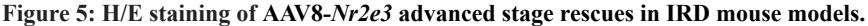
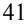
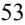
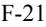

{0}------------------------------------------------

# **UNITED STATES SECURITIES AND EXCHANGE COMMISSION**

**Washington, D.C. 20549 ___________________________________________________________**

### **FORM 10-K ___________________________________________________________**

**(Mark One)**

☒ **ANNUAL REPORT PURSUANT TO SECTION 13 OR 15(d) OF THE SECURITIES EXCHANGE ACT OF 1934**

**For the fiscal year ended December 31, 2022**

**or**

☐ **TRANSITION REPORT PURSUANT TO SECTION 13 OR 15(d) OF THE SECURITIES EXCHANGE ACT OF 1934**

**Commission File Number 001-36751 ___________________________________________________________**

**OCUGEN, INC.**

(Exact name of registrant as specified in its charter) **___________________________________________________________**

(State or other jurisdiction of incorporation or organization)

**Delaware 04-3522315** (I.R.S. Employer Identification No.)

> **11 Great Valley Parkway Malvern, Pennsylvania 19355**

(Address of principal executive offices, including zip code)

**(484) 328-4701**

(Registrant's telephone number, including area code) **___________________________________________________________**

Securities registered pursuant to Section 12(b) of the Act:

|                     | Trading   | Name of each exchange       |  |  |
|---------------------|-----------|-----------------------------|--|--|
| Title of each class | symbol(s) | on which registered         |  |  |
| Common Stock        | OCGN      | The Nasdaq Stock Market LLC |  |  |

**(The Nasdaq Capital Market)**

Securities registered pursuant to section 12(g) of the Act: None **___________________________________________________________**

Indicate by check mark if the registrant is a well-known seasoned issuer, as defined in Rule 405 of the Securities Act. Yes ☐ No ☒

Indicate by check mark if the registrant is not required to file reports pursuant to Section 13 or Section 15(d) of the Act. Yes ☐ No ☒

Indicate by check mark whether the registrant (1) has filed all reports required to be filed by Section 13 or 15(d) of the Securities Exchange Act of 1934 during the preceding 12 months (or for such shorter period that the registrant was required to file such reports), and (2) has been subject to such filing requirements for the past 90 days. Yes ☒ No ☐

Indicate by check mark whether the registrant has submitted electronically every Interactive Data File required to be submitted pursuant to Rule 405 of Regulation S-T (§ 232.405 of this chapter) during the preceding 12 months (or for such shorter period that the registrant was required to submit such files). Yes ☒ No ☐

Indicate by check mark whether the registrant is a large accelerated filer, an accelerated filer, a non-accelerated filer, a smaller reporting company, or an emerging growth company. See the definitions of "large accelerated filer," "accelerated filer," "smaller reporting company," and "emerging growth company" in Rule 12b-2 of the Exchange Act.

| Large accelerated filer | ☐ | Accelerated filer         | ☐ |
|-------------------------|---|---------------------------|---|
| Non-accelerated filer   | ☒ | Smaller reporting company | ☒ |
|                         |   | Emerging growth company   | ☐ |

If an emerging growth company, indicate by check mark if the registrant has elected not to use the extended transition period for complying with any new or revised financial accounting standards provided pursuant to Section 13(a) of the Exchange Act. ☐

Indicate by check mark whether the registrant has filed a report on and attestation to its management's assessment of the effectiveness of its internal control over financial reporting under Section 404(b) of the Sarbanes-Oxley Act (15 U.S.C. 7262(b)) by the registered public accounting firm that prepared or issued its audit report. ☐

If securities are registered pursuant to Section 12(b) of the Act, indicate by check mark whether the financial statements of the registrant included in the filing reflect the correction of an error to previously issued financial statements. ☐

Indicate by check mark whether any of those error corrections are restatements that required a recovery analysis of incentive-based compensation received by any of the registrant's executive officers during the relevant recovery period pursuant to §240.10D-1(b). ☐

{1}------------------------------------------------

Indicate by check mark whether the registrant is a shell company (as defined in Rule 12b-2 of the Act). Yes ☐ No ☒

As of June 30, 2022, the last day of the registrant's most recently completed second fiscal quarter, the aggregate market value of the common stock held by nonaffiliates of the registrant was approximately \$483.2 million, based upon the closing price of the registrant's common stock on June 30, 2022.

As of February 21, 2023, there were 226,417,682 outstanding shares of the registrant's common stock, \$0.01 par value per share.

### **DOCUMENTS INCORPORATED BY REFERENCE**

Part III of this Annual Report on Form 10-K incorporates certain information by reference from the registrant's proxy statement for the 2023 annual meeting of stockholders to be filed no later than 120 days after the end of the registrant's fiscal year ended December 31, 2022.

{2}------------------------------------------------

### **TABLE OF CONTENTS**

Page

### FORWARD LOOKING [STATEMENTS](#page-2-0)

|            | Part I                                                                                                       |     |
|------------|--------------------------------------------------------------------------------------------------------------|-----|
| Item 1.    | Business                                                                                                     | 1   |
| Item 1A.   | Risk Factors                                                                                                 | 42  |
| Item 1B.   | Unresolved Staff Comments                                                                                    | 88  |
| Item 2.    | Properties                                                                                                   | 89  |
| Item 3.    | Legal Proceedings                                                                                            | 89  |
| Item 4.    | Mine Safety Disclosures                                                                                      | 89  |
|            | Part II                                                                                                      |     |
| Item 5.    | Market for Registrant's Common Equity, Related Stockholder Matters and Issuer Purchases of Equity Securities | 90  |
| Item 7.    | Management's Discussion and Analysis of Financial Condition and Results of Operations                        | 91  |
| Item 7A.   | Quantitative and Qualitative Disclosures About Market Risk                                                   | 100 |
| Item 8.    | Financial Statements and Supplementary Data                                                                  | 100 |
| Item 9.    | Changes in and Disagreements With Accountants on Accounting and Financial Disclosure                         | 100 |
| Item 9A.   | Controls and Procedures                                                                                      | 100 |
| Item 9B.   | Other Information                                                                                            | 101 |
| Item 9C.   | Disclosure Regarding Foreign Jurisdictions that Prevent Inspections                                          | 101 |
|            | Part III                                                                                                     |     |
| Item 10.   | Directors, Executive Officers and Corporate Governance                                                       | 102 |
| Item 11.   | Executive Compensation                                                                                       | 102 |
| Item 12.   | Security Ownership of Certain Beneficial Owners and Management and Related Stockholder Matters               | 102 |
| Item 13.   | Certain Relationships and Related Transactions, and Director Independence                                    | 102 |
| Item 14.   | Principle Accountant Fees and Services                                                                       | 102 |
|            | Part IV                                                                                                      |     |
| Item 15.   | Exhibit and Financial Statement Schedules                                                                    | 103 |
| Item 16.   | Form 10-K Summary                                                                                            | 106 |
|            |                                                                                                              |     |
| Signatures |                                                                                                              |     |

[Consolidated](#page-111-0) Financial Statements [F-1](#page-111-0)

*Unless the context otherwise requires, references to the "Company," "we," "our," or "us" in this report refer to Ocugen, Inc. and its subsidiaries, and references to "OpCo" refer to Ocugen OpCo, Inc., the Company's wholly owned subsidiary.*

i

{3}------------------------------------------------

### **DISCLOSURE REGARDING FORWARD-LOOKING STATEMENTS**

This Annual Report on Form 10-K and the documents incorporated by reference herein contain forward-looking statements that involve substantial risks and uncertainties. All statements, other than statements of historical facts contained in this Annual Report on Form 10-K or the documents incorporated by reference herein, regarding our strategy, future operations, future financial position, future revenues, projected costs, prospects, plans, and objectives of management are forward-looking statements. These statements involve known and unknown risks, uncertainties, and other important factors that may cause our actual results, performance, or achievements to be materially different from any future results, performance, or achievements expressed or implied by the forward-looking statements. The words "anticipate," "believe," "estimate," "expect," "intend," "may," "plan," "predict," "project," "will," "would," or the negative of such terms and similar expressions are intended to identify forward-looking statements, although not all forward-looking statements contain these identifying words. Such statements are based on assumptions and expectations that may not be realized and are inherently subject to risks, uncertainties, and other factors, many of which cannot be predicted with accuracy and some of which might not even be anticipated.

The forward-looking statements in this Annual Report on Form 10-K and the documents incorporated herein by reference include, among other things, statements about:

- our estimates regarding expenses, future revenues, and capital requirements, as well as the timing, availability of, and the need for, additional financing to continue to advance our product candidates;
- our ability to obtain sufficient additional funding to continue to advance our product candidates;
- our activities with respect to OCU400, including the results from our Phase 1/2 clinical trial and our ability to successfully initiate and subsequently complete a Phase 3 clinical trial and a pediatric Phase 1/2 clinical trial;
- our ability to successfully submit an amendment to the Investigational New Drug ("IND") application to the U.S. Food and Drug Administration ("FDA") for NeoCart and to subsequently initiate a Phase 3 clinical trial;
- our activities with respect to BBV152, known as COVAXIN, a vaccine candidate for the prevention of COVID-19 caused by SARS-CoV-2 in humans, in collaboration with Bharat Biotech International Limited ("Bharat Biotech"), including our plans and expectations regarding clinical development, manufacturing, pricing, regulatory review and compliance, reliance on third parties, and commercialization;
- the ability of our collaboration partner, Bharat Biotech, to successfully respond to the deficiencies identified in an inspection conducted by the World Health Organization ("WHO") and any potential impact of these deficiencies on the regulatory and commercialization pathway, clinical and commercial supply, and the technology transfer for COVAXIN;
- our ability to obtain funding from government agencies in the United States and other countries to continue the development of our vaccine candidates;
- the uncertainties associated with the clinical development and regulatory approval of our product candidates, including potential delays in the initiation, commencement, enrollment, and completion of current and future clinical trials;
- our ability to realize any value from product candidates and preclinical programs being developed and anticipated to be developed in light of inherent risks and difficulties involved in successfully commercializing products and the risk that our products, if approved, will not achieve broad market acceptance;
- uncertainties in obtaining successful clinical trial results for product candidates and unexpected costs that may result therefrom;
- our ability to comply with regulatory schemes and other regulatory developments applicable to our business in the United States and other countries; including the extent to which developments with respect to the COVID-19 pandemic will affect the regulatory pathway available for COVID-19 vaccines in such countries;
- the performance of third-parties upon which we depend, including contract development and manufacturing organizations, suppliers, manufacturers, group purchasing organizations, distributors, and logistics providers;
- the pricing and reimbursement of our product candidates, if commercialized;
- our ability to obtain and maintain patent protection, or obtain licenses to intellectual property and defend our intellectual property rights against third-parties;
- our ability to maintain our relationships, profitability, and contracts with our key collaborators and commercial partners and our ability to establish additional collaborations and partnerships;

ii

{4}------------------------------------------------

- our ability to recruit and retain key scientific, technical, commercial, and management personnel and to retain our executive officers;
- our ability to comply with stringent United States and applicable foreign government regulations with respect to the manufacturing of pharmaceutical products, including current Good Manufacturing Practice ("GMP") compliance, and other relevant regulatory authorities; and
- the extent to which health epidemics and other outbreaks of communicable diseases, including the COVID-19 pandemic, geopolitical turmoil, macroeconomic conditions, social unrest, political instability, terrorism, or acts of war could disrupt our business and operations, including impacts on our development programs, global supply chain, and collaborators and manufacturers.

We may not actually achieve the plans, intentions, or expectations disclosed in our forward-looking statements, and you should not place undue reliance on our forward-looking statements. Actual results or events could differ materially from the plans, intentions, and expectations disclosed in the forwardlooking statements we make. We have included important factors in the cautionary statements included in this Annual Report on Form 10-K, particularly under "Risk Factors," that we believe could cause actual results or events to differ materially from the forward-looking statements that we make. Our forward-looking statements do not reflect the potential impact of any future acquisitions, mergers, dispositions, joint ventures, collaborations, or investments we may make.

You should read this Annual Report on Form 10-K and the documents that we incorporate by reference herein and have filed as exhibits to this Annual Report on Form 10-K, completely and with the understanding that our actual future results may be materially different from what we expect. We do not assume any obligation to update any forward-looking statements.

In addition, statements that "we believe" and similar statements reflect our beliefs and opinions on the relevant subject. These statements are based upon information available to us as of the date of this Annual Report on Form 10-K, and while we believe such information forms a reasonable basis for such statements, such information may be limited or incomplete, and our statements should not be read to indicate that we have conducted an exhaustive inquiry into, or review of, all relevant information. These statements are inherently uncertain and investors are cautioned not to unduly rely upon these statements.

Solely for convenience, tradenames and trademarks referred to in this Annual Report on Form 10-K appear without the ® or ™ symbols, but those references are not intended to indicate, in any way, that we will not assert, to the fullest extent under applicable law, our rights or that the applicable owner will not assert its rights, to these tradenames or trademarks, as applicable. All tradenames, trademarks, and service marks included or incorporated by reference in this Annual Report on Form 10-K are the property of their respective owners. Further, for ease of reference, the name "COVAXIN" is used throughout this Annual Report on Form 10-K to refer to the vaccine candidate, BBV152. The name COVAXIN has not been evaluated or cleared by the FDA or Health Canada. The name NeoCart has not been evaluated or cleared by the FDA.

iii

{5}------------------------------------------------

### **PART I**

### **Item 1. Business.**

### **OVERVIEW**

We are a biotechnology company focused on discovering, developing, and commercializing novel gene and cell therapies and vaccines that improve health and offer hope for patients across the globe.

Our cutting-edge technology pipeline includes:

- **Modifier Gene Therapy Platform** Based on the use of nuclear hormone receptors ("NHRs"), we believe our modifier gene therapy platform has the potential to address many retinal diseases, including retinitis pigmentosa ("RP"), Leber congenital amaurosis ("LCA"), dry age-related macular degeneration ("AMD"), and Stargardt disease, with a single mutation-agnostic therapy.
- **Regenerative Medicine Cell Therapy Platform** Our Phase 3-ready regenerative medicine cell therapy platform technology, NeoCart (autologous chondrocyte-derived neocartilage), is being developed for the repair of knee cartilage injuries in adults.
- **Vaccines** COVAXIN is our whole-virion inactivated intramuscular COVID-19 vaccine candidate, which we are developing for the North American market. We are also developing a novel inhaled mucosal vaccine platform, which includes OCU500, a bivalent COVID-19 vaccine; OCU510, a seasonal quadrivalent flu vaccine; and OCU520, a combination quadrivalent seasonal flu and bivalent COVID-19 vaccine.
- **Novel Biologic Therapy for Retinal Diseases** OCU200 is a novel fusion protein containing parts of human tumstatin and transferrin. OCU200 is designed to treat diabetic macular edema ("DME"), diabetic retinopathy ("DR"), and wet AMD.

### *Modifier Gene Therapy Platform*

We are developing a modifier gene therapy platform designed to fulfill unmet medical needs related to retinal diseases, including inherited retinal diseases ("IRDs"), such as RP, LCA, and Stargardt disease, as well as dry AMD. Our modifier gene therapy platform is based on the use of NHRs, which have the potential to restore homeostasis — the basic biological processes in the retina. Unlike single-gene replacement therapies, which only target one genetic mutation, we believe that our modifier gene therapy platform, through its use of NHRs, represents a novel approach that has the potential to address multiple retinal diseases caused by mutations in multiple genes with one product, and potentially address complex diseases that are potentially caused by imbalances in multiple gene networks. OCU400, our first product candidate in our modifier gene therapy platform, has received Orphan Drug Designation ("ODD") from the FDA for nuclear receptor subfamily 2 group E member 3 ("*NR2E3*"*)*-related RP and LCA and Orphan Medicinal Product Designation ("OMPD") from the European Commission ("EC"), based on the recommendation of the European Medicines Agency ("EMA"), for RP and LCA. These ODD and OMPD designations represent gene-agnostic broad coverage for RP and LCA, and are not mutation-specific designations.

We are conducting a Phase 1/2 clinical trial to assess the safety of unilateral subretinal administration of OCU400 in patients with *NR2E3* and rhodopsin ("*RHO*"*)*-related RP and centrosomal protein 290 ("*CEP290*"*)*-related LCA in the United States. We have completed dosing patients with RP in the doseescalation portion of the clinical trial, which enrolled 10 subjects to receive a low, medium, or high dose of OCU400 in the subretinal space. We are continuing to enroll subjects with RP and LCA in this clinical trial to receive the high dose, which was determined to be the maximum tolerable dose from the dose-escalation portion of the clinical trial. We intend to initiate a Phase 1/2 pediatric clinical trial for OCU400 for the treatment of RP and LCA in the second quarter of 2023 and a Phase 3 clinical trial for OCU400 for the treatment of RP and LCA near the end of 2023, subject to discussions with the FDA.

We are also developing OCU410 and OCU410ST to utilize the nuclear receptor genes RAR-related orphan receptor A ("*RORA*"*)* for the treatment of dry AMD and Stargardt disease, respectively. We are currently executing IND-enabling studies and we intend to submit IND applications in the second quarter of 2023 to initiate Phase 1/2 clinical trials.

### *Regenerative Medicine Cell Therapy Platform*

NeoCart is a Phase 3-ready, regenerative medicine cell therapy technology that combines breakthroughs in bioengineering and cell processing to enhance the autologous cartilage repair process. NeoCart is a three-dimensional tissue-engineered disc of new cartilage that is manufactured by growing chondrocytes, the cells responsible for maintaining cartilage health. The chondrocytes

{6}------------------------------------------------

are derived from the patient on a unique scaffold. In this therapy, healthy cartilage tissue is grown and implanted in the patient. We believe NeoCart has the potential to accelerate healing and reduce pain by reconstructing a patient's previously damaged knee cartilage. It is designed to treat pain at the source, improve function, and potentially prevent a patient's progression to osteoarthritis ("OA"). The FDA granted a regenerative medicine advanced therapy ("RMAT") designation to NeoCart for the repair of full-thickness lesions of knee cartilage injuries in adults. We have received concurrence from the FDA on the confirmatory Phase 3 clinical trial design. We are renovating an existing facility into a current GMP facility in accordance with the FDA's regulations in support of NeoCart manufacturing for Phase 3 clinical trial material. We intend to initiate the Phase 3 clinical trial in the first half of 2024, subject to discussions with the FDA.

#### *Vaccines*

#### *Intramuscular COVID-19 Vaccine*

We have a Co-Development, Supply and Commercialization Agreement with Bharat Biotech (as amended, the "Covaxin Agreement"), pursuant to which we obtained an exclusive right and license under certain of Bharat Biotech's intellectual property rights, with the right to grant sublicenses, to develop, manufacture, and commercialize COVAXIN for the prevention of COVID-19, caused by SARS-CoV-2, in the United States, its territories, and possessions, Canada, and Mexico (the "Ocugen Covaxin Territory"). COVAXIN is intended for administration into the deltoid muscle of the upper arm, in two doses occurring 28 days apart.

A Phase 3 clinical trial conducted by Bharat Biotech in India in 25,798 adults, ages 18 years and older, who were healthy or had stable chronic medical conditions reported an overall estimated vaccine efficacy of COVAXIN against COVID-19 of 77.8%, with efficacy against severe COVID-19 of 93.4%. In January 2023, we announced top-line results from our Phase 2/3 immuno-bridging and broadening clinical trial in the United States evaluating COVAXIN for adults ages 18 years and older. The clinical trial was designed to evaluate whether the immune response observed in participants in Bharat Biotech's Phase 3 clinical trial in India is similar to a demographically representative, adult population in the United States. The clinical trial met both co-primary immunogenicity endpoints and no serious adverse events ("SAEs") related to COVAXIN were identified. We additionally plan to work with government agencies in the United States to obtain funding in order to comply with the requirements of a Biologics License Application ("BLA") submission, including funding to initiate an adult safety clinical trial subject to discussions with the FDA.

In July 2021, we completed our rolling submission to Health Canada for COVAXIN. The rolling submission process, which was conducted through our Canadian subsidiary, Vaccigen Ltd. ("Vaccigen"), was recommended and accepted under the Minister of Health's *Interim Order Respecting the Importation, Sale and Advertising of Drugs for Use in Relation to COVID-19* ("Interim Order") and transitioned to a New Drug Submission ("NDS") for COVID-19. In August 2022, we withdrew our NDS based on discussions with Health Canada and are evaluating the requirements for resubmitting an updated NDS. In Mexico, the Comisión Federal para la Protección contra Riesgos Sanitarios ("COFEPRIS") authorized emergency use for COVAXIN for adults ages 18 years and older, which remains active. We are in discussions with Consejo Nacional de Ciencia y Tecnología in Mexico ("CONACYT") regarding our submission for emergency use authorization ("EUA") for COVAXIN for pediatric use in ages five to 18 years.

#### *Inhaled Mucosal Vaccines*

In September 2022, we entered into an exclusive license agreement ("WU License Agreement") with The Washington University in St. Louis ("Washington University"), pursuant to which we obtained the rights to develop, manufacture, and commercialize an inhaled mucosal COVID-19 vaccine for the prevention of COVID-19 in the United States, Europe, and Japan. The WU License Agreement was amended in January 2023 to add the countries of South Korea, Australia, and China to the territory rights (together with the United States, Europe, and Japan, the "Mucosal Vaccine Territory"). Utilizing these rights, we are developing a novel inhaled mucosal vaccine platform, which includes OCU500, a bivalent COVID-19 vaccine; OCU510, a seasonal quadrivalent flu vaccine; and OCU520, a combination quadrivalent seasonal flu and bivalent COVID-19 vaccine. As these vaccine candidates are being developed to be administered through inhalation, we believe they have the potential to generate rapid local immunity in the upper airways and lungs where viruses enter and infect the body, which we believe may help reduce or prevent infection and transmission as well as provide protection against new virus variants. OCU510 is being developed for the global market. We intend to initiate IND-enabling studies and work closely with government agencies to obtain funding for the development of these inhaled mucosal vaccines.

{7}------------------------------------------------

### *Novel Biologic Therapy for Retinal Diseases*

We are developing OCU200, which is a novel fusion protein containing parts of human tumstatin and transferrin. OCU200 is designed to treat DME, DR, and wet AMD. We have completed the technology transfer of manufacturing processes to our contract development and manufacturing organization ("CDMO") and have produced clinical trial materials to initiate a Phase 1 clinical trial. We submitted an IND application to the FDA in February 2023 to initiate a Phase 1 clinical trial targeting DME.

### **OUR STRATEGY**

We are developing novel solutions to medical challenges and approaching healthcare innovation with purpose and agility to deliver new options for people facing serious diseases and conditions. Our product candidates have the potential to cure blindness diseases, treat serious conditions such as articular cartilage lesions, reduce the transmission of COVID-19, and make a significant impact in the ever-evolving COVID-19 landscape. Key elements of the strategy we employ to accomplish this mission include:

- *• Continuing to advance our modifier gene therapy platform into and through clinical development.*
We are developing our modifier gene therapy platform, inclusive of OCU400, OCU410, and OCU410ST, for the treatment of multiple IRDs, including RP, LCA, and Stargardt disease, as well as dry AMD. We are continuing to enroll patients in a Phase 1/2 clinical trial for OCU400 for the treatment of RP and LCA and have completed dosing patients in the dose-escalation portion of this clinical trial. We intend to initiate a Phase 1/2 pediatric clinical trial for OCU400 for the treatment of RP and LCA in the second quarter of 2023 and a Phase 3 clinical trial for OCU400 for the treatment of RP and LCA near the end of 2023, subject to discussions with the FDA. We are executing IND-enabling studies for OCU410 and OCU410ST and we intend to submit IND applications in the second quarter of 2023 to initiate Phase 1/2 clinical trials.

### **•** *Expanding and exploring partnerships with current and future key collaborators and commercial partners to maximize patient access, global reach, and the value of our product candidates.*

We intend to explore strategic licensing, acquisition, and collaboration opportunities with qualified partners to maximize the potential benefit of our product candidates on patients globally and to expand our product candidate pipeline to support our future growth.

- *• Obtaining government funding to advance our vaccine programs towards commercialization.*
We are developing a novel inhaled mucosal vaccine platform, which includes OCU500, a bivalent COVID-19 vaccine; OCU510, a seasonal quadrivalent flu vaccine; and OCU520, a combination quadrivalent seasonal flu and bivalent COVID-19 vaccine. We obtained the rights to develop, manufacture, and commercialize an inhaled mucosal COVID-19 vaccine in the Mucosal Vaccine Territory from Washington University. We are developing the seasonal flu component of this inhaled mucosal vaccine platform internally. As these mucosal vaccine candidates are being developed to be administered through inhalation, we believe they have the potential to generate rapid local immunity in the upper airways and lungs where viruses enter and infect the body, which is particularly important during times of peak transmission. OCU520, our combination quadrivalent seasonal flu and bivalent COVID-19 vaccine, is designed to provide the unique ease of getting both an annual COVID-19 booster vaccine and an annual seasonal flu vaccine in one vaccine.

We also announced top-line results from our Phase 2/3 immuno-bridging and broadening clinical trial in the United States evaluating COVAXIN for adults ages 18 years and older. The Phase 2/3 clinical trial met both co-primary immunogenicity endpoints and no SAEs related to COVAXIN were identified. COVAXIN is formulated with the inactivated SARS-CoV-2 virus, an antigen, and an adjuvant, which is a common approach to vaccine design. Accordingly, COVAXIN represents an important additional vaccine option for individuals that are looking for a well-established approach to vaccine development and manufacturing as well as a vaccine that elicits robust cellular immune memory to SARS-CoV-2.

We intend to work closely with government agencies to obtain funding to initiate clinical trials to support the regulatory submissions for these vaccines in their respective territories.

### *• Advancing the clinical development of our regenerative medicine platform towards market authorization and developing in-house manufacturing capability.*

We are developing NeoCart, our regenerative medicine platform technology for the repair of knee cartilage injuries in adults. We have received concurrence from the FDA on the confirmatory Phase 3 clinical trial design. We are renovating an existing facility into a current GMP facility in accordance with the FDA's regulations in support of

{8}------------------------------------------------

NeoCart manufacturing for Phase 3 clinical trial material. We intend to initiate the Phase 3 clinical trial in the first half of 2024, subject to discussions with the FDA.

### **COMPETITIVE STRENGTHS**

Our key competitive strengths include:

- *• Experienced Management Team and Esteemed Scientific Advisory Boards.* Our management team and key advisors have extensive experience with a proven track record of success in developing, launching, and managing the life cycle of biopharmaceuticals and vaccines at leading pharmaceutical and biotechnology companies. Our retina and vaccine scientific advisory boards are composed of leading academic and industry experts with extensive experience in the ocular and infectious disease fields. We believe that the experience of our management team, our scientific advisory board members, and our broad network of relationships with leaders within the industry and the medical community provides us with insight into the identification of product candidate opportunities as well as supports us in advancing the development and commercialization of our product candidates.
- **•** *Manufacturing Partnerships.* We have established partnerships for the clinical and commercial manufacturing of our product candidates, including partnerships with CanSino Biologics, Inc. ("CanSinoBIO") for our modifier gene therapy platform, longstanding vaccine developer, Bharat Biotech, for COVAXIN, and a CDMO for OCU200. These partners have state-of-the-art facilities and proven expertise in the fields of gene therapy, vaccines, and biologics, which is critical to advancing our product candidates into and through clinical trials and commercialization as well as accelerating development timelines, reducing our associated costs, and increasing the reliability of our product candidate manufacturing.
- *• Product Designations.* OCU400 has received ODD from the FDA for *NR2E3*-related RP and LCA and OMPD from the EC, based on the recommendation of the EMA, for RP and LCA. These designations demonstrate the potential broad-spectrum application of OCU400, through its use of NHRs, to treat the more than 125 genes associated with RP and LCA with one product rather than developing individual treatments for each gene mutation. Additionally, OCU400 had previously received ODDs from the FDA for the treatment of certain disease genotypes: *NR2E3*, *CEP290*, *RHO*, and phosphodiesterase 6B ("*PDE6ß*"*)* mutation-associated inherited retinal degenerations. NeoCart, our regenerative medicine cell therapy technology, was granted RMAT designation from the FDA for the repair of knee cartilage injuries in adults. The RMAT designation was created to expedite the development and review of regenerative medicine therapies intended to treat, modify, reverse, or cure a serious condition.
- *• Licensing and Development Arrangements and Intellectual Property Portfolio.* We have licensing and development arrangements with leading companies, academic institutions, and medical institutions that cover our product candidates. These licensing and development arrangements include the licensing agreement with The Schepens Eye Research Institute, Inc. ("SERI"), an affiliate of Harvard Medical School, through which we acquired the technology used in our modifier gene therapy platform as well as access to technologies for other NHR genes, the license agreement with Purpose Co., Ltd. ("Purpose") relating to NeoCart, the Covaxin Agreement with Bharat Biotech with respect to COVAXIN in the Ocugen Covaxin Territory, the WU License Agreement with Washington University with respect to inhaled mucosal COVID-19 vaccines in the Mucosal Vaccine Territory, and the license agreement with the University of Colorado ("CU") pursuant to which we acquired rights to the transferrin-tumstatin fusion protein technology used in our OCU200 product candidate. As of February 15, 2023, our global intellectual property portfolio contains 87 patents and 23 pending patent applications related to composition of matter, pharmaceutical compositions, methods of use for our product candidates, and other proprietary technology including those under our licensing and development arrangements. We will leverage these domestic and global partnerships and our intellectual property portfolio to advance our near- and long-term product pipeline opportunities.

{9}------------------------------------------------

### **OUR PRODUCT CANDIDATE PIPELINE**

Our product candidate pipeline is summarized in the following chart:

|                                              | Product Candidate                                                                        | Indication                                           | Current Status                                                                                                                                                                                                                                                                                                                   |  |
|----------------------------------------------|------------------------------------------------------------------------------------------|------------------------------------------------------|----------------------------------------------------------------------------------------------------------------------------------------------------------------------------------------------------------------------------------------------------------------------------------------------------------------------------------|--|
|                                              | OCU400                                                                                   | Gene mutation-associated retinal degeneration        |                                                                                                                                                                                                                                                                                                                                  |  |
|                                              |                                                                                          | NR2E3 Mutation (RP)                                  | Phase 1/2                                                                                                                                                                                                                                                                                                                        |  |
|                                              | AAV-hNR2E3                                                                               | RHO Mutation (RP)                                    | Phase 1/2                                                                                                                                                                                                                                                                                                                        |  |
| Gene therapies                               |                                                                                          | CEP290 Mutation (LCA)                                | Phase 1/2                                                                                                                                                                                                                                                                                                                        |  |
|                                              | OCU410 AAV-hRORA                                                                      | Dry AMD                                              | IND planned for Q2 2023                                                                                                                                                                                                                                                                                                          |  |
|                                              | OCU410ST AAV-hRORA                                                                    | Stargardt disease                                    | IND planned for Q2 2023                                                                                                                                                                                                                                                                                                          |  |
| Cell therapies (Regenerative Medicine) | NeoCart (Autologous chondrocyte-derived neocartilage)                              | Treatment of Articular Cartilage Defects in the Knee | Phase 3 clinical trial first half of 2024, subject to discussions with the FDA                                                                                                                                                                                                                                                   |  |
| Vaccines                                     | COVAXIN™ (BBV152) SARS-CoV-2 virus                                                    | COVID-19                                             | Top line results show that the U.S. Phase 2/3 immuno-bridging and broadening clinical trial met both primary endpoints. Awaiting final data. Safety clinical trial to be initiated pending FDA discussions and government funding EUA for adults in Mexico, discussions regarding pediatric EUA in Mexico ongoing |  |
|                                              | OCU500 Inhaled bivalent vaccine                                                       | COVID-19                                             |                                                                                                                                                                                                                                                                                                                                  |  |
|                                              | OCU510 Inhaled quadrivalent vaccine                                                   | Seasonal Flu                                         | Phase 1/2 to be initiated pending FDA discussions and government funding                                                                                                                                                                                                                                                         |  |
|                                              | OCU520 Inhaled combination quadrivalent seasonal flu and bivalent COVID-19 vaccine | COVID-19 and Seasonal Flu                            |                                                                                                                                                                                                                                                                                                                                  |  |
| Biologics                                    |                                                                                          | DME                                                  | IND submitted February 2023                                                                                                                                                                                                                                                                                                      |  |
|                                              | OCU200 Transferrin - Tumstatin                                                        | DR                                                   | IND-enabling                                                                                                                                                                                                                                                                                                                     |  |
|                                              |                                                                                          | Wet AMD                                              | IND-enabling                                                                                                                                                                                                                                                                                                                     |  |

### **OUR MODIFIER GENE THERAPY PLATFORM AND GENE THERAPY PRODUCT CANDIDATES**

We are developing our modifier gene therapy platform, inclusive of OCU400, OCU410, and OCU410ST for the treatment of multiple IRDs, such as RP, LCA, and Stargardt disease, as well as dry AMD. Our modifier gene therapy platform is a cutting-edge technology licensed from SERI, an affiliate of Harvard Medical School, and involves the targeted delivery and expression of one or more NHRs in the disease tissues and is designed to introduce a functional gene to modify the expression of multiple genes and gene-networks, which potentially enables it to address multiple retinal diseases with one product.

#### **Modifier Gene Therapy Platform Based on the Use of NHRs**

NHRs are intracellular receptors that regulate gene expression, acting as master regulator genes in the retina. NHRs play a vital role in regulating retinal cell development, maturation, metabolism, visual cycle function, survival, and maintaining the cellular and molecular homeostasis in retinal tissues. Our modifier gene therapy platform is designed to target NHRs to potentially provide therapeutic benefit to patients suffering from genetically diverse IRDs. The use of genetic modifiers represent a broadened means of potentially treating a variety of retinal degenerative diseases, as compared to single-gene replacement therapy. While single-gene replacement therapies have shown tremendous promise in rare retinal diseases, they are highly specific and cannot improve a multitude of disease-causing genetic defects. Our modifier gene therapy platform has the potential to restore retinal integrity and function across a range of genetically diverse IRDs and other degenerative retinal diseases providing us with significant potential long-term value.

Our modifier gene therapy platform encompasses the targeted delivery and expression of certain NHRs that are expressed naturally in retinal tissue. Preclinical studies have shown that *NR2E3*, a member of the NHR family, is a dual activator and repressor that, with other transcription factors, modulates cell fate and differentiation of rod and cone photoreceptor cells, specialized cells for detecting light, in the eye. Disease outcome is a result of a primary mutation as well as modifier alleles. *NR2E3* is a master regulator of several key pathways in retinal development and function. *NR2E3* potentially prevents and rescues degenerating retina by resetting the homeostatic state of key gene networks in the presence of a primary mutation.

The delivery of *Nr2e3* in a mouse lacking a functional *Nr2e3* gene restored the retina structure and function. We believe that *NR2E3* may partially or fully rescue photoreceptors from degeneration in patients with IRDs and improve patients' vision. It

{10}------------------------------------------------

was also demonstrated preclinically that *RORA* offers a protective allele in AMD where the loss of photoreceptor cells leads to blindness. *NR2E3* regulates the expression of both Nuclear Receptor Subfamily 1 Group D Member 1 ("*NR1D1*") and *RORA*. Thus, the nuclear receptors work in overlapping networks to modulate normal retinal development and function. These receptors impact gene expression of hundreds of genes and numerous networks and, as such, may be potent modifiers of retinal disease and degeneration.

### **Results of Preclinical Studies Support the Potential Efficacy of** *NR2E3* **Modifier Gene Therapy**

The efficacy of *Nr2e3* was evaluated in five unique mouse models of IRDs in which treatment with the adeno-associated viral ("AAV")8-*Nr2e3* gene by subretinal injection effectively rescued multiple genetically diverse IRDs by protecting photoreceptors from further damage after disease onset. These models represent a heterogeneous group of diseases in humans and are relevant in establishing the modifier role of *NR2E3*. The five IRD models evaluated were: FVB-*Pde6ß* /NJ ("*rd1*"), Rhodopsin null allele ("*Rho* "), B6.129S6(Cg)-*Rho* /J ("*Rho* "), BXD24/TyJ-*Cep290* /J ("*rd16*"), and *Nr2e3* /J ("*rd7*"). *rd1* is *PDE6β-*associated RP, *Rho* and *Rho* are both *RHO-*associated RP, *rd16* is LCA, and *rd7* is enhanced S-cone syndrome. C57BL6/J ("B6") in these models represents the control. The results were evaluated using fundus imaging, electroretinogram ("ERG"), histology, and immunostaining of retinal layers. This preclinical data was published in *Nature Gene Therapy*. *rd1* −/− *tm1.1Kpal P23H rd16 rd7* −/− *P23H*

This study showed that the administration of AAV8*-Nr2e3* therapy improved clinical, histological, functional, and molecular disease outcomes in each of the five models of IRDs. These studies demonstrated that the mechanism of *Nr2e3* therapy involves resetting key retinal transcription factors and key biological networks that work in concert with *Nr2e3* to modulate the homeostatic state of the retina. The study is based on the principle that disease outcome is rarely due to a single gene mutation; rather, it is a result of the combinatorial mutational load on the biological system, which is often strongly influenced by other factors such as modifier genes. The models demonstrate the potential potency of a novel modifier gene therapy to elicit broad-spectrum therapeutic benefits in early (**Figure 1**, **Figure 2**, and **Figure 4**) and advanced stages (**Figure 1**, **Figure 3**, and **Figure 5**) of IRDs and serve as a broadspectrum gene therapy to reduce retinal degeneration.

**Figure 1: AAV8***-Nr2e3* **outer nuclear layer ("ONL") cell layer number in early stage rescue and advanced stage rescue in IRD mouse models.**

*Figure 1 displays the cell layer numbers of the ONL from AAV8-Nr2e3 treated and untreated mice in dif erent early stage and advanced stage IRD models. These ONL photoreceptors induce phototransduction in the retina and thereby initiate the vision*

{11}------------------------------------------------

*process. The normal mouse retina is comprised of 10 to 12 layers of rod and cone photoreceptor nuclei in the ONL. rd1 retinas showed a profound rescue of photoreceptor cells (six to eight layers of ONL in early stage rescue IRD models) compared to the untreated eyes. Rho , Rho , and rd16 mice showed a more moderate increase (three to six layers of ONL in early stage rescue IRD models) compared to the untreated eyes of each model. ONL cell layer numbers in the rd7 model do not start degenerating until four to five months of age and as such is excluded from Figure 1 above. Although only partial rescue was observed in these models, results of research conducted by third parties suggests that retention of only a single layer of photoreceptor cells can maintain minimal visual function suggesting that an increase of even 20% is significant. In the advanced stage rescue IRD models, the results of which are depicted in the bottom half of Figure 1, improvement varied from ~30 to 80% of the retina in the Rho , Rho , and rd16 AAV8-Nr2e3 treated mice, depending on distribution ef iciency throughout the retina. Approximately three to five layers of ONL cells were preserved in Nr2e3 treated mice compared with untreated mice that show less than or equal to one layer of ONL remaining. We believe Nr2e3 therapy has great promise in potentially restoring retinal development.* −/− *P23H* −/− *P23H*

### **Figure 2: Fundus imaging of AAV8***-Nr2e3* **early-stage rescues in IRD mouse models.**

*Figure 2 displays the fundus imaging results from AAV8-Nr2e3 treated and untreated mice in dif erent early stage IRD models. Although not all models have a clinical phenotype, considerable improvements were observed in the fundus of Rho , rd16, and rd7 mice. The rd16 mice were observed to have a red fundus with increased and pronounced vessels and this fundus observation resolves with Nr2e3 administration. Improvement was observed in the rd7 phenotype, with reduction of retinal spots in AAV8-Nr2e3 treated eyes compared with untreated eyes. P23H*

*Figure 3 displays the fundus imaging results from AAV8-Nr2e3 treated and untreated mice in dif erent advanced stage IRD models. The fundus imaging shows the reduction of retinal degeneration in the AAV8-Nr2e3 treated eyes compared with untreated eyes.*

{12}------------------------------------------------

### **Figure 4: Hematoxylin/eosin ("H/E") staining of AAV8-***Nr2e3* **early-stage rescues in IRD mouse models.**

*Figure 4 displays the H/E staining results from AAV8-Nr2e3 treated and untreated mice in dif erent early-stage IRD models. The H/E staining revealed that subretinal delivery of AAV8-Nr2e3 rescued photoreceptor cells and helped maintain retinal integrity of IRD retinas in all models. Additionally, the rd7 model presents with increased cone cells with whorls and rosettes in the ONL. These retinal whorls and rosettes, that are characteristics of the rd7 phenotype, resolved following Nr2e3 treatment, suggesting that the delivery of Nr2e3 can restore normal retinal development.*

*Figure 5 displays the H/E staining results from AAV8-Nr2e3 treated and untreated mice in dif erent advanced stage IRD models. The H/E staining shows the reduction of retinal degeneration by Nr2e3 therapy in each model.*

Improved ERG results were also observed in AAV8-*Nr2e3* treated IRD retinas in addition to the above results that displayed the rescue of ONL layers, improvement in fundus imaging, and improvement in H/E staining. Human vision is enabled by three primary modes: scotopic vision, photopic vision, and mesopic vision. Scotopic vision is monochromatic vision in very low light, which functions primarily due to rod cells in the eye. Photopic vision is vision under well-lit conditions, which provides for color perception and functions primarily due to cone cells in the eye. Mesopic vision is a combination of scotopic and photopic vision in low lighting, which functions due to a combination of rod and cone cells in the eye. IRD disease progression results in the loss of rod and cone function that is assessed by abnormal ERG responses. In the below study, the visual function of *Nr2e3* treated IRD retinas was examined in four out of five IRD strains, excluding *rd7*, by recording scotopic and photopic ERGs to evaluate rod- and cone-driven responses. Treated mice showed improvement in retinal ERG signal, both in scotopic and photopic conditions (**Figure 6**).

{13}------------------------------------------------

### **Figure 6: Improved ERG responses in AAV8-***Nr2e3* **treated IRD retinas.**

*Analysis A within Figure 6 above displays the evaluation of scotopic and photopic ERG B-wave amplitudes, which were evaluated at post-natal day 30 (B6 and rd1) or post-natal day 90 to 120 (Rho , Rho , and rd16) in AAV8-Nr2e3 treated and untreated mice. Analysis B above displays the percent increase in ERG B-wave responses in the treated IRD models. −/− P23H*

### **Results of Preclinical Studies Support the Safety of** *NR2E3*

The safety of *Nr2e3* was evaluated in healthy mice following subretinal administration. B6 mice were treated with AAV8-*Nr2e3*-green fluorescent protein ("GFP") fusion construct at post-natal day zero and evaluated after both seven days and one month for any toxic effect as well as expression of *Nr2e3*-GFP fusion protein in the retina. The expression of the *Nr2e3* protein in a mouse retina did not show any detrimental effect on retinal cells, including photoreceptors (**Figure 7**). Also, there was no difference in retinal anatomy as indicated by fundus, histology (the cell layers), expression of opsin and rhodopsin proteins (immunohistochemistry), and retinal function (as indicated by ERG recording) between treated and untreated mice (**Figure 7**). Expression of enhanced GFP-*Nr2e3* fusion protein was observed at post-natal day 30 in treated animals. In this preclinical study, overexpression of the *Nr2e3* protein following subretinal injection of AAV8-*Nr2e3* was well-tolerated.

*The analysis in Figure 7 above utilized a population size of five mice and displays the B6 control AAV8-Nr2e3 treated mice showing no abnormalities. Analysis A above displays the following: fundus, H/E staining, green opsin, blue opsin, and rhodopsin labeling of photoreceptor cells. Analysis B above displays the ERG response of the B6 control in both treated and untreated mice. The mice were injected at post-natal day zero and tissue was collected at post-natal day 30. Analysis C above*

{14}------------------------------------------------

#### *displays the GFP label of AAV8-Nr2e3-GFP injected at post-natal zero with GFP expression assessed at both post-natal day seven and post-natal day 30.*

Additionally, *Nr2e3* has also been shown to function with other transcription factors such as *Nr1d1*, neural retinal leucine zipper ("*Nrl*"), Cone-rod homeobox ("*Crx*"), *Rora*, and thyroid receptor beta ("*Thrb*") to modulate photoreceptor cell fate and retinal function as an activator or suppressor of gene expression. The expression level of five other essential retinal transcription factors (*Nr1d1*, *Nrl*, *Crx*, *Rora*, and *Thrb*) were determined in *Nr2e3* treated and untreated retinas. Overall, a significant decrease in expression of key retinal transcription factors was reversed following *Nr2e3* therapy (**Figure 8**).

**Figure 8: AAV8-***Nr2e3* **rescues RP degeneration by recruiting key transcription factors.**

*The analysis in Figure 8 above shows the relative expression levels of Nr2e3, Nrl, Rora, Thrb, Nr1d1, and Crx at post-natal day 30 Nr2e3 treated mutant strains (rd7, Rho−/−, Rho , and rd16) and rd1 at post-natal day 7 compared with the corresponding untreated controls and normalized to beta-actin. P23H*

#### **Overview of RP and LCA and Current Treatment Options**

IRDs are caused by genetic mutations that are passed down within families and lead to progressive disease, severe visual impairment, and blindness. They are a diverse disease class with large phenotypic and genetic heterogeneity. IRDs are a common cause of irreversible blindness due to retinal cell degeneration. Treating these conditions has been a significant challenge due to the sheer volume of potential therapeutic gene targets. Gene replacement therapy is a promising approach to provide sustained restoration of normal retinal function for a mutated gene, but such therapies can only address one gene at a time, limiting their potential therapeutic use. Developing a custom gene therapy for each of the more than 125 mutated genes linked to RP and LCA would not only be expensive but also may not be possible due to size, class, or localization that will impact delivery of the gene. Not all genes and disease expressions are amenable to gene therapy. For example, the genetic mutations of approximately 40% of RP patients remain unknown with few or no known therapeutic options available. Modifier gene therapy to ameliorate multiple forms of RP and LCA without requiring knowledge of the mutated gene, may provide a potentially robust and feasible treatment for RP and LCA.

RP and LCA are the most common IRDs involving photoreceptors and the retinal pigment epithelium ("RPE"). RP is a group of rare, genetic disorders that involve a breakdown and loss of cells in the retina. RP affects approximately 110,000 and 190,000 individuals in the United States and Europe, respectively. In RP, progressive retinal degeneration starts in the mid-periphery and advances toward the macula and the fovea. The fovea is the part of the retina that is responsible for sharp central vision. Common symptoms of RP include difficulty seeing in poor lighting or in the dark, loss of central vision or side (peripheral) vision, and difficulty reading print and deciphering detailed images. RP is associated with over 100 mutated genes that affect

{15}------------------------------------------------

1.5 million individuals worldwide. RP is heterogeneous and varies greatly in age of onset, rate of progression, and even genetic etiology, yet a common pathology of photoreceptor cell degeneration develops.

There is currently no approved treatment that slows or stops the progression of multiple forms of RP. Proposed treatments for RP include gene-replacement therapy, retinal implant devices, retinal transplantation, stem cells, vitamin therapy, and other pharmacological treatments. While gene-replacement therapies may provide a new functional gene, they do not necessarily eliminate the underlying genetic defect, which may still cause stress and toxic effects. Therefore, the development of gene specific replacement therapy is highly challenging, especially when multiple and unknown genes are involved.

Similar to RP, minimal treatment options are available for LCA, which is a group of IRDs characterized by severe impairment of vision or blindness at birth. LCA affects approximately 15,000 and 18,000 individuals in the United States and Europe, respectively. It is an autosomal recessive pattern of inheritance, wherein both parents, called carriers, have one mutated copy of the gene and one normal gene. They are unaffected carriers of LCA. However, each of their children has a 25% chance of inheriting the two LCA gene copies (one from each parent) needed to cause the disorder. LCA is caused by a degeneration and/or dysfunction of photoreceptor rod cells and cone cells in the eye. This affects the processing of electrical signals. The electrical signals travel from the retina through the optic nerve to the brain. The brain then turns the signals into images that are seen. The less electrical activity there is, the less sight one will have. Electroretinography is used to measure the electrical signals in the retina. Common symptoms of LCA include a child habitually pressing their eyes, formations of cataracts, thinning and gradual decline of the cornea which bulges outward into a cone shape. In some cases, the eyes of individuals with LCA can appear sunken. LCA is associated with over 25 mutated genes and affects approximately 160,000 individuals worldwide. Luxturna, developed by Spark Therapeutics, Inc., has been approved by the FDA to treat IRDs caused by retinoid isomerohydrolase ("*RPE65*") gene mutations. The *RPE65* gene represents just one of more than 125 mutated genes linked to RP and LCA. No treatment options have been approved by the FDA for RP and LCA caused by mutations in other RP and LCA causing genes.

### **OCU400 for IRDs**

OCU400 is our first product candidate being developed with our modifier gene therapy platform. OCU400 has the potential to restore retinal integrity and function across a range of genetically diverse IRDs. OCU400 consists of a functional copy of the retina-specific NHR gene, *NR2E3*, delivered to target cells in the retina using an AAV5 vector that has the potential to be used as a gene therapeutic not only for the treatment of retinal diseases associated with mutations in genes such as *NR2E3*, *RHO*, *CEP290*, and *PDE6ß*, but also other gene mutations associated with IRDs, including RP and LCA. As a potent modifier gene, expression of *NR2E3* may help reset retinal cell homeostasis, metabolism, and visual cycle function (**Figure 9**). OCU400 has received ODD for *NR2E3*-related RP and LCA and OMPD from the EC, based on the recommendation of the EMA, for RP and LCA. We believe these broad ODD and OMPD designations demonstrate that OCU400 has the potential to be a broad-spectrum therapeutic to treat multiple IRDs. These ODD and OMPD designations represent gene-agnostic broad coverage for RP and LCA, and are not mutation-specific designations. OCU400 had previously received ODDs from the FDA for the treatment of the following disease genotypes: *NR2E3*, *RHO*, *CEP290*, and *PDE6ß* mutation-associated inherited retinal degenerations.

*Figure 9 demonstrates the mechanism of our modifier gene therapy. In single-gene replacement therapies such as gene augmentation, only the nonfunctional gene is targeted. and accordingly, this therapy cannot improve a multitude of disease-causing genetic defects. In our modifier gene therapy platform, a functional gene of the retina-specific NHR gene, NR2E3, is introduced to modify the expression of many genes and gene networks and restore homeostasis.*

{16}------------------------------------------------

As previously described, in five unique mouse models of IRDs, treatment with AAV8-*Nr2e3* by subretinal injection rescued multiple genetically diverse IRDs by protecting photoreceptors from further damage after disease onset. This result demonstrates the potential potency of a novel modifier gene therapy to elicit broad-spectrum therapeutic benefits in early and advanced stages of IRDs. We are conducting a Phase 1/2 clinical trial, a multicenter, open-label, dose ranging study to assess the safety of unilateral subretinal administration of OCU400 in patients with *NR2E3* and *RHO-*related RP and *CEP290*-related LCA in the United States. We have completed dosing patients with RP in the dose-escalation portion of the clinical trial, which enrolled 10 subjects to receive a low, medium, or high dose of OCU400 in the subretinal space. We are continuing to enroll subjects with RP and LCA in this clinical trial to receive the high dose, which was determined to be the maximum tolerable dose from the dose-escalation portion of the clinical trial. We intend to initiate a Phase 1/2 pediatric clinical trial for OCU400 for the treatment of RP and LCA in the second quarter of 2023 and a Phase 3 clinical trial for OCU400 for the treatment of RP and LCA near the end of 2023, subject to discussions with the FDA.

### **Overview of Dry AMD and Stargardt Disease and Current Treatment Options**

AMD is attributed to the thinning of the macula of the retina, which leads to impairment and loss of central vision. The macula is the part of the retina responsible for clear vision in one's direct line of sight. AMD is characterized by the thickening and loss of normal architecture within the Bruch's membrane, lipofuscin accumulation in the RPE, and drusen formation beneath the RPE in the Bruch's membrane. These deposits consist of complement components, other inflammatory molecules, lipids, lipoproteins B and E, and glycoproteins. Common risk factors for AMD include genetics, smoking, nutrition and vitamin deficiency, and heart disease. Dry AMD, which affects over 266 million individuals worldwide, involves the slow deterioration of the retina with submacular drusen (small white or yellow dots on the retina), atrophy, loss of macular function, and central vision impairment. Common symptoms of dry AMD include visual distortions, reduced central vision in one or both eyes, increased difficulty adapting to low levels of light, and a welldefined blind spot in one's field of vision.

Similarly, Stargardt disease is a rare genetic eye disorder that causes retinal degeneration and ultimately leads to loss of central vision. It is the most common form of inherited macular degeneration, affecting approximately 0.8 million individuals worldwide. Stargardt disease happens when lipofuscin, a fatty yellow pigment, accumulates on the macula, which leads to the degeneration of the photoreceptor cells in the macula and ultimately leads to progressive central vision loss. The photoreceptor cells convert light into electrical signals, which are then sent to the brain where they are processed to create the images we see. Stargardt disease is usually caused by mutations in the *ABCA4* gene and is inherited in an autosomal recessive manner. This gene affects how one's body uses vitamin A. The body uses vitamin A to make cells in the retina. Common symptoms of Stargardt disease include gray, black, or hazy spots in one's central vision, sensitivity to light, increased time for eyes to adjust between light and dark places, color blindness, and gradual central vision loss in both eyes. Currently no treatment options exist to address dry AMD or reverse or slow the progression of Stargardt disease and accordingly, there remains a significant unmet medical need for these ocular diseases.

#### **OCU410 and OCU410ST for the Treatment of Dry AMD and Stargardt Disease**

We are developing OCU410 and OCU410ST for the treatment of dry AMD and Stargardt disease, respectively. OCU410 and OCU410ST utilize an AAV delivery platform for the retinal delivery of the *RORA* gene. *RORA* regulated gene networks are relevant in the treatment of dry AMD and Stargardt disease. *RORA* reduces oxidative stress, limits lipofuscin deposits, reduces chronic inflammation, and improves choroidal blood flow. Gene variants of the *ABCA4* gene are associated with both AMD and Stargardt disease. Stargardt disease is usually caused by mutations in the *ABCA4* gene. This gene transports oxidized retinol compounds from photoreceptors to RPE cells for detoxification. In mice models, *ABCA4 -/-* displayed low levels of CD59. A cell-surface glycoprotein, CD59, prevents the formation of the complement membrane attack complex. We are currently executing IND-enabling studies and we intend to submit IND applications in the second quarter of 2023 to initiate Phase 1/2 clinical trials.

#### **NEOCART (AUTOLOGOUS CHONDROCYTE-DERIVED NEOCARTILAGE) CELL THERAPY PLATFORM**

We diversified our innovative pipeline in 2022 by introducing NeoCart (autologous chondrocyte-derived neocartilage), a Phase 3-ready, regenerative medicine cell therapy technology that combines breakthroughs in bioengineering and cell processing to enhance the autologous cartilage repair process. We believe NeoCart has the potential to accelerate healing and reduce pain by reconstructing a patient's previously damaged knee cartilage. In May 2022, the FDA granted an RMAT designation to NeoCart for the repair of full-thickness lesions of knee cartilage injuries in adults.

The cartilage is a complex tissue which protects the various joints and bones in the human body. It acts as a shock absorber throughout the body withstanding significant pressure and allowing for joints to glide smoothly with minimal friction. Cartilage damage can be caused by acute trauma, such as a bad fall or a sports-related injury, or by repetitive trauma, such as general

{17}------------------------------------------------

wear over time. Unlike other tissues in the body, cartilage in the joints has no innate ability to repair itself, making any injury permanent. If left untreated, even a small defect can expand in size and progress to debilitating OA, ultimately requiring a joint replacement procedure. Over 528 million individuals worldwide are diagnosed with OA. This number is expected to increase as the population of aging yet active individuals and the rates of obesity increase.

We believe the current therapies available to treat cartilage damage in the knee are suboptimal with varying outcomes due to variable cellular responses. Chondroplasty is often recommended in patients with small cartilage lesions (between one and three cm ). This procedure is performed through small incisions on the sides of the knee with the aid of an arthroscope. During this procedure, the damaged cartilage is trimmed, and the remaining surface is smoothed. Microfracture surgery is a frequently used procedure for severe cartilage damage which yields varying outcomes from patient to patient. This surgery consists of the creation of tiny holes or "fractures" in the bone underneath the injured cartilage, leading to the formation of a blood clot in the affected area. The blood and bone marrow that form the blood clot contain stem cells, which are expected to grow into cartilage-building cells, as well as growth factors to support cell function and development of replacement cartilage matrix. Approximately 30% of patients that have undergone microfracture surgery continue to have pain and reduced knee function. Additionally, current therapies require extensive recovery time. They are often ineffective in the long term as they do not adequately address cartilage damage, which leads to additional corrective surgeries. Autologous culture chondrocytes on porcine collagen membrane (MACI) is used for the repair of symptomatic, single, or multiple full-thickness cartilage defects of the knee with or without bone involvement in adults less than 55 years of age. It is a three-by-five centimeter cellular sheet with a density of 500,000 cells per cm . 2 2

The other options for cartilage repair include osteochondral autograft transplantation ("OAT"), osteochondral allograft resurfacing ("OCA"), and autologous chondrocyte implantation ("ACI"). During OAT, damaged cartilage is removed and replaced with healthy cartilage from a non-weight-bearing area of the joint. OAT is recommended for small to medium sized lesions (between 1.5 and four cm ) and is limited by the amount of donor tissue available, the need for open surgery, and donor site morbidity. OCA is a similar process to OAT except that the tissue is sourced from cadaveric donor bone and cartilage. OCA is recommended for large lesions (between four and 10 cm ) and can be performed in a single procedure but is limited by the availability of cadaveric tissue. ACI is a process where cartilage cells are harvested from a non-weight bearing part of the knee and are cultured in a laboratory. They are subsequently implanted into the injured area. 2 2

Over one million arthroscopies are performed annually as a procedure to diagnose and treat issues of the joint. Patients and physicians are in need of treatment options that offer more rapid and durable recovery compared to the current treatment options. The attributes of an optimal treatment for a damaged knee cartilage involve the reduction in pain, repair of the knee cartilage, rapid return to daily activities, durable response, and a non-opioid approach. We believe NeoCart would represent a better solution to treat cartilage damage in the knee as it has the potential to solve for the limitations of the current therapies and has the potential to provide improved efficacy, long-term patient benefits, accelerated patient recovery, and predictable patient outcomes.

NeoCart is designed to treat pain at the source, improve function, and potentially prevent a patient's progression to OA. NeoCart is a three-dimensional tissue-engineered disc of new cartilage that is manufactured by growing chondrocytes, the cells responsible for maintaining cartilage health. The chondrocytes are derived from the patient on a unique scaffold. In this therapy, the patient's cells are separated from a tissue biopsy specimen and multiplied in a manufacturing facility. The cells are then infused into the scaffold, which is a three-dimensional structure that enables the proper delivery, distribution, and organization of cells in their natural environment to support tissue formation. Before NeoCart is implanted in a patient, the patient's cells and the scaffold undergo a bioengineering process in a Tissue Engineering Processor ("TEP"). The TEP is designed to mimic the conditions inside a functional joint so that the tissue is prepared to begin functioning like normal healthy cartilage prior to implantation. Once NeoCart is ready to be implanted, a bioadhesive is used to anchor NeoCart at the site of cartilage injury and seal the implant to the surrounding native cartilage. The bioadhesive is a natural, biocompatible material which acts as adhesives for biological tissue, thereby eliminating the need for complicated suturing (**Figure 10**).

{18}------------------------------------------------

**Figure 10: Mechanism of the regenerative medicine cell therapy technology, NeoCart.**

*Figure 10 demonstrates the mechanism of our regenerative medicine cell therapy technology, NeoCart. We believe NeoCart has the potential to accelerate healing and reduce pain by reconstructing a patient's previously damaged knee cartilage. In this therapy, healthy cartilage tissue is grown and implanted in the patient.*

NeoCart was acquired in our reverse merger in 2019 with Histogenics Corporation ("Histogenics"). Prior to 2019, Phase 1 and Phase 2 clinical trials were conducted to demonstrate the safety and efficacy of NeoCart. These clinical trials reported a decrease in pain and improved function of the knee. Additionally, per the results of the Phase 2 clinical trial, more patients responded to NeoCart than microfracture surgery. No SAEs were reported. A Phase 3 clinical trial was conducted to demonstrate the safety and effectiveness of NeoCart as compared to microfracture surgery to treat cartilage defects in the knee. This clinical trial enrolled 249 subjects between the ages of 18 and 59. The Phase 3 clinical trial of NeoCart narrowly missed the primary endpoint of a statistically significant improvement in pain and function in a dual threshold responder analysis one year after the treatment as compared to microfracture surgery.

We have received concurrence from the FDA on the confirmatory Phase 3 clinical trial design. This study will be a randomized, controlled clinical trial designed to evaluate the efficacy and safety of NeoCart in comparison to the current standard of care, chondroplasty, in subjects with articular cartilage defects. We intend to initiate the Phase 3 clinical trial in the first half of 2024, subject to discussions with the FDA. Our Phase 3 clinical trial will use chondroplasty as the control instead of microfracture, which was used in the Phase 3 clinical trial conducted by Histogenics. Additionally, the Phase 3 clinical trial conducted by Histogenics used a responder analysis for the co-primary endpoint (as opposed to microfracture) that included an improvement of at least 12 points in outcome compared to baseline at one year on the knee injury and OA outcome score pain assessment test and an improvement of at least 20 points in outcome compared to baseline on the International Knee Documentation Committee subjective test. In contrast, our Phase 3 clinical trial will use a co-primary efficacy endpoint defined as the mean change from baseline (as opposed to chondroplasty) to two years for the patients' Knee Injury and Osteoarthritis Outcome Score Pain and Function (Activities of Daily Living) subscale scales. Additionally, the Phase 3 clinical trial conducted by Histogenics enrolled patients with a total lesion size of less than six cm , while our Phase 3 clinical trial will enroll patients with total lesion sizes between one to three cm . 2 2

### **VACCINES**

We are developing COVAXIN for the prevention of COVID-19 in the Ocugen Covaxin Territory. COVAXIN is a whole-virion inactivated, intramuscular COVID-19 vaccine candidate that is manufactured using a Vero cell manufacturing platform. COVAXIN was granted an Emergency Use Listing by the WHO in November 2021, has been authorized or approved for use in over 25 countries, and is accepted for travel purposes in over 85 countries. Additionally, COVAXIN has received EUA in India for children ages six to 18 years.

{19}------------------------------------------------

We are also developing a novel inhaled mucosal vaccine platform, which includes OCU500, a bivalent COVID-19 vaccine; OCU510, a seasonal quadrivalent flu vaccine; and OCU520, a combination quadrivalent seasonal flu and bivalent COVID-19 vaccine. OCU510 is being developed for the global market.

#### **Overview of COVID-19**

COVID-19, caused by the SARS-CoV-2 virus, was first reported to have surfaced in Wuhan, China in December 2019 and was declared a global pandemic by the WHO in March 2020. COVID-19 is a highly transmissible disease that spreads from person to person through respiratory droplets that are produced when an infected person coughs, sneezes, or talks. In some circumstances, these respiratory droplets may contaminate surfaces they land on. Common symptoms of COVID-19 include cough, shortness of breath or difficulty breathing, fever or chills, muscle or body aches, sore throat, congestion, or loss of taste or smell. Certain people are at an increased risk for severe COVID-19 infection including those over the age of 65 and with underlying medical conditions, including cancer, diabetes, heart conditions, and obesity, along with many other underlying conditions. Those at increased risk for severe COVID-19 are more likely to be hospitalized, need intensive care, require a ventilator to help them breathe, or die. Since being discovered, new variants of SARS-CoV-2 have emerged. New variants of a virus emerge when a mutation to the virus' genes occurs. SARS-CoV-2 and its variants have caused approximately over 756.5 million cases of COVID-19 and 6.8 million deaths, with the United States alone accounting for over 101.4 million cases and 1.1 million deaths. The Omicron variant (B.1.1.529) was identified in November 2021 and has continued to be deemed a variant of concern by the WHO due to at least one of the following characteristics: increase in transmissibility or detrimental change in COVID-19 epidemiology, an increase in virulence or change in clinical disease presentation, or a decrease in effectiveness of public health and social measures or available diagnostics, vaccines, or therapeutics. Since being identified, several sub-variants of the Omicron variant (B.1.1.529) have been observed as the virus circulated at intense levels worldwide. Research suggests that the Omicron variant (B.1.1.529) is more contagious and increases the risk of reinfection when compared to variants that were previously deemed to be variants of concern.

### **COVAXIN for the Prevention of COVID-19**

COVAXIN is formulated with the inactivated SARS-CoV-2 virus, an antigen, and an adjuvant, which is a common approach to vaccine design. COVAXIN is designed to utilize the whole-virion inactivated SARS-CoV-2 virus to trigger the immune response to create antibodies against multiple antigens. Inactivated vaccines do not replicate and are therefore unlikely to revert and cause pathological effects. COVAXIN has an antigen concentration of six micrograms and utilizes a toll-like receptor ("TLR")7/8 agonist molecule, IMDG adsorbed to alum (Algel) as adjuvants which generates a Th1-biased immune response (cell-mediated immunity) that induces high neutralization efficacy against different variants and robust long-term memory B cell and T cell responses. The adjuvant used in the formulation of COVAXIN was developed in the United States with funding from the National Institutes of Health ("NIH") and is the first adjuvant in an authorized or approved vaccine against an infectious disease to activate TLR7/8. The alum in the adjuvant stimulates the immune system to search for an invading pathogen. Molecules that activate TLR7/8 provide a powerful stimulation of the immune system. COVAXIN is intended for administration into the deltoid muscle of the upper arm, in two doses occurring 28 days apart, and has an expected shelf life of 24 months from the date of manufacture at 2-8°C and a six-month stability at room temperature (25°C).

The rise of COVID-19 genetic variants has raised concerns that these variants may be able to escape neutralization by vaccines. The data from clinical trials conducted in India suggest that COVAXIN elicits a broad-spectrum immune response (including S and nucleocapsid proteins) and induces both humoral and cellular responses. In addition, COVAXIN is designed to generate memory B cell and T cell responses for its multiple epitopes, potentially indicating longevity of response and a rapid antibody response to future infections. Furthermore, data suggests that COVAXIN may potentially generate robust immune memory to SARS-CoV-2 and certain of its variants, including the Omicron variant (B.1.1.529), for at least six months after vaccination. We believe COVAXIN has certain characteristics that may be beneficial as compared to other currently authorized or approved messenger RNA ("mRNA"), adenovirus-based vaccines, and protein subunit vaccines. COVAXIN represents an important additional vaccine option for individuals who are looking for a well-established approach to vaccine development and manufacturing.

The inactivated SARS-CoV-2 virus in COVAXIN is inactivated using β-propiolactone treatment at a low temperature. As an inactivated virus vaccine, we believe COVAXIN can use all the proteins in the virus to elicit an immune response, rather than targeting the S protein alone, which is a characteristic of the mRNA and adenovirus-based vaccines. We believe an inactivated whole-virion vaccine can produce a more robust response that can elicit memory and cross-react with mutated strains. We believe that, once vaccinated with COVAXIN, the immune system can respond to a live infection of SARS-CoV-2.

{20}------------------------------------------------

### *Bharat Biotech Clinical Trials*

Phase 1 and Phase 2 clinical trials were conducted by Bharat Biotech in India to evaluate the safety and immunogenicity of COVAXIN. These clinical trials reported a favorable safety profile and strong Immunoglobulin G ("IgG") responses against the S protein, the receptor-binding domain, and the nucleocapsid protein of SARS-CoV-2 along with strong cellular responses. Strong cellular responses are necessary for memory and long-term durability of vaccines. No SAEs were reported in these clinical trials.

A Phase 3, randomized, placebo-controlled clinical trial was conducted by Bharat Biotech in India to evaluate the efficacy of COVAXIN. The Phase 3 clinical trial enrolled 25,798 adults, ages 18 years and older, who were healthy or had stable chronic medical conditions, including 10.7% of participants over the age of 60 and 27.5% of participants with at least one coexisting condition, including cardio-vascular, diabetes, or any other chronic stable condition. Participants with no serological evidence of previous exposure to SARS-CoV-2 received two doses of either COVAXIN or the placebo administered four weeks apart. The Phase 3 clinical trial reported an overall estimated vaccine efficacy of COVAXIN against COVID-19 of 77.8%, with efficacy against severe COVID-19 of 93.4%, and efficacy against asymptomatic COVID-19 of 63.6%. Individuals with asymptomatic infection have a detectable viral load in nasal and saliva swabs and therefore are considered carriers of COVID-19. Cross variant protection was also demonstrated with a vaccine efficacy of 65.2% against the Delta variant (B.1.617.2). The aforementioned efficacy results represent point estimates of vaccine efficacy with a 95% confidence interval ("CI"), which is above the success criteria of 50%. Adverse events in the COVAXIN and control arms of the Phase 3 clinical trial were observed in 12.4% of subjects, with less than 0.5% of subjects experiencing SAEs. Data from the clinical trials and from research conducted by third parties has shown that COVAXIN has neutralizing potential against multiple variants, including the Omicron (B.1.1.529) variant, which is a variant of concern. Further, recent studies have shown that individuals receiving a COVAXIN booster dose six months following the second dose of COVAXIN saw a significant increase in neutralizing titers, an important predictor of vaccine efficacy. The increase in neutralizing titers was higher than that achieved after the primary two-dose series.

A Phase 2/3 immuno-bridging clinical trial was conducted by Bharat Biotech in India to assess the immunity of COVAXIN in children ages two to 18 years. COVAXIN is formulated such that the same dosage can be administered to adults and children alike. The results demonstrated a robust neutralizing antibody response comparable to that of the adults studied in the Phase 2 clinical trial conducted by Bharat Biotech in India, and that COVAXIN was generally well tolerated. Among the 526 study subjects in the Phase 2/3 pediatric clinical trial, no SAEs were reported.

#### *Regulatory Pathway in the Ocugen Covaxin Territory*

In January 2023, we announced top-line results from our Phase 2/3 immuno-bridging and broadening clinical trial in the United States evaluating COVAXIN for adults ages 18 years and older. The clinical trial was designed to evaluate whether the immune response observed in participants in Bharat Biotech's completed Phase 3 clinical trial in India is similar to a demographically representative, adult population in the United States. The clinical trial enrolled 419 adult participants that were randomized to receive either two doses of COVAXIN or a placebo, 28 days apart. Immune responses were adjusted for differences between the U.S. and Indian cohorts in baseline neutralizing antibody, body mass index, gender, and age. Both co-primary immunogenicity endpoints were met, with the 95% CI for the propensity score-adjusted geometric mean titer ratio being well above the non-inferiority limit of 0.667. The 95% CI for the propensity score-adjusted difference in seroconversion rates were well above the non-inferiority limit of (10)%. There were no deaths, related potential immune mediated medical conditions, or related adverse events of special interest. Additionally, there were no cases of myocarditis, pericarditis, thrombotic events, or Guillain-Barré syndrome. There were no cases of adverse events and SAEs related to the vaccination. 30 medically attended adverse events in 18 subjects and two SAEs in one subject were reported, all of which were considered unrelated to the vaccination. We plan to work with government agencies in the United States to obtain funding in order to comply with the requirements of a BLA submission, including funding to initiate an adult safety clinical trial subject to discussions with the FDA.

We also have rights to commercialize COVAXIN in Canada and Mexico. In July 2021, we completed our rolling submission to Health Canada for COVAXIN. The rolling submission process, which was conducted through our Canadian subsidiary, Vaccigen, was recommended and accepted under the Minister of Health's Interim Order and transitioned to a NDS for COVID-19. In August 2022, we withdrew our NDS based on discussions with Health Canada and are evaluating the requirements for resubmitting an updated NDS. In Mexico, the COFEPRIS authorized emergency use for COVAXIN for adults ages 18 years and older, which remains active. We are in discussions with CONACYT in Mexico regarding our submission for EUA for COVAXIN for pediatric use in ages five to 18 years.

{21}------------------------------------------------

#### **Overview of the Seasonal Flu**

The seasonal flu, or seasonal influenza, is an acute respiratory infection caused by influenza viruses circulating globally. In temperate climates, seasonal epidemics occur mainly during the winter, while in other regions, transmission may occur throughout the year, causing outbreaks more irregularly. The seasonal flu causes illnesses that range in severity and may lead to hospitalization and death in certain cases. The seasonal flu is characterized by the sudden onset of the following: fever, dry cough (typically), headache, muscle and joint pain, severe malaise, sore throat, and runny nose. Most people infected with the seasonal flu recover from the fever and other symptoms within a week without requiring medical attention, but the cough can be more severe and last two weeks or more. Although most people recover quickly from the seasonal flu, severe illness and death can occur particularly among high risk groups including children, the elderly, pregnant women, health care workers, and those with serious underlying medical conditions. Worldwide, the seasonal flu is estimated to result in 3 to 5 million cases of severe illness, and 0.3 million to 0.7 million respiratory deaths.

The seasonal flu spreads easily and rapidly transmits in crowded areas. The seasonal flu is transmitted when an infected person coughs or sneezes and droplets containing the virus are dispersed into the air and infects those in close proximity that breathe the droplets in. The seasonal flu can also spread through physical contact, although this type of transmission is less common than airborne transmission. Those infected with the seasonal flu are most contagious within the first three to four days of infection. Transmission may begin one day before symptoms develop and may continue for five to seven days after symptoms develop. The flu is most commonly prevented by getting an annual flu vaccine and taking preventative actions to avoid transmission such as staying away from those who are sick, frequent handwashing, and covering coughs and sneezes. For the 2022 to 2023 flu season, over 50% of the U.S. population above six months of age has received a seasonal flu shot with over 170 million doses being administered. Several flu antiviral drugs are also available in different dosage forms to treat the seasonal flu, including pills, liquid, an inhaled powder, or an intravenous solution. These flu antiviral drugs are only available through a prescription from a healthcare provider and are not sold over the counter.

### **Novel Inhaled Mucosal Vaccine Platform for the Prevention of COVID-19 and the Seasonal Flu**

We are developing a novel inhaled mucosal vaccine platform, which includes OCU500, a bivalent COVID-19 vaccine; OCU510, a seasonal quadrivalent flu vaccine; and OCU520, a combination quadrivalent seasonal flu and bivalent COVID-19 vaccine. OCU510 is being developed for the global market.

Our novel inhaled mucosal vaccine platform is specifically designed to generate local mucosal immunity in the nasopharyngeal region. The mucosal vaccination method has demonstrated potent induction of both mucosal and systemic immune responses, which prevents infection and spread, thereby limiting the origins of new variants. We believe our novel inhaled mucosal vaccine platform is unique as it is designed to induce mucosal immunity, which is crucial for preventing upper respiratory tract infection, as compared to intramuscular vaccines. The advantages of these inhaled mucosal vaccines include needle-free administration, the potential for increased compliance, scalable manufacturing, storage and shipping at standard refrigerated conditions, and the potential to develop multi-strain and variant-specific versions. As these vaccine candidates are being developed to be administered through inhalation, we believe our novel inhaled mucosal vaccine platform has the potential to generate rapid local immunity in the upper airways and lungs where viruses enter and infect the body, which we believe may help reduce or prevent infection and transmission as well as provide protection against new virus variants.

The S protein of SARS-CoV-2 is the principal target for antibody-based and vaccine countermeasures. The S protein serves as the primary viral attachment and entry factor to promote SARS-CoV-2 entry into human cells. In preclinical studies that have been conducted to assess the durability, dose response, and cross-protective activity in mice, it was demonstrated that a single dose of our inhaled mucosal COVID-19 vaccine induced durably high neutralizing and antibody effector responses in serum and S protein specific IgG and Immunoglobulin A, which is essential for reducing infection and transmission of COVID-19. This approach represents a potential universal booster, regardless of previous COVID-19 vaccination. OCU520, our combination quadrivalent seasonal flu and bivalent COVID-19 vaccine, is designed to provide the unique ease of getting both an annual COVID-19 booster vaccine and an annual seasonal flu vaccine in one vaccine.

Pursuant to the WU License Agreement, we obtained the rights to develop, manufacture, and commercialize an inhaled mucosal COVID-19 vaccine in the Mucosal Vaccine Territory. We are developing the seasonal flu component of this inhaled mucosal vaccine platform internally. We intend to initiate INDenabling studies and work closely with government agencies to obtain funding for the development of these inhaled mucosal vaccines.

{22}------------------------------------------------

### **NOVEL BIOLOGIC PRODUCT CANDIDATE FOR RETINAL DISEASES**

We are developing OCU200, which is a novel fusion protein containing parts of human tumstatin and transferrin. OCU200 is designed to treat DME, DR, and wet AMD. We have completed the technology transfer of manufacturing processes to our CDMO and have produced clinical trial materials to initiate a Phase 1 clinical trial. We submitted an IND application to the FDA in February 2023 to initiate a Phase 1 clinical trial targeting DME. The planned Phase 1 clinical study will assess the unilateral intravitreal administration of OCU200 alone or in combination with an approved anti-VEGF therapy in participants with DME. This is a multicenter, open-label, dose ranging study with three cohorts in the dose-escalation portion of the study and one cohort in the combination therapy portion of the study.

### **Overview of DR and DME**

DR is a sight-threatening complication of diabetes arising from the over-accumulation of glucose, which can block blood vessels in the retina and cut off blood supply, leading to the damage of blood vessels in the retina. DR is classified into two subtypes: non-proliferative DR and proliferative DR. Nonproliferative DR is the early stage of DR wherein blood vessels are unable to grow, blood vessel walls weaken, and nerve fibers in the retina may swell. Proliferative DR is the advanced stage of DR in which damaged blood vessels close off, leading to the growth of new, abnormal blood vessels in the retina. This growth of new, abnormal blood vessels in the retina can lead to scar tissue, which can result in the detachment of the retina from the back of the eye.

Complications from DR could lead to DME. In DME, bulges can protrude from the blood vessel walls, leading to the leakage of fluid and blood into the retina. This leakage results in swelling, or "edema," in the macula, which is a part of the retina. DME may occur at any stage of DR but is more likely to occur as the disease progresses. DME is the most common reason for vision loss in patients with DR.

DR and DME are the most common vision-threatening diseases in patients with diabetes. Approximately 162 million individuals are affected with DR and approximately 21 million with DME worldwide. As the population of people experiencing diabetes increases, these statistics are expected to increase, due to poor disease management and lifestyle-related changes. There are limited treatment options available for patients with DR and DME. Current first-line treatments for DR and DME include the use of anti-vascular endothelial growth factor ("VEGF") therapy and anti-inflammatory therapy, such as corticosteroids. These treatments do not work effectively in approximately 50% of patients with DME. There is a significant need to develop a novel, differentiated therapeutic to treat DR and DME.

Additionally, current therapies target only one pathway associated with DR and DME, either angiogenesis (development of new blood vessels) with anti-VEGF therapy, such as Ranibizumab or Aflibercept, or inflammation in case of corticosteroid therapy, such as Dexamethasone or Fluocinolone. The development of a therapeutic which targets multiple causative pathways of DR and DME, such as angiogenesis, oxidation, and inflammation, would offer a potential treatment option for all patients. We believe that OCU200 possesses unique characteristics to target these pathways and has the potential to offer better treatment options for all patients with DR and DME.

#### **Overview of Wet AMD**

OCU200 also has the potential to represent a better treatment option for patients suffering from wet AMD. Most AMD cases begin as dry AMD and may progress towards the advanced "wet" form. Wet AMD is caused by abnormal blood vessels in the retina that leak fluid or blood into the macula. The result can be irreversible damage to photoreceptor cells and rapid, severe vision loss, particularly in the center of the field of vision, causing significant functional impairment. If left untreated, neovascularization in wet AMD patients typically results in significant vision loss and the formation of a scar under the macula. Wet AMD affects approximately 10-15% of patients with AMD but progresses more rapidly and is known to be responsible for approximately 90% of all AMD-related blindness.

AMD is a leading cause of blindness worldwide. The incidence of wet AMD increases substantially with age, and it is expected that the number of cases of wet AMD will increase with the growth of the elderly population. It has been estimated that approximately 296 million individuals worldwide have some form of AMD of which, approximately 30 million, or 10%, suffer from wet AMD.

Current FDA approved therapeutics for wet AMD include intravitreal injection of either Ranibizumab or Aflibercept, which are anti-VEGF therapies. Though treatments have been effective in mitigating the disease symptoms, clinical studies suggest substantial limitations remain. For example, a significant percentage of people do not respond to therapy and experience continuous deterioration of their vision. Additionally, the repeated use of anti-VEGF therapy becomes less effective over time.

{23}------------------------------------------------

Between 30-50% of people affected by wet AMD continue to have fluid remain in the middle of the eye, also called the subretinal space, even after one to two years of treatment.

Given the above limitations of these existing treatments, we believe that a substantial unmet medical need exists for the treatment of DR, DME, and wet AMD.

### **OCU200 for the Treatment of DR, DME, and Wet AMD**

OCU200 is a novel fusion protein containing parts of human tumstatin and transferrin, that are already present normally in retinal tissues. Patients affected by these diseases share common symptoms, such as blurriness in vision and continued vision loss through disease progression. The formation of fragile and leaky new abnormal blood vessels leads to fluid accumulation in and around the retina, causing vision damage.

We believe OCU200 possesses unique features and is designed to enable it to efficiently target leaky blood vessels, regress the existing abnormal blood vessels, and inhibit the growth of new blood vessels in the retina and choroid. Tumstatin, which acts as an anti-VEGF, anti-inflammatory, and antioxidative agent, is the active component of OCU200. It binds to integrin receptors, which play a crucial role in disease pathogenesis. Transferrin is an iron carrier that delivers iron intracellularly. It enhances the delivery of fused proteins across cellular barriers, including retinal barriers. It allows the targeting of anti-angiogenic peptide to the multiplying endothelial cells. OCU200 is designed to address the limitations of current therapies by targeting multiple mechanisms associated with ocular neovascularization and inflammation specifically focusing on non-responders to currently available treatment options.

A proof-of-concept study involving different animal models demonstrated the therapeutic potential of OCU200 in the treatment of DR, DME, and wet AMD. In an animal model for DME and DR (oxygen-induced retinopathy in mice), OCU200, at a significantly lower dose (10 micrograms per eye), was comparable to existing approved anti-VEGF therapy (Eylea, 20 micrograms per eye) in preventing disease manifestation and progression. In animal models for wet AMD (laser induced choroidal neovascularization in mice and rats), OCU200 demonstrated comparable or slightly better activity compared to anti-VEGF control groups in preventing the formation and growth of new leaky blood vessels and subsequent disease symptoms. We believe OCU200's distinct mechanism of action through the target of the integrin pathway will potentially provide benefit to patients, particularly to those patients that do not respond to currently approved therapies.

### **COMPETITION**

The biotechnology industry is characterized by rapidly advancing technologies as well as a strong emphasis on intellectual property leading to a highly competitive environment for the development and commercialization of therapeutic products, regenerative medicines, and vaccines. We face competition with respect to our current product candidates and will face competition with respect to any product candidates that we may seek to develop or commercialize in the future. We face competition from many different sources, including from major pharmaceutical companies, specialty pharmaceutical companies, biotechnology companies, academic institutions, government agencies, and other public and private research organizations that conduct research, seek patent protection, and establish collaborative arrangements for research, development, manufacturing, and commercialization. We plan to compete in the segments of pharmaceutical, biotechnological, and other related markets with therapeutics, regenerative medicines, and vaccines that have an acceptable safety profile and target commercially attractive indications.

The development and commercialization of gene therapies is highly competitive. We are aware of several companies focusing on gene therapies for various ophthalmic indications including Applied Genetic Technologies Corporation, as acquired by Syncona Limited, Astellas Pharma Inc., MeiraGTx Holdings plc in partnership with Janssen Pharmaceuticals, Inc., Nanoscope Therapeutics Inc., REGENXBIO Inc., Novartis AG, F. Hoffmann-La Roche AG ("Roche AG"), Kiora Pharmaceuticals, Inc., Genentech, Inc. in partnership with Lineage Cell Therapeutics, Inc., and Luxturna, the product developed by Spark Therapeutics, Inc. and marketed by Roche AG, is currently the only gene therapy approved to treat IRDs in the United States which addresses only mutations in the *RPE65* gene. The mutation associated with the *RPE65* gene represents just one of more than 125 mutated genes linked to RP and LCA.

The regenerative medicine sector is characterized by innovative science, rapidly advancing technologies, and a strong emphasis on proprietary products. The competitive landscape in the field of articular cartilage repair in the U.S. is emerging and has stimulated a substantial amount of interest from companies developing tissue repair solutions. Companies that may compete with our NeoCart product candidate include Vericel Corporation's MACI, the only FDA-approved ACI product in the United States, and Aesculap Biologics, LLC's NOVOCART 3D, which is currently enrolling subjects in their Phase 3 clinical trial.

{24}------------------------------------------------

We face, and will continue to face, intense competition from companies as well as institutions that are pursuing or have commercialized vaccines that would compete with our vaccine candidates, COVAXIN and our novel inhaled mucosal vaccine platform, if commercialized. The competitive landscape of COVID-19 vaccines has been rapidly developing since the beginning of the COVID-19 pandemic and includes competitors such as Pfizer Inc./BioNTech SE, Moderna, Inc., AstraZeneca PLC, Novavax, Inc., Sinovac Biotech Ltd., Gamaleya Research Institute of Epidemiology and Microbiology, and Center for Genetic Engineering and Biotechnology. Each of the aforementioned vaccines have been authorized or approved in at least one country within the Ocugen COVAXIN Territory or the Mucosal Vaccine Territory and are intramuscular vaccines. CanSinoBIO's Convidecia Air, an intranasal vaccine targeting COVID-19, has been approved in China. Other competitors for our novel inhaled mucosal vaccine platform include CyanVac LLC, Meissa Vaccines, Inc., Codagenix, Inc., Intravacc B.V., McMaster University, and Tetherex Pharmaceuticals Corporation. Companies such as Pfizer Inc./BioNTech SE, Moderna, Inc., CureVac N.V in partnership with GSK plc, Vivaldi Biosciences Inc., and Novavax, Inc. are also in the process of developing a combination vaccine that will protect against COVID-19 and the seasonal flu. Vivaldi Biosciences Inc. is also currently undergoing clinical trials for their intranasal vaccine for the seasonal flu.

The development and commercialization of biologic products is highly competitive as well. Companies that may compete with our OCU200 product candidate include Roche AG, Regeneron Pharmaceuticals, Inc., AsclepiX Therapeutics, Inc., Outlook Therapeutics, Inc., Novartis AG, Oxurion NV, Unity Biotechnology, Inc., Opthea Limited, and 4D Molecular Therapeutics, Inc. Roche AG, Regeneron Pharmaceuticals, Inc., and Novartis AG have marketed anti-VEGF products.

Many of our competitors, either alone or with strategic partners, may have significantly greater financial resources to support research and development, manufacturing, preclinical studies, and clinical trials, as well as regulatory, commercialization, and marketing efforts. These organizations also compete with us in recruiting and retaining qualified scientific and management personnel, establishing clinical trial sites, patient registration for clinical trials, licensing or acquiring technologies necessary for our programs, and in our commercialization efforts if our product candidates are approved. Early-stage companies may also prove to be significant competitors, particularly through collaborative arrangements with large and established companies. Mergers and acquisitions in the pharmaceutical and biotechnology industries may result in even more resources being concentrated among a smaller number of our competitors.

### **MANUFACTURING AND SUPPLY**

We utilize our in-house expertise and know-how as well as the expertise and know-how of our industry leading manufacturing partners to develop and scale up our manufacturing processes for both the clinical and commercial supply of our product candidates. We collaborate with our manufacturing partners to understand and establish controls for critical process parameters and critical quality attributes. Our in-house expertise includes personnel with extensive product development and commercialization experience who actively manage our manufacturing partners that produce products in our product candidate pipeline. Our current manufacturing partners, including CanSinoBIO, Bharat Biotech, and Jubilant HollisterStier, have state-of-the-art facilities with significant expertise in biotechnology manufacturing.

#### **Clinical Supply of Our Modifier Gene Therapy Platform**

We have a co-development and commercialization agreement with CanSinoBIO with respect to the development and commercialization of our modifier gene therapy platform. The CanSinoBIO Agreement was originally entered into in September 2019 with respect to OCU400 and was subsequently amended in September 2021 and November 2022 to include OCU410 and OCU410ST, respectively, in addition to OCU400. Pursuant to the CanSinoBIO Agreement, we are collaborating with CanSinoBIO on the development of our modifier gene therapy platform. CanSinoBIO is responsible for the CMC development and manufacture of clinical supplies of such product candidates and is responsible for the costs associated with such activities. CanSinoBIO has an exclusive license to develop, manufacture, and commercialize our modifier gene therapy platform in and for China, Hong Kong, Macau, and Taiwan (the "CanSinoBIO Territory"), and we maintain exclusive development, manufacturing, and commercialization rights with respect to our modifier gene therapy platform outside the CanSinoBIO Territory (the "Company Territory").

We partner with CanSinoBIO for the process development, manufacturing, testing, and release of drug product candidates for use in IND-enabling studies and clinical trials. We perform discovery and analytical development activities in our research and development lab. The partnership with CanSinoBIO enables us in completing manufacturing, with release of clinical trial materials in an expedited manner and helps in mitigating the risk of delay that can be associated when working with highly competitive CDMOs that have long wait times with regard to gene therapy manufacturing. Although we rely on our partnership for manufacturing, we have personnel with extensive experience in gene therapy manufacturing to oversee and guide the process and analytical development, scale-up, release, and stability testing at our partner site. We perform periodic audits of our manufacturing partner to confirm compliance with applicable regulations.

{25}------------------------------------------------

For more information about our partnership with CanSinoBIO, see "—License and Development Agreements—Co-Development and Commercialization Agreement with CanSinoBIO" and see Note 3 in our notes to the consolidated financial statements included elsewhere in this Annual Report on Form 10- K.

### **Clinical and Commercial Supply of NeoCart**

We are renovating an existing facility into a current GMP facility in accordance with the FDA's regulations in support of NeoCart manufacturing for Phase 3 clinical trial material, which we anticipate will be completed in the fourth quarter of 2023.

### **Clinical and Commercial Supply of COVAXIN**

Pursuant to the Covaxin Agreement with Bharat Biotech, we obtained an exclusive right and license to develop, manufacture, and commercialize COVAXIN for the Ocugen Covaxin Territory. In accordance with the Covaxin Agreement, Bharat Biotech agreed to provide us with preclinical and clinical data and transfer to us certain proprietary technology owned or controlled by Bharat Biotech that is necessary for the commercial manufacture and supply of COVAXIN to support its commercial sale in the Ocugen Covaxin Territory, if approved. We also selected Jubilant HollisterStier as a manufacturing partner to prepare for the commercial manufacturing of COVAXIN.

Additionally, we entered into the Supply Agreement with Bharat Biotech pursuant to which Bharat Biotech will supply us with clinical trial materials and commercial supplies of COVAXIN finished drug product prior to the completion of a technology transfer. Following the completion of the initiated technology transfer to Jubilant HollisterStier, Bharat Biotech will supply COVAXIN drug product components and continue to supply finished drug product as necessary for the commercial manufacture and supply of COVAXIN. The WHO identified certain GMP deficiencies in an inspection of Bharat Biotech's facilities and Bharat Biotech is currently responding to these deficiencies in order to meet the required GMP standards in the Ocugen Covaxin Territory.

For more information about our partnership with Bharat Biotech, see "—License and Development Agreements—Co-Development, Supply and Commercialization Agreement with Bharat Biotech" and see Note 3 in our notes to the consolidated financial statements included elsewhere in this Annual Report on Form 10-K.

### **Clinical Supply of OCU200**

In October 2020, we entered into a manufacturing agreement with a CDMO for the manufacture of OCU200. Under the manufacturing agreement, our CDMO will manage all CMC and clinical manufacturing activities for OCU200. We have completed the technology transfer of manufacturing processes to our CDMO and have produced clinical trial materials to initiate the planned Phase 1 clinical trial.

### **LICENSE AND DEVELOPMENT AGREEMENTS**

We are party to license and development agreements under which we license or co-own patents, patent applications, technical information, and other intellectual property for our product candidates. Certain diligence and financial obligations are tied to these agreements. We consider the following agreements to be material to our business.

#### **Modifier Gene Therapy Program**

### *Exclusive License Agreement with SERI*

In December 2017, we entered into an exclusive license agreement with SERI, which was amended in January 2021 (as amended, the "SERI Agreement"). The SERI Agreement gives us an exclusive, worldwide, sublicensable license to patent rights, biological materials, and technical information for NHR genes *NR1D1*, *NR2E3* (OCU400), *RORA* (OCU410 and OCU410ST), Nuclear Protein 1, Transcriptional Regulator ("*NUPR1*"), and Nuclear Receptor Subfamily 2 Group C Member 1 ("*NR2C1")*. The January 2021 amendment to the SERI Agreement additionally granted us rights in co-owned intellectual property pursuant to certain patent applications and provisional patent applications at the time of the amendment. Under the SERI Agreement, we may make, have made, use, offer to sell, sell, and import licensed products, and must use commercially reasonable efforts to bring one or more licensed products to market as soon as reasonably practicable.

The SERI Agreement requires us to pay licensing fees for patent rights granted, an annual license maintenance fee, payment of certain development and commercial milestones in the aggregate amount of \$16.1 million, and low single-digit percentage royalties on annual net sales of products that fall under the licensed patent rights.

{26}------------------------------------------------

SERI maintains control of patent preparation, filing, prosecution, and maintenance. We are responsible for SERI's out-of-pocket expenses related to the filing, prosecution, and maintenance of the licensed patent rights. In the event that SERI decides to discontinue the prosecution or maintenance of the licensed patent rights, we have the right, but not the obligation, to file for, or continue to prosecute, maintain, or enforce such licensed patent rights. We have assumed prosecution of certain licensed patent rights under the SERI Agreement.

The SERI Agreement will expire on the expiration date of the last to expire licensed patent rights, subject to the earlier termination of the SERI Agreement in accordance with its terms. We may terminate the license, without cause, upon 180 days prior written notice. SERI may immediately terminate the SERI Agreement if we cease to carry on our business with respect to the licensed patent rights, fail to make payments within thirty days of receiving a written notice of missed payment, fail to comply with our diligence obligations, default on our obligation to procure and maintain insurance, one of our officers is convicted of a felony related to the licensed products, we breach any material obligation of the agreement and do not cure such breach within 90 days, or if we become bankrupt or insolvent.

#### *Co-Development and Commercialization Agreement with CanSinoBIO*

We entered into the CanSinoBIO Agreement with CanSinoBIO with respect to the development and commercialization of our modifier gene therapy product candidates, OCU400, OCU410, and OCU410ST. The CanSinoBIO Agreement was originally entered into in September 2019 with regards to OCU400, and was subsequently amended in September 2021 and November 2022 to include OCU410 and OCU410ST, respectively, to our existing collaboration with CanSinoBIO. Pursuant to the CanSinoBIO Agreement, we are collaborating with CanSinoBIO on the development of our modifier gene therapy platform. CanSinoBIO is responsible for the CMC development and manufacture of clinical supplies of such product candidates and is responsible for the costs associated with such activities. CanSinoBIO has an exclusive license to develop, manufacture, and commercialize our modifier gene therapy platform in and for the CanSinoBIO Territory, and we maintain exclusive development, manufacturing, and commercialization rights with respect to our modifier gene therapy platform in the Company Territory.

CanSinoBIO will pay us an annual royalty between mid- and high-single digits based on Net Sales (as defined in the CanSinoBIO Agreement) of the products included in our modifier gene therapy platform in the CanSinoBIO Territory. We will pay CanSinoBIO an annual royalty between low- and midsingle digits based on Net Sales of the products included in our modifier gene therapy platform in the Company Territory.

Unless earlier terminated, the CanSinoBIO Agreement will continue in force on a country-by-country and product-by-product basis until the later of (a) the expiration of the last valid claim of our patent rights covering OCU400, OCU410, and OCU410ST in such country and (b) the tenth (10th) anniversary of the first commercial sale of OCU410 and OCU410ST in such country. The CanSinoBIO Agreement will also terminate contemporaneously upon the termination of the SERI Agreement, provided that CanSinoBIO is not in breach or default of the CanSinoBIO Agreement. The CanSinoBIO Agreement may be terminated by either party in its entirety upon (a) a material or persistent breach of the CanSinoBIO Agreement by the other party, (b) a challenge by the other party or any of its affiliates of any intellectual property controlled by the terminating party, or (c) bankruptcy or insolvency of the other party.

#### **NeoCart**

#### *License Agreement with Purpose*

In December 2005, Histogenics entered into an exclusive agreement (the "Purpose Agreement") to sublicense certain technology from Purpose, which we assumed as a result of our reverse merger with Histogenics. Purpose entered into the original license agreement ("BWH-Purpose Agreement") with Brigham and Women's Hospital, Inc. ("BWH") in August 2001. The BWH-Purpose Agreement granted Purpose an exclusive, royalty-bearing, worldwide, sublicensable license, under its rights in licensed patents and patent applications co-owned by BWH and Purpose to make, use, and sell (1) an apparatus for cultivating a cell or tissue, (2) cell or tissue products made using such apparatus, (3) cell or tissue products made using processes for cultivating a cell or tissue as disclosed in the licensed patents and patent applications, and (4) any apparatus that cultivates cells or tissues using such processes, in each case, whose manufacture, use, or sale is covered by a valid claim of the licensed patents and patent applications, only for therapeutic use. Pursuant to our sublicense from Purpose, we are obligated to pay minimum royalties and low single digit royalties based on the net sales of licensed products, milestone payments, and sublicense payments due on the BWH-Purpose Agreement. Histogenics paid an aggregate of \$1.0 million in minimum royalty and sublicense payments under the terms of the Purpose Agreement prior to the reverse merger.

{27}------------------------------------------------

The Purpose Agreement was amended and restated in June 2012, pursuant to which Purpose granted Histogenics outside of Japan: (a) exclusive rights to all of Purpose's technology (owned or licensed) related to the exogenous tissue processors, which is used in the development of NeoCart, (b) continued supply of exogenous tissue processors, and (c) rights to manufacture the exogenous tissue processors at any location we choose. In exchange for such consideration, Purpose was granted an exclusive license in Japan for the use of all of our NeoCart technology and was reimbursed for development costs on a multi-unit exogenous tissue processor. In May 2016, the Purpose Agreement was amended, whereby Histogenics reacquired the development and commercialization rights to NeoCart in Japan.

The Purpose Agreement, as amended, provides us with the ability, worldwide, to (i) use, make, have made, sell, offer for sale, import or otherwise exploit products or services covered by claims of Purpose's patents and (ii) use, reproduce, modify, create derivative works of and otherwise exploit Purpose's technology for the design, development, manufacture, testing, support, and commercialization of any product or service that incorporates or builds upon Purpose's technology, in each case, only in connection with articular cartilage, ligaments, tendons, and meniscus. Purpose retains the right to sell its single unit exogenous tissue processer machines to research institutes for general but noncommercial use anywhere in the world.

Under the Purpose Agreement, we are obligated to pay Purpose up to \$10.0 million upon the achievement of certain regulatory and commercial milestones as well as a royalty payment in the low single digits on the net sales in Japan of NeoCart. Such royalty payment shall be reduced to the extent NeoCart does not rely on an outstanding Purpose patent.

The BWH-Purpose Agreement remains in effect for the life of the licensed patents. The BWH-Purpose Agreement may be terminated if BWH is provided written notice at least 60 days in advance. BWH has the right to terminate the agreement if minimum royalty payments or other payments fail to be made or otherwise the BWH-Purpose Agreement is breached and such breach is not cured within 30 days of BWH providing notice. Upon the termination of the BWH-Purpose Agreement, our sublicense will convert to a nonexclusive license to only Purpose's interest in the licensed products or processes. Upon written notice to Purpose of our intent to stop using the technology sublicensed to us in the BWH-Purpose license, Purpose will reassume all responsibility under the BWH-Purpose license or at Purpose's option, allow the license to lapse.

### **Vaccines**

#### *Co-Development, Supply and Commercialization Agreement with Bharat Biotech*

We entered into the Covaxin Agreement with Bharat Biotech to co-develop COVAXIN for the Ocugen Covaxin Territory. The Covaxin Agreement was originally entered into in February 2021 with respect to the U.S. market and was subsequently amended in June 2021 to add rights to the Canadian market, for which we paid Bharat Biotech a non-refundable, upfront payment of \$15.0 million at the execution of the amendment. We additionally agreed to pay Bharat Biotech \$10.0 million within 30 days after the first commercial sale of COVAXIN in Canada. The Covaxin Agreement was amended a second time in April 2022 to add rights to the Mexican market.

Pursuant to the Covaxin Agreement, we obtained an exclusive right and license under certain of Bharat Biotech's intellectual property rights, with the right to grant sublicenses, to develop, manufacture, and commercialize COVAXIN in the Ocugen Covaxin Territory. In consideration of the license and other rights granted to us by Bharat Biotech, we and Bharat Biotech agreed to share any operating profits (as defined in the Covaxin Agreement) generated from the commercialization of COVAXIN in the Ocugen Covaxin Territory, with us retaining 45% of such profits, and Bharat Biotech receiving the balance of such profits.

Under the Covaxin Agreement, we are collaborating with Bharat Biotech to develop COVAXIN for our respective territories. Except with respect to manufacturing rights under certain circumstances as described below, we have the exclusive right and are solely responsible for researching, developing, manufacturing, and commercializing COVAXIN for the Ocugen Covaxin Territory. Bharat Biotech is responsible for researching, developing, manufacturing, and commercializing COVAXIN outside of the Ocugen Covaxin Territory. Bharat Biotech agreed to provide us with preclinical and clinical data, and to transfer to us certain proprietary technology owned or controlled by Bharat Biotech, that is necessary for the successful commercial manufacture and supply of COVAXIN to support potential commercial sale in the Ocugen Covaxin Territory.

In September 2021, we entered into the Supply Agreement with Bharat Biotech, pursuant to which Bharat Biotech will supply us with clinical trial materials and commercial supplies of COVAXIN finished drug product prior to the completion of a technology transfer. Following the completion of a technology transfer, Bharat Biotech will supply COVAXIN drug product components and continue to supply finished drug product as necessary for the commercial manufacture and supply of COVAXIN.

{28}------------------------------------------------

The Covaxin Agreement continues in effect for the commercial life of COVAXIN, subject to the earlier termination of the Covaxin Agreement in accordance with its terms. The Covaxin Agreement also contains customary representations and warranties made by us and Bharat Biotech and customary provisions relating to indemnification, limitation of liability, confidentiality, information and data sharing, and other matters. The Supply Agreement expires upon the expiration of the Covaxin Agreement and may be earlier terminated by us or Bharat Biotech in the event of an uncured material breach or bankruptcy of the other party.

#### *Exclusive License Agreement with Washington University*

In September 2022, we entered into the WU License Agreement with Washington University, pursuant to which we were granted an exclusive, sublicensable, royalty-bearing license to patent rights for an inhaled mucosal COVID-19 vaccine, as well as a license to certain tangible research property and technical information necessary to exploit the patent rights within the United States, Europe, and Japan. In consideration of the rights and license granted to us, we paid Washington University an initial license issuance fee of \$1.0 million. In January 2023, we amended the WU License Agreement to add the countries of South Korea, Australia, and China to the Mucosal Vaccine Territory. The WU License Agreement requires us to pay an annual license maintenance fee, payments upon the achievement of certain development and commercial milestones in the aggregate amount of up to \$37.0 million, and low single-digit percentage royalties on Net Sales of licensed products (as defined in the WU License Agreement).

Pursuant to the WU License Agreement, we may make, have made, sell, offer for sale, use, market, promote, distribute, export, and import licensed products in the Mucosal Vaccine Territory. We will use commercially reasonable efforts to develop, manufacture, promote, and sell the licensed products in the Mucosal Vaccine Territory.

Washington University maintains control of patent preparation, filing, prosecution, and maintenance. We are responsible for Washington University's outof-pocket expenses related to the preparation, filing, prosecution, issuance, and maintenance of the licensed patent rights incurred pursuant to the WU License Agreement.

The WU License Agreement will expire on a country-by-country basis and a licensed product-by-licensed product basis and end, separately in each such country and for each such licensed product, upon the latter of (a) the expiration date of the last valid claim, (b) the fifteenth (15th) anniversary of the date of the first commercial sale of a licensed product, or (c) the expiration of the last form of market exclusivity (as defined in the WU License Agreement), subject to the earlier termination of the WU License Agreement in accordance with its terms. In addition, we may terminate the WU License Agreement without cause by giving at least 90 days written notice. The WU License Agreement contains customary termination provisions in the event of an uncured material breach or upon certain corporate actions, including bankruptcy, receivership, or liquidation.

#### **Novel Biologic Therapy for Retinal Diseases**

#### *Exclusive License Agreement with the University of Colorado*

In March 2014, we entered into an exclusive license agreement with CU, which was amended in January 2017 and clarified by a letter of understanding in November 2017 (as amended and clarified, the "CU Agreement"). The CU Agreement gives us an exclusive, worldwide, sublicensable license to patents for OCU200 to make, have made, use, import, offer to sell, sell, have sold, and practice the licensed products in all therapeutic applications. Under the CU Agreement, we must use commercially reasonable efforts to develop, manufacture, sublicense, market, and sell the licensed products and have assumed primary responsibility for preparing, filing, and prosecuting broad patent claims for OCU200 for CU's benefit. Further, we have assumed primary responsibility for all patent activities, including all costs associated with the perfection and maintenance of the patents for OCU200.

The CU Agreement requires the payment for certain regulatory milestones aggregating to \$1.5 million, an annual minimum payment that began the third year after the effective date, low single-digit percentage earned royalties on net sales, and royalties in the mid-teens on sublicense income of OCU200.

The CU Agreement will expire on the latter of the expiration date of the last to expire licensed patent or the end of any relevant statutory or regulatory exclusivity period. We may terminate the CU Agreement upon 60 days' prior written notice. CU may terminate the CU Agreement upon 60 days' notice if we fail to make payments within 60 days of such payment's due date, breach and do not cure any diligence obligation, provide any materially false report, or otherwise materially breach and do not cure any material provision of the CU Agreement.

{29}------------------------------------------------

### **INTELLECTUAL PROPERTY**

Our success depends in part upon our ability to protect our core technologies and intellectual products. We have applied, obtained, and licensed patent protection for our product candidates. We intend to maintain and defend our intellectual property rights to protect our technology, inventions, processes, and improvements that are commercially important to the development of our business. There is no guarantee that any of our current or future intellectual property will advance the commercial success of our product candidates. There is also no guarantee patents will be issued or registered for any pending patent applications or patent applications that we may file in the future. Our commercial success also depends in part on our non-infringement of the patents and proprietary rights of third parties.

As of February 15, 2023, our patent portfolio for our product candidates included a total of 24 issued patents in the United States, 63 issued or registered patents in foreign countries, nine pending patent applications in the United States, and 14 pending patent applications in foreign countries. Our issued or registered patents and pending patent applications include those licensed from SERI, Purpose Co, Washington University, and CU. Certain issued patents and pending patent applications cover multiple of our product candidates. Our intellectual property includes compositions of matter, methods of use, product candidates, and other proprietary technology. As of February 15, 2023, we had exclusive rights or owned rights to: (i) two issued U.S. patents, one pending U.S. patent application, and three pending foreign patent applications related to OCU400; (ii) one issued U.S. patent, one pending U.S. patent application, and three pending foreign patent applications related to OCU410 and OCU410ST; (iii) 21 issued U.S. patents; four pending U.S. patent applications, 38 issued or registered foreign patents, and eight pending foreign patent applications related to NeoCart; (iv) four pending U.S. patent applications and two pending foreign patent applications related to OCU500 and OCU520; and (v) one issued U.S. patent, one pending U.S. patent application, 25 issued or registered foreign patents, and four pending foreign patent applications related to OCU200. Our current portfolio of issued patents in the U.S. and issued or registered patents in foreign countries related to our product candidates expire between 2024 and 2038.

Pursuant to the Covaxin Agreement which was originally entered into in February 2021, we obtained an exclusive right and license under certain of Bharat Biotech's intellectual property rights with the right to grant sublicenses, to develop, manufacture, and commercialize COVAXIN in the United States, its territories, and possessions, Canada, and Mexico.

In some instances, we may need to license additional patents and trade secrets to commercialize our product candidates in certain territories. In addition to patents, we may rely, in some circumstances, on trade secrets to protect our technology. We seek to protect our proprietary technology and processes, and obtain and maintain ownership of certain technologies, in part, by confidentiality and invention assignment agreements with our employees, consultants, scientific advisors, and contractors. We also seek to preserve the integrity and confidentiality of our data and trade secrets by maintaining physical security of our premises and physical and electronic security of our information technology systems.

#### **GOVERNMENT REGULATION AND PRODUCT APPROVAL**

Government authorities in the United States, at the federal, state, and local level, and in other countries including Canada, extensively regulate, among other things, the research, development, testing, approval, manufacture, packaging, storage, recordkeeping, monitoring and reporting, labeling, advertising, promotion, distribution, marketing, sales, import, and export of biotechnological and drug products such as those we are developing. In addition, labelers of biotechnology and drug products (the entity owning the National Drug Code listed for a product) participating in Medicaid and Medicare are required to comply with mandatory price reporting, discounts, rebates, and other requirements. The processes for obtaining regulatory approvals in the United States and in other countries including Canada, along with compliance with applicable statutes and regulations, require the expenditure of substantial time and financial resources.

### **FDA Regulation**

In the United States, the FDA regulates biologics and drug products under the Federal Food, Drug, and Cosmetic Act ("FDCA") and its implementing regulations. In addition to the FDCA and its implementing regulations, biological products are regulated under the Public Health Service Act ("PHSA") and its implementing regulations. The process required by the FDA before product candidates may be marketed in the United States generally involves the following:

- completion of preclinical laboratory tests, animal studies, and formulation studies in compliance with the FDA's Good Laboratory Practice ("GLP") regulations, applicable requirements for the human use of laboratory animals, such as the Animal Welfare Act ("AWA"), or other applicable regulations;
- submission to the FDA of an IND application, which must become effective before human clinical trials may begin at U.S. clinical trial sites;

{30}------------------------------------------------

- approval by an Institutional Review Board ("IRB") for each clinical site, or centrally, before a clinical trial may be initiated at that site;
- adequate and well-controlled human clinical trials to establish the safety and efficacy, in the case of a drug product candidate, or safety, purity, and potency, in the case of a biological product candidate for its intended use, performed in accordance with Good Clinical Practices ("GCPs") and additional requirements for the protection of human research subjects and their health information;
- development of manufacturing processes to ensure the product candidate's identity, strength, quality, purity, and potency in compliance with current GMP;
- submission to the FDA of a New Drug Application ("NDA"), in the case of a drug product candidate, or a BLA, in the case of a biological product candidate, including results of preclinical testing, detailed information about the CMC, and proposed labeling and packaging for the product candidate;
- satisfactory completion of an FDA advisory committee review, if applicable;
- satisfactory completion of an FDA inspection of the manufacturing facility or facilities at which the products are produced to assess compliance with current GMP, and to assure that the facilities, methods, and controls are adequate to preserve the therapeutics' identity, strength, quality, purity, and potency as well as satisfactory completion of an FDA inspection of selected clinical sites, selected clinical investigators to determine GCP compliance, and payment of user fees; and
- FDA review and approval of the NDA, or licensure of a BLA to permit commercial marketing for particular indications for use, including agreement on post-marketing commitments, if applicable.

#### *Preclinical Studies and IND Submission*

The testing and approval process of product candidates requires substantial time, effort, and financial resources. Satisfaction of FDA pre-market approval requirements typically takes many years and the actual time required may vary substantially based upon the type, complexity, and novelty of the product or disease. Preclinical studies include laboratory evaluation of chemistry, pharmacology, toxicity, and product formulation, as well as animal studies to assess potential safety and efficacy. Such studies must generally be conducted in accordance with GLP, the AWA, and other applicable regulations and requirements. Prior to commencing the first clinical trial at a U.S. investigational site with a product candidate, an IND sponsor must submit the results of the preclinical tests and preclinical literature, together with manufacturing information, analytical data, any available clinical data or literature, and proposed clinical study protocols, among other things, to the FDA as part of an IND submission. Some preclinical studies may continue even after the IND is in effect.

An IND application automatically becomes effective 30 days after receipt by the FDA, unless the FDA, within the 30-day time period, notifies the applicant of safety concerns or questions related to one or more proposed clinical trials and places the trial on a clinical hold. In such a case, the IND sponsor and the FDA must resolve any outstanding concerns before the clinical trial may begin. Even after the IND application has gone into effect and clinical testing has begun, the FDA may impose clinical holds on clinical trials due to safety concerns or non-compliance with the requirements of applicable regulations. If the FDA imposes a clinical hold, studies may not recommence without FDA authorization and then only under terms authorized by the FDA. As a result, submission of an IND application may not result in FDA authorization to commence a clinical trial, and we cannot be sure that once the clinical trials have begun, issues will not arise that will suspend or terminate such studies. A separate submission to an existing IND application must also be made for each successive clinical trial conducted during product development.

#### *Clinical Trials*

Clinical trials involve the administration of the investigational product to human subjects (healthy volunteers or patients) under the supervision of qualified investigators. Clinical trials must be conducted in accordance with federal regulations and GCP requirements, which include the requirements that all research subjects provide their informed consent in writing for their participation in any clinical trial, as well as the review and approval of the study by an IRB. Investigators must also provide certain information to the clinical trial sponsors to allow the sponsors to make certain financial disclosures to the FDA. Clinical trials are conducted under protocols detailing, among other things, the objectives of the trial, the trial procedures, the parameters to be used in monitoring safety, the effectiveness criteria to be evaluated, and a statistical analysis plan. A protocol for each clinical trial, and any subsequent protocol amendments, must be submitted to the FDA as part of the IND submission. If a product candidate is being investigated for multiple intended indications, separate IND applications may also be required. In addition, an IRB at each study site participating in the clinical trial and/or a central IRB must review and approve the plan for any clinical trial, informed consent forms, and communications to study subjects before a study commences at that site. An IRB

{31}------------------------------------------------

is charged with protecting the welfare and rights of trial participants, and considers, among other things, whether the risks to individuals participating in the trials are minimized and are reasonable in relation to anticipated benefits, and whether the planned human subject protections are adequate. The IRB must continue to oversee the clinical trial while it is being conducted. Progress reports detailing the results of the clinical trials must also be submitted at least annually to the FDA and the IRB and more frequently if SAEs or other significant safety information is found.

During all phases of clinical development, regulatory agencies require extensive monitoring and auditing of all clinical activities, clinical data, and clinical trial investigators. Annual progress reports detailing the results of the clinical trials must be submitted to the FDA. Written IND safety reports must be promptly submitted to the FDA and the investigators for serious and unexpected adverse events, any findings from other studies, tests in laboratory animals or in-vitro testing and other sources that suggest a significant risk for human subjects, or any clinically important increase in the rate of a serious suspected adverse reaction over that listed in the protocol or investigator brochure. The sponsor must submit an IND safety report within 15 calendar days after the sponsor determines that the information qualifies for reporting. The sponsor also must notify the FDA of any unexpected fatal or life-threatening suspected adverse reaction within seven calendar days after the sponsor's initial receipt of the information. Phase 1, Phase 2, and Phase 3 clinical trials may not be completed successfully within any specified period, if at all. The FDA may order the temporary, or permanent, discontinuation of a clinical trial at any time or impose other sanctions, if it believes that the clinical trial either is not being conducted in accordance with FDA requirements or presents an unacceptable risk to the clinical trial patients. If the FDA issues a clinical hold halting a clinical trial, the agency must notify the IND sponsor of the grounds for the hold. Any identified deficiencies must be resolved before the FDA will lift the hold and allow the clinical trial to begin or resume. There is no guarantee the FDA will ever lift a clinical hold once put in place. An IRB may also require the clinical trial at the site to be halted, either temporarily or permanently, for failure to comply with the IRB's requirements or if the trial poses an unexpected serious harm to subjects. The FDA or an IRB may also impose conditions on the conduct of a clinical trial. Clinical trial sponsors may also choose to discontinue clinical trials as a result of risks to subjects, a lack of favorable results, or changing business priorities.

Information about certain clinical trials, including a description of the study and study results, must be submitted within specific timeframes to the NIH for public dissemination on its *clinicaltrials.gov* website. Sponsors or distributors of investigational products for the diagnosis, monitoring, or treatment of one or more serious diseases or conditions must also have a publicly available policy on evaluating and responding to requests for expanded access requests. This requirement applies on the earlier of the first initiation of a Phase 2 or Phase 3 trial of the investigational drug or, as applicable, 15 days after the drug receives a designation as a breakthrough therapy, fast track product, or RMAT. Expanded access refers to the use of an investigational drug or biologic when the primary purpose is to diagnose, monitor, or treat a patient's disease or condition rather than to obtain the kind of information that is generally derived from clinical trials. Expanded access may be appropriate when a patient has a serious or life-threatening disease, there is no comparable approved therapy available, the patient cannot be enrolled in a clinical trial, the potential benefit outweighs the potential risks, and providing expanded access will not interfere with the product candidate's development or approval. The posting of an expanded access policy does not guarantee access to the investigational drug or biologic. When a sponsor provides expanded access, it does so voluntarily. The FDA cannot compel a sponsor to provide such access.

The manufacture of investigational drugs and biologics for the conduct of human clinical trials is subject to current GMP requirements. Investigational drugs, biologics, active ingredients, and therapeutic substances imported into the United States are also subject to regulation by the FDA. Further, the export of investigational products outside of the United States is subject to regulatory requirements of the receiving country, as well as U.S. export requirements under the FDCA.

In general, for purposes of NDA and BLA approval, human clinical trials are typically conducted in three sequential phases, which may overlap or be combined.

- *Phase 1* Studies are initially conducted in a small group of healthy human volunteers or subjects (e.g., 10 to 20 subjects) with the target disease or condition to test the product candidate for safety, dosage tolerance, structure-activity relationships, mechanism of action, absorption, metabolism, distribution, and excretion. If possible, Phase 1 trials may also be used to gain an initial indication of product effectiveness.
- *Phase 2* Controlled studies are conducted in larger but still limited subject populations (e.g., a few hundred patients) with a specified disease or condition to evaluate preliminary efficacy, identify optimal dosages, dosage tolerance and schedule, possible adverse effects and safety risks, and expanded evidence of safety.
- *Phase 3 —* These adequate and well-controlled clinical trials are undertaken in expanded subject populations (e.g., several hundred to several thousand patients), generally at geographically dispersed clinical trial sites, to generate enough data to provide statistically significant evidence of clinical efficacy and safety of the product candidate for approval, to establish the overall risk-benefit profile of the product candidate, and to provide adequate information for

{32}------------------------------------------------

the labeling of the product candidate. Typically, two Phase 3 trials are required by the FDA for product approval. Under some limited circumstances, however, the FDA may approve an NDA or BLA based upon a single Phase 3 clinical study.

The FDA may also require, or companies may conduct, additional clinical trials for the same indication after a product is approved. These are referred to as Phase 4 studies and may be made a condition to be satisfied after approval. The results of Phase 4 studies can confirm or refute the effectiveness of a product candidate, and can provide important long-term safety information.

Concurrent with clinical trials, companies usually complete additional animal studies and must also develop additional information about the chemistry and physical characteristics of the product candidate as well as finalize a process for manufacturing the product in commercial quantities in accordance with current GMP requirements. The manufacturing process must be capable of consistently producing quality batches of the product candidate and, among other things, manufacturers must develop methods for testing the identity, strength, quality, potency, and purity of the final product. Additionally, appropriate packaging must be selected and tested, and stability studies must be conducted to demonstrate that the product candidate does not undergo unacceptable deterioration over its shelf life.

There are also various laws and regulations regarding laboratory practices, the experimental use of animals, and the use and disposal of hazardous or potentially hazardous substances in connection with our research. In each of these areas, the FDA and other regulatory authorities have broad regulatory and enforcement powers, including the ability to levy fines and civil penalties, suspend or delay issuance of approvals, seize or recall products, and withdraw approvals.

#### *Marketing Application Submission, Review by the FDA, and Marketing Approval*

Assuming successful completion of the required clinical and preclinical testing, the results of product development, including CMC, non-clinical studies, and clinical trial results, including negative or ambiguous results, as well as positive findings, are all submitted to the FDA, along with the proposed labeling, as part of an NDA, in the case of a drug, or BLA, in the case of a biologic, requesting approval to market the product for one or more indications. In most cases, the submission of a marketing application is subject to a substantial application user fee. These user fees must be paid at the time of the first submission of the application, even if the application is being submitted on a rolling basis. Fee waivers or reductions are available in certain circumstances. One basis for a waiver of the application user fee is if the applicant employs fewer than 500 employees, including employees of affiliates, the applicant does not have an approved marketing application for a product that has been introduced or delivered for introduction into interstate commerce, and the applicant, including its affiliates, is submitting its first marketing application. Product candidates that are designated as orphan products, which are further described below, are also not subject to application user fees unless the application includes an indication other than the orphan indication. The testing and approval processes require substantial time and effort and there can be no assurance that the FDA will accept the BLA or NDA for filing and, even if filed, that any approval will be granted on a timely basis, if at all.

In addition, under the Pediatric Research Equity Act ("PREA"), a BLA or NDA or supplement to a BLA or NDA for a new active ingredient, indication, dosage form, dosage regimen, or route of administration, must contain data that is adequate to assess the safety and effectiveness of the product for the claimed indications in all relevant pediatric subpopulations, and to support dosing and administration for each pediatric subpopulation for which the product is safe and effective. The FDA may, on its own initiative or at the request of the applicant, grant deferrals for submission of some or all pediatric data until after the approval of the product for use in adults, or full or partial waivers from the pediatric data requirements. Orphan products are also exempt from the PREA requirements.

The FDA also may require submission of a risk evaluation and mitigation strategy ("REMS") to ensure that the benefits of the product candidate outweigh the risks. The REMS plan could include medication guides, physician communication plans, and elements to assure safe use, such as restricted distribution methods, patient registries, or other risk minimization tools. An assessment of the REMS must also be conducted at set intervals. Following product approval, a REMS may also be required by the FDA if new safety information is discovered and the FDA determines that a REMS is necessary to ensure that the benefits of the product continue to outweigh the risks. Any of these limitations on approval or marketing could restrict the commercial promotion, distribution, prescription, or dispensing of products.

Once the FDA receives an application, it generally takes 60 days to review the NDA or BLA to determine if it is substantially complete to permit a substantive review, before it accepts the application for filing. The FDA may refuse to review any application that it deems incomplete or not properly reviewable at the time of submission and may request additional information. In this event, the application must be resubmitted with the additional information. The resubmitted application is

{33}------------------------------------------------

also subject to review before the FDA accepts it for filing. Once the submission is accepted for filing, the FDA begins an in-depth substantive review.

Under the goals and policies agreed to by the FDA under the Prescription Drug User Fee Act ("PDUFA"), the FDA has set the review goal of completing its review of 90% of all applications for new molecular entities within 10 months of the 60-day filing date. The FDA also has the review goal of completing its review of 90% of non-new molecular entity marketing applications within 10 months of the agency's receipt of the application. These review goals are referred to as the PDUFA date. The PDUFA date is only a goal, thus, the FDA does not always meet its PDUFA dates. The review process and the PDUFA date may also be extended if the FDA requests or the sponsor otherwise provides substantial additional information or clarification regarding the submission.

The FDA may also refer certain applications to an advisory committee. Before approving a product candidate for which no active ingredient (including any ester or salt of an active ingredient) has previously been approved by the FDA, the FDA must either refer that product candidate to an external advisory committee or provide in an action letter a summary of the reasons why the FDA did not refer the product candidate to an advisory committee. The FDA may also refer other product candidates to an advisory committee if the FDA believes that the advisory committee's expertise would be beneficial. An advisory committee is typically a panel that includes clinicians and other experts, which review, evaluate, and make a recommendation as to whether the application should be approved and under what conditions. The FDA is not bound by the recommendations of an advisory committee, but it considers such recommendations carefully when making decisions.

The FDA reviews applications to determine, among other things, whether a product candidate meets the agency's approval standards and whether the manufacturing methods and controls are adequate to assure and preserve the product's identity, strength, quality, potency, and purity. Before approving a marketing application, the FDA typically will inspect the facility or facilities where the product is manufactured, referred to as a Pre-Approval Inspection. The FDA will not approve an application unless it determines that the manufacturing processes and facilities, including contract manufacturers and subcontractors, are in compliance with current GMP requirements and are adequate to assure consistent production of the product within required specifications. Additionally, before approving a marketing application, the FDA will inspect one or more clinical trial sites to assure compliance with GCPs. To assure current GMP and GCP compliance, an applicant will incur significant expenditure of time, money, and effort in the areas of training, recordkeeping, production, and quality control.

After evaluating the marketing application and all related information, including the advisory committee recommendation, if any, and inspection reports regarding the manufacturing facilities and clinical trial sites, the FDA may issue an approval letter, or, in some cases, a Complete Response Letter ("CRL"). A CRL indicates that the review cycle for the application is complete and the application is not ready for approval. It also describes all of the specific deficiencies that the FDA identified. A CRL generally contains a statement of specific conditions that must be met in order to secure final approval of the marketing application, and may require additional clinical or preclinical testing in order for the FDA to reconsider the application. The deficiencies identified may be minor, for example, requiring labeling changes; or major, for example, requiring additional clinical trials. If a CRL is issued, the applicant may either: resubmit the marketing application addressing all of the deficiencies identified in the letter; withdraw the application; or request an opportunity for a hearing. The FDA has the goal of reviewing 90% of application resubmissions following a CRL in either two or six months of the resubmission date, depending on the kind of resubmission. Even with the submission of this additional information, the FDA ultimately may decide that the application does not satisfy the regulatory criteria for approval. If and when those conditions have been met to the FDA's satisfaction, the FDA may issue an approval letter. An approval letter authorizes commercial marketing of the product with specific prescribing information for specific indications.

Even if the FDA approves a product, it may limit the approved indications or populations for use of the product, require that contraindications, warnings, or precautions be included in the product labeling, including a boxed warning, require that post-approval studies, including Phase 4 clinical trials, be conducted to further assess a product's safety and efficacy after approval, require testing and surveillance programs to monitor the product after commercialization, or impose other conditions, including distribution restrictions or other risk management mechanisms under a REMS, which can materially affect the potential market and profitability of the product. The FDA may also not approve label statements that are necessary for successful commercialization and marketing.

After approval, some types of changes to the approved product, such as adding new indications, manufacturing changes, and additional labeling claims, are subject to further testing requirements and FDA review and approval. The FDA may also withdraw the product approval if compliance with the pre- and post-marketing regulatory standards are not maintained or if problems occur after the product reaches the marketplace. Further, should new safety information arise, additional testing, product labeling changes, or FDA notification may be required.

{34}------------------------------------------------

For example, as a condition of approval of an NDA or BLA, the FDA may require post-marketing testing and surveillance to monitor the product's safety or efficacy. In addition, holders of an approved NDA or BLA are required to submit annual reports and keep extensive records to report certain adverse reactions and issues related to production to the FDA, to provide updated safety and efficacy information, and to comply with requirements concerning advertising and promotional labeling for their products. Additionally, quality control and manufacturing procedures must continue to conform to current GMP regulations and practices, as well as the manufacturing conditions of approval set forth in the NDA or BLA. The FDA periodically inspects manufacturing facilities to assess compliance with current GMP, which imposes certain procedural, substantive, and recordkeeping requirements. Accordingly, manufacturers must continue to expend time, money, and effort in the area of production and quality control to maintain compliance with current GMP and other aspects of regulatory compliance. If, after receiving approval, a company makes a material change in manufacturing equipment, location, or process (all of which are, to some degree, incorporated in the NDA or BLA), additional regulatory review and approval may be required.

Future FDA inspections may identify current GMP compliance issues at manufacturing facilities or at the facilities of third-party suppliers that may disrupt production or distribution or require substantial resources to correct and prevent recurrence of any deficiencies, and could result in fines or penalties by regulatory authorities. In addition, discovery of problems with a product or the failure to comply with applicable requirements may result in restrictions on a product, manufacturer, or holder of an approved NDA or BLA, including withdrawal or recall of the product from the market or other voluntary, FDAinitiated or judicial action, including warning letters, fines, injunctions, civil penalties, license revocations, seizure, total or partial suspension of production or criminal penalties, any of which could delay or prohibit further marketing. Newly discovered or developed safety or efficacy data may require changes to a product's approved labeling, including the addition of new warnings and contraindications.

#### *Emergency Use Authorization*

The FDA has the authority to grant an EUA to allow unapproved medical products, including vaccines, to be used in a public health emergency to diagnose, treat, or prevent serious or life-threatening diseases or conditions when there are no adequate, approved, and available alternatives. When issuing an EUA, the FDA imposes conditions of authorization, with which the sponsor must comply. Such conditions include, but may not be limited to, compliance with labeling, distribution of materials designed to ensure proper use, reporting obligations, and restrictions on advertising and promotion. The EUA is only effective for the duration of the public health emergency. Although the criteria of an EUA differs from the criteria for approval of an NDA or BLA, EUAs nevertheless require the development and submission of data to satisfy the relevant FDA standards and a number of ongoing compliance obligations. In addition, the FDA expects EUA holders to work toward submission of an NDA or BLA, as soon as possible. The FDA may revoke or terminate the EUA sooner if, for example, the holder of the EUA fails to comply with the terms of the EUA or the product is determined to be less efficacious or safe than it was initially believed to be. The FDA may revoke an EUA if there is a failure to comply with the conditions of authorization. There is no guarantee that a product candidate will meet the criteria for EUA.

#### *Pediatric Exclusivity*

Pediatric exclusivity is another type of non-patent marketing exclusivity in the United States and, if granted, provides for the attachment of an additional six months of marketing protection to the term of any existing regulatory exclusivity periods for both drugs and biologics, and also Orange Book listed patents in the case of drugs. Conditions for exclusivity include the FDA's determination that information relating to the use of a new drug in the pediatric population may produce health benefits in that population, the FDA making a written request for pediatric studies, and the applicant agreeing to perform and report on the requested studies within the statutory timeframe.

#### *Orphan Products*

The Orphan Drug Act provides incentives for the development of products for rare diseases or conditions. Specifically, sponsors may apply for and receive ODD if a product candidate is intended to treat rare diseases or conditions, which generally are diseases or conditions affecting less than 0.2 million individuals in the United States, or affecting more than 0.2 million individuals in the United States and for which there is no reasonable expectation that the cost of developing and making the product available in the United States will be recovered from U.S. sales. ODD must be requested before submitting an NDA or BLA. Additionally, sponsors must present a plausible hypothesis for clinical superiority to obtain ODD if there is a product already approved by the FDA that is considered by the FDA to be the same and is intended for the same indication. This hypothesis must be demonstrated to obtain ODD exclusivity. If granted, prior to product approval, ODD entitles a party to financial incentives such as opportunities for grant funding towards clinical study costs, tax advantages, and certain user-fee waivers. The tax advantages, however, were limited in the 2017 Tax Cuts and Jobs Act. After the FDA grants ODD, the generic identity of the drug and its potential orphan use are disclosed publicly by the FDA. ODD does not convey any advantage in, or

{35}------------------------------------------------

shorten the duration of, the regulatory review and approval process. The first NDA or BLA applicant to receive FDA approval for a particular active moiety to treat a particular disease with ODD generally is entitled to a seven-year exclusive marketing period in the United States for that product, for that indication. During the seven-year exclusivity period, the FDA may not approve any other applications to market the same drug for the same disease, except in limited circumstances, such as a showing of clinical superiority to the product with ODD exclusivity by means of greater effectiveness, greater safety, or providing a major contribution to patient care. ODD exclusivity does not prevent the FDA from approving a different drug for the same disease or condition, or the same drug for a different disease or condition.

#### *Patent Term Restoration*

If approved, drug and biologic products may also be eligible for periods of U.S. patent term restoration. If granted, patent term restoration extends the patent life of a single unexpired patent, that has not previously been extended, for a maximum of five years. The total patent life of the product with the extension also cannot exceed 14 years from the product's approval date. Subject to prior limitations, the period of extension is calculated by adding half of the time from the effective date of an IND application to the initial submission of a marketing application, and all of the time between the submission of the marketing application and its approval. This period may also be reduced by any time that the applicant did not act with due diligence. Only one patent claiming each approved product is eligible for restoration and the patent holder must apply for restoration within 60 days of approval. The U.S. Patent and Trademark Office ("USPTO"), in consultation with the FDA, reviews and approves the application for patent term restoration.

#### *Special FDA Expedited Review and Approval Programs*

The FDA has various programs that are intended to expedite or simplify the process for the development and FDA review of certain product candidates that are intended for the treatment of serious or life-threatening diseases or conditions, and demonstrate the potential to address unmet medical needs or present a significant improvement over existing therapy. The purpose of these programs is to provide important new therapeutics to patients earlier than under standard FDA review procedures. These expedited programs include fast track designation, breakthrough therapy designation, priority review, accelerated approval, and RMAT designation. Each of these programs has its own features and qualifying criteria. A sponsor must submit a request for fast track designation, breakthrough therapy designation, or priority review, which may or may not be granted by the FDA.

To be eligible for a fast track designation, the FDA must determine, based on the request of a sponsor, that a product candidate is intended to treat a serious or life threatening disease or condition and demonstrates the potential to address an unmet medical need. If fast track designation is obtained, sponsors may be eligible for more frequent development meetings and correspondence with the FDA. In addition, the FDA may initiate review of sections of an application before the application is complete. This "rolling review" is available if the applicant provides and the FDA approves a schedule for the remaining information. Whether the FDA is able to commence its review of portions of an application before receipt of the complete submission depends on a number of factors. In some cases, a fast track product may be eligible for accelerated approval or priority review.

The FDA may give a priority review designation to product candidates that are intended to treat serious conditions and, if approved, would provide significant improvements in the safety or effectiveness of the treatment, diagnosis, or prevention of the serious condition. A priority review means that the goal for the FDA is to review an application within six months, rather than the standard review of 10 months under current PDUFA guidelines.

Drug or biological products studied for their safety and effectiveness in treating serious or life-threatening illnesses and that provide meaningful therapeutic benefit over existing treatments may receive accelerated approval, which means the FDA may approve the product based upon a surrogate endpoint that is reasonably likely to predict clinical benefit, or on a clinical endpoint that can be measured earlier than irreversible morbidity or mortality, that is reasonably likely to predict an effect on irreversible morbidity or mortality or other clinical benefit, taking into account the severity, rarity, or prevalence of the condition and the availability or lack of alternative treatments. A drug or biologic candidate approved on this basis is subject to rigorous post-marketing compliance requirements, including the completion of Phase 4 or post-approval clinical trials to confirm the effect of the product. Failure to conduct required post-approval studies, or confirm a clinical benefit during post-marketing studies, will allow the FDA to withdraw the drug or biologic from the market on an expedited basis. All promotional materials for drug or biologic candidates approved under accelerated regulations are subject to prior review by the FDA.

Under the provisions of the Food and Drug Administration Safety and Innovation Act, enacted in 2012, a sponsor can request designation of a product candidate as a "breakthrough therapy." A breakthrough therapy is defined as a product that is intended, alone or in combination with one or more other products, to treat a serious or life-threatening disease or condition, and

{36}------------------------------------------------

preliminary clinical evidence indicates that the product may demonstrate substantial improvement over existing therapies on one or more clinically significant endpoints, such as substantial treatment effects observed early in clinical development. Products designated as breakthrough therapies are eligible for intensive guidance on an efficient development program beginning as early as Phase 1 trials, a commitment from the FDA to involve senior managers and experienced review staff in a proactive collaborative and cross-disciplinary review, rolling review, and the facilitation of cross-disciplinary review.

Established under the 21st Century Cures Act, RMAT designation is a dedicated program designed to expedite the drug development and review processes for promising pipeline products, including genetic therapies. A regenerative medicine advanced therapy is eligible for RMAT designation if it is intended to treat, modify, reverse, or cure a serious or life threatening disease or condition, and preliminary clinical evidence indicates that the drug or therapy has the potential to address unmet medical needs for such disease or condition. Similar to breakthrough therapy designation, RMAT designation provides the benefits of intensive FDA guidance on efficient drug development, including the ability for early interactions with FDA to discuss surrogate or intermediate endpoints, potential ways to support accelerated approval and satisfy post-approval requirements, potential priority review of a BLA, and other opportunities to expedite development and review.

Even if a product qualifies for one or more of these programs, the FDA may later decide that the product no longer meets the conditions for qualification or decide that the time period for FDA review or approval will not be shortened.

#### *Post-approval Requirements*

Any products manufactured or distributed pursuant to FDA approvals are subject to extensive and continuing regulation by the FDA, including, among other things, requirements related to manufacturing, recordkeeping, and reporting, including adverse experience reporting, deviation reporting, shortage reporting, and periodic reporting, product sampling and distribution, advertising, marketing, promotion, certain electronic records and signatures, and postapproval obligations imposed as a condition of approval, such as Phase 4 clinical trials, REMS, and surveillance to assess safety and effectiveness after commercialization.

After approval, most changes to the approved product, such as adding new indications or other labeling claims are subject to FDA review and approval. There also are continuing annual program user fee requirements for approved products, excluding orphan products. In addition, manufacturers and other entities involved in the manufacture and distribution of approved therapeutics are required to register their establishments with the FDA and certain state agencies, list their products, and are subject to periodic announced and unannounced inspections by the FDA and these state agencies for compliance with current GMP and other requirements. Manufacturers must continue to expend time, money, and effort in the areas of production and quality-control to maintain compliance with current GMP. Regulatory authorities may undertake regulatory enforcement action, withdraw product approvals, require label modifications, or request product recalls, among other actions, if a company fails to comply with regulatory standards, if it encounters problems following initial marketing, or if previously unrecognized problems are subsequently discovered.

Changes to the manufacturing process are strictly regulated and often require FDA approval or notification before being implemented. FDA regulations also require investigation and correction of any deviations from current GMP and specifications, and impose reporting and documentation requirements upon the sponsor and any third-party manufacturers that the sponsor may decide to use. Accordingly, manufacturers must continue to expend time, money, and effort in the area of production and quality control to maintain current GMP compliance.

The FDA also strictly regulates marketing, labeling, advertising, and promotion of products that are placed on the market. Physicians, in their independent professional medical judgment, may prescribe legally available products for unapproved indications that are not described in the product's labeling and that differ from those tested and approved by the FDA. Biotechnological companies, however, are required to promote their products only for the approved indications and in accordance with the provisions of the approved label. The FDA and other agencies actively enforce the laws and regulations prohibiting the promotion of off-label uses, and a company that is found to have improperly promoted off-label uses may be subject to significant liability, including, but not limited to, criminal and civil penalties under the FDCA and False Claims Act ("FCA"), exclusion from participation in federal healthcare programs, mandatory compliance programs under corporate integrity agreements, suspension and debarment from government contracts, and refusal of orders under existing government contracts. In addition, newly discovered or developed safety or efficacy data may require changes to a product's approved labeling, including the addition of new warnings and contraindications.

In addition, the distribution of prescription biotechnological samples is subject to the Prescription Drug Marketing Act ("PDMA"), which regulates the distribution of samples at the federal level. Both the PDMA and state laws limit the distribution of prescription biotechnological product samples and impose requirements to ensure accountability in distribution. Free trial or

{37}------------------------------------------------

starter prescriptions provided through pharmacies are also subject to regulations under the Medicaid Drug Rebate Program ("MDRP") and potential liability under anti-kickback and false claims laws.

Moreover, the Drug Quality and Security Act imposes obligations on sponsors of biotechnological products related to product tracking and tracing. Among the requirements of this legislation, sponsors are required to provide certain information regarding the products to individuals and entities to which product ownership is transferred, are required to label products with a product identifier, and are required to keep certain records regarding the product. The transfer of information to subsequent product owners by sponsors is also required to be done electronically. Sponsors must also verify that purchasers of the sponsors' products are appropriately licensed. Further, under this legislation, manufactures have product investigation, quarantine, disposition, and notification responsibilities related to counterfeit, diverted, stolen, and intentionally adulterated products that would result in serious adverse health consequences or death to humans, as well as products that are the subject of fraudulent transactions or which are otherwise unfit for distribution such that they would be reasonably likely to result in serious health consequences or death. Similar requirements additionally are and will be imposed through this legislation on other companies within the biotechnological product supply chain, such as distributors and dispensers, as well as certain sponsor licensees and affiliates.

Later discovery of previously unknown problems with a product, including adverse events of unanticipated severity or frequency, or with manufacturing processes, or failure to comply with regulatory requirements, may result in significant regulatory actions. Such actions may include refusal to approve pending applications, license or approval suspension or revocation, imposition of a clinical hold or termination of clinical trials, warning letters, untitled letters, Form 483s, cyber letters, modification of promotional materials or labeling, provision of corrective information, imposition of post-market requirements including the need for additional testing, imposition of distribution or other restrictions under a REMS, product recalls, product seizures or detentions, refusal to allow imports or exports, total or partial suspension of production or distribution, FDA debarment, injunctions, fines, consent decrees, corporate integrity agreements, suspension and debarment from government contracts, refusal of orders under existing government contracts, exclusion from participation in federal and state healthcare programs, restitution, disgorgement, civil or criminal penalties including fines and imprisonment, and adverse publicity, among other adverse consequences.

#### *Additional controls for biologics*

To help reduce the increased risk of the introduction of adventitious agents, the PHSA emphasizes the importance of manufacturing controls for products whose attributes cannot be precisely defined. The PHSA also provides authority to the FDA to immediately suspend licenses in situations where there exists a danger to public health, to prepare or procure products in the event of shortages and critical public health needs, and to authorize the creation and enforcement of regulations to prevent the introduction or spread of communicable diseases in the United States and between states.

After a BLA is approved, the product may also be subject to official lot release as a condition of approval. As part of the manufacturing process, the manufacturer is required to perform certain tests on each lot of the product before it is released for distribution. If the product is subject to official release by the FDA, the manufacturer submits samples of each lot of the product to the FDA together with a release protocol showing the results of all of the manufacturer's tests performed on the lot. The FDA may also perform certain confirmatory tests on lots of some products before releasing the lots for distribution by the manufacturer. In addition, the FDA conducts laboratory research related to the regulatory standards on the safety, purity, potency, and effectiveness of biological products.

Gene therapy products are also subject to the NIH Guidelines for Research Involving Recombinant or Synthetic Nucleic Acid Molecules, which require, among other things, that trials involving recombinant or synthetic nucleic acid molecules be reviewed by an Institutional Biosafety Committee ("IBC"). The IBC reviews, approves, and supervises research involving recombinant or synthetic nucleic acid molecules.

In addition to the regulations discussed above, there are a number of additional standards that apply to clinical trials involving the use of gene therapy. The FDA has issued various guidance documents regarding gene therapies, which outline additional factors that the FDA will consider during product development that relate to, among other things: the proper preclinical assessment of gene therapies; the CMC information that should be included in an IND application; the proper design of tests to measure product potency in support of an IND or BLA application; and measures to observe delayed adverse effects in subjects who have been exposed to investigational gene therapies when the risk of such effects is high. Further, the FDA recommends that sponsors observe subjects for potential gene therapy-related delayed adverse events for a prolonged period of time.

{38}------------------------------------------------

#### *Fraud and Abuse, Data Privacy and Security, and Transparency Laws and Regulations*

Our business activities, including but not limited to, research, marketing, sales, promotion, distribution, medical education, and other activities following product approval will be subject to regulation by numerous federal and state regulatory and law enforcement authorities in the United States in addition to the FDA, including potentially the Department of Justice, the Department of Health and Human Services and its various divisions, including the Centers for Medicare and Medicaid Services ("CMS") and the Health Resources and Services Administration, the Department of Veterans Affairs, the Department of Defense, and state and local governments. Our business activities must comply with numerous healthcare laws, including but not limited to, anti-kickback and false claims laws and regulations as well as data privacy and security laws and regulations, which are described below, as well as state and federal consumer protection and unfair competition laws. Moreover, to the extent that we license the right to sell our product candidates, if approved, to another entity under that entity's labeler code, the licensee would have regulatory responsibilities, including healthcare, reimbursement, pricing, and reporting regulatory responsibilities.

The federal Anti-Kickback Statute, which regulates, among other things, marketing practices, educational programs, pricing policies, and relationships with healthcare providers or other entities, prohibits, among other things, any person or entity, from knowingly and willfully offering, paying, soliciting, or receiving any remuneration, directly or indirectly, overtly or covertly, in cash or in kind, to induce or in return for purchasing, leasing, ordering, or arranging for or recommending the purchase, lease, or order, or the referral to another for the furnishing or arranging of any item or service reimbursable under Medicare, Medicaid, or other federal healthcare programs, in whole or in part. The term "remuneration" has been interpreted broadly to include anything of value. The Anti-Kickback Statute has been interpreted to apply to arrangements between biotechnological industry members on one hand and prescribers, purchasers, formulary managers, and beneficiaries on the other. There are certain statutory exceptions and regulatory safe harbors protecting some common activities from prosecution. The exceptions and safe harbors are drawn narrowly, and practices that involve remuneration that may be alleged to be intended to induce prescribing, purchases, or recommendations may be subject to scrutiny if they do not qualify for an exception or safe harbor. Failure to meet all of the requirements of a particular applicable statutory exception or regulatory safe harbor does not make the conduct per se illegal under the Anti-Kickback Statute. Instead, the legality of the arrangement will be evaluated on a case-by-case basis based on a cumulative review of all of its facts and circumstances. Several courts have interpreted the statute's intent requirement to mean that if any one purpose of an arrangement involving remuneration is to induce referrals of a federal healthcare covered business, including purchases of products paid by federal healthcare programs, the statute has been violated. The Patient Protection and Affordable Care Act of 2010, as amended (the "ACA"), modified the intent requirement under the Anti-Kickback Statute to a stricter standard, such that a person or entity no longer needs to have actual knowledge of the statute or specific intent to violate it in order to have committed a violation. In addition, the ACA also provided that a violation of the federal Anti-Kickback Statute is grounds for the government or a whistleblower to assert that a claim for payment of items or services resulting from such violation constitutes a false or fraudulent claim for purposes of the federal civil FCA.

The federal civil FCA prohibits, among other things, any person or entity from knowingly presenting, or causing to be presented, a false or fraudulent claim for payment to, or approval by, the federal government, knowingly making, using, or causing to be made or used a false record or statement material to a false or fraudulent claim to the federal government, or avoiding, decreasing, or concealing an obligation to pay money to the federal government. A claim includes "any request or demand" for money or property presented to the U.S. government. The civil FCA has been used to assert liability on the basis of kickbacks and other improper referrals, improperly reported government pricing metrics such as Best Price or Average Manufacturer Price ("AMP"), improper use of Medicare provider or supplier numbers when detailing a provider of services, improper promotion of off-label uses not expressly approved by the FDA in a product's label, and allegations as to misrepresentations with respect to products, contract requirements, and services rendered. In addition, private payors have been filing follow-on lawsuits alleging fraudulent misrepresentation, although establishing liability and damages in these cases is more difficult than under the FCA. Intent to deceive is not required to establish liability under the civil FCA. Civil FCA actions may be brought by the government or may be brought by private individuals on behalf of the government, called "qui tam" actions. If the government decides to intervene in a qui tam action and prevails in the lawsuit, the individual will share in the proceeds from any fines or settlement funds. If the government declines to intervene, the individual may pursue the case alone. The civil FCA provides for treble damages and a civil penalty for each false claim, such as an invoice or pharmacy claim for reimbursement, which can aggregate into millions of dollars. For these reasons, since 2004, FCA lawsuits against biotechnological companies have increased significantly in volume and breadth, leading to several substantial civil and criminal settlements, as much as \$3.0 billion, regarding certain sales practices and promoting off label uses. Civil FCA liability may further be imposed for known Medicare or Medicaid overpayments, for example, overpayments caused by understated rebate amounts, that are not refunded within 60 days of discovering the overpayment, even if the overpayment was not caused by a false or fraudulent act. In addition, conviction or civil judgment for violating the FCA may result in exclusion from federal health care programs, suspension and debarment from government contracts, and refusal of orders under existing government contracts.

{39}------------------------------------------------

The government may further prosecute conduct constituting a false claim under the criminal FCA. The criminal FCA prohibits the making or presenting of a claim to the government knowing such claim to be false, fictitious, or fraudulent and, unlike the civil FCA, requires proof of intent to submit a false claim.

The civil monetary penalties statute is another potential statute under which biotechnological companies may be subject to enforcement. Among other things, the civil monetary penalties statue imposes fines against any person who is determined to have knowingly presented, or caused to be presented, claims to a federal healthcare program that the person knows, or should know, is for an item or service that was not provided as claimed or is false or fraudulent.

Payment or reimbursement of prescription therapeutics by Medicaid or Medicare requires the product's labeler to submit certified pricing information to CMS. The Medicaid Drug Rebate statute requires labelers, as a condition of payment by Medicaid, to calculate and report price points, which are used to determine Medicaid rebate payments shared between the states and the federal government and Medicaid payment rates for certain therapeutics, to pay quarterly rebates on prescriptions paid by Medicaid, and to provide a discount based on the Medicaid rebate percentage to certain hospitals and clinics under the 340B program. For most therapeutics paid under Medicare Part B, labelers must also calculate and report their Average Sales Price, which is used to determine the Medicare Part B payment rate. In addition, therapeutics covered by Medicaid are subject to an additional inflation penalty which can substantially increase rebate payments. For products approved under a BLA (including biosimilars) or an NDA, the Veterans Health Care Act ("VHCA") requires labelers, as a condition of payment by Medicaid, to calculate and report to the Veterans Administration ("VA") a different price called the Non-Federal AMP, which is used to determine the maximum price that can be charged to certain federal agencies, referred to as the Federal Ceiling Price ("FCP"). Like the Medicaid rebate amount, the FCP includes an inflation penalty. A Department of Defense statute and regulation requires labelers to provide this discount on therapeutics dispensed by retail pharmacies when paid by the TRICARE Program, the health care program for military personnel, retirees, and related beneficiaries. All of these price reporting requirements create risk of submitting false information to the government, and potential FCA liability.

The VHCA also requires labelers of covered therapeutics participating in the Medicaid program to enter into Federal Supply Schedule contracts with the VA through which their covered therapeutics must be sold to certain federal agencies at FCP. This necessitates compliance with applicable federal procurement laws and regulations, including submission of commercial sales and pricing information, and subjects us to contractual remedies as well as administrative, civil, and criminal sanctions. In addition, the VHCA requires labelers participating in Medicaid to agree to provide different mandatory discounts to certain Public Health Service grantees and other safety net hospitals and clinics under the 340B program based on the labelers' reported Medicaid pricing information. The 340B program has its own regulatory authority to impose sanctions for non-compliance and adjudicate overcharge claims against labelers by the purchasing entities.

The federal Health Insurance Portability and Accountability Act of 1996 ("HIPAA") also created federal criminal statutes that prohibit, among other actions, knowingly and willfully executing, or attempting to execute, a scheme to defraud or to obtain, by means of false or fraudulent pretenses, representations or promises, any of the money or property owned by, or under the custody or control of, a healthcare benefit program, regardless of whether the payor is public or private, in connection with the delivery or payment for health care benefits, knowingly and willfully embezzling or stealing from a health care benefit program, willfully obstructing a criminal investigation of a health care offense and knowingly and willfully falsifying, concealing, or covering up by any trick or device a material fact or making any materially false statements in connection with the delivery of, or payment for, healthcare benefits, items, or services relating to healthcare matters. Additionally, the ACA amended the intent requirement of certain of these criminal statutes under HIPAA so that a person or entity no longer needs to have actual knowledge of the statute, or the specific intent to violate it, to have committed a violation.

The ACA further created new federal requirements for reporting, by applicable drug manufacturers of covered therapeutics, payments and other transfers of value to physicians and teaching hospitals, and ownership and investment interests held by physicians and other healthcare providers and their immediate family members, including the Physician Payments Sunshine Act.

Further, we may be subject to data privacy and security regulation by both the federal government and the states in which we conduct our business. HIPAA, as amended by the Health Information Technology for Economic and Clinical Health Act ("HITECH") and its respective implementing regulations imposes certain requirements on covered entities relating to the privacy, security, and transmission of certain individually identifiable health information, known as protected health information. Among other things, HITECH, through its implementing regulations, makes HIPAA's security standards and certain privacy standards directly applicable to business associates, defined as a person or organization, other than a member of a covered entity's workforce, that creates, receives, maintains, or transmits protected health information on behalf of a covered entity for a function or activity regulated by HIPAA. HITECH also strengthened the civil and criminal penalties that may be imposed against covered entities, business associates, and individuals, and gave state attorney generals new authority to file

{40}------------------------------------------------

civil actions for damages or injunctions in federal courts to enforce the federal HIPAA laws and seek attorneys' fees and costs associated with pursuing federal civil actions. In addition, other federal and state laws may govern the privacy and security of health and other information in certain circumstances, many of which differ from each other in significant ways and may not be preempted by HIPAA, thus complicating compliance efforts.

Many states have also adopted laws similar to each of the above federal laws, which may be broader in scope and apply to items or services reimbursed by any third-party payor, including commercial insurers. Certain state laws also regulate sponsors' use of prescriber-identifiable data. Certain states also require implementation of commercial compliance programs and compliance with the pharmaceutical industry's voluntary compliance guidelines and the applicable compliance guidance promulgated by the federal government, or otherwise restrict payments or the provision of other items of value that may be made to healthcare providers and other potential referral sources; impose restrictions on marketing practices; or require drug companies to track and report information related to payments, gifts, and other items of value to physicians and other healthcare providers.

Recently, states have enacted or are considering legislation intended to make drug prices more transparent and deter significant price increases, typically as consumer protection laws. These laws may affect our future sales, marketing, and other promotional activities by imposing administrative and compliance burdens.

If our operations are found to be in violation of any of the laws or regulations described above or any other applicable laws, we may be subject to penalties or other enforcement actions, including criminal and significant civil monetary penalties, damages, fines, disgorgement, imprisonment, exclusion from participation in government healthcare programs, corporate integrity agreements, suspension and debarment from government contracts, and refusal of orders under existing government contracts, reputational harm, diminished profits and future earnings, and the curtailment or restructuring of our operations, any of which could adversely affect our ability to operate our business and our results of operations. Enforcement actions can be brought by federal or state governments, or as "qui tam" actions brought by individual whistleblowers in the name of the government under the civil FCA if the violations are alleged to have caused the government to pay a false or fraudulent claim.

To the extent that any of our products are sold in a foreign country, we may be subject to similar foreign laws and regulations, which may include, for instance, applicable post-marketing requirements, including safety surveillance, anti-fraud and abuse laws, and implementation of corporate compliance programs and reporting of payments or transfers of value to healthcare professionals.

#### **Coverage and Reimbursement**

The commercial success of our product candidates and our ability to commercialize any approved product candidates successfully will depend in part on the extent to which governmental payor programs at the federal and state levels, including Medicare and Medicaid, private health insurers, and other thirdparty payors provide coverage for and establish adequate reimbursement levels for our product candidates. Government authorities, private health insurers, and other organizations generally decide which therapeutics they will pay for and establish reimbursement levels for healthcare. Medicare is a federally funded program managed by CMS through local fiscal intermediaries and carriers that administer coverage and reimbursement for certain healthcare items and services furnished to the elderly and disabled. Medicaid is an insurance program for certain categories of patients whose income and assets fall below state defined levels and who are otherwise uninsured that is both federally and state funded and managed by each state. The federal government sets general guidelines for Medicaid and each state creates specific regulations that govern its individual program, including supplemental rebate programs that restrict coverage to therapeutics on the state Preferred Drug List. Similarly, government laws and regulations establish the parameters for coverage of prescription therapeutics by health plans participating in state exchanges and TRICARE. Some states have also created pharmacy assistance programs for individuals who do not qualify for federal programs. In the United States, private health insurers and other third-party payors often provide reimbursement for products and services based on the level at which the government provides reimbursement through the Medicare or Medicaid programs for such products and services.

In the United States, the EU, and other potentially significant markets for our product candidates, government authorities and third-party payors are increasingly attempting to limit or regulate the price of medical products and services, particularly for new and innovative products and therapies, which often has resulted in average selling prices lower than they would otherwise be and sometimes at or below the provider's acquisition cost. In the United States, it is also common for government and private health plans to use coverage determinations to leverage rebates from labelers in order to reduce the plans' net costs. These restrictions and limitations influence the purchase of healthcare services and products and lower the realization on labelers' sales of prescription therapeutics. Third-party payors are developing increasingly sophisticated methods of controlling healthcare costs. Third-party payors may limit coverage to specific therapeutic products on an approved list, or formulary, which might not include all of the FDA approved products for a particular indication or might impose high copayment amounts to influence patient choice. Third-party payors also control costs by requiring prior authorization or imposing other dispensing

{41}------------------------------------------------

restrictions before covering certain products and by broadening therapeutic classes to increase competition. Third-party payors are increasingly challenging the price and examining the medical necessity and cost-effectiveness of medical products and services, in addition to their safety and efficacy. Absent clinical differentiators, third-party payors may treat products as therapeutically equivalent and base formulary decisions on net cost. To lower the prescription cost, labelers frequently rebate a portion of the prescription price to the third-party payors. Recently, purchasers and third-party payors have begun to focus on value of new therapeutics and sought agreements in which price is based on achievement of performance metrics.

Federal programs also impose price controls through mandatory ceiling prices on purchases by federal agencies and federally funded hospitals and clinics and mandatory rebates on retail pharmacy prescriptions paid by Medicaid and TRICARE. These restrictions and limitations influence the purchase of healthcare services and products. Legislative proposals to reform healthcare or reduce costs under government programs may result in lower reimbursement for our product candidates or exclusion of our product candidates from coverage. In addition, government programs like Medicaid include substantial penalties for increasing commercial prices over the rate of inflation which can affect realization and return on investment.

Private payors often rely on the lead of the governmental payors in rendering coverage and reimbursement determinations. Therefore, achieving favorable CMS coverage and reimbursement is usually a significant gating issue for successful introduction of a new product. In addition, many government programs as a condition of participation mandate fixed discounts or rebates from labelers regardless of formulary position or utilization, and then rely on competition in the market to attain further price reductions, which can greatly reduce realization on the sale.

Further, the increased emphasis on managed healthcare in the United States and on country and regional pricing and reimbursement controls in the EU will put additional pressure on product pricing, reimbursement, and utilization, which may adversely affect our future product sales and results of operations. These pressures can arise from rules and practices of managed care groups, competition within therapeutic classes, judicial decisions and governmental laws and regulations related to Medicare, Medicaid, and healthcare reform, biotechnological coverage and reimbursement policies, and pricing in general. Patients who are prescribed treatments for their conditions and providers performing the prescribed services generally rely on third-party payors to reimburse all or part of the associated healthcare costs. Sales of our product candidates will therefore depend substantially, both domestically and internationally, on the extent to which the costs of our product candidates, if approved, will be paid by health maintenance, managed care, pharmacy benefit, and similar healthcare management organizations, or reimbursed by government health administration authorities, such as Medicare and Medicaid, private health insurers, and other third-party payors.

As a result of the above, we may need to conduct expensive pharmacoeconomic studies in order to demonstrate the medical necessity and costeffectiveness of our product candidates, if approved, in addition to the costs required to obtain FDA approvals. Our product candidates may not be considered medically necessary or cost-effective, or the rebate percentages required to secure coverage may not yield an adequate margin over cost. Additionally, companies are increasingly finding it necessary to establish bridge programs to assist patients with access to new therapies during protracted initial coverage determination periods.

Moreover, a payor's decision to provide coverage for a product does not imply that an adequate reimbursement rate will be approved or that significant price concessions will not be required to avoid restrictive conditions. High health plan copayment requirements may result in patients refusing prescriptions or seeking alternative therapies. Additionally, where a new indication has been approved for a drug or biologic previously approved under a different NDA or BLA, health plans may cover off-label use of the original drug, even if it cannot be marketed for the new indication. Adequate third-party reimbursement may not be available to enable us to maintain price levels sufficient to realize an appropriate return on our investment in therapeutic development. Legislative action to reform healthcare or reduce costs under government insurance programs may result in lower reimbursement for our products and product candidates or exclusion of our products and product candidates from coverage. The cost containment measures that healthcare payors and providers are instituting and any healthcare reform could significantly reduce our revenues from the sale of any approved product candidates. We cannot provide any assurances that we will be able to obtain and maintain third-party coverage or adequate reimbursement for our product candidates in whole or in part.

#### **Healthcare Reform Measures**

The United States and many foreign jurisdictions have enacted or proposed legislative and regulatory changes affecting the healthcare system. The U.S. government, state legislatures, and foreign governments also have shown significant interest in implementing cost-containment programs to limit the growth of government-paid healthcare costs, including price controls, restrictions on reimbursement, and requirements for substitution of generic products for branded prescription products.

{42}------------------------------------------------

In recent years, Congress has considered reductions in Medicare reimbursement levels for products administered by physicians. CMS, the agency that administers the Medicare and Medicaid programs, also has authority to revise reimbursement rates and to implement coverage restrictions for some products. Cost reduction initiatives and changes in coverage implemented through legislation or regulation could decrease utilization of and reimbursement for any approved products. While Medicare regulations apply only to drug benefits for Medicare beneficiaries, private payers often follow Medicare coverage policy and payment limitations in setting their own reimbursement rates. Therefore, any reduction in reimbursement that results from federal legislation or regulation may result in a similar reduction in payments from private payers.

The ACA, substantially changed the way healthcare is financed by both governmental and private insurers, and significantly impacts the pharmaceutical industry. The ACA is intended to broaden access to health insurance, reduce or constrain the growth of healthcare spending, enhance remedies against healthcare fraud and abuse, add new transparency requirements for healthcare and health insurance industries, impose new taxes and fees on pharmaceutical and medical device manufacturers, and impose additional health policy reforms. Among other things, the ACA expanded manufacturers' rebate liability under the MDRP by increasing the minimum Medicaid rebate for both branded and generic products, expanded the 340B program, and revised the definition of AMP, which could increase the amount of Medicaid rebates manufacturers are required to pay to states. The legislation also extended Medicaid rebates, previously due only on fee-for-service Medicaid utilization, to include the utilization of Medicaid managed care organizations as well and created an alternative rebate formula for certain new formulations of certain existing products that is intended to increase the amount of rebates due on those products. On February 1, 2016, CMS issued final regulations to implement the changes to the MDRP under the ACA. These regulations became effective on April 1, 2016. Since that time, there have been significant ongoing efforts to modify or eliminate the ACA. The Tax Act, enacted on December 22, 2017, repealed the shared responsibility payment for individuals who fail to maintain minimum essential coverage under section 5000A of the Internal Revenue Code of 1986, as amended, or the Code, commonly referred to as the individual mandate.

Other legislative changes have been proposed and adopted since the passage of the ACA. The Budget Control Act of 2011, among other things, created the Joint Select Committee on Deficit Reduction to recommend proposals in spending reductions to Congress. The Joint Select Committee did not achieve its targeted deficit reduction of an amount greater than \$1.2 trillion for the fiscal years 2012 through 2021, triggering the legislation's automatic reductions to several government programs. These reductions included aggregate reductions to Medicare payments to healthcare providers of up to 2.0% per fiscal year, which went into effect in April 2013. Subsequent legislation extended the 2.0% reduction, on average, to 2030 unless additional Congressional action is taken. However, pursuant to the Coronavirus Aid, Relief and Economic Security Act ("CARES Act"), the 2.0% Medicare sequester reductions were suspended from May 1, 2020 through March 31, 2022 due to the COVID-19 pandemic. As of July 2, 2022, the 2.0% sequester reduction resumed. This sequestration will remain in place through 2030. On January 2, 2013, the American Taxpayer Relief Act was signed into law, which, among other things, reduced Medicare payments to several types of providers, including hospitals, imaging centers, and cancer treatment centers, and increased the statute of limitations period for the government to recover overpayments to providers from three to five years. The Inflation Reduction Act of 2022 (the "IRA") contains substantial drug pricing reforms, including the establishment of a drug price negotiation program within the U.S. Department of Health and Human Services that would require manufacturers to charge a negotiated "maximum fair price" for certain selected drugs or pay an excise tax for noncompliance, the establishment of rebate payment requirements on manufacturers of certain drugs payable under Medicare Parts B and D to penalize price increases that outpace inflation, and requires manufacturers to provide discounts on Part D drugs. Substantial penalties can be assessed for noncompliance with the drug pricing provisions in the IRA. The IRA could have the effect of reducing the prices we can charge and reimbursement we receive for our products, if approved, thereby reducing our profitability, and could have a material adverse effect on our financial condition, results of operations, and growth prospects. The effects of the IRA on our business and the pharmaceutical industry in general is not yet known.

The ACA has been subject to challenges in the courts. On December 14, 2018, a Texas U.S. District Court Judge ruled that the ACA is unconstitutional in its entirety because the "individual mandate" was repealed by Congress. On December 18, 2019, the Fifth Circuit U.S. Court of Appeals held that the individual mandate is unconstitutional and remanded the case to the Texas District Court to reconsider its earlier invalidation of the entire ACA. An appeal was taken to the U.S. Supreme Court. On June 17, 2021, the Supreme Court ruled that the plaintiffs lacked standing to challenge the law as they had not alleged personal injury traceable to the allegedly unlawful conduct. As a result, the Supreme Court did not rule on the constitutionality of the ACA or any of its provisions.

Further changes to and under the ACA remain possible but it is unknown what form any such changes or any law proposed to replace or revise the ACA would take, and how or whether it may affect our business in the future. We expect that changes to the ACA, the Medicare and Medicaid programs, changes allowing the federal government to directly negotiate prices and changes stemming from other healthcare reform measures, especially with regard to healthcare access, financing or other legislation in individual states, could have a material adverse effect on the healthcare industry.

{43}------------------------------------------------

At the state level, legislatures have increasingly passed legislation and implemented regulations designed to control pharmaceutical product pricing, including price or patient reimbursement constraints, discounts, restrictions on certain product access, and marketing cost disclosure and transparency measures, and, in some cases, designed to encourage importation from other countries and bulk purchasing.

We expect that additional federal, state, and foreign healthcare reform measures will be adopted in the future, any of which could limit the amounts that federal and state governments will pay for healthcare products and services, which could result in limited coverage and reimbursement and reduced demand for our products, once approved, or additional pricing pressures.

### **The Foreign Corrupt Practices Act**

The Foreign Corrupt Practices Act ("FCPA") prohibits any U.S. individual or business from paying, offering, or authorizing payment or offering anything of value, directly or indirectly, to any foreign official, political party, or candidate for the purpose of influencing any act or decision of the foreign entity in order to assist the individual or business in obtaining or retaining business. The FCPA also obligates companies whose securities are listed in the United States to comply with accounting provisions requiring the company to maintain books and records that accurately and fairly reflect all transactions of the corporation, including international subsidiaries, and to devise and maintain an adequate system of internal accounting controls for international operations. Activities that violate the FCPA, even if they occur wholly outside the United States, can result in criminal and civil fines, imprisonment, disgorgement, oversight, and suspension and debarment from government contracts, and refusal of orders under existing government contracts. Enforcement actions may be brought by the Department of Justice or the Securities and Exchange Commission ("SEC"), and legislation has expanded the SEC's power to seek disgorgement in all FCPA cases filed in federal court and extended the statute of limitations in the SEC enforcement actions in intent-based claims such as those under FCPA from five years to ten years.

#### **Health Canada**

Health Canada is the Canadian federal authority that regulates, evaluates, and monitors the safety, effectiveness, and quality of drugs, medical devices, and other therapeutic products available to Canadians. Health Canada's regulatory process for review, approval, and regulatory oversight of products is similar to the regulatory process conducted by the FDA. To initiate clinical testing of a drug candidate in human subjects in Canada, a Clinical Trial Application ("CTA") must be filed with and approved by Health Canada. In addition, all federally regulated trials must be approved and monitored by research ethics boards ("REB"). The REB studies and approves study-related documents and monitors clinical trial data.

Prior to being given market authorization for a drug product, a manufacturer must present substantive scientific evidence of a product's safety, efficacy, and quality as required by the Food and Drugs Act and its associated regulations, including the Food and Drug Regulations ("FDR"). This information is usually submitted in the form of an NDS. Health Canada reviews the submitted information, sometimes using external consultants and advisory committees, to evaluate the potential benefits and risks of a drug. If after the review, the conclusion is that the patient benefits outweigh the risks associated with the drug, the drug is issued a Drug Identification Number ("DIN"), followed by a Notice of Compliance ("NOC"), which permits the market authorization holder (i.e., the NOC and DIN holder) to market the drug in Canada. Drugs granted an NOC may be subject to additional post-market surveillance and reporting requirements.

All establishments engaged in the fabrication, packaging/labeling, importation, distribution, and wholesale of drugs and operation of a testing laboratory relating to drugs are required to hold a Drug Establishment License ("DEL") to conduct one or more of the licensed activities unless expressly exempted under the FDR. The basis for the issuance of a DEL is to ensure the facility complies with current GMP as stipulated in the FDR and as determined by a current GMP inspection conducted by Health Canada. An importer of pharmaceutical products manufactured at foreign sites must also be able to demonstrate that the foreign sites comply with current GMP, and such foreign sites are included on the importer's DEL.

Regulatory obligations and oversight will continue to follow after the initial market approval of a pharmaceutical product. For example, every market authorization holder must report any new information received concerning adverse drug reactions, including timely reporting of serious adverse drug reactions that occur in Canada and any serious unexpected adverse drug reactions that occur outside of Canada. The market authorization holder must also notify Health Canada of any new safety and efficacy issues that it becomes aware of after the launch of a product.

The Canadian regulatory approval requirements for new drugs outlined above are similar to those of other major pharmaceutical markets. While the testing carried out in Canada is often acceptable for the purposes of regulatory submissions in other countries, individual regulatory authorities may request supplementary testing during their assessment of any submission.

{44}------------------------------------------------

Therefore, the clinical testing conducted under Health Canada's regulation may not be accepted by regulatory authorities outside Canada.

#### **Regulation Outside of the United States and Canada**

In addition to regulations in the U.S. and Canada, we may be subject to a variety of regulations in foreign jurisdictions that govern, among other things, clinical trials and any commercial sales and distribution of our product candidates, if approved, either directly or through our distribution partners. Whether or not we obtain FDA or Health Canada approval for a product candidate, we must obtain the requisite approvals from regulatory authorities in foreign jurisdictions prior to the commencement of clinical trials or marketing and sale of the product in those countries. The foreign regulatory approval process includes all of the risks associated with the FDA and Health Canada approval process described above, and the time required to obtain approval in other countries and jurisdictions might differ from and be longer than that required to obtain FDA or Health Canada approval. Some foreign jurisdictions have a drug product approval process similar to that in the U.S. or Canada, which requires the submission of a CTA much like the IND application prior to the commencement of clinical studies. In Europe, for example, a CTA must be submitted to each country's national health authority and an independent ethics committee, much like the FDA and IRB, respectively. Once the CTA is approved in accordance with a country's requirements, clinical trial development may proceed. To obtain regulatory approval of a therapeutic product candidate under EU regulatory systems, we would be required to submit a Marketing Authorisation Application, which is similar to the NDA, except that, among other things, there are country-specific documentation requirements. For countries outside of the EU, such as countries in Eastern Europe, Latin America or Asia, and recently the United Kingdom, the requirements governing the conduct of clinical trials, product approval, pricing, and reimbursement vary from country to country. Regulatory approval in one country or jurisdiction does not ensure regulatory approval in another, but a failure or delay in obtaining regulatory approval in one country or jurisdiction may negatively impact the regulatory process in other countries. Moreover, some nations may not accept clinical studies performed for U.S. approval to support approval in their countries or require that additional studies be performed on natives of their countries. In addition, in certain foreign markets, the pricing of drug products is subject to government control and reimbursement may in some cases be unavailable or insufficient. Resulting prices could be insufficient to generate an acceptable return to us or any future partner of ours. If we fail to comply with applicable foreign regulatory requirements, we may be subject to, among other things, fines, suspension or withdrawal of regulatory approvals, product recalls, seizure of products, operating restrictions, and criminal prosecution.

### **HUMAN CAPITAL**

As of February 15, 2023, we had 84 employees, the majority of which were full-time employees. None of our employees are represented by a labor union or covered by a collective bargaining agreement. In addition to our employees, we engage various consultants to support key areas of our business, including support of our research and development, manufacturing, and commercialization activities.

#### *Talent Management*

Our human capital is critical to the success of our mission to deliver new options for people facing serious disease and conditions. We consider the performance, skills, and intellectual capital of our employees to be an essential driver of this mission and a key to our future prospects. As such, we emphasize a number of measures and objectives in attracting, retaining, and developing our human capital, including, among others, employee safety, wellness, engagement, development, diversity and inclusion, and compensation and pay equity. In our employee recruitment process, we adhere to equal employment opportunity policies. We are committed to include diverse candidates in any pool of candidates from which employees are chosen. Additionally, we recognize that our employees perform best when they know how their work contributes to our overall strategy. To achieve this, we emphasize open and direct communication through the use of a variety of channels, including company-wide business updates and written communications from the leadership team.

#### *Compensation and Benefits*

Our compensation programs are designed to align our employees' interests with our achievement of our primary business goals. The salaries, bonuses, and opportunities for equity ownership provided to our employees are competitive within our industry and we engage outside compensation and benefits consulting firms to independently evaluate the effectiveness of our compensation and benefit programs and to provide benchmarking against our peers within the industry. The benefit options we provide are comprehensive and allow our employees and their families to live healthier and more secure lives. All full-time employees are eligible for medical, dental, and vision insurance, paid time off, a 401(k) plan, and group life and disability coverage.

{45}------------------------------------------------

### *Employee Development and Leadership*

The development of our employees is critical to our success. We believe that continued learning and development is an essential part to retaining our employees and creating a culture of learning and leadership. We encourage employees to participate and to take advantage of a variety of learning and development resources, including online skills courses, professional development events, and internal and external training programs based on individual needs.

#### *Diversity and Inclusion*

Each employee brings diverse perspectives, backgrounds, and thinking styles, and, by embracing and celebrating these differences, we strengthen our culture and further our mission. We are committed to preserving and further cultivating our diverse and inclusive workforce, including with respect to our leadership team and our Board of Directors ("Board"), to ensure an environment where employees feel empowered to achieve their fullest potential. Our current Board composition represents a deliberate mix of members who have a deep understanding of our business, as well as members who have different skill sets and points of view. In addition, we are in compliance with the listing requirements of The Nasdaq Stock Market LLC ("Nasdaq") which requires a public company to have two diverse directors serve on the board, including at least one diverse director who self-identifies as female and at least one diverse director who self-identifies as an underrepresented minority or LGBTQ+.

We have an active Diversity, Equity, and Inclusion ("DEI") Committee comprised of a diverse group of employees responsible for designing and implementing specific initiatives to promote greater diversity, equity, inclusion, and belonging. We are proud of the fact that our team includes 55% of employees in ethnic and racial minority groups and also that 45% of our employees are women, both as self-disclosed. We continue to focus on expanding our commitment to diversity and inclusion across our entire workforce, including working with managers to develop strategies for building diverse teams and promoting the advancement of employees from diverse backgrounds.

#### *Values*

We are guided by a commitment to accountability, respect, collaboration, and inclusivity. These principles drive the values of our employees and agents that enable us to propel the future of medical science. These values include:

- *Act with urgency* The determination and speed necessary for people seeking new options where none now exist.
- *Demonstrate ingenuity* The willingness and ability to explore the unknown, turn over every stone, and forge a new path.
- *Show resolve* The drive to find solutions in the face of difficulty and adversity, and the grit to keep going, no matter what.
- *Be bold* The confidence to challenge conventions and take risks, in the face of both failure and success, and move science in a new direction.

### **AVAILABLE INFORMATION**

We file annual, quarterly, and current reports, proxy statements, and other documents with the SEC under the Securities Exchange Act of 1934, as amended (the "Exchange Act"). The SEC maintains an internet website, www.sec.gov, that contains reports, proxy, and information statements, and other information regarding issuers, including us, that file electronically with the SEC. Copies of each of our filings with the SEC on Form 10-K, Form 10-Q, and Form 8-K and amendments to those reports, can be viewed and downloaded free of charge at our website, www.ocugen.com, as soon as reasonably practicable after the reports and amendments are electronically filed with or furnished to the SEC. Our website and the information contained on, or that can be accessed through, our website shall not be deemed to be incorporated by reference in, and is not considered part of this Annual Report on Form 10- K.

{46}------------------------------------------------

### **Item 1A. Risk Factors.**

#### **Risk Factors Summary**

Investing in our securities involves a high degree of risk. Before deciding whether to invest in our securities, you should consider carefully the risks and uncertainties described in this section of this Annual Report on Form 10-K. These risks and uncertainties include, but are not limited to, the following:

- We have incurred significant losses and negative cash flows from operations since our inception. We may incur losses over the next several years and may never achieve or maintain profitability. These factors raise substantial doubt about our ability to continue as a going concern absent obtaining significant additional funding.
- We will need substantial additional funding. If we are unable to raise capital when needed, we could be forced to delay, reduce, or eliminate our product development programs or commercialization efforts.
- We will need additional capital in order to enable us to successfully develop our product candidates, and such funding may not be available on acceptable terms, or at all. Raising additional capital may cause dilution to stockholders, restrict our operations, or require us to relinquish rights to our technologies or product candidates.
- We are substantially dependent on the success of our product candidates. We cannot guarantee that our product candidates will successfully complete development, receive regulatory approval, or be successfully commercialized.
- Our product candidates generated from our modifier gene therapy platform are based on a novel technology and face an uncertain regulatory environment, which makes it difficult to predict the time and cost of product candidate development and subsequently obtaining regulatory approval.
- COVAXIN has been evaluated by Bharat Biotech in a Phase 3 clinical trial in India in adults, who were healthy or had stable chronic medical conditions ages 18 and older, and approved for EUL by the WHO. We have conducted a Phase 2/3 immuno-bridging and broadening clinical trial and will need to conduct a safety clinical trial to support a BLA submission for COVAXIN for adult use in the United States. We may be unable to successfully produce and commercialize a vaccine that effectively and safely treats the virus in a timely manner, if at all, and ultimately may be unable to obtain regulatory approval for adult use in the United States.
- We have obtained the rights to develop, manufacture, and commercialize COVAXIN in Canada and Mexico. We have no experience in obtaining marketing approvals for, or commercializing products in Canada or Mexico. Our results of operations may be negatively impacted if we are unable to successfully commercialize COVAXIN in Canada or Mexico.
- If we experience delays or difficulties in the enrollment of patients in clinical trials, our completion of clinical trials and receipt of necessary regulatory approvals could be delayed or prevented.
- We may expend our limited resources to pursue a particular product candidate or indication and fail to capitalize on product candidates or indications that may be more profitable or for which there is a greater likelihood of success.
- We have no prior experience in the marketing, sale, and distribution of biotechnology products and there can be no assurance that our product candidates, if approved, will be successfully commercialized.
- We face significant competition from other pharmaceutical and biotechnology companies, academic institutions, government agencies, and other research organizations. Our operating results will suffer if we fail to compete effectively.
- If third-party payors do not reimburse patients for our products candidates, if approved, or if reimbursement levels are set too low for us to sell our product candidates at a profit, our ability to successfully commercialize our product candidates, if approved, and our results of operations will be harmed.
- We rely, and expect to continue to rely, on third parties to conduct, supervise, and monitor our preclinical studies and clinical trials we may initiate, and those third parties may not perform satisfactorily, including failing to meet deadlines for the completion of such trials or failing to comply with regulatory requirements.
- If we encounter difficulties in negotiating commercial manufacturing and supply agreements with third-party manufacturers and suppliers of our product candidates or any product components, our ability to commercialize our product candidates, if approved, would be impaired.
- If the manufacturers upon whom we rely fail to produce our product candidates or product components pursuant to the terms of contractual arrangements with us or fail to comply with stringent regulations applicable to biotechnology

{47}------------------------------------------------

manufacturers, we may face delays in the development and commercialization of, or be unable to meet demand for, our product candidates, if approved, and may lose potential revenues.

- We may seek to collaborate with third parties for the development or commercialization of our product candidates. We may not be successful in establishing or maintaining collaborative relationships, any of which could adversely affect our ability to develop and commercialize our product candidates.
- We may be unable to obtain and maintain patent protection for our technology and product candidates, or the scope of the patent protection obtained may not be sufficiently broad or enforceable, such that our competitors could develop and commercialize technology and products similar or identical to ours, and our ability to successfully commercialize our technology and product candidates may be impaired.
- We may become involved in lawsuits to protect or enforce our patents or other intellectual property, which could be expensive, time-consuming, and unsuccessful.
- Certain aspects of our product candidates are protected by patents exclusively licensed from other companies or institutions. If these third parties terminate their agreements with us or fail to maintain or enforce the underlying patents or licenses thereto, or we otherwise lose our rights to these patents, our competitive position and our market share in the markets for any of our approved products will be harmed.
- Provisions in our charter documents and under Delaware law could discourage a takeover that stockholders may consider favorable and may lead to entrenchment of management.
- The trading price of the shares of our common stock could be highly volatile, and purchasers of our common stock could incur substantial losses.
- Our future success depends on our ability to retain key executives and to attract, retain, and motivate qualified personnel.
- If we fail to maintain proper and effective internal control over financial reporting, our ability to produce accurate and timely financial statements could be impaired, investors may lose confidence in our financial reporting, and the trading price of our common stock may decline.

{48}------------------------------------------------

### **Risks Related to Our Financial Position and Capital Requirements**

*We have incurred significant losses and negative cash flows from operations since our inception. We may incur losses over the next several years and may never achieve or maintain profitability. These factors raise substantial doubt about our ability to continue as a going concern absent obtaining significant additional funding.*

Since inception, we have incurred significant net losses and may continue to incur net losses in the future. Our recurring losses from operations raise substantial doubt about our ability to continue as a going concern for the next 12 months from the date of the consolidated financial statements included in this Annual Report on Form 10-K are issued. As a result, our independent public accounting firm included an explanatory paragraph regarding the same in its report on this Annual Report on Form 10-K. Substantial doubt about our ability to continue as a going concern may create negative reactions to the price of our common stock and we may have a more difficult time obtaining financing in the future as a result.

We have not generated significant revenue to date and have funded our operations to date through the sale of common stock, warrants to purchase common stock, the issuance of convertible notes and debt, and grant proceeds. We incurred net losses of approximately \$81.4 million and \$58.4 million for the years ended December 31, 2022 and 2021, respectively. As of December 31, 2022, we had an accumulated deficit of \$213.0 million and a cash, cash equivalents, and investments balance of \$90.9 million. This amount will not meet our capital requirements over the next 12 months. We estimate that our cash, cash equivalents, and investments will enable us to fund our operations into the first quarter of 2024. Based on this estimate, we will need to raise significant additional capital in order to fund our future operations. We have based this estimate on assumptions that may prove to be wrong, and our operating and capital requirements may change as a result of many factors currently unknown to us.

There can be no assurance that we will be able to raise sufficient additional capital on acceptable terms or at all. If such additional financing is not available on satisfactory terms, is not available in sufficient amounts, or we do not have sufficient authorized shares, we may be required to delay, limit, or eliminate the development of business opportunities and our ability to achieve our business objectives, our competitiveness, and our business, financial condition, and results of operations will be materially adversely affected. In addition, economic circumstances outside of our control such as a recession or depression and inflation may reduce our ability to access capital, which could negatively affect our liquidity and ability to continue as a going concern. Further, the perception that we may not be able to continue as a going concern may cause others to choose not to do business with us due to concerns about our ability to meet our contractual obligations.

To date, we have not generated any revenues from the sale of products, and absent the realization of sufficient revenues from product sales, if any, of our current or future product candidates, we may never attain profitability in the future. To date, we have devoted substantially all of our financial resources and efforts to research and development, including preclinical and clinical studies. We may continue to incur losses from operations in the next several years as we increase our expenditures in research and development in connection with our ongoing and planned clinical trials and other development and pre-commercialization activities. Even if we obtain a regulatory approval to market a product candidate, our future revenues will depend upon the size of any markets in which our product candidates have received such approval, and our ability to achieve sufficient market acceptance, reimbursement from third-party payors, and adequate market share for our products in those markets.

We anticipate that our expenses will increase in fiscal year 2023 as compared to fiscal year 2022 as we continue to conduct preclinical and clinical activities with respect to our product candidates, including the continuation and planned initiation of several clinical trials for our product candidates, as well as increased headcount, including management personnel to support our research and development, clinical, and business activities, expanded infrastructure, and increased insurance premiums, among other factors.

Due to the inherently unpredictable nature of preclinical and clinical development and the numerous risks and uncertainties associated with such activities, we are unable to predict with any certainty the nature or amounts of the costs we will incur, the timelines we will require in our continued development efforts or the timing, or if, we will be able to achieve profitability.

Additionally, our expenses will also increase if, and, as we:

- initiate preclinical studies and clinical trials for any additional product candidates that we may pursue in the future, particularly if there are any delays in enrollment of patients in or completing our clinical trials or the development of our product candidates;
- seek marketing approvals for product candidates that successfully complete clinical development;

{49}------------------------------------------------

- establish sales, marketing, and distribution capabilities for our product candidates for which we obtain a regulatory approval;
- scale up our manufacturing processes and capabilities to support our clinical trials of our product candidates and commercialization of any of our product candidates for which we obtain a regulatory approval;
- expand our operational, financial, and management systems and increase personnel, including personnel to support our clinical development, manufacturing, and commercialization efforts, and our operations as a public company;
- acquire other companies, products, product candidates, or technologies, or in-license the rights to other products, product candidates, or technologies; and
- develop, maintain, expand, and protect our intellectual property portfolio.

Our ability to become and remain profitable depends on our ability to generate revenue. We do not expect to generate revenue that is sufficient to achieve profitability unless and until we obtain marketing approval for and commercialize one of our product candidates. Our product candidates are in various stages of preclinical and clinical development or pre-commercialization, and it is unknown whether our near-term efforts to obtain regulatory approval or commercial sales may be successful or whether additional preclinical, clinical, or manufacturing data may be needed before we obtain regulatory approval for any candidate. Even if we do achieve profitability, we may not be able to sustain or increase profitability on a quarterly or annual basis. Our failure to become profitable or inability to remain profitable would decrease the value of our company and could impair our ability to raise capital, expand our business, maintain our research and development efforts, continue or undertake commercialization efforts, diversify our product offerings, or even continue our operations. A decline in the value of our company could also cause you to lose all or part of your investment.

### *We have no history of commercializing pharmaceutical products, which may make it dif icult for you to evaluate the success of our business to date and to assess our future viability.*

We are a biotechnology company and investment in biotechnological product development is a highly speculative endeavor. Biotechnology product development entails substantial upfront capital expenditures and there is significant risk that any potential product candidate will fail to demonstrate adequate efficacy or an acceptable safety profile, to gain any required regulatory approvals or to become commercially viable. To date, our operations have been limited to organizing and staffing our company, acquiring rights to intellectual property, business planning, raising capital, and developing our product candidates. We have not yet demonstrated an ability to obtain marketing approvals (only EUA), manufacture a commercial-scale product, or conduct sales and marketing activities necessary for successful product commercialization. Consequently, any predictions you make about our future success or viability may not be as accurate as they could be if we had a longer operating history.

We have encountered, and will continue to encounter, risks and difficulties frequently experienced by growing companies in a rapidly developing and changing industry, such as the biotechnological industry, including challenges in forecasting accuracy, determining appropriate investments of our limited resources, gaining market acceptance of our products, if approved, managing a complex regulatory landscape, and developing new product candidates. Our current operating model may require changes in order for us to scale our operations efficiently. We will need to transition from a company with a research and development focus to a company capable of supporting commercial activities. We may not be successful in such a transition. You should consider our business and prospects in light of the risks and difficulties we face as a company focused on developing products in the fields of biopharmaceuticals and biotechnology.

We expect our financial condition and operating results to fluctuate significantly from quarter-to-quarter and year-to-year due to a variety of factors, many of which are beyond our control. Accordingly, you should not rely upon the results of any quarterly or annual periods as indications of future operating performance.

### *We will need substantial additional funding. If we are unable to raise capital when needed, we could be forced to delay, reduce, or eliminate our product development programs or commercialization ef orts.*

We expect to devote substantial financial resources to our ongoing and planned product development activities, particularly as we continue the development of and seek EUA or marketing approval for our product candidates and any potential future product candidates, as applicable. As of December 31, 2022, we had cash, cash equivalents, and investments of approximately \$90.9 million. This amount will not meet our capital requirements over the next 12 months. We estimate that our cash, cash equivalents, and investments will enable us to fund our operations into the first quarter of 2024. Based on this estimate, we will need to raise significant additional capital in order to fund our future operations. We have based this estimate on assumptions

{50}------------------------------------------------

that may prove to be wrong, and our operating and capital requirements may change as a result of many factors currently unknown to us.

Conducting preclinical testing and clinical trials is a time-consuming, expensive, and uncertain process that takes years to complete. We cannot predict when we will be able to generate the necessary data or results required to obtain regulatory approval of products with the market potential sufficient to enable us to achieve profitability, if ever. Accordingly, we may need to obtain substantial additional funding in connection with our continuing operations. Our future capital requirements will depend on many factors, including:

- the initiation, progress, timing, costs, and results of clinical trials for our product candidates;
- the outcome, timing, and cost of the regulatory approval process for our product candidates;
- the costs of manufacturing and commercialization;
- the costs related to doing business internationally with respect to the development and commercialization of our product candidates;
- the cost of filing, prosecuting, defending, and enforcing our patent claims and other intellectual property rights;
- the cost of defending intellectual property disputes, including patent infringement actions brought by third parties against us;
- the costs of expanding infrastructure to support our development, commercialization, and business efforts, including the costs related to the development of a laboratory and manufacturing facility;
- the costs involved in recruiting and retaining skilled personnel;
- the extent to which we in-license or acquire other products, product candidates, or technologies;
- the extent to which we out-license our product candidates; and
- the impact of geopolitical turmoil, macroeconomic conditions, social unrest, political instability, terrorism, or other acts of war.

Any additional fundraising efforts may divert our management from their day-to-day activities, which may adversely affect our ability to develop and commercialize our product candidates. Moreover, adequate additional financing may not be available to us on acceptable terms, or at all. If adequate funds are not available to us on a timely basis, we may be required to delay, limit, reduce, or terminate preclinical studies, clinical trials, or other development activities for one or more of our product candidates or delay, limit, reduce, or terminate our establishment of sales and marketing capabilities or other activities that may be necessary to commercialize our product candidates.

### *We will need additional capital in order to enable us to successfully develop our product candidates, and such funding may not be available on acceptable terms, or at all. Raising additional capital may cause dilution to stockholders, restrict our operations, or require us to relinquish rights to our technologies or product candidates.*

We will need additional capital in order to enable us to successfully develop and obtain authorization or approval for our product candidates. Such funding may not be available on acceptable terms, or at all. We expect to raise additional capital through public and private placements of equity and/or debt, payments from potential strategic research and development arrangements, sales of assets, government grants, licensing and/or collaboration arrangements with pharmaceutical companies or other institutions, funding from the government, or funding from other third parties. For example, we anticipate that the continued development of our vaccine candidates will require government funding to support the regulatory pathway of such candidates, including the safety clinical trial that will be used, together with data from our Phase 2/3 immuno-bridging and broadening clinical trial, to support a BLA submission for COVAXIN, subject to discussions with the FDA. We also intend to work closely with government agencies to obtain funding for the development of our novel inhaled mucosal vaccine platform. In January 2023, the Biden Administration announced that it intends to extend the United States' COVID-19 national emergency and public health emergency declarations until May 11, 2023, at which time such emergency declarations will come to an end. It is currently unclear what effect, if any, the planned cessation of the emergency declarations will have on our ability to obtain government funding to advance the development of our vaccine product candidates.

If we raise additional funds through collaborations, strategic alliances, licensing arrangements, or marketing and distribution arrangements, we may have to relinquish valuable rights to our technologies, future revenue streams, research programs or product candidates, or grant licenses on terms that may not be favorable to us. Such arrangements may require us to grant rights to develop and market products or product candidates that we would otherwise prefer to develop and market on our own.

{51}------------------------------------------------

### *Our management will have broad discretion in the use of the net proceeds from our capital raises, including our February 2022 public of ering and our ongoing at-the-market of ering program, and may not use them ef ectively.*

Our management will have broad discretion in the application of the net proceeds from our capital raises (our "Capital Raises"), including our February 2022 public offering and our ongoing at-the-market offering program, and our stockholders will not have the opportunity as part of their investment decision to assess whether the net proceeds from our Capital Raises are being used appropriately. Our stockholders may not agree with our decisions, and our use of the proceeds may not yield any return on investment for our stockholders. Because of the number and variability of factors that will determine our use of the net proceeds from our Capital Raises, their ultimate use may vary substantially from their currently intended use. Our failure to apply the net proceeds of our Capital Raises effectively could compromise our ability to pursue our growth strategy and we might not be able to yield a significant return, if any, on our investment of those net proceeds. Our stockholders will not have the opportunity to influence our decisions on how to use our net proceeds from our Capital Raises. We have and may continue to invest the net proceeds from our Capital Raises in investment-grade, interest-bearing instruments and U.S. government agency securities and treasuries. These investments are not likely to yield a significant return.

### *Our existing and future indebtedness may limit cash flow available to invest in the ongoing needs of our business.*

As of December 31, 2022, we had \$2.0 million of outstanding principal borrowings under a Loan Agreement (the "EB-5 Loan Agreement") with EB5 Life Sciences, L.P. ("EB-5 Life Sciences"), which we are required to repay on the seventh anniversary of the date of the last disbursement under the EB-5 Loan Agreement (unless terminated earlier pursuant to the terms of the EB-5 Loan Agreement). Our obligations under the EB-5 Loan Agreement are secured by substantially all of our assets other than our intellectual property. We could in the future incur additional indebtedness beyond our borrowings under the EB-5 Loan Agreement.

Our existing or future debt could have significant adverse consequences, including:

- requiring us to dedicate a substantial portion of cash flow from operations or cash on hand to the payment of interest on, and principal of, our debt, which will reduce the amounts available to fund working capital, capital expenditures, product development efforts, and other general corporate purposes;
- increasing our vulnerability to adverse changes in general economic, industry, and market conditions;
- subjecting us to restrictive covenants that may reduce our ability to take certain corporate actions or obtain further debt or equity financing (for instance, the EB-5 Loan Agreement includes restrictive covenants related to, among other things, the disposition of our property, the incurrence by us of any additional indebtedness, and the creation by us of any liens or other encumbrances); and
- limiting our flexibility in planning for, or reacting to, changes in our business and our industry; and placing us at a competitive disadvantage compared to our competitors that have less debt or better debt servicing options.

A failure to comply with the covenants under the EB-5 Loan Agreement, including covenants to take or avoid specific actions as set forth above, could result in an event of default and acceleration of amounts due. If an event of default occurs and EB-5 Life Sciences accelerates the amounts due under the EB-5 Loan Agreement, we may not be able to make accelerated payments, and EB-5 Life Sciences could seek to enforce security interests in the collateral securing such indebtedness.

In order to satisfy our current and future debt service obligations, we will be required to raise funds from external sources. We may be unable to arrange for additional financing to pay the amounts due under our existing debt. Funds from external sources may not be available on acceptable terms, if at all. Our failure to satisfy our current and future debt obligations could adversely affect our financial condition and results of operations.

#### *Our ability to utilize our tax net operating losses is uncertain.*

We have incurred significant net operating losses since our inception. As of December 31, 2022, we had U.S. federal net operating loss carryforwards of approximately \$200.5 million. Our ability to utilize these net operating losses to offset future tax liabilities depends on the successful development of our product candidates and future financial performance.

Additionally, our net operating losses may be subject to Section 382 of the Internal Revenue Code of 1986, as amended ("Section 382"). Generally, if an ownership change occurs within three years of the closing date of an entity's most recent change in control transaction, any existing net operating losses and certain built-in losses would be subject to an additional limitation, pursuant to Section 382. Change in control as defined by Section 382 occurs when there is an ownership change among stockholders owning directly or indirectly 5% or more of our common stock, as well as an aggregate ownership change

{52}------------------------------------------------

with respect to such stockholders of more than 50% of our common stock. We have not yet conducted a comprehensive study to assess whether a change of ownership as defined by Section 382 has occurred since our inception. If it is determined that we are unable to use our net operating losses to reduce future tax liabilities, our financial condition, results of operations, and cash flows may be adversely affected.

### *We may be subject to future changes in tax legislation or exposure to additional tax liabilities that may adversely af ect our financial condition, results of operations, and cash flows.*

We are subject to taxes in the United States as well as the foreign jurisdictions where our subsidiaries are organized. Due to economic and political conditions, tax rates, tax laws, and other non-tax legislation, we may experience significant impacts as a result of prospective changes. Our future effective tax rates may be affected by changes in the valuation of deferred tax assets and liabilities, changes in available tax credits or tax deductions, as well as changes in tax law and other non-tax laws, or their interpretation.

Our tax returns and other tax matters are subject to examination by applicable tax authorities and governmental bodies. We regularly assess the likelihood of an adverse outcome resulting from examination, in order to determine any resulting impact to our provision for income taxes or deferred tax balances. There can be no assurance as to the outcome of these examinations. As such, if we were to sustain an adjustment as a result of a tax examination in excess of amounts previously accrued, our financial condition could be adversely affected.

### **Risks Related to Our Business and the Development of Our Product Candidates**

### *We are substantially dependent on the success of our product candidates. We cannot guarantee that our product candidates will successfully complete development, receive regulatory approval, or be successfully commercialized.*

We have invested a significant portion of our efforts and financial resources in the development of our product candidates. We currently have no products authorized or approved for which we have successfully commercially distributed, and we have not generated revenues from sales of any products. Our business and our ability to generate revenues in the near term depends entirely on the successful development, approval, and commercialization of our product candidates, which may never occur. If the results or timing of regulatory filings, the regulatory process, regulatory developments, clinical trials or preclinical studies, or other activities, actions, or decisions related to our product candidates do not meet our or others' expectations, the market price of our common stock could decline significantly.

Our product candidates are susceptible to the risks of failure inherent at any stage of product development, including the appearance of unexpected or unacceptable adverse events or failure to demonstrate efficacy in clinical trials. Further, our product candidates may not receive regulatory approval even if they are successful in clinical trials, and our product candidates may not be successfully commercialized even if they receive regulatory approval.

Our product candidates are in various stages of development ranging from preclinical development to pre-commercialization.

The success of our product candidates and our ability to generate revenues from our product candidates, if approved, will depend on many factors including our ability to:

- complete and obtain favorable results from our clinical trials and preclinical studies with respect to our product candidates;
- apply for and receive marketing approval from the applicable regulatory authorities;
- receive regulatory approval for claims that are necessary or desirable for successful marketing;
- receive approval for our manufacturing processes and facilities from the applicable regulatory authorities;
- recruit and enroll qualified patients for clinical trials with respect to our product candidates in a timely manner;
- expand and maintain a workforce of experienced scientists and others with experience in relevant technologies to continue to develop our product candidates;
- hire, train, and deploy marketing and sales representatives or contract with a third-party for marketing and sales representatives to commercialize product candidates in the United States and key foreign markets;
- launch and create market demand for our product candidates, if approved, through marketing and sales activities, and any other arrangements to promote these product candidates that we may otherwise establish;

{53}------------------------------------------------

- achieve market acceptance of our product candidates by patients, the medical community, and third-party payors;
- effectively compete with other therapies and establish a market share;
- maintain a continued acceptable safety and efficacy profile of our product candidates, if approved, following commercial launch;
- achieve appropriate reimbursement, pricing, and payment coverage for our product candidates, if approved;
- manufacture product candidates in sufficient quantities and at acceptable quality and manufacturing cost to meet commercial demand at launch and thereafter;
- establish and maintain agreements with wholesalers, distributors, and group purchasing organizations on commercially reasonable terms;
- pursue partnerships with, or offer licenses to, qualified third parties to promote and sell product candidates, if approved, in domestic and key foreign markets where we receive marketing approval;
- develop our product candidates for additional indications or for use in broader patient populations;
- maintain patent and trade secret protection and regulatory exclusivity for our product candidates; and
- qualify for, identify, register, maintain, enforce, and defend intellectual property rights and claims covering our products and intellectual property portfolio; and not infringe on others' intellectual property rights.

To the extent we are not able to do any of the foregoing, our business may be materially harmed. If we do not receive FDA or other applicable foreign regulatory approval for, and successfully commercialize our product candidates, we will not be able to generate revenue from these product candidates in the United States or other key foreign markets for the foreseeable future or at all.

### *Our product candidates generated from our modifier gene therapy platform are based on a novel technology and face an uncertain regulatory environment, which makes it dif icult to predict the time and cost of product candidate development and subsequently obtaining regulatory approval.*

A substantial portion of our product research and development efforts is centered around our modifier gene therapy platform. The regulatory approval and successful commercialization of OCU400, OCU410, and OCU410ST depend on the successful development of this platform. There can be no assurance that any development problems we experience in the future related to our modifier gene therapy platform will not cause significant delays or unanticipated costs, or that such development problems can be solved. The clinical trial requirements of the FDA, the EMA, and other regulatory agencies, and the criteria used by these regulators to determine the safety and efficacy of a product candidate vary substantially according to the type, complexity, novelty, and intended use and market of such product candidates. The regulatory approval process for novel product candidates such as these can be more expensive and take longer than for other, better known, or extensively studied pharmaceuticals or other product types.

Regulatory requirements governing gene and cell therapy products have changed frequently and may continue to change in the future. For example, the FDA established the Office of Tissues and Advanced Therapies within its Center for Biologics Evaluation and Research ("CBER") to consolidate the review of gene therapy and related products, and the Cellular, Tissue and Gene Therapies Advisory Committee to advise CBER on its review. Gene therapy clinical trials conducted at institutions that receive funding for recombinant deoxyribonucleic acid ("DNA") research from the NIH are also subject to review by the NIH Novel and Exceptional Technology and Research Advisory Committee ("NExTRAC"), formerly the Recombinant DNA Advisory Committee, which now focuses on emerging areas of research including, but not restricted to, technologies surrounding advances in recombinant or synthetic nucleic acid research. Although the FDA decides whether individual gene therapy protocols may proceed, it is possible the NExTRAC review process, which is still being implemented, could delay the initiation of a clinical trial, even if the FDA has reviewed the trial design and details and approved its initiation. Before a clinical trial can begin at a study site, the institution's IRB and its IBC have to review the proposed clinical trial to assess the safety of the trial. In addition, adverse developments in clinical trials of gene therapy products conducted by others may cause the FDA or other regulatory bodies to change the requirements for approval of any of our product candidates.

These regulatory review committees and advisory groups and the new guidelines they promulgate may lengthen the regulatory review process, require us to perform additional studies, increase our development costs, lead to changes in regulatory positions and interpretations, delay or prevent approval and commercialization of our product candidates, or lead to significant post-approval limitations or restrictions. As we advance our gene therapy product candidates, we will be required to consult with these regulatory and advisory groups, and comply with applicable guidelines. If we fail to do so, we may be required to delay or

{54}------------------------------------------------

discontinue development of our gene therapy product candidates. These additional processes may result in a review and approval process that is longer than we otherwise would have expected for orphan ophthalmology product candidates. Delay or failure to obtain, or unexpected costs in obtaining the regulatory approval necessary to bring a potential product to market could decrease our ability to generate sufficient product revenue to maintain our business.

Existing data on the safety and efficacy of gene therapy is very limited and sometimes include historically poor clinical efficacy of previous non-replicating gene therapy products. In addition, there have been publicized safety issues associated with previous gene therapy products in third-party clinical trials, including patient deaths. The results of preclinical and clinical trials performed for our product candidates will not definitively predict safety or efficacy in humans. OCU400, OCU410, and OCU410ST use an AAV vector. Possible serious side effects of other viral vector-based gene therapies in general include uncontrolled viral infections and the development of cancer, particularly lymphoma or leukemia. The risk of insertional mutagenesis or oncogenesis remains a significant concern for gene therapy, and we cannot provide any assurance that it will not occur in any of our ongoing or planned clinical trials with respect to our product candidates based on our modifier gene therapy platform. There is also the potential risk of delayed adverse events following exposure to gene therapy products due to persistent biological activity of the genetic material or other components of products used to carry the genetic material. Potential procedure-related adverse reactions, including inflammation, can also occur. If any such adverse events occur during clinical trials, further advancement of such clinical trials could be halted or delayed, which would have a material adverse effect on our business and operations.

Finally, the public's attitude may be influenced by claims that gene therapy technology is unsafe, unethical, or immoral. If we are unable to convincingly demonstrate the safety and efficacy of our product candidates arising from our gene modifier platform, our product candidates, even if approved by the FDA or foreign regulatory authorities, may not gain the acceptance of the public or the medical community.

*COVAXIN has been evaluated by Bharat Biotech in a Phase 3 clinical trial in India in adults, who were healthy or had stable chronic medical conditions ages 18 and older, and approved for EUL by the WHO. We have conducted a Phase 2/3 immuno-bridging and broadening clinical trial and will need to conduct a safety clinical trial to support a BLA submission for COVAXIN for adult use in the United States. We may be unable to successfully produce and commercialize a vaccine that ef ectively and safely treats the virus in a timely manner, if at all, and ultimately may be unable to obtain regulatory approval for adult use in the United States.*

We cannot predict the speed at which we will be able to obtain regulatory marketing approval for adult use for COVAXIN in the United States, if at all. In February 2021, we entered into the Covaxin Agreement with Bharat Biotech, pursuant to which we obtained an exclusive right and license under certain of Bharat Biotech's intellectual property rights, with the right to grant sublicenses, to develop, manufacture, and commercialize COVAXIN, a whole-virion inactivated COVID-19 vaccine candidate, in the United States, its territories and possessions. Our development efforts with respect to the U.S. market are still ongoing and remain uncertain. We completed our Phase 2/3 immuno-bridging and broadening clinical trial for COVAXIN in the United States for adults ages 18 years and older to support a BLA submission and in January 2023, we announced top-line results from our Phase 2/3 immuno-bridging and broadening clinical trial in the United States evaluating COVAXIN for adults ages 18 years and older. The clinical trial was designed to evaluate whether the immune response observed in participants in Bharat Biotech's completed Phase 3 clinical trial in India is similar to a demographically representative, adult population in the United States. The clinical trial enrolled 419 adult participants that were randomized to receive either two doses of COVAXIN or a placebo, 28 days apart. Immune responses were adjusted for differences between the U.S. and Indian cohorts in baseline neutralizing antibody, body mass index, gender, and age. Both co-primary immunogenicity endpoints were met, with the 95% CI for the propensity score-adjusted geometric mean titer ratio being well above the non-inferiority limit of 0.667. The 95% CI for the propensity score-adjusted difference in seroconversion rates were well above the non-inferiority limit of (10)%. There were no deaths, related potential immune mediated medical conditions, or related adverse events of special interest. Additionally, there were no cases of myocarditis, pericarditis, thrombotic events, or Guillain-Barré syndrome. There were no cases of adverse events and SAEs related to the vaccination. 30 medically attended adverse events in 18 subjects and two SAEs in one subject were reported, all of which were considered unrelated to the vaccination. Data from the Phase 2/3 immuno-bridging and broadening clinical trial and a safety clinical trial, subject to discussions with the FDA, will be utilized to support a BLA submission.

We plan to initiate the adult safety clinical trial, subject to discussions with the FDA, and intend to work with government agencies in the United States to obtain funding to do so. There can be no assurances that the results of any clinical trials we may conduct will resemble the results obtained by Bharat Biotech in their clinical trials in India. Any results from further clinical testing by Bharat Biotech or by us may raise new questions and require us to redesign clinical trials, including revising proposed endpoints or adding new clinical trial sites or cohorts of subjects. In addition, the FDA's analysis of any clinical data may differ from our interpretation and the FDA may require that we conduct additional analysis or trials. Further, ongoing

{55}------------------------------------------------

clinical testing by Bharat Biotech and administration of COVAXIN in authorized or approved jurisdictions may demonstrate that the vaccine candidate is less effective than currently believed, including against new or emerging variants, or has an unacceptable safety profile, which would have a negative impact on our development efforts in the United States.

The clinical trials to be used as the basis for a BLA submission must meet certain criteria related to trial participant demographics and manufacturing standards. BLA approval is a lengthy development process. Moreover, evolving or changing plans or priorities at the FDA, including changes based on new knowledge of COVID-19, the effectiveness of other available vaccines for COVID-19, the extent to which the U.S. population has been vaccinated or obtained natural immunity, emerging variants of SARS-CoV-2, and how the new variants of the disease affect the human body, may significantly affect the regulatory development and timeline for COVAXIN in the United States.

### *We have obtained the rights to develop, manufacture, and commercialize COVAXIN in Canada and Mexico. We have no experience in obtaining marketing approvals for, or commercializing products in Canada or Mexico. Our results of operations may be negatively impacted if we are unable to successfully commercialize COVAXIN in Canada or Mexico.*

In June 2021, we entered into an amendment to the Covaxin Agreement with Bharat Biotech that provided us with the rights to develop and commercialize COVAXIN in Canada. In order to market and sell COVAXIN in Canada, we must obtain marketing approval for COVAXIN from Health Canada and must comply with that agency's regulatory requirements. Effective September 16, 2020, COVID-19 vaccine products in Canada were being evaluated for approval under the Interim Order. The Interim Order provided temporary regulatory tools to expedite the approval of drugs and vaccines developed for the treatment of COVID-19. In July 2021, we completed our rolling submission to Health Canada for COVAXIN. The rolling submission process, which permits companies to submit safety and efficacy data and information as they become available, was recommended and accepted under the Interim Order and transitioned to an NDS for COVID-19. In August 2022, we withdrew our NDS based on discussions with Health Canada and are evaluating the requirements for resubmitting an updated NDS.

In April 2022, we entered into a second amendment to the Covaxin Agreement that provided us with the rights to develop, manufacture, and commercialize COVAXIN in Mexico. COFEPRIS previously authorized emergency use for COVAXIN for adults ages 18 years and older, which remains active. We are also in discussions with CONACYT in Mexico regarding our submission for EUA for COVAXIN for pediatric use in ages five to 18 years.

The clinical trials of COVAXIN conducted by Bharat Biotech in India and our Phase 2/3 immuno-bridging and broadening clinical trial conducted in the United States may not be sufficient to support an application for marketing approval in Canada or Mexico. Accordingly, seeking regulatory approval in these jurisdictions could result in difficulties and costs for us and require additional preclinical studies or clinical trials which could be costly and timeconsuming. We do not have regulatory approvals for product candidates in any jurisdiction and we do not have experience in obtaining regulatory approval in Canada or Mexico. We, or any collaborators, may not obtain approval for COVAXIN from the regulatory agencies in these jurisdictions on a timely basis, if at all. Even if we obtain approval from the FDA for COVAXIN, approval by the FDA does not ensure approval by regulatory authorities in other countries or jurisdictions, including in Canada or Mexico, or vice versa. Ultimately, we may not receive the necessary approval to commercialize COVAXIN in Canada or Mexico. Although, COFEPRIS authorized emergency use for COVAXIN for adults ages 18 years and older, such EUA may be revoked at any time and is not a replacement for regulatory approval. We have not sold or administered any doses of COVAXIN under such EUA to date.

### *Newly emerging SARS-CoV-2 variants could reduce the immunogenicity and ef ectiveness of COVAXIN as a potential COVID-19 vaccine.*

Multiple variants of the virus that causes COVID-19 have been documented in the United States and globally over the course of the pandemic. New and emerging SARS-CoV-2 variants could be less affected by the immune responses generated by COVAXIN in the vaccine recipients and therefore could reduce the overall efficacy of our intramuscular vaccine candidate in controlling COVID-19.

### *The ongoing COVID-19 pandemic and actions taken in response to it may result in disruptions to our business operations, which would have a materially adverse ef ect on our business, financial position, operating results, and cash flows.*

In December 2019, the strain of coronavirus, SARS-CoV-2, causing the disease known as COVID-19, was reported to have surfaced in Wuhan, China. In March 2020, the WHO declared the COVID-19 outbreak a global pandemic. Since being discovered, new variants of SARS-CoV-2 have emerged. If COVID-19 continues to spread in the United States and elsewhere, it may impact our business and development activities, including, but not limited to, delay of enrollment and ultimate completion of current clinical trials and delay of enrollment in any clinical trials that we have planned or otherwise may initiate in the future, strain on our suppliers and other third parties, possibly resulting in supply disruptions of our product candidates

{56}------------------------------------------------

for preclinical development and clinical trials, and the ability to raise capital when needed on acceptable terms, if at all. The COVID-19 pandemic continues to impact the global supply chain, causing disruptions to service providers, logistics, and the flow and availability of supplies and products. Disruptions in our operations or supply chain, whether as a result of government intervention, restricted travel, quarantine requirements, or otherwise, could negatively impact our ability to proceed with our clinical trials, preclinical development, and other activities and delay our ability to receive product approval and generate revenue. In addition, the continued spread of COVID-19 may lead to severe disruption and volatility in the global capital markets, which could increase our cost of capital and adversely affect our ability to access the capital markets. It is possible that the continued spread of COVID-19 could cause an economic slowdown or recession or cause other unpredictable events, each of which could adversely affect our business, results of operations, or financial condition.

### *The regulatory approval processes of the FDA and comparable foreign authorities are lengthy, time consuming, and inherently unpredictable. If we are not able to obtain, or if there are delays in obtaining required regulatory approvals, we will not be able to commercialize our product candidates as expected, and our ability to generate revenue will be materially impaired.*

The research, testing, manufacturing, labeling, approval, selling, marketing, and distribution of pharmaceutical products are subject to extensive regulations by the FDA and other regulatory authorities, which regulations differ from country to country. The time required to obtain approval by the FDA and comparable foreign authorities is unpredictable but typically takes many years following the commencement of clinical trials. The outcome of the approval process is inherently uncertain and depends upon numerous factors, including the substantial discretion of the regulatory authorities. This is especially true for rare and/or complicated diseases. Failure can occur at any time during the clinical trial process. We cannot predict if or when we might receive regulatory approvals for any of our product candidates currently under development. Any delay in our obtaining or our failure to obtain required approvals could materially adversely affect our ability to generate revenue from the particular product candidate, which likely would result in significant harm to our financial position and adversely impact our stock price.

Securing marketing approval requires the submission of extensive preclinical and clinical data and supporting information to regulatory authorities for each therapeutic indication to establish the product candidate's safety and efficacy for that indication. We may be unable to design and execute a clinical trial to support marketing approval. Securing marketing approval also requires the submission of information about the product manufacturing process to, and inspection of manufacturing facilities and clinical trial sites by the regulatory authorities. Regulatory authorities have substantial discretion in the approval process and may refuse to accept any application or may decide that our data is insufficient for approval and require additional preclinical, clinical, or other studies. The number and types of preclinical studies and clinical trials that will be required for regulatory approval also varies depending on the product candidate, the disease or condition that the product candidate is designed to address, and the regulations applicable to any particular product candidate. The FDA or other similar regulatory authorities may determine that our product candidates are not effective or only moderately effective (e.g., studies may not produce the necessary result on all study endpoints), that our studies failed to reach the necessary level of statistical significance, or that our product candidates have undesirable or unintended side effects, toxicities, or other characteristics that preclude us from obtaining marketing approval or prevent or limit commercial use.

We may experience numerous unforeseen events during, or as a result of, clinical trials that could delay or prevent our ability to receive marketing approval or commercialize our product candidates, including:

- regulators, including the FDA and the NIH, or IRBs or IBCs may not authorize us or our investigators to commence or continue a clinical trial, conduct a clinical trial at a prospective trial site, or amend trial protocols, or regulators, IRBs, or IBCs may require that we modify or amend our clinical trial protocols;
- we may experience delays in reaching, or fail to reach, agreement on acceptable clinical trial contracts or clinical trial protocols with prospective trial sites and our CDMOs;
- the number of patients required for clinical trials of our product candidates may be larger than we anticipate, enrollment in these clinical trials may be slower than we anticipate, or participants may drop out of these clinical trials, or be lost to follow-up at a higher rate than we anticipate;
- our third-party contractors may fail to comply with regulatory requirements or the clinical trial protocol, or meet their contractual obligations to us in a timely manner, or at all, or we may be required to engage in additional clinical trial site monitoring;
- us, the regulators, IRBs, or IBCs may require the suspension or termination of clinical research for various reasons, including noncompliance with regulatory requirements or a finding that the participants are being exposed to unacceptable health risks, undesirable side effects, or other unexpected characteristics (alone or in combination with

{57}------------------------------------------------

other products) of the product candidate, or due to findings of undesirable effects caused by a chemically or mechanistically similar therapeutic or therapeutic candidate;

- changes in marketing approval policies or regulations, or changes in or the enactment of additional statutes or regulations, during the development period rendering our data insufficient to obtain marketing approval and requiring us to conduct additional studies;
- the cost of clinical trials of our product candidates may be greater than we anticipate or we may have insufficient funds for a clinical trial or to pay the substantial user fees required by the FDA upon the filing of a marketing application;
- the supply or quality of our product candidates or other materials necessary to conduct clinical trials of our product candidates may be insufficient or inadequate;
- we may have delays in adding new investigators or clinical trial sites, or we may experience a withdrawal of clinical trial sites;
- patients that enroll in our studies may misrepresent their eligibility or may otherwise not comply with the clinical trial protocol, resulting in the need to drop the patients from the study, increase the needed enrollment size for the study, or extend the study's duration;
- the FDA or comparable foreign regulatory authorities may disagree with our study design, including endpoints, or our interpretation of data from preclinical studies and clinical trials or find that a product candidate's benefits do not outweigh its safety risks;
- the FDA or comparable foreign regulatory authorities may not accept data from studies with clinical trial sites in foreign countries;
- the FDA or comparable foreign regulatory authorities may disagree with our intended indications;
- the FDA or comparable foreign regulatory authorities may fail to approve or subsequently find fault with the manufacturing processes or our contract manufacturer's manufacturing facility for clinical and future commercial supplies;
- the data collected from clinical trials of our product candidates may not be sufficient to the satisfaction of the FDA or comparable foreign regulatory authorities to support the submission of a marketing application, or other comparable submissions in foreign jurisdictions, or to obtain regulatory approval in the United States or elsewhere;
- the FDA or comparable foreign regulatory authorities may take longer than we anticipate to make a decision on our product candidates; and
- we may not be able to demonstrate that a product candidate provides an advantage over current standards of care or current or future competitive therapies in development.

Significant delays relating to any preclinical or clinical trials also could shorten any periods during which we may have the exclusive right to commercialize our product candidates, if approved, or allow our competitors to bring products to market before we do. This may prevent us from receiving marketing approvals and impair our ability to successfully commercialize our product candidates, if approved, and may harm our business and results of operations. In addition, many of the factors that cause, or lead to, delays in clinical trials may ultimately lead to the denial of marketing approval of any of our product candidates. If any of this occurs, our business, financial condition, results of operations, and prospects will be materially harmed.

The failure to comply with FDA and comparable foreign regulatory requirements may, either before or after product approval, if any, subject us to administrative or judicially imposed sanctions, including:

- restrictions on our ability to conduct clinical trials, including full or partial clinical holds on ongoing or planned trials;
- restrictions on our products, manufacturers, or manufacturing process;
- warning letters, Form 483s, or untitled letters alleging violations;
- civil and criminal penalties;
- injunctions;
- suspension or withdrawal of regulatory approvals;
- product seizures, detentions, or import bans;
- voluntary or mandatory product recalls and publicity requirements;

{58}------------------------------------------------

- total or partial suspension of production;
- imposition of restrictions on operations, including costly new manufacturing requirements; and
- refusal to approve pending marketing applications or supplements to approved marketing applications.

Even if we were to obtain regulatory approval of a product candidate, the FDA or comparable foreign regulatory authorities may grant approval for fewer or more limited indications, populations, or uses than we request, may require significant safety warnings, including black box warnings, contraindications, and precautions, may grant approval contingent on the performance of costly post-marketing clinical trials, surveillance, restrictions on use or other requirements, including a REMS to monitor the safety or efficacy of the product, or may approve a product candidate with a label that does not include the labeling claims necessary or desirable for the successful commercialization of that product candidate. Any of these scenarios could compromise the commercial prospects for our product candidates.

#### *As an organization, we have limited experience in the development, manufacturing, distribution, or commercialization of a vaccine candidate.*

We have limited experience in the development of vaccine candidates and have never undertaken the manufacturing, distribution, or commercialization of a vaccine candidate, and we may be unable to obtain regulatory authorization or approval. Additionally, development of an effective vaccine candidate depends on the success of our and our partner's manufacturing capabilities. We have not previously ramped our organization for a commercial launch of any product and doing so in a pandemic environment with an urgent, critical global need creates additional challenges such as clinical trials, licensing, distribution channels, intellectual property disputes or challenges, and the need to establish teams of people with the relevant skills. We may also face challenges with sourcing a sufficient amount of raw materials to support the demand for a vaccine, including any potential import issues and the ability of our collaboration partner, Bharat Biotech, to successfully respond to the deficiencies identified in an inspection conducted by the WHO. We may be unable to effectively create a supply chain for our vaccines that will adequately support demand. Furthermore, there are no assurances that any vaccine candidate would be authorized or approved at all or for inclusion in government stockpile programs or transition to the private market, which may be material to the commercial success of a vaccine product candidate. There can also be no assurance that we will be able to obtain the required funding from government agencies to continue the development of our vaccine candidates.

### *The development and manufacture of biologics is a complex process and entails particular risks.*

OCU200 is our novel biologic designed to treat retinal diseases. The process of developing and manufacturing biologics is complex, highly regulated, and subject to multiple risks, and we have no experience in successfully developing, manufacturing, or commercializing a biologics product. The manufacturing of biologics is highly susceptible to product loss due to contamination, equipment failure, improper installation or operation of equipment, vendor or operator error, inconsistency in yields, variability in product characteristics, and difficulties in scaling the production process. Even minor deviations from normal manufacturing processes could result in reduced production yields, product defects and other supply disruptions, and higher costs.

The raw materials required in our third-party vendors' manufacturing processes are derived from biological sources. We cannot assure you that our thirdparty vendors have, or will be able to obtain on commercially reasonable terms, or at all, sufficient rights to these materials derived from biological sources. Such raw materials are difficult to procure and may also be subject to contamination or recall. If microbial, viral, or other contaminations are discovered at the facilities of our manufacturer, such facilities may need to be closed for an extended period of time to investigate and remedy the contamination, which could delay clinical trials, result in higher costs of drug product, and adversely harm our business. A material shortage, recall, or restriction on the use of biologically derived substances in the manufacture of our product candidates could adversely impact or disrupt the clinical and commercial manufacturing of our product candidates, which could materially and adversely affect our operating results and development timelines. In addition, the U.S. government may impose restrictions on goods, including biologically derived substances, manufactured in or imported from China. This could have a material adverse effect on our business and operations.

In addition, our biologic product candidates may expose us to additional potential product liability claims. The development of biologic products entails a risk of additional product liability claims because of the risk of transmitting disease to human recipients, and substantial product liability claims may be asserted against us as a result.

*OCU400 has received ODDs from the FDA and OMPD from the EC. However, there is no guarantee that we will be able to maintain these designations, receive this designation for any of our other product candidates, or receive or maintain any corresponding benefits, including periods of exclusivity.*

{59}------------------------------------------------

We have obtained from the FDA Office of Orphan Products, ODDs for OCU400 for *NR2E3*-related RP and LCA and had previously received ODDs for the treatment of the following disease genotypes: *NR2E3*, *RHO*, *CEP290*, and *PDE6ß* mutation-associated inherited retinal degenerations. OCU400 has additionally received OMPD from the EC, based on the recommendation of the EMA, for RP and LCA. We may also seek ODD or OMPD for our other product candidates, as appropriate. While these ODDs and OMPDs provide us with certain advantages, they neither shorten the development time or regulatory review time of a product candidate nor give the product candidate any advantage in the regulatory review or approval process.

Generally, if a product candidate with ODD or OMPD subsequently receives marketing approval before another product considered by the FDA or EMA to be the same, for the same orphan indication, the product is entitled to a period of marketing exclusivity, which precludes the FDA or EMA from approving another marketing application for the same drug or biologic for the same indication for a specified time period. The applicable period is seven years in the United States and 10 years in Europe. The European exclusivity period can be reduced to six years if a product no longer meets the criteria for OMPD or if the product is sufficiently profitable so that market exclusivity is no longer justified.

We may not be able to obtain any future ODDs or OMPDs that we apply for, ODDs or OMPDs do not guarantee that we will be able to successfully develop our product candidates, and there is no guarantee that we will be able to maintain any ODDs or OMPDs that we receive. For instance, ODDs may be revoked if the FDA finds that the request for designation contained an untrue statement of a material fact or omitted material information, or if the FDA finds that the product candidate was not eligible for designation at the time of the submission of the request.

Moreover, even if we are able to receive and maintain ODDs or OMPDs, we may ultimately not receive any period of regulatory exclusivity if our product candidates are approved. For instance, we may not receive orphan product regulatory exclusivity if the indication for which we receive FDA or EMA regulatory approval is different than the ODD or OMPD. Orphan exclusivity may also be lost for the same reasons that ODD or OMPD may be lost. Orphan exclusivity may further be lost if we are unable to assure a sufficient quantity of the product to meet the needs of patients with the rare disease or condition.

Even if we obtain orphan exclusivity for any of our current or future product candidates, that exclusivity may not effectively protect the product candidate, if approved, from competition as different products can be approved for the same condition or products that are the same as ours can be approved for different conditions. Even after an orphan product is approved, the FDA or EMA can also subsequently approve a product containing the same principal molecular features for the same condition if the regulatory authority concludes that the latter product is clinically superior by means of greater effectiveness, greater safety, or providing a major contribution to patient care.

If another sponsor receives approval for such product before we do, we would be prevented from launching our product for the orphan indication during the period of marketing exclusivity unless we can demonstrate clinical superiority.

### *We have or may pursue fast track, breakthrough therapy, or RMAT designations from the FDA for one or more of our product candidates. Even if one or more of our product candidates receives fast track, breakthrough therapy, or RMAT designations, we may be unable to obtain and maintain the benefits associated with such designations. These designations may not lead to a faster development or regulatory review or approval process, and will not increase the likelihood that such product candidates will receive marketing approval.*

In May 2022, the FDA granted RMAT designation to NeoCart for the repair of full-thickness lesions of the knee cartilage in adults. In the future, we may seek additional product designations, such as fast track, breakthrough therapy, or RMAT designation, which are intended to facilitate the development or regulatory review or approval process for product candidates. Receipt of such a designation is within the discretion of the FDA. Accordingly, even if we believe one of our product candidates meets the criteria for a designation, the FDA may disagree. In any event, the receipt of such a designation for a product candidate may not result in a faster development process, review, or approval compared to product candidates considered for approval under conventional FDA procedures and does not assure ultimate marketing approval by the FDA. In addition, the FDA may later decide that the product candidates no longer meet the designation conditions, in which case any granted designations may be revoked.

*The FDA may determine that our product candidates have undesirable side ef ects that could delay or prevent their regulatory approval or commercialization. If such side ef ects are identified during the development of our product candidates, we may need to abandon our development of such product candidates.*

{60}------------------------------------------------

Undesirable side effects caused by our product candidates could cause us, IRBs, and other reviewing entities or regulatory authorities to interrupt, delay, or halt clinical trials and could result in a more restrictive label or the delay or denial of regulatory approval by the FDA or other comparable foreign authorities. For example, if concerns are raised regarding the safety of one of our product candidates as a result of undesirable side effects identified during preclinical or clinical testing, the FDA may order us to cease further development or issue a letter requesting additional data or information prior to making a final decision regarding whether or not to approve the product candidate. FDA requests for additional data or information can result in substantial delays in the approval of a new product candidate.

Undesirable side effects caused by any unexpected characteristics (alone or in combination with other products) for any of our product candidates could also result in denial of regulatory approval by the FDA or other comparable foreign authorities for any or all targeted indications or the inclusion of unfavorable information in our product labeling, such as limitations on the indicated uses or populations for which the products may be marketed or distributed, a label with significant safety warnings, including boxed warnings, contraindications, and precautions, a label without statements necessary or desirable for successful commercialization, may result in requirements for costly post-marketing testing and surveillance, or other requirements, including REMS, to monitor the safety or efficacy of the products. These could prevent us from commercializing and generating revenues from the sale of our product candidates.

Many compounds that initially showed promise in clinical or earlier stage testing have later been found to cause side effects that prevented further development of the compound. In addition, adverse events which had initially been considered unrelated to the study treatment may later be found to be caused by the study treatment. Moreover, incorrect or improper use of our product candidates (including use more frequently than is prescribed), if approved, by patients could cause unexpected side effects or adverse events. There can be no assurance that our product candidates, if approved, will be used correctly, and if used incorrectly, such misuse could prevent our receipt or maintenance of marketing approval, resulting in label changes or regulatory authority safety communications or warnings, or hamper commercial adoption of our product candidate, if approved, at the rate we currently expect.

If any of our product candidates are associated with serious adverse events, undesirable side effects, or have properties that are unexpected, we may need to abandon development or limit development of that product candidate to certain uses or subpopulations in which the undesirable side effects or other characteristics are less prevalent, less severe, or more acceptable from a risk-benefit perspective. The therapeutic-related side effects could affect patient recruitment or the ability of enrolled patients to complete the trial or result in potential product liability claims. We may also be held liable for harm caused to patients and our reputation may suffer. Any of these occurrences may significantly harm our business, financial condition, results of operations, and prospects.

### *If we experience delays or dif iculties in the enrollment of patients in clinical trials, our completion of clinical trials and receipt of necessary regulatory approvals could be delayed or prevented.*

Identifying and qualifying patients to participate in clinical trials of our product candidates is critical to our success. The timing of our clinical trials depends on the speed at which we can recruit patients to participate in testing our product candidates. Our ongoing clinical trials could be discontinued early if they experience slow enrollment, and we may also experience similar difficulties in future clinical trials. If patients are unwilling to participate in our clinical trials because of negative publicity from adverse events related to vaccines, gene therapy, or in the industry more broadly, in the clinical trials for related third party product candidates, or for other reasons, including competitive clinical trials for similar patient populations, the timeline for recruiting patients, conducting studies, and obtaining regulatory approval of potential products may be delayed. These delays could result in increased costs, delays in advancing our product development, delays in testing the effectiveness of our product candidates, or termination of the clinical trials altogether.

We or our clinical trial sites may not be able to identify, recruit, and enroll a sufficient number of patients, or those with the required or desired characteristics in a clinical trial, to complete our clinical trials in a timely manner. Patient enrollment is affected by other factors including:

- the size and nature of the patient population (for instance, we are pursuing clinical trials for certain orphan indications, for which the size of the patient population is limited);
- the severity of the disease under investigation;
- the existence of current treatments for the indications for which we are conducting clinical trials;
- the eligibility criteria for and design of the clinical trial in question, including factors such as frequency of required assessments, length of the study, and ongoing monitoring requirements;

{61}------------------------------------------------

- the perceived risks and benefits of the product candidate, including the potential advantages or disadvantages of the product candidate being studied in relation to other available therapies;
- competition in recruiting and enrolling patients in clinical trials;
- efforts to facilitate timely enrollment in clinical trials;
- patient referral practices of physicians;
- effectiveness of publicity created by clinical trial sites regarding the trial;
- patients' ability to comply with the specific instructions related to the trial protocol, proper documentation, and use of the product candidate;
- an inability to obtain or maintain patients' informed consents;
- the risk that enrolled patients will drop out before completion or not return for post-treatment follow-up;
- the ability to monitor patients adequately during and after treatment;
- the ability to compensate patients for their time and effort; and
- the proximity and availability of clinical trial sites for prospective patients.

We may not be able to initiate or continue conducting clinical trials for our product candidates if we are unable to locate and enroll a sufficient number of eligible patients to participate in these trials as required by the FDA or similar regulatory authorities outside the United States. Our inability to enroll a sufficient number of patients for our clinical trials would result in significant delays and could require us to abandon one or more clinical trials altogether. In particular, there may be low or slow enrollment, and the studies may enroll subjects that do not meet the inclusion criteria, requiring the erroneously enrolled subjects to be excluded and the trial population to be increased. Moreover, patients in our clinical trials, especially patients in our control groups, may be at risk for dropping out of our studies if they are not experiencing relief of their disease. A significant number of withdrawn patients would compromise the quality of a study's data.

Enrollment difficulties or delays in our clinical trials may result in increased development costs for our product candidates, or the inability to complete development of our product candidates, which would cause our value to decline, limit our ability to obtain additional financing, and materially impair our ability to generate revenues.

#### *Data from preclinical studies and early-stage clinical trials may not be predictive of success in later clinical trials.*

The results of preclinical studies, preliminary study results, and early-stage clinical trials of our product candidates may not be predictive of the results of later-stage clinical trials or the ultimately completed clinical trial. Preliminary and final results from such studies may not be representative of study results that are found in larger, controlled, blinded, and more long-term studies. Product candidates in later stages of clinical trials may fail to show the desired safety and efficacy traits despite having progressed through preclinical studies and initial clinical trials. A number of companies have suffered significant setbacks in advanced clinical trials, notwithstanding promising results in earlier trials. In some instances, there can be significant variability in safety or efficacy results between different clinical trials of the same product candidate due to numerous factors, including changes in trial procedures set forth in protocols, differences in the size and type of the patient populations, changes in and adherence to the clinical trial protocols, and the rate of dropout among clinical trial participants.

In addition, from time to time, we may publish interim, "top-line," initial, or preliminary data from our clinical trials. For example, in January 2023 we announced top-line results from our Phase 2/3 immuno-bridging and broadening study for COVAXIN, which we intend to use together with data from a safety clinical trial, subject to discussions with the FDA, to support a BLA submission for COVAXIN. Interim data from clinical trials are subject to the risk that one or more of the clinical outcomes may materially change as patient enrollment continues and more patient data becomes available. Preliminary, initial, or "top-line" data also remain subject to audit and verification procedures that may result in the final data being materially different from the preliminary data previously published. As a result, interim, "top-line", initial, and preliminary data should be viewed with caution until the final data are available. Adverse changes between preliminary, initial, "top-line" or interim data and final data could significantly harm our business prospects.

### *We may expend our limited resources to pursue a particular product candidate or indication and fail to capitalize on product candidates or indications that may be more profitable or for which there is a greater likelihood of success.*

Because we have limited financial and managerial resources, we focus on research programs and product candidates that we identify for specific indications. As a result, we may forego or delay pursuit of opportunities with other product candidates or

{62}------------------------------------------------

for other indications that later prove to have greater commercial potential. Our resource allocation decisions may cause us to fail to capitalize on viable commercial products or profitable market opportunities. Our spending on current and future research and development programs and product candidates for specific indications may not yield any commercially viable products. If we do not accurately evaluate the commercial potential or target market for a particular product candidate, we may relinquish valuable rights to that product candidate through collaboration, licensing, or other royalty arrangements in cases in which it would have been more advantageous for us to retain sole development and commercialization rights to such product candidate.

### *We may, in the future, conduct clinical trials for product candidates at sites outside the United States, and the FDA may not accept data from trials conducted in such locations.*

We may, in the future, choose to conduct one or more of our clinical trials outside the United States. Although the FDA may accept data from clinical trials conducted outside the United States, acceptance of data is in either case subject to the respective conditions imposed by the FDA. For example, the clinical trial must be well designed and conducted and be performed by qualified investigators in accordance with ethical principles, such as IRB or ethics committee approval and informed consent. The trial population must also adequately represent the U.S. population, and the data must be applicable to the U.S. population and U.S. medical practice in ways that the FDA deems clinically meaningful. In addition, while these clinical trials are subject to the applicable local laws (and therefore failure to comply with such laws could result in regulatory enforcement action), acceptance of the data by the FDA will be dependent upon its determination that the trials were conducted consistent with all applicable U.S. laws and regulations. If the FDA does not accept the data from any trial that we conduct outside the United States, it would likely result in the need for additional trials, which would be costly and timeconsuming and could delay or permanently halt our development of the applicable product candidates.

### *Failure to obtain marketing approval in international jurisdictions would prevent our product candidates from being marketed abroad.*

In order to market and sell our products in jurisdictions outside the United States, we must obtain separate marketing approvals in international jurisdictions and comply with numerous and varying regulatory requirements. The approval procedures vary among countries and the time required to obtain approval may differ substantially from that required to obtain FDA approval. The regulatory approval process outside the United States generally includes all of the risks associated with obtaining FDA approval. In addition, in many countries outside the United States, it is required that the product be approved for reimbursement before the product can be approved for sale in that country. The clinical trials of our product candidates may not be sufficient to support an application for marketing approval outside the United States. Seeking foreign regulatory approval could result in difficulties and costs for us and require additional preclinical studies or clinical trials which could be costly and time consuming.

We do not have any product candidates approved for sale in any jurisdiction, including in international markets, and we do not have experience in obtaining regulatory approval in international markets. We, or any current or eventual collaborators, may not obtain approvals from regulatory authorities outside the United States on a timely basis, if at all. Approval by the FDA does not guarantee approval by regulatory authorities in other countries or jurisdictions, and approval by one regulatory authority outside the United States does not guarantee approval by regulatory authorities in other countries or jurisdictions or by the FDA. However, the failure to obtain approval in one jurisdiction may compromise our ability to obtain approval elsewhere. We may not be able to file for marketing approvals and may not receive necessary approvals to commercialize our products in any market.

### *We may be subject to fines, penalties, injunctions, or other enforcement actions if we are determined to be promoting the use of our products, if approved, for unapproved or "of -label" uses, resulting in damage to our reputation and business.*

We must comply with requirements concerning advertising and promotion for any product candidates for which we obtain marketing approval. Promotional communications with respect to therapeutics are subject to a variety of legal and regulatory restrictions and continuing review by the FDA, Department of Justice, Department of Health and Human Services' Office of Inspector General, state attorneys general, members of Congress, and the public. When the FDA or comparable foreign regulatory authorities issue regulatory approval for a product candidate, the regulatory approval is limited to those specific uses and indications for which a product is approved. We may not market or promote them for other indications and uses, referred to as off-label uses. We further must be able to sufficiently substantiate any claims that we make for our products, if approved, including claims comparing our products to other companies' products and must abide by the FDA's strict requirements regarding the content of promotion and advertising. While physicians may choose to prescribe products for uses that are not described in the product's labeling and for uses that differ from those tested in clinical studies and approved by the regulatory authorities, we are prohibited from marketing and promoting the products for indications and uses that are not specifically approved by the FDA.

{63}------------------------------------------------

If we are found to have impermissibly promoted any of our product candidates, we may become subject to significant liability and government fines. The FDA and other agencies actively enforce the laws and regulations regarding product promotion, particularly those prohibiting the promotion of off-label uses, and a company that is found to have improperly promoted a product may be subject to significant sanctions. The federal government has levied large civil and criminal fines against companies for alleged improper promotion and has enjoined several companies from engaging in off-label promotion. The FDA has also requested that companies enter into consent decrees of permanent injunctions under which specified promotional conduct is changed or curtailed.

In the United States, engaging in the impermissible promotion of our products, following approval, for off-label uses can also subject us to false claims and other litigation under federal and state statutes, including fraud and abuse and consumer protection laws. Such litigation can lead to civil and criminal penalties and fines, agreements with governmental authorities that materially restrict the manner in which we promote or distribute therapeutic products and do business through, for example, corporate integrity agreements, suspension or exclusion from participation in federal and state healthcare programs, suspension and debarment from government contracts, and refusal of orders under existing government contracts. These false claims statutes include the federal civil FCA, which allows any individual to bring a lawsuit against a company on behalf of the federal government ("qui tam" action) alleging submission of false or fraudulent claims, or causing others to present such false or fraudulent claims, for payment by a federal program such as Medicare or Medicaid. If the government decides to intervene and prevails in the lawsuit, the individual will share in the proceeds from any fines or settlement funds. If the government declines to intervene, the individual may pursue the case alone. These FCA lawsuits against sponsors of drugs and biologics have increased significantly in volume and breadth, leading to several substantial civil and criminal settlements, up to \$3.0 billion, pertaining to certain sales practices and promoting off-label uses. In addition, FCA lawsuits may expose sponsors to follow-on claims by private payors based on fraudulent marketing practices. This growth in litigation has increased the risk that companies will have to defend a false claim action, and pay settlements fines or restitution, as well as criminal and civil penalties, agree to comply with burdensome reporting and compliance obligations, and be excluded from Medicare, Medicaid, or other federal and state healthcare programs. If we do not lawfully promote our approved products, if any, we may become subject to such litigation and, if we do not successfully defend against such actions, those actions may have a material adverse effect on our business, financial condition, results of operations, and prospects.

In the United States, the distribution of product samples to physicians must further comply with the requirements of the U.S. PDMA, and the promotion of biologic and pharmaceutical products are subject to additional FDA requirements and restrictions on promotional statements. If the FDA determines that our promotional activities violate our regulations and policies pertaining to product promotion, it could request that we modify our promotional materials or subject us to regulatory or other enforcement actions, including issuance of warning letters or untitled letters, suspension or withdrawal of an approved product from the market, requests for recalls, payment of civil fines, disgorgement of money, imposition of operating restrictions, injunctions or criminal prosecution, and other enforcement actions. These regulatory and enforcement actions could significantly harm our business, financial condition, results of operations, and prospects.

### *Even if our product candidates receive regulatory approval, we will be subject to ongoing obligations and continued regulatory review, which may result in significant additional expense.*

Any product candidate for which we obtain marketing approval will be subject to extensive and ongoing requirements of and review by the FDA and other regulatory authorities, including requirements related to the manufacturing processes, post-approval clinical data, labeling, packaging, distribution, adverse event reporting, storage, recordkeeping, export, import, advertising, marketing, and promotional activities for such product. These requirements further include submissions of safety and other post-marketing information, including manufacturing deviations and reports, registration and listing requirements, the payment of annual fees, continued compliance with current GMP requirements relating to manufacturing, quality control, quality assurance, and corresponding maintenance of records and documents, requirements regarding the distribution of samples to physicians and GCPs, for any clinical trials that we conduct post-approval.

Even if marketing approval of a product candidate is granted, the approval may be subject to limitations on the indicated uses and populations for which the product may be marketed or to the conditions of approval, including significant safety warnings, such as boxed warnings, contraindications, and precautions that are not desirable for successful commercialization. Any approved products may also be subject to a REMS that render the approved product not commercially viable or other post-market requirements, such as Phase 4 studies, or restrictions. If the FDA or comparable foreign regulatory authorities become aware of new safety information after the approval of any of our product candidates, they may, among other actions, withdraw approval, require labeling changes or establishment of a REMS or similar strategy, impose significant restrictions on a product's indicated uses or marketing, or impose ongoing requirements for potentially costly post-approval studies or post-market surveillance.

{64}------------------------------------------------

We and any of our collaborators, including our contract manufacturers, could be subject to periodic unannounced inspections by the FDA to monitor and ensure compliance with current GMP and other FDA regulatory requirements. Application holders must further notify the FDA, and depending on the nature of the change, obtain FDA pre-approval for product and manufacturing changes.

In addition, later discovery of previously unknown adverse events or that the product is less effective than previously thought or other problems with our products, manufacturers, or manufacturing processes, or failure to comply with regulatory requirements both before and after approval, may yield various results, including:

- restrictions on manufacturing, distribution, or marketing of such products;
- restrictions on the labeling, including restrictions on the indication or approved patient population, and required additional warnings, such as black box warnings, contraindications, and precautions;
- modifications to promotional pieces;
- issuance of corrective information;
- requirements to conduct post-marketing studies or other clinical trials;
- clinical holds or termination of clinical trials;
- requirements to establish or modify a REMS, or a comparable foreign authority may require that we establish or modify a similar strategy;
- liability for harm caused to patients or subjects;
- reputational harm;
- warning, untitled, Form 483s, or cyber letters;
- suspension of marketing or withdrawal or recall of the products from the market;
- regulatory authority issuance of safety alerts, Dear Healthcare Provider letters, press releases, or other communications containing warnings or other safety information about the product;
- refusal to approve pending applications or supplements to approved applications that we submit;
- fines, restitution, or disgorgement of profits or revenues;
- suspension or withdrawal of marketing approvals;
- refusal to permit the import or export of our products;
- product seizure or detention;
- FDA debarment, suspension and debarment from government contracts, and refusal of orders under existing government contracts, exclusion from federal healthcare programs, consent decrees, or corporate integrity agreements; or
- injunctions or the imposition of civil or criminal penalties, including imprisonment.

Any of these events could prevent us from achieving or maintaining market acceptance of the particular product candidate, if approved, or could substantially increase the costs and expenses of developing and commercializing such product, which in turn could delay or prevent us from generating significant revenues from its sale. Any of these events could further have other material and adverse effects on our operations and business and could adversely impact our stock price and could significantly harm our business, financial condition, results of operations, and prospects.

The FDA's policies may change, and additional government regulations may be enacted that could prevent, limit, or delay regulatory approval of our product candidates, limit the marketability of our product candidates, or impose additional regulatory obligations on us. Changes in medical practice and standard of care may also impact the marketability of our product candidates, if approved.

### *We will need to obtain FDA approval of any proposed product names, and any failure or delay associated with such approval may adversely af ect our business.*

Any name we intend to use for our product candidates will require approval from the FDA regardless of whether we have secured a formal trademark registration from the USPTO. The FDA typically conducts a review of proposed product names, including an evaluation of the potential for confusion with other product names. The FDA may also object to a product name if

{65}------------------------------------------------

it believes the name inappropriately implies medical claims or contributes to an overstatement of efficacy. If the FDA objects to any of our proposed product names, we may be required to adopt alternative names for our product candidates. If we adopt alternative names, we would lose the benefit of any existing trademark applications for such product candidate and may be required to expend significant additional resources in an effort to identify a suitable product name that would qualify under applicable trademark laws, not infringe upon the existing rights of third-parties, and be acceptable to the FDA. We may be unable to build a successful brand identity for a new trademark in a timely manner or at all, which would limit our ability to commercialize our product candidates, if approved.

#### **Risks Related to the Commercialization of Our Product Candidates**

### *We have no prior experience in the marketing, sale, and distribution of biotechnology products and there can be no assurance that our product candidates, if approved, will be successfully commercialized.*

We have no prior experience in the marketing, sale, and distribution of biotechnology products, and there are significant risks involved in the building and managing of a commercial infrastructure. The establishment and development of commercial capabilities, including compliance plans, to market any products we may develop will be expensive and time consuming and could delay any product launch, and we may not be able to successfully develop this capability. We will have to compete with other pharmaceutical or biotechnology companies to recruit, hire, train, manage, and retain marketing and sales personnel. Factors that may inhibit our efforts to commercialize our product candidates include:

- the inability to recruit, train, manage, and retain adequate numbers of effective sales and marketing personnel;
- the inability of sales personnel to obtain access to physicians or persuade adequate numbers of physicians to prescribe our product candidates;
- our inability to effectively oversee a geographically dispersed sales and marketing team;
- the costs associated with training sales and marketing personnel on legal and regulatory compliance matters and monitoring their actions;
- an inability to secure adequate coverage and reimbursement by government and private health plans;
- reduced realization on government sales from mandatory discounts, rebates and fees, and from price concessions to private health plans and pharmacy benefit managers necessitated by competition for access to managed formularies;
- the clinical indications for which the products are approved and the claims that we may make for the products;
- limitations or warnings, including distribution or use restrictions, contained in the products' approved labeling;
- any distribution and use restrictions imposed by the FDA or other foreign regulatory agencies, including those that we may agree to as part of a mandatory REMS or voluntary risk management plan;
- liability for sales or marketing personnel who fail to comply with the applicable legal and regulatory requirements;
- the lack of complementary products to be offered by sales personnel, which may put us at a competitive disadvantage relative to companies with more extensive product lines; and
- unforeseen costs and expenses associated with creating an independent sales and marketing organization or engaging a contract sales organization.

Should any of the foregoing occur, we may not be successful in commercializing any product candidates for which we receive marketing approval.

### *If we obtain approval to commercialize our product candidates outside of the United States, a variety of risks associated with international operations could materially adversely af ect our business.*

COVAXIN has received EUA in Mexico in adults ages 18 years and older. If any of our product candidates are approved for commercialization, we may enter into agreements with third parties to market them on a worldwide basis or in more limited geographical regions. We expect that we will be subject to additional risks related to conducting marketing and sales activities in international jurisdictions and entering into international business relationships, including:

- different regulatory requirements for approval of drugs and biologics in foreign countries;
- the potential for so-called parallel importing, which is what happens when a local seller, faced with high or higher local prices, opts to import goods from a foreign market (with low or lower prices) rather than buying them locally;

{66}------------------------------------------------

- challenges enforcing our contractual and intellectual property rights, especially in those foreign countries that do not respect and protect intellectual property rights to the same extent as the United States;
- the need to seek additional patent approvals, licenses to patents held by third parties, and/or face claims of infringing third-party patent rights;
- unexpected changes in tariffs, trade barriers, and regulatory requirements;
- economic weakness, including inflation or political instability in particular foreign economies and markets;
- compliance with tax, employment, immigration, and labor laws for employees living or traveling abroad;
- foreign currency fluctuations, which could result in increased operating expenses and reduced revenues, and other obligations incident to doing business in another country;
- difficulties staffing and managing foreign operations;
- workforce uncertainty in countries where labor unrest is more common than in the United States;
- potential liability under the FCPA, the U.K. Bribery Act 2010 (the "Bribery Act"), or other comparable foreign regulations;
- production shortages resulting from any events affecting raw material supply or manufacturing capabilities abroad; and
- business interruptions resulting from geopolitical actions, including war and terrorism, or natural disasters including pandemics or other outbreaks of infectious disease, earthquakes, typhoons, floods, and fires.

These and other risks associated with international operations may materially adversely affect our ability to attain or maintain profitable operations.

### *If we are unable to establish ef ective marketing and sales capabilities or enter into agreements with third parties to market and sell our product candidates, if approved, we may be unable to generate product revenues.*

We currently do not have a commercial infrastructure for the marketing, sale, and distribution of biotechnology products. If approved, in order to commercialize our products, we must build our marketing, sales, and distribution capabilities or make arrangements with third parties to perform these services. If we do not establish sales, marketing, and distribution capabilities successfully, either on our own or in collaboration with third parties, we will not be successful in commercializing any product candidates for which we receive marketing approval.

Subject to regulatory approval of any of our product candidates, we may build a commercial team of specialty sales and marketing representatives in support of our product candidates that we develop in the United States or other foreign countries, if approved, as well as distribution capabilities. There are risks involved with us establishing our own sales, marketing, and distribution capabilities. Recruiting and training a sales force is expensive and timeconsuming, particularly to the extent that we seek to commercialize any product, if approved, for an indication, such as dry AMD, that has a large patient population. We will be competing with many companies that currently have extensive and well-funded marketing and sales operations to recruit, hire, train, and retain marketing and sales personnel. Further, we may underestimate the size of the sales force required for a successful product launch and may need to expand our sales force earlier and at a higher cost than we anticipate. If the commercial launch of our product candidates, if approved, for which we recruit a sales force and establish marketing capabilities is delayed or does not occur for any reason, we would have prematurely or unnecessarily incurred these commercialization expenses. This may be costly, and our investment would be lost if we cannot retain or reposition our sales and marketing personnel.

We may also or alternatively decide to collaborate with a third-party or contract sales organization to commercialize any approved product candidates, in which event, our ability to generate product revenues may be limited. Our product revenues and our profitability, if any, under any third-party collaboration, distribution, or other marketing arrangements are likely to be lower than if we were to market, sell, and distribute the applicable product candidate, if approved, entirely ourselves. We may not be successful in entering into arrangements with third parties to sell, market, and distribute our product candidates, if approved, or may be unable to do so on terms that are favorable to us. In addition, we would have less control over the sales efforts of any other third parties involved in our commercialization efforts and any of them may fail to devote the necessary resources and attention to sell and market our product candidates, if approved, effectively. We could also be held liable if such third parties failed to comply with applicable legal or regulatory requirements.

In the event we are unable to develop a team of marketing and sales representatives or to establish an effective third-party contractual relationship for such services, we may not be able to commercialize our product candidates, if approved, which

{67}------------------------------------------------

would limit our ability to generate product revenues. Even if we are able to effectively hire a sales force and develop a marketing and sales infrastructure, our sales force and marketing teams may not be successful in commercializing our product candidates, if approved.

### *We face significant competition from other pharmaceutical and biotechnology companies, academic institutions, government agencies, and other research organizations. Our operating results will suf er if we fail to compete ef ectively.*

The biotechnology industry is characterized by rapidly advancing technologies as well as a strong emphasis on intellectual property leading to a highly competitive environment for the development and commercialization of therapeutic products, regenerative medicines, and vaccines. We face competition with respect to our current product candidates and will face competition with respect to any product candidates that we may seek to develop or commercialize in the future. We face competition from many different sources, including from major pharmaceutical companies, specialty pharmaceutical companies, biotechnology companies, academic institutions, government agencies, and other public and private research organizations that conduct research, seek patent protection, and establish collaborative arrangements for research, development, manufacturing, and commercialization.

The development and commercialization of gene therapies is highly competitive. We are aware of several companies focusing on gene therapies for various ophthalmic indications including Applied Genetic Technologies Corporation, as acquired by Syncona Limited, Astellas Pharma Inc., MeiraGTx Holdings plc in partnership with Janssen Pharmaceuticals, Inc., Nanoscope Therapeutics Inc., REGENXBIO Inc., Novartis AG, F. Hoffmann-La Roche AG ("Roche AG"), Kiora Pharmaceuticals, Inc., Genentech, Inc. in partnership with Lineage Cell Therapeutics, Inc., and Luxturna, the product developed by Spark Therapeutics, Inc. and marketed by Roche AG, is currently the only gene therapy approved to treat IRDs in the United States which addresses only mutations in the *RPE65* gene. The mutation associated with the *RPE65* gene represents just one of more than 125 mutated genes linked to RP and LCA.

The regenerative medicine sector is characterized by innovative science, rapidly advancing technologies, and a strong emphasis on proprietary products. The competitive landscape in the field of articular cartilage repair in the U.S. is emerging and has stimulated a substantial amount of interest from companies developing tissue repair solutions. Companies that may compete with our NeoCart product candidate include Vericel Corporation's MACI, the only FDA-approved ACI product in the United States, and Aesculap Biologics, LLC's NOVOCART 3D, which is currently enrolling subjects in their Phase 3 clinical trial.

We face, and will continue to face, intense competition from companies as well as institutions that are pursuing or have commercialized vaccines that would compete with our vaccine candidates, COVAXIN and our novel inhaled mucosal vaccine platform, if commercialized. The competitive landscape of COVID-19 vaccines has been rapidly developing since the beginning of the COVID-19 pandemic and includes competitors such as Pfizer Inc./BioNTech SE, Moderna, Inc., AstraZeneca PLC, Novavax, Inc., Sinovac Biotech Ltd., Gamaleya Research Institute of Epidemiology and Microbiology, and Center for Genetic Engineering and Biotechnology. Each of the aforementioned vaccines have been authorized or approved in at least one country within the Ocugen COVAXIN Territory or the Mucosal Vaccine Territory and are intramuscular vaccines. CanSinoBIO's Convidecia Air, an intranasal vaccine targeting COVID-19, has been approved in China. Other competitors for our novel inhaled mucosal vaccine platform include CyanVac LLC, Meissa Vaccines, Inc., Codagenix, Inc., Intravacc B.V., McMaster University, and Tetherex Pharmaceuticals Corporation. Companies such as Pfizer Inc./BioNTech SE, Moderna, Inc., CureVac N.V in partnership with GSK plc, Vivaldi Biosciences Inc., and Novavax, Inc. are also in the process of developing a combination vaccine that will protect against COVID-19 and the seasonal flu. Vivaldi Biosciences Inc. is also currently undergoing clinical trials for their intranasal vaccine for the seasonal flu.

The development and commercialization of biologic products is highly competitive as well. Companies that may compete with our OCU200 product candidate include Roche AG, Regeneron Pharmaceuticals, Inc., AsclepiX Therapeutics, Inc., Outlook Therapeutics, Inc., Novartis AG, Oxurion NV, Unity Biotechnology, Inc., Opthea Limited, and 4D Molecular Therapeutics, Inc. Roche AG, Regeneron Pharmaceuticals, Inc., and Novartis AG have marketed anti-VEGF products.

Our commercial opportunities could be reduced or eliminated if our competitors develop and commercialize products that are safer, more effective, have fewer or less severe side effects, are more convenient or are less expensive than any products that we may develop and for which we receive approval. Our competitors also may obtain FDA or other regulatory approval for their products more rapidly than we may obtain approval for our product candidates, which could result in our competitors establishing a strong market position before we are able to enter the market. They may obtain patent protection or other intellectual property rights that allow them to develop and commercialize their products before us and could limit our ability to develop or commercialize our product candidates.

{68}------------------------------------------------

In addition, our ability to compete may be affected in many cases by insurers or other third-party payors' coverage decisions, particularly Medicare, seeking to encourage the use of generic or biosimilar products. Many of the products that will compete with our product candidates, if approved, are available on a generic basis, and our product candidates may not demonstrate sufficient additional clinical benefits to clinicians, patients, or payors to justify a higher price compared to generic products. Additional competing products are expected to become available on a generic basis over the coming years.

Many of the companies against which we are competing or against which we may compete in the future have significantly greater financial resources and expertise in research and development, manufacturing, preclinical testing, conducting clinical trials, obtaining regulatory approvals, and marketing approved products than we do. Mergers and acquisitions in the pharmaceutical and biotechnology industries may result in even more resources being concentrated among a smaller number of our competitors. Early-stage companies may also prove to be significant competitors, particularly through collaborative arrangements with large and established companies. These third parties compete with us in recruiting and retaining qualified scientific and management personnel and establishing clinical trial sites and patient registration for clinical trials, as well as in acquiring technologies complementary to, or necessary for, our programs.

### *If our product candidates for which we receive approval do not achieve broad market acceptance, the revenues that we generate from their sales will be limited.*

Even if our product candidates are approved by the appropriate regulatory authorities for marketing and sale, they may not gain acceptance among physicians, patients, third-party payors, and others in the medical community. Physicians are often reluctant to switch their patients and patients may be reluctant to switch from existing therapies even when new and potentially more effective or safer treatments enter the market. We have never commercialized a product candidate for any indication, and efforts to educate the medical community and third-party payors on the benefits of our product candidates may require significant resources and may not be successful. With respect to our product candidates being developed based on our modifier gene therapy platform, market acceptance may also be constrained by ethical, social, and legal concerns about gene therapy and genetic research, which could result in additional regulations restricting or prohibiting the products and processes we may use. The novelty of the technology and any negative publicity surrounding adverse events associated with gene therapy may also prevent the medical community, patients, and third-party payors from accepting gene therapy products in general, and our product candidates in particular, as medically useful, cost-effective, and safe.

Market acceptance of our product candidates by the medical community, patients, and third-party payors will depend on a number of factors, some of which are beyond our control. If any product candidates for which we obtain regulatory approval does not gain an adequate level of market acceptance, it may not generate significant product revenues or become profitable.

The degree of market acceptance of any of our product candidates will depend on a number of factors, including:

- the efficacy of our product candidates;
- the prevalence and severity of adverse events associated with such product candidates;
- the clinical indications for which the product candidates are approved and the approved claims that we may make for the products;
- limitations or warnings contained in the product's FDA-approved labeling, including potential limitations or warnings for such product candidates that may be more restrictive than other competitive products;
- changes in the standard of care for the targeted indications for such product candidates, which could reduce the marketing impact of any claims that we could make following FDA approval, if obtained;
- the relative convenience and ease of administration of such product candidates;
- cost of treatment versus economic and clinical benefit in relation to alternative treatments or therapies;
- the availability of third-party formulary coverage and adequate coverage or reimbursement by third parties, such as insurance companies and other healthcare payors, and by government healthcare programs, including Medicaid and particularly by Medicare in light of the prevalence of retinal diseases in persons over age 55;
- the price concessions required by third party payors to obtain coverage;
- the extent and strength of our manufacturing, marketing, and distribution of such product candidates;
- distribution and use restrictions imposed by the FDA with respect to such product candidates or to which we agree as part of a REMS or voluntary risk management plan;

{69}------------------------------------------------

- the extent of availability of generic or biosimilar versions of any products that compete with any of our product candidates and the extent to which they are offered at a substantially lower price than we expect to offer for our product candidates, if approved;
- adverse publicity about the product or favorable publicity about competitive products; and
- potential product liability claims.

#### *If the market opportunities for our product candidates are smaller than we believe, our revenue may be adversely af ected and our business may suf er.*

The potential market opportunities for our product candidates are difficult to precisely estimate. Our estimates of the potential market opportunities are predicated on many assumptions, which may include industry knowledge and publications, third-party research reports, and other surveys, some of which we may have commissioned. Industry publications and third-party research, surveys and studies generally indicate that their information has been obtained from sources believed to be reliable, although they do not guarantee the accuracy or completeness of such information. While we believe these industry publications and third-party research, surveys, and studies are reliable, we have not independently verified such data. In addition, while we believe that our internal assumptions are reasonable, these assumptions involve the exercise of significant judgment on the part of our management, are inherently uncertain, and the reasonableness of these assumptions has not been assessed by an independent source. If any assumptions prove to be inaccurate, the actual markets for our product candidates could be smaller than our estimates of the potential market opportunities, and as a result, our product revenue may be limited, and it may be more difficult for us to achieve or maintain profitability.

### *If third-party payors do not reimburse patients for our products candidates, if approved, or if reimbursement levels are set too low for us to sell our product candidates at a profit, our ability to successfully commercialize our product candidates, if approved, and our results of operations will be harmed.*

Our ability to successfully commercialize our product candidates, if approved, will depend in part on the extent to which coverage and adequate reimbursement for our product candidates will be available in a timely manner from third-party payors, including governmental healthcare programs such as Medicare and Medicaid, commercial health insurers, and managed care organizations. This is particularly true with respect to OCU200, our novel biologic product candidate, in the case of wet AMD, which is most prevalent in persons over age 55. Government authorities and other third-party payors, such as private health insurers and health maintenance organizations, determine which medications they will cover and establish reimbursement levels. Reimbursement decisions by particular third-party payors depend upon a number of factors, including each third-party payor's determination that use of a product is:

- a covered benefit under its health plan;
- appropriate and medically necessary for the specific condition or disease;
- cost effective; and
- neither experimental nor investigational.

Obtaining coverage and reimbursement approval for our product candidates from government authorities or other third-party payors may be a time consuming and costly process that could require us to provide supporting scientific, clinical, and cost-effectiveness data, including expensive pharmacoeconomic studies beyond the data required to obtain marketing approval, for the use of each product candidate to each government authority or other third-party payor. We may not be able to provide data sufficient to gain acceptance with respect to coverage and reimbursement.

Third-party payors may deny reimbursement for covered products if they determine that a medical product was not used in accordance with cost-effective diagnosis methods, as determined by the third-party payor, or was used for an unapproved indication. Third-party payors also may refuse to reimburse for procedures and devices deemed to be experimental. Third-party payors may also limit coverage to specific products on an approved list, or formulary, which might not include all of the approved products for a particular indication.

Increasingly, third-party payors are also requiring that drug companies provide them with predetermined discounts from list prices and are challenging the prices charged for medical products. These third-party payors could also impose price controls and other conditions that must be met by patients prior to providing coverage for use of our product candidates, if approved. For example, insurers may establish a "step-edit" system that requires a patient to first use a lower price alternative product prior to becoming eligible for reimbursement of a higher price product.

{70}------------------------------------------------

Third-party payors are increasingly attempting to contain healthcare costs by limiting both coverage and the level of reimbursement for medical products and services. The process for determining whether a payor will provide coverage for a product may be separate from the process of setting the price or reimbursement rate that the payor will pay for the product once coverage is approved. Levels of reimbursement may also decrease in the future, and legislation, regulation, or reimbursement policies of third-party payors may adversely affect the demand for and reimbursement available for our product candidates, which in turn, could negatively impact pricing. If patients are not adequately reimbursed for our product candidates, if approved, they may reduce or discontinue purchases of it, which would result in a significant shortfall in achieving revenue expectations and negatively impact our business, prospects, and financial condition. The IRA contains substantial drug pricing reforms, including the establishment of a drug price negotiation program within the U.S. Department of Health and Human Services that would require manufacturers to charge a negotiated "maximum fair price" for certain selected drugs or pay an excise tax for noncompliance, the establishment of rebate payment requirements on manufacturers of certain drugs payable under Medicare Parts B and D to penalize price increases that outpace inflation, and requires manufacturers to provide discounts on Part D drugs. Substantial penalties can be assessed for noncompliance with the drug pricing provisions in the IRA. The IRA could have the effect of reducing the prices we can charge and reimbursement we receive for our products, if approved, thereby reducing our profitability, and could have a material adverse effect on our financial condition, results of operations, and growth prospects. The effect of IRA on our business and the biotechnology industry in general is not yet known.

#### **Risks Related to Our Dependence on Third Parties**

### *We rely, and expect to continue to rely, on third parties to conduct, supervise, and monitor our preclinical studies and clinical trials we may initiate, and those third parties may not perform satisfactorily, including failing to meet deadlines for the completion of such trials or failing to comply with regulatory requirements.*

We rely on third parties, study sites, and others to conduct, supervise, and monitor our preclinical and clinical trials for our product candidates. We expect to continue to rely on third parties, such as CDMOs, clinical data management organizations, medical and scientific institutions, and clinical and preclinical investigators to conduct our preclinical studies and clinical trials.

While we have, or expect to have, agreements governing the activities of such third parties, we will have limited influence and control over their actual performance and activities. Third-party service providers are not our employees, and except for remedies available to us under agreements with such third parties, we cannot control whether or not they devote sufficient time and resources to our preclinical studies or clinical trials. Nevertheless, we will be responsible for ensuring that each of our preclinical studies and clinical trials is conducted in accordance with the applicable protocol and legal, regulatory, and scientific standards, and our reliance on third parties will not relieve us of our regulatory responsibilities. For example, we will remain responsible for ensuring that each of our trials is conducted in accordance with the general investigational plan and protocols for the trial. We must also ensure that our preclinical trials are conducted in accordance with GLP and under current GMP conditions, as appropriate. Moreover, the FDA and comparable foreign regulatory authorities require us to comply with GCPs for conducting, recording, and reporting the results of clinical trials to assure that data and reported results are credible and accurate and that the rights, integrity, and confidentiality of trial participants are protected. The FDA enforces these GCPs through periodic inspections of trial sponsors, principal investigators, clinical trial sites, and IRBs.

If these third parties upon which we depend do not successfully carry out their contractual duties, meet expected deadlines, conduct our preclinical studies or any clinical trials in accordance with regulatory requirements or our stated protocols, if they need to be replaced or if the quality or accuracy of the data they obtain is compromised due to the failure to adhere to our protocols, regulatory requirements, or for other reasons:

- we, our CDMOs, or other third-party collaborators may be subject to regulatory enforcement or other legal actions;
- the data generated in our preclinical studies or clinical trials may be deemed unreliable and our such studies and clinical trials may need to be repeated, extended, delayed, or terminated;
- we may not be able to obtain, or may be delayed in obtaining, marketing approvals for our product candidates; or
- we may not be able to, or may be delayed in our efforts to, successfully commercialize our product candidates, if approved.

We cannot assure you that upon inspection by a given regulatory authority, such regulatory authority will determine that any of our preclinical studies or clinical trials will comply with the applicable regulatory requirements. To the extent we are unable to successfully identify and manage the performance of third-party service providers in the future, our business may be materially and adversely affected. As a result, our results of operations and the commercial prospects for our product candidates would be harmed, our costs could increase, and our ability to generate revenues could be delayed.

{71}------------------------------------------------

Our anticipated reliance on third parties for clinical trials will entail additional risks. Our third-party service providers may have relationships with other entities, some of which may be our competitors, for whom they may also be conducting clinical trials or other therapeutic development activities that could harm our competitive position. In addition, we will be required to report certain financial interests of our third-party investigators if these relationships exceed certain financial thresholds or meet other criteria. The FDA or comparable foreign regulatory authorities may question the integrity of the data from those clinical trials conducted by investigators who may have conflicts of interest. Lastly, we are required to register certain clinical trials and post the results of certain completed clinical trials on a government-sponsored database, *clinicaltrials.gov*, within specified timeframes. Failure to do so can result in enforcement actions and adverse publicity.

Agreements with third parties conducting or otherwise assisting with our clinical or preclinical studies might terminate for a variety of reasons, including a failure to perform by the third parties. If any of our relationships with these third parties terminate, we may not be able to enter into arrangements with alternative providers or do so on commercially reasonable terms. Switching or adding additional third parties involves additional cost and requires management time and focus. In addition, there is a natural transition period when a new third party commences work. As a result, if we need to enter into alternative arrangements, it could delay our product development activities and adversely affect our business. Though we intend to carefully manage our relationships with third parties, there can be no assurance that we will not encounter challenges or delays in the future or that these delays or challenges will not have a material adverse impact on our business, financial condition, prospects, and results of operations.

We will also rely on other third parties to store and distribute our product candidates for preclinical purposes or clinical trials that we conduct. Any performance failure on the part of our distributors could delay development, marketing approval, or commercialization of our product candidates, if approved, producing additional losses and depriving us of potential product revenue.

### *If we encounter dif iculties in negotiating commercial manufacturing and supply agreements with third-party manufacturers and suppliers of our product candidates or any product components, our ability to commercialize our product candidates, if approved, would be impaired.*

We have entered into a strategic partnership with CanSinoBIO to manufacture our modifier gene therapy pipeline product candidates. Under this agreement, CanSinoBIO is responsible for the CMC development and manufacture of clinical supplies for OCU400, OCU410 and OCU410ST. The agreement also provides commercialization rights to CanSinoBIO in Greater China. This agreement may be adversely affected if the U.S. government were to impose restrictions related to goods manufactured in or imported from China.

We do not currently have the internal capacity to manufacture COVAXIN, if approved. Accordingly, we are dependent upon third parties for the manufacture of COVAXIN for clinical trials and commercial supply, if approved. Bharat Biotech agreed to provide us with preclinical and clinical data, and to transfer to us certain proprietary technology owned or controlled by Bharat Biotech, that is necessary for the successful commercial manufacture and supply of COVAXIN to support its commercial sale in the Ocugen Covaxin Territory, if approved. Until the completion of the technology transfer and until we are capable and primarily responsible for the manufacture and supply of COVAXIN in the Ocugen Covaxin Territory through the third-party manufacturer we have selected, Bharat Biotech has the exclusive right to manufacture COVAXIN and we will be wholly dependent on Bharat Biotech for the manufacture and supply of clinical testing materials required for our development activities and all of our requirements of commercial quantities of COVAXIN, if approved. We and Bharat Biotech have entered into a separate Supply Agreement setting forth the terms of such supply arrangements. Although the Supply Agreement is in effect, there can be no assurance that Bharat Biotech will in fact provide such doses, whether due to shortages in supply, diversion of vaccine resources to other uses deemed more immediate, or other factors, including Bharat Biotech's ability to successfully respond to the deficiencies identified in an inspection conducted by the WHO.

We have selected Jubilant HollisterStier of Spokane, Washington, as our manufacturing partner for COVAXIN, if approved, to prepare for the potential commercial manufacturing of COVAXIN. There can be no assurance that we will be successful in transitioning the manufacture of COVAXIN from Bharat Biotech to Jubilant HollisterStier or any other third-party manufacturer. A technology transfer of a manufacturing process can be time-consuming and expensive and there can be no assurance that such transfer will be successful or that Jubilant HollisterStier will be able to manufacture our drug products successfully, if approved. Certain manufacturing processes for COVAXIN are novel and complex. Due to the nature of this vaccine candidate, we may encounter difficulties in manufacturing, product release, shelf life, testing, storage and supply chain management, or shipping. These difficulties could be due to any number of reasons including, but not limited to, complexities of producing batches at a larger scale, equipment failure, choice, availability, and quality of raw materials, analytical testing technology, and product instability. Insufficient stability or shelf life of COVAXIN could materially delay our ability to continue any potential commercialization activities due to the need to manufacture additional commercial supply of

{72}------------------------------------------------

COVAXIN, if approved. Moreover, notwithstanding our selection of Jubilant HollisterStier as our commercial manufacturing partner, we expect to continue to be dependent on Bharat Biotech as a single-source supplier for the supply of certain raw materials necessary for the manufacture of COVAXIN, including the adjuvant and active pharmaceutical ingredient. If, for any reason, Bharat Biotech is unable to provide an adequate supply of these materials (including Bharat Biotech's ability to successfully respond to the deficiencies identified in an inspection conducted by the WHO), our ability to timely complete the technology transfer to Jubilant HollisterStier and to obtain adequate quantities of commercial supply of COVAXIN, if authorized or approved, could be jeopardized.

Engaging Jubilant HollisterStier as our commercial manufacturing partner may also require additional testing, notification, or approval by the FDA or another comparable foreign regulatory authorities. If Jubilant HollisterStier proceeds to scale up its manufacturing of COVAXIN for commercialization, if approved, we may encounter unexpected issues relating to the manufacturing process or the quality, purity, and stability of the product candidate, and we may be required to refine or alter our manufacturing processes to address these issues, which may not be successful. This could jeopardize our ability to commence COVAXIN sales and generate revenue, if approved.

If our third-party manufacturing partners cannot successfully manufacture material that conforms to our specifications and the strict regulatory requirements of the FDA or another comparable foreign regulatory authorities in other jurisdictions, we may not be able to rely on our third-party manufacturing partners' facilities for the manufacture of COVAXIN, if approved. If the FDA or another comparable regulatory authority finds their facilities inadequate for the manufacture of COVAXIN, or if such facilities are subject to enforcement action in the future or are otherwise inadequate, we may need to find alternative manufacturing facilities, which would significantly impact our ability to develop, obtain regulatory approval for, or market COVAXIN. If we are unable to obtain and maintain adequate supply of COVAXIN, our development and commercialization efforts would be impaired.

We expect to rely on our qualified suppliers and other third parties to manufacture clinical supplies of our product candidates and commercial supplies of our products, if and when approved for marketing by applicable regulatory authorities, as well as for packaging, serialization, storage, distribution, and other production logistics. We, however, may not succeed in our efforts to establish manufacturing relationships or other alternative arrangements for any of our product candidates, components, and programs, or may be unable to do so on commercially favorable terms. If we are unable to enter into such agreements on commercially favorable terms, our future profit margins would be adversely affected and our ability to commercialize any products that receive marketing approval on a timely and competitive basis would be impaired. As a result, our business, financial condition, and results of operations would be materially adversely affected.

### *If the manufacturers upon whom we rely fail to produce our product candidates or product components pursuant to the terms of contractual arrangements with us or fail to comply with stringent regulations applicable to biotechnology manufacturers, we may face delays in the development and commercialization of, or be unable to meet demand for, our product candidates, if approved, and may lose potential revenues.*

As with the third parties on which we rely or expect to rely for our preclinical activities and clinical trials, we have agreements governing the activities of our manufacturers but have limited influence and control over their actual performance and activities. Our third-party manufacturers are not our employees, and except for remedies available to us under our agreements with such third parties, we cannot control whether or not they devote sufficient time and resources to our manufacturing requirements. If these third-party manufacturers do not successfully carry out their contractual duties, meet expected deadlines or manufacture our product candidates in accordance with regulatory requirements, and if there are disagreements between us and such parties, clinical development or marketing approval of our product candidates could be delayed.

The manufacture of biotechnology products requires significant expertise and capital investment, including the development of advanced manufacturing techniques and process controls. Manufacturers of therapeutics often encounter difficulties in production, particularly in scaling up initial production. These problems include difficulties with production costs and yields, quality control, including stability of the product candidate and quality assurance testing, shortages of qualified personnel, and compliance with strictly enforced federal, state, and foreign regulations. If our manufacturers were to encounter any of these difficulties and were unable to perform as agreed, our ability to provide product candidates to patients in our clinical trials and for commercial use, if approved, would be jeopardized.

In addition, all manufacturers of our product candidates and therapeutic substances must comply with current GMP requirements enforced by the FDA that are applicable to both finished products and their active components used for both, clinical and commercial supply. The FDA enforces these requirements through its facilities inspection program. Our manufacturers must be approved by the FDA pursuant to inspections that will be conducted after we submit our marketing applications to the agency. Our manufacturers will also be subject to continuing FDA and other regulatory authority inspections

{73}------------------------------------------------

should we receive marketing approval. Further, we, in cooperation with our contract manufacturers, must supply all necessary CMC documentation to the FDA in support of a marketing application on a timely basis.

The current GMP requirements include quality control, quality assurance, and the maintenance of records and documentation. Manufacturers of our product candidates, therapeutic substances, and the active pharmaceutical ingredients necessary to produce our product candidates may be unable to comply with our specifications, current GMP requirements, and with other FDA, state, and foreign regulatory requirements. Poor control of production processes can lead to the introduction of adventitious agents or other contaminants, or to inadvertent changes in the properties or stability of a product candidate that may not be detectable in final product testing. If our contract manufacturers cannot successfully manufacture material that conforms to our specifications and the strict regulatory requirements of the FDA or other regulatory authorities, they will not be able to secure or maintain regulatory approval for their manufacturing facilities. Any such deviations may also require remedial measures that may be costly and/or time-consuming for us or a third party to implement and that may include the temporary or permanent suspension of a clinical trial or commercial sales or the temporary or permanent closure of a facility. Any resulting delays in obtaining products, if approved, or product candidates that comply with the applicable regulatory requirements may result in delays to clinical trials, product approvals, and commercialization. It may also require that we conduct additional studies.

While we are ultimately responsible for the manufacture of our product candidates, other than through our contractual arrangements, we have little control over our manufacturers' compliance with these regulations and standards. A failure to comply with the applicable regulatory requirements may result in regulatory enforcement actions against our manufacturers or us, including fines and civil and criminal penalties, including imprisonment, suspension or restrictions of production, injunctions, delays, withdrawal or denial of product approval or supplements to approved products, clinical holds or termination of clinical studies, warning or untitled letters, Form 483s, regulatory authority communications warning the public about safety issues with the product, refusal to permit the import or export of the products, product seizure, detention, or recall, operating restrictions, suits under the civil FCA, corporate integrity agreements, or consent decrees. Depending on the severity of any potential regulatory action, our clinical or commercial supply could be interrupted or limited, which could have a material adverse effect on our business.

Any problems or delays we experience in preparing for commercial-scale manufacturing of a product candidate or component, including manufacturing validation, may result in a delay in FDA approval or commercial launch, if approved, of the product candidate or may impair our ability to manufacture commercial quantities or such quantities at an acceptable cost, which could result in the delay, prevention, or impairment of commercialization of our product candidates and could adversely affect our business. The risks associated with any problems or delays may be greater should the U.S. government impose restrictions relating to goods manufactured in or imported from China.

### *We or our third-party manufacturers may also encounter shortages in the materials necessary to produce our product candidates in the quantities needed for our clinical trials or, if our product candidates are approved, in suf icient quantities for commercialization.*

We or our third-party manufacturers may also encounter shortages in the raw materials, therapeutic substances, or active pharmaceutical ingredients necessary to produce our product candidates in the quantities needed for our clinical trials or, if our product candidates are approved, in sufficient quantities for commercialization or to meet an increase in demand. Such shortages may occur for a variety of reasons, including capacity constraints, delays or disruptions in the market, and shortages caused by the purchase of such materials by our competitors or others. We or our third-party manufacturers' failure to obtain the raw materials, therapeutic substances, or active pharmaceutical ingredients necessary to manufacture sufficient quantities of our product candidates may cause the manufacturers to fail to deliver the required commercial quantities of our product candidates on a timely basis and at commercially reasonable prices. If such failure occurs, we would likely be unable to meet the demand for our products, if approved, and we would lose potential revenues.

### *The number of available, qualified third-party manufactures is limited, and if we are compelled to locate an alternative manufacturing partner, our product development activities and commercialization could be delayed and additional expense would be incurred.*

There are a limited number of manufacturers that operate under current GMP regulations, that are both capable of manufacturing for us and willing to do so, and therefore our product candidates may compete with other products and product candidates for access to manufacturing facilities. Moreover, because our product candidates must be manufactured under sterile conditions, the number of manufacturers who can meet this requirement are even more limited. If our existing third-party manufacturers, or the third parties that we engage in the future to manufacture a product, if approved, or component for commercial sale or for any clinical trials we expect to initiate in the future should cease to continue to do so for any reason

{74}------------------------------------------------

(including the termination of our agreements with such manufacturers, which can occur for a variety of reasons, or the bankruptcy of such manufacturers), it would be difficult to obtain a suitable alternative manufacturer. We would likely experience delays in obtaining sufficient quantities of our product candidates for us to meet commercial demand or to advance our clinical trials while we identify and qualify replacement suppliers. Any change in our manufacturers could be costly because the commercial terms of any new arrangement could be less favorable and because the expenses relating to the transfer of necessary technology and processes could be significant.

If the FDA or a comparable foreign regulatory authority inspects the facilities for the manufacture of our product candidates and finds that they are not in compliance with current GMP regulations now or in the future, we may need to find alternative manufacturing facilities. Any new manufacturers would need to either obtain or develop the necessary manufacturing know-how, and obtain the necessary equipment and materials, which may take substantial time and investment. We must also receive FDA approval for the use of any new manufacturers for commercial supply. Any such developments would significantly impact our ability to develop, obtain, and maintain regulatory authorization or approval for or market our product candidates, if approved.

The number of available third-party facilities may also be further limited by natural disasters, such as pandemics, including the ongoing COVID-19 pandemic, floods, fire, or such facilities could face manufacturing issues, such as contamination or regulatory findings following a regulatory inspection of such facility. In such instances, an appropriate replacement third-party relationship may not be readily available to us or on acceptable terms, which would cause additional delays and increased expense and may have a material adverse effect on our business.

### *We may seek to collaborate with third parties for the development or commercialization of our product candidates. We may not be successful in establishing or maintaining collaborative relationships, any of which could adversely af ect our ability to develop and commercialize our product candidates.*

We are in an agreement with CanSinoBIO for the development and commercialization of our modifier gene therapy platform and with Bharat Biotech for the development and commercialization of COVAXIN in the North American market. In the future, we may seek to enter into additional collaboration arrangements with pharmaceutical or biotechnology companies for the development or commercialization of other product candidates. We may utilize a variety of types of collaboration, distribution, and other marketing arrangements with third parties to develop and commercialize our product candidates, both inside and outside the United States. In particular, we may enter into arrangements with third parties to perform certain services in the United States or other countries if we do not establish our own sales, marketing, and distribution capabilities in the such countries, or if we determine that such third-party arrangements are otherwise beneficial. We may also consider potential collaborative partnership opportunities for sales, marketing, distribution, development, or licensing or broader collaboration arrangements, including with mid-size and large pharmaceutical companies, regional and national pharmaceutical companies, and biotechnology companies.

The success of our current and future collaboration arrangements will depend heavily on the efforts and activities of our collaborators. Collaborators generally have significant discretion in determining the efforts and resources that they will apply to collaboration arrangements. Accordingly, with respect to any such arrangements with any third parties, we will likely have limited control over the amount and timing of resources that our collaborators dedicate to the development or commercialization of our product candidates. Our ability to generate revenues from these arrangements will depend in part on our collaborator's abilities and efforts to successfully perform the functions assigned to them in these arrangements.

Moreover, disagreements between parties to a collaboration arrangement regarding clinical development and commercialization matters can lead to delays in the development process or commercialization of the applicable product candidate and, in some cases, termination of the collaboration arrangement. These disagreements can be difficult to resolve if neither of the parties has final decision-making authority. Moreover, collaborations with pharmaceutical companies and other third parties are often terminated or allowed to expire. Any such termination or expiration would adversely affect us financially and could harm our business reputation.

Our current and future collaborations may pose a number of additional risks, including the following:

- collaborators may not pursue development of product candidates and commercialization of any product candidates that achieve regulatory approval or may elect not to continue or renew development or commercialization programs based on clinical trial results, changes in the collaborators' strategic focus or available funding, or external factors, such as an acquisition, that divert resources or create competing priorities;

{75}------------------------------------------------

- collaborators may delay clinical trials, provide insufficient funding for a clinical trial program, stop a clinical trial or abandon a product candidate, repeat or conduct new clinical trials, or require a new formulation of a product candidate for clinical testing;
- collaborators could fail to make timely regulatory submissions for a product candidate;
- collaborators may not comply with all applicable regulatory requirements or may fail to report safety data in accordance with all applicable regulatory requirements, which could subject them or us to regulatory enforcement actions;
- collaborators could independently develop, or develop with third parties, products that compete directly or indirectly with our product candidates if the collaborators believe that competitive products are more likely to be successfully developed or can be commercialized under terms that are more economically attractive than ours;
- product candidates discovered in collaboration with us may be viewed by our collaborators as competitive with their own product candidates or products, which may cause collaborators to cease to devote resources to the commercialization of our product candidates;
- a collaborator with marketing and distribution rights to one or more of our product candidates that achieve regulatory approval may not commit sufficient resources to the marketing and distribution of such product candidate or product;
- disagreements with collaborators, including disagreements over proprietary rights, contract interpretation, or the preferred course of development, might cause delays or termination of the research, development, or commercialization of product candidates, might lead to additional responsibilities for us with respect to product candidates, or might result in litigation or arbitration, any of which would be time consuming and expensive;
- collaborators may not properly maintain or defend our intellectual property rights or may use our proprietary information in such a way as to invite litigation that could jeopardize or invalidate our intellectual property or proprietary information or expose us to potential litigation;
- collaborators may infringe the intellectual property rights of third parties or fail to maintain intellectual property rights which they license to us, which may expose us to litigation and potential liability; and
- collaborations may be terminated for the convenience of the collaborator and, if terminated, we could be required to raise additional capital to pursue further development or commercialization of the applicable product candidates.

Collaboration agreements may not lead to development or commercialization of our product candidates in the most efficient manner, or at all. If any collaborations do not result in the successful development and commercialization of our product candidates or if one of our collaborators subsequently terminates our agreement with us, we may not receive any future research funding, milestone, or royalty payments under the collaboration, as applicable. If we do not receive the funding we expect under the agreements, our development of our product candidates could be delayed, and we may need additional resources to develop our product candidates and our product platform. All of the risks relating to product development, regulatory approval, and commercialization described in this report also apply to the activities of our collaborators.

Additionally, if any collaborator of ours is involved in a business combination, the collaborator might de-emphasize or terminate development or commercialization of any product candidate licensed to them by us. If one of our collaborators terminates its agreement with us, we may find it more difficult to attract new collaborators and our reputation in the business and financial communities could be adversely affected.

### *Should we desire to pursue a collaboration agreement but are not able to establish collaborations, we may have to alter our development and commercialization plans and our business could be adversely af ected.*

For some of our product candidates, we may decide to collaborate with pharmaceutical or biotechnology companies for the development and potential commercialization of those product candidates. We face significant competition in seeking appropriate collaborators and whether we reach a definitive agreement for a collaboration will depend, among other things, upon our assessment of the collaborator's resources and expertise, the terms and conditions of the proposed collaboration, and the proposed collaborator's evaluation of a number of factors. Those factors may include the design or results of clinical trials, the likelihood of approval by the FDA or similar regulatory authorities outside the United States, the potential market for the subject product candidate, the costs and complexities of manufacturing and delivering such product candidate to patients, if approved, the potential of competing products, the existence of uncertainty with respect to our ownership of technology, which can exist if there is a challenge to such ownership without regard to the merits of the challenge, and industry and market conditions generally. We may also be restricted under future license agreements from entering into agreements on certain terms with potential collaborators. Collaborations are complex and time-consuming to negotiate and document. Should we desire to

{76}------------------------------------------------

pursue a collaboration agreement but are unable to reach agreements with suitable collaborators on a timely basis, on acceptable terms, or at all, we may have to curtail the development of a product candidate, reduce or delay our development program or one or more of our other development programs, delay our potential commercialization or reduce the scope of any sales or marketing activities, or increase our expenditures and undertake development or commercialization activities at our own expense. If we fail to enter into collaborations and do not have sufficient funds or expertise to undertake the necessary development and commercialization activities, we may not be able to further develop our product candidates or bring them to market or continue to develop our product platform and our business may be materially and adversely affected.

#### **Risks Related to Legal and Compliance Matters**

#### *We are currently, and may in the future be, subject to securities litigation, which is expensive and could divert management attention.*

In June 2021, a securities class action lawsuit was filed against us and certain of our agents in the U.S. District Court for the Eastern District of Pennsylvania ("Court") (Case No. 2:21-cv-02725) that purported to state a claim for alleged violations of Sections 10(b) and 20(a) of the Exchange Act and Rule 10b-5 promulgated thereunder, based on statements made by us concerning the announcement of our decision to pursue the submission of a BLA for COVAXIN for adults ages 18 years and older rather than pursuing an EUA for the vaccine candidate. In July 2021, a second securities class action lawsuit was filed against us and certain of our agents in the Court (Case No. 2:21-cv-03182) that also purported to state a claim for alleged violations of Sections 10(b) and 20(a) of the Exchange Act and Rule 10b-5 promulgated thereunder, based on the same statements as the first complaint. In March 2022, the Court consolidated these two related securities class action lawsuits and appointed Andre Galan Bernd Benayon to serve as lead plaintiff. The lead plaintiff's amended complaint was filed in June 2022. We filed a motion to dismiss the amended complaint in August 2022. The lead plaintiff's opposition to the motion to dismiss was filed in October 2022. We filed our reply in support of the motion to dismiss in November 2022. Oral argument on the motion to dismiss took place in January 2023 and no decision has been made to date by the Court. As with any litigation, we cannot predict the outcome with certainty, but we expect to provide further updates on the status of the motion to dismiss as available.

In August 2021, a stockholder derivative lawsuit was filed derivatively on behalf of our company against certain of our agents and the nominal defendant Ocugen in the Court (Case No. 2:21-cv-03876) that purported to state a claim for breach of fiduciary duty and contribution for violations of Sections 10(b) and 21(d) of the Exchange Act, based on facts and circumstances relating to the securities class action lawsuits and seeking contribution and indemnification in connection with claims asserted in the securities class action lawsuits. In September 2021, a second stockholder derivative lawsuit was filed derivatively on behalf of our company against certain of our agents and the nominal defendant Ocugen in the Court (Case No. 2:21-cv-04169) that purported to state a claim for breach of fiduciary duties, unjust enrichment, abuse of control, waste of corporate assets, and contribution for violations of Sections 10(b) and 21(d) of the Exchange Act, based on the same allegations as the first complaint. The parties to both stockholder derivative lawsuits have stipulated to the consolidation of the two stockholder derivative lawsuits and also have submitted to the Court in each action a proposed order requesting a stay of the litigation pending a decision on any motion to dismiss filed in the securities class action lawsuits, which the Court entered in April 2022.

The complaints seek unspecified damages, interest, attorneys' fees, and other costs. We believe that the lawsuits are without merit and intend to vigorously defend against them. At this time, no assessment can be made as to their likely outcome or whether the outcome will be material to us. We may also become subject to additional securities class action lawsuits in the future. This risk is especially relevant for us because life sciences companies have experienced significant stock price volatility in recent years.

The cost of defending against these types of claims against us or the ultimate resolution of such claims, whether by settlement or adverse court decision, may harm our business. Further, potential claimants may be encouraged to bring lawsuits based on a settlement from us or adverse court decisions against us. We cannot currently assess the likely outcome of such lawsuits, but the commencement and/or resolution of such lawsuits (particularly if the outcome were negative), could have a material adverse effect on our reputation, results of operations, financial condition, and cash flows. They could also cause a decline in the market price of our common stock.

#### *If we fail to comply with federal and state healthcare laws, including fraud, abuse, and health and other information privacy and security laws, we could face substantial penalties and our business, financial condition, results of operations, and prospects could be adversely af ected.*

As a biotechnology company, we are subject to many federal and state healthcare laws, such as the federal Anti-Kickback Statute, the federal civil and criminal FCA, the civil monetary penalties statute, the Medicaid Drug Rebate statute and other

{77}------------------------------------------------

price reporting requirements, the VHCA, the HIPAA, the FCPA, the ACA, and similar state laws. We may also be subject to laws regarding transparency and patient privacy. Even though we do not and will not control referrals of healthcare services or bills directly to Medicare, Medicaid, or other third-party payors, certain federal and state healthcare laws, and regulations pertaining to fraud and abuse, reimbursement programs, government procurement, and patients' rights are and will be applicable to our business.

It is possible that governmental authorities will conclude that our business practices may not comply with current or future statutes, regulations, or case law involving applicable fraud, abuse, or other healthcare laws and regulations. If we or our operations are found to be in violation of any federal or state healthcare law, or any other governmental laws or regulations that applies to us, we may be subject to penalties, including civil, criminal, and administrative penalties, damages, fines, imprisonment, disgorgement, suspension and debarment from government contracts, and refusal of orders under existing government contracts, exclusion from participation in U.S. federal or state health care programs, corporate integrity agreements, and the curtailment or restructuring of our operations, any of which could materially adversely affect our ability to operate our business and our financial results. Although an effective compliance program can mitigate the risk of investigation and prosecution for violations of these laws, the risks cannot be entirely eliminated. Moreover, achieving and sustaining compliance with applicable federal and state privacy, security, reimbursement, and fraud laws may prove costly. Any action against us for the violation of these laws, even if we successfully defend against it, could cause us to incur significant legal expenses and divert our management's attention from the operation of our business.

#### *Healthcare legislative or regulatory reform measures may have a negative impact on our business and results of operations.*

The United States and many foreign jurisdictions have enacted or proposed legislative and regulatory changes affecting the healthcare system. The United States government, state legislatures, and foreign governments also have shown significant interest in implementing cost-containment programs to limit the growth of government-paid healthcare costs, including price controls, restrictions on reimbursement, and requirements for substitution of generic products for branded prescription products. In recent years, Congress has considered reductions in Medicare reimbursement levels for products administered by physicians.

CMS, the agency that administers the Medicare and Medicaid programs, also has authority to revise reimbursement rates and to implement coverage restrictions for some products. Cost reduction initiatives and changes in coverage implemented through legislation or regulation could decrease utilization of and reimbursement for any approved products. While Medicare regulations apply only to drug benefits for Medicare beneficiaries, private payers often follow Medicare coverage policy and payment limitations in setting their own reimbursement rates. Therefore, any reduction in reimbursement that results from federal legislation or regulation may result in a similar reduction in payments from private payers.

The ACA substantially changed the way healthcare is financed by both governmental and private insurers, and significantly impacts the pharmaceutical industry. The ACA is intended to broaden access to health insurance, reduce or constrain the growth of healthcare spending, enhance remedies against healthcare fraud and abuse, add new transparency requirements for healthcare and health insurance industries, impose new taxes and fees on pharmaceutical and medical device manufacturers, and impose additional health policy reforms. Among other things, the Affordable Care Act expanded manufacturers' rebate liability under the MDRP by increasing the minimum Medicaid rebate for both branded and generic products, expanded the 340B program, and revised the definition of AMP, which could increase the amount of Medicaid rebates manufacturers are required to pay to states. The legislation also extended Medicaid rebates, previously due only on fee-for-service Medicaid utilization, to include the utilization of Medicaid managed care organizations as well and created an alternative rebate formula for certain new formulations of certain existing products that is intended to increase the amount of rebates due on those products. On February 1, 2016, CMS issued final regulations to implement the changes to the MDRP under the ACA. These regulations became effective on April 1, 2016. Since that time, there have been significant ongoing efforts to modify or eliminate the ACA. The Tax Act enacted on December 22, 2017, repealed the shared responsibility payment for individuals who fail to maintain minimum essential coverage under section 5000A of the Internal Revenue Code of 1986, as amended, of the Code, commonly referred to as the individual mandate.

Other legislative changes have been proposed and adopted since the passage of the ACA. The Budget Control Act of 2011, among other things, created the Joint Select Committee on Deficit Reduction to recommend proposals in spending reductions to Congress. The Joint Select Committee did not achieve its targeted deficit reduction of an amount greater than \$1.2 trillion for the fiscal years 2012 through 2021, triggering the legislation's automatic reductions to several government programs. These reductions included aggregate reductions to Medicare payments to healthcare providers of up to 2.0% per fiscal year, which went into effect in April 2013. Subsequent legislation extended the 2.0% reduction, on average, to 2030 unless additional Congressional action is taken. However, pursuant to the CARES Act, the 2.0% Medicare sequester reductions were suspended from May 1, 2020 through March 31, 2022 due to the COVID-19 pandemic. As of July 1, 2022, the 2.0% sequester reduction resumed. The sequester will remain in place through 2030. On January 2, 2013, the American Taxpayer Relief Act was signed

{78}------------------------------------------------

into law, which, among other things, reduced Medicare payments to several types of providers, including hospitals, imaging centers and cancer treatment centers, and increased the statute of limitations period for the government to recover overpayments to providers from three to five years. The IRA contains substantial drug pricing reforms, including the establishment of a drug price negotiation program within the U.S. Department of Health and Human Services that would require manufacturers to charge a negotiated "maximum fair price" for certain selected drugs or pay an excise tax for noncompliance, the establishment of rebate payment requirements on manufacturers of certain drugs payable under Medicare Parts B and D to penalize price increases that outpace inflation, and requires manufacturers to provide discounts on Part D drugs. Substantial penalties can be assessed for noncompliance with the drug pricing provisions in the IRA. The IRA could have the effect of reducing the prices we can charge and reimbursement we receive for our products, if approved, thereby reducing our profitability, and could have a material adverse effect on our financial condition, results of operations, and growth prospects. The effect of IRA on our business and the pharmaceutical industry in general is not yet known.

The ACA has been subject to challenges in the courts. On December 14, 2018, a Texas U.S. District Court Judge ruled that the ACA is unconstitutional in its entirety because the "individual mandate" was repealed by Congress. On December 18, 2019, the Fifth Circuit U.S. Court of Appeals held that the individual mandate is unconstitutional and remanded the case to the Texas District Court to reconsider its earlier invalidation of the entire ACA. An appeal was taken to the U.S. Supreme Court. On June 17, 2021, the Supreme Court ruled that the plaintiffs lacked standing to challenge the law as they had not alleged personal injury traceable to the allegedly unlawful conduct. As a result, the Supreme Court did not rule on the constitutionality of the ACA or any of its provisions.

Further changes to and under the ACA remain possible, but it is unknown what form any such changes or any law proposed to replace or revise the ACA would take, and how or whether it may affect our business in the future. We expect that changes to the ACA, the Medicare and Medicaid programs, changes allowing the federal government to directly negotiate prices and changes stemming from other healthcare reform measures, especially with regard to healthcare access, financing, or other legislation in individual states, could have a material adverse effect on the healthcare industry.

At the state level, legislatures have increasingly passed legislation and implemented regulations designed to control pharmaceutical product pricing, including price or patient reimbursement constraints, discounts, restrictions on certain product access and marketing cost disclosure and transparency measures, and, in some cases, designed to encourage importation from other countries and bulk purchasing.

We expect that additional federal, state, and foreign healthcare reform measures will be adopted in the future, any of which could limit the amounts that federal and state governments will pay for healthcare products and services, which could result in limited coverage and reimbursement, and reduced demand for our products, once approved, or additional pricing pressures.

### *Our employees, independent contractors, consultants, commercial partners, principal investigators, or CDMOs may engage in misconduct or other improper activities, including noncompliance with regulatory standards and requirements, which could have a material adverse ef ect on our business.*

We are exposed to the risk of employee fraud or other misconduct. Misconduct by employees, independent contractors, consultants, commercial partners, manufacturers, investigators, or CDMOs could include intentional, reckless, negligent, or unintentional failures to (i) comply with FDA regulations or other similar regulatory requirements, (ii) comply with manufacturing standards, including current GMP requirements, (iii) comply with applicable fraud and abuse laws, (iv) comply with federal and state data privacy, security, fraud and abuse, and other healthcare laws and regulations in the United States and abroad, (v) provide accurate information to the FDA, (vi) properly calculate pricing information required by federal programs, (vii) comply with federal procurement rules or contract terms, (viii) report financial information or data accurately, or (ix) disclose unauthorized activities to us. This misconduct could also involve the improper use or misrepresentation of information obtained in the course of clinical trials, which could result in regulatory sanctions and serious harm to our reputation.

It is not always possible to identify and deter this type of misconduct, and the precautions we take to detect and prevent this activity may not be effective in controlling unknown or unmanaged risks or losses or in protecting us from governmental investigations or other actions or lawsuits stemming from a failure to be in compliance with such laws or regulations.

If any such actions are instituted against us, and we are not successful in defending ourselves or asserting our rights, those actions could have a significant impact on our business and financial results, including, without limitation, the imposition of significant civil, criminal and administrative penalties, damages, monetary fines, disgorgements, possible exclusion from participation in Medicare, Medicaid, and other federal healthcare programs, individual imprisonment, contractual damages, reputational harm, diminished profits and future earnings, additional reporting requirements and oversight if we become subject to a corporate integrity agreement or similar agreement to resolve allegations of non-compliance with these laws, and

{79}------------------------------------------------

curtailment of our operations, any of which could adversely affect our ability to operate our business and our results of operations.

### *We are subject to anti-corruption laws, as well as export control laws, customs laws, sanctions laws, and other laws governing our operations. If we fail to comply with these laws, we could be subject to civil or criminal penalties, other remedial measures and legal expenses, or be precluded from developing, manufacturing, and selling certain products outside the United States, which could adversely af ect our business, results of operations, and financial condition.*

If we expand our operations outside of the United States, we must dedicate additional resources to comply with anti-corruption laws, including the Bribery Act, the FCPA, and other anti-corruption laws that apply to countries where we do business and may do business in the future. The Bribery Act, FCPA, and these other laws generally prohibit us, our officers, and our employees and intermediaries from bribing, being bribed, or making other prohibited payments to government officials or other persons to obtain or retain business or gain some other business advantage.

Compliance with the FCPA, in particular, is expensive and difficult, particularly in countries in which corruption is a recognized problem. The FCPA presents particular challenges in the pharmaceutical industry, because, in many countries, hospitals are operated by the government, and doctors and other hospital employees are considered foreign officials. Certain payments to hospitals in connection with clinical trials and other work have been deemed to be improper payments to government officials and have led to FCPA enforcement actions. The FCPA also obligates companies whose securities are listed in the United States to comply with certain accounting provisions requiring the company to maintain books and records that accurately and fairly reflect all transactions of the corporation, including international subsidiaries, and to devise and maintain an adequate system of internal accounting controls for international operations.

We may in the future operate in jurisdictions that pose a high risk of potential Bribery Act or FCPA violations, and we may participate in collaborations and relationships with third parties whose actions could potentially subject us to liability under the Bribery Act, FCPA, or local anti-corruption laws. We are also subject to other laws and regulations governing our international operations, including regulations administered by the governments of the United Kingdom, the United States, Canada, and authorities in the European Union, including applicable export control regulations, economic sanctions on countries and persons, customs requirements, and currency exchange regulations, collectively referred to as the Trade Control laws. In addition, various laws, regulations, and executive orders also restrict the use and dissemination outside of the United States, or the sharing with certain non-U.S. nationals, of information classified for national security purposes, as well as certain products and technical data relating to those products. If we expand our presence outside of the United States, it will require us to dedicate additional resources to comply with these laws, and these laws may preclude us from developing, manufacturing, or selling certain products and product candidates outside of the United States, which could limit our growth potential and increase our development costs.

If we are not in compliance with the Bribery Act, the FCPA, and other anti-corruption laws or Trade Control laws, we may be subject to criminal and civil penalties, disgorgement and other sanctions and remedial measures, and legal expenses, which could have an adverse impact on our business, financial condition, results of operations, and liquidity. The SEC also may suspend or bar issuers from trading securities on U.S. exchanges for violations of the FCPA's accounting provisions. Any investigation of any potential violations of the Bribery Act, the FCPA, other anti-corruption laws or Trade Control laws by U.K., U.S., or other authorities could also have an adverse impact on our reputation, our business, results of operations, and financial condition.

#### **Risks Related to Our Intellectual Property**

*We may be unable to obtain and maintain patent protection for our technology and product candidates, or the scope of the patent protection obtained may not be suf iciently broad or enforceable, such that our competitors could develop and commercialize technology and products similar or identical to ours, and our ability to successfully commercialize our technology and product candidates may be impaired.*

Our success depends in large part on our ability to obtain and maintain patent protection in the United States and other countries, with respect to our proprietary technology and product candidates. We have sought to protect our proprietary position by filing in the United States and in certain foreign jurisdictions, patent applications related to our novel technologies and product candidates.

The patent prosecution process is expensive and time-consuming, and we may not have filed, maintained, or prosecuted and may not be able to file, maintain, and prosecute all necessary or desirable patents or patent applications at a reasonable cost or

{80}------------------------------------------------

in a timely manner. We may also fail to identify patentable aspects of our research and development output before it is too late to obtain patent protection.

The patent position of pharmaceutical and biotechnology companies generally is highly uncertain, involves complex legal and factual questions, and has in recent years been the subject of much litigation. As a result, the issuance, scope, validity, enforceability, and commercial value of our patent rights are highly uncertain. Our pending and future patent applications may fail to result in issued patents in the United States or in other foreign countries which protect our technology or product candidates, or which effectively prevent others from commercializing competitive technologies and products. In addition, the laws of foreign countries may not protect our rights to the same extent as the laws of the United States, and the standards applied by the USPTO and foreign patent offices in granting patents are not always applied uniformly or predictably. For example, unlike patent law in the United States, European patent law precludes the patentability of methods of treatment of the human body and imposes substantial restrictions on the scope of claims it will grant, of broader than specifically disclosed embodiments. Publications of discoveries in the scientific literature often lag behind the actual discoveries, and patent applications in the United States and other jurisdictions are typically not published until 18 months after filing, or in some cases not at all. Therefore, we cannot be certain whether we or our licensors were the first to make the inventions claimed in our owned or licensed patents or pending patent applications, or that we or our licensors were the first to file for patent protection of such inventions. Databases for patents and publications, and methods for searching them, are inherently limited so we may not know the full scope of all issued and pending patent applications. As a result, the issuance, scope, validity, enforceability, and commercial value of our patent rights are uncertain. Our pending and future patent applications may not result in patents being issued which protect our technology or product candidates, in whole or in part, or which effectively prevent others from commercializing competitive technologies and products. In particular, during prosecution of any patent application, the issuance of any patents based on the application may depend upon our ability to generate additional preclinical or clinical data that support the patentability of our proposed claims. We may not be able to generate sufficient additional data on a timely basis, or at all. Moreover, changes in either the patent laws or interpretation of the patent laws in the United States and other countries may diminish the value of our patents or narrow the scope of our patent protection.

Even if our owned and licensed patent applications issue as patents, they may not issue in a form that will provide us with any meaningful protection for our proprietary technology and product candidates, prevent competitors from competing with us, or otherwise provide us with any competitive advantage. Our competitors may be able to circumvent our owned or licensed patents by developing similar or alternative technologies or products in a non-infringing manner. In some instances, we may need to license additional patents and trade secrets to commercialize our product candidates in certain territories.

The issuance of a patent is not conclusive as to our inventorship, ownership, scope, validity, or enforceability, and our owned and licensed patents may be challenged in the courts or patent offices in the United States and abroad. Such challenges may result in loss of exclusivity or in patent claims being narrowed, invalidated, or held unenforceable, in whole or in part, which could limit our ability to stop others from using or commercializing similar or identical technology and products, or limit the duration of the patent protection of our technology and product candidates. Given the amount of time required for the development, testing, and regulatory review of new product candidates, patents protecting such candidates might expire before or shortly after such candidates are commercialized. As a result, our patent portfolio may not provide us with sufficient rights to exclude others from commercializing products similar or identical to ours.

### *Patent reform legislation could increase the uncertainties and costs surrounding the prosecution of our patent applications and the enforcement or defense of our issued patents.*

In 2011, the Leahy-Smith America Invents Act (the "Leahy-Smith Act") was signed into law. The Leahy-Smith Act includes a number of significant changes to U.S. patent law. These include provisions that affect the way patent applications are prosecuted and may also affect patent litigation. The USPTO developed new regulations and procedures to govern administration of the Leahy-Smith Act, and many of the substantive changes to patent law associated with the Leahy-Smith Act, and in particular, the first to file provisions, became effective in 2013. The first to file provisions limit the rights of an inventor to patent an invention if not the first to file an application for patenting that invention, even if such invention was the first invention. The Leahy-Smith Act and its implementation could increase the uncertainties and costs surrounding the prosecution of our patent applications and the enforcement or defense of our issued patents, which could have a material adverse effect on our business, financial condition, results of operations, and prospects. For example, the Leahy-Smith Act created a new administrative tribunal known as the Patent Trial and Appeals Board ("PTAB"), that provides a venue for companies to challenge the validity of competitor patents at a cost that is much lower than district court litigation and on timelines that are much faster. Although it is not clear what, if any, long term impact the PTAB proceedings will have on the operation of our business, the outcome of patent challenge proceedings before the PTAB since its inception in 2013 have resulted in the invalidation of many U.S. patent claims. The availability of the PTAB as a lower-cost, faster, and potentially

{81}------------------------------------------------

more potent tribunal for challenging patents could therefore increase the likelihood that our own patents will be challenged, thereby increasing the uncertainties and costs of maintaining, defending, and enforcing them.

### *If we are not able to obtain patent term extension in the United States under the Hatch-Waxman Act and in foreign countries under similar legislation, thereby potentially extending the term of our marketing exclusivity for our product candidates, our business may be materially harmed.*

Depending upon the timing, duration, and specifics of FDA marketing approval of our product candidates, one of the U.S. patents covering each of such product candidates or the use thereof may be eligible for up to five years of patent term extension under the Hatch-Waxman Act. The Hatch-Waxman Act allows a maximum of one patent to be extended per FDA approved product to account for the patent term lost during the FDA regulatory review process. A patent term extension cannot extend the remaining term of a patent beyond a total of 14 years from the date of product approval and only those claims covering such approved drug product, a method for using it, or a method for manufacturing it may be extended. Patent term extension also may be available in certain foreign countries upon regulatory approval of our product candidates. Nevertheless, we may not be granted patent term extension either in the United States or in any foreign country because of, for example, failing to exercise due diligence during the testing phase or regulatory review process, failing to apply within applicable deadlines, failing to apply prior to expiration of relevant patents, or otherwise failing to satisfy applicable requirements. Moreover, the term of extension, as well as the scope of patent protection during any such extension, afforded by the governmental authority could be less than we request.

If we are unable to obtain patent term extension or restoration, or the term of any such extension is less than we request, the period during which we will have the right to exclusively market our product may be shortened and our competitors may obtain approval of competing products following our patent expiration sooner, and our revenue could be reduced, possibly materially.

It is possible that we will not obtain patent term extension under the Hatch-Waxman Act for a U.S. patent covering one of our product candidates even where that patent is eligible for patent term extension, or if we obtain such an extension, it may be for a shorter period than we had sought. Further, for our licensed patents, we do not have the right to control prosecution, including filing with the USPTO, a petition for patent term extension under the Hatch-Waxman Act. Thus, if one of our licensed patents is eligible for patent term extension under the Hatch-Waxman Act, we may not be able to control whether a petition to obtain a patent term extension is filed, or obtained, from the USPTO.

### *We may become involved in lawsuits to protect or enforce our patents or other intellectual property, which could be expensive, time-consuming, and unsuccessful.*

Competitors and other third parties may infringe, misappropriate, or otherwise violate our owned and licensed patents, trade secrets, or other intellectual property. As a result, to counter infringement, misappropriation, or unauthorized use, we may be required to file infringement or misappropriation claims or other intellectual property related proceedings, which can be expensive and time-consuming. Any claims we assert against perceived infringers could provoke such parties to assert counterclaims against us alleging that we infringed their patents or that our asserted patents are invalid. In addition, in a patent infringement or other intellectual property related proceeding, a court may decide that a patent of ours is invalid or unenforceable, in whole or in part, construe the patent's claims narrowly or refuse to stop the other party from using the technology at issue on the grounds that our patents do not cover the technology in question. An adverse result in any litigation proceeding could put one or more of our patents at risk of being invalidated, held unenforceable, or interpreted narrowly, and could put any of our patent applications at risk of not yielding an issued patent. Furthermore, because of the substantial amount of discovery required in connection with intellectual property litigation, there is a risk that some of our confidential information or trade secrets could be compromised by disclosure during this type of litigation.

We may be subject to a third-party preissuance submission of prior art to the USPTO, or become involved in other contested proceedings such as opposition, derivation, reexamination, inter partes review, post-grant review, or interference proceedings in the United States or elsewhere, challenging our patent rights or the patent rights of others. An adverse determination in any such submission, proceeding, or litigation could reduce the scope of, or invalidate, our patent rights, allow third parties to commercialize our technology or product candidates and compete directly with us, without payment to us, or result in our inability to manufacture or commercialize products without infringing third-party patent rights. In addition, if the breadth or strength of protection provided by our patents and patent applications is threatened, it could dissuade companies from collaborating with us to license, develop, or commercialize current or future product candidates.

In the United States, the FDA does not prohibit clinicians from prescribing an approved product for uses that are not described in the product's labeling. Although use of a product directed by off-label prescriptions may infringe our method-of-treatment

{82}------------------------------------------------

patents, the practice is common across medical specialties, particularly in the United States, and such infringement is difficult to detect, prevent, or prosecute.

### *Third parties may initiate legal proceedings alleging that we are infringing, misappropriating, or otherwise violating their intellectual property rights, the outcome of which would be uncertain and could have a material adverse ef ect on the success of our business.*

Our commercial success depends upon our ability to develop, manufacture, market, and sell our product candidates and use our proprietary technologies without infringing, misappropriating, or otherwise violating the intellectual property and other proprietary rights of third parties. There is a considerable amount of intellectual property litigation in the biotechnology and pharmaceutical industries. We may become party to, or threatened with, infringement litigation claims regarding our products and technology, including claims from competitors or from non-practicing entities that have no relevant product revenue and against whom our own patent portfolio may have no deterrent effect. Moreover, we may become party to future adversarial proceedings or litigation regarding our patent portfolio or the patents of third parties. Such proceedings could also include contested post-grant proceedings such as oppositions, inter partes review, reexamination, interference, or derivation proceedings before the USPTO or foreign patent offices.

The legal threshold for initiating litigation or contested proceedings is low, so even lawsuits or proceedings with a low probability of success might be initiated and require significant resources to defend. Litigation and contested proceedings can also be expensive and time-consuming, and our adversaries in these proceedings may have the ability to dedicate substantially greater resources to prosecuting these legal actions than we do. The risks of being involved in such litigation and proceedings may increase as our product candidates near commercialization and as we gain the greater visibility associated with being a public company. Third parties may assert infringement claims against us based on existing patents or patents that may be granted in the future. We may not be aware of all such intellectual property rights potentially relating to our product candidates and their uses.

Thus, we do not know with certainty that any of our product candidates, or our development and commercialization thereof, do not and will not infringe or otherwise violate any third party's intellectual property.

If we are found to infringe, misappropriate, or otherwise violate a third party's intellectual property rights, we could be required to obtain a license from such third party to continue developing and marketing its products and technology. However, we may not be able to obtain any required license on commercially reasonable terms or at all. Even if we are able to obtain a license, it could be non-exclusive, thereby giving our competitors access to the same technologies licensed to us and could require us to make substantial licensing and royalty payments. We could be forced, including by court order, to cease commercializing the infringing technology or product. In addition, we could be found liable for monetary damages, including treble damages and attorneys' fees if we are found to have willfully infringed a patent, and could be forced to indemnify our customers or collaborators. A finding of infringement could also result in an injunction that prevents us from commercializing our product candidates or forces us to cease some of our business operations, which could materially harm our business. In addition, we may be forced to redesign our product candidates, seek new regulatory approvals, and indemnify third parties pursuant to contractual agreements. Claims that we have misappropriated confidential information or trade secrets of third parties could have a similar negative impact on our business.

### *Obtaining and maintaining patent protection depends on compliance with various procedural, document submission, fee payment, and other requirements imposed by governmental patent agencies, and our patent protection could be reduced or eliminated for non-compliance with these requirements.*

Periodic maintenance, renewal, and annuity fees on any issued patent must be paid to the USPTO and foreign patent agencies in several stages or annually over the lifetime of our owned and licensed patents and patent applications. The USPTO and various foreign governmental patent agencies require compliance with a number of procedural, documentary, fee payment, and other similar provisions during the patent application process. In certain circumstances, we rely on our licensing partners to pay these fees to, or comply with the procedural and documentary rules of the relevant patent agency. While an inadvertent lapse can in many cases be cured by payment of a late fee or by other means in accordance with the applicable rules, there are situations in which noncompliance can result in abandonment or lapse of the patent or patent application, resulting in partial or complete loss of patent rights in the relevant jurisdiction. Non-compliance events that could result in abandonment or lapse of a patent or patent application include failure to respond to official actions within prescribed time limits, non-payment of fees, and failure to properly legalize and submit formal documents. If we or our licensors fail to maintain the patents and patent applications covering our product candidates, it would have a material adverse effect on our business.

{83}------------------------------------------------

### *Certain aspects of our product candidates are protected by patents exclusively licensed from other companies or institutions. If these third parties terminate their agreements with us or fail to maintain or enforce the underlying patents or licenses thereto, or we otherwise lose our rights to these patents, our competitive position and our market share in the markets for any of our approved products will be harmed.*

A substantial portion of our patent portfolio is in-licensed. As such, we are party to license agreements and certain aspects of our business depend on patents and/or patent applications owned by other companies or institutions. For example, we hold exclusive licenses for patent families relating to OCU400, OCU410, OCU410ST, and OCU200, and an exclusive license in the United States, Canada, and Mexico with respect to COVAXIN, an exclusive license in the United States, Europe, Japan, South Korea, Australia, and China with respect an inhaled mucosal COVID-19 vaccine, and exclusive licenses for patent families related to NeoCart.

Pursuant to the CU Agreement, which primarily relates to OCU200, we are responsible for and control the patent prosecution of all patent families licensed under the CU Agreement.

Pursuant to the SERI Agreement, which relates to NHR genes *NR1D1*, *NR2E3* (OCU400), *RORA* (OCU410 and OCU410ST), *NUPR1*, and *NR2C1*, from and after December 19, 2017, we have the right to assume responsibility and control patent prosecution of licensed patent families relating to these NHR genes. Additionally, we are responsible for and control patent prosecution for any patent applications developed in connection with the SERI Agreement filed after December 19, 2017 that are owned jointly by us and SERI, or solely by us.

Pursuant to the WU Agreement, which relates to inhaled mucosal COVID-19 vaccines, Washington University maintains control of patent preparation, filing, prosecution, and maintenance, subject to our right to negotiate with WU after the first anniversary of the effective date of the WU Agreement to assume responsibility for and control of the prosecution and maintenance of the patent rights throughout the Mucosal Vaccine Territory in Washington University's name.

Our rights with respect to in-licensed patents and patent applications may be lost if the applicable license agreement expires or terminates. We are likely to enter into additional license agreements to in-license patents and patent applications as part of the development of our business in the future, under which we may not retain control of the preparation, filing, prosecution, maintenance, enforcement, and defense of such patents. If we are unable to maintain these patent rights for any reason, our ability to develop and commercialize our product candidates could be materially harmed.

Our licensors may not successfully prosecute certain patent applications, the prosecution of which they control, under which we are licensed and on which our business depends. Even if patents are issued from these applications, our licensors may fail to maintain these patents, may decide not to pursue litigation against third-party infringers, may fail to prove infringement, or may fail to defend against counterclaims of patent invalidity or unenforceability. In some cases, our licensors may in-license certain patents licensed to us. If our licensors were to fail to maintain such licenses, we may need to obtain additional licenses with respect to the applicable product candidates.

Risks with respect to parties from whom we have obtained intellectual property rights may also arise out of circumstances beyond our control. In spite of our best efforts, our licensors might conclude that we have materially breached our intellectual property agreements and might therefore terminate the intellectual property agreements, thereby removing our ability to market products covered by these intellectual property agreements. If our intellectual property agreements are terminated, or if the underlying patents fail to provide the intended market exclusivity, our competitors would have the freedom to seek regulatory approval of, and to market, products similar or identical to ours. Moreover, if our intellectual property agreements are terminated, our former licensors and/or assignors may be able to prevent us from utilizing the technology covered by the licensed or assigned patents and patent applications. This could have a material adverse effect on our competitive business position and our business prospects.

*Some intellectual property which we own or have licensed may have been discovered through government funded programs and thus may be subject to federal regulations such as "march-in" rights, certain reporting requirements, and a preference for U.S. industry. Compliance with such regulations may limit our exclusive rights, subject us to expenditure of resources with respect to reporting requirements, and limit our ability to contract with non-U.S. manufacturers.*

Some of the licenses or intellectual property rights that we own have been generated through the use of U.S. government funding and may therefore be subject to certain federal regulations under the Bayh-Dole Act. To the best of our knowledge, our intellectual property for OCU400 for the treatment of *NR2E3* mutation-associated inherited retinal degenerative disease and other inherited retinal degenerative diseases is subject to the Bayh-Dole Act. As a result, the U.S. government may have certain rights to intellectual property embodied in these patents and patent applications. In general, the Bayh-Dole Act provides the

{84}------------------------------------------------

U.S. government certain rights in inventions developed using a government funded program, such as U.S. government's right to a non-exclusive, nontransferable, irrevocable worldwide license to use inventions for any governmental purpose. In addition, under the Bayh-Dole Act, the U.S. government has the right to require any invention developed using U.S. government funding to be granted exclusive, partially exclusive, or non-exclusive licenses to any of these inventions to a third party if it determines that: (i) adequate steps have not been taken to commercialize the invention; (ii) government action is necessary to meet public health or safety needs; or (iii) government action is necessary to meet requirements for public use under federal regulations (also referred to as "march-in rights"). Under the Bayh-Dole Act, the U.S. government also has the right to take title to inventions developed using a U.S. government funded program, if one fails to disclose the invention to the government and fails to file an application to register the intellectual property within specified time limits. In addition, the U.S. government may acquire title to these inventions in any country in which a patent application is not filed within specified time limits. Intellectual property generated under a government funded program is also subject to certain reporting requirements. In addition, the Bayh-Dole Act requires that any products subject to the Bayh-Dole Act be manufactured substantially in the United States. However, under the Bayh-Dole Act, this manufacturing preference requirement can be waived if the owner of the intellectual property can show that reasonable efforts to manufacture the product substantially in the United States were unsuccessful, or that under the circumstances, domestic manufacture is not commercially feasible. Any exercise by the government of any of the foregoing rights under the Bayh-Dole Act may affect our competitive position, business, financial condition, results of operations, and prospects.

### *If we fail to comply with our obligations in our intellectual property licenses and funding arrangements with third parties, we could lose rights that are important to our business.*

Our agreements under which we license certain of our patent rights and a significant portion of the technology for our product candidates, impose royalty and other financial obligations on us and other substantial performance obligations. We may also enter into additional licensing and funding arrangements with third parties that may impose diligence, development, and commercialization timelines and milestone payment, royalty, insurance, and other obligations on us. If we fail to comply with our obligations under current or future license and collaboration agreements, our counterparties may have the right to terminate these agreements, in which event we might not be able to develop, manufacture, or market any product that is covered by these agreements or may face other penalties under the agreements. Such an occurrence could diminish the value of our products and product candidates. Termination of these agreements or reduction or elimination of our rights under these agreements may result in us having to negotiate new or reinstated agreements with less favorable terms or cause us to lose our rights under these agreements, including our rights to important intellectual property or technology.

In addition, it is possible that our licensors may conclude that we have materially breached the applicable license agreement and might therefore terminate the agreement, thereby removing our ability to market products covered by such agreements. If any license is terminated, or if the underlying patents fail to provide the intended market exclusivity, competitors would have the freedom to seek regulatory approval of, and to market, products similar or identical to ours. Moreover, if any of our license agreements are terminated, the counterparty and/or its assignors may be able to prevent us from utilizing the technology covered by the licensed or assigned patents and patent applications. This could have a materially adverse effect on our competitive business position and our business prospects.

In addition, the agreements under which we currently license intellectual property or technology from third parties are complex, and certain provisions in such agreements may be susceptible to multiple interpretations. The resolution of any contract interpretation disagreement that may arise could narrow what we believe to be the scope of our rights to the relevant intellectual property or technology or increase what we believe to be our financial or other obligations under the relevant agreement, either of which could have a material adverse effect on our business, financial condition, results of operations, and prospects. Moreover, if disputes over intellectual property that we have licensed prevent or impair our ability to maintain our current licensing arrangements on commercially acceptable terms, we may be unable to successfully develop and commercialize the affected product candidates, which could have a material adverse effect on our business, financial conditions, results of operations, and prospects.

#### *We may not be able to protect our intellectual property and proprietary rights throughout the world.*

Filing, prosecuting, and defending patents on product candidates in all countries throughout the world would be prohibitively expensive, and the laws of foreign countries may not protect our rights to the same extent as the laws of the United States. Consequently, we may not be able to prevent third parties from practicing our inventions in all countries outside the United States, or from selling or importing products made using our inventions in and into the United States or other jurisdictions. Competitors may use our technologies in jurisdictions where we have not obtained patent protection to develop their own products and, further, may export otherwise infringing products to territories where we have patent protection or licenses, but

{85}------------------------------------------------

enforcement is not as strong as that in the United States. These products may compete with our products, and our patents or other intellectual property rights may not be effective or sufficient to prevent them from competing.

Many companies have encountered significant problems in protecting and defending intellectual property rights in foreign jurisdictions. The legal systems of certain countries, particularly certain developing countries, do not favor the enforcement of patents, trade secrets, and other intellectual property protection, particularly those relating to biotechnology products, which could make it difficult for us to stop the infringement of our patents or marketing of competing products in violation of our intellectual property and proprietary rights generally. Proceedings to enforce our intellectual property and proprietary rights in foreign jurisdictions could result in substantial costs and divert our efforts and attention from other aspects of our business, could put our patents at risk of being invalidated or interpreted narrowly, could put our patent applications at risk of not being issued, and could provoke third parties to assert claims against us. We may not prevail in any lawsuits that we initiate, and the damages or other remedies awarded, if any, may not be commercially meaningful. Accordingly, our efforts to enforce our intellectual property and proprietary rights around the world may be inadequate to obtain a significant commercial advantage from the intellectual property that we develop or license.

Many countries have compulsory licensing laws under which a patent owner may be compelled to grant licenses to third parties. In addition, many countries limit the enforceability of patents against government agencies or government contractors. In these countries, the patent owner may have limited remedies, which could materially diminish the value of such patent. If we or any of our licensors are forced to grant a license to third parties with respect to any patents relevant to our business, our competitive position may be impaired, and our business, financial condition, results of operations, and prospects may be adversely affected.

### *We may be subject to claims by third parties asserting that our employees or we have misappropriated their intellectual property or claiming ownership of what we regard as our own intellectual property.*

Many of our and our licensors' employees and contractors were previously employed at other biotechnology, medical device, or pharmaceutical companies, including our competitors or potential competitors. Although we try to ensure that our employees and contractors do not use the proprietary information or know-how of others in their work for us, we may be subject to claims that these individuals or we have used or disclosed intellectual property, including trade secrets or other proprietary information, of any such employee's former employer. Litigation may be necessary to defend against these claims.

In addition, while it is our policy to require our employees and contractors who may be involved in the development of intellectual property to execute agreements assigning such intellectual property to us, we may be unsuccessful in executing such an agreement with each party who in fact develops intellectual property that we regard as our own. Furthermore, we are unable to control whether our licensors have obtained similar assignment agreements from their own employees and contractors. Our and their assignment agreements may not be self-executing or may be breached, and we or our licensors may be forced to bring claims against third parties, or defend claims they may bring against us, to determine the ownership of what we regard as our intellectual property.

If we or our licensors fail in prosecuting or defending any such claims, in addition to paying monetary damages, we may lose valuable intellectual property rights or personnel which could have a material adverse effect on our competitive business position and prospects. Such intellectual property rights could be awarded to a third party, and we could be required to obtain a license from such third party to commercialize our technology or products, which may not be available on commercially reasonable terms or at all. Even if we are successful in prosecuting or defending against such claims, litigation could result in substantial costs and be a distraction to management.

### *Intellectual property litigation or other legal proceedings relating to intellectual property could cause us to spend substantial resources and distract our personnel from their normal responsibilities.*

Even if resolved in our favor, litigation or other legal proceedings relating to intellectual property claims may cause us to incur significant expenses and could distract our technical and management personnel from their normal responsibilities. In addition, there could be public announcements of the results of hearings, motions, or other interim proceedings or developments and if securities analysts or investors perceive these results to be negative, it could have a substantial adverse effect on the price of our common stock. Such litigation or proceedings could substantially increase our operating losses and reduce the resources available for development activities or any future sales, marketing, or distribution activities. We may not have sufficient financial or other resources to conduct such litigation or proceedings adequately. Some of our competitors may be able to sustain the costs of such litigation or proceedings more effectively than we can because of their greater financial resources and may also have an advantage in such proceedings due to their more mature and developed intellectual property portfolios. Uncertainties resulting from the initiation and continuation of patent litigation or other proceedings could have an adverse effect on our ability to compete in the marketplace.

{86}------------------------------------------------

#### *If we are unable to protect the confidentiality of our trade secrets, our business and competitive position would be harmed.*

In addition to seeking patents for our technology and product candidates, we also rely on trade secrets, including unpatented know-how, technology and other proprietary information, to maintain our competitive position. We seek to protect these trade secrets, in part, by entering into non-disclosure and confidentiality agreements with parties who have access to them, such as our employees, corporate collaborators, outside scientific collaborators, contract manufacturers, consultants, advisors, and other third parties. We also enter into confidentiality and invention or patent assignment agreements with our employees and consultants. Despite these efforts, any of these parties may breach the agreements and disclose our proprietary information, including our trade secrets, and we may not be able to obtain adequate remedies for such breaches. Detecting the disclosure or misappropriation of a trade secret and enforcing a claim that a party illegally disclosed or misappropriated a trade secret is difficult, expensive, and time-consuming, and the outcome is unpredictable. In addition, some courts inside and outside the United States are less willing or unwilling to protect trade secrets. If any of our trade secrets were to be lawfully obtained or independently developed by a competitor, we would have no right to prevent them, or those to whom they communicate it, from using that technology or information to compete with us. If any of our trade secrets were to be disclosed to or independently developed by a competitor, our competitive position would be harmed.

### **Risks Related to Our Common Stock**

### *We do not currently intend to pay dividends on our common stock, and, consequently, your ability to achieve a return on your investment will depend on appreciation, if any, in the price of our common stock.*

We have never declared or paid any cash dividend on our common stock. We currently anticipate that we will retain future earnings for the development, operation, and expansion of our business and do not anticipate declaring or paying any cash dividends for the foreseeable future. In addition, the terms of any future debt agreements may preclude us from paying dividends. Any return to stockholders will therefore be limited to the appreciation of their stock. There is no guarantee that the common stock will appreciate in value or even maintain the price at which stockholders have purchased their shares.

#### *Sales of a substantial number of common stock by our stockholders in the public market could cause our stock price to fall.*

If our existing stockholders sell, or indicate an intention to sell, substantial amounts of common stock in the public market, the market price of our common stock could decline. We had 221.6 million shares of common stock outstanding as of December 31, 2022, which were all freely tradable, without restriction, in the public market.

If a substantial number of shares of common stock are sold, or if it is perceived that they will be sold, in the public market, the market price of our common stock could decline and we are unable to predict the effect that sales may have on the prevailing market price of our common stock.

### *Provisions in our charter documents and under Delaware law could discourage a takeover that stockholders may consider favorable and may lead to entrenchment of management.*

Our amended and restated certificate of incorporation and amended and restated bylaws contain provisions that could significantly reduce the value of our shares to a potential acquiror or delay or prevent changes in control or changes in our management without the consent of our Board of Directors. The provisions in our charter documents include the following:

- a classified Board of Directors with three-year staggered terms, which may delay the ability of stockholders to change the membership of a majority of our Board of Directors;
- no cumulative voting in the election of directors, which limits the ability of minority stockholders to elect director candidates;
- the exclusive right of our Board of Directors, unless the Board of Directors grants such right to the stockholders, to elect a director to fill a vacancy created by the expansion of the Board of Directors or the resignation, death, or removal of a director, which prevents stockholders from being able to fill vacancies on our Board of Directors;
- the prohibition on removal of directors without cause due to the classified Board of Directors;
- the ability of our Board of Directors to authorize the issuance of shares of preferred stock and to determine the price and other terms of those shares, including preferences and voting rights, without stockholder approval, which could be used to significantly dilute the ownership of a hostile acquiror;
- the ability of our Board of Directors to alter our amended and restated bylaws without obtaining stockholder approval;

{87}------------------------------------------------

- the required approval of at least 66-2/3% of the shares entitled to vote to adopt, amend, or repeal our amended and restated bylaws or repeal certain provisions of our amended and restated certificate of incorporation;
- a prohibition on stockholder action by written consent, which forces stockholder action to be taken at an annual or special meeting of our stockholders;
- an exclusive forum provision providing that the Court of Chancery of the State of Delaware will be the exclusive forum for certain actions and proceedings;
- the requirement that a special meeting of stockholders may be called only by the chairman of the Board of Directors, the Chief Executive Officer, or the Board of Directors, which may delay the ability of our stockholders to force consideration of a proposal or to take action, including the removal of directors; and
- advance notice procedures that stockholders must comply with in order to nominate candidates to our Board of Directors or to propose matters to be acted upon at a stockholders' meeting, which may discourage or deter a potential acquiror from conducting a solicitation of proxies to elect the acquiror's own slate of directors or otherwise attempting to obtain control of us.

We are also subject to the anti-takeover provisions contained in Section 203 of the Delaware General Corporation Law ("DGCL"). Under Section 203, a corporation may not, in general, engage in a business combination with any holder of 15% or more of its capital stock unless the holder has held the stock for three years or, among other exceptions, the board of directors has approved the transaction.

### *Our sixth amended and restated certificate of incorporation, as amended, provides that the Court of Chancery of the State of Delaware is the exclusive forum for substantially all disputes between us and our stockholders, which could limit our stockholders' ability to obtain a favorable judicial forum for disputes with us or our directors, of icers, or employees.*

Our sixth amended and restated certificate of incorporation, as amended, provides that, unless we consent in writing to the selection of an alternative forum, the Court of Chancery of the State of Delaware is the exclusive forum for any derivative action or proceeding brought on our behalf, any action asserting a breach of fiduciary duty, any action asserting a claim against us arising pursuant to the DGCL, our amended and restated certificate of incorporation or our amended and restated bylaws, or any action asserting a claim against us that is governed by the internal affairs doctrine. This exclusive forum provision would not apply to suits brought to enforce any liability or duty created by the Securities Act of 1933, as amended, or any other claim for which the federal courts have exclusive jurisdiction. These choice of forum provisions may limit a stockholder's ability to bring a claim in a judicial forum that it finds favorable for disputes with us or our directors, officers, or other employees, which may discourage such lawsuits against us and our directors, officers, and other employees. By agreeing to this provision, however, stockholders will not be deemed to have waived our compliance with the federal securities laws and the rules and regulations thereunder. Furthermore, the enforceability of similar choice of forum provisions in other companies' certificates of incorporation has been challenged in legal proceedings, and it is possible that a court could find these types of provisions to be inapplicable or unenforceable. If a court were to find the choice of forum provisions in our certificate of incorporation to be inapplicable or unenforceable in an action, we may incur additional costs associated with resolving such action in other jurisdictions, which could adversely affect our business and financial condition.

### **General Risk Factors**

### *The trading price of the shares of our common stock could be highly volatile, and purchasers of our common stock could incur substantial losses.*

Our stock price has been, and will likely continue to be volatile. The stock market in general and the market for stock of biotechnology companies in particular have experienced extreme volatility that has often been unrelated to the operating performance of particular companies. As a result of this volatility, investors may not be able to sell their common stock at or above their purchase price. The market price for our common stock may be influenced by those factors discussed in this "Risk Factors" section and many others, including:

- our ability to enroll subjects in our ongoing and planned clinical trials;
- the results of our clinical trials and preclinical studies, and the results of trials of our competitors or those of other companies in our market sector;
- regulatory approval of our product candidates, or limitations to specific label indications or patient populations for use, or changes or delays in the regulatory review process;
- the level of expenses related to any of our product candidates or clinical development programs;

{88}------------------------------------------------

- regulatory developments in the United States and foreign countries;
- reports of adverse events in any of our products, competing biologics, or gene therapy products;
- changes in the structure of healthcare payment systems, especially in light of current reforms to the U.S. healthcare system;
- the success or failure of our efforts to acquire, license, or develop additional product candidates;
- innovations or new products developed by us or our competitors;
- announcements by us or our competitors of significant acquisitions, strategic partnerships, joint ventures, or capital commitments;
- manufacturing, supply, or distribution delays or shortages;
- any changes to our relationship with any manufacturers, suppliers, licensors, future collaborators, or other strategic partners;
- achievement of expected product sales and profitability;
- variations in our financial results or those of companies that are perceived to be similar to ours;
- market conditions in the biopharmaceutical sector and issuance of securities analysts' reports or recommendations;
- trading volume of our common stock;
- an inability to obtain additional funding;
- sales of our stock by insiders and stockholders or the perception that such sales could occur;
- our ability to effectively manage our growth;
- ineffectiveness of our internal control over financial reporting;
- additions or departures of key personnel, including major changes in our board or management;
- intellectual property, product liability, or other litigation against us; and
- general economic, industry, market conditions, and other events or factors, many of which are beyond our control.

In addition, in the past, stockholders have initiated class action lawsuits against biotechnology companies following periods of volatility in the market prices of these companies' stock. Such litigation, including the litigation instituted against us in our current class action lawsuit, could cause us to incur substantial costs and divert management's attention and resources, which could have a material adverse effect on our business, financial condition, and results of operations.

### *If securities or industry analysts do not publish research or reports or publish unfavorable research or reports about our business, our stock price and trading volume could decline.*

The trading market for our common stock depends in part on the research and reports that securities or industry analysts publish about us, our business, our market, or our competitors. We currently have research coverage by six securities and industry analysts. If one or more of the analysts who currently or in the future may cover us downgrades our stock, our stock price would likely decline. If one or more of these analysts ceases to cover us or fails to regularly publish reports on us, interest in our stock could decrease, which could cause our stock price or trading volume to decline.

#### *Our future success depends on our ability to retain key executives and to attract, retain, and motivate qualified personnel.*

We are highly dependent on the research and development, clinical, and business development expertise of Shankar Musunuri, Ph.D., MBA, our Chief Executive Officer, Chairman of the Board, and Co-Founder, as well as the other principal members of our management, scientific, and clinical teams. Although we have entered into employment agreements with our executive officers, each of them may terminate their employment with us at any time. We do not maintain "key person" insurance for any of our executives or other employees.

Recruiting and retaining qualified scientific, clinical, manufacturing, legal, financial, and sales and marketing personnel will also be critical to our success. The loss of the services of our executive officers or other key employees could impede the achievement of our research, development, and commercialization objectives and seriously harm our ability to successfully implement our business strategy. Furthermore, replacing executive officers and key employees may be difficult and may take an extended period of time because of the limited number of individuals in our industry with the breadth of skills and experience

{89}------------------------------------------------

required to successfully develop, gain regulatory approval of, and commercialize products. Competition to hire from this limited pool is intense, and we may be unable to hire, train, retain, or motivate these key personnel on acceptable terms given the competition among numerous pharmaceutical and biotechnology companies for similar personnel. We also experience competition for the hiring of scientific and clinical personnel from universities and research institutions. In addition, we rely on consultants and advisors, including scientific and clinical advisors, to assist us in formulating our research and development and commercialization strategy. Our consultants and advisors may be employed by employers other than us and may have commitments under consulting or advisory contracts with other entities that may limit their availability to us. If we are unable to continue to attract and retain high quality personnel, our ability to pursue our growth strategy will be limited.

### *We expect to expand our development, regulatory, and manufacturing capabilities and potentially implement sales, marketing, and distribution capabilities, and as a result, we may encounter dif iculties in managing our growth, which could disrupt our operations.*

We expect to experience significant growth in the number of our employees and the scope of our operations, particularly in the areas of drug development, clinical, regulatory affairs, manufacturing, sales, marketing, and distribution. For example, we are renovating an existing facility into a current GMP facility in accordance with the FDA's regulations in support of NeoCart manufacturing for Phase 3 clinical trial material. To manage our anticipated future growth, we must continue to implement and improve our managerial, operational, and financial systems, expand our facilities, and continue to recruit and train additional qualified personnel. Our management may need to devote a significant amount of our attention to managing these growth activities. Due to our limited financial resources and our limited experience in managing such anticipated growth, we may not be able to effectively manage the expansion of our operations or recruit and train additional qualified personnel. Our inability to manage the expansion of our operations effectively may result in weaknesses in our infrastructure, give rise to operational mistakes, loss of business opportunities, loss of employees, and reduced productivity among remaining employees. Our expected growth could also require significant capital expenditures and may divert financial resources from other projects, such as the development of additional product candidates. If we are unable to effectively manage our expected growth, our expenses may increase more than expected, our ability to generate revenues could be reduced, and we may not be able to implement our business strategy, including the successful commercialization of our product candidates.

### *We incur increased costs as a result of operating as a public company, and our management is required to devote substantial time to compliance initiatives and corporate governance practices.*

As a public company we have incurred, and will continue to incur, significant legal, accounting, and other expenses that we did not incur as a private company. The Sarbanes-Oxley Act of 2002 ("Sarbanes-Oxley"), the Dodd-Frank Wall Street Reform, the Consumer Protection Act, the listing requirements of Nasdaq, and other applicable securities rules and regulations impose various requirements on public companies, including establishment and maintenance of effective disclosure and financial controls and corporate governance practices. We have had to hire additional accounting, finance, and other personnel in connection with our efforts to comply with the requirements of being a public company and our management and other personnel devote a substantial amount of time towards maintaining compliance with these requirements. These requirements increase our legal and financial compliance costs and make some activities more time-consuming and costly. These rules and regulations are often subject to varying interpretations, in many cases due to their lack of specificity, and, as a result, their application in practice may evolve over time as new guidance is provided by regulatory and governing bodies. This could result in continuing uncertainty regarding compliance matters and higher costs necessitated by ongoing revisions to disclosure and governance practices.

In addition, Sarbanes-Oxley, as well as rules subsequently adopted by the SEC and Nasdaq to implement provisions of Sarbanes-Oxley, impose significant requirements on public companies, including requiring establishment and maintenance of effective disclosure and financial controls and changes in corporate governance practices. Further, pursuant to the Dodd-Frank Wall Street Reform and Consumer Protection Act of 2010, the SEC has adopted additional rules and regulations in these areas, such as mandatory "say on pay" voting requirements that are applicable to us. Stockholder activism, the current political environment, and the current high level of government intervention and regulatory reform may lead to substantial new regulations and disclosure obligations, which may lead to additional compliance costs and impact the manner in which we operate our business in ways we cannot currently anticipate.

If these requirements divert the attention of our management and personnel from other business concerns, they could have a material adverse effect on our business, financial condition, and results of operations. The increased costs could impact our results of operations, and may require us to reduce costs in other areas of our business or increase the prices of our products or services. For example, these rules and regulations make it more difficult and more expensive for us to obtain director and officer liability insurance. We cannot predict or estimate the amount or timing of additional costs we may incur to respond to

{90}------------------------------------------------

these requirements. The impact of these requirements could also make it more difficult for us to attract and retain qualified persons to serve on our Board of Directors, our board committees, or as executive officers.

### *If we or any contract manufacturers and suppliers we engage fail to comply with environmental, health, and safety laws and regulations, we could become subject to fines or penalties or incur costs that could have a material adverse ef ect on the success of our business.*

We and any contract manufacturers and suppliers we engage are subject to numerous federal, state, and local environmental, health, and safety laws, regulations, and permitting requirements, including those governing laboratory procedures; the generation, handling, use, storage, treatment, and disposal of hazardous and regulated materials and wastes; the emission and discharge of hazardous materials into the ground, air, and water; and employee health and safety. Our operations involve the use of hazardous and flammable materials, including chemicals and biological materials. Our operations also produce hazardous waste. We generally contract with third parties for the disposal of these materials and wastes. We cannot eliminate the risk of contamination or injury from these materials. In the event of contamination or injury resulting from our use of hazardous materials, we could be held liable for any resulting damages, and any liability could exceed our resources. Under certain environmental laws, we could be held responsible for costs relating to any contamination at our current or past facilities and at third-party facilities. We also could incur significant costs associated with civil or criminal fines and penalties.

Compliance with applicable environmental laws and regulations may be expensive, and current or future environmental laws and regulations may impair our research and product development efforts. In addition, we cannot entirely eliminate the risk of accidental injury or contamination from these materials or wastes. Although we maintain workers' compensation insurance to cover us for costs and expenses we may incur due to injuries to our employees resulting from the use of hazardous materials, this insurance may not provide adequate coverage against potential liabilities. We do not carry specific biological agents coverage and our commercial general liability policy specifically excludes coverage for damages and fines arising from biological agents. Accordingly, we could be held liable for damages or be penalized with fines in an amount exceeding our resources, and our clinical trials or regulatory approvals could be suspended, which could have a material adverse effect on our business, financial condition, results of operations, and prospects.

In addition, we may incur substantial costs in order to comply with current or future environmental, health, and safety laws, regulations, and permitting requirements. These current or future laws, regulations, and permitting requirements may impair our research, development, or production efforts. Failure to comply with these laws, regulations, and permitting requirements also may result in substantial fines, penalties, or other sanctions or business disruption, which could have a material adverse effect on our business, financial condition, results of operations, and prospects.

Any third-party contract manufacturers and suppliers we engage will also be subject to these and other environmental, health, and safety laws and regulations. Liabilities they incur pursuant to these laws and regulations could result in significant costs or an interruption in operations, which could have a material adverse effect on our business, financial condition, results of operations, and prospects.

### *If we fail to maintain proper and ef ective internal control over financial reporting, our ability to produce accurate and timely financial statements could be impaired, investors may lose confidence in our financial reporting, and the trading price of our common stock may decline.*

Pursuant to Section 404 of Sarbanes-Oxley, our management is required to report upon the effectiveness of our internal control over financial reporting. The rules governing the standards that must be met for management to assess our internal control over financial reporting are complex and require significant documentation, testing, and possible remediation. If we are unable to conclude that our internal control over financial reporting is effective, investors may lose confidence in our financial reporting and the trading price of our common stock may decline.

We cannot assure you that there will not be material weaknesses or significant deficiencies in our internal control over financial reporting in the future. Any failure to maintain internal control over financial reporting could severely inhibit our ability to accurately report our financial condition, results of operations, or cash flows. If we are unable to conclude that our internal control over financial reporting is effective, investors may lose confidence in the accuracy and completeness of our financial reports, the market price of our common stock could decline, and we could be subject to sanctions or investigations by Nasdaq, the SEC, or other regulatory authorities. Failure to remedy any material weakness in our internal control over financial reporting, or to implement or maintain other effective control systems required of public companies, could also restrict our future access to the capital markets.

{91}------------------------------------------------

### *We face potential product liability exposure, and if successful claims are brought against us, we may incur substantial liability for our product candidates and may have to limit our commercialization.*

The use of our product candidates in clinical trials, and the sale of any of our product candidates for which we obtain regulatory approval, exposes us to the risk of product liability claims. Product liability claims might be brought against us by consumers, healthcare providers, pharmaceutical or biotechnology companies, or others selling or otherwise coming into contact with our products. For example, we may be sued if any product candidate we develop allegedly causes injury or is found to be otherwise unsuitable during clinical testing, manufacturing, marketing, or sale. Any such product liability claims may include allegations of defects in manufacturing, defects in design, a failure to warn of dangers inherent in the product, negligence, strict liability, or a breach of warranties. Claims could also be asserted under state consumer protection acts. If we cannot successfully defend ourself against these claims, we will incur substantial liabilities or be required to limit development or commercialization of our product candidates. Even successful defense would require significant financial and management resources. Regardless of merit or eventual outcome, liability claims may result in:

- loss of revenue from decreased demand for our products and/or product candidates;
- impairment of our business reputation or financial stability;
- costs of related litigation;
- substantial monetary awards to patients or other claimants;
- exhaustion of any available insurance and our capital resources;
- diversion of management attention;
- withdrawal of clinical trial participants and potential termination of clinical trial sites or entire clinical programs;
- the inability to commercialize our product candidates;
- significant negative media attention;
- decrease in our stock price;
- initiation of investigations and enforcement actions by regulators; or
- product recalls, withdrawals, revocation of approvals, or labeling, marketing, or promotional restrictions.

While we currently hold product liability insurance coverage in an amount that we believe is customary for similarly situated companies, the amount of that coverage may not be adequate. We may need to increase our insurance coverage as we continue to conduct our clinical trials. We will need to further increase our insurance coverage if we commence commercialization of any of our product candidates for which we obtain marketing approval. Insurance coverage is increasingly expensive. We may not be able to maintain insurance coverage at a reasonable cost or in an amount adequate to satisfy any liability that may arise. On occasion, large judgments have been awarded in class action lawsuits based on therapeutics that had unanticipated side effects. Our insurance policies also have various exclusions, and we may be subject to a product liability claim for which we have no coverage. A successful product liability claim or series of claims brought against us could cause our stock price to fall and, if judgments exceed our insurance coverage, could decrease our cash and adversely affect our business and our prospects.

### *Our internal computer systems or those of our development collaborators, third-party CDMOs, or other contractors or consultants may fail or suf er cybersecurity or other security breaches, which could result in a material disruption of our product development programs and cause our business and operations to suf er. We face risks related to our collection and use of data, which could result in investigations, inquiries, litigation, fines, legislative and regulatory action, and negative press about our privacy and data protection practices.*

Our internal computer systems and those of our CDMOs and other contractors and consultants are vulnerable to cybersecurity breaches and damage from computer viruses, unauthorized access, natural disasters, terrorism, war, and telecommunication and electrical failures. While we have not experienced any such material system failure, accident, or security breach to date, if such an event were to occur and cause interruptions in our operations, it could result in a material disruption of our business operations and product candidate development and, if any of our product candidates are approved, commercialization programs. Likewise, we intend to rely on third parties to manufacture our product candidates and conduct clinical trials, and similar events relating to their computer systems could also have a material adverse effect on our business and operations. To the extent that any disruption or cybersecurity or other security breach were to result in a loss of, or damage to, our data or applications, or inappropriate disclosure of confidential or proprietary information, we could incur liability, the further development and commercialization of our product candidates could be delayed, and our reputation could be harmed. In addition, there are

{92}------------------------------------------------

known cyberattacks against biotechnology companies engaged in the development of therapeutic or vaccine products addressing COVID-19. Our COVAXIN and OCU500 programs could attract the attention of cyberattackers.

Additionally, our business processes personal data, including some data related to health. When conducting clinical trials, we face risks associated with collecting trial participants' data, especially health data, in a manner consistent with applicable laws and regulations. We also face risks inherent in handling large volumes of data and in protecting the security of such data. We could be subject to attacks on our systems by outside parties or fraudulent or inappropriate behavior by our service providers or employees. Third parties may also gain access to our systems using stolen or inferred credentials, computer malware, viruses, spamming, phishing attacks, or other means, and may use such access to obtain personal data. Data breaches could subject us to individual or consumer class action litigation and governmental investigations and proceedings by federal, state, and local regulatory entities in the United States and by international regulatory entities, resulting in exposure to material civil and/or criminal liability. As our operations and business grow, we may become subject to or be affected by new or additional data protection laws and regulations and face increased scrutiny or attention from regulatory authorities, including various domestic and international privacy and security regulations. The legislative and regulatory landscape for privacy and data protection continues to evolve. In the United States, certain states may adopt privacy and security laws and regulations that may be more stringent than applicable federal law. For example, California enacted the California Consumer Privacy Act ("CCPA"), which took effect on January 1, 2020. The CCPA creates individual privacy rights for California consumers and increases the privacy and security obligations of entities handling certain personal data. Furthermore, it is anticipated that the California Privacy Rights Act of 2020 ("CPRA"), effective January 1, 2023, will expand the CCPA's requirements, including applying to personal information of business representatives and employees and establishing a new regulatory agency to implement and enforce the law.

We may also in the future be subject to data protection laws and regulations of other jurisdictions, such as the EU's General Data Protection Regulation ("GDPR"), which provides data subjects with certain rights and requires organizations to adopt technical and organizational safeguards to protect personal data. In the event that we are subject to or affected by privacy and data protection laws, including the CCPA, CPRA, or GDPR and other domestic or international privacy and data protection laws, we may expend significant resources to comply with such laws, and any liability from failure to comply with the requirements of these laws could adversely affect our financial condition.

#### *The increasing use of social media platforms presents new risks and challenges.*

Social media is increasingly being used to communicate about our research, product candidates, and the diseases those product candidates and investigational medicines are being developed to treat. Social media practices in the biotechnology industry and the FDA's regulation of social media continues to evolve. This evolution creates uncertainty and risk of noncompliance with regulations applicable to our business, resulting in potential regulatory actions against us. For example, our employees or agents may use social media channels to inadvertently provide inaccurate or misleading information about our product candidates. If regulators become aware of such disclosures, they may take administrative or enforcement action against us. There is also a risk that third parties will use social media to disseminate inaccurate or misleading information about us or our product candidates. If this occurs, we may not be able to adequately defend our business or the public's perception of us or our product candidates, particularly given restrictions on what we may say about our product candidates prior to FDA approval. If any of these events were to occur or we otherwise fail to comply with applicable regulations, we could incur liability, face regulatory actions, or incur other harm to our business.

### *Evolving expectations around corporate responsibility practices, specifically related to environmental, social and governance ("ESG") matters, may expose us to reputational and other risks.*

Investors, stockholders, customers, suppliers and other third parties are increasingly focusing on ESG and corporate social responsibility endeavors and reporting. Certain institutional investors, investment funds, other influential investors, customers, suppliers and other third parties are also increasingly focused on ESG practices. Companies that do not adapt to or comply with the evolving investor or stakeholder expectations and standards, or which are perceived to have not responded appropriately, may suffer from reputational damage and result in the business, financial condition, and/or stock price of a company being materially and adversely affected. Further, this increased focus on ESG issues may result in new regulations and/or third party requirements that could adversely impact our business, or certain shareholders reducing or eliminating their holdings of our stock. Additionally, an allegation or perception that we have not taken sufficient action in these areas could negatively harm our reputation.

### **Item 1B. Unresolved Staff Comments.**

Not applicable.

{93}------------------------------------------------

### **Item 2. Properties**

Our properties are located in Malvern, Pennsylvania, including our corporate headquarters, and consist of an aggregate of approximately 44,889 square feet of leased office, laboratory, and future manufacturing space. Our leases have initial terms of approximately seven years and include options to extend the leases for up to 10 years.

### **Item 3. Legal Proceedings.**

For a discussion of legal proceedings, see Note 15 in the notes to the consolidated financial statements included elsewhere in this Annual Report on Form 10-K. This discussion is incorporated herein by reference.

#### **Item 4. Mine Safety Disclosures.**

Not applicable.

{94}------------------------------------------------

### **PART II**

### **Item 5. Market for Registrant's Common Equity, Related Shareholder Matters and Issuer Purchases of Equity Securities.**

#### **Market Information**

Our common stock is traded on the Nasdaq Capital Market under the symbol "OCGN."

#### **Holders**

As of February 21, 2023, we had 226.4 million shares of common stock outstanding held by approximately 22 stockholders of record. The actual number of stockholders is greater than this number of record holders, and includes stockholders who are beneficial owners, but whose shares are held in "street" name by brokers and other nominees. This number of holders of record also does not include stockholders whose shares may be held in trust by other entities.

#### **Dividends**

We have not declared or paid any cash dividends on our common stock. We currently anticipate that we will retain future earnings, if any, to fund our operations and do not anticipate declaring or paying any cash dividends for the foreseeable future. As a result, we anticipate that only the appreciation of the price of our common stock, if any, will provide a return to investors for at least the foreseeable future.

#### **Unregistered Sales of Equity Securities and Use of Proceeds**

None.

#### **Issuer Purchases of Equity Securities**

During the quarter ended December 31, 2022, we did not repurchase any shares of our common stock.

{95}------------------------------------------------

### **Item 7. Management's Discussion and Analysis of Financial Condition and Results of Operations.**

*You should read the following discussion and analysis of our financial condition and results of operations in conjunction with the consolidated financial statements and the notes thereto included elsewhere in this Annual Report on Form 10-K. Some of the information contained in this discussion and analysis, including information with respect to our plans and strategy for our business and related financing, include forward-looking statements that involve risks, uncertainties, and assumptions. These statements are based on our beliefs and expectations about future outcomes and are subject to risks and uncertainties that could cause our actual results to dif er materially from anticipated results. Except as required by law, we undertake no obligation to publicly update these forward-looking statements, whether as a result of new information, future events, or otherwise. You should read the "Risk Factors" and "Special Note Regarding Forward-Looking Statements" sections of this Annual Report on Form 10-K for a discussion of important factors that could cause actual results to dif er materially from the results described in or implied by the forward-looking statements contained in the following discussion and analysis.*

### **Overview**

We are a biotechnology company focused on discovering, developing, and commercializing novel gene and cell therapies and vaccines that improve health and offer hope for patients across the globe.

Our cutting-edge technology pipeline includes:

- **Modifier Gene Therapy Platform** Based on the use of nuclear hormone receptors ("NHRs"), we believe our modifier gene therapy platform has the potential to address many retinal diseases, including retinitis pigmentosa ("RP"), Leber congenital amaurosis ("LCA"), dry age-related macular degeneration ("AMD"), and Stargardt disease, with a single mutation-agnostic therapy.
- **Regenerative Medicine Cell Therapy Platform** Our Phase 3-ready regenerative medicine cell therapy platform technology, NeoCart (autologous chondrocyte-derived neocartilage), is being developed for the repair of knee cartilage injuries in adults.
- **Vaccines** COVAXIN is our whole-virion inactivated intramuscular COVID-19 vaccine candidate, which we are developing for the North American market. We are also developing a novel inhaled mucosal vaccine platform, which includes OCU500, a bivalent COVID-19 vaccine; OCU510, a seasonal quadrivalent flu vaccine; and OCU520, a combination quadrivalent seasonal flu and bivalent COVID-19 vaccine.
- **Novel Biologic Therapy for Retinal Diseases** OCU200 is a novel fusion protein containing parts of human tumstatin and transferrin. OCU200 is designed to treat diabetic macular edema ("DME"), diabetic retinopathy ("DR"), and wet AMD.

#### *Modifier Gene Therapy Platform*

We are developing a modifier gene therapy platform designed to fulfill unmet medical needs related to retinal diseases, including inherited retinal diseases ("IRDs"), such as RP, LCA, and Stargardt disease, as well as dry AMD. Our modifier gene therapy platform is based on the use of NHRs, which have the potential to restore homeostasis — the basic biological processes in the retina. Unlike single-gene replacement therapies, which only target one genetic mutation, we believe that our modifier gene therapy platform, through its use of NHRs, represents a novel approach that has the potential to address multiple retinal diseases caused by mutations in multiple genes with one product, and potentially address complex diseases that are potentially caused by imbalances in multiple gene networks.

IRDs, such as RP and LCA, can lead to visual impairment and blindness. RP and LCA are associated with over 125 mutated genes that affect approximately 1.6 million individuals worldwide. We believe that OCU400 has the potential to be broadly effective in restoring retinal integrity and function across a range of genetically diverse IRDs, including RP and LCA. OCU400 has received Orphan Drug Designation ("ODD") for nuclear receptor subfamily 2 group E member 3 ("*NR2E3*")-related RP and LCA and Orphan Medicinal Product Designation ("OMPD") from the European Commission, based on the recommendation of the European Medicines Agency, for RP and LCA. We believe these broad ODD and OMPD designations demonstrate that OCU400 has the potential to be a broad-spectrum therapeutic to treat multiple IRDs. These ODD and OMPD designations represent gene-agnostic broad coverage for RP and LCA, and are not mutation-specific designations. OCU400 had previously received ODDs from the FDA for the treatment of the following disease genotypes: *NR2E3*, rhodopsin ("*RHO*"), centrosomal protein 290 ("*CEP290*"), and phosphodiesterase 6B mutation-associated inherited retinal degenerations.

We are conducting a Phase 1/2 clinical trial to assess the safety of unilateral subretinal administration of OCU400 in patients with *NR2E3* and *RHO*-related RP and *CEP290*-related LCA in the United States. We have completed dosing patients with RP

{96}------------------------------------------------

in the dose-escalation portion of the clinical trial, which enrolled 10 subjects to receive a low, medium, or high dose of OCU400 in the subretinal space. We are continuing to enroll subjects with RP and LCA in this clinical trial to receive the high dose, which was determined to be the maximum tolerable dose from the dose-escalation portion of the clinical trial. We intend to initiate a Phase 1/2 pediatric clinical trial for OCU400 for the treatment of RP and LCA in the second quarter of 2023 and a Phase 3 clinical trial for OCU400 for the treatment of RP and LCA near the end of 2023, subject to discussions with the FDA.

We are also developing OCU410 and OCU410ST to utilize the nuclear receptor genes RAR-related orphan receptor A for the treatment of dry AMD and Stargardt disease, respectively. We are currently executing Investigational New Drug ("IND")-enabling studies and we intend to submit IND applications in the second quarter of 2023 to initiate Phase 1/2 clinical trials.

### *Regenerative Medicine Cell Therapy Platform*

NeoCart is a Phase 3-ready, regenerative medicine cell therapy technology that combines breakthroughs in bioengineering and cell processing to enhance the autologous cartilage repair process. NeoCart is a three-dimensional tissue-engineered disc of new cartilage that is manufactured by growing chondrocytes, the cells responsible for maintaining cartilage health. The chondrocytes are derived from the patient on a unique scaffold. In this therapy, healthy cartilage tissue is grown and implanted in the patient. We believe NeoCart has the potential to accelerate healing and reduce pain by reconstructing a patient's previously damaged knee cartilage. It is designed to treat pain at the source, improve function, and potentially prevent a patient's progression to osteoarthritis. The FDA granted a regenerative medicine advanced therapy designation to NeoCart for the repair of full-thickness lesions of knee cartilage injuries in adults. We have received concurrence from the FDA on the confirmatory Phase 3 clinical trial design. We are renovating an existing facility into a current Good Manufacturing Practice facility in accordance with the FDA's regulations in support of NeoCart manufacturing for Phase 3 clinical trial material. We intend to initiate the Phase 3 clinical trial in the first half of 2024, subject to discussions with the FDA.

### *Vaccines*

### *Intramuscular COVID-19 Vaccine*

We have a Co-Development, Supply and Commercialization Agreement with Bharat Biotech (as amended, the "Covaxin Agreement"), pursuant to which we obtained an exclusive right and license under certain of Bharat Biotech's intellectual property rights, with the right to grant sublicenses, to develop, manufacture, and commercialize COVAXIN for the prevention of COVID-19, caused by SARS-CoV-2, in the United States, its territories, and possessions, Canada, and Mexico (the "Ocugen Covaxin Territory"). COVAXIN is a whole-virion inactivated, intramuscular COVID-19 vaccine candidate that is manufactured using a Vero cell manufacturing platform. COVAXIN was granted an Emergency Use Listing by the World Health Organization ("WHO") in November 2021, has been authorized or approved for use in over 25 countries, and is accepted for travel purposes in over 85 countries. Additionally, COVAXIN has received Emergency Use Authorization ("EUA") in India for children ages six to 18 years. COVAXIN is intended for administration into the deltoid muscle of the upper arm, in two doses occurring 28 days apart, and has an expected shelf life of 24 months from the date of manufacture at 2- 8°C and a six-month stability at room temperature (25°C).

A Phase 3 clinical trial conducted by Bharat Biotech in India in 25,798 adults, ages 18 years and older, who were healthy or had stable chronic medical conditions reported an overall estimated vaccine efficacy of COVAXIN against COVID-19 of 77.8%, with efficacy against severe COVID-19 of 93.4%. In January 2023, we announced top-line results from our Phase 2/3 immuno-bridging and broadening clinical trial in the United States evaluating COVAXIN for adults ages 18 years and older. The clinical trial was designed to evaluate whether the immune response observed in participants in Bharat Biotech's Phase 3 clinical trial in India is similar to a demographically representative, adult population in the United States. The clinical trial enrolled 419 adult participants that were randomized to receive either two doses of COVAXIN or a placebo, 28 days apart. Immune responses were adjusted for differences between the U.S. and Indian cohorts in baseline neutralizing antibody, body mass index, gender, and age. Both co-primary immunogenicity endpoints were met, with the 95% confidence interval ("CI") for the propensity score-adjusted geometric mean titer ratio being well above the non-inferiority limit of 0.667. The 95% CI for the propensity score-adjusted difference in seroconversion rates were well above the non-inferiority limit of (10)%. There were no cases of adverse events and serious adverse events ("SAE") related to the vaccination. 30 medically attended adverse events in 18 subjects and two SAEs in one subject were reported, all of which were considered unrelated to vaccination. We plan to work with government agencies in the United States to obtain funding in order to comply with the requirements of a Biologics License Application submission, including funding to initiate an adult safety clinical trial subject to discussions with the FDA.

In July 2021, we completed our rolling submission to Health Canada for COVAXIN. The rolling submission process, which was conducted through our Canadian subsidiary, Vaccigen Ltd., was recommended and accepted under the Minister of Health's *Interim Order Respecting the Importation, Sale and Advertising of Drugs for Use in Relation to COVID-19* and transitioned to a

{97}------------------------------------------------

New Drug Submission ("NDS") for COVID-19. In August 2022, we withdrew our NDS based on discussions with Health Canada and are evaluating the requirements for resubmitting an updated NDS. In Mexico, the Comisión Federal para la Protección contra Riesgos Sanitarios authorized emergency use for COVAXIN for adults ages 18 years and older, which remains active. We are in discussions with Consejo Nacional de Ciencia y Tecnología in Mexico regarding our submission for EUA for COVAXIN for pediatric use in ages five to 18 years.

### *Inhaled Mucosal Vaccines*

In September 2022, we entered into an exclusive license agreement ("WU License Agreement") with The Washington University in St. Louis ("Washington University"), pursuant to which we obtained the rights to develop, manufacture, and commercialize an inhaled mucosal COVID-19 vaccine for the prevention of COVID-19 in the United States, Europe, and Japan. The WU License Agreement was amended in January 2023 to add the countries of South Korea, Australia, and China to the territory rights (together with the United States, Europe, and Japan, the "Mucosal Vaccine Territory"). Utilizing these rights, we are developing a novel inhaled mucosal vaccine platform, which includes OCU500, a bivalent COVID-19 vaccine; OCU510, a seasonal quadrivalent flu vaccine; and OCU520, a combination quadrivalent seasonal flu and bivalent COVID-19 vaccine. As these vaccine candidates are being developed to be administered through inhalation, we believe they have the potential to generate rapid local immunity in the upper airways and lungs where viruses enter and infect the body, which we believe may help reduce or prevent infection and transmission as well as provide protection against new virus variants. OCU510 is being developed for the global market.

### *Novel Biologic Therapy for Retinal Diseases*

We are developing OCU200, which is a novel fusion protein containing parts of human tumstatin and transferrin. OCU200 is designed to treat DME, DR, and wet AMD. We have completed the technology transfer of manufacturing processes to our contract development and manufacturing organization and have produced clinical trial materials to initiate a Phase 1 clinical trial. We submitted an IND application to the FDA in February 2023 to initiate a Phase 1 clinical trial targeting DME.

#### **Financial Operations Overview**

We have not generated revenue from our product candidates to date and have incurred net losses in each year since inception. We expect to continue to incur net losses until our product candidates, if approved, are successfully commercialized. We incurred net losses of approximately \$81.4 million and \$58.4 million for the years ended December 31, 2022 and 2021, respectively. As of December 31, 2022, we had an accumulated deficit of \$213.0 million and a cash, cash equivalents, and investments balance of \$90.9 million. Substantially all of our net losses resulted from expenses incurred in connection with our research and development programs and from general and administrative costs associated with our operations.

### *Segment Information*

As of December 31, 2022, we viewed our operations and managed our business as one operating segment consistent with how our chief operating decisionmaker, our Chief Executive Officer, makes decisions regarding resource allocation and assessing performance. As of December 31, 2022, substantially all of our assets were located in the United States. Our headquarters are located in Malvern, Pennsylvania.

#### *Research and development expense*

Research and development costs are expensed as incurred. These costs consist of internal and external expenses, as well as depreciation expense on assets used within our research and development activities. Internal expenses include the cost of salaries, benefits, and other related costs, including stock-based compensation, for personnel serving in our research and development functions, as well as allocated rent and utilities expenses. External expenses include development, clinical trials, patent costs, and regulatory compliance costs incurred with research organizations, contract manufacturers, and other thirdparty vendors. License fees paid to acquire access to proprietary technology are expensed to research and development, unless it is determined that the technology is expected to have an alternative future use. We record costs for certain development activities, such as preclinical studies and clinical trials, based on our evaluation of the progress to completion of specific tasks. Payments for these activities are based on the terms of the individual arrangements, which may differ from the pattern of costs incurred, and are reflected in the consolidated financial statements as prepaid or accrued research and development expense, as applicable. Our recording of costs for certain development activities requires us to use estimates. We believe our estimates and assumptions are reasonable under the current conditions; however, actual results may differ from these estimates. Our research and development expenses are not currently tracked on a program-by-program basis for indirect and overhead costs. We use our

{98}------------------------------------------------

personnel and infrastructure resources across multiple research and development programs directed toward identifying, developing, and commercializing product candidates.

Research and development expenses account for a significant portion of our operating expenses. We plan to incur research and development expenses for the foreseeable future as we expect to continue the development of our product candidates. We anticipate that our research and development expenses will be higher in fiscal year 2023 as compared to fiscal year 2022 as we continue to conduct preclinical and clinical activities with respect to our product candidates, including the continuation and planned initiation of several clinical trials for our product candidates.

At this time, due to the inherently unpredictable nature of preclinical and clinical developments as well as regulatory approval, we are unable to estimate with any certainty the costs we will incur and the timelines we will require in our continued development and commercialization efforts. As a result of these uncertainties, the successful development and completion of clinical trials as well as the regulatory approval process are uncertain and may not result in approved and commercialized products. Completion dates and completion costs can vary significantly for each product candidate and are difficult to predict. We will continue to make determinations as to which product candidates to pursue and how much funding to direct to each product candidate on an ongoing basis in response to our ability to enter into partnerships with respect to each product candidate and the scientific and clinical success of each product candidate as well as ongoing assessments as to the commercial potential of each product candidate.

### *General and administrative expense*

General and administrative expense consists primarily of personnel expenses, including salaries, benefits, insurance, and stock-based compensation expense, for employees in executive, accounting, commercialization, human resources, and other administrative functions. General and administrative expense also includes expenses related to pre-commercial activities, corporate facility costs, such as allocated rent and utilities, insurance premiums, legal fees related to corporate matters, and fees for auditing, accounting, and other consulting services.

We anticipate that our general and administrative expenses will increase in fiscal year 2023 as compared to fiscal year 2022 as a result of higher corporate infrastructure costs including, but not limited to accounting, legal, human resources, consulting, investor relations, insurance, and information technology.

#### **Results of Operations**

The following table summarizes the results of our operations for the years ended December 31, 2022 and 2021 (in thousands):

|                             | Year ended December 31, |              |              |
|-----------------------------|-------------------------|--------------|--------------|
|                             | 2022                    | 2021         | Change       |
| Operating expenses          |                         |              |              |
| Research and development    | \$ 49,757            | \$ 35,108 | \$ 14,649 |
| General and administrative  | 35,111                  | 22,920       | 12,191       |
| Total operating expenses    | 84,868                  | 58,028       | 26,840       |
| Loss from operations        | (84,868)                | (58,028)     | (26,840)     |
| Other income (expense), net | 3,517                   | (389)        | 3,906        |
| Loss before income taxes    | (81,351)                | (58,417)     | (22,934)     |
| Income tax benefit          | —                       | (52)         | 52           |
| Net loss                    | \$ (81,351) \$       | (58,365) \$  | (22,986)     |
|                             |                         |              |              |

#### *Research and development expense*

Research and development expense increased by \$14.6 million for the year ended December 31, 2022 compared to the year ended December 31, 2021. The increase was primarily due to increases of \$13.8 million related to COVAXIN, driven by clinical activities; \$6.8 million in employee-related expenses as we expand our headcount to support our research and development initiatives; \$2.9 million related to OCU200 and \$1.3 million related to OCU410 and OCU410ST, both of which are driven by preclinical activities; \$1.0 million related to an initial license issuance fee paid to Washington University for the rights to develop, manufacture, and commercialize an inhaled mucosal COVID-19 vaccine; and an overall increase of \$0.2 million related to OCU400, which is driven by an offsetting increase in clinical activities and decrease in preclinical

{99}------------------------------------------------

activities. These increases are offset by a \$15.0 million upfront payment to Bharat Biotech in connection with the amendment to the Covaxin Agreement to add rights to the Canadian market during the year ended December 31, 2021.

#### *General and administrative expense*

General and administrative expense increased by \$12.2 million for the year ended December 31, 2022 compared to the year ended December 31, 2021. The increase was primarily due to increases of \$6.5 million in employee-related expenses, including \$2.9 million in stock-based compensation expense; \$3.3 million in professional and consulting services, including legal fees; \$1.5 million in office expenses for our new corporate headquarters; and \$1.1 million in pre-commercialization activities. These increases were partially offset by a decrease of \$1.9 million in expenses for the annual stockholder meeting and proxy solicitation.

#### *Other income (expense), net*

Other income (expense), net increased by \$3.9 million for the year ended December 31, 2022 compared to the year ended December 31, 2021. The increase was primarily due to \$1.4 million in interest earned on our cash, cash equivalents, and investments balance and the collection of \$0.8 million related to a note receivable that was previously impaired during the year ended December 31, 2021. These increases were partially offset by a gain on loan extinguishment of \$0.4 million for the forgiveness of the Paycheck Protection Program note during the year ended December 31, 2021.

#### **Liquidity and Capital Resources**

As of December 31, 2022, we had \$90.9 million in cash, cash equivalents and investments. We have not generated revenue from our product candidates to date, and have primarily funded our operations to date through the sale of common stock, warrants to purchase common stock, the issuance of convertible notes and debt, and grant proceeds. Since our inception and through December 31, 2022, we have raised an aggregate of \$279.6 million to fund our operations, of which \$266.4 million was from gross proceeds from the sale of our common stock and warrants, \$10.3 million was from the issuance of convertible notes, \$2.7 million was from the issuance of debt, and \$0.2 million was from grant proceeds.

In June 2022, we entered into an At Market Issuance Sales Agreement ("Sales Agreement") with certain agents, pursuant to which we could, from time to time, offer and sell shares of our common stock having an aggregate gross sales price of up to \$160.0 million. The offer and sale of the shares of common stock made pursuant to the Sales Agreement were made under our Registration Statement on Form S-3ASR, which was previously filed with the U.S. Securities and Exchange Commission and became automatically effective on March 22, 2021, as supplemented by a prospectus supplement, dated June 10, 2022. Pursuant to the Sales Agreement, we sold 9.1 million shares of our common stock and received net proceeds of \$13.5 million after deducting equity issuance costs of \$0.6 million. In February 2022, we issued and sold 16.0 million shares of our common stock at a public offering price of \$3.13 per share and received net proceeds of \$49.8 million, after deducting equity issuance costs payable by us.

Since our inception, we have devoted substantial resources to research and development and have incurred significant net losses and may continue to incur net losses in the future. We incurred net losses of approximately \$81.4 million and \$58.4 million for the years ended December 31, 2022 and 2021, respectively. As of December 31, 2022, we had an accumulated deficit of \$213.0 million. In addition, as of December 31, 2022, we had accounts payable and accrued expenses and other current liabilities of \$18.0 million and indebtedness of \$2.3 million.

The following table shows a summary of our cash flows for the year ended December 31, 2022 and the year ended December 31, 2021 (in thousands):

|                                                                                   | Year ended December 31, |             |  |          |
|-----------------------------------------------------------------------------------|-------------------------|-------------|--|----------|
|                                                                                   |                         | 2022        |  | 2021     |
| Net cash used in operating activities                                             | \$                      | (60,079) \$ |  | (47,941) |
| Net cash used in investing activities                                             |                         | (16,967)    |  | (1,816)  |
| Net cash provided by financing activities                                         |                         | 59,475      |  | 120,676  |
| Effect of changes in exchange rate on cash, cash equivalents, and restricted cash |                         | 25          |  | —        |
| Net (decrease) increase in cash, cash equivalents, and restricted cash            | \$                      | (17,546) \$ |  | 70,919   |

{100}------------------------------------------------

#### *Operating activities*

Cash used in operating activities was \$60.1 million for the year ended December 31, 2022 compared to \$47.9 million for the year ended December 31, 2021. The increase in cash used in operating activities was primarily driven by an increase in our operating expenses to continue to support our development, commercialization, and business efforts including development and pre-commercialization expenses for our product candidates, employeerelated expenses, including an increase in headcount to support our operations, and professional and consulting services, including legal fees. These increases were offset by a \$15.0 million upfront payment to Bharat Biotech in connection with the amendment to the Covaxin Agreement to add rights to the Canadian market in June 2021.

#### *Investing activities*

Cash used in investing activities was \$17.0 million for the year ended December 31, 2022 compared to \$1.8 million for the year ended December 31, 2021. The increase in cash used in investing activities was primarily driven by purchases of \$13.3 million of marketable securities, classified as available-for-sale, during the year ended December 31, 2022 and an increase of \$3.5 million in purchases of property and equipment during the year ended December 31, 2022 as compared to the year ended December 31, 2021. These increases were partially offset by the collection of a note receivable of \$0.8 million during the year ended December 31, 2022 that was issued during the year ended December 31, 2021.

#### *Financing activities*

Cash provided by financing activities was \$59.5 million for the year ended December 31, 2022 compared to \$120.7 million for the year ended December 31, 2021. During the year ended December 31, 2022, cash provided by financing activities primarily consisted of gross proceeds of \$50.0 million received from our underwritten offering that closed in February 2022 and gross proceeds of \$8.3 million received from the Sales Agreement. During the year ended December 31, 2021, cash provided by financing activities primarily consisted of gross proceeds of \$122.9 million received under registered direct offerings and gross proceeds of \$5.0 million received under an at-the-market offering, partially offset by payments of equity issuance costs of \$8.5 million.

#### *Contractual Obligations*

#### *Licensing and Development Agreements*

We have obligations under certain license and development agreements for our product candidates including annual payments, payments upon the achievement of certain milestones, and royalty payments based on net sales of licensed products. See Note 3 in the notes to the consolidated financial statements included in elsewhere in this Annual Report on Form 10-K for information regarding our obligations under licensing and development agreements.

#### *Lease Obligations*

We have obligations under our operating leases, which include leased office, laboratory, and future manufacturing space, located in Malvern, Pennsylvania. As of December 31, 2022, we had future minimum operating lease base rent payment obligations of \$5.0 million, with \$0.8 million payable within 12 months of December 31, 2022. See Note 7 in the notes to the consolidated financial statements included elsewhere in this Annual Report on Form 10-K for information regarding our obligations under lease obligations.

#### *Indebtedness*

We have outstanding debt related to the funds borrowed from EB5 Life Sciences, L.P. ("EB-5 Life Sciences") pursuant to the U.S. government's Immigrant Investor Program, commonly known as the EB-5 program. Pursuant to the loan agreement entered into with EB-5 Life Sciences, we have borrowed \$2.0 million to date. See Note 9 in the notes to the consolidated financial statements included elsewhere in this Annual Report on Form 10-K for information regarding our obligations under the EB-5 loan agreement.

#### *Consulting Agreement*

We have an obligation under a consulting agreement with regard to our Canadian operations to make cash payments of up to \$3.0 million upon the achievement of certain milestones related to COVAXIN.

{101}------------------------------------------------

### *Funding requirements*

We expect to continue to incur significant expenses in connection with our ongoing activities, particularly as we continue research and development, including preclinical and clinical development of our product candidates, prepare to manufacture our product candidates, prepare for the potential commercialization of our product candidates, add operational, financial, and information systems to execute our business plan, maintain, expand, and protect our patent portfolio, explore strategic licensing, acquisition, and collaboration opportunities to expand our product candidate pipeline to support our future growth, expand headcount to support our development, commercialization, and business efforts, and operate as a public company.

Factors impacting our future funding requirements include, without limitation, the following:

- the initiation, progress, timing, costs, and results of clinical trials for our product candidates;
- the outcome, timing, and cost of the regulatory approval process for our product candidates;
- the costs of manufacturing and commercialization;
- the costs related to doing business internationally with respect to the development and commercialization of our product candidates;
- the cost of filing, prosecuting, defending, and enforcing our patent claims and other intellectual property rights;
- the cost of defending intellectual property disputes, including patent infringement actions brought by third parties against us;
- the costs of expanding infrastructure to support our development, commercialization, and business efforts, including the costs related to the development of a laboratory and manufacturing facility;
- the costs involved in recruiting and retaining skilled personnel;
- the extent to which we in-license or acquire other products, product candidates, or technologies;
- the extent to which we out-license our product candidates; and
- the impact of geopolitical turmoil, macroeconomic conditions, social unrest, political instability, terrorism, or other acts of war.

As of December 31, 2022, we had cash, cash equivalents, and investments of approximately \$90.9 million. This amount will not meet our capital requirements over the next 12 months. We believe that our cash, cash equivalents, and investments will enable us to fund our operations into the first quarter of 2024. Due to the inherent uncertainty involved in making estimates and the risks associated with the research, development, and commercialization of biotechnology products, we may have based this estimate on assumptions that may prove to be wrong, and our operating plan may change as a result of many factors currently unknown to us. We will need to raise significant additional capital in order to fund our future operations until we recognize significant revenue from product sales. Our management is currently evaluating different strategies to obtain the required funding for future operations. These strategies may include, but are not limited to: public and private placements of equity and/or debt, payments from potential strategic research and development arrangements, sales of assets, government grants, licensing and/or collaboration arrangements with pharmaceutical companies or other institutions, funding from the government, particularly for the adult safety clinical trial for COVAXIN and for the development of our novel inhaled mucosal vaccine platform, or funding from other third parties. Our ability to secure funding is subject to numerous risks and uncertainties, including, but not limited to the impact of the COVID-19 pandemic and geopolitical turmoil, including the ongoing invasion of Ukraine by Russia, and as a result, there can be no assurance that these funding efforts will be successful. If we cannot obtain the necessary funding, we will need to delay, scale back, or eliminate some or all of our research and development programs and commercialization efforts; consider other various strategic alternatives, including a merger or sale; or cease operations. If we cannot expand our operations or otherwise capitalize on our business opportunities because we lack sufficient capital, our business, financial condition, and results of operations could be materially adversely affected.

As a result of these factors, together with the anticipated increase in spending that will be necessary to continue to research, develop, and commercialize our product candidates, there is substantial doubt about our ability to continue as a going concern within one year after the date that the consolidated financial statements included in this Annual Report on Form 10-K are issued.

{102}------------------------------------------------

### *Of -Balance Sheet Arrangements*

We did not have any off-balance sheet arrangements during the periods presented, and we do not currently have any off-balance sheet arrangements as defined in the rules and regulations of the SEC.

#### **Critical Accounting Policies and Significant Judgments and Estimates**

Our consolidated financial statements are prepared in accordance with generally accepted accounting principles in the United States ("GAAP"). The preparation of our financial statements requires us to make estimates and judgments that affect the reported amounts of assets and liabilities, disclosure of contingent assets and liabilities at the date of the consolidated financial statements, and the reported amounts of expenses during the reported period. We base our estimates on historical experience, known trends and events, and various other factors that we believe to be reasonable under the circumstances, the results of which form the basis for making judgments about the carrying values of assets and liabilities that are not readily apparent from other sources. We evaluate our estimates and assumptions on an ongoing basis. Our actual results may differ from these estimates under different assumptions and conditions.

While our significant accounting policies are described in more detail in the notes to the consolidated financial statements included elsewhere in this Annual Report on Form 10-K, we believe that the following accounting policies and estimates are those most critical to the preparation of our consolidated financial statements:

#### *Research and Development and Clinical Trial Accruals*

As part of the process of preparing the consolidated financial statements included elsewhere in this Annual Report on Form 10-K, we are required to estimate and record expenses, for which a large portion are research and development expenses. Research and development expenses include, among other categories, development, clinical trials, patent costs, and regulatory compliance costs incurred with research organizations, contract manufacturers, and other third-party vendors. The estimation process involves identifying services that have been performed on our behalf by third-parties, estimating and accruing expenses in our consolidated financial statements based on the evaluation of the progress to completion of specific tasks and the facts and circumstances known to us at the time of the estimate, and assessing the accuracy of these estimates going forward to determine if adjustments are required. We periodically collaborate with our third-party vendors to assist in determining our estimates. Payments for these activities performed by our third-party vendors are based on the terms of the individual arrangements with our third-party vendors, which may differ from the pattern of costs incurred, and are reflected in the consolidated financial statements as prepaid or accrued research and development expense, as applicable. We believe our estimates and assumptions are reasonable under the current conditions; however, actual results may differ from these estimates. Any changes to estimates will be recorded in the period in which a circumstance causing a change in estimate becomes known and the impact of any change in estimate could be material.

#### *Stock-based compensation*

We account for our stock-based compensation awards in accordance with the Financial Accounting Standards Board ("FASB") Accounting Standards Codification ("ASC") Topic 718, *Compensation—Stock Compensation* ("ASC 718"). We have issued stock-based compensation awards including stock options and restricted stock units ("RSUs"), and we also account for certain issuances of preferred stock and warrants in accordance with ASC 718. ASC 718 requires all stock-based payments, including grants of stock options and RSUs, to be recognized in the consolidated statements of operations and comprehensive loss based on their grant date fair values. We use the Black-Scholes option-pricing model to determine the fair value of options granted. The fair value of the RSUs is determined by the market price of a share of our common stock on the grant date. We recognize forfeitures as they occur.

Expense related to stock-based compensation awards subject to service-based vesting conditions is recognized on a straight-line basis based on the grant date fair value over the associated service period of the award, which is generally the vesting term. Stock-based awards generally vest over a one to three year requisite service period. Stock options have a contractual term of 10 years. To the extent a stock-based compensation award is subject to performancebased vesting conditions, the amount of expense recorded reflects an assessment of the probability of achieving the performance conditions. Expense for stock-based compensation awards with performance-based vesting conditions is only recognized when the performance-based vesting condition is deemed probable to occur. Expense related to stock-based compensation awards are recorded to research and development expense or general and administrative expense based on the underlying function of the individual that was granted the stock-based compensation award. Shares issued upon stock option exercise and RSU vesting are newly issued common shares.

{103}------------------------------------------------

Estimating the fair value of stock options requires the input of subjective assumptions, including the expected term of the stock option, stock price volatility, the risk-free interest rate, and expected dividends. The assumptions used in our Black-Scholes option-pricing model represent our best estimates and involve a number of variables, uncertainties, assumptions, and the application of our judgment, as they are inherently subjective. If any assumptions change, our stock-based compensation expense could be materially different in the future.

The assumptions used in our Black-Scholes option-pricing model for stock options are as follows:

*Expected Term.* As we do not have sufficient historical exercise data to provide a reasonable basis upon which to estimate expected term, the expected term of employee options is determined using the "simplified" method, as prescribed in SEC's Staff Accounting Bulletin No. 107, whereby the expected term equals the arithmetic average of the vesting term and the original contractual term of the option.

*Expected Volatility.* The expected volatility is based on our historical volatilities and that of similar entities within our industry for periods commensurate with the assumed expected term.

*Risk-Free Interest Rate.* The risk-free interest rate is based on the interest rate payable on U.S. Treasury securities in effect at the time of grant for a period that is commensurate with the assumed expected term.

*Expected Dividends.* The expected dividend yield is 0% because we have not historically paid, and do not expect for the foreseeable future to pay, a dividend on our common stock.

Stock-based compensation expense was \$10.5 million and \$7.0 million for the years ended December 31, 2022 and 2021, respectively. As of December 31, 2022, we had \$14.9 million of unrecognized stock-based compensation expense, which is expected to be recognized over a remaining weighted-average period of 1.8 years.

#### *Financial Instruments*

We evaluate all financial instruments to determine if such instruments are derivatives or contain features that qualify as embedded derivatives in accordance with FASB ASC Topic 815, *Derivatives and Hedging* ("ASC 815"). Additionally, we assess all financial instruments to determine liability versus stockholders' equity classification in accordance with ASC 815 and FASB ASC Topic 480, *Distinguishing Liabilities from Equity*. For derivative instruments that are accounted for as liabilities, the derivative instrument is initially recorded at its fair value as a derivative liability and is then revalued at each reporting date, with changes in the fair value reported as other income (expense), net in the consolidated statements of operations and comprehensive loss. The classification of derivative instruments, including whether such instrument should be recorded as a liability or as stockholders' equity, is evaluated at the end of each reporting period.

On March 18, 2021, we issued 0.1 million shares of our Series B Convertible Preferred Stock, par value \$0.01 per share (the "Series B Convertible Preferred Stock"), at a price per share equal to \$109.60 to Bharat Biotech under a preferred stock purchase agreement as an advance payment of \$6.0 million for the supply of COVAXIN. Each share of Series B Convertible Preferred Stock is convertible, at the option of Bharat Biotech, into 10 shares of our common stock (the "Conversion Ratio") and such conversion is dependent on multiple conversion conditions, including our receipt of shipments by Bharat Biotech of the first 10.0 million doses of COVAXIN. We accounted for the issuance of the Series B Convertible Preferred Stock in accordance with ASC 718 as well as determined that the Series B Convertible Preferred Stock should be classified as stockholders' equity and that the aforementioned conversion option is clearly and closely related to the host contract and, as such, is not an embedded derivative requiring bifurcation and separate accounting from the host contract. We recorded the fair value of \$5.0 million within stockholders' equity during the year ended December 31, 2021, with a corresponding short-term asset for the advanced payment for the doses of COVAXIN. We utilized the traded common stock price, adjusted by the Conversion Ratio to value the Series B Convertible Preferred Stock and the Finnerty model to estimate a 15% discount rate for the lack of marketability of the instrument. The valuation incorporated Level 3 inputs in the fair value hierarchy, including the estimated time until the instrument's liquidity and estimated volatility of our common stock as of the grant date*.* See Note 10 in the notes to the consolidated financial statements included elsewhere in this Annual Report on Form 10-K for additional information.

#### **Recent Accounting Pronouncements**

For a discussion of recent accounting pronouncements, see Note 2 in the notes to the consolidated financial statements included elsewhere in this Annual Report on Form 10-K.

{104}------------------------------------------------

### **Item 7A. Quantitative and Qualitative Disclosures about Market Risk.**

Not applicable.

#### **Item 8. Financial Statements and Supplementary Data**

The financial statements required by this item are set forth beginning on page F-1 of this report and are incorporated herein by reference. The report of our Independent Registered Public Accounting Firm, Ernst & Young LLP, Public Company Accounting Oversight Board identification number 42, is also included therein.

### **Item 9. Changes in and Disagreements with Accountants on Accounting and Financial Disclosure.**

Not applicable.

### **Item 9A. Controls and Procedures.**

### **Evaluation of Disclosure Controls and Procedures**

We have carried out an evaluation, under the supervision and with the participation of our management, including our principal executive officer and principal financial officer, of the effectiveness of the design and operation of our disclosure controls and procedures (as defined in Rules 13a-15(e) and 15d-15(e) under the Securities Exchange Act of 1934, as amended (the "Exchange Act")) as of December 31, 2022. Based upon that evaluation, our principal executive officer and principal financial officer concluded that, as of the end of the period covered by this Annual Report on Form 10-K, our disclosure controls and procedures are effective in ensuring that (a) the information required to be disclosed by us in the reports that we file or submit under the Exchange Act is recorded, processed, summarized, and reported within the time periods specified in the SEC's rules and forms, and (b) such information is accumulated and communicated to our management, including our principal executive officer and principal financial officer, as appropriate to allow timely decisions regarding required disclosure. In designing and evaluating our disclosure controls and procedures, our management recognized that any controls and procedures, no matter how well designed and operated, can provide only reasonable assurance of achieving the desired control objectives, and our management necessarily was required to apply its judgment in evaluating the cost-benefit relationship of possible controls and procedures.

### **Management's Annual Report on Internal Control Over Financial Reporting**

Our management is responsible for establishing and maintaining adequate internal control over financial reporting. Internal control over financial reporting is defined in Rule 13a-15(f) and 15d-15(f) under the Exchange Act as a process designed by, or under the supervision of, our principal executive officer and principal financial officer and effected by our Board of Directors, management, and other personnel, to provide reasonable assurance regarding the reliability of financial reporting and the preparation of our financial statements for external purposes in accordance with GAAP and includes those policies and procedures that:

- pertain to the maintenance of records that in reasonable detail accurately and fairly reflect the transactions and dispositions of our assets;
- provide reasonable assurance that transactions are recorded as necessary to permit preparation of financial statements in accordance with GAAP, and that our receipts and expenditures are being made only in accordance with authorizations of our management and directors; and
- provide reasonable assurance regarding prevention or timely detection of unauthorized acquisition, use, or disposition of our assets that could have a material effect on our consolidated financial statements.

Because of its inherent limitations, internal control over financial reporting may not prevent or detect misstatements. Projections of any evaluation of effectiveness to future periods are subject to the risk that controls may become inadequate because of changes in conditions, or that the degree of compliance with the policies or procedures may deteriorate.

Under the supervision of and with the participation of our Chief Executive Officer and Chief Accounting Officer, our management assessed the effectiveness of our internal control over financial reporting as of December 31, 2022 based on the criteria set forth by the Committee of Sponsoring Organizations of the Treadway Commission in Internal Control-Integrated Framework of 2013. Based on this assessment, management concluded that our internal control over financial reporting was effective as of December 31, 2022.

{105}------------------------------------------------

### **Changes in Internal Control Over Financial Reporting**

There have been no changes in our internal control over financial reporting during our most recent fiscal quarter that has materially affected, or is reasonably likely to materially affect, our internal control over financial reporting.

#### **Item 9B. Other Information.**

On February 27, 2023, we delivered written notice to Cantor Fitzgerald & Co., Mizuho Securities USA LLC, H.C. Wainwright & Co., LLC, Roth Capital Partners, LLC, and Chardan Capital Markets, LLC (collectively, the "Agents") that we were terminating the At Market Issuance Sales Agreement, dated June 10, 2022 (the "Sales Agreement"), by and among the us and the Agents, effective as of February 27, 2023 (the "Termination Date"). All of the continuing obligations under the Sales Agreement were terminated as of the Termination Date, other than those provisions which expressly survive termination as provided in the Sales Agreement. A copy of the Sales Agreement was filed as Exhibit 10.1 to our Company's Current Report on Form 8-K filed with the Securities and Exchange Commission on June 10, 2022.

### **Item 9C. Disclosure Regarding Foreign Jurisdiction that Prevent Inspections.**

Not applicable.

{106}------------------------------------------------

### **PART III**

### **Item 10. Directors, Executive Officers and Corporate Governance.**

The information required by this Item is incorporated by reference from the discussion responsive thereto contained in the Proxy Statement for our 2023 Annual Meeting of Stockholders, which we intend to file with the SEC within 120 days of the end of the fiscal year to which this Annual Report on Form 10-K relates.

### **Item 11. Executive Compensation.**

The information required by this Item is incorporated by reference from the discussion responsive thereto contained in the Proxy Statement for our 2023 Annual Meeting of Stockholders, which we intend to file with the SEC within 120 days of the end of the fiscal year to which this Annual Report on Form 10-K relates.

### **Item 12. Security Ownership of Certain Beneficial Owners and Management and Related Stockholder Matters.**

The information required by this Item is incorporated by reference from the discussion responsive thereto contained in the Proxy Statement for our 2023 Annual Meeting of Stockholders, which we intend to file with the SEC within 120 days of the end of the fiscal year to which this Annual Report on Form 10-K relates.

### **Item 13. Certain Relationships and Related Transactions, and Director Independence.**

The information required by this Item is incorporated by reference from the discussion responsive thereto contained in the Proxy Statement for our 2023 Annual Meeting of Stockholders, which we intend to file with the SEC within 120 days of the end of the fiscal year to which this Annual Report on Form 10-K relates.

### **Item 14. Principle Accountant Fees and Services.**

The information required by this Item is incorporated by reference from the discussion responsive thereto contained in the Proxy Statement for our 2023 Annual Meeting of Stockholders, which we intend to file with the SEC within 120 days of the end of the fiscal year to which this Annual Report on Form 10-K relates.

{107}------------------------------------------------

### **PART IV**

#### **Item 15. Exhibit and Financial Statement Schedules.**

The financial statements, financial statement schedules, and exhibits filed as part of this Annual Report on Form 10-K are as follows:

(a)(1) Financial Statements

See "Index to Consolidated Financial Statements" beginning on page F-1 of this report.

(a)(2) Financial Statement Schedules

Not applicable.

(a)(3) Exhibits

The exhibits required to be filed as part of this Annual Report on Form 10-K are listed in the Exhibit Index attached hereto and are incorporated herein by reference.

{108}------------------------------------------------

| Exhibit | EXHIBIT INDEX Description                                                                                                                                                                                                                                                                                         |  |  |
|---------|----------------------------------------------------------------------------------------------------------------------------------------------------------------------------------------------------------------------------------------------------------------------------------------------------------------------|--|--|
| 3.1     | Sixth Amended and Restated Certificate of Incorporation (filed as Exhibit 3.1 to the Registrant's Current Report on Form 8-K as filed on December 8, 2014, and incorporated herein by reference)                                                                                                                  |  |  |
| 3.2     | Amendment to Sixth Amended and Restated Certificate of Incorporation related to the Reverse Stock Split and the Authorized Share Increase (filed as Exhibit 3.1 to the Registrant's Current Report on Form 8-K as filed October 1, 2019, and incorporated herein by reference)                                 |  |  |
| 3.3     | Amendment to Sixth Amended and Restated Certificate of Incorporation related to the Name Change (filed as Exhibit 3.2 to the Registrant's Current Report on Form 8-K as filed on October 1, 2019, and incorporated herein by reference)                                                                           |  |  |
| 3.4     | Amendment to Sixth Amended and Restated Certificate of Incorporation related to the Increase in Authorized Shares of Common Stock (filed as Exhibit 3.1 to the Registrant's Quarterly Report on Form 10-Q as filed on May 7, 2021, and incorporated herein by reference)                                       |  |  |
| 3.5     | Certificate of Designation of Preferences, Rights and Limitations of Series A Convertible Preferred Stock of Histogenics Corporation (filed as Exhibit 3.3 to the Registrant's Current Report on Form 8-K as filed on September 16, 2016, and incorporated herein by reference)                                |  |  |
| 3.6     | Certificate of Designation of Preferences, Rights and Limitations of Series B Convertible Preferred Stock of Ocugen, Inc. (filed as Exhibit 3.5 to the Registrant's Annual Report on Form 10-K filed on March 19, 2021 and incorporated herein by reference)                                                      |  |  |
| 3.7     | Amended and Restated Bylaws (filed as Exhibit 3.3 to the Registrant's Current Report on Form 8-K as filed on October 1, 2019, and incorporated herein by reference)                                                                                                                                               |  |  |
| 4.1     | Description of the Registrant's Securities Registered Pursuant to Section 12 of the Securities Exchange Act of 1934 (filed as Exhibit 4.1 to the Registrant's Annual Report on Form 10-K as filed on February 28, 2022, and incorporated herein by reference)                                                     |  |  |
| 4.2     | Form of Common Stock Purchase Warrant (filed as Exhibit 4.8 to the Registrant's Annual Report on Form 10-K filed on March 19, 2021 and incorporated herein by reference)                                                                                                                                          |  |  |
| 10.1+   | Ocugen, Inc. 2014 Stock Option Plan (filed as Exhibit 10.30 to the Registrant's Registration Statement on Form S-4 (SEC File No. 333-232147), as filed on June 14, 2019, and incorporated herein by reference)                                                                                                    |  |  |
| 10.2+   | Form of Incentive Stock Option Agreement under Ocugen, Inc. 2014 Stock Option Plan (filed as Exhibit 10.31 to the Registrant's Registration Statement on Form S-4 (SEC File No. 333-232147), as filed on June 14, 2019, and incorporated herein by reference)                                                     |  |  |
| 10.3+   | Form of Nonstatutory Stock Option Agreement under Ocugen, Inc. 2014 Stock Option Plan (filed as Exhibit 10.32 to the Registrant's Registration Statement on Form S-4 (SEC File No. 333-232147), as filed on June 14, 2019, and incorporated herein by reference)                                               |  |  |
| 10.4+   | Ocugen, Inc. 2019 Equity Incentive Plan (filed as Appendix A to the Registrant's Proxy Statement on Schedule 14A as filed on November 8, 2019, and incorporated herein by reference)                                                                                                                              |  |  |
| 10.5*+  | Form of Incentive Stock Option Agreement under Ocugen, Inc. 2019 Equity Incentive Plan                                                                                                                                                                                                                               |  |  |
| 10.6*+  | Form of Non-Qualified Stock Option Agreement under Ocugen, Inc. 2019 Equity Incentive Plan                                                                                                                                                                                                                           |  |  |
| 10.7*+  | Form of Restricted Stock Unit Grant Notice and Restricted Stock Unit Agreement under Ocugen, Inc. 2019 Equity Incentive Plan                                                                                                                                                                                         |  |  |
| 10.8+   | Form of Performance-Vested Stock Option Agreement under Ocugen, Inc. 2019 Equity Incentive Plan (filed as Exhibit 10.2 to the Registrant's Quarterly Report on Form 10-Q as filed on May 7, 2021, and incorporated herein by reference)                                                                           |  |  |
| 10.9*+  | Form of Non-Qualified Stock Option Agreement for Inducement Non-Qualified Stock Option Awards                                                                                                                                                                                                                        |  |  |
| 10.10*+ | Form of Restricted Stock Unit Grant Notice and Restricted Stock Unit Agreement for Inducement Restricted Stock Unit Awards                                                                                                                                                                                           |  |  |
| 10.11#  | Exclusive License Agreement, effective as of March 3, 2014, between The Regents of the University of Colorado and Ocugen Opco, Inc. (filed as Exhibit 10.33 to the Registrant's Registration Statement on Form S-4 (SEC File No. 333-232147), as filed on June 14, 2019, and incorporated herein by reference) |  |  |

{109}------------------------------------------------

| Exhibit | Description                                                                                                                                                                                                                                                                                                                                       |
|---------|---------------------------------------------------------------------------------------------------------------------------------------------------------------------------------------------------------------------------------------------------------------------------------------------------------------------------------------------------|
| 10.12#  | First Amendment to the Exclusive License Agreement, dated as of January 23, 2017, by and between The Regents of the University of Colorado and Ocugen Opco, Inc. (filed as Exhibit 10.34 to the Registrant's Registration Statement on Form S-4 (SEC File No. 333-232147), as filed on June 14, 2019, and incorporated herein by reference) |
| 10.13   | Letter of Understanding, dated November 8, 2017, between The Regents of the University of Colorado and Ocugen Opco, Inc. (filed as Exhibit 10.35 to the Registrant's Registration Statement on Form S-4 (SEC File No. 333-232147), as filed on June 14, 2019, and incorporated herein by reference)                                         |
| 10.14#  | Exclusive License Agreement, effective as of December 19, 2017, between The Schepens Eye Research Institute, Inc. and Ocugen Opco, Inc. (filed as Exhibit 10.37 to the Registrant's Registration Statement on Form S-4 (SEC File No. 333-232147), as filed on June 14, 2019, and incorporated herein by reference)                          |
| 10.15#  | Co-Development, Supply and Commercialization Agreement, dated as of January 31, 2021, by and between the Registrant and Bharat Biotech International Limited (filed as Exhibit 10.1 to the Registrant's Quarterly Report on Form 10-Q as filed on May 7, 2021, and incorporated herein by reference)                                        |
| 10.16   | First Amendment to Co-Development, Supply and Commercialization Agreement, dated as of May 29, 2021, by and between the Registrant and Bharat Biotech International Limited (filed as Exhibit 10.1 to the Registrant's Quarterly Report on Form 10-Q as filed on August 6, 2021, and incorporated herein by reference)                      |
| 10.17#  | Second Amendment to Co-Development, Supply and Commercialization Agreement, dated as of April 15, 2022, by and between the Registrant and Bharat Biotech International Limited (filed as Exhibit 10.1 to the Registrant's Quarterly Report on Form 10-Q as filed on May 6, 2022, and incorporated herein by reference)                      |
| 10.18#  | Development and Commercial Supply Agreement, dated September 29, 2021, by and between the Registrant and Bharat Biotech International Limited (filed as Exhibit 10.1 to the Registrant's Quarterly Report on Form 10-Q as filed on November 9, 2021, and incorporated herein by reference)                                                  |
| 10.19#  | Co-Development and Commercialization Agreement, dated as of September 27, 2019, by and among the Registrant and CanSino Biologics Inc. (filed as Exhibit 10.2 to the Registrant's Quarterly Report on Form 10-Q as filed on November 12, 2019, and incorporated herein by reference)                                                        |
| 10.20#  | First Amendment to the Co-Development and Commercialization Agreement, dated September 30, 2021, by and between the Registrant and CanSino Biologics, Inc. (filed as Exhibit 10.2 to the Registrant's Quarterly Report on Form 10-Q as filed on November 9, 2021, and incorporated herein by reference)                                     |
| 10.21*  | Second Amendment to the Co-Development and Commercialization Agreement, dated November 21, 2022, by and between the Registrant and CanSino Biologics, Inc.                                                                                                                                                                                     |
| 10.22#  | Exclusive License Agreement by and between the Registrant and The Washington University, dated as of September 23, 2022 (filed as Exhibit 10.1 to the Registrant's Quarterly Report on Form 10-Q as filed on November 8, 2022, and incorporated herein by reference)                                                                        |
| 10.23*# | First Amendment to the Exclusive License Agreement by and between the Registrant and The Washington University, dated as of January 31, 2023                                                                                                                                                                                                   |
| 10.24   | Loan and Security Agreement, effective as of September 12, 2016, by and between EB5 Life Sciences, LP and Ocugen Opco, Inc. (filed as Exhibit 10.42 to the Registrant's Registration Statement on Form S-4/A (SEC File No. 333-232147), as filed on July 23, 2019, and incorporated herein by reference)                                    |
| 10.25+  | Executive Employment Agreement, dated as of September 10, 2019, by and between the Registrant and Sanjay Subramanian (filed as Exhibit 10.3 to the Registrant's Quarterly Report on Form 10-Q as filed on November 12, 2019, and incorporated herein by reference)                                                                          |
| 10.26+  | Amendment to Executive Employment Agreement, dated as of January 1, 2020, by and between the Registrant and Sanjay Subramanian (filed as Exhibit 10.6 to the Registrant's Quarterly Report on Form 10-Q as filed on May 8, 2020, and incorporated herein by reference)                                                                      |
| 10.27+  | Amended and Restated Employment Agreement, dated as of January 1, 2020, by and between the Registrant and Shankar Musunuri (filed as Exhibit 10.1 to the Registrant's Current Report on Form 8-K as filed on January 3, 2020, and incorporated herein by reference)                                                                         |

{110}------------------------------------------------

| Exhibit  | Description                                                                                                                                                                                                                                                                                                                            |
|----------|----------------------------------------------------------------------------------------------------------------------------------------------------------------------------------------------------------------------------------------------------------------------------------------------------------------------------------------|
| 10.28+   | First Amendment to Amended and Restated Executive Employment Agreement, dated as of April 27, 2022, by and between the Registrant and Shankar Musunuri (filed as Exhibit 10.3 to the Registrant's Quarterly Report on Form 10-Q as filed on May 6, 2022, and incorporated herein by reference)                                   |
| 10.29+   | Amended and Restated Executive Employment Agreement, dated as of March 18, 2022, by and between the Registrant and Jessica Crespo (filed as Exhibit 10.2 to the Registrant's Quarterly Report on Form 10-Q as filed on May 6, 2022, and incorporated herein by reference)                                                        |
| 10.30*+  | Amended and Restated Executive Employment Agreement, dated as of December 16, 2021, by and between the Registrant and Arun Upadhyay                                                                                                                                                                                                 |
| 10.31*+  | First Amendment to Amended and Restated Executive Employment Agreement, dated as of August 26, 2022, by and between the Registrant and Arun Upadhyay                                                                                                                                                                                |
| 10.32†   | Agreement dated as of June 22, 2012 between the Registrant and Purpose Co., Ltd. f/k/a Takagi Sangyo Co. Ltd. and f/k/a Takagi Industrial Co., Ltd. (filed as Exhibit 10.20 to the Registrant's Registration Statement on Form S-1 (SEC File No. 333-199202), as filed on October 7, 2014, and incorporated herein by reference) |
| 10.33†   | First Amendment to License Agreement, dated May 9, 2016, between the Registrant and Purpose Co., Ltd., f/k/a Takagi Sangyo Co. Ltd. (filed as Exhibit 10.33 to the Registrant's Quarterly Report on Form 10-Q as filed on August 11, 2016, and incorporated herein by reference)                                                 |
| 21.1*    | List of Subsidiaries                                                                                                                                                                                                                                                                                                                   |
| 23.1*    | Consent of Ernst & Young LLP, Independent Registered Public Accounting Firm to the Registrant                                                                                                                                                                                                                                          |
| 31.1*    | Certification of the Chief Executive Officer, as required by Section 302 of the Sarbanes-Oxley Act of 2002                                                                                                                                                                                                                             |
| 31.2*    | Certification of the Chief Financial Officer, as required by Section 302 of the Sarbanes-Oxley Act of 2002                                                                                                                                                                                                                             |
| 32.1**   | Certifications of the Chief Executive Officer and Chief Financial Officer as required by 18 U.S.C. 1350                                                                                                                                                                                                                                |
| 101.INS* | Inline XBRL Instance Document                                                                                                                                                                                                                                                                                                          |
| 101.SCH* | Inline XBRL Taxonomy Extension Schema Document                                                                                                                                                                                                                                                                                         |
| 101.CAL* | Inline XBRL Taxonomy Extension Calculation Linkbase Document                                                                                                                                                                                                                                                                           |
| 101.DEF* | Inline XBRL Taxonomy Extension Definition Linkbase Document                                                                                                                                                                                                                                                                            |
| 101.LAB* | Inline XBRL Taxonomy Extension Label Linkbase Document                                                                                                                                                                                                                                                                                 |
| 101.PRE* | Inline XBRL Taxonomy Extension Presentation Linkbase Document                                                                                                                                                                                                                                                                          |
| 104      | The cover page from this Annual Report on Form 10-K, formatted in Inline XBRL                                                                                                                                                                                                                                                          |

* Filed herewith.

** Furnished herewith.

_____________________

# Portions of this exhibit have been omitted pursuant to Item 601(b)(10)(iv) of Regulations S-K.

+ Indicates a management contract or compensatory plan or arrangement.

† Confidential treatment has been granted with respect to certain portions of this exhibit.

**Item 16. 10-K Summary**

Not applicable.

{111}------------------------------------------------

### **SIGNATURES**

Pursuant to the requirements of Section 13 or 15(d) of the Securities Exchange Act of 1934, the registrant has duly caused this report to be signed on its behalf by the undersigned, thereunto duly authorized.

|                          | Ocugen, Inc.                                                                                                                                 |
|--------------------------|----------------------------------------------------------------------------------------------------------------------------------------------|
| Dated: February 28, 2023 | /s/ Shankar Musunuri                                                                                                                         |
|                          | Shankar Musunuri, Ph.D., MBA Chief Executive Officer and Chairman (Principal Executive Officer)                                        |
| Dated: February 28, 2023 | /s/ Jessica Crespo                                                                                                                           |
|                          | Jessica Crespo, CPA Chief Accounting Officer and Senior Vice President, Finance (Principal Financial and Principal Accounting Officer) |

Pursuant to the requirements of the Securities Exchange Act of 1934, this report has been signed below by the following persons on behalf of the registrant and in the capacities and on the dates indicated.

| Title                                                                                                                 | Date              |
|-----------------------------------------------------------------------------------------------------------------------|-------------------|
| Chairman, Chief Executive Officer, and Director (Principal Executive Officer)                                      | February 28, 2023 |
| Chief Accounting Officer and Senior Vice President, Finance (Principal Financial and Principal Accounting Officer) | February 28, 2023 |
| Director                                                                                                              | February 28, 2023 |
| Director                                                                                                              | February 28, 2023 |
| Director                                                                                                              | February 28, 2023 |
| Director                                                                                                              | February 28, 2023 |
| Director                                                                                                              | February 28, 2023 |
| Director                                                                                                              | February 28, 2023 |
|                                                                                                                       |                   |

{112}------------------------------------------------

## **INDEX TO CONSOLIDATED FINANCIAL STATEMENTS**

### **OCUGEN, INC.**

|                                                                                                             | Page |  |
|-------------------------------------------------------------------------------------------------------------|------|--|
| Report of Independent Registered Public Accounting Firm                                                     |      |  |
| Consolidated Financial Statements                                                                           |      |  |
| Consolidated Balance Sheets at December 31, 2022 and 2021                                                   | F-4  |  |
| Consolidated Statements of Operations and Comprehensive Loss for the years ended December 31, 2022 and 2021 | F-5  |  |
| Consolidated Statements of Stockholders' Equity for the years ended December 31, 2022 and 2021              | F-6  |  |
| Consolidated Statements of Cash Flows for the years ended December 31, 2022 and 2021                        | F-7  |  |
| Notes to the Consolidated Financial Statements                                                              | F-9  |  |
|                                                                                                             |      |  |

{113}------------------------------------------------

### **Report of Independent Registered Public Accounting Firm**

To the Stockholders and the Board of Directors of Ocugen, Inc.

### **Opinion on the Financial Statements**

We have audited the accompanying consolidated balance sheets of Ocugen, Inc. (the Company) as of December 31, 2022 and 2021, the related consolidated statements of operations and comprehensive loss, stockholders' equity and cash flows for each of the two years in the period ended December 31, 2022, and the related notes (collectively referred to as the "consolidated financial statements"). In our opinion, the consolidated financial statements present fairly, in all material respects, the financial position of the Company at December 31, 2022 and 2021, and the results of its operations and its cash flows for each of the two years in the period ended December 31, 2022, in conformity with U.S. generally accepted accounting principles.

#### **The Company's Ability to Continue as a Going Concern**

The accompanying consolidated financial statements have been prepared assuming that the Company will continue as a going concern. As discussed in Note 1 to the consolidated financial statements, the Company has suffered recurring losses from operations and has stated that substantial doubt exists about the Company's ability to continue as a going concern. Management's evaluation of the events and conditions and management's plans regarding these matters are also described in Note 1. The consolidated financial statements do not include any adjustments that might result from the outcome of this uncertainty.

#### **Basis for Opinion**

These financial statements are the responsibility of the Company's management. Our responsibility is to express an opinion on the Company's financial statements based on our audits. We are a public accounting firm registered with the Public Company Accounting Oversight Board (United States) (PCAOB) and are required to be independent with respect to the Company in accordance with the U.S. federal securities laws and the applicable rules and regulations of the Securities and Exchange Commission and the PCAOB.

We conducted our audits in accordance with the standards of the PCAOB. Those standards require that we plan and perform the audit to obtain reasonable assurance about whether the financial statements are free of material misstatement, whether due to error or fraud. The Company is not required to have, nor were we engaged to perform, an audit of its internal control over financial reporting. As part of our audits we are required to obtain an understanding of internal control over financial reporting but not for the purpose of expressing an opinion on the effectiveness of the Company's internal control over financial reporting. Accordingly, we express no such opinion.

Our audits included performing procedures to assess the risks of material misstatement of the financial statements, whether due to error or fraud, and performing procedures that respond to those risks. Such procedures included examining, on a test basis, evidence regarding the amounts and disclosures in the financial statements. Our audits also included evaluating the accounting principles used and significant estimates made by management, as well as evaluating the overall presentation of the financial statements. We believe that our audits provide a reasonable basis for our opinion.

#### **Critical Audit Matter**

The critical audit matter communicated below is a matter arising from the current period audit of the financial statements that was communicated or required to be communicated to the audit committee and that: (1) relates to accounts or disclosures that are material to the financial statements and (2) involved our especially challenging, subjective, or complex judgments. The communication of the critical audit matter does not alter in any way our opinion on the consolidated financial statements, taken as a whole, and we are not, by communicating the critical audit matter below, providing a separate opinion on the critical audit matter or on the account or disclosure to which it relates.

{114}------------------------------------------------

### *Clinical Trial Accrual*

#### *Description of the Matter* As disclosed in Note 8 to the consolidated financial statements, the Company's clinical trial accrual was \$3.3 million as of December 31, 2022. The Company estimates the clinical trial accrual related to its obligations for services performed on their behalf by third-party vendors. The amount recorded for the clinical trial accrual represents the Company's evaluation of the progress to completion of specific tasks and the facts and circumstances known at the time of the estimate as it relates to clinical trial activities.

Auditing the Company's clinical trial accrual was complex due to the estimation required by management in determining the progress to completion of services that have been performed and will be invoiced by the third-party vendors subsequent to the date that the consolidated financial statements are issued. The testing of the Company's clinical trial accrual also involves a significant level of effort to test the high volume of data from third parties.

*How We Addressed the Matter in Our Audit*

To test the clinical trial accrual, we performed audit procedures that included, among others, reviewing a sample of agreements with the third-party vendors to corroborate key financial and contractual terms and testing the completeness and accuracy of the underlying data used in the computation of the estimate. We also evaluated management's estimates of the progress of completion for a sample of clinical trial activities by making direct inquiries of the Company's operations personnel that oversee the clinical trial activities and confirming costs incurred through the balance sheet date directly with the third-party vendors. To evaluate the completeness of the clinical trial accrual, we examined subsequent invoices and cash disbursements with the third-party vendors, to the extent such invoices were received or payments were made prior to the date that the consolidated financial statements were issued.

/s/ Ernst & Young LLP

We have served as the Company's auditor since 2018.

Philadelphia, Pennsylvania

February 28, 2023

{115}------------------------------------------------

### **CONSOLIDATED BALANCE SHEETS**

#### **(in thousands, except share and per share amounts)**

| 2022 2021 Assets Current assets Cash and cash equivalents \$ 77,563 \$ 94,958 Marketable securities 13,371 Prepaid expenses and other current assets 7,558 7,688 Total current assets 98,492 102,646 Property and equipment, net 6,053 1,164 Restricted cash — 151 Other assets 4,087 1,800 Total assets \$ 108,632 \$ 105,761 Liabilities and stockholders' equity Current liabilities Accounts payable \$ 8,062 \$ 2,312 Accrued expenses and other current liabilities 9,900 4,325 |                             | As of December 31, |  |     |  |
|---------------------------------------------------------------------------------------------------------------------------------------------------------------------------------------------------------------------------------------------------------------------------------------------------------------------------------------------------------------------------------------------------------------------------------------------------------------------------------------------------------------------------------------------------------------------------------------------------------------|-----------------------------|--------------------|--|-----|--|
| —                                                                                                                                                                                                                                                                                                                                                                                                                                                                                                                                                                                                             |                             |                    |  |     |  |
|                                                                                                                                                                                                                                                                                                                                                                                                                                                                                                                                                                                                               |                             |                    |  |     |  |
|                                                                                                                                                                                                                                                                                                                                                                                                                                                                                                                                                                                                               |                             |                    |  |     |  |
|                                                                                                                                                                                                                                                                                                                                                                                                                                                                                                                                                                                                               |                             |                    |  |     |  |
|                                                                                                                                                                                                                                                                                                                                                                                                                                                                                                                                                                                                               |                             |                    |  |     |  |
|                                                                                                                                                                                                                                                                                                                                                                                                                                                                                                                                                                                                               |                             |                    |  |     |  |
|                                                                                                                                                                                                                                                                                                                                                                                                                                                                                                                                                                                                               |                             |                    |  |     |  |
|                                                                                                                                                                                                                                                                                                                                                                                                                                                                                                                                                                                                               |                             |                    |  |     |  |
|                                                                                                                                                                                                                                                                                                                                                                                                                                                                                                                                                                                                               |                             |                    |  |     |  |
|                                                                                                                                                                                                                                                                                                                                                                                                                                                                                                                                                                                                               |                             |                    |  |     |  |
|                                                                                                                                                                                                                                                                                                                                                                                                                                                                                                                                                                                                               |                             |                    |  |     |  |
|                                                                                                                                                                                                                                                                                                                                                                                                                                                                                                                                                                                                               |                             |                    |  |     |  |
|                                                                                                                                                                                                                                                                                                                                                                                                                                                                                                                                                                                                               |                             |                    |  |     |  |
|                                                                                                                                                                                                                                                                                                                                                                                                                                                                                                                                                                                                               |                             |                    |  |     |  |
|                                                                                                                                                                                                                                                                                                                                                                                                                                                                                                                                                                                                               |                             |                    |  |     |  |
|                                                                                                                                                                                                                                                                                                                                                                                                                                                                                                                                                                                                               | Operating lease obligations | 498                |  | 363 |  |
| Total current liabilities 18,460 7,000                                                                                                                                                                                                                                                                                                                                                                                                                                                                                                                                                                  |                             |                    |  |     |  |
| Non-current liabilities                                                                                                                                                                                                                                                                                                                                                                                                                                                                                                                                                                                       |                             |                    |  |     |  |
| Operating lease obligations, less current portion 3,587 1,231                                                                                                                                                                                                                                                                                                                                                                                                                                                                                                                                           |                             |                    |  |     |  |
| Long term debt, net 2,289 1,712                                                                                                                                                                                                                                                                                                                                                                                                                                                                                                                                                                         |                             |                    |  |     |  |
| Other non-current liabilities 244 —                                                                                                                                                                                                                                                                                                                                                                                                                                                                                                                                                                     |                             |                    |  |     |  |
| Total non-current liabilities 6,120 2,943                                                                                                                                                                                                                                                                                                                                                                                                                                                                                                                                                               |                             |                    |  |     |  |
| Total liabilities 24,580 9,943                                                                                                                                                                                                                                                                                                                                                                                                                                                                                                                                                                          |                             |                    |  |     |  |
| Commitments and contingencies (Note 15)                                                                                                                                                                                                                                                                                                                                                                                                                                                                                                                                                                       |                             |                    |  |     |  |
| Stockholders' equity                                                                                                                                                                                                                                                                                                                                                                                                                                                                                                                                                                                          |                             |                    |  |     |  |
| Convertible preferred stock; \$0.01 par value; 10,000,000 shares authorized at December 31, 2022 and 2021                                                                                                                                                                                                                                                                                                                                                                                                                                                                                                  |                             |                    |  |     |  |
| Series A; zero and seven issued and outstanding at December 31, 2022 and 2021, respectively — —                                                                                                                                                                                                                                                                                                                                                                                                                                                                                                         |                             |                    |  |     |  |
| Series B; 54,745 issued and outstanding at December 31, 2022 and 2021 1 1                                                                                                                                                                                                                                                                                                                                                                                                                                                                                                                               |                             |                    |  |     |  |
| Common stock; \$0.01 par value; 295,000,000 shares authorized; 221,721,182 and 199,502,183 shares issued, and 221,599,682 and 199,380,683 shares outstanding at December 31, 2022 and 2021, respectively 2,217 1,995                                                                                                                                                                                                                                                                                                                                                                                 |                             |                    |  |     |  |
| Treasury stock, at cost, 121,500 shares at December 31, 2022 and 2021 (48) (48)                                                                                                                                                                                                                                                                                                                                                                                                                                                                                                                         |                             |                    |  |     |  |
| Additional paid-in capital 294,874 225,537                                                                                                                                                                                                                                                                                                                                                                                                                                                                                                                                                              |                             |                    |  |     |  |
| Accumulated other comprehensive income 26 —                                                                                                                                                                                                                                                                                                                                                                                                                                                                                                                                                             |                             |                    |  |     |  |
| Accumulated deficit (213,018) (131,667)                                                                                                                                                                                                                                                                                                                                                                                                                                                                                                                                                                 |                             |                    |  |     |  |
| Total stockholders' equity 84,052 95,818                                                                                                                                                                                                                                                                                                                                                                                                                                                                                                                                                                |                             |                    |  |     |  |
| Total liabilities and stockholders' equity \$ 108,632 \$ 105,761                                                                                                                                                                                                                                                                                                                                                                                                                                                                                                                                  |                             |                    |  |     |  |

See accompanying notes to consolidated financial statements.

{116}------------------------------------------------

### **CONSOLIDATED STATEMENTS OF OPERATIONS AND COMPREHENSIVE LOSS**

### **(in thousands, except share and per share amounts)**

|                                                                          | Year ended December 31, |             |    |             |
|--------------------------------------------------------------------------|-------------------------|-------------|----|-------------|
|                                                                          |                         | 2022        |    | 2021        |
| Operating expenses                                                       |                         |             |    |             |
| Research and development                                                 | \$                      | 49,757      | \$ | 35,108      |
| General and administrative                                               |                         | 35,111      |    | 22,920      |
| Total operating expenses                                                 |                         | 84,868      |    | 58,028      |
| Loss from operations                                                     |                         | (84,868)    |    | (58,028)    |
| Other income (expense), net                                              |                         | 3,517       |    | (389)       |
| Loss before income taxes                                                 |                         | (81,351)    |    | (58,417)    |
| Income tax benefit                                                       |                         | —           |    | (52)        |
| Net loss                                                                 | \$                      | (81,351) \$ |    | (58,365)    |
| Other comprehensive income (loss)                                        |                         |             |    |             |
| Foreign currency translation adjustment                                  |                         | 25          |    | —           |
| Unrealized gain (loss) on marketable securities                          |                         | 1           |    | —           |
| Comprehensive loss                                                       | \$                      | (81,325) \$ |    | (58,365)    |
|                                                                          |                         |             |    |             |
| Shares used in calculating net loss per common share — basic and diluted |                         | 214,600,051 |    | 195,013,043 |
| Net loss per common share — basic and diluted                            | \$                      | (0.38) \$   |    | (0.30)      |

See accompanying notes to consolidated financial statements.

{117}------------------------------------------------

#### **CONSOLIDATED STATEMENTS OF STOCKHOLDERS' EQUITY**

#### **(in thousands, except share amounts)**

|                                                                                                     |        | Series A Convertible Preferred Stock |        | Series B Convertible Preferred Stock |               | Common Stock | Treasury      | Additional Paid in | Accumulated Other Comprehensive | Accumulated        |          |
|-----------------------------------------------------------------------------------------------------|--------|-----------------------------------------|--------|-----------------------------------------|---------------|--------------|---------------|-----------------------|---------------------------------------|--------------------|----------|
|                                                                                                     | Shares | Amount                                  | Shares | Amount                                  | Shares        | Amount       | Stock         | Capital               | Income                                | Deficit            | Total    |
| Balance at December 31, 2020                                                                     | 7      | \$ —                                 |        | — \$                                    | — 184,133,384 | \$ 1,841  | \$ (48) \$ | 93,059                | \$ — \$                            | (73,302) \$        | 21,550   |
| Stock-based compensation expense                                                                 | —      | —                                       | —      | —                                       | —             | —            | —             | 6,958                 | —                                     | —                  | 6,958    |
| Issuance of common stock for stock option and warrant exercises                               | —      | —                                       | —      | —                                       | 1,381,799     | 14           | —             | 1,248                 | —                                     | —                  | 1,262    |
| Issuance of common stock for capital raises, net                                              | —      | —                                       | —      | —                                       | 13,987,000    | 140          | —             | 119,319               | —                                     | —                  | 119,459  |
| Series B Convertible Preferred Stock issuance, net                                            | —      | —                                       | 54,745 | 1                                       | —             | —            | —             | 4,953                 | —                                     | —                  | 4,954    |
| Net loss                                                                                            | —      | —                                       | —      | —                                       | —             | —            | —             | —                     | —                                     | (58,365)           | (58,365) |
| Balance at December 31, 2021                                                                     | 7      | \$ —                                 | 54,745 | \$ 1                                 | 199,502,183   | \$ 1,995  | \$ (48) \$ | 225,537               | \$ — \$                            | (131,667) \$       | 95,818   |
| Stock-based compensation expense                                                                 | —      | —                                       | —      | —                                       | —             | —            | —             | 10,541                | —                                     | —                  | 10,541   |
| Issuance of common stock for stock option exercises and restricted stock unit vesting, net | —      | —                                       | —      | —                                       | 1,579,886     | 16           | —             | 1,246                 | —                                     | —                  | 1,262    |
| Issuance of common stock for capital raises, net                                              | —      | —                                       | —      | —                                       | 20,635,998    | 206          | —             | 57,550                | —                                     | —                  | 57,756   |
| Series A convertible preferred stock conversion                                               | (7)    | —                                       | —      | —                                       | 3,115         | —            | —             | —                     | —                                     | —                  | —        |
| Other comprehensive income (loss)                                                                | —      | —                                       | —      | —                                       | —             | —            | —             | —                     | 26                                    | —                  | 26       |
| Net loss                                                                                            | —      | —                                       | —      | —                                       | —             | —            | —             | —                     | —                                     | (81,351)           | (81,351) |
| Balance at December 31, 2022                                                                     | — \$   | —                                       | 54,745 | \$ 1                                 | 221,721,182   | \$ 2,217  | \$ (48) \$ | 294,874               | \$ 26                              | \$ (213,018) \$ | 84,052   |

See accompanying notes to consolidated financial statements.

{118}------------------------------------------------

## **OCUGEN, INC. CONSOLIDATED STATEMENTS OF CASH FLOWS**

### **(in thousands)**

|                                                                                   | Year ended December 31, |          |  |  |
|-----------------------------------------------------------------------------------|-------------------------|----------|--|--|
|                                                                                   | 2022                    | 2021     |  |  |
| Cash flows from operating activities                                              |                         |          |  |  |
| Net loss                                                                          | \$ (81,351) \$       | (58,365) |  |  |
| Adjustments to reconcile net loss to net cash used in operating activities:       |                         |          |  |  |
| Depreciation and amortization expense                                             | 480                     | 229      |  |  |
| Amortization (accretion) on marketable securities                                 | (99)                    | —        |  |  |
| Non-cash interest expense                                                         | 83                      | 78       |  |  |
| Non-cash lease expense                                                            | 593                     | 360      |  |  |
| Stock-based compensation expense                                                  | 10,541                  | 6,958    |  |  |
| Income tax benefit                                                                | —                       | (52)     |  |  |
| Gain on forgiveness of Paycheck Protection Program note                           | —                       | (426)    |  |  |
| Impairment on note receivable                                                     | —                       | 761      |  |  |
| Other                                                                             | 479                     | 26       |  |  |
| Changes in assets and liabilities:                                                |                         |          |  |  |
| Prepaid expenses and other current assets                                         | 91                      | (742)    |  |  |
| Accounts payable and accrued expenses                                             | 9,487                   | 3,498    |  |  |
| Lease obligations                                                                 | (383)                   | (366)    |  |  |
| Other assets                                                                      | —                       | 100      |  |  |
| Net cash used in operating activities                                             | (60,079)                | (47,941) |  |  |
| Cash flows from investing activities                                              |                         |          |  |  |
| Purchases of marketable securities                                                | (13,271)                | —        |  |  |
| Purchases of property and equipment                                               | (4,457)                 | (939)    |  |  |
| Asset acquisition                                                                 | —                       | (127)    |  |  |
| Issuance of note receivable                                                       | —                       | (750)    |  |  |
| Repayment of note receivable                                                      | 761                     | —        |  |  |
| Net cash used in investing activities                                             | (16,967)                | (1,816)  |  |  |
| Cash flows from financing activities                                              |                         |          |  |  |
| Proceeds from issuance of common stock, net                                       | 59,567                  | 129,211  |  |  |
| Payment of equity issuance costs                                                  | (549)                   | (8,525)  |  |  |
| Proceeds from issuance of debt                                                    | 500                     | —        |  |  |
| Payments of debt issuance costs                                                   | (43)                    | —        |  |  |
| Financing lease principal payments                                                | —                       | (10)     |  |  |
| Net cash provided by financing activities                                         | 59,475                  | 120,676  |  |  |
| Effect of changes in exchange rate on cash, cash equivalents, and restricted cash | 25                      | —        |  |  |
| Net (decrease) increase in cash, cash equivalents, and restricted cash            | (17,546)                | 70,919   |  |  |
| Cash, cash equivalents, and restricted cash at beginning of period                | 95,109                  | 24,190   |  |  |
| Cash, cash equivalents, and restricted cash at end of period                      | \$ 77,563 \$      | 95,109   |  |  |

{119}------------------------------------------------

## **OCUGEN, INC. CONSOLIDATED STATEMENTS OF CASH FLOWS (CONTINUED)**

### **(in thousands)**

|                                                                           | Year ended December 31, |    |       |  |
|---------------------------------------------------------------------------|-------------------------|----|-------|--|
|                                                                           | 2022                    |    | 2021  |  |
| Supplemental disclosure of non-cash investing and financing transactions: |                         |    |       |  |
| Series B Convertible Preferred Stock issuance                             | \$ — \$              |    | 4,988 |  |
| Exercise of warrants                                                      | \$ — \$              |    | 603   |  |
| Forgiveness of Paycheck Protection Program note                           | \$ — \$              |    | 426   |  |
| Purchase of property and equipment                                        | \$ 911               | \$ | 16    |  |
| Right-of-use assets related to operating leases                           | \$ 2,916             | \$ | 1,226 |  |
| Debt issuance costs                                                       | \$ 37                | \$ | —     |  |
|                                                                           |                         |    |       |  |

See accompanying notes to consolidated financial statements.

{120}------------------------------------------------

## **OCUGEN, INC. NOTES TO CONSOLIDATED FINANCIAL STATEMENTS**

### **1. Nature of Business**

Ocugen, Inc., together with its wholly owned subsidiaries ("Ocugen" or the "Company"), is a biotechnology company focused on discovering, developing, and commercializing novel gene and cell therapies and vaccines that improve health and offer hope for patients across the globe. The Company is headquartered in Malvern, Pennsylvania, and manages its business as one operating segment.

### *Modifier Gene Therapy Platform*

The Company is developing a modifier gene therapy platform designed to fulfill unmet medical needs related to retinal diseases, including inherited retinal diseases ("IRDs"), such as retinitis pigmentosa ("RP"), Leber congenital amaurosis ("LCA"), and Stargardt disease, as well as dry age-related macular degeneration ("AMD") with a single mutation-agnostic therapy. The Company's modifier gene therapy platform is based on the use of nuclear hormone receptors ("NHRs"), which have the potential to restore homeostasis — the basic biological processes in the retina. Unlike single-gene replacement therapies, which only target one genetic mutation, the Company believes that its modifier gene therapy platform, through its use of NHRs, represents a novel approach that has the potential to address multiple retinal diseases caused by mutations in multiple genes with one product, and potentially address complex diseases that are potentially caused by imbalances in multiple gene networks.

The Company believes that OCU400 has the potential to be broadly effective in restoring retinal integrity and function across a range of genetically diverse IRDs, including RP and LCA. OCU400 has received Orphan Drug Designation ("ODD") from the United States Food and Drug Administration ("FDA") for nuclear receptor subfamily 2 group E member 3 ("*NR2E3*")-related RP and LCA and Orphan Medicinal Product Designation ("OMPD") from the European Commission, based on the recommendation of the European Medicines Agency, for RP and LCA. The Company had previously received ODDs from the FDA for the treatment of certain disease genotypes: *NR2E3*, centrosomal protein 290 ("*CEP290*"), rhodopsin ("*RHO*"), and phosphodiesterase 6B mutation-associated inherited retinal degenerations.

The Company is conducting a Phase 1/2 clinical trial to assess the safety of unilateral subretinal administration of OCU400 in patients with *NR2E3* and *RHO*-related RP and *CEP290*-related LCA in the United States. The Company has completed dosing patients with RP in the dose-escalation portion of the clinical trial, which enrolled 10 subjects to receive a low, medium, or high dose of OCU400 in the subretinal space. The Company is continuing to enroll subjects with RP and LCA in this clinical trial to receive the high dose, which was determined to be the maximum tolerable dose from the dose-escalation portion of the clinical trial. The Company intends to initiate a Phase 1/2 pediatric clinical trial for OCU400 for the treatment of RP and LCA in the second quarter of 2023 and a Phase 3 clinical trial for OCU400 for the treatment of RP and LCA near the end of 2023, subject to discussions with the FDA.

The Company is also developing OCU410 and OCU410ST to utilize the nuclear receptor genes RAR-related orphan receptor A for the treatment of dry AMD and Stargardt disease, respectively. The Company is currently executing Investigational New Drug ("IND")-enabling studies and intends to submit IND applications in the second quarter of 2023 to initiate Phase 1/2 clinical trials.

### *Regenerative Medicine Cell Therapy Platform*

NeoCart is a Phase 3-ready, regenerative medicine cell therapy technology that combines breakthroughs in bioengineering and cell processing to enhance the autologous cartilage repair process. NeoCart is a three-dimensional tissue-engineered disc of new cartilage that is manufactured by growing chondrocytes, the cells responsible for maintaining cartilage health. The chondrocytes are derived from the patient on a unique scaffold. In this therapy, healthy cartilage tissue is grown and implanted in the patient. The Company believes NeoCart has the potential to accelerate healing and reduce pain by reconstructing a patient's previously damaged knee cartilage. It is designed to treat pain at the source, improve function, and potentially prevent a patient's progression to osteoarthritis. The FDA granted a regenerative medicine advanced therapy designation to NeoCart for the repair of full-thickness lesions of knee cartilage injuries in adults. The Company received concurrence from the FDA on the confirmatory Phase 3 clinical trial design. The Company is renovating an existing facility into a current Good Manufacturing Practice facility in accordance with the FDA's regulations in support of NeoCart manufacturing for Phase 3 clinical trial material. The Company intends to initiate the Phase 3 clinical trial in the first half of 2024, subject to discussions with the FDA.

{121}------------------------------------------------

### *Vaccines*

### *Intramuscular COVID-19 Vaccine*

The Company has a Co-Development, Supply and Commercialization Agreement with Bharat Biotech International Limited ("Bharat Biotech") (as amended, the "Covaxin Agreement"), pursuant to which the Company obtained an exclusive right and license under certain of Bharat Biotech's intellectual property rights, with the right to grant sublicenses, to develop, manufacture, and commercialize COVAXIN for the prevention of COVID-19, caused by SARS-CoV-2, in the United States, its territories, and possessions, Canada, and Mexico (the "Ocugen Covaxin Territory"). COVAXIN is a whole-virion inactivated intramuscular COVID-19 vaccine candidate and is formulated with the inactivated SARS-CoV-2 virus, an antigen, and an adjuvant.

In January 2023, the Company announced top-line results from its Phase 2/3 immuno-bridging and broadening clinical trial in the United States evaluating COVAXIN for adults ages 18 years and older. The clinical trial was designed to evaluate whether the immune response observed in participants in a Phase 3 clinical trial previously conducted by Bharat Biotech in India is similar to a demographically representative, adult population in the United States. The clinical trial met both co-primary immunogenicity endpoints. There were no cases of adverse events or serious adverse events related to the vaccination with COVAXIN. The Company plans to work with government agencies in the United States to obtain funding in order to comply with the requirements of a Biologics License Application submission, including funding to initiate an adult safety clinical trial subject to discussions with the FDA.

In July 2021, the Company completed its rolling submission to Health Canada for COVAXIN. The rolling submission process, which was conducted through the Company's Canadian subsidiary, Vaccigen Ltd., was recommended and accepted under the Minister of Health's *Interim Order Respecting the Importation, Sale and Advertising of Drugs for Use in Relation to COVID-19* and transitioned to a New Drug Submission ("NDS") for COVID-19. In August 2022, the Company withdrew its NDS based on discussions with Health Canada and is evaluating the requirements for resubmitting an updated NDS. In Mexico, the Comisión Federal para la Protección contra Riesgos Sanitarios authorized emergency use for COVAXIN for adults ages 18 years and older, which remains active. The Company is in discussions with Consejo Nacional de Ciencia y Tecnología in Mexico regarding its submission for emergency use authorization for COVAXIN for pediatric use in ages five to 18 years.

### *Inhaled Mucosal Vaccines*

In September 2022, the Company entered into an exclusive license agreement ("WU License Agreement") with The Washington University in St. Louis ("Washington University"), pursuant to which the Company obtained the rights to develop, manufacture, and commercialize an inhaled mucosal COVID-19 vaccine for the prevention of COVID-19 in the United States, Europe, and Japan. The WU License Agreement was amended in January 2023 to add the countries of South Korea, Australia, and China to the territory rights (together with the United States, Europe, and Japan, the "Mucosal Vaccine Territory"). Utilizing these rights, the Company is developing a novel inhaled mucosal vaccine platform, which includes OCU500, a bivalent COVID-19 vaccine; OCU510, a seasonal quadrivalent flu vaccine; and OCU520, a combination quadrivalent seasonal flu and bivalent COVID-19 vaccine. As these vaccine candidates are being developed to be administered through inhalation, the Company believes they have the potential to generate rapid local immunity in the upper airways and lungs where viruses enter and infect the body, which the Company believes may help reduce or prevent infection and transmission as well as provide protection against new virus variants. OCU510 is being developed for the global market. The Company intends to initiate IND-enabling studies and work closely with government agencies to obtain funding for the development of these inhaled mucosal vaccines.

#### *Novel Biologic Therapy for Retinal Diseases*

We are developing OCU200, which is a novel fusion protein containing parts of human tumstatin and transferrin. OCU200 is designed to treat diabetic macular edema ("DME"), diabetic retinopathy ("DR"), and wet AMD. The Company has completed the technology transfer of manufacturing processes to its contract development and manufacturing organization and has produced clinical trial materials to initiate a Phase 1 clinical trial. The Company submitted an IND application to the FDA in February 2023 to initiate a Phase 1 clinical trial targeting DME*.*

#### *Going Concern*

The Company has incurred recurring net losses since inception and has funded its operations to date through the sale of common stock, warrants to purchase common stock, the issuance of convertible notes and debt, and grant proceeds. The Company incurred net losses of approximately \$81.4 million and \$58.4 million for the years ended December 31, 2022 and

{122}------------------------------------------------

2021, respectively. As of December 31, 2022, the Company had an accumulated deficit of \$213.0 million and cash, cash equivalents, and investments totaling \$90.9 million. This amount will not meet the Company's capital requirements over the next 12 months. The Company believes that its cash, cash equivalents, and investments will enable it to fund its operations into the first quarter of 2024. Due to the inherent uncertainty involved in making estimates and the risks associated with the research, development, and commercialization of biotechnology products, the Company may have based this estimate on assumptions that may prove to be wrong, and the Company's operating plan may change as a result of many factors currently unknown to the Company.

The Company is subject to risks, expenses, and uncertainties frequently encountered by companies in its industry. The Company intends to continue its research, development, and commercialization efforts for its product candidates, which will require significant additional funding. If the Company is unable to obtain additional funding in the future or its research, development, and commercialization efforts require higher than anticipated capital, there may be a negative impact on the financial viability of the Company. The Company plans to increase working capital through public and private placements of equity and/or debt, payments from potential strategic research and development arrangements, sales of assets, government grants, licensing and/or collaboration arrangements with pharmaceutical companies or other institutions, funding from the government, particularly for the adult safety clinical trial for COVAXIN and for the development of the Company's novel inhaled mucosal vaccine platform, or funding from other third parties. Such financing and funding may not be available at all, or on terms that are favorable to the Company. While management of the Company believes that it has a plan to fund ongoing operations, its plan may not be successfully implemented. Failure to generate sufficient cash flows from operations, raise additional capital, or appropriately manage certain discretionary spending, could have a material adverse effect on the Company's ability to achieve its intended business objectives.

As a result of these factors, together with the anticipated increase in spending that will be necessary to continue to research, develop, and commercialize the Company's product candidates, there is substantial doubt about the Company's ability to continue as a going concern within one year after the date that these consolidated financial statements are issued. The consolidated financial statements do not contain any adjustments that might result from the resolution of any of the above uncertainties.

### **2. Summary of Significant Accounting Policies**

### *Basis of Presentation and Consolidation*

The accompanying consolidated financial statements included herein have been prepared in conformity with accounting principles generally accepted in the United States ("GAAP") and under the rules and regulations of the U.S. Securities and Exchange Commission ("SEC"). The consolidated financial statements include the accounts of Ocugen and its wholly owned subsidiaries. All intercompany balances and transactions have been eliminated in consolidation. Certain prior year amounts have been reclassified to conform with current year presentation.

### *Use of Estimates*

In preparing the consolidated financial statements in conformity with GAAP, management is required to make estimates and assumptions that affect the reported amounts of assets and liabilities and disclosure of contingent assets and liabilities at the date of the financial statements, as well as the reported amounts of expenses during the reporting period. Due to the inherent uncertainty involved in making estimates, actual results reported in future periods may be affected by changes in these estimates. On an ongoing basis, the Company evaluates its estimates and assumptions. These estimates and assumptions include those used in the accounting for research and development contracts, including clinical trial accruals, and the accounting and fair value measurement of equity instruments.

#### *Segment Information*

As of December 31, 2022, the Company viewed its operations and managed its business as one operating segment consistent with how the Company's chief operating decision-maker, the Company's Chief Executive Officer, makes decisions regarding resource allocation and assesses performance. As of December 31, 2022, substantially all of the Company's assets were located in the United States.

{123}------------------------------------------------

### *Cash, Cash Equivalents, and Restricted Cash*

The Company considers all highly liquid investments that have maturities of three months or less when acquired to be cash equivalents. Cash equivalents may include bank demand deposits and money market funds that invest primarily in certificates of deposit, commercial paper, and U.S. government agency securities and treasuries. The Company records interest income received on cash and cash equivalents to other income (expense), net in the consolidated statements of operations and comprehensive loss. The Company recorded \$1.4 million as interest income for the year ended December 31, 2022. The Company's restricted cash balance as of December 31, 2021 consisted of cash held to collateralize a corporate credit card account.

The following table provides a reconciliation of cash, cash equivalents, and restricted cash from the consolidated balance sheets to the total amount shown in the consolidated statements of cash flows (in thousands):

|                                                   |      | As of December 31, |    |        |  |
|---------------------------------------------------|------|--------------------|----|--------|--|
|                                                   | 2022 |                    |    | 2021   |  |
| Cash and cash equivalents                         | \$   | 77,563             | \$ | 94,958 |  |
| Restricted cash                                   |      | —                  |    | 151    |  |
| Total cash, cash equivalents, and restricted cash | \$   | 77,563             | \$ | 95,109 |  |

### *Fair Value Measurements*

The Company follows the provisions of Financial Accounting Standards Board ("FASB") Accounting Standards Codification ("ASC") Topic 820, *Fair Value Measurements* ("ASC 820"), which defines fair value as the exchange price that would be received for an asset or paid to transfer a liability (an exit price) in the principal or most advantageous market for the asset or liability in an orderly transaction between market participants on the measurement date. ASC 820 also establishes a fair value hierarchy, which requires an entity to maximize the use of observable inputs and minimize the use of unobservable inputs when measuring fair value. ASC 820 describes three levels of inputs that may be used to measure fair value:

Level 1 — quoted prices in active markets for identical assets or liabilities

Level 2 — quoted prices for similar assets and liabilities in active markets or inputs that are observable

Level 3 — inputs that are unobservable (for example, cash flow modeling inputs based on assumptions)

The carrying value of certain financial instruments, including cash and cash equivalents, accounts payable, and accrued expenses, approximates their fair value due to the short-term nature of these instruments.

### *Marketable Securities*

The Company accounts for marketable securities in accordance with FASB ASC Topic 320, *Investments - Debt and Equity Securities* ("ASC 320"). The Company determines the appropriate classification of its investments in debt securities at the time of purchase. Debt securities are classified as trading securities if the security is bought and held primarily to be sold in the near term. Debt securities are classified as held to maturity if management has both the positive intent and ability to hold until the maturity of the security. All securities not classified as trading securities or held to maturity securities are classified as available for sale securities. The Company's current marketable securities are comprised of debt securities, including commercial paper, which are classified as available-for-sale securities in accordance with ASC 320. At the time of purchase, the Company classifies marketable securities with maturities of 90 days or less as cash equivalents on the consolidated balance sheets.

Available-for-sale securities are recorded at fair value based on inputs that are observable, either directly or indirectly, such as quoted prices for identical securities in active markets (Level 1) or quoted prices for similar securities in active markets or inputs that are observable (Level 2). Unrealized gains and losses are included in other comprehensive income (loss) in the consolidated statements of operations and comprehensive loss. Amortization of premium or accretion of discount on debt securities are included in other income (expense), net in the consolidated statements of operations and comprehensive loss.

The Company reviews investments in debt securities for other-than-temporary impairment if the fair value of the investment is less than the amortized cost basis. The assessment for other-than-temporary impairment is performed at the individual security

{124}------------------------------------------------

level. The Company did not recognize any impairments with respect to its debt securities during the year ended December 31, 2022. The Company did not invest in debt securities prior to 2022.

### *Concentration of Credit Risk*

Financial instruments that potentially subject the Company to significant concentrations of credit risk consist of cash, cash equivalents, and investments. The Company's cash, cash equivalents, and investments are held in accounts at financial institutions that may exceed federally insured limits. The Company has not experienced any credit losses in such accounts and does not believe it is exposed to significant credit risk beyond the standard credit risk associated with commercial banking relationships.

### *Financial Instruments*

The Company evaluates all financial instruments to determine if such instruments are derivatives or contain features that qualify as embedded derivatives in accordance with FASB ASC Topic 815, *Derivatives and Hedging* ("ASC 815"). Additionally, the Company assesses all financial instruments to determine liability versus stockholders' equity classification in accordance with ASC 815 and FASB ASC Topic 480, *Distinguishing Liabilities from Equity*. For derivative instruments that are accounted for as liabilities, the derivative instrument is initially recorded at its fair value as a derivative liability and is then revalued at each reporting date, with changes in the fair value reported as other income (expense), net in the consolidated statements of operations and comprehensive loss. The classification of derivative instruments, including whether such instrument should be recorded as a liability or as stockholders' equity, is evaluated at the end of each reporting period.

#### *Property and Equipment, Net*

The Company's property and equipment currently includes furniture and fixtures, machinery and equipment, leasehold improvements, and construction in progress. Property and equipment is recorded at historical cost less accumulated depreciation. Significant additions or improvements are capitalized, and expenditures for repairs and maintenance are charged to expense as incurred. Depreciation is calculated using the straight-line method and is recognized over the expected useful life of the underlying asset. Depreciation expense is included as research and development expense or general and administrative expense in the consolidated statements of operations and comprehensive loss based on the underlying nature of the associated asset. Construction in progress is not depreciated until such time that the asset is completed and placed into service. The Company's construction in progress as of December 31, 2022 related to the renovation of one of the Company's leased properties to develop a laboratory and manufacturing facility and the equipment that will be utilized in the laboratory and manufacturing facility that has not yet been placed into service. Once placed into service, this equipment will be depreciated over its expected useful life.

Expected useful lives by major asset category are as follows:

| Furniture and fixtures  | 3 to 7 years                                                |
|-------------------------|-------------------------------------------------------------|
| Machinery and equipment | 5 to 7 years                                                |
| Leasehold improvements  | Shorter of the expected useful life or remaining lease term |

### *Leases*

The Company determines if an arrangement is a lease at inception. This determination generally depends on whether the arrangement conveys to the Company the right to control the use of an explicitly or implicitly identified fixed asset for a period of time in exchange for consideration. Control of an underlying asset is conveyed to the Company, if the Company obtains the rights to direct the use of and to obtain substantially all of the economic benefits from using the underlying asset. The Company's lease agreements include lease and non-lease components, which the Company has elected not to account for separately for all classes of underlying assets. Lease expense for variable lease components is recognized when the obligation is probable.

The Company currently leases real estate classified as operating leases. Operating leases are included in other assets and operating lease obligations in the Company's consolidated balance sheets. At lease commencement, the Company records a lease liability based on the present value of the lease payments over the expected lease term including any options to extend the lease that the Company is reasonably certain to exercise and records a corresponding rightof-use lease asset based on the lease liability, adjusted for any lease incentives received and any initial direct costs paid to the lessor prior to the lease

{125}------------------------------------------------

commencement date. Lease expense is recognized on a straight-line basis over the lease term and recognized as research and development expense or general and administrative expense based on the underlying nature of the expense. FASB ASC Topic 842, *Leases* ("ASC 842") requires a lessee to discount its unpaid lease payments using the interest rate implicit in the lease or, if that rate cannot be readily determined, its incremental borrowing rate. The implicit interest rates were not readily determinable in the Company's current operating leases. As such, the incremental borrowing rates were used based on the information available at the commencement dates in determining the present value of lease payments.

The lease term for the Company's leases includes the non-cancellable period of the lease plus any additional periods covered by either an option to extend (or not to terminate) the lease that the Company is reasonably certain to exercise, or an option to extend (or not to terminate) the lease controlled by the lessor.

Lease payments included in the measurement of the lease liability are comprised of fixed payments, variable payments that depend on an index or rate, and amounts probable to be payable under the exercise of an option to purchase the underlying asset if reasonably certain.

Variable payments not dependent on an index or rate associated with the Company's leases are recognized when the event, activity, or circumstance is probable. Variable payments include the Company's proportionate share of certain utilities and other operating expenses and are presented as operating expenses in the Company's consolidated statements of operations and comprehensive loss in the same line item as expense arising from fixed lease payments.

#### *Impairment of Assets*

The Company reviews its assets, including property and equipment, for impairment whenever changes in circumstances or events may indicate that the carrying amounts are not recoverable. These indicators include, but are not limited to, a significant change in the extent or manner in which an asset is used or its physical condition, a significant decrease in the market price of an asset, or a significant adverse change in the business or the industry that could affect the value of an asset. An asset is tested for impairment by comparing the net carrying value of the asset to the undiscounted net cash flows to be generated from the use and eventual disposition of the asset.

#### *Stock-Based Compensation*

The Company accounts for its stock-based compensation awards in accordance with FASB ASC Topic 718, *Compensation—Stock Compensation* ("ASC 718"). The Company has issued stock-based compensation awards including stock options and restricted stock units ("RSUs"), and also accounts for certain issuances of preferred stock and warrants in accordance with ASC 718. ASC 718 requires all stock-based payments, including grants of stock options and RSUs, to be recognized in the consolidated statements of operations and comprehensive loss based on their grant date fair values. The Company uses the Black-Scholes option-pricing model to determine the fair value of stock options granted. For RSUs, the fair value of the RSU is determined by the market price of a share of the Company's common stock on the grant date. The Company recognizes forfeitures as they occur.

Expense related to stock-based compensation awards granted with service-based vesting conditions is recognized on a straight-line basis based on the grant date fair value over the associated service period of the award, which is generally the vesting term. Stock-based compensation awards generally vest over a one to three year requisite service period. Stock options have a contractual term of 10 years. Expense for stock-based compensation awards with performance-based vesting conditions is only recognized when the performance-based vesting condition is deemed probable to occur. Expense related to stock-based compensation awards are recorded to research and development expense or general and administrative expense based on the underlying function of the individual that was granted the stock-based compensation award. Shares issued upon stock option exercise and RSU vesting are newlyissued common shares.

Estimating the fair value of stock options requires the input of subjective assumptions, including the expected term of the stock option, stock price volatility, the risk-free interest rate, and expected dividends. The assumptions used in the Company's Black-Scholes option-pricing model represent management's best estimates and involve a number of variables, uncertainties, assumptions, and the application of management's judgment, as they are inherently subjective. If any assumptions change, the Company's stock-based compensation expense could be materially different in the future.

The assumptions used in Ocugen's Black-Scholes option-pricing model for stock options are as follows:

*Expected Term.* As Ocugen does not have sufficient historical exercise data to provide a reasonable basis upon which to estimate expected term, the expected term of employee stock options subject to service-based vesting conditions is determined

{126}------------------------------------------------

using the "simplified" method, as prescribed in SEC's Staff Accounting Bulletin No. 107, whereby the expected term equals the arithmetic average of the vesting term and the original contractual term of the stock option.

*Expected Volatility.* The expected volatility is based on historical volatilities of Ocugen and similar entities within Ocugen's industry for periods commensurate with the assumed expected term.

*Risk-Free Interest Rate.* The risk-free interest rate is based on the interest rate payable on U.S. Treasury securities in effect at the time of grant for a period that is commensurate with the assumed expected term.

*Expected Dividends.* The expected dividend yield is 0% because Ocugen has not historically paid, and does not expect for the foreseeable future to pay, a dividend on its common stock.

### *Collaboration Arrangements*

The Company assesses whether collaboration agreements are subject to FASB ASC Topic 808, *Collaborative Arrangements* ("ASC 808"), based on whether they involve joint operating activities and whether both parties have active participation in the arrangement and are exposed to significant risks and rewards. To the extent that the arrangement falls within the scope of ASC 808, the Company assesses whether the transactions between the Company and the collaboration partner are subject to other accounting literature. If transactions with a collaboration partner are reflective of a vendor-customer relationship, the Company accounts for those payments within the scope of FASB ASC Topic 606, *Revenue from Contracts with Customers*. However, if the Company concludes that its collaboration partner is not a customer, the Company will record transactions with the collaboration partner under an appropriate recognition method that is determined and applied consistently either by analogy to appropriate accounting literature or be applying a reasonable accounting policy election. Classification of such transactions in the consolidated statements of operations and comprehensive loss is based on the nature of the transaction.

### *Income Taxes*

The Company uses the asset and liability method in accounting for income taxes. Deferred tax assets and liabilities are recorded for temporary differences between the tax basis of assets and liabilities and their reported amounts in the consolidated financial statements, using statutory tax rates in effect for the year in which the differences are expected to reverse. The effect on deferred tax assets and liabilities of a change in tax rates is recognized in the consolidated statements of operations and comprehensive loss in the period that includes the enactment date.

The Company evaluates its deferred tax assets each period to ensure that the estimated future taxable income will be sufficient in character, amount, and timing, to result in its realizability. A valuation allowance is recorded to reduce the carrying amounts of deferred tax assets, unless it is more likely than not that those assets will be realized. Management utilizes considerable judgment when establishing deferred tax valuation allowances. The ultimate realization of deferred tax assets is dependent upon the generation of future taxable income during the periods in which those temporary differences and carryforward deferred tax assets become deductible or utilized. The Company considers the scheduled reversal of taxable temporary differences, projected future taxable income, and tax planning strategies in making this assessment. As events and circumstances change, valuation allowances are adjusted within the consolidated statement of operations and comprehensive loss when applicable.

The Company recognizes net tax benefits under the recognition and measurement criteria of FASB ASC Topic 740, *Income Taxes*, which prescribes requirements and other guidance for financial statement recognition and measurement of positions taken or expected to be taken on tax returns. The Company recognizes a tax benefit for positions taken for tax return purposes when it will be more likely than not that the positions will be sustained upon tax examination, based solely on the technical merits of the tax positions. Otherwise, no tax benefit is recognized. The tax benefits recognized are measured based on the largest benefit that has a greater than 50% likelihood of being realized upon ultimate settlement. The Company recognizes potential accrued interest and penalties related to unrecognized tax benefits as a component of income tax expense in the consolidated statement of operations and comprehensive loss. Tax examinations are often complex, as tax authorities may disagree with the treatment of items reported by the Company and may require several years to resolve. As a result, the Company's provision for income taxes is recorded on the basis of available information, but amounts recorded may be impacted as a result of future examinations.

#### *Recently Adopted Accounting Standards*

In November 2021, the FASB issued Accounting Standards Update ("ASU") No. 2021-10, *Government Assistance (Topic 832): Disclosures by Business Entities about Government Assistance*. This standard increases the transparency of transactions with the government that are accounted for by applying a grant or contribution accounting model, and aims to reduce diversity that

{127}------------------------------------------------

currently exists in the recognition, measurement, presentation, and disclosure of government assistance received by business entities due to the lack of specific authoritative guidance in GAAP. This standard requires an entity to provide information regarding the nature of the transaction with a government and the related accounting policy used to account for this transaction, the line items on the consolidated balance sheet and consolidated statement of operations and comprehensive loss that are affected by the transaction and the amounts applicable to each financial statement line item, and the significant terms and conditions of the transaction, including commitments and contingencies. The standard was effective for the Company on January 1, 2022. The adoption of this standard did not have a material impact on the Company's consolidated financial statements.

In May 2021, the FASB issued ASU No. 2021-04, *Earnings Per Share (Topic 260), Debt — Modifications and Extinguishments (Subtopic 470-50), Compensation — Stock Compensation (Topic 718), and Derivatives and Hedging — Contracts in Entity's Own Equity (Subtopic 815-40)*. This standard clarifies and reduces diversity in an issuer's accounting for modifications or exchanges of freestanding equity-classified written call options, including warrants, that remain equity-classified after the modification or exchange. The standard requires an entity to treat a modification or an exchange of a freestanding equity-classified written call option that remains equity-classified after the modification or exchange as an exchange of the original instrument for a new instrument. The standard additionally provides guidance on measuring and recognizing the effect of a modification or an exchange. The standard was effective for the Company on January 1, 2022. The adoption of this standard did not have a material impact on the Company's consolidated financial statements.

### *Recent Accounting Pronouncements*

In August 2020, the FASB issued ASU No. 2020-06, *Debt — Debt with Conversion and Other Options (Subtopic 470-20) and Derivatives and Hedging — Contracts in Entity's Own Equity (Subtopic 815-40)*. This standard will have an effective and transition date of January 1, 2024. Early adoption is currently permitted. This standard simplifies an issuer's accounting for convertible instruments by eliminating two of the three models that require separate accounting for embedded conversion features as well as simplifies the settlement assessment that entities are required to perform to determine whether a contract qualifies for equity classification. This standard also requires entities to use the if-converted method for all convertible instruments in the diluted earnings per share calculation and include the effect of potential share settlement (if the effect is more dilutive) for instruments that may be settled in cash or shares, except for certain liability-classified share-based payment awards. The standard requires new disclosures about events that occur during the reporting period and cause conversion contingencies to be met and about the fair value of a public business entity's convertible debt at the instrument level, among other things. The Company does not currently expect the adoption of this standard to have a material impact on the Company's consolidated financial statements.

In June 2016, the FASB issued ASU No. 2016-13, *Financial Instruments — Credit Losses (Topic 326): Measurement of Credit Losses on Financial Instruments*. The FASB subsequently issued amendments to ASU No. 2016-13, which have the same effective date and transition date of January 1, 2023. ASU No. 2016-13, as amended, requires that credit losses be reported using an expected losses model rather than the incurred losses model that is currently used, and establishes additional disclosures related to credit risks. For available-for-sale debt securities with unrealized losses, these standards now require allowances to be recorded instead of reducing the amortized cost of the investment. These standards limit the amount of credit losses to be recognized for available-for-sale debt securities to the amount by which carrying value exceeds fair value and requires the reversal of previously recognized credit losses if fair value increases. The Company does not currently expect the adoption of this standard to have a material impact on the Company's consolidated financial statements.

#### **3. License and Development Agreements**

### *Co-Development and Commercialization Agreement with CanSino Biologics, Inc.*

The Company entered into a co-development and commercialization agreement with CanSino Biologics, Inc. ("CanSinoBIO") with respect to the development and commercialization of the Company's modifier gene therapy product candidates, OCU400, OCU410, and OCU410ST. The codevelopment and commercialization agreement was originally entered into in September 2019 with regards to OCU400, and was subsequently amended in September 2021 and November 2022 (as so amended, the "CanSinoBIO Agreement"), to include OCU410 and OCU410ST, respectively, to the Company's existing collaboration with CanSinoBIO. Pursuant to the CanSinoBIO Agreement, the Company and CanSinoBIO are collaborating on the development of the Company's modifier gene therapy platform. CanSinoBIO is responsible for the chemistry, manufacturing, and controls development and manufacture of clinical supplies of such products and is responsible for the costs associated with such activities. CanSinoBIO has an exclusive license to develop, manufacture, and commercialize the Company's modifier gene therapy platform in and for China, Hong Kong, Macau, and Taiwan (the "CanSinoBIO Territory"), and the Company maintains exclusive development, manufacturing, and commercialization rights with respect to the Company's modifier gene therapy

{128}------------------------------------------------

platform outside the CanSinoBIO Territory (the "Company Territory"). The CanSinoBIO Agreement is a collaborative arrangement within the scope of ASC 808.

CanSinoBIO will pay to the Company an annual royalty between mid- and high-single digits based on Net Sales (as defined in the CanSinoBIO Agreement) of the products included in the Company's modifier gene therapy platform in the CanSinoBIO Territory. The Company will pay to CanSinoBIO an annual royalty between low- and mid-single digits based on Net Sales of the products included in the Company's modifier gene therapy platform in the Company Territory.

Unless earlier terminated, the CanSinoBIO Agreement will continue in force on a country-by-country and product-by-product basis until the later of (a) the expiration of the last valid claim of the Company's patent rights covering OCU400, OCU410, and OCU410ST and (b) the tenth (10th) anniversary of the first commercial sale of OCU410 and OCU410ST in such country. The CanSinoBIO Agreement will also terminate contemporaneously upon the termination of the SERI Agreement (as defined below), provided that CanSinoBIO is not in breach or default of the CanSinoBIO Agreement. The CanSinoBIO Agreement may be terminated by either party in its entirety upon (a) a material or persistent breach of the CanSinoBIO Agreement by the other party, (b) a challenge by the other party or any of its affiliates of any intellectual property controlled by the terminating party, or (c) bankruptcy or insolvency of the other party.

### *Exclusive License Agreement with Washington University*

In September 2022, the Company entered into the WU License Agreement with Washington University, pursuant to which the Company was granted an exclusive, sublicensable, royalty-bearing license to patent rights for an inhaled mucosal COVID-19 vaccine, as well as a license to certain tangible research property and technical information necessary to exploit the patent rights within the United States, Europe, and Japan. The Company paid Washington University an initial license issuance fee of \$1.0 million, which was recognized as research and development expense in the consolidated statement of operations and comprehensive loss during the year ended December 31, 2022. In January 2023, the Company amended the WU License Agreement to add the countries of South Korea, Australia, and China to the Mucosal Vaccine Territory. The Company is required to pay Washington University an annual license maintenance fee, payments upon the achievement of certain development and commercial milestones in the aggregate amount of up to \$37.0 million, and low single-digit percentage royalties on Net Sales of licensed products (as defined in the WU License Agreement).

Pursuant to the WU License Agreement, the Company may make, have made, sell, offer for sale, use, market, promote, distribute, export, and import licensed products in the Mucosal Vaccine Territory. The Company will use commercially reasonable efforts to develop, manufacture, promote, and sell the licensed products in the Mucosal Vaccine Territory.

Washington University maintains control of patent preparation, filing, prosecution, and maintenance. The Company is responsible for Washington University's out-of-pocket expenses related to the preparation, filing, prosecution, issuance, and maintenance of the licensed patent rights incurred pursuant to the WU License Agreement.

The WU License Agreement will expire on a country-by-country basis and a licensed product-by-licensed product basis and end, separately in each such country and for each such licensed product, upon the latter of (a) the expiration date of the last valid claim, (b) the fifteenth (15th) anniversary of the date of the first commercial sale of a licensed product, or (c) the expiration of the last form of market exclusivity (as defined in the WU License Agreement), subject to the earlier termination of the WU License Agreement in accordance with its terms. In addition, the Company may terminate the WU License Agreement without cause by giving at least 90 days written notice. The WU License Agreement contains customary termination provisions in the event of an uncured material breach or upon certain corporate actions, including bankruptcy, receivership, or liquidation.

### *Co-Development, Supply and Commercialization Agreement with Bharat Biotech*

The Company entered into the Covaxin Agreement with Bharat Biotech to co-develop COVAXIN for the Ocugen Covaxin Territory. The Covaxin Agreement was originally entered into in February 2021 with respect to the U.S. market and was subsequently amended in June 2021 to add rights to the Canadian market, for which the Company paid Bharat Biotech a non-refundable, upfront payment of \$15.0 million in June 2021, which was recognized as research and development expense in the consolidated statements of operations and comprehensive loss during the year ended December 31, 2021. The Company additionally agreed to pay Bharat Biotech \$10.0 million within 30 days after the first commercial sale of COVAXIN in Canada. The Covaxin Agreement was amended a second time in April 2022 to add rights to the Mexican market. The Covaxin Agreement is a collaborative arrangement within the scope of ASC 808.

Pursuant to the Covaxin Agreement, the Company obtained an exclusive right and license under certain of Bharat Biotech's intellectual property rights, with the right to grant sublicenses, to develop, manufacture, and commercialize COVAXIN in the

{129}------------------------------------------------

Ocugen Covaxin Territory. In consideration of the license and other rights granted to the Company by Bharat Biotech, the parties agreed to share any operating profits (as defined in the Covaxin Agreement) generated from the commercialization of COVAXIN in the Ocugen Covaxin Territory, with the Company retaining 45% of such profits, and Bharat Biotech receiving the balance of such profits.

Under the Covaxin Agreement, the Company is collaborating with Bharat Biotech to develop COVAXIN for their respective territories. Except with respect to manufacturing rights under certain circumstances as described below, the Company has the exclusive right and is solely responsible for researching, developing, manufacturing, and commercializing COVAXIN for the Ocugen Covaxin Territory. Bharat Biotech is responsible for researching, developing, manufacturing, and commercializing COVAXIN outside of the Ocugen Covaxin Territory. Bharat Biotech agreed to provide to the Company preclinical and clinical data, and to transfer to the Company certain proprietary technology owned or controlled by Bharat Biotech, that is necessary for the successful commercial manufacture and supply of COVAXIN to support potential commercial sale in the Ocugen Covaxin Territory.

In September 2021, the Company entered into a Development and Commercial Supply Agreement (the "Supply Agreement") with Bharat Biotech, pursuant to which Bharat Biotech will supply the Company with clinical trial materials and commercial supplies of COVAXIN finished drug product prior to the completion of a technology transfer. Following the completion of a technology transfer, Bharat Biotech will supply COVAXIN drug product components and continue to supply finished drug product as necessary for the commercial manufacture and supply of COVAXIN. In March 2021, the Company issued shares of Series B Convertible Preferred Stock (as defined in Note 10) as an advance payment for the supply of COVAXIN to be provided by Bharat Biotech under the Supply Agreement. See Note 10 for additional information about the Series B Convertible Preferred Stock issuance to Bharat Biotech.

The Covaxin Agreement continues in effect for the commercial life of COVAXIN, subject to the earlier termination of the Covaxin Agreement in accordance with its terms. The Covaxin Agreement also contains customary representations and warranties made by the Company and Bharat Biotech and customary provisions relating to indemnification, limitation of liability, confidentiality, information and data sharing, and other matters. The Supply Agreement expires upon the expiration of the Covaxin Agreement and may be earlier terminated by the Company or Bharat Biotech in the event of an uncured material breach or bankruptcy of the other party.

### *Exclusive License Agreement with The Schepens Eye Research Institute, Inc.*

In December 2017, the Company entered into an exclusive license agreement with The Schepens Eye Research Institute, Inc. ("SERI"), which was amended in January 2021 (as so amended, the "SERI Agreement"). The SERI Agreement gives the Company an exclusive, worldwide, sublicensable license to patent rights, biological materials, and technical information for NHR genes Nuclear Receptor Subfamily 1 Group D Member 1 ("*NR1D1")*, *NR2E3* (OCU400), *RORA* (OCU410 and OCU410ST), Nuclear Protein 1, Transcriptional Regulator (*"NUPR1"*), and Nuclear Receptor Subfamily 2 Group C Member 1 (*"NR2C1"*). The January 2021 amendment to the SERI Agreement additionally granted the Company rights in co-owned intellectual property pursuant to certain patents and provisional patents at the time of the amendment. Under the SERI Agreement, the Company may make, have made, use, offer to sell, sell, and import licensed products, and must use commercially reasonable efforts to bring one or more licensed products to market as soon as reasonably practicable.

The SERI Agreement requires the Company to pay licensing fees for patent rights granted, an annual license maintenance fee, payment of certain development and commercial milestones in the aggregate amount of \$16.1 million, and low single-digit percentage royalties on annual net sales of products that fall under the licensed patent rights. The SERI Agreement is a collaborative arrangement within the scope of ASC 808.

SERI maintains control of patent preparation, filing, prosecution, and maintenance. The Company is responsible for SERI's out-of-pocket expenses related to the filing, prosecution, and maintenance of the licensed patent rights. In the event that SERI decides to discontinue the prosecution or maintenance of the licensed patent rights, the Company has the right, but not the obligation, to file for, or continue to prosecute, maintain, or enforce such licensed patent rights. The Company has assumed prosecution of certain licensed patent rights under the SERI Agreement.

The SERI Agreement will expire on the expiration date of the last to expire licensed patent rights, subject to the earlier termination of the SERI Agreement in accordance with its terms. The Company may terminate the license upon 180 days prior written notice. SERI may immediately terminate the SERI Agreement if the Company ceases to carry on its business with respect to the licensed patent rights, fails to make payments within thirty days of receiving a written notice of missed payment, fails to comply with its diligence obligations, defaults on its obligation to procure and maintain insurance, one of its officers is

{130}------------------------------------------------

convicted of a felony related to the licensed products, the Company breaches any material obligation of the agreement and does not cure such breach within 90 days, or if the Company becomes bankrupt or insolvent.

### *Exclusive License Agreement with the University of Colorado*

In March 2014, the Company entered into an exclusive license agreement with the University of Colorado ("CU"), which was amended in January 2017 and clarified by a letter of understanding in November 2017 (as so amended and clarified, the "CU Agreement"). The CU Agreement gives the Company an exclusive, worldwide, sublicensable license to patents for OCU200 to make, have made, use, import, offer to sell, sell, have sold, and practice the licensed products in all therapeutic applications. Under the CU Agreement, the Company must use commercially reasonable efforts to develop, manufacture, sublicense, market, and sell the licensed products, and has assumed primary responsibility for preparing, filing, and prosecuting broad patent claims for OCU200 for CU's benefit. Further, the Company assumed primary responsibility for all patent activities, including all costs associated with the perfection and maintenance of the patents for OCU200.

The CU Agreement requires the payment for certain regulatory milestones aggregating to \$1.5 million, an annual minimum payment that began the third year after the effective date, low single-digit percentage earned royalties on net sales, and royalties in the mid-teens on sublicense income of OCU200. The Company has made no milestone or royalty payments to date pursuant to the CU Agreement.

The CU Agreement will expire on the latter of the expiration date of the last to expire licensed patent or the end of any relevant statutory or regulatory exclusivity period. The Company may terminate the CU Agreement upon 60 days prior written notice. CU may terminate the CU Agreement upon 60 days notice if the Company fails to make payments within 60 days of such payment's due date, breaches and does not cure any diligence obligation, provides any materially false report, or otherwise materially breaches and does not cure any material provision of the CU Agreement.

### *License Agreement with Purpose Co. Ltd.*

In December 2005, Histogenics Corporation ("Histogenics") entered into an exclusive agreement (the "Purpose Agreement") to sublicense certain technology from Purpose Co. Ltd. ("Purpose"), which the Company assumed as a result of its reverse merger with Histogenics. Purpose entered into the original license agreement ("BWH-Purpose Agreement") with Brigham and Women's Hospital, Inc. ("BWH") in August 2001. The BWH-Purpose Agreement granted Purpose an exclusive, royalty-bearing, worldwide, sublicensable license, under its rights in licensed patents and patent applications coowned by BWH and Purpose to make, use, and sell (1) an apparatus for cultivating a cell or tissue, (2) cell or tissue products made using such apparatus, (3) cell or tissue products made using processes for cultivating a cell or tissue as disclosed in the licensed patents and patent applications, and (4) any apparatus that cultivates cells or tissues using such processes, in each case, whose manufacture, use, or sale is covered by a valid claim of the licensed patents and patent applications, only for therapeutic use. Pursuant to the Company's sublicense from Purpose, the Company is obligated to pay minimum royalties and low single-digit royalties based on the net sales of licensed products, milestone payments, and sublicense payments due on the BWH-Purpose Agreement. Histogenics paid an aggregate of \$1.0 million in minimum royalty and sublicense payments under the terms of the Purpose Agreement prior to the reverse merger.

The Purpose Agreement was amended and restated in June 2012, pursuant to which Purpose granted Histogenics outside of Japan: (i) exclusive rights to all of Purpose's technology (owned or licensed) related to the exogenous tissue processors, which is used in the development of NeoCart, (ii) continued supply of exogenous tissue processors, and (iii) rights to manufacture the exogenous tissue processors at any location the Company chooses. In exchange for such consideration, Purpose was granted an exclusive license in Japan for the use of all of the Company's NeoCart technology and was reimbursed for development costs on a multi-unit exogenous tissue processor. In May 2016, the Purpose Agreement was amended, whereby Histogenics reacquired the development and commercialization rights to NeoCart in Japan.

The Purpose Agreement, as amended, provides the Company with the ability, worldwide, to (i) use, make, have made, sell, offer for sale, import or otherwise exploit products or services covered by claims of Purpose's patents and (ii) use, reproduce, modify, create derivative works of and otherwise exploit Purpose's technology for the design, development, manufacture, testing, support, and commercialization of any product or service that incorporates or builds upon Purpose's technology, in each case, only in connection with articular cartilage, ligaments, tendons, and meniscus. Purpose retains the right to sell its single unit exogenous tissue processer machines to research institutes for general but noncommercial use anywhere in the world.

Under the Purpose Agreement, the Company is obligated to pay Purpose up to \$10.0 million upon the achievement of certain regulatory and commercial milestones as well as a royalty payment in the low single-digits on the net sales in Japan of NeoCart. Such royalty payment shall be reduced to the extent NeoCart does not rely on an outstanding Purpose patent.

{131}------------------------------------------------

The BWH-Purpose Agreement remains in effect for the life of the licensed patents. The BWH-Purpose Agreement may be terminated if BWH is provided written notice at least 60 days in advance. BWH has the right to terminate the agreement if minimum royalty payments or other payments fail to be made or otherwise the BWH-Purpose Agreement is breached and such breach is not cured within 30 days of BWH providing notice. Upon the termination of the BWH-Purpose Agreement, the Company's sublicense will convert to a nonexclusive license to only Purpose's interest in the licensed products or processes. Upon written notice to Purpose of the Company's intent to stop using the technology sublicensed to the Company in the BWH-Purpose license, Purpose will reassume all responsibility under the BWH-Purpose license or at Purpose's option, allow the license to lapse.

#### **4**. **Fair Value Measurements**

The following table summarizes the fair value and the classification by level of input within the fair value hierarchy of financial assets that are recurring fair value measurements (in thousands):

| As of December 31, 2022 |         |        |         |    |         |              |
|-------------------------|---------|--------|---------|----|---------|--------------|
|                         | Level 1 |        | Level 2 |    | Level 3 | Total        |
|                         |         |        |         |    |         |              |
| \$                      | 76,564  | \$     | 999     | \$ |         | 77,563       |
|                         |         |        |         |    |         |              |
|                         |         |        | 7,433   |    | —       | 7,433        |
|                         |         |        | 5,938   |    | —       | 5,938        |
| \$                      | 76,564  | \$     | 14,370  | \$ |         | 90,934       |
|                         |         | — — |         |    |         | — \$ — \$ |

As of December 31, 2022, the valuation of the Company's marketable securities utilized Level 2 inputs in the fair value hierarchy. See Note 2 for additional information. The valuation of the advance for COVAXIN supply, at the time of issuance, utilized Level 3 inputs in the fair value hierarchy and is a nonrecurring fair value measurement. See Note 10 for additional information. Further, the Company believes the fair value using Level 2 inputs of the borrowings under the EB-5 Loan Agreement (as defined in Note 9) approximate their carrying value. See Note 9 for additional information.

### **5**. **Marketable Securities**

The following table provides the amortized cost and fair value of the Company's available-for-sale investments by security type as reflected on the consolidated balance sheets (in thousands):

|                                                  | As of December 31, 2022 |    |                        |    |                         |  |            |
|--------------------------------------------------|-------------------------|----|------------------------|----|-------------------------|--|------------|
|                                                  | Amortized Cost Basis    |    | Gross Unrealized Gains |    | Gross Unrealized Losses |  | Fair Value |
| U.S. government agency securities and treasuries | \$ 7,432             | \$ | 1                      | \$ | — \$                    |  | 7,433      |
| Commercial paper                                 | 5,938                   |    | —                      |    | —                       |  | 5,938      |
| Total marketable securities                      | \$ 13,370            | \$ | 1                      | \$ | — \$                    |  | 13,371     |

As of December 31, 2022, marketable securities consisted of investments that mature within one year. The Company did not have marketable securities as of December 31, 2021.

{132}------------------------------------------------

### **6. Property and Equipment**

The following table provides a summary of the major components of property and equipment as reflected on the consolidated balance sheets (in thousands):

|                                   |      | As of December 31, |      |       |  |  |
|-----------------------------------|------|--------------------|------|-------|--|--|
|                                   | 2022 |                    | 2021 |       |  |  |
| Furniture and fixtures            | \$   | 337                | \$   | 284   |  |  |
| Machinery and equipment           |      | 1,685              |      | 855   |  |  |
| Leasehold improvements            |      | 1,603              |      | 167   |  |  |
| Construction in progress          |      | 3,049              |      | 232   |  |  |
| Total property and equipment      |      | 6,674              |      | 1,538 |  |  |
| Less: accumulated depreciation    |      | (621)              |      | (374) |  |  |
| Total property and equipment, net | \$   | 6,053              | \$   | 1,164 |  |  |

#### **7. Operating Leases**

The Company has commitments under operating leases for office, laboratory, and future manufacturing space in Malvern, Pennsylvania. The Company's leases have initial terms of approximately seven years and include options to extend the operating leases for up to 10 years. The options for extension have been excluded from the lease terms (and lease liabilities) as it is not reasonably certain that the Company will exercise such options.

The components of lease expense were as follows (in thousands):

|                      | Year ended December 31, |    |      |  |  |
|----------------------|-------------------------|----|------|--|--|
|                      | 2022                    |    | 2021 |  |  |
| Operating lease cost | \$ 774               | \$ | 360  |  |  |
| Variable lease cost  | 158                     |    | 105  |  |  |
| Total lease cost     | \$ 932               | \$ | 465  |  |  |

Supplemental balance sheet information related to leases was as follows (in thousands):

|                               | As of December 31, |    |       |  |
|-------------------------------|--------------------|----|-------|--|
|                               | 2022               |    | 2021  |  |
| Right-of-use assets, net      | \$ 3,910        | \$ | 1,587 |  |
|                               |                    |    |       |  |
| Current lease obligations     | \$ 498          | \$ | 363   |  |
| Non-current lease obligations | 3,587              |    | 1,231 |  |
| Total lease liabilities       | \$ 4,085        | \$ | 1,594 |  |

Supplemental information related to leases was as follows:

|                                                |       | Year ended December 31, |  |  |
|------------------------------------------------|-------|-------------------------|--|--|
|                                                | 2022  | 2021                    |  |  |
| Weighted-average remaining lease terms (years) | 6.3   | 5.3                     |  |  |
| Weighted-average discount rate                 | 6.4 % | 4.1 %                   |  |  |

{133}------------------------------------------------

Future minimum base rent payments are approximately as follows (in thousands):

| For the years ending December 31,             | Amount |
|-----------------------------------------------|--------|
| 2023 \$                                    | 763    |
| 2024                                          | 787    |
| 2025                                          | 810    |
| 2026                                          | 834    |
| 2027                                          | 834    |
| Thereafter                                    | 978    |
| Total \$                                   | 5,006  |
| Less: present value adjustment                | (921)  |
| \$ Present value of minimum lease payments | 4,085  |

#### **8. Accrued Expenses and Other Current Liabilities**

The following table provides a summary of the major components of accrued expenses and other current liabilities as reflected on the consolidated balance sheets (in thousands):

|                                                      | As of December 31, |       |    |       |
|------------------------------------------------------|--------------------|-------|----|-------|
|                                                      |                    | 2022  |    | 2021  |
| Research and development                             | \$                 | 1,894 | \$ | 866   |
| Clinical                                             |                    | 3,310 |    | 703   |
| Professional fees                                    |                    | 437   |    | 747   |
| Employee-related                                     |                    | 2,752 |    | 1,716 |
| Other                                                |                    | 1,507 |    | 293   |
| Total accrued expenses and other current liabilities | \$                 | 9,900 | \$ | 4,325 |

#### **9. Debt**

In September 2016, pursuant to the U.S. government's Immigrant Investor Program, commonly known as the EB-5 program, the Company entered into an arrangement (the "EB-5 Loan Agreement") to borrow up to \$10.0 million from EB5 Life Sciences, L.P. ("EB-5 Life Sciences") in \$0.5 million increments. Borrowings may be limited by the amount of funds raised by EB-5 Life Sciences and are subject to certain job creation requirements by the Company. Borrowings are at a fixed interest rate of 4.0% per annum and are to be utilized in the clinical development, manufacturing, and commercialization of the Company's product candidates and for the general working capital needs of the Company. Outstanding borrowings pursuant to the EB-5 Loan Agreement, including accrued interest, become due upon the seventh anniversary of the disbursement, subject to certain extension provisions. Amounts repaid cannot be re-borrowed. The EB-5 Loan Agreement borrowings are secured by substantially all assets of the Company, except for any patents, patent applications, pending patents, patent licenses, patent sublicenses, trademarks, and other intellectual property rights. Under the terms and conditions of the EB-5 Loan Agreement, the Company borrowed \$1.0 million during 2016, \$0.5 million during 2020, and an additional \$0.5 million in September 2022. Issuance costs were recognized as a reduction to the loan balance and are amortized to interest expense over the term of the loan.

The carrying values of the EB-5 Loan Agreement borrowings as of December 31, 2022 and 2021 are summarized below (in thousands):

|                                       | As of December 31, |       |    |       |
|---------------------------------------|--------------------|-------|----|-------|
|                                       |                    | 2022  |    | 2021  |
| Principal outstanding                 | \$                 | 2,000 | \$ | 1,500 |
| Plus: accrued interest                |                    | 307   |    | 241   |
| Less: unamortized debt issuance costs |                    | (18)  |    | (29)  |
| Carrying value, net                   | \$                 | 2,289 | \$ | 1,712 |

{134}------------------------------------------------

### **10. Equity**

### *Of erings of Common Stock*

### *At-the-Market Of erings*

During the year ended December 31, 2022, the Company sold 4.7 million shares of common stock under an At Market Issuance Sales Agreement ("Sales Agreement"), which the Company entered into in June 2022 with certain agents, pursuant to which the Company could, from time to time, offer and sell shares of its common stock having an aggregate gross sales price of up to \$160.0 million. The offer and sale of the shares of common stock made pursuant to the Sales Agreement were made under the Company's Registration Statement on Form S-3ASR, which was previously filed with the SEC and became automatically effective on March 22, 2021, as supplemented by a prospectus supplement, dated June 10, 2022. The Company received net proceeds of \$7.9 million after deducting equity issuance costs of \$0.4 million. Subsequent to December 31, 2022, the Company sold additional shares pursuant to the Sales Agreement. See Note 16 for additional information.

During the year ended December 31, 2021, the Company sold 1.0 million shares of the Company's common stock in an at-the-market offering commenced in August 2020 and received net proceeds of \$4.8 million, after deducting equity issuance costs of \$0.1 million.

### *Public Of ering*

In February 2022, the Company entered into an underwriting agreement with an underwriter, pursuant to which the Company sold 16.0 million shares of its common stock at a public offering price of \$3.13 per share (the "Public Offering"). Upon the closing of the Public Offering, the Company received net proceeds of \$49.8 million, after deducting equity issuance costs payable by the Company.

### *Registered Direct Of erings*

In April 2021, the Company entered into a securities purchase agreement with certain institutional investors pursuant to which the Company sold 10.0 million shares of its common stock at an offering price of \$10.00 per share in a registered direct offering (the "April 2021 Registered Direct Offering"). Upon the closing of the April 2021 Registered Direct Offering, the Company received net proceeds of \$93.4 million after deducting equity issuance costs of \$6.6 million.

In February 2021, the Company entered into a securities purchase agreement with certain institutional investors pursuant to which the Company sold 3.0 million shares of its common stock at an offering price of \$7.65 per share in a registered direct offering (the "February 2021 Registered Direct Offering"). Upon the closing of the February 2021 Registered Direct Offering, the Company received net proceeds of \$21.2 million after deducting equity issuance costs of \$1.7 million.

### *COVAXIN Preferred Stock Purchase Agreement*

On March 1, 2021, the Company entered into a preferred stock purchase agreement with Bharat Biotech, pursuant to which the Company agreed to issue and sell 0.1 million shares of the Company's Series B Convertible Preferred Stock, par value \$0.01 per share (the "Series B Convertible Preferred Stock"), at a price per share equal to \$109.60, to Bharat Biotech. On March 18, 2021, the Company issued the Series B Convertible Preferred Stock as an advance payment of \$6.0 million for the supply of COVAXIN to be provided by Bharat Biotech pursuant to the Supply Agreement.

Each share of Series B Convertible Preferred Stock is convertible, at the option of Bharat Biotech, into 10 shares of the Company's common stock (the "Conversion Ratio") only after (i) the Company received stockholder approval to increase the number of authorized shares of common stock under its Sixth Amended and Restated Certificate of Incorporation, which the Company received in April 2021, and (ii) the Company's receipt of shipments by Bharat Biotech of the first 10.0 million doses of COVAXIN manufactured by Bharat Biotech pursuant to the Supply Agreement, and further on the terms and subject to the conditions set forth in the Certificate of Designation of Preferences, Rights and Limitations of Series B Convertible Preferred Stock (the "Certificate of Designation"). As of December 31, 2022, the conversion condition relating to the delivery of the first 10.0 million doses of COVAXIN had not been met. The conversion rate of the Series B Convertible Preferred Stock is subject to adjustment in the event of a stock dividend, stock split, reclassification, or similar event with respect to the Company's common stock. Bharat Biotech is entitled to receive dividends on the Series B Convertible Preferred Stock equal (on an as-converted to common stock basis) to and in the same form as dividends actually paid on shares of common stock, when and if such dividends are paid. Except as provided by law and certain protective provisions set forth in the Certificate of Designation, the Series B Convertible Preferred Stock has no voting rights. Upon a liquidation or dissolution of the Company, holders of

{135}------------------------------------------------

Series B Convertible Preferred Stock would be entitled to receive the same amount that a holder of common stock would receive if the Series B Convertible Preferred Stock were fully converted to common stock.

The Company accounted for the issuance of the Series B Convertible Preferred Stock in accordance with ASC 718 and recorded its grant date fair value of \$5.0 million within stockholders' equity during the year ended December 31, 2021, with a corresponding short-term asset for the advanced payment for the supply of COVAXIN included in prepaid expenses and other current assets in the consolidated balance sheet as of December 31, 2021. The Company utilized the traded common stock price, adjusted by the Conversion Ratio, to value the Series B Convertible Preferred Stock and the Finnerty model to estimate a 15% discount rate for the lack of marketability of the instrument. The valuation incorporated Level 3 inputs in the fair value hierarchy, including the estimated time until the instrument's liquidity and estimated volatility of the Company's common stock as of the grant date*.*

As of December 31, 2022 and 2021, the remaining balance of the short-term asset for the advanced payment for the supply of COVAXIN was \$4.1 million and \$5.0 million, respectively. The reduction in the advanced payment resulted from the Company's receipt of COVAXIN drug product components from Bharat Biotech, which the Company utilized to produce the demonstration batch at Jubilant HollisterStier during the year ended December 31, 2022.

### **11. Warrants**

#### *Canada Warrants*

In July 2021, the Company entered into a consulting agreement with regard to the Company's Canadian operations (the "Canada Consulting Agreement"). Compensation under the Canada Consulting Agreement included the issuance of warrants to purchase up to 0.2 million shares of the Company's common stock (the "Canada Warrants") and cash payments of up to \$3.0 million, both dependent upon the achievement of certain milestones related to COVAXIN. The Canada Warrants were issued on July 15, 2021, have an exercise price of \$6.36 per share, and were accounted for in accordance with ASC 718. The Canada Consulting Agreement terminates on July 15, 2023 and the Canada Warrants terminate on July 15, 2031, unless earlier terminated in accordance with their terms. As of December 31, 2022 and 2021, all of the Canada Warrants were outstanding and unvested.

### *OpCo Warrants*

Beginning in 2016, OpCo issued warrants to purchase the Company's common stock (the "OpCo Warrants"). As of December 31, 2022 and 2021, 0.6 million OpCo Warrants were outstanding. As of December 31, 2022, the outstanding OpCo Warrants had a weighted-average exercise price of \$6.23 per share and expire between 2026 and 2027.

#### **12. Stock-Based Compensation**

Stock-based compensation expense for stock options and RSUs is reflected in the consolidated statements of operations and comprehensive loss as follows (in thousands):

|                            | Year ended December 31, |    |       |
|----------------------------|-------------------------|----|-------|
|                            | 2022                    |    | 2021  |
| General and administrative | \$ 7,777             | \$ | 4,909 |
| Research and development   | 2,764                   |    | 2,049 |
| Total                      | \$ 10,541            | \$ | 6,958 |

As of December 31, 2022, the Company had \$14.9 million of unrecognized stock-based compensation expense related to stock options and RSUs outstanding, which is expected to be recognized over a weighted average period of 1.8 years as of December 31, 2022.

### *Equity Plans*

The Company maintains two equity compensation plans, the 2014 Ocugen OpCo, Inc. Stock Option Plan (the "2014 Plan") and the Ocugen, Inc. 2019 Equity Incentive Plan (the "2019 Plan", collectively with the 2014 Plan, the "Plans"). On the first business day of each fiscal year, pursuant to the "Evergreen" provision of the 2019 Plan, the aggregate number of shares that may be issued under the 2019 Plan will automatically increase by a number equal to the lesser of 4% of the total number of

{136}------------------------------------------------

shares of the Company's common stock outstanding on December 31st of the prior year, or a number of shares determined by the Board of Directors. As of December 31, 2022, the 2014 Plan and the 2019 Plan authorize for the granting of up to 0.8 million and 19.5 million equity awards in respect to the Company's common stock, respectively. In addition to stock options and RSUs granted under the Plans, the Company has granted certain stock options and RSUs as material inducements to employment in accordance with Nasdaq Listing Rule 5635 (c)(4), which were granted outside of the Plans.

### *Stock Options to Purchase Common Stock*

The assumptions utilized in the fair value calculations for stock options as of December 31, 2022 and 2021 were as follows:

|                                                  | Year ended December 31, |             |
|--------------------------------------------------|-------------------------|-------------|
|                                                  | 2022                    | 2021        |
| Weighted average expected option term (years)    | 5.9                     | 6.0         |
| Range of expected stock price volatility         | 106% – 110%             | 109% – 116% |
| Weighted average expected stock price volatility | 107%                    | 111%        |
| Range of risk-free interest rate                 | 1.4% – 4.2%             | 0.4% – 1.4% |
| Expected dividend rate                           | 0%                      | 0%          |

The following table summarizes the stock option activity:

|                                          | Number of Shares | Weighted Average Exercise Price | Weighted Average Remaining Contractual Life (Years) | Aggregate Intrinsic Value (In Thousands) |
|------------------------------------------|------------------|------------------------------------|-----------------------------------------------------------|---------------------------------------------|
| Options outstanding at December 31, 2021 | 10,086,167       | \$ 2.59                         | 8.8 \$                                                    | 24,664                                      |
| Granted                                  | 6,024,830        | 3.82                               |                                                           | —                                           |
| Exercised                                | (1,540,142)      | 0.86                               |                                                           | 2,592                                       |
| Forfeited                                | (3,719,568)      | 4.25                               |                                                           | 483                                         |
| Options outstanding at December 31, 2022 | 10,851,287       | \$ 2.95                         | 8.3 \$                                                    | 1,385                                       |
| Options exercisable at December 31, 2022 | 2,950,927        | \$ 2.92                         | 7.6 \$                                                    | 548                                         |

The weighted average grant date fair value of stock options granted during the years ended December 31, 2022 and 2021 were \$3.12 and \$2.87, respectively. The total fair value of stock options vested during the years ended December 31, 2022 and 2021 were \$6.1 million and \$2.6 million, respectively. During the years ended December 31, 2022 and 2021, the Company received \$1.3 million and \$0.9 million of cash proceeds from the exercises of stock options, respectively.

### *RSUs*

The following table summarizes the RSU activity:

|                                       | Number of Shares | Weighted Average Grant Date Fair Value | Aggregate Intrinsic Value (In Thousands) |  |
|---------------------------------------|------------------|-------------------------------------------|---------------------------------------------|--|
| RSUs outstanding at December 31, 2021 | 191,811          | \$ 6.79                                | \$ 873                                   |  |
| Granted                               | 1,359,393        | 4.05                                      | 5,509                                       |  |
| Vested                                | (63,123)         | 6.60                                      | 157                                         |  |
| Forfeited                             | (563,271)        | 4.59                                      | 1,242                                       |  |
| RSUs outstanding at December 31, 2022 | 924,810          | \$ 4.12                                | \$ 1,202                                 |  |

{137}------------------------------------------------

### **13. Income Taxes**

The Company's losses before income taxes and provision (benefit) for income taxes is as follows (in thousands):

|                                      | Year ended December 31, |  |          |  |
|--------------------------------------|-------------------------|--|----------|--|
|                                      | 2022                    |  | 2021     |  |
| Loss before income taxes             | \$ (81,351) \$       |  | (58,417) |  |
| Provision (benefit) for income taxes | —                       |  | (52)     |  |

A reconciliation of the federal statutory income tax rate to the Company's effective income tax rate is as follows:

|                                          | Year ended December 31, |         |  |
|------------------------------------------|-------------------------|---------|--|
|                                          | 2022                    | 2021    |  |
| Expected provision at statutory rate     | 21.0 %                  | 21.0 %  |  |
| State income tax, net of federal benefit | 7.4 %                   | 7.9 %   |  |
| Tax credits                              | 3.3 %                   | 3.2 %   |  |
| Change in state tax rate                 | (11.6)%                 | — %     |  |
| Other, net                               | (1.7)%                  | (0.1)%  |  |
| Change in valuation allowance            | (18.4)%                 | (31.9)% |  |
| Effective tax rate                       | — %                     | 0.1 %   |  |

The Company's deferred tax assets (liabilities) are comprised of the following (in thousands):

|                                                    | As of December 31, |    |          |
|----------------------------------------------------|--------------------|----|----------|
|                                                    | 2022               |    | 2021     |
| Deferred tax assets:                               |                    |    |          |
| Net operating loss carryforwards                   | \$ 51,884       | \$ | 52,038   |
| Capital loss carryforwards                         | 7,298              |    | 7,298    |
| Start-up costs                                     | 9,699              |    | 11,235   |
| Accruals and reserves                              | 629                |    | 448      |
| Intellectual property                              | 5,057              |    | 1,960    |
| Stock-based compensation                           | 2,709              |    | 2,064    |
| Capitalization of research and development expense | 10,379             |    | —        |
| Tax credits                                        | 6,655              |    | 4,350    |
| Lease liabilities                                  | 1,029              |    | 461      |
| Total deferred tax assets                          | 95,339             |    | 79,854   |
| Valuation allowance                                | (94,364)           |    | (79,395) |
| Deferred tax assets, net of valuation allowance    | \$ 975          | \$ | 459      |
|                                                    |                    |    |          |
| Deferred tax liabilities:                          |                    |    |          |
| Lease right-of-use assets                          | (975)              |    | (459)    |
| Net deferred tax assets                            | \$ — \$         |    | —        |

The Company's valuation allowance increased during 2022 by approximately \$15.0 million primarily due to Section 174 expenditure capitalization. The Company has evaluated both positive and negative evidence when assessing the realizability of its deferred tax assets. Management has considered the Company's history of cumulative net losses, estimated future taxable income as well as tax planning strategies and has concluded that it is more likely than not that the Company will not realize the benefits of its deferred tax assets. Accordingly, a full valuation allowance has been established against these net deferred tax assets as of December 31, 2022 and 2021, respectively.

{138}------------------------------------------------

As of December 31, 2022 and 2021, the Company had U.S. federal net operating loss ("NOL") carryforwards of \$200.5 million and \$184.4 million, respectively, which may be available to offset future income tax liabilities. The 2017 Tax Cut and Jobs Act generally allows federal losses generated after 2017 to be carried over indefinitely, but also limits the NOL deduction to the lesser of the NOL carryover or 80% of a corporation's taxable income (subject to Section 382 of the Internal Revenue Code of 1986, as amended ("IRC")). Additionally, there is no carryback for losses generated after 2017. Losses generated prior to 2018 are deductible using the lesser of a corporation's NOL carryover or 100% of a corporation's taxable income and have a 20 year carryforward period. The Company has federal NOLs generated after 2017 of \$147.9 million, which do not expire. The federal NOLs generated prior to 2018 of \$52.6 million will expire at various dates through 2037. In addition, the Company has a capital loss carryforward of \$26.7 million, which may be available to offset future capital gains and expires in 2024.

As of December 31, 2022 and 2021, the Company had U.S. state NOL carryforwards of \$198.9 million and \$183.1 million, respectively, which may be available to offset future income tax liabilities and expire at various dates through 2042. As of December 31, 2022 and 2021, the Company had federal tax credit carryforwards of approximately \$6.5 million and \$3.8 million, respectively, which are available to offset future federal tax liabilities which expire at various dates through 2042. As of December 31, 2022 and 2021, the Company had state tax credit carryforwards of approximately \$0.2 million and \$0.7 million, respectively, which are available to reduce future tax liabilities and expire at various dates through 2034.

NOL and tax credit carryforwards are subject to review and possible adjustment by the Internal Revenue Service and relevant state tax authorities. Utilization of NOL and tax credit carryforwards may be subject to a substantial annual limitation under Section 382 and Section 383 of the IRC and corresponding provisions of state law, due to ownership changes that have occurred previously or that could occur in the future. These ownership changes may limit the amount of NOL and tax credit carryforwards that can be utilized annually to offset future federal and state tax liabilities.

The Company has not yet conducted a comprehensive study to assess whether any ownership change has occurred since its inception. A limitation may result in the expiration of a portion of the NOL or tax credit carryforwards before utilization, which would be offset by a change in the Company's valuation allowance. Until a study is completed by the Company, no NOL carryforward amounts will be offset by an unrecognized tax benefit related to Section 382.

A full valuation allowance has also been recorded against the Company's tax credits. If an adjustment is required, it would be offset by a corresponding change in the valuation allowance.

A reconciliation of the beginning and ending amount of unrecognized tax benefits is as follows (in thousands):

|                                                                              | Year ended December 31, |      |    |      |
|------------------------------------------------------------------------------|-------------------------|------|----|------|
|                                                                              |                         | 2022 |    | 2021 |
| Gross unrecognized tax benefits at beginning of year                         | \$                      | 303  | \$ | 303  |
| Additions for tax positions taken in a prior year                            |                         | —    |    | —    |
| Additions for tax positions taken in the current year                        |                         | —    |    | —    |
| Reductions for tax positions taken in the prior year due to settlement       |                         | —    |    | —    |
| Reductions for tax positions taken in the prior year due to statutes lapsing |                         | —    |    | —    |
| Gross unrecognized tax benefits at end of year                               | \$                      | 303  | \$ | 303  |

The uncertain tax positions giving rise to the unrecognized tax benefits of \$0.3 million at December 31, 2022 and 2021 relate to the timing of certain income and deductions for federal income tax purposes taken by Histogenics prior to the Company's reverse merger with Histogenics. The reversal of unrecognized tax benefits would not have any impact on the effective tax rate in the future and is not expected to create cash liability.

The Company files tax returns as prescribed by the tax laws of the jurisdictions in which it operates. In a normal course of business, the Company is subject to examination by federal and state jurisdictions, where applicable. The Company's tax years are still open from 2019 to present.

{139}------------------------------------------------

### **14. Net Loss per Share of Common Stock**

The following table sets forth the computation of basic and diluted earnings per share for the years ended December 31, 2022 and 2021 (in thousands, except share and per share amounts):

|                                                                          | Year ended December 31, |  |             |
|--------------------------------------------------------------------------|-------------------------|--|-------------|
|                                                                          | 2022                    |  | 2021        |
| Net loss — basic and diluted                                             | \$ (81,351) \$       |  | (58,365)    |
| Shares used in calculating net loss per common share — basic and diluted | 214,600,051             |  | 195,013,043 |
| Net loss per common share — basic and diluted                            | \$ (0.38) \$         |  | (0.30)      |

The following potentially dilutive securities have been excluded from the computation of diluted weighted-average shares outstanding, as their inclusion would have been antidilutive:

|                                                                     | Year ended December 31, |            |
|---------------------------------------------------------------------|-------------------------|------------|
|                                                                     | 2022                    | 2021       |
| Options to purchase common stock                                    | 10,851,287              | 10,086,167 |
| RSUs                                                                | 924,810                 | 191,811    |
| Warrants                                                            | 798,352                 | 799,251    |
| Series A Convertible Preferred Stock (as converted to common stock) | —                       | 3,115      |
| Series B Convertible Preferred Stock (as converted to common stock) | 547,450                 | 547,450    |
| Total                                                               | 13,121,899              | 11,627,794 |

#### **15. Commitments and Contingencies**

#### *Commitments*

The Company has commitments under certain license and development agreements, lease agreements, debt agreements, and consulting agreements. Commitments under certain license and development agreements include annual payments, payments upon the achievement of certain milestones, and royalty payments based on net sales of licensed products (see Note 3). Commitments under lease agreements are future minimum lease payments (see Note 7). Commitments under debt agreements are the future payment of principal and accrued interest under the EB-5 Loan Agreement (see Note 9). Commitments under consulting agreements include payments upon the achievement of certain milestones related to COVAXIN (see Note 11).

#### *Contingencies*

In June 2021, a securities class action lawsuit was filed against the Company and certain of its agents in the U.S. District Court for the Eastern District of Pennsylvania ("Court") (Case No. 2:21-cv-02725) that purported to state a claim for alleged violations of Sections 10(b) and 20(a) of the Securities Exchange Act of 1934 (the "Exchange Act") and Rule 10b-5 promulgated thereunder, based on statements made by the Company concerning the announcement of the Company's decision to pursue the submission of a BLA for COVAXIN for adults ages 18 years and older rather than pursuing an EUA for the vaccine candidate. In July 2021, a second securities class action lawsuit was filed against the Company and certain of its agents in the Court (Case No. 2:21-cv-03182) that also purported to state a claim for alleged violations of Sections 10(b) and 20(a) of the Exchange Act and Rule 10b-5 promulgated thereunder, based on the same statements as the first complaint. The complaints seek unspecified damages, interest, attorneys' fees, and other costs. In March 2022, the Court consolidated these two related securities class action lawsuits and appointed Andre Galan Bernd Benayon to serve as lead plaintiff. The lead plaintiff's amended complaint was filed in June 2022. The Company filed a motion to dismiss the amended complaint in August 2022. The lead plaintiff's opposition to the motion to dismiss was filed in October 2022. The Company filed its reply in support of the motion to dismiss in November 2022. Oral argument on the motion to dismiss took place in January 2023 and no decision has been made to date by the Court. As with any litigation, the Company cannot predict the outcome with certainty, but the Company expects to provide further updates on the status of the motion to dismiss as available.

In August 2021, a stockholder derivative lawsuit was filed derivatively on behalf of the Company against certain of its agents and the nominal defendant Ocugen in the Court (Case No. 2:21-cv-03876) that purported to state a claim for breach of fiduciary duty and contribution for violations of Sections 10(b) and 21(d) of the Exchange Act, based on facts and circumstances relating

{140}------------------------------------------------

to the securities class action lawsuits and seeking contribution and indemnification in connection with claims asserted in the securities class action lawsuits. In September 2021, a second stockholder derivative lawsuit was filed derivatively on behalf of the Company against certain of its agents and the nominal defendant Ocugen in the Court (Case No. 2:21-cv-04169) that purported to state a claim for breach of fiduciary duties, unjust enrichment, abuse of control, waste of corporate assets, and contribution for violations of Sections 10(b) and 21(d) of the Exchange Act, based on the same allegations as the first complaint. The parties to both stockholder derivative lawsuits have stipulated to the consolidation of the two stockholder derivative lawsuits and also have submitted to the Court in each action a proposed order requesting a stay of the litigation pending a decision on any motion to dismiss filed in the securities class action lawsuits, which the Court entered in April 2022.

The Company believes that the lawsuits are without merit and intends to vigorously defend against them. At this time, no assessment can be made as to their likely outcome or whether the outcome will be material to the Company. No information is available to indicate that it is probable that a loss has been incurred and can be reasonably estimated as of the date of the consolidated financial statements and, as such, no accrual for the loss has been recorded within the consolidated financial statements.

### **16. Subsequent Events**

Subsequent to December 31, 2022, the Company sold 4.5 million shares of its common stock under the Sales Agreement. The Company received net proceeds of \$5.6 million after deducting equity issuance costs of \$0.2 million. See Note 10 for additional information regarding the Sales Agreement.

{141}------------------------------------------------

### **OCUGEN, INC. INCENTIVE STOCK OPTION AGREEMENT**

THIS INCENTIVE STOCK OPTION AGREEMENT ("Agreement") is made and entered into as of the ___ day of ____________, 20___ (the "Grant Date"), by and between Ocugen, Inc., a Delaware corporation (the "Company"), and ________________, an individual (the "Optionee").

### **W I T N E S S E T H:**

**WHEREAS**, pursuant to the Ocugen, Inc. 2019 Equity Incentive Plan (the "Plan"), the Company desires to grant to Optionee, and Optionee desires to accept, an option to purchase shares of the common stock of the Company, par value \$.01 per share (the "Common Stock"), upon the terms and conditions set forth in this Agreement and the Plan.

**NOW, THEREFORE**, the parties hereto agree as follows:

1. **Definitions**. All capitalized terms not otherwise defined herein shall have the meanings ascribed to them in the Plan.

2. **Grant**. Subject to the terms hereof, Optionee is hereby awarded an option (the "Option") to purchase ________________ shares of Common Stock (the "Option Shares") at a price of _____ per share (the "Option Price"), which price has been determined by the Committee to be at least the Fair Market Value per Share on the Grant Date; provided, however, that if the Optionee then owns, directly or by attribution under Section 424(b) of the Code, shares possessing more than ten percent (10%) of the total combined voting power of all classes of stock of the Company or any parent or subsidiary of the Company, then the Option Price shall be at least one hundred ten percent (110%) of the Fair Market Value per share on the Grant Date. Subject to the limitations of Section 422(d) of the Code, the Option is intended to qualify as an incentive stock option ("ISO") within the meaning of Section 422 of the Code. To the extent that the Option does not qualify as an ISO, it will be treated as a non-qualified stock option. In any case, the Company does not guaranty the tax treatment of the Option. The Option Price of the Option Shares shall be paid at the time of exercise, as provided in Section 3 hereof.

### 3. **Exercise**.

a. Except as specifically provided otherwise herein or in the Plan, the Option will become exercisable in accordance with the following schedule, provided Optionee remains in continuous service with the Company through the applicable vesting date:

#### [insert vesting schedule]

For purposes of this Agreement, service with the Company will be deemed to include service with an Affiliate (for only so long as such entity remains an Affiliate).

b. The Option may be exercised in whole or in part in accordance with this Section 3 by delivering to the Secretary of the Company (1) a written notice specifying the number of Shares to be purchased, and (2) payment in full of the Option Price with respect to the Shares to be purchased, together with the amount, if any, deemed necessary by the Company to enable it to satisfy any income tax withholding obligations with respect to the exercise (unless other arrangements, acceptable to the Company, are made for the satisfaction of such withholding obligations). The Option Price may be paid by check, electronic funds transfer, or if permitted by the Committee, in the form of previously acquired Shares based on the Fair Market Value of those Shares on the date the Option is exercised or by means of a net cashless exercise.

{142}------------------------------------------------

c. Unless sooner terminated, to the extent not sooner exercised, the Option will terminate ten (10) years from the Grant Date (or five (5) years from the Grant Date, if on the Grant Date the Optionee owns, directly or by attribution under Section 424(b) of the Code, shares possessing more than ten percent (10%) of the total combined voting power of all classes of stock of the Company or any parent or subsidiary of the Company).

#### 4. **Termination**.

a. If Optionee ceases to perform services for the Company for any reason, any portion of the Option that then remains unexercisable (taking into account any accelerated vesting occurring upon such cessation of service) will expire immediately upon the effective date of Optionee's cessation of service. If such cessation occurs other than by reason of Optionee's death or total disability (within the meaning of the Plan), then, unless sooner terminated or exercised under the terms hereof, the exercisable portion of the Option will terminate three (3) months after the effective date of Optionee's cessation of service; provided, however, that if the Company terminates the Optionee's service for Cause (as defined below), the entire Option will terminate immediately upon the effective date of Optionee's cessation of service. If Optionee's service ceases by reason of Optionee's death or total disability, then, unless sooner terminated or exercised under the terms hereof, the exercisable portion of the Option will terminate on the date one (1) year after the date of such cessation of service.

b. For purposes of this Agreement, "Cause" will have the meaning defined in any employment or similar service agreement between the Company and Optionee; provided that if no such agreement exists, "Cause" will mean (i) failure or refusal by Optionee to substantially perform his or her duties, or breach by Optionee of the written rules or policies of the Company, which failure, refusal or breach continues for fifteen (15) days after written notice thereof is provided to Optionee; (ii) Optionee's gross negligence or willful misconduct in the course of his or her service; (iii) Optionee's commission of fraud or theft; (iv) Optionee's conviction of, or plea of no contest to, a felony; or (v) material breach by Optionee of any agreement with, or duty owed to, the Company or any Affiliate.

5. **Change in Control**. In the event of a Change in Control, the Option shall become immediately vested and exercisable with respect to 100% of Option Shares. For avoidance of doubt, the immediately preceding "single trigger" vesting acceleration applies to this Award, even if the Optionee also has an employment agreement with the Company that provides for "double trigger" vesting acceleration (i.e., acceleration of equity vesting upon a severance event proximate to a Change in Control), and this Agreement will control treatment of vesting acceleration of this Award upon a Change in Control in the event of any conflict with the terms of such employment agreement.

6. **Rights as Stockholder**. No shares of Common Stock shall be sold or delivered hereunder until full payment for such shares has been made. Optionee shall have no rights as a stockholder with respect to any Option Shares until such shares are issued to him or her (as evidenced by the appropriate entry on the books of the Company or of a duly authorized transfer agent).

7. **Nontransferability**. The Option is not assignable or transferable except by will or the laws of descent and distribution. During Optionee's lifetime, the option may be exercised only by Optionee or, in the event of Optionee's total disability, Optionee's legal representative.

8. **Securities Restrictions**. If a registration statement is not in effect under the Securities Act of 1933 or any applicable state securities laws with respect to the Option Shares, the Board may require, as a condition of exercise of the Option that the Optionee represent, in writing, that (a) such Option Shares are being purchased for investment and not for distribution or resale, (b) the Optionee has been advised and understands that (i) the Option Shares have not been registered under the Act and are "restricted securities" within the meaning of Rule 144 under the Act and are subject to restrictions on transfer and (ii) the Company is under no obligation to register the Option Shares under the Act or to take any action which would make available to the Optionee any exemption from such registration, (c) such Option Shares may not be transferred without compliance with all applicable federal and state securities laws, and (d) an appropriate legend referring to the foregoing restrictions may be endorsed on the certificates.

-1-

{143}------------------------------------------------

9. **No Right to Continued Service**. Nothing in this Agreement shall give Optionee any right to continued employment or service with the Company or interfere in any way with the right of the Company to terminate the employment or service of Optionee at any time, with or without cause.

10. **Provisions of Plan**. The provisions of the Plan shall govern if and to the extent that there are inconsistencies between those provisions and the provisions hereof. Optionee acknowledges receipt of a copy of the Plan prior to the execution of this Agreement.

11. **Administration**. The Board or the committee appointed by the Board to administer the Plan, if any, will have full power and authority to interpret and apply the provisions of this Agreement and act on behalf of the Company in connection with this Agreement, and the decision of said Board or committee as to any matter arising under this Agreement shall be binding and conclusive as to all persons.

12. **Company Policies**. Optionee agrees, in consideration for the grant of the Option, to be subject to any policies of the Company regarding clawbacks, securities trading and hedging or pledging of securities that may be in effect from time to time, or as may otherwise be required by applicable law, regulation or exchange listing standard.

13. **Certain Dispositions of Option Shares**. Optionee acknowledges that the tax rules described in Section 421(a) of the Code will not apply to any Option Shares issued to the Optionee pursuant to the exercise of this Option if such Option Shares are disposed of either (a) within two (2) years of the Grant Date, or (b) within one (1) year of the issuance of such Option Shares to the Optionee upon exercise (a "Disqualifying Disposition"). Optionee shall give prompt, written notice to the Company of any Disqualifying Disposition.

### 14. **Miscellaneous**.

a. This Agreement shall be binding upon and shall inure to the benefit of the parties hereto and their respective heirs, legal representatives, successors and permitted assigns.

b. This Agreement shall be governed by and construed in accordance with the laws of the State of Delaware without regard to its conflicts of laws principles.

c. This Agreement and the Plan constitute the entire agreement between the parties with respect to the subject matter hereof. This Agreement may not be modified except by written instrument executed by the parties.

d. This Agreement may be executed in counterparts, each of which shall be deemed a complete original.

[Execution page follows]

-2-

{144}------------------------------------------------

**IN WITNESS WHEREOF**, this Agreement has been executed as of the date first above written.

#### **OCUGEN, INC.:**

| By:       |
|-----------|
| Name:     |
| Title:    |
| OPTIONEE: |

Printed Name:

### -3-

{145}------------------------------------------------

### **OCUGEN, INC. NON-QUALIFIED STOCK OPTION AGREEMENT**

THIS NON-QUALIFIED STOCK OPTION AGREEMENT ("Agreement") is made and entered into as of _____________ (the "Grant Date"), by and between Ocugen, Inc., a Delaware corporation (the "Company"), and ________________, an individual (the "Optionee").

#### **W I T N E S S E T H:**

**WHEREAS**, pursuant to the Ocugen, Inc. 2019 Equity Incentive Plan (the "Plan"), the Company desires to grant to Optionee, and Optionee desires to accept, an option to purchase shares of the common stock of the Company, par value \$.01 per share (the "Common Stock"), upon the terms and conditions set forth in this Agreement and the Plan.

**NOW, THEREFORE**, the parties hereto agree as follows:

1. **Definitions**. All capitalized terms not otherwise defined herein shall have the meanings ascribed to them in the Plan.

2. **Grant**. Subject to the terms hereof, Optionee is hereby awarded an option (the "Option") to purchase ________________ shares of Common Stock (the "Option Shares") at a price of _____ per share (the "Option Price"), which price has been determined by the Committee to be at least the Fair Market Value per Share on the Grant Date. The Option is not intended to qualify as an incentive stock option within the meaning of Section 422 of the Code. The Option Price of the Option Shares shall be paid at the time of exercise, as provided in Section 3 hereof.

#### 3. **Exercise**.

a. Except as specifically provided otherwise herein or in the Plan, the Option will become exercisable in accordance with the following schedule, provided Optionee remains in continuous service with the Company through the applicable vesting date:

#### [insert vesting schedule]

For purposes of this Agreement, service with the Company will be deemed to include service with an Affiliate (for only so long as such entity remains an Affiliate).

b. The Option may be exercised in whole or in part in accordance with this Section 3 by delivering to the Secretary of the Company (1) a written notice specifying the number of Shares to be purchased, and (2) payment in full of the Option Price with respect to the Shares to be purchased, together with the amount, if any, deemed necessary by the Company to enable it to satisfy any income tax withholding obligations with respect to the exercise (unless other arrangements, acceptable to the Company, are made for the satisfaction of such withholding obligations). The Option Price may be paid by check, electronic funds transfer or as otherwise provided in the Plan.

c. Unless sooner terminated, to the extent not sooner exercised, the Option will terminate ten (10) years from the Grant Date.

#### 4. **Termination**.

a. If Optionee ceases to perform services for the Company for any reason, any portion of the Option that then remains unexercisable (taking into account any accelerated vesting occurring upon such cessation of service) will expire immediately upon the effective date of Optionee's cessation of service. If such cessation

{146}------------------------------------------------

occurs other than by reason of Optionee's death or total disability (within the meaning of the Plan), then, unless sooner terminated or exercised under the terms hereof, the exercisable portion of the Option will terminate three (3) months after the effective date of Optionee's cessation of service; provided, however, that if the Company terminates the Optionee's service for Cause (as defined below), the entire Option will terminate immediately upon the effective date of Optionee's cessation of service. If Optionee's service ceases by reason of Optionee's death or total disability, then, unless sooner terminated or exercised under the terms hereof, the exercisable portion of the Option will terminate on the date one (1) year after the date of such cessation of service.

b. For purposes of this Agreement, "Cause" will have the meaning defined in any employment or similar service agreement between the Company and Optionee; provided that if no such agreement exists, "Cause" will mean (i) failure or refusal by Optionee to substantially perform his or her duties, or breach by Optionee of the written rules or policies of the Company, which failure, refusal or breach continues for fifteen (15) days after written notice thereof is provided to Optionee; (ii) Optionee's gross negligence or willful misconduct in the course of his or her service; (iii) Optionee's commission of fraud or theft; (iv) Optionee's conviction of, or plea of no contest to, a felony; or (v) material breach by Optionee of any agreement with, or duty owed to, the Company or any Affiliate.

5. **Change in Control**. In the event of a Change in Control, the Option shall become immediately vested and exercisable with respect to 100% of Option Shares. For avoidance of doubt, the immediately preceding "single trigger" vesting acceleration applies to this Award, even if the Optionee also has an employment agreement with the Company that provides for "double trigger" vesting acceleration (i.e., acceleration of equity vesting upon a severance event proximate to a Change in Control), and this Agreement will control treatment of vesting acceleration of this Award upon a Change in Control in the event of any conflict with the terms of such employment agreement.

6. **Rights as Stockholder**. No shares of Common Stock shall be sold or delivered hereunder until full payment for such shares has been made. Optionee shall have no rights as a stockholder with respect to any Option Shares until such shares are issued to him or her (as evidenced by the appropriate entry on the books of the Company or of a duly authorized transfer agent).

7. **Nontransferability**. The Option is not assignable or transferable except by will or the laws of descent and distribution. During Optionee's lifetime, the option may be exercised only by Optionee or, in the event of Optionee's total disability, Optionee's legal representative.

8. **Securities Restrictions**. If a registration statement is not in effect under the Securities Act of 1933 or any applicable state securities laws with respect to the Option Shares, the Board may require, as a condition of exercise of the Option that the Optionee represent, in writing, that (a) such Option Shares are being purchased for investment and not for distribution or resale, (b) the Optionee has been advised and understands that (i) the Option Shares have not been registered under the Act and are "restricted securities" within the meaning of Rule 144 under the Act and are subject to restrictions on transfer and (ii) the Company is under no obligation to register the Option Shares under the Act or to take any action which would make available to the Optionee any exemption from such registration, (c) such Option Shares may not be transferred without compliance with all applicable federal and state securities laws, and (d) an appropriate legend referring to the foregoing restrictions may be endorsed on the certificates.

9. **No Right to Continued Service**. Nothing in this Agreement shall give Optionee any right to continued employment or service with the Company or interfere in any way with the right of the Company to terminate the employment or service of Optionee at any time, with or without cause.

10. **Provisions of Plan**. The provisions of the Plan shall govern if and to the extent that there are inconsistencies between those provisions and the provisions hereof. Optionee acknowledges receipt of a copy of the Plan prior to the execution of this Agreement.

{147}------------------------------------------------

11. **Administration**. The Board or the committee appointed by the Board to administer the Plan, if any, will have full power and authority to interpret and apply the provisions of this Agreement and act on behalf of the Company in connection with this Agreement, and the decision of said Board or committee as to any matter arising under this Agreement shall be binding and conclusive as to all persons.

12. **Company Policies**. Optionee agrees, in consideration for the grant of the Option, to be subject to any policies of the Company regarding clawbacks, securities trading and hedging or pledging of securities that may be in effect from time to time, or as may otherwise be required by applicable law, regulation or exchange listing standard.

### 13. **Miscellaneous**.

a. This Agreement shall be binding upon and shall inure to the benefit of the parties hereto and their respective heirs, legal representatives, successors and permitted assigns.

b. This Agreement shall be governed by and construed in accordance with the laws of the State of Delaware without regard to its conflicts of laws principles.

c. This Agreement and the Plan constitute the entire agreement between the parties with respect to the subject matter hereof. This Agreement may not be modified except by written instrument executed by the parties.

d. This Agreement may be executed in counterparts, each of which shall be deemed a complete original.

**IN WITNESS WHEREOF**, this Agreement has been executed as of the date first above written.

### **OCUGEN, INC.:**

By: Name: Title:

**OPTIONEE:**

Printed Name:

{148}------------------------------------------------

### **OCUGEN, INC. 2019 EQUITY INCENTIVE PLAN**

### **RESTRICTED STOCK UNIT GRANT NOTICE AND RESTRICTED STOCK UNIT AGREEMENT**

Ocugen, Inc (the "Company"), pursuant to its 2019 Equity Incentive Plan (the "Plan"), hereby grants to the individual listed below ("Participant") an award of the number of Restricted Stock Units set forth below (the "Restricted Stock Units"). The Restricted Stock Units are subject to the terms and conditions set forth in this Restricted Stock Unit Grant Notice (the "Grant Notice"), the Restricted Stock Unit Agreement attached hereto as Exhibit A (the "Agreement") and the Plan, each of which is incorporated herein by reference. Unless otherwise defined herein, the terms defined in the Plan shall have the same defined meanings in this Grant Notice and the Agreement.

#### **Participant:**

**Grant Date:**

#### **Total Number of Restricted Stock Units:**

#### **Vesting Schedule:**

By Participant's signature below, Participant agrees to be bound by the terms and conditions of the Plan, the Agreement and the Grant Notice. Participant has reviewed the Agreement, the Plan and the Grant Notice in their entirety, has had an opportunity to obtain the advice of counsel prior to executing the Grant Notice and fully understands all provisions of the Grant Notice, the Agreement and the Plan.

> **OCUGEN, INC.**

Name: Shankar Musunuri Title: Chairman, CEO and Co-Founder

{149}------------------------------------------------

### **EXHIBIT A RESTRICTED STOCK UNIT AGREEMENT**

1. Award of Restricted Stock Units. The Company has granted to the Participant the number of Restricted Stock Units set forth in the Grant Notice, upon the terms and conditions set forth in the Grant Notice, the Plan and this Agreement. Each Restricted Stock Unit represents the right to receive one Share at the times and subject to the conditions set forth herein.

2. Date of Grant. The Restricted Stock Units were granted on the Grant Date set forth in the Grant Notice.

### 3. Vesting of Restricted Stock Units.

(a) Vesting. Subject to the continued service of the Participant with the Company through the relevant vesting dates, the Restricted Stock Units shall become vested in such amounts and at such times as are set forth in the Grant Notice.

(b) Service with Affiliates. Solely for purposes of this Agreement, service with the Company will be deemed to include service with any Affiliate of the Company (for only so long as such entity remains an Affiliate of the Company).

(c) Effect of Termination of Service. If the Participant's service with the Company ceases for any reason, the unvested portion of the Restricted Stock Units (taking into account any accelerated vesting occurring upon such cessation of service) shall be forfeited immediately.

4. Change in Control. In the event of a Change in Control, any unvested portion of the Restricted Stock Units shall immediately become 100% vested. For avoidance of doubt, the immediately preceding "single trigger" vesting acceleration applies to this Award, even if the Participant also has an employment agreement with the Company that provides for "double trigger" vesting acceleration (i.e., acceleration of equity vesting upon a severance event proximate to a Change in Control), and this Agreement will control treatment of vesting acceleration of this Award upon a Change in Control in the event of any conflict with the terms of such employment agreement.

### 5. Settlement of Restricted Stock Units.

(a) Shares will be issued in respect of vested Restricted Stock Units within sixty (60) days following the applicable vesting date. For avoidance of doubt, this deadline is intended to comply with the "short-term deferral" exemption from Section 409A of the Code.

(b) The Restricted Stock Units will not confer on the Participant any rights as a stockholder of the Company until Shares are actually issued in settlement of such Restricted Stock Units.

(c) Notwithstanding the foregoing, to the extent provided in Prop. Treas. Reg. § 1.409A-1(b)(4)(ii) or any successor provision, the Company may delay settlement of Restricted Stock Units if it reasonably determines that such settlement would violate federal securities laws or any other applicable law.

6. Non-Transferability of Restricted Stock Units. The Restricted Stock Units may not be sold, pledged, assigned, hypothecated, gifted, transferred or disposed of in any manner, either voluntarily or involuntarily, by operation of law or otherwise, other than by will or by the laws of descent and distribution.

7. Investment Representations. The Participant represents and warrants to the Company that the Participant is acquiring the Restricted Stock Units (and upon settlement of the Restricted Stock Units, may be acquiring Shares) for investment for the Participant's own account, not as a nominee or agent, and not with a view to, or for resale in connection with, any distribution thereof. As a further condition to the settlement of the

A-1

{150}------------------------------------------------

Restricted Stock Units, the Board may require that certain agreements, undertakings, representations, certificates, legends and/or information or other matters, as the Board may deem necessary or advisable, be executed, agreed to and/or provided to the Company to assure compliance with all such applicable laws or regulations.

8. Tax Consequences. The Participant acknowledges that the Company has not advised the Participant regarding the Participant's income tax liability in connection with the grant of the Restricted Stock Units and that the Company does not guarantee any particular tax treatment. The Participant acknowledges that the Participant has reviewed with the Participant's own tax advisors the tax treatment of the Restricted Stock Units and is relying solely on those advisors in that regard. The Participant understands that the Participant (and not the Company) will be responsible for the Participant's own tax liabilities arising in connection with the Restricted Stock Units.

9. No Continuation of Service. Neither the Plan nor this Agreement will confer upon the Participant any right to continue in the employment or service of the Company or any of its Affiliates, or limit in any respect the right of the Company or its Affiliates to discharge the Participant at any time, with or without cause and with or without notice.

10. Withholding. The Company is hereby authorized to withhold from any consideration payable or property transferable to the Participant any taxes required to be withheld in connection with the Restricted Stock Units.

11. Company Policies. In consideration for the grant of the Restricted Stock Units, the Participant agrees to be subject to the policies of the Company regarding clawback, securities trading and hedging or pledging of securities, as in effect from time to time.

12. The Plan. The Participant has received a copy of the Plan, has read the Plan and is familiar with its terms, and hereby accepts the Restricted Stock Units subject to the terms and provisions of the Plan. Pursuant to the Plan, the Committee is authorized to interpret the Plan and to adopt rules and regulations not inconsistent with the Plan as it deems appropriate. The Participant hereby agrees to accept as binding, conclusive and final all decisions or interpretations of the Committee with respect to questions arising under the Plan, the Grant Notice or this Agreement.

13. Entire Agreement. The Grant Notice and this Agreement, together with the Plan, represents the entire agreement between the parties with respect to the subject matter hereof and supersedes any prior agreement, written or otherwise, relating to the subject matter hereof.

14. Amendment. Except as otherwise provided herein, in the Grant Notice or in the Plan, or as would otherwise not have a material adverse effect on the Participant, this Agreement may only be amended by a writing signed by each of the parties hereto.

15. Governing Law. This Agreement will be construed in accordance with the laws of the State of Delaware, without regard to the application of the principles of conflicts of laws.

16. Execution. The Grant Notice may be executed, including execution by facsimile or electronic signature, in one or more counterparts, each of which will be deemed an original, and all of which together shall be deemed to be one and the same instrument.

A-2

{151}------------------------------------------------

### **OCUGEN, INC. NON-QUALIFIED STOCK OPTION INDUCEMENT AWARD AGREEMENT**

THIS NON-QUALIFIED STOCK OPTION INDUCEMENT AWARD AGREEMENT ("Agreement") is made and entered into as of _____________ (the "Grant Date"), by and between Ocugen, Inc., a Delaware corporation (the "Company"), and ________________, an individual (the

"Optionee").

#### **W I T N E S S E T H:**

**WHEREAS**, to induce Optionee to commence employment with the Company, the Company desires to grant to Optionee an option to purchase shares of the common stock of the Company, par value \$.01 per share (the "Common Stock"), on the terms and conditions set forth in this Agreement.

#### **NOW, THEREFORE**, the parties hereto agree as follows:

1. **Inducement Award**. This stock option is an inducement grant, as described in NASDAQ Listing Rule 5635(c)(4). Accordingly, this stock option has been granted outside of the Company's 2019 Equity Incentive Plan (the "Plan"). However, the terms of the Plan applicable to nonqualified stock options are incorporated herein, as if this stock option had been issued under the Plan. All capitalized terms not otherwise defined herein shall have the meanings ascribed to them in the Plan.

2. **Grant**. Subject to the terms hereof, Optionee is hereby awarded an option (the "Option") to purchase ________________ shares of Common Stock (the "Option Shares") at a price of _____ per share (the "Option Price"), which price has been determined by the Committee to be at least the Fair Market Value per Share on the Grant Date. The Option is not intended to qualify as an incentive stock option within the meaning of Section 422 of the Code. The Option Price of the Option Shares shall be paid at the time of exercise, as provided in Section 3 hereof.

#### 3. **Exercise**.

a. Except as specifically provided otherwise herein or in the Plan, the Option will become exercisable in accordance with the following schedule, provided Optionee remains in continuous service with the Company through the applicable vesting date:

#### [insert vesting schedule]

For purposes of this Agreement, service with the Company will be deemed to include service with an Affiliate (for only so long as such entity remains an Affiliate).

b. The Option may be exercised in whole or in part in accordance with this Section 3 by delivering to the Secretary of the Company (1) a written notice specifying the number of Shares to be purchased, and (2) payment in full of the Option Price with respect to the Shares to be purchased, together with the amount, if any, deemed necessary by the Company to enable it to satisfy any income tax withholding obligations with respect to the exercise (unless other arrangements, acceptable to the Company, are made for the satisfaction of such withholding obligations). The Option Price may be paid by check, electronic funds transfer or as otherwise provided in the Plan.

c. Unless sooner terminated, to the extent not sooner exercised, the Option will terminate ten (10) years from the Grant Date.

{152}------------------------------------------------

#### 4. **Termination**.

a. If Optionee ceases to perform services for the Company for any reason, any portion of the Option that then remains unexercisable (taking into account any accelerated vesting occurring upon such cessation of service) will expire immediately upon the effective date of Optionee's cessation of service. If such cessation occurs other than by reason of Optionee's death or total disability (as that term is used within the Plan), then, unless sooner terminated or exercised under the terms hereof, the exercisable portion of the Option will terminate three (3) months after the effective date of Optionee's cessation of service; provided, however, that if the Company terminates the Optionee's service for Cause (as defined below), the entire Option will terminate immediately upon the effective date of Optionee's cessation of service. If Optionee's service ceases by reason of Optionee's death or total disability, then, unless sooner terminated or exercised under the terms hereof, the exercisable portion of the Option will terminate on the date one (1) year after the date of such cessation of service.

b. For purposes of this Agreement, "Cause" will have the meaning defined in any employment or similar service agreement between the Company and Optionee; provided that if no such agreement exists, "Cause" will mean (i) failure or refusal by Optionee to substantially perform his or her duties, or breach by Optionee of the written rules or policies of the Company, which failure, refusal or breach continues for fifteen (15) days after written notice thereof is provided to Optionee; (ii) Optionee's gross negligence or willful misconduct in the course of his or her service; (iii) Optionee's commission of fraud or theft; (iv) Optionee's conviction of, or plea of no contest to, a felony; or (v) material breach by Optionee of any agreement with, or duty owed to, the Company or any Affiliate.

5. **Change in Control**. In the event of a Change in Control, the Option shall become immediately vested and exercisable with respect to 100% of Option Shares. For avoidance of doubt, the immediately preceding "single trigger" vesting acceleration applies to this Award, even if the Optionee also has an employment agreement with the Company that provides for "double trigger" vesting acceleration (i.e., acceleration of equity vesting upon a severance event proximate to a Change in Control), and this Agreement will control treatment of vesting acceleration of this Award upon a Change in Control in the event of any conflict with the terms of such employment agreement.

6. **Rights as Stockholder**. No shares of Common Stock shall be sold or delivered hereunder until full payment for such shares has been made. Optionee shall have no rights as a stockholder with respect to any Option Shares until such shares are issued to him or her (as evidenced by the appropriate entry on the books of the Company or of a duly authorized transfer agent).

7. **Nontransferability**. The Option is not assignable or transferable except by will or the laws of descent and distribution. During Optionee's lifetime, the option may be exercised only by Optionee or, in the event of Optionee's total disability, Optionee's legal representative.

8. **Securities Restrictions**. If a registration statement is not in effect under the Securities Act of 1933 or any applicable state securities laws with respect to the Option Shares, the Board may require, as a condition of exercise of the Option that the Optionee represent, in writing, that (a) such Option Shares are being purchased for investment and not for distribution or resale, (b) the Optionee has been advised and understands that (i) the Option Shares have not been registered under the Act and are "restricted securities" within the meaning of Rule 144 under the Act and are subject to restrictions on transfer and (ii) the Company is under no obligation to register the Option Shares under the Act or to take any action which would make available to the Optionee any exemption from such registration, (c) such Option Shares may not be transferred without compliance with all applicable federal and state securities laws, and (d) an appropriate legend referring to the foregoing restrictions may be endorsed on the certificates.

9. **No Right to Continued Service**. Nothing in this Agreement shall give Optionee any right to continued employment or service with the Company or interfere in any way with the right of the Company to terminate the employment or service of Optionee at any time, with or without cause.

{153}------------------------------------------------

10. **Receipt of Plan**. Optionee acknowledges receipt of a copy of the Plan prior to the execution of this Agreement.

11. **Administration**. The Board or the committee appointed by the Board to administer the Plan, if any, will have full power and authority to interpret and apply the provisions of this Agreement and act on behalf of the Company in connection with this Agreement, and the decision of said Board or committee as to any matter arising under this Agreement shall be binding and conclusive as to all persons.

12. **Company Policies**. Optionee agrees, in consideration for the grant of the Option, to be subject to any policies of the Company regarding clawbacks, securities trading and hedging or pledging of securities that may be in effect from time to time, or as may otherwise be required by applicable law, regulation or exchange listing standard.

### 13. **Miscellaneous**.

a. This Agreement shall be binding upon and shall inure to the benefit of the parties hereto and their respective heirs, legal representatives, successors and permitted assigns.

b. This Agreement shall be governed by and construed in accordance with the laws of the State of Delaware without regard to its conflicts of laws principles.

c. This Agreement, including the Plan provisions incorporated herein, constitute the entire agreement between the parties with respect to the subject matter hereof. This Agreement may not be modified except by written instrument executed by the parties.

d. This Agreement may be executed in counterparts, each of which shall be deemed a complete original.

[Execution page follows]

-3-

{154}------------------------------------------------

**IN WITNESS WHEREOF**, this Agreement has been executed as of the date first above written.

#### **OCUGEN, INC.:**

| By:       |  |  |  |
|-----------|--|--|--|
| Name:     |  |  |  |
| Title:    |  |  |  |
| OPTIONEE: |  |  |  |

Printed Name:

-4-

{155}------------------------------------------------

### **RESTRICTED STOCK UNIT GRANT NOTICE**

Ocugen, Inc (the "Company"), hereby grants to the individual listed below ("Participant") an award of the number of Restricted Stock Units set forth below (the "Restricted Stock Units"). This is an inducement grant, as described in NASDAQ Listing Rule 5635(c)(4). Accordingly, the Restricted Stock Units have been granted outside of the Company's 2019 Equity Incentive Plan (the "Plan"). However, the terms of the Plan applicable to restricted stock units are incorporated herein, as if the Restricted Stock Units had been issued under the Plan. Additionally, the Restricted Stock Units are subject to the terms and conditions set forth in this Restricted Stock Unit Grant Notice (the "Grant Notice") and the Restricted Stock Unit Inducement Award Agreement attached hereto as Exhibit A (the "Agreement"), which Agreement is incorporated herein by reference. Unless otherwise defined herein, the terms defined in the Plan shall have the same defined meanings in this Grant Notice and the Agreement.

#### **Participant:**

#### **Grant Date:**

#### **Total Number of Restricted Stock Units:**

#### **Vesting Schedule:**

By Participant's signature below, Participant agrees to be bound by the terms and conditions of the Plan, the Agreement and this Grant Notice. Participant has reviewed the Agreement, the Plan and this Grant Notice in their entirety, has had an opportunity to obtain the advice of counsel prior to executing this Grant Notice and fully understands all provisions of this Grant Notice, the Agreement and the Plan.

> **OCUGEN, INC.**

Name: Title:

{156}------------------------------------------------

#### **EXHIBIT A**

### **RESTRICTED STOCK UNIT INDUCEMENT AWARD AGREEMENT**

1. Award of Restricted Stock Units. The Company has granted to the Participant the number of Restricted Stock Units set forth in the Grant Notice, upon the terms and conditions set forth in the Grant Notice and this Agreement. This is an "inducement grant," as described in NASDAQ Listing Rule 5635(c)(4). Accordingly, the Restricted Stock Units have been granted outside of the Company's 2019 Equity Incentive Plan (the "Plan"). However, the terms of the Plan applicable to restricted stock units are incorporated herein, as if the Restricted Stock Units had been issued under the Plan. Each Restricted Stock Unit represents the right to receive one Share at the times and subject to the conditions set forth herein.

- 2. Date of Grant. The Restricted Stock Units were granted on the Grant Date set forth in the Grant Notice.
- 3. Vesting of Restricted Stock Units.

(a) Vesting. Subject to the continued service of the Participant with the Company through the relevant vesting dates, the Restricted Stock Units shall become vested in such amounts and at such times as are set forth in the Grant Notice.

(b) Service with Affiliates. Solely for purposes of this Agreement, service with the Company will be deemed to include service with any Affiliate of the Company (for only so long as such entity remains an Affiliate of the Company).

(c) Effect of Termination of Service. If the Participant's service with the Company ceases for any reason, the unvested portion of the Restricted Stock Units (taking into account any accelerated vesting occurring upon such cessation of service) shall be forfeited immediately.

4. Change in Control. In the event of a Change in Control, any unvested portion of the Restricted Stock Units shall immediately become 100% vested. For avoidance of doubt, the immediately preceding "single trigger" vesting acceleration applies to this Award, even if the Participant also has an employment agreement with the Company that provides for "double trigger" vesting acceleration (i.e., acceleration of equity vesting upon a severance event proximate to a Change in Control), and this Agreement will control treatment of vesting acceleration of this Award upon a Change in Control in the event of any conflict with the terms of such employment agreement.

### 5. Settlement of Restricted Stock Units.

(a) Shares will be issued in respect of vested Restricted Stock Units within sixty (60) days following the applicable vesting date. For avoidance of doubt, this deadline is intended to comply with the "short-term deferral" exemption from Section 409A of the Code.

(b) The Restricted Stock Units will not confer on the Participant any rights as a stockholder of the Company until Shares are actually issued in settlement of such Restricted Stock Units.

(c) Notwithstanding the foregoing, to the extent provided in Prop. Treas. Reg. § 1.409A-1(b)(4)(ii) or any successor provision, the Company may delay settlement of Restricted Stock Units if it reasonably determines that such settlement would violate federal securities laws or any other applicable law.

6. Non-Transferability of Restricted Stock Units. The Restricted Stock Units may not be sold, pledged, assigned, hypothecated, gifted, transferred or disposed of in any manner, either voluntarily or involuntarily, by operation of law or otherwise, other than by will or by the laws of descent and distribution.

A-1

{157}------------------------------------------------

7. Investment Representations. The Participant represents and warrants to the Company that the Participant is acquiring the Restricted Stock Units (and upon settlement of the Restricted Stock Units, may be acquiring Shares) for investment for the Participant's own account, not as a nominee or agent, and not with a view to, or for resale in connection with, any distribution thereof. As a further condition to the settlement of the Restricted Stock Units, the Board may require that certain agreements, undertakings, representations, certificates, legends and/or information or other matters, as the Board may deem necessary or advisable, be executed, agreed to and/or provided to the Company to assure compliance with all such applicable laws or regulations.

8. Tax Consequences. The Participant acknowledges that the Company has not advised the Participant regarding the Participant's income tax liability in connection with the grant of the Restricted Stock Units and that the Company does not guarantee any particular tax treatment. The Participant acknowledges that the Participant has reviewed with the Participant's own tax advisors the tax treatment of the Restricted Stock Units and is relying solely on those advisors in that regard. The Participant understands that the Participant (and not the Company) will be responsible for the Participant's own tax liabilities arising in connection with the Restricted Stock Units.

9. No Continuation of Service. Neither the Plan nor this Agreement will confer upon the Participant any right to continue in the employment or service of the Company or any of its Affiliates, or limit in any respect the right of the Company or its Affiliates to discharge the Participant at any time, with or without cause and with or without notice.

10. Withholding. The Company is hereby authorized to withhold from any consideration payable or property transferable to the Participant any taxes required to be withheld in connection with the Restricted Stock Units.

11. Company Policies. In consideration for the grant of the Restricted Stock Units, the Participant agrees to be subject to the policies of the Company regarding clawback, securities trading and hedging or pledging of securities, as in effect from time to time.

12. The Plan. The Participant has received a copy of the Plan, has read the Plan and is familiar with its terms, and hereby accepts the Restricted Stock Units subject to the terms and provisions of the Plan incorporated herein. Pursuant to the Plan, the Committee is authorized to interpret the Plan and to adopt rules and regulations not inconsistent with the Plan as it deems appropriate. The Participant hereby agrees to accept as binding, conclusive and final all decisions or interpretations of the Committee with respect to questions arising under the Plan, the Grant Notice or this Agreement.

13. Entire Agreement. The Grant Notice and this Agreement, together with the Plan provisions incorporated herein, represents the entire agreement between the parties with respect to the subject matter hereof and supersedes any prior agreement, written or otherwise, relating to the subject matter hereof.

14. Amendment. Except as otherwise provided herein, in the Grant Notice or in the Plan, or as would otherwise not have a material adverse effect on the Participant, this Agreement may only be amended by a writing signed by each of the parties hereto.

15. Governing Law. This Agreement will be construed in accordance with the laws of the State of Delaware, without regard to the application of the principles of conflicts of laws.

16. Execution. The Grant Notice may be executed, including execution by facsimile or electronic signature, in one or more counterparts, each of which will be deemed an original, and all of which together shall be deemed to be one and the same instrument.

A-2

{158}------------------------------------------------

#### **2 Amendment to the CO-DEVELOPMENT AND COMMERCIALIZATION AGREEMENT nd**

This 2 Amendment to the Co-Development and Commercialization Agreement (the "Second Amendment") is made by and between Ocugen, Inc., now with an address at 11 Great Valley Parkway, Malvern, PA 19355 ("Ocugen"), and CanSino Biologics Inc., whose registered office address is at 185 South Ave, TEDA West District, Tianjin, 300457, China ("CanSino"), and is effective as of the date of the last signature below (the "Second Amendment Effective Date"). Ocugen and CanSino are hereinafter referred to individually as a "Party" and collectively as the "Parties." Capitalized terms that are not defined herein shall have the meaning ascribed to them in the Collaboration Agreement (as defined below). nd

#### **RECITALS**

WHEREAS, the Parties entered into that certain Co-Development and Commercialization Agreement effective as of September 27, 2019 (the "Original Collaboration Agreement"), as amended by that certain 1 Amendment to the Co-Development and Commercialization Agreement effective as of September 30, 2021 (the "First Amendment" and together with the Original Collaboration Agreement, the "Collaboration Agreement"); st

WHEREAS, the Parties desire to add Stargardt disease to the definition of "Field of OCU410" in the Collaboration Agreement;

WHEREAS, pursuant to Section 11.2 of the Collaboration Agreement, the Collaboration Agreement may be amended in a writing signed by duly authorized representatives of both Ocugen and CanSino; and

WHEREAS, Ocugen and CanSino wish to, pursuant to this Second Amendment, amend the Collaboration Agreement as further described herein.

NOW, THEREFORE, in consideration of the premises and mutual covenants herein contained, and intending to be legally bound, the Parties hereto hereby agree as follows:

- 1. The definition of "Field of OCU410" in Section 1 (Definitions) of the Collaboration Agreement shall be replaced in its entirety with the following:
"shall mean the treatment of the following diseases in humans: (1) Dry Age-Related Macular Degeneration; (2) Stargardt Disease."

- 2. No Other Changes. Except as agreed herein, all of the terms and conditions of the Collaboration Agreement shall remain in full force and effect.
The Second Amendment may be executed in any number of counterparts, each of which shall be deemed to be an original as against any Party whose signature appears thereon, and all of which shall together constitute one and the same instrument. The Second Amendment shall become effective upon the Second Amendment Effective Date.

IN WITNESS WHEREOF, the Parties hereto have caused their duly authorized representatives to execute this Second Amendment as of the Second Amendment Effective Date.

{159}------------------------------------------------

Ocugen, Inc.

CanSino Biologics Inc.

| Signed: | /s/ Shankar Musunuri | Signed: | /s/ Shoubai Chao |
|---------|----------------------|---------|------------------|
| Name:   | Dr. Shankar Musunuri | Name:   | Shoubai Chao     |
| Title:  | Chairman and CEO     | Title:  | COO              |
| Date:   | 11/21/2022           | Date:   | 11/18/2022       |
|         |                      |         |                  |

{160}------------------------------------------------

[***] Certain information in this document has been excluded pursuant to Regulation S-K, Item 601(b)(10). Such excluded information is not material and the registrant customarily and actually treats as private and confidential.

**Exhibit 10.23**

#### **First Amendment**

### **to the EXCLUSIVE LICENSE AGREEMENT between The Washington University and Ocugen, Inc.**

This first amendment, ("First Amendment") to the Exclusive License Agreement, WU Contract Number A2023-0203 (hereinafter the "Agreement"), which was made and entered into as of September 23, 2022, is effective as of the date of the last signature below ("First Amendment Effective Date"), by and between The Washington University, through its Office of Technology Management having its principal office at 4240 Duncan Avenue, Suite 110, St. Louis, MO 63110 (hereinafter referred to as "WU"), and Ocugen, Inc., having its principal office at 11 Great Valley Parkway, Malvern, PA 19355 and its affiliates (hereinafter and collectively referred to as "Licensee"). WU and Licensee are referred to herein individually as a "Party" and collectively as the "Parties" of this First Amendment. Capitalized terms that are not defined herein shall have the meaning ascribed to them in the Agreement.

WHEREAS, the Parties wish to amend the Agreement to (i) modify Territory to include the countries of South Korea, Australia, and China, (ii) update Patent Rights under Schedule C, and (iii) incorporate an initial Development Plan under Schedule B;

NOW, THEREFORE, in consideration of the promises and mutual covenants herein contained, WU and Licensee hereby agree to amend the Agreement as follows:

1. Under **SUMMARY OF TERMS**, the following term shall be amended as follows:

"**Territory**: US, Europe, and Japan"

Shall be deleted in its entirety and replaced with the following:

"**Territory**: US, Europe, Japan, South Korea, Australia, and China"

- 2. **Schedule C** of the Agreement is hereby amended by deleting **Schedule C** in its entirety and replacing it with the following new **Schedule C**:
### **SCHEDULE C**

- **Patent Rights**
[***]

- **Tangible Research Property**
[***]

- **Technical Information**

{161}------------------------------------------------

- 3. **Schedule B** of the Agreement is hereby amended by deleting **Schedule B** in its entirety and replacing it with the following new **Schedule B**::
### **SCHEDULE B Initial Development Plan**

[***]

- 4. Except as expressly provided in this First Amendment, all other terms, conditions and provisions of the Agreement shall continue in full force and effect as provided therein.
IN WITNESS WHEREOF the Parties have caused this First Amendment to Agreement to be executed and delivered by their duly authorized representatives as of the First Amendment Effective Date.

### **THE WASHINGTON UNIVERSITY OCUGEN, INC. (LICENSEE)**

| /s/ Nicole Mercier January 27, 2023    |  | /s/ Shankar Musunuri | 1/31/2023 |  |
|-------------------------------------------|--|----------------------|-----------|--|
| Date Signature                         |  | Signature            | Date      |  |
| Nicole R. Mercier, PhD                    |  | Dr. Shankar Musunuri |           |  |
| Asst. Vice Chancellor & Managing Director |  | Chairman and CEO     |           |  |

Office of Technology Management

{162}------------------------------------------------

### **AMENDED & RESTATED EXECUTIVE EMPLOYMENT AGREEMENT**

**THIS AMENDED & RESTATED EXECUTIVE EMPLOYMENT AGREEMENT** (this "*Agreement*") is made as of December 16, 2021 (the "*Ef ective Date*") by and between Ocugen, Inc., a Delaware corporation (the "*Company*"), and Arun Upadhyay, Ph.D., an individual ("*Employee*").

The Company and Employee are parties to an Executive Employment Agreement entered into on or around March 8, 2021 (the "*Prior Agreement*"). The parties have determined it is in their best interests to enter into this Agreement to set forth the terms and conditions of Employee's continued employment with the Company, which shall supersede in its entirety the Prior Agreement.

### **AGREEMENT**

**NOW, THEREFORE,** in consideration of the facts, mutual promises and covenants contained herein and intending to be legally bound hereby, the Company and Employee agree as follows:

1. Definitions. As used herein, the following terms shall have the meanings set forth below unless the context otherwise requires:

"*Af iliates*" means, with respect to a person, all other persons controlling, controlled by or under common control with the first person; the term "control," and correlative terms, means the power, whether by contract, equity ownership or otherwise, to direct the policies or management of a person; and "person" means an individual, partnership, corporation, limited liability company, trust or unincorporated organization, or a government or agency or political subdivision thereof.

"*Base Compensation*" shall mean the annual rate of compensation set forth in Sec[tion](#page-162-1) 4.1, as such amount may be adjusted from time to

"*Board*" shall mean the Company's Board of Directors.

time.

"*Cause*" shall mean the occurrence of any one or more of the events set forth below in clauses (a) through (d), which, in the case of the event or events set forth below in clause (a) is not cured by Employee within the time periods set forth therein:

(a) failure or refusal by Employee to substantially perform a material portion of the duties of his employment or to comply with the written rules and policies of the Company which failure continues uncured thirty (30) days after written notice of such failure or refusal (or such longer period as is necessary to cure such event so long as Employee is diligently pursuing such cure and provided such additional period is approved by the Board) is provided to Employee setting forth in reasonable detail the nature of such failure or refusal;

- (b) Employee's repeatedly engaging in willful and serious misconduct in connection with his employment;
(c) engagement by Employee in fraudulent conduct; or

{163}------------------------------------------------

(d) Employee's conviction of, or plea of no contest to, a felony or other crime the circumstances of which are substantially related to the Employee's position.

"*Change of Control*" shall mean (i) the closing of the sale, transfer or other disposition of all or substantially all of the Company's assets, (ii) the acquisition by any person or group of persons in any transaction or series of related transactions of direct or indirect beneficial ownership (within the meaning of Section 13(d) of the Securities Exchange Act of 1934), other than the Current Holders of Securities of the Company, of the power, directly or indirectly, to vote or direct the voting of securities having more than 50% of the ordinary voting power for the election of directors of the Company, (iii) the consummation of the merger or consolidation of the Company with or into another entity (except a merger or consolidation in which the holders of capital stock of the Company immediately prior to such merger or consolidation continue to hold not less than fifty percent (50%) of the voting power of the capital stock of the Company or the surviving or acquiring entity immediately following such merger or consolidation), or (iv) a liquidation, dissolution or winding up of the Company; provided, however, that a transaction shall not constitute a Change of Control if the Change of Control is the result of an equity or debt financing, or if its sole purpose is to change the state of the Company's incorporation or to create a holding company that will be owned in substantially the same proportions by the persons who held the Company's securities immediately prior to such transaction.

"*Current Holders of Securities of the Company*" shall mean the current holders of issued and outstanding "Securities" of the Company, their "Affiliates" (as such terms are defined herein), and their respective employees, officers, directors, blood or legal relatives, guardians, legal representatives, and trusts for the primary benefit of any of such persons.

"*Disability*" shall mean Employee's inability, for a period of six (6) consecutive months, or a cumulative period of one hundred eighty (180) business days out of a period of twelve (12) consecutive months, to perform the essential duties of Employee's position, even after taking into account any reasonable accommodation required by law, due to a mental or physical impairment. The determination of whether Employee is suffering from a Disability shall be made either (a) by an independent physician, mutually chosen by Employee and the Company; or (b) because Employee qualifies as disabled for purposes of the Company's long term insurance disability plan, if applicable.

"*Good Reason*" shall mean the occurrence of one or more of the events set forth in clauses (a) through (e) below without the prior written consent of Employee, provided that (i) Employee delivers written notice to the Company of Employee's intention to resign from employment due to one or more of such events, which notice specifies in reasonable detail the circumstances claimed to provide the basis for such resignation, (ii) such event or events are not cured by the Company within thirty (30) days following delivery of such written notice and (iii) if not cured by the Company, Employee resigns his employment within fifteen (15) days following the Company's cure period:

(a) a reduction in Employee's annual rate of Base Compensation unless such reduction is made across all executives or employees of the Company;

(b) a termination or material reduction of a material benefit under any Company benefit plans, programs or arrangements, in which the Employee participates unless such termination or reduction is made across all executives or employees of the Company;

(c) a material reduction in Employee's job title, powers or authority;

(d) the Company's material failure to comply with the terms of this Agreement or any stock option or similar agreement with Employee then in effect;

(e) the requirement by the Company that Employee relocate or transfer Employee's principal office to a location more than 50 miles from the Malvern, PA office (except that the requirement to travel in Section [2.3](#page-162-1) shall not trigger this subsection (e)).

-2-

{164}------------------------------------------------

"*Proceeding*" shall have the meaning set forth in Section [8](#page-162-1) hereof.

"*Severance Period*" shall mean a period of twelve (12) months immediately following the effective date of termination of Employee's employment hereunder if such termination is by the Company without Cause or by Employee for Good Reason.

"*Securities*" means any and all securities as such term is defined in Section [2](#page-162-1) of the Securities Act of 1933, as amended, including, without limitation, all common stock, preferred stock, convertible promissory notes, subordinated debt instruments, and other securities issued by the Company.

"*Term*" shall have the meaning set forth in Section [3](#page-162-1) hereof.

### 2. Contingent Employment; Employment and Duties.

2.1. Company hereby employs Employee and Employee hereby accepts employment as the Company's Senior Vice President, Research & Development ("*SVP R&D*"), reporting to the Chief Executive Officer ("*CEO*") of the Company. Employee shall be a member of the Executive Management Team. Employee shall be responsible for all duties customarily assigned to the position of SVP R&D, as well as those other duties and such other authority as specified by the CEO.

2.2. Employee shall render such services as are necessary and desirable to protect and advance the best interests of the Company, acting, in all instances, under the supervision of the CEO and in accordance with the policies set by the Company.

2.3. So long as Employee shall remain an employee of the Company, except as provided below, Employee's entire working time, energy, skill and efforts shall be devoted to the performance of Employee's duties hereunder in a manner that will faithfully and diligently further the business and interests of the Company; provided, however, that Employee may (i) serve on corporate, civic or charitable boards or committees; (ii) deliver lectures, fulfill speaking engagements or teach at educational institutions; (iii) manage personal passive investments, so long as the foregoing activities, in the aggregate, do not materially interfere with the performance of Employee's duties to the Company in accordance with this Agreement; or (iv) undertake such other endeavors as may be consented to by the CEO. Employee will be based out of and shall work from the Malvern, PA office provided by the Company or other mutually agreeable office. Employee may be required to travel for up to 50% of Employee's working time.

3. Term. Employee's employment under this Agreement shall commence on December 16, 2021 and shall continue until such employment is terminated pursuant to Section [6](#page-162-1) (the "*Term*").

#### 4. Compensation and Benefits.

4.1. Employee shall receive base compensation at the gross annual rate (without regard to authorized tax or other legally required deductions and withholdings) of \$375,000, payable in installments in accordance with the Company's regular payroll practices in effect from time to time.

4.2. In the sole discretion of the Compensation Committee of the Board (the "*Compensation Committee*") and within the guidelines set by the Compensation Committee for the Executive Management Team, the Company may pay to Employee an annual bonus of up to 40% of Employee's Base Compensation (the "*Target Bonus*"), based upon performance criteria set for Employee by the Compensation Committee and the CEO and certain other factors, including the Company's performance, financial stability, availability of cash, industry benchmarks and standards and market conditions. Any annual bonus so awarded shall be payable by February 28th of each year for the Employee's performance in the previous year (the "*Measuring Year*"). To be eligible for an annual bonus, the Employee must be employed on December 31st of the Measuring Year.

-3-

{165}------------------------------------------------

5. Fringe Benefits. Employee shall be entitled to the benefits set forth below for so long as Employee's employment with the Company continues:

5.1. The Company will reimburse Employee for all reasonable and necessary expenses incurred by Employee on behalf or for the benefit of the Company upon receipt of documentation therefor in accordance with the Company's regular reimbursement procedures and practices in effect from time to time. The Company from time to time may require prior approval for individual expense items in excess of pre-established aggregate amounts for a fixed period or in excess of pre-established amounts for any type of expenditure during any fixed period.

5.2. Upon Employee's achieving the eligibility requirements therefor, if any, Employee will be eligible to participate in all applicable and established Company benefit plans, programs and arrangements that may exist from time to time (including, without limitation, pension, profit sharing, 401(k) plans, and medical and life insurance programs) on the same terms as apply generally to other similarly situated employees of the Company from time to time. Employee shall be entitled to vacation, sick and other personal time off (PTO) in accordance with the Company's applicable employee handbook or policies.

### 6. Termination; Payments to Employee.

6.1. If Employee dies or suffers a Disability during the Term, the Employee's employment with the Company shall terminate as of the date of death or Disability.

6.2. Subject to Sections 6.4 and 6.5 below, either Employee or the Company may terminate this Agreement and Employee's employment hereunder immediately upon written notice to the other party.

6.3. If Employee's employment terminates for any reason, Employee (or his estate in the event of Employee's death) shall be entitled to receive a lump sum cash payment equal to the sum of the following: (i) payment of accrued but unpaid Base Compensation up to the date of termination, and any earned but unused paid vacation through the date of termination, if any, (ii) any annual bonus, earned but unpaid for the previous calendar year, if applicable, and (iii) unreimbursed business expenses covered by Section [5.1](#page-162-1) hereof.

6.4. In addition to the amounts to be paid to Employee in accordance with the provisions of Section [6.3](#page-162-1) above, and except as otherwise provided in Section 6.5, if Employee's employment is terminated (i) by the Company without Cause or (ii) by Employee for Good Reason, then subject to Section [6.6,](#page-162-1) Employee shall be entitled to receive the following (collectively, (A) and (B) the "*Severance Payment*"): (A) for the duration of the Severance Period, Employee's then current Base Compensation minus any applicable taxes, and other withholdings, payable in accordance with the Company's standard payroll practices; and (B) from the commencement of the Severance Period until the earlier of the expiration of the Severance Period or such date as Employee may be eligible for health insurance coverage under another employer's or a spouse's employer's health plan, the Company will pay the employer portion of Employee's COBRA premium for any applicable health or dental insurance, if he is eligible to elect COBRA continuation coverage.

6.5. If Employee's employment is terminated (i) by the Company without Cause or (ii) by Employee for Good Reason, in either case within twelve (12) months after or three (3) months before a Change of Control, Employee shall be entitled to receive the following (collectively, (A), (B), (C) and (D) the "*Change of Control Severance Payment*"), in lieu of the Severance Payment described in Section 6.4 and in addition to the amounts to be paid to Employee in accordance with the provisions of Section 6.3 above: (A) for the duration of the Severance Period, Employee's then current Base Compensation minus any applicable taxes, and other withholdings, payable in accordance with the Company's standard payroll practices; (B) from the commencement of the Severance Period until the earlier of the expiration of the Severance Period or such date as Employee may be eligible for health insurance coverage under another employer's or a spouse's employer's health plan, the Company will pay the employer portion of Employee's COBRA premium for any applicable health or dental insurance, if he is eligible to elect COBRA continuation coverage; (C) 75% of his then-current Target Bonus payable in a lump sum; and (D) all

-4-

{166}------------------------------------------------

unvested restricted stock, stock options and other equity incentives awarded to the Employee by the Company will become immediately and automatically fully vested and exercisable (as applicable).

6.6. Employee shall not be entitled to receive the Severance Payment or Change of Control Severance Payment unless and until Employee executes, and does not revoke as permitted by law, a release in a form reasonably acceptable to the Company that unconditionally releases, waives, and fully and forever discharges the Company and its past and current shareholders, directors, officers, employees, and agents from and against any and all claims, liabilities, obligations, covenants, rights, demands and damages of any nature whatsoever, whether known or unknown, anticipated or unanticipated, including without limitation, any claims relating to or arising out of Employee's employment with the Company, claims arising under the Age Discrimination in Employment Act of 1967, as amended, Title VII of the Civil Rights Act of 1964, as amended, or the Civil Rights Act of 1991, or claims arising under the applicable state fair employment laws, but excluding any rights of Employee under any remaining stock option agreements (if any) or other agreements relating to equity in the Company and Employee's right to indemnification from the Company in respect of his services as a director, officer or employee of the Company or any of its Affiliates. The release shall also contain customary non- disparagement covenants by Employee. Employee's right to receive the Severance Payment or Change of Control Severance Payment is conditioned upon Employee's performance of the obligations and covenants contained in this Employment Agreement, the Covenants Agreement (as defined below) and any other agreement between Employee and the Company. In the event of any material breach of any such obligations during or after payment of the Severance Payment or Change of Control Severance Payment, the Company may cease to make any remaining payments.

6.7. Notwithstanding anything in this Agreement to the contrary, all payments to be made upon a termination of employment under this Agreement will only be made upon a "separation from service" within the meaning of Section 409A of the Internal Revenue Code of 1986 (the "*Code*"). To the maximum extent permitted under Section 409A of the Code and its corresponding regulations, the cash severance benefits payable under this Agreement are intended to meet the requirements of the short-term deferral exemption under Section 409A of the Code and the "separation pay exception" under Treas. Reg. §1.409A-1(b)(9)(iii). For purposes of the application of Treas. Reg. § 1.409A-1(b)(4) (or any successor provision), each payment in a series of payments to Employee will be deemed a separate payment. In addition, to the extent compliance with the requirements of Treas. Reg. § 1.409A-3(i)(2) (or any successor provision) is necessary to avoid the application of an additional tax under Section 409A of the Code to payments due to Employee upon or following his "separation from service", then notwithstanding any other provision of this Agreement (or any otherwise applicable plan, policy, agreement or arrangement), any such payments that are otherwise due within six months following the Employee's "separation from service" will be deferred without interest and paid to Employee in a lump sum immediately following such six month period. This paragraph should not be construed to prevent the application of Treas. Reg. § 1.409A-1(b)(9)(iii) (or any successor provision) to amounts payable hereunder. For purposes of the application of Section 409A of the Code, each payment in a series of payments will be deemed a separate payment.

7. Nonsolicitation; Confidential Information, etc. Employee acknowledges and agrees that Employee is bound by the Employee Nondisclosure and Business Ideas Agreement dated as of Employee's commencement of employment (the "*Covenants Agreement*"), which shall continue in full force and effect.

8. Indemnification. Subject to the Company's Articles of Incorporation and By-laws, the Company shall indemnify Employee to the fullest extent permitted by law against all costs, expenses, liabilities and losses (including, without limitation, attorneys' fees, judgments, fines, penalties, and amounts paid in settlement) reasonably incurred by Employee in connection with any "Proceeding" (as defined herein). For the purposes of this Section [8](#page-162-1), a "*Proceeding*" shall mean any action, suit or proceeding, whether civil, criminal, administrative or investigative, in which Employee is made, or is threatened to be made, a party to, or a witness in, such action, suit or proceeding by reason of the fact that he is or was an officer, director or employee of the Company or is or was serving as an officer, director, member, employee, trustee or agent of any other entity at the request of the Company.

#### 9. Golden Parachute Tax Provisions.

-5-

{167}------------------------------------------------

9.1. In the event that the Company or any of their Affiliates undergoes a Change of Control prior to the time that it (or any Affiliate that would be treated, together with the Company, as a single corporation under Section 280G of the Code and the regulations thereunder) has stock that is readily tradeable on an established securities market (within the meaning of the Section 280G of the Code and the regulations thereunder), if the payments or benefits provided under this Agreement, either alone or together with other payments or benefits which Employee receives or is entitled to receive from the Company or any of its Affiliates, would constitute an "excess parachute payment" within the meaning of Section 280G of the Code, the following provisions shall apply:

9.1.1. The Company or any of applicable Affiliates will cooperate in good faith with Employee such that any such payments or benefits will not be deemed an "excess parachute payment" within the meaning of Section 280G of the Code.

9.1.2. In the event that any payments or benefits (whether payable pursuant to this Agreement or otherwise) to Employee could be exempt from Section 280G of the Code if the shareholder approval requirements under Section 280G(b)(5) of the Code and the regulations thereunder were met, such payments will be conditioned on shareholder approval in accordance with Section 280G(b)(5)(B) of the Code and regulations thereunder and the Company or any of its applicable Affiliates agrees to use best efforts to seek to obtain such shareholder approval. The actions of the Company or any of its applicable Affiliates pursuant to this provision are not intended to bind, nor shall be construed as binding, the shareholders of the Company or any of its applicable Affiliates.

9.2. In the event that the Company or any of its applicable Affiliates undergoes a Change of Control at such time that it (or any Affiliate that would be treated, together with the Company, as a single corporation under Section 280G of the Code and the regulations thereunder) has stock that is readily tradeable on an established securities market (within the meaning of the Section 280G of the Code and the regulations thereunder), if the payments or benefits provided under this Agreement, either alone or together with other payments or benefits which Employee receives or is entitled to receive from the Company or any of its applicable Affiliates, would constitute an "excess parachute payment" within the meaning of Section 280G of the Code, Employee shall be entitled to receive (i) an amount limited so that no portion thereof shall fail to be tax deductible under Section 280G of the Code or subject to an excise tax under Section 4999 of the Code (the "*Limited Amount*"), or (ii) if the amount otherwise payable hereunder together with other payments or benefits which Employee receives or is entitled to receive from the Company or any of its applicable Affiliates (without regard to clause (i)) reduced by all taxes applicable thereto (including, for the avoidance of doubt, the excise tax imposed by Section 4999 of the Code) would be greater than the Limited Amount reduced by all taxes applicable thereto, the amount otherwise payable hereunder together with other payments or benefits which Employee receives or is entitled to receive from the Company or any of its applicable Affiliates.

9.3. In the event that any payments under this Agreement or otherwise are required to be reduced as described in this Section 9, the adjustment will be made, first, by reducing the cash severance, if any, due to Employee pursuant to Section 6; second, if additional reductions are necessary, by reducing the payments due to Employee under Section 6.5(C) (Target Bonus) and third, if additional reductions are still necessary, by eliminating the accelerated vesting of equity-based awards, starting with those awards for which the amount required to be taken into account under the Section 280G of the Code rules is the greatest; provided, that in all events, such reductions shall be done in a manner consistent with the requirements of Section 409A of the Code, to the extent applicable.

#### 10. Miscellaneous.

10.1. Binding Nature of Agreement. This Agreement shall be binding upon the Company and shall inure to the benefit of the Company, its Affiliates, successors and assigns, including any transferee of the business operation, as a going concern, in which Employee is employed and shall be binding upon Employee, Employee's heirs and personal representatives. None of the rights or obligations of Employee hereunder may be assigned or delegated, except that in the event of Employee's death or Disability, any rights of Employee hereunder shall be transferred to Employee's estate or personal representative, as the case may be. The Company may assign its rights and obligations under this Agreement in whole or in part to any one or more Affiliates or successors. Any

-6-

{168}------------------------------------------------

entity into which the Company is merged or with which the Company is consolidated or which acquires the business of the Company or the business unit in which Employee is to be principally employed shall be deemed to be a successor of the Company for purposes hereof.

10.2. Entire Agreement. This Agreement, including the Covenants Agreement, contains the entire understanding among the parties hereto with respect to the subject matter hereof, and supersedes all prior and contemporaneous agreements and understandings, inducements or conditions, express or implied, oral or written, including without limitation, the Prior Agreement. The express terms hereof control and supersede any course of performance and/or usage of the trade inconsistent with any of the terms hereof. Notwithstanding the foregoing, nothing herein shall limit the application of any generally applicable Company policy, practice, plan or the terms of any manual or handbook applicable to the Company's employees generally.

10.3. Notices. All notices, requests, consents, and other communications required or permitted to be given under this Agreement shall be in writing and shall be deemed to have been duly given if delivered personally, or mailed first-class, postage prepaid, by registered or certified mail (notices sent by mail shall be deemed to have been given on the third day after the date sent), or by nationally recognized overnight carrier(notices sent by overnight shall be deemed to have been given on the day after the date sent) or by confirmed facsimile or electronic mail transmission with a hard copy deposited in first class mail the same day or the following day, as follows (or to such other address as either party shall designate by notice in writing to the other):

If to Company:

Ocugen, Inc. 263 Great Valley Parkway Malvern, PA 19355 USA Attention: Shankar Musunuri

If to Employee, to the address on file with the Company.

10.4. Governing Law; Forum. This Agreement shall be governed by the laws of Delaware.

10.5. Headings. The article and section headings contained in this Agreement are for reference purposes only and shall not in any way affect the meaning or interpretation of this Agreement.

10.6. Amendment. This Agreement may be amended, modified, superseded, canceled, renewed, or extended and the terms or covenants of this Agreement may be waived, only by a written instrument executed by both of the parties, or in the case of a waiver, by the party waiving compliance.

10.7. Waiver. The failure of either party at any time or times to require performance of any provision of this Agreement shall in no manner affect the right at a later time to enforce the same. No waiver by either party of the breach of any term or covenant contained in this Agreement, whether by conduct or otherwise, in any one or more instances, shall be deemed to be, or construed as, a further or continuing waiver of any such breach, or a waiver of the breach of any other term or covenant contained in this Agreement.

10.8. Counterparts. This Agreement may be executed in any number of counterparts, each of which shall be deemed an original, but all of which together shall constitute one and the same instrument.

*[signature page follows]*

-7-

{169}------------------------------------------------

**IN WITNESS WHEREOF,** the parties have executed this Agreement on the date first above written.

#### **COMPANY:**

#### **OCUGEN, INC.:**

By: /s/ Shankar Musunuri Name: Shankar Musunuri, Ph.D., MBA Title: Chairman and CEO

#### **EMPLOYEE:**

/s/ Arun Upadhyay Name: Arun Upadhyay, Ph.D.

[*Signature Page to Employment Agreement*]

{170}------------------------------------------------

### **AMENDMENT #1 TO AMENDED & RESTATED EXECUTIVE EMPLOYMENT AGREEMENT**

**THIS AMENDMENT #1** (this "*Amendment*") is made by and between Ocugen, Inc. (the "*Company*") and Arun Upadhyay, Ph.D. ("*Employee*") on August 26, 2022.

**WHEREAS,** the Company and Employee are parties to an Amended & Restated Executive Employment Agreement dated December 16, 2021 (the "*Employment Agreement*");

**WHEREAS,** Section 10.6 of the Employment Agreement provides that the Company and Employee may amend the Employment Agreement by mutual agreement in writing; and

**WHEREAS,** the Company and Employee desire to amend the Employment Agreement as set forth herein.

**NOW THEREFORE,** in consideration of these premises and the mutual benefits to be derived herefrom and other good and valuable consideration, the receipt and sufficiency of which are hereby acknowledged, the parties agree as follows:

1. Clause (i) in the definition of "Good Reason" in Section 1 of the Employment Agreement is hereby restated as follows:

(i) Employee delivers written notice to the Company of Employee's intention to resign from employment due to one or more of such events, which notice is given within thirty (30) days following the initial occurrence of such event and specifies in reasonable detail the circumstances claimed to provide the basis for such resignation,

2. Section 2.1 of the Employment Agreement is hereby restated as follows:

2.1 Company hereby employs Employee and Employee hereby accepts employment as the Company's Chief Scientific Officer, reporting to the Chief Executive Officer of the Company (the "*CEO*"). Employee shall be a member of the Executive Management Team. Employee shall be responsible for all duties customarily assigned to the position of Chief Scientific Officer, as well as those other duties and such other authority as specified by the CEO.

3. Effective September 1, 2022, Section 4.1 of the Employment Agreement is hereby restated as follows:

4.1 Employee shall receive Base Compensation at the gross annual rate (without regard to authorized tax or other legally required deductions and withholdings) of \$420,000, payable in installments in accordance with the Company's regular payroll practices in effect from time to time.

4. Section 4.2 of the Employment Agreement is hereby restated as follows:

4.2 For each calendar year ending during the Term, Employee will have the opportunity to earn an annual bonus with a target amount not less than 45% of the Employee's Base Compensation in effect at the end of the applicable year (the "*Target Bonus*"). The actual bonus payable to Employee, if any, may be more or less than the Target Bonus and will be determined by the Compensation Committee of the Board (the "*Compensation Committee*"), based on the achievement of corporate and/or personal objectives established by the Compensation Committee and such other factors as the Compensation Committee may deem relevant. Any annual bonus so awarded shall be paid by February 28th of each year for the Employee's performance in the previous year (the "*Measuring Year*"). To be eligible for an annual bonus, the Employee must be employed on December 31st of the Measuring Year.

{171}------------------------------------------------

5. The first two sentences of Section 6.6 of the Employment Agreement are hereby amended to read as follows:

Employee will not be entitled to receive the Severance Payment or Change of Control Severance Payment unless Employee executes a release in a form reasonably acceptable to the Company (the "*Release*") and such release becomes irrevocable within 60 days following termination of his employment. The Release will unconditionally release, waive, and fully and forever discharge the Company and its past and current shareholders, directors, officers, employees, and agents from and against any and all claims, liabilities, obligations, covenants, rights, demands and damages of any nature whatsoever, whether known or unknown, anticipated or unanticipated, including without limitation, any claims relating to or arising out of Employee's employment with the Company, claims arising under the Age Discrimination in Employment Act of 1967, as amended, Title VII of the Civil Rights Act of 1964, as amended, or the Civil Rights Act of 1991, or claims arising under the applicable state fair employment laws, but excluding any vested rights of Employee under any remaining stock option agreements (if any) or other agreements relating to equity in the Company and Employee's right to indemnification from the Company in respect of his services as a director, officer or employee of the Company or any of its Affiliates.

6. A paragraph is added to the end of Section 6.6 of the Employment Agreement to read as follows:

Subject to Section 6.7 below, the Severance Payment or Change of Control Severance Payment, as applicable, will begin to be paid as soon as practicable following the date the Release becomes irrevocable (but not later than 70 days following Employee's termination of employment), provided that the initial payment will include a catch-up payment to cover amounts retroactive to the day immediately following the effective date of the Employee's termination of employment. However, to the extent the Severance Payment or Change of Control Severance Payment is deferred compensation subject to the requirements of Section 409A of the Code and the 70-day period described above begins in one taxable year and ends in a second taxable year, such payment will not commence until the second taxable year.

- 7. Except as otherwise expressly indicated, the foregoing changes to the Employment Agreement are effective on the date of this Amendment.
8. Except as set forth in this Amendment, all other terms and conditions of the Employment Agreement shall remain unchanged and in full force and effect.

9. This Amendment may be executed in one or more counterparts, each of which shall for all purposes be deemed to be an original and all of which shall constitute the same instrument.

**IN WITNESS WHEREOF,** the Company has caused this Amendment to be executed by its duly authorized officer, and Employee has executed this Amendment, in each case on the first date above written.

### **OCUGEN, INC.:**

By: /s/ Shankar Musunuri Name: Shankar Musunuri, Ph.D., MBA Title: Chairman and CEO

### **ARUN UPADHYAY, PH.D.**

By: /s/ Arun Upadhyay

-2-

{172}------------------------------------------------

#### **Exhibit 21.1**

### **Ocugen, Inc. List of Subsidiaries**

### **Name of Wholly-Owned Subsidiary Jurisdiction of Organization**

Ocugen Limited Ireland Ocugen OpCo, Inc. Delaware Histogenics Securities Corporation Massachusetts Vaccigen Ltd. Canada

{173}------------------------------------------------

### **Consent of Independent Registered Public Accounting Firm**

We consent to the incorporation by reference in the following Registration Statements:

- (1) Registration Statement (Form S-3 No. 333-234127) of Ocugen, Inc.
- (2) Registration Statement (Form S-3 No. 333-237456) of Ocugen, Inc.
- (3) Registration Statement (Form S-3 No. 333-254550) of Ocugen, Inc.
- (4) Registration Statement (Form S-8 No. 333-237454) pertaining to the Ocugen, Inc. 2019 Equity Incentive Plan and the Ocugen, Inc. 2014 Stock Option Plan
- (5) Registration Statement (Form S-8 No. 333-254549) pertaining to the Ocugen, Inc. 2019 Equity Incentive Plan
- (6) Registration Statement (Form S-8 No. 333-263063) pertaining to the Ocugen, Inc. Inducement Stock Option and Restricted Stock Unit Awards
- (7) Registration Statement (Form S-8 No. 333-263064) pertaining to the Ocugen, Inc. 2019 Equity Incentive Plan

of our report dated February 28, 2023, with respect to the consolidated financial statements of Ocugen, Inc., included in this Annual Report (Form 10-K) for the year ended December 31, 2022.

/s/ Ernst & Young LLP

Philadelphia, Pennsylvania February 28, 2023

{174}------------------------------------------------

### **CERTIFICATION**

I, Shankar Musunuri, certify that:

- 1. I have reviewed this Annual Report on Form 10-K of Ocugen, Inc.;
- 2. Based on my knowledge, this report does not contain any untrue statement of a material fact or omit to state a material fact necessary to make the statements made, in light of the circumstances under which such statements were made, not misleading with respect to the period covered by this report;
- 3. Based on my knowledge, the financial statements, and other financial information included in this report, fairly present in all material respects the financial condition, results of operations and cash flows of the registrant as of, and for, the periods presented in this report;
- 4. The registrant's other certifying officer(s) and I are responsible for establishing and maintaining disclosure controls and procedures (as defined in Exchange Act Rules 13a-15(e) and 15d-15(e)) and internal control over financial reporting (as defined in Exchange Act Rules 13a-15(f) and 15d-15(f)) for the registrant and have:
	- a. designed such disclosure controls and procedures, or caused such disclosure controls and procedures to be designed under our supervision, to ensure that material information relating to the registrant, is made known to us by others within those entities, particularly during the period in which this report is being prepared;
	- b. designed such internal control over financial reporting, or caused such internal control over financial reporting to be designed under our supervision, to provide reasonable assurance regarding the reliability of financial reporting and the preparation of financial statements for external purposes in accordance with generally accepted accounting principles;
	- c. evaluated the effectiveness of the registrant's disclosure controls and procedures and presented in this report our conclusions about the effectiveness of the disclosure controls and procedures, as of the end of the period covered by this report based on such evaluation; and
	- d. disclosed in this report any change in the registrant's internal control over financial reporting that occurred during the registrant's most recent fiscal quarter (the registrant's fourth fiscal quarter in the case of an annual report) that has materially affected, or is reasonably likely to materially affect, the registrant's internal control over financial reporting; and
- 5. The registrant's other certifying officer(s) and I have disclosed, based on our most recent evaluation of internal control over financial reporting, to the registrant's auditors and the audit committee of the registrant's board of directors (or persons performing the equivalent functions):
	- a. all significant deficiencies and material weaknesses in the design or operation of internal control over financial reporting which are reasonably likely to adversely affect the registrant's ability to record, process, summarize and report financial information; and
	- b. any fraud, whether or not material, that involves management or other employees who have a significant role in the registrant's internal control over financial reporting.

Date: February 28, 2023 /s/ Shankar Musunuri, Ph.D., MBA

Shankar Musunuri, Ph.D., MBA Chief Executive Officer and Chairman (Principal Executive Officer)

{175}------------------------------------------------

### **CERTIFICATION**

I, Jessica Crespo, certify that:

- 1. I have reviewed this Annual Report on Form 10-K of Ocugen, Inc.;
- 2. Based on my knowledge, this report does not contain any untrue statement of a material fact or omit to state a material fact necessary to make the statements made, in light of the circumstances under which such statements were made, not misleading with respect to the period covered by this report;
- 3. Based on my knowledge, the financial statements, and other financial information included in this report, fairly present in all material respects the financial condition, results of operations and cash flows of the registrant as of, and for, the periods presented in this report;
- 4. The registrant's other certifying officer(s) and I are responsible for establishing and maintaining disclosure controls and procedures (as defined in Exchange Act Rules 13a-15(e) and 15d-15(e)) and internal control over financial reporting (as defined in Exchange Act Rules 13a-15(f) and 15d-15(f)) for the registrant and have:
	- a. designed such disclosure controls and procedures, or caused such disclosure controls and procedures to be designed under our supervision, to ensure that material information relating to the registrant, is made known to us by others within those entities, particularly during the period in which this report is being prepared;
	- b. designed such internal control over financial reporting, or caused such internal control over financial reporting to be designed under our supervision, to provide reasonable assurance regarding the reliability of financial reporting and the preparation of financial statements for external purposes in accordance with generally accepted accounting principles;
	- c. evaluated the effectiveness of the registrant's disclosure controls and procedures and presented in this report our conclusions about the effectiveness of the disclosure controls and procedures, as of the end of the period covered by this report based on such evaluation; and
	- d. disclosed in this report any change in the registrant's internal control over financial reporting that occurred during the registrant's most recent fiscal quarter (the registrant's fourth fiscal quarter in the case of an annual report) that has materially affected, or is reasonably likely to materially affect, the registrant's internal control over financial reporting; and
- 5. The registrant's other certifying officer(s) and I have disclosed, based on our most recent evaluation of internal control over financial reporting, to the registrant's auditors and the audit committee of the registrant's board of directors (or persons performing the equivalent functions):
	- a. all significant deficiencies and material weaknesses in the design or operation of internal control over financial reporting which are reasonably likely to adversely affect the registrant's ability to record, process, summarize and report financial information; and
	- b. any fraud, whether or not material, that involves management or other employees who have a significant role in the registrant's internal control over financial reporting.

Date: February 28, 2023 /s/ Jessica Crespo

Jessica Crespo, CPA Chief Accounting Officer and Senior Vice President, Finance (Principal Financial Officer and Principal Accounting Officer)

{176}------------------------------------------------

### **Certification**

### **Pursuant to Section 906 of the Sarbanes-Oxley Act of 2002 (Subsections (a) and (b) of Section 1350, Chapter 63 of Title 18, United States Code)**

Pursuant to Section 906 of the Sarbanes-Oxley Act of 2002 (subsections (a) and (b) of section 1350, chapter 63 of title 18, United States Code), each of the undersigned officers of Ocugen, Inc. (the Company), does hereby certify, to the best of such officer's knowledge, that:

The Annual Report on Form 10-K for the year ended December 31, 2022 (the Form 10-K) of the Company fully complies with the requirements of Section 13(a) or 15(d) of the Securities Exchange Act of 1934, and the information contained in the Form 10-K fairly presents, in all material respects, the financial condition and results of operations of the Company.

Date: February 28, 2023 /s/ Shankar Musunuri, Ph.D., MBA

Shankar Musunuri, Ph.D., MBA Chief Executive Officer and Chairman (Principal Executive Officer)

Date: February 28, 2023 /s/ Jessica Crespo

Jessica Crespo, CPA Chief Accounting Officer and Senior Vice President, Finance (Principal Financial Officer and Principal Accounting Officer)

A signed original of this written statement required by Section 906 has been provided to the Company and will be retained by the Company and furnished to the Securities and Exchange Commission or its staff upon request. This certification "accompanies" the Form 10-K to which it relates, is not deemed filed with the SEC and is not to be incorporated by reference into any filing of the Company under the Securities Act of 1933, as amended, or the Securities Exchange Act of 1934, as amended (whether made before or after the date of the Form 10-K), irrespective of any general incorporation language contained in such filing.