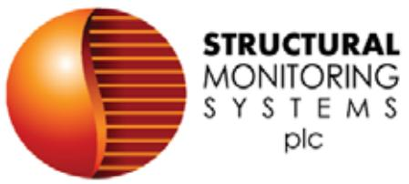
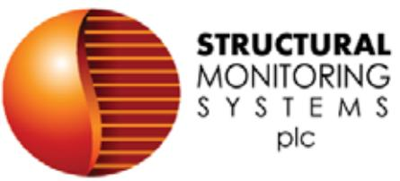

{0}------------------------------------------------

# ANNUAL REPORT 2022

{1}------------------------------------------------

# CORPORATE DIRECTORY

## DIRECTORS

Ross Love *Executive Chairman*

Sam Wright *Non-Executive Director*

Hendrik Deurloo *Non-Executive Director*

Bryant McLarty *Non-Executive Director*

Brian Wall *Non-Executive Director*

#### OFFICERS

Mr. Sam Wright *Company Secretary*

#### CORPORATE OFFICE

Suite 116, 1 Kyle Way Claremont WA 6010 Australia

Telephone: +61 8 6161 7412 Facsimile: +61 8 9467 6111 Email: sms@smsystems.com.au

#### UNITED KINGDOM OFFICE & REGISTERED OFFICE

The Old Court 8 Tufton Street Ashford Kent TN23 1PF United Kingdom

#### CANADA OFFICE

100-966 Crowley Avenue Kelowna British Colombia. Canada V1Y OL1 www.aem-corp.com

#### SHARE REGISTRY

Computershare Investor Centre Pty Ltd GPO Box 2975 Melbourne VIC 3001

Enquiries (within Australia) 1300 850 505 Enquiries (from Overseas) +61 3 9415 4000 www.investorcentre.com/contact

#### STOCK EXCHANGE LISTING

Australian Securities Exchange (Home Exchange: Perth, Western Australia) Code: SMN

STRUCTURAL MONITORING SYSTEMS PLC WEBSITE

www.smsystems.com.au

## STRUCTURAL MONITORING SYSTEMS PLC MAILING ADDRESS

PO Box 661 Nedlands Western Australia 6909

#### AUDITORS

Jeffreys Henry Audit Limited Finsgate 5-7 Cranwood Street London EC1V 9EE

{2}------------------------------------------------

# CONTENTS

| Strategic report                                           | 4  |
|------------------------------------------------------------|----|
| Directors' report                                          | 9  |
| Statement of profit or loss and other comprehensive income | 22 |
| Statement of financial position                            | 23 |
| Statement of cash flows                                    | 25 |
| Statement of changes In equity                             | 26 |
| Notes to the financial statements                          | 28 |
| Independent auditors' report                               | 68 |
| Shareholder information                                    | 76 |

## IMPORTANT NOTICES

Structural Monitoring Systems Plc (the Company) is incorporated in the United Kingdom under the laws of England and Wales. The Company is not subject to Chapters 6, 6A, 6B and 6C of the Australian Corporations Act 2001 dealing with the acquisition of shares (including substantial holdings and takeovers).

{3}------------------------------------------------

# STRATEGIC REPORT

# REVIEW OF OPERATIONS

During the financial year ended 30 June 2022, Structural Monitoring Systems Plc ("SMS", the "Group" or the "Company"), achieved a key milestone in the granting of a Supplementary Type Certificate ("STC") for its ground-breaking CVM™ technology.

SMS and its Canadian-based, wholly owned subsidiary, Anodyne Electronics Manufacturing Corp ("AEM"), logged total sales for the 2022 financial year of \$15.70m (excluding intercompany sales), an increase of 2% on the year prior.

At the reporting date, the balance of Group cash and cash equivalents was \$1.80m (2021: \$2.38m). Borrowings as at 30 June 2022 amounted to \$5.46m (2021: \$nil) as the Company utilised an established loan facility with HSBC Canada to debt fund the successful acquisition of Canadian business, Eagle Audio, through its subsidiary Anodyne Electronics Manufacturing Corp ("AEM"). The acquisition is already proving to be very successful with its suite of product offerings significantly improving overall revenue and profit margins. AEM also utilises a working capital facility with the same banker making up the balance of borrowings. The Group has placed \$1.15m on deposit with HSBC Canada as security for its loan facility.

# BREAKTHROUGH FAA CERTIFICATION OF CVM™ AND POST CERTIFICATION INITIATIVES

SMS announced in March this year that the United States Federal Aviation Administration (FAA) had granted its authority to issue a Supplemental Type Certificate (STC) approval for the use of the Company's CVM™ technology on the B737-800 Intelstat (Gogo) Wi-Fi antenna support structure inspection. The approval marked a milestone in aviation history as the first ever in the world regulatory agency approved sensor technology validated and certified for detecting critical structural cracks on aircraft.

The certification of CVM™ sensors to detect cracks on aircraft is expected to meaningfully impact industry maintenance inspection methods and reduce operating costs for the industry as it continues to recover from the unprecedented impact of the pandemic.

The Company is focused on progressing the commercialisation strategy for CVM™ and on ongoing positive engagement with potential customers both in the US and more broadly to achieve this end goal.

To that end, the management and engineering team received approval from Boeing for the procedures and equipment to commence the POD testing phase of the 737 APB program in (August) at the new facility in Kelowna. This critical APB application developed in conjunction with Delta Air Lines has a potential market in excess of 400 aircraft.

Additionally, another major airline operator is working with the team to identify a range of applications where our monitoring systems may avoid or defer out of cycle checks which currently consume several days.

{4}------------------------------------------------

Several key executives will attend the joint Airlines for America Non-destructive Testing (NDT) Forum and SAE AISC-SHM in San Antonio, Texas, from September 27 to September 30. A number of papers on CVM will be presented to the attendees. This is a significant industry event where all major US airlines will be represented and presents an opportunity for industry leaders to discuss current trends and developments in NDT methodologies and to further existing relationships and discussions with key stakeholders and initiate others.

# CORPORATE

The Company completed a Rights issue in April 2022 through the issue of 5,461,451 CDIs at an issue price of \$0.90 per CDI with a 1:2 free attaching unlisted option exercisable at \$1.20 with an expiry date of 6 April 2024 raising \$4.91m before issue costs.

During the year a legal claim for royalty fees against wholly owned subsidiary Structural Monitoring Systems Limited was upheld and settled. The claim was disclosed as a contingency in the notes to the 2021 Annual Report. A subsequent claim for costs for the same case was also upheld and settled subsequent to the balance date.

A number of changes occurred at Board level during the financial year. The Company accepted the resignations of former Chairman Will Rouse and of directors Stephen Forman and Mike Reveley earlier this year and the Company wishes them well in their future endeavours.

Bryant McLarty, Hendrik Deurloo and Brian Wall were all appointed as Non-executive Directors during the year. The Company also announced the appointment of internationally recognised senior executive, Ross Love, as Executive Chairman on July 13 this year, subsequent to the reporting date.

Mr Love is an experienced global executive and consultant with wide public and private sector experience in policy reform and business strategy transformation in Australia and the United States.

He was formerly a Senior Partner at the Boston Consulting Group (BCG) where he worked for more than 25 years, most recently as head of its New York business, and prior to that its Australian and New Zealand businesses.

Mr Love is currently chair of the Western Australian Water Corporation, Chair of the Fremantle Port Authority and a director of Tellus Group Holdings and brings decades of business leadership and management to the role of Executive Chair.

# ANODYNE ELECTRONICS MANUFACTURING CORPORATION ("AEM") FINANCIAL PERFORMANCE UPDATE

Wholly owned SMS subsidiary, Anodyne Electronics Manufacturing Corp ("AEM"), recorded \$15.70m in revenue, an increase of 2% on the prior year and normalised EBITDA** for the year to 30 June 2022 of \$2.27m (inc. intercompany sales on an arms-length basis), a decrease of 31% year on year.

This was achieved against the backdrop of the significant impact of the Covid pandemic that affected both sales and production at the platform level, while concurrent supply chain difficulties and inflationary price pressures encountered during the year compounded the overall business impact. AEM also navigated a move to new premises and the installation of new plant and equipment with minimal disruption to operations during the year.

This full year result, exceeding budget, is a tribute to the excellent team the Company has assembled in Kelowna, operating in extremely challenging conditions. Through substantial investment in research and development, the successful acquisition of Eagle audio and higher margins achieved from stronger sales of AEM-developed products, the Group was able to more than offset the effects of softer sales in contract manufactured products.

{5}------------------------------------------------

# AEM RELOCATION TO NEWLY CONSTRUCTED MANUFACTURING FACILITY IN KELOWNA, BRITISH COLUMBIA

AEM increased production capacity by moving its operations to a newly constructed 35,000 square foot (3,251m2) facility in Kelowna, British Columbia earlier this year.

The brand-new purpose-built facility, announced in 2020, was designed to increase operational efficiency and adds an additional10,000 sq. ft. (929m2) from its previous premises.

The move represents a strategic investment in new manufacturing equipment and offers the AEM team further opportunities for improvement and innovation with its custom footprint and layout, new state of the art equipment and optimisation of available space.

The new premises are now fully operational with product departments open and operating at full capacity.

# ACQUISITION OF EAGLE AUDIO SEPTEMBER 2021

The Company, via its wholly owned subsidiary AEM, announced the acquisition of key avionics division, Eagle Audio, from Eagle Copters Ltd in September 2021 at a purchase price of CA\$4.12m. The transaction was internally funded through cash and the use of existing low-cost debt facilities with HSBC Canada.

The audio acquisition represents a natural synergy with AEM's existing product offering and manufacturing facilities and complements its current significant audio R&D effort, providing additional growth opportunities and clear new R&D pathways into related product areas.

As outlined above, this strategic acquisition is already proving to be very successful with its suite of product offerings significantly improving revenue and profit margins.

# PROJECTED OUTLOOK

Looking ahead to the next financial year, SMS will continue to increase investment in R&D and sales team expansion which will result in a continuation of the transition to sales of higher margin, AEM developed products. The move to a new purpose-built facility completed in January 2022 should result in increased efficiencies of production and improved profit margins.

Directors and Management are constantly monitoring the Covid pandemic and are not in a position at this stage to provide firm forecasts on the effects it may have on operations for FY2023. Current visibility and realised activity levels, however, indicate that at this stage as evidenced by improvement in revenues since March 2022 – that core operations will continue to recover from the Covid pandemic. The SMS Board and management will continue to monitor the evolving global situation closely and regularly.

# ANALYSIS USING KEY FINANCIAL PERFORMANCE INDICATORS AND MILESTONES

As at 30 June 2022, the Group had approximately \$1.80m cash at bank (2021: \$2.38m).

The Group recorded a loss for the financial year of \$4.03m (2021: \$1.96m). The increase in loss was incurred due in part to the payment of royalty fees of \$0.69m (2021: \$nil), depreciation and amortisation expenses of \$1.64m (2021: \$0.97m) arising from assets acquired in the move to AEM's new manufacturing facility, R&D expenses of \$0.64m (2021: \$0.18m) incurred by AEM as it continues to generate new products to meet customer demand and increased employee costs of \$6.86m (2021: \$5.21m) arising from the increase in staff count undertaken by AEM during the year. The Group also recorded revenue during the year of \$15.70m (2021: \$15.34m), an increase of 2% year on year. Other key expenses during the year were consumables and raw materials used of \$7.88m (2021: \$8.26m) and sales and marketing expenses of \$0.53m (2021: \$0.28m). Revenue generated via the acquisition of Eagle Audio helped contribute to higher earnings in the

{6}------------------------------------------------

second half of the year. In accordance with IAS 38 Intangible assets the Group has capitalised development expenses of \$0.57m (2021: \$0.90) incurred in the internal development of products at the commercialisation stage of development.

The Group EBITDA* for the financial year was (\$2.27m) (2021: (\$0.48m). Normalised EBITDA** for AEM for the year ended 30 June 2022 was \$2.27m (2021: \$3.08m).

Loss per share for the financial year was 3.26 cents per share (2021: Loss per share 1.64 cents).

Net tangible assets at the reporting date were 6.56 cents per ordinary security (2021: 8.48 cents).

At the reporting date the Group had net assets of \$15.56m (2021: \$14.01m). The Group had trade and other receivables of \$3.04m, inventory of \$10.89m and intangible assets of \$7.15m, including goodwill of \$1.61m. The key movements during the year were an increase in borrowings of \$5.46m to fund the acquisition of Eagle Audio and utilise a working capital facility provided by HSBC Canada, \$1.15m was placed on deposit as security for the loan facility. ROU assets increased by \$8.40m due to the take up of a new lease on AEM's manufacturing facility and investment in new plant and equipment in the facility. ROU lease liabilities similarly increased by \$9.51m. Inventory increased by \$3.81m in part due to the take up of Eagle Audio inventory on acquisition and to protect against supply chain issues. Intangible assets increased by \$3.43m due to the acquisition of Eagle Audio and deferral of R&D costs. Income tax expense for the year reduced from \$0.50m to a benefit of \$0.28m because of a reduction in taxable income, instant write offs associated with fixed assets acquired and right of use lease payments made during the year.

The primary movement in equity during the year was a Rights Issue completed in April 2022 raising the sum of \$4.91m before issue costs.

*EBITDA, which is inclusive of FX gains/losses, is calculated by adding back interest costs, income tax, depreciation and amortisation expenses and deducting interest revenue from loss after tax for the year of \$4.03m (2021: \$1.96m).

**Normalised EBITDA is calculated by adding back to EBITDA, SMS costs of \$0.86m (2021: \$0.73m) borne by AEM.

# PRINCIPAL RISKS AND UNCERTAINTIES

The principal risks and how they are managed are set out on page 20 and 21 of the Director's Report.

{7}------------------------------------------------

# S172 STATEMENT

The Board has a duty under s172 of the Companies Act 2006 to promote the success of the Company of the benefit of its members as a whole. All decisions are made with this objective and the Board considers the long-term implications of its actions.

The Group has a continuous stakeholder engagement programme in which Executive and Non-Executive Directors participate to ensure the Board is aware of stakeholder interests.

The Group believes its employees are its greatest asset and it seeks to establish policies that provide a working environment that is safe, enjoyable and rewarding.

Critical to the success of the Group is its long-term relationship with its suppliers and customers, as well as its shareholders. The Board believes the decisions it has made have been appropriated both to support these stakeholders and to foster stronger, long-term relationships with them.

The Group is mindful of its role with its local communities and seeks to minimise the impact of its operations on the environment and to be a good neighbour.

Overall, in considering and taking decisions the Board seeks to act in the best interests of the business and all its stakeholders, treating all members fairly.

The Strategic Report was signed on behalf of the Board.

Ross Love Executive Chairman 30th September 2022

{8}------------------------------------------------

# DIRECTORS' REPORT

Your directors submit their report for the year ended 30 June 2022.

# DIRECTORS AND OFFICERS

The names of the Company's directors and officers in office during the year and until the date of this report are as below.

## Ross Love (Executive Chairman, appointed 13 July 2022)

Mr Love is an experienced executive and consultant with wide public and private sector experience in developing and executing policy reforms and business strategy transformations in Australia and the United States. He has worked with senior decision makers in government at State and Commonwealth level in Australia, the State and City Governments of New York, and the UN, as well as with Executive teams and Boards in the corporate and non-profit sectors. Formerly a Senior Partner at the Boston Consulting Group where he worked for over 25 years, Mr Love was most recently head of its New York business and prior to that it's Australian and New Zealand business.

Mr Love completed the Advanced Development Program at the London Business School and MPA (2) at the Kennedy School of Government, Harvard University. He has a first-class BA Honours degree from the University of Western Australia.

Mr Love has not held directorships of any other ASX listed companies in the last 3 years.

## Sam Wright (Non-Executive Director, appointed 14 October 2020 and Company Secretary)

Mr Wright is experienced in the administration of ASX listed companies, corporate governance, and corporate finance. He is a member of the Australian Institute of Company Directors, the Financial Services Institute of Australasia, and the Chartered Secretaries of Australia.

Mr Wright is the Managing Director of Perth-based corporate advisory firm, Straight Lines Consultancy, specialising in the provision of corporate services to public companies. He has extensive experience in relation to public company responsibilities, including ASX and ASIC compliance, control and implementation of corporate governance, statutory financial reporting, and shareholder relations with both retail and institutional investors.

Mr Wright is currently a Director of ASX listed companies, Pharmaust Limited, Reach Resources Limited and Structural Monitoring Systems plc. Mr Wright is Company Secretary for ASX listed companies, Buxton Resources Limited and Wide Open Agriculture Limited. He has also filled the role of Director and Company Secretary with a number of unlisted companies.

{9}------------------------------------------------

# Bryant McLarty (Non-Executive Director, appointed 20 October 2021)

Mr McLarty is an Australian Financial Services Licensee with over 25 years' experience in equities and capital markets. He is chairman of Mac Euity Partners, a boutique investment and corporate advisory firm, and a director of a number of private companies.

Past directorships include London stock exchange listed aircraft leasing company, Avation Plc, ASX listed Hazer Group Limited, EMVision Limited and PharmAust Limited.

In the last 3 years Mr McLarty was a director of Park'D Limited (1 December 2016 – 20 April 2020). Currently he is not a director of any ASX listed companies other than Structural Monitoring Systems plc.

## Hendrik Deurloo (Non-Executive Director, appointed 1 April 2022)

Mr Deurloo has more than 23 years of experience in management and sales in the global aerospace industry and is currently SVP & Chief Commercial Officer for Pratt & Whitney. In his role he is responsible for leading and directing all Sales, Marketing and Customer Support worldwide for Pratt & Whitney Commercial Engines and International Aero Engines (IAE).

Mr. Deurloo is a member of the Board of Governors of the Wings Club Foundation, a global society of aviation professionals. He holds a bachelor's degree in finance from East Connecticut State University and a master's degree in business administration from the University of Connecticut.

Mr Deurloo has not held directorships of any ASX listed companies in the last 3 years.

## Brian Wall (Non-Executive Director, appointed 20 June 2022)

Mr Wall has held leadership roles in a 35 year plus career with organisations such as Cintas, Troika Ventures, The Pattison Group and most recently, Anodyne Electronics Corporation ("AEM") a subsidiary of SMS.

Mr Wall joined AEM in August 2019 and held the position of Chief Executive until August 2022. He successfully navigated the company through the COVID-19 pandemic successfully position the company for profitable growth in several sectors and overseen the move to its new facility in Kelowna, BC.

Mr Wall has not held directorships of any other ASX listed companies in the last 3 years.

## Will Rouse (resigned 20 June 2022)

Mr Rouse is an experienced senior banker, finance executive and "serial entrepreneur" focused on the acquisition and optimised growth of specialised manufacturing-related businesses. In his last role, Will acquired Simcro Ltd ("Simcro") in 2007, a New Zealand-based export-manufacturer. Will sold his majority stake in Simcro in 2013 to The Riverside Company, a New York private equity group, retaining a 20% shareholding. Simcro then acquired two further operating businesses in NZ and Australia in 2015, with Will leading these acquisitions. Simcro was recently sold to a global multinational. Will is a Chartered Accountant and remains on the Board of Simcro.

# R. Michael Reveley (resigned 20 October 2021)

Mr Reveley served as a managing partner, chief executive and co-CIO of SEAL Capital Ltd, a Los Angeles-based hedge fund specialising in global macro strategies designed to provide risk-adjusted absolute returns investing in an array of global markets, under all market conditions. Before forming SEAL Capital, he was a founding partner and deputy CIO at Seagate Global Advisors in Los Angeles, having earlier been director of the syndicate and derivatives group at SBC Warburg in London and New York, vice-president of global derivatives for Swiss Bank Corporation and vice-president of the global derivatives group at First Interstate Bank, where he co-managed a US\$20bn derivatives portfolio.

{10}------------------------------------------------

## Stephen Forman (resigned 20 June 2022)

Mr Forman has over 25 years of demonstrated high-level equity capital markets experience in Australia and North America, through roles in institutional equity sales and trading, investor relations and corporate advisory with major top-tier global investment groups, including UBS and JP Morgan, the latter where Mr Forman worked for 15 years in various senior positions.

Mr Forman's current role as Managing Director with New York-based investment advisory and consulting firm, Union Square Capital Advisors saw him successfully utilise his global network to assist companies with business development and corporate communication strategies, and to diversify their share register with Australian and North American investors. Mr Forman holds a B.Comm – Hons (Accounting & Finance) from UWA and is a CFA Charterholder.

# PRINCIPAL ACTIVITIES

During the financial year the principal continuing activities of the consolidated entity consisted of the design and manufacture of electronic products and the provision of manufacturing services to the aviation industry.

# SHAREHOLDER MEETINGS

Structural Monitoring Systems Plc held its Annual General Meeting of Shareholders as a virtual meeting on 25th January 2022.

All resolutions that were put were passed by a poll.

# STATEMENT OF DIRECTORS' RESPONSIBILITIES

The directors are responsible for preparing the Strategic Report and Directors' Report and the financial statements in accordance with applicable law and regulations.

Company law requires the directors to prepare group and company financial statements for each financial year. The directors are required under the rules of the Australian Securities Exchange to prepare group and company financial statements in accordance with International Financial Reporting Standards ("IFRS") as adopted by the United Kingdom ("UK").

The financial statements are required by law and IFRS adopted by the UK to present fairly the financial position of the group and the company and the financial performance of the group. The Companies Act 2006 provides in relation to such financial statements that references in the relevant part of that Act to financial statements giving a true and fair view are references to their achieving a fair presentation.

Under company law the directors must not approve the financial statements unless they are satisfied that they give a true and fair view of the state of affairs of the group and the company and of the profit or loss of the group and the company for that period.

In preparing the group and company financial statements, the directors are required to:

- a. select suitable accounting policies and then apply them consistently;
- b. make judgements and accounting estimates that are reasonable and prudent;
- c. state whether they have been prepared in accordance with IFRSs adopted by the UK; and
- d. prepare the financial statements on the going concern basis unless it is inappropriate to presume that the group and the company will continue in business.

The directors are responsible for keeping adequate accounting records that are sufficient to show and explain the group's and the company's transactions and disclose with reasonable accuracy at any time the financial position of the group and the company and enable them to ensure that the financial statements comply with the Companies Act 2006. They

{11}------------------------------------------------

are also responsible for safeguarding the assets of the group and the company and hence for taking reasonable steps for the prevention and detection of fraud and other irregularities. The Directors are responsible for the maintenance and integrity of the corporate and financial information included on the www.smsystems.com.au website. Legislation in the United Kingdom governing the preparation and dissemination of financial statements may differ from legislation in other jurisdictions.

# INDEMNITY AND INSURANCE OF OFFICERS

The Company has indemnified the directors and executives of the company for costs incurred, in their capacity as a director or executive, for which they may be held personally liable, except where there is a lack of good faith.

During the financial year, the Company paid a premium in respect of a contract to insure the directors and executives of the company. The contract of insurance prohibits disclosure of the nature of the liability and the amount of the premium.

# EVENTS SUBSEQUENT TO THE REPORTING DATE

Subsequent to the reporting date the Company appointed Ross Love as Executive Chairman.

The Company also completed a Placement of 5,500,000 CDIs at an issue price of \$0.35 per CDI each with a 1:1 free attaching option exercisable at \$1.20 with an expiry date of 6 April 2024.raising \$1.93 million before issue costs. The funds raised will be used to assist in funding the commercialisation of its unique FAA approved CVMTM technology.

On 21 September 2022, the Company advised shareholders that it is undertaking the necessary steps to convene an Extraordinary General Meeting (EGM) in compliance with the Companies Act 2006 (UK) and that a Notice of Meeting will be dispatched to CDI holders shortly. SMS expects the EGM to be held on or around the week commencing 31 October, subject to the Notice of Meeting being reviewed by the regulators.

The impact of the Coronavirus pandemic is ongoing and has had financial impact for the Group to 30 June 2022, it is not practicable to estimate the potential impact, positive or negative, after the reporting date. The situation is rapidly developing and is dependent on measures imposed by the Australian government and other countries, such as maintaining social distancing requirements, quarantine, travel restrictions and any economic stimulus that may be provided.

Other than the above no matters or circumstances have arisen since the end of the financial year which significantly affected or may significantly affect the operations of the Group, the results of those operations, or the state of affairs of the Group in future financial years.

# RESULTS AND DIVIDEND

The operating loss, after income tax, for the year was \$4.03m (2021: \$1.96m). No dividends were proposed or paid during the financial year.

# SHARE CAPITAL

The impact on share capital and share premium account of the share issues during the year, is disclosed in note 23 in the notes to the financial statements.

# GOING CONCERN

The financial statements have been prepared on the going concern basis, which contemplates continuity of normal business activities, the continued financial performance of AEM and the realisation of assets and discharge of liabilities in the normal course of business as well as the availability of an established operating loan facility of up to CAD\$5 million. The facility which is provided by AEM's bankers is long standing and is secured on receivables and inventory and is subject to loan covenants. Directors expect compliance with the covenants to continue to be met.

{12}------------------------------------------------

The directors have prepared forecasts in respect of future trading. Achievement of such forecasts would require the Group to carry out one of, or a combination of the following to allow it to manage within its current funding facilities for the period to 12 months from the date of this report, raise capital through the issue of shares, amend the structure of current debt, reduce or defer employee or other administration costs within the Group. In developing these forecasts, the Directors have made assumptions and performed sensitivity analysis on variables such revenues and exchange rates based upon their view of the current and future economic conditions that will prevail over the forecast period of 12 months from the date of signing these financial statements.

The Directors therefore continue to adopt the going concern basis of accounting in preparing the financial statements It is noted, there is a material uncertainty over going concern should the Group be unable to execute one or more of the following, raising capital through the issue of shares, amending the current debt structure to release further funds, or reduce/defer employee costs or other operating costs.

# DIRECTORS' MEETINGS

The number of directors' meetings (including meetings of committees of directors) and number of meetings attended by each of the directors of the Group during the financial year:

|                | Board meetings |   |   | Audit committee |   | Remuneration committee |  |
|----------------|----------------|---|---|-----------------|---|------------------------|--|
| Director       | A              | B | A | B               | A | B                      |  |
| S Wright       | 3              | 3 | 2 | 2               | 1 | 1                      |  |
| B McLarty(1)   | 3              | 3 | 1 | 1               | - | -                      |  |
| H Deurloo(2)   | 1              | 1 | - | -               | - | -                      |  |
| B Wall(3)      | -              | - | - | -               | - | -                      |  |
| W Rouse(4)     | 3              | 3 | 2 | 2               | 1 | 1                      |  |
| S Forman(5)    | 3              | 3 | 2 | 2               | 1 | 1                      |  |
| R M Reveley(6) | 1              | 1 | 1 | 1               | - | -                      |  |

(1) appointed 20 October 2021

- (2) appointed 1 April 2022
(3) appointed 20 June 2022

(4), (5) resigned 20 June 2022

(6) resigned 20 October 2021

A – Number of meetings attended

B – Number of meetings held during the time which the director held office during the year

In addition to formal directors' meetings held during the year regular executive meetings were held on a monthly basis throughout the year.

# RESEARCH AND DEVELOPMENT

The Group actively reviews technical developments in its markets with a view to taking advantage of the opportunities available to maintain and improve its competitive position. This action involves the design and development of customised avionics and structural health monitoring systems applicable to the aviation industry.

{13}------------------------------------------------

# REMUNERATION REPORT (AUDITED)

# REMUNERATION POLICY

The Remuneration Committee of the Board of Directors of Structural Monitoring Systems Plc is responsible for determining and reviewing compensation arrangements for the directors and executives. The Remuneration Committee (or the Board of directors) assesses the appropriateness of the nature and amount of emoluments of such officers on a periodic basis by reference to relevant employment market conditions with the overall objective of ensuring maximum stakeholder benefit from the retention of a high-quality board and executive team. Such officers are given the opportunity to receive their base emoluments in a variety of forms including cash and fringe benefits such as motor vehicles and expense payment plans. It is intended that the manner of payment chosen will be optimal for the recipient without creating undue cost for the company.

To assist in achieving these objectives, the Remuneration Committee links the nature and amount of executive directors' and senior executives' emoluments to the Company's financial and operational performance. Executive directors and employees have the opportunity to qualify for participation in the Company Employee Incentive Plan.

It is the Remuneration Committee's policy that employment agreements shall be entered into with the Executive Chairman and all other executives. Any options or performance rights held lapse when the service period is completed.

{14}------------------------------------------------

# REMUNERATION OF DIRECTORS AND EXECUTIVE OFFICERS

Details of the nature and amount of each major element of remuneration of each director of the Group and each of the Group executives who receive the highest remuneration are:

|                      | Salary & Fees |                                          | Post Employment | Share-based payments  |        | Total   |
|----------------------|---------------|------------------------------------------|--------------------|-----------------------|--------|---------|
| 30 June 2022         | Cash          | Performance rights in lieu of fees | Superannua tion | Performance rights | Shares |         |
|                      | \$            | \$                                       | \$                 | \$                    | \$     | \$      |
| Directors            |               |                                          |                    |                       |        |         |
| Will Rouse(1)        | 194,505       | -                                        | -                  | -                     | -      | 194,505 |
| Stephen Forman(1)    | 150,000       | -                                        | -                  | 18,416                | -      | 168,416 |
| Sam Wright           | 140,000       | -                                        | -                  | -                     | -      | 140,000 |
| R Michael Reveley(2) | 86,250        | -                                        | -                  | -                     | -      | 86,250  |
| Bryant McLarty(3)    | 45,000        | -                                        | -                  | -                     | -      | 45,000  |
| Hendrik Deurloo(4)   | 18,750        | -                                        | -                  | -                     | -      | 18,750  |
| Brian Wall(5)        | 8,349         | -                                        | -                  | -                     | -      | 8,349   |
| Total                | 642,854       | -                                        | -                  | 18,416                | -      | 661,270 |

|                    | Salary & Fees |                                          | Post Employment | Share-based payments  |         | Total     |
|--------------------|---------------|------------------------------------------|--------------------|-----------------------|---------|-----------|
| 30 June 2021       | Cash          | Performance rights in lieu of fees | Superannua tion | Performance rights | Shares  |           |
|                    | \$            | \$                                       | \$                 | \$                    | \$      | \$        |
| Directors          |               |                                          |                    |                       |         |           |
| Will Rouse         | 100,000       | 121,826                                  | -                  | 138,258               | 66,834  | 426,918   |
| R. Michael Reveley | 57,500        | 81,892                                   | -                  | 107,774               | -       | 247,166   |
| Stephen Forman     | 70,000        | 20,219                                   | -                  | 67,439                | -       | 157,658   |
| Sam Wright(6)      | 70,000        | 70,324                                   | -                  | -                     | -       | 140,324   |
| Terry Walsh(7)     | -             | 67,461                                   | -                  | 34,848                | 11,603  | 113,912   |
|                    |               |                                          |                    |                       |         |           |
| Executive          |               |                                          |                    |                       |         |           |
| Toby Chandler      | 68,750        | 178,262                                  | -                  | 223,269               | 89,250  | 559,531   |
| Total              | 366,250       | 539,984                                  | -                  | 571,588               | 167,687 | 1,645,509 |

{15}------------------------------------------------

- (1 ) resigned 20 June 2022
- (2) resigned 20 October 2021
- (3) appointed 20 October 2021
- (4) appointed 1 April 2022
- (5) appointed 20 June 2022

(6) appointed as director 14 October 2020. Fees also include Company secretarial services.

- (7) resigned as director 14 October 2020. Mr Walsh receives a salary of \$75,000 per annum including superannuation as legal counsel.
# SHARE-BASED COMPENSATION

At the 2021 AGM, the Company did not receive any feedback at the AGM regarding its remuneration practices.

The value of Performance Rights (PRs) granted, converted and lapsed for directors and executives as part of compensation during the year ended 30 June 2022 are set out below:

|                   | Value of PRs granted | Value of PRs converted | Value of PRs lapsed |
|-------------------|-------------------------|---------------------------|------------------------|
| Name              | \$                      | \$                        | \$                     |
| Sam Wright        | -                       | 155,813                   | -                      |
| Bryant McLarty    | -                       | -                         | -                      |
| Hendrik Deurloo   | -                       | -                         | -                      |
| Brian Wall        | -                       | -                         | -                      |
| Will Rouse        | -                       | -                         | -                      |
| Stephen Forman    | -                       | -                         | -                      |
| R Michael Reveley | -                       | 392,929                   | -                      |
| Total             | -                       | 548,742                   | -                      |

# SERVICE AGREEMENTS

Remuneration and other terms of employment for Directors and executives are formalised in service agreements. Details of these agreements are as follows:

| Name:                | Ross Love                                                                                                                                                                                            |
|----------------------|------------------------------------------------------------------------------------------------------------------------------------------------------------------------------------------------------|
| Title:               | Executive Chairman                                                                                                                                                                                   |
| Agreement commenced: | 13 July 2022                                                                                                                                                                                         |
| Term of agreement:   | no fixed term                                                                                                                                                                                        |
| Details:             | Base salary of \$325,000 plus statutory superannuation, if applicable, to be reviewed annually by the Remuneration Committee. Subject to termination notice of 6 month notice by either party. |

{16}------------------------------------------------

# DIRECTORS' REPORT *Continued*

| Name:                | Bryant McLarty                                                                                                    |
|----------------------|-------------------------------------------------------------------------------------------------------------------|
| Title:               | Non-Executive Director                                                                                            |
| Agreement commenced: | 20 October 2021                                                                                                   |
| Term of agreement:   | no fixed term                                                                                                     |
| Details:             | Base salary of \$75,000 to be reviewed annually by the Remuneration Committee. No termination period in place. |
| Name:                | Hendrik Deurloo                                                                                                   |
| Title:               | Non-Executive Director                                                                                            |
| Agreement commenced: | 1 April 2022                                                                                                      |
| Term of agreement:   | no fixed term                                                                                                     |
| Details:             | Base salary \$75,000 to be reviewed annually by the Remuneration Committee. No termination period in place.    |
| Name:                | Brian Wall                                                                                                        |
| Title:               | Non-Executive Director                                                                                            |
| Agreement commenced: | 20 June 2022                                                                                                      |
| Term of agreement:   | no fixed term                                                                                                     |
| Details:             | Base salary \$75,000 to be reviewed annually by the Remuneration Committee. No termination period in place.    |

Until his retirement on 24 August 2022 Brian was also Chief Executive Officer of wholly owned subsidiary Anodyne Electronics Manufacturing Corp (AEM). He will remain engaged as a consultant with AEM for a 12 month term on an annual salary of CA\$140,000.

| Name:                | Sam Wright                                                                                                                                                                    |
|----------------------|-------------------------------------------------------------------------------------------------------------------------------------------------------------------------------|
| Title:               | Non-Executive Director & Company Secretary                                                                                                                                    |
| Agreement commenced: | 1 January 2021                                                                                                                                                                |
| Term of agreement:   | no fixed term                                                                                                                                                                 |
| Details:             | Base salary \$140,000 to be reviewed annually by the Remuneration Committee. Subject to termination notice of 1 month by the director and 2 months' notice by the company. |

Directors and executives have no entitlement to termination payments in the event of removal for misconduct.

{17}------------------------------------------------

# SHAREHOLDINGS OF DIRECTORS

CDIs held in Structural Monitoring Systems Plc:

| 30 June 2022         | Balance at beg of year | CDIs held on appointment/ resignation date | Granted as Remunera tion | Exercise of PRs | Net Change Other | Balance at end of year |
|----------------------|---------------------------|-----------------------------------------------------|--------------------------------|--------------------|---------------------|---------------------------|
|                      | No.                       | No.                                                 | No.                            | No.                | No.                 | No.                       |
| Directors            |                           |                                                     |                                |                    |                     |                           |
| Sam Wright           | 1,620,000                 | -                                                   | -                              | 155,813            | 147,984             | 1,923,797                 |
| Bryant McLarty(1)    | -                         | 1,525,871                                           | -                              | -                  | 324,174             | 1,850,045                 |
| Hendrik Deurloo(2)   | -                         | -                                                   | -                              | -                  | -                   | -                         |
| Brian Wall(3)        | -                         | 38,218                                              | -                              | -                  | -                   | 38,218                    |
| Will Rouse(4)        | 1,156,016                 | (1,252,351)                                         | -                              | -                  | 96,335              | -                         |
| Stephen Forman(5)    | 1,739,978                 | (1,884,976)                                         | -                              | -                  | 144,998             | -                         |
| R Michael Reveley(6) | 2,471,444                 | (2,471,444)                                         | -                              | 392,929            | (392,929)           | -                         |
| Total                | 6,987,438                 | (4,044,682)                                         | -                              | 548,742            | 320,562             | 3,812,060                 |

| 30 June 2021       | Balance at beg of year | CDIs held on appointment/ resignation date | Granted as Remunera tion | Exercise of PRs | Net Change Other | Balance at end of year |
|--------------------|---------------------------|-----------------------------------------------------|--------------------------------|--------------------|---------------------|---------------------------|
|                    | No.                       | No.                                                 | No.                            | No.                | No.                 | No.                       |
| Directors          |                           |                                                     |                                |                    |                     |                           |
| Will Rouse         | 270,588                   | -                                                   | -                              | 435,428            | 450,000             | 1,156,016                 |
| R. Michael Reveley | 2,654,351                 | -                                                   | -                              | -                  | (182,907)           | 2,471,444                 |
| Stephen Forman     | 1,900,000                 | -                                                   | -                              | 117,308            | (277,330)           | 1,739,978                 |
| Sam Wright(7)      | -                         | 1,620,000                                           | -                              | -                  | -                   | 1,620,000                 |
| Terry Walsh(8)     | 64,500                    | (64,500)                                            | -                              | -                  | -                   | -                         |
| Total              | 4,889,439                 | 1,555,500                                           | -                              | 552,736            | 239,363             | 6,987,438                 |

{18}------------------------------------------------

# PERFORMANCE RIGHTS HOLDINGS OF DIRECTORS

| 30 June 2022         | Balance at beg of year/ on appoint ment | Granted in lieu of fees during the year | Exercised during the year | PRs held on resignation | Balance at end of the year |
|----------------------|--------------------------------------------------|--------------------------------------------------|---------------------------------|----------------------------|----------------------------------|
|                      | No.                                              | No.                                              | No.                             | No.                        | No.                              |
| Directors            |                                                  |                                                  |                                 |                            |                                  |
| Sam Wright           | 155,813                                          | -                                                | (155,813)                       | -                          | -                                |
| Bryant McLarty(1)    | -                                                | -                                                | -                               | -                          | -                                |
| Hendrik Deurloo(2)   | -                                                | -                                                | -                               | -                          | -                                |
| Brian Wall(3)        | -                                                | -                                                | -                               | -                          | -                                |
| Will Rouse(4)        | -                                                | -                                                | -                               | -                          | -                                |
| Stephen Forman(5)    | 253,954                                          | -                                                | -                               | (253,954)                  | -                                |
| R Michael Reveley(6) | 392,929                                          | -                                                | (392,929)                       | -                          | -                                |
| Total                | 802,696                                          | -                                                | (548,742)                       | (253,954)                  | -                                |

| 30 June 2021       | Balance at beg of year/ on appoint ment No. | Granted in lieu of fees during the year No. | Exercised during the year No. | PRs held on resignation No. | Balance at end of the year No. |
|--------------------|---------------------------------------------------------|---------------------------------------------------------|----------------------------------------|-----------------------------------|-----------------------------------------|
| Directors          |                                                         |                                                         |                                        |                                   |                                         |
| Will Rouse         | 795,588                                                 | 264,840                                                 | (435,428)                              | (625,000)                         | -                                       |
| R. Michael Reveley | 814,904                                                 | 178,025                                                 | -                                      | (600,000)                         | 392,929                                 |
| Stephen Forman     | 267,308                                                 | 103,954                                                 | (117,308)                              | -                                 | 253,954                                 |
| Sam Wright(7)      | -                                                       | 155,813                                                 | -                                      | -                                 | 155,813                                 |
| Terry Walsh(8)     | 251,471-                                                | -                                                       | -                                      | (251,471)                         | -                                       |
| Total              | 2,129,271                                               | 702,632                                                 | (552,736)                              | (1,476,471)                       | 802,696                                 |

(1) appointed 20 October 2021

(2) appointed 1 April 2022

(3) appointed 20 June 2022

(4), (5) resigned 20 June 2022

(6) resigned 20 October 2021

(7) appointed as director 14 October 2020.

(8) resigned as director 14 October 2020

{19}------------------------------------------------

# ADDITIONAL INFORMATION

The earnings of the Group for the 5 years to 30 June 2022 are summarised below:

|                       | 2022    | 2021    | 2020    | 2019    | 2018    |
|-----------------------|---------|---------|---------|---------|---------|
|                       | \$000'  | \$000'  | \$000'  | \$000'  | \$000'  |
| Sales revenue         | 15,701  | 15,340  | 19,095  | 16,380  | 7,437   |
| EBITDA                | (2,273) | (478)   | (991)   | (2,827) | (3,651) |
| EBIT                  | (3,910) | (1,445) | (2,043) | (3,488) | (3,966) |
| Loss after income tax | (4.026) | (1,959) | (2,072) | (3,626) | (3,895) |

The factors that are considered to affect total Shareholders return ("TSR") are summarised below:

|                                      | 2022   | 2021   | 2020   | 2019   | 2018   |
|--------------------------------------|--------|--------|--------|--------|--------|
| Share price at financial year end \$ | 0.40   | 0.36   | 0.43   | 0.65   | 0.88   |
| Total dividends declared             | -      | -      | -      | -      | -      |
| Basic earnings per share             | (3.26) | (1.64) | (2.19) | (3.51) | (3.55) |

# THIS CONCLUDES THE REMUNERATION REPORT

## Information given to auditors

Each of the directors has confirmed that so far as he is aware, there is no relevant audit information of which the Group's auditors are unaware, and that he has taken all the steps that he ought to have taken as a director in order to make himself aware of any relevant audit information and to establish that the Group's auditors are aware of that information.

# Creditor payment policy

The Group's policy during the year was to pay suppliers in accordance with agreed terms and this policy will continue for the year ended 30 June 2023. The Group does not follow a specific code or standard in respect of such creditors. As at 30 June 2022, the Group's trade creditors represented 64 days' purchases (2021: 66 days).

## Financial instruments and risks

The Board has overall responsibility for the determination of the Group's risk management objectives and policies and, whilst retaining ultimate responsibility for them, it has delegated the authority for designing and operating processes that ensure the effective implementation of the objectives and policies to the Executive Chairman. The Board receives monthly reports from the finance function through which it reviews the effectiveness of the processes put in place and the appropriateness of the objectives and policies it sets.

The overall objective of the Board is to set policies that seek to reduce risk as far as possible without unduly affecting the Group's competitiveness and flexibility. Further details regarding these policies are set out below:

{20}------------------------------------------------

The Group is exposed through its operations to the following financial risks:

- credit risk;
- liquidity risk;
- foreign exchange risk

The Group is exposed to the usual credit risk associated with selling on credit and manages this through credit control procedures. Further information is provided in note 24 in the notes to the financial statements.

As a result of operations in Canada, USA and Australia, the Group's assets and liabilities can be affected by movements in the C\$/A\$, US\$/A\$ and UK/A\$ exchange rates.

The Group also has transactional currency exposures. Such exposure arises from sales or purchases by an operating unit in currencies other than the unit's functional currency.

The Group is exposed to foreign currency risk following the acquisition of a Canadian-based subsidiary and the risk could increase in the future as international commercialisation of the Group's technologies increase. There is currently no form of currency hedging or risk strategy in place, but this policy is constantly monitored and appropriate strategies will be implemented if required.

Liquidity risk arises from the Group's management of working capital. It is the risk that the Group will encounter difficulty in meeting its financial obligations as they fall due.

In order to maintain liquidity to ensure that sufficient funds are available for ongoing operations and future developments, the Group monitors forecast cash inflows and outflows on a monthly basis. The Group has an established operating loan facility for up to CA\$5 million, of which CA\$0.72m is available to assist with day to day operating requirements.

## Business risks and uncertainties

The Group has a reliance on one customer at the present time. The customer accounts for \$7.54 million of revenues totalling \$15.70 million. The relationship with the customer is secured by a licence agreement and the Group is pursuing growth opportunities.

The ongoing impact of the Coronavirus (COVID-19) pandemic is uncertain and it is not practicable to estimate the potential impact , positive or negative, after the reporting date. The pandemic may affect future travel, movement of labour and enforce supply chain constraints.

Having secured STC approval the Company continues to make progress towards commercialisation of it's CVM™ technology.

## Future developments

The directors have discussed the future developments for the business within the Strategic Report on page 6, in accordance with Section 414C of the Companies Act 2016.

By order of the Board

Ross Love Executive Chairman 30th September 2022

{21}------------------------------------------------

# Statement of profit or loss and other comprehensive income For the year ended 30 June 2022

|                                                                                  |      | Consolidated | Parent  |              |         |
|----------------------------------------------------------------------------------|------|--------------|---------|--------------|---------|
|                                                                                  |      | 2022 2021 |         | 2022 2021 |         |
|                                                                                  | Note | \$000'       | \$000'  | \$000'       | \$000'  |
| Continuing operations                                                            |      |              |         |              |         |
| Revenue                                                                          |      |              |         |              |         |
| Sales                                                                            |      | 15,701       | 15,340  | 66           | -       |
| Cost of sales                                                                    |      | (7,875)      | (8,258) | (39)         | -       |
| Gross profit                                                                     |      | 7,826        | 7,082   | 27           | -       |
| Other income                                                                     | 4    | 473          | 664     | 325          | 337     |
| Depreciation and amortisation                                                    |      | (1,638)      | (967)   | (2)          | (2)     |
| Employee expenses                                                                | 4    | (6,863)      | (5,212) | (1,249)      | (1,070) |
| Impairment charges                                                               | 4    | -            | -       | (1,814)      | (387)   |
| Loss on debt for equity swap                                                     |      | -            | (52)    | -            | (52)    |
| Occupancy expenses                                                               |      | (16)         | (61)    | (16)         | (61)    |
| Research and development expenses                                                |      | (643)        | (181)   | -            | (41)    |
| Royalty fees                                                                     |      | (692)        | -       | -            | -       |
| Sales and marketing expenses                                                     |      | (531)        | (284)   | (189)        | (340)   |
| Share-based payments expenses                                                    | 22   | (37)         | (1,116) | (37)         | (1,116) |
| Administrative expenses                                                          |      | (1,926)      | (1,114) | (783)        | (382)   |
| Operating loss before finance costs and tax                                      |      | (4,047)      | (1,241) | (3,738)      | (3,114) |
| Finance income                                                                   |      | -            | 1       | -            | -       |
| Finance costs                                                                    |      | (400)        | (19)    | (5)          | (3)     |
| Foreign exchange gains/(losses)                                                  |      | 137          | (204)   | 4            | -       |
| Income tax benefit/(expense)                                                     | 6    | 283          | (496)   | -            | -       |
| Loss after finance costs and tax from continuing operations                   |      | (4,027)      | (1,959) | (3,739)      | (3,117) |
| Loss attributable to members of the parent                                       |      | (4,027)      | (1,959) | (3,739)      | (3,117) |
| Other comprehensive income                                                       |      |              |         |              |         |
| Items that may be reclassified subsequently to                                   |      |              |         |              |         |
| profit or loss:                                                                  |      |              |         |              |         |
| Foreign currency translation                                                     |      | 627          | 100     | -            | -       |
| Total comprehensive income/(loss) for the year                                   |      | 627          | 100     | -            | -       |
| Loss for the year attributable to owners of Structural Monitoring Systems Plc |      | (3,400)      | (1,859) | (3,739)      | (3,117) |
|                                                                                  |      |              |         |              |         |
| Earnings per share (cents per share)                                             |      |              |         |              |         |
| Basic for loss from continuing operations                                        | 7    | (3.26)       | (1.64)  |              |         |
| Diluted for loss from continuing operations                                      | 7    | (3.26)       | (1.64)  |              |         |

The accompanying notes form an integral part of the financial statements.

{22}------------------------------------------------

# Statement of financial position As at 30 June 2022

|                                                        |      | Consolidated   | Parent   |              |          |
|--------------------------------------------------------|------|----------------|----------|--------------|----------|
|                                                        |      | 2022 2021   |          | 2022 2021 |          |
|                                                        | Note | \$000'         | \$000'   | \$000'       | \$000'   |
| Assets                                                 |      |                |          |              |          |
| Non-current assets                                     |      |                |          |              |          |
| Loans to subsidiaries                                  | 15   | - -         |          | 11,464       | 9,944    |
| Plant and equipment                                    | 12   | 1,733          | 444      | 1            | 3        |
| Right-of-use assets                                    | 13   | 8,772          | 373      | -            | -        |
| Intangible assets and goodwill                         | 14   | 7,149          | 3,718    | -            | -        |
| Total non-current assets                               |      | 17,654         | 4,535    | 11,465       | 9,947    |
| Current assets                                         |      |                |          |              |          |
| Trade receivables                                      | 8    | 3,042 2,347 |          | 5            | 86       |
| Prepayments and other receivables                      | 9    | 505            | 511      | 72           | 22       |
| Inventory                                              | 10   | 10,894         | 7,088    | 173          | 136      |
| Financial assets                                       | 11   | 1,153          | -        | -            | -        |
| Cash and cash equivalents                              |      | 1,803          | 2,381    | -            | -        |
| Total current assets                                   |      | 17,397         | 12,327   | 250          | 244      |
| Total assets                                           |      | 35,051         | 16,862   | 11,715       | 10,191   |
| Liabilities                                            |      |                |          |              |          |
| Current liabilities                                    |      |                |          |              |          |
| Trade and other payables                               | 16   | 3,710          | 1,845    | 453          | 434      |
| Borrowings                                             | 17   | 5,461          | -        | -            | -        |
| Lease liabilities                                      | 18   | 1,150          | 268      | -            | -        |
| Provisions                                             | 19   | 132            | 126      | -            | -        |
| Total current liabilities                              |      | 10,453         | 2,239    | 453          | 434      |
| Non-current liabilities                                |      |                |          |              |          |
| Loans from subsidiaries                                | 15   | -              | -        | 298          | -        |
| Lease liabilities                                      | 18   | 8,700          | 70       | -            | -        |
| Deferred tax                                           | 6    | 338            | 539      | -            | -        |
| Total non-current liabilities                          |      | 9,038          | 609      | 298          | -        |
| Total liabilities                                      |      | 19,491         | 2,848    | 751          | 434      |
| Net assets                                             |      | 15,560         | 14,014   | 10,964       | 9,757    |
| Equity attributable to equity holders of the parent |      |                |          |              |          |
| Issued capital                                         | 23   | 31,954         | 31,949   | 31,954       | 31,949   |
| Share premium reserve                                  | 23   | 41,327         | 36,492   | 41,327       | 36,492   |
| Accumulated losses                                     |      | (57,221)       | (53,194) | (60,795)     | (57,056) |
| Other reserves                                         | 23   | (500)          | (1,233)  | (1,522)      | (1,628)  |
| Total equity                                           |      | 15,560         | 14,014   | 10,964       | 9,757    |

The accompanying notes form an integral part of the financial statements.

{23}------------------------------------------------

Approved by the Board and authorised for issue on 30th September 2022

Ross Love, Executive Chairman

{24}------------------------------------------------

# Statement of cash flows For the year ended 30 June 2022

|                                                | Consolidated |              |          | Parent       |        |
|------------------------------------------------|--------------|--------------|----------|--------------|--------|
|                                                |              | 2022 2021 |          | 2022 2021 |        |
|                                                | Note         | \$000'       | \$000'   | \$000'       | \$000' |
| Cashflows from operating activities            |              |              |          |              |        |
| Receipts from customers                        |              | 15,007       | (16,569) | 391          | 254    |
| Payments to suppliers and employees            |              | (19,226)     | (14,853) | (2,269)      | (880)  |
| Interest received                              |              | -            | 1        | -            | -      |
| Interest paid                                  |              | (400)        | (19)     | (5)          | (3)    |
| Net cash provided by/(used in) operating       | 20(a)        | (4,619)      | 1,698    | (1,883)      | (629)  |
| activities before tax paid                     |              |              |          |              |        |
| Income tax received/(paid)                     |              | 659          | (407)    | -            | -      |
| Net cash provided by/(used in) operating       |              | (3,960)      | 1,291    | (1,883)      | (629)  |
| activities                                     |              |              |          |              |        |
| Cashflows from investing activities            |              |              |          |              |        |
| Payments for development expenses capitalised  |              | (584)        | (877)    | -            | -      |
| Payments for financial asset                   |              | (1,153)      | -        | -            | -      |
| Cash paid on acquisition of business           |              | (4,404)      | -        | -            | -      |
| Payments for plant and equipment               |              | (348)        | (287)    | -            | -      |
| Net cash used in investing activities          |              | (6,489)      | (1,164)  | -            | -      |
| Cashflows from financing activities            |              |              |          |              |        |
| Proceeds from issue of shares                  |              | 4,915        | 503      | 4,916        | 503    |
| Issue costs                                    |              | (76)         | (18)     | (76)         | (18)   |
| Proceeds from borrowings                       |              | 5,461        | -        | -            | -      |
| Repayment of lease liabilities                 |              | (468)        | (458)    | -            | -      |
| Loans from/(to) subsidiaries                   |              | -            | -        | (2,957)      | 144    |
| Net cash provided by financing activities      |              | 9,832        | 27       | 1,883        | 629    |
| Net increase/(decrease) in cash held           |              | (617)        | 154      | -            | -      |
| Cash and cash equivalents at beginning of year |              | 2,381        | 2,065    | -            | -      |
| Effect of foreign exchange on balances         |              | 39           | 162      | -            | -      |
| Cash and cash equivalents at end of year       | 20(b)        | 1,803        | 2,381    | -            | -      |
| Cash and cash equivalents                      |              | 1,803        | 2,381    | -            | -      |
| Borrowings                                     |              | (5,461)      | -        | -            | -      |
| Cash and cash equivalents net of borrowings at |              |              |          |              |        |
| end of year                                    |              | (3,658)      | 2,381    | -            | -      |

The accompanying notes form an integral part of the financial statements.

{25}------------------------------------------------

# Statement of changes in equity For the year ended 30 June 2022

|                                                                   | Issued capital | Accumulated losses | Share premium reserve | Share based payment reserve | Foreign exchange reserve | Total equity |
|-------------------------------------------------------------------|-------------------|-----------------------|-----------------------------|--------------------------------------|--------------------------------|-----------------|
| Consolidated                                                      | \$000'            | \$000'                | \$000'                      | \$000'                               | \$000'                         | \$000'          |
| At 1 July 2020                                                    | 31,946            | (56,028)              | 35,967                      | 3,492                                | (1,976)                        | 13,401          |
| Loss for the year                                                 | -                 | (1,959)               | -                           | -                                    | -                              | (1,959)         |
| Foreign currency translation                                      | -                 | -                     | -                           | -                                    | 100                            | 100             |
| Total comprehensive loss for the year                             | -                 | (1,959)               | -                           | -                                    | 100                            | (1,859)         |
| Transactions with owners:                                         |                   |                       |                             |                                      |                                |                 |
| Issue of performance rights to directors and staff/consultants | -                 | -                     | -                           | 1,467                                | -                              | 1,467           |
| Issue of shares to directors and staff/ consultants            | 2                 | -                     | 543                         | 478                                  | -                              | 1,023           |
| Conversion of performance rights to shares                     | 1                 | 815                   | -                           | (816)                                | -                              | -               |
| Expiry of performance rights                                      | -                 | 3,978                 | -                           | (3,978)                              | -                              | -               |
| Share issue costs                                                 | -                 | -                     | (18)                        | -                                    | -                              | (18)            |
| Total transactions with owners                                    | 3                 | 4,793                 | 525                         | (2,849)                              | -                              | 2,472           |
| At 30 June 2021                                                   | 31,949            | (53,194)              | 36,492                      | 643                                  | (1,876)                        | 14,014          |
|                                                                   |                   |                       |                             |                                      |                                |                 |
| At 1 July 2021                                                    | 31,949            | (53,194)              | 36,492                      | 643                                  | (1,876)                        | 14,014          |
| Loss for the year                                                 | -                 | (4,027)               | -                           | -                                    | -                              | (4,027)         |
| Foreign currency translation                                      | -                 | -                     | -                           | -                                    | 627                            | 627             |
| Total comprehensive loss for the year                             | -                 | (4,027)               | -                           | -                                    | 627                            | (3,400)         |
| Transactions with owners:                                         |                   |                       |                             |                                      |                                |                 |
| Issue of shares for cash                                          | 5                 | -                     | 4,911                       | -                                    | -                              | 4,916           |
| Share-based payments: performance                                 |                   |                       |                             |                                      |                                |                 |
| rights                                                            | -                 | -                     | -                           | 106                                  | -                              | 106             |
| Share issue costs                                                 | -                 | -                     | (76)                        | -                                    | -                              | (76)            |
| Total transactions with owners                                    | 5                 | -                     | 4,835                       | 106                                  | -                              | 4,946           |
| At 30 June 2022                                                   | 31,954            | (57,221)              | 41,327                      | 749                                  | (1,249)                        | 15,560          |

{26}------------------------------------------------

# Statement of changes in equity For the year ended 30 June 2022

|                                                        | Issued capital | Accumulated losses | Share premium reserve | Share based payment reserve | Foreign exchange reserve | Total equity |
|--------------------------------------------------------|-------------------|-----------------------|-----------------------------|--------------------------------------|--------------------------------|-----------------|
| Parent                                                 | \$000'            | \$000'                | \$000'                      | \$000'                               | \$000'                         | \$000'          |
| At 1 July 2020                                         | 31,946            | (58,732)              | 35,967                      | 3,492                                | (2,271)                        | 10,402          |
| Loss for the year                                      | -                 | (3,117)               | -                           | -                                    | -                              | (3,117)         |
| Total comprehensive loss for the year                  | -                 | (3,117)               | -                           | -                                    | -                              | (3,117)         |
| Transactions with owners:                              |                   |                       |                             |                                      |                                |                 |
| Issue of performance rights to                         | -                 | -                     | -                           | 1,467                                | -                              | 1,467           |
| directors and staff/consultants                        |                   |                       |                             |                                      |                                |                 |
| Issue of shares to directors and staff/ consultants | 2                 | -                     | 543                         | 478                                  | -                              | 1,023           |
| Conversion of performance rights to                    | 1                 | 815                   | -                           | (816)                                | -                              | -               |
| shares                                                 |                   |                       |                             |                                      |                                |                 |
| Expiry of performance rights                           | -                 | 3,978                 | -                           | (3,978)                              | -                              | -               |
| Share issue costs                                      | -                 | -                     | (18)                        | -                                    | -                              | (18)            |
| Total transactions with owners                         | 3                 | 4,793                 | 525                         | (2,849)                              | -                              | 2,472           |
| At 30 June 2021                                        | 31,949            | (57,056)              | 36,492                      | 643                                  | (2,271)                        | 9,757           |
|                                                        |                   |                       |                             |                                      |                                |                 |
| At 1 July 2021                                         | 31,949            | (57,056)              | 36,492                      | 643                                  | (2,271)                        | 9,757           |
| Loss for the year                                      | -                 | (3,739)               | -                           | -                                    | -                              | (3,739)         |
| Total comprehensive loss for the year                  | -                 | (3,739)               | -                           | -                                    | -                              | (3,739)         |
| Transactions with owners:                              |                   |                       |                             |                                      |                                |                 |
| Issue of shares for cash                               | 5                 | -                     | 4,911                       | -                                    | -                              | 4,916           |
| Share-based payments: performance rights            | -                 | -                     | -                           | 106                                  | -                              | 106             |
| Share issue costs                                      | -                 | -                     | (76)                        | -                                    | -                              | (76)            |
| Total transactions with owners                         | 5                 | -                     | 4,835                       | 106                                  | -                              | 4,946           |
| At 30 June 2022                                        | 31,954            | (60,795)              | 41,327                      | 749                                  | (2,271)                        | 10,964          |

The accompanying notes form an integral part of the financial statements.

{27}------------------------------------------------

## 1 Corporate information and authorisation of financial statements

The financial statements of Structural Monitoring Systems Plc for the year ended 30 June 2022 were authorised for issue in accordance with a resolution of the directors on 30 September 2022 and the statements of financial position were signed on the Board's behalf by Ross Love.

Structural Monitoring Systems Plc is a public limited company incorporated and domiciled in the United Kingdom. The Company's registered office and principal place of business are disclosed on page 2 of this report. The Company's ordinary shares, when held as a Chess Depository Interest (CDI) and registered on the CDI register, are tradable on the Australian Securities Exchange (ASX). Ordinary shares on the UK register cannot be traded on the Australian Securities Exchange.

## 2 Summary of significant accounting policies

#### **(a) Basis of Preparation**

The consolidated financial statements and those of the parent entity are presented in Australian dollars which is the Company's functional currency and are rounded to the nearest one thousand Australian dollars. The average AUD:CAD rate for the year was 0.9184 (2021: 0.9572) and the reporting date AUD:CAD spot rate was 0.8885 (2021: 0.9318). CAD is the presentational currency of Anodyne Electronics Manufacturing Corp (AEM), a wholly owned subsidiary of the Company.

#### **(b) Financial Position**

The Group reported a net loss after tax of \$4.03m(2021: loss \$1.96m) and an operating cash outflow of \$4.62m (2021: cash inflow \$1.70m) before tax for the year ended 30 June 2022 and reported working capital of \$6.94m including cash of \$1.80m as at that date.

The financial statements have been prepared on the going concern basis, which contemplates continuity of normal business activities, the continued financial performance of AEM, the contribution of the Eagle Audio business, which was acquired during the year and the realisation of assets and discharge of liabilities in the normal course of business as well as the availability of an established operating loan facility of up to CA\$5 million, of which CA\$4.63m has been drawn to date as at the date of this report. The facility, which is provided by AEM's bankers, while payable on demand is long standing and is secured upon receivables and inventory and is subject to loan covenants. Under the conditions of the facility two repayments, each of CA\$0.5m will be paid by the Company within the next 12 months. Directors expect compliance with the covenants to continue to be met. Subsequent to the reporting date the Completed has completed a share placement raising \$1.93m before issue costs of \$0.13m. The Group has included in its cashflow forecast a capital raise through the issue of shares to provide additional working capital should the need arise.

 The directors have prepared forecasts in respect of future trading. Achievement of such forecasts would allow the entity to manage well within its current funding facilities for the foreseeable future. In developing these forecasts, the Directors have made assumptions and performed sensitivity analysis on variables such as revenues and exchange rates based upon their view of the current and future economic conditions that will prevail over the forecast period of 12 months from the date of signing these financial statements. Business risks and uncertainties applicable to the Group are disclosed on page 21 of the Director's report.

The directors and senior management will formally consider all measures which would favourably reduce/defer operational expenses should actual cash flows be less than budgeted, as they have done in previous years.

The directors therefore continue to adopt the going concern basis of accounting in preparing the financial statements. It is noted, there is a material uncertainty over going concern should the Group be unable to execute one or more of the following, raising capital through the issue of shares, amending the current debt structure to release further funds, or reduce/defer employee costs or other operating costs.

{28}------------------------------------------------

#### **(c) Statement of compliance**

The Group's financial statements have been prepared in accordance with International Financial Reporting Standards ("IFRS") as adopted by the United Kingdom (previously as adopted by the European Union, no changes have arisen as a consequence of the change) as they apply to the financial statements of the Group for the year ended 30 June 2022 and are applied in accordance with the Companies Act 2006. The Group and the Company have not adopted any standards or interpretations in advance of the required implementation dates. It is not expected that adoption of standards or interpretations which have been issued by the International Accounting Standards Board but have not been adopted will have a material impact on the financial statements for the year ended 30 June 2022. See note 2(d) for further consideration.

#### **(d) Accounting standards and Interpretations**

#### **New Accounting Standards and Interpretations not yet mandatory or early adopted**

The Directors have also reviewed all of the new and revised Standards and Interpretations in issue not yet adopted for the year ended 30 June 2022. As a result of this review the Directors have determined that there is no material impact of the Standards and Interpretations in issue not yet adopted on the Group and, therefore, no change is necessary to Group accounting policies.

#### **(e) Basis of consolidation**

The consolidated financial statements incorporate the assets, liabilities and results of entities controlled by Structural Monitoring Systems Plc at the end of the reporting period. A controlled entity is any entity over which Structural Monitoring Systems Plc is exposed to, or has rights to, variable returns from its involvement with the entity and has the ability to affect those returns through its power to direct the activities of the entity.

Where controlled entities have entered or left the Group during the year, the financial performance of those entities is included only for the period of the year that they were controlled.

In preparing the consolidated financial statements, all inter-group balances and transactions between entities in the consolidated group have been eliminated in full on consolidation.

Non-controlling interests, being the equity in a subsidiary not attributable, directly or indirectly, to a parent, are reported separately within the equity section of the consolidated statement of financial position and statement of comprehensive income. The non-controlling interests in the net assets comprise their interests at the date of the original business combination and their share of changes in equity since that date.

#### *Business Combinations*

Business combinations occur where an acquirer obtains control over one or more businesses. A business combination is accounted for by applying the acquisition method, unless it is a combination involving entities or businesses under common control. The business combination will be accounted for from the date that control is attained, whereby the fair value of the identifiable assets acquired and liabilities (including contingent liabilities) assumed is recognised (subject to certain limited exemptions).

When measuring the consideration transferred in the business combination, any asset or liability resulting from a contingent consideration arrangement is also included. Subsequent to initial recognition, contingent consideration classified as equity is not remeasured and its subsequent settlement is accounted for within equity. Contingent consideration classified as an asset or liability is remeasured at the end of each reporting period to fair value, recognising any change to fair value in profit or loss, unless the change in value can be identified as existing at acquisition date.

{29}------------------------------------------------

All transaction costs incurred in relation to the business combination are expensed to the statement of comprehensive income. The acquisition of a business may result in the recognition of goodwill or a gain from a bargain purchase.

#### **(f) Foreign currency translation**

#### **(i) Functional currency**

Items included in the financial statements of each of the companies in the Group are measured using the currency of the primary economic environment in which the entity operates ('the functional currency'). The functional currency of Structural Monitoring Systems Plc is Australian dollars, and its presentation currency is Australian dollars. The functional currency of its overseas subsidiary, Structural Monitoring Systems Limited, is Australian dollars and the functional currency of its overseas subsidiary, Anodyne Electronics Manufacturing Corp is Canadian dollars.

#### **(ii) Transactions and balances**

Foreign currency transactions are translated into the presentational currency using the exchange rates prevailing at the dates of the transactions. Foreign exchange gains and losses resulting from the settlement of such transactions and from the translation at year end exchange rates of monetary assets and liabilities denominated in foreign currencies are recognised in the statement of comprehensive income.

#### **(iii) Group entities**

The results and financial position of all the Company entities (none of which has the currency of a hyperinflationary economy) that have a functional currency different from the presentation currency are translated into the presentation currency as follows:

- Assets and liabilities for each statement of financial position presented are translated at the closing rate at the date of that statement of financial position;
 Income and expenses for each statement of comprehensive income are translated at average exchange rates (unless this is not a reasonable approximation of the rates prevailing on the transaction dates, in which case income and expenses are translated at the dates of the transactions); and

- All resulting exchange differences are recognised as a separate component of equity and in Other comprehensive Income.
- On consolidation, exchange differences arising from the translation of any net investment in foreign entities are taken to foreign currency translation reserve.

When a foreign operation is sold or any borrowings forming part of the net investment are repaid, a proportionate share of such exchange differences are recognised in the statement of comprehensive income, as part of the gain or loss on sale where applicable.

#### **(g) Impairment of property, plant and equipment**

At each reporting date, the Group assesses whether there is any indication that an asset may be impaired. Where an indicator of impairment exists, the Group makes a formal estimate of the recoverable amount. Where the carrying amount of an asset exceeds its recoverable amount the asset is considered impaired and is written down to its recoverable amount.

Recoverable amount is the greater of fair value less costs to sell and value in use. It is determined for an individual asset, unless the asset's value in use cannot be estimated to be close to its fair value less costs to sell and it does not generate cash inflows that are largely independent of those from other assets or groups of assets, in which case, the recoverable amount is determined for the cash-generating unit to which the asset belongs.

{30}------------------------------------------------

In assessing value in use, the estimated future cash flows are discounted to their present value using a pre-tax discount rate that reflects current market assessments of the time value of money and the risks specific to the asset.

#### **(h) Financial instruments**

Financial assets and financial liabilities are recognised when the Group becomes party to the contractual provisions of the instrument.

#### **Financial assets**

#### Cash and cash equivalents

Cash and cash equivalents comprise cash at bank and in hand and other short-term deposits held by the Group with maturities of less than three months. For the purposes of the statement of cash flows, cash and cash equivalents consist of cash and cash equivalents as defined above, net of outstanding bank overdrafts.

#### Trade, Group and other receivables

Trade, other and group receivables are recorded initially at fair value and subsequently measured at amortised cost.

#### **Financial liabilities and equity**

Financial liabilities and equity instruments are classified according to the substance of the contractual arrangements entered into. An equity instrument is any contract that evidences a residual interest in the assets of the Group after deducting all of its liabilities.

#### Trade, other and Group payables

Trade, Group and other payables are initially measured at fair value net of direct transaction costs and subsequently measured at amortised cost.

#### Equity instruments

Equity instruments issued by the Group are recorded at fair value on initial recognition net of transaction costs.

#### **Derecognition of financial assets (including write-offs) and financial liabilities**

A financial asset (or part thereof) is derecognised when the contractual rights to cash flows expire or are settled, or when the contractual rights to receive the cash flows of the financial asset and substantially all the risks and rewards of ownership are transferred to another party. When there is no reasonable expectation of recovering a financial asset, it is derecognised ("written off"). The gain or loss on derecognition of financial assets measured at amortised cost is recognised in profit or loss. A financial liability (or part thereof) is derecognised when the obligation specified in the contract is discharged, cancelled, or expires. Any difference between the carrying amount of a financial liability (or part thereof) that is derecognised and the consideration paid is recognised in profit or loss.

#### **Impairment of financial assets**

An impairment loss is recognised for the expected credit losses on financial assets when there is an increased probability that the counterparty will be unable to settle an instrument's contractual cash flows on the contractual due dates, a reduction in the amounts expected to be recovered, or both. The probability of default and expected amounts recoverable are assessed using reasonable and supportable past and forward-looking information that is available without undue cost or effort. The expected credit loss is a probability-weighted amount determined from a range of outcomes and takes into account the time value of money.

For trade receivables, material expected credit losses are measured by applying an expected loss rate to the gross carrying amount. The expected loss rate comprises the risk of a default occurring and the expected cash flows

{31}------------------------------------------------

on default based on the aging of the receivable. The risk of a default occurring always takes into consideration all possible default events over the expected life of those receivables ("the lifetime expected credit losses"). Different provision rates and periods are used based on groupings of historic credit loss experience by product type, customer type and location.

For intercompany loans that are repayable on demand, expected credit losses are based on the assumption that repayment of the loan is demanded at the reporting date. If the subsidiary does not have sufficient accessible highly liquid assets in order to repay the loan if demanded at the reporting date, an expected credit loss is calculated. This is calculated based on the expected cash flows arising from the subsidiary and weighted for probability likelihood variations in cash flows.

## **Definition of default**

The loss allowance on all financial assets is measured by considering the probability of default.

Receivables are considered to be in default when the principal or any interest is significantly more than the associated credit terms past due, based on an assessment of past payment practices and the likelihood of such overdue amounts being recovered.

## **Write-off policy**

Receivables are written off by the Group when there is no reasonable expectation of recovery, such as when the counterparty is known to be going bankrupt, or into liquidation or administration. Receivables will also be written off when the amount is more than materially past due.

## **(i) Provisions**

Provisions are recognised when the Group has a present obligation (legal or constructive) as a result of a past event, it is probable that an outflow of resources embodying economic benefits will be required to settle the obligation and a reliable estimate can be made of the amount of the obligation.

Where the Group expects some or all of a provision to be reimbursed, for example under an insurance contract, the reimbursement is recognised as a separate asset but only when the reimbursement is virtually certain. The expense relating to any provision is presented in the statement of comprehensive income net of any reimbursement.

If the effect of the time value of money is material, provisions are determined by discounting the expected future cash flows at a pre-tax rate that reflects current market assessments of the time value of money and, where appropriate, the risks specific to the liability.

## **(j) Share-based payment transactions**

The Group provides benefits to employees (including directors) in the form of share-based payment transactions, whereby employees render services in exchange for rights over shares ('equity-settled transactions'). The fair value of options is determined using the Black-Scholes pricing model or using the trinomial option pricing model.

There is currently one plan in place to provide these benefits, the Employee Incentive Plan (EIP), which provides benefits to directors and employees.

The cost of these equity-settled transactions with employees is measured by reference to the fair value at the date at which they are granted.

In valuing equity-settled transactions, no account is taken of any performance conditions, other than conditions linked to the price of the shares of Structural Monitoring Systems Plc ('market conditions').

{32}------------------------------------------------

The cost of equity-settled transactions is recognised, together with a corresponding increase in equity, over the period in which the performance conditions are fulfilled, ending on the date on which the relevant employees become fully entitled to the award ('vesting date').

The cumulative expense recognised for equity-settled transactions at each reporting date until vesting date reflects the extent to which the vesting period has expired. This opinion is formed based on the best available information at the reporting date. No adjustment is made for the likelihood of market performance conditions being met as the effect of these conditions is included in the determination of fair value at grant date.

#### **(k) Revenue**

#### **Revenue recognition – Repair services**

Repairs meet the definition of a distinct service whereby the associated revenue is to be recognised at a point in time, evidenced by the completion of the agreed upon service and delivery of the repaired parts/components to the customer. The point in time criteria are met as the following transfers of control exist: (a) The entity has the present right to payment for the asset; (b) the customer has the legal right to the asset; (c) the entity has transferred physical possession of the asset; (d) the customer has the significant risks and rewards of ownership of the asset; (e) the customer has accepted the asset. Pricing is fixed and determinable pursuant to agreed upon pricing lists that establish stand-alone selling prices.

#### **Revenue recognition – Product sales (stock or customised parts)**

Product sales meet the definition of a distinct service whereby the associated revenue is to be recognised at a point in time, evidenced by the delivery of the products to the customer. The point in time criteria are met as the following transfers of control exist: (a) The entity has the present right to payment for the asset; (b) the customer has the legal right to the asset; (c) the entity has transferred physical possession of the asset; (d) the customer has the significant risks and rewards of ownership of the asset; (e) the customer has accepted the asset. Pricing is fixed and determinable pursuant to agreed upon pricing lists that establish stand-alone selling prices. There are no further performance obligations associated with these sales.

At times, multiple services or goods are sold to customers, however, contracts detail out separate prices for each different good or service purchased. As each service or good purchased has a standalone selling price in the negotiated contract there is no need to allocate a purchase price across multiple deliverables. In addition, each contract includes payment terms.

The Group recognises revenue on shipping for stock parts, customized product and customer product. When the Group provides a service (prototyping) it generally recognizes revenue when the prototype is shipped or as the service is provided if there is no item to be shipped. The Group recognises revenue when it satisfies its performance obligation under the contract (when the Group ships the product which is also when the customer obtains control over the product or service).

#### **Rendering of services**

Revenue from a contract to provide services is recognised over time as the services are rendered based on a fixed price.

#### **(l) Inventories**

Raw materials, work in progress and finished goods are stated at the lower of cost and net realisable value on a 'first in first out' basis. Cost comprises of direct materials and delivery costs, direct labour, import duties and other taxes, an appropriate proportion of variable and fixed overhead expenditure based on normal operating capacity. Costs of purchased inventory are determined after deducting rebates and discounts received or receivable.

{33}------------------------------------------------

Stock in transit is stated at the lower of cost and net realisable value. Cost comprises of purchase and delivery costs, net of rebates and discounts received or receivable.

Net realisable value is the estimated selling price in the ordinary course of business less the estimated costs of completion and the estimated costs necessary to make the sale.

#### **(m) Property, plant and equipment**

Plant and equipment and leasehold improvements are stated at historical cost less accumulated depreciation and impairment. Historical cost includes expenditure that is directly attributable to the acquisition of the items.

Depreciation is calculated on a straight-line basis to write off the net cost of each item of property, plant and equipment (excluding land) over their expected useful lives as follows:

| Plant and equipment    | 3 - 5 years |
|------------------------|-------------|
| Leasehold improvements | 5 years     |

The residual values, useful lives and depreciation methods are reviewed, and adjusted if appropriate, at each reporting date

An item of property, plant and equipment is derecognised upon disposal or when there is no future economic benefit to the consolidated entity. Gains and losses between the carrying amount and the disposal proceeds are taken to profit or loss.

## **(n) Right-of-use assets**

 A right-of-use asset is recognised at the commencement date of a lease. The right-of-use asset is measured at cost, which comprises the initial amount of the lease liability, adjusted for, as applicable, any lease payments made at or before the commencement date net of any lease incentives received, any initial direct costs incurred, and, except where included in the cost of inventories, an estimate of costs expected to be incurred for dismantling and removing the underlying asset, and restoring the site or asset.

Right-of-use assets are depreciated on a straight-line basis over the unexpired period of the lease or the estimated useful life of the asset, whichever is the shorter. Where the consolidated entity expects to obtain ownership of the leased asset at the end of the lease term, the depreciation is over its estimated useful life. Right-of use assets are subject to impairment or adjusted for any remeasurement of lease liabilities.

The group has elected not to recognise a right-of-use asset and corresponding lease liability for short-term leases with terms of 12 months or less and leases of low-value assets. Lease payments on these assets are expensed to profit or loss as incurred.

#### **(o) Intangible assets**

Intangible assets acquired as part of a business combination, other than goodwill, are initially measured at their fair value at the date of the acquisition. Intangible assets acquired separately are initially recognised at cost. Finite life intangible assets are subsequently measured at cost less amortisation and any impairment. The gains or losses recognised in the statement of comprehensive income arising from the derecognition of intangible assets are measured as the difference between net disposal proceeds and the carrying amount of the intangible asset. The method and useful lives of finite life intangible assets are reviewed annually. Changes in the expected pattern of consumption or useful life are accounted for prospectively by changing the amortisation method or period.

## **Goodwill**

Goodwill arises on the acquisition of a business. Goodwill is not amortised.

{34}------------------------------------------------

#### **Research and development**

 Research costs are expensed in the period in which they are incurred. Development costs are capitalised when it is probable that the project will be a success considering its commercial and technical feasibility; the consolidated entity is able to use or sell the asset; the consolidated entity has sufficient resources; and intent to complete the development and its costs can be measured reliably. Capitalised development costs are amortised on a straight-line basis over the period of their expected benefit, being their finite life of 10 years.

#### **Certifications**

Significant costs associated with certifications are amortised on a straight-line basis over the period of their expected benefit, being the finite life of 5 years.

#### **Licence agreement**

Significant costs associated with a licence agreement are amortised on a straight-line basis over the period of their expected benefit, being their finite life of 5 years.

#### **Technology**

Significant costs associated with technological intellectual property are amortised on a straight-line basis over the period of their expected benefit, being their finite life of 10 years.

#### **Customer relationships**

Value attached to relationships with key customers is amortised on a straight-line basis over the period of their expected benefit, being their finite life of 5 years.

#### **Intellectual property**

Significant costs incurred in securing supplementary type certificates are amortised on a straight-line basis over the period of their expected benefit, being their finite life of 10 years.

#### **(p) Impairment of non-financial assets**

Goodwill and other intangible assets that have an indefinite useful life are not subject to amortisation and are tested annually for impairment, or more frequently if events or changes in circumstances indicate that they might be impaired. Other non-financial assets are reviewed for impairment whenever events or changes in circumstances indicate that the carrying amount may not be recoverable. An impairment loss is recognised for the amount by which the asset's carrying amount exceeds its recoverable amount.

Recoverable amount is the higher of an asset's fair value less costs of disposal and value-in-use. The value-in-use is the present value of the estimated future cash flows relating to the asset using a pre-tax discount rate specific to the asset or cash-generating unit to which the asset belongs. Assets that do not have independent cash flows are grouped together to form a cash-generating unit.

#### **(q) Income tax**

The charge for taxation for the year is the tax payable on the profit or loss for the year based on the applicable income tax rate for each jurisdiction and takes into account deferred tax. Deferred tax is the tax expected to be payable or recoverable on differences between the carrying amounts of assets and liabilities in the financial statements and the corresponding tax bases used in the computation of taxable profit or loss and is accounted for using the balance sheet method.

Deferred tax assets are only recognised to the extent that it is probable that future taxable profit will be available in the foreseeable future against which the temporary differences can be utilised.

{35}------------------------------------------------

#### **(r) Other taxes**

Revenues, expenses and assets are recognised net of the amount of VAT/GST except:

where the VAT/GST incurred on a purchase of goods and services is not recoverable from the taxation authority, in which case the VAT/GST is recognised as part of the cost of acquisition of the asset or as part of the expense item as applicable; and

receivables and payables are stated with the amount of VAT/GST included.

The net amount of VAT/GST recoverable from, or payable to, the taxation authority is included as part of receivables or payables in the statement of financial position.

Cash flows are included in the statement of cash flows on a gross basis and the VAT/GST component of cash flows arising from investing and financing activities, which is recoverable from, or payable to, the taxation authority are classified as operating cash flows.

Commitments and contingencies are disclosed net of the amount of VAT/GST recoverable from, or payable to, the taxation authority.

#### **(s) Borrowings**

Loans and borrowings are initially recognised at the fair value of the consideration received, net of transaction costs. They are subsequently measured at amortised cost using the effective interest method.

#### **(t) Lease liabilities**

A lease liability is recognised at the commencement date of a lease. The lease liability is initially recognised at the present value of the lease payments to be made over the term of the lease, discounted using the interest rate implicit in the lease or, if that rate cannot be readily determined, the Group's incremental borrowing rate. Lease payments comprise of fixed repayments less any lease incentives receivable, variable lease payments that depend on an index or a rate, amounts expected to be paid under residual value guarantees, exercise price of a purchase option when the exercise of the option is reasonably certain to occur and any anticipated termination penalties. The variable lease payments that do not depend on an index or a rate are expensed in the period in which they are incurred.

Lease liabilities are measured at amortised cost using the effective interest method. The carrying amounts are remeasured if there is a change in the following: future lease payments arising from a change in an index, or a rate used; residual guarantee; lease term; certainty of a purchase option and termination penalties. When a lease liability is remeasured, an adjustment is made to the corresponding right-of-use asset, or to profit or loss if the carrying amount of the right-of-use asset is fully written down.

#### **(u) Employee entitlements**

#### **Short-term employee benefits**

Liabilities for wages and salaries, including non-monetary benefits, annual leave and long service leave expected to be settled wholly within 12 months of the reporting date are measured at the amounts expected to be paid when the liabilities are settled.

#### **Defined contribution superannuation expense**

Contributions to defined contribution superannuation plans are expensed in the period in which they are incurred.

#### **(v) Investments in subsidiary undertakings**

Investments in subsidiary undertakings are accounted for at cost less, where appropriate, allowances for impairment.

{36}------------------------------------------------

#### **(w) Critical accounting estimates and judgements**

The preparation of the consolidated financial statements requires management to make judgements, estimates and assumptions concerning the future which impact the application of accounting policies and reported amounts of assets, liabilities, income, and expenses. The accounting estimates resulting from these judgements and assumptions seldom equal the actual results but are based on historical experiences and future expectations.

#### **i) Share-based payment transaction:**

The Group measures the cost of equity-settled transactions with employees by reference to the fair value of the equity instruments at the date at which they are granted. The fair value is determined using either a Black-Scholes or binomial pricing models, using the assumptions detailed in note 22 Share-based payments in the notes to the financial statements.

#### **ii) Impairment resulting from acquisition of Anodyne Electronics Manufacturing (AEM)**

Impairment of goodwill and intangible assets

 An annual review is carried out (as set out in note 14 as to whether the current carrying value of goodwill is impaired. Detailed calculations are performed based on (i) discounting expected pre-tax cash flows of the relevant cash generating units and discounting these at an appropriate discount rate; and/or (ii) the comparison of carrying value to the net selling price of the cash generating unit; the determination of these factors require the exercise of judgement.

#### **iii) Impairment of inter-company receivables**

The Company has intercompany loans to its subsidiary companies which are repayable on demand. As the subsidiaries did not have sufficient highly liquid resources to repay the loans at 30 June 2022, an expected credit loss provision is calculated under IFRS 9.

For Structural Monitoring Systems Canada Corporation, the calculation is based upon the expectation that AEM will trade profitably in the future and that this will allow it to repay the loans in time. Forecast cash flows under a range of possible outcomes are assessed to derive a probability-weighted value for the loan based upon the time taken to repay the outstanding amount in full. These calculations rely on management judgements as to the future cash flow forecasts and the probability weightings assigned.

#### **(iv) Coronavirus (COVID-19) pandemic**

Judgement has been exercised in considering the impacts that the Coronavirus (COVID-19) pandemic has had, or may have, on the Group entity based on known information. The consideration extends to the nature of the products and services offered, customers, supply chain, staffing and geographic regions in which the Group operates. Other than as addressed in specific notes, there does not currently appear to be either any significant impact upon the financial statements or any significant uncertainties with respect to events or conditions which may impact the consolidated entity unfavourably as at the reporting date or subsequently as a result of the Coronavirus (COVID-19) pandemic.

As at 30 June 2022, there are no other critical accounting estimates and judgements contained in the financial report.

## 3 Segment information

The Group has identified its operating segments based on the internal reports that are reviewed and used by the Board of Directors (chief operating decision makers) in assessing performance and determining the allocation of resources. The Group operates predominantly in two industries, being structural health monitoring (CVM™) and the 

{37}------------------------------------------------

design and manufacture of avionics and audio systems. A third segment refers to the intellectual property (CVM™ IP) held in another subsidiary of the Parent. Company overheads are recorded in the Parent entity operating in the structural health monitoring segment (CVM™).

The main geographic areas that the entity operates in are the USA, Canada and Europe. The Group has operations in the USA, Canada and Australia. The parent company is registered in the UK.

The following tables present revenue, expenditure and certain asset and liability information regarding geographical segments for the years ended 30 June 2022 and 30 June 2021:

|                                         | Avionics/ |         |         |         |
|-----------------------------------------|-----------|---------|---------|---------|
|                                         | CVM™ IP   | audio   | CVM™    | Total   |
| Year ended 30 June 2022 Revenue      | \$000'    | \$000'  | \$000'  | \$000'  |
| Sale of goods                           | -         | 14,829  | 65      | 14,894  |
| Rendering of services                   | -         | 807     | -       | 807     |
| Total sales revenue                     | -         | 15,636  | 65      | 15,701  |
| Other income                            | -         | 471     | 2       | 473     |
| Interest revenue                        | -         | -       | -       | -       |
| FX gains/(losses)                       | (17)      | 147     | 7       | 137     |
| Total segment revenue                   | (17)      | 16,814  | 74      | 16,871  |
| Sales revenue by customer location:     |           |         |         |         |
| Africa                                  | -         | 6       | -       | 6       |
| Europe                                  | -         | 1,703   | -       | 1,703   |
| Asia/Middle East                        | -         | 125     | -       | 125     |
| Americas                                | -         | 13,802  | 65      | 13,867  |
| Total sales revenue                     | -         | 15,636  | 65      | 15,701  |
| Result                                  |           |         |         |         |
| EBITDA*                                 | (1,768)   | 2,274   | (2,778) | (2,272) |
| Depreciation and amortisation           |           | (1,636) | (2)     | (1,638) |
| Interest revenue                        | -         | -       | -       | -       |
| Finance costs                           | (46)      | (349)   | (5)     | (400)   |
| Profit/(loss) before income tax expense | (1,814)   | 289     | (2,785) | (4,310) |
| Income tax expense                      | -         | 283     | -       | 283     |
| Loss for the year                       | (1,814)   | 572     | (2,785) | (4,027) |
| Assets and liabilities                  |           |         |         |         |
| Segment assets – current                | 919       | 16,228  | 250     | 17,397  |
| Segment assets – non-current            | -         | 17,653  | 1       | 17.654  |
|                                         | 919       | 33,881  | 251     | 35,051  |
| Segment liabilities – current           | 682       | 9,317   | 454     | 10,453  |
| Segment liabilities – non-current       | -         | 9,038   | -       | 9,038   |
|                                         | 682       | 18,355  | 454     | 19,491  |
| Other segment information               |           |         |         |         |
| Capital expenditure                     | -         | 348     | -       | 348     |
| Depreciation                            | -         | 631     | 2       | 633     |
| Amortisation                            | -         | 1,005   | -       | 1,005   |

{38}------------------------------------------------

# Notes to the financial statements 30 June 2022

|                                         | CVM™ IP | Avionics/ audio | CVM™    | Total   |
|-----------------------------------------|---------|--------------------|---------|---------|
| Year ended 30 June 2021                 | \$000'  | \$000'             | \$000'  | \$000'  |
| Revenue                                 |         |                    |         |         |
| Sale of goods                           | -       | 14,337             | -       | 14,337  |
| Rendering of services                   | -       | 1,003              | -       | 1,003   |
| Total sales revenue                     | -       | 15,340             | -       | 15,340  |
| Other income                            | -       | 608                | 56      | 664     |
| Interest revenue                        | 1       | -                  | -       | 1       |
| FX gains/(losses)                       | (21)    | (183)              | -       | (204)   |
| Total segment revenue                   | (20)    | 15,765             | 56      | 15,801  |
| Sales revenue by customer location:     |         |                    |         |         |
| Australasia                             | -       | 32                 | -       | 32      |
| Africa                                  | -       | 11                 | -       | 11      |
| Europe                                  | -       | 1,741              | -       | 1,741   |
| Asia/Middle East                        | -       | 722                | -       | 722     |
| Americas                                | -       | 12,834             | -       | 12,834  |
| Total sales revenue                     | -       | 15,340             | -       | 15,340  |
| Result                                  |         |                    |         |         |
| EBITDA*                                 | (388)   | 3,084              | (3,174) | (478)   |
| Depreciation and amortisation           | -       | (965)              | (2)     | (967)   |
| Interest revenue                        | 1       | -                  | -       | 1       |
| Finance costs                           | -       | (16)               | (3)     | (19)    |
| Profit/(loss) before income tax expense | (387)   | 2,103              | (3,179) | (1,463) |
| Income tax expense                      | -       | (496)              | -       | (496)   |
| Loss for the year                       | (387)   | 1,607              | (3,179) | (1,959) |
| Assets and liabilities                  |         |                    |         |         |
| Segment assets – current                | 587     | 11,576             | 164     | 12,327  |
| Segment assets – non-current            | -       | 4,533              | 2       | 4,535   |
|                                         | 587     | 16,109             | 166     | 16,862  |
| Segment liabilities – current           | 79      | 1,726              | 434     | 2,239   |
| Segment liabilities – non-current       | -       | 609                | -       | 609     |
|                                         | 79      | 2,335              | 434     | 2,848   |
| Other segment information               |         |                    |         |         |
| Capital expenditure                     | -       | 287                | -       | 287     |
| Depreciation                            | -       | 555                | 2       | 557     |
| Amortisation                            | -       | 410                | -       | 410     |

*EBITDA is gross profit before income tax expense, depreciation, amortisation, finance income and finance costs

{39}------------------------------------------------

# Major customers

During the year ended 30 June 2022 approximately \$7.54m (2021: \$7.08m) of the Group's sales revenue was derived from sales to a single US aircraft and parts company.

## **Revenue**

In accordance with IFRS 15, the group's revenue of \$15.70m (2021: \$15.34m) is made up of revenue from customers only and does not include any other revenue. Goods and services are transferred at a point in time, not over time, as detailed in the group's revenue recognition policy.

The Group does not have any contract assets or contract liabilities at 30 June 2022 (\$nil at 30 June 2021) as the Group does not fulfil any of its performance obligations in advance of invoicing to its customer or bill in advance for work performed. The Group however does have contractual balances in the form of trade receivables.

The Group also does not have any contractual costs capitalised at 30 June 2022 (\$nil at 30 June 2021) or have any outstanding performance obligations at 30 June 2022 (\$nil at 30 June 2021).

{40}------------------------------------------------

## 4 Income and expenses

|                                                           | Consolidated |        | Parent |        |
|-----------------------------------------------------------|--------------|--------|--------|--------|
|                                                           | 2022         | 2021   | 2022   | 2021   |
|                                                           | \$000'       | \$000' | \$000' | \$000' |
| Income                                                    |              |        |        |        |
| Other income                                              |              |        |        |        |
| SRED Recovery                                             | 471          | 608    | -      | -      |
| Management fees                                           | -            | -      | 323    | 281    |
| Sub-lease income                                          | 2            | 56     | 2      | 56     |
|                                                           | 473          | 664    | 325    | 337    |
| Finance income/(costs)                                    |              |        |        |        |
| Foreign exchange gains/(losses)                           | 137          | (204)  | 4      | -      |
| Bank interest                                             | -            | 1      | -      | -      |
| Interest and finance charges payable on borrowings        | (251)        | (7)    | (5)    | (3)    |
| Interest on overdue payables                              | (46)         | -      | -      | -      |
| Interest and finance charges payable on lease liabilities | (103)        | (12)   | -      | -      |
|                                                           | (263)        | (222)  | (1)    | (3)    |
| Analysis of expenses by nature                            |              |        |        |        |
| Employee remuneration (see note 5)                        | 6,863        | 5,212  | 1,249  | 1,070  |
| Intangible assets                                         |              |        |        |        |
| Amortisation of othe¬r intangible assets                  | 1,005        | 410    | -      | -      |
|                                                           |              |        |        |        |
| Property, plant and equipment                             |              |        |        |        |
| Depreciation of plant and equipment                       | 198          | 255    | 2      | 2      |
| Depreciation of ROU assets                                | 435          | 302    | -      | -      |
|                                                           | 633          | 557    | 2      | 2      |
| Total depreciation and amortisation                       | 1,638        | 967    | 2      | 2      |
|                                                           |              |        |        |        |
| Consumables and raw materials used                        | 7,087        | 7,438  | -      | -      |
| Provision for obsolescence                                | 68           | 63     | -      | -      |
| Freight                                                   | 274          | 183    | -      | -      |
| Auditor's remuneration (see note 28)                      | 299          | 155    | 143    | 78     |
| Impairment charges                                        | -            | -      | 1,814  | 387    |
| Share-based payments expense (see note 22)                | 37           | 1,116  | 37     | 1,116  |
| Research and development                                  | 643          | 181    | -      | 41     |
| Other costs of sales, distribution, and administration    | 3,312        | 1,306  | 844    | 705    |
|                                                           | 11,720       | 10,442 | 2,838  | 2,327  |

Impairment charges relate to loans to subsidiary undertakings which are written down to the net asset values of those entities excluding the loans at the reporting date.

{41}------------------------------------------------

# 5 Employees and directors

The average number of employees and directors employed by the Group during the year was:

|                                      | Consolidated |      | Parent |      |
|--------------------------------------|--------------|------|--------|------|
|                                      | 2022         | 2021 | 2022   | 2021 |
|                                      | No.          | No.  | No.    | No.  |
| Employee and directors' numbers      |              |      |        |      |
| Production                           | 63           | 52   | -      | -    |
| Research                             | 24           | 22   | -      | -    |
| Selling and distribution             | 11           | 18   | 3      | 2    |
| Administration (including directors) | 16           | 15   | 8      | 7    |
|                                      | 114          | 107  | 11     | 9    |

|                            | Consolidated |        | Parent |        |
|----------------------------|--------------|--------|--------|--------|
|                            | 2022         | 2021   | 2022   | 2021   |
|                            | \$000'       | \$000' | \$000' | \$000' |
| Employee remuneration      |              |        |        |        |
| Wages and salaries         | 6,222        | 4,602  | 1,249  | 1,070  |
| Social security costs      | 370          | 355    | -      | -      |
| Defined contribution costs | 271          | 255    | -      | -      |
| Total employee costs       | 6,863        | 5,212  | 1,249  | 1,070  |
| Share-based payments       | 37           | 1,116  | 37     | 1,116  |
|                            | 6,900        | 6,328  | 1,286  | 2,186  |

## **Directors' remuneration**

Directors' fees, comprising cash, performance rights and superannuation of \$0.63m (2021: \$0.30m) are included in employee expenses in the Statement of profit and loss and other comprehensive income. Directors' share-based payments of \$nil (2021: \$0.16m) are included in share-based payments in the Statement of profit and loss and other comprehensive income. Refer to the Remuneration report in the Director's report for further details. This also includes details of the highest paid director.

{42}------------------------------------------------

## 6 Income tax

|                                                             | Consolidated |          | Parent  |         |
|-------------------------------------------------------------|--------------|----------|---------|---------|
|                                                             | 2022         | 2021     | 2022    | 2021    |
|                                                             | \$000'       | \$000'   | \$000'  | \$000'  |
| The major components of income tax benefit/(expense)        |              |          |         |         |
| for the years ended 30 June 2022 and 30 June 2021 are:      |              |          |         |         |
| a) Income tax benefit/(expense)                             |              |          |         |         |
| Current tax benefit/(expense)                               | (64)         | 361      | -       | -       |
| Deferred tax benefit/(expense)                              | (219)        | 135      | -       | -       |
| Income tax expense/(benefit) reported in statement of       |              |          |         |         |
| comprehensive income                                        | (283)        | 496      | -       | -       |
| A reconciliation of income tax benefit/(expense)            |              |          |         |         |
| applicable to accounting loss before income tax at the      |              |          |         |         |
| statutory income tax rate to income tax expense at the      |              |          |         |         |
| effective income tax rate for the years ended 30 June       |              |          |         |         |
| 2022 and 30 June 2021 is as follows:                        |              |          |         |         |
| Loss before tax                                             | (4,310)      | (1,463)  | (3,739) | (3,117) |
| Accounting loss before tax from continuing operations at    |              |          |         |         |
| the statutory income tax rate of 27.00% (2021: 27.00%)      | (1,164)      | (395)    | (1,010) | (842)   |
| Expenses/(income) not assessable for income tax purposes    | 610          | 509      | 434     | 477     |
| Deferred tax benefit/(expense) not recognised               | 837          | (610)    | 576     | 365     |
| Income tax benefit/(expense) reported in statement of       |              |          |         |         |
| comprehensive income                                        | 283          | (496)    | -       | -       |
| Deferred tax liabilities/(assets)                           |              |          |         |         |
| Deferred tax liabilities and assets are attributable to the |              |          |         |         |
| following:                                                  |              |          |         |         |
| Plant & equipment and Right of use assets                   | 1,423        | -        | -       | -       |
| Deferred development costs                                  | 333          | -        | -       | -       |
| Lease liabilities                                           | (2,397)      | -        | -       | -       |
| SR&ED Investment tax credits                                | (46)         | -        | -       | -       |
| Warranty provision                                          | (36)         | -        | -       | -       |
| Intangible assets                                           | 1,198        | -        | -       | -       |
| Costs deductible over 5 years                               | 3            | 3        | 3       | 3       |
| Accrued expenses                                            | 216          | 124      | 38      | 113     |
| Tax losses                                                  | 13,450       | 12,904   | 3,475   | 3,106   |
| Deferred tax assets not recognised                          | (13,806)     | (13,031) | (3,516) | (3,222) |
| Deferred tax liabilities recognised                         | 338          | 539      | -       | -       |

{43}------------------------------------------------

The Company and its subsidiaries are subject to the tax regime of the countries they operate in. Under UK and Australian tax regimes, tax losses can be carried forward indefinitely, subject to meeting certain requirements. Under the Canadian tax regime, non-capital losses can be carried forward for 20 years and carried back for up to 3 years.

Potential deferred tax assets attributable to tax losses have not been brought to account at 30 June 2022 because the directors do not believe it is appropriate to regard realisation of the deferred tax assets as probable at this point in time. These benefits will only be obtained if:

- i. The Group derivers future assessable income of a nature and of an amount sufficient to enable the benefit from the deductions for the loss to be realised;
- ii. The Group continues to comply with conditions for deductibility imposed by law; and No changes in legislation adversely affect the Group in realising the benefit from the deductions for the loss.

|                                                       | Business combination | Tax losses | Other timing difference | Total  |
|-------------------------------------------------------|-------------------------|------------|----------------------------|--------|
| 2022                                                  | \$000'                  | \$000'     | \$000'                     | \$000' |
| Recognised deferred tax liabilities                   |                         |            |                            |        |
| Movement in deferred tax liabilities during the year: |                         |            |                            |        |
| Brought forward                                       | 445                     | 6          | 88                         | 539    |
| Charge/(credit) to Statement of compreahensive income | 786                     | (139)      | (867)                      | (220)  |
| Effect of fx on balances                              | -                       | -          | 19                         | 19     |
| Carried forward                                       | 1,231                   | (133)      | (760)                      | 338    |

|                                                       | Business combination | Tax losses | Other timing difference | Total  |
|-------------------------------------------------------|-------------------------|------------|----------------------------|--------|
| 2021                                                  | \$000'                  | \$000'     | \$000'                     | \$000' |
| Recognised deferred tax liabilities                   |                         |            |                            |        |
| Movement in deferred tax liabilities during the year: |                         |            |                            |        |
| Brought forward                                       | 553                     | -          | (156)                      | 397    |
| Charge/(credit) to Statement of comprehensive income  | (108)                   | 6          | 237                        | 135    |
| Effect of fx on balances                              | -                       | -          | 7                          | 7      |
| Carried forward                                       | 445                     | 6          | 88                         | 539    |

{44}------------------------------------------------

# 7 Earnings per share

Basic earnings per share amounts are calculated by dividing net loss for the year attributable to ordinary equity holders of the parent by the weighted average number of ordinary shares outstanding during the year.

The number of options at 30 June 2022 was 2,730,896 (2021: nil) and the number of performance rights at 30 June 2022 was 430,608 (2021: 1,692,264). Of those performance rights 280,608 were exercisable at 30 June 2022 but have been excluded from the diluted earnings per share calculation, together with the unlisted options, on the basis they are antidilutive.

The following reflects the income and share data used in the total operation's basic loss per share computations:

|                                                                       | Consolidated     |                  |  |
|-----------------------------------------------------------------------|------------------|------------------|--|
|                                                                       | 2022             | 2021             |  |
|                                                                       | \$000'           | \$000'           |  |
| Net loss attributable to equity holders from continuing operations    | (4,027)          | (1,959)          |  |
|                                                                       | Number of shares | Number of shares |  |
| Weighted average number of ordinary shares for basic loss per share   | 123,703,164      | 119,578,443      |  |
| Weighted average number of ordinary shares for diluted loss per share | 123,703,164      | 119,578,443      |  |

## 8 Current assets – Trade receivables

|                   | Consolidated |        | Parent |        |
|-------------------|--------------|--------|--------|--------|
|                   | 2022         | 2021   | 2022   | 2021   |
|                   | \$000'       | \$000' | \$000' | \$000' |
| Trade receivables | 3,042        | 2,347  | 5      | 86     |
|                   | 3,042        | 2,347  | 5      | 86     |

## 9 Current assets – Prepayments and other receivables

|                  | Consolidated |        | Parent |        |  |
|------------------|--------------|--------|--------|--------|--|
|                  | 2022         | 2021   | 2022   | 2021   |  |
|                  | \$000'       | \$000' | \$000' | \$000' |  |
| Prepayments      | 291          | 346    | 34     | 14     |  |
| Bank guarantee*  | -            | 66     | -      | -      |  |
| Other receivable | 8            | 21     | -      | -      |  |
| GST receivable   | 206          | 47     | 38     | -      |  |
| Deposits         | -            | 31     | -      | 8      |  |
|                  | 505          | 511    | 72     | 22     |  |

*bank guarantee was held as security for a premises lease

{45}------------------------------------------------

## 10 Current assets – Inventory

|                            | Consolidated |        | Parent |        |
|----------------------------|--------------|--------|--------|--------|
|                            | 2022 2021 |        | 2022   | 2021   |
|                            | \$000'       | \$000' | \$000' | \$000' |
| Raw materials              | 7,709        | 4,373  | -      | -      |
| Work in progress           | 1,417        | 906    | -      | -      |
| Finished goods             | 1,852        | 1,828  | 173    | 136    |
| Provision for obsolescence | (84)         | (19)   | -      | -      |
|                            | 10,894       | 7,088  | 173    | 136    |

# 11 Current assets – Financial assets

|                         | Consolidated   |                | Parent         |                |
|-------------------------|----------------|----------------|----------------|----------------|
|                         | 2022 \$000' | 2021 \$000' | 2022 \$000' | 2021 \$000' |
| Term deposit investment | 1,153          | -              | -              | -              |
|                         | 1,153          | -              | -              | -              |

# 12 Non-current assets – Property, plant and equipment

|                                   | Leasehold improvements | Plant and equipment | Total  |
|-----------------------------------|---------------------------|------------------------|--------|
| Consolidated                      | \$000'                    | \$000'                 | \$000' |
| Balance at 1 July 2021            | 48                        | 396                    | 444    |
| Additions/(disposals)             | 1,116                     | 393                    | 1,509  |
| Depreciation expense              | (59)                      | (177)                  | (236)  |
| Effect of FX movement on balances | (2)                       | 18                     | 16     |
| Balance at 30 June 2022           | 1,103                     | 630                    | 1,733  |
| Balance at 1 July 2020            | 73                        | 269                    | 342    |
| Additions                         | -                         | 287                    | 287    |
| Depreciation expense              | (25)                      | (165)                  | (190)  |
| Effect of FX movement on balances | -                         | 5                      | 5      |
| Balance at 30 June 2021           | 48                        | 396                    | 444    |

{46}------------------------------------------------

# 13 Non-current assets – Right-of-use assets

|                                   | Land and buildings | Equipment | Motor vehicle | Total  |
|-----------------------------------|-----------------------|-----------|------------------|--------|
| Consolidated                      | \$000'                | \$000'    | \$000'           | \$000' |
| Balance at 1 July 2021            | 248                   | 118       | 7                | 373    |
| Additions                         | 6,106                 | 2,644     | -                | 8,750  |
| Depreciation expense              | (456)                 | (202)     | (7)              | (665)  |
| Effect of FX movement on balances | 220                   | 93        | 1                | 314    |
| Balance at 30 June 2022           | 6,118                 | 2,653     | 1                | 8,772  |
|                                   |                       |           |                  |        |
| Balance at 1 July 2020            | 151                   | -         | 12               | 163    |
| Additions                         | 461                   | 147       | -                | 608    |
| Depreciation expense              | (379)                 | (33)      | (6)              | (418)  |
| Effect of FX movement on balances | 15                    | 4         | 1                | 20     |
| Balance at 30 June 2021           | 248                   | 118       | 7                | 373    |

The Group leases land and buildings for its offices and a manufacturing facility under a 10 year agreement.

The Group also leases manufacturing equipment, IT equipment and a motor vehicle under agreements of between 3 years and 5 years.

{47}------------------------------------------------

## 14 Non-current assets – Intangible assets and goodwill

Reconciliations of the written down values at the beginning and end of the current financial year are set out below:

|                                     | Goodwill \$000' | Certifica tions \$000' | Licence agreement \$000' | Technol ogy \$000' | Eagle audio IP \$000' | Eagle audio customer relation ships \$000' | Total \$000' |
|-------------------------------------|--------------------|------------------------------|--------------------------------|--------------------------|-----------------------------|-----------------------------------------------------------|-----------------|
| Consolidated                        |                    |                              |                                |                          |                             |                                                           |                 |
| Balance at 1 July 2021              | 1,454              | 354                          | 32                             | 1,878                    | -                           | -                                                         | 3,718           |
| Acquired during the year            | 66                 | -                            | -                              | -                        | 3,203                       | 256                                                       | 3,525           |
| Development expenses capitalised | -                  | -                            | -                              | 565                      | -                           | -                                                         | 565             |
| Amortisation expense                | -                  | (240)                        | (22)                           | (152)                    | (280)                       | (43)                                                      | (737)           |
| Allocation of R&D tax offset     | -                  | -                            | -                              | (287)                    | -                           | -                                                         | (287)           |
| Effect of FX on balances            | 93                 | 10                           | 1                              | 94                       | 159                         | 8                                                         | 365             |
| Balance at 30 June 2022             | 1,613              | 124                          | 11                             | 2,098                    | 3,082                       | 221                                                       | 7,149           |

|                                     | Goodwill \$000' | Certifications \$000' | Licence agreement \$000' | Technology \$000' | Total \$000' |
|-------------------------------------|--------------------|--------------------------|--------------------------------|----------------------|-----------------|
| Consolidated                        |                    |                          |                                |                      |                 |
| Balance at 30 June 2020             | 1,444              | 586                      | 53                             | 1,118                | 3,201           |
| Development expenses capitalised | -                  | -                        | -                              | 901                  | 901             |
| Amortisation expense                | -                  | (230)                    | (21)                           | (146)                | (397)           |
| Effect of FX on balances            | 10                 | (2)                      | -                              | 5                    | 13              |
| Balance at 30 June 2021             | 1,454              | 354                      | 32                             | 1,878                | 3,718           |

#### **Intangible assets**

#### **Certifications**

AEM possesses distinct aircraft manufacturing and maintenance certifications, which are requisite to the sale and maintenance of their products in key markets.

#### **Licence agreement**

AEM has a licence agreement in place with one of their key customers to be the producer and seller of certain aircraft instruments. This has identifiable cash flows in the form of future sales to aircraft manufacturing and maintenance providers who require these instruments.

#### **Technology**

AEM has developed proprietary aircraft parts and manufacturing technology which are expected to continue to yield future sales. This intellectual property is separable and identifiable to the extent that it could be licensed or acquired. In addition, there are identifiable future benefits in the form of cash flows from the sale of the resulting products to AEM customers.

{48}------------------------------------------------

# Notes to the financial statements 30 June 2022

#### **Eagle audio**

In September 2021 the Group acquired Canadian based business, Eagle Audio including the following intangible assets:

- Intellectual property comprising drawings and certifications, and
- Customer relationships

#### **Amortisation**

The amortisation period applied to the intangible assets are as follows:

Certifications – 5 years, remaining amortisation period is 2.5 years

Licence agreement – 5 years, remaining amortisation period is 2.5 years

Technology – 10 years, remaining amortisation period is 7.5 years

Intellectual property – 10 years, remaining amortisation period is 9.2 years

Customer relationships – 5 years, remaining amortisation period is 4.2 years

#### **Impairment testing**

Goodwill of \$1.61m acquired through business combinations has been allocated to the AEM cash generating unit (2021: \$1.45m).

The impairment test has been carried out using a discounted cash flow model covering a 5 year period. Cash flow projections are based on a budget for 2022/2023 and extrapolated for a further 4 years using a steady rate, together with a terminal value, approved by management. The principal assumptions made in determining the recoverable amount of goodwill as at 30 June 2022 include revenue growth of 6% per annum from 2025 (30% in 2023 and 13% in 2024), EBIDA margin of 17% (2021: 19%) and a discount rate of 15.3% (2021: 12.5%).

If the revised estimated pre-tax discount rate applied to the discounted cash flows had been 10% less favourable in management's estimate the Group would need to reduce the carrying value of goodwill by \$nil (2021: \$nil).

If the EBITDA margin applied to the discounted cash flows had been 10% less favourable in management's estimate the Group would been to reduce the carrying value of goodwill by \$nil (2021: \$nil).

The same reduction of \$nil (2021: \$nil) applies if revenues had been 10% less favourable.

Management believes that other reasonable changes in the key assumptions on which the recoverable amount of AEM's division's goodwill is based would not cause the cash generating unit's carrying amount to exceed its recoverable amount.

{49}------------------------------------------------

# 15 Non-current assets/(liabilities) - Loans

|                                     | Loans to subsidiary undertakings | Total   |
|-------------------------------------|-------------------------------------|---------|
| Company                             | \$000'                              | \$000'  |
| Year ended 30 June 2022             |                                     |         |
| Cost                                |                                     |         |
| At 1 July 2021                      | 21,948                              | 21,948  |
| Arising during the year             | 3,334                               | 3,334   |
| At 30 June 2022                     | 25,282                              | 25,282  |
|                                     |                                     |         |
| Impairment                          |                                     |         |
| At 1 July 2021                      | 12,004                              | 12,004  |
| Impairment charge                   | 1,814                               | 1,814   |
|                                     | 13,818                              | 13,818  |
| Net carrying amount at 30 June 2022 | 11,464                              | 11,464  |
| Year ended 30 June 2021             |                                     |         |
| Cost                                |                                     |         |
| At 1 July 2020                      | 23,014                              | 23,014  |
| Arising during the year             | (1,066)                             | (1,066) |
| At 30 June 2021                     | 21,948                              | 21,948  |
| Impairment                          |                                     |         |
| At 1 July 2020                      | 11,617                              | 11,617  |
| Impairment charge                   | 387                                 | 387     |
|                                     | 12,004                              | 12,004  |
| Net carrying amount at 30 June 2021 | 9,944                               | 9,944   |

|                                     | Loans from subsidiary undertakings | Total   |
|-------------------------------------|---------------------------------------|---------|
| Company                             | \$000'                                | \$000'  |
| Year ended 30 June 2022             |                                       |         |
| Cost                                |                                       |         |
| At 1 July 2021                      | -                                     | -       |
| Received during the year            | 298                                   | 298     |
| Net carrying amount at 30 June 2022 | 298                                   | 298     |
|                                     |                                       |         |
| Year ended 30 June 2021             |                                       |         |
| Cost                                |                                       |         |
| At 1 July 2020                      | 921                                   | 921     |
| Received during the year            | 278                                   | 278     |
| Assigned during the year            | (1,199)                               | (1,199) |
| Net carrying amount at 30 June 2021 | -                                     | -       |

{50}------------------------------------------------

# Notes to the financial statements 30 June 2022

Loans to/from subsidiaries are unsecured, have no fixed date for repayment and attract no interest charge.

As the parent does not intend to call in the loans within the next 12 months the loans are classified as non-current assets

See Note 24 for further details on impairment of intercompany receivables.The consolidated financial statements include the financial statements of the Company and the subsidiaries listed in the following table:

|                                                   | Country of Incorporation | Type of equity | % Equity Interest |      |
|---------------------------------------------------|-----------------------------|-------------------|-------------------|------|
|                                                   |                             |                   | 2022              | 2021 |
| Structural Monitoring Systems Limited             | Australia                   | Ordinary share    | 100               | 100  |
| Registered office:                                |                             |                   |                   |      |
| Suite 116, 1 Kyle Way                             |                             |                   |                   |      |
| Claremont WA 6010                                 |                             |                   |                   |      |
| Australia                                         |                             |                   |                   |      |
|                                                   |                             |                   |                   |      |
| Structural Monitoring Systems Canada Corp (SMSCC) | Canada                      | Ordinary share    | 100               | 100  |
| Registered office:                                |                             |                   |                   |      |
| Unit 100-966Crowley Avenue                        |                             |                   |                   |      |
| Kelowna BC Canada                                 |                             |                   |                   |      |
|                                                   |                             |                   |                   |      |
| Anodyne Electronics Manufacturing Corp (AEM)      | Canada                      | Ordinary share    | 100               | 100  |
| Registered office:                                |                             |                   |                   |      |
| Unit 100-966Crowley Avenue                        |                             |                   |                   |      |
| Kelowna BC Canada                                 |                             |                   |                   |      |

# 16 Current liabilities – Trade and other payables

|                                  | Consolidated |        | Parent |        |
|----------------------------------|--------------|--------|--------|--------|
|                                  | 2022         | 2021   | 2022   | 2021   |
|                                  | \$000'       | \$000' | \$000' | \$000' |
| Trade payables                   | 2,108        | 897    | 306    | 8      |
| Other payables                   | 1,569        | 940    | 147    | 426    |
| Taxes payable – HST, payroll tax | 33           | 8      | -      | -      |
|                                  | 3,710        | 1,845  | 453    | 434    |

Trade payables are non-interest bearing and are normally settled within 30 day terms. Other payables are non-interest bearing and have an average term of 56 days (2021: 66 days).

{51}------------------------------------------------

# 17 Current liabilities - Borrowings

|                     | Consolidated |        | Parent |        |
|---------------------|--------------|--------|--------|--------|
|                     | 2022         | 2021   | 2022   | 2021   |
|                     | \$000'       | \$000' | \$000' | \$000' |
| Credit card         | 102          | -      | -      | -      |
| Overdraft - secured | 5,359        | -      | -      | -      |
|                     | 5,461        | -      | -      | -      |

AEM has a secured overdraft facility with a banking institution. The facility has a limit of CA\$5 million secured on trade receivables and inventory. The variable interest rate on the facility is 6.45 %. At the date of this report CA\$4.63m has been drawn on the facility. Two reductions of CA\$0.5m each are due on the facility within the next 12 months.

# 18 Lease liabilities

|                                         | Consolidated |        | Parent |        |
|-----------------------------------------|--------------|--------|--------|--------|
|                                         | 2022         | 2021   | 2022   | 2021   |
|                                         | \$000'       | \$000' | \$000' | \$000' |
| Opening balance                         | 338          | 262    | -      | 94     |
| Interest charged                        | 124          | 12     | -      | -      |
| Lease assigned during the year          | -            | (94)   | -      | (94)   |
| Repayments made during the year         | (468)        | (458)  | -      | -      |
| Lease finance purchases during the year | 9,744        | 610    | -      | -      |
| Effect of foreign exchange on balances  | 112          | 6      | -      | -      |
| Closing balance                         | 9,850        | 338    | -      | -      |
|                                         |              |        |        |        |
| Split between:                          |              |        |        |        |
| Current                                 | 1,150        | 268    | -      | -      |
| Non-current                             | 8,700        | 70     | -      | -      |
|                                         | 9,850        | 338    | -      | -      |

## 19 Current liabilities – Provisions

|                          | Consolidated |        | Parent |        |
|--------------------------|--------------|--------|--------|--------|
|                          | 2022         | 2021   | 2022   | 2021   |
|                          | \$000'       | \$000' | \$000' | \$000' |
| Provision for warranties | 132          | -      | -      | -      |

{52}------------------------------------------------

# 20 (a) Reconciliation of the net loss before tax to the net cash provided by/(used in) operating activities before tax paid

|                                                     | Consolidated |         | Parent  |         |
|-----------------------------------------------------|--------------|---------|---------|---------|
|                                                     | 2022         | 2021    | 2022    | 2021    |
|                                                     | \$000'       | \$000'  | \$000'  | \$000'  |
| Loss before tax for the year                        | (4,310)      | (1,463) | (3,738) | (3,117) |
|                                                     |              |         |         |         |
| Adjustments for:                                    |              |         |         |         |
| Loss on debt for equity swap                        | -            | 52      | -       | 52      |
| Share based payments                                | 37           | 1,116   | 37      | 1,116   |
| Expenses settled through equity instruments         | 69           | -       | 69      | 776     |
| Depreciation and amortisation                       | 1,638        | 967     | 2       | 2       |
| Inventories obsolescence                            | 65           |         |         |         |
| SRED recovery                                       | (470)        |         |         |         |
| Impairment of investments in subsidiaries           | -            | -       | 1,814   | 387     |
|                                                     |              |         |         |         |
| Changes in assets and liabilities                   |              |         |         |         |
| Trade receivables                                   | (696)        | 640     | -       | (88)    |
| Prepayments and other receivables                   | 187          | (120)   | (50)    | 5       |
| Inventory                                           | (3,010)      | 33      | (37)    | 49      |
| Trade and other payables                            | 1,865        | 347     | 20      | 189     |
| Provisions                                          | 6            | 126     | -       | -       |
| Net cash provided by/(used in) operating activities | (4,619)      | 1,698   | (1,883) | (629)   |

# 20 (b) Cash and cash equivalents

|              | Consolidated |        | Parent |        |
|--------------|--------------|--------|--------|--------|
|              | 2022         | 2021   | 2022   | 2021   |
|              | \$000'       | \$000' | \$000' | \$000' |
| Cash at bank | 1,802        | 2,428  | -      | -      |
| Cash on hand | 1            | 1      | -      | -      |
| Credit card  | -            | (48)   | -      | -      |
|              | 1,803        | 2,381  | -      | -      |

{53}------------------------------------------------

## 21 Employee benefits

## **(a) Employees incentive plan**

On 11 December 2018 shareholders approved the employee incentive plan (EIP) for the granting of non-transferable shares or performance rights (PRs) to directors, employees and relevant contractors with more than six months' service at the grant date. The shares vest immediately and the PRs vest upon the satisfaction of the relevant performance hurdles within 3 years of issue. Under the plan shares will be offered at a 12.5% discount to the lowest 5 day VWAP (calculated by taking the lowest 5 daily share price VWAPs for that quarter – and taking the average). During the year no shares were issued to employees under the plan (2021: 1,843,081 shares).

## **(b) Pensions and other post-employment benefit plans**

AEM maintains a defined contribution pension plan for its' employees. AEM contributes 5% of salary to the Plan. Employees must be employed with the company for 12 months before they are entitled to the benefit. There are currently 84 employees participating in the plan. Contributions are paid monthly and recognised in the Statement of comprehensive income totalling \$0.40m (2021: \$0.36m). Contributions of \$nil (2021: \$nil) are outstanding at 30 June 2022.

# 22. Share-based payments

The share-based payment expense for the year is as follows:

|                                                         | Consolidated |        | Parent |        |
|---------------------------------------------------------|--------------|--------|--------|--------|
|                                                         | 2022         | 2021   | 2022   | 2021   |
|                                                         | \$000'       | \$000' | \$000' | \$000' |
| Issue of performance rights to directors and executives | 23           | 545    | 23     | 545    |
| Issue of shares to directors and executives under EIP   | -            | 78     | -      | 78     |
| Issue of performance rights to other consultants        | 14           | 93     | 14     | 93     |
| Issue of performance rights to eligible staff under EIP | -            | 400    | -      | 400    |
|                                                         | 37           | 1,116  | 37     | 1,116  |

## **Performance Rights - Directors**

There were no Performance Rights (PRs) granted to any directors of the Company during the year.

\$0.02m was recorded as a share-based payment expense in respect of PRs granted in prior years. Those PRs are now fully vested.

{54}------------------------------------------------

#### **Performance Rights - Consultants**

On 30 July 2021 the Board granted 180,921 PRs to a consultant of the Company in lieu of fees accrued to 30 June 2021. The fair value was determined by the closing share price on grant date.

The number of performance rights that were outstanding, their weighted average exercise price and their movement during the year is as follows:

|                        |             | Weighted ave ex price |      |      |
|------------------------|-------------|-----------------------|------|------|
|                        | 2022        | 2021                  | 2022 | 2021 |
|                        | No.         | No.                   | \$   | \$   |
| At 1 July              | 1,692,264   | 4,082,270             | 0.51 | 2.07 |
| Granted                | 180,921     | 1,788,325             | -    | -    |
| Exercised              | (1,292,577) | (1,253,331)           | -    | -    |
| Expired                | (150,000)   | (2,925,000)           | 3.00 | -    |
| At 30 June             | 430,608     | 1,692,264             | 0.96 | 0.51 |
| Exercisable at 30 June | 280,608     | 1,392,264             | -    | -    |

The weighted average contractual term remaining on performance rights outstanding at 30 June 2022 is 14 months (2021: 24 months).

The outstanding number of performance rights at 30 June 2022 and 30 June 2021 was as follows

| Exercise price \$ | Grant date       | Expiry date      | 2022 No. | 2021 No.  |
|-------------------|------------------|------------------|----------|-----------|
| \$0.001           | 18 February 2021 | 18 February 2024 | 30,000   | 259,412   |
| \$0.001           | 21 January 2021  | 21 January 2024  | 250,608  | 584,446   |
| \$0.001           | 11 December 2020 | 11 December 2023 | -        | 232,031   |
| \$0.001           | 12 December 2019 | 12 December 2022 | -        | 316,375   |
| \$2.00            | 12 December 2019 | 12 December 2022 | 50,000   | 50,000    |
| \$2.75            | 12 December 2019 | 12 December 2022 | 50,000   | 50,000    |
| \$3.50            | 12 December 2019 | 12 December 2022 | 50,000   | 50,000    |
| \$2.00            | 15 August 2018   | 15 August 2021   | -        | 25,000    |
| \$2.50            | 15 August 2018   | 15 August 2021   | -        | 25,000    |
| \$3.00            | 15 August 2018   | 15 August 2021   | -        | 25,000    |
| \$3.25            | 15 August 2018   | 15 August 2021   | -        | 25,000    |
| \$3.50            | 15 August 2018   | 15 August 2021   | -        | 25,000    |
| \$3.75            | 15 August 2018   | 15 August 2021   | -        | 25,000    |
|                   |                  |                  | 430,608  | 1,692,264 |

{55}------------------------------------------------

Terms of Performance Rights

- 1. The Performance Rights are non-transferable.
- 2. The Performance Rights do not confer any entitlement to attend or vote at meetings of the Company, to dividends, to participation in new issues of securities or entitlement tom participate in any return of capital.
- 3. The Performance Rights vest upon the satisfaction of the relevant performance hurdle within 3 years of the issue of the Performance Rights and at the election of the holder.
- 4. The Performance Rights lapse if the performance hurdle is not satisfied or the election to convert is not given by the holder within 3 years of the issue of the Performance Rights except as otherwise provided for in the terms and conditions of the Plan.
- 5. Upon vesting, one ordinary share will be issued for every one Performance Right on the payment of the par value of the ordinary share, being £0.0005 pence per share by the holder. The Shares will rank equally in all respects within the existing shares on issue.
- 6. In the event of any reconstruction (including consolidation, sub-division, reduction or return) of the issued capital of the Company prior to the vesting date, the number of Performance Rights, the share prices relevant to the performance hurdles and any exercise price may be reconstructed in accordance with the terms and conditions of the Plan.

{56}------------------------------------------------

## 23 Issued capital and reserves

|                             | Consolidated |        | Parent |        |
|-----------------------------|--------------|--------|--------|--------|
|                             | 2022         | 2021   | 2022   | 2021   |
|                             | \$000'       | \$000' | \$000' | \$000' |
| Chess depositary interests  |              |        |        |        |
| On issue 128,233,149,       |              |        |        |        |
| (2021: 121,479,031)         |              |        |        |        |
| Issued and fully paid       | 31,954       | 31,949 | 31,954 | 31,949 |
| Total issued and fully paid | 31,954       | 31,949 | 31,954 | 31,949 |

|                                                        | Shares on issue (No.) | \$000' |  |
|--------------------------------------------------------|--------------------------|--------|--|
| Movement in chess depositary interests (CDIs) in issue |                          |        |  |
| At 30 June 2020                                        | 118,382,619              | 31,946 |  |
|                                                        |                          |        |  |
| Issued on 26 August 2019 – CDIs issued*                | 996,636                  | 1      |  |
| Issued on 20 December 2019 – conversion of PRs         | 154,342                  | -      |  |
| Issued on 21 April 2020 – CDIs issued*                 | 147,000                  | -      |  |
| Issued on 17 April 2020 – conversion of PRs            | 156,683                  | -      |  |
| Issued on 21 January 2021 – CDIs issued*               | 699,445                  | 1      |  |
| Issued on 28 January 2021 – conversion of PRs          | 17,676                   | -      |  |
| Issued on 26 February 2021 – conversion of PRs         | 264,840                  | -      |  |
| Issued on 20 May 2021 – conversion of PRs              | 170,588                  | -      |  |
| Issued on 11 June 2021 – conversion of PRs             | 489,202                  | 1      |  |
|                                                        |                          |        |  |
| At 30 June 2021                                        | 121,479,031              | 31,949 |  |
|                                                        |                          |        |  |
| Issued on 1 July 2021 – conversion of PRs              | 324,931                  | -      |  |
| Issued on 3 November 2021 – conversion of PRs          | 574,717                  | -      |  |
| Issued on 8 November 2021 – conversion of PRs          | 392,929                  | -      |  |
| Issued on 6 April 2022 – CDIs issued for cash          | 5,461,541                | 5      |  |
|                                                        |                          |        |  |
| At 30 June 2022                                        | 128,233,149              | 31,954 |  |

*Chess depositary interests (CDIs) issued to employees at below market price.

## **Chess Depositary Interests (CDIs)**

CDIs entitle the holder to participate in dividends and the proceeds on the winding up of the company in proportion to the number of and amounts paid on the shares held. The fully paid ordinary shares have no par value and the company does not have a limited amount of authorised capital

On a show of hands every member present at a meeting in person or by proxy shall have one vote and upon a poll each share shall have one vote.

{57}------------------------------------------------

# Notes to the financial statements 30 June 2022

|                       | Consolidated 2022 \$000' | 2021 \$000' | Parent 2022 \$000' | 2021 \$000' |
|-----------------------|--------------------------------|----------------|--------------------------|----------------|
| Share Premium Reserve |                                |                |                          |                |
| Share Premium Reserve | 41,327                         | 36,492         | 41,327                   | 36,492         |

|                                                | Shares on issue (No.) | \$000' |
|------------------------------------------------|--------------------------|--------|
| Movement in ordinary shares in issue           |                          |        |
| At 1 July 2020                                 | 118,382,619              | 35,967 |
| Issued on 26 August 2019 – CDIs issued*        | 996,636                  | 318    |
| Issued on 20 December 2019 – conversion of PRs | 154,342                  | -      |
| Issued on 21 April 2020 – CDIs issued*         | 147,000                  | -      |
| Issued on 17 April 2020 – conversion of PRs    | 156,683                  | -      |
| Issued on 21 January 2021 – CDIs issued*       | 699,445                  | 225    |
| Issued on 28 January 2021 – conversion of PRs  | 17,676                   | -      |
| Issued on 26 February 2021 – conversion of PRs | 264,840                  | -      |
| Issued on 20 May 2021 – conversion of PRs      | 170,588                  | -      |
| Issued on 11 June 2021 – conversion of PRs     | 489,202                  | -      |
| Share issue costs                              |                          | (18)   |
| At 30 June 2021                                | 121,479,031              | 36,492 |
| Issued on 1 July 2021 – conversion of PRs      | 324,931                  | -      |
| Issued on 3 November 2021 – conversion of PRs  | 574,717                  | -      |
| Issued on 8 November 2021 – conversion of PRs  | 392,929                  | -      |
| Issued on 6 April 2022 – CDIs issued for cash  | 5,461,541                | 4,911  |
| Share issue costs                              |                          | (76)   |
| At 30 June 2022                                | 128,233,149              | 41,327 |

|                                      | Consolidated |         | Parent  |         |
|--------------------------------------|--------------|---------|---------|---------|
|                                      | 2022 2021 |         | 2022    | 2021    |
|                                      | \$000'       | \$000'  | \$000'  | \$000'  |
| Other Reserves                       |              |         |         |         |
| Foreign currency translation reserve | (1,249)      | (1,876) | (2,271) | (2,271) |
| Share-based payment reserve          | 749          | 643     | 749     | 643     |

{58}------------------------------------------------

# Notes to the financial statements 30 June 2022

|                                             | Performance rights on issue (PRs) | \$000'  |
|---------------------------------------------|--------------------------------------|---------|
| Share-based payment reserve                 |                                      |         |
| Outstanding at 30 June 2020                 | 4,082,270                            | 3,492   |
|                                             |                                      |         |
| PRs granted during prior years              | -                                    | 624     |
| PRs granted during the year in lieu of fees | 1,788,325                            | 842     |
| PRs converted during the year               | (1,253,331)                          | (815)   |
| PRs expired during the year                 | (2,925,000)                          | (3,978) |
| CDIs issued under Employee Incentive Plan   | -                                    | 478     |
| Outstanding at 30 June 2021                 | 1,692,264                            | 643     |
|                                             |                                      |         |
| PRs granted during prior years              | -                                    | 23      |
| PRs granted during the year in lieu of fees | 180,921                              | 83      |
| PRs converted during the year               | (1,292,577)                          | -       |
| PRs expired during the year                 | (150,000)                            | -       |
| Outstanding at 30 June 2022                 | 430,608                              | 749     |

#### **Nature and purpose of reserves**

#### **Share premium reserve**

The share premium reserve is used to record increments in the value of share issues when the issue price per share is greater than the par value. The par value of shares is currently GBP0.0005 (2021: GBP0.0005). Costs of the issues are written off against the reserve.

#### **Share-based payment reserve**

The share-based payment reserve is used to record the value of equity benefits provided to employees and directors as part of their remuneration, or to other parties in lieu of cash compensation.

#### **Foreign currency translation reserve**

The foreign currency translation reserve is used to record exchange differences arising from the translation of the financial statements of the company.

Reserves classified on the face of the consolidated statement of financial position as retained earnings represent accumulated earnings and are distributable. All the other reserves are non-distributable.

{59}------------------------------------------------

## 24 Financial risk management objective and policies

#### **Financial risk management**

#### **Overview**

The Company and Group have exposure to the following risks from their use of financial instruments:

- Market risk, including foreign currency risk, price risk and interest rate risk
- Credit and cashflow risk
- Liquidity risk

This note presents information about the Company's and Group's exposure to each of the above risks, their objectives, policies, and processes for measuring and managing risk, and the management of capital.

The Board of Directors has overall responsibility for the establishment and oversight of the risk management framework.

Risk management policies are established to identify and analyse the risks faced by the Company and Group, to set appropriate risk limits and controls, and to monitor risks and adherence to limits. Risk management policies and systems are reviewed regularly to reflect changes in market conditions and the Company's and Group's activities.

The Board of Directors oversees how management monitors compliance with the Company's and Group's risk management policies and procedures and reviews the adequacy of the risk management framework in relation to the risks faced by the Company and Group.

The Company and the Group's principal financial instruments are cash, receivables, borrowings and payables. The financial assets are categorised as loans and receivables measured at amortised cost and the financial liabilities are categorised as other financial liabilities measured at amortised cost.

## **Interest rate risk**

Interest rate risk is the risk that the value of a financial instrument or cash flows associated with the instrument will fluctuate due to changes in market interest rates. Interest rate risk arises from fluctuations in interest bearing financial assets and liabilities that the group uses.

Interest bearing assets comprise cash and cash equivalents which are considered to be short-term liquid assets. It is the Group's policy to settle trade payables within the credit terms allowed and therefore not incur interest on overdue balances.

Interest bearing liabilities include a bank overdraft facility secured on trade receivables and inventory and lease finance on plant and equipment.

## **Cash flow sensitivity analysis for variable rate instruments**

A change of 100 basis points in interest rates at the reporting date would have increased / (decreased) equity and profit or loss by the amounts shown below. The analysis is performed on the same basis as 2021.

{60}------------------------------------------------

|                             |                                            | Profit or loss              |                             | Equity                      |                             |
|-----------------------------|--------------------------------------------|-----------------------------|-----------------------------|-----------------------------|-----------------------------|
|                             | Carrying value at year end \$000' | 100bp increase \$000' | 100bp decrease \$000' | 100bp increase \$000' | 100bp decrease \$000' |
| Consolidated - 30 June 2022 |                                            |                             |                             |                             |                             |
| Cash and cash equivalents   | 1,803                                      | 18                          | (18)                        | 18                          | (18)                        |
| Borrowings                  | (5,461)                                    | (55)                        | 55                          | (55)                        | 55                          |
|                             |                                            | (37)                        | 37                          | (37)                        | 37                          |
| Consolidated – 30 June 2021 |                                            |                             |                             |                             |                             |
| Cash and cash equivalents   | 2,381                                      | 24                          | (24)                        | 24                          | (24)                        |
|                             |                                            | 24                          | (24)                        | 24                          | (24)                        |

#### **Credit and cash flow risk**

Credit and cash flow risk is the risk of financial loss to the Group if a customer or counterparty to a financial instrument fails to meet its contractual obligations and arises principally from the Group's receivables from customers.

The Group trades only with recognised, creditworthy third parties. In addition, receivable balances are monitored on an ongoing basis with the result that the Group's exposure to bad debts is not significant.

With respect to credit and cash flow risk arising from the other financial assets of the Group, which comprise cash and cash equivalents and term deposits, the Group's exposure to credit and cash flow risk arises from default of the counter party, with a maximum exposure equal to the carrying amount of these instruments. This risk is minimised by reviewing term deposit accounts from time to time with approved banks of a sufficient Fitch Ratings credit rating of at least A-, Moody's credit rating of at least A2, and Standard & Poor's credit rating of at least A-. Other than a 1 year term deposit placed as security for its working capital facility, the Group does not place funds on terms longer than 30 days and has the facility to place the deposit funds with more than one bank. The Group does not hold collateral as security for any of its' receivables.

The Company has exposure to credit and cashflow risk arising from the making of loans to subsidiaries. The loans carry no interest rate or date for repayment. Loans are impaired to the carrying value of the subsidiary's assets.

The Group and Company undertake the following procedures to determine whether there has been a significant increase in the credit risk of its other receivables, including group balances, since their initial recognition. Where these procedures identify a significant increase in credit risk, the loss allowance is measured based on the risk of a default occurring over the expected life of the instrument rather than considering only the default events expected within 12 months of the year-end.

The Group and Company have not determined that credit loss has increased during the year in respect of the Group's trade receivables.

{61}------------------------------------------------

#### **Exposure to credit and cash flow risk**

The carrying amount of the Group's financial assets and liabilities represents the maximum credit exposure. The Group's maximum exposure to credit and cash flow risk at the reporting date was:

|                           | Consolidated Carrying amount |        | Parent Carrying amount |        |
|---------------------------|---------------------------------|--------|---------------------------|--------|
|                           |                                 |        |                           |        |
|                           | 2022                            | 2021   | 2022                      | 2021   |
|                           | \$000'                          | \$000' | \$000'                    | \$000' |
| Cash and cash equivalents | 1,803                           | 2,381  | -                         | -      |
| Trade receivables         | 3,042                           | 2,347  | 5                         | 86     |
| Loans to subsidiaries     | -                               | -      | 11,464                    | 9,944  |
|                           | 4,845                           | 4,728  | 11,469                    | 10,030 |

The Group's maximum exposure to credit and cash flow risk for trade receivables and cash and cash equivalents at the reporting date by geographic region was:

|             | Consolidated Carrying amount |        | Parent Carrying amount |        |
|-------------|---------------------------------|--------|---------------------------|--------|
|             |                                 |        |                           |        |
|             | 2022                            | 2021   | 2022                      | 2021   |
|             | \$000'                          | \$000' | \$000'                    | \$000' |
| Europe      | -                               | 1      | -                         | -      |
| Americas    | 3,929                           | 4,226  | 11,469                    | 10,030 |
| Australasia | 916                             | 501    | -                         | -      |
|             | 4,845                           | 4,728  | 11,469                    | 10,030 |

Trade receivables at 30 June 2022 represent 59 debtors' days (2021: 56 debtors' days).

There were no trade receivables impairment losses at 30 June 2022 (2021: \$nil).

#### **Impairment of company receivables from subsidiaries**

The Company's group receivables represent trading balances and loan amounts advanced to other group companies with no fixed repayment dates. Under IFRS 9 the fair value of this intercompany receivable is repayable on demand to the company.

The Company was due the following amounts as at 30 June 2022 before the recognition of any impairment loss provisions:

|                                | SMS Ltd  | SMSCC  | Total    |
|--------------------------------|----------|--------|----------|
|                                | \$000'   | \$000' | \$000'   |
| Gross                          | 14,055   | 11,227 | 25,282   |
| Impairment                     | (13,818) | -      | (13,818) |
| Carrying value at 30 June 2022 | 237      | 11,227 | 11,464   |

{62}------------------------------------------------

In respect of the balance due from Structural Monitoring Systems Limited (SMS Ltd), the Company did not have sufficient liquid resources at 30 June 2022 to repay the loan in full. An impairment loss provision has been recognised to the extent the carrying value at 30 June 2022 is covered by the recovery of net assets in the balance sheet of SMS Ltd. This has been measured based on lifetime expected credit losses on the basis that credit risk has increased since initial recognition.

In respect of the balance due from Structural Monitoring Systems Canada Corporation (SMSCC), the Company did not have sufficient liquid resources at 30 June 2022 to repay the loan in full. However, on the basis that there has been no significant increase in credit risk and the balance is expected to be recovered by the subsidiary's trading, no impairment loss provision has been recognised on the basis that any impairment loss provision would be immaterial (2021: \$nil). This has been measured based on 12 month expected credit losses.

## **Credit risk**

The measurement of impairment losses depends on whether the financial asset is "performing", "underperforming" or "non-performing" based on the company's assessment of increases in the credit risk of the financial asset since its initial recognition and any events that have occurred before the year-end which have a detrimental impact on cash flows.

The financial asset moves from "performing" to "underperforming" when the increase in credit risk since initial recognition becomes significant.

In assessing whether credit risk has increased significantly, the company compares the risk of default at the year-end with the risk of a default when the investment was originally recognised using reasonable and supportable past and forwardlooking information that is available without undue cost.

The risk of a default occurring takes into consideration default events that are possible within 12 months of the year-end ("the 12 month expected credit losses") for "performing financial assets, and all possible default events over the expected life of those receivables("the lifetime expected credit losses") for "underperforming" financial assets.

#### **Liquidity risk**

Liquidity risk is the risk that the Group will not be able to meet its financial obligations as they fall due. The Group's approach to managing liquidity is to ensure, as far as possible, that it will always have sufficient liquidity to meet its liabilities when due, under both normal and stressed conditions, without incurring unacceptable losses or risking damage to the Group's reputation.

Carrying amount Contractual cash flows 1 year or less More than 1 year \$000' \$000' \$000' \$000' Consolidated - 30 June 2022 Trade and other payables (3,677) (3,677) (3,677) - Borrowings (5,461) (5,461) (5,461) - Lease liabilities (9,850) (9,850) (1,150) (8,700) (18,988) (18,988) (10,288) (8,700) Consolidated - 30 June 2021 Trade and other payables (1,845) (1,845) (1,845) - Borrowings (338) (338) (268) (70) (2,183) (2,183) (2,113) (70)

The following are the contractual maturities of financial liabilities:

*Although classed as payable within 1 year or less, the debt facility is long standing and is expected to continue beyond FY2023.

{63}------------------------------------------------

# Notes to the financial statements 30 June 2022

|                                                   | Consolidated Carrying amount |                | Parent Carrying amount |                |
|---------------------------------------------------|---------------------------------|----------------|---------------------------|----------------|
|                                                   | 2022 \$000'                  | 2021 \$000' | 2022 \$000'            | 2021 \$000' |
| Financial assets measured at amortised cost       |                                 |                |                           |                |
| Cash and cash equivalents                         | 1,803                           | 2,381          | -                         | -              |
| Trade receivables                                 | 3,042                           | 2,347          | 5                         | 86             |
| Loans to subsidiary undertakings                  | -                               | -              | 11,464                    | 9,963          |
|                                                   | 4,845                           | 4,728          | 11,469                    | 10,049         |
| Financial liabilities measured at amortised costs |                                 |                |                           |                |
| Borrowings                                        | 5,461                           | -              | -                         | -              |
| Trade and other payables                          | 3,677                           | 1,845          | 453                       | 434            |
| Lease liabilities                                 | 9,850                           | 338            | -                         | -              |
| Loans from subsidiary undertakings                | -                               | -              | 298                       | -              |
|                                                   | 18,987                          | 2,183          | 751                       | 434            |

The carrying amount of financial assets and financial liabilities at amortised cost recorded by category is as follows:

#### **Foreign currency risk**

The Group undertakes sales and purchases that are denominated in foreign currency and is exposed to foreign currency risk through foreign exchange rate fluctuations in the US dollar, Canadian dollar and the British pound.

#### **Exposure to currency risk**

The Group's exposure to foreign currency risk at reporting date was as follows, based on notional amounts:

| 30 June 2022             |          |          |          |          |         |  |
|--------------------------|----------|----------|----------|----------|---------|--|
|                          | AUD 000' | CAD 000' | USD 000' | GBP 000' | Total   |  |
| In AUD                   |          |          |          |          | 000'    |  |
| Cash                     | 843      | 1        | 959      | -        | 1,803   |  |
| Trade receivables        | 6        | 350      | 2,686    | -        | 3,042   |  |
| Trade and other payables | (1,033)  | (411)    | (2,189)  | (44)     | (3,677) |  |
| Borrowings               | -        | (5,411)  | (50)     | -        | (5,461) |  |
|                          | (184)    | (5,471)  | 1,406    | (44)     | (4,293) |  |

| 30 June 2021             |          |          |          |          |         |
|--------------------------|----------|----------|----------|----------|---------|
|                          | AUD 000' | CAD 000' | USD 000' | GBP 000' | Total   |
| In AUD                   |          |          |          |          | 000'    |
| Cash                     | 189      | 643      | 1,549    | -        | 2,381   |
| Trade receivables        | 5        | 189      | 2,153    | -        | 2,347   |
| Trade and other payables | (511)    | (982)    | (352)    | -        | (1,845) |
|                          | (317)    | (150)    | 3,350    | -        | 2,883   |

{64}------------------------------------------------

# Notes to the financial statements 30 June 2022

The Group had net assets denominated in foreign currencies of \$15.77m as at 30 June 2022 (2021: net assets of \$3.21m). Based on this exposure, had the Australian dollar weakened by 10%/strengthened by 5% (2021: weakened by 10%/ strengthened by 5%) against these foreign currencies with all other variables held constant, the Group's loss before tax for the year would have been \$1.58m lower/\$0.79m higher (2021: \$0.32m lower/\$0.16m higher).

The Board regularly monitors the Group's exposure to foreign exchange fluctuations.

The following significant exchange rates applied during the year:

|         | Average rate |       | Reporting date spot rate |       |  |
|---------|--------------|-------|--------------------------|-------|--|
|         | 2022         | 2021  | 2022                     | 2021  |  |
| AUD:CAD | 0.9184       | 0.957 | 0.8885                   | 0.932 |  |
| AUD:USD | 0.7258       | 0.747 | 0.6889                   | 0.752 |  |

#### **Capital risk management**

The Company and the Group's objectives when managing capital are to safeguard the Company and the Group's ability to continue as a going concern in order to provide returns for shareholders and benefits for other stakeholders and to maintain an optimal capital structure to reduce the cost of capital. The management of the Company and the Group's capital is performed by the Board.

Given the level of operations of the Group, the Board has a secured overdraft facility available with a credit limit of CA\$5 million. The facility has been used during the year to finance the acquisition of Eagle Audio (CA\$4.28m) and general working capital. The Board regularly monitors, liquidity, exchange rates, cash flow and financial assets and liabilities balances by means of financial reports and cashflow forecasting. The Company also has a history of successfully raising capital through the issue of shares to fund it's activities.

None of the Group's entities are subject to externally imposed capital requirements.

## 25 Commitments and contingencies

At the reporting date there are no changes to commitments or contingent liabilities.

# 26 Related party disclosure

The consolidated financial statements include the financial statements of Structural Monitoring Systems Plc and the subsidiaries listed in the following table.

|                                                   | Country of    | % Equity interest |      |  |
|---------------------------------------------------|---------------|-------------------|------|--|
|                                                   | incorporation | 2022              | 2021 |  |
| Structural Monitoring Systems Ltd                 | Australia     | 100               | 100  |  |
| Structural Monitoring Systems Canada Corp (SMSCC) | Canada        | 100               | 100  |  |
| Anodyne Electronics Manufacturing Corp (AEM)      | Canada        | 100               | 100  |  |

Structural Monitoring Systems Plc is the ultimate parent entity and is incorporated in the United Kingdom. The Company carries on the business of developing the Group's structural health monitoring technology.

{65}------------------------------------------------

Structural Monitoring Systems Limited is a subsidiary of the Group and is incorporated in Australia. It is the owner of the intellectual property pertaining to the structural health monitoring technology.

Structural Monitoring Systems Canada Corp. ('SMSCC') was incorporated on 24 October 2017.

Anodyne Electronics Manufacturing Corporation (AEM) was acquired by SMSCC on 8 December 2017 for a consideration of \$10,998,750.

During the year the Group received loans from 3 directors detailed as follows:

| Director       | Loan amount | Date of loan     | Interest rate | Interest paid | Repayment date |
|----------------|-------------|------------------|---------------|---------------|----------------|
|                | \$          |                  |               | \$            | \$             |
| Stephen Forman | 1,072,673   | 3 September 2021 | 6%            | 38,578        | 8 April 2022   |
| Will Rouse     | 92,936      | 11 February 2022 | 5%            | 713           | 8 April 2022   |
| Bryant McLarty | 100,000     | 11 February 2022 | 5%            | 781           | 8 April 2022   |

The loan from Stephen Forman was denominated in US dollars. The others in Australian dollars. The loan from Stephen Forman was placed with the Group's bankers as collateral security for its debt facility. The other loans were for the purpose of providing general working capital.

Remuneration paid to the directors and executives, who are considered key management personnel, for the year is disclosed in the remuneration report in the Directors' Report.

The share-based payments charge for directors and executives for the year was \$nil (2021: \$0.71m).

The following are the amounts due to key management personnel at the reporting date:

|                                   | 2022   | 2021   |
|-----------------------------------|--------|--------|
|                                   | \$000' | \$000' |
| Due to director – Hendrik Deurloo | 19     | -      |
| Due to director – Brian Wall      | 2      | -      |
| Due to director – Bryant McLarty  | 10     | -      |

## 27 Events after the balance sheet date

Subsequent to the reporting date the Company appointed Ross Love as Executive Chairman.

The Company also completed a Placement of 5,500,000 CDIs at an issue price of \$0.35 per CDI each with a 1:1 free attaching option exercisable at \$1.20 with an expiry date of 6 April 2024.raising \$1.93 million before issue costs. The funds raised will be used to assist in funding the commercialisation of its unique FAA approved CVMTM technology.

On 21 September 2022, the Company advised shareholders that it is undertaking the necessary steps to convene an Extraordinary General Meeting (EGM) in compliance with the Companies Act 2006 (UK) and that a Notice of Meeting will be dispatched to CDI holders shortly. SMS expects the EGM to be held on or around the week commencing 31 October, subject to the Notice of Meeting being reviewed by the regulators.

The impact of the Coronavirus pandemic is ongoing and has had financial impact for the Group to 30 June 2022, it is not practicable to estimate the potential impact, positive or negative, after the reporting date. The situation is rapidly developing and is dependent on measures imposed by the Australian government and other countries, such as maintaining social distancing requirements, quarantine, travel restrictions and any economic stimulus that may be provided.

Other than the above no matters or circumstances have arisen since the end of the financial year which significantly affected or may significantly affect the operations of the Group, the results of those operations, or the state of affairs of the Group in future financial years.

{66}------------------------------------------------

# 28 Auditors' remuneration

Details of the amounts paid to the auditor of the Company, Jeffreys Henry Audit Limited, and other auditors for audit and non-audit services provided during the year are set out below.

|                                                         | Consolidated |        | Parent |        |
|---------------------------------------------------------|--------------|--------|--------|--------|
|                                                         | 2022         | 2021   | 2022   | 2021   |
|                                                         | \$000'       | \$000' | \$000' | \$000' |
| Fees payable to Jeffreys Henry Audit Limited (2021:     |              |        |        |        |
| Elderton Audit (UK)) and its Component in respect of    |              |        |        |        |
| both audit and non-audit services are as follows:       |              |        |        |        |
| Audit services – statutory audit of parent and          |              |        |        |        |
| consolidated accounts fees payable to the company's     |              |        |        |        |
| auditors for the audit of the company's annual accounts | 143          | 78     | 143    | 78     |
|                                                         |              |        |        |        |
| Audit of the accounts of subsidiaries                   | 156          | 77     | -      | -      |
|                                                         |              |        |        |        |
| Other services                                          |              |        |        |        |
| Audit-related assurance services                        | -            | -      | -      | -      |
|                                                         | 299          | 155    | 143    | 78     |

{67}------------------------------------------------

## **INDEPENDENT AUDITOR'S REPORT TO THE MEMBERS OF STRUCTURAL MONITORING SYSTEMS PLC**

#### **Opinion**

We have audited the consolidated financial statements of Structural Monitoring Systems PLC (the "Parent Company") and its subsidiaries (the "Group"), for the year ended 30 June 2022, which comprise the consolidated and parent company statements of comprehensive income, the consolidated and parent company statements of financial position, the consolidated and company parent company statements of changes in equity, the consolidated and parent company statements of cash flows and notes to the financial statements, including a summary of significant accounting policies. The financial reporting framework that has been applied in their preparation is applicable law and UK adopted International Accounting Standards (IFRSs).

In our opinion:

- the financial statements give a true and fair view of the state of the group's and of the parent company's affairs as at 30 June 2022 and of the group's and parent company's loss for the year then ended;
- the group and parent company financial statements have been properly prepared in accordance with UK adopted International Accounting Standards
- the group and parent company financial statements have been prepared in accordance with the requirements of the Companies Act 2006.

#### **Basis for opinion**

We conducted our audit in accordance with International Standards on Auditing (UK) (ISAs (UK)) and applicable law. Our responsibilities under those standards are further described in the Auditor's responsibilities for the audit of the financial statements section of our report. We are independent of the company in accordance with the ethical requirements that are relevant to our audit of the financial statements in the UK, including the FRC's Ethical Standard as applied to listed entities, and we have fulfilled our other ethical responsibilities in accordance with these requirements.

We believe that the audit evidence we have obtained is sufficient and appropriate to provide a basis for our opinion.

#### **Material uncertainty related to going concern**

In auditing the financial statements, we have concluded that the director's use of the going concern basis of accounting in the preparation of the financial statements is appropriate.

We draw attention to note 2 in the financial statements, which indicates that the ongoing impact current economic, operating and trading conditions, availability of existing loan facility and ability to undertake further capital raises, which may affect the future prospects and trading activities of the group.

{68}------------------------------------------------

The Group forecasts includes the scheduled repayment of CAD 1m of debt and additional equity funding requirements upon which the Group is dependent. The directors are satisfied that these funding requirements will be met. These events or conditions, along with the business risks and uncertainties and other matters as set out in note 2 indicate that a material uncertainty exists that may cast significant doubt on the Group's ability to continue as a going concern. Our opinion is not modified in respect of this matter.

The existence of a material uncertainty related to going concern requires significant judgement when developing future plans in respect of the cash flow forecast and in determining the compliance with loan covenants.

Management performed an assessment in relation to group's ability to continue as a going concern and the assessment comprises a base case scenario that includes a reasonable worst-case scenario. The overall assessment includes key assumptions considered by management that required significant judgement in relation to the estimation of future revenues.

We assessed the significant judgements made by the management in relation to the stress test to ensure that these are adequately considered and in line with current events and trading performance.

We performed the following audit procedures to assess the management's judgements, key assumptions and entity's ability to continue as a going concern:

- Liaising with management and discussing their going concern assessment, including their view and perspective associated with firm's ability to continue as a going concern
- Reviewing and assessing the reliability of the forecast to ensure its accuracy and performing arithmetical checks
- Reviewing the past forecast with the actual results to determine if prior year's estimates were adequately considered and whether management's historical approach in terms of the key assumptions was appropriate
- Reviewing the forecast in line with the potential impact of slowdown in its trading activities
- Assessing the worst-case scenario considered by management in line with the key assumptions involved and other relevant events to determine the potential impact that these may have in respect of the current covenants related to the external borrowing facilities
- Assessing the covenants attached to the external borrowing facilities and challenging management approach and assessment of any breaches of covenants during the subsequent period
- Reviewing the subsequent trading activities and performance in line with the covenants attached to the external borrowing facilities
- Reviewing the recent past track record in raising equity funding and any factors that may indicate that this may be impacted by market conditions
- Assessing the relevant disclosure within the annual report in line with the management's assessment and other related aspects considered

Our responsibilities and the responsibilities of the directors with respect to going concern are described in the relevant sections of this report

#### **Key audit matters**

Key audit matters are those matters that, in our professional judgment, were of most significance in our audit of the financial statements of the current period and include the most significant assessed risks of material misstatement (whether or not due to fraud) we identified, including those which had the greatest effect on: the overall audit strategy, the allocation of resources in the audit; and directing the efforts of the engagement team. These matters were addressed 

{69}------------------------------------------------

in the context of our audit of the financial statements as a whole, and in forming our opinion thereon, and we do not provide a separate opinion on these matters. This is not a complete list of all risks identified by our audit.

As there is a material uncertainty for the going concern assumption, this key audit matter has not been included within this key audit matters section. This is in accordance with the guidance set out within ISA (UK) 705.

| Key audit matter                                                                                                                                                                                                                                                                                                                                                                                                                                                                                                                                                                         | How our audit addressed the key audit matter                                                                                                                                                                                                                                                                                                                                                                                                                                                                                                                                                                                                                                                                                                                                                                                                                                                                                                                                                                                                                                                                                                                                                                                                                                                                                  |  |  |
|------------------------------------------------------------------------------------------------------------------------------------------------------------------------------------------------------------------------------------------------------------------------------------------------------------------------------------------------------------------------------------------------------------------------------------------------------------------------------------------------------------------------------------------------------------------------------------------|-------------------------------------------------------------------------------------------------------------------------------------------------------------------------------------------------------------------------------------------------------------------------------------------------------------------------------------------------------------------------------------------------------------------------------------------------------------------------------------------------------------------------------------------------------------------------------------------------------------------------------------------------------------------------------------------------------------------------------------------------------------------------------------------------------------------------------------------------------------------------------------------------------------------------------------------------------------------------------------------------------------------------------------------------------------------------------------------------------------------------------------------------------------------------------------------------------------------------------------------------------------------------------------------------------------------------------|--|--|
|                                                                                                                                                                                                                                                                                                                                                                                                                                                                                                                                                                                          | The goodwill of AUS1,613,000 is subject to annual                                                                                                                                                                                                                                                                                                                                                                                                                                                                                                                                                                                                                                                                                                                                                                                                                                                                                                                                                                                                                                                                                                                                                                                                                                                                             |  |  |
|                                                                                                                                                                                                                                                                                                                                                                                                                                                                                                                                                                                          | impairment reviews.                                                                                                                                                                                                                                                                                                                                                                                                                                                                                                                                                                                                                                                                                                                                                                                                                                                                                                                                                                                                                                                                                                                                                                                                                                                                                                           |  |  |
| Impairment of intangible assets The group has intangible assets and goodwill of AUS 7,149,000 (2021: AUS3,718,000) at the yearend relating to goodwill, licences, intellectual property and customer relationships. The intangibles are being amortised over a 5- 10 year period. The risk is that the goodwill may have become impaired or useful economic life of the intangible assets may be different to the management assumptions or technological advancements may render its market value below its carrying value. | Intangibles are only assessed for impairment when indicators of impairment exist. We have considered the life cycle, public perception through the share price of the Company and the fair value of intangibles held by the Company. We have performed the following audit procedures: • Obtained management's forecast for future value in use of all intangible assets; • Assessed the reliability of forecasts by agreeing to historical inputs; • Reviewed management and challenged management on their judgements of the forecasted sales and estimates useful life of the intangible assets; • assessed the appropriateness and applicability of discount rate applied to the current business performance; • Assessed the ongoing projects viability and ensured they met the criteria defined in the accounting standards for intangibles; and • Tested the clerical accuracy of management's forecast. • confirmed cost and useful life by reviewing the underlying contracts for purchase of the intangible assets, including those acquired on acquisition of subsidiary during the year; • reviewed the latest management accounts to assess post year end cashflows due to the technology and |  |  |
|                                                                                                                                                                                                                                                                                                                                                                                                                                                                                                                                                                                          |                                                                                                                                                                                                                                                                                                                                                                                                                                                                                                                                                                                                                                                                                                                                                                                                                                                                                                                                                                                                                                                                                                                                                                                                                                                                                                                               |  |  |

{70}------------------------------------------------

|                                                                                                                                                                                                                                                                                                                                                                                                                                                                                                                                                          | • licences held; and Based on the audit work performed we are satisfied, that although there are inherent uncertainties associated with the forecast and estimation of useful economic life of intangible assets, the directors have made reasonable assumptions about the valuation and useful economic life of intangible assets, based on past experience and expected future revenues. We are also satisfied that all necessary disclosures have been made in the consolidated financial statements. |
|----------------------------------------------------------------------------------------------------------------------------------------------------------------------------------------------------------------------------------------------------------------------------------------------------------------------------------------------------------------------------------------------------------------------------------------------------------------------------------------------------------------------------------------------------------|-------------------------------------------------------------------------------------------------------------------------------------------------------------------------------------------------------------------------------------------------------------------------------------------------------------------------------------------------------------------------------------------------------------------------------------------------------------------------------------------------------------------------------------|
| Valuation of Inventory Inventory consists of raw materials, work in progress and finished goods which are stated at the lower of cost and net realisable value. Cost comprises of direct material and delivery costs, direct labour, import duties and other taxes including an appropriate level of fixed overheads based on normal operating capacity. As a result, judgement is applied in determining the levels of provisions required for obsolete inventories and an appropriate apportionment of labour and overhead. | Our work performed included the following: • Performing specific analysis of slow-moving inventory by reviewing and verifying the accuracy of the aged inventory listing and assessed completeness of the provision of slow moving, damaged or obsolete inventory; • Compared the overhead absorption rate with recent experience and operating capacity; • Tested a sample of products to the realisable value evidenced by sales subsequent to the year end.                                  |

#### **Our application of materiality**

The scope of our audit was influenced by our application of materiality. We set certain quantitative thresholds materiality. These, together with qualitative considerations, helped us to determine the scope of our audit and the nature, timing and extent of our audit procedures on the individual financial statement line items and disclosures and in evaluating the effect of misstatements, both individually and in aggregate on the financial statements as a whole.

Based on our professional judgment, we determined materiality for the financial statements as a whole as follows:

|                      | Group financial statements                | Company financial statements             |
|----------------------|-------------------------------------------|------------------------------------------|
| Overall materiality  | AUS485,000 (AUS320,000)                   | AUS351,000 (AUS306,000)                  |
| How we determined it | 3% of turnover                            | 3% of gross assets                       |
|                      |                                           |                                          |
| Rationale for        | We believe that revenue is a primary      | We believe that the gross assets is an   |
| benchmark applied    | measure used by shareholders in assessing | appropriate measure used by shareholders |
|                      | the performance of the Group. All are     | in assessing the performance of the      |
|                      | generally accepted auditing benchmarks.   | Company and is a generally accepted      |
|                      |                                           | auditing benchmark.                      |

{71}------------------------------------------------

For each component in the scope of our Group audit, we allocated a materiality that is less than our overall Group materiality. The range of materiality allocated across components was between AUS90,000 and AUS485,000.

We agreed with the Audit Committee that we would report to them misstatements identified during our audit above AUS24,000 as well as misstatements below those amounts that, in our view, warranted reporting for qualitative reasons.

#### **An overview of the scope of our audit**

As part of designing our audit, we determined materiality and assessed the risks of material misstatement in the financial statements. In particular, we looked at where the directors made subjective judgments, for example in respect of significant accounting estimates that involved making assumptions and considering future events that are inherently uncertain. As in all of our audits we also addressed the risk of management override of internal controls, including evaluating whether there was evidence of bias by the directors that represented a risk of material misstatement due to fraud.

#### *How we tailored the audit scope*

We tailored the scope of our audit to ensure that we performed enough work to be able to give an opinion on the financial statements as a whole, taking into account the structure of the Group and the Company, the accounting processes and controls, and the industry in which they operate.

The Group financial statements are a consolidation of 3 reporting units, comprising the Group's operating businesses and holding companies

We performed audits of the complete financial information of all reporting units.

#### **Other information**

The directors are responsible for the other information. The other information comprises the information included in the annual report, other than the financial statements and our auditor's report thereon. Our opinion on the financial statements does not cover the other information and, except to the extent otherwise explicitly stated in our report, we do not express any form of assurance conclusion thereon.

In connection with our audit of the financial statements, our responsibility is to read the other information and, in doing so, consider whether the other information is materially inconsistent with the financial statements or our knowledge obtained in the audit or otherwise appears to be materially misstated. If we identify such material inconsistencies or apparent material misstatements, we are required to determine whether there is a material misstatement in the financial statements or a material misstatement of the other information. If, based on the work we have performed, we conclude that there is a material misstatement of this other information, we are required to report that fact.

We have nothing to report in this regard.

#### **Opinions on other matters prescribed by the Companies Act 2006**

In our opinion, based on the work undertaken in the course of the audit:

- the information given in the strategic report and the directors' report for the financial year for which the financial statements are prepared is consistent with the financial statements; and
- the strategic report and the directors' report have been prepared in accordance with applicable legal requirements.

{72}------------------------------------------------

#### **Matters on which we are required to report by exception**

In the light of the knowledge and understanding of the group and parent company and its environment obtained in the course of the audit, we have not identified material misstatements in the strategic report or the directors' report. We have nothing to report in respect of the following matters in relation to which the Companies Act 2006 requires us to report to you if, in our opinion:

- adequate accounting records have not been kept by the parent company, or returns adequate for our audit have not been received from branches not visited by us; or
- the parent company financial statements are not in agreement with the accounting records and returns; or
- certain disclosures of directors' remuneration specified by law are not made; or
- we have not received all the information and explanations we require for our audit.

#### **Responsibilities of directors**

As explained more fully in the directors' responsibilities statement [set out on page 10], the directors are responsible for the preparation of the financial statements and for being satisfied that they give a true and fair view, and for such internal control as the directors determine is necessary to enable the preparation of financial statements that are free from material misstatement, whether due to fraud or error.

In preparing the financial statements, the directors are responsible for assessing the group's and parent company's ability to continue as a going concern, disclosing, as applicable, matters related to going concern and using the going concern basis of accounting unless the directors either intend to liquidate the group or the parent company or to cease operations, or have no realistic alternative but to do so.

#### Auditor's responsibilities for the audit of the financial statements

Our objectives are to obtain reasonable assurance about whether the financial statements as a whole are free from material misstatement, whether due to fraud or error, and to issue an auditor's report that includes our opinion. Reasonable assurance is a high level of assurance but is not a guarantee that an audit conducted in accordance with ISAs (UK) will always detect a material misstatement when it exists. Misstatements can arise from fraud or error and are considered material if, individually or in the aggregate, they could reasonably be expected to influence the economic decisions of users taken on the basis of these financial statements.

#### **The extent to which the audit was considered capable of detecting irregularities including fraud**

Irregularities, including fraud, are instances of non-compliance with laws and regulations. We design procedures in line with our responsibilities, outlined above and on the Financial Reporting Council's website, to detect material misstatements in respect of irregularities, including fraud.

Our approach to identifying and assessing the risks of material misstatement in respect of irregularities, including fraud and non-compliance with laws and regulations, was as follows:

• the senior statutory auditor ensured the engagement team collectively had the appropriate competence, capabilities and skills to identify or recognise non-compliance with applicable laws and regulations;

• we identified the laws and regulations applicable to the company through discussions with directors and other management, and from our commercial knowledge and experience of the digital marketing and advertising sector.

• we focused on specific laws and regulations which we considered may have a direct material effect on the financial statements or the operations of the company, including Companies Act 2006, taxation legislation, data

{73}------------------------------------------------

protection, anti-bribery, employment, environmental, health and safety legislation and anti-money laundering regulations.

• we assessed the extent of compliance with the laws and regulations identified above through making enquiries of management and inspecting legal correspondence; and

• identified laws and regulations were communicated within the audit team regularly and the team remained alert to instances of non-compliance throughout the audit.

• We assessed the susceptibility of the company's financial statements to material misstatement, including obtaining an understanding of how fraud might occur, by:

• making enquiries of management as to where they considered there was susceptibility to fraud, their knowledge of actual, suspected and alleged fraud;

• considering the internal controls in place to mitigate risks of fraud and non-compliance with laws and regulations.

To address the risk of fraud through management bias and override of controls, we:

- performed analytical procedures to identify any unusual or unexpected relationships;
- tested journal entries to identify unusual transactions;

• assessed whether judgements and assumptions made in determining the accounting estimates set out in Note 2 of the Group financial statements were indicative of potential bias;

- investigated the rationale behind significant or unusual transactions
In response to the risk of irregularities and non-compliance with laws and regulations, we designed procedures which included, but were not limited to:

- agreeing financial statement disclosures to underlying supporting documentation;
- reading the minutes of meetings of those charged with governance;
- enquiring of management as to actual and potential litigation and claims;
- reviewing correspondence with HMRC and the company's legal advisor

There are inherent limitations in our audit procedures described above. The more removed that laws and regulations are from financial transactions, the less likely it is that we would become aware of non-compliance. Auditing standards also limit the audit procedures required to identify non-compliance with laws and regulations to enquiry of the directors and other management and the inspection of regulatory and legal correspondence, if any.

Material misstatements that arise due to fraud can be harder to detect than those that arise from error as they may involve deliberate concealment or collusion.

A further description of our responsibilities for the audit of the financial statements is located on the Financial Reporting Council's website at: www.frc.org.uk/auditorsresponsibilities. This description forms part of our auditor's report.

{74}------------------------------------------------

#### **Other matters which we are required to address**

The non-audit services prohibited by the FRC's Ethical Standard were not provided to the group or the parent company and we remain independent of the group and the parent company in conducting our audit. Our audit opinion is consistent with the additional report to the audit committee.

#### **Use of our report**

This report is made solely to the company's members, as a body, in accordance with Chapter 3 of Part 16 of the Companies Act 2006. Our audit work has been undertaken so that we might state to the company's members those matters we are required to state to them in an auditor's report and for no other purpose. To the fullest extent permitted by law, we do not accept or assume responsibility to anyone other than the company and the company's members as a body, for our audit work, for this report, or for the opinions we have formed.

**Sanjay Parmar**  Senior Statutory Auditor For and on behalf of: Jeffreys Henry Audit Limited (Statutory Auditors) Finsgate 5-7 Cranwood Street London EC1V 9EE

2 October 2022

{75}------------------------------------------------

## Annual Report Disclosure on Corporate Governance

The Company has established and continues to refine and improve procedures to ensure a culture of good corporate governance exists and is respected across the consolidated entity.

The Company has a written policy designed to ensure compliance with ASX Listing Rules and all other regulatory requirements for disclosures. Additionally, the Company has adopted a policy designed to ensure procedures to implement the policy are suitable and effective.

The Board wishes to acknowledge that nothing has come to its attention that would lead it to conclude that its current practices and procedures are not appropriate for an organisation of the size and maturity of the Company. The Corporate Governance Policy and the Company's corporate governance practices is set out on the Company's web site at www. smsystems.com.au.

Additional information required by the Australian Stock Exchange and not shown elsewhere in this report is as follows. The information is current as at 28 September 2022.

#### **(a) Distribution of CDI securities**

| Range            | Total holders | Units       | % Units |
|------------------|---------------|-------------|---------|
| 1-1,000          | 532           | 280,940     | 0.21    |
| 1,001 – 5,000    | 842           | 2,339,132   | 1.75    |
| 5,001 – 10,000   | 356           | 2,728,962   | 2.04    |
| 10,001 – 100,000 | 848           | 28,654,087  | 21.40   |
| 100,000 Over     | 219           | 99,876,505  | 74.60   |
| Rounding Total   | 2,797         | 133,879,626 | 100.00  |

#### **Unmarketable Parcels**

|                                                | Minimum parcel size | Holders | Units   |
|------------------------------------------------|------------------------|---------|---------|
| Minimum \$ 500.00 parcel at \$ 0.4600 per unit | 1,087                  | 569     | 320,352 |

#### **(b) Substantial shareholders**

The names of substantial shareholders who have notified the Company in accordance with section 671B of the Corporations Act 2001 are:

| Holder                    | Number of Shares    |
|---------------------------|---------------------|
| Drake Private Investments | 22,380,142 (16.72%) |

{76}------------------------------------------------

| STRUCTURAL MONITORING SYSTEMS PLC Top Holders (Grouped) As Of 28/09/2022 |                                                                                       | CHESS DEPOSITORY INTEREST (Total) |                           |
|-----------------------------------------------------------------------------|---------------------------------------------------------------------------------------|-----------------------------------|---------------------------|
|                                                                             |                                                                                       |                                   | Composition : CDI,ES1,ES2 |
| Rank                                                                        | Name                                                                                  | Units                             | % Units                   |
| 1                                                                           | DRAKE PRIVATE INVESTMENTS LLC                                                         | 22,380,142                        | 16.72                     |
| 2                                                                           | BNP PARIBAS NOMINEES PTY LTD <ib au="" drp="" noms="" retailclient=""></ib>           | 3,731,082                         | 2.79                      |
| 3                                                                           | MR ROBERT GREGORY LOOBY <family account=""></family>                                  | 3,045,430                         | 2.27                      |
| 4                                                                           | HSBC CUSTODY NOMINEES (AUSTRALIA) LIMITED                                             | 2,986,759                         | 2.23                      |
| 5                                                                           | CITICORP NOMINEES PTY LIMITED                                                         | 2,545,173                         | 1.90                      |
| 6                                                                           | BNP PARIBAS NOMS PTY LTD <drp></drp>                                                  | 2,077,230                         | 1.55                      |
| 7                                                                           | MR PAUL COZZI                                                                         | 2,000,000                         | 1.49                      |
| 8                                                                           | STRAIGHT LINES CONSULTANCY PTY LTD <straight lines<br="">CONSULT A/C&gt;</straight>   | 1,923,797                         | 1.44                      |
| 9                                                                           | MR STEPHEN CAMPBELL FORMAN                                                            | 1,884,976                         | 1.41                      |
| 10                                                                          | MR BRYANT JAMES MCLARTY <the a="" c="" family="" mclarty=""></the>                    | 1,653,027                         | 1.23                      |
| 11                                                                          | ROSHERVILLE PTY LTD <ayton a="" c="" fund="" super=""></ayton>                        | 1,550,000                         | 1.16                      |
| 12                                                                          | PETER FRANCIS BOYLE NOMINEES PTY LTD <peter boyle<br="" f="">S/FUND A/C&gt;</peter>   | 1,325,000                         | 0.99                      |
| 13                                                                          | ANODYNE ELECTRONICS HOLDING CORP                                                      | 1,320,000                         | 0.99                      |
| 14                                                                          | LANDMARK CONSTRUCTION PTY LTD <meyer f<br="" s="" shircore="" unit="">A/C&gt;</meyer> | 1,155,569                         | 0.86                      |
| 15                                                                          | LOOBY HOLDINGS PTY LTD <k &="" a="" c="" f="" fund="" looby="" super=""></k>          | 1,100,000                         | 0.82                      |
|                                                                             |                                                                                       |                                   |                           |

STONY RISES PTY LTD <BOYLE FAMILY A/C> 996,964 0.74

COLONIAL FIRST STATE INV LTD <4358776 DEBRA A/C> 939,444 0.70

MR ROBERT GILLIS WYNNE 931,668 0.70

MR ROBERT GREGORY LOOBY <ROB LOOBY SUPER ACCOUNT> 870,000 0.65

**Totals: Top 20 holders of CHESS DEPOSITORY INTEREST (Total) 55,316,261 41.32 Total Remaining Holders Balance 78,563,365 58.68**

A/C> 900,000 0.67

Selection Criteria: Address: Hidden Holder ID: Hidden Control Account: Included

MR DAVID MICHAEL BROWN <DB ENTERPRISES MANAGEMENT FUND

**STRUCTURAL MONITORING SYSTEMS PLC – ANNUAL REPORT 2022**

Page 1 of 1

{77}------------------------------------------------

