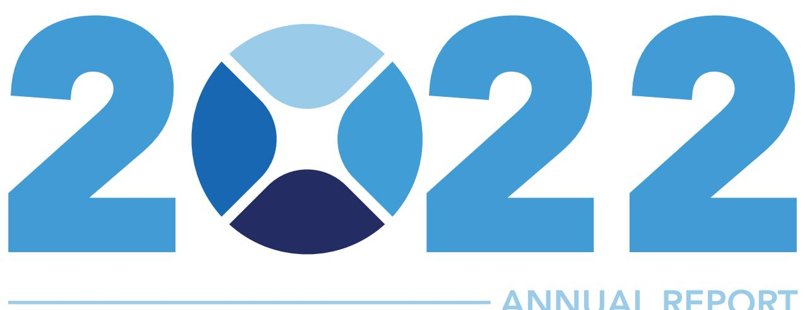
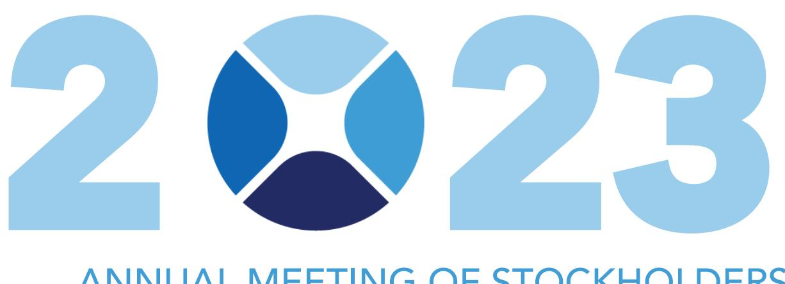
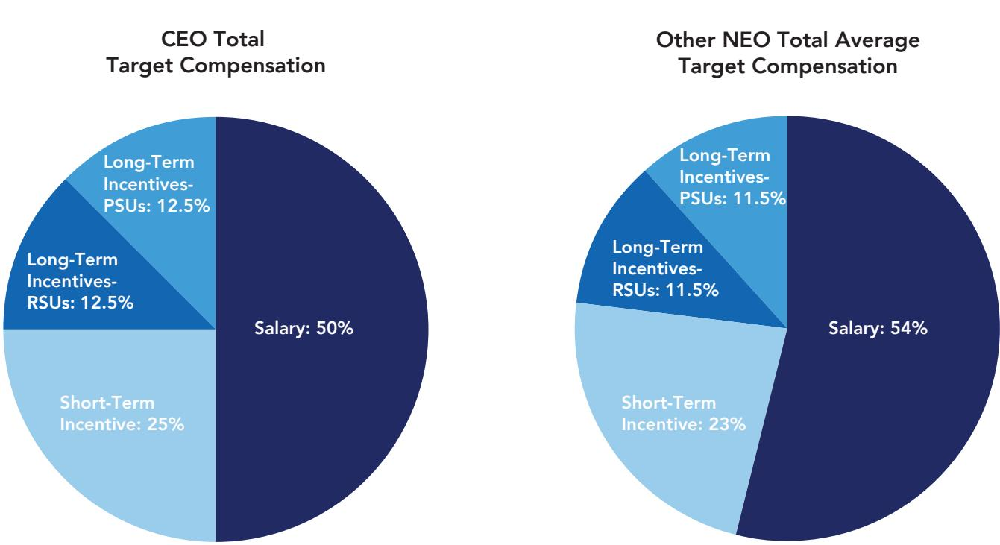
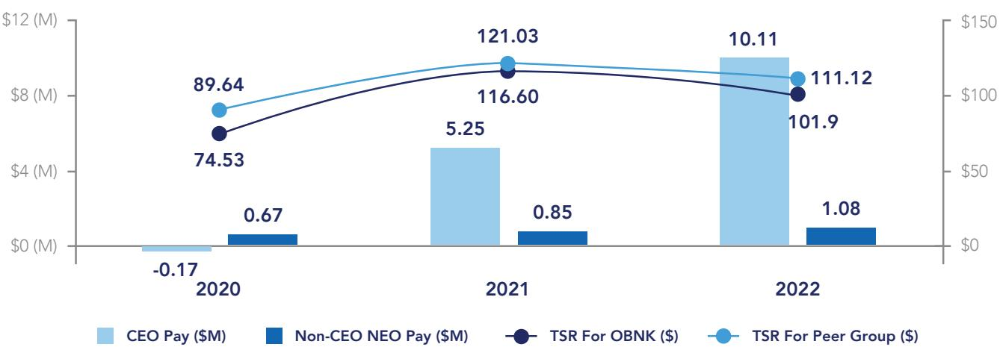
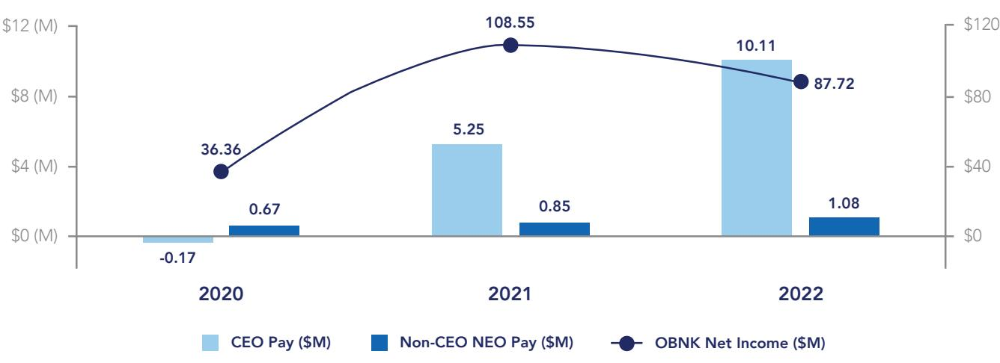
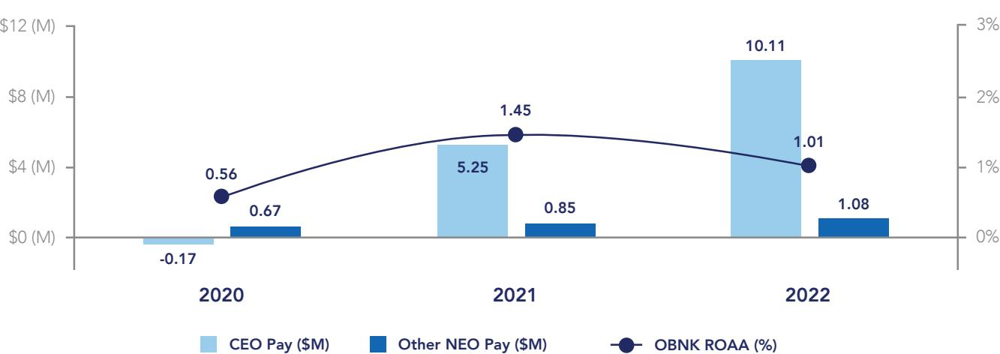
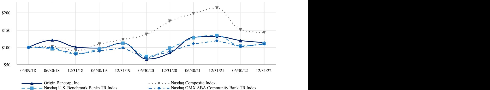

{0}------------------------------------------------



## ANNUAL REPORT 2023 PROXY STATEMENT


{1}------------------------------------------------

# THE **ORIGIN VISI N**

TO COMBINE THE POWER OF TRUSTED ADVISORS WITH INNOVATIVE TECHNOLOGY TO BUILD UNWAVERING LOYALTY BY CONNECTING PEOPLE TO THEIR DREAMS.

### **TEXAS**

ENTRY: NORTH TX 2008 | HOUSTON 2013 | EAST TX 2022 LOCATIONS: 35 LOANS: \$4,747 DEPOSITS: \$4,261

### **LOUISIANA**

ENTRY: 1912 LOCATIONS: 19 LOANS: \$1,447 DEPOSITS: \$2,916

### **MISSISSIPPI**

ENTRY: 2010 LOCATIONS: 6 LOANS: \$611

DEPOSITS: \$599 Number of locations as of 2/28/2023. Dollars In Millions.

Ranked 2nd in the nation 2022. Best Banks to Work For since 2012.

**2 10** Best Banks To Work For 10 consecutive years. American Banker & Best Companies Group.

**250 60** Over 250 organizations served in our communities in 2022.

60 Banking Centers serving 34 communities.

{2}------------------------------------------------


### **LETTER FROM THE CHAIRMAN**

This past year was one of major accomplishments, as we significantly strengthened our company and positioned Origin for long-term success. Our culture remains the soul of our company, and relationships are at the center of what we do. During the past year, as we prepare for crossing the important \$10 billion asset mark, we enhanced an already strong executive management team with the additions of Derek McGee as Chief Legal Counsel and Wally Wallace as Chief Financial Officer. Our entire executive team is deeply committed to executing on our strategic plan and driving long-term value for our employees, customers, communities and shareholders.

#### THE UNICORN – BT HOLDINGS, INC.

When we became a public company in 2018, one of our key initiatives was to implement an opportunistic M&A strategy. We were extremely diligent and patient, as we sought out a partner who was the right fit culturally, geographically and financially. BTH Bank, the subsidiary of BT Holdings, Inc., was that perfect fit—they were the unicorn.

Origin and BTH, two companies founded in the early 1900s, only 190 miles from each other. Both from rural communities where handshakes and hard work still mean something. Two companies with an unwavering commitment to employees, customers, communities and shareholders.

The Origin and BTH partnership gives our company meaningful expansion across the I-20 corridor in East Texas and adds tremendous depth to our teams in Dallas and Fort Worth. We believe we have an incredible opportunity to add to what BTH has done in the deposit rich, East Texas markets, and expand upon their impact in North Texas.

I am extremely proud of the Origin and BTH employees who made the process go so smoothly. The merger was announced in late February, received regulatory approval in June, closed in August, and the system conversion was completed in early October. This impressive timeline is a testament to the quality of our people, the strength of our relationships with

{3}------------------------------------------------

the communities we serve, and the ability for our company to capitalize on the right opportunities. These are two proud companies who are committed to doing business the right way. We are linked together through the I-20 corridor, and more importantly, we are inner-connected through our culture and humble roots.

#### THE TEXAS GROWTH STORY CONTINUES

Origin's Texas Growth Story has been impressive, and the addition of BTH has created incredible opportunity to drive value in a meaningful way. Our Texas franchise represents approximately 70% of loans held for investment and 54% of deposits. The Dallas-Fort Worth and Houston markets each delivered more than \$1 billion in new loan production in 2022. This growth reinforces our strategy of attracting best-inclass bankers across our footprint and their ability to drive long-term value for our company. In 2022, we made several strategic hires, adding twenty-one new producers, primarily in the Texas market who are driving meaningful deposit and loan growth. Origin will continue to invest and seek opportunity in Texas. We have proven that our investments in people and infrastructure, coupled with the Origin Culture, have and will continue to pay dividends for our company.

#### DISCIPLINED CREDIT CULTURE

While I am extremely proud of our production for the year, I am even more proud of where we are from a credit perspective. At year-end, Past Due Loans were at 0.15% of total loans, and we also showed continued reduction in the level of Nonperforming Loans, which ended the year at 0.14%. Classified loans remained stable at 1.05%.

Origin will remain highly committed to a disciplined approach to managing credit risk, but it is more than just credit metrics. Our success in 2022 was about the comradery and the trust that our producers and credit teams have with each other and puts us in a position of strength as we head into an uncertain economic environment in 2023. We continue to believe that our Texas, Louisiana and Mississippi markets will be less impacted by a potential recession than other areas of the country. Our focus on relationship banking along with sound underwriting and credit structure continue to result in our well-diversified and resilient portfolio.

### THE ORIGIN CULTURE - UNIQUE FROM WITHIN

Our commitment to the Origin Culture remains a competitive advantage throughout our markets. This was reinforced in 2022 with Origin being recognized as the second best bank to work for in the country by American Banker Magazine. This marks the tenth consecutive year that Origin has been recognized among the best banks to work for. The Origin Culture and our geographic management model create an environment that attracts high quality people who are committed to building valuable, long-term relationships.

What is unique about the Origin Culture is that it is defined, reinforced and measured. We currently measure employee engagement through Glint surveys, our community support through employee volunteerism, customer satisfaction through Net Promoter Scores and efficiencies through our Robotics Automation process. The tremendous success that we achieve in all of these categories, along with the continued improvements in our financial performance, makes us believe that Origin can be the best bank in America.

#### LOOKING FORWARD

Origin continues to operate from a position of strength. While we acknowledge the uncertainty that events early in 2023 created in the markets, we remain very well capitalized with more than adequate levels of liquidity. We have the right team in place with incredible employees who know and understand our clients. I am pleased with where we are from a credit perspective and with the credit culture that is in place. 

{4}------------------------------------------------

The overall condition of our company, as we begin 2023, positions us very well to take advantage of our markets in a meaningful way. Origin has proven throughout our 110-year history that we have the right business model and culture to continue to serve our employees, customers, communities and shareholders in a dynamic way.

Thank you to the employees of Origin who are committed to this culture, serving our customers, improving our communities and providing value to our shareholders. On behalf of our management team and board of directors, thank you for your continued support of Origin Bancorp, Inc.

*Our focus on relationship banking along with sound underwriting and credit structure continue to result in our well-diversified and resilient portfolio.* 

DRAKE MILLS Chairman of the Board, President & Chief Executive Officer Origin Bancorp, Inc.


{5}------------------------------------------------

# FINANCIAL HIGHLIGHTS FOR THE YEAR ENDED DECEMBER 31,

(dollar amounts in thousands except per share data)

| SUMMARY INCOME STATEMENT                 | 2022            | 2021            |
|------------------------------------------|-----------------|-----------------|
| Net Interest Income                      | \$<br>275,278   | \$<br>216,252   |
| Provision for Credit Losses              | 24,691          | (10,765)        |
| Noninterest Income                       | 57,274          | 62,193          |
| Noninterest Expense                      | 200,419         | 156,779         |
| Net Income                               | 87,715          | 108,546         |
| SUMMARY BALANCE SHEET                    |                 |                 |
| Total Loans Held for Investment          | \$<br>7,090,022 | \$<br>5,231,331 |
| Total Assets                             | 9,686,067       | 7,861,285       |
| Total Deposits                           | 7,775,702       | 6,570,693       |
| Total Stockholders' Equity               | 949,943         | 730,211         |
| PER COMMON SHARE DATA                    |                 |                 |
| Diluted Earnings Per Common Share        | \$<br>3.28      | \$<br>4.60      |
| Cash Dividends Declared Per Common Share | 0.58            | 0.49            |
| Book Value Per Common Share              | 30.90           | 30.75           |
| RATIOS                                   |                 |                 |
| Return on Average Assets                 | 1.01%           | 1.45%           |
| Return on Average Equity                 | 10.81%          | 15.79%          |
| Tier 1 Capital Ratio                     | 11.12%          | 11.36%          |
| Total Capital Ratio                      | 14.23%          | 14.77%          |

{6}------------------------------------------------


## PROXY STATEMENT AND NOTICE OF



### ANNUAL MEETING OF STOCKHOLDERS

{7}------------------------------------------------

[This page intentionally left blank]

NOTICE OF ANNUAL MEETING

OF STOCKHOLDERS

{8}------------------------------------------------

500 South Service Road East, Ruston, Louisiana 71270

March 28, 2023

### DEAR ORIGIN BANCORP, INC. STOCKHOLDERS,

You are cordially invited to attend the Annual Meeting of Stockholders of Origin Bancorp, Inc., a Louisiana corporation (the "Company"), to be held on Wednesday, May 10, 2023, at 1:00 p.m., Central Time, at Squire Creek Country Club, 289 Squire Creek Parkway, Choudrant, Louisiana 71227.

On or about March 28, 2023, we mailed a Notice of Internet Availability of Proxy Materials to all stockholders of record at the close of business on March 20, 2023, containing instructions on how to access our Proxy Statement and how to vote your shares, as well as instructions on how to request a paper copy of our proxy materials. You are urged to vote by proxy via the Internet, telephone, by mail, or in person at the Annual Meeting pursuant to the instructions in the Proxy Statement.

We have adopted rules promulgated by the Securities and Exchange Commission ("SEC") that allow companies to furnish proxy materials to their stockholders over the Internet. The Proxy Statement contains information about the official business of the Annual Meeting. Whether or not you expect to attend, please vote your shares now. Of course, if you decide to personally attend the Annual Meeting, you will have the opportunity to revoke your proxy and vote your shares in person at the Annual Meeting.

We appreciate your continued support of the Company.

{9}------------------------------------------------

[This page intentionally left blank]

{10}------------------------------------------------

### MEETING INFORMATION

### VOTING ITEMS

- 1. Elect 15 directors, to serve until the next annual meeting of stockholders and to serve until their successors are elected and qualified;
- 2. Approve, on a non-binding advisory basis, the compensation of our named executive officers ("NEOs") for 2022 (the "Say-On-Pay Proposal");
- 3. Ratify the appointment of FORVIS, LLP, formerly BKD, LLP, as the Company's independent registered public accounting firm for the fiscal year ending December 31, 2023; and
- 4. To transact such other business as may properly come before the Annual Meeting or any postponement or adjournment of the Annual Meeting.

Our Board of Directors ("Board") has fixed the close of business on March 20, 2023, as the record date for the determination of stockholders entitled to notice of, and to vote at, the Annual Meeting (the "Record Date"). A list of stockholders entitled to vote at the Annual Meeting will be available for inspection by any stockholder at our principal office during ordinary business hours beginning two business days after the Notice of Internet Availability of Proxy Materials is mailed through the completion of the Annual Meeting, including any adjournment or postponement thereof. The mailing address for our principal office is 500 South Service Road East, Ruston, Louisiana 71270.

Important Notice Regarding the Availability of Proxy Materials for the 2023 Annual Meeting of Stockholders to be held on May 10, 2023. This proxy statement and our annual report to stockholders are available at *www.obnkannualmeeting.com.*

By Order of the Board of Directors

Drake Mills Chairman of the Board, President and Chief Executive Officer Ruston, Louisiana March 28, 2023

{11}------------------------------------------------

### TABLE OF CONTENTS

#### iii NOTICE OF ANNUAL MEETING OF STOCKHOLDERS

#### PROXY STATEMENT

#### ABOUT THE ANNUAL MEETING

- 8 Commitment To Sustainability
#### PROPOSAL 1: ELECTION OF DIRECTORS

- Director Nominees
- Director Nominee Qualifications and Experience
- Board Diversity
- 2022 Named Executive Officers

#### CORPORATE GOVERNANCE

- Board Leadership Structure
	- Director Independence
	- Director Education and Self-Assessment
	- Board Meetings and Committees
	- Stockholder Nominees and Proposals for 2024 Annual Meeting
	- Certain Relationships and Related-Party Transactions
- Director Compensation for Fiscal Year 2022 47 COMPENSATION DISCUSSION AND ANALYSIS
	- Overview
	- 2022 Business and Financial Highlights
	- Key Compensation Committee Actions in 2022
	- Executive Compensation Philosophy
	- Compensation Best Practice
	- Say-On-Pay and Stockholder Outreach
	- Role of Compensation Committee, Compensation Consultant and CEO
	- Competitive Benchmarking and Compensation Peer Group
- Discussion of Executive Compensation Components
- Other Compensation Policies and Information
- Risk Assessment
- Clawbacks for Any Restatement; Executive Compensation Recovery Policy
- Trading Restrictions Regarding Hedging or Pledging of Common Stock
- Report of Compensation Committee
- Executive Compensation
- Grants of Plan-Based Awards
- Outstanding Equity Awards at Fiscal Year-End
- Option Exercises and Stock Vested
- Supplemental Executive Retirement Plan and Executive Supplemental Income Agreement
- Bank-Owned Life Insurance Plans
- Employment Arrangements, CIC Agreements, and Potential Payments Upon Termination or CIC
- CEO Pay Ratio
- Pay Versus Performance ("PVP")
- 92 PROPOSAL 2: ADVISORY VOTE ON SAY-ON-PAY PROPOSAL

#### 94 PROPOSAL 3: RATIFICATION OF INDEPENDENT REGISTERED PUBLIC ACCOUNTING FIRM

#### 95 OTHER INFORMATION

- Stock Ownership of Principal Stockholders, Directors and Management
- 96 DELINQUENT SECTION 16(A) REPORTS
- 97 ANNUAL REPORT ON FORM 10-K
- 98 HOUSEHOLDING OF PROXY MATERIALS

{12}------------------------------------------------

TABLE OF CONTENTS

### YOUR VOTE IS IMPORTANT

Whether or not you plan to attend the Annual Meeting, please read this proxy statement, the voting instructions in the Notice of Internet Availability of Proxy Materials and vote. You may vote by proxy over the Internet, via telephone or, if you requested a paper proxy card in the mail, by completing, signing, dating and mailing the completed proxy card to us. You may also vote in person at the Annual Meeting. The instructions in the Notice of Internet Availability of Proxy Materials or your proxy card describe how to use these convenient services. You may revoke your proxy in the manner described in this proxy statement at any time before it is exercised. See "*Voting Information and Questions You May Have — May I Change My Vote After I Have Submitted a Proxy?*" for more information on how to vote your shares or revoke your proxy.


### PROXY STATEMENT FOR

2023 Annual Meeting of Stockholders to be held on May 10, 2023

Unless the context otherwise requires, references in this proxy statement to "we," "us," "our," "our company," "the Company" or "Origin" refer to Origin Bancorp, Inc., a Louisiana corporation, and its consolidated subsidiaries. All references to "Origin Bank" or "the Bank" refer to Origin Bank, our wholly-owned bank subsidiary. In addition, unless the context otherwise requires, references to "stockholders" are to the holders of our common stock, par value \$5.00 per share.

This proxy statement is being furnished in connection with the solicitation of proxies by our Board for use at the Annual Meeting of the Stockholders to be held on Wednesday, May 10, 2023, at 1:00 p.m., Central Time, at Squire Creek Country Club, 289 Squire Creek Parkway, Choudrant, Louisiana 71227, and any adjournments or postponements thereof for the purposes set forth in this proxy statement and the related notice of the Annual Meeting. The mailing address of the Company's principal executive office is 500 South Service Road East, Ruston, Louisiana 71270.

### Important Notice Regarding the Availability of Proxy Materials for the 2023 Annual Meeting of Stockholders to be Held on May 10, 2023

Pursuant to rules promulgated by the SEC, we have elected to provide access to our proxy materials, including this proxy statement and our annual report to stockholders for the fiscal year ended December 31, 2022, over the Internet. Accordingly, we are providing our stockholders with a Notice of Internet Availability of Proxy Materials (the "Notice") instead of a paper copy of our proxy materials. The Notice contains instructions on how to access our proxy materials and how to vote your shares, as well as instructions on how to request a paper or e-mail copy of our proxy materials. We believe this electronic distribution process expedites stockholders' receipt of proxy materials and reduces the environmental impact and cost of printing and distributing our proxy materials. We mailed the Notice on or about March 28, 2023, to all stockholders of record entitled to vote at the Annual Meeting at the close of business on March 20, 2023. You should read our entire proxy statement carefully before voting.

{13}------------------------------------------------

### ABOUT THE ANNUAL MEETING

### VOTING INFORMATION AND QUESTIONS YOU MAY HAVE

The information provided in the "question and answer" format below is for your convenience only and is merely a summary of the information contained in this proxy statement. You should read this entire proxy statement carefully.

### What is the Purpose of the Annual Meeting?

#### Matters to be Considered and Vote Recommendation

We are asking stockholders to vote on the following matters at the Annual Meeting:

| Matters for Stockholder Consideration                                                                                                                                                                                                                                                                                                                                                                                                                                                                                                                                                                                                               | Our Board's<br>Recommendation   |
|-----------------------------------------------------------------------------------------------------------------------------------------------------------------------------------------------------------------------------------------------------------------------------------------------------------------------------------------------------------------------------------------------------------------------------------------------------------------------------------------------------------------------------------------------------------------------------------------------------------------------------------------------------|---------------------------------|
| Proposal 1: Election of Directors (page 15)<br>To elect 15 directors to serve until the next annual meeting of stockholders and until<br>their successors are elected and qualified. Our Board believes that the 15 director<br>nominees possess the necessary qualifications to provide effective oversight of the<br>Company's business and quality counsel to our management.                                                                                                                                                                                                                                                                    | FOR each<br>Director<br>Nominee |
| Proposal 2: Advisory Vote on the Say-On-Pay Proposal (page 92)<br>We are seeking a non-binding advisory vote from our stockholders to approve the<br>compensation paid to our NEOs in 2022, as described in the Compensation Discussion<br>and Analysis section and the executive compensation tables that follow, beginning on<br>page 66 of this proxy statement. Our Board values our stockholders' opinions and the<br>Compensation Committee will take into account the outcome of the advisory vote when<br>considering future executive compensation decisions.                                                                              | FOR                             |
| Proposal 3: Ratification of Independent Registered Public Accounting Firm (page 94)<br>The Audit Committee and the Board believe that the continued retention of FORVIS,<br>LLP, formerly BKD, LLP, to serve as the independent registered public accounting firm<br>of the Company for the fiscal year ending December 31, 2023, is in the best interests<br>of the Company and its stockholders. As a matter of good corporate governance, our<br>stockholders are being asked to ratify the selection of FORVIS, LLP to serve as the<br>Company's independent registered public accounting firm for the fiscal year ending<br>December 31, 2023. | FOR                             |

Stockholders will also transact any other business that may properly come before the Annual Meeting or any adjournment or postponement thereof.

{14}------------------------------------------------

ABOUT THE ANNUAL MEETING

### When and Where Will the Annual Meeting Be Held?

The Annual Meeting is scheduled to take place at Squire Creek Country Club, 289 Squire Creek Parkway, Choudrant, Louisiana 71227, at 1:00 p.m., Central Time, on Wednesday, May 10, 2023.

### Who Are the Nominees for Directors?

Please see *Director Nominees* section under *Proposal 1: Election of Directors* in this document for further information.

### Who is Entitled to Vote?

Holders of record of our common stock at the close of business on the Record Date, March 20, 2023, may vote at the Annual Meeting. At the Record Date, we had 30,780,853 shares of common stock outstanding. In deciding all matters at the Annual Meeting, each stockholder will be entitled to one vote for each share of common stock held by such stockholder on the Record Date. We do not have cumulative voting rights for the election of directors.

### What Constitutes a Quorum for the Annual Meeting?

The holders of at least a majority of the outstanding shares of common stock entitled to vote on the Record Date must be represented at the Annual Meeting, in person or by proxy, in order to constitute a quorum for the transaction of business.

### What is the Difference Between a Stockholder of Record and a "Street Name" Holder?

If your shares are registered directly in your name with EQ Shareowner Services, the Company's stock transfer agent, you are considered the stockholder of record with respect to those shares. The Notice and, if requested, any printed copies of the proxy materials, including any proxy cards or voting instructions, are being sent directly to you by EQ Shareowner Services at the Company's request.

If your shares are held in a brokerage account or by a bank, broker or other nominee, the nominee is considered the stockholder of record of those shares. You are considered the beneficial owner of these shares, and your shares are held in "street name." The Notice and, if applicable, any printed copies of the proxy materials, including any proxy cards or voting instructions, are being forwarded to you by your nominee. As the beneficial owner, you have the right to direct your nominee on how to vote your shares.

### How do I Vote?

You may vote your shares of common stock either in person at the Annual Meeting or by proxy. The process for voting your shares depends on how your shares are held, as described below.

{15}------------------------------------------------

### *Shares Registered in Your Name*

If you are a stockholder of record on the Record Date for the Annual Meeting, you may vote by proxy or you may attend the Annual Meeting and vote in person. If you are a record holder and want to vote your shares by proxy, you have three ways to vote:

- Via the Internet: You may vote your proxy over the Internet by visiting the website *www.proxypush. com/obnk*. Have the Notice or, if applicable, the proxy card that may have been provided to you in hand when you access the website and follow the instructions for Internet voting on that website.
- Via Telephone: To vote over the telephone, dial toll-free 1-866-883-3382 using a touch-tone phone and follow the recorded instructions. You will be asked to provide the control number from the Notice.
- Via Mail: If you request a paper copy of the proxy materials by mail, you may vote by indicating on the proxy card(s) applicable to your common stock how you want to vote and signing, dating and mailing your proxy card(s) in the enclosed pre-addressed postage-paid envelope as soon as possible to ensure that it will be received in advance of the Annual Meeting.

Please refer to the specific instructions set forth in your Notice or proxy card for additional information on how to vote. Voting your shares by proxy will enable your shares of common stock to be represented and voted at the Annual Meeting if you do not attend the Annual Meeting and vote your shares in person.

If voting via mail, the Company must receive your proxy via mail no later than May 9, 2023, to be counted at the Annual Meeting. If voting shares of common stock held in our 401(k) plan, you must vote via Internet or telephone by no later than 11:59 p.m., Central Time, on May 7, 2023. If voting shares of common stock held in our 401(k) plan via mail, the Company must receive your proxy via mail no later than May 7, 2023, to be counted at the Annual Meeting.

### *Shares Registered in the Name of a Broker or Bank*

If your shares of common stock are held in "street name," your ability to vote depends on your bank, broker or other nominee's voting process. Your bank, broker or other nominee should provide you with voting instructions and materials to vote your shares. By following those voting instructions, you may direct your nominee on how to vote your shares. Without instructions from you, your bank, broker or other nominee will be permitted to exercise its own voting discretion with respect to the ratification of the appointment of FORVIS, LLP, formerly BKD, LLP, (Proposal 3), but will not be permitted to exercise voting discretion with respect to any of the other proposals being voted on at the Annual Meeting.

To vote the shares that you hold in "street name" in person at the Annual Meeting, you must bring a legal proxy from your broker, bank or other nominee (i) confirming that you were the beneficial owner of those shares at the close of business on the Record Date, (ii) stating the number of shares of which you were the beneficial owner that were held for your benefit on the Record Date by that broker, bank or other nominee and (iii) appointing you as the record holder's proxy to vote the shares covered by that proxy at the Annual Meeting. If you fail to bring a nominee-issued proxy to the Annual Meeting, you will not be able to vote your nominee-held shares in person at the Annual Meeting.

{16}------------------------------------------------

### What is a Broker Non-Vote?

A broker non-vote occurs when a bank, broker, or other nominee holding shares of common stock for a beneficial owner does not vote on a particular proposal because such nominee does not have discretionary voting power with respect to that proposal and has not received voting instructions from the beneficial owner.

Your broker has discretionary authority to vote your shares with respect to the ratification of the appointment of FORVIS, LLP, formerly BKD, LLP, as our independent registered public accounting firm for the fiscal year ending December 31, 2023 (Proposal 3). In the absence of specific instructions from you, your broker does not have discretionary authority to vote your shares with respect to any other proposal.

### May I Change My Vote After I Have Submitted a Proxy?

Yes. Regardless of the method used to cast a vote, if you are a stockholder of record, you may change your vote or revoke your proxy by:

- Casting a new vote over the Internet by visiting the website *www.proxypush.com/obnk* and following the instructions online or in your Notice or the proxy card that may have been provided to you before the Internet voting deadline;
- Casting a new vote by telephone by calling 1-866-883-3382 using a touch-tone phone and following the recorded instructions before the telephone voting deadline;
- Completing, signing and returning a new proxy card with a later date than your original proxy card, if applicable, no later than the deadline, and any earlier proxy will be revoked automatically; or
- Attending the Annual Meeting and vote in person, which would revoke any earlier proxy. However, attending the Annual Meeting in person will not automatically revoke your proxy unless you vote again in person at the Annual Meeting.

### How Will My Shares Be Voted if I Return a Signed and Dated Proxy Card, but Do Not Specify How My Shares Will Be Voted?

If you are a stockholder of record who returns a completed proxy card that does not specify how you want to vote your shares on one or more proposals, the proxies will vote your shares for each proposal as to which you provide no voting instructions, and such shares will be voted in the following manner:

| Proposal 1 | FOR the election of all of the nominees for director;                                                                                                                                        |
|------------|----------------------------------------------------------------------------------------------------------------------------------------------------------------------------------------------|
| Proposal 2 | FOR, on an advisory basis, the Say-On-Pay Proposal;                                                                                                                                          |
| Proposal 3 | FOR the ratification of the appointment of FORVIS, LLP, formerly BKD, LLP, to<br>serve as our independent registered public accounting firm for the fiscal year<br>ending December 31, 2023; |

{17}------------------------------------------------

If you are a "street name" holder and do not provide voting instructions on one or more proposals, your bank, broker or other nominee will be unable to vote those shares on any of the proposals except to vote on the ratification of the appointment of FORVIS, LLP, for the fiscal year ending December 31, 2023 (Proposal 3).

### What Are My Choices When Voting?

With respect to all proposals you may vote "For" or "Against" or you may "Abstain" from voting.

### What Percentage of the Vote is Required to Approve Each Proposal?

The affirmative vote of a majority of the votes cast by the holders of shares entitled to vote at the Annual Meeting is required for (i) the election of the director nominees (Proposal 1), (ii) the approval, on a non-binding basis, of our Say-On-Pay Proposal (Proposal 2), and (iii) the ratification of FORVIS, LLP's appointment as the Company's independent registered public accounting firm for the fiscal year ending December 31, 2023 (Proposal 3). A majority of the votes cast shall mean that the number of shares that voted "For" the election of a director or a proposal, as applicable, exceeds the number of shares voted "Against" that director or proposal, as applicable.

### How Are Broker Non-Votes and Abstentions Treated?

Broker non-votes and abstentions are counted for purposes of determining the presence or absence of a quorum. A broker non-vote or an abstention with respect to (i) the election of the director nominees (Proposal 1), (ii) the approval, on a non-binding basis, of our Say-On-Pay Proposal (Proposal 2), and (iii) the ratification of FORVIS, LLP's appointment as the Company's independent registered public accounting firm for the fiscal year ending December 31, 2023 (Proposal 3), will not be counted as a vote cast either "For" or "Against" such proposals.

### Are There Any Other Matters to Be Acted Upon at the Annual Meeting?

Management does not intend to present any business at the Annual Meeting for a vote other than the matters set forth in the Notice, and management has no information that others will do so. The proxy also confers on the proxies the discretionary authority to vote with respect to any matter properly presented at the Annual Meeting. If other matters requiring a vote of our stockholders properly come before the Annual Meeting, it is the intention of the persons named in the accompanying form of proxy to vote the shares represented by the proxies held by them in accordance with applicable law and their judgment on such matters.

### Where Can I Find Voting Results?

We will publish the voting results in a current report on Form 8-K, which will be filed with the SEC within four business days following the Annual Meeting. If final voting results are not available to us in time to file a Form 8-K within four business days after the Annual Meeting, we intend to file a Form 8-K to publish preliminary results and, within four business days after the final results are known to us, file an additional Form 8-K to publish the final results.

{18}------------------------------------------------

### What Are the Solicitation Expenses and Who Pays the Cost of this Proxy Solicitation?

Our Board is asking for your proxy, and we will pay all of the costs of soliciting proxies from our stockholders. We have engaged D.F. King & Co., Inc. to solicit proxies for us. We have agreed to reimburse D.F. King for reasonable expenses. In addition to the solicitation of proxies via mail, our officers, directors and employees may solicit proxies personally or through other means of communication, such as electronic mail, without being paid additional compensation for such services. The Company will reimburse banks, brokerage houses and other custodians, nominees and fiduciaries for their reasonable expenses incurred in forwarding the proxy materials to beneficial owners of the Company's common stock.

### How Can I Communicate with the Board?

Our Board welcomes suggestions and comments from stockholders and has adopted a formal process by which stockholders may communicate with our Board or any of its directors. Stockholders who wish to communicate with our Board may do so by sending written communications addressed to Origin Bancorp, Inc., 500 South Service Road East, Ruston, Louisiana 71270, Attn: Corporate Secretary, or via e-mail at corpsecretary@origin.bank. Stockholder communications will be sent directly to the specific director or directors of the Company indicated in the communication or to all members of our Board if not specified. All communications (other than commercial communications soliciting the sale of goods or services to, or employment with, the Company or directors of the Company) will be directed to the appropriate committee, the Chairman of the Board, the Lead Independent Director, or to any individual director specified in the communication, as applicable. In addition, all stockholders are encouraged to attend the Annual Meeting where senior management and representatives from our independent registered public accounting firm, as well as members of our Board, will be available to answer questions.

### Why did I Receive a One-Page Notice in the Mail Regarding the Internet Availability of Proxy Materials Instead of Printed Proxy Materials?

In accordance with rules promulgated by the SEC, instead of mailing a printed copy of our proxy materials to all of our stockholders, we have elected to provide access to such materials to our stockholders over the Internet. Accordingly, on or about March 28, 2023, we mailed a Notice of Internet Availability of Proxy Materials to all stockholders of record on the Record Date entitled to vote at the Annual Meeting. Stockholders will have the ability to access our proxy materials on the website referred to in the Notice. The Notice also contains instructions on how to vote your shares, as well as instructions on how to request a paper or e-mail copy of our proxy materials. We encourage you to take advantage of the availability of the proxy materials over the Internet to help reduce the environmental impact and cost of printing and distributing our proxy materials.

### How Can I Get Electronic Access to the Proxy Materials?

The Notice provides you with instructions regarding how to:

- View our proxy materials for the Annual Meeting over the Internet;
- Vote your shares after you have viewed our proxy materials (including any control/identification numbers that you need to access your form of proxy);

{19}------------------------------------------------

- Obtain directions to attend the Annual Meeting and vote in person;
- Request a printed copy or e-mail copy with links to the proxy materials, including the date by which the request should be made to facilitate timely delivery; and
- Instruct us to send our future proxy materials to you by mail or electronically by e-mail.

### Will I Receive any Other Proxy Materials by Mail (Besides the Notice)?

If you request paper copies of our proxy materials by following the instructions in the Notice, we will send you our proxy materials, including a proxy card, in the mail.

### What Should I Do if I Receive More Than One Set of Voting Materials?

You may receive more than one set of voting materials, including multiple copies of the Notice or other proxy materials, including multiple proxy cards or voting instruction cards. For example, if you hold your shares in more than one brokerage account, you may receive separate voting instructions for each brokerage account in which you hold shares. Similarly, if you are a stockholder of record and hold shares in a brokerage account, you may receive a proxy card for shares held in your name and voting instructions for shares held in "street name." To ensure that all of your shares are voted, we encourage you to respond to each set of voting materials that you receive.

### COMMITMENT TO SUSTAINABILITY

Origin is a financial holding company headquartered in Ruston, Louisiana. Our wholly-owned bank subsidiary, Origin Bank, was founded in 1912. Our vision is to combine the power of trusted advisors with innovative technology to build unwavering loyalty by connecting people to their dreams. Our mission is to passionately pursue ways to make banking & insurance more rewarding for our employees, customers, communities & shareholders. We've helped people, small businesses, and large companies grow and prosper throughout Louisiana, Texas and Mississippi — and continue to do so.

*Environmental, Social and Governance ("ESG") Oversight*


The Board and its committees ensure that ESG principles are integrated into our business strategy in ways that optimize opportunities to make positive impacts while advancing long-term goals. We are committed to conducting our business in a safe, environmentally responsible, and sustainable manner. We appreciate the unique contributions of each individual employee, and we are fully committed to providing a culture of respect, equity, diversity, and inclusion.

Our Board recognizes the importance of these responsibilities, and this year, we have established an internal cross-functional working group that is tasked with driving additional progress in the initiatives that promote sustainability and further transparency. Our Board oversees these ESG efforts, led by our Nominating and Corporate Governance Committee, including the production of our Sustainable Accounting Standards Board (SASB) Report as well as the ESG/Human Capital Management (HCM) summaries included in this proxy statement and our annual report.

{20}------------------------------------------------

Our senior leadership team is tasked with driving results in these areas given the strategic importance of ESG. We believe in focusing our efforts on where we can have the most impact. Against this backdrop, we have determined that our ESG areas of focus include: (1) Environmental Responsibility (2) Social Impact, and (3) Culture of Governance.

### *Environmental Responsibility*


We embed the principles of advancing a circular economy into our practices through green investments and long-term implementation of new technologies. We are devoted to operating our business in a sustainable manner and have undertaken a number of initiatives designed to reduce our impact on the environment and to promote environmentally friendly projects and practices. With a view to increasing efficiency and reducing waste, we are continuing to digitize manual back office and financial center functions. In 2022, we:

- encouraged environmentally friendly work practices by supporting the recycling of plastic, glass, and paper and utilizing collection bins for batteries, aluminum toner cartridges, and computer hardware.
- offer filtered water refill stations for employees at majority of our locations.
- increased the use of e-records and e-signing technology, resulting in paper waste and carbon emissions reduction, including utilizing digital solutions such as mobile/online banking, eStatements, electronic bill pay, and remote deposit capture.
- continued to migrate technology infrastructure to a cloud environment, reducing energy usage, and accordingly, our carbon footprint.

Origin is constantly improving its operations to proactively find more efficient and effective ways to ensure our long-term success. Through our modernization efforts, we strive to do our part in offsetting negative impacts on the environment. We continue to evaluate green equipment for office use such as Energy-Star® appliances, motion detector lighting, as well as high-efficiency HVAC units. Beginning in 2018, we commenced a project to retrofit our offices with LED lighting, which decreased our electricity usage (kWh) by roughly 29% or 2,000,000 kWh. Currently, most of Origin's total office space utilizes LED lighting. Additionally, select office locations are LEED certified. This certification, awarded by the U.S. Green Building Council, is based on the properties' use of sustainable materials, water and energy efficiency, indoor environmental quality, location and transportation, and overall innovation.

Origin complies with applicable legal and regulatory requirements to control and reduce its environmental footprint. We are committed to making the necessary investments in systems and technology to ensure compliance and to meet or exceed these standards. Although Origin does not currently incorporate specific aspects of our environmental policy into our credit analysis, we do actively seek business partners that align with our values and long-term sustainable goals.

We believe that our focus on environmental sustainability, with the objective of reducing costs and improving sustainability of our operations will provide a strategic benefit. Furthermore, we recognize that climate change is a growing risk for our planet, and we are committed to doing our part to mitigate this risk by placing increased focus and emphasis on environmental responsibility.

{21}------------------------------------------------

### ABOUT THE ANNUAL MEETING

*Social Impact*

At Origin, everything we do matters: that's the difference. Our outlook shapes our culture and our culture shapes our outlook. Together, they create success. And passion succeeds at Origin Bank. Making a difference for our customers starts with setting an example through our own actions. We employ proven, knowledgeable team members with extensive expertise when it comes to our banking and insurance activities. Each member of our Origin team brings their own personal experiences and interests to inform the service they provide. In return, we learn from our customers and use this new understanding to go out and improve the places we call home.

One of our core values is *genuine respect for yourself and others*. This value makes the support of diversity, equity and inclusion a natural fit for our culture and essential to the way we conduct business, foster individual and team enrichment, and participate in our communities. We believe it is only with a diverse, equitable, and inclusive workplace that the organization can truly perform at its best, carry out its vision, and make a difference in the communities we serve. In 2023, Origin Bank announced our newly formed *Diversity Council*, which consists of 18 diverse employees that will collectively advance our Diversity, Equity, and Inclusion efforts in a way that makes a difference within our workplace and in the communities we serve. We believe all employees should be given opportunities to perform to their full potential, knowing their performance will be measured and rewarded fairly.

### *Diversity & Inclusion*

Our commitment to Diversity & Inclusion starts with our goal of attracting, retaining and developing a workforce that is diverse in background, knowledge, skill and experience. Origin is committed to providing equal employment opportunities, and makes all recruiting, payment, performance and promotion decisions based on merit, without discrimination on the basis of gender, sexual orientation, age, family status, ethnic origin, nationality, disability or religious belief.

Origin is committed to improving workforce diversity at all levels of the organization and providing equal opportunity in all aspects of employment. In 2022, the Company continued to make progress toward attracting and retaining a diverse workforce. In order to support and live our culture, the Company's talent acquisition team attends job fairs that attract ethnically and culturally diverse employees. We also have engaged a third-party workforce development company that utilizes a connected system of job recruiting sites that post our employment opportunities with various groups that include, but are not limited to the following: veterans, LGBTQ-identifying individuals, individuals with disabilities, minorities and women, professional and industry organizations, skilled trade associations and college students.

In addition, we have a formal internship program that is designed to develop a strong pool of diverse candidates through on-campus recruiting with local colleges and universities including local Historically Black Colleges and Universities (HBCUs). We continue to utilize VIBE Central in Workday. VIBE stands for Value, Inclusion, Belonging and Equity. This allows senior leaders in our organization to set goals and monitor progress by assessing, measuring, benchmarking, and managing diversity and inclusion by the dimensions of their choice, such as race/ethnicity and gender.

{22}------------------------------------------------

In 2022, we surveyed our employees in regards to diversity, equity and inclusion. Nine out of ten responses in the survey exceeded the benchmarks of Glint's top 10% of global companies. One initiative that was launched based on the results of the survey was the formation of a Diversity Council. The Council consists of 18 diverse employees who will collectively advance our diversity, equity, and inclusion efforts in a way that makes a difference within our workplace and in the communities we serve.

Our team members form deeper relationships with those around them based on mutual respect, dignity and understanding. The Company has non-discrimination and anti-harassment policies as outlined in our Employee Handbook. These policies drive a workplace and workforce that embraces the highest ethical and moral standards. Furthermore, all employees participate in diversity training and managers have additional, in-depth training on recognizing unconscious biases and access to micro learning lessons every week to help respond to current needs around diversity and inclusion. In 2022, we began offering a program called *Blue Ocean Brain* to our managers which supports our endeavor to reimagine diversity and inclusion training in the workplace and provides our employees with diverse learning and career development programs.

Origin has been recognized as a "Best Bank to Work For" by *American Banker* magazine for ten consecutive years and was named the 2nd "Best Bank to Work For" in America in 2022, which we believe is attributable to our deep commitment to corporate culture, and our focus on initiatives to support and develop our employees. This ranking is based on feedback from surveys given directly to the *American Banker* magazine from our employees.

### *Health & Wellness*

We provide competitive compensation and benefits in order to attract and retain top talent. In addition to base pay and stock awards, we have several incentive programs which are designed to link performance to pay and drive results towards the achievement of overall corporate goals.

We are committed to our employees' mental and physical health and safety. We offer a robust benefits package which includes:

- Comprehensive medical benefits with \$0 cost options for employees
- Competitive ancillary benefits, such as dental, vision, critical illness, legal and identify theft coverage
- Company-paid short and long-term disability and life insurance
- Flexible spending accounts for both healthcare and dependent care
- Health savings accounts with Employer contributions
- 401(k) retirement savings program with company match
- Employee Stock Purchase Program
- Paid parental leave
- Employee Assistance Program which offers counseling and mental wellness appointments at no cost to the employee

Our dedicated health and safety function ensures that employees are trained on best practices to create a safe and healthy workplace for all. Over the last few years, we have expanded our work from home ("WFH") capabilities in order to allow our employees to better serve our customers while putting 

{23}------------------------------------------------

safety first. We continue to focus on the mental, emotional and physical health of our employees by caring for their emotional and physical well-being. In 2021, we hired a certified Holistic Health Coach to spearhead our Health & Wellness initiatives. In addition to providing health and wellness information on a regular basis to all employees, we currently have approximately 10% of our employees working directly with our Health Coach on a personalized basis to meet their desire to be healthier.

Our Dream Manager® program assists our employees in meeting their own personal and professional goals in addition to helping them improve physically, emotionally, intellectually, and spiritually. Over 250 employees have participated in this program since 2019. We launched a nationally-recognized financial wellness program ("SmartDollar") during 2021 that is designed to assist our employees in becoming debtfree and saving money for emergencies and retirement, empowering them to become better financially prepared for their future, which during 2022, had an over 40% participation rate. Due to our adoption rate, we won a national award in 2021 from the Dave Ramsey Foundation called the "Vision" award.

### *Employee Feedback*

Attracting, developing and retaining talented employees is critical to our success and is an integral part of our human capital strategy. Employee feedback is highly valued at Origin and our employees provide anonymous input via quarterly surveys facilitated by Glint, a people success platform built on an approach that helps organizations increase employee engagement, develop their people, and improve business results.

Our employees consistently rank Origin in the top 10% of Glint's global customer base with regard to employee engagement and several other categories such as company culture, recognition, and communication. We regularly receive hundreds of written comments each quarter that in turn are used to improve processes, policies, or programs in an effort to show tangible affirmation of those comments. We also have continued a practice that was implemented at the beginning of the pandemic called "The Origin Insider" which does a deep dive into various Company-centric topics such as personal executive interviews, little-known departments and areas of physical and mental awareness. Additionally, we added *Take 5*, a Zoom program, designed to specifically to support WFH and remote engagement, which occurs monthly and features speakers (internal and external) for our employees on a wide range of topics promoting, among other things, employee engagement and satisfaction.

### *Talent Development*

Talent development at Origin begins with our comprehensive recruitment program and continues throughout the employee life cycle. The Company recognizes that its success is highly dependent on its ability to attract, retain and develop our people. To foster this development, the Company engages in annual succession planning focused on building a strong, diverse talent pipeline.

We conduct regular talent succession assessments along with individual performance reviews in which managers provide regular feedback and coaching to assist with the development of our employees, including the use of individual development plans to assist with individual career development. Beginning in 2021 and continuing throughout 2022, we implemented the *Giving Interns Valuable Experience* ("G.I.V.E.") program, and welcomed a diverse (both in gender and race) group of 27 interns from 17 different universities. More than half of the interns were in racial groups other than white. The program was successful at promoting Origin's brand and resulted in strong experiential feedback while also creating job opportunities for four of the 27 interns during 2021 and 2022.

{24}------------------------------------------------

We provide our employees and their families access to a platform called "Right Now Media at Work" which has thousands of streaming videos dedicated to both personal and professional development. This tool is used for team building as well as personal development plans.

We utilize assessment tools and provide multiple resources and venues, such as our Career Development Center, for employees to determine what career path is the best fit for them in order to help them grow and enhance their promotional opportunities. We also provide advanced development for nextgeneration leaders via our Leadership Academy classes, which provide structured training, collaboration with other aspiring leaders throughout the organization, and mentoring relationships. Participants in the *Origin Leadership Academy* are appointed by senior management. Our *Emerging Leaders Council* is a one-year program designed to train and develop emerging leaders in our organization. All employees are eligible to apply for participation in the *Emerging Leaders Council.* In 2021, we implemented a program called *Career Manager* which provides young professionals within our organization one-on-one time with senior leaders to enhance their career aspirations and accelerate their understanding of the business of banking. We find benefit in developing our future leaders from within and succession plans are in place for senior level positions as well as many other key leadership positions.

### *Community & Volunteerism*

Since our inception, we have been deeply committed to building relationships and making a difference in our local communities. Investing in people, neighborhoods and local businesses is part of our mission. We strive to understand the needs of our local communities and how we can help them attain their goals and improve the quality of lives throughout Louisiana, Texas and Mississippi.

Additionally, in one specific initiative designed to help the communities we serve, our *Project Enrich* program provides employees with up to twenty hours of paid time off to volunteer in their communities. In 2022, the employees of Origin volunteered 2,874 hours in the community during working hours, not including many more on personal time outside of working hours. To supplement our volunteer work, we seek out areas where we can make an additional impact through financial donations. Our *Bank on Their Future* program was created to help provide support to local schools and thereby invest in our community's future.

Over the past several years, Origin Bank has been recognized for our commitment to our communities and our customers, including:

- United Way Circle of Honor and Gold Award
- Spirit of Giving Award
- Boys and Girls Club as well as multiple educational initiatives

We are extremely grateful for the many local non-profit organizations and are proud of our longstanding history of supporting the efforts of these organizations. Our goal is to have a positive impact on the communities we serve. We focus our philanthropic giving on initiatives that promote community and economic development, asset building, financial education, youth programs, and social impact service organizations that assist low and moderate incomes.

{25}------------------------------------------------

### *Culture of Governance*


Origin is committed to maintaining a high-quality governing body and achieving excellence in our corporate governance practices. We emphasize a culture of accountability and strive to conduct our business in a manner that is fair, ethical and responsible to earn the trust of our stakeholders. Our Board is comprised of a majority of independent directors as defined by the Nasdaq listing standards and our Guidelines. Our corporate governance policies and practices include annual evaluations of the Board and its committees, as well as continuing director education. Our Code of Ethics ensures that our directors, officers, and colleagues comply with all applicable rules and regulations.

We implement robust risk management programs to ensure compliance with applicable laws and regulations governing ethical business practices, including our relationships with suppliers, customers and business partners, and our industry. Origin's whistleblower policy further supports our stated goals within our governance structure. Monitored by an independent third party, this program is designed to receive complaints of financial irregularities, breaches of internal controls, conflicts of interest and fraud.

We are subject to rigorous controls and audits, and our board actively oversees our cybersecurity practices. Our risk management teams ensure compliance with applicable laws and regulations and coordinate with subject-matter experts (SMEs) throughout the business to identify, monitor and mitigate material risks. We leverage the latest encryption configurations and cyber technologies on our systems, devices, and third-party connections and we further review vendor encryption to ensure proper information security safeguards are maintained.

Our IT team is available 24/7 and uses a combination of industry-leading tools and innovative technologies to help protect our stakeholder's data. Our team members are responsible for complying with our data security standards and complete mandatory annual training to understand the behaviors and technical requirements necessary to keep customer and employee data secure. We also offer ongoing education for team members to recognize and report suspicious activity.

We routinely engage with our shareholders to better understand their ESG views, carefully considering the feedback we receive and acting when appropriate.

More information about Origin's commitment to ESG matters, including policies around diversity, equity and inclusion, and our recent SASB Report, are available on Origin's website at ir.origin.bank.

{26}------------------------------------------------

### Proposal Snapshot

#### What am I voting on?

Stockholders are being asked to elect 15 directors to serve until the next annual meeting of stockholders and until their successors are elected and qualified. This section includes information about the Board and each director nominee.

#### Voting recommendation:

FOR the election of each director nominee. We believe the combination of the various qualifications, skills and experiences of each of the director nominees will contribute to an effective and well-functioning Board. The director nominees possess the necessary qualifications to provide effective oversight of our business and quality advice and counsel to our management.

### Director Nominees

Based on the recommendation of the Nominating and Corporate Governance Committee of the Board, our Board, which currently consists of 15 directors, has nominated each of the 15 incumbent directors to serve as directors for a one-year term.

We seek directors with strong reputations and experience in areas relevant to the strategy, growth and operations of our businesses. Each of the nominees for director has experience that meets this objective. In their current and prior positions, each of the director nominees has gained experience in core management skills, such as strategic and financial planning, corporate governance, risk management, and leadership development. We also believe that each of the director nominees has other key attributes that are important to an effective Board, including: integrity and high ethical standards; sound judgment; analytical skills; the ability to engage management and each other in a constructive and collaborative fashion; diversity of background, experience, and thought; and the commitment to devote significant time and energy to service on our Board and its committees.

None of the director nominees were selected pursuant to any arrangement or understanding with any person. There are no family relationships among directors or executive officers of the Company. Each of the director nominees currently serving on the Board, except for Jay Dyer and Lori Sirman, were elected by our stockholders at a previous annual meeting of stockholders. Mr. Dyer and Ms. Sirman were appointed to the Board upon consummation of the Company's merger with BT Holdings, Inc. in August 2022 pursuant to the terms of the definitive merger agreement for the transaction.

Each director nominee has agreed to serve if elected, and we have no reason to believe that any of the director nominees will be unable or unwilling to serve if elected. However, if any nominee should become unable or unwilling to serve, proxies may be voted for another person nominated as a substitute by the Board, or the Board may reduce the number of directors.

{27}------------------------------------------------

### Director Nominee Qualifications and Experience

The following table presents certain information with respect to the Board's nominees for director. Typically, all of the directors are elected on an annual basis at each annual meeting of stockholders. Additionally, all director nominees of the Company are also directors of the Bank, the Company's principal subsidiary for so long as they are directors of the Company.

| Director Nominee                                                                                                                                                                                                                                                                                                                           | Background                                                                                                                                                                                                                                                                                                                                                                                                                                                                                                                                                                                                                                                                                                                                                                                                                                                                                                                                                                                                                                                                    | Qualifications                                                                                                                                                                                                                                                                                                                                                                                         |
|--------------------------------------------------------------------------------------------------------------------------------------------------------------------------------------------------------------------------------------------------------------------------------------------------------------------------------------------|-------------------------------------------------------------------------------------------------------------------------------------------------------------------------------------------------------------------------------------------------------------------------------------------------------------------------------------------------------------------------------------------------------------------------------------------------------------------------------------------------------------------------------------------------------------------------------------------------------------------------------------------------------------------------------------------------------------------------------------------------------------------------------------------------------------------------------------------------------------------------------------------------------------------------------------------------------------------------------------------------------------------------------------------------------------------------------|--------------------------------------------------------------------------------------------------------------------------------------------------------------------------------------------------------------------------------------------------------------------------------------------------------------------------------------------------------------------------------------------------------|
| Daniel Chu<br>Independent<br>Founder, CEO &<br>Chairman of Tricolor<br>Holdings<br>Age(1): 59<br>Director Since 2022<br>Board Committees:<br>• Compensation<br>Committee<br>• Nominating and<br>Corporate Governance                                                                                                                       | With over twenty-five years' experience in<br>the auto finance industry, Daniel Chu brings<br>an unprecedented track record in financial<br>services serving the Hispanic consumer. Over<br>the past year, Tricolor has been the recipient<br>of Inc. Magazine's 2022 Best in Business Award<br>in the financial services category, as well as<br>the winner of the Excellence in Financial<br>Inclusion Award from Fintech Nexus. Tricolor<br>has the distinction of being the first auto<br>lender in America to issue a rated social bond.<br>Previously, he has distinguished himself as a<br>successful serial entrepreneur, having founded<br>six companies over the past 30 years. Prior<br>to his current role, Chu founded two other<br>firms in the auto financial services industry<br>which became publicly traded. He has served<br>in the capacity of CEO with seven different<br>companies. Chu graduated from St. Mark's<br>School of Texas and following graduation<br>from college, Chu coached basketball at the<br>intercollegiate level for seven years. | • B.S. in Electrical<br>Engineering from<br>Washington University<br>• M.S.in Athletic<br>Administration from the<br>University of Miami<br>• Mr. Chu's entrepreneurial<br>and management<br>experience make him a<br>valuable asset to our Board                                                                                                                                                      |
| James D'Agostino, Jr.<br>Independent<br>Managing Director of<br>Encore Interests LLC<br>Chairman of the Board<br>of Directors of Houston<br>Trust Company<br>Age(1): 76<br>Director Since 2013<br>Board Committees:<br>• Audit Committee<br>• Finance Committee<br>(Chair)<br>• Nominating and<br>Corporate Governance<br>• Risk Committee | Mr. D'Agostino, Jr. is the Lead Independent<br>Director of the Company and Origin Bank.<br>He has over 50 years of experience in<br>numerous capacities in the banking and<br>financial services industries. Mr. D'Agostino,<br>Jr. founded Encore Bancshares, Inc. in 2000<br>and served as its Chairman of the Board and<br>CEO from 2000 until the organization was sold<br>in 2012. Currently, Mr. D'Agostino, Jr. is the<br>Managing Director of Encore Interests LLC,<br>which is focused on banking, investments,<br>and investment management. In 2013, Mr.<br>D'Agostino, Jr. became Chairman of the Board<br>of Houston Trust Company, a privately-owned<br>trust company headquartered in Houston,<br>Texas with approximately \$8.3 billion of assets<br>under management.                                                                                                                                                                                                                                                                                        | • B.S. in Economics from<br>Villanova University<br>• J.D. from Seton Hall<br>University School of Law,<br>and has completed the<br>Advanced Management<br>Program at Harvard<br>Business School<br>• Mr. D'Agostino, Jr.'s<br>extensive banking<br>experience and his<br>knowledge of the law<br>and the financial services<br>industry enables him to<br>make valuable contributions<br>to our Board |

{28}------------------------------------------------

PROPOSAL 1. ELECTION

OF DIRECTORS

| Director Nominee                                                                                                                                                                       | Background                                                                                                                                                                                                                                                                                                                                                                                                                                                                                                                                        | Qualifications                                                                                                                                                                                                                                                                                                                                      |
|----------------------------------------------------------------------------------------------------------------------------------------------------------------------------------------|---------------------------------------------------------------------------------------------------------------------------------------------------------------------------------------------------------------------------------------------------------------------------------------------------------------------------------------------------------------------------------------------------------------------------------------------------------------------------------------------------------------------------------------------------|-----------------------------------------------------------------------------------------------------------------------------------------------------------------------------------------------------------------------------------------------------------------------------------------------------------------------------------------------------|
| James Davison, Jr.<br>Director for Genesis<br>Energy, L.P.<br>(NYSE: GEL)<br>Age(1): 56<br>Director Since 1999<br>Board Committees:<br>• Finance Committee<br>• Risk Committee (Chair) | Mr. Davison, Jr., has served as a director for<br>Genesis Energy, L.P. (NYSE: GEL) since 2007,<br>and currently serves on its Governance,<br>Compensation and Business Development<br>Committees. From 1996 until 2007, he served<br>in executive leadership positions of several<br>related entities acquired by, or oversaw<br>substantial assets of which were acquired by,<br>Genesis Energy, L.P.                                                                                                                                            | • B.S. from Louisiana Tech<br>University<br>• Mr. Davison, Jr.'s<br>management experience<br>in the energy and<br>transportation industries<br>and his work as a director of<br>a publicly-traded enterprise<br>enables him to make<br>valuable contributions to<br>our Board                                                                       |
| Jay Dyer<br>Market Executive,<br>Executive Vice President,<br>Origin Bank<br>Age(1): 47<br>Director Since 2022                                                                         | Mr. Dyer has served as Executive Vice<br>President and Market Executive of Origin<br>Bank since October 2022. Prior to joining<br>Origin Bank, Mr. Dyer served as Executive Vice<br>President of BTH Bank, N.A., ("BTH Bank")<br>including service on the boards of directors<br>for the bank and its holding company, BT<br>Holdings, Inc.("BT Holdings"). Prior to<br>BTH Bank, Mr. Dyer served as Senior Vice<br>President of Texas Security Bank. He held prior<br>leadership positions with Bank of Texas and<br>The Northern Trust Company. | • B.B.A in Finance from Texas<br>Christian University<br>• J.D. from South Texas<br>College of Law<br>• Mr. Dyer's knowledge of the<br>banking industry; executive<br>leadership, banking<br>experience and personal<br>contacts gained through his<br>previous role at BTH Bank.;<br>and his legal education<br>make him an asset to our<br>Board. |

{29}------------------------------------------------

#### Director Nominee Background Qualifications

#### *A. La'Verne Edney*

#### Independent

Litigation Partner at Butler Snow, LLP

Age(1): 56

Director Since 2021

Board Committees:

- Nominating and Corporate Governance
- Risk Committee

Ms. Edney has been a litigation partner at the law firm Butler Snow LLP since 2018, where she practices within the Pharmaceutical, Medical Device and Healthcare Litigation Group. Ms. Edney is a Fellow of the American College of Trial Lawyers, the International Academy of Trial Lawyers and the International Society of Barristers. She is also a Fellow of the American Board of Trial Advocates and currently serves as Vice-President and has served on the faculties of that organization's Masters in Trial program, where she has taught in Iowa, South Carolina, Kentucky, and Reno, Nevada. She has also been on the faculty of trial academies for the American Bar Association and American Board of Trial Advocates. She was recognized by Chambers USA in 2020-2021 and has been named as one of the Best Lawyers in America in the area of Mass Torts/Class Actions in each year since 2016. She received the Capital Area Bar Association's Professionalism Award in 2021 and the Mississippi Women Lawyers Association's Lifetime Achievement Award in 2019, and was chosen as Lawyer of the Year and Distinguished Alumni Lawyer by Mississippi College School of Law in 2018. Ms. Edney serves on numerous boards and committees including the Board of Trustees of Mississippi College; the Magnolia Speech School board; the Baptist Hospital Board of Regents; and the Greater Jackson Chamber board. Additionally, she served as the President of the Mississippi Bar Foundation from 2019-2020.

- B.S. from Alcorn State University
- J.D. from Mississippi College School of Law
- Ms. Edney's litigation experience, community ties in our Mississippi market and immersion in the medical industry provides valuable knowledge and expertise to our Board

18 | 2023 Proxy Statement


{30}------------------------------------------------

PROPOSAL 1. ELECTION

OF DIRECTORS

| Director Nominee                                                                                                                                                       | Background                                                                                                                                                                                                                                                                                                                                                                                                                                                                                                                                                                                                                                                               | Qualifications                                                                                                                                                                                                                                                                                 |  |
|------------------------------------------------------------------------------------------------------------------------------------------------------------------------|--------------------------------------------------------------------------------------------------------------------------------------------------------------------------------------------------------------------------------------------------------------------------------------------------------------------------------------------------------------------------------------------------------------------------------------------------------------------------------------------------------------------------------------------------------------------------------------------------------------------------------------------------------------------------|------------------------------------------------------------------------------------------------------------------------------------------------------------------------------------------------------------------------------------------------------------------------------------------------|--|
| Meryl Farr<br>Independent<br>President and Owner of<br>KRM<br>Managing Co-Owner and<br>CEO of Neighbors, LLC<br>Age(1): 34<br>Director Since 2021<br>Board Committees: | Ms. Farr is the President and Owner of Kennedy<br>Rice Mill, LLC ("KRM") in Mer Rouge, Louisiana,<br>and the Co-Owner and CEO of Neighbors,<br>LLC in West Monroe, Louisiana. KRM is a<br>state-of-the-art facility and is one of the few<br>new rice mills built in the United States in the<br>last quarter-century. Envisioning the need to<br>bring sustainably grown and organic products<br>into the retail rice market, Ms. Farr successfully<br>engineered and implemented the packaging<br>of organic and sustainably grown products for<br>KRM's KenChaux & 4Sisters brands.                                                                                   | • B.A. in International Affairs<br>from the University of<br>Georgia with a minor in<br>Spanish<br>• Ms. Farr's innovative and<br>entrepreneurial business<br>approach, ownership and<br>leadership, as well as her<br>community involvement,<br>provides a valuable skill set<br>to our Board |  |
| • Audit Committee<br>• Finance Committee                                                                                                                               | Neighbors, LLC ("Neighbors") is a leading<br>manufacturer/producer of specialized cookie<br>dough for fundraising, private label, and co<br>manufacturing partners. Nominated by the<br>City of West Monroe's Mayor, Neighbors was<br>recently presented with Louisiana Economic<br>Development's "Lantern Award", recognizing<br>manufacturers in Northeast Louisiana. Neighbors<br>makes significant contributions to the Ouachita<br>Parish economy through capital improvements,<br>expansion, job creation, and community<br>involvement, recently receiving the "Thomas H.<br>Scott" Large Business of the Year Award.<br>Ms. Farr serves on The Monroe Chamber of |                                                                                                                                                                                                                                                                                                |  |
|                                                                                                                                                                        | Commerce and, since 2019, has served on the<br>USA Rice Board of Directors and the USA Rice<br>Executive Committee.<br>Ms. Farr was an Advisory Board Member for<br>Origin Bank prior to joining the Board in 2021.                                                                                                                                                                                                                                                                                                                                                                                                                                                      |                                                                                                                                                                                                                                                                                                |  |
| Richard Gallot, Jr.                                                                                                                                                    | Mr. Gallot, Jr. has served as President of                                                                                                                                                                                                                                                                                                                                                                                                                                                                                                                                                                                                                               | • B.A. in History from                                                                                                                                                                                                                                                                         |  |
| Independent                                                                                                                                                            | Grambling State University since 2016, where<br>he has led the University in its initiative to                                                                                                                                                                                                                                                                                                                                                                                                                                                                                                                                                                           | Grambling State University<br>• J.D. from Southern                                                                                                                                                                                                                                             |  |
| President of Grambling<br>State University                                                                                                                             | increase enrollment and alumni engagement.<br>He is also licensed to practice law in Louisiana.                                                                                                                                                                                                                                                                                                                                                                                                                                                                                                                                                                          | University Law School<br>• Mr. Gallot, Jr.'s experience                                                                                                                                                                                                                                        |  |
| Director for Cleco<br>Corporation                                                                                                                                      | Prior to his role as President of Grambling<br>State University, Mr. Gallot, Jr. served a                                                                                                                                                                                                                                                                                                                                                                                                                                                                                                                                                                                | in professional and political<br>leadership positions and his                                                                                                                                                                                                                                  |  |
| Age(1): 56                                                                                                                                                             | term as a member of the Louisiana State<br>Senate between 2012 and 2016. Prior to                                                                                                                                                                                                                                                                                                                                                                                                                                                                                                                                                                                        | legal acumen enables him<br>to be a valuable contributor                                                                                                                                                                                                                                       |  |
| Director Since 2019                                                                                                                                                    | serving in the Louisiana State Senate, he                                                                                                                                                                                                                                                                                                                                                                                                                                                                                                                                                                                                                                | to our Board                                                                                                                                                                                                                                                                                   |  |
| Board Committee:<br>• Compensation<br>Committee                                                                                                                        | served three terms in the Louisiana House<br>of Representatives between 2000 and 2012.<br>Since 2016, Mr. Gallot, Jr. has also served on<br>the Board of Directors of Cleco Corporation,<br>an electric utility company headquartered in<br>Pineville, Louisiana.                                                                                                                                                                                                                                                                                                                                                                                                        |                                                                                                                                                                                                                                                                                                |  |

{31}------------------------------------------------

| Director Nominee                                                                                        | Background                                                                                                                                                                                                                             | Qualifications                                                                                                                        |  |
|---------------------------------------------------------------------------------------------------------|----------------------------------------------------------------------------------------------------------------------------------------------------------------------------------------------------------------------------------------|---------------------------------------------------------------------------------------------------------------------------------------|--|
| Stacey Goff<br>Independent                                                                              | Mr. Goff currently serves as Executive Vice<br>President, General Counsel and Secretary                                                                                                                                                | • B.A. in Business from<br>Mississippi State University                                                                               |  |
| Executive Vice President,<br>General Counsel and<br>Secretary for Lumen<br>Technologies, Inc.           | for Lumen Technologies, Inc. (NYSE: LUMN)<br>("Lumen") where he is responsible for Lumen's<br>legal and public policy functions. He has<br>played a key role in negotiating and closing<br>numerous acquisitions and dispositions that | • J.D., magna cum laude from<br>University of Mississippi<br>• Mr. Goff's experience<br>in public company<br>corporate governance and |  |
| (NYSE: LUMN)                                                                                            | Lumen has completed during the past 20<br>years. Mr. Goff also directs the negotiation                                                                                                                                                 | compensation, in addition<br>to his legal expertise,                                                                                  |  |
| Age(1): 57                                                                                              | of Lumen's complex agreements and large                                                                                                                                                                                                | enables him to provide                                                                                                                |  |
| Director Since 2020                                                                                     | dispute resolutions with third parties and leads<br>Lumen's legal affairs.                                                                                                                                                             | great value to our Board                                                                                                              |  |
| Board Committees:                                                                                       |                                                                                                                                                                                                                                        |                                                                                                                                       |  |
| • Compensation<br>Committee<br>• Nominating and<br>Corporate Governance                                 |                                                                                                                                                                                                                                        |                                                                                                                                       |  |
| Michael Jones                                                                                           | Mr. Jones is a sole practitioner licensed                                                                                                                                                                                              | • B.S. from Louisiana Tech                                                                                                            |  |
| Independent                                                                                             | Certified Public Accountant with an office<br>in Ruston, Louisiana and is a Certified Fraud                                                                                                                                            | University<br>• Certified Public Accountant                                                                                           |  |
| Certified Public<br>Accountant                                                                          | Examiner. He is a member of the American<br>Institute of Certified Public Accountants,                                                                                                                                                 | (licensed in Louisiana)<br>• Mr. Jones' ties within the                                                                               |  |
| Certified Fraud Examiner                                                                                | the Society of Louisiana Certified Public<br>Accountants and the Association of Certified                                                                                                                                              | local community, business<br>experience and accounting                                                                                |  |
| Age(1): 67                                                                                              | Fraud Examiners.                                                                                                                                                                                                                       | knowledge qualify him to                                                                                                              |  |
| Director Since 1991                                                                                     |                                                                                                                                                                                                                                        | serve on our Board                                                                                                                    |  |
| Board Committees:                                                                                       |                                                                                                                                                                                                                                        |                                                                                                                                       |  |
| • Audit Committee<br>• Compensation<br>Committee<br>• Nominating and<br>Corporate Governance<br>(Chair) |                                                                                                                                                                                                                                        |                                                                                                                                       |  |

{32}------------------------------------------------

PROPOSAL 1. ELECTION

OF DIRECTORS

| Director Nominee                                                                                                                                                                                                                                                                                     | Background                                                                                                                                                                                                                                                                                                                                                                                                                                                                                                                                                                                                                                                                                     | Qualifications                                                                                                                                                                                                                                                                                                                                                                                                               |  |
|------------------------------------------------------------------------------------------------------------------------------------------------------------------------------------------------------------------------------------------------------------------------------------------------------|------------------------------------------------------------------------------------------------------------------------------------------------------------------------------------------------------------------------------------------------------------------------------------------------------------------------------------------------------------------------------------------------------------------------------------------------------------------------------------------------------------------------------------------------------------------------------------------------------------------------------------------------------------------------------------------------|------------------------------------------------------------------------------------------------------------------------------------------------------------------------------------------------------------------------------------------------------------------------------------------------------------------------------------------------------------------------------------------------------------------------------|--|
| Gary Luffey<br>Independent<br>Partner at the Green<br>Clinic<br>Age(1): 68<br>Director Since 2017<br>Board Committees:<br>• Compensation<br>Committee<br>• Risk Committee                                                                                                                            | Dr. Luffey has been an eye surgeon for<br>over 40 years. He is a partner at the Green<br>Clinic and is a member of the Green Clinic's<br>Financial Committee. Dr. Luffey has been<br>a member of the Ruston-Lincoln Industrial<br>Development Committee and served in<br>a leadership role with the Ruston-Lincoln<br>Chamber of Commerce. Additionally, he is<br>a member of the National Association of<br>Corporate Directors. Over the past 40 years,<br>Dr. Luffey has been involved in the ownership<br>and management of nursing homes, hospitals<br>and medical supply companies. He was<br>also a consultant with Alcon Laboratories, a<br>subsidiary of Novartis, from 1996 to 2016. | • B.S in Biology from<br>University of Louisiana<br>Monroe<br>• M.D. from Louisiana State<br>University-Shreveport<br>• Ophthalmology Residency<br>with Louisiana State<br>University-Shreveport<br>• Fellow American Board<br>Ophthalmology<br>• Dr. Luffey's extensive<br>experience with the<br>healthcare industry and<br>his community ties in our<br>Louisiana markets are<br>valuable to our Company<br>and our Board |  |
| Farrell Malone<br>Independent<br>Certified Public<br>Accountant<br>Audit Committee<br>Financial Expert<br>Age(1): 70<br>Director Since 2013<br>Board Committees:<br>• Audit Committee<br>(Chair)<br>• Finance Committee<br>• Nominating and<br>Corporate Governance<br>Committee<br>• Risk Committee | Mr. Malone is a licensed Certified Public<br>Accountant and retired partner of KPMG LLP,<br>where he served on its Board of Directors<br>from 2005 to 2010, including as lead director<br>from 2008 to 2010. Mr. Malone is an "Audit<br>Committee Financial Expert," as defined<br>under applicable SEC rules. He currently<br>serves as the Chair of our Audit Committee.                                                                                                                                                                                                                                                                                                                     | • B.S. in Accounting from<br>Louisiana State University<br>• Mr. Malone brings to our<br>Board extensive accounting,<br>management, strategic<br>planning, risk assessment<br>and financial skills, which<br>are important to the<br>oversight of our financial<br>reporting, enterprise<br>and operational risk<br>management operations                                                                                    |  |

{33}------------------------------------------------

| Director Nominee                                                                                                                                    | Background                                                                                                                                                                                                                                                                                                                                                                                                                                                                                                                                                                                                                                                                                                                                                                                                                                                                                                                                                                                                                                                                                                                                                                                                                                                              | Qualifications                                                                                                                                                                                                                                                                                                                                                                                                                                                                                |
|-----------------------------------------------------------------------------------------------------------------------------------------------------|-------------------------------------------------------------------------------------------------------------------------------------------------------------------------------------------------------------------------------------------------------------------------------------------------------------------------------------------------------------------------------------------------------------------------------------------------------------------------------------------------------------------------------------------------------------------------------------------------------------------------------------------------------------------------------------------------------------------------------------------------------------------------------------------------------------------------------------------------------------------------------------------------------------------------------------------------------------------------------------------------------------------------------------------------------------------------------------------------------------------------------------------------------------------------------------------------------------------------------------------------------------------------|-----------------------------------------------------------------------------------------------------------------------------------------------------------------------------------------------------------------------------------------------------------------------------------------------------------------------------------------------------------------------------------------------------------------------------------------------------------------------------------------------|
| Drake Mills<br>Chairman, President and<br>Chief Executive Officer<br>("CEO") for Origin<br>Bancorp<br>Age(1): 62<br>Director Since 2012             | Mr. Mills is our Chairman, President and<br>CEO. Mr. Mills has over 39 years of banking<br>experience and started out as a check file<br>clerk with Origin Bank. Having worked his<br>way up through the organization, Mr. Mills<br>has served in various capacities, including in<br>house system night operator, branch manager,<br>consumer loan officer, commercial lender and<br>Chief Financial Officer. He became President<br>and Chief Operations Officer in 1996 and<br>was named CEO of Origin Bank in 2003. He<br>has served our Company as President since<br>1998 and CEO since 2008, and as Chairman<br>of our Board since 2012. Under his leadership<br>as President and CEO, Origin Bank has<br>experienced significant asset growth, primarily<br>through organic growth. Mr. Mills served<br>on the Community Depository Institutions<br>Advisory Council to the Federal Reserve Bank<br>of Dallas from 2011 to 2014. He represented<br>the Federal Reserve Bank of Dallas on the<br>Community Depository Institutions Advisory<br>Council to the Federal Reserve System in<br>Washington, D.C., and was appointed as<br>the Council's President for a one-year term<br>in 2013. He is also a past Chairman of the<br>Louisiana Bankers Association. | • B.S. in Finance from<br>Louisiana Tech University<br>• Graduated from the<br>Graduate School of Banking<br>of the South in Baton<br>Rouge, Louisiana, and the<br>Graduate School of Banking<br>of the South's Professional<br>Master of Banking Program<br>in Austin, Texas<br>• Mr. Mills oversees our<br>executive management<br>team as well as the<br>development and execution<br>of our strategic plan. His<br>vision and leadership are<br>instrumental in our growth<br>and success |
| Lori Sirman<br>Certified Public<br>Accountant<br>Market President,<br>Executive Vice President,<br>Origin Bank<br>Age(1): 63<br>Director Since 2022 | Ms. Sirman has served as Executive Vice<br>President and East Texas Market President<br>of Origin Bank since October 2022. Prior to<br>joining Origin Bank, Ms. Sirman served as CEO<br>and President of BTH Bank, including service<br>as Vice Chairman on the boards of directors<br>for the bank and its holding company, BT<br>Holdings. Prior to BTH Bank, Lori was a Senior<br>Vice President at Texas Bank and Trust and was<br>also in a leadership role at Regions Bank.                                                                                                                                                                                                                                                                                                                                                                                                                                                                                                                                                                                                                                                                                                                                                                                       | • B.S. in Industrial<br>Administration from Iowa<br>State University<br>• Certified Public Accountant<br>(licensed in Texas)<br>• Ms. Sirman's knowledge<br>of the banking industry,<br>community ties in our East<br>Texas market, leadership<br>experience gained through<br>her previous role at BTH<br>Bank; and her accounting<br>knowledge make her an<br>asset to our Board.                                                                                                           |

{34}------------------------------------------------

PROPOSAL 1. ELECTION

OF DIRECTORS

| Director Nominee                                                                                                                                                                                                                                                                                                                           | Background                                                                                                                                                                                                                                                                                                                                                                                                                                                                                                                                                                                                                                                                                                                                                                                                                                                                                                                                                                                                                                                                                                                                                                                                               | Qualifications                                                                                                                                                                                                                                                                                                                                                                                                                            |  |
|--------------------------------------------------------------------------------------------------------------------------------------------------------------------------------------------------------------------------------------------------------------------------------------------------------------------------------------------|--------------------------------------------------------------------------------------------------------------------------------------------------------------------------------------------------------------------------------------------------------------------------------------------------------------------------------------------------------------------------------------------------------------------------------------------------------------------------------------------------------------------------------------------------------------------------------------------------------------------------------------------------------------------------------------------------------------------------------------------------------------------------------------------------------------------------------------------------------------------------------------------------------------------------------------------------------------------------------------------------------------------------------------------------------------------------------------------------------------------------------------------------------------------------------------------------------------------------|-------------------------------------------------------------------------------------------------------------------------------------------------------------------------------------------------------------------------------------------------------------------------------------------------------------------------------------------------------------------------------------------------------------------------------------------|--|
| Elizabeth Solender<br>Independent<br>President of Solender/<br>Hall, Inc.<br>Age(1): 71<br>Director Since 2016<br>Board Committees:<br>• Compensation<br>Committee (Chair)<br>• Nominating and<br>Corporate Governance<br>Committee                                                                                                        | Ms. Solender is the President of Solender/Hall,<br>Inc., a commercial real estate and consulting<br>company that specializes in assisting businesses<br>and nonprofit organizations buy, sell, lease,<br>manage and finance commercial real estate<br>in the North Texas area. She is considered a<br>national expert on nonprofit commercial real<br>estate issues. Prior to her career in commercial<br>real estate, she was the human resources<br>manager for the Exploration Division of Sun<br>Company. Her other board service includes<br>The Real Estate Council Community Investors<br>Board, Advisory Board Chair for Lost Oak<br>Winery, and Meadows Museum Advisory<br>Council. The Dallas Business Journal has<br>named her one of the top 25 Women in<br>Business in the Dallas/Fort Worth area, Bisnow<br>named her a Power Woman in commercial real<br>estate, and she received the Commercial Real<br>Estate Women Network Circle of Excellence<br>award, CREW's highest honor. Ms. Solender is<br>a past national president of Commercial Real<br>Estate Women ("CREW") Network and past<br>chair of the National Association of Corporate<br>Directors ("NACD") North Texas Chapter.                 | • B.A. in Communication<br>from Emerson College<br>• M.A. in Communication<br>from Purdue University<br>• Earned the NACD<br>Governance Fellow status,<br>which requires continuing<br>education in corporate<br>governance<br>• Ms. Solender's real estate<br>acumen, human resources<br>knowledge, nonprofit<br>experience and extensive<br>involvement in the North<br>Texas community make her<br>a valuable addition to our<br>Board |  |
| Steven Taylor<br>Independent<br>President of Car Town of<br>Monroe, Inc.<br>President and Operating<br>Manager of West Monroe<br>Land Development Co.,<br>Inc.,<br>Partner in Ride Time Auto<br>Credit, LLC,<br>Partner in Twin City<br>Investments, LLC,<br>Age(1): 69<br>Director Since 2016<br>Board Committees:<br>• Finance Committee | Mr. Taylor has been President of Car Town<br>of Monroe, Inc. ("Car Town") since 1987 and<br>oversees its day-to-day operations. Car Town<br>is one of the largest independent automotive<br>dealers in Louisiana and has been previously<br>recognized as the State Quality Dealer of the<br>Year and one of the top 10 in the nation by the<br>National Independent Auto Dealers Association.<br>Mr. Taylor has other business interests and<br>has served as the President and Operating<br>Manager of West Monroe Land Development<br>Co., Inc., a corporation focused on real estate<br>development, since 1983, as a Partner in<br>Ride Time Auto Credit, LLC, an automobile<br>finance company, since 2006, and as a Partner<br>in Twin City Investments, LLC, a real estate<br>investment company, since 2004. Mr. Taylor is<br>also actively involved with the Boys & Girls Club<br>of Northeast Louisiana. He was appointed the<br>Chairman of the St. Francis Hospital Foundation<br>on January 1, 2023, and is the past president<br>of the Bayou DeSiard Country Club, Chairman<br>of the St. Francis Hospital Foundation, and is<br>a board member of the Monroe Downtown<br>Economic Development District. | • Attended North East<br>Louisiana University<br>• Mr. Taylor's business<br>experience in various<br>companies and unique<br>viewpoints obtained in his<br>successful enterprises make<br>him a valued member of<br>our Board                                                                                                                                                                                                             |  |

(1) Ages at March 13, 2023.

{35}------------------------------------------------

### Board Diversity

The Company and the Board believe the diversity reflected in the communities we serve must be represented in the composition of the Board itself and is integral and necessary to the effective and successful functioning of the Company's operations. We believe the members of our Board are well-qualified and reflect the diversity within our markets, including being representative of the age, gender, race, experience and expertise. The table below discloses the demographic mix of our Board at December 31, 2022.

| Board Diversity Matrix                  |        |      |            |                            |
|-----------------------------------------|--------|------|------------|----------------------------|
| Total Number of Directors               | 15     |      |            |                            |
|                                         | Female | Male | Non-Binary | Did Not Disclose<br>Gender |
| Part I: Gender Identity                 |        |      |            |                            |
| Directors                               | 4      | 11   |            |                            |
| Part II: Demographic Background         |        |      |            |                            |
| African American or Black               | 1      | 1    |            |                            |
| Alaskan Native or Native American       |        |      |            |                            |
| Asian                                   |        | 1    |            |                            |
| Hispanic or Latinx                      |        |      |            |                            |
| Native Hawaiian or Pacific Islander     |        |      |            |                            |
| White                                   | 3      | 9    |            |                            |
| Two or More Races or Ethnicities        |        |      |            |                            |
| LGBTQ+                                  |        |      |            |                            |
| Did Not Disclose Demographic Background |        |      |            |                            |

### Stockholder Approval

The affirmative vote of a majority of the votes cast by the stockholders entitled to vote at the Annual Meeting is required for the election of the 15 director nominees, provided that if the number of director nominees exceeds the number of directors to be elected at such a meeting, the directors will be elected by a plurality of the votes cast by the holders of shares entitled to vote at such a meeting at which a quorum is present. The 15 director nominees will be elected if the number of shares that vote "For" the election of a director exceeds the number of shares voted "Against" that director. Abstentions and broker non-votes shall not be counted as votes cast either "For" or "Against" the election of any director. Stockholders shall not have cumulative voting in the election of directors.

### Recommendation of the Board of Directors

THE BOARD OF DIRECTORS UNANIMOUSLY RECOMMENDS THAT STOCKHOLDERS VOTE "FOR" THE ELECTION OF ALL OF THE NOMINEES LISTED ABOVE FOR ELECTION TO THE BOARD.

{36}------------------------------------------------

PROPOSAL 1. ELECTION

OF DIRECTORS

### 2022 Named Executive Officers

The biographical information set forth below outlines the background and experience of the Company's NEOs who do not also serve on the Company's Board.

| NEO                                                                                                                             | Background                                                                                                                                                                                                                                                                                                                                                                                                                                                                                                                                                                                                                                                                                                                                                                                                                                                                                                                                                                                                                    | Qualifications                                                                                                                                               |
|---------------------------------------------------------------------------------------------------------------------------------|-------------------------------------------------------------------------------------------------------------------------------------------------------------------------------------------------------------------------------------------------------------------------------------------------------------------------------------------------------------------------------------------------------------------------------------------------------------------------------------------------------------------------------------------------------------------------------------------------------------------------------------------------------------------------------------------------------------------------------------------------------------------------------------------------------------------------------------------------------------------------------------------------------------------------------------------------------------------------------------------------------------------------------|--------------------------------------------------------------------------------------------------------------------------------------------------------------|
| Stephen Brolly<br>Senior Executive Officer<br>and Chief Accounting<br>Officer (former Chief<br>Financial Officer)<br>Age(1): 60 | Mr. Brolly has approximately 24 years of banking<br>experience and, before joining us in January 2018,<br>most recently served as Chief Financial Officer<br>of Fidelity Southern Corporation and its wholly<br>owned subsidiary, Fidelity Bank, for approximately<br>10 years from 2006 to 2017. At Fidelity Southern,<br>Mr. Brolly was responsible for equity and debt<br>raising activities, strategic planning, budgeting<br>and forecasting, and managing various financial,<br>operational and strategic activities relating to<br>acquisitions. Prior to his tenure at Fidelity Southern,<br>he served as Senior Vice President and Controller of<br>Sun Bancorp, Inc. and its wholly-owned subsidiary,<br>Sun National Bank, for seven years, during which<br>time he managed financial reporting and accounting<br>operations, including Sarbanes-Oxley and internal<br>control compliance frameworks. Mr. Brolly began his<br>professional career in public accounting and spent<br>13 years at Deloitte & Touche. | • B.S. in Accounting from<br>Drexel University<br>• Licensed Certified Public<br>Accountant (1988)                                                           |
| M. Lance Hall<br>President and CEO of<br>Origin Bank<br>Age(1): 49                                                              | Mr. Hall was promoted to President and CEO of<br>Origin Bank in January 2020 after previously being<br>promoted to President of Origin Bank in July<br>2018. As President and CEO of the Bank, Mr. Hall<br>oversees the Bank's regional presidents, lending,<br>information technology, retail banking, operations,<br>marketing, strategic planning, brand teams and<br>mortgage operations. Prior to his promotion to<br>Origin Bank President, Mr. Hall served as Louisiana<br>State President from March 2013 until July 2018.<br>While serving as Louisiana State President, Mr. Hall<br>also became Chief Strategy Officer in March 2016<br>and became Chief Operating Officer of the Bank in<br>February 2017. Mr. Hall has served our organization<br>for over 23 years through various roles of increasing<br>responsibility. Prior to joining Origin Bank, Mr. Hall<br>spent four years at Regions Bank as a Credit Analyst<br>and Commercial Relationship Manager.                                                 | • B.S. in Managerial<br>Finance from the<br>University of Mississippi<br>• Graduate of The<br>Graduate School of<br>Banking at Louisiana<br>State University |

{37}------------------------------------------------

| NEO                                                                                                | Background                                                                                                                                                                                                                                                                                                                                                                                                                                                                                                                                                                                                                                                                                                                                                                                                                                                                                                                                                                                                                                                                                                                                                                                                             | Qualifications                                                                                                                   |
|----------------------------------------------------------------------------------------------------|------------------------------------------------------------------------------------------------------------------------------------------------------------------------------------------------------------------------------------------------------------------------------------------------------------------------------------------------------------------------------------------------------------------------------------------------------------------------------------------------------------------------------------------------------------------------------------------------------------------------------------------------------------------------------------------------------------------------------------------------------------------------------------------------------------------------------------------------------------------------------------------------------------------------------------------------------------------------------------------------------------------------------------------------------------------------------------------------------------------------------------------------------------------------------------------------------------------------|----------------------------------------------------------------------------------------------------------------------------------|
| Derek McGee<br>Senior Executive<br>Officer and Chief Legal<br>Counsel<br>Age(1): 42                | Mr. McGee joined Origin Bancorp, Inc. in January<br>2022 and serves as Chief Legal Counsel for<br>the Company and Origin Bank. In this capacity,<br>Mr. McGee oversees all legal matters involving<br>the Company and Origin Bank and is actively<br>involved in formulating and executing various<br>strategic initiatives for the Company. From 2010<br>through 2021, Mr. McGee served as a partner of<br>Fenimore Kay Harrison LLP where his primary area<br>of focus was corporate, securities and regulatory<br>representation of financial institutions. Prior to<br>that, Mr. McGee was an attorney in the financial<br>institutions group at Hunton Andrews Kurth LLP<br>(formerly Hunton & Williams LLP). He has extensive<br>experience representing financial institutions in<br>merger and acquisition transactions and securities<br>offerings, as well as SEC reporting and regulatory<br>compliance matters. Mr. McGee is a past board<br>member of the Independent Bankers Association<br>of Texas (IBAT) and the IBAT Leadership Division,<br>as well as past Vice Chairman of IBAT's Associate<br>Member Advisory Council. In addition, he is a past<br>board member of First Tee of Greater Austin. | • B.B.A. in Finance from<br>Baylor University<br>• J.D. from Southern<br>Methodist University<br>• Member, State Bar of<br>Texas |
| Preston Moore<br>Senior Executive Officer<br>and Chief Credit and<br>Banking Officer<br>Age(1): 62 | Mr. Moore assumed the role of Chief Credit and<br>Banking Officer in October 2019, and prior to this<br>role, he served as our Houston Regional President.<br>He has been with the Bank since November<br>2012. Mr. Moore has performed various roles in<br>the banking industry for more than 40 years, and<br>he has a vast wealth of financial knowledge. Mr.<br>Moore formerly served as a board member for the<br>Harris County Improvement District No. 12, and as<br>President and Director for Encore Bancshares, Inc,<br>and President, CEO, and Director for Encore Bank.<br>Before he took on his role at Encore Bancshares,<br>Mr. Moore served as the Executive Vice President<br>and Manager of the Investment Division at Amegy<br>Bank of Texas.                                                                                                                                                                                                                                                                                                                                                                                                                                                       | • B.A. in Political Science<br>at Washington and Lee<br>University<br>• MBA in Finance at the<br>University of Texas             |

{38}------------------------------------------------

PROPOSAL 1. ELECTION

OF DIRECTORS

| NEO                                                                                             | Background                                                                                                                                                                                                                                                                                                                                                                                                                                                                                                                                                                                                                                                                                                                                                                                                                                                                                                                                                                                                                                                                                             | Qualifications                                                                                                |
|-------------------------------------------------------------------------------------------------|--------------------------------------------------------------------------------------------------------------------------------------------------------------------------------------------------------------------------------------------------------------------------------------------------------------------------------------------------------------------------------------------------------------------------------------------------------------------------------------------------------------------------------------------------------------------------------------------------------------------------------------------------------------------------------------------------------------------------------------------------------------------------------------------------------------------------------------------------------------------------------------------------------------------------------------------------------------------------------------------------------------------------------------------------------------------------------------------------------|---------------------------------------------------------------------------------------------------------------|
| William Wallace, IV<br>Senior Executive Officer<br>and Chief Financial<br>Officer<br>Age(1): 48 | Mr. Wallace joined Origin Bancorp, Inc. as Chief<br>Financial Officer in 2022. Mr. Wallace has more<br>than 18 years of experience in the financial services<br>industry, most recently as a Managing Director<br>and equity research analyst at Raymond James<br>& Associates. He joined Raymond James in 2011<br>through the acquisition of Howe Barnes Hoefer &<br>Arnett, which he joined in 2010. During his time at<br>Raymond James, he was responsible for coverage<br>of regional and community banks primarily located<br>in the Northeast, Mid-Atlantic and Southeast United<br>States, including Origin Bancorp. As a research<br>analyst, Mr. Wallace used various mathematical,<br>statistical, and analytical modeling techniques to<br>perform detailed financial statements analysis and<br>forecasting, industry analysis, and equity valuation<br>analysis. Prior to Raymond James, Mr. Wallace was<br>an assistant vice president at FBR Capital Markets,<br>where he assisted in the coverage of primarily mid<br>and large-cap regional and super-regional banks<br>and thrifts. | • B.A. in Anthropology<br>from The University of<br>Virginia<br>• MBA from The College<br>of William and Mary |

(1) Ages at March 13, 2023.

{39}------------------------------------------------

### CORPORATE GOVERNANCE

### Board Leadership Structure

The Company has a policy that does not mandate the separation of the roles of CEO or President and the Chairman of the Board. Our Board believes it is in the best interest of the Company to instead make a determination regarding the separate roles of CEO, President and Chairman of the Board on a regular basis based on the position and direction of the Company and the membership composition of the Board. Our Board has determined that having our President and CEO, Mr. Mills, serve as Chairman of the Board is in the best interests of our stockholders at this time. This structure makes best use of the CEO's extensive knowledge of our organization and the banking industry. Our Board views this arrangement as also providing an efficient nexus between our management and the Board, enabling the Board to obtain information pertaining to operational matters expeditiously and enabling our Chairman to bring areas of concern before the Board in a timely manner.

Unless the Company has an independent non-executive Chairman of the Board, the Company's governance structure provides for a strong Lead Independent Director role. The Lead Independent Director must be independent under the Nasdaq rules and elected by the independent Board members. Our Board has elected James D'Agostino, Jr. to serve as the Lead Independent Director.

Our Board believes that it is able to have a thorough exchange of views or address any issues independent of the Chairman. Among other things, the Lead Independent Director is required to:

- Preside at Board meetings when the Chairman of the Board is not present;
- Establish the agenda for, and preside at, executive sessions of the non-management and independent directors;
- Receive topic suggestions from other directors to be discussed at upcoming executive sessions and facilitate discussion on key issues outside of meetings;
- Act as a liaison and facilitate communication between the Chairman of the Board and the independent directors (provided that each director shall also be afforded direct and complete access to the Chairman of the Board at any time as such director deems necessary or appropriate);
- Facilitate teamwork and communication among the independent directors;
- Approve information sent to the Board;
- Approve meeting agendas for the Board, in consultation with the Chairman of the Board;
- Coordinate the activities of non-management and independent directors, including the authority to call meetings of non-management and independent directors;
- If requested by any stockholder, ensure that he or she is available for consultation and direct communication;
- Communicate, as appropriate, with the Company's regulators;
- Regularly communicate with the Chairman of the Board on a variety of issues including business strategy and succession planning;
- Maintain close contact with the Chairs of each standing committee of the Board, and serve as an ex-officio member of each committee where he or she is not a member;

{40}------------------------------------------------

- Assist the committee Chairs in the establishment of committee agendas and schedules;
- Provide input, as needed, into the assessment of the Board committees' effectiveness, structure, organization and charters, and the evaluation of the need for changes; and
- With the Nominating and Corporate Governance Committee, coordinate the annual evaluation of the Board and committees' self-evaluations and the evaluation of the Chairman of the Board and the CEO.

### Director Independence

Our common stock is listed on the Nasdaq Global Select Market ("Nasdaq"). Under Nasdaq listing standards, independent directors must comprise a majority of a listed company's board of directors. The rules of Nasdaq, as well as those of the SEC, also impose several other requirements with respect to the independence of our directors. In addition, Nasdaq listing standards require that, subject to specified exceptions, each member of a listed company's audit, compensation, and nominating and corporate governance committees must be independent.

Our Board has undertaken a review of the independence of each director and director nominee in accordance with the SEC rules and Nasdaq listing standards. Based on this review, our Board has determined that 11 of our anticipated 15 directors, or Messrs. Chu, D'Agostino, Jr., Gallot, Jr., Goff, Jones, Luffey, Malone, and Taylor and Mses. Edney, Farr and Solender, are independent as that term is defined under the SEC rules and Nasdaq listing standards. In making this determination, our Board considered the relationships that each non-employee director has with us and all other facts and circumstances that the Board deemed relevant in determining their independence, including the beneficial ownership of our capital stock by each non-employee director and the transactions described under the heading *"Certain Relationships and Related-Party Transactions"* and below in *"Board Meetings and Committees—Compensation Committee—Compensation Committee Interlocks and Insider Participation."*

### Governance Documents

We have a Code of Ethics and Business Conduct Policy ("Ethics Policy") in place that applies to all of our directors, officers and employees. The Ethics Policy sets forth specific standards of conduct and ethics that we expect all of our directors, officers and employees to follow, including our principal executive officer, principal financial officer and principal accounting officer. Any amendments to the Ethics Policy (other than any technical, administrative or non-substantive amendments), or any waivers of requirements thereof, will be disclosed on our website within four days of such amendment or waiver.

We have also adopted Governance Principles that set forth the framework within which our Board, assisted by its committees, directs the affairs of our organization. The Governance Principles address, among other things, the composition and functions of our Board and its committees, director independence, compensation of directors and succession planning. The Corporate Governance Principles, our Ethics Policy, and information about other governance matters of interest to investors, are available through our website at *www.origin.bank* by clicking on *Investors—Governance—Governance Overview*.

{41}------------------------------------------------

### Director Education and Self-Assessment

Our Board believes that director education is important to enable it to most effectively perform its role of oversight of the management and affairs of the Company. Accordingly, it is our policy that new non-employee directors receive an orientation from appropriate executives regarding the Company's business and affairs at the time that the director joins our Board. In addition, within three months of election or appointment to our Board, each new non-employee director is invited to spend a day at corporate headquarters for a personal briefing by executive management on the Company's strategic plans, its financial statements, and its key policies and practices.

Directors are also provided with continuing education on subjects that would assist them in discharging their duties, including: regular programs on the Company's financial planning and analysis, compliance and corporate governance developments; business-specific learning opportunities through site visits and board meetings; and briefing sessions on topics that present special risks and opportunities to the Company. Additionally, the Company has a director education program to assist board members in further developing their skills and knowledge to better perform their duties, including presentations made via our board portal. Each director is asked to view the presentation and given an opportunity during Board meetings to ask questions. For example, in 2022, presentations on Regulation FD training and updates, insider trading training, BSA Board training, and Fair Lending training were reviewed and discussed. Additionally, courses covering topics such as Environmental, Social & Governance ("ESG"), pay vs. performance, board compensation practices, innovation and technology, 2022 banking and capital market M&A outlook, financial reporting, and modeling risk management were completed by individual directors, and Ms. Solender attended the Bank Director Conference on Compensation. Training was conducted by qualified employees regarding Diversity, Equity & Inclusion, corporate governance principles and investor relations, among other topics. In addition to presentations, our Board subscribes to bankdirector.com, and Mr. D'Agostino, Dr. Luffey and Ms. Solender have access to the National Association of Corporate Directors ("NACD"). One of our directors, Ms. Solender, has earned NACD Governance Fellow status, which requires continuing education in corporate governance.

### Board Meetings and Committees

- Our Board met seven times during the 2022 fiscal year (including regularly scheduled and special meetings)
- During the 2022 fiscal year, each of the directors participated in 75% or more of the total number of meetings of the Board and the committees to which he or she was assigned (held during the period for which the relevant individual was a director)
- We expect all our directors will attend the upcoming Annual Meeting
- All of our directors attended the 2022 annual meeting of stockholders
- It is our policy to invite all directors and nominees for director to attend the Annual Meeting

The business of our Board is conducted through its meetings, as well as through meetings of its committees. Our Board has five standing committees: an Audit Committee, a Compensation Committee, a Finance Committee, a Nominating and Corporate Governance Committee, and a Risk Committee, each of which has the composition and responsibilities described below. Members serve on our committees until their resignation or until otherwise determined by our Board. The standing committees report on their deliberations and actions at each full Board meeting. Each of the committees 

{42}------------------------------------------------

has the authority to engage outside experts, advisors and counsel to the extent it considers appropriate to assist the committee in its work. In the future, our Board may establish such additional committees as it deems appropriate, in accordance with applicable laws and regulations and the Company's Articles of Incorporation and Bylaws.

### *Risk Management and Oversight*

Our Board is responsible for oversight of management and the business and affairs of the Company, including those relating to management of risk. Our Board determines the appropriate risk for us generally, assesses the specific risks faced by us, and reviews the steps taken by management to manage those risks. While the entire Board maintains the ultimate oversight responsibility for the risk management process, the Risk Committee was formed by our Board to assist in its oversight and the Board's other committees assist in oversight of risk in specific areas. In particular, the Audit Committee assists the Board in monitoring the effectiveness of the Company's identification and management of risk, including financial and other business risks. The Compensation Committee is responsible for overseeing the management of risks relating to our executive and employee compensation plans and arrangements, and periodically reviews these arrangements to evaluate whether incentive or other forms of compensation encourage unnecessary or excessive risk-taking by the Company. The Nominating and Corporate Governance Committee monitors the risks associated with the independence of our Board. The Finance Committee is responsible for, among other things, overseeing the administration and effectiveness of market and similar risks. Management regularly reports on applicable risks to the relevant committee or the full Board, as appropriate, with additional review or reporting on risks conducted as needed.

### *Audit Committee*

The current members of our Audit Committee are Messrs. Malone (Chair), D'Agostino, Jr., Jones and Ms. Farr. Our Board has evaluated the independence of the members of the Audit Committee and has determined that (i) each of the members is independent under the applicable rules of Nasdaq, (ii) each of the members satisfies the additional independence standards under the SEC rules for Audit Committee service and (iii) each of the members has the ability to read and understand fundamental financial statements. The Board also reviewed whether any members of the Audit Committee meet the criteria to be considered a financial expert as defined by the SEC rules. Based on its review, the Board determined that Mr. Malone qualifies as an "Audit Committee Financial Expert," as defined under the applicable rules of the SEC, by reason of his prior job experience. The Audit Committee held eight meetings during the fiscal year ended December 31, 2022.

Our Audit Committee oversees our accounting and financial reporting process and the audit of our financial statements, and assists our Board in monitoring our financial systems and our legal and regulatory compliance. Our Audit Committee is responsible for, among other things:

- Selecting, engaging and overseeing the Company's independent registered public accounting firm, including preapproving all services and the fees and terms of engagement. The independent auditor reports directly to the Audit Committee;
- Overseeing the integrity of our financial statements, including the annual audit, the annual audited financial statements and financial information included in our periodic reports that will be filed with the SEC;

{43}------------------------------------------------

- Overseeing our financial reporting internal controls, including discussing with management and the independent auditor any significant findings related to the internal control over financial reporting;
- Overseeing our internal audit function, including the direct oversight of the Chief Audit Executive, who shall functionally report to the Audit Committee;
- Overseeing our compliance with applicable laws and regulations;
- Overseeing our risk management function related to financial reporting;
- Overseeing our procedures for receipt, assessment and handling of complaints regarding accounting, internal accounting controls or auditing matters;
- Overseeing concerns regarding questionable accounting and auditing, including submissions made by employees pursuant to the Ethics and Compliance Reporting (Whistleblower) Policy; and
- Investigating matters pertaining to the adherence to the Code of Ethics or other standards of business conduct, as such are related to accounting, auditing, financial reporting or internal control functions.

Our Board has adopted a written charter for the Audit Committee, which is reviewed annually and available on our website at *www.origin.bank* under *"Investors—Governance—Governance Overview."*

### Independent Registered Public Accounting Firm

The Audit Committee has appointed FORVIS, LLP, as the independent registered public accounting firm to audit the consolidated financial statements of the Company for the fiscal year ending December 31, 2023. FORVIS, LLP, served as the Company's independent registered public accounting firm for the fiscal year ending December 31, 2022, and reported on the Company's consolidated financial statements for that year.

### Audit Committee Policy on Pre-Approval of Audit and Permissible Non-Audit Services

The Audit Committee must pre-approve engagements for audit and permissible non-audit services to be rendered by the Company's independent registered public accounting firm and the fees and terms of each such engagement. The Audit Committee may delegate pre-approval authority to its Chair, who shall report any final pre-approval decisions, including the material terms and fees of such engagement, to the Audit Committee at its next regularly scheduled meeting. The Audit Committee may not delegate to management the Audit Committee's responsibilities to pre-approve services performed by the Company's independent registered public accounting firm.

{44}------------------------------------------------

### Fees Paid to Independent Registered Public Accounting Firm

The following is a description of the fees earned by FORVIS, LLP, formerly BKD, LLP, for services rendered to the Company for the years ended December 31, 2022 and 2021, for purposes of considering whether such fees are compatible with maintaining the independence of FORVIS, LLP, and concluded that such fees did not impair the independence of FORVIS, LLP. The Audit Committee has pre-approved all of the services provided by FORVIS, LLP, and all of the fees described below.

|                        | Years Ended December 31, |        |  |
|------------------------|--------------------------|--------|--|
| (Dollars in thousands) | 2022                     | 2021   |  |
| Audit Fees(1)          | \$ 861                   | \$ 614 |  |
| Audit-Related Fees(2)  | 27                       | 28     |  |
| Tax Fees               | —                        | —      |  |
| All Other Fees         | —                        | —      |  |
| Total                  | \$ 888                   | \$ 642 |  |

(1) Audit Fees reflect the aggregate fees incurred for services related to the audit of our annual consolidated financial statements and review of our quarterly consolidated financial statements filed on Forms 10-K and 10-Q, respectively, and other required filings. Audit fees also include fees for the audit of our internal controls over financial reporting.

(2) Audit-Related Fees include aggregate fees incurred for professional services rendered related to the audits of retirement and employee benefit plans.

During the fiscal year ended December 31, 2022, none of the total hours expended on the audit and review of the Forms 10-K and 10-Q, respectively, and other required filings, by FORVIS, LLP, were provided by persons other than FORVIS, LLP's full-time permanent employees.

{45}------------------------------------------------

### Report by Audit Committee

The Audit Committee has reviewed and discussed with management of the Company and FORVIS, LLP, formerly BKD, LLP, the Company's independent registered public accounting firm, the audited financial statements for the fiscal year ended December 31, 2022, management's assessment of the effectiveness of the Company's internal control over financial reporting, and FORVIS, LLP's evaluation of the effectiveness of the Company's internal controls over financial reporting. The Audit Committee has discussed with FORVIS, LLP the matters required to be discussed by applicable requirements of the Public Company Accounting Oversight Board ("PCAOB") and the SEC. The Audit Committee has also received the written disclosures and the letter from FORVIS, LLP required by applicable requirements of the PCAOB regarding the independent registered public accounting firm's communications with the Audit Committee concerning independence, and has discussed with FORVIS, LLP such accounting firm's independence. Based on the foregoing, the Audit Committee has recommended to our Board that the audited financial statements be included in the Company's Annual Report on Form 10-K for the fiscal year ended December 31, 2022.

#### THE AUDIT COMMITTEE

Farrell Malone (Chair) James D'Agostino, Jr. Meryl Farr Michael Jones

The material in this report is not "soliciting material," is not deemed "filed" with the SEC and is not to be incorporated by reference in any filing of the Company under the Securities Act of 1933, as amended (the "Securities Act"), or the Securities Exchange Act of 1934, as amended (the "Exchange Act") whether made before or after the date hereof and irrespective of any general incorporation language in any such filing.


{46}------------------------------------------------

### *Compensation Committee*

The current members of our Compensation Committee are Ms. Solender (Chair) and Messrs. Chu, Gallot, Jr., Goff, Jones, and Luffey. Our Board has determined that each of the members of our Compensation Committee is independent within the meaning of the independent director requirements of Nasdaq and the SEC. Our Board has also determined that the composition of our Compensation Committee meets the requirements for independence under, and the functioning of our Compensation Committee complies with, the applicable requirements of Nasdaq and SEC rules and regulations. The members of the Compensation Committee also qualify as "non-employee directors" according to the SEC rules. The Compensation Committee held nine meetings during the fiscal year ended December 31, 2022.

The Compensation Committee assists the Board in fulfilling its responsibilities relating to the compensation of the CEO and executive officers of the Company. In addition, the Compensation Committee oversees the Company's executive compensation policies, plans and programs. Our Compensation Committee is responsible for, among other things:

- Annually reviewing and approving the compensation of our CEO, including determination of salary, bonus, benefits, incentive opportunities and other compensation, approving goals and objectives relevant to the compensation of the CEO and evaluating the CEO's performance in light of such goals and objectives;
- Together with the CEO, annually reviewing and approving the evaluation process and compensation structure for all other executive officers, including determination of salary, bonus, incentive opportunities and other compensation based on an evaluation of each executive officer's performance against relevant goals and objectives;
- Overseeing and evaluating our organizational compensation structure, policies and programs, and assessing whether these establish appropriate incentives and leadership development opportunities for management and other employees;
- Retaining, or obtaining the advice of, such compensation consultants, legal counsel or other advisors as the Compensation Committee deems necessary or appropriate for it to carry out its duties;
- Reviewing and approving employment agreements, severance or termination arrangements, change-in-control ("CIC") agreements, retirement agreements and similar matters;
- Reviewing, approving and administering our equity compensation plans and recommending changes to such plans as needed;
- Evaluating and monitoring, with the assistance of the Chief Risk Officer, risk management matters as they relate to compensation to ensure that compensation practices and incentive compensation arrangements are consistent with principles of safety and soundness, do not encourage excessive risk taking, and are not reasonably likely to have a material adverse effect on the Company;
- Reviewing and approving the implementation or revision of any clawback policy allowing the Company to recoup compensation paid to executive officers and other employees;
- Approving or making recommendations to the Board with respect to the adoption or modification of policies regarding the pledging or hedging of Company stock, if any, and monitoring compliance with respect to any adopted policy on pledging and hedging;
- Providing strategic review of the Company's human resources strategies and initiatives to ensure the Company is seeking, developing and retaining human capital appropriate to the Company's needs;

{47}------------------------------------------------

- Establishing and monitoring compliance with any stock ownership and holding guidelines of the Company that are applicable to executive officers; and
- Reviewing and establishing compensation for non-executive directors.

### Compensation Committee Interlocks and Insider Participation

No members serving on the Compensation Committee during 2022 were officers or employees of the Company or any of its subsidiaries and none were former officers of the Company or any of its subsidiaries. No member of the Compensation Committee has or had any relationship with the Company or any of its subsidiaries that is required to be disclosed as a transaction with a related party. Since the establishment of our Compensation Committee, none of our executive officers served as a director or member of the compensation committee (or other committee serving an equivalent function) of any other entity whose executive officers served on the Compensation Committee or the Board.

### Compensation Committee Processes and Procedures

Typically, the Compensation Committee meets at least quarterly and with greater frequency if necessary. The agenda for each meeting is usually developed by the Chair of the Compensation Committee, in consultation with our Chief Human Resources Officer and other members of the Compensation Committee. The Compensation Committee meets regularly in executive sessions. Our Chief Human Resources Officer regularly attends meetings of the Compensation Committee and, from time to time, various other members of management or other employees, as well as outside advisors or consultants, may be invited by the Compensation Committee to make presentations, to provide background information or to otherwise participate in meetings. The Company's CEO, the Bank's President and CEO, and the Chief Human Resources Officer also interface with the Compensation Committee in connection with executive compensation. The Compensation Committee periodically meets with the CEO to assess progress toward meeting objectives set by the Board for both annual and longterm compensation. The CEO may not participate in, or be present during, any deliberations or determinations of the Compensation Committee regarding CEO's compensation.

The Compensation Committee may form and delegate authority to subcommittees to the extent it deems necessary or appropriate. Under its charter, the Compensation Committee has the authority to select, retain and approve the fees and other retention terms of counsel, accountants or other experts or advisors, including compensation consultants, at the expense of the Company, that the Compensation Committee considers appropriate in the performance of its duties. The Compensation Committee also has direct responsibility for the oversight of the work of any consultants or advisors it engages. Under its charter, the Compensation Committee may select or receive advice from a consultant only after taking into consideration certain factors set forth in the Nasdaq rules relating to the consultant's independence. Although the Compensation Committee is required to consider such factors, it is free to select or receive advice from a consultant that is not independent. See the Compensation Discussion and Analysis for additional information regarding the Compensation Committee's consultant.

Our Board has adopted a written charter for the Compensation Committee, which is reviewed annually and available on our website at *www.origin.bank* under "*Investors—Governance—Governance Overview.*"

{48}------------------------------------------------

### *Nominating and Corporate Governance Committee*

The current members of our Nominating and Corporate Governance Committee are Messrs. Jones (Chair), Chu, D'Agostino, Jr., Goff, Malone and Mses. Edney and Solender. Our Board has determined that each of the members of our Nominating and Corporate Governance Committee is independent within the meaning of the independent director requirements of Nasdaq. The Nominating and Corporate Governance Committee held five meetings during the fiscal year ended December 31, 2022.

The Nominating and Corporate Governance Committee nominates persons for election as directors and reviews corporate governance matters. Candidates may come to the attention of the Nominating and Corporate Governance Committee through Board members, management, stockholders or other persons. These candidates are evaluated at Nominating and Corporate Governance Committee meetings and may be considered at any point during the year. Although, to date, there have been no stockholder nominations and the Company does not have a formal policy of considering director candidates recommended by stockholders, the Nominating and Corporate Governance Committee will consider stockholder nominations for candidates for the Board that have been properly submitted in accordance with the advance notice provisions of our Bylaws. Among other things, the Nominating and Corporate Governance Committee members are responsible for:

- Evaluating and making recommendations to our Board regarding Board size and composition, committee structure and assignments, and director responsibilities;
- Assisting our Board in identifying prospective director nominees and recommending to our Board a slate of director nominees for election by stockholders at each annual meeting of stockholders;
- Reviewing the background, qualifications and independence of individuals being considered as director candidates, including persons proposed by stockholders or others;
- Reviewing and overseeing the management succession program;
- Evaluating and recommending corporate governance principles applicable to our Board composition and operation of the Company;
- Developing and reviewing the Company's related party transactions policy and reviewing or approving related party transactions;
- Reviewing and investigating matters pertaining to the adherence to the Ethics Policy or other standards of business conduct by any director or executive officer of the Company, except as such are related to accounting, auditing, financial reporting or internal control functions, which is the responsibility of the Audit Committee; and
- Overseeing the Company's strategy and practices related to environmental, social and governance issues.

Our Board has adopted a written charter for our Nominating and Corporate Governance Committee, which is reviewed annually and available on our website at *www.origin.bank* under *"Investors— Governance—Governance Overview."*

{49}------------------------------------------------

### *Finance Committee*

The current members of our Finance Committee are Messrs. D'Agostino, Jr. (Chair), Davison, Jr., Malone, Taylor and Ms. Farr. The Finance Committee met four times in 2022. The Finance Committee has responsibility for, among other things:

- Reviewing, approving and recommending for implementation our market risk functional framework, liquidity risk and oversight policy;
- Overseeing the administration and effectiveness of, and compliance with, our market risk functional framework and oversight policy and other significant investment and related policies;
- Reviewing and overseeing the operation of our Capital Management Policy as well as our capital adequacy assessments, forecasting and stress testing processes and activities; and
- Reviewing capital levels and making recommendations to our Board regarding our dividend policy, repurchases of securities, financing activities and significant capital expenditures.

Our Board has adopted a written charter for our Finance Committee, which is reviewed annually and available on our website at *www.origin.bank* under *"Investors—Governance—Governance Overview."*

### *Risk Committee*

The current members of the Risk Committee are Messrs. Davison, Jr., (Chair), D'Agostino, Jr., Luffey, Malone, and Ms. Edney. The Risk Committee held four meetings in 2022.

Our Board believes an effective enterprise risk management system is necessary to ensure the successful, safe and sound management of the Company. The Risk Committee was appointed by our Board to assist our Board in its oversight of (i) the Company's enterprise risk management framework, (ii) the Company's risk appetite statement, including risk limits and tolerances, and (iii) the performance of the Company's Chief Risk Officer. Among other things, our Risk Committee has responsibility for:

- Overseeing the Company's enterprise risk management framework and risk appetite statement, including the ongoing alignment of the risk appetite statement with the Company's strategy and capital plans;
- Reviewing and evaluating the major risk exposures of the Company and its business units, including market, credit, operational, liquidity, legal, cybersecurity, technology and reputational risks, against established risk measurement methodologies and tolerances, as applicable;
- Overseeing the Company's risk identification framework;
- Monitoring the results of reviews and assessments of risk management functions conducted by the Chief Audit Executive;
- Monitoring the Company's complaint management program, including any red flags and/or ethics violations;
- Reviewing and recommending for the Board's approval annually, and more often as appropriate, the Company's risk appetite statement and, as and when appropriate, the Company's other significant risk management and risk assessment guidelines and policies;
- Overseeing the Company's process and significant policies for determining risk tolerance and review management's measurement and comparison of overall risk tolerance to established limits;

{50}------------------------------------------------

- Monitoring risk tolerance levels and capital targets and limits as set forth in the risk appetite statement;
- Regularly reporting to the Board on the adequacy and quality of the Company's methods for identifying, measuring, monitoring, controlling and reporting risks;
- Reviewing the Company's insurance program and the policies in place to address insurable risks, including coverages, limits, risk retention, claims, loss histories, and related matters;
- Overseeing management's compliance with all of the regulatory obligations of the Company and its subsidiaries arising under applicable federal and state banking laws, rules and regulations;
- Reviewing and approving, on an annual basis, the Company's internal annual compliance training schedule;
- Reviewing and approving the appointment and, as appropriate, replacement of the Chief Risk Officer;
- Evaluating the qualifications, performance and compensation of the Chief Risk Officer; and
- Coordinating with management, including the Chief Risk Officer, and the Audit Committee to help ensure that the committees have appropriate information and resources to fulfill their duties and responsibilities with respect to oversight of risk management practices and policies.

Our Board has adopted a written charter for our Risk Committee, which is reviewed annually and available on our website at *www.origin.bank* under *"Investors—Governance—Governance Overview."*

### Stockholder Nominees and Proposals for 2024 Annual Meeting

If a stockholder desires to submit a stockholder proposal pursuant to Rule 14a-8 under the Exchange Act for inclusion in the proxy statement for the 2024 annual meeting of stockholders, such proposal and supporting statements, if any, must be received by us at our principal executive offices, located at 500 South Service Road East, Ruston, Louisiana 71270, no later than November 29, 2023. However, if the date of the 2024 annual meeting of stockholders is changed by more than 30 days from May 10, 2024, then the deadline will be a reasonable time before we begin to send proxy materials. Any such proposal must comply with the requirements of Rule 14a-8.

Stockholder proposals to be presented at the 2024 annual meeting of stockholders, other than stockholder proposals submitted pursuant to Rule 14a-8 under the Exchange Act, for inclusion in the proxy statement (including a director nomination) for the 2024 annual meeting of stockholders must, in addition to other requirements, be in proper form and received in writing at the Company's principal executive offices no earlier than January 11, 2024, and no later than February 10, 2024. If the 2024 annual meeting is not called for a date that is within 30 days of May 10, 2024, notice must be delivered not later than the close of business on the tenth day following the date on which such notice of the date of the meeting was mailed or public disclosure of the date of the meeting was made, whichever occurs first. Please consult our Bylaws before sending in a notice as we may disregard proposals or nominations not made in accordance with the requirements in our Bylaws.

{51}------------------------------------------------

### Director Nominees

Our Bylaws provide that nominations of persons for election to the Board may be made by or at the direction of our Board or by any stockholder entitled to vote for the election of directors at the Annual Meeting who complies with certain procedures in our Bylaws as described above. The Nominating and Corporate Governance Committee is responsible for identifying and recommending candidates to our Board as vacancies occur.

The Nominating and Corporate Governance Committee is responsible for monitoring the mix of skills and experience of the directors in order to assess whether our Board has the necessary tools to perform its oversight function effectively. Director candidates are evaluated using certain established criteria, including familiarity with the financial services industry, their personal financial stability, their willingness to serve on our Board and our Corporate Governance Principles. In addition, our Corporate Governance Principles indicate directors should possess the highest personal and professional ethics, integrity and values, and be committed to representing the long-term interests of the stockholders. They must also have an inquisitive and objective perspective, practical wisdom and mature judgment. Although we do not have a separate diversity policy, the Nominating and Corporate Governance Committee considers the diversity of our directors and nominees in terms of knowledge, experience, skills, expertise and other characteristics that may contribute to our Board. In addition, the Company's strategic plan includes a focus on attracting Board members who represent a broad mix of skills, backgrounds and perspectives that will more closely reflect the diversity of our customer base, stockholders and communities we serve.

The Nominating and Corporate Governance Committee utilizes a variety of methods for identifying and evaluating nominees for director and regularly assesses the appropriate size of our Board, and whether any vacancies on our Board are expected due to retirement or otherwise. In the event that vacancies are anticipated, or otherwise arise, the Committee considers various potential candidates for director.

Candidates may come to the attention of the Committee through current Board members, professional search firms, stockholders or other persons. These candidates are evaluated at regular or special meetings of the Nominating and Corporate Governance Committee and may be considered at any point during the year. The Nominating and Corporate Governance Committee will consider director candidates recommended by stockholders in the same manner as it considers candidates recommended by others, provided that such candidates are nominated in accordance with the applicable provisions of our Bylaws. Because of this, there is no specific policy regarding stockholder nominations of potential directors. At present, our Board does not engage any third parties to identify and evaluate potential director candidates.

### Certain Relationships and Related-Party Transactions

Transactions by Origin Bank or us with related parties are subject to a formal written policy, as well as regulatory requirements and restrictions. These requirements and restrictions include Sections 23A and 23B of the Federal Reserve Act (which govern certain transactions by Origin Bank with its affiliates) and the Federal Reserve's Regulation O (which governs certain loans by Origin Bank to its executive officers, directors and principal stockholders). We and our wholly-owned subsidiary, Origin Bank, have adopted policies designed to ensure compliance with these regulatory requirements and restrictions. In addition, our Ethics Policy provides guidance for addressing actual or potential conflicts of interests, including those that may arise from transactions and relationships between the Company and its executive officers or directors.

{52}------------------------------------------------

We have also adopted a written Related Party Transaction Policy. Related party transactions are transactions, arrangements or relationships in which we are or will be a participant, the amount involved exceeds \$120,000 and a related party has or will have a direct or indirect material interest. Related parties include our directors (including nominees for election as directors), our executive officers, beneficial owners of more than 5% of our capital stock and the immediate family members of any of the foregoing persons.

Transactions subject to the policy are referred to the Nominating and Corporate Governance Committee for evaluation and approval. In determining whether to approve a related party transaction, the Nominating and Corporate Governance Committee will consider, among other factors:

- Whether the transaction was undertaken in the ordinary course of the Company's and the related party's business;
- Whether the transaction was initiated by the Company or the related party;
- The purpose of the transaction and its potential risks and benefits to the Company;
- In the event the related party is a director, an Immediate Family Member of a director or an entity in which a director is a partner, stockholder or executive officer, the impact on the director's independence and, if the director serves on the Compensation Committee, such director's status as a "non-employee director" under the SEC rules;
- The availability of other sources for comparable products or services;
- The approximate dollar value of the transaction and the amount and nature of the related party's interest in the transaction; and
- The terms of the transaction and whether the proposed transaction is proposed to be entered into on terms no less favorable than the terms available to unrelated third parties or to employees generally.

Our Related Party Transactions Policy is available on our website at *www.origin.bank* under *"Investors Governance—Governance Overview."*

### *General*

In addition to the relationships, transactions and the director and executive officer compensation arrangements discussed under *"Director Compensation," "Executive Compensation"* and *"Compensation Committee Interlocks and Insider Participation*,*"* the following is a description of transactions since January 1, 2022, including currently proposed transactions, to which we have been or will be a party in which the amount involved exceeded or will exceed \$120,000, and in which any of our directors (including nominees), executive officers or beneficial holders of more than 5% of our capital stock, or their immediate family members or entities affiliated with them, had or will have a direct or indirect material interest. We believe the terms and conditions set forth in such agreements are reasonable and customary for similar transactions.

{53}------------------------------------------------

### *Ordinary Banking Relationships*

Certain of our officers, directors and principal stockholders, as well as their immediate family members and affiliates, are customers of, or have or have had transactions with, Origin Bank, us or our affiliates in the ordinary course of business. These transactions include deposits, loans, mortgages and other financial services transactions. Related party transactions are made in the ordinary course of business, on substantially the same terms, including interest rates and collateral (where applicable), as those prevailing at the time for comparable transactions with persons not related to us, and do not involve more than normal risks of collectability or present other features disproportionately unfavorable to us.

At December 31, 2022, we had approximately \$76.2 million of loans outstanding to our directors and officers, their immediate family members and their affiliates, as well as those of Origin Bank, and we had approximately \$2.6 million in unfunded loan commitments to these persons. At December 31, 2022, no related party loans were categorized as nonaccrual, past due, restructured or potential problem loans. We expect to continue to enter into transactions in the ordinary course of business on similar terms with our officers, directors and principal stockholders, as well as their immediate family members and affiliates.

### *Certain Commercial Relationships*

#### *Air Transportation*

Ruston Aviation, Inc. is engaged by us from time to time to provide private air transportation to our management team. The sole owner of Ruston Aviation, Inc., James Davison, Sr., is the father of our director James Davison, Jr.

During 2019, Origin Bank and Ruston Aviation, LLC jointly purchased an airplane from a third party, with each party having an equal 50% ownership stake. 49% of Ruston Aviation, LLC is owned by James Davison, Sr., the father of our director James Davison, Jr., 49% is owned by Steven Davison, the brother of our director James Davison, Jr., and 2% is owned by Ruston Aviation, Inc. The aggregate purchase price of the aircraft was \$5,162,040. Half of the purchase price was paid by the Bank and half was paid by Ruston Aviation, LLC. Ruston Aviation, LLC and the Bank have allocated operating costs in accordance with their respective use of the aircraft. We made payments of approximately \$80,000 to Ruston Aviation, Inc. for the fiscal year ended December 31, 2022, including the Bank's portion of shared operating costs in connection with its joint ownership of the aircraft.

#### *Hospitality and Country Club Membership*

The Squire Creek Country Club in Choudrant, Louisiana is owned by Squire Creek Country Club and Development LLC, which itself is jointly owned in equal 50% stakes by James Davison, Sr. and Steven Davison, father and brother, respectively, of our director James Davison, Jr. From time to time, we use the country club for corporate functions, employee and vendor lodging and similar activities. During the fiscal year ended December 31, 2022, we paid approximately \$205,000 to Squire Creek Country Club and Development LLC for these services and we do not believe we pay more than standard rates.

{54}------------------------------------------------

### *Banking Location Leases*

We are party to a lease with respect to our Northside Banking Center location with James Davison, Sr., the father of our director James Davison, Jr., with an initial term ending on December 31, 2037, and a renewal option to extend the lease for an additional 60 months. Under the lease, in addition to a monthly base rent of \$7,083, we are also responsible for utilities, real property taxes, maintenance and repairs. We made payments of approximately \$85,000 for the fiscal year ended December 31, 2022, in connection with this lease. We are also party to a lease with respect to our Forsythe Banking Center location with Jedco Properties, LLC. Jedco Properties, LLC is wholly-owned by James Davison, Sr., the father of our director James Davison, Jr. The lease provides for a monthly base rent of \$11,333 and is subject to certain adjustments. We are also responsible for utilities, certain real property taxes, maintenance (except with respect to common areas), repairs and alterations. The property was sold to an unrelated party by James Davison, Sr. in August 2022. We made payments approximately \$79,000 for the fiscal year ended December 31, 2022, in connection with this lease.

#### *Lincoln Agency Lease*

Effective December 31, 2021, the Company acquired all of the outstanding ownership interests in the Lincoln Agency, LLC ("Lincoln Agency"), an insurance agency headquartered in Ruston, Louisiana. Since 2005, Lincoln Agency has leased an office condominium for its corporate headquarters, located at 504 South Service Road East, Ruston, Louisiana, from MNG Properties, L.L.C. ("MNG"), which was renewed most recently on February 1, 2021 for a ten-year term. Our Chairman and CEO, Drake Mills, owns 33.3% of MNG. During the fiscal year ended December 31, 2022, Lincoln Agency paid MNG an aggregate of \$151,000 in lease payments. Under the terms of the lease agreement, total future minimum lease payments to MNG were approximately \$1.2 million at March 1, 2023.

### Director Compensation for Fiscal Year 2022

The Compensation Committee is responsible for reviewing and making recommendations to our Board with respect to the compensation of directors. Employees of the Company and its subsidiaries are not compensated for service as a director of the Company or its subsidiaries.

Director compensation is reviewed periodically by the Compensation Committee of our Board and adjustments are considered, as needed. Periodically, the Committee engages an independent consultant to review director compensation amounts and structure using the same group of peer banks that is used by the Compensation Committee to review the compensation of senior management.

{55}------------------------------------------------

The following table summarizes the committee and other fees/benefits paid to non-employee directors during the year ended December 31, 2022:

|                                     | Committee<br>Member Fee \$ | Committee<br>Chair Premium \$ | Other Annual<br>Fees/Benefits \$ |
|-------------------------------------|----------------------------|-------------------------------|----------------------------------|
| Cash and Equity Retainers:          |                            |                               |                                  |
| Retainer per director               | —                          | —                             | 40,000                           |
| Equity-based awards per director(1) | —                          | —                             | 40,000                           |
| Lead independent director           | —                          | —                             | 16,000                           |
| Committee Service Fees:             |                            |                               |                                  |
| Audit                               | 6,000                      | 12,000                        | —                                |
| Compensation                        | 4,000                      | 8,000                         | —                                |
| Finance                             | 2,000                      | 4,000                         | —                                |
| Nominating and Corporate Governance | 2,000                      | 4,000                         | —                                |
| Risk                                | 2,000                      | 4,000                         | —                                |

(1) Equity awards are granted to non-employee directors pursuant to Origin's 2012 Stock Incentive Plan in May of each year following the annual stockholders meeting and the election of directors. These grants vest on April 1st of the following year, subject to their continued service on such date.


{56}------------------------------------------------

The following table summarizes the total compensation paid by the Company to non-NEO directors for the fiscal year ended December 31, 2022:

| Name                    | Fees Earned or<br>Paid in Cash(1)<br>\$ | Stock Awards(2)<br>\$ | Total<br>\$ |
|-------------------------|-----------------------------------------|-----------------------|-------------|
| Daniel Chu              | 30,667                                  | 40,007                | 70,674      |
| James S D'Agostino, Jr. | 68,655                                  | 40,007                | 108,662     |
| James E Davison, Jr.    | 46,656                                  | 40,007                | 86,663      |
| Jay Dyer(3)             | 555,800                                 | —                     | 555,800     |
| A. La'Verne Edney       | 40,656                                  | 40,007                | 80,663      |
| Meryl Farr              | 44,655                                  | 40,007                | 84,662      |
| Richard J Gallot, Jr.   | 42,655                                  | 40,007                | 82,662      |
| Stacey Goff             | 42,655                                  | 40,007                | 82,662      |
| Michael Jones           | 52,656                                  | 40,007                | 92,663      |
| Gary E Luffey           | 44,655                                  | 40,007                | 84,662      |
| Farrell J Malone        | 60,655                                  | 40,007                | 100,662     |
| Lori Sirman(4)          | 739,648                                 | —                     | 739,648     |
| Elizabeth Solender      | 50,655                                  | 40,007                | 90,662      |
| Steven Taylor           | 45,989                                  | 40,007                | 85,996      |

(1) Amount includes the payment of dividends during the fiscal year ended December 31, 2022, on restricted stock awards ("RSAs") granted to the directors in conjunction with their service on the Board.

- (2) The amounts shown in this column reflect RSAs granted to the directors during 2022 and are disclosed as the aggregate grant date fair value of the awards, computed in accordance with ASC Topic 718, based on the closing market price of our common stock on the grant date. For additional information on our calculation of stock-based compensation, please refer to the notes to our audited financial statements for the fiscal year ended December 31, 2022, included in our Annual Report on Form 10-K.
- (3) Represents salary and cash bonus payments for fiscal year ended December 31, 2022, for Mr. Dyer's service an officer of Origin Bank and BTH Bank. No equity-based awards were issued to Mr. Dyer during the fiscal year ended December 31, 2022. Upon consummation of the BT Holdings acquisition, the Company assumed all BT Holdings stock options which were held by Mr. Dyer immediately prior to the acquisition. These stock options are fully vested and exercisable into shares of the Company's common stock and had an aggregate intrinsic value of \$1.2 million based on the Company's stock price immediately prior to the acquisition.
- (4) Represents salary and cash bonus payments for fiscal year ended December 31, 2022, for Ms. Sirman's service an officer of Origin Bank and BTH Bank. No equity-based awards were issued to Ms. Sirman during the fiscal year ended December 31, 2022. Upon consummation of the BT Holdings acquisition, the Company assumed all BT Holdings stock options which were held by Ms. Sirman immediately prior to the acquisition. These stock options are fully vested and exercisable into shares of the Company's common stock and had an aggregate intrinsic value of \$1.8 million based on the Company's stock price immediately prior to the acquisition.

Directors have been and will continue to be reimbursed for travel, food, lodging and other expenses directly related to their activities as directors. Directors are also entitled to the protection provided by the indemnification provisions in our Articles of Incorporation and Bylaws, as well as the Articles of Incorporation and Bylaws of Origin Bank, as applicable.

{57}------------------------------------------------

### CORPORATE GOVERNANCE

Ms. Sirman and Mr. Dyer are employees of Origin Bank but are not executive officers of the Company. Each of Ms. Sirman and Mr. Dyer were subject to an employment agreement with BTH Bank. These employment agreements were amended and assumed by Origin Bank on October 7, 2023, upon the merger of BTH Bank with and into Origin Bank. Under the terms of Ms. Sirman's employment agreement, as amended, Ms. Sirman will serve as an Executive Vice President of Origin Bank for a period of two years following consummation of the merger, with automatically renewing one-year terms after that time. Ms. Sirman's base annual salary is \$500,000. Under the terms of Mr. Dyer's employment agreement, as amended, Mr. Dyer will serve as an Executive Vice President of Origin Bank for a period of two years following consummation of the merger, with automatically renewing one-year terms after that time. Mr. Dyer's base annual salary is \$400,000. Each of Ms. Sirman and Mr. Dyer are eligible for incentive compensation and other benefits consistent with similarly-situated officers of Origin Bank. The employment agreements, as amended, contain certain restrictive covenants and provide for a lump sum CIC payment equal to the executive's base salary if such executive is terminated within a year of a change of control, subject to certain exceptions.


{58}------------------------------------------------

### Overview

The following discussion provides an overview and analysis of Origin's compensation philosophy and objectives, pay for performance alignment and the variables considered when making the compensationrelated decisions for Origin's NEOs.

This discussion describes the components of the Company's compensation program for its NEOs and should be read together with the compensation tables for our NEOs, which can be found following this discussion. Unless otherwise indicated, any references to a particular year in this discussion means the fiscal year ended December 31, 2022. The Company's NEOs at December 31, 2022, are listed below:

| Name                | Title                                                         |
|---------------------|---------------------------------------------------------------|
| Drake Mills         | Chairman of the Board/CEO & President of Origin Bancorp, Inc. |
| William Wallace, IV | Chief Financial Officer                                       |
| M. Lance Hall       | President and CEO of Origin Bank                              |
| Stephen Brolly(1)   | Chief Accounting Officer (former Chief Financial Officer)     |
| Derek McGee         | Chief Legal Counsel                                           |
| Preston Moore       | Chief Credit & Banking Officer                                |

(1) Effective August 8, 2022, Mr. Brolly transitioned from his former role as Chief Financial Officer to the role of Chief Accounting Officer.

### 2022 Business and Financial Highlights

In evaluating the Company's overall executive compensation program and decisions, including payouts under the 2022 programs and plan designs for our 2022 programs, the Compensation Committee considered a number of factors, including the strategic and financial performance of the Company in 2022.

Some specific highlights and key accomplishments considered by the Compensation Committee in its decision-making process during 2022 included:

- Net Income for the year ended December 31, 2022, was \$87.7 million compared to \$108.5 million for the year ended December 31, 2021.
- Return on average assets ("ROAA") was 1.01% for the year ended December 31, 2022, compared to 1.45% for the year ended December 31, 2021. Return on average equity ("ROAE") was 10.81% for the year ended December 31, 2022, compared to 15.79% for the year ended December 31, 2021.
- Book value per common share at December 31, 2022, was \$30.90, compared to \$30.75 at December 31, 2021.
- Nonperforming Loans Held For Investment to total Loans Held for Investment ("LHFI") was 0.14% at December 31, 2022, compared to 0.48% at December 31, 2021.
- Net Charge-Offs to total average LHFI was 0.08% at December 31, 2022, compared to 0.21% at December 31, 2021.

{59}------------------------------------------------

- Total LHFI at December 31, 2022, were \$7.09 billion, reflecting a \$1.86 billion, or 35.5% increase compared to December 31, 2021.
- Total deposits at December 31, 2022, were \$7.78 billion, reflecting a \$1.21 billion, or 18.3% increase compared to \$6.57 billion at December 31, 2021.
- On August 1, 2022, the Company completed its merger with BT Holdings, Inc., a Texas corporation and the registered bank holding company of BTH Bank, acquiring 100% of the voting equity interests. The merger added new markets for expansion and brings complementary businesses together to drive synergies and growth.
- The Company issued \$15.9 million in common stock dividends to stockholders during the year ended December 31, 2022.
- For the tenth consecutive year, Origin Bank has been recognized as one of the "Best Banks to Work For" in the U.S., and in 2022, Origin Bank was named the second "Best Bank to Work For" in the nation by *American Banker* magazine, which identifies U.S. banks for outstanding employee satisfaction.

### Key Compensation Committee Actions in 2022

The Compensation Committee took several actions which are consistent with our determination to pay for performance and align our incentive compensation metrics to key strategic initiatives.

- Reviewed and Recommended Updates to Director Compensation: Based upon benchmarking data provided by Meridian, the Committee recommended an increase in both cash and stock compensation for directors which was later approved by the Board of Directors.
- Approved New Executive Stock Ownership Guidelines: The Compensation Committee approved executive Stock Ownership Guidelines, which are designed to encourage executive share ownership and align the interests of our executives with those of stockholders.
- Developed a Long-Term Incentive Compensation Strategy: The Compensation Committee approved the re-design of the Company's long-term incentive ("LTI") compensation strategy to enhance the alignment our LTI compensation practices with prevailing market practice and with stockholders' interest. Under the re-designed Long-Term Incentive Program ("LTIP"), we added a performance-based equity grant. Specifically, in 2022, we granted to our executive officers performance-based equity grants in the form of Performance Stock Units ("PSUs") and restricted stock units ("RSUs"), of equal value. In prior years, we granted 100% RSUs to our executive officers.
- Established a Nonqualified Deferred Compensation Plan: The Committee recommended and the Board approved the adoption of a Nonqualified Deferred Compensation Plan. Under the Nonqualified Deferred Compensation Plan, executives may elect to defer receipt of salary, bonus and/or stock units beginning in January 2023.
- Recommended a One-Time Equity Grant for the CEO: After thorough consideration and extensive input from outside counsel as well as our compensation consultants, the Committee recommended and received approval from the Board to make a one-time equity grant for the CEO in in the form of RSUs and PSUs, of equal value. Both the RSUs and PSUs vest over a seven-year service period with the PSUs also requiring significant share price appreciation in order to be earned and vested. Please see *CEO One-Time Special Equity Award* discussion starting on page 60 of this proxy statement for additional details regarding this grant.

{60}------------------------------------------------

COMPENSATION DISCUSSION

AND ANALYSIS

### Executive Compensation Philosophy

The quality and loyalty of our employees, including our executive team, is critical to executing our community banking philosophy. In order to attract and retain highly qualified and loyal employees, we feel it is important to motivate and reward these executives for high levels of performance that contribute to long-term shareholder value. Therefore, our compensation programs are designed using the following principles:

- We are committed to providing compensation and benefit programs that are highly competitive within our industry and with other relevant organizations with which we compete for talent.
- Our compensation programs are designed to encourage and reward behaviors that contribute to the achievement of strategic organizational goals and stockholder value.
- We are committed to providing a work culture that promotes respect, integrity, teamwork, inclusion, equity, initiative, and individual growth opportunities, which are reinforced throughout our compensation programs and practices.

### Compensation Best Practice

Our executive compensation program incorporates many strong governance practices as shown below:

| WHAT WE DO                                                                                                                                                        | WHAT WE DON'T DO                                                                               |
|-------------------------------------------------------------------------------------------------------------------------------------------------------------------|------------------------------------------------------------------------------------------------|
| • Tie a substantial portion of executive<br>compensation to Company performance goals in<br>both short and long-term compensation                                 | • No "excise tax gross-ups" in the event of a CIC.                                             |
| • Engage with an independent compensation<br>consultant that provides recommendations and<br>advice to the Compensation Committee                                 | • No repricing of stock options without stockholder<br>approval.                               |
| • Conduct an annual risk review of incentive plan<br>compensation to ensure our plans do not create<br>risks that are likely to have a material adverse<br>impact | • No hedging of Company stock is allowed, and the<br>pledging of Company stock is discouraged. |
| • Maintain a clawback policy for incentive<br>compensation                                                                                                        | • No excessive perquisites.                                                                    |
| • Require executives and directors to maintain<br>meaningful stock ownership                                                                                      | • No dividends paid on equity unless and until the<br>units are fully earned and vested.       |
| • Utilize minimum vesting periods of at least 3 years<br>for equity awards, with 3 year cliff vesting for most<br>performance-based equity awards                 |                                                                                                |

{61}------------------------------------------------

### Say-On-Pay and Stockholder Outreach

At our annual meeting of stockholders in April 2022, stockholders signaled their support for our executive compensation program where 91.8% of the total votes cast approved our 2022 Say-On-Pay proposal. The Compensation Committee considered this vote as demonstrating strong shareholder support for our overall executive compensation program, and therefore, did not make any significant changes to the program in 2022 in connection with the vote outcome.

### Role of Compensation Committee, Compensation Consultant and CEO

### *Role of the Compensation Committee*

The Compensation Committee has overall responsibility for the design, implementation and administration of compensation and benefits programs for our executive officers and directors. The Committee develops and periodically reviews the Company's overall compensation philosophy and strategy, including (a) establishing appropriate levels of compensation, (b) determining the appropriate mix between fixed versus incentive compensation and short-term versus LTI compensation, and (c) attracting, retaining and incenting highly qualified executive officers within the context of the Company's corporate culture. In addition, the Committee annually approves the CEO's compensation, and in conjunction with the CEO, reviews the compensation of the other NEOs and executive officers.

### *Role of the Compensation Consultant*

For 2022, the Compensation Committee engaged Meridian Compensation Partners ("Meridian"), an independent executive compensation consultant, to provide advice and relevant market benchmarking regarding executive and director compensation.

Meridian continues to serve as a trusted advisor to the Compensation Committee in areas such as pay philosophy, prevailing market practices, shareholder interests and relevant regulatory mandates. Meridian's services for 2022 included:

- Review of long-term equity incentive market trends and practices as well as recommendations regarding annual LTIs and stock ownership guidelines for executives and directors,
- Providing recommendations on the Company's peer group for compensation purposes,
- Review of CEO, executive and director compensation compared to peer group market benchmarks,
- Providing an overview of relevant regulatory updates,
- Benchmarking, technical advice and guidance related to the one-time special equity grant awarded to Mr. Mills in 2022, and
- A review of the Compensation Discussion and Analysis section of this document.

{62}------------------------------------------------

The Committee assessed Meridian's independence in accordance with SEC rules and Nasdaq listing standards to determine that the services Meridian provides are independent and did not present any conflict of interest. Meridian did not provide any other services or products to the Company other than those services provided to the Compensation Committee.

### *Role of CEO*

COMPENSATION DISCUSSION

AND ANALYSIS

Our CEO performs an annual performance review of executive officers of the Company and provides a recommendation to the Compensation Committee regarding the compensation of each executive. The CEO is present for the Compensation Committee's deliberations and decisions with respect to the other executive officers' individual compensation.

The Compensation Committee meets separately on an annual basis with our CEO to discuss his compensation and performance based on the CEO's annual incentive plan objectives. The Compensation Committee meets in executive session to approve the final incentive payout recommendation for the CEO and presents the incentive payout to our Board for review.

### Competitive Benchmarking and Compensation Peer Group

The Compensation Peer Group is updated annually by the Compensation Committee. When making decisions in regards to the Peer Group, the Compensation Committee relies on competitive market data and input from our compensation consultants and management. Selection factors for the group also include asset size, industry and geographic region.

The Compensation Committee approved the following 2022 Compensation Peer Group, which consists of 19 companies with a median asset size of approximately \$11.3 billion at the time of selection.

| Allegiance Bancshares, Inc.(1)      | Great Southern Bancorp, Inc.      | ServisFirst Bancshares, Inc. |
|-------------------------------------|-----------------------------------|------------------------------|
| BancFirst Corp.                     | Heartland Financial, USA, Inc.    | Southside Bancshares Inc.    |
| Business First Bancshares, Inc.     | Independent Bank Group, Inc.      | Stock Yards Bancorp, Inc.    |
| Enterprise Financial Services Corp. | Renasant Corporation              | Triumph Bancorp, Inc.(2)     |
| FB Financial Corp.                  | Republic Bancorp Inc.             | Trustmark Corporation        |
| First Bancshares, Inc.              | Seacoast Banking Corp. of Florida | Veritex Holdings, Inc.       |
| First Financial Bankshares Inc.     |                                   |                              |

(1) Allegiance Bancshares, Inc., merged with and into CBTX, Inc. and is now Stellar Bancorp, Inc.

(2) Triumph Bancorp, Inc., rebranded to Triumph Financial and is now traded under the symbol, "TFIN."

{63}------------------------------------------------

### Discussion of Executive Compensation Components

Our goal is to provide executives with a total compensation package that is highly competitive with the market, aligns pay and performance, encourages executives to remain with the organization and helps to drive the Company to desired levels of performance. The following table outlines the major elements of 2022 total compensation for our NEOs:

| Compensation Element       | Objectives                                                                                                                                                                                                                        |
|----------------------------|-----------------------------------------------------------------------------------------------------------------------------------------------------------------------------------------------------------------------------------|
| Base Salary                | • Reward executives for their level of experience, responsibility<br>and individual performance<br>• Help attract and retain strong leadership talent                                                                             |
| Annual Cash Incentives     | • Promote achievement of our annual financial goals, as well as<br>other objectives deemed important to our long-term success<br>• Drive creation of long-term shareholder value<br>• Align management and stockholder interests  |
| Annual PSU and RSU Awards  | • Promote ownership and achievement of our long-term<br>corporate financial goals<br>• Align management with stockholder interests<br>• Provide long-term retention incentives                                                    |
| Severance and CIC Programs | • Create an environment where key executives are able to take<br>actions in the best interest of the Company without incurring<br>undue personal risk<br>• Foster management stability during periods of potential<br>uncertainty |

### Target Compensation Opportunities

The Compensation Committee does not utilize an exact calculation in determining the break-down or weighting of NEO compensation among base salary, short-term incentive awards, and long-term equity awards. Rather, the Compensation Committee considers all forms of compensation in light of the market competition for executive talent balanced with and considering the need to align the goals of the executive with those of the Company. Accordingly, the Compensation Committee believes that a significant portion of each NEOs' total target compensation (i.e., sum of base salary, target annual incentive and target value of equity awards) should be in the form of annual cash performance-based awards and annual equity awards that align with long-term value creation.

For 2022, 50.0% and 46% of the total targeted compensation of our CEO and other NEOs, respectively, was either performance-based or at-risk consisting of a short-term incentive and equity awards. Below are charts showing the compensation mix for Mr. Mills and our other NEOs based on their respective 2022 total target compensation values.

COMPENSATION DISCUSSION

AND ANALYSIS

{64}------------------------------------------------

COMPENSATION DISCUSSION

AND ANALYSIS



### *Base Salary*

The Compensation Committee established the CEO's 2022 base salary based on the CEO's performance, experience, effective execution of strategic objectives, level of responsibilities and peer group market data. The CEO's base salary remained unchanged from 2021. To reflect competitive market levels and, in the case of Mr. Hall, to reflect his significant responsibilities, the Compensation Committee approved base salary increases for Messrs. Brolly, Hall and Moore.

| Name                   | 2022 Base Salary<br>\$ | 2021 Base Salary<br>\$ | Percentage Change<br>% |
|------------------------|------------------------|------------------------|------------------------|
| Drake Mills            | 835,800                | 835,800                | —                      |
| William Wallace, IV(1) | 475,000                | N/A                    | N/A                    |
| M. Lance Hall          | 600,000                | 500,000                | 20.0                   |
| Stephen Brolly         | 475,000                | 450,000                | 5.6                    |
| Derek McGee(1)         | 475,000                | N/A                    | N/A                    |
| Preston Moore          | 475,000                | 450,000                | 5.6                    |

(1) Mr. Wallace and Mr. McGee were not NEOs during 2021.

{65}------------------------------------------------

### *Short-Term Incentive Plan*

The Short-Term Incentive Plan ("STIP") for 2022 was designed (i) to motivate executives to attain superior annual performance in key areas we believe create long-term value to Origin and its stockholders and (ii) to provide incentive compensation opportunities competitive with the Compensation Peer Group.

The Compensation Committee reviews and approves STIP goals each year with input from management. For 2022, the Compensation Committee approved the following STIP performance measures: (i) financial measures (weighted 75%) which were comprised of four objective performance goals and (ii) individual and strategic scorecard measures (weighted 25%), which were comprised of strategic priorities applicable to each NEO. The financial metrics were more heavily weighted than scorecard metrics to reflect the Company's focus on profitability, credit quality, and growth.

The Compensation Committee establishes a target annual incentive award for each NEO expressed as a percentage of the executive's base salary, established by factors such as: the estimated contribution and responsibility of the NEO, Peer Group market practices, internal equity and the recommendation of the CEO (for all officers excluding himself).

The 2022 STIP target annual incentive award opportunities as a percentage of base salary for each of the NEOs are shown below.

|                                  | STIP Opportunity Levels as a % of Base Salary |          |           |
|----------------------------------|-----------------------------------------------|----------|-----------|
| Name/Position                    | Threshold %                                   | Target % | Maximum % |
| Drake Mills, CEO                 | 25.0                                          | 50.0     | 75.0      |
| William Wallace, IV, CFO(1)      | 20.0                                          | 40.0     | 60.0      |
| M. Lance Hall, President(2)      | 25.0                                          | 50.0     | 75.0      |
| Stephen Brolly, CAO (former CFO) | 17.5                                          | 35.0     | 52.5      |
| Derek McGee, CLC(1)              | 25.0                                          | 50.0     | 75.0      |
| Preston Moore, CC & BO           | 17.5                                          | 35.0     | 52.5      |

(1) Mr. Wallace and Mr. McGee were not NEOs during 2021.

(2) 2022 threshold, target and maximum STIP opportunity levels were reevaluated based on Peer Group market data and changed from 20%, 40% and 60%, respectively.

The total annual STIP award paid to each NEO was determined based on the extent to which financial goals and scorecard goals were achieved with potential payouts ranging from 50% to 150% of each NEO's target annual incentive award opportunity. There are no payouts for below-threshold performance. Performance between payout levels (i.e., threshold, target and maximum) is calculated using straight line interpolation.

For the 2022 STIP, the Compensation Committee selected the following financial metrics: (i) pre-tax, pre-provision ("PTPP") ROAA, excluding BT Holdings, (ii) net income, excluding BT Holdings, (iii) non-performing assets to loans held for investment ("LHFI"), excluding BT Holdings and Paycheck Protection Program loans ("PPP"), as defined in the STIP and (iv) net charge-offs to average LHFI, excluding PPP, as defined in the STIP. These metrics were chosen by the Committee based on their importance to overall financial performance. Individual scorecard objectives were updated in 2022 to reflect each NEO's strategic priorities.

{66}------------------------------------------------

COMPENSATION DISCUSSION

AND ANALYSIS

The following table provides the calculations the Compensation Committee used for the 2022 financial STIP metrics.

|                                                                                                | At or for the year ended December 31, 2022 |                             |                                          |
|------------------------------------------------------------------------------------------------|--------------------------------------------|-----------------------------|------------------------------------------|
|                                                                                                | Consolidated<br>Company                    | BT Holdings<br>Eliminations | Consolidated<br>Excluding BT<br>Holdings |
|                                                                                                |                                            | (Dollars in Thousands)      |                                          |
| Calculation of PTPP ROAA                                                                       |                                            |                             |                                          |
| Net income                                                                                     | \$<br>87,715                               | \$<br>794                   | \$<br>86,921                             |
| Plus: provision for credit losses                                                              | 24,691                                     | 19,278                      | 5,413                                    |
| Plus: income tax expense                                                                       | 19,727                                     | 349                         | 19,378                                   |
| PTPP earnings                                                                                  | 132,133                                    | 20,421                      | 111,712                                  |
| Plus: merger expense                                                                           | 6,171                                      | 740                         | 5,431                                    |
| PTPP earnings excluding merger expense                                                         | 138,304                                    | 21,161                      | 117,143                                  |
| Divided by total average assets                                                                | 8,686,231                                  | \$ 675,745                  | 8,010,486                                |
| PTPP ROAA, excluding merger expense                                                            | 1.59%                                      |                             | 1.46%                                    |
| Calculation of nonperforming assets to LHFI, excluding<br>PPP loans, as defined in STIP        |                                            |                             |                                          |
| Total nonperforming LHFI                                                                       | \$<br>9,940                                | \$<br>2,650                 | \$<br>7,290                              |
| Plus: repossessed assets                                                                       | 806                                        | —                           | 806                                      |
| Total nonperforming assets as defined in STIP                                                  | 10,746                                     | 2,650                       | 8,096                                    |
| LHFI                                                                                           | 7,090,022                                  | 1,222,273                   | 5,867,749                                |
| Less: Average PPP loans                                                                        | 2,967                                      | 2,589                       | 378                                      |
| Adjusted LHFI                                                                                  | 7,087,055                                  | 1,219,684                   | 5,867,371                                |
| Nonperforming assets to LHFI, excluding PPP loans, as<br>defined in the STIP ("NPA Ratio")     | 0.15%                                      |                             | 0.14%                                    |
| Calculation of net charge-offs to average LHFI, excluding<br>PPP Loans, as defined in the STIP |                                            |                             |                                          |
| Net charge-offs                                                                                | \$<br>4,565                                | \$<br>(219)                 | \$<br>4,784                              |
| Average LHFI                                                                                   | 5,920,465                                  | 523,862                     | 5,396,603                                |
| Less: PPP loans                                                                                | 22,678                                     | 1,322                       | 21,356                                   |
| Adjusted average LHFI                                                                          | 5,897,787                                  | 522,540                     | 5,375,247                                |
| Net charge-offs to average LHFI, excluding PPP loans, as<br>defined in the STIP ("NCO Ratio")  | 0.08%                                      |                             | 0.09%                                    |

{67}------------------------------------------------

### *2022 Financial Measure Achievements (75% of the targeted annual incentive opportunity)*

Based on 2022 achieved financial results for PTPP ROAA, net income, NPA Ratio and the NCO Ratio, the financial portion of the STIP was achieved at 127% of target. The table below shows achieved performance against each financial measure's target goal and the resultant percentage of target annual incentive earned.

| Financial Metrics                 | Weighting % | Target Goal    | Achieved<br>Performance | % of Target<br>Annual<br>Incentive<br>Earned |
|-----------------------------------|-------------|----------------|-------------------------|----------------------------------------------|
| PTPP ROAA, excluding BT Holdings  | 30.0        | 1.35%          | 1.46%                   | 120.4                                        |
| Net Income, excluding BT Holdings | 25.0        | \$81.6 million | \$86.9 million          | 116.3                                        |
| NPA Ratio                         | 10.0        | 1.00%          | 0.14%                   | 150.0                                        |
| NCO Ratio                         | 10.0        | 0.25%          | 0.09%                   | 150.0                                        |
| Financial Achievement:            | 75.0        |                |                         | 126.9                                        |

### *2022 Executive Scorecard Accomplishments (25% of the target annual incentive opportunity)*

Based on the Compensation Committee's determination of each NEO's achievement against individual scorecard goals, NEOs earned between 98.0% and 150.0% of their respective target annual incentive opportunity.

The table below summarizes each NEO's individual scorecard achievements and weighted percentage of target annual incentive earned:

| Name                           | Position                           | 2022 Accomplishments                                                                                                                                                                                                                                                                                                                                                                                                                                                                                                                                                                            |
|--------------------------------|------------------------------------|-------------------------------------------------------------------------------------------------------------------------------------------------------------------------------------------------------------------------------------------------------------------------------------------------------------------------------------------------------------------------------------------------------------------------------------------------------------------------------------------------------------------------------------------------------------------------------------------------|
| Drake Mills                    | Chairman,<br>President, and<br>CEO | •<br>Completed the highly successful merger and integration with BTH<br>Bank, demonstrating a strong team, focused efforts, and leadership<br>throughout the organization. This partnership has expanded and<br>strengthened our footprint in the markets and will continue to<br>impact our organization positively.<br>•<br>Participated in 10 investor conferences, hosting 54 one-on-one<br>meetings and presenting to over 40 investors during field trips.<br>•<br>Completed an analysis of our dividend strategy and received Board<br>approval to pay a dividend of 15 cents per share. |
| Weighted Scorecard Achievement |                                    | •<br>37.5%                                                                                                                                                                                                                                                                                                                                                                                                                                                                                                                                                                                      |

{68}------------------------------------------------

COMPENSATION DISCUSSION

AND ANALYSIS

| Name                           | Position                                                                                                                             | 2022 Accomplishments                                                                                                                                                                                                                                                                                                                                                                                                                                                                                                                                                                                                                                                                                                                                                                                                                                                                                                                                                                                                                           |
|--------------------------------|--------------------------------------------------------------------------------------------------------------------------------------|------------------------------------------------------------------------------------------------------------------------------------------------------------------------------------------------------------------------------------------------------------------------------------------------------------------------------------------------------------------------------------------------------------------------------------------------------------------------------------------------------------------------------------------------------------------------------------------------------------------------------------------------------------------------------------------------------------------------------------------------------------------------------------------------------------------------------------------------------------------------------------------------------------------------------------------------------------------------------------------------------------------------------------------------|
| William Wallace, IV            | •<br>•<br>Senior Executive<br>Officer and Chief<br>•<br>Financial Officer                                                            | Attended several investor conferences and participated in multiple<br>investor meetings.<br>Traveled across the company to meet employees in order to build<br>relationships with accounting and finance teams as well as fellow<br>executives.<br>Built an enhanced model to forecast future financials for comparison<br>to market consensus and performed financial analysis to assist in<br>decision making about possible business opportunities. Created<br>new reporting which allows us to compare financial results to certain<br>benchmarks and targets.                                                                                                                                                                                                                                                                                                                                                                                                                                                                             |
| Weighted Scorecard Achievement | •                                                                                                                                    | 25.0%                                                                                                                                                                                                                                                                                                                                                                                                                                                                                                                                                                                                                                                                                                                                                                                                                                                                                                                                                                                                                                          |
| Name                           | Position                                                                                                                             | 2022 Accomplishments                                                                                                                                                                                                                                                                                                                                                                                                                                                                                                                                                                                                                                                                                                                                                                                                                                                                                                                                                                                                                           |
| M. Lance Hall                  | •<br>•<br>President and<br>•<br>CEO of Origin<br>Bank<br>•<br>•<br>•                                                                 | Led lending teams which continue to build our culture of elite<br>financial performance by exceeding our 2022 growth and profitability<br>goals. We were able to increase loans by 35.5% while still maintaining<br>strong credit standards.<br>Continued success in employee engagement and retention. Origin<br>received multiple awards for "Best Bank to Work For" throughout our<br>markets and nationally. Employee engagement scores continue to<br>rank in the top 10% of all Glint survey customers.<br>Enhanced and updated our Tech, Digital and Data plan; implemented<br>a new system which allows us to capture and utilize data to improve<br>insight into customer relationships.<br>Continued enhancements in the area of Robotics, with over 30<br>manual processes completely eliminated, resulting in greater<br>efficiency and increased effectiveness.<br>Instrumental in hiring of Chief Legal Counsel and Chief Financial<br>Officer.<br>Played a major part in the success of the BTH Bank merger and<br>integration. |
| Weighted Scorecard Achievement | •                                                                                                                                    | 27.5%                                                                                                                                                                                                                                                                                                                                                                                                                                                                                                                                                                                                                                                                                                                                                                                                                                                                                                                                                                                                                                          |
| Name                           | Position                                                                                                                             | 2022 Accomplishments                                                                                                                                                                                                                                                                                                                                                                                                                                                                                                                                                                                                                                                                                                                                                                                                                                                                                                                                                                                                                           |
| Stephen Brolly                 | •<br>Senior<br>•<br>Executive<br>Officer<br>and Chief<br>•<br>Accounting<br>Officer (former<br>•<br>Chief Financial<br>Officer)<br>• | Entered into sales contract to sell all Ginnie Mae servicing loans in<br>December 2022. We believe this move significantly lowers our risk<br>and is more in line with our strategy going forward.<br>Worked with teams to perform detailed due diligence prior to BTH<br>Bank merger. Led successful integration and conversion of BTH Bank<br>Accounting, Treasury and Finance systems and teams.<br>Conducted RFP for \$10B Gap Analysis and selected a firm to assist<br>with this project.<br>Made great strides in expanding inventory/risk assessments for<br>regulatory reporting, Treasury and SOX controls.<br>Oversaw daily liquidity management to enable strong loan growth<br>while managing the balance sheet to keep assets under \$10 billion<br>in 2022.                                                                                                                                                                                                                                                                     |
| Weighted Scorecard Achievement | •                                                                                                                                    | 24.5%                                                                                                                                                                                                                                                                                                                                                                                                                                                                                                                                                                                                                                                                                                                                                                                                                                                                                                                                                                                                                                          |

{69}------------------------------------------------

| Name        | Position                                                                   | 2022 Accomplishments                                                                                                                                                                                                                                                                                                                                                                                                                                                                                                                                                                                                                                                                                                                                                                                                                                                                                                                                                                                                                                                                                                                                                                                                                                                                                                                                                                                                                                                                                                                                                    |
|-------------|----------------------------------------------------------------------------|-------------------------------------------------------------------------------------------------------------------------------------------------------------------------------------------------------------------------------------------------------------------------------------------------------------------------------------------------------------------------------------------------------------------------------------------------------------------------------------------------------------------------------------------------------------------------------------------------------------------------------------------------------------------------------------------------------------------------------------------------------------------------------------------------------------------------------------------------------------------------------------------------------------------------------------------------------------------------------------------------------------------------------------------------------------------------------------------------------------------------------------------------------------------------------------------------------------------------------------------------------------------------------------------------------------------------------------------------------------------------------------------------------------------------------------------------------------------------------------------------------------------------------------------------------------------------|
| Derek McGee | •<br>•<br>•<br>Senior Executive<br>Officer and Chief<br>•<br>Legal Counsel | Managed all legal aspects of the BTH Bank acquisition, including<br>preparation and negotiation of transaction documents; preparation<br>and filing of regulatory applications, Registration Statement<br>on Form S-4 and all related SEC filings; and transaction-related<br>communications with regulators, deal team and other stakeholders.<br>Managed all legal aspects of the consolidation of the Company's<br>insurance agency subsidiaries, including related merger and<br>dissolution documentation and filings.<br>Managed all legal aspects of the sale of the Company's GNMA<br>mortgage servicing rights portfolio, including negotiation of all<br>related transaction documents.<br>Managed preparation and filing of Registration Statement on Form<br>S-3; Provided support and legal guidance to Financial Reporting on<br>all SEC filings during the year; Managed all legal reviews of vendor<br>contracts throughout the year; Led the preparation of all regulatory<br>applications throughout the year and served as primary regulatory<br>contact for all regulatory application-related matters; Served as a<br>key member of the Project \$10B team; Established key partnerships<br>with outside counsel in various practice areas and geographies in<br>furtherance of the Company's legal needs; Led the recruitment and<br>hiring of legal support staff and related efficiency analysis; Provided<br>support to the Board and Board committees throughout the year;<br>Attended and spoke at multiple industry conferences and events. |

| Weighted Scorecard Achievement |                                                                              | •<br>28.8%                                                                                                                                                                                                                                                                                                                                                                                                                                                                                                                                                                                                                                 |
|--------------------------------|------------------------------------------------------------------------------|--------------------------------------------------------------------------------------------------------------------------------------------------------------------------------------------------------------------------------------------------------------------------------------------------------------------------------------------------------------------------------------------------------------------------------------------------------------------------------------------------------------------------------------------------------------------------------------------------------------------------------------------|
| Name                           | Position                                                                     | 2022 Accomplishments                                                                                                                                                                                                                                                                                                                                                                                                                                                                                                                                                                                                                       |
| Preston Moore                  | Senior<br>Executive<br>Officer and<br>Chief Credit<br>and Banking<br>Officer | •<br>Past due loans held for investment to total loans held for investment,<br>declined to 0.15% at 12/31/22 from 0.49% at 12/31/21.<br>•<br>Classified loans held for investment to total loans held for investment,<br>excluding PPP loans, declined to 1.05% at 12/31/22 from 1.35% at<br>12/31/21.<br>•<br>Non-performing loans held for investment to loans held for<br>investment excluding PPP loans decreased to 0.14% at 12/31/22 from<br>0.48% at 12/31/21.<br>•<br>Net charge-offs to total average loans held for investment<br>(annualized) decreased to 0.08% during fiscal year 2022 from 0.21%<br>during fiscal year 2021. |
| Weighted Scorecard Achievement |                                                                              | •<br>30.6%                                                                                                                                                                                                                                                                                                                                                                                                                                                                                                                                                                                                                                 |

The 2022 STIP cash incentive final payout amounts for each of the NEOs are shown below. STIP bonus payments are subject to our Clawback Policy (which is discussed on page 64 of this proxy statement) if certain triggering events occur.

{70}------------------------------------------------

| Name/Position                    | Financial<br>Factor<br>(75%)<br>% | Individual<br>Scorecard<br>(25%)<br>% | Combined<br>Financial<br>Factor and<br>Individual | Actual Bonus<br>Earned<br>\$ |
|----------------------------------|-----------------------------------|---------------------------------------|---------------------------------------------------|------------------------------|
| Drake Mills, CEO                 | 126.9                             | 150.0                                 | 132.7                                             | 554,481                      |
| William Wallace, IV, CFO         | 126.9                             | 100.0                                 | 120.2                                             | 95,145                       |
| M. Lance Hall, President         | 126.9                             | 110.0                                 | 122.7                                             | 368,048                      |
| Stephen Brolly, CAO (former CFO) | 126.9                             | 98.0                                  | 119.7                                             | 198,973                      |
| Derek McGee, CLC                 | 126.9                             | 115.0                                 | 123.9                                             | 294,340                      |
| Preston Moore, CC & BO           | 126.9                             | 122.5                                 | 125.8                                             | 209,156                      |

### *LTI Plan*

COMPENSATION DISCUSSION

AND ANALYSIS

We believe an appropriate mix of performance based and time based equity compensation rewards executives for performance results while aligning the interests of our executives with those of our stockholders. Additionally, equity awards provide executives the opportunity to increase their ownership in the Company and provide a retention vehicle through the use of a multi-year vesting period. The Compensation Committee worked with our compensation consultants to develop a long-term equity strategy for our NEOs and other key executives which meets these objectives.

The Compensation Committee approved the re-design of the Company's LTI compensation strategy to enhance the alignment our LTI compensation practices with prevailing market practice and with stockholders' interest. Under the re-designed LTI program, we added a performance-based equity grant. Specifically, in 2022, we granted to our executive officers performance-based equity grants in the form of Performance Stock Units ("PSUs") and equity awards in the form restricted stock units ("RSUs"), of equal value. In prior years, we granted 100% RSUs to our executive officers.

The Compensation Committee set each NEO's 2022 LTI target award value based on Peer Group market data. The target LTI values in the table below are based upon the December 31, 2022, target opportunities and estimate the number of shares attained using the Company's December 31, 2022, closing stock price.

|                                  | LTI Target Value \$ |         | LTI Target Value (shares) |       |
|----------------------------------|---------------------|---------|---------------------------|-------|
| Name/Position                    | PSU                 | RSU     | PSU                       | RSU   |
| Drake Mills, CEO                 | 104,475             | 104,475 | 2,847                     | 2,847 |
| William Wallace, IV, CFO         | 52,778              | 52,778  | 1,438                     | 1,438 |
| M. Lance Hall, President         | 75,000              | 75,000  | 2,044                     | 2,044 |
| Stephen Brolly, CAO (former CFO) | 48,897              | 48,897  | 1,332                     | 1,332 |
| Derek McGee, CLC                 | 59,375              | 59,375  | 1,618                     | 1,618 |
| Preston Moore, CC & BO           | 48,897              | 48,897  | 1,332                     | 1,332 |

{71}------------------------------------------------

### *Performance Based Awards:*

In 2022, the Compensation Committee approved the grant of PSUs to each NEO who was hired prior to the grant date. The PSUs are linked to the achievement of ROAA and ROAE against predetermined performance goals over the three-year performance period ending December 31, 2024. ROAA and ROAE were chosen as financial metrics because the Committee believes these are strong indicators of our performance over a longer period of time. ROAA and ROAE are equally weighted. The respective performance goals are based on a 3-year average calculation for each performance measure, with a range of 85% to 115% of target. Depending on achieved performance, a NEO may earn between 50% and 150% of his or her target PSUs. If threshold performance is not achieved with respect to one of the performance metrics, no payout is made for that performance metric.

The table below shows the threshold, target and maximum performance goals with respect to each performance metric:

| 3-Year Absolute Goals Beginning in January 2022 |           |                                |                              |                               |  |  |  |
|-------------------------------------------------|-----------|--------------------------------|------------------------------|-------------------------------|--|--|--|
| Metric                                          | Weighting | Threshold<br>(50% payout)<br>% | Target<br>(100% payout)<br>% | Maximum<br>(150% payout)<br>% |  |  |  |
| ROAA                                            | 50        | 1.02                           | 1.20                         | 1.38                          |  |  |  |
| ROAE                                            | 50        | 9.91                           | 11.66                        | 13.41                         |  |  |  |

Payouts will be interpolated on a straight-line basis between the above described payout levels. The number of PSUs earned and vested at the end of the three-year performance period will be paid in a like number of shares of our common stock.

### *2022 Restricted Stock Units*

In 2022, the Compensation Committee approved the grant of RSUs to each NEO, which vest ratably over a three-year period. Generally, a NEO must be continuously employed by the Bank through each vested date; otherwise, the unvested portion of the NEO's RSU award will be forfeited. The number of RSUs which vest on each vesting date will be paid in a like number of shares of our common stock.

### *CEO One-Time Special Equity Award*

On December 7, 2022, the Compensation Committee and the independent members of the Board approved a special, one-time stock award to our CEO (the "One-Time Award") in the form of 129,736 restricted stock units ("CEO RSUs") and 129,735 performance units ("CEO PSUs"), with an aggregate value of \$10 million. This One-Time Award became effective on December 13, 2022, (the "Grant Date"). In exchange for the One-Time Award, Mr. Mills agreed to a 2-year non-competition covenant, in addition to the standard non-solicitation of customers and employees covenant included in the Company's form of award agreement. In determining the necessity for, and the size and structure of, the One-Time Award, the Compensation Committee and the independent members of the Board thoroughly reviewed the relevant market benchmarks prepared by the Compensation Committee's independent advisors and considered, among other factors, the following: (i) the significant value expected to be generated for stockholders if the performance goals underling the CEO PSUs are achieved; (ii) the value of other stock awards currently held by Mr. Mills; (iii) Mr. Mills' contributions and demonstrated leadership for the successful execution of the Company's growth strategy;

{72}------------------------------------------------

COMPENSATION DISCUSSION

AND ANALYSIS

(iv) an independent valuation analysis of the two-year non-competition covenant; and (v) the critical importance of retaining Mr. Mills.

The CEO RSUs vest in five approximately equal installments on each of the third, fourth, fifth, sixth and seventh anniversaries of the Grant Date, subject to Mr. Mills' continued employment with the Company on each respective vesting date, or upon the earlier occurrence of Mr. Mills' death, disability, termination of employment without cause or resignation for good reason. In the event of a CIC in which the surviving Company does not assume the outstanding Award granted or does not substitute equivalent equity awards, the Award will become fully vested.

The PSUs are eligible to vest based on achievement of five pre-established stock price hurdles (each, a "Stock Price Hurdle") during the seven-year performance period (the "Performance Period") ending on December 31, 2029. Achievement of each Stock Price Hurdle requires substantial and sustained growth in the Company's stock price, with each Stock Price Hurdle representing a twenty percent (20%) price appreciation over the 20-day average closing price of the Company's common stock on the Grant Date (such that 100% appreciation is required for 100% of the PSUs to vest). Each Stock Price Hurdle will be considered achieved only if it is maintained for twenty consecutive trading days during the Performance Period. Each of the five tranches of PSUs will vest on the later of the date that the applicable Stock Price Hurdle is achieved ("Achieved RSUs") or the third, fourth, fifth, sixth and seventh anniversaries of the Grant Date, respectively, subject to Mr. Mills' continued employment with the Company on each respective vesting date, or upon the earlier occurrence of Mr. Mills' death or disability. In the event of a CIC in which the surviving Company does not assume the outstanding Award granted or does not substitute equivalent equity awards, the award will become fully vested.

### *Supplemental Retirement and Income Benefits*

The Company has entered into individual Supplemental Executive Retirement Plans (each, a "SERP") with several of our NEOs. Eligibility to participate in a SERP is limited to senior officers and determined by the Board. Currently, Mr. Mills, Mr. Hall and Mr. Brolly participate in a SERP. The SERPs are unfunded and designed to be nonqualified deferred compensation retirement plans in compliance with Section 409A of the Internal Revenue Code. In October 2019, the Company also entered into an Executive Supplemental Income Agreement ("ESIA") with Mr. Hall.

The Company believes these plans provide an effective long-term retention measure in keeping with an overall competitive compensation strategy aimed at retaining high performance executives. The plans are defined benefit style programs in which the participant is promised a benefit according to a set formula and such benefit is paid to the participant (or his or her beneficiary) in equal annual installments over a specified period of time as outlined in each individual's agreement. Vesting requirements are also outlined in each individual agreement and are tied to the number of years of service of the executive. These plans encourage our executives to remain with the Company for an extended period or until retirement. Additional tables on page 72 provide more details regarding these plans.

### *Origin Bank Nonqualified Deferred Compensation Plan*

On December 7, 2022, the Company's Board of Directors approved the Origin Bank Nonqualified Deferred Compensation Plan (the "DCP"), pursuant to which certain employees, including the NEOs, may elect to participate. Pursuant to the DCP, which became effective January 1, 2023, participants may make deferral elections with respect to their base salary, bonus or stock units. The Company may

{73}------------------------------------------------

make discretionary contributions to the DCP, which contributions will be subject to a vesting schedule. Unless otherwise specified by the Company, such Company contributions will have a 5-year ratable vesting schedule, subject to acceleration of vesting in the case of a CIC or the participant's death, disability or retirement. The Company is not currently making any discretionary contributions to the DCP. Participants may make individual investment elections that will determine the rate of return on their cash deferral amounts under the DCP. Cash deferrals are only deemed to be invested in the investment options selected. The DCP does not provide any above-market returns or preferential earnings to participants, and, with the exception of any Company contributions, the deferrals and their earnings are always 100% vested. Participants may elect at the time they make their deferral elections to receive in-service and/or separation from service distributions, either as a lump sum payment or in substantially equal annual installments over a period of 5 years or 10 years, respectively.

### *Benefits and Perquisites*

We provide our NEOs with certain limited perquisites, including the use of Company cars or car allowance, the payment of life insurance premiums, reimbursement for country club dues and certain other expenses which we believe is consistent with competitive market practice and aids in executive retention.

Executive officers are eligible to participate in the same benefit plans provided to all full-time employees, including health, dental, vision, basic group life and disability insurance. The Company also provides its employees, including executives, with a 401(k) plan, which currently provides an employer match of 50 cents on each dollar of employee contributions up to 6% of eligible compensation. In addition, all employees, including executives, can participate in the Employee Stock Purchase Plan (ESPP), which grants a purchase right consisting of an option to purchase shares at a 15 percent discount.

### *CIC and Severance Benefits*

Our NEOs are generally entitled to certain limited CIC and severance protections. We believe that appropriate CIC and severance protections accomplish two objectives. First, they create an environment where key executives are able to take actions in the best interest of the Company without incurring undue personal risk. Second, they foster management stability during periods of potential uncertainty. The CIC and severance benefits payable to our NEOs are discussed under the heading *"Employment Arrangements, CIC Agreements, and Potential Payments Upon Termination or CIC"* below.

### Other Compensation Policies and Information

In addition to adhering to the processes described in the preceding sections, the Compensation Committee maintains a strong corporate governance culture with respect to executive compensation. Over the years it has adopted policies, including those described below, to further align executive compensation with performance and what the Company believes is in the best interest of our stockholders.

### Risk Assessment

The Compensation Committee is responsible for overseeing the management of risk related to our executive and non-executive compensation plans. Annually, our Chief Risk Officer prepares a risk assessment of these plans, which includes an analysis of the design and operation of the Company's incentive compensation programs, identification and evaluation of situations or compensation elements that may raise material risks, and an evaluation of controls and processes designed to identify and

{74}------------------------------------------------

COMPENSATION DISCUSSION

AND ANALYSIS

manage risk. The Compensation Committee includes this risk assessment in its evaluation and review of the policies and practices of compensating our employees, including executives and non-executive employees. Based on its evaluation, the Compensation Committee concluded that our compensation plans and practices are not likely to create risks that could have a material adverse effect on the Company. The compensation plans and practices are subject to review and modification by the Compensation Committee on an annual basis.

### Executive and Director Stock Ownership Guidelines

Directors and executive officers are subject to Stock Ownership Guidelines, which were adopted during the year ended December 31, 2022, and are designed to encourage executive tenure while also further aligning executive's interests with those of stockholders. In this regard, the Board has adopted minimum stock ownership guidelines, which provide that executives and non-employee directors should beneficially own at least the number of shares of common stock of the Company equal to the values specified below:

| Title                            | Multiple of Base<br>Salary | Compliant at<br>December 31, 2022 |
|----------------------------------|----------------------------|-----------------------------------|
| Chairman and CEO of the Company  | 5x                         | yes                               |
| President and CEO of Origin Bank | 3x                         | yes                               |
| Senior Executive Officers        | 2x                         | yes                               |
| Executive Vice Presidents        | 1x                         | yes                               |
| Non-Employee Directors           | 5x annual cash retainer    | yes                               |

Beneficial ownership of shares of common stock shall be determined pursuant to Rule 13d-3 promulgated pursuant to the Securities Exchange Act of 1934, as amended; provided, however, that (i) shares shall be deemed to be beneficially owned notwithstanding a disclaimer of such ownership, (ii) unvested RSAs and RSUs shall be deemed to be beneficially owned, and (iii) neither stock options nor performance-based RSUs shall be included in such calculation.

Executives and non-employee directors will not be considered out of compliance with these stock ownership guidelines prior to attaining sufficient shares to meet the applicable stock ownership guidelines. However, each executive and non-employee director is prohibited from selling shares of common stock unless such individual has attained his or her applicable stock ownership guideline, and each executive and non-employee director is expected to continuously own sufficient shares to meet the applicable guideline once attained (except for shares withheld to pay withholding taxes or the exercise price of options). If an individual falls below the applicable guideline due solely to a decline in the market value of shares of common stock, the individual will not be required to acquire additional shares to meet the guideline, but he or she will be required to retain all shares then held (except for shares withheld to pay withholding taxes or the exercise price of options) until such time as the executive again complies with the applicable guideline.

{75}------------------------------------------------

### Clawbacks for Any Restatement; Executive Compensation Recovery Policy

We maintain a Clawback Policy that covers incentive-based compensation for our NEOs. Under this policy, incentive based compensation may be subject to clawback if both (i) the Company is required to file an accounting restatement and (ii) our Board determines that a fraudulent or intentional act or omission of a current or former executive officer contributed to the circumstances requiring the restatement.

### Trading Restrictions Regarding Hedging or Pledging of Common Stock

*Hedging Transactions.* Our Insider Trading Policy does not allow Covered Persons (as defined therein, including directors, officers and employees and certain of their family and household members and controlled entities) to engage in hedging or monetization transactions involving Origin securities, such as prepaid variable forwards, equity swaps, collars and exchange funds, or similar transactions.

*Margin Accounts.* Covered Persons are not permitted to hold Company securities in a margin account.

*Pledged Securities.* Under our Insider Trading Policy, Covered Persons are generally discouraged from pledging Company securities as collateral for a loan. A Covered Person who wishes to pledge Company securities as collateral for a loan (not including margin debt) and clearly demonstrates the financial capacity to repay the loan without resorting to the pledged securities may engage in such a transaction with the prior approval of a compliance officer under the policy at least ten business days prior to the proposed execution of documents evidencing the proposed pledge.

{76}------------------------------------------------

COMPENSATION DISCUSSION

AND ANALYSIS

### Report of Compensation Committee

The Compensation Committee has reviewed and discussed with management the disclosures contained in the Compensation Discussion and Analysis. Based upon this review and our discussions, the Origin Bancorp, Inc. Compensation Committee recommended to the Board that the Compensation Discussion and Analysis be included in this proxy statement and be incorporated by reference in its Annual Report on Form 10-K for the fiscal year ended December 31, 2022.

THE COMPENSATION COMMITTEE

Elizabeth Solender (Chair) Daniel Chu Richard Gallot, Jr. Stacey Goff Michael Jones Gary Luffey

The foregoing report is not "soliciting material," is not deemed "filed" with the SEC and is not to be incorporated by reference in any filing of the Company under the Securities Act or the Exchange Act, whether made before or after the date hereof and irrespective of any general incorporation language in any such filing.

{77}------------------------------------------------

### EXECUTIVE COMPENSATION

### Summary Compensation Table

The following table sets forth information regarding the compensation paid to each of our NEOs for the fiscal years ended December 31, 2022, 2021 and 2020. Except as set forth in the notes to the table, all cash compensation for each of our NEOs was paid by the Company. There were no option awards granted to the NEOs for the periods disclosed below.

| Name and Principal<br>Position                                  | Year | Salary<br>(\$) | Non-Equity<br>Incentive<br>Plan<br>(\$)(1) | Bonus<br>(\$)(2) | Stock<br>Awards<br>(\$)(3) | Change in<br>Pension<br>Value and<br>Nonqualified<br>Deferred<br>Compensation<br>Earnings<br>(\$)(4) | All Other<br>Compensation<br>(\$)(5) | Total<br>(\$) |
|-----------------------------------------------------------------|------|----------------|--------------------------------------------|------------------|----------------------------|------------------------------------------------------------------------------------------------------|--------------------------------------|---------------|
| Drake Mills                                                     | 2022 | 835,800        | 554,481                                    | —                | 8,642,860                  | 126,437                                                                                              | 58,694                               | 10,218,272    |
| Chairman of the Board/<br>CEO & President of                    | 2021 | 835,800        | 561,976                                    | —                | 500,031                    | 122,705                                                                                              | 58,872                               | 2,079,384     |
| Origin Bancorp, Inc.                                            | 2020 | 835,800        | 555,490                                    | —                | —                          | 119,082                                                                                              | 53,318                               | 1,563,690     |
| William Wallace, IV(6)                                          | 2022 | 188,921        | 95,145                                     | 250,000          | 500,026                    | —                                                                                                    | 4,750                                | 1,038,842     |
| Chief Financial Officer                                         |      |                |                                            |                  |                            |                                                                                                      |                                      |               |
| M. Lance Hall<br>President and CEO of<br>Origin Bank            | 2022 | 541,667        | 368,048                                    | —                | 249,996                    | 87,375                                                                                               | 29,762                               | 1,276,848     |
|                                                                 | 2021 | 500,000        | 268,953                                    | —                | 250,036                    | 45,003                                                                                               | 29,847                               | 1,093,839     |
|                                                                 | 2020 | 500,000        | 266,000                                    | —                | —                          | 43,676                                                                                               | 27,151                               | 836,827       |
| Stephen Brolly                                                  | 2022 | 460,417        | 198,973                                    | —                | 307,433                    | 100,795                                                                                              | 31,061                               | 1,098,679     |
| Chief Accounting Officer<br>(former Chief Financial<br>Officer) | 2021 | 450,000        | 192,113                                    | —                | —                          | 33,940                                                                                               | 30,278                               | 706,331       |
|                                                                 | 2020 | 450,000        | 158,500                                    | —                | —                          | 32,939                                                                                               | 77,970                               | 719,409       |
| Derek McGee(7)<br>Chief Legal Counsel                           | 2022 | 458,542        | 294,340                                    | 50,000           | 724,915                    | —                                                                                                    | 35,798                               | 1,563,595     |
|                                                                 |      |                |                                            |                  |                            |                                                                                                      |                                      |               |
| Preston Moore<br>Chief Credit & Banking<br>Officer              | 2022 | 460,417        | 209,156                                    | —                | 157,412                    | —                                                                                                    | 37,310                               | 864,295       |
|                                                                 | 2021 | 450,000        | 200,854                                    | —                | —                          | —                                                                                                    | 36,860                               | 687,714       |
|                                                                 | 2020 | 450,000        | 170,000                                    | 10,000           | —                          | —                                                                                                    | 36,710                               | 666,710       |

(1) The amounts shown in this column represent STIP payouts which are earned for performance in the year shown and were determined based on the achievement of certain Company performance goals, specific individual goals, objectives and Company risk management goals. For more information about our annual incentive awards, see *Short-Term Incentive Plan.* Achievement of 2022 incentives was finalized at the Compensation Committee meeting in February 2023.

(2) The amounts paid to Mr. Wallace and Mr. McGee reflect sign-on bonuses paid in conjunction with their employment offers. Mr. Moore's bonus was to recognize him for his significant contribution and outstanding efforts related to PPP.

- (3) The amounts shown in this column reflect RSUs and PSUs granted to the NEOs and are disclosed as the aggregate grant date fair value of the awards. For additional information on our calculation of stock-based compensation and relevant assumptions, please refer to the Note 14 to our audited financial statements for the fiscal year ended December 31, 2022, included in our Annual Report on Form 10-K. For PSUs, other than the CEO One-Time Award, the grant date fair value is calculated using the target number of PSUs awarded, which was the assumed probable outcome on the grant date. Assuming, instead, the highest level of performance achievement on the grant date, the aggregate grant date fair value of the awards would have been as follows: Mr. Mills \$313,390, Mr. Hall \$187,497, Mr. Brolly \$118,058,

{78}------------------------------------------------

EXECUTIVE COMPENSATION

TABLES

Mr. McGee \$168,693, and Mr. Moore \$118,058. The fair value of the CEO One-Time Award was determined using a Monte-Carlo Simulation as the award has graded vesting requirements based upon the achievement of certain market conditions. Assuming, instead, the highest level of performance achievement on the grant date, the aggregate grant date fair value of the CEO One-Time Award would have been \$4,783,329.

- (4) Includes the change in the present value of the accumulated benefits under the SERP and ESIA, which is a non-cash amount that can vary from year to year based upon the underlying assumptions. Assumptions such as discount rate, retirement age and mortality age are reviewed annually by the Company and are intended to be individually appropriate.
- (5) The amounts shown in this column for 2022 are composed of the amount of perquisites and other compensation described in the table below.
- (6) Mr. Wallace was not a NEO during 2021 or 2020.
- (7) Mr. McGee was not a NEO during 2021 or 2020.

#### Amounts of perquisites and other compensation paid to our NEOs in 2022 are set forth below:

| Description                   | Mills<br>(\$) | Wallace<br>(\$) | Hall<br>(\$) | Brolly<br>(\$) | McGee<br>(\$) | Moore<br>(\$) |
|-------------------------------|---------------|-----------------|--------------|----------------|---------------|---------------|
| Personal use of company car   | 13,311        | —               | 13,621       | 13,656         | —             | —             |
| Auto allowance                | —             | —               | —            | —              | 12,000        | 9,000         |
| Employer 401(k) contributions | 9,150         | 4,750           | 9,150        | 9,150          | 9,150         | 9,150         |
| Bank-owned life insurance(1)  | 5,693         | —               | 461          | 1,725          | —             | —             |
| Life insurance(2)             | 24,010        | —               | 0            | 0              | —             | —             |
| Country club membership dues  | 6,530         | —               | 6,530        | 6,530          | 14,648        | 19,160        |
| Total                         | 58,694        | 4,750           | 29,762       | 31,061         | 35,798        | 37,310        |

(1) Represents the taxable value of Bank-owned life insurance benefits. Details of our plans are described below under the subheading *Bank-Owned Life Insurance Plans.*

(2) Represents premiums for a life insurance policy that provides a death benefit to Mr. Mills' beneficiary.

{79}------------------------------------------------

### Grants of Plan-Based Awards

The following table provides supplemental information relating to grants of plan-based awards made during 2022 to help explain information provided above in our Summary Compensation Table. This table presents information regarding all grants of plan-based awards occurring during 2022. All of the RSUs and PSUs shown in the table below were granted under the 2012 plan.

|                              | Grant<br>Date | Estimated Future Payouts<br>Under Non-equity Incentive<br>Plan Awards |                |                 | Estimated Future Payouts Under<br>Equity Incentive Plan Awards |               |                | All Other<br>Stock<br>Awards:<br>Number of |                                                         |
|------------------------------|---------------|-----------------------------------------------------------------------|----------------|-----------------|----------------------------------------------------------------|---------------|----------------|--------------------------------------------|---------------------------------------------------------|
| Name                         |               | Threshold<br>(\$)                                                     | Target<br>(\$) | Maximum<br>(\$) | Threshold<br>(#)                                               | Target<br>(#) | Maximum<br>(#) | Shares of<br>Stock Units<br>(#)            | Grant Date Fair<br>Value of Stock<br>Awards (\$)<br>(1) |
| Drake Mills                  |               |                                                                       |                |                 |                                                                |               |                |                                            |                                                         |
| RSUs                         | 2/18/2022(2)  | —                                                                     | —              | —               | —                                                              | —             | —              | 4,667                                      | 208,942                                                 |
| PSUs                         | 2/18/2022(3)  | —                                                                     | —              | —               | 2,334                                                          | 4,667         | 7,001          | —                                          | 208,942                                                 |
| CEO One-Time<br>Award (RSUs) | 12/13/2022(4) | —                                                                     | —              | —               | —                                                              | —             | —              | 129,736                                    | 4,783,366                                               |
| CEO One-Time<br>Award (PSUs) | 12/13/2022(5) | —                                                                     | —              | —               | —                                                              | 129,735       | —              | —                                          | 3,441,610(6)                                            |
| STIP                         |               | 208,950                                                               | 417,900        | 626,850         | —                                                              | —             | —              | —                                          | —                                                       |
| William Wallace, IV          |               |                                                                       |                |                 |                                                                |               |                |                                            |                                                         |
| RSUs                         | 8/19/2022(7)  | —                                                                     | —              | —               | —                                                              | —             | —              | 11,129                                     | 500,026                                                 |
| STIP                         |               | 39,583                                                                | 79,167         | 118,750         | —                                                              | —             | —              | —                                          | —                                                       |
| M. Lance Hall                |               |                                                                       |                |                 |                                                                |               |                |                                            |                                                         |
| RSUs                         | 2/18/2022(2)  | —                                                                     | —              | —               | —                                                              | —             | —              | 2,792                                      | 124,998                                                 |
| PSUs                         | 2/18/2022(3)  | —                                                                     | —              | —               | 1,396                                                          | 2,792         | 4,188          | —                                          | 124,998                                                 |
| STIP                         |               | 150,000                                                               | 300,000        | 450,000         | —                                                              | —             | —              | —                                          | —                                                       |
| Stephen Brolly               |               |                                                                       |                |                 |                                                                |               |                |                                            |                                                         |
| RSUs                         | 2/18/2022(2)  | —                                                                     | —              | —               | —                                                              | —             | —              | 1,758                                      | 78,706                                                  |
| PSUs                         | 2/18/2022(3)  | —                                                                     | —              | —               | 879                                                            | 1,758         | 2,637          | —                                          | 78,706                                                  |
| RSUs                         | 8/19/2022(8)  | —                                                                     | —              | —               | —                                                              | —             | —              | 3,339                                      | 150,021                                                 |
| STIP                         |               | 118,750                                                               | 166,250        | 249,375         | —                                                              | —             | —              | —                                          | —                                                       |

{80}------------------------------------------------

EXECUTIVE COMPENSATION

TABLES

| Derek McGee   |              |         |         |         |       |       |       |        |         |
|---------------|--------------|---------|---------|---------|-------|-------|-------|--------|---------|
| RSUs          | 2/18/2022(2) | —       | —       | —       | —     | —     | —     | 2,512  | 112,462 |
| PSUs          | 2/18/2022(3) | —       | —       | —       | 1,256 | 2,512 | 3,768 | —      | 112,462 |
| RSUs          | 2/18/2022(9) | —       | —       | —       | —     | —     | —     | 11,168 | 499,991 |
| STIP          |              | 118,750 | 237,500 | 356,250 | —     | —     | —     | —      | —       |
| Preston Moore |              |         |         |         |       |       |       |        |         |
| RSUs          | 2/18/2022(2) | —       | —       | —       | —     | —     | —     | 1,758  | 78,706  |
| PSUs          | 2/18/2022(3) | —       | —       | —       | 879   | 1,758 | 2,637 | —      | 78,706  |
| STIP          |              | 83,125  | 166,250 | 249,375 | —     | —     | —     | —      | —       |

(1) The amount are disclosed as the aggregate grant date fair value of the awards, computed in accordance with ASC Topic 718, based on the closing market price of our common stock on the grant date. For PSUs, other than the CEO One-Time Award, the grant date fair value is calculated using the target number of PSUs awarded, which was the assumed probable outcome on the grant date.

(2) RSU awards vest annually in 33.3% increments with the final tranche vesting on February 18, 2025.

- (3) PSU awards are scheduled to vest on February 18, 2025, the number of shares that vests depends on actual performance during the threeyear performance period. NEOs will earn 150% of the target number of shares if the actual performance is at or above 115.0% of the target, 100% of the target number of shares will be earned if the actual performance is at 100% of the target, 50% of the target number of shares will be earned if the actual performance is at 85% of the target and no shares will be earned if the achievement is below 85% of the target.
(4) The RSU component of Mr. Mill's CEO One-Time Award vests 20% on each of the third, fourth, fifth, sixth and seventh anniversaries of the grant date, starting with the first vest date of December 13, 2025.

- (5) The PSU component of Mr. Mill's CEO One-Time Award vests based on the achievement of five pre-established stock price hurdles during a seven-year performance period beginning on December 13, 2022. Each of the five tranches of PSUs will vest on the later of the date that the applicable stock price hurdle is achieved or the third, fourth, fifth, sixth and seventh anniversaries of the grant date.
- (6) The fair value of the performance-based PSU component of Mr. Mill's CEO One-Time Award was determined using a Monte-Carlo Simulation as the award has graded vesting requirements based upon the achievement of certain market conditions.
- (7) RSU awards that vest annually in 20% increments with the final tranche vesting on August 18, 2027.
- (8) RSU awards that vest annually in 33.3% increments with the final tranche vesting on August 19, 2025.
- (9) RSU awards that vest annually in 20% increments with the final tranche vesting on February 18, 2027.

{81}------------------------------------------------

### Outstanding Equity Awards at Fiscal Year-End

The following table provides information regarding outstanding equity awards held by each of our NEOs at December 31, 2022. All of the RSAs, RSUs and PSUs shown in the table below were granted under the 2012 Plan. There were no equity incentive plan unearned options for any of the NEOs.

|                     |               | Stock Awards                                                               |                                                                                       |                                                                                                                                    |                                                                                                                                                 |  |
|---------------------|---------------|----------------------------------------------------------------------------|---------------------------------------------------------------------------------------|------------------------------------------------------------------------------------------------------------------------------------|-------------------------------------------------------------------------------------------------------------------------------------------------|--|
| Name                | Grant Date    | Number of<br>Shares or Units<br>of Stock That<br>Have Not<br>Vested<br>(#) | Market Value<br>of Shares or<br>Units of Stocks<br>That Have Not<br>Vested(1)<br>(\$) | Equity<br>Incentive<br>Plan Awards:<br>Number of<br>Unearned<br>Shares, Units<br>or Other Rights<br>That Have Not<br>Vested (#)(2) | Equity<br>Incentive Plan<br>Awards: Market<br>or Payout Value<br>of Unearned<br>Shares or Units<br>of Stocks That<br>Have Not<br>Vested (\$)(1) |  |
| Drake Mills         | 11/13/2018(3) | 5,489                                                                      | 201,446                                                                               | —                                                                                                                                  | —                                                                                                                                               |  |
|                     | 8/20/2021(4)  | 8,252                                                                      | 302,848                                                                               | —                                                                                                                                  | —                                                                                                                                               |  |
|                     | 2/18/2022(5)  | —                                                                          | —                                                                                     | 4,667                                                                                                                              | 171,279                                                                                                                                         |  |
|                     | 2/18/2022(6)  | —                                                                          | —                                                                                     | 5,833                                                                                                                              | 214,071                                                                                                                                         |  |
|                     | 12/13/2022(7) | 129,736                                                                    | 4,761,311                                                                             | —                                                                                                                                  | —                                                                                                                                               |  |
|                     | 12/13/2022(8) | 129,735                                                                    | 3,441,610                                                                             | —                                                                                                                                  | —                                                                                                                                               |  |
| William Wallace, IV | 8/19/2022(9)  | 11,129                                                                     | 408,434                                                                               | —                                                                                                                                  | —                                                                                                                                               |  |
| M. Lance Hall       | 11/13/2018(3) | 1,916                                                                      | 70,317                                                                                | —                                                                                                                                  | —                                                                                                                                               |  |
|                     | 8/20/2021(4)  | 4,126                                                                      | 151,424                                                                               | —                                                                                                                                  | —                                                                                                                                               |  |
|                     | 2/18/2022(5)  | —                                                                          | —                                                                                     | 2,792                                                                                                                              | 102,466                                                                                                                                         |  |
|                     | 2/18/2022(6)  | —                                                                          | —                                                                                     | 3,490                                                                                                                              | 128,083                                                                                                                                         |  |
|                     |               |                                                                            |                                                                                       |                                                                                                                                    |                                                                                                                                                 |  |
| Stephen Brolly      | 11/13/2018(3) | 862                                                                        | 31,635                                                                                | —                                                                                                                                  | —                                                                                                                                               |  |
|                     | 2/18/2022(5)  | —                                                                          | —                                                                                     | 1,758                                                                                                                              | 64,519                                                                                                                                          |  |
|                     | 2/18/2022(6)  | —                                                                          | —                                                                                     | 2,197                                                                                                                              | 80,630                                                                                                                                          |  |
|                     | 8/19/2022(10) | 3,339                                                                      | 122,541                                                                               | —                                                                                                                                  | —                                                                                                                                               |  |

{82}------------------------------------------------

EXECUTIVE COMPENSATION

TABLES

| Derek McGee   | 2/18/2022(5)  | —      | —       | 2,512 | 92,190  |
|---------------|---------------|--------|---------|-------|---------|
|               | 2/18/2022(6)  | —      | —       | 3,140 | 115,238 |
|               | 2/18/2022(11) | 11,168 | 409,866 | —     | —       |
|               |               |        |         |       |         |
| Preston Moore | 2/18/2022(5)  | —      | —       | 1,758 | 64,519  |
|               | 2/18/2022(6)  | —      | —       | 2,197 | 80,630  |
|               |               |        |         |       |         |

(1) Market value is determined by multiplying the closing market price of our common stock on December 31, 2022, by the number of shares or units that have not vested.

(2) PSUs in the table above are shown at the target for the ROAA performance group and at the maximum for the ROAE performance group. At December 31, 2022, the actual performance of ROAA and ROAE are at 94.1% and 101.7% of target, respectively.

- (3) RSAs that vest annually in 20% increments with the final tranche vesting on November 13, 2023.
- (4) RSU awards that vest annually in 33.3% increments with the final tranche vesting on August 20, 2024.
- (5) RSU awards that vest annually in 33.3% increments with the final tranche vesting on February 18, 2025.
- (6) PSU awards are scheduled to vest on February 18, 2025, the number of shares that may vest depends on actual performance during the three-year performance period. NEOs may earn up to 150% of the target number of shares if the actual performance is at or above 115.0% of the target, 100% of the target number of shares will be earned if the actual performance is at 100% of the target, 50% of the target number of shares will be earned if the actual performance is at 85% of the target and no shares will be earned if the achievement is below 85% of the target.
- (7) The RSU component of the CEO One-Time Award vests 20% on each of the third, fourth, fifth, sixth and seventh anniversaries of the grant date, starting with the first vest date of December 13, 2025.
- (8) PSU component of the CEO One-Time Award vests based on achievement of five pre-established stock price hurdles during a seven-year performance period beginning on December 13, 2022. Each of the five tranches of PSUs will vest on the later of the date that the applicable stock price hurdle is achieved or the third, fourth, fifth, sixth and seventh anniversaries of the grant date.
- (9) RSU awards that vest annually in 20% increments with the final tranche vesting on August 18, 2027.
- (10) RSU awards that vest annually in 33.3% increments with the final tranche vesting on August 19, 2025.
- (11) RSU awards that vest annually in 20% increments with the final tranche vesting on February 18, 2027.

### Option Exercises and Stock Vested

The following table summarizes the stock awards that vested and stock options that were exercised during 2022 for the NEOs. There were no stock options awarded during the fiscal year ended December 31, 2022, for any of the NEOs. The amounts reflected below show the number of shares acquired at the time of exercise or vesting, as applicable. The amounts reported as value realized on vesting are shown on a before-tax basis.

|                | Stock Awards                                |                                      |  |  |
|----------------|---------------------------------------------|--------------------------------------|--|--|
| Name           | Number of Shares<br>Acquired on Vesting (#) | Value Realized<br>on Vesting(1) (\$) |  |  |
| Drake Mills    | 9,613                                       | 416,765                              |  |  |
| M. Lance Hall  | 3,978                                       | 173,446                              |  |  |
| Stephen Brolly | 862                                         | 36,351                               |  |  |

(1) Value is determined by multiplying the closing market price on the date of vest by the number of shares acquired upon vesting.

{83}------------------------------------------------

### Supplemental Executive Retirement Plan and Executive Supplemental Income Agreement

The SERP is limited to eligible executive employees as determined by our Board. The intent of the Company is to assist NEOs with meeting retirement needs while providing an overall total compensation and benefits package that aligns pay with performance and is competitive in the market. The terms "Cause," "Good Reason," "CIC," "Separation from Service" and "Accrued Liability Retirement Balance" are defined in the respective employment agreements with each NEO. Messrs. McGee, Moore and Wallace do not have either a SERP or an ESIA.

| Name              | Plan Name | Number of Years<br>of Credited<br>Service<br>(#) | Present Value(1)<br>of Accumulated<br>Benefit at<br>12/31/2022<br>(\$) | Payments<br>During Last<br>Fiscal Year<br>(\$) |
|-------------------|-----------|--------------------------------------------------|------------------------------------------------------------------------|------------------------------------------------|
| Drake Mills(2)    | SERP      | 21                                               | 4,283,358                                                              | —                                              |
| Stephen Brolly(3) | SERP      | 4                                                | 1,250,612                                                              | —                                              |
| M. Lance Hall(4)  | SERP      | 20                                               | 1,365,979                                                              | —                                              |
| M. Lance Hall(5)  | ESIA      | 3                                                | 246,014                                                                | —                                              |

(1) Please see Note 15 - Employee Benefit Plans in the Notes to the Consolidated Financial Statements in the 2022 Annual Report on Form 10-K for more information.

(2) The present value of accumulated benefit for Mr. Mills is calculated using annual installments of \$264,040 in the first year after retirement, with an annual 1.5% cost of living adjustment ("COLA") increase, based upon the MP-2015 morality tables, and paid until death.

(3) The present value of accumulated benefit is calculated at December 31, 2022, based on 25% of Mr. Brolly's current base salary at age 65, using a three percent discount rate and is payable over 15 years. For purposes of the present value calculation, the salary at December 31, 2022, was used.

(4) The present value of accumulated benefit for Mr. Hall is calculated using annual installments of \$118,939 in the first year after retirement, with an annual 1.5% COLA increase, based upon the MP-2015 morality tables, and paid until death.

(5) The present value of accumulated benefit is calculated at December 31, 2022, based on 10% of Mr. Hall's salary at distribution age (60) using a three percent discount rate and is payable over six years. For purposes of the present value calculation, the salary at December 31, 2022, was used.

Mr. Mills' SERP, the Amended and Restated Executive Salary Continuation Plan, effective May 1, 2008, provides for certain benefits in connection with his retirement or a CIC. Upon attainment of his retirement date, which is the later of the date when he attains the age of 65 or his separation from service, Mr. Mills will receive an annual benefit of \$264,040 that will increase by 1.5% each year, paid in equal installments until Mr. Mills' death. Subject to the terms of the plan, if Mr. Mills dies, his designated beneficiary will receive the Accrued Liability Retirement Balance in a lump sum. If Mr. Mills' employment terminates voluntarily or without Cause prior to the age of 65, Mr. Mills will receive, over three annual installments, an amount equal to the balance, on the date of his termination, of the Accrued Liability Retirement Balance. In the event Mr. Mills becomes disabled prior to retirement, he will receive all of his Accrued Liability Retirement Balance in a lump sum thirty days following his disability. Upon a CIC, Mr. Mills will receive such benefit as if he had been continuously employed and retired at the age of 65 and payments will commence on the first day of the month following the date Mr. Mills turns 65. If Mr. Mills is terminated for Cause at any time, notwithstanding any other provision in the plan to the contrary, he will forfeit all benefits under the plan and the plan will terminate.

EXECUTIVE COMPENSATION

TABLES

{84}------------------------------------------------

EXECUTIVE COMPENSATION

TABLES

Mr. Brolly's SERP effective July 01, 2018, provides for certain salary continuation benefits. If Mr. Brolly experiences a Separation from Service after the age of 65, he will be entitled to an annual payment for 15 years equal to 25% of his base salary when he was 65 (the "Retirement Benefit"). If Mr. Brolly dies before reaching 65, he will not receive any benefit, but if he dies after attaining the age of 65, any remaining payments for the Retirement Benefit will be paid to his beneficiary. If Mr. Brolly voluntarily terminates his employment, is involuntarily terminated without Cause or for Good Reason or becomes disabled, he will receive the vested benefit of the Accrued Liability Retirement Balance as of the effective date of termination or disability in one lump sum payable within thirty days. If a CIC followed within two years by Mr. Brolly's Separation from Service, Mr. Brolly will be entitled to a lump sum payment within 30 days of termination equal to the present value of the Retirement Benefit. Mr. Brolly's interest in such payments will vest 10% for each year of service from August 17, 2018. In certain limited circumstances, Mr. Brolly may be permitted to draw on his benefit early.

Mr. Hall's Section §409A Amended & Restated Executive Salary Continuation Agreement, effective January 1, 2005, will pay, upon Mr. Hall's retirement on or after he attains the of age 65 ("Hall Retirement Date"), an annual benefit of \$118,939 that will increase by 1.5% each year, paid in equal installments until Mr. Hall's death. If Mr. Hall dies while actively employed by the Bank or prior to the Hall Retirement Date, his designated beneficiary will receive the Accrued Liability Retirement Balance in a lump sum. If Mr. Hall is terminated without Cause or resigns prior to the age of 65, Mr. Hall will receive, as severance compensation over 15 annual installments, an amount equal to the accrued balance with interest, on the date of his termination, of Mr. Hall's liability reserve account. Upon a CIC, if Mr. Hall is terminated, except for Cause, he will receive the annual benefit as if he had retired at the age of 65. If Mr. Hall is terminated for Cause at any time, notwithstanding any other provision in the plan to the contrary, he will forfeit all benefits under the plan.

The Company entered into an ESIA agreement with Mr. Hall, effective October 29, 2019, which provides for an annual amount equal to ten percent of Mr. Hall's annualized base salary, beginning at the age of 60. The annual payments will begin within thirty days following Mr. Hall attaining the age of 60 and continue annually for six years. If Mr. Hall dies before 60, he will not receive any benefit, but if he dies after attaining the age of 60, any remaining payments will be paid to his beneficiary. If Mr. Hall is terminated involuntarily without Cause or experiences a Separation from Service for Good Reason or becomes disabled, he will receive 100% of the Accrued Liability Retirement Balance as of the effective date of the termination or disability. If Mr. Hall experiences a voluntary Separation from Service, he will receive the vested benefit of the Accrued Liability Retirement Balance as of the effective date of termination. Mr. Hall's interest, prior to turning 60, shall vest based on each fully completed year of service after the effective date of the ESIA during which he is employed full-time with the sixth year of vesting being the first year in which Mr. Hall's interest will become partially vested. If Mr. Hall experiences an involuntary Separation from Service within 24 months following a CIC, other than for Cause, he will be paid the present value of the benefit provided under the plan in one lump payment within thirty days following his termination. In certain limited circumstances, Mr. Hall may be permitted to draw on his benefit early.

{85}------------------------------------------------

### Bank-Owned Life Insurance Plans

The Company has purchased Bank-owned life insurance ("BOLI") on the life of certain NEOs and has entered into split dollar life insurance agreements that provide a life insurance benefit to the NEO's designated beneficiary as described in the paragraphs below. Messrs. McGee, Moore and Wallace do not have split dollar life insurance agreements.

| Name           | Agreement<br>Effective Date | Death Benefit<br>Payable to Beneficiary at<br>December 31, 2022<br>(\$) |
|----------------|-----------------------------|-------------------------------------------------------------------------|
| Drake Mills    | 2/7/2001                    | 209,928                                                                 |
| Drake Mills    | 5/1/2008                    | 1,391,235                                                               |
| Drake Mills    | 2/27/2020(1)                | 1,500,000                                                               |
| Stephen Brolly | 7/13/2018                   | 1,379,712                                                               |
| M. Lance Hall  | 7/23/2002                   | 395,289                                                                 |
| M. Lance Hall  | 10/29/2019                  | 278,714                                                                 |

(1) On February 27, 2020, the Bank entered into an Amended and Restated Endorsement Split Dollar Life Insurance Agreement that replaced the Endorsement Method Split Dollar Life Insurance Agreement, dated October 29, 2019. The February 27, 2020 restatement was executed to correct the death benefit to a \$1,500,000 payment as approved by the Board in 2019.

Mr. Mills has (i) an Amended and Restated Life Insurance Endorsement Method Split Dollar Plan Agreement, effective February 7, 2001, with the Bank (the "2001 Agreement"), and (ii) an Amended and Restated Life Insurance Endorsement Method Split Dollar Plan Agreement, effective May 1, 2008, with the Bank. Under both agreements, Origin Bank has agreed to pay the premiums under life insurance policies issued with respect to Mr. Mills, and his designated beneficiaries will be entitled to 65% of the net-at-risk insurance portion of the proceeds upon his death. Under the 2001 Agreement, upon a Change of Control, if Mr. Mills is subsequently terminated without Cause, his designated beneficiaries will be entitled to the benefits under the 2001 Agreement as if he had died while employed by the Bank. On February 27, 2020, the Bank entered into an Amended and Restated Endorsement Split Dollar Life Insurance Agreement with Mr. Mills (the "2020 Agreement") that amended and restated the Endorsement Method Split Dollar Life Insurance Agreement, dated October 29, 2019. The 2020 Agreement provides, upon Mr. Mills' death, Mr. Mills' beneficiary will be entitled to insurance proceeds of \$1,500,000 unless (i) Mr. Mills is terminated for Cause or (ii) Mr. Mills is subject to a final removal or prohibition order issued by an appropriate federal banking agency of the Federal Deposit Insurance Act. The Bank owns the policy and will be the beneficiary of any remaining death proceeds after Mr. Mills' interest is determined. No benefit will be paid under the 2020 Agreement if (i) Mr. Mills commits suicide or (ii) if the insurance company denies coverage in certain instances.

Mr. Brolly has an Endorsement Split Dollar Life Insurance Agreement, effective July 13, 2018, with the Bank. Under the agreement, upon Mr. Brolly's death, his designated beneficiary will be entitled to the lesser of (i) the present value of Mr. Brolly's SERP had he worked until the age of 65 or (ii) one hundred percent of the total death proceeds of the individual insurance policy or policies adopted by the Bank for purposes of insuring Mr. Brolly's life minus the greater of (x) the cash surrender value or (y) the aggregate premiums paid by the Bank. If Mr. Brolly is voluntarily or involuntarily terminated including termination for Cause, he will no longer be entitled to the benefits under the agreement. Mr. Brolly will EXECUTIVE COMPENSATION

TABLES

{86}------------------------------------------------

EXECUTIVE COMPENSATION

TABLES

also no longer be entitled to the benefits under the agreement if he were subject to a final removal or prohibition order issued by a federal banking agency or his beneficiaries are denied coverage under the terms of the life insurance policies.

Mr. Hall has a Life Insurance Endorsement Method Split Dollar Plan Agreement, effective July 23, 2002, as amended, with the Bank. Under the agreement, the Bank has agreed to pay the premiums under a life insurance policy issued with respect to Mr. Hall and Mr. Hall's designated beneficiaries will be entitled to a certain portion of the insurance proceeds upon his death. In the event of Mr. Hall's death or disability during employment with the Bank, his designated beneficiaries will be entitled to 80% of net-at-risk insurance portion of proceeds. Upon a CIC, if Mr. Hall is subsequently terminated without Cause, his designated beneficiaries will be entitled to the benefits under the agreement as if he had died while employed by the Bank.

On October 29, 2019, the Company entered into a second Endorsement Split Dollar Life Insurance Agreement with Mr. Hall that provides additional key man coverage for the Company and a life insurance benefit to Mr. Hall's designated beneficiary. Under this agreement, in the event of the death of Mr. Hall while being employed by the Bank, his designated beneficiaries will be entitled to receive the lesser of (i) the present value of the benefits Mr. Hall would have received under his ESIA or (ii) one hundred percent (100%) of the total death proceeds of the individual insurance policy or policies adopted by the Bank for purposes of insuring Mr. Hall's life minus the greater of (x) the cash surrender value or (y) the aggregate premiums paid by the Bank. Mr. Hall's beneficiaries will not be entitled to any payments under the Endorsement Split Dollar Life Insurance Agreement if his employment is voluntarily or involuntarily terminated or if he were subject to a final removal or prohibition order issued by a federal banking agency or his beneficiaries are denied coverage under the terms of the life insurance policies.

### Employment Arrangements, CIC Agreements, and Potential Payments Upon Termination or CIC

Below are summaries of certain arrangements between the NEOs, the Company and/or Origin Bank. These summaries do not include all of the provisions of the employment or CIC agreements with each NEO, and this section is qualified in its entirety by reference to the full employment or CIC agreements which can be accessed through links in the exhibit index to the Company's Form 10-K for the fiscal year ended December 31, 2022. The terms "Cause," "Good Reason," and "CIC," are defined in the respective employment agreements with each NEO.

### *DRAKE MILLS*

On February 27, 2020, the Company entered into a restated employment agreement with Drake Mills. The agreement provides for three-year terms that renew automatically for successive three-year terms unless either party provides at least 180 days' notice of non-renewal.

Under his employment agreement, Mr. Mills is entitled to a base salary of \$835,800, which the Board can adjust, and an annual bonus the criteria of which is determined by the Board.

In addition to a base salary and bonus, Mr. Mills is eligible to participate in the Company's employee benefit plans in a comparable manner as other executives, to use a Company car and to receive

{87}------------------------------------------------

reimbursement or payment of professional development dues, professional organization membership costs, country-club dues, and business-related travel expenses.

Mr. Mills' employment agreement includes indefinite obligations of confidentiality and nondisparagement, and a prohibition, subject to certain geographic limitations, on soliciting Company customers or employees for two years after termination of his employment.

Under the restated employment agreement, upon termination of employment for any reason other than Cause, Mr. Mills will be paid a prorated bonus based on his actual performance for the year.

If Mr. Mills' employment is terminated by the Company without Cause or by Mr. Mills for Good Reason, and such termination does not occur within 24 months following a CIC, then, subject to Mr. Mills entry into a valid release of claims in favor of the Company, Mr. Mills will be entitled to receive two times the sum of (i) his then-current base salary, and (ii) the average STIP bonus paid during the last three years immediately preceding termination, to be paid in equal monthly installments over the 24 months following termination. The Company will also pay the cost of Mr. Mills' premiums for continued participation in the Company medical hospitalization insurance program under COBRA for up to 24 months following termination, or, if doing so would cause the plans to provide discriminatory benefits, the Company will make monthly cash payments to Mr. Mills in an amount equal to the premium payments.

If Mr. Mills' employment is terminated by the Company without Cause or by Mr. Mills for Good Reason, and such termination occurs within 24 months following a CIC, then, subject to a valid release of claims in favor of the Company, Mr. Mills will be entitled to the sum of (i) three times his then-current base salary, and (ii) three times the average STIP bonus paid to him in the three calendar years immediately preceding the CIC, with such total amount reduced pro-rata for each full month that has elapsed between the CIC and the termination. The amount will be paid in a lump sum within sixty days of termination subject to certain exceptions. The Company will also pay the cost of COBRA premiumpayments for a maximum of 18 months.

### *WILLIAM WALLACE, IV*

Mr. Wallace does not have an employment agreement with the Company however, he entered into a CIC Agreement with the Company and the Bank on July 27, 2022, effective August 8, 2022. The CIC Agreement has an initial term of three years and automatically renews for successive one-year terms unless notice is given 90 days prior to the end of a term. If Mr. Wallace is terminated in the two years after a CIC or the earlier of (i) the date negotiations commence leading to the consummation of a CIC and (ii) six months prior to the effective date of a CIC other than for Cause or for Good Reason, then Mr. Wallace will be entitled to severance benefits. Those severance benefits will consist of (i) a lump sum cash payment of two times Mr. Wallace's then-current base salary, and (ii) a lump sum cash payment of two times the average STIP bonus paid to him within the three calendar years (or such fewer years as he has been employed by us) immediately preceding his termination. The CIC benefits will be paid no later than the 60th day following the later of (i) the termination of service and (ii) the Closing Date. Under the terms of the CIC Agreement, Mr. Wallace may not, for a period of one year following a CIC, solicit any of our customers in the year prior to termination in certain parishes and counties in which we are doing business and he may not recruit or hire any person who was an employee in the six-month period prior to termination.

EXECUTIVE COMPENSATION

TABLES

{88}------------------------------------------------

### *M. LANCE HALL*

EXECUTIVE COMPENSATION

TABLES

On February 27, 2020, the Company entered into a restated employment agreement with M. Lance Hall for three-year terms that renew automatically for successive three-year terms unless either party provides at least 180 days' notice of non-renewal.

Under the employment agreement, Mr. Hall is entitled to a base salary of not less than \$500,000, which the Board can adjust, and an annual bonus the criteria of which is determined by the Board. Mr. Hall's current base salary is \$600,000.

Mr. Hall is also eligible to participate in the Company's employee benefit plans in a comparable manner as other executives, to use a Company car and to receive reimbursement or payment of professional development dues, professional organization membership costs, country-club dues, and businessrelated travel expenses.

Under the terms of the restated employment agreement, Mr. Hall is subject to indefinite obligations of confidentiality and non-disparagement, and is prohibited, subject to certain geographic limitations, from soliciting Company customers or employees for two years after termination of employment.

Upon termination of employment for any reason other than Cause, Mr. Hall will be paid a prorated bonus based on his actual performance for the year.

If Mr. Hall's employment is terminated by the Company without Cause or by Mr. Hall for Good Reason, and such termination does not occur within 24 months following a CIC, then, subject to Mr. Hall's entry into a valid release of claims in favor of the Company, Mr. Hall will be entitled to receive two times the sum of (i) his then-current base salary, and (ii) the average STIP bonus he received in the three calendar years immediately preceding termination, to be paid in equal monthly installments over the 24 months following termination. The Company will also pay the cost of Mr. Hall's premiums for continued participation in the Company medical hospitalization insurance program under COBRA for up to 24 months following termination, or, if doing so would cause the plans to provide discriminatory benefits, the Company will make monthly cash payments to Mr. Hall in an amount equal to the premium payments.

If Mr. Hall's employment is terminated by the Company without Cause or by Mr. Hall for Good Reason, and such termination occurs within 24 months following a CIC, then, subject to a valid release of claims in favor of the Company, Mr. Hall will be entitled to the sum of (i) three times his then-current base salary, and (ii) three times the average STIP bonus paid to him in the three calendar years immediately preceding the CIC, with such total amount reduced pro-rata for each full month that has elapsed between the CIC and the termination. The amount will be paid in a lump sum within sixty days of termination subject to certain limited exceptions. The Company will also pay the cost of COBRA premium-payments for a maximum of 18 months.

{89}------------------------------------------------

### *STEPHEN BROLLY*

On August 8, 2022, the Company terminated Mr. Brolly's CIC agreement dated April 2, 2018, and entered into an employment agreement with Mr. Brolly for three-year terms that renew automatically for successive one-year periods unless either party provides at least 60 days' notice of non-renewal.

Under the employment agreement, Mr. Brolly is entitled to a base salary of \$475,000 and an annual bonus in such amount and based upon such formulae and criteria as may be determined by the Company.

Mr. Brolly is also eligible to participate in the Company's employee benefit plans in a comparable manner as other executives, to use a Company car and to receive reimbursement or payment of professional development dues, professional organization membership costs, country-club dues, and business-related travel expenses.

Under the terms of the employment agreement, Mr. Brolly is subject to indefinite obligations of confidentiality and non-disparagement, and is prohibited, subject to certain geographic limitations, from soliciting Company customers or employees for two years after termination of employment.

If Mr. Brolly's employment is terminated by the Company without Cause or by Mr. Brolly for Good Reason, and such termination does not occur within 24 months following a CIC, then, subject to Mr. Brolly's entry into a valid release of claims in favor of the Company, Mr. Brolly will be entitled to receive two times the sum of (i) his then-current base salary, and (ii) the average STIP bonus he received in the three calendar years immediately preceding termination, to be paid in equal monthly installments over the 24 months following termination. The Company will also pay the cost of Mr. Brolly's premiums for continued participation in the Company medical hospitalization insurance program under COBRA for up to 24 months following termination, or, if doing so would cause the plans to provide discriminatory benefits, the Company will make monthly cash payments to Mr. Brolly in an amount equal to the premium payments.

If Mr. Brolly's employment is terminated by the Company without Cause or by Mr. Brolly for Good Reason, and such termination occurs within 24 months following a CIC, then, subject to a valid release of claims in favor of the Company, Mr. Brolly will be entitled to the sum of (i) two times his thencurrent base salary, and (ii) two times the average STIP bonus paid to him in the three calendar years immediately preceding the CIC, with such total amount reduced pro-rata for each full month that has elapsed between the CIC and the termination. The amount will be paid in a lump sum within sixty days of termination subject to certain limited exceptions. The Company will also pay the cost of COBRA premium-payments for a maximum of 12 months.

Mr. Brolly will also be entitled to the benefits described above in *"Supplemental Executive Retirement Plan and Executive Supplemental Income Agreement"* under his Supplemental Executive Salary Retirement Agreement, including benefits upon termination in connection with a CIC.

EXECUTIVE COMPENSATION

TABLES

{90}------------------------------------------------

#### *DEREK MCGEE*

EXECUTIVE COMPENSATION

TABLES

Mr. McGee does not have an employment agreement with the Company however, he entered into a CIC Agreement with the Bank on February 22, 2022. The CIC Agreement has an initial term of three years and automatically renews for successive one-year terms unless notice is given 90 days prior to the end of a term. If Mr. McGee is terminated in the two years after a CIC or the earlier of (i) the date negotiations commence leading to the consummation of a CIC and (ii) six months prior to the effective date of a CIC other than for Cause or for Good Reason, then Mr. McGee will be entitled to severance benefits. Those severance benefits will consist of (i) a lump sum cash payment of two times Mr. McGee's then-current base salary, and (ii) a lump sum cash payment of two times the average STIP bonus paid to him within the three calendar years (or such fewer years as he has been employed by us) immediately preceding his termination. The CIC benefits will be paid no later than the sixtieth day following the later of (i) the termination of service and (ii) the Closing Date. Under the terms of the CIC Agreement, Mr. McGee may not, for a period of one year following a CIC, solicit any of our customers in the year prior to termination in certain parishes and counties in which we are doing business and he may not recruit or hire any person who was an employee in the six-month period prior to termination.

### *PRESTON MOORE*

Mr. Moore entered into a CIC agreement with the Company effective March 28, 2018. Following an initial term that ended on March 27, 2021, this agreement automatically renews for successive one-year terms unless notice is given 90 days prior to the end of a term. If Mr. Moore is terminated in the two years after a CIC or the earlier of (i) the date negotiations commence leading to the consummation of a CIC and (ii) six months prior to the effective date of a CIC other than for Cause or for Good Reason, then Mr. Moore will be entitled to severance benefits. Those severance benefits will consist of (i) a lump sum cash payment of two times Mr. Moore's then-current base salary, (ii) a lump sum cash payment of two times the average STIP bonus paid to him within the three calendar years immediately preceding his termination, and (iii) any equity-type award under any plan or arrangement becoming fully vested and exercisable. The CIC benefits will be paid no later than the thirtieth day following the later of (i) the termination of service and (ii) effective date of a CIC. Under the terms of the CIC Agreement, Mr. Moore may not, for a period of nine months following a CIC, solicit any of our customers in the year prior to termination in certain parishes and counties in which we are doing business and he may not recruit or hire any person who was an employee in the six-month period prior to termination.

{91}------------------------------------------------

### *Potential Payments Upon Termination or CIC*

The table below shows the estimated amounts that could have been paid to each NEO in 2022 under his respective agreement (or agreements) and any applicable benefit plans in the event each NEO was terminated in certain instances. The following information is based on the executive's base salary compensation at December 31, 2022, and 2022 bonuses which were paid in early 2023, and assumes the triggering event occurred on December 31, 2022. Capitalized terms used in this section have the meanings ascribed to them in the respective executive's agreements.

| Drake Mills                                  | Termination<br>by<br>Company<br>for Cause<br>(\$) | Termination<br>Other Than<br>Termination<br>for Cause<br>(\$) | Death<br>(\$) | Disability<br>(\$) | CIC<br>(\$)  | Retirement<br>(\$) |
|----------------------------------------------|---------------------------------------------------|---------------------------------------------------------------|---------------|--------------------|--------------|--------------------|
| Employment Agreement                         | —                                                 | 2,786,231(1)                                                  | 554,481(2)    | 554,481(2)         | 4,179,347(3) | 554,481(2)         |
| Benefits Payable under SERP                  | —                                                 | 3,444,051(4)                                                  | 3,444,051(4)  | 3,444,051(4)       | 6,105,573(5) | 6,105,573(5)       |
| Split Dollar Life Insurance<br>02/07/2001(6) | —                                                 | —                                                             | 209,928       | —                  | —            | —                  |
| Split Dollar Life Insurance<br>05/01/2008(7) | —                                                 | —                                                             | 1,391,235     | —                  | —            | —                  |
| Split Dollar Life Insurance<br>10/29/2019(8) | —                                                 | —                                                             | 1,500,000     | —                  | —            | —                  |
| Company Paid Life Insurance(9)               | —                                                 | —                                                             | 500,000       | —                  | —            | —                  |
| Continuing Medical Coverage(10)              | —                                                 | 16,949                                                        | —             | —                  | 12,712       | —                  |
| RSA/RSU/PSU Accelerated<br>Vesting(11)       | —                                                 | 4,761,311(12)                                                 | 5,508,241     | 5,508,241          | 5,508,241    | 5,508,241          |
| Accrued PTO(13)                              | 128,617                                           | 128,617                                                       | 128,617       | 128,617            | 128,617      | 128,617            |
| Totals                                       | 128,617                                           | 11,137,159                                                    | 13,236,553    | 9,635,390          | 15,934,490   | 12,296,912         |

(1) Upon termination of employment without Cause or for Good Reason that does not occur within 24 months following a CIC (such 24-month period referred to in these footnotes as the ("CIC Protection Period"), Mr. Mills will be paid two times the sum of (i) his then current base salary and, (ii) the average STIP bonus compensation paid during the last three years preceding his date of termination.

(2) Upon termination of employment for death, disability or retirement, Mr. Mills will be paid a prorated STIP bonus based on his actual performance for the year. For the purpose of this calculation, the value reported is the full year STIP bonus amount paid to Mr. Mills for 2022.

- (3) Upon termination of employment without Cause or for Good Reason within the CIC Protection Period, Mr. Mills will be paid the sum of (i) three times his then current base salary, and (ii) three times the average STIP bonus paid during the last three years preceding his date of termination.
- (4) Amounts are equal to the Accrued Liability Retirement Balance at December 31, 2022. Under Mr. Mills' SERP, upon termination without Cause or voluntary termination, he would receive the balance of his Accrued Liability Retirement Balance paid out in three annual installments of \$1,148,017. Upon Mr. Mills' death, his beneficiaries would receive a lump sum payment equal to the Accrued Liability Retirement Balance within 60 days of death. Upon disability, he would receive a lump sum payment of the Accrued Liability Retirement Balance within 30 days following disability.
- (5) Upon a Separation from Service after the age of 65 or a CIC, Mr. Mills will receive \$264,040 in annual installments beginning on the first day of the month following Mr. Mills' Separation from Service following the age of 65 until death. This amount is calculated using projected death at age 85 with an annual 1.5% COLA increase.
- (6) Split dollar life insurance dated February 7, 2001, provides for a \$209,928 death benefit at December 31, 2022, equal to 65% of the net-atrisk insurance portion of the proceeds. The net-at-risk insurance portion is the total proceeds less the cash value of the policy. This benefit is retained under each circumstance listed in the table above except for termination for Cause.
- (7) Split dollar life insurance dated May 1, 2008, provides for a \$1,391,235 death benefit payment to Mr. Mills' beneficiaries. This is the amount equal to 65% of the net-at-risk insurance portion of the proceeds. The net-at-risk insurance portion is the total proceeds less the cash value of the policy. This benefit is retained under each circumstance listed in the table above except for termination for Cause.


EXECUTIVE COMPENSATION

TABLES

{92}------------------------------------------------

EXECUTIVE COMPENSATION

TABLES

- (8) On February 27, 2020, the Bank entered into the 2020 Agreement that amended and restated the Endorsement Method Split Dollar Life Insurance Agreement, dated October 29, 2019. Prior to the amendment and restatement, the agreement provided for a formulaic death benefit in error. The 2020 agreement provided for a \$1,500,000 death benefit payment as approved by the Board in 2019. This benefit is retained under each circumstance listed in the table above except for termination for Cause.
- (9) Origin provides a life insurance benefit to eligible employees of two times the employee's current salary up to a maximum of \$500,000.
- (10) Mr. Mills' employment agreement provides that If Mr. Mills is terminated without Cause or resigns for Good Reason, he will be entitled to continuation of Employer's current medical hospitalization insurance program and the Company will pay up to two years of all COBRA premiums or cash equivalent. The agreement also provides for payment of COBRA premiums for a period of up to 18 months in the case of termination without Cause or for Good Reason following a CIC.
- (11) Accelerated vesting is provided on outstanding RSAs, RSUs and PSUs in the event of death, disability, CIC, or retirement. At December 31, 2022, this acceleration ("acceleration percentage") is 100% for RSAs and RSUs, 33% for PSUs granted on February 18, 2022 and 0% for the PSU component of the CEO One-Time Award granted on December 13, 2022. The value was determined by multiplying the number of unvested shares at December 31, 2022, times the applicable acceleration percentage times the share price of \$36.70 at December 31, 2022. In the case of a qualified termination, death or disability, the CEO One-Time PSUs, are eligible to vest based on achievement of the stock price hurdles during the performance period.
- (12) Accelerated vesting is provided in the event of termination other than termination for cause on Mr. Mills' One-Time RSUs granted on December 13, 2022.
- (13) Company policy provides that, upon termination, all employees are paid for any accrued but unused paid time off ("PTO"). The PTO amount above is based on 2022 accrued and unused PTO hours at December 31, 2022, times Mr. Mills' hourly rate.

| William Wallace, IV            | Termination<br>by Company<br>for Cause<br>(\$) | Termination<br>Other Than<br>Termination for<br>Cause<br>(\$) | Death<br>(\$) | Disability<br>(\$) | CIC<br>(\$) | Retirement<br>(\$) |
|--------------------------------|------------------------------------------------|---------------------------------------------------------------|---------------|--------------------|-------------|--------------------|
| CIC Agreement(1)               | —                                              | —                                                             | —             | —                  | 1,140,290   | —                  |
| Company Paid Life Insurance(2) | —                                              | —                                                             | 500,000       | —                  | —           | —                  |
| STIP(3)                        | —                                              | —                                                             | 95,145        | 95,145             | —           | 95,145             |
| RSU Accelerated Vesting(4)     | —                                              | —                                                             | 408,434       | 408,434            | 408,434     | 408,434            |
| Accrued PTO(5)                 | 21,306                                         | 21,306                                                        | 21,306        | 21,306             | 21,306      | 21,306             |
| Totals                         | 21,306                                         | 21,306                                                        | 1,024,885     | 524,885            | 1,570,030   | 524,885            |

(1) Mr. Wallace's CIC Agreement provides that if he is terminated without Cause or for Good Reason within two years following a CIC, Mr. Wallace would be paid two times the sum of (i) his then current base salary and (ii) the average STIP bonus paid to him in the last three years preceding his date of termination.

(2) Origin provides a life insurance benefit to eligible employees of two times the employee's current salary up to a maximum of \$500,000.

- (3) Upon termination of employment for death, disability or retirement, Mr. Wallace will be paid a prorated STIP bonus based on his actual performance for the year. For the purpose of this calculation, the value reported is the full year STIP bonus amount paid to Mr. Wallace for 2022.
(4) Accelerated vesting is provided on outstanding equity awards in the event of death, disability, CIC, or retirement. This acceleration is 100% for RSUs at December 31, 2022. This value was determined by multiplying the number of unvested shares at December 31, 2022, times the share price of \$36.70 at December 31, 2022.

(5) Company policy provides that, upon termination, all employees are paid for any accrued but unused PTO. The PTO amount above is based on 2022 accrued and unused PTO hours as of December 31, 2022, times the executive's hourly rate.

{93}------------------------------------------------

| M. Lance Hall                                 | Termination<br>by Company<br>for Cause<br>(\$) | Termination<br>Other Than<br>Termination for<br>Cause<br>(\$) | Death<br>(\$) | Disability<br>(\$) | CIC<br>(\$)  | Retirement<br>(\$) |
|-----------------------------------------------|------------------------------------------------|---------------------------------------------------------------|---------------|--------------------|--------------|--------------------|
| Employment Agreement                          | —                                              | 1,802,001(1)                                                  | 368,048(2)    | 368,048(2)         | 2,703,001(3) | 368,048(2)         |
| Benefits Payable under SERP<br>01/01/2004     | —                                              | 811,875(4)                                                    | 521,174(5)    | —                  | 2,910,499(6) | 2,910,499(6)       |
| Benefits Payable under ESIA<br>10/29/2019     | —                                              | 50,144(7)                                                     | —             | 50,144(7)          | 246,014(8)   | 360,000(9)         |
| Split Dollar Life Insurance<br>07/23/2002(10) | —                                              | —                                                             | 395,289       | —                  | —            | —                  |
| Split Dollar Life Insurance<br>10/29/2019(11) | —                                              | —                                                             | 278,714       | —                  | —            | —                  |
| Company Paid Life Insurance(12)               | —                                              | —                                                             | 500,000       | —                  | —            | —                  |
| Continuing Medical Coverage(13)               | —                                              | 49,150                                                        | —             | —                  | 36,862       | —                  |
| RSA/RSU/PSU Accelerated<br>Vesting(14)        | —                                              | —                                                             | 366,901       | 366,901            | 366,901      | 366,901            |
| Accrued PTO(15)                               | 92,331                                         | 92,331                                                        | 92,331        | 92,331             | 92,331       | 92,331             |
| Totals                                        | 92,331                                         | 2,805,501                                                     | 2,522,457     | 877,424            | 6,355,608    | 4,097,779          |

(1) Upon termination of employment without Cause or for Good Reason outside of a CIC Protection Period, Mr. Hall will be paid two times the sum of (i) his then current base salary, and (ii) the average STIP bonus paid during the last three years preceding his date of termination.

(2) Upon termination of employment for death, disability or retirement, Mr. Hall will be paid a prorated STIP bonus based on his actual performance for the year. For the purpose of this calculation, the value reported is the full year STIP bonus amount paid to Mr. Hall for 2022.

(3) Upon termination of employment without Cause or for Good Reason within a CIC Protection Period, Mr. Hall will be paid the sum of (i) three times his then current base salary, and (ii) three times the average STIP bonus paid during the last three years preceding his date of termination.

(4) Amounts are equal to the Accrued Liability Retirement Balance at December 31, 2022, for Mr. Hall. If Mr. Hall is terminated without Cause or resigns prior to the age of 65, Mr. Hall will receive, as severance compensation over 15 annual installments starting on the date he turns 65, an amount equal to the accrued balance with interest, on the date of his termination, of Mr. Hall's liability reserve account. The number reported for the payment upon termination without Cause excludes interest that would be payable when payments begin being made when Mr. Hall turns 65.

- (5) This value represents the value of the death benefit at December 31, 2022, payable to Mr. Hall's beneficiary in a lump sum on the 1st day of the month after death.
- (6) Mr. Hall's SERP will pay, upon Mr. Hall's retirement at age 65, an annual benefit of \$118,939 that includes an annual 1.5% COLA increase, paid in equal installments until Mr. Hall's death. Upon a CIC, if Mr. Hall is terminated, except for Cause, he will receive the annual benefit as if he had retired at the age of 65. The projected total retirement benefit of \$2,910,499 assumes death at age 86 based on the MP 2015 Mortality table.
- (7) Represents 100% of the Accrued Liability Retirement Balance as of the effective date of the termination or disability of Mr. Hall, which we assumed to be December 31, 2022.
- (8) Represents the present value of the benefits provided under the ESIA at December 31, 2022, in the event that Mr. Hall is involuntarily separated from service following a CIC, other than for Cause, using a three percent discount rate.
- (9) Mr. Hall has an ESIA, effective October 29, 2019, that provides for, beginning at the age of 60 and irrespective of whether Mr. Hall retires, an annual amount equal to ten percent of Mr. Hall's annualized base salary for the calendar year in which Mr. Hall attains the age of 60. The annual payments will begin within thirty days following Mr. Hall turning 60 and continue annually for six years. For purposes of estimating the payment amount, we assumed that Mr. Hall retired and turned 60 on December 31, 2022.
- (10) Represents 80% of the net-at-risk insurance portion of the proceeds at December 31, 2022. The net-at-risk insurance portion is the total proceeds less the cash value of the policy, which will be paid in a lump sum upon Mr. Hall's death.


{94}------------------------------------------------

EXECUTIVE COMPENSATION

TABLES

- (11) Under the 2019 Endorsement Split Dollar Life Insurance Agreement, in the event of the death of Mr. Hall while being employed by the Bank, his designated beneficiaries will be entitled to receive the lesser of (i) the present value of the benefit Mr. Hall would have received under his ESIA or (ii) the proceeds from his life insurance policy, excluding the greater of the cash surrender value or the aggregate premiums paid by the Bank. The Present Value is the lesser amount and was calculated using a three percent discount rate and a benefit based on his current salary at December 31, 2022.
- (12) All eligible company employees are provided with a life insurance benefit of two times their annual salary up to a maximum of \$500,000.
- (13) Mr. Hall's employment agreement provides he receive or have paid on his behalf for a period of up to 18 months following his termination without Cause or resignation for Good Reason in the CIC Protection Period, all COBRA premiums for continuation of Employer's current medical hospitalization insurance program. If Mr. Hall is terminated without Cause or resigns for Good Reason outside of the CIC Protection Period, he will be entitled to two years of COBRA premiums until he secures alternative health benefits from a new employer or COBRA coverage terminates.
- (14) Accelerated vesting is provided on outstanding RSAs, RSUs and PSUs in the event of death, disability, CIC, or retirement. This acceleration ("acceleration percentage") is 100% for RSAs and RSUs and 33% for PSUs at December 31, 2022. This value was determined by multiplying the number of unvested shares at December 31, 2022, times the applicable acceleration percentage times the share price of \$36.70 at December 31, 2022.
- (15) Company policy provides that, upon termination, all employees are paid for any accrued but unused PTO. The PTO amount above is based on 2022 accrued and unused PTO hours at December 31, 2022, times Mr. Hall's hourly rate.

| Stephen Brolly                                    | Termination<br>by Company<br>for Cause<br>(\$) | Termination<br>Other Than<br>Termination for<br>Cause<br>(\$) | Death<br>(\$) | Disability<br>(\$) | CIC<br>(\$)  | Retirement<br>(\$) |
|---------------------------------------------------|------------------------------------------------|---------------------------------------------------------------|---------------|--------------------|--------------|--------------------|
| Employment Agreement                              | —                                              | 1,316,391(1)                                                  | 198,973(2)    | 198,973(2)         | 1,316,391(3) | 198,973(2)         |
| Benefits Payable under SERP                       | —                                              | 223,011(4)                                                    | —             | 223,011(4)         | 1,250,611(5) | 1,781,250(6)       |
| Split Dollar Life Insurance eff.<br>07/13/2018(7) | —                                              | —                                                             | 1,379,712     | —                  | —            | —                  |
| Company Paid Life Insurance(8)                    | —                                              | —                                                             | 500,000       | —                  | —            | —                  |
| Continuing Medical Coverage(9)                    | —                                              | 49,150                                                        | —             | —                  | 24,575       | —                  |
| RSA/RSU/PSU Accelerated<br>Vesting(10)            | —                                              | —                                                             | 245,572       | 245,572            | 245,572      | 245,572            |
| Accrued PTO(11)                                   | 60,270                                         | 60,270                                                        | 60,270        | 60,270             | 60,270       | 60,270             |
| Totals                                            | 60,270                                         | 1,648,822                                                     | 2,384,527     | 727,826            | 2,897,419    | 2,286,065          |

(1) Upon termination of employment for any reason other than Cause or for Good Reason outside of a CIC Protection Period, Mr. Brolly will be paid two times the sum of (i) his then current base salary, and (ii) the average STIP bonus paid during the last three years preceding his date of termination.

(2) Mr. Brolly will be paid a prorated STIP bonus based on his actual performance for the year. For the purpose of this calculation, the value reported is the full year STIP bonus amount paid to Mr. Brolly for December 31, 2022.

- (3) Upon termination without Cause or for Good Reason in connection with a CIC, Mr. Brolly will be paid two times the sum of (i) his then current base salary, and (ii) the average STIP bonus paid to him in the last three years preceding his date of termination.
- (4) Under Mr. Brolly's employment agreement, upon his voluntary Separation from Service for Good Reason or Involuntary Separation from Service without Cause, outside of a CIC Protection Period, he would receive the vested Accrued Liability Retirement Balance in a lump sum. At December 31, 2022, the Accrued Liability Retirement Balance was \$557,527 and Mr. Brolly was vested in 40% of the benefit.

(5) Upon a CIC, he receives the present value of his Accrued Liability Retirement Benefit in a lump sum. The value reported is based on his current salary and uses a three percent discount rate.

- (6) The total projected retirement benefit is based on his current salary with an annual benefit of \$118,750 per year upon reaching normal retirement age of 65. Upon retirement, Mr. Brolly will receive annual installments beginning within thirty days of retirement and will be paid on the same date for fifteen years. The benefit provides a payout of 25% of Mr. Brolly's base salary at retirement and was calculated using current base salary at December 31, 2022.
- (7) Split dollar life insurance, dated July 13, 2018, provides for a benefit equal to the lesser of (i) the present value of Mr. Brolly's Supplemental Executive Retirement Agreement assuming he worked until the age of 65 or (ii) 100% of the total death proceeds of the individual insurance policies adopted by the Bank subject to certain adjustments. The value reported assumes he died on December 31, 2022, and is the present value death benefit payment of \$1,379,712 to Mr. Brolly's beneficiaries based on his current salary and a three percent discount rate.

{95}------------------------------------------------

- (8) Origin provides a life insurance benefit to eligible employees of two times the employee's current salary up to a maximum of \$500,000.
- (9) If Mr. Brolly is terminated without Cause or resigns for Good Reason outside of the CIC Protection Period, he will be entitled to two years of COBRA premiums until he secures alternative health benefits from a new employer or COBRA coverage terminates. If Mr. Brolly is terminated without Cause or resigns for Good Reason in the CIC Protection Period he will be entitled to up to 12 months of COBRA premiums for continuation of Employer's current medical hospitalization insurance program until he secures alternative health benefits from a new employer or COBRA coverage terminates.
- (10) Accelerated vesting is provided on outstanding equity awards in the event of death, disability, CIC, or retirement. This acceleration ("acceleration percentage") is 100% for RSAs and RSUs and 33% for PSUs at December 31, 2022. This value was determined by multiplying the number of unvested shares at December 31, 2022, times the applicable acceleration percentage times the share price of \$36.70 at December 31, 2022.
- (11) Company policy provides that, upon termination, all employees are paid for any accrued but unused paid time off. The PTO amount above is based on 2022 accrued and unused PTO hours at December 31, 2022, times Mr. Brolly's hourly rate.

| Derek McGee                    | Termination<br>by Company<br>for Cause<br>(\$) | Termination<br>Other Than<br>Termination<br>for Cause<br>(\$) | Death<br>(\$) | Disability<br>(\$) | CIC<br>(\$) | Retirement<br>(\$) |
|--------------------------------|------------------------------------------------|---------------------------------------------------------------|---------------|--------------------|-------------|--------------------|
| CIC Agreement(1)               | —                                              | —                                                             | —             | —                  | 1,538,680   | —                  |
| Company Paid Life Insurance(2) | —                                              | —                                                             | 500,000       | —                  | —           | —                  |
| STIP(3)                        |                                                |                                                               | 294,340       | 294,340            |             | 294,340            |
| RSU/PSU Accelerated Vesting(4) | —                                              | —                                                             | 540,469       | 540,469            | 540,469     | 540,469            |
| Accrued PTO(5)                 | 23,732                                         | 23,732                                                        | 23,732        | 23,732             | 23,732      | 23,732             |
| Totals                         | 23,732                                         | 23,732                                                        | 1,358,541     | 858,541            | 2,102,881   | 858,541            |

(1) Mr. McGee's CIC Agreement provides that if he is terminated without Cause or for Good Reason within two years following a CIC, Mr. McGee would be paid (i) two times the sum of his then current base salary, and (ii) a lump sum of two times the average STIP bonus paid to him in the last three years preceding his date of termination.

(2) Origin provides a life insurance benefit to eligible employees of two times the employee's current salary up to a maximum of \$500,000.

- (3) Upon termination of employment for death, disability or retirement, Mr. McGee will be paid a prorated STIP bonus based on his actual performance for the year. For the purpose of this calculation, the value reported is the full year STIP bonus amount paid to Mr. McGee for December 31, 2022.
- (4) Accelerated vesting is provided on outstanding equity awards in the event of death, disability, CIC, or retirement. This acceleration ("acceleration percentage") is 100% for RSUs and 33% for PSUs at December 31, 2022. This value was determined by multiplying the number of unvested shares at December 31, 2022, times the applicable acceleration percentage times the share price of \$36.70 at December 31, 2022.
- (5) Company policy provides that, upon termination, all employees are paid for any accrued but unused PTO. The PTO amount above is based on 2022 accrued and unused PTO hours at December 31, 2022, times the executive's hourly rate.

{96}------------------------------------------------

EXECUTIVE COMPENSATION

TABLES

| Preston Moore                  | Termination<br>by Company<br>for Cause<br>(\$) | Termination<br>Other Than<br>Termination<br>for Cause<br>(\$) | Death<br>(\$) | Disability<br>(\$) | CIC<br>(\$) | Retirement<br>(\$) |
|--------------------------------|------------------------------------------------|---------------------------------------------------------------|---------------|--------------------|-------------|--------------------|
| CIC Agreement(1)               | —                                              | —                                                             | —             | —                  | 1,336,673   | —                  |
| Company Paid Life Insurance(2) | —                                              | —                                                             | 500,000       | —                  | —           | —                  |
| STIP(3)                        |                                                |                                                               | 209,156       | 209,156            | —           | 209,156            |
| RSU/PSU Accelerated Vesting(4) | —                                              | —                                                             | 91,396        | 91,396             | 91,396      | 91,396             |
| Accrued PTO(5)                 | 42,264                                         | 42,264                                                        | 42,264        | 42,264             | 42,264      | 42,264             |
| Totals                         | 42,264                                         | 42,264                                                        | 842,816       | 342,816            | 1,470,333   | 342,816            |

(1) Mr. Moore's CIC Agreement provides that if he is terminated without Cause or for Good Reason within two years following a CIC, Mr. Moore would be paid two times the sum of (i) his then current base salary, and (ii) the average STIP bonus paid to him in the last three years preceding his date of termination.

(2) Origin provides a life insurance benefit to eligible employees of two times the employee's current salary up to a maximum of \$500,000.

(3) Upon termination of employment for death, disability or retirement, Mr. Moore will be paid a prorated STIP bonus based on his actual performance for the year. For the purpose of this calculation, the value reported is the full year STIP bonus amount paid to Mr. Moore for December 31, 2022.

(4) Accelerated vesting is provided on outstanding equity awards in the event of death, disability or retirement. This acceleration ("acceleration percentage") is 100% for RSUs and 33% for PSUs at December 31, 2022. This value was determined by multiplying the number of unvested shares at December 31, 2022, times the applicable acceleration percentage times the share price of \$36.70 at December 31, 2022. If during a CIC Protection Period, equity awards will vest for any reason other than Cause.

(5) Company policy provides that, upon termination, all employees are paid for any accrued but unused PTO. The PTO amount above is based on 2022 accrued and unused PTO hours at December 31, 2022, times the executive's hourly rate.

### CEO Pay Ratio

Pursuant to a mandate of the Dodd-Frank Wall Street Reform and Consumer Protection Act, the SEC adopted a rule requiring annual disclosure of the ratio of the annual total compensation of the Principal Executive Officer ("PEO") to the annual total compensation of its median employee, other than the PEO.

| Median employee total annual compensation (other than the PEO) | \$<br>81,268 |
|----------------------------------------------------------------|--------------|
| Total annual compensation of Drake Mills, our PEO              | 10,218,272   |
| Ratio of PEO to median employee compensation                   | 126:1        |

The pay ratio above represents the Company's reasonable estimate calculated in a manner consistent with SEC rules based on our internal records and the methodology described below. Applicable rules and guidance provide flexibility in how companies identify the median employee and other companies may use different methodologies or make different assumptions.

{97}------------------------------------------------

We took the following steps to identify the median of the annual total compensation of all our employees and to determine the annual total compensation of our median employee and PEO:

- The median employee was identified for 2022 based on the employee population of 907 on December 31, 2022, which consisted of all full-time, part-time, temporary, and seasonal employees employed on that date, excluding 115 employees of BTH Bank, which we acquired during 2022 in a transaction that closed on August 1, 2022.
- To find the median of the annual total compensation of all our employees (other than our PEO), we used wages from our payroll records as reported to the Internal Revenue Service on Form W-2 for the fiscal year 2022. In making this determination, we annualized the compensation of full-time and part-time permanent employees who were employed on December 31, 2022, but who did not work for us the entire year. No full-time equivalent adjustments were made for part-time employees.
- We identified our 2022 median employee using this compensation measure and methodology, which was consistently applied to all employees who were included in the calculation. In order to determine the median employee, we then reviewed the employee list based upon a ranking of the total cash compensation of all employees other than our PEO.
- We calculated the median employee's total annual compensation figure by aggregating the value of all wages, cash incentives, equity incentives, Employee 401(k) employer contributions and any applicable perquisites earned or paid in 2022 in the same manner as we calculated the total annual compensation of our PEO for purposes of the Summary Compensation Table.
- With respect to the annual total compensation of our PEO, we used the amount reported in the "Total" column of our 2022 Summary Compensation Table.

During 2022, our PEO received stock awards with an aggregate grant date fair value of \$8.6 million, of which \$8.2 million represented two one-time awards in conjunction with the Company's efforts to more evenly match the PEO's pay to the Company's performance and are part of the Company's LTIP. Without these one-time awards, the PEO's annual compensation would have been \$2.0 million with a ratio of PEO to median employee compensation of 1:30. We believe, on a normalized basis, our compensation philosophy and process yield an equitable result.


{98}------------------------------------------------

EXECUTIVE COMPENSATION

TABLES

### Pay Versus Performance ("PVP")

As determined under the Securities and Exchange Commission rules, and provided in the table below, the Company must describe the relationship between the "compensation actually paid" to our CEO, who is our principal executive officer, as well as the average compensation actually paid to our non-CEO NEOs, and the following key financial metrics for the years ended December 31, 2022, 2021 and 2020, including:

- Company Total Shareholder Return ("TSR");
- Peer group market capitalization weighted total shareholder return;
- Company net income; and
- A Company-selected performance measure that is the most important measure used to link "compensation actually paid" to our CEO and NEOs for 2022, which we determined to be ROAA.

Compensation Actually Paid ("CAP"), as determined under SEC requirements, does not reflect the actual amount of compensation earned by or paid to our executive officers during a covered year.

The following were the most important financial performance measures, as determined by the Company, that link CAP with the Company's performance in the most recently completed fiscal year:

|      |                                                                 |                                                  |                                                                   |                                                                         | Value of Initial Fixed<br>\$100 Investment(3)<br>based on: |                                |                     |           |
|------|-----------------------------------------------------------------|--------------------------------------------------|-------------------------------------------------------------------|-------------------------------------------------------------------------|------------------------------------------------------------|--------------------------------|---------------------|-----------|
| Year | Summary<br>Compensation<br>Table ("SCT")<br>Total for CEO<br>\$ | Compensation<br>Actually Paid<br>to CEO(1)<br>\$ | Average<br>SCT Total<br>Compensation<br>for Non-CEO<br>NEOs<br>\$ | Average<br>Compensation<br>Actually Paid<br>to Non-CEO<br>NEOs(2)<br>\$ | TSR<br>For OBNK<br>\$                                      | TSR<br>For Peer<br>Group<br>\$ | Net<br>Income<br>\$ | ROAA<br>% |
| 2022 | 10,218,272                                                      | 10,110,197                                       | 1,168,452                                                         | 1,084,150                                                               | 101.09                                                     | 111.12                         | 87,715,000          | 1.01      |
| 2021 | 2,079,384                                                       | 5,251,965                                        | 780,066                                                           | 850,215                                                                 | 116.60                                                     | 121.03                         | 108,546,000         | 1.45      |
| 2020 | 1,563,690                                                       | (167,745)                                        | 695,203                                                           | 674,913                                                                 | 74.53                                                      | 89.64                          | 36,357,000          | 0.56      |

(1) Drake Mills served as CEO & President of Origin Bancorp, Inc. for each of the years presented in the table.

(2) The Named Executive Officers for each of the years presented in the table were as follows: for 2022, William Wallace, IV, M. Lance Hall, Stephen Brolly, Derek McGee and Preston Moore; for 2021, Stephen Brolly, M. Lance Hall, Jim Crotwell and Preston Moore; for 2020, Stephen Brolly, M. Lance Hall, Cary Davis and Preston Moore;

(3) Cumulative TSR assumes an initial investment of \$100 at the market close on December 31, 2019, in OBNK common stock and in the common stock of companies within our peer group. TSR for OBNK stock was (25.47)% in 2020, 56.45% in 2021 and (13.30)% in 2022, for a cumulative three-year TSR of 1.09%. A \$100 investment in OBNK stock on December 31, 2019, would be valued at \$101.09 at December 31, 2022, which slightly underperformed our peers as measured by the Nasdaq OMX ABA Community Bank. The peer group used for this purpose is the Nasdaq OMX ABA Community Bank.

{99}------------------------------------------------

For each of the years presented in the PVP table, CAP to Mr. Mills was calculated in accordance with SEC regulations. The dollar amounts do not reflect the actual amount of compensation earned by or paid to Mr. Mills during the applicable year. To calculate CAP for Mr. Mills, the following amounts were deducted from or added to the SCT total compensation:

|                                                                                                                                                            | 2022          | 2021         | 2020         |
|------------------------------------------------------------------------------------------------------------------------------------------------------------|---------------|--------------|--------------|
| Total Compensation in SCT                                                                                                                                  | \$ 10,218,272 | \$ 2,079,384 | \$ 1,563,690 |
| Minus: change in the actuarial present values reported under column<br>"Change in Pension Value and Nonqualified Deferred Compensation<br>Earnings" of SCT | (126,437)     | (122,705)    | (119,082)    |
| Plus: service cost for pension plans                                                                                                                       | 197,558       | 191,728      | 186,065      |
| Minus: stock awards reported in SCT                                                                                                                        | (8,642,860)   | (500,031)    | —            |
| Plus: fair value(1) at fiscal year-end of unvested stock awards granted during<br>covered fiscal year                                                      | 8,533,441     | 531,221      | —            |
| Plus/Minus: change in fair value at fiscal year-end of unvested stock awards<br>granted in any prior fiscal year                                           | (85,469)      | 166,302      | (165,803)    |
| Plus/Minus: change in fair value at vesting date of stock awards granted in<br>any prior fiscal year                                                       | 4,175         | 101,912      | (67,338)     |
| Plus/Minus: change in fair value at fiscal year-end of unexercised stock<br>options granted in any prior fiscal year(2)                                    | —             | —            | (1,568,350)  |
| Plus/Minus: change in fair value at exercising date of stock options granted in<br>any prior fiscal year                                                   | —             | 2,798,556    | —            |
| Plus: dividends paid on stock awards not included in total compensation                                                                                    | 11,517        | 5,598        | 3,073        |
| Compensation Actually Paid                                                                                                                                 | \$ 10,110,197 | \$ 5,251,965 | \$ (167,745) |

(1) We used a Monte-Carlo Simulation to determine the grant date fair value of the 129,735 CEO One-Time Award PSUs granted on December 13, 2022, that may vest based on the achievement of five pre-established stock price hurdles during a seven-year performance period. We used the grant date fair value as the fair value at December 31, 2022, due to the fact that the stock price did not change significantly from the date of grant. We remeasured the fair value of the PSUs awarded under the LTIP during 2022, which is subject to performance conditions based on actual performance during the three-year performance period. The grant date fair value was based on the assumed probable outcome at target. We remeasured the fair value of such awards at December 31, 2022, based on the expected payout resulting from the company's actual performance and the closing price of company common stock. We remeasured the fair value of the RSUs and RSAs at each fiscal year end by multiplying the closing market price of our common stock on the last trading day of the year by the number of shares or units that have not vested.

(2) The fair value of the stock options was determined using the Black-Scholes model. The assumptions used in calculating the fair value of the stock options were shown below:

|                                        | Options Granted on January 1,<br>2005 |                      | Options Granted on October 1,<br>2011 |                      |  |
|----------------------------------------|---------------------------------------|----------------------|---------------------------------------|----------------------|--|
|                                        | December 31,<br>2019                  | December 31,<br>2020 | December 31,<br>2019                  | December 31,<br>2020 |  |
| Stock price                            | \$37.84                               | \$27.77              | \$37.84                               | \$27.77              |  |
| Exercise price                         | 8.25                                  | 8.25                 | 17.50                                 | 17.50                |  |
| Number of periods to exercise in years | 5                                     | 4                    | 11                                    | 10                   |  |
| Compounded risk-free interest rate     | 1.68%                                 | 0.39%                | 1.86%                                 | 0.93%                |  |
| Volatility                             | 24.37                                 | 43.00                | 24.37                                 | 43.00                |  |

{100}------------------------------------------------

The average CAP to the non-CEO NEOs for each of the years presented in the PVP table, was calculated in accordance with SEC regulations. The dollar amounts do not reflect the actual amount of compensation earned by or paid to non-CEO NEOs during the applicable year. To calculate average CAP for non-CEO NEOs, the following amounts were deducted from or added to the SCT total compensation:

|                                                                                                                                                                  | 2022        | 2021      | 2020      |
|------------------------------------------------------------------------------------------------------------------------------------------------------------------|-------------|-----------|-----------|
| Total Compensation in SCT                                                                                                                                        | \$1,168,452 | \$780,066 | \$695,203 |
| Minus: change in the actuarial present values reported under column<br>"Change<br>in<br>Pension<br>Value<br>and<br>Nonqualified<br>Deferred<br>Compensation      |             |           |           |
| Earnings" of SCT                                                                                                                                                 | (37,634)    | (19,736)  | (27,833)  |
| Plus: service cost for pension plans                                                                                                                             | 35,192      | 42,405    | 58,172    |
| Minus: stock awards reported in SCT                                                                                                                              | (387,956)   | (93,768)  | —         |
| Plus: fair value(1) at<br>fiscal<br>year-end<br>of<br>unvested<br>stock<br>awards<br>granted<br>during<br>covered<br>fiscal<br>year                              | 313,110     | 99,617    | —         |
| Plus/Minus:<br>change<br>in<br>fair<br>value<br>at<br>fiscal<br>year-end<br>of<br>unvested<br>stock<br>awards<br>granted<br>in<br>any<br>prior<br>fiscal<br>year | (8,589)     | 24,213    | (23,914)  |
| Plus/Minus: change in fair value at vesting date of stock awards<br>granted<br>in<br>any<br>prior<br>fiscal<br>year                                              | 413         | 16,603    | (27,905)  |
| Plus: dividends paid on stock awards not included in total<br>compensation                                                                                       | 1,162       | 815       | 1,190     |
| Compensation actually paid                                                                                                                                       | \$1,084,150 | \$850,215 | \$674,913 |

(1) We remeasured the fair value of the PSUs awarded under the LTIP during 2022, which is subject to performance conditions based on actual performance during the three-year performance period. The grant date fair value was based on the assumed probable outcome at target. We remeasured the fair value of such awards at December 31, 2022, based on the expected payout resulting from the company's actual performance and the closing price of company common stock. We remeasured the fair value of the RSUs and RSAs at each fiscal year end by multiplying the closing market price of our common stock on the last trading day of the year by the number of shares or units that have not vested.

### *Description of Relationships*

The graph below describes the relationship between compensation actually paid to our CEO and to our non-CEO NEOs (as calculated above) and our cumulative TSR for the indicated years. In addition, the graph compares our cumulative TSR and our peer group cumulative TSR for the indicated years. The Cumulative TSR assumes an initial investment of \$100 at the market close on December 31, 2019, in OBNK common stock and in the common stock of companies within our peer group. TSR for OBNK stock was (25.47)% in 2020, 56.45% in 2021 and (13.30)% in 2022, for a cumulative three-year TSR of 1.09%. A \$100 investment in OBNK stock on December 31, 2019, would be valued at \$101.09 at December 31, 2022, which slightly underperformed our peers as measured by the Nasdaq OMX ABA Community Bank.

{101}------------------------------------------------

#### Compensation Actually Paid to CEO and Average Compensation Actually Paid to the Non-CEO NEOs Vs. TSR (pay shown in millions)



|      |                                            |                                                                | Value of Initial Fixed \$100 Investment<br>based on: |                             |
|------|--------------------------------------------|----------------------------------------------------------------|------------------------------------------------------|-----------------------------|
| Year | Compensation Actually<br>Paid to CEO<br>\$ | Average Compensation<br>Actually Paid to<br>Non-CEO NEOs<br>\$ | TSR<br>For OBNK<br>\$                                | TSR<br>For Peer Group<br>\$ |
| 2022 | 10,110,197                                 | 1,084,150                                                      | 101.09                                               | 111.12                      |
| 2021 | 5,251,965                                  | 850,215                                                        | 116.60                                               | 121.03                      |
| 2020 | (167,745)                                  | 674,913                                                        | 74.53                                                | 89.64                       |

The graph below describes the relationship between compensation actually paid to our CEO and to our Non-CEO NEOs (as calculated above) and our Net Income for the indicated years.



Compensation Actually Paid to CEO and Average Compensation Actually Paid to the Non-CEO NEOs Vs. Net Income (in millions)

{102}------------------------------------------------

| Year | Compensation Actually<br>Paid to CEO<br>\$ | Average Compensation<br>Actually Paid to the<br>Non-CEO NEOs<br>\$ | Net Income<br>\$ |
|------|--------------------------------------------|--------------------------------------------------------------------|------------------|
| 2022 | 10,110,197                                 | 1,084,150                                                          | 87,715,000       |
| 2021 | 5,251,965                                  | 850,215                                                            | 108,546,000      |
| 2020 | (167,745)                                  | 674,913                                                            | 36,357,000       |

The graph below describes the relationship between compensation actually paid to our CEO and to our non-CEO NEOs (as calculated above) and our ROAA for the indicated years.



#### Compensation Actually Paid to CEO and Average Compensation Actually Paid to the Non-CEO NEOs Vs. ROAA (pay shown in millions)

| Year | Compensation Actually<br>Paid to CEO<br>\$ | Average Compensation<br>Actually Paid to Non-CEO<br>NEOs<br>\$ | ROAA<br>% |
|------|--------------------------------------------|----------------------------------------------------------------|-----------|
| 2022 | 10,110,197                                 | 1,084,150                                                      | 1.01      |
| 2021 | 5,251,965                                  | 850,215                                                        | 1.45      |
| 2020 | (167,745)                                  | 674,913                                                        | 0.56      |

Most Important Measures to Determine 2022 Compensation Actually Paid

ROAA

ROAE

Nonperforming asset ratio, as defined in the STIP Net charge-off ratio, as defined in the STIP

{103}------------------------------------------------

### PROPOSAL 2: ADVISORY VOTE ON THE SAY-ON-PAY PROPOSAL

#### Proposal Snapshot

#### What am I voting on?

Stockholders are being asked, as required by Section 14A of the Exchange Act, to approve, on an advisory basis, the compensation of the NEOs for 2022 as described in the *"Compensation Discussion and Analysis"* section beginning on page 47 and the *"Executive Compensation"* section beginning on page 66.

#### Voting recommendation:

FOR the advisory vote to approve executive compensation. The Compensation Committee takes its stewardship responsibility to oversee the Company's compensation programs very seriously and values thoughtful input from stockholders. The Compensation Committee will take into account the outcome of the advisory vote when considering future executive compensation decisions.

This proposal, commonly known as a "Say-On-Pay" proposal, gives our stockholders the opportunity to express their views on our NEO compensation as a whole. This vote is not intended to address any specific item of compensation or any specific NEO, but rather the overall compensation of all of our NEOs and the philosophy, policies and practices described in this proxy statement.

The compensation of our NEOs subject to the vote is disclosed in the Executive Compensation Tables and the related narrative disclosure contained in this proxy statement. As discussed in those disclosures, we believe that our compensation policies and decisions are focused on ensuring management's interests are aligned with our stockholders' interests to support long-term stockholder value creation. Compensation of our NEOs is designed to enable us to attract and retain talented and experienced executives to lead us successfully in a competitive environment.

Accordingly, we ask our stockholders to indicate their support for the compensation of our NEOs as described in this proxy statement by casting a non-binding advisory vote "FOR" the following resolution at the Annual Meeting:

### "RESOLVED, that the stockholders hereby approve, on a non-binding advisory basis, the compensation of our named executive officers as reflected in this proxy statement and as disclosed pursuant to Item 402 of Regulation S-K, including the compensation discussion and analysis, the compensation tables, narratives and all related material."

Because your vote is advisory, it will not be binding upon the Board. However, the views expressed by our stockholders, whether through this vote or otherwise, are important to our management and Board. Our Compensation Committee intends to consider results of this vote when evaluating our compensation policies and practices in the future.

PROPOSAL 2: ADVISORY VOTE ON THE SAY-ON-PAY PROPOSAL

{104}------------------------------------------------

### PROPOSAL 2: ADVISORY VOTE ON THE SAY-ON-PAY PROPOSAL

PROPOSAL 2: ADVISORY VOTE ON THE SAY-ON-PAY PROPOSAL

> Advisory approval of this Proposal 2 requires that the proposal receive "For" votes from the holders of a majority of the shares present in person or represented by proxy and entitled to vote on the matter at the Annual Meeting that cast votes with respect to this Proposal 2. Abstentions and broker non-votes will count towards a quorum, but will have no effect on the outcome of this Proposal 2.

### Recommendation of the Board of Directors

THE BOARD OF DIRECTORS UNANIMOUSLY RECOMMENDS THAT STOCKHOLDERS VOTE "FOR" THE ADVISORY VOTE TO APPROVE OUR EXECUTIVE COMPENSATION.

{105}------------------------------------------------

### PROPOSAL 3: RATIFICATION OF INDEPENDENT REGISTERED PUBLIC ACCOUNTING FIRM

### Proposal Snapshot

### What am I voting on?

Stockholders are being asked to ratify the appointment of FORVIS, LLP, formerly BKD, LLP, to serve as the Company's independent registered public accounting firm for the fiscal year ending December 31, 2023. Although the Audit Committee has the sole authority to appoint the independent registered public accounting firm, as a matter of good corporate governance, the Board submits its selection of the independent registered public accounting firm to our stockholders for ratification. If our stockholders should not ratify the appointment of FORVIS, LLP the Audit Committee will reconsider the appointment.

### Voting recommendation:

FOR the ratification of the appointment of FORVIS, LLP as the Company's independent registered public accounting firm for the fiscal year ending December 31, 2023.

FORVIS, LLP has been approved by the Audit Committee of the Company to be the independent registered public accounting firm of the Company for the 2023 fiscal year and their predecessor company, BKD, LLP, has served as the Company's auditors since 2016. The Company has been advised by FORVIS, LLP that neither it nor any of its members had any financial interest, direct or indirect, in the Company nor has FORVIS, LLP, had any connection with the Company or any of the Company's subsidiaries in any capacity other than as an independent registered public accounting firm. Stockholder ratification of the appointment of FORVIS, LLP as the Company's independent registered public accounting firm for the 2023 fiscal year is not required by the Company's Bylaws, state law or otherwise. However, the Board is submitting the appointment of FORVIS, LLP to the Company's stockholders for ratification as a matter of good corporate governance. If our stockholders fail to ratify the appointment, the Audit Committee will consider this information when determining whether to retain FORVIS, LLP for future services.

Representatives of FORVIS, LLP are expected to be in attendance at the Annual Meeting and will be afforded the opportunity to make a statement. The representatives will also be available to respond to questions.

The ratification of such appointment will require the affirmative vote of a majority of the votes cast by the holders of shares entitled to vote at the Annual Meeting.

### Recommendation of the Board of Directors

THE BOARD OF DIRECTORS UNANIMOUSLY RECOMMENDS THAT STOCKHOLDERS VOTE "FOR" THE PROPOSAL TO RATIFY THE APPOINTMENT OF FORVIS, LLP AS THE COMPANY'S INDEPENDENT REGISTERED PUBLIC ACCOUNTING FIRM FOR FISCAL YEAR 2023.


{106}------------------------------------------------

PROPOSAL 3: RATIFICATION OF INDEPENDENT

### OTHER INFORMATION

### Stock Ownership of Principal Stockholders, Directors and Management

The following table sets forth certain information regarding the beneficial ownership of the Company's common stock at February 25, 2023, by (i) current directors and NEOs of the Company, (ii) each person who is known by the Company to own beneficially 5% or more of the Company's common stock and (iii) all directors and executive officers as a group. Unless otherwise indicated, based on information furnished by such stockholders, management of the Company believes that each person has sole voting and dispositive power over the shares indicated as owned by such person.

The table below calculates the percentage of beneficial ownership based on 30,778,371 shares of common stock outstanding at February 25, 2023. In computing the number of shares of common stock beneficially owned by a person and the percentage ownership of that person, we deemed outstanding shares of common stock subject to convertible or exercisable securities held by that person that are currently exercisable or convertible or exercisable or convertible within 60 days of February 25, 2023, if any. However, we did not deem these shares outstanding for the purpose of computing the percentage ownership of any other person.

| Name and Address of Beneficial Owner                                   | Number of Common<br>Stock Shares Beneficially<br>Owned<br>(#) | Percent<br>of Class<br>(%) |
|------------------------------------------------------------------------|---------------------------------------------------------------|----------------------------|
| 5% Holders                                                             |                                                               |                            |
| T. Rowe Price Investment Management, Inc.(1)                           | 3,411,300                                                     | 11.1                       |
| BlackRock, Inc.(2)                                                     | 2,474,339                                                     | 8.0                        |
| All Directors, Nominees and Named Executive Officers                   |                                                               |                            |
| Stephen Brolly(3)                                                      | 16,627                                                        | *                          |
| Daniel Chu(4)                                                          | 1,070                                                         | *                          |
| James D'Agostino, Jr.(4) (5)                                           | 60,659                                                        | *                          |
| James Davison, Jr.(4) (6)                                              | 669,740                                                       | 2.2                        |
| Jay Dyer(7)                                                            | 172,637                                                       | *                          |
| A. La'Verne Edney(4)                                                   | 1,896                                                         | *                          |
| Meryl Farr(4)                                                          | 1,896                                                         | *                          |
| Richard Gallot, Jr.(4)                                                 | 4,843                                                         | *                          |
| Stacy Goff(4)                                                          | 4,363                                                         | *                          |
| M. Lance Hall(8)                                                       | 54,093                                                        | *                          |
| Michael Jones(4)                                                       | 208,793                                                       | *                          |
| Gary Luffey(4)                                                         | 154,229                                                       | *                          |
| Farrell Malone(4)                                                      | 8,454                                                         | *                          |
| Derek McGee(9)                                                         | 3,111                                                         | *                          |
| Drake Mills(10)                                                        | 188,610                                                       | *                          |
| Preston Moore(11)                                                      | 53,990                                                        | *                          |
| Lori Sirman(12)                                                        | 211,020                                                       | *                          |
| Elizabeth Solender(4) (13)                                             | 15,756                                                        | *                          |
| Steven Taylor(4)                                                       | 50,468                                                        | *                          |
| William Wallace, IV(14)                                                | 56                                                            | *                          |
| All Directors Nominees and Executive Officers, as a group (21 persons) | 1,903,745                                                     |                            |

{107}------------------------------------------------

* Less than 1%.

- (1) Represents shares of the Company's common stock beneficially owned at December 31, 2022, based on the Schedule 13G/A filed by T. Rowe Price Investment Management, Inc. on February 14, 2023. According to the Schedule 13G/A, T. Rowe Price Investment Management, Inc. has sole voting power with respect to 2,051,408 shares and sole dispositive power with respect to 3,411,300 shares of the Company's common stock. The mailing address for T. Rowe Price Investment Management, Inc. is 101 E. Pratt Street, Baltimore, MD 21201.
- (2) Represents shares of the Company's common stock beneficially owned at December 31, 2022, based on the Schedule 13G filed by BlackRock, Inc. on February 3, 2023. According to the Schedule 13G, BlackRock, Inc. has sole voting power with respect to 2,341,216 shares and sole dispositive power with respect to 2,474,339 shares of the Company's common stock. The mailing address for BlackRock, Inc. is 55 East 52nd Street, New York, NY 10055.
- (3) Includes 862 shares of unvested restricted stock, 3,503 shares held in the Employee 401(k) and 406 shares held in the ESPP allocated to Mr. Brolly's account.
- (4) Includes 1,070 shares of unvested restricted stock.
- (5) Includes 18,131 shares of common stock held by Houston Trust Company. Mr. D'Agostino, Jr. serves as chairman of the Board of Directors and on the Investment Committee of Houston Trust Company and has shared voting and dispositive power over the shares. Mr. D'Agostino, Jr. disclaims any beneficial ownership in the shares of common stock held by Houston Trust Company, except to the extent of his pecuniary interest in Houston Trust Company. Pursuant to SEC rules, the inclusion of these securities in this proxy statement shall not be deemed an admission of beneficial ownership of all of the reported securities by any reporting person for purposes of Section 16 or for any other purpose. Additionally, his holdings include 26,544 shares held jointly by Mr. D'Agostino, Jr. and his spouse.
- (6) Includes 14,816 shares held of record by Mr. Davison's children.
- (7) Includes 57,906 shares of common stock held by SBSPBL, LP. Mr. Dyer has investment control over the shares held or controlled by SBSPBL, LP, a limited partnership. Mr. Dyer disclaims any beneficial ownership in the shares of common stock held by SBSPBL, LP, except to the extent of his pecuniary interest therein. Pursuant to SEC rules, the inclusion of these securities in this proxy statement shall not be deemed an admission of beneficial ownership of all of the reported securities by any reporting person for purposes of Section 16 or for any other purpose. Additionally, Mr. Dyer's holdings include 60,200 fully vested and exercisable options, 15,383 in the KSOP formerly administered by BT Holdings, 3,822 held of record in an individual retirement account for his benefit, 459 shares held in the Employee 401(k) and 97 shares held by Mr. Dyer's children.
- (8) Includes 1,916 shares of unvested restricted stock and 32,319 shares held in the Employee 401(k) allocated to Mr. Hall's account.
- (9) Includes 40 shares held in the Employee 401(k) allocated to Mr. McGee's account.
- (10) Includes 5,489 shares of unvested restricted stock, 3,466 shares held of record in an individual retirement account for his benefit and 51,933 shares held in the 401(k) allocated to Mr. Mills' account.
- (11) Includes 40,588 shares held jointly by Mr. Moore and his spouse, 11,225 shares held in the Employee 401(k) allocated to Mr. Moore's account, 1,500 shares held of record in an individual retirement account for Mr. Moore's benefit and 677 shares held in the ESPP.
- (12) Includes 101,050 fully vested and exercisable options, 8,829 shares held of record in an individual retirement account for Ms. Sirman's benefit, 21,248 in the KSOP formerly administered by BT Holdings, and 464 shares held in the Employee 401(k) allocated to Ms. Sirman's account.
- (13) Includes 7,000 shares held of record in an individual retirement account for Ms. Solender's benefit.
- (14) Includes 56 shares held in the Employee 401(k) allocated to Mr. Wallace's account.

### Delinquent Section 16(a) Reports

Section 16(a) of the 1934 Act requires the Company's directors and certain officers, as well as persons who beneficially own more than 10% of the outstanding shares of our common stock, to file reports regarding their initial stock ownership and subsequent changes to their ownership with the SEC. Based solely on a review of the reports filed for the fiscal year ending December 31, 2022, and related written representations, we believe that all Section 16(a) reports were filed on a timely basis, except for one late filing of a Form 4 reporting four sale transactions required to be filed by Jay Dyer between August 26, 2022, and August 31, 2022, which Form 4 was filed delinquently on September 7, 2022, due to an administrative error.

ANNUAL REPORT ON

FORM 10-K

{108}------------------------------------------------

### ANNUAL REPORT ON FORM 10-K

Our financial statements for the fiscal year ended December 31, 2022, are included in our Annual Report on Form 10-K, which was filed with the SEC on February 22, 2023. Our annual report and this proxy statement are posted on our website at *www.origin.bank* and are available from the SEC at its website at *www.sec.gov.* You may also obtain a copy of our annual report and any exhibits thereto without charge by sending a written request to Investor Relations, Origin Bancorp, Inc., 500 South Service Road East, Ruston, Louisiana 71270. The Annual Report on Form 10-K includes financial statements required to be filed with the SEC pursuant to the Exchange Act for the fiscal year ended December 31, 2022, and the report thereon of FORVIS, LLP, formerly BKD, LLP, the Company's independent registered public accounting firm. The annual report is not incorporated into this proxy statement and is not considered proxy-soliciting material.

{109}------------------------------------------------

### HOUSEHOLDING OF PROXY MATERIALS

The SEC has adopted rules that permit companies and intermediaries (e.g., brokers) to satisfy the delivery requirements for proxy materials with respect to two or more stockholders sharing the same address by delivering a single set of proxy materials addressed to those stockholders. This process, which is commonly referred to as "householding," potentially means additional convenience for stockholders and cost savings for companies by reducing printing and postage costs.

This year, we expect that a number of brokers with account holders who are stockholders will be "householding" the Company's proxy materials. If you have received a notice from your broker that they will be "householding" communications to your address, "householding" will continue until you are notified otherwise or until you revoke your consent. Stockholders should contact their brokers if they currently receive multiple copies of the Notice or of printed proxy materials at their addresses and would like to request "householding" of their communications or, alternatively, if such stockholder no longer wishes to participate in "householding" who would prefer to receive separate copies.

A single Notice or, if applicable, a single set of printed proxy materials will be delivered to multiple stockholders sharing an address unless contrary instructions have been received by the Company from the affected stockholders. If, at any time, you no longer wish to participate in "householding" and would prefer to receive a separate Notice or set of printed proxy materials, please direct your written request to Corporate Secretary, at 500 South Service Road East, Ruston, Louisiana 71270, or contact the Company at (318) 255-2222.

#### ORIGIN BANCORP, INC.

Jim Crotwell *Corporate Secretary Ruston, Louisiana March 28, 2023*

{110}------------------------------------------------

### **UNITED STATES SECURITIES AND EXCHANGE COMMISSION Washington, D.C. 20549 FORM 10-K**

(Mark One)

#### ☒ **ANNUAL REPORT PURSUANT TO SECTION 13 OR 15(d) OF THE SECURITIES EXCHANGE ACT OF 1934 For the fiscal year ended December 31, 2022**

**OR**

☐ **TRANSITION REPORT PURSUANT TO SECTION 13 OR 15(d) OF THE SECURITIES EXCHANGE ACT OF 1934**

**For the transition period from ____________ to __________**

**Commission file number** 001-38487

### **Origin Bancorp, Inc.**

**(Exact name of registrant as specified in its charter)**

**(State or other jurisdiction of incorporation or organization)**

**Louisiana 72-1192928**

**(I.R.S. Employer Identification Number)**

**500 South Service Road East Ruston, Louisiana 71270 (318) 255-2222**

**(Address, including zip code, and telephone number, including area code, of registrant's principal executive offices)**

**Securities Registered pursuant to Section 12(b) of the Act:**

| Title of Each Class                      | Trading Symbol(s) | Name of Exchange on which Registered |
|------------------------------------------|-------------------|--------------------------------------|
| Common Stock, par value \$5.00 per share | OBNK              | Nasdaq Stock Market LLC              |

#### **Securities Registered pursuant to Section 12(g) of the Act:** None

Indicate by check mark whether the registrant is a well-known seasoned issuer, as defined in Rule 405 of the Securities Act. Yes ☒ No ☐

Indicate by check mark whether the registrant is not required to file reports pursuant to Section 13 or Section 15(d) of the Act. Yes ☐ No ☒

Indicate by check mark whether the registrant (1) has filed all reports required to be filed by Section 13 or 15(d) of the Securities Exchange Act of 1934 during the preceding 12 months (or for such shorter period that the registrant was required to file such reports) and (2) has been subject to such filing requirements for the past 90 days. Yes ☒ No ☐

Indicate by check mark whether the registrant has submitted electronically every Interactive Data File required to be submitted pursuant to Rule 405 of Regulation S-T (§232.405 of this chapter) during the preceding 12 months (or for such shorter period that the registrant was required to submit such files). Yes ☒ No ☐

Indicate by check mark whether the registrant is a large accelerated filer, an accelerated filer, a non-accelerated filer, smaller reporting company, or an emerging growth company. See the definitions of "large accelerated filer," "accelerated filer," "smaller reporting company" and "emerging growth company" in Rule 12b-2 of the Exchange Act. (Check one)

Large accelerated filer ☒ Accelerated filer ☐ Non-accelerated filer ☐ Smaller reporting company ☐ Emerging growth company ☐

If an emerging growth company, indicate by check mark if the registrant has elected not to use the extended transition period for complying with any new or revised financial accounting standards provided pursuant to Section 13(a) of the Exchange Act. ☐

Indicate by check mark whether the registrant has filed a report on and attestation to its management's assessment of the effectiveness of its internal control over financial reporting under Section 404(b) of the Sarbanes-Oxley Act (15 U.S.C. 7262(b)) by the registered public accounting firm that prepared or issued its audit report. Yes ☒ No ☐

If securities are registered pursuant to Section 12(b) of the Act, indicate by check mark whether the financial statements of the registrant included in the filing reflect the correction of an error to previously issued financial statements. ☐

Indicate by check mark whether any of those error corrections are restatements that required a recovery analysis of incentive-based compensation received by any of the registrant's executive officers during the relevant recovery period pursuant to §240.10D-1(b). ☐

Indicate by check mark whether the registrant is a shell company (as defined in Rule 12b-2 of the Act). Yes ☐ No ☒

The aggregate market value of the voting and non-voting common equity held by non-affiliates of the Registrant was \$860.9 million as of June 30, 2022, the last business day of the Registrant's most recently completed second fiscal quarter. Solely for the purpose of this computation, it has been assumed that executive officers and directors of the Registrant are "affiliates".

Indicate the number of shares outstanding of each of the issuer's classes of common stock as of the latest practicable date: 30,768,621 shares of Common Stock, par value \$5.00 per share, were issued and outstanding as of February 15, 2023.

#### **DOCUMENTS INCORPORATED BY REFERENCE**

Portions of the registrant's Definitive Proxy Statement for the 2023 Annual Meeting of Stockholders of Origin Bancorp, Inc. to be held on May 10, 2023, are incorporated by reference into Part III of this Annual Report on Form 10-K to the extent stated herein. Such Definitive Proxy Statement will be filed with the Securities and Exchange Commission within 120 days after the end of the registrant's fiscal year ended December 31, 2022.

{111}------------------------------------------------

#### **ORIGIN BANCORP, INC.**

#### **FORM 10-K**

#### **DECEMBER 31, 2022**

#### **INDEX**

|                                                                                                                     | Page |
|---------------------------------------------------------------------------------------------------------------------|------|
| Cautionary Note Regarding Forward-Looking Statements                                                                | 3    |
| PART I                                                                                                              | 5    |
| Item 1. Business                                                                                                    | 5    |
| Item 1A. Risk Factors                                                                                               | 24   |
| Item 1B. Unresolved Staff Comments                                                                                  | 45   |
| Item 2. Properties                                                                                                  | 45   |
| Item 3. Legal Proceedings                                                                                           | 45   |
| Item 4. Mine Safety Disclosures                                                                                     | 45   |
| PART II                                                                                                             | 46   |
| Item 5. Market for Registrants Common Equity, Related Stockholder Matters and Issuer Purchases of Equity Securities | 46   |
| Item 6. [Reserved]                                                                                                  | 48   |
| Item 7. Management's Discussion and Analysis of Financial Condition and Results of Operations                       | 49   |
| Item 7A. Quantitative and Qualitative Disclosures about Market Risk                                                 | 73   |
| Item 8. Financial Statements and Supplementary Data                                                                 | 76   |
| Item 9. Changes in and Disagreements with Accountants on Accounting and Financial Disclosure                        | 146  |
| Item 9A. Controls and Procedures                                                                                    | 147  |
| Item 9B. Other Information                                                                                          | 149  |
| PART III                                                                                                            | 150  |
| Item 10. Directors, Executive Officers and Corporate Governance                                                     | 150  |
| Item 11. Executive Compensation                                                                                     | 150  |
| Item 12. Security Ownership of Certain Beneficial Owners and Management and Related Stockholder Matters             | 150  |
| Item 13. Certain Relationships and Related Transactions, and Director Independence                                  | 150  |
| Item 14. Principal Accountant Fees and Services                                                                     | 150  |
| PART IV                                                                                                             | 151  |
| Item 15. Exhibits, Financial Statement Schedules                                                                    | 151  |
| Signatures                                                                                                          | 154  |

{112}------------------------------------------------

#### **Cautionary Note Regarding Forward-Looking Statements**

This Annual Report on Form 10-K contains forward-looking statements within the meaning of Section 27A of the Securities Act of 1933, as amended, and Section 21E of the Securities Exchange Act of 1934, as amended. Statements preceded by, followed by or that otherwise include the words "anticipates," "believes," "estimates," "expects," "foresees," "intends," "plans," "projects," and similar expressions or future or conditional verbs such as "could," "may," "might," "should," "will," and "would," or variations or negatives of such terms are generally forward-looking in nature and not historical facts, although not all forward-looking statements include the foregoing words. Forward-looking statements are not historical facts, and are based on current expectations, estimates and projections about our industry, management's beliefs and certain assumptions made by management, many of which, by their nature, are inherently uncertain and beyond our control. Accordingly, we caution you that any such forward-looking statements are not guarantees of future performance and are subject to risks, assumptions and uncertainties that are difficult to predict. Although we believe that the expectations reflected in our forward-looking statements are reasonable as of the date made, actual results may prove to be materially different from the results expressed or implied by the forward-looking statements.

There are or will be important factors that could cause our actual results to differ materially from those indicated in these forward-looking statements, including, but not limited to, the following:

- Economic uncertainty or a deterioration in economic conditions or slowdowns in economic growth in the United States generally, and particularly in the market areas in which we operate and in which our loans are concentrated, including declines in home sale volumes and financial stress on borrowers (consumers and businesses) as a result of higher interest rates or an uncertain economic environment;
- fluctuating and/or volatile interest rates, capital markets and the impact of inflation on our business and financial results, as well as the impact on our customers (including the velocity of loan repayment);
- changes in the interest rate environment may reduce interest margins;
- prepayment speeds, loan origination and sale volumes, charge-offs and loan loss provisions may vary substantially from period to period;
- global business and economic conditions and in the financial services industry, nationally and within our local market areas, including the impact of supply-chain disruptions and labor pressures;
- an increase in unemployment levels, slowdowns in economic growth and threats of recession;
- customer income, creditworthiness and confidence, spending and savings that may affect customer bankruptcies, defaults, charge-offs and deposit activity;
- the credit risk associated with the substantial amount of commercial real estate, construction and land development, and commercial loans in our loan portfolio;
- factors that can impact the performance of our loan portfolio, including real estate values and liquidity in our primary market areas, the financial health of our commercial borrowers and the success of construction projects that we finance, including any loans acquired in merger/acquisition transactions;
- natural disasters and adverse weather events (including hurricanes), acts of terrorism, an outbreak of hostilities, (including the impacts related to or resulting from Russia's military action in Ukraine, including the imposition of additional sanctions and export controls, as well as the broader impacts to financial markets and the global macroeconomic and geopolitical environments), regional or national protests and civil unrest (including any resulting branch closures or property damage), widespread illness or public health outbreaks or other international or domestic calamities, and other matters beyond our control;
- system failures, cybersecurity threats and/or security breaches and the cost of defending against them;
- the duration and impact of the coronavirus ("COVID-19") pandemic and efforts to contain its transmission, as well as the impact of the actions taken by governmental authorities to address the impact of COVID-19 on the United States economy, including, without limitation, the Coronavirus Aid, Relief and Economic Security Act ("CARES Act") and any related future economic stimulus legislation;

{113}------------------------------------------------

- the discontinuation of LIBOR (and its replacement with alternatives) could result in financial, operational, legal, reputational or compliance risks to us;
- deterioration of our asset quality;
- risks associated with widespread inflation or deflation;
- the risks of mergers, acquisitions and divestitures, including our ability to continue to identify acquisition or merger targets and successfully acquire and integrate desirable financial institutions;
- changes in the value of collateral securing our loans;
- our ability to anticipate interest rate changes and manage interest rate risk;
- the effectiveness of our risk management framework and quantitative models;
- our inability to receive dividends from our bank subsidiary and to service debt, pay dividends to our common stockholders, repurchase our shares of common stock and satisfy obligations as they become due;
- changes in our operation or expansion strategy or our ability to prudently manage our growth and execute our strategy;
- changes in management personnel;
- our ability to maintain important deposit customer relationships, our reputation or otherwise avoid liquidity risks;
- increasing costs as we grow deposits;
- operational risks associated with our business;
- increased competition in the financial services industry, particularly from regional and national institutions, as well as fintech companies, may accelerate due to the current economic environment;
- our level of nonperforming assets and the costs associated with resolving any problem loans, including litigation and other costs;
- potential claims, damages, penalties, fines and reputational damage resulting from pending or future litigation, regulatory proceedings or enforcement actions;
- risks related to environmental, social and governance ("ESG") strategies and initiatives, the scope and pace of which could alter our reputation and shareholder, associate, customer and third-party affiliations;
- our ability to comply with applicable capital and liquidity requirements, including our ability to generate liquidity internally or raise capital on favorable terms, including continued access to the debt and equity capital markets;
- changes in the utility of our non-GAAP measurements and their underlying assumptions or estimates;
- changes in the laws, rules, regulations, interpretations or policies relating to financial institutions, as well as tax, trade, monetary and fiscal matters, and the possibility that the U.S. could default on its debt obligations;
- periodic changes to the extensive body of accounting rules and best practices, may change the treatment and recognition of critical financial line items and affect our profitability;
- further government intervention in the U.S. financial system;
- compliance with governmental and regulatory requirements, including the Dodd-Frank Wall Street Reform and Consumer Protection Act and others relating to banking, consumer protection, securities and tax matters; and
- our ability to manage the risks involved in the foregoing.

{114}------------------------------------------------

The foregoing factors should not be construed as exhaustive and should be read together with the other cautionary statements included in this report. If one or more events related to these or other risks or uncertainties materialize, or if our underlying assumptions prove to be incorrect, actual results may differ materially from what we anticipate. In addition, as a result of these and other factors, our past financial performance should not be relied upon as an indication of future performance. Accordingly, you should not place undue reliance on any forward-looking statements. Any forward-looking statement speaks only as of the date on which it is made, and we do not undertake any obligation to publicly update or review any forward-looking statement, whether as a result of new information, future developments or otherwise. New risks and uncertainties emerge from time to time, and it is not possible for us to predict those events or how they may affect us. In addition, we cannot assess the impact of each factor on our business or the extent to which any factor, or combination of factors, may cause actual results to differ materially from those contained in any forward-looking statements.

#### **PART I**

#### **Item 1. Business**

#### **Our Company**

Unless the context otherwise requires, references in this Annual Report on Form 10-K to "we," "us," "our," "our company," "the Company" or "Origin" refer to Origin Bancorp, Inc., a Louisiana corporation, and its consolidated subsidiaries. All references to "Origin Bank" or "the Bank" refer to Origin Bank, our wholly-owned bank subsidiary.

Origin Bancorp, Inc. is a financial holding company headquartered in Ruston, Louisiana. Our wholly owned bank subsidiary, Origin Bank, was founded in 1912 in Choudrant, Louisiana. Deeply rooted in our history is a culture committed to providing personalized, relationship banking to businesses, municipalities, and personal clients to enrich the lives of the people in the communities we serve. We provide a broad range of financial services and currently operate 59 banking centers located in Dallas/Fort Worth, East Texas, Houston, North Louisiana and Mississippi. At December 31, 2022, we had total assets of \$9.69 billion, total loans held for investment ("LHFI") of \$7.09 billion, total deposits of \$7.78 billion and total stockholders' equity of \$949.9 million.

We completed an initial public offering of our common stock in May 2018. Our common stock is listed on the Nasdaq Global Select Market under the symbol "OBNK."

We are committed to building unique client experiences through a strong culture, experienced leadership team and a focus on delivering unmatched customer service throughout Texas, Louisiana and Mississippi. Our success has been based on (1) a talented team of relationship bankers, executives and directors; (2) a diverse footprint with stable and growth-oriented markets; (3) differentiated and customized delivery and service; (4) our core deposit franchise and (5) an ability to significantly leverage our infrastructure and technology.

Successful execution of our strategic plan has produced significant growth in our franchise. Since 2005, we have enhanced our growth by integrating four bank acquisitions, entering de novo into several expansion markets, expanding our product offerings in mortgage lending and servicing as well as in insurance and private banking. We have supported our markets by hiring a number of experienced in-market bankers and banking teams. To support our growth, we have raised over \$589.6 million of new Tier 1 capital since 2006, including proceeds from our initial public offering completed in May 2018, we issued subordinated notes that are treated as Tier 2 capital for regulatory purposes in 2020, and completed an all stock merger valued at \$307.8 million in 2022. Through these efforts, we have successfully increased our market share in our key geographic markets.

#### **Merger**

We believe in relationship-based, community banking where a putting people first philosophy thrives. Identifying and merging with BT Holdings, Inc. ("BTH"), a Texas corporation and the registered bank holding company of BTH Bank, allowed us to merge two companies that have been passionately committed to community banking for more than 100 years and are each deeply rooted in their communities. Our merger with BTH was our only material acquisition during the previous five years.

{115}------------------------------------------------

On August 1, 2022, we completed our merger with BTH, acquiring 100% of the voting equity interests. We issued 6,794,910 shares of our common stock, and all outstanding BTH common stock options were converted into options to purchase an aggregate of 611,676 shares of Origin common stock. Based on the closing price of our common stock on July 29, 2022, of \$43.07 per share, the aggregate consideration paid to holders of BTH common stock in connection with the merger was approximately \$307.8 million. Goodwill of \$94.5 million was recorded as a result of the transaction.

Including the effects of known purchase accounting adjustments, as of the merger date, BTH had approximately \$1.85 billion in assets, \$1.23 billion in net loans and \$1.57 billion in deposits. BTH formerly operated its banking business from 13 locations in East Texas, Dallas and Fort Worth, each of which now operates as a banking location of Origin Bank.

#### **Our Competitive Strengths and Banking Strategy**

#### *Organic Growth Capabilities with Strategic Acquisitions*

We have historically been able to demonstrate our ability to grow our loans and deposits organically. Our team of seasoned bankers has been an important driver of our organic growth by further developing banking relationships with current and potential clients. Our relationship bankers are motivated to increase the size of their loan and deposit portfolios and generate fee income while maintaining strong credit quality. To promote our organic growth, we strategically locate banking centers within our markets and employ highly experienced relationship bankers who proactively develop valuable relationships within the communities that we serve. Through these relationships, our bankers are able to meet our customers' needs and capitalize on loan demand across a wide range of industries. This allows us to not only diversify our loan portfolio, but also focus on loans with quality credit characteristics.

We focus on generating and retaining core deposits and, in particular, noninterest-bearing deposits, as our primary funding source to support loan growth. We believe motivating our relationship bankers to generate strong core, noninterestbearing deposit growth enhances our ability to build and strengthen client relationships and provide stable funding for future growth.

We also intend to continue pursuing selective acquisition opportunities that we expect will enhance our business model within our attractive geographic footprint and other complementary markets.

#### *A Unique from Within Client Experience*

Our mission is to passionately pursue ways to make banking and insurance more rewarding for our employees, customers, communities, and stockholders. We have a deep commitment to providing an unmatched client experience that exceeds our customers' expectations. We believe by aligning our processes, philosophy, technology, and culture; we create a seamless experience that goes beyond the transactional and becomes transformational. Trust, encouraging strong work ethic, innovation, flexibility, forward-thinking, genuine respect for others, commitment to our community, and never compromising our integrity are our values, and are the foundation of our company.

#### *Concentration on Sound Asset Quality*

We believe that asset quality is a key to long-term financial success. We seek to maintain sound asset quality by moderating credit risk, adhering to prudent lending practices and promoting a relationship-based approach to commercial and consumer banking. Our executive management team has extensive knowledge of the bank regulatory landscape, significant experience navigating interest rate and credit cycles and a long history of collaboration, which we believe may help us avoid or mitigate unforeseen losses.

{116}------------------------------------------------

#### *Expanding Revenue Sources*

We offer commercial and retail customers a wide range of products and services that provide us with a diversified revenue stream and help us to solidify customer relationships. We provide products and services that compete with large, national banks but with the personalized attention and responsiveness of a relationship-focused community bank. Our offerings include traditional retail deposits, treasury management, commercial deposits, commercial and consumer loans, mortgage origination and servicing, insurance, mobile banking and online banking. Our clients value our ability to provide the sophisticated products and services of larger banks, but with a local and agile decision-making process, a focus on building personal relationships, and a commitment to investing in the local economy and community. This allows us to build Origin Bank by focusing on low-cost core deposit relationships, high credit quality loans, and fee income generated by valueadded services. It also allows us to develop strong relationships across industries, creating a diverse commercial loan portfolio.

We believe we have an attractive mix of loans and deposits. At December 31, 2022, our loans held for investment ("LHFI") portfolio was comprised of 32.9% commercial and industrial loans including mortgage warehouse loans, and 45.8% commercial real estate loans, including construction/land/land development loans. 34.1% of our total commercial real estate and construction/land/land development is owner occupied and 65.9% in non-owner occupied. At December 31, 2022, approximately 32.0% of our deposits were noninterest-bearing demand deposits, and our cost of total deposits was 0.47% for the year ended December 31, 2022.

#### **Our Markets**

We currently operate in the markets of Dallas/Fort Worth, Houston, East Texas, North Louisiana and Mississippi, all of which offer attractive combinations of diversity, growth and stability.

The Dallas/Fort Worth and Houston markets represent two of the largest and fastest-growing metropolitan areas in the country. These markets provide attractive economic environments and offer significant deposit and lending opportunities as they are home to many large and mid-size corporations across a wide range of industries that include healthcare, manufacturing, higher education, agriculture, energy, transportation and technology.

Our merger with BTH allowed us to enter the East Texas market and expand our footprint across the I-20 corridor. The merger also bolstered our presence in the Dallas/ Fort Worth market. We believe the strong reputation and commitment of both banks will provide growth in both markets and allow us to strengthen relationships in the communities we serve.

The North Louisiana markets offer a stable economic climate with lower costs associated with deposit gathering and our operational platform. Our footprint in Mississippi comprises areas of significant commercial investment and additional growth opportunities. We believe all of our markets throughout Texas, Louisiana and Mississippi provide favorable business climates and continued opportunity for growth.

#### **Our Banking Services**

We are focused on delivering a broad range of relationship-driven financial services tailored to meet the needs of small and medium-sized businesses, municipalities, and retail clients. We principally operate in one business segment, community banking. We are primarily engaged in attracting deposits from individuals and businesses and using these deposits and borrowed funds to originate commercial, residential mortgage, construction and consumer loans.

We have grown our assets, deposits, and business primarily organically by building relationships through our lending products, expanding our deposit products and delivery capabilities, opening new branches, and hiring experienced bankers with existing customer relationships in our market areas.

A general discussion of the range of financial services we offer follows.

{117}------------------------------------------------

#### *Lending Activities*

We originate loans primarily secured by single and multi-family real estate, residential construction and commercial buildings. In addition, we make loans to small and mid-sized businesses, as well as to consumers for a variety of purposes. Our loan portfolio at the dates indicated was comprised as follows:

| (Dollars in thousands)                                | December 31,    |    |           |  |  |
|-------------------------------------------------------|-----------------|----|-----------|--|--|
| Real estate:                                          | 2022            |    | 2021      |  |  |
| Owner occupied commercial real estate                 | \$<br>843,006   | \$ | 523,655   |  |  |
| Non-owner occupied commercial real estate             | 1,461,672       |    | 1,169,857 |  |  |
| Total commercial real estate                          | 2,304,678       |    | 1,693,512 |  |  |
| Owner occupied construction/land/land development     | 265,838         |    | 160,131   |  |  |
| Non-owner occupied construction/land/land development | 679,787         |    | 369,952   |  |  |
| Total construction/land/land development              | 945,625         |    | 530,083   |  |  |
| Residential real estate                               | 1,477,538       |    | 909,739   |  |  |
| Total real estate                                     | 4,727,841       |    | 3,133,334 |  |  |
| Commercial and industrial                             | 2,051,161       |    | 1,454,235 |  |  |
| Mortgage warehouse lines of credit                    | 284,867         |    | 627,078   |  |  |
| Consumer loans                                        | 26,153          |    | 16,684    |  |  |
| Total LHFI                                            | \$<br>7,090,022 | \$ | 5,231,331 |  |  |

*Commercial Real Estate Loans and Construction/Land/Land Development Loans*. We primarily originate commercial real estate loans and construction/land/land development loans that are generally secured by real estate located in our market areas. Our commercial mortgage loans are generally collateralized by first liens on real estate and amortized over 20 to 30 years, with balloon payments typically due at the end of five years. These loans are generally underwritten by addressing cash flow (debt service coverage), primary, secondary, and tertiary sources of repayment, the financial strength of any guarantor, the strength of the tenant (if any), the borrower's liquidity and leverage, management experience, ownership structure, economic conditions, industry-specific trends and collateral. Commercial real estate loans have contributed interest income of \$88.2 million and \$61.8 million for the years ended December 31, 2022 and 2021, respectively, while construction/land/land development loans have contributed interest income of \$36.4 million and \$21.9 million for the years ended December 31, 2022 and 2021, respectively.

*Consumer Loans and Residential Real Estate Loans.* Our consumer loan portfolio is primarily composed of secured and unsecured loans that we originate. The largest component of our consumer loan portfolio is for residential real estate purposes. We originate one-to-four family, owner-occupied residential mortgage loans generally secured by property located in our primary market areas. The majority of our residential mortgage loans consist of loans secured by owner-occupied, single-family residences. These loans are underwritten by giving consideration to the borrower's ability to pay, stability of employment or source of income, debt-to-income ratio, credit history and loan-to-value ratio. Consumer loans also include closed-end second mortgages, home equity lines of credit and our mortgage loans held for sale. Consumer and residential real estate loans have contributed interest income of \$51.1 million and \$38.0 million for the years ended December 31, 2022 and 2021, respectively.

*Commercial and Industrial Loans.* Commercial and industrial loans are made for a variety of business purposes, including working capital, inventory, equipment and capital expansion. The terms for commercial loans are generally one to seven years. Commercial loans are generally underwritten by addressing cash flow (debt service coverage), primary and secondary sources of repayment, the financial strength of any guarantor, the borrower's liquidity and leverage, management experience, ownership structure, economic conditions, industry specific trends and collateral. Commercial and industrial loans have contributed interest income of \$90.5 million and \$67.1 million for the years ended December 31, 2022 and 2021, respectively.

{118}------------------------------------------------

*Mortgage Warehouse Loans.* Mortgage warehouse loans are extended to mortgage companies and secured by loan participations in mortgages that are typically sold within 15 to 25 days. The loans are underwritten by the approved mortgage company using agency or investor guidelines. The loans are then committed to a secondary market investor and are primarily made up of agency-eligible conventional loans (Fannie Mae, Freddie Mac), government loans (Ginnie Mae, FHA loans, VA loans, USDA Rural Housing Development loans) and qualified jumbo loans. Mortgage warehouse loans have contributed interest income of \$18.7 million and \$27.5 million for the years ended December 31, 2022 and 2021, respectively.

*Credit Risks*. The principal economic risk associated with each category of loans we make is the creditworthiness of the borrower and the ability of the borrower to repay the relevant loan. Borrower creditworthiness is affected by general economic conditions, including interest rates, inflation, and in the case of commercial borrowers, demand for the borrower's products and services, and other factors affecting the borrower's customers, suppliers and employees.

Mortgage warehouse loan risk is primarily centered in the borrower's adherence to agency or investor underwriting guidelines, while the risk associated with the underlying consumer mortgage loan repayment, as similar to other consumer loans, depends on the borrower's financial stability and are more likely than commercial loans to be adversely affected by divorce, job loss, illness and other personal hardships.

Risks associated with real estate loans also include fluctuations in the value of real estate, new job creation trends, tenant vacancy rates, economic downturns that create the need for temporary payment forbearances and, in the case of commercial borrowers, the quality of the borrower's management. Consumer loan repayments depend on the borrower's financial stability and are more likely than commercial loans to be adversely affected by divorce, job loss, illness and other personal hardships.

*Lending Philosophy*. Our lending philosophy is driven by our commitment to centralized underwriting for all loans, local market knowledge, long-term customer relationships and a conservative credit culture. To implement this philosophy, we have established various levels of authority and review, including our Credit Risk Management Group. In each loan review, we emphasize cash flow and secondary and tertiary repayment sources, such as guarantors and collateral. We generally avoid lending to highly cyclical industries and typically avoid making certain types of loans that we consider to be higher risk.

*Lending Policies*. We have established common documentation requirements and policies for each type of loan. We have also established a corporate loan committee with authority to approve loans up to the legal lending limit of Origin Bank. During 2022, credit relationships of \$8.0 million or greater were generally presented to the corporate loan committee for approval or ratification of approval prior to committing to the loan. The corporate loan committee meets weekly and on an ad hoc basis as needed.

Origin Bank's board of directors reviews our lending policies and procedures at least annually. In addition, there are legal restrictions on the maximum amount of loans available for each lending relationship. Origin Bank is subject to certain legal lending limits under the Louisiana Banking Law and Federal Reserve Regulation O. At December 31, 2022, we had established a general in-house lending limit ranging between \$30.0 million and \$35.0 million to any one borrower, excluding mortgage warehouse lines of credit, based upon our internal risk rating of the relationship. Due to multiple sources of repayment, mortgage warehouse lines of credit have a general in-house lending limit ranging between \$30.0 million and \$75.0 million to any one borrower.

#### *Deposits and Other Sources of Funds*

An important aspect of our business franchise is the ability to gather deposits. At December 31, 2022, we held \$7.78 billion of total deposits and have grown deposits at a compound annual growth rate of 18.8% since December 31, 2003. At December 31, 2022, 95.8% of our total deposits were core deposits (defined as total deposits excluding time deposits greater than \$250,000 and brokered deposits). We offer a wide range of deposit services, including checking, savings, money market accounts and time deposits. We obtain most of our deposits from individuals, small businesses and municipalities in our market areas. At December 31, 2022, 54.2% of our deposits were business deposits, 35.6% were consumer deposits and 10.2% were public fund deposits. One area of focus has been to create a deposit-focused sales force of business development bankers who have extensive contacts and connections with targeted clients and centers of influence throughout our communities. We also have access to secondary sources of funding, including advances from the Federal Home Loan Bank of Dallas, borrowings at the Federal Reserve Discount Window and other borrowings.

{119}------------------------------------------------

#### *Mortgage Banking*

We are also engaged in the residential mortgage banking business, which primarily generates income from the sale of mortgage loans as well as the servicing of residential mortgage loans for others. We originate residential mortgage loans in our markets as a service to our existing customers and as a way to develop relationships with new customers in order to support our core banking strategy. Revenue from our mortgage banking activities was \$6.7 million, \$12.9 million and \$29.6 million for the years ended December 31, 2022, 2021 and 2020, respectively.

#### *Insurance*

We offer a wide variety of commercial and personal property and casualty insurance products through our whollyowned insurance subsidiary, Davison Insurance Agency, LLC, which conducts business under the trade names Lincoln Agency, LLC, Lincoln Agency Transportation Insurance, Pulley-White Insurance Agency, Reeves, Coon & Funderburg, Simoneaux & Wallace Agency and Thomas & Farr Agency. With over 30 years of growth in the insurance industry and approximately 120 experienced professionals, our agency has primary market locations across Louisiana, but also serves customers in Texas, Mississippi, Arkansas and other states across the United States. In December 2021, we acquired the remaining 62% interest in the Lincoln Agency, bringing our total ownership to 100% ownership. In addition, in December 2021, we acquired Pulley-White located in Bossier City, Louisiana, thereby solidifying our presence as one of the larger independent insurance agencies in North Louisiana. Insurance commission and fee income was \$22.9 million, \$13.1 million and \$12.7 million for the years ended December 31, 2022, 2021 and 2020, respectively.

#### *Other Banking Services*

Given customer demand for increased convenience and account access, we offer a wide range of products and services, including 24-hour internet banking and voice response information, mobile applications, cash management, overdraft protection, direct deposit, safe deposit boxes, U.S. savings bonds, automatic account transfers, peer-to-peer electronic pay solutions and personal financial management solutions.

#### *Information Technology Systems*

We continue to make significant investments in our information technology systems for our banking operations and treasury services to enhance our capabilities to offer new products and overall customer experience, to provide scale for future growth and acquisitions, and to increase controls and efficiencies in our back-office operations. Our core data processing platform is from a nationally-recognized bank processing vendor and we leverage the capabilities of a third-party service provider in developing our network design and architecture. We also actively manage our business continuity plan. The majority of our other systems, including electronic funds transfer and transaction processing, are operated in-house. Online banking services and other public-facing web services are performed using third-party service providers. We strive to follow all recommendations outlined by the Federal Financial Institutions Examination Council and we perform regular tests of the adequacy of our contingency plans for key functions and systems.

#### **Competition**

The banking business is highly competitive, and our profitability will depend in large part on our ability to compete with other banks and nonbank financial service companies located in our markets for lending opportunities, deposit funds, financial products, bankers and acquisition targets.

We are subject to vigorous competition in all aspects of our business from banks, savings banks, savings and loan associations, finance companies, credit unions, technology companies, and other financial service providers, such as money market funds, fintech companies, brokerage firms, consumer finance companies, asset-based nonbank lenders, insurance companies and certain other non-financial entities, including retail stores which may maintain their own credit programs and certain governmental organizations which may offer more favorable financing than we can.

Many other commercial banks, savings institutions and credit unions have offices in our primary market areas. These institutions include many of the largest banks operating in Texas, Louisiana and Mississippi, including various national banks. Our competitors often have greater resources, have broader geographic markets, have higher lending limits, offer various services that we may not currently offer and make broader use of media advertising, support services and electronic technology than we do. To offset these competitive disadvantages, we depend on our reputation as having greater personal service, consistency, flexibility and the ability to make credit and other business decisions quickly.

{120}------------------------------------------------

#### **Human Capital Management**

At December 31, 2022, we had 1,011 full-time equivalent employees, who benefit from a variety of initiatives designed to retain, grow, and develop them in becoming the best versions of themselves. At Origin, our culture has always been the foundation of our success. We work to define our culture in everything we do. It is in our attitudes, our diversity, our core values; it is in our interactions with our customers and communities. Culture is the soul of who we are as a company, and it starts with our employees.

#### *Safe Work Environment*

Throughout our history, we have been committed to employee and customer health and safety. This focus was magnified with the impact of COVID-19 and employee and customer health and safety continues to be one of our top priorities. While COVID-19 variants have evolved and changed our support of our employees and customer health has remained unwavering. During the pandemic, we expanded our work from home ("WFH") capabilities in order to allow our employees to better serve our customers while putting safety first, and this option has allowed smooth operations while variants of the virus ebb and flow.

#### *Compensation and Benefits*

We provide competitive compensation and benefits in order to attract and retain top talent. In addition to base pay and stock awards, we have several incentive programs that are designed to link performance to pay and drive results towards the achievement of overall corporate goals. We also provide a myriad of benefits through programs such as DreamManager®, Health and Wellness coaching, Leadership Academies, Financial Wellness Initiatives, and Project Enrich, as detailed below.

#### *Employee Engagement*

Our Dream Manager® program assists our employees in meeting their own personal and professional goals in addition to helping them improve physically, emotionally, intellectually, and spiritually. Over 250 employees have participated in this program since 2019. We launched a nationally-recognized financial wellness program ("SmartDollar") during 2021 that is designed to assist our employees in becoming debt-free and saving money for emergencies and retirement, empowering them to become better financially prepared for their future, which during 2022, had an over 40% participation rate. Due to our adoption rate, we won a national award in 2021 from the Dave Ramsey Foundation called the "Vision" award. Also in 2021, we hired a certified Holistic Health Coach to spearhead our Health & Wellness initiatives. In addition to providing health and wellness information on a regular basis to all employees, we currently have approximately 10% of our employees working directly with our Health Coach on a personalized basis to meet their desire to be healthier. Additionally, in one specific initiative designed to help the communities we serve, our Project Enrich program provides employees with up to twenty hours of paid time off to volunteer in their communities. In 2022, the employees of Origin volunteered 2,874 hours in the community during bank time, not including many more on personal time.

#### *Employee Feedback*

Employee feedback is highly valued at Origin and our employees provide anonymous input via quarterly surveys facilitated by Glint, a LinkedIn company. Our employees consistently rank Origin in the top 10% of Glint's global customer base with regard to employee engagement. We regularly receive hundreds of written comments each quarter that in turn are used to improve processes, policies, or programs in an effort to show tangible affirmation of those comments. We also have continued a practice that was implemented at the beginning of the pandemic called "The Origin Insider". This webinar event occurs monthly and features speakers (internal and external) for our employees on a wide range of topics promoting, among other things, employee engagement and satisfaction. The employees are able to submit questions for the speakers in advance of the webinar.

#### *Talent Development*

Talent development at Origin begins with our comprehensive recruitment program and continues throughout the employee life cycle. Beginning in 2021 and continuing throughout 2022, we implemented the Giving Interns Valuable Experience (g.i.v.e.) program, and welcomed a very diverse (both in gender and race) group of 27 interns from 17 different universities. The program was successful at promoting Origin's brand and resulted in strong experiential feedback while also creating job opportunities for four of the 27 interns during 2021 and 2022.

{121}------------------------------------------------

We utilize assessment tools and provide multiple resources and venues, such as our Career Development Center, for employees to determine what career path is the best fit for them in order to help them grow and enhance their promotional opportunities. We also provide advanced leadership development via our Leadership Academy classes, which provide structured training, collaboration with other aspiring leaders throughout the organization, and mentoring relationships. In addition, we provide a senior-level two-year class called the Origin Leadership Academy, which focuses on the development of next-generation executives. Participants in the Origin Leadership Academy are appointed by senior management. Further, all employees are eligible to apply for participation in the "Emerging Leaders Council", which is a one-year program designed to train and develop emerging leaders in our organization. Beginning in 2021, we implemented a program called "Career Manager" which provides young professionals within our organization one-on-one time with senior leaders to enhance their career aspirations and accelerate their understanding of the business of banking. This program also helps with employee retention. The pilot class included five individuals who all graduated from the program and currently four individuals are in the program. We find benefit in developing our future leaders from within and succession plans are in place for senior level positions as well as many other key leadership positions.

#### *Diversity & Inclusion*

At Origin, one of our core values is, *genuine respect for yourself and others*. This value makes the support of diversity, equity and inclusion a natural fit for our culture and essential to the way we conduct business, foster individual and team enrichment, and participate in our communities. We believe it is only with a diverse, equitable, and inclusive workplace that the organization can truly perform at its best, carry out its vision, and make a difference in the communities we serve. We believe all employees should be given opportunities to perform to their full potential, knowing their performance will be measured and rewarded fairly.

In 2023, Origin Bank announced our newly formed Diversity Council, which consists of 18 diverse employees that will collectively advance our Diversity, Equity, and Inclusion efforts in a way that makes a difference within our workplace and in the communities we serve.

In order to support and enhance our culture, the Company's talent acquisition team attends job fairs that attract ethnically and culturally diverse employees. We also have engaged a third-party workforce development company that utilizes a connected system of job recruiting sites that post our employment opportunities with various groups that include, but are not limited to the following: veterans, LGBTQ-identifying individuals, individuals with disabilities, minorities and women, professional and industry organizations, skilled trade associations and college students. Also, we have a formal internship program that is designed to develop a strong pool of diverse candidates through on-campus recruiting with local colleges and universities including local Historically Black Colleges and Universities. Additionally, all employees participate in diversity training and managers have additional, in-depth training on recognizing unconscious biases and access to brand new micro learning lessons every week to help respond to current needs around diversity and inclusion.

Also, we recently introduced VIBE Central in Workday. VIBE stands for Value, Inclusion, Belonging and Equity. This allows senior leaders in our organization to set goals and monitor progress by assessing, measuring, benchmarking, and managing diversity and inclusion by the dimensions of their choice, such as race/ethnicity and gender.

Origin has been recognized as a "Best Bank to Work For" by *American Banker* magazine for ten consecutive years and was named the 2nd "Best Bank to Work For" in America in 2022, which we believe is attributable to our deep commitment to corporate culture, and our focus on initiatives to support and develop our employees. This ranking is based on feedback from surveys given directly to the *American Banker* magazine from our employees. We have built our success on valued relationships beginning with our employees, who then build long-term, customer-focused relationships throughout our footprint.

None of our employees are represented by any collective bargaining unit or are parties to a collective bargaining agreement. We believe that our relations with our employees are good.

{122}------------------------------------------------

#### **Corporate Information**

We were organized as a business corporation in 1991 under the laws of the state of Louisiana. Our principal executive offices are located at 500 South Service Road East, Ruston, Louisiana 71270, and our telephone number is (318) 255-2222. Our website is www.origin.bank. We make available at this address, free of charge, our Annual Report on Form 10-K, our annual reports to stockholders, Quarterly Reports on Form 10-Q, Current Reports on Form 8-K and amendments to those reports filed or furnished pursuant to Section 13(a) or 15(d) of the Securities Exchange Act of 1934, as amended ("Exchange Act"), as soon as reasonably practicable after such material is electronically filed with, or furnished to, the Securities and Exchange Commission ("SEC"). These documents are also available on the SEC's website at www.sec.gov. The information contained on, or accessible from, our website does not constitute a part of this Annual Report on Form 10-K and is not incorporated by reference herein.

#### **Supervision, Regulation and Other Factors**

We are extensively regulated under federal and state law. The following is a brief summary that does not purport to be a complete description of all regulations that affect us or all aspects of those regulations. This discussion is qualified in its entirety by reference to the particular statutory and regulatory provisions described below and is not intended to be an exhaustive description of the statutes or regulations applicable to the Company's and Origin Bank's business. In addition, proposals to change the laws and regulations governing the banking industry are frequently raised at both the state and federal levels. The likelihood and timing of any changes in these laws and regulations, and the impact such changes may have on us and Origin Bank, are difficult to predict. Regulatory agencies may issue enforcement actions, policy statements, interpretive letters and similar written guidance applicable to us or to Origin Bank. Changes in applicable laws, regulations or regulatory guidance, or their interpretation by regulatory agencies or courts may have a material adverse effect on our and Origin Bank's business, operations, and earnings.

 Origin Bank, and in some cases, we and our nonbank affiliates, must undergo regular examinations by the appropriate regulatory agency, which will examine for adherence to a range of legal and regulatory compliance responsibilities. A bank regulator conducting an examination has complete access to the books and records of the examined institution. The results of the examination are confidential. Supervision and regulation of banks, their holding companies and affiliates is intended primarily for the protection of depositors and clients, the Deposit Insurance Fund (the "DIF") of the FDIC, and the U.S. banking and financial system rather than holders of our securities.

#### *Regulation of the Company*

We are registered as a bank holding company with the Board of Governors of the Federal Reserve System (the "Federal Reserve") under the Bank Holding Company Act, as amended (the "BHC Act") and have elected to be treated as a financial holding company. As such, we are subject to comprehensive supervision and regulation by the Federal Reserve and are subject to its regulatory reporting requirements. Federal law subjects bank holding companies, such as the Company, to restrictions on the types of activities in which they may engage, and to a range of supervisory requirements. In addition, the Louisiana Office of Financial Institutions (the "OFI") regulates bank holding companies that own Louisiana-chartered banks, such as us, under the bank holding company laws of the State of Louisiana. Various federal and state bodies regulate and supervise our non-bank activities including our insurance agency activities. These include, but are not limited to, various state regulators of insurance activities.

Violations of laws and regulations, or other unsafe and unsound practices, may result in regulatory agencies imposing fines or penalties, cease and desist orders, or taking other enforcement actions. Under certain circumstances, these agencies may enforce these remedies directly against officers, directors, employees and other parties participating in the affairs of a bank or bank holding company. Like all bank holding companies, we are regulated extensively under federal and state law. Under federal and state laws and regulations pertaining to the safety and soundness of insured depository institutions, state banking regulators, the Federal Reserve, and separately the FDIC as the insurer of bank deposits, have the authority to compel or restrict certain actions on our part if they determine that we have insufficient capital or other resources, or are otherwise operating in a manner that may be deemed to be inconsistent with safe and sound banking practices. Under this authority, our regulators can require us or our subsidiaries to enter into informal or formal supervisory agreements, including board resolutions, memoranda of understanding, written agreements and consent or cease and desist orders, pursuant to which we would be required to take identified corrective actions to address cited concerns and to refrain from taking certain actions.

{123}------------------------------------------------

If we become subject to and are unable to comply with the terms of any regulatory actions or directives, supervisory agreements, or orders, then we could become subject to additional, heightened supervisory actions and orders, possibly including prompt corrective action restrictions and/or other regulatory actions, including prohibitions on the payment of dividends on our common stock and preferred stock. If our regulators were to take such supervisory actions, then we could, among other things, become subject to significant restrictions on our ability to develop any new business, as well as restrictions on our existing business, and we could be required to raise additional capital, dispose of certain assets and liabilities within a prescribed period of time, or both. The terms of any such action could have a material negative effect on our business, reputation, operating flexibility, financial condition, and the value of our securities.

#### *Activity Limitations*

As a financial holding company, we are permitted to engage directly or indirectly in a broader range of activities than those permitted for a bank holding company that has not elected to be a financial holding company. Bank holding companies are generally restricted to engaging in the business of banking, managing or controlling banks and certain other activities determined by the Federal Reserve to be closely related to banking. Financial holding companies may also engage in activities that are considered to be financial in nature, as well as those incidental or, if determined by the Federal Reserve, complementary to financial activities. We rely on our financial holding company status to engage in insurance agency activities.

If Origin Bank ceases to be "well capitalized" or "well managed" under applicable regulatory standards, or if Origin Bank receives a rating of less than satisfactory under the Community Reinvestment Act, the Federal Reserve may, among other things, place limitations on our ability to conduct these broader financial activities or, if the deficiencies persist, require us to divest the banking subsidiary or the businesses engaged in activities permissible only for financial holding companies.

In addition, the Federal Reserve has the power to order a bank holding company or its subsidiaries to terminate any nonbanking activity or terminate its ownership or control of any nonbank subsidiary, when it has reasonable cause to believe that continuation of such activity or such ownership or control constitutes a serious risk to the financial safety, soundness, or stability of any bank subsidiary of that bank holding company. As further described below, each of the Company and Origin Bank is well-capitalized under applicable regulatory standards as of December 31, 2022, and Origin Bank has an overall rating of "Satisfactory" in its most recent CRA evaluation.

#### *Source of Strength Obligations*

*A bank holding company,* such as us, is required to act as a source of financial and managerial strength to its subsidiary bank. The term "source of financial strength" means the ability of a company, such as us, that directly or indirectly owns or controls an insured depository institution, such as Origin Bank, to provide financial assistance to such insured depository institution in the event of financial distress. The appropriate federal banking agency for the depository institution (in the case of Origin Bank, this agency is the Federal Reserve) may require reports from us to assess our ability to serve as a source of strength and to enforce compliance with the source of strength requirements by requiring us to provide financial assistance to Origin Bank in the event of financial distress. If we were to enter bankruptcy or become subject to the orderly liquidation process established by the Dodd-Frank Act, any commitment by us to a federal bank regulatory agency to maintain the capital of Origin Bank would be assumed by the bankruptcy trustee or the FDIC, as appropriate, and entitled to a priority of payment. In addition, the FDIC provides that any insured depository institution generally will be liable for any loss incurred by the FDIC in connection with the default of, or any assistance provided by the FDIC to, a commonly controlled insured depository institution. Origin Bank is an FDIC-insured depository institution and thus subject to these requirements.

{124}------------------------------------------------

#### *Acquisitions*

The BHC Act permits acquisitions of banks by bank holding companies, such that we and any other bank holding company, whether located in Louisiana or elsewhere, may acquire a bank located in any other state, subject to certain depositpercentage, age of bank charter requirements, and other restrictions. The BHC Act requires that a bank holding company obtain the prior approval of the Federal Reserve before (i) acquiring direct or indirect ownership or control of more than 5% of the voting shares of any additional bank or bank holding company, (ii) taking any action that causes an additional bank or bank holding company to become a subsidiary of the bank holding company, or (iii) merging or consolidating with any other bank holding company. The Federal Reserve may not approve any such transaction that would result in a monopoly or would be in furtherance of any combination or conspiracy to monopolize or attempt to monopolize the business of banking in any section of the United States, or the effect of which may be substantially to lessen competition or to tend to create a monopoly in any section of the country, or that in any other manner would be in restraint of trade, unless the anticompetitive effects of the proposed transaction are clearly outweighed in the public interest by the probable effect of the transaction in meeting the convenience and needs of the community to be served. The Federal Reserve is also required to consider: (1) the financial and managerial resources of the companies involved, including pro forma capital ratios; (2) the risk to the stability of the United States banking or financial system; (3) the convenience and needs of the communities to be served, including performance under the CRA; and (4) the effectiveness of the company in combatting money laundering.

#### *Change in Control*

Federal law restricts the amount of voting stock of a bank holding company or a bank that a person may acquire without the prior approval of banking regulators. Under the Change in Bank Control Act and the regulations thereunder, a person or group must give advance notice to the Federal Reserve before acquiring control of any bank holding company, such as the Company, or before acquiring control of any FDIC-insured bank, such as Origin Bank. Upon receipt of such notice, the Federal Reserve may approve or disapprove the acquisition. The Change in Bank Control Act creates a rebuttable presumption of control if a person or group acquires the power to vote 10% or more of our outstanding common stock. The overall effect of such laws is to make it more difficult to acquire a bank holding company and a bank by tender offer or similar means than it might be to acquire control of another type of corporation. Consequently, shareholders of the Company may be less likely to benefit from the rapid increases in stock prices that may result from tender offers or similar efforts to acquire control of other companies. Investors should be aware of these requirements when acquiring shares of our stock.

#### *Governance and Financial Reporting Obligations*

We are required to comply with various corporate governance and financial reporting requirements under the Sarbanes-Oxley Act of 2002, as well as rules and regulations adopted by the SEC, the Public Company Accounting Oversight Board ("PCAOB"), and the Nasdaq. In particular, we are required to include management and independent registered public accounting firm reports on internal controls as part of our Annual Report on Form 10-K in order to comply with Section 404 of the Sarbanes-Oxley Act. We have evaluated our controls, including compliance with the SEC rules on internal controls, and have and expect to continue to spend significant amounts of time and money on compliance with these rules. Our failure to comply with these internal control rules may materially adversely affect our reputation, ability to obtain the necessary certifications to financial statements, and the values of our securities.

#### *Volcker Rule*

Section 13 of the BHC Act, commonly referred to as the "Volcker Rule," generally prohibits banking organizations from (i) engaging in certain proprietary trading, and (ii) acquiring or retaining an ownership interest in or sponsoring a "covered fund," all subject to certain exceptions. The Volcker Rule also specifies certain limited activities in which banking organizations may continue to engage and requires us to maintain a compliance program. Banking organizations, such as us, with \$10 billion or less in total consolidated assets and with total trading assets and liabilities of less than 5% of total consolidated assets are exempt from the Volcker Rule.

{125}------------------------------------------------

#### *Incentive Compensation*

The Dodd-Frank Act required the federal banking agencies and the SEC to establish joint rules or guidelines for financial institutions with more than \$1 billion in assets, such as us and Origin Bank, which prohibit incentive compensation arrangements that the agencies determine to encourage inappropriate risks by the institution. The federal banking agencies issued proposed rules in 2011 and previously issued guidance on sound incentive compensation policies. In 2016, the federal banking agencies and the SEC proposed rules that would, depending upon the assets of the institution, directly regulate incentive compensation arrangements and would require enhanced oversight and recordkeeping. As of December 31, 2022, these rules have not been implemented. Further, the capital conservation buffer described above would limit discretionary bonus payments to bank executives if the institution's regulatory capital ratios failed to exceed certain thresholds. We and Origin Bank have undertaken efforts to ensure that our incentive compensation plans do not encourage inappropriate risks, consistent with three key principles - that incentive compensation arrangements should appropriately balance risk and financial rewards, be compatible with effective controls and risk management, and be supported by strong corporate governance.

#### *Other Regulatory Matters*

We and our subsidiaries are subject to oversight by the SEC, the PCAOB, the Nasdaq, and various state securities and insurance regulators. We and our subsidiaries have from time to time received requests for information from regulatory authorities in various states, including state attorneys general, securities regulators and other regulatory authorities, concerning our business practices. Such requests are considered incidental to the normal conduct of business.

#### *Capital Requirements*

We and Origin Bank are required under federal law to maintain certain minimum capital levels based on ratios of capital to total assets and capital to risk-weighted assets. The required capital ratios are minimums, and the Federal Reserve may determine that a banking organization, based on its size, complexity or risk profile, must maintain a higher level of capital in order to operate in a safe and sound manner. Risks such as concentration of credit risks and the risk arising from non-traditional activities, as well as the institution's exposure to a decline in the economic value of its capital due to changes in interest rates, and an institution's ability to manage those risks, are important factors that are to be taken into account in assessing an institution's overall capital adequacy. The following is a brief description of the relevant provisions of these capital rules and their potential impact on our capital levels.

We and Origin Bank are subject to the following risk-based capital ratios: a CET1 risk-based capital ratio, a Tier 1 risk-based capital ratio, which includes CET1 and additional Tier 1 capital, and a total risk-based capital ratio, which includes Tier 1 and Tier 2 capital. CET1 is primarily comprised of the sum of common stock instruments and related surplus net of treasury stock plus retained earnings less certain adjustments and deductions, including with respect to goodwill, intangible assets, mortgage servicing assets and deferred tax assets subject to temporary timing differences. Additional Tier 1 capital is primarily comprised of noncumulative perpetual preferred stock. Tier 2 capital consists of instruments disqualified from Tier 1 capital, including qualifying subordinated debt and a limited amount of loan loss reserves up to a maximum of 1.25% of risk-weighted assets, subject to certain eligibility criteria. The capital rules also define the risk-weights assigned to assets and off-balance sheet items to determine the risk-weighted asset components of the risk-based capital rules, including, for example, certain "high volatility" commercial real estate, past due assets, structured securities and equity holdings.

The leverage capital ratio, which serves as a minimum capital standard, is the ratio of Tier 1 capital to quarterly average total consolidated assets net of goodwill, certain other intangible assets, and certain required deduction items. The required minimum leverage ratio for all banks and bank holding companies is 4%.

In addition, effective January 1, 2019, the capital rules required a capital conservation buffer of 2.5%, comprised of CET1, above each of the minimum risk-based capital ratio requirements (CET1, Tier 1, and total capital), which is designed to absorb losses during periods of economic stress. These buffer requirements must be met for a bank or bank holding company to be able to pay dividends, engage in share buybacks or make discretionary bonus payments to executive management without restriction.

{126}------------------------------------------------

The FDICIA, among other things, requires the federal bank regulatory agencies to take "prompt corrective action" regarding depository institutions that do not meet minimum capital requirements. FDICIA establishes five regulatory capital tiers: "well capitalized", "adequately capitalized", "undercapitalized", "significantly undercapitalized", and "critically undercapitalized". A depository institution's capital tier will depend upon how its capital levels compare to various relevant capital measures and certain other factors, as established by regulation. FDICIA generally prohibits a depository institution from making any capital distribution (including payment of a dividend) or paying any management fee to its holding company if the depository institution would thereafter be undercapitalized. The FDICIA imposes progressively more restrictive restraints on operations, management and capital distributions, depending on the category in which an institution is classified. Undercapitalized depository institutions are subject to restrictions on borrowing from the Federal Reserve System. In addition, undercapitalized depository institutions may not accept brokered deposits absent a waiver from the FDIC, are subject to growth limitations and are required to submit capital restoration plans for regulatory approval. A depository institution's holding company must guarantee any required capital restoration plan, up to an amount equal to the lesser of 5% of the depository institution's assets at the time it becomes undercapitalized or the amount of the capital deficiency when the institution fails to comply with the plan. Federal banking agencies may not accept a capital plan without determining, among other things, that the plan is based on realistic assumptions and is likely to succeed in restoring the depository institution's capital. If a depository institution fails to submit an acceptable plan, it is treated as if it is significantly undercapitalized.

To be well-capitalized, Origin Bank must maintain at least the following capital ratios:

- 6.5% CET1 to risk-weighted assets;
- 8.0% Tier 1 capital to risk-weighted assets;
- 10.0% Total capital to risk-weighted assets; and
- 5.0% leverage ratio.

The Federal Reserve has not yet revised the well-capitalized standard for bank holding companies to reflect the higher capital requirements imposed under the current capital rules applicable to banks. For purposes of the Federal Reserve's Regulation Y, including determining whether a bank holding company meets the requirements to be a financial holding company, bank holding companies, such as the Company, must maintain a Tier 1 risk-based capital ratio of 6.0% or greater and a total risk-based capital ratio of 10.0% or greater to be well-capitalized. Also, the Federal Reserve may require bank holding companies, including the Company, to maintain capital ratios substantially in excess of mandated minimum levels, depending upon general economic conditions and a bank holding company's particular condition, risk profile and growth plans.

Failure to be well-capitalized or to meet minimum capital requirements could result in certain mandatory and possible additional discretionary actions by regulators that, if undertaken, could have an adverse material effect on our operations or financial condition. Failure to meet minimum capital requirements could also result in restrictions on the Company's or Origin Bank's ability to pay dividends or otherwise distribute capital or to receive regulatory approval of applications or other restrictions on its growth.

In 2022, the Company's and Origin Bank's regulatory capital ratios were above the applicable well-capitalized standards and met the capital conservation buffer. Based on current estimates, we believe that the Company and Origin Bank will continue to exceed all applicable well-capitalized regulatory capital requirements and the capital conservation buffer in 2023. Please see *Note 18 - Capital and Regulatory Matters* in the notes to the consolidated financial statements for consolidated capital ratios of the Company and Origin Bank as of December 31, 2022.

#### *Payment of Dividends*

We are a legal entity separate and distinct from Origin Bank and our other subsidiaries. Under the laws of the State of Louisiana, we, as a business corporation, may declare and pay dividends in cash or property unless the payment or declaration would be contrary to restrictions contained in our Articles of Incorporation, or unless, after payment of the dividend, we would not be able to pay our debts when they become due in the usual course of our business or our total assets would be less than the sum of our total liabilities. In addition, we are also subject to federal regulatory capital requirements that effectively limit the amount of cash dividends that we may pay.

{127}------------------------------------------------

The primary sources of funds for our payment of dividends to our shareholders are cash on hand and dividends from Origin Bank and our non-bank subsidiaries. Various federal and state statutory provisions and regulations limit the amount of dividends that Origin Bank may pay. Origin Bank is subject to certain restrictions on dividends under federal and state laws, regulations and policies. In general, Origin Bank may pay dividends to us without the approval of the Louisiana Office of Financial Institutions so long as the amount of the dividend does not exceed the bank's net profits earned during the current year combined with its retained net profits of the immediately preceding year. The bank is required to obtain the approval of the Louisiana Office of Financial Institutions for any amount in excess of this threshold. Additionally, to pay dividends to us, under Louisiana law Origin Bank must have unimpaired surplus that equals or exceeds fifty percent of its outstanding capital stock. Further, under federal law, Origin Bank may not pay any dividend to us if it is undercapitalized or the payment of the dividend would cause it to become undercapitalized.

In addition, we and Origin Bank are subject to various general regulatory policies and requirements relating to the payment of dividends, including requirements to maintain adequate capital above regulatory minimums. The Federal Reserve has indicated that paying dividends that deplete a bank's capital base to an inadequate level would be an unsafe and unsound banking practice. The Federal Reserve has indicated that depository institutions and their holding companies should generally pay dividends only out of current operating earnings.

Under a Federal Reserve policy adopted in 2009, the board of directors of a bank holding company must consider different factors to ensure that its dividend level is prudent relative to maintaining a strong financial position, and is not based on overly optimistic earnings scenarios, such as potential events that could affect its ability to pay, while still maintaining a strong financial position. As a general matter, the Federal Reserve has indicated that the board of directors of a bank holding company should consult with the Federal Reserve and eliminate, defer or significantly reduce the bank holding company's dividends if:

- its net income available to shareholders for the past four quarters, net of dividends previously paid during that period, is not sufficient to fully fund the dividends;
- its prospective rate of earnings retention is not consistent with its capital needs and overall current and prospective financial condition; or
- it will not meet, or is in danger of not meeting, its minimum regulatory capital adequacy ratios.

#### *Regulation of the Bank*

Origin Bank, which is a member of the Federal Reserve System, is subject to comprehensive supervision and regulation by the Federal Reserve, and is subject to its regulatory reporting requirements, as well as supervision and regulation by the OFI. As a member bank of the Federal Reserve System, Origin Bank is required to hold stock in its district Federal Reserve Bank in an amount equal to 6% of its capital stock and surplus (half paid to acquire stock with the remainder held as a cash reserve). Member banks do not have any control over the Federal Reserve System as a result of owning the stock and the stock cannot be sold or traded. The annual dividend rate for member banks with \$10 billion or less in total assets is fixed at 6%, which currently applies to us. However, the annual dividend rate for member banks with total assets in excess of \$10 billion, is based on a floating dividend rate tied to10-year U.S. Treasuries with the maximum dividend rate capped at 6%.

The deposits of Origin Bank are insured by the FDIC up to applicable limits, and, accordingly, Origin Bank is also subject to certain FDIC regulations and the FDIC has backup examination authority and some enforcement powers over Origin Bank. In addition, as discussed in more detail below, Origin Bank and any other of our subsidiaries that offer consumer financial products and services are subject to regulation by the CFPB. In addition, the Dodd-Frank Act permits states to adopt consumer protection laws and regulations that are stricter than those regulations promulgated by the CFPB, and state attorneys general are permitted to enforce certain federal consumer financial protection law.

Broadly, regulations applicable to Origin Bank include limitations on loans to a single borrower and to its directors, officers and employees; restrictions on the opening and closing of branch offices; the maintenance of required capital ratios; the granting of credit under equal and fair conditions; the disclosure of the costs and terms of such credit; requirements to maintain reserves against deposits and loans; limitations on the types of investment that may be made by Origin Bank; and requirements governing risk management practices. Subject to Federal Reserve approval and certain state filing requirements, Origin Bank is permitted under federal law to branch on a de novo basis across state lines wherever the laws of that state would permit a bank chartered by that state to establish a branch.

{128}------------------------------------------------

#### *Transactions with Affiliates and Insiders*

Origin Bank is subject to restrictions on extensions of credit and certain other transactions between Origin Bank and the Company or any nonbank affiliate. Generally, these covered transactions with either the Company or any affiliate are limited to 10% of Origin Bank's capital and surplus, and all such transactions between Origin Bank and the Company and all of its nonbank affiliates combined are limited to 20% of Origin Bank's capital and surplus. Loans and other extensions of credit from Origin Bank to the Company or any affiliate generally are required to be secured by eligible collateral in specified amounts. In addition, any transaction between Origin Bank and the Company or any affiliate are required to be on an arm's length basis. Federal banking laws also place similar restrictions on certain extensions of credit by insured banks, such as Origin Bank, to their directors, executive officers and principal shareholders.

#### *FDIC Insurance Assessments and Depositor Preference*

Origin Bank's deposits are insured by the FDIC's DIF up to the limits under applicable law, which currently are set at \$250,000 per depositor, per insured bank, for each account ownership category. Origin Bank is subject to FDIC assessments for its deposit insurance. The FDIC calculates quarterly deposit insurance assessments based on an institution's average total consolidated assets less its average tangible equity, and determines the applicable rate based upon a range of factors, including certain additional factors for institutions in excess of \$10 billion assets. The assessment rate schedule can change from time to time, at the discretion of the FDIC, subject to certain limits.

As of June 30, 2020, the DIF reserve ratio fell to 1.30%, below the statutory minimum of 1.35%. The FDIC, as required under the Federal Deposit Insurance Act, established a plan on September 15, 2020 to restore the DIF reserve ratio to meet or exceed the statutory minimum of 1.35% within eight years. On October 18, 2022, the FDIC adopted an amended restoration plan to increase the likelihood that the reserve ratio would be restored to at least 1.35 percent by September 30, 2028. The FDIC's amended restoration plan increases the initial base deposit insurance assessment rate schedules uniformly by 2 basis points, beginning in the first quarterly assessment period of 2023. The FDIC could further increase the deposit insurance assessments for certain insured depository institutions, including Origin Bank, if the DIF reserve ratio is not restored as projected.

Insurance of deposits may be terminated by the FDIC upon a finding that the institution has engaged in unsafe and unsound practices, is in an unsafe or unsound condition to continue operations, or has violated any applicable law, regulation, rule, order or condition imposed by a bank's federal regulatory agency. In addition, the Federal Deposit Insurance Act provides that, in the event of the liquidation or other resolution of an insured depository institution, the claims of depositors of the institution, including the claims of the FDIC as subrogee of insured depositors, and certain claims for administrative expenses of the FDIC as a receiver, will have priority over other general unsecured claims against the institution, including those of the parent bank holding company.

#### *Standards for Safety and Soundness*

The Federal Deposit Insurance Act requires the federal bank regulatory agencies to prescribe, by regulation or guideline, operational and managerial standards for all insured depository institutions relating to: (1) internal controls; (2) information systems and audit systems; (3) loan documentation; (4) credit underwriting; (5) interest rate risk exposure; and (6) asset quality. The federal banking agencies have adopted regulations and Interagency Guidelines Establishing Standards for Safety and Soundness to implement these required standards. These guidelines set forth the safety and soundness standards used to identify and address problems at insured depository institutions before capital becomes impaired. Under the regulations, if a regulator determines that a bank fails to meet any standards prescribed by the guidelines, the regulator may require the bank to submit an acceptable plan to achieve compliance, consistent with deadlines for the submission and review of such safety and soundness compliance plans.

{129}------------------------------------------------

#### *Anti-Money Laundering*

A continued focus of governmental policy relating to financial institutions in recent years has been combating money laundering and terrorist financing. The USA PATRIOT Act broadened the application of anti-money laundering regulations to apply to additional types of financial institutions such as broker-dealers, investment advisors and insurance companies, and strengthened the ability of the U.S. Government to help prevent, detect and prosecute international money laundering and the financing of terrorism. The principal provisions of Title III of the USA PATRIOT Act require that regulated financial institutions, including state member banks: (i) establish an anti-money laundering program that includes training and audit components; (ii) comply with regulations regarding the verification of the identity of any person seeking to open an account; (iii) take additional required precautions with non-U.S. owned accounts; and (iv) perform certain verification and certification of money laundering risk for their foreign correspondent banking relationships. Failure of a financial institution to comply with the USA PATRIOT Act's requirements could have serious legal and reputational consequences for the institution. Origin Bank has augmented its systems and procedures to meet the requirements of these regulations and will continue to revise and update its policies, procedures and controls to reflect changes required by law.

FinCEN has adopted rules that require financial institutions to obtain beneficial ownership information with respect to legal entities with which such institutions conduct business, subject to certain exclusions and exemptions. Bank regulators are focusing their examinations on anti-money laundering compliance, and we continue to monitor and augment, where necessary, our anti-money laundering compliance programs. Banking regulators will consider compliance with the Act's money laundering provisions in acting upon merger and acquisition proposals. Bank regulators routinely examine institutions for compliance with these obligations and have been active in imposing cease and desist and other regulatory orders and money penalty sanctions against institutions found to be violating these obligations. Sanctions for violations of the Act can be imposed in an amount equal to twice the sum involved in the violating transaction, up to \$1 million. On January 1, 2021, Congress passed federal legislation that made sweeping changes to federal anti-money laundering laws, including changes that will be implemented in subsequent years. On June 30, 2021, FinCEN published the first set of "national AML priorities," as required by the Bank Secrecy Act, which include, but are not limited to, cybercrime, terrorist financing, fraud, and drug/ human trafficking. FinCEN is required to implement regulations to specify how covered financial institutions, such as the Company, should incorporate these national priorities into their AML programs. As of December 31, 2022, no such regulations have been proposed.

#### *Economic Sanctions*

The OFAC is responsible for helping to ensure that U.S. entities do not engage in transactions with certain prohibited parties, as defined by various Executive Orders and acts of Congress. OFAC publishes, and routinely updates, lists of names of persons and organizations suspected of aiding, harboring or engaging in terrorist acts, including the Specially Designated Nationals and Blocked Persons List. If we find a name on any transaction, account or wire transfer that is on an OFAC list, we must undertake certain specified activities, which could include blocking or freezing the account or transaction requested, and we must notify the appropriate authorities.

#### *Concentrations in Lending*

During 2006, the federal bank regulatory agencies released guidance on "Concentrations in Commercial Real Estate Lending" (the "Guidance") and advised financial institutions of the risks posed by CRE lending concentrations. The Guidance requires that appropriate processes be in place to identify, monitor and control risks associated with real estate lending concentrations. Higher allowances for loan losses and capital levels may also be required. The Guidance is triggered when CRE loan concentrations exceed either:

- Total reported loans for construction, land development, and other land of 100% or more of a bank's total risk-based capital; or
- Total reported loans secured by multifamily and nonfarm nonresidential properties and loans for construction, land development, and other land of 300% or more of a bank's total risk-based capital.

The Guidance also applies when a bank has a sharp increase in CRE loans or has significant concentrations of CRE secured by a particular property type. We have always had exposures to loans secured by CRE due to the nature of our markets and the loan needs of both consumer and commercial clients. We believe our long-term experience in CRE lending, underwriting policies, internal controls, and other policies currently in place, as well as our loan and credit monitoring and administration procedures, are generally appropriate to managing our concentrations as required under the Guidance. As of December 31, 2022, our CRE loan concentrations were below the Guidance thresholds discussed above.

{130}------------------------------------------------

#### *Debit Interchange Fees*

Debit card interchange fee restrictions set forth in the Durbin Amendment, as implemented by regulations of the Federal Reserve, cap the maximum debit interchange fee that a debit card issuer may receive per transaction. The maximum permissible interchange fee that a non-exempt issuer may receive for an electronic debit transaction is the sum of 21 cents per transaction and 5 bps multiplied by the value of the transaction, subject to an upward adjustment of 1 cent if an issuer certifies that it has implemented policies and procedures reasonably designed to achieve the fraud-prevention standards set forth by the Federal Reserve. In addition, card issuers and networks are prohibited from entering into arrangements requiring that debit card transactions be processed on a single network or only two affiliated networks and allows merchants to determine transaction routing.

Debit card issuers with total consolidated assets of less than \$10 billion are exempt from these interchange fee restrictions. The exemption for small issuers ceases to apply as of July 1 of the year following the calendar year in which the debit card issuer has total consolidated assets of \$10 billion or more at calendar year end.

#### *Community Reinvestment Act*

Origin Bank is subject to the provisions of the CRA, which imposes a continuing and affirmative obligation, consistent with safe and sound operation, to help meet the credit needs of entire communities where the bank accepts deposits, including low- and moderate-income neighborhoods. The Federal Reserve's assessment of Origin Bank's CRA record is made available to the public. CRA agreements with private parties must be disclosed and annual CRA reports must be made to the Federal Reserve. A bank holding company will not be permitted to become or remain a financial holding company and no new activities authorized under GLB may be commenced by a holding company or by a bank financial subsidiary if any of its bank subsidiaries received less than a "satisfactory" CRA rating in its latest CRA examination. Federal CRA regulations require, among other things, that evidence of discrimination against applicants on a prohibited basis, and illegal or abusive lending practices be considered in the CRA evaluation. Origin Bank has a rating of "Satisfactory" in its most recent CRA evaluation.

On May 5, 2022, the OCC, FRB, and FDIC issued a notice of proposed rulemaking to provide for a coordinated approach to modernize their respective CRA regulations, such that all banks will be subject to the same set of CRA rules. No final rule has been issued, but the rulemaking may affect Origin Bank's CRA compliance obligations in the future.

#### *Privacy, Credit Reporting, and Data Security*

The GLB generally prohibits disclosure of non-public consumer information to non-affiliated third parties unless the consumer has been given the opportunity to object and has not objected to such disclosure. Financial institutions are further required to disclose their privacy policies to clients annually. Financial institutions, however, will be required to comply with state law if it is more protective of consumer privacy than the GLB. The GLB also directed federal regulators to prescribe standards for the security of consumer information. Origin Bank is subject to such standards, as well as standards for notifying clients in the event of a security breach. Origin Bank utilizes credit bureau data in underwriting activities. Use of such data is regulated under the Fair Credit Reporting Act and Regulation V on a uniform, nationwide basis, including credit reporting, prescreening, and sharing of information between affiliates and the use of credit data. The Fair and Accurate Credit Transactions Act, which amended the Fair Credit Reporting Act, permits states to enact identity theft laws that are not inconsistent with the conduct required by the provisions of that Act. Clients must be notified when unauthorized disclosure involves sensitive client information that may be misused. On November 18, 2021, the federal banking agencies issued a new rule effective in 2022 that requires banks to notify their primary federal regulator within 36 hours of a "computer-security incident" that rises to the level of a "notification incident."

The federal banking regulators regularly issue guidance regarding cybersecurity intended to enhance cyber risk management standards among financial institutions. As a result, financial institutions, like the Company and Origin Bank, are expected to establish multiple lines of defense and to ensure their risk management processes address the risk posed by potential threats to the institution. A financial institution's management is expected to maintain sufficient processes to effectively respond and recover the institution's operations after a cyber-attack. A financial institution is also expected to develop appropriate processes to enable recovery of data and business operations if a critical service provider of the institution falls victim to this type of cyber-attack. Our information security protocols are designed in part to adhere to the requirements of this guidance.

{131}------------------------------------------------

State regulators have also been increasingly active in implementing privacy and cybersecurity standards and regulations. Recently, several states have adopted regulations requiring certain financial institutions to implement cybersecurity programs and providing detailed requirements with respect to these programs, including data encryption requirements. Many states have also recently implemented or modified their data breach notification and data privacy requirements. We expect this trend of state-level activity in those areas to continue and are continually monitoring developments in the states in which our clients are located.

#### *Anti-Tying Restrictions*

In general, a bank may not extend credit, lease, sell property, or furnish any services or fix or vary the consideration for them on the condition that (1) the client obtain or provide some additional credit, property, or services from or to the bank or bank holding company or their subsidiaries or (2) the client not obtain some other credit, property, or services from a competitor, except to the extent reasonable conditions are imposed to assure the soundness of the credit extended. A bank may, however, offer combined-balance products and may otherwise offer more favorable terms if a client obtains two or more traditional bank products. The law also expressly permits banks to engage in other forms of tying and authorizes the Federal Reserve Board to grant additional exceptions by regulation or order. Also, certain foreign transactions are exempt from the general rule.

#### *Consumer Regulation*

Activities of Origin Bank are subject to a variety of statutes and regulations designed to protect consumers. These laws and regulations include, among numerous other things, provisions that:

- limit the interest and other charges collected or contracted for by Origin Bank, including rules respecting the terms of credit cards and of debit card overdrafts;
- govern Origin Bank's disclosures of credit terms to consumer borrowers;
- require Origin Bank to provide information to enable the public and public officials to determine whether it is fulfilling its obligation to help meet the housing needs of the communities it serves;
- prohibit Origin Bank from discriminating on the basis of race, creed or other prohibited factors when it makes decisions to extend credit;
- govern the manner in which Origin Bank may collect consumer debts; and
- prohibit unfair, deceptive or abusive acts or practices in the provision of consumer financial products and services.

#### *Mortgage Regulation*

The CFPB adopted a rule that implements the ability-to-repay and qualified mortgage provisions of the Dodd-Frank Act (the "ATR/QM rule"), which requires lenders to consider, among other things, income, employment status, assets, payment amounts, and credit history before approving a mortgage, and provides a compliance "safe harbor" for lenders that issue certain "qualified mortgages." The ATR/QM rule defines a "qualified mortgage" to have certain specified characteristics, and generally prohibits loans with negative amortization, interest-only payments, balloon payments, or terms exceeding 30 years from being qualified mortgages. The rule also establishes general underwriting criteria for qualified mortgages, including that monthly payments be calculated based on the highest payment that will apply in the first five years of the loan and that the borrower have a total debt-to-income ratio that is less than or equal to 43%. While "qualified mortgages" will generally be afforded safe harbor status, a rebuttable presumption of compliance with the ability-to-repay requirements will attach to "qualified mortgages" that are "higher priced mortgages" (which are generally subprime loans). In addition, the securitizer of asset-backed securities must retain not less than 5% of the credit risk of the assets collateralizing the asset-backed securities, unless subject to an exemption for asset-backed securities that are collateralized exclusively by residential mortgages that qualify as "qualified residential mortgages."

{132}------------------------------------------------

The CFPB has also issued rules to implement requirements of the Dodd-Frank Act pertaining to mortgage loan origination (including with respect to loan originator compensation and loan originator qualifications) as well as integrated mortgage disclosure rules. In addition, the CFPB has issued rules that require servicers to comply with certain standards and practices with regard to: error correction; information disclosure; force-placement of insurance; information management policies and procedures; requiring information about mortgage loss mitigation options be provided to delinquent borrowers; providing delinquent borrowers access to servicer personnel with continuity of contact about the borrower's mortgage loan account; and evaluating borrowers' applications for available loss mitigation options. These rules also address initial rate adjustment notices for adjustable-rate mortgages, periodic statements for residential mortgage loans, and prompt crediting of mortgage payments and response to requests for payoff amounts.

The CARES Act granted certain forbearance rights and protection against foreclosure to borrowers with a "federally backed mortgage loan," including certain first or subordinate lien loans designed principally for the occupancy of one to four families. These consumer protections continued during the COVID-19 pandemic emergency.

#### *Non-Discrimination Policies*

Origin Bank is also subject to, among other things, the provisions of the Equal Credit Opportunity Act and the Fair Housing Act, both of which prohibit discrimination based on race or color, religion, national origin, sex, and familial status in any aspect of a consumer or commercial credit or residential real estate transaction. The Department of Justice, and the federal bank regulatory agencies have issued an Interagency Policy Statement on Discrimination in Lending that provides guidance to financial institutions in determining whether discrimination exists, how the agencies will respond to lending discrimination, and what steps lenders might take to prevent discriminatory lending practices. The DOJ has increased its efforts to prosecute what it regards as violations of the ECOA and FHA.

#### *Effect of Governmental Monetary Policies.*

The commercial banking business is affected not only by general economic conditions but also by U.S. fiscal policy and the monetary policies of the Federal Reserve. Some of the instruments of monetary policy available to the Federal Reserve include changes in the discount rate on member bank borrowings, the fluctuating availability of borrowings at the "discount window" and open market operations as directed by the Federal Open Market Committee. These policies influence to a significant extent the overall growth of bank loans, investments, and deposits and the interest rates charged on loans or paid on deposits. We cannot predict the nature of future fiscal and monetary policies or the effect of these policies on our operations and activities, financial condition, results of operations, growth plans or future prospects.

#### *LIBOR*

On March 15, 2022, Congress enacted the Adjustable Interest Rate (LIBOR) Act (the "LIBOR Act") to address references to LIBOR in contracts that (i) are governed by U.S. law; (ii) will not mature before June 30, 2023; and (iii) lack fallback provisions providing for a clearly defined and practicable replacement for LIBOR. On December 16, 2022, the FRB adopted a final rule to implement the LIBOR Act by identifying benchmark rates based on SOFR (Secured Overnight Financing Rate) that will replace LIBOR in certain financial contracts after June 30, 2023. The final rule identifies replacement benchmark rates based on SOFR to replace overnight, one-month, three-month, six-month, and 12-month LIBOR in contracts subject to the LIBOR Act.

#### *Federal Home Loan Bank System.*

Origin Bank is a member of the Federal Home Loan Bank of Dallas, which is one of the 11 regional Federal Home Loan Banks composing the Federal Home Loan Bank system. The Federal Home Loan Banks make loans to their member banks in accordance with policies and procedures established by the Federal Home Loan Bank system and the boards of directors of each regional Federal Home Loan Bank. Any advances from a Federal Home Loan Bank must be secured by specified types of collateral, and all long-term advances may be obtained only for the purpose of providing funds for residential housing finance. As a member of the Federal Home Loan Bank of Dallas, Origin Bank is required to acquire and hold shares of capital stock in the Federal Home Loan Bank of Dallas. All loans, advances and other extensions of credit made by the Federal Home Loan Bank of Dallas to Origin Bank are secured by a portion of Origin Bank's mortgage loan portfolio, certain other investments and the capital stock of the Federal Home Loan Bank of Dallas held by Origin Bank.

{133}------------------------------------------------

#### **Item 1A. Risk Factors**

*We face many risks and uncertainties, any one or more of which could have a material adverse effect on our business, results of operations, financial condition, prospects or the value of, or return on, an investment in our common stock. You should carefully consider the risks described below, together with all other information included and incorporated by reference in this report, including our consolidated financial statements and the related notes contained in Item 8 of this report. We believe the risks described below are material to us as of the date of this report, but these risks are not the only risks that we face. Our business, financial condition, results of operations and prospects could also be affected by additional risks that apply to all financial services companies or companies operating in the United States and our specific geographic markets, as well as other risks that are not currently known to us or that we currently consider to be immaterial to our business, financial condition, results of operations and prospects. If any of these risks actually occur, our business, results of operations, financial condition and prospects could be adversely affected. Further, to the extent that any of the information in this report constitutes forward-looking statements, the risk factors below also are cautionary statements identifying important factors that could cause actual results to differ materially from those expressed in any forward-looking statements made by us or on our behalf.*

#### **Summary**

Our business is subject to a number of risks, including risks that may prevent us from achieving our business objectives or may adversely affect our business, financial condition, results of operations, cash flows and prospects. These risks are discussed more fully after the summary, and risks include, but are not limited to, the following:

- Current uncertain economic conditions (both domestic and international) pose challenges, and could adversely affect our business, financial condition and results of operations;
- Changes in interest rates could have an adverse impact on our results of operations and financial condition including decreased net interest margin, impact on loan demand, competition for, and increased cost of funding, deposits, and the value of our securities portfolio (including any losses recognized);
- We are subject to risks related to inflation, rising prices and the government and Federal Reserve response to the same;
- We may not be able to adequately measure and limit our credit risk;
- Our allowance for loan credit losses may prove to be insufficient to absorb losses inherent in our loan portfolio and our earnings could decrease;
- Negative changes in the economy affecting real estate values and liquidity could impair the value of collateral securing certain of our loans;
- The deterioration in value of receivables, inventory, equipment or other commercial collateral could expose us to credit losses;
- The geographic concentration of our markets in Texas, Louisiana and Mississippi makes us more sensitive than our more geographically diversified competitors to adverse changes in the local economy;
- Our loan portfolio contains a number of large loans to certain borrowers, and deterioration in the financial condition of these borrowers could have a significant adverse impact on our asset quality;
- We are subject to various risks associated with COVID-19;
- The loss of executive management or other key employees, as well as our ability to attract and retain profitable bankers, could adversely impact our business or reputation;
- Unauthorized access, cyber-crime and other threats to data security may cause harm to our business;

{134}------------------------------------------------

- The discontinuation of LIBOR could result in financial, operational, legal, reputational or compliance risks to us;
- We may have exposure to tax liabilities that are larger than we anticipate;
- The small to medium-sized businesses that we lend to may have fewer resources to weather adverse business developments, which may impair our borrowers' ability to repay loans;
- We face significant competition to attract and retain customers, which could impair our growth, decrease our profitability or result in loss of market share;
- Our ability to maintain our reputation is critical to the success of our business;
- Risks related to environmental, social and governance ("ESG") strategies and initiatives, the scope and pace of which could alter our reputation and shareholder, associate, customer and third-party affiliations;
- Our business has grown rapidly, and we may not be able to maintain our historical rate of growth, which could have an adverse effect on our ability to successfully implement our business strategy;
- We may pursue acquisitions or new lines of business in the future, which could expose us to financial, execution and operational risks;
- We are susceptible to environmental risks, such as hurricanes and other natural disasters, adverse weather and climate change effects;
- We have a continuing need for technological change, and we may not have the resources to effectively implement new technology, or we may experience operational challenges when implementing new technology;
- The effectiveness of derivative financial instruments and hedging activities to manage risks;
- We are subject to various liquidity risks, credit, and market risks;
- Risks related to the extensive use, reliability, disruption, and accuracy of the models and data we rely on;
- Our ability to maintain adequate internal controls over financial reporting;
- Our reliance on third parties to provide key components of our business infrastructure;
- Risks related to potential claims, damages, penalties, fines and reputational damage resulting from pending or future litigation, regulatory proceedings and enforcement actions;
- We operate in a highly regulated environment and the laws and regulations that govern our operations, including accounting policies, standards, and interpretations, could subject us to regulatory consequences;
- We are subject to stringent capital requirements, which may result in lower returns on equity, require us to raise additional capital, limit growth opportunities or result in regulatory restrictions;
- The market price of our common stock may be subject to substantial fluctuations and is subject to risk of loss; and
- Other factors and risks described under "Risk Factors" herein and in any of our subsequent reports filed with the SEC and available on our website at www.sec.gov.

{135}------------------------------------------------

#### **Risks Related to Our Business**

#### *Current uncertain economic conditions pose challenges, and could adversely affect our business, financial condition and results of operations.*

We are operating in an uncertain economic environment. The pandemic caused a global economic slowdown, and while we have seen economic recovery, continuing supply chain issues, labor shortages and inflation risk are affecting the continued recovery. Our business and operations, which primarily consist of lending money to customers in the form of loans, borrowing money from customers in the form of deposits and investing in securities, are sensitive to general business and economic conditions in the U.S. Continued economic uncertainty and a recessionary or stagnant economy could result in financial stress on our borrowers, which could adversely affect our business, financial condition and results of operations. We decreased the expense for credit losses over fiscal year 2021 as the economy began to recover, however, deteriorating conditions in the regional economies we serve, or in certain sectors of those economies, could drive losses beyond that which is provided for in our allowance for credit losses. We could also face the following risks in connection with the following events:

- inflationary pressures remained elevated throughout 2022 and are likely to continue into 2023;
- market developments and economic stagnation or slowdown may affect consumer confidence levels and may cause adverse changes in payment patterns, resulting in increased delinquencies and default rates on loans and other credit facilities;
- the processes we use to estimate the allowance for credit losses and other reserves may prove to be unreliable. Such estimates rely upon complex modeling inputs and judgments, including forecasts of economic conditions, which may be rendered inaccurate and/or no longer subject to accurate forecasting;
- our ability to assess the creditworthiness of our borrowers may be impaired if the models and approaches we use to select, manage, and underwrite loans become less predictive of future charge-offs;
- regulatory scrutiny of the industry could increase, leading to increased regulation of the industry that could lead to a higher cost of compliance, limit our ability to pursue business opportunities and increase our exposure to litigation or fines;
- ineffective monetary policy or other market conditions could cause rapid changes in interest rates and asset values that would have a materially adverse impact on our profitability and overall financial condition;
- erosion in the fiscal condition of the U.S. Treasury could lead to new taxes that would limit our ability to pursue growth and return profits to shareholders; and
- the U.S. government's decisions regarding its debt ceiling and the possibility that the U.S. could default on its debt obligations may cause further interest rate increases, disrupt access to capital markets and deepen recessionary conditions.

If these conditions or similar ones continue to exist or worsen, we could experience adverse effects on our financial condition.

#### *Changes in interest rates could have an adverse impact on our results of operations and financial condition.*

Significant increases in market interest rates on loans, or the perception that an increase may occur, could adversely affect both our ability to originate new loans and our ability to grow. Beginning early in 2022, in response to growing signs of inflation, the Federal Reserve has increased interest rates rapidly. Further, the Federal Reserve announced an intention to take further actions to mitigate inflationary pressures. Rapid changes in interest rates may make it difficult for us to balance our loan and deposit portfolios, which may adversely affect our results of operations by, for example, reducing asset yields or spreads, or having other adverse impacts on our business. Conversely, decreases in interest rates could result in an acceleration of loan prepayments. The increased market interest rates could also adversely affect the ability of our floatingrate borrowers to meet their higher payment obligations. If this occurred, it could cause an increase in nonperforming assets and charge offs, which could adversely affect our business.

{136}------------------------------------------------

Further, our earnings and financial condition are dependent to a large degree upon net interest income, which is the difference or spread, between interest earned on interest-earning assets and interest paid on interest-bearing liabilities. When market rates of interest change, the interest we receive on our assets and the interest we pay on our liabilities may fluctuate. This can cause decreases in our spread and can adversely affect our earnings and financial condition.

Interest rates are highly sensitive to many factors including:

- The rate of inflation;
- Economic conditions;
- Federal monetary policies; and
- Stability of domestic and foreign markets.

Changes in interest rates can increase or decrease our net interest income, because different types of assets and liabilities may react differently, and at different times, to market interest rate changes. When interest-bearing liabilities mature or reprice more quickly, or to a greater degree than interest-earning assets in the same period, an increase in interest rates could reduce net interest income. Similarly, when interest-earning assets mature or reprice more quickly, or to a greater degree than interest-bearing liabilities, falling interest rates could reduce net interest income. As of December 31, 2022, our net interest income simulations projected that 100 and 200 basis point increases in interest rates would result in a positive variance in net interest income of 3.64% and 7.10%, respectively, relative to the base case over the next 12 months, while decreases in interest rates of 100 and 200 basis points would result in a negative variance in net interest income of 2.26% and 6.72%, respectively, relative to the base case over the next 12 months. These are estimates and assume that the composition of our interest sensitive assets and liabilities existing at each year-end will remain constant over the relevant twelve month measurement period and that changes in market interest rates are instant and constant across the yield curve regardless of duration of pricing characteristics of specific assets or liabilities. Changes in market values of investment securities classified as available for sale are impacted by higher rates and can negatively impact our other comprehensive (loss) income and equity levels through accumulated other comprehensive (loss) income, which includes net unrealized gains and losses on those securities. Further, such losses could be realized into earnings should liquidity and/or business strategy necessitate the sales of securities in a loss position.

Additionally, an increase in interest rates may, among other things, reduce the demand for loans and our ability to originate loans and decrease loan repayment rates. A decrease in the general level of interest rates may affect us through, among other things, increased prepayments on our loan portfolio and increased competition for deposits. Accordingly, changes in the level of market interest rates affect our net yield on interest-earning assets, loan origination volume, loan portfolio and our overall results. Moreover, although we have implemented practices we believe will reduce the potential effects of changes in interest rates on our net interest income, these practices may not always be successful. Accordingly, changes in levels of market interest rates could materially and adversely affect our net interest income and our net interest margin, asset quality, loan and lease origination volume, liquidity, and overall profitability. We cannot assure you that we can minimize our interest rate risk.

In addition, we originate residential mortgage loans for sale and for our portfolio. The origination of residential mortgage loans is highly dependent on the local real estate market and the level of interest rates. Increasing interest rates tend to reduce the origination of loans for sale and fee income, which we report as gain on sale of loans. Decreasing interest rates generally result in increased prepayments of loans and mortgage-backed securities, as borrowers refinance their debt in order to reduce their borrowing cost. This typically leads to reinvestment at lower rates than the loans or securities were paying. Changes in market interest rates could also reduce the value of our financial assets. Our financial condition and results of operations could be adversely affected if we are unsuccessful in managing the effects of changes in interest rates.

#### *Changes in interest rates may change the value of our mortgage servicing rights portfolio, which may increase the volatility of our earnings.*

As a result of our mortgage servicing business, we have a portfolio of mortgage servicing rights on unpaid principal balances of \$1.90 billion at December 31, 2022. During the second half of 2022, we entered into an agreement to sell our GNMA mortgage servicing rights portfolio, which met all final sale conditions in early 2023. We sold approximately \$1.8 million in GNMA mortgage servicing rights, representing \$453.3 million in unpaid principal balances and derecognized the related GNMA repurchase asset and offsetting liability of \$24.6 million.

{137}------------------------------------------------

A mortgage servicing right is the right to service a mortgage loan - collect principal, interest and escrow amounts for a fee. We measure and carry our residential mortgage servicing rights using the fair value measurement method. Fair value is determined as the present value of estimated future net servicing income, calculated based on a number of variables, including assumptions about the likelihood of prepayment by borrowers.

The primary risk associated with mortgage servicing rights is that in a declining interest rate environment, they will likely lose a substantial portion of their value as a result of higher than anticipated prepayments. Moreover, if prepayments are greater than expected, the cash we receive over the life of the mortgage loans would be reduced. Conversely, these assets generally increase in value in a rising interest rate environment to the extent that prepayments are slower than previously estimated. An increase in the size of our mortgage servicing rights portfolio may increase our interest rate risk. At December 31, 2022, our mortgage servicing rights had a fair value of \$20.8 million, compared to \$16.2 million at December 31, 2021. Changes in fair value of our mortgage servicing rights are recorded to earnings in each period. Depending on the interest rate environment, it is possible that the fair value of our mortgage servicing rights may be reduced in the future. If such changes in fair value significantly reduce the carrying value of our mortgage servicing rights, our business, financial condition and results of operations could be adversely affected.

#### *Inflationary pressures and rising prices may affect our results of operations and financial condition.*

Inflation rose in 2022 at levels not seen for over 40 years. Inflationary pressures are likely to continue into 2023. Inflation could lead to increased costs to our customers, making it more difficult for them to repay their loans or other obligations increasing our credit risk. Sustained higher interest rates by the Federal Reserve may be needed to tame persistent inflationary price pressures, which could push down asset prices and weaken economic activity. A deterioration in economic conditions in the United States and our markets could result in an increase in loan delinquencies and non-performing assets, decreases in loan collateral values and a decrease in demand for our products and services, all of which, in turn, would adversely affect our business, financial condition and results of operations.

#### *Changes to monetary policy by the Federal Reserve could adversely impact our results of operations.*

The Federal Reserve is responsible for regulating the supply of money in the United States, including open market operations used to stabilize prices in times of economic stress, as well as setting monetary policies. These activities strongly influence our rate of return on certain investments, our hedge effectiveness for mortgage servicing and our mortgage origination pipeline, as well as our costs of funds for lending and investing, all of which may adversely impact our liquidity, results of operations, financial condition and capital position.

#### *Unstable global economic conditions may have serious adverse consequences on our business, financial condition, and operations.*

The global credit and financial markets have from time to time experienced extreme volatility and disruptions, including severely diminished liquidity and credit availability, declines in consumer confidence, declines in economic growth, increases in unemployment rates, high rates of inflation, and uncertainty about economic stability. The financial markets and the global economy may also be adversely affected by the current or anticipated impact of military conflict, including the current conflict between Russia and Ukraine, which is increasing volatility in commodity and energy prices, creating supply chain issues and causing instability in financial markets. Sanctions imposed by the United States and other countries in response to such conflict could further adversely impact the financial markets and the global economy, and any economic countermeasures by the affected countries or others could exacerbate market and economic instability. The specific consequences of the conflict in Ukraine on our business is difficult to predict at this time, but in addition to inflationary pressures affecting our operations and those of our customers and borrowers, we may also experience an increase in cyberattacks against us, our customers and borrowers, service providers and other third parties. There can be no assurance that further deterioration in markets and confidence in economic conditions will not occur. Our general business strategy may be adversely affected by any such economic downturn, volatile business environment, hostile third-party action or continued unpredictable and unstable market conditions.

{138}------------------------------------------------

#### *We may not be able to adequately measure and limit our credit risk, which could lead to unexpected losses.*

Our business depends on our ability to successfully measure and manage credit risk. As a lender, we are exposed to the risk that the principal of, or interest on, a loan will not be repaid timely or at all or that the value of any collateral supporting a loan will be insufficient to cover our outstanding exposure. In addition, we are exposed to risks with respect to the period of time over which the loan may be repaid, risks relating to proper loan underwriting, risks resulting from changes in economic and industry conditions, and risks inherent in dealing with individual loans and borrowers. The creditworthiness of a borrower is affected by many factors, including local market conditions and general economic conditions. If the overall economic climate in the United States, generally, or our market areas, specifically, experiences material disruption, our borrowers may experience difficulties in repaying their loans, the collateral we hold may decrease in value or become illiquid, and the level of nonperforming loans, charge-offs and delinquencies could rise and require significant additional provisions for credit losses. Additional factors related to the credit quality of commercial loans include the quality of the management of the business and the borrower's ability both to properly evaluate changes in the supply and demand characteristics affecting our market for products and services and to effectively respond to those changes. Additional factors related to the credit quality of commercial real estate loans include tenant vacancy rates and the quality of management of the property.

Our risk management practices, such as monitoring the concentration of our loans within specific industries and our credit approval, review and administrative practices may not adequately reduce credit risk, and our credit administration personnel, policies and procedures may not adequately adapt to changes in economic or any other conditions affecting customers and the quality of the loan portfolio. A failure to effectively measure and limit the credit risk associated with our loan portfolio may result in loan defaults, foreclosures and additional charge-offs, and may necessitate that we significantly increase our allowance for credit losses, each of which could adversely affect our net income. As a result, our inability to successfully manage credit risk could have an adverse effect on our business, financial condition and results of operations.

#### *Our allowance for loan credit losses may prove to be insufficient to absorb losses inherent in our loan portfolio and our earnings could decrease.*

Our experience in the banking industry indicates that some portion of our loans will not be fully repaid in a timely manner or at all. Accordingly, we maintain an allowance for loan credit losses that represents management's judgment of expected losses and risks inherent in our loan portfolio. The level of the allowance reflects management's continuing evaluation of general economic conditions, diversification and seasoning of the loan portfolio, historic loss experience, identified credit problems, delinquency levels and adequacy of collateral. The determination of the appropriate level of the allowance for loan credit losses is inherently highly subjective and requires us to make significant estimates of and assumptions regarding current credit risks and future trends, all of which may undergo material changes. Inaccurate management assumptions, deterioration of economic conditions affecting borrowers, new information regarding existing loans, identification of additional problem loans and other factors, both within and outside of our control, may require us to increase our allowance for loan credit losses and additional expenses may be incurred. At any time, we are likely to have loans in our portfolio that will result in losses but that have not been identified as nonperforming or potential problem credits. We cannot be certain that we will be able to identify deteriorating credits before they become nonperforming assets or that we will be able to limit or correctly estimate losses on those loans that are identified. In addition, our regulators, as an integral part of their periodic examination, review the adequacy of our allowance for loan credit losses and may direct us to make additions to the allowance based on their judgments about information available to them at the time of their examination. Changes in economic conditions or individual business or personal circumstances affecting borrowers, new information regarding existing loans, identification of additional problem loans and other factors, both within and outside of our control, may require an increase in the allowance. Further, if actual charge-offs in future periods exceed our estimation of charge-offs, we may need additional provision for loan losses to restore the adequacy of our allowance for loan losses. If we are required to materially increase our level of allowance for loan credit losses for any reason, such increases could have an adverse effect on our business, financial condition and results of operations.

{139}------------------------------------------------

#### *Because a significant portion of our loan portfolio is comprised of real estate loans, negative changes in the economy affecting real estate values and liquidity could impair the value of collateral securing certain of our loans and result in loan and other losses.*

Real estate values in many Texas, Louisiana and Mississippi markets have experienced periods of fluctuation over the last several years, and the market value of real estate can fluctuate significantly in a short period of time. At December 31, 2022, \$4.73 billion, or 66.7%, of our total LHFI was comprised of loans with real estate as a primary component of collateral. We also make loans secured by real estate as a supplemental source of collateral. Adverse changes affecting real estate values and the liquidity of real estate in one or more of our markets could increase the credit risk associated with our loan portfolio, and could result in losses that adversely affect our business, financial condition, and results of operation. Negative changes in the economy affecting real estate values and liquidity in our market areas could significantly impair the value of property pledged as collateral on loans and affect our ability to sell the collateral upon foreclosure without a loss or additional losses. Collateral may have to be sold for less than the outstanding balance of the loan, which could result in losses on such loans. Such declines and losses could have an adverse effect on our business, financial condition and results of operations. If real estate values decline, it is also more likely that we would be required to increase our allowance for loan credit losses, which could have an adverse effect on our business, financial condition and results of operations.

#### *The geographic concentration of our markets in Texas, Louisiana and Mississippi makes us more sensitive than our more geographically diversified competitors to adverse changes in the local economy.*

Unlike larger financial institutions that are more geographically diversified, we are a regional bank concentrated in the Interstate 20 Corridor between the Dallas/Fort Worth metropolitan area, East Texas, North Louisiana and Jackson, Mississippi, as well as in Houston, Texas. At December 31, 2022, 66.1% of our total loans (by dollar amount), excluding mortgage warehouse lines of credit, were made to borrowers who reside or conduct business in Texas, 20.5% attributable to Louisiana and 7.3% attributable to Mississippi, and substantially all of our real estate loans are secured by properties located in these states. A deterioration in local economic conditions or in the residential or commercial real estate markets could have an adverse effect on the quality of our portfolio, the demand for our products and services, the ability of borrowers to timely repay loans, and the value of the collateral securing loans. If the population, employment or income growth in one of our markets is negative or slower than projected, income levels, deposits and real estate development could be adversely impacted. Some of our larger competitors that are more geographically diverse may be better able to manage and mitigate risks posed by adverse conditions impacting only local or regional markets.

#### *Our commercial real estate loan portfolio exposes us to risks that may be greater than the risks related to our other mortgage loans.*

Our loan portfolio includes non-owner-occupied commercial real estate loans for individuals and businesses for various purposes, which are secured by commercial properties, as well as real estate construction and development loans. At December 31, 2022, our non-owner-occupied commercial real estate loans totaled \$1.46 billion, or 20.6%, of our total loan portfolio. These loans typically involve repayment dependent upon income generated, or expected to be generated, by the property securing the loan in amounts sufficient to cover operating expenses and debt service, which may be adversely affected by changes in the economy or local market conditions. These loans expose us to greater credit risk than loans secured by residential real estate because the collateral securing these loans typically cannot be liquidated as easily as residential real estate because there are fewer potential purchasers of the collateral. Additionally, non-owner-occupied commercial real estate loans generally involve relatively large balances to single borrowers or related groups of borrowers. Accordingly, charge-offs on non-owner-occupied commercial real estate loans may be larger on a per loan basis than those incurred with our residential or consumer loan portfolios. Unexpected deterioration in the credit quality of our commercial real estate loan portfolio would require us to increase our provision for loan losses, which would reduce our profitability, and could materially adversely affect our business, financial condition and results of operations.

{140}------------------------------------------------

#### *A large portion of our loan portfolio is comprised of commercial loans secured by receivables, inventory, equipment or other commercial collateral, the deterioration in value of which could expose us to credit losses.*

At December 31, 2022, approximately \$2.05 billion, or 28.9%, of our total loans were commercial and industrial loans to businesses. In general, these loans are collateralized by general business assets, including, among other things, accounts receivable, inventory and equipment and many are backed by a personal guaranty of the borrower or principal. These commercial loans are typically larger in amount than loans to individuals and, therefore, have the potential for larger losses on a single loan basis. Additionally, the repayment of commercial loans is subject to the ongoing business operations of the borrower. The collateral securing such loans generally includes movable property, such as equipment and inventory, which may decline in value more rapidly than we anticipate, exposing us to increased credit risk. In addition, a portion of our customer base, including customers in the energy and real estate business, may be exposed to volatile businesses or industries which are sensitive to commodity prices or market fluctuations, such as energy prices. Accordingly, negative changes in commodity prices and real estate values and liquidity could impair the value of the collateral securing these loans. Significant adverse changes in the economy or local market conditions in which our commercial lending customers operate could cause rapid declines in loan collectability and the values associated with general business assets resulting in inadequate collateral coverage that may expose us to credit losses and could adversely affect our business, financial condition and results of operations.

#### *Our loan portfolio contains a number of large loans to certain borrowers, and deterioration in the financial condition of these borrowers could have a significant adverse impact on our asset quality.*

Our growth over the past several years has been partially attributable to our ability to originate and retain relatively large loans given our asset size. At December 31, 2022, the size of our average loan held for investment was approximately \$523,987. Further, at December 31, 2022, our 20 largest borrowing relationships, excluding mortgage loans held for sale, represented 10.8% of our outstanding loan portfolio, and 12.1% of our total commitments to extend credit. Along with other risks inherent in our loans, such as the deterioration of the underlying businesses or property securing these loans, the higher average size of our loans presents a risk to our lending operations. If any of our largest borrowers become unable to repay their loan obligations as a result of economic or market conditions or personal circumstances, our nonperforming loans and our provision for loan losses could increase significantly, which could have an adverse effect on our business, financial condition and results of operations.

#### *The ongoing COVID-19 pandemic and resulting adverse economic conditions have adversely impacted, and could continue to adversely impact, our business and results.*

Our business is dependent on the willingness and ability of our customers to conduct banking and other financial transactions. The ongoing COVID-19 global and national health emergency caused significant disruption in the United States and international economies and financial markets and continues to cause illness, quarantines, reduced attendance at events and reduced travel, reduced commercial and financial activity, and overall economic and financial market instability.

While the level of disruption caused by, and the economic impact of, COVID-19 has lessened in 2022, there is no assurance that the pandemic will not worsen again, included as a result of the emergence of new strains of the virus. Any worsening of the pandemic and its effects on the economy could further impact our business, our provision and allowance for credit losses, and the value of certain assets that we carry on our consolidated balance sheets such as goodwill. Our customers, business partners, and third-party providers, including those who perform critical services for our business, may also be adversely affected.

#### *We rely heavily on our executive management team and other key employees, and the loss of any these individuals could adversely impact our business or reputation.*

Our success depends in large part on the performance of our key personnel, as well as on our ability to attract, motivate and retain highly qualified senior and middle management and other skilled employees. Competition for employees is intense, and the process of locating key personnel with the combination of skills and attributes required to execute our business plan may be lengthy. We may not be successful in retaining our key employees, and the unexpected loss of services of one or more of our key personnel could have an adverse effect on our business because of their skills, knowledge of our primary markets, years of industry experience and the difficulty of promptly finding qualified replacement personnel. If the services of any of our key personnel should become unavailable for any reason, we may not be able to identify and hire qualified persons on terms acceptable to us, or at all, which could have an adverse effect on our business, financial condition and results of operations.

{141}------------------------------------------------

#### *Unauthorized access, cyber-crime and other threats to data security may require significant resources, harm our reputation, and otherwise cause harm to our business.*

We necessarily collect, use and hold personal and financial information concerning individuals and businesses with which we have a banking relationship. This information includes non-public, personally-identifiable information that is protected under applicable federal and state laws and regulations. Additionally, certain of our data processing functions are not handled by us directly, but are outsourced to third-party providers. Our facilities and systems, and those of our third-party service providers, may be vulnerable to threats to data security, security breaches, acts of vandalism and other physical security threats, computer viruses or compromises, ransomware attacks, misplaced or lost data, programming and/or human errors or other similar events. Any security breach involving the misappropriation, loss or other unauthorized disclosure of our confidential business, employee or customer information, whether originating with us, our vendors or retail businesses, could severely damage our reputation, expose us to the risks of civil litigation and liability, require the payment of regulatory fines or penalties or undertaking of costly remediation efforts with respect to third parties affected by a security breach, disrupt our operations, and have a material adverse effect on our business, financial condition and results of operations.

It is difficult or impossible to defend against every risk being posed by changing technologies or criminals intent on committing cyber-crime. Our controls and protections and those of our vendors could prove inadequate. In the last few years, there have been an increasing number of cyber incidents and cyber criminals continue to increase their sophistication, including several well-publicized cyber-attacks that targeted other companies in the United States, including financial services companies much larger than us. These cyber incidents have been initiated from a variety of sources, including terrorist organizations and hostile foreign governments. As technology advances, the ability to initiate transactions and access data has also become more widely distributed among mobile devices, personal computers, automated teller machines, remote deposit capture sites and similar access points, some of which are not controlled or secured by us. It is possible that we could have exposure to liability and suffer losses as a result of a security breach or cyber-attack that occurred through no fault of our own. Further, the probability of a successful cyber-attack against us or one of our third-party services providers cannot be predicted.

Cyber-security risks appear to be growing and, as a result, the cyber-resilience of banking organizations is of increased importance to federal and state banking agencies and other regulators. New or revised laws and regulations may significantly impact our current and planned privacy, data protection and information security-related practices, the collection, use, sharing, retention and safeguarding of consumer and employee information, and current or planned business activities. For example, a final rule that the federal banking agencies issued in November 2021 requires banking organizations to notify their primary federal regulator of significant computer security incidents within 36 hours of determining that such an incident has occurred. Compliance with current or future privacy, data protection and information security laws to which we are subject could result in higher compliance and technology costs and could restrict our ability to provide certain products and services, which could materially and adversely affect our profitability.

#### *Our ability to attract and retain profitable bankers is critical to the success of our business strategy.*

Our ability to retain and grow our loans, deposits and fee income depends upon the business generation capabilities, reputation and relationship management skills of our bankers. If we were to lose the services of any of our bankers, including profitable bankers employed by banks that we may acquire, to a new or existing competitor or otherwise, we may not be able to retain valuable relationships and some of our customers could choose to use the services of a competitor instead of our services.

Our growth strategy also relies on our ability to attract and retain additional profitable bankers. We may face difficulties in recruiting and retaining bankers of our desired caliber, including as a result of competition from other financial institutions. In particular, many of our competitors are significantly larger with greater financial resources, and may be able to offer more attractive compensation packages and broader career opportunities. Additionally, we may incur significant expenses and expend significant time and resources on training, integration and business development before we are able to determine whether a new banker will be profitable or effective. If we are unable to attract and retain profitable bankers, or if our bankers fail to meet our expectations in terms of customer relationships and profitability, we may be unable to execute our business strategy, which could have an adverse effect on our business, financial condition and results of operations.

{142}------------------------------------------------

#### *The discontinuation of LIBOR could result in financial, operational, legal, reputational or compliance risks to us.*

On March 5, 2021, the United Kingdom's Financial Conduct Authority (the "FCA"), which regulates LIBOR, announced that (i) 24 LIBOR settings would cease to exist immediately after December 31, 2021 (all seven euro LIBOR settings; all seven Swiss franc LIBOR settings; the Spot Next, 1-week, 2-month, and 12-month Japanese yen LIBOR settings; the overnight, 1-week, 2-month, and 12-month sterling LIBOR settings; and the 1-week and 2-month US dollar LIBOR settings); (ii) the 1-month, 3-month, 6-month and 12-month US LIBOR settings would cease to exist after June 30, 2023; and (iii) the FCA would consult on whether the remaining nine LIBOR settings should continue to be published on a synthetic basis for a certain period using the FCA's proposed new powers that the UK government is legislating to grant to them. Central banks and regulators in a number of major jurisdictions (for example, United States, United Kingdom, European Union, Switzerland and Japan) have convened working groups to find, and implement the transition to, suitable replacements for interbank offered rates. Regardless, the federal banking agencies issued guidance on November 30, 2020, encouraging banks to (i) stop using LIBOR in new financial contracts no later than December 31, 2021; and (ii) either use a rate other than LIBOR or include clear language defining the alternative rate that will be applicable after LIBOR's discontinuation. We suspended the utilization of LIBOR as an index for new and renewed loans and instrument contracts as of December 31, 2021.

To address the problem created by legacy financial contracts that incorporate LIBOR as their reference interest rate, but extend beyond the date after which LIBOR will be published, on March 15, 2022, Congress enacted the Adjustable Interest Rate (LIBOR) Act (the "LIBOR Act"). On December 16, 2022, the Federal Reserve adopted a final rule implementing the LIBOR Act by adopting benchmark rates based on the Secured Overnight Financing Rate ("SOFR") that will replace LIBOR in certain financial contracts after June 30, 2023.

Given LIBOR's extensive use across financial markets, the transition away from LIBOR presents various risks and challenges to financial markets and institutions and could have a range of adverse effects on our business, financial condition and results of operations. Our commercial and consumer businesses issue, trade and hold various products that are currently indexed to LIBOR. Among other products, at December 31, 2022, we had approximately \$1.07 billion of loans indexed to LIBOR. Our products that are indexed to LIBOR are significant, and if not sufficiently planned for, the discontinuation of LIBOR could result in financial, operational, legal, litigation, reputational or compliance risks to us.

The elimination of LIBOR or any other changes or reforms to the determination or supervision of LIBOR could have an adverse impact on the market for or value of any LIBOR-linked securities, loans, swaps and other financial obligations or extensions of credit held by or due to us or on our overall financial condition or results of operations. All our notes contain fallback language that allows us to replace the index in the event LIBOR becomes unavailable, or unascertainable, ceases to be published or is otherwise unreliable. We determine the replacement index in our sole discretion and can include an effective adjustment to the spread. In addition, any inadequate fallback language may result in issues establishing an alternative index and adjusting the margin as applicable. We continue to monitor this activity and evaluate the related risks. In addition, in light of the FCA's announced schedule for the cessation of LIBOR, we will continue to renegotiate credit agreements executed prior to the addition of the LIBOR fallback language and extending beyond June 30, 2023 that utilize LIBOR as a factor in determining the interest rate, in order to replace LIBOR with SOFR or another new standard that is established, which may have an adverse effect on our overall financial condition or results of operations. Following the replacement of LIBOR, some or all of these credit agreements may bear interest at a lower interest rate, which could have an adverse impact on our results of operations.

Although we are currently unable to assess what the ultimate impact of the transition from LIBOR will be, failure to adequately manage the transition could have a material adverse effect on our business, financial condition and results of operations. Any failure to adequately manage this transition process with our customers could also adversely impact our reputation.

{143}------------------------------------------------

#### *We will be subject to heightened regulatory requirements if our total assets grow in excess of \$10 billion as of December 31 of any calendar year.*

As of December 31, 2022, our total assets were \$9.69 billion. In addition to our current regulatory requirements, banks with \$10 billion or more in total assets are, among other things: examined directly by the CFPB with respect to various federal consumer financial laws; subject to limits on debit interchange fees pursuant to Section 1075 of the Dodd-Frank Act, known as the Durbin Amendment; eligible for potentially a smaller dividend on holdings of Federal Reserve Bank stock; subject to the Volcker Rule's limitations on proprietary trading and investments or sponsorship in covered funds; subject to the large bank assessment methodology for calculating FDIC insurance premiums; and no longer eligible to elect to be subject to the CBLR. Compliance with these additional ongoing requirements may necessitate additional personnel, the design and implementation of additional internal controls, or the incurrence of other significant expenses, among other things, any of which could have a significant adverse effect on our business, financial condition or results of operations. Our regulators may also consider our preparation for compliance with these regulatory requirements in the course of examining our operations generally or when considering any request from us or the Bank.

#### *We will become subject to reduced debit interchange income and could face related adverse business consequences if our total assets grow in excess of \$10 billion as of December 31 of any calendar year.*

Debit card interchange fee restrictions set forth in the Durbin Amendment, as implemented by regulations of the Federal Reserve, cap the maximum debit interchange fee that a debit card issuer may receive per transaction. Debit card issuers with total consolidated assets of less than \$10 billion are exempt from these interchange fee restrictions. The exemption for small issuers ceases to apply as of July 1 of the year following the calendar year in which the debit card issuer has total consolidated assets of \$10 billion or more at calendar year end. Any reduction in interchange income as a result of the loss of the exemption for small issuers under the Durbin Amendment could have a significant adverse effect on our business, financial condition and results of operations. Our interchange fees for the year ended December 31, 2022, were \$7.7 million.

Moreover, our loss of eligibility under the exemption for small issuers could adversely affect or reduce our ability to maintain certain of our fee-sharing prepaid card partnerships, which have the right to terminate our agreement with respect to certain financial services under such circumstances.

#### *We may have exposure to tax liabilities that are larger than we anticipate.*

The tax laws applicable to our business activities are subject to interpretation and may change over time. From time to time, legislative initiatives, such as corporate tax rate changes, which may impact our effective tax rate and could adversely affect our deferred tax assets or our tax positions or liabilities, may be enacted. The taxing authorities in the jurisdictions in which we operate may challenge our tax positions, which could increase our effective tax rate and harm our financial position and results of operations. In addition, our future income taxes could be adversely affected by earnings being higher than anticipated in jurisdictions that have higher statutory tax rates or by changes in tax laws, regulations or accounting principles. We are subject to audit and review by U.S. federal and state tax authorities. Any adverse outcome of such a review or audit could have a negative effect on our financial position and results of operations. In addition, the determination of our provision for income taxes and other liabilities requires significant judgment by management. Although we believe that our estimates are reasonable, the ultimate tax outcome may differ from the amounts recorded in our financial statements and could have a material adverse effect on our financial results in the period or periods for which such determination is made.

#### *The small to medium-sized businesses that we lend to may have fewer resources to weather adverse business developments, which may impair our borrowers' ability to repay loans.*

We focus our business development and marketing strategy primarily on small to medium-sized businesses. Small to medium-sized businesses frequently have smaller market shares than their competition, may be more vulnerable to economic downturns, often need substantial additional capital to expand or compete and may experience substantial volatility in operating results, any of which may impair a borrower's ability to repay a loan. In addition, the success of a small and medium-sized business often depends on the management skills, talents and efforts of one or two people or a small group of people, and the death, disability or resignation of one or more of these people could have an adverse impact on the business and its ability to repay its loan. If general economic conditions negatively impact the markets in which we operate and small to medium-sized businesses are adversely affected or our borrowers are otherwise harmed by adverse business developments, this, in turn, could have an adverse effect on our business, financial condition and results of operations.

{144}------------------------------------------------

#### *We face significant competition to attract and retain customers, which could impair our growth, decrease our profitability or result in loss of market share.*

We operate in the highly competitive banking industry and face significant competition for customers from bank and nonbank competitors (including fintech companies), particularly regional and nationwide institutions, in originating loans, attracting deposits and providing other financial services. Our competitors are generally larger and may have significantly more resources, greater name recognition, and more extensive and established branch networks or geographic footprints than we do. Because of their scale, many of these competitors can be more aggressive than we can on loan and deposit pricing. Also, many of our nonbank competitors have fewer regulatory constraints and may have lower cost structures. We expect competition to continue to intensify due to financial institution consolidation; legislative, regulatory and technological changes; and the emergence of alternative banking sources.

Our ability to compete successfully will depend on a number of factors, including, among other things:

- our ability to develop, maintain and build long-term customer relationships based on top quality service, high ethical standards and safe, sound assets;
- our scope, relevance and pricing of products and services offered to meet customer needs and demands;
- the rate at which we introduce new products and services relative to our competitors;
- customer satisfaction with our level of service;
- our ability to expand our market position;
- industry and general economic trends; and
- our ability to keep pace with technological advances and to invest in new technology.

Increased competition could require us to increase the rates we pay on deposits or lower the rates we offer on loans, which could reduce our profitability. Our failure to compete effectively in our primary markets could cause us to lose market share and could have an adverse effect on our business, financial condition and results of operations.

#### *Our ability to maintain our reputation is critical to the success of our business.*

Our business plan emphasizes relationship focused banking. We have benefited from strong relationships with and among our customers. As a result, our reputation is one of the most valuable components of our business. As such, we strive to enhance our reputation by recruiting, hiring and retaining employees who share our core values of being an integral part of the communities we serve and delivering superior service to our customers. If our reputation is negatively affected by the actions of our employees or otherwise, our existing relationships may be damaged. We could lose some of our existing customers, including groups of large customers who have relationships with each other, and we may not be successful in attracting new customers. Any of these developments could have an adverse effect on our business, financial condition and results of operations.

While we carefully monitor internal and external developments for areas of potential reputational risk and have established governance structures to assist in evaluating such risks in our business practices and decisions, adverse reputational impacts on third parties with whom we have important relationships may also adversely impact our reputation. Adverse impacts on our reputation, or the reputation of our industry, may also result in greater regulatory and/or legislative scrutiny, which may lead to laws, regulations or regulatory actions that may change or constrain the manner in which we engage with our customers and the products and services we offer. Adverse reputational impacts or events may also increase our litigation risk.

Our business faces increasing public scrutiny related to environmental, social and governance ("ESG") activities. We risk damage to our brand and reputation if we fail to act responsibly in a number of areas, such as diversity, equity and inclusion ("DEI"), environmental stewardship, human capital management, support for our local communities, corporate governance and transparency, or fail to consider ESG factors in our business operations. Additionally, investors and shareholder advocates are placing ever increasing emphasis on how corporations address ESG issues in their business strategy when making investment decisions and when developing their investment theses and proxy recommendations. We may incur meaningful costs with respect to our ESG efforts and if such efforts are negatively perceived, our reputation and stock price may suffer.

{145}------------------------------------------------

#### *Our business has grown rapidly, and we may not be able to maintain our historical rate of growth, which could have an adverse effect on our ability to successfully implement our business strategy.*

Our business has grown rapidly. Financial institutions that grow rapidly can experience significant difficulties as a result of rapid growth. Furthermore, our primary strategy focuses on organic growth, supplemented by acquisitions of banking teams or other financial institutions. We may be unable to execute on aspects of our growth strategy to sustain our historical rate of growth or we may be unable to grow at all. For example, we may be unable to generate sufficient new loans and deposits within acceptable risk and expense tolerances, obtain the personnel or funding necessary for additional growth or find suitable banking teams or acquisition candidates. Various factors, such as economic conditions and competition, may impede or prohibit the growth of our operations, the opening of new branches, and the consummation of acquisitions. Further, we may be unable to attract and retain experienced bankers, which could adversely affect our growth. The success of our strategy also depends on our ability to effectively manage growth, which is dependent upon a number of factors, including our ability to adapt existing credit, operational, technology and governance infrastructure to accommodate our expanded operations. If we fail to build infrastructure sufficient to support rapid growth or fail to implement one or more aspects of our strategy, we may be unable to maintain historical earnings trends, which could have an adverse effect on our business, financial condition and results of operations. In addition, the Louisiana Office of Financial Institutions or the Federal Reserve may direct us to restrain our growth.

#### *We may not be able to manage the risks associated with our anticipated growth and expansion through de novo branching.*

Our business strategy includes evaluating strategic opportunities to grow through de novo branching, and we believe that banking location expansion has been meaningful to our growth since inception. De novo branching carries with it certain potential risks, including significant startup costs and anticipated initial operating losses; an inability to gain regulatory approval; an inability to secure the services of qualified senior management to operate the de novo banking location and successfully integrate and promote our corporate culture; poor market reception for de novo banking locations established in markets where we do not have a preexisting reputation; challenges posed by local economic conditions; challenges associated with securing attractive locations at a reasonable cost; and the additional strain on management resources and internal systems and controls. Failure to adequately manage the risks associated with our anticipated growth through de novo branching could have an adverse effect on our business, financial condition and results of operations. De novo branches require regulatory approval or non-objection, which may not be forthcoming.

#### *Our financial condition and results of operations may be adversely affected by changes in accounting policies, standards and interpretations.*

The Financial Accounting Standards Board ("FASB") and other bodies that establish accounting standards periodically change the financial accounting and reporting standards governing the preparation of our financial statements. Additionally, those bodies that establish and interpret the accounting standards (such as the FASB, SEC and banking regulators) may change prior interpretations or positions on how these standards should be applied. Changes resulting from these new standards may result in materially different financial results and may require that we change how we process, analyze and report financial information and that we change financial reporting controls.

#### *We may pursue acquisitions in the future, which could expose us to financial, execution and operational risks.*

Although we plan to continue to grow our business organically, we may, from time to time, consider acquisition opportunities that we believe complement our activities and have the ability to enhance our profitability. Our acquisition activities could be material to our business and involve a number of risks, including those associated with:

- the identification of suitable institutions or assets for acquisition;
- the diversion of management attention from the operation of our existing business to identify, evaluate and negotiate potential transactions;
- the ability to attract funding to support additional growth within acceptable risk tolerances;
- the use of inaccurate estimates and judgments to evaluate credit, operations, management and market risks with respect to the target institution or assets;
- the ability to maintain asset quality;

{146}------------------------------------------------

- the adequacy of due diligence and the potential exposure to unknown or contingent liabilities related to the acquisition;
- the retention of customers and key personnel, including bankers;
- the timing and uncertainty associated with obtaining necessary regulatory approvals;
- the incurrence of an impairment of goodwill associated with an acquisition and adverse effects on our results of operations;
- the ability to successfully integrate acquired businesses;
- litigation risk; and
- the maintenance of adequate regulatory capital.

The market for acquisition targets is highly competitive, which may adversely affect our ability to find acquisition candidates that fit our strategy and standards at acceptable prices. We face significant competition in pursuing acquisition targets from other banks and financial institutions, many of which possess greater financial, human, technical and other resources than we do. Our ability to compete in acquiring target institutions will depend on our available financial resources to fund the acquisitions, including the amount of cash and cash equivalents we have and the liquidity and value of our common stock. In addition, increased competition may also drive up the acquisition consideration that we will be required to pay in order to successfully capitalize on attractive acquisition opportunities.

Acquisitions of financial institutions also involve operational risks and uncertainties, such as unknown or contingent liabilities with no available manner of recourse, exposure to unexpected problems such as asset quality, the retention of key employees and customers, and other issues that could negatively affect our business. We may not be able to complete future acquisitions after dedicating substantial resources or, if completed, we may not be able to successfully integrate the operations, technology platforms, management, products and services of the entities that we acquire or to realize our expected benefits or our attempts to eliminate redundancies. The integration process may also require significant time and attention from our management that would otherwise be directed toward servicing existing business and developing new business. Failure to successfully integrate the entities we acquire into our existing operations in a timely manner may increase our operating costs significantly and could have an adverse effect on our business, financial condition and results of operations. Further, acquisitions typically involve the payment of a premium over book and market values and, therefore, some dilution of our book value and net income per common share may occur in connection with any future acquisition, and the carrying amount of any goodwill that we currently maintain or may acquire may be subject to impairment in future periods.

#### *The markets in which we operate are susceptible to hurricanes and other natural disasters, adverse weather and climate change effects, which could result in a disruption of our operations and increases in loan losses.*

A significant portion of our business is generated from markets that have been, and may continue to be, damaged by hurricanes, floods, tropical storms, tornadoes and other natural disasters and adverse weather, which may grow more severe as a result of climate change. Natural disasters can disrupt our operations, cause widespread property damage, and severely depress the local economies in which we operate. If the economies in our primary markets experience an overall decline as a result of a natural disaster, adverse weather, climate change or other disaster, demand for loans and our other products and services could be reduced. In addition, the rates of delinquencies, foreclosures, bankruptcies and loan losses may increase substantially, as uninsured property losses or sustained job interruption or loss may materially impair the ability of borrowers to repay their loans. Moreover, the value of real estate or other collateral that secures the loans could be materially and adversely affected by a disaster. A disaster could, therefore, result in decreased revenue and loan losses that could have an adverse effect on our business, financial condition and results of operations.

{147}------------------------------------------------

#### *We have a continuing need for technological change, and we may not have the resources to effectively implement new technology, or we may experience operational challenges when implementing new technology.*

The financial services industry is undergoing rapid technological changes with frequent introductions of new technology-driven products and services and an established and growing demand for mobile and other phone and computer banking applications. The effective use of technology increases efficiency and enables financial institutions to reduce costs as well as service our customers better. Largely unregulated "fintech" businesses have increased their participation in the lending and payments businesses, and have increased competition in these businesses. This trend is expected to continue for the foreseeable future. Our future success will depend, at least in part, upon our ability to address the needs of our customers by using technology to provide products and services that will satisfy customer demands for convenience as well as to create additional efficiencies in our operations as we continue to grow and expand our products and service offerings. We may experience operational challenges as we implement these new technology enhancements or products, which could result in us not fully realizing the anticipated benefits from such new technology or require us to incur significant costs to remedy any such challenges in a timely manner.

These changes may be more difficult or expensive than we anticipate. Many of our larger competitors have substantially greater resources to invest in technological improvements. As a result, they may be able to offer additional or superior products compared to those that we will be able to provide, which would put us at a competitive disadvantage. Accordingly, we may lose customers seeking new technology-driven products and services to the extent we are unable to provide such products and services.

#### *New lines of business, products, product enhancements or services may subject us to additional risks.*

From time to time, we implement new lines of business, or offer new products and product enhancements as well as new services within our existing lines of business, and we will continue to do so in the future. There are substantial risks and uncertainties associated with these efforts, particularly in instances where the markets are not fully developed. In implementing, developing or marketing new lines of business, products, product enhancements or services, we may invest significant time and resources, although we may not assign the appropriate level of resources or expertise necessary to make these new lines of business, products, product enhancements or services successful or to realize their expected benefits. Further, initial timetables for the introduction and development of new lines of business, products, product enhancements or services may not be achieved, and price and profitability targets may not prove feasible. External factors, such as compliance with regulations, competitive alternatives and shifting market preferences, may also impact the ultimate implementation of a new line of business or offerings of new products, product enhancements or services. Furthermore, any new line of business, product, product enhancement or service could have a significant impact on the effectiveness of our system of internal controls. Failure to successfully manage these risks in the development and implementation of new lines of business or offerings of new products, product enhancements or services could have an adverse impact on our business, financial condition or results of operations.

#### *We are dependent on the use of data and modeling in our management's decision-making and faulty data or modeling approaches could negatively impact our decision-making ability or possibly subject us to regulatory scrutiny in the future.*

The use of statistical and quantitative models and other quantitative analyses is endemic to bank decision-making, and the employment of such analyses is becoming increasingly widespread in our operations. Liquidity stress testing, interest rate sensitivity analysis, and the identification of possible violations of anti-money laundering regulations are all examples of areas in which we are dependent on models and the data that underlies them. The use of statistical and quantitative models is also becoming more prevalent in regulatory compliance. While we are not currently subject to annual Dodd-Frank Act stress testing and the Comprehensive Capital Analysis and Review submissions, we currently utilize stress testing for capital, credit and liquidity purposes and anticipate that model-derived testing may become more extensively implemented by regulators in the future.

{148}------------------------------------------------

We anticipate data-based modeling will penetrate further into bank decision-making, particularly risk management efforts, as the capacities developed to meet rigorous stress testing requirements are able to be employed more widely and in differing applications. While we believe these quantitative techniques and approaches improve our decision-making, they also create the possibility that faulty data or flawed quantitative approaches could negatively impact our decision-making ability or, if we become subject to regulatory stress-testing in the future, adverse regulatory scrutiny. We seek to mitigate this risk by performing back-testing to analyze the accuracy of these techniques and approaches. Secondarily, because of the complexity inherent in these approaches, misunderstanding or misuse of their outputs could similarly result in suboptimal decision-making. Failure to successfully manage these risks could have an adverse impact on our business, financial condition or results of operations.

#### *We may be required to repurchase mortgage loans in some circumstances, which could diminish our liquidity.*

Historically, we have originated mortgage loans for sale in the secondary market. When mortgage loans are sold in the secondary market, we are required to make customary representations and warranties to the purchasers about the mortgage loans and the manner in which they were originated. The mortgage loan sale agreements require us to repurchase or substitute mortgage loans or indemnify buyers against losses, in the event we breach these representations and warranties. In addition, we may be required to repurchase mortgage loans as a result of early payment default of the borrower on a mortgage loan. With respect to loans that are originated by us through our broker or correspondents, the remedies available against the originating broker or correspondent, if any, may not be as broad as the remedies available to a purchaser of mortgage loans against us or the originating broker or correspondent, if any, may not have the financial capacity to perform remedies that otherwise may be available. Therefore, if a purchaser enforces their remedies against us, we may not be able to recover losses from the originating broker or correspondent. If repurchase and indemnity demands increase and such demands are valid claims, it could diminish our liquidity, which could have an adverse effect on our business, financial condition and results of operations. We were not required to repurchase any material amount of mortgage loans sold into the secondary market during 2022, 2021 or 2020.

#### *A lack of liquidity could impair our ability to fund operations.*

Liquidity is essential to our business, and we monitor our liquidity and manage our liquidity risk at the holding company and bank levels daily. We rely on our ability to generate deposits and effectively manage the repayment and maturity schedules of our loans and investment securities, respectively, to ensure that we have adequate liquidity to fund our operations. An inability to raise funds through deposits, borrowings, the sale of our investment securities, the sale of loans, and other sources could have a substantial negative effect on our liquidity. Our most important source of funds is deposits. Deposit balances can decrease when customers perceive alternative investments as providing a better risk/return tradeoff. If our customers move money out of deposits and into other investments such as money market funds, we would lose a relatively low-cost source of funds, increasing our funding costs and reducing our net interest income and net income.

Other primary sources of funds consist of cash flows from operations, maturities and sales of investment securities, and proceeds from the issuance and sale of our equity and debt securities to investors. Access to liquidity may be negatively impacted by the value of our securities portfolio, if liquidity and/or business strategy necessitate the sales of securities in a loss position. Additional liquidity is provided by the ability to borrow from the Federal Reserve Bank of Dallas and the Federal Home Loan Bank of Dallas. We also may borrow funds from third-party lenders, such as other financial institutions. Our access to funding sources in amounts adequate to finance or capitalize our activities, or on terms that are acceptable to us, could be impaired by factors that affect us directly or the financial services industry or economy in general, such as disruptions in the financial markets or negative views and expectations about the prospects for the financial services industry. Our access to funding sources could also be affected by a decrease in the level of our business activity as a result of a downturn in our primary market area or by one or more adverse regulatory actions against us. In addition, our access to deposits may be affected by the liquidity and/or cash flow needs of depositors, which may be exacerbated in an inflationary, recessionary, or elevated rate environment.

Any decline in available funding could adversely impact our ability to originate loans, invest in securities, meet our expenses, or to fulfill obligations such as repaying our borrowings or meeting deposit withdrawal demands, any of which could have a material adverse impact on our liquidity and could, in turn, have an adverse effect on our business, financial condition and results of operations. In addition, because our primary asset at the holding company level is the bank, our liquidity at the holding company level depends primarily on our receipt of dividends from the bank. If the bank is unable to pay dividends to us for any reason, we may be unable to satisfy our holding company level obligations, which include funding operating expenses and debt service obligations.

{149}------------------------------------------------

#### *We may need to raise additional capital in the future, and if we fail to maintain sufficient capital, we may not be able to maintain regulatory compliance.*

We face significant capital and other regulatory requirements as a financial institution. We may need to raise additional capital in the future to provide us with sufficient capital resources and liquidity to meet our commitments and business needs, which could include the possibility of financing acquisitions. In addition, we, on a consolidated basis, and Origin Bank, on a stand-alone basis, must meet certain regulatory capital requirements and maintain sufficient liquidity in such amounts as the regulators may require from time to time. Importantly, regulatory capital requirements could increase from current levels, which could require us to raise additional capital or reduce our operations. Even if we satisfy all applicable regulatory capital minimums, our regulators could ask us to maintain capital levels which are significantly in excess of those minimums. Our ability to raise additional capital depends on conditions in the capital markets, economic conditions and a number of other factors, including investor perceptions regarding the banking industry, market conditions and governmental activities, and on our financial condition and performance. Accordingly, we cannot assure you that we will be able to raise additional capital if needed or on terms acceptable to us. If we fail to maintain capital to meet regulatory requirements, we could be subject to enforcement actions or other regulatory consequences, which could have an adverse effect on our business, financial condition and results of operation.

#### *By engaging in derivative transactions, we are exposed to additional credit and market risk.*

We use interest rate swaps to help manage our interest rate risk from recorded financial assets and liabilities when they can be demonstrated to effectively hedge a designated asset or liability and the asset or liability exposes us to interest rate risk or risks inherent in customer related derivatives. We use other derivative financial instruments to help manage other economic risks, such as liquidity and credit risk, including exposures that arise from business activities that result in the receipt or payment of future known and uncertain cash amounts, the value of which are determined by interest rates. Our derivative financial instruments are used to manage differences in the amount, timing, and duration of our known or expected cash receipts principally related to our fixed rate loan assets. Hedging interest rate risk is a complex process, requiring sophisticated models and routine monitoring, and is not a perfect science. As a result of interest rate fluctuations, hedged assets and liabilities will appreciate or depreciate in market value. The effect of this unrealized appreciation or depreciation will generally be offset by income or loss on the derivative instruments that are linked to the hedged assets and liabilities. By engaging in derivative transactions, we are exposed to credit and market risk. If the counterparty fails to perform, credit risk exists to the extent of the fair value gain in the derivative. Market risk exists to the extent that interest rates change in ways that are significantly different from what we expected when we entered into the derivative transaction. The transition away from LIBOR as the interest rate benchmark for derivatives, including interest rate swaps, also may present market risk. The existence of credit and market risk associated with our derivative instruments could adversely affect our net interest income and, therefore, could have an adverse effect on our business, financial condition and results of operations.

#### *The fair value of our investment securities can fluctuate due to factors outside of our control.*

At December 31, 2022, the fair value of our portfolio of available for sale investment securities was approximately \$1.64 billion, which included a net unrealized loss of approximately \$203.5 million, before taxes. The decline in the fair value of our available for sale investment securities during the year ended December 31, 2022, negatively impacted total stockholders' equity, primarily due to the steepening of the short end of the yield curve that occurred during the first three quarters of 2022. Factors beyond our control can significantly influence the fair value of securities in our portfolio and can cause potential adverse changes to the fair value of these securities. These factors include, but are not limited to, rating agency actions in respect of the securities, defaults by the issuer or with respect to the underlying securities, and changes in market interest rates and continued instability in the capital markets. Any of these factors, among others, could cause an increase in the amount of the allowance for credit losses as it pertains to available for sale or held-to-maturity debt securities, which could have an adverse effect on our business, results of operations, financial condition and future prospects. The process for determining if a security has a credit loss often requires complex, subjective judgments about whether there has been a significant deterioration in the financial condition of the issuer, whether management has the intent or ability to hold a security for a period of time sufficient to allow for any anticipated recovery in fair value, the future financial performance and liquidity of the issuer and any collateral underlying the security, and other relevant factors.

{150}------------------------------------------------

#### *We rely on third parties to provide key components of our business infrastructure, and a failure of these parties to perform for any reason could disrupt our operations.*

Third parties provide key components of our business infrastructure such as data processing, internet connections, network access, core application processing, statement production, account analysis and mortgage servicing. Our business depends on the successful and uninterrupted functioning of our information technology and telecommunications systems and third-party servicers. The failure of these systems, or the termination of a third-party software license or service agreement on which any of these systems is based, could interrupt our operations. Because our information technology and telecommunications systems interface with and depend on third-party systems, we could experience service denials if demand for such services exceeds capacity or such third-party systems fail or experience interruptions. In addition, we have engaged a third-party to administer our mortgage servicing activities through a subservicing arrangement. While we endeavor to manage and oversee our third-party vendors, these vendors may have contact with our customers and address customer complaints, which creates reputational and, potentially, regulatory risk. Replacing vendors or addressing other issues with our third-party service providers could entail significant delay and expense. If we are unable to efficiently replace ineffective service providers, or if we experience a significant, sustained or repeated, system failure or service denial, it could compromise our ability to operate effectively, damage our reputation, result in a loss of customer business, and subject us to additional regulatory scrutiny and possible financial liability, any of which could have an adverse effect on our business, financial condition and results of operations.

#### *We are subject to environmental liability risk associated with our lending activities.*

In the course of our business, we may purchase real estate, or we may foreclose on and take title to real estate. As a result, we could be subject to environmental liabilities with respect to these properties. We may be held liable to a governmental entity or to third parties for property damage, personal injury, investigation and clean-up costs incurred by these parties in connection with environmental contamination or may be required to investigate or clean up hazardous or toxic substances or chemical releases at a property. The costs associated with investigation or remediation activities could be substantial. In addition, if we are the owner or former owner of a contaminated site, we may be subject to common law claims by third parties based on damages and costs resulting from environmental contamination emanating from the property. Any significant environmental liabilities could cause an adverse effect on our business, financial condition and results of operations.

#### *We may be subject to claims and litigation pertaining to intellectual property.*

Banking and other financial services companies, such as ours, rely on technology companies to provide information technology products and services necessary to support their day-to-day operations. Technology companies frequently enter into litigation based on allegations of patent infringement or other violations of intellectual property rights. In addition, patent holding companies seek to monetize patents they have purchased or otherwise obtained. Competitors of our vendors, or other individuals or companies, may from time to time claim to hold intellectual property sold to us by our vendors. Such claims may increase in the future as the financial services sector becomes more reliant on information technology vendors. The plaintiffs in these actions frequently seek injunctions and substantial damages.

Regardless of the scope or validity of such patents or other intellectual property rights, or the merits of any claims by potential or actual litigants, we may have to engage in protracted litigation. Such litigation is often expensive, timeconsuming, disruptive to our operations and distracting to management. If we are found to infringe one or more patents or other intellectual property rights, we may be required to pay substantial damages or royalties to a third party. In certain cases, we may consider entering into licensing agreements for disputed intellectual property, although no assurance can be given that such licenses can be obtained on acceptable terms or that litigation will not occur. These licenses may also significantly increase our operating expenses. If legal matters related to intellectual property claims were resolved against us or settled, we could be required to make payments in amounts that could have an adverse effect on our business, financial condition and results of operations.

#### *We and other financial institutions have been the subject of litigation, investigations and other proceedings which could result in legal liability and damage to our reputation.*

We and certain of our directors, officers and subsidiaries are named from time to time as defendants in litigation and are the subject of investigations and other proceedings relating to our business and activities. Past, present and future litigation has included or could include claims for substantial compensatory and/or punitive damages or claims for indeterminate amounts of damages. We are also involved from time to time in other reviews, investigations and proceedings

{151}------------------------------------------------

(both formal and informal) by governmental, law enforcement and self-regulatory agencies regarding our business. These matters could result in adverse judgments, settlements, fines, penalties, injunctions, amendments and/or restatements of our SEC filings and/or financial statements, determinations of material weaknesses in our disclosure controls and procedures or other relief. Substantial legal liability or significant regulatory action against us, as well as matters in which we are involved that are ultimately determined in our favor, could materially adversely affect our business, financial condition or results of operations, cause significant reputational harm to our business, divert management attention from the operation of our business and/or result in additional litigation.

Banking institutions are also increasingly the target of class action lawsuits. Most recently there has been an increase in class action lawsuits filed claiming deceptive practices or violations of account terms in connection with non-sufficient funds or overdraft charges. In September 2021, we received a class action complaint alleging that we have improperly charged and collected overdraft fees on debit card transaction that were allegedly authorized while the account was positive, but settled when the account was negative or overdrafted. Similarly, in January 2023, we received a class action complaint alleging that we have improperly charged and collected non-sufficient funds fees on items re-presented for payment. We are vigorously defending these actions and monitoring activity with similar class action lawsuits. If a court rules adversely to our defense of any class action lawsuits, or if we enter into a settlement agreement in connection with any class action lawsuit, we could be exposed to monetary damages, reputational harm, or subject to limits on our ability to operate our business, which could have an adverse effect on our financial condition and operating results.

#### *We may be adversely affected by the soundness of other financial institutions.*

Our ability to engage in routine funding transactions could be adversely affected by the actions and commercial soundness of other financial institutions. Financial services companies are interrelated as a result of trading, clearing, counterparty, and other relationships. We have exposure to different industries and counterparties, and through transactions with counterparties in the financial services industry, including broker-dealers, commercial banks, investment banks, and other financial intermediaries. In addition, we participate in loans originated by other institutions, and we participate in syndicated transactions (including shared national credits) in which other lenders serve as the lead bank. As a result, defaults by, declines in the financial condition of, or even rumors or questions about, one or more financial institutions, financial service companies or the financial services industry generally, may lead to market-wide liquidity, asset quality or other problems and could lead to losses or defaults by us or by other institutions. These problems, losses or defaults could have an adverse effect on our business, financial condition and results of operations.

#### **Risks Related to the Regulation of Our Industry**

#### *We operate in a highly regulated environment and the laws and regulations that govern our operations, corporate governance, executive compensation and accounting principles, or changes in them, or our failure to comply with them, could subject us to regulatory action or penalties.*

We are subject to extensive regulation, supervision and legal requirements that govern almost all aspects of our operations. These laws and regulations are not intended to protect our stockholders. Rather, these laws and regulations are intended to protect customers, depositors, the Deposit Insurance Fund and the overall financial stability of the U.S., and not stockholders or counterparties. These laws and regulations, among other matters, prescribe minimum capital requirements, impose limitations on the business activities in which we can engage, limit the dividends or distributions that Origin Bank can pay to us, and that we can pay to our stockholders, and impose certain specific accounting requirements on us that may be more restrictive and may result in greater or earlier charges to earnings or reductions in our capital than U.S. GAAP alone would generally require. Compliance with laws and regulations can be difficult and costly, and changes to laws and regulations often impose additional compliance costs. Our failure to comply with these laws and regulations, even if the failure follows good faith effort or reflects a difference in interpretation, could subject us to restrictions on our business activities, fines and other penalties, any of which could adversely affect our results of operations, capital base and the price of our securities. Further, any new laws, rules and regulations could make compliance more difficult or expensive. All of these laws and regulations, and the supervisory framework applicable to our industry, could have a material adverse effect on our business, financial condition, and results of operations.

The Paycheck Protection Program ("PPP") has also attracted interest from federal and state enforcement authorities, oversight agencies, regulators and Congressional committees. State Attorneys General and other federal and state agencies may assert that they are not subject to the provisions of the CARES Act and the PPP regulations entitling Origin Bank to rely on borrower certifications, and they may take more aggressive actions against Origin Bank for alleged violations of the provisions governing Origin Bank's participation in the PPP. Federal and state regulators can impose or request that we

{152}------------------------------------------------

consent to substantial sanctions, restrictions and requirements if they determine there are violations of laws, rules or regulations or weaknesses or failures with respect to general standards of safety and soundness, which could adversely affect our business, reputation, results of operation and financial condition.

#### *We are subject to stringent capital requirements, which may result in lower returns on equity, require us to raise additional capital, limit growth opportunities or result in regulatory restrictions.*

Increased regulatory capital requirements (and the associated compliance costs), whether due to the adoption of new laws and regulations, changes in existing laws and regulations, or more expansive or aggressive interpretations of existing laws and regulations, may require us to raise additional capital, or impact our ability to repurchase shares of capital stock, pay dividends or pay compensation to our executives, which could have a material and adverse effect on our business, financial condition, results of operations and the value of our common stock. If Origin Bank does not meet minimum capital requirements, it will be subject to prompt corrective action by the Federal Reserve. Prompt corrective action can include progressively more restrictive constraints on operations, management and capital distributions. Failure to exceed the capital conservation buffer will result in certain limitations on dividends, capital repurchases, and discretionary bonus payments to executive officers. Even if we meet minimum capital requirements, it is possible that our regulators may ask us to raise additional capital.

#### *We face a risk of noncompliance with the Bank Secrecy Act and other anti-money laundering statutes and regulations.*

The federal Bank Secrecy Act, USA Patriot Act of 2001 and other laws and regulations require financial institutions, among other duties, to institute and maintain effective anti-money laundering programs and file suspicious activity and currency transaction reports as appropriate. The federal Financial Crimes Enforcement Network, established by the Treasury to administer the Bank Secrecy Act, is authorized to impose significant civil money penalties for violations of those requirements and has recently engaged in coordinated enforcement efforts with the individual federal bank regulatory agencies, as well as the U.S. Department of Justice, Drug Enforcement Administration and Internal Revenue Service. Federal bank regulatory agencies and state bank regulators also have begun to focus on compliance with Bank Secrecy Act and antimoney laundering regulations. If our policies, procedures and systems are deemed deficient, we would be subject to liability, including fines and regulatory actions such as restrictions on our ability to pay dividends and the necessity to obtain regulatory approvals to proceed with certain aspects of our business plan, which would negatively impact our business, financial condition and results of operations.

#### *Failure by Origin Bank to perform satisfactorily on its Community Reinvestment Act ("CRA") evaluations could make it more difficult for our business to grow.*

The performance of a bank under the CRA, in meeting the credit needs of its community is a factor that must be taken into consideration when the federal banking agencies evaluate applications related to mergers and acquisitions, as well as branch opening and relocations. If Origin Bank is unable to maintain at least a "Satisfactory" CRA rating, our ability to complete the acquisition of another financial institution or open a new branch will be adversely impacted. If Origin Bank received an overall CRA rating of less than "Satisfactory", the Federal Reserve would not re-evaluate its rating until its next CRA examination, which may not occur for several more years, and it is possible that a low CRA rating would not improve in the future.

#### *Increases in Federal Deposit Insurance Corporation insurance premiums could adversely affect our earnings and results of operations.*

The deposits of Origin Bank are insured by the FDIC up to legal limits and, accordingly, subject it to the payment of FDIC deposit insurance assessments. The bank's regular assessments are determined by the level of its assessment base and its risk classification, which is based on its regulatory capital levels and the level of supervisory concern that it poses. Moreover, the FDIC has the unilateral power to change deposit insurance assessment rates and the manner in which deposit insurance is calculated and also to charge special assessments to FDIC-insured institutions. The FDIC utilized these powers during the financial crisis for the purpose of restoring the reserve ratios of the Deposit Insurance Fund. Beginning in the first quarterly assessment period of 2023, the FDIC deposit insurance premiums were increased by two basis points. Any future special assessments, increases in assessment rates or premiums, or required prepayments in FDIC insurance premiums could reduce our profitability or limit our ability to pursue certain business opportunities, which could materially and adversely affect our business, financial condition, and results of operations.

{153}------------------------------------------------

#### **Risks Related to Investing in Our Common Stock**

#### *The market price of our common stock may be subject to substantial fluctuations, which may make it difficult for you to sell your shares at the volume, prices and times desired.*

The market price of our common stock may be highly volatile, which may make it difficult for you to resell your shares at the volume, prices and times desired. There are many factors that may impact the market price and trading volume of our common stock, including, without limitation:

- actual or anticipated fluctuations in our operating results, financial condition or asset quality;
- changes in economic or business conditions;
- the effects of, and changes in, trade, monetary and fiscal policies, including the interest rate policies of the Federal Reserve, or in laws or regulations affecting us;
- the public reaction to our press releases, our other public announcements and our filings with the SEC;
- changes in accounting standards, policies, guidance, interpretations or principles;
- the number (if any) of securities analysts covering us;
- publication of research reports about us, our competitors, or the financial services industry generally, or changes in, or failure to meet, securities analysts' estimates of our financial and operating performance, or lack of research reports by industry analysts or ceasing of coverage;
- changes in market valuations or earnings of companies that investors deem comparable to us;
- the trading volume of our common stock;
- future issuances of our common stock or other securities;
- future sales of our common stock by us or our directors, executive officers or significant stockholders;
- additions or departures of key personnel;
- perceptions in the marketplace regarding our competitors and us;
- significant acquisitions or business combinations, strategic partnerships, joint ventures or capital commitments by or involving our competitors or us;
- other economic, competitive, governmental, regulatory and technological factors affecting our operations, pricing, products and services; and
- other news, announcements or disclosures (whether by us or others) related to us, our competitors, our core market or the financial services industry.

In particular, the realization of any of the risks described in this "Risk Factors" section of this report or other unknown risks could have a material adverse effect on the market price of our common stock and cause the value of your investment to decline. The stock market and, in particular, the market for financial institution stocks have experienced substantial fluctuations in recent years, which in many cases have been unrelated to the operating performance and prospects of particular companies. In addition, significant fluctuations in the trading volume of our common stock may cause significant price variations to occur. Increased market volatility could have an adverse effect on the market price of our common stock, which could make it difficult to sell your shares at the volume, prices and times desired.

{154}------------------------------------------------

#### *Our dividend policy may change without notice, our future ability to pay dividends is subject to restrictions, and we may not pay dividends in the future. We are dependent on dividends from the Bank to meet our financial obligations and pay dividends to our stockholders.*

Holders of our common stock are entitled to receive only such cash dividends as our board of directors may declare out of funds legally available for the payment of dividends. Our board of directors may, in its sole discretion, change the amount or frequency of dividends or discontinue the payment of dividends entirely at any time without notice to our stockholders. Our ability to pay dividends may also be limited on account of our outstanding indebtedness as we generally must make payments on our junior subordinated indebtedness and our outstanding indebtedness before any dividends can be paid on our common stock.

Additionally, because our primary asset is our investment in the stock of Origin Bank, we are dependent upon dividends from the Bank to pay our operating expenses, satisfy our obligations and pay dividends on our common stock, and the Bank's ability to pay dividends on its common stock will substantially depend upon its earnings and financial condition, liquidity and capital requirements, the general economic and regulatory climate and other factors deemed relevant by its board of directors. In addition, our and the Bank's ability to declare and pay dividends depends on numerous laws and banking regulations and guidance that limit our and the Bank's ability to pay dividends, including the guidelines of the Federal Reserve regarding capital adequacy and dividends. As a consequence of these various limitations and restrictions, we may not be able to make, or may have to reduce or eliminate, the payment of dividends on our common stock. Any change in the level of our dividends or the suspension of the payment thereof could have a material adverse effect on the market price of our common stock.

#### *An investment in our common stock is not an insured deposit and is subject to risk of loss.*

Your investment in our common stock will not be a bank deposit and will not be insured or guaranteed by the FDIC or any other government agency. Your investment will be subject to investment risk, and you must be capable of affording the loss of your entire investment.

#### **Item 1B. Unresolved Staff Comments**

None.

#### **Item 2. Properties**

At December 31, 2022, our executive offices and those of Origin Bank were located at 500 South Service Road East, Ruston, Louisiana 71270 and we operated through 59 banking centers in Texas, Louisiana and Mississippi. At December 31, 2022, we had 19 banking centers in North Louisiana, 16 banking centers and two loan production offices in the Dallas-Fort Worth metroplex area, nine banking centers in East Texas, nine banking centers in the Houston metroplex, and six banking centers in the Ridgeland, Mississippi area. At December 31, 2022, Origin Bank owned its main office building and 30 of its banking centers, as well as a controlling interest in its operations center. The remaining facilities were occupied under lease agreements, the terms of which range from month to month to 30 years. We believe that our banking and other offices are in good condition and are suitable and adequate to our needs.

At December 31, 2022, our insurance holdings operated through 12 leased offices primarily located in Louisiana.

#### **Item 3. Legal Proceedings**

We are subject to various legal actions that arise from time to time in the ordinary course of business. While the ultimate outcome of pending proceedings cannot be predicted with certainty, at this time, management does not expect any such proceedings, either individually or in the aggregate, would have a material adverse effect on our consolidated financial position or results of operations. However, one or more unfavorable outcomes in any legal action against us could have a material adverse effect for the period in which they are resolved. In addition, regardless of their merits or their ultimate outcomes, such matters are costly, divert management's attention and may materially adversely affect our reputation, even if resolved in our favor.

#### **Item 4. Mine Safety Disclosures**

Not applicable.

{155}------------------------------------------------

#### **PART II**

#### **Item 5. Market for Registrant's Common Equity, Related Stockholder Matters and Issuer Purchases of Equity Securities**

Our common stock is listed on the Nasdaq Global Select Market under the symbol "OBNK". Our common stock began trading on the Nasdaq Global Select Market on May 9, 2018. Prior to that date, there was no public trading market for our common stock.

At February 6, 2023, there were approximately 6,311 holders of record of our common stock as reported by our transfer agent.

We intend to pay quarterly cash dividends on our common stock, subject to approval by our board of directors. Although we expect to pay dividends according to our dividend policy, we may elect not to pay dividends. Any declarations of dividends, and the amount and timing thereof, will be at the discretion of our board of directors. In determining the amount of any future dividends, our board of directors will take into account our earnings, capital requirements, financial condition and any other relevant factors. The primary source for dividends paid to stockholders are dividends or capital distributions paid to the Company from the Bank. There are regulatory restrictions on the ability of the Bank to pay dividends. Therefore, there can be no assurance that we will pay any dividends to holders of our stock or the amount of any such dividends. See "Item 1. Business - Regulation and Supervision" above and see *Note 18 - Capital and Regulatory Matters* contained in Item 8 of this report.

#### **Equity Compensation Plans**

See "Item 12. Security Ownership of Certain Beneficial Owners and Management and Related Stockholder Matters"

{156}------------------------------------------------

#### **Stock Performance Graph**

The following graph compares the cumulative total stockholder return on our common stock to the cumulative total stockholder return for the Nasdaq Composite Index, the Nasdaq U.S. Benchmark Banks TR Index and the Nasdaq OMX ABA Community Bank TR index (collectively the "Indices") for the period beginning on May 9, 2018, the first day of trading of our common stock on the Nasdaq Global Select Market under the symbol "OBNK", through December 31, 2022. The following reflects index values as of close of trading, assumes \$100.00 invested on May 9, 2018, in our common stock, and the Indices and assumes the reinvestment of dividends, if any. The historical price of our common stock represented in this graph represents past performance and is not necessarily indicative of future performance.

After careful consideration of industry, average asset size, market capitalization, constituents within the indices, and overall comparability to our compensation peer group, we have determined the most comparable index is represented by the Nasdaq OMX ABA Community Bank TR Index.



**Comparison of Cumulative Total Stockholder Return**

|                                           | May 9,<br>2018 | Jun 30,<br>2018                                                                                            | Dec 31,<br>2018 | Jun 30,<br>2019 | Dec 31,<br>2019 | Jun 30,<br>2020 | Dec 31,<br>2020 | Jun 30,<br>2021 | Dec 31,<br>2021 | Jun 30,<br>2022 | Dec 31,<br>2022 |
|-------------------------------------------|----------------|------------------------------------------------------------------------------------------------------------|-----------------|-----------------|-----------------|-----------------|-----------------|-----------------|-----------------|-----------------|-----------------|
| Origin Bancorp, Inc.                      |                | \$ 100.00 \$ 120.51 \$ 100.48 \$ 97.49 \$ 112.41 \$ 65.87 \$ 83.80 \$ 128.80 \$ 131.00 \$ 119.25 \$ 113.57 |                 |                 |                 |                 |                 |                 |                 |                 |                 |
| Nasdaq Composite Index                    | 100.00         | 102.32                                                                                                     | 90.40           | 109.08          | 122.24          | 137.04          | 175.34          | 197.60          | 213.15          | 150.26          | 142.60          |
| Nasdaq U.S. Benchmark<br>Banks TR Index   | 100.00         | 95.30                                                                                                      | 81.39           | 94.85           | 111.66          | 73.29           | 97.37           | 126.7           | 133.69          | 103.47          | 110.61          |
| Nasdaq OMX ABA<br>Community Bank TR Index | 100.00         | 99.32                                                                                                      | 79.43           | 89.43           | 98.17           | 68.32           | 88.00           | 109.88          | 118.81          | 101.64          | 109.08          |

{157}------------------------------------------------

#### **Unregistered Sales of Equity Securities and Use of Proceeds**

#### *Stock Repurchases*

In July 2019, the Company's board of directors authorized a stock repurchase program pursuant to which the Company was authorized purchase up to \$40 million of its outstanding common stock. The stock repurchase program was approved for a period of three years and expired in June 2022, having repurchased a total of \$28.0 million of outstanding common stock. In July 2022, the Board of Directors of the Company authorized a stock repurchase program pursuant to which the Company may, from time to time, purchase up to \$50 million of its outstanding common stock. The shares may be repurchased in the open market or in privately negotiated transactions from time to time, depending upon market conditions and other factors, and in accordance with applicable regulations of the Securities and Exchange Commission. The stock repurchase program is intended to expire in three years but may be terminated or amended by the Board of Directors at any time. The stock repurchase program does not obligate the Company to purchase any shares at any time.

At December 31, 2022, there remained \$50.0 million of capacity under the stock repurchase program. There were no stock repurchases during the year ended December 31, 2022.

**Item 6. [Reserved]**

{158}------------------------------------------------

#### **Item 7. Management's Discussion and Analysis of Financial Condition and Results of Operations**

*The following discussion and analysis presents our financial condition and results of operations on a consolidated basis. However, we conduct all of our material business operations through our wholly-owned bank subsidiary, Origin Bank, and the discussion and analysis that follows primarily relates to activities conducted at the Bank level.*

*The following discussion and analysis should be read in conjunction with our consolidated financial statements and related notes contained in Item 8 of this report. To the extent that this discussion describes prior performance, the descriptions relate only to the periods listed, which may not be indicative of our future financial outcomes. In addition to historical information, this discussion contains forward-looking statements that involve risks, uncertainties and assumptions that could cause results to differ materially from management's expectations. Factors that could cause such differences are discussed in the sections titled "Cautionary Note Regarding Forward-Looking Statements" and "Item 1A. Risk Factors." We assume no obligation to update any of these forward-looking statements.*

*Discussion in this Form 10-K includes results of operations and financial condition for 2022 and 2021 and yearover-year comparisons between 2022 and 2021. For discussion on results of operations and financial condition pertaining to 2021 and 2020 and year-over-year comparisons between 2021 and 2020, please refer to "Management's Discussion and Analysis of Financial Condition and Results of Operations" in Part II, Item 7 of our Annual Report on Form 10-K for the year ended December 31, 2021, filed with the SEC on February 23, 2022.*

#### **Critical Accounting Policies and Estimates**

Our consolidated financial statements are prepared in accordance with U.S. GAAP and with general practices within the financial services industry. Application of these principles requires management to make estimates and assumptions that affect the amounts reported in the financial statements and accompanying notes. We base our estimates on historical experience and on various other assumptions that we believe to be reasonable under current circumstances. These assumptions form the basis for our judgments about the carrying values of assets and liabilities that are not readily available from independent, objective sources. We evaluate our estimates on an ongoing basis. Use of alternative assumptions may have resulted in significantly different estimates. Actual results may differ from these estimates. Please refer to *Note 1 - Significant Accounting Policies* to our consolidated financial statements contained in Item 8 of this report for a full discussion of our accounting policies, including estimates.

We have identified the following accounting estimates that, due to the difficult, subjective or complex judgments and assumptions inherent in those estimates and the potential sensitivity of the financial statements to those judgments and assumptions, are critical to an understanding of our financial condition and results of operations. We believe that the judgments, estimates and assumptions used in the preparation of the financial statements are appropriate.

*Allowance for Loan Credit Losses.* The allowance for loan credit losses represents the estimated losses for loans accounted for on an amortized cost basis. Expected losses are calculated using relevant information about past events, including historical experience, current conditions, and reasonable and supportable forecasts that affect the collectability of the reported amount. We evaluate loans held for investment ("LHFI") on a pool basis with pools of loans characterized by loan type, collateral, industry, internal credit risk rating and FICO score. The amount of the allowance for loan credit losses is affected by loan charge-offs, which decrease the allowance, recoveries on loans previously charged off, which increase the allowance, as well as the provision for loan credit losses charged to income, which increases the allowance. In determining the provision for loan credit losses, management monitors fluctuations in the allowance resulting from actual charge-offs and recoveries and periodically reviews the size and composition of the loan portfolio in light of current and forecasted economic conditions. If actual losses exceed the amount of allowance for loan credit losses, it could materially and adversely affect our earnings. This evaluation is inherently subjective as it requires estimates that are susceptible to significant revision as more information becomes available. Credit losses are charged against the allowance for loan credit losses when management believes the loss is confirmed.

{159}------------------------------------------------

*Loan Acquisition Accounting.* We account for our mergers/acquisitions under Accounting Standards Codification ("ASC") Topic 805, Business Combinations, which requires the use of the acquisition method of accounting. All identifiable assets acquired, including loans, are recorded at fair value. The fair value for acquired loans at the time of acquisition or merger is based on a variety of factors, including discounted expected cash flows, adjusted for estimated prepayments and credit losses. In accordance with ASC 326, the fair value adjustment is recorded as premium or discount to the unpaid principal balance of each acquired loan. Loans that have been identified as having experienced a more-than-insignificant deterioration in credit quality since origination is a purchase credit deteriorated ("PCD") loan. The net premium or discount on PCD loans is adjusted by the Company's allowance for credit losses recorded at the time of merger/acquisition. The remaining net premium or discount is accreted or amortized into interest income over the remaining life of the loan using the effective interest rate method. The net premium or discount on loans that are not classified as PCD ("non-PCD"), that includes credit and non-credit components, is accreted or amortized into interest income over the remaining life of the loan using a constant yield method. We then record the necessary allowance for credit losses on the non-PCD loans through provision for loan credit losses expense.

In the first quarter of 2020, U.S. federal regulatory authorities issued an interim final rule that provided banking organizations that adopted the Current Expected Credit Loss ("CECL") methodology during the 2020 calendar year with the option to delay the regulatory capital impact for up to two years (beginning January 1, 2020), followed by a three-year transition period. We elected to use the two-year delay of CECL's impact on our regulatory capital (from January 1, 2020, through December 31, 2021), followed by the three-year transition period of CECL's initial impact on our regulatory capital (from January 1, 2022, through December 31, 2024), and, accordingly, we began to amortize the CECL adoption impact to our regulatory capital beginning on January 1, 2022. The amount representing the CECL impact to the Company's regulatory capital that will be ratably transitioning back into regulatory capital over the transition period is \$5.1 million and \$7.6 million at December 31, 2022 and 2021, respectively.

*Mortgage Servicing Rights.* We recognize the rights to service mortgage loans based on the estimated fair value of the Mortgage Servicing Right ("MSR") when loans are sold and the associated servicing rights are retained. We elected to account for the MSR at fair value.

The fair value of the MSR is determined using a valuation model administered by a third-party that calculates the present value of estimated future net servicing income. The model incorporates assumptions that market participants use in estimating future net servicing income, including estimates of prepayment speeds, discount rate, default rates, cost to service (including delinquency and foreclosure costs), escrow account earnings, contractual servicing fee income and other ancillary income such as late fees. Management reviews all significant assumptions quarterly. Mortgage loan prepayment speeds, a key assumption in the model, is the annual rate at which borrowers are forecasted to repay their mortgage loan principal. The discount rate used to determine the present value of estimated future net servicing income, another key assumption in the model, is an estimate of the rate of return investors in the market would require for an asset with similar risk. Both assumptions can, and generally will, change as market conditions and interest rates change.

An increase in either the prepayment speed or discount rate assumption will result in a decrease in the fair value of the MSR, while a decrease in these assumptions will result in an increase in the fair value of the MSR. In recent years, there have been significant market-driven fluctuations in loan prepayment speeds and discount rates. These fluctuations can be rapid and may continue to be significant. Therefore, estimating prepayment speed and/or discount rates within ranges that market participants would use in determining the fair value of the MSR requires significant management judgment.

#### **General**

We are a financial holding company headquartered in Ruston, Louisiana. Our wholly-owned bank subsidiary, Origin Bank, was founded in 1912 in Choudrant, Louisiana. Deeply rooted in our history is a culture committed to providing personalized, relationship banking to businesses, municipalities, and personal clients to enrich the lives of the people in the communities we serve. We provide a broad range of financial services and currently operate 59 banking centers located in Dallas/Fort Worth, East Texas, Houston, North Louisiana and Mississippi. As a financial holding company operating through one segment, we generate the majority of our revenue from interest earned on loans and investments, service charges and fees on deposit accounts.

{160}------------------------------------------------

We incur interest expense on deposits and other borrowed funds and noninterest expense, such as salaries and employee benefits and occupancy expenses. We analyze our ability to maximize income generated from interest earning assets and expense of our liabilities through our net interest margin. Net interest margin is a ratio calculated as net interest income divided by average interest-earning assets. Net interest income is the difference between interest income on interestearning assets, such as loans, securities and interest-bearing cash, and interest expense on interest-bearing liabilities, such as deposits and borrowings. Net interest spread is the average yield on interest-earning assets minus the average rate on interestbearing liabilities.

Changes in market interest rates and the interest rates we earn on interest-earning assets or pay on interest-bearing liabilities, as well as in the volume and types of interest-earning assets, interest-bearing and noninterest-bearing liabilities and stockholders' equity, are usually the largest drivers of periodic changes in net interest spread, net interest margin and net interest income. Fluctuations in market interest rates are driven by many factors, including governmental monetary policies, inflation, deflation, macroeconomic developments, changes in unemployment, the money supply, political and international conditions and conditions in domestic and foreign financial markets. Periodic changes in the volume and types of loans in our loan portfolio are affected by, among other factors, economic and competitive conditions, as well as developments affecting the real estate, technology, financial services, insurance, transportation and manufacturing sectors within our target markets.

#### **Results of Operations**

Selected income statement data, returns on average assets and average equity for the comparable periods were as follows:

| (Dollars in thousands, except per share amounts) | At and for the Years Ended December 31, |        |    |         |    |        |  |  |  |
|--------------------------------------------------|-----------------------------------------|--------|----|---------|----|--------|--|--|--|
|                                                  | 2022                                    |        |    | 2021    |    | 2020   |  |  |  |
| Net income                                       | \$                                      | 87,715 | \$ | 108,546 | \$ | 36,357 |  |  |  |
|                                                  |                                         |        |    |         |    |        |  |  |  |
| Financial ratios:                                |                                         |        |    |         |    |        |  |  |  |
| ROAA(1)                                          |                                         | 1.01 % |    | 1.45 %  |    | 0.56 % |  |  |  |
| ROAE(1)                                          |                                         | 10.81  |    | 15.79   |    | 5.82   |  |  |  |
|                                                  |                                         |        |    |         |    |        |  |  |  |
| Capital ratio:                                   |                                         |        |    |         |    |        |  |  |  |
| Book value per common share                      | \$                                      | 30.90  | \$ | 30.75   | \$ | 27.53  |  |  |  |
| ____________________________                     |                                         |        |    |         |    |        |  |  |  |

(1) All average balances are calculated using average daily balances.

#### *Net Interest Income and Net Interest Margin*

During the third quarter of 2022, we completed our merger with BTH. As a result of the merger, the Company acquired \$1.24 billion in loans, net of fair value accounting adjustments, \$456.8 million in investment securities and \$1.57 billion in deposits, which impacted most net interest income and interest expense categories.

Net interest income for the year ended December 31, 2022, was \$275.3 million, an increase of \$59.0 million compared to the year ended December 31, 2021. Increases in interest rates and average interest-earning assets drove increases of \$51.5 million and \$33.5 million, respectively, in total interest income. The increase in total interest income was offset by a \$25.9 million increase in interest expense; \$22.5 million of the increase was driven by increases in interest rates. Purchase accounting accretion on acquired loans was \$2.8 million for the year ended December 31, 2022, with remaining purchase accounting net loan discounts totaling \$2.2 million at December 31, 2022. Net purchase accounting accretion income on deposits and subordinated indebtedness totaled \$472,000 for the year ended December 31, 2022, bringing the impact from purchase accounting treatment on total net interest income to \$3.3 million for the year ended December 31, 2022.

{161}------------------------------------------------

Interest income earned on LHFI during the year ended December 31, 2022, increased in all loan categories, except for mortgage warehouse lines of credit, when compared to the year ended December 31, 2021. Interest income earned on commercial real estate and commercial and industrial loans contributed \$26.4 million and \$23.4 million, respectively, of the \$68.6 million total increase in interest income earned on LHFI when compared to the year ended December 31, 2021. These increases were offset by an \$8.7 million decrease in interest income earned on mortgage warehouse lines of credit for the year ended December 31, 2022, compared to the year ended December 31, 2021. Increases in mortgage interest rates during the year ended December 31, 2022, negatively impacted the volume of mortgage warehouse lines during the year ended December 31, 2022.

An increase in average balances drove \$18.5 million of the \$26.4 million increase in interest income earned on commercial real estate, while increases in interest rates drove \$21.4 million of the \$23.4 million increase in interest income earned on commercial and industrial loans for the comparable periods. The merger with BTH contributed \$79.0 million of the \$449.4 million growth in average balances in commercial real estate.

The Federal Reserve Board sets various benchmark rates, including the Federal Funds rate, and thereby influences the general market rates of interest, including the loan and deposit rates offered by financial institutions. In early 2020, the Federal Reserve lowered the target rate range to 0.00% to 0.25%, which remained in effect throughout all of 2021. On March 17, 2022, the target rate range was increased to 0.25% to 0.50%, then subsequently increased six more times during 2022, to 4.25% to 4.50%. At December 31, 2022, the Federal Funds target rate had range increased 425 basis points on a year-to-date basis. In order to remain competitive as market interest rates increase, interest rates paid on deposits must also increase. Increases in interest rates contributed \$43.3 million to the total increase in interest income earned on total LHFI, while interest rates increased our total deposit interest expense and FHLB and advances and other borrowings interest expense by \$19.0 million and \$3.3 million, respectively.

The fully tax-equivalent net interest margin was 3.42% for the year ended December 31, 2022, a 32 basis point increase from the year ended December 31, 2021. The yield earned on interest-earning assets for the year ended December 31, 2022, was 4.02%, a 60 basis point increase from 3.42% for the year ended December 31, 2021. This increase was partially offset by a 43 basis point increase in interest rates paid on total interest-bearing liabilities. The net increase in purchase accounting accretion income due to the BTH merger increased the fully tax-equivalent NIM by four basis points during the year ended December 31, 2022.

{162}------------------------------------------------

The following table presents average consolidated balance sheet information, interest income, interest expense and the corresponding average yields earned and rates paid for the year ended December 31, 2022, 2021 and 2020.

|                                                                             |                       |                    |                |                       | Year Ended December 31, |                |                       |                    |                |
|-----------------------------------------------------------------------------|-----------------------|--------------------|----------------|-----------------------|-------------------------|----------------|-----------------------|--------------------|----------------|
|                                                                             |                       | 2022               |                |                       | 2021                    |                |                       | 2020               |                |
| (Dollars in thousands)<br>Assets                                            | Average<br>Balance(1) | Income/<br>Expense | Yield/<br>Rate | Average<br>Balance(1) | Income/<br>Expense      | Yield/<br>Rate | Average<br>Balance(1) | Income/<br>Expense | Yield/<br>Rate |
| Commercial real estate                                                      | \$ 1,951,246          | \$<br>88,175       | 4.52 %         | \$ 1,501,890          | \$<br>61,804            | 4.12 %         | \$ 1,322,477          | \$<br>59,059       | 4.47 %         |
| Construction/land/land<br>development                                       | 708,758               | 36,352             | 5.13           | 528,618               | 21,914                  | 4.15           | 554,038               | 25,255             | 4.56           |
| Residential real estate                                                     | 1,143,190             | 49,635             | 4.34           | 916,039               | 37,045                  | 4.04           | 769,838               | 34,147             | 4.44           |
| Commercial and industrial                                                   | 1,675,719             | 90,499             | 5.40           | 1,627,077             | 67,064                  | 4.12           | 1,710,648             | 64,619             | 3.78           |
| Mortgage warehouse lines<br>of credit                                       | 420,639               | 18,732             | 4.45           | 753,588               | 27,470                  | 3.65           | 574,837               | 22,320             | 4.15           |
| Consumer                                                                    | 20,913                | 1,444              | 6.91           | 16,764                | 972                     | 5.80           | 18,707                | 1,195              | 6.39           |
| LHFI                                                                        | 5,920,465             | 284,837            | 4.81           | 5,343,976             | 216,269                 | 4.05           | 4,950,545             | 206,595            | 4.17           |
| Loans held for sale                                                         | 32,272                | 1,313              | 4.07           | 68,917                | 2,512                   | 3.65           | 82,178                | 2,519              | 3.07           |
| Loans receivable                                                            | 5,952,737             | 286,150            | 4.81           | 5,412,893             | 218,781                 | 4.04           | 5,032,723             | 209,114            | 4.16           |
| Investment securities<br>taxable                                            | 1,497,226             | 27,795             | 1.86           | 899,532               | 14,555                  | 1.62           | 536,816               | 11,302             | 2.11           |
| Investment securities-non<br>taxable                                        | 270,701               | 7,172              | 2.65           | 280,157               | 6,337                   | 2.26           | 214,224               | 5,428              | 2.53           |
| Non-marketable equity<br>securities held in other<br>financial institutions | 58,441                | 1,802              | 3.08           | 48,970                | 1,181                   | 2.41           | 42,782                | 1,055              | 2.47           |
| Interest-bearing deposits in<br>banks                                       | 349,484               | 3,685              | 1.05           | 418,034               | 802                     | 0.19           | 276,423               | 1,803              | 0.65           |
| Total interest-earning<br>assets                                            | 8,128,589             | 326,604            | 4.02           | 7,059,586             | 241,656                 | 3.42           | 6,102,968             | 228,702            | 3.75           |
| Noninterest-earning assets(2)                                               | 557,642               |                    |                | 411,341               |                         |                | 339,560               |                    |                |
| Total assets                                                                | \$ 8,686,231          |                    |                | \$ 7,470,927          |                         |                | \$ 6,442,528          |                    |                |
| Liabilities and<br>Stockholders' Equity                                     |                       |                    |                |                       |                         |                |                       |                    |                |
| Liabilities                                                                 |                       |                    |                |                       |                         |                |                       |                    |                |
| Interest-bearing liabilities                                                |                       |                    |                |                       |                         |                |                       |                    |                |
| Savings and interest<br>bearing transaction<br>accounts                     | \$ 4,066,981          | \$<br>29,025       | 0.71 %         | \$ 3,640,713          | \$<br>8,842             | 0.24 %         | \$ 2,904,587          | \$<br>15,215       | 0.52 %         |
| Time deposits                                                               | 616,197               | 4,484              | 0.73           | 607,742               | 4,576                   | 0.75           | 735,297               | 11,935             | 1.62           |
| Total interest-bearing<br>deposits                                          | 4,683,178             | 33,509             | 0.72           | 4,248,455             | 13,418                  | 0.32           | 3,639,884             | 27,150             | 0.75           |
| FHLB advances & other<br>borrowings                                         | 444,426               | 9,411              | 2.12           | 337,076               | 4,654                   | 1.38           | 468,974               | 5,895              | 1.26           |
| Subordinated indebtedness                                                   | 176,028               | 8,406              | 4.78           | 157,304               | 7,332                   | 4.66           | 88,358                | 4,121              | 4.66           |
| Total interest-bearing<br>liabilities                                       | 5,303,632             | 51,326             | 0.97           | 4,742,835             | 25,404                  | 0.54           | 4,197,216             | 37,166             | 0.89           |
| Noninterest-bearing liabilities                                             |                       |                    |                |                       |                         |                |                       |                    |                |
| Noninterest-bearing<br>deposits                                             | 2,422,132             |                    |                | 1,905,045             |                         |                | 1,499,936             |                    |                |
| Other liabilities(2)                                                        | 148,984               |                    |                | 135,399               |                         |                | 120,796               |                    |                |
| Total liabilities                                                           | 7,874,748             |                    |                | 6,783,279             |                         |                | 5,817,948             |                    |                |
| Stockholders' Equity                                                        | 811,483               |                    |                | 687,648               |                         |                | 624,580               |                    |                |
| Total liabilities and<br>stockholders' equity                               | \$ 8,686,231          |                    |                | \$ 7,470,927          |                         |                | \$ 6,442,528          |                    |                |
| Net interest spread                                                         |                       |                    | 3.05 %         |                       |                         | 2.88 %         |                       |                    | 2.86 %         |
| Net interest income and<br>margin                                           |                       | \$<br>275,278      | 3.39           |                       | \$<br>216,252           | 3.06           |                       | \$<br>191,536      | 3.14           |
| Net interest income and<br>margin - (tax equivalent)(3)                     |                       | \$<br>278,403      | 3.42           |                       | \$<br>219,155           | 3.10           |                       | \$<br>194,196      | 3.18           |

____________________________

{163}------------------------------------------------

- (1) Nonaccrual loans are included in their respective loan category for the purpose of calculating the yield earned. All average balances are daily average balances.
- (2) Includes Government National Mortgage Association ("GNMA") repurchase average balances of \$33.6 million, \$53.9 million and \$37.7 million for the year ended December 31, 2022, 2021 and 2020, respectively. The GNMA repurchase asset and liability are recorded as equal offsetting amounts in the consolidated balance sheets, with the asset included in loans held for sale and the liability included in FHLB advances and other borrowings. For more information on the GNMA repurchase option, see *Note 10 - Mortgage Banking* in the notes to our consolidated financial statements.
- (3) In order to present pre-tax income and resulting yields on tax-exempt investments comparable to those on taxable investments, a tax-equivalent adjustment has been computed. This adjustment also includes income tax credits received on Qualified School Construction Bonds and income from tax-exempt investments, and tax credits were computed using a federal income tax rate of 21%.

#### *Rate/Volume Analysis*

The following tables present the dollar amount of changes in interest income and interest expense for major components of interest-earning assets and interest-bearing liabilities. It distinguishes between the changes related to outstanding balances and those due to changes in interest rates. The change in interest attributable to rate changes has been determined by applying the change in rate between periods to average balances outstanding in the earlier period. The change in interest due to volume has been determined by applying the rate from the earlier period to the change in average balances outstanding between periods. For purposes of the below table, changes attributable to both rate and volume that cannot be segregated, including the difference in day count, have been allocated to rate.

|                                                                       | Year Ended December 31, 2022 vs.<br>Year Ended December 31, 2021 |                                         |              |              |  |  |
|-----------------------------------------------------------------------|------------------------------------------------------------------|-----------------------------------------|--------------|--------------|--|--|
| (Dollars in thousands)<br>Interest-earning assets                     |                                                                  | Increase (Decrease) due to Change<br>in |              |              |  |  |
| Loans:                                                                |                                                                  | Volume                                  | Yield/Rate   | Total Change |  |  |
| Commercial real estate                                                | \$                                                               | 18,491                                  | \$<br>7,880  | \$<br>26,371 |  |  |
| Construction/land/land development                                    |                                                                  | 7,468                                   | 6,970        | 14,438       |  |  |
| Residential real estate                                               |                                                                  | 9,186                                   | 3,404        | 12,590       |  |  |
| Commercial and industrial                                             |                                                                  | 2,005                                   | 21,430       | 23,435       |  |  |
| Mortgage warehouse lines of credit                                    |                                                                  | (12,137)                                | 3,399        | (8,738)      |  |  |
| Consumer                                                              |                                                                  | 240                                     | 232          | 472          |  |  |
| Loans held for sale                                                   |                                                                  | (1,336)                                 | 137          | (1,199)      |  |  |
| Loans receivable                                                      |                                                                  | 23,917                                  | 43,452       | 67,369       |  |  |
| Investment securities-taxable                                         |                                                                  | 9,671                                   | 3,569        | 13,240       |  |  |
| Investment securities-non-taxable                                     |                                                                  | (214)                                   | 1,049        | 835          |  |  |
| Non-marketable equity securities held in other financial institutions |                                                                  | 229                                     | 392          | 621          |  |  |
| Interest-bearing deposits in banks                                    |                                                                  | (131)                                   | 3,014        | 2,883        |  |  |
| Total interest-earning assets                                         |                                                                  | 33,472                                  | 51,476       | 84,948       |  |  |
| Interest-bearing liabilities                                          |                                                                  |                                         |              |              |  |  |
| Savings and interest-bearing transaction accounts                     |                                                                  | 1,035                                   | 19,148       | 20,183       |  |  |
| Time deposits                                                         |                                                                  | 64                                      | (156)        | (92)         |  |  |
| FHLB advances & other borrowings                                      |                                                                  | 1,482                                   | 3,275        | 4,757        |  |  |
| Subordinated indebtedness                                             |                                                                  | 873                                     | 201          | 1,074        |  |  |
| Total interest-bearing liabilities                                    |                                                                  | 3,454                                   | 22,468       | 25,922       |  |  |
| Net interest income                                                   | \$                                                               | 30,018                                  | \$<br>29,008 | \$<br>59,026 |  |  |

{164}------------------------------------------------

| Year Ended December 31, 2021 vs. Year Ended |
|---------------------------------------------|
| December 31, 2020                           |

| (Dollars in thousands)<br>Interest-earning assets                     | Increase (Decrease) due to Change<br>in |                  |              |
|-----------------------------------------------------------------------|-----------------------------------------|------------------|--------------|
| Loans:                                                                | Volume                                  | Yield/Rate       | Total Change |
| Commercial real estate                                                | \$<br>8,012                             | \$<br>(5,267) \$ | 2,745        |
| Construction/land/land development                                    | (1,159)                                 | (2,182)          | (3,341)      |
| Residential real estate                                               | 6,485                                   | (3,587)          | 2,898        |
| PPP                                                                   | (197)                                   | 9,583            | 9,386        |
| Commercial and industrial excl. PPP                                   | (2,960)                                 | (3,981)          | (6,941)      |
| Mortgage warehouse lines of credit                                    | 6,940                                   | (1,790)          | 5,150        |
| Consumer                                                              | (124)                                   | (99)             | (223)        |
| Loans held for sale                                                   | (407)                                   | 400              | (7)          |
| Loans receivable                                                      | 16,590                                  | (6,923)          | 9,667        |
| Investment securities-taxable                                         | 7,637                                   | (4,384)          | 3,253        |
| Investment securities-non-taxable                                     | 1,670                                   | (761)            | 909          |
| Non-marketable equity securities held in other financial institutions | 153                                     | (27)             | 126          |
| Interest-bearing deposits in banks                                    | 924                                     | (1,925)          | (1,001)      |
| Total interest-earning assets                                         | 26,974                                  | (14,020)         | 12,954       |
| Interest-bearing liabilities                                          |                                         |                  |              |
| Savings and interest-bearing transaction accounts                     | 3,856                                   | (10,229)         | (6,373)      |
| Time deposits                                                         | (2,070)                                 | (5,289)          | (7,359)      |
| FHLB advances & other borrowings                                      | (1,658)                                 | 417              | (1,241)      |
| Subordinated indebtedness                                             | 3,216                                   | (5)              | 3,211        |
| Total interest-bearing liabilities                                    | 3,344                                   | (15,106)         | (11,762)     |
| Net interest income                                                   | \$<br>23,630                            | \$<br>1,086      | \$<br>24,716 |

{165}------------------------------------------------

#### *Provision for Credit Losses*

We recorded a provision for credit loss expense of \$24.7 million for the year ended December 31, 2022, a \$35.5 million increase from a provision net benefit of \$10.8 million for the year ended December 31, 2021. The increase was primarily due to the merger with BTH, which drove a \$14.9 million provision for loan credit losses for the CECL requirement on non-PCD loans. In addition, the total LHFI, excluding BTH loans and mortgage warehouse lines of credit, increased \$978.6 million during the comparable periods. Net charge-offs were \$4.6 million during the year ended December 31, 2022, compared to \$11.3 million during the year ended December 31, 2021, while the allowance for loan credit losses to nonperforming LHFI was 876.87% at December 31, 2022, compared to 259.35% at December 31, 2021, primarily driven by a \$15.0 million decrease in nonperforming LHFI at December 31, 2022, compared to December 31, 2021, as well as the \$22.6 million increase in the Company's allowance for loan credit losses during the intervening period. While the majority of our credit metrics continue to improve, uncertainty remains due to risks related to continued inflation, economic recession concerns, market interest rate increases, geopolitical risks, labor pressures, and continued global supply-chain disruptions.

The provision for credit losses, which includes the provisions for loan losses, off-balance sheet commitments and investment security credit losses, is based on management's assessment of the adequacy of our allowance for credit losses ("ACL") for loans, securities and our reserve for off-balance sheet lending commitments. Factors impacting the provision include inherent risk characteristics in our loan portfolio, the level of nonperforming loans and net charge-offs, both current and historic, local economic and credit conditions, the direction of the change in collateral values, reasonable and supportable forecasts, and the funding probability on unfunded lending commitments. The provision for credit losses is charged against earnings in order to maintain our allowance for credit losses, which reflects management's best estimate of life of loan credit losses inherent in our loan portfolio at the balance sheet date, investment security credit losses and our reserve for off-balance sheet lending commitments, which reflects management's best estimate of losses inherent in our legally binding lendingrelated commitments. The allowance is increased by the provision for loan credit losses and decreased by charge-offs, net of recoveries.

| (Dollars in thousands)                              |    | Year Ended December 31, |    |        |    | 2022 vs. 2021 |    |           |          | 2021 vs. 2020 |           |          |  |
|-----------------------------------------------------|----|-------------------------|----|--------|----|---------------|----|-----------|----------|---------------|-----------|----------|--|
| Noninterest income:                                 |    | 2022                    |    | 2021   |    | 2020          |    | \$ Change | % Change |               | \$ Change | % Change |  |
| Service charges and fees                            | \$ | 17,669                  | \$ | 15,049 | \$ | 12,998        | \$ | 2,620     | 17.4 %   | \$            | 2,051     | 15.8 %   |  |
| Insurance commission and fee<br>income              |    | 22,869                  |    | 13,098 |    | 12,746        |    | 9,771     | 74.6     |               | 352       | 2.8      |  |
| Mortgage banking revenue                            |    | 6,722                   |    | 12,927 |    | 29,603        |    | (6,205)   | (48.0)   |               | (16,676)  | (56.3)   |  |
| Other fee income                                    |    | 3,530                   |    | 2,879  |    | 2,253         |    | 651       | 22.6     |               | 626       | 27.8     |  |
| Gain on sales of securities, net                    |    | 1,664                   |    | 1,748  |    | 580           |    | (84)      | (4.8)    |               | 1,168     | N/M      |  |
| Loss on sales and disposals of<br>other assets, net |    | (175)                   |    | (185)  |    | (1,213)       |    | 10        | 5.4      |               | 1,028     | (84.7)   |  |
| Limited partnership investment<br>(loss) income     |    | (199)                   |    | 5,701  |    | 78            |    | (5,900)   | (103.5)  |               | 5,623     | N/M      |  |
| Swap fee income                                     |    | 457                     |    | 814    |    | 2,546         |    | (357)     | (43.9)   |               | (1,732)   | (68.0)   |  |
| Other income                                        |    | 4,737                   |    | 10,162 |    | 5,061         |    | (5,425)   | (53.4)   |               | 5,101     | 100.8    |  |
| Total noninterest income                            | \$ | 57,274                  | \$ | 62,193 | \$ | 64,652        | \$ | (4,919)   | (7.9)    | \$            | (2,459)   | (3.8)    |  |

#### *Noninterest Income*

The table below presents the various components of and changes in our noninterest income for the periods indicated.

N/M = Not meaningful.

____________________________

Noninterest income for the year ended December 31, 2022, decreased by \$4.9 million, or 7.9%, to \$57.3 million, compared to \$62.2 million for the year ended December 31, 2021, and was largely driven by decreases of \$6.2 million, \$5.9 million and \$5.4 million in mortgage banking revenue, limited partnership investment income and other noninterest income, respectively. The decreases were partially offset by increases of \$9.8 million and \$2.6 million in insurance commission and fee income and service charges and fees income, respectively.

{166}------------------------------------------------

*Mortgage banking revenue.* The \$6.2 million decrease in mortgage banking revenue compared to the year ended December 31, 2021, was primarily due to a \$9.8 million decrease in gain on sale of loans sold including MSR origination, primarily due to a 44.9% reduction in origination volume, a 51.2% reduction in sales volume and a 13.5% reduction in sales margin experienced during the year ended December 31, 2022, as well as a \$2.0 million impairment on the held for sale GNMA MSR portfolio. The decreases were partially offset by a \$5.5 million increase in mortgage held for sale and pipeline fair value adjustment.

During the second half of 2022, the Company recognized an impairment of \$2.0 million and entered into an agreement to sell its GNMA MSR portfolio, which met all final sale conditions in early 2023. The Company sold approximately \$1.8 million in GNMA MSR, with no significant additional gain or loss realized, and derecognized the related GNMA repurchase asset and offsetting liability of \$24.6 million in the first quarter of 2023.

*Limited partnership investment income.* The \$5.9 million decrease in limited partnership investment income during the year ended December 31, 2022, compared to the year ended December 31, 2021, was primarily due to a net \$5.7 million valuation increase in the limited partnership funds during the year ended December 31, 2021, compared to a net \$256,000 valuation decrease recorded during the year ended December 31, 2022.

*Other income.* The decrease in other noninterest income was primarily due to the acquisition of the remaining 62% equity interest in The Lincoln Agency in December 2021. The previously held 38% equity method investment in Lincoln Agency was remeasured to its fair value, resulting in recognition of a gain of \$5.2 million in other noninterest income during the year ended December 31, 2021.

*Insurance commission and fee income*. The increase in insurance commission and fee income during the year ended December 31, 2022, as compared to the year ended December 31, 2021, was primarily driven by \$8.3 million of additional contribution income as a result of the insurance acquisitions that occurred on December 31, 2021, which significantly expanded the Company's insurance presence in the North Louisiana market.

*Service charges and fees*. The \$2.6 million increase in service charges and fees income was primarily driven by increases of \$444,000, \$321,000 and \$606,000, excluding BTH service charges, in overdraft fee income, account analysis income and debit interchange fees due to increases in debit card transactions, respectively. In total, BTH contributed \$749,000 to the total service charges and fee income since the date of the merger.

#### *Noninterest Expense*

The following table presents the significant components of noninterest expense for the periods indicated:

| (Dollars in thousands)         |               | Year Ended December 31, |         |    | 2022 vs. 2021 |    |           |          | 2021 vs. 2020 |       |          |  |
|--------------------------------|---------------|-------------------------|---------|----|---------------|----|-----------|----------|---------------|-------|----------|--|
| Noninterest expense:           | 2022          |                         | 2021    |    | 2020          |    | \$ Change | % Change | \$ Change     |       | % Change |  |
| Salaries and employee benefits | \$<br>118,971 | \$                      | 93,026  | \$ | 91,105        | \$ | 25,945    | 27.9 %   | \$            | 1,921 | 2.1 %    |  |
| Occupancy and equipment, net   | 20,203        |                         | 17,347  |    | 17,022        |    | 2,856     | 16.5     |               | 325   | 1.9      |  |
| Data processing                | 10,456        |                         | 9,117   |    | 8,321         |    | 1,339     | 14.7     |               | 796   | 9.6      |  |
| Office and operations          | 8,120         |                         | 6,399   |    | 5,624         |    | 1,721     | 26.9     |               | 775   | 13.8     |  |
| Loan-related expenses          | 6,097         |                         | 7,688   |    | 6,316         |    | (1,591)   | (20.7)   |               | 1,372 | 21.7     |  |
| Professional services          | 3,813         |                         | 3,644   |    | 3,975         |    | 169       | 4.6      |               | (331) | (8.3)    |  |
| Electronic banking             | 3,958         |                         | 3,563   |    | 3,686         |    | 395       | 11.1     |               | (123) | (3.3)    |  |
| Advertising and marketing      | 4,431         |                         | 3,438   |    | 3,710         |    | 993       | 28.9     |               | (272) | (7.3)    |  |
| Franchise tax expense          | 3,582         |                         | 2,538   |    | 2,186         |    | 1,044     | 41.1     |               | 352   | 16.1     |  |
| Regulatory assessments         | 3,547         |                         | 2,904   |    | 3,826         |    | 643       | 22.1     |               | (922) | (24.1)   |  |
| Intangible asset amortization  | 5,488         |                         | 844     |    | 1,060         |    | 4,644     | N/M      |               | (216) | (20.4)   |  |
| Communications                 | 1,246         |                         | 1,574   |    | 1,767         |    | (328)     | (20.8)   |               | (193) | (10.9)   |  |
| Merger-related expense         | 6,171         |                         | —       |    | —             |    | 6,171     | N/A      |               | —     | —        |  |
| Other expenses                 | 4,336         |                         | 4,697   |    | 3,337         |    | (361)     | (7.7)    |               | 1,360 | 40.8     |  |
| Total noninterest expense      | \$<br>200,419 | \$                      | 156,779 | \$ | 151,935       | \$ | 43,640    | 27.8     | \$            | 4,844 | 3.2      |  |

____________________________ N/M = Not meaningful.

N/A = Not applicable.

{167}------------------------------------------------

Noninterest expense for the year ended December 31, 2022, increased by \$43.6 million, or 27.8%, to \$200.4 million, compared to \$156.8 million for the year ended December 31, 2021. The increase was primarily due to increases of \$25.9 million, \$6.2 million, \$4.6 million, \$2.9 million and \$1.7 million in salaries and employee benefits expenses, merger-related expense, intangible asset amortization, occupancy and equipment, net and office and operations, respectively. The increases were partially offset by a \$1.6 million decrease in loan-related expenses.

*Salaries and employee benefits.* The \$25.9 million increase in salaries and employee benefits expenses was primarily driven by an increase in full-time equivalent employees to 1,011 at December 31, 2022, from 776 at December 31, 2021, and reflected a \$14.6 million increase in salary alone.

• The BTH merger contributed 114 of the new full time positions and \$5.6 million to the salaries and employee benefits expense increase.

• The insurance acquisition at December 31, 2021, contributed 34 new full time positions and \$4.8 million to the salaries and employee benefits expense increase.

- Incentive compensation increased \$5.7 million due to loan production exceeding performance goals.
- Also contributing to the increase was the impact of cost of living adjustments and annual raises made on March 1, 2022, and additional cost of living increases made in August 2022.

*Merger-related expense.* The \$6.2 million merger-related expenses during the year ended December 31, 2022, were associated with the BTH merger that closed on August 1, 2022.

*Intangible asset amortization expense.* The \$4.6 million increase in intangible asset amortization expense was primarily due to the core deposit intangible established in conjunction with the BTH merger, which contributed \$3.4 million to the total increase. The insurance acquisition at December 31, 2021, contributed \$1.4 million to the total increase for the relationship-based and noncompete intangibles established in conjunction with the acquisition.

*Occupancy and equipment, net.* The \$2.9 million increase in occupancy and equipment expense was primarily due to the BTH merger that closed on August 1, 2022, which contributed \$1.6 million to the total increase. In addition, the rental expense increased by \$323,000 primarily due to one new banking center location which opened during the last quarter of 2022, and total maintenance and repairs expense increased on property, furniture, fixtures and equipment by \$296,000.

*Office and operations.* The increase in office and operations expense was primarily due to increases in business development costs and credit card reward expenses.

*Loan-related expenses.* The decrease in loan-related expenses was primarily driven by a decrease of \$1.2 million in loan-related legal fees, primarily due to our lower past due and nonperforming LHFI balances.

#### *Income Tax Expense*

For the year ended December 31, 2022, we recognized income tax expense of \$19.7 million, compared to \$23.9 million for the year ended December 31, 2021. Our effective tax rate was 18.4% for the year ended December 31, 2022, compared to 18.0% for the year ended December 31, 2021. The effective tax rate was lower for the year ended December 31, 2021, compared to the rate for the year ended December 31, 2022, primarily due to the tax impact of the exercise of stock options and vesting of stock awards during the year ended December 31, 2021. Offsetting the increase in the effective tax rate during the year ended December 31, 2022, compared to the effective tax rate during the year ended December 31, 2021, was the impact of merger-related expenses during 2022, which drove net income before income taxes down.

Our effective income tax rates have differed from the applicable U.S. statutory rates of 21% at December 31, 2022 and 2021, due to the effect of tax-exempt income from securities, low-income housing and qualified school construction bond tax credits, tax-exempt income from life insurance policies and income tax effects associated with stock-based compensation. Because of these items, we expect our effective income tax rate to continue to remain below the applicable U.S. statutory rate. These tax-exempt items can have a larger than proportional effect on the effective income tax rate as net income decreases. Any increases to the statutory tax rate would increase income taxes in the future.

{168}------------------------------------------------

#### **Comparison of Financial Condition at December 31, 2022, and December 31, 2021**

#### *General*

The merger with BTH affected most material financial metrics of the Company at December 31, 2022. Total assets increased by \$1.82 billion, or 23.2%, to \$9.69 billion at December 31, 2022, from \$7.86 billion at December 31, 2021. The increase in total assets is primarily due to \$1.85 billion in total assets, net of purchase accounting adjustments, acquired from the merger with BTH, which included \$1.24 billion in loan balances, net of purchase accounting adjustments. Organic loan growth contributed an additional \$619.2 million increase in our loan portfolio balances which grew to \$7.09 billion at December 31, 2022, from \$5.23 billion at December 31, 2021. The increase in total assets was offset by a \$346.6 million decrease in cash and cash equivalents to \$359.0 million at December 31, 2022, from \$705.6 million at December 31, 2021.

Total deposits increased \$1.21 billion to \$7.78 billion at December 31, 2022, from \$6.57 billion at December 31, 2021. The increase in deposits was due to the assumption of \$1.57 billion in deposits, net of purchase accounting adjustments, from the BTH merger. Excluding the deposits acquired in the BTH merger at August 1, 2022, total deposit balances decreased by \$361.5 million, or 5.5%, with the remaining BTH-originated deposits totaling \$1.45 billion at December 31, 2022. Overall, higher rates of inflation tend to cause individuals and businesses to hold fewer liquid assets thereby contributing to tightening liquidity.

Stockholders' equity increased \$219.7 million to \$949.9 million at December 31, 2022, compared to \$730.2 million at December 31, 2021. The increase in stockholders' equity is primarily associated with the \$306.3 million in consideration paid related to the BTH merger and the \$87.7 million in net income for the year ended December 31, 2022, partially offset by the \$165.6 million in other comprehensive loss and the \$15.9 million of stockholder dividends declared in 2022.

#### *Loan Portfolio*

Our loan portfolio is our largest category of interest-earning assets, and interest income earned on our loan portfolio is our primary source of income. At December 31, 2022, 78.8% of the loan portfolio held for investment was comprised of commercial and industrial loans, including mortgage warehouse lines of credit, commercial real estate and construction/land/ land development loans, which were primarily originated within our market areas of Texas, North Louisiana, and Mississippi, compared to 82.3% at December 31, 2021.

| (Dollars in thousands)             | December 31, 2022 |           | December 31, 2021 |  |              |         | 2022 vs. 2021 |           |              |  |          |
|------------------------------------|-------------------|-----------|-------------------|--|--------------|---------|---------------|-----------|--------------|--|----------|
| Real estate:                       | Amount            |           | Percent           |  | Amount       | Percent |               | \$ Change |              |  | % Change |
| Commercial real estate             | \$                | 2,304,678 | 32.6 %            |  | \$ 1,693,512 |         | 32.4 %        | \$        | 611,166      |  | 36.1 %   |
| Construction/land/land development |                   | 945,625   | 13.3              |  | 530,083      |         | 10.1          |           | 415,542      |  | 78.4     |
| Residential real estate            |                   | 1,477,538 | 20.8              |  | 909,739      |         | 17.4          |           | 567,799      |  | 62.4     |
| Total real estate                  |                   | 4,727,841 | 66.7              |  | 3,133,334    |         | 59.9          |           | 1,594,507    |  | 50.9     |
| Commercial and industrial total    |                   | 2,051,161 | 28.9              |  | 1,454,235    |         | 27.8          |           | 596,926      |  | 41.0     |
| Mortgage warehouse lines of credit |                   | 284,867   | 4.0               |  | 627,078      |         | 12.0          |           | (342,211)    |  | (54.6)   |
| Consumer                           |                   | 26,153    | 0.4               |  | 16,684       |         | 0.3           |           | 9,469        |  | 56.8     |
| Total LHFI                         | \$                | 7,090,022 | 100.0 %           |  | \$ 5,231,331 |         | 100.0 %       |           | \$ 1,858,691 |  | 35.5     |

The following table presents the ending balance of our loan portfolio held for investment at the dates indicated.

At December 31, 2022, total LHFI were \$7.09 billion, an increase of \$1.86 billion, or 35.5%, compared to \$5.23 billion at December 31, 2021. The merger with BTH has contributed \$1.22 billion to the increase, net of purchase accounting adjustments, at December 31, 2022. Our organic loan growth contributed to the remaining increase. Total LHFI at December 31, 2022, excluding mortgage warehouse lines of credit, were \$6.81 billion, reflecting an increase of \$2.20 billion, or 47.8%, increase, compared to December 31, 2021. Our lending focus continues to be on operating companies, including commercial loans and lines of credit, as well as owner-occupied commercial real estate loans.

{169}------------------------------------------------

#### *Loan Portfolio Maturity Analysis*

The table below presents the maturity distribution of our LHFI at December 31, 2022. The table also presents the portion of our loans that have fixed interest rates, rather than interest rates that fluctuate over the life of the loans, based on changes in the interest rate environment.

|                                    | December 31, 2022 |                     |    |                                            |    |                                                 |    |                        |    |           |  |  |
|------------------------------------|-------------------|---------------------|----|--------------------------------------------|----|-------------------------------------------------|----|------------------------|----|-----------|--|--|
| (Dollars in thousands)             |                   | One Year<br>or Less |    | After One<br>Year<br>Through Five<br>Years |    | After Five<br>Years<br>Through<br>Fifteen Years |    | After Fifteen<br>Years |    | Total     |  |  |
| Real estate:                       |                   |                     |    |                                            |    |                                                 |    |                        |    |           |  |  |
| Commercial real estate             | \$                | 293,043             | \$ | 1,400,616                                  | \$ | 592,660                                         | \$ | 18,359                 | \$ | 2,304,678 |  |  |
| Construction/land/land development |                   | 294,210             |    | 472,564                                    |    | 147,084                                         |    | 31,767                 |    | 945,625   |  |  |
| Residential real estate loans      |                   | 91,145              |    | 577,391                                    |    | 220,460                                         |    | 588,542                |    | 1,477,538 |  |  |
| Total real estate                  |                   | 678,398             |    | 2,450,571                                  |    | 960,204                                         |    | 638,668                |    | 4,727,841 |  |  |
| Commercial and industrial loans    |                   | 811,097             |    | 1,123,501                                  |    | 116,412                                         |    | 151                    |    | 2,051,161 |  |  |
| Mortgage warehouse lines of credit |                   | 284,867             |    | —                                          |    | —                                               |    | —                      |    | 284,867   |  |  |
| Consumer loans                     |                   | 11,834              |    | 13,255                                     |    | 494                                             |    | 570                    |    | 26,153    |  |  |
| Total LHFI                         | \$                | 1,786,196           | \$ | 3,587,327                                  | \$ | 1,077,110                                       | \$ | 639,389                | \$ | 7,090,022 |  |  |
|                                    |                   |                     |    |                                            |    |                                                 |    |                        |    |           |  |  |
| Amounts with fixed rates           | \$                | 388,222             | \$ | 1,976,376                                  | \$ | 638,987                                         | \$ | 77,881                 | \$ | 3,081,466 |  |  |
| Amounts with variable rates        |                   | 1,397,974           |    | 1,610,951                                  |    | 438,123                                         |    | 561,508                |    | 4,008,556 |  |  |
| Total                              | \$                | 1,786,196           | \$ | 3,587,327                                  | \$ | 1,077,110                                       | \$ | 639,389                | \$ | 7,090,022 |  |  |

#### *Nonperforming Assets*

Nonperforming assets consist of nonperforming loans and property acquired through foreclosures or repossession, as well as bank-owned property not currently in use and listed for sale.

Loans are placed on nonaccrual status when management believes that the borrower's financial condition, after giving consideration to economic and business conditions, and collection efforts, is such that collection of interest is doubtful, or generally when loans are 90 days or more past due. Loans may be placed on nonaccrual status even if the contractual payments are not past due if information becomes available that causes substantial doubt about the borrower's ability to meet the contractual obligations of the loan. When accrual of interest is discontinued, all unpaid accrued interest is reversed. Past due status is based on the contractual terms of the loan. Interest income on nonaccrual loans may be recognized to the extent cash payments are received, but payments received are usually applied to principal. Nonaccrual loans are returned to accrual status when all the principal and interest amounts contractually due are brought current and future payments are reasonably assured. If a loan is determined by management to be uncollectible, regardless of size, the portion of the loan determined to be uncollectible is then charged to the allowance for loan credit losses.

Purchased loans that have experienced more than insignificant credit deterioration since origination are purchase credit deteriorated ("PCD") loans. The Company evaluates acquired loans for deterioration in credit quality based on any of, but not limited to, the following: (1) nonaccrual status; (2) troubled debt restructured designation; (3) risk ratings of special mention, substandard or doubtful; (4) watchlist credits; and (5) delinquency status, including loans that are current on merger/ acquisition date, but had been previously delinquent two times 60 days. An allowance for credit losses is determined using the same methodology as other individually evaluated loans. Subsequent changes to the allowance for credit losses are recorded through the provision for credit losses. We held approximately \$48.1 million of unpaid principal balance PCD loans at December 31, 2022, and no PCD loans at December 31, 2021.

We manage the quality of our lending portfolio in part through a disciplined underwriting policy and through continual monitoring of loan performance and borrowers' financial condition. There can be no assurance, however, that our loan portfolio will not become subject to losses due to declines in economic conditions or deterioration in the financial condition of our borrowers.

{170}------------------------------------------------

Overall, credit metrics have improved at December 31, 2022, compared to December 31, 2021; however, uncertainty remains due to risks related to rising inflation, economic recession concerns, market interest rate increases, labor pressures, continued global supply-chain disruptions and increased geopolitical risks.

The following table shows our nonperforming loans and nonperforming assets at the dates indicated:

| (Dollars in thousands)                                     | December 31, |           |      |           |  |  |
|------------------------------------------------------------|--------------|-----------|------|-----------|--|--|
| Nonperforming LHFI:                                        |              | 2022      | 2021 |           |  |  |
| Commercial real estate                                     | \$           | 526       | \$   | 512       |  |  |
| Construction/land/land development                         |              | 270       |      | 338       |  |  |
| Residential real estate                                    |              | 7,712     |      | 11,647    |  |  |
| Commercial and industrial                                  |              | 1,383     |      | 12,306    |  |  |
| Consumer                                                   |              | 49        |      | 100       |  |  |
| Total nonperforming LHFI                                   |              | 9,940     |      | 24,903    |  |  |
| Nonperforming loans held for sale                          |              | 3,933     |      | 1,754     |  |  |
| Total nonperforming loans                                  |              | 13,873    |      | 26,657    |  |  |
| Other real estate owned:                                   |              |           |      |           |  |  |
| Commercial real estate, construction/land/land development |              | —         |      | 1,279     |  |  |
| Residential real estate                                    |              | 806       |      | 180       |  |  |
| Total other real estate owned                              |              | 806       |      | 1,459     |  |  |
| Other repossessed assets owned                             |              | —         |      | 401       |  |  |
| Total repossessed assets owned                             |              | 806       |      | 1,860     |  |  |
| Total nonperforming assets                                 | \$           | 14,679    | \$   | 28,517    |  |  |
| Troubled debt restructuring loans - nonaccrual             | \$           | 4,389     | \$   | 4,064     |  |  |
| Troubled debt restructuring loans - accruing               |              | 3,248     |      | 2,763     |  |  |
| Total LHFI                                                 |              | 7,090,022 |      | 5,231,331 |  |  |
| Ratio of nonperforming LHFI to total LHFI                  |              | 0.14 %    |      | 0.48 %    |  |  |
| Ratio of nonperforming assets to total assets              |              | 0.15      |      | 0.36      |  |  |
| Ratio of nonperforming assets to average LHFI              |              | 0.25      |      | 0.53      |  |  |

At December 31, 2022, total nonperforming LHFI decreased by \$15.0 million, or 60.1%, from December 31, 2021, primarily due to lower nonperforming commercial and industrial and residential loan balances. Please see *Note 5 - Loans* to our consolidated financial statements contained in Item 8 of this report for more information on nonperforming loans.

{171}------------------------------------------------

#### *Potential Problem Loans*

From a credit risk standpoint, we classify loans using risk grades which fall into one of five categories: pass, special mention, substandard, doubtful or loss. The classifications of loans reflect a judgment about the risks of default and loss associated with the loan. We review the ratings on loans and adjust them to reflect the degree of risk and loss that is felt to be inherent or expected in each loan. The methodology is structured so that reserve allocations are increased in accordance with deterioration in credit quality (and a corresponding increase in risk and loss) or decreased in accordance with improvement in credit quality (and a corresponding decrease in risk and loss). Loans rated special mention reflect borrowers who exhibit credit weaknesses or downward trends deserving close attention. If left uncorrected, these potential weaknesses may result in deterioration of the repayment prospects for the asset or in the bank's credit position at some future date. While potentially weak these borrowers currently do not pose sufficient risk to warrant adverse classification. Loans rated substandard are those borrowers with deteriorating trends and well-defined weaknesses that jeopardize the orderly liquidation of debt. A substandard loan is inadequately protected by the current sound worth and paying capacity of the obligor or by the collateral pledged, if any. Normal repayment from the borrower might be in jeopardy.

Loans rated as doubtful have the weaknesses of substandard assets with the additional characteristic that the weaknesses make collection or liquidation in full questionable, and there is a high probability of loss based on currently existing facts, conditions and values. Loans classified as loss are charged-off and we have low expectations for the recovery of any payments in respect to loans rated as loss. Information regarding the internal risk ratings of our loans at December 31, 2022, is included in *Note 5 - Loans* to our consolidated financial statements contained in Item 8 of this report.

#### *Allowance for Loan Credit Losses*

The allowance for loan credit losses represents the estimated losses for loans accounted for on an amortized cost basis. Expected losses are calculated using relevant information about past events, including historical experience, current conditions, and reasonable and supportable forecasts that affect the collectability of the reported amount. We evaluate LHFI on a pool basis with pools of loans characterized by loan type, collateral, industry, internal credit risk rating and FICO score. We applied a probability of default, loss given default loss methodology to the loan pools at December 31, 2022. Historical loss rates for each pool are calculated based on charge-off and recovery data beginning with the second quarter of 2012. These loss rates are adjusted for the effects of certain economic variables forecast over a one-year period, particularly for differences between current period conditions and the conditions existing during the historical loss period. Subsequent to the forecast effects, historical loss rates are used to estimate losses over the estimated remaining lives of the loans. The estimated remaining lives consist of the contractual lives, adjusted for estimated prepayments. Loans that exhibit characteristics different from their pool characteristics are evaluated on an individual basis. Certain of these loans are considered to be collateral dependent, with the borrower experiencing financial difficulty. For these loans, the fair value of collateral practical expedient is elected whereby the allowance is calculated as the amount by which the amortized cost exceeds the fair value of collateral, less costs to sell (if applicable). Those individual loans that are not collateral dependent are evaluated based on a discounted cash flow methodology.

The amount of the allowance for loan credit losses is affected by loan charge-offs, which decrease the allowance, recoveries on loans previously charged off, which increase the allowance, as well as the provision for loan credit losses charged to income, which increases the allowance. In determining the provision for loan credit losses, management monitors fluctuations in the allowance resulting from actual charge-offs and recoveries and periodically reviews the size and composition of the loan portfolio in light of current and forecasted economic conditions. If actual losses exceed the amount of the allowance for loan credit losses, it would materially and adversely affect our earnings.

*Acquisition Accounting and Acquired Loans*. We account for our mergers/acquisitions under Financial Accounting Standards Board ("FASB") *ASC Topic 805, Business Combinations*, which requires the use of the acquisition method of accounting. All identifiable assets acquired, including loans, are recorded at fair value. In accordance with ASC 326, we record a discount or premium, and also an allowance for credit losses on acquired loans. All purchased loans are recorded at fair value in accordance with the fair value methodology prescribed in FASB *ASC Topic 820, Fair Value Measurements*. The fair value estimates associated with the loans include estimates related to expected prepayments and the amount and timing of undiscounted expected principal, interest and other cash flows.

Purchased loans that have experienced more than insignificant credit deterioration since origination are PCD loans. An allowance for loan credit losses is determined using the same methodology as other individually evaluated loans. The sum of the loan's purchase price and allowance for credit losses becomes its initial amortized cost basis. The difference between the initial amortized cost basis and the par value of the loan is a non-credit discount or premium, which is amortized or accreted into interest income over the life of the loan. Subsequent changes to the allowance for loan credit losses are recorded through the provision for credit losses.

{172}------------------------------------------------

As a general rule, when it becomes evident that the full principal and accrued interest of a loan may not be collected, or at 90 days past due, we will reflect that loan as nonperforming. It will remain nonperforming until it performs in a manner that it is reasonable to expect that we will collect principal and accrued interest in full. When the amount or likelihood of a loss on a loan has been confirmed, a charge-off will be taken in the period it is determined.

We establish general allocations for each major loan category and credit quality. The general allocation is based, in part, on historical charge-off experience and loss given default methodology, derived from our internal risk rating process. Other adjustments may be made to the allowance for pools of loans after an assessment of internal or external influences on credit quality that are not fully reflected in the historical loss or risk rating data. We give consideration to trends, changes in loan mix, delinquencies, prior losses, reasonable and supportable forecasts and other related information.

In connection with the review of our loan portfolio, we consider risk elements attributable to particular loan types or categories in assessing the quality of individual loans. Some of the risk elements we consider include:

- for commercial real estate loans, the debt service coverage ratio, operating results of the owner in the case of owner-occupied properties, the loan to value ratio, the age and condition of the collateral and the volatility of income, property value and future operating results typical of properties of that type;
- for construction, land and land development loans, the perceived feasibility of the project, including the ability to sell developed lots or improvements constructed for resale or the ability to lease property constructed for lease, the quality and nature of contracts for presale or prelease, if any, experience and ability of the developer and loan to value ratio;
- for residential mortgage loans, the borrower's ability to repay the loan, including a consideration of the debt to income ratio and employment and income stability, the loan-to-value ratio, and the age, condition and marketability of the collateral; and
- for commercial and industrial loans, the debt service coverage ratio (income from the business in excess of operating expenses compared to loan repayment requirements), the operating results of the commercial, industrial or professional enterprise, the borrower's business, professional and financial ability and expertise, the specific risks and volatility of income and operating results typical for businesses in that category and the value, nature and marketability of collateral.

Overall, absent the impact of the BTH merger, most credit metrics improved at December 31, 2022, compared to December 31, 2021. The impact of the BTH merger on loans at December 31, 2022, was as follows: provision of \$23.9 million, classified loans of \$17.8 million, past due loans of \$6.0 million, and nonperforming LHFI of \$2.6 million.

The allowance for loan credit losses to nonperforming LHFI increased to 876.87% at December 31, 2022, compared to 259.35% at December 31, 2021, primarily driven by a \$15.0 million decrease in nonperforming LHFI at December 31, 2022, compared to December 31, 2021, as well as the \$22.6 million increase in the allowance for loan credit losses during the intervening period, which was predominately driven by the BTH merger. Past due loans to total LHFI declined to 0.15% at December 31, 2022, compared to 0.49% at December 31, 2021.

|                                    | December 31, |        |         |        |        |         |  |  |  |
|------------------------------------|--------------|--------|---------|--------|--------|---------|--|--|--|
| (Dollars in thousands)             |              | 2022   |         |        | 2021   |         |  |  |  |
| Loans secured by real estate:      |              | Amount | %(1)    | Amount |        | %(1)    |  |  |  |
| Commercial real estate             | \$           | 19,772 | 32.6 %  | \$     | 13,425 | 32.4 %  |  |  |  |
| Construction/land/land development |              | 7,776  | 13.3    |        | 4,011  | 10.1    |  |  |  |
| Residential real estate            |              | 8,230  | 20.8    |        | 6,116  | 17.4    |  |  |  |
| Commercial and industrial          |              | 50,148 | 28.9    |        | 40,146 | 27.8    |  |  |  |
| Mortgage warehouse lines of credit |              | 379    | 4.0     |        | 340    | 12.0    |  |  |  |
| Consumer                           |              | 856    | 0.4     |        | 548    | 0.3     |  |  |  |
| Total                              | \$           | 87,161 | 100.0 % | \$     | 64,586 | 100.0 % |  |  |  |

The following table presents the allowance for credit loss by loan category:

(1) Represents the ratio of each loan type to total LHFI.

___________________________

{173}------------------------------------------------

Our allowance for loan credit losses increased by \$22.6 million, or 35.0%, to \$87.2 million at December 31, 2022, from \$64.6 million at December 31, 2021. The ratio of allowance for loan credit losses to total LHFI was 1.23% at both December 31, 2022 and 2021. The allowance for loan credit losses increased \$22.6 million compared to December 31, 2021, mainly due to a \$23.9 million allowance for BTH loans at December 31, 2022. Qualitative factor changes across the Company's risk pools, which includes the impact of the BTH acquired loans, drove a \$22.4 million increase for the year ended December 31, 2022.

The following table presents an analysis of the allowance for credit losses and other related data at the periods indicated.

| (Dollars in thousands)                        | Year Ended December 31, |    |          |  |  |
|-----------------------------------------------|-------------------------|----|----------|--|--|
| Allowance for loan credit losses              | 2022                    |    | 2021     |  |  |
| Balance at beginning of period                | \$<br>64,586            | \$ | 86,670   |  |  |
| Allowance for loan credit losses - BTH merger | 5,527                   |    | —        |  |  |
| Provision for loan credit losses              | 21,613                  |    | (10,798) |  |  |
| Charge-offs:                                  |                         |    |          |  |  |
| Commercial real estate                        | 166                     |    | 170      |  |  |
| Residential real estate                       | 91                      |    | 78       |  |  |
| Commercial and industrial                     | 8,459                   |    | 11,923   |  |  |
| Consumer                                      | 43                      |    | 63       |  |  |
| Total charge-offs                             | 8,759                   |    | 12,234   |  |  |
| Recoveries:                                   |                         |    |          |  |  |
| Commercial real estate                        | 40                      |    | 65       |  |  |
| Construction/land/land development            | 211                     |    | —        |  |  |
| Residential real estate                       | 102                     |    | 117      |  |  |
| Commercial and industrial                     | 3,825                   |    | 717      |  |  |
| Consumer                                      | 16                      |    | 49       |  |  |
| Total recoveries                              | 4,194                   |    | 948      |  |  |
| Net charge-offs                               | 4,565                   |    | 11,286   |  |  |
| Balance at end of period                      | \$<br>87,161            | \$ | 64,586   |  |  |
| Ratio of allowance for loan credit losses to: |                         |    |          |  |  |
| Nonperforming LHFI                            | 876.87 %                |    | 259.35 % |  |  |
| LHFI                                          | 1.23                    |    | 1.23     |  |  |
| Net charge-offs as a percentage of:           |                         |    |          |  |  |
| Provision for loan credit losses              | 21.12                   |    | N/M      |  |  |
| Allowance for loan credit losses              | 5.24                    |    | 17.47    |  |  |
| Average LHFI                                  | 0.08                    |    | 0.21     |  |  |

N/M = Not meaningful.

{174}------------------------------------------------

#### *Securities*

Our securities portfolio is the second largest component of earning assets and provides a significant source of revenue. We use the securities portfolio to provide a source of liquidity, provide an appropriate return on funds invested, manage interest rate risk and meet collateral as well as regulatory capital requirements. We manage the securities portfolio to optimize returns while maintaining an appropriate level of risk. Securities within the portfolio are classified as either held-tomaturity, available-for-sale or at fair value through income, based on the intent and objective of the investment and the ability to hold to maturity. Unrealized gains and losses arising in the available for sale portfolio as a result of changes in the fair value of the securities are reported on an after-tax basis as a component of accumulated other comprehensive (loss) income in stockholders' equity while securities classified as held to maturity are carried at amortized cost. For further discussion of the valuation components and classification of investment securities, see *Note 1 - Significant Accounting Policies* to our consolidated financial statements contained in Item 8 of this report.

Our securities portfolio totaled \$1.66 billion at December 31, 2022, representing an increase of \$124.1 million, or 8.1%, from \$1.53 billion at December 31, 2021. At August 1, 2022, we acquired \$456.8 million of available for sale securities from BTH, \$447.5 million of which were sold during the third quarter of 2022, and majority of the funds were used to pay down Federal Home Loan Bank Advances. For additional information regarding our securities portfolio, please see *Note 4 - Securities* to our consolidated financial statements contained in Item 8 of this report.

The following table sets forth the composition of our securities portfolio at the dates indicated.

|                                                  | December 31, |           |            |      |           |            |  |  |  |
|--------------------------------------------------|--------------|-----------|------------|------|-----------|------------|--|--|--|
| (Dollars in thousands)                           |              | 2022      |            | 2021 |           |            |  |  |  |
| Available for sale:                              |              | Amount    | % of Total |      | Amount    | % of Total |  |  |  |
| State and municipal securities                   | \$           | 389,477   | 23.7 %     | \$   | 405,818   | 27.0 %     |  |  |  |
| Corporate bonds                                  |              | 82,258    | 5.0        |      | 82,734    | 5.5        |  |  |  |
| U.S. government and agency securities            |              | 248,420   | 15.1       |      | 97,658    | 6.5        |  |  |  |
| Commercial mortgage-backed securities            |              | 91,943    | 5.6        |      | 64,243    | 4.3        |  |  |  |
| Residential mortgage-backed securities           |              | 572,303   | 34.9       |      | 557,801   | 37.0       |  |  |  |
| Commercial collateralized mortgage obligations   |              | 38,813    | 2.4        |      | 19,672    | 1.3        |  |  |  |
| Residential collateralized mortgage obligations  |              | 146,370   | 8.9        |      | 193,740   | 12.9       |  |  |  |
| Asset-backed securities                          |              | 71,900    | 4.4        |      | 83,062    | 5.5        |  |  |  |
| Total                                            | \$           | 1,641,484 | 100.0 %    | \$   | 1,504,728 | 100.0 %    |  |  |  |
| Held to maturity:                                |              |           |            |      |           |            |  |  |  |
| State and municipal securities, net of allowance | \$           | 11,275    |            | \$   | 22,767    |            |  |  |  |
| Securities carried at fair value through income: |              |           |            |      |           |            |  |  |  |
| State and municipal securities                   | \$           | 6,368     |            | \$   | 7,497     |            |  |  |  |

{175}------------------------------------------------

The following table presents the fair value of securities available for sale and amortized cost of securities held to maturity and their corresponding yields at December 31, 2022. The securities are grouped by contractual maturity and use amortized cost for all yield calculations. Mortgage-backed securities, collateralized mortgage obligations and asset-backed securities, which do not have contractual payments due at a single maturity date, are shown at the date the last underlying mortgage matures.

|                                                     | December 31, 2022 |        |                                            |        |                                             |        |                 |        |              |        |  |
|-----------------------------------------------------|-------------------|--------|--------------------------------------------|--------|---------------------------------------------|--------|-----------------|--------|--------------|--------|--|
| (Dollars in thousands)                              | Within One Year   |        | After One Year<br>but Within Five<br>Years |        | After Five Years<br>but Within Ten<br>Years |        | After Ten Years |        | Total        |        |  |
| Available for sale:                                 | Amount            | Yield  | Amount                                     | Yield  | Amount                                      | Yield  | Amount          | Yield  | Amount       | Yield  |  |
| State and municipal<br>securities (1)               | \$<br>7,214       | 1.81 % | \$ 46,572                                  | 1.92 % | \$ 110,407                                  | 7.11 % | \$ 225,284      | 2.19 % | \$ 389,477   | 3.55 % |  |
| Corporate bonds                                     | —                 | —      | 15,105                                     | 3.26   | 66,721                                      | 4.41   | 432             | 4.50   | 82,258       | 4.20   |  |
| U.S. government and<br>agency securities            | 32,438            | 0.26   | 193,247                                    | 1.43   | 18,782                                      | 1.20   | 3,953           | 1.47   | 248,420      | 1.26   |  |
| Commercial mortgage<br>backed securities            | —                 | —      | 44,351                                     | 1.90   | 47,592                                      | 1.35   | —               | —      | 91,943       | 1.62   |  |
| Residential mortgage<br>backed securities           | —                 | —      | 6,163                                      | 2.90   | 85,073                                      | 1.39   | 481,067         | 1.86   | 572,303      | 1.80   |  |
| Commercial collateralized<br>mortgage obligations   | —                 | —      | 18,539                                     | 1.37   | 15,959                                      | 1.83   | 4,315           | 1.60   | 38,813       | 1.58   |  |
| Residential collateralized<br>mortgage obligations  | —                 | —      | —                                          | —      | 1,594                                       | 2.42   | 144,776         | 1.93   | 146,370      | 1.94   |  |
| Asset-backed securities                             | —                 | —      | —                                          | —      | —                                           | —      | 71,900          | 5.89   | 71,900       | 5.89   |  |
| Total securities available<br>for sale              | \$ 39,652         | 0.54   | \$ 323,977                                 | 1.67   | \$ 346,128                                  | 3.81   | \$ 931,727      | 2.26   | \$ 1,641,484 | 2.43   |  |
| Held to maturity:                                   |                   |        |                                            |        |                                             |        |                 |        |              |        |  |
| State and municipal<br>securities (1)               | —                 | —      | —                                          | —      | 5,174                                       | 5.00   | 7,000           | 2.50   | 12,174       | 3.56   |  |
| Securities carried at fair<br>value through income: |                   |        |                                            |        |                                             |        |                 |        |              |        |  |
| State and municipal<br>securities (1)               | —                 | —      | —                                          | —      | —                                           | —      | 6,368           | 4.75   | 6,368        | 4.75   |  |
| Total                                               | \$ 39,652         | 0.54   | \$ 323,977                                 | 1.67   | \$ 351,302                                  | 3.83   | \$ 945,095      | 2.28   | \$ 1,660,026 | 2.45   |  |

(1) Tax-exempt security yields are calculated without consideration of their tax benefit status.

____________________________

The contractual maturity of mortgage-backed securities and collateralized mortgage obligations is not a reliable indicator of their expected life because borrowers have the right to prepay their obligations at any time. Mortgage-backed securities and collateralized mortgage obligations are typically issued with stated principal amounts and are backed by pools of mortgage loans and other loans with varying maturities. The term of the underlying mortgages and loans may vary significantly due to the ability of a borrower to prepay outstanding amounts. Monthly pay downs on mortgage-backed securities tend to cause the average life of the securities to be much different from the stated contractual maturity. During a period of increasing interest rates, fixed rate mortgage-backed securities do not tend to experience heavy prepayments of principal, and, consequently, the average life of this security is typically lengthened. If interest rates begin to fall, prepayments may increase, thereby shortening the estimated average life of these securities.

Other than securities issued by government agencies or government sponsored enterprises, we did not own securities of any one issuer for which aggregate cost exceeded 10.0% of consolidated stockholders' equity at December 31, 2022 or 2021. Additionally, we do not hold any Fannie Mae or Freddie Mac preferred stock, collateralized debt obligations, structured investment vehicles or second lien elements in the investment portfolio, nor does the investment portfolio contain any securities that are directly backed by subprime or Alt-A mortgages.

{176}------------------------------------------------

#### *Securities Carried at Fair Value through Income*

At December 31, 2022 and 2021, we held one fixed rate community investment bond of \$6.4 million and \$7.5 million, respectively. We elected the fair value option on this security to offset corresponding changes in the fair value of related interest rate swap agreements.

#### *Deposits*

Deposits are the primary funding source used to fund our loans, investments and operating needs. We offer a variety of products designed to attract and retain both consumer and commercial deposit customers. These products consist of noninterest and interest-bearing checking accounts, savings deposits, money market accounts and time deposits. Deposits are primarily gathered from individuals, partnerships and corporations in our market areas. We also obtain deposits from local municipalities and state agencies.

Our deposit balances were impacted by the merger with BTH that occurred on August 1, 2022. At the merger date, we assumed BTH deposits of \$758.4 million in interest-bearing demand deposits, \$398.1 million in noninterest-bearing demand deposits, \$302.5 million in time deposits and \$107.5 million in savings deposits, resulting in an overall \$1.57 billion increase to our deposit balances at the merger date.

At December 31, 2022, all deposit categories increased when compared to December 31, 2021, with interest-bearing demand and noninterest-bearing deposits increasing by \$325.1 million, or 23.0%, and \$319.0 million, or 14.7%, respectively, compared to December 31, 2021. Excluding the deposits acquired in the BTH merger at August 1, 2022, total deposit balances decreased by \$361.5 million, or 5.5%, with the remaining BTH-originated deposits totaling \$1.45 billion at December 31, 2022.

|                            | December 31, 2022 |            |                 | December 31, 2021 |                 |          |  |
|----------------------------|-------------------|------------|-----------------|-------------------|-----------------|----------|--|
| (Dollars in thousands)     | Balance           | % of Total | Balance         | % of Total        | \$ Change       | % Change |  |
| Noninterest-bearing demand | \$<br>2,482,475   | 32.0 %     | \$<br>2,163,507 | 32.9 %            | \$<br>318,968   | 14.7 %   |  |
| Money market               | 2,442,559         | 31.4       | 2,204,109       | 33.5              | 238,450         | 10.8     |  |
| Interest-bearing demand    | 1,737,158         | 22.3       | 1,412,089       | 21.5              | 325,069         | 23.0     |  |
| Time deposits              | 787,287           | 10.1       | 543,128         | 8.3               | 244,159         | 45.0     |  |
| Savings                    | 326,223           | 4.2        | 247,860         | 3.8               | 78,363          | 31.6     |  |
| Total deposits             | \$<br>7,775,702   | 100.0 %    | \$<br>6,570,693 | 100.0 %           | \$<br>1,205,009 | 18.3     |  |

The following table presents our deposit mix at the dates indicated:

We manage our interest expense on deposits through specific deposit product pricing that is based on competitive pricing, economic conditions and current and anticipated funding needs. We may use interest rates as a mechanism to attract or deter additional deposits based on our anticipated funding needs and liquidity position. We also consider potential interest rate risk caused by extended maturities of time deposits when setting the interest rates in periods of future economic uncertainty.

{177}------------------------------------------------

The following table reflects the classification of our average deposits and the average rate paid on each deposit category for the periods indicated:

|                               | Year Ended December 31, |                     |                         |                    |                     |                         |                    |                     |                         |  |
|-------------------------------|-------------------------|---------------------|-------------------------|--------------------|---------------------|-------------------------|--------------------|---------------------|-------------------------|--|
|                               |                         | 2022                |                         |                    | 2021                |                         | 2020               |                     |                         |  |
| (Dollars in thousands)        | Average<br>Balance      | Interest<br>Expense | Average<br>Rate<br>Paid | Average<br>Balance | Interest<br>Expense | Average<br>Rate<br>Paid | Average<br>Balance | Interest<br>Expense | Average<br>Rate<br>Paid |  |
| Interest-bearing<br>demand    | \$ 1,545,581            | \$ 11,007           | 0.71 %                  | \$ 1,396,805       | \$<br>2,822         | 0.20 %                  | \$ 1,170,913       | \$<br>5,179         | 0.44 %                  |  |
| Money market                  | 2,233,390               | 17,501              | 0.78                    | 2,011,827          | 5,863               | 0.29                    | 1,553,376          | 9,816               | 0.63                    |  |
| Time deposits                 | 616,197                 | 4,484               | 0.73                    | 607,742            | 4,576               | 0.75                    | 735,297            | 11,935              | 1.62                    |  |
| Savings                       | 288,010                 | 517                 | 0.18                    | 232,081            | 157                 | 0.07                    | 180,298            | 220                 | 0.12                    |  |
| Total interest<br>bearing     | 4,683,178               | 33,509              | 0.72                    | 4,248,455          | 13,418              | 0.32                    | 3,639,884          | 27,150              | 0.75                    |  |
| Noninterest-bearing<br>demand | 2,422,132               | —                   | —                       | 1,905,045          | —                   | —                       | 1,499,936          | —                   | —                       |  |
| Total average<br>deposits     | \$ 7,105,310            | \$ 33,509           | 0.47                    | \$ 6,153,500       | \$ 13,418           | 0.22                    | \$ 5,139,820       | \$ 27,150           | 0.53                    |  |

Our average deposit balance was \$7.11 billion for the year ended December 31, 2022, an increase of \$951.8 million, or 15.5%, from \$6.15 billion for the year ended December 31, 2021. The average annualized rate paid on our interest-bearing deposits for the year ended December 31, 2022, was 0.72%, compared to 0.32% for the year ended December 31, 2021.

The increase in the average cost of our deposits was primarily the result of the rising interest rate environment experienced during the year ended December 31, 2022. Recently, we have managed our deposit interest expense by the strategic release of non-relationship, higher-rate deposits during 2022; however, our current deposit rates have not yet completely absorbed all of the market interest rate increases that have occurred during the year ended December 31, 2022.

Average noninterest-bearing deposits at December 31, 2022, were \$2.42 billion, compared to \$1.91 billion at December 31, 2021, an increase of \$517.1 million, or 27.1%, and represented 34.1% and 31.0% of average total deposits for the year ended December 31, 2022 and 2021, respectively.

The following table presents the maturity distribution of our time deposits and the amount of such deposits in excess of the FDIC insurance limit at December 31, 2022. There were no otherwise uninsured time deposits below the FDIC insurance limit at December 31, 2022. The estimated total amount of uninsured deposits at December 31, 2022 and 2021, was \$4.19 billion and \$3.79 billion, respectively.

| (Dollars in thousands)<br>Remaining maturity: | U.S. Time Deposits<br>in Excess of the<br>FDIC Insurance<br>Limit | Total Time<br>Deposits |
|-----------------------------------------------|-------------------------------------------------------------------|------------------------|
| 3 months or less                              | \$<br>31,037                                                      | \$<br>140,532          |
| Over 3 through 6 months                       | 32,181                                                            | 100,360                |
| Over 6 through 12 months                      | 68,660                                                            | 298,871                |
| Over 12 months                                | 47,093                                                            | 247,524                |
| Total                                         | \$<br>178,971                                                     | \$<br>787,287          |

{178}------------------------------------------------

#### *Borrowings*

Borrowed funds are summarized as follows:

|                                                 | December 31, |         |    |         |
|-------------------------------------------------|--------------|---------|----|---------|
| (Dollars in thousands)                          |              | 2022    |    | 2021    |
| Short-term FHLB advances                        | \$           | 550,000 | \$ | —       |
| Long-term FHLB advances                         |              | 6,740   |    | 256,999 |
| GNMA repurchase liability                       |              | 24,569  |    | 43,355  |
| Overnight repurchase agreements with depositors |              | 27,921  |    | 9,447   |
| Holding company line of credit                  |              | 30,000  |    | —       |
| Total FHLB advances and other borrowings        | \$           | 639,230 | \$ | 309,801 |
| Subordinated indebtedness, net                  | \$           | 201,765 | \$ | 157,417 |

Short-term FHLB advances increased \$550.0 million at December 31, 2022, compared to December 31, 2021, primarily due to a combination of the organic growth of \$619.2 million in loan balances, decline in cash and cash equivalents of \$346.6 million, pay down of \$250.3 million in long-term FHLB advances and decrease in deposit balances, excluding BTH assumed deposits, of \$240.2 million compared to December 31, 2021. We used funds generated primarily from the sale of BTH-acquired available for sale investment securities, to reduce our balances in long-term FHLB advances and support our loan growth.

Our long-term debt consists of advances from the FHLB with original maturities greater than one year and the subordinated indebtedness captioned and described below. Interest rates for FHLB long-term advances outstanding at December 31, 2022, ranged from 1.99% to 4.57% and were subject to restrictions or penalties in the event of prepayment. Interest rates for FHLB long-term advances outstanding at December 31, 2021, ranged from 1.65% to 4.57%.

In conjunction with the BTH merger, the Company assumed certain repurchase agreements with former BTH depositors that included the sale and repurchase of BTH investment securities of at least equal to the daily balance of the BTH depositor's account, subject to maximum limitations, with various maturity dates. These BTH repurchase agreements were restructured and integrated into the Company's repurchase agreements which include the sale and repurchase of investment securities and mature on a daily basis. The total overnight repurchase agreements with depositors carried a daily average interest rate of 0.24% for the year ended December 31, 2022, and 0.08% for the year ended December 31, 2021.

At December 31, 2022, we held 28 unfunded letters of credit from the FHLB totaling \$277.4 million with expiration dates ranging from January 14, 2023, to September 22, 2027. These letters of credit either support pledges for our public fund deposits or confirm letters of credit we have issued to support our customers' businesses. Security for all indebtedness and outstanding commitments to the FHLB consists of a blanket floating lien on all of our first mortgage loans, commercial real estate and other real estate loans, as well as our investment in capital stock of the FHLB and deposit accounts at the FHLB. The net amounts available under the blanket floating lien at December 31, 2022 and 2021, were \$1.29 billion and \$982.2 million, respectively.

Additionally, at December 31, 2022, we had the ability to borrow \$1.23 billion from the discount window at the Federal Reserve Bank of Dallas ("FRB"), with \$1.76 billion in commercial and industrial loans pledged as collateral. There were no borrowings against this line at December 31, 2022.

#### *Holding Company Line of Credit*

The Company has a line of credit under the terms of which the loan amount shall not exceed an aggregate principal balance of \$100 million, consisting of an initial \$50 million extension of credit and any one or more potential incremental revolving loan amounts that the lender may make in its sole discretion, up to an aggregate principal of \$50 million, upon the request of the Company. The revolving line of credit matures on October 27, 2023, and the Company had \$30.0 million and zero outstanding on this revolving credit loan under the Loan Agreement at December 31, 2022 and 2021, respectively. For additional information regarding our holding company line of credit, please see *Note 12 - Borrowings* in the notes to our consolidated financial statements contained in Item 8 of this report.

{179}------------------------------------------------

#### *Subordinated Indebtedness*

Included in subordinated indebtedness, net in the table above, are \$37.6 million of subordinated promissory notes ("BTH Notes") assumed from BTH in conjunction with the merger on August 1, 2022. The BTH Notes are intended to qualify for Tier 2 capital treatment and are substantively identical in terms and conditions, including priority, except for the maturity dates and interest rates payable on the notes. Interest is payable on the BTH Notes quarterly, and the principal amount of each BTH Note is payable at maturity. After the five-year anniversary of issuance, the Company can redeem the BTH Notes in part or in full at the Company's discretion and, if applicable, subject to receipt of any required regulatory approvals. In addition, the BTH Notes can be redeemed at any time without penalty, upon not less than ten days' notice, in the event that (i) the BTH Notes no longer qualify as Tier 2 capital as a result of any amendment or change in interpretation or application of laws or regulation that becomes effective after the date of issuance of the BTH Notes, (ii) a tax event, or (iii) investment company act event, as defined in the BTH Notes. The BTH Notes are unsecured and rank senior to the Company's common stock, any preferred stock that may be issued, and the BTH TruPS (defined below).

In February 2020, Origin Bank completed an offering of \$70.0 million in aggregate principal amount of 4.25% fixed-to-floating rate subordinated notes due 2030 (the "4.25% Notes") to certain investors in a transaction exempt from registration under Section 3(a)(2) of the Securities Act of 1933, as amended. The 4.25% Notes initially bear interest at a fixed annual rate of 4.25%, payable semi-annually in arrears, to but excluding February 15, 2025. From and including February 15, 2025, to but excluding the maturity date or early redemption date, the interest rate will equal the three-month LIBOR rate (provided that in the event the three-month LIBOR is less than zero, the three-month LIBOR will be deemed to be zero) plus 282 basis points, payable quarterly in arrears, subject to customary fallback provision upon the discontinuation of LIBOR. Origin Bank is entitled to redeem the 4.25% Notes, in whole or in part, on or after February 15, 2025, and to redeem the 4.25% Notes at any time in whole upon certain other specified events. The 4.25% Notes qualify as Tier 2 capital for regulatory capital purposes for Origin Bank.

In October 2020, the Company completed of an offering of \$80.0 million in aggregate principal amount of 4.50% fixed-to-floating rate subordinated notes due 2030 (the "4.50% Notes"). The 4.50% Notes bear a fixed interest rate of 4.50%, payable semi-annually in arrears, to but excluding November 1, 2025. From and including November 1, 2025, to but excluding the maturity date or earlier redemption date, the 4.50% Notes bear a floating interest rate expected to equal the three-month term Secured Overnight Financing Rate plus 432 basis points, payable quarterly in arrears. The Company may redeem the 4.50% Notes at any time upon certain specified events or in whole or in part on or after November 1, 2025. The 4.50% Notes qualify as Tier 2 capital for regulatory capital purposes for the Company and a portion of the proceeds was transferred to Origin Bank during the fourth quarter of 2020, which qualifies as Tier 1 capital for regulatory capital purposes for the Bank.

On August 1, 2022, the Company assumed BTH's obligations with respect to \$7.2 million in aggregate principal amount of junior subordinated debentures issued to a statutory trust of BTH ("BTH TruPS"). The BTH TruPS and the Company's two other wholly-owned, unconsolidated subsidiary grantor trusts were established for the purpose of issuing trust preferred securities. The trust preferred securities accrue and pay distributions periodically at specified annual rates as provided in each trust agreement. The trusts used the net proceeds from each of the offerings to purchase a like amount of junior subordinated debentures (the "debentures") of the Company. The debentures are the sole assets of the trusts. The Company's obligations under the debentures and related documents, taken together, constitute a full and unconditional guarantee by the Company of the obligations of the trusts. The trust preferred securities are mandatorily redeemable upon maturity of the debentures and can be currently redeemed by the Company in whole or in part, at a redemption price equal to 100% of the outstanding principal amount of the debentures, plus any accrued but unpaid interest to the redemption date. The trust preferred securities qualify as Tier 1 capital of the Company for regulatory purposes, subject to certain limitations.

For additional information regarding our outstanding subordinated indebtedness, including the junior subordinated debentures underlying legacy issuances of trust preferred securities, please see *Note 12 - Borrowings* in the notes to our consolidated financial statements contained in Item 8 of this report.

#### *Liquidity and Capital Resources*

Management oversees our liquidity position to ensure adequate cash and liquid assets are available to support our operations and satisfy current and future financial obligations, including demand for loan funding and deposit withdrawals. Management continually monitors, forecasts and tests our liquidity and non-core dependency ratios to ensure compliance with targets established by our Asset-Liability Management Committee and approved by our board of directors.

{180}------------------------------------------------

Management measures our liquidity position by giving consideration to both on-balance sheet and off-balance sheet sources of and demands for funds on a daily and weekly basis. At December 31, 2022 and 2021, our cash and liquid securities totaled 12.1% and 23.2% of total assets, respectively, providing liquidity to support our existing operations.

The Company, which is a separate legal entity apart from the Bank, must provide for its own liquidity, including to fund payment of any dividends that may be declared for our common stockholders and interest and principal on any outstanding debt or trust preferred securities incurred by the Company. The Company had available cash balances of \$99.8 million and \$28.9 million at December 31, 2022 and 2021, respectively. This cash is available for the general corporate purposes described above, as well as providing capital support to the Bank and financing potential future acquisitions. In addition, the Company has a line of credit under the terms of which the loan amount shall not exceed an aggregate principal balance of \$100 million, consisting of an initial \$50 million extension of credit and any one or more potential incremental revolving loan amounts that the lender may make in its sole discretion, up to an aggregate principal of \$50 million, upon the request of the Company. See *Note 12 - Borrowings* to our consolidated financial statements contained in Item 8 of this report for more information on the holding company line of credit.

There are regulatory restrictions on the ability of the Bank to pay dividends under federal and state laws, regulations and policies. See "Item 1. Business - Regulation and Supervision" above for more information.

Currently, we believe we have sufficient liquidity from our available on- and off-balance sheet liquidity sources, however, should market conditions change, we may take action to enhance our financial flexibility.

In addition to cash generated from operations, we utilize a number of funding sources to manage our liquidity, including core deposits, investment securities, cash and cash equivalents, loan repayments, federal funds lines of credit available from other financial institutions, as well as advances from the FHLB. We may also use the discount window at the FRB as a source of short-term funding.

Core deposits, which are total deposits excluding time deposits greater than \$250,000 and brokered deposits, are a major source of funds used to meet cash flow needs. Maintaining the ability to acquire these funds as needed in a variety of markets is the key to assuring our liquidity.

The investment portfolio is another source for meeting our liquidity needs. Monthly payments on mortgage-backed securities are used for short-term liquidity, and our investments are generally traded in active markets that offer a readily available source of cash through sales, if needed. Securities in our investment portfolio are also used to secure certain deposit types, such as deposits from state and local municipalities, and can be pledged as collateral for other borrowing sources.

Other sources available for meeting liquidity needs include long- and short-term advances from the FHLB, and federal funds lines of credit. Long-term funds obtained from the FHLB are primarily used as an alternative source to fund long-term growth of the balance sheet by supporting growth in loans and other long-term interest-earning assets. We typically rely on such funding when the cost of such borrowings compares favorably to the rates that we would be required to pay for other funding sources, including certain deposits. See *Note 12 - Borrowings* to our consolidated financial statements contained in Item 8 of this report for additional borrowing capacity and outstanding advances at the FHLB.

We also had unsecured federal funds lines of credit available to us, with no amounts outstanding at either December 31, 2022 or 2021. These lines of credit primarily provide short-term liquidity and in order to ensure availability of these funds, we test these lines of credit at least annually. Interest is charged at the prevailing market rate on federal funds purchased and FHLB advances.

Additionally, we had the ability to borrow at the discount window of the FRB using our commercial and industrial loans as collateral. There were no borrowings against this line at December 31, 2022.

In the normal course of business as a financial services provider, we enter into various financial instruments, such as certain contractual obligations and commitments to extend credit and letters of credit, to meet the financing needs of our customers. These commitments are discussed in more detail in *Note 19 - Commitments and Contingencies* to our consolidated financial statements contained in Item 8 of this report.

{181}------------------------------------------------

#### *Stockholders' Equity*

Stockholders' equity provides a source of permanent funding, allows for future growth and provides a degree of protection to withstand unforeseen adverse developments. Changes in stockholders' equity is reflected below:

| (Dollars in thousands)                               | Total<br>Stockholders' Equity |
|------------------------------------------------------|-------------------------------|
| Balance at January 1, 2022                           | \$<br>730,211                 |
| Net income                                           | 87,715                        |
| Other comprehensive loss, net of tax                 | (165,604)                     |
| BTH Merger                                           | 306,344                       |
| Dividends declared - common stock (\$0.58 per share) | (15,934)                      |
| Other                                                | 7,211                         |
| Balance at December 31, 2022                         | \$<br>949,943                 |

#### *Stock Repurchases*

In July 2019, the Company's board of directors authorized a stock repurchase program, pursuant to which the Company was authorized to purchase up to \$40 million of its outstanding common stock. The stock repurchase program was approved for a period of three years and expired in June 2022, having repurchased a total of \$28.0 million of outstanding common stock. In July 2022, the Board of Directors of the Company authorized a stock repurchase program pursuant to which the Company may, from time to time, purchase up to \$50 million of its outstanding common stock. The shares may be repurchased in the open market or in privately negotiated transactions from time to time, depending upon market conditions and other factors, and in accordance with applicable regulations of the Securities and Exchange Commission. The stock repurchase program is intended to expire in three years but may be terminated or amended by the Board of Directors at any time. The stock repurchase program does not obligate the Company to purchase any shares at any time.

There were no stock repurchases during the year ended December 31, 2022.

The Inflation Reduction Act of 2022 signed into law during in August 2022 includes a provision for an excise tax equal to 1% of the fair market value of any stock repurchased by covered corporations during a taxable year, subject to certain limits and provisions. The excise tax is effective beginning in 2023. While we may complete transactions subject to the new excise tax, we do not expect a material impact to our financial condition or result of operations.

#### *Regulatory Capital Requirements*

Together with the Bank, we are subject to various regulatory capital requirements administered by federal banking agencies. For further information, these requirements are discussed in greater detail in "*Item 1. Business - Regulation and Supervision,*". Failure to meet minimum capital requirements may result in certain actions by regulators that, if enforced, could have a direct material effect on our financial statements. At December 31, 2022 and 2021, we and the Bank were in compliance with all applicable regulatory capital requirements, and the Bank was classified as "well capitalized" for purposes of the prompt corrective action regulations of the Federal Reserve. As we deploy capital and continue to grow operations, regulatory capital levels may decrease depending on the level of earnings. However, we expect to monitor and control growth in order to remain "well capitalized" under applicable regulatory guidelines and in compliance with all applicable regulatory capital standards. While we are currently classified as "well capitalized," an extended economic recession could adversely impact our reported and regulatory capital ratios.

{182}------------------------------------------------

The following table presents our regulatory capital ratios, as well as those of the Bank, at the dates indicated:

| (Dollars in thousands)                                 | December 31, 2022 |         | December 31, 2021 |         |
|--------------------------------------------------------|-------------------|---------|-------------------|---------|
| Origin Bancorp, Inc.                                   | Amount            | Ratio   | Amount            | Ratio   |
| Common equity Tier 1 capital (to risk-weighted assets) | \$<br>906,859     | 10.93 % | \$<br>681,039     | 11.20 % |
| Tier 1 capital (to risk-weighted assets)               | 922,584           | 11.12   | 690,448           | 11.36   |
| Total capital (to risk-weighted assets)                | 1,180,665         | 14.23   | 897,503           | 14.77   |
| Tier 1 capital (to average total consolidated assets)  | 922,584           | 9.66    | 690,448           | 9.20    |
|                                                        |                   |         |                   |         |
| Origin Bank                                            |                   |         |                   |         |
| Common equity Tier 1 capital (to risk-weighted assets) | \$<br>952,579     | 11.50 % | \$<br>724,440     | 11.97 % |
| Tier 1 capital (to risk-weighted assets)               | 952,579           | 11.50   | 724,440           | 11.97   |
| Total capital (to risk-weighted assets)                | 1,109,257         | 13.39   | 852,825           | 14.09   |
| Tier 1 capital (to average total consolidated assets)  | 952,579           | 9.94    | 724,440           | 9.66    |

#### **Item 7A. Quantitative and Qualitative Disclosures about Market Risk**

#### **Interest Rate Sensitivity and Market Risk**

As a financial institution, our primary component of market risk is interest rate volatility. Our financial management policy provides management with guidelines for effective funds management and we have established a measurement system for monitoring the net interest rate sensitivity position.

Fluctuations in interest rates will ultimately impact both the level of income and expense recorded on most of our assets and liabilities, and the market value of all interest-earning assets and interest-bearing liabilities, other than those which have a short-term to maturity. Interest rate risk is the potential for economic losses due to future interest rate changes. These economic losses can be reflected as a loss of future net interest income and/or a loss of current fair market values. The objective is to measure the effect on net interest income and to adjust the consolidated balance sheets to minimize the inherent risk while at the same time maximizing income.

We manage exposure to interest rates by structuring the consolidated balance sheets in the ordinary course of business. Additionally, from time to time, we enter into derivatives and futures contracts to mitigate interest rate risk from specific transactions. Based on the nature of operations, we are not subject to foreign exchange or commodity price risk. We have entered into interest rate swaps to mitigate interest rate risk in limited circumstances, but it is not our policy to enter into such transactions on a regular basis.

Our exposure to interest rate risk is managed by the Bank's Asset-Liability Management Committee in accordance with policies approved by the Bank's board of directors. The committee formulates strategies based on appropriate levels of interest rate risk. In determining the appropriate level of interest rate risk, the committee considers the impact on earnings and capital of the current outlook on interest rates, potential changes in interest rates, regional economies, liquidity, business strategies and other factors.

The committee meets regularly to review, among other things, the sensitivity of assets and liabilities to interest rate changes, the book and market values of assets and liabilities, unrealized gains and losses, purchase and sale activities, commitments to originate loans and the maturities of investments and borrowings. Additionally, the committee reviews liquidity, cash flow flexibility, maturities of deposits and consumer and commercial deposit activity. We employ methodologies to manage interest rate risk, which includes an analysis of relationships between interest-earning assets and interest-bearing liabilities, and an interest rate shock simulation model.

{183}------------------------------------------------

We use interest rate risk simulation models and shock analyses to test the interest rate sensitivity of net interest income and fair value of equity, and the impact of changes in interest rates on other financial metrics. Contractual maturities and re-pricing opportunities of loans are incorporated in the model, as are prepayment assumptions, maturity data and call options within the investment portfolio. The average life of non-maturity deposit accounts is based on our balance retention rates using a vintage study methodology. The assumptions used are inherently uncertain, and, as a result, the model cannot precisely measure future net interest income or precisely predict the impact of fluctuations in market interest rates on net interest income. Actual results will differ from the model's simulated results due to timing, magnitude and frequency of interest rate changes as well as changes in market conditions and the application and timing of various management strategies.

On a quarterly basis, we run various simulation models, including a static balance sheet and a dynamic growth balance sheet. These models test the impact on net interest income and fair value of equity from changes in market interest rates under various scenarios. Under the static model, rates are shocked instantaneously and ramped rates change over a twelve-month and twenty-four-month horizon based upon parallel yield curve shifts. Parallel shock scenarios assume instantaneous parallel movements in the yield curve compared to a flat yield curve scenario. Additionally, we run a nonparallel simulation involving analysis of interest income and expense under various changes in the shape of the yield curve. Internal policy regarding interest rate risk simulations currently specifies that for instantaneous parallel shifts of the yield curve, estimated net interest income at risk for the subsequent one-year period should not decline by more than 8.0% for a 100 basis point shift, 15.0% for a 200 basis point shift, 20.0% for a 300 basis point shift, and 25.0% for a 400 basis point shift. We continue to monitor our asset sensitivity and evaluate strategies to prevent being significantly impacted by future changes in interest rates.

The following table summarizes the impact of an instantaneous, sustained simulated change in net interest income and fair value of equity over a 12-month horizon at the date indicated:

|                                         |                                    | December 31, 2022                   |  |  |
|-----------------------------------------|------------------------------------|-------------------------------------|--|--|
| Change in Interest Rates (basis points) | % Change in Net<br>Interest Income | % Change in Fair<br>Value of Equity |  |  |
| +400                                    | 14.2 %                             | (3.5) %                             |  |  |
| +300                                    | 10.6                               | (3.4)                               |  |  |
| +200                                    | 7.1                                | (2.1)                               |  |  |
| +100                                    | 3.6                                | (0.9)                               |  |  |
| Base                                    |                                    |                                     |  |  |
| -100                                    | (2.3)                              | 0.4                                 |  |  |
| -200                                    | (6.7)                              | (1.5)                               |  |  |
| -300                                    | (15.5)                             | (7.2)                               |  |  |

We have found that, historically, interest rates on deposits change more slowly than changes in the discount and federal funds rates. This assumption is incorporated into the simulation model and is generally not fully reflected in a gap analysis, meaning that process by which we measure the gap between interest rate sensitive assets versus interest rate sensitive liabilities. The assumptions incorporated into the model are inherently uncertain and, as a result, the model cannot precisely measure future net interest income or precisely predict the impact of fluctuations in market interest rates on net interest income. Actual results will differ from the model's simulated results due to timing, magnitude and frequency of interest rate changes, as well as changes in market conditions and the application and timing of various strategies.

Economic conditions and growth prospects are currently impacted by record inflation and recessionary concerns. Increasing interest rates and rising building costs have caused some slowing in the single family housing market. Furthermore, worker shortages especially in the restaurant, hospitality and retail industries, combined with supply chain disruptions impacting numerous industries, and inflationary conditions has had some impact on the level of economic growth. Ongoing higher inflation levels and higher interest rates could have a negative impact on both our consumer and commercial borrowers.

{184}------------------------------------------------

The Federal Reserve Board sets various benchmark rates, including the Federal Funds rate, and thereby influences the general market rates of interest, including the loan and deposit rates offered by financial institutions and the fair value of our available for sale securities. During 2022, the Federal Reserve increased the federal funds target rate range seven times from 25 to 450 basis points, which is the primary reason for the other comprehensive loss we have experienced during the year ended December 31, 2022.

#### **Impact of Inflation**

Our financial statements included herein have been prepared in accordance with U.S. GAAP, which presently requires us to measure the majority of our financial position and operating results primarily in terms of historic dollars. Changes in the relative value of money due to inflation or recession are generally not considered.

Unlike most industrial companies, virtually all of the assets and liabilities of a financial institution are monetary in nature. As a result, interest rates have a more significant impact on a financial institution's performance than the general level of inflation. However, inflation affects financial institutions by increasing their cost of goods and services purchased, as well as the cost of salaries and benefits, occupancy expense, and similar items. Inflation and related increases in interest rates generally decrease the market value of investments and loans held and may adversely affect liquidity, earnings, and stockholders' equity. In management's opinion, changes in interest rates affect the financial condition of a financial institution to a far greater degree than changes in the inflation rate. While interest rates are greatly influenced by changes in the inflation rate, they do not necessarily change at the same rate or in the same magnitude as the inflation rate. Interest rates are highly sensitive to many factors that are beyond our control, including changes in the expected rate of inflation, the influence of general and local economic conditions and the monetary and fiscal policies of the United States government, its agencies and various other governmental regulatory authorities.

#### **Market Risk**

Regulators expect banks to transition away from the use of the London Interbank Offered Rate ("LIBOR") as a reference rate. It is expected that the transition away from the widespread use of LIBOR to alternative rates will continue to occur over the course of the next several months, ahead of the FCA's announced cessation of the remaining LIBOR settings by June 30, 2023. Please see "*Item 1A Risk Factors - Risks Related to Our Business"* included in this report for further information.

{185}------------------------------------------------

#### **Item 8. Financial Statements and Supplementary Data**

#### **ORIGIN BANCORP, INC.**

#### **Financial Statements**

#### **DECEMBER 31, 2022, 2021 and 2020**

#### **INDEX**

Page

| REPORT OF INDEPENDENT REGISTERED PUBLIC ACCOUNTING FIRM (PCAOB ID 686) | 77 |
|------------------------------------------------------------------------|----|
| CONSOLIDATED FINANCIAL STATEMENTS                                      |    |
| Consolidated Balance Sheets                                            | 81 |
| Consolidated Statements of Income                                      | 82 |
| Consolidated Statements of Comprehensive Income                        | 84 |
| Consolidated Statements of Changes in Stockholders' Equity             | 85 |
| Consolidated Statements of Cash Flows                                  | 86 |
| Notes to Consolidated Financial Statements                             | 88 |

{186}------------------------------------------------

To the Shareholders, Board of Directors and Audit Committee Origin Bancorp, Inc. Ruston, Louisiana

#### *Opinion on the Consolidated Financial Statements*

We have audited the accompanying consolidated balance sheets of Origin Bancorp, Inc. (the Company) as of December 31, 2022 and 2021, the related consolidated statements of income, comprehensive income (loss), changes in stockholders' equity and cash flows for each of the years in the three-year period ended December 31, 2022, and the related notes (collectively referred to as the "financial statements"). In our opinion, the consolidated financial statements referred to above present fairly, in all material respects, the financial position of the Company as of December 31 2022 and 2021, and the results of its operations and its cash flows for each of the years in the three-year period ended December 31, 2022, in conformity with accounting principles generally accepted in the United States of America.

We also have audited, in accordance with the standards of the Public Company Accounting Oversight Board (United States) ("PCAOB"), the Company's internal control over financial reporting as of December 31, 2022, based on criteria established in *Internal Control – Integrated Framework: (2013)* issued by the Committee of Sponsoring Organizations of the Treadway Commission (COSO) and our report dated February 22, 2023, expressed an unqualified opinion thereon.

#### *Basis for Opinion*

These financial statements are the responsibility of the Company's management. Our responsibility is to express an opinion on the Company's financial statements based on our audits.

We are a public accounting firm registered with the PCAOB and are required to be independent with respect to the Company in accordance with the U.S. federal securities laws and the applicable rules and regulations of the Securities and Exchange Commission and the PCAOB.

We conducted our audits in accordance with the standards of the PCAOB. Those standards require that we plan and perform the audits to obtain reasonable assurance about whether the financial statements are free of material misstatement, whether due to error or fraud.

Our audits included performing procedures to assess the risks of material misstatement of the financial statements, whether due to error or fraud, and performing procedures that respond to those risks. Such procedures include examining, on a test basis, evidence regarding the amounts and disclosures in the financial statements. Our audits also included evaluating the accounting principles used and significant estimates made by management, as well as evaluating the overall presentation of the financial statements. We believe that our audits provide a reasonable basis for our opinion.

#### *Critical Audit Matters*

The critical audit matters communicated below are matters arising from the current-period audit of the financial statements that were communicated or required to be communicated to the audit committee and that: (1) relate to accounts or disclosures that are material to the financial statements and (2) involved our especially challenging, subjective, or complex judgments. The communication of critical audit matters does not alter in any way our opinion on the financial statements, taken as a whole, and we are not, by communicating the critical audit matters below, providing separate opinions on the critical audit matters or on the accounts or disclosures to which they relate.

#### *Allowance for Credit Losses*

The Company's loan portfolio totaled \$7.09 billion as of December 31, 2022, and the allowance for credit losses on loans was \$87.2 million. The Company's unfunded loan commitments totaled \$2.7 billion, with an allowance for credit losses of \$4.6 million. The Company's available-for-sale and held-to-maturity securities portfolios totaled \$1.7 billion as of December 31, 2022, and the allowance for credit losses on securities was \$899,000. Together these amounts represent the allowance for credit losses ("ACL").

{187}------------------------------------------------

#### **Report of Independent Registered Public Accounting Firm**

As more fully described in *Notes 1, 4, 5* and *19* to the Company's consolidated financial statements, the Company estimates its exposure to expected credit losses as of the balance sheet date, for existing financial instruments held at amortized cost, securities classified as available for sale and off-balance sheet exposures, such as unfunded loan commitments, letters of credit and other financial guarantees that are not unconditionally cancellable by the Company.

The determination of the ACL requires management to exercise significant judgment and consider numerous subjective factors, including determining qualitative factors utilized to adjust historical loss rates, loan credit risk grading and identifying loans requiring individual evaluation among others. As disclosed by management, different assumptions and conditions could result in a materially different amount for the estimate of the ACL.

We identified the valuation of the ACL at December 31, 2022 as a critical audit matter. Auditing the valuation of the ACL involved a high degree of subjectivity in evaluating management's estimates, such as evaluating management's identification of credit quality indicators, grouping of loans determined to be similar into pools, estimating the remaining life of loans in a pool, assessment of economic conditions and other environmental factors, evaluating the adequacy of specific allowances associated with individually evaluated loans and assessing the appropriateness of loan credit risk grades.

The primary procedures we performed as of December 31, 2022, to address this critical audit matter included:

- Obtained an understanding of the Company's process for establishing the ACL.
- Tested the design and operating effectiveness of controls, including those related to technology, over the allowance for loan credit losses, including:
	- loan data completeness and accuracy,
	- reconciliation of loan balances accounted for at amortized cost to underlying detail,
	- classifications of loans by loan pool,
	- historical charge-off data,
	- the calculation of loss rates given probability of default and loss given default,
	- review of commercial real-estate appraisals,
	- the calculation of estimated remaining lives of the loans,
	- the establishment of qualitative adjustments,
	- loan credit risk ratings,
	- establishment of specific ACL on individually evaluated loans,
	- and management's review and disclosure controls over the ACL;
- Tested of completeness and accuracy of the information utilized in the ACL, including evaluating the relevance and reliability of such information;
- Tested the ACL model's computational accuracy such as probability of default, loss given default and estimated remaining lives of loans;
- Evaluated the qualitative adjustments to the ACL including assessing the basis for adjustments and the reasonableness of the significant assumptions;
- Tested the loan review functions and evaluated the reasonableness of loan credit risk ratings;
- Evaluated the reasonableness of specific allowances on individually evaluated loans;
- Evaluated the overall reasonableness of assumptions used by management considering trends identified within peer groups;

{188}------------------------------------------------

#### **Report of Independent Registered Public Accounting Firm**

- Evaluated the accuracy and completeness of Accounting Standards Update 2016-13, *Financial Instruments – Credit Losses (Topic 326)*, disclosures in the consolidated financial statements;
- Evaluated credit quality trends in delinquencies, non-accruals, charge-offs and loan risk ratings;
- Tested estimated utilization rate of unfunded loan commitments;
- Evaluated documentation prepared to assess the methodology utilized by third party performing the ACL calculation for securities for reasonableness.

#### *Acquisition*

As described in *Note 3* to the Company's consolidated financial statements, the Company consummated the acquisition of BT Holdings, Inc. and its wholly-owned subsidiary, BTH Bank, on August 1, 2022, resulting in goodwill of approximately \$94.5 million being recognized on the Company's consolidated balance sheet. As part of the acquisition, management assessed that the acquisition qualified as a business combination and all identifiable assets and liabilities acquired were valued at fair value as part of the purchase price allocation as of the acquisition date. The identification and valuation of such acquired assets and assumed liabilities requires management to exercise significant judgment. Management utilized outside vendors to assist with estimating the fair value.

We identified the consummated acquisition and the valuation of acquired assets and assumed liabilities as a critical audit matter. Auditing the acquired assets and assumed liabilities and other acquisition-related considerations involved a high degree of subjectivity in evaluating management's fair value estimates and purchase price allocations, including the use of our internal valuation specialists.

The primary procedures we performed to address this critical audit matter included:

- Obtained and read the executed Agreement and Plan of Merger documents to gain an understanding of the underlying terms of the consummated acquisition;
- Testing the design and operating effectiveness of controls including:
	- Proper approval of the acquisition,
	- Completeness and accuracy of opening balance sheet items,
	- Accuracy of the loan level data,
	- Accuracy of the valuations of significant assets acquired and liabilities assumed,
	- Completeness and accuracy of the purchase price allocation, including tax impact,
	- Completeness and accuracy of day 1 journal entries and general ledger mapping,
	- Gap controls are in place from the acquisition date through the date of conversion,
- Assessed management's application of accounting guidance related to the business combination and management's determination of whether the transaction was an acquisition of a business as defined within the ASC 805, *Business Combinations*, framework;
- Assessed the completeness and accuracy of management's purchase accounting model, including the balance sheet acquired and related fair value purchase price allocations made to identified assets acquired and liabilities assumed;
- Obtained and evaluated significant outside vendor valuation estimates, and challenging management's review of the appropriateness of the valuations including but not limited to, testing critical inputs, assumptions applied and valuation models utilized by the outside vendors;
- Tested the completeness and accuracy of management's calculation of total consideration paid;

{189}------------------------------------------------

#### **Report of Independent Registered Public Accounting Firm**

- Tested the accuracy of the goodwill calculation resulting from the acquisition, which was the difference between the total consideration paid and the fair value of the net assets acquired;
- Utilized internal valuation specialists to assist with testing the related fair value valuations and purchase price allocations made to identified assets acquired and liabilities assumed;
- Read and evaluated the adequacy of the disclosures made in the notes to the Company's consolidated financial statements.

#### **/s/ FORVIS, LLP (Formerly BKD, LLP)**

We have served as the Company's auditor since 2016.

Little Rock, Arkansas February 22, 2023

{190}------------------------------------------------

### **ORIGIN BANCORP, INC.**

#### **Consolidated Balance Sheets (Dollars in thousands, except per share amounts)**

|                                                                                                                                                                                                          | December 31, 2022 | December 31, 2021 |
|----------------------------------------------------------------------------------------------------------------------------------------------------------------------------------------------------------|-------------------|-------------------|
| Assets                                                                                                                                                                                                   |                   |                   |
| Cash and due from banks                                                                                                                                                                                  | \$<br>150,180     | \$<br>133,334     |
| Interest-bearing deposits in banks                                                                                                                                                                       | 208,792           | 572,284           |
| Total cash and cash equivalents                                                                                                                                                                          | 358,972           | 705,618           |
| Securities:                                                                                                                                                                                              |                   |                   |
| Available for sale                                                                                                                                                                                       | 1,641,484         | 1,504,728         |
| Held to maturity, net allowance for credit losses of \$899 and \$167 at December 31,<br>2022 and 2021, respectively (fair value of \$11,970 and \$25,117 at December 31, 2022<br>and 2021, respectively) | 11,275            | 22,767            |
| Securities carried at fair value through income                                                                                                                                                          | 6,368             | 7,497             |
| Total securities                                                                                                                                                                                         | 1,659,127         | 1,534,992         |
| Non-marketable equity securities held in other financial institutions                                                                                                                                    | 67,378            | 45,192            |
| Loans held for sale (\$25,389 and \$37,032 at fair value at December 31, 2022 and 2021,<br>respectively)                                                                                                 | 49,957            | 80,387            |
| Loans, net of allowance for credit losses of \$87,161 and \$64,586 at December 31, 2022<br>and 2021, respectively                                                                                        | 7,002,861         | 5,166,745         |
| Premises and equipment, net                                                                                                                                                                              | 100,201           | 80,691            |
| Mortgage servicing rights                                                                                                                                                                                | 20,824            | 16,220            |
| Cash surrender value of bank-owned life insurance                                                                                                                                                        | 39,040            | 38,352            |
| Goodwill                                                                                                                                                                                                 | 128,679           | 34,368            |
| Other intangible assets, net                                                                                                                                                                             | 49,829            | 16,962            |
| Accrued interest receivable and other assets                                                                                                                                                             | 209,199           | 141,758           |
| Total assets                                                                                                                                                                                             | \$<br>9,686,067   | \$<br>7,861,285   |
| Liabilities and Stockholders' Equity                                                                                                                                                                     |                   |                   |
| Noninterest-bearing deposits                                                                                                                                                                             | \$<br>2,482,475   | \$<br>2,163,507   |
| Interest-bearing deposits                                                                                                                                                                                | 4,505,940         | 3,864,058         |
| Time deposits                                                                                                                                                                                            | 787,287           | 543,128           |
| Total deposits                                                                                                                                                                                           | 7,775,702         | 6,570,693         |
| Federal Home Loan Bank ("FHLB") advances, repurchase obligations and other<br>borrowings                                                                                                                 | 639,230           | 309,801           |
| Subordinated indebtedness, net                                                                                                                                                                           | 201,765           | 157,417           |
| Accrued expenses and other liabilities                                                                                                                                                                   | 119,427           | 93,163            |
| Total liabilities                                                                                                                                                                                        | 8,736,124         | 7,131,074         |
| Commitments and contingencies - See Note 19 - Commitments and Contingencies                                                                                                                              | —                 | —                 |
| Stockholders' equity:                                                                                                                                                                                    |                   |                   |
| Preferred stock, no par value, 2,000,000 shares authorized                                                                                                                                               | —                 | —                 |
| Common stock (\$5.00 par value; 50,000,000 shares authorized; 30,746,600 and<br>23,746,502 shares issued at December 31, 2022 and 2021, respectively)                                                    | 153,733           | 118,733           |
| Additional paid-in capital                                                                                                                                                                               | 520,669           | 242,114           |
| Retained earnings                                                                                                                                                                                        | 435,416           | 363,635           |
| Accumulated other comprehensive (loss) income                                                                                                                                                            | (159,875)         | 5,729             |
| Total stockholders' equity                                                                                                                                                                               | 949,943           | 730,211           |
| Total liabilities and stockholders' equity                                                                                                                                                               | \$<br>9,686,067   | \$<br>7,861,285   |

*The accompanying notes are an integral part of these consolidated financial statements.*

{191}------------------------------------------------

#### **ORIGIN BANCORP, INC. Consolidated Statements of Income**

**(Dollars in thousands, except per share amounts)**

|                                                                                | Year Ended December 31, |         |    |          |    |         |  |
|--------------------------------------------------------------------------------|-------------------------|---------|----|----------|----|---------|--|
|                                                                                |                         | 2022    |    | 2021     |    | 2020    |  |
| Interest and dividend income                                                   |                         |         |    |          |    |         |  |
| Interest and fees on loans                                                     | \$                      | 286,150 | \$ | 218,781  | \$ | 209,114 |  |
| Investment securities-taxable                                                  |                         | 27,795  |    | 14,555   |    | 11,302  |  |
| Investment securities-nontaxable                                               |                         | 7,172   |    | 6,337    |    | 5,428   |  |
| Interest and dividend income on assets held in other<br>financial institutions |                         | 5,487   |    | 1,983    |    | 2,858   |  |
| Total interest and dividend income                                             |                         | 326,604 |    | 241,656  |    | 228,702 |  |
| Interest expense                                                               |                         |         |    |          |    |         |  |
| Interest-bearing deposits                                                      |                         | 33,509  |    | 13,418   |    | 27,150  |  |
| FHLB advances and other borrowings                                             |                         | 9,411   |    | 4,654    |    | 5,895   |  |
| Subordinated indebtedness                                                      |                         | 8,406   |    | 7,332    |    | 4,121   |  |
| Total interest expense                                                         |                         | 51,326  |    | 25,404   |    | 37,166  |  |
| Net interest income                                                            |                         | 275,278 |    | 216,252  |    | 191,536 |  |
| Provision for credit losses                                                    |                         | 24,691  |    | (10,765) |    | 59,900  |  |
| Net interest income after provision for<br>credit losses                       |                         | 250,587 |    | 227,017  |    | 131,636 |  |
| Noninterest income                                                             |                         |         |    |          |    |         |  |
| Service charges and fees                                                       |                         | 17,669  |    | 15,049   |    | 12,998  |  |
| Insurance commission and fee income                                            |                         | 22,869  |    | 13,098   |    | 12,746  |  |
| Mortgage banking revenue                                                       |                         | 6,722   |    | 12,927   |    | 29,603  |  |
| Other fee income                                                               |                         | 3,530   |    | 2,879    |    | 2,253   |  |
| Gain on sales of securities, net                                               |                         | 1,664   |    | 1,748    |    | 580     |  |
| Loss on sales and disposals of other assets, net                               |                         | (175)   |    | (185)    |    | (1,213) |  |
| Limited partnership investment (loss) income                                   |                         | (199)   |    | 5,701    |    | 78      |  |
| Swap fee income                                                                |                         | 457     |    | 814      |    | 2,546   |  |
| Other income                                                                   |                         | 4,737   |    | 10,162   |    | 5,061   |  |
| Total noninterest income                                                       |                         | 57,274  |    | 62,193   |    | 64,652  |  |

{192}------------------------------------------------

### **ORIGIN BANCORP, INC. Consolidated Statements of Income - Continued**

**(Dollars in thousands, except per share amounts)**

|                                   | Year Ended December 31, |    |         |      |         |  |  |  |  |
|-----------------------------------|-------------------------|----|---------|------|---------|--|--|--|--|
|                                   | 2022                    |    | 2021    | 2020 |         |  |  |  |  |
| Noninterest expense               |                         |    |         |      |         |  |  |  |  |
| Salaries and employee benefits    | \$<br>118,971           | \$ | 93,026  |      | 91,105  |  |  |  |  |
| Occupancy and equipment, net      | 20,203                  |    | 17,347  |      | 17,022  |  |  |  |  |
| Data processing                   | 10,456                  |    | 9,117   |      | 8,321   |  |  |  |  |
| Office and operations             | 8,120                   |    | 6,399   |      | 5,624   |  |  |  |  |
| Loan-related expenses             | 6,097                   |    | 7,688   |      | 6,316   |  |  |  |  |
| Professional services             | 3,813                   |    | 3,644   |      | 3,975   |  |  |  |  |
| Electronic banking                | 3,958                   |    | 3,563   |      | 3,686   |  |  |  |  |
| Advertising and marketing         | 4,431                   |    | 3,438   |      | 3,710   |  |  |  |  |
| Franchise tax expense             | 3,582                   |    | 2,538   |      | 2,186   |  |  |  |  |
| Regulatory assessments            | 3,547                   |    | 2,904   |      | 3,826   |  |  |  |  |
| Intangible asset amortization     | 5,488                   |    | 844     |      | 1,060   |  |  |  |  |
| Communications                    | 1,246                   |    | 1,574   |      | 1,767   |  |  |  |  |
| Merger-related expense            | 6,171                   |    | —       |      | —       |  |  |  |  |
| Other expenses                    | 4,336                   |    | 4,697   |      | 3,337   |  |  |  |  |
| Total noninterest expense         | 200,419                 |    | 156,779 |      | 151,935 |  |  |  |  |
| Income before income tax expense  | 107,442                 |    | 132,431 |      | 44,353  |  |  |  |  |
| Income tax expense                | 19,727                  |    | 23,885  |      | 7,996   |  |  |  |  |
| Net income                        | \$<br>87,715            | \$ | 108,546 | \$   | 36,357  |  |  |  |  |
| Basic earnings per common share   | \$<br>3.29              | \$ | 4.63    | \$   | 1.56    |  |  |  |  |
| Diluted earnings per common share | 3.28                    |    | 4.60    |      | 1.55    |  |  |  |  |

{193}------------------------------------------------

### **ORIGIN BANCORP, INC. Consolidated Statements of Comprehensive (Loss) Income**

**(Dollars in thousands)**

|                                                                                                 | Year Ended December 31, |              |          |              |  |  |  |
|-------------------------------------------------------------------------------------------------|-------------------------|--------------|----------|--------------|--|--|--|
|                                                                                                 | 2022                    |              | 2021     | 2020         |  |  |  |
| Net income                                                                                      | \$                      | 87,715<br>\$ | 108,546  | \$<br>36,357 |  |  |  |
| Other comprehensive (loss) income                                                               |                         |              |          |              |  |  |  |
| Securities available for sale and transferred securities:                                       |                         |              |          |              |  |  |  |
| Net unrealized holding (loss) gain arising during the period                                    | (209,097)               |              | (24,061) | 25,646       |  |  |  |
| Net losses realized as a yield adjustment in interest on<br>investment securities               |                         | (10)         | (10)     | (10)         |  |  |  |
| Reclassification adjustment for net gain included in net income                                 |                         | (1,664)      | (1,748)  | (580)        |  |  |  |
| Change in the net unrealized (loss) gain on investment securities,<br>before tax                | (210,771)               |              | (25,819) | 25,056       |  |  |  |
| Income tax (benefit) expense related to net unrealized (loss) gain<br>arising during the period |                         | (44,262)     | (5,422)  | 5,262        |  |  |  |
| Change in the net unrealized (loss) gain on investment securities,<br>net of tax                | (166,509)               |              | (20,397) | 19,794       |  |  |  |
| Cash flow hedges:                                                                               |                         |              |          |              |  |  |  |
| Net unrealized gain (loss) arising during the period                                            |                         | 1,161        | 400      | (739)        |  |  |  |
| Reclassification adjustment for gain (loss) included in net<br>income                           |                         | 15           | (204)    | (134)        |  |  |  |
| Change in the net unrealized gain (loss) on cash flow hedges,<br>before tax                     |                         | 1,146        | 604      | (605)        |  |  |  |
| Income tax expense (benefit) related to net unrealized gain (loss)<br>on cash flow hedges       |                         | 241          | 127      | (127)        |  |  |  |
| Change in net unrealized position on cash flow hedges, net of tax                               |                         | 905          | 477      | (478)        |  |  |  |
| Other comprehensive (loss) income, net of tax                                                   | (165,604)               |              | (19,920) | 19,316       |  |  |  |
| Comprehensive (loss) income                                                                     | \$                      | (77,889) \$  | 88,626   | \$<br>55,673 |  |  |  |

{194}------------------------------------------------

#### **ORIGIN BANCORP, INC. Consolidated Statements of Changes in Stockholders' Equity (Dollars in thousands, except per share amounts)**

|                                                        | Common Shares<br>Outstanding | Common<br>Stock | Additional<br>Paid-In<br>Capital | Retained<br>Earnings | Accumulated<br>Other<br>Comprehensive<br>Income (loss) | Total<br>Stockholders'<br>Equity |
|--------------------------------------------------------|------------------------------|-----------------|----------------------------------|----------------------|--------------------------------------------------------|----------------------------------|
| Balance at January 1, 2020                             | 23,480,945 \$                | 117,405 \$      | 235,623 \$                       | 239,901 \$           | 6,333 \$                                               | 599,262                          |
| Net income                                             | —                            | —               | —                                | 36,357               | —                                                      | 36,357                           |
| Other comprehensive income, net of tax                 | —                            | —               | —                                | —                    | 19,316                                                 | 19,316                           |
| Impact of adoption of ASU 2016-13 - CECL               | —                            | —               | —                                | (760)                | —                                                      | (760)                            |
| Recognition of stock compensation, net                 | 56,235                       | 281             | 2,287                            | —                    | —                                                      | 2,568                            |
| Dividends declared - common stock (\$0.3775 per share) | —                            | —               | —                                | (8,870)              | —                                                      | (8,870)                          |
| Repurchase of common stock                             | (30,868)                     | (154)           | (569)                            | —                    | —                                                      | (723)                            |
| Balance at December 31, 2020                           | 23,506,312                   | 117,532         | 237,341                          | 266,628              | 25,649                                                 | 647,150                          |
| Net income                                             | —                            | —               | —                                | 108,546              | —                                                      | 108,546                          |
| Other comprehensive loss, net of tax                   | —                            | —               | —                                | —                    | (19,920)                                               | (19,920)                         |
| Recognition of stock compensation, net                 | 100,410                      | 502             | (730)                            | —                    | —                                                      | (228)                            |
| Stock Issuance - Lincoln Agency Acquisition            | 125,386                      | 627             | 4,646                            | —                    | —                                                      | 5,273                            |
| Stock Issuance - Pulley-White Acquisition              | 51,962                       | 260             | 1,925                            | —                    | —                                                      | 2,185                            |
| Dividends declared - common stock (\$0.49 per share)   | —                            | —               | —                                | (11,539)             | —                                                      | (11,539)                         |
| Repurchase of common stock                             | (37,568)                     | (188)           | (1,068)                          | —                    | —                                                      | (1,256)                          |
| Balance at December 31, 2021                           | 23,746,502                   | 118,733         | 242,114                          | 363,635              | 5,729                                                  | 730,211                          |
| Net income                                             | —                            | —               | —                                | 87,715               | —                                                      | 87,715                           |
| Other comprehensive loss, net of tax                   | —                            | —               | —                                | —                    | (165,604)                                              | (165,604)                        |
| Recognition of stock compensation, net                 | 205,188                      | 1,025           | 6,186                            | —                    | —                                                      | 7,211                            |
| Options assumed - BTH Merger                           | —                            | —               | 13,687                           | —                    | —                                                      | 13,687                           |
| Stock issuance - BTH Merger                            | 6,794,910                    | 33,975          | 258,682                          | —                    | —                                                      | 292,657                          |
| Dividends declared - common stock (\$0.58 per share)   | —                            | —               | —                                | (15,934)             | —                                                      | (15,934)                         |
| Balance at December 31, 2022                           | 30,746,600 \$                | 153,733 \$      | 520,669 \$                       | 435,416 \$           | (159,875) \$                                           | 949,943                          |

*The accompanying notes are an integral part of these consolidated financial statements.*

{195}------------------------------------------------

#### **ORIGIN BANCORP, INC. Consolidated Statements of Cash Flows (Dollars in thousands)**

|                                                                                                   | Year Ended December 31, |               |              |  |  |  |
|---------------------------------------------------------------------------------------------------|-------------------------|---------------|--------------|--|--|--|
| Cash flows from operating activities:                                                             | 2022                    | 2021          | 2020         |  |  |  |
| Net income                                                                                        | \$<br>87,715            | \$<br>108,546 | \$<br>36,357 |  |  |  |
| Adjustments to reconcile net income to net cash provided by<br>operating activities:              |                         |               |              |  |  |  |
| Provision for credit losses                                                                       | 24,691                  | (10,765)      | 59,900       |  |  |  |
| Depreciation and amortization                                                                     | 12,305                  | 6,830         | 6,880        |  |  |  |
| Net amortization on securities                                                                    | 8,734                   | 7,758         | 4,581        |  |  |  |
| Accretion of net premium/discount on purchased loans                                              | (2,840)                 | —             | —            |  |  |  |
| Amortization of investments in tax credit funds                                                   | 1,659                   | 1,825         | 1,442        |  |  |  |
| Gain on sale of securities, net                                                                   | (1,664)                 | (1,748)       | (580)        |  |  |  |
| Deferred income tax expense (benefit)                                                             | 18,309                  | 6,279         | (11,884)     |  |  |  |
| Stock-based compensation expense                                                                  | 3,449                   | 2,295         | 2,320        |  |  |  |
| Originations of mortgage loans held for sale                                                      | (259,202)               | (478,325)     | (659,188)    |  |  |  |
| Proceeds from mortgage loans held for sale                                                        | 264,607                 | 542,638       | 570,349      |  |  |  |
| Gain on mortgage loans held for sale, including origination of<br>mortgage servicing rights       | (7,175)                 | (17,015)      | (19,190)     |  |  |  |
| Mortgage servicing rights valuation adjustment                                                    | (1,219)                 | 2,593         | 12,746       |  |  |  |
| Net (gain) loss on disposals of premises and equipment                                            | (19)                    | 82            | 72           |  |  |  |
| Increase in the cash surrender value of life insurance                                            | (688)                   | (810)         | (917)        |  |  |  |
| Gain on equity securities without a readily determinable fair value                               | —                       | (19)          | —            |  |  |  |
| Net losses on sales and write-downs of other real estate owned                                    | 194                     | 103           | 1,141        |  |  |  |
| Gain on fair value of previously held interest in Lincoln Agency                                  | —                       | (5,213)       | —            |  |  |  |
| Other operating activities, net                                                                   | (3,207)                 | 6,432         | (3,142)      |  |  |  |
| Net cash provided by operating activities                                                         | 145,649                 | 171,486       | 887          |  |  |  |
| Cash flows from investing activities:                                                             |                         |               |              |  |  |  |
| Cash acquired in (paid for) business combination                                                  | 69,953                  | (7,457)       | —            |  |  |  |
| Purchases of securities available for sale                                                        | (558,091)               | (717,028)     | (700,319)    |  |  |  |
| Maturities and pay downs of securities available for sale                                         | 165,328                 | 146,941       | 151,932      |  |  |  |
| Proceeds from sales and calls of securities available for sale                                    | 487,544                 | 44,893        | 64,702       |  |  |  |
| Purchase of securities held to maturity                                                           | (7,000)                 | —             | (10,000)     |  |  |  |
| Maturities, pay downs and calls of securities held to maturity                                    | 17,750                  | 15,250        | 415          |  |  |  |
| Pay downs of securities carried at fair value                                                     | 275                     | 3,243         | 452          |  |  |  |
| Net (purchases) sales of non-marketable equity securities held in<br>other financial institutions | (15,818)                | 17,583        | (22,401)     |  |  |  |
| Originations of mortgage warehouse loans                                                          | (9,126,356)             | (16,121,464)  | (13,665,295) |  |  |  |
| Proceeds from pay-offs of mortgage warehouse loans                                                | 9,468,569               | 16,578,387    | 12,855,955   |  |  |  |
| Net (increase) decrease in loans, excluding mortgage warehouse<br>and loans held for sale         | (949,638)               | 55,020        | (788,719)    |  |  |  |
| Proceeds from bank-owned life insurance                                                           | —                       | 11            | —            |  |  |  |
| Return of capital and other distributions from limited partnership<br>investments                 | 6,668                   | —             | 818          |  |  |  |
| Capital calls on limited partnership investments                                                  | (4,057)                 | (225)         | (525)        |  |  |  |
| Purchase of low-income housing tax credit investments                                             | (3,646)                 | (1,254)       | —            |  |  |  |
| Purchases of premises and equipment                                                               | (8,466)                 | (5,015)       | (7,198)      |  |  |  |
| Proceeds from sales of premises and equipment                                                     | —                       | 18            | —            |  |  |  |
| Proceeds from sales of other real estate owned                                                    | 997                     | 3,949         | 4,451        |  |  |  |
| Net cash (used in) provided by investing activities                                               | (455,988)               | 12,852        | (2,115,732)  |  |  |  |

*The accompanying notes are an integral part of these consolidated financial statements.*

{196}------------------------------------------------

#### **ORIGIN BANCORP, INC. Consolidated Statements of Cash Flows - Continued (Dollars in thousands)**

|                                                                                                | Year Ended December 31, |              |    |             |    |             |
|------------------------------------------------------------------------------------------------|-------------------------|--------------|----|-------------|----|-------------|
| Cash flows from financing activities:                                                          |                         | 2022         |    | 2021        |    | 2020        |
| Net (decrease) increase in deposits                                                            | \$                      | (361,450) \$ |    | 819,378     |    | 1,522,703   |
| Repayments on long-term FHLB advances                                                          |                         | (250,257)    |    | (13,716)    |    | (1,898)     |
| Proceeds from Federal Reserve Bank Paycheck Protection<br>Program Liquidity Facility ("PPPLF") |                         | —            |    | —           |    | 319,257     |
| Repayments on PPPLF                                                                            |                         | —            |    | —           |    | (319,257)   |
| Proceeds from short-term FHLB advances                                                         |                         | 10,025,000   |    | 5,726,000   |    | 2,107,000   |
| Repayments on short-term FHLB advances                                                         |                         | (9,475,000)  |    | (6,376,000) |    | (1,557,000) |
| Issuance of subordinated debentures, net                                                       |                         | —            |    | —           |    | 147,374     |
| Net increase in other short-term borrowings                                                    |                         | 30,000       |    | —           |    | —           |
| Net increase (decrease) in securities sold under agreements to<br>repurchase                   |                         | 8,339        |    | 1,039       |    | (8,309)     |
| Dividends paid                                                                                 |                         | (15,887)     |    | (11,525)    |    | (8,854)     |
| Cash received from exercise of stock options                                                   |                         | 2,948        |    | 146         |    | 248         |
| Common stock repurchased                                                                       |                         | —            |    | (1,256)     |    | (723)       |
| Net cash (provided by) used in financing activities                                            |                         | (36,307)     |    | 144,066     |    | 2,200,541   |
| Net (decrease) increase in cash and cash equivalents                                           |                         | (346,646)    |    | 328,404     |    | 85,696      |
| Cash and cash equivalents at beginning of year                                                 |                         | 705,618      |    | 377,214     |    | 291,518     |
| Cash and cash equivalents at end of year                                                       | \$                      | 358,972      | \$ | 705,618     | \$ | 377,214     |
|                                                                                                |                         |              |    |             |    |             |
| Interest paid                                                                                  | \$                      | 50,104       | \$ | 26,265      | \$ | 36,432      |
| Income taxes (refund) paid                                                                     |                         | (6,261)      |    | 21,164      |    | 24,974      |
| Significant non-cash transactions:                                                             |                         |              |    |             |    |             |
| Unsettled liability for investment purchases recorded at trade date                            |                         | 751          |    | 8,191       |    | 1,514       |
| Real estate acquired in settlement of loans                                                    |                         | 675          |    | 3,889       |    | 2,446       |
| (Decrease) increase in GNMA repurchase obligation                                              |                         | (18,786)     |    | (12,130)    |    | 27,625      |
| Recognition of operating right-of-use assets                                                   |                         | 13,428       |    | 5,776       |    | 1,338       |
| Recognition of operating lease liabilities                                                     |                         | 13,643       |    | 6,310       |    | 1,621       |
| Total assets acquired in BTH merger                                                            |                         | 1,846,598    |    | —           |    | —           |
| Total liabilities assumed in BTH merger                                                        |                         | 1,633,340    |    | —           |    | —           |
| Common stock issued in BTH merger as consideration                                             |                         | 292,657      |    | —           |    | —           |

{197}------------------------------------------------

#### **Note 1 - Significant Accounting Policies**

*Nature of Operations.* Origin Bancorp, Inc. ("Company") is a financial holding company headquartered in Ruston, Louisiana. The Company's wholly-owned bank subsidiary, Origin Bank ("Bank"), was founded in 1912 in Choudrant, Louisiana. Deeply rooted in Origin's history is a culture committed to providing personalized, relationship banking to businesses, municipalities, and personal clients to enrich the lives of the people in the communities it serves. Origin provides a broad range of financial services and currently operates 59 banking centers located in Dallas/Fort Worth, East Texas, Houston, North Louisiana and Mississippi. The Company principally operates in one business segment, community banking.

*Basis of Presentation.* The consolidated financial statements include the accounts of the Company and all other entities in which Origin Bancorp, Inc. has a controlling financial interest, including the Bank, and Davison Insurance Agency, LLC ("Davison Insurance"), doing business as Lincoln Agency, LLC (the "Lincoln Agency"), Lincoln Agency Transportation Insurance, Pulley-White Insurance Agency ("Pulley-White"), Reeves, Coon & Funderburg, Simoneaux & Wallace Agency and Thomas & Farr Agency. All significant intercompany balances and transactions have been eliminated in consolidation. The Company's accounting and financial reporting policies conform, in all material respects, to accounting principles generally accepted in the United States ("U.S. GAAP") and to general practices within the financial services industry. The Company has evaluated subsequent events for potential recognition and/or disclosure through the date these consolidated financial statements were issued.

*Reclassifications*. Certain amounts previously reported have been reclassified to conform to the current presentation. Such reclassifications had no effect on prior year net income or stockholders' equity.

*Variable Interest Entities*. The Company determines whether it has a controlling financial interest in an entity by first evaluating whether the entity is a voting interest entity or a variable interest entity ("VIE") under U.S. GAAP. Voting interest entities are entities in which the total equity investment at risk is sufficient to enable the entity to finance itself independently and provides the equity holders with the obligation to absorb losses, the right to receive residual returns and the right to make decisions about the entity's activities. The Company consolidates voting interest entities in which it has all, or at least a majority of, the voting interest. As defined in applicable accounting standards, VIEs are entities that lack one or more of the characteristics of a voting interest entity. A controlling financial interest in a VIE is present when an enterprise has both the power to direct the activities of the VIE that most significantly impact the VIE's economic performance and an obligation to absorb losses or the right to receive benefits that could potentially be significant to the VIE. The enterprise with a controlling financial interest, known as the primary beneficiary, consolidates the VIE. The Company's wholly-owned subsidiaries CTB Statutory Trust I, First Louisiana Statutory Trust I and BT Holdings Trust I are VIEs for which the Company is not the primary beneficiary. Accordingly, the accounts of these trusts are not included in the Company's consolidated financial statements.

*Operating Segments*. Operating segments are components of an enterprise about which separate financial information is available that is evaluated regularly by the chief operating decision-maker in deciding how to allocate resources and in assessing performance. The Bank is the only significant subsidiary upon which management makes decisions regarding how to allocate resources and assess performance. Individual bank branches offer a group of similar services, including commercial, real estate and consumer loans, time deposits, checking and savings accounts, all with similar operating and economic characteristics. While the chief operating decision-maker monitors the revenue streams of the various products and services, operations are managed and financial performance is evaluated on a Company-wide basis. Accordingly, all of the community banking services and branch locations are considered by management to be aggregated into one reportable operating segment, community banking.

*Use of Estimates*. The preparation of financial statements in conformity with U.S. GAAP requires management to make estimates and assumptions based on available information that affect the amounts reported in the financial statements and disclosures provided, including the accompanying notes, and actual results could differ. Material estimates that are particularly susceptible to change include the allowance for credit losses for loans and available for sale securities; fair value measurements of assets and liabilities; and income taxes. Estimates and assumptions are reviewed periodically and the effects of revisions are reflected in the Company's consolidated financial statements in the period they are deemed necessary. While management uses its best judgment, actual results could differ from those estimates.

{198}------------------------------------------------

*Cash and Cash Equivalents*. For purposes of the consolidated statements of cash flows, the Company considers all cash on hand, demand deposits with other banks, federal funds sold and short-term interest-bearing cash items with an original maturity less than 90 days to be cash equivalents. The Company maintains deposits with other financial institutions in amounts that exceed federal deposit insurance coverage. Furthermore, federal funds sold are essentially uncollateralized loans to other financial institutions. Management regularly evaluates the credit risk associated with the counterparties to these transactions and believes that the Company is not exposed to any significant credit risks on cash and cash equivalents.

At December 31, 2022 and 2021 the Company had cash collateral required to be held with counterparties on certain derivative transactions as discussed in *Note 13 - Derivative Financial Instruments*.

*Securities*. The Company accounts for debt and equity securities as follows:

*Available for Sale* ("AFS") - Debt securities that will be held for indefinite periods of time, including securities that may be sold in response to changes in market interest or prepayment rates, needs for liquidity and changes in the availability of and the yield of alternative investments are classified as AFS. These assets are carried at fair value. Fair value is determined using published quotes. If quoted market prices are not available, fair values are based on other methods including, but not limited to the discounting of cash flows. Unrealized gains and losses on AFS securities are excluded from earnings and reported net of tax in accumulated other comprehensive (loss) income until realized. Please see the paragraphs under *Allowance for Credit Losses* referenced below in this footnote for information on the allowance for credit losses pertaining to AFS securities.

*Held to Maturity* ("HTM") - Debt securities that management has the positive intent and ability to hold until maturity are classified as HTM and are carried at their remaining unpaid principal balance, net of unamortized premiums or unaccredited discounts. Please see the paragraphs under *Allowance for Credit Losses* referenced below in this footnote for information on the allowance for credit losses pertaining to HTM securities.

*Securities Carried at Fair Value through Income -* Debt securities for which the Company has elected the fair value option for accounting are classified as securities carried at fair value through income. Management has elected the fair value option for these items to offset the corresponding change in fair value of related interest rate swap agreements. Fair value is determined using discounted cash flows and credit quality indicators. Changes in fair value are reported through the consolidated statements of income as a part of other noninterest income.

Interest income on securities includes amortization of purchase premiums and discounts. Premiums and discounts on securities are generally amortized using the interest method with a constant effective yield without anticipating prepayments, except for mortgage-backed securities where prepayments are anticipated. Premiums on callable securities are amortized to their earliest call date. A security is placed on nonaccrual status if (i) principal or interest has been in default for a period of 90 days or more or (ii) full payment of principal and interest is not expected. The Company has made a policy election to exclude accrued interest from the amortized cost basis of debt securities and report accrued interest in other assets in the consolidated balance sheets. Interest accrued but not received for a security placed on nonaccrual status is reversed against interest income. Gains and losses on sales are recorded on the trade date, are derived from the amortized cost of the security sold and are determined using the specific identification method.

*Non-marketable Equity Securities Held in Other Financial Institutions.* Securities with limited marketability, such as stock in the Federal Reserve Bank of Dallas ("FRB") or the Federal Home Loan Bank of Dallas ("FHLB"), are carried at cost, less impairment, if any. These investments in stock do not have readily determinable fair values. The Company's remaining equity investments in other financial institutions, excluding FRB and FHLB, totaling \$15.8 million and \$15.7 million at December 31, 2022 and 2021, respectively, qualify for the practicability exception under Accounting Standards Update ("ASU") 2016-01 due to having illiquid markets and are carried at cost, less impairment, plus or minus any observable price changes. The carrying value of these securities was evaluated and was determined not to be impaired during the years ended December 31, 2022 and 2021 .

*Loans Held for Sale*. Loans held for sale include mortgage loans and are carried at fair value, with unrealized gains and losses recorded in the consolidated statements of income. Please see *Mortgage Servicing Rights and Transfers of Financial Assets* below for information on the GNMA repurchase asset which represents the difference between the total loans held for sale on the face of the consolidated balance sheet and the loans held for sale at fair value also shown on the face of the consolidated balance sheet.

{199}------------------------------------------------

Forward commitments to sell mortgage loans are acquired to reduce market risk on mortgage loans in the process of origination and mortgage loans held for sale. The forward commitments acquired by the Company for mortgage loans in process of origination are mandatory forward commitments, and the Company is required to substitute another loan or to buy back the commitment if the original loan does not fund. Typically, the Company delivers the mortgage loans within a few days after the loans are funded. These commitments are derivative instruments carried at fair value.

Gains and losses resulting from sales of mortgage loans are realized when the respective loans are sold to investors. Gains and losses are determined by the difference between the selling price (including the fair value of any items such as mortgage servicing rights) and the carrying amount of the loans sold. Fees received from borrowers to guarantee the funding of mortgage loans held for sale are recognized as income or expense when the loans are sold or when it becomes evident that the commitment will not be used.

*Acquisition Accounting and Acquired Loans.* The Company accounts for its mergers/acquisitions under Financial Accounting Standards Board ("FASB") Accounting Standards Codification (ASC) Topic 805, Business Combinations, which requires the use of the acquisition method of accounting. All identifiable assets acquired, including loans, are recorded at fair value. In accordance with ASC 326, the Company records a discount or premium and also an allowance for credit losses on acquired loans. All purchased loans are recorded at fair value in accordance with the fair value methodology prescribed in FASB ASC Topic 820, Fair Value Measurements. The fair value estimates associated with the loans include estimates related to expected prepayments and the amount and timing of undiscounted expected principal, interest and other cash flows.

Purchased loans that have experienced more than insignificant credit deterioration since origination are purchased credit deteriorated ("PCD") loans. The Company evaluates acquired loans for deterioration in credit quality based on any of, but not limited to, the following: (1) non-accrual status; (2) troubled debt restructured designation; (3) risk ratings of special mention, substandard or doubtful; (4) watchlist credits; and (5) delinquency status, including loans that are current on merger/ acquisition date, but had been previously delinquent two times 60 days. An allowance for credit losses is determined using the same methodology as other individually evaluated loans.

The Non-PCD model utilizes data from the Bank in order to determine the probability of default and loss given default to be used in the calculation. The initial allowance for credit losses, determined on a collective basis, is allocated to individual loans. The sum of the loan's purchase price and allowance for credit losses becomes its initial amortized cost basis. The difference between the initial amortized cost basis and the par value of the loan is a non-credit discount or premium, which is amortized or accreted into interest income over the life of the loan. Subsequent changes to the allowance for credit losses are recorded through the provision for credit losses.

*Loans*. Loans that management has the intent and ability to hold for the foreseeable future, or until maturity or payoff, are reported at their outstanding unpaid principal balances adjusted for charge-offs, the allowance for credit losses, and any deferred fees or costs on originated loans. Interest income is accrued on the unpaid principal balance. Loan origination fees, and certain direct origination costs, are deferred and amortized as a yield adjustment over the lives of the related loans using the interest method. Late fees are recognized as income when earned, assuming collectability is reasonably assured.

In addition to loans issued in the normal course of business, the Company considers overdrafts on customer deposit accounts to be loans and classifies these overdrafts as loans in its consolidated balance sheets.

Loans are placed on nonaccrual status when management believes that the borrower's financial condition, after giving consideration to economic and business conditions and collection efforts, is such that collection of interest is doubtful, or generally when loans are 90 days or more past due. Loans may be placed on nonaccrual status even if the contractual payments are not past due if information becomes available that causes substantial doubt about the borrower's ability to meet the contractual obligations of the loan. Loans are considered past due or delinquent when the contractual principal or interest due in accordance with the terms of the loan agreement or any portion thereof remains unpaid after the due date of the scheduled payment. When accrual of interest is discontinued, all unpaid accrued interest is reversed. Past due status is based on contractual terms of the loan. Interest income on nonaccrual loans may be recognized to the extent cash payments are received, but payments received are usually applied to principal. Nonaccrual loans are generally returned to accrual status when contractual payments are less than 90 days past due, the customer has made required payments for at least six months, and the Company reasonably expects to collect all principal and interest. If a loan is determined by management to be uncollectible, regardless of size, the portion of the loan determined to be uncollectible is then charged to the allowance for loan credit losses.

{200}------------------------------------------------

*Allowance for Credit Losses*. The allowance for loan credit losses represents the estimated losses for financial assets accounted for on an amortized cost basis. Expected losses are calculated using relevant information about past events, including historical experience, current conditions, and reasonable and supportable forecasts that affect the collectability of the reported amount. The Company evaluates loans held for investment ("LHFI") on a pool basis with pools of loans characterized by loan type, collateral, industry, internal credit risk rating and Fair Isaac Corporation ("FICO") score. Historical loss rates for each pool are calculated based on charge-off and recovery data beginning with the second quarter of 2012. These loss rates are adjusted for differences between current period conditions, including the economic forecast and the conditions existing during the historical loss period. Historical losses are additionally adjusted for the effects of certain economic variables forecast over a one-year period. Subsequent to the forecast effects, historical loss rates are used to estimate losses over the estimated remaining lives of the loans. The estimated remaining lives consist of the contractual lives, adjusted for estimated prepayments. Loans that exhibit characteristics different from their pool characteristics are evaluated on an individual basis. Certain of these loans are considered to be collateral dependent with the borrower experiencing financial difficulty. For these loans, the fair value of collateral practical expedient is elected whereby the allowance is calculated as the amount by which the amortized cost exceeds the fair value of collateral, less costs to sell (if applicable). Those individual loans that are not collateral dependent are evaluated based on a discounted cash flow methodology. This evaluation is inherently subjective as it requires estimates that are susceptible to significant revision as more information becomes available. Loans are charged off against the allowance for credit losses when management believes the loss is confirmed. Subsequent recoveries, if any, are credited to the allowance.

Delinquency statistics are updated at least monthly and are the most meaningful indicator of the credit quality of one-to-four single-family residential, home equity loans and lines of credit and other consumer loans. Internal risk ratings are considered the most meaningful indicator of credit quality for commercial and industrial, construction, and commercial real estate loans. Internal risk ratings are a key factor in identifying loans that are individually evaluated for impairment and impact management's estimates of loss factors used in determining the amount of the allowance for credit losses. Internal risk ratings are updated on a regular basis.

Troubled debt restructurings ("TDRs") are loans for which the contractual terms on the loan have been modified and both of the following conditions exist: (1) the borrower is experiencing financial difficulty and (2) the restructuring constitutes a concession. Concessions could include a reduction in the interest rate on the loan, payment extensions, forgiveness of principal, forbearance or other actions intended to maximize collection. The Company assesses all loan modifications to determine whether they constitute a TDR.

The allowance for off-balance sheet exposures was determined using the same methodology that is applied to LHFI. Utilization rates are determined based on historical usage.

Credit losses related to available for sale debt securities are recorded through an allowance for credit losses. The amount of the allowance for credit losses is limited to the amount by which fair value is below amortized cost. Discounted cash flow analysis is required for determining credit losses for available for sale securities. In determining whether or not a credit loss exists, such factors as extent of the loss, adverse conditions related to the entity, industry or geographic region, security structure, ratings and changes by a rating agency and past performance are considered. The length of time a security has been in an unrealized loss position is not a factor in determining whether a credit loss exists.

The allowance for credit losses for held-to-maturity securities is calculated using a probability of default, loss given default methodology. Credit losses are estimated over the lives of the securities using historical loss rates, adjusted for current conditions and reasonable and supportable forecasts. Third-party data is used for the historical loss rates and probability of default statistics. The forecast effect is applied over the estimated lives of the securities.

*Premises and Equipment, net*. Land is carried at cost. Buildings and improvements are stated at cost less accumulated depreciation computed using the straight-line method over the estimated useful lives of the assets, which range from 35 to 39 years. Furniture, fixtures, and equipment are stated at cost less accumulated depreciation computed using the straight-line method over the estimated useful lives of the assets, which range from three to seven years.

*Leases.* The Company determines if an arrangement is a lease at inception. Operating lease assets are included in accrued interest receivable and other assets, operating lease liabilities are included in accrued expenses and other liabilities in the Company's consolidated balance sheets. The Company has made an accounting policy election not to recognize short-term lease assets and liabilities (less than a 12-month term) or immaterial equipment and server space leases in its consolidated balance sheets; instead, the Company recognizes the lease expense for these leases on a straight-line basis over the life of the lease. The Company has no material finance leases.

{201}------------------------------------------------

Right of use ("ROU") assets represent the Company's right to use an underlying asset for the lease term and lease liabilities represent the Company's obligation to make lease payments arising from the lease. ROU lease assets and liabilities are recognized at the lease commencement date based on the estimated present value of lease payments over the lease term. The Company uses an estimated incremental collateralized borrowing rate, which is derived from information available at the lease commencement date and gives consideration to the applicable FHLB borrowing rates, when determining the present value of lease payments.

The Company's lease terms include options to extend a lease when it is reasonably certain that the Company will exercise that option. The Company's lease agreements do not contain any residual value guarantees. All of the Company's operating long-term leases are real estate leases, which are accounted for as a single lease component.

*Mortgage Servicing Rights and Transfers of Financial Assets.* Gains or losses on "servicing-retained" loan sale transactions generally include a component reflecting the differential between the contractual interest rate of the loan and the interest rate to be received by the investor. The present value of the estimated future profit for servicing the loans is also taken into account in determining the amount of gain or loss on the sale of these loans. For loans sold servicing-retained, the fair value of mortgage servicing rights is recorded as an asset, with their value estimated using a discounted cash flow methodology to arrive at the present value of future expected earnings from the servicing of the loans. Significant model inputs include prepayment speeds, discount rates, and servicing costs. Servicing revenues are based on a contractual percentage of the outstanding principal or a fixed amount per loan and are recorded as income when earned.

Loans sold into the secondary market are considered transfers of financial assets. These transfers are accounted for as sales when control over the asset has been surrendered, which is deemed to have occurred when: an asset does not have any claims to it by the transferor or their creditors, including in bankruptcy or other receivership situations; the transferee obtains the unconditional right to pledge or exchange the asset; or the transfer does not include a repurchase provision above the limited recourse provisions of these loan sales.

GNMA optional repurchase programs allow financial institutions to buy back individual delinquent mortgage loans that meet certain criteria from the securitized loan pool for which the institution provides servicing. At the servicer's option and without GNMA's prior authorization, the servicer may repurchase a delinquent loan for an amount equal to 100% of the remaining principal balance of the loan. This buy-back option is considered a conditional option until the delinquency criteria are met, at which time the option becomes unconditional. When a financial institution is deemed to have regained effective control over these loans under the unconditional buy-back option, the loans can no longer be reported as sold and must be included in the consolidated balance sheets as mortgage loans held for sale, regardless of whether the institution intends to exercise the buy-back option. These loans were recorded as mortgage loans held for sale, at the lower of cost or fair value with a corresponding liability in FHLB advances and other borrowings on the Company's consolidated balance sheets.

During the quarter ended December 31, 2022, the Company entered into a contract to sell substantially all of its GNMA mortgage servicing rights portfolio, recognized an impairment of \$2.0 million, and met all final sale conditions in early 2023. The sale was completed in February 2023. The Company sold approximately \$1.8 million in GNMA mortgage servicing rights, representing \$453.3 million in unpaid principal balances, with no significant additional gain or loss realized, and derecognized the related GNMA repurchase asset and offsetting liability of \$24.6 million.

*Derivative Instruments and Hedging Activities.* All derivatives are recorded on the accompanying consolidated balance sheets at fair value. The accounting for changes in the fair value of derivatives depends on the intended use of the derivative, whether the Company has elected to designate a derivative in a hedging relationship and apply hedge accounting and whether the hedging relationship has satisfied the criteria necessary to apply hedge accounting. Derivatives designated and qualifying as a hedge of the exposure to changes in the fair value of an asset, liability, or firm commitment attributable to a particular risk, such as interest rate risk, are considered fair value hedges. Derivatives designated and qualifying as a hedge of the exposure to variability in expected future cash flows, or other types of forecasted transactions, are considered cash flow hedges. Hedge accounting generally provides for the matching of the timing of gain or loss recognition on the hedging instrument with the recognition of the changes in the fair value of the hedged asset or liability that are attributable to the hedged risk in a fair value hedge or the earnings effect of the hedged forecasted transactions in a cash flow hedge. During the term of a cash flow hedge contract, the effective portion of changes in fair value in the derivative instrument are recorded in accumulated other comprehensive (loss) income. Changes in the fair value of derivatives to which hedge accounting does not apply are recognized immediately in earnings. *Note 13 - Derivative Financial Instruments* describes the derivative instruments currently used by the Company and discloses how these derivatives impact its consolidated balance sheets and statements of income.

{202}------------------------------------------------

*Goodwill and Other Intangible Assets.* Goodwill, which represents the excess of cost over the fair value of the net assets of an acquired business, is not amortized but evaluated for potential impairment on an annual basis, which is typically October 1 for the Company, or more often if events or circumstances indicate that there may be impairment.

Other intangible assets, such as core deposit intangibles and relationship based intangibles, are amortized on a basis consistent with the receipt of economic benefit to the Company. Such assets are evaluated at least annually as to the recoverability of their carrying value for potential impairment. In the quarter following the period in which identified intangible assets become fully amortized, the fully amortized balances are removed from the gross asset and accumulated amortization amounts.

*Other Real Estate Owned.* Other real estate owned ("OREO") represents properties acquired through foreclosure or acceptance of a deed in lieu of foreclosure on loans on which the borrowers have defaulted as to payment of principal and interest. OREO also includes bank-owned real estate which the Company is no longer utilizing and intends to sell. These properties are initially recorded at fair value, less cost to sell, at the date of foreclosure, establishing a new cost basis. Fair value is determined based on third-party appraisals. Any subsequent capital improvements that increase value are added to the balance of the properties. Any valuation adjustments required at the date of transfer from loans to OREO are charged to the allowance for credit losses. Any subsequent write-downs to reflect current fair value, or gains and losses on the sale of the properties are charged to noninterest income. At December 31, 2022 and 2021, the balance of OREO was \$806,000 and \$1.5 million, respectively, and included as a component of accrued interest receivable and other assets in the accompanying consolidated balance sheets.

*Overnight Repurchase Agreements with Depositors.* The Company enters into agreements under which it sells securities subject to an obligation to repurchase the same or similar securities. Under these arrangements, the Company may transfer legal control over the assets but still retain effective control through an agreement that both entitles and obligates it to repurchase the assets. Securities sold under agreements to repurchase generally mature on the banking day following that on which the investment was initially sold and are treated as collateralized financing transactions which are recorded at the amounts at which the securities were sold plus accrued interest. Interest rates and maturity dates of the securities involved vary and are not intended to be matched with funds from customers.

*Revenue Recognition.* In general, for revenue not associated with financial instruments, guarantees and lease contracts, the Company applies the following steps when recognizing revenue from contracts with customers: (i) identify the contract, (ii) identify the performance obligations, (iii) determine the transaction price, (iv) allocate the transaction price to the performance obligations and (v) recognize revenue when a performance obligation is satisfied. Our contracts with customers are generally short-term in nature, typically due within one year or less or cancellable by us or our customer upon a short notice period. Performance obligations for our customer contracts are generally satisfied at a single point in time, typically when the transaction is complete, or over time. Descriptions of the Company's revenue generating activities that are within the scope of the revenue recognition standard are described below.

#### *Service charges and fees on deposit accounts*

Service charges and fees on deposit accounts are primarily comprised of maintenance fees, service fees, stop payment and insufficient funds fees. The Company's performance obligation for service fees or other fees covering a period of time are generally satisfied, and related revenue recognized, over the period in which the service is provided. The Company's performance obligations for transactional-based fees are generally satisfied, and related revenue recognized, at a point in time.

#### *Insurance commission and fee income*

The Company earns commission income through production on behalf of insurance carriers and also earns fee income by providing complementary services such as collection of premiums. In most instances, the Company considers the performance obligation to be complete at the time the service was rendered.

#### *Credit card interchange income*

The Company records credit card interchange income at a point in time as card transactions occur. The Company's performance obligation for these transactions is deemed to have occurred upon completion of each transaction. The amounts are included as a component of other income in the consolidated statements of income.

{203}------------------------------------------------

#### *Gain or loss on sale of other assets and OREO*

In the normal course of business, the Company recognizes the sale on other assets and OREO, along with any gain or loss, when control of the property transfers to the buyer through an executed contractual agreement. The transaction price is fixed, and on occasion the Company will finance a portion of the purchase price of the transferred asset.

*Mortgage Banking Revenue.* This revenue category primarily reflects the Company's mortgage production, sales and mortgage servicing revenue, including fees and income derived from mortgages originated with the intent to sell; mortgage sales and servicing; and the impact of risk management activities associated with the mortgage pipeline and mortgage servicing rights ("MSRs"). This revenue category also includes gains and losses on sales and changes in fair value for mortgage loans originated with the intent to sell and measured at fair value under the fair value option. Changes in the fair value of MSRs are reported in mortgage banking revenue. Net interest income from mortgage loans is recorded in interest income.

*Income Taxes.* Income tax expense is the total of the current year income tax due or refundable and the change in deferred tax assets and liabilities. Deferred tax assets and liabilities are the expected future tax amounts for the temporary differences between carrying amounts and tax bases of assets and liabilities, computed using enacted tax rates. A valuation allowance, if needed, reduces deferred tax assets to the amount expected to be realized.

A tax position is recognized as a benefit only if it is "more likely than not" that the tax position would be sustained in a tax examination, with a tax examination being presumed to occur. The amount recognized is the largest amount of tax benefit that is greater than 50% likely of being realized on examination. For tax positions not meeting the "more likely than not" test, no tax benefit is recorded. The Company did not have any amount accrued with respect to uncertain income tax positions at December 31, 2022 and 2021.

The Company recognizes interest and/or penalties related to income tax matters as a component of noninterest expense. There were no penalties or related interest for the years ended December 31, 2022, 2021 or 2020. Federal income tax expense or benefit has been allocated to subsidiaries on a separate return basis.

*Stock-Based Compensation.* The cost of employee services received in exchange for stock options, restricted stock and performance stock grants and/or units are measured using the fair value of the award on the grant date and is recognized over the service period.

*Other Investments.* The Company accounts for investments in limited partnerships, limited liability companies ("LLCs"), and other privately held companies using either the equity method of accounting or at amortized cost net of impairments and observable price changes. The accounting treatment depends upon the Company's percentage ownership or degree of management influence.

Under the equity method of accounting, the Company records its initial investment at cost. Subsequently, the carrying amount of the investment is increased or decreased to reflect its share of income or loss of the investee. The Company's recognition of earnings or losses from an equity method investment is based on its ownership percentage in the investee and the investee's earnings for the reporting period, and is recorded on a one-quarter lag.

All of the Company's investments in limited partnerships, LLCs, and other companies are privately held, and their fair values are not readily available. Management evaluates the investments in investees for impairment based on the investee's ability to generate cash through its operations or obtain alternative financing, and other subjective factors. There are inherent risks associated with investments in such companies, which may result in volatility in the consolidated statements of income in future periods.

At December 31, 2022 and 2021, investments in limited partnerships, LLCs and other privately held companies totaled \$20.9 million and \$21.4 million, respectively, and were included in accrued interest receivable and other assets in the accompanying consolidated balance sheets.

{204}------------------------------------------------

*Investments in Tax Credit Entities.* As part of its Community Reinvestment Act responsibilities and due to their favorable economic characteristics, the Company invests in tax credit-motivated projects primarily in the markets it serves. These projects are directed at tax credits issued under Low-Income Housing Tax Credits. The Company generates returns on tax credit motivated projects through the receipt of federal, and if applicable, state tax credits. The federal tax credits are recorded as an offset to the income tax provision in the year that they are earned under federal income tax law – over 10 to 15 years beginning in the year in which rental activity commences. These credits, if not used in the tax return for the year of origination, can be carried forward for 20 years.

The Company invests in a tax credit entity, usually an LLC, which owns the real estate. The Company receives a nonvoting interest in the entity that must be retained during the compliance period for the credits (15 years for Low-Income Housing Tax Credit programs). Control of the tax credit entity rests in the 0.1% interest general partner, who has the power and authority to make decisions that impact economic performance of the project and is required to oversee and manage the project. Due to the lack of any voting, economic, or managerial control, and due to the contractual reduction in the investment, the Company accounts for its investment by amortizing the investment, beginning at the issuance of the certificate of occupancy of the project, over the compliance period, as management believes any potential residual value in the real estate will have limited value. Amortization is included as a component of income tax expense.

The Company has the risk of credit recapture if the project does not maintain compliance during the compliance period. No such events have occurred to date. At December 31, 2022 and 2021, the Company had investments in tax credit entities of \$9.4 million and \$11.1 million, respectively, which are included in accrued interest receivable and other assets in the accompanying consolidated balance sheets.

*Earnings Per Share.* Basic and diluted earnings per common share are calculated using the treasury method, under which basic earnings per share is calculated as net income divided by the weighted average number of common shares outstanding during the period. Diluted earnings per share includes the dilutive effect of additional potential common shares issuable under stock options and restricted stock awards.

Diluted income per common share considers common stock issuable under the assumed release of unvested restricted stock awards, restricted stock units, performance stock units, shares potentially issuable under the employee stock purchase plan, and the assumed exercise of stock options granted. The dilutive effect of share-based payment awards that are not deemed to be participating securities is calculated using the treasury stock method, which assumes that the proceeds from exercise are used to purchase common stock at the average market price for the period. Potentially dilutive common stock equivalents are excluded from the computation of diluted earnings per common share in periods in which the effect would be anti-dilutive.

#### *Effect of Recently Adopted Accounting Standards*

*ASU No. 2019-12, Income Taxes (Topic 740): Simplifying the Accounting for Income Taxes. ASU 2019-12* simplifies the accounting for income taxes by eliminating some exceptions to the general approach in ASC 740, Income Taxes. It also clarifies certain aspects of the existing guidance to promote more consistent application, among other things. The amendments in the update became effective for fiscal years beginning after December 15, 2020, including interim periods within those fiscal years, and did not have a significant impact on the Company's consolidated financial statements or disclosures.

*ASU No. 2021-06, Presentation of Financial Statements (Topic 205), Financial Services —Depository and Lending(Topic 942), and Financial Services — Investment Companies (Topic 946) —Amendments to SEC Paragraphs Pursuant to SEC Final Rule Releases No. 33-10786, Amendments to Financial Disclosures about Acquired and Disposed Businesses, and No. 33-10835, Update of Statistical Disclosures for Bank and Savings and Loan Registrants* amends the Accounting Standards Codification in order to agree the Codification to the new SEC releases 33-10786 and 33-10835 (the "Releases"). The Releases clearly define whether an acquired or disposed business subsidiary is significant; update, expand and eliminate certain disclosures; eliminate overlap with certain SEC and U.S.GAAP rules; and add a new subpart of Regulation S-K. The ASU is effective upon issuance, however, the SEC release on which the ASU is based is effective for registrants with the first fiscal year ending after December 15, 2021, while Guide 3 will be rescinded effective January 1, 2023. Implementation of this ASU did not materially impact the Company's financial statement disclosures.

{205}------------------------------------------------

#### *Effect of Newly Issued But Not Yet Effective Accounting Standards*

*ASU No. 2021-08, Business Combinations (Topic 805) — Accounting for Contract Assets and Contract Liabilities from Contracts with Customers.* The amendments in this update affect accounting for acquired revenue contracts with customers in a business combination by addressing diversity in practice and inconsistency related to recognition of an acquired contract liability and payment terms and their effect on subsequent revenue recognized by the acquirer. The ASU is effective for fiscal years beginning after December 15, 2022, including interim periods within those fiscal years. Implementation of this ASU is not expected to materially impact the Company's financial statements or disclosures.

ASU No. 2022-01, Derivatives and Hedging (Topic 815) — Fair Value Hedging - Portfolio Layer Method. The amendments in this Update clarify the accounting for and promote consistency in the reporting of hedge basis adjustments applicable to both a single hedged layer and multiple hedged layers. Additionally, this Update allows entities to elect to apply the portfolio layer method of hedge accounting in accordance with Topic 815. The ASU is effective for fiscal years beginning after December 15, 2022, including interim periods within those fiscal years. Implementation of this ASU is not expected to materially impact the Company's financial statements or disclosures.

ASU No. 2022-02, Financial Instruments - Credit Losses (Topic 326) — Troubled Debt Restructurings and Vintage Disclosures. The amendments in this Update eliminate the accounting guidance for TDRs by creditors in Subtopic 310-40, Receivables—Troubled Debt Restructurings by Creditors, while enhancing disclosure requirements for certain loan refinancings and restructurings by creditors when a borrower is experiencing financial difficulty. Specifically, rather than applying the recognition and measurement guidance for TDRs, an entity must apply the loan refinancing and restructuring guidance in paragraphs 310-20-35-9 through 35-11 to determine whether a modification results in a new loan or a continuation of an existing loan. For public business entities, the amendments in this Update require that an entity disclose current-period gross write-offs by year of origination for financing receivables and net investments in leases within the scope of Subtopic 326-20, Financial Instruments—Credit Losses—Measured at Amortized Cost. The ASU is effective for fiscal years beginning after December 15, 2022, including interim periods within those fiscal years. Implementation of this ASU is not expected to materially impact the Company's financial statements or disclosures.

ASU No. 2022-06, Reference Rate Reform (Topic 848) - Deferral of the Sunset Date of Topic 848 — The amendments in this Update provide temporary relief during the transition period in complying with Update No. 2020-04, Reference Rate Reform (Topic 848) - Facilitation of the Effects of Reference Rate Reform on Financial Reporting, which provides optional guidance to ease the potential burden in accounting for (or recognizing the effects of) reference rate reform on financial reporting. The Board included a sunset provision within Topic 848 based on expectations of when the London Interbank Offered Rate (LIBOR) would cease being published. At the time that Update 2020-04 was issued, the UK Financial Conduct Authority (FCA) had established its intent that it would no longer be necessary to persuade, or compel, banks to submit to LIBOR after December 31, 2021. As a result, the sunset provision was set for December 31, 2022 - 12 months after the expected cessation date of all currencies and tenors of LIBOR. In March 2021, the FCA announced that the intended cessation date of the overnight 1-, 3-, 6-, and 12-month tenors of USD LIBOR would be June 30, 2023, which is beyond the current sunset date of Topic 848.

Because the current relief in Topic 848 may not cover a period of time during which a significant number of modifications may take place, the amendments in this Update defer the sunset date of Topic 848 from December 31, 2022, to December 31, 2024, after which entities will no longer be permitted to apply the relief in Topic 848. The ASU is effective immediately. Implementation of this ASU is not expected to materially impact the Company's financial statements or disclosures.

{206}------------------------------------------------

#### **Note 2 - Earnings Per Share**

Basic and diluted earnings per common share are calculated using the treasury method. Under the treasury method, basic earnings per share is calculated as net income divided by the weighted average number of common shares outstanding during the period. Diluted earnings per share includes the dilutive effect of additional potential common shares issuable under the Company's stock and incentive compensation plans. Information regarding the Company's basic and diluted earnings per common share is presented in the following table:

| (Dollars in thousands, except per share amounts)   | Years Ended December 31, |            |    |            |    |            |
|----------------------------------------------------|--------------------------|------------|----|------------|----|------------|
| Numerator:                                         |                          | 2022       |    | 2021       |    | 2020       |
| Net income                                         | \$                       | 87,715     | \$ | 108,546    | \$ | 36,357     |
| Denominator:                                       |                          |            |    |            |    |            |
| Weighted average common shares outstanding         |                          | 26,627,476 |    | 23,431,504 |    | 23,367,221 |
| Dilutive effect of stock-based awards              |                          | 133,116    |    | 177,082    |    | 144,731    |
| Weighted average diluted common shares outstanding |                          | 26,760,592 |    | 23,608,586 |    | 23,511,952 |
|                                                    |                          |            |    |            |    |            |
| Basic earnings per common share                    | \$                       | 3.29       | \$ | 4.63       | \$ | 1.56       |
| Diluted earnings per common share                  |                          | 3.28       |    | 4.60       |    | 1.55       |

#### **Note 3 - Business Combinations**

#### **BT Holdings, Inc.**

On August 1, 2022, the Company completed its merger with BT Holdings, Inc. ("BTH"), a Texas corporation and the registered bank holding company of BTH Bank, acquiring 100% of the voting equity interests of BTH. The Company issued 6,794,910 shares of its common stock, and all outstanding BTH common stock options were converted into options to purchase an aggregate of 611,676 shares of Origin common stock. Based on the closing price of the Company's common stock on July 29, 2022, of \$43.07 per share, the aggregate consideration to be paid to holders of BTH common stock in connection with the merger is valued at approximately \$307.8 million. Goodwill of \$94.5 million was recorded as a result of the transaction. The merger added new markets for expansion and brings complementary businesses together to drive synergies and growth, which are the factors that gave rise to the goodwill recorded. The goodwill will not be deductible for tax purposes.

Including the effects of the known purchase accounting adjustments, as of the merger date, Origin had approximately \$9.84 billion in assets, \$6.77 billion in loans and \$7.99 billion in deposits on a consolidated basis. Origin Bank and BTH Bank, N.A. operated as separate banking subsidiaries of the Company until the merger of the banks, which Origin completed on October 7, 2022, concurrently with the data processing conversion. BTH formerly operated its banking business from 13 locations in East Texas, Dallas and Fort Worth, Texas, each of which now operates as a banking location of Origin Bank.

The purchase price allocation and certain fair value measurements remain preliminary due to the timing of the merger. The Company will continue to review the estimated fair values of loans, deposits and intangible assets, and to evaluate the assumed tax positions and contingencies.

The Company has determined that the merger of the net assets of BTH constitutes a business combination as defined by the ASC Topic 805. Accordingly, the assets acquired and liabilities assumed are presented at their fair values as required. Fair values were determined based on the requirements of ASC Topic 820. In many cases, the determination of these fair values required management to make estimates about discount rates, future expected cash flows, market conditions and other future events that are highly subjective in nature and subject to change.

{207}------------------------------------------------

The following schedule is a preliminary breakdown of the assets acquired and liabilities assumed as of the merger date:

|                                                                       | BT Holdings, Inc.     |
|-----------------------------------------------------------------------|-----------------------|
| (Dollars in thousands)                                                | As Recorded by Origin |
| Assets Acquired:                                                      |                       |
| Cash and cash equivalents                                             | \$<br>69,953          |
| Investment securities                                                 | 456,808               |
| Loans acquired                                                        | 1,239,532             |
| Allowance for credit losses on loans                                  | (5,527)               |
| Loans receivable, net                                                 | 1,234,005             |
| Premises and equipment                                                | 17,825                |
| Non-marketable equity securities held in other financial institutions | 5,873                 |
| Core deposit intangible                                               | 38,356                |
| Other assets                                                          | 23,778                |
| Total assets acquired                                                 | \$<br>1,846,598       |
| Liabilities Assumed:                                                  |                       |
| Noninterest-bearing deposits                                          | \$<br>398,089         |
| Interest-bearing deposits                                             | 865,864               |
| Time deposits                                                         | 302,506               |
| Total deposits                                                        | 1,566,459             |
| Securities sold under agreements to repurchase                        | 10,133                |
| Subordinated indebtedness, net                                        | 44,074                |
| Accrued expenses and other liabilities                                | 12,674                |
| Total liabilities assumed                                             | 1,633,340             |
| Net assets acquired                                                   | 213,258               |
| Purchase price                                                        | 307,784               |
| Goodwill                                                              | \$<br>94,526          |

The Company's operating results include the operating results of the acquired assets and assumed liabilities of BTH subsequent to the merger date.

*Acquisition Accounting.* The following is a description of the methods used to determine the fair values of significant assets and liabilities acquired as part of a merger or acquisition. The Company elected to use the pushdown accounting method to record the merger.

*Loans acquired* – Fair values for PCD loans were based on a discounted cash flow methodology that considered factors including the type of loan and related collateral, classification status, fixed or variable interest rate, term of loan and whether or not the loan was amortizing, and current discount rates except when a fair value of collateral approach was applied. The discount rates used for PCD loans were based on current market rates and include adjustments for liquidity concerns. The discount rate does not include a factor for credit losses, as that has been included in the estimated cash flows. Non-PCD loans were grouped together according to similar characteristics and were treated in the aggregate when applying valuation techniques. See *Note 5 - Loans* in these notes to the consolidated financial statements for more information related to loans acquired.

{208}------------------------------------------------

*Loan Acquisition Accounting* – The Company accounts for its acquisitions/mergers under ASC Topic 805, Business Combinations, which requires the use of the acquisition method of accounting. All identifiable assets acquired, including loans, are recorded at fair value. The fair value for acquired loans at the time of acquisition or merger is based on a variety of factors, including discounted expected cash flows, adjusted for estimated prepayments and credit losses. In accordance with ASC 326, the fair value adjustment is recorded as premium or discount to the unpaid principal balance of each acquired loan. Loans that have been identified as having experienced a more-than-insignificant deterioration in credit quality since origination are PCD loans. The net premium or discount on PCD loans is adjusted by the Company's allowance for credit losses recorded at the time of merger/acquisition. The remaining net premium or discount is accreted or amortized into interest income over the remaining life of the loan using the effective interest rate method. The net premium or discount on loans that are not classified as PCD ("non-PCD"), that includes credit and non-credit components, is accreted or amortized into interest income over the remaining life of the loan using a constant yield method. The Company then records the necessary allowance for credit losses on the non-PCD loans through provision for credit losses expense.

During the quarter ended December 31, 2022, the Company continued to analyze the valuations and accounting associated with the acquired assets and assumed liabilities and received updated information resulting in the revised amounts displayed below. The Company updated the estimated amounts of these items within the consolidated balance sheets with a corresponding adjustment to goodwill. The changes are gross of taxes and reflected in the following table:

| (Dollars in thousands)<br>Acquired Asset or Liability | Consolidated<br>Balance Sheet Line<br>Item      |    | Provisional<br>Estimate | Revised Estimate | Increase (Decrease) |         |  |
|-------------------------------------------------------|-------------------------------------------------|----|-------------------------|------------------|---------------------|---------|--|
| Loan acquired                                         | Loans, net of<br>allowance for credit<br>losses | \$ | 1,239,625               | \$<br>1,239,532  | \$                  | (93)    |  |
| Deferred tax asset                                    | Other Assets                                    |    | 17,427                  | 23,778           |                     | 6,351   |  |
| Provision for off-balance sheet<br>contingencies      | Accrued expenses<br>and other liabilities       |    | 14,530                  | 12,674           |                     | (1,856) |  |
| Goodwill                                              | Goodwill                                        |    | 102,640                 | 94,526           |                     | (8,114) |  |

Purchased loans that reflect a more-than-insignificant deterioration of credit from origination are considered PCD. For PCD loans, the initial estimate of expected credit losses is recognized in the allowance for credit loss on the date of the merger using the same methodology as other loans held for investment as discussed in *Note 5 - Loans* in these notes to the consolidated financial statements. The following table provides a summary of loans purchased with credit deterioration at the merger transaction date with BTH:

|                                            | August 1, 2022 |                           |                                                                          |       |    |                                 |                                             |        |          |   |       |     |    |        |
|--------------------------------------------|----------------|---------------------------|--------------------------------------------------------------------------|-------|----|---------------------------------|---------------------------------------------|--------|----------|---|-------|-----|----|--------|
| (Dollars in thousands)                     |                | Commercial<br>Real Estate | Construction/<br>Land/ Land<br>Residential<br>Development<br>Real Estate |       |    | Commercial<br>and<br>Industrial | Mortgage<br>Warehouse<br>Lines of<br>Credit |        | Consumer |   | Total |     |    |        |
| Unpaid principal balance                   | \$             | 10,731                    | \$                                                                       | 1,315 | \$ | 2,880                           | \$                                          | 37,117 | \$       | — | \$    | 169 | \$ | 52,212 |
| PCD allowance for credit<br>loss at merger |                | 1                         |                                                                          | —     |    | —                               |                                             | 5,525  |          | — |       | 1   |    | 5,527  |
| Non-credit related<br>(premium)/discount   |                | (277)                     |                                                                          | (92)  |    | 3                               |                                             | (77)   |          | — |       | 1   |    | (442)  |
| Fair value of PCD loans                    | \$             | 11,007                    | \$                                                                       | 1,407 | \$ | 2,877                           | \$                                          | 31,669 | \$       | — | \$    | 167 | \$ | 47,127 |

{209}------------------------------------------------

Revenue and earnings of BTH since the acquisition date have not been disclosed as the acquired company was merged into the Company and separate financial information is not readily available.

The following table presents unaudited pro-forma information as if the merger with BTH had occurred on January 1, 2021. This pro-forma information gives effect to certain adjustments, including purchase accounting fair value adjustments, amortization of core deposit intangible and related income tax effects and is based on our historical results for the periods presented. Transaction-related costs related to the merger are not reflected in the pro-forma amounts. The pro-forma information does not necessarily reflect the results of operations that would have occurred had the Company acquired BTH at the beginning of fiscal year 2021. Cost savings are also not reflected in the unaudited pro-forma amounts.

|                                                           |                                                |            |    |            | Pro-Forma for the Year Ended December 31, |            |  |  |  |  |
|-----------------------------------------------------------|------------------------------------------------|------------|----|------------|-------------------------------------------|------------|--|--|--|--|
| (Dollars in thousands except share and per<br>share data) | Actual for the<br>Year Ended December 31, 2022 |            |    | 2022       | 2021                                      |            |  |  |  |  |
| Net interest income                                       | \$                                             | 275,278    | \$ | 323,772    | \$                                        | 276,817    |  |  |  |  |
| Noninterest income                                        |                                                | 57,274     |    | 65,900     |                                           | 66,157     |  |  |  |  |
| Net income                                                |                                                | 87,715     |    | 104,969    |                                           | 122,710    |  |  |  |  |
|                                                           |                                                |            |    |            |                                           |            |  |  |  |  |
| Pro-forma earnings per share:                             |                                                |            |    |            |                                           |            |  |  |  |  |
| Basic                                                     |                                                | —          |    | 3.14       |                                           | 4.06       |  |  |  |  |
| Diluted                                                   |                                                | —          |    | 3.11       |                                           | 4.02       |  |  |  |  |
|                                                           |                                                |            |    |            |                                           |            |  |  |  |  |
| Weighted average shares outstanding:                      |                                                | 26,627,476 |    | 33,455,866 |                                           | 30,259,894 |  |  |  |  |
| Basic                                                     | \$                                             | 3.29       | \$ | —          | \$                                        | —          |  |  |  |  |
| Diluted                                                   |                                                | 3.28       |    | —          |                                           | —          |  |  |  |  |

#### **Lincoln Agency and Pulley-White Acquisition**

On December 31, 2021, the Company acquired the remaining 62% equity interest in the Lincoln Agency for \$5.3 million in cash and \$5.3 million in Company common stock. The Company previously acquired a 38% minority interest in Lincoln Agency that was accounted for as an equity method investment, which had an immaterial carrying value at the acquisition date. The acquisition of the remaining equity interest was considered a step acquisition, whereby the Company remeasured the previously held equity method investment to its fair value of \$5.2 million, resulting in the recognition of a gain of \$5.2 million, which is recorded as a component of noninterest income in the accompanying consolidated statements of income. The acquisition date fair value of the previously held equity method investment was calculated using multiple factors, including the total consideration for the acquired ownership interest of Lincoln Agency and an analysis of control premiums paid for similar transactions.

The purchase agreement for Lincoln Agency includes potential earnout payments of up to \$250,000 based on net product line revenue for fiscal year 2023 and up to an additional \$750,000 based on compound annual revenue growth for fiscal year 2024. The Company included the \$795,000 fair value of this contingent liability as a component of other liabilities on the accompanying consolidated balance sheets at December 31, 2021. At December 31, 2022, the contingent liability was valued at \$825,000 in accordance with ASC Topic 805.

Additionally, the Company acquired certain assets, including 100% of the book of business, and assumed certain liabilities of Pulley-White on December 31, 2021, for \$2.2 million in cash and \$2.2 million in Company common stock. The purchase agreement for Pulley-White includes potential earnout payments of up to an additional \$250,000 provided the revenue attributable to the legacy operations of Pulley-White for the two years ended December 31, 2023, achieves certain compounded annual growth rate metrics and payments of up to \$500,000 provided the revenue attributable to the legacy operations of Pulley-White for the three years ended December 31, 2024, achieves certain compounded annual growth rate metrics. The Company included the \$574,000 fair value of this contingent liability as a component of other liabilities on the accompanying consolidated balance sheets at December 31, 2021. At December 31, 2022, the contingent liability was valued at \$631,000 in accordance with ASC Topic 805.

{210}------------------------------------------------

A summary of the fair value of assets acquired and liabilities assumed from the insurance acquisitions was as follows:

| (Dollars in thousands)              | Estimated Fair Value |  |  |
|-------------------------------------|----------------------|--|--|
| Assets Acquired:                    |                      |  |  |
| Definite-lived intangibles          | \$<br>14,067         |  |  |
| Operating lease right of use assets | 1,488                |  |  |
| Prepaid expense and other assets    | 18                   |  |  |
| Total assets acquired               | 15,573               |  |  |
|                                     |                      |  |  |
| Liabilities Assumed:                |                      |  |  |
| Operating lease liability           | 1,488                |  |  |
| Net assets acquired                 | 14,085               |  |  |
| Total consideration                 | 21,497               |  |  |
| Goodwill                            | \$<br>7,412          |  |  |

The fair value of assets acquired and liabilities assumed were preliminary and based on valuation estimates and assumptions at December 31, 2021. The Company continued to analyze the valuations and accounting associated with the acquired assets and assumed liabilities and received updated information during the first quarter of 2022, resulting in a \$215,000 downward adjustment to the goodwill associated with the acquisitions of Lincoln Agency and Pulley-White.

With these acquisitions, the Company continues to expand the scope of product offerings to its banking customers. \$4.6 million of goodwill associated with these acquisitions is deductible for income tax purposes.

A summary of total consideration was as follows:

| (Dollars in thousands)                                   | December 31, 2021 |        |  |
|----------------------------------------------------------|-------------------|--------|--|
| Cash paid                                                | \$                | 7,457  |  |
| Common stock issued (177,348 shares)                     |                   | 7,458  |  |
| Contingent consideration                                 |                   | 1,369  |  |
| Fair value of previously held interest in Lincoln Agency |                   | 5,213  |  |
| Total consideration                                      | \$                | 21,497 |  |

The Company has determined the insurance acquisitions constitute a business combination as defined by ASC Topic 805, which establishes principles and requirements for how the acquirer of a business recognizes and measures in its financial statements the identifiable assets acquired and the liabilities assumed. The Company has recorded the assets purchased and liabilities assumed at their estimated fair value in accordance with ASC Topic 805.

The fair value of assets acquired and liabilities assumed in the insurance acquisitions are final.

Pro forma results of aggregate operations for the insurance acquisitions are not presented because these acquisitions are not material to the Company's consolidated results of operations.

{211}------------------------------------------------

#### **Note 4 - Securities**

________________________

The following table is a summary of the amortized cost and estimated fair value, including the allowance for credit losses and gross unrealized gains and losses, of available for sale, held to maturity and securities carried at fair value through income for the dates indicated:

| (Dollars in thousands)<br>December 31, 2022      | Amortized<br>Cost | Gross<br>Unrealized<br>Gains | Gross<br>Unrealized<br>Losses | Fair<br>Value         | Allowance<br>for Credit<br>Losses | Net<br>Carrying<br>Amount |
|--------------------------------------------------|-------------------|------------------------------|-------------------------------|-----------------------|-----------------------------------|---------------------------|
| Available for sale:                              |                   |                              |                               |                       |                                   |                           |
| State and municipal securities                   | \$ 447,086        | \$<br>996                    | \$                            | (58,605) \$ 389,477   | \$<br>—                           | \$ 389,477                |
| Corporate bonds                                  | 89,449            | —                            | (7,191)                       | 82,258                | —                                 | 82,258                    |
| U.S. government and agency securities            | 264,755           | 4                            | (16,339)                      | 248,420               | —                                 | 248,420                   |
| Commercial mortgage-backed securities            | 105,536           | —                            | (13,593)                      | 91,943                | —                                 | 91,943                    |
| Residential mortgage-backed securities           | 649,765           | —                            | (77,462)                      | 572,303               | —                                 | 572,303                   |
| Commercial collateralized mortgage obligations   | 44,330            | —                            | (5,517)                       | 38,813                | —                                 | 38,813                    |
| Residential collateralized mortgage obligations  | 170,136           | —                            | (23,766)                      | 146,370               | —                                 | 146,370                   |
| Asset-backed securities                          | 73,918            | —                            | (2,018)                       | 71,900                | —                                 | 71,900                    |
| Total                                            | \$ 1,844,975      | \$<br>1,000                  | \$ (204,491) \$ 1,641,484     |                       | \$<br>—                           | \$ 1,641,484              |
| Held to maturity:                                |                   |                              |                               |                       |                                   |                           |
| State and municipal securities                   | \$<br>12,174      | \$<br>278                    | \$<br>(482) \$                | 11,970                | \$<br>(899) \$                    | 11,275                    |
| Securities carried at fair value through income: |                   |                              |                               |                       |                                   |                           |
| State and municipal securities(1)                | \$<br>7,100       | \$<br>—                      | \$<br>—                       | \$<br>6,368           | \$<br>—                           | \$<br>6,368               |
|                                                  |                   |                              |                               |                       |                                   |                           |
| December 31, 2021                                |                   |                              |                               |                       |                                   |                           |
| Available for sale:                              |                   |                              |                               |                       |                                   |                           |
| State and municipal securities                   | \$ 394,046        | \$<br>14,095                 | \$                            | (2,323) \$ 405,818    | \$<br>—                           | \$ 405,818                |
| Corporate bonds                                  | 80,498            | 2,509                        | (273)                         | 82,734                | —                                 | 82,734                    |
| U.S. government and agency securities            | 98,892            | 2                            | (1,236)                       | 97,658                | —                                 | 97,658                    |
| Commercial mortgage-backed securities            | 65,691            | —                            | (1,448)                       | 64,243                | —                                 | 64,243                    |
| Residential mortgage-backed securities           | 559,655           | 3,751                        | (5,605)                       | 557,801               | —                                 | 557,801                   |
| Commercial collateralized mortgage obligations   | 20,000            | 2                            | (330)                         | 19,672                | —                                 | 19,672                    |
| Residential collateralized mortgage obligations  | 196,691           | 460                          | (3,411)                       | 193,740               | —                                 | 193,740                   |
| Asset-backed securities                          | 81,985            | 1,077                        | —                             | 83,062                | —                                 | 83,062                    |
| Total                                            | \$ 1,497,458      | \$<br>21,896                 | \$                            | (14,626) \$ 1,504,728 | \$<br>—                           | \$ 1,504,728              |
| Held to maturity:                                |                   |                              |                               |                       |                                   |                           |
| State and municipal securities                   | \$<br>22,934      | \$<br>2,183                  | \$<br>—                       | \$<br>25,117          | \$<br>(167) \$                    | 22,767                    |
| Securities carried at fair value through income: |                   |                              |                               |                       |                                   |                           |
| State and municipal securities(1)                | \$<br>7,375       | \$<br>—                      | \$<br>—                       | \$<br>7,497           | \$<br>—                           | \$<br>7,497               |

(1) Securities carried at fair value through income have no unrealized gains or losses at the consolidated balance sheet dates as all changes in value have been recognized in the consolidated statements of income. See *Note 6 - Fair Value of Financial Instruments* for more information.

On August 1, 2022, the Company completed the merger with BT Holdings, Inc. and acquired \$456.8 million of available for sale securities from BTH, \$447.5 million of which were sold during the third quarter of 2022, and classified the remaining as available-for-sale at the merger date.

{212}------------------------------------------------

Securities with unrealized losses at December 31, 2022, and 2021, aggregated by investment category and those individual securities that have been in a continuous unrealized loss position for less than 12 months, and for 12 months or more, were as follows.

|                                                 | Less than 12 Months |            | 12 Months or More |                     |            |                           | Total      |                     |                    |              |
|-------------------------------------------------|---------------------|------------|-------------------|---------------------|------------|---------------------------|------------|---------------------|--------------------|--------------|
| (Dollars in thousands)                          |                     |            | Unrealized        |                     | Unrealized |                           | Fair Value |                     | Unrealized<br>Loss |              |
| December 31, 2022                               |                     | Fair Value | Loss              | Fair Value          |            | Loss                      |            |                     |                    |              |
| Available for sale:                             |                     |            |                   |                     |            |                           |            |                     |                    |              |
| State and municipal securities                  |                     | \$ 171,079 | \$                | (14,947) \$ 175,011 | \$         |                           |            | (43,658) \$ 346,090 | \$                 | (58,605)     |
| Corporate bonds                                 |                     | 69,618     | (5,581)           | 11,640              |            | (1,610)                   |            | 81,258              |                    | (7,191)      |
| U.S. government and agency securities           |                     | 152,471    | (7,373)           | 95,576              |            | (8,966)                   |            | 248,047             |                    | (16,339)     |
| Commercial mortgage-backed securities           |                     | 37,083     | (3,416)           | 54,860              |            | (10,177)                  |            | 91,943              |                    | (13,593)     |
| Residential mortgage-backed securities          |                     | 231,848    | (20,465)          | 340,455             |            | (56,997)                  |            | 572,303             |                    | (77,462)     |
| Commercial collateralized mortgage obligations  |                     | 21,999     | (2,516)           | 16,814              |            | (3,001)                   |            | 38,813              |                    | (5,517)      |
| Residential collateralized mortgage obligations |                     | 48,749     | (3,928)           | 97,621              |            | (19,838)                  |            | 146,370             |                    | (23,766)     |
| Asset-backed securities                         |                     | 62,047     | (1,528)           | 9,853               |            | (490)                     |            | 71,900              |                    | (2,018)      |
| Total                                           |                     | \$ 794,894 | \$                | (59,754) \$ 801,830 |            | \$ (144,737) \$ 1,596,724 |            |                     |                    | \$ (204,491) |
| Held to maturity:                               |                     |            |                   |                     |            |                           |            |                     |                    |              |
| State and municipal securities                  | \$                  | 6,518      | \$<br>(482) \$    | —                   | \$         | —                         | \$         | 6,518               | \$                 | (482)        |
|                                                 |                     |            |                   |                     |            |                           |            |                     |                    |              |
| December 31, 2021                               |                     |            |                   |                     |            |                           |            |                     |                    |              |
| Available for sale:                             |                     |            |                   |                     |            |                           |            |                     |                    |              |
| State and municipal securities                  | \$                  | 82,627     | \$<br>(1,651) \$  | 16,617              | \$         | (672) \$                  |            | 99,244              | \$                 | (2,323)      |
| Corporate bonds                                 |                     | 13,299     | (201)             | 2,928               |            | (72)                      |            | 16,227              |                    | (273)        |
| U.S. government and agency securities           |                     | 97,010     | (1,234)           | 440                 |            | (2)                       |            | 97,450              |                    | (1,236)      |
| Commercial mortgage-backed securities           |                     | 57,703     | (1,167)           | 6,540               |            | (281)                     |            | 64,243              |                    | (1,448)      |
| Residential mortgage-backed securities          |                     | 409,382    | (5,577)           | 1,693               |            | (28)                      |            | 411,075             |                    | (5,605)      |
| Commercial collateralized mortgage obligations  |                     | 14,568     | (330)             | —                   |            | —                         |            | 14,568              |                    | (330)        |
| Residential collateralized mortgage obligations |                     | 127,080    | (2,623)           | 31,301              |            | (788)                     |            | 158,381             |                    | (3,411)      |
| Total                                           |                     | \$ 801,669 | \$<br>(12,783) \$ | 59,519              | \$         |                           |            | (1,843) \$ 861,188  | \$                 | (14,626)     |
| Held to maturity:                               |                     |            |                   |                     |            |                           |            |                     |                    |              |
| State and municipal securities                  | \$                  | —          | \$<br>—           | \$<br>—             | \$         | —                         | \$         | —                   | \$                 | —            |

At December 31, 2022, the Company had 716 individual securities that were in an unrealized loss position. Management evaluates available for sale debt securities in unrealized loss positions to determine whether the impairment is due to credit-related factors or noncredit-related factors. Consideration is given to (1) the extent to which the fair value is less than the cost, (2) the financial condition and near-term prospects of the issuer, and (3) the intent and ability of the Company to retain its investment in the security for a period of time sufficient to allow for any anticipated recovery in fair value.

Management does not have the intent to sell any of the securities in an unrealized loss position and believes that it is more likely than not that the Company will not have to sell any such securities before a recovery of cost. The fair value is expected to recover as the securities approach their maturity date or repricing date or if market yields for such investments decline. Accordingly, at December 31, 2022, management believes that the unrealized losses detailed in the previous table are due to noncredit-related factors, including changes in interest rates and other market conditions, and therefore no losses have been recognized in the Company's consolidated statements of income.

{213}------------------------------------------------

The following table presents the activity in the allowance for credit losses for held-to-maturity debt securities.

| (Dollars in thousands)                                            | Municipal Securities |      |    |      |      |      |  |  |  |  |
|-------------------------------------------------------------------|----------------------|------|----|------|------|------|--|--|--|--|
| Allowance for credit losses:                                      |                      | 2022 |    | 2021 | 2020 |      |  |  |  |  |
| Balance at January 1,                                             | \$                   | 167  | \$ | 66   | \$   | —    |  |  |  |  |
| Impact of adopting ASC 326                                        |                      | —    |    | —    |      | 96   |  |  |  |  |
| Provision expense for credit loss for held to maturity securities |                      | 732  |    | 101  |      | (30) |  |  |  |  |
| Balance at December 31,                                           | \$                   | 899  | \$ | 167  | \$   | 66   |  |  |  |  |

Accrued interest of \$8.2 million and \$6.1 million was not included in the calculation of the allowance or the amortized cost basis of the debt securities at December 31, 2022 or 2021, respectively. There were no past due held-tomaturity securities or held-to-maturity securities in nonaccrual status at December 31, 2022 or 2021.

Proceeds from sales and calls, and related gross gains and losses of securities available for sale, are shown below.

|                           | Year Ended December 31, |         |    |        |      |        |  |  |  |  |
|---------------------------|-------------------------|---------|----|--------|------|--------|--|--|--|--|
| (Dollars in thousands)    |                         | 2022    |    | 2021   | 2020 |        |  |  |  |  |
| Proceeds from sales/calls | \$                      | 487,544 | \$ | 44,893 | \$   | 64,702 |  |  |  |  |
| Gross realized gains      |                         | 3,810   |    | 1,780  |      | 774    |  |  |  |  |
| Gross realized losses     |                         | (2,146) |    | (32)   |      | (194)  |  |  |  |  |

The following table presents the amortized cost and fair value of securities available for sale and held to maturity at December 31, 2022, grouped by contractual maturity. Mortgage-backed securities, collateralized mortgage obligations and asset-backed securities, which do not have contractual payments due at a single maturity date, are shown separately. Actual maturities for mortgage-backed securities, collateralized mortgage obligations and asset-backed securities will differ from contractual maturities as a result of prepayments made on the underlying loans.

| (Dollars in thousands)                          |                | Held to Maturity |                | Available for Sale |            |           |  |  |
|-------------------------------------------------|----------------|------------------|----------------|--------------------|------------|-----------|--|--|
| December 31, 2022                               | Amortized Cost | Fair Value       | Amortized Cost |                    | Fair Value |           |  |  |
| Due in one year or less                         | \$<br>—        |                  | —              | \$<br>40,486       | \$         | 39,652    |  |  |
| Due after one year through five years           |                | —                | —              | 268,038            |            | 254,924   |  |  |
| Due after five years through ten years          | 5,174          |                  | 5,453          | 216,860            |            | 195,910   |  |  |
| Due after ten years                             | 7,000          |                  | 6,517          | 275,906            |            | 229,669   |  |  |
| Commercial mortgage-backed securities           |                | —                | —              | 105,536            |            | 91,943    |  |  |
| Residential mortgage-backed securities          |                | —                | —              | 649,765            |            | 572,303   |  |  |
| Commercial collateralized mortgage obligations  |                | —                | —              | 44,330             |            | 38,813    |  |  |
| Residential collateralized mortgage obligations |                | —                | —              | 170,136            |            | 146,370   |  |  |
| Asset-backed securities                         |                | —                | —              | 73,918             |            | 71,900    |  |  |
| Total                                           | \$<br>12,174   | \$               | 11,970         | \$<br>1,844,975    | \$         | 1,641,484 |  |  |

The following table presents carrying amounts of securities pledged as collateral for deposits and repurchase agreements at the periods presented.

| (Dollars in thousands)                                         | December 31, 2022 | December 31, 2021 |         |  |  |
|----------------------------------------------------------------|-------------------|-------------------|---------|--|--|
| Carrying value of securities pledged to secure public deposits | \$<br>769,691     | \$                | 331,651 |  |  |
| Carrying value of securities pledged to repurchase agreements  | 6,797             |                   | 10,312  |  |  |

{214}------------------------------------------------

#### **Note 5 - Loans**

____________________________

Loans consist of the following:

| (Dollars in thousands)                 | December 31, 2022 | December 31, 2021 |           |  |  |
|----------------------------------------|-------------------|-------------------|-----------|--|--|
| Loans held for sale                    | \$<br>49,957      | \$                | 80,387    |  |  |
| LHFI:                                  |                   |                   |           |  |  |
| Loans secured by real estate:          |                   |                   |           |  |  |
| Commercial real estate                 | \$<br>2,304,678   | \$                | 1,693,512 |  |  |
| Construction/land/land development     | 945,625           |                   | 530,083   |  |  |
| Residential real estate                | 1,477,538         |                   | 909,739   |  |  |
| Total real estate                      | 4,727,841         |                   | 3,133,334 |  |  |
| Commercial and industrial              | 2,051,161         |                   | 1,454,235 |  |  |
| Mortgage warehouse lines of credit     | 284,867           |                   | 627,078   |  |  |
| Consumer                               | 26,153            |                   | 16,684    |  |  |
| Total LHFI(1)                          | 7,090,022         |                   | 5,231,331 |  |  |
| Less: Allowance for loan credit losses | 87,161            |                   | 64,586    |  |  |
| LHFI, net                              | \$<br>7,002,861   | \$                | 5,166,745 |  |  |

(1) Includes purchase accounting adjustment and net deferred loan fees of \$14.2 million at December 31, 2022, and net deferred loan fees of \$9.6 million at December 31, 2021. There were no merger date loan fair value adjustments at December 31, 2021.

On August 1, 2022, the Company completed the merger with BTH. As of the merger date, BTH had approximately \$1.24 billion in loans and the Company recorded a Day 1 fair value purchase accounting net discount of \$5.1 million. As of December 31, 2022, the remaining purchase accounting net loan discount was \$2.2 million.

*Credit quality indicators.* As part of the Company's commitment to managing the credit quality of its loan portfolio, management annually and periodically updates and evaluates certain credit quality indicators, which include but are not limited to (i) weighted-average risk rating of the loan portfolio, (ii) net charge-offs, (iii) level of non-performing loans, (iv) level of classified loans (defined as substandard, doubtful and loss), and (v) the general economic conditions in the cities and states in which the Company operates. The Company maintains an internal risk rating system where ratings are assigned to individual loans based on assessed risk. Loan risk ratings are the primary indicator of credit quality for the loan portfolio and are continually evaluated to ensure they are appropriate based on currently available information.

{215}------------------------------------------------

The following is a summary description of the Company's internal risk ratings:

| • Pass (1-6)                 | Loans within this risk rating are further categorized as follows:                                                                                                                                                                                                                                                                                                                                                                                                                       |
|------------------------------|-----------------------------------------------------------------------------------------------------------------------------------------------------------------------------------------------------------------------------------------------------------------------------------------------------------------------------------------------------------------------------------------------------------------------------------------------------------------------------------------|
| Minimal risk (1)             | Well-collateralized by cash equivalent instruments held by the Banks.                                                                                                                                                                                                                                                                                                                                                                                                                   |
| Moderate risk (2)            | Borrowers with excellent asset quality and liquidity. Borrowers' capitalization and<br>liquidity exceed industry norms. Borrowers in this category have significant levels of<br>liquid assets and have a low level of leverage.                                                                                                                                                                                                                                                        |
| Better than average risk (3) | Borrowers with strong financial strength and excellent liquidity that consistently<br>demonstrate strong operating performance. Borrowers in this category generally have a<br>sizable net worth that can be converted into liquid assets within 12 months.                                                                                                                                                                                                                             |
| Average risk (4)             | Borrowers with sound credit quality and financial performance, including liquidity.<br>Borrowers are supported by sufficient cash flow coverage generated through operations<br>across the full business cycle.                                                                                                                                                                                                                                                                         |
|                              | Marginally acceptable risk (5) Loans generally meet minimum requirements for an acceptable loan in accordance with<br>lending policy, but possess one or more attributes that cause the overall risk profile to<br>be higher than the majority of newly approved loans.                                                                                                                                                                                                                 |
| Watch (6)                    | A passing loan with one or more factors that identify a potential weakness in the overall<br>ability of the borrower to repay the loan. These weaknesses are generally mitigated by<br>other factors that reduce the risk of delinquency or loss.                                                                                                                                                                                                                                       |
| • Special Mention (7)        | This grade is intended to be temporary and includes borrowers whose credit quality has<br>deteriorated and is at risk of further decline.                                                                                                                                                                                                                                                                                                                                               |
| • Substandard (8)            | This grade includes "Substandard" loans under regulatory guidelines. Substandard loans<br>exhibit a well-defined weakness that jeopardizes debt repayment in accordance with<br>contractual agreements, even though the loan may be performing. These obligations are<br>characterized by the distinct possibility that a loss may be incurred if these weaknesses<br>are not corrected and repayment may be dependent upon collateral liquidation or<br>secondary source of repayment. |
| • Doubtful (9)               | This grade includes "Doubtful" loans under regulatory guidelines. Such loans are placed<br>on nonaccrual status and repayment may be dependent upon collateral with no readily<br>determinable valuation or valuations that are highly subjective in nature. Repayment for<br>these loans is considered improbable based on currently existing facts and<br>circumstances.                                                                                                              |
| • Loss (0)                   | This grade includes "Loss" loans under regulatory guidelines. Loss loans are charged<br>off or written down when repayment is not expected.                                                                                                                                                                                                                                                                                                                                             |

In connection with the review of the loan portfolio, the Company considers risk elements attributable to particular loan types or categories in assessing the quality of individual loans. The list of loans to be reviewed for possible individual evaluation consists of nonaccrual commercial loans over \$100,000 with direct exposure, unsecured loans over 90 days past due, commercial loans classified substandard or worse over \$100,000 with direct exposure, TDRs, consumer loans greater than \$100,000 with a FICO score under 625, loans greater than \$100,000 in which the borrower has filed bankruptcy, and all loans 180 days or more past due. Loans under \$50,000 will be evaluated collectively in designated pools unless a loss exposure has been identified. Some additional risk elements considered by loan type include:

- for commercial real estate loans, the debt service coverage ratio, operating results of the owner in the case of owner-occupied properties, the loan to value ratio, the age and condition of the collateral and the volatility of income, property value and future operating results typical of properties of that type;
- for construction, land and land development loans, the perceived feasibility of the project, including the ability to sell developed lots or improvements constructed for resale or the ability to lease property constructed for lease, the quality and nature of contracts for presale or prelease, if any, experience and ability of the developer and loan to value ratio;
- for residential mortgage loans, the borrower's ability to repay the loan, including a consideration of the debt to income ratio and employment and income stability, the loan-to-value ratio, and the age, condition and marketability of the collateral; and

{216}------------------------------------------------

- for commercial and industrial loans, the debt service coverage ratio (income from the business in excess of operating expenses compared to loan repayment requirements), the operating results of the commercial, industrial or professional enterprise, the borrower's business, professional and financial ability and expertise, the specific risks and volatility of income and operating results typical for businesses in that category and the value, nature and marketability of collateral.
Purchased loans that have experienced more than insignificant credit deterioration since origination are PCD loans. An allowance for credit losses is determined using the same methodology as other individually evaluated loans. The Company held approximately \$48.1 million of unpaid principal balance PCD loans at December 31, 2022, as a result of the merger with BTH on August 1, 2022, and none at December 31, 2021.

Please see *Note 1 - Significant Accounting Policies* in these *Notes to Consolidated Financial Statements* for a description of our accounting policies related to purchased financial assets with credit deterioration.

{217}------------------------------------------------

The following table reflects recorded investments in loans by credit quality indicator and origination year at December 31, 2022, excluding loans held for sale and loans accounted for at fair value. Loans acquired are shown in the table by origination year, not merger date. The Company had an immaterial amount of revolving loans converted to term loans at December 31, 2022.

|                                                | Term Loans                               |               |            |               |                |             |                                               |              |  |  |  |  |  |  |
|------------------------------------------------|------------------------------------------|---------------|------------|---------------|----------------|-------------|-----------------------------------------------|--------------|--|--|--|--|--|--|
|                                                | Amortized Cost Basis by Origination Year |               |            |               |                |             |                                               |              |  |  |  |  |  |  |
| (Dollars in thousands)                         | 2022                                     | 2021          | 2020       | 2019          | 2018           | Prior       | Revolving<br>Loans<br>Amortized<br>Cost Basis | Total        |  |  |  |  |  |  |
| Commercial real estate:                        |                                          |               |            |               |                |             |                                               |              |  |  |  |  |  |  |
| Pass                                           | \$ 885,244                               | \$ 502,287    | \$ 283,368 | \$ 230,040    | \$ 168,079     | \$ 131,411  | \$<br>69,952                                  | \$ 2,270,381 |  |  |  |  |  |  |
| Special mention                                | —                                        | —             | —          | —             | 8,174          | 1,359       | 1,558                                         | 11,091       |  |  |  |  |  |  |
| Classified                                     | 930                                      | 1,795         | 1,551      | 4,014         | 2,965          | 11,901      | 50                                            | 23,206       |  |  |  |  |  |  |
| Total commercial real estate loans             | \$ 886,174                               | \$ 504,082    | \$ 284,919 | \$ 234,054    | \$ 179,218     | \$ 144,671  | \$<br>71,560                                  | \$ 2,304,678 |  |  |  |  |  |  |
| Current period gross charge-offs               | \$<br>—                                  | \$<br>—       | \$<br>—    | \$<br>—       | \$<br>—        | \$<br>166   | \$<br>—                                       | \$<br>166    |  |  |  |  |  |  |
| Current period gross recoveries                | —                                        | 31            | —          | —             | 6              | 3           | —                                             | 40           |  |  |  |  |  |  |
| Current period net charge-offs (recoveries)    | \$<br>—                                  | \$<br>(31) \$ | —          | \$<br>—       | \$<br>(6) \$   | 163         | \$<br>—                                       | \$<br>126    |  |  |  |  |  |  |
|                                                |                                          |               |            |               |                |             |                                               |              |  |  |  |  |  |  |
| Construction/land/land development:            |                                          |               |            |               |                |             |                                               |              |  |  |  |  |  |  |
| Pass                                           | \$ 445,943                               | \$ 320,951    | \$ 58,880  | \$ 27,381     | \$ 27,753      | \$<br>5,253 | \$<br>48,436                                  | \$ 934,597   |  |  |  |  |  |  |
| Special mention                                | 6,217                                    | —             | —          | —             | —              | —           | —                                             | 6,217        |  |  |  |  |  |  |
| Classified                                     | 180                                      | 100           | 286        | 38            | 160            | 1,708       | 2,339                                         | 4,811        |  |  |  |  |  |  |
| Total construction/land/land development loans | \$ 452,340                               | \$ 321,051    | \$ 59,166  | \$ 27,419     | \$ 27,913      | \$<br>6,961 | \$<br>50,775                                  | \$ 945,625   |  |  |  |  |  |  |
| Current period gross charge-offs               | \$<br>—                                  | \$<br>—       | \$<br>—    | \$<br>—       | \$<br>—        | \$<br>—     | \$<br>—                                       | \$<br>—      |  |  |  |  |  |  |
| Current period gross recoveries                | —                                        | —             | —          | —             | 200            | 11          | —                                             | 211          |  |  |  |  |  |  |
| Current period net charge-offs (recoveries)    | \$<br>—                                  | \$<br>—       | \$<br>—    | \$<br>—       | \$<br>(200) \$ | (11) \$     | —                                             | \$<br>(211)  |  |  |  |  |  |  |
|                                                |                                          |               |            |               |                |             |                                               |              |  |  |  |  |  |  |
| Residential real estate:                       |                                          |               |            |               |                |             |                                               |              |  |  |  |  |  |  |
| Pass                                           | \$ 535,739                               | \$ 308,070    | \$ 261,293 | \$ 107,530    | \$ 48,652      | \$ 123,052  | \$<br>80,375                                  | \$ 1,464,711 |  |  |  |  |  |  |
| Special mention                                | —                                        | —             | 390        | —             | —              | —           | —                                             | 390          |  |  |  |  |  |  |
| Classified                                     | 2,227                                    | 2,764         | 90         | 1,494         | 1,064          | 4,653       | 145                                           | 12,437       |  |  |  |  |  |  |
| Total residential real estate loans            | \$ 537,966                               | \$ 310,834    | \$ 261,773 | \$ 109,024    | \$ 49,716      | \$ 127,705  | \$<br>80,520                                  | \$ 1,477,538 |  |  |  |  |  |  |
| Current period gross charge-offs               | \$<br>—                                  | \$<br>—       | \$<br>—    | \$<br>—       | \$<br>—        | \$<br>91    | \$<br>—                                       | \$<br>91     |  |  |  |  |  |  |
| Current period gross recoveries                | —                                        | —             | —          | 75            | —              | 27          | —                                             | 102          |  |  |  |  |  |  |
| Current period net charge-offs (recoveries)    | \$<br>—                                  | \$<br>—       | \$<br>—    | \$<br>(75) \$ | —              | \$<br>64    | \$<br>—                                       | \$<br>(11)   |  |  |  |  |  |  |

{218}------------------------------------------------

|                                             | Term Loans                               |            |    |            |    |           |    |           |    |           |    |               |    |                                               |    |              |
|---------------------------------------------|------------------------------------------|------------|----|------------|----|-----------|----|-----------|----|-----------|----|---------------|----|-----------------------------------------------|----|--------------|
|                                             | Amortized Cost Basis by Origination Year |            |    |            |    |           |    |           |    |           |    |               |    |                                               |    |              |
| (Dollars in thousands)                      |                                          | 2022       |    | 2021       |    | 2020      |    | 2019      |    | 2018      |    | Prior         |    | Revolving<br>Loans<br>Amortized<br>Cost Basis |    | Total        |
| Commercial and industrial:                  |                                          |            |    |            |    |           |    |           |    |           |    |               |    |                                               |    |              |
| Pass                                        |                                          | \$ 454,813 |    | \$ 239,411 |    | \$ 82,168 |    | \$ 75,043 |    | \$ 40,534 |    | \$ 29,745     |    | \$ 1,083,221                                  |    | \$ 2,004,935 |
| Special mention                             |                                          | 8,683      |    | 2,563      |    | —         |    | —         |    | 187       |    | —             |    | 1,620                                         |    | 13,053       |
| Classified                                  |                                          | 3,641      |    | 11,455     |    | 188       |    | 1,978     |    | 1,224     |    | 3             |    | 14,684                                        |    | 33,173       |
| Total commercial and industrial loans       |                                          | \$ 467,137 |    | \$ 253,429 |    | \$ 82,356 |    | \$ 77,021 |    | \$ 41,945 |    | \$ 29,748     |    | \$ 1,099,525                                  |    | \$ 2,051,161 |
| Current period gross charge-offs            | \$                                       | 28         | \$ | 726        | \$ | 48        | \$ | 869       | \$ | 337       | \$ | 1,103         | \$ | 5,348                                         | \$ | 8,459        |
| Current period gross recoveries             |                                          | 42         |    | 213        |    | 4         |    | 141       |    | 21        |    | 2,436         |    | 968                                           |    | 3,825        |
| Current period net charge-offs (recoveries) | \$                                       | (14) \$    |    | 513        | \$ | 44        | \$ | 728       | \$ | 316       |    | \$ (1,333) \$ |    | 4,380                                         | \$ | 4,634        |
|                                             |                                          |            |    |            |    |           |    |           |    |           |    |               |    |                                               |    |              |
| Mortgage Warehouse Lines of Credit:         |                                          |            |    |            |    |           |    |           |    |           |    |               |    |                                               |    |              |
| Pass                                        | \$                                       | —          | \$ | —          | \$ | —         | \$ | —         | \$ | —         | \$ | —             | \$ | 282,298                                       |    | \$ 282,298   |
| Special mention                             |                                          | —          |    | —          |    | —         |    | —         |    | —         |    | —             |    | 2,042                                         |    | 2,042        |
| Classified                                  |                                          | —          |    | —          |    | —         |    | —         |    | —         |    | —             |    | 527                                           |    | 527          |
| Total mortgage warehouse lines of credit    | \$                                       | —          | \$ | —          | \$ | —         | \$ | —         | \$ | —         | \$ | —             | \$ | 284,867                                       |    | \$ 284,867   |
| Current period gross charge-offs            | \$                                       | —          | \$ | —          | \$ | —         | \$ | —         | \$ | —         | \$ | —             | \$ | —                                             | \$ | —            |
| Current period gross recoveries             |                                          | —          |    | —          |    | —         |    | —         |    | —         |    | —             |    | —                                             |    | —            |
| Current period net charge-offs (recoveries) | \$                                       | —          | \$ | —          | \$ | —         | \$ | —         | \$ | —         | \$ | —             | \$ | —                                             | \$ | —            |
|                                             |                                          |            |    |            |    |           |    |           |    |           |    |               |    |                                               |    |              |
| Consumer:                                   |                                          |            |    |            |    |           |    |           |    |           |    |               |    |                                               |    |              |
| Pass                                        | \$                                       | 9,730      | \$ | 3,822      | \$ | 1,210     | \$ | 784       | \$ | 135       | \$ | 15            | \$ | 10,408                                        | \$ | 26,104       |
| Classified                                  |                                          | 22         |    | 19         |    | —         |    | 6         |    | —         |    | —             |    | 2                                             |    | 49           |
| Total consumer loans                        | \$                                       | 9,752      | \$ | 3,841      | \$ | 1,210     | \$ | 790       | \$ | 135       | \$ | 15            | \$ | 10,410                                        | \$ | 26,153       |
| Current period gross charge-offs            | \$                                       | 3          | \$ | 27         | \$ | 7         | \$ | 2         | \$ | 1         | \$ | 1             | \$ | 2                                             | \$ | 43           |
| Current period gross recoveries             |                                          | —          |    | —          |    | 7         |    | —         |    | 3         |    | 5             |    | 1                                             |    | 16           |
| Current period net charge-offs (recoveries) | \$                                       | 3          | \$ | 27         | \$ | —         | \$ | 2         | \$ | (2) \$    |    | (4) \$        |    | 1                                             | \$ | 27           |

The following table reflects recorded investments in loans by credit quality indicator and origination year at December 31, 2021, excluding loans held for sale and loans accounted for at fair value. The Company had an immaterial amount of revolving loans converted to term loans at December 31, 2021.

|                                             | Term Loans                               |            |            |            |            |           |                                               |              |  |  |  |  |  |
|---------------------------------------------|------------------------------------------|------------|------------|------------|------------|-----------|-----------------------------------------------|--------------|--|--|--|--|--|
|                                             | Amortized Cost Basis by Origination Year |            |            |            |            |           |                                               |              |  |  |  |  |  |
| (Dollars in thousands)                      | 2021                                     | 2020       | 2019       | 2018       | 2017       | Prior     | Revolving<br>Loans<br>Amortized<br>Cost Basis | Total        |  |  |  |  |  |
| Commercial real estate:                     |                                          |            |            |            |            |           |                                               |              |  |  |  |  |  |
| Pass                                        | \$ 556,218                               | \$ 369,128 | \$ 278,045 | \$ 236,543 | \$ 111,308 | \$ 86,498 | \$<br>22,904                                  | \$ 1,660,644 |  |  |  |  |  |
| Special mention                             | —                                        | —          | —          | 8,392      | 15,828     | —         | —                                             | 24,220       |  |  |  |  |  |
| Classified                                  | 2,045                                    | 625        | 772        | 2,456      | 299        | 2,288     | 163                                           | 8,648        |  |  |  |  |  |
| Total commercial real estate loans          | \$ 558,263                               | \$ 369,753 | \$ 278,817 | \$ 247,391 | \$ 127,435 | \$ 88,786 | \$<br>23,067                                  | \$ 1,693,512 |  |  |  |  |  |
| Current period gross charge-offs            | \$<br>—                                  | \$<br>—    | \$<br>—    | \$<br>120  | \$<br>24   | \$<br>26  | \$<br>—                                       | \$<br>170    |  |  |  |  |  |
| Current period gross recoveries             | —                                        | —          | —          | 48         | 3          | 14        | —                                             | 65           |  |  |  |  |  |
| Current period net charge-offs (recoveries) | \$<br>—                                  | \$<br>—    | \$<br>—    | \$<br>72   | \$<br>21   | \$<br>12  | \$<br>—                                       | \$<br>105    |  |  |  |  |  |

{219}------------------------------------------------

|                                                | Term Loans |            |    |            |    |            |      |           |        |                                          |    |           |            |                                 |    |              |
|------------------------------------------------|------------|------------|----|------------|----|------------|------|-----------|--------|------------------------------------------|----|-----------|------------|---------------------------------|----|--------------|
|                                                |            |            |    |            |    |            |      |           |        | Amortized Cost Basis by Origination Year |    |           |            |                                 |    |              |
| (Dollars in thousands)                         |            | 2021       |    | 2020       |    | 2019       |      |           |        | 2017                                     |    | Prior     |            | Revolving<br>Loans<br>Amortized |    | Total        |
|                                                |            |            |    |            |    |            | 2018 |           |        |                                          |    |           | Cost Basis |                                 |    |              |
| Construction/land/land development:            |            |            |    |            |    |            |      |           |        |                                          |    |           |            |                                 |    |              |
| Pass                                           |            | \$ 256,212 |    | \$ 102,459 |    | \$ 85,442  |      | \$ 32,128 | \$     | 5,422                                    | \$ | 553       | \$         | 30,729                          |    | \$ 512,945   |
| Special mention                                |            | —          |    | —          |    | 8,126      |      | —         |        | 1,003                                    |    | —         |            | —                               |    | 9,129        |
| Classified                                     |            | 443        |    | 297        |    | 272        |      | 1,677     |        | 158                                      |    | —         |            | 5,162                           |    | 8,009        |
| Total construction/land/land development loans |            | \$ 256,655 |    | \$ 102,756 |    | \$ 93,840  |      | \$ 33,805 | \$     | 6,583                                    | \$ | 553       | \$         | 35,891                          |    | \$ 530,083   |
| Current period gross charge-offs               | \$         | —          | \$ | —          | \$ | —          | \$   | —         | \$     | —                                        | \$ | —         | \$         | —                               | \$ | —            |
| Current period gross recoveries                |            | —          |    | —          |    | —          |      | —         |        | —                                        |    | —         |            | —                               |    | —            |
| Current period net charge-offs (recoveries)    | \$         | —          | \$ | —          | \$ | —          | \$   | —         | \$     | —                                        | \$ | —         | \$         | —                               | \$ | —            |
| Residential real estate:                       |            |            |    |            |    |            |      |           |        |                                          |    |           |            |                                 |    |              |
| Pass                                           |            | \$ 313,898 |    | \$ 252,115 |    | \$ 109,564 |      | \$ 52,515 |        | \$ 45,042                                |    | \$ 59,690 | \$         | 60,342                          |    | \$ 893,166   |
| Special mention                                |            | —          |    | 174        |    | —          |      | 421       |        | 477                                      |    | —         |            | —                               |    | 1,072        |
| Classified                                     |            | 1,398      |    | 191        |    | 2,393      |      | 2,848     |        | 1,819                                    |    | 6,606     |            | 246                             |    | 15,501       |
| Total residential real estate loans            |            | \$ 315,296 |    | \$ 252,480 |    | \$ 111,957 |      | \$ 55,784 |        | \$ 47,338                                |    | \$ 66,296 | \$         | 60,588                          |    | \$ 909,739   |
| Current period gross charge-offs               | \$         | —          | \$ | 7          | \$ | 61         | \$   | —         | \$     | —                                        | \$ | 10        | \$         | —                               | \$ | 78           |
| Current period gross recoveries                |            | —          |    | 21         |    | 19         |      | —         |        | 25                                       |    | 52        |            | —                               |    | 117          |
| Current period net charge-offs (recoveries)    | \$         | —          | \$ | (14) \$    |    | 42         | \$   | —         | \$     | (25) \$                                  |    | (42) \$   |            | —                               | \$ | (39)         |
|                                                |            |            |    |            |    |            |      |           |        |                                          |    |           |            |                                 |    |              |
| Commercial and industrial:                     |            |            |    |            |    |            |      |           |        |                                          |    |           |            |                                 |    |              |
| Pass                                           |            | \$ 448,377 |    | \$ 164,910 |    | \$ 93,488  |      | \$ 64,791 |        | \$ 14,742                                |    | \$ 24,014 | \$         | 599,144                         |    | \$ 1,409,466 |
| Special mention                                |            | 259        |    | 2,170      |    | —          |      | 1,519     |        | —                                        |    | —         |            | 3,752                           |    | 7,700        |
| Classified                                     |            | 14,378     |    | 167        |    | 2,978      |      | 3,849     |        | 3,849                                    |    | 3,008     |            | 8,840                           |    | 37,069       |
| Total commercial and industrial loans          |            | \$ 463,014 |    | \$ 167,247 |    | \$ 96,466  |      | \$ 70,159 |        | \$ 18,591                                |    | \$ 27,022 | \$         | 611,736                         |    | \$ 1,454,235 |
| Current period gross charge-offs               | \$         | 9          | \$ | 1,172      | \$ | 54         | \$   | 5         | \$     | 1,467                                    | \$ | 6,354     | \$         | 2,862                           | \$ | 11,923       |
| Current period gross recoveries                |            | —          |    | 18         |    | 51         |      | 3         |        | 102                                      |    | 204       |            | 339                             |    | 717          |
| Current period net charge-offs (recoveries)    | \$         | 9          | \$ | 1,154      | \$ | 3          | \$   | 2         | \$     | 1,365                                    | \$ | 6,150     | \$         | 2,523                           | \$ | 11,206       |
|                                                |            |            |    |            |    |            |      |           |        |                                          |    |           |            |                                 |    |              |
| Mortgage Warehouse Lines of Credit:            |            |            |    |            |    |            |      |           |        |                                          |    |           |            |                                 |    |              |
| Pass                                           | \$         | —          | \$ | —          | \$ | —          | \$   | —         | \$     | —                                        | \$ | —         | \$         | 627,078                         |    | \$ 627,078   |
| Current period gross charge-offs               | \$         | —          | \$ | —          | \$ | —          | \$   | —         | \$     | —                                        | \$ | —         | \$         | —                               | \$ | —            |
| Current period gross recoveries                |            | —          |    | —          |    | —          |      | —         |        | —                                        |    | —         |            | —                               |    | —            |
| Current period net charge-offs (recoveries)    | \$         | —          | \$ | —          | \$ | —          | \$   | —         | \$     | —                                        | \$ | —         | \$         | —                               | \$ | —            |
| Consumer:                                      |            |            |    |            |    |            |      |           |        |                                          |    |           |            |                                 |    |              |
| Pass                                           | \$         | 6,976      | \$ | 2,169      | \$ | 1,467      | \$   | 443       | \$     | 55                                       | \$ | 67        | \$         | 5,407                           | \$ | 16,584       |
| Classified                                     |            | 26         |    | 21         |    | 1          |      | —         |        | —                                        |    | 1         |            | 51                              |    | 100          |
| Total consumer loans                           | \$         | 7,002      | \$ | 2,190      | \$ | 1,468      | \$   | 443       | \$     | 55                                       | \$ | 68        | \$         | 5,458                           | \$ | 16,684       |
| Current period gross charge-offs               | \$         | —          | \$ | 5          | \$ | 29         | \$   | 2         | \$     | —                                        | \$ | 9         | \$         | 18                              | \$ | 63           |
| Current period gross recoveries                |            | —          |    | —          |    | 20         |      | 7         |        | 1                                        |    | 17        |            | 4                               |    | 49           |
| Current period net charge-offs (recoveries)    | \$         | —          | \$ | 5          | \$ | 9          | \$   |           | (5) \$ | (1) \$                                   |    | (8) \$    |            | 14                              | \$ | 14           |

{220}------------------------------------------------

The following tables present the Company's loan portfolio aging analysis at the dates indicated:

|                                    |                        |                        |                                         | December 31, 2022 |                  |                              |                                                     |
|------------------------------------|------------------------|------------------------|-----------------------------------------|-------------------|------------------|------------------------------|-----------------------------------------------------|
| (Dollars in thousands)             | 30-59 Days<br>Past Due | 60-89 Days<br>Past Due | Loans Past<br>Due 90<br>Days or<br>More | Total Past<br>Due | Current<br>Loans | Total<br>Loans<br>Receivable | Accruing<br>Loans 90<br>or More<br>Days Past<br>Due |
| Loans secured by real estate:      |                        |                        |                                         |                   |                  |                              |                                                     |
| Commercial real estate             | \$<br>31               | \$<br>—                | \$<br>104                               | \$<br>135         | \$ 2,304,543     | \$ 2,304,678                 | \$<br>—                                             |
| Construction/land/land development | 854                    | —                      | 17                                      | 871               | 944,754          | 945,625                      | —                                                   |
| Residential real estate            | 1,814                  | 891                    | 450                                     | 3,155             | 1,474,383        | 1,477,538                    | —                                                   |
| Total real estate                  | 2,699                  | 891                    | 571                                     | 4,161             | 4,723,680        | 4,727,841                    | —                                                   |
| Commercial and industrial          | 3,878                  | 1,972                  | 544                                     | 6,394             | 2,044,767        | 2,051,161                    | —                                                   |
| Mortgage warehouse lines of credit | —                      | —                      | —                                       | —                 | 284,867          | 284,867                      | —                                                   |
| Consumer                           | 350                    | 16                     | 11                                      | 377               | 25,776           | 26,153                       | —                                                   |
| Total LHFI                         | \$<br>6,927            | \$<br>2,879            | \$<br>1,126                             | \$<br>10,932      | \$ 7,079,090     | \$ 7,090,022                 | \$<br>—                                             |

|                                    |                        |                        |                                         |        |    | December 31, 2021 |                  |                              |                                                     |   |
|------------------------------------|------------------------|------------------------|-----------------------------------------|--------|----|-------------------|------------------|------------------------------|-----------------------------------------------------|---|
| (Dollars in thousands)             | 30-59 Days<br>Past Due | 60-89 Days<br>Past Due | Loans Past<br>Due 90<br>Days or<br>More |        |    | Total Past<br>Due | Current<br>Loans | Total<br>Loans<br>Receivable | Accruing<br>Loans 90<br>or More<br>Days Past<br>Due |   |
| Loans secured by real estate:      |                        |                        |                                         |        |    |                   |                  |                              |                                                     |   |
| Commercial real estate             | \$<br>22               | \$<br>—                | \$                                      | 197    | \$ | 219               | \$ 1,693,293     | \$ 1,693,512                 | \$                                                  | — |
| Construction/land/land development | —                      | 129                    |                                         | 52     |    | 181               | 529,902          | 530,083                      |                                                     | — |
| Residential real estate            | 2,245                  | 352                    |                                         | 10,331 |    | 12,928            | 896,811          | 909,739                      |                                                     | — |
| Total real estate                  | 2,267                  | 481                    |                                         | 10,580 |    | 13,328            | 3,120,006        | 3,133,334                    |                                                     | — |
| Commercial and industrial          | 77                     | 1,172                  |                                         | 10,927 |    | 12,176            | 1,442,059        | 1,454,235                    |                                                     | — |
| Mortgage warehouse lines of credit | —                      | —                      |                                         | —      |    | —                 | 627,078          | 627,078                      |                                                     | — |
| Consumer                           | 90                     | —                      |                                         | 21     |    | 111               | 16,573           | 16,684                       |                                                     | — |
| Total LHFI                         | \$<br>2,434            | \$<br>1,653            | \$                                      | 21,528 | \$ | 25,615            | \$ 5,205,716     | \$ 5,231,331                 | \$                                                  | — |

{221}------------------------------------------------

U.S. GAAP requires that a discount or premium, and also an allowance for credit losses be recorded on acquired loans. The Company completed the merger with BTH on August 1, 2022. As a result, the Company recorded \$5.1 million in net loan discounts and a \$5.5 million increase in the allowance for credit losses related to PCD loans. In addition, the Company recorded a Day 1 \$14.9 million provision for loan credit losses on non-PCD loans required by the Current Expected Credit Losses ("CECL") guidance.

The following tables detail activity in the allowance for loan credit losses by portfolio segment. Accrued interest of \$27.1 million and \$15.9 million was not included in the book value for the purposes of calculating the allowance at December 31, 2022 and 2021, respectively. Allocation of a portion of the allowance to one category of loans does not preclude its availability to absorb losses in other categories.

|                                            |                           |                                            |                                                               |              |    | Year Ended December 31, 2022 |                                             |              |              |
|--------------------------------------------|---------------------------|--------------------------------------------|---------------------------------------------------------------|--------------|----|------------------------------|---------------------------------------------|--------------|--------------|
|                                            | Commercial<br>Real Estate | Construction/<br>Land/ Land<br>Development | Commercial<br>Residential<br>and<br>Real Estate<br>Industrial |              |    |                              | Mortgage<br>Warehouse<br>Lines of<br>Credit | Consumer     | Total        |
|                                            |                           |                                            |                                                               |              |    | (Dollars in thousands)       |                                             |              |              |
| Beginning Balance                          | \$ 13,425                 | \$<br>4,011                                | \$                                                            | 6,116        | \$ | 40,146                       | \$<br>340                                   | \$<br>548    | \$<br>64,586 |
| Allowance for loan<br>credit losses - BTH  |                           |                                            |                                                               |              |    |                              |                                             |              |              |
| merger                                     | 1                         | —                                          |                                                               | —            |    | 5,525                        | —                                           | 1            | 5,527        |
| Charge-offs                                | 166                       | —                                          |                                                               | 91           |    | 8,459                        | —                                           | 43           | 8,759        |
| Recoveries                                 | 40                        | 211                                        |                                                               | 102          |    | 3,825                        | —                                           | 16           | 4,194        |
| Provision(1)(2)                            | 6,472                     | 3,554                                      |                                                               | 2,103        |    | 9,111                        | 39                                          | 334          | 21,613       |
| Ending Balance                             | \$<br>19,772              | \$<br>7,776                                | \$                                                            | 8,230        | \$ | 50,148                       | \$<br>379                                   | \$<br>856    | \$<br>87,161 |
| Average Balance                            | \$ 1,951,246              | \$<br>708,758                              |                                                               | \$ 1,143,190 |    | \$ 1,675,719                 | \$ 420,639                                  | \$<br>20,913 | \$ 5,920,465 |
| Net Charge-offs to Loan<br>Average Balance | 0.01 %                    | (0.03) %                                   |                                                               | — %          |    | 0.28 %                       | — %                                         | 0.13 %       | 0.08 %       |

(1) The \$24.7 million provision for credit losses on the consolidated statement of income includes a \$21.6 million provision for loan losses, a \$2.3 million provision for off-balance sheet commitments and a \$732,000 provision for held to maturity securities credit losses for the year ended December 31, 2022.

(2) Excluded from the allowance is \$10.8 million in PCD loans that were acquired in the merger with BTH that were added to the allowance and immediately written off.

_________________________

_________________________

|                                            |                           |                                            |                            | Year Ended December 31, 2021    |                                             |              |              |
|--------------------------------------------|---------------------------|--------------------------------------------|----------------------------|---------------------------------|---------------------------------------------|--------------|--------------|
|                                            | Commercial<br>Real Estate | Construction/<br>Land/ Land<br>Development | Residential<br>Real Estate | Commercial<br>and<br>Industrial | Mortgage<br>Warehouse<br>Lines of<br>Credit | Consumer     | Total        |
|                                            |                           |                                            |                            | (Dollars in thousands)          |                                             |              |              |
| Beginning Balance                          | \$ 15,430                 | \$<br>8,191                                | \$<br>9,418                | \$<br>51,857                    | \$<br>856                                   | \$<br>918    | \$<br>86,670 |
| Charge-offs                                | 170                       | —                                          | 78                         | 11,923                          | —                                           | 63           | 12,234       |
| Recoveries                                 | 65                        | —                                          | 117                        | 717                             | —                                           | 49           | 948          |
| Provision(1)                               | (1,900)                   | (4,180)                                    | (3,341)                    | (505)                           | (516)                                       | (356)        | (10,798)     |
| Ending Balance                             | \$<br>13,425              | \$<br>4,011                                | \$<br>6,116                | \$<br>40,146                    | \$<br>340                                   | \$<br>548    | \$<br>64,586 |
| Average Balance                            | \$ 1,501,890              | \$<br>528,618                              | \$ 916,039                 | \$ 1,627,077                    | \$ 753,588                                  | \$<br>16,764 | \$ 5,343,976 |
| Net Charge-offs to Loan<br>Average Balance | 0.01 %                    | — %                                        | — %                        | 0.69 %                          | — %                                         | 0.08 %       | 0.21 %       |

<sup>(1)</sup> The \$10.8 million provision for credit losses net benefit on the consolidated statement of income includes a \$10.8 million provision for loan losses net benefit, a \$68,000 benefit for off-balance sheet commitments and a \$101,000 provision for held to maturity securities credit losses for the year ended December 31, 2021.

{222}------------------------------------------------

|                                                                         |                                                                         |    |                            |    |                                 |    | Year Ended December 31, 2020                |    |            |    |        |              |
|-------------------------------------------------------------------------|-------------------------------------------------------------------------|----|----------------------------|----|---------------------------------|----|---------------------------------------------|----|------------|----|--------|--------------|
|                                                                         | Construction/<br>Commercial<br>Land/ Land<br>Real Estate<br>Development |    | Residential<br>Real Estate |    | Commercial<br>and<br>Industrial |    | Mortgage<br>Warehouse<br>Lines of<br>Credit |    | Consumer   |    | Total  |              |
|                                                                         |                                                                         |    |                            |    |                                 |    | (Dollars in thousands)                      |    |            |    |        |              |
| Beginning Balance                                                       | \$ 10,013                                                               | \$ | 3,711                      | \$ | 6,332                           | \$ | 16,960                                      | \$ | 262        | \$ | 242    | \$<br>37,520 |
| Impact of Adopting ASC 326                                              | (5,052)                                                                 |    | 1,141                      |    | (2,526)                         |    | 7,296                                       |    | 29         |    | 360    | \$<br>1,248  |
| Charge-offs                                                             | 4,924                                                                   |    | —                          |    | 692                             |    | 6,702                                       |    | —          |    | 76     | 12,394       |
| Recoveries                                                              | 19                                                                      |    | 1                          |    | 202                             |    | 1,022                                       |    | —          |    | 24     | 1,268        |
| Provision(1)                                                            | 15,374                                                                  |    | 3,338                      |    | 6,102                           |    | 33,281                                      |    | 565        |    | 368    | 59,028       |
| Ending Balance                                                          | \$<br>15,430                                                            | \$ | 8,191                      | \$ | 9,418                           | \$ | 51,857                                      | \$ | 856        | \$ | 918    | \$<br>86,670 |
| Average Balance                                                         | \$ 1,322,477                                                            | \$ | 554,038                    |    | \$ 769,838                      |    | \$ 1,710,648                                |    | \$ 574,837 | \$ | 18,707 | \$ 4,950,545 |
| Net Charge-offs to Loan<br>Average Balance<br>_________________________ | 0.37 %                                                                  |    | — %                        |    | 0.06 %                          |    | 0.33 %                                      |    | — %        |    | 0.28 % | 0.22 %       |

(1) The \$59.9 million provision for credit losses on the consolidated statement of income includes a \$59.0 million net loan loss provision, a 902,000 provision for off-balance sheet commitments and a 30,000 provision benefit for held to maturity securities credit losses for the year ended December 31, 2020.

The increase in provision expense during the year ended December 31, 2022, is primarily due to the merger with BTH, completed on August 1, 2022, which required a Day 1 CECL loan provision of \$14.9 million for loan credit losses on non-PCD loans along with a \$5.5 million allowance for loan credit losses on PCD loans. The allowance for loan credit losses increased \$22.6 million compared to December 31, 2021, mainly due to a \$23.9 million allowance for BTH loans at December 31, 2022. Qualitative factor changes across the Company's risk pools, which includes the impact of the BTH acquired loans, drove a \$22.4 million increase for the year ended December 31, 2022.

The decrease in provision expense during the year ended December 31, 2021, compared to the year ended December 31, 2020, was primarily due to improvement in forecasted economic conditions during the year ended December 31, 2021, as compared to continuing uncertainty related to ongoing economic impact and duration of the COVID-19 pandemic during the year ended December 31, 2020. The Company's credit quality profile in relation to the allowance for loan credit losses drove a decline of \$25.1 million in the collectively evaluated portion of the reserve during the year ended December 31, 2021, of which a \$19.6 million decrease was related to qualitative factor changes across the Company's risk pools for the year ended December 31, 2021. These declines were partially offset by an increase in certain specific loan reserves at December 31, 2021.

|                        |                           |                                            |                            | December 31, 2022               |                                             |          |             |
|------------------------|---------------------------|--------------------------------------------|----------------------------|---------------------------------|---------------------------------------------|----------|-------------|
| (Dollars in thousands) | Commercial<br>Real Estate | Construction/<br>Land/ Land<br>Development | Residential<br>Real Estate | Commercial<br>and<br>Industrial | Mortgage<br>Warehouse<br>Lines of<br>Credit | Consumer | Total       |
| Real Estate            | \$<br>273                 | \$<br>97                                   | \$<br>6,731                | \$<br>—                         | \$<br>—                                     | \$<br>—  | \$<br>7,101 |
| Accounts Receivable    | —                         | —                                          | —                          | 831                             | —                                           | —        | 831         |
| Equipment              | —                         | —                                          | —                          | 285                             | —                                           | —        | 285         |
| Total                  | \$<br>273                 | \$<br>97                                   | \$<br>6,731                | \$<br>1,116                     | \$<br>—                                     | \$<br>—  | \$<br>8,217 |
| ACL Allocation         | \$<br>—                   | \$<br>—                                    | \$<br>—                    | \$<br>738                       | \$<br>—                                     | \$<br>—  | \$<br>738   |

The following table presents the amortized cost basis of collateral dependent loans, which are individually evaluated to determine expected credit losses, and the related Allowance for Loan Credit Losses ("ALCL") allocated to these loans.

{223}------------------------------------------------

|                        |                           |                                            |                            | December 31, 2021               |                                             |          |              |
|------------------------|---------------------------|--------------------------------------------|----------------------------|---------------------------------|---------------------------------------------|----------|--------------|
| (Dollars in thousands) | Commercial<br>Real Estate | Construction/<br>Land/ Land<br>Development | Residential<br>Real Estate | Commercial<br>and<br>Industrial | Mortgage<br>Warehouse<br>Lines of<br>Credit | Consumer | Total        |
| Real Estate            | \$<br>166                 | \$<br>—                                    | \$<br>8,150                | \$<br>—                         | \$<br>—                                     | \$<br>—  | \$<br>8,316  |
| Accounts Receivable    | —                         | —                                          | —                          | 7,783                           | —                                           | —        | 7,783        |
| Equipment              | —                         | —                                          | —                          | 601                             | —                                           | —        | 601          |
| Total                  | \$<br>166                 | \$<br>—                                    | \$<br>8,150                | \$<br>8,384                     | \$<br>—                                     | \$<br>—  | \$<br>16,700 |
| ACL Allocation         | \$<br>—                   | \$<br>—                                    | \$<br>19                   | \$<br>6,563                     | \$<br>—                                     | \$<br>—  | \$<br>6,582  |

Collateral-dependent loans consist primarily of residential real estate and commercial and industrial loans. These loans are individually evaluated when foreclosure is probable or when the repayment of the loan is expected to be provided substantially through the operation or sale of the underlying collateral. In the case of commercial and industrial loans secured by equipment, the fair value of the collateral is estimated by third-party valuation experts. Loan balances are charged down to the underlying collateral value when they are deemed uncollectible. Note that the Company did not elect to use the collateral maintenance agreement practical expedient available under CECL.

Nonaccrual LHFI were as follows:

|                                                         |                      | Nonaccrual With No<br>Allowance for Credit Loss |    |                      | Nonaccrual |                      |    |                      |  |  |
|---------------------------------------------------------|----------------------|-------------------------------------------------|----|----------------------|------------|----------------------|----|----------------------|--|--|
| (Dollars in thousands)<br>Loans secured by real estate: | December 31,<br>2022 |                                                 |    | December 31,<br>2021 |            | December 31,<br>2022 |    | December 31,<br>2021 |  |  |
| Commercial real estate                                  | \$                   | 435                                             | \$ | 453                  | \$         | 526                  | \$ | 512                  |  |  |
| Construction/land/land development                      |                      | 59                                              |    | 52                   |            | 270                  |    | 338                  |  |  |
| Residential real estate                                 |                      | 7,023                                           |    | 7,684                |            | 7,712                |    | 11,647               |  |  |
| Total real estate                                       |                      | 7,517                                           |    | 8,189                |            | 8,508                |    | 12,497               |  |  |
| Commercial and industrial                               |                      | 527                                             |    | 58                   |            | 1,383                |    | 12,306               |  |  |
| Mortgage warehouse lines of credit                      |                      | —                                               |    | —                    |            | —                    |    | —                    |  |  |
| Consumer                                                |                      | —                                               |    | —                    |            | 49                   |    | 100                  |  |  |
| Total nonaccrual loans                                  | \$                   | 8,044                                           | \$ | 8,247                | \$         | 9,940                | \$ | 24,903               |  |  |

All interest accrued but not received for loans placed on nonaccrual status is reversed against interest income. Subsequent receipts on nonaccrual loans are recorded as a reduction of principal, and interest income is recorded only after principal recovery is reasonably assured. Loans are returned to accrual status when all the principal and interest amounts contractually due are brought current and future payments are reasonably assured. At December 31, 2022 and 2021, the Company had no funding commitments for which the terms were modified in TDRs.

For the year ended December 31, 2022, 2021 and 2020 gross interest income, that would have been recorded had the nonaccruing loans been current in accordance with their original terms, was \$1.3 million, \$1.9 million and \$1.5 million, respectively. No interest income was recorded on these loans while they were considered nonaccrual during the years ended December 31, 2022, 2021 and 2020.

The Company elects the fair value option for recording residential mortgage loans held for sale in accordance with U.S. GAAP. The Company had \$3.9 million of nonaccrual mortgage loans held for sale that were recorded using the fair value option election at December 31, 2022, compared to \$1.8 million at December 31, 2021.

{224}------------------------------------------------

Loans classified as TDRs were as follows:

| (Dollars in thousands) | December 31, 2022 | December 31, 2021 |  |  |  |
|------------------------|-------------------|-------------------|--|--|--|
| TDRs                   |                   |                   |  |  |  |
| Nonaccrual TDRs        | \$<br>4,389       | \$<br>4,064       |  |  |  |
| Performing TDRs        | 3,248             | 2,763             |  |  |  |
| Total                  | \$<br>7,637       | \$<br>6,827       |  |  |  |

The tables below summarize loans classified as TDRs by loan and concession type during the dates indicated.

|                                       |                                    |                                            |    | Year Ended December 31, 2022 |    |                              |    |                                                   |    |                        |  |  |  |
|---------------------------------------|------------------------------------|--------------------------------------------|----|------------------------------|----|------------------------------|----|---------------------------------------------------|----|------------------------|--|--|--|
| (Dollars in thousands)                | Number of<br>Loans<br>Restructured | Pre<br>Modification<br>Recorded<br>Balance |    | Term<br>Concessions          |    | Interest Rate<br>Concessions |    | Combination<br>of Term and<br>Rate<br>Concessions |    | Total<br>Modifications |  |  |  |
| Loans secured by real estate:         |                                    |                                            |    |                              |    |                              |    |                                                   |    |                        |  |  |  |
| Commercial real estate(1)             | 1                                  | \$<br>214                                  | \$ | —                            | \$ | —                            | \$ | 211                                               | \$ | 211                    |  |  |  |
| Construction/land/land<br>development | 2                                  | 850                                        |    | 695                          |    | —                            |    | 97                                                |    | 792                    |  |  |  |
| Residential real estate               | 3                                  | 3,822                                      |    | 122                          |    | 3,570                        |    | —                                                 |    | 3,692                  |  |  |  |
| Total real estate                     | 6                                  | 4,886                                      |    | 817                          |    | 3,570                        |    | 308                                               |    | 4,695                  |  |  |  |
| Commercial and industrial             | 1                                  | 20                                         |    | 20                           |    | —                            |    | —                                                 |    | 20                     |  |  |  |
| Total<br>________________________     | 7                                  | \$<br>4,906                                | \$ | 837                          | \$ | 3,570                        | \$ | 308                                               | \$ | 4,715                  |  |  |  |

(1) Acquired in connection with the BTH merger.

|                           | Year Ended December 31, 2021       |    |                                            |    |                     |    |                              |    |                                                   |    |                        |  |
|---------------------------|------------------------------------|----|--------------------------------------------|----|---------------------|----|------------------------------|----|---------------------------------------------------|----|------------------------|--|
| (Dollars in thousands)    | Number of<br>Loans<br>Restructured |    | Pre<br>Modification<br>Recorded<br>Balance |    | Term<br>Concessions |    | Interest Rate<br>Concessions |    | Combination<br>of Term and<br>Rate<br>Concessions |    | Total<br>Modifications |  |
| Residential real estate   | 1                                  | \$ | 31                                         | \$ | 26                  | \$ | —                            | \$ | —                                                 | \$ | 26                     |  |
| Commercial and industrial | 1                                  |    | 100                                        |    | 100                 |    | —                            |    | —                                                 |    | 100                    |  |
| Total                     | 2                                  | \$ | 131                                        | \$ | 126                 | \$ | —                            | \$ | —                                                 | \$ | 126                    |  |

|                               | Year Ended December 31, 2020       |                                            |    |                     |                              |                                                   |     |    |                        |  |  |
|-------------------------------|------------------------------------|--------------------------------------------|----|---------------------|------------------------------|---------------------------------------------------|-----|----|------------------------|--|--|
| (Dollars in thousands)        | Number of<br>Loans<br>Restructured | Pre<br>Modification<br>Recorded<br>Balance |    | Term<br>Concessions | Interest Rate<br>Concessions | Combination<br>of Term and<br>Rate<br>Concessions |     |    | Total<br>Modifications |  |  |
| Loans secured by real estate: |                                    |                                            |    |                     |                              |                                                   |     |    |                        |  |  |
| Commercial real estate        | 2                                  | \$<br>1,696                                | \$ | 1,694               | \$<br>—                      | \$                                                | —   | \$ | 1,694                  |  |  |
| Residential real estate       | 5                                  | 1,212                                      |    | —                   | 177                          |                                                   | 877 |    | 1,054                  |  |  |
| Total real estate             | 7                                  | 2,908                                      |    | 1,694               | 177                          |                                                   | 877 |    | 2,748                  |  |  |
| Commercial and industrial     | 5                                  | 217                                        |    | 193                 | —                            |                                                   | —   |    | 193                    |  |  |
| Consumer                      | 1                                  |                                            | 2  | —                   | —                            |                                                   | 2   |    | 2                      |  |  |
| Total                         | 13                                 | \$<br>3,127                                | \$ | 1,887               | \$<br>177                    | \$                                                | 879 | \$ | 2,943                  |  |  |

{225}------------------------------------------------

There were no loans that defaulted during the year ended December 31, 2022, after having been modified as a TDR within the previous 12 months. During the year ended December 31, 2021, one loan with an outstanding principal balance of \$9,000 defaulted after having been modified as a TDR within the previous 12 months. During the year ended December 31, 2020, no loans defaulted after having been modified as a TDR within the previous 12 months. A payment default is defined as a loan that was 90 or more days past due. The Company monitors the performance of the modified loans to their restructured terms on an ongoing basis. In the event of subsequent default, the allowance for loan credit losses continues to be reassessed on the basis of an individual evaluation of each loan. The modifications made during the periods presented did not significantly impact the Company's determination of the allowance for credit losses.

#### **Note 6 - Fair Value of Financial Instruments**

Fair value is the exchange price that is expected to be received for an asset or paid to transfer a liability (exit price) in the principal or most advantageous market for the asset or liability in an orderly transaction between market participants on the measurement date. Certain assets and liabilities are recorded in the Company's consolidated financial statements at fair value. Some are recorded on a recurring basis and some on a non-recurring basis.

The Company utilizes fair value measurement to record fair value adjustments to certain assets and liabilities and to determine fair value disclosures. The determination of fair values of financial instruments often requires the use of estimates. In cases where quoted market values in an active market are not available, the Company utilizes valuation techniques that are consistent with the market approach, the income approach and/or the cost approach to estimate the fair values of its financial instruments. Such valuation techniques are consistently applied.

A hierarchy for fair value has been established, which categorizes the valuation techniques into three levels used to measure fair value. The three levels are as follows:

Level 1 - Fair value is based on unadjusted quoted prices in active markets for identical assets or liabilities.

Level 2 - Fair value is based on significant other observable inputs that are generally determined based on a single price for each financial instrument provided to the Company by an unrelated third-party pricing service and is based on one or more of the following:

- Quoted prices for similar, but not identical, assets or liabilities in active markets;
- Quoted prices for identical or similar assets or liabilities in markets that are not active;
- Inputs other than quoted prices that are observable, such as interest rate and yield curves, volatilities, prepayment speeds, loss severities, credit risks and default rates; and
- Other inputs derived from or corroborated by observable market inputs.

Level 3 - Prices or valuation techniques that require inputs that are both significant and unobservable in the market. These instruments are valued using the best information available, some of which is internally developed, and reflects the Company's own assumptions about the risk premiums that market participants would generally require and the assumptions they would use. These estimates can be inherently uncertain.

There were no transfers between fair value reporting levels for any period presented.

{226}------------------------------------------------

#### *Fair Values of Assets and Liabilities Recorded on a Recurring Basis*

The following tables summarize financial assets and financial liabilities recorded at fair value on a recurring basis at December 31, 2022 and 2021, segregated by the level of valuation inputs within the fair value hierarchy utilized to measure fair value. There were no changes in the valuation techniques during 2022 or 2021.

|                                                       | December 31, 2022 |         |    |             |    |         |    |           |  |
|-------------------------------------------------------|-------------------|---------|----|-------------|----|---------|----|-----------|--|
| (Dollars in thousands)                                |                   | Level 1 |    | Level 2     |    | Level 3 |    | Total     |  |
| State and municipal securities                        | \$                | —       | \$ | 334,708     | \$ | 54,769  | \$ | 389,477   |  |
| Corporate bonds                                       |                   | —       |    | 81,258      |    | 1,000   |    | 82,258    |  |
| U.S. treasury securities                              |                   | 110,645 |    | —           |    | —       |    | 110,645   |  |
| U.S. government agency securities                     |                   | —       |    | 137,775     |    | —       |    | 137,775   |  |
| Commercial mortgage-backed securities                 |                   | —       |    | 91,943      |    | —       |    | 91,943    |  |
| Residential mortgage-backed securities                |                   | —       |    | 572,303     |    | —       |    | 572,303   |  |
| Commercial collateralized mortgage obligations        |                   | —       |    | 38,813      |    | —       |    | 38,813    |  |
| Residential collateralized mortgage obligations       |                   | —       |    | 146,370     |    | —       |    | 146,370   |  |
| Asset-backed securities                               |                   | —       |    | 71,900      |    | —       |    | 71,900    |  |
| Securities available for sale                         |                   | 110,645 |    | 1,475,070   |    | 55,769  |    | 1,641,484 |  |
| Securities carried at fair value through income       |                   | —       |    | —           |    | 6,368   |    | 6,368     |  |
| Loans held for sale                                   |                   | —       |    | 25,389      |    | —       |    | 25,389    |  |
| Mortgage servicing rights                             |                   | —       |    | —           |    | 20,824  |    | 20,824    |  |
| Other assets - derivatives                            |                   | —       |    | 26,733      |    | —       |    | 26,733    |  |
| Total recurring fair value measurements - assets      | \$                | 110,645 | \$ | 1,527,192   | \$ | 82,961  | \$ | 1,720,798 |  |
|                                                       |                   |         |    |             |    |         |    |           |  |
| Other liabilities - derivatives                       | \$                | —       | \$ | (25,275) \$ |    | —       | \$ | (25,275)  |  |
| Total recurring fair value measurements - liabilities | \$                | —       | \$ | (25,275) \$ |    | —       | \$ | (25,275)  |  |

|                                                       | December 31, 2021 |         |    |             |    |         |    |           |  |  |
|-------------------------------------------------------|-------------------|---------|----|-------------|----|---------|----|-----------|--|--|
| (Dollars in thousands)                                |                   | Level 1 |    | Level 2     |    | Level 3 |    | Total     |  |  |
| State and municipal securities                        | \$                | —       | \$ | 364,357     | \$ | 41,461  | \$ | 405,818   |  |  |
| Corporate bonds                                       |                   | —       |    | 82,734      |    | —       |    | 82,734    |  |  |
| U.S. treasury securities                              |                   | 92,245  |    | —           |    | —       |    | 92,245    |  |  |
| U.S. government agency securities                     |                   | —       |    | 5,413       |    | —       |    | 5,413     |  |  |
| Commercial mortgage-backed securities                 |                   | —       |    | 64,243      |    | —       |    | 64,243    |  |  |
| Residential mortgage-backed securities                |                   | —       |    | 557,801     |    | —       |    | 557,801   |  |  |
| Commercial collateralized mortgage obligations        |                   | —       |    | 19,672      |    | —       |    | 19,672    |  |  |
| Residential collateralized mortgage obligations       |                   | —       |    | 193,740     |    | —       |    | 193,740   |  |  |
| Asset-backed securities                               |                   | —       |    | 83,062      |    | —       |    | 83,062    |  |  |
| Securities available for sale                         |                   | 92,245  |    | 1,371,022   |    | 41,461  |    | 1,504,728 |  |  |
| Securities carried at fair value through income       |                   | —       |    | —           |    | 7,497   |    | 7,497     |  |  |
| Loans held for sale                                   |                   | —       |    | 37,032      |    | —       |    | 37,032    |  |  |
| Mortgage servicing rights                             |                   | —       |    | —           |    | 16,220  |    | 16,220    |  |  |
| Other assets - derivatives                            |                   | —       |    | 11,459      |    | —       |    | 11,459    |  |  |
| Total recurring fair value measurements - assets      | \$                | 92,245  | \$ | 1,419,513   | \$ | 65,178  | \$ | 1,576,936 |  |  |
|                                                       |                   |         |    |             |    |         |    |           |  |  |
| Other liabilities - derivatives                       | \$                | —       | \$ | (11,494) \$ |    | —       | \$ | (11,494)  |  |  |
| Total recurring fair value measurements - liabilities | \$                | —       | \$ | (11,494) \$ |    | —       | \$ | (11,494)  |  |  |

{227}------------------------------------------------

The changes in Level 3 assets and liabilities measured at fair value on a recurring basis for the year ended December 31, 2022 and 2021, are summarized as follows:

| (Dollars in thousands)                       | MSRs         | Securities<br>Available for Sale | Securities at Fair<br>Value Through<br>Income |
|----------------------------------------------|--------------|----------------------------------|-----------------------------------------------|
| Balance at January 1, 2022                   | \$<br>16,220 | \$<br>41,461                     | \$<br>7,497                                   |
| Gain (loss) recognized in earnings:          |              |                                  |                                               |
| Mortgage banking revenue(1)                  | 1,219        | —                                | —                                             |
| Other noninterest income                     | —            | —                                | (854)                                         |
| Loss recognized in AOCI                      | —            | (4,421)                          | —                                             |
| Purchases, issuances, sales and settlements: |              |                                  |                                               |
| Originations                                 | 2,286        | —                                | —                                             |
| Purchases                                    | —            | 22,384                           | —                                             |
| Acquired in BTH merger                       | 1,099        | —                                | —                                             |
| Settlements                                  | —            | (3,655)                          | (275)                                         |
| Balance at December 31, 2022                 | \$<br>20,824 | \$<br>55,769                     | \$<br>6,368                                   |

| (Dollars in thousands)                       | Loans at Fair<br>Value |    | MSRs    | Securities<br>Available for Sale | Securities at Fair<br>Value Through<br>Income |         |  |
|----------------------------------------------|------------------------|----|---------|----------------------------------|-----------------------------------------------|---------|--|
| Balance at January 1, 2021                   | \$<br>17,011           |    | 13,660  | \$<br>44,065                     |                                               | 11,554  |  |
| Gain (loss) recognized in earnings:          |                        |    |         |                                  |                                               |         |  |
| Mortgage banking revenue(1)                  | —                      |    | (2,593) | —                                |                                               | —       |  |
| Other noninterest income                     | (251)                  |    | —       | —                                |                                               | (814)   |  |
| Loss recognized in AOCI                      | —                      |    | —       | (1,263)                          |                                               | —       |  |
| Purchases, issuances, sales and settlements: |                        |    |         |                                  |                                               |         |  |
| Originations                                 | —                      |    | 5,153   | —                                |                                               | —       |  |
| Purchases                                    | —                      |    | —       | 1,000                            |                                               | —       |  |
| Settlements                                  | (16,760)               |    | —       | (2,341)                          |                                               | (3,243) |  |
| Balance at December 31, 2021                 | \$<br>—                | \$ | 16,220  | \$<br>41,461                     | \$                                            | 7,497   |  |

(1) Total mortgage banking revenue includes changes in fair value due to market changes and run-off.

The Company obtains fair value measurements for loans at fair value, securities available for sale and securities at fair value through income from an independent pricing service; therefore, quantitative unobservable inputs are unknown.

The following methodologies were used to measure the fair value of financial assets and liabilities valued on a recurring basis:

#### *Securities Available for Sale*

___________________________

Securities classified as available for sale are reported at fair value utilizing Level 1, Level 2 or Level 3 inputs. For Level 1 securities, the Company obtains the fair value measurements for those identical assets from an independent pricing service. For Level 2 securities, the Company obtains fair value measurements from an independent pricing service. The fair value measurements consider observable data that may include dealer quotes, market spreads, cash flows, the U.S. Treasury yield curve, live trading levels, market consensus prepayment speeds, credit information and the security's terms and conditions, among other things. In order to ensure the fair values are consistent with ASC 820, *Fair Value Measurements and Disclosures*, the Company periodically checks the fair value by comparing them to other pricing sources, such as Bloomberg LP. The third-party pricing service is subject to an annual review of internal controls in accordance with the Statement on Standards for Attestation Engagements No. 16, which was made available to the Company. In certain cases where Level 2 inputs are not available, securities are classified within Level 3 of the hierarchy.

{228}------------------------------------------------

#### *Mortgage Servicing Rights ("MSRs")*

__________________________

The carrying amounts of the MSRs equal fair value, which are determined using a discounted cash flow valuation model. The significant assumptions used to value MSRs were as follows:

|                   | December 31, 2022 |                        | December 31, 2021 |                        |  |  |
|-------------------|-------------------|------------------------|-------------------|------------------------|--|--|
|                   | Range             | Weighted<br>Average(1) | Range             | Weighted<br>Average(1) |  |  |
| Prepayment speeds | 7.65% - 9.20%     | 8.11 %                 | 9.10% - 36.51%    | 15.63 %                |  |  |
| Discount rates    | 9.50 - 22.07      | 12.55                  | 8.89 - 10.39      | 9.32                   |  |  |

(1) The weighted average was calculated with reference to the principal balance of the underlying mortgages.

In recent years, there have been significant market-driven fluctuations in the assumptions listed above. Loans with higher average coupon rates have a greater likelihood of prepayment during comparatively low interest rate environments, while loans with lower average coupon rates have a lower likelihood of prepayment. The increase in rates since the year ended December 31, 2021, has caused a decrease in our weighted average prepayment speed and an increase in our discount rate assumptions used in the MSR valuation. These fluctuations can be rapid and may continue to be significant. Therefore, estimating these assumptions within ranges that market participants would use in determining the fair value of MSRs requires significant management judgment.

During the second half of 2022, the Company recognized an impairment of \$2.0 million and entered into an agreement to sell its GNMA MSR portfolio, which met all final sale conditions in early 2023. The Company sold approximately \$1.8 million in GNMA MSR, with no significant additional gain or loss realized, and derecognized the related GNMA repurchase asset and offsetting liability of \$24.6 million.

#### *Derivatives*

____________________________

Fair values for interest rate swap agreements and interest rate lock commitments are based upon the amounts that would be required to settle the contracts. Fair values for risk participations, forward mortgage backed security purchases or loan sale commitments and future contracts to purchase United States treasury notes are based on the fair values of the underlying mortgage loans or securities and the probability of such commitments being exercised. Significant management judgment and estimation is required in determining these fair value measurements.

#### *Fair Values of Assets Recorded on a Recurring Basis for which the Fair Value Option has been Elected*

Certain assets are measured at fair value on a recurring basis due to the Company's election to adopt fair value accounting treatment for those assets. This election allows for a more effective offset of the changes in fair values of the assets and the derivative instruments used to economically hedge them without the burden of complying with the requirements for hedge accounting under ASC Topic 815, *Derivatives and Hedging.* For assets for which the fair value has been elected, the earned current contractual interest payment is recognized in interest income, loan origination costs and fees on fair value option loans are recognized in earnings as incurred and not deferred. At December 31, 2022 and 2021, there were no gains or losses recorded attributable to changes in instrument-specific credit risk. The following tables summarize the difference between the fair value and the unpaid principal balance for financial instruments for which the fair value option has been elected:

|                                                 |                         | December 31, 2022                    |            |       |
|-------------------------------------------------|-------------------------|--------------------------------------|------------|-------|
| (Dollars in thousands)                          | Aggregate Fair<br>Value | Principal Balance/<br>Amortized Cost | Difference |       |
| Loans held for sale(1)                          | \$<br>25,389            | \$<br>24,946                         | \$         | 443   |
| Securities carried at fair value through income | 6,368                   | 7,100                                |            | (732) |
| Total                                           | \$<br>31,757            | \$<br>32,046                         | \$         | (289) |

(1) \$3.9 million of loans held for sale were designated as nonaccrual or 90 days or more past due at December 31, 2022. Of this balance, \$3.3 million was guaranteed by U.S. Government agencies.

{229}------------------------------------------------

| (Dollars in thousands)                          | Aggregate Fair<br>Value |        | Principal Balance/<br>Amortized Cost |    | Difference |  |
|-------------------------------------------------|-------------------------|--------|--------------------------------------|----|------------|--|
| Loans held for sale(1)                          | \$                      | 37,032 | \$<br>36,072                         | \$ | 960        |  |
| Securities carried at fair value through income |                         | 7,497  | 7,375                                |    | 122        |  |
| Total                                           | \$                      | 44,529 | \$<br>43,447                         | \$ | 1,082      |  |

____________________________ (1) \$1.8 million of loans held for sale were designated as nonaccrual or 90 days or more past due at December 31, 2021. Of this balance, \$1.2 million was guaranteed by U.S. Government agencies.

Changes in the fair value of assets for which the Company elected the fair value option are classified in the consolidated statements of income line items reflected in the following table:

| (Dollars in thousands)                                   | Years Ended December 31, |            |  |            |  |       |
|----------------------------------------------------------|--------------------------|------------|--|------------|--|-------|
| Changes in fair value included in noninterest income:    | 2022                     |            |  | 2021       |  | 2020  |
| Mortgage banking revenue (loans held for sale)           | \$                       | (517) \$   |  | (5,111) \$ |  | 5,131 |
| Other income:                                            |                          |            |  |            |  |       |
| Loans at fair value held for investment                  |                          | —          |  | (251)      |  | (53)  |
| Securities carried at fair value through income          |                          | (854)      |  | (814)      |  | 493   |
| Total impact on other income                             |                          | (854)      |  | (1,065)    |  | 440   |
| Total fair value option impact on noninterest income (1) | \$                       | (1,371) \$ |  | (6,176) \$ |  | 5,571 |

(1) The fair value option impact on noninterest income is offset by the derivative gain/loss recognized in noninterest income. Please see *Note 10 - Mortgage Banking* for more detail.

The following methodologies were used to measure the fair value of financial assets valued on a recurring basis for which the fair value option was elected:

#### *Securities at Fair Value through Income*

____________________________

Securities carried at fair value through income are valued using a discounted cash flow with a credit spread applied to each instrument based on the creditworthiness of each issuer. Credit spreads ranged from 83 to 227 basis points at both December 31, 2022 and 2021. The Company believes the fair value approximates an exit price.

#### *Loans Held for Sale*

Fair values for loans held for sale are established using anticipated sale prices for loans allocated to a sale commitment, and those unallocated to a commitment are valued based on the interest rate and term for similar loans allocated. The Company believes the fair value approximates an exit price.

#### *Fair Value of Assets Recorded on a Nonrecurring Basis*

#### *Equity Securities without Readily Determinable Fair Values*

Equity securities without readily determinable fair values totaled \$67.4 million and \$45.2 million at December 31, 2022 and 2021, respectively, and are shown on the face of the consolidated balance sheets. The majority of the Company's equity investments qualify for the practical expedient allowed for equity securities without a readily determinable fair value, such that the Company has elected to carry these securities at cost adjusted for any observable transactions during the period, less any impairment. To date, no impairment has been recorded on the Company's investments in equity securities that do not have readily determinable fair values.

#### *Government National Mortgage Association Repurchase Asset*

The Company recorded \$24.6 million and \$43.4 million, respectively, at December 31, 2022 and 2021, for Government National Mortgage Association ("GNMA") repurchase assets included in loans held for sale on the consolidated balance sheets. The assets are valued at the lower of cost or market and, where market is lower than cost, valued using anticipated sale prices for loans allocated to a sale commitment, and those unallocated to a commitment are valued based on the interest rate and term for similar loans allocated. The Company believes the fair value approximates an exit price.

{230}------------------------------------------------

During the second half of 2022, the Company recognized an impairment of \$2.0 million and entered into an agreement to sell its GNMA MSR portfolio, which met all final sale conditions in early 2023. The Company sold approximately \$1.8 million in GNMA MSR, with no significant additional gain or loss realized, and derecognized the related GNMA repurchase asset and offsetting liability of \$24.6 million.

#### *Individually Evaluated Loans with Credit Losses*

Loans for which it is probable that the Company will not collect all principal and interest due according to contractual terms are measured to determine if any credit loss exists. Allowable methods for determining the amount of credit loss include estimating the fair value using the fair value of the collateral for collateral-dependent loans and a discounted cash flow methodology for other evaluated loans that are not collateral dependent. If the loan is identified as collateral-dependent, the fair value method of measuring the amount of credit loss is utilized. Evaluating the fair value of the collateral for collateral-dependent loans requires obtaining a current independent appraisal of the collateral and applying a discount factor to the value. If the loan is not collateral-dependent, the discounted cash flow method is utilized, which involves assumptions and judgments as to credit risk, prepayment risk, liquidity risk, default rates, loss severity, payment speeds, collateral values and discount rate. Loans that have experienced a credit loss with specific allocated losses are within Level 3 of the fair value hierarchy when the credit loss is determined using the fair value method. The fair value of loans that have experienced a credit loss with specific allocated losses was approximately \$20.7 million and \$4.8 million at December 31, 2022 and 2021, respectively.

#### *Non-Financial Assets*

Foreclosed assets held for sale are the only non-financial assets valued on a non-recurring basis that are initially recorded by the Company at fair value, less estimated costs to sell. At foreclosure, if the fair value, less estimated costs to sell, of the real estate acquired is less than the Company's recorded investment in the related loan, a write-down is recognized through a charge to the allowance for loan credit losses. Additionally, valuations are periodically performed by management, and any subsequent reduction in value is recognized by a charge to income. The carrying value and fair value of foreclosed assets held for sale was estimated using Level 3 inputs based on observable market data and was \$806,000 and \$1.5 million at December 31, 2022 and 2021, respectively. At December 31, 2022 and 2021, the Company had \$10,000 and \$5.9 million, respectively, in principal amount of residential mortgage loans in the process of foreclosure.

#### *Fair Values of Financial Instruments Not Recorded at Fair Value*

#### *Loans*

The estimated fair value approximates carrying value for variable-rate loans that reprice frequently and with no significant change in credit risk. The fair value of fixed rate loans and variable-rate loans, which reprice on an infrequent basis, is estimated by discounting future cash flows using exit level pricing, which combines the current interest rates at which similar loans with similar terms would be made to borrowers of similar credit quality and an estimated additional rate to reflect a liquidity premium. An overall valuation adjustment is made for specific credit risks as well as general portfolio credit risk.

#### *Deposits*

The estimated fair value approximates carrying value for demand deposits. The fair value of fixed rate deposit liabilities with defined maturities is estimated by discounting future cash flows using the interest rates currently available for funding from the FHLB. The estimated fair value of deposits does not take into account the value of our long-term relationships with depositors, commonly known as core deposit intangibles, which are separate intangible assets, and not considered financial instruments. Nonetheless, the Company would likely realize a core deposit premium if the deposit portfolio were sold in the principal market for such deposits.

#### *Borrowed Funds*

The estimated fair value approximates carrying value for short-term borrowings. The fair value of long-term fixed rate and fixed-to-floating-rate borrowings is estimated using quoted market prices, if available, or by discounting future cash flows using current interest rates for similar financial instruments. The estimated fair value approximates carrying value for variable-rate junior subordinated debentures that reprice quarterly.

{231}------------------------------------------------

The carrying value and estimated fair values of financial instruments not recorded at fair value are as follows:

| (Dollars in thousands)                                                   | December 31, 2022 |                   |                         | December 31, 2021 |                   |           |                         |           |
|--------------------------------------------------------------------------|-------------------|-------------------|-------------------------|-------------------|-------------------|-----------|-------------------------|-----------|
| Financial assets:<br>Level 1 inputs:                                     |                   | Carrying<br>Value | Estimated<br>Fair Value |                   | Carrying<br>Value |           | Estimated<br>Fair Value |           |
| Cash and cash equivalents                                                | \$                | 358,972           | \$                      | 358,972           | \$                | 705,618   | \$                      | 705,618   |
| Level 2 inputs:                                                          |                   |                   |                         |                   |                   |           |                         |           |
| Non-marketable equity securities held in other financial<br>institutions |                   | 67,378            |                         | 67,378            |                   | 45,192    |                         | 45,192    |
| GNMA repurchase asset                                                    |                   | 24,569            |                         | 24,569            |                   | 43,355    |                         | 43,355    |
| Accrued interest and loan fees receivable                                |                   | 38,136            |                         | 38,136            |                   | 23,402    |                         | 23,402    |
| Level 3 inputs:                                                          |                   |                   |                         |                   |                   |           |                         |           |
| Securities held to maturity                                              |                   | 11,275            |                         | 11,970            |                   | 22,767    |                         | 25,117    |
| LHFI, net                                                                |                   | 7,002,861         |                         | 6,835,770         |                   | 5,166,745 |                         | 5,133,257 |
| Financial liabilities:                                                   |                   |                   |                         |                   |                   |           |                         |           |
| Level 2 inputs:                                                          |                   |                   |                         |                   |                   |           |                         |           |
| Deposits                                                                 |                   | 7,775,702         |                         | 7,753,966         |                   | 6,570,693 |                         | 6,572,215 |
| FHLB advances and other borrowings                                       |                   | 639,230           |                         | 639,103           |                   | 309,801   |                         | 305,374   |
| Subordinated indebtedness                                                |                   | 201,765           |                         | 181,624           |                   | 157,417   |                         | 156,629   |
| Accrued interest payable                                                 |                   | 3,917             |                         | 3,917             |                   | 2,696     |                         | 2,696     |

#### **Note 7 - Premises and Equipment**

Major classifications of premises and equipment are summarized below:

|                                   | December 31, |          |    |          |  |  |  |  |
|-----------------------------------|--------------|----------|----|----------|--|--|--|--|
| (Dollars in thousands)            | 2022         |          |    | 2021     |  |  |  |  |
| Land, buildings and improvements  | \$           | 102,342  | \$ | 87,313   |  |  |  |  |
| Furniture, fixtures and equipment |              | 31,648   |    | 28,454   |  |  |  |  |
| Leasehold improvements            |              | 21,481   |    | 17,864   |  |  |  |  |
| Construction in process           |              | 4,808    |    | 1,377    |  |  |  |  |
| Total premises and equipment      |              | 160,279  |    | 135,008  |  |  |  |  |
| Accumulated depreciation          |              | (60,078) |    | (54,317) |  |  |  |  |
| Premises and equipment, net       | \$           | 100,201  | \$ | 80,691   |  |  |  |  |

Depreciation expense for premises and equipment totaled \$6.8 million, \$6.0 million and \$5.8 million for the years ended December 31, 2022, 2021 and 2020, respectively.

#### **Note 8 - Leases**

The Company leases certain real estate, as well as certain equipment, under non-cancelable operating leases that expire at various dates through 2052.

The consolidated balance sheets detail and components of the Company's lease expense were as follows:

| (Dollars in thousands)                                                                            | December 31, 2022 |        |    | December 31, 2021 |  |  |
|---------------------------------------------------------------------------------------------------|-------------------|--------|----|-------------------|--|--|
| Operating lease right of use assets (included in Accrued interest receivable and other<br>assets) | \$                | 32,608 | \$ | 23,732            |  |  |
| Operating lease liabilities (included in Accrued expenses and other liabilities)                  |                   | 34,621 |    | 25,691            |  |  |
| Finance lease liabilities (included in Accrued expenses and other liabilities)                    |                   | 2,551  |    | 2,852             |  |  |
|                                                                                                   |                   |        |    |                   |  |  |
| Weighted average remaining lease term (years) - operating leases                                  |                   | 10.66  |    | 9.47              |  |  |
| Weighted average discount rate - operating leases                                                 |                   | 3.71 % |    | 2.89 %            |  |  |

{232}------------------------------------------------

|                                                                              | Years Ended          |        |    |                      |                      |       |  |  |  |  |
|------------------------------------------------------------------------------|----------------------|--------|----|----------------------|----------------------|-------|--|--|--|--|
| (Dollars in thousands)                                                       | December 31,<br>2022 |        |    | December 31,<br>2021 | December 31,<br>2020 |       |  |  |  |  |
| Lease expense:                                                               |                      |        |    |                      |                      |       |  |  |  |  |
| Operating lease expense                                                      | \$                   | 5,344  | \$ | 4,553                | \$                   | 4,680 |  |  |  |  |
| Other lease expense                                                          |                      | 365    |    | 369                  |                      | 265   |  |  |  |  |
| Total lease expense                                                          | \$                   | 5,709  | \$ | 4,922                | \$                   | 4,945 |  |  |  |  |
| Right of use assets obtained in exchange for new operating lease liabilities | \$                   | 13,428 | \$ | 5,776                | \$                   | 1,338 |  |  |  |  |

Maturities of operating lease liabilities at December 31, 2022, were as follows:

| December 31, 2022 |  |  |
|-------------------|--|--|
| \$<br>5,777       |  |  |
| 4,954             |  |  |
| 4,431             |  |  |
| 3,900             |  |  |
| 3,713             |  |  |
| 19,317            |  |  |
| 42,092            |  |  |
| 7,471             |  |  |
| \$<br>34,621      |  |  |
|                   |  |  |

Supplemental cash flow related to leases was as follows:

|                                | Year Ended        |                   |       |  |
|--------------------------------|-------------------|-------------------|-------|--|
|                                | December 31, 2022 | December 31, 2021 |       |  |
| Cash paid for operating leases | \$<br>5,311       | \$                | 4,890 |  |

#### **Note 9 - Goodwill and Other Intangible Assets**

During 2022, the Company recorded goodwill totaling \$94.5 million and other intangible assets totaling \$38.4 million in connection with the merger with BTH. During 2021, the Company recorded goodwill totaling \$7.4 million and other intangible assets totaling \$14.1 million in connection with the acquisitions of the Lincoln Agency and Pulley-White.

{233}------------------------------------------------

The components of the Company's goodwill and other intangible assets are as follows:

| (Dollars in thousands)         | Gross<br>Carrying<br>Amount at | Beginning    | Mergers/     |              | Accumulated |            | Net Carrying<br>Amount at |
|--------------------------------|--------------------------------|--------------|--------------|--------------|-------------|------------|---------------------------|
| December 31, 2022              | Period End                     | Balance      | Acquisitions | Amortization |             | Period End |                           |
| Goodwill                       |                                | \$<br>34,153 | \$<br>94,526 |              | N/A         | \$         | 128,679                   |
| Other intangible assets:       |                                |              |              |              |             |            |                           |
| Core deposit intangibles       | \$<br>38,356                   | \$<br>12     | \$<br>38,356 | \$           | (3,428) \$  |            | 34,940                    |
| Relationship based intangibles | 19,650                         | 15,229       | —            |              | (5,940)     |            | 13,710                    |
| Tradename                      | 818                            | 818          | —            |              | (91)        |            | 727                       |
| Non-compete                    | 903                            | 903          | —            |              | (451)       |            | 452                       |
| Total                          |                                | \$<br>16,962 | \$<br>38,356 | \$           | (9,910) \$  |            | 49,829                    |
| December 31, 2021              |                                |              |              |              |             |            |                           |
| Goodwill(1)                    |                                | \$<br>26,741 | \$<br>7,412  |              | N/A         | \$         | 34,153                    |
| Other intangible assets:       |                                |              |              |              |             |            |                           |
| Core deposit intangibles       | 1,260                          | \$<br>1,260  | \$<br>—      | \$           | (1,248) \$  |            | 12                        |
| Relationship based intangibles | 19,650                         | 7,304        | 12,346       |              | (4,421)     |            | 15,229                    |
| Tradename                      | 1,004                          | 186          | 818          |              | (186)       |            | 818                       |
| Non-compete                    | 903                            | —            | 903          |              | —           |            | 903                       |
| Total                          |                                | \$<br>8,750  | \$<br>14,067 | \$           | (5,855) \$  |            | 16,962                    |

(1) A downward adjustment of \$215,000 to the preliminary goodwill estimate was recorded in conjunction with the accounting of the acquisitions of the Lincoln Agency and Pulley-White subsequent to December 31, 2021, and is reflected in the goodwill amount in the above schedule.

___________________________

Core deposit intangibles acquired during the year ended December 31, 2022, represent the value of the relationships that BTH had with their deposit customers and are amortized over 10 years using an accelerated amortization methodology.

Amortization expense on other intangible assets totaled \$5.5 million, \$844,000 and \$1.1 million for the years ended December 31, 2022, 2021 and 2020, respectively, and was included as a component of other noninterest expense in the consolidated statements of income.

Estimated future amortization expense for intangible assets remaining at December 31, 2022, was as follows:

| (Dollars in thousands)<br>Years Ended December 31, |              |
|----------------------------------------------------|--------------|
| 2023                                               | \$<br>9,500  |
| 2024                                               | 7,676        |
| 2025                                               | 6,383        |
| 2026                                               | 5,335        |
| 2027                                               | 4,454        |
| Thereafter                                         | 16,481       |
| Total                                              | \$<br>49,829 |

{234}------------------------------------------------

#### **Note 10 - Mortgage Banking**

The following table presents the Company's revenue from mortgage banking operations:

| (Dollars in thousands)                          | Year Ended December 31, |         |      |         |      |          |
|-------------------------------------------------|-------------------------|---------|------|---------|------|----------|
| Mortgage banking revenue                        | 2022                    |         | 2021 |         | 2020 |          |
| Origination                                     | \$                      | 774     | \$   | 1,379   | \$   | 1,880    |
| Gain (loss) on sale of loans held for sale      |                         | 4,889   |      | 11,862  |      | 13,481   |
| Originations of MSRs                            |                         | 2,286   |      | 5,153   |      | 5,709    |
| Servicing                                       |                         | 5,643   |      | 5,990   |      | 6,116    |
| Total gross mortgage revenue                    |                         | 13,592  |      | 24,384  |      | 27,186   |
| MSR valuation adjustments, net                  |                         | 1,219   |      | (2,593) |      | (12,746) |
| Mortgage HFS and pipeline fair value adjustment |                         | (1,352) |      | (6,897) |      | 7,351    |
| MSR hedge impact                                |                         | (6,737) |      | (1,967) |      | 7,812    |
| Mortgage banking revenue (loss)                 | \$                      | 6,722   | \$   | 12,927  | \$   | 29,603   |

Management uses TBA mortgage-backed securities and U.S. Treasury futures to mitigate the impact of changes in fair value of MSRs. See *Note 13 - Derivative Financial Instruments* for further information.

#### *Mortgage Servicing Rights*

Activity in MSRs was as follows:

|                                           | Year Ended December 31, |        |      |         |    |          |  |  |
|-------------------------------------------|-------------------------|--------|------|---------|----|----------|--|--|
| (Dollars in thousands)                    |                         | 2022   | 2021 |         |    | 2020     |  |  |
| Balance at beginning of period            | \$                      | 16,220 | \$   | 13,660  | \$ | 20,697   |  |  |
| Servicing acquired in BTH merger          |                         | 1,099  |      | —       |    | —        |  |  |
| Addition of servicing rights              |                         | 2,286  |      | 5,153   |    | 5,709    |  |  |
| Valuation adjustment, net of amortization |                         | 1,219  |      | (2,593) |    | (12,746) |  |  |
| Balance at end of period                  | \$                      | 20,824 | \$   | 16,220  | \$ | 13,660   |  |  |

 During the second half of 2022, the Company recognized an impairment of \$2.0 million and entered into an agreement to sell its GNMA MSR portfolio, which met all final sale conditions in early 2023. The Company sold approximately \$1.8 million in GNMA MSR, with no significant additional gain or loss realized, and derecognized the related GNMA repurchase asset and offsetting liability of \$24.6 million in the first quarter of 2023.

The Company receives annual servicing fee income approximating 0.28% of the outstanding balance of the underlying loans. In connection with the Company's activities as a servicer of mortgage loans, the investors and the securitization trusts have no recourse to the Company's assets for failure of debtors to pay when due.

The Company is potentially subject to losses in its loan servicing portfolio due to loan foreclosures. The Company has obligations to either repurchase the outstanding principal balance of a loan or make the purchaser whole for the economic benefits of a loan if it is determined that the loan sold violated representations or warranties made by the Company and/or the borrower at the time of the sale, which the Company refers to as mortgage loan servicing putback expenses. Such representations and warranties typically include those made regarding loans that had missing or insufficient file documentation and/or loans obtained through fraud by borrowers or other third parties. Putback claims may be made until the loan is paid in full. When a putback claim is received, the Company evaluates the claim and takes appropriate actions based on the nature of the claim. The Company is required by the Federal National Mortgage Association and the Federal Home Loan Mortgage Corporation to provide a response to putback claims within 60 of the date of receipt.

At December 31, 2022 and 2021, the reserve for mortgage loan servicing putback expenses totaled \$217,000 and \$379,000, respectively. There is inherent uncertainty in reasonably estimating the requirement for reserves against future mortgage loan servicing putback expenses. Future putback expenses depend on many subjective factors, including the review procedures of the purchasers and the potential refinance activity on loans sold with servicing released and the subsequent consequences under the representations and warranties.

{235}------------------------------------------------

GNMA optional repurchase programs allow financial institutions to buy back individual delinquent mortgage loans that meet certain criteria from the securitized loan pool for which the institution provides servicing. At the servicer's option, and without GNMA's prior authorization, the servicer may repurchase a delinquent loan for an amount equal to 100% of the remaining principal balance of the loan. This buy-back option is considered a conditional option until the delinquency criteria are met, at which time the option becomes unconditional. When a financial institution is deemed to have regained effective control over these loans under the unconditional buy-back option, the loans can no longer be reported as sold and must be included in the consolidated balance sheets as mortgage loans held for sale, regardless of whether the institution intends to exercise the buy-back option. These loans totaled \$24.6 million and \$43.4 million at December 31, 2022 and 2021, respectively, and were recorded as mortgage loans held for sale at the lower of cost or fair value with a corresponding liability in FHLB advances and other borrowings on the Company's consolidated balance sheets.

As mentioned above, the Company sold approximately \$1.8 million in GNMA MSR and derecognized the related GNMA repurchase asset and offsetting liability of \$24.6 million during the first quarter of 2023.

#### **Note 11 - Deposits**

Deposit balances are summarized as follows:

|                            |    | December 31, |    |           |
|----------------------------|----|--------------|----|-----------|
| (Dollars in thousands)     |    | 2022         |    | 2021      |
| Noninterest-bearing demand | \$ | 2,482,475    | \$ | 2,163,507 |
| Money market               |    | 2,442,559    |    | 2,204,109 |
| Interest bearing demand    |    | 1,737,158    |    | 1,412,089 |
| Time deposits              |    | 787,287      |    | 543,128   |
| Savings                    |    | 326,223      |    | 247,860   |
| Total                      | \$ | 7,775,702    | \$ | 6,570,693 |

Municipal deposits totaled \$794.6 million and \$814.8 million at December 31, 2022 and 2021, respectively.

Included in time deposits at December 31, 2022 and 2021, are \$322.2 million and \$222.7 million, respectively, of time deposits in denominations of \$250,000 or more.

Maturities of time deposits, at December 31, 2022, are as follows:

(Dollars in thousands)

| 539,763 |
|---------|
| 212,316 |
| 18,799  |
| 6,321   |
| 9,860   |
| 228     |
| 787,287 |
|         |

At December 31, 2022 and 2021, overdrawn deposits of \$1.3 million and \$1.9 million, respectively, were reclassified as unsecured loans.

{236}------------------------------------------------

#### **Note 12 - Borrowings**

Borrowed funds are summarized as follows:

|                                                 | December 31, |         |      |         |  |
|-------------------------------------------------|--------------|---------|------|---------|--|
| (Dollars in thousands)                          | 2022         |         | 2021 |         |  |
| Short-term FHLB advances                        | \$           | 550,000 | \$   | —       |  |
| Long-term FHLB advances                         |              | 6,740   |      | 256,999 |  |
| GNMA repurchase liability                       |              | 24,569  |      | 43,355  |  |
| Overnight repurchase agreements with depositors |              | 27,921  |      | 9,447   |  |
| Correspondent short-term borrowings             |              | 30,000  |      | —       |  |
| Total FHLB advances and other borrowings        | \$           | 639,230 | \$   | 309,801 |  |
| Subordinated indebtedness, net                  | \$           | 201,765 | \$   | 157,417 |  |

Additional details of certain FHLB advances are as follows:

| (Dollars in thousands)                                 | Amount |         | Interest Rate | Maturity Date |
|--------------------------------------------------------|--------|---------|---------------|---------------|
| At December 31, 2022:                                  |        |         |               |               |
| Short-term FHLB advance, fixed rate                    | \$     | 450,000 | 4.55 %        | 1/3/2023      |
| Short-term FHLB advance, fixed rate                    |        | 100,000 | 4.62          | 1/13/2023     |
| At December 31, 2021:                                  |        |         |               |               |
| Long-term FHLB advance, callable quarterly, fixed rate |        | 250,000 | 1.65          | 8/23/2033     |

Security for all indebtedness and outstanding commitments to the FHLB consists of a blanket floating lien on all of the Company's first mortgage loans, commercial real estate and other real estate loans, as well as the Company's investment in capital stock of the FHLB and deposit accounts at the FHLB. The net amounts available under the blanket floating lien at December 31, 2022 and 2021, were \$1.29 billion and \$982.2 million, respectively.

#### *Long-Term Borrowings*

Interest rates for FHLB long-term advances outstanding at December 31, 2022, ranged from 1.99% to 4.57%. Interest rates for FHLB long-term advances outstanding at December 31, 2021, ranged from 1.65% to 4.57%. These advances are all fixed rate and are subject to restrictions or penalties in the event of prepayment.

Scheduled maturities of long-term advances from the FHLB at December 31, 2022, are as follows:

| (Dollars in thousands)   |             |
|--------------------------|-------------|
| Years Ended December 31, |             |
| 2026                     | \$<br>483   |
| 2027                     | 1,376       |
| Thereafter               | 4,881       |
| Total                    | \$<br>6,740 |

#### *Short-Term Borrowings*

In conjunction with the BTH merger, the Company assumed certain repurchase agreements with former BTH depositors that included the sale and repurchase of BTH investment securities of at least equal to the daily balance of the BTH depositor's account, subject to maximum limitations, with various maturity dates. These BTH repurchase agreements were restructured and integrated into the Company's repurchase agreements which include the sale and repurchase of investment securities and mature on a daily basis. The total overnight repurchase agreements with depositors carried a daily average interest rate of 0.24% for the year ended December 31, 2022, and 0.08% for the year ended December 31, 2021, rated into the Company's repurchase agreements which include the sale and repurchase of investment securities and mature on a daily basis.

{237}------------------------------------------------

The Company had unsecured lines of credit for the purchase of federal funds in the amount of \$140.0 million at both December 31, 2022 and 2021. The Company also had a \$75.0 million secured repurchase line of credit at December 31, 2022 and 2021. There were no amounts outstanding on these lines at either date. It is customary for the financial institutions granting the unsecured lines of credit to require a minimum amount of cash be held on deposit at that institution. Amounts required to be held on deposit are typically \$250,000 or less, and the Company has complied with all compensating balance requirements to allow utilization of these lines of credit.

Additionally, at December 31, 2022 and 2021, the Company had the availability to borrow \$1.23 billion and \$856.8 million, respectively, from the discount window at the Federal Reserve Bank of Dallas, with \$1.76 billion and \$1.09 billion in commercial and industrial loans pledged as collateral, respectively. There were no borrowings against this line at December 31, 2022 or 2021.

#### *Holding Company Line of Credit*

On October 5, 2018, the Company entered into a Loan Agreement (the "Loan Agreement"), along with certain ancillary instruments, with NexBank SSB ("Lender") pursuant to which the Lender would make one or more revolving credit loans of up to \$50 million to the Company, maturing October 5, 2021, which the Company could use for working capital and general corporate purposes. On October 5, 2021, the Company entered into a first amendment to the Loan Agreement extending the maturity to November 5, 2021. On October 29, 2021, the Company entered into a second amendment (the "Amendment") to the Loan Agreement. Pursuant to the Amendment, the loan may not exceed an aggregate principal amount of \$100 million, consisting of the \$50 million existing loan amount and any one or more potential incremental revolving loan commitments that the Lender may make in its sole discretion, up to an aggregate principal of \$50 million, upon the request of the Company. The Lender has no obligation to agree to extend any incremental revolving loan or to increase the loan amount. The principal amounts borrowed under the Loan Agreement bear interest at a variable rate equal to the applicable Term SOFR for the then-current SOFR Interest Period plus 3.35% (as such terms are defined in the Loan Agreement). Pursuant to the Amendment, the line of credit available to the Company expired on October 28, 2022, or such date of the acceleration of the obligation pursuant to the Loan Agreement, as amended, at which time all amounts borrowed, together with applicable interest, fees and other amounts owed by the Company shall be due and payable. The Company may extend the maturity date to a date that is three hundred and sixty-four (364) days after the then-effective maturity date, no more than two times upon (i) delivery of a written request therefor to Lender at least thirty (30) days, but no more than (60) days, prior to the maturity date then in effect; and (ii) receipt by the Lender of a certificate of the Company dated the date of such request. The Company exercised the request for extension and the maturity date was extended to October 27, 2023. The Company had \$30.0 million and zero outstanding on this revolving credit loan under the Loan Agreement at December 31, 2022 and 2021, respectively.

{238}------------------------------------------------

#### *Subordinated Indebtedness*

As detailed in the table below and included in subordinated indebtedness, net in the table above, on August 1, 2022, the Company assumed \$37.6 million of subordinated promissory notes ("BTH Notes") from BTH.

| Debt Security                                                       | Issue Year<br>Interest Rate |                                                                                      | Outstanding<br>Amount |  |
|---------------------------------------------------------------------|-----------------------------|--------------------------------------------------------------------------------------|-----------------------|--|
| (Dollars in thousands)                                              |                             |                                                                                      |                       |  |
| Floating rate subordinated promissory notes due June 2025           | 2015                        | Prime +175 bps<br>Min: 3.875%<br>Max: 6.375%                                         | \$<br>5,500           |  |
| Floating rate subordinated promissory notes due December 2023       | 2016                        | Prime +125 bps<br>Min: 3.875%<br>Max: 6.375%                                         | 3,000                 |  |
| Floating rate subordinated promissory notes due December 2026       | 2016                        | Prime +175 bps<br>Min: 3.875%<br>Max: 6.375%                                         | 6,750                 |  |
| Floating rate subordinated promissory notes due December 2024       | 2017                        | Prime +125 bps<br>Min: 3.875%<br>Max: 6.375%                                         | 11,100                |  |
| Floating rate subordinated promissory notes due December 2027       | 2017                        | Prime +175 bps<br>Min: 3.875%<br>Max: 6.375%                                         | 5,200                 |  |
| Floating rate subordinated promissory notes due December 2025       | 2018                        | Prime +50 bps<br>Min: 3.875%<br>Max: 6.125%                                          | 3,200                 |  |
| Floating rate subordinated promissory notes due December 2028       | 2018                        | Prime +75 bps<br>Min: 3.875%<br>Max: 6.125%                                          | 1,900                 |  |
| Fixed to floating rate subordinated promissory notes due June 2031  | 2021                        | Through 6/30/26: 4.00%<br>After 6/30/26: Prime +75 bps<br>Min: 3.875%<br>Max: 6.125% | 1,000                 |  |
| Fair value adjustment at December 31, 2022                          |                             |                                                                                      | (47)                  |  |
| Total assumed subordinated notes at December 31, 2022               |                             |                                                                                      | 37,603                |  |
| Legacy subordinated indebtedness described below                    |                             |                                                                                      | 147,894               |  |
| Total subordinated indebtedness, excluding junior subordinated debt |                             |                                                                                      | \$<br>185,497         |  |

{239}------------------------------------------------

The BTH Notes are intended to qualify for Tier 2 capital treatment and are substantively identical in terms and conditions, including priority, except for the maturity dates and interest rates payable on the notes. Interest is payable on the BTH Notes quarterly, and the principal amount of each BTH Note is payable at maturity. After the five-year anniversary of issuance, the Company can redeem the BTH Notes in part or in full at the Company's discretion and, if applicable, subject to receipt of any required regulatory approvals. In addition, the BTH Notes can be redeemed at any time without penalty, upon not less than ten days' notice, in the event that (i) the BTH Notes no longer qualify as Tier 2 capital as a result of any amendment or change in interpretation or application of laws or regulation that becomes effective after the date of issuance of the BTH Notes, or (ii) a tax event, or (iii) investment company act event, as defined in the BTH Notes. The BTH Notes are unsecured and rank senior to the Company's common stock, any preferred stock that may be issued, and the BTH TruPS (defined below).

In February 2020, Origin Bank completed an offering of \$70.0 million in aggregate principal amount of 4.25% fixed-to-floating rate subordinated notes due 2030 (the "4.25% Notes") to certain investors in a transaction exempt from registration under Section 3(a)(2) of the Securities Act of 1933, as amended. The 4.25% Notes initially bear interest at a fixed annual rate of 4.25%, payable semi-annually in arrears, to but excluding February 15, 2025. From and including February 15, 2025, to but excluding the maturity date or early redemption date, the interest rate will equal the three-month LIBOR rate (provided, that in the event the three-month LIBOR is less than zero, the three-month LIBOR will be deemed to be zero) plus 282 basis points, payable quarterly in arrears, subject to customary fallback provision upon the discontinuation of LIBOR. Origin Bank is entitled to redeem the 4.25% Notes, in whole or in part, on or after February 15, 2025, and to redeem the 4.25% Notes at any time in whole upon certain other specified events. The 4.25% Notes qualify as Tier 2 capital for regulatory capital purposes for Origin Bank.

In October 2020, the Company completed of an offering of \$80.0 million in aggregate principal amount of 4.50% fixed-to-floating rate subordinated notes due 2030 (the "4.50% Notes"). The 4.50% Notes bear a fixed interest rate of 4.50% payable semi-annually in arrears, to but excluding November 1, 2025. From and including November 1, 2025, to but excluding the maturity date or earlier redemption date, the 4.50% Notes bear a floating interest rate expected to equal the three-month term Secured Overnight Financing Rate plus 432 basis points, payable quarterly in arrears. The Company may redeem the 4.50% Notes at any time upon certain specified events or in whole or in part on or after November 1, 2025. The 4.50% Notes qualify as Tier 2 capital for regulatory capital purposes for the Company and a portion was transferred to Origin Bank, which qualifies as Tier 1 capital for regulatory capital purposes for the Bank.

The balance of the subordinated indebtedness varies from the amounts carried on the consolidated balance sheets due to the remaining purchase discount of \$3.2 million and \$3.4 million, at December 31, 2022 and 2021, respectively, which was established at the time of issuance and is being amortized over the remaining life of the securities using the interest method.

On August 1, 2022, the Company assumed BTH's obligations with respect to \$7.2 million in aggregate principal amount of junior subordinated debentures issued to a statutory trust of BTH ("BTH TruPS"). The BTH TruPS and the Company's two other wholly-owned, unconsolidated subsidiary grantor trusts were established for the purpose of issuing trust preferred securities. The trust preferred securities accrue and pay distributions periodically at specified annual rates as provided in each trust agreement. The trusts used the net proceeds from each of the offerings to purchase a like amount of junior subordinated debentures (the "debentures") of the Company. The debentures are the sole assets of the trusts. The Company's obligations under the debentures and related documents, taken together, constitute a full and unconditional guarantee by the Company of the obligations of the trusts. The trust preferred securities are mandatorily redeemable upon maturity of the debentures and can be currently redeemed by the Company in whole or in part at a redemption price equal to 100% of the outstanding principal amount of the debentures, plus any accrued but unpaid interest to the redemption date. The trust preferred securities qualify as Tier 1 capital of the Company for regulatory purposes, subject to certain limitations.

{240}------------------------------------------------

The following table is a summary of the terms of the current junior subordinated debentures at December 31, 2022:

| (Dollars in thousands)<br>Issuance Trust            | Issuance Date | Maturity<br>Date | Amount<br>Outstanding | Rate Type    | Current Rate | Maximum<br>Rate |
|-----------------------------------------------------|---------------|------------------|-----------------------|--------------|--------------|-----------------|
| CTB Statutory Trust I                               | 07/2001       | 07/2031          | \$<br>6,702           | Variable (1) | 7.71 %       | 12.50 %         |
| First Louisiana Statutory Trust I                   | 09/2006       | 12/2036          | 4,124                 | Variable (2) | 6.57         | 16.00           |
| BT Holdings Trust I                                 | 05/2007       | 09/2037          | 7,217                 | Variable (3) | 6.37         | N/A             |
| Par amount                                          |               |                  | \$<br>18,043          |              |              |                 |
| Unamortized original issue discount                 |               |                  | (1,055)               |              |              |                 |
| Unamortized purchase accounting discount            |               |                  | (720)                 |              |              |                 |
| Total junior subordinated debt at December 31, 2022 |               |                  | \$<br>16,268          |              |              |                 |

(1) The trust preferred securities reprice quarterly based on the three-month LIBOR plus 3.30%, with the last reprice date on October 27, 2022.

(2) The trust preferred securities reprice quarterly based on the three-month LIBOR plus 1.80%, with the last reprice date on December 13, 2022.

(3) The trust preferred securities reprice quarterly based on the three-month LIBOR plus 1.64% with the last reprice date on December 2, 2022.

#### **Note 13 - Derivative Financial Instruments**

____________________________

#### *Risk Management Objective of Using Derivatives*

The Company enters into derivative financial instruments to manage risks related to differences in the amount, timing, and duration of the Company's known or expected cash receipts and its known or expected cash payments, as well as to manage changes in fair values of some assets which are marked at fair value through the consolidated statement of income on a recurring basis.

#### *Cash Flow Hedges of Interest Rate Risk*

The Company is a party to interest rate swap agreements under which the Company receives interest at a variable rate and pays at a fixed rate. The derivative instruments represented by these swap agreements are designated as cash flow hedges of the Company's forecasted variable cash flows under a variable-rate term borrowing agreements. During the terms of the swap agreements, the effective portion of changes in the fair value of the derivative instruments are recorded in accumulated other comprehensive (loss) income and subsequently reclassified into earnings in the periods that the hedged forecasted variable-rate interest payments affected earnings. There was no ineffective portion of the change in fair value of the derivatives recognized directly in earnings. The entire swap fair value will be reclassified into earnings before the expiration dates of the swap agreements.

#### *Derivatives Not Designated as Hedges*

#### *Customer interest rate derivative program*

The Company offers certain derivatives products, primarily interest rate swaps, directly to qualified commercial banking customers to facilitate their risk management strategies. In most instances, the Company acts only as an intermediary, simultaneously entering into offsetting agreements with unrelated financial institutions, thereby mitigating its net risk exposure resulting from such transactions without significantly impacting its results of operations. Because the interest rate derivatives associated with this program do not meet hedge accounting requirements, changes in the fair value of both the customer derivatives and any offsetting derivatives are recognized directly in earnings as a component of noninterest income.

From time to time, the Company shares in credit risk on interest rate swap arrangements, by entering into risk participation agreements with syndication partners. These are accounted for at fair value and disclosed as risk participation derivatives.

#### *Mortgage banking derivatives*

The Company enters into certain derivative agreements as part of its mortgage banking and related risk management activities. These agreements include interest rate lock commitments on prospective residential mortgage loans and forward commitments to sell these loans to investors on a mandatory delivery basis. The Company also economically hedges the value of MSRs by entering into a series of commitments to purchase mortgage-backed securities in the future and U.S. Treasury future contracts.

{241}------------------------------------------------

#### *Fair Values of Derivative Instruments on the Consolidated Balance Sheets*

____________________________

____________________________

The following tables disclose the fair value of derivative instruments in the Company's consolidated balance sheets at December 31, 2022 and 2021, as well as the effect of these derivative instruments on the Company's consolidated statements of income for the year ended December 31, 2022 and 2021. Derivative instruments and their related gains and losses are reported in other operating activities, net in the statements of cash flows.

|                                                                                                                           | Notional Amounts(1) |                      |    | Fair Values          |    |                      |    |                      |  |
|---------------------------------------------------------------------------------------------------------------------------|---------------------|----------------------|----|----------------------|----|----------------------|----|----------------------|--|
| (Dollars in thousands)<br>Derivatives designated as cash flow hedging instruments:                                        |                     | December 31,<br>2022 |    | December 31,<br>2021 |    | December 31,<br>2022 |    | December 31,<br>2021 |  |
| Interest rate swaps included in other assets                                                                              | \$<br>10,500        |                      | \$ | 21,000               | \$ | 1,043                | \$ | (103)                |  |
|                                                                                                                           |                     |                      |    |                      |    |                      |    |                      |  |
| Derivatives not designated as hedging instruments:                                                                        |                     |                      |    |                      |    |                      |    |                      |  |
| Interest rate swaps included in other assets                                                                              | \$                  | 352,842              | \$ | 315,188              | \$ | 25,482               | \$ | 10,417               |  |
| Interest rate swaps included in other liabilities                                                                         |                     | 345,742              |    | 327,510              |    | (25,175)             |    | (10,762)             |  |
| Risk participation agreements included in accrued<br>expenses and other liabilities on the consolidated<br>balance sheets |                     | 59,738               |    | 63,374               |    | —                    |    | (2)                  |  |
| Forward commitments to purchase TBA mortgage<br>backed securities included in other liabilities                           |                     | 7,000                |    | 80,000               |    | (100)                |    | (627)                |  |
| Forward commitments to purchase treasury notes in<br>other assets                                                         |                     | 31,500               |    | —                    |    | —                    |    | —                    |  |
| Forward commitments to sell residential mortgage<br>loans included in other assets                                        |                     | 8,500                |    | 52,000               |    | 7                    |    | 1                    |  |
| Interest rate-lock commitments on residential<br>mortgage loans included in other assets                                  |                     | 9,544                |    | 36,694               |    | 201                  |    | 1,041                |  |
|                                                                                                                           | \$                  | 814,866              | \$ | 874,766              | \$ | 415                  | \$ | 68                   |  |

(1) Notional or contractual amounts, which represent the extent of involvement in the derivatives market, are used to determine the contractual cash flows required in accordance with the terms of the agreement. These amounts are typically not exchanged, significantly exceed amounts subject to credit or market risk and are not reflected in the consolidated balance sheets.

The weighted-average rates paid and received for interest rate swaps at December 31, 2022, were as follows:

|                                                                        |                   | Weighted-Average Interest Rate |                   |          |  |  |  |  |
|------------------------------------------------------------------------|-------------------|--------------------------------|-------------------|----------|--|--|--|--|
|                                                                        | December 31, 2022 |                                | December 31, 2021 |          |  |  |  |  |
| Interest rate swaps:                                                   | Paid              | Received                       | Paid              | Received |  |  |  |  |
| Cash flow hedges                                                       | 4.98 %            | 5.72 %                         | 4.81 %            | 2.89 %   |  |  |  |  |
| Non-hedging interest rate swaps - financial institution counterparties | 3.72              | 5.75                           | 4.32              | 2.68     |  |  |  |  |
| Non-hedging interest rate swaps - customer counterparties              | 5.75              | 3.72                           | 2.68              | 4.33     |  |  |  |  |

Gains and losses recognized on derivative instruments not designated as hedging instruments are as follows:

| (Dollars in thousands)                                           | Years Ended December 31, |            |      |            |      |       |
|------------------------------------------------------------------|--------------------------|------------|------|------------|------|-------|
| Derivatives not designated as hedging instruments:               | 2022                     |            | 2021 |            | 2020 |       |
| Amount of (loss) gain recognized in mortgage banking revenue (1) | \$                       | (2,813) \$ |      | (3,118) \$ |      | 4,081 |
| Amount of gain (loss) recognized in other non-interest income    |                          | 655        |      | 816        |      | (307) |

(1) Gains and losses on these instruments are largely offset by market fluctuations in mortgage servicing rights. See *Note 10 - Mortgage Banking* for more information on components of mortgage banking revenue.

Some interest rate swaps included in other assets were subject to a master netting arrangement with the counterparty in all periods presented and could be offset against some amounts included in interest rate swaps included in other liabilities. The Company has chosen not to net these exposures in the consolidated balance sheets, and any impact of netting these amounts would not be significant.

{242}------------------------------------------------

At December 31, 2022 and 2021, the Company had cash collateral on deposit with swap counterparties totaling \$7.6 million and \$16.5 million, respectively. These amounts are included in interest-bearing deposits in banks in the consolidated balance sheets and are considered restricted cash until such time as the underlying swaps are settled.

#### **Note 14 - Stock and Incentive Compensation Plans**

The Company has granted, and currently has outstanding, stock and incentive compensation awards subject to the provisions of the Company's 2012 Stock Incentive Plan (the "2012 Plan"). The 2012 Plan is designed to provide flexibility to the Company regarding its ability to motivate, attract and retain the services of key officers, employees and directors. The 2012 Plan allows the Company to make grants of incentive stock options, non-qualified stock options, stock appreciation rights, restricted stock awards ("RSA"), restricted stock units ("RSU"), dividend equivalent rights, performance stock units ("PSU") or any combination thereof. At December 31, 2022, the maximum number of shares of the Company's common stock available for issuance under the 2012 Plan was 194,020 shares.

Additionally, in April 2021, an employee stock purchase plan ("ESPP") was approved by the Company's stockholders and qualified as an ESPP under IRS guidelines. The ESPP provides for the purchase of up to an aggregate one million shares of the Company's common stock by employees, and the total number of shares available for issuance at December 31, 2022, was 973,911. Under the ESPP, employees of the Company, who elect to participate, have the right to purchase a limited number of shares of the Company's common stock at a 15% discount from the lower of the market value of the common stock at the beginning or the end of each one year offering period, beginning on June 1st. The ESPP benefit is treated as compensation to the employee, and the compensation expense will be recognized over the service period based on the fair value of the rights on the grant date, adjusted for forfeitures and certain modifications.

Under the ESPP, employees purchased 26,089 shares during the year ended December 31, 2022, and no shares of common stock were issued pursuant to the ESPP during the year ended December 31, 2021.

In February 2022, the Compensation Committee ("Committee") approved and the Company granted PSUs to select officers and employees under the 2012 Plan. Each PSU represents a right for the participant to receive shares of Company common stock or cash equal to the fair market value of such stock, as determined by the Committee. The number of PSUs to which the participant may be entitled will vary from 0% to 150% of the target number of PSUs, based on the Company's achievement of specified performance criteria during the performance period compared to performance benchmarks adopted by the Committee and, further, the participant's continuous service with the Company through the third anniversary of the date of the grant. The performance period is the three-year period commencing on January 1, 2022, and ending on December 31, 2024 ("Performance Period").

 On December 7, 2022, the Committee and the independent members of the Board also approved a special, one-time stock award to Drake Mills, the Company's President and Chief Executive Officer (the "One-Time Award"), having an approximate value of \$10,000,000, was comprised of 129,736 restricted stock units ("CEO RSUs") and 129,735 marketbased performance stock units ("CEO PSUs"), and was effective as of December 13, 2022, (the "Grant Date"). In exchange for the One-Time Award, Mr. Mills agreed to a 2-year non-competition covenant, in addition to the standard non-solicitation of customers and employees covenant included in the Company's form of award agreement. Pursuant to the One-Time Award, the CEO RSUs shall vest in five approximately equal installments on each of the third, fourth, fifth, sixth and seventh anniversaries of the Grant Date, subject to Mr. Mills' continued employment with the Company on each respective vesting date, or upon the earlier occurrence of Mr. Mills' death, disability, termination of employment without cause or resignation for good reason. The CEO PSUs shall be eligible to vest based on achievement of five pre-established stock price hurdles (each, a "Stock Price Hurdle") during a seven-year performance period (the "CEO Performance Period"). Achievement of each Stock Price Hurdle requires substantial and sustained growth in the Company's stock price, with each Stock Price Hurdle representing a twenty percent (20%) price appreciation over the 20-day average closing price of the Company's common stock as of the Grant Date (such that 100% appreciation is required for 100% of the CEO PSUs to vest). Each Stock Price Hurdle must be maintained for twenty consecutive days during the CEO Performance Period. Each of the five tranches of CEO PSUs will vest on the later of the date that the applicable Stock Price Hurdle is achieved ("Achieved PSUs") or the third, fourth, fifth, sixth and seventh anniversaries of the Grant Date, respectively, subject to Mr. Mills' continued employment with the Company on each respective vesting date, or upon the earlier occurrence of Mr. Mills' death or disability. If Mr. Mills' employment is terminated without cause or he resigns for good reason, then any Achieved PSUs will become fully vested and unearned CEO PSUs will remain outstanding and eligible to vest based on achievement of the Stock Price Hurdle during the CEO Performance Period. The One-Time Award was granted pursuant to, and subject to the terms and conditions of, the Origin Bancorp, Inc. 2012 Stock Incentive Plan and the Company's form of RSU agreement and PSU agreement, respectively.

{243}------------------------------------------------

Compensation expense for the CEO PSUs will be recognized over the vesting period of the awards based on the fair value of the award at the grant date determined by using a Monte Carlo simulation model with the following inputs:

| Simulation Inputs       | Year Ended December 31, 2022 |
|-------------------------|------------------------------|
| Grant date              | December 13, 2022            |
| Performance period      | seven years                  |
| Stock price             | \$<br>36.87                  |
| Expected volatility (1) | 33.0 %                       |
| Risk-free rate (2)      | 3.5                          |

(1) The expected volatility was determined based on the historical volatilities of the Company and the specified peer group.

(2) The risk-free interest rate for the performance period was derived from the seven-year continuous U.S. Treasury Yield constant maturity curve on the valuation date.

Share-based compensation cost charged to income for the years ended December 31, 2022, 2021, and 2020 is presented below. There was no stock option expense for any of the periods shown.

|                                               | Year Ended December 31, |    |       |    |       |  |  |  |  |  |  |
|-----------------------------------------------|-------------------------|----|-------|----|-------|--|--|--|--|--|--|
| (Dollars in thousands)                        | 2022                    |    | 2021  |    | 2020  |  |  |  |  |  |  |
| RSA & RSU                                     | \$<br>2,845             | \$ | 2,100 | \$ | 2,320 |  |  |  |  |  |  |
| PSU                                           | 288                     |    | —     |    | —     |  |  |  |  |  |  |
| ESPP                                          | 316                     |    | 195   |    | —     |  |  |  |  |  |  |
| Total stock compensation expense              | \$<br>3,449             | \$ | 2,295 | \$ | 2,320 |  |  |  |  |  |  |
| Related tax benefits recognized in net income | \$<br>724               | \$ | 482   | \$ | 487   |  |  |  |  |  |  |

#### *Restricted Stock and Performance Stock Grants*

____________________________

The Company's RSAs and RSUs are time-vested awards and are granted to the Company's Board of Directors, executives and senior management team. The service period in which time-vested awards are earned ranges from one to seven years. Time-vested awards are valued utilizing the fair value of the Company's stock at the grant date. These awards are recognized on the straight-line method over the requisite service period, with forfeitures recognized as they occur.

The Company's PSU awards, excluding the CEO PSUs, are three-year cliff-vested awards, with each unit divided into two categories ("ROAA Unit Group" and "ROAE Unit Group"), composed of an equivalent number of initial PSUs granted. The PSUs do not reflect potential increases or decreases resulting from the interim performance results until the final performance results are determined at the end of the three-year period. The ROAA Unit Group is based upon the Company's Performance Period Return on Average Assets performance, and the ROAE Unit Group is based upon the Company's Performance Period Return on Average Equity performance. The PSUs are initially valued utilizing the fair value of the Company's stock at the grant date, assuming 100% of the target number of units are achieved. Subsequent valuation of the PSUs is determined using the ratio of the actual Company's Performance Period ROAA or ROAE to the Company's targeted Performance Period ROAA or ROAE, applied to the PSUs awarded times the Company's period end stock price. Forfeitures are recognized as they occur.

{244}------------------------------------------------

The following table summarizes the Company's award activity:

|                                    | Year Ended December 31, |    |                                                 |          |    |                                                 |          |    |                                                 |  |
|------------------------------------|-------------------------|----|-------------------------------------------------|----------|----|-------------------------------------------------|----------|----|-------------------------------------------------|--|
|                                    | 2022                    |    |                                                 | 2021     |    | 2020                                            |          |    |                                                 |  |
|                                    | Shares                  |    | Weighted<br>Average<br>Grant-Date<br>Fair Value | Shares   |    | Weighted<br>Average<br>Grant-Date<br>Fair Value | Shares   |    | Weighted<br>Average<br>Grant-Date<br>Fair Value |  |
| Nonvested RSA shares, January 1,   | 48,048                  | \$ | 35.27                                           | 103,359  | \$ | 31.51                                           | 149,449  | \$ | 35.15                                           |  |
| Granted RSA                        | 12,840                  |    | 37.39                                           | 13,460   |    | 42.26                                           | 30,638   |    | 20.14                                           |  |
| Vested RSA                         | (33,497)                |    | 36.00                                           | (67,825) |    | 31.07                                           | (72,325) |    | 33.88                                           |  |
| Forfeited RSA                      | —                       |    | —                                               | (946)    |    | 24.69                                           | (4,403)  |    | 37.11                                           |  |
| Nonvested RSA shares, December 31, | 27,391                  |    | 35.37                                           | 48,048   |    | 35.27                                           | 103,359  |    | 31.51                                           |  |
|                                    |                         |    |                                                 |          |    |                                                 |          |    |                                                 |  |
| Nonvested RSU, January 1,          | 73,977                  | \$ | 40.64                                           | —        | \$ | —                                               | —        | \$ | —                                               |  |
| Granted RSU                        | 222,282                 |    | 39.43                                           | 73,977   |    | 40.64                                           | —        |    | —                                               |  |
| Vested RSU                         | (24,028)                |    | 40.56                                           | —        |    | —                                               | —        |    | —                                               |  |
| Forfeited RSU                      | (1,841)                 |    | 43.48                                           | —        |    | —                                               | —        |    | —                                               |  |
| Nonvested RSU, December 31,        | 270,390                 |    | 39.63                                           | 73,977   |    | 40.64                                           | —        |    | —                                               |  |
|                                    |                         |    |                                                 |          |    |                                                 |          |    |                                                 |  |
| Nonvested PSU, January 1,          | —                       | \$ | —                                               | —        | \$ | —                                               | —        | \$ | —                                               |  |
| Granted PSU                        | 157,367                 |    | 29.06                                           | —        |    | —                                               | —        |    | —                                               |  |
| Adjustment due to performance      | —                       |    | —                                               | —        |    | —                                               | —        |    | —                                               |  |
| Nonvested PSU, December 31,        | 157,367                 |    | 29.06                                           | —        |    | —                                               | —        |    | —                                               |  |

At December 31, 2022, there was \$518,000, \$9.6 million and \$4.0 million of total unrecognized compensation cost related to nonvested RSA shares, RSU shares and PSU shares under the 2012 Plan, respectively. Those costs are expected to be recognized over a weighted-average period of 0.6, 4.6 and 2.8 years for RSA, RSU and PSU shares, respectively.

#### *Stock Option Grants*

The Company has previously issued common stock options to select officers and employees primarily through individual agreements. The exercise price of each option varies by agreement and is based on the fair value of the stock at the date of the grant. No outstanding stock option has a term that exceeds twenty years, and all of the outstanding options are fully vested. The Company recognized compensation cost for stock option grants over the required service period based upon the grant date fair value, which is established using a Black-Scholes valuation model. The Black-Scholes valuation model uses assumptions of risk-free interest rate, expected term of stock options, expected stock price volatility and expected dividends. Forfeitures are recognized as they occur.

In conjunction with the BTH merger, the Company assumed the BTH 2012 Equity Incentive Plan and converted all outstanding options to purchase BTH common stock into options to purchase an aggregate of 611,676 shares of the Company's common stock. Under the terms of applicable change in control provisions within the BTH 2012 Equity Incentive Plan and BTH Notice Of Stock Option Award, all BTH stock options fully vested immediately prior to the closing of the merger that occurred on August 1, 2022. BTH converted options have no expiration dates past August 16, 2031, and no further grants will be made under the BTH 2012 Equity Incentive Plan.

{245}------------------------------------------------

The table below summarizes the status of the Company's stock options and changes during the years ended December 31, 2022, 2021, and 2020.

| (Dollars in thousands, except per share amounts) | Number of<br>Shares | Weighted<br>Average<br>Exercise Price | Weighted<br>Average<br>Remaining<br>Contractual<br>Term<br>(in years) | Aggregate<br>Intrinsic Value |
|--------------------------------------------------|---------------------|---------------------------------------|-----------------------------------------------------------------------|------------------------------|
| Year Ended December 31, 2022                     |                     |                                       |                                                                       |                              |
| Outstanding at January 1, 2022                   | 39,200              | \$<br>10.73                           | 2.28                                                                  | \$<br>1,262                  |
| BTH options converted to OBNK options            | 611,676             | 28.62                                 | —                                                                     | 8,838                        |
| Exercised                                        | (144,785)           | 20.80                                 | —                                                                     | 2,992                        |
| Expired                                          | (1,654)             | 34.44                                 | —                                                                     | —                            |
| Outstanding and exercisable at December 31, 2022 | 504,437             | 29.46                                 | 5.13                                                                  | 3,736                        |
|                                                  |                     |                                       |                                                                       |                              |
| Year Ended December 31, 2021                     |                     |                                       |                                                                       |                              |
| Outstanding at January 1, 2021                   | 224,000             | 10.86                                 | 4.92                                                                  | 3,789                        |
| Exercised                                        | (184,800)           | 10.88                                 | —                                                                     | 6,447                        |
| Outstanding and exercisable at December 31, 2021 | 39,200              | 10.73                                 | 2.28                                                                  | 1,262                        |
|                                                  |                     |                                       |                                                                       |                              |
| Year Ended December 31, 2020                     |                     |                                       |                                                                       |                              |
| Outstanding at January 1, 2020                   | 254,000             | 10.55                                 | 5.81                                                                  | 6,932                        |
| Exercised                                        | (30,000)            | 8.25                                  | —                                                                     | 866                          |
| Outstanding and exercisable at December 31, 2020 | 224,000             | 10.86                                 | 4.92                                                                  | 3,789                        |

#### **Note 15 - Employee Benefit Plans**

#### *Defined Contribution Retirement Plan*

The Company maintains the Origin Bancorp, Inc. Employee Retirement Plan (the "Retirement Plan") that is a defined contribution benefit plan, that allows contributions under section 401(k) of the Internal Revenue Code. The Retirement Plan covers substantially all employees who meet certain other requirements and employment classification criteria. Under the provisions of the Retirement Plan, the Company may make discretionary matching contributions on a percentage, not to exceed 6%, of a participant's elective deferrals. Any percentage(s) determined by the Company shall apply to all eligible persons for the entire plan year. Historically, the Company has matched 50% of the first 6% of eligible compensation deferred by a participant. Eligible compensation includes salaries, wages, overtime and bonuses, and excludes expense reimbursements and fringe benefits. In addition, the Company may make additional discretionary contributions out of current or accumulated net profit. Matching contributions are invested as directed by the participant. The total of the Company's contributions may not exceed limitations set forth in the Retirement Plan document or the maximum deductible under the Internal Revenue Code.

Although it has not expressed any intention to do so, the Company has the right to terminate the Retirement Plan at any time. The total expense related to the Retirement Plan, including optional contributions, was \$2.4 million, \$2.1 million and \$2.0 million for the years ended December 31, 2022, 2021 and 2020, respectively.

{246}------------------------------------------------

#### *Other Benefit Plans*

The Company has entered into individual Supplemental Executive Retirement Plans ("SERP") or Executive Supplemental Income Agreements ("ESIA") with several of its executive officers. Eligibility to participate in a SERP or ESIA is limited to senior officers and determined by the Board. The SERPs and ESIA are unfunded and designed to be a nonqualified deferred compensation retirement plan in compliance with Section 409A of the Internal Revenue Code. Deferred compensation has been recorded for these plans as a component of accrued expenses and other liabilities in the accompanying consolidated balance sheets. The deferred compensation liability was \$10.9 million and \$10.4 million at December 31, 2022 and 2021, respectively. Typically, payments to participants reduce the accrual and any actuarial adjustments are netted with the expense. The expense recorded for the deferred compensation plan totaled \$1.1 million, \$1.1 million, and \$1.9 million for the years ended December 31, 2022, 2021 and 2020, respectively.

On December 7, 2022, the Company's Board of Directors approved the Origin Bank Nonqualified Deferred Compensation Plan (the "DCP"), pursuant to which certain employees, including the Company's named executive officers, may elect to participate. Pursuant to the DCP, which became effective January 1, 2023, participants may make deferral elections with respect to their base salary, bonus or stock units. The Company may make discretionary contributions to the DCP, which contributions will be subject to a vesting schedule. Unless otherwise specified by the Company, such Company contributions will have a 5-year ratable vesting schedule, subject to acceleration of vesting in the case of a change in control or the participant's death, disability or retirement. Participants may make individual investment elections that will determine the rate of return on their cash deferral amounts under the DCP. Cash deferrals are only deemed to be invested in the investment options selected. The DCP does not provide any above-market returns or preferential earnings to participants, and, with the exception of Company contributions, the deferrals and their earnings are always 100% vested. Participants may elect at the time they make their deferral elections to receive in-service and/or separation from service distributions, either as a lump sum payment or in substantially equal annual installments over a period of 5 years or 10 years, respectively.

There was no deferred compensation liability or expense recorded pursuant to the DCP plan during the periods covered by this report.

#### **Note 16 - Income Taxes**

The provision for income taxes is as follows:

| (Dollars in thousands) | Year Ended December 31, |        |    |        |    |          |  |  |
|------------------------|-------------------------|--------|----|--------|----|----------|--|--|
| Federal income taxes:  | 2022<br>2021            |        |    |        |    | 2020     |  |  |
| Current                | \$                      | 1,378  | \$ | 17,022 | \$ | 18,157   |  |  |
| Deferred               |                         | 18,634 |    | 6,077  |    | (11,545) |  |  |
| State income taxes:    |                         |        |    |        |    |          |  |  |
| Current                |                         | 40     |    | 584    |    | 1,723    |  |  |
| Deferred               |                         | (325)  |    | 202    |    | (339)    |  |  |
| Income tax expense     | \$                      | 19,727 | \$ | 23,885 | \$ | 7,996    |  |  |

{247}------------------------------------------------

A reconciliation of income tax expense at the statutory rate to the Company's actual income tax expense is below:

|                                                     | Year Ended December 31, |         |         |    |         |         |      |         |         |  |  |  |  |
|-----------------------------------------------------|-------------------------|---------|---------|----|---------|---------|------|---------|---------|--|--|--|--|
|                                                     |                         | 2022    |         |    | 2021    |         | 2020 |         |         |  |  |  |  |
| (Dollars in thousands)                              |                         | Amount  | %       |    | Amount  | %       |      | Amount  | %       |  |  |  |  |
| Income taxes computed at statutory rate             | \$                      | 22,563  | 21.00 % | \$ | 27,811  | 21.00 % | \$   | 9,314   | 21.00 % |  |  |  |  |
| Tax exempt revenue, net of nondeductible interest   |                         | (1,510) | (1.41)  |    | (1,339) | (1.01)  |      | (878)   | (1.98)  |  |  |  |  |
| Low-income housing tax credits, net of amortization |                         | (832)   | (0.77)  |    | (468)   | (0.35)  |      | (511)   | (1.15)  |  |  |  |  |
| Other tax credits, net of add-backs                 |                         | (1,218) | (1.13)  |    | (1,218) | (0.92)  |      | (1,218) | (2.75)  |  |  |  |  |
| Bank-owned life insurance income                    |                         | (145)   | (0.13)  |    | (170)   | (0.13)  |      | (259)   | (0.58)  |  |  |  |  |
| State income taxes, net of federal benefit          |                         | (201)   | (0.19)  |    | 662     | 0.50    |      | 1,033   | 2.35    |  |  |  |  |
| Stock-based compensation                            |                         | 17      | 0.02    |    | (1,272) | (0.96)  |      | 181     | 0.41    |  |  |  |  |
| Nondeductible expense                               |                         | 996     | 0.93    |    | 106     | 0.08    |      | 257     | 0.58    |  |  |  |  |
| Other                                               |                         | 57      | 0.04    |    | (227)   | (0.17)  |      | 77      | 0.16    |  |  |  |  |
| Total income tax expense                            | \$                      | 19,727  | 18.36 % | \$ | 23,885  | 18.04 % | \$   | 7,996   | 18.04 % |  |  |  |  |

Significant components of deferred tax assets and liabilities are as follows:

| (Dollars in thousands)                             | December 31, |    |        |
|----------------------------------------------------|--------------|----|--------|
| Deferred tax assets:                               | 2022         |    | 2021   |
| Credit loss allowances                             | \$<br>20,480 | \$ | 14,565 |
| Deferred compensation and share-based compensation | 7,699        |    | 4,795  |
| Net operating loss carryforwards                   | 27,341       |    | 1,170  |
| Credit carryforwards                               | 3,678        |    | —      |
| Other                                              | 45           |    | 278    |
| Investments in limited partnerships                | 13           |    | —      |
| Other real estate owned                            | 9            |    | —      |
| Lease obligations                                  | 36           |    | —      |
| Premium/discount on acquisitions                   | 624          |    | —      |
| Deferred rent obligations                          | 594          |    | —      |
| Gross deferred tax assets                          | 60,519       |    | 20,808 |
| Valuation allowance                                | (899)        |    | (974)  |
| Deferred tax assets net of valuation allowance     | \$<br>59,620 | \$ | 19,834 |
|                                                    |              |    |        |
| Deferred tax liabilities:                          |              |    |        |
| Basis difference in premises and equipment         | \$<br>3,811  | \$ | 2,461  |
| Intangible assets                                  | 8,539        |    | 127    |
| Mortgage servicing rights                          | 4,499        |    | 3,504  |
| Other                                              | 341          |    | 1,144  |
| Gross deferred tax liabilities                     | 17,190       |    | 7,236  |
| Net deferred tax asset                             | \$<br>42,430 | \$ | 12,598 |

At December 31, 2022, the Company had \$126.5 million of Federal gross net operating net loss carryforwards and \$22.8 million in gross state net operating losses carryforwards. Of these net loss carryforwards, \$3.1 million in Federal gross net operating loss carryforwards acquired in previous business combinations are expiring between 2023 and 2028, and 65.4% of the \$22.8 million in state net operating losses can be carried forward indefinitely with the remaining carryforwards expiring between 2028 and 2042. Due to limitations on the amounts of these losses that can be recognized annually, the Company has determined that it is more likely than not that some of these net operating loss carryforwards will expire unused, and has established a \$899,000 valuation allowance related to these carryforwards.

{248}------------------------------------------------

The Company files a consolidated income tax return in the U.S. federal jurisdiction and various states. With few exceptions, the Company is no longer subject to income tax examinations by tax authorities in these taxing jurisdictions for the years before 2019.

#### **Note 17 - Accumulated Other Comprehensive (Loss) Income**

Accumulated other comprehensive income (loss) income ("AOCI") includes the after-tax change in unrealized gains and losses on AFS securities and cash flow hedging activities.

| (Dollars in thousands)       | Unrealized<br>(Loss) Gain on<br>AFS Securities | Unrealized Gain<br>(Loss) on Cash<br>Flow Hedges | Accumulated<br>Other<br>Comprehensive<br>(Loss) Income |  |
|------------------------------|------------------------------------------------|--------------------------------------------------|--------------------------------------------------------|--|
| Balance at January 1, 2020   | \$<br>6,412                                    | \$<br>(79) \$                                    | 6,333                                                  |  |
| Net change                   | 19,794                                         | (478)                                            | 19,316                                                 |  |
| Balance at December 31, 2020 | 26,206                                         | (557)                                            | 25,649                                                 |  |
| Net change                   | (20,397)                                       | 477                                              | (19,920)                                               |  |
| Balance at December 31, 2021 | 5,809                                          | (80)                                             | 5,729                                                  |  |
| Net change                   | (166,509)                                      | 905                                              | (165,604)                                              |  |
| Balance at December 31, 2022 | \$<br>(160,700) \$                             | 825                                              | \$<br>(159,875)                                        |  |

#### **Note 18 - Capital and Regulatory Matters**

The Company (on a consolidated basis) and the Bank is subject to various regulatory capital requirements administered by federal and state banking agencies. Failure to meet minimum capital requirements can initiate certain mandatory and possibly additional discretionary actions by regulators that, if undertaken, could have a direct material effect on the Company's consolidated financial statements. Under capital adequacy guidelines and the regulatory framework for prompt corrective action, the Company and the Bank must meet specific capital guidelines that involve quantitative measures of assets, liabilities and certain off-balance sheet items as calculated under regulatory accounting practices. The capital amounts and classification are also subject to qualitative judgments by the regulators about components, risk weightings and other factors.

The Company is subject to the Basel III regulatory capital framework ("Basel III Capital Rules"), which includes a 2.5% capital conservation buffer. The capital conservation buffer is designed to absorb losses during periods of economic stress and requires increased capital levels for the purpose of capital distributions and other payments. Failure to meet the full amount of the buffer will result in restrictions on the Company's ability to make capital distributions, which include dividend payments, stock repurchases and to pay discretionary bonuses to executive officers.

Quantitative measures established by regulation to ensure capital adequacy require the Company and Origin to maintain minimum amounts and ratios (set forth in the table below) of total, common equity Tier 1 capital, Tier 1 capital, Tier 1 capital, and total capital (as defined in the regulations) to risk-weighted assets (as defined), and of Tier 1 capital (as defined) to average total consolidated assets (as defined). Management believes, at December 31, 2022 and 2021, that the Company and Origin met all capital adequacy requirements to which they are subject, including the capital buffer requirement.

At December 31, 2022 and 2021, Origin's capital ratios exceeded those levels necessary to be categorized as "well capitalized" under the regulatory framework for prompt corrective action. To be categorized as "well capitalized," Origin must maintain minimum total risk-based, common equity Tier 1 capital, Tier 1 risk-based and Tier 1 leverage ratios as set forth in the table below. A final rule adopted by the federal banking agencies in February 2019 provides banking organizations with the option to phase in, over a three-year period, the adverse day-one regulatory capital effects of the adoption of CECL. In addition, on March 27, 2020, the federal banking agencies issued an interim final rule that gives banking organizations that were required to implement CECL before the end of 2020 the option to delay for two years CECL's adverse effects on regulatory capital. Origin elected to adopt CECL in the first quarter of 2020 and exercised the option to delay the estimated impact of the adoption of CECL on the Company's regulatory capital for two years (from January 2020 through December 31, 2021). The two-year delay is followed by a three-year transition period of CECL's initial impact on the Company's regulatory capital (from January 1, 2022, through December 31, 2024). The amount representing the CECL impact to the Company's regulatory capital that will be ratably transitioning back into regulatory capital over the transition period is \$5.1 million and \$7.6 million at December 31, 2022 and 2021, respectively.

{249}------------------------------------------------

The actual capital amounts and ratios of the Company and Origin at December 31, 2022 and 2021, are presented in the following table:

| (Dollars in thousands)<br>December 31, 2022          | Actual     |         | Minimum Capital<br>Required - Basel III |        | To be Well Capitalized<br>Under Prompt<br>Corrective Action<br>Provisions |        |  |
|------------------------------------------------------|------------|---------|-----------------------------------------|--------|---------------------------------------------------------------------------|--------|--|
| Common Equity Tier 1 Capital to Risk-Weighted Assets | Amount     | Ratio   | Amount                                  | Ratio  | Amount                                                                    | Ratio  |  |
| Origin Bancorp, Inc.                                 | \$ 906,859 | 10.93 % | \$ 580,857                              | 7.00 % | N/A                                                                       | N/A    |  |
| Origin Bank                                          | 952,579    | 11.50   | 579,775                                 | 7.00   | \$ 538,363                                                                | 6.50 % |  |
| Tier 1 Capital to Risk-Weighted Assets               |            |         |                                         |        |                                                                           |        |  |
| Origin Bancorp, Inc.                                 | 922,584    | 11.12   | 705,327                                 | 8.50   | N/A                                                                       | N/A    |  |
| Origin Bank                                          | 952,579    | 11.50   | 704,013                                 | 8.50   | 662,600                                                                   | 8.00   |  |
| Total Capital to Risk-Weighted Assets                |            |         |                                         |        |                                                                           |        |  |
| Origin Bancorp, Inc.                                 | 1,180,665  | 14.23   | 871,290                                 | 10.50  | N/A                                                                       | N/A    |  |
| Origin Bank                                          | 1,109,257  | 13.39   | 869,661                                 | 10.50  | 828,249                                                                   | 10.00  |  |
| Leverage Ratio                                       |            |         |                                         |        |                                                                           |        |  |
| Origin Bancorp, Inc.                                 | 922,584    | 9.66    | 381,955                                 | 4.00   | N/A                                                                       | N/A    |  |
| Origin Bank                                          | 952,579    | 9.94    | 383,359                                 | 4.00   | 479,198                                                                   | 5.00   |  |
| December 31, 2021                                    |            |         |                                         |        |                                                                           |        |  |
| Common Equity Tier 1 Capital to Risk-Weighted Assets |            |         |                                         |        |                                                                           |        |  |
| Origin Bancorp, Inc.                                 | 681,039    | 11.20   | 425,475                                 | 7.00   | N/A                                                                       | N/A    |  |
| Origin Bank                                          | 724,440    | 11.97   | 423,819                                 | 7.00   | 393,546                                                                   | 6.50   |  |
| Tier 1 Capital to Risk-Weighted Assets               |            |         |                                         |        |                                                                           |        |  |
| Origin Bancorp, Inc.                                 | 690,448    | 11.36   | 516,648                                 | 8.50   | N/A                                                                       | N/A    |  |
| Origin Bank                                          | 724,440    | 11.97   | 514,637                                 | 8.50   | 484,365                                                                   | 8.00   |  |
| Total Capital to Risk-Weighted Assets                |            |         |                                         |        |                                                                           |        |  |
| Origin Bancorp, Inc.                                 | 897,503    | 14.77   | 638,212                                 | 10.50  | N/A                                                                       | N/A    |  |
| Origin Bank                                          | 852,825    | 14.09   | 635,727                                 | 10.50  | 605,454                                                                   | 10.00  |  |
| Leverage Ratio                                       |            |         |                                         |        |                                                                           |        |  |
| Origin Bancorp, Inc.                                 | 690,448    | 9.20    | 300,195                                 | 4.00   | N/A                                                                       | N/A    |  |
| Origin Bank                                          | 724,440    | 9.66    | 299,932                                 | 4.00   | 374,915                                                                   | 5.00   |  |

In the ordinary course of business, the Company depends on dividends from the Bank to provide funds for the payment of dividends to stockholders and to provide for other cash requirements. Banking regulations may limit the amount of dividends that may be paid. Approval by regulatory authorities is required if the effect of dividends declared would cause the regulatory capital of the Bank to fall below specified minimum levels. Approval is also required if dividends declared and paid exceed the Bank's year-to-date net income combined with the retained net income for the preceding year, which was \$170.4 million at December 31, 2022.

#### **Stock Repurchases**

In July 2019, the Company's board of directors authorized a stock repurchase program pursuant to which the Company was authorized purchase up to \$40 million of its outstanding common stock. The stock repurchase program was approved for a period of three years and expired in June 2022, having repurchased a total of \$28.0 million of outstanding common stock. In July 2022, the Board of Directors of the Company authorized a stock repurchase program pursuant to which the Company may, from time to time, purchase up to \$50 million of its outstanding common stock. The shares may be repurchased in the open market or in privately negotiated transactions from time to time, depending upon market conditions and other factors, and in accordance with applicable regulations of the Securities and Exchange Commission. The stock repurchase program is intended to expire in three years but may be terminated or amended by the Board of Directors at any time. The stock repurchase program does not obligate the Company to purchase any shares at any time.

There have been no stock repurchases during the year ended December 31, 2022.

{250}------------------------------------------------

#### **Note 19 - Commitments and Contingencies**

#### *Credit-Related Commitments*

____________________________

In the ordinary course of business, the Company enters into financial instruments, such as commitments to extend credit and letters of credit, to meet the financing needs of its customers. Such instruments are not reflected in the accompanying consolidated financial statements until they are funded, although they expose the Company to varying degrees of credit risk and interest rate risk in much the same way as funded loans.

Commitments to extend credit include revolving commercial credit lines, non-revolving loan commitments issued mainly to finance the merger and development or construction of real property or equipment, and credit card and personal credit lines. The availability of funds under commercial credit lines and loan commitments generally depends on whether the borrower continues to meet credit standards established in the underlying contract and has not violated other contractual conditions. Loan commitments generally have fixed expiration dates or other termination clauses and may require payment of a fee by the borrower. Credit card and personal credit lines are generally subject to cancellation if the borrower's credit quality deteriorates. A number of commercial and personal credit lines are used only partially or, in some cases, not at all before they expire, and the total commitment amounts do not necessarily represent future cash requirements of the Company.

A substantial majority of the letters of credit are standby agreements that obligate the Company to fulfill a customer's financial commitments to a third party if the customer is unable to perform. The Company issues standby letters of credit primarily to provide credit enhancement to its customers' other commercial or public financing arrangements and to help them demonstrate financial capacity to vendors of essential goods and services.

The contract amounts of these instruments reflect the Company's exposure to credit risk. The Company undertakes the same credit evaluation in making loan commitments and assuming conditional obligations as it does for on-balance sheet instruments and may require collateral or other credit support.

The table below presents the Company's commitments to extend credit by commitment expiration date for the dates indicated:

| (Dollars in thousands)<br>December 31, 2022 | Less than<br>One Year | One-Three<br>Years | Three-Five<br>Years |    | Greater than<br>Five Years |    | Total     |
|---------------------------------------------|-----------------------|--------------------|---------------------|----|----------------------------|----|-----------|
| Commitments to extend credit(1)             | \$<br>1,093,744       | \$<br>988,212      | \$<br>553,069       | \$ | 96,783                     | \$ | 2,731,808 |
| Standby letters of credit                   | 86,922                | 2,264              | —                   |    | —                          |    | 89,186    |
| Total off-balance sheet commitments         | \$<br>1,180,666       | \$<br>990,476      | \$<br>553,069       | \$ | 96,783                     | \$ | 2,820,994 |
| December 31, 2021                           |                       |                    |                     |    |                            |    |           |
| Commitments to extend credit(1)             | \$<br>643,089         | \$<br>620,741      | \$<br>300,863       | \$ | 56,525                     | \$ | 1,621,218 |
| Standby letters of credit                   | 42,516                | 6,633              | —                   |    | —                          |    | 49,149    |
| Total off-balance sheet commitments         | \$<br>685,605         | \$<br>627,374      | \$<br>300,863       | \$ | 56,525                     | \$ | 1,670,367 |

(1) Includes \$594.6 million and \$513.0 million of unconditionally cancellable commitments at December 31, 2022 and 2021, respectively.

At December 31, 2022, the Company held 28 unfunded letters of credit from the FHLB totaling \$277.4 million, with expiration dates ranging from January 14, 2023, to September 22, 2027. At December 31, 2021, the Company held 43 unfunded letters of credit from the FHLB totaling \$599.3 million, with expiration dates ranging from January 20, 2022, to March 22, 2023.

The Company has a total contingent liability of \$3.1 million as of December 31, 2022, for retention bonuses and guaranteed minimum incentives. The contingent liability consists of retention bonuses totaling \$1.0 million for former BTH employees, with \$523,000, or 50%, due at December 31, 2023, and the remaining \$523,000, or 50%, due at December 31, 2024. Additionally, the Company will pay \$2.0 million, in total, in guaranteed minimum incentives to certain employees, with approximately 42% due on or about December 31, 2023, and 29% each due on or about December 31, 2024 and 2025, respectively. In all cases, continued employment through the payout date is required in order to receive the compensation.

{251}------------------------------------------------

In conjunction with the December 31, 2021, acquisitions of the Lincoln Agency, LLC and Pulley-White Insurance Agency, Inc., the Company has a total fair value contingent liability of \$1.5 million and \$1.4 million as of December 31, 2022 and 2021, respectively. The amount is payable if Davison Insurance Agency, LLC, the acquirer and surviving whollyowned subsidiary of the Company, meets certain revenue growth objectives over three years. The fair value and probability of payout of this liability is reassessed annually at the fiscal year end of the Company.

Management establishes an asset-specific allowance for certain lending-related commitments and computes a formula-based allowance for performing consumer and commercial lending-related commitments. These are computed using a methodology similar to that used for the commercial loan portfolio, modified for expected maturities and probabilities of drawdown. The reserve for lending-related commitments was \$4.6 million and \$2.3 million at December 31, 2022 and 2021, respectively, and is included in accrued expenses and other liabilities in the accompanying consolidated balance sheets.

#### *Loss Contingencies*

From time to time, the Company is also party to various legal actions arising in the ordinary course of business. At this time, management does not expect that loss contingencies, if any, arising from any such proceedings, either individually or in the aggregate, would have a material adverse effect on the consolidated financial position or liquidity of the Company.

#### **Note 20 - Related Party Transactions**

Loans to executive officers, directors, and their affiliates at December 31, 2022 and 2021, were as follows:

| (Dollars in thousands)                              | 2022         | 2021        |
|-----------------------------------------------------|--------------|-------------|
| Balance, beginning of year                          | \$<br>471    | \$<br>1,392 |
| Advances                                            | 10,853       | 907         |
| Principal repayments                                | (1,156)      | (1,544)     |
| Effect of changes in composition of related parties | 66,058       | (284)       |
| Balance, end of year                                | \$<br>76,226 | \$<br>471   |
|                                                     |              |             |
| Commitments to extend credit                        | \$<br>2,570  | \$<br>833   |

None of the above loans were considered non-performing or potential problem loans. These loans were made in the ordinary course of business and on substantially the same terms, including interest rates and collateral, as those prevailing at the time for comparable transactions with other unaffiliated persons and do not involve more than normal risk of collectability.

Deposits from related parties held by the Company at December 31, 2022 and 2021, amounted to \$40.0 million and \$30.0 million, respectively.

{252}------------------------------------------------

#### **Note 21 - Condensed Parent Company Only Financial Statements**

Financial statements of Origin Bancorp, Inc. (parent company only) are as follows:

| (Dollars in thousands)                        | December 31, |           |    |         |
|-----------------------------------------------|--------------|-----------|----|---------|
| Condensed Balance Sheets                      |              | 2022      |    | 2021    |
| Assets                                        |              |           |    |         |
| Cash and cash equivalents                     | \$           | 99,810    | \$ | 28,904  |
| Investment in affiliates/subsidiaries         |              | 995,507   |    | 774,840 |
| Other assets                                  |              | 19,840    |    | 16,343  |
| Total assets                                  | \$           | 1,115,157 | \$ | 820,087 |
| Liabilities and Stockholders' Equity          |              |           |    |         |
| Short-term borrowings                         | \$           | 30,000    | \$ | —       |
| Subordinated indebtedness, net                |              | 132,661   |    | 88,405  |
| Accrued expenses and other liabilities        |              | 2,553     |    | 1,471   |
| Total liabilities                             |              | 165,214   |    | 89,876  |
| Stockholders' Equity                          |              |           |    |         |
| Common stock                                  |              | 153,733   |    | 118,733 |
| Additional paid-in capital                    |              | 520,669   |    | 242,114 |
| Retained earnings                             |              | 435,416   |    | 363,635 |
| Accumulated other comprehensive (loss) income |              | (159,875) |    | 5,729   |
| Total stockholders' equity                    |              | 949,943   |    | 730,211 |
| Total liabilities and stockholders' equity    | \$           | 1,115,157 | \$ | 820,087 |
|                                               |              |           |    |         |

| (Dollars in thousands)                                                               | Year Ended December 31, |              |               |              |  |
|--------------------------------------------------------------------------------------|-------------------------|--------------|---------------|--------------|--|
| Condensed Statements of Income                                                       |                         | 2022<br>2021 |               | 2020         |  |
| Income:                                                                              |                         |              |               |              |  |
| Dividends from subsidiaries                                                          | \$                      | 17,500       | \$<br>19,200  | \$<br>17,250 |  |
| Other                                                                                |                         | 408          | 1,608         | 12           |  |
| Total income                                                                         |                         | 17,908       | 20,808        | 17,262       |  |
| Expenses:                                                                            |                         |              |               |              |  |
| Interest expense                                                                     |                         | 5,612        | 4,313         | 1,333        |  |
| Salaries and employee benefits                                                       |                         | 220          | 221           | 214          |  |
| Other                                                                                |                         | 4,915        | 1,079         | 1,182        |  |
| Total expenses                                                                       |                         | 10,747       | 5,613         | 2,729        |  |
| Income before income taxes and equity in undistributed net income of<br>subsidiaries |                         | 7,161        | 15,195        | 14,533       |  |
| Income tax benefit                                                                   |                         | 3,359        | 762           | 549          |  |
| Income before equity in undistributed net income of subsidiaries                     |                         | 10,520       | 15,957        | 15,082       |  |
| Equity in undistributed net income of subsidiaries                                   |                         | 77,195       | 92,589        | 21,275       |  |
| Net income                                                                           | \$                      | 87,715       | \$<br>108,546 | \$<br>36,357 |  |

{253}------------------------------------------------

| (Dollars in thousands)                                                                         | Years Ended December 31, |          |    |          |    |          |
|------------------------------------------------------------------------------------------------|--------------------------|----------|----|----------|----|----------|
| Condensed Statements of Cash Flows                                                             | 2022<br>2021             |          |    | 2020     |    |          |
| Cash flows from operating activities:                                                          |                          |          |    |          |    |          |
| Net income                                                                                     | \$                       | 87,715   | \$ | 108,546  | \$ | 36,357   |
| Adjustments to reconcile net income to net cash provided by operating<br>activities:           |                          |          |    |          |    |          |
| Deferred income taxes                                                                          |                          | (2,254)  |    | 7        |    | (1)      |
| Equity in undistributed net income of subsidiaries                                             |                          | (77,195) |    | (92,589) |    | (21,275) |
| Amortization of subordinated indebtedness discount including<br>purchase accounting adjustment |                          | 181      |    | 147      |    | 58       |
| Other, net                                                                                     |                          | 4,805    |    | (5,898)  |    | 3,633    |
| Net cash (used in) provided by operating activities                                            |                          | 13,252   |    | 10,213   |    | 18,772   |
| Cash flows from investing activities:                                                          |                          |          |    |          |    |          |
| Lincoln Agency and Pulley-White acquisitions                                                   |                          | —        |    | (7,457)  |    | —        |
| BTH acquisition                                                                                |                          | 44,265   |    | —        |    | —        |
| Capital contributed to subsidiaries                                                            |                          | —        |    | —        |    | (51,000) |
| Net purchases of non-marketable equity securities held in other financial<br>institutions      |                          | —        |    | (3,612)  |    | —        |
| Capital calls on limited partnership investments                                               |                          | (3,722)  |    | (513)    |    | —        |
| Net cash provided by (used in) investing activities                                            |                          | 40,543   |    | (11,582) |    | (51,000) |
| Cash flows from financing activities:                                                          |                          |          |    |          |    |          |
| Proceeds from short-term borrowings                                                            |                          | 30,000   |    | —        |    | —        |
| Dividends paid                                                                                 |                          | (15,887) |    | (11,525) |    | (8,854)  |
| Cash received on exercise of stock options                                                     |                          | 2,998    |    | 146      |    | 248      |
| Proceeds from issuance of subordinated indebtedness                                            |                          | —        |    | —        |    | 78,556   |
| Payment to repurchase common stock                                                             |                          | —        |    | (1,256)  |    | (723)    |
| Net cash provided by (used by) financing activities                                            |                          | 17,111   |    | (12,635) |    | 69,227   |
| Net increase (decrease) in cash and cash equivalents                                           |                          | 70,906   |    | (14,004) |    | 36,999   |
| Cash and cash equivalents at beginning of year                                                 |                          | 28,904   |    | 42,908   |    | 5,909    |
| Cash and cash equivalents at end of year                                                       | \$                       | 99,810   | \$ | 28,904   | \$ | 42,908   |

{254}------------------------------------------------

#### **Note 22 - Subsequent Events**

 During the second half of 2022, the Company entered into an agreement to sell substantially all of its GNMA mortgage servicing rights portfolio, recognized an impairment of \$2.0 million, and met all final sale conditions in early 2023. The sale was completed in February 2023. The Company sold approximately \$1.8 million in GNMA mortgage servicing rights, representing \$453.3 million in unpaid principal balances, with no significant additional gain or loss realized, and derecognized the related GNMA repurchase asset and offsetting liability of \$24.6 million.

For further information on the sale, please see *Note 10 - Mortgage Banking* in these notes to the consolidated financial statements.

{255}------------------------------------------------

#### **Item 9. Changes in and Disagreements with Accountants on Accounting and Financial Disclosures**

None.

{256}------------------------------------------------

#### **Item 9A. Controls and Procedures**

*Evaluation of disclosure controls and procedures* — As of the end of the period covered by this report, an evaluation was performed by the Company, under the supervision and with the participation of its management, including its Chief Executive Officer and Chief Financial Officer, of the effectiveness of the design and operation of its disclosure controls and procedures. In designing and evaluating the disclosure controls and procedures, management recognizes that any controls and procedures, no matter how well designed and operated, can provide only reasonable assurance of achieving the desired control objectives, and management was required to apply judgment in evaluating its controls and procedures. Based on this evaluation, the Company's Chief Executive Officer and Chief Financial Officer concluded that the Company's disclosure controls and procedures (as defined in Rules 13a-15(e) or 15d-15(e) under the Securities Exchange Act of 1934, as amended (the "Exchange Act")) were effective at the end of the period covered by this report.

*Management's annual report on internal control over financial reporting* — Our management is responsible for establishing and maintaining adequate internal control over financial reporting, as such term is defined in Exchange Act Rules 13a-15(f) and 15d-15(f). At December 31, 2022, management assessed the effectiveness of our internal control over financial reporting based on the criteria for effective internal control over financial reporting established in "2013 Internal Control - Integrated Framework," issued by the Committee of Sponsoring Organizations of the Treadway Commission. As permitted by Securities and Exchange Commission guidance, management excluded from its assessment the operations of BT Holdings, Inc., and its wholly owned subsidiary, BTH Bank, which merger, described in *Note 3 - Business Combinations* of the Consolidated Financial Statements included in Part II, Item 8 of this report, was effective August 1, 2022. The total assets acquired in the BTH merger represented approximately 19.1% of the Company's total consolidated assets as of December 31, 2022. Based on the assessment, management determined that we maintained effective internal control over financial reporting at December 31, 2022, based on the specified criteria. The effectiveness of our internal control over financial reporting at December 31, 2022, has been audited by FORVIS, an independent registered public accounting firm, as stated in its report, which is included in Part II, Item 8 of this report.

*Changes in internal control over financial reporting* — There were no changes in the Company's internal control over financial reporting (as such term is defined in Rules 13a-15(e) and 15d-15(f) under the Exchange Act) during the year ended December 31, 2022, that have materially affected, or are reasonably likely to materially affect, the Company's internal control over financial reporting.

*Limitations on the Effectiveness of Disclosure Controls and Procedures* — Our management, including our Chief Executive Officer and Chief Financial Officer, do not expect that our disclosure controls and procedures or internal control over financial reporting will prevent all errors and all fraud. A control system, no matter how well designed and implemented, can provide only reasonable, not absolute, assurance that the control system's objectives will be met. Further, the design of a control system must reflect the fact that there are resource constraints and the benefits of controls must be considered relative to their costs. Because of the inherent limitations in all control systems, no evaluation of controls can provide absolute assurance that all control issues within a company are detected.

{257}------------------------------------------------

To the Shareholders, Board of Directors and Audit Committee Origin Bancorp, Inc. Ruston, Louisiana

#### *Opinion on the Internal Control over Financial Reporting*

We have audited Origin Bancorp, Inc.'s (the "Company") internal control over financial reporting as of December 31, 2022, based on criteria established in *Internal Control – Integrated Framework: (2013)* issued by the Committee of Sponsoring Organizations of the Treadway Commission (COSO). In our opinion, the Company maintained, in all material respects, effective internal control over financial reporting as of December 31, 2022, based on criteria established in *Internal Control – Integrated Framework: (2013)* issued by COSO.

We also have audited, in accordance with the standards of the Public Company Accounting Oversight Board (United States) ("PCAOB"), the consolidated financial statements of the Company as of December 31, 2022 and 2021, and for each of the years in the three-year period ended December 31, 2022, and our report dated February 22, 2023, expressed an unqualified opinion on those consolidated financial statements.

#### *Basis for Opinion*

The Company's management is responsible for maintaining effective internal control over financial reporting and for its assessment of the effectiveness of internal control over financial reporting, included in the accompanying *Management's Annual Report on Internal Control over Financial Reporting*. Our responsibility is to express an opinion on the Company's internal control over financial reporting based on our audit.

We are a public accounting firm registered with the PCAOB and are required to be independent with respect to the Company in accordance with the U.S. federal securities laws and the applicable rules and regulations of the Securities and Exchange Commission and the PCAOB.

We conducted our audit in accordance with the standards of the PCAOB. Those standards require that we plan and perform the audit to obtain reasonable assurance about whether effective internal control over financial reporting was maintained in all material respects. Our audit included obtaining an understanding of internal control over financial reporting, assessing the risk that a material weakness exists and testing and evaluating the design and operating effectiveness of internal control based on the assessed risk. Our audit also included performing such other procedures as we considered necessary in the circumstances. We believe that our audit provides a reasonable basis for our opinion.

As described in *Management's Annual Report on Internal Control over Financial Reporting*, the scope of management's assessment of internal control over financial reporting as of December 31, 2022, has excluded BT Holdings, Inc. acquired on August 1, 2022. We have also excluded BT Holdings, Inc. from the scope of our audit of internal control over financial reporting. BT Holdings, Inc. represented 10.02 percent of consolidated revenues for the year ended December 31, 2022, and 14.35 percent of consolidated total assets as of December 31, 2022.

#### *Definitions and Limitations of Internal Control over Financial Reporting*

A company's internal control over financial reporting is a process designed to provide reasonable assurance regarding the reliability of financial reporting and the preparation of reliable financial statements for external purposes in accordance with generally accepted accounting principles. A company's internal control over financial reporting includes those policies and procedures that (1) pertain to the maintenance of records that, in reasonable detail, accurately and fairly reflect the transactions and dispositions of the assets of the company; (2) provide reasonable assurance that transactions are recorded as necessary to permit preparation of financial statements in accordance with generally accepted accounting principles, and that receipts and expenditures of the company are being made only in accordance with authorizations of management and directors of the company; and (3) provide reasonable assurance regarding prevention or timely detection of unauthorized acquisition, use, or disposition of the company's assets that could have a material effect on the financial statements.

Because of its inherent limitations, internal control over financial reporting may not prevent or detect misstatements. Also, projections of any evaluation of effectiveness to future periods are subject to the risk that controls may become inadequate because of changes in conditions or that the degree of compliance with the policies or procedures may deteriorate.

#### **FORVIS, LLP (Formerly BKD, LLP)**

Little Rock, Arkansas February 22, 2023

{258}------------------------------------------------

#### **Item 9B. Other Information**

None.

{259}------------------------------------------------

#### **PART III**

#### **Item 10. Directors, Executive Officers and Corporate Governance**

The information required by this Item is incorporated herein by reference to our Proxy Statement (Schedule 14A) for our 2023 Annual Meeting of Stockholders to be filed with the SEC within 120 days of our fiscal year end.

#### **Item 11. Executive Compensation**

____________________________

The information required by this Item is incorporated herein by reference to our Proxy Statement (Schedule 14A) for our 2023 Annual Meeting of Stockholders to be filed with the SEC within 120 days of our fiscal year end.

#### **Item 12. Security Ownership of Certain Beneficial Owners and Management and Related Stockholder Matters**

With the exception of the equity compensation plan information provided below, the information required by this Item is incorporated herein by reference to our Proxy Statement (Schedule 14A) for our 2023 Annual Meeting of Stockholders to be filed with the SEC within 120 days of our fiscal year end.

Information regarding stock-based compensation awards outstanding and available for future grants at December 31, 2022, is presented in the table below. Additional information regarding stock-based compensation plans is presented in *Note 14 - Stock and Incentive Compensation Plans* to our consolidated financial statements contained in Item 8 of this report.

|                                                                | Number of Securities<br>to be Issued upon<br>Exercise of<br>Outstanding Options(1) | Weighted<br>Average<br>Exercise Price | Number of Securities<br>Remaining Available<br>for Future Issuance<br>Under Equity<br>Compensation Plans |  |
|----------------------------------------------------------------|------------------------------------------------------------------------------------|---------------------------------------|----------------------------------------------------------------------------------------------------------|--|
| 2012 Stock Incentive Plan                                      | —                                                                                  | \$<br>—                               | 194,020                                                                                                  |  |
| Issued prior to establishment of the 2012 Stock Incentive Plan | 14,400                                                                             | 13.31                                 | —                                                                                                        |  |
| BTH 2012 Equity Incentive Plan                                 | 490,037                                                                            | 29.93                                 | 490,037                                                                                                  |  |
| Total                                                          | 504,437                                                                            | 28.18                                 | 684,057                                                                                                  |  |

(1) Includes any compensation plan and individual compensation arrangement of the Company under which equity securities of the Company are authorized for issuance.

Certain information regarding securities authorized for issuance under our equity compensation plans is included under the section captioned "Stock-Based Compensation Plans" in Part II, Item 5, elsewhere in this report.

We know of no arrangements, including any pledge by any person of our securities, the operation of which may at a subsequent date result in a change in control of the Company.

Further information regarding security ownership of our 5% stockholders and our directors, director nominees and executive officers required by this Item is incorporated herein by reference to our Proxy Statement (Schedule 14A) for our 2023 Annual Meeting of Stockholders to be filed with the SEC within 120 days of our fiscal year end.

#### **Item 13. Certain Relationships and Related Transactions, and Director Independence**

The information required by this Item is incorporated herein by reference to our Proxy Statement (Schedule 14A) for our 2023 Annual Meeting of Stockholders to be filed with the SEC within 120 days of our fiscal year end.

#### **Item 14. Principal Accounting Fees and Services**

The information required by this Item is incorporated herein by reference to our Proxy Statement (Schedule 14A) for our 2023 Annual Meeting of Stockholders to be filed with the SEC within 120 days of our fiscal year end.

{260}------------------------------------------------

#### **PART IV**

#### **Item 15. Exhibits, Financial Statement Schedules**

(a) Documents filed as part of this Report:

(1) Financial Statements: Reference is made to the information set forth in Part II, Item 8 of this Annual Report on Form 10-K, which information is incorporated herein by reference.

(2) Financial Statement Schedules: All financial statement schedules are omitted because they are either not applicable or not required, or because the required information is included in the consolidated financial statements or the notes thereto is included in Part II, Item 8 of this Annual Report on Form 10-K.

(3) Exhibits: See (b) below.

```
(b) Exhibits:
```

| Exhibit<br>Number | Description                                                                                                                                                                                                                                                                                                                                             |
|-------------------|---------------------------------------------------------------------------------------------------------------------------------------------------------------------------------------------------------------------------------------------------------------------------------------------------------------------------------------------------------|
| 2.1               | Agreement and Plan of Merger by and between Origin Bancorp, Inc. and BT Holdings, Inc. dated February 23, 2022<br>(incorporated by reference to Exhibit 2.1 to the Company's Form 8-K filed February 24, 2022 (File No. 001-38487))                                                                                                                     |
| 3.1               | Amended and Restated Articles of Incorporation, incorporated by reference to Exhibit 3.1 to the Company's 10-Q filed for<br>the quarter ended September 30, 2021 (File No. 001-38487)                                                                                                                                                                   |
| 3.2               | Bylaws, incorporated by reference to Exhibit 3.2 to the Company's 10-Q filed for the quarter ended September 30, 2021<br>(File No. 001-38487)                                                                                                                                                                                                           |
| 4.1               | Specimen common stock certificate, incorporated by reference to Exhibit 4.1 to the Company's Registration Statement on<br>Form S-1 filed April 10, 2018 (File No. 333-224225)                                                                                                                                                                           |
| 4.2               | Subordinated Indenture, dated as of October 16, 2020, by and between Origin Bancorp, Inc. and U.S. Bank National<br>Association, as trustee, incorporated by reference to Exhibit 4.1 to the Company's Form 8-K filed on October, 16, 2020 (File<br>No. 001-38487)                                                                                      |
| 4.3               | First Supplemental Indenture, dated as of October 16, 2020, by and between Origin Bancorp, Inc. and U.S. Bank National<br>Association, as trustee, incorporated by reference to Exhibit 4.2 to the Company's Form 8-K filed on October, 16, 2020 (File<br>No. 001-38487)                                                                                |
| 4.4               | Description of Common Stock, incorporated by reference to Exhibit 4.3 to the Company's 10-K for the year ended<br>December 31, 2019 (File No. 001-38487)                                                                                                                                                                                                |
| 10.1 *            | Origin Bancorp, Inc. 2012 Stock Incentive Plan incorporated by reference to Exhibit 10.1 to the Company's 10-Q filed for<br>the quarter ended March 31, 2021 (File No. 001-38487)                                                                                                                                                                       |
| 10.2 *            | Form of Restricted Stock Award Agreement under the Origin Bancorp, Inc. 2012 Stock Incentive Plan, incorporated by<br>reference to Exhibit 10.1 to the Company's Form 8-K filed August 28, 2018 (File No. 001-38487)                                                                                                                                    |
| 10.3 *            | Form of Stock Option Award Agreement under the Community Trust Financial Corporation 2012 Stock Incentive Plan,<br>incorporated by reference to Exhibit 10.3 of the Registrant's Registration Statement on Form S-1 filed April 10, 2018 (File<br>No. 333-224225)                                                                                       |
| 10.4 *            | Community Trust Financial Corporation Employee Stock Ownership Plan and Trust Agreement, dated January 1, 2014, as<br>amended, incorporated by reference to Exhibit 10.4 of Amendment No. 2 to the Registrant's Registration Statement on Form<br>S-1 filed April 27, 2018 (File No. 333-224225)                                                        |
| 10.5 *            | 2020 Restated Employment Agreement, dated February 27, 2020, by and between Origin Bancorp, Inc. and Drake Mills,<br>incorporated by reference to Exhibit 10.5 to the Company's 10-K for the year ended December 31, 2019 (File No.<br>001-38487)                                                                                                       |
| 10.6 *            | Amended and Restated Executive Salary Continuation Plan, effective May 1, 2008, between Community Trust Bank and<br>Drake Mills, incorporated by reference to Exhibit 10.1 to the Company's 10-Q for the quarter ended March 31, 2019 (File<br>No. 001-38487)                                                                                           |
| 10.7 *            | Executive Deferred Compensation Agreement, dated March 30, 2001, by and between Community Trust Bank and Drake<br>Mills, incorporated by reference to Exhibit 10.12 to Amendment No. 1 to the Company's Registration Statement on Form<br>S-1 filed April 19, 2018 (File No. 333-224225)                                                                |
| 10.8 *            | Amended and Restated Life Insurance Endorsement Method Split Dollar Plan Agreement, dated April 25, 2018, by and<br>among New York Life Insurance Company, Origin Bank and Drake Mills, incorporated by reference to Exhibit 10.13 to<br>Amendment No. 2 to the Company's Registration Statement on Form S-1 filed April 27, 2018 (File No. 333-224225) |

{261}------------------------------------------------

| Exhibit<br>Number | Description                                                                                                                                                                                                                                                                                                                                                            |
|-------------------|------------------------------------------------------------------------------------------------------------------------------------------------------------------------------------------------------------------------------------------------------------------------------------------------------------------------------------------------------------------------|
| 10.9 *            | Amended and Restated Life Insurance Endorsement Method Split Dollar Plan Agreement, dated April 26, 2018, by and<br>among Great-West Life & Annuity Insurance Company, Origin Bank and Drake Mills, incorporated by reference to Exhibit<br>10.14 to Amendment No. 2 to the Company's Registration Statement on Form S-1 filed April 27, 2018 (File No.<br>333-224225) |
| 10.10 *           | Amended and Restated Endorsement Split Dollar Life Insurance Agreement, dated February 27, 2020, by and between<br>Origin Bank and Drake Mills, incorporated by reference to Exhibit 10.10 to the Company's 10-K for the year ended<br>December 31, 2019 (File No. 001-38487)                                                                                          |
| 10.11 *           | 2020 Restated Employment Agreement, dated February 27, 2020, by and between Origin Bancorp, Inc. and M. Lance Hall,<br>incorporated by reference to Exhibit 10.11 to the Company's 10-K for the year ended December 31, 2019 (File No.<br>001-38487)                                                                                                                   |
| 10.12 *           | §409A Amended & Restated Executive Salary Continuation Agreement, dated December 13, 2008, by and between<br>Community Trust Bank and M. Lance Hall, incorporated by reference to Exhibit 10.11 to Amendment No. 1 to the<br>Company's Registration Statement on Form S-1 filed April 19, 2018 (File No. 333-224225)                                                   |
| 10.13 *           | Life Insurance Endorsement Method Split Dollar Plan Agreement, dated September 4, 2002, by and between Community<br>Trust Bank and M. Lance Hall, incorporated by reference to Exhibit 10.15 to Amendment No. 1 to the Company's<br>Registration Statement on Form S-1 filed April 19, 2018 (File No. 333-224225)                                                      |
| 10.14 *           | Amendment to the Life Insurance Endorsement Split Dollar Plan Agreement, dated December 8, 2008, by and between<br>Community Trust Bank and M. Lance Hall, incorporated by reference to Exhibit 10.16 to Amendment No. 1 to the<br>Company's Registration Statement on Form S-1 filed April 19, 2018 (File No. 333-224225)                                             |
| 10.15 *           | Amendment to the Life Insurance Endorsement Method Split Dollar Plan Agreement, dated December 18, 2009, by and<br>between Community Trust Bank and M. Lance Hall, incorporated by reference to Exhibit 10.17 of Amendment No. 1 to the<br>Company's Registration Statement on Form S-1 filed April 19, 2018 (File No. 333-224225)                                     |
| 10.16 *           | Executive Supplemental Income Agreement, dated October 29, 2019, by and between Origin Bank and M. Lance Hall,<br>incorporated by reference to Exhibit 10.1 to the Company's Form 8-K filed October 31, 2019 (File No. 001-38487)                                                                                                                                      |
| 10.17 *           | Endorsement Split Dollar Life Insurance Agreement, dated October 29, 2019, by and between Origin Bank and M. Lance<br>Hall, incorporated by reference to Exhibit 10.3 to the Company's Form 8-K filed October 31, 2019 (File No. 001-38487)                                                                                                                            |
| 10.18 *           | Supplemental Executive Retirement Plan, dated August 17, 2018, by and between Origin Bank and Stephen H. Brolly,<br>incorporated by reference to Exhibit 10.1 to the Company's Form 8-K filed August 21, 2018 (File No. 001-38487)                                                                                                                                     |
| 10.19 *           | Endorsement Split Dollar Life Insurance Agreement, dated August 17, 2018, by and between Origin Bank and Stephen H.<br>Brolly, incorporated by reference to Exhibit 10.2 to the Company's Form 8-K filed August 21, 2018 (File No. 001-38487)                                                                                                                          |
| 10.20             | Loan Agreement, dated as of October 5, 2018, by and between Origin Bancorp, Inc. and NexBank SSB, incorporated by<br>reference to Exhibit 10.1 to the Company's Form 8-K filed October 11, 2018 (File No. 001-38487)                                                                                                                                                   |
| 10.21             | Revolving Promissory Note issued to NexBank SSB on October 5, 2018, incorporated by reference to Exhibit 10.2 to the<br>Company's Form 8-K filed October 11, 2018 (File No. 001-38487)                                                                                                                                                                                 |
| 10.22             | Pledge and Security Agreement, dated as of October 5, 2018, by and between Origin Bancorp, Inc. and NexBank SSB,<br>incorporated by reference to Exhibit 10.3 to the Company's Form 8-K filed October 11, 2018 (File No. 001-38487)                                                                                                                                    |
| 10.23             | Fiscal and Paying Agency Agreement, dated as of February 6, 2020, by and between Origin Bank and U.S. Bank National<br>Association, as Fiscal and Paying Agent, incorporated by reference to Exhibit 4.1 to the Company's Form 8-K filed February<br>6, 2020 (File No. 001-38487)                                                                                      |
| 10.24             | Form of Subordinated Note Purchase Agreement, dated as of February 6, 2020, by and among Origin Bank and the several<br>Purchasers, incorporated by reference to Exhibit 10.1 to the Company's Form 8-K filed February 6, 2020 (File No.<br>001-38487)                                                                                                                 |
| 10.25 *           | Change in Control Agreement, dated March 28, 2018, among Origin Bank, Origin Bancorp, Inc. and Preston Moore<br>incorporated by reference to Exhibit 10.31 to the Company's 10-K for the year ended December 31, 2020 (file No.<br>001-38487)                                                                                                                          |
| 10.26             | First Amendment to Loan Agreement, dated as of October 5, 2021, by and between Origin Bancorp, Inc. and NexBank,<br>SSB, incorporated by reference to Exhibit 10.27 to the Company's Form 10-K filed for year ended December 31, 2021, (File<br>No. 001-38487)                                                                                                         |
| 10.27             | Second Amendment to Loan Agreement, dated as of October 29, 2021, by and between Origin Bancorp, Inc. and NexBank,<br>SSB, incorporated by reference to Exhibit 10.28 to the Company's Form 10-K filed for year ended December 31, 2021, (File<br>No. 001-38487)                                                                                                       |

{262}------------------------------------------------

| Exhibit<br>Number | Description                                                                                                                                                                                                                                                                                                                                                                                                                                                           |
|-------------------|-----------------------------------------------------------------------------------------------------------------------------------------------------------------------------------------------------------------------------------------------------------------------------------------------------------------------------------------------------------------------------------------------------------------------------------------------------------------------|
| 10.28 *           | Change in Control Agreement, dated June 14, 2018, among Origin Bank, Origin Bancorp, Inc. and Jimmy R. Crotwell,<br>incorporated by reference to Exhibit 10.29 to the Company's Form 10-K filed for year ended December 31, 2021, (File No.<br>001-38487)                                                                                                                                                                                                             |
| 10.29 *           | Form of Performance Stock Unit Agreement under the Origin Bancorp, Inc. 2012 Stock Incentive Plan                                                                                                                                                                                                                                                                                                                                                                     |
| 10.30 *           | Form of Restricted Stock Unit Agreement under the Origin Bancorp, Inc. 2012 Stock Incentive Plan                                                                                                                                                                                                                                                                                                                                                                      |
| 10.31 *           | Change in Control Agreement, dated February 22, 2022, among Origin Bank, Origin Bancorp, Inc. and Derek McGee                                                                                                                                                                                                                                                                                                                                                         |
| 10.32 *           | Termination of Change in Control Agreement, dated August 8, 2022, among Origin Bancorp, Inc., Origin Bank and Stephen<br>Brolly                                                                                                                                                                                                                                                                                                                                       |
| 10.33 *           | Change in Control Agreement, dated July 27, 2022, among Origin Bank, Origin Bancorp, Inc. and William Wallace<br>(incorporated by reference to Exhibit 99.5 to the Company's Form 8-K filed July 27, 2022 (File No. 001-38487)                                                                                                                                                                                                                                        |
| 10.34 *           | Employment Agreement between Origin Bancorp, Inc., and Stephen Brolly, dated August 8, 2022 (incorporated by<br>reference to Exhibit 99.4 to the Company's Form 8-K filed July 27, 2022 (File No. 001-38487)                                                                                                                                                                                                                                                          |
| 10.35 *           | Amendment to Employment Agreement, dated May 24, 2022, among BTH Bank, N.A, BT Holdings, Inc, and Lori Sirman                                                                                                                                                                                                                                                                                                                                                         |
| 10.36 *           | Amendment to Employment Agreement, dated May 27, 2022, among BTH Bank, N.A, BT Holdings, Inc, and Jay Dyer                                                                                                                                                                                                                                                                                                                                                            |
| 10.37 *           | Origin Bancorp, Inc., Origin Bank Nonqualified Deferred Compensation Plan, dated December 8, 2022                                                                                                                                                                                                                                                                                                                                                                     |
| 10.38 *           | Origin Bancorp, Inc., Origin Bank Long Term Equity Deferred Compensation Plan, dated December 8, 2022                                                                                                                                                                                                                                                                                                                                                                 |
| 10.39 *           | Form of Incentive Agreement for Performance Unit Award under the Origin Bancorp, Inc. 2012 Stock Incentive Plan, dated<br>December 13, 2022, by and between Origin Bancorp, Inc. and Drake Mills                                                                                                                                                                                                                                                                      |
| 10.40 *           | Form of Incentive Agreement for Restricted Stock Unit Award under the Origin Bancorp, Inc. 2012 Stock Incentive Plan,<br>dated December 13, 2022, by and between Origin Bancorp, Inc. and Drake Mills                                                                                                                                                                                                                                                                 |
| 21                | Subsidiaries of the Registrant                                                                                                                                                                                                                                                                                                                                                                                                                                        |
| 23                | Consent of Independent Registered Public Accounting Firm                                                                                                                                                                                                                                                                                                                                                                                                              |
| 31.1              | Certification by Chief Executive Officer pursuant to Rule 13a-14(a) and Rule 15d-14(a), as Adopted Pursuant to Section 302<br>of the Sarbanes-Oxley Act of 2002                                                                                                                                                                                                                                                                                                       |
| 31.2              | Certification by Chief Financial Officer pursuant to Rule 13a-14(a) and Rule 15d-14(a), as Adopted Pursuant to Section 302<br>of the Sarbanes-Oxley Act of 2002                                                                                                                                                                                                                                                                                                       |
| 32.1              | Certification by Chief Executive Officer pursuant to 18 U.S.C. Section 1350, as Adopted Pursuant to Section 906 of the<br>Sarbanes-Oxley Act of 2002                                                                                                                                                                                                                                                                                                                  |
| 32.2              | Certification by Chief Financial Officer pursuant to 18 U.S.C. Section 1350, as Adopted Pursuant to Section 906 of the<br>Sarbanes-Oxley Act of 2002                                                                                                                                                                                                                                                                                                                  |
| 101               | The following financial information from Origin Bancorp, Inc. Annual Report on Form 10-K for the year ended December<br>31, 2021, is formatted in Inline XBRL: (i) the Consolidated Balance Sheets, (ii) the Consolidated Statements of Income, (iii)<br>the Consolidated Statements of Changes in Stockholders' Equity and Comprehensive Income, (iv) the Consolidated<br>Statements of Cash Flows, and (v) the Condensed Notes to Consolidated Financial Statements |
| 101.INS           | Inline XBRL Instance Document                                                                                                                                                                                                                                                                                                                                                                                                                                         |
| 101.SCH           | Inline XBRL Taxonomy Extension Schema Document                                                                                                                                                                                                                                                                                                                                                                                                                        |
| 101.CAL           | Inline XBRL Taxonomy Extension Calculation Linkbase Document                                                                                                                                                                                                                                                                                                                                                                                                          |
| 101.DEF           | Inline XBRL Taxonomy Extension Definition Linkbase Document                                                                                                                                                                                                                                                                                                                                                                                                           |
| 101.LAB           | Inline XBRL Taxonomy Extension Label Linkbase                                                                                                                                                                                                                                                                                                                                                                                                                         |
| 101.PRE           | Inline XBRL Taxonomy Extension Presentation Linkbase Document                                                                                                                                                                                                                                                                                                                                                                                                         |
| 104               | Cover Page Interactive Data File (formatted in Inline XBRL and contained in Exhibit 101)                                                                                                                                                                                                                                                                                                                                                                              |
|                   |                                                                                                                                                                                                                                                                                                                                                                                                                                                                       |

* Management contract or compensatory plan or arrangement.

{263}------------------------------------------------

#### **SIGNATURES**

Pursuant to the requirements of Section 13 or 15(d) of the Exchange Act, the registrant has duly caused this report to be signed on its behalf by the undersigned, thereunto duly authorized.

#### **Origin Bancorp, Inc.**

(Registrant)

Date: February 22, 2023 By: **/s/ Drake Mills**

Drake Mills

Chairman, President and Chief Executive Officer (*Principal Executive Officer*)

Pursuant to the requirements of the Securities Exchange Act of 1934, this report has been signed by the following persons on behalf of the registrant and in the capacities and on the dates indicated.

{264}------------------------------------------------

| Signature                                                                                              | Date              |
|--------------------------------------------------------------------------------------------------------|-------------------|
| /s/ Drake Mills                                                                                        | February 22, 2023 |
| Drake Mills, Chairman, President and Chief Executive Officer (Principal Executive Officer)             |                   |
| /s/ William J. Wallace, IV                                                                             | February 22, 2023 |
| William J. Wallace, IV, Chief Financial Officer/Senior Executive Officer (Principal Financial Officer) |                   |
| /s/ Stephen H. Brolly                                                                                  | February 22, 2023 |
| Stephen H. Brolly, Chief Accounting Officer/Senior Executive Officer (Principal Accounting Officer)    |                   |
| /s/ Daniel Chu                                                                                         | February 22, 2023 |
| Daniel Chu, Director                                                                                   |                   |
| /s/ James S. D'Agostino                                                                                | February 22, 2023 |
| James S. D'Agostino, Director                                                                          |                   |
| /s/ James E. Davison, Jr.                                                                              | February 22, 2023 |
| James E. Davison, Jr., Director                                                                        |                   |
| /s/ Jay Dyer                                                                                           | February 22, 2023 |
| Jay Dyer, Director                                                                                     |                   |
| /s/ A. La'Verne Edney                                                                                  | February 22, 2023 |
| A. La'Verne Edney, Director                                                                            |                   |
| /s/ Meryl Farr                                                                                         | February 22, 2023 |
| Meryl Farr, Director                                                                                   |                   |
| /s/ Richard Gallot, Jr.                                                                                | February 22, 2023 |
| Richard Gallot, Jr., Director                                                                          |                   |
| /s/ Stacey W. Goff                                                                                     | February 22, 2023 |
| Stacey W. Goff, Director                                                                               |                   |
| /s/ Michael A. Jones                                                                                   | February 22, 2023 |
| Michael A. Jones, Director                                                                             |                   |
| /s/ Gary E. Luffey                                                                                     | February 22, 2023 |
| Gary E. Luffey, Director                                                                               |                   |
| /s/ Farrell J. Malone                                                                                  | February 22, 2023 |
| Farrell J. Malone, Director                                                                            |                   |
| /s/ Lori Sirman                                                                                        | February 22, 2023 |
| Lori Sirman, Director                                                                                  |                   |
| /s/ Elizabeth E. Solender                                                                              | February 22, 2023 |
| Elizabeth E. Solender, Director                                                                        |                   |
| /s/ Steven Taylor                                                                                      | February 22, 2023 |
| Steven Taylor, Director                                                                                |                   |

{265}------------------------------------------------

### THE BOARD OF DIRECTORS ORIGIN BANCORP, INC. / ORIGIN BANK

Daniel Chu CEO Tricolor Holdings

James D'Agostino, Jr. Managing Director Encore Interests LLC 1,2

James Davison, Jr. Investments 3

Jay Dyer Market Executive Origin Bank

A. La'Verne Edney Litigation Partner Butler Snow LLP

Meryl Farr President & Owner Kennedy Rice Mill

Richard Gallot, Jr. President Grambling State University

Stacey Goff General Counsel & Secretary Lumen Technologies, Inc. Lance Hall President & Chief Executive Officer Origin Bank *

Michael Jones Certified Public Accountant 4

Gary Luffey Partner Green Clinic

Farrell Malone Partner (Retired) KPMG LLP 5

#### Drake Mills

Chairman, President & Chief Executive Officer Origin Bancorp, Inc. Chairman Origin Bank

Lori Sirman Market President Origin Bank

Elizabeth Solender President Solender/Hall, Inc. 6

Steven Taylor Auto Dealer

# EXECUTIVE OFFICERS

Drake Mills - Chairman, President & Chief Executive Officer, Origin Bancorp, Inc. / Chairman, Origin Bank Lance Hall - President & Chief Executive Officer, Origin Bank

Warrie Birdwell Regional President North Texas

Steve Brolly Chief Accounting Officer

Russ Chase Chief Community Banking Officer

Jim Crotwell Chief Risk Officer

Jay Dyer Market Executive

Josh Hammett Chief Information Officer

David Harrison Chief Audit Executive Carmen Jordan Regional President Houston

Ryan Kilpatrick Chief Brand & Communications Officer

Larry Little State President Louisiana

Jim Lykes Market Executive

Derek McGee Chief Legal Counsel

Regina McNeill Director of Market Analytics & Strategic Planning

Clark Mercer Chief Compliance Officer

Preston Moore Chief Credit & Banking Officer

Ashlea Price Chief Human Resources Officer

Jody Proler Chief Operating Officer - Houston

Larry Ratzlaff State President Mississippi

Chris Reigelman Director of Investor Relations & Corporate Sustainability

Lonnie Scarborough Chief Dream Manager & Talent Development Officer

Lori Sirman Regional President East Texas

Wally Wallace Chief Financial Officer

Debbie Williamson Chief Operations Officer

1. Lead Independent Director 2. Chair, Finance Committee 3. Chair, Risk Committee 4. Chair, Nominating & Corporate Governance Committee 5. Chair, Audit Committee 6. Chair, Compensation Committee *Origin Bank Board Member Only

{266}------------------------------------------------


www.Origin.bank

500 South Service Road East, Ruston, LA 71270 · Member FDIC