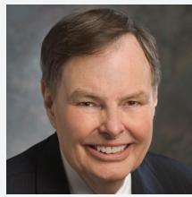

{0}------------------------------------------------

2023 PROXY STATEMENT | 2022 ANNUAL REPORT

{1}------------------------------------------------

# **CONTENTS**

| Proxy Statement            |
|-------------------------------|
|                               |
| Forward-Looking Statements |
|                               |
| Stock Performance          |
|                               |
| Investment Summary         |
|                               |
| Financial Information      |
|                               |
| Corporate Data             |
|                               |
| Environmental Statement    |

{2}------------------------------------------------

**12300 Liberty Boulevard Englewood, Colorado 80112 (720) 875-5700**

# **DEAR FELLOW STOCKHOLDER:**

You are cordially invited to attend the 2023 annual meeting of stockholders of Liberty Broadband Corporation (**Liberty Broadband**) to be held at 8:30 a.m., Mountain time, on June 6, 2023. The annual meeting will be held via the Internet and will be a completely virtual meeting of stockholders. You may attend the meeting, submit questions and vote your shares electronically during the meeting via the Internet by visiting *www.virtualshareholdermeeting.com/LBRD2023*. To enter the annual meeting, you will need the 16-digit control number that is printed on your Notice of Internet Availability of Proxy Materials or proxy card. We recommend logging in at least fifteen minutes before the meeting to ensure that you are logged in when the meeting starts. Online check-in will start shortly before the meeting on June 6, 2023.

At the annual meeting, you will be asked to consider and vote on the proposals described in the accompanying notice of annual meeting and proxy statement, as well as on such other business as may properly come before the meeting.

Your vote is important, regardless of the number of shares you own. Whether or not you plan to attend the annual meeting, please read the enclosed proxy materials and then promptly vote via the Internet or telephone or by completing, signing and returning the proxy card if you received a paper copy of the proxy materials by mail. Doing so will not prevent you from later revoking your proxy or changing your vote at the meeting.

Thank you for your cooperation and continued support and interest in Liberty Broadband.

Very truly yours,

**Gregory B. Maffei President and Chief Executive Officer** April 21, 2023

*The Notice of Internet Availability of Proxy Materials is first being mailed on or about April 25, 2023, and the proxy materials relating to the annual meeting will first be made available on or about the same date.*

{3}------------------------------------------------

# NOTICE OF **2023** ANNUAL MEETING OF STOCKHOLDERS

Notice is hereby given of the annual meeting of stockholders of Liberty Broadband Corporation (**Liberty Broadband**). The annual meeting will be held via the Internet and will be a completely virtual meeting of stockholders.

| MEETING DATE & TIME            | VIRTUAL MEETING LOCATION                                                                                                   | RECORD DATE                                    |
|--------------------------------|----------------------------------------------------------------------------------------------------------------------------|------------------------------------------------|
| June 6, 2023, at 8:30 am MT | You may attend the meeting, submit questions and vote your shares electronically during the meeting via the Internet by | 5:00 p.m., New York City time, on April 10, |
|                                | visiting www.virtualshareholdermeeting.com/LBRD2023                                                                        | 2023                                           |

To enter the annual meeting, you will need the 16-digit control number that is printed on your Notice of Internet Availability of Proxy Materials or proxy card. We recommend logging in at least fifteen minutes before the meeting to ensure that you are logged in when the meeting starts. Online check-in will start shortly before the meeting on June 6, 2023.

At the annual meeting, you will be asked to consider and vote on the following proposals. Our Board of Directors (**Board** or **Board of Directors**) has unanimously approved each proposal for inclusion in the proxy materials.

|   | BOARD PROPOSAL RECOMMENDATION PAGES                                                                                                                                                                                                                                              |                              |       |
|---|-------------------------------------------------------------------------------------------------------------------------------------------------------------------------------------------------------------------------------------------------------------------------------------------|------------------------------|-------|
| 1 | A proposal (which we refer to as the election of directors proposal) to elect Gregg L. Engles, John C. Malone and John E. Welsh III to continue serving as Class III members of our Board until the 2026 annual meeting of stockholders or their earlier resignation or removal. | FOR each director nominee | 14-22 |
| 2 | A proposal (which we refer to as the auditors ratification proposal) to ratify the selection of KPMG LLP as our independent auditors for the fiscal year ending December 31, 2023.                                                                                                     | FOR                          | 34-35 |
|   | You may also be asked to consider and vote on such other business as may properly come before the annual meeting.                                                                                                                                                                         |                              |       |

We describe the proposals in more detail in the accompanying proxy statement. We encourage you to read the proxy statement

in its entirety before voting.

**YOUR VOTE IS IMPORTANT.** Voting promptly, regardless of the number of shares you own, will aid us in reducing the expense of any further proxy solicitation in connection with the annual meeting. You may vote electronically during the annual meeting or by proxy prior to the meeting by telephone, via the Internet or by mail:

**Internet Virtual Meeting Phone Mail**

Vote by returning a properly completed, signed and dated proxy card

Vote online at *www.proxyvote.com* Vote live during the annual meeting at the URL above

Vote by calling 1-800-690-6903 (toll free) in the United States or Canada

{4}------------------------------------------------

Holders of record of our following series of capital stock, par value \$0.01 per share, as of the record date will be entitled to notice of the annual meeting and to vote at the annual meeting or any adjournment or postponement thereof:

- Series A common stock
- Series B common stock
- Series A Cumulative Redeemable Preferred Stock

These holders will vote together as a single class on each proposal.

A list of stockholders entitled to vote at the annual meeting will be available at our offices at 12300 Liberty Boulevard, Englewood, Colorado 80112 for review by our stockholders for any purpose germane to the annual meeting for at least ten days prior to the annual meeting. If you have any questions with respect to accessing this list, please contact Liberty Broadband Investor Relations at (844) 826-8735.

#### **Important Notice Regarding the Availability of Proxy Materials For the Annual Meeting of Stockholders to be Held on June 6, 2023: our Notice of Annual Meeting of Stockholders, Proxy Statement and 2022 Annual Report to Stockholders are available at** *www.proxyvote.com***.**

By order of the Board of Directors,

**Katherine C. Jewell Vice President and Secretary** Englewood, Colorado April 21, 2023

**WHETHER OR NOT YOU PLAN TO ATTEND THE ANNUAL MEETING, PLEASE VOTE PROMPTLY VIA TELEPHONE OR ELECTRONICALLY VIA THE INTERNET. ALTERNATIVELY, PLEASE COMPLETE, SIGN AND RETURN THE PROXY CARD IF YOU RECEIVED A PAPER COPY OF THE PROXY MATERIALS BY MAIL.**

#### WHO MAY VOTE WHO MAY NOT VOTE

Holders of record of our Series C common stock, par value \$0.01 per share, as of the record date are NOT entitled to any voting powers, except as required by Delaware law, and may not vote on the proposals to be presented at the annual meeting.

{5}------------------------------------------------

# Table of Contents

| Proxy Summary                             | 1  |
|----------------------------------------------|----|
| About Our Company                            | 1  |
| 2022 Year In Review                          | 1  |
| Voting Roadmap                               | 3  |
| Environmental, Social and Governance         |    |
| Highlights                                   | 5  |
| Executive Compensation Highlights            | 8  |
| Proxy Statement for Annual Meeting of        |    |
| Stockholders                              | 8  |
| The Annual Meeting                           | 9  |
| Notice and Access of Proxy Materials      | 9  |
| Electronic Delivery                       | 9  |
| Time, Place and Date                      | 9  |
| Purpose                                      | 10 |
| Quorum                                       | 10 |
| Who May Vote .                            | 10 |
| Votes Required                               | 10 |
| Votes You Have .                          | 11 |
| Shares Outstanding .                      | 11 |
| Number of Holders                            | 11 |
| Voting Procedures for Record Holders .    | 11 |
| Voting Procedures for Shares Held in Street  |    |
| Name                                         | 12 |
| Voting Procedures for Shares Held in the GCI |    |
| 401(K) Savings Plan                          | 12 |
| Revoking a Policy                            | 12 |
| Solicitation of Proxies                      | 12 |
| Other Matters to be Voted on at the Annual   |    |
| Meeting .                                 | 13 |
| Stockholder Proposals .                   | 13 |
| Additional Information                       | 13 |
| Proposal 1 – The Election of Directors       |    |
| Proposal                                     | 14 |
| Board of Directors Overview                  | 14 |
| Vote and Recommendation                      | 14 |
| Our Board at a Glance .                   | 15 |
| Director Skills and Experience               | 16 |
| Nominees for Election as Directors .      | 17 |
| Directors Whose Term Expires in 2024         | 20 |
| Directors Whose Term Expires in 2025         | 21 |
| Corporate Governance                         | 23 |
| Director Independence .                   | 23 |
| Board Composition                            | 23 |
| Board Classification .                    | 23 |
| Board Diversity                              | 24 |
| Board Leadership Structure                   | 24 |

| Board Role in Risk Oversight Code of Ethics . Family Relationships; Legal Proceedings Committees of the Board of Directors . Board Criteria and Director Candidates . Board Meetings . Director Attendance at Annual Meetings Stockholder Communication with Directors Executive Sessions Delinquent Section 16(a) Reports . | 24 25 25 25 28 30 30 30 30 30 |
|------------------------------------------------------------------------------------------------------------------------------------------------------------------------------------------------------------------------------------------------------------------------------------------------------------------------------------------------------------------------|----------------------------------------------------------|
| Director Compensation . Nonemployees Directors Director Compensation Table                                                                                                                                                                                                                                                                                    | 31 31 33                                           |
| Proposal 2 – The Auditors Ratification Proposal                                                                                                                                                                                                                                                                                                                     | 34                                                       |
| Vote and Recommendation                                                                                                                                                                                                                                                                                                                                                | 34                                                       |
| Audit Fees and All Other Fees                                                                                                                                                                                                                                                                                                                                          | 34                                                       |
| Policy on Pre-Approval of Audit and Permissible Non-Audit Services of Independent Auditor .                                                                                                                                                                                                                                                                      | 35                                                       |
| Audit Committee Report                                                                                                                                                                                                                                                                                                                                                 | 36                                                       |
| Executive Officers .                                                                                                                                                                                                                                                                                                                                                | 37                                                       |
| Executive Compensation                                                                                                                                                                                                                                                                                                                                                 | 39                                                       |
| Compensation Discussion and Analysis                                                                                                                                                                                                                                                                                                                                   | 39                                                       |
| Summary Compensation Table .                                                                                                                                                                                                                                                                                                                                        | 51                                                       |
| Executive Compensation Arrangements                                                                                                                                                                                                                                                                                                                                    | 53                                                       |
| Grants of Plan-Based Awards                                                                                                                                                                                                                                                                                                                                            | 57                                                       |
| Outstanding Equity Awards at Fiscal Year-End                                                                                                                                                                                                                                                                                                                           | 58                                                       |
| Option Exercises and Stock Vested .                                                                                                                                                                                                                                                                                                                                 | 59                                                       |
| Potential Payments Upon Termination or Change                                                                                                                                                                                                                                                                                                                          |                                                          |
| in Control                                                                                                                                                                                                                                                                                                                                                             | 60                                                       |
| Benefits Payable Upon Termination or Change in Control                                                                                                                                                                                                                                                                                                              | 63                                                       |
| Pay Versus Performance                                                                                                                                                                                                                                                                                                                                                 | 66                                                       |
| Equity Compensation Plan Information                                                                                                                                                                                                                                                                                                                                   | 70                                                       |
| Security Ownership of Certain Beneficial Owners                                                                                                                                                                                                                                                                                                                        |                                                          |
| and Management .                                                                                                                                                                                                                                                                                                                                                    | 71                                                       |
| Security Ownership of Certain Beneficial                                                                                                                                                                                                                                                                                                                               |                                                          |
| Owners .                                                                                                                                                                                                                                                                                                                                                            | 71                                                       |
| Security Ownership of Management .                                                                                                                                                                                                                                                                                                                                  | 73                                                       |
| Hedging Disclosure                                                                                                                                                                                                                                                                                                                                                     | 76                                                       |
| Changes in Control                                                                                                                                                                                                                                                                                                                                                     | 76                                                       |
| Certain Relationships and Related Party Transactions                                                                                                                                                                                                                                                                                                                | 77                                                       |
| Exchange Agreement with John C. Malone                                                                                                                                                                                                                                                                                                                                 | 77                                                       |
|                                                                                                                                                                                                                                                                                                                                                                        |                                                          |

{6}------------------------------------------------

# Proxy Summary

*This summary highlights information contained elsewhere in this proxy statement. This summary does not contain all information you should consider. Please read the entire proxy statement carefully before voting.*

What's new with this year's proxy statement?

- 2022 Year in Review
- Voting Roadmap on pages 3-4

# **ABOUT OUR COMPANY**

Liberty Broadband Corporation owns communications businesses providing a wide range of cable, data, wireless, video, voice, and managed services. Our principal asset is our ownership in Charter Communications, Inc. (**Charter**), the second largest cable operator in the United States. We also wholly own GCI, the largest communications provider in Alaska for over 40 years.

# **2022 YEAR IN REVIEW**

- In 2022, Liberty Broadband received \$3 billion of proceeds from selling shares under Charter's buyback, and used proceeds to repurchase \$2.9 billion of our Series A and Series C common stock shares
- Charter achieved revenue growth of 4.5% and adjusted EBITDA(1) growth of 4.8%
- Charter grew customer relationships, adding 344 thousand total Internet customers and 1.7 million mobile lines in 2022
- Charter introduced Spectrum One in October 2022, bundling broadband, WiFi and mobile at an attractive rate
- GCI generated full-year revenue of \$969 million and operating income of \$54 million, and grew adjusted OIBDA(1) 1% to a record \$358 million
	- (1) For a definition of Adjusted EBITDA as defined by Charter, as well as a reconciliation of Adjusted EBITDA to net income, see Charter's Annual Report on Form 10-K for the year ended December 31, 2022, filed with the Securities and Exchange Commission (the **SEC**) on January 27, 2023. For a definition of Adjusted OIBDA for GCI Holdings, as well as a reconciliation of Adjusted OIBDA to operating income, see our company's Current Report on Form 8-K furnished with the SEC on February 21, 2023.

{7}------------------------------------------------

## **Our Defining Attributes**

#### **FORWARD-LOOKING**

We take advantage of the benefits and minimize the risks associated with the digital transition in the industries in which we invest.

#### **FINANCIALLY SOPHISTICATED**

We have experience in mergers, divestitures, investing, capital deployment, credit analysis and setting capital structures.

#### **NIMBLE**

We structure our team to allow us to move quickly when opportunities arise, and we can be creative in our deal structures.

#### **LONG-TERM FOCUSED**

We take a long-term, strategic view in our operating businesses and are less concerned with short-term bouts of volatility.

#### **STOCKHOLDER CENTRIC**

We think like owners and are focused on long-term gains rather than short-term results. The compensation structure of our management team is closely tied to the long-term performance of our stock.

{8}------------------------------------------------

# **VOTING ROADMAP**

## **Proposal 1: Election of Directors Proposal (see page 14)**

#### **OUR BOARD RECOMMENDS A VOTE FOR EACH DIRECTOR NOMINEE**

The Board of Directors recommends that you vote **FOR** each director nominee. These individuals bring a range of relevant experiences and overall diversity of perspectives that is essential to good governance and leadership of our company. See pages 14-22 for further information.

#### **OUR DIRECTOR NOMINEES**

#### **GREGG L. ENGLES**

**Committee(s):** Audit, Nominating and Corporate Governance

**Director Since:** 2020 **Independent Director**

Mr. Engles offers our Board significant operational experience gained through his senior leadership positions at The WhiteWave Foods Company (**WhiteWave**) and other large public companies. He provides our Board with executive leadership perspective on the operations and management of public companies, which assists our Board in evaluating strategic opportunities.

| 1 September 1999 1 - 4 PAGE 22 Status Land A 1000 1/2 14 TE 21 4 1 - - 3 243 2 1 20 |
|----------------------------------------------------------------------------------------------------------------------------------------------------|
| 4 o 1 1 1 18 1 1 1 1 1 The Property                                                                               |
| 2 1 1                                                                                                                                        |

#### **JOHN C. MALONE**

**Director Since:** 2014

**Committee(s):** Executive

**Chairman of the Board**

Mr. Malone, as President of Tele-Communications, Inc. (**TCI**), co-founded Liberty Media Corporation's (**Liberty Media**) predecessor and is considered one of the preeminent figures in the media and telecommunications industry. He is well known for his sophisticated problem solving and risk assessment skills.

#### **JOHN E. WELSH III**

**Committee(s):** Audit (Chair), Nominating and Corporate Governance

**Director Since:** 2014 **Independent Director**

Mr. Welsh brings to the Board a strong financial background in investment banking and investment management and his experience as an audit committee member of Integrated Electrical Services Corp. In addition to possessing strong leadership and collaboration skills, Mr. Welsh has substantial experience involving the management and operation of technology companies. He is also an important resource with respect to the financial services firms that our company may engage from time to time.

#### **CURRENT BOARD OF DIRECTORS AT A GLANCE**

**GENDER/DEMOGRAPHIC DIVERSITY** 

{9}------------------------------------------------

#### **BOARD AND CORPORATE GOVERNANCE HIGHLIGHTS**

#### **Effective Independent Oversight Strong Governance Practices**

- 75% of our directors are independent
- Separate Chairman of the Board and Chief Executive Officer
- Executive sessions of independent directors held without the participation of management
- Independent directors chair the audit, compensation and nominating and corporate governance committees
- Ability to engage with independent consultants or advisors
- No compensation committee interlocks or compensation committee engagement in related party transactions in 2022
- Exchange agreement with our Chairman of the Board, as we believe it is in the best interests of our company and stockholders not to have a single stockholder with control over greater than 50% of our aggregate voting power. See "Certain Relationships and Related Party Transactions—Exchange Agreement with John C. Malone"

- Succession planning
- Stockholder access to the director nomination process
- Corporate Governance Guidelines and Code of Business Conduct and Ethics which are published online
- Directors have unabridged access to senior management and other company employees
- Anonymous "whistleblowing" channels for any concerns
- Well-established risk oversight process
- Leverages collaborative approach to enhancing Environmental, Social and Governance (**ESG**) practices

## **Proposal 2: Auditors Ratification Proposal (see page 34)**

#### **OUR BOARD RECOMMENDS A VOTE FOR THIS PROPOSAL**

The Board of Directors recommends that you vote **FOR** this proposal because KPMG LLP is an independent firm with few ancillary services and reasonable fees, and has significant industry and financial reporting expertise. See pages 34-35 for further information.

{10}------------------------------------------------

# **ENVIRONMENTAL, SOCIAL AND GOVERNANCE HIGHLIGHTS**

At Liberty Broadband, we believe that we can have the largest impact, and unlock the greatest value, through a collaborative approach to ESG issues. This approach reflects an ESG partnership across our company, Qurate Retail, Inc. (**Qurate Retail**), Liberty TripAdvisor Holdings, Inc. (**Liberty TripAdvisor**) and Liberty Media, as well as with the portfolio of assets within each of these public companies.

#### **This approach to ESG is underpinned by four core values:**

**EMPOWER AND VALUE OUR PEOPLE**

**CONTINUOUS PURSUIT OF EXCELLENCE**

**CREATE OPTIONALITY AND BE NIMBLE**

**ACT LIKE OWNERS** 

{11}------------------------------------------------

By applying this mindset to ESG, we leverage best practices, share resources, develop priorities and pursue sustainable long-term value creation:

| Oversight and Support | • Top-down ESG oversight across our portfolio of companies • Board-level engagement on material ESG issues • Benefits from Liberty Media's Corporate Responsibility Committee, comprised of nearly 20 leaders from across departments, handles development and implementation of ESG strategy • Active investor engagement to understand expectations • Ongoing monitoring of industries' ESG best practices • See "Corporate Governance—Board Role in Risk Oversight" |
|-----------------------------|---------------------------------------------------------------------------------------------------------------------------------------------------------------------------------------------------------------------------------------------------------------------------------------------------------------------------------------------------------------------------------------------------------------------------------------------------------------------------------------------------------------|
| Scale and Synergies   | • ESG risk management and opportunity capture • Annual ESG summits for idea generation and best practice sharing • Disclosure practices conveyed proactively, portfolio-wide • ESG policy library as a resource for all Liberty companies • Access to green energy investments and other opportunities                                                                                                                                                                             |

{12}------------------------------------------------

#### **Our ESG Pillars:**

#### **ENVIRONMENTAL STEWARDSHIP COMMUNITY COMMITMENT**

We recognize climate change and adverse impacts on the natural world are among the most pressing challenges facing humanity today. Environmental sustainability has implications for markets, and our investors. Moreover, how we manage our environmental impact matters to our employees, our customers, our business partners, and our other stakeholders.

We are privileged to operate in many communities, and we take seriously our role as a leader and partner within, and contributor to, these communities.

Through the products and services we provide, our charitable giving and volunteerism, and our broader community relations, we strive to connect with and serve our local communities, for the benefit of our employees, businesses, customers, and neighbors.

#### **TALENT & CULTURE**

We believe that the ability to engage a dynamic and thoughtful workforce is key to creating value. We nurture a company culture of diversity, equity, and inclusion where everyone can unlock their full potential, both at our company and across our portfolio of businesses. Additionally, our focus on recruitment, development and succession planning, and fair labor practices are key focal points of our human capital strategy.

**ETHICS & INTEGRITY**

Our Board of Directors and leadership team lead with principle and integrity and expect each of our companies to do the same. This means aligning their business strategies with the long-term interests of all their stakeholders, including customers, employees, regulators, and the general public.

{13}------------------------------------------------

# **EXECUTIVE COMPENSATION HIGHLIGHTS**

# Compensation Philosophy

**Our compensation philosophy seeks to align the interests of the named executive officers with those of our stockholders, with the ultimate goal of appropriately motivating our executives to increase long-term stockholder value.**

To that end, the compensation packages provided to the named executive officers include significant performance-based bonuses and significant equity incentive awards, including equity awards that vest multiple years after initial grant.

- A significant portion of compensation is at-risk and performance-based.
- Performance targets for our executives support the long-term growth of the company.
- We have clawback provisions for equity-based incentive compensation.
- We have stock ownership guidelines for our executive officers.

## **WHAT WE DO WHAT WE DO NOT DO**

- Our compensation practices do not encourage excessive risk taking.
- We do not provide tax gross-up payments in connection with taxable income from perquisites.
- We do not engage in liberal share recycling.

# **PROXY STATEMENT FOR ANNUAL MEETING OF STOCKHOLDERS**

We are furnishing this proxy statement in connection with the Board of Directors' solicitation of proxies for use at our 2023 Annual Meeting of Stockholders to be held at 8:30 a.m., Mountain time, on June 6, 2023 or at any adjournment or postponement of the annual meeting. The annual meeting will be held via the Internet and will be a completely virtual meeting of stockholders. You may attend the meeting, submit questions and vote your shares electronically during the meeting via the Internet by visiting *www.virtualshareholdermeeting.com/LBRD2023*. At the annual meeting, we will ask you to consider and vote on the proposals described in the accompanying Notice of Annual Meeting of Stockholders. The proposals are described in more detail in this proxy statement. We are soliciting proxies from holders of our Series A common stock, par value \$0.01 per share (**LBRDA**), Series B common stock, par value \$0.01 per share (**LBRDB**), and our Series A Cumulative Redeemable Preferred Stock, par value \$0.01 per share (**LBRDP**). The holders of our Series C common stock, par value \$0.01 per share (**LBRDK**), are not entitled to any voting powers, except as required by Delaware law, and may not vote on the proposals to be presented at the annual meeting. We refer to LBRDA, LBRDB, and LBRDP together as our **voting stock**. We refer to our voting stock together with LBRDK as our **capital stock**.

{14}------------------------------------------------

# The Annual Meeting

# **NOTICE AND ACCESS OF PROXY MATERIALS**

We have elected, in accordance with the SEC "Notice and Access" rule, to deliver a Notice of Internet Availability of Proxy Materials (the **Notice**) to our stockholders and to post our proxy statement and our annual report to our stockholders (collectively, the **proxy materials**) electronically. The Notice is first being mailed to our stockholders on or about April 25, 2023. The proxy materials will first be made available to our stockholders on or about the same date.

The Notice instructs you how to access and review the proxy materials and how to submit your proxy via the Internet. The Notice also instructs you how to request and receive a paper copy of the proxy materials, including a proxy card or voting instruction form, at no charge. We will not mail a paper copy of the proxy materials to you unless specifically requested to do so. The Notice is not a form for voting and presents only an overview of the more complete proxy materials, which contain important information and are available to you on the Internet or by mail. We encourage you to access and review the proxy materials before voting.

#### **Important Notice Regarding the Availability of Proxy Materials For the Annual Meeting of Stockholders to be Held on June 6, 2023: our Notice of Annual Meeting of Stockholders, Proxy Statement and 2022 Annual Report to Stockholders are available at** *www.proxyvote.com***.**

We have adopted a procedure, approved by the SEC, called "householding." Under this procedure, stockholders of record who have the same address and last name and did not receive a Notice of Internet Availability or otherwise receive their proxy materials electronically will receive only one copy of this Proxy Statement, unless we are notified that one or more of these stockholders wishes to continue receiving individual copies. This procedure will reduce our printing costs and postage fees.

If you are eligible for householding, but you and other stockholders of record with whom you share an address currently receive multiple copies of this Proxy Statement or if you hold our voting stock in more than one account, and in either case you wish to receive only a single copy of each of these documents for your household, please contact Broadridge Financial Solutions, Inc. by writing to Broadridge Financial Solutions, Inc., Attn: Householding Department, 51 Mercedes Way, Edgewood, New York 11717 or by calling, toll-free in the United States, 1-866-540-7095. If you participate in householding and wish to receive a separate copy of this Proxy Statement or if you do not wish to continue to participate in householding and prefer to receive separate copies of these documents in the future, please contact Broadridge Financial Solutions, Inc. as indicated above.

# **ELECTRONIC DELIVERY**

Registered stockholders may elect to receive future notices and proxy materials by e-mail. To sign up for electronic delivery, go to *www.proxyvote.com*. Stockholders who hold shares through a bank, brokerage firm or other nominee may sign up for electronic delivery when voting by Internet at *www.proxyvote.com* by following the prompts. Also, stockholders who hold shares through a bank, brokerage firm or other nominee may sign up for electronic delivery by contacting their nominee. Once you sign up, you will not receive a printed copy of the notices and proxy materials, unless you request them. If you are a registered stockholder, you may suspend electronic delivery of the notices and proxy materials at any time by contacting our transfer agent, Broadridge, at (888) 789-8745 (outside the United States (303) 562-9277). Stockholders who hold shares through a bank, brokerage firm or other nominee should contact their nominee to suspend electronic delivery.

# **TIME, PLACE AND DATE**

The annual meeting of stockholders is to be held at 8:30 a.m., Mountain time, on June 6, 2023. The annual meeting will be held via the Internet and will be a completely virtual meeting of stockholders. You may attend the meeting, submit questions and vote your shares electronically during the meeting via the Internet by visiting *www.virtualshareholdermeeting.com/LBRD2023*. To enter the annual meeting, you will need the 16-digit control number

{15}------------------------------------------------

that is printed on your Notice or proxy card. We recommend logging in at least fifteen minutes before the meeting to ensure that you are logged in when the meeting starts. Online check-in will start shortly before the meeting on June 6, 2023.

# **PURPOSE**

At the annual meeting, you will be asked to consider and vote on each of the following:

- the election of directors proposal, to elect Gregg L. Engles, John C. Malone and John E. Welsh III to continue serving as Class III members of our Board until the 2026 annual meeting of stockholders or their earlier resignation or removal; and
- the auditors ratification proposal, to ratify the selection of KPMG LLP as our independent auditors for the fiscal year ending December 31, 2023.

You may also be asked to consider and vote on such other business as may properly come before the annual meeting, although we are not aware at this time of any other business that might come before the annual meeting.

## **Recommendation of Our Board of Directors**

Our Board of Directors has unanimously approved each of the proposals for inclusion in the proxy materials and recommends that you vote "**FOR**" the election of each director nominee and "**FOR**" the auditors ratification proposal.

# **QUORUM**

In order to conduct the business of the annual meeting, a quorum must be present. This means that the holders of at least a majority of the aggregate voting power represented by the shares of our voting stock outstanding on the record date (as defined below) and entitled to vote at the annual meeting must be represented at the annual meeting either in person or by proxy. Virtual attendance at the annual meeting constitutes presence in person for purposes of a quorum at the meeting. For purposes of determining a quorum, your shares will be included as represented at the meeting even if you indicate on your proxy that you abstain from voting. If a broker, who is a record holder of shares, indicates on a form of proxy that the broker does not have discretionary authority to vote those shares on a particular proposal or proposals, or if those shares are voted in circumstances in which proxy authority is defective or has been withheld, those shares (**broker non-votes**) will nevertheless be treated as present for purposes of determining the presence of a quorum. See "—Voting Procedures for Shares Held in Street Name—Effect of Broker Non-Votes" below.

# **WHO MAY VOTE**

Holders of shares of LBRDA, LBRDB and LBRDP, as recorded in our stock register as of 5:00 p.m., New York City time, on April 10, 2023 (such date and time, the **record date** for the annual meeting), will be entitled to notice of the annual meeting and to vote at the annual meeting or any adjournment or postponement thereof.

# **VOTES REQUIRED**

Each director nominee who receives a plurality of the combined voting power of the outstanding shares of our voting stock present in person or represented by proxy at the annual meeting and entitled to vote on the election of directors at the annual meeting, voting together as a single class, will be elected to office.

Approval of the auditors ratification proposal requires the affirmative vote of a majority of the combined voting power of the outstanding shares of our voting stock that are present in person or by proxy, and entitled to vote at the annual meeting, voting together as a single class.

{16}------------------------------------------------

Virtual attendance at the annual meeting constitutes presence in person for purposes of each required vote.

# **VOTES YOU HAVE**

At the annual meeting, holders of shares of LBRDA will have one vote per share, holders of shares of LBRDB will have ten votes per share, and holders of shares of LBRDP will have one-third of one vote per share, in each case, that our records show are owned as of the record date. Holders of LBRDK shares will not be eligible to vote at the annual meeting.

# **SHARES OUTSTANDING**

As of the record date, 18,221,602 shares of LBRDA, 2,037,259 shares of LBRDB and 7,183,812 shares of LBRDP were issued and outstanding and entitled to vote at the annual meeting.

# **NUMBER OF HOLDERS**

There were, as of the record date, 627, 77 and 614 record holders of LBRDA, LBRDB and LBRDP, respectively (which amounts do not include the number of stockholders whose shares are held of record by banks, brokers or other nominees, but include each such institution as one holder).

# **VOTING PROCEDURES FOR RECORD HOLDERS**

Holders of record of LBRDA, LBRDB and LBRDP as of the record date may vote via the Internet at the annual meeting or prior to the annual meeting by telephone or through the Internet. Alternatively, if they received a paper copy of the proxy materials by mail, they may give a proxy by completing, signing, dating and returning the proxy card by mail.

Holders of record may vote their shares electronically during the meeting via the Internet by visiting *www.virtualshareholdermeeting.com/LBRD2023*. To enter the annual meeting, holders will need the 16-digit control number that is printed on their Notice or proxy card. We recommend logging in at least fifteen minutes before the meeting to ensure that they are logged in when the meeting starts. Online check-in will start shortly before the meeting on June 6, 2023.

Instructions for voting prior to the annual meeting by using the Internet are printed on the Notice or the proxy card. In order to vote prior to the annual meeting through the Internet, holders should have their Notices or proxy cards available so they can input the required information from the Notice or proxy card, and log onto the Internet website address shown on the Notice or proxy card. When holders log onto the Internet website address, they will receive instructions on how to vote their shares. Unless subsequently revoked, shares of our voting stock represented by a proxy submitted as described herein and received at or before the annual meeting will be voted in accordance with the instructions on the proxy.

**YOUR VOTE IS IMPORTANT.** It is recommended that you vote by proxy even if you plan to attend the annual meeting. You may change your vote at the annual meeting.

If you submit a properly executed proxy without indicating any voting instructions as to a proposal enumerated in the Notice of Annual Meeting of Stockholders, the shares represented by the proxy will be voted "**FOR**" the election of each director nominee and "**FOR**" the auditors ratification proposal.

If you submit a proxy indicating that you abstain from voting as to a proposal, it will have no effect on the election of directors proposal and will have the same effect as a vote "**AGAINST**" the auditors ratification proposal.

If you do not submit a proxy or you do not vote at the annual meeting, your shares will not be counted as present and entitled to vote for purposes of determining a quorum, and your failure to vote will have no effect on determining whether any of the proposals are approved (if a quorum is present).

{17}------------------------------------------------

# **VOTING PROCEDURES FOR SHARES HELD IN STREET NAME**

#### **GENERAL**

If you hold your shares in the name of a broker, bank or other nominee, you should follow the instructions provided by your broker, bank or other nominee when voting your shares or to grant or revoke a proxy. The rules and regulations of the New York Stock Exchange and The Nasdaq Stock Market LLC (**Nasdaq**) prohibit brokers, banks and other nominees from voting shares on behalf of their clients without specific instructions from their clients with respect to numerous matters, including, in our case, the election of directors proposal. Accordingly, to ensure your shares held in street name are voted on these matters, we encourage you to provide promptly specific voting instructions to your broker, bank or other nominee.

#### **EFFECT OF BROKER NON-VOTES**

Broker non-votes are counted as shares of our voting stock present and entitled to vote for purposes of determining a quorum but will have no effect on any of the proposals. You should follow the directions your broker, bank or other nominee provides to you regarding how to vote your shares of LBRDA, LBRDB and LBRDP or how to change your vote or revoke your proxy.

## **VOTING PROCEDURES FOR SHARES HELD IN THE GCI 401(K) SAVINGS PLAN**

If you hold LBRDP shares through your account in the GCI 401(k) Plan, the trustee for such plan is required to vote your shares as you specify. To allow sufficient time for the trustee to vote your shares, your voting instructions must be received by 11:59 p.m., New York City time, on June 1, 2023. To vote such shares, please follow the instructions provided by the trustee for such plan.

# **REVOKING A PROXY**

If you submitted a proxy prior to the start of the annual meeting, you may change your vote by attending the annual meeting online and voting via the Internet at the annual meeting or by delivering a signed proxy revocation or a new signed proxy with a later date to Vote Processing, c/o Broadridge, 51 Mercedes Way, Edgewood, NY 11717. Any signed proxy revocation or new signed proxy must be received before the start of the annual meeting. In addition, you may change your vote through the Internet or by telephone (if you originally voted by the corresponding method) not later than 11:59 p.m., New York City time, on June 5, 2023 if your shares are held directly or 11:59 p.m., New York City time, on June 1, 2023 if you hold LBRDP shares through your account in the GCI 401(k) Plan.

Your attendance at the annual meeting will not, by itself, revoke a prior vote or proxy from you.

If your shares are held in an account by a broker, bank or other nominee, you should contact your nominee to change your vote or revoke your proxy.

## **SOLICITATION OF PROXIES**

We are soliciting proxies by means of our proxy materials on behalf of our Board of Directors. In addition to this mailing, our employees may solicit proxies personally or by telephone. We pay the cost of soliciting these proxies. We also reimburse brokers and other nominees for their expenses in sending the Notice and, if requested, the proxy materials to you and getting your voting instructions.

If you have any further questions about voting or attending the annual meeting, please contact Liberty Broadband Investor Relations at (844) 826-8735 or Broadridge at (888) 789-8745 (outside the United States (303) 562-9277).

{18}------------------------------------------------

# **OTHER MATTERS TO BE VOTED ON AT THE ANNUAL MEETING**

Our Board of Directors is not currently aware of any business to be acted on at the annual meeting other than that which is described in the Notice of Annual Meeting of Stockholders and this proxy statement. If, however, other matters are properly brought to a vote at the annual meeting, the persons designated as proxies will have discretion to vote or to act on these matters according to their best judgment. In the event there is a proposal to adjourn or postpone the annual meeting, the persons designated as proxies will have discretion to vote on that proposal.

## **STOCKHOLDER PROPOSALS**

This proxy statement relates to our annual meeting of stockholders for the calendar year 2023 which will take place on June 6, 2023. Based solely on the date of our 2023 annual meeting and the date of this proxy statement, (i) a stockholder proposal must be submitted in writing to our Corporate Secretary and received at our executive offices at 12300 Liberty Boulevard, Englewood, Colorado 80112, by the close of business on December 27, 2023 in order to be eligible for inclusion in our proxy materials for the annual meeting of stockholders for the calendar year 2024 (the **2024 annual meeting**), and (ii) a stockholder proposal, or any nomination by stockholders of a person or persons for election to the Board of Directors, must be received at our executive offices at the foregoing address not earlier than March 8, 2024 and not later than April 8, 2024 to be considered for presentation at the 2024 annual meeting. We currently anticipate that the 2024 annual meeting will be held during the second quarter of 2024. If the 2024 annual meeting takes place more than 30 days before or 30 days after June 6, 2024 (the anniversary of the 2023 annual meeting), a stockholder proposal, or any nomination by stockholders of a person or persons for election to the Board of Directors, will instead be required to be received at our executive offices at the foregoing address not later than the close of business on the tenth day following the first day on which notice of the date of the 2024 annual meeting is communicated to stockholders or public disclosure of the date of the 2024 annual meeting is made, whichever occurs first, in order to be considered for presentation at the 2024 annual meeting. In addition, to comply with the universal proxy rules, stockholders who intend to solicit proxies in support of director nominees other than Liberty Broadband nominees must provide notice that sets forth the information required by Rule 14a-19 under the Securities Exchange Act of 1934, as amended (the **Exchange Act**), no later than April 8, 2024.

All stockholder proposals for inclusion in our proxy materials will be subject to the requirements of the proxy rules adopted under the Exchange Act, our charter and bylaws and Delaware law.

# **ADDITIONAL INFORMATION**

We file periodic reports, proxy materials and other information with the SEC. You may inspect such filings on the Internet website maintained by the SEC at *www.sec.gov*. Additional information can also be found on our website at *www.libertybroadband.com*. Information contained on any website referenced in this proxy statement is not incorporated by reference in this proxy statement. **If you would like to receive a copy of our Annual Report on Form 10-K for the year ended December 31, 2022 (the 2022 Form 10-K), which was filed on February 17, 2023 with the SEC, or any of the exhibits listed therein, please call or submit a request in writing to Investor Relations, Liberty Broadband Corporation, 12300 Liberty Boulevard, Englewood, Colorado 80112, Tel. No. (844) 826-8735, and we will provide you with the 2022 Form 10-K without charge, or any of the exhibits listed therein upon the payment of a nominal fee (which fee will be limited to the expenses we incur in providing you with the requested exhibits).**

{19}------------------------------------------------

# Proposal 1 – The Election of Directors Proposal

# **BOARD OF DIRECTORS OVERVIEW**

**What am I being asked to vote on and how should I vote?**

**We are asking our stockholders to elect Gregg L. Engles, John C. Malone and John E. Welsh III to continue serving as Class III members of our Board until the 2026 annual meeting of stockholders or their earlier resignation or removal.**

Our Board of Directors currently consists of eight directors, divided among three classes. Our Class III directors, whose term will expire at the annual meeting, are Gregg L. Engles, John C. Malone and John E. Welsh III. These directors are nominated for election to our Board to continue to serve as Class III directors, and we have been informed that each of Messrs. Engles, Malone and Welsh are willing to continue serving as a director of

our company. The term of the Class III directors who are elected at the annual meeting will expire at the annual meeting of our stockholders in the year 2026. Our Class I directors, whose term will expire at the annual meeting of our stockholders in the year 2024, are Julie D. Frist and J. David Wargo. Our Class II directors, whose term will expire at the annual meeting of our stockholders in the year 2025, are Richard R. Green, Sue Ann R. Hamilton and Gregory B. Maffei.

If any nominee should decline election or should become unable to serve as a director of our company for any reason before election at the annual meeting, votes will be cast by the persons appointed as proxies for a substitute nominee, if any, designated by the Board of Directors.

The following lists the three nominees for election as directors at the annual meeting and the five directors of our company whose term of office will continue after the annual meeting, and includes as to each person how long such person has been a director of our company, such person's professional background, other public company directorships and other factors considered in the determination that such person possesses the requisite qualifications and skills to serve as a member of our Board of Directors. For additional information on our Board's evaluation of director candidates or incumbent directors seeking re-election, see "Corporate Governance—Board Criteria and Director Candidates." The number of shares of our capital stock beneficially owned by each director is set forth in this proxy statement under the caption "Security Ownership of Certain Beneficial Owners and Management."

The members of our nominating and corporate governance committee have determined that Messrs. Engles, Malone and Welsh, who are nominated for election at the annual meeting, continue to be qualified to serve as directors of our company and such nominations were approved by the entire Board of Directors.

# **VOTE AND RECOMMENDATION**

A plurality of the combined voting power of the outstanding shares of our voting stock present in person or represented by proxy at the annual meeting and entitled to vote on the election of directors at the annual meeting, voting together as a single class, is required to elect each of Gregg L. Engles, John C. Malone and John E. Welsh III as a Class III member of our Board of Directors.

#### **OUR BOARD RECOMMENDS A VOTE FOR EACH DIRECTOR NOMINEE**

The Board of Directors recommends that you vote **FOR** each director nominee. These individuals bring a range of relevant experiences and overall diversity of perspectives that is essential to good governance and leadership of our company.

{20}------------------------------------------------

# **OUR BOARD AT A GLANCE**

|                                                           |                   |           | Committee Memberships |                                         |       |                                              |
|-----------------------------------------------------------|-------------------|-----------|-----------------------|-----------------------------------------|-------|----------------------------------------------|
| Name and Principal Occupation                             | Director Since | Executive | Compensation          | Nominating & Corporate Governance | Audit | Non-Liberty Public Board Directorships(1) |
| Class III directors who will stand for election this year |                   |           |                       |                                         |       |                                              |
| GREGG L. ENGLES                                           | 2020              |           |                       | M                                       | M     | 1                                            |
| JOHN C. MALONE (BOARD CHAIRMAN)                        | 2014              | M         |                       |                                         |       | 2                                            |
| JOHN E. WELSH III                                         | 2014              |           |                       | M                                       | C     | —                                            |
| Class I directors who will stand for election in 2024     |                   |           |                       |                                         |       |                                              |
| JULIE D. FRIST                                            | 2020              |           | C                     | M                                       |       | —                                            |
| J. DAVID WARGO                                            | 2015              |           | C                     |                                         | M     | 2                                            |
| Class III directors who will stand for election in 2025   |                   |           |                       |                                         |       |                                              |
| RICHARD R. GREEN                                          | 2014              |           | M                     | C                                       |       | 2                                            |
| SUE ANN R. HAMILTON                                       | 2020              |           | M                     | C                                       |       | 1                                            |
| GREGORY B. MAFFEI                                         | 2014              | M         |                       |                                         |       | 1                                            |

(1) Does not include service on the Board of Directors of Liberty Media, Qurate Retail, Liberty TripAdvisor, Sirius XM Holdings Inc. (**Sirius XM**), Tripadvisor, Inc. (**Tripadvisor**), Charter or Live Nation Entertainment, Inc. (**Live Nation**). See "Corporate Governance— Board Criteria and Director Candidates—Outside Commitments."

**C** = Chairperson **M** = Member = Independent

**GENDER/DEMOGRAPHIC DIVERSITY** 

{21}------------------------------------------------

# **DIRECTOR SKILLS AND EXPERIENCE**

{22}------------------------------------------------

# **NOMINEES FOR ELECTION AS DIRECTORS**

# **Gregg L. Engles**

**Director Since:** December 2020 **Age:** 65 **Committees:** Audit; Nominating and Corporate Governance **Independent Director**

Mr. Engles offers our Board significant operational experience gained through his senior leadership positions at WhiteWave and other large public companies. He provides our Board with executive leadership perspective on the operations and management of public companies, which assists our Board in evaluating strategic opportunities.

#### *Professional Background:*

- Founder and partner of Capitol Peak Partners since August 2017
- Chairman of the Board and Chief Executive Officer of WhiteWave from October 2012 until its acquisition by Danone in April 2017
- Chief Executive Officer of Dean Foods Company, WhiteWave's former parent company, from April 1996 until WhiteWave's initial public offering in October 2012

#### *Public Company Directorships:*

- Chipotle Mexican Grill, Inc. (July 2020 present)
- GCI Liberty, Inc. (**GCI Liberty**) (March 2018 – December 2020)
- Danone (April 2017 December 2020)
- Liberty Expedia Holdings, Inc. (**Liberty Expedia**) (November 2016 – July 2019)
- Dean Foods Company (Chairman, April 1996 July 2013; Vice-Chairman, January 2002 – May 2002)
- Treehouse Foods, Inc. (June 2005 May 2008)

{23}------------------------------------------------

# **John C. Malone**

**Chairman of the Board Director Since:** November 2014 **Age:** 82 **Committees:** Executive

Mr. Malone, as President of TCI, co-founded Liberty Media's predecessor and is considered one of the preeminent figures in the media and telecommunications industry. He is well known for his sophisticated problem solving and risk assessment skills.

#### *Professional Background:*

- Chairman of the Board of our company since November 2014
- Chairman of the Board of Qurate Retail from its inception in 1994 until March 2018 and served as Qurate Retail's Chief Executive Officer from August 2005 to February 2006
- Chairman of the Board of TCI from November 1996 until March 1999, when it was acquired by AT&T Corp., and Chief Executive Officer of TCI from January 1994 to March 1997

#### *Public Company Directorships:*

- Qurate Retail (1994 present; Chairman of the Board, 1994 – March 2018)
- Liberty Media (December 2010 present; Chairman of the Board, August 2011 – present)

*Non-Liberty Public Company Directorships:*

- Warner Bros. Discovery, Inc. (**Warner Bros. Discovery**) (April 2022 – present)
- Liberty Global plc (**LGP**) (Chairman of the Board, June 2013 – present)

- GCI Liberty (Chairman of the Board, March 2018 – December 2020)
- Liberty Expedia (Chairman, November 2016 July 2019)
- Liberty Latin America Ltd. (December 2017 – December 2019)
- Discovery, Inc. (**Discovery**) (formerly Discovery Communications, Inc. (**Discovery Communications**)) (Warner Bros. Discovery's predecessor) (September 2008 – April 2022)
- Discovery Holding Company (**DHC**) (predecessor of Discovery Communications) (March 2005 – September 2008; Chairman of the Board, May 2005 – September 2008)
- Liberty Global, Inc. (**LGI**) (LGP's predecessor) (Chairman of the Board, June 2005 – June 2013)
- Liberty Media International, Inc. (**LMI**) (LGI's predecessor) (March 2004 – June 2005)
- UnitedGlobalCom, Inc. (January 2022 June 2005)
- Lions Gate Entertainment Corp. (March 2015 – September 2018)
- Charter (May 2013 July 2018)
- Expedia, Inc. (December 2012 December 2017; August 2005 – November 2012)
- Liberty TripAdvisor (August 2014 June 2015)
- Sirius XM (April 2009 May 2013)
- Ascent Capital Group, Inc. (January 2010 – September 2012)
- Live Nation (January 2010 February 2011)
- DIRECTV (including predecessors) (Chairman of the Board, February 2008 – June 2010)
- IAC/InterActiveCorp (May 2006 June 2010)

{24}------------------------------------------------

# **John E. Welsh III**

**Director Since:** November 2014 **Age:** 72 **Committees:** Audit (Chair); Nominating and Corporate Governance **Independent Director**

Mr. Welsh brings to the Board a strong financial background in investment banking and investment management and his experience as an audit committee member of Integrated Electrical Services Corp. In addition to possessing strong leadership and collaboration skills, Mr. Welsh has substantial experience involving the management and operation of technology companies. He is also an important resource with respect to the financial services firms that our company may engage from time to time.

#### *Professional Background:*

- President of Avalon Capital Partners LLC, an investment firm, since 2002
- Director of CIP Management LLC from October 2000 to December 2002
- Managing Director and Vice-Chairman of the Board of SkyTel Communications, Inc. from 1992 to 1999
- Managing Director of Investment Banking of Prudential Securities, Inc. and Co-Head of the Mergers and Acquisitions Department prior to 1992

#### *Public Company Directorships:*

- None
- Liberty Media Acquisition Corp. (**LMAC**) (January 2021 – December 2022)
- General Cable Corp. (1997 June 2018; Chairman, August 2001 – June 2018)
- Spreckels Industries, Inc. (1996 2000)
- York International, Inc. (1996 2000)
- Integrated Electrical Services Corp. (2006 2013)

{25}------------------------------------------------

# **DIRECTORS WHOSE TERM EXPIRES IN 2024**

# **Julie D. Frist**

**Director Since:** March 2020 **Age:** 52 **Committees:** Compensation (Co-Chair); Nominating and Corporate Governance **Independent Director**

*Public Company Directorships:*

*Former Public Company Directorships:* • CapStar Bank (2008 – May 2020)

• None

Ms. Frist's educational background, experience in the financial services industry and significant involvement in the non-profit community give her beneficial insight and enable her to make valuable contributions as a member of our Board.

#### *Professional Background:*

- Vice-Chair of CapStar Financial Holdings, Inc. from December 2015 and a director of CapStar Bank from its founding in 2008 until May 2020
- Various positions with the Investment Banking Division (Corporate Finance) and the Private Client Group of Goldman Sachs between 1993 and 1998
- Vice President of Bruckmann, Rosser, Sherrill & Co., a New York-based private equity firm, from 1998 to 2000
- Serves on several non-profit Boards including The Frist Foundation and the Community Foundation of Middle Tennessee
- Advisory Board Member of the Yale Institute for Global Health
- Member of the Board of Dean's Advisors at the Harvard Business School
- Former Board member of Teach for America Nashville and the American Red Cross (Nashville Chapter)
- Former trustee of St. Paul's School in Concord, New Hampshire and the Ensworth School in Nashville, Tennessee

# **J. David Wargo**

**Director Since:** March 2015 **Age:** 69 **Committees:** Compensation (Co-Chair); Audit **Independent Director**

Mr. Wargo's extensive background in investment analysis and management, experience as a public company board member and his particular expertise in finance and capital markets contribute to our Board's consideration of our capital structure, evaluation of investment, financial opportunities and strategies, and strengthen our Board's collective qualifications, skills and attributes.

#### *Professional Background:*

- Founder of Wargo & Company, Inc., a private company specializing in investing in the communications industry, and has served as its president since 1993
- Co-founder and was a member of New Mountain Capital, LLC from 2000 to 2008
- Managing Director and senior analyst of The Putnam Companies from 1989 to 1992
- Senior Vice President and a Partner in Marble Arch Partners from 1985 to 1989
- Senior Analyst, Assistant Director of Research and a Partner in Slate Street Research and Management Company from 1978 to 1985

#### *Public Company Directorships:*

- Liberty TripAdvisor (August 2014 present)
*Non-Liberty Public Company Directorships:*

- LGP (June 2013 present)
- Vobile Group Limited (January 2018 present)

- Discovery (September 2008 April 2022)
- LGI (June 2005 June 2013)
- LMI (predecessor to LGI) (May 2004 June 2005)
- DHC (May 2005 September 2008)
- Strategic Education, Inc. (formerly Strayer Education, Inc.) (March 2001 – April 2019)

{26}------------------------------------------------

# **DIRECTORS WHOSE TERM EXPIRES IN 2025**

# **Richard R. Green**

**Director Since:** November 2014 **Age:** 85 **Committees:** Nominating and Corporate Governance (Co-Chair); Compensation **Independent Director**

Dr. Green brings to the Board his extensive professional and executive background and his particular knowledge and experience in the complex and rapidly changing field of technology for broadband communications services, which contributes to our company's evaluation of technological initiatives and challenges and strengthens the Board's collective qualifications, skills and attributes.

#### *Professional Background:*

- President and Chief Executive Officer of CableLabs® for over 20 years, before retiring in December 2009
- Senior Vice President at PBS from 1984 to 1988 and a director of CBS's Advanced Television Technology Laboratory from 1980 to 1983
- Director of Jones/NCTI, a Jones Knowledge Company, a workforce performance solutions company for individuals and broadband companies

#### *Public Company Directorships:*

- LGP and its predecessors (December 2008 present)
- Shaw Communications, Inc. (2010 present)

#### *Former Public Company Directorships:*

- GCI Liberty (March 2018 December 2020)

# **Sue Ann R. Hamilton**

**Director Since:** December 2020 **Age:** 62 **Committees:** Nominating and Corporate Governance (Co-Chair); Compensation

**Independent Director**

As a result of her extensive Board service and management experience, and her work advising and representing major media and technology companies, Ms. Hamilton brings to our Board significant leadership, oversight and consulting skills, as well as experience in the media, technology and legal fields.

#### *Professional Background:*

- Principal of the consultancy Hamilton Media LLC since 2007
- Executive Vice President-Distribution and Business Development for AXS TV LLC, a partnership between founder Mark Cuban, AEG, Ryan Seacrest Media, Creative Artists Agency and CBS, from September 2007 until the sale of the company in September 2019
- Represents The Mark Cuban Companies/Radical Ventures as Board observer for Philo, Inc., a privately held technology company, since July 2013
- Executive Vice President—Programming and Senior Vice President—Programming for Charter from 2003 to 2007
- Held numerous management positions at AT&T Broadband LLC and its predecessor, TCI, dating back to 1993
- Former partner at the law firm Kirkland & Ellis, specializing in complex commercial transactions
- J.D. degree from Stanford Law School, where she was Associate Managing Editor of the Stanford Law Review and Editor of the Stanford Journal of International Law. Magna cum laude graduate of Carleton College in Northfield, Minnesota

#### *Public Company Directorships:*

- Universal Electronics, Inc. (November 2019 present)
- GCI Liberty (March 2018 December 2020)
- FTD Companies, Inc. (December 2014 August 2019)

{27}------------------------------------------------

# **Gregory B. Maffei**

**President and Chief Executive Officer Director Since:** June 2014 **Age:** 62 **Committees:** Executive

Mr. Maffei brings to our Board significant financial and operational experience based on his senior policy making positions at our company, Qurate Retail, Liberty Media and Liberty TripAdvisor, and his previous positions at GCI Liberty, Oracle Corporation (**Oracle**), 360networks Corporation (**360networks**) and Microsoft Corporation (**Microsoft**), as well as his public company board experience. He provides our Board with executive leadership perspective on the operations and management of large public companies and risk management principles.

#### *Professional Background:*

- President and Chief Executive Officer of our company since June 2014
- President and Chief Executive Officer of Liberty Media since May 2007
- President and Chief Executive Officer of Liberty TripAdvisor since July 2013
- President and Chief Executive Officer of LMAC from November 2020 until its liquidation and dissolution in December 2022
- President and Chief Executive Officer of GCI Liberty from March 2018 until its combination with our company in December 2020
- President and Chief Executive Officer of Qurate Retail from February 2006 to March 2018, having served as its CEO-Elect from November 2005 through February 2006; Chairman of the Board of Qurate Retail since March 2018
- Previously President and Chief Financial Officer of Oracle Corporation, Chairman, President and Chief Executive Officer of 360networks, and Chief Financial Officer of Microsoft

#### *Public Company Directorships:*

- Liberty Media (May 2007 present)
- Sirius XM (March 2009 present, Chairman of the Board April 2013 – present)
- Live Nation (February 2011 present, Chairman of the Board, March 2013 – present)
- Qurate Retail (November 2005 present; Chairman of the Board, March 2018 – present)
- Liberty TripAdvisor (July 2013 present, Chairman of the Board, June 2015 – present)
- Tripadvisor (Chairman of the Board, February 2013 – present)
- Charter (May 2013 present)

*Non-Liberty Public Company Directorships:*

- Zillow Group, Inc. (**Zillow**) (February 2015 present)
- LMAC (November 2020 December 2022, Chairman of the Board, April 2021 – December 2022)
- GCI Liberty (March 2018 December 2020)
- Zillow, Inc. (Zillow's predecessor) (May 2005 – February 2015)
- DIRECTV and predecessors (February 2008 June 2010)
- Electronic Arts, Inc. (June 2003 July 2013)
- Barnes & Noble, Inc. (September 2011 April 2014)
- STARZ (Chairman of the Board, January 2013 – December 2016)
- Pandora Media, Inc. (September 2017 February 2019)

{28}------------------------------------------------

# Corporate Governance

# **DIRECTOR INDEPENDENCE**

It is our policy that a majority of the members of our Board of Directors be independent of our management. For a director to be deemed independent, our Board of Directors must affirmatively determine that the director has no direct or indirect material relationship with us. To assist our Board of Directors in determining which of our directors qualify as independent for purposes of Nasdaq rules as well as applicable rules and regulations adopted by the SEC, the nominating and corporate governance committee of our Board of Directors follows Nasdaq's corporate governance rules on the criteria for director independence.

Our Board of Directors has determined that each of Gregg L. Engles, Julie D. Frist, Richard R. Green, Sue Ann R. Hamilton, J. David Wargo and John E. Welsh III qualifies as an independent director of our company.

# **BOARD COMPOSITION**

As described above under "Proposal 1—The Election of Directors Proposal," our Board is comprised of directors with a broad range of backgrounds and skill sets, including in media and telecommunications, science and technology, venture capital, investment banking, auditing and financial engineering. For more information on our policies with respect to Board candidates, see "—Board Criteria and Director Candidates" below.

# **BOARD CLASSIFICATION**

As described above under "Proposal 1—The Election of Directors Proposal," our Board of Directors currently consists of eight directors, divided among three classes. Our Board believes that its current classified structure, with directors serving for three-year terms, is the appropriate Board structure for our company at this time and is in the best interests of our stockholders for the following reasons.

#### **LONG-TERM FOCUS & ACCOUNTABILITY**

Our Board believes that a classified board encourages our directors to look to the long-term best interest of our company and our stockholders, rather than being unduly influenced by the short-term focus of certain investors and special interests. In addition, our Board believes that three-year terms focus director accountability on the Board's long-term strategic vision and performance, rather than short-term pressures and circumstances.

#### **CONTINUITY OF BOARD LEADERSHIP**

A classified board allows for a greater amount of stability and continuity providing institutional perspective and knowledge to both management and less-tenured directors. By its very nature, a classified board ensures that at any given time there will be experienced directors serving on our Board who are fully immersed in and knowledgeable about our businesses, including our relationships with current and potential strategic partners, as well as the competition, opportunities, risks and challenges that exist in the industries in which our businesses operate. We also believe the benefit of a classified board to our company and our stockholders comes not from continuity alone but rather from the continuity of highly qualified, engaged and knowledgeable directors focused on long-term stockholder interests. Each year, our nominating and corporate governance committee works actively to ensure our Board continues to be comprised of such individuals.

{29}------------------------------------------------

# **BOARD DIVERSITY**

Our Board understands and appreciates the value and enrichment provided by a diverse Board. As such, we actively seek diverse director candidates (see "—Board Criteria and Director Candidates").

| Total Number of Directors               |        |      | 8          |                            |  |  |  |
|-----------------------------------------|--------|------|------------|----------------------------|--|--|--|
|                                         | Female | Male | Non-Binary | Did Not Disclose Gender |  |  |  |
| Part I: Gender Identity                 |        |      |            |                            |  |  |  |
| Directors                               | 2      | 6    | —          | —                          |  |  |  |
| Part II: Demographic Background         |        |      |            |                            |  |  |  |
| African American or Black               | —      | —    | —          | —                          |  |  |  |
| Alaskan Native or American Indian       | —      | —    | —          | —                          |  |  |  |
| Asian                                   | —      | —    | —          | —                          |  |  |  |
| Hispanic or Latinx                      | —      | —    | —          | —                          |  |  |  |
| Native Hawaiian or Pacific Islander     | —      | —    | —          | —                          |  |  |  |
| White                                   | 2      | 6    | —          | —                          |  |  |  |
| Two or More Races or Ethnicities        | —      | —    | —          | —                          |  |  |  |
| LGBTQ+                                  |        |      | —          |                            |  |  |  |
| Did Not Disclose Demographic Background |        |      | —          |                            |  |  |  |

#### **Board Diversity Matrix (as of April 21, 2023)**

# **BOARD LEADERSHIP STRUCTURE**

Our Board has separated the positions of Chairman of the Board and Chief Executive Officer (principal executive officer). John C. Malone, one of our largest stockholders, holds the position of Chairman of the Board, leads our Board and Board meetings and provides strategic guidance to our Chief Executive Officer. Gregory B. Maffei, our President, holds the position of Chief Executive Officer, leads our management team and is responsible for driving the performance of our company. We believe this division of responsibility effectively assists our Board in fulfilling its duties.

# **BOARD ROLE IN RISK OVERSIGHT**

The Board as a whole has responsibility for risk oversight, with reviews of certain areas being conducted by the relevant Board committees. Our audit committee oversees management of financial risks and risks relating to potential conflicts of interest. Our compensation committee oversees the management of risks relating to our compensation arrangements with senior officers. Our nominating and corporate governance committee oversees the nomination of individuals with the judgment, skills, integrity, and independence necessary to oversee the key risks associated with our company, as well as risks inherent in our corporate structure. These committees then provide reports periodically to the full Board. In addition, the oversight and review of other strategic risks are conducted directly by the full Board.

The oversight responsibility of the Board and its committees is enabled by management reporting processes that are designed to provide visibility to the Board about the identification, assessment and management of critical short-, intermediate-, and long-term risks. These areas of focus include existing and emerging strategic, operational, financial and reporting, succession and compensation, legal and compliance, cybersecurity and other risks, including those related to material environmental and social matters such as climate change, human capital management, diversity, equity and inclusion, and community relations. Our management reporting processes include regular reports from Mr. Maffei, which are prepared with input from our senior management team, and also include input from our Internal Audit group and our Vice President, Investor Relations, who manages our company's ESG efforts and remains in regular contact with senior ESG leaders across our portfolio of companies who provide feedback and disclosure on material issues. Our company also receives the benefit of Liberty Media's Corporate Responsibility Committee, which has cross-functional representation across 

{30}------------------------------------------------

all reaches of Liberty Media's leadership. With our Board's oversight, we seek to collaborate across our portfolio of companies to drive best practices through regular ESG-focused internal meetings and discussions, including on topics such as ESG disclosure, diversity and inclusion, cybersecurity, and sustainability.

# **CODE OF ETHICS**

We have adopted a code of business conduct and ethics that applies to all of our employees, directors and officers, which constitutes our "code of ethics" within the meaning of Section 406 of the Sarbanes-Oxley Act. Our code of business conduct and ethics is available on our website at *www.libertybroadband.com/investors/corporate-governance/governancedocuments.*

# **FAMILY RELATIONSHIPS; LEGAL PROCEEDINGS**

There is no family relationship between any of our executive officers or directors, by blood, marriage or adoption.

During the past ten years, none of our directors and executive officers has had any involvement in such legal proceedings as would be material to an evaluation of his or her ability or integrity.

# **COMMITTEES OF THE BOARD OF DIRECTORS**

Our Board of Directors has four standing committees: audit, compensation, executive and nominating and corporate governance. The key responsibilities and focus areas of each committee, as well as their current members and information on number of meetings during 2022 are set forth below. The written charters for the audit, compensation and nominating and corporate governance committees as adopted by each such committee, as well as our corporate governance guidelines (which were developed by the nominating and corporate governance committee), can be found on our website at *www.libertybroadband.com*.

Our Board of Directors, by resolution, may from time to time establish other committees of our Board of Directors, consisting of one or more of our directors. Any committee so established will have the powers delegated to it by resolution of our Board of Directors, subject to applicable law.

Our Board of Directors has determined that all of the members of each of the audit, compensation and nominating and corporate governance committees are independent. See "—Director Independence."

{31}------------------------------------------------

#### **AUDIT COMMITTEE OVERVIEW**

#### **5 meetings in 2022**

**Chair** John E. Welsh III*

**Other Members** Gregg L. Engles J. David Wargo

*Our Board of Directors has determined that Mr. Welsh is an "audit committee financial expert" under applicable SEC rules and regulations

Audit Committee Report, page 36

The audit committee reviews and monitors the corporate accounting and financial reporting and the internal and external audits of our company. The committee's functions include, among other things:

- Appointing or replacing our independent auditors;
- Reviewing and approving in advance the scope and the fees of our annual audit and reviewing the results of our audits with our independent auditors;
- Reviewing and approving in advance the scope and the fees of non-audit services of our independent auditors;
- Reviewing compliance with and the adequacy of our existing major accounting and financial reporting policies;
- Reviewing our management's procedures and policies relating to the adequacy of our internal accounting controls and compliance with applicable laws relating to accounting practices;
- Confirming compliance with applicable SEC and stock exchange rules; and
- Preparing a report for our annual proxy statement.

#### **EXECUTIVE COMMITTEE OVERVIEW**

#### **1 meeting in 2022**

**Members** John C. Malone Gregory B. Maffei Our executive committee may exercise all the powers and authority of our Board of Directors in the management of our business and affairs (except as specifically prohibited by the General Corporation Law of the State of Delaware). This includes the power and authority to authorize the issuance of shares of our capital stock.

{32}------------------------------------------------

#### **COMPENSATION COMMITTEE OVERVIEW**

**3 meetings in 2022**

**Co-Chairs** Julie D. Frist J. David Wargo

**Other Members** Richard R. Green Sue Ann R. Hamilton

Compensation Committee Report, page 50

The compensation committee assists the Board in discharging its responsibilities relating to compensation of the company's executives and produces an annual report on executive compensation for inclusion in our annual proxy statement.

In November 2014, the spin-off of our company (formerly a wholly-owned subsidiary of Liberty Media) from Liberty Media was completed (the **Broadband Spin-Off**). In connection with the Broadband Spin-Off, we entered into a Services Agreement, dated November 4, 2014, with Liberty Media (the services agreement), pursuant to which Liberty Media provides us with administrative, executive and management services.

Key Responsibilities:

- Evaluate the services fee under the services agreement on at least an annual basis, subject to certain exceptions (such as in 2019 during the then-ongoing negotiations relating to Mr. Maffei's compensation arrangement);
- May approve incentive awards or other forms of compensation to employees of Liberty Media who are providing services to our company, which employees include our executive officers. The compensation committee determined to grant equity award compensation for 2022 (see "Executive Compensation— Compensation Discussion and Analysis");
- If we engage a chief executive officer, chief accounting officer, principal financial officer, chief legal officer, chief administrative officer or chief corporate development officer to perform services for our company outside the services agreement, review and approve corporate goals and objectives relevant to the compensation of any such person; and
- Oversee the compensation of the chief executive officers of any non-public operating subsidiaries of our company.

For a description of our current processes and policies for consideration and determination of executive compensation, including the role of our Chief Executive Officer and an outside consultant in determining or recommending amounts and/or forms of compensation, see "Executive Compensation—Compensation Discussion and Analysis."

#### **NOMINATING AND CORPORATE GOVERNANCE COMMITTEE OVERVIEW**

#### **1 meeting in 2022**

**Co-Chairs** Richard R. Green Sue Ann R. Hamilton

#### **Other Members**

Gregg L. Engles Julie D. Frist John E. Welsh III The nominating and corporate governance committee functions include, among other things:

- Identify individuals qualified to become Board members consistent with criteria established or approved by our Board of Directors, with the assistance of the committee, from time to time;
- Identify director nominees for upcoming annual meetings;
- Develop corporate governance guidelines applicable to our company; and
- Oversee the evaluation of our Board and management.

{33}------------------------------------------------

# **BOARD CRITERIA AND DIRECTOR CANDIDATES**

**BOARD CRITERIA.** The nominating and corporate governance committee believes that nominees for director should possess the highest personal and professional ethics, integrity, values and judgment and should be committed to the long-term interests of our stockholders. To be nominated to serve as a director, a nominee need not meet any specific minimum criteria. As described in our corporate governance guidelines, director candidates are identified and nominated based on broad criteria, with the objective of identifying and retaining directors that can effectively develop the company's strategy and oversee management's execution of that strategy. In the director candidate identification and nomination process, our Board seeks a breadth of experience from a variety of industries and from professional disciplines, along with a diversity of gender, ethnicity, age and other characteristics. When evaluating a potential director nominee, including one recommended by a stockholder, the nominating and corporate governance committee will take into account a number of factors, including, but not limited to, the following:

- independence from management;
- his or her unique background, including education, professional experience, relevant skill sets and diversity of gender, ethnicity, age and other characteristics;
- judgment, skill, integrity and reputation;
- existing commitments to other businesses as a director, executive or owner;
- personal conflicts of interest, if any; and
- the size and composition of the existing Board of Directors, including whether the potential director nominee would positively impact the composition of the Board by bringing a new perspective or viewpoint to the Board of Directors.

The nominating and corporate governance committee does not assign specific weights to particular criteria and no particular criterion is necessarily applicable to all prospective nominees.

**OUTSIDE COMMITMENTS.** In recent years, some investors and proxy advisors have instituted "bright-line" proxy voting policies on the number of outside public company boards that a director may serve on. Our Board of Directors recognizes investors' concerns that highly sought-after directors could lack the time and attention to adequately perform their duties and responsibilities, and considers each director's performance and commitment to ensure their continued effectiveness as a director. Given our company's ownership interest in Charter, our company and our Board values the positions of certain of our directors and members of management hold on Charter's Board, as they provide our company with unique insight and input into Charter's business and operations. The nominating and corporate governance committee also recognizes and values the benefits derived by our directors from their service on other public company boards, as such service provides our directors with diverse perspectives, in-depth industry knowledge and cross-industry insights, all of which enhance the knowledge base and skill set of our Board as a whole.

Our Board also recognizes the uniqueness of the relationships among Liberty Media, Qurate Retail, Liberty Broadband and Liberty TripAdvisor, including the collaborative approach to addressing ESG, as well as with the portfolio of assets within each of these public companies. To the extent our directors serve on more than one of the Boards of these companies, we believe that such service is an important aspect of our directors' (including Messrs. Malone's and Maffei's) service, as it capitalizes on various synergies between and among these Boards. For this reason, we believe that a better presentation of these directors' outside commitments is to consider the number of their "non-Liberty" public company board directorships (see "Proposal 1—The Election of Directors Proposal—Our Board at a Glance"). Based on this perspective, we have considered the facts-and-circumstances of the roles of our directors with our company, including the following considerations:

- from a historical perspective, the significant time and resources each of these directors has regularly dedicated to our company;
- the nature of their Board commitments relating to their respective roles with these companies;
- the synergies between their respective service on these other Boards and ours;
- their respective service on "non-Liberty" public company board directorships; and
- the respective directors' personal skills, expertise and qualifications (including the broad industry knowledge of each such director).

{34}------------------------------------------------

We believe that the outside service of our directors does not conflict with, and instead enhances, their respective roles and responsibilities at our company.

**DIRECTOR CANDIDATE IDENTIFICATION PROCESS.** The nominating and corporate governance committee will consider candidates for director recommended by any stockholder provided that such recommendations are properly submitted. Eligible stockholders wishing to recommend a candidate for nomination as a director should send the recommendation in writing to the Corporate Secretary, Liberty Broadband Corporation, 12300 Liberty Boulevard, Englewood, Colorado 80112. Stockholder recommendations must be made in accordance with our bylaws, as discussed under "The Annual Meeting—Stockholder Proposals" above, and contain the following information:

- the name and address of the proposing stockholder and the beneficial owner, if any, on whose behalf the nomination is being made, and documentation indicating the number of shares of our capital stock owned beneficially and of record by such person and the holder or holders of record of those shares, together with a statement that the proposing stockholder is recommending a candidate for nomination as a director;
- the candidate's name, age, business and residence addresses, principal occupation or employment, business experience, educational background and any other information relevant in light of the factors considered by the nominating and corporate governance committee in making a determination of a candidate's qualifications, as described below;
- a statement detailing any relationship, arrangement or understanding between the proposing stockholder and/or beneficial owner(s), if different, and any other person(s) (including their names) under which the proposing stockholder is making the nomination and any affiliates or associates (as defined in Rule 12b-2 of the Exchange Act) of such proposing stockholder(s) or beneficial owner (each a **Proposing Person**);
- a statement detailing any relationship, arrangement or understanding that might affect the independence of the candidate as a member of our Board of Directors;
- any other information that would be required under SEC rules in a proxy statement soliciting proxies for the election of such candidate as a director;
- a representation as to whether the Proposing Person intends (or is part of a group that intends) to deliver any proxy materials or otherwise solicit proxies in support of the director nominee;
- a representation by each Proposing Person who is a holder of record of our capital stock as to whether the notice is being given on behalf of the holder of record and/or one or more beneficial owners, the number of shares held by any beneficial owner along with evidence of such beneficial ownership and that such holder of record is entitled to vote at the annual stockholders meeting and intends to appear in person or by proxy at the annual stockholders meeting at which the person named in such notice is to stand for election;
- a written consent of the candidate to be named in the proxy statement and to serve as a director, if nominated and elected;
- a representation as to whether the Proposing Person has received any financial assistance, funding or other consideration from any other person regarding the nomination (a **Stockholder Associated Person**) (including the details of such assistance, funding or consideration); and
- a representation as to whether and the extent to which any hedging, derivative or other transaction has been entered into with respect to our company within the last six months by, or is in effect with respect to, the Proposing Person, any person to be nominated by the proposing stockholder or any Stockholder Associated Person, the effect or intent of which transaction is to mitigate loss to or manage risk or benefit of share price changes for, or increase or decrease the voting power of, the Proposing Person, its nominee, or any such Stockholder Associated Person.

In connection with its evaluation, the nominating and corporate governance committee may request additional information from the proposing stockholder and the candidate. The nominating and corporate governance committee has sole discretion to decide which individuals to recommend for nomination as directors. The nominating and corporate governance committee will evaluate a prospective nominee suggested by any stockholder in the same manner and against the same criteria as any other prospective nominee identified by the nominating and corporate governance committee.

When seeking candidates for director, the nominating and corporate governance committee may solicit suggestions from incumbent directors, management, stockholders and others. After conducting an initial evaluation of a prospective nominee, the nominating and corporate governance committee will interview that candidate if it believes the candidate might be

{35}------------------------------------------------

suitable to be a director. The nominating and corporate governance committee may also ask the candidate to meet with management. If the nominating and corporate governance committee believes a candidate would be a valuable addition to our Board of Directors, it may recommend to the full Board that candidate's nomination and election.

Prior to nominating an incumbent director for re-election at an annual meeting of stockholders, the nominating and corporate governance committee will consider the director's past attendance at, and participation in, meetings of the Board of Directors and its committees and the director's formal and informal contributions to the various activities conducted by the Board and the Board committees of which such individual is a member. In addition, the nominating and corporate governance committee will consider any outside directorships held by such individual. See "—Outside Commitments" above.

# **BOARD MEETINGS**

During 2022, there were 5 meetings of our full Board of Directors.

# **DIRECTOR ATTENDANCE AT ANNUAL MEETINGS**

Our Board of Directors encourages all members of the Board to attend each annual meeting of our stockholders. Seven of our eight directors then-serving attended our 2022 annual meeting of stockholders.

# **STOCKHOLDER COMMUNICATION WITH DIRECTORS**

Our stockholders may send communications to our Board of Directors or to individual directors by mail addressed to the Board of Directors or to an individual director c/o Liberty Broadband Corporation, 12300 Liberty Boulevard, Englewood, Colorado 80112. All such communications from stockholders will be forwarded to our directors on a timely basis. Stockholders are also encouraged to send communications to Liberty Broadband Investor Relations, which conducts robust stockholder engagement efforts for our company and provides our Board with insight on stockholder concerns.

# **EXECUTIVE SESSIONS**

In 2022, the independent directors of our company, then serving, met at two executive sessions without management participation.

Any interested party who has a concern regarding any matter that it wishes to have addressed by our independent directors, as a group, at an upcoming executive session may send its concern in writing addressed to Independent Directors of Liberty Broadband Corporation, c/o Liberty Broadband Corporation, 12300 Liberty Boulevard, Englewood, Colorado 80112. The current independent directors of our company are Gregg L. Engles, Julie D. Frist, Richard R. Green, Sue Ann R. Hamilton, J. David Wargo and John E. Welsh III.

# **DELINQUENT SECTION 16(A) REPORTS**

Section 16(a) of the Exchange Act requires our executive officers and directors, and persons who own more than ten percent of a registered class of our equity securities, to file reports of ownership and changes in ownership with the SEC.

Based solely on a review of the copies of the Forms 3, 4 and 5 and amendments to those forms filed with the SEC and written representations made to us by our executive officers and directors, we believe that, during the year ended December 31, 2022, all Section 16(a) filing requirements applicable to our officers, directors and greater than ten-percent beneficial owners were met, with the exception of one Form 4 by Julie D. Frist reporting seven transactions.

{36}------------------------------------------------

# Director Compensation

# **NONEMPLOYEE DIRECTORS**

#### **DIRECTOR FEES**

Each of our directors who is not an employee of, or service provider to, our company is paid an annual fee of \$173,500 (which we refer to as the **director fee**) for 2023 (\$165,250 for 2022), and each director was permitted to elect to receive 50%, 75% or 100% of such director fee in restricted stock units (**RSUs**) or options to purchase LBRDK, which will vest one year from the date of grant, with the remainder payable in cash. The awards issued to our directors with respect to their service on our Board in 2023 were issued in December 2022. See "—Director RSU Grants" and "—Director Option Grants" below for information on the equity awards granted in 2022 to the nonemployee directors with respect to service on our Board in 2023.

Fees for service on our audit committee, compensation committee and nominating and corporate governance committee are the same for 2023 and 2022, with each member thereof receiving an additional annual fee of \$15,000, \$10,000 and \$10,000, respectively, for his or her participation on each such committee, except that the chairperson of each such committee instead receives an additional annual fee of \$25,000, \$15,000 and \$15,000, respectively, for his or her participation on that committee. The cash portion of the director fees and the fees for participation on committees are payable quarterly in arrears.

#### **EQUITY INCENTIVE PLAN**

As discussed below, awards granted to our nonemployee directors under the Liberty Broadband Corporation 2019 Omnibus Incentive Plan, as amended (the **2019 incentive plan**) are administered by our Board of Directors or our compensation committee. Our Board of Directors has full power and authority to grant eligible persons the awards described below and to determine the terms and conditions under which any awards are made. The 2019 incentive plan is designed to provide additional remuneration to our nonemployee directors and independent contractors, among others, to encourage their investment in our capital stock, thereby increasing their proprietary interest in our business and to aid in attracting persons of exceptional ability to become nonemployee directors of our company. Our Board of Directors may grant non-qualified stock options, stock appreciation rights (**SARs**), restricted shares, RSUs, cash awards, performance awards or any combination of the foregoing under the 2019 incentive plan.

The maximum number of shares of our common stock with respect to which awards may be issued under the 2019 incentive plan is 6,000,000, subject to anti-dilution and other adjustment provisions of the respective plans. Under the 2019 incentive plan, no nonemployee director may be granted during any calendar year awards having a value determined on the date of grant in excess of \$3 million. Shares of our common stock issuable pursuant to awards made under the 2019 incentive plan are made available from either authorized but unissued shares or shares that have been issued but reacquired by our company.

#### **DIRECTOR RSU GRANTS**

Pursuant to our director compensation policy described above and the 2019 incentive plan, on December 12, 2022, Mr. Engles and Dr. Green were granted RSUs with respect to 488 and 976 shares of LBRDK, respectively. The RSUs will vest on the first anniversary of the grant date, or on such earlier date that the grantee ceases to be a director because of death or disability and, unless our Board of Directors determines otherwise, will be forfeited if the grantee resigns or is removed from the Board before the vesting date.

{37}------------------------------------------------

#### **DIRECTOR OPTION GRANTS**

Pursuant to our director compensation policy described above and the 2019 incentive plan, on December 12, 2022, Mr. Engles was granted options to purchase 4,317 LBRDK shares, Ms. Frist was granted options to purchase 5,757 LBRDK shares, Ms. Hamilton was granted options to purchase 2,878 LBRDK shares, Mr. Wargo was granted options to purchase 5,757 LBRDK shares, and Mr. Welsh was granted options to purchase 5,757 LBRDK shares, at an exercise price of \$89.56, which was the closing price of such stock on the grant date. The options will become exercisable on the first anniversary of the grant date, or on such earlier date that the grantee ceases to be a director because of death or disability, and, unless our Board determines otherwise, will be terminated without becoming exercisable if the grantee resigns or is removed from the Board before the vesting date. Once vested, the options will remain exercisable until the seventh anniversary of the grant date, or, if earlier, until the first business day following the first anniversary of the date the grantee ceases to be a director.

#### **STOCK OWNERSHIP GUIDELINES**

Our Board of Directors adopted stock ownership guidelines that require each nonemployee director (other than Mr. Malone) to own shares of our company's stock equal to at least three times the value of the nonemployee director fee. Nonemployee directors have five years from the nonemployee director's initial appointment to our Board to comply with these guidelines.

{38}------------------------------------------------

# **DIRECTOR COMPENSATION TABLE**

The following table sets forth information concerning the compensation of our nonemployee directors for 2022.

| Name(1)           | Fees Earned or Paid in Cash (\$) | Stock Awards (\$)(2)(3) | Option Awards (\$)(2)(4) | All Other Compensation (\$) | Total (\$) |
|-------------------|----------------------------------------------|-------------------------------|--------------------------------|-----------------------------------|---------------|
| John C. Malone    | —                                            | —                             | —                              | 146,778(5)                        | 146,778       |
| Gregg L. Engles   | 25,000                                       | 43,705                        | 131,375                        | —                                 | 200,080       |
| Julie D. Frist    | 75,000(7)                                    | —                             | 175,197                        | —                                 | 250,197       |
| Richard R. Green  | 107,625                                      | 87,411                        | —                              | —                                 | 195,036       |
| Sue Ann Hamilton  | 25,000                                       | —                             | 87,583                         | —                                 | 112,583       |
| J. David Wargo    | 30,000                                       | —                             | 175,197                        | —                                 | 205,197       |
| John E. Welsh III | 143,185(7)                                   | —                             | 175,197                        | 5,397(6)                          | 323,779       |

(1) Gregory B. Maffei, who served as a director of our company in 2022 and is currently a named executive officer, received no compensation for serving as a director of our company during 2022.

- (2) As of December 31, 2022, our then-serving directors (other than Mr. Maffei, whose equity awards are listed in the "Outstanding Equity Awards at Fiscal Year-End" table below) held the following equity awards:

|             | John C. Malone | Gregg L. Engles | Julie D. Frist | Richard R. Green | Sue Ann Hamilton | J. David Wargo | John E. Welsh III |
|-------------|-------------------|--------------------|-------------------|---------------------|---------------------|-------------------|----------------------|
| Options (#) |                   |                    |                   |                     |                     |                   |                      |
| LBRDK       | —                 | 12,177             | 17,794            | 10,631              | 10,738              | 40,184            | 23,890               |
| RSUs (#)    |                   |                    |                   |                     |                     |                   |                      |
| LBRDK       | —                 | 488                | —                 | 976                 | —                   | —                 | —                    |

(3) Reflects the grant date fair value of RSUs awarded, which has been computed based on the closing price of LBRDK shares on the grant date in accordance with FASB ASC Topic 718, but (pursuant to SEC regulations) without reduction for estimated forfeitures.

- (4) The aggregate grant date fair value of the stock option awards has been computed in accordance with FASB ASC Topic 718, but (pursuant to SEC regulations) without reduction for estimated forfeitures. For a description of the assumptions applied in these calculations, see Note 12 to our consolidated financial statements for the year ended December 31, 2022 (which are included in our 2022 Form 10-K).
- (5) Compensation related to personal use of corporate aircraft. Calculated based on aggregate incremental cost of such usage to our company.
- (6) Includes health insurance premiums of \$5,397 paid by our company for the benefit of John E. Welsh III.
- (7) Includes fees of \$50,000 paid to each of Ms. Frist and Mr. Welsh for additional committee work.

{39}------------------------------------------------

# Proposal 2 – The Auditors Ratification Proposal

**What am I being asked to vote on and how should I vote?**

**We are asking our stockholders to ratify the selection of KPMG LLP as our independent auditors for the fiscal year ending December 31, 2023.**

Even if the selection of KPMG LLP is ratified, the audit committee of our Board of Directors in its discretion may direct the appointment of a different independent accounting firm at any time during the year if our audit committee determines that such a change would be advisable. In the event our stockholders fail to ratify the selection of KPMG LLP, our audit committee will consider it as a direction to select other auditors for the year ending December 31, 2023.

A representative of KPMG LLP is expected to be available to answer appropriate questions at the annual meeting and will have the opportunity to make a statement if he or she so desires.

# **VOTE AND RECOMMENDATION**

The affirmative vote of a majority of the combined voting power of the outstanding shares of our voting stock that are present in person or by proxy, and entitled to vote at the annual meeting, voting together as a single class, is required to approve the auditors ratification proposal.

#### **OUR BOARD RECOMMENDS A VOTE FOR THIS PROPOSAL**

The Board of Directors recommends that you vote **FOR** this proposal because KPMG LLP is an independent firm with few ancillary services and reasonable fees, and has significant industry and financial reporting expertise.

# **AUDIT FEES AND ALL OTHER FEES**

The following table presents fees incurred for professional audit services rendered by KPMG LLP for the audit of our consolidated financial statements for 2021 and 2020 and fees billed for other services rendered by KPMG LLP.

|                              | 2022        | 2021      |
|------------------------------|-------------|-----------|
| Audit fees                   | \$3,410,100 | 3,173,500 |
| Audit related fees           | —           | —         |
| Audit and audit related fees | 3,410,100   | 3,173,500 |
| Tax fees(1)                  | 64,200      | 137,100   |
| Total fees                   | \$3,474,300 | 3,310,600 |

(1) Tax fees consist of tax compliance and consultations regarding the tax implications of certain transactions.

Our audit committee has considered whether the provision of services by KPMG LLP to our company other than auditing is compatible with KPMG LLP maintaining its independence and believes that the provision of such other services is compatible with KPMG LLP maintaining its independence.

{40}------------------------------------------------

# **POLICY ON PRE-APPROVAL OF AUDIT AND PERMISSIBLE NON-AUDIT SERVICES OF INDEPENDENT AUDITOR**

Our audit committee has adopted a policy regarding the pre-approval of all audit and permissible non-audit services provided by our independent auditor. Pursuant to this policy, our audit committee has approved the engagement of our independent auditor to provide the following services (all of which are collectively referred to as **pre-approved services**):

- audit services as specified in the policy, including (i) financial audits of our company and our subsidiaries, (ii) services associated with registration statements, periodic reports and other documents filed or issued in connection with securities offerings (including comfort letters and consents), (iii) attestations of management reports on our internal controls and (iv) consultations with management as to accounting or disclosure treatment of transactions;
- audit related services as specified in the policy, including (i) due diligence services, (ii) financial statement audits of employee benefit plans, (iii) consultations with management as to the accounting or disclosure treatment of transactions, (iv) attest services not required by statute or regulation, (v) certain audits incremental to the audit of our consolidated financial statements, (vi) closing balance sheet audits related to dispositions, and (vii) general assistance with implementation of the requirements of certain SEC rules or listing standards; and
- tax services as specified in the policy, including federal, state, local and international tax planning, compliance and review services, and tax due diligence and advice regarding mergers and acquisitions.

Notwithstanding the foregoing general pre-approval, if, in the reasonable judgment of our Chief Accounting Officer and Principal Financial Officer, an individual project involving the provision of pre-approved services is likely to result in fees in excess of \$50,000, or if individual projects under \$50,000 are likely to total \$250,000 during the period between the regularly scheduled meetings of the audit committee, then such projects will require the specific pre-approval of our audit committee. Our audit committee has delegated the authority for the foregoing approvals to the chairman of the audit committee, subject to his subsequent disclosure to the entire audit committee of the granting of any such approval. John E. Welsh III currently serves as the chairman of our audit committee. In addition, the independent auditor is required to provide a report at each regularly scheduled audit committee meeting on all pre-approved services incurred during the preceding quarter. Any engagement of our independent auditors for services other than the pre-approved services requires the specific approval of our audit committee.

Our pre-approval policy prohibits the engagement of our independent auditor to provide any services that are subject to the prohibition imposed by Section 201 of the Sarbanes-Oxley Act.

All services provided by our independent auditor during 2022 were approved in accordance with the terms of the policy.

{41}------------------------------------------------

# Audit Committee Report

Each member of the audit committee is an independent director as determined by our Board of Directors, based on the listing standards of Nasdaq. Each member of the audit committee also satisfies the SEC's independence requirements for members of audit committees. Our Board of Directors has determined that Mr. Welsh is an "audit committee financial expert" under applicable SEC rules and regulations.

The audit committee reviews our financial reporting process on behalf of our Board of Directors. Management has primary responsibility for establishing and maintaining adequate internal controls, for preparing financial statements and for the public reporting process. Our independent auditor, KPMG LLP, is responsible for expressing opinions on the conformity of our audited consolidated financial statements with U.S. generally accepted accounting principles. Our independent auditor also expresses its opinion as to the effectiveness of our internal control over financial reporting.

Our audit committee has reviewed and discussed with management and KPMG LLP our most recent audited consolidated financial statements, as well as management's assessment of the effectiveness of our internal control over financial reporting and KPMG LLP's evaluation of the effectiveness of our internal control over financial reporting. Our audit committee has also discussed with KPMG LLP the matters required to be discussed by the applicable requirements of the Public Company Accounting Oversight Board (the **PCAOB**) and the SEC, including that firm's judgment about the quality of our accounting principles, as applied in its financial reporting.

KPMG LLP has provided our audit committee with the written disclosures and the letter required by the applicable requirements of the PCAOB regarding KPMG LLP's communications with the audit committee concerning independence, and the audit committee has discussed with KPMG LLP that firm's independence from the company and its subsidiaries.

Based on the reviews, discussions and other considerations referred to above, our audit committee recommended to our Board of Directors that the audited financial statements be included in the 2022 Form 10-K.

*Submitted by the Members of the Audit Committee*

*John E. Welsh III Gregg L. Engles J. David Wargo*

{42}------------------------------------------------

# Executive Officers

The following lists the executive officers of our company (other than Gregory B. Maffei, our President and Chief Executive Officer, who also serves as a director of our company and who is listed under "Proposal 1—The Election of Directors Proposal"), their ages and a description of their business experience, including positions held with our company and the predecessor(s) of other companies listed below.

Our executive officers will serve in such capacities until their respective successors have been duly elected and have been qualified, or until their earlier death, resignation, disqualification or removal from office.

**Brian J. Wendling Principal Financial Officer and Chief Accounting Officer Age:** 50

#### *Current Positions*

- Chief Accounting Officer and Principal Financial Officer of our company since January 2020 and July 2019, respectively
- Chief Accounting Officer and Principal Financial Officer of Liberty Media and Qurate Retail since January 2020 and July 2019, respectively
- Senior Vice President and Chief Financial Officer of Liberty TripAdvisor since January 2016
- Director of comScore, Inc. since March 2021

#### *Prior Positions/Experience*

- Chief Accounting Officer and Principal Financial Officer of LMAC from November 2020 to December 2022
- Chief Accounting Officer and Principal Financial Officer of GCI Liberty from January 2020 and July 2019, respectively – December 2020
- Senior Vice President and Controller of each of our company, Liberty Media and Qurate Retail from January 2016 – December 2019 and GCI Liberty from March 2018 – December 2019
- Vice President and Controller of Liberty TripAdvisor from August 2014 – December 2015
- Senior Vice President of Liberty Expedia from March 2016 – July 2019
- Vice President and Controller of our company from October 2014 – December 2015, Liberty Media from November 2011 – December 2015, Qurate Retail from November 2011 – December 2015
- Various positions with Liberty Media and Qurate Retail since 1999

{43}------------------------------------------------

# **Albert E. Rosenthaler Chief Corporate Development Officer**

#### *Current Positions*

- Chief Corporate Development Officer of our company since October 2016
- Chief Corporate Development Officer of Liberty Media, Qurate Retail and Liberty TripAdvisor since October 2016
- Director of Tripadvisor since February 2016
- Director of Liberty TripAdvisor since August 2014

# **Age:** 63

#### *Prior Positions/Experience*

- Chief Corporate Development Officer of LMAC from November 2020 – December 2022
- Chief Corporate Development Officer of GCI Liberty from March 2018 – December 2020
- Chief Corporate Development Officer of Liberty Expedia from October 2016 – July 2019
- Chief Tax Officer of our company, Liberty Media, Qurate Retail and Liberty TripAdvisor from January 2016 – September 2016
- Chief Tax Officer, Liberty Expedia from March 2016 – September 2016
- Senior Vice President of our company from June 2014 – December 2015, Liberty Media from May 2007 – December 2015, Qurate Retail from April 2002 – December 2015, Liberty TripAdvisor from July 2013 – December 2015

#### *Current Positions*

- Chief Legal Officer and Chief Administrative Officer of our company since September 2019 and January 2021, respectively
- Chief Executive Officer of Las Vegas Grand Prix, Inc. since January 2022
- Chief Legal Officer and Chief Administrative Officer of Liberty Media, Qurate Retail and Liberty TripAdvisor since September 2019 and January 2021, respectively

#### **Renee L. Wilm Chief Legal Officer and Chief Administrative Officer Age:** 49

#### *Prior Positions/Experience*

- Chief Legal Officer and Chief Administrative Officer of LMAC from November 2020 – December 2022 and January 2021 – December 2022, respectively
- Director of LMAC from January 2021 December 2022
- Chief Legal Officer of GCI Liberty from September 2019 December 2020
- Prior to September 2019, Senior Partner with the law firm Baker Botts L.L.P., where she represented our company, Liberty Media, Qurate Retail, Liberty TripAdvisor and GCI Liberty and their predecessors for over twenty years, specializing in mergers and acquisitions, complex capital structures and shareholder arrangements, as well as securities offerings and matters of corporate governance and securities law compliance; while at Baker Botts, was a member of the Executive Committee, the East Coast Corporate Department Chair and Partner-in-Charge of the New York office

{44}------------------------------------------------

# Executive Compensation

This section sets forth information relating to, and an analysis and discussion of, compensation paid by our company to the following persons (who we collectively refer to as our **named executive officers**):

#### **GREGORY B. MAFFEI**

President and Chief Executive Officer

#### **BRIAN J. WENDLING**

Principal Financial Officer and Chief Accounting Officer

#### **ALBERT E. ROSENTHALER**

Chief Corporate Development Officer

#### **RENEE L. WILM**

Chief Legal Officer and Chief Administrative Officer

# Compensation Philosophy

**Our compensation philosophy seeks to align the interests of the named executive officers with those of our stockholders, with the ultimate goal of appropriately motivating our executives to increase long-term stockholder value.**

- A significant portion of compensation is at-risk and performance-based.
- Performance targets for our executives support the long-term growth of the company.
- We have clawback provisions for equity-based incentive compensation.
- We have stock ownership guidelines for our executive officers.

## **WHAT WE DO WHAT WE DO NOT DO**

- Our compensation practices do not encourage excessive risk taking.
- We do not provide tax gross-up payments in connection with taxable income from perquisites.
- We do not engage in liberal share recycling.

# **COMPENSATION DISCUSSION AND ANALYSIS**

#### **SERVICES AGREEMENT**

In connection with the Broadband Spin-Off, we entered into the services agreement (the **services agreement**) with Liberty Media in November 2014, pursuant to which Liberty Media provides to our company certain administrative and management services, and we pay Liberty Media a monthly management fee, the amount of which is subject to a quarterly review by our audit committee (and at least an annual review by our compensation committee). As a result, Liberty Media employees, including our named executive officers other than Mr. Maffei, who is paid certain compensation elements directly by our company pursuant to the amended services agreement (as described below), are typically not separately compensated by our company other than with respect to equity awards with respect to our common stock and with respect to performance-based cash bonuses. See "—Elements of 2022 Executive Compensation—Equity Incentive Compensation" and "—Elements of 2022 Executive Compensation—2022 Performance-Based Bonuses" below for information concerning the equity awards granted to and performance-based cash bonuses paid to our named executive officers in 2022.

In December 2019, the services agreement was amended (the **amended services agreement**) in connection with Liberty Media entering into a new employment arrangement with Mr. Maffei (the **2019 Maffei Employment Agreement**). Under the amended services agreement, our company establishes, and pays or grants directly to Mr. Maffei, our allocable portion 

{45}------------------------------------------------

of his annual performance-based cash bonus, his annual equity-based awards and his Upfront Awards (as defined below), and we reimburse Liberty Media for our allocable portion of the other components of Mr. Maffei's compensation, which are described in more detail below in "—Executive Compensation Arrangements—Gregory B. Maffei—2019 Maffei Employment Agreement." Under the 2019 Maffei Employment Agreement, Mr. Maffei's compensation was allocated across Liberty Media, and each of our company, Qurate Retail and Liberty TripAdvisor (each a **Service Company**, or, collectively, the **Service Companies**) based on two factors, each weighted 50%: (i) the relative market capitalization of each series of stock of each company and (ii) the average of (a) the percentage allocation of time for all Liberty Media employees across all companies and (b) Mr. Maffei's percentage allocation of time across all companies, unless a different allocation method is agreed. Our allocable portion of Mr. Maffei's annual compensation was 33% in 2022. The salary, certain perquisite information and other compensation elements of Mr. Maffei that were not paid or granted directly by our company included in the "Summary Compensation Table" below include the portion of his compensation allocable to our company and for which we reimbursed Liberty Media and do not include the portion of his compensation allocable to Liberty Media or any of the other Service Companies. For the year ended December 31, 2022, we accrued management fees payable to Liberty Media under the amended services agreement of \$9.8 million, not including the portion of Mr. Maffei's compensation allocable to our company and for which we reimbursed Liberty Media.

#### **ROLE OF CHIEF EXECUTIVE OFFICER IN COMPENSATION DECISIONS; SETTING EXECUTIVE COMPENSATION**

As a result of the management fee paid to Liberty Media, the compensation committee typically does not expect to provide compensation to the executive officers other than to Mr. Maffei pursuant to the amended services agreement and to the other executive officers with regard to equity incentive compensation and performance cash bonuses. Mr. Maffei may make recommendations with respect to any equity compensation and performance cash bonuses to be awarded to our executive officers. It is expected that Mr. Maffei, in making any related recommendations to our compensation committee, will evaluate the performance and contributions of each of our executive officers, given his or her respective area of responsibility, and, in doing so, will consider various qualitative factors such as:

- the executive officer's experience and overall effectiveness;
- the executive officer's performance during the preceding year;
- the responsibilities of the executive officer, including any changes to those responsibilities over the year; and
- the executive officer's demonstrated leadership and management ability.

When determining the extent to which the 2022 Chief RSUs (as defined below) were earned by our named executive officers, our compensation committee considered the recommendations obtained from Mr. Maffei as to the performance of Messrs. Wendling and Rosenthaler and Ms. Wilm. To make these recommendations, Mr. Maffei evaluated the performance and contributions of each such named executive officer.

In December 2019, our compensation committee approved the amended services agreement, which established the terms and conditions of our allocable portion of Mr. Maffei's compensation for the term of the 2019 Maffei Employment Agreement. See "—Services Agreement" above.

At the 2021 annual stockholder meeting, stockholders representing a majority of the aggregate voting power of Liberty Broadband present and entitled to vote on its say-on-pay proposal voted in favor of, on an advisory basis, Liberty Broadband's executive compensation, as disclosed in our proxy statement for the 2021 annual meeting of stockholders. No material changes were implemented to our executive compensation program as a result of this vote. In addition, at the 2021 annual meeting of stockholders, stockholders elected to hold a say-on-pay vote every three years.

#### **ROLE OF INDEPENDENT COMPENSATION CONSULTANT**

Prior to entering into the amended services agreement with Liberty Media in connection with the 2019 Maffei Employment Agreement, our compensation committee engaged Frederic W. Cook & Co., Inc. (**FW Cook**), an independent and experienced compensation consultant, to assist in determining the reasonableness of compensation to be allocated to our company under the amended services agreement.

In order to assess the reasonableness of compensation, FW Cook evaluated the market value of Mr. Maffei's role at our company and the proposed allocation to our company under the amended services agreement. Given the unique nature of 

{46}------------------------------------------------

Mr. Maffei's role at our company, FW Cook evaluated the market value of the executive job at our company through three different lenses: as Chief Executive Officer, Chairman of the Board and managing partner of a private equity firm.

In assessing the reasonableness of pay as Chief Executive Officer or Chairman of the Board, FW Cook and the compensation committee reviewed pay data for companies comparable to ours, including companies in the media and diversified telecommunication services industries, and companies with which we may compete for executive talent and stockholder investment and also included companies in those industries that are similar to our company in size, geographic location or complexity of operations.

In assessing the reasonableness of pay as Chairman of the Board, FW Cook and the compensation committee reviewed pay data for companies comparable to Charter, in which our company owns a meaningful stake, and for which Mr. Maffei's oversight represents a meaningful portion of his responsibilities for our company. These companies included companies in the media, diversified telecommunication services, communication equipment and wireless telecommunication service industries, and companies with which we believed Charter may compete for executive talent and stockholder investment and also included companies in those industries that are similar to Charter in size, geographic location or complexity of operations.

In assessing the reasonableness of pay as a managing partner of a private equity firm, FW Cook and the compensation committee reviewed survey data regarding the compensation of private equity professionals.

#### **ELEMENTS OF 2022 EXECUTIVE COMPENSATION**

For 2022, the principal components of compensation for the named executive officers were:

- in the case of Mr. Maffei, base salary and perquisites and other limited personal benefits;
- a performance-based bonus, payable in cash;
- in the case of Mr. Maffei, time-vested stock options; and
- in the case of the named executive officers (other than Mr. Maffei), performance-based restricted stock units.

#### *BASE SALARY*

Mr. Maffei's base salary is governed by the terms of the 2019 Maffei Employment Agreement. For 2022, Mr. Maffei's base salary was \$3,000,000, as prescribed by the 2019 Maffei Employment Agreement. Pursuant to the 2019 Maffei Employment Agreement and the amended services agreement, Liberty Media pays Mr. Maffei's base salary directly, and we reimburse Liberty Media for our allocable portion. In 2022, the portion of Mr. Maffei's aggregate annual base salary allocated to our company was 33% or \$990,000.

#### *2022 PERFORMANCE-BASED BONUSES*

*Overview.* For 2022, our compensation committee adopted an annual, performance-based bonus program for each of Messrs. Maffei, Wendling and Rosenthaler and Ms. Wilm. The 2022 bonus program was comprised of two components: a bonus amount payable based on each participant's individual performance (the **Individual Performance Bonus**) and a bonus amount payable based on the corporate performance of our company, Liberty Media, Qurate Retail and Liberty TripAdvisor (the **Corporate Performance Bonus**).

{47}------------------------------------------------

#### EXECUTIVE COMPENSATION

#### **Individual Performance Bonus (60% weighting)**

- Based on each named executive officers' personal, department and corporate related goals
- Named executive officer provided a self-evaluation of their achievements, and in the case of Messrs. Wendling and Rosenthaler and Ms. Wilm, Mr. Maffei also provided an evaluation
- Compensation committee reviewed goals, evaluations and achievements before approving a specific payout for each named executive officer

**ANNUAL PERFORMANCE BONUS**

#### **Corporate Performance Bonus (40% weighting)**

- 30% based on consolidated financial results of all subsidiaries and major investments within our company, Liberty Media, Qurate Retail and Liberty TripAdvisor
	- 10% based on consolidated revenue results
	- 10% based on consolidated Adjusted OIBDA results
	- 10% based on consolidated free cash flow results
- 10% based on corporate level achievements such as merger and acquisition activity, investments, financings, ESG initiatives, SEC/audit compliance, litigation management and tax compliance

Pursuant to the 2019 Maffei Employment Agreement, Mr. Maffei was assigned a target bonus opportunity under the performance-based bonus program equal to \$17 million in the aggregate for Liberty Media, our company and each of the other Service Companies. That bonus amount was split among, and payable directly by, Liberty Media, our company and each of the other Service Companies, with payment subject to the achievement of one or more performance metrics as determined by the applicable company's compensation committee. In 2022, the portion of Mr. Maffei's aggregate target bonus amount allocated to our company was 33% or \$5,610,000. The portions of Mr. Maffei's aggregate target bonus amount allocated to each of Liberty Media, Qurate Retail and Liberty TripAdvisor pursuant to the amended services agreements were 49% (or \$8,330,000), 13% (or \$2,210,000) and 5% (or \$850,000), respectively.

Messrs. Maffei, Wendling and Rosenthaler and Ms. Wilm were assigned in March 2022 a maximum bonus opportunity under the performance-based bonus program, which would be allocated to each of our company, Liberty Media, Qurate Retail and Liberty TripAdvisor in the same percentage as the allocation for Mr. Maffei's target bonus opportunity (the **Maximum Performance Bonus**). The portion of the Maximum Performance Bonus allocated to the Liberty Broadband program was \$11,220,000, \$409,155, \$748,590 and \$748,868 for Messrs. Maffei, Wendling and Rosenthaler and Ms. Wilm, respectively (the **Liberty Broadband Maximum Performance Bonus**). The Liberty Broadband Maximum Performance Bonus amounts are up to 200% of Mr. Maffei's target annual bonus allocated to our company under the 2019 Maffei Employment Agreement, and our company's allocable portion of up to 200% of base pay for each of Messrs. Wendling and Rosenthaler and Ms. Wilm. The portion of the Maximum Performance Bonus allocated to Liberty Media, Qurate Retail and Liberty TripAdvisor was \$16,660,000, \$4,420,000 and \$1,700,000, respectively, for Mr. Maffei, \$607,533, \$161,182 and \$61,993, respectively, for Mr. Wendling, \$1,111,543, \$294,899 and \$113,423, respectively, for Mr. Rosenthaler and \$1,111,955, \$295,008 and \$113,465, respectively, for Ms. Wilm.

Each participant was entitled to receive from our company an amount (the **Liberty Broadband Maximum Individual Bonus**) equal to 60% of the Liberty Broadband Maximum Performance Bonus for that participant. The Liberty Broadband Maximum Individual Bonus was subject to reduction based on a determination of the participant's achievement of qualitative criteria established with respect to the services to be performed by the participant on behalf of our company. Under the corollary program of Liberty Media and the corollary programs of the other Service Companies, each participant was entitled to receive from each of Liberty Media and the other Service Companies a maximum individual bonus equal to 60% of his or her Maximum Performance Bonus allocable to Liberty Media and each other Service Company, subject to reduction based on a determination of the participant's achievement of qualitative criteria established with respect to the services to be performed by the participant on behalf of Liberty Media and the other Service Companies. Our compensation committee believes this construct was appropriate in light of the amended service agreement and the fact that each participant splits his or her professional time and duties.

Each participant was entitled to receive from our company an amount (the **Liberty Broadband Maximum Corporate Bonus**) equal to 40% of his or her Liberty Broadband Maximum Performance Bonus, subject to reduction based on a 

{48}------------------------------------------------

determination of the consolidated corporate performance of our company, Liberty Media and the other Service Companies. Under the corollary program of Liberty Media and the corollary programs of the other Service Companies, each participant was entitled to receive from each of Liberty Media and the other Service Companies a bonus that is 40% of each of Liberty Media's and the other Service Companies' allocable portion of the Maximum Performance Bonus, which was subject to reduction based on a determination of the consolidated corporate performance of our company, Liberty Media and the other Service Companies.

In December 2022, our compensation committee and the compensation committees of Liberty Media and each other Service Company reviewed contemporaneously our respective named executive officers' individual performance and consolidated corporate performance under each company's program. Notwithstanding this joint effort, our compensation committee retained sole and exclusive discretion with respect to the approval of award terms and amounts payable under our bonus program.

*Individual Performance Bonus*. Our compensation committee reviewed the individual performance of each participant to determine the reductions that would apply to each participant's Liberty Broadband Maximum Individual Bonus. Our compensation committee took into account a variety of factors, without assigning a numerical weight to any single performance measure. This determination was based on reports to our Board, the observations of committee members throughout the year, executive self-evaluations and, with respect to the participants other than Mr. Maffei, the observations and input of Mr. Maffei. In evaluating the performance of each of the participants for determining the reduction that would apply to each named executive officer's Liberty Broadband Maximum Individual Bonus, the following performance objectives related to our company which had been assigned to each participant for 2022 were considered:

#### **GREGORY B. MAFFEI**

#### **President and Chief Executive Officer**

#### *Performance Objectives:*

- Effectively represent our company on Charter's Board and assist with various management, strategic and operational matters
- Provide leadership and development opportunities to our management team, including support of a succession plan at our company
- Support GCI management team in navigating governmental framework, including compliance enhancement
- Evaluate investment and strategic opportunities
- Continue development of ESG program

#### **BRIAN J. WENDLING**

#### **Principal Financial Officer and Chief Accounting Officer**

#### *Performance Objectives:*

- Ensure timely and accurate internal and external financial reports
- Support ongoing assessments and improvements to the company's internal control structure and environment
- and liquidity • Continue to improve cybersecurity profile

• Actively engage in evaluation of capital structures

- Oversee the GCI operating business
## **ALBERT E. ROSENTHALER**

#### **Chief Corporate Development Officer**

#### *Performance Objectives:*

- Monitor Charter performance against plan
- Evaluate possible acquisition and investment opportunities

{49}------------------------------------------------

#### **RENEE L. WILM**

#### **Chief Legal Officer and Chief Administrative Officer**

#### *Performance Objectives:*

- Support corporate development in the evaluation of acquisition targets and strategic investments; provide legal support for execution of selected opportunities
- Support treasury and management in evaluation of capital structures and liquidity solutions
- Enhance coordination with Charter legal group with regard to litigation, compliance and governance matters
- Support GCI legal department with regard to litigation, corporate matters and compliance matters
- Continue to develop and refine active government affairs program
- Manage executive compensation arrangements and equity award programs
- Provide support for ESG initiatives

Following a review of the participants' performance and a review of the time allocated to matters for our company, our compensation committee determined to pay each participant the following portion of his or her Liberty Broadband Maximum Individual Bonus:

| Name                  | Liberty Broadband Maximum Individual Bonus | Percentage Payable | Aggregate Dollar Amount |
|-----------------------|--------------------------------------------------|--------------------|----------------------------|
| Gregory B. Maffei     | \$6,732,000                                      | 81.25%             | \$5,469,750                |
| Brian J. Wendling     | \$ 245,493                                    | 81.25%             | \$ 199,463              |
| Albert E. Rosenthaler | \$ 449,154                                    | 81.25%             | \$ 364,938              |
| Renee L. Wilm         | \$ 449,321                                    | 93.75%             | \$ 421,238              |

*Corporate Performance Bonus*. Our compensation committee then made a determination as to the portion, if any, that would be payable to each participant for his or her Liberty Broadband Maximum Corporate Bonus, a portion of which is attributable to consolidated financial measures of the Operating Companies (as defined below) as a group and a portion of which is attributable to corporate-level achievements. In making this determination, our compensation committee reviewed forecasts of 2022 Adjusted OIBDA (as defined below), revenue and free cash flow (**financial measures**) for QVC, HSN, Inc., Cornerstone Brands, Inc., Zulily, LLC, Sirius XM, Braves Holdings, LLC, Formula 1, GCI Holdings, LLC and proportionate shares of Live Nation, Charter and TripAdvisor (collectively, the **Operating Companies**), all of which forecasts were prepared in December 2022 and are set forth in the table below. Also set forth in the table below are the corresponding actual financial measures achieved for 2022, which deviated from our forecasts as indicated below. Although forecasted revenue, Adjusted OIBDA and free cash flow deviated from the actual result, none of the deviations would have affected the amounts paid under the corporate performance bonus portion of the program.

For purposes of the bonus program, Adjusted OIBDA is defined as operating income (loss) plus depreciation and amortization, stock-based compensation, separately reported litigation settlements, transaction related costs (including acquisition, restructuring, integration, and advisory fees), impairments and fire related costs. Sirius XM, Live Nation, Charter, and Tripadvisor do not report Adjusted OIBDA information. As a result, in order to determine their financial results, we used the most similar non-GAAP measures reported by each of these companies. We used Adjusted EBITDA as reported by Sirius XM, Charter, and Tripadvisor and Adjusted Operating Income, or AOI, as reported by Live Nation. For a definition of Adjusted EBITDA as defined by Sirius XM, see Sirius XM's Annual Report on Form 10-K for the year ended December 31, 2022, filed on February 2, 2023. For a definition of Adjusted EBITDA as defined by Charter, see Charter's Annual Report on Form 10-K for the year ended December 31, 2022, filed on January 27, 2023. For a definition of Adjusted EBITDA as defined by Tripadvisor, see Tripadvisor's Annual Report on Form 10-K for the year ended December 31, 2022, filed on February 17, 2023. For a definition of AOI as defined by Live Nation, see Live Nation's Annual Report on Form 10-K for the year ended December 31, 2022, filed on February 23, 2023.

{50}------------------------------------------------

#### EXECUTIVE COMPENSATION

|                      | (dollar amounts in millions) |             |                      |
|----------------------|------------------------------|-------------|----------------------|
|                      | 2022 Forecast                | 2022 Actual | Actual / Forecast |
| Revenue(1)           | \$47,876                     | \$48,060    | 0.38%                |
| Adjusted OIBDA(1)    | \$12,309                     | \$12,217    | (0.75)%              |
| Free Cash Flow(1)(2) | \$ 4,697                     | \$ 4,945    | 5.28%                |

(1) Revenue, Adjusted OIBDA and Free Cash Flow amounts represent the consolidated summation of the Operating Companies. All calculations were performed on a constant currency basis.

(2) Defined for purposes of the bonus program as Adjusted OIBDA less all other operating and investing items on a constant currency basis.

Based on a review of the above forecasts and consideration of Operating Company performance against plan for these financial measures by the compensation committees of our company, Liberty Media, Qurate Retail and Liberty TripAdvisor, the compensation committees determined that the financial measures relating to the Operating Companies were achieved to the extent described below:

| Financial Measure    | Percentage Payable   |  |  |
|----------------------|----------------------|--|--|
| Revenue(1)           | 6% of a possible 10% |  |  |
| Adjusted OIBDA(1)    | 4% of a possible 10% |  |  |
| Free Cash Flow(1)(2) | 3% of a possible 10% |  |  |

Percentage payable was based on 2022 forecasted financial measures compared to 2022 budgeted financial measures, with a 7% possible payout if forecasted financial measures equaled budgeted financial measures, and a payout range of 0% to 10% if forecasted financial measures were less than or greater than budgeted financial measures. Our compensation committee then translated the achievement of these financial measures into a percentage payable (13% of a possible 30%, or 43.33%) to each participant of his or her Liberty Broadband Maximum Corporate Bonus related to financial measures, as follows:

| Name                  | Liberty Broadband Maximum Corporate Bonus Related to Financial Measures | Percentage Payable | Aggregate Dollar Amount |
|-----------------------|-------------------------------------------------------------------------------------|-----------------------|----------------------------|
| Gregory B. Maffei     | \$3,366,000                                                                         | 43.33%                | \$1,458,600                |
| Brian J. Wendling     | \$ 122,747                                                                       | 43.33%                | \$ 53,190               |
| Albert E. Rosenthaler | \$ 224,577                                                                       | 43.33%                | \$ 97,317               |
| Renee L. Wilm         | \$ 224,660                                                                       | 43.33%                | \$ 97,353               |

In December 2022, our compensation committee considered combined corporate-level achievements for our company, Liberty Media and each of the other Service Companies in determining that 8.5% of a possible 10% of a portion of the Liberty Broadband Maximum Corporate Bonus would be payable to each participant. In making this determination, the compensation committee considered merger and acquisition activity, investments, financings, ESG initiatives, SEC/audit compliance, litigation management and tax compliance. The achievements and percentage payable translated to the following payment for each participant:

| Name                  | Liberty Broadband Maximum Corporate Bonus Related to Corporate-Level Achievements | Percentage Payable | Aggregate Dollar Amount |
|-----------------------|-----------------------------------------------------------------------------------------------|-----------------------|----------------------------|
| Gregory B. Maffei     | \$1,122,000                                                                                   | 85%                   | \$953,700                  |
| Brian J. Wendling     | \$ 40,916                                                                                  | 85%                   | \$ 34,778                  |
| Albert E. Rosenthaler | \$ 74,859                                                                                  | 85%                   | \$ 63,630                  |
| Renee L. Wilm         | \$ 74,887                                                                                  | 85%                   | \$ 63,654                  |

{51}------------------------------------------------

*Aggregate Results.* The following table presents information concerning the aggregate 2022 performance-based bonus amounts payable to each named executive officer by our company after giving effect to the determinations described above.

| Name                  | Individual Performance Bonus | Corporate Performance Bonus Related to Financial Measures | Corporate Performance Bonus Related to Corporate-Level Achievements | Total Bonus   |
|-----------------------|------------------------------------|--------------------------------------------------------------------|---------------------------------------------------------------------------------|---------------|
| Gregory B. Maffei     | \$5,469,750                        | \$1,458,600                                                        | \$953,700                                                                       | \$7,882,050   |
| Brian J. Wendling     | \$ 199,463                      | \$ 53,190                                                       | \$ 34,778                                                                       | \$ 287,431 |
| Albert E. Rosenthaler | \$ 364,938                      | \$ 97,317                                                       | \$ 63,630                                                                       | \$ 525,885 |
| Renee L. Wilm         | \$ 421,238                      | \$ 97,353                                                       | \$ 63,654                                                                       | \$ 582,244 |

Our compensation committee then noted that, when combined with the total 2022 performance-based bonus amounts paid by Liberty Media and the other Service Companies to the overlapping named executive officers, Messrs. Maffei, Wendling and Rosenthaler and Ms. Wilm received \$23,158,250, \$871,004, \$1,593,590 and \$1,764,377, respectively. For more information regarding these bonus awards, please see the "Grants of Plan-Based Awards" table below.

#### *EQUITY INCENTIVE COMPENSATION*

The 2019 incentive plan provides for the grant of a variety of incentive awards, including stock options, restricted shares, RSUs, SARs and performance awards. Subject to share availability considerations, our compensation committee has a preference for grants of stock options and awards of restricted stock or RSUs (as compared with other types of available awards under the 2019 incentive plan) based on the belief that they better promote retention of key employees through the continuing, long-term nature of an equity investment. It is the policy of our compensation committee that stock options be awarded with an exercise price equal to fair market value on the date of grant, typically measured by reference to the closing price on the grant date.

As discussed above, our executive officers perform management services for our company pursuant to the amended services agreement. In consultation with the compensation Committees of each of Liberty Media and the other Service Companies, our compensation committee determined that each of our company, Liberty Media and the other Service Companies would grant a proportionate share of the aggregate equity grant value to each named executive officer each year for their service to our company and each of Liberty Media and the other Service Companies. The proportionate share for each company was determined based 50% on the relative market capitalization and 50% on relative time spent by Liberty Media's employees working for such issuer. With respect to awards made to Mr. Maffei, the 2019 Maffei Employment Agreement provides that Mr. Maffei's aggregate annual equity award value will be granted across Liberty Media and the Service Companies by Liberty Media's compensation committee, our compensation committee and the compensation committees of each other Service Company based on two factors, each weighted 50%: (i) the relative market capitalization of each series of stock of each company and (ii) the average of (a) the percentage allocation of time for all Liberty Media employees across all companies and (b) Mr. Maffei's percentage allocation of time across all companies, unless a different allocation method is agreed.

*Maffei Annual Equity Awards.* The 2019 Maffei Employment Agreement provides Mr. Maffei with the opportunity to earn equity awards during the employment term. See "—Executive Compensation Arrangements—Gregory B. Maffei— Annual Awards" for additional information about the annual awards provided under the 2019 Maffei Employment Agreement.

When structuring the 2019 Maffei Employment Agreement, to further align Mr. Maffei's interests with those of the other stockholders, the compensation committee structured his annual equity award grants as either option awards or performance-based restricted stock units with meaningful payout metrics determined annually. This structure was designed to provide for alignment of interests with the company's stockholders and flexibility to the compensation committee to incent achievement of strategic objectives that may change or evolve over the term of the agreement.

The 2019 Maffei Employment Agreement provided that Mr. Maffei was entitled to receive from our company, Liberty Media and the other Service Companies in 2022 a combined target value equity award of \$17.5 million comprised of time-vested stock options, performance-based restricted stock units or a combination of award types, at Mr. Maffei's election.

In 2022, our compensation committee granted time-vested stock options to Mr. Maffei in satisfaction of our obligations under the 2019 Maffei Employment Agreement for 33% of Mr. Maffei's aggregate annual equity award for 2022, or 

{52}------------------------------------------------

\$5,775,000. Our compensation committee believed that time-vested stock options are consistent with its philosophy of aligning the interests of the named executive officers with those of our stockholders, with the ultimate goal of appropriately motivating our executives to increase long-term stockholder value.

As a result, our compensation committee granted to Mr. Maffei 136,100 LBRDK time-vested options (the **2022 Maffei Annual Options**). The 2022 Maffei Annual Options had a grant date of March 11, 2022, a term of seven years, and an exercise price of \$138.26, which was the closing price of LBRDK on the grant date. In addition, the stock options vested in full on December 30, 2022, and were subject to other applicable terms and conditions for option grants as set forth in the 2019 Maffei Employment Agreement.

For more information regarding the equity awards, see the "Grants of Plan-Based Awards" table below.

*Multiyear Equity Awards.* Our compensation committee makes larger stock option grants (equaling approximately three to four years' value of the named executive officer's annual grants) that vest between two and four years after grant, rather than making annual grants over the same period. These multiyear grants provide for back-end weighted vesting and generally expire seven to ten years after grant to encourage executives to remain with the company over the long-term and to better align their interests with those of the stockholders. Messrs. Wendling and Rosenthaler and Ms. Wilm each received a multiyear stock option award in December 2020 (the **2020 NEO Multiyear Options**), which equaled the value of, for Messrs. Wendling and Rosenthaler, the annual grants that were expected to be granted to each for the period from January 1, 2021 through December 31, 2023, and for Ms. Wilm, a top up in value over grants already made for the same period to reflect the increased responsibilities associated with her new role beginning in 2021 of Chief Administrative Officer. One-half of each named executive officer's 2020 NEO Multiyear Options vested on December 7, 2022 and the remaining one-half will vest on December 7, 2023. See the "Outstanding Equity Awards at Fiscal-Year End" table below for more information about the 2020 NEO Multiyear Options.

*Performance-based RSU Awards.* Our compensation committee granted annual performance RSUs to Messrs. Wendling and Rosenthaler and Ms. Wilm in March 2022. Our compensation committee granted to each of Messrs. Wendling and Rosenthaler and Ms. Wilm 1,698, 3,067 and 3,067 LBRDK performance-based RSUs, respectively, (collectively, the **2022 Chief RSUs**). The 2022 Chief RSUs would vest subject to the satisfaction of the performance objectives described below.

Our compensation committee adopted an annual, performance-based program for payment of the 2022 Chief RSUs and reviewed each named executive officer's performance against that performance program to determine which portion of the award would be paid. Our compensation committee reviewed the 2022 personal performance of Messrs. Wendling and Rosenthaler and Ms. Wilm and considered the recommendations from Mr. Maffei. Mr. Maffei recommended that our committee vest 100% of the 2022 Chief RSUs based on his assessment of their individual performance against the goals established in connection with the performance cash bonus program and his general observation of their leadership and executive performance. Accordingly, our compensation committee approved vesting in full of the 2022 Chief RSUs previously granted to Messrs. Wendling and Rosenthaler and Ms. Wilm.

#### *PERQUISITES AND OTHER PERSONAL BENEFITS*

The perquisites and other personal benefits available to our executives (that are not otherwise available to all of our salaried employees) consist of:

- limited personal use of Liberty Media's corporate aircraft (pursuant to aircraft time sharing agreements between our company and Liberty Media);
- in the case of Mr. Maffei, payment of legal expenses pertaining to his employment arrangement; and
- occasional, personal use of Liberty Media's apartment in New York City (pursuant to a sharing arrangement between our company and Liberty Media), which is primarily used for business purposes, and occasional, personal use of a company car and driver.

Taxable income may be incurred by our executives in connection with their receipt of perquisites and personal benefits. We have not provided gross-up payments to our executives in connection with any such taxable income incurred during the past three years.

{53}------------------------------------------------

*Aircraft Usage.* On occasion, and with the appropriate approvals, executives may have family members and other guests accompany them on Liberty Media's corporate aircraft when traveling on business.

Pursuant to a February 5, 2013 letter agreement between Liberty Media and Mr. Maffei, Mr. Maffei is entitled to 120 hours per year of personal flight time through the first to occur of (i) the termination of his employment with Liberty Media, subject to any continued right to use the corporate aircraft as described below or pursuant to the terms of his employment arrangement in effect at the time of the termination or (ii) the cessation of ownership or lease of corporate aircraft. During 2022, pursuant to November 11, 2015 and December 13, 2019 letter agreements between Liberty Media and Mr. Maffei, Mr. Maffei was entitled to 50 additional hours per year of personal flight time if he reimbursed Liberty Media for such usage through the first to occur of (i) the termination of his employment with Liberty Media or (ii) the cessation of ownership or lease of corporate aircraft. If Mr. Maffei's employment is terminated due to disability, for good reason or without cause, Mr. Maffei would be entitled to continued use of the corporate aircraft for 12 months after termination of his employment. Mr. Maffei incurs taxable income, calculated in accordance with the Standard Industry Fare Level (**SIFL**) rates, for all personal use of the corporate aircraft under the February 5, 2013 letter agreement. Mr. Maffei incurs taxable income at the SIFL rates minus amounts paid under time sharing agreements with Liberty Media for travel. Flights where there are no passengers on company-owned aircraft are not charged against the 120 hours of personal flight time per year allotted to Mr. Maffei if the flight department determines that the use of a NetJets, Inc. supplied aircraft for a proposed personal flight would be disadvantageous to our company due to (i) use of budgeted hours under the then current Liberty Media fractional ownership contract with NetJets, Inc. or (ii) higher flight cost as compared to the cost of using company-owned aircraft.

For disclosure purposes, Liberty Media determines the aggregate incremental cost to Liberty Media of the executives' personal flights by using a method that takes into account all operating costs related to such flights, including:

- landing and parking expenses;
- crew travel expenses;
- supplies and catering;
- aircraft fuel and oil expenses per hour of flight;
- aircraft maintenance and upkeep;
- any customs, foreign permit and similar fees; and
- passenger ground transportation.

Because Liberty Media's aircraft is used primarily for business travel, this methodology excludes fixed costs that do not change based on usage, such as salaries of pilots and crew, and purchase or lease costs of aircraft.

Pursuant to the amended services agreement, we pay Liberty Media for any costs, calculated in accordance with Part 91 of the Federal Aviation Regulations, associated with Mr. Maffei using Liberty Media's corporate aircraft for our company's business matters along with the approved personal use of Liberty Media's corporate aircraft that are allocable to our company under the amended services agreement. Pursuant to aircraft time sharing agreements between Liberty Media and Mr. Maffei, Mr. Maffei was responsible for reimbursing Liberty Media for costs associated with his 50 additional hours per year of personal flight time and such costs include the expenses listed above, insurance obtained for the specific flight and an additional charge equal to 100% of the aircraft fuel and oil expenses for the specific flight.

For purposes of determining an executive's taxable income, personal use of Liberty Media's aircraft is valued using a method based on SIFL rates, as published by the Treasury Department. The amount determined using the SIFL rates is typically lower than the amount determined using the incremental cost method. Under the American Jobs Creation Act of 2004, the amount that may be deducted for U.S. federal income tax purposes for a purely personal flight is limited to the amount included in the taxable income of the executives who took the flight. Also, the deductibility of any non-business use will be limited by Section 162(m) of the Code to the extent that the named executive officer's compensation that is subject to that limitation exceeds \$1 million. See "—Deductibility of Executive Compensation" below.

{54}------------------------------------------------

#### **DEDUCTIBILITY OF EXECUTIVE COMPENSATION**

In developing the 2022 compensation packages for the named executive officers, the deductibility of executive compensation under Section 162(m) of the Code is considered. That provision prohibits the deduction of compensation of more than \$1 million paid to certain executives, subject to certain exceptions. Following the enactment of the Tax Cuts and Jobs Act of 2017, beginning with the 2018 calendar year, the executives potentially affected by the limitations of Section 162(m) of the Code have been expanded and there is no longer any exception for qualified performance-based compensation. Therefore, portions of the compensation we pay to the named executive officers may not be deductible due to the application of Section 162(m) of the Code. Our compensation committee believes that the lost deduction on compensation payable in excess of the \$1 million limitation for the named executive officers is not material relative to the benefit of being able to attract and retain talented management.

#### **RECOUPMENT PROVISIONS**

In those instances where we grant equity-based incentive compensation, we expect to include in the related agreement with the executive a right, in favor of our company, to require the executive to repay or return to the company any cash, stock or other incentive compensation (including proceeds from the disposition of shares received upon exercise of options or stock appreciation rights). That right will arise if (1) a material restatement of any of our financial statements is required and (2) in the reasonable judgment of our compensation committee, (A) such restatement is due to material noncompliance with any financial reporting requirement under applicable securities laws and (B) such noncompliance is a result of misconduct on the part of the executive. In determining the amount of such repayment or return, our compensation committee may take into account, among other factors it deems relevant, the extent to which the market value of the applicable series of our common stock was affected by the errors giving rise to the restatement. The cash, stock or other compensation that we may require the executive to repay or return must have been received by the executive during the 12-month period beginning on the date of the first public issuance or the filing with the SEC, whichever occurs earlier, of the financial statement requiring restatement. The compensation required to be repaid or returned will include (1) cash or company stock received by the executive (A) upon the exercise during that 12-month period of any stock appreciation right held by the executive or (B) upon the payment during that 12-month period of any incentive compensation, the value of which is determined by reference to the value of company stock, and (2) any proceeds received by the executive from the disposition during that 12-month period of company stock received by the executive upon the exercise, vesting or payment during that 12-month period of any award of equity-based incentive compensation. Beginning in December 2020, we also began including in new forms of equity-based award agreements a right, in favor of our company, to require the executive to repay or return to the company, upon a reasonable determination by our compensation committee that the executive breached the confidentiality obligations included in the agreement, all or any portion of the outstanding award, any shares received under awards during the 12-month period prior to any such breach or any time after such breach and any proceeds from the disposition of shares received under awards during the 12-month period prior to any such breach or any time after such breach. The company intends to review and update its recoupment provisions as necessary or appropriate in light of the new rules adopted by the SEC and Nasdaq with respect to the recoupment of incentive compensation.

#### **STOCK OWNERSHIP GUIDELINES AND HEDGING POLICIES**

Our Board of Directors has adopted stock ownership guidelines that generally require our executive officers to own shares of our company's stock equal to at least three times the value of the annual performance RSUs granted by our company to such executive officer, or in the case of Mr. Maffei, three times the value of the annual performance RSUs or annual option awards, as selected by Mr. Maffei, with the required ownership level automatically adjusted following these annual grants. Our executive officers generally have five years from the date of their appointment to an executive officer role to comply with these guidelines. For information regarding our policies with respect to the ability of our officers and directors to hedge or offset any decrease in the market value of our equity securities, see "Security Ownership of Certain Beneficial Owners and Management—Hedging Disclosure."

#### **COMPENSATION COMMITTEE INTERLOCKS AND INSIDER PARTICIPATION**

The compensation committee members whose names appear on the Compensation Committee Report below comprised the compensation committee during 2022. No member of our compensation committee during 2022 is or has been an officer or employee of our company, or has engaged in any related party transaction in which our company was a participant.

{55}------------------------------------------------

#### **COMPENSATION COMMITTEE REPORT**

The compensation committee has reviewed and discussed with our management the "Compensation Discussion and Analysis" included under "Executive Compensation" above. Based on such review and discussions, the compensation committee recommended to our Board of Directors that the "Compensation Discussion and Analysis" be included in this proxy statement.

*Submitted by the Members of the Compensation Committee*

*Julie D. Frist J. David Wargo Richard R. Green Sue Ann Hamilton*

{56}------------------------------------------------

# **SUMMARY COMPENSATION TABLE**

| Name and Principal Position        |      | Salary    | Bonus | Stock Awards | Option Awards | Non-Equity Incentive Plan Compensation | All Other Compensation |            |
|---------------------------------------|------|-----------|-------|-----------------|------------------|----------------------------------------------|---------------------------|------------|
| (as of 12/31/22)                      | Year | (\$)(1)   | (\$)  | (\$)(2)         | (\$)(3)          | (\$)(4)                                      | (\$)(5)                   | Total (\$) |
| Gregory B. Maffei                     | 2022 | 990,000   | —     | —               | 5,321,505        | 7,882,050                                    | 287,293(6)                | 14,480,848 |
| President and Chief Executive Officer | 2021 | 1,110,000 | —     | —               | 6,697,562        | 9,859,952                                    | 350,612(6)                | 18,018,126 |
|                                       | 2020 | 372,603   | —     | —               | 14,887,841       | 5,164,056                                    | 219,696(6)                | 20,644,196 |
| Brian J. Wendling(7)                  | 2022 | —         | —     | 234,765         | —                | 287,431                                      | —                         | 522,196    |
| Principal Financial Officer           | 2021 | —         | —     | 296,431         | —                | 357,424                                      | —                         | 653,855    |
| and Chief Accounting Officer          | 2020 | —         | —     | 146,988         | 653,360          | —                                            | —                         | 800,348    |
| Albert E. Rosenthaler                 | 2022 | —         | —     | 424,043         | —                | 525,885                                      | —                         | 949,928    |
| Chief Corporate Development Officer   | 2021 | —         | —     | 535,616         | —                | 653,943                                      | —                         | 1,189,559  |
|                                       | 2020 | —         | —     | 302,622         | 1,180,285        | —                                            | 39,815(8)                 | 1,522,722  |
| Renee L. Wilm(9)                      | 2022 | —         | —     | 424,043         | —                | 582,244                                      | —                         | 1,006,287  |
| Chief Legal Officer and Chief         | 2021 | —         | —     | 535,616         | —                | 684,755                                      | —                         | 1,220,371  |
| Administrative Officer                | 2020 | —         | —     | 243,220         | 317,808          | —                                            | —                         | 561,028    |

- (1) Represents only that portion of Mr. Maffei's base salary that, beginning January 1, 2020, was allocated to our company under the amended services agreement in connection with the 2019 Maffei Employment Agreement as described in "—Executive Compensation Arrangements—Gregory B. Maffei—2019 Maffei Employment Agreement." For a description of the allocation of Mr. Maffei's compensation among Liberty Media, our company and the other Service Companies pursuant to the 2019 Maffei Employment Agreement and the amended services agreement, see "—Compensation Discussion and Analysis—Services Agreement" above. In 2020, our company's allocable portion of Mr. Maffei's base salary was \$540,000, but due to the financial impact of the coronavirus pandemic, for the period from April 4, 2020 through December 31, 2020, Mr. Maffei offered to waive the right to receive his base salary except for amounts sufficient to cover health insurance, flexible spending contributions and certain taxes. Mr. Maffei received an aggregate of \$147,600 in cash salary during 2020. In consideration for the portion of Mr. Maffei's 2020 base salary that he offered to waive and restructure (which totaled \$392,400), we granted to Mr. Maffei RSUs, which had a grant date fair value of \$225,003, and this amount is reflected in the "Salary" column of this Summary Compensation Table.
- (2) Reflects, as applicable, the grant date fair value of the 2022 Chief RSUs and the RSUs awarded to Messrs. Wendling and Rosenthaler and Ms. Wilm in 2021 and 2020. The grant date fair value of these awards has been computed in accordance with FASB ASC Topic 718, but (pursuant to SEC regulations) without reduction for estimated forfeitures. For a description of the assumptions applied in these calculations, see Note 12 to our consolidated financial statements for the year ended December 31, 2022 (which are included in our 2022 Form 10-K). Does not include the grant date fair value of any legacy GCI Liberty RSUs or restricted stock awards that were granted by GCI Liberty before our acquisition of GCI Liberty in a stock-for-stock merger (the **combination**) and that were assumed by our company in connection with the combination, in accordance with the SEC disclosure rules.
- (3) The grant date fair values of the 2022 Maffei Annual Options, the 2020 Maffei Term Options (as defined below), the 2020 NEO Multiyear Options and the stock options awarded to Mr. Maffei in 2021 and 2020 have been computed in accordance with FASB ASC Topic 718, but (pursuant to SEC regulations) without reduction for estimated forfeitures. For a description of the assumptions applied in these calculations, see Note 12 to our consolidated financial statements for the year ended December 31, 2022 (which are included in our 2022 Form 10-K). Does not include the grant date fair value of any legacy GCI Liberty option awards that were granted by GCI Liberty before the combination and that were assumed by our company in connection with the combination, in accordance with the SEC disclosure rules.
- (4) Represents each named executive officer's annual performance-based bonus.
- (5) Liberty Media owns an apartment in New York City which is primarily used for business purposes. Mr. Maffei occasionally used this apartment for personal reasons during the year indicated above. From time to time, we pay the cost of miscellaneous shipping and catering expenses for Mr. Maffei.

Beginning in 2020, the company's named executive officers were afforded the opportunity to use a portion of Liberty Media's fractional ownership contract with NetJets for personal use, provided that each such named executive officer or director was responsible for reimbursing Liberty Media for costs associated therewith. This opportunity expired on February 28, 2021. However, from time to time, with the approval of the Chief Executive Officer, our named executive officers are permitted to use a portion of our NetJets contract for personal use, provided they reimburse Liberty Media for costs associated therewith.

{57}------------------------------------------------

#### EXECUTIVE COMPENSATION

- (6) Includes the following amounts, which were allocated to our company under the amended services agreement:

|                                                                                                                     | Amounts (\$) |         |         |  |  |
|---------------------------------------------------------------------------------------------------------------------|--------------|---------|---------|--|--|
|                                                                                                                     | 2022         | 2021    | 2020    |  |  |
| Payment in 2020 for legal expenses pertaining to Mr. Maffei's employment agreement entered into in December 2019 | —            | —       | 117,507 |  |  |
| Compensation related to personal use of corporate aircraft(a)                                                       | 272,567      | 330,956 | 96,136  |  |  |
| Life insurance premiums                                                                                             | 2,483        | 2,784   | 365     |  |  |
| Matching contributions made to the Liberty Media 401(k) Savings Plan(b)                                             | 10,065       | 10,730  | 5,130   |  |  |

- (a) Calculated based on aggregate incremental cost of such usage allocated to our company.
- (b) The Liberty Media 401(k) Savings Plan provides employees with an opportunity to save for retirement. The Liberty Media 401(k) Savings Plan participants may contribute up to 75% of their eligible compensation on a pre-tax basis to the plan and an additional 10% of their eligible compensation on an after-tax basis (subject to specified maximums and IRS limits), and Liberty Media contributed a matching contribution that vests based upon the participants' years of service and is based on the participants' own contributions up to the maximum matching contribution set forth in the plan. Our company reimburses Liberty Media under the amended services agreement for our allocable portion of the matching contribution for Mr. Maffei. Mr. Maffei's matching contributions are fully vested. Participant contributions to the Liberty Media 401(k) Savings Plan are fully vested upon contribution.
- (7) Mr. Wendling assumed the role of Chief Accounting Officer of our company effective January 1, 2020.
- (8) Compensation related to personal use of corporate aircraft. Calculated based on aggregate incremental cost of such usage to our company.
- (9) Ms. Wilm assumed the role of Chief Administrative Officer in January 2021.

{58}------------------------------------------------

# **EXECUTIVE COMPENSATION ARRANGEMENTS**

#### **GREGORY B. MAFFEI**

#### *2019 Maffei Employment Agreement*

Liberty Media entered into the 2019 Maffei Employment Agreement with Mr. Maffei, effective December 13, 2019. The arrangement provides for a five year employment term beginning January 1, 2020 and ending December 31, 2024, with an annual base salary of \$3 million (with no contracted increase) and a one-time cash commitment bonus of \$5 million, an annual target cash performance bonus equal to \$17 million (with payment subject to the achievement of one or more performance metrics as determined by the applicable company's compensation committee with respect to its allocable portion), upfront awards (with an aggregate grant date fair value of \$90 million to be granted in two equal tranches) and annual equity awards with an aggregate target grant date fair value of \$17.5 million.

#### *Maffei Term Equity Awards*

Also on December 13, 2019, in connection with the execution of the 2019 Maffei Employment Agreement, Mr. Maffei became entitled to receive term equity awards with an aggregate grant date fair value of \$90 million (the **Upfront Awards**) to be granted in two equal tranches. The first tranche of Mr. Maffei's Upfront Awards granted in December 2019 consisted of time-vested stock options from each of our company, Liberty Media, Qurate Retail and GCI Liberty and time-vested restricted stock units from Liberty TripAdvisor that vest, in each case, on December 31, 2023 (except Liberty TripAdvisor's award of time-vested restricted stock units, which vests on December 15, 2023), subject to Mr. Maffei's continued employment, except as described below. Our portion of the Upfront Awards granted in December 2019 had an aggregate grant date fair value of \$8,100,000 and consisted of 260,419 stock options to purchase LBRDK shares, with a term of seven years (the **2019 Maffei Term Options**).

The second tranche of the Upfront Awards was granted in December 2020 and consisted of time-vested stock options from each of our company, Liberty Media, Qurate Retail and GCI Liberty and time-vested RSUs from Liberty TripAdvisor. The Upfront Awards granted in December 2020 will vest, in each case, on December 31, 2024 (except Liberty TripAdvisor's award of time-vested restricted stock units, which vests on the fourth anniversary of its grant date), subject to Mr. Maffei's continued employment, except as described below. Our company's portion of the Upfront Awards granted in December 2020 had an aggregate grant date fair value of \$11,250,000 and consisted of 289,858 stock options to purchase LBRDK shares, with a term of seven years (the **2020 Maffei Term Options**).

#### *Annual Awards*

Pursuant to the 2019 Maffei Employment Agreement, the aggregate grant date fair value of Mr. Maffei's annual equity awards is \$17.5 million for each year during the term of the 2019 Maffei Employment Agreement and is comprised of awards of time-vested stock options (the **Annual Options**), performance-based RSUs (**Annual Performance RSUs**) or a combination of award types, at Mr. Maffei's election, allocable across Liberty Media and each of the Service Companies (collectively, the **Annual Awards**). Vesting of any Annual Performance RSUs will be subject to the achievement of one or more performance metrics to be approved by our compensation committee and the compensation committee of Liberty Media or the applicable other Service Company with respect to its allocable portion of the Annual Performance RSUs. For a description of Mr. Maffei's Annual Awards, see "Compensation Discussion and Analysis—Elements of 2022 Executive Compensation—Equity Incentive Compensation—Maffei Annual Equity Awards."

#### *Termination Payments and Benefits*

Mr. Maffei will be entitled to the following payments and benefits from Liberty Media (with Liberty Media being reimbursed by our company for its allocated portion of the severance benefits pursuant to the amended services agreement) if his employment is terminated at Liberty Media under the circumstances described below, subject to the execution of releases by Liberty Media and Mr. Maffei in a form to be mutually agreed. The following discussion also summarizes the termination payments and benefits that Mr. Maffei would be entitled to if his services are terminated at our company under the scenarios described below.

{59}------------------------------------------------

#### EXECUTIVE COMPENSATION

*Termination by Liberty Media without Cause or by Mr. Maffei for Good Reason.* If Mr. Maffei's employment is terminated by Liberty Media without cause (as defined in the 2019 Maffei Employment Agreement) or if Mr. Maffei terminates his employment for good reason (as defined in the 2019 Maffei Employment Agreement), he is entitled to the following: (i) his accrued base salary, any accrued but unpaid bonus for a prior completed year, any unpaid expense reimbursements and any amounts due under applicable law; (ii) a severance payment of two times his base salary during the year of his termination to be paid in equal installments over 24 months; (iii) fully vested shares with an aggregate grant date fair value of \$35 million consisting of shares of the applicable series of common stock from Liberty Media, Qurate Retail, Liberty TripAdvisor and us; (iv) full vesting of his Upfront Awards and full vesting of the annual equity awards for the year in which the termination occurs (including the grant and full vesting of such annual equity awards if the termination occurs before they have been granted); (v) lump sum cash payment of two times the average annual cash performance bonus paid for the two calendar years ending prior to the termination, but in no event less than two times his target annual cash performance bonus of \$17 million, with (subject to certain exceptions) up to 25% of such amount payable in shares of the applicable series of common stock from Liberty Media, Qurate Retail, Liberty TripAdvisor and us; (vi) a lump sum cash payment equal to the greater of (x) \$17 million or (y) the annual cash performance bonus otherwise payable for the year of termination, in each case, prorated based on the number of days that have elapsed within the year of termination (including the date of termination), with (subject to certain exceptions) up to 25% of such amount payable in shares of the applicable series of common stock from Liberty Media, Qurate Retail, Liberty TripAdvisor and us; and (vii) continued use for 12 months after such termination of certain services and perquisites provided by Liberty Media, including continued use of Liberty Media's aircraft (collectively, the **severance benefits**).

*Termination at our Company by our Company without Cause or by Mr. Maffei for Good Reason.* If Mr. Maffei's services at our company are terminated by us without cause (as defined in the 2019 Maffei Employment Agreement) or by Mr. Maffei for good reason (as defined in the 2019 Maffei Employment Agreement), he will be entitled to full vesting of the upfront awards and the Annual Awards, in each case, granted by us (or assumed by us from GCI Liberty in connection with the combination) for the year of his termination, and if Mr. Maffei remains employed by Liberty Media at or following the date of termination of his services to our company, he will also be entitled to payment of our allocated portion of the annual cash performance bonus for the year, prorated for the portion of the calendar year in which Mr. Maffei served as an officer of our company. Other than as described above, no severance benefits will be due to Mr. Maffei if he remains employed by Liberty Media at or following the date of termination of his services to our company.

*Termination by Reason of Death or Disability.* In the event of Mr. Maffei's death or disability, he will be entitled to the same payments and benefits as if his services had been terminated without cause or for good reason as described above in "—Termination by Liberty Media without Cause or by Mr. Maffei for Good Reason."

*For Cause Termination at our Company.* In the event Mr. Maffei's services to our company are terminated by us for cause, he will forfeit any unvested portion of the upfront awards granted by us (or assumed by us from GCI Liberty in connection with the combination), and if the termination for cause occurs before the close of business on December 31 of the relevant grant year, Mr. Maffei will forfeit our allocated portion of the annual cash performance bonus and all of the annual equity awards granted by our company (or assumed by us from GCI Liberty in connection with the combination) for that grant year. If Mr. Maffei's services are terminated by our company for cause after the close of business on December 31 of the relevant grant year, but prior to the date on which our compensation committee certifies achievement of the performance metric for any outstanding performance-based restricted stock units, the award will remain outstanding until such date and will vest to the extent determined by our compensation committee.

*Voluntary Termination at our Company without Good Reason.* If Mr. Maffei voluntarily terminates the services he provides to us without good reason, he will be entitled to pro rata vesting of the upfront awards granted by our company or assumed by us from GCI Liberty in connection with the combination (based on the number of days that have elapsed over the four-year vesting period). He will also be entitled to pro rata vesting of his annual equity awards for the year of termination granted by us or assumed by us from GCI Liberty in connection with the combination (based on the elapsed number of days in the calendar year of termination) and a pro rata payment of our allocated portion of his annual cash performance bonus of \$17 million (based upon the elapsed number of days in the calendar year of termination). Any performance-based restricted stock units for the year of termination that are unvested on the date of termination will remain outstanding until the performance criteria are determined and will vest pro rata (based upon the elapsed number of days in the calendar year of termination) to the extent determined by our compensation committee (at a level not less than 100% of the target award). Other than as described above, no severance benefits will be due to Mr. Maffei if he remains employed by Liberty Media at or following the date of termination of his services to us. If Mr. Maffei also voluntarily terminates his employment with Liberty Media, rather than being entitled to payment of our allocated portion of his annual

{60}------------------------------------------------

cash bonus, Mr. Maffei would be entitled to receive a payment from Liberty Media equal to \$17 million, prorated based upon the elapsed number of days in the calendar year of termination. Our company would reimburse Liberty Media for our allocable portion of this payment.

#### **EQUITY INCENTIVE PLANS**

The 2019 incentive plan is designed, and prior to its expiration, the Liberty Broadband Corporation 2014 Omnibus Incentive Plan (amended and restated March 11, 2015) as amended (the **2014 incentive plan**) was designed, to provide additional remuneration to eligible officers and employees of our company, our nonemployee directors and independent contractors and employees of Liberty Media or Qurate Retail providing services to us and to encourage their investment in our capital stock, thereby increasing their proprietary interest in our business. Non-qualified stock options, SARs, restricted shares, RSUs, cash awards, performance awards or any combination of the foregoing may be granted under the 2019 incentive plan (collectively, as used in this description of the 2019 incentive plan, **awards**). The maximum number of shares of our common stock with respect to which awards may be granted is 6,000,000 shares (plus an additional 3,678,357 shares, which were assumed into the 2019 incentive plan from the GCI Liberty, Inc. 2018 Omnibus Incentive Plan (as amended) (the **GCI Liberty 2018 incentive plan**) after being converted into shares of common stock of Liberty Broadband in connection with the combination, which may be used for awards to participants who were not employees or other service providers of Liberty Broadband or any of its subsidiaries immediately before the combination), subject to antidilution and other adjustment provisions of the 2019 incentive plan. No nonemployee director may be granted during any calendar year awards having a value (as determined on the grant date of such award) in excess of \$3 million. Shares of our common stock issuable pursuant to awards will be made available from either authorized but unissued shares or shares that have been issued but reacquired by our company, including shares purchased on the open market. The 2019 incentive plan is administered by the compensation committee with regard to all awards granted under the 2019 incentive plan (other than awards granted to the nonemployee directors which may be administered by our full Board of Directors or the compensation committee), and the compensation committee has full power and authority to determine the terms and conditions of such awards. The 2019 incentive plan is the only incentive plan under which awards will be made.

In December 2020, our company completed the combination with GCI Liberty. Prior to the combination, GCI Liberty had granted to our named executive officers under the GCI Liberty 2018 incentive plan equity-based awards, including GCI Liberty's allocable portion of Mr. Maffei's annual equity-based awards and his Upfront Awards under the 2019 Maffei Employment Agreement, and multi-year stock option awards and annual equity-based awards to the other named executive officers. Some of our named executive officers also held equity-based awards with respect to GCI Liberty's common stock that were issued in connection with adjustments made to outstanding equity incentive awards with respect to shares of Qurate Retail's Liberty Ventures common stock, which awards were issued pursuant to the GCI Liberty, Inc. Transitional Stock Adjustment Plan (the **GCI Liberty transitional plan**). All of the equity-based awards with respect to GCI Liberty's common stock, including those held by our named executive officers, were assumed by our company and converted into Liberty Broadband awards when the combination was complete. Subject to certain changes to reflect the combination, these plans will continue to govern the terms and conditions of the assumed and converted awards, but will not be used to make any additional grants following the combination.

#### **PAY RATIO INFORMATION**

We are providing the following information about the relationship of the median annual total compensation of our employees and the total compensation of Mr. Maffei, our chief executive officer on December 31, 2022, pursuant to the SEC's pay ratio disclosure rules set forth in Item 402(u) of Regulation S-K. We believe our pay ratio is a reasonable estimate calculated in a manner consistent with the SEC's pay ratio disclosure rules. However, because these rules provide flexibility in determining the methodology, assumptions and estimates used to determine pay ratios and the fact that workforce composition issues differ significantly between companies, our pay ratio may not be comparable to the pay ratios reported by other companies.

To identify our median employee, we first determined our employee population as of December 31, 2022, which consisted of employees located in the U.S. representing all full-time, part-time, seasonal and temporary employees employed by our company and our subsidiary, GCI Holdings, LLC, on that date. Using information from our payroll records and Form W-2s, we then measured each employee's gross wages for calendar year 2022, consisting of base salary, commissions, actual bonus payments, long-term incentive cash payments, if any, realized equity award value and taxable fringe benefits. We did not annualize the compensation of employees who were new hires or took a leave of absence in 2022. Also, we did not

{61}------------------------------------------------

annualize the compensation of our temporary or seasonal employees. In addition, we did not make any cost-of-living adjustments to the gross wages information.

We determined the median employee's total compensation for calendar year 2022, including any perquisites and other benefits, in the same manner that we determined the total compensation of our named executive officers for purposes of the Summary Compensation Table above. The ratio of our chief executive officer's total annual compensation to that of the median employee was as follows:

| Chief Executive Officer Total Annual Compensation                             |  |  |  |
|-------------------------------------------------------------------------------|--|--|--|
| Median Employee Total Annual Compensation                                     |  |  |  |
| Ratio of Chief Executive Officer to Median Employee Total Annual Compensation |  |  |  |

{62}------------------------------------------------

# **GRANTS OF PLAN-BASED AWARDS**

The following table contains information regarding plan-based incentive awards granted during the year ended December 31, 2022 to the named executive officers.

|                          |               |                      | Estimated Future Payouts under Non-Equity Incentive Plan Awards |                      | Estimated Future Payouts under Equity Incentive Plan Awards |                  |                | All Other Stock Awards: Number of Shares of Stock | All Other Option Awards: Number of Securities Underlying | Exercise or Base Price of Option | Grant Date Fair Value of Stock and Option |
|--------------------------|---------------|----------------------|-----------------------------------------------------------------------|----------------------|-------------------------------------------------------------------|------------------|----------------|------------------------------------------------------------------|-------------------------------------------------------------------------|-------------------------------------------|-------------------------------------------------------|
| Name                     | Grant Date | Threshold (\$)(1) | Target (\$)(1)                                                     | Maximum (\$)(1)   | Threshold (#)(2)                                               | Target (#)(2) | Maximum (#) | or Units (#)                                                  | Options (#)                                                          | Awards (\$/Sh)                         | Awards (\$)                                        |
| Gregory B. Maffei     |               |                      |                                                                       |                      |                                                                   |                  |                |                                                                  |                                                                         |                                           |                                                       |
|                          | 03/11/2022(3) | —                    |                                                                       | 5,610,000 11,220,000 | —                                                                 | —                | —              | —                                                                | —                                                                       | —                                         | —                                                     |
| LBRDK                    | 03/11/2022    | —                    | —                                                                     | —                    | —                                                                 | —                | —              | —                                                                | 136,100(4)                                                              | 138.26                                    | 5,321,505                                             |
| Brian J. Wendling     |               |                      |                                                                       |                      |                                                                   |                  |                |                                                                  |                                                                         |                                           |                                                       |
|                          | 03/11/2022(3) | —                    | 204,577                                                               | 409,155              | —                                                                 | —                | —              | —                                                                | —                                                                       | —                                         | —                                                     |
| LBRDK                    | 03/11/2022(5) | —                    | —                                                                     | —                    | —                                                                 | 1,698            | —              | —                                                                | —                                                                       | —                                         | 234,765                                               |
| Albert E. Rosenthaler |               |                      |                                                                       |                      |                                                                   |                  |                |                                                                  |                                                                         |                                           |                                                       |
|                          | 03/11/2022(3) | —                    | 374,295                                                               | 748,590              | —                                                                 | —                | —              | —                                                                | —                                                                       | —                                         | —                                                     |
| LBRDK                    | 03/11/2022(5) | —                    | —                                                                     | —                    | —                                                                 | 3,067            | —              | —                                                                | —                                                                       | —                                         | 424,043                                               |
| Renee L. Wilm         |               |                      |                                                                       |                      |                                                                   |                  |                |                                                                  |                                                                         |                                           |                                                       |
|                          | 03/11/2022(3) | —                    | 374,434                                                               | 748,868              | —                                                                 | —                | —              | —                                                                | —                                                                       | —                                         | —                                                     |
| LBRDK                    | 03/11/2022(5) | —                    | —                                                                     | —                    | —                                                                 | 3,067            | —              | —                                                                | —                                                                       | —                                         | 424,043                                               |

- (1) Our 2022 performance-based bonus program does not provide for a threshold bonus amount. The amounts in the Target column represent the target amount that would have been payable to each named executive officer upon satisfaction of the performance criteria under the 2022 performance-based bonus program. The amounts in the Maximum column represent the maximum amount that could have been payable to each named executive officer. For more information on this performance bonus program, see "—Compensation Discussion and Analysis—Elements of 2022 Executive Compensation—2022 Performance-based Bonuses" above. For the actual bonuses paid by our company, see the amounts included for 2022 in the column entitled Non-Equity Incentive Plan Compensation in the "Summary Compensation Table" above.
- (2) The terms of the 2022 Chief RSUs do not provide for a threshold amount that would be payable upon satisfaction of the performance criteria established by the compensation committee. The amounts in the Target column represent the target amount that would have been payable to the named executive officer assuming (x) achievement of the performance goals was attained and (y) our compensation committee determined not to reduce such payout after considering criteria established by our compensation committee in March 2022. For the actual 2022 Chief RSUs that vested, see "—Compensation Discussion and Analysis—Elements of 2022 Executive Compensation—Equity Incentive Compensation—Performance-based RSU Awards."
- (3) Reflects the date on which our compensation committee established the terms of the 2022 performance-based bonus program, as described under "—Compensation Discussion and Analysis—Elements of 2022 Executive Compensation—2022 Performancebased Bonuses."
- (4) Vested in full on December 30, 2022.
- (5) Reflects the date on which our compensation committee established the terms of the 2022 Chief RSUs as described under "—Compensation Discussion and Analysis—Elements of 2022 Executive Compensation—Equity Incentive Compensation— Performance-based RSU Awards."

{63}------------------------------------------------

# **OUTSTANDING EQUITY AWARDS AT FISCAL YEAR-END**

The following table contains information regarding unexercised options and unvested RSUs which were outstanding as of December 31, 2022 and held by the named executive officers, including their legacy GCI Liberty options that were granted by GCI Liberty before the combination and assumed by our company in connection with the combination.

|                       |                                                                                    |                                                                                      | Stock awards                                                                                                                 |                                     |                              |                                                                               |                                                                                         |                                                                                                                                          |                                                                                                                                                           |
|-----------------------|------------------------------------------------------------------------------------|--------------------------------------------------------------------------------------|------------------------------------------------------------------------------------------------------------------------------|-------------------------------------|------------------------------|-------------------------------------------------------------------------------|-----------------------------------------------------------------------------------------|------------------------------------------------------------------------------------------------------------------------------------------|-----------------------------------------------------------------------------------------------------------------------------------------------------------|
| Name                  | Number of Securities Underlying Unexercised Options (#) Exercisable | Number of Securities Underlying Unexercised Options (#) Unexercisable | Equity Incentive Plan Awards: Number of Securities Underlying Unexercised Unearned Options (#) | Option Exercise Price (\$) | Option Expiration Date | Number of Shares or Units of Stock That Have Not Vested (#) | Market Value of Shares or Units of Stock That Have Not Vested (\$) | Equity Incentive Plan Awards: Number of Unearned Shares, Units or Other Rights That Have Not Vested (#) | Equity Incentive Plan Awards: Market or Payout Value of Unearned Shares, Units or Other Rights That Have Not Vested (\$) |
| Gregory B. Maffei     |                                                                                    |                                                                                      |                                                                                                                              |                                     |                              |                                                                               |                                                                                         |                                                                                                                                          |                                                                                                                                                           |
| Option Awards         |                                                                                    |                                                                                      |                                                                                                                              |                                     |                              |                                                                               |                                                                                         |                                                                                                                                          |                                                                                                                                                           |
| LBRDK                 | 1,500,000                                                                          | —                                                                                    | —                                                                                                                            | 48.10                               | 12/17/2024                   | —                                                                             | —                                                                                       | —                                                                                                                                        | —                                                                                                                                                         |
| LBRDK                 | 62,963                                                                             | —                                                                                    | —                                                                                                                            | 96.49                               | 12/26/2024                   | —                                                                             | —                                                                                       | —                                                                                                                                        | —                                                                                                                                                         |
| LBRDK                 | 41,483                                                                             | —                                                                                    | —                                                                                                                            | 88.99                               | 03/06/2026                   | —                                                                             | —                                                                                       | —                                                                                                                                        | —                                                                                                                                                         |
| LBRDK                 | —                                                                                  | 260,419(1)                                                                           | —                                                                                                                            | 121.89                              | 12/15/2026                   | —                                                                             | —                                                                                       | —                                                                                                                                        | —                                                                                                                                                         |
|                       |                                                                                    | 208,410(1)                                                                           |                                                                                                                              |                                     |                              |                                                                               |                                                                                         |                                                                                                                                          |                                                                                                                                                           |
| LBRDK                 | —                                                                                  |                                                                                      | —                                                                                                                            | 122.64                              | 12/15/2026                   | —                                                                             | —                                                                                       | —                                                                                                                                        | —                                                                                                                                                         |
| LBRDK                 | 99,604                                                                             | —                                                                                    | —                                                                                                                            | 112.29                              | 03/13/2027                   | —                                                                             | —                                                                                       | —                                                                                                                                        | —                                                                                                                                                         |
| LBRDK                 | 85,898                                                                             | —                                                                                    | —                                                                                                                            | 99.11                               | 03/13/2027                   | —                                                                             | —                                                                                       | —                                                                                                                                        | —                                                                                                                                                         |
| LBRDK                 | —                                                                                  | 289,858(2)                                                                           | —                                                                                                                            | 164.99                              | 12/07/2027                   | —                                                                             | —                                                                                       | —                                                                                                                                        | —                                                                                                                                                         |
| LBRDK                 | —                                                                                  | 176,024(2)                                                                           | —                                                                                                                            | 164.78                              | 12/07/2027                   | —                                                                             | —                                                                                       | —                                                                                                                                        | —                                                                                                                                                         |
| LBRDK                 | 167,230                                                                            | —                                                                                    | —                                                                                                                            | 152.25                              | 03/11/2028                   | —                                                                             | —                                                                                       | —                                                                                                                                        | —                                                                                                                                                         |
| LBRDK                 | 136,100                                                                            | —                                                                                    | —                                                                                                                            | 138.26                              | 03/11/2029                   | —                                                                             | —                                                                                       | —                                                                                                                                        | —                                                                                                                                                         |
| LBRDB                 | 69,336                                                                             | —                                                                                    | —                                                                                                                            | 97.21                               | 03/29/2023                   | —                                                                             | —                                                                                       | —                                                                                                                                        | —                                                                                                                                                         |
| LBRDB                 | 150,059                                                                            | —                                                                                    | —                                                                                                                            | 97.21                               | 05/11/2024                   | —                                                                             | —                                                                                       | —                                                                                                                                        | —                                                                                                                                                         |
| LBRDB                 | 82,965                                                                             | —                                                                                    | —                                                                                                                            | 93.13                               | 03/05/2025                   | —                                                                             | —                                                                                       | —                                                                                                                                        | —                                                                                                                                                         |
| LBRDB                 | 12,445                                                                             | —                                                                                    | —                                                                                                                            | 100.19                              | 03/06/2026                   | —                                                                             | —                                                                                       | —                                                                                                                                        | —                                                                                                                                                         |
| Brian J. Wendling     |                                                                                    |                                                                                      |                                                                                                                              |                                     |                              |                                                                               |                                                                                         |                                                                                                                                          |                                                                                                                                                           |
| Option Awards         |                                                                                    |                                                                                      |                                                                                                                              |                                     |                              |                                                                               |                                                                                         |                                                                                                                                          |                                                                                                                                                           |
| LBRDK                 | 9,629                                                                              | —                                                                                    | —                                                                                                                            | 67.54                               | 05/12/2023                   | —                                                                             | —                                                                                       | —                                                                                                                                        | —                                                                                                                                                         |
| LBRDK                 | 7,788                                                                              | 7,787(3)                                                                             | —                                                                                                                            | 164.99                              | 12/07/2027                   | —                                                                             | —                                                                                       | —                                                                                                                                        | —                                                                                                                                                         |
| LBRDK                 | 5,001                                                                              | 5,002(3)                                                                             | —                                                                                                                            | 164.78                              | 12/07/2027                   | —                                                                             | —                                                                                       | —                                                                                                                                        | —                                                                                                                                                         |
| RSU Award             |                                                                                    |                                                                                      |                                                                                                                              |                                     |                              |                                                                               |                                                                                         |                                                                                                                                          |                                                                                                                                                           |
| LBRDK                 | —                                                                                  | —                                                                                    | —                                                                                                                            | —                                   | —                            | —                                                                             | —                                                                                       | 1,698(4)                                                                                                                                 | 129,506                                                                                                                                                   |
| Albert E. Rosenthaler |                                                                                    |                                                                                      |                                                                                                                              |                                     |                              |                                                                               |                                                                                         |                                                                                                                                          |                                                                                                                                                           |
| Option Awards         |                                                                                    |                                                                                      |                                                                                                                              |                                     |                              |                                                                               |                                                                                         |                                                                                                                                          |                                                                                                                                                           |
| LBRDK                 | 19,308                                                                             | —                                                                                    | —                                                                                                                            | 96.49                               | 03/04/2023                   | —                                                                             | —                                                                                       | —                                                                                                                                        | —                                                                                                                                                         |
| LBRDK                 | 2,440                                                                              | —                                                                                    | —                                                                                                                            | 96.49                               | 12/26/2024                   | —                                                                             | —                                                                                       | —                                                                                                                                        | —                                                                                                                                                         |
|                       |                                                                                    | 14,068(3)                                                                            |                                                                                                                              |                                     |                              |                                                                               |                                                                                         |                                                                                                                                          |                                                                                                                                                           |
| LBRDK                 | 14,068                                                                             | 9,036(3)                                                                             | —                                                                                                                            | 164.99                              | 12/07/2027                   | —                                                                             | —                                                                                       | —                                                                                                                                        | —                                                                                                                                                         |
| LBRDK                 | 9,035                                                                              |                                                                                      | —                                                                                                                            | 164.78                              | 12/07/2027                   | —                                                                             | —                                                                                       | —                                                                                                                                        | —                                                                                                                                                         |
| RSU Award             |                                                                                    |                                                                                      |                                                                                                                              |                                     |                              |                                                                               |                                                                                         |                                                                                                                                          |                                                                                                                                                           |
| LBRDK                 | —                                                                                  | —                                                                                    | —                                                                                                                            | —                                   | —                            | —                                                                             | —                                                                                       | 3,067(4)                                                                                                                                 | 233,920                                                                                                                                                   |
| Renee L. Wilm         |                                                                                    |                                                                                      |                                                                                                                              |                                     |                              |                                                                               |                                                                                         |                                                                                                                                          |                                                                                                                                                           |
| Option Awards         |                                                                                    |                                                                                      |                                                                                                                              |                                     |                              |                                                                               |                                                                                         |                                                                                                                                          |                                                                                                                                                           |
| LBRDK                 | 12,562                                                                             | 12,561(5)                                                                            | —                                                                                                                            | 118.44                              | 11/04/2026                   | —                                                                             | —                                                                                       | —                                                                                                                                        | —                                                                                                                                                         |
| LBRDK                 | 9,050                                                                              | 9,051(5)                                                                             | —                                                                                                                            | 126.92                              | 11/14/2026                   | —                                                                             | —                                                                                       | —                                                                                                                                        | —                                                                                                                                                         |
| LBRDK                 | 3,788                                                                              | 3,788(3)                                                                             | —                                                                                                                            | 164.99                              | 12/07/2027                   | —                                                                             | —                                                                                       | —                                                                                                                                        | —                                                                                                                                                         |
| LBRDK                 | 2,433                                                                              | 2,433(3)                                                                             | —                                                                                                                            | 164.78                              | 12/07/2027                   | —                                                                             | —                                                                                       | —                                                                                                                                        | —                                                                                                                                                         |
| RSU Award             |                                                                                    |                                                                                      |                                                                                                                              |                                     |                              |                                                                               |                                                                                         |                                                                                                                                          |                                                                                                                                                           |
| LBRDK                 | —                                                                                  | —                                                                                    | —                                                                                                                            | —                                   | —                            | —                                                                             | —                                                                                       | 3,067(4)                                                                                                                                 | 233,920                                                                                                                                                   |

(1) Vests on December 31, 2023.

(2) Vests on December 31, 2024.

(3) Represents the final vesting tranche of the 2020 NEO Multiyear Options, which vests on December 7, 2023.

(4) Represents the target number of 2022 Chief RSUs that each of Mr. Wendling, Mr. Rosenthaler and Ms. Wilm could earn based on performance in 2022.

(5) Represents the final vesting tranche of the stock options granted to Ms. Wilm in 2019, which vests on September 23, 2023.

{64}------------------------------------------------

# **OPTION EXERCISES AND STOCK VESTED**

The following table sets forth information concerning the exercise of vested options and the vesting of RSUs held by our named executive officers, in each case, during 2022.

|                       | Option Awards                                         | Stock Awards                             |                                                         |                                         |
|-----------------------|-------------------------------------------------------|------------------------------------------|---------------------------------------------------------|-----------------------------------------|
| Name                  | Number of shares acquired on exercise (#) | Value realized on exercise (\$) | Number of shares acquired on vesting (#)(1) | Value realized on vesting (\$) |
| Gregory B. Maffei     |                                                       |                                          |                                                         |                                         |
| LBRDA                 | —                                                     | —                                        | —                                                       | —                                       |
| LBRDK                 | —                                                     | —                                        | —                                                       | —                                       |
| LBRDB                 | 37,544(2)                                             | 1,449,949                                | —                                                       | —                                       |
| Brian J. Wendling     |                                                       |                                          |                                                         |                                         |
| LBRDA                 | —                                                     | —                                        | —                                                       | —                                       |
| LBRDK                 | —                                                     | —                                        | 1,947                                                   | 268,160                                 |
| Albert E. Rosenthaler |                                                       |                                          |                                                         |                                         |
| LBRDA                 | —                                                     | —                                        | —                                                       | —                                       |
| LBRDK                 | —                                                     | —                                        | 3,518                                                   | 484,534                                 |
| Renee L. Wilm         |                                                       |                                          |                                                         |                                         |
| LBRDA                 | —                                                     | —                                        | —                                                       | —                                       |
| LBRDK                 | —                                                     | —                                        | 3,518                                                   | 484,534                                 |

(1) Includes shares withheld in payment of withholding taxes at election of holder.

(2) Pursuant to the agreement reached between Mr. Maffei and certain stockholders of GCI Liberty in November 2020 in connection with a putative class action complaint filed by such shareholders in connection with the combination, the shares of LBRDB common stock received by Mr. Maffei upon the exercise of his options were immediately converted into shares of LBRDK common stock.

{65}------------------------------------------------

# **POTENTIAL PAYMENTS UPON TERMINATION OR CHANGE IN CONTROL**

The following table sets forth the potential payments to our named executive officers if their employment had terminated or a change in control had occurred, in each case, as of December 31, 2022, which was the last day of our last completed fiscal year. For purposes of the following table, we have assumed that Mr. Maffei's employment had terminated at each of Liberty Media, Liberty Broadband and the other Service Companies. In the event of such a termination or change in control, the actual amounts may be different due to various factors. In addition, we may enter into new arrangements or modify these arrangements from time to time.

The amounts provided in the table are based on the closing market prices on December 30, 2022 (the last trading day in 2022) for our LBRDK and LBRDB common stock, which were \$76.27 and \$73.75, respectively. Any option awards held by the named executive officers that had an exercise price that was more than the closing market price of our Series C or Series B common stock on December 30, 2022 have been excluded from the table below. For all other option awards, the value of the options shown in the table is based on the spread between the exercise price of the award and the applicable closing market price. The value of the RSUs shown in the table is based on the applicable closing market price and the number of unvested RSUs that would have vested in the applicable termination scenario according to the terms of the applicable award.

Each of our named executive officers has received awards and payments under our incentive plans. Additionally, Mr. Maffei is entitled to certain payments and acceleration rights upon termination under his employment agreement.

The circumstances giving rise to these potential payments and a brief summary of the provisions governing their payout are described below and in the footnotes to the table (other than those described under "—Executive Compensation Arrangements—Gregory B. Maffei—Termination Payments and Benefits," which are incorporated by reference herein):

#### **VOLUNTARY TERMINATION**

Each of the named executive officers holds equity awards that were issued under our existing incentive plans. Additionally, the equity-based awards with respect to GCI Liberty common stock held by our named executive officers assumed by our company and converted into Liberty Broadband awards in connection with the combination were issued under the GCI Liberty 2018 incentive plan and the GCI Liberty transitional plan. Under these plans and the related award agreements, in the event of a voluntary termination of his or her employment with our company for any reason, each named executive officer would typically only have a right to the equity grants that vested prior to his or her termination date. However, if Mr. Maffei had voluntarily terminated his employment without good reason, his 2020 Maffei Term Options, his 2019 Maffei Term Options and his Upfront Awards originally granted by GCI Liberty in December 2019 and December 2020, respectively, which were assumed and converted into Upfront Awards with respect to Liberty Broadband common stock in connection with the combination (the **2019 Maffei Legacy GLIB Term Options** and **2020 Maffei Legacy GLIB Term Options**, respectively), would have vested on a pro rata basis (based on the number of days elapsed during the four-year vesting period). Mr. Maffei would have been entitled to certain other benefits upon a voluntary termination without good reason of his employment with our company as of December 31, 2022. The type and amount of severance pay and benefits Mr. Maffei would receive would depend on whether he remained employed by Liberty Media at or following the date of termination of his services to our company or whether his employment with Liberty Media was also voluntarily terminated. These additional severance payments and benefits are described above in "—Executive Compensation Arrangements— Gregory B. Maffei—Termination Payments and Benefits—Voluntary Termination at our Company without Good Reason" above. Messrs. Wendling and Rosenthaler and Ms. Wilm are not entitled to any severance payments or other benefits upon a voluntary termination of his or her employment.

#### **TERMINATION FOR CAUSE**

All outstanding equity grants constituting options, whether unvested or vested but not yet exercised, and all equity grants constituting unvested RSUs under the existing incentive plans would be forfeited by any named executive officer who is terminated for "cause" (other than Mr. Maffei in the case of equity grants constituting vested options or similar rights). Unless there is a different definition in the applicable award agreement, each of the transitional plan, the 2014 incentive plan, the 2019 incentive plan, the GCI Liberty 2018 incentive plan and the GCI Liberty transitional plan define "cause" as insubordination, dishonesty, incompetence, moral turpitude, other misconduct of any kind and the refusal to perform duties 

{66}------------------------------------------------

and responsibilities for any reason other than illness or incapacity; provided that, if such termination is within 12 months after a change in control (as described below), "cause" means a felony conviction for fraud, misappropriation or embezzlement. With respect to Mr. Maffei's equity grants, including the stock options granted to him in 2014, the 2019 Maffei Term Options, the 2020 Maffei Term Options, the 2019 Maffei Legacy GLIB Term Options and 2020 Maffei Legacy GLIB Term Options "cause," as defined in the applicable award agreement, means (i) Mr. Maffei's willful failure to follow the lawful instructions of the Board of Directors of our company; (ii) the commission by Mr. Maffei of any fraud, misappropriation or misconduct that causes demonstrable material injury to our company or its subsidiaries; (iii) Mr. Maffei's conviction of, or plea of guilty or nolo contendere to, a felony; or (iv) Mr. Maffei's failure to comply in any material respect with any written agreement between him and our company or any of our subsidiaries if such failure causes demonstrable material injury to our company or any of our subsidiaries, except that Mr. Maffei is entitled to certain procedural and cure rights relating to a termination for cause, except in the case of a termination for cause based on a felony conviction. Mr. Maffei has certain continuing rights to exercise vested options or similar rights following a termination for cause under his equity award agreements. See "—Executive Compensation Arrangements—Gregory B. Maffei—Termination Payments and Benefits— For Cause Termination at our Company" above.

#### **TERMINATION WITHOUT CAUSE OR FOR GOOD REASON**

Pursuant to the award agreements for the stock options awarded to Mr. Maffei in 2014 and 2019, such stock options would have remained outstanding and expire at the end of the term upon a termination of his employment by our company without cause or by him for good reason as of December 31, 2022. As of December 31, 2022, Mr. Maffei's unvested equity awards consisted of the 2019 Maffei Term Options, the 2020 Maffei Term Options, the 2019 Maffei Legacy GLIB Term Options, and the 2020 Maffei Legacy GLIB Term Options. Upon a termination of his employment by our company without cause (as defined in the 2019 Maffei Employment Agreement) or by him for good reason (as defined in the 2019 Maffei Employment Agreement), the 2019 Maffei Term Options, the 2020 Maffei Term Options, the 2019 Maffei Legacy GLIB Term Options and the 2020 Maffei Legacy GLIB Term Options would have vested. Mr. Maffei would also be entitled to severance pay and benefits from our company upon a termination without cause or by him for good reason. The type and amount of severance pay and benefits Mr. Maffei would receive would depend on whether he remained employed by Liberty Media at or following the date of termination of his services to our company or whether his employment with Liberty Media was also terminated without cause or for good reason. These additional severance payments and benefits are described above in "—Executive Compensation Arrangements—Gregory B. Maffei—Termination Payments and Benefits— Termination by Liberty Media without Cause or by Mr. Maffei for Good Reason" and "—Executive Compensation Arrangements—Gregory B. Maffei—Termination Payments and Benefits—Termination at our Company by our Company without Cause or by Mr. Maffei for Good Reason."

As of December 31, 2022, Messrs. Wendling's and Rosenthaler's only unvested equity awards were their 2022 Chief RSUs, the final vesting tranche of their 2020 NEO Multiyear Options, and the final vesting tranche of their multi-year stock options originally granted by GCI Liberty in December 2020, which were assumed and converted into multi-year stock options with respect to Liberty Broadband common stock in connection with the combination (the **2020 NEO Legacy GLIB Multiyear Options**). Ms. Wilm's only unvested equity awards were her 2022 Chief RSUs, the final vesting tranche of her 2020 NEO Multiyear Options, 2020 NEO Legacy GLIB Multiyear Options, the final vesting tranche of the stock options granted to Ms. Wilm in 2019 and the final vesting tranche of the stock options originally granted by GCI Liberty to Ms. Wilm in 2019 (the **2019 Wilm Legacy GLIB Options**). Upon a termination of employment without cause, the final vesting tranche of Ms. Wilm's 2019 multi-year stock option award, the final vesting tranche of the 2019 Wilm Legacy GLIB Options, the final vesting tranche of the 2020 NEO Multiyear Options and the final vesting tranche of the 2020 NEO Legacy GLIB Multiyear Options would have vested. Upon a termination of employment without cause as of December 31, 2022, the 2022 Chief RSUs would have remained outstanding until any performance criteria had been determined to have been met or not and would have vested to the extent determined by the compensation committee. None of Messrs. Wendling or Rosenthaler or Ms. Wilm is entitled to any severance pay or other benefits upon a termination without cause.

#### **DEATH**

In the event of death of any of the named executive officers, the incentive plans and applicable award agreements would have provided for vesting of any outstanding options and the lapse of restrictions on any RSU awards. Mr. Maffei is also entitled to certain payments and other benefits if he dies while employed by our company. These additional severance payments and benefits are described above in "—Executive Compensation Arrangements—Gregory B. Maffei—Termination Payments and Benefits—Termination by Reason of Death or Disability." None of the other named executive officers

{67}------------------------------------------------

would have been entitled to any severance pay or other benefits from our company if he or she had died while employed by our company, assuming a termination date as of December 31, 2022.

#### **DISABILITY**

If the employment of any of the named executive officers had been terminated due to disability, which is defined in the incentive plans or applicable award agreements, such plans or agreements would have provided for vesting of any outstanding options and the lapse of restrictions on any RSUs. Mr. Maffei is also entitled to certain payments and other benefits upon a termination of his employment due to disability. See "—Executive Compensation Arrangements—Gregory B. Maffei—Termination Payments and Benefits—Termination by Reason of Death or Disability" above. None of the other named executive officers would have been entitled to any severance pay or other benefits from our company upon a termination due to disability, assuming a termination date as of December 31, 2022.

#### **CHANGE IN CONTROL**

In case of a change in control, the incentive plans provide for vesting of any outstanding options (other than the 2019 Maffei Term Options, the 2020 Maffei Term Options, the 2019 Maffei Legacy GLIB Term Options and the 2020 Maffei Legacy GLIB Term Options) and the lapse of restrictions on any RSU award held by the named executive officers. A change in control is generally defined as:

- The acquisition by a non-exempt person (as defined in the incentive plans) of beneficial ownership of at least 20% of the combined voting power of the then outstanding shares of our company ordinarily having the right to vote in the election of directors, other than pursuant to a transaction approved by our Board of Directors.
- The individuals constituting our Board of Directors over any two consecutive years cease to constitute at least a majority of the Board, subject to certain exceptions that permit the Board to approve new members by approval of at least two-thirds of the remaining directors.
- Any merger, consolidation or binding share exchange that causes the persons who were common stockholders of our company immediately prior thereto to lose their proportionate interest in the common stock or voting power of the successor or to have less than a majority of the combined voting power of the then outstanding shares ordinarily having the right to vote in the election of directors, the sale of substantially all of the assets of the company or the dissolution of the company.

In the case of a change in control described in the last bullet point, our compensation committee may determine not to accelerate the existing equity awards of the named executive officers if equivalent awards will be substituted for the existing awards. For purposes of the tabular presentation below, we have assumed that our named executive officers' existing unvested equity awards would vest in the case of a change in control described in the last bullet (other than the 2019 Maffei Term Options, the 2020 Maffei Term Options, the 2019 Maffei Legacy GLIB Term Options and the 2020 Maffei Legacy GLIB Term Options). A change in control (as defined in the 2019 Maffei Employment Agreement) of our company would provide Mr. Maffei with a short time period during which to exercise his right to terminate his employment for good reason, which would result in vesting of his 2019 Maffei Term Options, his 2020 Maffei Term Options, his 2019 Maffei Legacy GLIB Term Options and his 2020 Maffei Legacy GLIB Term Options. For purposes of the tabular presentation below, we have assumed that Mr. Maffei does not exercise his right to terminate his employment for good reason in connection with a change in control of our company.

{68}------------------------------------------------

# **BENEFITS PAYABLE UPON TERMINATION OR CHANGE IN CONTROL**

|                       | Voluntary Termination Without Good Reason | Termination for Cause | Termination Without Cause or for Good Reason | Death         | Disability    | After a Change in Control |
|-----------------------|----------------------------------------------------|--------------------------|-------------------------------------------------------|---------------|---------------|------------------------------|
| Name                  | (\$)                                               | (\$)                     | (\$)                                                  | (\$)          | (\$)          | (\$)                         |
| Gregory B. Maffei     |                                                    |                          |                                                       |               |               |                              |
| Severance             | 5,610,000(1)                                       | —                        | 24,750,000(2)                                         | 24,750,000(2) | 24,750,000(2) | —                            |
| Options               | 42,255,000(3)                                      | 42,255,000(4)            | 42,255,000(5)                                         | 42,255,000(5) | 42,255,000(5) | 42,255,000(6)                |
| Perquisites(7)        | —                                                  | —                        | 268,385                                               | —             | 268,385       | —                            |
| Total                 | 47,865,000                                         | 42,255,000               | 67,273,385                                            | 67,005,000    | 67,273,385    | 42,255,000                   |
| Brian J. Wendling     |                                                    |                          |                                                       |               |               |                              |
| Options               | 84,061(8)                                          | —(9)                     | 84,061(10)                                            | 84,061(11)    | 84,061(11)    | 84,061(12)                   |
| RSUs                  | —(8)                                               | —(9)                     | 129,506(10)                                           | 129,506(11)   | 129,506(11)   | 129,506(12)                  |
| Total                 | 84,061                                             | —                        | 213,568                                               | 213,568       | 213,568       | 213,568                      |
| Albert E. Rosenthaler |                                                    |                          |                                                       |               |               |                              |
| Options               | —(8)                                               | —(9)                     | —(10)                                                 | —(11)         | —(11)         | —(12)                        |
| RSUs                  | —(8)                                               | —(9)                     | 233,920(10)                                           | 233,920(11)   | 233,920(11)   | 233,920(12)                  |
| Total                 | —                                                  | —                        | 233,920                                               | 233,920       | 233,920       | 233,920                      |
| Renee L. Wilm         |                                                    |                          |                                                       |               |               |                              |
| Options               | —(8)                                               | —(9)                     | —(10)                                                 | —(11)         | —(11)         | —(12)                        |
| RSUs                  | —(8)                                               | —(9)                     | 233,920(10)                                           | 233,920(11)   | 233,920(11)   | 233,920(12)                  |
| Total                 | —                                                  | —                        | 233,920                                               | 233,920       | 233,920       | 233,920                      |

- (1) If Mr. Maffei had voluntarily terminated his employment without good reason (as defined in the 2019 Maffei Employment Agreement) at Liberty Broadband, Liberty Media and each of the other Service Companies as of December 31, 2022, he would have been entitled to receive in a lump sum a prorated amount of \$17 million, with up to 25% of such amount payable in shares of common stock as set forth in more detail in the 2019 Maffei Employment Agreement. See "—Executive Compensation Arrangement— Gregory B. Maffei—Termination Payments and Benefits—Voluntary Termination at our Company without Good Reason" above. The amount in the table includes our allocable portion of this payment (33%) for which we would reimburse Liberty Media.
- (2) If Mr. Maffei's employment had been terminated as of December 31, 2022 without cause (as defined in the 2019 Maffei Employment Agreement) by Liberty Broadband, Liberty Media and each of the other Service Companies, by him for good reason (as defined in the 2019 Maffei Employment Agreement) (whether before or within a specific period following a change in control), in each case, subject to execution of a mutual release, or due to Mr. Maffei's death or disability, he would have been entitled to receive (i) a payment of two times his 2022 base salary payable in 24 equal monthly installments, (ii) fully vested shares of common stock with an aggregate grant date fair value of \$35 million, (iii) a lump sum payment of an amount equal to two times his average annual bonus paid for the two calendar years prior to separation, but in no event an amount that is less than two times his aggregate target bonus of \$17 million and (iv) a lump sum cash payment equal to the greater of (x) \$17 million or (y) the annual cash performance bonus otherwise payable for the year of termination, in each case prorated based on the number of days that have elapsed within the year of termination, with up to 25% of such amount payable in shares of common stock as set forth in more detail in the 2019 Maffei Employment Agreement. See "—Executive Compensation Arrangement—Gregory B. Maffei—Termination Payments and Benefits—Termination by Liberty Media without Cause or by Mr. Maffei for Good Reason" above. The amount in the table includes our allocable portion of this payment (33%) for which we would reimburse Liberty Media. The amount included in the table does not include the lump sum cash payment described in (iv) because Mr. Maffei had already been paid his 2022 cash bonus prior to December 31, 2022.
- (3) Based on the number of vested options in regards to our Series C common stock held by Mr. Maffei at December 31, 2022 for which the exercise price is less than the closing market price of LBRDK shares on December 30, 2022. If Mr. Maffei's employment had been terminated without good reason, his 2019 Maffei Term Options, his 2020 Maffei Term Options, his 2019 Maffei Legacy GLIB Term Options and his 2020 Maffei Legacy GLIB Term Options would have vested on a pro rata basis (based on the number of days that had elapsed over the four-year vesting period), but because the exercise prices of the 2019 Maffei Term Options, the 2020 Maffei Term Options, the 2019 Maffei Legacy GLIB Term Options and the 2020 Maffei Legacy GLIB Term Options are more than the closing market price of LBRDK shares on December 30, 2022, and because the exercise prices of certain of Mr. Maffei's vested stock options in regards to our Series C and all of Mr. Maffei's vested stock options in regards to our Series B common stock are more than the closing market price of LBRDK or LBRDB shares, as applicable, on December 30, 2022, no value has been included for these awards in the table.

{69}------------------------------------------------

- (4) Based on the number of vested options in regards to our Series C common stock held by Mr. Maffei at December 31, 2022 for which the exercise price is less than the closing market price of LBRDK shares on December 30, 2022. If Mr. Maffei was terminated for "cause" as of December 31, 2022, he would have forfeited the 2019 Maffei Term Options, the 2020 Maffei Term Options, the 2019 Maffei Legacy GLIB Term Options and the 2020 Maffei Legacy GLIB Term Options. Because the exercise prices of certain of Mr. Maffei's vested stock options in regards to our Series C and all of Mr. Maffei's vested stock options in regards to our Series B common stock are more than the closing market price of LBRDK or LBRDB shares, as applicable, on December 30, 2022, no value has been included for these awards in the table.
- (5) Based on the number of vested options in regards to our Series C common stock held by Mr. Maffei at December 31, 2022 for which the exercise price is less than the closing market price of LBRDK shares on December 30, 2022. If Mr. Maffei's employment had been terminated as of December 31, 2022 without cause (as defined in the 2019 Maffei Employment Agreement), for good reason (as defined in the 2019 Maffei Employment Agreement) (whether before or within a specific period following a change in control) or due to Mr. Maffei's death or disability, the 2019 Maffei Term Options, the 2020 Maffei Term Options, the 2019 Maffei Legacy GLIB Term Options and the 2020 Maffei Legacy GLIB Term Options would have vested, but because the exercise prices of the 2019 Maffei Term Options, the 2020 Maffei Term Options, the 2019 Maffei Legacy GLIB Term Options and the 2020 Maffei Legacy GLIB Term Options are more than the closing market price of LBRDK shares on December 30, 2022, and because the exercise prices of certain of Mr. Maffei's vested stock options in regards to our Series C common stock and all of Mr. Maffei's vested stock options in regards to our Series B common stock are more than the closing market price of LBRDK or LBRDB shares, as applicable, on December 30, 2022, no value has been included for these awards in the table.
- (6) A change in control (as defined in the 2019 Maffei Employment Agreement) of our company would provide Mr. Maffei with a short time period during which to exercise his rights to terminate his employment for good reason, which would result in vesting of his 2019 Maffei Term Options, his 2020 Maffei Term Options, his 2019 Maffei Legacy GLIB Term Options and his 2020 Maffei Legacy GLIB Term Options. For purposes of the tabular presentation above, we have assumed that Mr. Maffei does not exercise his right to terminate his employment for good reason in connection with a change in control of our company. The value of Mr. Maffei's vested options in regards to our Series C common stock for which the exercise price is less than the closing market price of LBRDK shares on December 30, 2022 is included in the table.
- (7) If Mr. Maffei's employment had been terminated at our company's election for any reason (other than cause) or by Mr. Maffei for good reason (as defined in his employment agreement) or by reason of disability, as of December 31, 2022, he would have been entitled to receive (i) personal use of the corporate aircraft for 120 hours per year, (ii) information technology support from the Company, as reasonably requested by Mr. Maffei, and (iii) continuation of such other perquisites as Mr. Maffei was entitled to receive prior to such termination, in each case, over a 12-month period. Perquisite amount of \$813,287 represents the maximum potential cost of using the corporate aircraft for 120 hours based on an hourly average of the incremental cost of use of the corporate aircraft. The amount in the table includes our allocable portion of this payment (33%) for which we would reimburse Liberty Media.
- (8) Each of Messrs. Wendling and Rosenthaler and Ms. Wilm would have forfeited his or her 2022 Chief RSUs and the unvested portions of his or her 2020 NEO Multiyear Options and his or her 2020 NEO Legacy GLIB Multiyear Options, and Ms. Wilm would have forfeited the unvested portions of her multi-year stock options awarded to her in 2019 and her 2019 Wilm Legacy GLIB Options, if his or her employment had been terminated by him or her as of December 31, 2022. Messrs. Wendling's and Rosenthaler's and Ms. Wilm's vested options would remain outstanding and exercisable in accordance with their terms in the event each of Messrs. Wendling and Rosenthaler and Ms. Wilm terminated his or her employment as of December 31, 2022. Because the exercise prices of certain of Mr. Wendling's and all of Mr. Rosenthaler's and Ms. Wilm's vested options are more than the closing market price of LBRDK shares on December 30, 2022, no value has been included for these awards in the table.
- (9) If each of Messrs. Wendling and Rosenthaler and Ms. Wilm was terminated by the company for "cause" as of December 31, 2022, all of his or her outstanding option and RSU grants would have been forfeited.
- (10) Based on (i) the number of vested options held by Mr. Wendling as of December 31, 2022 for which the exercise price is less than the closing market price of LBRDK shares on December 30, 2022 and (ii) the number of unvested RSUs held by the named executive officer as of December 31, 2022 that would vest pursuant to the following: If Messrs. Wendling's or Rosenthaler's or Ms. Wilm's employment had been terminated without cause as of December 31, 2022, their 2022 Chief RSUs would have remained outstanding until any performance criteria had been determined to have been met or not and would have vested to the extent determined by the compensation committee. As described above in "—Compensation Discussion and Analysis—Elements of 2022 Executive Compensation—Equity Incentive Compensation—Performance-based RSU Awards," our compensation committee vested all of the 2022 Chief RSUs, which is reflected in the table above. The unvested portions of the 2020 NEO Multiyear Options, 2020 NEO Legacy GLIB Multiyear Options, Ms. Wilm's stock options granted in 2019 and her 2019 Wilm Legacy GLIB Options would have also vested, but because the exercise prices of these awards and all of Mr. Rosenthaler's and Ms. Wilm's vested options are more than the closing market price of LBRDK shares on December 30, 2022, no value has been included for these awards in the table.

{70}------------------------------------------------

- (11) Based on (i) the number of vested options held by Mr. Wendling as of December 31, 2022 for which the exercise price is less than the closing market price of LBRDK shares on December 30, 2022 and (ii) the number of unvested RSUs held by the named executive officer as of December 31, 2022 that would vest pursuant to the following: If Messrs. Wendling's or Rosenthaler's or Ms. Wilm's employment had been terminated due to death or disability as of December 31, 2022, all of the 2022 Chief RSUs would have vested. The unvested portions of the 2020 NEO Multiyear Options, 2020 NEO Legacy GLIB Multiyear Options, Ms. Wilm's stock options granted in 2019 and her 2019 Wilm Legacy GLIB Options would have also vested, but because the exercise prices of these awards and all of Mr. Rosenthaler's and Ms. Wilm's vested options are more than the closing market price of LBRDK shares on December 30, 2022, no value has been included for these awards in the table.
- (12) Upon a change of control, we have assumed for purposes of the tabular presentation above that all of the 2022 Chief RSUs, would have vested. The unvested portions of the 2020 NEO Multiyear Options, 2020 NEO Legacy GLIB Multiyear Options, Ms. Wilm's stock options granted in 2019 and her 2019 Wilm Legacy GLIB Options would have also vested, but because the exercise prices of these awards and all of Mr. Rosenthaler's and Ms. Wilm's vested options are more than the closing market price of LBRDK shares on December 30, 2022, no value has been included for these awards in the table.

{71}------------------------------------------------

# **PAY VERSUS PERFORMANCE**

This section provides information about the relationship between compensation actually paid to our Principal Executive Officer and other named executive officers and certain financial performance measures of the Company. For purposes of this section, the amount of compensation actually paid to our Principal Executive Officer and other named executive officers is determined using the valuation methods prescribed by the SEC in Item 402(v) of Regulation S-K. Although the rules describe such amount as compensation actually paid, these amounts are not reflective of the taxable compensation actually paid to our named executive officers in a covered year. As described in more detail below, to determine the amount of compensation actually paid in a covered year, Item 402(v) of Regulation S-K requires that in each covered year we (1) deduct the grant date value of equity awards reported in the Stock Awards or Option Awards columns in the Summary Compensation Table from the Total column in the Summary Compensation Table; (2) add, for awards granted in the covered year, the fair value of the equity awards (i) as of the end of a covered year or (ii) as of the vesting date, as applicable; and (3) add or subtract, for awards granted in, and outstanding at the end of, a prior year (i) the change in the fair value from the end of the prior year to the end of the current year or (ii) from the end of the prior year to the date the awards vest in the covered year, as applicable.

|      |                                                              | PEO(1)                                             | Non-PEO NEOs(1)                                                                  | Value of initial fixed \$100 investment based on:                   |                                                   | (millions)       |                                 |                          |                              |
|------|--------------------------------------------------------------|----------------------------------------------------|----------------------------------------------------------------------------------|------------------------------------------------------------------------|---------------------------------------------------|------------------|---------------------------------|--------------------------|------------------------------|
| Year | Summary Compensation Table Total for PEO (\$)(2) | Compensation Actually Paid to PEO (\$)(3) | Average Summary Compensation Table Total for non-PEO NEOs (\$)(2) | Average Compensation Actually Paid to non-PEO NEOs (\$)(3) | Total Shareholder Return ("TSR") (\$)(4) |                  | Peer Group TSR (\$)(5) | Net Income (\$)(6) | Adjusted OIBDA (\$)(7) |
| 2022 | 14,480,848                                                   | (14,142,513)                                       | 826,137                                                                          | (461,196)                                                              | LBRDA LBRDK                                    | 60.89 60.65   | 90.34                           | 1,257                    | 7,045                        |
| 2021 | 18,018,126                                                   | 19,576,914                                         | 1,021,262                                                                        | 1,050,757                                                              | LBRDA LBRDK                                    | 129.17 128.11 | 150.28                          | 732                      | 6,687                        |
| 2020 | 20,644,196                                                   | 27,935,382                                         | 961,366                                                                          | 1,166,138                                                              | LBRDA LBRDK                                    | 126.51 125.94 | 123.61                          | 398                      | 4,788                        |

(1) Our Principal Executive Officer (**PEO**) for each of the fiscal years indicated was Mr. Maffei. Our named executive officers other than our PEO (**non-PEO NEOs**) for each of the fiscal years indicated were Messrs. Wendling and Rosenthaler and Ms. Wilm.

(2) Reflects, for Mr. Maffei, the total compensation reported in the Summary Compensation Table and for the non-PEO NEOs, the average total compensation reported in the Summary Compensation Table in each of the fiscal years indicated.

{72}------------------------------------------------

- (3) Represents the compensation actually paid to Mr. Maffei and the non-PEO NEOs in each of the fiscal years indicated as computed in accordance with Item 402(v) of Regulation S-K, as set forth below:

|              | As Reported in Summary Compensation Table(a) |                 |                  | Equity Award Adjustments(b)                                                                                                          |                                                                                                                                                        |                                                                                               |                                                                                                                                                         |                                        |
|--------------|-------------------------------------------------|-----------------|------------------|--------------------------------------------------------------------------------------------------------------------------------------|--------------------------------------------------------------------------------------------------------------------------------------------------------|-----------------------------------------------------------------------------------------------|---------------------------------------------------------------------------------------------------------------------------------------------------------|----------------------------------------|
| Year         | Total                                           | Stock Awards | Option Awards | Fair Value at Year End of Awards Granted During Year that Remain Outstanding and Unvested at Year End (c) | Year-over Year Change in Fair Value of Awards Granted in Prior Year that Remain Outstanding and Unvested at Year End (d) | Fair Value at Vesting Date of Awards Granted and Vested in Same Year (e) | Change in Fair Value from Prior Year End to Vesting Date of Awards Granted in Prior Year and Vested in Covered Year(f) | Total Compensation Actually Paid |
|              |                                                 |                 |                  | PEO                                                                                                                                  |                                                                                                                                                        |                                                                                               |                                                                                                                                                         |                                        |
| 2022         | 14,480,848                                      | —               | (5,321,505)      | —                                                                                                                                    | (24,486,413)                                                                                                                                           | 1,184,557                                                                                     | —                                                                                                                                                       | (14,142,513)                           |
| 2021         | 18,018,126                                      | —               | (6,697,562)      | —                                                                                                                                    | 325,584                                                                                                                                                | 7,930,766                                                                                     | —                                                                                                                                                       | 19,576,914                             |
| 2020         | 20,644,196                                      | —               | (14,887,841)     | 11,866,846                                                                                                                           | 4,431,305                                                                                                                                              | 6,222,599                                                                                     | (341,722)                                                                                                                                               | 27,935,382                             |
| Non-PEO NEOs |                                                 |                 |                  |                                                                                                                                      |                                                                                                                                                        |                                                                                               |                                                                                                                                                         |                                        |
| 2022         | 826,137                                         | (360,950)       | —                | 199,116                                                                                                                              | (545,469)                                                                                                                                              | —                                                                                             | (580,029)                                                                                                                                               | (461,196)                              |
| 2021         | 1,021,262                                       | (455,888)       | —                | 482,387                                                                                                                              | 13,238                                                                                                                                                 | —                                                                                             | (10,242)                                                                                                                                                | 1,050,757                              |
| 2020         | 961,366                                         | (230,943)       | (717,151)        | 1,025,614                                                                                                                            | 145,638                                                                                                                                                | —                                                                                             | (18,386)                                                                                                                                                | 1,166,138                              |

#### **Compensation actually paid to PEO and Non-PEO NEOs**

(a) Reflects, for Mr. Maffei, the applicable amounts reported in the Summary Compensation Table and for the non-PEO NEOs, the average of the applicable amounts reported in the Summary Compensation Table in each of the fiscal years indicated.

- (b) The adjustments made to the fair value of equity awards in accordance with Item 402(v) of Regulation S-K do not include adjustments for dividends paid or the fair value of equity awards received in lieu of cash compensation foregone at a named executive officer's election where such amounts are reported in the Salary, Bonus or All Other Compensation columns of the Summary Compensation Table in accordance with SEC guidance.
- (c) Reflects, with respect to Mr. Maffei, the fair value and, with respect to the non-PEO NEOs, the average of the fair values, as of the end of the covered fiscal year of awards granted in, and remaining outstanding and unvested (in whole or in part) as of the end of, the covered fiscal year.
- (d) Reflects, with respect to Mr. Maffei, the change in fair value, and with respect to the non-PEO NEOs, the average of the change in fair values, from the end of the prior fiscal year to the end of the covered fiscal year of awards granted in prior fiscal years that remained outstanding and unvested (in whole or in part) as of the end of the covered fiscal year.
- (e) Reflects, with respect to Mr. Maffei, the fair value, and with respect to the non-PEO NEOs, the average of the fair values, as of the day awards became vested in the covered fiscal year, when such awards were also granted in the covered fiscal year.
- (f) Reflects, with respect to Mr. Maffei, the change in fair value, and with respect to the non-PEO NEOs, the average of the change in fair values, from the end of the prior fiscal year to the day awards became vested in the covered fiscal year, when such awards were granted in a prior fiscal year.
- (4) For each covered fiscal year, represents the cumulative total stockholder return on an initial fixed \$100 investment in each of our Series A and Series C common stock (Nasdaq: LBRDA and LBRDK) from December 31, 2019 through December 31 of each covered fiscal year.
- (5) For each covered fiscal year, represents the cumulative total stockholder return on an initial fixed \$100 investment in the S&P 500 Communication Services Index from December 31, 2019 through December 31 of each covered fiscal year.
- (6) Represents the amount of net income reflected in our consolidated financial statements for each covered fiscal year.
- (7) We define Adjusted OIBDA as operating income (loss) plus depreciation and amortization, stock-based compensation, separately reported litigation settlements, transaction related costs (including acquisition, restructuring, integration, and advisory fees), and impairment charges. For purposes of this disclosure, Adjusted OIBDA includes our attributable interests in our equity investments.

{73}------------------------------------------------

#### EXECUTIVE COMPENSATION

#### *Relationship Between Compensation Actually Paid and Cumulative Total Shareholder Return*

#### *Relationship Between Compensation Actually Paid and Net Income*

#### *Relationship Between Compensation Actually Paid and Adjusted OIBDA*

{74}------------------------------------------------

#### *2022 Key Performance Measures*

The table below contains an unranked list of the most important financial performance measures we use to link executive compensation actually paid to performance.

#### **Key Financial Performance Measures**

Revenue Adjusted OIBDA Free Cash Flow

{75}------------------------------------------------

# **EQUITY COMPENSATION PLAN INFORMATION**

The following table sets forth information as of December 31, 2022 with respect to shares of our common stock authorized for issuance under our equity compensation plans.

| Plan Category                                                          | Number of securities to be issued upon exercise of outstanding options, warrants and rights or settlement of restricted stock units (a) | Weighted average exercise price of outstanding options, warrants and rights (b) | Number of securities available for future issuance under equity compensation plans (excluding securities reflected in column (a)) (c) |
|------------------------------------------------------------------------|--------------------------------------------------------------------------------------------------------------------------------------------------------------|---------------------------------------------------------------------------------------------|---------------------------------------------------------------------------------------------------------------------------------------------------------|
| Equity compensation plans approved by security holders:                |                                                                                                                                                              |                                                                                             |                                                                                                                                                         |
| Liberty Broadband Corporation 2014 Omnibus                             |                                                                                                                                                              |                                                                                             |                                                                                                                                                         |
| Incentive Plan (Amended and Restated as of                             |                                                                                                                                                              |                                                                                             |                                                                                                                                                         |
| March 11, 2015), as amended                                            |                                                                                                                                                              |                                                                                             | —(1)                                                                                                                                                    |
| LBRDA                                                                  | —                                                                                                                                                            | —                                                                                           |                                                                                                                                                         |
| LBRDB                                                                  | —                                                                                                                                                            | —                                                                                           |                                                                                                                                                         |
| LBRDK                                                                  | 1,584,046                                                                                                                                                    | \$ 50.02                                                                                    |                                                                                                                                                         |
| Liberty Broadband Corporation 2019 Omnibus                             |                                                                                                                                                              |                                                                                             |                                                                                                                                                         |
| Incentive Plan, as amended                                             |                                                                                                                                                              |                                                                                             | 8,107,511(2)                                                                                                                                            |
| LBRDA                                                                  | —                                                                                                                                                            | —                                                                                           |                                                                                                                                                         |
| LBRDB                                                                  | —                                                                                                                                                            | —                                                                                           |                                                                                                                                                         |
| LBRDK                                                                  | 1,492,927                                                                                                                                                    | \$142.35                                                                                    |                                                                                                                                                         |
| Equity compensation plans not approved by security holders: None(3) |                                                                                                                                                              |                                                                                             |                                                                                                                                                         |
| Total                                                                  |                                                                                                                                                              |                                                                                             |                                                                                                                                                         |
| LBRDA                                                                  | —                                                                                                                                                            |                                                                                             |                                                                                                                                                         |
| LBRDB                                                                  | —                                                                                                                                                            |                                                                                             |                                                                                                                                                         |
| LBRDK                                                                  | 3,076,973                                                                                                                                                    |                                                                                             |                                                                                                                                                         |
|                                                                        |                                                                                                                                                              |                                                                                             | 8,107,511                                                                                                                                               |

(1) Upon adoption of the 2019 incentive plan, the Board of Directors ceased making any further grants under the 2014 incentive plan. The amounts reported for the 2014 incentive plan reflect the number of securities to be issued upon exercise of outstanding options and the weighted average exercise price thereof.

- (2) The 2019 incentive plan permits grants of, or with respect to, shares of any series of our common stock, subject to a single aggregate limit. Such figure includes 3,678,357 shares, which were assumed into the 2019 incentive plan from the GCI Liberty 2018 incentive plan after being converted into shares of common stock of Liberty Broadband in connection with the combination. Those assumed shares may be used for awards to participants who were not employees or other service providers of Liberty Broadband or any of its subsidiaries immediately before the combination. The amounts reported for the 2019 incentive plan reflect 1,259,509 shares of LBRDK to be issued upon exercise of outstanding options and 233,418 shares of LBRDK to be issued upon the settlement of restricted stock units. For restricted stock units subject to performance-based vesting requirements, such amounts assume the awards vest at 100 percent of target performance. The weighted average exercise price does not take into account restricted stock units, which by their nature do not have an exercise price.
- (3) On December 18, 2020, in connection with the combination, we assumed each outstanding award issued pursuant to the GCI Liberty 2018 incentive plan, the GCI Liberty transitional plan and the Amended and Restated 1986 Stock Option Plan of General Communications, Inc. (together with the GCI Liberty 2018 incentive plan and the GCI Liberty transitional plan, the GCI Liberty Plans and such awards collectively, the Legacy GCI Liberty Awards). The Legacy GCI Liberty Awards were assumed and converted into Liberty Broadband awards. We do not intend to issue any new grants under the Legacy GCI Liberty Plans in the future. As of December 31, 2022, under the GCI Liberty 2018 incentive plan, the number of securities to be issued upon exercise of outstanding options, warrants and rights was 598,539 LBRDK shares, which have a weighted average exercise price of \$137.82 and 12,445 LBRDB shares, which have a weighted average exercise price of \$100.19, and the number of securities to be issued upon the settlement of restricted stock units was 69,454 LBRDK shares. With respect to the GCI Liberty transitional plan, the number of securities to be issued upon exercise of outstanding options, warrants and rights was 159,916 LBRDK shares, which have a weighted average exercise price of \$88.82 and 302,360 LBRDB shares, which have a weighted average exercise price of \$96.09.

{76}------------------------------------------------

# Security Ownership of Certain Beneficial Owners and Management

# **SECURITY OWNERSHIP OF CERTAIN BENEFICIAL OWNERS**

The following table sets forth information concerning shares of our capital stock beneficially owned by each person or entity known by us to own more than five percent of the outstanding shares of LBRDA, LBRDB and LBRDP, which are our company's voting securities. Beneficial ownership of our capital stock is set forth below only to the extent known by us or ascertainable from public filings.

The security ownership information is given as of February 28, 2023 and, in the case of percentage ownership information, is based upon (1) 18,208,983 shares of LBRDA, (2) 2,049,907 shares of LBRDB, (3) 125,915,431 shares of LBRDK and (4) 7,183,812 shares of LBRDP, in each case, outstanding on that date. The percentage voting power is presented on an aggregate basis for all series of capital stock. LBRDK shares are, however, non-voting and, therefore, in the case of percentage voting power, are not included.

| Name and Address of Beneficial Owner | Title of Series | Amount and Nature of Beneficial Ownership | Percent of Series (%) | Voting Power (%) |
|--------------------------------------|--------------------|----------------------------------------------------|-----------------------------|------------------------|
| John C. Malone                       | LBRDA              | 1,258,581(1)                                       | 6.9                         | 48.9                   |
| c/o Liberty Broadband Corporation    | LBRDB              | 1,882,685(1)                                       | 91.8                        |                        |
| 12300 Liberty Boulevard              | LBRDK              | 5,739,006(1)                                       | 4.6                         |                        |
| Englewood, CO 80112                  | LBRDP              | —                                                  | —                           |                        |
| Gregory B. Maffei                    | LBRDA              | 459,368(2)                                         | 2.5                         | 8.4                    |
| c/o Liberty Broadband Corporation    | LBRDB              | 323,977(2)                                         | 13.7                        |                        |
| 12300 Liberty Boulevard              | LBRDK              | 4,157,238(2)                                       | 3.3                         |                        |
| Englewood, CO 80112                  | LBRDP              | —                                                  | —                           |                        |
| The Vanguard Group                   | LBRDA              | 1,484,818(3)                                       | 8.0                         | 3.5                    |
| 100 Vanguard Blvd.                   | LBRDB              | —                                                  | —                           |                        |
| Malvern, PA 19355                    | LBRDK              | 11,050,032(4)                                      | 8.8                         |                        |
|                                      | LBRDP              | —                                                  | —                           |                        |
| BlackRock, Inc.                      | LBRDA              | 738,986(5)                                         | 4.1                         | 2.3                    |
| 55 East 52nd Street                  | LBRDB              | —                                                  | —                           |                        |
| New York, NY 10055                   | LBRDK              | 7,375,114(5)                                       | 5.9                         |                        |
|                                      | LBRDP              | 587,777(5)                                         | 8.2                         |                        |
| RBC Capital Markets, LLC             | LBRDA              | 3,791(6)                                           | *                           | *                      |
| 200 Vesey Street                     | LBRDB              | —                                                  | —                           |                        |
| New York, NY 10281                   | LBRDK              | 523,157(6)                                         | *                           |                        |
|                                      | LBRDP              | 673,370(7)                                         | 9.4                         |                        |
| FPR Partners, LLC                    | LBRDA              | 1,272,047(8)(9)                                    | 7.0                         | 3.1                    |
| 199 Fremont St                       | LBRDB              | —                                                  | —                           |                        |
| Suite 2500                           | LBRDK              | 2,691,873(9)                                       | 2.1                         |                        |
| San Francisco, CA 94105              | LBRDP              | —                                                  | —                           |                        |
| FMR LLC                              | LBRDA              | 1,701,137(10)                                      | 9.0                         | 4.1                    |
| 245 Summer Street                    | LBRDB              | —                                                  | —                           |                        |
| Boston, MA 02210                     | LBRDK              | —                                                  | —                           |                        |
|                                      | LBRDP              | —                                                  | —                           |                        |

{77}------------------------------------------------

#### SECURITY OWNERSHIP OF CERTAIN BENEFICIAL OWNERS AND MANAGEMENT

| Name and Address of Beneficial Owner | Title of Series | Amount and Nature of Beneficial Ownership | Percent of Series (%) | Voting Power (%) |
|--------------------------------------|--------------------|----------------------------------------------------|-----------------------------|------------------------|
| Aristeia Capital, L.L.C.             | LBRDA              | 1,417,125(11)                                      | 7.5                         | 3.4                    |
| One Greenwich Plaza, 3rd Floor       | LBRDB              | —                                                  | —                           |                        |
| Greenwich, CT 06830                  | LBRDK              | —                                                  | —                           |                        |
|                                      | LBRDP              | —                                                  | —                           |                        |
| Ronald A. Duncan                     | LBRDA              | —                                                  | —                           | *                      |
| c/o Liberty Broadband Corporation    | LBRDB              | —                                                  | —                           |                        |
| 12300 Liberty Boulevard              | LBRDK              | 542,348(12)                                        | *                           |                        |
| Englewood, CO 80112                  | LBRDP              | 473,101(12)                                        | 6.6                         |                        |

* Less than 1%

** Less than 1,000 shares

(1) Information with respect to shares of our capital stock beneficially owned by Mr. Malone, our Chairman of the Board, is also set forth in "Security Ownership of Management."

- (2) Information with respect to shares of our capital stock beneficially owned by Mr. Maffei, our President and Chief Executive Officer, as well as information with respect to Mr. Maffei's percentage ownership and voting power is also set forth in "Security Ownership of Management."
- (3) Based on Amendment No. 8 to Schedule 13G, filed February 9, 2023 by The Vanguard Group (**Vanguard**), which states that, with respect to shares of LBRDA, Vanguard has shared dispositive power over 32,240 shares, sole dispositive power over 1,452,578 shares and shared voting power over 7,871 shares.
- (4) Based on Amendment No. 8 to Schedule 13G, filed February 9, 2023 by Vanguard, which states that, with respect to shares of LBRDK, Vanguard has shared dispositive power over 261,270 shares, sole dispositive power over 10,788,762 shares and shared voting power over 91,918 shares.
- (5) Based on (i) Amendment No. 1 to Schedule 13G, filed February 1, 2023, by BlackRock, Inc. (**BlackRock**), a parent holding company, with respect to its ownership of shares of LBRDK, (ii) Schedule 13G, filed February 2, 2021, by BlackRock, with respect to its ownership of shares of LBRDP, and (iii) Form 13F, filed February 13, 2023, by BlackRock reporting its ownership of shares of LBRDA, which state that Blackrock has sole voting power, shared voting power, sole dispositive power/investment discretion, and shared dispositive power/investment discretion over these shares as provided in the following table. All shares covered by such filings are held by BlackRock and/or its subsidiaries.

| Title of Series | Sole Voting Power | Shared Voting Power | Sole Dispositive Power/ Investment Discretion | Shared Dispositive Power/ Investment Discretion |
|--------------------|----------------------|---------------------------|-----------------------------------------------------------|-------------------------------------------------------------|
| LBRDA              | 642,085              | 324                       | 738,986                                                   | —                                                           |
| LBRDK              | 6,736,782            | —                         | 7,375,114                                                 | —                                                           |
| LBRDP              | 587,777              | —                         | 587,777                                                   | —                                                           |

- (6) Based on Form 13F, filed February 14, 2023 by the Royal Bank of Canada with respect to itself and certain related institutional investment managers, including RBC Capital Markets, LLC (**RBC Capital**), RBC CMA LLC (**RBC CMA**), RBC Dominion Securities Inc. (**RBC Dominion**), RBC Trust Company (Delaware) Limited (**RBC Trust**), Citi National Bank (**Citi National**) and City National Rochdale, LLC (**Rochdale**), which states that Royal Bank of Canada has sole investment discretion over 257 LBRDA shares and sole voting power over 257 LBRDA shares and sole investment discretion over 8,436 LBRDK shares and sole voting power over 8,436 LBRDK shares, RBC Capital has shared investment discretion over 3,899 LBRDA shares and sole voting power over 1,663 LBRDA shares and shared investment discretion over 298,119 LBRDK shares and sole voting power over 287,232 LBRDK shares, RBC CMA has shared investment discretion over 578 LBRDA shares and sole voting power over 578 LBRDA shares and shared investment discretion over 1,090 LBRDK shares and sole voting power over 1,090 LBRDK shares, RBC Dominion has shared investment discretion over 209,013 LBRDK shares and sole voting power over 347 LBRDK shares, RBC Trust has shared investment discretion over 49 LBRDA shares and sole voting power over 49 LBRDA shares and shared investment discretion over 2,408 LBRDK shares and sole voting power over 2,408 LBRDK shares, Citi National has shared investment discretion over 3,262 LBRDK shares and sole voting power over 3,262 LBRDK shares and Rochdale has shared investment discretion over 8 LBRDA shares and sole voting power over 8 LBRDA shares and shared investment discretion over 482 LBRDK shares and sole voting power over 482 LBRDK shares.

{78}------------------------------------------------

- (7) Based on Amendment No. 2 to Schedule 13G, filed February 14, 2023 jointly by RBC Capital, RBC Trust and Rochdale with respect to LBRDP shares, which states that each of RBC Capital, RBC Trust and Rochdale has shared voting power over 673,370 shares and shared dispositive power over 673,370 shares.
- (8) Based on Amendment No. 1 to Schedule 13G, filed February 14, 2023 jointly by FPR Partners, LLC (**FPR**), Andrew Raab and Bob Peck, which states that, with respect to LBRDA shares, FPR has sole voting power and sole dispositive power over 1,272,047 shares and, Mr. Raab and Mr. Peck have shared voting power and shared dispositive power over 1,272,047 shares.
- (9) Based on Form 13F, filed February 14, 2023 by FPR, which states that FPR has sole investment discretion over 1,272,047 LBRDA shares and sole voting power over 1,272,047 LBRDA shares and sole investment discretion over 2,691,873 LBRDK shares and sole voting power over 2,691,873 LBRDK shares.
- (10) Based on Amendment No. 1 to Schedule 13G, filed February 9, 2023 jointly by FMR LLC (**FMR**) and Abigail P. Johnson, which states that, with respect to LBRDA shares, FMR has sole voting power over 1,658,786 shares and sole dispositive power over 1,701,137 shares and Ms. Johnson has sole dispositive power over 1,701,137 shares. Ms. Johnson is a director, the Chairman and the Chief Executive Officer of FMR.
- (11) Based on Schedule 13G, filed February 14, 2023 by Aristeia Capital, L.L.C. (**Aristeia**), which states that, with respect to LBRDA shares, Aristeia has sole voting power and sole dispositive power over 1,417,125 shares.
- (12) Based on the information available to us and the Schedule 13D filed December 23, 2020 by Mr. Duncan with respect to LBRDP shares, the ownership figures include the following: (a) 348,717 shares of LBRDK and 351,738 shares of LBRDP to which Mr. Duncan has a direct pecuniary interest; (b) 451 shares of LBRDK allocated to Mr. Duncan under the GCI 401(k) Plan; (c) 7,308 shares of LBRDK and 4,000 shares of LBRDP held by Missy, LLC, which is 25% owned by a limited liability company for which Mr. Duncan serves as the managing member; (d) 27,159 shares of LBRDK and 18,041 shares of LBRDP held by Dani Bowman, Mr. Duncan's wife, of which Mr. Duncan disclaims beneficial ownership; (e) 58,000 shares of LBRDK held by a grantor retained annuity trust; (f) 83,153 shares of LBRDK and 99,322 shares of LBRDP held by 560 Company, Inc., which is 55% owned by Mr. Duncan and for which Mr. Duncan has voting and dispositive power and (g) 17,560 shares of LBRDK held by a foundation over which Mr. Duncan has voting control. Includes 471,327 shares of LBRDK and 441,414 shares of LBRDP pledged as security for certain margin loan facilities as of February 28, 2023.

# **SECURITY OWNERSHIP OF MANAGEMENT**

The following table sets forth information with respect to the ownership by each of our directors and named executive officers (as defined herein) and by all of our directors and executive officers as a group of shares of LBRDA, LBRDB, LBRDK and LBRDP. The security ownership information with respect to our capital stock is given as of February 28, 2023 and, in the case of percentage ownership information, is based upon (1) 18,208,983 shares of LBRDA, (2) 2,049,907 shares of LBRDB, (3) 125,915,431 shares of LBRDK and (4) 7,183,812 shares of LBRDP, in each case, outstanding on that date. The percentage voting power is presented on an aggregate basis for all LBRDA, LBRDB and LBRDP shares. LBRDK shares are, however, non-voting and therefore, in the case of percentage voting power, are not included.

Shares of capital stock issuable upon exercise or conversion of options, warrants and convertible securities that were exercisable or convertible on or within 60 days after February 28, 2023 are deemed to be outstanding and to be beneficially owned by the person holding the options, warrants or convertible securities for the purpose of computing the percentage ownership of that person and for the aggregate percentage owned by the directors and named executive officers as a group, but are not treated as outstanding for the purpose of computing the percentage ownership of any other individual person. For purposes of the following presentation, beneficial ownership of shares of LBRDB, though convertible on a one-forone basis into shares of LBRDA, are reported as beneficial ownership of LBRDB only, and not as beneficial ownership of LBRDA. So far as is known to us, the persons indicated below have sole voting and dispositive power with respect to the shares indicated as owned by them, except as otherwise stated in the notes to the table.

{79}------------------------------------------------

#### SECURITY OWNERSHIP OF CERTAIN BENEFICIAL OWNERS AND MANAGEMENT

| of Beneficial Ownership Series Power Name Series (In thousands) (%) (%) 1,259(1)(3) John C. Malone LBRDA 6.9 48.9 Chairman of the Board 1,883(1)(4)(5)(6) LBRDB 91.8 5,739(1)(2)(4)(5) LBRDK 4.6 LBRDP — — 459(7)(8)(9) 8.4(11) Gregory B. Maffei LBRDA 2.5 President, Chief Executive Officer 324(10)(11) 13.7(11) LBRDB and Director 4,157(7)(8)(9)(10)(11) 3.3(11) LBRDK LBRDP — — Gregg L. Engles LBRDA — — — Director LBRDB — — 10(10) LBRDK * LBRDP — — **(12) Julie D. Frist LBRDA — * Director LBRDB — — 1,160(10)(12) LBRDK * LBRDP — — **(13) Richard R. Green LBRDA * * Director LBRDB — — 16(10)(13) LBRDK * LBRDP — — Sue Ann R. Hamilton LBRDA ** * * Director LBRDB — — 10(10) LBRDK * LBRDP — — 33(14)(15) J. David Wargo LBRDA * * Director LBRDB — — 157(10)(14)(15)(16) LBRDK * LBRDP — — |                   |       |                      | Percent |        |
|--------------------------------------------------------------------------------------------------------------------------------------------------------------------------------------------------------------------------------------------------------------------------------------------------------------------------------------------------------------------------------------------------------------------------------------------------------------------------------------------------------------------------------------------------------------------------------------------------------------------------------------------------------------------------------------------------------------------------------------------------------------------------------------------------------------------------------------------------------------------------------------------------------------------------------------------------------------------------------------------------------------------------------------------------------------------------------------------------------------------------------------------------------------------|-------------------|-------|----------------------|---------|--------|
|                                                                                                                                                                                                                                                                                                                                                                                                                                                                                                                                                                                                                                                                                                                                                                                                                                                                                                                                                                                                                                                                                                                                                                    |                   | Title | Amount and Nature of | of      | Voting |
|                                                                                                                                                                                                                                                                                                                                                                                                                                                                                                                                                                                                                                                                                                                                                                                                                                                                                                                                                                                                                                                                                                                                                                    |                   |       |                      |         |        |
|                                                                                                                                                                                                                                                                                                                                                                                                                                                                                                                                                                                                                                                                                                                                                                                                                                                                                                                                                                                                                                                                                                                                                                    |                   |       |                      |         |        |
|                                                                                                                                                                                                                                                                                                                                                                                                                                                                                                                                                                                                                                                                                                                                                                                                                                                                                                                                                                                                                                                                                                                                                                    |                   |       |                      |         |        |
|                                                                                                                                                                                                                                                                                                                                                                                                                                                                                                                                                                                                                                                                                                                                                                                                                                                                                                                                                                                                                                                                                                                                                                    |                   |       |                      |         |        |
|                                                                                                                                                                                                                                                                                                                                                                                                                                                                                                                                                                                                                                                                                                                                                                                                                                                                                                                                                                                                                                                                                                                                                                    |                   |       |                      |         |        |
|                                                                                                                                                                                                                                                                                                                                                                                                                                                                                                                                                                                                                                                                                                                                                                                                                                                                                                                                                                                                                                                                                                                                                                    |                   |       |                      |         |        |
|                                                                                                                                                                                                                                                                                                                                                                                                                                                                                                                                                                                                                                                                                                                                                                                                                                                                                                                                                                                                                                                                                                                                                                    |                   |       |                      |         |        |
|                                                                                                                                                                                                                                                                                                                                                                                                                                                                                                                                                                                                                                                                                                                                                                                                                                                                                                                                                                                                                                                                                                                                                                    |                   |       |                      |         |        |
|                                                                                                                                                                                                                                                                                                                                                                                                                                                                                                                                                                                                                                                                                                                                                                                                                                                                                                                                                                                                                                                                                                                                                                    |                   |       |                      |         |        |
|                                                                                                                                                                                                                                                                                                                                                                                                                                                                                                                                                                                                                                                                                                                                                                                                                                                                                                                                                                                                                                                                                                                                                                    |                   |       |                      |         |        |
|                                                                                                                                                                                                                                                                                                                                                                                                                                                                                                                                                                                                                                                                                                                                                                                                                                                                                                                                                                                                                                                                                                                                                                    |                   |       |                      |         |        |
|                                                                                                                                                                                                                                                                                                                                                                                                                                                                                                                                                                                                                                                                                                                                                                                                                                                                                                                                                                                                                                                                                                                                                                    |                   |       |                      |         |        |
|                                                                                                                                                                                                                                                                                                                                                                                                                                                                                                                                                                                                                                                                                                                                                                                                                                                                                                                                                                                                                                                                                                                                                                    |                   |       |                      |         |        |
|                                                                                                                                                                                                                                                                                                                                                                                                                                                                                                                                                                                                                                                                                                                                                                                                                                                                                                                                                                                                                                                                                                                                                                    |                   |       |                      |         |        |
|                                                                                                                                                                                                                                                                                                                                                                                                                                                                                                                                                                                                                                                                                                                                                                                                                                                                                                                                                                                                                                                                                                                                                                    |                   |       |                      |         |        |
|                                                                                                                                                                                                                                                                                                                                                                                                                                                                                                                                                                                                                                                                                                                                                                                                                                                                                                                                                                                                                                                                                                                                                                    |                   |       |                      |         |        |
|                                                                                                                                                                                                                                                                                                                                                                                                                                                                                                                                                                                                                                                                                                                                                                                                                                                                                                                                                                                                                                                                                                                                                                    |                   |       |                      |         |        |
|                                                                                                                                                                                                                                                                                                                                                                                                                                                                                                                                                                                                                                                                                                                                                                                                                                                                                                                                                                                                                                                                                                                                                                    |                   |       |                      |         |        |
|                                                                                                                                                                                                                                                                                                                                                                                                                                                                                                                                                                                                                                                                                                                                                                                                                                                                                                                                                                                                                                                                                                                                                                    |                   |       |                      |         |        |
|                                                                                                                                                                                                                                                                                                                                                                                                                                                                                                                                                                                                                                                                                                                                                                                                                                                                                                                                                                                                                                                                                                                                                                    |                   |       |                      |         |        |
|                                                                                                                                                                                                                                                                                                                                                                                                                                                                                                                                                                                                                                                                                                                                                                                                                                                                                                                                                                                                                                                                                                                                                                    |                   |       |                      |         |        |
|                                                                                                                                                                                                                                                                                                                                                                                                                                                                                                                                                                                                                                                                                                                                                                                                                                                                                                                                                                                                                                                                                                                                                                    |                   |       |                      |         |        |
|                                                                                                                                                                                                                                                                                                                                                                                                                                                                                                                                                                                                                                                                                                                                                                                                                                                                                                                                                                                                                                                                                                                                                                    |                   |       |                      |         |        |
|                                                                                                                                                                                                                                                                                                                                                                                                                                                                                                                                                                                                                                                                                                                                                                                                                                                                                                                                                                                                                                                                                                                                                                    |                   |       |                      |         |        |
|                                                                                                                                                                                                                                                                                                                                                                                                                                                                                                                                                                                                                                                                                                                                                                                                                                                                                                                                                                                                                                                                                                                                                                    |                   |       |                      |         |        |
|                                                                                                                                                                                                                                                                                                                                                                                                                                                                                                                                                                                                                                                                                                                                                                                                                                                                                                                                                                                                                                                                                                                                                                    |                   |       |                      |         |        |
|                                                                                                                                                                                                                                                                                                                                                                                                                                                                                                                                                                                                                                                                                                                                                                                                                                                                                                                                                                                                                                                                                                                                                                    |                   |       |                      |         |        |
|                                                                                                                                                                                                                                                                                                                                                                                                                                                                                                                                                                                                                                                                                                                                                                                                                                                                                                                                                                                                                                                                                                                                                                    |                   |       |                      |         |        |
|                                                                                                                                                                                                                                                                                                                                                                                                                                                                                                                                                                                                                                                                                                                                                                                                                                                                                                                                                                                                                                                                                                                                                                    |                   |       |                      |         |        |
|                                                                                                                                                                                                                                                                                                                                                                                                                                                                                                                                                                                                                                                                                                                                                                                                                                                                                                                                                                                                                                                                                                                                                                    |                   |       |                      |         |        |
|                                                                                                                                                                                                                                                                                                                                                                                                                                                                                                                                                                                                                                                                                                                                                                                                                                                                                                                                                                                                                                                                                                                                                                    | John E. Welsh III | LBRDA | 5                    | *       | *      |
| Director LBRDB — —                                                                                                                                                                                                                                                                                                                                                                                                                                                                                                                                                                                                                                                                                                                                                                                                                                                                                                                                                                                                                                                                                                                                        |                   |       |                      |         |        |
| 22(10) LBRDK *                                                                                                                                                                                                                                                                                                                                                                                                                                                                                                                                                                                                                                                                                                                                                                                                                                                                                                                                                                                                                                                                                                                                               |                   |       |                      |         |        |
| LBRDP — —                                                                                                                                                                                                                                                                                                                                                                                                                                                                                                                                                                                                                                                                                                                                                                                                                                                                                                                                                                                                                                                                                                                                                    |                   |       |                      |         |        |
| Brian J. Wendling LBRDA ** * *                                                                                                                                                                                                                                                                                                                                                                                                                                                                                                                                                                                                                                                                                                                                                                                                                                                                                                                                                                                                                                                                                                                         |                   |       |                      |         |        |
| Chief Accounting Officer LBRDB — — and Principal Financial                                                                                                                                                                                                                                                                                                                                                                                                                                                                                                                                                                                                                                                                                                                                                                                                                                                                                                                                                                                                                                                                                             |                   |       |                      |         |        |
| 32(10)(16) LBRDK * Officer                                                                                                                                                                                                                                                                                                                                                                                                                                                                                                                                                                                                                                                                                                                                                                                                                                                                                                                                                                                                                                                                                                                                |                   |       |                      |         |        |
| LBRDP 18 *                                                                                                                                                                                                                                                                                                                                                                                                                                                                                                                                                                                                                                                                                                                                                                                                                                                                                                                                                                                                                                                                                                                                                   |                   |       |                      |         |        |
| Albert E. Rosenthaler LBRDA 17 * *                                                                                                                                                                                                                                                                                                                                                                                                                                                                                                                                                                                                                                                                                                                                                                                                                                                                                                                                                                                                                                                                                                                     |                   |       |                      |         |        |
| Chief Corporate LBRDB — —                                                                                                                                                                                                                                                                                                                                                                                                                                                                                                                                                                                                                                                                                                                                                                                                                                                                                                                                                                                                                                                                                                                                 |                   |       |                      |         |        |
| Development Officer 118(10)(16) LBRDK *                                                                                                                                                                                                                                                                                                                                                                                                                                                                                                                                                                                                                                                                                                                                                                                                                                                                                                                                                                                                                                                                                                                   |                   |       |                      |         |        |
| LBRDP — —                                                                                                                                                                                                                                                                                                                                                                                                                                                                                                                                                                                                                                                                                                                                                                                                                                                                                                                                                                                                                                                                                                                                                    |                   |       |                      |         |        |
| Renee L. Wilm LBRDA — — —                                                                                                                                                                                                                                                                                                                                                                                                                                                                                                                                                                                                                                                                                                                                                                                                                                                                                                                                                                                                                                                                                                                              |                   |       |                      |         |        |
| Chief Legal Officer and LBRDB — —                                                                                                                                                                                                                                                                                                                                                                                                                                                                                                                                                                                                                                                                                                                                                                                                                                                                                                                                                                                                                                                                                                                         |                   |       |                      |         |        |
| Chief Administrative 36(10)(16) LBRDK *                                                                                                                                                                                                                                                                                                                                                                                                                                                                                                                                                                                                                                                                                                                                                                                                                                                                                                                                                                                                                                                                                                                   |                   |       |                      |         |        |
| Officer LBRDP — —                                                                                                                                                                                                                                                                                                                                                                                                                                                                                                                                                                                                                                                                                                                                                                                                                                                                                                                                                                                                                                                                                                                                         |                   |       |                      |         |        |
| 1,773(1)(3)(7)(8)(9)(12)(13)(14)(15) 53.9(11) All directors and LBRDA 9.7                                                                                                                                                                                                                                                                                                                                                                                                                                                                                                                                                                                                                                                                                                                                                                                                                                                                                                                                                                                                                                                                              |                   |       |                      |         |        |
| 2,207(1)(4)(5)(6)(10)(11) 93.3(11) executive officers as a group (11 LBRDB                                                                                                                                                                                                                                                                                                                                                                                                                                                                                                                                                                                                                                                                                                                                                                                                                                                                                                                                                                                                                                                                                |                   |       |                      |         |        |
| persons) 11,458(1)(2)(4)(5)(7)(8)(9)(10)(11)(12)(13)(14)(15)(16) 8.9(11) LBRDK                                                                                                                                                                                                                                                                                                                                                                                                                                                                                                                                                                                                                                                                                                                                                                                                                                                                                                                                                                                                                                                                            |                   |       |                      |         |        |
| LBRDP 18 *                                                                                                                                                                                                                                                                                                                                                                                                                                                                                                                                                                                                                                                                                                                                                                                                                                                                                                                                                                                                                                                                                                                                                   |                   |       |                      |         |        |

* Less than one percent

{80}------------------------------------------------

#### ** Less than 1,000 shares

- (1) Includes 25,444 LBRDA shares, 57,641 LBRDB shares and 357,106 LBRDK shares held in a revocable trust with respect to which Mr. Malone and Mr. Malone's wife, Mrs. Leslie Malone, are trustees. Mrs. Malone has the right to revoke such trust at any time. Mr. Malone disclaims beneficial ownership of the shares held by such trust.
- (2) Includes 600,000 LBRDK shares held by Mr. Malone which are pledged to a financial institution and an aggregate of 1,400,000 LBRDK shares held by Mr. Malone which are pledged to a financial institution in connection with certain loan facilities and "zerocost collars" extended by such financial institution.
- (3) Includes 62,500 shares of LBRDA held by The Malone Family Land Preservation Foundation and 17,410 shares of LBRDA held by The Malone Family Foundation, as to which shares Mr. Malone has disclaimed beneficial ownership.
- (4) Includes 27,171 shares of LBRDB and 38,675 shares of LBRDK held by two trusts which are managed by an independent trustee, of which the beneficiaries are Mr. Malone's adult children and in which Mr. Malone has no pecuniary interest. Mr. Malone retains the right to substitute assets held by the trusts and has disclaimed beneficial ownership of the shares held by the trusts.
- (5) Includes 122,649 shares of LBRDB and 213,332 shares of LBRDK held by two trusts with respect to which Mr. Malone is the sole trustee and, with his wife, retains a unitrust interest in the trusts.
- (6) The Exchange Agreement (defined and described below under "Certain Relationships and Related Party Transactions—Exchange Agreement with John C. Malone") contains certain provisions relating to the transfer and, in certain circumstances, the voting of the shares of LBRDB and LBRDK beneficially owned by Mr. Malone.
- (7) Includes 86,248 shares of LBRDA and 252,774 shares of LBRDK held by the Maffei Foundation, as to which shares Mr. Maffei has disclaimed beneficial ownership.
- (8) Includes 116,290 shares of LBRDA and 764,455 shares of LBRDK held by two grantor retained annuity trusts. Mr. Maffei is the sole trustee of the grantor retained annuity trusts, for the benefit of himself, his spouse and his children.
- (9) Includes 11,097 LBRDA shares and 396,834 LBRDK shares, which are available in support of a line of credit with a financial institution. Mr. Maffei maintains voting and investment control on the shares.
- (10) Includes beneficial ownership of shares that may be acquired upon exercise of, or which relate to, stock options exercisable within 60 days after February 28, 2023:

|                       | LBRDB   | LBRDK     |
|-----------------------|---------|-----------|
| Gregory B. Maffei     | 314,805 | 2,093,278 |
| Gregg L. Engles       | —       | 7,860     |
| Julie D. Frist        | —       | 12,037    |
| Richard R. Green      | —       | 10,631    |
| Sue Ann R. Hamilton   | —       | 7,860     |
| Albert E. Rosenthaler | —       | 44,851    |
| J. David Wargo        | —       | 34,427    |
| John E. Welsh III     | —       | 18,133    |
| Brian J. Wendling     | —       | 19,208    |
| Renee L. Wilm         | —       | 27,833    |
| Total                 | 314,805 | 2,276,118 |

- (11) Mr. Maffei's beneficial ownership of LBRDB shares includes 314,805 LBRDB shares that may be acquired upon exercise of, or which relate to, stock options exercisable within 60 days after February 28, 2023. Such options to purchase shares of LBRDB are subject to a stipulation and order, pursuant to which Mr. Maffei has agreed that immediately following the exercise of any such options, he will exchange each LBRDB share issued upon such exercise for one share of LBRDK. After giving effect to the stipulation and order, Mr. Maffei may be deemed to beneficially own 9,172 shares of LBRDB and 4,472,043 shares of LBRDK, which shares represent approximately 0.4% of the outstanding shares of LBRDB and 3.5% of the outstanding shares of LBRDK, respectively, and Mr. Maffei may be deemed to beneficially own voting equity securities representing approximately 1.3% of the voting power. Additionally, after giving effect to the stipulation and order, the directors and executive officers as a group may be deemed to beneficially own 1,891,857 shares of LBRDB and 11,773,213 shares of LBRDK, which shares represent approximately 92.3% of the outstanding shares of LBRDB and 9.3% of the outstanding shares of LBRDK, and the directors and executive officers as a group may be deemed to beneficially own voting equity securities representing approximately 50.4% of the voting power.
- (12) Ms. Frist's beneficial ownership of LBRDA shares includes 85 shares held by a managed account under the trading discretion of an investment manager (the **Managed Account**). Three trusts (the **Trusts**) for the benefit of members of Ms. Frist's immediate family collectively have a one-third interest in the Managed Account. Ms. Frist's spouse was appointed as the successor trustee of the Trusts. Ms. Frist's beneficial ownership of LBRDK shares includes: (i) 601,507 shares held directly or indirectly by Thomas F. Frist III, Ms. Frist's husband, (ii) 471,396 shares held by trusts for which Ms. Frist's direct family are the beneficiaries and Ms. Frist is the

{81}------------------------------------------------

trustee, (iii) 62,540 shares held by trusts for which Ms. Frist's children are the beneficiaries and Ms. Frist is the trustee, (iv) 10,107 shares held by trusts for which Ms. Frist's children are the beneficiaries, (v) 1,706 shares held by trusts for which Ms. Frist's relatives are beneficiaries and Ms. Frist is the trustee and (vi) 450 shares held by the Managed Account[, in which the Trusts for the benefit of members of Ms. Frist's immediate family collectively have a one-third interest. Ms. Frist disclaims beneficial ownership of these securities except to the extent of her pecuniary interest therein.

- (13) Includes 165 shares of LBRDA and 634 shares of LBRDK held by Dr. Green's wife, as to which Dr. Green disclaims beneficial ownership.
- (14) Includes 1,001 shares of LBRDA and 3,154 shares of LBRDK held by Mr. Wargo's spouse, as to which shares Mr. Wargo has disclaimed beneficial ownership.
- (15) Includes (i) 27,602 shares of LBRDA and 92,766 shares of LBRDK pledged to a financial institution in connection with a margin loan facility extended by such financial institution to Mr. Wargo; and (ii) 672 shares of LBRDA, and 2,202 shares of LBRDK held by Mr. Wargo's wife that are pledged to a financial institution in connection with a margin loan extended by such financial institution to Mr. Wargo's wife.
- (16) Includes beneficial ownership of shares that may be acquired upon exercise of, or which relate to, RSUs exercisable within 60 days after February 28, 2023:

|                       | LBRDK  |
|-----------------------|--------|
| Albert E. Rosenthaler | 3,067  |
| J. David Wargo        | 3,067  |
| Brian J. Wendling     | 1,698  |
| Renee L. Wilm         | 3,067  |
| Total                 | 10,899 |

# **HEDGING DISCLOSURE**

We do not have any practices or policies regarding the ability of our employees (including officers) or directors, or any of their designees, to purchase financial instruments (including prepaid variable forward contracts, equity swaps, collars, and exchange funds) or otherwise engage in transactions, that hedge or offset, or are designed to hedge or offset, any decrease in the market value of our equity securities.

# **CHANGES IN CONTROL**

We know of no arrangements, including any pledge by any person of our securities, the operation of which may at a subsequent date result in a change in control of our company.

{82}------------------------------------------------

# Certain Relationships and Related Party Transactions

Under our Code of Business Conduct and Ethics and Corporate Governance Guidelines, if a director or executive officer has an actual or potential conflict of interest (which includes being a party to a proposed "related party transaction" (as defined by Item 404 of Regulation S-K)), the director or executive officer should promptly inform the person designated by our Board to address such actual or potential conflicts. No related party transaction may be effected by our company without the approval of the audit committee of our Board or another independent body of our Board designated to address such actual or potential conflicts.

# **EXCHANGE AGREEMENT WITH JOHN C. MALONE**

On June 13, 2022, we entered into an Exchange Agreement (as defined below) with our Chairman of the Board, John C. Malone, whereby, among other things, Mr. Malone agreed to an arrangement under which his aggregate voting power in our company would not exceed 49% (the **Target Voting Power**) plus 0.5% (under certain circumstances). We have an ongoing stock repurchase program which permits us to purchase shares of our common stock. In light of Mr. Malone's current ownership interests in our company, absent the Exchange Agreement, continued repurchases of LBRDA, pursuant to this program would be expected to have the effect of increasing Mr. Malone's aggregate voting power in our company to greater than 50%. We and our Board believe it is in the best interests of our company and its stockholders to not have a single stockholder control greater than 50% of our aggregate voting power and to maintain flexibility with respect to future share repurchases and other transactions that may have an accretive voting power effect.

A special committee of independent and disinterested directors was formed by our Board to consider a potential exchange arrangement between us and Mr. Malone and engaged independent legal counsel to assist it. The special committee recommended to our Board of Directors the approval of an exchange agreement, among us, Mr. Malone and a revocable trust of which Mr. Malone is the sole trustee and beneficiary (the **JM Trust**) (the **Exchange Agreement**). Our Board of Directors, upon the unanimous recommendation of the members of the special committee, approved the Exchange Agreement.

The Exchange Agreement provides for exchanges by our company and Mr. Malone or the JM Trust of shares of LBRDB for shares of LBRDK in connection with certain events, as described below.

*Accretive Event Exchange.* In connection with any event that would result in a reduction in the outstanding votes that may be cast by holders of our voting stock or an increase of Mr. Malone's beneficially-owned voting power in our company (an **Accretive Event**), in each case, such that Mr. Malone's voting power would exceed the Target Voting Power plus 0.5%, Mr. Malone or the JM Trust will be required to exchange with our company shares of LBRDB (**Exchanged LBRDB Shares**) for an equal number of shares of LBRDK (**Exchanged LBRDK Shares**) so as to maintain Mr. Malone's voting power as close as possible to, without exceeding, the Target Voting Power, on the terms and subject to the conditions of the Exchange Agreement. For example, repurchases by us of shares of our capital stock, conversions of LBRDB into LBRDA, as well as purchases by Mr. Malone of our capital stock, in each case, having the effect on Mr. Malone's voting power described above would be Accretive Events.

*Dilutive Event Exchange.* From and after the occurrence of any Accretive Event, in connection with any event that would result in an increase in the outstanding votes that may be cast by holders of our voting stock or a decrease of Mr. Malone's beneficially-owned voting power in our company (a **Dilutive Event**), in each case, such that Mr. Malone's voting power falls below the Target Voting Power less 0.5%, Mr. Malone and the JM Trust may exchange with our company shares of LBRDK for an equal number of shares of LBRDB equal to the lesser of (i) the number of shares of LBRDB which would maintain Mr. Malone's voting power as close as possible to, without exceeding, the Target Voting Power and (ii) the number of Exchanged LBRDB Shares at such time, on the terms and subject to the conditions of the Exchange Agreement. For example, exercises of stock options for, conversions of convertible securities into or issuances of new shares of our voting stock having the effect on Mr. Malone's voting power described above would be Dilutive Events.

*Fundamental Event Exchange.* If we propose to consummate any combination, consolidation, merger, exchange offer, splitoff, spin-off, rights offering or dividend, in each case, as a result of which holders of LBRDB are entitled to receive

{83}------------------------------------------------

securities of our company, securities of another person, property or cash or a combination thereof (a **Fundamental Event**) then, unless the consideration to be received by holders of LBRDB and LBRDK is identical, either (x) we will provide for Mr. Malone or the JM Trust to receive the same per share amount and form of consideration to be received by holders of LBRDB in connection with such event for each Exchanged LBRDK Share or (y) immediately prior to the consummation of the Fundamental Event, we will deliver to Mr. Malone and the JM Trust all Exchanged LBRDB Shares in exchange for all Exchanged LBRDK Shares. In connection with certain Fundamental Events where Mr. Malone would beneficially own 40% or more of the aggregate voting power of the surviving or resulting company and serve as an officer or director, such company and Mr. Malone will negotiate an agreement to replicate the benefits and obligations of the Exchange Agreement.

*Restriction on Transfer.* Mr. Malone may transfer his rights to the Exchanged LBRDB Shares only in limited circumstances and only to certain related permitted transferees who sign an agreement replicating the benefits and obligations of the Exchange Agreement.

*Termination.* The Exchange Agreement will terminate in its entirety, upon (i) the parties' mutual consent, (ii) the execution of a successor exchange agreement between us and one or more proposed permitted transferees at a time when Mr. Malone no longer beneficially owns any shares of LBRDB or (iii) Mr. Malone's aggregate voting power in our company falling below 20%.

*Expenses.* Under the Exchange Agreement, we have agreed to pay (or reimburse) Mr. Malone and the JM Trust for all reasonable out-of-pocket costs and expenses incurred by Mr. Malone and the JM Trust in connection with the preparation, negotiation, execution and consummation of the transactions contemplated by the Exchange Agreement.

Pursuant to the terms of the Exchange Agreement, on January 20, 2023, we notified Mr. Malone that in connection with our ongoing stock repurchase program, which permits us to purchase shares of our common stock, we reasonably expected such repurchases to result in an Accretive Event. As a result, on January 23, 2023, on the terms and subject to the conditions of the Exchange Agreement, and prior to the occurrence of an Accretive Event, we and Mr. Malone completed an exchange whereby Mr. Malone transferred to us 54,247 shares of LBRDB in exchange for an equivalent number of shares of LBRDK. Previously, under the Exchange Agreement, the JM Trust had exchanged 215,647 shares of LBRDB for the same number of shares of LBRDK on June 13, 2022, and exchanged 211,255 shares of LBRDB for the same number of shares of LBRDK on July 19, 2022.

The foregoing description of the Exchange Agreement does not purport to be complete and is subject to, and is qualified in its entirety by, the Exchange Agreement, which is incorporated by reference herein and filed as Exhibit 10.1 to our Current Report on Form 8-K filed with the SEC on June 13, 2022.

{84}------------------------------------------------

#### **FORWARD-LOOKING STATEMENTS**

Certain statements in this Annual Report constitute forward-looking statements within the meaning of the Private Securities Litigation Reform Act of 1995, including statements regarding business, product and marketing strategies; new service and product offerings; revenue growth; future expenses; anticipated changes to regulations; the recognition of deferred revenue; the recoverability of our goodwill and other long-lived assets; competition; the performance, results of operations and cash flows of our equity affiliate Charter Communications, Inc. (**Charter**); projected sources and uses of cash; renewal of licenses; the effects of regulatory developments; the direct and indirect impacts of the COVID-19 pandemic, including related economic impacts; the Rural Healthcare Program; indebtedness and the anticipated impact of certain contingent liabilities related to legal and tax proceedings and other matters arising in the ordinary course of business. In particular, statements under "Management's Discussion and Analysis of Financial Condition and Results of Operations" and "Quantitative and Qualitative Disclosures About Market Risk" contain forward-looking statements. Forward-looking statements inherently involve many risks and uncertainties that could cause actual results to differ materially from those projected in these statements. Where, in any forward-looking statement, we express an expectation or belief as to future results or events, such expectation or belief is expressed in good faith and believed to have a reasonable basis, but such statements necessarily involve risks and uncertainties and there can be no assurance that the expectation or belief will result or be achieved or accomplished. The following include some but not all of the factors that could cause actual results or events to differ materially from those anticipated:

- our, GCI Holdings, LLC (**GCI Holdings**) and Charter's ability to obtain cash in sufficient amounts to service financial obligations and meet other commitments;
- our ability to use net operating loss carryforwards and disallowed business interest carryforwards;
- our, GCI Holdings and Charter's ability to obtain additional financing, or refinance existing indebtedness, on acceptable terms;
- the impact of our, GCI Holdings and Charter's significant indebtedness and our, GCI Holdings and Charter's ability to comply with any covenants in our and their respective debt instruments;
- general business conditions, unemployment levels and the level of activity in the housing sector, economic uncertainty or downturn and inflationary pressures on input costs and labor;
- competition faced by GCI Holdings and Charter;
- the ability of GCI Holdings and Charter to acquire and retain subscribers;
- the impact of governmental legislation and regulation including, without limitation, regulations of the Federal Communications Commission (the **FCC**), on GCI Holdings and Charter, their ability to comply with regulations, and adverse outcomes from regulatory proceedings;
- changes in the amount of data used on the networks of GCI Holdings and Charter;
- the ability of third-party providers to supply equipment, services, software or licenses;
- the ability of GCI Holdings and Charter to respond to new technology and meet customer demands for new products and services;
- changes in customer demand for the products and services of GCI Holdings and Charter and their ability to adapt to changes in demand;
- the ability of GCI Holdings and Charter to license or enforce intellectual property rights;
- natural or man-made disasters, terrorist attacks, pandemics, cyberattacks, network disruptions, service interruptions and system failures and the impact of related uninsured liabilities;
- the ability to hire and retain key personnel;
- the ability to procure necessary services and equipment from GCI Holdings' and Charter's vendors in a timely manner and at reasonable costs;
- risks related to the Investment Company Act of 1940;
- the outcome of any pending or threatened litigation; and
- changes to general economic conditions, including economic conditions in Alaska, and their impact on potential customers, vendors and third parties.

{85}------------------------------------------------

These forward-looking statements and such risks, uncertainties and other factors speak only as of the date of this Annual Report, and we expressly disclaim any obligation or undertaking to disseminate any updates or revisions to any forward-looking statement contained herein, to reflect any change in our expectations with regard thereto, or any other change in events, conditions or circumstances on which any such statement is based. When considering such forward-looking statements, you should keep in mind any risk factors identified and other cautionary statements contained in this Annual Report and in our publicly filed documents, including our most recent Forms 10-K and 10-Q. Such risk factors and statements describe circumstances which could cause actual results to differ materially from those contained in any forward-looking statement. This Annual Report includes information concerning Charter, a public company that files reports and other information with the Securities and Exchange Commission (the **SEC**) in accordance with the Securities Exchange Act of 1934, as amended. Information contained in this Annual Report concerning Charter has been derived from the reports and other information filed by it with the SEC. If you would like further information about Charter, the reports and other information it files with the SEC can be accessed on the Internet website maintained by the SEC at www.sec.gov. Those reports and other information are not incorporated by reference in this Annual Report.

{86}------------------------------------------------

#### **STOCK PERFORMANCE**

The following graph compares the percentage change in the cumulative total stockholder return on an investment in Liberty Broadband Series A and Series C common stock from December 31, 2017 through December 31, 2022 to the S&P 500 Index and the S&P 500 Communication Services Index.

|                                      | 12/31/2017 | 12/31/2018 | 12/31/2019 | 12/31/2020 | 12/31/2021 | 12/31/2022 |
|--------------------------------------|------------|------------|------------|------------|------------|------------|
| Liberty Broadband Series A           | \$100.00   | \$84.43    | \$146.46   | \$185.28   | \$189.18   | \$ 89.18   |
| Liberty Broadband Series C           | \$100.00   | \$84.58    | \$147.66   | \$185.97   | \$189.17   | \$ 89.56   |
| S&P 500 Index                        | \$100.00   | \$93.76    | \$120.84   | \$140.49   | \$178.27   | \$143.61   |
| S&P 500 Communication Services Index | \$100.00   | \$83.57    | \$109.37   | \$133.63   | \$161.06   | \$ 95.96   |

{87}------------------------------------------------

#### **INVESTMENT SUMMARY**

#### *(Based on publicly available information as of January 31, 2023) www.libertybroadband.com/about/asset-list*

The following tables set forth some of Liberty Broadband Corporation's assets which may be held directly and indirectly through partnerships, joint ventures, common stock investments and/or instruments convertible into common stock. Ownership percentages in the tables are approximate and, where applicable, assume conversion to common stock by Liberty Broadband Corporation and, to the extent known by Liberty Broadband Corporation, other holders. Ownership percentages in the tables are approximate. In some cases, Liberty Broadband Corporation's interest may be subject to buy/sell procedures, repurchase rights or dilution.

| LIBERTY BROADBAND CORPORATION               |                                                                                                                                                                                                                                                                                     |                                               |                         |  |  |
|---------------------------------------------------|-------------------------------------------------------------------------------------------------------------------------------------------------------------------------------------------------------------------------------------------------------------------------------------|-----------------------------------------------|-------------------------|--|--|
| ENTITY                                            | DESCRIPTION OF OPERATING BUSINESS                                                                                                                                                                                                                                                   | ATTRIBUTED SHARE COUNT(1) (in millions) | ATTRIBUTED OWNERSHIP |  |  |
| Charter Communications, Inc. (NASDAQ: CHTR) | The second largest cable operator in the United States and a leading broadband communications services company providing video, Internet and voice services to residential and small and medium business customers.                                                  | 47.1                                          | 26%(2)                  |  |  |
| GCI                                               | GCI is the largest Alaska-based communications provider based on revenues, providing a full range of wireless, data, video, voice, and managed services to residential customers, businesses, governmental entities, and educational and medical institutions. | N/A                                           | 100%                    |  |  |

Note: Tables above include holdings with owned asset value greater than \$5 million.

1) Applicable only for publicly-traded entities.

2) Charter ownership denotes fully diluted ownership (as defined in Liberty Broadband Corporation and Charter's Stockholder Agreement). Charter ownership as of 1/18/23.

{88}------------------------------------------------

#### **FINANCIAL INFORMATION**

#### **Market for Registrant's Common Equity and Related Stockholder Matters of Equity Securities.**

#### *Market Information*

Our Series A and Series C common stock trade on the Nasdaq Global Select Market under the symbols "LBRDA" and "LBRDK," respectively. Our Series B common stock is quoted on the OTC Markets under the symbol "LBRDB", but it is not actively traded. Stock price information for securities traded on the Nasdaq Global Select Market can be found on the Nasdaq's website at www.nasdaq.com.

The following table sets forth the quarterly range of high and low sales prices of our Series B common stock for the years ended December 31, 2022 and 2021. There is no established public trading market for our Series B common stock, which is quoted on the OTC Markets. Such over-the-counter market quotations reflect inter-dealer prices without retail mark-ups, markdowns or commissions, and may not necessarily represent actual transactions.

|                | Liberty Broadband Corporation Series B (LBRDB) |        |        |  |
|----------------|---------------------------------------------------|--------|--------|--|
|                |                                                   | High   | Low    |  |
| 2021           |                                                   |        |        |  |
| First quarter  | \$                                                | 153.11 | 142.85 |  |
| Second quarter | \$                                                | 160.40 | 141.15 |  |
| Third quarter  | \$                                                | 178.00 | 170.00 |  |
| Fourth quarter | \$                                                | 173.00 | 151.00 |  |
| 2022           |                                                   |        |        |  |
| First quarter  | \$                                                | 159.61 | 130.58 |  |
| Second quarter | \$                                                | 133.46 | 105.76 |  |
| Third quarter  | \$                                                | 117.75 | 93.00  |  |
| Fourth quarter | \$                                                | 89.95  | 73.75  |  |

#### *Holders*

As of January 31, 2023, there were 637, 77 and 2,129 holders of our Series A, Series B and Series C common stock, respectively. The foregoing numbers of record holders do not include the number of stockholders whose shares are held nominally by banks, brokerage houses or other institutions, but include each such institution as one shareholder.

#### *Dividends*

We have not paid any cash dividends on our common stock, and we have no present intention of so doing. Payment of cash dividends, if any, in the future will be determined by our board of directors in light of our earnings, financial condition and other relevant considerations.

#### *Purchases of Equity Securities by the Issuer*

As of December 31, 2021, the Company had \$669 million available to be used for share repurchases under the Company's share repurchase program. On January 26, 2022, a duly authorized committee of the board of directors authorized the repurchase of an additional \$2.215 billion of Liberty Broadband common stock and on August 17, 2022, the board of directors authorized the repurchase of an additional \$2 billion of Liberty Broadband common stock.

{89}------------------------------------------------

| Series A Common Stock   |                                            | Series C Common Stock                  |                                                                                                         |             |                                                                               |                                                                                                                                 |  |
|-------------------------|--------------------------------------------|----------------------------------------|---------------------------------------------------------------------------------------------------------|-------------|-------------------------------------------------------------------------------|---------------------------------------------------------------------------------------------------------------------------------|--|
| Period                  | (a) Total Number of Shares Purchased | (b) Average Price Paid per Share | (a) Total Number (b) Average of Shares Price Paid per Announced Plans or Purchased Share |             | (c) Total Number of Shares Purchased as Part of Publicly Programs | (d) Maximum Number (or Approximate Dollar Value) of Shares that May Yet Be Purchased Under the Plans or Programs |  |
| October 1 - 31, 2022    | 46,960                                     | \$ 79.86                            | 1,141,979                                                                                               | \$ 76.95 | 1,188,939                                                                     | \$2,151 million                                                                                                                 |  |
| November 1 - 30, 2022 . | 133,398                                    | \$ 88.60                            | 851,285                                                                                                 | \$ 85.15 | 984,683                                                                       | \$2,067 million                                                                                                                 |  |
| December 1 - 31, 2022   | 214,384                                    | \$ 83.54                            | 566,237                                                                                                 | \$ 83.99 | 780,621                                                                       | \$2,002 million                                                                                                                 |  |
| Total                   | 394,742                                    | \$ 84.81                            | 2,559,501                                                                                               | \$ 81.24 | 2,954,243                                                                     |                                                                                                                                 |  |

A summary of the repurchase activity for the three months ended December 31, 2022 is as follows:

There were no repurchases of Liberty Broadband Series B common stock or Liberty Broadband Preferred Stock during the three months ended December 31, 2022.

During the three months ended December 31, 2022, 31 shares of Liberty Broadband Series A common stock, zero shares of Liberty Broadband Series B common stock, 380 shares of Series C common stock and 150 shares of Liberty Broadband Preferred Stock were surrendered by our officers and employees to pay withholding taxes and other deductions in connection with the vesting of their restricted stock, restricted stock units and options.

#### **Management's Discussion and Analysis of Financial Condition and Results of Operations**

The following discussion and analysis provides information concerning our results of operations and financial condition. This discussion should be read in conjunction with our accompanying consolidated financial statements and the notes thereto.

#### *Overview*

Liberty Broadband Corporation ("Liberty Broadband," "the Company," "us," "we," or "our") is primarily comprised of GCI Holdings, LLC ("GCI Holdings" or "GCI") (as of December 18, 2020), a wholly owned subsidiary, and an equity method investment in Charter Communications, Inc. ("Charter").

During May 2014, the board of directors of Liberty Media Corporation and its subsidiaries ("Liberty") authorized management to pursue a plan to spin-off to its stockholders common stock of a wholly-owned subsidiary, Liberty Broadband, and to distribute subscription rights to acquire shares of Liberty Broadband's common stock (the "Broadband Spin-Off").

On December 18, 2020, pursuant to the Agreement and Plan of Merger, dated as of August 6, 2020, entered into by GCI Liberty, Inc. ("GCI Liberty"), Liberty Broadband, Grizzly Merger Sub 1, LLC, a wholly owned subsidiary of Liberty Broadband ("Merger LLC"), and Grizzly Merger Sub 2, Inc., a wholly owned subsidiary of Merger LLC ("Merger Sub"), Merger Sub merged with and into GCI Liberty (the "First Merger"), with GCI Liberty surviving the First Merger as an indirect wholly owned subsidiary of Liberty Broadband (the "Surviving Corporation"), and immediately following the First Merger, GCI Liberty (as the Surviving Corporation in the First Merger) merged with and into Merger LLC (the "Upstream Merger", and together with the First Merger, the "Combination"), with Merger LLC surviving the Upstream Merger as a wholly owned subsidiary of Liberty Broadband.

As a result of the Combination, each holder of a share of Series A common stock and Series B common stock of GCI Liberty received 0.58 of a share of Series C common stock and Series B common stock, respectively, of Liberty Broadband. Additionally, each holder of a share of Series A Cumulative Redeemable Preferred Stock of GCI Liberty received one share of newly issued Liberty Broadband Series A Cumulative Redeemable Preferred Stock, which has substantially identical terms to GCI Liberty's former Series A Cumulative Redeemable Preferred Stock, including a mandatory redemption date of March 9, 2039. Cash was paid in lieu of issuing fractional shares of Liberty Broadband stock in the Combination. No shares of Liberty

{90}------------------------------------------------

Broadband stock were issued with respect to shares of GCI Liberty capital stock held by (i) GCI Liberty as treasury stock, (ii) any of GCI Liberty's wholly owned subsidiaries or (iii) Liberty Broadband or its wholly owned subsidiaries.

Through a number of prior years' transactions, including the Combination, Liberty Broadband has acquired an interest in Charter Communications, Inc. ("Charter"). Liberty Broadband controls 25.01% of the aggregate voting power of Charter.

Skyhook Holdings, Inc. ("Skyhook") was a wholly owned subsidiary of Liberty Broadband until its sale on May 2, 2022 for aggregate consideration of approximately \$194 million, including amounts held in escrow of approximately \$23 million. Liberty Broadband recognized a gain on the sale of \$179 million, net of closing fees, in the second quarter of 2022, which is recorded in Gain (loss) on dispositions, net in the accompanying consolidated statement of operations. Skyhook is included in Corporate and other through April 30, 2022 and is not presented as a discontinued operation as the sale did not represent a strategic shift that had a major effect on Liberty Broadband's operations and financial results. Included in Revenue in the accompanying consolidated statements of operations is \$6 million, \$18 million and \$17 million for the years ended December 31, 2022, 2021 and 2020, respectively, related to Skyhook. Included in Net earnings (loss) in the accompanying consolidated statement of operations are earnings of \$4 million and less than \$1 million and losses of \$3 million for the years ended December 31, 2022, 2021 and 2020, respectively, related to Skyhook. Included in Total assets in the accompanying consolidated balance sheets as of December 31, 2021 is \$18 million related to Skyhook.

#### *Strategies and Challenges*

#### Executive Summary

GCI Holdings, a wholly owned subsidiary of the Company, provides a full range of data, wireless, video, voice, and managed services to residential customers, businesses, governmental entities, and educational and medical institutions primarily in Alaska under the GCI brand.

Charter is a leading broadband connectivity company and cable operator serving more than 32 million customers in 41 states through its Spectrum brand. Over an advanced high-capacity, two-way telecommunications network, Charter offers a full range of state-of-the-art residential and business services including Spectrum Internet, TV, Mobile and Voice. For small and medium-sized companies, Spectrum Business delivers the same suite of broadband products and services coupled with special features and applications to enhance productivity, while for larger businesses and government entities, Spectrum Enterprise provides highly customized, fiber-based solutions. Spectrum Reach delivers tailored advertising and production for the modern media landscape. Charter also distributes award-winning news coverage and sports programming to its customers through Spectrum Networks. At December 31, 2022, Liberty Broadband owned approximately 47.2 million shares of Charter Class A common stock, representing an approximate 30.9% economic ownership interest in Charter's issued and outstanding shares.

#### Key Drivers of Revenue

GCI Holdings earns revenue from the monthly fees customers pay for data, wireless, video, voice and managed services. Through close coordination of its customer service and sales and marketing efforts, its customer service representatives suggest to its customers other services they can purchase or enhanced versions of services they already purchase to achieve increased revenue and penetration of its multiple service offerings.

Charter's revenue is principally derived from the monthly fees customers pay for services it provides. Charter also earns revenue from one-time installation fees and advertising sales. Charter's marketing organization creates and executes marketing programs intended to grow customer relationships, increase the number of services they sell per relationship, retain existing customers and cross-sell additional products to current customers.

#### Current Trends Affecting Our Business

GCI Holdings and Charter must stay abreast of rapidly evolving technological developments and offerings to remain competitive and increase the utility of their products and services. These companies must be able to incorporate new technologies into their products and services in order to address the needs of their customers.

{91}------------------------------------------------

#### *GCI Holdings*

GCI Holdings offers wireless and wireline telecommunication services, data services, video services, and managed services to customers primarily throughout Alaska. Because of this geographic concentration, growth of GCI Holdings' business and operations depends upon economic conditions in Alaska. The COVID-19 pandemic has negatively impacted the global economy, disrupted global supply chains, and created significant volatility and disruption of financial markets. The Russian invasion of Ukraine in February 2022 has led to further economic disruptions. The U.S. Federal Reserve increased interest rates starting in March 2022 and additional increases are expected to continue. Mounting inflationary cost pressures and recessionary fears have negatively impacted the U.S. and global economy. Unfavorable economic conditions, such as a recession or economic slowdown in the U.S., or inflation in the markets in which GCI operates, could negatively affect the affordability of and demand for GCI's products and services and its cost of doing business.

The Alaska economy is dependent upon the oil industry, state and federal spending, investment earnings and tourism. A decline in oil prices would put significant pressure on the Alaska state government budget. The Alaska state government has significant reserves that GCI Holdings believes will help fund the state government for the next couple of years. The Alaska economy is subject to recessionary pressures as a result of the economic impacts of the COVID-19 pandemic, volatility in oil prices, inflation, and other causes that could result in a decrease in economic activity. While it is difficult for GCI Holdings to predict the future impact of a recession on its business, these conditions have had an adverse impact on its business and could adversely affect the affordability of and demand for some of its products and services and cause customers to shift to lower priced products and services or to delay or forgo purchases of its products and services. GCI Holdings' customers may not be able to obtain adequate access to credit, which could affect their ability to make timely payments to GCI Holdings. In addition, adverse economic conditions may lead to an increased number of customers that are unable to pay for services. There is a risk that GCI Holdings' accounts receivable and bad debt expense could increase substantially in a recessionary environment. If a recession occurs, it could negatively affect GCI Holdings' business including its financial position, results of operations, or liquidity, as well as its ability to service debt, pay other obligations and enhance shareholder returns.

In addition, during 2022, GCI Holdings began to experience the impact of inflation-sensitive items, including upward pressure on the costs of materials, labor, and other items that are critical to GCI Holding's business. GCI Holdings continues to monitor these impacts closely and, if costs continue to rise, may be unable to recoup losses or offset diminished margins by passing these costs through to its customers or implementing offsetting cost reductions.

#### *Rural Health Care ("RHC") Program*

GCI Holdings receives support from various Universal Service Fund ("USF") programs including the RHC Program. The USF programs are subject to change by regulatory actions taken by the Federal Communications Commission ("FCC"), interpretations of or compliance with USF program rules, or legislative actions. Changes to any of the USF programs that GCI Holdings participates in could result in a material decrease in revenue and accounts receivable, which could have an adverse effect on GCI Holdings' business and the Company's financial position, results of operations or liquidity. The following paragraphs describe certain separate matters related to the RHC Program that impact or could impact the revenue earned and receivables recognized by the Company. As of December 31, 2022, the Company had net accounts receivable from the RHC Program in the amount of approximately \$80 million, which is included within Trade and other receivables in the consolidated balance sheets.

FCC Rate Reduction. In November 2017, the Universal Service Administrative Company ("USAC") requested further information in support of the rural rates charged to a number of GCI Holdings' RHC customers in connection with the funding requests for the year that runs July 1, 2017 through June 30, 2018. On October 10, 2018, GCI Holdings received a letter from the FCC's Wireline Competition Bureau ("Bureau") notifying it of the Bureau's decision to reduce the rural rates charged to RHC customers for the funding year that ended on June 30, 2018 by approximately 26% resulting in a reduction of total support payments of \$28 million. The FCC also informed GCI Holdings that the same cost methodology used for the funding year that ended on June 30, 2018 would be applied to rates charged to RHC customers in subsequent funding years. In response to the Bureau's letter, GCI Holdings filed an Application for Review with the FCC.

On October 20, 2020, the Bureau issued two separate letters approving the cost-based rural rates GCI Holdings historically applied when recognizing revenue for services provided to its RHC customers for the funding years that ended on June 30, 2019 and June 30, 2020. GCI Holdings collected approximately \$175 million in accounts receivable relating to these two funding years during the year ended December 31, 2021. GCI Holdings also filed an Application for Review of these 

{92}------------------------------------------------

determinations. Subsequently, GCI identified rates for similar services provided by a competitor that would justify higher rates for certain GCI satellite services in the funding years that ended on June 30, 2018, June 30, 2019, and June 30, 2020. GCI submitted that information to the Bureau on September 7, 2021. The Applications for Review remain pending.

On June 25, 2020, GCI Holdings submitted cost studies with respect to a number of its rates for services provided to its RHC customers for the funding year ended June 30, 2021, which require approval by the Bureau. GCI Holdings further updated those studies on November 12, 2020, to reflect the completion of the bidding season for that funding year. On May 24, 2021, the FCC approved the cost studies submitted by GCI Holdings for the funding year ended June 30, 2021. Subsequently, on August 16, 2021, GCI submitted a request for approval of rates for 17 additional sites, 13 of which the FCC approved on December 22, 2022. The rest remain pending.

RHC Program Funding Cap. The RHC program has a funding cap for each individual funding year that is annually adjusted for inflation, and which the FCC can increase by carrying forward unused funds from prior funding years. In recent years, including the current year, this funding cap has not limited the amount of funding received by participants; however, management continues to monitor the funding cap and its potential impact on funding in future years.

Enforcement Bureau and Related Inquiries. On March 23, 2018, GCI Holdings received a letter of inquiry and request for information from the Enforcement Bureau of the FCC relating to the period beginning January 1, 2015 and including all future periods. This includes inquiry into the rates charged by GCI Holdings and other aspects related to the Enforcement Bureau's review of GCI Holdings' compliance with program rules, which are discussed separately below. The ongoing uncertainty in program funding, as well as the uncertainty associated with the rate review, could have an adverse effect on its business, financial position, results of operations or liquidity.

In the fourth quarter of 2019, GCI Holdings became aware of potential RHC Program compliance issues related to certain of GCI Holdings' currently active and expired contracts with certain of its RHC customers. The Company and its external experts performed significant and extensive procedures to determine whether GCI Holdings' currently active and expired contracts with its RHC customers would be deemed to be in compliance with the RHC Program rules. GCI Holdings notified the FCC of the potential compliance issues in the fourth quarter of 2019.

On May 28, 2020, GCI Holdings received a second letter of inquiry from the Enforcement Bureau in the same matter noted above. This second letter, which was in response to a voluntary disclosure made by GCI Holdings to the FCC, extended the scope of the original inquiry to also include various questions regarding compliance with the records retention requirements related to the (i) original inquiry and (ii) RHC Program.

On December 17, 2020, GCI Holdings received a Subpoena Duces Tecum from the FCC's Office of the Inspector General requiring production of documents from January 1, 2009 to the present related to a single RHC customer and related contracts, information regarding GCI Holdings' determination of rural rates for a single customer, and to provide information regarding persons with knowledge of pricing practices generally.

On April 21, 2021, representatives of the Department of Justice ("DOJ") informed GCI Holdings that a qui tam action has been filed in the Western District of Washington arising from the subject matter under review by the Enforcement Bureau. The DOJ is investigating whether GCI Holdings submitted false claims and/or statements in connection with GCI's participation in the FCC's RHC Program. On July 14, 2021, the DOJ issued a Civil Investigative Demand with regard to the qui tam action.

The FCC's Enforcement Bureau and GCI Holdings held discussions regarding GCI Holdings potential RHC Program compliance issues related to certain of its contracts with its RHC customers for which GCI Holdings had previously recognized an estimated liability for a probable loss of approximately \$12 million in 2019 for contracts that were deemed probable of not complying with the RHC Program rules. During the year ended December 31, 2022, GCI Holdings recorded an additional estimated settlement expense of \$15 million relating to a settlement offer made by GCI Holdings resulting in a total estimated liability of \$27 million. GCI Holdings also identified certain contracts where additional loss was reasonably possible and such loss could range from zero to \$30 million, which is a reduction of the reasonably possible loss range as previously disclosed in our December 31, 2021 Form 10-K given the settlement offer made during 2022. An accrual was not made for the amount of the reasonably possible loss in accordance with the applicable accounting guidance. GCI Holdings could also be assessed fines and penalties but such amounts could not be reasonably estimated.

{93}------------------------------------------------

The DOJ and GCI Holdings held discussions regarding the qui tam action whereby the DOJ clarified that its investigation relates to the years from 2010 through 2019 and alleged that GCI Holdings had submitted false claims under the RHC Program during this time period. GCI Holdings continues to work with the DOJ related to this matter and has recorded a \$14 million estimated settlement expense during the year ended December 31, 2022 to reflect discussions and settlement offers that GCI Holdings made to the DOJ during 2022. However, the Company is unable to assess the ultimate outcome of this action and is unable to reasonably estimate any range of additional possible loss beyond the \$14 million estimated settlement liability, including any type of fine or penalty that may ultimately be assessed as permitted under the applicable law.

Separately, during the third quarter of 2022, GCI Holdings became aware of possible RHC Program compliance issues relating to potential conflicts of interest identified in the historical competitive bidding process with respect to certain of its contracts with its RHC customers. GCI Holdings notified the FCC's Enforcement Bureau of the potential compliance issues; however, the Company is unable to assess the ultimate outcome of the potential compliance issues and is unable to reasonably estimate any range of loss or possible loss.

Revision of Support Calculations. On August 20, 2019, the FCC released an order changing the manner in which support issued under the RHC Program will be calculated and approved. Some of these changes will become effective beginning with the funding year ended June 30, 2021, while others will apply beginning with the funding year ending June 30, 2022. On October 21, 2019, GCI Holdings appealed the order to the United States Court of Appeals for the District of Columbia Circuit. On December 6, 2019, that appeal was held in abeyance for nine months due to pending Petitions for Reconsideration filed by other parties at the FCC. The period of abeyance was subsequently extended several times, and is currently in place through March 8, 2023. At the direction of the FCC, USAC has released a database that purports to determine a median rate which will cap the amount of support available for each service sold under the program, starting in the funding year ending June 30, 2022. GCI Holdings has sought FCC review of various aspects of the database implementation. On September 30, 2020, USAC released a refreshed version of the database incorporating limited changes submitted by interested parties. On January 19, 2021, the Bureau issued an Order that waives the requirement to use the database for health care providers in Alaska for the two funding years ending June 30, 2022 and June 30, 2023. The Order requires GCI Holdings to determine its rural rates based on previously approved rates or under reinstitution of the rules currently in effect through the funding year ended on June 30, 2021. On April 8, 2021, the Bureau issued an Order further extending the January 19, 2021 waiver to carriers nationwide and eliminating the ability or requirement to use the database to establish the healthcare provider payments for services subsidized by the RHC Telecom Program. On April 12, 2022 and May 25, 2022, the Bureau issued Orders further extending the January 19, 2021 and April 8, 2021 waivers regarding use of the database by health care providers seeking support under the RHC Program through the funding year ending June 30, 2024. On January 26, 2023, the Commission adopted an Order on Reconsideration, Report and Order, and Second Further Notice of Proposed Rulemaking, which grants the petitions challenging the rates database, returns the RHC Telecom Program to the rate determination rules in place prior to the adoption of the rates database, permits providers to determine rural rates based on previously approved rates through the funding years ending June 30, 2025 and June 30, 2026, and seeks comment on future revisions to the rate determination rules.

#### *Charter*

Charter faces intense competition for residential customers, both from existing competitors and, as a result of the rapid development of new technologies, services and products, from new entrants. With respect to its residential business, Charter competes with other providers of video, Internet access, telephone and mobile services, and other sources of home entertainment. Charter's principal competitors for video services are DBS service providers, as well as virtual multichannel video programming distributors such as Hulu Live, YouTube TV, Sling TV, Philo and DirecTV Stream. Charter's principal competitors for Internet services are the broadband services provided by companies, including fiber-to-the-home, fixed wireless broadband, Internet delivered via satellite and DSL services. A growing number of commercial areas, such as retail malls, restaurants and airports, offer WiFi Internet service. Numerous local governments are also considering or actively pursuing publicly subsidized WiFi Internet access networks. These options offer alternatives to cable-based Internet access. Charter's principal competitors for voice and mobile services are other mobile and wireline phone providers, as well as other forms of communication, such as text messaging on cellular phones, instant messaging, social networking services, video conferencing and email. The increase in the number of different technologies capable of carrying voice services and the number of alternative communication options available to customers as well as the replacement of wireline services by wireless have intensified the competitive environment in which Charter operates its residential voice service.

During the year ended December 31, 2022, Charter added 1,728,000 mobile lines, 344,000 Internet customers and 126,000 residential and Small and Medium Business customer relationships, which excludes mobile-only customers. Charter 

{94}------------------------------------------------

continues to see lower customer move rates and switching behavior among providers, which has reduced its selling opportunities. In October 2022, Charter introduced Spectrum One, which brings together Spectrum Internet, Advanced WiFi and Unlimited Spectrum Mobile, to offer consumers fast, reliable and secure online connections on their favorite devices at home and on-thego in a high-value package which contributed to Charter's increase in mobile lines in the fourth quarter. In 2022, Charter also made targeted investments in employee wages and benefits inside of its operations to build employee skill sets and tenure as well as continued investments in digitization of its customer service platforms and proactive maintenance all with the goal of improving the customer experience, reducing transactions and driving customer growth.

Charter spent \$1.8 billion on its rural construction initiative during the year ended December 31, 2022. Charter expects that over time, its rural construction initiative will support customer growth and in 2022, Charter constructed over 200,000 rural passings. In addition, Charter continues to evolve and upgrade its network to provide higher Internet speeds and reliability and invest in its products and customer service platforms. By continually improving its product set and offering consumers the opportunity to save money by switching to its services, Charter believes it can continue to penetrate its expanding footprint and attract more spend on additional products for its existing customers.

#### **Results of Operations—Consolidated**

*General.* We provide information regarding our consolidated operating results and other income and expenses, as well as information regarding the contribution to those items from our reportable segments in the tables below. The "Corporate and other" category consists of those assets or businesses which do not qualify as a separate reportable segment. See note 15 to the accompanying consolidated financial statements for more discussion regarding our reportable segments. GCI Holdings' results are only included in the Company's consolidated results beginning on December 18, 2020. For a more detailed discussion and analysis of GCI Holdings' results, see "Results of Operations – GCI Holdings, LLC" below.

#### **Operating Results**

|                         | Years ended December 31, |      |                     |      |
|-------------------------|--------------------------|------|---------------------|------|
|                         |                          | 2022 | 2021                | 2020 |
|                         |                          |      | amounts in millions |      |
| Revenue                 |                          |      |                     |      |
| GCI Holdings            | \$                       | 969  | 970                 | 34   |
| Corporate and other     |                          | 6    | 18                  | 17   |
| Consolidated            | \$                       | 975  | 988                 | 51   |
| Operating Income (Loss) |                          |      |                     |      |
| GCI Holdings            | \$                       | 54   | 72                  | (5)  |
| Corporate and other     |                          | (93) | (170)               | (55) |
| Consolidated            | \$                       | (39) | (98)                | (60) |
| Adjusted OIBDA          |                          |      |                     |      |
| GCI Holdings            | \$                       | 358  | 354                 | 10   |
| Corporate and other     |                          | (31) | (49)                | (24) |
| Consolidated            | \$                       | 327  | 305                 | (14) |

#### *Revenue*

Revenue decreased \$13 million and increased \$937 million for the years ended December 31, 2022 and 2021, respectively, as compared to the corresponding prior year periods. Revenue at GCI Holdings remained relatively flat for the year ended December 31, 2022, as compared to the corresponding prior year period. The increase in revenue for the year ended December 31, 2021, as compared to the corresponding prior year period, was primarily due to revenue from GCI Holdings as a result of the Combination on December 18, 2020. See "Results of Operations – GCI Holdings, LLC" below for a more complete discussion of the results of operations of GCI Holdings.

{95}------------------------------------------------

Revenue for Corporate and other decreased for the year ended December 31, 2022, as compared to the corresponding prior year period, due to the sale of Skyhook. With the sale of Skyhook in May 2022, Corporate and other revenue was minimal during the first half of 2022 and will be zero in future periods as all Corporate and other revenue was generated by Skyhook. Revenue for Corporate and other increased slightly for the year ended December 31, 2021, as compared to the corresponding prior year period, due to increased revenue at Skyhook from both existing and new customers.

#### *Operating Income (Loss)*

Consolidated operating loss decreased \$59 million and increased \$38 million for the years ended December 31, 2022 and 2021, respectively, as compared to the corresponding prior year periods. Operating loss for Corporate and other for the years ended December 31, 2022 and 2021 included net litigation settlements of \$38 million and \$95 million, respectively. Operating loss for Corporate and other decreased for the year ended December 31, 2022, as compared to the corresponding prior year period, primarily due to decreased litigation settlements, as well as decreased professional service fees. Operating loss for Corporate and other for the year ended December 31, 2021, as compared to the corresponding prior year period, increased due to increased litigation settlements, as well as an increase in professional service fees and corporate compensation expenses, partially offset by the absence of transaction costs in 2021.

Operating income decreased at GCI Holdings for the year ended December 31, 2022, as compared to the corresponding prior year period, and increased for the year ended December 31, 2021, as compared to the corresponding prior year period. See "Results of Operations – GCI Holdings, LLC" below for a more complete discussion of the results of operations of GCI Holdings.

#### *Stock-based compensation*

Stock-based compensation expense decreased \$4 million and increased \$32 million for the years ended December 31, 2022 and 2021, respectively, as compared to the corresponding prior year periods. The decrease in stock-based compensation expense during 2022 was primarily due to a decrease in Liberty Broadband's allocation rate per the services agreement arrangement as described in note 1 to the accompanying consolidated financial statements. The increase in stock-based compensation expense during 2021 was primarily due to upfront grants per our CEO's employment agreement, along with the impact of the Combination.

{96}------------------------------------------------

#### *Adjusted OIBDA*

To provide investors with additional information regarding our financial results, we also disclose Adjusted OIBDA, which is a non-GAAP financial measure. We define Adjusted OIBDA as operating income (loss) plus depreciation and amortization, stock-based compensation, transaction costs, separately reported litigation settlements, restructuring, and impairment charges. Our chief operating decision maker and management team use this measure of performance in conjunction with other measures to evaluate our businesses and make decisions about allocating resources among our businesses. We believe this is an important indicator of the operational strength and performance of our businesses by identifying those items that are not directly a reflection of each business' performance or indicative of ongoing business trends. In addition, this measure allows us to view operating results, perform analytical comparisons and benchmarking between businesses and identify strategies to improve performance. Accordingly, Adjusted OIBDA should be considered in addition to, but not as a substitute for, operating income, net income, cash flow provided by operating activities and other measures of financial performance prepared in accordance with U.S. generally accepted accounting principles. The following table provides a reconciliation of Operating income (loss) to Adjusted OIBDA.

|                                          | Years ended December 31, |      |                     |      |
|------------------------------------------|--------------------------|------|---------------------|------|
|                                          |                          | 2022 | 2021                | 2020 |
|                                          |                          |      | amounts in millions |      |
| Operating income (loss)                  | \$                       | (39) | (98)                | (60) |
| Depreciation and amortization            |                          | 262  | 267                 | 15   |
| Stock-based compensation                 |                          | 37   | 41                  | 9    |
| Litigation settlement, net of recoveries |                          | 67   | 95                  | —    |
| Transaction costs                        |                          | —    | —                   | 22   |
| Adjusted OIBDA                           | \$                       | 327  | 305                 | (14) |

Adjusted OIBDA improved \$22 million and \$319 million in the years ended December 31, 2022 and 2021, respectively, as compared to the corresponding prior year periods. GCI Holdings' Adjusted OIBDA improved \$4 million and \$344 million in the years ended December 31, 2022 and 2021, respectively, as compared to the corresponding prior year periods. See "Results of Operations – GCI Holdings, LLC" below for a more complete discussion of the results of operations of GCI Holdings.

Corporate and other Adjusted OIBDA changed due to the fluctuations in operating income (loss) as discussed above.

#### **Other Income and Expense:**

Components of Other Income (Expense) are presented in the table below.

|                                                     | Years ended December 31, |       |                     |       |
|-----------------------------------------------------|--------------------------|-------|---------------------|-------|
|                                                     |                          | 2022  | 2021                | 2020  |
|                                                     |                          |       | amounts in millions |       |
| Other income (expense):                             |                          |       |                     |       |
| Interest expense                                    | \$                       | (133) | (117)               | (28)  |
| Share of earnings (losses) of affiliate             |                          | 1,326 | 1,194               | 713   |
| Gain (loss) on dilution of investment in affiliate  |                          | (63)  | (102)               | (184) |
| Realized and unrealized gains (losses) on financial |                          |       |                     |       |
| instruments, net                                    |                          | 334   | 67                  | (83)  |
| Gain (loss) on dispositions, net                    |                          | 179   | 12                  | —     |
| Other, net                                          |                          | (70)  | (6)                 | 3     |
|                                                     | \$                       | 1,573 | 1,048               | 421   |

#### *Interest expense*

Interest expense increased \$16 million and \$89 million during the years ended December 31, 2022 and 2021, respectively, as compared to the corresponding prior year periods. The increase in 2022 was driven by higher interest rates on our variable rate debt. The increase in 2021 was driven by additional amounts outstanding on the Margin Loan Facility, the 2.75% Debentures and the 1.25% Debentures (each as defined in note 8 to the accompanying consolidated financial statements). The increase in 2021 was partially offset by a decrease in our weighted average interest rates.

{97}------------------------------------------------

#### *Share of earnings (losses) of affiliates*

Share of earnings from affiliates increased \$132 million and \$481 million during the years ended December 31, 2022 and 2021, respectively, as compared to the corresponding prior year periods. Share of earnings (losses) from affiliates is attributable to the Company's ownership interest in Charter. Upon the Company's initial investment in Charter, the Company allocated the excess basis, between the book basis of Charter and fair value of the shares acquired, and ascribed remaining useful lives of 7 years and 13 years to property and equipment and customer relationships, respectively, and indefinite lives to franchise fees, trademarks and goodwill. As of December 31, 2022, property and equipment and customer relationships have weighted average remaining useful lives of approximately 5 years and 8 years, respectively. Outstanding debt is amortized over the contractual period using the straight-line method. Amortization related to debt and intangible assets with identifiable useful lives is included in the Company's share of earnings (losses) from affiliates line item in the accompanying consolidated statements of operations and aggregated \$232 million, \$234 million, and \$144 million, net of related taxes, for the years ended December 31, 2022, 2021 and 2020, respectively.

The following is a discussion of Charter's stand alone results of operations. In order to provide a better understanding of Charter's operations, we have included a summarized presentation of Charter's results from operations. Charter is a separate publicly traded company and additional information about Charter can be obtained through its website and public filings, which are not incorporated by reference. The amounts included in the table below, derived from Charter's public filings, represent Charter's results for each of the years ended December 31, 2022, 2021 and 2020.

|                                                        | Years ended December 31, |          |                     |          |
|--------------------------------------------------------|--------------------------|----------|---------------------|----------|
|                                                        | 2022                     |          | 2021                | 2020     |
|                                                        |                          |          | amounts in millions |          |
| Revenue                                                | \$                       | 54,022   | 51,682              | 48,097   |
| Operating expenses, excluding stock-based compensation |                          | (32,687) | (31,381)            | (29,637) |
| Adjusted OIBDA                                         |                          | 21,335   | 20,301              | 18,460   |
| Depreciation and amortization                          |                          | (8,903)  | (9,345)             | (9,704)  |
| Stock-based compensation                               |                          | (470)    | (430)               | (351)    |
| Operating income                                       |                          | 11,962   | 10,526              | 8,405    |
| Other expenses, net                                    |                          | (4,500)  | (4,138)             | (4,103)  |
| Net income (loss) before income taxes                  |                          | 7,462    | 6,388               | 4,302    |
| Income tax benefit (expense)                           |                          | (1,613)  | (1,068)             | (626)    |
| Net income (loss)                                      | \$                       | 5,849    | 5,320               | 3,676    |

Charter's revenue increased \$2.3 billion and \$3.6 billion during the years ended December 31, 2022 and 2021, respectively, as compared to the corresponding prior years. Revenue growth during both years was primarily due to increases in the number of residential Internet, mobile and commercial customers and price adjustments, as well as higher advertising sales in 2022.

The increases in revenue during 2022 and 2021 were partially offset by the net impact of increased operating expenses, excluding stock-based compensation, of \$1.3 billion and \$1.7 billion, respectively. Operating costs increased during the year ended December 31, 2022, as compared to the corresponding prior year, primarily due to increased mobile costs, costs to service customers, as well as other corporate operating costs, partially offset by decreased programming costs and regulatory, connectivity and produced content costs. Operating costs increased during the year ended December 31, 2021, as compared to the corresponding prior year, primarily due to increased mobile and programming costs, as well as increased regulatory, connectivity and produced content costs. Operating costs for the year ended December 31, 2021 also increased due to increased litigation settlements, including the settlement with Sprint Communications Company L.P. and T-Mobile USA, Inc. for \$220 million.

Mobile costs were comprised of mobile device, mobile service, customer acquisition and operating costs. The increase in both years is attributable to an increase in the number of mobile lines.

Costs to service customers increased during 2022 compared to the corresponding period in 2021 primarily due to higher bad debt, adjustments to job structure, pay and benefits to build a more skilled and longer tenured workforce and fuel costs.

{98}------------------------------------------------

Other corporate operating costs increased during 2022 compared to the corresponding period in 2021 primarily due to increased advertising sales expense driven by higher political advertising revenue, as well as higher computer and software expense and labor costs.

Regulatory, connectivity and produced content decreased during 2022 compared to the corresponding period in 2021 primarily due to lower costs of video devices sold to customers and regulatory pass-through fees, as well as lower sports rights costs as a result of more basketball games during 2021 as compared to 2022 as the prior period had additional games due to the delayed start of the 2020 - 2021 National Basketball Association ("NBA") season as a result of COVID-19. Regulatory, connectivity and produced content increased during 2021 primarily due to higher sports rights costs as a result of more NBA and Major League Baseball games during 2021 as compared to the corresponding period in 2020.

Programming costs decreased during 2022 compared to the corresponding period in 2021 as a result of fewer customers and a higher mix of lower cost video packages within Charter's video customer base, offset by contractual rate adjustments, including renewals and increases in amounts paid for retransmission consent. Programming costs increased during 2021 compared to the corresponding period in 2020 as a result of \$124 million more rebates in 2020 than 2021 from sports programming networks as a result of canceled sporting events due to COVID-19, as well as contractual rate adjustments, including renewals and increases in amounts paid for retransmission consent offset by fewer customers and a higher mix of lower cost video packages within Charter's video customer base.

Charter's Adjusted OIBDA in 2022 and 2021 increased for the reasons described above.

Depreciation and amortization expense decreased \$442 million and \$359 million during the years ended December 31, 2022 and 2021, respectively. The decreases in both years were primarily due to a decrease in depreciation and amortization as certain assets acquired in acquisitions become fully depreciated, offset by an increase in depreciation as a result of more recent capital expenditures.

Charter's results were also impacted by other expenses, net which increased \$362 million and \$35 million in the years ended December 31, 2022 and 2021, respectively, compared to the corresponding prior year periods. The changes in other expenses, net during the year ended December 31, 2022, as compared to the corresponding period in the prior year, were primarily due to increased net interest expense, as well as increased losses on extinguishment of debt and increased losses on equity investments.

The changes in other expenses, net during the year ended December 31, 2021, as compared to the corresponding period in the prior year, were primarily due to increased net interest expense, as well as increased losses on financial instruments and increased losses on equity investments, partially offset by increased net periodic pension benefits. The loss on equity investments also included an impairment on equity investments of approximately \$165 million during the year ended December 31, 2021.

Income tax expense increased \$545 million and \$442 million during the years ended December 31, 2022 and 2021, respectively, compared to the corresponding prior year periods. Income tax expense increased during the year ended December 31, 2022, as compared to the corresponding period in the prior year, primarily as a result of an increase in pretax income, lower benefit from state tax rate changes and decreased recognition of excess tax benefits resulting from share-based compensation during 2021. Income tax expense increased during the year ended December 31, 2021, as compared to the corresponding period in the prior year, primarily as a result of higher pretax income.

#### *Gain (loss) on dilution of investment in equity affiliate*

The loss on dilution of investment in affiliate decreased by \$39 million and \$82 million during the years ended December 31, 2022 and 2021, respectively, compared to the corresponding periods in the prior year. The decrease in 2022 is primarily due to a decrease in issuance of Charter common stock from the exercise of stock options held by employees and other third parties, partially offset by a smaller gain on dilution related to Charter's repurchase of Liberty Broadband's Charter shares, compared to the corresponding period in the prior year. The decrease in 2021 is primarily due to decreases in issuance of Charter's common stock from the exercise of stock options held by employees and other third parties, partially offset by a gain on dilution related to Charter's repurchase of Liberty Broadband's Charter shares.

{99}------------------------------------------------

#### *Realized and unrealized gains (losses) on financial instruments, net*

Realized and unrealized gains (losses) on financial instruments, net are comprised of changes in the fair value of the following:

|                                | Years ended December 31, |     |                     |      |
|--------------------------------|--------------------------|-----|---------------------|------|
|                                | 2022                     |     | 2021                | 2020 |
|                                |                          |     | amounts in millions |      |
| Indemnification obligation     | \$                       | 273 | 21                  | (9)  |
| Exchangeable senior debentures |                          | 61  | 46                  | (74) |
|                                | \$                       | 334 | 67                  | (83) |

The changes in these accounts are primarily due to market factors and changes in the fair value of the underlying stocks or financial instruments to which these related (see notes 5 and 8 to the accompanying consolidated financial statements for additional discussion). The increase in realized and unrealized gains in 2022, compared to the corresponding period in the prior year, was primarily due to an increase in unrealized gains on the indemnification obligation, as well as the changes in fair value of the 2.75% Debentures, the 1.25% Debentures and the 1.75% Debentures related to changes in market price of the underlying Charter stock. The increase in 2021, compared to the corresponding period in the prior year, was primarily related to the assumption of the indemnification obligation by the Company as a result of the Combination, as well as the changes in fair value of the 2.75% Debentures, the 1.25% Debentures and the 1.75% Debentures related to changes in market price of the underlying Charter stock.

#### *Gain (loss) on dispositions, net*

Liberty Broadband recognized a gain on the sale of Skyhook of \$179 million, net of closing fees, in the second quarter of 2022, which is recorded in Gain (loss) on dispositions, net in the accompanying consolidated statement of operations.

In 2021, Liberty Broadband recorded a gain of \$12 million on the sale of an investment that occurred during the third quarter of 2021, which is recorded in Gain (loss) on dispositions, net in the accompanying consolidated statement of operations.

#### *Other, net*

Other, net expense increased \$64 million and \$9 million for the years ended December 31, 2022 and 2021, respectively, as compared to the corresponding prior year periods. The increase in both years was primarily due to a tax sharing receivable with Qurate Retail, Inc. ("Qurate Retail") that resulted in increased losses of \$69 million and \$12 million for the years ended December 31, 2022 and 2021, respectively. See more discussion about the tax sharing agreement with Qurate Retail in note 1 to the accompanying consolidated financial statements.

#### *Income taxes*

Earnings (losses) before income taxes and income tax (expense) benefit are as follows:

|                                     |      | Years ended December 31, |       |      |  |
|-------------------------------------|------|--------------------------|-------|------|--|
|                                     | 2022 |                          | 2021  | 2020 |  |
|                                     |      | amounts in millions      |       |      |  |
| Earnings (loss) before income taxes | \$   | 1,534                    | 950   | 361  |  |
| Income tax (expense) benefit        |      | (277)                    | (218) | 37   |  |
| Effective income tax rate           |      | 18%                      | 23%   | 10%  |  |

Our effective tax rate for the year ended December 31, 2022 was 18%. Our effective tax rate was lower than the federal tax rate of 21% in 2022 primarily due to the nontaxable decrease in the fair value of the indemnification obligation owed to Qurate Retail and tax benefits from the sale of stock of a subsidiary.

{100}------------------------------------------------

Our effective tax rate for the year ended December 31, 2021 was 23%. Our effective tax rate was higher than the federal tax rate of 21% in 2021 primarily due to a non-deductible litigation settlement and non-deductible executive compensation, partially offset by tax benefits from a change in effective tax rate used to measure deferred taxes on certain Charter shares.

The Company had an income tax benefit of \$37 million for the year ended December 31, 2020. The tax benefit in 2020 was primarily due to a change in the effective state tax rate used to measure deferred taxes due to the Combination.

#### *Net earnings (losses)*

We had net earnings of \$1,257 million, \$732 million and \$398 million for the years ended December 31, 2022, 2021 and 2020, respectively. The change in net earnings (losses) was the result of the above-described fluctuations in our revenue, expenses and other gains and losses.

#### **Liquidity and Capital Resources**

As of December 31, 2022, substantially all of our cash and cash equivalents are invested in U.S. Treasury securities, other government securities or government guaranteed funds, AAA rated money market funds and other highly rated financial and corporate debt instruments.

The following are potential sources of liquidity: available cash balances, cash generated by the operating activities of our privately-owned subsidiaries (to the extent such cash exceeds the working capital needs of the subsidiaries and is not otherwise restricted), monetization of investments (including Charter Repurchases (as defined in note 6 to the accompanying consolidated financial statements and discussed below)), outstanding or anticipated debt facilities (as defined in note 8 to the accompany consolidated financial statements), debt and equity issuances, and dividend and interest receipts.

As of December 31, 2022, Liberty Broadband had a cash balance of \$375 million.

|                                                       | Years ended December 31, |         |         |      |
|-------------------------------------------------------|--------------------------|---------|---------|------|
|                                                       |                          | 2022    | 2021    | 2020 |
|                                                       | amounts in millions      |         |         |      |
| Cash flow information                                 |                          |         |         |      |
| Net cash provided (used) by operating activities . | \$                       | (56)    | 3       | (96) |
| Net cash provided (used) by investing activities . | \$                       | 3,047   | 4,062   | 575  |
| Net cash provided (used) by financing activities . | \$                       | (2,797) | (5,292) | 904  |

The increase in cash used by operating activities in 2022, as compared to the corresponding prior year period, was primarily driven by the non-recurring favorable collection of accounts receivable during the first quarter of 2021 from the RHC Program for the funding years that ended on June 30, 2019 and June 30, 2020.

The increase in cash provided by operating activities in 2021, as compared to the corresponding prior year period, was primarily driven by increased activity in working capital accounts due to the Combination and the collection of accounts receivable from the RHC Program for the funding years that ended on June 30, 2019 and June 30, 2020, partially offset by litigation settlements, net of recoveries.

During the years ended December 31, 2022 and 2021, net cash flows provided by investing activities were primarily related to the sale of 6,168,174 and 6,077,664 shares of Charter Class A common stock for \$3.0 billion and \$4.2 billion, respectively, to maintain our fully diluted ownership percentage of Charter at 26%. In February 2021, Liberty Broadband entered into a letter agreement in order to implement, facilitate and satisfy the terms of the Stockholders Agreement with respect to the Equity Cap (see more information in note 6 to the accompanying consolidated financial statements). The Company expects the Charter Repurchases to be a significant source of liquidity in future periods. Additionally, the Company received \$163 million of cash proceeds, net of closing fees, from the sale of Skyhook. These net inflows of cash was partially offset by capital expenditures of \$181 million and \$134 million during the years ended December 31, 2022 and 2021, respectively.

{101}------------------------------------------------

During the year ended December 31, 2020, net cash flows provided by investing activities were primarily due to the \$592 million in cash acquired as a result of the Combination, offset partially by the exercise of preemptive rights to purchase an aggregate of approximately 35 thousand shares of Charter's Class A common stock for an aggregate purchase price of \$15 million.

During the year ended December 31, 2022, net cash flows used in financing activities were primarily repurchases of Series A and Series C Liberty Broadband common stock of \$2.9 billion, partially offset by net borrowings of debt of approximately \$100 million of outstanding Revolving Loans (as defined in note 8 to the accompanying consolidated financial statements) under the Margin Loan Facility.

During the year ended December 31, 2021, net cash flows used in financing activities were primarily repurchases of Series A and Series C Liberty Broadband common stock of \$4.3 billion, as well as net debt repayments of \$700 million of outstanding Revolving Loans under the Margin Loan Facility, net debt repayment of \$155 million by GCI, LLC on its revolving credit facility and repayment by GCI, LLC of \$395 million of the Term Loan B (as defined in note 8 to the accompanying consolidated financial statements), partially offset by additional borrowings of \$250 million under the Term Loan A (as defined in note 8 to the accompanying consolidated financial statements).

During the year ended December 31, 2020, net cash flows provided by financing activities were primarily borrowings of \$2.8 billion under the Margin Loan Facility and issuances of multiple senior exchangeable debentures (see note 8 to the accompanying consolidated financial statements for more information), partially offset by repayments of debt of \$1.3 billion and repurchases of Series C Liberty Broadband common stock of \$597 million.

The projected uses of our cash are the potential buyback of common stock under the approved share buyback program, net capital expenditures of approximately \$185 million, approximately \$175 million for interest payments on outstanding debt, approximately \$15 million for preferred stock dividends, funding of any operational needs of our subsidiaries, to reimburse Liberty for amounts due under various agreements and to fund potential investment opportunities. We expect corporate cash and other available sources of liquidity to cover corporate expenses for the foreseeable future.

#### *Off-Balance Sheet Arrangements and Material Cash Requirements*

We have contingent liabilities related to legal and tax proceedings and other matters arising in the ordinary course of business. Although it is reasonably possible we may incur losses upon conclusion of such matters, an estimate of any loss or range of loss cannot be made, except for those matters disclosed in notes 10 and 14 to the accompanying consolidated financial statements.

Information concerning the amount and timing of current and long-term material cash requirements, both accrued and off-balance sheet, excluding loss contingencies and uncertain tax positions, if any, where it is indeterminable when payments will be made, is summarized below:

|                                                     | Payments due by period |                     |           |             |             |         |
|-----------------------------------------------------|------------------------|---------------------|-----------|-------------|-------------|---------|
|                                                     |                        |                     | Less than |             |             | After   |
|                                                     |                        | Total               | 1 year    | 2 - 3 years | 4 - 5 years | 5 years |
|                                                     |                        | amounts in millions |           |             |             |         |
| Material Cash Requirements                          |                        |                     |           |             |             |         |
| Debt (1)                                            | \$                     | 3,817               | 3         | 1,406       | 391         | 2,017   |
| Preferred stock liquidation value                   |                        | 180                 | —         | —           | —           | 180     |
| Interest expense and preferred stock dividends (2). |                        | 1,339               | 184       | 221         | 170         | 764     |
| Finance and operating lease obligations             |                        | 128                 | 48        | 55          | 11          | 14      |
| Tower obligations, including interest               |                        | 140                 | 8         | 16          | 16          | 100     |
| Purchase obligations                                |                        | 119                 | 59        | 37          | 16          | 7       |
| Total                                               | \$                     | 5,723               | 302       | 1,735       | 604         | 3,082   |

(1) Amounts are reflected in the table at the outstanding principal amount at December 31, 2022, assuming the debt instrument will remain outstanding until the stated maturity date, and may differ from the amounts stated in our consolidated balance sheet to the extent debt instruments (i) were issued at a discount or premium or

{102}------------------------------------------------

(ii) have elements which are reported at fair value in our consolidated balance sheets. Amounts do not assume additional borrowings or refinancings of existing debt.

- (2) Amounts (i) are based on our outstanding debt at December 31, 2022, (ii) assume the interest rates on our variable rate debt remain constant at the December 31, 2022 rates and (iii) assume that our existing debt is repaid at contractual maturity.
#### **Critical Accounting Estimates and Policies**

The preparation of our financial statements in conformity with generally accepted accounting principles in the United States ("GAAP") requires us to make estimates and assumptions that affect the reported amounts of assets and liabilities at the date of the accompanying consolidated financial statements and the reported amounts of revenue and expenses during the reporting period. Listed below are the accounting estimates and accounting policies that we believe are critical to our financial statements due to the degree of uncertainty regarding the estimates or assumptions involved and the magnitude of the asset, liability, revenue or expense being reported. All of these accounting estimates and assumptions, as well as the resulting impact to our financial statements, have been discussed with our audit committee.

*Application of the Equity Method of Accounting for Investments in Affiliates.* For those investments in affiliates in which the Company has the ability to exercise significant influence, the equity method of accounting is used. Under this method, the investment, originally recorded at cost, is adjusted to recognize the Company's share of net earnings or losses of the affiliate as they occur rather than as dividends or other distributions are received. Losses are limited to the extent of the Company's investment in, advances to and commitments for the equity method investee. The Company determines the difference between the purchase price of the equity method investee and the underlying equity which results in an excess basis in the investment. This excess basis is allocated to the underlying assets and liabilities of the Company's equity method investee through an acquisition accounting exercise and is allocated within memo accounts used for equity method accounting purposes. Depending on the applicable underlying assets, these amounts are either amortized over the applicable useful lives or determined to be indefinite lived.

Changes in the Company's proportionate share of the underlying equity of an equity method investee, which result from the issuance of additional equity securities by such equity method investee, to investors other than the Company, are recognized in the statement of operations through the gain (loss) on dilution of investment in affiliate line item. We periodically evaluate our equity method investment to determine if decreases in fair value below our cost basis are other than temporary. If a decline in fair value is determined to be other than temporary, we are required to reflect such decline in our consolidated statements of operations. Other than temporary declines in fair value of our equity method investment would be included in share of earnings (losses) of affiliates in our consolidated statement of operations.

The primary factors we consider in our determination of whether declines in fair value are other than temporary are the length of time that the fair value of the investment is below our carrying value; the severity of the decline; and the financial condition, operating performance and near term prospects of the equity method investee. In addition, we consider the reason for the decline in fair value, be it general market conditions, industry specific or equity method investee specific; analysts' ratings and estimates of 12 month share price targets for the equity method investee; changes in stock price or valuation subsequent to the balance sheet date; and our intent and ability to hold the investment for a period of time sufficient to allow for a recovery in fair value.

Our evaluation of the fair value of our investments and any resulting impairment charges are made as of the most recent balance sheet date. Changes in fair value subsequent to the balance sheet date due to the factors described above are possible. Subsequent decreases in fair value will be recognized in our consolidated statement of operations in the period in which they occur to the extent such decreases are deemed to be other than temporary. Subsequent increases in fair value will be recognized in our consolidated statement of operations only upon our ultimate disposition of the investment.

*Fair Value of Non-Financial Instruments.* The Company's non-financial instrument valuations are primarily comprised of its determination of the estimated fair value allocation of net tangible and identifiable intangible assets acquired in business combinations, the Company's annual assessment of the recoverability of its goodwill and other nonamortizable intangibles, and the Company's evaluation of the recoverability of its other long-lived assets upon certain triggering events.

{103}------------------------------------------------

The Company periodically reviews the carrying value of its intangible assets with definite lives and other long-lived assets to be used in operations whenever events or changes in circumstances indicate that the carrying amount of the assets or asset groups might not be recoverable. Factors that would necessitate an impairment assessment include a significant adverse change in the extent or manner in which an asset is used, a significant adverse change in legal factors or the business climate that could affect the value of the asset group, or a significant decline in the observable market value of an asset group, among others. If such facts indicate a potential impairment, the recoverability of the asset group is assessed by determining whether the carrying value of the asset group exceeds the sum of the projected undiscounted cash flows expected to result from the use and eventual disposition of the asset group over the remaining economic life of the asset group. If the carrying amount of the asset group is greater than the expected undiscounted cash flows to be generated by such asset group, including its ultimate disposition, an impairment adjustment is recognized.

If the carrying value of the Company's amortizing intangible or long-lived assets exceeds their estimated fair value, the Company is required to write the carrying value down to fair value. Any such write down is included in impairment expense in the Company's consolidated statements of operations. A high degree of judgment is required to estimate the fair value of the Company's amortizing intangible and long-lived assets. The Company may use quoted market prices, prices for similar assets, present value techniques and other valuation techniques to prepare these estimates. The Company may need to make estimates of future cash flows and discount rates as well as other assumptions in order to implement these valuation techniques. Due to the high degree of judgment involved in our estimation techniques, any value ultimately derived from the Company's amortizing intangible or long-lived assets may differ from its estimate of fair value.

The Company utilizes the cost approach as the primary method used to establish fair value for its property and equipment in connection with business combinations. The cost approach considers the amount required to replace an asset by constructing or purchasing a new asset with similar utility, then adjusts the value in consideration of physical depreciation and functional and technological obsolescence as of the appraisal date. The cost approach relies on management's assumptions regarding current material and labor costs required to rebuild and repurchase significant components of the Company's property and equipment along with assumptions regarding the age and estimated useful lives of its property and equipment.

The accounting guidance permits entities to first perform a qualitative assessment to determine whether it is more likely than not that an indefinite-lived intangible asset is impaired. If the qualitative assessment supports that it is more likely than not that the carrying value of the Company's indefinite-lived intangible assets, other than goodwill, exceeds its fair value, then a quantitative assessment is performed.

The Company utilizes an income approach as the primary method used to establish fair value for its customer relationships and cable certificates in connection with business combinations and annual impairment testing when deemed necessary. The income approach quantifies the expected earnings of the Company's customer relationships and cable certificates, by isolating the after tax cash flows attributable to the respective asset and then discounting the cash flows to their present value. The income approach relies on management's assumptions such as projected revenue, market penetration, expenses, capital expenditures, customer trends, and a discount rate applied to the estimated after tax cash flows.

The Company performs an annual assessment of the recoverability of its goodwill during the fourth quarter, or more frequently, if events and circumstances indicate impairment may have occurred. In evaluating goodwill on a qualitative basis, the Company reviews the business performance of each reporting unit and evaluates other relevant factors as identified in the relevant accounting guidance to determine whether it is more likely than not that an indicated impairment exists for any of its reporting units. The Company considers whether there are any negative macroeconomic conditions, industry specific conditions, market changes, increased competition, increased costs in doing business, management challenges, legal environments and how these factors might impact company specific performance in future periods. As part of the analysis, the Company also considers fair value determinations for certain reporting units that have been made at various points throughout the current and prior year for other purposes. If based on the qualitative analysis it is more likely than not that an impairment exists, the Company performs the quantitative impairment test.

The quantitative goodwill impairment test compares the estimated fair value of a reporting unit to its carrying value. The estimated fair value of a reporting unit has historically been determined using an income approach, when deemed necessary. The Company's income approach model used for its reporting unit valuation is consistent with that used for the cable certificates except that cash flows from the entire business enterprise are used.

{104}------------------------------------------------

*Income Taxes.* We are required to estimate the amount of tax payable or refundable for the current year and the deferred income tax liabilities and assets for the future tax consequences of events that have been reflected in our financial statements or tax returns for each taxing jurisdiction in which we operate. This process requires our management to make judgments regarding the timing and probability of the ultimate tax impact of the various agreements and transactions that we enter into. Based on these judgments we may record tax reserves or adjustments to valuation allowances on deferred tax assets to reflect the expected realizability of future tax benefits. Actual income taxes could vary from these estimates due to future changes in income tax law, significant changes in the jurisdictions in which we operate, our inability to generate sufficient future taxable income or unpredicted results from the final determination of each year's liability by taxing authorities. These changes could have a significant impact on our financial position.

#### **Results of Operations—GCI Holdings, LLC**

As described in notes 1 and 4 to the accompanying consolidated financial statements, Liberty Broadband acquired GCI Holdings in the Combination on December 18, 2020. As GCI Holdings' results are only included in the Company's 2020 results for 13 days following the Combination, we believe a discussion of GCI Holdings' results for a comparative three year period promotes a better understanding of GCI Holdings' operations. For comparison and discussion purposes the Company is presenting (a) the results of GCI Holdings for the years ended December 31, 2022 and 2021, as included in the accompanying consolidated financial statements of the Company and (b) the actual historical results of GCI Holdings for the year ended December 31, 2020, exclusive of the effects of acquisition accounting. The most significant effect of acquisition accounting is an increase to depreciation and amortization as compared to prior periods as a result of an increase in fair values of depreciable and amortizable assets. This historical financial information of GCI Holdings can be found in historical filings of GCI Liberty, Inc. with the exception of the fourth quarter of 2020. The financial information below is presented voluntarily and does not purport to represent what the results of operations of GCI Holdings would have been if it were a wholly owned subsidiary of Liberty Broadband for the periods presented or to project the results of operations of GCI Holdings for any future periods.

GCI Holdings provides a full range of data, wireless, video, voice, and managed services to residential, businesses, governmental entities, and educational and medical institutions primarily in Alaska. The following table highlights selected key performance indicators used in evaluating GCI Holdings.

|                                 | December 31, |         |         |  |
|---------------------------------|--------------|---------|---------|--|
|                                 | 2022         | 2021    | 2020    |  |
| Consumer                        |              |         |         |  |
| Data:                           |              |         |         |  |
| Cable modem subscribers1 .   | 157,200      | 151,900 | 140,600 |  |
| Wireless:                       |              |         |         |  |
| Wireless lines in service2 . | 191,100      | 185,200 | 176,900 |  |

1 A cable modem subscriber is defined by the purchase of cable modem service regardless of the level of service purchased. If one entity purchases multiple cable modem service access points, each access point is counted as a subscriber.

2 A wireless line in service is defined as a wireless device with a monthly fee for services.

{105}------------------------------------------------

#### GCI Holdings' operating results for the years ended December 31, 2022, 2021 and 2020 are as follows:

|                                                                            | Years ended December 31, |       |                     |       |
|----------------------------------------------------------------------------|--------------------------|-------|---------------------|-------|
|                                                                            | 2022                     |       | 2021                | 2020  |
|                                                                            |                          |       | amounts in millions |       |
| Revenue                                                                    | \$                       | 969   | 970                 | 949   |
| Operating expenses (excluding stock-based compensation included below): |                          |       |                     |       |
| Operating expense                                                          |                          | (250) | (272)               | (271) |
| Selling, general and administrative expenses                               |                          | (361) | (344)               | (333) |
| Adjusted OIBDA                                                             |                          | 358   | 354                 | 345   |
| Stock-based compensation                                                   |                          | (13)  | (16)                | (10)  |
| Litigation settlement                                                      |                          | (29)  | —                   | —     |
| Depreciation and amortization                                              |                          | (262) | (266)               | (248) |
| Operating income (loss)                                                    | \$                       | 54    | 72                  | 87    |

#### **Revenue**

The components of revenue are as follows:

|               | Years ended December 31, |     |                     |      |  |  |
|---------------|--------------------------|-----|---------------------|------|--|--|
|               | 2022                     |     | 2021                | 2020 |  |  |
|               |                          |     | amounts in millions |      |  |  |
| Consumer      |                          |     |                     |      |  |  |
| Data          | \$                       | 231 | 214                 | 188  |  |  |
| Wireless      |                          | 193 | 184                 | 171  |  |  |
| Other         |                          | 55  | 86                  | 106  |  |  |
| Business      |                          |     |                     |      |  |  |
| Data          |                          | 395 | 368                 | 339  |  |  |
| Wireless      |                          | 53  | 74                  | 89   |  |  |
| Other         |                          | 42  | 44                  | 56   |  |  |
| Total revenue | \$                       | 969 | 970                 | 949  |  |  |

*Consumer data revenue* increased \$17 million and \$26 million for the years ended December 31, 2022 and 2021, respectively, as compared to the corresponding prior year periods. The increases in both years were driven by increases in the number of subscribers and the subscribers' selection of plans with higher recurring monthly charges that offer higher speeds and higher usage limits.

*Consumer wireless revenue* increased \$9 million and \$13 million for the years ended December 31, 2022 and 2021, respectively, as compared to the corresponding prior year periods. The increases in both years were primarily due to increased plan service fee revenue driven by an increase in the number of subscribers and subscribers' selection of plans with higher recurring monthly charges that offer higher usage limits. Additionally, equipment and accessories sales revenue increased, which was driven by an increase in the number of handsets sold.

*Consumer other revenue* decreased \$31 million and \$20 million for the years ended December 31, 2022 and 2021, respectively, as compared to the corresponding prior year periods. Consumer other revenue consists of consumer video and voice revenue. The decreases in both years were due to a decrease in video revenue primarily driven by decreased video subscribers. This was the result of both the transition from traditional linear video delivery to IP delivery and GCI Holdings' decision to discontinue selling bulk video packages for multi-dwelling units. Additionally, when 2021 is compared to the corresponding prior year period, there was a decrease in advertising revenue driven by a reduction in advertising sales due to the absence of a major political election in 2021 compared to 2020. Historically, GCI Holdings has seen declines in video and voice subscribers and revenue and expects a continued decrease as customers potentially choose alternative services.

*Business data revenue* increased \$27 million and \$29 million for the years ended December 31, 2022 and 2021, respectively, as compared to the corresponding prior year periods. The increases in both years were primarily due to increased 

{106}------------------------------------------------

sales to school and health care customers due to service upgrades as well as new customer growth. The increases for both periods were partially offset by decreases in professional services revenue driven by a reduction in time and materials project work.

*Business wireless revenue* decreased \$21 million and \$15 million for the years ended December 31, 2022 and 2021, respectively, as compared to the corresponding prior year periods. The decrease in 2022 was primarily due to decreases in roaming revenue. The decrease in roaming revenue was driven by a contract amendment signed in the fourth quarter of 2021. Although the contract amendment will result in lower annual roaming revenue, GCI Holdings will benefit from the extension of the agreement for several years as well as continued backhaul revenue. The decrease in 2021 was primarily due to a decrease in grant and roaming revenue.

*Business other revenue* decreased \$2 million and \$12 million for the years ended December 31, 2022 and 2021, respectively, as compared to the corresponding prior year periods. Business other revenue consists of business video and voice revenue. The decrease in 2022 was primarily due to decreased business video and long distance revenue. The decrease in 2021 was primarily due to the sale of the Company's broadcast television station in the third quarter of 2020, as well as a reduction in conference calling, long distance minutes and local service lines for voice services. Historically, GCI Holdings has seen declines in video and voice subscribers and revenue and has not focused business efforts on growth in these areas.

*Operating expenses* decreased \$22 million and increased \$1 million for the years ended December 31, 2022 and 2021, respectively, as compared to the corresponding prior year periods. The decrease in 2022 was primarily due to a decrease in video costs, primarily due to a decrease in costs paid to content producers driven by reduced video subscribers, partially offset by an increase in costs to operate GCI Holdings' network driven by the increase in demand for data services.

The increase in 2021 was primarily due to an increase in costs to operate our network driven by the increase in demand from school and health care customers, as well as an increase in wireless handset costs. These increases were partially offset by a decrease in professional services costs driven by a reduction in time and materials project work and a decrease in video costs driven by the sale of the Company's broadcast television station in the third quarter of 2020, as well as a decrease in costs paid to content producers driven by a decrease in video subscribers.

*Selling, general and administrative expenses* increased \$17 million and \$11 million for the years ended December 31, 2022 and 2021, as compared to the corresponding prior year periods. The increase in 2022 was primarily due to increases in labor related costs driven by an increase in contract labor costs.

The increase in 2021 was primarily due to an increase in labor related costs driven by increases in healthcare costs as employees returned to normal healthcare interactions and increases in contract labor. The increase is partially offset by decreased legal and compliance costs and decreased lease and facility costs.

*Stock based compensation* decreased \$3 million and increased \$6 million for the years ended December 31, 2022 and 2021, respectively, as compared to the corresponding prior year periods. The decrease in 2022 was due to awards granted in prior years that became fully vested in 2021. The increase in 2021 was due to the fair value assigned to converted awards as part of the modification as a result of the Combination. Additionally, stock-based compensation expense for the year ended December 31, 2020 included the reversal of expense for performance-based awards that did not vest.

*Litigation settlement* increased \$29 million for the year ended December 31, 2022, as compared to the corresponding prior year period. This was due to an increase in the estimated liability of \$29 million relating to compliance with RHC program rules which reflects settlement offers that GCI Holdings made to the DOJ and the Enforcement Bureau of the FCC in 2022.

*Depreciation and amortization* decreased \$4 million and increased \$18 million for the years ended December 31, 2022 and 2021, respectively, as compared to the corresponding prior year periods. The decrease in 2022 was due to lower amortization expense because of an accelerated recognition pattern for amortizing intangible assets. The increase in 2021 was primarily due 

{107}------------------------------------------------

to an increase in assets placed in service since January 1, 2020 and higher amortization expense because of an accelerated recognition pattern for amortizing intangibles as a result of the Combination.

#### **Quantitative and Qualitative Disclosures about Market Risk.**

We are exposed to market risk in the normal course of business due to our ongoing investing and financial activities. Market risk refers to the risk of loss arising from adverse changes in stock prices and interest rates. The risk of loss can be assessed from the perspective of adverse changes in fair values, cash flows and future earnings. We have established policies, procedures and internal processes governing our management of market risks and the use of financial instruments to manage our exposure to such risks.

We are exposed to changes in interest rates primarily as a result of our borrowing and investment activities, which could include investments in fixed and floating rate debt instruments and borrowings used to maintain liquidity and to fund business operations. The nature and amount of our long-term and short-term debt are expected to vary as a result of future requirements, market conditions and other factors. We manage our exposure to interest rates by maintaining what we believe is an appropriate mix of fixed and variable rate debt. We believe this best protects us from interest rate risk. We could achieve this mix by (i) issuing fixed rate debt that we believe has a low stated interest rate and significant term to maturity, (ii) issuing variable rate debt with appropriate maturities and interest rates and (iii) entering into interest rate swap arrangements when we deem appropriate.

Liberty Broadband's borrowings under the Margin Loan Agreement (as defined in note 8 to the accompanying consolidated financial statements) and the Senior Credit Facility (as defined in note 8 to the accompanying consolidated financial statements) carry a variable interest rate based on LIBOR as a benchmark for establishing the rate of interest. LIBOR is the subject of national, international and other regulatory guidance and proposals for reform. In 2017, the United Kingdom's Financial Conduct Authority (the "FCA"), which regulates LIBOR, announced that it intends to phase out LIBOR. On March 5, 2021, the FCA announced that all LIBOR settings will either cease to be provided by any administrator or no longer be representative: (a) immediately after December 31, 2021, in the case of the one week and two month U.S. dollar settings; and (b) immediately after June 30, 2023, in the case of the remaining U.S. dollar settings. The United States Federal Reserve has also advised banks to cease entering into new contracts that use USD LIBOR as a reference rate. The Alternative Reference Rate Committee, a committee convened by the Federal Reserve that includes major market participants, has identified the Secured Overnight Financing Rate ("SOFR"), an index calculated by short-term repurchase agreements, backed by Treasury securities, as its preferred alternative rate for LIBOR. Our Margin Loan Agreement and Senior Credit Facility provide for a transition to a SOFR based rate or to other alternative reference rates depending on acceptance in the market of these rates.

As of December 31, 2022, our debt is comprised of the following amounts:

|                     |                            | Variable rate debt  |                               |                     | Fixed rate debt               |  |  |
|---------------------|----------------------------|---------------------|-------------------------------|---------------------|-------------------------------|--|--|
|                     |                            | Principal amount | Weighted avg interest rate | Principal amount | Weighted avg interest rate |  |  |
|                     | dollar amounts in millions |                     |                               |                     |                               |  |  |
| GCI Holdings        | \$                         | 402                 | 5.9 % \$                      | 600                 | 4.8 %                         |  |  |
| Corporate and other | \$                         | 1,400               | 6.2 % \$                      | 1,415               | 1.9 %                         |  |  |

Our investment in Charter (our equity method affiliate) is publicly traded and not reflected at fair value in our balance sheet. Our investment in Charter is subject to market risk that is not directly reflected in our financial statements.

#### **Financial Statements and Supplementary Data.**

The consolidated financial statements of Liberty Broadband Corporation are included herein, beginning on Page F-26.

#### **Changes in and Disagreements with Accountants on Accounting and Financial Disclosure.**

None.

{108}------------------------------------------------

#### **Controls and Procedures.**

In accordance with Exchange Act Rules 13a-15 and 15d-15, the Company carried out an evaluation, under the supervision and with the participation of management, including its chief executive officer and its principal accounting and financial officer (the "Executives"), and under the oversight of its Board of Directors, of the effectiveness of the design and operation of its disclosure controls and procedures as of December 31, 2022. Based on that evaluation, the Executives concluded that the Company's disclosure controls and procedures were effective as of December 31, 2022 to provide reasonable assurance that information required to be disclosed in its reports filed or submitted under the Exchange Act is recorded, processed, summarized and reported within the time periods specified in the Securities and Exchange Commission's rules and forms.

#### See page F-22 for *Management's Report on Internal Control Over Financial Reporting.*

See page F-23 for *Report of Independent Registered Public Accounting Firm* for their attestation regarding our internal control over financial reporting.

There has been no change in the Company's internal control over financial reporting that occurred during the quarter ended December 31, 2022 that has materially affected, or is reasonably likely to materially affect, its internal control over financial reporting.

#### **Other Information.**

None.

#### **Disclosure Regarding Foreign Jurisdictions that Prevent Inspections.**

Not applicable.

{109}------------------------------------------------

#### **MANAGEMENT'S REPORT ON INTERNAL CONTROL OVER FINANCIAL REPORTING**

Management of the Company is responsible for establishing and maintaining adequate internal control over the Company's financial reporting, as such term is defined in Rule 13a-15(f) of the Exchange Act. The Company's internal control over financial reporting is designed to provide reasonable assurance regarding the reliability of financial reporting and the preparation of financial statements for external purposes in accordance with GAAP. Because of inherent limitations, internal control over financial reporting may not prevent or detect misstatements. Also, projections of any evaluation of effectiveness to future periods are subject to the risk that controls may become inadequate because of changes in conditions, or that the degree of compliance with the policies and procedures may deteriorate.

The Company's management assessed the effectiveness of internal control over financial reporting as of December 31, 2022, using the criteria in *Internal Control-Integrated Framework (2013)*, issued by the Committee of Sponsoring Organizations of the Treadway Commission. Based on this assessment, management has concluded that, as of December 31, 2022, the Company's internal control over financial reporting is effective.

The Company's independent registered public accounting firm audited the consolidated financial statements and related notes in the Annual Report and have issued an audit report on the effectiveness of the Company's internal control over financial reporting. Their report appears on page F-23 of this Annual Report.

{110}------------------------------------------------

#### **Report of Independent Registered Public Accounting Firm**

To the Stockholders and Board of Directors Liberty Broadband Corporation:

#### *Opinion on Internal Control Over Financial Reporting*

We have audited Liberty Broadband Corporation and subsidiaries' (the Company) internal control over financial reporting as of December 31, 2022, based on criteria established in *Internal Control – Integrated Framework (2013)* issued by the Committee of Sponsoring Organizations of the Treadway Commission. In our opinion, the Company maintained, in all material respects, effective internal control over financial reporting as of December 31, 2022, based on criteria established in *Internal Control – Integrated Framework (2013)* issued by the Committee of Sponsoring Organizations of the Treadway Commission.

We also have audited, in accordance with the standards of the Public Company Accounting Oversight Board (United States) (PCAOB), the consolidated balance sheets of the Company as of December 31, 2022 and 2021, the related consolidated statements of operations, comprehensive earnings (loss), cash flows, and equity for each of the years in the three-year period ended December 31, 2022, and the related notes (collectively, the consolidated financial statements), and our report dated February 17, 2023 expressed an unqualified opinion on those consolidated financial statements.

#### *Basis for Opinion*

The Company's management is responsible for maintaining effective internal control over financial reporting and for its assessment of the effectiveness of internal control over financial reporting, included in the accompanying Management's Report on Internal Control Over Financial Reporting. Our responsibility is to express an opinion on the Company's internal control over financial reporting based on our audit. We are a public accounting firm registered with the PCAOB and are required to be independent with respect to the Company in accordance with the U.S. federal securities laws and the applicable rules and regulations of the Securities and Exchange Commission and the PCAOB.

We conducted our audit in accordance with the standards of the PCAOB. Those standards require that we plan and perform the audit to obtain reasonable assurance about whether effective internal control over financial reporting was maintained in all material respects. Our audit of internal control over financial reporting included obtaining an understanding of internal control over financial reporting, assessing the risk that a material weakness exists, and testing and evaluating the design and operating effectiveness of internal control based on the assessed risk. Our audit also included performing such other procedures as we considered necessary in the circumstances. We believe that our audit provides a reasonable basis for our opinion.

#### *Definition and Limitations of Internal Control Over Financial Reporting*

A company's internal control over financial reporting is a process designed to provide reasonable assurance regarding the reliability of financial reporting and the preparation of financial statements for external purposes in accordance with generally accepted accounting principles. A company's internal control over financial reporting includes those policies and procedures that (1) pertain to the maintenance of records that, in reasonable detail, accurately and fairly reflect the transactions and dispositions of the assets of the company; (2) provide reasonable assurance that transactions are recorded as necessary to permit preparation of financial statements in accordance with generally accepted accounting principles, and that receipts and expenditures of the company are being made only in accordance with authorizations of management and directors of the company; and (3) provide reasonable assurance regarding prevention or timely detection of unauthorized acquisition, use, or disposition of the company's assets that could have a material effect on the financial statements.

Because of its inherent limitations, internal control over financial reporting may not prevent or detect misstatements. Also, projections of any evaluation of effectiveness to future periods are subject to the risk that controls may become inadequate because of changes in conditions, or that the degree of compliance with the policies or procedures may deteriorate.

/s/ KPMG LLP

Denver, Colorado February 17, 2023

{111}------------------------------------------------

#### **Report of Independent Registered Public Accounting Firm**

To the Stockholders and Board of Directors Liberty Broadband Corporation:

#### *Opinion on the Consolidated Financial Statements*

We have audited the accompanying consolidated balance sheets of Liberty Broadband Corporation and subsidiaries (the Company) as of December 31, 2022 and 2021, the related consolidated statements of operations, comprehensive earnings (loss), cash flows, and equity for each of the years in the three-year period ended December 31, 2022, and the related notes (collectively, the consolidated financial statements). In our opinion, the consolidated financial statements present fairly, in all material respects, the financial position of the Company as of December 31, 2022 and 2021, and the results of its operations and its cash flows for each of the years in the three-year period ended December 31, 2022, in conformity with U.S. generally accepted accounting principles.

We also have audited, in accordance with the standards of the Public Company Accounting Oversight Board (United States) (PCAOB), the Company's internal control over financial reporting as of December 31, 2022, based on criteria established in *Internal Control – Integrated Framework (2013)* issued by the Committee of Sponsoring Organizations of the Treadway Commission, and our report dated February 17, 2023 expressed an unqualified opinion on the effectiveness of the Company's internal control over financial reporting.

#### *Basis for Opinion*

These consolidated financial statements are the responsibility of the Company's management. Our responsibility is to express an opinion on these consolidated financial statements based on our audits. We are a public accounting firm registered with the PCAOB and are required to be independent with respect to the Company in accordance with the U.S. federal securities laws and the applicable rules and regulations of the Securities and Exchange Commission and the PCAOB.

We conducted our audits in accordance with the standards of the PCAOB. Those standards require that we plan and perform the audit to obtain reasonable assurance about whether the consolidated financial statements are free of material misstatement, whether due to error or fraud. Our audits included performing procedures to assess the risks of material misstatement of the consolidated financial statements, whether due to error or fraud, and performing procedures that respond to those risks. Such procedures included examining, on a test basis, evidence regarding the amounts and disclosures in the consolidated financial statements. Our audits also included evaluating the accounting principles used and significant estimates made by management, as well as evaluating the overall presentation of the consolidated financial statements. We believe that our audits provide a reasonable basis for our opinion.

#### *Critical Audit Matters*

The critical audit matters communicated below are matters arising from the current period audit of the consolidated financial statements that were communicated or required to be communicated to the audit committee and that: (1) relate to accounts or disclosures that are material to the consolidated financial statements and (2) involved our especially challenging, subjective, or complex judgments. The communication of critical audit matters does not alter in any way our opinion on the consolidated financial statements, taken as a whole, and we are not, by communicating the critical audit matters below, providing separate opinions on the critical audit matters or on the accounts or disclosures to which they relate.

#### *Equity method accounting for the Company's investment in Charter*

As discussed in notes 2 and 6 to the consolidated financial statements, the Company has recorded an investment in Charter of \$11,433 million as of December 31, 2022, accounted for using the equity method. The investment represents approximately 75.5% of the total assets of the Company as of December 31, 2022. The investment, originally recorded at cost, is adjusted to recognize the Company's share of net earnings or losses as they occur and for additional purchases and sales of Charter shares. The Company's investment in Charter differs from the underlying equity of Charter which results in excess basis in the investment. This excess basis is allocated to the underlying assets and liabilities of the Company's investee within memo accounts used for equity method accounting.

We identified the evaluation of the equity method of accounting for the Company's investment in Charter as a critical audit matter. Evaluating the Company's application of the equity method of accounting for the Company's investment in Charter required a higher degree of auditor judgment to determine the nature and extent of audit effort required to address the matter, including the involvement of valuation professionals with specialized skills and knowledge.

The following are the primary procedures we performed to address this critical audit matter. We evaluated the design and tested the operating effectiveness of certain internal controls related to the critical audit matter. This included controls related to the Company's application of its equity method accounting, including the related share of earnings calculation, allocation of excess basis to the memo accounts, the associated amortization, and the gain or loss on dilution. We performed risk assessment procedures, including sensitivity analyses, and applied auditor judgment to determine the nature and extent of procedures to be performed over the investment. We developed independent expectations of (1) the Company's share of earnings of Charter and (2) the gain or loss on dilution and compared 

{112}------------------------------------------------

such expectations to the amounts recorded by the Company. We recalculated (1) the allocation of excess basis to the memo accounts and (2) the related excess basis amortization. We involved valuation professionals with specialized skills and knowledge, who assisted in assessing the allocation of the excess basis, including (1) assessing the valuation methodology used by the Company to estimate the fair value of Charter's assets by comparison to generally accepted valuation methodologies, and (2) assessing the identification of marketplace transactions used in the model by considering the comparability to Charter.

#### *Sufficiency of audit evidence over certain data, wireless, video and voice revenue streams*

As discussed in note 2 to the consolidated financial statements and disclosed in the consolidated statements of operations, the Company reported revenue of \$975 million for the year ended December 31, 2022, which included \$892 million of revenue related to data, wireless, video and voice services at GCI Holdings. The Company's accounting for these revenue streams involves multiple processes and information technology (IT) systems.

We identified the evaluation of sufficiency of audit evidence over certain data, wireless, video, and voice revenue streams at GCI Holdings as a critical audit matter. Evaluating the sufficiency of audit evidence required subjective auditor judgment due to the number of revenue streams and related IT applications utilized throughout the revenue recognition process. Subjective auditor judgment was required to evaluate whether relevant revenue data was captured and aggregated throughout these various processes and IT applications, which included the involvement of IT professionals with specialized skills and knowledge. We applied auditor judgment in determining the revenue streams over which procedures would be performed and evaluating the nature and extent of evidence obtained over each relevant revenue stream.

The following are the primary procedures we performed to address this critical audit matter. We applied auditor judgment to determine the nature and extent of procedures to be performed over revenue. For each revenue stream where procedures were performed:

— we evaluated the design and tested the operating effectiveness of certain internal controls related to the revenue recognition process, including controls related to accurately recording amounts for certain of the Company's data, wireless, video, and voice revenue streams

— we assessed the recorded revenue by selecting a sample of transactions and compared the amounts recognized to underlying documentation, including evidence of contracts with customers.

We involved IT professionals with specialized skills and knowledge, who assisted in:

— testing relevant IT applications and internal controls over the Company's revenue recognition processes

— testing the transfer of relevant revenue data between different IT systems used in the Company's revenue recognition processes.

We evaluated the sufficiency of audit evidence obtained by assessing the results of the procedures performed, including the appropriateness of the nature and extent of such evidence.

#### /s/ KPMG LLP

We have served as the Company's auditor since 2014.

Denver, Colorado February 17, 2023

{113}------------------------------------------------

#### **Consolidated Balance Sheets**

#### **December 31, 2022 and 2021**

|                                                                       |    | 2022                | 2021   |  |
|-----------------------------------------------------------------------|----|---------------------|--------|--|
|                                                                       |    | amounts in millions |        |  |
| Assets                                                                |    |                     |        |  |
| Current assets:                                                       |    |                     |        |  |
| Cash and cash equivalents                                             | \$ | 375                 | 191    |  |
| Trade and other receivables, net                                      |    | 201                 | 206    |  |
| Prepaid and other current assets                                      |    | 84                  | 62     |  |
| Total current assets                                                  |    | 660                 | 459    |  |
| Investment in Charter, accounted for using the equity method (note 6) |    | 11,433              | 13,260 |  |
| Property and equipment, net (note 2)                                  |    | 1,011               | 1,031  |  |
| Intangible assets not subject to amortization                         |    |                     |        |  |
| Goodwill (note 7) .                                                |    | 755                 | 762    |  |
| Cable certificates                                                    |    | 550                 | 550    |  |
| Other                                                                 |    | 37                  | 37     |  |
| Intangible assets subject to amortization, net (note 7)               |    | 516                 | 573    |  |
| Other assets, net                                                     |    | 180                 | 296    |  |
| Total assets                                                          | \$ | 15,142              | 16,968 |  |
|                                                                       |    |                     |        |  |

See accompanying notes to consolidated financial statements.

{114}------------------------------------------------

#### **Consolidated Balance Sheets (Continued)**

#### **December 31, 2022 and 2021**

|                                                                                               |    | 2022                                         | 2021   |  |
|-----------------------------------------------------------------------------------------------|----|----------------------------------------------|--------|--|
|                                                                                               |    | amounts in millions, except share amounts |        |  |
| Liabilities and Equity                                                                        |    |                                              |        |  |
| Current liabilities:                                                                          |    |                                              |        |  |
| Accounts payable and accrued liabilities .                                                 | \$ | 92                                           | 99     |  |
| Deferred revenue                                                                              |    | 20                                           | 25     |  |
| Current portion of debt, including \$1,373 and \$25 measured at fair value, respectively      |    |                                              |        |  |
| (note 8)                                                                                      |    | 1,376                                        | 28     |  |
| Indemnification obligation (note 5)                                                           |    | 50                                           | 324    |  |
| Other current liabilities . .                                                              |    | 137                                          | 106    |  |
| Total current liabilities                                                                     |    | 1,675                                        | 582    |  |
| Long-term debt, net, including zero and \$1,403 measured at fair value, respectively (note 8) |    | 2,425                                        | 3,733  |  |
| Obligations under finance leases and tower obligations, excluding current portion (note 9)    |    | 86                                           | 89     |  |
| Long-term deferred revenue                                                                    |    | 63                                           | 35     |  |
| Deferred income tax liabilities (note 10)                                                     |    | 2,040                                        | 1,998  |  |
| Preferred stock (note 11)                                                                     |    | 202                                          | 203    |  |
| Other liabilities .                                                                        |    | 150                                          | 189    |  |
| Total liabilities .                                                                        |    | 6,641                                        | 6,829  |  |
| Equity                                                                                        |    |                                              |        |  |
| Series A common stock, \$.01 par value. Authorized 500,000,000 shares; issued and             |    |                                              |        |  |
| outstanding 18,528,468 and 23,232,342 at December 31, 2022 and 2021 respectively              |    | —                                            | —      |  |
| Series B common stock, \$.01 par value. Authorized 18,750,000 shares; issued and              |    |                                              |        |  |
| outstanding 2,106,636 and 2,544,548 at December 31, 2022 and 2021, respectively               |    | —                                            | —      |  |
| Series C common stock, \$.01 par value. Authorized 500,000,000 shares; issued and             |    |                                              |        |  |
| outstanding 125,962,296 and 144,854,780 at December 31, 2022 and 2021, respectively           |    | 1                                            | 1      |  |
| Additional paid-in capital                                                                    |    | 3,318                                        | 6,214  |  |
| Accumulated other comprehensive earnings (loss), net of taxes                                 |    | 9                                            | 14     |  |
| Retained earnings                                                                             |    | 5,155                                        | 3,898  |  |
| Total stockholders' equity                                                                    |    | 8,483                                        | 10,127 |  |
| Non-controlling interests                                                                     |    | 18                                           | 12     |  |
| Total equity                                                                                  |    | 8,501                                        | 10,139 |  |
| Commitments and contingencies (note 14)                                                       |    |                                              |        |  |
| Total liabilities and equity                                                                  | \$ | 15,142                                       | 16,968 |  |
|                                                                                               |    |                                              |        |  |

See accompanying notes to consolidated financial statements.

{115}------------------------------------------------

#### **Consolidated Statements of Operations**

#### **Years Ended December 31, 2022, 2021 and 2020**

|                                                                                     | 2022        | 2021                                             | 2020  |
|-------------------------------------------------------------------------------------|-------------|--------------------------------------------------|-------|
|                                                                                     |             | amounts in millions, except per share amounts |       |
| Revenue                                                                             | \$ 975   | 988                                              | 51    |
| Operating costs and expenses:                                                       |             |                                                  |       |
| Operating expense (exclusive of depreciation and amortization shown                 |             |                                                  |       |
| separately below)                                                                   | 253         | 282                                              | 20    |
| Selling, general and administrative, including stock-based compensation and         |             |                                                  |       |
| transaction costs (note 12)                                                         | 432         | 442                                              | 76    |
| Depreciation and amortization                                                       | 262         | 267                                              | 15    |
| Litigation settlement, net of recoveries (note 14) .                             | 67          | 95                                               | —     |
|                                                                                     | 1,014       | 1,086                                            | 111   |
| Operating income (loss)                                                             | (39)        | (98)                                             | (60)  |
| Other income (expense):                                                             |             |                                                  |       |
| Interest expense (including amortization of deferred loan fees)                     | (133)       | (117)                                            | (28)  |
| Share of earnings (losses) of affiliate (note 6) .                               | 1,326       | 1,194                                            | 713   |
| Gain (loss) on dilution of investment in affiliate (note 6) .                    | (63)        | (102)                                            | (184) |
| Realized and unrealized gains (losses) on financial instruments, net (note 5)       | 334         | 67                                               | (83)  |
| Gain (loss) on dispositions, net (note 1)                                           | 179         | 12                                               | —     |
| Other, net                                                                          | (70)        | (6)                                              | 3     |
| Earnings (loss) before income taxes                                                 | 1,534       | 950                                              | 361   |
| Income tax benefit (expense)                                                        | (277)       | (218)                                            | 37    |
| Net earnings (loss)                                                                 | 1,257       | 732                                              | 398   |
| Less net earnings (loss) attributable to the non-controlling interests              | —           | —                                                | —     |
| Net earnings (loss) attributable to Liberty Broadband shareholders                  | \$ 1,257 | 732                                              | 398   |
| Basic net earnings (loss) attributable to Series A, Series B and Series C Liberty   |             |                                                  |       |
| Broadband shareholders per common share (note 2).                                   | \$ 8.01  | 3.97                                             | 2.18  |
| Diluted net earnings (loss) attributable to Series A, Series B and Series C Liberty |             |                                                  |       |
| Broadband shareholders per common share (note 2).                                   | \$ 7.96  | 3.93                                             | 2.17  |

See accompanying notes to consolidated financial statements.

{116}------------------------------------------------

#### **Consolidated Statements of Comprehensive Earnings (Loss)**

#### **Years ended December 31, 2022, 2021 and 2020**

|                                                                                  | 2022                | 2021 | 2020 |
|----------------------------------------------------------------------------------|---------------------|------|------|
|                                                                                  | amounts in millions |      |      |
| Net earnings (loss)                                                              | \$ 1,257         | 732  | 398  |
| Other comprehensive earnings (loss), net of taxes:                               |                     |      |      |
| Comprehensive earnings (loss) attributable to debt credit risk adjustments       | (5)                 | (1)  | 7    |
| Other comprehensive earnings (loss), net of taxes                                | (5)                 | (1)  | 7    |
| Comprehensive earnings (loss)                                                    | 1,252               | 731  | 405  |
| Less comprehensive earnings (loss) attributable to the non-controlling interests | —                   | —    | —    |
| Comprehensive earnings (loss) attributable to Liberty Broadband shareholders     | \$ 1,252         | 731  | 405  |
|                                                                                  |                     |      |      |

See accompanying notes to consolidated financial statements.

{117}------------------------------------------------

#### **Consolidated Statements of Cash Flows**

#### **Years ended December 31, 2022, 2021 and 2020**

|                                                                                | 2022        | 2021                | 2020    |
|--------------------------------------------------------------------------------|-------------|---------------------|---------|
|                                                                                |             | amounts in millions |         |
| Cash flows from operating activities:                                          |             |                     |         |
| Net earnings (loss)                                                            | \$ 1,257 | 732                 | 398     |
| Adjustments to reconcile net earnings (loss) to net cash provided by operating |             |                     |         |
| activities:                                                                    |             |                     |         |
| Depreciation and amortization                                                  | 262         | 267                 | 15      |
| Stock-based compensation                                                       | 37          | 41                  | 9       |
| Litigation settlement, net of recoveries .                                  | 67          | —                   | —       |
| Share of (earnings) losses of affiliate, net                                   | (1,326)     | (1,194)             | (713)   |
| (Gain) loss on dilution of investment in affiliate .                        | 63          | 102                 | 184     |
| Realized and unrealized (gains) losses on financial instruments, net           | (334)       | (67)                | 83      |
| Deferred income tax expense (benefit)                                          | 54          | (15)                | (37)    |
| (Gain) loss on dispositions, net                                               | (179)       | (12)                | —       |
| Other, net                                                                     | (4)         | (3)                 | 1       |
| Changes in operating assets and liabilities:                                   |             |                     |         |
| Current and other assets                                                       | 140         | 214                 | (14)    |
| Payables and other liabilities . .                                          | (93)        | (62)                | (22)    |
| Net cash provided by (used in) operating activities .                       | (56)        | 3                   | (96)    |
| Cash flows from investing activities:                                          |             |                     |         |
| Capital expenditures                                                           | (181)       | (134)               | (2)     |
| Grant proceeds received for capital expenditures .                          | 25          | —                   | —       |
| Cash received for Charter shares repurchased by Charter.                       | 3,034       | 4,179               | —       |
| Cash proceeds from dispositions, net                                           | 163         | 15                  | —       |
| GCI Liberty, Inc. cash acquired in merger                                      | —           | —                   | 592     |
| Other investing activities, net                                                | 6           | 2                   | (15)    |
| Net cash provided by (used in) investing activities .                       | 3,047       | 4,062               | 575     |
| Cash flows from financing activities:                                          |             |                     |         |
| Borrowings of debt                                                             | 325         | 1,467               | 2,825   |
| Repayments of debt, finance leases and tower obligations                       | (231)       | (2,476)             | (1,301) |
| Repurchases of Liberty Broadband common stock                                  | (2,882)     | (4,272)             | (597)   |
| Other financing activities, net                                                | (9)         | (11)                | (23)    |
| Net cash provided by (used in) financing activities .                       | (2,797)     | (5,292)             | 904     |
|                                                                                |             |                     |         |
| Net increase (decrease) in cash, cash equivalents and restricted cash          | 194         | (1,227)             | 1,383   |
| Cash, cash equivalents and restricted cash, beginning of period                | 206         | 1,433               | 50      |
| Cash, cash equivalents and restricted cash, end of period                      | \$ 400   | 206                 | 1,433   |

See accompanying notes to consolidated financial statements.

{118}------------------------------------------------

# **Consolidated Statements of Equity**

# **Years ended December 31, 2022, 2021 and 2020**

|                                                                          |          |              |          | Additional | Accumulated other            | Retained earnings | Noncontrolling interest in |         |
|--------------------------------------------------------------------------|----------|--------------|----------|------------|---------------------------------|----------------------|-------------------------------|---------|
|                                                                          |          | Common stock |          | paid-in    | comprehensive                   | (accumulated         | equity of                     | Total   |
|                                                                          | Series A | Series B     | Series C | capital    | amounts in millions earnings | deficit)             | subsidiaries                  | equity  |
|                                                                          |          |              |          |            |                                 |                      |                               |         |
| Balance at December 31, 2019 .                                           | — \$  | —            | 2        | 7,890      | 8                               | 2,768                | —                             | 10,668  |
| Net earnings (loss) .                                                    | —        | —            | —        | —          | —                               | 398                  | —                             | 398     |
| Other comprehensive earnings (loss), net of taxes .                      | —        | —            | —        | —          | 7                               | —                    | —                             | 7       |
| Stock-based compensation .                                               | —        | —            | —        | 9          | —                               | —                    | —                             | 9       |
| Withholding taxes on net share settlements of stock-based compensation . | —        | —            | —        | (2)        | —                               | —                    | —                             | (2)     |
| Liberty Broadband stock repurchases .                                    | —        | —            | —        | (597)      | —                               | —                    | —                             | (597)   |
| Net impact of GCI Liberty, Inc. Acquisition                              | —        | —            | —        | 3,060      | —                               | —                    | 12                            | 3,072   |
| Noncontrolling interest activity at Charter and other .                  | —        | —            | —        | (40)       | —                               | —                    | —                             | (40)    |
| Balance at December 31, 2020                                             | —        | —            | 2        | 10,320     | 15                              | 3,166                | 12                            | 13,515  |
| Net earnings (loss) .                                                    | —        | —            | —        | —          | —                               | 732                  | —                             | 732     |
| Other comprehensive earnings (loss), net of taxes .                      | —        | —            | —        | —          | (1)                             | —                    | —                             | (1)     |
| Stock-based compensation .                                               | —        | —            | —        | 41         | —                               | —                    | —                             | 41      |
| Issuance of common stock upon exercise of stock options .                | —        | —            | —        | 2          | —                               | —                    | —                             | 2       |
| Withholding taxes on net share settlements of stock-based compensation . | —        | —            | —        | (11)       | —                               | —                    | —                             | (11)    |
| Liberty Broadband stock repurchases .                                    | —        | —            | (1)      | (4,271)    | —                               | —                    | —                             | (4,272) |
| Noncontrolling interest activity at Charter and other .                  | —        | —            | —        | 133        | —                               | —                    | —                             | 133     |
| Balance at December 31, 2021                                             | —        | —            | 1        | 6,214      | 14                              | 3,898                | 12                            | 10,139  |
| Net earnings (loss) .                                                    | —        | —            | —        | —          | —                               | 1,257                | —                             | 1,257   |
| Other comprehensive earnings (loss), net of taxes .                      | —        | —            | —        | —          | (5)                             | —                    | —                             | (5)     |
| Stock-based compensation .                                               | —        | —            | —        | 37         | —                               | —                    | —                             | 37      |
| Issuance of common stock upon exercise of stock options                  | —        | —            | —        | 1          | —                               | —                    | —                             | 1       |
| Withholding taxes on net share settlements of stock-based compensation . | —        | —            | —        | (7)        | —                               | —                    | —                             | (7)     |
| Liberty Broadband stock repurchases .                                    | —        | —            | —        | (2,882)    | —                               | —                    | —                             | (2,882) |
| Noncontrolling interest activity at Charter and other .                  | —        | —            | —        | (45)       | —                               | —                    | 6                             | (39)    |
| Balance at December 31, 2022 .                                           | — \$  | —            | 1        | 3,318      | 9                               | 5,155                | 18                            | 8,501   |

See accompanying notes to consolidated financial statements.

{119}------------------------------------------------

#### **Notes to Consolidated Financial Statements**

#### **December 31, 2022, 2021 and 2020**

#### **(1) Basis of Presentation**

The accompanying consolidated financial statements include the accounts of Liberty Broadband Corporation and its controlled subsidiaries (collectively, "Liberty Broadband," the "Company," "us," "we," or "our" unless the context otherwise requires). Liberty Broadband Corporation is primarily comprised of GCI Holdings, LLC ("GCI Holdings" or "GCI") (as of December 18, 2020), a wholly owned subsidiary, and an equity method investment in Charter Communications, Inc. ("Charter").

GCI Holdings provides a full range of data, wireless, video, voice, and managed services to residential customers, businesses, governmental entities, and educational and medical institutions primarily in Alaska under the GCI brand. Charter is a leading broadband connectivity company and cable operator. Over an advanced high-capacity, two-way telecommunications network, Charter offers a full range of state-of-the-art residential and business services including Spectrum Internet, TV, Mobile and Voice. For small and medium-sized companies, Spectrum Business® delivers the same suite of broadband products and services coupled with special features and applications to enhance productivity, while for larger businesses and government entities, Spectrum Enterprise provides highly customized, fiber-based solutions. Spectrum Reach® delivers tailored advertising and production for the modern media landscape. Charter also distributes award-winning news coverage and sports programming to its customers through Spectrum Networks.

On December 18, 2020, pursuant to the Agreement and Plan of Merger, dated as of August 6, 2020, entered into by GCI Liberty, Inc. ("GCI Liberty"), Liberty Broadband, Grizzly Merger Sub 1, LLC, a wholly owned subsidiary of Liberty Broadband ("Merger LLC"), and Grizzly Merger Sub 2, Inc., a wholly owned subsidiary of Merger LLC ("Merger Sub"), Merger Sub merged with and into GCI Liberty (the "First Merger"), with GCI Liberty surviving the First Merger as an indirect wholly owned subsidiary of Liberty Broadband (the "Surviving Corporation"), and immediately following the First Merger, GCI Liberty (as the Surviving Corporation in the First Merger) merged with and into Merger LLC (the "Upstream Merger", and together with the First Merger, the "Combination"), with Merger LLC surviving the Upstream Merger as a wholly owned subsidiary of Liberty Broadband.

As a result of the Combination, each holder of a share of Series A common stock and Series B common stock of GCI Liberty received 0.58 of a share of Series C common stock and Series B common stock, respectively, of Liberty Broadband. Additionally, each holder of a share of Series A Cumulative Redeemable Preferred Stock of GCI Liberty ("GCI Liberty Preferred Stock") received one share of newly issued Liberty Broadband Series A Cumulative Redeemable Preferred Stock ("Liberty Broadband Preferred Stock"), which has substantially identical terms to GCI Liberty's former Series A Cumulative Redeemable Preferred Stock, including a mandatory redemption date of March 9, 2039. Cash was paid in lieu of issuing fractional shares of Liberty Broadband stock in the Combination. No shares of Liberty Broadband stock were issued with respect to shares of GCI Liberty capital stock held by (i) GCI Liberty as treasury stock, (ii) any of GCI Liberty's wholly owned subsidiaries or (iii) Liberty Broadband or its wholly owned subsidiaries.

As a result of the COVID-19 pandemic, many countries throughout the world took aggressive actions, including imposing travel restrictions and stay-at-home orders, closing public attractions and restaurants, and mandating social distancing practices, which caused a significant disruption to most sectors of the economy at varying levels during the periods covered by the financial statements.

While the COVID-19 pandemic has negatively impacted the global economy, disrupted global supply chains, and created significant volatility and disruption of financial markets, we are not presently aware of any events or circumstances arising from the COVID-19 pandemic that would require us to update our estimates or judgments or revise the carrying value of our assets or liabilities. Our estimates may change, however, as new events occur and additional information is obtained, and any such changes will be recognized in the consolidated financial statements. Actual results could differ from estimates, and any such differences may be material to our financial statements.

Skyhook Holdings, Inc. ("Skyhook") was a wholly owned subsidiary of Liberty Broadband until its sale on May 2, 2022 for aggregate consideration of approximately \$194 million, including amounts held in escrow of approximately \$23 million. Liberty Broadband recognized a gain on the sale of \$179 million, net of closing fees, in the second quarter of 2022, which is

{120}------------------------------------------------

#### **Notes to Consolidated Financial Statements (Continued)**

#### **December 31, 2022, 2021 and 2020**

recorded in Gain (loss) on dispositions, net in the accompanying consolidated statement of operations. Skyhook is included in Corporate and other through April 30, 2022 and is not presented as a discontinued operation as the sale did not represent a strategic shift that had a major effect on Liberty Broadband's operations and financial results. Included in Revenue in the accompanying consolidated statements of operations is \$6 million, \$18 million and \$17 million for the years ended December 31, 2022, 2021 and 2020, respectively, related to Skyhook. Included in Net earnings (loss) in the accompanying consolidated statement of operations are earnings of \$4 million and less than \$1 million and losses of \$3 million for the years ended December 31, 2022, 2021 and 2020, respectively, related to Skyhook. Included in Total assets in the accompanying consolidated balance sheets as of December 31, 2021 is \$18 million related to Skyhook.

#### *Spin-Off Arrangements*

During May 2014, the board of directors of Liberty Media Corporation and its subsidiaries ("Liberty") authorized management to pursue a plan to spin-off to its stockholders common stock of a wholly owned subsidiary, Liberty Broadband, and to distribute subscription rights to acquire shares of Liberty Broadband's common stock (the "Broadband Spin-Off"). In connection with the Broadband Spin-Off, Liberty (for accounting purposes a related party of the Company) and Liberty Broadband entered into certain agreements in order to govern certain of the ongoing relationships between the two companies and to provide for an orderly transition, including a services agreement and a facilities sharing agreement. Additionally, in connection with a prior transaction, GCI Liberty and Qurate Retail, Inc. ("Qurate Retail") (for accounting purposes a related party of the Company) entered into a tax sharing agreement, which was assumed by Liberty Broadband as a result of the Combination. The tax sharing agreement provides for the allocation and indemnification of tax liabilities and benefits between Qurate Retail and Liberty Broadband and other agreements related to tax matters. Under the facilities sharing agreement, Liberty Broadband shares office space with Liberty and related amenities at Liberty's corporate headquarters. Liberty Broadband will reimburse Liberty for direct, out-of-pocket expenses incurred by Liberty in providing these services which will be negotiated semi-annually.

Pursuant to the services agreement, Liberty provides Liberty Broadband with general and administrative services including legal, tax, accounting, treasury and investor relations support. In December 2019, the Company entered into an amendment to the services agreement with Liberty in connection with Liberty's entry into a new employment arrangement with Gregory B. Maffei, the Company's President and Chief Executive Officer. Under the amended services agreement, components of his compensation would either be paid directly to him by each of the Company, Liberty TripAdvisor Holdings, Inc., GCI Liberty, and Qurate Retail (collectively, the "Service Companies") or reimbursed to Liberty, in each case, based on allocations among Liberty and the Service Companies set forth in the amended services agreement. This allocation percentage will be determined based on a combination of (1) relative market capitalizations, weighted 50%, and (2) a blended average of historical time allocation on a Liberty-wide and CEO basis, weighted 50%, in each case, absent agreement to the contrary by Liberty and the Service Companies in consultation with the CEO. The allocation percentage will then be adjusted annually and following certain events. For the years ended December 31, 2022, 2021 and 2020, the allocation percentage for Liberty Broadband was 33%, 37% and 18%, respectively. Following the Combination, GCI Liberty no longer participates in the services agreement arrangement. The amended services agreement provides for a five year employment term which began on January 1, 2020 and ends December 31, 2024, with an aggregate annual base salary of \$3 million (with no contracted increase), an aggregate onetime cash commitment bonus of \$5 million (paid in December 2019), an aggregate annual target cash performance bonus of \$17 million, aggregate annual equity awards of \$18 million and aggregate equity awards granted in connection with his entry into his new agreement of \$90 million (the "upfront awards"). A portion of the grants made to our CEO in the year ended December 31, 2020 related to our company's allocable portion of these upfront awards.

Under these various agreements, amounts reimbursable to Liberty were approximately \$10 million and \$14 million for the years ended December 31, 2022 and 2021, respectively. Liberty Broadband had a tax sharing receivable with Qurate Retail of \$7 million and \$86 million as of December 31, 2022 and 2021, respectively, of which \$1 million and zero was in Other current assets as of December 31, 2022 and 2021, respectively.

The accompanying consolidated financial statements have been prepared in accordance with generally accepted accounting principles in the United States ("GAAP") and represent the historical consolidated financial information of GCI

{121}------------------------------------------------

#### **Notes to Consolidated Financial Statements (Continued)**

#### **December 31, 2022, 2021 and 2020**

Holdings (as of December 18, 2020) and the Company's interest in Charter, as well as certain other assets and liabilities. All significant intercompany accounts and transactions have been eliminated in the consolidated financial statements.

#### **(2) Summary of Significant Accounting Policies**

#### *Cash and Cash Equivalents*

Cash consists of cash deposits held in global financial institutions. Cash equivalents consist of highly liquid investments with original maturities of three months or less at the time of acquisition. Cash that has restrictions upon its usage has been excluded from cash and cash equivalents. Financial instruments, which potentially subject the Company to concentration of credit risk, consist primarily of cash and cash equivalents and corporate debt securities. The Company maintains some cash and cash equivalents balances with financial institutions that are in excess of Federal Deposit Insurance Corporation insurance limits.

#### *Accounts Receivable and Allowance for Credit Losses*

Trade accounts receivable are recorded at the invoiced amount and do not bear interest. The allowance for credit losses is the Company's best estimate of the amount of expected credit losses in its existing accounts receivable. The Company bases its estimates on the aging of its accounts receivable balances, financial health of specific customers, regional economic data, changes in its collections process, regulatory requirements and its customers' compliance with the Federal Communications Commission ("FCC") rules. The Company reviews its allowance for credit losses methodology at least annually.

Depending upon the type of account receivable the Company's allowance is calculated using a pooled basis with an allowance for all accounts greater than 120 days past due, a pooled basis using a percentage of related accounts, or a specific identification method. When a specific identification method is used, potentially uncollectible accounts due to bankruptcy or other issues are reviewed individually for collectability. Write-offs of accounts receivable balances occur when the Company deems the receivables are uncollectible. The Company does not have any off-balance-sheet credit exposure related to its customers.

Allowance for credit losses was not material as of December 31, 2020. A summary of activity in the allowance for credit losses for the years ended December 31, 2022 and 2021 is as follows (amounts in millions):

|      |    | Additions                          |                                     |   | Deductions                      |                           |  |
|------|----|------------------------------------|-------------------------------------|---|---------------------------------|---------------------------|--|
|      |    | Balance at beginning of year | Charged to costs and expenses |   | Write-offs net of recoveries | Balance at end of year |  |
| 2022 | \$ | 4                                  |                                     | 4 | (4)                             | 4                         |  |
| 2021 | \$ | —                                  |                                     | 4 | —                               | 4                         |  |

#### *Derivative Instruments and Hedging Activities*

All of the Company's derivatives, whether designated in hedging relationships or not, are recorded on the balance sheet at fair value. None of the Company's derivatives are currently designated as hedges, as a result, changes in the fair value of the derivative are recognized in earnings.

The fair value of certain of the Company's derivative instruments are estimated using the Black Scholes Merton optionpricing model ("Black-Scholes model"). The Black-Scholes model incorporates a number of variables in determining such fair values, including expected volatility of the underlying security and an appropriate discount rate. The Company obtained volatility rates from pricing services based on the expected volatility of the underlying security over the remaining term of the derivative instrument. A discount rate was obtained at the inception of the derivative instrument and updated each reporting period, based on the Company's estimate of the discount rate at which it could currently settle the derivative instrument. The Company considered its own credit risk as well as the credit risk of its counterparties in estimating the discount rate. Management judgment

{122}------------------------------------------------

#### **Notes to Consolidated Financial Statements (Continued)**

#### **December 31, 2022, 2021 and 2020**

was required in estimating the Black-Scholes variables. The Company had no outstanding derivative instruments at December 31, 2022 or December 31, 2021.

#### *Investments in Equity Method Affiliates*

For those investments in affiliates in which the Company has the ability to exercise significant influence, the equity method of accounting is used. Under this method, the investment, originally recorded at cost, is adjusted to recognize the Company's share of net earnings or losses of the affiliate as they occur rather than as dividends or other distributions are received. Losses are limited to the extent of the Company's investment in, advances to and commitments for the equity method investee. The Company determines the difference between the purchase price of the equity method investee and the underlying equity which results in an excess basis in the investment. This excess basis is allocated to the underlying assets and liabilities of the Company's equity method investee through an acquisition accounting exercise and is allocated within memo accounts used for equity method accounting purposes. Depending on the applicable underlying assets, these amounts are either amortized over the applicable useful lives or determined to be indefinite lived. Changes in the Company's proportionate share of the underlying equity of an equity method investee, which result from the issuance of additional equity securities by such equity method investee, are recognized in the statement of operations through the gain (loss) on dilution of investment in affiliate line item. We periodically evaluate our equity method investment to determine if decreases in fair value below our cost basis are other than temporary. If a decline in fair value is determined to be other than temporary, we are required to reflect such decline in our consolidated statements of operations. Other than temporary declines in fair value of our equity method investment would be included in share of earnings (losses) of affiliates in our consolidated statements of operations.

The primary factors we consider in our determination of whether declines in fair value are other than temporary are the length of time that the fair value of the investment is below our carrying value; the severity of the decline; and the financial condition, operating performance and near term prospects of the equity method investee. In addition, we consider the reason for the decline in fair value, be it general market conditions, industry specific or equity method investee specific; analysts' ratings and estimates of 12 month share price targets for the equity method investee; changes in stock price or valuation subsequent to the balance sheet date; and our intent and ability to hold the investment for a period of time sufficient to allow for a recovery in fair value.

As Liberty Broadband does not control the decision making process or business management practices of our affiliates accounted for using the equity method, Liberty Broadband relies on management of its affiliates to provide it with accurate financial information prepared in accordance with GAAP that the Company uses in the application of the equity method. In addition, Liberty Broadband relies on the audit reports that are provided by the affiliates' independent auditors on the financial statements of such affiliate. The Company is not aware, however, of any errors in or possible misstatements of the financial information provided by its equity affiliates that would have a material effect on Liberty Broadband's consolidated financial statements. See note 6 for additional discussion regarding our investment in Charter.

#### *Other Investments*

All marketable equity and debt securities held by the Company are carried at fair value, generally based on quoted market prices and changes in the fair value of such securities are reported in realized and unrealized gain (losses) on financial instruments in the accompanying consolidated statements of operations. The Company elected the measurement alternative (defined as the cost of the security, adjusted for changes in fair value when there are observable prices, less impairments) for its equity securities without readily determinable fair values.

The Company performs a qualitative assessment each reporting period for its equity securities without readily determinable fair values to identify whether an equity security could be impaired. When the Company's qualitative assessment indicates that an impairment could exist, it estimates the fair value of the investment and to the extent the fair value is less than the carrying value, it records the difference as an impairment in the consolidated statements of operations.

{123}------------------------------------------------

#### **Notes to Consolidated Financial Statements (Continued)**

#### **December 31, 2022, 2021 and 2020**

#### *Property and Equipment*

Property and equipment is stated at depreciated cost less impairments, if any. Construction costs of facilities are capitalized. Construction in progress represents transmission equipment and support equipment and systems not placed in service on December 31, 2022, that management intends to place in service when the assets are ready for their intended use. Depreciation is computed using the straight-line method based upon the shorter of the estimated useful lives of the assets or the lease term, if applicable.

Net property and equipment consists of the following:

|                                                                            | December 31,        |       |
|----------------------------------------------------------------------------|---------------------|-------|
|                                                                            | 2022                | 2021  |
|                                                                            | amounts in millions |       |
| Land                                                                       | \$ 16            | 16    |
| Buildings (25 years)                                                       | 105                 | 98    |
| Telephony transmission equipment and distribution facilities (5-20 years)  | 810                 | 705   |
| Cable transmission equipment and distribution facilities (5-30 years) . | 108                 | 94    |
| Support equipment and systems (3-20 years)                                 | 106                 | 97    |
| Fiber optic cable systems (15-25 years)                                    | 73                  | 69    |
| Other (2-20 years)                                                         | 52                  | 40    |
| Construction in progress                                                   | 126                 | 108   |
|                                                                            | 1,396               | 1,227 |
| Accumulated depreciation                                                   | (385)               | (196) |
| Property and equipment, net                                                | \$ 1,011         | 1,031 |
|                                                                            |                     |       |

Depreciation of property and equipment under finance leases is included in depreciation and amortization expense in the consolidated statements of operations. Depreciation expense for the years ended December 31, 2022, 2021 and 2020 was \$195 million, \$192 million and \$9 million, respectively.

Repairs and maintenance are charged to expense as incurred. Expenditures for major renewals and betterments are capitalized. Accumulated depreciation is removed and gains or losses are recognized at the time of sales or other dispositions of property and equipment.

Material interest costs incurred during the construction period of non-software capital projects are capitalized. Interest is capitalized in the period commencing with the first expenditure for a qualifying capital project and ending when the capital project is substantially complete and ready for its intended use. Capitalized interest costs for the years ended December 31, 2022 and 2021 were \$4 million and \$2 million, respectively, and were not material for the year ended December 31, 2020.

#### *Impairment of Long-lived Assets*

The Company periodically reviews the carrying amounts of its property and equipment and its intangible assets (other than goodwill and indefinite-lived intangible assets) to determine whether current events or circumstances indicate that such carrying amounts may not be recoverable. If the carrying amount of the asset group is greater than the expected undiscounted cash flows to be generated by such asset group, including its ultimate disposition, an impairment adjustment is to be recognized. Such adjustment is measured by the amount that the carrying value of such asset groups exceeds its fair value. The Company generally measures fair value by considering sale prices for similar asset groups or by discounting estimated future cash flows using an appropriate discount rate. Considerable management judgment is necessary to estimate the fair value of asset groups. Accordingly, actual results could vary significantly from such estimates. Asset groups to be disposed of are carried at the lower of their financial statement carrying amount or fair value less costs to sell.

{124}------------------------------------------------

#### **Notes to Consolidated Financial Statements (Continued)**

#### **December 31, 2022, 2021 and 2020**

#### *Asset Retirement Obligations*

The Company records the fair value of a liability for an asset retirement obligation in the period in which it is incurred in Other liabilities in the consolidated balance sheets. When the liability is initially recorded, the Company capitalizes a cost by increasing the carrying amount of the related long-lived asset. In periods subsequent to initial measurement, changes in the liability for an asset retirement obligation resulting from revisions to either the timing or the amount of the original estimate of undiscounted cash flows are recognized. Over time, the liability is accreted to its present value each period, and the capitalized cost is depreciated over the useful life of the related asset. Upon settlement of the liability, the Company either settles the obligation for its recorded amount or incurs a gain or loss upon settlement.

The majority of the Company's asset retirement obligations are the estimated cost to remove telephony transmission equipment and support equipment from leased property. The asset retirement obligation is in Other liabilities in the consolidated balance sheets. Following is a reconciliation of the beginning and ending aggregate carrying amounts of the liability for asset retirement obligations (amounts in millions):

| Balance at December 31, 2020 . | \$ 76 |
|-----------------------------------|----------|
| Liability incurred                | 1        |
| Accretion expense                 | 3        |
| Liability settled                 | (1)      |
| Balance at December 31, 2021 . | 79       |
| Liability incurred                | —        |
| Accretion expense                 | 2        |
| Liability settled                 | —        |
| Balance at December 31, 2022   | \$ 81 |

Certain of the Company's network facilities are on property that requires it to have a permit and the permit contains provisions requiring the Company to remove its network facilities in the event the permit is not renewed. The Company expects to continually renew its permits and therefore cannot reasonably estimate any liabilities associated with such agreements. A remote possibility exists that the Company would not be able to successfully renew a permit, which could result in it incurring significant expense in complying with restoration or removal provisions.

#### *Intangible Assets*

Internally used software, whether developed or purchased and installed as is, is capitalized and amortized using the straight-line method over an estimated useful life of three to five years. The Company capitalizes certain costs associated with internally developed software such as payroll costs of employees devoting time to the projects, external direct costs for materials and services, and interest costs incurred. Costs associated with internally developed software to be used internally are expensed until the point the project has reached the development stage. Subsequent additions, modifications or upgrades to internal-use software are capitalized only to the extent that they allow the software to perform a task it previously did not perform. Software maintenance and training costs are expensed in the period in which they are incurred. The capitalization of software requires judgment in determining when a project has reached the development stage.

The Company has Software as a Service ("SaaS") arrangements which are accounted for as service agreements, and are not capitalized. Internal and other third party costs for SaaS arrangements are capitalized or expensed in accordance with the internal use software guidance as discussed in the preceding paragraph.

Intangible assets with estimable useful lives are amortized over their respective estimated useful lives to their estimated residual values, and reviewed for impairment upon certain triggering events. Intangible assets with estimable useful lives are being amortized over 3 to 16 year periods with a weighted-average life of 13 years.

{125}------------------------------------------------

#### **Notes to Consolidated Financial Statements (Continued)**

#### **December 31, 2022, 2021 and 2020**

Goodwill, cable certificates (certificates of convenience and public necessity) and other intangible assets with indefinite useful lives are not amortized, but instead are tested for impairment at least annually. Cable certificates represent agreements or authorizations with government entities that allow access to homes in cable service areas, including the future economic benefits of the right to solicit and service potential customers and the right to deploy and market new services to potential customers. Goodwill represents the excess of cost over fair value of net assets acquired in connection with a business acquisition. The Company's annual impairment assessment of its indefinite-lived intangible assets is performed during the fourth quarter of each year.

The accounting guidance allows entities the option to perform a qualitative impairment test for goodwill. The entity may resume performing the quantitative assessment in any subsequent period. In evaluating goodwill on a qualitative basis, the Company reviews the business performance of each reporting unit and evaluates other relevant factors as identified in the relevant accounting guidance to determine whether it was more likely than not that an indicated impairment exists for any of its reporting units. The Company considers whether there are any negative macroeconomic conditions, industry specific conditions, market changes, increased competition, increased costs in doing business, management challenges, the legal environments and how these factors might impact company specific performance in future periods. As part of the analysis the Company also considers fair value determinations for certain reporting units that have been made at various points throughout the current year and prior year for other purposes. If based on the qualitative analysis it is more likely than not that an impairment exists, the Company performs the quantitative impairment test.

The quantitative goodwill impairment test compares the estimated fair value of a reporting unit to its carrying value and to the extent the carrying value is greater than the fair value, the difference is recorded as an impairment in the consolidated statements of operations. Developing estimates of fair value requires significant judgments, including making assumptions about appropriate discount rates, perpetual growth rates, relevant comparable market multiples, public trading prices and the amount and timing of expected future cash flows. The cash flows employed in the Company's valuation analyses are based on management's best estimates considering current marketplace factors and risks as well as assumptions of growth rates in future years. There is no assurance that actual results in the future will approximate these forecasts.

The accounting guidance also permits entities to first perform a qualitative assessment to determine whether it is more likely than not that an indefinite-lived intangible asset, other than goodwill, is impaired. The accounting guidance also allows entities the option to bypass the qualitative assessment for any indefinite-lived intangible asset in any period and proceed directly to the quantitative impairment test. The entity may resume performing the qualitative assessment in any subsequent period. If the qualitative assessment supports that it is more likely than not that the carrying value of the Company's indefinite-lived intangible assets, other than goodwill, exceeds its fair value, then a quantitative assessment is performed. If the carrying value of an indefinite-lived intangible asset exceeds its fair value, an impairment loss is recognized in an amount equal to that excess.

#### *Revenue Recognition*

#### *GCI Holdings*

Revenue is measured based on consideration specified in a contract with a customer and excludes any sales incentives and amounts collected on behalf of third parties. GCI Holdings recognizes revenue when it satisfies a performance obligation by transferring control of a product or service to a customer. Substantially all of GCI Holdings' revenue is earned from services transferred over time. If at contract inception, GCI Holdings determines the time period between when it transfers a promised good or service to a customer and when the customer pays for that good or service is one year or less, it does not adjust the promised amount of consideration for the effects of a significant financing component.

Certain of GCI Holdings' customers have guaranteed levels of service. If an interruption in service occurs, GCI Holdings does not recognize revenue for any portion of the monthly service fee that will be refunded to the customer or not billed to the customer due to these service level agreements.

{126}------------------------------------------------

#### **Notes to Consolidated Financial Statements (Continued)**

#### **December 31, 2022, 2021 and 2020**

Taxes assessed by a governmental authority that are both imposed on, and concurrent with, a specific revenue-producing transaction that are collected by GCI Holdings from a customer, are excluded from revenue from contracts with customers.

#### *Nature of Services and Products*

#### *Data*

Data revenue is generated by providing data network access, high-speed internet services, and product sales. Monthly service revenue for data network access and high-speed internet services is billed in advance, recorded as deferred revenue on the balance sheet, and recognized as the associated services are provided to the customer. Internet service excess usage revenue is recognized when the services are provided. GCI Holdings recognizes revenue for product sales when a customer takes possession of the equipment. GCI Holdings provides telecommunications engineering services on a time and materials basis. Revenue is recognized for these services as-invoiced.

#### *Wireless*

Wireless revenue is generated by providing access to, and usage of GCI Holdings' network by consumer, business, and wholesale carrier customers. Additionally, GCI Holdings generates revenue by selling wireless equipment such as handsets and tablets. In general, access revenue is billed in advance, recorded as deferred revenue on the balance sheet, and recognized as the associated services are provided to the customer. Equipment sales revenue associated with the sale of wireless devices and accessories is generally recognized when the products are delivered to and control transfers to the customer. Consideration received from the customer is allocated to the service and products based on stand-alone selling prices when purchased together.

New and existing wireless customers have the option to participate in Upgrade Now, a program that provides eligible customers with the ability to purchase certain wireless devices in installments over a period of up to 36 months. Participating customers have the right to trade-in the original equipment for a new device after making the equivalent of 12 monthly installment payments, provided their handset is in good working condition. Upon upgrade, the outstanding balance of the wireless equipment installment plan is exchanged for the used handset. GCI Holdings accounts for this upgrade option as a right of return with a reduction of Revenue and Operating expense for handsets expected to be upgraded based on historical data.

#### *Other*

Other revenue consists of video and voice revenue. Video revenue is generated primarily from residential and business customers that subscribe to GCI Holdings' cable video plans. Video revenue is billed in advance, recorded as deferred revenue on the balance sheet, and recognized as the associated services are provided to the customer. Voice revenue is for fixed monthly fees for voice plans as well as usage based fees for long-distance service usage. Voice plan fees are billed in advance, recorded as deferred revenue on the balance sheet, and recognized as the associated services are provided to the customer. Usage based fees are recognized as services are provided.

#### *Arrangements with Multiple Performance Obligations*

Contracts with customers may include multiple performance obligations as customers purchase multiple services and products within those contracts. For such arrangements, revenue is allocated to each performance obligation based on the relative standalone selling price for each service or product within the contract. Standalone selling prices are generally determined based on the prices charged to customers.

#### *Significant Judgments*

Some contracts with customers include variable consideration, and may require significant judgment to determine the total transaction price, which impacts the amount and timing of revenue recognized. GCI Holdings uses historical customer data to estimate the amount of variable consideration included in the total transaction price and reassess its estimate at each reporting

{127}------------------------------------------------

#### **Notes to Consolidated Financial Statements (Continued)**

#### **December 31, 2022, 2021 and 2020**

period. Any change in the total transaction price due to a change in the estimated variable consideration is allocated to the performance obligations on the same basis as at contract inception. Any portion of a change in transaction price that is allocated to a satisfied or partially satisfied performance obligation is recognized as revenue (or a reduction in revenue) in the period of the transaction price change. Variable consideration has been constrained to reduce the likelihood of a significant revenue reversal.

Often contracts with customers include promises to transfer multiple products and services to a customer. Determining whether products and services are considered distinct performance obligations that should be accounted for separately versus together may require significant judgment.

Judgment is required to determine the standalone selling price for each distinct performance obligation. Services and products are generally sold separately, which helps establish standalone selling price for services and products GCI Holdings provides.

#### Remaining Performance Obligations

The Company expects to recognize revenue in the future related to performance obligations that are unsatisfied (or partially unsatisfied) as of December 31, 2022 of \$242 million in 2023, \$93 million in 2024, \$64 million in 2025, \$35 million in 2026 and \$40 million in 2027 and thereafter.

The Company applies certain practical expedients as permitted and does not disclose information about remaining performance obligations that have original expected durations of one year or less, information about revenue remaining from usage based performance obligations that are recognized over time as-invoiced, or variable consideration allocated to wholly unsatisfied performance obligations.

#### Contract Balances

The Company had receivables of \$189 million and \$217 million at December 31, 2022 and 2021, respectively, the longterm portion of which are included in Other assets, net. The Company had deferred revenue of \$33 million and \$32 million at December 31, 2022 and 2021, respectively, the long-term portion of which are included in Other liabilities. The receivables and deferred revenue are only from contracts with customers. GCI Holdings' customers generally pay for services in advance of the performance obligation and therefore these prepayments are recorded as deferred revenue. The deferred revenue is recognized as revenue in the accompanying consolidated statements of operations as the services are provided. Changes in the contract liability balance for the Company during 2022 was not materially impacted by other factors.

#### Assets Recognized from the Costs to Obtain a Contract with a Customer

Management expects that incremental commission fees paid to intermediaries as a result of obtaining customer contracts are recoverable and therefore the Company capitalizes them as contract costs.

Capitalized commission fees are amortized based on the transfer of goods or services to which the assets relate which typically range from two to five years, and are included in Selling, general, and administrative expenses.

The Company recognizes the incremental costs of obtaining contracts as an expense when incurred if the amortization period of the assets that otherwise would have recognized is one year or less. These costs are included in Selling, general, and administrative expenses.

{128}------------------------------------------------

#### **Notes to Consolidated Financial Statements (Continued)**

#### **December 31, 2022, 2021 and 2020**

Revenue from contracts with customers, classified by customer type and significant service offerings follows:

|                                          |    |      | Years ended December 31, |      |  |
|------------------------------------------|----|------|--------------------------|------|--|
|                                          |    | 2022 | 2021                     | 2020 |  |
|                                          |    |      | amounts in millions      |      |  |
| GCI Holdings                             |    |      |                          |      |  |
| Consumer Revenue                         |    |      |                          |      |  |
| Data                                     | \$ | 231  | 214                      | 7    |  |
| Wireless                                 |    | 143  | 134                      | 5    |  |
| Other                                    |    | 55   | 86                       | 3    |  |
| Business Revenue                         |    |      |                          |      |  |
| Data                                     |    | 392  | 364                      | 12   |  |
| Wireless                                 |    | 47   | 68                       | 3    |  |
| Other                                    |    | 24   | 27                       | 1    |  |
| Lease, grant, and revenue from subsidies |    | 77   | 77                       | 3    |  |
| Total GCI Holdings                       |    | 969  | 970                      | 34   |  |
| Corporate and other                      |    | 6    | 18                       | 17   |  |
| Total                                    | \$ | 975  | 988                      | 51   |  |
|                                          |    |      |                          |      |  |

#### *Advertising Costs*

Advertising costs generally are expensed as incurred. Advertising expense aggregated \$4 million and \$5 million for the years ended December 31, 2022 and 2021, respectively, and was not material for the year ended December 31, 2020. Advertising costs are reflected in the Selling, general and administrative, including stock-based compensation line item in our consolidated statements of operations.

#### *Stock-Based Compensation*

As more fully described in note 12, Liberty Broadband has granted to its directors, employees and employees of certain of its subsidiaries, restricted stock and stock options to purchase shares of Liberty Broadband common stock (collectively, "Awards"). Liberty Broadband measures the cost of employee services received in exchange for an equity classified Award (such as stock options and restricted stock) based on the grant-date fair value of the Award, and recognizes that cost over the period during which the employee is required to provide service (usually the vesting period of the Award). Liberty Broadband measures the cost of employee services received in exchange for a liability classified Award based on the current fair value of the Award, and remeasures the fair value of the Award at each reporting date.

#### *Income Taxes*

The Company accounts for income taxes using the asset and liability method. Deferred tax assets and liabilities are recognized for the future tax consequences attributable to differences between the financial statement carrying amounts and income tax bases of assets and liabilities and the expected benefits of utilizing net operating loss and tax credit carryforwards. The deferred tax assets and liabilities are calculated using enacted tax rates in effect for each taxing jurisdiction in which the Company operates for the year in which those temporary differences are expected to be recovered or settled. Net deferred tax assets are then reduced by a valuation allowance if the Company believes it more likely than not that such net deferred tax assets will not be realized. We consider all relevant factors when assessing the likelihood of future realization of our deferred tax assets, including our recent earnings experience by jurisdiction, expectations of future taxable income, and the carryforward periods available to us for tax reporting purposes, as well as assessing available tax planning strategies. The effect on deferred tax assets and liabilities of an enacted change in tax rates is recognized in the consolidated statements of operations in the period that includes the enactment date. Due to inherent complexities arising from the nature of our businesses, future changes in income tax law, tax sharing agreements or variances between our actual and anticipated operating results, we make certain judgments and estimates. Therefore, actual income taxes could materially vary from these estimates.

{129}------------------------------------------------

#### **Notes to Consolidated Financial Statements (Continued)**

#### **December 31, 2022, 2021 and 2020**

When the tax law requires interest to be paid on an underpayment of income taxes, the Company recognizes interest expense from the first period the interest would begin accruing according to the relevant tax law. Such interest expense is included in interest expense in the accompanying consolidated statements of operations. Any accrual of penalties related to underpayment of income taxes on uncertain tax positions is included in Other, net in the accompanying consolidated statements of operations.

We recognize in our consolidated financial statements the impact of a tax position, if that position is more likely than not to be sustained upon an examination, based on the technical merits of the position.

#### *Certain Risks and Concentrations*

GCI Holdings offers wireless and wireline telecommunication services, data services, video services, and managed services to customers primarily throughout Alaska. Because of this geographic concentration, growth of GCI Holdings' business and operations depends upon economic conditions in Alaska.

GCI Holdings receives support from each of the various Universal Service Fund ("USF") programs: rural health care, schools and libraries, high-cost, and lifeline. The programs are subject to change by regulatory actions taken by the FCC or legislative actions, therefore, changes to the programs could result in a material decrease in revenue that the Company has recorded. Historical revenue recognized from the programs was 35%, 32% and 29% of GCI Holdings' revenue for the years ended December 31, 2022, 2021 and 2020, respectively. The Company had USF net receivables of \$116 million at December 31, 2022. See note 14 for more information regarding the rural health care receivables.

#### *Loss Contingencies*

Periodically, we review the status of all significant outstanding matters to assess any potential financial exposure. When (i) it is probable that a loss has been incurred and (ii) the amount of the loss can be reasonably estimated, we record the estimated loss in our consolidated statements of operations. We provide disclosure in the notes to the consolidated financial statements for loss contingencies that do not meet both these conditions if there is a reasonable possibility that a loss may have been incurred that would be material to the financial statements. Significant judgment is required to determine the probability that a liability has been incurred and whether such liability is reasonably estimable. We base accruals made on the best information available at the time which can be highly subjective. The final outcome of these matters could vary significantly from the amounts included in the accompanying consolidated financial statements.

#### *Comprehensive Earnings (Loss)*

Comprehensive earnings (loss) consists of net earnings (loss), comprehensive earnings (loss) attributable to debt credit risk adjustments and the Company's share of the comprehensive earnings (loss) of our equity method affiliate.

#### *Earnings per Share (EPS)*

Basic earnings (loss) per common share ("EPS") is computed by dividing net earnings (loss) by the weighted average number of common shares outstanding ("WASO") for the period. Diluted EPS presents the dilutive effect on a per share basis of potential common shares as if they had been converted at the beginning of the periods presented. Potentially dilutive shares are excluded from the computation of diluted EPS during periods in which losses are reported since the result would be antidilutive.

|                             |                              | Years ended December 31, |      |  |  |
|-----------------------------|------------------------------|--------------------------|------|--|--|
|                             | 2022                         | 2021                     | 2020 |  |  |
|                             | number of shares in millions |                          |      |  |  |
| Basic WASO                  | 157                          | 185                      | 182  |  |  |
| Potentially dilutive shares | 1                            | 1                        | 1    |  |  |
| Diluted WASO                | 158                          | 186                      | 183  |  |  |

{130}------------------------------------------------

#### **Notes to Consolidated Financial Statements (Continued)**

#### **December 31, 2022, 2021 and 2020**

Potential common shares excluded from diluted EPS because their inclusion would be antidilutive for the years ended December 31, 2022, 2021 and 2020 are approximately 2 million, 1 million and 1 million, respectively.

#### *Reclassifications*

Reclassifications have been made to the prior years' consolidated financial statements to conform to the classifications used in the current year.

#### *Estimates*

The preparation of financial statements in conformity with GAAP requires management to make estimates and assumptions that affect the reported amounts of assets and liabilities at the date of the financial statements and the reported amounts of revenue and expenses during the reporting period. Actual results could differ from those estimates. The Company considers (i) the application of the equity method of accounting for its affiliates, (ii) non-recurring fair value measurements of non-financial instruments and (iii) accounting for income taxes to be its most significant estimates.

#### *Recently Adopted Accounting Pronouncements*

In November 2021, the Financial Accounting Standards Board issued new accounting guidance which will require annual disclosures about certain government transactions that are accounted for by applying a grant or contribution accounting model by analogy, including information about the nature of the transactions, the related policy used to account for the transactions, the amounts applicable to each financial statement line item and any significant terms and conditions of the transactions, including commitments and contingencies. This guidance is effective for annual financial statements issued for periods beginning after December 15, 2021. The Company adopted this guidance for the year ended December 31, 2022 (as discussed below).

#### *Government Assistance*

The Company's government assistance during the year ended December 31, 2022 primarily consisted of a \$25 million grant made by the US Department of Agriculture – Rural Utilities Service as part of the ReConnect Program to bring 2,000 Mbps internet speeds and affordable, unlimited data plans to a dozen Aleutian, Alaska Peninsula and Kodiak Island communities. For accounting purposes, this grant is accounted for using grant accounting model by analogy to International Accounting Standard 20, *Accounting for Government Grants and Disclosure of Government Assistance.* This grant is recorded as deferred revenue since the primary conditions for the receipt of the grant are the build out and operation of the broadband services over the next 19 years. During the year ended December 31, 2022, revenue recorded in the consolidated financial statements was not material. Both short-term and long-term deferred revenue have been recorded for the \$25 million grant received, with approximately \$24 million recorded as long-term.

{131}------------------------------------------------

#### **Notes to Consolidated Financial Statements (Continued)**

#### **December 31, 2022, 2021 and 2020**

#### **(3) Supplemental Disclosures to Consolidated Statements of Cash Flows**

|                                                             | Years ended December 31, |      |      |         |
|-------------------------------------------------------------|--------------------------|------|------|---------|
|                                                             |                          | 2022 | 2021 | 2020    |
|                                                             | amounts in millions      |      |      |         |
| Cash paid for acquisitions:                                 |                          |      |      |         |
| Property and equipment                                      | \$                       | —    | —    | 1,109   |
| Investment in Charter                                       |                          | —    | —    | 3,494   |
| Intangible assets not subject to amortization               |                          | —    | —    | 1,342   |
| Intangible assets subject to amortization                   |                          | —    | —    | 639     |
| Receivables and other assets                                |                          | —    | —    | 641     |
| Net liabilities assumed                                     |                          | —    | —    | (3,719) |
| Deferred tax assets (liabilities)                        |                          | —    | —    | (1,026) |
| Noncontrolling interests                                    |                          | —    | —    | (12)    |
| Fair value of equity consideration                          |                          | —    | —    | (3,060) |
| Cash paid (received) for acquisitions, net of cash acquired | \$                       | —    | —    | (592)   |

|                        | Years ended December 31, |     |                     |      |
|------------------------|--------------------------|-----|---------------------|------|
|                        | 2022                     |     | 2021                | 2020 |
|                        |                          |     | amounts in millions |      |
| Cash paid for interest | \$                       | 137 | 125                 | 24   |
| Cash paid for taxes    | \$                       | 266 | 238                 | —    |

The following table reconciles cash and cash equivalents and restricted cash reported in the Company's consolidated balance sheets to the total amount presented in its consolidated statements of cash flows:

| Years ended December 31, |     |      |       |
|--------------------------|-----|------|-------|
|                          |     | 2021 | 2020  |
| amounts in millions      |     |      |       |
| \$                       | 375 | 191  | 1,418 |
|                          | 24  | 15   | 15    |
|                          | 1   | —    | —     |
| \$                       | 400 | 206  | 1,433 |
|                          |     | 2022 |       |

Restricted cash primarily relates to cash restricted for use on GCI Holdings' various arrangements to help fund projects that extended terrestrial broadband service for the first time to rural Alaska communities via a high capacity hybrid fiber optic and microwave network.

#### **(4) Acquisition**

On December 18, 2020, the Company completed the Combination with GCI Liberty. The Company accounted for the Combination using the acquisition method of accounting.

{132}------------------------------------------------

#### **Notes to Consolidated Financial Statements (Continued)**

#### **December 31, 2022, 2021 and 2020**

The following details the acquisition consideration as of December 18, 2020 (amounts in millions), which is primarily based on level 1 inputs:

| Fair value of newly issued Liberty Broadband Series C and B common stock 1 .              | \$ 9,695 |
|----------------------------------------------------------------------------------------------|-------------|
| Fair value of newly issued Liberty Broadband Preferred Stock 2                            | 203         |
| Fair value of share-based payment replacement awards 3                                    | 105         |
| Total fair value of consideration                                                            | 10,003      |
| Less: Fair value of Liberty Broadband shares attributable to share repurchase 4              | (6,739)     |
| Total fair value of consideration attributable to business combination                       | 3,264       |
| Less: Fair value of newly issued Liberty Broadband Preferred Stock2                       | (203)       |
| Less: Fair value of share-based payment replacement awards accounted for as liability awards | (1)         |
| Total fair value of acquisition consideration to be allocated .                           | \$ 3,060 |

- (1) The fair value of newly issued Series C and B Liberty Broadband common stock was calculated by multiplying (i) the outstanding shares of GCI Liberty Series A and B common stock as of December 18, 2020 (ii) the exchange ratio of 0.58, and (iii) the closing share price of Liberty Broadband Series C and B common stock on December 18, 2020. Liberty Broadband issued 61.3 million shares of Series C common stock and 98 thousand shares of Series B common stock.
- (2) The fair value of the newly issued Liberty Broadband Preferred Stock was calculated by multiplying (i) the outstanding shares of GCI Liberty Preferred Stock as of December 18, 2020, and (ii) the closing share price of GCI Liberty Preferred Stock on December 18, 2020. The GCI Liberty Preferred Stock was converted on a one to one ratio into Liberty Broadband Preferred Stock.
- (3) This amount represents the fair value of share-based payment replacement awards.
- (4) GCI Liberty owned approximately 42.7 million shares of Liberty Broadband Series C common stock. The acquisition of Liberty Broadband Series C common stock is accounted for as a share repurchase by Liberty Broadband. This amount was calculated by multiplying (i) the number of shares of Liberty Broadband Series C common stock owned by GCI Liberty as of December 18, 2020 and (ii) the closing share price of Liberty Broadband Series C common stock on December 18, 2020.

The application of the acquisition method resulted in the assignment of purchase price to the GCI Liberty assets acquired and liabilities assumed based on estimates of their acquisition date fair values (primarily level 3). The determination of the fair values of the acquired assets and liabilities (and the determination of estimated lives of depreciable tangible and identifiable intangible assets) requires significant judgment.

{133}------------------------------------------------

#### **Notes to Consolidated Financial Statements (Continued)**

#### **December 31, 2022, 2021 and 2020**

The acquisition purchase price allocation for GCI Liberty is as follows (amounts in millions):

| Cash and cash equivalents including restricted cash                | \$ 592   |
|--------------------------------------------------------------------|-------------|
| Receivables .                                                   | 339         |
| Property and equipment                                             | 1,109       |
| Goodwill .                                                      | 755         |
| Investment in Charter                                              | 3,494       |
| Intangible assets not subject to amortization                      | 587         |
| Intangible assets subject to amortization                          | 639         |
| Other assets                                                       | 302         |
| Deferred revenue                                                   | (60)        |
| Debt, including obligations under tower and finance leases         | (2,772)     |
| Indemnification liability                                          | (336)       |
| Deferred income tax liabilities                                    | (1,026)     |
| Preferred stock                                                    | (203)       |
| Non-controlling interest                                           | (12)        |
| Other liabilities . .                                           | (348)       |
| Total fair value of acquisition consideration to be allocated . | \$ 3,060 |

Goodwill is calculated as the excess of the consideration transferred over the identifiable net assets acquired and represents the future economic benefits expected to arise from other intangible assets acquired that do not qualify for separate recognition, including assembled workforce, value associated with future customers, continued innovation and non-contractual relationships. Amortizable intangible assets of \$639 million were acquired and are comprised of customer relationships with a weighted average useful life of approximately 14 years and right-to-use assets with a weighted average useful life of approximately 12 years. Approximately \$134 million of the acquired goodwill will be deductible for income tax purposes. As of December 31, 2021, the determination of the acquisition date fair value of the acquired assets and assumed liabilities is final.

Since the date of the acquisition, included in net earnings (loss) attributable to Liberty Broadband shareholders for the year ended December 31, 2020 was \$28 million in earnings related to GCI Liberty. The unaudited pro forma revenue, net earnings and basic and diluted net earnings per common share of Liberty Broadband, prepared utilizing the historical financial statements of Liberty Broadband, giving effect to acquisition accounting related adjustments made at the time of acquisition, as if the acquisition discussed above occurred on January 1, 2019, are as follows:

|                                                                                   | Year ended December 31, 2020 |                                                  |
|-----------------------------------------------------------------------------------|---------------------------------|--------------------------------------------------|
|                                                                                   |                                 | amounts in millions, except per share amounts |
| Revenue                                                                           | \$                              | 968                                              |
| Net earnings (loss)                                                               | \$                              | 695                                              |
| Net earnings (loss) attributable to Liberty Broadband shareholders                | \$                              | 695                                              |
| Basic net earnings (loss) attributable to Series A, Series B and Series C Liberty |                                 |                                                  |
| Broadband shareholders per common share                                           | \$                              | 3.82                                             |
| Diluted net earnings (loss) attributable to Series A, Series B and Series C       |                                 |                                                  |
| Liberty Broadband shareholders per common share                                   | \$                              | 3.79                                             |

The pro forma results include adjustments directly attributable to the business combination including adjustments related to the amortization of acquired tangible and intangible assets, revenue, interest expense, stock-based compensation, and the exclusion of transaction related costs. The pro forma information is not representative of the Company's future results of operations nor does it reflect what the Company's results of operations would have been if the acquisition had occurred previously and the Company consolidated the results of GCI Liberty during the periods presented.

{134}------------------------------------------------

#### **Notes to Consolidated Financial Statements (Continued)**

#### **December 31, 2022, 2021 and 2020**

#### **(5) Assets and Liabilities Measured at Fair Value**

For assets and liabilities required to be reported at fair value, GAAP provides a hierarchy that prioritizes inputs to valuation techniques used to measure fair value into three broad levels. Level 1 inputs are quoted market prices in active markets for identical assets or liabilities that the reporting entity has the ability to access at the measurement date. Level 2 inputs are inputs, other than quoted market prices included within Level 1, that are observable for the asset or liability, either directly or indirectly. Level 3 inputs are unobservable inputs for the asset or liability. The Company does not have any recurring assets or liabilities measured at fair value that would be considered Level 3.

The Company's assets and liabilities measured at fair value are as follows:

|                                     |             | December 31, 2022                                                          |                                                                                  | December 31, 2021 |                                                                            |                                                           |  |  |
|-------------------------------------|-------------|----------------------------------------------------------------------------|----------------------------------------------------------------------------------|-------------------|----------------------------------------------------------------------------|-----------------------------------------------------------|--|--|
| Description                         | Total       | Quoted prices in active markets for identical assets (Level 1) | Significant other observable inputs (Level 2) amounts in millions | Total             | Quoted prices in active markets for identical assets (Level 1) | Significant other observable inputs (Level 2) |  |  |
| Cash equivalents Indemnification | \$ 288   | 288                                                                        | —                                                                                | 118               | 118                                                                        | —                                                         |  |  |
| obligation Exchangeable senior   | \$ 50    | —                                                                          | 50                                                                               | 324               | —                                                                          | 324                                                       |  |  |
| debentures                          | \$ 1,373 | —                                                                          | 1,373                                                                            | 1,428             | —                                                                          | 1,428                                                     |  |  |

 Pursuant to an indemnification agreement initially entered into by GCI Liberty and assumed by Liberty Broadband in connection with the Combination, Liberty Broadband has agreed to indemnify Liberty Interactive LLC ("LI LLC"), a subsidiary of Qurate Retail, for certain payments made to holders of LI LLC's 1.75% exchangeable debentures due 2046 (the "1.75% Exchangeable Debentures"). An indemnity obligation in the amount of \$336 million was recorded upon completion of the Combination. The indemnification liability due to LI LLC pertains to the holders' ability to exercise their exchange right according to the terms of the 1.75% Exchangeable Debentures on or before October 5, 2023. Such amount will equal the difference between the exchange value and par value of the 1.75% Exchangeable Debentures at the time the exchange occurs. The indemnification obligation recorded in the consolidated balance sheets as of December 31, 2022 and December 31, 2021 represents the fair value of the estimated exchange feature included in the 1.75% Exchangeable Debentures primarily based on observable market data as significant inputs (Level 2). As of December 31, 2022, a holder of the 1.75% Exchangeable Debentures has the ability to exchange their debentures on October 5, 2023, and, accordingly, such indemnification obligation is included as a current liability in the Company's consolidated balance sheets.

The Company's exchangeable senior debentures are debt instruments with quoted market value prices that are not considered to be traded on "active markets", as defined in GAAP, and are reported in the foregoing table as Level 2 fair value.

#### *Other Financial Instruments*

Other financial instruments not measured at fair value on a recurring basis include trade receivables, trade payables, accrued and other current liabilities, current portion of debt (with the exception of the 1.25% Debentures, the 2.75% Debentures and the 1.75% Debentures (each as defined in note 8)) and long-term debt. With the exception of long-term debt, the carrying amount approximates fair value due to the short maturity of these instruments as reported on our consolidated balance sheets. The carrying value of the Margin Loan Facility, Senior Credit Facility and Wells Fargo Note Payable (each as defined in note 8) all bear interest at a variable rate and therefore are also considered to approximate fair value.

{135}------------------------------------------------

#### **Notes to Consolidated Financial Statements (Continued)**

#### **December 31, 2022, 2021 and 2020**

#### *Realized and Unrealized Gains (Losses) on Financial Instruments*

Realized and unrealized gains (losses) on financial instruments are comprised of changes in the fair value of the following:

|                                    | Years ended December 31, |     |                     |      |
|------------------------------------|--------------------------|-----|---------------------|------|
|                                    | 2022                     |     | 2021                | 2020 |
|                                    |                          |     | amounts in millions |      |
| Indemnification obligation         | \$                       | 273 | 21                  | (9)  |
| Exchangeable senior debentures (1) |                          | 61  | 46                  | (74) |
|                                    | \$                       | 334 | 67                  | (83) |

- (1) The Company has elected to account for its exchangeable senior debentures using the fair value option. Changes in the fair value of the exchangeable senior debentures recognized in the consolidated statements of operations are primarily due to market factors driven by changes in the fair value of the underlying shares into which the debt is exchangeable. The Company isolates the portion of the unrealized gain (loss) attributable to the change in the instrument specific credit risk and recognizes such amount in other comprehensive income. The change in the fair value of the exchangeable senior debentures attributable to changes in the instrument specific credit risk before tax was a loss of \$7 million, a loss of \$2 million and a gain of \$9 million for the years ended December 31, 2022, 2021 and 2020, respectively. The cumulative change was a gain of less than \$1 million as of December 31, 2022.
#### **(6) Investment in Affiliates Accounted for Using the Equity Method**

#### *Charter*

Through a number of prior years' transactions and the Combination, Liberty Broadband has acquired an interest in Charter. The investment in Charter is accounted for as an equity method affiliate based on our voting and ownership interest and the board seats held by individuals appointed by Liberty Broadband. As of December 31, 2022, the carrying and market value of Liberty Broadband's ownership in Charter was approximately \$11.4 billion and \$16.0 billion, respectively. We own an approximate 30.9% economic ownership interest in Charter, based on shares of Charter's Class A common stock issued and outstanding as of December 31, 2022.

Upon the closing of the Time Warner Cable merger, the Second Amended and Restated Stockholders Agreement, dated as of May 23, 2015, by and among Charter, Liberty Broadband and Advance/Newhouse Partnership, as amended (the "Stockholders Agreement"), became fully effective. Pursuant to the Stockholders Agreement, Liberty Broadband's equity ownership in Charter (on a fully diluted basis) is capped at the greater of 26% or the voting cap (as defined below) ("Equity Cap"). As of December 31, 2022, due to Liberty Broadband's voting interest exceeding the current voting cap of 25.01%, our voting control of the aggregate voting power of Charter is 25.01%. Under the Stockholders Agreement, Liberty Broadband has agreed to vote (subject to certain exceptions) all voting securities beneficially owned by it, or over which it has voting discretion or control that are in excess of the voting cap in the same proportion as all other votes cast by public stockholders of Charter with respect to the applicable matter.

In February 2021, Liberty Broadband was notified that its ownership interest, on a fully diluted basis, had exceeded the Equity Cap set forth in the Stockholders Agreement. On February 23, 2021, Charter and Liberty Broadband entered into a letter agreement in order to implement, facilitate and satisfy the terms of the Stockholders Agreement with respect to the Equity Cap. Pursuant to this letter agreement, following any month during which Charter purchases, redeems or buys back shares of its Class A common stock, and prior to certain meetings of Charter's stockholders, Liberty Broadband will be obligated to sell to Charter, and Charter will be obligated to purchase, such number of shares of Class A common stock as is necessary (if any) to reduce Liberty Broadband's percentage equity interest, on a fully diluted basis, to the Equity Cap (such transaction, a "Charter Repurchase"). The per share sale price for each share of Charter will be equal to the volume weighted average price paid by

{136}------------------------------------------------

#### **Notes to Consolidated Financial Statements (Continued)**

#### **December 31, 2022, 2021 and 2020**

Charter in its repurchases, redemptions and buybacks of its common stock (subject to certain exceptions) during the month prior to the Charter Repurchase (or, if applicable, during the relevant period prior to the relevant meeting of Charter stockholders). Under the terms of the letter agreement, Liberty Broadband sold 6,168,174 and 6,077,664 shares of Charter Class A common stock to Charter for \$3.0 billion and \$4.2 billion during the years ended December 31, 2022 and 2021, respectively, to maintain our fully diluted ownership percentage at 26%. Subsequent to December 31, 2022, Liberty Broadband sold 120,149 shares of Charter Class A common stock to Charter for \$42 million.

During the year ended December 31, 2020, Liberty Broadband exercised its preemptive right to purchase an aggregate of approximately 35 thousand shares of Charter's Class A common stock for an aggregate purchase price of \$15 million.

During the years ended December 31, 2022, 2021 and 2020, there were dilution losses of \$63 million, \$102 million, and \$184 million, respectively, in the Company's investment in Charter. The dilution losses were primarily attributable to stock option exercises by employees and other third parties, partially offset by a gain on dilution related to Charter's repurchase of Liberty Broadband's Charter shares during the years ended December 31, 2022 and 2021.

The excess basis has been allocated within memo accounts used for equity method accounting purposes as follows (amounts in millions):

|                               |    | Years ended December 31, |         |  |  |
|-------------------------------|----|--------------------------|---------|--|--|
|                               |    | 2022                     | 2021    |  |  |
| Property and equipment        |    | 524                      | 661     |  |  |
| Customer relationships        | \$ | 2,230                    | 2,537   |  |  |
| Franchise fees                |    | 3,809                    | 3,828   |  |  |
| Trademarks                    |    | 29                       | 29      |  |  |
| Goodwill .                 |    | 3,975                    | 4,024   |  |  |
| Debt                          |    | (450)                    | (535)   |  |  |
| Deferred income tax liability |    | (1,505)                  | (1,626) |  |  |
|                               | \$ | 8,612                    | 8,918   |  |  |

Property and equipment and customer relationships have weighted average remaining useful lives of approximately 5 years and 8 years, respectively, and indefinite lives for franchise fees, trademarks and goodwill. The excess basis of outstanding debt is amortized over the contractual period using the straight-line method. The decrease in excess basis for the year ended December 31, 2022 was primarily due to amortization, as well as the impact of Charter share issuances during the period. Included in our share of earnings from Charter of \$1,326 million, \$1,194 million and \$713 million for the years ended December 31, 2022, 2021 and 2020, respectively, are \$232 million, \$234 million and \$144 million, respectively, of losses, net of taxes, due to the amortization of the excess basis related to assets with identifiable useful lives and debt.

{137}------------------------------------------------

#### **Notes to Consolidated Financial Statements (Continued)**

#### **December 31, 2022, 2021 and 2020**

Summarized financial information for Charter is as follows:

#### **Consolidated Balance Sheets**

|                                            |    | December 31, 2022 | December 31, 2021 |
|--------------------------------------------|----|----------------------|----------------------|
|                                            |    | amounts in millions  |                      |
| Current assets                             | \$ | 4,017                | 3,566                |
| Property and equipment, net                |    | 36,039               | 34,310               |
| Goodwill .                              |    | 29,563               | 29,562               |
| Intangible assets, net                     |    | 70,135               | 71,406               |
| Other assets                               |    | 4,769                | 3,647                |
| Total assets                               | \$ | 144,523              | 142,491              |
| Current liabilities .                   | \$ | 12,065               | 12,458               |
| Deferred income taxes                      |    | 19,058               | 19,096               |
| Long-term debt                             |    | 96,093               | 88,564               |
| Other liabilities .                     |    | 4,758                | 4,217                |
| Equity                                     |    | 12,549               | 18,156               |
| Total liabilities and shareholders' equity | \$ | 144,523              | 142,491              |

#### **Consolidated Statements of Operations**

|                                                                        | Years ended December 31, |           |         |         |
|------------------------------------------------------------------------|--------------------------|-----------|---------|---------|
|                                                                        |                          | 2022      | 2021    | 2020    |
|                                                                        | amounts in millions      |           |         |         |
| Revenue                                                                |                          | \$ 54,022 | 51,682  | 48,097  |
| Cost and expenses:                                                     |                          |           |         |         |
| Operating costs and expenses (excluding depreciation and amortization) |                          | 32,876    | 31,482  | 29,930  |
| Depreciation and amortization                                          |                          | 8,903     | 9,345   | 9,704   |
| Other operating expenses, net                                          |                          | 281       | 329     | 58      |
|                                                                        |                          | 42,060    | 41,156  | 39,692  |
| Operating income                                                       |                          | 11,962    | 10,526  | 8,405   |
| Interest expense, net                                                  |                          | (4,556)   | (4,037) | (3,848) |
| Other income (expense), net                                            |                          | 56        | (101)   | (255)   |
| Income tax (expense) benefit                                           |                          | (1,613)   | (1,068) | (626)   |
| Net earnings (loss)                                                    |                          | 5,849     | 5,320   | 3,676   |
| Less: Net income attributable to noncontrolling interests              |                          | (794)     | (666)   | (454)   |
| Net Income (loss) attributable to Charter shareholders                 | \$                       | 5,055     | 4,654   | 3,222   |

{138}------------------------------------------------

#### **Notes to Consolidated Financial Statements (Continued)**

#### **December 31, 2022, 2021 and 2020**

#### **(7) Goodwill and Intangible Assets**

#### *Goodwill and Indefinite Lived Assets*

Changes in the carrying amount of goodwill are as follows:

|                                                   | Corporate and |     |                     |       |  |
|---------------------------------------------------|---------------|-----|---------------------|-------|--|
|                                                   | GCI Holdings  |     | other               | Total |  |
|                                                   |               |     | amounts in millions |       |  |
| Balance at December 31, 2020                      | \$            | 739 | 7                   | 746   |  |
| Acquisition adjustments during measurement period |               | 16  | —                   | 16    |  |
| Balance at December 31, 2021                      |               | 755 | 7                   | 762   |  |
| Dispositions                                   |               | —   | (7)                 | (7)   |  |
| Balance at December 31, 2022                      | \$            | 755 | —                   | 755   |  |

As presented in the accompanying consolidated balance sheets, cable certificates are the majority of the other significant indefinite lived intangible assets.

*Intangible Assets Subject to Amortization, net* 

|                                 |                             | December 31, 2022 |                             |                           | December 31, 2021           |                             |                           |  |
|---------------------------------|-----------------------------|-------------------|-----------------------------|---------------------------|-----------------------------|-----------------------------|---------------------------|--|
|                                 | Gross carrying amount |                   | Accumulated amortization | Net carrying amount | Gross carrying amount | Accumulated amortization | Net carrying amount |  |
|                                 |                             |                   |                             | amounts in millions       |                             |                             |                           |  |
| Customer relationships          | \$                          | 515               | (91)                        | 424                       | 515                         | (49)                        | 466                       |  |
| Other amortizable intangibles . |                             | 147               | (55)                        | 92                        | 138                         | (31)                        | 107                       |  |
| Total                           | \$                          | 662               | (146)                       | 516                       | 653                         | (80)                        | 573                       |  |

Intangible assets are being amortized generally on an accelerated basis as reflected in amortization expense and in the future amortization table below.

Amortization expense for intangible assets with finite useful lives was \$67 million, \$75 million and \$6 million for the years ended December 31, 2022, 2021 and 2020, respectively. Amortization expense for amortizable intangible assets for each of the five succeeding fiscal years is estimated to be (amounts in millions):

| 2023   | \$ 61 |
|-----------|----------|
| 2024 . | \$ 55 |
| 2025 . | \$ 52 |
| 2026 . | \$ 49 |
| 2027 . | \$ 48 |

{139}------------------------------------------------

#### **Notes to Consolidated Financial Statements (Continued)**

#### **December 31, 2022, 2021 and 2020**

#### **(8) Debt**

Debt is summarized as follows:

|                                               | Outstanding principal December 31, 2022 |       | Carrying value       |                      |  |  |
|-----------------------------------------------|--------------------------------------------------|-------|----------------------|----------------------|--|--|
|                                               |                                                  |       | December 31, 2022 | December 31, 2021 |  |  |
|                                               |                                                  |       | amounts in millions  |                      |  |  |
| Margin Loan Facility                          | \$                                               | 1,400 | 1,400                | 1,300                |  |  |
| 2.75% Exchangeable Senior Debentures due 2050 |                                                  | 575   | 560                  | 585                  |  |  |
| 1.25% Exchangeable Senior Debentures due 2050 |                                                  | 825   | 798                  | 818                  |  |  |
| 1.75% Exchangeable Senior Debentures due 2046 |                                                  | 15    | 15                   | 25                   |  |  |
| Senior notes                                  |                                                  | 600   | 628                  | 632                  |  |  |
| Senior credit facility                        |                                                  | 397   | 397                  | 399                  |  |  |
| Wells Fargo note payable                      |                                                  | 5     | 5                    | 6                    |  |  |
| Deferred financing costs                      |                                                  |       | (2)                  | (4)                  |  |  |
| Total debt                                    | \$                                               | 3,817 | 3,801                | 3,761                |  |  |
| Debt classified as current                    |                                                  |       | (1,376)              | (28)                 |  |  |
| Total long-term debt                          |                                                  |       | \$ 2,425          | 3,733                |  |  |

#### *Margin Loan Facility*

On November 8, 2022, a bankruptcy remote wholly owned subsidiary of the Company ("SPV") entered into Amendment No. 6 to Margin Loan Agreement (the "Sixth Amendment"), which amends SPV's margin loan agreement, dated as of August 31, 2017 (as amended by the Sixth Amendment, the "Margin Loan Agreement"), with a group of lenders. The Margin Loan Agreement provides for (x) a term loan credit facility in an aggregate principal amount of \$1.15 billion (the "Term Loan Facility" and proceeds of such facility, the "Term Loans"), (y) a revolving credit facility in an aggregate principal amount of \$1.15 billion (the "Revolving Loan Facility" and proceeds of such facility, the "Revolving Loans"; the Revolving Loans, collectively with the Term Loans, the "Loans") and (z) an uncommitted incremental term loan facility in an aggregate principal amount of up to \$200 million (collectively, the "Margin Loan Facility"). No additional borrowings under the Margin Loan Agreement were made in connection with the Sixth Amendment. SPV's obligations under the Margin Loan Facility are secured by shares of Charter owned by SPV. Effective on October 3, 2022, pursuant to Amendment No. 5 to Margin Loan Agreement, an additional 6 million shares of Charter were voluntarily pledged as collateral, which improved the loan to value ratio.

Outstanding borrowings under the Margin Loan Agreement were \$1.4 billion and \$1.3 billion as of December 31, 2022 and December 31, 2021, respectively. As of December 31, 2022, SPV was permitted to borrow an additional \$900 million under the Margin Loan Agreement, subject to certain funding conditions, which may be drawn until five business days prior to the maturity date. The maturity date of the loans under the Margin Loan Agreement is May 12, 2024 (except for any additional loans incurred thereunder to the extent SPV and the incremental lenders agree to a later maturity date). Prior to the completion of the Combination, borrowings under the Margin Loan Agreement bore interest at the three-month LIBOR rate plus a per annum spread of 1.5%, which increased to a per annum spread of 1.85% from and after the completion of the Combination until the Fourth Amendment effective date on May 12, 2021, when the per annum spread decreased to 1.5%. The Margin Loan Agreement also provides for customary LIBOR replacement provisions.

The Margin Loan Agreement contains various affirmative and negative covenants that restrict the activities of SPV (and, in some cases, the Company and its subsidiaries with respect to shares of Charter owned by the Company and its subsidiaries). The Margin Loan Agreement does not include any financial covenants. The Margin Loan Agreement does contain restrictions related to additional indebtedness and events of default customary for margin loans of this type.

{140}------------------------------------------------

#### **Notes to Consolidated Financial Statements (Continued)**

#### **December 31, 2022, 2021 and 2020**

SPV's obligations under the Margin Loan Agreement are secured by first priority liens on a portion of the Company's ownership interest in Charter, sufficient for SPV to meet the loan to value requirements under the Margin Loan Agreement. The Margin Loan Agreement indicates that no lender party shall have any voting rights with respect to the shares pledged as collateral, except to the extent that a lender party buys any shares in a sale or other disposition made pursuant to the terms of the loan agreement. As of December 31, 2022, 37.3 million shares of Charter common stock with a value of \$12.7 billion were held in collateral accounts related to the Margin Loan Agreement.

#### *Exchangeable Senior Debentures*

On August 27, 2020, the Company closed a private offering of \$575 million aggregate original principal amount of its 2.75% Exchangeable Senior Debentures due 2050 (the "2.75% Debentures"), including debentures with an aggregate original principal amount of \$75 million issued pursuant to the exercise of an option granted to the initial purchasers. Upon an exchange of 2.75% Debentures, the Company, at its election, may deliver shares of Charter Class A common stock, the value thereof in cash, or any combination of shares of Charter Class A common stock and cash. Initially, 1.1661 shares of Charter Class A common stock are attributable to each \$1,000 original principal amount of 2.75% Debentures, representing an initial exchange price of approximately \$857.56 for each share of Charter Class A common stock. A total of 670,507 shares of Charter Class A common stock are attributable to the 2.75% Debentures. Interest is payable quarterly on March 31, June 30, September 30 and December 31 of each year, commencing December 31, 2020. The 2.75% Debentures may be redeemed by the Company, in whole or in part, on or after October 5, 2023. Holders of the 2.75% Debentures also have the right to require the Company to purchase their 2.75% Debentures on October 5, 2023. The redemption and purchase price will generally equal 100% of the adjusted principal amount of the 2.75% Debentures plus accrued and unpaid interest to the redemption date, plus any final period distribution. As of December 31, 2022, a holder of the 2.75% Debentures has the ability to exchange their debentures on October 5, 2023 and, accordingly, the 2.75% Debentures have been classified as current within the consolidated balance sheet as of December 31, 2022.

On November 23, 2020, the Company closed a private offering of \$825 million aggregate original principal amount of its 1.25% Exchangeable Senior Debentures due 2050 (the "1.25% Debentures"), including debentures with an aggregate original principal amount of \$75 million issued pursuant to the exercise of an option granted to the initial purchasers. Upon an exchange of 1.25% Debentures, the Company, at its election, may deliver shares of Charter Class A common stock, the value thereof in cash, or any combination of shares of Charter Class A common stock and cash. Initially, 1.1111 shares of Charter Class A common stock are attributable to each \$1,000 original principal amount of 1.25% Debentures, representing an initial exchange price of approximately \$900.00 for each share of Charter Class A common stock. A total of 916,657 shares of Charter Class A common stock are attributable to the 1.25% Debentures. Interest is payable quarterly on March 31, June 30, September 30 and December 31 of each year, commencing March 31, 2021. The 1.25% Debentures may be redeemed by the Company, in whole or in part, on or after October 5, 2023. Holders of the 1.25% Debentures also have the right to require the Company to purchase their debentures on October 5, 2023. The redemption and purchase price will generally equal 100% of the adjusted principal amount of the 1.25% Debentures plus accrued and unpaid interest to the redemption date, plus any final period distribution. As of December 31, 2022, a holder of the 1.25% Debentures has the ability to exchange their debentures on October 5, 2023 and, accordingly, the 1.25% Debentures have been classified as current within the consolidated balance sheet as of December 31, 2022.

In connection with the closing of the Combination on December 18, 2020, the Company assumed all of GCI Liberty's outstanding 1.75% exchangeable senior debentures due 2046 (the "1.75% Debentures") with an original outstanding principal amount of \$15 million at fair value. The total fair value of the acquired 1.75% Debentures was approximately \$26 million. The 1.75% Debentures were initially issued on June 18, 2018 by GCI Liberty. Upon an exchange of 1.75% Debentures, the Company, at its option, may deliver Charter Class A common stock, cash or a combination of Charter Class A common stock and cash. Initially, 2.6989 shares of Charter Class A common stock are attributable to each \$1,000 principal amount of 1.75% Debentures, representing an initial exchange price of approximately \$370.52 for each share of Charter Class A common stock. A total of 39,231 shares of Charter Class A common stock are attributable to the 1.75% Debentures. Interest is payable quarterly on March 31, June 30, September 30 and December 31 of each year. The 1.75% Debentures may be redeemed by the Company, in whole or in part, on or after October 5, 2023. Holders of the 1.75% Debentures also have the right to require the Company to purchase their debentures on October 5, 2023. The redemption and purchase price will generally equal 100% of the adjusted

{141}------------------------------------------------

#### **Notes to Consolidated Financial Statements (Continued)**

#### **December 31, 2022, 2021 and 2020**

principal amount of the 1.75% Debentures plus accrued and unpaid interest. As of December 31, 2022, a holder of the 1.75% Debentures has the ability to exchange their debentures on October 5, 2023 and accordingly, the 1.75% Debentures have been classified as current within the consolidated balance sheet as of December 31, 2022.

The Company elected to account for all exchangeable senior debentures at fair value in its consolidated financial statements. Accordingly, changes in the fair value of these instruments are recognized in Realized and unrealized gains (losses) on financial instruments, net in the accompanying consolidated statements of operations. See note 5 for information related to unrealized gains (losses) on debt measured at fair value. The Company reviews the terms of all the debentures on a quarterly basis to determine whether an event has occurred to require current classification on the consolidated balance sheets.

#### *Senior Notes*

In connection with the closing of the Combination on December 18, 2020, GCI, LLC became an indirect wholly owned subsidiary of the Company. GCI, LLC is the issuer of \$600 million 4.75% senior notes due 2028 (the "Senior Notes"). The Senior Notes were issued by GCI, LLC on October 7, 2020 and are unsecured. Interest on the Senior Notes is payable semi-annually in arrears. The Senior Notes are redeemable at the Company's option, in whole or in part, at a redemption price defined in the indenture, and accrued and unpaid interest (if any) to the date of redemption. The Senior Notes are stated net of an aggregate unamortized premium of \$28 million at December 31, 2022. Such premium is being amortized to interest expense in the accompanying consolidated statements of operations.

#### *Senior Credit Facility*

In connection with the closing of the Combination on December 18, 2020, GCI, LLC became an indirect wholly owned subsidiary of the Company. GCI, LLC is the borrower under the Senior Credit Facility (as defined below).

On October 15, 2021, GCI, LLC entered into an Eighth Amended and Restated Credit Agreement (the "Senior Credit Facility"), which includes a \$550 million revolving credit facility, with a \$25 million sublimit for standby letters of credit, that matures on October 15, 2026 and a \$250 million Term Loan A (the "Term Loan A") that matures on October 15, 2027. Additionally, the \$400 million Term Loan B (the "Term Loan B") which existed prior to the amendment, was repaid in full using the proceeds from the Term Loan A together with \$150 million in borrowings under the revolving credit facility. The revolving credit facility borrowings under the Senior Credit Facility that are alternate base rate loans bear interest at a per annum rate equal to the alternate base rate plus a margin that varies between 0.50% and 1.75% depending on GCI, LLC's total leverage ratio. The revolving credit facility borrowings under the Senior Credit Facility that are LIBOR loans bear interest at a per annum rate equal to the applicable LIBOR plus a margin that varies between 1.50% and 2.75% depending on GCI, LLC's total leverage ratio. Term Loan A borrowings that are alternate base rate loans bear interest at a per annum rate equal to the alternate base rate plus a margin that varies between 1.00% and 2.25% depending on GCI, LLC's total leverage ratio. Term Loan A borrowings that are LIBOR loans bear interest at a per annum rate equal to the applicable LIBOR plus a margin that varies between 2.00% and 3.25% depending on GCI, LLC's total leverage ratio. Principal payments are due quarterly on the Term Loan A equal to 0.25% of the original principal amount, which may step up to 1.25% of the original principal amount of the Term Loan A depending on GCI, LLC's secured leverage ratio. Each loan may be prepaid at any time and from time to time without penalty other than customary breakage costs. Any amounts prepaid on the revolving credit facility may be reborrowed. The Senior Credit Facility also provides for customary LIBOR replacement provisions.

Prior to the amendment, the borrowings under the Senior Credit Facility bore interest at either the alternate base rate or LIBOR (based on an interest period selected by GCI, LLC of one month, two months, three months or six months) at the election of GCI, LLC in each case plus a margin. The revolving credit facility borrowings that were alternate base rate loans bore interest at a per annum rate equal to the alternate base rate plus a margin that varied between 0.50% and 1.75% depending on GCI, LLC's total leverage ratio. The revolving credit facility borrowings that were LIBOR loans bore interest at a per annum rate equal to the applicable LIBOR plus a margin that varied between 1.50% and 2.75% depending on GCI, LLC's total leverage ratio. Term Loan B borrowings that were alternate base rate loans bore interest at a per annum rate equal to the alternate base rate plus a margin of

{142}------------------------------------------------

#### **Notes to Consolidated Financial Statements (Continued)**

#### **December 31, 2022, 2021 and 2020**

1.75%. Term Loan B borrowings that were LIBOR loans bore interest at a per annum rate equal to the applicable LIBOR plus a margin of 2.75% with a LIBOR floor of 0.75%.

GCI, LLC's First Lien Leverage Ratio (as defined in the Senior Credit Facility) may not exceed 4.00 to 1.00.

The terms of the Senior Credit Facility include customary representations and warranties, customary affirmative and negative covenants and customary events of default. At any time after the occurrence of an event of default under the Senior Credit Facility, the lenders may, among other options, declare any amounts outstanding under the Senior Credit Facility immediately due and payable and terminate any commitment to make further loans under the Senior Credit Facility. The obligations under the Senior Credit Facility are secured by a security interest on substantially all of the assets of GCI, LLC and the subsidiary guarantors, as defined in the Senior Credit Facility, and on the stock of GCI Holdings.

As of December 31, 2022, there was \$247 million outstanding under the Term Loan A, \$150 million outstanding under the revolving portion of the Senior Credit Facility and \$3 million in letters of credit under the Senior Credit Facility, leaving \$397 million available for borrowing.

#### *Wells Fargo Note Payable*

In connection with the closing of the Combination on December 18, 2020, the Company assumed GCI Holdings' outstanding \$6 million under its Wells Fargo Note Payable (as defined below). Outstanding borrowings on the Wells Fargo Note Payable were \$5 million and \$6 million as of December 31, 2022 and December 31, 2021, respectively.

GCI Holdings issued a note to Wells Fargo that matures on July 15, 2029 and is payable in monthly installments of principal and interest (the "Wells Fargo Note Payable"). The interest rate is variable at one month LIBOR plus 2.25%. The note also provides for customary LIBOR replacement provisions.

The note is subject to similar affirmative and negative covenants as the Senior Credit Facility. The obligations under the note are secured by a security interest and lien on the building purchased with the note.

#### *Debt Covenants*

GCI, LLC is subject to covenants and restrictions under its Senior Notes and Senior Credit Facility. The Company and GCI, LLC are in compliance with all debt maintenance covenants as of December 31, 2022.

#### *Five Year Maturities*

The annual principal maturities of debt, based on stated maturity dates, for each of the next five years is a follows (amounts in millions):

| 2023 . | \$ 3     |
|-----------|-------------|
| 2024 . | \$ 1,403 |
| 2025 . | \$ 3     |
| 2026 . | \$ 153   |
| 2027 . | \$ 238   |

#### *Fair Value of Debt*

The fair value of the Senior Notes was \$506 million at December 31, 2022 (Level 1).

Due to the variable rate nature of the Margin Loan, Senior Credit Facility and Wells Fargo Note Payable, the Company believes that the carrying amount approximates fair value at December 31, 2022.

{143}------------------------------------------------

#### **Notes to Consolidated Financial Statements (Continued)**

#### **December 31, 2022, 2021 and 2020**

#### **(9) Leases**

In 2016 and 2017, GCI Holdings sold certain tower sites and entered into a master lease agreement in which it leased back space on those tower sites. At the time, GCI Holdings determined that it was precluded from applying sales-leaseback accounting. We also considered whether the Combination resulted in a completed sale-leaseback transaction and concluded that the transaction did not meet the criteria and should continue to be accounted for in the same manner as previously determined.

GCI Holdings has entered into finance lease agreements with satellite providers for transponder capacity to transmit voice and data traffic in rural Alaska. GCI Holdings is also party to finance lease agreements for an office building and certain retail store locations. GCI Holdings also leases office space, land for towers and communication facilities, satellite transponders, fiber capacity, and equipment. These leases are classified as operating leases. Operating lease right-of-use ("ROU") assets and operating lease liabilities are recognized based on the present value of the future lease payments using our incremental borrowing rate at the commencement date of the lease.

The Company has leases with remaining lease terms that range from less than one year up to 28 years. Certain of the Company's leases may include an option to extend the term of the lease with such options to extend ranging from 3 years up to 36 years. The Company also has the option to terminate certain of its leases early with such options to terminate ranging from as early as 30 days up to 15 years from December 31, 2022.

The components of lease cost during the years ended December 31, 2022 2021 and 2020 were as follows:

|                               | Years ended December 31, |    |                     |      |  |
|-------------------------------|--------------------------|----|---------------------|------|--|
|                               | 2022                     |    | 2021                | 2020 |  |
|                               |                          |    | amounts in millions |      |  |
| Operating lease cost (1)      | \$                       | 59 | 60                  | 3    |  |
| Finance lease cost            |                          |    |                     |      |  |
| Depreciation of leased assets | \$                       | 1  | 1                   | 1    |  |
| Total finance lease cost      | \$                       | 1  | 1                   | 1    |  |

(1) Included within operating lease costs were short-term lease costs and variable lease costs, which were not material to the consolidated financial statements.

{144}------------------------------------------------

#### **Notes to Consolidated Financial Statements (Continued)**

#### **December 31, 2022, 2021 and 2020**

The remaining weighted-average lease term and the weighted-average discount rate were as follows:

|                                                | December 31, |       |       |  |
|------------------------------------------------|--------------|-------|-------|--|
|                                                | 2022         | 2021  | 2020  |  |
| Weighted-average remaining lease term (years): |              |       |       |  |
| Finance leases                                 | 3.5          | 4.5   | 3.1   |  |
| Operating leases                               | 3.9          | 4.2   | 4.8   |  |
| Weighted-average discount rate:                |              |       |       |  |
| Finance leases                                 | 4.3 %        | 4.3 % | 3.9 % |  |
| Operating leases                               | 6.0 %        | 4.0 % | 4.2 % |  |

Supplemental balance sheet information related to leases was as follows:

|                                              | December 31,        |      |      |
|----------------------------------------------|---------------------|------|------|
|                                              |                     | 2022 | 2021 |
|                                              | amounts in millions |      |      |
| Operating leases:                            |                     |      |      |
| Operating lease ROU assets, net (1)          | \$                  | 114  | 154  |
| Current operating lease liabilities (2) . | \$                  | 45   | 50   |
| Operating lease liabilities (3) .         |                     | 65   | 102  |
| Total operating lease liabilities .       | \$                  | 110  | 152  |
| Finance Leases:                              |                     |      |      |
| Property and equipment, at cost              | \$                  | 4    | 4    |
| Accumulated depreciation                     |                     | (1)  | (1)  |
| Property and equipment, net                  | \$                  | 3    | 3    |
| Current obligations under finance leases (4) | \$                  | 1    | 1    |
| Obligations under finance leases             |                     | 2    | 2    |
| Total finance lease liabilities .         | \$                  | 3    | 3    |
|                                              |                     |      |      |

(1) Operating lease ROU assets, net are included within the Other assets, net line item in the accompanying consolidated balance sheets.

(2) Current operating lease liabilities are included within the Other current liabilities line item in the accompanying consolidated balance sheets.

(3) Operating lease liabilities are included within the Other liabilities line item in the accompanying consolidated balance sheets.

(4) Current obligations under finance leases are included within the Other current liabilities line item in the accompanying consolidated balance sheets.

{145}------------------------------------------------

#### **Notes to Consolidated Financial Statements (Continued)**

#### **December 31, 2022, 2021 and 2020**

Supplemental cash flow information related to leases was as follows:

|                                                            | Years ended December 31, |      |      |  |
|------------------------------------------------------------|--------------------------|------|------|--|
|                                                            | 2022                     | 2021 | 2020 |  |
|                                                            | amounts in millions      |      |      |  |
| Cash paid for amounts included in the measurement of lease |                          |      |      |  |
| liabilities:                                               |                          |      |      |  |
| Operating cash outflows from operating leases              | \$ 57                 | 55   | 3    |  |
| Financing cash outflows from finance leases                | \$ 1                  | 2    | —    |  |
| ROU assets obtained in exchange for lease obligations      |                          |      |      |  |
| Operating leases                                           | \$ 11                 | 108  | —    |  |

Future lease payments under finance leases, operating leases and tower obligations with initial terms of one year or more at December 31, 2022 consisted of the following:

|                        | Finance Leases | Operating Leases amounts in millions | Tower Obligations |
|------------------------|----------------|-----------------------------------------|-------------------|
| 2023 .              | \$ 1        | 47                                      | 8                 |
| 2024 .              | 1              | 44                                      | 8                 |
| 2025 .              | 1              | 9                                       | 8                 |
| 2026                | —              | 7                                       | 8                 |
| 2027                | —              | 4                                       | 8                 |
| Thereafter             | —              | 14                                      | 100               |
| Total payments         | 3              | 125                                     | 140               |
| Less: imputed interest | —              | 15                                      | 54                |
| Total liabilities . | \$ 3        | 110                                     | 86                |

#### **(10) Income Taxes**

Income tax benefit (expense) consists of:

|                              | Years ended December 31, |       |       |       |  |
|------------------------------|--------------------------|-------|-------|-------|--|
|                              | 2022                     |       | 2021  | 2020  |  |
|                              | amounts in millions      |       |       |       |  |
| Current:                     |                          |       |       |       |  |
| Federal                      | \$                       | (222) | (233) | —     |  |
| State and local              |                          | (1)   | —     | —     |  |
|                              |                          | (223) | (233) | —     |  |
| Deferred:                    |                          |       |       |       |  |
| Federal                      |                          | (51)  | 4     | (116) |  |
| State and local              |                          | (3)   | 11    | 153   |  |
|                              |                          | (54)  | 15    | 37    |  |
| Income tax benefit (expense) | \$                       | (277) | (218) | 37    |  |

{146}------------------------------------------------

#### **Notes to Consolidated Financial Statements (Continued)**

#### **December 31, 2022, 2021 and 2020**

Income tax benefit (expense) differs from the amounts computed by applying the applicable U.S. federal income tax rate of 21% as a result of the following:

|                                                    | Years ended December 31, |       |                     |      |  |
|----------------------------------------------------|--------------------------|-------|---------------------|------|--|
|                                                    | 2022                     |       | 2021                | 2020 |  |
|                                                    |                          |       | amounts in millions |      |  |
| Computed expected tax benefit (expense)            | \$                       | (322) | (200)               | (76) |  |
| State and local taxes, net of federal income taxes |                          | (4)   | (8)                 | (12) |  |
| Nontaxable equity contribution                     |                          | 41    | 2                   | (1)  |  |
| Change in valuation allowance                      |                          | 1     | 4                   | (3)  |  |
| Sale of consolidated subsidiary                    |                          | 15    | —                   | —    |  |
| Change in tax rate - other                         |                          | —     | 14                  | 133  |  |
| Executive compensation                             |                          | (7)   | (14)                | (1)  |  |
| Litigation settlement                              |                          | —     | (22)                | —    |  |
| Other                                              |                          | (1)   | 6                   | (3)  |  |
| Income tax (expense) benefit                       | \$                       | (277) | (218)               | 37   |  |

For the year ended December 31, 2022, the significant reconciling items, as noted in the table above, are primarily due to the nontaxable decrease in the fair value of the indemnification obligation owed to Qurate Retail and tax benefits from the sale of stock of a subsidiary.

For the year ended December 31, 2021, the significant reconciling items, as noted in the table above, are primarily due to a non-deductible litigation settlement and non-deductible executive compensation, partially offset by tax benefits from a change in effective tax rate used to measure deferred taxes on certain Charter shares.

For the year ended December 31, 2020, the significant reconciling item, as noted in the table above, is primarily the result of a change in the effective state tax rate used to measure deferred taxes due to the Combination.

{147}------------------------------------------------

#### **Notes to Consolidated Financial Statements (Continued)**

#### **December 31, 2022, 2021 and 2020**

The tax effects of temporary differences and tax attributes that give rise to significant portions of the deferred income tax assets and deferred income tax liabilities are presented below:

|                                       | December 31,        |         |         |
|---------------------------------------|---------------------|---------|---------|
|                                       |                     | 2022    | 2021    |
|                                       | amounts in millions |         |         |
| Deferred tax assets:                  |                     |         |         |
| Tax loss and tax credit carryforwards | \$                  | 32      | 96      |
| Accrued stock-based compensation      |                     | 16      | 14      |
| Deferred revenue                      |                     | 20      | 13      |
| Debt                                  |                     | —       | 6       |
| Operating lease liabilities           |                     | 31      | 42      |
| Other accrued liabilities             |                     | 28      | 15      |
| Other future deductible amounts       |                     | 41      | 42      |
| Total deferred tax assets             |                     | 168     | 228     |
| Less: valuation allowance             |                     | (1)     | (7)     |
| Net deferred tax assets.              |                     | 167     | 221     |
| Deferred tax liabilities:             |                     |         |         |
| Investments                           |                     | (1,688) | (1,677) |
| Fixed assets                          |                     | (201)   | (206)   |
| Intangible assets                     |                     | (276)   | (293)   |
| Debt                                  |                     | (10)    | —       |
| Operating lease ROU assets            |                     | (32)    | (43)    |
| Total deferred tax liabilities .   |                     | (2,207) | (2,219) |
| Net deferred tax asset (liability)    | \$                  | (2,040) | (1,998) |

The Company's valuation allowance decreased \$6 million in 2022, of which \$1 million affected tax expense and \$5 million affected equity.

At December 31, 2022, Liberty Broadband had deferred tax assets of \$32 million for federal and state net operating losses, interest expense carryforwards and tax credit carryforwards. Of the \$32 million, \$14 million are carryforwards with no expiration. The remaining carryforwards expire at certain future dates. These carryforwards are expected to be utilized prior to expiration, except for \$1 million which based on current projections, may expire unused and accordingly are subject to a valuation allowance. The carryforwards that are expected to be utilized begin to expire in 2028.

As of December 31, 2022, the Company had not recorded tax reserves related to unrecognized tax benefits for uncertain tax positions.

As of December 31, 2022, Liberty Broadband's federal tax years prior to 2019 are closed. However, because Liberty Broadband generated a net operating loss ("NOL") in 2016, 2017, and 2018, utilization of the NOLs in future years is still subject to adjustment. The IRS has completed its examination of Liberty Broadband's 2019 tax year, however, 2019 remains open until the statute of limitations lapses on October 15, 2023. Liberty Broadband's 2020 and 2021 tax years are not under IRS examination. Liberty Broadband's 2022 tax year is being examined currently as part of the IRS's Compliance Assurance Process ("CAP") program. Because Liberty Broadband's ownership of Charter is less than the required 80%, Charter is not consolidated with Liberty Broadband for federal income tax purposes. As of December 31, 2022, all GCI tax years prior to 2019 are closed. However, because GCI generated NOLs in tax years prior to 2019, utilization of the NOLs in future years are subject to adjustment. GCI Liberty's 2019, and 2020 tax years are not currently under IRS examination, but remain "open" until the statute of limitations expires on October 15, 2023 and October 15, 2024, respectively. Prior to the March 9, 2018 GCI Liberty split-off from Qurate Retail, certain GCI Liberty businesses were part of the Qurate Retail, Inc. consolidated federal tax group. Qurate Retail's tax years prior to 2019 are closed for federal income tax purposes. Various states are currently examining Qurate's prior years' state income tax returns.

{148}------------------------------------------------

#### **Notes to Consolidated Financial Statements (Continued)**

#### **December 31, 2022, 2021 and 2020**

#### **(11) Stockholders' Equity**

#### *Preferred Stock*

Liberty Broadband's preferred stock is issuable, from time to time, with such designations, preferences and relative participating, optional or other rights, qualifications, limitations or restrictions thereof, as shall be stated and expressed in a resolution or resolutions providing for the issue of such preferred stock adopted by Liberty Broadband's board of directors.

Liberty Broadband Preferred Stock was issued as a result of the Combination on December 18, 2020. Each share of GCI Liberty Preferred Stock outstanding immediately prior to the closing of the Combination was converted into one share of newly issued Liberty Broadband Preferred Stock. The Company is required to redeem all outstanding shares of Liberty Broadband Preferred Stock out of funds legally available, at the liquidation price plus all unpaid dividends (whether or not declared) accrued from the most recent dividend payment date through the redemption date, on the first business day following March 8, 2039. There were 7,300,000 shares of Liberty Broadband Preferred Stock authorized and 7,183,812 shares issued and outstanding at December 31, 2022. An additional 42,700,000 shares of preferred stock of the Company are authorized and are undesignated as to series. The Liberty Broadband Preferred Stock is accounted for as a liability on the Company's consolidated balance sheets because it is mandatorily redeemable. As a result, all dividends paid on the Liberty Broadband Preferred Stock are recorded as interest expense in the Company's consolidated statements of operations. Liberty Broadband Preferred Stock has one-third of a vote per share.

The liquidation price is measured per share and shall mean the sum of (i) \$25, plus (ii) an amount equal to all unpaid dividends (whether or not declared) accrued with respect to such share have been added to and then remain part of the liquidation price as of such date. The fair value of Liberty Broadband Preferred Stock of \$203 million was recorded at the time of the Combination. The fair value of Liberty Broadband Preferred Stock as of December 31, 2022 was \$166 million (Level 1).

The holders of shares of Liberty Broadband Preferred Stock are entitled to receive, when and as declared by the Liberty Broadband board of directors, out of legally available funds, preferential dividends that accrue and cumulate as provided in the certificate of designations for the Liberty Broadband Preferred Stock.

Dividends on each share of Liberty Broadband Preferred Stock accrue on a daily basis at a rate of 7.00% per annum of the liquidation price.

Accrued dividends are payable quarterly on each dividend payment date, which is January 15, April 15, July 15, and October 15 of each year, commencing January 15, 2021. If Liberty Broadband fails to pay cash dividends on the Liberty Broadband Preferred Stock in full for any four consecutive or non-consecutive dividend periods then the dividend rate shall increase by 2.00% per annum of the liquidation price until cured. On December 13, 2022, the Company announced that its board of directors had declared a quarterly cash dividend of approximately \$0.44 per share of Liberty Broadband Preferred Stock which was paid on January 17, 2023 to shareholders of record of the Liberty Broadband Preferred Stock at the close of business on December 31, 2022.

#### *Common Stock*

Liberty Broadband's Series A common stock has one vote per share, Liberty Broadband's Series B common stock has ten votes per share and Liberty Broadband's Series C common stock has no votes per share (except as otherwise required by applicable law). Each share of the Series B common stock is exchangeable at the option of the holder for one share of Series A common stock. All series of our common stock participate on an equal basis with respect to dividends and distributions.

As of December 31, 2022, Liberty Broadband reserved 4 million shares of Series B and Series C common stock for issuance under exercise privileges of outstanding stock Awards.

{149}------------------------------------------------

#### **Notes to Consolidated Financial Statements (Continued)**

#### **December 31, 2022, 2021 and 2020**

#### *Purchases of Common Stock*

During the year ended December 31, 2020, the Company repurchased 4 million shares of Liberty Broadband Series C common stock for aggregate cash consideration of \$597 million under the authorized repurchase program. There were no repurchases of Series A or Series B common stock during the year ended December 31, 2020.

During the year ended December 31, 2021, the Company repurchased 26 million shares of Liberty Broadband Series A and Series C common stock for aggregate cash consideration of \$4.3 billion. There were no repurchases of Series B common stock during the year ended December 31, 2021.

During the year ended December 31, 2022, the Company repurchased 24.2 million shares of Liberty Broadband Series A and Series C common stock for aggregate cash consideration of \$2.9 billion. There were no repurchases of Series B common stock during the year ended December 31, 2022.

All of the foregoing shares obtained have been retired and returned to the status of authorized and available for issuance. As of December 31, 2022, the Company had approximately \$2.0 billion available to be used for share repurchases under the Company's share repurchase program.

#### *Exchange Agreement with Chairman*

On June 13, 2022, Liberty Broadband entered into an Exchange Agreement with its Chairman of the board of directors, John C. Malone, and a revocable trust of which Mr. Malone is the sole trustee and beneficiary (the "JM Trust") (the "Exchange Agreement"), whereby, among other things, Mr. Malone agreed to an arrangement under which his aggregate voting power in the Company would not exceed 49% (the "Target Voting Power") plus 0.5% (under certain circumstances).

The Exchange Agreement provides for exchanges by the Company and Mr. Malone or the JM Trust of shares of Liberty Broadband Series B common stock for shares of Liberty Broadband Series C common stock in connection with certain events, including (i) any event that would result in a reduction in the outstanding votes that may be cast by holders of the Company's voting securities or an increase of Mr. Malone's beneficially-owned voting power in the Company (an "Accretive Event"), in each case, such that Mr. Malone's voting power in the Company would exceed the Target Voting Power plus 0.5%; or (ii) from and after the occurrence of any Accretive Event, in connection with any event that would result in an increase in the outstanding votes that may be cast by holders of the Company's voting securities or a decrease of Mr. Malone's beneficially-owned voting power in the Company (a "Dilutive Event"), in each case, such that Mr. Malone's voting power in the Company falls below the Target Voting Power less 0.5%. Additionally, the Exchange Agreement contains certain provisions with respect to fundamental events at the Company, meaning any combination, consolidation, merger, exchange offer, split-off, spin-off, rights offering or dividend, in each case, as a result of which holders of Liberty Broadband Series B common stock are entitled to receive securities of the Company, securities of another person, property or cash, or a combination thereof.

In connection with an Accretive Event, Mr. Malone or the JM Trust will be required to exchange with the Company shares of Liberty Broadband Series B common stock (as exchanged, the "Exchanged Series B Shares") for an equal number of shares of Liberty Broadband Series C common stock (as exchanged, the "Exchanged Series C Shares") so as to maintain Mr. Malone's voting power as close as possible to, without exceeding, the Target Voting Power, on the terms and subject to the conditions of the Exchange Agreement.

In connection with a Dilutive Event, Mr. Malone and the JM Trust may exchange the Exchanged Series C Shares with the Company for an equal number of shares of Liberty Broadband Series B common stock equal to the lesser of (i) the number of shares of Liberty Broadband Series B common stock which would maintain Mr. Malone's voting power as close as possible to, without exceeding, the Target Voting Power and (ii) the number of Exchanged Series B Shares at such time, on the terms and subject to the conditions of the Exchange Agreement.

{150}------------------------------------------------

#### **Notes to Consolidated Financial Statements (Continued)**

#### **December 31, 2022, 2021 and 2020**

Under the Exchange Agreement, the JM Trust exchanged 215,647 shares of Liberty Broadband Series B common stock for the same number of Liberty Broadband Series C common stock on June 13, 2022, and exchanged 211,255 shares of Liberty Broadband Series B common stock for the same number of Liberty Broadband Series C common stock on July 19, 2022. Additionally, subsequent to December 31, 2022, the JM Trust exchanged 54,247 shares of Liberty Broadband Series B common stock for the same number of Liberty Broadband Series C common stock on January 23, 2023.

#### **(12) Stock-Based Compensation**

Included in Selling, general and administrative expenses in the accompanying consolidated statements of operations are \$37 million, \$41 million and \$9 million of stock-based compensation during the years ended December 31, 2022, 2021 and 2020, respectively.

#### *Liberty Broadband - Incentive Plans*

Liberty Broadband grants, to certain of its directors, employees and employees of its subsidiaries, restricted stock units ("RSUs") and stock options to purchase shares of its common stock (collectively, "Awards"). The Company measures the cost of employee services received in exchange for an equity classified Award (such as stock options and restricted stock) based on the grant-date fair value ("GDFV") of the Award, and recognizes that cost over the period during which the employee is required to provide service (usually the vesting period of the Award). The Company measures the cost of employee services received in exchange for a liability classified Award based on the current fair value of the Award, and re-measures the fair value of the Award at each reporting date.

Pursuant to the Liberty Broadband 2019 Omnibus Incentive Plan, as amended, the Company may grant Awards to be made in respect of a maximum of 6.0 million shares of Liberty Broadband common stock. In addition, and in connection with the Combination at the close of business on December 18, 2020 (the "Effective Date"), the number of shares of common stock of GCI Liberty that remained available for issuance immediately prior to the Effective Date of the Combination under the GCI Liberty, Inc. 2018 Omnibus Incentive Plan ("GCI Liberty 2018 Plan"), as amended, were converted to 3.7 million shares of Liberty Broadband common stock and are available for use provided that:

- i. the period during which such shares are available for Awards is not extended beyond the period during which they would have been available under the GCI Liberty 2018 Plan, absent the Combination, and
- ii. such Awards are not granted to individuals who were employed by the Company or its subsidiaries immediately prior to the Effective Date.

Awards generally vest over 1-5 years and have a term of 7-10 years. Liberty Broadband issues new shares upon exercise of equity awards.

#### *Liberty Broadband – Grants*

During the years ended December 31, 2022, 2021 and 2020, Liberty Broadband granted 136 thousand, 167 thousand and 389 thousand options, respectively, to purchase shares of Series C Liberty Broadband common stock ("LBRDK") to our CEO. Such options had a weighted average GDFV of \$39.10, \$40.05 and \$38.23 per share, respectively, at the time they were granted and vested or will vest, as applicable, on December 30, 2022, December 31, 2021 and December 31, 2020, respectively, except that the 2020 grants included one upfront option grant related to the CEO's employment agreement that vests on December 31, 2024. See discussion in note 1 regarding the compensation agreement with the Company's CEO.

During the year ended December 31, 2020, Liberty Broadband granted 2 thousand time-based RSUs of LBRDK to our CEO. The RSUs had a GDFV of \$120.71 per share and cliff vested on December 10, 2020. This RSU grant was issued in lieu of our CEO receiving 50% of his remaining base salary for the last three quarters of calendar year 2020, and he waived his right to receive the other 50%, in each case, in light of the ongoing financial impact of COVID-19.

{151}------------------------------------------------

#### **Notes to Consolidated Financial Statements (Continued)**

#### **December 31, 2022, 2021 and 2020**

During the years ended December 31, 2022, 2021 and 2020, Liberty Broadband granted to its employees 11 thousand, 30 thousand and 151 thousand options, respectively, to purchase shares of LBRDK. Such options had a weighted average GDFV of \$30.43, \$40.61 and \$41.06 per share, respectively, and vest between two and four years.

During the years ended December 31, 2022, 2021 and 2020, Liberty Broadband granted 24 thousand, 26 thousand and 15 thousand options, respectively, to purchase shares of LBRDK to its non-employee directors with a weighted average GDFV of \$30.43, \$41.71 and \$37.78 per share, respectively, which mainly cliff vest over a one year vesting period.

During the years ended December 31, 2022, 2021 and 2020, Liberty Broadband granted 227 thousand, 79 thousand and 17 thousand time-based and performance-based RSUs, respectively, of LBRDK to its employees, employees of subsidiaries and non-employee directors. The RSUs had a weighted average GDFV of \$120.70, \$153.34 and \$115.62 per share, respectively. The time-based RSUs generally vest between one and four years for employees and employees of subsidiaries and in one year for directors. The performance-based RSUs cliff vest one year from the month of grant, subject to the satisfaction of certain performance objectives. Performance objectives, which are subjective, are considered in determining the timing and amount of the compensation expense recognized. When the satisfaction of the performance objectives becomes probable, the Company records compensation expense. The probability of satisfying the performance objectives is assessed at the end of each reporting period.

There were no options to purchase shares of Series A Liberty Broadband common stock ("LBRDA") or Series B Liberty Broadband common stock ("LBRDB") granted during 2022, 2021 and 2020.

The Company has calculated the GDFV for all of its equity classified awards and any subsequent re-measurement of its liability classified awards using the Black-Scholes Model. The Company estimates the expected term of the Awards based on historical exercise and forfeiture data. For grants made in 2022, 2021 and 2020, the range of expected terms was 5.1 to 5.3 years. The volatility used in the calculation for Awards is based on the historical volatility of Liberty Broadband common stock. For grants made in 2022, 2021 and 2020, the range of volatilities was 25.1% to 29.7%. The Company uses a zero dividend rate and the risk-free rate for Treasury Bonds with a term similar to that of the subject option.

In connection with the Combination, on the Effective Date:

- i. Each outstanding stock option to purchase shares of Series A GCI Liberty common stock ("GLIBA") or Series B GCI Liberty common stock ("GLIBB" and, together with GLIBA, "GLIBA/B") was converted to 0.58 of a corresponding stock option to purchase LBRDK or LBRDB (together, "LBRDK/B"), respectively, rounded down to the nearest whole share. Additionally, the exercise price of the GLIBA/B stock option was divided by 0.58, with the resulting LBRDK/B exercise price rounded up to the nearest cent. Except as described above, all other terms and restrictions of the LBRDK/B stock options are the same as the corresponding original GLIBA/B stock options.
- ii. Each outstanding GLIBA RSU was converted to 0.58 of a corresponding LBRDK RSU, rounded down to the nearest whole LBRDK RSU. No cash was paid in lieu of fractional LBRDK RSUs. All terms of the LBRDK RSUs are subject to the same terms and restrictions as those applicable to the corresponding original GLIBA RSUs.
- iii. Each outstanding GLIBA share of restricted stock ("RSA") was converted to 0.58 of a corresponding LBRDK RSA, rounded down to the nearest whole LBRDK RSA. Cash was issued in lieu of fractional LBRDK RSAs. All terms of the LBRDK RSAs are subject to the same terms and restrictions as those applicable to the corresponding original GLIBA RSAs.
- iv. Each outstanding GCI Liberty Series A Cumulative Redeemable Preferred Stock ("GLIBP") RSA was converted into one Liberty Broadband Series A Cumulative Redeemable Preferred Stock ("LBRDP") RSA. All terms of the LBRDP RSAs are subject to the same terms and restrictions as those applicable to the corresponding original GLIBP RSAs.

{152}------------------------------------------------

#### **Notes to Consolidated Financial Statements (Continued)**

#### **December 31, 2022, 2021 and 2020**

#### *Liberty Broadband – Outstanding Awards*

The following table presents the number and weighted average exercise price ("WAEP") of options to purchase Liberty Broadband common stock granted to certain officers, employees and directors of the Company, as well as the weighted average remaining life and aggregate intrinsic value of the options.

| Series C       |                           | WAEP                 | Weighted average remaining contractual life | Aggregate intrinsic value |
|----------------|---------------------------|----------------------|---------------------------------------------------------|---------------------------------|
| (in thousands) |                           |                      | (in years)                                              | (in millions)                   |
|                |                           |                      |                                                         |                                 |
|                |                           |                      |                                                         |                                 |
|                |                           |                      |                                                         |                                 |
|                |                           |                      |                                                         |                                 |
| 3,602          | \$                        | 98.62                | 3.4                                                     | \$ 43                        |
| 2,412          | \$                        | 76.78                | 2.8                                                     | \$ 43                        |
|                | 3,483 172 (53) — | \$ \$ \$ \$ | 96.61 128.15 62.51 —                           |                                 |

As of December 31, 2022, there were no outstanding LBRDA options to purchase shares of LBRDA common stock.

During the years ended December 31, 2022 and 2021, our CEO exercised 37 thousand and 370 thousand LBRDB options at an exercise price of \$97.21 per share for each exercise. Immediately following these exercises, the resulting LBRDB shares were exchanged for the same number of LBRDK shares pursuant to the terms of a stipulation and order where Mr. Maffei agreed to exchange LBRDB shares for LBRDK shares following the exercise of certain stock options. As of December 31, 2022, Liberty Broadband had 315 thousand LBRDB options outstanding and exercisable at a WAEP of \$96.25, a weighted average remaining contractual life of 1.4 years and aggregate intrinsic value of zero.

As of December 31, 2022, the total unrecognized compensation cost related to unvested Liberty Broadband Awards was approximately \$41 million. Such amount will be recognized in the Company's consolidated statements of operations over a weighted average period of approximately 1.1 years.

As of December 31, 2022, Liberty Broadband reserved approximately 4 million shares of Series B and Series C common stock for issuance under exercise privileges of outstanding stock options.

#### *Liberty Broadband – Exercises*

The aggregate intrinsic value of all options exercised during the years ended December 31, 2022, 2021 and 2020 was \$3 million, \$27 million and \$1 million, respectively.

#### *Liberty Broadband – Restricted Stock and Restricted Stock Units*

The aggregate fair value of all LBRDA, LBRDK and LBRDP RSAs and RSUs that vested during the years ended December 31, 2022, 2021 and 2020 was \$18 million, \$28 million and \$5 million, respectively.

As of December 31, 2022, the Company had approximately 306 thousand unvested RSAs and RSUs of LBRDA and LBRDK held by certain directors, officers and employees of the Company with a weighted average GDFV of \$130.71 per share.

#### **(13) Employee Benefit Plans**

Subsidiaries of the Company sponsor 401(k) plans, which provide their employees an opportunity to make contributions to a trust for investment. The Company's subsidiaries make matching contributions to their plans based on a percentage of the

{153}------------------------------------------------

#### **Notes to Consolidated Financial Statements (Continued)**

#### **December 31, 2022, 2021 and 2020**

amount contributed by employees. Employer cash contributions to all plans aggregated \$12 million, \$12 million and \$1 million for the years ended December 31, 2022, 2021 and 2020, respectively.

#### **(14) Commitments and Contingencies**

#### *Guaranteed Service Levels*

Certain customers have guaranteed levels of service with varying terms. In the event the Company is unable to provide the minimum service levels, it may incur penalties or issue credits to customers.

#### *Charter and Liberty Broadband - Delaware Litigation*

In August 2015, a purported stockholder of Charter, Matthew Sciabacucchi, filed a lawsuit in the Delaware Court of Chancery, on behalf of a putative class of Charter stockholders, challenging the transactions involving Charter, Time Warner Cable Inc., Advance/Newhouse Partnership, and Liberty Broadband announced by Charter on May 26, 2015. The lawsuit, which named as defendants Liberty Broadband, Charter and the board of directors of Charter, alleged that the transactions resulted from breaches of fiduciary duty by Charter's directors and that Liberty Broadband improperly benefited from the challenged transactions at the expense of other Charter stockholders. In January 2023, and in advance of the expenditure of significant time and costs, the parties reached a tentative agreement to settle the lawsuit. The settlement is subject to preliminary and final approval by the court and will result in a net payment to Charter as a result of the settlement of the derivative claims by the plaintiffs. Liberty Broadband expects to pay approximately \$38 million to Charter as a result of the tentative settlement, which has been accrued as a current liability in the consolidated balance sheet and recorded as a litigation settlement expense within operating income in the consolidated statements of operations. There can be no assurance that this tentative settlement will be finalized and approved by the court. Pending finalization of the settlement and in the event the settlement is not finalized and approved by the court, Charter and Liberty Broadband will continue to vigorously defend this lawsuit.

#### *General Litigation*

The Company has contingent liabilities related to legal and tax proceedings and other matters arising in the ordinary course of business. Although it is reasonably possible the Company may incur losses upon conclusion of such matters, an estimate of any loss or range of loss cannot be made. In the opinion of management, it is expected that amounts, if any, which may be required to satisfy such contingencies will not be material in relation to the accompanying consolidated financial statements.

*Hollywood Firefighters' Pension Fund, et al. v. GCI Liberty, Inc., et al.* On October 9, 2020, a putative class action complaint was filed by two purported GCI Liberty stockholders in the Court of Chancery of the State of Delaware under the caption *Hollywood Firefighters' Pension Fund, et al. v. GCI Liberty, Inc., et al.*, Case No. 2020-0880. A new version of the complaint was filed on October 11, 2020. The complaint named as defendants GCI Liberty, as well as the members of the GCI Liberty board of directors. The complaint alleged, among other things, that Mr. Gregory B. Maffei, a director and the President and Chief Executive Officer of Liberty Broadband and, prior to the Combination, GCI Liberty, and Mr. John C. Malone, the Chairman of the board of directors of Liberty Broadband and, prior to the Combination, GCI Liberty, in their purported capacities as controlling stockholders and directors of GCI Liberty, and the other directors of GCI Liberty, breached their fiduciary duties by approving the Combination. The complaint also alleged that various prior and current relationships among members of the GCI Liberty special committee, Mr. Malone and Mr. Maffei rendered the members of the GCI Liberty special committee not independent.

The complaint sought certification of a class action, declarations that Messrs. Maffei and Malone and the other directors of GCI Liberty breached their fiduciary duties and the recovery of damages and other relief.

On December 23, 2020, the plaintiffs filed a Second Amended Complaint, which, among other things, included a new count of breach of fiduciary duty against Mr. Maffei and Mr. Gregg Engles, the other former member of the GCI Liberty special committee, and new allegations that the price of GCI Liberty was depressed as a result of statements and omissions by Mr. Maffei

{154}------------------------------------------------

#### **Notes to Consolidated Financial Statements (Continued)**

#### **December 31, 2022, 2021 and 2020**

in November of 2019. During the first quarter of 2021, the parties were conducting discovery with the trial scheduled for November 2021. We believed the lawsuit was without merit.

During March 2021 and in advance of the expenditure of significant time and costs to conduct the depositions proposed to have been taken in this action, the parties began negotiations with the class of plaintiffs for a potential settlement of this action. On May 5, 2021, the plaintiffs (on behalf of themselves and other members of a proposed settlement class) and defendants entered into an agreement in principle to settle the litigation pursuant to which the parties agreed that the plaintiffs will dismiss their claims with prejudice, with customary releases, in return for a settlement payment of \$110 million to be paid by Merger LLC (as successor by merger to GCI, Liberty, Inc.) and/or insurers for the defendants and for GCI Liberty, which was recorded as a litigation settlement expense within operating income in the consolidated statements of operations. During the second half of the year, the Company made a payment of \$110 million in accordance with the settlement agreement.

On June 17, 2021, the parties filed a Stipulation and Agreement of Settlement, Compromise, and Release. On June 30, 2021, the Court preliminarily certified, solely for purposes of effectuating the proposed settlement, the action as a non-opt out class action on behalf of a settlement class consisting of all holders of GCI Liberty Series A common stock as of December 18, 2020. The Court set a settlement hearing for October 5, 2021, to determine whether to permanently certify the class, whether the proposed settlement is fair, reasonable, and adequate to the settlement class, and whether to enter a judgment dismissing the action with prejudice, among other things. On October 18, 2021, subsequent to that hearing, the Court issued a final order permanently certifying the Class and approving the settlement. The Court also awarded Plaintiffs' Counsel \$22 million in attorneys' fees, which shall be paid out of the settlement fund. Plaintiffs also requested that the Court issue an additional fee award, which Defendant opposed, not to be paid out of the settlement fund, in connection with a certain claim that was mooted earlier in the case (a "mootness fee"). On November 8, 2021, the Court awarded Plaintiffs' Counsel a \$9 million mootness fee, which Defendant subsequently paid and recorded as a litigation settlement expense within operating income in the consolidated statements of operations.

In addition, during the third quarter of 2021, the Company agreed to final settlement amounts with all five of its insurance carriers for insurance recoveries of approximately \$24 million, which is recorded net of the litigation settlement expense on the consolidated statement of operations.

#### *Rural Health Care ("RHC") Program*

GCI Holdings receives support from various USF programs including the RHC Program. The USF programs are subject to change by regulatory actions taken by the FCC, interpretations of or compliance with USF program rules, or legislative actions. Changes to any of the USF programs that GCI Holdings participates in could result in a material decrease in revenue and accounts receivable, which could have an adverse effect on GCI Holdings' business and the Company's financial position, results of operations or liquidity. The following paragraphs describe certain separate matters related to the RHC Program that impact or could impact the revenue earned and receivables recognized by the Company. As of December 31, 2022, the Company had net accounts receivable from the RHC Program in the amount of approximately \$80 million, which is included within Trade and other receivables in the consolidated balance sheets.

FCC Rate Reduction. In November 2017, the Universal Service Administrative Company requested further information in support of the rural rates charged to a number of GCI Holdings' RHC customers in connection with the funding requests for the year that runs July 1, 2017 through June 30, 2018. On October 10, 2018, GCI Holdings received a letter from the FCC's Wireline Competition Bureau ("Bureau") notifying it of the Bureau's decision to reduce the rural rates charged to RHC customers for the funding year that ended on June 30, 2018 by approximately 26% resulting in a reduction of total support payments of \$28 million. The FCC also informed GCI Holdings that the same cost methodology used for the funding year that ended on June 30, 2018 would be applied to rates charged to RHC customers in subsequent funding years. In response to the Bureau's letter, GCI Holdings filed an Application for Review with the FCC.

On October 20, 2020, the Bureau issued two separate letters approving the cost-based rural rates GCI Holdings historically applied when recognizing revenue for services provided to its RHC customers for the funding years that ended on

{155}------------------------------------------------

#### **Notes to Consolidated Financial Statements (Continued)**

#### **December 31, 2022, 2021 and 2020**

June 30, 2019 and June 30, 2020. GCI Holdings collected approximately \$175 million in accounts receivable relating to these two funding years during the year ended December 31, 2021. GCI Holdings also filed an Application for Review of these determinations. Subsequently, GCI identified rates for similar services provided by a competitor that would justify higher rates for certain GCI satellite services in the funding years that ended on June 30, 2018, June 30, 2019, and June 30, 2020. GCI submitted that information to the Bureau on September 7, 2021. The Applications for Review remain pending.

On June 25, 2020, GCI Holdings submitted cost studies with respect to a number of its rates for services provided to its RHC customers for the funding year ended June 30, 2021, which require approval by the Bureau. GCI Holdings further updated those studies on November 12, 2020, to reflect the completion of the bidding season for that funding year. On May 24, 2021, the FCC approved the cost studies submitted by GCI Holdings for the funding year ended June 30, 2021. Subsequently, on August 16, 2021, GCI submitted a request for approval of rates for 17 additional sites, 13 of which the FCC approved on December 22, 2022. The rest remain pending.

RHC Program Funding Cap. The RHC program has a funding cap for each individual funding year that is annually adjusted for inflation, and which the FCC can increase by carrying forward unused funds from prior funding years. In recent years, including the current year, this funding cap has not limited the amount of funding received by participants; however, management continues to monitor the funding cap and its potential impact on funding in future years.

Enforcement Bureau and Related Inquiries. On March 23, 2018, GCI Holdings received a letter of inquiry and request for information from the Enforcement Bureau of the FCC relating to the period beginning January 1, 2015 and including all future periods. This includes inquiry into the rates charged by GCI Holdings and other aspects related to the Enforcement Bureau's review of GCI Holdings' compliance with program rules, which are discussed separately below. The ongoing uncertainty in program funding, as well as the uncertainty associated with the rate review, could have an adverse effect on its business, financial position, results of operations or liquidity.

In the fourth quarter of 2019, GCI Holdings became aware of potential RHC Program compliance issues related to certain of GCI Holdings' currently active and expired contracts with certain of its RHC customers. The Company and its external experts performed significant and extensive procedures to determine whether GCI Holdings' currently active and expired contracts with its RHC customers would be deemed to be in compliance with the RHC Program rules. GCI Holdings notified the FCC of the potential compliance issues in the fourth quarter of 2019.

On May 28, 2020, GCI Holdings received a second letter of inquiry from the Enforcement Bureau in the same matter noted above. This second letter, which was in response to a voluntary disclosure made by GCI Holdings to the FCC, extended the scope of the original inquiry to also include various questions regarding compliance with the records retention requirements related to the (i) original inquiry and (ii) RHC Program.

On December 17, 2020, GCI Holdings received a Subpoena Duces Tecum from the FCC's Office of the Inspector General requiring production of documents from January 1, 2009 to the present related to a single RHC customer and related contracts, information regarding GCI Holdings' determination of rural rates for a single customer, and to provide information regarding persons with knowledge of pricing practices generally.

On April 21, 2021, representatives of the Department of Justice ("DOJ") informed GCI Holdings that a qui tam action has been filed in the Western District of Washington arising from the subject matter under review by the Enforcement Bureau. The DOJ is investigating whether GCI Holdings submitted false claims and/or statements in connection with GCI's participation in the FCC's RHC Program. On July 14, 2021, the DOJ issued a Civil Investigative Demand with regard to the qui tam action.

The FCC's Enforcement Bureau and GCI Holdings held discussions regarding GCI Holdings potential RHC Program compliance issues related to certain of its contracts with its RHC customers for which GCI Holdings had previously recognized an estimated liability for a probable loss of approximately \$12 million in 2019 for contracts that were deemed probable of not complying with the RHC Program rules. During the year ended December 31, 2022, GCI Holdings recorded an additional estimated settlement expense of \$15 million relating to a settlement offer made by GCI Holdings resulting in a total estimated

{156}------------------------------------------------

#### **Notes to Consolidated Financial Statements (Continued)**

#### **December 31, 2022, 2021 and 2020**

liability of \$27 million. GCI Holdings also identified certain contracts where additional loss was reasonably possible and such loss could range from zero to \$30 million, which is a reduction of the reasonably possible loss range as previously disclosed in our December 31, 2021 Form 10-K given the settlement offer made during 2022. An accrual was not made for the amount of the reasonably possible loss in accordance with the applicable accounting guidance. GCI Holdings could also be assessed fines and penalties but such amounts could not be reasonably estimated.

The DOJ and GCI Holdings held discussions regarding the qui tam action whereby the DOJ clarified that its investigation relates to the years from 2010 through 2019 and alleged that GCI Holdings had submitted false claims under the RHC Program during this time period. GCI Holdings continues to work with the DOJ related to this matter and has recorded a \$14 million estimated settlement expense during the year ended December 31, 2022 to reflect discussions and settlement offers that GCI Holdings made to the DOJ during 2022. However, the Company is unable to assess the ultimate outcome of this action and is unable to reasonably estimate any range of additional possible loss beyond the \$14 million estimated settlement liability, including any type of fine or penalty that may ultimately be assessed as permitted under the applicable law.

Separately, during the third quarter of 2022, GCI Holdings became aware of possible RHC Program compliance issues relating to potential conflicts of interest identified in the historical competitive bidding process with respect to certain of its contracts with its RHC customers. GCI Holdings notified the FCC's Enforcement Bureau of the potential compliance issues; however, the Company is unable to assess the ultimate outcome of the potential compliance issues and is unable to reasonably estimate any range of loss or possible loss.

#### *Off-Balance Sheet Arrangements*

Liberty Broadband did not have any off-balance sheet arrangements, except for those matters discussed above, that have, or are reasonably likely to have, a current or future effect on the Company's financial condition, results of operations, liquidity, capital expenditures or capital resources.

#### **(15) Segment Information**

Liberty Broadband identifies its reportable segments as (A) those consolidated companies that represent 10% or more of its consolidated annual revenue, annual Adjusted OIBDA or total assets and (B) those equity method affiliates whose share of earnings or losses represent 10% or more of Liberty Broadband's annual pre-tax earnings (losses).

Liberty Broadband evaluates performance and makes decisions about allocating resources to its operating segments based on financial measures such as revenue and Adjusted OIBDA. In addition, Liberty Broadband reviews nonfinancial measures such as subscriber growth.

For segment reporting purposes, Liberty Broadband defines Adjusted OIBDA as revenue less operating expenses and selling, general and administrative expenses (excluding stock-based compensation and transaction costs). Liberty Broadband believes this measure is an important indicator of the operational strength and performance of its businesses by identifying those items that are not directly a reflection of each business' performance or indicative of ongoing business trends. In addition, this measure allows management to view operating results and perform analytical comparisons and benchmarking between businesses and identify strategies to improve performance. This measure of performance excludes depreciation and amortization, stock based compensation, transaction costs, separately reported litigation settlements and restructuring and impairment charges that are included in the measurement of operating income pursuant to GAAP. Accordingly, Adjusted OIBDA should be considered in addition to, but not as a substitute for, operating income, net earnings, cash flow provided by operating activities and other measures of financial performance prepared in accordance with GAAP. Liberty Broadband generally accounts for intersegment sales and transfers as if the sales or transfers were to third parties, that is, at current prices.

{157}------------------------------------------------

#### **Notes to Consolidated Financial Statements (Continued)**

#### **December 31, 2022, 2021 and 2020**

For the year ended December 31, 2022, Liberty Broadband has identified the following consolidated company and equity method investment as its reportable segments:

- GCI Holdings a wholly owned subsidiary of the Company that provides a full range of data, wireless, video, voice, and managed services to residential, businesses, governmental entities, and educational and medical institutions primarily in Alaska.
- Charter—an equity method investment that is one of the largest providers of cable services in the United States, offering a variety of entertainment, information and communications solutions to residential and commercial customers.

Liberty Broadband's operating segments are strategic business units that offer different products and services. They are managed separately because each segment requires different technologies, distribution channels and marketing strategies. The accounting policies of the segments that are also consolidated companies are the same as those described in the Company's summary of significant accounting policies in the Company's annual financial statements. We have included amounts attributable to Charter in the tables below. Although Liberty Broadband owns less than 100% of the outstanding shares of Charter, 100% of the Charter amounts are included in the schedule below and subsequently eliminated in order to reconcile the account totals to the Liberty Broadband consolidated financial statements.

#### **Performance Measures**

|                                   | Years ended December 31, |          |                   |                     |                   |          |                   |
|-----------------------------------|--------------------------|----------|-------------------|---------------------|-------------------|----------|-------------------|
|                                   | 2022                     |          | 2021              |                     | 2020              |          |                   |
|                                   |                          | Revenue  | Adjusted OIBDA | Revenue             | Adjusted OIBDA | Revenue  | Adjusted OIBDA |
|                                   |                          |          |                   | amounts in millions |                   |          |                   |
| GCI Holdings                      | \$                       | 969      | 358               | 970                 | 354               | 34       | 10                |
| Charter                           |                          | 54,022   | 21,335            | 51,682              | 20,301            | 48,097   | 18,460            |
| Corporate and other               |                          | 6        | (31)              | 18                  | (49)              | 17       | (24)              |
|                                   |                          | 54,997   | 21,662            | 52,670              | 20,606            | 48,148   | 18,446            |
| Eliminate equity method affiliate |                          | (54,022) | (21,335)          | (51,682)            | (20,301)          | (48,097) | (18,460)          |
| Consolidated Liberty Broadband    | \$                       | 975      | 327               | 988                 | 305               | 51       | (14)              |

#### **Other Information**

|                                   | December 31, 2022 |                 |                              | December 31, 2021       |                 |                              |                         |
|-----------------------------------|-------------------|-----------------|------------------------------|-------------------------|-----------------|------------------------------|-------------------------|
|                                   |                   | Total assets | Investments in affiliates | Capital expenditures | Total assets | Investments in affiliates | Capital expenditures |
|                                   |                   |                 |                              | amounts in millions     |                 |                              |                         |
| GCI Holdings                      | \$                | 3,378           | —                            | 181                     | 3,451           | —                            | 134                     |
| Charter                           |                   | 144,523         | —                            | 9,376                   | 142,491         | —                            | 7,635                   |
| Corporate and other               |                   | 11,764          | 11,433                       | —                       | 13,517          | 13,261                       | —                       |
|                                   |                   | 159,665         | 11,433                       | 9,557                   | 159,459         | 13,261                       | 7,769                   |
| Eliminate equity method affiliate |                   | (144,523)       | —                            | (9,376)                 | (142,491)       | —                            | (7,635)                 |
| Consolidated Liberty Broadband    | \$                | 15,142          | 11,433                       | 181                     | 16,968          | 13,261                       | 134                     |

{158}------------------------------------------------

#### **Notes to Consolidated Financial Statements (Continued)**

#### **December 31, 2022, 2021 and 2020**

#### **Revenue by Geographic Area**

|                 | Years ended December 31, |                     |      |      |  |  |  |  |
|-----------------|--------------------------|---------------------|------|------|--|--|--|--|
|                 |                          | 2022                | 2021 | 2020 |  |  |  |  |
|                 |                          | amounts in millions |      |      |  |  |  |  |
| United States   | \$                       | 975                 | 986  | 49   |  |  |  |  |
| Other countries |                          | —                   | 2    | 2    |  |  |  |  |
|                 | \$                       | 975                 | 988  | 51   |  |  |  |  |

The following table provides a reconciliation of Adjusted OIBDA to Operating income (loss) and earnings (loss) before income taxes:

|                                                     | Years ended December 31, |                     |       |       |  |
|-----------------------------------------------------|--------------------------|---------------------|-------|-------|--|
|                                                     |                          | 2022                | 2021  | 2020  |  |
|                                                     |                          | amounts in millions |       |       |  |
| Consolidated segment Adjusted OIBDA                 | \$                       | 327                 | 305   | (14)  |  |
| Stock-based compensation                            |                          | (37)                | (41)  | (9)   |  |
| Depreciation and amortization                       |                          | (262)               | (267) | (15)  |  |
| Litigation settlement, net of recoveries            |                          | (67)                | (95)  | —     |  |
| Transaction costs                                   |                          | —                   | —     | (22)  |  |
| Operating income (loss)                             |                          | (39)                | (98)  | (60)  |  |
| Interest expense                                    |                          | (133)               | (117) | (28)  |  |
| Share of earnings (loss) of affiliates, net         |                          | 1,326               | 1,194 | 713   |  |
| Gain (loss) on dilution of investment in affiliate  |                          | (63)                | (102) | (184) |  |
| Realized and unrealized gains (losses) on financial |                          |                     |       |       |  |
| instruments, net                                    |                          | 334                 | 67    | (83)  |  |
| Gain (loss) on dispositions, net                    |                          | 179                 | 12    | —     |  |
| Other, net                                          |                          | (70)                | (6)   | 3     |  |
| Earnings (loss) before income taxes.                | \$                       | 1,534               | 950   | 361   |  |

{159}------------------------------------------------

## **LIBERTY BROADBAND CORPORATION CORPORATE DATA**

**Board of Directors John C. Malone** Chairman of the Board Liberty Broadband Corporation

**Gregg L. Engles** Founder and Partner Capitol Peak Partners

**Julie D. Frist** Former Vice-Chair CapStar Financial Holdings, Inc.

**Richard R. Green** Retired President and Chief Executive Officer CableLabs

**Sue Ann Hamilton** Principal Hamilton Media LLC

**Gregory B. Maffei** President and Chief Executive Officer Liberty Broadband Corporation

**J. David Wargo** Founder and President Wargo & Company, Inc.

**John E. Welsh III** President Avalon Capital Partners LLC

**Executive Committee Gregory B. Maffei John C. Malone**

**Compensation Committee Julie D. Frist** (Co-Chair) **J. David Wargo** (Co-Chair) **Richard R. Green**

**Sue Ann R. Hamilton**

**Audit Committee John E. Welsh III** (Chairman) **Gregg L. Engles J. David Wargo**

**Nominating & Corporate Governance Committee Richard R. Green** (Co-Chair) **Sue Ann R. Hamilton** (Co-Chair) **Gregg L. Engles Julie D. Frist John E. Welsh III**

**Senior Officers Gregory B. Maffei** President and Chief Executive Officer

**Renee L. Wilm** Chief Legal Officer and Chief Administrative Officer

**Albert E. Rosenthaler** Chief Corporate Development Officer

**Brian J. Wendling** Chief Accounting Officer and Principal Financial Officer

**Ben Oren** Executive Vice President and Treasurer

**Corporate Secretary Katherine C. Jewell**

**Corporate Headquarters** 12300 Liberty Boulevard Englewood, CO 80112 (720) 875-5700

#### **Stock Information**

Series A Common Stock (LBRDA), Series C Common Stock (LBRDK) and Series A Cumulative Redeemable Preferred Stock (LBRDP) trade on the NASDAQ Global Select Market.

Series B Common Stock (LBRDB) is quoted on the OTC Markets.

#### **CUSIP Numbers**

LBRDA – 530307 107 LBRDB – 530307 206 LBRDK – 530307 305 LBRDP – 530307 503

#### **Transfer Agent**

Liberty Broadband Corporation Shareholder Services c/o Broadridge Corporate Issuer Solutions P.O. Box 1342 Brentwood, NY 11717 Phone: (888) 789-8745 Toll Free: (303) 562-9277 *https://shareholder.broadridge.com/lbc*

#### **Investor Relations**

Shane Kleinstein *investor@libertybroadband.com* (844) 826-8735

#### **On the Internet**

Visit the Liberty Broadband Corporation website at *www.libertybroadband.com*

#### **Financial Statements**

Liberty Broadband Corporation financial statements are filed with the Securities and Exchange Commission. Copies of these financial statements can be obtained from the Transfer Agent or through the Liberty Broadband Corporation website.

{160}------------------------------------------------

#### **ELECTRONIC DELIVERY**

We encourage Liberty stockholders to voluntarily elect to receive future proxy and annual report materials electronically.

- If you are a registered stockholder, please visit *www.proxyvote.com* for simple instructions.
- Beneficial shareowners can elect to receive future proxy and annual report materials electronically as well as vote their shares online at *www.proxyvote.com*.
	- ▸ Faster ▸ Economical ▸ Cleaner ▸ Convenient

#### **SCAN THE QR CODE**

- To vote using your mobile device, sign up for e-delivery or download annual meeting materials.
#### **OUR ENVIRONMENT**

Liberty believes in working to keep our environment cleaner and healthier. We are proud to have our headquarters overlooking the Colorado Rockies. Every day, Liberty takes steps to preserve the natural beauty of the surroundings that we are privileged to enjoy.

▸ Liberty's initiative in reducing its carbon footprint by promoting electronic delivery of shareholder materials has had a positive effect on the environment. Based upon 2022 statistics, voluntary receipt of e-delivery resulted in the following environmental savings:

Using approximately 19.3 fewer tons of wood, or 116 fewer trees

Using approximately 124 million fewer BTUs, or the equivalent of the amount of energy used by 147 residential refrigerators operated/year

Using approximately 87,100 fewer pounds of greenhouse gases, including carbon dioxide, or the equivalent to 7.9 cars/year

Saving approximately 104,000 gallons of water, or the equivalent of approximately 4.7 swimming pools

Saving approximately 5,710 pounds of solid waste

Reducing hazardous air pollutants by approximately 7.7 pounds

Environmental impact estimates calculated using the Environmental Paper Network Paper Calculator. For more information visit *www.papercalculator.org*.

| • | • | • | • | • | • | • | • | • | • | • | • | • | • | • | • | • | • | • | • | • | • | • | • | • | • |
|---|---|---|---|---|---|---|---|---|---|---|---|---|---|---|---|---|---|---|---|---|---|---|---|---|---|
|   |   |   |   |   |   |   |   |   |   |   |   |   |   |   |   |   |   |   |   |   |   |   |   |   |   |

#### **2023 ANNUAL MEETING OF STOCKHOLDERS**

8:30 a.m. Mountain Time

The 2023 Annual Meeting of Stockholders will be held via the Internet as a virtual meeting. See our Proxy Statement for additional information.

