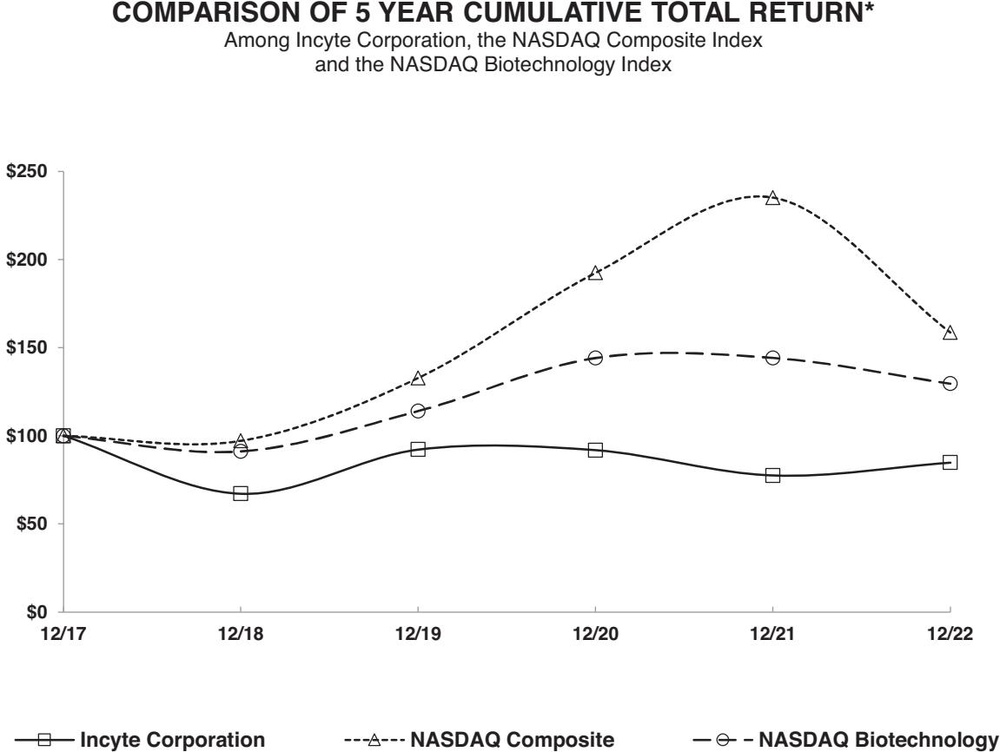

{0}------------------------------------------------

# **UNITED STATES SECURITIES AND EXCHANGE COMMISSION**

**Washington, D.C. 20549**

# **FORM 10-K**

**(mark one)**

☒ **ANNUAL REPORT PURSUANT TO SECTION 13 OR 15(d) OF THE SECURITIES EXCHANGE ACT OF 1934**

**For the fiscal year ended December 31, 2022 or**

☐ **TRANSITION REPORT PURSUANT TO SECTION 13 OR 15(d) OF THE SECURITIES EXCHANGE ACT OF 1934**

**For the transition period from to**

# **Commission File Number: 001-12400**

# **INCYTE CORPORATION**

(Exact name of registrant as specified in its charter)

**Delaware**

(State of other jurisdiction of incorporation or organization)

**1801 Augustine Cut-Off Wilmington, DE**

(Address of principal executives offices)

**(302) 498-6700**

(Registrant's telephone number, including area code) Securities registered pursuant to Section 12(b) of the Act:

| Title of each class                      | Trading Symbol(s) | Name of exchange on which registered |
|------------------------------------------|-------------------|--------------------------------------|
| Common Stock, \$.001 par value per share | INCY              | The Nasdaq Stock Market LLC          |

Securities registered pursuant to Section 12(g) of the Act:

**None**

Indicate by check mark if the registrant is a well-known seasoned issuer, as defined in Rule 405 of the Securities Act. Yes ☒ No ☐

Indicate by check mark if the registrant is not required to file reports pursuant to Section 13 or Section 15 (d) of the Act. Yes ☐ No ☒

Indicate by check mark whether the registrant (1) has filed all reports required to be filed by Section 13 or 15(d) of the Securities Exchange Act of 1934 during the preceding 12 months (or for such shorter period that the registrant was required to file such reports), and (2) has been subject to such filing requirements for the past 90 days. Yes ☒ No ☐

Indicate by check mark whether the registrant has submitted electronically every Interactive Data File required to be submitted pursuant to Rule 405 of Regulation S-T (§ 232.405 of this chapter) during the preceding 12 months (or for such shorter period that the registrant was required to submit such files). Yes ☒ No ☐

Indicate by check mark whether the registrant is a large accelerated filer, an accelerated filer, a non-accelerated filer, a smaller reporting company, or an emerging growth company. See the definitions of "large accelerated filer", "accelerated filer", "smaller reporting company," and "emerging growth company" in Rule 12b-2 of the Exchange Act.

Large accelerated filer ☒ Accelerated filer ☐ Non-accelerated filer ☐ Smaller reporting company ☐ Emerging growth company ☐

If an emerging growth company, indicate by check mark if the registrant has elected not to use the extended transition period for complying with any new or revised financial accounting standards provided pursuant to Section 13(a) of the Exchange Act. ☐

Indicate by check mark whether the registrant has filed a report on and attestation to its management's assessment of the effectiveness of its internal control over financial reporting under Section 404(b) of the Sarbanes-Oxley Act (15 U.S.C. 7262(b)) by the registered public accounting firm that prepared or issued its audit report. ☒

If securities are registered pursuant to Section 12(b) of the Act, indicate by check mark whether the financial statements of the registrant included in the filing reflect the correction of an error to previously issued financial statements. ☐

Indicate by check mark whether any of those error corrections are restatements that required a recovery analysis of incentive-based compensation received by any of the registrant's executive officers during the relevant recovery period pursuant to §240.10D-1(b) . ☐

Indicate by check mark whether the registrant is a shell company (as defined in Rule 12b-2 of the Exchange Act). Yes ☐ No ☒

The aggregate market value of Common Stock held by non-affiliates (based on the closing sale price on The Nasdaq Global Select Market on June 30, 2022) was approximately \$14.2 billion.

As of January 31, 2023 there were 222,965,018 shares of Common Stock, \$.001 par value per share, outstanding.

#### **DOCUMENTS INCORPORATED BY REFERENCE**

Items 10 (as to directors and Section 16(a) Beneficial Ownership Reporting Compliance), 11, 12, 13 and 14 of Part III incorporate by reference information from the registrant's proxy statement to be filed with the Securities and Exchange Commission in connection with the solicitation of proxies for the registrant's 2023 Annual Meeting of Stockholders to be held on June 14, 2023.

**94-3136539** (IRS Employer Identification No.)

**19803**

(zip code)

{1}------------------------------------------------

| Table of Contents |  |  |
|-------------------|--|--|
|-------------------|--|--|

|  2    |
|----------|
|  4    |
|          |
|  7    |
| . 36  |
| . 64  |
| . 64  |
| . 64  |
| . 64  |
| . 64  |
|          |
| . 67  |
| . 67  |
| . 67  |
| . 78  |
| . 79  |
| . 119 |
| . 119 |
| . 122 |
|          |
| . 122 |
| . 122 |
| . 122 |
| . 123 |
| . 123 |
|          |
| . 123 |
| . 126 |
| . 127 |
|          |

{2}------------------------------------------------

#### **Forward-Looking Statements**

*This report contains forward-looking statements that involve risks and uncertainties. These statements relate to future periods, future events or our future operating or financial plans or performance. Often, these statements include the words "believe," "expect," "target," "anticipate," "intend," "plan," "seek," "estimate," "potential," or words of similar meaning, or future or conditional verbs such as "will," "would," "should," "could," "might," or "may," or the negative of these terms, and other similar expressions. These forward-looking statements include statements as to:*

- *the discovery, development, formulation, manufacturing and commercialization of our compounds, our drug candidates and JAKAFI®/JAKAVI® (ruxolitinib), PEMAZYRE® (pemigatinib), ICLUSIG® (ponatinib), MONJUVI®(tafasitamab-cxix) /MINJUVI® (tafasitamab), and OPZELURA™ (ruxolitinib) cream;*
- *our plans to further develop our operations outside of the United States;*
- *conducting clinical trials internally, with collaborators, or with clinical research organizations;*
- *our collaboration and strategic relationship strategy, and anticipated benefits and disadvantages of entering into collaboration agreements;*
- *our licensing, investment and commercialization strategies, including our plans to commercialize our drug products and drug candidates;*
- *the regulatory approval process, including obtaining U.S. Food and Drug Administration and other international regulatory authorities' approval for our products in the United States and abroad;*
- *the safety, effectiveness and potential benefits and indications of our drug candidates and other compounds under development;*
- *the timing and size of our clinical trials; the compounds expected to enter clinical trials; timing of clinical trial results;*
- *our ability to manage expansion of our drug discovery and development operations;*
- *future required expertise relating to clinical trials, manufacturing, sales and marketing;*
- *obtaining and terminating licenses to products, drug candidates or technology, or other intellectual property rights;*
- *the receipt from or payments pursuant to collaboration or license agreements resulting from milestones or royalties;*
- *plans to develop and commercialize products on our own;*
- *plans to use third-party manufacturers;*
- *plans for our manufacturing operations;*
- *expected expenses and expenditure levels; expected uses of cash; expected revenues and sources of revenues, including milestone payments; expectations with respect to inventory;*
- *expectations with respect to reimbursement for our products;*
- *the expected impact of recent accounting pronouncements and changes in tax laws;*
- *expected losses; fluctuation of losses; currency translation impact associated with non-U.S. operations and collaboration royalties;*
- *our profitability; the adequacy of our capital resources to continue operations;*
- *the need to raise additional capital;*
- *the costs associated with resolving matters in litigation and governmental proceedings;*
- *our expectations regarding competition;*
- *our investments, including anticipated expenditures, losses and expenses;*

{3}------------------------------------------------

- *our patent prosecution and maintenance efforts; and*
- *the potential effects of the COVID-19 pandemic and efforts undertaken or to be undertaken by us or applicable governmental authorities on local and global economic conditions, and on our business, results of operations and financial condition.*

*These forward-looking statements reflect our current views with respect to future events, are based on assumptions and are subject to risks and uncertainties. These risks and uncertainties could cause actual results to differ materially from those projected and include, but are not limited to:*

- *our ability to successfully commercialize our drug products and drug candidates;*
- *our ability to obtain, or maintain at anticipated levels, coverage and reimbursement for our products from government health administration authorities, private health insurers and other organizations;*
- *our ability to establish and maintain effective sales, marketing and distribution capabilities;*
- *the risk of reliance on other parties to manufacture our products, which could result in a short supply of our products, increased costs, and withdrawal of regulatory approval;*
- *our ability to maintain regulatory approvals to market our products;*
- *our ability to achieve a significant market share in order to achieve or maintain profitability;*
- *the risk of civil or criminal penalties if we market our products in a manner that violates health care fraud and abuse and other applicable laws, rules and regulations;*
- *our ability to discover, develop, formulate, manufacture and commercialize our drug candidates;*
- *the risk of unanticipated delays in, or discontinuations of, research and development efforts;*
- *the risk that previous preclinical testing or clinical trial results are not necessarily indicative of future clinical trial results;*
- *risks relating to the conduct of our clinical trials, including geopolitical risks;*
- *changing regulatory requirements;*
- *the risk of adverse safety findings;*
- *the risk that results of our clinical trials do not support submission of a marketing approval application for our drug candidates;*
- *the risk of significant delays or costs in obtaining regulatory approvals;*
- *risks relating to our reliance on third-party manufacturers, collaborators, and clinical research organizations;*
- *risks relating to the development of new products and their use by us and our current and potential collaborators;*
- *risks relating to our inability to control the development of out-licensed compounds or drug candidates;*
- *risks relating to our collaborators' ability to develop and commercialize JAKAVI, OLUMIANT, TABRECTA and the drug candidates licensed from us;*
- *costs associated with prosecuting, maintaining, defending and enforcing patent claims and other intellectual property rights;*
- *our ability to maintain or obtain adequate product liability and other insurance coverage;*
- *the risk that our drug candidates may not obtain or maintain regulatory approval;*
- *the impact of technological advances and competition, including potential generic competition;*
- *our ability to compete against third parties with greater resources than ours;*
- *risks relating to changes in pricing and reimbursement in the markets in which we may compete;*
- *risks relating to governmental healthcare reform efforts, including efforts to control, set or cap pricing for our commercial drugs in the U.S and abroad;*

{4}------------------------------------------------

- *competition to develop and commercialize similar drug products;*
- *our ability to obtain and maintain patent protection and freedom to operate for our discoveries and to continue to be effective in expanding our patent coverage;*
- *the impact of changing laws on our patent portfolio;*
- *developments in and expenses relating to litigation;*
- *our ability to in-license drug candidates or other technology;*
- *unanticipated delays or changes in plans or regulatory agency interactions or other issues relating to our large molecule production facility;*
- *our ability to integrate successfully acquired businesses, development programs or technology;*
- *our ability to obtain additional capital when needed;*
- *fluctuations in net cash provided and used by operating, financing and investing activities;*
- *our ability to analyze the effects of new accounting pronouncements and apply new accounting rules;*
- *risks relating to our ability to sustain profitability;*
- *risks related to public health pandemics such as the COVID-19 pandemic, natural disasters, or geopolitical events such as the Russian invasion of Ukraine; and*
- *the risks set forth under "Risk Factors."*

*Given these risks and uncertainties, you should not place undue reliance on these forward-looking statements. Except as required by federal securities laws, we undertake no obligation to update any forward-looking statements for any reason, even if new information becomes available or other events occur in the future.*

*In this report all references to "Incyte," "we," "us," "our" or the "Company" mean Incyte Corporation and our subsidiaries, except where it is made clear that the term means only the parent company.*

*Incyte, JAKAFI and PEMAZYRE are our registered trademarks and OPZELURA is our trademark. We also refer to trademarks of other corporations and organizations in this Annual Report on Form 10-K.*

### **Summary Risk Factors**

Our business is subject to numerous risks and uncertainties that could affect our ability to successfully implement our business strategy and affect our financial results. You should carefully consider all of the information in this report and, in particular, the following principal risks and all of the other specific factors described in Item 1A. of this report, "Risk Factors," before deciding whether to invest in our company.

- We depend heavily on JAKAFI/JAKAVI (ruxolitinib), and if we are not able to maintain revenues from JAKAFI/JAKAVI or those revenues decrease, our business may be materially harmed.
- If we or our collaborators are unable to obtain, or maintain at anticipated levels, coverage and reimbursement for our products from government and other third-party payors, our results of operations and financial condition could be harmed.
- A limited number of specialty pharmacies and wholesalers represent a significant portion of revenues from JAKAFI and most of our other products, and the loss of, or significant reduction in sales to, any one of these specialty pharmacies or wholesalers could harm our operations and financial condition.
- If we are unable to establish and maintain effective sales, marketing and distribution capabilities, or to enter into agreements with third parties to do so, we will not be able to successfully commercialize our products.
- If we fail to comply with applicable laws and regulations, we could lose our approval to market our products or be subject to other governmental enforcement activity.
- If the use of our products harms or is perceived to harm patients, our regulatory approvals could be revoked or otherwise negatively impacted or we could be subject to costly product liability claims.

{5}------------------------------------------------

- If we market our products in a manner that violates various laws and regulations, we may be subject to civil or criminal penalties.
- Competition for our products could harm our business and result in a decrease in our revenue.
- The COVID-19 pandemic and measures to address the pandemic, as well as other geopolitical events, have adversely affected and could in the future adversely affect our business and results of operations.
- We or our collaborators may be unsuccessful in discovering and developing drug candidates, and we may spend significant time and money attempting to do so, in particular with our later stage drug candidates.
- If we or our collaborators are unable to obtain regulatory approval in and outside of the United States for drug candidates, we and our collaborators will be unable to commercialize those drug candidates.
- Health care reform measures could impact the pricing and profitability of pharmaceuticals, and adversely affect the commercial viability of our or our collaborators' products and drug candidates.
- Conflicts between us and our collaborators or termination of our collaboration agreements could limit future development and commercialization of our drug candidates and harm our business.
- If we are unable to establish collaborations to fully exploit our drug discovery and development capabilities or if future collaborations are unsuccessful, our future revenue prospects could be diminished.
- If we fail to enter into additional in-licensing agreements or if these arrangements are unsuccessful, we may be unable to increase our number of successfully marketed products and our revenues.
- Even if one of our drug candidates receives regulatory approval, we may determine that commercialization would not be worth the investment.
- Any approved drug product that we bring to the market may not gain market acceptance by physicians, patients, healthcare payors and others in the medical community.
- We have limited capacity to conduct preclinical testing and clinical trials, and our resulting dependence on other parties could result in delays in and additional costs for our drug development efforts.
- We face significant competition for our drug discovery and development efforts, and if we do not compete effectively, our commercial opportunities will be reduced or eliminated.
- Our reliance on others to manufacture our drug products and drug candidates could result in drug supply constraints, delays in clinical trials, increased costs, and withdrawal or denial of regulatory approvals.
- If we fail to comply with the extensive legal and regulatory requirements affecting the health care industry, we could face increased costs, penalties and a loss of business.
- The illegal distribution and sale by third parties of counterfeit or unfit versions of our or our collaborators' products or stolen products could harm our business and reputation.
- As most of our drug discovery and development operations are conducted at our headquarters in Wilmington, Delaware, the loss of access to this facility would negatively impact our business.
- If we lose any of our key employees or are unable to attract and retain additional personnel, our business and ability to achieve our objectives could be harmed.
- If we fail to manage our growth effectively, our ability to develop and commercialize products could suffer.
- We may acquire businesses or assets, form joint ventures or make investments in other companies that may be unsuccessful, divert our management's attention and harm our operating results and prospects.
- Risks associated with our operations outside of the United States could adversely affect our business.
- If product liability lawsuits are brought against us, we could face substantial liabilities and may be required to limit commercialization of our products, and our results of operations could be harmed.

{6}------------------------------------------------

- Because our activities involve the use of hazardous materials, we may be subject to claims relating to improper handling, storage or disposal of these materials that could be time consuming and costly.
- We expect to continue to incur significant expenses to discover and develop drugs, which could result in future losses and impair our achievement of and ability to sustain profitability in the future.
- If we are unable to raise additional capital in the future when we require it, our efforts to broaden our product portfolio or commercialization efforts could be limited.
- Our marketable securities and long term investments are subject to risks that could adversely affect our overall financial position, and tax law changes could adversely affect our results of operations and financial condition.
- If we are unable to achieve milestones, develop product candidates to license or renew or enter into new collaborations, our royalty and milestone revenues and future prospects for those revenues may decrease.
- Any arbitration or litigation involving us and regarding intellectual property infringement claims could be costly and disrupt our drug discovery and development efforts.
- Our inability to adequately protect or enforce our proprietary information may result in loss of revenues or otherwise reduce our ability to compete.
- If the effective term of our patents is decreased or if we need to refile some of our patent applications, the value of our patent portfolio and the revenues we derive from it may be decreased.
- International patent protection is particularly uncertain and costly, and our involvement in opposition proceedings may result in the expenditure of substantial sums and management resources.
- Significant disruptions of information technology systems, breaches of data security, or unauthorized disclosures of sensitive data could harm our business and subject us to liability or reputational damage.
- Increasing use of social media could give rise to liability, breaches of data security, or reputational damage, which could harm our business and results of operations.

{7}------------------------------------------------

#### **Item 1.** *Business*

#### **Overview**

Incyte is a biopharmaceutical company focused on the discovery, development and commercialization of proprietary therapeutics. Our global headquarters is located in Wilmington, Delaware, where we conduct global clinical development and commercial operations. We also conduct clinical development and commercial operations from our European headquarters in Morges, Switzerland and our other offices across Europe, as well as our Japanese office in Tokyo and our Canadian headquarters in Montreal.

As described in more detail below, we operate in two therapeutic areas that are defined by the indications of our approved medicines and the diseases for which our clinical candidates are being developed. One therapeutic area is Hematology/Oncology, which comprises Myeloproliferative Neoplasms (MPNs), Graft-Versus-Host Disease (GVHD), and solid tumors and hematologic malignancies. The other therapeutic area is Inflammation and Autoimmunity (IAI), which includes our Dermatology commercial franchise. We are also eligible to receive milestones and royalties on molecules discovered by us and licensed to third parties.

#### **Hematology and Oncology**

Our hematology and oncology franchise comprises four approved products, which are JAKAFI (ruxolitinib), MONJUVI (tafasitamab-cxix)/MINJUVI (tafasitamab), PEMAZYRE (pemigatinib) and ICLUSIG (ponatinib), as well as numerous clinical development programs.

#### *JAKAFI (ruxolitinib)*

JAKAFI (ruxolitinib) is our first product to be approved for sale in the United States. It was approved by the U.S. Food and Drug Administration (FDA) in November 2011 for the treatment of adults with intermediate or high-risk myelofibrosis (MF); in December 2014 for the treatment of adults with polycythemia vera (PV) who have had an inadequate response to or are intolerant of hydroxyurea; in May 2019 for the treatment of steroid-refractory acute graft-versus-host disease (GVHD) in adult and pediatric patients 12 years and older; and in September 2021 for the treatment of chronic GVHD after failure of one or two lines of systemic therapy in adult and pediatric patients 12 years and older. MF and PV are both myeloproliferative neoplasms (MPNs), a type of rare blood cancer, and GVHD is an adverse immune response to an allogeneic hematopoietic stem cell transplant (HSCT). Under our collaboration agreement with our collaboration partner Novartis Pharmaceutical International Ltd., Novartis received exclusive development and commercialization rights to ruxolitinib outside of the United States for all hematologic and oncologic indications and sells ruxolitinib outside of the United States under the name JAKAVI.

In 2003, we initiated a research and development program to explore the inhibition of enzymes called janus associated kinases (JAK). The JAK family is composed of four tyrosine kinases — JAK1, JAK2, JAK3 and Tyk2 — that are involved in the signaling of a number of cytokines and growth factors. JAKs are central to a number of biologic processes, including the formation and development of blood cells and the regulation of immune functions. Dysregulation of the JAK-STAT signaling pathway has been associated with a number of diseases, including myeloproliferative neoplasms, other hematological malignancies, rheumatoid arthritis and other chronic inflammatory diseases.

We have discovered multiple potent, selective and orally bioavailable JAK inhibitors that are selective for JAK1 or JAK1 and JAK2. JAKAFI is the most advanced compound in our JAK program. It is an oral JAK1 and JAK2 inhibitor.

JAKAFI is marketed in the United States through our own specialty sales force and commercial team. JAKAFI was the first FDA-approved JAK inhibitor for any indication, was the first FDA-approved product in MF, PV and steroid-refractory acute GVHD, and was recently approved in steroid-refractory chronic GVHD. JAKAFI remains the first-line standard of care in MF and remains the only FDA-approved product for steroid-refractory acute GVHD. The FDA has granted JAKAFI orphan drug status for MF, PV and GVHD.

JAKAFI is distributed primarily through a network of specialty pharmacy providers and wholesalers that allow for efficient delivery of the medication by mail directly to patients or direct delivery to the patient's 

{8}------------------------------------------------

pharmacy. Our distribution process uses a model that is well-established and familiar to physicians who practice within the oncology field.

To further support appropriate use and future development of JAKAFI, our U.S. Medical Affairs department is responsible for providing appropriate scientific and medical education and information to physicians, preparing scientific presentations and publications, and overseeing the process for supporting investigator sponsored trials.

*Myelofibrosis.* MF is a rare, life-threatening condition. MF, considered the most serious of the myeloproliferative neoplasms, can occur either as primary MF, or as secondary MF that develops in some patients who previously had polycythemia vera or essential thrombocythemia. We estimate there are between 16,000 and 18,500 patients with MF in the United States. Based on the modern prognostic scoring systems referred to as International Prognostic Scoring System and Dynamic International Prognostic Scoring System, we believe intermediate and high-risk patients represent 80% to 90% of all patients with MF in the United States and encompass patients over the age of 65, or patients who have or have ever had any of the following: anemia, constitutional symptoms, elevated white blood cell or blast counts, or platelet counts less than 100,000 per microliter of blood.

Most MF patients have enlarged spleens and many suffer from debilitating symptoms, including abdominal discomfort, pruritus (itching), night sweats and cachexia (involuntary weight loss). There were no FDA approved therapies for MF until the approval of JAKAFI.

The FDA approval was based on results from two randomized Phase III trials (COMFORT-I and COMFORT-II), which demonstrated that patients treated with JAKAFI experienced significant reductions in splenomegaly (enlarged spleen). COMFORT-I also demonstrated improvements in symptoms. The most common hematologic adverse reactions in both trials were thrombocytopenia and anemia. These events rarely led to discontinuation of JAKAFI treatment. The most common non-hematologic adverse reactions were bruising, dizziness and headache.

In August 2014, the FDA approved supplemental labeling for JAKAFI to include Kaplan-Meier overall survival curves as well as additional safety and dosing information. The overall survival information is based on three-year data from COMFORT-I and II, and shows that at three years the probability of survival for patients treated with JAKAFI in COMFORT-I was 70% and for those patients originally randomized to placebo it was 61%. In COMFORT-II, at three years the probability of survival for patients treated with JAKAFI was 79% and for patients originally randomized to best available therapy it was 59%. In December 2016, we announced an exploratory pooled analysis of data from the five-year follow-up of the COMFORT-I and COMFORT-II trials of patients treated with JAKAFI, which further supported previously published overall survival findings.

In September 2016, we announced that JAKAFI had been included as a recommended treatment in the latest National Comprehensive Cancer Network (NCCN) Clinical Practice Guidelines in Oncology for myelofibrosis, underscoring the important and long term clinical benefits seen in patients treated with JAKAFI.

In October 2017, the FDA approved updated labeling for JAKAFI to include the addition of new patientreported outcome (PRO) data from the COMFORT-I study, as well as updating the warning related to progressive multifocal leukoencephalopathy. An exploratory analysis of PRO data of patients with myelofibrosis receiving JAKAFI showed improvement in fatigue-related symptoms at Week 24. Fatigue response (defined as a reduction of 4.5 points or more from baseline in the PROMIS® Fatigue total score) was reported in 35% of patients treated with JAKAFI versus 14% of the patients treated with placebo.

*Polycythemia Vera.* PV is a myeloproliferative neoplasm typically characterized by elevated hematocrit, the volume percentage of red blood cells in whole blood, which can lead to a thickening of the blood and an increased risk of blood clots, as well as an elevated white blood cell and platelet count. When phlebotomy can no longer control PV, chemotherapy such as hydroxyurea, or interferon, is utilized. Approximately 25,000 patients with PV in the United States are considered uncontrolled because they have an inadequate response to or are intolerant of hydroxyurea, the most commonly used chemotherapeutic agent for the treatment of PV.

{9}------------------------------------------------

In December 2014, the FDA approved JAKAFI for the treatment of patients with PV who have had an inadequate response to or are intolerant of hydroxyurea. The approval of JAKAFI for PV was based on data from the pivotal Phase III RESPONSE trial. In this trial, patients treated with JAKAFI demonstrated superior hematocrit control and reductions in spleen volume compared to best available therapy. In addition, a greater proportion of patients treated with JAKAFI achieved complete hematologic remission — which was defined as achieving hematocrit control, and lowering platelet and white blood cell counts. In the RESPONSE trial, the most common hematologic adverse reactions (incidence > 20%) were thrombocytopenia and anemia. The most common non-hematologic adverse events (incidence >10%) were headache, abdominal pain, diarrhea, dizziness, fatigue, pruritus, dyspnea and muscle spasms.

In March 2016, the FDA approved supplemental labeling for JAKAFI to include additional safety data as well as efficacy analyses from the RESPONSE trial to assess the durability of response in JAKAFI treated patients after 80 weeks. At this time, 83% patients were still on treatment, and 76% of the responders at 32 weeks maintained their response through 80 weeks.

In June 2016, we announced data from the Phase III RESPONSE-2 study of JAKAFI in patients with inadequately controlled PV that was resistant to or intolerant of hydroxyurea who did not have an enlarged spleen. These data showed that JAKAFI was superior to best available therapy in maintaining hematocrit control (62.2% vs. 18.7%, respectively; P<0.0001) without the need for phlebotomy.

In August 2017, we announced that JAKAFI had been included as a recommended treatment in the latest NCCN Guidelines for patients with polycythemia vera who have had an inadequate response to first-line therapies, such as hydroxyurea.

*Graft-versus-host disease.* GVHD is a condition that can occur after an allogeneic HSCT (the transfer of genetically dissimilar stem cells or tissue). In GVHD, the donated bone marrow or peripheral blood stem cells view the recipient's body as foreign and attack various tissues. 12-month survival rates in patients with Grade III or IV steroid-refractory acute GVHD are 50% or less, and the incidence of steroid-refractory acute and chronic GVHD is approximately 3,000 per year in the United States.

In June 2016, we announced that the FDA granted Breakthrough Therapy designation for ruxolitinib in patients with acute GVHD. In May 2019, the FDA approved JAKAFI for the treatment of steroid-refractory acute GVHD in adult and pediatric patients 12 years and older. The approval was based on data from REACH1, an open-label, single-arm, multicenter study of JAKAFI in combination with corticosteroids in patients with steroid-refractory grade II-IV acute GVHD. The overall response rate (ORR) in patients refractory to steroids alone was 57% with a complete response (CR) rate of 31%. The most frequently reported adverse reactions among all study participants were infections (55%) and edema (51%), and the most common laboratory abnormalities were anemia (75%), thrombocytopenia (75%) and neutropenia (58%).

In September 2021, the FDA approved JAKAFI for the treatment of chronic GVHD after failure of one or two lines of systemic therapy in adult and pediatric patients 12 years and older. This approval was based on data from REACH3, a Phase III, randomized, open-label, multicenter study of JAKAFI in comparison to best available therapy for treatment of steroid-refractory chronic GVHD after allogeneic stem cell transplantation. The overall response rate through Cycle 7 Day 1 was 70% for JAKAFI compared to 57% for best available therapy. The most common hematologic adverse reactions (incidence > 35%) were anemia and thrombocytopenia. The most common non-hematologic adverse reactions (incidence ≥ 20%) were infections (pathogen not specified) and viral infection. In addition, the FDA updated labeling for JAKAFI to include warnings of increased risk of major adverse cardiovascular events, thrombosis, and secondary malignancies related to another JAK-inhibitor treating rheumatoid arthritis, a condition for which JAKAFI is not indicated. In patients with MF and PV treated with JAKAFI in clinical trials, the rates of thromboembolic events were similar in JAKAFI and control treated patients.

We have retained all development and commercialization rights to JAKAFI in the United States and are eligible to receive development and sales milestones as well as royalties from product sales outside the United States. We hold patents that cover the composition of matter and use of ruxolitinib. These patents, including applicable extensions, currently expire in late-2028. We have been granted pediatric exclusivity which adds six months to the expiration for all ruxolitinib patents presently listed in FDA's Approved Drug Products with Therapeutic Equivalence Evaluations (Orange Book).

{10}------------------------------------------------

#### *MONJUVI (tafasitamab-cxix) / MINJUVI (tafasitamab)*

In January 2020, we and MorphoSys AG entered into a collaboration and license agreement to further develop and commercialize MorphoSys' proprietary anti-CD19 antibody tafasitamab (MOR208) globally. The agreement became effective March 2020. Tafasitamab is an Fc-engineered antibody against CD19 currently in clinical development for the treatment of B cell malignancies. We have rights to co-commercialize tafasitamab in the United States with MorphoSys, and we have exclusive development and commercialization rights outside of the United States.

In July 2020, we and MorphoSys announced that the FDA approved MONJUVI (tafasitamab-cxix), which is indicated in combination with lenalidomide for the treatment of adult patients with relapsed or refractory diffuse large B-cell lymphoma (DLBCL) not otherwise specified, including DLBCL arising from low grade lymphoma, and who are not eligible for autologous stem cell transplant (ASCT). MONJUVI was approved under accelerated approval based on overall response rate from the MorphoSys-sponsored Phase II L-MIND study, an open label, multicenter, single arm trial of MONJUVI in combination with lenalidomide as a treatment for adult patients with r/r DLBCL. Results from the study showed an objective response rate (ORR) of 55% (39 out of 71 patients; primary endpoint) and a complete response (CR) rate of 37% (26 out of 71 patients). The median duration of response (mDOR) was 21.7 months. The most frequent serious adverse reactions were infections (26%), including pneumonia (7%) and febrile neutropenia (6%). Updated three-year data from L-MIND were presented at the American Society of Clinical Oncology (ASCO) 2021.

In August 2020, we and MorphoSys announced that MONJUVI in combination with lenalidomide had been included in the latest National Comprehensive Cancer Network (NCCN) Clinical Practice Guidelines in Oncology for B-cell Lymphomas.

In August 2021, we and MorphoSys announced that the European Commission (EC) granted conditional marketing authorization for MINJUVI (tafasitamab) in combination with lenalidomide, followed by MINJUVI monotherapy, for the treatment of adult patients with relapsed or refractory DLBCL who are not eligible for autologous stem cell transplant (ASCT). The conditional approval was based on the three-year results from the L-MIND study evaluating the safety and efficacy of MINJUVI in combination with lenalidomide as a treatment for patients with r/r DLBCL who are not eligible for ASCT. The results showed best objective response rate (ORR) of 56.8% (primary endpoint), including a complete response (CR) rate of 39.5% and a partial response rate (PR) of 17.3%, as assessed by an independent review committee. The median duration of response (mDOR) was 43.9 months after a minimum follow up of 35 months (secondary endpoint). MINJUVI together with lenalidomide was shown to provide a clinically meaningful response and the side effects were manageable. Warnings and precautions for MINJUVI include infusion-related reactions, myelosuppression, including neutropenia and thrombocytopenia, infections and tumour lysis syndrome.

DLBCL is the most common type of non-Hodgkin lymphoma in adults worldwide, comprising 40% of all cases. DLBCL is characterized by rapidly growing masses of malignant B-cells in the lymph nodes, spleen, liver, bone marrow or other organs. It is an aggressive disease with ~40% of patients not responding to initial therapy or relapsing thereafter. We estimate that there are ~10,000 patients diagnosed in the United States each year with r/r DLBCL who are not eligible for ASCT. In the EU, we estimate there are ~14,000 patients diagnosed each year with r/r DLBCL who are not eligible for ASCT.

### *PEMAZYRE (pemigatinib)*

PEMAZYRE is the first internally discovered product to be internationally commercialized by us.

In April 2020, we announced that the FDA approved PEMAZYRE (pemigatinib), a selective fibroblast growth factor receptor (FGFR) kinase inhibitor, for the treatment of adults with previously treated, unresectable locally advanced or metastatic cholangiocarcinoma with an FGFR2 fusion or other rearrangement as detected by an FDA-approved test. PEMAZYRE is the first FDA-approved treatment for this indication, which was approved under accelerated approval based on overall response rate and duration of response (DOR).

{11}------------------------------------------------

In March 2021, PEMAZYRE was approved by the Japanese Ministry of Health, Labour and Welfare (MHLW) for the treatment of patients with unresectable biliary tract cancer (BTC) with an FGFR2 fusion gene, worsening after cancer chemotherapy. Also in March 2021, PEMAZYRE was approved by the European Commission (EC) for the treatment of adults with locally advanced or metastatic cholangiocarcinoma with an FGFR2 fusion or rearrangement that have progressed after at least one prior line of systemic therapy.

In July 2021, the UK's National Institute for Health and Care Excellence (NICE) recommended PEMAZYRE for patients with cholangiocarcinoma with a fibroblast growth factor receptor 2 (FGFR2) fusion or rearrangement that have progressed after at least one prior line of systemic therapy. NICE's guidance enables all eligible patients in England and Wales to have access to PEMAZYRE through the National Health Service (NHS).

Cholangiocarcinoma is a rare cancer that arises from the cells within the bile ducts. It is often diagnosed late (stages III and IV) and the prognosis is poor. The incidence of cholangiocarcinoma with FGFR2 fusions or rearrangements is increasing, and it is currently estimated that there are 2,000-3,000 patients in the United States, Europe and Japan.

The approval of PEMAZYRE was based on data from FIGHT-202, a multi-center, open-label, singlearm study evaluating PEMAZYRE as a treatment for adults with cholangiocarcinoma. In FIGHT-202, and in patients harboring FGFR2 fusions or rearrangements (Cohort A), PEMAZYRE monotherapy resulted in an overall response rate of 36% (primary endpoint), and median DOR of 9.1 months (secondary endpoint). FIGHT-302, a Phase III trial of pemigatinib for the first-line treatment of patients with cholangiocarcinoma and FGFR2 fusions or rearrangements, is ongoing.

In March 2022, PEMAZYRE was approved by the National Medical Products Administration (NMPA) of the People's Republic of China for the treatment of adults with locally advanced or metastatic cholangiocarcinoma with a fibroblast growth receptor 2 (FGFR2) fusion or rearrangement as confirmed by a validated diagnostic test that have progressed after at least one prior line of systemic therapy.

In August 2022, PEMAZYRE was approved by the FDA as the first and only targeted treatment for myeloid/lymphoid neoplasms (MLNs) with FGFR1 rearrangement. MLNs with FGFR1 rearrangement are extremely rare and aggressive blood cancers.

## *ICLUSIG (ponatinib)*

In June 2016, we acquired the European operations of ARIAD Pharmaceuticals, Inc. and obtained an exclusive license to develop and commercialize ICLUSIG (ponatinib) in Europe and other select countries. ICLUSIG is a kinase inhibitor. The primary target for ICLUSIG is BCR-ABL, an abnormal tyrosine kinase that is expressed in chronic myeloid leukemia (CML) and Philadelphia-chromosome positive acute lymphoblastic leukemia (Ph+ ALL).

In the European Union, ICLUSIG is approved for the treatment of adult patients with chronic phase, accelerated phase or blast phase CML who are resistant to dasatinib or nilotinib; who are intolerant to dasatinib or nilotinib and for whom subsequent treatment with imatinib is not clinically appropriate; or who have the T315I mutation, or the treatment of adult patients with Ph+ ALL who are resistant to dasatinib; who are intolerant to dasatinib and for whom subsequent treatment with imatinib is not clinically appropriate; or who have the T315I mutation.

#### *Clinical Programs in Hematology and Oncology*

#### *Ruxolitinib*

As part of our ongoing LIMBER (Leadership In MPNs BEyond Ruxolitinib) clinical development initiative, which is designed to improve and expand therapeutic options for patients with myeloproliferative neoplasms, we are evaluating combinations of ruxolitinib with other therapeutic modalities, as well as developing a once-a-day formulation of ruxolitinib for potential use as monotherapy and combination therapy. Bioavailability and bioequivalence data were published for ruxolitinib's once-daily (QD) extended release (XR) formulation at the European Hematology Association (EHA) 2021 Virtual Congress in June 2021. The FDA 

{12}------------------------------------------------

accepted the New Drug Application (NDA) for QD ruxolitinib with a Prescription Drug User Fee Act (PDUFA) target action date of March 23, 2023.

Based on positive Phase II data, we opened two pivotal trials of ruxolitinib in combination with parsaclisib (PI3Kδ) in first-line MF (LIMBER-313) and in MF patients with a suboptimal response to ruxolitinib monotherapy (LIMBER-304), and both trials are ongoing. Additional Phase II trials combining ruxolitinib with investigational agents from our portfolio such as INCB57643 (BET) and INCB00928 (ALK2) in patients with MF are ongoing, and additional discovery and development initiatives are also ongoing within the LIMBER program, which are evaluating internally-discovered compounds, and candidates from collaboration partners.

#### *Axatilimab*

In September 2021, we and Syndax Pharmaceuticals, Inc. announced an exclusive worldwide collaboration and license agreement to develop and commercialize axatilimab, Syndax's anti-CSF-1R monoclonal antibody. Together, we plan to develop axatilimab as a therapy for patients with chronic GVHD as well as in additional immune-mediated diseases where CSF-1R-dependent monocytes and macrophages are believed to contribute to organ fibrosis. In December 2021, updated positive data were presented at ASH from the Phase I/II trial evaluating axatilimab as a monotherapy in patients with recurrent or refractory chronic GVHD after two or more prior lines of therapy. A 68% overall response rate and broad clinical benefit across multiple organs were observed at doses being assessed in AGAVE-201, a global pivotal trial evaluating axatilimab monotherapy in patients with chronic GVHD in the third line setting. Additional trials of axatilimab are planned in patients with chronic GVHD, including a Phase II trial in combination with ruxolitinib in patients with newly-diagnosed cGVHD. In May 2022, Syndax announced that axatilimab was granted fast-track designation by the FDA for the treatment of patients with chronic GVHD after failure of two or more lines of systemic therapy.

#### *Tafasitamab*

Tafasitamab is an anti-CD19 antibody and is being investigated as a therapeutic option in B cell malignancies in a number of ongoing and planned combination trials. An open-label Phase II combination trial (L-MIND) is investigating the safety and efficacy of tafasitamab in combination with lenalidomide in patients with relapsed or refractory diffuse large B-cell lymphoma (r/r DLBCL), and the ongoing Phase III B-MIND trial is assessing the combination of tafasitamab and bendamustine versus rituximab and bendamustine in r/r DLBCL. firstMIND is a Phase Ib safety trial of tafasitamab as a first-line therapy for patients with DLBCL, and frontMIND, a placebo-controlled Phase III trial evaluating tafasitamab in combination with lenalidomide added to rituximab plus chemotherapy (R-CHOP) as a first-line therapy for patients with DLBCL, is ongoing.

A placebo-controlled Phase III trial (inMIND) of tafasitamab added to lenalidomide plus rituximab (R2 ) in patients with relapsed or refractory follicular or marginal zone lymphomas is ongoing. A proof-of-concept study of tafasitamab, lenalidomide and plamotamab in patients with r/r DLBCL is also ongoing.

In January 2021, the FDA granted orphan drug designation to tafasitamab as a treatment for patients with follicular lymphoma.

#### *Pemigatinib*

Pemigatinib is a potent and selective inhibitor of the fibroblast growth factor receptor (FGFR) isoforms 1, 2 and 3 with demonstrated activity in preclinical studies. The FGFR family of receptor tyrosine kinases can act as oncogenic drivers in a number of liquid and solid tumor types.

We initiated the FIGHT clinical program to evaluate pemigatinib across a spectrum of cancers that are driven by FGF/FGFR alterations. The program initially included three Phase II trials — FIGHT-201 in patients with bladder cancer, FIGHT-202 in patients with cholangiocarcinoma, and FIGHT-203 in patients with myeloid/lymphoid neoplasms with FGFR1 rearrangement. Based on data generated from these trials, we have initiated additional trials including FIGHT-302, a Phase III study in first-line cholangiocarcinoma. FIGHT-207, a solid tumor-agnostic trial evaluating pemigatinib in patients with driver-alterations of 

{13}------------------------------------------------

FGF/FGFR, is now closed to recruitment. Based on findings from this study, we have identified populations that may potentially benefit from treatment with pemigatinib and have initiated two Phase II trials — FIGHT-209 in patients with glioblastoma and FIGHT-210 in patients with non-small cell lung cancer.

Pemigatinib has Breakthrough Therapy designation as a treatment for patients with myeloid/lymphoid neoplasms (MLN) with FGFR1 rearrangement who have relapsed or are refractory to initial chemotherapy.

#### *Parsaclisib*

The PI3Kδ pathway mediates oncogenic signaling in B cell malignancies. Parsaclisib is a PI3Kδ inhibitor that has demonstrated potency and selectivity in preclinical studies and has potential therapeutic utility in the treatment of patients with lymphoma. We initiated the CITADEL clinical program to evaluate parsaclisib in non-Hodgkin lymphomas, including Phase II trials in follicular lymphoma, marginal zone lymphoma and mantle cell lymphoma. The FDA granted orphan drug designation and Fast Track designation to parsaclisib as a treatment for patients with follicular lymphoma, marginal zone lymphoma and mantle cell lymphoma.

In December 2020, we announced preliminary results from the ongoing CITADEL monotherapy development program, which was designed to enable registration of parsaclisib. Results from four cohorts were presented at the American Society of Hematology (ASH), including in r/r follicular lymphoma (CITADEL-203), in BTK-naïve r/r marginal zone lymphoma (CITADEL-204) and in both BTK-naïve and BTK-experienced r/r mantle cell lymphoma (CITADEL-205).

In October 2021, we announced the FDA acceptance of an NDA seeking approval of parsaclisib for the treatment of patients with relapsed or refractory follicular lymphoma, marginal zone lymphoma and mantle cell lymphoma. The submission was based on data from several Phase II studies (CITADEL-203, -204 and -205) evaluating parsaclisib as a treatment for relapsed or refractory non-Hodgkin lymphomas (follicular, marginal zone and mantle cell). In January 2022, we announced that we withdrew the NDA seeking approval of parsaclisib for the three indications in non-Hodgkin lymphoma. The decision to withdraw the NDA followed discussions with FDA regarding confirmatory studies that we determined cannot be completed within a reasonable time period to support an accelerated approval. In July 2022, we withdrew the Marketing Authorization Application (MAA) seeking approval of parsaclisib in marginal zone lymphoma following discussions with the European Medicines Agency (EMA) regarding the confirmatory study needed to support the approval which we determined were not feasible.

Parsaclisib is being evaluated as a treatment for autoimmune hemolytic anemia (AIHA), a rare red blood cell disorder. In June 2021, data from a Phase II trial were presented at EHA. The majority of patients achieved a response with parsaclisib over the initial 12-week treatment period and treatment with parsaclisib was generally well tolerated. Based on these results, we initiated a Phase III trial (PATHWAY) in warm AIHA. The FDA has granted orphan drug designation to parsaclisib as a treatment for patients with AIHA.

#### *Retifanlimab*

In October 2017, we and MacroGenics, Inc. announced an exclusive global collaboration and license agreement for MacroGenics' retifanlimab (formerly INCMGA0012), an investigational monoclonal antibody that inhibits PD-1. Under this collaboration, we obtained exclusive worldwide rights for the development and commercialization of retifanlimab in all indications. The molecule is currently being evaluated both as monotherapy and in combination therapy across various tumor types. Potentially registration-enabling trials in microsatellite instability-high (MSI-H) endometrial cancer and Merkel cell carcinoma are ongoing.

The Phase III POD1UM-303 trial of retifanlimab in combination with platinum-based chemotherapy as a first-line treatment for patients with squamous cell carcinoma of the anal canal (SCAC) is underway. In July 2021, we announced that the FDA issued a complete response letter (CRL) for the BLA of retifanlimab for the treatment of SCAC. In October 2021, we announced that we withdrew the MAA seeking approval of retifanlimab in SCAC.

The Phase III POD1UM-304 trial is evaluating retifanlimab in combination with platinum-based chemotherapy as a first-line treatment for patients with non-small cell lung cancer (NSCLC).

{14}------------------------------------------------

Retifanlimab has been granted Fast Track designation for the treatment of certain patients with advanced or metastatic MSI-H or DNA mismatch repair (dMMR) endometrial cancer, for the treatment of certain patients with locally advanced or metastatic SCAC and for the treatment of Merkel cell carcinoma (MCC). The FDA and EMA have granted orphan drug designation to retifanlimab as a treatment for patients with locally advanced or metastatic SCAC and the FDA has granted orphan drug designation to retifanlimab as a treatment for patients with MCC.

# *Oral PD-L1*

In November 2021, we highlighted Phase I clinical safety and efficacy data for our oral PD-L1 program which included two compounds, INCB99280 and INCB99318. Tumor shrinkage was observed for both oral PD-L1 inhibitors and both were generally well tolerated. We plan to evaluate INCB99280 in Phase II as monotherapy and in combination with other antitumor agents. Further dose escalation and dose expansion trials are ongoing with INCB99318.

In November 2022, (i) updated safety and preliminary efficacy data for INCB99280 and INCB99318 was presented at the Society for Immunotherapy of Cancer, and (ii) we and Mirati Therapeutics, Inc. announced a clinical trial collaboration and supply agreement to investigate the combination of INCB99280 and adagrasib, a KRASG12C selective inhibitor, in patients with KRASG12C-mutated solid tumors.

|                                                        | Indication and status                                                                             |  |  |
|--------------------------------------------------------|---------------------------------------------------------------------------------------------------|--|--|
| ruxolitinib XR (QD) (JAK1/JAK2)                        | Myelofibrosis, polycythemia vera and GVHD: NDA under review                                       |  |  |
| ruxolitinib + parsaclisib (JAK1/ JAK2 + PI3Kδ)      | Myelofibrosis: Phase III (first-line therapy) (LIMBER-313)                                        |  |  |
|                                                        | Myelofibrosis: Phase III (suboptimal responders to ruxolitinib) (LIMBER-304) |  |  |
| ruxolitinib + INCB57643 (JAK1/ JAK2 + BET)          | Myelofibrosis: Phase II                                                                           |  |  |
| ruxolitinib + zilurgisertib (JAK1/ JAK2 + ALK2)     | Myelofibrosis: Phase II                                                                           |  |  |
| ruxolitinib + CK0804(1) (JAK1/ JAK2 + CB-Tregs)     | Myelofibrosis: Phase I (LIMBER-TREG108)                                                           |  |  |
| ruxolitinib + axatilimab (JAK1/ JAK2 + anti-CSF-1R) | Chronic GVHD (newly diagnosed): Phase I/II in preparation                                         |  |  |
| axatilimab (anti-CSF-1R)(2)                            | Chronic GVHD: Pivotal Phase II (third-line plus therapy) (AGAVE-201)                              |  |  |
| tafasitamab (CD19)(3)                                  | r/r DLBCL: Phase II (L-MIND); Phase III (B-MIND)                                                  |  |  |
|                                                        | 1L DLBCL: Phase III (frontMIND)                                                                   |  |  |
|                                                        | r/r follicular & marginal zone lymphomas: Phase III (inMIND)                                      |  |  |
| pemigatinib (FGFR1/2/3)                                | Myeloid/lymphoid neoplasms (MLN): Phase II (FIGHT-203); approved by FDA                        |  |  |
|                                                        | CCA: Phase III (FIGHT-302)                                                                        |  |  |
|                                                        | Glioblastoma: Phase II (FIGHT-209)                                                                |  |  |
|                                                        | NSCLC: Phase II (FIGHT-210)                                                                       |  |  |
| parsaclisib (PI3Kδ)                                    | Warm autoimmune hemolytic anemia: Phase III (PATHWAY)                                             |  |  |
| retifanlimab (PD-1)(4)                                 | SCAC: Phase III (PODIUM-303)                                                                      |  |  |
|                                                        | MSI-high endometrial cancer: Phase II (POD1UM-101, POD1UM-204)                                    |  |  |
|                                                        | Merkel cell carcinoma: Phase II (POD1UM-201)                                                      |  |  |
|                                                        | NSCLC: Phase III (POD1UM-304)                                                                     |  |  |

{15}------------------------------------------------

**Indication and status**

#### **INCB99280 (Oral PD-L1)** Solid tumors: Phase I

KRASG12C-mutated solid tumors: Phase I/Ib in combination with adagrasib, in preparation

# **INCB99318 (Oral PD-L1)** Solid tumors: Phase I

- (1) Development collaboration with Cellenkos, Inc.
- (2) axatilimab development in collaboration with Syndax.
- (3) tafasitamab development in collaboration with MorphoSys.

(4) retifanlimab licensed from MacroGenics.

### *Earlier-Stage Development Programs in Hematology and Oncology*

# *INCB123667 (CDK2)*

In the cell cycle, the serine threonine kinase, CDK2, regulates the transition from the G1 phase (cell growth) to the S-phase (DNA replication). INCB123667 is a novel, potent and selective oral small molecule inhibitor of CDK2 which has been shown to suppress tumor growth as monotherapy and in combination with standard of care, in Cyclin E amplified tumor models, in vivo. In July 2022, we initiated a Phase I doseescalation and dose-expansion study evaluating INCB123667 in adults with selected advanced or metastatic solid tumors.

# *INCA32459 (LAG-3xPD-1)*

In collaboration with Merus N.V. we have developed INCA32459, a novel LAG3xPD-1 bispecific antibody that is currently being evaluated in clinical studies.

# *INCA33989 (mCALR)*

In December 2022, new research detailing the development and mechanism of action of INCA033989, an Incyte-discovered, investigational novel anti-mutant calreticulin (CALR)-targeted monoclonal antibody, was featured in the Plenary Scientific Session at the 64th American Society of Hematology (ASH) Annual Meeting. INCA033989 binds with high affinity to mutant CALR and inhibits oncogenesis, the process of cells becoming cancerous, in cells expressing this oncoprotein. CALR mutations are responsible for disease development in approximately 25-35% of patients with MF and ET. INCA33989 is currently expected to enter clinical studies in 2023.

Our earlier-stage clinical programs in hematology and oncology, are included in the table below. We intend to describe these programs more fully if we obtain clinical proof-of-concept and establish that a program warrants further development in a specific indication or group of indications.

| Modality              | Candidates                                                                                                          |  |  |
|-----------------------|---------------------------------------------------------------------------------------------------------------------|--|--|
| Small molecules       | INCB81776 (AXL/MER), INCB106385 (A2A/A2B), INCB123667 (CDK2)                                                     |  |  |
| Monoclonal antibodies | INCAGN1876 (GITR)(1), INCAGN2385 (LAG-3)(1), INCAGN2390 (TIM-3)(1), INCA00186 (CD73), INCA33989 (mCALR) |  |  |
| Bispecific antibodies | INCA32459 (LAG-3xPD-1)(2)                                                                                           |  |  |

(1) Discovery collaboration with Agenus Inc.

(2) Development collaboration with Merus

### **Inflammation and AutoImmunity (IAI)**

Incyte Dermatology launched its first approved product, OPZELURA (ruxolitinib) cream, in October 2021, following FDA approval in September 2021.

{16}------------------------------------------------

Incyte's IAI efforts also include numerous clinical development programs.

#### *OPZELURA (ruxolitinib) cream*

*Atopic Dermatitis*. In September 2021, we announced that the FDA approved OPZELURA (ruxolitinib) cream, a novel cream formulation of Incyte's selective JAK1/JAK2 inhibitor ruxolitinib, for the topical short-term and non-continuous chronic treatment of mild to moderate atopic dermatitis (AD) in nonimmunocompromised patients 12 years of age and older whose disease is not adequately controlled with topical prescription therapies, or when those therapies are not advisable.

AD is a skin disorder that causes long term inflammation of the skin resulting in itchy, red, swollen and cracked skin. Onset can occur at any age, but is more common in infants and children. In the United States, we estimate that there are approximately 10 million diagnosed adolescent and adult patients with AD.

The approval of OPZELURA was based on data from two randomized, double-blind, vehicle-controlled Phase III studies (TRuE-AD1 and TRuE-AD 2) evaluating the safety and efficacy of OPZELURA in adolescents and adults with mild to moderate AD. Significantly more patients treated with OPZELURA achieved Investigator's Global Assessment (IGA) Treatment Success at Week 8 (defined as an IGA score of 0 or 1 with at least a 2-point improvement from baseline, the primary endpoint: 53.8% in TRuE-AD1 and 51.3% in TRuE-AD2, compared to vehicle (15.1% in TRuE-AD1, 7.6% in TRuE-AD2; P<0.0001)). Significantly more patients treated with OPZELURA experienced a clinically meaningful reduction in itch from baseline at Week 8, as measured by a ≥4-point reduction in the itch Numerical Rating Scale (itch NRS4): 52.2% in TRuE-AD1 and 50.7% in TRuE-AD2, compared to vehicle (15.4% in TRuE-AD1, 16.3% in TRuE-AD2; P<0.0001), among patients with an NRS score of at least 4 at baseline. The most common (≥1%) treatment-emergent adverse reactions in patients treated with OPZELURA were nasopharyngitis, diarrhea, bronchitis, ear infection, eosinophil count increased, urticaria, folliculitis, tonsillitis and rhinorrhea.

*Vitiligo.* In July 2022, we announced that the FDA approved OPZELURA for the topical treatment of nonsegmental vitiligo in adult and pediatric patients 12 years of age and older. OPZELURA was approved for continuous use and no limits to duration as a treatment for nonsegmental vitiligo.

Vitiligo is a chronic autoimmune depigmenting skin disease characterized by patches of the skin losing their pigment. It is estimated that there are at least 1.5 million patients diagnosed with vitiligo in the United States, with the majority of patients (approximately 85%) suffering from nonsegmental vitiligo. OPZELURA is the first and only FDA approved treatment for repigmentation of vitiligo lesions.

The approval of OPZELURA in vitiligo was based on two randomized, double-blind, vehicle-controlled Phase III studies (TRuE-V1 and TRuE-V2) evaluating the safety and efficacy of OPZELURA in adolescents and adults with nonsegmental vitiligo. Treatment with 1.5% ruxolitinib cream twice daily (BID) resulted in greater improvement versus vehicle for the primary and all key secondary endpoints in both the TRuE-V1 and TRuE-V2 studies. Results, which were consistent across both studies, showed that 29.9% of patients applying ruxolitinib cream achieved >75% improvement from baseline in the facial Vitiligo Area Scoring Index (F-VASI75) at Week 24, the primary endpoint. At Week 52, approximately 50% of patients achieved F-VASI75. The most common (>1%) treatment-emergent adverse reactions in patients treated with OPZELURA were application site acne, application site pruritus, nasopharyngitis, headache, urinary tract infection, application site erythema and pyrexia.

## *Clinical Programs in Dermatology*

#### *Ruxolitinib cream*

Ruxolitinib cream is a potent, selective inhibitor of JAK1 and JAK2 that provides the opportunity to directly target diverse pathogenic pathways that underlie certain dermatologic conditions, including atopic dermatitis, vitiligo, lichen planus, lichen sclerosus and hidradenitis suppurativa.

In October 2021, we announced the validation of the MAA for ruxolitinib cream as a potential treatment for adolescents and adults (age ≥12 years) with nonsegmental vitiligo with facial involvement.

{17}------------------------------------------------

In November 2022, we initiated two Phase II trials evaluating ruxolitinib cream in lichen planus and lichen sclerosus. Lichen planus is a recurrent inflammatory condition affecting the skin and mucosal surfaces and can result in itchy, purple bumps on the skin. Lichen sclerosus is a chronic inflammatory skin disease most commonly affecting women and can result in painful ulcers and intense itching. In December 2022, we also initiated a Phase II trial evaluating ruxolitinib cream in mild to moderate hidradenitis suppurativa.

#### *Povorcitinib*

We are also developing povorcitinib (formerly INCB54707), which is an oral small molecule selective JAK1 inhibitor. Povorcitinib is undergoing evaluation in patients with hidradenitis suppurativa (HS), a chronic skin condition where lesions develop as a result of inflammation and infection of the sweat glands. In October 2020, initial results from the clinical program were presented and a randomized Phase IIb trial of povorcitinib is underway in patients with HS.

In March 2021, we initiated a Phase II trial evaluating povorcitinib in patients with vitiligo. A Phase II trial evaluating povorcitinib in patients with prurigo nodularis is ongoing. In August 2022, we presented results from the Phase II trial of povorcitinib in HS. In December 2022, we initiated two Phase III trials (STOP-HS1 and STOP-HS2) in moderate to severe hidradenitis suppurativa.

#### *Earlier-Stage Development Programs in Dermatology*

#### *Auremolimab*

In November 2022, we acquired Villaris Therapeutics, Inc., an asset-centric biopharmaceutical company focused on the development of novel antibody therapeutics for vitiligo. Its lead asset, auremolimab (VM6) is a novel, humanized anti-IL-15Rβ monoclonal antibody designed to target and deplete autoreactive resident memory T cells (TRM) that has demonstrated efficacy as a treatment for vitiligo in preclinical models. INDenabling studies are underway, and clinical development for auremolimab is currently expected to begin in 2023.

|                                                             | Indication and status                                                     |
|-------------------------------------------------------------|---------------------------------------------------------------------------|
| ruxolitinib cream(1) (JAK1/JAK2)                         | Atopic dermatitis: Phase III pediatric study (TRuE-AD3)                   |
|                                                             | Vitiligo: Phase III (TRuE-V1, TRuE-V2); approved by FDA; MAA under review |
|                                                             | Lichen planus: Phase II                                                   |
|                                                             | Lichen sclerosus: Phase II                                                |
|                                                             | Hidradenitis suppurativa: Phase II                                        |
| ruxolitinib cream + NB-UVB (JAK1/JAK2 + phototherapy) | Vitiligo: Phase II                                                        |
| povorcitinib (JAK1)                                      | Hidradenitis suppurativa: Phase IIb; Phase III (STOP-HS1, STOP-HS2)       |
|                                                             | Vitiligo: Phase II                                                        |
|                                                             | Prurigo nodularis: Phase II                                               |
| auremolimab (anti-IL-15Rβ)                               | Vitiligo: Phase I in preparation                                          |

(1) Novartis' rights for ruxolitinib outside of the United States under our Collaboration and License Agreement with Novartis do not include topical administration.

#### *Clinical Programs in Other IAI*

In May 2022, we initiated a Phase II trial evaluating INCB00928 in patients with fibrodysplasia ossificans progressiva (FOP), a disorder in which muscle tissue and connective tissue are gradually replaced by bone. The FDA has granted Fast Track designation and orphan drug designation to INCB00928 as a treatment for patients with FOP.

{18}------------------------------------------------

# **INCB00928 (ALK2)** Fibrodysplasia ossificans progressiva: Phase II

#### **Collaborative Partnered Programs**

As described below under "— License Agreements and Business Relationships," we are eligible for milestone payments and royalties on certain products that we licensed to third parties. These include OLUMIANT (baricitinib), which is licensed to our collaborative partner Eli Lilly and Company, and JAKAVI (ruxolitinib) and TABRECTA (capmatinib), which are licensed to Novartis.

# *Baricitinib*

We have a second JAK1 and JAK2 inhibitor, baricitinib, which is subject to our collaboration agreement with Lilly, in which Lilly received exclusive worldwide development and commercialization rights to the compound for inflammatory and autoimmune diseases.

*Rheumatoid Arthritis.* Rheumatoid arthritis is an autoimmune disease characterized by aberrant or abnormal immune mechanisms that lead to joint inflammation and swelling and, in some patients, the progressive destruction of joints. Rheumatoid arthritis can also affect connective tissue in the skin and organs of the body.

Current rheumatoid arthritis treatments include the use of non-steroidal anti-inflammatory drugs, disease-modifying anti-rheumatic drugs, such as methotrexate, and the newer biological response modifiers that target pro-inflammatory cytokines, such as tumor necrosis factor, implicated in the pathogenesis of rheumatoid arthritis. None of these approaches to treatment is curative; therefore, there remains an unmet need for new safe and effective treatment options for these patients. Rheumatoid arthritis is estimated to affect about 1% of the world's population.

The Phase III program of baricitinib in patients with rheumatoid arthritis incorporated all three rheumatoid arthritis populations (methotrexate naïve, biologic naïve, and tumor necrosis factor (TNF) inhibitor inadequate responders); used event rates to fully power the baricitinib program for structural comparison and non-inferiority vs. adalimumab; and evaluated patient-reported outcomes. All four Phase III trials met their respective primary endpoints.

In January 2016, Lilly submitted an NDA to the FDA and an MAA to the EMA for baricitinib as treatment for rheumatoid arthritis. In February 2017, we and Lilly announced that the European Commission approved baricitinib as OLUMIANT for the treatment of moderate-to-severe rheumatoid arthritis in adult patients who have responded inadequately to, or who are intolerant to, one or more disease-modifying antirheumatic drugs (DMARDs). In July 2017, the MHLW granted marketing approval for OLUMIANT for the treatment of rheumatoid arthritis (including the prevention of structural injury of joints) in patients with inadequate response to standard-of-care therapies. In June 2018, the FDA approved the 2mg dose of OLUMIANT for the treatment of adults with moderately-to-severely active rheumatoid arthritis (RA) who have had an inadequate response to one or more tumor necrosis factor (TNF) inhibitor therapies.

*Atopic Dermatitis.* Lilly has conducted a Phase IIa trial and a Phase III program to evaluate the safety and efficacy of baricitinib in patients with moderate-to-severe atopic dermatitis. The JAK-STAT pathway has been shown to play an essential role in the dysregulation of immune responses in atopic dermatitis. Therefore, we believe that inhibiting cytokine pathways dependent on JAK1 and JAK2 may lead to positive clinical outcomes in AD.

In February 2019, we and Lilly announced that baricitinib met the primary endpoint in BREEZE-AD1 and BREEZE-AD2, two Phase III studies evaluating the efficacy and safety of baricitinib monotherapy for the treatment of adult patients with moderate-to-severe AD and, in August 2019, we and Lilly announced that baricitinib met the primary endpoint in BREEZE-AD7, a Phase III study evaluating the efficacy and safety of baricitinib in combination with standard-of-care topical corticosteroids in patients with moderate-to-severe AD. In January 2020, we and Lilly announced that baricitinib met the primary endpoint in both BREEZE-AD4 and BREEZE-AD5, the results of which completed the placebo-controlled data program intended to support global registrations. A supplemental New Drug Application (sNDA) for baricitinib was submitted by 

{19}------------------------------------------------

Lilly for the treatment of patients with moderate to severe AD. In April 2021, we and Lilly announced the FDA extended the review period for the sNDA for baricitinib for the treatment of moderate to severe AD by three months to allow time for additional data analyses. In July 2021, we and Lilly announced that the FDA will not meet the PDUFA action date for the sNDA for baricitinib for the treatment of adults with moderate to severe AD due to the FDA's ongoing assessment of JAK inhibitors. In January 2022, Lilly provided a regulatory update on the sNDA based on ongoing discussions with the FDA. Lilly announced that alignment with the FDA on the indicated population had not yet been reached and given the FDA's position, there would be the possibility of a Complete Response Letter (CRL).

In January 2020, Lilly announced that baricitinib had been submitted for regulatory review in Europe as a treatment for patients with moderate-to-severe AD. In October 2020, Lilly announced that the European Commission approved baricitinib as OLUMIANT for the treatment of moderate-to-severe AD in adult patients who are candidates for systemic therapy. In December 2020, baricitinib was approved by the MHLW for the treatment of patients with moderate-to-severe AD.

*Alopecia Areata*. Alopecia areata is an autoimmune disorder in which the immune system attacks the hair follicles, causing hair loss in patches. In March 2020, Lilly announced that baricitinib received Breakthrough Therapy designation for the treatment of alopecia areata, based on the positive Phase II results of Lilly's adaptive Phase II/III study BRAVE-AA1. In March 2021, we and Lilly announced positive results from BRAVE-AA2, the Phase III trial evaluating the efficacy and safety of once-daily baricitinib in adults with severe alopecia areata. In April 2021, we and Lilly announced positive results from the Phase III portion of BRAVE-AA1. In September 2021, we and Lilly announced detailed results from BRAVE-AA1 and BRAVE-AA2 at the European Academy of Dermatology and Venereology Congress (EADV). The two studies showed statistically significant improvement in scalp hair regrowth across both baricitinib dosing groups when compared to placebo. In March 2022, we and Lilly announced positive 52 week results from BRAVE-AA1 and BRAVE-AA2 at the American Academy of Dermatology (AAD) annual meeting showing 40% of adults saw at least 80% scalp coverage. In June 2022, the FDA approved 2mg, and 4mg doses of OLUMIANT for the treatment of adults with severe alopecia areata, becoming the first and only systemic treatment in the indication. In June 2022, OLUMIANT was approved as a treatment for alopecia areata in Europe and Japan.

*Systemic Lupus Erythematosus.* Systemic lupus erythematosus (SLE) is a chronic disease that causes inflammation. In addition to affecting the skin and joints, it can affect other organs in the body such as the kidneys, the tissue lining the lungs and heart, and the brain. Lilly has conducted a Phase II trial to evaluate the safety and efficacy of baricitinib in patients with SLE. Baricitinib's activity profile suggests that it inhibits cytokines implicated in SLE such as type I interferon (IFN), type II IFN-γ, IL-6, and IL-23 as well as other cytokines that may have a role in SLE, including granulocyte macrophage colony stimulating factor (GM-CSF) and IL-12.

In January 2022, Lilly announced the discontinuation of the Phase III development program for baricitinib in SLE based on top-line efficacy results from two pivotal Phase III trials (SLE-BRAVE-I and — II). The primary endpoint of SRI-4 response was reached in SLE-BRAVE-I but was not reached in SLE-BRAVE-II and key secondary endpoints were not met in either study.

*COVID-19.* In May 2020, we amended our agreement with Lilly to enable Lilly to commercialize baricitinib for the treatment of COVID-19. In November 2020, we and Lilly announced that the FDA issued an Emergency Use Authorization (EUA) for the distribution and emergency use of baricitinib to be used in combination with remdesivir in hospitalized adult and pediatric patients two years of age or older with suspected or laboratory confirmed COVID-19 who require supplemental oxygen, invasive mechanical ventilation, or extracorporeal membrane oxygenation. In December 2020, we and Lilly announced that data from ACTT-2 supportive of the EUA were published in the New England Journal of Medicine. In July 2021, we and Lilly announced that the FDA broadened the EUA for baricitinib to allow for treatment with or without remdesivir. The EUA now provides for the use of baricitinib for treatment of COVID-19 in hospitalized adults and pediatric patients two years of age or older requiring supplemental oxygen, noninvasive or invasive mechanical ventilation or extracorporeal membrane oxygenation (ECMO). In June 2022, we and Lilly announced the FDA approved baricitinib as OLUMIANT for the treatment of COVID-19 in hospitalized adults requiring supplemental oxygen, non-invasive or invasive mechanical ventilation or ECMO.

{20}------------------------------------------------

#### *Capmatinib*

Capmatinib is a potent and highly selective MET inhibitor. The investigational compound has demonstrated inhibitory activity in cell-based biochemical and functional assays that measure MET signaling and MET dependent cell proliferation, survival and migration. Under our agreement, Novartis received worldwide exclusive development and commercialization rights to capmatinib and certain back-up compounds in all indications. Capmatinib is being evaluated in patients with hepatocellular carcinoma, non-small cell lung cancer and other solid tumors, and may have potential utility as a combination agent.

MET is a clinically validated receptor kinase cancer target. Abnormal MET activation in cancer correlates with poor prognosis. Dysregulation of the MET pathway triggers tumor growth, formation of new blood vessels that supply the tumor with nutrients, and causes cancer to spread to other organs. Dysregulation of the MET pathway is seen in many types of cancers, including lung, kidney, liver, stomach, breast and brain.

In May 2020, we and Novartis announced the FDA approval of capmatinib as TABRECTA for the treatment of adult patients with metastatic NSCLC whose tumors have a mutation that leads to MET exon 14 skipping (METex14) as detected by an FDA-approved test. TABRECTA is the first and only treatment approved to specifically target NSCLC with this driver mutation and is approved for first-line and previously treated patients regardless of prior treatment type.

The FDA approval of TABRECTA was based on results from the pivotal GEOMETRY mono-1 study. In the METex14 population (n=97), the confirmed overall response rate was 68% and 41% among treatmentnaive (n=28) and previously treated patients (n=69), respectively, based on the Blinded Independent Review Committee (BIRC) assessment per RECIST v1.1. In patients taking TABRECTA, the study also demonstrated a median duration of response of 12.6 months in treatment-naive patients (19 responders) and 9.7 months in previously treated patients (28 responders). The most common treatment-related adverse events (AEs) (incidence ≥20%) are peripheral edema, nausea, fatigue, vomiting, dyspnea, and decreased appetite. In September 2020, we and Novartis announced that GEOMETRY mono-1 results were published in The New England Journal of Medicine.

In June 2020, we and Novartis announced that the MHLW approved TABRECTA for METex14 mutation-positive advanced and/or recurrent unresectable NSCLC. In April 2022, we and Novartis announced a positive opinion from the CHMP based on data from the Phase II GEOMETRY mono-1 study showing an overall response rate (ORR) of 51.6% in a cohort evaluating second-line patients only and 44% in all previously-treated patients with advanced non-small cell lung cancer (NSCLC) harboring alterations leading to MET exon 14 skipping.

In June 2022, we and Novartis announced the European Commission approval of capmatinib as TABRECTA as monotherapy treatment of adults with advanced non-small cell lung cancer (NSCLC) harboring alterations leading to mesenchymal-epithelial-transition factor gene (MET) exon 14 (METex14) skipping who require systemic therapy following prior treatment with immunotherapy and/or platinum-based chemotherapy.

NSCLC is the most common type of lung cancer, impacting more than 2 million people per year globally. Approximately 3-4 percent of all patients with NSCLC have tumors with a mutation that leads to MET exon 14 skipping. Though rare, this mutation is an indicator of especially poor prognosis and poor responses to standard therapies, including immunotherapy.

#### *Ruxolitinib*

*Graft-versus-host disease.* In March 2022, we and Novartis announced a positive opinion from the CHMP for ruxolitinib in acute and chronic GVHD, based on data from the Phase III REACH2 and REACH3 trials. GVHD is a life-threatening complication of stem cell transplants, with no established standard of care in Europe for patients who do not adequately respond to first-line steroid treatment. In May 2022, we and Novartis announced the EC approval of ruxolitinib as JAKAVI for the treatment of acute or chronic GVHD in patients aged 12 years and older who have inadequate response to corticosteroids or other systemic therapies.

{21}------------------------------------------------

|                            | Indication and status                                                                           |
|----------------------------|-------------------------------------------------------------------------------------------------|
| baricitinib (JAK1/JAK2)(1) | Atopic dermatitis: approved in Europe and Japan                                                 |
|                            | Severe alopecia areata: approved in the United States, Europe and Japan                         |
| capmatinib (MET)(2)        | NSCLC (with MET exon 14 skipping mutations): approved in the United States, Europe and Japan |
| ruxolitinib (JAK1/JAK2)(3) | Acute and chronic GVHD: approved in Europe; J-NDA under review                                  |

- (1) baricitinib licensed to Lilly.
- (2) capmatinib licensed to Novartis.
- (3) ruxolitinib licensed to Novartis ex-US for use in hematology and oncology excluding topical administration.

#### **License Agreements and Business Relationships**

We establish business relationships, including collaborative arrangements with other companies and medical research institutions to assist in the clinical development and/or commercialization of certain of our drugs and drug candidates and to provide support for our research programs. We also evaluate opportunities for acquiring products or rights to products and technologies that are complementary to our business from other companies and medical research institutions.

Below is a brief description of our significant business relationships and collaborations and related license agreements that expand our pipeline and provide us with certain rights to existing and potential new products and technologies. Additional information regarding our collaboration agreements, including their financial and accounting impact on our business and results of operations, can be found in Note 7 of notes to the consolidated financial statements included in Item 8 of this report.

#### *Out-License Agreements*

#### *Novartis*

In November 2009, we entered into a Collaboration and License Agreement with Novartis. Under the terms of the agreement, Novartis received exclusive development and commercialization rights outside of the United States to ruxolitinib and certain back up compounds for hematologic and oncology indications, including all hematological malignancies, solid tumors and myeloproliferative diseases. We retained exclusive development and commercialization rights to JAKAFI (ruxolitinib) in the United States and in certain other indications. Novartis also received worldwide exclusive development and commercialization rights to our MET inhibitor compound capmatinib and certain back up compounds in all indications. We retained options to co-develop and to co-promote capmatinib in the United States. In April 2016, we amended this agreement to provide that Novartis has exclusive research, development and commercialization rights outside of the United States to ruxolitinib (excluding topical formulations) in the GVHD field.

#### *Lilly*

In December 2009, we entered into a License, Development and Commercialization Agreement with Lilly. Under the terms of the agreement, Lilly received exclusive worldwide development and commercialization rights to baricitinib and certain back up compounds for inflammatory and autoimmune diseases. In March 2016, we entered into an amendment to the agreement with Lilly that allows us to engage in the development and commercialization of ruxolitinib in the GVHD field. In May 2020, we amended our agreement with Lilly to enable Lilly to commercialize baricitinib for the treatment of COVID-19.

#### *Innovent*

In December 2018, we entered into a Research Collaboration and Licensing Agreement with Innovent Biologics, Inc. Under the terms of this agreement, Innovent received exclusive development and 

{22}------------------------------------------------

commercialization rights to pemigatinib and our clinical-stage product candidate parsaclisib in hematology and oncology indications in mainland China, Hong Kong, Macau and Taiwan.

#### *InnoCare*

In August 2021, we entered into a Collaboration and License Agreement with a subsidiary of InnoCare Pharma Limited. Under the terms of this agreement, InnoCare's subsidiary received development and exclusive commercialization rights to tafasitamab in hematology and oncology in mainland China, Hong Kong, Macau and Taiwan.

#### *Maruho*

In April 2022, we entered into a Strategic Alliance Agreement with Maruho Co., Ltd. Under the terms of this agreement, Maruho received development, manufacturing and exclusive commercialization rights to ruxolitinib cream, and other potential future topical formulations of ruxolitinib, in autoimmune and inflammatory dermatologic diseases in Japan.

#### *CMS Aesthetics Limited*

In December 2022, we entered into a Collaboration and License Agreement with CMS Aesthetics Limited, a subsidiary of China Medical System Holdings Limited. Under the terms of the agreement, CMS received an exclusive license to develop and commercialize, and a non-exclusive license to manufacture, ruxolitinib cream, and potentially other future topical formulations of ruxolitinib, in autoimmune and inflammatory dermatologic diseases, including vitiligo and atopic dermatitis, for patients in mainland China, Hong Kong, Macau, Taiwan and Southeast Asia.

#### *In-License Agreements*

#### *Agenus*

In January 2015, we entered into a License, Development and Commercialization Agreement with Agenus Inc. and its wholly-owned subsidiary, 4-Antibody AG (now known as Agenus Switzerland Inc.), which we collectively refer to as Agenus. Under this agreement, the parties have agreed to collaborate on the discovery of novel immuno-therapeutics using Agenus' antibody discovery platforms.

#### *Merus*

In December 2016, we entered into a Collaboration and License Agreement with Merus. Under this agreement, which became effective in January 2017, the parties have agreed to collaborate with respect to the research, discovery and development of bispecific antibodies utilizing Merus' technology platform. The collaboration encompasses up to eleven independent programs.

In January 2022, we decided to opt-out of the continued development of MCLA-145, a bispecific antibody targeting PD-L1 and CD137. We continue to collaborate with Merus and leverage the Merus platform to develop a pipeline of novel agents, as we continue to hold worldwide exclusive development and commercialization rights to up to ten additional programs.

#### *MacroGenics*

In October 2017, we entered into a Global Collaboration and License Agreement with MacroGenics. Under this agreement, we received exclusive development and commercialization rights worldwide to MacroGenics' INCMGA0012, an investigational monoclonal antibody that inhibits PD-1. MacroGenics has retained the right to develop and commercialize, at its cost and expense, its pipeline assets in combination with INCMGA0012.

#### *Syros*

In January 2018, we entered into a Target Discovery, Research Collaboration and Option Agreement with Syros Pharmaceuticals, Inc. Under this agreement, Syros will use its proprietary gene control platform to 

{23}------------------------------------------------

identify novel therapeutic targets with a focus in myeloproliferative neoplasms and we have received options to obtain exclusive worldwide rights to intellectual property resulting from the collaboration for up to seven validated targets. We will have exclusive worldwide rights to develop and commercialize any therapies under the collaboration that modulate those validated targets.

# *MorphoSys*

In January 2020, we entered into a Collaboration and License Agreement with MorphoSys AG and MorphoSys US Inc., a wholly-owned subsidiary of MorphoSys AG, covering the worldwide development and commercialization of MOR208 (tafasitamab), an investigational Fc engineered monoclonal antibody directed against the target molecule CD19. Under the terms of this agreement, we received exclusive commercialization rights outside of the United States, and MorphoSys and we have co-commercialization rights in the United States, with respect to tafasitamab.

# *Syndax*

In September 2021, we entered into a Collaboration and License Agreement with Syndax covering the worldwide development and commercialization of SNDX-6352 (axatilimab), Syndax's anti-CSF-1R monoclonal antibody. In March 2021, axatilimab was granted Orphan Drug Designation by the FDA for the treatment of chronic GVHD and a second designation in April 2021 for treatment of idiopathic pulmonary fibrosis. Under the terms of this agreement, we received exclusive commercialization rights outside of the United States, and Syndax has co-commercialization rights in the United States with respect to axatilimab.

# **Incyte's Approach to Drug Discovery and Development**

Our productivity in drug discovery is primarily a result of our core competency in medicinal chemistry which is tightly integrated with, and supported by, an experienced team of biologists and pharmaceutical scientists with expertise in multiple therapeutic areas. In addition to our small molecules expertise, we have added a biologics discovery capability in-house and have expanded our discovery scope to include bispecific antibodies through a collaboration with Merus.

This discovery team operates in concert with an equally experienced drug development organization with expertise in clinical sciences, statistics, and regulatory affairs. Our drug development organization manages our clinical programs and utilizes clinical research organizations (CROs), expert scientific advisory boards, and leading consultants and suppliers as appropriate to ensure our clinical trials are conducted efficiently, effectively, and in accordance with regulatory and compliance guidelines.

To succeed in our objective to discover and advance novel therapeutics that address serious unmet medical needs, we have established a broad range of discovery capabilities in-house, including target validation, highthroughput screening, medicinal chemistry, computational chemistry, structural biology, pharmacological and translational sciences, ADME (absorption, distribution, metabolism and excretion) and toxicology assessment. We augment these capabilities through collaborations with academic and contract laboratory resources with relevant expertise.

Driven by a target- and pathway-centric discovery process, our pipeline has grown and is currently focused primarily in targeted oncology. We conduct a limited number of discovery programs in parallel at any one time. This focus allows us to allocate resources to our selected programs at a level that we believe is competitive with larger pharmaceutical companies. We resource our discovery efforts with the goals of maximizing information content when and where we need it and ensuring that each program, regardless of stage, is executed in the most efficient and data-rich manner possible. We believe this approach has played a critical role in the development of our product portfolio.

Once our compounds reach clinical development, our objective is to rapidly progress the lead candidate into a proof-of-concept clinical trial to assess quickly the therapeutic potential of the clinical candidate itself as well as its underlying mechanism of action. This information is then used to evaluate the compound's development opportunities, identify the most appropriate indication(s) to pursue, and develop a clinical and regulatory plan to advance the molecule.

{24}------------------------------------------------

Our development teams are responsible for ensuring that our clinical candidates are expeditiously progressed through clinical safety, proof-of-concept, and formal efficacy/pivotal trials. Our development teams include employees with expertise in drug development, including clinical trial design, statistics, regulatory affairs, medical affairs, pharmacovigilance and project management. We have also built internal chemistry, manufacturing and controls, and formulation teams that work closely with external GMP contract manufacturers to support our drug development efforts.

# **Incyte's Commercial Strategy**

Our strategy is to develop and commercialize compounds that we have internally discovered or have acquired rights to in the markets where we believe that a company of our size can successfully compete. We currently commercialize four compounds in the United States, three in Europe and one in Japan. These commercialized products are sold to specialty and retail pharmacies, specialty distributors and wholesalers in the United States in addition to retail pharmacies, hospital pharmacies, distributors and an exclusive wholesaler outside of the United States. We continue to expand our marketing, medical and operational infrastructure within the United States and outside of the United States to support the commercial launch of recently approved products and to prepare for potential approval of other products.

For certain compounds, we have established and may in the future establish collaborations or strategic relationships to support development and commercialization in certain territories or therapeutic areas where we do not have or do not want to build expertise. We believe the key benefits to entering into such strategic relationships include the potential to expedite the development and commercialization of certain of our compounds, as well as the opportunity to receive upfront payments and future milestones and royalties in exchange for certain rights to those compounds. Refer to the "License Agreements and Business Relationships" section above for information regarding our collaborations and strategic relationships.

#### **Patents and Other Intellectual Property**

We regard the protection of patents and other enforceable intellectual property rights that we own or license as critical to our business and competitive position. Accordingly, we rely on patent, trademark, trade secret and copyright law, as well as nondisclosure and other contractual arrangements, to protect our intellectual property. We have established a patent portfolio of patents and patent applications owned or licensed by us that cover aspects of all our drug products and drug candidates. The patents and patent applications relating to our drug products and drug candidates generally include claims directed to the compounds, methods of using the compounds, formulations of the compounds, pharmaceutical salt forms of the compounds, and methods of manufacturing the compounds. Our policy is to pursue patent applications on inventions and discoveries that we believe are commercially important to the development and growth of our business. The following table sets forth the status of the patents and patent applications in the United States, the European Union, and Japan for our approved medicines and for those compounds in our portfolio that have been submitted to regulatory authorities seeking approval or are in registration-directed clinical trials:

| Drug/Drug Candidate (Target) | Status of U.S. Composition of    | Status of EU Composition of      | Status of Japan Composition of   |
|------------------------------|----------------------------------|----------------------------------|----------------------------------|
|                              | Matter Patent Estate             | Matter Patent Estate (Earliest   | Matter Patent Estate (Earliest   |
|                              | (Earliest Anticipated Expiration | Anticipated Expiration Including | Anticipated Expiration Including |
|                              | Including PTE Extensions where   | SPC Extensions where             | SPC Extensions where             |
|                              | granted)(3)                      | granted)(3)                      | granted)(3)                      |
| ruxolitinib (JAK)(1)(2)      | Granted and pending              | Granted and pending              | Granted and pending              |
|                              | (2028)(9)                        | (2027)(9)                        | (2028)(9)                        |
| baricitinib (JAK)            | Granted and pending              | Granted and pending              | Granted and pending              |
|                              | (2030)(5)                        | (2032)                           | (2033)                           |
| itacitinib (JAK)             | Granted and pending              | Granted and pending              | Granted and pending              |
|                              | (2032)(4)                        | (2031)(4)                        | (2031)(4)                        |
| capmatinib (MET)             | Granted and pending              | Granted and pending              | Granted and pending              |
|                              | (2027)(5)                        | (2027)(5)                        | (2032)                           |
| parsaclisib (PI3Kδ)          | Granted and pending              | Granted and pending              | Granted and pending              |
|                              | (2033)(4)                        | (2032)(4)                        | (2032)(4)                        |

{25}------------------------------------------------

| Drug/Drug Candidate (Target) | Status of U.S. Composition of    | Status of EU Composition of      | Status of Japan Composition of   |
|------------------------------|----------------------------------|----------------------------------|----------------------------------|
|                              | Matter Patent Estate             | Matter Patent Estate (Earliest   | Matter Patent Estate (Earliest   |
|                              | (Earliest Anticipated Expiration | Anticipated Expiration Including | Anticipated Expiration Including |
|                              | Including PTE Extensions where   | SPC Extensions where             | SPC Extensions where             |
|                              | granted)(3)                      | granted)(3)                      | granted)(3)                      |
| pemigatinib (FGFR)           | Granted and pending              | Granted and pending              | Granted and pending              |
|                              | (2035)(5)                        | (2033)(5)                        | (2036)                           |
| ponatinib (BCRABL)           |                                  | Granted and pending (2026)    |                                  |
| retifanlimab (PD-1)(6)       | Granted and pending              | Granted and pending              | Granted and pending              |
|                              | (2036)(4)                        | (2036)(4)                        | (2036)(4)                        |
| tafasitamab (CD19)(7)        | Granted and pending (2029)(5) | Granted (2027)(5)                | Granted (2027)(4)                |
| axatilimab (CSF-1R)(8)       | Granted (2034)(4)                | Granted and pending (2034)(4) | Granted and pending (2034)(4) |

(1) Ruxolitinib cream formulation patents are issued in the United States, European Union and Japan with anticipated expiration dates of 2031 in each jurisdiction. This does not include patent term extensions which we plan to seek upon further regulatory approval. In late 2022, we received an issued patent and allowed claims to the treatments of atopic dermatitis and vitiligo, respectively, with anticipated expiration dates of 2040.

- (5) Patent term extension/SPC has been applied for and being sought.
- (6) Retifanlimab licensed from MacroGenics.
- (7) Tafasitamab licensed from MorphoSys.
- (8) Axatilimab licensed from Syndax.
- (9) Ruxolitinib phosphate salt patents are issued in the United States, European Union and Japan with anticipated expiration dates of late-2028 in the United States and mid-2028 in the European Union and Japan, not including patent term extensions.

Patents extend for varying periods according to the date of patent filing or grant and the legal term of patents in the various countries where patent protection is obtained. The actual protection afforded by a patent, which can vary from country to country, depends on the type of patent, the scope of its coverage and the availability of legal remedies in the country.

We may seek to license rights relating to technologies, drug candidates or drug products in connection with our drug discovery and development programs and commercialization activities. Under these licenses, such as our licenses from Agenus, ARIAD/Takeda, MacroGenics, MorphoSys, Merus, and Syndax, we may be required to pay up-front fees, license fees, milestone payments and royalties on sales of future products.

Although we believe our rights under patents and patent applications provide a competitive advantage, the patent positions of pharmaceutical and biotechnology companies are highly uncertain and involve complex legal and factual questions. We may not be able to develop patentable products or processes, and may not be able to obtain patents in the United States or elsewhere from pending applications. Even if patent claims are allowed, the claims may not issue, or in the event of issuance, may not be valid or enforceable or may not be sufficient to protect the technology owned by or licensed to us or provide us with a competitive advantage. Any patent or other intellectual property rights that we own or obtain may be circumvented, challenged or invalidated by our competitors. Others may have patents that relate to our business or technology and that may prevent us from marketing our drug candidates unless we are able to obtain a license to those

(2) Once-a-day (QD) ruxolitinib formulation patents are issued in the United States, the European Union and Japan, with anticipated expiration dates of 2033 in each of these jurisdictions, not including patent term extensions that we plan to seek upon regulatory approval.

(3) Subject to the payment of maintenance fees.

(4) We plan to seek respective patent term extension/supplementary protection certificate (SPC) upon approval by the respective regulatory agency.

{26}------------------------------------------------

patents. In addition, litigation or other proceedings may be necessary to defend against claims of infringement, to enforce patents, to protect our other intellectual property rights, to determine the scope and validity of the proprietary rights of third parties or to defend ourselves in patent or other intellectual property right suits brought by third parties. We could incur substantial costs in such litigation or other proceedings. An adverse outcome in any such litigation or proceeding could subject us to significant liability.

With respect to proprietary information that is not patentable, and for inventions for which patents are difficult to enforce, we rely on trade secret protection and confidentiality agreements to protect our interests. While we require all employees, consultants and potential business partners to enter into confidentiality agreements, we may not be able to adequately protect our trade secrets or other proprietary information. Others may independently develop substantially equivalent proprietary information and techniques or otherwise gain access to our trade secrets.

# **Competition**

Our drug discovery, development and commercialization activities face, and will continue to face, intense competition from organizations such as pharmaceutical and biotechnology companies, as well as academic and research institutions and government agencies. We face significant competition from organizations, particularly fully integrated pharmaceutical companies, that are pursuing pharmaceuticals that are competitive with JAKAFI, ICLUSIG, PEMAZYRE, MONJUVI/MINJUVI, OPZELURA and our drug candidates.

Many companies and institutions, either alone or together with their collaborative partners, have substantially greater financial resources, larger drug discovery, development and commercial staffs and significantly greater experience than we do in:

- drug discovery;
- developing products;
- undertaking preclinical testing and clinical trials;
- obtaining FDA and other regulatory approvals of products; and
- manufacturing, marketing, distributing and selling products.

Accordingly, our competitors may succeed in obtaining patent protection, receiving FDA and other regulatory approval or commercializing products that compete with JAKAFI, ICLUSIG, PEMAZYRE, MONJUVI/MINJUVI, OPZELURA or our drug candidates.

In addition, any drug candidate that we successfully develop may compete with existing therapies that have long histories of safe and effective use. Competition may also arise from:

- other drug development technologies and methods of preventing or reducing the incidence of disease;
- new compounds; or
- other classes of therapeutic agents.

We face and will continue to face intense competition from other companies for collaborative arrangements with pharmaceutical and biotechnology companies, for establishing relationships with academic and research institutions and for licenses to drug candidates or proprietary technology. These competitors, either alone or with their collaborative partners, may succeed in developing products that are more effective or commercially successful than ours.

Our ability to compete successfully will depend, in part, on our ability to:

- develop proprietary products;
- develop and maintain products that reach the market first, are technologically superior to and/or are of lower cost than other products in the market;
- attract and retain scientific, product development and sales and marketing personnel;
- obtain patent or other proprietary protection for our products and technologies;

{27}------------------------------------------------

- obtain required regulatory approvals; and
- manufacture, market, distribute and sell any products that we develop.

In a number of countries, including in particular, developing countries, government officials and other groups have suggested that pharmaceutical companies should make drugs available at a low cost. In some cases, governmental authorities have indicated that where pharmaceutical companies do not do so, their patents might not be enforceable to prevent generic competition. Some major pharmaceutical companies have greatly reduced prices for their drugs in certain developing countries. If certain countries do not permit enforcement of any of our patents, sales of our products in those countries, and in other countries by importation from low-price countries, could be reduced by generic competition or by parallel importation of our product. Alternatively, governments in those countries could require that we grant compulsory licenses to allow competitors to manufacture and sell their own versions of our products in those countries, thereby reducing our product sales, or we could respond to governmental concerns by reducing prices for our products. In all of these situations, our results of operations could be adversely affected.

# **Government Regulation**

Our ongoing research and development activities and any manufacturing and marketing of our approved drug products and our drug candidates are subject to extensive regulation by numerous governmental authorities in the United States and other countries. Before marketing in the United States, any drug developed by us must undergo rigorous preclinical testing, clinical trials, and an extensive regulatory clearance process implemented by the FDA under the United States Food, Drug and Cosmetic Act and its implementing regulations and, in the case of biologics, the Public Health Service Act. The FDA regulates, among other things, the research, development, testing, manufacture, safety, efficacy, record-keeping, labeling, storage, approval, advertising, promotion, sale and distribution and import and export, of these products.

# *FDA Review and Approval Process*

The regulatory review and approval process is lengthy, expensive and uncertain. The steps generally required before a drug may be marketed in the United States include:

- preclinical laboratory tests, animal studies and formulation studies in compliance with the FDA's Good Laboratory Practice and Good Manufacturing Practice regulations;
- submission to the FDA of an Investigational New Drug application (IND) for human clinical testing, which must become effective before human clinical trials may commence;
- performance of adequate and well-controlled clinical trials in three phases, as described below, to establish the safety and efficacy of the drug for each indication;
- submission of an NDA or Biologics License Application (BLA) to the FDA for review;
- random inspections of clinical sites to ensure validity of clinical safety and efficacy data;
- satisfactory completion of an FDA inspection of the manufacturing facility or facilities at which the drug is produced to assess compliance with current good manufacturing practices;
- FDA approval of the NDA or BLA; and
- payment of user and program fees, if applicable.

Similar requirements exist within foreign agencies as well. The time required to satisfy FDA requirements or similar requirements of foreign regulatory agencies may vary substantially based on the type, complexity and novelty of the product or the targeted disease.

Preclinical testing includes laboratory evaluation of product pharmacology, drug metabolism, and toxicity which includes animal studies, to assess potential safety and efficacy as well as product chemistry, stability, formulation, development, and testing. The results of the preclinical tests, together with manufacturing information and analytical data, are submitted to the FDA as part of an IND. An IND will automatically become effective 30 days after receipt by the FDA, unless before that time, the FDA raises safety concerns or questions about the conduct of the clinical trial(s) included in the IND. In the latter case, the IND 

{28}------------------------------------------------

sponsor and the FDA must resolve any outstanding FDA concerns or questions before clinical trials can proceed. We cannot be sure that submission of an IND will result in the FDA allowing clinical trials to commence.

Clinical trials involve the administration of the investigational drug to human subjects under the supervision of qualified investigators and in accordance with Good Clinical Practice (GCP) regulations covering the protection of human subjects. These regulations require all research subjects to provide informed consent. Clinical trials are conducted under protocols detailing the objectives of the study, the parameters to be used in monitoring safety, and the effectiveness criteria to be evaluated. Each protocol must be submitted to the FDA as part of the IND and each trial must be reviewed and approved by an institutional review board (IRB) before it can begin.

Clinical trials typically are conducted in three sequential phases, but the phases may overlap or be combined. Phase I usually involves the initial introduction of the investigational drug into healthy volunteers to evaluate its safety, dosage tolerance, absorption, metabolism, distribution and excretion. Phase II usually involves clinical trials in a limited patient population to evaluate dosage tolerance and optimal dosage, identify possible adverse effects and safety risks, and evaluate and gain preliminary evidence of the efficacy of the drug for specific indications. Phase III clinical trials usually further evaluate clinical efficacy and safety by testing the drug in its final form in an expanded patient population, providing statistical evidence of efficacy and safety, and providing an adequate basis for labeling. We cannot guarantee that Phase I, Phase II or Phase III testing will be completed successfully within any specified period of time, if at all. Furthermore, we, the IRB, or the FDA may suspend clinical trials at any time on various grounds, including a finding that the subjects or patients are being exposed to an unacceptable health risk.

As a separate amendment to an IND, a clinical trial sponsor may submit to the FDA a request for a Special Protocol Assessment (SPA). Under the SPA procedure, a sponsor may seek the FDA's agreement on the design and size of a clinical trial intended to form the primary basis of an effectiveness claim. If the FDA agrees in writing, its agreement may not be changed after the trial begins, except when agreed by FDA or in limited circumstances, such as when a substantial scientific issue essential to determining the safety and effectiveness of a drug candidate is identified after a Phase III clinical trial is commenced and agreement is obtained with the FDA. If the outcome of the trial is successful, the sponsor will ordinarily be able to rely on it as the primary basis for approval with respect to effectiveness. However, additional trials could also be requested by the FDA to support approval, and the FDA may make an approval decision based on a number of factors, including the degree of clinical benefit as well as safety. The FDA is not obligated to approve an NDA or BLA as a result of an SPA agreement, even if the clinical outcome is positive.

Even after initial FDA approval has been obtained, post-approval trials, or Phase IV studies, may be required to provide additional data, and will be required to obtain approval for the sale of a product as a treatment for a clinical indication other than that for which the product was initially tested and approved. Also, the FDA will require post-approval safety reporting to monitor the side effects of the drug. Results of post-approval programs may limit or expand the indication or indications for which the drug product may be marketed. Further, if there are any requests for modifications to the initial FDA approval for the drug, including changes in indication, manufacturing process, manufacturing facilities, or labeling, a supplemental NDA or BLA may be required to be submitted to the FDA.

The length of time and related costs necessary to complete clinical trials varies significantly and may be difficult to predict. Clinical results are frequently susceptible to varying interpretations that may delay, limit or prevent regulatory approvals. Additional factors that can cause delay or termination of our clinical trials, or cause the costs of these clinical trials to increase, include:

- slow patient enrollment due to the nature of the protocol, the proximity of patients to clinical sites, the eligibility criteria for the study, competition with clinical trials for other drug candidates or other factors;
- inadequately trained or insufficient personnel at the study site to assist in overseeing and monitoring clinical trials;
- delays in approvals from a study site's IRB;

{29}------------------------------------------------

- longer than anticipated treatment time required to demonstrate effectiveness or determine the appropriate product dose;
- lack of sufficient supplies of the drug candidate for use in clinical trials;
- adverse medical events or side effects in treated patients; and
- lack of effectiveness of the drug candidate being tested.

Any drug is likely to produce some toxicities or undesirable side effects in animals and in humans when administered at sufficiently high doses and/or for sufficiently long periods of time. Unacceptable toxicities or side effects may occur at any dose level, and at any time in the course of animal studies designed to identify unacceptable effects of a drug candidate, known as toxicological studies, or in clinical trials of our drug candidates. The appearance of any unacceptable toxicity or side effect could cause us or regulatory authorities to interrupt, limit, delay or abort the development of any of our drug candidates, and could ultimately prevent their marketing approval by the FDA or foreign regulatory authorities for any or all targeted indications.

The FDA's fast track, breakthrough therapy, accelerated approval, and priority review designation programs are intended to facilitate the development and expedite the review and approval of drug candidates intended for the treatment of serious or life-threatening conditions and that demonstrate the potential to address unmet medical needs for these conditions. Under these programs, FDA can, for example, review portions of an NDA or BLA for a drug candidate before the entire application is complete, thus potentially beginning the review process at an earlier time. The FDA, however, can mandate, and has mandated, postapproval requirements that could include lengthy and extensive confirmatory clinical trials. The FDA has recently increased its focus on accelerated approvals for oncology drugs and the confirmatory trials required for those drugs.

We cannot guarantee that the FDA will grant any of our requests for any of these expedited program designations, that any such designations would affect the time of review or that the FDA will approve the NDA or BLA submitted for any of our drug candidates, whether or not these designations are granted. Additionally, FDA approval of a product can include restrictions on the product's use or distribution (such as permitting use only for specified medical conditions or limiting distribution to physicians or facilities with special training or experience). Approval of such designated products can be conditioned on additional clinical trials after approval.

Sponsors submit the results of preclinical studies and clinical trials to the FDA as part of an NDA or BLA. NDAs and BLAs must also contain extensive product manufacturing information and proposed labeling. Upon receipt, the FDA initially reviews the NDA or BLA to determine whether it is sufficiently complete to initiate a substantive review. If the FDA identifies deficiencies that would preclude substantive review, the FDA will refuse to accept the NDA or BLA and will inform the sponsor of the deficiencies that must be corrected prior to resubmission. If the FDA accepts the submission for review (then deemed a "filing"), the FDA typically completes the NDA or BLA review within a pre-determined time frame. Under the Prescription Drug User Fee Act, the FDA agrees to review NDAs and BLAs under either a standard review or priority review. FDA procedures provide for priority review of NDAs and BLAs submitted for drugs that, compared to currently marketed products, if any, offer a significant improvement in the treatment, diagnosis or prevention of a disease. The FDA seeks to review NDAs and BLAs that are granted priority status more quickly than NDAs and BLAs given standard review status. The FDA's stated policy is to act on 90% of priority NDAs and BLAs within eight months of receipt (or six months after filing, which occurs within 60 days after NDA or BLA submission). Although the FDA historically has not met these goals, the agency has made significant improvements in the timeliness of the review process. NDA and BLA review often extends beyond anticipated completion dates due to FDA requests for additional data or clarification, the submission of a major amendment by the Sponsor, the FDA's decision to have an advisory committee review, and difficulties in scheduling an advisory committee meeting. The recommendations of an advisory committee are not binding on the FDA.

To obtain FDA approval to market a product, we must demonstrate that the product is safe and effective for the patient population that will be treated. If regulatory approval of a product is granted, the approval will be limited to those disease states and conditions for which the product is safe and effective, as demonstrated through clinical trials. Marketing or promoting a drug for an unapproved indication is prohibited. 

{30}------------------------------------------------

Furthermore, approval may entail requirements for post-marketing studies or risk evaluation and mitigation strategies, including the need for patient and/or physician education, patient registries, medication or similar guides, or other restrictions on the distribution of the product. If an NDA or BLA does not satisfy applicable regulatory criteria, the FDA may deny approval of an NDA or BLA or may issue a complete response, and require, among other things, additional clinical data or analyses.

The Orphan Drug Act provides incentives to manufacturers to develop and market drugs for rare diseases and conditions affecting fewer than 200,000 persons in the United States at the time of application for orphan drug designation or conditions affecting 200,000 or more people in the United States where the disease or condition occurs so infrequently that there is no reasonable expectation that the costs of drug development and marketing will be recovered in future sales of the drug in the United States. The first developer to receive FDA marketing approval for an orphan drug is entitled to a seven year exclusive marketing period in the United States for the orphan drug indication. However, a drug that the FDA considers to be clinically superior to, or different from, another approved orphan drug, even though for the same indication, may also obtain approval in the United States during the seven year exclusive marketing period.

#### *Regulation of Manufacturing Process*

Even when NDA or BLA approval is obtained, a marketed product, such as JAKAFI, its manufacturer and its manufacturing facilities are subject to continual review and periodic inspections by the FDA. The manufacturing process for pharmaceutical products is highly regulated and regulators may shut down manufacturing facilities that they believe do not comply with regulations. Discovery of previously unknown problems with a product, manufacturer or facility may result in restrictions on the product, manufacturer or facility, including costly recalls or withdrawal of the product from the market. Manufacturing facilities are always subject to inspection by the applicable regulatory authorities.

We and our third-party manufacturers are subject to current Good Manufacturing Practices, or GMP, which are extensive regulations governing manufacturing processes, including but not limited to stability testing, record keeping and quality standards as defined by the International Council for Harmonisation of Technical Requirements for Pharmaceuticals for Human Use, or ICH, FDA and the European Medicines Agency. Similar regulations are in effect in other countries. Manufacturing facilities are subject to inspection by the applicable regulatory authorities and are subject to manufacturing licenses where applicable. These facilities, whether our own or our contract manufacturers, must be inspected before we can use them in commercial manufacturing of our related products. We or our contract manufacturers may not be able to comply with applicable GMP and FDA or other regulatory requirements. If we or our contract manufacturers fail to comply, we or our contract manufacturers may be subject to legal or regulatory action, such as suspension of manufacturing license, seizure of product, or voluntary recall of product. Furthermore, continued compliance with applicable GMP will require continual expenditure of time, money and effort on the part of us or our contract manufacturers in the areas of production and quality control and record keeping and reporting, in order to ensure full compliance.

### *Post-Approval Regulation*

Any products manufactured or distributed by us pursuant to FDA approvals are subject to pervasive and continuing regulation by the FDA, including record-keeping requirements, reporting of adverse experiences with the drug and other reporting, advertising and promotion restrictions. The FDA's rules for advertising and promotion require, among other things, that our promotion be fairly balanced and adequately substantiated by clinical studies, and that we not promote our products for unapproved uses. We must also submit appropriate new and supplemental applications and obtain FDA approval for certain changes to the approved product, product labeling or manufacturing process. On its own initiative, the FDA may require changes to the labeling of an approved drug if it becomes aware of new safety information that the agency believes should be included in the approved drug's labeling. The FDA also enforces the requirements of the Prescription Drug Marketing Act, or PDMA, which, among other things, imposes various requirements in connection with the distribution of product samples to physicians.

In addition to inspections related to manufacturing, we are subject to periodic unannounced inspections by the FDA and other regulatory bodies related to the other regulatory requirements that apply to marketed drugs manufactured or distributed by us. The FDA also may conduct periodic inspections regarding our 

{31}------------------------------------------------

review and reporting of adverse events, or related to compliance with the requirements of the PDMA concerning the handling of drug samples. When the FDA conducts an inspection, the inspectors will identify any deficiencies they believe exist in the form of a notice of inspectional observations. The observations may be more or less significant. If we receive a notice of inspectional observations, we likely will be required to respond in writing, and may be required to undertake corrective and preventive actions in order to address the FDA's concerns.

There are a variety of state laws and regulations that apply in the states or localities where JAKAFI and our drug candidates are or may be marketed. For example, we must comply with state laws that require the registration of manufacturers and wholesale distributors of pharmaceutical products in that state, including, in certain states, manufacturers and distributors who ship products into the state even if such manufacturers or distributors have no place of business within the state. Some states also impose requirements on manufacturers and distributors to establish the pedigree of product in the chain of distribution, including some states that require manufacturers and others to adopt new technology capable of tracking and tracing product as it moves through the distribution chain. Any applicable state or local regulations may hinder our ability to market, or increase the cost of marketing, our products in those states or localities.

The FDA's policies may change and additional government regulations may be enacted that could impose additional burdens or limitations on our ability to market products after approval. Moreover, increased attention to the containment of health care costs in the United States and in foreign markets could result in new government regulations which could have a material adverse effect on our business. We cannot predict the likelihood, nature or extent of adverse governmental regulation which might arise from future legislative or administrative action, either in the United States or abroad.

### *Marketing Exclusivity*

The FDA may grant five years of exclusivity in the United States for the approval of NDAs for new chemical entities, and three years of exclusivity for supplemental NDAs, for among other things, new indications, dosages or dosage forms of an existing drug if new clinical investigations that were conducted or sponsored by the applicant are essential to the approval of the supplemental application. Additionally, six months of marketing exclusivity in the United States is available if, in response to a written request from the FDA, a sponsor submits and the agency accepts requested information relating to the use of the approved drug in the pediatric population. The six month pediatric exclusivity is added to any existing patent or nonpatent exclusivity period for which the drug is eligible. Orphan drug products are also eligible for pediatric exclusivity if the FDA requests and the company completes pediatric clinical trials. Under the Biologics Price Competition and Innovation Act, the FDA may grant 12 years of data exclusivity for innovative biological products.

#### *Foreign Regulation*

Outside the United States, our ability to market a product is contingent upon receiving a marketing authorization from the appropriate regulatory authorities. The requirements governing the conduct of clinical trials, marketing authorization, pricing and reimbursement vary widely from country to country. At present, foreign marketing authorizations are applied for at a national level, although within the European Union (EU) regional registration procedures are available to companies wishing to market a product in more than one EU member state. If the competent regulatory authority is satisfied that adequate evidence of safety, quality and efficacy has been presented, a marketing authorization may be granted. This foreign regulatory approval process involves all of the risks associated with FDA approval discussed above and may also include additional risks.

Whether or not we obtain FDA approval for a product, we must obtain the requisite approvals from regulatory authorities in non-US countries prior to the commencement of clinical trials or marketing of the product in those countries. Certain countries outside of the United States have a process that requires the submission of a clinical trial application, or CTA, much like an IND prior to the commencement of human clinical trials. In the European Union, a CTA must be submitted for each trial to the competent health authority and to independent ethics committees by national procedure for a single country trial or by EMA submission portal CTIS for a multinational study. Once the CTA is approved in accordance with the 

{32}------------------------------------------------

requirements in the concerned countries, clinical trial development may proceed in those countries and are conducted in accordance with GCP and other applicable regulatory requirements.

To obtain regulatory approval of an investigational drug under EU regulatory systems, we must submit a marketing authorization application (MAA). This application is similar to the NDA in the United States, with the exception of, among other things, regional and/or country-specific document requirements. Drugs can be authorized in the EU by using the centralized, mutual recognition, decentralized or national authorization procedures described below.

The European Medicines Agency implemented the centralized procedure for the approval of human drugs to facilitate marketing authorizations that are valid throughout the EU. This procedure results in a single marketing authorization granted by the European Commission that is valid across the EU. Under the centralized procedure, the maximum timeframe for the evaluation of a marketing authorization application by the EMA is 210 days (excluding clock stops, when additional written or oral information is to be provided by the applicant in response to questions asked by the Committee for Medicinal Products for Human Use). A positive opinion on the MAA by the CHMP then needs to be endorsed by the European Commission within approximately 67 days. Accelerated assessment might be granted by the CHMP in exceptional cases, in which case the EMA ensures that the evaluation for the opinion of the CHMP is completed within 150 days (excluding clock stops) and the opinion issued thereafter.

The mutual recognition procedure (MRP) for the approval of human drugs is an alternative approach to facilitate individual national marketing authorizations within the EU. The MRP may be applied for all human drugs for which the centralized procedure is not obligatory. The MRP is based on the principle of the mutual recognition by EU member states of their respective national marketing authorizations. Based on a marketing authorization in the reference member state, the applicant may apply for marketing authorizations in other member states. In such case, the reference member state shall update its existing assessment report about the drug. After the assessment is completed, copies of the report are sent to all member states, together with the approved summary of product characteristics, labeling and package leaflet. The concerned member states then recognize the decision of the reference member state and the summary of product characteristics, labeling and package leaflet. National marketing authorizations shall be granted within 30 days after acknowledgement of the agreement.

Should any member state refuse to recognize the marketing authorization by the reference member state, the member states shall make all efforts to reach a consensus. If this fails, the procedure is submitted to an EMA scientific committee for arbitration. The opinion of this EMA Committee is then forwarded to the Commission, for the start of the decision making process. As in the centralized procedure, this process entails consulting various European Commission Directorates General and the Standing Committee on Human Medicinal Products or Veterinary Medicinal Products, as appropriate.

Legislation similar to the Orphan Drug Act has been enacted in other countries outside of the United States, including the EU. The orphan legislation in the EU is available for therapies addressing conditions that affect five or fewer out of 10,000 persons, are life-threatening or chronically debilitating conditions and for which no satisfactory treatment is authorized. The market exclusivity period is for ten years, although that period can be reduced to six years if, at the end of the fifth year, available evidence establishes that the product does not justify maintenance of market exclusivity.

For other countries outside of the EU, such as non-EU countries in Eastern Europe, Middle-East, Latin America, Japan or other countries in Asia, the requirements governing the conduct of clinical trials, product licensing, pricing and reimbursement vary. In all cases, again, the clinical trials are conducted in accordance with GCP and the other applicable regulatory requirements.

If we fail to comply with applicable foreign regulatory requirements, we may be subject to, among other things, fines, suspension of clinical trials, suspension or withdrawal of regulatory approvals, product recalls, seizure of products, operating restrictions and criminal prosecution.

#### **Manufacturing**

Our manufacturing strategy is to contract with third parties to manufacture the raw materials, our active pharmaceutical ingredients, or API, and finished dosage form for clinical and commercial uses. We currently 

{33}------------------------------------------------

do not operate manufacturing facilities for clinical or commercial production of JAKAFI, ICLUSIG, PEMAZYRE, OPZELURA and MONJUVI/MINJUVI or our drug candidates. As such, we expect to continue to rely on third parties for the manufacture of commercial supplies of the raw materials, API and finished drug product for drugs that we successfully develop and are approved for commercial sale. In this manner, we continue to build and maintain our supply chain and quality assurance resources.

In July 2018, we purchased land located in Yverdon, Switzerland for construction of a large molecule production facility to manufacture biologic drug substances for our drug candidates. Construction activity commenced in July 2018, and inspection from competent authorities was finalized in March 2022, and in June 2022 Swissmedic authorities granted the GMP drug manufacturing license for this facility. The Yverdon facility started to manufacture MONJUVI/MINJUVI drug substance during the fourth quarter of 2022. The drug substance will be usable in patients after regulatory approval, which is currently expected in the first quarter of 2024 for the European market and in the fourth quarter of 2024 in the U.S.

#### *Manufacturing of our Products*

Our supply chain for manufacturing raw materials, API and drug product ready for distribution and commercialization is a multi-step international process. Establishing and managing the supply chain requires a significant financial commitment and the creation and maintenance of numerous third-party contractual relationships.

We contract with third parties to manufacture JAKAFI, ICLUSIG, PEMAZYRE, OPZELURA and our drug candidates for clinical and commercial purposes. Our collaborator MorphoSys is currently responsible for sourcing manufacturing of MONJUVI/MINJUVI. Third-party manufacturers supply raw materials, and other third-party manufacturers convert these raw materials into API or convert the API into final dosage form. For most of our drug candidates, once our raw materials are produced, we rely on one third-party to manufacture the API, another to make finished drug product and a third to package and label the finished product. For ruxolitinib phosphate, the API for JAKAFI and OPZELURA, we have two qualified third-party contract manufacturers from which we can source drug substance. The manufacturing of ponatinib, the API for ICLUSIG, is the sole responsibility of Takeda, the intellectual property holder. We procure API from Takeda, which outsources the API manufacturing to a third party. For pemigatinib, the API for PEMAZYRE, we have one qualified third-party contract manufacturer from which we can source drug substance.

We also rely on third-party contract manufacturers to tablet or capsulate all of our active pharmaceutical ingredients for clinical and commercial uses. For JAKAFI and ICLUSIG, we have two qualified third-party manufacturers from which we can source commercial drug product. Secondary packaging of ICLUSIG is performed by a qualified third-party manufacturer. Primary packaged product for ICLUSIG can be used for clinical and commercial purposes. For PEMAZYRE, we have one qualified third-party manufacturer from which we can source commercial drug product. For OPZELURA, we have one qualified third-party manufacturer from which we can source commercial drug product.

We may not be able to obtain sufficient quantities of any of our raw materials, drug candidates, API, or finished goods if our designated manufacturers do not have the capacity or capability to manufacture our products according to our schedule and specifications. If any of these single source suppliers were to become unable or unwilling to supply us with API or finished product that complies with applicable regulatory requirements, we could incur significant delays in our clinical trials or interruption of commercial supply which could have a material adverse effect on our business. Similar risks apply to our supply of MONJUVI/ MINJUVI under our collaboration with MorphoSys.

We have established a quality assurance program intended to ensure that our third-party manufacturers and service providers produce materials and provide services, as applicable, in accordance with the FDA and EMA's current Good Manufacturing Practices and other applicable regulations. Our quality assurance program extends to our licensed facilities that oversee the manufacturing and distribution activities.

For our future products, we intend to continue to establish third-party suppliers to manufacture sufficient quantities of our drug candidates to undertake clinical trials and to manufacture sufficient quantities of any product that is approved for commercial sale. If we are unable to contract for large scale manufacturing with 

{34}------------------------------------------------

third parties on acceptable terms for our future products or develop manufacturing capabilities internally, our ability to conduct large scale clinical trials and meet customer demand for commercial products will be adversely affected.

#### *Third-party Manufacturers*

Our third-party manufacturers are independent entities, under contract with us, who are subject to their own unique operational and financial risks which are out of our control. If we or any of our third-party manufacturers fail to perform as required, this could impair our ability to deliver our products on a timely basis or cause delays in our clinical trials and applications for regulatory approval. To the extent these risks materialize and affect their performance obligations to us, our financial results may be adversely affected.

For products manufactured by our third-party manufacturers, we have licensed the necessary aspects of this manufacturing technology that we believe is proprietary to us to enable them to manufacture the products for us. We have agreements with these third-party manufacturers that are intended to restrict these manufacturers from using or revealing our technology, but we cannot be certain that these third-party manufacturers will comply with these restrictions.

While we believe there are multiple third parties capable of providing most of the materials and services we need in order to manufacture API and distribute finished goods, and that supply of materials that cannot be second sourced can be managed with inventory planning, there is always a risk that we may underestimate demand, and that our manufacturing capacity through third-party manufacturers may not be sufficient. In addition, because of the significant lead times involved in our supply chain for ruxolitinib phosphate, we may have less flexibility to adjust our supply in response to changes in demand than if we had shorter lead times. Our strategy is to maintain 18 to 24 months of safety stock of API to be able to respond to changes in demand to provide on-time supply of drug product as well as at least 6 months of semi-finished goods inventory.

#### *Access to Supplies and Materials*

Our third-party manufacturers need access to certain supplies and products to manufacture our products and drug candidates. If delivery of material from their suppliers were interrupted for any reason or if they are unable to purchase sufficient quantities of raw materials used to manufacture our products and drug candidates, they may be unable to ship our products for commercial supply or to supply our drug candidates in development for clinical trials. For example, currently raw materials used to manufacture ruxolitinib phosphate, the API in JAKAFI and OPZELURA, are supplied by Chinese-based companies. As a result, an international trade dispute between China and the United States or any other actions by the Chinese government that would limit or prevent Chinese companies from supplying these materials would adversely affect our ability to manufacture and supply our products to meet market needs and have a material and adverse effect on our operating results.

### **Human Capital**

Our human capital management philosophy is committed to promoting an environment where our colleagues are fulfilled and valued. We promote a company culture based on scientific excellence as we seek to create new treatments; we are creative in our development strategies; and we seek positive collaboration with each other. Working collaboratively is of the utmost importance as we aim to change the treatment landscape for patients with cancer and inflammatory and autoimmune diseases. It is our goal to conduct business in a manner that does not compromise the health of people nor the state of the environment. It is our policy to comply with all applicable environmental, health and safety (EHS) regulatory requirements and seek to continually improve our EHS management systems. A strong safety culture is a fundamental part of how we work, and our philosophy is that everyone at Incyte has a responsibility to create and maintain a safe and healthy workplace with a goal to reduce risk and prevent injuries.

We appreciate one another's differences and strengths and are proud to be an Equal Opportunity Employer. We value diversity of backgrounds and perspectives and our policy is that we do not discriminate based on race, religious creed, color, national origin, ancestry, physical disability, mental disability, medical condition, genetic information, marital status, sex, gender, gender identity, gender expression, age, military and veteran status, sexual orientation or any other protected characteristic as established by federal, state or 

{35}------------------------------------------------

local laws. Further, we have policies in place that prohibit harassment of all kinds. At Incyte, we prohibit retaliation in all forms and are committed to encouraging a culture where employees can freely ask questions and raise concerns. Our management team makes themselves available to all employees and quarterly global Town Hall events allow for open question and answer dialogue.

We believe that creative solutions are best achieved by diverse teams working together, and inclusion is therefore essential to Incyte. Diversity of thoughts, backgrounds, perceptions and ideas help us create the medical solutions that patients require, and represent the lifeblood of organizations such as ours. We have an Inclusion Committee, which is co-chaired by our Chief Executive Officer and Chief Human Resources Officer, to bring forth actionable plans across multiple focus areas. We have continued to expand our recruitment searches to include organizations and websites dedicated to Black candidates. We post all of our open positions on the Historically Black Colleges and Universities career pages and participate in diversity career fairs with national organizations such as National Black MBA Association and National Sales Network in order to expand our recruitment reach. As part of our ESG goals in our 2022 incentive compensation plan, we also introduced a goal of ensuring that a minimum rate of 70% of all open positions being recruited in the United States have at least one Black or Hispanic candidate represented in the candidate pool.

We offer what we believe is a competitive compensation package, which allows 100% of global Incyte employees to participate in our annual incentive compensation plan as well as annual equity-based grants. We seek to ensure our compensation package remains competitive by benchmarking against our peers several times annually as well as conducting annual compensation reviews to confirm that our employees are being compensated fairly, equitably and in accordance with our pay structures and job levels. In addition, we offer what we believe is a competitive benefits package, which includes an option to participate in our Employee Stock Purchase Plan for both full-time and part-time employees working at least 20 hours per week. We believe that our health insurance coverage is industry-leading, as it provides 100% coverage for full-time employees and is 95% subsidized for part-time employees working at least 20 hours per week in the United States. Beyond compensation and benefits, we are committed to supporting our colleagues in their professional development. Opportunities for growth are provided through challenging job assignments, performance management and training opportunities. Globally, all full-time employees are eligible for tuition reimbursement. We believe these professional opportunities enhance our colleagues' skills, career aspirations and job satisfaction as well as provide personal enrichment.

As of December 31, 2022, we had 2,324 employees, representing an increase of approximately 11% over our 2,094 employees as of the end of the prior year. This growth is largely a result of continued expansion of our global commercial reach for the launch of OPZELURA (ruxolitinib) cream. Among our employees, 1,099 are in research and development, 201 in medical affairs, 676 in sales and marketing and 348 in operations support and administrative positions. Geographically, 72% of our employees were based in the United States and Canada, 25% in Europe and 3% employees were based in Asia. In terms of gender diversity, 52% are female and 48% are male. Our employees in Belgium and Spain are covered by collective agreements, and management considers relations with our employees to be good.

### **Available Information**

We were incorporated in Delaware in 1991 and our website is located at *www.incyte.com*. We make available free of charge on our website our annual reports on Form 10-K, quarterly reports on Form 10-Q, current reports on Form 8-K and amendments to those reports, as soon as reasonably practicable after we electronically file or furnish such materials to the Securities and Exchange Commission. Our website and the information contained therein or connected thereto are not intended to be incorporated into this Annual Report on Form 10-K.

{36}------------------------------------------------

### **Item 1A.** *Risk Factors*

# **RISKS RELATING TO COMMERCIALIZATION OF OUR PRODUCTS**

# *We depend heavily on our lead product, JAKAFI (ruxolitinib), which is marketed as JAKAVI outside the United States. If we are unable to maintain revenues from JAKAFI or those revenues decrease, our business may be materially harmed.*

JAKAFI is our first product marketed by us that is approved for sale in the United States. JAKAFI was approved by the U.S. Food and Drug Administration, or FDA, in November 2011 for the treatment of patients with intermediate or high-risk myelofibrosis, in December 2014 for the treatment of patients with polycythemia vera who have had an inadequate response to or are intolerant of hydroxyurea, which we refer to as uncontrolled polycythemia vera, in May 2019 for the treatment of steroid-refractory acute graft-versushost disease in adult and pediatric patients 12 years and older and in September 2021 for the treatment of steroid-refractory chronic graft-versus-host disease in adult and pediatric patients 12 years and older. Although we have received regulatory approval for these indications, such approval does not guarantee future revenues. While we also sell ICLUSIG in the European Union, or EU, and other countries for the treatment of certain types of leukemia, PEMAZYRE in the United States, Europe and Japan for the treatment of certain metastatic cholangiocarcinoma indications, as well as for certain blood cancer indications in the United States, MONJUVI in the United States and MINJUVI in the European Union for the treatment of certain lymphoma indications, and OPZELURA in the Unites States for the treatment of certain indications of atopic dermatitis and vitiligo, and our exclusive licensees sell OLUMIANT (baricitinib) for the treatment of specified rheumatoid arthritis and atopic dermatitis indications and TABRECTA for the treatment of a certain type of non-small cell lung cancer, we anticipate that JAKAFI product sales will continue to contribute a significant percentage of our total revenues over the next several years.

The commercial success of JAKAFI and our ability to maintain and continue to increase revenues from the sale of JAKAFI will depend on a number of factors, including:

- the number of patients with intermediate or high-risk myelofibrosis, uncontrolled polycythemia vera or steroid-refractory graft-versus-host disease who are diagnosed with the diseases and the number of such patients that may be treated with JAKAFI;
- the acceptance of JAKAFI by patients and the healthcare community;
- whether physicians, patients and healthcare payors view JAKAFI as therapeutically effective and safe relative to cost and any alternative therapies, as well as whether patients will continue to use JAKAFI;
- the ability to obtain and maintain sufficient coverage or reimbursement by third-party payors and pricing;
- the ability of our third-party manufacturers to manufacture JAKAFI in sufficient quantities that meet all applicable quality standards;
- the ability of our company and our third-party providers to provide marketing and distribution support for JAKAFI;
- the effects of the COVID-19 pandemic, any associated quarantine, travel restriction, stay-at-home or shutdown orders, guidelines or practices, and any disruption in our supply chain for JAKAFI on our ability to provide marketing and distribution support for JAKAFI, our ability to produce sufficient quantities of JAKAFI that meet all applicable quality standards, patient demand (including new patient prescriptions and hesitancy of patients to make office visits) and other risks detailed further below under "— Other Risks Relating to our Business — Public health epidemics, such as the COVID-19 pandemic, could adversely affect our business, results of operations, and financial condition";
- the label and promotional claims allowed by the FDA;
- the maintenance of regulatory approval for the approved indications in the United States; and
- our ability to develop, obtain regulatory approval for and commercialize ruxolitinib in the United States for additional indications or in combination with other therapeutic modalities.

{37}------------------------------------------------

If we are not able to maintain revenues from JAKAFI in the United States, or our revenues from JAKAFI decrease, our business may be materially harmed and we may need to delay other drug discovery, development and commercialization initiatives or even significantly curtail operations, and our ability to license or acquire new products to diversify our revenue base could be limited.

In addition, revenues from our other products and our receipt of royalties under our collaboration agreements, including our agreements with Novartis for sales of JAKAVI outside the United States and TABRECTA globally and with Eli Lilly and Company for worldwide sales of OLUMIANT, will depend on factors similar to those listed above, with similar regulatory, pricing and reimbursement issues driven by applicable regulatory authorities and governmental and third-party payors affecting jurisdictions outside the United States.

# *If we are unable to obtain, or maintain at anticipated levels, coverage and reimbursement for our products from government health administration authorities, private health insurers and other organizations, our pricing may be affected and our product sales, results of operations and financial condition could be harmed.*

Our ability to commercialize our current and any future approved products successfully will depend in part on the prices we are able to charge for these products and the extent to which adequate coverage and reimbursement levels for the cost of our products and related treatment are obtained from third-party payors, such as private insurers, government insurance programs, including Medicare and Medicaid, health maintenance organizations (HMOs) and other health care related organizations in the United States and abroad. We may not be able to sell our products on a profitable basis or our profitability may be reduced if we are required to sell our products at lower than anticipated prices or reimbursement is unavailable or limited in scope or amount. The costs of JAKAFI, ICLUSIG, PEMAZYRE, MONJUVI/MINJUVI and OPZELURA are not insignificant and almost all patients will require some form of third-party coverage to afford their cost. Our future revenues and profitability will be adversely affected if we cannot depend on government and other third-party payors to defray the cost of our products to the patient.

Governments and other third-party payors continue to pursue initiatives to manage drug costs. Pricing and reimbursement for our products may be adversely affected by a number of factors, including;

- actions of federal, state and foreign governments and other third-party payors to implement or modify laws, regulations or policies addressing payment and reimbursement for drugs;
- pressure by employers on private health insurance plans to reduce costs or moderate cost increases, as well as continued public scrutiny of the price of drugs and other healthcare costs; and
- consolidation of third-party payors and continued initiatives of government and other third-party payors to reduce costs by seeking price discounts or rebates, reducing reimbursement rates or imposing restrictions on access to or coverage of particular drugs based on perceived value.

In many markets outside of the United States, including countries of the EU, drug pricing and reimbursement are subject to government control, and government authorities are making greater efforts to limit or regulate the price of drug products. Reimbursement systems in international markets vary significantly by country and by region, and reimbursement approvals must be obtained on a country-by-country basis. Reimbursement in the EU must be negotiated on a country-by-country basis and in many countries a drug product cannot be commercially launched until reimbursement is approved. The timing to complete the negotiation process in each country is highly uncertain, and in some countries, we expect that it may exceed 12 months. Some countries set prices by reference to prices in other countries, and countries may refuse to reimburse or may restrict the reimbursed population for a drug product based on their national health technology assessments and cost effectiveness thresholds. In addition, governmental authorities in many countries may reduce prices for approved drug products from previously established prices.

Third-party payors are increasingly challenging the prices charged for medical products and services, and payors and employers are adopting benefit plan changes that shift a greater portion of prescription drug costs to patients. Third party pharmacy benefit managers, or PBMs, other similar organizations and payors can limit coverage to specific products on an approved list, or formulary, which might not include all of the approved products for a particular indication, and to exclude drugs from their formularies in favor of competitor drugs or alternative treatments, or place drugs on formulary tiers with higher patient co-pay 

{38}------------------------------------------------

obligations, and/or to mandate stricter utilization criteria. Formulary exclusion effectively encourages patients and providers to seek alternative treatments, make a complex and time-intensive request for medical exemptions, or pay 100% of the cost of a drug. In addition, in many instances, certain PBMs, other similar organizations and third party payors may exert negotiating leverage by requiring incremental rebates, discounts or other concessions from manufacturers in order to maintain formulary positions, which could continue to result in higher gross to net deductions for affected products. There has been significant consolidation in the health insurance industry, resulting in large insurers and PBMs exerting greater pressure and leverage in pricing and usage negotiations with drug manufacturers. In this regard, while we have entered into agreements with a number of PBMs, we are in the process of negotiating agreements with additional PBMs and payor accounts to provide rebates to those entities related to formulary coverage for OPZELURA, and we cannot guarantee that we will be able to agree to or maintain acceptable coverage terms with these PBMs and other third party payors. Payors could decide to exclude OPZELURA from formulary coverage lists, impose step edits that require patients to try alternative, including generic, treatments before authorizing payment for OPZELURA, limit the types of diagnoses for which coverage will be provided or impose a moratorium on coverage for products while the payor makes a coverage decision. An inability to maintain adequate formulary positions could increase patient cost-sharing for OPZELURA and cause some patients to determine not to use OPZELURA. Any delays or unforeseen difficulties in reimbursement approvals could limit patient access, depress therapy adherence rates, and adversely impact our ability to successfully commercialize OPZELURA. If we are unsuccessful in obtaining and maintaining broad coverage and reimbursement for OPZELURA, our anticipated revenue from and growth prospects for OPZELURA could be negatively affected.

If third parties institute high co-payment amounts or other benefit limits for our products, the demand for our products and, accordingly, our revenues and results of operations, could be adversely affected. Our patient assistance programs have provided support for non-profit organizations that provide financial assistance to eligible patients or in some cases, we have provided our products without charge to eligible patients who have no insurance coverage or are underinsured. Substantial support in this manner could harm our profitability in the future. Further, non-profit organizations' ability to provide assistance to patients is dependent on funding from external sources, and we cannot guarantee that such funding will be provided at adequate levels, or at all.

Risks related to proposed changes in government regulations and health care reform measures are described below under "— Other Risks Relating to our Business — Health care reform measures could impact the pricing and profitability of pharmaceuticals, and adversely affect the commercial viability of our or our collaborators' products and drug candidates. " If government and other third-party payors refuse to provide coverage and reimbursement with respect to our products, determine to provide a lower level of coverage and reimbursement than anticipated, reduce previously approved levels of coverage and reimbursement, or delay reimbursement payments due to budgetary constraints relating to the COVID-19 pandemic, then our pricing or reimbursement for our products may be affected and our product sales, results of operations or financial condition could be harmed. Our collaborators Novartis and Eli Lilly are affected by similar considerations for the drugs that they market and for which we may receive royalties.

# *We depend upon a limited number of specialty pharmacies and wholesalers for a significant portion of any revenues from JAKAFI and most of our other drug products, and the loss of, or significant reduction in sales to, any one of these specialty pharmacies or wholesalers could adversely affect our operations and financial condition.*

We sell JAKAFI and our other drug products other than OPZELURA primarily to specialty pharmacies and wholesalers. Specialty pharmacies dispense JAKAFI and our other drug products to patients in fulfillment of prescriptions and wholesalers sell JAKAFI and our other drug products to hospitals and physician offices. We do not promote JAKAFI or our other drug products to specialty pharmacies or wholesalers, and they do not set or determine demand for JAKAFI or our other drug products. Our ability to successfully commercialize JAKAFI and our other drug products will depend, in part, on the extent to which we are able to provide adequate distribution of JAKAFI and our other drug products to patients. Although we have contracted with a number of specialty pharmacies and wholesalers, they are expected generally to carry a very limited inventory and may be reluctant to be part of our distribution network in the future if demand for the product does not increase. Further, it is possible that these specialty pharmacies and wholesalers could decide to change their policies or fees, or both, at some time in the future. This could result in their refusal to carry smaller volume products such as JAKAFI and our other drug products, or lower margins or the need to find alternative 

{39}------------------------------------------------

methods of distributing our product. Although we believe we can find alternative channels to distribute JAKAFI or our other drug products on relatively short notice, our revenue during that period of time may suffer and we may incur additional costs to replace any such specialty pharmacy or wholesaler. The loss of any large specialty pharmacy or wholesaler as part of our distribution network, a significant reduction in sales we make to specialty pharmacies or wholesalers, or any failure to pay for the products we have shipped to them could materially and adversely affect our results of operations and financial condition.

# *If we are unable to establish and maintain effective sales, marketing and distribution capabilities, or to enter into agreements with third parties to do so, we will not be able to successfully commercialize our products.*

We have established commercial capabilities in the United States and outside of the United States, but cannot guarantee that we will be able to enter into and maintain any marketing, distribution or third-party logistics agreements with third-party providers on acceptable terms, if at all. We may not be able to correctly judge the size and experience of the sales and marketing force and the scale of distribution capabilities necessary to successfully market and sell any new products. Establishing and maintaining sales, marketing and distribution capabilities are expensive and time-consuming. Competition for personnel with experience in sales and marketing can be high. Our expenses associated with building and maintaining the sales force and distribution capabilities may be disproportional compared to the revenues we may be able to generate on sales of our products.

We are working to establish and maintain sales, marketing and distribution capabilities for OPZELURA that will generally be separate from our existing capabilities for oncology indications, and we have no prior experience in commercializing products for dermatology indications. Successful commercialization of our drug candidates for dermatology indications requires us to establish new physician and payor relationships, PBM and pharmacy network relationships, reimbursement strategies and governmental interactions. Our inability to commercialize successfully products in indications outside of oncology could harm our business and operating results.

# *If we fail to comply with applicable laws and regulations, we could lose our approval to market our products or be subject to other governmental enforcement activity.*

We cannot guarantee that we will be able to maintain regulatory approval to market our products in the jurisdictions in which they are currently marketed. If we do not maintain our regulatory approval to market our products, in particular JAKAFI, our results of operations will be materially harmed. We and our collaborators, third-party manufacturers and suppliers are subject to rigorous and extensive regulation by the FDA and other federal and state agencies as well as foreign governmental agencies. These regulations continue to apply after product marketing approval, and cover, among other things, testing, manufacturing, quality control and assurance, labeling, advertising, promotion, risk mitigation, and adverse event reporting requirements.

The commercialization of our products is subject to post-regulatory approval product surveillance, and our products may have to be withdrawn from the market or subject to restrictions if previously unknown problems occur. Regulatory agencies may also require additional clinical trials or testing for our products, and our products may be recalled or may be subject to reformulation, additional studies, changes in labeling, warnings to the public and negative publicity. For example, from late 2013 through 2014, ICLUSIG was subject to review by the European Medicines Agency, or EMA, of the benefits and risks of ICLUSIG to better understand the nature, frequency and severity of events obstructing the arteries or veins, the potential mechanism that leads to these side effects and whether there needed to be a revision in the dosing recommendation, patient monitoring and a risk management plan for ICLUSIG. This review was completed in January 2015, with additional warnings in the product information but without any change in the approved indications. The EMA could take additional actions in the future that reduce the commercial potential of ICLUSIG. In addition, in September 2021, the FDA approved a labeling update for JAKAFI, adding warnings of increased risk of major adverse cardiovascular events, thrombosis, and secondary malignancies related to another JAK-inhibitor treating rheumatoid arthritis, a condition for which JAKAFI is not indicated. As part of the FDA labeling update for oral JAK inhibitors in treating inflammatory conditions, class "boxed" warnings were also included in the OPZELURA label. We cannot predict the effects on sales of JAKAFI with the updated warnings or OPZELURA as a result of the "boxed" warnings, but it is possible that future sales 

{40}------------------------------------------------

of JAKAFI and OPZELURA can be negatively affected, which could have a material and adverse effect on our business, results of operations and prospects.

Failure to comply with the laws and regulations administered by the FDA or other agencies could result in:

- administrative and judicial sanctions, including warning letters;
- fines and other civil penalties;
- suspension or withdrawal of regulatory approval to market or manufacture our products;
- interruption of production;
- operating restrictions;
- product recall or seizure;
- injunctions; and
- criminal prosecution.

The occurrence of any such event may have a material adverse effect on our business.

# *If the use of our products harms patients, or is perceived to harm patients even when such harm is unrelated to our products, our regulatory approvals could be revoked or otherwise negatively impacted or we could be subject to costly and damaging product liability claims.*

The testing of JAKAFI, ICLUSIG, PEMAZYRE, MONJUVI/MINJUVI and OPZELURA, the manufacturing, marketing and sale of JAKAFI, PEMAZYRE and OPZELURA and the marketing and sale of ICLUSIG and MONJUVI/MINJUVI expose us to product liability and other risks. Side effects and other problems experienced by patients from the use of our products could:

- lessen the frequency with which physicians decide to prescribe our products;
- encourage physicians to stop prescribing our products to their patients who previously had been prescribed our products;
- cause serious harm to patients that may give rise to product liability claims against us; and
- result in our need to withdraw or recall our products from the marketplace.

If our products are used by a wide patient population, new risks and side effects may be discovered, the rate of known risks or side effects may increase, and risks previously viewed as less significant could be determined to be significant.

Previously unknown risks and adverse effects of our products may also be discovered in connection with unapproved, or off-label, uses of our products. We are prohibited by law from promoting or in any way supporting or encouraging the promotion of our products for off-label uses, but physicians are permitted to use products for off-label purposes. In addition, we are studying and expect to continue to study JAKAFI in diseases for potential additional indications in controlled clinical settings, and independent investigators are doing so as well. In the event of any new risks or adverse effects discovered as new patients are treated for intermediate or high-risk myelofibrosis, uncontrolled polycythemia vera or acute graft-versus-host disease and as JAKAFI is studied in or used by patients for off-label indications, regulatory authorities may delay or revoke their approvals, we may be required to conduct additional clinical trials, make changes in labeling of JAKAFI, reformulate JAKAFI or make changes and obtain new approvals. We may also experience a significant drop in the sales of JAKAFI, experience harm to our reputation and the reputation of JAKAFI in the marketplace or become subject to lawsuits, including class actions. Any of these results could decrease or prevent sales of JAKAFI or substantially increase the costs and expenses of commercializing JAKAFI. Similar results could occur with respect to our commercialization of ICLUSIG, PEMAZYRE, MONJUVI/MINJUVI and OPZELURA.

Patients who have been enrolled in our clinical trials or who may use our products in the future often have severe and advanced stages of disease and known as well as unknown significant pre-existing and potentially 

{41}------------------------------------------------

life-threatening health risks. During the course of treatment, patients may suffer adverse events, including death, for reasons that may or may not be related to our products. Such events could subject us to costly litigation, require us to pay substantial amounts of money to injured patients, delay, negatively impact or end our opportunity to receive or maintain regulatory approval to market our products, or require us to suspend or abandon our commercialization efforts. Even in a circumstance in which we do not believe that an adverse event is related to our products, the investigation into the circumstance may be time consuming or inconclusive. These investigations may interrupt our sales efforts, impact and limit the type of regulatory approvals our products receive or maintain, or delay the regulatory approval process in other countries.

Factors similar to those listed above also apply to our collaborator Novartis for jurisdictions in which it has development and commercialization rights, to ICLUSIG for jurisdictions outside the United States, to our collaborator Lilly for all jurisdictions and to our collaborator Innovent for PEMAZYRE in the jurisdictions in which it has development and commercialization rights.

# *If we market our products in a manner that violates various laws and regulations, we may be subject to civil or criminal penalties.*

In addition to FDA and related regulatory requirements, we are subject to health care "fraud and abuse" laws, such as the federal False Claims Act, the anti-kickback provisions of the federal Social Security Act, and other state and federal laws and regulations. Federal and state anti-kickback laws prohibit, among other things, knowingly and willfully offering, paying, soliciting or receiving remuneration to induce, or in return for purchasing, leasing, ordering or arranging for the purchase, lease or order of any health care item or service reimbursable under Medicare, Medicaid, or other federally- or state-financed health care programs. Federal false claims laws prohibit any person from knowingly presenting, or causing to be presented, a false claim for payment to the federal government, or knowingly making, or causing to be made, a false statement to get a false claim paid. Pharmaceutical companies have been prosecuted under these laws for a variety of alleged promotional and marketing activities.

Although physicians are permitted, based on their medical judgment, to prescribe products for indications other than those approved by the FDA, manufacturers are prohibited from promoting their products for such off-label uses. We market JAKAFI for intermediate or high-risk myelofibrosis, uncontrolled polycythemia vera and acute graft-versus-host disease and provide promotional materials to physicians regarding the use of JAKAFI for these indications. Although we believe that our promotional materials for physicians do not constitute improper promotion of JAKAFI, the FDA or other agencies may disagree. If the FDA or another agency determines that our promotional materials or other activities constitute improper promotion of JAKAFI, it could request that we modify our promotional materials or other activities or subject us to regulatory enforcement actions, including the issuance of a warning letter, injunction, seizure, civil fine and criminal penalties. It is also possible that other federal, state or foreign enforcement authorities might take action if they believe that the alleged improper promotion led to the submission and payment of claims for an unapproved use, which could result in significant fines or penalties under other statutory authorities, such as laws prohibiting false claims for reimbursement. Even if it is later determined we are not in violation of these laws, we may be faced with negative publicity, incur significant expenses defending our position and have to divert significant management resources from other matters. Similar risks exist for our marketing of PEMAZYRE and OPZELURA and our collaborator MorphoSys's marketing of MONJUVI.

The European Union and member countries, as well as governmental authorities in other countries, impose similar strict restrictions on the promotion and marketing of drug products. The off-label promotion of medicinal products is prohibited in the EU and in other territories, and the EU also maintains strict controls on advertising and promotional materials. The promotion of medicinal products that are not subject to a marketing authorization is also prohibited in the EU. Violations of the rules governing the promotion of medicinal products in the EU and in other territories could be penalized by administrative measures, fines and imprisonment.

The majority of states also have statutes or regulations similar to the federal anti-kickback law and false claims laws, which apply to items and services reimbursed under Medicaid and other state programs, or, in several states, apply regardless of the payor. Numerous states and localities have enacted or are considering enacting legislation requiring pharmaceutical companies to establish marketing compliance programs, file periodic reports or make periodic public disclosures on sales, marketing, pricing, clinical trials, and other 

{42}------------------------------------------------

activities. Additionally, as part of the Patient Protection and Affordable Care Act, the federal government has enacted the Physician Payment Sunshine provisions. The Sunshine provisions and similar laws and regulations in other jurisdictions where we do business require manufacturers to publicly report certain payments or other transfers of value made to physicians and teaching hospitals. Many of these requirements are new and uncertain, and the penalties for failure to comply with these requirements are unclear. Nonetheless, if we are found not to be in full compliance with these laws, we could face enforcement action and fines and other penalties, which could be significant in amount or result in exclusion from federal healthcare programs such as Medicare and Medicaid. Any action initiated against us for violation of these laws, even if we successfully defend against it, could require the expenditure of significant resources and generate negative publicity, which could harm our business and operating results, and any settlement of such action initiated against us, regardless of the merits, could result in the payment of significant amounts, which could harm our financial condition and operating results. See also "— Other Risks Relating to our Business — If we fail to comply with the extensive legal and regulatory requirements affecting the health care industry, we could face increased costs, penalties and a loss of business" below.

#### *Competition for our products could harm our business and result in a decrease in our revenue.*

Our products compete, and our product candidates may in the future compete, with currently existing therapies, including generic drugs, product candidates currently under development by us and others, or future product candidates, including new chemical entities that may be safer or more effective or more convenient than our products. Any products that we develop may be commercialized in competitive markets, and our competitors, which include large global pharmaceutical and biopharmaceutical companies and smaller research-based biotechnology companies, may succeed in developing products that render our products obsolete or noncompetitive. Many of our competitors, particularly large pharmaceutical and biopharmaceutical companies, have substantially greater financial, operational and human resources than we do. Smaller or earlier stage companies may also prove to be significant competitors, particularly through focused development programs and collaborative arrangements with large, established companies. In addition, many of our competitors deploy more personnel to market and sell their products than we do, and we compete with other companies to recruit, hire, train and retain pharmaceutical sales and marketing personnel. If our sales force and sales support organization are not appropriately resourced and sized to adequately promote our products, the commercial potential of our current and any future products may be diminished. In any event, the commercial potential of our current products and any future products may be reduced or eliminated if our competitors develop or acquire and commercialize generic or branded products that are safer or more effective, are more convenient or are less expensive than our products. See "Item 1. Business — Competition" in this Annual Report on Form 10-K for additional information regarding the effects of competition. If we are unable to compete successfully, our commercial opportunities will be reduced and our business, results of operations and financial conditions may be materially harmed.

Present and potential competitors for JAKAFI include major pharmaceutical and biotechnology companies, as well as specialty pharmaceutical firms. In addition, JAKAFI could face competition from generic products. As a result of the Drug Price Competition and Patent Term Restoration Act of 1984, commonly known as the Hatch-Waxman Act, in the United States, generic manufacturers may seek approval of a generic version of an innovative pharmaceutical by filing with the FDA an Abbreviated New Drug Application, or ANDA. The Hatch-Waxman Act provides significant incentives to generic manufacturers to challenge U.S. patents on successful innovative pharmaceutical products. In February 2016, we received a notice letter regarding an ANDA that requested approval to market a generic version of JAKAFI and purported to challenge patents covering ruxolitinib phosphate and its use that expire in 2028. The notice letter does not challenge the ruxolitinib composition of matter patent, which expires in December 2027. To date, to our knowledge, the FDA has taken no action with respect to this ANDA. Separately, in January 2018 the Patent Trial and Appeal Board (PTAB) of United States Patent and Trademark Office denied a petition challenging our patent covering deuterated ruxolitinib analogs and the PTAB subsequently denied the petitioner's request for rehearing in May 2018. Nevertheless, the petitioner still has the right separately to challenge the validity of our patent in federal court. There can be no assurance that our patents will be upheld or that any litigation in which we might engage with any such generic manufacturer would be successful in protecting JAKAFI's exclusivity. The entry of a competitive drug product from another company or a generic version of JAKAFI could result in a decrease in JAKAFI sales and materially harm our business, operating results and financial condition.

{43}------------------------------------------------

ICLUSIG currently competes with existing therapies that are approved for the treatment of patients with chronic myeloid leukemia, or CML, who are resistant or intolerant to prior tyrosine kinase inhibitor, or TKI, therapies, on the basis of, among other things, efficacy, cost, breadth of approved use and the safety and side-effect profile. In addition, generic versions of imatinib are available and, while we currently believe that generic versions of imatinib will not materially impact our commercialization of ICLUSIG, given ICLUSIG's various indication statements globally that are currently focused on resistant or intolerant CML, we cannot be certain how physicians, payors, patients, regulatory authorities and other market participants will respond to the availability of generic versions of imatinib.

MONJUVI/MINJUVI currently competes with existing therapies that are approved for the treatment of patients with diffuse large B-cell lymphoma on the basis of, among other things, efficacy, cost, breadth of approved use and the safety and side-effect profile. These existing therapies are offered by major pharmaceutical and biotechnology companies, as well as specialty pharmaceutical firms. Competitors and potential competitors for PEMAZYRE include major pharmaceutical and biotechnology companies, as well as specialty pharmaceutical firms. Competitors for OPZELURA include existing over-the-counter topical treatments, prescription topical treatments, including generic versions, such as tacrolimus, pimecrolimus, topical steroids, and EUCRISA (crisaborole) from Pfizer Inc., as well as oral and injectable therapies such as prednisone and other oral steroids, injectable DUPIXENT (dupilimab) from Sanofi and Regeneron Pharmaceuticals, Inc., and oral CIBINQO (abrocitinib) from Pfizer Inc. and RINVOQ (upadacitinib) from AbbVie Inc.

Factors similar to those listed above also apply to our collaborator Novartis for JAKAVI and TABRECTA in jurisdictions in which it has commercialization rights and to our collaborator Lilly for OLUMIANT all jurisdictions. With respect to OLUMIANT, in August 2022 we and Lilly received notice letters with respect to ANDAs that requested approval to market generic versions of OLUMIANT prior to the expiration of the three U.S. Patents that expire in 2030.

#### **OTHER RISKS RELATING TO OUR BUSINESS**

# *Public health epidemics and pandemics, such as the COVID-19 pandemic, have adversely affected and could in the future adversely affect our business, results of operations, and financial condition.*

Our global operations expose us to risks associated with public health epidemics and pandemics, such as the COVID-19 pandemic that has spread globally and continues with the proliferation of new variants. The extent to which the COVID-19 pandemic and the measures taken to limit COVID-19's spread impact our operations and those of our suppliers, collaborators, service providers and healthcare organizations serving patients, as well as demand for our drug products, will depend on future developments, which are highly uncertain and cannot be predicted with confidence, including the duration of the outbreak and any future resurgence of the outbreak, additional or modified government actions, including any further restrictions or reopening of local, state or national social or economic activity, new information that may emerge concerning the severity of COVID-19 and the actions taken to contain COVID-19 or treat its impact, among others.

As a result of the COVID-19 pandemic, we have experienced and may in the future experience disruptions that could severely impact our business, results of operations and financial condition, including the following:

- When the COVID-19 pandemic commenced, to protect the health of our employees and their families, and our communities, in accordance with — and in some cases in advance of — direction from state and local government authorities, we limited access to our facilities and a significant percentage of our personnel worked remotely. In the event that governmental authorities were to re-establish workplace restrictions, our employees conducting research and development activities may not be able to access our laboratory space or access may be limited, and our research and development activities may be significantly limited or curtailed, possibly for an extended period of time. These research and development activities could include completing Investigational New Drug (IND)/Clinical Trial Application (CTA)-enabling studies, our ability to select future development candidates, and initiation of additional clinical trials for our development programs. Having a significant portion of our employees work from home can strain our information technology infrastructure, which may affect our ability to operate effectively, may make us more susceptible to communications disruptions, and expose us to greater cybersecurity risks.

{44}------------------------------------------------

- Our sales and marketing activities, including our interactions with healthcare professionals, have been limited and made more difficult by government or employer imposed work from home orders and travel and workplace visitor restrictions resulting from measures to address the COVID-19 pandemic, as well as employee-initiated remote work and travel limitations resulting from, among other things, the spread of the COVID-19 variants. In addition, demand for our products has been affected by decreases in new patients, which we believe resulted in large part from decreases in patient visits to healthcare professionals and prioritization of hospital resources for the COVID-19 pandemic, resulting in decreases in disease screening and diagnosis. We cannot predict the effects on patient demand or future sales if there are prolonged quarantines, work from home orders, travel restrictions or surges in COVID-19 cases.
- Our clinical trials have been and will likely continue to be affected by delays in site initiation, patient screening, patient enrollment, and monitoring and data collection as a result of prioritization of hospital resources for the COVID-19 pandemic, difficulty in recruiting and retaining healthcare providers and staff due to their diversion toward treating COVID-19 patients, the potential unwillingness of patients to enroll or continue in clinical trials for fear of exposure to COVID-19 at sites, and the inability to access sites for initiation and monitoring. In addition, some patients may be unable to comply with clinical trial protocols if quarantines or travel restrictions impede patient movement or interrupt health services, we may be unable to obtain blood samples for testing, and we may not be able to provide the trial drug candidate to patients. Also, we rely on independent clinical investigators, contract research organizations and other third-party service providers to assist us in managing, monitoring and otherwise carrying out our preclinical studies and clinical trials, and the COVID-19 pandemic has affected and may continue to affect their ability to devote sufficient time and resources to our programs or to travel to sites to perform work for us.
- Regulatory agencies globally have experienced disruptions in their operations as a result of the coronavirus pandemic. The FDA and comparable foreign regulatory agencies may have slower response times or be under-resourced to continue to monitor our clinical trials and, as a result, review, inspection, and other timelines may be materially delayed. If any of these disruptions occur or continue to occur, we cannot predict how long they may last. Our drug candidate application reviews and potential approvals could be impacted or delayed by these disruptions, if they occur or continue to occur.
- The outbreak and measures taken to limit the spread of the outbreak, especially if prolonged, could also disrupt our supply chain or limit our ability to obtain sufficient materials for our drug products and product candidates, which could adversely affect our revenues and clinical trial timelines. Currently, our supply chain for our drug products and product candidates depends on operations by us and by other companies in multiple countries around the world, and the effects of the COVID-19 pandemic on any or all of these countries is uncertain and unpredictable and potential disruption is possible. In addition, our third-party manufacturers might experience capacity constraints and delays in producing materials for our drug products and product candidates if they are required, under the U.S. Defense Production Act or similar governmental mandates, to prioritize production of raw materials, supplies, drugs or vaccines to address COVID-19. And, for JAKAFI, while our strategy is to maintain a 24 month stock of active pharmaceutical ingredient, or API, inclusive of finished product, ruxolitinib phosphate might be used by us either to make JAKAFI or for ruxolitinib drug candidates in clinical trials.
- Any deterioration of worldwide credit and financial markets could result in losses on our holdings of cash and investments due to failures of financial institutions and other parties, and interruptions and delays in our ability to collect, or potential losses on, our accounts receivable.

Our collaborators could be affected by similar factors as those that have or could affect our business. The ultimate impact of the COVID-19 pandemic or a similar health epidemic is highly uncertain and subject to change. We do not yet know the full extent of potential impacts or delays on our or our collaborators' businesses, our revenues, including milestone and royalty revenues from our collaborators, our and our collaborators' clinical trials, healthcare systems or the global economy as a whole. However, these effects could have a material adverse impact on our business, results of operations, and financial condition.

{45}------------------------------------------------

# *We may be unsuccessful in our efforts to discover and develop drug candidates and commercialize drug products.*

Our long term success, revenue growth and diversification of revenues depends on our ability to obtain regulatory approval for new drug products and additional indications for our existing drug products. Our ability to discover and develop drug candidates and to commercialize additional drug products and indications will depend on our ability to:

- hire and retain key employees;
- identify high quality therapeutic targets;
- identify potential drug candidates;
- develop products internally or license or acquire drug candidates from others;
- identify and enroll suitable human subjects, either in the United States or abroad, for our clinical trials;
- complete laboratory testing;
- commence, conduct and complete safe and effective clinical trials on humans;
- obtain and maintain necessary intellectual property rights to our products;
- obtain and maintain necessary regulatory approvals for our products, both in the United States and abroad;
- enter into arrangements with third parties to provide services or to manufacture our products on our behalf;
- deploy sales, marketing, distribution and manufacturing resources effectively or enter into arrangements with third parties to provide these functions in compliance with all applicable laws;
- obtain appropriate coverage and reimbursement levels for the cost of our products from governmental authorities, private health insurers and other third-party payors;
- lease facilities at reasonable rates to support our growth; and
- enter into arrangements with third parties to license and commercialize our products.

We may not be successful in discovering, developing, or commercializing additional drug products or our existing drug products in new indications. Discovery and development of drug candidates are expensive, uncertain and time-consuming, and we do not know if our efforts will lead to discovery of any drug candidates that can be successfully developed and marketed. Of the compounds or biologics that we identify as potential drug products or that we may in-license from other companies, including potential products for which we are conducting clinical trials, only a few, if any, are likely to lead to successful drug development programs and commercialized drug products.

# *We depend heavily on the success of our most advanced drug candidates. We and our collaborators might not be able to commercialize any of our or their drug candidates successfully, and we may spend significant time and money attempting to do so.*

We have invested significant resources in the development of our most advanced drug candidates. We have a number of drug candidates in Phase III clinical trials as monotherapies or in combination with other drugs and drug candidates, including parsaclisib, pemigatinib, retifanlimab, ruxolitinib, ruxolitinib cream and tafasitamab. Our ability to generate product revenues will depend on the successful development and eventual commercialization of our most advanced drug candidates. We, or our collaborators or licensees, may decide to discontinue development of any or all of our drug candidates at any time for commercial, scientific or other reasons. For example, in April 2018, we along with Merck stopped the ECHO-301 study with epacadostat, and we also significantly downsized the epacadostat development program. If a product is developed but not approved or marketed, or becomes approved for a narrower set of indications than those for which we initially conducted clinical trials, we may have spent significant amounts of time and money on it without achieving potential returns initially anticipated, which could adversely affect our operating results and financial condition as well as our business plans.

{46}------------------------------------------------

# *If we or our collaborators are unable to obtain regulatory approval for our drug candidates in the United States and foreign jurisdictions, we or our collaborators will not be permitted to commercialize products resulting from our research.*

In order to commercialize drug products in the United States, drug candidates will have to obtain regulatory approval from the FDA. Satisfaction of regulatory requirements typically takes many years. To obtain regulatory approval, we or our collaborators, as the case may be, must first show that our or our collaborators' drug candidates are safe and effective for target indications through preclinical testing (animal testing) and clinical trials (human testing). Preclinical testing and clinical development are long, expensive and uncertain processes, and we do not know whether the FDA will allow us or our collaborators to undertake clinical trials of any drug candidates in addition to our or our collaborators' compounds currently in clinical trials. If regulatory approval of a product is granted, this approval will be limited to those disease states and conditions for which the product is demonstrated through clinical trials to be safe and effective.

Completion of clinical trials may take several years and failure may occur at any stage of testing. The length of time required varies substantially according to the type, complexity, novelty and intended use of the drug candidate. Interim results of a preclinical test or clinical trial do not necessarily predict final results, and acceptable results in early clinical trials may not be repeated in later clinical trials. For example, a drug candidate that is successful at the preclinical level may cause harmful or dangerous side effects when tested at the clinical level. Our rate of commencement and completion of clinical trials may be delayed, and existing clinical trials with our or our collaborators' drug candidates may be stopped, due to many potential factors, including:

- the high degree of risk and uncertainty associated with drug development;
- our inability to formulate or manufacture sufficient quantities of materials for use in clinical trials;
- variability in the number and types of patients available for each study;
- difficulty in maintaining contact with patients after treatment, resulting in incomplete data;
- unforeseen safety issues or side effects;
- poor or unanticipated effectiveness of drug candidates during the clinical trials; or
- government or regulatory delays.

Data obtained from clinical trials are susceptible to varying interpretation, which may delay, limit or prevent regulatory approval. Many companies in the pharmaceutical and biopharmaceutical industry, including our company, have suffered significant setbacks in advanced clinical trials, even after achieving promising results in earlier clinical trials. In addition, regulatory authorities may refuse or delay approval as a result of other factors, such as changes in regulatory policy during the period of product development and regulatory agency review. For example, the FDA has in the past required, and could in the future require, that we or our collaborators conduct additional trials of any of our drug candidates, which would result in delays. In April 2017, we and our collaborator Lilly announced that the FDA had issued a complete response letter for the New Drug Application, or NDA, of OLUMIANT as a once-daily oral medication for the treatment of moderate-to-severe rheumatoid arthritis. The letter indicated that additional clinical data were needed to determine the most appropriate doses and to further characterize safety concerns across treatment arms. In June 2018, after a resubmission of the NDA, the FDA approved the 2mg dose of OLUMIANT for the treatment of adults with moderately-to-severely active rheumatoid arthritis who have had an inadequate response to one or more tumor necrosis factor inhibitor therapies. The FDA did not at that time approve any higher dose of OLUMIANT and required a warning label in connection with its approval. In addition, in January 2022, we announced that we withdrew the NDA seeking approval of parsaclisib for the treatment of patients with relapsed or refractory follicular lymphoma, marginal zone lymphoma and mantle cell lymphoma. The decision to withdraw the NDA followed discussions with FDA regarding confirmatory clinical trials that we determined cannot be completed within the time period to support the investment.

Compounds or biologics developed by us or with or by our collaborators and licensees may not prove to be safe and effective in clinical trials and may not meet all of the applicable regulatory requirements needed to receive marketing approval. For example, in January 2016, a Phase II trial that was evaluating ruxolitinib in combination with regorafenib in patients with relapsed or refractory metastatic colorectal cancer and high 

{47}------------------------------------------------

C-reactive protein was stopped early after a planned analysis of interim efficacy data determined that the likelihood of the trial meeting its efficacy endpoint was insufficient. In addition, in February 2016, we made a decision to discontinue our JANUS 1 study, our JANUS 2 study, our other studies of ruxolitinib in colorectal, breast and lung cancer, and our study of INCB39110 in pancreatic cancer after a planned analysis of interim efficacy data of JANUS 1 demonstrated that ruxolitinib plus capecitabine did not show a sufficient level of efficacy to warrant continuation. Also, in April 2018, we along with Merck announced that the ECHO-301 study had been stopped and we also significantly downsized the epacadostat development program and in January 2020 we stopped our Phase III trial of itacitinib for the treatment of acute graft-versus-host-disease. If clinical trials of any of our or our collaborators' compounds or biologics are stopped for safety, efficacy or other reasons or fail to meet their respective endpoints, our overall development plans, business, prospects, expected operating results and financial condition could be materially harmed and the value of our company could be negatively affected.

Even if any of our applications receives an FDA Fast Track or priority review designation (including based on a priority review voucher, one of which we recently acquired and used in connection with our submission seeking FDA approval of ruxolitinib cream for atopic dermatitis), these designations may not result in faster review or approval for our product candidate compared to product candidates considered for approval under conventional FDA procedures and, in any event, do not assure ultimate approval of our product candidate by FDA. For example, in June 2021 we were informed by the FDA that the FDA had extended by three months the review period for the NDA for ruxolitinib cream for atopic dermatitis. Also, in July 2021, we announced that the FDA issued a complete response letter for the BLA of retifanlimab for the treatment of squamous cell carcinoma of the anal canal, in which the FDA stated it cannot approve the BLA and that additional data are needed. In addition, while the FDA had granted orphan drug designation and Fast Track designation to parsaclisib as a treatment for patients with follicular lymphoma, marginal zone lymphoma and mantle cell lymphoma, as discussed above we withdrew our NDA seeking approval for treatment of patients with those lymphomas. The FDA has recently increased its attention on mandated confirmatory trials for oncology drug candidates with accelerated approvals, and the logistics, cost and timing required for confirmatory trials may conflict with the investment thesis for drug candidates, resulting in withdrawal of approval applications.

Outside the United States, our and our collaborators' ability to market a product is contingent upon receiving a marketing authorization from the appropriate regulatory authorities. This foreign regulatory approval process typically includes all of the risks associated with the FDA approval process described above and may also include additional risks. The requirements governing the conduct of clinical trials, product licensing, pricing and reimbursement vary greatly from country to country and may require us to perform additional testing and expend additional resources. Approval by the FDA does not ensure approval by regulatory authorities in other countries, and approval by one foreign regulatory authority does not ensure approval by regulatory authorities in other countries or by the FDA.

# *Health care reform measures could impact the pricing and profitability of pharmaceuticals, and adversely affect the commercial viability of our or our collaborators' products and drug candidates.*

In recent years, through legislative and regulatory actions and executive orders, the U.S. federal government has made substantial changes to various payment systems under the Medicare and other federal health care programs. Comprehensive reforms to the U.S. healthcare system were enacted, including changes to the methods for, and amounts of, Medicare reimbursement. For example, a provision in the American Rescue Plan Act of 2021 that is expected to be implemented in 2024 will have the effect of increasing the Medicaid rebate liability for some medicines that increase prices in excess of inflation. Further, in August 2022, the Inflation Reduction Act of 2022 was enacted, which includes provisions allowing the federal government to negotiate prices for certain high-expenditure single source Medicare drugs, to impose penalties and to implement a potential excise tax for manufacturers that fail to comply with the negotiation by offering a price that is not equal to or less than the negotiated "maximum fair price" under the law, and to impose rebate liability on manufacturers that take price increases that exceed inflation. The new law also reduced the out-of-pocket prescription drug costs for Medicare Part D beneficiaries, and to help pay for this change in benefit design, the law imposes a new discount program starting in 2025, in which manufacturers pay specified discounts on Medicare Part D utilization of their drugs as a condition of selling such drugs in the Medicare Part D program. The Inflation Reduction Act includes certain exemptions for small biotech drug 

{48}------------------------------------------------

manufacturers, including Incyte. These exemptions apply on a drug-specific basis, and qualifying drugs will be exempt from possible negotiation through 2028 and subject to reduced discounts that will be phased-in over a number of years under the new Part D benefit. While there is currently significant uncertainty regarding the implementation of some of these reforms or the scope of amended or additional reforms, the implementation of reforms could significantly reduce net sales resulting from the Medicare programs and limit our ability to increase the prices that we charge for our drugs. Reforms or other changes to these payment systems may change the availability, methods and rates of reimbursements from Medicare, private insurers and other third-party payors for our current and any future approved products. These reforms may affect future investments in our drug development, should the reforms affect our risk-benefit analysis of investing in a drug candidate. Some of these changes and proposed changes could result in reduced reimbursement rates or the elimination of dual sources of payment, which could reduce the price that we or any of our collaborators or licensees receive for any products in the future, and which would adversely affect our business strategy, operations and financial results.

In addition, there has been an increasing legislative and enforcement interest in the United States with respect to drug pricing practices. This has resulted in significant legislative activity and proposals from the prior and current Administrations relating to prescription drug prices and reimbursement, any of which, if enacted, could impose downward pressure on the prices that we can charge for our products and may further limit the commercial viability of our products and drug candidates. Specifically, there have been ongoing federal congressional inquiries and proposed and enacted federal and state legislation, executive orders and administrative agency rules designed to, among other things, bring more transparency to drug pricing, reduce drug prices, reform government program reimbursement methodologies for prescription drugs, expand access to government-mandated discounted pricing (known as 340B pricing) through broader contract pharmacy arrangements, allow importation of drugs into the United States from other countries, and limit allowable prices for drugs through reference to an average price from foreign markets that may be substantially lower than what we currently or would otherwise charge. In certain foreign markets, pricing or profitability of prescription pharmaceuticals is subject to government control. We expect that the health care reform measures that have been adopted in the United States and in foreign markets, and further reforms that may be adopted in the future, could result in more rigorous coverage criteria and additional downward pressure on the prices that we may receive for our approved products. If reimbursement for our products is unavailable or limited in scope or amount, or if pricing is set at unsatisfactory levels, our business could be materially harmed, including by our revenue potentially being materially adversely affected and our research and development efforts potentially being materially curtailed or, in some cases, ceasing. There may be future changes that result in reductions in current prices, coverage and reimbursement levels for our current or any future approved products, and we cannot predict the scope of any future changes or the impact that those changes would have on our operations.

The consequences of the COVID-19 pandemic, including the economic effect on government budgets in the United States and elsewhere, may accelerate any of the healthcare reform efforts described above or result in future reform efforts, any of which could have adverse effects on our business, including higher costs for us, lower reimbursement rates for our products and lower demand for our products.

Further, if we become the subject of any governmental or other regulatory hearing or investigation with respect to the pricing of our products or other business practices, we could incur significant expenses and could be distracted from the operation of our business and execution of our business strategy. Any such hearing or investigation could also result in significant negative publicity and harm to our reputation, reduced market acceptance and demand, which could adversely affect our financial results and growth prospects.

In addition, the trend toward managed health care in the United States, the organizations for which could control or significantly influence the purchase of health care services and products, as well as legislative and regulatory proposals to reform health care or address the cost of government insurance programs, may all result in lower prices for or rejection of our products. Adoption of our products by the medical community and patients may be limited without adequate reimbursement for those products. Cost control initiatives may decrease coverage and payment levels for our products and, in turn, the price that we will be able to charge for any product. Our products may not be considered cost-effective, and coverage and reimbursement may not be available or sufficient to allow us to sell our products on a profitable basis. We are unable to predict all changes to the coverage or reimbursement methodologies that will be applied by private or government payors to our current and any future approved products.

{49}------------------------------------------------

The continuing efforts of legislatures, health agencies and third-party payors to contain or reduce the costs of health care, any denial of private or government payor coverage or inadequate reimbursement for our drug candidates could materially and adversely affect our business strategy, operations, future revenues and profitability, and the future revenues and profitability of our potential customers, suppliers, collaborators and licensees and the availability of capital. The same risks apply to our compounds developed and marketed by our collaborators, and our future potential milestone and royalty revenues could be affected in a similar manner.

# *We depend on our collaborators and licensees for the future development and commercialization of some of our drug candidates. Conflicts may arise between our collaborators and licensees and us, or our collaborators and licensees may choose to terminate their agreements with us, which may adversely affect our business.*

We have licensed to Novartis rights to ruxolitinib outside of the United States and worldwide rights to our MET inhibitor compounds, including TABRECTA, and licensed to Lilly worldwide rights to baricitinib. In addition, we have licensed to CMS, Innovent, InnoCare and Maruho certain Asian rights to some of our drug products and clinical stage compounds. Under the terms of our agreements with these collaborators, we have no or limited control over the further clinical development of these drug candidates in the relevant territories and any revenues we may receive if these drug candidates receive regulatory approval and are commercialized in the relevant territories will depend primarily on the development and commercialization efforts of others. While OLUMIANT was approved by the European Commission in February 2017 for the treatment of moderate-to-severe rheumatoid arthritis in adult patients and by Japan's Ministry of Health, Labor and Welfare in July 2017 for the treatment of rheumatoid arthritis in patients with inadequate response to standard-of-care therapies, the NDA for OLUMIANT for the treatment of moderate-to-severe rheumatoid arthritis was approved in June 2018, and only in the lower dosage tablet and with a warning label. Delays in any marketing approval by the FDA, European or other regulatory authorities, or any label modifications or restrictions in connection with any such approval, or the existence of other risks relating to approved drug products, including those described under "Risks Relating to Commercialization of Our Products," could delay the receipt of and reduce resulting potential royalty and milestone revenue from baricitinib or any of our other out-licensed drug candidates.

Conflicts may arise with our collaborators and licensees if they pursue alternative technologies or develop alternative products either on their own or in collaboration with others as a means for developing treatments for the diseases that we have targeted. Competing products and product opportunities may lead our collaborators and licensees to withdraw their support for our drug candidates. Any failure of our collaborators and licensees to perform their obligations under our agreements with them or otherwise to support our drug candidates could negatively impact the development of our drug candidates, lead to our loss of potential revenues from product sales and milestones and delay our achievement, if any, of profitability. Additionally, conflicts have from time to time occurred, and may in the future arise, relating to, among other things, disputes about the achievement and payment of milestone amounts and royalties owed, the ownership of intellectual property that is developed during the course of a collaborative relationship or the operation or interpretation of other provisions in our collaboration agreements. These disputes have led and could in the future lead to litigation or arbitration, which could be costly and divert the efforts of our management and scientific staff, and could diminish the expected effectiveness of the collaboration.

Our existing collaborative and license agreements can be terminated by our collaborators and licensees for convenience, among other circumstances. If any of our collaborators or licensees terminates its agreement with us, or terminates its rights with respect to certain indications or drug candidates, we may not be able to find a new collaborator for them, and our business could be adversely affected. Should an agreement be terminated before we have realized the benefits of the collaboration or license, our reputation could be harmed, we may not obtain revenues that we anticipated receiving, and our business could be adversely affected.

# *The success of our drug discovery and development efforts may depend on our ability to find suitable collaborators to fully exploit our capabilities. If we are unable to establish collaborations or if these future collaborations are unsuccessful in the development and commercialization of our drug candidates, our research, development and commercialization efforts may be unsuccessful, which could adversely affect our results of operations, financial condition and future revenue prospects.*

An element of our business strategy is to enter into collaborative or license arrangements with other parties, under which we license our drug candidates to those parties for development and commercialization 

{50}------------------------------------------------

or under which we study our drug candidates in combination with other parties' compounds or biologics. For example, in addition to our Novartis, Lilly, Innovent, InnoCare, Maruho and CMS collaborations, we are evaluating strategic relationships with respect to several of our other programs. However, because collaboration and license arrangements are complex to negotiate, we may not be successful in our attempts to establish these arrangements. Also, we may not have drug candidates that are desirable to other parties, or we may be unwilling to license a drug candidate to a particular party because such party interested in it is a competitor or for other reasons. The terms of any such arrangements that we establish may not be favorable to us. Alternatively, potential collaborators may decide against entering into an agreement with us because of our financial, regulatory or intellectual property position or for scientific, commercial or other reasons. If we are not able to establish collaboration or license arrangements, we may not be able to develop and commercialize a drug product, which could adversely affect our business, our revenues and our future revenue prospects.

We will likely not be able to control the amount and timing of resources that our collaborators or licensees devote to our programs or drug candidates. If our collaborators or licensees prove difficult to work with, are less skilled than we originally expected, do not devote adequate resources to the program, are unable to obtain regulatory approval of our drug candidates, pursue alternative technologies or develop alternative products, or do not agree with our approach to development or manufacturing of the drug candidate, the relationship could be unsuccessful. Our collaborations with respect to epacadostat involved the study of our collaborators' drugs used in combination with epacadostat on a number of indications or tumor types, many of which were the same across multiple collaborations. We cannot assure you that potential conflicts will not arise or be alleged among these or future collaborations. If a business combination involving a collaborator or licensee and a third-party were to occur, the effect could be to terminate or cause delays in development of a drug candidate.

# *If we fail to enter into additional licensing agreements or if these arrangements are unsuccessful, our business and operations might be adversely affected.*

In addition to establishing collaborative or license arrangements under which other parties license our drug candidates for development and commercialization or under which we study our drug candidates in combination with such parties' compounds or biologics, we may explore opportunities to develop our clinical pipeline by in-licensing drug candidates or therapeutics targets that fit within our focus on oncology, such as our collaborations with Agenus Inc., MacroGenics, Inc., Merus N.V., MorphoSys, Syros Pharmaceuticals, Inc., and Syndax Pharmaceuticals, Inc., or explore additional opportunities to further develop and commercialize existing drug candidates in specific jurisdictions, such as our June 2016 acquisition of the development and commercialization rights to ICLUSIG in certain countries. We may be unable to enter into any additional in-licensing agreements because suitable drug candidates that are within our expertise may not be available to us on terms that are acceptable to us or because competitors with greater resources seek to in-license the same drug candidates. Drug candidates that we would like to develop or commercialize may not be available to us because they are controlled by competitors who are unwilling to license the rights to the drug candidate to us. In addition, we may enter into license agreements that are unsuccessful and our business and operations might be adversely affected if we are unable to realize the expected economic benefits of a collaboration or other licensing arrangement, by the termination of a drug candidate and termination and winding down of the related license agreement, or due to other business or regulatory issues, including financial difficulties, that may adversely affect a licensor's ability to continue to perform its obligations under an inlicense agreement. For example, in January 2022, we decided to opt-out of the continued development with Merus of MCLA-145, which was the most advanced compound under our collaboration with Merus, and in September 2022, we decided to terminate our collaboration with Calithera Biosciences, Inc. If we make or incur contractual obligations to make significant upfront payments in connection with licenses for late-stage drug candidates, as we did in March 2020 in connection with the effectiveness of our collaboration agreement with MorphoSys, and if any of those drug candidates do not receive marketing approval or commercial sales as anticipated or we have to fund additional clinical trials before marketing approval can be obtained, we will have expended significant funds that might otherwise be applied for other uses or have to expend funds that were not otherwise budgeted or anticipated in connection with the collaboration, and such developments could have a material adverse effect on our stock price and our ability to pursue other transactions. As discussed above under "We depend on our collaborators and licensees for the future development and commercialization of some of our drug candidates. Conflicts may arise between our collaborators and 

{51}------------------------------------------------

licensees and us, or our collaborators and licensees may choose to terminate their agreements with us, which may adversely affect our business," conflicts or other issues may arise with our licensors. Those conflicts could result in delays in our plans to develop drug candidates or result in the expenditure of additional funds to resolve those conflicts that could have an adverse effect on our results of operations. We may also need to license drug delivery or other technology in order to continue to develop our drug candidates. If we are unable to enter into additional agreements to license drug candidates, drug delivery technology or other technology or if these arrangements are unsuccessful, our research and development efforts could be adversely affected, and we may be unable to increase our number of successfully marketed products and our revenues.

# *Even if a drug candidate that we develop receives regulatory approval, we may decide not to commercialize it if we determine that commercialization of that product would require more money and time than we are willing to invest.*

Even if any of our drug candidates receives regulatory approval, it could be subject to post-regulatory surveillance, and may have to be withdrawn from the market or subject to restrictions if previously unknown problems occur. Regulatory agencies may also require additional clinical trials or testing, and the drug product may be recalled or may be subject to reformulation, additional studies, changes in labeling, warnings to the public and negative publicity. As a result, we may not continue to commercialize a product even though it has obtained regulatory approval. Further, we may decide not to continue to commercialize a product if the market does not accept the product because it is too expensive or because third parties such as insurance companies or Medicare, will not cover it for substantial reimbursement. In addition, we may decide not to continue to commercialize a product if competitors develop and commercialize similar or superior products or have proprietary rights that preclude us from ultimately marketing our products.

# *Any approved drug product that we bring to the market may not gain market acceptance by physicians, patients, healthcare payors and others in the medical community.*

Even if we or our collaborators are successful in gaining regulatory approval of any of our or our collaborators' drug candidates in addition to JAKAFI, OLUMIANT, PEMAZYRE, MONJUVI/MINJUVI and OPZELURA or acquire rights to approved drug products in addition to ICLUSIG, we may not generate significant product revenues if these drug products do not achieve an adequate level of acceptance. Physicians may not recommend our or our collaborators' drug products until longer-term clinical data or other factors demonstrate the safety and efficacy of our or our collaborators' drug products as compared to other alternative treatments. Even if the clinical safety and efficacy of our or our collaborators' drug products is established, physicians may elect not to prescribe these drug products for a variety of reasons, including the reimbursement policies of government and other third-party payors and the effectiveness of our or our collaborators' competitors in marketing their products.

Market acceptance of our drug products, if approved for commercial sale, will depend on a number of factors, including the following, and market acceptance of our collaborators' drug products will depend on similar factors:

- the willingness and ability of patients and the healthcare community to use our drug products;
- the ability to manufacture our drug products in sufficient quantities that meet all applicable quality standards and to offer our drug products for sale at competitive prices;
- the perception of patients and the healthcare community, including third-party payors, regarding the safety, efficacy and benefits of our drug products compared to those of competing products or therapies;
- the label and promotional claims allowed by the FDA;
- the pricing and reimbursement of our drug products relative to existing treatments; and
- marketing and distribution support for our drug products.

In September 2021, the FDA updated labeling for JAKAFI and other JAK-inhibitor drugs to include warnings of increased risk of major adverse cardiovascular events, thrombosis, and secondary malignancies related to another JAK-inhibitor treating rheumatoid arthritis, a condition for which JAKAFI is not indicated. 

{52}------------------------------------------------

The label for OPZELURA contains similar warnings seen with JAK inhibitors for inflammatory conditions. We cannot predict the effects on sales of JAKAFI as a result of the labeling change or OPZELURA as a result of warning included in its label, but it is possible that future sales of JAKAFI and the commercial success of OPZELURA can be negatively affected by the updated labeling, which could have a material and adverse effect on our business, results of operations and prospects.

# *We have limited capacity to conduct preclinical testing and clinical trials, and our resulting dependence on other parties could result in delays in and additional costs for our drug development efforts.*

We have limited internal resources and capacity to perform preclinical testing and clinical trials. As part of our development strategy, we often hire contract research organizations, or CROs, to perform preclinical testing and clinical trials for drug candidates. If the CROs that we hire to perform our preclinical testing and clinical trials do not meet deadlines, do not follow proper procedures, or a conflict arises between us and our CROs, our preclinical testing and clinical trials may take longer than expected, may cost more, may be delayed or may be terminated. If we were forced to find a replacement entity to perform any of our preclinical testing or clinical trials, we may not be able to find a suitable entity on favorable terms, or at all. Even if we were able to find another company to perform a preclinical test or clinical trial, the delay in the test or trial may result in significant additional expenditures. Events such as these may result in delays in our obtaining regulatory approval for our drug candidates or our ability to commercialize our products and could result in increased expenditures that would adversely affect our operating results.

# *We face significant competition for our drug discovery and development efforts, and if we do not compete effectively, our commercial opportunities will be reduced or eliminated.*

The biotechnology and pharmaceutical industries are intensely competitive and subject to rapid and significant technological change. Our drug discovery and development efforts may target diseases and conditions that are already subject to existing therapies or that are being developed by our competitors, many of which have substantially greater resources, larger research and development staffs and facilities, more experience in completing preclinical testing and clinical trials, and formulation, marketing and manufacturing capabilities. As a result of these resources, our competitors may develop drug products that render our products obsolete or noncompetitive by developing more effective drugs, developing their products more efficiently or pricing their products more competitively. Our ability to develop competitive products would be limited if our competitors succeeded in obtaining regulatory approvals for drug candidates more rapidly than we were able to or in obtaining patent protection or other intellectual property rights that limited our drug development efforts. Any drug products resulting from our research and development efforts, or from our joint efforts with collaborators or licensees, might not be able to compete successfully with our competitors' existing and future products, or obtain regulatory approval in the United States or elsewhere. The development of products or processes by our competitors with significant advantages over those that we are developing could harm our future revenues and profitability.

# *Our reliance on other parties to manufacture our drug products and drug candidates could result in a short supply of the drugs, delays in clinical trials or drug development, increased costs, and withdrawal or denial of a regulatory authority's approval.*

We do not currently operate manufacturing facilities for clinical or commercial production of JAKAFI, PEMAZYRE, OPZELURA and most of our other drug candidates or for ICLUSIG. We currently hire third parties to manufacture the raw materials, API and finished drug product of JAKAFI, ICLUSIG, PEMAZYRE, OPZELURA and our other drug candidates for clinical trials and our collaborator MorphoSys is currently responsible for sourcing manufacturing of MONJUVI/MINJUVI. In addition, we expect to continue to rely on third parties for the manufacture of commercial supplies of raw materials, API and finished drug product for any drugs that we successfully develop. We also hire third parties to package and label the finished product. The FDA requires that the raw materials, API and finished product for drug products such as JAKAFI, PEMAZYRE and OPZELURA and our other drug candidates be manufactured according to its current Good Manufacturing Practices regulations and regulatory authorities in other countries have similar requirements. There are only a limited number of manufacturers that comply with these requirements. Failure to comply with current Good Manufacturing Practices and the applicable regulatory requirements of other countries in the manufacture of our drug candidates and products could result in the FDA or a foreign 

{53}------------------------------------------------

regulatory authority halting our clinical trials, withdrawing or denying regulatory approval of our drug product, enforcing product recalls or other enforcement actions, which could have a material adverse effect on our business.

We may not be able to obtain sufficient quantities of our drug candidates or any drug products we may develop if our designated manufacturers do not have the capacity or capability to manufacture them according to our schedule and specifications. Manufacturers of pharmaceutical products often encounter difficulties in production, especially in scaling up initial production to commercial quantities from clinical quantities. These problems include difficulties with production costs and yields, quality control and assurance and shortages of qualified personnel. To the extent problems are experienced, we could encounter difficulties in supplying sufficient product to meet demand or incur additional costs to remedy the problems or to recall defective products. Any such recall could also harm our sales efforts and our reputation. To the extent our supply chain involves parties in China or materials originating in areas of China that are or could be affected by disease outbreaks such as the COVID-19 pandemic or geopolitical events such as the Russian invasion of Ukraine, we could see disruptions to our supply chain. Currently, our supply chain for our drug products and product candidates depends on operations by us and by other companies in multiple countries around the world, and the effects of the COVID-19 pandemic and measures to address the COVID-19 pandemic, as well as the effects resulting from the Russian invasion of Ukraine and related sanctions and other actions, on any or all of these countries is uncertain and unpredictable and potential disruption is possible. And, for JAKAFI, while our strategy is to maintain a 24 months stock of API, inclusive of finished product, ruxolitinib phosphate might be used by us either to make JAKAFI or for ruxolitinib drug candidates in clinical trials. In addition, we may not be able to arrange for our drug candidates or any drug products that we may develop to be manufactured by one of these parties on reasonable terms, if at all. We generally have a single source or a limited number of suppliers that are qualified to supply each of the API and finished product of our drug products and our other drug candidates and, in the case of JAKAFI, we only have a single source for its raw materials. If any of these suppliers were to become unable or unwilling to supply us with raw materials, API or finished product that complies with applicable regulatory requirements, we could incur significant delays in our clinical trials or interruption of commercial supply that could have a material adverse effect on our business. If we have promised delivery of a drug candidate or drug product and are unable to meet the delivery requirement due to manufacturing difficulties, our development programs could be delayed, we may have to expend additional sums in order to ensure that manufacturing capacity is available when we need it even if we do not use all of the manufacturing capacity, and our business and operating results could be harmed.

We may not be able to adequately manage and oversee the manufacturers we choose, they may not perform as agreed or they may terminate their agreements with us. Foreign manufacturing approval processes typically include all of the risks associated with the FDA approval process for manufacturing and may also include additional risks.

A number of our collaborations involve the manufacture of antibodies. Either we or our collaborators have primary responsibility for manufacturing activities, and we intend to continue to use third-party contract manufacturing organizations for the manufacture of antibodies in conjunction with our manufacturing facility in Switzerland, which became accredited by the Swiss Health Authority in June 2022. Manufacturing antibodies and products containing antibodies is a more complex process than manufacturing small molecule drugs and subject to additional risks. The process of manufacturing antibodies and products containing antibodies is highly susceptible to product loss due to contamination, equipment failure or improper installation or operation of equipment, vendor or operator error, inconsistency in yields, variability in product characteristics, and difficulties in scaling up the production process. Even minor deviations from normal manufacturing processes could result in reduced production yields, product defects and other supply disruptions. If microbial, viral or other contaminations are discovered in our product candidates or in the manufacturing facilities in which our product candidates are made, such manufacturing facilities may need to be closed for an extended period of time to investigate and remedy the contamination. We may encounter delays and difficulties in scaling up production at our new facility.

# *If we fail to comply with the extensive legal and regulatory requirements affecting the health care industry, we could face increased costs, penalties and a loss of business.*

Our activities, and the activities of our collaborators, partners and third-party providers, are subject to extensive government regulation and oversight both in the United States and in foreign jurisdictions. The 

{54}------------------------------------------------

FDA and comparable agencies in other jurisdictions directly regulate many of our most critical business activities, including the conduct of preclinical and clinical studies, product manufacturing, advertising and promotion, product distribution, adverse event reporting and product risk management. States increasingly have been placing greater restrictions on the marketing practices of healthcare companies and have instituted pricing disclosure and other requirements for companies selling pharmaceuticals. In addition, pharmaceutical and biotechnology companies have been the target of lawsuits and investigations alleging violations of government regulations, including claims asserting submission of incorrect pricing information, improper promotion of pharmaceutical products, payments intended to influence the referral of federal or state healthcare business, submission of false claims for government reimbursement, antitrust violations, violations of the U.S. Foreign Corrupt Practices Act, the U.K. Bribery Act and similar anti-bribery or anti-corruption laws, or violations related to environmental matters. There is also enhanced scrutiny of company-sponsored patient assistance programs, including insurance premium and co-pay assistance programs and donations to third-party charities that provide such assistance. In December 2018, we received a civil investigative demand from the U.S. Department of Justice, or DOJ, for documents and information relating to our speaker programs and patient assistance programs, including our support of non-profit organizations that provide financial assistance to eligible patients and in November 2019, the qui tam complaint underlying the DOJ inquiry was unsealed, at which time we learned that a former employee whom we had terminated had made certain allegations relating to the programs described above. While we deny that any improper claims were submitted to government payers, we agreed in May 2021 to settle the matter with the DOJ Civil Division for \$12.6 million, plus certain statutory fees. Violations of governmental regulation by us, our vendors or donation recipients may be punishable by criminal and civil sanctions, including damages, fines and penalties and exclusion from participation in government programs, including Medicare and Medicaid. In addition to damages, fines and penalties for violation of laws and regulations, we could be required to repay amounts we received from government payors, or pay additional rebates and interest if we are found to have miscalculated the pricing information we have submitted to the government. Actions taken by federal or local governments, legislative bodies and enforcement agencies with respect to these legal and regulatory compliance matters could also result in reduced demand for our products, reduced coverage of our products by health care payors, or both. We cannot ensure that our compliance controls, policies, and procedures will in every instance protect us from acts committed by our employees, collaborators, partners or third-party providers that would violate the laws or regulations of the jurisdictions in which we operate. Whether or not we have complied with the law, an investigation into alleged unlawful conduct could increase our expenses, damage our reputation, divert management time and attention and adversely affect our business, and any settlement of these proceedings could result in significant payments by us. Risks relating to compliance with laws and regulations may be heightened as we continue to expand our global operations and enter new therapeutic areas with different patient populations, which due to different product distribution methods, marketing programs or patient assistance programs may result in additional regulatory burdens and obligations.

# *The illegal distribution and sale by third parties of counterfeit or unfit versions of our or our collaborators' products or stolen products could harm our business and reputation.*

We are aware that counterfeit versions of our products have been distributed or sold by entities not authorized by us using product packaging suggesting that the product was provided by us. If unauthorized third parties illegally distribute and sell counterfeit versions of our or our collaborators' products, those products may not meet our or our collaborators' rigorous manufacturing, distribution and handling standards. In addition, inventory that is stolen from warehouses, plants or while in-transit, and that is subsequently improperly stored and sold through unauthorized channels, may not meet our or our collaborators' distribution and handling standards. A patient who receives a counterfeit or unfit drug may suffer dangerous health consequences. Our reputation and business could suffer harm as a result of counterfeit or unfit drugs sold under our brand name and could result in lost sales for us and decreased revenues. If counterfeit or unfit drugs are sold under our or our collaborators' brand names, our reputation and business could suffer harm and we could experience decreased royalty revenues.

# *As most of our drug discovery and development operations are conducted at our headquarters in Wilmington, Delaware, the loss of access to this facility would negatively impact our business.*

Our facility in Wilmington, Delaware is our headquarters and is also where we conduct most of our drug discovery, research, development and marketing activities. In addition, natural disasters, the effects of or 

{55}------------------------------------------------

measures taken to limit the effects of health epidemics such as the COVID-19 pandemic, or actions of activists opposed to aspects of pharmaceutical research may disrupt our experiments or our ability to access or use our facility. The loss of access to or use of our Wilmington, Delaware facility, either on a temporary or permanent basis, would result in an interruption of our business and, consequently, would adversely affect our overall business.

# *We depend on key employees in a competitive market for skilled personnel, and the loss of the services of any of our key employees or our inability to attract and retain additional personnel would affect our ability to expand our drug discovery and development programs and achieve our objectives.*

We are highly dependent on the members of our executive management team and principal members of our commercial, development, medical, operations and scientific staff. We experience intense competition for qualified personnel. Our future success also depends in part on the continued service of our executive management team and key personnel and our ability to recruit, train and retain essential personnel for our drug discovery and development programs, and for our medical affairs and commercialization activities. If we lose the services of any of these people or if we are unable to recruit sufficient qualified personnel, our research and product development goals, and our commercialization efforts could be delayed or curtailed. We do not maintain "key person" insurance on any of our employees.

# *If we fail to manage our growth effectively, our ability to develop and commercialize products could suffer.*

We expect that if our drug discovery efforts continue to generate drug candidates, our clinical drug candidates continue to progress in development, and we continue to build our development, medical and commercial organizations, we will require significant additional investment in personnel, management and resources. Our ability to achieve our research, development and commercialization objectives depends on our ability to respond effectively to these demands and expand our internal organization, systems, controls and facilities to accommodate additional anticipated growth. If we are unable to manage our growth effectively, our business could be harmed and our ability to execute our business strategy could suffer.

# *We may acquire businesses or assets, form joint ventures or make investments in other companies that may be unsuccessful, divert our management's attention and harm our operating results and prospects.*

As part of our business strategy, we may pursue additional acquisitions of what we believe to be complementary businesses or assets or seek to enter into joint ventures. We also may pursue strategic alliances in an effort to leverage our existing infrastructure and industry experience to expand our product offerings or distribution, or make investments in other companies. For example, in June 2016, we completed the acquisition of the European operations of ARIAD. The success of our acquisitions, joint ventures, strategic alliances and investments will depend on our ability to identify, negotiate, complete and, in the case of acquisitions, integrate those transactions and, if necessary, obtain satisfactory debt or equity financing to fund those transactions. We may not realize the anticipated benefits of any acquisition, joint venture, strategic alliance or investment. We may not be able to integrate acquisitions successfully into our existing business, achieve planned synergies or cost savings, maintain the key business relationships of businesses we acquire, or retain key personnel of an acquired business, and we could assume unknown or contingent liabilities or incur unanticipated expenses. Integration of acquired companies or businesses also may require management resources that otherwise would be available for ongoing development of our existing business. Any acquisitions or investments made by us also could result in significant write-offs or the incurrence of debt and contingent liabilities, any of which could harm our operating results. For example, in each of the fiscal quarters in 2022 we recorded unrealized losses related to our investments in our collaboration partners, and we may in experience additional losses related to our investments in future period. In addition, if we choose to issue shares of our stock as consideration for any acquisition, dilution to our stockholders could result.

# *Risks associated with our operations outside of the United States could adversely affect our business.*

Our acquisition of ARIAD's European operations significantly expanded our operations in Europe, and we plan to continue to expand our operations and conduct certain development activities outside of the United States. For example, as part of our plans to expand our activities outside of the United States, we now conduct 

{56}------------------------------------------------

some of our operations in Canada, commercial and clinical development activities in Japan and have opened an office in China. International operations and business expansion plans are subject to numerous additional risks, including:

- multiple, conflicting and changing laws and regulations such as tax laws, privacy regulations, tariffs, export and import restrictions, employment, immigration and labor laws, regulatory requirements, and other governmental approvals, permits and licenses, compliance with which can increase in complexity as we enter into additional jurisdictions;
- difficulties in staffing and managing operations in diverse countries and difficulties in connection with assimilating and integrating any operations and personnel we might acquire into our company;
- risks associated with obtaining and maintaining, or the failure to obtain or maintain, regulatory approvals for the sale or use of our products in various countries;
- complexities associated with managing government payor systems, multiple payor-reimbursement regimes or patient self-pay systems;
- financial risks, such as longer payment cycles, difficulty obtaining financing in foreign markets, difficulty enforcing contracts and intellectual property rights, difficulty collecting accounts receivable and exposure to foreign currency exchange rate fluctuations;
- general political and economic conditions in the countries in which we operate, including terrorism and political unrest, geopolitical events such as the Russian invasion of Ukraine, curtailment of trade and other business restrictions, and uncertainties associated with the implementation of the relationship between the United Kingdom and the European Union;
- public health risks, such as the effects of the COVID-19 pandemic, and related effects on new patient starts, clinical trial activity, regulatory agency response times, supply chain, travel and employee health and availability; and
- regulatory and compliance risks that relate to maintaining accurate information and control over activities that may fall within the purview of the U.S. Foreign Corrupt Practices Act, its books and records provisions or its anti-bribery provisions, or similar anti-bribery or anti-corruption laws and regulations in other countries, such as the U.K. Anti-Bribery Act and the U.K. Criminal Finances Act, which may have similarly broad extraterritorial reach.

In addition, our revenues are subject to foreign currency exchange rate fluctuations due to the global nature of our operations and unfavorable changes in foreign currency exchange rates may adversely affect our revenues and net income. To the extent that our non-U.S. source revenues represent a more significant portion of our total revenues, these fluctuations could materially affect our operating results. Any of the risks described above, if encountered, could significantly increase our costs of operating internationally, prevent us from operating in certain jurisdictions, or otherwise significantly harm our future international expansion and operations, which could have a material adverse effect on our business, financial condition and results of operations.

# *If product liability lawsuits are brought against us, we could face substantial liabilities and may be required to limit commercialization of our products and our results of operations could be harmed.*

In addition to the risks described above under "— Risks Relating to Commercialization of Our Products — If the use of our products harms patients, or is perceived to harm patients even when such harm is unrelated to our products, our regulatory approvals could be revoked or otherwise negatively impacted or we could be subject to costly and damaging product liability claims," the conduct of clinical trials of medical products that are intended for human use entails an inherent risk of product liability. If any product that we or any of our collaborators or licensees develops causes or is alleged to cause injury during clinical trials or commercialization, we may be held liable. If we cannot successfully defend ourselves against product liability claims, we may incur substantial liabilities, including substantial damages to be paid to the plaintiffs and legal costs, or we may be required to limit further development and commercialization of our products. Additionally, any product liability lawsuit could cause injury to our reputation, participants and investigators to withdraw from clinical trials, and potential collaborators or licensees to seek other partners, any of which could impact our results of operations.

{57}------------------------------------------------

Our product liability insurance policy may not fully cover our potential liabilities. In addition, we may determine that we should increase our coverage, and this insurance may be prohibitively expensive to us or our collaborators or licensees and may not fully cover our potential liabilities. Since December 30, 2017, we elected to self-insure a portion of our exposure to product liability risks through our wholly-owned captive insurance subsidiary, in tandem with third-party insurance policies. Our inability to obtain sufficient product liability insurance at an acceptable cost to protect against potential product liability claims could prevent or inhibit the development or commercialization of our drug candidates and products, and if our liabilities from any such claims exceed our third-party insurance limits and self-insurance reserves, our results of operations, cash flows and financial condition could be adversely impacted.

# *Because our activities involve the use of hazardous materials, we may be subject to claims relating to improper handling, storage or disposal of these materials that could be time consuming and costly.*

We are subject to various environmental, health and safety laws and regulations governing, among other things, the use, handling, storage and disposal of regulated substances and the health and safety of our employees. Our research and development processes involve the controlled use of hazardous and radioactive materials and biological waste resulting in the production of hazardous waste products. We cannot completely eliminate the risk of accidental contamination or discharge and any resultant injury from these materials. If any injury or contamination results from our use or the use by our collaborators or licensees of these materials, we may be sued and our liability may exceed our insurance coverage and our total assets. Further, we may be required to indemnify our collaborators or licensees against all damages and other liabilities arising out of our development activities or products produced in connection with these collaborations or licenses. Compliance with the applicable environmental and workplace laws and regulations is expensive. Future changes to environmental, health, workplace and safety laws could cause us to incur additional expense or may restrict our operations or impair our research, development and production efforts.

# *Business disruptions could seriously harm our operations, future revenues and financial condition and increase our costs and expenses.*

Our operations, and those of our CROs, suppliers, and other contractors and consultants, could be subject to geopolitical events, natural disasters, power and other infrastructure failures or shortages, public health pandemics or epidemics, and other natural or man-made disasters or business interruptions. In addition, geopolitical and other events, such as the Russian invasion of Ukraine, could lead to sanctions, embargoes, supply shortages, regional instability, geopolitical shifts, cyberattacks, other retaliatory actions, and adverse effects on macroeconomic conditions, currency exchange rates, and financial markets, which could adversely impact our operations and financial results, as well as those of third parties with whom we conduct business. The occurrence of any of these business disruptions could seriously harm our operations, future revenues and financial condition and increase our costs and expenses. We have engaged CROs to conduct clinical trials outside the United States, including a limited number of trials in Ukraine and Russia. We may not be able to complete any additional dosing or follow-up visits of patients in Ukraine and Russia who are participating in these clinical trials. We may also be unable to ship additional clinical drug and other supplies necessary to complete the clinical trials in Ukraine and Russia. Although the impact of Russia's invasion is highly unpredictable, certain clinical trial activities have already been changed or suspended, and may continue to be changed, suspended or terminated, which could potentially increase our costs, slow down our product candidate development and approval process and jeopardize our ability to commence product sales and generate revenues.

### **RISKS RELATING TO OUR FINANCIAL RESULTS**

# *We may incur losses in the future, and we expect to continue to incur significant expenses to discover and develop drugs, which may make it difficult for us to achieve sustained profitability on a quarterly or annual basis in the future.*

Due to historical net losses, we had an accumulated deficit of \$0.4 billion as of December 31, 2022. We intend to continue to spend significant amounts on our efforts to discover and develop drugs. As a result, we may incur losses in future periods as well. Our revenues, expenses and net income (loss) may fluctuate, even significantly, due to the risks described in these "Risk Factors" and factors discussed in "Management's 

{58}------------------------------------------------

Discussion and Analysis of Financial Condition and Results of Operations" as well as the timing of charges and expenses that we may take, including those relating to transactions such as acquisitions and the entry into collaborative agreements.

We anticipate that our drug discovery and development efforts and related expenditures will increase as we focus on the studies, including preclinical tests and clinical trials prior to seeking regulatory approval, that are required before we can sell a drug product.

The development of drug products will require us to spend significant funds on research, development, testing, obtaining regulatory approvals, manufacturing and marketing. To date, we do not have any drug products that have generated significant revenues other than from sales of JAKAFI and we cannot assure you that we will generate substantial revenues from the drug candidates that we license or develop, including ICLUSIG, PEMAZYRE, MONJUVI/MINJUVI, and OPZELURA, for several years, if ever.

We cannot be certain whether or when we will achieve sustained or increased profitability on a quarterly or annual basis because of the factors discussed under "Risks Relating to Commercialization of our Products" and in the above paragraphs and the significant uncertainties relating to our ability to generate commercially successful drug products. Even if we are successful in obtaining regulatory approvals for manufacturing and commercializing drug products in addition to JAKAFI, ICLUSIG, PEMAZYRE, MONJUVI/MINJUVI, and OPZELURA, we may incur losses if our drug products do not generate significant revenues.

# *We may need additional capital in the future. If we are unable to generate sufficient funds from operations, the capital markets may not permit us to raise additional capital at the time that we require it, which could result in limitations on our research and development or commercialization efforts or the loss of certain of our rights in our technologies or drug candidates.*

Our future funding requirements will depend on many factors and we anticipate that we may need to raise additional capital to fund our business plan and research and development efforts going-forward.

Additional factors that may affect our future funding requirements include:

- the acquisition of businesses, technologies, or drug candidates, or the licensing of technologies or drug candidates, if any;
- the amount of revenues generated from our business activities;
- any changes in the breadth of our research and development programs;
- the results of research and development, preclinical testing and clinical trials conducted by us or our current or future collaborators or licensees, if any;
- our exercise of any co-development options with collaborators that may require us to fund future development;
- costs for future facility requirements;
- our ability to maintain and establish new corporate relationships and research collaborations;
- competing technological and market developments;
- the time and costs involved in filing, prosecuting, defending and enforcing patent and intellectual property claims;
- the receipt or payment of contingent licensing or milestone fees or royalties on product sales from our current or future collaborative and license arrangements, if established; and
- the timing of regulatory approvals, if any.

If we require additional capital at a time when investment in companies such as ours, or in the marketplace generally, is limited due to the then prevailing market or other conditions, we may have to scale back our operations, eliminate one or more of our research or development programs, or attempt to obtain funds by entering into an agreement with a collaborator or licensee that would result in terms that are not favorable to us or relinquishing our rights in certain of our proprietary technologies or drug candidates. If we are unable to 

{59}------------------------------------------------

raise funds at the time that we desire or at any time thereafter on acceptable terms, we may not be able to continue to develop our drug candidates. The sale of equity or equity-linked securities in the future may be dilutive to our stockholders and may provide for rights, preferences or privileges senior to those of our holders of common stock, and debt financing arrangements may require us to pledge certain assets or enter into covenants that could restrict our operations or our ability to pay dividends or other distributions on our common stock or incur further indebtedness.

# *Our marketable securities and long term investments are subject to risks that could adversely affect our overall financial position.*

We invest our cash in accordance with an established internal policy and customarily in short-term instruments, money market funds, U.S. government backed-funds and Treasury securities, which are investment grade and historically have been highly liquid and carried relatively low risk.

Should a portion of our cash or marketable securities lose value or have their liquidity impaired, it could adversely affect our overall financial position by imperiling our ability to fund our operations and forcing us to seek additional financing sooner than we would otherwise. Such financing, if available, may not be available on commercially attractive terms.

As discussed under "Other Risks Relating to Our Business — We may acquire businesses or assets, form joint ventures or make investments in other companies that may be unsuccessful, divert our management's attention and harm our operating results and prospects," any investments that we may make in companies with which we have strategic alliances, such as Agenus, Merus and MorphoSys, could result in our recognition of losses on those investments. In addition, to the extent we may seek to sell or otherwise monetize those investments, we may not be able to do so at our desired price or valuation levels, or at all, due to the limited liquidity of some or all of those investments.

Any loss in value of our long term investments could adversely affect our financial position on the consolidated balance sheets and consolidated statements of operations.

# *Changes in tax laws or regulations could adversely affect our results of operations, business and financial condition.*

New tax laws or regulations could be enacted at any time, and existing tax laws or regulations could be interpreted, modified or applied in a manner that is adverse to us or our customers, which could adversely affect our results of operations, business and financial condition. For example, beginning in 2022, the Tax Cuts and Jobs Act of 2017 eliminated the option to deduct research and development expenditures for tax purposes in the year incurred and instead requires taxpayers to capitalize and subsequently amortize such expenditures over five years for research activities conducted in the United States and over 15 years for research activities conducted outside the United States. If the requirement to amortize research and development expenditures is not repealed or otherwise modified, it will continue to have an adverse effect on our tax liability, and the amount of that effect could be material. As another example, in August 2022, the Inflation Reduction Act of 2022 was enacted, which, among other things, includes a new 15% alternative minimum tax on the adjusted financial statement income of certain large corporations for tax years beginning after December 31, 2022. Furthermore, the enactment of some or all of the recommendations set forth or that may be forthcoming in the Organization for Economic Co-Operation and Development (OECD) project on "Base Erosion and Profit Shifting" (commonly known as BEPS 2.0) by tax authorities and economic blocs in the countries in which we operate, could unfavorably impact our effective tax rate. Broadly speaking, BEPS 2.0 would make fundamental changes to the international tax system, including with respect to the entitlement to tax global corporate profits and minimum global tax rates. For example, in December 2022, the EU member states agreed to implement in their domestic tax laws a 15% global minimum tax on the profits of large multinational enterprises with a target effective date for fiscal years beginning on or after December 31, 2023. Although we continue to evaluate and assess the potential impact of the recent U.S. legislation and BEPS 2.0 on us, the minimum tax rules could result in tax increases in both the United States and many foreign jurisdictions where we operate or have a presence. Any new tax legislation or initiatives could not only significantly increase our tax provision, cash tax liabilities, and effective tax rate, but could also significantly increase tax uncertainty due to differing interpretations and increased audit scrutiny.

{60}------------------------------------------------

*We derive a substantial portion of our revenues from royalties, milestone payments and other payments under our collaboration agreements. If we are unable to achieve milestones, develop product candidates to license or renew or enter into new collaborations, our revenues may decrease, and future milestone and royalty payments may not contribute significantly to revenues for several years, and may never result in revenues.*

We derived a substantial portion of our revenues for the year ended December 31, 2022 from JAKAVI and OLUMIANT product royalties and from milestone payments under our collaboration agreements. Future revenues from research and development collaborations depend upon continuation of the collaborations, the achievement of milestones and royalties we earn from any future products developed from our research. If we are unable to successfully achieve milestones or our collaborators fail to develop successful products, we will not earn the future revenues contemplated under our collaborative agreements. For example, delays in or other limitations with respect to the approval of baricitinib in the United States for the treatment of moderateto-severe rheumatoid arthritis, or the failure to obtain such approval as a first line therapy, as discussed under "— We depend on our collaborators and licensees for the future development and commercialization of some of our drug candidates. Conflicts may arise between our collaborators and licensees and us, or our collaborators and licensees may choose to terminate their agreements with us, which may adversely affect our business." could affect potential future royalty and milestone and contract revenue.

# **RISKS RELATING TO INTELLECTUAL PROPERTY AND LEGAL MATTERS**

# *If we are subject to arbitration, litigation and infringement claims, they could be costly and disrupt our drug discovery and development efforts.*

The technology that we use to make and develop our drug products, the technology that we incorporate in our products, and the products we are developing may be subject to claims that they infringe the patents or proprietary rights of others. The success of our drug discovery and development efforts will also depend on our ability to develop new compounds, drugs and technologies without infringing or misappropriating the proprietary rights of others. We are aware of patents and patent applications filed in certain countries claiming intellectual property relating to some of our drug discovery targets and drug candidates. While the validity of issued patents, patentability of pending patent applications and applicability of any of them to our programs are uncertain, if any of these patents are asserted against us or if we choose to license any of these patents, our ability to commercialize our products could be harmed or the potential return to us from any product that may be successfully commercialized could be diminished.

From time to time we have received, and we may in the future receive, notices from third parties offering licenses to technology or alleging patent, trademark, or copyright infringement, claims regarding trade secrets or other contract claims. Receipt of these notices could result in significant costs as a result of the diversion of the attention of management from our drug discovery and development efforts. Parties sending these notices may have brought and in the future may bring litigation against us or seek arbitration relating to contract claims.

We may be involved in future lawsuits or other legal proceedings alleging patent infringement or other intellectual property rights or contract violations. In addition, litigation or other legal proceedings may be necessary to:

- assert claims of infringement;
- enforce our patents or trademarks;
- protect our trade secrets or know-how; or
- determine the enforceability, scope and validity of the proprietary rights of others.

We may be unsuccessful in defending or pursuing these lawsuits, claims or other legal proceedings. Regardless of the outcome, litigation or other legal proceedings can be very costly and can divert management's efforts. An adverse determination may subject us to significant liabilities or require us or our collaborators or licensees to seek licenses to other parties' patents or proprietary rights. We or our collaborators or licensees may also be restricted or prevented from manufacturing or selling a drug or other product that we or they develop. Further, we or our future collaborators or licensees may not be able to obtain any necessary licenses 

{61}------------------------------------------------

on acceptable terms, if at all. If we are unable to develop non-infringing technology or license technology on a timely basis or on reasonable terms, our business could be harmed.

# *We may be unable to adequately protect or enforce our proprietary information, which may result in its unauthorized use, a loss of revenue under a collaboration agreement or loss of sales to generic versions of our products or otherwise reduce our ability to compete in developing and commercializing products.*

Our business and competitive position depends in significant part upon our ability to protect our proprietary technology, including any drug products that we create. Despite our efforts to protect this information, unauthorized parties may attempt to obtain and use information that we regard as proprietary. For example, one of our collaborators may disclose proprietary information pertaining to our drug discovery efforts. In addition, while we have filed numerous patent applications with respect to ruxolitinib and our drug candidates in the United States and in foreign countries, our patent applications may fail to result in issued patents. In addition, because patent applications can take several years to issue as patents, there may be pending patent applications of others that may later issue as patents that cover some aspect of ruxolitinib and our drug candidates. Our existing patents and any future patents we may obtain may not be broad enough to protect our products or all of the potential uses of our products, or otherwise prevent others from developing competing products or technologies. In addition, our patents may be challenged and invalidated or may fail to provide us with any competitive advantages if, for example, others were first to invent or first to file a patent application for the technologies and products covered by our patents. As noted above under "— Risks Relating to Commercialization of Our Products — Competition for our products could potentially harm our business and result in a decrease in our revenue," a potential generic drug company competitor has challenged certain patents relating to JAKAFI.

Additionally, when we do not control the prosecution, maintenance and enforcement of certain important intellectual property, such as a drug candidate in-licensed to us or subject to a collaboration with a third-party, the protection of the intellectual property rights may not be in our hands. If we do not control the intellectual property rights in-licensed to us with respect to a drug candidate and the entity that controls the intellectual property rights does not adequately protect those rights, our rights may be impaired, which may impact our ability to develop, market and commercialize the in-licensed drug candidate.

Our means of protecting our proprietary rights may not be adequate, and our competitors may:

- independently develop substantially equivalent proprietary information, products and techniques;
- otherwise gain access to our proprietary information; or
- design around patents issued to us or our other intellectual property.

We pursue a policy of having our employees, consultants and advisors execute proprietary information and invention agreements when they begin working for us. However, these agreements may not provide meaningful protection for our trade secrets or other proprietary information in the event of unauthorized use or disclosure. If we fail to maintain trade secret and patent protection, our potential future revenues may be decreased.

# *If the effective term of our patents is decreased due to changes in the United States patent laws or if we need to refile some of our patent applications, the value of our patent portfolio and the revenues we derive from it may be decreased.*

The value of our patents depends, in part, on their duration. A shorter period of patent protection could lessen the value of our rights under any patents that we obtain and may decrease the revenues we derive from our patents. The United States patent laws provide a term of patent protection of 20 years from the earliest effective filing date of the patent application. Because the time from filing to issuance of biotechnology applications may be more than three years depending on the subject matter, a 20-year patent term from the filing date may result in substantially shorter patent protection.

Additionally, United States patent laws were amended in 2011 with the enactment of the America Invents Act and third parties are now able to challenge the validity of issued U.S. patents through various review proceedings; thus rendering the validity of U.S. patents more uncertain. We may be obligated to participate in 

{62}------------------------------------------------

review proceedings to determine the validity of our U.S. patents. We cannot predict the ultimate outcome of these proceedings, the conduct of which could result in substantial costs and diversion of our efforts and resources. If we are unsuccessful in these proceedings some or all of our claims in the patents may be narrowed or invalidated and the patent protection for our products and drug candidates in the United States could be substantially shortened. Further, if all of the patents covering one of our products are invalidated, the FDA could approve requests to manufacture a generic version of that product prior to the expiration date of those patents.

Other changes in the United States patent laws or changes in the interpretation of patent laws could diminish the value of our patents or narrow the scope of our patent protection. For example, the Supreme Court of the United States resolved a split among the circuit courts of appeals regarding antitrust challenges to settlements of patent infringement lawsuits under the Hatch-Waxman Act between brand-name drug companies and generic drug companies. The Court rejected the "scope of the patent" test and ruled that settlements involving "reverse payments" from brand-name drug companies to generic drug companies should be analyzed under the rule of reason. This ruling may create uncertainty and make it more difficult to settle patent litigation if a company seeking to manufacture a generic version of one of our products challenges the patents covering that product prior to the expiration date of those patents.

# *International patent protection is particularly uncertain and costly, and our involvement in opposition proceedings in foreign countries may result in the expenditure of substantial sums and management resources.*

Biotechnology and pharmaceutical patent law outside the United States is even more uncertain and costly than in the United States and is currently undergoing review and revision in many countries. Further, the laws of some foreign countries may not protect our intellectual property rights to the same extent as United States laws. For example, certain countries do not grant patent claims that are directed to the treatment of humans. We have participated, and may in the future participate, in opposition proceedings to determine the validity of our foreign patents or our competitors' foreign patents, which could result in substantial costs and diversion of our efforts. Successful challenges to our patent or other intellectual property rights through these proceedings could result in a loss of rights in the relevant jurisdiction and allow third parties to use our proprietary technologies without a license from us or our collaborators, which may also result in loss of future royalty payments. In addition, successful challenges may jeopardize or delay our ability to enter into new collaborations or commercialize potential products, which could harm our business and results of operations.

# **RISKS RELATING TO INFORMATION TECHNOLOGY AND DATA PRIVACY**

# *Significant disruptions of information technology systems, breaches of data security, or unauthorized disclosures of sensitive data or personally identifiable information or individually identifiable health information could adversely affect our business, and could subject us to liability or reputational damage.*

Our business is increasingly dependent on critical, complex, and interdependent information technology (IT) systems, including Internet-based systems, some of which are managed or hosted by third parties, to support business processes as well as internal and external communications. The size and complexity of our IT systems make us potentially vulnerable to IT system breakdowns, malicious intrusion, and computer viruses, which may result in the impairment of our ability to operate our business effectively. In addition, having a significant portion of our employees work remotely due to the COVID-19 pandemic or otherwise can strain our information technology infrastructure, which may affect our ability to operate effectively, may make us more susceptible to communications disruptions, and expose us to greater cybersecurity risks.

We are continuously evaluating and, where appropriate, enhancing our IT systems to address our planned growth, including to support our planned manufacturing operations. In particular, we are currently in the process of implementing a new enterprise resource planning system. There are inherent costs and risks associated with implementing the enhancements to our IT systems, including potential delays in access to, or errors in, critical business and financial information, substantial capital expenditures, additional administrative time and operating expenses, retention of sufficiently skilled personnel to implement and operate the enhanced systems, demands on management time, and costs of delays or difficulties in transitioning to the enhanced systems, any of which could harm our business and results of operations. In addition, the implementation of 

{63}------------------------------------------------

enhancements to our IT systems may not result in productivity improvements at a level that outweighs the costs of implementation, or at all.

In addition, our systems and the systems of our third-party providers and collaborators are potentially vulnerable to data security breaches which may expose sensitive data to unauthorized persons or to the public. Such data security breaches could lead to the loss of confidential information, trade secrets or other intellectual property, could lead to the public exposure of personal information (including personally identifiable information or individually identifiable health information) of our employees, clinical trial patients, customers, business partners, and others, could lead to potential identity theft, or could lead to reputational harm. Data security breaches could also result in loss of clinical trial data or damage to the integrity of that data. In addition, the increased use of social media by our employees and contractors could result in inadvertent disclosure of sensitive data or personal information, including but not limited to, confidential information, trade secrets and other intellectual property.

Any such disruption or security breach, as well as any action by us or our employees or contractors that might be inconsistent with the rapidly evolving data privacy and security laws and regulations applicable within the United States and elsewhere where we conduct business, could result in enforcement actions by U.S. states, the U.S. Federal government or foreign governments, liability or sanctions under data privacy laws, including healthcare laws such as HIPAA, that protect certain types of sensitive information, regulatory penalties, other legal proceedings such as but not limited to private litigation, the incurrence of significant remediation costs, disruptions to our development programs, business operations and collaborations, diversion of management efforts and damage to our reputation, which could harm our business and operations. Because of the rapidly moving nature of technology and the increasing sophistication of cybersecurity threats, our measures to prevent, respond to and minimize such risks may be unsuccessful.

In addition, the European Parliament and the Council of the European Union has adopted a comprehensive general data privacy regulation, known as the GDPR, which governs the collection and use of personal data in the European Union. The GDPR, which is wide-ranging in scope, imposes several requirements relating to the consent of the individuals to whom the personal data relates, the information provided to the individuals, the security and confidentiality of the personal data, data breach notification and the use of third party processors in connection with the processing of the personal data. The GDPR also imposes strict rules on the transfer of personal data out of the European Union to the United States, provides an enforcement authority and imposes large penalties for noncompliance, including the potential for fines of up to €20 million or 4% of the annual global revenues of the infringer, whichever is greater. The United Kingdom has enacted legislation similar to the GDPR, the UK GDPR, which provides for potential fines of up to the greater of £17.5 million or 4% of the annual global revenue. Moreover, the European Court of Justice in July 2020 invalidated the Privacy Shield framework that had been in place between the European Union and the United States, which invalidation has created uncertainty about how data can now be shared in a compliant manner. Additionally, the California Consumer Privacy Act (CCPA) affords a private right of action to such consumers if certain data breaches result in the loss or theft of their personal information. The GDPR, UK GDPR, CCPA and other similar laws or regulations enacted or proposed to be enacted in the United States or other jurisdictions associated with the enhanced protection of certain types of sensitive data, including healthcare data or other personal information, may increase our costs of doing business, and the differing requirements of these laws and regulations can complicate our compliance efforts.

#### *Increasing use of social media could give rise to liability, breaches of data security, or reputational damage.*

We and our employees are increasingly utilizing social media tools as a means of communication both internally and externally. Despite our efforts to monitor evolving social media communication guidelines and comply with applicable rules, there is risk that the use of social media by us or our employees to communicate about our products or business may cause us to be found in violation of applicable requirements. In addition, our employees may knowingly or inadvertently make use of social media in ways that may not comply with our social media policy or other legal or contractual requirements, which may give rise to liability, lead to the loss of trade secrets or other intellectual property, or result in public exposure of personal information of our employees, clinical trial patients, customers, and others. Furthermore, negative posts or comments about us or our products in social media could seriously damage our reputation, brand image, and goodwill.

{64}------------------------------------------------

#### **Item 1B.** *Unresolved Staff Comments*

None.

#### **Item 2.** *Properties*

Our global headquarters is located in Wilmington, Delaware, where we conduct global clinical development and commercial operations. We own three buildings comprising approximately 544,000 square feet of laboratory and office space at this site. Also in October 2019, we entered into an agreement to purchase additional adjacent property for \$50.0 million to expand our global headquarters. Under that agreement, closing of the purchase is subject to certain standard closing conditions, including an initial diligence period and a subsequent approval period.

We lease approximately 112,000 square feet of office space in Chadds Ford, Pennsylvania.

We also conduct clinical development and commercial operations from our European headquarters in Morges, Switzerland and our Japanese office in Tokyo. In July 2018, we purchased land in Yverdon, Switzerland upon which we are building a large molecule production facility. Construction commenced in July 2018 and inspection from competent authorities was finalized in March 2022. In June 2022 Swissmedic authorities granted the GMP drug manufacturing license for this facility. Our Canadian office is in Montreal.

#### **Item 3.** *Legal Proceedings*

From time to time, we are party to legal proceedings in the course of our business. The outcome of any such proceedings, regardless of the merits, is inherently uncertain. Legal proceedings, including litigation, government investigations and enforcement actions, can result in significant costs and occupy significant management resources. We do not expect any such current legal proceedings to have a material adverse impact on our business or financial condition.

#### **Item 4.** *Mine Safety Disclosures*

Not applicable.

#### **Information about our Executive Officers**

Our executive officers are as follows:

*Hervé Hoppenot,* age 63, joined Incyte as President and Chief Executive Officer and a Director, in January 2014 and was appointed Chairman of the Board in May 2015. Mr. Hoppenot served as the President of Novartis Oncology, Novartis Pharmaceuticals Corporation, the U.S. subsidiary of Novartis AG, a pharmaceutical company, from January 2010 to January 2014. Prior to that, Mr. Hoppenot served in other executive positions at Novartis Pharmaceuticals Corporation, serving from September 2006 to January 2010 as Executive Vice President, Chief Commercial Officer of Novartis Oncology and Head of Global Product Strategy & Scientific Development of Novartis Pharmaceuticals Corporation and from 2003 to September 2006 as Senior Vice President, Head of Global Marketing of Novartis Oncology. Prior to joining Novartis, Mr. Hoppenot served in various increasingly senior roles at Aventis S.A. (formerly Rhône-Poulenc S.A.), a pharmaceutical company, including as Vice President Oncology US of Aventis Pharmaceuticals, Inc. from 2000 to 2003 and Vice President US Oncology Operations of Rhone-Poulenc Rorer Pharmaceuticals, Inc. from 1998 to 2000. Mr. Hoppenot holds a Diploma from ESSEC International Business School. Mr. Hoppenot is also a director of Cellectis S.A.

*Dashyant Dhanak*, age 62, joined Incyte in December 2018 as Executive Vice President, Chief Scientific Officer. Prior to joining Incyte, Dr. Dhanak served as Vice President and Head of Discovery Sciences of Janssen Research & Development, LLC, a wholly-owned subsidiary of Johnson & Johnson, a pharmaceutical company, from 2013 until November 2018. Prior to his tenure at Janssen, Dr. Dhanak spent 25 years at GlaxoSmithKline, a pharmaceutical company, in positions of increased responsibility across multiple disease areas, including his last position as Vice President and Head of the Cancer Epigenetics Discovery Performance Unit. Dr. Dhanak received a B.S. in Chemistry from the University of Manchester Institute of Science and 

{65}------------------------------------------------

Technology and his Ph.D. from the University of London. He completed his postdoctoral research in natural product synthesis at Northwestern University.

*Jonathan E. Dickinson*, age 55, has served as Executive Vice President and General Manager, Europe since June 2019 and joined Incyte as Senior Vice President and General Manager, Europe in June 2016. Mr. Dickinson joined Incyte from ARIAD Pharmaceuticals (Luxembourg) S.à.r.l, the parent company of ARIAD Pharmaceuticals, Inc.'s European subsidiaries responsible for the development and commercialization of Iclusig in the European Union and other countries, where he most recently held the position of Senior Vice President and General Manager, Europe. Prior to joining ARIAD in February 2013, Mr. Dickinson served as European oncology brand lead at Bristol-Myers Squibb, a pharmaceutical company, and before that, he held several key leadership positions, including lifecycle leader, during his 13-year tenure at Hoffmann-La Roche, a pharmaceutical company. At Roche, he had assignments both in the United States and Switzerland that included leadership roles for Roche's three leading oncology medicines. Mr. Dickinson began his career at Novartis, where he held commercial roles in its oncology and endocrinology businesses, including medical sales, product manager and business director in the United Kingdom. Mr. Dickinson received a B.S. in Genetics and an M.B.A. from the University of Nottingham.

*Barry P. Flannelly*, age 65, has served as Executive Vice President and General Manager, North America since June 2015 and joined Incyte as Executive Vice President, Business Development and Strategic Planning in August 2014. Prior to joining Incyte, he served as Chief Executive Officer of OSS Healthcare Inc., a biotechnology start-up company, from August 2013 to July 2014. He served as Vice President, Global Product Strategy and Commercial Planning of Nektar Therapeutics, a biopharmaceutical company, from April 2011 until April 2013, and as Senior Vice President, Commercial, of Onyx Pharmaceuticals, Inc., a biopharmaceutical company, from August 2008 until January 2011. Prior thereto, Dr. Flannelly held key positions at biopharmaceutical and pharmaceutical companies such as Abraxis BioScience, Inc. and Novartis. Dr. Flannelly earned his doctorate in pharmacy from the University of Maryland, School of Pharmacy, his master's degree in business administration from the University of Baltimore, and his B.S. degree in Pharmacy from Massachusetts College of Pharmacy.

*Vijay Iyengar*, age 50, joined Incyte in May 2016 as Executive Vice President, Global Strategy and Corporate Development. Prior to joining Incyte, from April 2014 to April 2016, he was the President of Genoptix Corporation, a Novartis Company. From December 2011 to March 2014, he was the Vice President and Rare Diseases Franchise Head at Novartis Oncology and from July 2009 to December 2011, he was the Vice President and Oncology General Manager of Novartis Greece. From October 2007 to June 2009, he was the Global Brand Executive Director at Novartis Pharmaceuticals, and from January 2006 to October 2007, he was the Global Brand Director, Oncology at Novartis Pharmaceuticals. Dr. Iyengar received his B.S. degree in Biology from Stanford University and earned his M.D. from Harvard Medical School.

*Michael Morrissey*, age 59, has served as Executive Vice President and Head of Global Technical Operations since June 2019 and joined Incyte in January 2016 as Corporate Senior Vice President and Head of Global Technical Operations. He has more than 30 years of global pharmaceutical industry experience through his prior positions in Research and Development, Quality Assurance, and Manufacturing. From February 2005 until joining Incyte, Mr. Morrissey worked at Celgene International, a subsidiary of Celgene Corporation, a biopharmaceutical company, where he last served as Corporate Vice President, Head of International Technical Operations. Prior to Celgene, he worked for Roche for 15 years in various positions. Mr. Morrissey received a B.Sc. in Physics and Applied Mathematics from the University of London, United Kingdom.

*Maria E. Pasquale*, age 57, joined Incyte in April 2018 as Executive Vice President and General Counsel. Prior to joining Incyte, Ms. Pasquale joined Incyte from Celgene Corporation, a biopharmaceutical company, where for 17 years she held positions of increasing levels of responsibility, including Chief Counsel; Senior Vice President, Legal and Deputy General Counsel and Assistant Corporate Secretary, and, most recently, Executive Vice President and Global Chief Compliance Officer. Prior to her tenure at Celgene, Ms. Pasquale spent a decade supporting pharmaceutical clients as a global patent and litigation attorney at Pennie & Edmonds LLP in New York (now part of Jones Day). Before her career in law, Ms. Pasquale was an Assistant Research Scientist at the Institute for Basic Research and the Cold Spring Harbor Laboratory. Ms. Pasquale holds a J.D. from Brooklyn Law School and a B.S. in biochemistry from the State University of New York at Stony Brook.

{66}------------------------------------------------

*Christiana Stamoulis,* age 52, joined Incyte in February 2019 as Executive Vice President and Chief Financial Officer. Prior to joining Incyte, she served as President from February 2018 until January 2019 and Chief Financial Officer from January 2015 to January 2019 of Unum Therapeutics Inc., a biopharmaceutical company. From January 2014 until she joined Unum, Ms. Stamoulis was an independent advisor to biopharmaceutical companies. From 2009 until December 2013, Ms. Stamoulis was a Senior Vice President of Corporate Strategy and Business Development at Vertex Pharmaceuticals, Inc., a biopharmaceutical company. Prior to joining Vertex, Ms. Stamoulis spent nearly 15 years in the investment banking and management consulting industries. She was a Managing Director in the Investment Banking division of Citigroup and, prior to that, she was a senior investment banker in the Healthcare Investment Banking Group of Goldman, Sachs & Co., where she spent the majority of her investment banking career. Ms. Stamoulis started her career as a strategy consultant at The Boston Consulting Group. Ms. Stamoulis holds two B.S. degrees from the Massachusetts Institute of Technology (MIT) and an M.B.A. from the MIT Sloan School of Management.

*Steven Stein,* age 56, has served as Executive Vice President and Chief Medical Officer since May 2016 and joined Incyte as Senior Vice President and Chief Medical Officer in March 2015. Prior to joining Incyte, from May 2011 to February 2015, he was the Senior Vice President, US Clinical Development & Medical Affairs at Novartis Pharmaceuticals. From February 2004 to April 2011, Dr. Stein was the Vice President, Global Oncology, Clinical Development and the Head of Medicines Development for Hematology and Supportive Care for GlaxoSmithKline. Dr. Stein held a post-doctoral fellowship in hematology/oncology at the University of Pennsylvania from 1998 to 2001, and earned his M.D. from the University of Witwatersrand in Johannesburg, South Africa in 1990.

*Paula J. Swain*, age 65, has served as Executive Vice President, Human Resources since August 2002 and joined Incyte as Senior Vice President of Human Resources in January 2002. Ms. Swain served as Senior Vice President of Human Resources at Bristol-Myers Squibb Company from October 2001 to January 2002, after it acquired DuPont Pharmaceuticals Company. From July 1998 to October 2001, Ms. Swain was Senior Vice President of Human Resources at DuPont Pharmaceuticals. From October 1992 to July 1998, Ms. Swain held a variety of human resources positions of increasing responsibility at DuPont Pharmaceuticals. Ms. Swain received her B.A. in Psychology and Industrial Relations from Rockhurst University.

{67}------------------------------------------------

#### **PART II**

# **Item 5.** *Market for Registrant's Common Equity, Related Stockholder Matters and Issuer Purchases of Equity Securities*

Our common stock, \$.001 par value per share, is traded on The Nasdaq Global Select Market under the symbol "INCY." As of December 31, 2022, our common stock was held by 115 stockholders of record. We have never declared or paid dividends on our capital stock and do not anticipate paying any dividends in the foreseeable future.

#### **Item 6.** *[Reserved]*

#### **Item 7.** *Management's Discussion and Analysis of Financial Condition and Results of Operations*

The following discussion and analysis of our financial condition and results of operations should be read in conjunction with "Selected Consolidated Financial Data" and the Consolidated Financial Statements and related Notes included elsewhere in this Report.

A discussion of our financial performance for the year ended December 31, 2022 as compared to the year ended December 31, 2021 appears below under the captions "Results of Operations" and "Liquidity and Capital Resources." A discussion of our financial performance for the year ended December 31, 2021 compared to the year ended December 31, 2020 can be found under the same captions in Item 7 of our Annual Report on Form 10-K for the year ended December 31, 2021, filed with the SEC on February 8, 2022, which is available free of charge on the SEC's website at *www.sec.gov* and our Investor Relations website at *investor.incyte.com/financial-information/annual-reports*. These website addresses are intended to be inactive, textual references only. None of the materials on, or accessible through, these websites are part of this report or are incorporated by reference herein.

#### **Overview**

Incyte is a biopharmaceutical company focused on the discovery, development and commercialization of proprietary therapeutics. Our global headquarters is located in Wilmington, Delaware, where we conduct global clinical development and commercial operations. We also conduct clinical development and commercial operations from our European headquarters in Morges, Switzerland and our other offices across Europe, our Japanese office in Tokyo and our Canadian headquarters in Montreal.

Our portfolio focuses on areas of high unmet medical need and includes compounds in various stages, ranging from preclinical to late stage development, and commercialized products JAKAFI® (ruxolitinib), ICLUSIG® (ponatinib), PEMAZYRE® (pemigatinib) and OPZELURA™ (ruxolitinib) cream, as well as MINJUVI® (tafasitamab) and MONJUVI® (tafasitamab-cxix), which are co-commercialized.

Our revenues depend on continued sales of our products, and we depend substantially on product revenues from JAKAFI. We must develop and commercialize new products to achieve revenue growth and to offset revenue losses from when products lose their exclusivity or when competing products are launched. For additional information, including information on the expirations of patents for various products, see Part I, Item 1 of this report, "Business — Patents and Other Intellectual Property" and "Business — Competition." We devote substantial resources to research and development activities and to acquire rights to new product candidates and technologies, but successful product development in the biopharmaceutical industry is highly uncertain.

Our product revenues also face challenges from economic conditions and drug pricing initiatives driven by governments and private payors. See Part I, Item 1A of this report, "Risk Factors" for a further discussion of certain factors that could impact our future product revenues.

#### **Effects of the COVID-19 Pandemic on Our Business**

The impact of the COVID-19 pandemic on our operational and financial performance going forward depends on numerous factors, all of which are difficult to predict. These include the duration, spread and intensity of the pandemic; the protective measures imposed (or reimposed) by governmental authorities or by 

{68}------------------------------------------------

us to protect our employees; and the effects of the pandemic and such protective measures on our suppliers, collaborators and services providers and on the healthcare organizations serving patients. As a result, it is not currently possible to ascertain the potential long term impact of the COVID-19 pandemic on our business.

To date, however, we have not experienced a material effect on the results of our commercial operations, or our manufacturing supply chain. New patient starts for treatment decreased as a result of shelter in place and other protective measures in the early stages of the pandemic, and if decreases in new patient starts occur in future periods, our revenues in future periods could be adversely affected. We continue to anticipate that short-term effects may continue to emerge across different aspects of our global clinical trial programs. For example, while we expect ongoing monitoring of already-enrolled patients to continue, difficulties in monitoring may result as a consequence of any new shelter in place orders and other protective measures implemented by governmental authorities or clinical trial sites. In addition, new patient recruitment in certain clinical trials has been and may in the future be impacted, in particular with respect to our earlier stage clinical trials. We also expect the conduct of clinical trials may continue to vary by disease state and by severity of disease, as well as by geography, as some regions are more adversely impacted. Overall, we caution that the duration and severity of the continuing COVID-19 pandemic remains uncertain, and we may not yet be able to assess its consequences accurately or fully at this time.

# **Regulatory Achievements**

In May 2022, under our collaboration agreement with Novartis International Pharmaceutical Ltd., the European Commission (EC) approved JAKAVI (ruxolitinib) for the treatment of patients aged 12 years and older with acute and chronic GVHD and who have inadequate response to corticosteroids or other systemic therapies. JAKAVI is the first Janus kinase (JAK)1/2 inhibitor available for patients with GVHD in Europe.

In May 2022, under our collaboration agreement with Eli Lilly and Company, the U.S. Food and Drug Administration (FDA) approved OLUMIANT for the treatment of COVID-19 in hospitalized adults requiring supplemental oxygen, non-invasive or invasive mechanical ventilation, or extracorporeal membrane oxygenation with a recommended dose of 4-mg once daily for 14 days or until hospital discharge, whichever comes first. OLUMIANT is the first and only JAK inhibitor FDA-approved for the treatment of COVID-19 in certain hospitalized adults requiring various degrees of oxygen support.

In June 2022, under our collaboration agreement with Novartis, the EC approved TABRECTA (capmatinib) as a monotherapy for the treatment of adults with advanced non-small cell lung cancer NSCLC) harboring alterations leading to mesenchymalepithelial-transition factor gene (MET) exon 14 (METex14) kipping who require systemic therapy following prior treatment with immunotherapy and/or platinum-based chemotherapy.

In June 2022, under our collaboration agreement with Lilly, the FDA approved OLUMIANT as the first and only systemic treatment for adults with severe alopecia areata (AA). In June 2022, the EC approved OLUMIANT as the first and only centrally-authorized treatment for adults with severe AA in Europe. In June 2022, the Japan Ministry of Health, Labor and Welfare approved OLUMIANT as a treatment for adults with alopecia areata.

In July 2022, the FDA approved OPZELURA (ruxolitinib) cream for the topical treatment of nonsegmental vitiligo in adult and pediatric patients 12 years of age and older. OPZELURA is the first and only FDA-approved treatment for repigmentation in patients with vitiligo, and the only topical formulation of a JAK inhibitor approved in the United States.

In August 2022, the FDA approved PEMAZYRE for the treatment of adults with relapsed or refractory myeloid/lymphoid neoplasms (MLNs) with FGFR1 rearrangement. PEMAZYRE is the first and only targeted treatment for MLNs with FGFR1 rearrangement. MLNs with FGFR1 rearrangement are extremely rare and aggressive blood cancers that may impact less than 1 in 100,000 people in the United States.

In December 2022, the FDA approved a supplemental new drug application (sNDA) for revisions to JAKAFI labelling to update the Pediatric Use section of the Prescribing Information to describe the available experience of ruxolitinib in pediatric patients based on data from a study in children with de novo high-risk CRLF2-rearranged and/or JAK pathway-mutant acute lymphoblastic leukemia.

{69}------------------------------------------------

#### **License Agreements, Business Relationships and Acquisitions**

We establish business relationships, including collaborative arrangements with other companies and medical research institutions to assist in the clinical development and/or commercialization of certain of our drugs and drug candidates and to provide support for our research programs. We also establish business relationships with other companies and medical research institutions to acquire products or rights to products and technologies that are complementary to our business. Summarized below are the significant achievements under our existing collaboration and license agreements and additional agreements we entered into during the year ended December 31, 2022.

#### *Innovent*

In March 2022, we recognized a \$5.0 million milestone under our collaboration and licensing agreement with Innovent Biologics, Inc., for approval for PEMAZYRE in China for the treatment of adults with locally advanced or metastatic cholangiocarcinoma, which was recorded in milestone and contract revenues.

#### *Lilly*

In June 2022, we recognized \$70.0 million in regulatory milestones for Eli Lilly and Company gaining approval of OLUMIANT in the United States, Europe and Japan for the treatment of alopecia areata.

#### *Maruho*

In April 2022, we entered into a Strategic Alliance Agreement with Maruho Co., Ltd for the development, manufacturing and exclusive commercialization of ruxolitinib cream, a novel cream formulation of Incyte's selective JAK2 inhibitor ruxolitinib, for treatment of autoimmune and inflammatory dermatology indications in Japan. Under the terms of the agreement, we recognized an upfront payment and are eligible to receive additional potential development, regulatory and commercial milestones and royalties on net sales of the licensed product in Japan. Maruho will receive the rights to develop, manufacture and exclusively commercialize ruxolitinib cream, and other potential future topical formulations of ruxolitinib, in autoimmune and inflammatory dermatologic diseases, including vitiligo and atopic dermatitis, in Japan.

#### *Novartis*

In April 2022, we recognized a \$15.0 million regulatory milestone for the positive opinion issued by the Committee for Medicinal Products for Human Use (CHMP) of the European Medicines Agency (EMA) that recommended granting marketing authorization for capmatinib (TABRECTA) as a monotherapy for the treatment of adults with advanced non-small cell lung cancer. Additionally, in May 2022, we recognized a \$45.0 million regulatory milestone as a result of the European Commission's approval of JAKAVI (ruxolitinib) as the first post-steroid treatment for acute and chronic GVHD.

#### *Villaris*

In November 2022, we acquired Villaris Therapeutics, Inc., an asset-centric biopharmaceutical company focused on the development of novel antibody therapeutics for vitiligo. Its lead asset, auremolimab (VM6), is an anti-IL-15Rβ monoclonal antibody (mAb). Under the terms of the agreement, we paid an upfront payment of \$70 million, and former Villaris stockholders will be eligible for up to \$310.0 million upon achievement of certain development and regulatory milestones, as well as up to an additional \$1.05 billion in commercial milestones on net sales of the product.

#### *CMS Aesthetics Limited*

In December 2022, we entered into a Collaboration and License Agreement with CMS Aesthetics Limited, a subsidiary of China Medical System Holdings Limited, for the development and commercialization of ruxolitinib cream, a novel cream formulation of Incyte's selective JAK inhibitor ruxolitinib, for the treatment of autoimmune and inflammatory dermatologic diseases in Greater China and Southeast Asia. Under the terms of the agreement, CMS paid us an upfront payment of \$30.0 million upon our transfer of the functional intellectual property related to ruxolitinib cream to CMS, and we are eligible to receive additional 

{70}------------------------------------------------

potential development, regulatory and commercial milestones and royalties on net sales of the licensed product in CMS' territory. CMS received an exclusive license to develop and commercialize and a non-exclusive license to manufacture ruxolitinib cream, and potentially other future topical formulations of ruxolitinib, in autoimmune and inflammatory dermatologic diseases, including vitiligo and atopic dermatitis, for patients in mainland China, Hong Kong, Macau, Taiwan and Southeast Asia.

# **Critical Accounting Policies and Significant Estimates**

The preparation of financial statements requires us to make estimates, assumptions and judgments that affect the reported amounts of assets, liabilities, revenues and expenses, and related disclosures of contingent assets and liabilities. On an ongoing basis, we evaluate our estimates. We base our estimates on historical experience and various other assumptions that we believe to be reasonable under the circumstances, the results of which form our basis for making judgments about the carrying values of assets and liabilities that are not readily apparent from other sources. Actual results may differ from those estimates under different assumptions or conditions. We believe the following critical accounting policies reflect the more significant judgments and estimates used in the preparation of the consolidated financial statements. See Note 1 of Notes to the Consolidated Financial Statements for a complete list of our significant accounting policies.

*Revenue Recognition.* We recognize revenue only when we have satisfied a performance obligation through transferring control of the promised good or service to a customer in an amount that reflects the consideration we expect to receive in exchange for those goods or services. We apply the following five-step model in order to determine this amount: (i) identification of the promised goods or services in the contract; (ii) determination of whether the promised goods or services are performance obligations, including whether they are distinct in the context of the contract; (iii) measurement of the transaction price, including the constraint on variable consideration; (iv) allocation of the transaction price to the performance obligations; and (v) recognition of revenue when (or as) the Company satisfies each performance obligation, which for the Company is at a point in time. We also assess collectability based primarily on the customer's payment history and on the creditworthiness of the customer.

# *Product Revenues*

Our product revenues consist of sales of JAKAFI, OPZELURA, PEMAZYRE, ICLUSIG, and MINJUVI. Product revenues are recognized once we satisfy the performance obligation at a point in time under the revenue recognition criteria as described above. We recognize revenues for product received by our customers net of allowances for customer credits, including estimated rebates, chargebacks, discounts, returns, distribution service fees, patient assistance programs, and government rebates, such as Medicare Part D coverage gap reimbursements in the United States. These sales allowances and accruals are recorded based on estimates which are described in detail below. Estimates are assessed as of the end of each reporting period and are updated to reflect current information. We believe that our sales allowances and accruals are reasonable and appropriate based on current facts and circumstances. As of December 31, 2022, a 5% change in our sales allowance and accruals would have had an approximate \$50.1 million impact on our income before taxes.

*Customer Credits:* Our customers are offered various forms of consideration, including allowances, service fees and prompt payment discounts. We expect our customers will earn prompt payment discounts and, therefore, we deduct the full amount of these discounts from total product sales when revenues are recognized. Service fees are also deducted from total product sales as they are earned.

*Rebates and Discounts:* We accrue rebates for mandated discounts under the Medicaid Drug Rebate Program in the United States and mandated discounts in Europe in markets where government-sponsored healthcare systems are the primary payers for healthcare. These accruals are based on statutory discount rates and expected utilization as well as historical data we have accumulated since product launch. In the fourth quarter of 2021 and fiscal year 2022 for non-covered patients of OPZELURA, we offered a full buy-down program as we were in the process of obtaining commercial insurance coverage for OPZELURA. During 2022, we contracted with the three largest group purchasing organizations to obtain coverage for OPZELURA. All full buy-down programs for OPZELURA ended effective January 31, 2023. Our estimates for expected utilization of commercial insurance rebates are based on data received from our customers. Rebates are generally invoiced and paid in arrears so that the accrual balance consists of an estimate of the amount expected to be incurred for the current quarter's activity, plus an accrual balance for known prior 

{71}------------------------------------------------

quarters' unpaid rebates. If actual future rebates vary from estimates, we may need to adjust prior period accruals, which would affect revenue in the period of adjustment.

*Chargebacks:* Chargebacks are discounts that occur when certain indirect contracted customers purchase directly from our wholesalers at a discounted price. The wholesalers, in turn, charges back to us the difference between the price initially paid by the wholesalers and the discounted price paid by the contracted customers. In addition to actual chargebacks received, we maintain an accrual for chargebacks based on the estimated contractual discounts on the inventory levels on hand in our distribution channel. If actual future chargebacks vary from these estimates, we may need to adjust prior period accruals, which would affect revenue in the period of adjustment.

*Medicare Part D Coverage Gap:* Medicare Part D prescription drug benefit mandates manufacturers to fund 70% of the Medicare Part D insurance coverage gap for prescription drugs sold to eligible patients. Our estimates for the expected Medicare Part D coverage gap are based on historical invoices received and in part from data received from our customers. Funding of the coverage gap is generally invoiced and paid in arrears so that the accrual balance consists of an estimate of the amount expected to be incurred for the current quarter's activity, plus an accrual balance for known prior quarters. If actual future funding varies from estimates, we may need to adjust prior period accruals, which would affect revenue in the period of adjustment. Additionally, beginning in January 2020, the amount of spending required by eligible patients in the Medicare Part D insurance coverage gap increased 30% due to the expiration of a provision in the Patient Protection and Affordable Care Act, which now results in a change in the True Out of Pocket (TrOOP) calculation methodology. The methodological change has resulted in an increase in required spending by patients and, in turn, an increase in manufacturers' contributions on behalf of patients in the Medicare Part D insurance coverage gap.

*Co-payment Assistance:* Patients who have commercial insurance and meet certain eligibility requirements may receive co-payment assistance. We accrue a liability for co-payment assistance based on actual program participation and estimates of program redemption using data provided by third-party administrators. During the fourth quarter of 2021 and fiscal year 2022, we also offered a full buy-down program to non-covered patients of OPZELURA as we were obtaining commercial insurance coverage for OPZELURA. All full buy-down programs for OPZELURA ended effective January 31, 2023.

# *Product Royalty Revenues*

Royalty revenues on commercial sales for JAKAVI and TABRECTA by Novartis are estimated based on information provided by Novartis. Royalty revenues on commercial sales for OLUMIANT by Lilly are estimated based on information provided by Lilly. Royalty revenues on commercial sales for PEMAZYRE by Innovent are estimated based on information provided by Innovent. We recognize royalty revenues in the period the sales occur. We exercise judgment in determining whether the information provided is sufficiently reliable for us to base our royalty revenue recognition thereon. If actual royalties vary from estimates, we may need to adjust the prior period, which would affect royalty revenue and receivable in the period of adjustment. Historically, adjustments to these estimates to reflect actual royalty revenues have not been material to our financial results and have been less than 1% of royalty revenues.

#### *Milestone and Contract Revenues*

At the inception of a contract, we determine the transaction price, in addition to any upfront payment, by estimating the amount of variable consideration, including milestone payments, at the outset of the contract utilizing the most likely amount method. Our contractual milestones typically relate to the achievement of pre-specified development, regulatory and commercialization events outside of our control, such as regulatory approval of a compound, first patient dosing or achievement of sales-based thresholds. We include milestones in the transaction price only to the extent that it is probable that a significant reversal in the amount of cumulative revenue recognized will not occur when the uncertainty associated with the milestone is subsequently resolved. Given the high level of uncertainty of achievement, variable consideration associated with milestones are fully constrained until confirmation of the satisfaction or completion of the milestone by the third-party. We review our estimate of the transaction price each period, and make revisions to such estimates as necessary.

{72}------------------------------------------------

*Stock Compensation.* Share-based payment transactions with employees, which include stock options, restricted stock units (RSUs) and performance shares (PSUs), are recognized as compensation expense over the requisite service period based on their estimated fair values at the date of grant as well as expected forfeiture rates based on actual experience. The stock compensation process requires significant judgment and the use of estimates, particularly surrounding Black-Scholes assumptions such as stock price volatility over the option term and expected option lives, as well as expected forfeiture rates and the probability of PSUs vesting. For the years ending December 31, 2022 and 2021, our Black-Scholes assumptions included a weighted-average stock price volatility of 36% in 2022 and 39% in 2021, average expected option life of approximately five years and an estimated annualized forfeiture rate of 5%. The average risk-free interest rate assumption used in the Black-Scholes valuations increased from 0.62% in 2021 to 2.14% in 2022.

The fair value of stock options, which are subject to graded vesting, are recognized as compensation expense over the requisite service period using the accelerated attribution method. The fair value of RSUs that are subject to cliff vesting are recognized as compensation expense over the requisite service period using the straight-line attribution method, and the fair value of RSUs that are subject to graded vesting are recognized as compensation expense over the requisite service period using the accelerated attribution method. The fair value of PSUs are recognized as compensation expense beginning at the time in which the performance conditions are deemed probable of achievement. We assess the probability of achievement of performance conditions, including projected product revenues and clinical development milestones, as of the end of each reporting period. Once a performance condition is considered probable, we record compensation expense based on the portion of the service period elapsed to date with respect to that award, with a cumulative catch-up, net of estimated forfeitures, and recognize any remaining compensation expense, if any, over the remaining requisite service period using the straight-line attribution method for PSUs that are subject to cliff vesting and using the accelerated attribution method for PSUs that are subject to graded vesting. Compensation expense for PSUs with market performance conditions is calculated using a Monte Carlo simulation model as of the date of grant and recorded over the requisite service period.

*Income Taxes.* We account for income taxes using an asset and liability approach to financial accounting for income taxes. Under this method, deferred tax assets and liabilities are determined based on the difference between the financial statement carrying amounts and tax bases of assets and liabilities using enacted tax rates in effect for years in which the basis differences are expected to reverse. We periodically assess the likelihood of the realization of deferred tax assets, and reduce the carrying amount of these deferred tax assets to an amount that is considered to be more-likely-than-not to be realizable. Our assessment considers recent cumulative earnings experience, projections of future taxable income (losses) and ongoing prudent and feasible tax planning strategies. When performing our assessment on projections of future taxable income (losses), we consider factors such as the likelihood of regulatory approval and commercial success of products currently under development, among other factors. Significant judgment is required in making this assessment and, to the extent that a reversal of any portion of our valuation allowance against our deferred tax assets is deemed appropriate, a tax benefit will be recognized against our income tax provision in the period of such reversal.

We recognize the tax benefit from an uncertain tax position only if it is more-likely-than-not that the position will be sustained upon examination by the taxing authorities, including resolutions of any related appeals or litigation processes, based on the technical merits of the position. The tax benefit that is recorded for these positions is measured at the largest amount of benefit that is greater than 50 percent likely of being realized upon ultimate settlement. We adjust the level of the liability to reflect any subsequent changes in the relevant facts surrounding the uncertain positions. Any interest and penalties on uncertain tax positions are included within the tax provision.

We record estimates and prepare and file tax returns in various jurisdictions across the United States, Canada, Europe, and Asia based upon our interpretation of local tax laws and regulations. While we exercise significant judgment when applying complex tax laws and regulations in these various taxing jurisdictions, many of our tax returns are open to audit, and may be subject to future tax, interest, and penalty assessments.

We believe our estimates for the valuation allowances against certain deferred tax assets and the amount of benefits associated with uncertain tax positions recognized in our financial statements are appropriate based upon our assessment of the factors mentioned above. As a result of releasing the valuation allowance on the majority of our U.S. deferred tax assets in 2021, we expect that our reported income tax expense (current plus deferred) for future periods will be higher than that recorded for prior periods.

{73}------------------------------------------------

*Acquisition-related contingent consideration.* Acquisition-related contingent consideration, which consists of our future royalty obligations to ARIAD/Takeda, was recorded on the acquisition date at the estimated fair value of the obligation, in accordance with the acquisition method of accounting using an income approach based on projected future net revenues of ICLUSIG in the European Union and other countries. The fair value of the acquisition-related contingent consideration is remeasured each reporting period, with changes in fair value recorded in the consolidated statements of operations. The assumptions used to determine the fair value of the acquisition-related contingent consideration include projected future net revenues of ICLUSIG and a discount rate, which require significant judgement and are analyzed on a quarterly basis. As the fair value measurement is based on significant inputs that are unobservable in the market, this represents a Level 3 measurement.

The valuation inputs utilized to estimate the fair value of the contingent consideration as of December 31, 2022 and 2021 included a discount rate of 10% and updated projections of future net revenues of ICLUSIG in the European Union and other countries for the approved third line treatment.

While we use the best available information to prepare our projections of future net revenues of ICLUSIG and discount rate assumptions, actual ICLUSIG revenues and/or market conditions could differ significantly. Changes to one or multiple inputs could have a material impact on the amount of acquisition-related contingent consideration expense recorded during the reporting period.

#### **Results of Operations**

#### *Years Ended December 31, 2022 and 2021*

We recorded net income for the years ended December 31, 2022 and 2021 of \$340.7 million and \$948.6 million, respectively. On a per share basis, basic net income was \$1.53 and diluted net income was \$1.52 for the year ended December 31, 2022. On a per share basis, basic net income was \$4.30 and diluted net income was \$4.27 for the year ended December 31, 2021. For the year ended December 31, 2021, we recorded a benefit from income taxes of \$569.0 million when we released the valuation allowance on the majority of our U.S. deferred tax assets. This benefit increased net income by \$2.58 per basic and \$2.56 per diluted share for the year ended December 31, 2021.

#### *Revenues*

|                                        | For the Year Ended, December 31, |               |
|----------------------------------------|-------------------------------------|---------------|
|                                        | 2022                                | 2021          |
|                                        |                                     | (in millions) |
| JAKAFI revenues, net                | \$2,409.2                           | \$2,134.5     |
| ICLUSIG revenues, net               | 105.8                               | 109.4         |
| PEMAZYRE revenues, net              | 83.5                                | 68.5          |
| MINJUVI revenues, net               | 19.7                                | 4.9           |
| OPZELURA revenues, net              | 128.7                               | 4.7           |
| Total product revenues, net         | 2,746.9                             | 2,322.0       |
| JAKAVI product royalty revenues     | 331.6                               | 338.0         |
| OLUMIANT product royalty revenues   | 134.5                               | 220.9         |
| TABRECTA product royalty revenues   | 15.4                                | 10.4          |
| PEMAZYRE product royalty revenues . | 1.2                                 | —             |
| Total product royalty revenues      | 482.7                               | 569.3         |
| Milestone and contract revenues     | 165.0                               | 95.0          |
| Total revenues .                    | \$3,394.6                           | \$2,986.3     |

The increase in JAKAFI product revenues from 2021 to 2022 was comprised of a volume increase of \$156.5 million and a price increase of \$118.2 million. The increase in OPZELURA product revenues in 2022 

{74}------------------------------------------------

was driven by the full year sales volume impact of the launch of OPZELURA following the September 2021 FDA approval for the treatment of atopic dermatitis and, subsequently, for the treatment of vitiligo in July 2022. Our product revenues may fluctuate from period to period due to our customers' purchasing patterns over the course of a year, including as a result of increased inventory building by customers in advance of expected or announced price increases. Product revenues are recorded net of estimated product returns, pricing discounts including rebates offered pursuant to mandatory federal and state government programs and chargebacks, prompt pay discounts and distribution fees and co-pay assistance. Our revenue recognition policies require estimates of the aforementioned sales allowances each period.

The following table provides a summary of activity with respect to our sales allowances and accruals (in thousands):

| Discounts and Distribution Fees | Government Rebates and Chargebacks | Co-Pay Assistance and Other Discounts | Product Returns | Total         |
|---------------------------------------|------------------------------------------|------------------------------------------------|--------------------|---------------|
| \$ 14,678                          | \$ 99,304                             | \$ 24,074                                   | \$ 4,740           | \$ 142,796 |
| 119,977                               | 621,051                                  | 258,041                                        | 5,587              | 1,004,656     |
| (94)                                  | (2,626)                                  | (5)                                            | —                  | (2,725)       |
| (97,085)                              | (509,430)                                | (248,300)                                      | —                  | (854,815)     |
| (12,160)                              | (59,834)                                 | (8,230)                                        | (3,961)            | (84,185)      |
| \$ 25,316                          | \$ 148,465                               | \$ 25,580                                   | \$ 6,366           | \$ 205,727 |
|                                       |                                          |                                                |                    |               |

Government rebates and chargebacks are the most significant component of our sales allowances. Increases in certain government reimbursement rates are limited to a measure of inflation, and when the price of a drug increases faster than this measure of inflation it will result in a penalty adjustment factor that causes a larger sales allowance to those government related entities. We expect government rebates and chargebacks as a percentage of our gross product sales will continue to increase in connection with any future product price increases greater than the rate of inflation, and any such increase in these government rebates and chargebacks will have a negative impact on our reported product revenues, net. We adjust our estimates for government rebates and chargebacks based on new information regarding actual rebates as it becomes available. Claims by third-party payors for rebates and chargebacks are frequently submitted after the period in which the related sales occurred, which may result in adjustments to prior period accrual balances in the period in which the new information becomes available. Our company-sponsored patient savings program in which we provide financial assistance to enable commercially-insured patients to afford their insurance premium and co-pays may fluctuate as the commercial insurance landscape evolves and may impact net revenues, particularly for drugs like OPZELURA. We also adjust our allowance for product returns based on new information regarding actual returns as it becomes available.

We expect our sales allowances to fluctuate from quarter to quarter as a result of the Medicare Part D Coverage Gap, the volume of purchases eligible for government mandated discounts and rebates as well as changes in discount percentages which are impacted by potential future price increases, rate of inflation, and other factors.

Product royalty revenues on commercial sales of JAKAVI and TABRECTA by Novartis are based on net sales of licensed products in licensed territories as provided by Novartis. The decrease in JAKAVI product royalty revenues for the year ended December 31, 2022 as compared to the corresponding period in 2021 reflects unfavorable changes in foreign currency exchange rates. Product royalty revenues on commercial sales of OLUMIANT by Lilly are based on net sales of licensed products in licensed territories as provided by Lilly. The decrease in OLUMIANT product royalty revenues for the year ended December 31, 2022 as compared to the corresponding period in 2021 reflects unfavorable changes in foreign currency exchange rates and a decrease in net product sales of OLUMIANT for use as a treatment for COVID-19. Product royalty revenues on commercial sales of PEMAZYRE by Innovent are based on net sales of licensed products in licensed territories as provided by Innovent.

Our milestone and contract revenues were \$165.0 million and \$95.0 million for the years ended December 31, 2022 and 2021, respectively. During the year ended December 31, 2022, our milestone and 

{75}------------------------------------------------

contract revenues were derived from total regulatory milestones achieved of \$135.0 million, in addition to a \$30.0 million upfront payment received upon our transfer of functional intellectual property to one of our collaboration partners. During the year ended December 31, 2021, our milestone and contract revenues were derived from the achievement of a \$50.0 million sales milestone, a \$10.0 million regulatory milestone, and \$35.0 million upfront payment received upon our transfer of functional intellectual property to one of our collaboration partners.

# *Cost of Product Revenues*

|                                                      | For the Year Ended December 31, |         |
|------------------------------------------------------|------------------------------------|---------|
|                                                      | 2022                               | 2021    |
|                                                      | (in millions)                      |         |
| Product costs                                     | \$ 57.1                         | \$ 21.0 |
| Salary and benefits related .                     | 9.5                                | 7.2     |
| Stock compensation .                              | 2.7                                | 1.7     |
| Royalty expense                                   | 116.2                              | 99.6    |
| Amortization of definite-lived intangible assets  | 21.5                               | 21.5    |
| Total cost of product revenues                    | \$207.0                            | \$151.0 |
|                                                      |                                    |         |

Cost of product revenues includes all product related costs, employee personnel costs, including stock compensation, for those employees dedicated to the production of our commercial products, royalties owed under our collaborative agreements and amortization of our licensed intellectual property rights for ICLUSIG using the straight-line method over the estimated useful life of 12.5 years. Cost of product revenues increased from 2021 to 2022 due primarily to product related costs for our commercial products, including OPZELURA.

# *Operating Expenses*

*Research and development expenses*

|                                             | For the Year Ended December 31, |               |
|---------------------------------------------|------------------------------------|---------------|
|                                             | 2022                               | 2021          |
|                                             |                                    | (in millions) |
| Salary and benefits related              | \$ 345.6                        | \$ 306.0   |
| Stock compensation                       | 112.5                              | 114.3         |
| Clinical research and outside services   | 978.9                              | 902.3         |
| Occupancy and all other costs            | 148.9                              | 135.6         |
| Total research and development expenses  | \$1,585.9                          | \$1,458.2     |

We account for research and development costs by natural expense line and not costs by project. Salary and benefits related expense increased from 2021 to 2022 due primarily to increased development headcount to sustain our development pipeline. Stock compensation expense may fluctuate from period to period based on the number of awards granted, stock price volatility and expected award lives, as well as expected award forfeiture rates which are used to value equity-based compensation.

The increase in clinical research and outside services expense from 2021 to 2022 was primarily due to continued investment in our late stage development assets. Research and development expenses also include upfront and milestone expenses related to our collaborative agreements and the acquisition of Villaris, which were \$126.0 million and \$149.0 million for the years ended December 31, 2022 and 2021, respectively. Research and development expenses for the years ended December 31, 2022 and 2021 were net of \$52.2 million and \$29.6 million, respectively, of costs reimbursed by our collaborative partners.

In addition to one-time expenses resulting from upfront fees in connection with the entry into any new or amended collaboration agreements and payment of milestones under those agreements, research and 

{76}------------------------------------------------

development expenses may fluctuate from period to period depending upon the stage of certain projects and the level of pre-clinical and clinical trial related activities. Many factors can affect the cost and timing of our clinical trials, including requests by regulatory agencies for more information, inconclusive results requiring additional clinical trials, slow patient enrollment, adverse side effects among patients, insufficient supplies for our clinical trials, timing of drug supply, including API, and real or perceived lack of effectiveness or safety of our investigational drugs in our clinical trials. In addition, the development of all of our products will be subject to extensive governmental regulation. These factors make it difficult for us to predict the timing and costs of the further development and approval of our products.

*Selling, general and administrative expenses*

|                                                        | For the Year Ended December 31, |         |
|--------------------------------------------------------|------------------------------------|---------|
|                                                        | 2022                               | 2021    |
|                                                        | (in millions)                      |         |
| Salary and benefits related                         | \$ 269.1                        | \$222.4 |
| Stock compensation                                  | 73.2                               | 67.0    |
| Other contract services and outside costs           | 659.8                              | 450.2   |
| Total selling, general and administrative expenses  | \$1,002.1                          | \$739.6 |

Salary and benefits related expense increased from 2021 to 2022 due primarily to increased headcount. This increased headcount was due primarily to the establishment of our dermatology commercial organization. Stock compensation expense may fluctuate from period to period based on the number of awards granted, stock price volatility and expected award lives, as well as expected award forfeiture rates which are used to value equity-based compensation. The increase in other contract services and outside costs was primarily due to expenses related to our dermatology commercial organization and activities to support the launch of OPZELURA for the treatments of atopic dermatitis and vitiligo.

# *Loss on change in fair value of acquisition-related contingent consideration*

Acquisition-related contingent consideration, which consists of our future royalty obligations to ARIAD/ Takeda, was recorded on the acquisition date, June 1, 2016, at the estimated fair value of the obligation, in accordance with the acquisition method of accounting. The fair value of the acquisition-related contingent consideration is remeasured quarterly. The change in fair value of the acquisition-related contingent consideration for the years ended December 31, 2022 and 2021 was expense of \$12.1 million and \$14.7 million, respectively, which is recorded in loss on change in fair value of acquisition-related contingent consideration on the consolidated statements of operations. The losses on change in fair value of the contingent consideration during the years ended December 31, 2022 and 2021, were due primarily to the impact of updated projections of future net revenues of ICLUSIG in the European Union and the passage of time.

# *(Profit) and loss sharing under collaboration agreements*

Under the collaboration and license agreement with MorphoSys, which was executed in March 2020, we and MorphoSys are both responsible for the commercialization efforts of tafasitamab in the United States and will share equally the profits and losses from the co-commercialization efforts. For the year ended December 31, 2022 and 2021, our 50% share of the costs for tafasitamab was \$8.0 million and \$37.0 million, respectively, as recorded in (profit) and loss sharing under collaboration agreements on the consolidated statement of operations.

# *Other income (expense), net*

*Other income (expense), net.* Other income (expense), net, for the years ended December 31, 2022 and 2021 was \$39.9 million and \$10.6 million, respectively. The increase in other income (expense), net primarily relates to an increase in interest income.

*Unrealized gain (loss) on long term investments.* Unrealized gains and losses on long term investments will fluctuate from period to period, based on the change in fair value of the securities we hold in our publicly held collaboration partners. The following table provides a summary of those unrealized gains and (losses):

{77}------------------------------------------------

|                                                    | For the Years Ended, December 31, |           |
|----------------------------------------------------|--------------------------------------|-----------|
|                                                    | 2022                                 | 2021      |
|                                                    | (in millions)                        |           |
| Agenus                                          | \$ (9.9)                          | \$ 4.6 |
| Calithera                                       | (0.9)                                | (7.3)     |
| Merus                                           | (58.0)                               | 48.1      |
| MorphoSys                                       | (21.2)                               | (68.7)    |
| Syndax .                                        | 5.1                                  | 6.3       |
| Syros .                                         | (2.7)                                | (7.1)     |
| Total unrealized loss on long term investments  | \$(87.6)                             | \$(24.1)  |
|                                                    |                                      |           |

*Provision (benefit) for income taxes.* The provision (benefit) for income taxes for the years ended December 31, 2022 and 2021 was a provision of \$188.5 million and a benefit of \$378.1 million, respectively. The increase in tax expense of \$566.6 million from 2021 to 2022 was primarily driven by the change in valuation allowance for U.S. deferred tax assets. For the year ended December 31, 2022, we recorded net tax expense of \$28.4 million for the increase in the valuation allowance for deferred tax assets, primarily as a result of legislative changes from the Tax Cut and Jobs Act of 2017 that went into effect in 2022 requiring capitalization of research and development expenditures. For the year ended December 31, 2021, we recorded a benefit from income taxes of \$569.0 million when we released the valuation allowance on the majority of our U.S. deferred tax assets. Further information on the impacts of the valuation allowance and significant judgments related to changes can be found in Note 13 of Notes to the Consolidated Financial Statements.

#### **Liquidity and Capital Resources**

|                                                                   | 2022          | 2021        |  |
|-------------------------------------------------------------------|---------------|-------------|--|
|                                                                   | (in millions) |             |  |
| December 31:                                                      |               |             |  |
| Cash, cash equivalents, and marketable securities              | \$3,239.0     | \$2,348.2   |  |
| Working capital                                                | \$2,935.8     | \$2,264.4   |  |
| Year ended December 31:                                           |               |             |  |
| Cash provided by (used in):                                       |               |             |  |
| Operating activities                                           | \$ 969.9   | \$ 749.5 |  |
| Investing activities                                           | \$ (78.5)  | \$ (207.7)  |  |
| Financing activities                                           | \$ (0.8)   | \$ 6.2   |  |
| Capital expenditures (included in investing activities above)  | \$ (77.8)  | \$ (181.0)  |  |

# *Sources and Uses of Cash.*

Due to historical net losses, we had an accumulated deficit of \$0.4 billion as of December 31, 2022. We have funded our research and development operations through cash received from customers, sales of equity securities, the issuance of convertible notes, and collaborative arrangements. At December 31, 2022, we had available cash, cash equivalents and marketable securities of \$3.2 billion. Our cash and marketable securities balances are held in a variety of interest-bearing instruments, including money market accounts and U.S. government debt securities. Available cash is invested in accordance with our investment policy's primary objectives of liquidity, safety of principal and diversity of investments.

*Cash provided by (used in) operating activities.* The increase in cash provided by operating activities from 2021 to 2022 was due primarily to changes in working capital.

*Cash used in investing activities.* Our investing activities, other than purchases, sales and maturities of marketable securities, have consisted predominantly of capital expenditures and purchases of long term investments. During 2022, net cash used in investing activities was \$78.5 million, which represents purchases 

{78}------------------------------------------------

of marketable securities of \$79.9 million, capital expenditures of \$77.8 million, offset in part by the sale and maturity of marketable securities of \$79.2 million. During 2021, net cash used in investing activities was \$207.7 million, which represents purchases of marketable securities of \$235.2 million, capital expenditures of \$181.0 million and purchase of long term equity investments of \$33.5 million, offset in part by the sale and maturity of marketable securities of \$231.5 million and the sale of long term investment of \$10.5 million.

*Cash (used in) provided by financing activities.* During 2022, net cash used in financing activities was \$0.8 million, and in 2021, net cash provided by financing activities was \$6.2 million, respectively, consisting primarily of proceeds from the issuance of common stock under our stock plans net of tax withholdings, offset in part by cash paid to ARIAD/Takeda for contingent consideration.

Our capital expenditures for construction activities and our non-operating contractual operating and finance lease obligations are discussed in Note 8 of Notes to the Consolidated Financial Statements. In addition, in October 2019, we entered into an agreement with Wilmington Friends School Inc., to purchase property for \$50.0 million to expand our global headquarters. Under that agreement, closing of the purchase is subject to certain standard closing conditions, including an initial diligence period and a subsequent approval period.

In August 2021, we entered into a \$500.0 million, three-year senior unsecured revolving credit facility. We may increase the maximum revolving commitments or add one or more incremental term loan facilities, subject to obtaining commitments from any participating lenders and certain other conditions, in an amount not to exceed \$250.0 million plus a contingent additional amount that is dependent on our pro forma consolidated leverage ratio. As of December 31, 2022, we had no outstanding borrowings and were in compliance with all covenants under this facility.

Our U.S. income tax payments will increase significantly due to the mandatory capitalization and amortization of research and development expenses for tax years beginning after December 31, 2021, as required under the Tax Cuts and Jobs Act of 2017, which eliminated the immediate expensing of such expenses.

We believe that our cash flow from operations, together with our cash, cash equivalents and marketable securities and funds available under our revolving credit facility, will be adequate to satisfy our capital needs for the foreseeable future. Our cash requirements depend on numerous factors, including our expenditures in connection with our drug discovery and development programs and commercialization operations; expenditures in connection with litigation or other legal proceedings; costs for future facility requirements; and expenditures for future strategic equity investments or potential acquisitions. We have entered into and may in the future seek to license additional rights relating to technologies or drug development candidates in connection with our drug discovery and development programs. Under these licenses, we may be required to pay upfront fees, milestone payments, and royalties on sales of future products. These contingent future payments are discussed in detail in Note 7 of Notes to the Consolidated Financial Statements.

To the extent we seek to augment our existing cash resources and cash flow from operations to satisfy our cash requirements for future acquisitions or other strategic purposes, we expect that additional funding can be obtained through equity or debt financings or from other sources. The sale of equity or convertible debt securities in the future may be dilutive to our stockholders, and may provide for rights, preferences or privileges senior to those of our holders of common stock. Debt financing arrangements may require us to pledge certain assets or enter into covenants that could restrict our operations or our ability to incur further indebtedness.

# **Item 7A.** *Quantitative and Qualitative Disclosures About Market Risk*

Our investments in marketable securities, which are composed primarily of U.S. government securities, are subject to default, changes in credit rating and changes in market value. These investments are also subject to interest rate risk and will decrease in value if market interest rates increase. As of December 31, 2022, marketable securities were \$287.5 million. Due to the nature of these investments, if market interest rates were to increase immediately and uniformly by 10% from levels as of December 31, 2022, the decline in fair value would not be material.

{79}------------------------------------------------

#### **INDEX**

|                                                                                                                     | Page |
|---------------------------------------------------------------------------------------------------------------------|------|
| Consolidated Financial Statements of Incyte Corporation                                                             |      |
| Report of Ernst & Young LLP, Independent Registered Public Accounting Firm (PCAOB ID: 42)                           | 80   |
| Consolidated Balance Sheets as of December 31, 2022 and 2021 .                                                   | 83   |
| Consolidated Statements of Operations for the years ended December 31, 2022, 2021 and 2020 .                     | 84   |
| Consolidated Statements of Comprehensive Income (Loss) for the years ended December 31, 2022, 2021 and 2020 . | 85   |
| Consolidated Statements of Stockholders' Equity for the years ended December 31, 2022, 2021 and 2020 .        | 86   |
| Consolidated Statements of Cash Flows for the years ended December 31, 2022, 2021 and 2020 .                     | 87   |
| Notes to the Consolidated Financial Statements .                                                                 | 88   |

{80}------------------------------------------------

#### **Report of Independent Registered Public Accounting Firm**

To the Stockholders and the Board of Directors of Incyte Corporation

#### **Opinion on the Financial Statements**

We have audited the accompanying consolidated balance sheets of Incyte Corporation (the Company) as of December 31, 2022 and 2021, the related consolidated statements of operations, comprehensive income (loss), stockholders' equity and cash flows for each of the three years in the period ended December 31, 2022, and the related notes (collectively referred to as the "consolidated financial statements"). In our opinion, the consolidated financial statements present fairly, in all material respects, the financial position of the Company at December 31, 2022 and 2021, and the results of its operations and its cash flows for each of the three years in the period ended December 31, 2022, in conformity with U.S. generally accepted accounting principles.

We also have audited, in accordance with the standards of the Public Company Accounting Oversight Board (United States) (PCAOB), the Company's internal control over financial reporting as of December 31, 2022, based on criteria established in Internal Control-Integrated Framework issued by the Committee of Sponsoring Organizations of the Treadway Commission (2013 framework) and our report dated February 7, 2023 expressed an unqualified opinion thereon.

#### **Basis for Opinion**

These financial statements are the responsibility of the Company's management. Our responsibility is to express an opinion on the Company's financial statements based on our audits. We are a public accounting firm registered with the PCAOB and are required to be independent with respect to the Company in accordance with the U.S. federal securities laws and the applicable rules and regulations of the Securities and Exchange Commission and the PCAOB.

We conducted our audits in accordance with the standards of the PCAOB. Those standards require that we plan and perform the audit to obtain reasonable assurance about whether the financial statements are free of material misstatement, whether due to error or fraud. Our audits included performing procedures to assess the risks of material misstatement of the financial statements, whether due to error or fraud, and performing procedures that respond to those risks. Such procedures included examining, on a test basis, evidence regarding the amounts and disclosures in the financial statements. Our audits also included evaluating the accounting principles used and significant estimates made by management, as well as evaluating the overall presentation of the financial statements. We believe that our audits provide a reasonable basis for our opinion.

#### **Critical Audit Matters**

The critical audit matters communicated below are matters arising from the current period audit of the financial statements that were communicated or required to be communicated to the audit committee and that: (1) relate to accounts or disclosures that are material to the financial statements and (2) involved our especially challenging, subjective or complex judgments. The communication of critical audit matters does not alter in any way our opinion on the consolidated financial statements, taken as a whole, and we are not, by communicating the critical audit matters below, providing separate opinions on the critical audit matters or on the accounts or disclosures to which they relate.

# *Allowances for rebates owed pursuant to the Medicaid Drug Rebate Program in the U.S.*

*Description of the Matter* As discussed in Note 1 to the consolidated financial statements, the Company recognizes revenues for product received by its customers net of allowances for customer credits, including estimated rebates, chargebacks, discounts, returns, distribution service fees, patient assistance programs, and government rebates. Liabilities related to sales allowances are presented within accrued and other current liabilities on the consolidated balance sheet and totaled \$192.1 million as of December 31, 2022.

{81}------------------------------------------------

|                                             | Auditing the allowances for rebates owed pursuant to the Medicaid Drug Rebate Program in the U.S. was complex and highly judgmental due to the significant estimation uncertainty involved in management's assumptions, including the levels of expected utilization of these rebates based on the amount of drugs sold to eligible patients, as well as the complexity of the government mandated calculations. The allowances for rebates owed pursuant to the Medicaid Drug Rebate Program in the U.S. are sensitive to these significant assumptions and calculations.                                                                                                                                                                                                                                                                                                                                            |
|---------------------------------------------|--------------------------------------------------------------------------------------------------------------------------------------------------------------------------------------------------------------------------------------------------------------------------------------------------------------------------------------------------------------------------------------------------------------------------------------------------------------------------------------------------------------------------------------------------------------------------------------------------------------------------------------------------------------------------------------------------------------------------------------------------------------------------------------------------------------------------------------------------------------------------------------------------------------------------------------------|
| How We Addressed the Matter in Our Audit | We obtained an understanding, evaluated the design and tested the operating effectiveness of controls over management's review of the allowances for rebates owed pursuant to the Medicaid Drug Rebate Program in the U.S. For example, we tested controls over management's review of the significant assumptions, such as the utilization of these rebates as well as controls over management's review of the application of the government mandated calculations.                                                                                                                                                                                                                                                                                                                                                                                                                                              |
|                                             | To test the allowances for rebates owed pursuant to the Medicaid Drug Rebate Program in the U.S., we performed audit procedures that included, among others, evaluating the methodologies used and testing the significant assumptions discussed above. We compared the significant assumptions used by management to historical trends, evaluated the change in the accruals from prior periods, and assessed the historical accuracy of management's estimates against actual results. We also tested the completeness and accuracy of the underlying data used in the Company's calculations through reconciliation to third-party invoices, claims data and actual cash payments. In addition, we involved our governmental pricing specialists to assist in evaluating management's methodology and calculations used to measure the estimated rebates. |
|                                             | Valuation of acquisition-related contingent consideration liability                                                                                                                                                                                                                                                                                                                                                                                                                                                                                                                                                                                                                                                                                                                                                                                                                                                                        |
| Description of the Matter                   | As discussed in Note 3 to the consolidated financial statements, the Company's acquisition-related contingent consideration liability, which consists of certain future royalty obligations on future net revenues of ICLUSIG, is remeasured to its estimated fair value each reporting period, with changes in fair value recorded in the consolidated statements of operations. As of December 31, 2022, the acquisition-related contingent consideration liability was \$221.0 million.                                                                                                                                                                                                                                                                                                                                                                                                                               |
|                                             | Auditing the valuation of the acquisition-related contingent consideration liability was complex and highly judgmental due to the significant estimation required in determining the fair value. In particular, the fair value estimate was sensitive to significant assumptions such as the discount rate and projected future net revenues of ICLUSIG, which are affected by expectations about future industry, market and economic conditions, and are forward-looking and inherently uncertain.                                                                                                                                                                                                                                                                                                                                                                                          |
| How We Addressed the Matter in Our Audit | We obtained an understanding, evaluated the design and tested the operating effectiveness of controls over the Company's valuation of the acquisition-related contingent consideration liability. For example, we tested the Company's controls over management's review of the valuation model, including controls over the significant assumptions utilized in the calculation, such as the discount rate and the projected future net revenues of ICLUSIG.                                                                                                                                                                                                                                                                                                                                                                                                                                                            |

{82}------------------------------------------------

To test the estimated fair value of the acquisition-related contingent consideration liability, we performed audit procedures that included, among others, assessing the terms of the arrangement, evaluating the methodology used, and testing the significant assumptions discussed above used by the Company in its analysis. We involved our valuation specialists to assist in the evaluation of the significant assumptions and methodology used by the Company. We also compared the significant assumptions to current industry, market and economic trends and to the Company's budgets and forecasts. In addition, we assessed the historical accuracy of management's estimates against actual performance.

/s/ Ernst & Young LLP

We have served as the Company's auditor since 1991.

Philadelphia, Pennsylvania February 7, 2023

{83}------------------------------------------------

#### **CONSOLIDATED BALANCE SHEETS**

#### **(in thousands, except number of shares and par value)**

| 2022 2021 ASSETS Current assets: Cash and cash equivalents  \$2,951,422 \$2,057,440 Marketable securities – available-for-sale (amortized cost \$292,580 and \$291,871 as of December 31, 2022 and 2021 respectively; allowance for credit losses \$0 as of December 31, 2022 and 2021)  287,543 290,752 Accounts receivable  644,879 616,300 Inventory  41,995 27,904 Prepaid expenses and other current assets  167,011 126,278 Total current assets  4,092,850 3,118,674 Restricted cash  1,698 1,720 Long term investments  133,676 221,266 Inventory  78,964 29,034 Property and equipment, net  739,310 723,920 Finance lease right-of-use assets, net  26,298 27,548 Other intangible assets, net  129,219 150,755 Goodwill  155,593 155,593 Deferred income tax asset  457,941 467,538 Other assets, net  25,435 37,304 Total assets  \$5,840,984 \$4,933,352 LIABILITIES AND STOCKHOLDERS' EQUITY Current liabilities: Accounts payable  \$ 277,546 \$ 172,110 Accrued compensation  138,761 108,962 Accrued and other current liabilities  701,053 533,595 Finance lease liabilities  3,179 2,635 Acquisition-related contingent consideration  36,538 37,006 Total current liabilities  1,157,077 854,308 Acquisition-related contingent consideration  184,462 206,994 Finance lease liabilities  30,083 31,632 Other liabilities  99,243 70,414 Total liabilities  1,470,865 1,163,348 Commitments and contingencies (Note 16) Stockholders' equity: Preferred stock, \$0.001 par value; 5,000,000 shares authorized; none issued or outstanding as of December 31, 2022 and 2021  — — Common stock, \$0.001 par value; 400,000,000 shares authorized; 222,746,719 and 221,084,433 shares issued and outstanding as of December 31, 2022 and 2021, respectively . 223 221 Additional paid-in capital  4,792,041 4,567,111 Accumulated other comprehensive income (loss)  15,069 (19,454) Accumulated deficit  (437,214) (777,874) Total stockholders' equity  4,370,119 3,770,004 |                                                | December 31, |             |
|------------------------------------------------------------------------------------------------------------------------------------------------------------------------------------------------------------------------------------------------------------------------------------------------------------------------------------------------------------------------------------------------------------------------------------------------------------------------------------------------------------------------------------------------------------------------------------------------------------------------------------------------------------------------------------------------------------------------------------------------------------------------------------------------------------------------------------------------------------------------------------------------------------------------------------------------------------------------------------------------------------------------------------------------------------------------------------------------------------------------------------------------------------------------------------------------------------------------------------------------------------------------------------------------------------------------------------------------------------------------------------------------------------------------------------------------------------------------------------------------------------------------------------------------------------------------------------------------------------------------------------------------------------------------------------------------------------------------------------------------------------------------------------------------------------------------------------------------------------------------------------------------------------------------------------------------------------------------------------------------------------------------------------------------------------------------------------------------------------------------------------------------------------------------------------------------------------------------------------------------------------------------------------------------------------------------------------------------------------------------------------------------------------------------------------------|------------------------------------------------|--------------|-------------|
|                                                                                                                                                                                                                                                                                                                                                                                                                                                                                                                                                                                                                                                                                                                                                                                                                                                                                                                                                                                                                                                                                                                                                                                                                                                                                                                                                                                                                                                                                                                                                                                                                                                                                                                                                                                                                                                                                                                                                                                                                                                                                                                                                                                                                                                                                                                                                                                                                                          |                                                |              |             |
|                                                                                                                                                                                                                                                                                                                                                                                                                                                                                                                                                                                                                                                                                                                                                                                                                                                                                                                                                                                                                                                                                                                                                                                                                                                                                                                                                                                                                                                                                                                                                                                                                                                                                                                                                                                                                                                                                                                                                                                                                                                                                                                                                                                                                                                                                                                                                                                                                                          |                                                |              |             |
|                                                                                                                                                                                                                                                                                                                                                                                                                                                                                                                                                                                                                                                                                                                                                                                                                                                                                                                                                                                                                                                                                                                                                                                                                                                                                                                                                                                                                                                                                                                                                                                                                                                                                                                                                                                                                                                                                                                                                                                                                                                                                                                                                                                                                                                                                                                                                                                                                                          |                                                |              |             |
|                                                                                                                                                                                                                                                                                                                                                                                                                                                                                                                                                                                                                                                                                                                                                                                                                                                                                                                                                                                                                                                                                                                                                                                                                                                                                                                                                                                                                                                                                                                                                                                                                                                                                                                                                                                                                                                                                                                                                                                                                                                                                                                                                                                                                                                                                                                                                                                                                                          |                                                |              |             |
|                                                                                                                                                                                                                                                                                                                                                                                                                                                                                                                                                                                                                                                                                                                                                                                                                                                                                                                                                                                                                                                                                                                                                                                                                                                                                                                                                                                                                                                                                                                                                                                                                                                                                                                                                                                                                                                                                                                                                                                                                                                                                                                                                                                                                                                                                                                                                                                                                                          |                                                |              |             |
|                                                                                                                                                                                                                                                                                                                                                                                                                                                                                                                                                                                                                                                                                                                                                                                                                                                                                                                                                                                                                                                                                                                                                                                                                                                                                                                                                                                                                                                                                                                                                                                                                                                                                                                                                                                                                                                                                                                                                                                                                                                                                                                                                                                                                                                                                                                                                                                                                                          |                                                |              |             |
|                                                                                                                                                                                                                                                                                                                                                                                                                                                                                                                                                                                                                                                                                                                                                                                                                                                                                                                                                                                                                                                                                                                                                                                                                                                                                                                                                                                                                                                                                                                                                                                                                                                                                                                                                                                                                                                                                                                                                                                                                                                                                                                                                                                                                                                                                                                                                                                                                                          |                                                |              |             |
|                                                                                                                                                                                                                                                                                                                                                                                                                                                                                                                                                                                                                                                                                                                                                                                                                                                                                                                                                                                                                                                                                                                                                                                                                                                                                                                                                                                                                                                                                                                                                                                                                                                                                                                                                                                                                                                                                                                                                                                                                                                                                                                                                                                                                                                                                                                                                                                                                                          |                                                |              |             |
|                                                                                                                                                                                                                                                                                                                                                                                                                                                                                                                                                                                                                                                                                                                                                                                                                                                                                                                                                                                                                                                                                                                                                                                                                                                                                                                                                                                                                                                                                                                                                                                                                                                                                                                                                                                                                                                                                                                                                                                                                                                                                                                                                                                                                                                                                                                                                                                                                                          |                                                |              |             |
|                                                                                                                                                                                                                                                                                                                                                                                                                                                                                                                                                                                                                                                                                                                                                                                                                                                                                                                                                                                                                                                                                                                                                                                                                                                                                                                                                                                                                                                                                                                                                                                                                                                                                                                                                                                                                                                                                                                                                                                                                                                                                                                                                                                                                                                                                                                                                                                                                                          |                                                |              |             |
|                                                                                                                                                                                                                                                                                                                                                                                                                                                                                                                                                                                                                                                                                                                                                                                                                                                                                                                                                                                                                                                                                                                                                                                                                                                                                                                                                                                                                                                                                                                                                                                                                                                                                                                                                                                                                                                                                                                                                                                                                                                                                                                                                                                                                                                                                                                                                                                                                                          |                                                |              |             |
|                                                                                                                                                                                                                                                                                                                                                                                                                                                                                                                                                                                                                                                                                                                                                                                                                                                                                                                                                                                                                                                                                                                                                                                                                                                                                                                                                                                                                                                                                                                                                                                                                                                                                                                                                                                                                                                                                                                                                                                                                                                                                                                                                                                                                                                                                                                                                                                                                                          |                                                |              |             |
|                                                                                                                                                                                                                                                                                                                                                                                                                                                                                                                                                                                                                                                                                                                                                                                                                                                                                                                                                                                                                                                                                                                                                                                                                                                                                                                                                                                                                                                                                                                                                                                                                                                                                                                                                                                                                                                                                                                                                                                                                                                                                                                                                                                                                                                                                                                                                                                                                                          |                                                |              |             |
|                                                                                                                                                                                                                                                                                                                                                                                                                                                                                                                                                                                                                                                                                                                                                                                                                                                                                                                                                                                                                                                                                                                                                                                                                                                                                                                                                                                                                                                                                                                                                                                                                                                                                                                                                                                                                                                                                                                                                                                                                                                                                                                                                                                                                                                                                                                                                                                                                                          |                                                |              |             |
|                                                                                                                                                                                                                                                                                                                                                                                                                                                                                                                                                                                                                                                                                                                                                                                                                                                                                                                                                                                                                                                                                                                                                                                                                                                                                                                                                                                                                                                                                                                                                                                                                                                                                                                                                                                                                                                                                                                                                                                                                                                                                                                                                                                                                                                                                                                                                                                                                                          |                                                |              |             |
|                                                                                                                                                                                                                                                                                                                                                                                                                                                                                                                                                                                                                                                                                                                                                                                                                                                                                                                                                                                                                                                                                                                                                                                                                                                                                                                                                                                                                                                                                                                                                                                                                                                                                                                                                                                                                                                                                                                                                                                                                                                                                                                                                                                                                                                                                                                                                                                                                                          |                                                |              |             |
|                                                                                                                                                                                                                                                                                                                                                                                                                                                                                                                                                                                                                                                                                                                                                                                                                                                                                                                                                                                                                                                                                                                                                                                                                                                                                                                                                                                                                                                                                                                                                                                                                                                                                                                                                                                                                                                                                                                                                                                                                                                                                                                                                                                                                                                                                                                                                                                                                                          |                                                |              |             |
|                                                                                                                                                                                                                                                                                                                                                                                                                                                                                                                                                                                                                                                                                                                                                                                                                                                                                                                                                                                                                                                                                                                                                                                                                                                                                                                                                                                                                                                                                                                                                                                                                                                                                                                                                                                                                                                                                                                                                                                                                                                                                                                                                                                                                                                                                                                                                                                                                                          |                                                |              |             |
|                                                                                                                                                                                                                                                                                                                                                                                                                                                                                                                                                                                                                                                                                                                                                                                                                                                                                                                                                                                                                                                                                                                                                                                                                                                                                                                                                                                                                                                                                                                                                                                                                                                                                                                                                                                                                                                                                                                                                                                                                                                                                                                                                                                                                                                                                                                                                                                                                                          |                                                |              |             |
|                                                                                                                                                                                                                                                                                                                                                                                                                                                                                                                                                                                                                                                                                                                                                                                                                                                                                                                                                                                                                                                                                                                                                                                                                                                                                                                                                                                                                                                                                                                                                                                                                                                                                                                                                                                                                                                                                                                                                                                                                                                                                                                                                                                                                                                                                                                                                                                                                                          |                                                |              |             |
|                                                                                                                                                                                                                                                                                                                                                                                                                                                                                                                                                                                                                                                                                                                                                                                                                                                                                                                                                                                                                                                                                                                                                                                                                                                                                                                                                                                                                                                                                                                                                                                                                                                                                                                                                                                                                                                                                                                                                                                                                                                                                                                                                                                                                                                                                                                                                                                                                                          |                                                |              |             |
|                                                                                                                                                                                                                                                                                                                                                                                                                                                                                                                                                                                                                                                                                                                                                                                                                                                                                                                                                                                                                                                                                                                                                                                                                                                                                                                                                                                                                                                                                                                                                                                                                                                                                                                                                                                                                                                                                                                                                                                                                                                                                                                                                                                                                                                                                                                                                                                                                                          |                                                |              |             |
|                                                                                                                                                                                                                                                                                                                                                                                                                                                                                                                                                                                                                                                                                                                                                                                                                                                                                                                                                                                                                                                                                                                                                                                                                                                                                                                                                                                                                                                                                                                                                                                                                                                                                                                                                                                                                                                                                                                                                                                                                                                                                                                                                                                                                                                                                                                                                                                                                                          |                                                |              |             |
|                                                                                                                                                                                                                                                                                                                                                                                                                                                                                                                                                                                                                                                                                                                                                                                                                                                                                                                                                                                                                                                                                                                                                                                                                                                                                                                                                                                                                                                                                                                                                                                                                                                                                                                                                                                                                                                                                                                                                                                                                                                                                                                                                                                                                                                                                                                                                                                                                                          |                                                |              |             |
|                                                                                                                                                                                                                                                                                                                                                                                                                                                                                                                                                                                                                                                                                                                                                                                                                                                                                                                                                                                                                                                                                                                                                                                                                                                                                                                                                                                                                                                                                                                                                                                                                                                                                                                                                                                                                                                                                                                                                                                                                                                                                                                                                                                                                                                                                                                                                                                                                                          |                                                |              |             |
|                                                                                                                                                                                                                                                                                                                                                                                                                                                                                                                                                                                                                                                                                                                                                                                                                                                                                                                                                                                                                                                                                                                                                                                                                                                                                                                                                                                                                                                                                                                                                                                                                                                                                                                                                                                                                                                                                                                                                                                                                                                                                                                                                                                                                                                                                                                                                                                                                                          |                                                |              |             |
|                                                                                                                                                                                                                                                                                                                                                                                                                                                                                                                                                                                                                                                                                                                                                                                                                                                                                                                                                                                                                                                                                                                                                                                                                                                                                                                                                                                                                                                                                                                                                                                                                                                                                                                                                                                                                                                                                                                                                                                                                                                                                                                                                                                                                                                                                                                                                                                                                                          |                                                |              |             |
|                                                                                                                                                                                                                                                                                                                                                                                                                                                                                                                                                                                                                                                                                                                                                                                                                                                                                                                                                                                                                                                                                                                                                                                                                                                                                                                                                                                                                                                                                                                                                                                                                                                                                                                                                                                                                                                                                                                                                                                                                                                                                                                                                                                                                                                                                                                                                                                                                                          |                                                |              |             |
|                                                                                                                                                                                                                                                                                                                                                                                                                                                                                                                                                                                                                                                                                                                                                                                                                                                                                                                                                                                                                                                                                                                                                                                                                                                                                                                                                                                                                                                                                                                                                                                                                                                                                                                                                                                                                                                                                                                                                                                                                                                                                                                                                                                                                                                                                                                                                                                                                                          |                                                |              |             |
|                                                                                                                                                                                                                                                                                                                                                                                                                                                                                                                                                                                                                                                                                                                                                                                                                                                                                                                                                                                                                                                                                                                                                                                                                                                                                                                                                                                                                                                                                                                                                                                                                                                                                                                                                                                                                                                                                                                                                                                                                                                                                                                                                                                                                                                                                                                                                                                                                                          |                                                |              |             |
|                                                                                                                                                                                                                                                                                                                                                                                                                                                                                                                                                                                                                                                                                                                                                                                                                                                                                                                                                                                                                                                                                                                                                                                                                                                                                                                                                                                                                                                                                                                                                                                                                                                                                                                                                                                                                                                                                                                                                                                                                                                                                                                                                                                                                                                                                                                                                                                                                                          |                                                |              |             |
|                                                                                                                                                                                                                                                                                                                                                                                                                                                                                                                                                                                                                                                                                                                                                                                                                                                                                                                                                                                                                                                                                                                                                                                                                                                                                                                                                                                                                                                                                                                                                                                                                                                                                                                                                                                                                                                                                                                                                                                                                                                                                                                                                                                                                                                                                                                                                                                                                                          |                                                |              |             |
|                                                                                                                                                                                                                                                                                                                                                                                                                                                                                                                                                                                                                                                                                                                                                                                                                                                                                                                                                                                                                                                                                                                                                                                                                                                                                                                                                                                                                                                                                                                                                                                                                                                                                                                                                                                                                                                                                                                                                                                                                                                                                                                                                                                                                                                                                                                                                                                                                                          |                                                |              |             |
|                                                                                                                                                                                                                                                                                                                                                                                                                                                                                                                                                                                                                                                                                                                                                                                                                                                                                                                                                                                                                                                                                                                                                                                                                                                                                                                                                                                                                                                                                                                                                                                                                                                                                                                                                                                                                                                                                                                                                                                                                                                                                                                                                                                                                                                                                                                                                                                                                                          |                                                |              |             |
|                                                                                                                                                                                                                                                                                                                                                                                                                                                                                                                                                                                                                                                                                                                                                                                                                                                                                                                                                                                                                                                                                                                                                                                                                                                                                                                                                                                                                                                                                                                                                                                                                                                                                                                                                                                                                                                                                                                                                                                                                                                                                                                                                                                                                                                                                                                                                                                                                                          |                                                |              |             |
|                                                                                                                                                                                                                                                                                                                                                                                                                                                                                                                                                                                                                                                                                                                                                                                                                                                                                                                                                                                                                                                                                                                                                                                                                                                                                                                                                                                                                                                                                                                                                                                                                                                                                                                                                                                                                                                                                                                                                                                                                                                                                                                                                                                                                                                                                                                                                                                                                                          |                                                |              |             |
|                                                                                                                                                                                                                                                                                                                                                                                                                                                                                                                                                                                                                                                                                                                                                                                                                                                                                                                                                                                                                                                                                                                                                                                                                                                                                                                                                                                                                                                                                                                                                                                                                                                                                                                                                                                                                                                                                                                                                                                                                                                                                                                                                                                                                                                                                                                                                                                                                                          |                                                |              |             |
|                                                                                                                                                                                                                                                                                                                                                                                                                                                                                                                                                                                                                                                                                                                                                                                                                                                                                                                                                                                                                                                                                                                                                                                                                                                                                                                                                                                                                                                                                                                                                                                                                                                                                                                                                                                                                                                                                                                                                                                                                                                                                                                                                                                                                                                                                                                                                                                                                                          |                                                |              |             |
|                                                                                                                                                                                                                                                                                                                                                                                                                                                                                                                                                                                                                                                                                                                                                                                                                                                                                                                                                                                                                                                                                                                                                                                                                                                                                                                                                                                                                                                                                                                                                                                                                                                                                                                                                                                                                                                                                                                                                                                                                                                                                                                                                                                                                                                                                                                                                                                                                                          |                                                |              |             |
|                                                                                                                                                                                                                                                                                                                                                                                                                                                                                                                                                                                                                                                                                                                                                                                                                                                                                                                                                                                                                                                                                                                                                                                                                                                                                                                                                                                                                                                                                                                                                                                                                                                                                                                                                                                                                                                                                                                                                                                                                                                                                                                                                                                                                                                                                                                                                                                                                                          |                                                |              |             |
|                                                                                                                                                                                                                                                                                                                                                                                                                                                                                                                                                                                                                                                                                                                                                                                                                                                                                                                                                                                                                                                                                                                                                                                                                                                                                                                                                                                                                                                                                                                                                                                                                                                                                                                                                                                                                                                                                                                                                                                                                                                                                                                                                                                                                                                                                                                                                                                                                                          |                                                |              |             |
|                                                                                                                                                                                                                                                                                                                                                                                                                                                                                                                                                                                                                                                                                                                                                                                                                                                                                                                                                                                                                                                                                                                                                                                                                                                                                                                                                                                                                                                                                                                                                                                                                                                                                                                                                                                                                                                                                                                                                                                                                                                                                                                                                                                                                                                                                                                                                                                                                                          |                                                |              |             |
|                                                                                                                                                                                                                                                                                                                                                                                                                                                                                                                                                                                                                                                                                                                                                                                                                                                                                                                                                                                                                                                                                                                                                                                                                                                                                                                                                                                                                                                                                                                                                                                                                                                                                                                                                                                                                                                                                                                                                                                                                                                                                                                                                                                                                                                                                                                                                                                                                                          |                                                |              |             |
|                                                                                                                                                                                                                                                                                                                                                                                                                                                                                                                                                                                                                                                                                                                                                                                                                                                                                                                                                                                                                                                                                                                                                                                                                                                                                                                                                                                                                                                                                                                                                                                                                                                                                                                                                                                                                                                                                                                                                                                                                                                                                                                                                                                                                                                                                                                                                                                                                                          |                                                |              |             |
|                                                                                                                                                                                                                                                                                                                                                                                                                                                                                                                                                                                                                                                                                                                                                                                                                                                                                                                                                                                                                                                                                                                                                                                                                                                                                                                                                                                                                                                                                                                                                                                                                                                                                                                                                                                                                                                                                                                                                                                                                                                                                                                                                                                                                                                                                                                                                                                                                                          | Total liabilities and stockholders' equity  | \$5,840,984  | \$4,933,352 |

See accompanying notes.

{84}------------------------------------------------

# **CONSOLIDATED STATEMENTS OF OPERATIONS**

# **(in thousands, except per share amounts)**

|                                                                | Year Ended December 31, |               |              |  |
|----------------------------------------------------------------|-------------------------|---------------|--------------|--|
|                                                                | 2022                    | 2021          | 2020         |  |
| Revenues:                                                      |                         |               |              |  |
| Product revenues, net                                       | \$2,746,897             | \$2,322,012   | \$2,068,736  |  |
| Product royalty revenues                                    | 482,738                 | 569,255       | 392,966      |  |
| Milestone and contract revenues                             | 165,000                 | 95,000        | 205,000      |  |
| Total revenues                                                 | 3,394,635               | 2,986,267     | 2,666,702    |  |
| Costs and expenses:                                            |                         |               |              |  |
| Cost of product revenues (including definite-lived intangible  |                         |               |              |  |
| amortization)                                               | 206,997                 | 150,991       | 131,328      |  |
| Research and development                                    | 1,585,936               | 1,458,179     | 2,215,942    |  |
| Selling, general and administrative                         | 1,002,140               | 739,560       | 516,922      |  |
| Loss on change in fair value of acquisition-related contingent |                         |               |              |  |
| consideration                                               | 12,149                  | 14,741        | 23,385       |  |
| (Profit) and loss sharing under collaboration agreements    | 7,973                   | 37,019        | 42,801       |  |
| Total costs and expenses                                    | 2,815,195               | 2,400,490     | 2,930,378    |  |
| Income (loss) from operations                               | 579,440                 | 585,777       | (263,676)    |  |
| Other income (expense), net                                 | 39,932                  | 10,647        | 23,206       |  |
| Interest expense                                            | (2,666)                 | (1,908)       | (2,174)      |  |
| Unrealized (loss) gain on long term investments             | (87,590)                | (24,072)      | 10,426       |  |
| Income (loss) before provision (benefit) for income taxes   | 529,116                 | 570,444       | (232,218)    |  |
| Provision (benefit) for income taxes                        | 188,456                 | (378,137)     | 63,479       |  |
| Net income (loss)                                           | \$ 340,660           | \$ 948,581 | \$ (295,697) |  |
| Net income (loss) per share:                                   |                         |               |              |  |
| Basic                                                       | \$ 1.53              | \$ 4.30    | \$ (1.36) |  |
| Diluted                                                     | \$ 1.52              | \$ 4.27    | \$ (1.36) |  |
| Shares used in computing net income (loss) per share:          |                         |               |              |  |
| Basic                                                       | 222,004                 | 220,428       | 218,073      |  |
| Diluted                                                     | 223,958                 | 222,074       | 218,073      |  |

{85}------------------------------------------------

#### **CONSOLIDATED STATEMENTS OF COMPREHENSIVE INCOME (LOSS)**

**(in thousands)**

|                                                                 | Year Ended December 31, |           |             |  |
|-----------------------------------------------------------------|-------------------------|-----------|-------------|--|
|                                                                 | 2022                    | 2021      | 2020        |  |
| Net income (loss)                                            | \$340,660               | \$948,581 | \$(295,697) |  |
| Other comprehensive income (loss):                              |                         |           |             |  |
| Foreign currency translation gain (loss)                     | 13,065                  | (2,959)   | 8,450       |  |
| Unrealized (loss) gain on marketable securities, net of tax  | (3,918)                 | (1,289)   | 95          |  |
| Defined benefit pension gain (loss), net of tax              | 25,376                  | 154       | (8,363)     |  |
| Other comprehensive income (loss)                            | 34,523                  | (4,094)   | 182         |  |
| Comprehensive income (loss)                                  | \$375,183               | \$944,487 | \$(295,515) |  |
|                                                                 |                         |           |             |  |

{86}------------------------------------------------

#### **CONSOLIDATED STATEMENTS OF STOCKHOLDERS' EQUITY**

**(in thousands, except number of shares)**

|                                                                                                                                                                                                                                                                 | Common Stock | Additional Paid-in Capital | Accumulated Other Comprehensive Income (Loss) | Accumulated Deficit | Total Stockholders' Equity |
|-----------------------------------------------------------------------------------------------------------------------------------------------------------------------------------------------------------------------------------------------------------------|-----------------|----------------------------------|--------------------------------------------------------|------------------------|----------------------------------|
| Balances at December 31, 2019  Issuance of 2,677,810 shares of Common                                                                                                                                                                                     | \$216           | \$4,044,490                      | \$(15,542)                                             | \$(1,430,758)          | \$2,598,406                      |
| Stock upon exercise of stock options and settlement of employee restricted stock units and performance shares, net of shares withheld for taxes, and 258,453 shares of Common Stock                                                                 |                 |                                  |                                                        |                        |                                  |
| under the ESPP  Issuance of 6,350 shares of Common                                                                                                                                                                                                        | 3               | 110,302                          | —                                                      | —                      | 110,305                          |
| Stock for services rendered . Issuance of 368,886 shares of Common Stock upon conversion of Convertible                                                                                                                                                | —               | 546                              | —                                                      | —                      | 546                              |
| Senior Notes due 2020                                                                                                                                                                                                                                        | —               | 18,999                           | —                                                      | —                      | 18,999                           |
| Stock compensation                                                                                                                                                                                                                                           | —               | 178,527                          | —                                                      | —                      | 178,527                          |
| Other comprehensive income .                                                                                                                                                                                                                                 | —               | —                                | 182                                                    | —                      | 182                              |
| Net loss                                                                                                                                                                                                                                                     | —               | —                                | —                                                      | (295,697)              | (295,697)                        |
| Balances at December 31, 2020                                                                                                                                                                                                                                | \$219           | \$4,352,864                      | \$(15,360)                                             | \$(1,726,455)          | \$2,611,268                      |
| Issuance of 1,324,926 shares of Common Stock upon exercise of stock options and settlement of employee restricted stock units and performance shares, net of shares withheld for taxes, and 264,503 shares of Common Stock                       |                 |                                  |                                                        |                        |                                  |
| under the ESPP  Issuance of 5,675 shares of Common                                                                                                                                                                                                        | 2               | 28,684                           | —                                                      | —                      | 28,686                           |
| Stock for services rendered .                                                                                                                                                                                                                                | —               | 434                              | —                                                      | —                      | 434                              |
| Stock compensation                                                                                                                                                                                                                                           | —               | 185,129                          | —                                                      | —                      | 185,129                          |
| Other comprehensive loss                                                                                                                                                                                                                                     | —               | —                                | (4,094)                                                | —                      | (4,094)                          |
| Net income                                                                                                                                                                                                                                                   | —               | —                                | —                                                      | 948,581                | 948,581                          |
| Balances at December 31, 2021                                                                                                                                                                                                                                | \$221           | \$4,567,111                      | \$(19,454)                                             | \$ (777,874)        | \$3,770,004                      |
| Issuance of 1,348,122 shares of Common Stock upon exercise of stock options and settlement of employee restricted stock units and performance shares, net of shares withheld for taxes, and 308,413 shares of Common Stock under the ESPP  | 2               | 34,812                           | —                                                      | —                      | 34,814                           |
| Issuance of 5,751 shares of Common                                                                                                                                                                                                                              |                 |                                  |                                                        |                        |                                  |
| Stock for services rendered .                                                                                                                                                                                                                                | —               | 427                              | —                                                      | —                      | 427                              |
| Stock compensation                                                                                                                                                                                                                                           | —               | 189,691                          | —                                                      | —                      | 189,691                          |
| Other comprehensive income                                                                                                                                                                                                                                   | —               | —                                | 34,523                                                 | —                      | 34,523                           |
| Net income                                                                                                                                                                                                                                                   | —               | —                                | —                                                      | 340,660                | 340,660                          |
| Balances at December 31, 2022                                                                                                                                                                                                                                | \$223           | \$4,792,041                      | \$ 15,069                                              | \$ (437,214)        | \$4,370,119                      |

See accompanying notes.

{87}------------------------------------------------

#### **CONSOLIDATED STATEMENTS OF CASH FLOWS**

#### **(in thousands)**

|                                                                                                                                         | Year Ended December 31, |             |    |             |    |              |
|-----------------------------------------------------------------------------------------------------------------------------------------|-------------------------|-------------|----|-------------|----|--------------|
|                                                                                                                                         |                         | 2022        |    | 2021        |    | 2020         |
| Cash flows from operating activities:                                                                                                   |                         |             |    |             |    |              |
| Net income (loss)                                                                                                                       | \$                      | 340,660     | \$ | 948,581     |    | \$ (295,697) |
| Adjustments to reconcile net income (loss) to net cash provided by operating activities:                                             |                         |             |    |             |    |              |
| Depreciation and amortization                                                                                                        |                         | 67,855      |    | 57,844      |    | 51,807       |
| Stock-based compensation                                                                                                                |                         | 188,420     |    | 183,006     |    | 177,877      |
| Deferred income taxes (including benefit from valuation allowance                                                                       |                         |             |    |             |    |              |
| release)                                                                                                                             |                         | 57,091      |    | (465,604)   |    | (350)        |
| Unrealized foreign exchange losses (gains) and other, net                                                                            |                         | 17,366      |    | 1,417       |    | 546          |
| Unrealized loss (gain) on long term investments                                                                                      |                         | 87,590      |    | 24,072      |    | (10,426)     |
| Loss on change in fair value of acquisition-related contingent consideration                                                      |                         | 12,149      |    | 14,741      |    | 23,385       |
| Changes in operating assets and liabilities:                                                                                            |                         |             |    |             |    |              |
| Accounts receivable                                                                                                                     |                         | (28,579)    |    | (134,306)   |    | (173,185)    |
| Prepaid expenses and other assets                                                                                                       |                         | (30,739)    |    | (64,080)    |    | (8,050)      |
| Inventory                                                                                                                               |                         | (67,504)    |    | (20,965)    |    | (19,468)     |
| Accounts payable                                                                                                                        |                         | 105,436     |    | 73,343      |    | 15,120       |
| Accrued and other liabilities                                                                                                        |                         | 220,196     |    | 131,439     |    | 113,842      |
| Net cash provided by (used in) operating activities                                                                                  |                         | 969,941     |    | 749,488     |    | (124,599)    |
| Cash flows from investing activities:                                                                                                   |                         |             |    |             |    |              |
| Purchase of long term investments                                                                                                    |                         | —           |    | (33,510)    |    | (95,468)     |
| Sale of long term investments                                                                                                           |                         | —           |    | 10,473      |    | 17,250       |
| Capital expenditures                                                                                                                    |                         | (77,833)    |    | (181,006)   |    | (187,379)    |
| Purchases of marketable securities                                                                                                      |                         | (79,860)    |    | (235,167)   |    | (516,874)    |
| Sale and maturities of marketable securities                                                                                            |                         | 79,151      |    | 231,511     |    | 513,470      |
| Net cash used in investing activities                                                                                                |                         | (78,542)    |    | (207,699)   |    | (269,001)    |
|                                                                                                                                         |                         |             |    |             |    |              |
| Cash flows from financing activities:                                                                                                   |                         |             |    |             |    |              |
| Proceeds from issuance of common stock under stock plans                                                                                |                         | 61,115      |    | 58,626      |    | 133,064      |
| Tax withholdings related to restricted and performance share vesting                                                                    |                         | (26,301)    |    | (29,940)    |    | (22,759)     |
| Payment of finance lease liabilities                                                                                                 |                         | (2,862)     |    | (2,417)     |    | (836)        |
| Payment of contingent consideration                                                                                                     |                         | (32,746)    |    | (20,093)    |    | (37,760)     |
| Net cash (used in) provided by financing activities                                                                                     |                         | (794)       |    | 6,176       |    | 71,709       |
| Effect of exchange rates on cash, cash equivalents, and restricted cash . .                                                          |                         | 3,355       |    | (3,570)     |    | 2,949        |
| Net increase (decrease) in cash, cash equivalents, and restricted cash .                                                             |                         | 893,960     |    | 544,395     |    | (318,942)    |
| Cash, cash equivalents, and restricted cash at beginning of period                                                                |                         | 2,059,160   |    | 1,514,765   |    | 1,833,707    |
| Cash, cash equivalents, restricted cash and investments at end of period                                                          |                         | \$2,953,120 |    | \$2,059,160 |    | \$1,514,765  |
| Supplemental Schedule of Cash Flow Information                                                                                          |                         |             |    |             |    |              |
| Income taxes paid                                                                                                                    | \$                      | 136,242     | \$ | 67,731      | \$ | 70,712       |
| Reclassification to common stock and additional paid in capital in connection with conversions of 1.25% convertible senior notes due |                         |             |    |             |    |              |
| 2020                                                                                                                                    | \$                      | —           | \$ | —           | \$ | 18,999       |
| Unpaid purchases of property and equipment                                                                                              | \$                      | 3,493       | \$ | 27,098      | \$ | 22,807       |
| Leased assets obtained in exchange for new operating lease liabilities                                                                  | \$                      | 6,745       | \$ | 14,416      | \$ | 19,908       |
| Leased assets obtained in exchange for new finance lease                                                                                |                         |             |    |             |    |              |
| liabilities                                                                                                                             | \$                      | 1,862       | \$ | 1,513       | \$ | 2,160        |

{88}------------------------------------------------

# **INCYTE CORPORATION NOTES TO THE CONSOLIDATED FINANCIAL STATEMENTS**

#### **Note 1. Organization and Summary of Significant Accounting Policies**

*Organization and Business.* Incyte Corporation (including its subsidiaries, "Incyte," "we," "us," or "our") is a biopharmaceutical company focused on developing and commercializing proprietary therapeutics. Our portfolio includes compounds in various stages, ranging from preclinical to late stage development, and commercialized products JAKAFI® (ruxolitinib), ICLUSIG® (ponatinib), PEMAZYRE® (pemigatinib), OPZELURA™ (ruxolitinib cream), MINJUVI® (tafasitamab) and MONJUVI® (tafasitamab-cxix), which is co-commercialized. Our operations are treated as one operating segment.

*Principles of Consolidation.* The consolidated financial statements include the accounts of Incyte Corporation and our wholly owned subsidiaries. All inter-company accounts, transactions, and profits have been eliminated in consolidation.

*Foreign Currency Translation.* Operations in non-U.S. entities are recorded in the functional currency of each entity. For financial reporting purposes, the functional currency of an entity is determined by a review of the source of an entity's most predominant cash flows. The results of operations for any non-U.S. dollar functional currency entities are translated from functional currencies into U.S. dollars using the average currency rate during each month. Assets and liabilities are translated using currency rates at the end of the period. Adjustments resulting from translating the financial statements of our foreign entities that use their local currency as the functional currency into U.S. dollars are reflected as a component of other comprehensive income (loss). Transaction gains and losses are recorded in other income (expense), net, in the consolidated statements of operations.

*Use of Estimates.* The preparation of financial statements in conformity with accounting principles generally accepted in the United States requires management to make estimates and assumptions that affect the amounts reported in the financial statements and accompanying notes. Actual results could differ from those estimates.

*Concentrations of Credit Risk.* Cash, cash equivalents, marketable securities, and trade receivables are financial instruments which potentially subject us to concentrations of credit risk. The estimated fair value of financial instruments approximates the carrying value based on available market information. By policy, we invest our excess available funds primarily in U.S. government debt securities which are securities issued or guaranteed by the U.S. government and money market funds that meet certain guidelines, which limits exposure to potential credit losses. Our receivables mainly relate to our product sales and collaborative agreements with pharmaceutical companies. We have not experienced any significant credit losses on cash, cash equivalents, marketable securities, or trade receivables to date and do not require collateral on receivables.

*Current Expected Credit Losses.* Financial assets measured at amortized cost are assessed for future expected credit losses under guidance within ASC 326, *Financial Instruments — Credit Losses*, to determine if application of an expected credit losses reserve is necessary. On a quarterly basis, receivables that resulted from revenue transactions within the scope of ASC 606, *Revenue from Contracts with Customers*, and recognized on an amortized cost basis are reviewed on a customer-level basis to analyze expectations of future collections based upon past history of collections, payment, aging of receivables and viability of the customer to continue payment, as well as estimates of future economic conditions. Receivables generally consist of two types: receivables from collaborative agreements, including milestones, reimbursements for agreed-upon activities and sales royalties; and receivables from customer product sales. Collaborative agreement receivables are closely monitored relationships with select, reputable industry peers. Collection of receivables is assessed within each collaborative partnership on a quarterly basis, including evaluation of each entity's credit quality, financial health and past history of payment. Customer product sales receivables are independently evaluated on a monthly basis, on which unusual items or aged receivables are closely monitored for signs of credit deterioration, or indications of payment refusal. Customer product sales are with specialty pharmaceutical distributors, wholesalers, and certain public and private institutions, some of which whose financial obligations are funded by various government agencies.

*Cash and Cash Equivalents.* Cash and cash equivalents are held in banks or in custodial accounts with banks. Cash equivalents are defined as all liquid investments and money market funds with maturity from date of purchase of 90 days or less that are readily convertible into cash.

{89}------------------------------------------------

*Marketable Securities — Available-for-Sale.* Our marketable securities consist of investments in U.S. government debt securities that are classified as available-for-sale. Available-for-sale securities are carried at fair value, based on quoted market prices and observable inputs, with unrealized gains and losses, net of tax, reported as a separate component of stockholders' equity. We classify marketable securities that are available for use in current operations as current assets on the consolidated balance sheets. Realized gains and losses and declines in value judged to be other than temporary for available-for-sale securities are included in other income (expense), net on the consolidated statements of operations. The cost of securities sold is based on the specific identification method.

*Accounts Receivable.* As of December 31, 2022, we had a de minimis amount of allowance for doubtful accounts, and as of December 31, 2021, we had no allowance for doubtful accounts. We provide an allowance for doubtful accounts based on management's assessment of the collectability of specific customer accounts, which includes consideration of the credit worthiness and financial condition of those customers, aging of such receivables, history of collectability with the customer and the general economic environment. We record an allowance to reduce the receivables to the amount that is expected to be collected.

*Inventory.* Inventories may consist of raw materials, work in process and finished goods and are recorded at the lower of cost and net realizable value. Inventory costs are primarily accounted for under the specific identification method. We capitalize inventory after regulatory approval from U.S. Food and Drug Administration (FDA), European Medicines Agency (EMA) or Japanese Ministry of Health, Labour and Welfare (MHLW) as the related costs are expected to be recoverable through the commercialization of the product. Costs incurred prior to approval are recorded as research and development expense in our statements of operations.

Raw materials and work-in-process inventory are monitored for obsolescence, as applicable, and generally the shelf life of the finished goods inventory is approximately 36 months from the start of manufacturing of the finished goods, with the exception of OPZELURA, which currently has an approximate shelf life of 24 months. We evaluate for potential excess inventory by analyzing current and future product demand relative to the remaining product shelf life. We build demand forecasts by considering factors such as, but not limited to, overall market potential, market share, market acceptance and patient usage. We classify inventory as current on the consolidated balance sheets when we expect inventory to be consumed for commercial use within the next twelve months.

*Variable Interest Entities.* We perform an initial and ongoing evaluation of the entities with which we have variable interests, such as equity ownership, in order to identify entities (i) that do not have sufficient equity investment at risk to permit the entity to finance its activities without additional subordinated financial support or (ii) in which the equity investors lack an essential characteristic of a controlling financial interest as variable interest entities ("VIE" or "VIEs"). If an entity is identified as a VIE, we perform an assessment to determine whether we have both (i) the power to direct activities that most significantly impact the VIE's economic performance and (ii) have the obligation to absorb losses from or the right to receive benefits of the VIE that could potentially be significant to the VIE. If both of these criteria are satisfied, we are identified as the primary beneficiary of the VIE. As of December 31, 2022, there were no entities in which we held a variable interest which we determined to be VIEs.

*Long Term Investments.* Our long term investments consist of equity investments in common stock of publicly-held companies with whom we have entered into collaboration and license agreements. We classify all of our equity investments in common stock of publicly-held companies as long term investments on the consolidated balance sheets. Our equity investments are accounted for at fair value using readily determinable pricing available on a securities exchange on the consolidated balance sheets. All changes in fair value are reported in the consolidated statements of operations as an unrealized gain (loss) on long term investments.

In assessing whether we exercise significant influence over any of the companies in which we hold equity investments, we consider the nature and magnitude of our investment, any voting and protective rights we hold, any participation in the governance of the other company, and other relevant factors such as the presence of a collaboration or other business relationship. Currently, none of our equity investments in publicly-held companies are considered relationships in which we are able to assert control.

*Property and Equipment, net.* Property and equipment, net is stated at cost, less accumulated depreciation and amortization. Depreciation is recorded using the straight-line method over the estimated 

{90}------------------------------------------------

useful lives of the respective assets. Leasehold improvements are amortized over the shorter of the estimated useful life of the assets or lease term.

*Lease Accounting.* All leases with a lease term greater than 12 months, regardless of lease type classification, are recorded as an obligation on the balance sheet with a corresponding right-of-use asset. Both finance and operating leases are reflected as liabilities on the commencement date of the lease based on the present value of the lease payments to be made over the lease term. Current operating lease liabilities are reflected in accrued and other current liabilities and noncurrent operating lease liabilities are reflected in other liabilities on the consolidated balance sheet. Right-of-use assets are valued at the initial measurement of the lease liability, plus any initial direct costs or rent prepayments, minus lease incentives and any deferred lease payments. Operating lease right-of-use assets are recorded in property and equipment, net on the consolidated balance sheet and lease cost is recognized on a straight-line basis. For finance leases, expense is recognized as separate amortization and interest expense, with higher interest expense in the earlier periods of a lease. Leases with an initial term of 12 months or less are not recorded on the balance sheet and we recognize lease expense for these leases on a straight-line basis over the term of the lease. In determining whether a contract contains a lease, asset and service agreements are assessed at onset and upon modification for criteria of specifically identified assets, control and economic benefit.

*Other Intangible Assets, net.* Other intangible assets, net consist of licensed intellectual property rights acquired in business combinations, which are reported at acquisition date fair value, less accumulated amortization. Intangible assets with finite lives are amortized over their estimated useful lives using the straight-line method.

*Impairment of Long-Lived Assets.* Long-lived assets with finite lives are tested for impairment whenever events or changes in circumstances indicate that the carrying value of an asset may not be recoverable. If indicators of impairment are present, the asset is tested for recoverability by comparing the carrying value of the asset to the related estimated undiscounted future cash flows expected to be derived from the asset. If the expected cash flows are less than the carrying value of the asset, then the asset is considered to be impaired and its carrying value is written down to fair value, based on the related estimated discounted future cash flows.

*Goodwill.* Goodwill is calculated as the difference between the acquisition date fair value of the consideration transferred and the values assigned to the assets acquired and liabilities assumed. Goodwill is not amortized but is tested for impairment at the reporting unit level at least annually as of October 1 or when a triggering event occurs that could indicate a potential impairment by assessing qualitative factors or performing a quantitative analysis in determining whether it is more-likely-than-not that the fair value of net assets are below their carrying amounts. A reporting unit is the same as, or one level below, an operating segment. Our operations are currently comprised of a single, entity wide reporting unit. We completed our most recent annual impairment assessment as of October 1, 2022 and determined that the carrying value of our goodwill was not impaired.

*Income Taxes.* We account for income taxes using the asset and liability approach which requires the recognition of deferred tax assets and liabilities for the expected future tax consequences of temporary differences between the carrying amount of assets and liabilities for financial reporting purposes and amounts reportable for income tax purposes. Deferred tax assets are reduced by a valuation allowance when, in the opinion of management, it is more-likely-than-not that some portion or all of the deferred tax assets will not be realized. The primary factors used to assess the likelihood of realization are our recent history of cumulative earnings or losses, expected reversals of taxable temporary timing differences, forecasts of future taxable income and available tax planning strategies that could be implemented to realize the deferred tax assets. Upon evaluating and weighting both positive and negative evidence, we concluded that we should release the valuation allowance on the majority of our U.S. deferred tax assets as of December 31, 2021.

We recognize the tax benefit from an uncertain tax position only if it is more-likely-than-not that the position will be sustained upon examination by the taxing authorities, including resolutions of any related appeals or litigation processes, based on the technical merits of the position. The tax benefit that is recorded for these positions is measured at the largest amount of benefit that is greater than 50 percent likely of being realized upon ultimate settlement. We adjust the level of the liability to reflect any subsequent changes in the 

{91}------------------------------------------------

relevant facts surrounding the uncertain positions. Any interest and penalties on uncertain tax positions are included within the tax provision.

*Net Income (Loss) Per Share.* Our basic and diluted net income (loss) per share is calculated by dividing the net income (loss) by the weighted average number of shares of common stock outstanding during all periods presented. Options to purchase stock, restricted stock units and performance stock units are included in diluted earnings per share calculations, unless the effects are anti-dilutive.

*Accumulated Other Comprehensive Income (Loss).* Accumulated other comprehensive income (loss) consists of unrealized gains or losses on our marketable debt securities that are classified as available-for-sale, foreign currency translation gains or losses and unrecognized actuarial gains or loss related to our defined benefit pension plan.

*Revenue Recognition.* Revenue-generating contracts are assessed under ASC 606, *Revenue from Contracts with Customers*, to identify distinct performance obligations, determine the transaction price of the contract and allocate the transaction price to each of the distinct performance obligations. Revenue is recognized when we have satisfied a performance obligation through transferring control of the promised good or service to a customer. Control, in this instance, may mean the ability to prevent other entities from directing the use of, and receiving benefit from, a good or service. We apply the following five-step model in order to determine this amount: (i) identification of the promised goods or services in the contract; (ii) determination of whether the promised goods or services are performance obligations, including whether they are distinct in the context of the contract; (iii) measurement of the transaction price, including the constraint on variable consideration; (iv) allocation of the transaction price to the performance obligations; and (v) recognition of revenue when (or as) the Company satisfies each performance obligation, which for the Company is generally at a point in time. We also assess collectability based primarily on the customer's payment history and on the creditworthiness of the customer.

# *Product Revenues*

Our product revenues consist of sales of JAKAFI, OPZELURA and PEMAZYRE in the U.S., sales of MINJUVI, PEMAZYRE and ICLUSIG in Europe, and sales of PEMAZYRE in Japan. Product revenues are recognized at a point in time once we satisfy the performance obligation and control is transferred under the revenue recognition criteria as described above. We sell JAKAFI, OPZELURA and PEMAZYRE to our customers in the U.S., which include specialty and retail pharmacies, specialty distributors and wholesalers. We sell MINJUVI, PEMAZYRE and ICLUSIG to our customers in the European Union and certain other jurisdictions, which include retail pharmacies, hospital pharmacies and distributors. We sell PEMAZYRE in Japan to an exclusive wholesaler.

We recognize revenues for product received by our customers net of allowances for customer credits, including estimated rebates, chargebacks, discounts, returns, distribution service fees, patient assistance programs, and government rebates, such as Medicare Part D coverage gap reimbursements in the U.S. Product shipping and handling costs are included in cost of product revenues.

*Customer Credits:* Our customers are offered various forms of consideration, including allowances, service fees and prompt payment discounts. We expect our customers will earn prompt payment discounts and, therefore, we deduct the full amount of these discounts from total product sales when revenues are recognized. Service fees are also deducted from total product sales as they are earned.

*Rebates and Discounts:* Allowances for rebates include mandated discounts under the Medicaid Drug Rebate Program in the U.S. and mandated discounts in Europe in markets where government-sponsored healthcare systems are the primary payers for healthcare. Rebates are amounts owed after the final dispensing of the product to a benefit plan participant and are based upon contractual agreements or legal requirements with public sector benefit providers. The accrual for rebates is based on statutory discount rates and expected utilization as well as historical data we have accumulated since product launches. In the fourth quarter of 2021 and fiscal year 2022 for non-covered patients of OPZELURA, we offered a full buy-down program as we were in the process of obtaining commercial insurance coverage for OPZELURA. During 2022, we contracted with the three largest group purchasing organizations to obtain coverage for OPZELURA. All full buy-down programs for OPZELURA ended effective January 31, 2023. Our estimates for expected utilization of 

{92}------------------------------------------------

commercial insurance rebates are based on data received from our customers. Rebates are generally invoiced and paid in arrears so that the accrual balance consists of an estimate of the amount expected to be incurred for the current quarter's activity, plus an accrual balance for known prior quarters' unpaid rebates. If actual future rebates vary from estimates, we may need to adjust prior period accruals, which would affect revenue in the period of adjustment.

*Chargebacks:* Chargebacks are discounts that occur when certain indirect contracted customers, which currently consist primarily of group purchasing organizations, Public Health Service institutions, non-profit clinics, and Federal government entities purchasing via the Federal Supply Schedule, purchase directly from our wholesalers. Contracted customers generally purchase the product at a discounted price. The wholesalers, in turn, charges back to us the difference between the price initially paid by the wholesalers and the discounted price paid by the contracted customers. In addition to actual chargebacks received, we maintain an accrual for chargebacks based on the estimated contractual discounts on the inventory levels on hand in our distribution channel. If actual future chargebacks vary from these estimates, we may need to adjust prior period accruals, which would affect revenue in the period of adjustment.

*Medicare Part D Coverage Gap:* Medicare Part D prescription drug benefit mandates manufacturers to fund 70% of the Medicare Part D insurance coverage gap for prescription drugs sold to eligible patients. Our estimates for the expected Medicare Part D coverage gap are based on historical invoices received and in part from data received from our customers. Funding of the coverage gap is generally invoiced and paid in arrears so that the accrual balance consists of an estimate of the amount expected to be incurred for the current quarter's activity, plus an accrual balance for known prior quarters. If actual future funding varies from estimates, we may need to adjust prior period accruals, which would affect revenue in the period of adjustment. Additionally, beginning in January 2020, the amount of spending required by eligible patients in the Medicare Part D insurance coverage gap increased 30% due to the expiration of a provision in the Patient Protection and Affordable Care Act, which now results in a change in the True Out of Pocket (TrOOP) calculation methodology. The methodological change has resulted in an increase in required spending by patients and, in turn, an increase in manufacturers' contributions on behalf of patients in the Medicare Part D insurance coverage gap.

*Co-payment Assistance:* Patients who have commercial insurance and meet certain eligibility requirements may receive co-payment assistance. We accrue a liability for co-payment assistance based on actual program participation and estimates of program redemption using data provided by third-party administrators. During the fourth quarter of 2021 and fiscal year 2022, we also offered a full buy-down program to non-covered patients of OPZELURA as we were obtaining commercial insurance coverage for OPZELURA. All full buy-down programs for OPZELURA ended effective January 31, 2023.

# *Product Royalty Revenues*

Royalty revenues on commercial sales for ruxolitinib (marketed as JAKAVI® outside the United States) by Novartis Pharmaceutical International Ltd. ("Novartis") are based on net sales of licensed products in licensed territories as provided by Novartis. Royalty revenues on commercial sales for baricitinib (marketed as OLUMIANT) by Eli Lilly and Company ("Lilly") are based on net sales of licensed products in licensed territories as provided by Lilly. Royalty revenues on commercial sales for capmatinib (marketed as TABRECTA®) by Novartis are based on net sales of licensed products in the licensed territories as provided by Novartis. Royalty revenues on commercial sales for pemigatinib (marketed as PEMAZYRE®) by Innovent Biologics, Inc. ("Innovent") are based on net sales of licensed products in licensed territories as provided by Innovent. We recognize royalty revenues in the period the sales occur.

# *Milestone and Contract Revenues*

For each collaborative research, development and/or commercialization agreement that results in revenue under the guidance of ASC 606, we identify all material performance obligations, which may include the license to intellectual property and know-how, research and development activities and/or other activities. In order to determine the transaction price, in addition to any upfront payment, we estimate the amount of variable consideration, including milestone payments, at the outset of the contract utilizing the most likely amount method. The most likely amount method is used since the milestone payments have a binary outcome (i.e., we receive all or none of the milestone payment). We constrain the estimate of variable consideration 

{93}------------------------------------------------

such that it is probable that a significant reversal of previously recognized revenue will not occur. When determining if variable consideration should be constrained, management considers whether there are factors outside the Company's control that could result in a significant reversal of revenue. In making these assessments, management considers the likelihood and magnitude of a potential reversal of revenue. These estimates are re-assessed each reporting period as required. Once the estimated transaction price is established, amounts are allocated to the performance obligations that have been identified. The transaction price is generally allocated to each separate performance obligation on a relative standalone selling price basis.

Out-licensing arrangements contain the right to use functional intellectual property, which is the underlying performance obligation of these collaborative arrangements. If the license of our intellectual property is determined to be distinct from other performance obligations in the arrangement, the functional intellectual property that is transferred to the collaborative partner at the onset of the arrangement is concluded to have significant standalone functionality and value at the point in time at which the intellectual property is made available to the collaborative partner. For licenses that are not distinct from other obligations identified in the arrangement, we utilize judgment to assess the nature of the combined performance obligation to determine whether the combined performance obligation is satisfied over time or at a point in time. If the combined performance obligation is satisfied over time, we apply an appropriate method of measuring progress for purposes of recognizing revenue from nonrefundable, upfront license fees. We evaluate the measure of progress each reporting period and, if necessary, adjust the measure of performance and related revenue recognition. For each of the three years ended December 31, 2022, we had no revenues from intellectual property licenses recognized over time.

For milestone revenues related to sales-based achievements, we recognize the milestone revenues in the corresponding period of the product sale, in accordance with the guidance of ASC 606-10-55-65 for contracts that include a license to intellectual property and the license is the predominant item to which the product sale relates.

Subsequent to the transfer of the intellectual property, we may earn milestones through achievement of pre-specified developmental or regulatory events and, as such, milestones are accounted for as variable consideration. We include developmental or regulatory milestones in the transaction price only to the extent that it is probable that a significant reversal in the amount of cumulative revenue recognized will not occur when the uncertainty associated with the milestone is subsequently resolved. Under the agreements currently in place, we do not consider these events to be within our control, but rather dependent upon the development activities of our collaborative partners and the decisions made by regulatory agencies. Accordingly, these milestones are not included in the transaction price until the counterparty, or third-party in the event of a regulatory submission, confirms the satisfaction or completion of the milestone triggering event. Given the high level of uncertainty of achievement, variable consideration associated with milestones are fully constrained until confirmation of the satisfaction or completion of the milestone by the third-party.

Generally, the milestone events contained in our collaboration agreements coincide with the progression of our drugs from development, to regulatory approval and then to commercialization. The value of these milestones is dictated within the contract and is fixed upon achievement and reflects the amount of consideration which we expect to be entitled to in exchange for the satisfaction of that milestone. The process of successfully discovering a new development candidate, having it approved and successfully commercialized is highly uncertain. As such, the milestone payments we may earn from our partners involve a significant degree of risk to achieve and therefore, subsequent milestone payments due to Incyte are recognized as revenue at the point in time when such milestones are achieved.

Our collaboration agreements may also include an option for the collaborative partner to elect to participate in research and development activities, such as shared participation in additional clinical trials using the compound. The presence of additional options for future participatory activities are assessed to determine if they represent material rights offered by us to the collaborative partner. We also determine whether the reimbursement of research and development expenses should be accounted for as collaborative revenues or an offset to research and development expenses in accordance with the provisions of gross or net revenue presentation and recognize the corresponding revenues or records the corresponding offset to research and development expenses as incurred.

{94}------------------------------------------------

Our collaborative agreements may also include provisions for additional future collaborative efforts, such as options for shared commercialization staffing or licensing of additional molecules, involvement in joint committees, or options for inclusion in negotiations of future supply rights, which at the time of each collaborative agreement's inception, are assessed to determine if these meet the definition of a performance obligation under ASC 606.

#### *Cost of Product Revenues*

Cost of product revenues includes all product related costs. In addition, cost of product revenues include royalties owed under our collaboration and license agreements, contingent on certain conditions, and the amortization of our licensed intellectual property for ICLUSIG using the straight-line method over the estimated useful life of 12.5 years from the date of acquisition on June 1, 2016 of all of the outstanding shares of ARIAD Pharmaceuticals (Luxembourg) S.à.r.l. (since renamed Incyte Biosciences Luxembourg S.à.r.l.) from ARIAD Pharmaceuticals, Inc. ("ARIAD"). Cost of product revenues also includes employee personnel costs, including stock compensation, for those employees dedicated to the production of our commercial products.

*Research and Development Costs.* Our policy is to expense research and development costs as incurred, including amounts funded by research and development collaborations. Research and development expenses are comprised of costs we incur in performing research and development activities, including salary and benefits; stock-based compensation expense; outsourced services and other direct expenses, including clinical trial and pharmaceutical development costs; collaboration payments; expenses associated with drug supplies that are not being capitalized; and infrastructure costs, including facilities costs and depreciation expense. If a collaboration is a cost-sharing arrangement in which both we and our collaborator perform development work and share costs, we also recognize, as research and development expense in the period when our collaborator incurs development expenses, our portion of the co-development expenses that we are obligated to reimburse. Costs incurred under the collaboration arrangement that are reimbursable to us are recorded net against the related research and development expenses in the period in which the related expense is incurred.

We often contract with contract research organizations ("CROs") to facilitate, coordinate and perform agreed upon research and development of a new drug. To ensure that research and development costs are expensed as incurred, we record monthly accruals for clinical trials and preclinical testing costs based on the work performed under the contract. These CRO contracts typically call for the payment of fees for services at the initiation of the contract and/or upon the achievement of certain clinical trial milestones. In the event that we prepay CRO fees, we record the prepayment as a prepaid asset and amortize the asset into research and development expense over the period of time the contracted research and development services are performed. Most professional fees, including project and clinical management, data management, monitoring, and medical writing fees are incurred throughout the contract period. These professional fees are expensed based on their percentage of completion at a particular date. Our CRO contracts generally include pass through fees. Pass through fees include, but are not limited to, regulatory expenses, investigator fees, travel costs, and other miscellaneous costs, including shipping and printing fees. We expense the costs of pass through fees under our CRO contracts as they are incurred, based on the best information available to us at the time. The estimates of the pass through fees incurred are based on the amount of work completed for the clinical trial and are monitored through correspondence with the CROs, internal reviews and a review of contractual terms. The factors utilized to derive the estimates include the number of patients enrolled, duration of the clinical trial, estimated patient attrition, screening rate and length of the dosing regimen. CRO fees incurred to set up the clinical trial are expensed during the setup period.

*Stock Compensation.* Share-based payment transactions with employees, which include stock options, restricted stock units ("RSUs") and performance shares ("PSUs"), are recognized as compensation expense over the requisite service period based on their estimated fair values as well as expected forfeiture rates. The stock compensation process requires significant judgment and the use of estimates, particularly surrounding Black-Scholes assumptions such as stock price volatility over the option term and expected option lives, as well as expected forfeiture rates and the probability of PSUs vesting. The fair value of stock options, which are subject to graded vesting, are recognized as compensation expense over the requisite service period using the accelerated attribution method. The fair value of RSUs that are subject to cliff vesting are recognized as compensation expense over the requisite service period using the straight-line attribution method, and the fair 

{95}------------------------------------------------

value of RSUs that are subject to graded vesting are recognized as compensation expense over the requisite service period using the accelerated attribution method. The fair value of PSUs are recognized as compensation expense beginning at the time in which the performance conditions are deemed probable of achievement, which we assess as of the end of each reporting period. Once a performance condition is considered probable, we record compensation expense based on the portion of the service period elapsed to date with respect to that award, with a cumulative catch-up, net of estimated forfeitures, and recognize any remaining compensation expense, if any, over the remaining requisite service period using the straight-line attribution method for PSUs that are subject to cliff vesting and using the accelerated attribution method for PSUs that are subject to graded vesting. Compensation expense for PSUs with market performance conditions is calculated using a Monte Carlo simulation model as of the date of grant and recorded over the requisite service period.

*Advertising Expenses.* Advertising expenses, comprised primarily of television, radio, print media and Internet advertising, are expensed as incurred and are included in selling, general, and administrative expenses. For the years ended December 31, 2022, 2021, and 2020, advertising expenses were approximately \$196.4 million, \$66.0 million, and \$28.9 million, respectively.

*Long Term Incentive Plans.* We have long term incentive plans which provide eligible employees with the opportunity to receive performance and service-based incentive compensation, which may be comprised of cash, stock options, restricted stock units and/or performance shares. The payment of cash and the grant or vesting of equity may be contingent upon the achievement of pre-determined regulatory, sales and internal performance milestones.

*Acquisition-Related Contingent Consideration.* Acquisition-related contingent consideration consists of our future royalty obligations on future net revenues of ICLUSIG owed to Takeda Pharmaceutical Company Limited, which acquired ARIAD ("Takeda"). Acquisition-related contingent consideration was recorded on the acquisition date of June 1, 2016 at the estimated fair value of the obligation, in accordance with the acquisition method of accounting. The fair value measurement is based on significant inputs that are unobservable in the market and thus represents a Level 3 measurement. The fair value of the acquisition-related contingent consideration is remeasured each reporting period, with changes in fair value recorded in the consolidated statements of operations.

*Acquisitions*. To determine whether acquisitions should be accounted for as a business combination or as an asset acquisition, we make certain judgments, which include assessing whether the acquired set of activities and assets would meet the definition of a business under the relevant accounting rules. If the acquired set of activities and assets meets the definition of a business, assets acquired and liabilities assumed are required to be recorded at their respective fair values as of the acquisition date. The excess of the purchase price over the fair value of the acquired net assets, where applicable, is recorded as goodwill. If the acquired set of activities and assets does not meet the definition of a business, the transaction is recorded as an asset acquisition, with the purchase price being allocated to the acquired asset, with no goodwill recorded. For a transaction recorded as an asset acquisition, any acquired in-process research and development that does not have an alternative future use is charged to expense at the acquisition date. See Note 5 for additional information.

*(Profit) and loss sharing under collaboration agreements.* For the year ended December 31, 2022 and 2021, (profit) and loss sharing under collaboration agreements represents our 50% share of the United States loss for commercialization of MONJUVI (tafasitamab-cxix) under our agreement with MorphoSys, which is described in Note 7 below.

### **Recent Accounting Pronouncements**

As of December 31, 2022, there were no new accounting pronouncements issued or adopted that may have a material impact on the Company's financial position, results of operations, or cash flows upon their adoption.

{96}------------------------------------------------

#### **Note 2. Revenues**

As discussed in Note 1, revenues are recognized under guidance within ASC 606. The following table presents our disaggregated revenue for the periods presented (in thousands):

|                                       | For the Years Ended, December 31, |             |             |  |
|---------------------------------------|-----------------------------------|-------------|-------------|--|
|                                       | 2022                              | 2021        | 2020        |  |
| JAKAFI revenues, net               | \$2,409,225                       | \$2,134,508 | \$1,937,850 |  |
| ICLUSIG revenues, net              | 105,838                           | 109,395     | 105,002     |  |
| PEMAZYRE revenues, net             | 83,445                            | 68,531      | 25,884      |  |
| MINJUVI revenues, net              | 19,654                            | 4,910       | —           |  |
| OPZELURA revenues, net             | 128,735                           | 4,668       | —           |  |
| Total product revenues, net        | 2,746,897                         | 2,322,012   | 2,068,736   |  |
| JAKAVI product royalty revenues    | 331,575                           | 337,991     | 277,902     |  |
| OLUMIANT product royalty revenues  | 134,547                           | 220,875     | 110,920     |  |
| TABRECTA product royalty revenues  | 15,411                            | 10,389      | 4,144       |  |
| PEMAZYRE product royalty revenues  | 1,205                             | —           | —           |  |
| Total product royalty revenues     | 482,738                           | 569,255     | 392,966     |  |
| Milestone and contract revenues    | 165,000                           | 95,000      | 205,000     |  |
| Total revenues .                   | \$3,394,635                       | \$2,986,267 | \$2,666,702 |  |
|                                       |                                   |             |             |  |

For further information on our revenue-generating contracts, refer to Note 7.

#### **Note 3. Fair Value of Financial Instruments**

The following is a summary of our marketable security portfolio for the periods presented (in thousands):

|                                  | Net               |                      |                         |
|----------------------------------|-------------------|----------------------|-------------------------|
|                                  | Amortized Cost | Unrealized Losses | Estimated Fair Value |
| December 31, 2022                |                   |                      |                         |
| Debt securities (government)  | \$292,580         | \$(5,037)            | \$287,543               |
| December 31, 2021                |                   |                      |                         |
| Debt securities (government)  | \$291,871         | \$(1,119)            | \$290,752               |

Our available-for-sale debt securities generally have contractual maturity dates of between 12 to 18 months. Debt security assets were assessed for risk of expected credit losses per our accounting policy as described in Note 1. As of December 31, 2022 and 2021, the available-for-sale debt securities were held in U.S.-government backed securities and in Treasury bonds and were assessed on an individual security basis to have a de minimis risk of credit loss.

#### *Fair Value Measurements*

FASB accounting guidance defines fair value as the price that would be received to sell an asset or paid to transfer a liability ("the exit price") in an orderly transaction between market participants at the measurement date. The standard outlines a valuation framework and creates a fair value hierarchy in order to increase the consistency and comparability of fair value measurements and the related disclosures. In determining fair value, we use quoted prices and observable inputs. Observable inputs are inputs that market participants would use in pricing the asset or liability based on market data obtained from sources independent of us. The fair value hierarchy is broken down into three levels based on the source of inputs as follows:

Level 1 — Valuations based on unadjusted quoted prices in active markets for identical assets or liabilities.

Level 2 — Valuations based on observable inputs and quoted prices in active markets for similar assets and liabilities.

{97}------------------------------------------------

Level 3 — Valuations based on inputs that are unobservable and models that are significant to the overall fair value measurement.

# *Recurring Fair Value Measurements*

Our marketable securities consist of investments in U.S. government debt securities that are classified as available-for-sale.

At December 31, 2022 and 2021, our Level 2 U.S. government debt securities were valued using readily available pricing sources which utilize market observable inputs, including the current interest rate and other characteristics for similar types of investments. Our long term investments classified as Level 1 were valued using their respective closing stock prices on The Nasdaq Stock Market. We did not experience any transfers of financial instruments between the fair value hierarchy levels during the years ended December 31, 2022 and 2021.

The following fair value hierarchy table presents information about each major category of our financial assets measured at fair value on a recurring basis (in thousands):

|                                    | Fair Value Measurement at Reporting Date Using:                            |                                                        |                                                    |                                       |
|------------------------------------|----------------------------------------------------------------------------|--------------------------------------------------------|----------------------------------------------------|---------------------------------------|
|                                    | Quoted Prices in Active Markets for Identical Assets (Level 1) | Significant Other Observable Inputs (Level 2) | Significant Unobservable Inputs (Level 3) | Balance as of December 31, 2022 |
| Cash and cash equivalents       | \$2,951,422                                                                | \$ —                                                | \$ —                                               | \$2,951,422                           |
| Debt securities (government)    | —                                                                          | 287,543                                                | —                                                  | 287,543                               |
| Long term investments (Note 7)  | 133,676                                                                    | —                                                      | —                                                  | 133,676                               |
| Total assets                    | \$3,085,098                                                                | \$287,543                                              | \$ —                                               | \$3,372,641                           |
|                                    |                                                                            | Fair Value Measurement at Reporting Date Using:        |                                                    |                                       |
|                                    | Quoted Prices in                                                           |                                                        |                                                    |                                       |

|                                    | Active Markets for Identical Assets (Level 1) | Significant Other Observable Inputs (Level 2) | Significant Unobservable Inputs (Level 3) | Balance as of December 31, 2021 |
|------------------------------------|--------------------------------------------------------|--------------------------------------------------------|----------------------------------------------------|---------------------------------------|
| Cash and cash equivalents       | \$2,057,440                                            | \$ —                                                | \$ —                                               | \$2,057,440                           |
| Debt securities (government)    | —                                                      | 290,752                                                | —                                                  | 290,752                               |
| Long term investments (Note 7)  | 221,266                                                | —                                                      | —                                                  | 221,266                               |
| Total assets                    | \$2,278,706                                            | \$290,752                                              | \$ —                                               | \$2,569,458                           |

The following fair value hierarchy table presents information about each major category of our financial liabilities measured at fair value on a recurring basis (in thousands):

|                                                     | Fair Value Measurement at Reporting Date Using:                                    |                                                        |                                                    |                                       |
|-----------------------------------------------------|------------------------------------------------------------------------------------|--------------------------------------------------------|----------------------------------------------------|---------------------------------------|
|                                                     | Quoted Prices in Active Markets for Identical Liabilities (Level 1) | Significant Other Observable Inputs (Level 2) | Significant Unobservable Inputs (Level 3) | Balance as of December 31, 2022 |
| Acquisition-related contingent consideration . . | \$ —                                                                               | \$ —                                                   | \$221,000                                          | \$221,000                             |
| Total liabilities                                | \$ —                                                                               | \$ —                                                   | \$221,000                                          | \$221,000                             |

{98}------------------------------------------------

|  |  | Fair Value Measurement at Reporting Date Using: |  |  |
|--|--|-------------------------------------------------|--|--|
|--|--|-------------------------------------------------|--|--|

|                                              | Quoted Prices in Active Markets for Identical Liabilities (Level 1) | Significant Other Observable Inputs (Level 2) | Significant Unobservable Inputs (Level 3) | Balance as of December 31, 2021 |
|----------------------------------------------|---------------------------------------------------------------------------------|--------------------------------------------------------|----------------------------------------------------|---------------------------------------|
| Acquisition-related contingent consideration | \$ —                                                                            | \$ —                                                   | \$244,000                                          | \$244,000                             |
| Total liabilities                         | \$ —                                                                            | \$ —                                                   | \$244,000                                          | \$244,000                             |

The following is a roll forward of our Level 3 liabilities (in thousands):

| 2022      | 2021      |
|-----------|-----------|
| \$244,000 | \$266,000 |
| (9,286)   | (19,583)  |
| (25,863)  | (17,158)  |
| 12,149    | 14,741    |
| \$221,000 | \$244,000 |
|           |           |

The initial fair value of the contingent consideration was determined on the date of acquisition, June 1, 2016, using an income approach based on projected future net revenues of ICLUSIG in the European Union and other countries for the approved third line treatment over 18 years, and discounted to present value at a rate of 10%. The fair value of the contingent consideration is remeasured each reporting period, with changes in fair value recorded in the consolidated statements of operations. The valuation inputs utilized to estimate the fair value of the contingent consideration as of December 31, 2022 and 2021 included a discount rate of 10% and updated projections of future net revenues of ICLUSIG in the European Union and other countries for the approved third line treatment. The losses on change in fair value of the contingent consideration during the years ended December 31, 2022 and 2021, were due primarily to the impact of updated projections of future net revenues of ICLUSIG in the European Union and the passage of time.

We generally make payments to Takeda quarterly based on the royalties earned in the previous quarter. As of December 31, 2022 and 2021, contingent consideration earned but not yet paid was \$9.3 million and \$19.6 million, respectively, and was included in accrued and other current liabilities.

#### *Non-Recurring Fair Value Measurements*

During the years ended December 31, 2022 and 2021, there were no measurements required for any assets or liabilities at fair value on a non-recurring basis.

#### **Note 4. Concentration of Credit Risk and Current Expected Credit Losses**

In November 2009, we entered into a collaboration and license agreement with Novartis. In December 2009, we entered into a license, development and commercialization agreement with Lilly. The above collaboration partners comprised, in aggregate, 20% and 36% of the accounts receivable balance as of December 31, 2022 and 2021, respectively. For further information relating to these collaboration and license agreements, refer to Note 7.

In November 2011, we began commercialization and distribution of JAKAFI, in April 2020, we began commercialization and distribution of PEMAZYRE and in October 2021, we began commercialization and distribution of OPZELURA to a number of customers. Our product revenues are concentrated in a number of these customers. The concentration of credit risk related to our JAKAFI, PEMAZYRE and OPZELURA product revenues is as follows:

{99}------------------------------------------------

|                 | Percentage of Total Net Product Revenues for the Years Ended, December 31, |      |      |
|-----------------|-------------------------------------------------------------------------------------|------|------|
|                 | 2022                                                                                | 2021 | 2020 |
| Customer A . | 19%                                                                                 | 18%  | 20%  |
| Customer B . | 11%                                                                                 | 12%  | 13%  |
| Customer C . | 18%                                                                                 | 18%  | 17%  |
| Customer D . | 5%                                                                                  | 9%   | 11%  |
| Customer E . | 10%                                                                                 | 11%  | 10%  |
| Customer F . | 14%                                                                                 | 8%   | 5%   |

We are exposed to risks associated with extending credit to customers related to the sale of products. Customers A, B, C, D, E, and F comprised, in the aggregate, 43% and 38% of the accounts receivable balance as of December 31, 2022 and 2021, respectively. The concentration of credit risk relating to our other product revenues or accounts receivable is not significant.

We assessed our collaborative and customer receivable assets as of December 31, 2022 according to our accounting policy for applying reserves for expected credit losses, noting minimal history of uncollectible receivables and the continued perceived creditworthiness of our third party sales relationships, upon which the expected credit losses were considered de minimis.

#### **Note 5. Acquisitions**

On November 17, 2022, we completed our acquisition of 100% of the outstanding shares of Villaris Therapeutics, Inc. ("Villaris"). Villaris is an early-stage biopharma company focused on the development of novel antibody therapeutics for vitiligo.

We evaluated the acquired set of activities and assets, and concluded that the acquisition of Villaris did not meet the definition of a business, as substantially all of the purchase price was concentrated in a single identifiable preclinical asset. Therefore, the transaction was accounted for as an asset acquisition.

Under the terms of the acquisition agreement, we made an upfront payment of \$70.3 million, which was attributed to the fair value of the preclinical asset acquired. As the preclinical asset had no alternative future use at the date of acquisition, the entire upfront payment amount was expensed to research and development expense on the consolidated statement of operations for the year ended December 31, 2022. There were no material assets or liabilities recorded on the consolidated balance sheet as part of this acquisition. Former Villaris stockholders are eligible to receive up to \$310.0 million upon achievement of certain development and regulatory milestones, as well as up to an additional \$1.05 billion in commercial milestones on net sales of commercialized products. We will accrue for these milestone payments in the future when it becomes probable they will be achieved.

#### **Note 6. Inventory**

Our inventory balance consists of the following (in thousands):

|                     | December 31, |          |
|---------------------|--------------|----------|
|                     | 2022         | 2021     |
| Raw materials    | \$ 31,874 | \$ 1,275 |
| Work-in-process  | 54,455       | 39,895   |
| Finished goods   | 34,630       | 15,768   |
| Total inventory  | \$120,959    | \$56,938 |

Inventories, stated at the lower of cost and net realizable value, consist of raw materials, work-in-process and finished goods. At December 31, 2022, \$42.0 million of inventory was classified as current on the consolidated balance sheet as we expect this inventory to be consumed for commercial use within the next 

{100}------------------------------------------------

twelve months. At December 31, 2022, \$79.0 million of inventory was classified as non-current on the consolidated balance sheet as we did not expect this inventory to be consumed for commercial use within the next twelve months. We obtain some inventory components from a limited number of suppliers due to technology, availability, price, quality or other considerations. The loss of a supplier, the deterioration of our relationship with a supplier, or any unilateral violation of the contractual terms under which we are supplied components by a supplier could adversely affect our total revenues and gross margins.

We capitalize inventory after regulatory approval as the related costs are expected to be recoverable through the commercialization of the product. Costs incurred prior to regulatory approval are recorded as research and development expense in our statements of operations. At December 31, 2022, inventory with approximately \$47.5 million of product costs incurred prior to regulatory approval had not yet been sold. We expect to sell the pre-commercialization inventory over the next 25 months and, as a result, cost of product revenues will reflect a lower average per unit cost of materials.

## **Note 7. License Agreements**

## *Novartis*

In November 2009, we entered into a Collaboration and License Agreement with Novartis. Under the terms of the agreement, Novartis received exclusive development and commercialization rights outside of the United States to our JAK inhibitor ruxolitinib and certain back-up compounds for hematologic and oncology indications, including all hematological malignancies, solid tumors and myeloproliferative diseases. We retained exclusive development and commercialization rights to JAKAFI (ruxolitinib) in the United States and in certain other indications. Novartis also received worldwide exclusive development and commercialization rights to our MET inhibitor compound capmatinib and certain back-up compounds in all indications.

Under this agreement, we were initially eligible to receive up to \$174.0 million for the achievement of development milestones, up to \$495.0 million for the achievement of regulatory milestones and up to \$500.0 million for the achievement of sales milestones. In addition, we are eligible to receive up to \$75.0 million of additional potential development and regulatory milestones relating to graft-versus-host-disease ("GVHD"). We have recognized and received, in the aggregate, \$157.0 million for the achievement of development milestones, \$340.0 million for the achievement of regulatory milestones and \$200.0 million for the achievement of sales milestones through December 31, 2022.

We recognize development and regulatory milestones upon confirmation of achievement of the event, as development and regulatory approvals are events not controllable by us but rather development activities of Novartis and decisions made by regulatory agencies. We recognize sales milestones in the corresponding period of the product sale upon confirmation of net sales milestone threshold achievement by Novartis.

In April 2022, we recognized a \$15.0 million regulatory milestone for the positive opinion issued by the Committee for Medicinal Products for Human Use (CHMP) of the EMA that recommends granting marketing authorization for capmatinib (TABRECTA) as a monotherapy for the treatment of adults with advanced non-small cell lung cancer. Additionally, in May 2022, we recognized a \$45.0 million regulatory milestone as a result of the European Commission's approval of JAKAVI (ruxolitinib) as the first post-steroid treatment for acute and chronic GVHD.

We also are eligible to receive tiered, double-digit royalties ranging from the upper-teens to the mid-twenties on future JAKAVI net sales outside of the United States, and tiered, worldwide royalties on TABRECTA net sales that range from 12% to 14%. We are obligated to pay to Novartis tiered royalties in the low single-digits on future JAKAFI net sales within the United States contingent on certain conditions. During the years ended December 31, 2022, 2021 and 2020, such royalties on net sales within the United States totaled \$113.1 million, \$99.6 million and \$89.9 million, respectively, and were reflected in cost of product revenues on the consolidated statements of operations. At December 31, 2022 and 2021, \$253.5 million and \$148.1 million, respectively, of accrued royalties were included in accrued and other current liabilities on the consolidated balance sheets, payment of which is dependent on the outcome of a contract dispute with Novartis. Each company is responsible for costs relating to the development and commercialization of ruxolitinib in its 

{101}------------------------------------------------

respective territories, with costs of collaborative studies shared equally. Novartis is also responsible for all costs relating to the development and commercialization of capmatinib.

The Novartis agreement will continue on a program-by-program basis until Novartis has no royalty payment obligations with respect to such program or, if earlier, the termination of the agreement or any program in accordance with the terms of the agreement. Royalties are payable by Novartis on a product-by-product and country-by-country basis until the latest to occur of (i) the expiration of the last valid claim of the licensed patent rights covering the licensed product in the relevant country, (ii) the expiration of regulatory exclusivity for the licensed product in such country and (iii) a specified period from first commercial sale in such country of the licensed product by Novartis or its affiliates or sublicensees. The agreement may be terminated in its entirety or on a program-by-program basis by Novartis for convenience. The agreement may also be terminated by either party under certain other circumstances, including material breach.

Milestone and contract revenue under the Novartis agreement was \$60.0 million, \$0.0 million and \$170.0 million for the years ended December 31, 2022, 2021 and 2020, respectively. In addition, for the years ended December 31, 2022, 2021 and 2020, we recorded \$331.6 million, \$338.0 million and \$277.9 million, respectively, of product royalty revenues related to Novartis net sales of JAKAVI outside the United States. For the years ended December 31, 2022, 2021 and 2020 we recorded \$15.4 million, \$10.4 million and \$4.1 million, respectively, of product royalty revenues related to Novartis net sales of TABRECTA worldwide.

#### *Lilly — Baricitinib*

In December 2009, we entered into a License, Development and Commercialization Agreement with Lilly. Under the terms of the agreement, Lilly received exclusive worldwide development and commercialization rights to our JAK inhibitor baricitinib, and certain back-up compounds for inflammatory and autoimmune diseases.

Under this agreement, we were initially eligible to receive up to \$150.0 million for the achievement of development milestones, up to \$365.0 million for the achievement of regulatory milestones and up to \$150.0 million for the achievement of sales milestones. We have recognized and received, in aggregate, \$149.0 million for the achievement of development milestones, \$335.0 million for the achievement of regulatory milestones and \$50.0 million for the achievement of sales milestones through December 31, 2022. We are also eligible to receive tiered, double-digit royalties on future global sales with rates ranging up to the mid-twenties if a product is successfully commercialized.

We recognize development and regulatory milestones upon confirmation of achievement of the event, as development and regulatory approvals are events not controllable by us but rather development activities of Lilly and decisions made by regulatory agencies. We recognize sales milestones in the corresponding period of the product sale upon confirmation of net sales milestone threshold achievement by Lilly.

In May 2020, we amended our agreement with Lilly to enable Lilly to develop and commercialize baricitinib for the treatment of COVID-19. As part of the amended agreement, in addition to the royalties described above, we will be entitled to receive additional royalty payments with rates in the low teens on global net sales of baricitinib for the treatment of COVID-19 that exceed a specified aggregate global net sales threshold.

In June 2022, we recognized a \$40.0 million regulatory milestone for the FDA approval of OLUMIANT as a first-in-disease systemic treatment for adults with severe alopecia areata. Additionally, in June 2022, we recognized a \$20.0 million regulatory milestone for the European Commission's approval for OLUMIANT for the treatment of adults with severe alopecia areata, and a \$10.0 million regulatory milestone for the Ministry of Health, Labour and Welfare of Japan's approval for OLUMIANT for the treatment of adults with severe alopecia areata in Japan.

The Lilly agreement will continue until Lilly no longer has any royalty payment obligations or, if earlier, the termination of the agreement in accordance with its terms. Royalties are payable by Lilly on a product-by-product and country-by-country basis until the latest to occur of (i) the expiration of the last valid claim of the licensed patent rights covering the licensed product in the relevant country, (ii) the expiration of regulatory exclusivity for the licensed product in such country and (iii) a specified period from first commercial 

{102}------------------------------------------------

sale in such country of the licensed product by Lilly or its affiliates or sublicensees. The agreement may be terminated by Lilly for convenience, and may also be terminated under certain other circumstances, including material breach.

Milestone and contract revenue under the Lilly agreement was \$70.0 million, \$50.0 million and \$30.0 million, respectively, for the years ended December 31, 2022, 2021 and 2020. In addition, for the years ended December 31, 2022, 2021 and 2020, we recorded \$134.5 million, \$220.9 million and \$110.9 million, respectively, of product royalty revenues related to Lilly net sales of OLUMIANT outside the United States.

#### *Lilly — Ruxolitinib*

In March 2016, we entered into an amendment to the agreement with Lilly that amended the non-compete provision of the agreement to allow us to engage in the development and commercialization of ruxolitinib in the GVHD field. Lilly is eligible to receive up to \$40.0 million in regulatory milestone payments relating to ruxolitinib in the GVHD field. In May 2019, the approval of JAKAFI in steroid-refractory acute GVHD triggered a \$20.0 million milestone payment to Lilly. In March 2022, the positive recommendation from the European Medicines Agency for regulatory approval of ruxolitinib in the GVHD field triggered an additional \$20.0 million milestone payment to Lilly, which was recorded as research and development expense in our consolidated statements of operations.

#### *Agenus*

In January 2015, we entered into a License, Development and Commercialization Agreement with Agenus Inc. and its wholly-owned subsidiary, 4-Antibody AG (now known as Agenus Switzerland Inc.), which we collectively refer to as Agenus. Under this agreement, which was amended in February 2017, the parties have agreed to collaborate on the discovery of novel immuno-therapeutics using Agenus' antibody discovery platforms. Under the terms of the amended agreement, we received exclusive worldwide development and commercialization rights to four checkpoint modulators directed against GITR, OX40, LAG-3 and TIM-3 as well as two undisclosed targets. Targets may be designated profit-share programs, where all costs and profits are shared equally by us and Agenus, or royalty-bearing programs, where we are responsible for all costs associated with discovery, preclinical, clinical development and commercialization activities. There are currently no profit-share programs. For each royalty-bearing product other than GITR and one undisclosed target, Agenus will be eligible to receive tiered royalties on global net sales ranging from 6% to 12%. For GITR and one undisclosed target, Agenus will be eligible to receive 15% royalties on global net sales. The agreement may be terminated by us for convenience upon 12 months' notice and may also be terminated under certain other circumstances, including material breach. On October 19, 2022 we notified Agenus that we were terminating the OX40 project.

As of December 31, 2022, we have paid Agenus milestones totaling \$30.0 million and Agenus is eligible to receive up to an additional \$500.0 million in future contingent development, regulatory and commercialization milestones across all programs in the collaboration.

In addition, in 2017 we also agreed to purchase 10.0 million shares of Agenus common stock for an aggregate purchase price of \$60.0 million in cash, or \$6.00 per share. In 2020, we sold an aggregate of approximately 3.7 million shares of Agenus common stock resulting in gross proceeds of approximately \$17.2 million. In 2021, we sold an aggregate of approximately 2.0 million shares of Agenus common stock resulting in gross proceeds of approximately \$10.5 million. The fair market value of our long term investment in Agenus as of December 31, 2022 and 2021 was \$29.0 million and \$38.9 million, respectively.

We are accounting for our shares held in Agenus at fair value whereby the investment is marked to market through earnings in each reporting period. Given our intent to hold the investment for the foreseeable future, we have classified the investment within long term investments on the accompanying consolidated balance sheets. For the years ended December 31, 2022, 2021 and 2020, we recorded an unrealized loss of \$9.9 million, an unrealized gain of \$4.6 million and an unrealized loss of \$10.3 million, respectively, based on the change in fair value of Agenus Inc.'s common stock during the respective periods.

# *Merus*

In December 2016, we entered into a Collaboration and License Agreement with Merus N.V. ("Merus"). Under this agreement, the parties have agreed to collaborate with respect to the research, discovery and 

{103}------------------------------------------------

development of bispecific antibodies utilizing Merus' technology platform. The collaboration encompasses up to ten independent programs.

In January 2022, we decided to opt-out of the continued development of MCLA-145, a bispecific antibody targeting PD-L1 and CD137. We continue to collaborate with Merus and leverage the Merus platform to develop a pipeline of novel agents, as we continue to hold worldwide exclusive development and commercialization rights to up to ten additional programs. Of these ten additional programs, Merus retained the option, subject to certain conditions, to co-fund development of up to two such programs. If Merus exercises its co-funding option for a program, Merus would be responsible for funding 35% of the associated future global development costs and, for certain of such programs, would be responsible for reimbursing us for certain development costs incurred prior to the option exercise. Merus will also have the right to participate in a specified proportion of detailing activities in the United States for one of those co-developed programs. All costs related to the co-funded collaboration programs are subject to joint research and development plans and overseen by a joint development committee, but we will have final determination as to such plans in cases of dispute. We will be responsible for all research, development and commercialization costs relating to all other programs.

For each program as to which Merus does not have commercialization or development co-funding rights, Merus is eligible to receive up to \$100.0 million in future contingent development and regulatory milestones, and up to \$250.0 million in commercialization milestones as well as tiered royalties ranging from 6% to 10% of global net sales. For each program as to which Merus exercises its option to co-fund development, Merus is eligible to receive a 50% share of profits (or sustain 50% of any losses) in the United States and be eligible to receive tiered royalties ranging from 6% to 10% of net sales of products outside of the United States. If Merus opts to cease co-funding a program as to which it exercised its co-development option, then Merus will no longer receive a share of profits in the United States but will be eligible to receive the same milestones from the co-funding termination date and the same tiered royalties described above with respect to programs where Merus does not have a right to co-fund development and, depending on the stage at which Merus chose to cease co-funding development costs, Merus will be eligible to receive additional royalties ranging up to 4% of net sales in the United States. As of December 31, 2022, we have paid Merus milestones totaling \$3.0 million, which was recorded as research and development expense in our consolidated statements of operations.

The Merus agreement will continue on a program-by-program basis until we have no royalty payment obligations with respect to such program or, if earlier, the termination of the agreement or any program in accordance with the terms of the agreement. The agreement may be terminated in its entirety or on a program-by-program basis by us for convenience. The agreement may also be terminated by either party under certain other circumstances, including material breach, as set forth in the agreement. If the agreement is terminated with respect to one or more programs, all rights in the terminated programs revert to Merus, subject to payment to us of a reverse royalty of up to 4% on sales of future products, if Merus elects to pursue development and commercialization of products arising from the terminated programs.

In addition, in 2016 we entered into a Share Subscription Agreement with Merus, pursuant to which we purchased 3.2 million common shares of Merus for an aggregate purchase price of \$80.0 million in cash, or \$25.00 per share. In January 2021, we purchased 350,000 common shares in Merus' underwritten public offering of 4,848,485 common shares at the public offering price of \$24.75 per share, or an aggregate purchase price of \$8.7 million. The fair market value of our total long term investment in Merus as of December 31, 2022 and 2021 was \$54.9 million and \$112.9 million, respectively. As of December 31, 2022, we owned approximately 8% of the outstanding common shares of Merus.

We have concluded that we have the ability to exercise significant influence, but not control, over Merus based primarily on our ownership interest, the level of intra-entity transactions between us and Merus related to development expenses, as well as other qualitative factors. We have elected the fair value option to account for our long term investment in Merus whereby the investment is marked to market through earnings in each reporting period. We believe the fair value option to be the most appropriate accounting method to account for securities in publicly held collaborators for which we have significant influence. For the years ended December 31, 2022, 2021 and 2020, we recorded an unrealized loss of \$58.0 million, an unrealized gain of \$48.1 million, and an unrealized gain of \$11.0 million, respectively, based on the change in fair value of Merus' common shares during the respective periods.

{104}------------------------------------------------

#### *Calithera*

In January 2017, we entered into a Collaboration and License Agreement with Calithera Biosciences, Inc. ("Calithera"). Under this agreement, we received an exclusive, worldwide license to develop and commercialize small molecule arginase inhibitors, including INCB01158. We had initially agreed to co-fund 70% of the global development costs for the development of the licensed products for hematology and oncology indications, but effective September 30, 2020 Calithera opted out of its co-funding obligation, and we became responsible for funding all of the development costs of INCB01158 and any other licensed products. In December 2022, the Collaboration and License Agreement was terminated. As a result of the termination, rights to INCB01158 and the other licensed products reverted to Calithera.

In addition, in 2017, we entered into a Stock Purchase Agreement with Calithera, pursuant to which we purchased 1.7 million shares of Calithera common stock for an aggregate purchase price of \$8.0 million in cash, or \$4.65 per share. In June 2022, Calithera effected a one-for-twenty reverse stock split of its outstanding common stock, adjusting our ownership to 86,021 shares of Calithera's common stock. The fair market value of our long term investment in Calithera as of December 31, 2022 and 2021 was \$0.3 million and \$1.1 million, respectively.

Through December 31, 2022, we accounted for our shares held in Calithera at fair value whereby the investment was marked to market through earnings in each reporting period, and we classified the investment within long term investments on the accompanying consolidated balance sheets. For the years ended December 31, 2022, 2021 and 2020, we recorded an unrealized loss of \$0.9 million, \$7.3 million, and \$1.4 million, respectively, based on the change in fair value of Calithera's common stock during the respective periods.

During January 2023, Calithera announced that its Board of Directors approved the dissolution of Calithera and the complete liquidation of its assets. Subsequent to this announcement, in January 2023, we sold all of our remaining shares of Calithera common stock.

#### *MacroGenics*

In October 2017, we entered into a Global Collaboration and License Agreement with MacroGenics, Inc. ("MacroGenics"). Under this agreement, we received exclusive development and commercialization rights worldwide to MacroGenics' INCMGA0012 (formerly MGA012), an investigational monoclonal antibody that inhibits PD-1. Except as set forth in the succeeding sentence, we have sole authority over and bear all costs and expenses in connection with the development and commercialization of INCMGA0012 in all indications, whether as a monotherapy or as part of a combination regimen. MacroGenics has retained the right to develop and commercialize, at its cost and expense, its pipeline assets in combination with INCMGA0012. In addition, MacroGenics has the right to manufacture a portion of both companies' global clinical and commercial supply needs of INCMGA0012.

In July 2022, we amended our agreement with MacroGenics to reflect changes related to the payment of certain milestones and paid MacroGenics \$30.0 million. As of December 31, 2022, we have paid MacroGenics developmental milestones totaling \$100.0 million. After the amendment, MacroGenics will be eligible to receive up to an additional \$335.0 million in future contingent development and regulatory milestones, and up to \$330.0 million in sales milestones as well as tiered royalties ranging from 15% to 24% of global net sales.

The MacroGenics agreement will continue until we are no longer commercializing, developing or manufacturing INCMGA0012 or, if earlier, the termination of the agreement in accordance with its terms. The agreement may be terminated in its entirety or on a licensed product by licensed product basis by us for convenience. The agreement may also be terminated by either party under certain other circumstances, including material breach, as set forth in the agreement.

Research and development expenses for the years ended December 31, 2022, 2021 and 2020, also included \$89.2 million, \$72.3 million and \$59.0 million, respectively, of development costs incurred pursuant to the MacroGenics agreement. At December 31, 2022 and 2021, a total of \$2.9 million and \$0.7 million, respectively, of such costs were included in accrued and other liabilities on the consolidated balance sheets.

{105}------------------------------------------------

#### *Syros*

In January 2018, we entered into a Target Discovery, Research Collaboration and Option Agreement with Syros Pharmaceuticals, Inc. ("Syros"). Under this agreement, Syros will use its proprietary gene control platform to identify novel therapeutic targets with a focus in myeloproliferative neoplasms and we have received options to obtain exclusive worldwide rights to intellectual property resulting from the collaboration for up to seven validated targets. We will have exclusive worldwide rights to develop and commercialize any therapies under the collaboration that modulate those validated targets. We have agreed to pay Syros up to \$54.0 million in target selection and option exercise fees should we decide to exercise all of our options under the agreement. For products resulting from the collaboration against each of the seven selected and validated targets, we have agreed to pay up to \$50.0 million in potential development and regulatory milestones and up to \$65.0 million in potential sales milestones. Syros is also eligible to receive low single-digit royalties on net sales of products resulting from the collaboration.

In addition, in 2018, we entered into a Stock Purchase Agreement with Syros, pursuant to which we purchased 0.8 million shares of Syros common stock for an aggregate purchase price of \$10.0 million in cash, or \$12.61 per share. Subsequently in 2018, we entered into an Amended Stock Purchase Agreement with Syros, pursuant to which we purchased an additional 0.1 million shares of Syros common stock for an aggregate purchase price of \$1.4 million in cash, or \$9.55 per share. In September 2022, Syros effected a one-for-ten reverse stock split of its outstanding common stock, adjusting our ownership to 93,753 shares of Syros's common stock. The fair market value of our long term investment in Syros as of December 31, 2022 and 2021 was \$0.3 million and \$3.1 million, respectively.

We are accounting for our shares held in Syros at fair value whereby the investment is marked to market through earnings in each reporting period. Given our intent to hold the investment for the foreseeable future, we have classified the investment within long term investments on the accompanying consolidated balance sheets. For the years ended December 31, 2022, 2021 and 2020, we recorded an unrealized loss of \$2.7 million, an unrealized loss of \$7.1 million and an unrealized gain of \$3.7 million, respectively, based on the change in fair value of Syros' common stock during the respective periods.

#### *Zai Lab*

In July 2019, we entered into a Collaboration and License Agreement with Zai Lab (Shanghai) Co., Ltd., a subsidiary of Zai Lab Limited (collectively, "Zai Lab"). Under the terms of this agreement, Zai Lab received development and exclusive commercialization rights to INCMGA0012 in hematology and oncology in mainland China, Hong Kong, Macau and Taiwan. In November 2022, Zai Lab sent us notice of its termination of the agreement, effective January 11, 2023.

#### *MorphoSys*

In January 2020, we entered into a Collaboration and License Agreement with MorphoSys AG and MorphoSys US Inc., a wholly-owned subsidiary of MorphoSys AG (together with MorphoSys AG, "MorphoSys"), covering the worldwide development and commercialization of MOR208 (tafasitamab), an investigational Fc engineered monoclonal antibody directed against the target molecule CD19 that was under clinical development by MorphoSys at the beginning of the agreement, and has subsequently been commercialized as MONJUVI/MINJUVI. MorphoSys has exclusive worldwide development and commercialization rights to tafasitamab under a June 2010 collaboration and license agreement with Xencor, Inc.

Under the terms of the agreement, we received exclusive commercialization rights outside of the United States, and MorphoSys and we have co-commercialization rights in the United States, with respect to tafasitamab. MorphoSys is responsible for leading the commercialization strategy and booking all revenue from sales of tafasitamab in the United States, and we and MorphoSys are both responsible for commercialization efforts in the United States and will share equally the profits and losses from the co-commercialization efforts. We will lead the commercialization strategy outside of the United States, and will be responsible for commercialization efforts and book all revenue from sales of tafasitamab outside of the United States, subject to our royalty payment obligations set forth below. We and MorphoSys have agreed to co-develop tafasitamab and to share development costs associated with global and U.S.-specific clinical trials, 

{106}------------------------------------------------

with Incyte responsible for 55% of such costs and MorphoSys responsible for 45% of such costs. Each company is responsible for funding any independent development activities, and we are responsible for funding development activities specific to territories outside of the United States. All development costs related to the collaboration are subject to a joint development plan.

In 2020, we paid MorphoSys an upfront non-refundable payment of \$750.0 million. MorphoSys is eligible to receive up to \$737.5 million in future contingent development and regulatory milestones and up to \$315.0 million in commercialization milestones as well as tiered royalties ranging from the mid-teens to mid-twenties of net sales outside of the United States. MorphoSys' right to receive royalties in any particular country will expire upon the last to occur of (a) the expiration of patent rights in that particular country, (b) a specified period of time after the first post-marketing authorization sale of a licensed product comprising tafasitamab in that country, and (c) the expiration of any regulatory exclusivity for that licensed product in that country. As of December 31, 2022, we have paid MorphoSys milestones totaling \$2.5 million, which was recorded as research and development expense in our consolidated statements of operations.

In addition, under the terms of the agreement and pursuant to a related purchase agreement, we purchased American Depositary Shares ("ADSs"), each representing 0.25 of an ordinary share of MorphoSys AG, for an aggregate purchase price of \$150.0 million or \$41.33 per ADS (such ADSs to be purchased, the "New ADSs"). The fair market value of our long term investment in MorphoSys as of December 31, 2022 and 2021 was \$13.0 million and \$34.2 million, respectively.

We are accounting for our shares held in MorphoSys at fair value whereby the investment is marked to market through earnings in each reporting period. Given our intent to hold the investment for the foreseeable future, we have classified the investment within long term investments on the accompanying consolidated balance sheets. For the years ended December 31, 2022, 2021 and 2020 we recorded an unrealized loss of \$21.2 million, an unrealized loss of \$68.7 million, and an unrealized gain of \$7.4 million, respectively, based on the change in fair value of MorphoSys' common stock during the respective periods.

Our 50% share of the United States loss for the commercialization of tafasitamab for the years ended December 31, 2022, 2021 and 2020 was \$8.0 million, \$37.0 million, and \$42.8 million respectively, and is recorded as (profit) and loss sharing under collaboration agreements on the consolidated statement of operations. Research and development expenses for the years ended December 31, 2022, 2021 and 2020, included \$99.7 million, \$77.0 million, and \$88.2 million, respectively, of costs for tafasitamab including our 55% share of the co-development costs. At December 31, 2022 and 2021, \$28.5 million and \$21.5 million, respectively, was included in accrued and other liabilities on the consolidated balance sheet for amounts due to MorphoSys under the agreement.

# *Syndax*

In September 2021, we entered into a Collaboration and License Agreement with Syndax Pharmaceuticals, Inc. ("Syndax"), covering the worldwide development and commercialization of SNDX-6352 ("axatilimab"). Axatilimab, currently in clinical development by Syndax, is a monoclonal antibody that blocks the colony stimulating factor-1 (CSF-1) receptor. Syndax has exclusive worldwide development and commercialization rights to axatilimab under a June 2016 license agreement with UCB Biopharma Sprl. The agreement became effective in December 2021.

Under the terms of the agreement, we received exclusive commercialization rights outside of the United States, and Syndax and we have co-commercialization rights in the United States, with respect to axatilimab. We will be responsible for leading the commercialization strategy and booking all revenue from sales of axatilimab globally, and Syndax will have the option to co-commercialization axatilimab with Incyte in the United States. Incyte and Syndax will share equally the profits and losses from the co-commercialization efforts in the United States. Sales of axatilimab outside the United States will be subject to our royalty payment obligations to Syndax, as set forth below. We and Syndax have agreed to co-develop axatilimab and to share development costs associated with global and U.S.-specific clinical trials, with Incyte responsible for 55% of such costs and Syndax responsible for 45% of such costs. Each company is responsible for funding any independent development activities. All development costs related to the collaboration are subject to a joint development plan.

{107}------------------------------------------------

In December 2021, we paid Syndax an upfront, non-refundable payment of \$117.0 million, which was recorded in research and development expense on the consolidated statement of operations for the year ended December 31, 2021. Syndax is eligible to receive up to \$220.0 million in future contingent development and regulatory milestones and up to \$230.0 million in sales milestones as well as tiered royalties ranging in the mid-teens on net sales in Europe and Japan and low double digit percentage on net sales in the rest of the world outside of the United States. Syndax' right to receive royalties in any particular country will expire upon the last to occur of (a) the expiration of patent rights in that particular country, (b) a specified period of time after the first post-marketing authorization sale of a licensed product comprising axatilimab in that country, and (c) the expiration of any regulatory exclusivity for that licensed product in that country.

In addition, under the terms of the agreement and pursuant to a related stock purchase agreement, we purchased approximately 1.4 million shares of Syndax common stock for an aggregate purchase price of \$35.0 million, or \$24.62 per share. We completed the purchase of the shares on December 9, 2021 when the closing price on The Nasdaq Stock Market was \$17.48 per share. Of the \$35.0 million aggregate purchase price paid, \$24.8 million was allocated to our stock purchase and was recorded within long term investments and \$10.2 million, representing premium paid on the purchase, was allocated to research and development expense on the consolidated statement of operations for the year ended December 31, 2021. The fair market value of our long term investment in Syndax as of December 31, 2022 and 2021 was \$36.2 million and \$31.1 million, respectively.

We are accounting for our shares held in Syndax at fair value whereby the investment is marked to market through earnings in each reporting period. Given our intent to hold the investment for the foreseeable future, we have classified the investment within long term investments on the accompanying consolidated balance sheets. For the years ended December 31, 2022 and 2021, we recorded an unrealized gain of \$5.1 million and \$6.3 million, respectively, based on the change in fair value of Syndax's common stock during the period.

# *CMS Aesthetics Limited*

In December 2022, we entered into a Collaboration and License Agreement with CMS Aesthetics Limited, a dermatology medical aesthetic company and subsidiary of China Medical System Holdings Limited ("CMS"), for the development and commercialization of ruxolitinib cream for the treatment of autoimmune and inflammatory dermatologic diseases in Greater China and Southeast Asia. In December 2022, we recognized an upfront payment under this agreement of \$30.0 million upon our transfer of the functional intellectual property related to ruxolitinib cream to CMS, which was recorded in milestone and contract revenues on the consolidated statement of operations for the year ended December 31, 2022. We are eligible to receive additional potential development and regulatory milestones, as well as sales milestones, and royalties on net sales of the licensed product in CMS' territory. CMS received an exclusive license to develop and commercialize and a non-exclusive license to manufacture ruxolitinib cream, and potentially other future topical formulations of ruxolitinib, in autoimmune and inflammatory dermatologic diseases, including vitiligo and atopic dermatitis, for patients in mainland China, Hong Kong, Macau, Taiwan and Southeast Asia.

### *Other Agreements*

In addition to the license and collaboration agreements discussed above, we have various other license and collaboration agreements that are not individually material to our operating results or financial condition at this time. Pursuant to the terms of those agreements, we may be required to pay, or we may receive, additional amounts contingent upon the occurrence of various future events such as future discovery, development, regulatory or commercial milestones, which in the aggregate could be material. In addition, if any products related to these collaborations are approved for sale, we may be required to pay, or we may receive, royalties on future sales. The payment or receipt of these amounts, however, is contingent upon the occurrence of various future events, the likelihood of which cannot presently be determined.

{108}------------------------------------------------

#### **Note 8. Property and Equipment, net**

Property and equipment, net consists of the following (in thousands):

|                                                    | December 31,  |              |
|----------------------------------------------------|---------------|--------------|
|                                                    | 2022          | 2021         |
| Office equipment                                | \$ 22,734  | \$ 22,554 |
| Laboratory equipment                            | 192,141       | 105,040      |
| Computer equipment                              | 92,115        | 79,871       |
| Land                                            | 10,429        | 10,494       |
| Building and leasehold improvements             | 564,170       | 434,321      |
| Operating lease right-of-use assets             | 23,311        | 27,308       |
| Construction in progress                        | 47,224        | 220,052      |
|                                                    | 952,124       | 899,640      |
| Less accumulated depreciation and amortization  | (212,814)     | (175,720)    |
| Property and equipment, net                     | \$ 739,310 | \$ 723,920   |
|                                                    |               |              |

Depreciation expense, including amortization expense of leasehold improvements, was \$46.3 million, \$36.3 million and \$29.6 million for the years ended December 31, 2022, 2021 and 2020, respectively.

In March 2017, we acquired additional adjacent buildings to our global headquarters in Wilmington, Delaware and in 2019, began demolition of these buildings and construction of a new laboratory and office building totaling approximately 200,000 square feet. The certificate of occupancy was received in December 2021 and we capitalized approximately \$158.2 million in building and office equipment.

In February 2018, we signed an agreement to rent a building in Morges, Switzerland for an initial term of 15 years plus one year of free rent, with multiple options to extend for an additional 20 years. The building serves as our new European headquarters and consists of approximately 100,000 square feet of office space. This building allowed for consolidation of our European operations that were located in Geneva and Lausanne, Switzerland. In June 2019, we obtained control of the Morges building to begin our construction activity, which was completed in 2020. We determined the lease to be a finance lease and recorded a lease liability of \$31.1 million and a finance lease right-of-use asset of \$29.1 million, net of a lease incentive from our landlord of \$2.0 million, at lease commencement. We have capitalized approximately \$20.1 million in leasehold improvements as of December 31, 2022 relating to Morges.

In July 2018, we signed an agreement to purchase land located in Yverdon, Switzerland. The land was purchased, in cash, for approximately \$4.8 million. Upon this parcel, we constructed a large molecule production facility which received a GMP drug manufacturing license in June 2022 from Swissmedic authorities. We capitalized approximately \$176.2 million in building and approximately \$79.7 million in laboratory equipment as of December 31, 2022.

We are the lessee of several contracts, including those to secure fleet vehicles, buildings and equipment. Our lease agreements do not contain any material residual value guarantees or restrictive covenants. Some of our building leases include options to renew and the exercise of these options is at our discretion.

Our current operating lease liabilities are reflected in accrued and other current liabilities and our noncurrent operating lease liabilities are reflected in other liabilities on the consolidated balance sheets and are as follows (in thousands):

|                                 | December 31, |          |
|---------------------------------|--------------|----------|
|                                 | 2022         | 2021     |
| Current                         |              |          |
| Operating lease liabilities  | \$ 8,195  | \$10,554 |
| Finance lease liabilities    | 3,179        | 2,635    |

{109}------------------------------------------------

|                                 | December 31, |          |
|---------------------------------|--------------|----------|
|                                 | 2022         | 2021     |
| Noncurrent                      |              |          |
| Operating lease liabilities  | 14,109       | 15,608   |
| Finance lease liabilities    | 30,083       | 31,632   |
| Total lease liabilities      | \$55,566     | \$60,429 |

The maturity of our lease liabilities are as follows (in thousands):

|                                        | Operating   | Finance  |
|----------------------------------------|-------------|----------|
| 2023                                | \$ 9,060 | \$ 4,443 |
| 2024                                | 5,171       | 3,828    |
| 2025                                | 2,042       | 3,459    |
| 2026                                | 1,521       | 3,036    |
| 2027                                | 1,530       | 2,828    |
| After 2027                          | 5,995       | 23,665   |
| Total lease cash payments           | \$25,319    | \$41,259 |
| Less: discount                      | 3,015       | 7,997    |
| Present value of lease liabilities  | \$22,304    | \$33,262 |

The cash paid for amounts included in the measurement of our operating lease liabilities for the years ended December 31, 2022, 2021 and 2020 was \$11.8 million, \$14.3 million and \$12.1 million, respectively, in operating cash flows. The cash paid for amounts included in the measurement of our finance lease liabilities for the years ended December 31, 2022, 2021 and 2020 was \$2.9 million, \$2.4 million and \$0.8 million respectively, in financing cash flows.

As of December 31, 2022, our finance and operating leases had a weighted average lease term of approximately 12.0 years and 5.5 years, respectively. The discount rate of our leases is an approximation of an estimated incremental borrowing rate and is dependent upon the term and economics of each agreement. The weighted average discount rate of our finance and operating leases was approximately 4.2% and 4.4%, respectively.

As of December 31, 2021, our finance and operating leases had a weighted average lease term of approximately 13.4 years and 4.9 years, respectively. The weighted average discount rate of our finance and operating leases was approximately 4.1% and 4.8%, respectively.

As of December 31, 2020, our finance and operating leases had a weighted average lease term of approximately 14.2 years and 4.7 years, respectively. The weighted average discount rate of our finance and operating leases was approximately 3.7% and 4.7%, respectively.

For the year ended December 31, 2022, we incurred approximately \$11.7 million of expense related to our operating leases, approximately \$3.1 million of amortization on our finance lease right-of-use assets and approximately \$1.4 million of interest expense on our finance lease liabilities. For the year ended December 31, 2021, we incurred approximately \$14.2 million of expense related to our operating leases, approximately \$2.7 million of amortization on our finance lease right-of-use assets and approximately \$1.3 million of interest expense on our finance lease liabilities. For the year ended December 31, 2020, we incurred approximately \$12.5 million of expense related to our operating leases, approximately \$2.6 million of amortization on our finance lease right-of-use assets and approximately \$1.2 million of interest expense on our finance lease liabilities.

{110}------------------------------------------------

#### **Note 9. Intangible Assets and Goodwill**

#### *Intangible Assets, Net*

The components of intangible assets were as follows (in thousands, except for useful life):

|                                    |                                             | Balance at December 31, 2022 |                             |                           | Balance at December 31, 2021 |                             |                           |  |
|------------------------------------|---------------------------------------------|------------------------------|-----------------------------|---------------------------|------------------------------|-----------------------------|---------------------------|--|
|                                    | Weighted Average Useful Lives (Years) | Gross Carrying Amount  | Accumulated Amortization | Net Carrying Amount | Gross Carrying Amount  | Accumulated Amortization | Net Carrying Amount |  |
| Finite-lived intangible assets: |                                             |                              |                             |                           |                              |                             |                           |  |
| Licensed IP .                   | 12.5                                        | \$271,000                    | \$141,781                   | \$129,219                 | \$271,000                    | \$120,245                   | \$150,755                 |  |

Amortization expense was \$21.5 million for the years ended December 31, 2022, 2021 and 2020 and is recorded in cost of product revenues on the consolidated statement of operations. Estimated aggregate amortization expense based on the current carrying value of amortizable intangible assets will be as follows for the years ending December 31 (in thousands):

|                          | 2023     | 2024     | 2025     | 2026     | 2027     | Thereafter |
|--------------------------|----------|----------|----------|----------|----------|------------|
| Amortization expense  | \$21,536 | \$21,536 | \$21,536 | \$21,536 | \$21,536 | \$21,539   |

#### *Goodwill*

There were no changes to the carrying amount of goodwill for the years ended December 31, 2022 and 2021.

#### **Note 10. Accrued and Other Current Liabilities**

Accrued and other current liabilities consisted of the following (in thousands):

|                                                 | December 31, |           |
|-------------------------------------------------|--------------|-----------|
|                                                 | 2022         | 2021      |
| Royalties                                    | \$263,466    | \$168,412 |
| Clinical related costs                       | 130,570      | 109,486   |
| Sales allowances                             | 192,133      | 136,541   |
| Sales and marketing                          | 31,149       | 35,750    |
| Construction in progress                     | 3,493        | 27,098    |
| Operating lease liabilities                  | 8,195        | 10,554    |
| Other current liabilities                    | 72,047       | 45,754    |
| Total accrued and other current liabilities  | \$701,053    | \$533,595 |

# **Note 11. Stockholders' Equity**

*Preferred Stock.* We are authorized to issue 5,000,000 shares of preferred stock, none of which was outstanding as of December 31, 2022 and 2021. The Board of Directors may determine the rights, preferences and privileges of any preferred stock issued in the future.

*Common Stock.* We are authorized to issue 400,000,000 shares of common stock.

*Stock Compensation Plans.* As of December 31, 2022, we had a total of 5,428,932 shares of our common stock available for future issuance related to our stock plans as described below.

*2010 Stock Incentive Plan.* In May 2010 the Board of Directors adopted the 2010 Stock Incentive Plan (the "2010 Stock Plan"), which was most recently amended and restated in May 2021, for issuance of common stock to employees, non-employee directors, consultants, and scientific advisors. Options are granted to 

{111}------------------------------------------------

employees, consultants, and scientific advisors under the 2010 Stock Plan, pursuant to a formula determined by our Board of Directors. All options are exercisable at the fair market value of the stock on the date of grant. Non-employee director options expire after 10 years.

In May 2021, our stockholders approved an increase in the number of shares of common stock reserved for issuance under the 2010 Stock Plan from 44,453,475 to 53,953,475.

Option activity under the 2010 Stock Plan was as follows:

|                                  | Shares Subject to Outstanding Options |                                       |
|----------------------------------|------------------------------------------|---------------------------------------|
|                                  | Shares                                   | Weighted Average Exercise Price |
| Balance at December 31, 2021  | 12,763,460                               | \$88.39                               |
| Options granted               | 1,856,979                                | \$75.26                               |
| Options exercised             | (631,354)                                | \$68.04                               |
| Options cancelled             | (1,338,726)                              | \$90.55                               |
| Balance at December 31, 2022  | 12,650,359                               | \$87.25                               |

In July 2016, we revised the terms of our annual stock option grants to provide that new option grants would generally have a 10-year term and vest over four years, with 25% vesting after one year and the remainder vesting in 36 equal monthly installments. Previously, our option grants generally had seven-year terms and vested over three years, with 33% vesting after one year and the remainder vesting in 24 equal monthly installments.

Options to purchase a total of 8,952,289, 8,024,951 and 6,732,942 shares as of December 31, 2022, 2021 and 2020, respectively, were exercisable. The aggregate intrinsic value of options exercised for the years ended December 31, 2022, 2021 and 2020 were \$6.0 million, \$12.7 million and \$87.5 million, respectively. At December 31, 2022, the aggregate intrinsic value of options outstanding and vested options are \$36.9 million and \$36.3 million, respectively.

The following table summarizes information about stock options outstanding as of December 31, 2022 under the 2010 Stock Plan:

|                          |                       | Options Outstanding                                             | Options Exercisable                      |                       |                                          |
|--------------------------|-----------------------|-----------------------------------------------------------------|------------------------------------------|-----------------------|------------------------------------------|
| Range of Exercise Prices | Number Outstanding | Weighted Average Remaining Contractual Life (in years) | Weighted Average Exercise Price | Number Exercisable | Weighted Average Exercise Price |
| \$22.74 – \$71.35     | 1,287,329             | 5.91                                                            | \$ 66.52                                 | 1,041,737             | \$ 66.04                                 |
| \$72.27 – \$73.21     | 1,332,303             | 5.71                                                            | 72.33                                    | 845,035               | 72.36                                    |
| \$73.29 – \$77.03     | 1,270,062             | 8.49                                                            | 74.92                                    | 489,675               | 74.84                                    |
| \$77.40 – \$80.50     | 1,361,117             | 7.69                                                            | 79.23                                    | 711,704               | 80.10                                    |
| \$80.56 – \$83.83     | 1,645,035             | 7.03                                                            | 83.43                                    | 935,300               | 83.47                                    |
| \$84.02 – \$90.56     | 1,707,827             | 6.78                                                            | 87.21                                    | 1,250,194             | 86.90                                    |
| \$90.92 – \$95.76     | 1,541,768             | 3.43                                                            | 94.98                                    | 1,473,044             | 95.10                                    |
| \$97.30 – \$113.64    | 1,845,412             | 5.39                                                            | 108.93                                   | 1,546,094             | 109.56                                   |
| \$115.19 – \$134.38   | 638,135               | 4.17                                                            | 128.75                                   | 638,135               | 128.75                                   |
| \$138.52 – \$138.52   | 21,371                | 4.25                                                            | 138.52                                   | 21,371                | 138.52                                   |
|                          | 12,650,359            |                                                                 |                                          | 8,952,289             |                                          |

#### *Restricted Stock Units and Performance Shares*

In 2014, we began granting restricted stock units ("RSUs") and performance shares ("PSUs") to our employees at the share price on the date of grant. Each RSU represents the right to acquire one share of our 

{112}------------------------------------------------

common stock. Each RSU granted in connection with our annual equity awards will vest 25% annually over four years, while each RSU granted as outstanding merit awards or as part of retention award programs will vest in a single installment at the end of four years.

We grant PSUs with performance and/or service-based milestones with graded and/or cliff vesting over three to four years. The shares of our common stock into which each PSU may convert is subject to a multiplier based on the level at which the financial, developmental and market performance conditions are achieved over the service period. Compensation expense for PSUs with financial and developmental performance conditions is recorded over the estimated service period for each milestone when the performance conditions are deemed probable of achievement. For PSUs containing performance conditions which were not deemed probable of achievement, no stock compensation expense is recorded. Compensation expense for PSUs with market performance conditions is calculated using a Monte Carlo simulation model as of the date of grant and recorded over the requisite service period. For the years ended December 31, 2022, 2021 and 2020, we recorded \$7.8 million, \$8.3 million and \$13.9 million, respectively, of stock compensation expense for PSUs on our consolidated statements of operations.

RSU and PSU award activity under the 2010 Stock Plan was as follows:

|                                  | Shares Subject to Outstanding Awards |                     |
|----------------------------------|-----------------------------------------|---------------------|
|                                  | Shares                                  | Grant Date Value |
| Balance at December 31, 2021  | 3,966,888                               | \$84.91             |
| RSUs granted                  | 2,527,740                               | \$77.08             |
| PSUs granted                  | 154,685                                 | \$77.67             |
| RSUs released                 | (870,509)                               | \$86.75             |
| PSUs released                 | (184,401)                               | \$69.25             |
| RSUs cancelled                | (405,091)                               | \$83.51             |
| PSUs cancelled                | (1,720)                                 | \$65.76             |
| Balance at December 31, 2022  | 5,187,592                               | \$81.24             |

The following table summarizes our shares available for grant under the 2010 Plan. Each RSU and PSU grant reduces the available share pool by 2 shares.

|                                      | Shares Available for Grant |
|--------------------------------------|-------------------------------|
| Balance at December 31, 2021      | 10,113,298                    |
| Options, RSUs and PSUs granted    | (7,222,187)                   |
| Options, RSUs and PSUs cancelled  | 2,165,259                     |
| Balance at December 31, 2022      | 5,056,370                     |

*Employee Stock Purchase Plan.* On May 21, 1997, our stockholders adopted the 1997 Employee Stock Purchase Plan, which was most recently amended in April 2020 (the "ESPP"). Each regular full-time and part-time employee working 20 hours or more per week is eligible to participate after one month of employment. We issued 308,413, 264,503 and 258,453 shares under the ESPP in 2022, 2021 and 2020, respectively. For the years ended December 31, 2022, 2021 and 2020, we recorded stock compensation expense of \$4.7 million, \$4.6 million and \$4.6 million, respectively, as the ESPP is considered compensatory under the FASB stock compensation rules. As of December 31, 2022, 372,562 shares remain available for issuance under the ESPP.

### **Note 12. Stock Compensation**

We recorded \$188.4 million, \$183.0 million and \$177.9 million, respectively, of stock compensation expense for the years ended December 31, 2022, 2021 and 2020. Stock compensation expense within the consolidated statements of operations included research and development expense for the years ended 

{113}------------------------------------------------

December 31, 2022, 2021 and 2020 of \$112.5 million, \$114.3 million and \$120.4 million, respectively. Stock compensation expense within the consolidated statements of operations also included selling, general and administrative expense for the years ended December 31, 2022, 2021 and 2020 of \$73.2 million, \$67.0 million and \$56.6 million, respectively. Stock compensation expense within the consolidated statements of operations also included cost of product revenues for the years ended December 31, 2022, 2021 and 2020 of \$2.7 million, \$1.7 million and \$1.0 million, respectively.

We utilized the Black-Scholes valuation model for estimating the fair value of the stock options granted, with the following weighted-average assumptions:

|                                              | Employee Stock Options For the year ended December 31, |       | Employee Stock Purchase Plan For the year ended December 31, |       |       |       |
|----------------------------------------------|-----------------------------------------------------------|-------|-----------------------------------------------------------------|-------|-------|-------|
|                                              | 2022                                                      | 2021  | 2020                                                            | 2022  | 2021  | 2020  |
| Average risk-free interest rates          | 2.14%                                                     | 0.62% | 0.80%                                                           | 3.74% | 0.40% | 0.17% |
| Average expected life (in years)          | 4.90                                                      | 5.01  | 4.98                                                            | 0.50  | 0.50  | 0.50  |
| Volatility .                              | 36%                                                       | 39%   | 40%                                                             | 25%   | 33%   | 45%   |
| Weighted-average fair value (in dollars)  | 26.06                                                     | 29.03 | 32.65                                                           | 14.99 | 18.02 | 19.13 |

The risk-free interest rate is derived from the U.S. Federal Reserve rate in effect at the time of grant. The expected life calculation is based on the observed and expected time to the exercise of options by our employees based on historical exercise patterns for similar type options. Expected volatility is based on the historical volatility of our common stock over the period commensurate with the expected life of the options. A dividend yield of zero is assumed based on the fact that we have never paid cash dividends and have no present intention to pay cash dividends. Nonemployee awards are measured on the grant date by estimating the fair value of the equity instruments to be issued using the expected term, similar to our employee awards.

Based on our historical experience of employee turnover, we have assumed an annualized forfeiture rate of 5% for our options, PSUs and RSUs. Under the true-up provisions of the stock compensation guidance, we will record additional expense as the awards vest if the actual forfeiture rate is lower than we estimated, and will record a recovery of prior expense if the actual forfeiture is higher than we estimated.

Total compensation cost of options granted but not yet vested as of December 31, 2022, was \$40.9 million, which is expected to be recognized over the weighted average period of 1.0 years. Total compensation cost of RSUs granted but not yet vested, as of December 31, 2022, was \$200.7 million, which is expected to be recognized over the weighted average period of 1.8 years. Total compensation cost of PSUs granted but not yet vested, as of December 31, 2022, was \$26.4 million, which is expected to be recognized over the weighted average period of 1.9 years, should the underlying performance conditions be deemed probable of achievement.

# **Note 13. Income Taxes**

We are subject to U.S. federal, state and foreign corporate income taxes. The provision (benefit) for income taxes is based on income (loss) before provision (benefit) for income taxes as follows (in thousands):

|                                                               | Year Ended December 31, |            |             |  |
|---------------------------------------------------------------|-------------------------|------------|-------------|--|
|                                                               | 2022                    | 2021       | 2020        |  |
| U.S. .                                                     | \$ 766,781           | \$ 991,873 | \$ (16,609) |  |
| Non-U.S.                                                   | (237,665)               | (421,429)  | (215,609)   |  |
| Income (loss) before provision (benefit) for income taxes  | \$ 529,116           | \$ 570,444 | \$(232,218) |  |

On a periodic basis, we reassess the valuation allowance on our deferred income tax assets. Valuation allowances require an assessment of both positive and negative evidence when determining whether it is more likely than not that deferred tax assets are recoverable. Such assessment is required on a jurisdiction-by-jurisdiction basis. The ultimate realization of deferred tax assets is dependent upon the generation of future taxable income during the periods in which those temporary differences become deductible.

{114}------------------------------------------------

In the fourth quarter of 2021, we assessed the valuation allowance and considered positive evidence, including significant cumulative consolidated and U.S. income over the three years ended December 31, 2021, consistent growth in product revenues, and expectations regarding future profitability. We also assessed negative evidence, including the potential impact of competition, clinical failures and patent expirations on our projections. After assessing both the positive evidence and negative evidence, we determined it was more likely than not that the majority of our U.S. deferred tax assets would be realized in the future and released the associated valuation allowance as of December 31, 2021. This resulted in a benefit of \$569.0 million. As of December 31, 2022, we maintained a valuation allowance of \$472.1 million against a portion of our remaining U.S. deferred tax assets as well as select state and foreign deferred tax assets.

Our provision (benefit) for income taxes consists of the following (in thousands):

|                                                | Year Ended December 31, |              |          |
|------------------------------------------------|-------------------------|--------------|----------|
|                                                | 2022                    | 2021         | 2020     |
| Current:                                       |                         |              |          |
| Federal                                     | \$ 90,088            | \$ 50,565 | \$43,595 |
| State                                          | 38,136                  | 32,505       | 18,881   |
| Foreign                                     | 3,141                   | 4,397        | 1,353    |
|                                                | 131,365                 | 87,467       | 63,829   |
| Deferred:                                      |                         |              |          |
| Federal                                     | 62,107                  | (407,852)    | —        |
| State                                          | (3,709)                 | (57,677)     | —        |
| Foreign                                     | (1,307)                 | (75)         | (350)    |
|                                                | 57,091                  | (465,604)    | (350)    |
| Total provision (benefit) for income taxes  | \$188,456               | \$(378,137)  | \$63,479 |

A reconciliation of income taxes at the U.S. federal statutory rate to the provision (benefit) for income taxes is as follows (in thousands):

|                                                                     | Year Ended December 31, |             |             |
|---------------------------------------------------------------------|-------------------------|-------------|-------------|
|                                                                     | 2022                    | 2021        | 2020        |
| Provision (benefit) at U.S. federal statutory rate               | \$111,114               | \$ 119,793  | \$ (48,766) |
| State and local income taxes                                     | 26,767                  | 34,461      | (21,637)    |
| Foreign tax rate differential                                    | 13,670                  | 55,171      | 30,839      |
| Income tax credits                                               | (30,505)                | (55,139)    | (38,221)    |
| Change in valuation allowance                                    | 67,056                  | (523,279)   | 158,815     |
| Foreign-derived intangible income                                | (36,748)                | (28,259)    | (22,830)    |
| Stock based compensation                                         | 19,704                  | 15,497      | 2,802       |
| Acquisitions accounted for as research and development expenses  | 14,700                  | —           | —           |
| Other                                                            | 2,698                   | 3,618       | 2,477       |
| Provision (benefit) for income taxes                             | \$188,456               | \$(378,137) | \$ 63,479   |

The foreign tax rate differential in the table above reflects the impact of operations in jurisdictions with tax rates that differ from the U.S. federal statutory rate of 21%.

{115}------------------------------------------------

|                                                      | December 31,   |             |
|------------------------------------------------------|----------------|-------------|
|                                                      | 2022           | 2021        |
| Deferred tax assets:                                 |                |             |
| Net operating loss carry forwards                 | \$ 182,193  | \$ 137,935  |
| Federal and state research credits                | 17,141         | 206,184     |
| Capitalized research and development              | 265,140        | 59,247      |
| Deferred revenue and accruals                     | 72,657         | 42,326      |
| Non-cash compensation                             | 83,138         | 83,002      |
| Acquisition-related contingent consideration      | 30,483         | 31,450      |
| Intangibles, net                                  | 257,614        | 305,228     |
| Long term investments                             | 54,662         | 34,733      |
| Other                                             | 9,600          | 15,991      |
| Total gross deferred tax assets                   | 972,628        | 916,096     |
| Less valuation allowance for deferred tax assets  | (472,125)      | (408,180)   |
| Net deferred tax assets                           | \$ 500,503  | \$ 507,916  |
| Deferred tax liabilities:                            |                |             |
| Property and equipment                            | \$ (33,683) | \$ (33,259) |
| Other                                             | (8,879)        | (7,119)     |
| Total gross deferred tax liabilities              | (42,562)       | (40,378)    |
| Net deferred tax assets                           | \$ 457,941  | \$ 467,538  |

Significant components of our deferred tax assets and liabilities are as follows (in thousands):

The valuation allowance for deferred tax assets increased by approximately \$63.9 million during the year ended December 31, 2022, decreased by approximately \$522.0 million during the year ended December 31, 2021. The net valuation allowance increase during 2022 was primarily due to the generation of future deductible temporary differences mainly associated with U.S. research and development expenses required to be capitalized and amortized under the Tax Cuts and Jobs Act of 2017, as well as foreign net operating losses ("NOLs"), which are not more-likely-than-not to be realized as of December 31, 2022.

As of December 31, 2022, we had NOL carryforwards, research and development credit carryforwards and orphan drug tax credit carryforwards as follows (in thousands):

|                                               | Amount        | Expiring if not utilized      |
|-----------------------------------------------|---------------|-------------------------------|
| Net operating loss carryforwards              |               |                               |
| State .                                    | \$ 257,806 | 2023 through 2041; indefinite |
| Foreign                                    | 1,692,283     | 2023 through 2029             |
| Research and development credit carryforwards |               |                               |
| State .                                    | 20,773        | 2024 through 2042; indefinite |
| Orphan drug tax credit carryforwards       | 14,641        | 2042                          |

The financial statement recognition of the benefit for a tax position is dependent upon the benefit being more likely than not to be sustainable upon audit by the applicable taxing authority. If this threshold is met, the tax benefit is then measured and recognized at the largest amount that is greater than 50% likely of being realized upon ultimate settlement. If such unrecognized tax benefits were realized, we would recognize a tax benefit of \$61.2 million. The following table summarizes the gross amounts of unrecognized tax benefits (in thousands):

{116}------------------------------------------------

|                                                                  | Year Ended December 31, |          |
|------------------------------------------------------------------|-------------------------|----------|
|                                                                  | 2022                    | 2021     |
| Balance at beginning of year                                  | \$62,359                | \$31,597 |
| Additions related to prior periods tax positions              | 5,027                   | 28,488   |
| Reductions related to prior periods tax positions             | (2,087)                 | (311)    |
| Additions related to current period tax positions             | 8,290                   | 3,042    |
| Settlements                                                   | (104)                   | (95)     |
| Reductions due to lapse of applicable statute of limitations  | (356)                   | (288)    |
| Currency translation adjustment                               | (89)                    | (74)     |
| Balance at end of year                                        | \$73,040                | \$62,359 |
|                                                                  |                         |          |

Our policy is to recognize interest and penalties related to uncertain tax positions, if any, as a component of income tax expense. During the years ending December 31, 2022 and 2021, we recorded interest and penalties as a component of income tax expense of \$3.8 million and \$0.6 million, respectively. We do not anticipate any significant changes to our unrecognized tax benefits during the next twelve months.

We file U.S. federal, state and local income tax returns and income tax returns in various foreign jurisdictions, with statutes of limitation generally ranging from three to five years during which such tax returns may be audited by the relevant tax authorities. Those statutes could be extended due to NOL or tax credit carryforwards generated during these periods that are subsequently utilized in open tax periods. In general, tax authorities have the ability to adjust the NOL carryforward or tax credits for three years after utilization of that year's tax attribute carryforward.

### **Note 14. Net Income (Loss) Per Share**

Our basic net income (loss) per share is computed by dividing the net income (loss) by the number of weighted average common shares outstanding during the period. Our diluted net income (loss) per share is computed by dividing net income (loss) by the weighted average common shares outstanding during the period assuming potentially dilutive common shares of stock options, RSUs and PSUs.

Net income (loss) per share was calculated as follows for the periods indicated below:

| (in thousands, except per share data)                                              |    | Year Ended December 31, |      |           |      |             |
|------------------------------------------------------------------------------------|----|-------------------------|------|-----------|------|-------------|
|                                                                                    |    | 2022                    | 2021 |           | 2020 |             |
| Basic Net Income (Loss) Per Share                                                  |    |                         |      |           |      |             |
| Basic net income (loss)                                                         |    | \$340,660               |      | \$948,581 |      | \$(295,697) |
| Weighted average common shares outstanding                                      |    | 222,004                 |      | 220,428   |      | 218,073     |
| Basic net income (loss) per share                                               | \$ | 1.53                    | \$   | 4.30      | \$   | (1.36)      |
| Diluted Net Income (Loss) Per Share                                                |    |                         |      |           |      |             |
| Diluted net income (loss)                                                       |    | \$340,660               |      | \$948,581 |      | \$(295,697) |
| Weighted average common shares outstanding                                      |    | 222,004                 |      | 220,428   |      | 218,073     |
| Dilutive stock options and awards                                               |    | 1,954                   |      | 1,646     |      | —           |
| Weighted average shares used to compute diluted net income (loss) per share  |    | 223,958                 |      | 222,074   |      | 218,073     |
| Diluted net income (loss) per share                                             | \$ | 1.52                    | \$   | 4.27      | \$   | (1.36)      |

The potential common shares that were excluded from the diluted net income (loss) per share computation are as follows:

|                                          | 2022       | 2021       | 2020       |
|------------------------------------------|------------|------------|------------|
| Outstanding stock options and awards  | 10,946,703 | 10,106,837 | 15,274,871 |

{117}------------------------------------------------

#### **Note 15. Employee Benefit Plans**

#### *Defined Contribution Plans*

We have a defined contribution plan qualified under Section 401(k) of the Internal Revenue Code covering all U.S. employees and defined contribution plans for other Incyte employees in Europe and Japan. Employees may contribute a portion of their compensation, which is then matched by us, subject to certain limitations. Defined contribution expense was \$18.7 million, \$16.7 million and \$13.4 million for the years ended December 31, 2022, 2021 and 2020, respectively.

#### *Defined Benefit Pension Plans*

We have defined benefit pension plans for our employees in Europe which provide benefits to employees upon retirement, death or disability. The assets of the pension plans are held in collective investment accounts represented by the cash surrender value of an insurance policy and are classified as Level 2 within the fair value hierarchy.

The pension plans assumptions reflect the expected investment return and discount rate on plan assets and disability rate probabilities. The benefit obligation at December 31, 2022 for the plans was determined using a discount rate of 2.20% and rate of compensation increase of 2.25%. The 2022 net periodic benefit cost for the plans was determined using discount rates of 0.20%, rates of compensation increase of 2.00% and long term expected return on plan assets of 4.50%. The benefit obligation at December 31, 2021 for the plans was determined using a discount rate of 0.20% and rate of compensation increase of 2.00%. The 2021 net periodic benefit cost for the plans was determined using discount rates of 0.10%, rates of compensation increase of 2.00% and long term expected return on plan assets of 0.10%.

Summarized information regarding changes in the obligations and plan assets, the funded status and the amounts recorded were as follows (in thousands):

|                                                    | Year Ended December 31, |           |
|----------------------------------------------------|-------------------------|-----------|
|                                                    | 2022                    | 2021      |
| Benefit obligation, beginning of year           | \$131,966               | \$ 97,959 |
| Employer service cost                           | 9,855                   | 7,977     |
| Interest cost .                                 | 251                     | 92        |
| Plan participants' contributions                | 3,649                   | 2,795     |
| Actuarial (gain) loss                           | (33,783)                | 7,618     |
| Plan change                                     | —                       | 5,595     |
| Transfer of benefits net of payments from fund  | 3,295                   | 12,834    |
| Expenses paid from assets                       | (87)                    | (117)     |
| Translation gain                                | (1,441)                 | (2,787)   |
| Benefit obligation, end of year                 | 113,705                 | 131,966   |
| Fair value of plan assets, beginning of year    | 93,995                  | 61,265    |
| Actual return on plan assets                    | (5,257)                 | 12,396    |
| Employer contributions                          | 7,617                   | 6,858     |
| Plan participants' contributions                | 3,649                   | 2,795     |
| Transfer of benefits net of payments from fund  | 3,295                   | 12,834    |
| Expenses paid from assets                       | (87)                    | (117)     |
| Translation loss                                | (1,189)                 | (2,036)   |
| Fair value of plan assets, end of year          | 102,023                 | 93,995    |
| Unfunded liability, end of year                 | \$ 11,682            | \$ 37,971 |

The unfunded liability is reported in other liabilities on the consolidated balance sheets as of December 31, 2022 and 2021. The accumulated benefit obligation is \$105.1 million and \$120.9 million as of December 31, 2022 and 2021, respectively.

{118}------------------------------------------------

The net periodic benefit cost was as follows (in thousands):

|                                         | Year Ended December 31, |         |         |
|-----------------------------------------|-------------------------|---------|---------|
|                                         | 2022                    | 2021    | 2020    |
| Service cost                         | \$ 9,855             | \$7,977 | \$6,047 |
| Interest cost .                      | 251                     | 92      | 193     |
| Expected return on plan assets       | (4,184)                 | (60)    | (126)   |
| Amortization of prior service cost . | 773                     | 217     | 216     |
| Amortization of actuarial losses .   | 356                     | 1,154   | 667     |
| Net periodic benefit cost            | \$ 7,051             | \$9,380 | \$6,997 |
|                                         |                         |         |         |

The components of net periodic benefit cost other than the service cost component are included in other income (expense), net on the consolidated statements of operations.

Other changes in the plans assets and the benefit obligation that is recognized in accumulated other comprehensive loss were as follows, net of tax (in thousands):

|                                            | Year Ended December 31, |          |          |
|--------------------------------------------|-------------------------|----------|----------|
|                                            | 2022                    | 2021     | 2020     |
| Pension liability, beginning of year    | \$ 23,677            | \$23,831 | \$15,468 |
| Plan amendment                          | —                       | 6,017    | —        |
| Net prior service costs                 | (773)                   | (217)    | (216)    |
| Net (gain) loss                         | (24,603)                | (5,954)  | 8,579    |
| Pension (asset) liability, end of year  | \$ (1,699)           | \$23,677 | \$23,831 |

We expect to contribute a total of \$8.0 million to the pension plans in 2023. The following payments are expected to be paid from the fund (in thousands):

| 2023         | \$ 5,330 |
|-----------------|-------------|
| 2024         | 5,514       |
| 2025         | 6,259       |
| 2026         | 5,995       |
| 2027         | 6,696       |
| 2028 – 2031  | 42,436      |
| Total           | \$72,230    |

#### **Note 16. Commitments and Contingencies**

#### *Commitments*

In August 2021, we entered into a revolving credit and guaranty agreement (the "Credit Agreement") among the Incyte Corporation, as borrower, subsidiary Incyte Holdings Corporation, as a guarantor, a group of lenders (the "Lenders"), and J.P. Morgan Chase Bank, N.A. as administrative agent. Under the Credit Agreement, the Lenders have committed to provide an unsecured three-year revolving credit facility in an aggregate principal amount of up to \$500.0 million. We may increase the maximum revolving commitments or add one or more incremental term loan facilities to the Credit Agreement, subject to obtaining commitments from any participating lenders and certain other conditions, in an amount not to exceed (1) \$250.0 million plus (2) an additional amount, so long as after giving effect to the incurrence of such additional amount, the Company's pro forma consolidated leverage ratio would not exceed 0.25:1.00 above its consolidated leverage ratio in effect immediately prior to giving effect to such increase.

Loans under the Credit Agreement will bear interest, at our option, at a per annum rate equal to either (a) a base rate plus an applicable rate per annum varying from 0.125% to 0.875% depending on the 

{119}------------------------------------------------

consolidated leverage ratio or (b) a Eurodollar rate plus an applicable rate per annum varying from 1.125% to 1.875% depending on the consolidated leverage ratio. Commitment fees payable on the undrawn amount range from 0.150% per annum to 0.225% per annum, based on our consolidated leverage ratio. As of December 31, 2022, we were in compliance with all financial and operational covenants under the terms of the Credit Agreement and there were no outstanding borrowings or letters of credit outstanding.

# *Contingencies*

In the ordinary course of our business, we may become involved in lawsuits, proceedings, and other disputes, including commercial, intellectual property, regulatory, employment, and other matters. We record a reserve for these matters when it is both probable that a liability has been incurred and the amount of the loss can be reasonably estimated.

We have entered into the collaboration agreements described in Note 7, as well as various other collaboration agreements that are not individually, or in the aggregate, significant to our operating results or financial condition at this time. We may in the future seek to license additional rights relating to technologies or drug development candidates in connection with our drug discovery and development programs. Under these agreements, we may be required to pay upfront fees, milestone payments, and royalties on sales of future products.

# **Note 17. Segment Information**

We currently operate in one operating business segment focused on the global discovery, development and commercialization of proprietary therapeutics. Our determination that we operate as a single segment is consistent with the financial information regularly reviewed by the chief operating decision maker for purposes of evaluating performance, allocating resources, setting incentive compensation targets, and planning and forecasting for future periods. We do not operate in any material separate lines of business or separate business entities with respect to our products or product development.

During the year ended December 31, 2022, total revenues generated by subsidiaries in the United States was approximately \$3.2 billion and total revenues generated from subsidiaries in Europe was approximately \$147.0 million. During the year ended December 31, 2021, total revenues generated by subsidiaries in the United States was approximately \$2.9 billion and total revenues generated from subsidiaries in Europe was approximately \$124.1 million. During the year ended December 31, 2020, total revenues generated by subsidiaries in the United States was approximately \$2.6 billion and total revenues generated from subsidiaries in Europe was approximately \$105.0 million.

As of December 31, 2022, property and equipment, net was approximately \$442.0 million in the United States, approximately \$295.8 million in Europe and approximately \$1.5 million in Japan. As of December 31, 2021, property and equipment, net was approximately \$434.2 million in the United States and approximately \$286.8 million in Europe and approximately \$2.9 million in Japan.

### **Item 9.** *Changes in and Disagreements with Accountants on Accounting and Financial Disclosure*

Not applicable.

## **Item 9A.** *Controls and Procedures*

*Evaluation of disclosure controls and procedures.* We maintain "disclosure controls and procedures," as such term is defined in Rule 13a-15(e) under the Securities Exchange Act of 1934 (the "Exchange Act"), that are designed to ensure that information required to be disclosed by us in reports that we file or submit under the Exchange Act is recorded, processed, summarized, and reported within the time periods specified in Securities and Exchange Commission rules and forms, and that such information is accumulated and communicated to our management, including our Chief Executive Officer and Chief Financial Officer, as appropriate, to allow timely decisions regarding required disclosure. In designing and evaluating our disclosure controls and procedures, management recognized that disclosure controls and procedures, no matter how well conceived and operated, can provide only reasonable, not absolute, assurance that the objectives of the disclosure controls and procedures are met. Our disclosure controls and procedures have been designed to 

{120}------------------------------------------------

meet reasonable assurance standards. Additionally, in designing disclosure controls and procedures, our management necessarily was required to apply its judgment in evaluating the cost-benefit relationship of possible disclosure controls and procedures. The design of any disclosure controls and procedures also is based in part upon certain assumptions about the likelihood of future events, and there can be no assurance that any design will succeed in achieving its stated goals under all potential future conditions.

Based on their evaluation as of the end of the period covered by this Annual Report on Form 10-K, our Chief Executive Officer and Chief Financial Officer concluded that, as of such date, our disclosure controls and procedures were effective at the reasonable assurance level.

*Changes in internal control over financial reporting.* There were no changes in our internal control over financial reporting (as defined in Rule 13a-15(f) under the Exchange Act) for the quarter ended December 31, 2022, that have materially affected or are reasonably likely to materially affect our internal control over financial reporting.

*Management's annual report on internal control over financial reporting.* Our management is responsible for establishing and maintaining adequate internal control over financial reporting, as such term is defined in Exchange Act Rule 13a-15(f). Because of its inherent limitations, internal control over financial reporting may not prevent or detect misstatements. Projections of any evaluation of the effectiveness to future periods are subject to the risk that controls may become inadequate because of changes in conditions, or that the degree of compliance with the policies or procedures may deteriorate. Our management, with the participation of our Chief Executive Officer and Chief Financial Officer, conducted an evaluation of the effectiveness of our internal control over financial reporting based on the framework in *Internal Control — Integrated Framework* issued by the Committee of Sponsoring Organizations of the Treadway Commission (2013 framework). Based on our evaluation under the framework in *Internal Control — Integrated Framework*, our management concluded that our internal control over financial reporting was effective as of December 31, 2022. The effectiveness of our internal control over financial reporting as of December 31, 2022 has been audited by Ernst & Young LLP, an independent registered public accounting firm, as stated in their report which is included herein.

{121}------------------------------------------------

#### **Report of Independent Registered Public Accounting Firm**

To the Stockholders and the Board of Directors of Incyte Corporation

#### **Opinion on Internal Control over Financial Reporting**

We have audited Incyte Corporation's internal control over financial reporting as of December 31, 2022, based on criteria established in Internal Control — Integrated Framework issued by the Committee of Sponsoring Organizations of the Treadway Commission (2013 framework) (the COSO criteria). In our opinion, Incyte Corporation (the Company) maintained, in all material respects, effective internal control over financial reporting as of December 31, 2022, based on the COSO criteria.

We also have audited, in accordance with the standards of the Public Company Accounting Oversight Board (United States) (PCAOB), the consolidated balance sheets of the Company as of December 31, 2022 and 2021, the related consolidated statements of operations, comprehensive income (loss), stockholders' equity and cash flows for each of the three years in the period ended December 31, 2022, and the related notes and our report dated February 7, 2023 expressed an unqualified opinion thereon.

#### **Basis for Opinion**

The Company's management is responsible for maintaining effective internal control over financial reporting and for its assessment of the effectiveness of internal control over financial reporting included in the accompanying Management's Annual Report on Internal Control Over Financial Reporting. Our responsibility is to express an opinion on the Company's internal control over financial reporting based on our audit. We are a public accounting firm registered with the PCAOB and are required to be independent with respect to the Company in accordance with the U.S. federal securities laws and the applicable rules and regulations of the Securities and Exchange Commission and the PCAOB.

We conducted our audit in accordance with the standards of the PCAOB. Those standards require that we plan and perform the audit to obtain reasonable assurance about whether effective internal control over financial reporting was maintained in all material respects.

Our audit included obtaining an understanding of internal control over financial reporting, assessing the risk that a material weakness exists, testing and evaluating the design and operating effectiveness of internal control based on the assessed risk, and performing such other procedures as we considered necessary in the circumstances. We believe that our audit provides a reasonable basis for our opinion.

#### **Definition and Limitations of Internal Control Over Financial Reporting**

A company's internal control over financial reporting is a process designed to provide reasonable assurance regarding the reliability of financial reporting and the preparation of financial statements for external purposes in accordance with generally accepted accounting principles. A company's internal control over financial reporting includes those policies and procedures that (1) pertain to the maintenance of records that, in reasonable detail, accurately and fairly reflect the transactions and dispositions of the assets of the company; (2) provide reasonable assurance that transactions are recorded as necessary to permit preparation of financial statements in accordance with generally accepted accounting principles, and that receipts and expenditures of the company are being made only in accordance with authorizations of management and directors of the company; and (3) provide reasonable assurance regarding prevention or timely detection of unauthorized acquisition, use, or disposition of the company's assets that could have a material effect on the financial statements.

Because of its inherent limitations, internal control over financial reporting may not prevent or detect misstatements. Also, projections of any evaluation of effectiveness to future periods are subject to the risk that controls may become inadequate because of changes in conditions, or that the degree of compliance with the policies or procedures may deteriorate.

/s/ Ernst & Young LLP Philadelphia, Pennsylvania February 7, 2023

{122}------------------------------------------------

#### **Item 9B.** *Other Information*

None.

#### **PART III**

#### **Item 10.** *Directors, Executive Officers and Corporate Governance*

The information required by this item (with respect to Directors) is incorporated by reference from the information under the caption "Election of Directors" contained in our Proxy Statement to be filed with the Securities and Exchange Commission in connection with the solicitation of proxies for our 2023 Annual Meeting of Stockholders to be held on June 14, 2023 (the "Proxy Statement"). Certain information required by this item concerning executive officers is set forth in Part I of this Report under the caption "Information about our Executive Officers" and is incorporated herein by reference.

Item 405 of Regulation S-K calls for disclosure of any known late filing or failure by an insider to file a report required by Section 16(a) of the Exchange Act. To the extent disclosure for delinquent reports is being made, it can be found under the caption "Section 16(a) Beneficial Ownership Reporting Compliance" in the Proxy Statement and is incorporated herein by reference.

We have adopted a Code of Business Conduct and Ethics that applies to all of our officers and employees, including our Chief Executive Officer, Chief Financial Officer, Principal Accounting Officer, Corporate Controller and other employees who perform financial or accounting functions. The Code of Business Conduct and Ethics sets forth the basic principles that guide the business conduct of our employees. We have also adopted a Senior Financial Officers' Code of Ethics that specifically applies to our Chief Executive Officer, Chief Financial Officer, Principal Accounting Officer, Corporate Controller, and others providing similar functions. Stockholders may request a free copy of our Code of Business Conduct and Ethics and our Senior Financial Officers' Code of Ethics by contacting Incyte Corporation, Attention: Investor Relations, 1801 Augustine Cut-Off, Wilmington, DE 19803 or by visiting the Corporate Governance section of our website at *investor.incyte.com/corporate-governance*. Our website address listed in the prior sentence and below is intended to be an inactive, textual reference only. None of the materials on, or accessible through, our website is part of this report or is incorporated by reference herein.

To date, there have been no waivers under our Code of Business Conduct and Ethics or Senior Financial Officers' Code of Ethics. We intend to disclose future amendments to certain provisions of our Code of Business Conduct and Ethics or Senior Financial Officers' Code of Ethics or any waivers, if and when granted, of our Code of Business Conduct and Ethics or Senior Financial Officers' Code of Ethics on our website at *www.incyte.com* within four business days following the date of such amendment or waiver.

Our Board of Directors has appointed an Audit and Finance Committee of three directors, currently comprised of Mr. Paul J. Clancy, as Chairman, Dr. Jacqualyn A. Fouse and Dr. Edmund P. Harrigan. The Board of Directors has also determined that Mr. Clancy and Dr. Fouse are each qualified as an Audit Committee Financial Expert under the definition outlined by the Securities and Exchange Commission. In addition, each of the members of the Audit Committee qualifies as an "independent director" under the applicable standards of The Nasdaq Stock Market.

#### **Item 11.** *Executive Compensation*

The information required by this item is incorporated by reference from the information under the captions "Compensation of Directors" and "Executive Compensation" contained in the Proxy Statement.

#### **Item 12.** *Security Ownership of Certain Beneficial Owners and Management and Related Stockholder Matters*

The information required by this item is incorporated by reference from the information under the captions "Equity Compensation Plan Information" and "Security Ownership of Certain Beneficial Owners and Management" contained in the Proxy Statement.

{123}------------------------------------------------

# **Item 13.** *Certain Relationships and Related Transactions, and Director Independence*

The information required by this item is incorporated by reference from the information under the captions "Corporate Governance — Certain Relationships and Related Transactions" and "Corporate Governance — Director Independence" contained in the Proxy Statement.

# **Item 14.** *Principal Accountant Fees and Services*

The information required by this item is incorporated by reference from the information under the caption "Ratification of Independent Registered Public Accounting Firm" contained in the Proxy Statement.

#### **PART IV**

#### **Item 15.** *Exhibits, Financial Statement Schedules*

#### **(a) Documents filed as part of this report:**

- (1) Financial Statements
Reference is made to the Index to Consolidated Financial Statements of Incyte Corporation under Item 8 of Part II hereof.

- (2) Financial Statement Schedules
All financial statement schedules have been omitted because they are not applicable or not required or because the information is included elsewhere in the Consolidated Financial Statements or the Notes thereto.

- (3) Exhibits
See Item 15(b) below. Each management contract or compensatory plan or arrangement required to be filed has been identified.

#### **(b) Exhibits**

| Exhibit Number | Description of Document                                                                                                                                                                                                                                                             |  |
|-------------------|-------------------------------------------------------------------------------------------------------------------------------------------------------------------------------------------------------------------------------------------------------------------------------------|--|
| 3(i)              | Integrated copy of the Restated Certificate of Incorporation, as amended, of the Company (incorporated by reference to Exhibit 3(i) to the Company's Annual Report on Form 10-K for the year ended December 31, 2009).                                                        |  |
| 3(ii)             | Bylaws of the Company, as amended as of February 18, 2021 (incorporated by reference to Exhibit 3.1 to the Company's Current Report on Form 8-K filed February 19, 2021).                                                                                                        |  |
| 4.1               | Form of Common Stock Certificate (incorporated by reference to the Exhibit 4.1 to the Company's Annual Report on Form 10-K for the year ended December 31, 2002).                                                                                                                |  |
| 4.2               | Description of Registrant's Securities Registered under Section 12 of the Securities Exchange Act of 1934 (incorporated by reference to Exhibit 4.3 to the Company's Annual Report on Form 10-K for the year ended December 31, 2019).                                        |  |
| 10.1#             | Incyte Corporation Amended and Restated 2010 Stock Incentive Plan, as amended and restated May 13, 2021 (incorporated by reference to Exhibit 10.1 to the Company's Current Report on Form 8-K filed May 27, 2021).                                                           |  |
| 10.2#             | Form of Global Stock Option Agreement for Executive Officers under the Incyte Corporation Amended and Restated 2010 Stock Incentive Plan (incorporated by reference to Exhibit 10.1 to the Company's Quarterly Report on Form 10-Q for the quarter ended September 30, 2020). |  |
| 10.3#             | Form of Global Restricted Stock Unit Award Agreement under the Incyte Corporation Amended and Restated 2010 Stock Incentive Plan (incorporated by reference to Exhibit 10.2 to the Company's Quarterly Report on Form 10-Q for the quarter ended September 30, 2020).         |  |

{124}------------------------------------------------

| Exhibit Number | Description of Document                                                                                                                                                                                                                                                                                                                                                                                                                                                                                                       |
|-------------------|-------------------------------------------------------------------------------------------------------------------------------------------------------------------------------------------------------------------------------------------------------------------------------------------------------------------------------------------------------------------------------------------------------------------------------------------------------------------------------------------------------------------------------|
| 10.4#             | Form of Performance Share Award Agreement under the Incyte Corporation Amended and Restated 2010 Stock Incentive Plan (incorporated by reference to Exhibit 10.3 to the Company's Quarterly Report on Form 10-Q for the quarter ended September 30, 2020).                                                                                                                                                                                                                                                              |
| 10.5#             | Form of Nonstatutory Stock Option Agreement for Outside Directors under the Incyte Corporation Amended and Restated 2010 Stock Incentive Plan (incorporated by reference to Exhibit 10.24 to the Company's Annual Report on Form 10-K for the year ended December 31, 2013).                                                                                                                                                                                                                                         |
| 10.6#             | Form of Restricted Stock Unit Award Agreement for Outside Directors under the Incyte Corporation Amended and Restated 2010 Stock Incentive Plan (incorporated by reference to Exhibit 10.1 to the Company's Quarterly Report on Form 10-Q for the quarter ended June 30, 2019).                                                                                                                                                                                                                                      |
| 10.7#             | Form of Indemnity Agreement between the Company and its directors and officers (incorporated by reference to Exhibit 10.5 to the Company's Registration Statement on Form S-1 (File No. 33 68138)).                                                                                                                                                                                                                                                                                    |
| 10.8#             | 1997 Employee Stock Purchase Plan of Incyte Corporation, as amended and restated effective November 17, 2020 (incorporated by reference to Exhibit 10.8 to the Company's Annual Report on Form 10-K for the year ended December 31, 2020).                                                                                                                                                                                                                                                                              |
| 10.9#             | Form of Employment Agreement between the Company and Barry P. Flannelly (effective as of August 11, 2014), Christiana Stamoulis (effective as of February 11, 2019), Steven H. Stein (effective as of March 2, 2015), Vijay K. Iyengar (effective as of May 9, 2016), Maria E. Pasquale (effective as of April 9, 2018) and Dashyant Dhanak (effective as of December 10, 2018) (incorporated by reference to Exhibit 10.14 to the Company's Annual Report on Form 10-K for the year ended December 31, 2012). |
| 10.10#            | Form of Amended and Restated Employment Agreement, effective as of April 18, 2012, between the Company and Paula J. Swain (incorporated by reference to Exhibit 10.14 to the Company's Quarterly Report on Form 10-Q for the quarter ended March 31, 2012).                                                                                                                                                                                                                                                             |
| 10.11#            | Offer of Employment Letter, dated December 14, 2018, from the Company to Christiana Stamoulis (incorporated by reference to Exhibit 10.2 to the Company's Quarterly Report on Form 10-Q for the quarter ended March 31, 2019).                                                                                                                                                                                                                                                                                          |
| 10.12#            | Amended and Restated Employment Agreement between the Company and Hervé Hoppenot, dated as of October 25, 2019 (incorporated by reference to Exhibit 10.3 to the Company's Quarterly Report on Form 10-Q for the quarter ended September 30, 2019).                                                                                                                                                                                                                                                                     |
| 10.13†            | Collaboration and License Agreement entered into as of November 24, 2009, by and between the Company and Novartis International Pharmaceutical Ltd. (incorporated by reference to Exhibit 10.1 to the Company's Quarterly Report on Form 10-Q for the quarter ended September 30, 2019).                                                                                                                                                                                                                             |
| 10.13.1†          | Amendment, dated as of April 5, 2016, to Collaboration and License Agreement entered into as of November 24, 2009, by and between the Company and Novartis International Pharmaceutical Ltd. (incorporated by reference to Exhibit 10.1.1 to the Company's Quarterly Report on Form 10-Q for the quarter ended September 30, 2019).                                                                                                                                                                               |
| 10.13.2††         | Amendment, dated as of March 20, 2020, to the Collaboration and License Agreement entered into as of November 24, 2009, by and between the Company and Novartis International Pharmaceutical Ltd. (incorporated by reference to Exhibit 10.2 to the Company's Quarterly Report on Form 10-Q for the quarter ended March 31, 2020).                                                                                                                                                                                   |
| 10.14†            | License, Development and Commercialization Agreement, entered into as of December 18, 2009, by and between the Company and Eli Lilly and Company (incorporated by reference to Exhibit 10.2 to the Company's Quarterly Report on Form 10-Q for the quarter ended September 30, 2019).                                                                                                                                                                                                                                |

{125}------------------------------------------------

| Exhibit Number | Description of Document                                                                                                                                                                                                                                                                                                                                                                                                                                                                                                |
|-------------------|------------------------------------------------------------------------------------------------------------------------------------------------------------------------------------------------------------------------------------------------------------------------------------------------------------------------------------------------------------------------------------------------------------------------------------------------------------------------------------------------------------------------|
| 10.14.1†          | Amendment, dated June 22, 2010, to License, Development and Commercialization Agreement entered into as of December 18, 2009, by and between the Company and Eli Lilly and Company (incorporated by reference to Exhibit 10.2.1 to the Company's Quarterly Report on Form 10-Q for the quarter ended September 30, 2019).                                                                                                                                                                                     |
| 10.14.2†          | Third Amendment, entered into effective March 31, 2016, to License, Development and Commercialization Agreement entered into as of December 18, 2009, by and between the Company and Eli Lilly and Company (incorporated by reference to Exhibit 10.2.2 to the Company's Quarterly Report on Form 10-Q for the quarter ended September 30, 2019).                                                                                                                                                             |
| 10.14.3†          | Fourth Amendment, entered into effective December 13, 2016, to License, Development and Commercialization Agreement entered into as of December 18, 2009, by and between the Company and Eli Lilly and Company (incorporated by reference to Exhibit 10.21.4 to Amendment No. 2 on Form 10-K/A to the Company's Annual Report on Form 10-K for the year ended December 31, 2016).                                                                                                                          |
| 10.14.4††         | Letter Agreement, dated May 13, 2020, between the Company and Eli Lilly and Company, together with related Letter of Understanding, dated March 5, 2020, between the Company and Eli Lilly and Company, each relating to License, Development and Commercialization Agreement entered into as of December 18, 2009 by and between the Company and Eli Lilly and Company (incorporated by reference to Exhibit 10.1 to the Company's Quarterly Report on Form 10-Q for the quarter ended June 30, 2020). |
| 10.15†            | License, Development and Commercialization Agreement, dated as of January 9, 2015, by and among the Company, Incyte Europe S.à.r.l. (a wholly owned subsidiary of the Company), Agenus Inc. and 4-Antibody AG (incorporated by reference to Exhibit 10.1 to the Company's Quarterly Report on Form 10-Q for the quarter ended March 31, 2015).                                                                                                                                                                |
| 10.15.1†          | First Amendment, dated as of February 14, 2017, to License, Development and Commercialization Agreement entered into as of January 9, 2015, by and among the Company, Incyte Europe S.à.r.l. (a wholly owned subsidiary of the Company), Agenus Inc. and Agenus Switzerland Inc. (f/k/a 4-Antibody AG) (incorporated by reference to Exhibit 10.1 to the Company's Quarterly Report on Form 10-Q for the quarter ended March 31, 2017).                                   |
| 10.16             | Registration Rights Agreement, dated as of February 12, 2016, between the Company and 667, L.P., Baker Brothers Life Sciences, L.P. and 14159, L.P. (incorporated by reference to Exhibit 10.28 to the Company's Annual Report on Form 10-K for the year ended December 31, 2015).                                                                                                                                                                                                                            |
| 10.17             | Revolving Credit and Guaranty Agreement, dated as of August 18, 2021, among the Company, the guarantors party thereto, the lenders party thereto, and JPMorgan Chase Bank, N.A., as Administrative Agent (incorporated by reference to Exhibit 10.1 to the Company's Quarterly Report on Form 10-Q for the quarter ended September 30, 2021).                                                                                                                                                                 |
| 21.1*             | Subsidiaries of the Company.                                                                                                                                                                                                                                                                                                                                                                                                                                                                                           |
| 23.1*             | Consent of Ernst & Young LLP, Independent Registered Public Accounting Firm.                                                                                                                                                                                                                                                                                                                                                                                                                                           |
| 24.1*             | Power of Attorney (included on the signature page to this Annual Report on Form 10-K).                                                                                                                                                                                                                                                                                                                                                                                                                                 |
| 31.1*             | Rule 13a 14(a) Certification of the Chief Executive Officer.                                                                                                                                                                                                                                                                                                                                                                                                                                                           |
| 31.2*             | Rule 13a 14(a) Certification of the Chief Financial Officer.                                                                                                                                                                                                                                                                                                                                                                                                                                                           |
| 32.1**            | Statement of the Chief Executive Officer under Section 906 of the Sarbanes Oxley Act of 2002 (18 U.S.C Section 1350).                                                                                                                                                                                                                                                                                                                                                                                               |
| 32.2**            | Statement of the Chief Financial Officer under Section 906 of the Sarbanes Oxley Act of 2002 (18 U.S.C Section 1350).                                                                                                                                                                                                                                                                                                                                                                                               |
| 101               | XBRL Instance — the instance document does not appear in the Interactive Data File because its XBRL tags are embedded within the Inline XBRL document                                                                                                                                                                                                                                                                                                                                                               |
| 101.INS*          | XBRL Instance Document                                                                                                                                                                                                                                                                                                                                                                                                                                                                                                 |

{126}------------------------------------------------

| Exhibit Number | Description of Document                                                      |
|-------------------|------------------------------------------------------------------------------|
| 101.SCH*          | XBRL Taxonomy Extension Schema Document                                      |
| 101.CAL*          | XBRL Taxonomy Extension Calculation Linkbase Document                        |
| 101.LAB*          | XBRL Taxonomy Extension Label Linkbase Document                              |
| 101.PRE*          | XBRL Taxonomy Presentation Linkbase Document                                 |
| 101.DEF*          | XBRL Taxonomy Definition Linkbase Document                                   |
| 104               | Cover Page Interactive Data File (embedded within the Inline XBRL document). |

* Filed herewith.

** In accordance with Item 601(b)(32)(ii) of Regulation S-K and SEC Release Nos. 33-8238 and 34-47986, Final Rule: Management's Reports on Internal Control Over Financial Reporting and Certification of Disclosure in Exchange Act Periodic Reports, the certifications furnished in Exhibits 32.1 and 32.2 hereto are deemed to accompany this Form 10-K and will not be deemed "filed" for purpose of Section 18 of the Exchange Act. Such certifications will not be deemed to be incorporated by reference into any filing under the Securities Act or the Exchange Act, except to the extent that the registrant specifically incorporates it by reference.

† Confidential treatment has been granted with respect to certain portions of these agreements.

†† Portions of this exhibit have been omitted pursuant to Item 601(b)(10)(iv) of Regulation S-K.

- # Indicates management contract or compensatory plan or arrangement.
Copies of above exhibits not contained herein are available to any stockholder upon written request to: Investor Relations, Incyte Corporation, 1801 Augustine Cut-Off, Wilmington, DE 19803.

# **(c) Financial Statements and Schedules**

Reference is made to Item 15(a)(2) above.

# **Item 16.** *Form 10-K Summary.*

Not applicable.

{127}------------------------------------------------

#### **SIGNATURES**

Pursuant to the requirements of Section 13 or 15(d) of the Securities Exchange Act of 1934, the registrant has duly caused this report to be signed on its behalf by the undersigned, thereunto duly authorized.

#### **INCYTE CORPORATION**

#### By: /s/ HERVÉ HOPPENOT

Hervé Hoppenot *Chairman, President, and Chief Executive Officer*

Date: February 7, 2023

#### **POWER OF ATTORNEY**

KNOW ALL PERSONS BY THESE PRESENTS, that each person whose signature appears below constitutes and appoints Hervé Hoppenot, Christiana Stamoulis, and Maria E. Pasquale, and each of them, his true and lawful attorneys-in-fact, each with full power of substitution, for him or her in any and all capacities, to sign any amendments to this report on Form 10-K and to file the same, with exhibits thereto and other documents in connection therewith, with the Securities and Exchange Commission, hereby ratifying and confirming all that each of said attorneys-in-fact or their substitute or substitutes may do or cause to be done by virtue hereof.

Pursuant to the requirements of the Securities Exchange Act of 1934, this report has been signed below by the following persons on behalf of the registrant and in the capacities and on the dates indicated.

| Signature                                          | Title                                                                                             | Date             |
|----------------------------------------------------|---------------------------------------------------------------------------------------------------|------------------|
| /s/ HERVÉ HOPPENOT Hervé Hoppenot               | Chairman, President, and Chief Executive Officer (Principal Executive Officer) and Director | February 7, 2023 |
| /s/ CHRISTIANA STAMOULIS Christiana Stamoulis   | Chief Financial Officer (Principal Financial Officer)                                          | February 7, 2023 |
| /s/ THOMAS TRAY Thomas Tray                     | VP, Chief Accounting Officer (Principal Accounting Officer)                                    | February 7, 2023 |
| /s/ JULIAN C. BAKER Julian C. Baker             | Director                                                                                          | February 7, 2023 |
| /s/ JEAN-JACQUES BIENAIMÉ Jean-Jacques Bienaimé | Director                                                                                          | February 7, 2023 |
| /s/ OTIS W. BRAWLEY Otis W. Brawley             | Director                                                                                          | February 7, 2023 |
| /s/ PAUL J. CLANCY Paul J. Clancy               | Director                                                                                          | February 7, 2023 |
| /s/ JACQUALYN A. FOUSE Jacqualyn A. Fouse       | Director                                                                                          | February 7, 2023 |

{128}------------------------------------------------

| Signature                                    | Title    | Date             |
|----------------------------------------------|----------|------------------|
| /s/ EDMUND P. HARRIGAN Edmund P. Harrigan | Director | February 7, 2023 |
| /s/ KATHERINE A. HIGH Katherine A. High   | Director | February 7, 2023 |
| /s/ SUSANNE SCHAFFERT Susanne Schaffert   | Director | February 7, 2023 |

{129}------------------------------------------------

#### **STOCK PRICE PERFORMANCE GRAPH**

The following graph illustrates a comparison of the cumulative total stockholder return (change in stock price plus reinvested dividends) of the Company's Common Stock, the Total Return Index for the Nasdaq U.S. Stocks (the "Nasdaq Composite Index"), and the Total Return Index for the Nasdaq Biotechnology Stocks (the "Nasdaq Biotechnology Index") assuming an investment of \$100 in each on December 31, 2017. The Company's Common Stock is traded on The Nasdaq Global Select Market. The graph is required by the Securities and Exchange Commission and is not intended to forecast or be indicative of possible future performance of the Company's Common Stock.

*\$100 invested on 12/31/17 in stock or index, including reinvestment of dividends. Fiscal year ending December 31.