{0}------------------------------------------------

**2022 ANNUAL REPORT**

{1}------------------------------------------------

**4**

Throughout our history, we've grounded ourselves in the principles and experiences that inform how we do business — and charted where we go next. We have a tried and true business model that has served our shareholders, customers, and employees well for 110 years.

### **CONTENTS**

**04**

- Letter to Shareholders
- Bancshares Board of Directors
- 2022 Year in Review
- Bank Locations
- 110 Years of Guaranty
- Stock Price, EPS, & Dividends Chart
- Financial Highlights
- Growth Trends
- Bank Board of Directors

{2}------------------------------------------------

Guaranty Bancshares realized strong financial results during the year. Total loans for the Company grew \$470.1 million during the year, to a record high of \$2.4 billion. Total deposits ended the year with growth of \$10.3 million and, likewise, a new record total of \$2.7 billion. One of our primary goals for 2022 was to exceed the previous year's net income, which was a tall order given that 2021 included over \$7.8 million in PPP-related extraordinary income and a reverse provision to our loan loss reserves of \$1.7 million. I'm pleased to say we achieved this goal.

The Company generated net income of \$40.4 million, compared to \$39.8 million in the prior year, a \$641,000 or a 1.6% increase. We accomplished this result even after taking a \$3.4 million provision for potential future loan losses during the last quarter of the year. We felt this provision, while no credit losses were imminent or identified, was prudent given the forecast of a possible recession in 2023.

It was a tough year for the stock market in 2022, and our stock price was no exception. While we certainly added significant intrinsic value to our Company, our total return for the year was disappointing at -5.5%, including the \$0.88 per share dividend. This compares to a total return on the NASDAQ of -32.5%, S&P 500 of -18.1%, and our benchmark S&P Small Cap Banks Index of -11.8%. While it's nice to be down less than other indexes, it doesn't change the economics for our shareholders. However, we remain poised to repurchase shares at

**The past year was eventful, to say the least, and many positive developments have continued to drive our Company's growth and progress. However, as we entered the first quarter of 2023, we witnessed two bank failures, concerns about the health of the overall banking system and continued discussions of a recession. In the midst of these economic uncertainties and challenges, we remain committed to delivering value to our shareholders while fairly and consistently serving our customers and clients, as we have for 110 years. I will comment on the banking industry issues further into my letter, provide data that highlights how Guaranty is different from the banks that have had trouble and will explain the various strengths of our Company. But before that, I will start by reporting on the financial results and achievements of 2022.**

**DEAR FELLOW SHAREHOLDERS,**

**4**

discounted prices when opportunities are favorable for shareholders. In 2022, we repurchased 2% of our common shares outstanding. These transactions will continue to be very accretive to our remaining shareholders in the coming years, and we maintain excess capital to repeat this strategy when the opportunity is right. We all witnessed interest rates soar in 2022 as the Fed made significant policy changes to key interest rates in an effort to combat inflation. The Fed increased interest rates seven times during the year for a total of 425 basis points or 4.25%. The velocity of this increase was unprecedented in recent history. The speed of these rate increases over the year created several challenges for managing the balance sheet of a bank and created significant unrealized losses on government securities held in banks. The Fed's rapid monetary policy changes also created significant liquidity and funding challenges for many banks, primarily due to these unrealized losses. We saw the impact of these factors play out in March 2023 with two bank failures and one voluntary bank closure. Guaranty is in a stronger position because we maintained our discipline and did not chase small incremental earnings over the last two years at the expense of taking on significant interest rate risk on our balance sheet. The issue of duration mismatch in assets versus liabilities is at the heart of the recent bank failures and problems that some banks are having. Duration mismatch occurs as banks make long-term, fixed-rate loans or buy long duration government bonds, but issue short-term deposits to fund those loans. This works well until rates go up, however, and if rates go up materially, and the bank has too much concentration in these assets, it can be catastrophic. These failures to properly manage interest rate and liquidity risks are nothing new to banking. They were also at the root of the savings and loan failures in the 1980's. At Guaranty, we took a more conservative approach to managing our liquidity in 2022. We sacrificed some earnings by maintaining large balances of cash rather than investing significant portions of that liquidity in long term securities with yields between 1% and 2% at the time. We believed rates could go up, and even if they didn't, we weren't willing to take the significant interest rate and liquidity risk those investments required for minimal increases in short term earnings. As a result, Guaranty weathered this increasing rate environment with a moderate impact to our balance sheet and liquidity. We held only modest levels of long duration government securities as a percentage of our total assets and capital, which positioned us to successfully navigate the rapid change in rates, without a significant negative impact to our balance sheet and capital. Unrealized losses on all government securities held by our Bank is a moderate 18% of total capital, and our liquidity remains strong.

**5**

## IN THE MIDST OF THESE ECONOMIC UNCERTAINTIES AND CHALLENGES, WE REMAIN COMMITTED TO DELIVERING VALUE TO OUR SHAREHOLDERS WHILE FAIRLY AND CONSISTENTLY SERVING OUR CUSTOMERS AND CLIENTS, AS WE HAVE FOR 110 YEARS.

TY ABSTON, CHAIRMAN OF THE BOARD & CEO

{3}------------------------------------------------

**86**

**HISTORIC DOWNTOWN PARIS, TEXAS 33.6609° N | 95.5555° W**

Another weakness exposed during the recent bank failures is the risk of an overly concentrated deposit base, which can mirror the risk of an overly concentrated loan portfolio. One of the troubled banks had nearly 90% of their deposits in uninsured accounts. In comparison, Guaranty has uninsured deposits of 29%. We also have a very granular deposit base with 83,753 total deposit accounts carrying an average balance of \$31,914. This granularity is a significant strength in determining the stability of a bank's deposit base. Likewise, our loan portfolio, by design, is very granular. The average loan balance of the entire loan portfolio is \$204,000. As of year-end, we had only 12 loans with committed balances over \$10 million, only two of which were over \$20 million, and and no loans over our internally set loan limit of \$30 million, which is significantly below our legal loan limit of \$54 million. This intentional granularity and diversification of our loan portfolio is a strength that adds significant resilience during an economic downturn. Much like holding additional liquidity, maintaining a conservative position in our loan portfolio often comes at the expense of lower annual earnings than a more concentrated and less granular portfolio would generate. However, we are not willing to take on that riskier profile for whatever marginal improvements in earnings it would generate.

We will continue to manage our balance sheet with an eye toward successfully managing risks, while striving to achieve a fair return for our shareholders. As I've said before, in a highly leveraged and cyclical business like banking, there's no way to achieve consistency in financial performance while maintaining a constant "risk-on" mentality. A risk-on philosophy will maximize returns during periods of economic expansion, but you often give back some of those returns when the economy contracts. In extreme cases, as we have seen this year, you can end up giving back all of your returns. Discipline is required to moderate risk when necessary, even when doing so seems overly cautious at the time. Our number one goal as management is to provide fair returns for our shareholders on a consistent basis, and to limit the significant swings in financial performance that are so often witnessed in banks.

Objectives for 2023 are to remain focused on customer needs, with a strong emphasis on managing risks at all levels given the economic environment. In 2023 and beyond, we will continue building our management team to prepare for future growth cycles and management succession. We are in the process of updating our five-year strategic plan, which serves as a roadmap for future goals, projected financial results, and strategic direction. In each five-year strategic plan iteration, we hold

**9**

ourselves accountable for obtaining the goals we set, which always appear lofty at the beginning of the plan. However, to date, our team has always found ways to get the job done and successfully execute on each plan!

As I have also stated many times over the years, the key to Guaranty's past and future success lies in our ability to recruit and employ the right people. These individuals promote our core values and culture, while thinking like an owner and staying focused on achieving results. This has been the foundation of our success for more than 50 years. It is not a complicated formula, but it does require daily effort to maintain and execute. As past leaders leave the company, new leaders have to step up into those roles, a process that becomes more complicated as our company grows. Growth adds complexity in banking. Year after year, we strive to maintain our core values and culture while developing leaders at all levels within the Company who can meet this challenge.

During 2022, three individuals retired from our Company that I'd like to highlight. Bill Priefert, who is Chairman and CEO of Priefert Manufacturing in Mount Pleasant, retired from our Company and the Bank's board of directors after 40 years of service. Sara Neal, our Real Estate Department Manager, retired after 41 years with our Bank. Joe

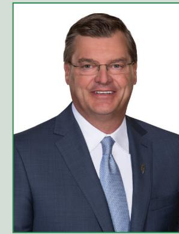

Rose, former President of our Bogata bank location and key member of our credit administration department, retired after 38 years with the Bank. These three individuals represent the best that is Guaranty, and we thank them for their dedication and commitment to helping make Guaranty what it is today. They have the qualities that our Company's new leaders should strive to emulate.

In conclusion, we are very pleased with our 2022 results. While we expect some challenges and headwinds in 2023, with projections of an economic slowdown, we also remain open to potential opportunities. Many economists forecast much slower growth in most industries and further layoffs by companies as they right-size their operations for the slower economic environment. We are very blessed to be in the state of Texas, which continues to enjoy a vibrant economy and should ride through an economic downturn much stronger than other states. For all the reasons listed above, Guaranty remains well-positioned to navigate this uncertain environment successfully. We've built a robust franchise, with a banking footprint that covers the majority of the growth areas in Texas. I remain very optimistic about our future prospects.

Thank you, fellow shareholders, for your continued investment, support, and confidence in Guaranty Bancshares and Guaranty Bank & Trust.

TY ABSTON CHAIRMAN OF THE BOARD & CEO

**7**

{4}------------------------------------------------

### **GUARANTY BANCSHARES BOARD OF DIRECTORS**

### BACK ROW L R

CAPPY PAYNE Senior Executive Vice President & CFO Guaranty Bancshares, Inc.

JIM BUNCH President & CEO BWI, Inc.

### FRONT ROW L R

CHRIS ELLIOTT President Elliott Auto Group

### TY ABSTON Chairman of the Board & CEO Guaranty Bancshares, Inc.

MIKE NOLAN Investments

## SONDRA CUNNINGHAM

Senior Vice President & Chief Culture Officer

Guaranty Bank & Trust, Inc.

BRAD DRAKE CEO Lamar Companies, LLC

### KIRK LEE

President Guaranty Bancshares, Inc.

**8**

JEFF BROWN

Managing Partner RoseRock

CARL JOHNSON JR.

### Principal Baker & Johnson, CPA

## RICKY BAKER

KRB Investments, LLC

# FOLLOWING THEIR LEAD

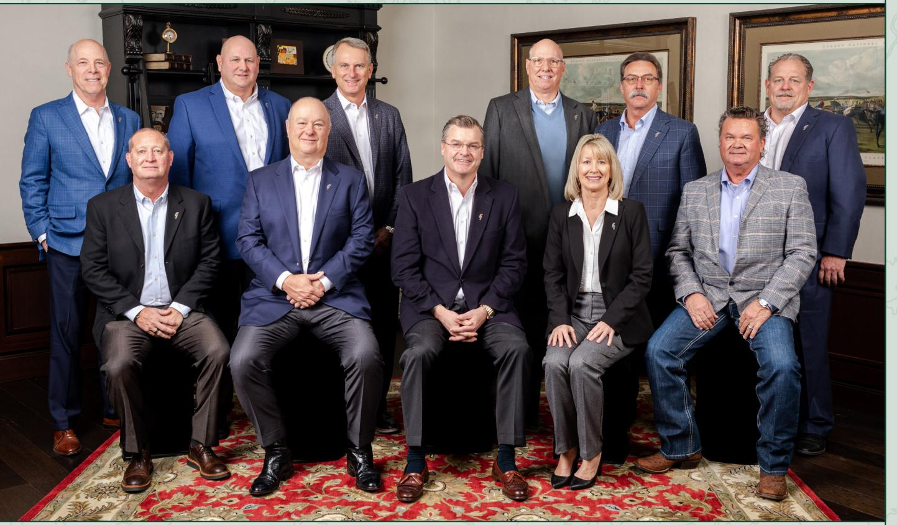

### **FINANCE**

We integrated several new platforms to our technology stack, including Zelle®, a digital payment network; Unqork®, a no-code programming platform; VMware® host hardware, which powers our production application servers; Duo® single sign-on (SSO), which enhance security for in-house and third-party systems, and increased capacity with Fortigate® firewalls and Cisco® core switches.

- We achieved a record **\$40.4 million in earnings in 2022**, up from \$39.8 million in 2021.
- Despite the rapidly increasing interest rate environment and cost of funds, we maintained a **net interest margin of 3.54%** in 2022.
- We continued to pay cash dividends. Shareholders received **\$0.88 per share** in 2022, up from \$0.80 per share in 2021.
- We had excellent organic loan growth in 2022. **Loans increased \$470.1 million**, or **24.6%**, during the year.

**Guaranty stock (GNTY) outperformed** the annual S&P US SmallCap Banks Index on total return performance.

We maintained strong asset quality with a net charge-off to total loans ratio of only **0.03%** for the year and a low problem asset ratio of **0.32%**  of total assets.

**Deposits increased \$10.3 million** during 2022. As we continue to build core deposit relationships in our newer markets, we are building on a stable core deposit franchise in our East Texas market, which represent about 57% of our total deposits.

**PEOPLE**

Gave back to our communities through monetary donations and volunteer hours. Contributions made during 2022 totaled more than **\$354,000** and employees volunteered more than **2,270** hours at **124** different organizations.

We opened a loan production office and additional office space in Westlake, Texas, to house our growing **Austin-area banking teams.**

We appointed a **Community Development Officer**  whose focus is to identify community outreach

We were named one of Texas Monthly's **"Best** opportunities in all our banking markets. **100 Companies to Work for in Texas"** for the fourteenth straight year.

### **TECHNOLOGY**

# 2022 YEAR IN REVIEW

{5}------------------------------------------------

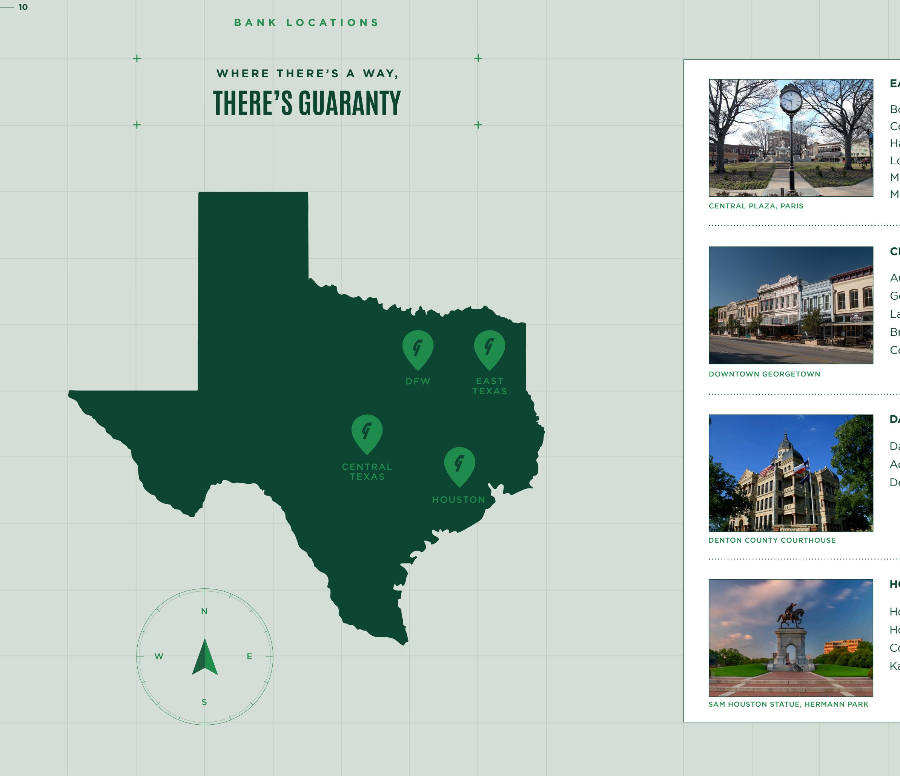

|                            |                 | 11 |
|----------------------------|-----------------|----|
|                            |                 |    |
|                            |                 |    |
| EAST TEXAS REGION          |                 |    |
| Bogata                     | New Boston      |    |
| Commerce                   | Paris (2)       |    |
| Hallsville                 | Pittsburg       |    |
| Longview                   | Sulphur Springs |    |
| Mount Pleasant (2)         | Texarkana (3)   |    |
| Mount Vernon               |                 |    |
|                            |                 |    |
| CENTRAL TEXAS REGION       |                 |    |
| Austin                     |                 |    |
| Georgetown                 |                 |    |
| Lakeway                    |                 |    |
| Bryan                      |                 |    |
| College Station (2)        |                 |    |
|                            |                 |    |
|                            |                 |    |
| DALLAS / FORT WORTH REGION |                 |    |
| Dallas                     | Fort Worth      |    |
| Addison                    | Rockwall        |    |
| Denton (2)                 | Royse City      |    |
|                            |                 |    |
|                            |                 |    |
|                            |                 |    |
|                            |                 |    |
| HOUSTON REGION             |                 |    |
| Houston                    |                 |    |
| Houston Galleria           |                 |    |
| Conroe                     |                 |    |
| Katy                       |                 |    |
|                            |                 |    |
|                            |                 |    |
|                            |                 |    |
|                            |                 |    |

{6}------------------------------------------------

### **110 YEARS OF GUARANTY**

The Guaranty State Bank opens in Mt. Pleasant, Texas

Guaranty holds \$454,870 in deposits

> Additional services are added, including a night depository, conference rooms available for customers, safe deposit boxes

Art, Jonice and Bill come together and start to build today's Guaranty

Art Scharlach, Jonice Crane and Bill Jones

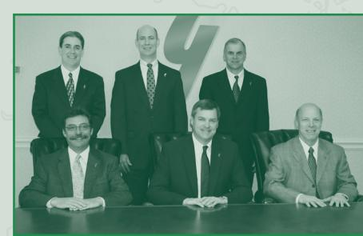

1913 Statement of Condition card 1950 Guaranty Bond Bank for The Guaranty State Bank

**1929 Great depression begins**

### **1951 Color TVs are available to the public**

History may be cyclical, but for 110 years, our Bank has provided strength and stability for our customers, employees, and shareholders. We've embraced technological changes and planned for different economic events and volatility that has allowed us successfully to grow and to serve more communities within Texas. We are very proud of our long history, highlighted with some key milestones below, and look forward to the future.

Expansion into Houston region

Expansion begins in Northeast Texas Ty Abston elected Chief Executive

Officer

Guaranty reaches \$1 billion in assets

Expansion into Central Texas region

2010 Members of the executive management team

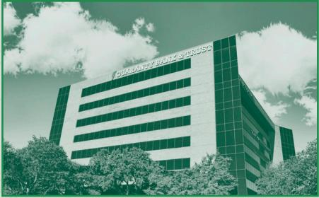

2019 New corporate location in Addison, TX

**1991 Computer programmer Tim Berners-Lee introduces the World Wide Web**

**2001 Apple first** 

**releases iTunes**

|                                                                                 | OF MT. PLEASANT, TEXAS                                                                                                                     |
|---------------------------------------------------------------------------------|--------------------------------------------------------------------------------------------------------------------------------------------|
| LIABILITIES                                                                     | Made to the Gommissioner of Banking at the close of business April 4. 1913. RESOLIRODS                                                  |
| Capital Stock   . \$ 60,000.00 2,945.01 Profits 149,196.29 Deposits | Loans and Discouts  \$ 76,195.29 Furniture & Fixtures 1.603.70 In Vault. \$18.850.45 CASH:   In Banks, 115,491.86 134,34 26 26 |
| Total                                                                           | Total  \$212,141.30.                                                                                                                       |

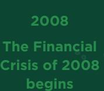

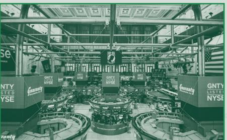

2023 Transferred our GNTY stock listing to the New York Stock Exchange

Expansion into DFW region

{7}------------------------------------------------

* Pre-IPO stock prices are based on third-party valuations as of December 31 of each respective year.

** Earnings per share and dividends per share prior to 2021 have been adjusted to effect the 10% stock dividend in the first quarter of 2021

*** 2014 dividends paid and payout ratio excludes a \$1.00 special dividend paid to shareholders in connection with the termination of subchapter S election.

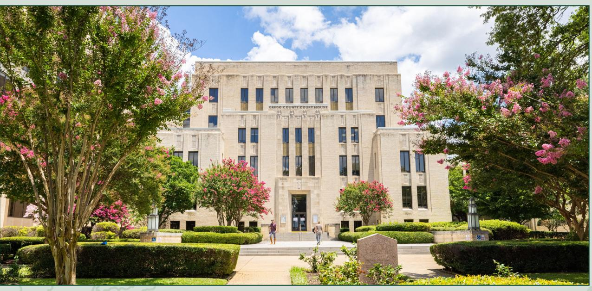

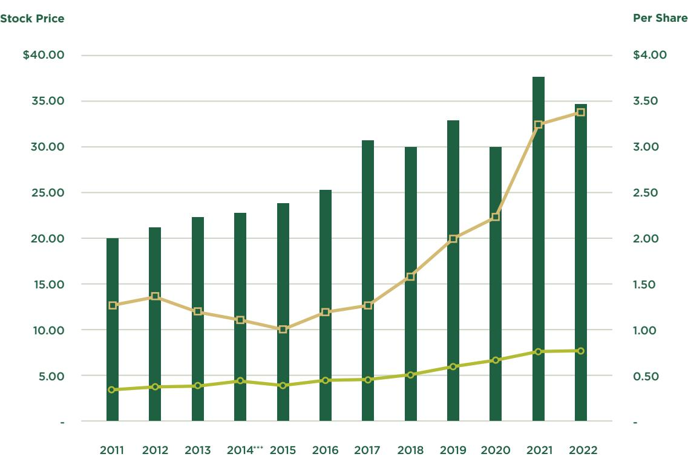

**14**

- STOCK PRICE* DIVIDENDS PER SHARE** EARNINGS PER SHARE**
**GREGG COUNTY COURTHOUSE, LONGVIEW 32.5007° N, 94.7405° W**

**15**

# STOCK PRICE, EPS, AND DIVIDENDS

{8}------------------------------------------------

| AT YEAR END                                     |             |             |             |             |             |
|-------------------------------------------------|-------------|-------------|-------------|-------------|-------------|
| Total assets                                    | \$2,266,970 | \$2,318,444 | \$2,740,832 | \$3,086,070 | \$3,351,495 |
| Loans and loans held for sale, net of allowance | 1,647,239   | 1,693,162   | 1,837,279   | 1,880,205   | 2,347,401   |
| Investments in securities                       | 396,139     | 368,174     | 380,795     | 526,469     | 697,935     |
| Total deposits                                  | 1,871,480   | 1,956,804   | 2,286,390   | 2,670,827   | 2,681,154   |
| Stockholders' equity                            | 244,583     | 261,551     | 272,643     | 302,214     | 295,558     |
| Weighted average common shares outstanding2     | 12,719,300  | 12,803,900  | 12,219,420  | 12,065,182  | 11,980,209  |

| OTHER FINANCIAL DATA                          |        |         |        |         |        |
|-----------------------------------------------|--------|---------|--------|---------|--------|
| Return on average total assets                | 0.97%  | 1.13%   | 1.07%  | 1.36%   | 1.24%  |
| Return on average stockholders' equity        | 9.03%  | 10.37%  | 10.39% | 13.72%  | 13.76% |
| Loans to deposits                             | 88.68% | 87.20%  | 81.65% | 70.24%  | 87.43% |
| Loan loss reserves to loans                   | 0.88%  | 0.95%   | 1.80%  | 1.59%   | 1.34%  |
| Net interest margin, fully taxable equivalent | 3.50%  | 3.69%   | 3.77%  | 3.51%   | 3.54%  |
| Tier 1 capital to average assets              | 10.16% | 10.29%  | 9.13%  | 9.18%   | 8.77%  |
| Efficiency ratio                              | 67.37% | 65.23%  | 58.86% | 61.00%  | 60.85% |
| Charge-offs net of recoveries                 | \$458  | \$(301) | \$331  | \$1,486 | \$609  |

| OPERATING RESULTS                          | 2018     | 2019     | 2020     | 2021     | 2022      |
|--------------------------------------------|----------|----------|----------|----------|-----------|
| Net interest income                        | \$68,916 | \$78,870 | \$89,982 | \$95,558 | \$107,829 |
| Provision for loan losses                  | 2,250    | 1,250    | 13,200   | (1,700)  | 2,150     |
| Non-interest income                        | 15,303   | 16,973   | 23,037   | 24,576   | 23,485    |
| Net realized gain (loss) on securities     | (50)     | (22)     | —        | —        | 172       |
| Non-interest expense                       | 56,774   | 62,525   | 66,522   | 73,278   | 79,907    |
| Earnings before provision for income taxes | 25,195   | 32,057   | 33,297   | 48,556   | 49,257    |
| Income tax provision                       | 4,599    | 5,778    | 5,895    | 8,750    | 8,834     |
| Net earnings                               | 20,596   | 26,279   | 27,402   | 39,806   | 40,423    |
| Core earnings1                             | 27,495   | 33,307   | 40,261   | 39,034   | 50,154    |

| PER SHARE DATA                                 |        |        |        |        |        |
|------------------------------------------------|--------|--------|--------|--------|--------|
| Net income2                                    | \$1.62 | \$2.05 | \$2.25 | \$3.30 | \$3.38 |
| Market price (value based on year end numbers) | 29.82  | 32.88  | 29.95  | 37.58  | 34.64  |
| Tangible book value2                           | 15.96  | 17.76  | 19.74  | 22.09  | 21.85  |
| Cash dividends2                                | 0.55   | 0.64   | 0.71   | 0.80   | 0.88   |

1. Pre-tax, pre-provision, pre-securities gain (loss), and pre-PPP related extraordinary income

2. Periods prior to the stock dividend issued during the first quarter of 2021 have been adjusted to give effect to the 10% stock dividend

### (IN THOUSANDS, EXCEPT PER SHARE DATA)

**16**

# FINANCIAL HIGHLIGHTS

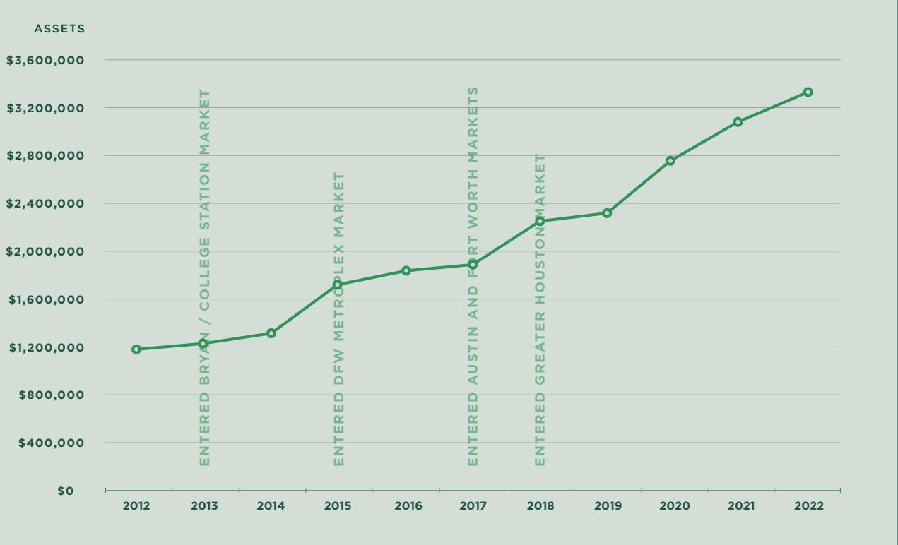

### **10-YEAR ASSET GROWTH CHART**

### **5-YEAR GROWTH TRENDS**

3. Total gross loans, including loans held for sale 4. Core earnings defined as pre-tax, pre-provision and pre-PPP related net earnings

2018 2019 2020 2021 **\$2,267 \$2,318 \$2,741 TOTAL ASSETS** DOLLARS IN MILLIONS 2022 **\$3,351 \$3,086**

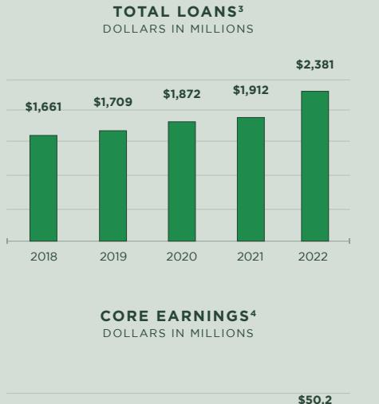

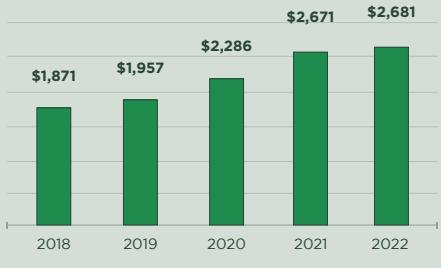

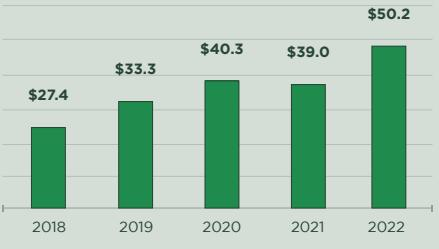

DOLLARS IN THOUSANDS

{9}------------------------------------------------

**TY ABSTON**

Chairman of the Board

& CEO

**KIRK LEE** Vice Chairman & Chief Credit Officer

**CHUCK COWELL** Vice Chairman & Senior Executive Officer

> **RICKY BAKER** KRB Investments, LLC

**JOSH BRAY** Entrepreneur

**JEFF BROWN** Managing Partner RoseRock

**JIM BUNCH** President & CEO BWI, Inc.

## BOARD OF DIRECTORS **GUARANTY BANK & TRUST**

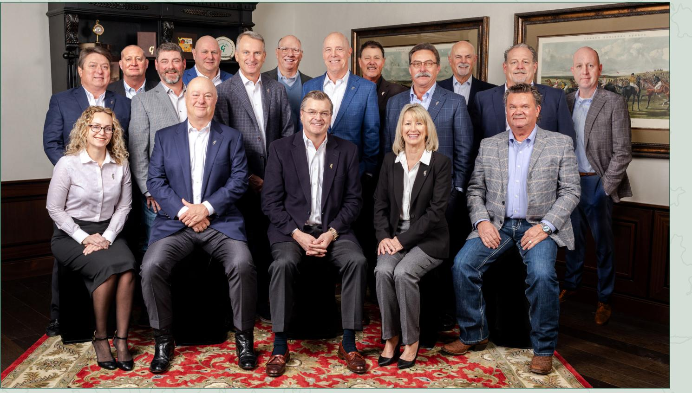

**BRAD DRAKE** CEO Lamar Companies, LLC

**CHRIS ELLIOTT** President Elliott Auto Group

**CARL JOHNSON, JR.** Principal Baker & Johnson, CPA

**BRIAN MASON** Managing Director Boone Creek Investments, LLC

> **MIKE NOLAN** Investments

**CARL SMITH** Investments

**18**

### BACK ROW L R

### FRONT ROW L R

MIDDLE ROW L R

**EDDIE PRIEFERT** President Priefert Manufacturing Co., Inc.

**CAPPY PAYNE** Advisory Director, Senior Executive Vice President

**SHALENE JACOBSON** Advisory Director, Executive Vice President, & CFO

**SONDRA CUNNINGHAM** Board Secretary, Senior Vice President, & Chief Culture Officer

**19**

### DELIVERY OF ANNUAL REPORT

This Annual Report is being delivered to shareholders of Guaranty Bancshares, Inc. (the "Company") in connection with the 2023 Annual Meeting of Shareholders and should be read with the Company's proxy statement for the meeting and Annual Report on Form 10-K, copies of which accompany this Annual Report and have been filed with the Securities and Exchange Commission ("SEC"). This Annual Report is also available on our website www.gnty. com under the heading "Investors – Financial Information." The Company will mail additional copies of this Annual Report to its shareholders upon request.

### FORWARD-LOOKING STATEMENTS

This Annual Report may contain forward-looking statements within the meaning of the Private Securities Litigation Reform Act of 1995. These forward-looking statements reflect our current views with respect to, among other things, future events and our results of operations, financial condition and financial performance. These statements are often, but not always, made through the use of words or phrases such as "may," "should," "could," "predict," "potential," "believe," "will likely result," "expect," "continue," "will," "anticipate," "seek," "estimate," "intend," "plan," "projection," "would" and "outlook," or the negative version of those words or other comparable words of a future or forward-looking nature. These forward-looking statements are not historical facts, and are based on current expectations, estimates and projections about our industry, management's beliefs and certain assumptions made by management, many of which, by their nature, are inherently uncertain and beyond our control. Accordingly, we caution you that any such forward-looking statements are not guarantees of future performance and are subject to risks, assumptions and uncertainties that are difficult to predict. Although we believe that the expectations reflected in these forward-looking statements are reasonable as of the date made, actual results may prove to be materially different from the results expressed or implied by the forward-looking statements. Such factors include, without limitation, the "Risk Factors" referenced in our most recent Annual Report on Form 10-K and any subsequent Quarterly Reports on Form 10-Q, other risks and uncertainties listed from time to time in our reports and documents filed with the SEC, and the following factors: business and economic conditions generally and in the financial services industry, nationally and within our current and future geographic market areas; economic, market, operational, liquidity, credit and interest rate risks associated with our business; natural disasters and adverse weather, acts of terrorism, cyber-attacks, an outbreak of hostilities, a public health outbreak (such as COVID-19) or other international or domestic calamities, and other matters beyond our control; the composition of our loan portfolio, including deteriorating asset quality and higher loan charge-offs; the laws and regulations applicable to our business; our ability to achieve organic loan and deposit growth and the composition of such growth; increased competition in the financial services industry, nationally, regionally or locally; our ability to maintain our historical earnings trends; our ability to raise additional capital to execute our business plan; acquisitions and integrations of acquired businesses; systems failures or interruptions involving our information technology and telecommunications systems or third-party services; the composition of our management team and our ability to attract and retain key personnel; the fiscal position of the U.S. federal government and the soundness of other financial institutions; and the amount of nonperforming and classified assets we hold. We can give no assurance that any goal or plan or expectation set forth in forward-looking statements can be achieved and readers are cautioned not to place undue reliance on such statements. The forward-looking statements are made as of the date of this Annual Report, and we do not intend, and assume no obligation, to update any forward-looking statement to reflect events or circumstances after the date on which the statement is made or to reflect the occurrence of unanticipated events or circumstances, except as required by applicable law.

### DIVIDENDS CALENDAR

Dividends on Guaranty Bancshares, Inc. common stock are payable, if paid, quarterly.

INDEPENDENT AUDITORS Whitley Penn

8343 Douglas Avenue Suite 400 Dallas, Texas 75225

TRANSFER AGENT Computershare Investor Services P. O. Box 50500 Louisville, KY 40233 Shareholder Services 800-962-4284

{10}------------------------------------------------

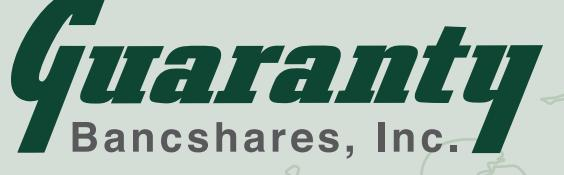