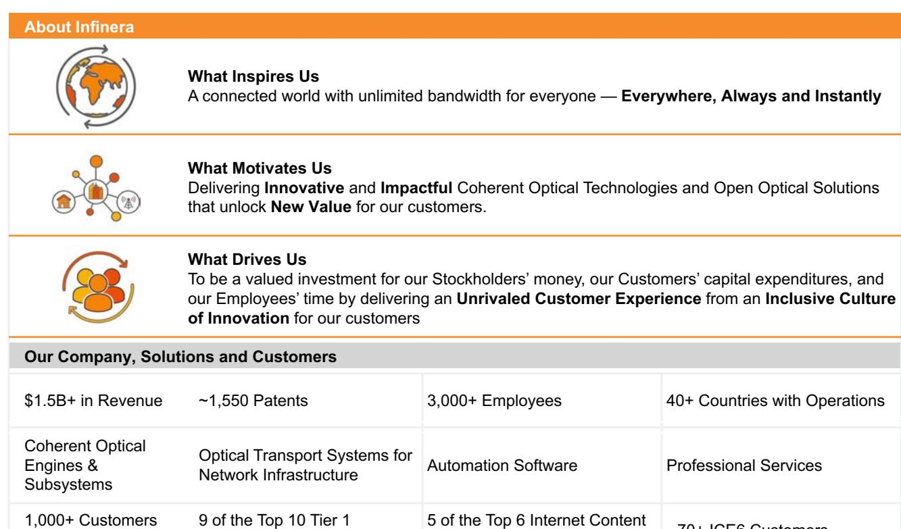
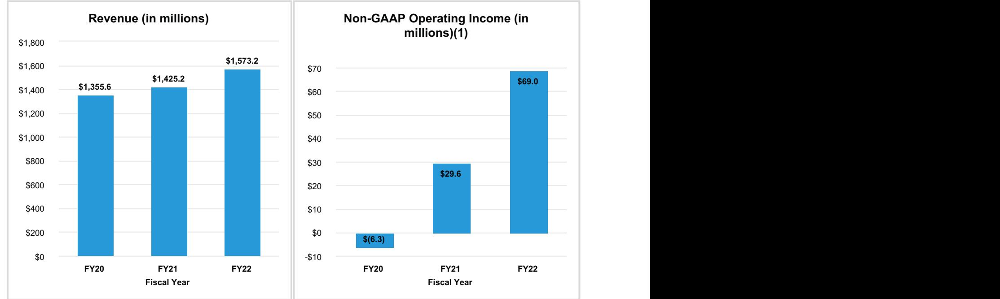
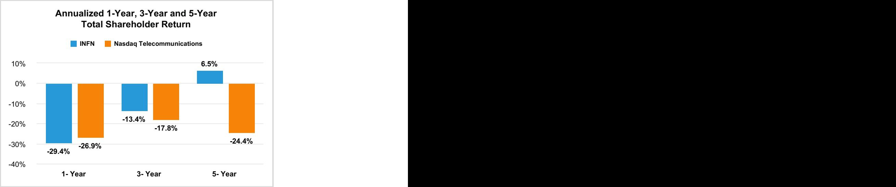
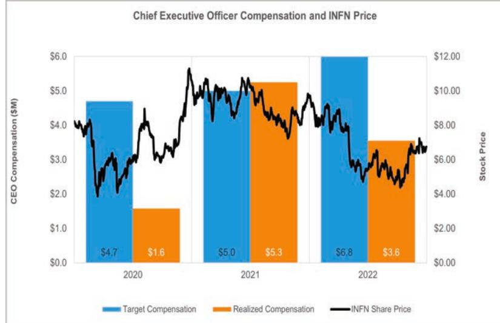
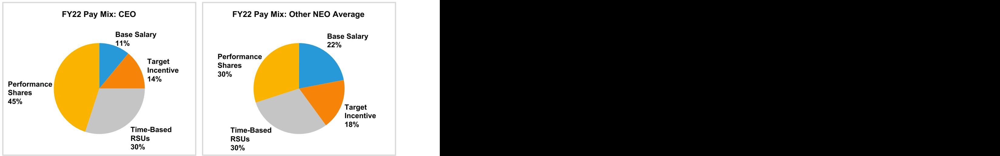
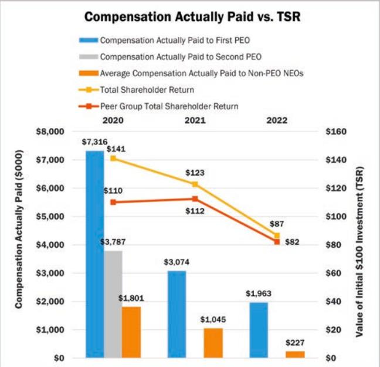
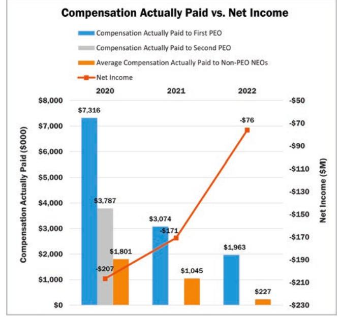
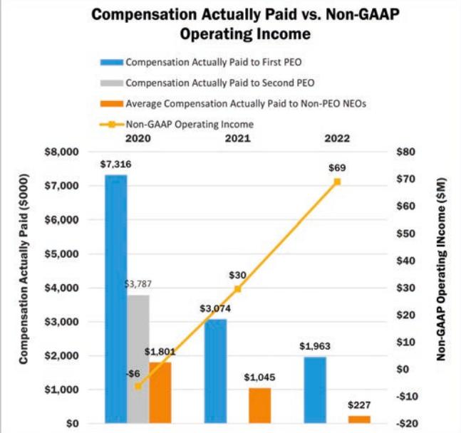
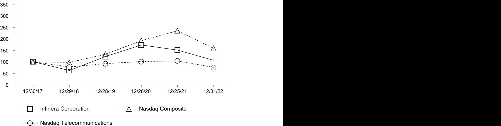

{0}------------------------------------------------

Infinera Corporation 2023 Proxy Statement and 2022 Annual Report on Form 10-K

{1}------------------------------------------------

**Infinera Corporation**  6373 San Ignacio Avenue San Jose, California 95119

Dear Stockholders,

I am extremely pleased with our performance in 2022, especially in light of the macroeconomic impacts we faced throughout the year, from a lingering pandemic and persistent supply chain challenges to rising inflation and a conflict in Europe. Despite these headwinds, we delivered above-market growth, gained market share, improved our balance sheet and continued to expand profitability for the third consecutive year. The result was a year of significant achievements:

- Delivered strong financial performance in 2022, we grew company revenue by 10%, and within our stated objective of 8-12% growth, with product revenue growth of 15%. We set a record for revenue and increased operating margin by 230 basis points, positioning us well to achieve our long-term business model.
- Drove substantial portfolio momentum and innovation during the year, we ramped our flagship ICE6-based products to 28% of product revenue and ended the year with over 70 ICE6 customers, ranging from global service providers to internet content providers. We continued to build on our metro portfolio momentum, growing revenue for the flagship GX metro product by approximately 28% in the year. We also recently announced the availability of our ICE-X 100G and 400G-based pluggables and components, our next-generation 1.2 Terabit embedded optical engine, and the development of our 800G pluggable.
- Improved customer experience while aligning the organization to deliver increased value to our customers, we improved upon key metrics that reflect our commitment to delivering a superior customer experience and unlocking the value of true customer centricity.

Our performance in 2022 demonstrates that we are making solid progress with our strategy and our portfolio is resonating with our global customers. Our vertical integration capabilities and differentiation have resulted in greater security and control over our supply chain, enabling us to deliver our solutions to our customers with what we believe are competitive lead times.

Our accomplishments this past year further underscore the dedication and talent of an exceptional global team that I am honored to lead, and the power of a culture we continue to strengthen through our commitment to diversity, inclusion, social responsibility, innovation and execution excellence. Our people remain our greatest asset and the heart of our success, and we continue to focus on their safety, well-being and career development and advancement as we drive the business forward.

We leverage our U.S.-based semiconductor fabrication plant and in-house packaging capabilities to provide our customers with a critical and secure source of U.S.-produced optical semiconductors and to consistently pioneer critical technology advancements in critical infrastructure. This helps our customers around the world successfully realize unprecedented levels of network efficiency, scalability and automation that empower these and other critical end-user applications. With a strategy to drive stockholder value in the years ahead, our progress in 2022 represents a tangible proof point that we are on the right trajectory to gain market share, continue to innovate to the delight of our customers and achieve our long-term business objectives.

We remain confident in our ability to create sustainable, long-term value for our stockholders, customers, partners, and employees as we advance our mission of delivering industry-leading innovation in open optical systems and coherent optical subsystems.

Your voting support of the proposals described in the accompanying proxy statement would be deeply appreciated as we work together to increase the value of your investment in Infinera. We thank you for your continued commitment to Infinera and belief in our team.

Sincerely,

David W. Heard Chief Executive Officer

{2}------------------------------------------------

**Infinera Corporation**  6373 San Ignacio Avenue San Jose, California 95119

Dear Fellow Stockholders,

Infinera's remarkable transformation in recent years continued in 2022 as the company further established itself as a market leader and innovator in coherent optical networking. Marking progress along this journey, we are pleased with the company's financial performance and portfolio advances in 2022 as it rose to the challenge of navigating another year of profound global and macroeconomic challenges impacting not only our industry, but the world at large. I am very proud of our global management team, which has been developed internally along with targeted external hires, for its perseverance through these challenging times and its impact in driving our performance improvements. The vision of the company — "A connected world with unlimited bandwidth for everyone — Everywhere, Always and Instantly" — also continues to resonate and guides us to deliver innovation and value to the world.

We are encouraged by the robust demand we are seeing for our networking solutions across geographies, customers, and network segments, including long-haul, subsea, metro and access. This demand helped drive operating improvements in 2022 and bodes well for the future as bandwidth and connectivity become increasingly integral to all of our lives. Drawing on an expanded portfolio, including the introduction of our new subsystems products, a customer-centric approach infusing the entire organization, and strong market cycles driving new growth opportunities, we are well-positioned to execute our strategy, bring further innovation to the coherent optical networking market and drive continued progress toward our longterm business model.

In keeping with our strategy and long-term goals, we remain committed to strengthening our environmental, social, and governance (ESG) practices and taking a proactive and collaborative approach by anticipating evolving regulations and keeping pace with customer and investor expectations. Our commitment to ESG starts at the top with the Board and our executive leadership team, and our programs have full support and enablement from management. Our employees share the company's vision of sustainability, equity and inclusion and support our goal of creating value for our stakeholders through our ESG initiatives. We are proud of the progress made in these areas of the business in 2022 and know that with dedication and innovation, we can continue to tackle the challenges and seize the opportunities ahead of us.

I have the privilege of leading a highly qualified, independent and diverse Board, one which continues to be inspired by the ability of the Infinera team and its core values and vision to overcome challenging external conditions to deliver strong results while looking after its customers, partners, and employees. We are excited about the future ahead and the company's ability to achieve long-term success.

In closing, as you review the accompanying proxy statement, the Board hopes our collective commitment to excellence in our corporate governance and executive compensation practices is evident. We value the ongoing support of our stockholders and thank you for your investment.

Sincerely,

George A. Riedel Independent Board Chair

{3}------------------------------------------------

**Infinera Corporation**  6373 San Ignacio Avenue San Jose, California 95119

# **NOTICE OF 2023 ANNUAL MEETING OF STOCKHOLDERS**

| Date: | May 18, 2023 Record Date: |             | March 21, 2023                              |  |  |
|-------|------------------------------|-------------|---------------------------------------------|--|--|
| Time: | 10:00 a.m. Pacific Time      | Attendance: | www.virtualshareholdermeeting.com/INFN2023. |  |  |

Dear Stockholder:

You are cordially invited to attend the virtual 2023 Annual Meeting of Stockholders of Infinera Corporation ("Infinera"), a Delaware corporation, and any postponement, adjournment or other delay thereof (the "Annual Meeting"). The Annual Meeting will be held via live webcast at *www.virtualshareholdermeeting.com/INFN2023* on Thursday, May 18, 2023 at 10:00 a.m. Pacific Time. You will be able to attend the Annual Meeting online and submit questions during the Annual Meeting by visiting the website listed above. You will also be able to vote your shares electronically at the Annual Meeting.

This Annual Meeting is being held for the following purposes:

- 1. To elect three Class I directors to the Board of Directors to hold office until the 2026 annual meeting of stockholders or until their respective successors have been duly elected and qualified, or until their earlier death, resignation or removal from the Board of Directors.
- 2. To approve the Infinera Corporation 2016 Equity Incentive Plan (the "2016 Plan"), as amended, which increases the number of shares authorized for issuance thereunder by 8,100,000 shares.
- 3. To approve, on an advisory basis, the compensation of Infinera's named executive officers, as described in the Proxy Statement.
- 4. To approve, on an advisory basis, the frequency of stockholder advisory votes on the compensation of Infinera's named executive officers.
- 5. To ratify the appointment of Ernst & Young LLP as Infinera's independent registered public accounting firm for the fiscal year ending December 30, 2023.
- 6. To transact such other business that may properly come before the meeting or any postponement or adjournment thereof.

These items of business are more fully described in the Proxy Statement accompanying this Notice.

The record date for the Annual Meeting was March 21, 2023 (the "Record Date"). Only stockholders of record at the close of business on that date may vote at the Annual Meeting. **Your vote is important. Whether or not you expect to attend the Annual Meeting, it is important that you vote as soon as possible so that your shares are represented. To vote your shares, please follow the instructions in the Notice of Internet Availability of Proxy Materials, which is being mailed to you on or about March 31, 2023.** The proxy materials and our annual report can be accessed by visiting *www.virtualshareholdermeeting.com/INFN2023*.

On behalf of the Board of Directors, thank you for your participation in this important annual process.

By Order of the Board,

Nancy Erba Chief Financial Officer

San Jose, California March 31, 2023

{4}------------------------------------------------

# **Cautionary Note Regarding Forward-Looking Statements**

This Proxy Statement contains certain forward-looking statements within the meaning of the Private Securities Litigation Reform Act of 1995 that are subject to risks and uncertainties. You can identify forward-looking statements by words such as "believe," "expect," "anticipate," "intend," "plan," "aim," "will," "may," "should," "could," "would," "likely," "estimate," "predict," "potential," "continue" or other similar expressions. Actual results may differ from those set forth in the forward-looking statements due to a variety of factors, including those contained in the Company's Annual Report on Form 10-K for the year ended December 31, 2022 and the Company's other filings with the U.S. Securities and Exchange Commission. You are cautioned not to place undue reliance on these forward-looking statements, which speak only as of the date on which they are made. We undertake no obligation to update or revise any forward-looking statements.

# **Important Notice Regarding Proxy Materials for the Stockholder Meeting to be Held on May 18, 2023**

The Notice of Annual Meeting, Proxy Statement and Form of Proxy are first being mailed on or about March 31, 2023 to all stockholders entitled to vote at the Annual Meeting. This Proxy Statement and our 2022 Annual Report are also available on the Investors page at *investors.infinera.com*.

# **Virtual Meeting Admission**

Stockholders of record as of March 21, 2023 will be able to participate in the Annual Meeting by visiting our Annual Meeting website at *www.virtualshareholdermeeting.com/INFN2023*. To participate in the Annual Meeting, you will need the 16-digit control number included on your proxy card.

The Annual Meeting will begin promptly at 10:00 a.m. Pacific time on Thursday, May 18, 2023. Online check-in will begin at 9:45 a.m. Pacific time, and you should allow approximately 15 minutes for the online check-in procedures.

**Voting.** Whether or not you plan to virtually attend the Annual Meeting and regardless of the number of shares of common stock that you own, please cast your vote, at your earliest convenience, as instructed on your proxy card and/or voting instruction form. **Your vote is very important.** Your vote before the Annual Meeting will ensure representation of your shares at the Annual Meeting even if you are unable to virtually attend. You may submit your vote by the Internet, telephone, mail or virtually at the Annual Meeting. Voting over the Internet or by telephone is fast and convenient, and your vote is immediately confirmed and tabulated. By using the Internet or telephone, you help us reduce postage, printing and proxy tabulation costs. We encourage all holders of record to vote in accordance with the instructions on the proxy card and/or voting instruction form prior to the Annual Meeting even if they plan on virtually attending the Annual Meeting. Submitting a vote before the Annual Meeting will not preclude you from voting your shares at the Annual Meeting should you decide to virtually attend.

# **You may vote using the following methods:**

{5}------------------------------------------------

# **INFINERA AT A GLANCE**

# **History of Technology Innovation**

Operators

Worldwide

Leveraging its US-based optical semiconductor fab, Infinera has a distinguished history of delivering breakthrough innovation through multi-discipline opto-electronic R&D including: industry-leading high-performance optical engines, revolutionary point-to-multipoint coherent optics, and customized design and production

Providers 70+ ICE6 Customers

| AISC/DSP Design    | Analog Electronics Design | PIC Design and Fabrication  | Solution Packaging                           |
|--------------------|---------------------------|-----------------------------|----------------------------------------------|
| Holistic Co-design | RF Interconnects          | TROSA Design and Production | Coherent Pluggables Design and Production |

# **ESG and Corporate Responsibility**

We focus our efforts on the elements of sustainability that are most important and impactful to our business and to our stakeholders. Through our 2022 ESG materiality assessment, the following topics were determined to be the most material ESG issues. Our programs, goals and disclosures have been aligned to emphasize these topics.

| Environmental Responsibility                    | Social Responsibility                              | Corporate Governance                                   |  |  |
|-------------------------------------------------|----------------------------------------------------|--------------------------------------------------------|--|--|
| Climate, greenhouse gas emissions and energy | Community engagement and philanthropy           | Supply chain management and responsible sourcing    |  |  |
| Waste management and recycling               | Employee health, safety and well-being          | Privacy, data protection and information security   |  |  |
| Product sustainability                          | Employee development, benefits and satisfaction | Leadership engagement, oversight and accountability |  |  |
|                                                 | Diversity, equity and inclusion                    | ESG integration in business strategy                   |  |  |
|                                                 | Global human rights                                |                                                        |  |  |

{6}------------------------------------------------

| Proxy Statement Summary                                                                                         | 1        |
|-----------------------------------------------------------------------------------------------------------------|----------|
| Meeting Agenda and Voting Matters                                                                               | 1        |
| Board Nominees                                                                                                  | 1        |
| Board and Governance Highlights                                                                                 | 2        |
| Executive Compensation Program Highlights                                                                       | 2        |
| Our Board of Directors                                                                                          | 4        |
| Proposal 1—Election of Class I Directors                                                                        | 4        |
| Who We Are                                                                                                      | 4        |
| How We Are Selected and Elected                                                                                 | 9        |
| How We Govern and Are Governed                                                                                  | 11       |
| How We Are Organized                                                                                            | 15       |
| How to Communicate with Us                                                                                      | 19       |
| How We Are Paid                                                                                                 | 19       |
| Our Pay                                                                                                         | 24       |
| Compensation Discussion and Analysis                                                                            | 24       |
| Executive Summary                                                                                               | 24       |
| Overview of our Executive Compensation Program Philosophy and Process                                           | 28       |
| Fiscal 2022 Compensation                                                                                        | 33       |
| Additional Information Regarding Our Compensation Practices                                                     | 39       |
| Compensation Committee Report                                                                                   | 42       |
| Executive Compensation Tables                                                                                   | 43       |
| 2022 CEO Pay Ratio                                                                                              | 48       |
| Pay Versus Performance                                                                                          | 49       |
| Estimated Payments and Benefits Upon Termination, Change of Control or Death/Disability                         | 52       |
| Risk Assessment of Compensation Practices                                                                       | 55       |
| Proposal 2—Approval of the Infinera Corporation 2016 Equity Incentive Plan, as Amended                          | 56       |
| Proposal 3—Advisory Approval of Named Executive Officer Compensation                                            | 66       |
| Proposal 4—Advisory Approval of the Frequency of Stockholder Advisory Votes on Named Executive Officer          | 58       |
| Our Auditors                                                                                                    | 68       |
| Proposal 5—Ratification of Appointment of Independent Registered Public Accounting Firm                         | 68       |
| Report of the Audit Committee                                                                                   | 70       |
| Certain Relationships and Related Party Transactions                                                            | 71       |
| Delinquent Section 16(a) Reports                                                                                | 71       |
| Equity Compensation Plan Information                                                                            | 71       |
| Our Stockholders                                                                                                | 72       |
| Security Ownership of Certain Beneficial Owners and Management Stockholder Proposals for 2023 Annual Meeting | 72 73 |
| Delivery of Documents to Stockholders Sharing the Same Last Name and Address                                    | 74       |
| Other Matters                                                                                                   | 74       |
| User's Guide                                                                                                    | 75       |
| Annual Meeting                                                                                                  | 75       |
| Stock Ownership                                                                                                 | 77       |
| Quorum and Voting                                                                                               | 77       |
| Additional Information                                                                                          | 1        |
| Appendix A—Unaudited Reconciliations from GAAP to Non-GAAP                                                      | A-1      |
|                                                                                                                 |          |
| Appendix B—Infinera Corporation 2016 Equity Incentive Plan                                                      | B-1      |

{7}------------------------------------------------

# **PROXY STATEMENT SUMMARY**

**This summary highlights important information you will find in this Proxy Statement. As it is only a summary, please review the complete Proxy Statement carefully before voting.**

# **Virtual Stockholder Meeting**

Our 2023 Annual Meeting will be conducted as a virtual meeting held over the Internet, allowing all of our stockholders the option to participate in the live, online meeting from any location convenient to them. Stockholders at the close of business on March 21, 2023 will be allowed to communicate with us and ask questions in our virtual stockholder meeting forum before and during the meeting. All directors and executive officers are expected to be available to answer questions. Representatives of Ernst & Young LLP will be available to respond to appropriate questions. For further information on the virtual meeting, please see the "User's Guide" at the back of this Proxy Statement. Please note that there will not be a physical meeting.

# **Voting Matters and Board Recommendations**

| Proposal |                                                                                                                                                                                                                                                                                               | Board Vote Recommendation   | Page Reference (for more detail) |
|----------|-----------------------------------------------------------------------------------------------------------------------------------------------------------------------------------------------------------------------------------------------------------------------------------------------|--------------------------------|-------------------------------------|
| 1.       | To elect three Class I directors to the Board of Directors to hold office until the 2026 annual meeting of stockholders or until their respective successors have been duly elected and qualified, or until their earlier death, resignation or removal from the Board of Directors. | ü FOR each director nominee | 4                                   |
| 2.       | To approve the Infinera Corporation 2016 Equity Incentive Plan (the "2016 Plan"), as amended, which increases the number of shares authorized for issuance thereunder by 8,100,000 shares.                                                                                              | ü FOR                          | 56                                  |
| 3.       | To approve, on an advisory basis, the compensation of Infinera's named executive officers, as described in the Proxy Statement.                                                                                                                                                            | ü FOR                          | 66                                  |
| 4.       | To approve, on an advisory basis, the frequency of stockholder advisory votes on the compensation of Infinera's named executive officers.                                                                                                                                                  | ü 1 YEAR                       | 67                                  |
| 5.       | To ratify the appointment of Ernst & Young LLP as Infinera's independent registered public accounting firm for the fiscal year ending December 30, 2023.                                                                                                                                | ü FOR                          | 68                                  |

# **Board Nominees**

|         |                   |     |                |                |    | Committee Memberships(2) |     |
|---------|-------------------|-----|----------------|----------------|----|--------------------------|-----|
|         | Name              | Age | Director Since | Independent(1) | AC | CC                       | NGC |
|         | Roop K. Lakkaraju | 52  | 2022           | ü              | C  | —                        | —   |
| Class I | Amy H. Rice       | 43  | 2020           | ü              | —  | —                        | M   |
|         | George A. Riedel  | 65  | 2020           | ü              | —  | —                        | C   |

AC = Audit Committee; CC = Compensation Committee; NGC = Nominating and Governance Committee;

C = Chair; M = Member

_________________

(1) Under the rules and regulations of the SEC and the listing standards of The Nasdaq Stock Market ("Nasdaq").

(2) Committee memberships shown are effective upon the conclusion of our 2023 Annual Meeting of Stockholders. The current chair of the Audit Committee is Paul J. Milbury and Mr. Lakkaraju is currently a member of the Audit Committee.

{8}------------------------------------------------

#### **Board and Governance Highlights**

| Board Independence             | Seven out of nine of our directors, including our Chair, are independent in accordance with the rules and regulations of the SEC and the listing standards of Nasdaq.                                                                                                                                                                                                                                                                                                                                                                                                                                                                                                                                                                                                                                                                                                              |
|--------------------------------|------------------------------------------------------------------------------------------------------------------------------------------------------------------------------------------------------------------------------------------------------------------------------------------------------------------------------------------------------------------------------------------------------------------------------------------------------------------------------------------------------------------------------------------------------------------------------------------------------------------------------------------------------------------------------------------------------------------------------------------------------------------------------------------------------------------------------------------------------------------------------------------|
| Board Diversity                | The Board consists of a diverse group of professionals who bring significant experience, leadership and distinct qualities and skill sets to Infinera. Three out of nine of our directors are female (33%), one of whom was appointed as chair of our Compensation Committee during 2022 upon relinquishing her position as chair of our Nominating and Governance Committee. One of our directors is an "underrepresented minority," as such term is defined under Nasdaq Rule 5605(f) (the "Nasdaq Board Diversity Rule"). While we believe the current composition of the Board provides a diverse range of perspectives and experience to engage each other and management to effectively represent our stockholders, we will continue to consider gender, cultural and ethnic diversity when evaluating potential changes to our Board membership. |
| Leadership Structure           | We have separated the positions of Chair and Chief Executive Officer ("CEO").                                                                                                                                                                                                                                                                                                                                                                                                                                                                                                                                                                                                                                                                                                                                                                                                         |
| Board and Committee Evaluation | The Board and its committees assess their performance through an annual self-evaluation.                                                                                                                                                                                                                                                                                                                                                                                                                                                                                                                                                                                                                                                                                                                                                                                              |
| Board Tenure                   | The average tenure of our current Board members is approximately five years. We have refreshed our Board by appointing five new directors since the beginning of fiscal 2020.                                                                                                                                                                                                                                                                                                                                                                                                                                                                                                                                                                                                                                                                                                      |
| Board Committees               | We have three standing committees of the Board – Audit, Compensation, and Nominating and Governance. All committees are composed entirely of independent directors.                                                                                                                                                                                                                                                                                                                                                                                                                                                                                                                                                                                                                                                                                                                |
| Director Stock Ownership       | Each non-employee director is required to own shares of Infinera common stock having a value of at least four times the annual cash retainer for service as a director.                                                                                                                                                                                                                                                                                                                                                                                                                                                                                                                                                                                                                                                                                                            |
| Risk Oversight                 | Members of our senior management team are responsible for implementation of our day-to-day risk management processes, while the Board, as a whole and through its committees, has oversight of risk management.                                                                                                                                                                                                                                                                                                                                                                                                                                                                                                                                                                                                                                                                 |

# **Executive Compensation Program Highlights**

The design of our executive compensation program for fiscal 2022 reflects our ongoing commitment to pay-forperformance and the continued strong alignment of the interests of our named executive officers ("NEOs") with those of our stockholders. At the beginning of fiscal 2022, when a majority of executive compensation decisions were made, the Compensation Committee considered the performance of our company as we exited fiscal 2021 and the goals of achieving profitable revenue growth, achieving non-GAAP operating income growth despite a challenging supply chain environment, expanding our gross margins and growing our total addressable market. The decisions made reflected a continuing effort to maintain a strong pay-for-performance profile and supported accountability of our leadership team for our financial performance.

{9}------------------------------------------------

#### **Fiscal 2022 Executive Compensation Highlights**

| Pay-for-Performance                        | We emphasize performance-based incentives for compensation of all of our NEOs, including, in particular, our CEO. Our compensation programs are designed to reward executives with realized compensation that exceeds target through a combination of strong stockholder returns and performance that exceeds the targets approved for our short- and long-term incentive plans. In furtherance of our pay-for-performance goals, we continued to focus on the Company's financial performance in setting compensation programs. For example, 60% of our CEO's targeted equity awards in fiscal 2022 were granted in the form of performance share awards.                                                                                                                                                                                                                                                                                        |
|--------------------------------------------|---------------------------------------------------------------------------------------------------------------------------------------------------------------------------------------------------------------------------------------------------------------------------------------------------------------------------------------------------------------------------------------------------------------------------------------------------------------------------------------------------------------------------------------------------------------------------------------------------------------------------------------------------------------------------------------------------------------------------------------------------------------------------------------------------------------------------------------------------------------------------------------------------------------------------------------------------------------------------|
| Expense Reduction and Cash Preservation | In fiscal 2022, our Compensation Committee continued to focus on expense reduction and cash preservation in the face of continued challenges and uncertainty related to the challenging supply chain environment, while balancing the need to effectively retain critical talent and incentivize achievement of key business objectives by our NEOs. The Compensation Committee also approved the partial transition back to executive compensation practices in place prior to the COVID-19 pandemic, with our CEO and CFO participating in our annual corporate bonus plan instead of being granted additional retention equity awards. Our other NEOs were eligible to participate in our annual corporate bonus plan at a level equal to 50% of their target incentive compensation and were granted additional retention equity awards with a grant date value designed to approximate 50% of the target incentive compensation. |
| Longer-Term Strategic Goals                | During fiscal 2022, we continued to make progress toward achievement of our longer-term strategic goals. Nevertheless, despite this progress, and consistent with our compensation policy promoting strong pay and performance alignment:                                                                                                                                                                                                                                                                                                                                                                                                                                                                                                                                                                                                                                                                                                                        |
|                                            | – None of the performance shares granted to our NEOs in 2020, 2021 or 2022 became eligible to vest based on performance during 2022, and it was determined that the objectives underlying the performance shares granted to our NEOs in 2020 (with a performance period ending in fiscal 2022) would not be achieved; and                                                                                                                                                                                                                                                                                                                                                                                                                                                                                                                                                                                                                                     |
|                                            | – Realized compensation value for our CEO in fiscal 2022 was 52.5% of his target compensation.                                                                                                                                                                                                                                                                                                                                                                                                                                                                                                                                                                                                                                                                                                                                                                                                                                                                         |

As a complement to the executive compensation highlights referenced above, we continue to maintain sound corporate governance policies and practices. During fiscal 2022, the following policies and practices continued to be in effect:

| Compensation At-Risk                                                                | Majority Voting for the Election of Directors                                     |
|-------------------------------------------------------------------------------------|-----------------------------------------------------------------------------------|
| Executive Clawback Policy                                                           | Stock Ownership Policy                                                            |
| Anti-Hedging Policy                                                                 | "Double-Trigger" Change-of-Control Agreements                                     |
| No Pledging of our Common Stock by NEOs                                             | Annual Compensation Risk Assessment                                               |
| Independent Compensation Consultant Reporting Directly to Compensation Committee | Fully Independent Audit, Compensation and Nominating and Governance Committees |

{10}------------------------------------------------

# **INFINERA CORPORATION**

# **PROXY STATEMENT 2023 ANNUAL MEETING OF STOCKHOLDERS OUR BOARD OF DIRECTORS PROPOSAL 1—ELECTION OF CLASS I DIRECTORS**

# **WHO WE ARE**

Our Board members have created and patented technologies, founded and grown companies, managed complex financial, accounting and technology matters and spent significant time representing customers, investors and stockholders. We believe that the caliber of our people and the breadth, diversity and complementary nature of their skills, attributes and experiences are among the most important aspects of our governance best practices.

The director information we provide includes information related to principal occupations, public company directorships, and qualifications for serving as a member of the Board, including the skills, qualities, attributes and experiences that led the Board to determine it is appropriate to nominate these directors. The committee memberships listed in the director information provided below do not incorporate expected changes to our committee composition to be effective upon the conclusion of our 2023 Annual Meeting of Stockholders. For additional information on expected changes to our committee composition, please see the section entitled "Our Board of Directors–How We Are Organized," below. Our Board is divided into three classes with staggered three-year terms. Thus, at each annual meeting of stockholders, a class of directors will be elected for a three-year term to succeed the class whose term is then expiring. This year, our Class I Directors are standing for election.

# **Vote Required**

A nominee for director is elected if the votes cast for such nominee exceed the votes cast against such nominee. If a nominee for director fails to receive the required number of votes for re-election, such director shall offer to properly tender his or her resignation (to the extent not already tendered) to the Nominating and Governance Committee, which shall then make a recommendation to the Board as to whether to accept or reject such director's resignation or whether other action should be taken. Thereafter, the Board will act on the Nominating and Governance Committee's recommendation. Abstentions and broker non-votes will have no effect on the outcome of the vote with respect to any nominee.

# **Nominees for Election as Class I Directors. If re-elected, the Class I Director terms will expire at the 2026 Annual Meeting of Stockholders.**

# **Roop K. Lakkaraju**

Independent Director since February 2022

**Current Committees:**

• Audit **Age:** 52

**Class I Director**

# **Professional Experience:**

- EVP, CFO of Benchmark Electronics, Inc., a worldwide provider of product design services, engineering services, technology solutions and advanced manufacturing services company (January 2018 to present)
- CFO of Maana, Inc., an enterprise software company (February 2017 to January 2018)
- COO and CFO of Support.com, a provider of cloud-based software and services for technology support (October 2013 to February 2017)
- CFO of Quantros, Inc., a provider of enterprise SaaS-based solutions and information services (July 2011 to October 2013)
- Held various executive financial and operational roles at 2Wire, Solectron Corporation, and Safeguard Scientifics
- Began career as an auditor with Grant Thornton before joining PricewaterhouseCoopers in their Audit and Business Advisory Services

- Management experience in overall financial strategy, including as a public company CFO
- Significant finance, accounting and technology operations experience
- Audit Committee Financial Expert

{11}------------------------------------------------

# **Amy H. Rice**

Independent Director since April 2020

#### **Current Committees:**

- Nominating and Governance
**Age:** 43

**Class I Director**

# **George A. Riedel**

Independent Director since June 2020

Chair of the Board since November 2020

**Current Committees:**

- Nominating and
**Age:** 65

**Class I Director**

# **Professional Experience:**

- Managing Director in Oaktree Capital Management L.P.'s Special Situations Group and leads the group's investing efforts in several industry sectors (February 2019 to present)
- Senior Vice President for Oaktree Capital Management L.P. (February 2013 to February 2019)
- Prior to joining Oaktree in 2009, Ms. Rice spent two years as an associate at Lindsay Goldberg, LLC, and before that, she spent two years as an analyst in the Leveraged Finance group at Deutsche Bank

#### **Skills and Qualifications:**

- Expertise in capital markets transactions and merger and acquisition transactions.
- Representative of the investor perspective

# **Professional Experience:**

- Senior Lecturer in the General Management Unit at Harvard Business School (2017 to present)
- Chair and Chief Executive Officer of CloudMark, Inc., a cybersecurity company, overseeing the company's sale to Proofpoint, Inc. in 2017 (2014 to 2017)
- Held executive leadership roles at Nortel Networks Corporation, a telecommunications and data networking equipment manufacturing company, including Chief Strategy Officer and Vice President of Business Units (2006 to 2011)
- Vice President of Strategy and M&A at Juniper Networks, a networking and cybersecurity company (2003 to 2006)
- Held multiple roles at McKinsey & Company, including as a senior partner (1987 to 2003)

# Governance (Chair) **Other Current Board Experience:**

- Juvare, LLC Chair of the board (Jan 2021 current) Private company
#### **Other Former Board Experience:**

- Cerner Corporation, a health information technology company (April 2019 to June 2022, when acquired by Oracle Corporation)
- PRI Corporation, a technology and intellectual property licensing company (May 2013 to June 2020)

- Extensive executive leadership experience in the global networking and cybersecurity industries
- Excellent track record in strategy and M&A
- Served on ten boards, including as chair of four of the boards, over the last decade.

{12}------------------------------------------------

# **David W. Heard**

Director since November 2020

Chief Executive Officer of Infinera

#### **Current Committees:**

• None

**Age:** 54

**Class II Director**

# **Paul J. Milbury**

Independent Director since July 2010

**Current Committees:**

- Audit (Chair)
- Compensation

**Age:** 74

# **Professional Experience:**

- CEO of Infinera (November 2020 to present); COO (October 2018 to November 2020); oversaw Product Realization Team, encompassing marketing, business development, product management, R&D, global services, and business operations (June 2017 to October 2018)
- President of Network and Service Enablement at JDS Uniphase (October 2010 to April 2015)
- COO at BigBand Networks (now Arris) (2007 to 2010)
- President and CEO at Somera Communications (now Jabil) (2004 to 2006)
- President and General Manager, Switching Division, at Tekelec (now Oracle) (2003 to 2004)
- President and CEO at Santera Systems (2000 to 2003)
- Various positions at Lucent Technologies and AT&T (1990 to 2000)

#### **Skills and Qualifications:**

- Expertise in operations and corporate strategy
- Extensive knowledge of Infinera and the optical networking industry

# **Professional Experience:**

- Cisco Systems Played a key role in integrating Starent Networks into Cisco Systems to create the Mobile Internet Technology Group (2009 to 2010)
- Vice President of Operations and CFO of Starent Networks, Corp, a provider of mobile network solutions (2006 to 2009, when acquired by Cisco Systems)
- • Vice President and CFO of Avid Technology, a digital media creation, management and distribution solutions company (2000 to 2007)
- Vice President and CFO of private internet companies iBelong and JuniorNet (1998 to 2000)
- Vice President and Treasurer of Digital Equipment Corporation (1994 to 1998, when acquired by Compaq Computer)

#### **Class II Director Other Current Board Experience:**

- Markforged Holding Corporation (May 2019 current)
#### **Other Former Board Experience:**

- Gigamon, a provider of network visibility and analytics (January 2014 to December 2017, acquired by Elliott Management Corp)
- Significant finance, accounting and technology operations experience
- Wide executive management and board experience at leading public and private technology companies
- Audit Committee Financial Expert

{13}------------------------------------------------

# **David F. Welch, Ph.D.**

Director since October 2010

Previously served as a Director from May 2001 to November 2006

# **Current Committees:**

**Age: 62**

**Class II Director**

# **Professional Experience:**

- Co-founded the Company; Chief Innovation Officer (October 2018 to present); Chief Strategy and Technology Officer (November 2017 to October 2018); President (June 2013 to November 2017); Executive Vice President and Chief Strategy Officer (May 2004 to June 2013); Chief Development Officer/Chief Technology Officer (May 2001 to May 2004)
- Chief Technology Officer of the Transmission Division of JDS Uniphase Corporation, an optical component company (February 2001 to April 2001)
- Served in various executive roles, including Chief Technology Officer and Vice President of Corporate Development of SDL, an optical component company (January 1985 to February 2001)

# • None **Other Former Board Experience:**

- CytoDyn Inc., a biopharmaceutical company (January 2019 to September 2020)
- Rezolute, Inc., a clinical stage biopharmaceutical company (June 2015 to January 2019)

# **Professional Highlights:**

- Holds over 130 patents
- Has been awarded the Optical Society of America's ("OSA") Adolph Lomb Medal, Joseph Fraunhofer Award, the John Tyndall Award and the IET JJ Thompson Medal for Achievement in Electronics, in recognition of his technical contributions to the optical industry
- Fellow of OSA and the Institute of Electrical and Electronics Engineers

# **Class III Directors whose terms expire at the 2025 Annual Meeting of Stockholders**

# **Christine B. Bucklin**

Independent Director since June 2020

# **Current Committees:**

• Audit

**Age:** 60

**Class III Director**

# **Professional Experience:**

- Managing Director, Operations Group at Gryphon Investors, Inc., a private equity firm (2015 to 2018)
- Senior Vice President, Corporate Strategic Planning at Sun Microsystems, Inc., a technology company, prior to its acquisition by Oracle Corporation in 2010 (2008 to 2010)
- Chief Operating Officer of Internet Brands, Inc., an Internet media company (1999 to 2007)
- Held multiple roles at McKinsey & Company, a consulting company, including as a partner (1988 to 1999)

#### **Skills and Qualifications:**

- Substantial experience in operations, strategic planning and sales and marketing
- Provides perspective from outside the optical networking industry

- One of the most highly regarded innovators in our sector
- Deep technology knowledge of the optical networking industry
- Experience as an Infinera founder, executive leader and board member
- Product development, marketing and sales strategies insights

{14}------------------------------------------------

# **Gregory P. Dougherty**

Independent Director since January 2019

# **Current Committees:**

- Compensation
- Nominating and Governance

**Age:** 63

**Class III Director**

# **Professional Experience:**

- CEO of Oclaro, Inc. (June 2013 until its acquisition by Lumentum Holdings Inc. in December 2018)
- Interim CEO of Picarro, Inc., a manufacturer of ultrasensitive gas spectroscopy equipment using laser-based technology (January 2003 to April 2004)
- COO of SDL (1997 to 2001, when the company was acquired by JDS Uniphase Corporation), where he continued in the role until 2002
- Director of Product Management and Marketing at Lucent Technologies Microelectronics in the Optoelectronics Strategic Business Unit (1989 to 1997)

# **Other Current Board Experience:**

- IPG Photonics Corporation, a fiber laser manufacturer (January 2019 to present)
- MaxLinear, a fabless integrated circuit design company (March 2020 to present)

# **Other Former Board Experience:**

- Fabrinet, an optical, electro-mechanical and electronic manufacturing services company (February 2019 to January 2022)
- Oclaro, Inc. (April 2009 to December 2018)
- Avanex Corporation, a leading global provider of intelligent photonic solutions (April 2005 to April 2009, when Avanex and Bookham merged to become Oclaro)

- Board expertise as Lead Independent Director and Compensation Committee chair
- Extensive knowledge of the fiber optic component and transceiver markets
- Significant restructuring and integration experience

{15}------------------------------------------------

# **Sharon E. Holt**

Independent Director since June 2019

#### **Current Committees:**

- Compensation (Chair)
**Age:** 58

# **Class III Director**

# **Professional Experience:**

- Principal at Fraser Stuart Ventures, LLC, a private investment and advisory firm (2016 to present)
- Advisor to several technology companies (2012 to present)
- Senior executive at Rambus Inc., a leading technology development and licensing company, where she served as Senior Vice President of Sales, Licensing and Marketing, and Senior Vice President and General Manager of the Semiconductor Business Group (2004 to 2012)
- Executive at Agilent Technologies in the Semiconductor Products Group (now Broadcom), where her last position was Vice President & General Manager of Americas Field Operations, overseeing sales and technical support operations for the semiconductor business, including ASICs, ASSPs, optical and wireless ICs and previously ran sales operations focused on Agilent's largest global customers (1999 to 2004)
- Worked at HP in Applications Engineering, Sales, and Distribution Channel Management for the Semiconductor Products Group (1986 to 1999)

# **Other Former Board Experience:**

- Immersion Corporation, a developer of haptics technology for cellphones and other devices (August 2016 to May 2021)
#### **Skills and Qualifications:**

- Board expertise as Lead Independent Director, and Nominating and Governance and Compensation Committee chairs
- Wide technology sector executive leadership experience and intellectual property expertise

#### **Proposal 1—Recommendation of the Board of Directors**

The Board unanimously recommends a vote "FOR" the election of each of the three Class I nominees listed above

# **HOW WE ARE SELECTED AND ELECTED**

# **Director Qualifications**

The Nominating and Governance Committee reviews candidates for service on the Board and recommends nominees for election to fill vacancies on the Board, including nomination for re-election of directors whose terms are due to expire. In discharging its responsibilities to nominate candidates for election to the Board, the Nominating and Governance Committee endeavors to identify, recruit and nominate candidates who demonstrate character, sound judgment, independence, expertise and diversity of experience. The Nominating and Governance Committee seeks to ensure that the Board is composed of individuals of diverse backgrounds who have a variety of complementary experience, training, attributes and relationships relevant to our business. In nominating candidates to fill vacancies created by the expiration of the term of a director, the Nominating and Governance Committee determines whether the incumbent director is willing to stand for reelection. The Nominating and Governance Committee evaluates each director's performance to determine suitability for reelection, taking into consideration, among other things, each director's willingness to fully participate and contribute to the Board and its committees, ability to work constructively with the rest of the members of the Board, personal and professional integrity and familiarity with our business, operations and markets.

Each of the nominees to fill positions as Class I directors has consented to serve if elected. However, if any of the persons nominated by the Board subsequently declines to accept election, or is otherwise unavailable for election prior to the Annual Meeting, proxies solicited by the Board will be voted by the proxy holders for the election of any other person or persons as the Board may recommend, at its option, or may decide to further reduce the number of directors that constitute the entire Board.

{16}------------------------------------------------

The Board consists of nine directors and is divided into three classes. Each class of the Board serves a staggered three-year term. Our Class I directors, whose terms expire at the Annual Meeting, are Roop K. Lakkaraju, Amy H. Rice and George A. Riedel.

The nomination of these directors to stand for election at the Annual Meeting has been recommended by the Nominating and Governance Committee and has been approved by the Board. Each of the nominees for our Class I directors, if elected, will serve for a three-year term expiring at the 2026 Annual Meeting of Stockholders, or until his or her successor is duly elected and qualified, or until his or her earlier death, resignation or removal from the Board.

Our Amended and Restated Bylaws ("Bylaws") provide that, in an election of directors where the number of nominees does not exceed the number of directors to be elected, a nominee for director is elected if the votes cast for such nominee exceed the votes cast against such nominee. If a nominee for director fails to receive the required number of votes for reelection, such director shall offer to properly tender his or her resignation (to the extent not already tendered) to the Nominating and Governance Committee, which shall then make a recommendation to the Board as to whether to accept or reject such director's resignation or whether other action should be taken. Thereafter, the Board will act on the Nominating and Governance Committee's recommendation. The Board will publicly disclose its decision and its rationale within 90 days of the certification of the election results. The director whose resignation is under consideration shall abstain from participating in any decision regarding that resignation.

We will also disclose the voting results from the Annual Meeting on a Current Report on Form 8-K that we will file with the SEC within four business days after the meeting. If final voting results are not available to us in time to file a Form 8-K, we will file a Form 8-K to publish preliminary results and will provide the final results in an amendment to the Form 8-K as soon as they become available.

# **Director Diversity**

We believe the current Board consists of a diverse group of professionals, including former CEOs, CFOs and industry leaders, who bring significant leadership and distinct qualities and skill sets to Infinera, including direct stockholder representation by our second largest stockholder. This group provides a diverse range of perspectives and experience to engage each other and management to effectively represent our stockholders. In addition, the Board added its first female director in June 2019 and second and third female directors in 2020. In 2020, the Board appointed a female director as chair of our Nominating and Governance Committee; in 2022, she relinquished this role when she was appointed as chair of our Compensation Committee. In 2022, the Board also added a director who is an "underrepresented minority," as such term is defined under the Nasdaq Board Diversity Rule. These actions further highlight our commitment to diversity. Any search firms retained to assist the Nominating and Governance Committee will be specifically advised to seek to include qualified, diverse candidates from traditional and nontraditional environments, including members of underrepresented communities, as was done for the Board search process conducted in 2021.

The following table provides certain information regarding the diversity of our Board as of March 31, 2023. As shown below in the board diversity matrix, the Company is currently in compliance with the diversity requirements of the Nasdaq listing rules (5605 and 5606) that mandate gender and other diversity disclosure on our Board and require us to disclose information on each director's voluntary self-identified characteristics in a board diversity matrix.

| Total number of directors               |        |      | 9                       |
|-----------------------------------------|--------|------|-------------------------|
| Gender Identity                         | Female | Male | Did Not Disclose Gender |
| Directors                               | 3      | 5    | 1                       |
| Demographic Background                  |        |      |                         |
| Asian                                   | 0      | 1    |                         |
| White                                   | 3      | 4    |                         |
| Did Not Disclose Demographic Background |        |      | 1                       |
| Directors Who Are Military Veterans     |        |      | 1                       |

#### **Board Diversity Matrix (As of March 31, 2023)**

#### **Independence of the Board**

On an annual basis, in accordance with the current listing standards of Nasdaq, the Board affirmatively determines the independence of each director or nominee for election as a director. The Board has determined that seven out of nine of our directors (with the exception of Mr. Heard and Dr. Welch, both of whom are employees of Infinera) are "independent" in accordance with the rules and regulations of the SEC and the listing standards of Nasdaq. Also, all members of the Audit Committee, Compensation Committee and Nominating and Governance Committee, as more fully described below, are independent directors. In making these determinations, our Board considered the current and prior relationships that each

{17}------------------------------------------------

non-employee director has with our company and all other facts and circumstances that our Board deemed relevant in determining their independence, including the beneficial ownership of our capital stock by each non-employee director, and the transactions involving them described in the section titled "Certain Relationships and Related Person Transactions." There are no family relationships among any of our directors, director nominees or executive officers.

#### **HOW WE GOVERN AND ARE GOVERNED**

Although it is important and exciting to focus on opportunities and successes, we at Infinera believe it is also important to focus on responsible compliance, risk management, and governance structures and functions. Success in our sector in particular depends on maintaining an ability to identify challenges early, maintaining the best possible security and governance practices, and fostering an ability to pivot quickly and continually.

#### **Board Oversight of Risk**

Risk is inherent with every business and the Board is responsible for overseeing our risk management function, including a regular review of our strategic plans and business objectives. Members of our senior management team are responsible for implementation of our day-to-day risk management processes, while the Board, as a whole and through its committees, has responsibility for the oversight of overall risk management. In addition, each of the committees of the Board considers any risks that may be within its area of responsibilities and Board members, or Board committee members, periodically engage in discussions with members of our senior management team as appropriate. Specifically, the Audit Committee assists the Board in fulfilling its oversight responsibilities with respect to risk management in the areas of financial reporting, internal controls, key accounting and reporting policies, and cybersecurity, as well as meeting with the Vice President of Internal Audit and our external independent auditors. The Compensation Committee assists the Board in fulfilling its oversight responsibilities with respect to the management of risks arising from our compensation policies and programs. The Nominating and Governance Committee assists the Board in fulfilling its oversight responsibilities with respect to the management of risks associated with Board organization, membership and structure, succession planning for our directors and executive officers, and corporate governance. Each of the committee chairs reports to the full Board at regular meetings concerning the activities of the committee, the significant issues it has discussed, and the actions taken by the committee.

#### **Code of Business Conduct and Ethics**

We have adopted a Code of Business Conduct and Ethics, most recently updated in February 2021, which applies to all of our employees, officers (including our principal executive officer, principal financial officer, and principal accounting officer or controller, or persons performing similar functions), agents and representatives, including our independent directors and consultants, who are not employees of Infinera, with regard to their Infinera-related activities. The Code of Business Conduct and Ethics reflects our policy of dealing honestly and with integrity with everyone, including our customers, employees, investors and suppliers. We require all employees to complete training on our Code of Business Conduct and Ethics.

Our Code of Business Conduct and Ethics is just one element of the many practices and procedures we utilize to try to create a diverse and inclusive culture that encourages helpful and honest communication both up and down reporting relationship chains. Our executive leaders set the tone for this culture at the top and our ability to maintain a positive and creative work environment depends on its success. Our annual Infinera Environmental, Social and Governance Report describes some of the additional programs and practices we maintain to protect our people and promote their productivity, health and well-being.

A copy of our Code of Business Conduct and Ethics is available on our website at *investors.infinera.com/* by clicking on "Governance Documents" under the "Governance" heading. You may also obtain a copy of our Code of Business Conduct and Ethics without charge by writing to: Infinera Corporation, c/o Corporate Secretary, 6373 San Ignacio Avenue, San Jose, California 95119. We intend to disclose future amendments to certain provisions of our Code of Business Conduct and Ethics, or waivers of such provisions, applicable to any principal executive officer, principal financial officer, principal accounting officer or controller, or persons performing similar functions and our directors on our website identified above or on a Current Report on Form 8-K if required by the applicable listing standards.

#### **Corporate Governance Guidelines**

The Board has adopted Corporate Governance Guidelines which govern, among other things, Board composition, Board responsibilities, committee composition, management succession and stockholder communications. You can access these Corporate Governance Guidelines, along with other materials such as Board committee charters, on our website at *investors.infinera.com/* by clicking on "Governance Documents" under the "Governance" heading.

{18}------------------------------------------------

# **Stock Ownership Policy**

The Board believes that it is important to link the interests of our directors and management to those of our stockholders. Accordingly, the Board has adopted a Stock Ownership Policy for our directors and executive officers who are designated as reporting officers under Section 16 ("Section 16 Officers") of the Securities Exchange Act of 1934, as amended (the "Exchange Act"). For additional information regarding our Stock Ownership Policy, please see the section entitled "Compensation Discussion and Analysis—Additional Information Regarding Our Compensation Practices—Stock Ownership Policy."

# **ESG and Corporate Responsibility**

We focus our efforts on the elements of sustainability that are most important and impactful to our business and to our stakeholders. Through our 2022 ESG materiality assessment, the following topics were determined to be the most material ESG issues. Our programs, goals and disclosures have been aligned to emphasize these topics.

| Environmental Responsibility                    | Social Responsibility                              | Corporate Governance                                   |
|-------------------------------------------------|----------------------------------------------------|--------------------------------------------------------|
| Climate, greenhouse gas emissions and energy | Community engagement and philanthropy           | Supply chain management and responsible sourcing    |
| Waste management and recycling               | Employee health, safety and well-being          | Privacy, data protection and information security   |
| Product sustainability                          | Employee development, benefits and satisfaction | Leadership engagement, oversight and accountability |
|                                                 | Diversity, equity and inclusion                    | ESG integration in business strategy                   |
|                                                 | Global human rights                                |                                                        |
|                                                 |                                                    |                                                        |

We are committed to being a good corporate citizen and are dedicated to paving a sustainable path that strategically considers our impact on our key stakeholders, our communities and our planet. In our operations and our supply chain, we strive to act in ways that support a more sustainable, equitable and connected world and to execute our programs with intention through our global sustainability program.

Each year we summarize our sustainability program and activities in the Infinera ESG Report, which describes our practices, metrics, targets and disclosures. We encourage you to read our 2021 Infinera ESG Report, published in 2022, as well as our 2022 report when released in the coming months. A copy of the Infinera ESG Report can be found on the "Corporate Social Responsibility" page at our website at *www.infinera.com/social-responsibility*, where you can also find other related policies and information.

In 2022, we continued to make progress toward our ESG goals and improved our programs with dedicated resources.

{19}------------------------------------------------

| ESG Management                        | Our Global ESG Working Group collaborates with functions across the globe to set goals, report progress, implement programs and meet customer expectations. In 2022, this team worked closely with our executive leadership team to ensure alignment of our ESG objectives and our corporate strategy. We created an overall ESG roadmap, continued to refine our ESG objectives, assigned owners to focus on these objectives and held quarterly ESG review meetings during 2022.                                                                                                                                                                                                                                                                                                                                                                                                                                                                                                                                                                                            |
|---------------------------------------|-------------------------------------------------------------------------------------------------------------------------------------------------------------------------------------------------------------------------------------------------------------------------------------------------------------------------------------------------------------------------------------------------------------------------------------------------------------------------------------------------------------------------------------------------------------------------------------------------------------------------------------------------------------------------------------------------------------------------------------------------------------------------------------------------------------------------------------------------------------------------------------------------------------------------------------------------------------------------------------------------------------------------------------------------------------------------------------------------|
| Transparency and Reporting            | In 2022, we are proud to have been awarded EcoVadis' silver medal in recognition of our sustainability achievements in the areas of Environment, Labor & Human Rights, Ethics and Sustainable Procurement.                                                                                                                                                                                                                                                                                                                                                                                                                                                                                                                                                                                                                                                                                                                                                                                                                                                                                |
| Diversity, Equity and Inclusion (DEI) | Integrity, trust, mutual commitment and respect for diversity are core Infinera values – values brought to life by our talented, diverse and dedicated global workforce. In 2022, we continued to invest in fostering a more inclusive work environment. In the U.S., we have commenced partnerships with non-profit institutions and historically black colleges and universities to increase our pipeline of diverse talent. We have also continued to provide access to DEI training for our global employee base. In our larger sites globally, we also provided training on inclusive hiring. We continued to expand Women at Infinera ("WIN") employee resource group activities and participation, including the introduction of our mentoring program, the formation of subcommittees and a speakers program addressing topics including development, recruitment and retention of women. In various locations, employees have also partnered with local nonprofit institutions and schools to encourage female students to pursue STEM careers. |
| Commitment to our Employees           | We are dedicated to providing an inclusive and informative learning experience for each of our employees. In 2022, we rolled out a global online learning program to encourage employee personal and professional development. In addition, all of our full-time employees, and regular part-time employees working at least 24 hours per week, are eligible for general Infinera benefits.                                                                                                                                                                                                                                                                                                                                                                                                                                                                                                                                                                                                                                                                                      |
| Employee Health and Safety            | We are proud of our strong safety culture and comprehensive health and safety management system, which is standardized around the globe. In 2022, we extended our health and safety programs to all sites to better track, manage and improve on health and safety metrics. We also implemented an incident and near miss reporting and tracking tool, which is available to all employees.                                                                                                                                                                                                                                                                                                                                                                                                                                                                                                                                                                                                                                                                                      |
| Carbon Emissions                      | It takes industry-wide effort to move the needle in mitigating climate change, and we are committed to doing our part to reduce emissions in our operations and from within our value chain. We currently have seven global sites that use 100% carbon free energy. In 2022, we submitted our carbon report through CDP (formerly the Carbon Disclosure Project) to share our emissions and progress toward our stated goals. Infinera received a score of "B-, Managed" which is an improvement over our first submission score in 2021 of "C, Awareness". In 2020, we committed to align with the Paris Agreement on climate change and reduce our greenhouse gas emissions. Though we have more work to do to meet our goal of a 50% reduction of greenhouse gases by 2030, through our CDP disclosures we intend to demonstrate transparency and accountability regarding our progress toward this important ESG goal.                                                                                                                                  |

Table continues on next page

{20}------------------------------------------------

| Supply Chain Management     | We set high standards of conduct for our business and expect those standards to be met in our supply chain as well. In 2021, we launched an ESG survey platform for our top suppliers to share their performance in the areas of labor practices and environmental sustainability. As a global company, Infinera seeks to be a good corporate citizen when dealing with customers, suppliers, employees and the communities in which we operate throughout the world. To ensure alignment across the supply chain, the Infinera Supplier Code of Conduct sets out the minimum standards expected of Infinera's suppliers to act ethically, responsibly and in compliance with applicable laws and regulations. This code is required to be applied by our suppliers to their direct suppliers and subcontractors, including, at a minimum, providers of contract labor. A copy of our Supplier Code of Conduct can be found on our website at www.infinera.com/social-responsibility/code of-ethics/. |
|-----------------------------|----------------------------------------------------------------------------------------------------------------------------------------------------------------------------------------------------------------------------------------------------------------------------------------------------------------------------------------------------------------------------------------------------------------------------------------------------------------------------------------------------------------------------------------------------------------------------------------------------------------------------------------------------------------------------------------------------------------------------------------------------------------------------------------------------------------------------------------------------------------------------------------------------------------------------------------------------------------------------------------------------------------------------------------------|
| Business Ethics             | At Infinera, we strive to foster a culture of integrity and honesty and provide our employees with the tools and training to make ethical decisions in their daily work. All employees are expected to understand and comply with our Code of Business Conduct and Ethics and are reminded of this expectation annually. Any breaches of that code may be reported using our Ethics Hotline. A copy of our Code of Business Conduct and Ethics may be found on our website at www.infinera.com/social-responsibility/code-of-ethics/.                                                                                                                                                                                                                                                                                                                                                                                                                                                                                      |
| Product Sustainability      | In 2021, Infinera made a public commitment to increase power efficiency and reduce the carbon footprint of our products. Our recent innovations in efficiency have enabled our XR Optics solution to significantly reduce power consumption and CO2 emissions. We were recognized by Deutsche Telekom at the Summit for Green Future, receiving a best practice award for our contribution to reducing energy consumption.                                                                                                                                                                                                                                                                                                                                                                                                                                                                                                                                                                                                    |
| Product Compliance          | We strive to maintain the highest degree of product safety and compliance. To accomplish this, we are members of the Responsible Minerals Initiative. We also maintain compliance with local, state, federal and international regulations by continuously updating our environmental compliance system and collecting data for the following: – Banned substances under the Directive on the Restriction of the Use of Certain Hazardous Substances in Electrical and Electronic Equipment (RoHS); – Reportable substances under Registration, Evaluation, Authorization, and Restriction of Chemicals (REACH); and – Waste management under the Waste Electrical and Electronic Equipment (WEEE) Directive.                                                                                                                                                                                                                                                                                               |
| Privacy and Data Protection | We are committed to using our design, development and sales practices to protect personal data against unauthorized access, use, retention and disclosure. Infinera's data security practices are managed by our Chief Information Security Officer, and we have implemented an Information Security Management System and security controls for data protection. In 2022, this system was successfully certified to the ISO 27001 Information Security Management System Standard. Infinera also has internal security and privacy working groups that meet regularly to discuss regulatory matters, internal compliance and policies and best practices for privacy and data protection matters.                                                                                                                                                                                                                                                                                                                |

In addition to the accomplishments, best practices, activities and disclosures summarized above, our products and solutions help keep people connected socially and professionally; run their businesses more efficiently, fairly and globally; and manage the risks that are created by living in a connected global economy.

{21}------------------------------------------------

#### **HOW WE ARE ORGANIZED**

#### **Board Leadership Structure**

The Board believes its current leadership structure best serves the objectives of the Board's oversight of management, the Board's ability to carry out its roles and responsibilities on behalf of our stockholders, and our overall corporate governance. Separating the positions of Chair of the Board and CEO allows our CEO to focus on our day-to-day business, while allowing the Chair of the Board to lead the Board in its fundamental role of providing advice to and independent oversight of management. While our Bylaws do not require that our Chair of the Board and CEO positions be separate, the Board believes that having separate positions is the appropriate leadership structure for Infinera at this time and demonstrates our commitment to good corporate governance practices. The Board has assigned the Chair of the Board responsibility for presiding over meetings of the Board, developing meeting agendas, facilitating communication between management and the independent directors, representing the views of the independent directors to management and improving meeting effectiveness, among other things.

The Board also believes that the combination of an independent Chair of the Board, all three of our current standing committees being comprised entirely of independent directors and the regular use of executive sessions of the independent directors enables the Board to maintain independent oversight of our strategies and activities.

# **Agreement with Oaktree Optical Holdings**

In April 2020, we entered into a letter agreement with Oaktree Optical Holdings, L.P. ("Oaktree") pursuant to which we agreed, among other things, to nominate and support Ms. Rice for election as a director at the 2020 Annual Meeting of Stockholders. Subject to certain exceptions set forth in the letter agreement, Oaktree and certain affiliates agreed to vote all of its shares at the 2020 Annual Meeting of Stockholders in a manner consistent with the recommendation of our Board. Oaktree also agreed to customary standstill restrictions. Our letter agreement with Oaktree also required that Infinera and Oaktree reasonably cooperate to identify a director candidate (the "Independent Designee") for consideration by our Nominating and Governance Committee. In June 2020, Ms. Bucklin joined the Board as the Independent Designee. Ms. Rice has been nominated for re-election as a Class I director at the 2023 Annual Meeting of Stockholders.

# **Information Regarding the Board and its Committees**

Mr. Lakkaraju joined our Board in February 2022. Thomas J. Fallon and Kambiz Y. Hooshmand resigned from our Board in February 2022, and Marcel Gani and Mark Wegleitner's service on our Board terminated in May 2022 upon the conclusion of our 2022 Annual Meeting of Stockholders.

The Board met nine times during fiscal 2022. The Board acted by written consent four times during fiscal 2022. During fiscal 2022, each director then in office attended 75% or more of the meetings of the Board. During fiscal 2022, each director then in office attended 75% or more of the meetings of the committees on which he or she served during the period for which he or she was a committee chair or committee member, as applicable. Our independent directors meet in executive sessions, without management present, during most regular meetings of the Board. Directors are encouraged, but not required, to attend our annual meetings of stockholders. Eight of the then-serving members of the Board attended our 2022 Annual Meeting of Stockholders.

{22}------------------------------------------------

The Board had three standing committees as of the end of fiscal 2022: an Audit Committee, a Compensation Committee and a Nominating and Governance Committee. Mr. Heard and Dr. Welch do not currently serve on any committees of the Board. The following table presents our current Board and committee composition.

|                               |       |       |              | Nominating and |
|-------------------------------|-------|-------|--------------|-------------------|
| Name                          | Board | Audit | Compensation | Governance        |
| Christine B. Bucklin          | M     | M     | —            | —                 |
| Gregory P. Dougherty          | M     | —     | M            | M                 |
| David W. Heard                | M     | —     | —            | —                 |
| Sharon E. Holt                | M     | —     | C            |                   |
| Roop K. Lakkaraju(1)          | M     | M     | —            | —                 |
| Paul J. Milbury               | M     | C     | M            | —                 |
| Amy H. Rice                   | M     | —     | —            | M                 |
| George A. Riedel              | C     | —     |              | C                 |
| David F. Welch, Ph.D.         | M     | —     | —            | —                 |
| Total Meetings in Fiscal 2022 | 9     | 14    | 6            | 6                 |
|                               |       |       |              |                   |

_________________ C = Chair; M = Member

(1) Effective as of February 16, 2022, Mr. Lakkaraju joined the Board and was appointed to the Audit Committee.

The following table presents our expected Board and committee composition effective upon the conclusion of the 2023 Annual Meeting of Stockholders, assuming election of the nominees for Class I director who are standing for election at the 2023 Annual Meeting of Stockholders.

|                       |       |       |              | Nominating and |
|-----------------------|-------|-------|--------------|-------------------|
| Name                  | Board | Audit | Compensation | Governance        |
| Christine B. Bucklin  | M     | M     | —            | —                 |
| Gregory P. Dougherty  | M     | —     | M            | M                 |
| David W. Heard        | M     | —     | —            | —                 |
| Sharon E. Holt        | M     | —     | C            | —                 |
| Roop K. Lakkaraju     | M     | C     | —            | —                 |
| Paul J. Milbury       | M     | M     | M            | —                 |
| Amy H. Rice           | M     | —     | —            | M                 |
| George A. Riedel      | C     | —     | —            | C                 |
| David F. Welch, Ph.D. | M     | —     | —            | —                 |
|                       |       |       |              |                   |

_________________ C = Chair; M = Member

# *Audit Committee*

The Audit Committee reviews and monitors our financial statements, financial reporting process and our external audits, including, among other things, our internal controls and audit functions, the results and scope of the annual audit and other services provided by our independent registered public accounting firm as well as our compliance with legal matters that have a significant impact on our financial statements. The Audit Committee also consults with our management and our independent registered public accounting firm prior to the presentation of financial statements to stockholders and, as appropriate, initiates inquiries into aspects of our financial affairs. The Audit Committee is responsible for establishing procedures for the receipt, retention and treatment of complaints regarding accounting, internal accounting controls or auditing matters, and for the confidential, anonymous submission by our employees of concerns regarding questionable accounting or auditing matters. In addition, the Audit Committee is directly responsible for the appointment, retention, compensation and oversight of the work of our independent registered public accounting firm, including approving services and fee arrangements. Any related party transactions are subject to approval by the Audit Committee. A more detailed description of the Audit Committee's functions can be found in our Audit Committee charter. In addition, the Audit Committee meets in executive sessions, without management present and with the independent registered public accounting firm, during most regular meetings of the Audit Committee. A copy of the Audit Committee charter is available on our website at *investors.infinera.com/* by clicking on "Governance Documents" under the "Governance" heading.

{23}------------------------------------------------

The current members of the Audit Committee are Ms. Bucklin and Messrs. Lakkaraju and Milbury. Mr. Milbury chairs the Audit Committee. Kambiz Hooshmand resigned from the Audit Committee effective as of February 16, 2022 in connection with his resignation from the Board and Marcel Gani's membership on the Audit Committee terminated upon his departure from the Board in May 2022 upon the conclusion of our 2022 Annual Meeting of Stockholders. Mr. Lakkaraju was appointed to the Audit Committee effective as of February 16, 2022. Effective upon the conclusion of our 2023 Annual Meeting of Stockholders, Mr. Lakkaraju will become chair of the Audit Committee and Mr. Milbury will remain a member of the Audit Committee subject to his election as a Class I director at the 2023 Annual Meeting of Stockholders. Other than Mr. Lakkaraju, each current member of the Audit Committee served the entirety of fiscal 2022. The Audit Committee met fourteen times during fiscal 2022. The Audit Committee did not act by written consent during fiscal 2022. Each member of the Audit Committee is independent for Audit Committee purposes under the rules and regulations of the SEC and the applicable Nasdaq listing standards. In addition to qualifying as independent under the Nasdaq rules, each member of the Audit Committee can read and understand fundamental financial statements in accordance with Nasdaq Audit Committee requirements. The Board has determined that Messrs. Lakkaraju and Milbury are each an "Audit Committee Financial Expert" as defined in Item 407(d)(5)(ii) of Regulation S-K. The designation does not impose on Messrs. Lakkaraju and Milbury any duties, obligations or liabilities that are greater than those generally imposed on them as members of the Audit Committee and the Board.

#### *Compensation Committee*

The Compensation Committee has the responsibility, authority and oversight relating to the development of our overall compensation strategy and compensation policies and programs. The Compensation Committee establishes our compensation philosophy and policies, administers all of our compensation plans for executive officers, and recommends the compensation for the non-employee directors of the Board. The Compensation Committee seeks to assure that our compensation policies and practices promote stockholder interests and support our compensation objectives and philosophy as described in more detail in the Compensation Discussion and Analysis section of this Proxy Statement.

The Compensation Committee also oversees, reviews and administers all of our material employee benefit plans, including our 401(k) plan, and reviews and approves various other compensation policies and matters. The Compensation Committee assists the Board in its oversight of our strategies, initiatives and programs relating to human capital management, including culture, talent acquisition, employee development, retention, and diversity, equity and inclusion. The Compensation Committee may form and delegate authority to one or more subcommittees as appropriate. A more detailed description of the Compensation Committee's functions can be found in our Compensation Committee charter. A copy of the Compensation Committee charter is available on our website at *investors.infinera.com/* by clicking on "Governance Documents" under the "Governance" heading.

The current members of the Compensation Committee are Ms. Holt and Messrs. Dougherty and Milbury. Ms. Holt chairs the Compensation Committee. Mr. Gani's membership on the Compensation Committee terminated upon his departure from the Board in May 2022 upon the conclusion of our 2022 Annual Meeting of Stockholders, at which time Ms. Holt became Chair of the Committee. Other than Ms. Holt, each current member of the Compensation Committee served the entirety of fiscal 2022. The Compensation Committee met six times during fiscal 2022. The Compensation Committee acted by written consent three times during fiscal 2022. Each member of the Compensation Committee is a non-employee director, as defined in Rule 16b-3 promulgated under the Exchange Act, an outside director, as defined pursuant to Section 162(m) ("Section 162(m)") of the Internal Revenue Code, as amended (the "Code") and satisfies the director and compensation committee independence requirements under the applicable Nasdaq listing standards.

#### *Nominating and Governance Committee*

The Nominating and Governance Committee reviews and recommends changes to corporate governance policies and practices applicable to Infinera. In addition, the Nominating and Governance Committee is responsible for identifying, evaluating and making recommendations of nominees to the Board and evaluating the performance of the Board and individual directors, including those eligible for re-election at the annual meeting of stockholders. The Nominating and Governance Committee also oversees an annual board evaluation process to determine whether the Board is functioning effectively. The Nominating and Governance Committee is also responsible for reviewing developments in corporate governance practices, and evaluating and making recommendations to the Board concerning corporate governance matters. In addition, the Nominating and Governance Committee oversees our succession planning process. A more detailed description of the Nominating and Governance Committee's functions can be found in our Nominating and Governance Committee charter. A copy of the Nominating and Governance Committee charter is available on our website at *investors.infinera.com/* by clicking on "Governance Documents" under the "Governance" heading.

The current members of the Nominating and Governance Committee are Ms. Rice and Messrs. Dougherty and Riedel. Mark Wegleitner's membership on the Nominating and Governance Committee terminated upon his departure from the Board in May 2022 upon the conclusion of our 2022 Annual Meeting of Stockholders. At that time, Ms. Holt also resigned as Chair of the Nominating and Governance Committee to become Chair of the Compensation Committee, and Mr. Riedel and Mr. Dougherty joined the Nominating and Governance Committee, with Mr. Riedel becoming Chair. Only Ms. Rice

{24}------------------------------------------------

served the entirety of fiscal 2022 as a member of this committee. The Nominating and Governance Committee met six times during fiscal 2022. The Nominating and Governance Committee acted by written consent one time during fiscal 2022. Each member of the Nominating and Governance Committee satisfies the independence requirements under the applicable Nasdaq listing standards.

# **Board Nominees and Diversity**

The Nominating and Governance Committee reviews and reports to the Board on a periodic basis with regard to matters of corporate governance, and reviews, assesses and makes recommendations on the effectiveness of our corporate governance policies. In addition, the Nominating and Governance Committee reviews and makes recommendations to the Board regarding the size and composition of the Board and the appropriate skills and characteristics required of our directors in the context of the then-current composition of the Board. This includes an assessment of each candidate's independence, personal and professional integrity, financial literacy or other professional or business experience relevant to an understanding of our business, ability to think and act independently and with sound judgment, and ability to serve our stockholders' long-term interests. The Board and the Nominating and Governance Committee follow a process in which we consider governance best practices when reviewing the overall composition of the Board and considering the slate of nominees for annual election to the Board and the appointment of individual directors to the Board. The Board and Nominating and Governance Committee evaluate the skill sets needed to provide the right level of guidance and oversight to the management team. Within the context of evaluating the skills needed on the Board, the Nominating and Governance Committee also considers diversity attributes, including gender, race, ethnicity, specialized expertise and a range of insight gathered from relevant industries. These factors, and others considered useful by the Nominating and Governance Committee, are reviewed in the context of an assessment of the perceived needs of the Board at a particular point in time.

The Nominating and Governance Committee leads the search for, selects and recommends candidates for election to the Board. Consideration of new director candidates typically involves a series of committee discussions, review of information concerning candidates and interviews with selected candidates. From time to time, the Nominating and Governance Committee may engage the services of a search firm to identify director candidates. Any search firms retained to assist the Nominating and Governance Committee will be specifically advised to seek to include qualified, diverse candidates from traditional and nontraditional environments, including members of underrepresented communities, as was done for the Board search process conducted in 2021. The Nominating and Governance Committee will also consider candidates proposed in writing by stockholders, provided such proposal meets the eligibility requirements for submitting stockholder proposals for inclusion in our next proxy statement and is accompanied by the required information about the candidate specified in Section 2.4 of our Bylaws. Candidates proposed by stockholders are evaluated by the Nominating and Governance Committee using the same criteria as for all other candidates.

If a stockholder wishes to recommend a director candidate for consideration by the Nominating and Governance Committee, pursuant to our Corporate Governance Guidelines, the stockholder must have held at least 1,000 shares of our common stock for at least six months and must notify the Nominating and Governance Committee by writing to our Corporate Secretary at our principal executive offices, and must include the following information:

- To the extent reasonably available, information relating to such director candidate that would be required to be disclosed in a proxy statement pursuant to Regulation 14A under the Exchange Act, in which such individual would be a nominee for election to the Board;
- The director candidate's written consent to (a) if selected, be named in our proxy statement and proxy, and (b) if elected, to serve on the Board;
- The other information set forth in the applicable sections of Section 2.4 of our Bylaws; and
- Any other information that such stockholder believes is relevant in considering the director candidate.

# **Non-Executive Equity Award Subcommittee**

The guidelines for the size of new hire, promotional and annual retention equity awards for Section 16 Officers are periodically reviewed and approved by the Compensation Committee. The Compensation Committee has delegated to the Non-Executive Equity Award Subcommittee (the "Subcommittee") the authority to formally approve new hire, promotional and retention equity awards to certain employees and consultants pursuant to guidelines pre-approved from time to time by the Compensation Committee. The delegation to the Subcommittee does not include the authority to grant equity awards to new employees who are or are reasonably expected to become Section 16 Officers or to current Section 16 Officers. The delegation of authority to the Subcommittee is not exclusive and the Board and Compensation Committee have retained the right to approve any equity awards at their discretion. The Subcommittee acted by written consent thirteen times during fiscal 2022. This Subcommittee is currently comprised solely of our CEO (who is also a Board member).

{25}------------------------------------------------

#### **Compensation Committee Interlocks and Insider Participation**

During fiscal 2022 at different times, Messrs. Dougherty, Gani, Milbury and Riedel and Ms. Holt served on the Compensation Committee. None of these individuals was an executive officer or employee of Infinera at any time during fiscal 2022, or at any other time. No member of the Compensation Committee had any relationship with Infinera during fiscal 2022 requiring disclosure under Item 404 of Regulation S-K under the Exchange Act. None of our executive officers has ever served as a member of the board or compensation committee of any other entity that has or has had one or more executive officers serving as a member of the Board or Compensation Committee.

# **HOW TO COMMUNICATE WITH US**

The Board actively seeks input from stockholders, stakeholders, thought leaders and many others to perform its functions optimally. As stockholders bring wide and relevant experiences and have a financial stake in the wisdom of their input, the Board values maintaining a number of avenues to receive that input. These include:

- Stockholder attendance or participation at our annual stockholders meetings
- Input from proxy voting
- Use of the company's various reporting mechanisms such as its "hot lines" and reports to the internal audit function
- Participation in our numerous investor relations programs and conferences

Write to the Board as a whole, or to individual directors, at the following address:

Board of Directors c/o Corporate Secretary Infinera Corporation 6373 San Ignacio Avenue San Jose, California 95119

Communications are distributed to the Board or to any individual director, as appropriate, depending on the facts and circumstances outlined in the communication. At the direction of the Board, all mail received may be opened and screened for security purposes. Communications that are unduly hostile, threatening, illegal or similarly unsuitable will be excluded with the provision that any communication that is filtered out will be made available to any independent or non-employee director upon request.

## **HOW WE ARE PAID**

Our compensation program for our non-employee directors is designed to attract and retain highly qualified, independent directors to represent stockholders on the Board and to act in their best interests. Non-employee directors receive a mix of cash compensation and equity awards under this program. Directors who are also employees of Infinera do not participate in our director compensation program, nor do they receive any additional compensation for their service as directors. The Compensation Committee, which consists solely of independent directors, has the primary responsibility for reviewing and recommending any changes to our director compensation program, with compensation changes approved or ratified by the full Board.

As part of its review of our director compensation program, the Compensation Committee engaged Compensia, Inc. ("Compensia"), an independent compensation consultant, to provide relevant market data in December 2021 regarding director compensation derived from the same peer group used at the time for evaluating our executive compensation. After considering the market data provided by Compensia, the Compensation Committee resolved to recommend that the Board approve certain changes to our director compensation program to align more closely with market practice, including an increase in cash compensation for the Chair of the Board, an increase in the annual equity grant value, the elimination of the initial equity grant for new non-employee directors, and the revision of the annual equity grant to provide for a full pro rata provision based on when a director joins the Board. Accordingly, in February 2022, our Board approved these compensation changes, which are discussed below in "How We Are Paid—Director Fees" and "How We Are Paid—Director Equity Awards." During late fiscal 2022, the Compensation Committee again engaged Compensia to review market data on director compensation provided by Compensia using the peer group approved in September 2022 for use in evaluating our executive compensation for fiscal 2023. This approved peer group was updated from the peer group that had been approved for use in evaluating our executive compensation for fiscal 2022 which is discussed below in "Compensation Discussion and Analysis." The Compensation Committee concluded that in light of our director compensation program generally aligning with market competitive levels, no change in director compensation would be recommended at that time.

{26}------------------------------------------------

# **Director Fees**

During fiscal 2022, our cash compensation program for our non-employee directors was as follows:

| Position                                   | Annual Retainer Fee (\$)(1) |
|--------------------------------------------|-----------------------------------|
| Non-Employee Director                      | 50,000                            |
| Chair of the Board(1)                      | 70,000                            |
| Audit Committee Chair                      | 30,000                            |
| Audit Committee Member                     | 12,500                            |
| Compensation Committee Chair               | 20,000                            |
| Compensation Committee Member              | 10,000                            |
| Nominating and Governance Committee Chair  | 11,000                            |
| Nominating and Governance Committee Member | 6,000                             |

(1) Effective February 16, 2022, the annual retainer fee for the Chair of the Board increased from \$50,000 to \$70,000.

We do not pay meeting fees for the Board or any of the committees of the Board. We pay the retainer fees set forth above in quarterly installments. Retainer fees are paid in arrears. In addition, we have a policy of reimbursing our nonemployee directors for reasonable travel, lodging and other expenses incurred in connection with their attendance at Board and committee meetings.

#### **Director Equity Awards**

_________________

Prior to the February 2022 revisions in our non-employee director compensation program, non-employee directors had been eligible to receive equity awards as follows:

| Initial RSU Award | Each individual who commences service as a non-employee director upon his or her appointment to the Board or election at an annual meeting of stockholders will be eligible for an RSU award covering a number of shares determined by dividing \$165,000 by the closing price of the Company's common stock on the date of grant, with any resulting fractional share rounded down to the nearest whole share (the "Initial RSU Award"). The Initial RSU Award vests in annual installments over three years, provided that the non-employee director remains a service provider of Infinera through each applicable vesting date.                                                                                                             |
|-------------------|-------------------------------------------------------------------------------------------------------------------------------------------------------------------------------------------------------------------------------------------------------------------------------------------------------------------------------------------------------------------------------------------------------------------------------------------------------------------------------------------------------------------------------------------------------------------------------------------------------------------------------------------------------------------------------------------------------------------------------------------------------------------------|
| Annual RSU Award  | On the date of each annual meeting of stockholders, each individual who continued to serve as a non-employee director after that annual meeting was automatically granted an RSU award covering a number of shares determined by dividing \$165,000 by the closing price of the Company's common stock on the date of grant, with any resulting fractional share rounded down to the nearest whole share (the "Annual RSU Award"). The Annual RSU Award will vest as to 100% of the underlying shares on the earlier of the date of the next annual meeting of stockholders or the one-year anniversary of the date of grant, provided that the non-employee director remains a service provider of Infinera on the applicable vesting date. |

Table continues on next page

{27}------------------------------------------------

| Prorated Annual RSU Award | If a non-employee director was appointed to the Board after (rather than at) the most recently held annual meeting of stockholders but at least six months prior to the next annual meeting of stockholders, such non-employee director was automatically granted an annual RSU award covering a number of shares determined by first prorating \$165,000 for the number of months remaining until the next scheduled annual meeting of stockholders and then dividing such prorated dollar amount by the closing price of the Company's common stock on the date of grant, with any resulting fractional share rounded down to the nearest whole share (the "Prorated Annual RSU Award"). The Prorated Annual RSU Award will vest as to 100% of the underlying shares on the earlier of the date of the next annual meeting of stockholders or the one-year anniversary of the most recently held annual meeting of stockholders, provided that the non-employee director remains a service provider of Infinera on the applicable vesting date. |
|---------------------------|------------------------------------------------------------------------------------------------------------------------------------------------------------------------------------------------------------------------------------------------------------------------------------------------------------------------------------------------------------------------------------------------------------------------------------------------------------------------------------------------------------------------------------------------------------------------------------------------------------------------------------------------------------------------------------------------------------------------------------------------------------------------------------------------------------------------------------------------------------------------------------------------------------------------------------------------------------------------------------------------------------------------------------------------------------------------------------------|
|---------------------------|------------------------------------------------------------------------------------------------------------------------------------------------------------------------------------------------------------------------------------------------------------------------------------------------------------------------------------------------------------------------------------------------------------------------------------------------------------------------------------------------------------------------------------------------------------------------------------------------------------------------------------------------------------------------------------------------------------------------------------------------------------------------------------------------------------------------------------------------------------------------------------------------------------------------------------------------------------------------------------------------------------------------------------------------------------------------------------------|

Beginning with grants made on or after our 2022 Annual Meeting of Stockholders, non-employee directors became eligible to receive equity awards as follows:

| Annual RSU Award                               | On the date of each annual meeting of stockholders, each individual who continues to serve as a non-employee director after that annual meeting will automatically be granted an RSU award covering a number of shares determined by dividing \$200,000 by the closing price of the Company's common stock on the date of grant, with any resulting fractional share rounded down to the nearest whole share (the "Revised Annual RSU Award"). The Revised Annual RSU Award will vest as to 100% of the underlying shares on the earlier of the date of the next annual meeting of stockholders or the one-year anniversary of the date of grant, provided that the non-employee director remains a service provider of Infinera on the applicable vesting date.                                                                                                |
|------------------------------------------------|-----------------------------------------------------------------------------------------------------------------------------------------------------------------------------------------------------------------------------------------------------------------------------------------------------------------------------------------------------------------------------------------------------------------------------------------------------------------------------------------------------------------------------------------------------------------------------------------------------------------------------------------------------------------------------------------------------------------------------------------------------------------------------------------------------------------------------------------------------------------------------------------------|
| Prorated Annual RSU Award For New Directors | Each new non-employee director will be automatically granted an annual RSU award covering a number of shares determined by first prorating \$200,000 for the number of months remaining until the next scheduled annual meeting of stockholders and then dividing such prorated dollar amount by the closing price of the Company's common stock on the date of grant, with any resulting fractional share rounded down to the nearest whole share (the "Revised Prorated Annual RSU Award"). The Revised Prorated Annual RSU Award will vest as to 100% of the underlying shares on the earlier of the date of the next annual meeting of stockholders or the one-year anniversary of the most recently held annual meeting of stockholders, provided that the non-employee director remains a service provider of Infinera on the applicable vesting date. |

{28}------------------------------------------------

# **Fiscal 2022 Director Compensation**

_________________

The following table sets forth all of the compensation awarded to or earned by the non-employee members of the Board in fiscal 2022. In addition, the table sets forth compensation awarded to or earned by Dr. Welch for his services as an employee of Infinera; Dr. Welch does not receive compensation for his services as a director. Compensation information for Dr. Welch is not disclosed in "Our Pay—Fiscal 2022 Compensation," below, because he is not an NEO.

|                        | Fees Earned or Paid in Cash | Stock Awards | All Other Compensation | Total     |
|------------------------|--------------------------------|-----------------|---------------------------|-----------|
| Name                   | (\$)(1)                        | (\$)(2)         | (\$)                      | (\$)      |
| Christine B. Bucklin   | 62,500                         | 199,998 (3)     | —                         | 262,498   |
| Gregory P. Dougherty   | 63,610                         | 199,998 (3)     | —                         | 263,608   |
| Thomas J. Fallon(4)    | 7,280                          | —               | —                         | 7,280     |
| Marcel Gani(4)         | 32,864                         | —               | —                         | 32,864    |
| Sharon E. Holt         | 66,415                         | 199,998 (3)     | —                         | 266,413   |
| Kambiz Y. Hooshmand(4) | 9,974                          | —               | —                         | 9,974     |
| Roop K. Lakkaraju      | 53,571                         | 364,993 (3)     | —                         | 418,564   |
| Paul J. Milbury        | 90,000                         | 199,998 (3)     | —                         | 289,998   |
| Amy H. Rice(5)         | —                              | —               | —                         | —         |
| George A. Riedel       | 127,690                        | 199,998 (3)     | —                         | 327,687   |
| Mark A. Wegleitner(4)  | 22,308                         | —               | —                         | 22,308    |
| David F. Welch, Ph.D.  | —                              | 897,000 (6)     | 225,272 (7)               | 1,122,272 |

(1) For a description of the annual non-employee director retainer fees and retainer fees for chair positions and for service as Chair of the Board, see the disclosure above under "Director Fees."

- (2) The amounts reported in this column represent the aggregate grant date fair value of the RSU awards granted in fiscal 2022 computed in accordance with Financial Accounting Standards Board Accounting Standards Codification Topic 718, "Compensation – Stock Compensation" ("ASC 718"). See Notes 2 and 15 of the notes to our consolidated financial statements contained in our 2022 Annual Report for a discussion of all assumptions made by us in determining the ASC 718 values of equity awards.
- (3) Reflects for each director (i) the value of the Annual RSU Award awarded in connection with the 2022 Annual Meeting of Stockholders, in the amount of 35,273 shares of Infinera common stock based on Infinera's closing stock price of \$5.67 per share on May 19, 2022, the date of grant, and (ii) for Mr. Lakkaraju, also includes the value of an initial RSU Award awarded in connection with his appointment to the Board, in the amount of 19,434 shares of Infinera common stock based on Infinera's closing stock price of \$8.49 per share on February 16, 2022.
- (4) Messrs. Fallon and Hooshmand resigned from our Board in February 2022, and Messrs. Gani and Wegleitner ceased to be members of our Board upon conclusion of our 2022 Annual Meeting of Stockholders.
- (5) Ms. Rice has waived any participation in the compensation benefits available to the Company's non-employee directors, except for customary reimbursement of expenses.
- (6) Reflects the value of Dr. Welch's equity awards which were awarded as compensation for his services as an employee of Infinera.
- (7) Reflects Dr. Welch's employee salary of \$219,231 and payment of life insurance premiums and 401(k) match with a value of \$6,041.

During fiscal 2022, Dr. Welch, our Chief Innovation Officer and employee member of the Board, did not receive compensation for his services as a director. Dr. Welch's base salary for fiscal 2022 was adjusted from \$450,000 to \$200,000 on January 29, 2022. Dr. Welch was not eligible for an incentive target bonus opportunity during fiscal 2022. On March 1, 2022, Dr. Welch was granted an RSU award covering 100,000 shares, which is scheduled to vest over a three-year period, with one-third of the underlying shares vesting on March 5, 2023, and one-twelfth of the underlying shares vesting quarterly thereafter, subject to his continued service to Infinera through each applicable vesting date. This RSU award had an aggregate grant date fair market value of \$897,000, computed in accordance with ASC 718. See Notes 2 and 15 of the notes to our consolidated financial statements contained in our 2022 Annual Report for a discussion of all assumptions made by us in determining the ASC 718 values of equity awards. On March 4, 2020, Dr. Welch was granted a performance share award covering 650,000 shares (at target level achievement). The award provided for a number of quantitative and qualitative performance objectives related to the successful development of the Company's XR Optics program to be achieved over different periods from fiscal 2020 through fiscal 2024. Achievement of one of the performance metrics, which related to the development of a customer demonstrable functioning prototype for ICE-X, was certified by our Compensation Committee on July 21, 2022. As a result, 150,000 shares of common stock underlying the award vested on this date.

{29}------------------------------------------------

# **Additional Information with Respect to Director Equity Awards**

|                          | Number of Shares Subject to Outstanding Stock Awards at Fiscal Year-End |
|--------------------------|-------------------------------------------------------------------------------|
| Name                     | (#)(1)                                                                        |
| Christine B. Bucklin     | 46,121                                                                        |
| Gregory P. Dougherty     | 35,273                                                                        |
| Thomas J. Fallon(2)      | —                                                                             |
| Marcel Gani(2)           | —                                                                             |
| Sharon E. Holt           | 35,273                                                                        |
| Kambiz Y. Hooshmand(2)   | —                                                                             |
| Roop K. Lakkaraju        | 54,707                                                                        |
| Paul J. Milbury          | 35,273                                                                        |
| Amy H. Rice(3)           | —                                                                             |
| George A. Riedel         | 46,121                                                                        |
| Mark A. Wegleitner(2)    | —                                                                             |
| David F. Welch, Ph.D.(4) | 639,700                                                                       |

(1) Unvested time-based RSU awards, except as noted below with respect to Dr. Welch.

_________________

(2) Messrs. Fallon and Hooshmand resigned from our Board in February 2022, and Messrs. Gani and Wegleitner departed our Board upon conclusion of our 2022 Annual Meeting of Stockholders.

(3) Ms. Rice has waived any participation in the compensation benefits available to the Company's non-employee directors, except for customary reimbursement of expenses.

(4) Comprised of unvested time-based RSUs covering 139,700 shares and performance shares covering 500,000 shares (at target level achievement), 150,000 shares of which had performance goals that were not met as of completion of the applicable performance period ending at the end of fiscal 2022 and 350,000 shares of which had performance goals that have not yet been met during their respective ongoing performance periods.

{30}------------------------------------------------

# **OUR PAY**

# **COMPENSATION DISCUSSION AND ANALYSIS**

This Compensation Discussion and Analysis provides information related to the fiscal 2022 compensation program and related decisions for our NEOs identified below.

# **Our Named Executive Officers**

For fiscal 2022, our NEOs were the following:

- David W. Heard, our CEO;
- Nancy L. Erba, our CFO;
- David L. Teichmann, our Chief Legal Officer ("CLO") and Corporate Secretary; and
- Nicholas R. Walden, our Senior Vice President, Worldwide Sales.

# **Executive Summary**

# *Fiscal 2022 Business Results*

Fiscal 2022 was a year in which we continued to strengthen our product portfolio, accelerate growth and expand margins. We continued to make strong progress toward our overall financial and strategic goals while navigating an ongoing global pandemic and the increased impact of supply chain disruptions. Below are five key accomplishments in fiscal 2022.

| First  | We delivered against our major financial milestones; we grew revenue 10% on a year-over-year basis; we set a record for booking and backlog, and exited the year with remaining performance obligations of approximately \$983 million, up approximately \$220 million year-over-year; and improved operating margin by 230 basis points year-over-year. We also strengthened our balance sheet by refinancing a portion of our debt and therefore reducing our 2024 convertible debt to approximately \$100 million (down from approximately \$400 million) and put in place a new asset backed lending facility with expanded capacity and better terms.                        |
|--------|-----------------------------------------------------------------------------------------------------------------------------------------------------------------------------------------------------------------------------------------------------------------------------------------------------------------------------------------------------------------------------------------------------------------------------------------------------------------------------------------------------------------------------------------------------------------------------------------------------------------------------------------------------------------------------------------------------|
| Second | We drove commercial success across our customer footprint as we secured new service provider and internet content provider ("ICP") design wins. In fiscal 2022, we had record bookings and revenue with ICPs; we have grown our ICP revenue at a 40% compound annual growth rate since 2019. And in subsea, a market characterized by stringent capacity and reach requirements, we grew overall revenue by over 40% in 2022.                                                                                                                                                                                                                                                           |
| Third  | We expanded our product portfolio, securing design wins and gaining market share with our compact modular platforms, line systems, and metro products. At the end of fiscal 2022, we had grown revenue from our 800G ICE6 GX product to 28% as a percentage of product revenue. In addition, our metro portfolio revenue grew in the high-single percentage range in the year led by growth of approximately 28% for the flagship GX metro product.                                                                                                                                                                                                                                     |
| Fourth | We also validated our ZR+ pluggables with a Tier 1 operator in the field and recently announced the availability of our ICE-X 100G and 400G-based subsystems and pluggables. The commercialization of our subsystems products will expand our addressable market, drive additional revenue growth, and enable an increase in margins from higher levels of vertical integration in our metro portfolio. The Open XR Forum which we launched in June 2021 also now has 30 members, including service providers and network equipment manufacturers, demonstrating momentum within our industry for this new technology as well as our commitment to open networks in the industry. |
| Fifth  | Our 8+ x4x1 strategy is winning and our refreshed portfolio is resonating with our customers. During fiscal 2022, revenue from our 800G ICE6 product exceeded our stated objective of 20-25% of product revenue for growth. We are also developing an 800G pluggable. At 400G, our metro platforms are winning, and we are launching our pluggables, which are now commercially available. At 100G, we are developing our pluggables for commercial deployment and excited about the potential for our point-to-multipoint architectures to revolutionize access networks.                                                                                                        |

{31}------------------------------------------------

The following table illustrates our GAAP revenue and non-GAAP operating income (loss) over the last three fiscal years:

(1) For a reconciliation of GAAP to non-GAAP revenue, gross profit, gross margin, operating income (loss) and operating margin for fiscal 2022, 2021 and 2020 referenced in this table or elsewhere in this Proxy Statement, please see Appendix A.

The following graph shows our 1-, 3- and 5-year TSR as compared to the Nasdaq Telecommunications Index ("Nasdaq Telecommunications Index"), measured from the last trading day of fiscal 2022.

# *Fiscal 2022 Executive Compensation Program Overview*

_______________

At the beginning of fiscal 2022, when a majority of executive compensation decisions were made, the Compensation Committee considered the performance of our company as we exited fiscal 2021 and the goals of achieving profitable revenue growth and non-GAAP operating income growth despite a challenging supply chain environment and the desire to begin returning to a more customary executive compensation framework as the world began to normalize from the COVID-19 pandemic. The decisions made reflected our continuing commitment to a strong pay-for-performance profile and supported accountability of our leadership team for our financial performance.

{32}------------------------------------------------

As indicated below, a significant portion of our executive compensation program is designed to align the compensation outcomes for our participating NEOs with performance against measurable objectives.

# **Executive Compensation Program Structure**

| Compensation Element (CEO/Average NEO Allocation of Elements in Target Total Direct Compensation) | Structure and Attributes                                                                                                                                                                                                                                                                                                                                                                                                                                                                                                                                                    |
|---------------------------------------------------------------------------------------------------------|-----------------------------------------------------------------------------------------------------------------------------------------------------------------------------------------------------------------------------------------------------------------------------------------------------------------------------------------------------------------------------------------------------------------------------------------------------------------------------------------------------------------------------------------------------------------------------|
| Base Salary (11% CEO/22% NEOs)                                                                       | • Competitively set • Each NEO, except for the CEO, received a pay increase in FY'22                                                                                                                                                                                                                                                                                                                                                                                                                                                                                     |
| Target Annual Incentive (14% CEO/18% NEOs)                                                        | • CEO target annual incentive bonus percentage of 125% • CFO and SVP, Worldwide Sales target annual incentive bonus percentage of 90% • CLO target annual incentive bonus percentage of 75% • CEO and CFO annual target bonus payable in cash • CLO annual target bonus payable 50% in cash and 50% in time-based RSUs • SVP, Worldwide Sales annual target bonus payable 12.5% in cash and 12.5% in time-based RSUs; plus cash incentive opportunity based on bookings and non-GAAP gross profit metrics equal to 75% of annual target bonus |
| Long-Term Performance Based Stock Awards (45% CEO/30% NEOs)                                       | • Based on objective performance metrics: – GAAP Net Income – Gross Profit Dollars relating to our pluggables • Vesting occurs when metrics are met for full fiscal year during performance period and time-based vesting requirement is met • CEO received performance-based shares valued at 45% of target total direct compensation; other NEOs received performance-based shares valued at 30% of target total direct compensation                                                                                                                 |
| Long-Term Time-Based Restricted Stock Awards (30% CEO/30% NEOs)                                   | • Designed for long-term retention and to promote strong long-term stockholder alignment • RSUs vest over three years, with one-third vesting after one year and then quarterly for the remaining two years • CEO and other NEOs received restricted stock valued at 30% of target total direct compensation                                                                                                                                                                                                                                                 |

# *Pay-for-Performance Outcome in Fiscal 2022*

During fiscal 2022, we continued to make progress toward achievement of our longer-term strategic goals despite a challenging macroeconomic environment and continued supply chain disruptions. Under our fiscal 2022 executive compensation program, and consistent with our compensation policy promoting strong pay and performance alignment:

- None of the performance shares granted in 2021 and 2022 became eligible to vest based on performance during 2022; and
- Realized compensation value for our CEO in fiscal 2022 was 52.5% of his target compensation.

{33}------------------------------------------------

#### *Pay-for-Performance with Respect to Fiscal 2022 CEO Compensation*

We emphasize performance-based incentives for compensation for all of our NEOs, including in particular our CEO, as evidenced in the chart below, which illustrates the target total direct compensation (i.e., base salary, target cash incentive opportunity, and equity awards) of our CEO versus our CEO's actual realized compensation during the most recent three fiscal years, as well as our stock price during that time period. Mr. Heard served as our CEO during fiscal 2021 and 2022, as well as part of fiscal 2020 beginning November 23, 2020. Thomas J. Fallon served as our CEO during most of fiscal 2020. Mr. Fallon's compensation is reflected for fiscal 2020 in the chart below. Target total direct compensation is defined as the sum of the base salary rate approved for each fiscal year, the target cash incentive for the year, and the grant date target value of equity awards. The target value of equity awards reflects the grant date share price of performance share awards, which differs from the value reported in the Summary Compensation Table further below. Actual realized compensation includes the base salary and any cash annual incentive earned during the year plus the sum of any RSUs and performance shares that vested during the year, valued using the share price on the vesting date, which differs from the values shown in the Pay Versus Performance table further below given the specific requirements with respect to "compensation actually paid" under such table.

As described above, our CEO target total direct compensation emphasizes compensation that aligns with investor interests, including an at-risk annual incentive (in fiscal 2020) and long-term vesting equity awards. When the Company's performance is strong, our compensation programs are designed to reward executives with realized compensation that exceeds target through a combination of strong stockholder returns and performance that exceeds the targets approved for our short- and long-term incentive plans. Realized compensation for fiscal 2022 for our CEO was 52.5% of target. This reflected in part the depreciation in the value of equity awards granted in prior years but that vested during fiscal 2022, as the closing share price of our common stock decreased from \$7.94 on December 31, 2019 (the start of the 3-year period detailed in the chart above) to a closing price of \$6.74 on December 30, 2022 (which was the last trading day of our fiscal 2022). The forfeiture of the performance share awards granted in fiscal 2020 with a performance period ending in fiscal 2022 also contributed to the decline in the realized compensation for fiscal 2022 (see the section below titled "Performance Share Awards" for more information regarding these performance share awards). As a result of our emphasis on pay-forperformance, the realized compensation of our then CEO fell significantly below his target total direct compensation in fiscal 2020 and fiscal 2022 but was slightly above target in fiscal 2021. In furtherance of our pay-for-performance goals, 60% of Mr. Heard's targeted equity awards in fiscal 2022 were also granted in the form of performance share awards.

{34}------------------------------------------------

# *Governance of Executive Compensation*

Our executive compensation program includes the following executive compensation governance policies and practices:

| Compensation At Risk                                                                   | Our executive compensation program is designed so that a significant portion of our NEO compensation is "at risk" based on corporate performance, as well as equity-based to more closely align the interests of our NEOs and stockholders.                                                                                         |
|----------------------------------------------------------------------------------------|----------------------------------------------------------------------------------------------------------------------------------------------------------------------------------------------------------------------------------------------------------------------------------------------------------------------------------------------|
| Executive Clawback Policy                                                              | We maintain an executive clawback policy that applies to our Section 16 Officers and provides for recovery of both cash and equity incentive compensation under specified circumstances.                                                                                                                                               |
| Anti-Hedging Policy                                                                    | Our Insider Trading Policy prohibits all employees, including our NEOs, and Board members from hedging their Infinera common stock.                                                                                                                                                                                                       |
| Anti-Pledging Policy                                                                   | Our Insider Trading Policy prohibits our NEOs and Board members from pledging Infinera common stock as collateral for a loan.                                                                                                                                                                                                             |
| Fully Independent Compensation Committee                                            | Our executive compensation program is administered annually by the Compensation Committee, which consists solely of independent directors.                                                                                                                                                                                                |
| Stock Ownership Policy                                                                 | Our Section 16 Officers and Board members are subject to minimum stock ownership requirements.                                                                                                                                                                                                                                            |
| "Double-trigger" Change of Control Arrangements                                     | Our change of control agreements contain "double-trigger" arrangements that require a termination of employment without cause or a constructive termination of employment following a change of control of Infinera before payments and benefits are triggered, unless otherwise set forth in a specific equity award agreement. |
| Annual Compensation Risk Assessment                                                 | The Compensation Committee annually conducts a compensation risk assessment to determine whether our compensation arrangements, or components thereof, create risks that are reasonably likely to have a material adverse effect on Infinera.                                                                                       |
| Independent Compensation Consultant Reporting Directly to Compensation Committee | The Compensation Committee utilizes input from Compensia, an independent compensation consultant that is retained directly by the Compensation Committee and performed no services for Infinera during fiscal 2022 other than services provided to the Compensation Committee.                                                      |

# **Overview of Our Executive Compensation Program Philosophy and Process**

# *Compensation Objectives and Philosophy*

Our executive compensation program is designed to attract, retain, and reward talented executive officers and to motivate them to pursue our corporate objectives, while fostering the creation of long-term value for our stockholders. To achieve this mission, we take a "pay-for-performance" approach that forms the foundation for the design of our executive compensation program. The Compensation Committee also designs the various components of our executive compensation program to support our company culture and performance (i.e., increasing levels of accountability through the use of "at risk" pay for more senior level employees), current business priorities and strategy and product development cycles, and takes into consideration in its design the current market practices of our peer group. Further, certain elements of our compensation program measure progress on similar metrics in the short and long term and contain rewards for our executives that are earned when certain strategically important financial milestones are met and sustained. We believe this program is in the best interests of and aligned with our stockholders and maximizes the incentive for our employees and executive team to deliver stockholder value.

{35}------------------------------------------------

#### *Advisory Vote on Fiscal 2022 Named Executive Officer Compensation—"Say-on-Pay" Vote*

In 2022, stockholders were provided with the opportunity to cast an advisory (non-binding) vote (a "say-on-pay" proposal) on the compensation of our NEOs for fiscal 2021. Our stockholders overwhelmingly approved this say-on-pay proposal, with more than 98% of votes cast voting in favor of our executive compensation program. Noting the results of this vote, the Compensation Committee considered this stockholder approval when making compensation decisions for fiscal 2022 as well as fiscal 2023.

In light of the 2022 say-on-pay vote, the Compensation Committee has maintained a consistent general approach to our executive officer compensation program in 2023. This included a continued emphasis on pay-for-performance through the use of performance shares that reward executive officers only if they deliver value for our stockholders.

The Compensation Committee will continue to consider input from our stockholders as reflected in the outcome of our annual say-on-pay vote when making executive compensation program decisions.

# *Compensation-Setting Process*

*Role and Authority of Compensation Committee.* The Compensation Committee is responsible for our executive compensation program and all related policies and practices. The Compensation Committee has the responsibility to establish and approve the compensation of each of our executive officers, including our NEOs. In addition, the Compensation Committee reviews and administers our equity and employee benefit plans and programs, which are generally available to our employees, including our NEOs. The Compensation Committee also has the authority to engage its own advisors to assist it in carrying out its responsibilities, and the reasonable compensation for such advisor services is paid by Infinera.

*Role of Compensation Consultant.* During fiscal 2022, the Compensation Committee engaged the services of Compensia, a national compensation consulting firm, as its independent compensation consultant to provide advice on matters relating to the compensation of our executives and non-employee directors. Compensia attended several of the Compensation Committee's meetings during fiscal 2022 and provided the Compensation Committee with an analysis of industry-sector competitive market data regarding NEO compensation, information on compensation trends, peer group and general market data, as well as assistance with the parameters used to determine the peer group, base salary, incentive plan design, equity compensation and the structure of our executive compensation program. During fiscal 2022, Compensia also provided general observations about our compensation programs and reviewed and provided input on this Compensation Discussion and Analysis section.

Compensia reports directly to the Compensation Committee. During fiscal 2022, Compensia interacted with management at the direction of the Compensation Committee but did not provide any other services for Infinera or its management team. Compensia's fees in fiscal year 2022 were paid by Infinera. The Compensation Committee annually reviews the independence of its compensation consultant and during fiscal 2022 determined that there were no conflicts of interest in connection with Compensia's work.

*Determination of CEO Compensation.* Compensia provides market data and considerations for the Compensation Committee regarding the amount and form of our CEO's compensation. As part of this process, the Compensation Committee considers input from the Board and feedback from the Chair of the Board, in particular with respect to the performance of our CEO. After considering the feedback and recommendations received, all decisions regarding our CEO's compensation are made by the Compensation Committee, based on its own judgment and after considering the interests of our stockholders, in executive sessions excluding our CEO.

*Determination of Non-CEO NEO Compensation.* As a result of his close working relationship with each of the other NEOs, our CEO is asked to provide his assessment of their performance to the Compensation Committee, including considerations regarding retention and importance of their contributions to Infinera. Our CEO is assisted by our Chief Human Resources Officer in making these assessments. Our CEO then presents his performance assessment of the other NEOs and makes formal recommendations to the Compensation Committee regarding adjustments to base salary, annual cash incentive award opportunities, and equity awards for our NEOs (other than himself). While the Compensation Committee considers the recommendations of our CEO in determining compensation for our other NEOs, ultimately its decisions are based on its own judgment and the interests of our stockholders. None of our NEOs makes any recommendations regarding his or her own compensation and none of our NEOs are present at meetings at the time their compensation is determined.

{36}------------------------------------------------

# *Executive Compensation Elements*

We consider the following to constitute the key elements of our executive compensation programs. We believe each is necessary to attract, retain and motivate our executive officers, on whom our success largely depends.

| Pay Element                         | Type     | Form/Purpose                                                                                                                                                                                                                                                                                                                                                                                                                                                                                                                                                                                                                                                                                                                                                                                                                                                                                                                                                                                                      |
|-------------------------------------|----------|-------------------------------------------------------------------------------------------------------------------------------------------------------------------------------------------------------------------------------------------------------------------------------------------------------------------------------------------------------------------------------------------------------------------------------------------------------------------------------------------------------------------------------------------------------------------------------------------------------------------------------------------------------------------------------------------------------------------------------------------------------------------------------------------------------------------------------------------------------------------------------------------------------------------------------------------------------------------------------------------------------------------|
| Base Salary                         | Fixed    | We pay base salaries to attract, retain and motivate our executive officers for their day-to-day contributions.                                                                                                                                                                                                                                                                                                                                                                                                                                                                                                                                                                                                                                                                                                                                                                                                                                                                                                |
| Annual Incentive Compensation    | Variable | We provide annual incentive cash compensation to link payments to the achievement of our annual financial and/or operational objectives. We had cancelled this program in response to impacts from the COVID-19 pandemic for the second half of fiscal 2020 and all of fiscal 2021, but reinstated an annual incentive cash compensation program for our CEO and CFO in fiscal 2022. For our other NEOs, the annual incentive compensation program was reinstated in fiscal 2022 with 50% of the target value in retention RSUs and 50% of the target value in cash. Our SVP, Worldwide Sales participated in this annual incentive compensation program (including the 50%/50% ratio between cash and retention equity) as to 25% of his target value and also participated in a separate incentive compensation program as to 75% of his target value that was tied to achievement of new financial targets for bookings and gross profit, measured on a non-GAAP basis. |
| Long-Term Incentive Compensation | Variable | We provide long-term incentive compensation delivered in the form of time-based and performance-based equity awards to more closely align the interests of our executive officers with those of our stockholders and provide significant motivational and retention value to our executive officers.                                                                                                                                                                                                                                                                                                                                                                                                                                                                                                                                                                                                                                                                                                  |

In addition, we also provide employee benefits that are generally available to all our employees including our NEOs, and certain severance and "double-trigger" change of control payments and benefits as part of our executive compensation program, as described further below.

# *Allocation of Compensation Across Pay Elements*

In determining how to allocate an NEO's target total direct compensation opportunity among these various elements, the Compensation Committee considers market-competitive practices for companies of a similar size and with a comparable business focus. Individual retention considerations specific to the individual are also factored in the Compensation Committee's final determination of target total direct compensation. Equity awards, which for fiscal 2022 consisted of awards of time-based RSUs and performance shares, represented the largest component of our NEOs' target total direct compensation opportunity. This approach was designed to encourage sustained, long-term performance and to ensure closer alignment of the interests of our NEOs with those of our stockholders. Consistent with our "pay-for-performance" philosophy, a significant portion of our NEOs' fiscal 2022 target total direct compensation opportunity was completely "at risk," including 59% of Mr. Heard's target total direct compensation opportunity. We define "at risk" compensation as opportunities for which vesting eligibility is contingent upon achievement of specified performance conditions. In fiscal 2022, this included annual target incentive compensation under the 2022 Corporate Bonus Plan and performance share awards, where the value of performance shares is included in the charts below based on the grant date target value of shares awarded.

{37}------------------------------------------------

The following charts show the target total direct compensation mix for fiscal 2022 for Mr. Heard and our other NEOs, with the value of equity awards determined using grant date fair value.

# *Role of the Compensation Peer Group and Market Data*

In making compensation decisions for our executive officers, the Compensation Committee reviews and analyzes competitive market practices using data drawn from a group of peer companies and, since not all peer companies provide publicly available data for each role, supplemental data from the Radford Global Technology survey.

In September 2021, the Compensation Committee reviewed the peer group used for executive compensation decisionmaking for purposes of fiscal 2022 compensation planning. The target selection criteria for the peer group identified in September 2021 and used for fiscal 2022 compensation planning were:

- Industry: companies in the communications equipment sector and Infinera's direct competitors, as well as other companies in broader technology sectors, with a focus on companies that overlap with key elements of Infinera's business;
- Annual Revenue: \$625 million to \$2.5 billion;
- Market Capitalization: \$222 million to \$3.6 billion; and
- Location: U.S.-based companies, with a preference for Bay Area-headquartered companies.

Our peer group for fiscal 2022 compensation planning consisted of the following companies (two members of the peer group as noted in the table below were acquired in the second half of fiscal 2022):

| Calix, Inc. [CALX]                 | NETGEAR, Inc. [NTGR]                              |  |  |
|------------------------------------|---------------------------------------------------|--|--|
| Ciena Corporation [CIEN]           | NetScout Systems, Inc. [NTCT]                     |  |  |
| Cirrus Logic, Inc. [CRUS]          | OSI Systems, Inc. [OSIS]                          |  |  |
| Coherent, Inc. [Acquired by II-VI] | Plantronics, Inc. [Acquired by Poly, fka Polycom] |  |  |
| Diodes Incorporated [DIOD]         | Ribbon Communications Inc. [RBBN]                 |  |  |
| Extreme Networks, Inc. [EXTR]      | Synaptics Incorporated [SYNA]                     |  |  |
| II-VI Inc. [COHR]                  | ViaSat, Inc. [VSAT]                               |  |  |
| Lumentum Holdings Inc. [LITE]      | Viavi Solutions Inc. [VIAV]                       |  |  |
|                                    |                                                   |  |  |

Due to the limited data available from the peer group with respect to the roles of certain of our NEOs, the Compensation Committee also reviewed market data prepared by Compensia that was derived from the Radford Global Technology survey to supplement the available peer group data in determining the compensation of Mr. Teichmann, our Chief Legal Officer and Mr. Walden, our Senior Vice President, Worldwide Sales. The Compensation Committee reviewed data from the Radford Global Technology survey in the aggregate and did not review data of any specific companies comprising such survey. In this discussion, where we refer to "market" levels of pay and the "market data," we are referring to the combined compensation peer group and survey data described above that were then in effect and applicable to our NEOs.

{38}------------------------------------------------

# *Use of Market Data*

For its fiscal 2022 compensation decisions, the Compensation Committee continued to maintain a holistic and flexible approach in its use of market data. The Compensation Committee's goal is generally to set all elements of compensation to be competitive, using a balanced approach that does not use rigid percentiles to target pay levels for each compensation element, but instead makes its compensation decisions based on a variety of relevant factors, including those listed below. While the Compensation Committee continues to review and reference market data, the data generally is used to inform the Compensation Committee of market practices to ensure that our executive compensation program remains generally competitive with our peers. In addition to the market data, several other factors are taken into account in setting the amount of each NEO's target total direct compensation opportunity. These factors include:

| Recruitment, retention and historical factors                       | The Compensation Committee reviews existing NEO compensation and retention levels relative to estimated replacement cost with respect to the scope, responsibilities and skills required of the particular position.                                                                                                                                                                                                                                                                                                                  |  |
|------------------------------------------------------------------------|---------------------------------------------------------------------------------------------------------------------------------------------------------------------------------------------------------------------------------------------------------------------------------------------------------------------------------------------------------------------------------------------------------------------------------------------------------------------------------------------------------------------------------------------|--|
| Lack of directly comparable data for some of our key roles          | Compensation data for some of our key positions are often not explicitly reported by companies in our compensation peer group or survey data. This results in limited sample sizes and/or inconclusive data that can be misleading if targeting a specific percentile for market positioning.                                                                                                                                                                                                                                      |  |
| Market positioning may be distorted by the source of the data       | Certain elements of compensation reported from one source can be consistently higher or lower than the data collected from another, given differences in methods and samples used by each source to collect market data. Given this variability and volatility within the market data, the Compensation Committee has determined that targeting pay levels at specific percentiles of this data could result in outcomes that do not align with the internal value and strategic importance of various roles at Infinera. |  |
| Desire to account for other factors not captured in the market data | As discussed below, the Compensation Committee also considers several qualitative factors.                                                                                                                                                                                                                                                                                                                                                                                                                                               |  |

# *Relevant Qualitative Factors*

In addition to our uses of competitive market data as described above, the Compensation Committee considers a range of subjective and qualitative factors when making compensation decisions for our NEOs, including:

- The role the executive officer plays and the importance of such individual's contributions to our ability to execute on our business strategy and to achieve our strategic objectives;
- Each executive officer's tenure, skills and experience;
- The responsibilities and particular nature of the functions performed or managed by the executive officer;
- Our CEO's recommendations and his assessment of each executive officer's performance (other than his own performance), and with respect to the CEO's performance, assessment and input by the Board including feedback from the Chair of the Board;
- The value of unvested equity awards held by each executive officer and in comparison to other members of our executive management team and senior employees;
- Internal pay equity across the executive management team;
- The impact of our compensation decisions on key financial and other measures such as our equity award "burn rate" and, in 2022, our utilization of cash versus equity for certain NEOs;
- Our overall performance as compared to internal plans and external benchmarks;
- The potential impact on stockholder dilution of our compensation decisions relative to peers and historical practices; and
- Competitive labor market pressures and the likely cost, difficulty and impact on our business and strategic objectives that would be encountered in recruiting a replacement for the role filled by each of our NEOs.

{39}------------------------------------------------

The Compensation Committee does not assign relative weights or rankings to any of these factors and does not solely use any quantitative formula, target percentile or multiple for establishing compensation among the executive officers or in relation to the market data. Instead, the Compensation Committee relies upon its members' knowledge and judgment in assessing the various qualitative and quantitative inputs it receives regarding each individual and makes compensation decisions accordingly.

# **Fiscal 2022 Compensation**

# *Base Salaries*

For fiscal 2022, the Compensation Committee reviewed the base salaries in March 2022 for each of our NEOs. The Compensation Committee did not change our CEO's base salary, which had been set in December 2020 in connection with his promotion to CEO. After considering peer market data provided by Compensia, noting the temporary salary reductions implemented in 2020 and taking into account their respective individual performance during this period, the Compensation Committee approved increases to the base salaries for the other NEOs as shown in the table below. The Compensation Committee did not consider these increases to be material changes to such NEOs' base salaries.

The following table shows the annual base salary for each of our NEOs for fiscal 2021 and fiscal 2022.

| Name               | Fiscal 2021 Annual Base Salary (\$) | Fiscal 2022 Annual Base Salary (\$) |
|--------------------|----------------------------------------------|----------------------------------------------|
| David W. Heard     | 700,000                                      | 700,000                                      |
| Nancy L. Erba      | 445,000                                      | 475,000                                      |
| David L. Teichmann | 400,000                                      | 415,000                                      |
| Nicholas R. Walden | 410,000                                      | 420,000                                      |

#### *Annual Incentive Compensation*

_________________

*Target Bonus Opportunities*. In March 2022, the Compensation Committee reviewed the target bonus opportunities (which are expressed as a percentage of base salary) for fiscal 2022 for each of our NEOs, and determined that the target bonus opportunity for our CEO would remain the same in fiscal 2022 as in fiscal 2021 and that the target bonus opportunities for our other NEOs would be increased as set forth in the table below for fiscal 2022. In considering the increased target bonus opportunities for our NEOs (other than our CEO), the Compensation Committee considered the competitive market data provided by Compensia and its desire to provide appropriate competitive compensation to these NEOs in their critical leadership roles.

The following table shows the annual target bonus opportunities for each of our NEOs for fiscal 2021 and fiscal 2022. In response to impacts from the COVID-19 pandemic, the Compensation Committee did not establish an annual cash incentive program for our NEOs in fiscal 2021, cancelled such program for the second half of fiscal 2020, and granted retention equity awards to our NEOs other than our CEO in fiscal 2021. These retention equity awards were intended to provide an award value at the time of grant approximately equivalent to 75% of the 2021 target bonus opportunity for each NEO granted such an award other than Mr. Walden. In the case of Mr. Walden, the retention equity award was intended to provide an award value at the time of grant approximately equivalent to 18.75% of his 2021 target bonus opportunity, which included the 25% discount noted above for the other NEOs. In addition, the Compensation Committee approved a variable cash compensation program for Mr. Walden in fiscal 2021.

|                       | Target Bonus Opportunity as a Percentage of Base Salary |                             |
|-----------------------|------------------------------------------------------------|-----------------------------|
| Name                  | Fiscal 2021 Target Bonus                                | Fiscal 2022 Target Bonus |
| David W. Heard        | 125%                                                       | 125%                        |
| Nancy L. Erba         | 75%                                                        | 90%                         |
| David L. Teichmann    | 70%                                                        | 75%                         |
| Nicholas R. Walden(1) | 85%                                                        | 90%                         |

(1) For fiscal 2022, Mr. Walden's total target bonus of 90% is split 25% under our 2022 Corporate Bonus Plan and 75% under the Walden 2022 Variable Compensation Program. Please see below for information regarding the Walden 2022 Variable Compensation Program.

{40}------------------------------------------------

*2022 Bonus Plan Design*. In March 2022, the Compensation Committee approved a 2022 corporate bonus plan (the "2022 Corporate Bonus Plan") that was applicable to our NEOs who were then employed with us. The financial performance objective underpinning the 2022 Corporate Bonus Plan, the Company's non-GAAP operating income target, was used to determine the plan's funding level. The Compensation Committee determined that this financial performance objective supported the Company's objectives for profitable growth. If the Company achieved the target level of non-GAAP Operating Income of \$82.5 million for fiscal 2022, the 2022 Corporate Bonus Plan would be funded at 100%. If the Company achieved the threshold level of non-GAAP Operating Income of \$66 million for fiscal 2022, the 2022 Corporate Bonus Plan would be funded at 80%. Although the Compensation Committee did not set a maximum level of non-GAAP Operating Income under the 2022 Corporate Bonus Plan, it retains authority to increase, reduce or eliminate any bonus award, and to increase, reduce or eliminate any amount allocated to the bonus pool.

For fiscal 2022, each of our NEOs participated in the 2022 Corporate Bonus Plan. Mr. Walden's participation in the 2022 Corporate Bonus Plan was limited to 25% of his total target bonus opportunity. With respect to the remaining 75% of his total target bonus opportunity, Mr. Walden participated in a separate variable compensation program, as discussed below under the "Walden 2022 Variable Compensation Program."

*2022 Bonus Plan Results*. In February 2023, the Compensation Committee considered the Company's actual achievement level of non-GAAP Operating Income of approximately \$69 million at the 84th percentile for fiscal 2022, which had been certified by the Audit Committee, in combination with the Company's non-GAAP gross margin of 37.3%, which fell short of the Company's internal non-GAAP gross margin planning target that had been set at the beginning of the fiscal year. Based on the Company's performance against these financial metrics, the Compensation Committee resolved to approve funding of the 2022 Corporate Bonus Plan at the 80th percentile instead of at the 84th percentile funding level achieved based on the Company's actual achievement level of non-GAAP Operating Income. The following table sets forth the payouts received by our NEOs in March 2023 under the 2022 Corporate Bonus Plan.

| Name               | Bonus Amount Earned (\$) | Number of Shares Subject to RSUs Granted (#)(1) |
|--------------------|-----------------------------------|-------------------------------------------------------------|
| David W. Heard     | 700,000                           | ―                                                           |
| Nancy L. Erba      | 342,000                           | ―                                                           |
| David L. Teichmann | 124,500                           | 17,300                                                      |
| Nicholas R. Walden | 37,800                            | 5,250                                                       |

(1) These RSUs were granted on March 21, 2022 pursuant to the terms of the 2022 Corporate Bonus Plan as further discussed below.

_________________

The Compensation Committee also determined that (a) 100% of annual incentive compensation for our CEO and CFO under the 2022 Corporate Bonus Plan would be payable in cash based on achievement of the target goal, and (b) annual incentive compensation for our other NEOs under the 2022 Corporate Bonus Plan would be payable (i) 50% in time-based RSUs granted under the 2016 Plan in March 2022 and vesting in two equal annual installments on April 5, 2023, and October 5, 2023, subject to the NEO's continued service to the Company through each applicable vesting date, and (ii) 50% in cash based on achievement of target goals. For Mr. Walden, as discussed above, the Compensation Committee determined that a target value equal to 25% of his target bonus opportunity of 90% of base salary would be based on participation in the 2022 Corporate Bonus Plan.

Prior to the COVID-19 pandemic, the Company had paid earned annual incentive compensation for its NEOs in cash. During fiscal 2021, in response to the COVID-19 pandemic, the Compensation Committee temporarily transitioned to granting retention equity awards in the form of time-based RSUs for our NEOs, other than our CEO, in lieu of annual incentive cash compensation in order to conserve cash and promote retention. In light of the world beginning to normalize following the COVID-19 pandemic, the Compensation Committee desired to begin returning to a more customary executive compensation framework. The Compensation Committee decided it was appropriate that the annual incentive compensation for our CEO and CFO with respect to fiscal 2022 would be fully at risk and payable in cash based on achievement of the target goal given their ability to drive the Company's financial performance. The Compensation Committee also decided it was appropriate to begin the transition of the annual incentive compensation for our other NEOs from the retention equity structure used for fiscal 2021 by making their annual incentive compensation for fiscal 2022 payable (i) 50% in time-based RSUs and (ii) 50% in cash based on achievement of the target goal. This shift balanced the goals of transitioning the other NEOs to a more customary executive compensation framework, conserving cash and promoting retention of such other NEOs. The Compensation Committee believed that granting a component of the other NEOs' annual incentive compensation in the form of time-based RSUs would also continue to emphasize closer alignment between the interests of such NEOs and those of our stockholders.

{41}------------------------------------------------

*Walden 2022 Variable Compensation Program*. In March 2022, the Compensation Committee approved a fiscal 2022 variable compensation program for Mr. Walden (the "2022 Walden Variable Plan"). Under the 2022 Walden Variable Plan, 75% of Mr. Walden's total target bonus opportunity for fiscal 2022 is tied to achievement of financial targets for bookings and gross profit, measured on a non-GAAP basis (the "Walden Financial Goals"). With respect to the Walden Financial Goals under the 2022 Walden Variable Plan, achievement of the bookings objective is weighted at 60% and achievement of the gross profit objective number is weighted at 40%. The Compensation Committee believed that these goals, as well as Mr. Walden's participation in the 2022 Walden Variable Plan in addition to the 2022 Corporate Bonus Plan, would be appropriate given Mr. Walden's critical role leading the Company's efforts in driving revenue, and for focusing efforts on our profitable revenue growth by emphasizing bookings, which are closely correlated with revenue balancing, and gross profit, which is an important measure of the Company's business success.

|                     | Bookings Minimum Threshold | Bookings Target | Bookings Maximum | Gross Profit Threshold | Gross Profit Target | Gross Profit Maximum |
|---------------------|----------------------------------|--------------------|---------------------|---------------------------|------------------------|-------------------------|
| Amount              | \$1.5 billion                    | \$1.7 billion      | \$1.9 billion       | \$626.6 million           | \$650.5 million        | \$695.4 million         |
| Funding % of Target | 35%                              | 100%               | 200%                | 70%                       | 100%                   | 200%                    |
| Actual Results      | \$1.75 billion                   |                    |                     |                           | \$587.3 million        |                         |

Achievement between the minimum threshold and the target level would be determined based generally on linear interpolation. The maximum payout potential with respect to each of the bookings and gross profit objectives was set at 200%, with achievement between the target level and the maximum payout potential determined based generally on linear interpolation.

We exceeded the bookings target with bookings of \$1.75 billion (which resulted in a payout percentage of 125% with respect to this part of the Walden Financial Goals), but did not achieve the gross profit threshold (which was achieved at \$587.3 million and resulted in a payout percentage of 0% with respect to this part of the Walden Financial Goals). Based on such financial performance, Mr. Walden received a payout with respect to the Walden Financial Goals of \$212,625, which is equal to 75% of his target bonus opportunity allocated to the 2022 Walden Variable Plan.

*Fiscal 2023 Bonus Plan*. In March 2023, the Compensation Committee approved a fiscal 2023 Bonus Plan (the "2023 Corporate Bonus Plan"), which will be payable in cash. The Compensation Committee determined that it was appropriate at this time to make annual incentive compensation for each NEO at risk and payable in cash for fiscal 2023 as part of the transition to a more customary executive compensation program as the world normalized following the COVID-19 pandemic. Mr. Walden will participate in the 2023 Corporate Bonus Plan as to 25% of his target incentive opportunity and will also participate in a separate incentive compensation program as to 75% of his target value that is tied to achievement of new financial targets for bookings and standard margin, measured on a non-GAAP basis.

# *Long-Term Incentive Compensation*

Our long-term incentive compensation opportunities are delivered in the form of equity awards. Under the 2016 Plan, the Compensation Committee grants equity awards to eligible employees, including our NEOs. All awards to our NEOs were made pursuant to the 2016 Plan. Annual equity awards for NEOs are generally approved by the Compensation Committee during the first open trading window of each new calendar year. The Compensation Committee actively monitors our annual aggregate equity utilization as measured by our burn rate.

*Equity Compensation Design.* The Compensation Committee believes that it is in the best interests of the Company and our stockholders to grant a combination of time-based and performance-based equity awards to senior level employees, including our NEOs. It also believes that our performance-based equity awards foster a "pay-for-performance" culture and multi-year vesting schedules create longer-term incentives that maintain alignment of the interests of our NEOs with those of our stockholders. Our NEOs benefit from these equity awards based on our sustained performance over time and the ability of our NEOs to create the results that drive stockholder value.

{42}------------------------------------------------

In determining the appropriate mix of such equity awards, the Compensation Committee considered how each equity vehicle supports our compensation strategy as follows:

| Type of Award           | Description                                                                                                                                                                       | Why It Is Used                                                                                                                                                    |
|-------------------------|-----------------------------------------------------------------------------------------------------------------------------------------------------------------------------------|-------------------------------------------------------------------------------------------------------------------------------------------------------------------|
| Performance Share Award | • Provides the opportunity to earn shares of Infinera common stock upon the achievement of pre-established performance objectives.                                    | • Supports pay-for-performance philosophy and retention efforts. • Links compensation directly to Infinera's                                          |
|                         | • If the threshold performance level is not achieved, the entire portion of the award tied to such performance objective is forfeited.                                | stock performance in areas identified as important by the Compensation Committee.                                                                           |
| RSU Award               | • Provides the opportunity to earn a specified number of shares of Infinera common stock subject to the participant's continued employment for a specified period. | • Increases alignment with interests of stockholders. • Supports retention and succession planning. • Provides a direct incentive for future |
|                         | • Typically has a three-year or four-year vesting period to encourage a long-term perspective and to encourage key employees to remain at Infinera.                   | performance. • Useful in recruiting new executives.                                                                                                         |

*Target Award Size*. In determining the size of these annual equity awards, the Compensation Committee considered the factors described above in the sections entitled "Use of Market Data" and "Relevant Qualitative Factors," with particular attention to market data, internal equity considerations, the potential dilutive impact of the equity awards, and the amount and value of unvested equity awards held by each of our NEOs. For our CEO, the Compensation Committee also considered his tenure and performance in the role in determining the size of his annual equity awards. The Compensation Committee believed a combination of time-based and performance-based equity awards promote close alignment of the interests of our NEOs with those of our stockholders.

For fiscal 2022, the Compensation Committee first determined the target value of long-term incentive compensation for each executive. The number of RSUs and performance shares granted to each executive was then determined based on an assumed stock price of \$9.00 per share and assuming a 60% allocation of target value into performance shares for Mr. Heard, our CEO, and a 50% allocation of target value into performance shares for our other NEOs. Due to Mr. Heard's significant responsibilities in leading the Company and executing on our business strategy, the Compensation Committee believed it appropriate for the mix of Mr. Heard's equity awards to be more heavily weighted toward performance shares as compared to the other NEOs. The Compensation Committee determined to utilize a \$9.00 per share reference price in order to facilitate the equity planning process, which was set after considering recent stock price history and volatility at a price per share that was projected to be higher than the stock price per share at the date of grant. The actual grant date value for these equity awards was below \$9.00 per share, and as a result, the target value approved by the Compensation Committee differs from the value of equity reported in the Summary Compensation Table set forth on page 43 below. The following table sets forth the fair market value of each award granted to our NEOs in March 2022 on the basis of the \$9.00 per share reference price used by the Compensation Committee and the actual grant date per share value.

|                    |            | Value Based on \$9.00 Per |                                     |                                                |                        | Value Based on \$9.00 Per        |                                                |  |  |
|--------------------|------------|------------------------------|-------------------------------------|------------------------------------------------|------------------------|-------------------------------------|------------------------------------------------|--|--|
|                    | Grant Date | PSUs Granted (#)       | Share Reference Price (\$) | Grant Date Fair Value of PSUs (\$)(1) | RSUs Granted (#) | Share Reference Price (\$) | Grant Date Fair Value of RSUs (\$)(1) |  |  |
| David W. Heard     | 3/5/2022   | —                            | —                                   | —                                              | 231,111                | 2,079,999                           | 1,950,577                                      |  |  |
|                    | 3/21/2022  | 346,666                      | 3,119,994                           | 2,905,061                                      | —                      | —                                   | —                                              |  |  |
| Nancy L. Erba      | 3/1/2022   | —                            | —                                   | —                                              | 92,500                 | 832,500                             | 829,725                                        |  |  |
|                    | 3/21/2022  | 92,500                       | 832,500                             | 775,150                                        | —                      | —                                   | —                                              |  |  |
| David L. Teichmann | 3/1/2022   | —                            | —                                   | —                                              | 55,000                 | 495,000                             | 493,350                                        |  |  |
|                    | 3/21/2022  | 55,000                       | 495,000                             | 460,900                                        | 17,300                 | 155,700                             | 144,974                                        |  |  |
| Nicholas R. Walden | 3/1/2022   | —                            | —                                   | —                                              | 64,000                 | 576,000                             | 574,080                                        |  |  |
|                    | 3/21/2022  | 64,000                       | 576,000                             | 536,320                                        | 5,250                  | 47,250                              | 43,995                                         |  |  |

(1) The fair market value of our common stock (based on the closing sale price) was \$8.97 per share for awards granted on March 1, 2022, \$8.44 per share for awards granted on March 5, 2022 and \$8.38 per share for awards granted on March 21, 2022.

_________________

{43}------------------------------------------------

*Fiscal 2022 Equity Awards.* In March 2022, the Compensation Committee granted annual equity awards for fiscal 2022 in the form of a time-based RSU award and a performance share award to each of our NEOs. The following table sets forth the equity awards granted to our NEOs in March 2022.

| Name               | Number of Shares Subject to 2022 RSU Awards(i)(2) | Number of Shares Subject to 2022 Performance Share Awards (at Target) |
|--------------------|------------------------------------------------------------------|-----------------------------------------------------------------------------------------|
| David W. Heard     | 231,111                                                          | 346,666                                                                                 |
| Nancy L. Erba      | 92,500                                                           | 92,500                                                                                  |
| David L. Teichmann | 55,000                                                           | 55,000                                                                                  |
| Nicholas R. Walden | 64,000                                                           | 64,000                                                                                  |
|                    |                                                                  |                                                                                         |

(1) The RSU awards vest over a three-year period, with one-third of the underlying shares vesting on March 5, 2023, and one-twelfth of the underlying shares vesting quarterly thereafter, subject to each NEO's continued service to the Company through each applicable vesting date.

(2) Amounts in this table reflect long-term time-based RSU grants and therefore do not include the time-based RSUs granted to Mr. Teichmann and Mr. Walden pursuant to our annual incentive compensation under the 2022 Corporate Bonus Plan, which are described further above.

# *Performance Share Awards.*

________________

*Determining the Performance Goal*. In determining the performance criteria for the 2022 performance share awards for our NEOs, the Compensation Committee considered the importance of achieving profitability, growing the total addressable market for our products and growing our margins. The Compensation Committee also considered that the performance share awards should be designed to work in concert with grants made in previous years that will have overlapping performance cycles with the awards granted in 2022. Fiscal 2020 awards were structured to drive executive focus on increasing our gross margin. Fiscal 2021 awards were structured to encourage executives to accelerate our profitable revenue growth combined with non-GAAP operating income growth.

*Performance Criteria.* Accordingly, the Compensation Committee decided the fiscal 2022 performance share awards would be subject to two performance goals, each covering one-half of the fiscal 2022 performance share awards (the "2022 PSA"). The portion of the 2022 PSAs subject to the first performance goal, referred to as the "2022 Tranche A PSA," can be earned during fiscal 2023 through fiscal 2024 (the "2022 Tranche A Performance Period") by achieving a GAAP net income goal at a specified level (the "Tranche A Goal") during the 2022 Tranche A Performance Period. Upon achievement of the Tranche A Goal, 50% of the shares subject to the 2022 PSA will become eligible to vest. If the Tranche A Goal is not achieved at such specified level, then none of the shares subject to the 2022 PSA will become eligible to vest. The second portion of the 2022 PSAs, referred to as the "2022 Tranche B PSA," can be earned by achieving a specified level of gross profit dollars determined in accordance with GAAP generated by revenue from external sales of our pluggables and by cost savings resulting from use of our pluggables in our products (the "Tranche B Goal") during fiscal 2022 through fiscal 2024 (the "2022 Tranche B Performance Period"). If the total amount from these gross profit dollars meets a threshold level during the 2022 Tranche B Performance Period, then 12.5% of the shares subject to the 2022 PSA will become eligible to vest. If the gross profit dollars meets a stretch level or greater during the 2022 Tranche B Performance Period, then 50% of the shares subject to the 2022 PSA will become eligible to vest. We estimate that the achievement of the Tranche A Goal and the Tranche B Goal will be challenging but possible based on effective execution of and focus on our long-term business model during the respective performance periods.

For purposes of the 2022 PSA, net income will be determined in accordance with GAAP. Under the terms of the 2022 PSA, the Compensation Committee may modify the calculation of net income to reflect one or more of the following extraordinary items occurring during the 2022 PSA Performance Period: (a) items related to acquisitions, (b) items related to the disposal of a business or segment of a business, or (c) net income (or loss on a GAAP basis) generated by any acquisitions.

In establishing the performance goals for our NEOs under the 2022 PSA, the Compensation Committee reflected that the prior awards included goals targeted at specific financial objectives that ultimately tie to stockholder value, and that the 2022 awards should as well. The Compensation Committee believes the overlapping, multiyear performance period design provides our NEOs with significant incentives to achieve various objectives that are important for our long-term success.

*Achievement and Vesting.* If any shares subject to the Tranche A Goal become eligible shares in fiscal 2023, then 70% of the eligible shares will vest upon determination of such achievement and the remaining eligible shares will be scheduled to vest on the last day of the 2022 Tranche A Performance Period, in each case subject to the NEO remaining a service

{44}------------------------------------------------

provider through the applicable vesting date. If any shares subject to the Tranche B Goals become eligible shares prior to the last quarter of the applicable performance period, then eligible shares will vest immediately as to such portion of shares that is pro rata to the percentage of days elapsed from April 5, 2022, in the 2022 Tranche B Performance Period, with the remaining eligible shares vesting on the last day of the applicable performance period, in each case subject to the NEO remaining a service provider through the applicable vesting date. If any shares become eligible shares upon a certification that relates to, (A) with respect to the 2022 Tranche A PSA, the last applicable performance year, or (B) with respect to the 2022 Tranche B PSA, the last applicable performance quarter, then all of the eligible shares will vest on the applicable certification date, subject to the NEO remaining a service provider through such date.

In the event a change in control occurs during the 2022 Tranche A Performance Period or the 2022 Tranche B Performance Period, the unvested portion of the applicable 2022 PSA will vest at the target level.

*Achievement Status for Performance Shares During Fiscal 2022*. The 2022 Tranche A Performance Period did not commence until fiscal 2023 and we did not achieve the Tranche B Goals during fiscal 2022. As a result, as of the end of fiscal 2022, the target number of shares subject to the 2022 PSA granted to each NEO remained unearned and outstanding. These applicable shares are eligible to be earned and vest if the Tranche A Goal is achieved during the 2022 Tranche A Performance Period or the Tranche B Goals are achieved during the remainder of the 2022 Tranche B Performance Period.

*Outstanding Performance Share Awards Granted in Prior Fiscal Years.* The following table provides information regarding outstanding performance share awards granted prior to fiscal 2022 that were eligible to be earned in fiscal 2022 by our NEOs based on the achievement of performance with respect to non-GAAP operating income, non-GAAP revenue and stretch gross margin goals, including the performance requirements and number of shares of Infinera common stock earned through fiscal 2022.

| Name               | Fiscal Year of Grant | Total Number of Performance Shares Remaining at Target (#) | Target Number of Shares that Could Vest for Fiscal 2022 Performance Period (#) | Maximum Number of Shares that Could Vest for Fiscal 2022 Performance Period (#) | Actual Number of Shares Vested for Fiscal 2022 Performance Period (#) |
|--------------------|-------------------------------|------------------------------------------------------------------------------|--------------------------------------------------------------------------------------------------|------------------------------------------------------------------------------------------------------|-----------------------------------------------------------------------------------------|
| David W. Heard     | 2019 (1)                      | 24,446                                                                       | 24,446                                                                                           | 24,446                                                                                               | 24,446 (2)                                                                              |
|                    | 2020 (3)                      | 125,000                                                                      | 125,000                                                                                          | 125,000                                                                                              | (4) 0                                                                                |
|                    | 2021 (5)                      | 258,000                                                                      | 258,000                                                                                          | 258,000                                                                                              | (6) 0                                                                                |
| Nancy L. Erba      | 2019 (1)                      | 20,834                                                                       | 20,834                                                                                           | 20,834                                                                                               | 20,834 (2)                                                                              |
|                    | 2020 (3)                      | 77,500                                                                       | 77,500                                                                                           | 77,500                                                                                               | (4) 0                                                                                |
|                    | 2021 (5)                      | 60,000                                                                       | 60,000                                                                                           | 60,000                                                                                               | (6) 0                                                                                |
| David L. Teichmann | 2019 (1)                      | 7,224                                                                        | 7,224                                                                                            | 7,224                                                                                                | 7,224 (2)                                                                               |
|                    | 2020 (3)                      | 68,500                                                                       | 68,500                                                                                           | 68,500                                                                                               | (4) 0                                                                                |
|                    | 2021 (5)                      | 50,000                                                                       | 50,000                                                                                           | 50,000                                                                                               | (6) 0                                                                                |
| Nicholas R. Walden | 2019 (1)                      | 1,390                                                                        | 1,390                                                                                            | 1,390                                                                                                | 1,390 (2)                                                                               |
|                    | 2020 (3)                      | 47,100                                                                       | 47,100                                                                                           | 47,100                                                                                               | (4) 0                                                                                |
|                    | 2021 (5)                      | 55,000                                                                       | 55,000                                                                                           | 55,000                                                                                               | (6) 0                                                                                |

(1) In fiscal 2019, the Compensation Committee granted to the NEOs in the table above a performance share award (the "2019 Profitability PSA") that can be earned during fiscal 2020 through fiscal 2022 based on our achievement of positive operating income, measured on a non-GAAP basis (the "Profitability Goal"), either (a) for a full fiscal year or (b) on an average basis, for any four consecutive fiscal quarters. In the event of our change of control that would have occurred during the 2019 Profitability PSA Performance Period, the unvested portion of the 2019 Profitability PSA would have vested at the target level.

_________________

(2) We achieved the Profitability Goal for the 2019 Profitability PSAs, as we had positive non-GAAP operating income for four consecutive fiscal quarters, from Q3 fiscal 2020 through Q2 fiscal 2021. As a result, 100% of the target number of shares of our common stock became eligible to vest during fiscal 2021. In accordance with the time-based vesting provisions of the 2019 Profitability PSA, approximately 89% of the eligible shares vested in October 2021, with the remainder vesting in January 2022.

(3) In fiscal 2020, the Compensation Committee granted to the NEOs in the table above a performance share award (the "2020 Gross Margin PSA") that can be earned during fiscal 2020 through fiscal 2022 (the "2020 PSA Performance Period") based on our achievement of a stretch gross margin goal, measured on a non-GAAP basis (the "Gross Margin Goal"), either (a) for a full fiscal year or (b) on an average basis, for any four consecutive fiscal quarters. In the event of our change of control that occurs during the 2020 PSA Performance Period, the 2020 Gross Margin PSA would vest at the target level.

(4) We did not achieve the Gross Margin Goal for the 2020 Gross Margin PSAs. As a result, as of the end of fiscal 2022, the target number of shares subject to the 2020 Gross Margin PSAs granted to each NEO were forfeited.

{45}------------------------------------------------

- (5) In fiscal 2021, the Compensation Committee granted to the NEOs in the table above a performance share award (the "2021 PSA") that can be earned during fiscal 2021 through fiscal 2023 (the "2021 PSA Performance Period"): (1) with respect to 50 percent of the 2021 PSA, by our achievement of a threshold non-GAAP operating income amount and a stretch revenue goal in a fiscal year within the 2021 PSA Performance Period; and (2) with respect to 50 percent of the 2021 PSA, by our achievement of a stretch non-GAAP operating income goal in a fiscal year within the 2021 PSA Performance Period.
- (6) We did not achieve the performance objectives for the 2021 PSA during fiscal 2022. As a result, as of the end of fiscal 2022, the target number of shares subject to the 2021 PSA remain eligible to be earned and vest during the 2021 PSA Performance Period through the end of fiscal 2023.

# *Employee Benefits and Perquisites*

Generally, our NEOs are only eligible to receive the same benefits as our U.S. salaried employees. Infinera and the Compensation Committee believe this approach is reasonable and consistent with the overall compensation objectives to attract and retain employees. These benefits include medical, dental, vision and disability benefits, a Section 401(k) plan, and other plans and programs, including the 2007 ESPP, made available to other eligible employees in the applicable country of residence. We provide a matching contribution of up to \$2,500 under the Section 401(k) plan that is applicable to all eligible participants, including our NEOs. Employee benefits and perquisites are reviewed periodically to ensure that benefit levels remain competitive, but are not included in the Compensation Committee's annual determination of the total compensation for each of our NEOs.

All exempt U.S. employees, at any U.S. work location, participate in our "As Needed" FTO Program providing flexible time off. Under this program, these employees may schedule FTO as they see fit and as business necessity allows, although they must continue to meet all job expectations and remain responsible for ensuring appropriate coverage for the time they will be out of the office. Under this program, FTO does not accrue for these employees.

From time to time, Infinera may provide other benefits based on the particular circumstances and any business needs (for example, in order to recruit an individual to join the Company).

#### **Additional Information Regarding Our Compensation Practices**

The estimated payments and benefits that would be received by each NEO in connection with a qualifying termination of employment, as described immediately below, are presented in the section entitled "Estimated Payments and Benefits upon Termination, Change of Control or Death/Disability" below.

#### *Change of Control Payments and Benefits*

The Compensation Committee considers maintaining a stable and effective management team to be essential to protecting the best interests of Infinera and its stockholders. Accordingly, Infinera has entered into Change of Control Agreements (the "COC Agreements") with each of our NEOs to encourage their continued attention, dedication and continuity with respect to their roles and responsibilities without the distraction that may arise from the possibility or occurrence of a change of control of Infinera. The current terms of these COC Agreements are included below.

An NEO will receive payments and benefits under the COC Agreement only if his or her employment is terminated without "cause," or by him or her as a result of a "constructive termination" (as more fully described in the section entitled "Estimated Payments and Benefits upon Termination, Change of Control or Death/Disability" below), beginning on the date three months prior to the first change of control to occur following the effective date of the COC Agreement and ending on the date 18 months following a change of control of Infinera. The Compensation Committee believes that this "doubletrigger" structure provides an appropriate balance between the corporate objectives described above and the potential compensation payable to each NEO upon a change of control. The Compensation Committee also believes that should Infinera engage in any discussions or negotiations relating to a change of control that the Board believes is in the best interests of our stockholders, these COC Agreements will help to ensure that our NEOs remain focused on the consummation of such potential transaction, without significant distraction or concern regarding their personal circumstances, such as continued employment.

The following terms apply with respect to each of the NEOs if Infinera undergoes a change of control and the NEO's employment is terminated without cause or as a result of a constructive termination during the Change of Control Period (that is, the period beginning three months prior to, and ending eighteen months after, a change of control), subject to such individual entering into and not revoking a release of claims in our favor within 60 days of the termination date:

- 100% of all outstanding equity awards will vest (awards based on the achievement of performance criteria will vest as to 100% of the amount of the award assuming the performance criteria have been achieved at target levels, unless otherwise provided in the agreement relating to such performance-based award);
- Our CEO will be paid a lump sum severance payment (less applicable tax withholdings) equal to two times his annual base salary and our other NEOs will be paid a lump sum severance payment (less applicable tax withholdings) equal to one and one-half times their annual base salary;

{46}------------------------------------------------

- Our CEO will be paid a lump sum severance payment (less applicable tax withholdings) equal to two times his annual target incentive bonus amount and our other NEOs will be paid a lump sum severance payment (less applicable tax withholdings) equal to one and one-half times their annual target incentive bonus amount; and
- Our CEO will be reimbursed for premiums under COBRA for a period of up to 24 months and our other NEOs will be reimbursed for premiums under COBRA for a period of up to 18 months.

Each COC Agreement will have an initial term of three years commencing on the effective date of such COC Agreement. On the third anniversary of the effective date, such COC Agreement will renew automatically for an additional, one-year term unless either party provides the other party with written notice of non-renewal at least one year prior to the date of automatic renewal.

In addition, the award agreements of certain performance share awards granted to our NEOs specify additional terms that apply to such awards in the event of our change in control, as described further above in the section titled "Long-Term Incentive Compensation."

# *Executive Severance Policy*

In addition to the change of control-related payments and benefits discussed above, the Compensation Committee has taken appropriate steps to provide competitive post-employment compensation arrangements that promote the continued attention, dedication and continuity of the members of our senior management team, including our NEOs, and enable us to continue to recruit talented senior executive officers. Accordingly, the Compensation Committee has adopted an executive severance policy, under which the following severance payments and benefits will become payable if the employment of one of our NEOs is terminated by us without "cause" (as defined in the policy) subject to such individual entering into and not revoking a release of claims in our favor:

- Our CEO will be paid a lump sum severance payment equal to one and one-half times his annual base salary, and our other NEOs will be paid a lump sum severance payment equal to their annual base salary; and
- Our CEO will be reimbursed for premiums under COBRA for a period of 18 months, and our other NEOs will be reimbursed for premiums under COBRA for a period of 12 months.

If an NEO's employment with Infinera is less than one year, the amount of severance payable to such individual will be equal to the lesser of (x) the base salary paid to such individual during his or her period of employment, or (y) the severance amount set forth above.

#### *Acceleration of Equity Awards upon Death or Disability*

In addition, all awards granted under our equity incentive plans permit accelerated vesting in the event of termination of service due to an employee's death or terminal illness (with exceptions in certain circumstances). Because we do not have any policy with respect to severance payments or benefits in the event of an employee's death or disability other than certain disability and life insurance benefits generally available to our employees, the Compensation Committee believes that in the event of an employee's death or terminal illness, it would be appropriate to provide the accelerated vesting of his or her RSU awards and performance share awards at target.

#### *Equity Grant Policy*

Under our Equity Grant Policy, the Compensation Committee has delegated to a subcommittee (the "Subcommittee") the authority to grant new hire, promotional and retention equity awards to non-executive employees pursuant to certain preapproved guidelines. At this time, the sole member of the Subcommittee is our CEO.

The Subcommittee approves the award by written consent on the second Monday of each month to approve new hire, promotional and retention equity awards. Annual focal equity awards are approved by the Compensation Committee. The delegation to the Subcommittee does not include the authority to grant equity awards to new employees who are or are reasonably expected to become Section 16 Officers or to current Section 16 Officers.

{47}------------------------------------------------

# *Executive Clawback Policy*

We maintain an Executive Clawback Policy that applies to our Section 16 Officers (which includes each of our NEOs) and directors. Pursuant to this policy, the Compensation Committee has the authority to seek:

- Repayment of any cash incentive payment;
- Cancellation of unvested, unexercised or unreleased equity awards; and
- Repayment of any compensation earned on previously exercised or released equity awards,

where such payments, equity awards and/or compensation earned on previously exercised or released cash incentive payments and equity awards was predicated on financial results that were augmented by fraud, embezzlement, gross negligence or deliberate disregard of applicable rules resulting in significant monetary loss, damage or injury to Infinera (the "Excess Compensation"), whether or not such activity resulted in a financial restatement. The Compensation Committee shall have sole discretion under this policy, consistent with any applicable statutory requirements, to seek reimbursement for any Excess Compensation paid or received by a Section 16 Officer or director for up to a 12-month period prior to the date of the Compensation Committee action to require reimbursement of the Excess Compensation. Further, following a restatement of our financial statements, we will recover any compensation received by our CEO and CFO that is required to be recovered by Section 304 of the Sarbanes-Oxley Act of 2002.

For purposes of this policy, Excess Compensation will be measured as the positive difference, if any, between the compensation earned by a Section 16 Officer or director and the compensation that would have been earned by a Section 16 Officer or director had the fraud, embezzlement, gross negligence or deliberate disregard of applicable rules resulting in significant monetary loss, damage or injury to Infinera not occurred.

We will update our Executive Clawback Policy for compliance with final Nasdaq listing standards and will comply with SEC rules and Nasdaq listing standards related to clawbacks.

#### *Stock Ownership Policy*

The Board believes that it is important to link the interests of our NEOs to those of our stockholders. Our Stock Ownership Policy requires our Section 16 Officers (which includes each of our NEOs) and directors to accumulate and hold a minimum number of shares of Infinera common stock within three years of the later of (i) the effective date of the policy or (ii) the date of appointment of the director or appointment/promotion of the Section 16 Officer. As of the Record Date, each of our Section 16 Officers and directors has either satisfied these ownership guidelines or had time remaining to do so. Our stock ownership requirements for our Section 16 Officers and directors are as follows:

| CEO                                              | 4x annual base salary                            |
|--------------------------------------------------|--------------------------------------------------|
| CFO                                              | 2x annual base salary                            |
| Other Section 16 Officers and employee directors | 1x annual base salary                            |
| Non-employee directors                           | 4x annual cash retainer for annual Board service |

Shares of Infinera common stock that count towards satisfaction of this policy include: (i) shares owned outright by the Section 16 Officer or director or his or her immediate family members residing in the same household and (ii) shares held in trust for the benefit of the Section 16 Officer or director or his or her family. The value of a share of Infinera common stock is measured on the last trading day of the most recently completed fiscal quarter as the greater of (i) the closing price on the date of calculation or (ii) the purchase price actually paid by the person for such share of Infinera common stock. For the avoidance of doubt, the purchase price for shares of Infinera common stock subject to RSU awards, performance share awards and other similar full value awards is zero.

#### *Anti-Hedging Policy*

Under our Insider Trading Policy, we prohibit our employees, including our NEOs, and Board members from hedging the risk associated with ownership of shares of Infinera common stock and other securities.

#### *Anti-Pledging Policy*

Under our Insider Trading Policy, we prohibit our NEOs and directors from pledging any Infinera securities as collateral for a loan.

{48}------------------------------------------------

#### *Tax and Accounting Treatment of Compensation*

Prior to 2018, Section 162(m) of the Code generally limited the tax deductibility of compensation paid to the CEO and each of the next three most highly compensated executive officers (excluding the CFO) that exceeded \$1 million in any taxable year unless the compensation over \$1 million qualified as "performance-based" within the meaning of Section 162(m).

The ability to rely on the "performance-based" compensation exception under Section 162(m) was eliminated in 2017 and the \$1 million limitation on deductibility generally was expanded to include any individuals serving as the CEO or CFO during the tax year, the next three most highly compensated executive officers during the tax year and any other individual who was considered a covered employee for any prior tax year beginning after 2016. Thus, we generally will not be able to take a deduction for any compensation paid to our NEOs in excess of \$1 million unless the compensation qualifies for transition relief applicable to certain arrangements in place on November 2, 2017. We cannot guarantee that any compensation payable to our NEOs will qualify for the transition relief or that the compensation will ultimately be deductible. Historically, the Compensation Committee had not adopted a formal policy regarding tax deductibility of compensation paid to our CEO and other senior executive officers. Nonetheless, the Compensation Committee intends to maintain an approach to executive compensation that strongly links pay to performance.

We account for the equity compensation awarded to our executive officers and other employees under ASC 718, which requires us to estimate and record an expense for each award of equity compensation over the service period of the award. Accounting rules also require us to record cash compensation as an expense at the time the obligation is incurred.

# **COMPENSATION COMMITTEE REPORT**

The Compensation Committee has reviewed and discussed the Compensation Discussion and Analysis with management. Based on its review and discussions with management, the Compensation Committee has recommended to the Board that the Compensation Discussion and Analysis be included in this Proxy Statement and the Company's Annual Report on Form 10-K for the fiscal year ended December 31, 2022.

# **Compensation Committee**

Sharon E. Holt (Chair) Gregory P. Dougherty Paul J. Milbury

*The information contained in this report shall not be deemed to be "soliciting material" or "filed" with the SEC or subject to the liabilities of Section 18 of the Exchange Act, except to the extent that Infinera specifically requests that the information be treated as soliciting material or incorporates it by reference into a document filed under the Securities Act of 1933, as amended ("Securities Act"), or the Exchange Act.*

{49}------------------------------------------------

# **EXECUTIVE COMPENSATION TABLES**

The following tabular information and accompanying narratives and footnotes provide all of the compensation awarded to, earned by, or paid to the individuals who served as our principal executive officer, principal financial officer and our two other executive officers during fiscal 2022. As previously noted, we refer to these executive officers as our NEOs.

# **Fiscal 2022 Summary Compensation Table**

| Name and Principal Position | Year | Salary (\$)(1) | Bonus (\$) | Stock Awards (\$)(2) | Non-Equity Incentive Plan Compensation (\$)(3) | All Other Compensation (\$)(4) | Total (\$) |
|--------------------------------|------|-------------------|---------------|----------------------------|---------------------------------------------------------|-----------------------------------------|---------------|
| David W. Heard                 | 2022 | 700,000           | —             | 4,855,638                  | 700,000                                                 | 5,062                                   | 6,260,700     |
| Chief Executive Officer        | 2021 | 700,000           | 200,000       | 3,702,300                  | —                                                       | 4,665                                   | 4,606,965     |
|                                | 2020 | 483,846           | —             | 3,532,500                  | —                                                       | 123,280                                 | 4,139,627     |
| Nancy L. Erba                  | 2022 | 463,461           | —             | 1,604,875                  | 342,000                                                 | 5,985                                   | 2,416,322     |
| Chief Financial Officer        | 2021 | 439,615           | —             | 1,273,419                  | —                                                       | 5,986                                   | 1,719,020     |
|                                | 2020 | 384,135           | —             | 912,950                    | —                                                       | 2,896                                   | 1,299,981     |
| David L. Teichmann             | 2022 | 409,231           | —             | 1,099,244                  | 124,500 (5)                                             | 10,350                                  | 1,643,325     |
| Chief Legal Officer and        | 2021 | 395,962           | —             | 1,062,474                  | —                                                       | 11,530                                  | 1,469,965     |
| Corporate Secretary            | 2020 | 358,346           | —             | 806,930                    | —                                                       | 2,896                                   | 1,168,172     |
| Nicholas R. Walden             | 2022 | 416,154           | —             | 1,154,395                  | 250,425 (6)                                             | 4,665                                   | 1,825,639     |
| Senior Vice President,         | 2021 | 400,577           | —             | 1,009,953                  | 412,082                                                 | 34,665                                  | 1,857,277     |
| Worldwide Sales                | 2020 | 371,539           | 50,000        | 658,929                    | —                                                       | 92,896                                  | 1,173,364     |
|                                |      |                   |               |                            |                                                         |                                         |               |

(1) Salary data is provided from payroll records based on the fiscal year. For fiscal 2020, in a proactive response to impacts from the COVID-19 pandemic, we instituted temporary reductions of the annual base salary amounts for our NEOs, effective from May 23, 2020 through December 4, 2020.

_________________

(2) The amounts reported in this column represent the aggregate grant date fair value of the listed equity awards, computed in accordance with ASC 718. See Notes 2 and 15 of the notes to our consolidated financial statements contained in our 2022 Annual Report for a discussion of all assumptions made by us in determining the ASC 718 values of equity awards. For grants made in 2022, the stock awards reported in this column were in the amounts set forth in the "Fiscal 2022 Grants of Plan Based Awards" table below. The fair market value of our common stock (based on the closing sale price) was \$8.97 per share for awards granted on March 1, 2022, \$8.44 per share for awards granted on March 5, 2022 and \$8.38 per share for awards granted on March 21, 2022. The grant date fair value of PSUs included in this column assumes a payout at the target performance level. For additional information, including PSU awards at target and maximum performance on a per executive basis, refer to the "Fiscal 2022 Grants of Plan-Based Awards Table," below.

(3) Non-equity incentive plan compensation reported for the applicable year was based on performance in that year, but paid in March of the following year. For additional information regarding our bonuses paid to our NEOs, refer to "Fiscal 2022 Compensation—Annual Incentive Compensation" in the Compensation Discussion and Analysis above.

(4) This amount represents the payment of life insurance premiums and 401(k) match, and for Mr. Heard, a one-time cash anniversary award in the amount of \$200, plus tax gross-up thereon in the amount of \$197.

(5) Represents the payout of the cash bonus portion of Mr. Teichmann's 2022 annual incentive bonus pursuant to the terms of our 2022 Corporate Bonus Plan. For additional information on Mr. Teichmann's fiscal 2022 bonus payout, please see the section entitled "Annual Incentive Compensation–2022 Corporate Bonus Plan Payout" in the Compensation Discussion and Analysis section above.

(6) Represents (i) cash bonus in the amount of \$212,625 under the 2022 Walden Variable Plan with respect to the Walden Financial Goals, plus (ii) the payout of \$37,800, being the cash bonus portion of Mr. Walden's 2022 annual incentive bonus pursuant to the terms of our 2022 Corporate Bonus Plan. For additional information on Mr. Walden's fiscal 2022 bonus payout, please see the section entitled "Annual Incentive Compensation–2022 Corporate Bonus Plan Payout" in the Compensation Discussion and Analysis section above.

{50}------------------------------------------------

**Fiscal 2022 Grants of Plan-Based Awards Table**

The following table sets forth information regarding fiscal 2022 annual cash incentive compensation and equity awards granted to our NEOs during fiscal 2022.

|                    |               |                   | Estimated Future Payouts Under Non-Equity |                 |                  | Estimated Future Payouts Under Equity |                | All Other Stock                       |                                                 |
|--------------------|---------------|-------------------|----------------------------------------------|-----------------|------------------|------------------------------------------|----------------|------------------------------------------|-------------------------------------------------|
|                    |               |                   | Incentive Plan Awards                        | (1)             |                  | Incentive Plan Awards                    | (2)            | Awards: Number                        | Grant Date Fair Value                        |
| Name               | Date Grant | Threshold (\$) | Target (\$)                               | Maximum (\$) | Threshold (#) | Target (#)                            | Maximum (#) | of Stock or of Shares Units (#) | and Option of Stock Awards (3) (\$) |
| David W. Heard     | 3/5/2022      | 700,000           | (4) 875,000                               | (5)             | —                | —                                        | —              | (6) 231,111                           | 1,950,577                                       |
|                    | 3/21/2022     | —                 | —                                            | —               | —                | 346,666                                  | 346,666        | —                                        | 2,905,061                                       |
| Nancy L. Erba      | 3/1/2022      | 342,000           | (4) 427,500                               | (5)             | —                | —                                        | —              | (6) 92,500                            | 829,725                                         |
|                    | 3/21/2022     | —                 | —                                            | —               | —                | 92,500                                   | 92,500         |                                          | 775,150                                         |
| David L. Teichmann | 3/1/2022      | 124,500           | (4) 155,625                               | (5)             | —                | —                                        | —              | (6) 55,000                            | 493,350                                         |
|                    | 3/21/2022     | —                 | —                                            | —               | —                | —                                        | —              | (7) 17,300                            | 144,974                                         |
|                    | 3/21/2022     | —                 | —                                            | —               | —                | 55,000                                   | 55,000         | —                                        | 460,900                                         |
| Nicholas R. Walden | 3/1/2022      | (8) 37,800     | (4) 47,250                                | (5) —        | —                | —                                        | —              | 64,000                                   | 574,080                                         |
|                    | 3/1/2022      | (8) 138,915    | 283,500                                      | 567,000         |                  |                                          |                |                                          |                                                 |
|                    | 3/21/2022     | —                 | —                                            | —               | —                | —                                        | —              | (7) 5,250                             | 43,995                                          |
|                    | 3/21/2022     | —                 | —                                            | —               | —                | 64,000                                   | 64,000         | —                                        | 536,320                                         |
| _________________  |               |                   |                                              |                 |                  |                                          |                |                                          |                                                 |

(1) Amounts listed in these columns do not represent amounts actually paid or that may be paid in the future. Rather, these amounts are the target award opportunities that were established under the Company's annual incentive compensation plan for 2022 as discussed in the section entitled "Fiscal 2022 Compensation—Annual Incentive Compensation" in the Compensation Discussion and Analysis above. Payments actually made for these opportunities in March 2023 for 2022 performance are listed in the "2022 Summary Compensation Table" above under the "Non-Equity Incentive Plan Compensation" column for 2022.

(2) Each performance share award was granted under the 2016 Plan. One-half of the performance shares vest on the Company's achievement of a GAAP net income goal which can be earned during fiscal 2023 through fiscal 2024. The other half of the performance shares vest on the Company achieving a target related to gross profit dollars determined in accordance with GAAP generated by revenue from external sales of our pluggables and by cost savings resulting from use of our pluggables in our products which can be earned during fiscal 2022 through fiscal 2024. For additional information regarding these performance share awards granted to our NEOs in fiscal 2022, please see the section entitled "Fiscal 2022 Compensation —Performance Share Awards" in the Compensation Discussion and Analysis above. (3) Each RSU award was granted under the 2016 Plan. For RSUs, represents the aggregate grant date fair value of each equity award computed in accordance with ASC 718. For performance shares, represents the aggregate grant date fair value of each equity award at the target payout level computed in accordance with ASC 718. See Notes 2 and 15 of the notes to our consolidated financial statements contained in our 2022 Annual Report for a discussion of all assumptions made by us in determining the ASC 718 values of equity awards. The fair market value of our common stock (based on the closing sale price) was \$8.97 per share for awards granted on March 1, 2022, \$8.44 per share for awards granted on March 5, 2022 and \$8.38 per share for awards granted on March 21, 2022.

(4) Assuming target performance is achieved, our 2022 Corporate Bonus Plan is designed to pay cash bonuses at target.

(5) There is no maximum under our 2022 Corporate Bonus Plan, provided that the Compensation Committee retains authority to increase, reduce or eliminate any bonus award under such plan. (6) This RSU award is scheduled to vest over a three-year period, with one-third of the underlying shares vesting on April 5, 2022, and one-twelfth of the underlying shares vesting quarterly thereafter, subject to each NEO's continued service to Infinera through each applicable vesting date.

{51}------------------------------------------------

- (7) This RSU award represents 50% of the NEO's 2022 Corporate Bonus Plan target. The RSU award is scheduled to vest in two installments with one-half of the underlying shares vesting on April 5, 2023, and one-half of the underlying shares vesting on October 5, 2023, subject to each NEO's continued service to Infinera through each applicable vesting date. For additional information regarding our bonuses paid to our NEOs, refer to "Fiscal 2022 Compensation—Annual Incentive Compensation" in the Compensation Discussion and Analysis above.
- (8) Mr. Walden participated in our 2022 Corporate Bonus Plan and with respect to 25% of his total target bonus and in the 2022 Walden Variable Plan with respect to 75% of his total target bonus. For additional information on Mr. Walden's fiscal 2022 variable compensation program, please see the section entitled "Fiscal 2022 Compensation – Walden 2022 Variable Compensation Program" in the Compensation Discussion and Analysis section above.

{52}------------------------------------------------

# **Fiscal 2022 Outstanding Equity Awards at Fiscal Year-End Table**

The following table sets forth information regarding outstanding RSU awards and performance share awards held by each of our NEOs as of December 31, 2022. The vesting conditions for each award are set forth in the footnotes below the table.

| Name               | Grant Date | Number of Shares or Units of Stock That Have Not Vested (#) | Market Value of Shares or Units of Stock That Have Not Vested (\$)(1) | Equity Incentive Plan Awards: Number of Unearned Shares, Units or Other Rights That Have Not Vested (#) | Equity Incentive Plan Awards: Market or Payout Value or Unearned Shares, Units or Other Rights That Have Not Vested (\$)(1) |
|--------------------|---------------|----------------------------------------------------------------------------|--------------------------------------------------------------------------------------------|---------------------------------------------------------------------------------------------------------------------------------------|--------------------------------------------------------------------------------------------------------------------------------------------------------------|
| David W. Heard     | 3/4/2020      | 10,417 (2)                                                                 | 70,211                                                                                     | —                                                                                                                                     | —                                                                                                                                                            |
|                    | 3/4/2020      | —                                                                          | —                                                                                          | 125,000 (3)                                                                                                                           | 842,500                                                                                                                                                      |
|                    | 11/23/2020    | 83,333 (4)                                                                 | 561,664                                                                                    | —                                                                                                                                     | —                                                                                                                                                            |
|                    | 3/9/2021      | 86,000 (5)                                                                 | 579,640                                                                                    | —                                                                                                                                     | —                                                                                                                                                            |
|                    | 3/9/2021      | —                                                                          | —                                                                                          | 258,000 (6)                                                                                                                           | 1,738,920                                                                                                                                                    |
|                    | 3/5/2022      | 231,111 (7)                                                                | 1,557,688                                                                                  |                                                                                                                                       |                                                                                                                                                              |
|                    | 3/21/2022     |                                                                            |                                                                                            | 346,666 (8)                                                                                                                           | 2,336,529                                                                                                                                                    |
| Nancy L. Erba      | 8/26/2019     | 140,625 (9)                                                                | 947,813                                                                                    | —                                                                                                                                     | —                                                                                                                                                            |
|                    | 3/4/2020      | 6,459 (2)                                                                  | 43,534                                                                                     | —                                                                                                                                     | —                                                                                                                                                            |
|                    | 3/4/2020      | —                                                                          | —                                                                                          | 77,500 (3)                                                                                                                            | 522,350                                                                                                                                                      |
|                    | 3/9/2021      | 30,000 (5)                                                                 | 202,200                                                                                    | —                                                                                                                                     | —                                                                                                                                                            |
|                    | 3/9/2021      | 6,975 (10)                                                                 | 47,012                                                                                     | —                                                                                                                                     | —                                                                                                                                                            |
|                    | 3/9/2021      | —                                                                          | —                                                                                          | 60,000 (6)                                                                                                                            | 404,400                                                                                                                                                      |
|                    | 3/1/2022      | 92,500 (7)                                                                 | 623,450                                                                                    |                                                                                                                                       |                                                                                                                                                              |
|                    | 3/21/2022     |                                                                            |                                                                                            | 92,500 (8)                                                                                                                            | 623,450                                                                                                                                                      |
| David L. Teichmann | 4/1/2019      | 55,000 (11)                                                                | 370,700                                                                                    | —                                                                                                                                     | —                                                                                                                                                            |
|                    | 3/4/2020      | 5,709 (2)                                                                  | 38,479                                                                                     | —                                                                                                                                     | —                                                                                                                                                            |
|                    | 3/4/2020      | —                                                                          | —                                                                                          | 68,500 (3)                                                                                                                            | 461,690                                                                                                                                                      |
|                    | 3/9/2021      | 25,000 (5)                                                                 | 168,500                                                                                    | —                                                                                                                                     | —                                                                                                                                                            |
|                    | 3/9/2021      | 5,850 (8)                                                                  | 39,429                                                                                     | —                                                                                                                                     | —                                                                                                                                                            |
|                    | 3/9/2021      | —                                                                          | —                                                                                          | 50,000 (6)                                                                                                                            | 337,000                                                                                                                                                      |
|                    | 3/1/2022      | 55,000 (7)                                                                 | 370,700                                                                                    |                                                                                                                                       |                                                                                                                                                              |
|                    | 3/21/2022     | 17,300 (12)                                                                | 116,602                                                                                    |                                                                                                                                       |                                                                                                                                                              |
|                    | 3/21/2022     |                                                                            |                                                                                            | 55,000 (8)                                                                                                                            | 370,700                                                                                                                                                      |
| Nicholas R. Walden | 1/6/2020      | 3,925 (13)                                                                 | 26,455                                                                                     | —                                                                                                                                     | —                                                                                                                                                            |
|                    | 3/4/2020      | —                                                                          | —                                                                                          | 47,100 (3)                                                                                                                            | 317,454                                                                                                                                                      |
|                    | 3/9/2021      | 27,501 (5)                                                                 | 185,357                                                                                    | —                                                                                                                                     | —                                                                                                                                                            |
|                    | 3/9/2021      | 1,825 (8)                                                                  | 12,301                                                                                     | —                                                                                                                                     | —                                                                                                                                                            |
|                    | 3/9/2021      | —                                                                          | —                                                                                          | 55,000 (6)                                                                                                                            | 370,700                                                                                                                                                      |
|                    | 3/1/2022      | 64,000 (7)                                                                 | 431,360                                                                                    |                                                                                                                                       |                                                                                                                                                              |
|                    | 3/21/2022     | 5,250 (12)                                                                 | 35,385                                                                                     |                                                                                                                                       |                                                                                                                                                              |
|                    | 3/21/2022     | —                                                                          | —                                                                                          | 64,000 (8)                                                                                                                            | 431,360                                                                                                                                                      |

(1) The market value of unvested and unearned stock awards is based on an assumed price of \$6.74 per share, which was the Nasdaq closing price per share of our common stock on December 30, 2022 (the last trading day of our 2022 fiscal year end).

_________________

(2) This RSU award is scheduled to vest over a three-year period, with one-third of the underlying shares vesting on March 5, 2021, and one-twelfth of the underlying shares vesting quarterly thereafter, subject to the NEO's continued service to Infinera through each applicable vesting date.

{53}------------------------------------------------

- (3) This performance share award can be earned during fiscal 2020 through fiscal 2022 based on the Company's achievement of a stretch gross margin goal, measured on a non-GAAP basis, either (a) for a full fiscal year or (b) on an average basis, for any four consecutive fiscal quarters. It was determined that the objectives underlying this performance share award were not achieved and the performance share award was forfeited.
- (4) This RSU award is scheduled to vest over a three-year period, with one-third of the underlying shares vesting on December 5, 2021, and one-twelfth of the underlying shares vesting quarterly thereafter, subject to Mr. Heard's continued service to Infinera through each applicable vesting date.
- (5) This RSU award is scheduled to vest over a three-year period, with one-third of the underlying shares vesting on April 5, 2022, and one-twelfth of the underlying shares vesting quarterly thereafter, subject to the NEO's continued service to Infinera through each applicable vesting date.
- (6) This performance share award can be earned during fiscal 2021 through fiscal 2023. One-half of the performance shares vest on the Company's achievement of both an operating income goal, measured on a non-GAAP basis over a full fiscal year, and a revenue goal, measured on a GAAP basis over a full fiscal year. The other half of the performance shares vest on the Company's achievement of an operating income goal, measured on a non-GAAP basis over a full fiscal year. For additional information regarding these performance share awards granted to our NEOs in fiscal 2021, please see the section entitled "Fiscal 2021 Compensation—Long-Term Incentive Compensation" in the Compensation Discussion and Analysis above.
- (7) This RSU award is scheduled to vest over a three-year period, with one-third of the underlying shares vesting on March 5, 2023, and one-twelfth of the underlying shares vesting quarterly thereafter, subject to the NEO's continued service to Infinera through each applicable vesting date.
- (8) One-half of the performance shares vest on the Company's achievement of a GAAP net income goal which can be earned during fiscal 2023 through fiscal 2024. The other half of the performance shares vest on the Company achieving a target related to gross profit dollars determined in accordance with GAAP generated by revenue from external sales of our pluggables and by cost savings resulting from use of our pluggables in our products which can be earned during fiscal 2022 through fiscal 2024. For additional information regarding these performance share awards granted to our NEOs in fiscal 2022, please see the section entitled "Fiscal 2022 Compensation—Performance Share Awards" in the Compensation Discussion and Analysis above.
- (9) This RSU award is scheduled to vest in annual installments with one-fourth of the underlying shares vesting on September 5 of each of 2020, 2021, 2022 and 2023, subject to Ms. Erba's continued service to Infinera through each applicable vesting date.
- (10) This RSU award is scheduled to vest over a two-year period, with one-half of the underlying shares vesting on April 5, 2022, and oneeighth of the underlying shares vesting quarterly thereafter, subject to the NEO's continued service to Infinera through each applicable vesting date.
- (11) This RSU award is scheduled to vest in annual installments with one-fourth of the underlying shares vesting on April 5 of each of 2020, 2021, 2022 and 2023, subject to Mr. Teichmann's continued service to Infinera through each applicable vesting date.
- (12) This RSU award is scheduled to vest as to one-half of the shares on each of April 5, 2023, and October 5, 2023, subject to the NEO's continued service to Infinera through the applicable vesting date.
- (13) This RSU award is scheduled to vest over a three-year period, with one-third of the underlying shares vesting on February 5, 2021, and one-twelfth of the underlying shares vesting quarterly thereafter, subject to the Mr. Walden's continued service to Infinera through t applicable vesting date.

# **Fiscal 2022 Stock Vested Table**

The following table sets forth the number of shares acquired and the value realized upon the vesting of RSU awards and performance share awards during fiscal 2022 by each of our NEOs.

| Name               | Number of Shares Acquired on Vesting (#) | Value Realized on Vesting (\$)(1) |
|--------------------|---------------------------------------------------|-----------------------------------------|
| David W. Heard     | 343,465                                           | 2,367,942                               |
| Nancy L. Erba      | 238,217                                           | 1,462,354                               |
| David L. Teichmann | 127,607                                           | 1,023,854                               |
| Nicholas R. Walden | 67,097                                            | 475,603                                 |

(1) The value realized on the vesting date is based on the fair market value of our common stock on the vesting date and does not necessarily reflect the proceeds actually received by the NEO.

_________________

{54}------------------------------------------------

# **2022 CEO PAY RATIO**

We are providing the following information regarding the relationship of the annual total compensation of our median employee to the annual total compensation of our CEO (in each case, the annual total compensation was calculated in accordance with SEC rules applicable to the Summary Compensation Table above). The pay ratio included in this information is a reasonable estimate calculated in a manner consistent with Item 402(u) of Regulation S-K.

For 2022:

- Our median employee's annual total compensation (not including our CEO) was \$138,775.
- Our CEO's annual total compensation, as reported on page 43 in the Summary Compensation Table, was \$6,260,700.
- Based on this information, the ratio of the annual total compensation of our CEO to the annual total compensation of our median employee is 45 to 1.

*Pay Ratio Methodology.* SEC rules allow us to select a methodology for identifying our median employee in a manner that is most appropriate based on our size, organizational structure and compensation plans, policies and procedures.

We selected December 1, 2022, as the date on which to determine our median employee, which is a date within the last three months of our 2022 fiscal year. As of that date, we had 3,264 employees, with 1,250 employees based in the United States and 2,014 employees located outside of the United States. The pay ratio disclosure rules provide an exemption for companies to exclude non-U.S. employees from the median employee calculation if non-U.S. employees in a particular jurisdiction account for five percent (5%) or less of the company's total number of employees. We applied this de minimis exemption when identifying the median employee by excluding 23 countries: 13 employees in Taiwan, 12 employees in Netherlands, 12 employees in France, 11 employees in Japan, 10 employees in United Arab Emirates, 10 employees in Spain, 9 employees in Kazakhstan, 8 employees in Saudi Arabia, 8 employees in Colombia, 7 employees in Thailand, 7 employees in Poland, 6 employees in Indonesia, 6 employees in Vietnam, 6 employee in Republic of Korea, 5 employees in Ireland, 5 employees in Egypt, 4 employees in Hungary, 4 employees in Belgium, 3 employees in Denmark, 2 employees in Greece, 2 employees in Serbia, 1 employee in Norway and 1 employee in Israel.

After taking into account the *de minimis* exemption, 1,250 employees based in the United States and 1,862 employees located outside of the United States were considered for identifying the median employee.

For purposes of identifying the median employee from our employee population base, we considered total cash compensation (base salary, including overtime, annual bonus and the sum of other bonuses, which included retention bonuses), as compiled from our payroll records. We selected total cash compensation as this information is readily available in each country. In addition, we measured compensation for purposes of determining the median employee using the yearto-date period ended December 31, 2022, and annualized for employees (other than any temporary or seasonal employees) who were employed on December 1, 2022, but did not work for us for all of 2022. Compensation paid in foreign currencies was converted to U.S. dollars based on exchange rates in effect on December 1, 2022.

The CEO pay ratio reported above is a reasonable estimate, calculated in a manner consistent with SEC rules, based on the methodologies and assumptions described above. SEC rules for identifying the median employee and determining the CEO pay ratio permit companies to employ a wide range of methodologies, estimates, and assumptions. As a result, the CEO pay ratios reported by other companies, which may have employed other permitted methodologies or assumptions, and which may have a significantly different workforce structure from ours, might not be comparable to our CEO pay ratio.

{55}------------------------------------------------

# **PAY VERSUS PERFORMANCE**

As required by Section 953(a) of the Dodd-Frank Wall Street Reform and Consumer Protection Act, and Item 402(v) of Regulation S-K, we are providing the following information regarding the relationship between executive compensation actually paid and certain financial performance of the Company. For further information concerning our pay-for-performance philosophy and how we align executive compensation with the Company's performance, refer to "Our Pay–Compensation Discussion and Analysis," above. Fair value amounts below are computed in accordance with ASC 718. See Notes 2 and 15 of the notes to our consolidated financial statements contained in our 2022 Annual Report for a discussion of all assumptions made by us in determining the ASC 718 values of equity awards.

|                                                         | Non-GAAP Operating           | Income          | (\$)(in    | (5) thousands) | 68,988    | 29,586    | (6,274)   |
|---------------------------------------------------------|---------------------------------|-----------------|------------|-------------------|-----------|-----------|-----------|
|                                                         | Net                             | Income          | (\$)(in    | thousands)        | (76,043)  | (170,778) | (206,723) |
|                                                         |                                 | Index           | TSR        | (4) (\$)       | 82        | 112       | 110       |
| Investment Based on: Value of Initial Fixed \$100 | Stockhold Total              | er Return       | (TSR)      | (3) (\$)       | 87        | 123       | 141       |
| Average                                                 | Compensation Actually Paid   | to Non-PEO      | NEOs       | (2) (\$)       | 227,172   | 1,044,985 | 1,801,224 |
| Summary Average                                      | Compensation Table Total for | Non-PEO         | NEOs       | (\$)              | 1,961,762 | 1,682,087 | 927,392   |
|                                                         | Compensation Actually Paid   | for Second      | PEO        | )(2) (\$       | —         | —         | 8,713,585 |
|                                                         | Compensation Summary         | Table Total for | Second PEO | (\$)              | —         | —         | 3,787,396 |
|                                                         | Compensation                    | Actually Paid   | to PEO     | (2) (\$)       | 1,963,303 | 3,073,908 | 7,316,489 |
|                                                         | Compensation Summary         | Table Total for | PEO        | (\$)              | 6,260,700 | 4,606,965 | 4,139,627 |
|                                                         |                                 |                 |            | (1) Year       | 2022      | 2021      | 2020      |

# **Pay Versus Performance Table**

(1) The Principal Executive Officer ("PEO") and Other NEOs for each applicable year are:

_________________

- 2022 PEO: Mr. Heard. Other NEOs: Ms. Erba, and Messrs. Teichmann and Walden.
- 2021 PEO: Mr. Heard. Other NEOs: Ms. Erba, and Messrs. Teichmann and Walden.
- 2020 PEOs: Mr. Heard and Tom Fallon. Mr. Fallon transitioned from his position of Chief Executive Officer to Advisor as of November 23, 2020. Mr. Heard is referred to as the first PEO and Mr. Fallon is referred to as the second PEO in the table above. Other NEOs: Ms.Erba, and Messrs. Teichmann and Walden, and Robert Jandro. Mr. Jandro resigned from his position of SVP, Worldwide Sales as of January 3, 2020.
- (2) SEC rules require certain adjustments be made to the "Summary Compensation Table" totals to determine "compensation actually paid" as reported in the "Pay Versus Performance" table above. The following table details the applicable adjustments that were made to determine "compensation actually paid."

{56}------------------------------------------------

|                                                                                                                                                                                                                                                                                                                                                                                                                                                                                                                                                                                                                                                                                                                                                      | FY2022      |                   | FY2021      |                   |                       | FY2020      |                   |
|------------------------------------------------------------------------------------------------------------------------------------------------------------------------------------------------------------------------------------------------------------------------------------------------------------------------------------------------------------------------------------------------------------------------------------------------------------------------------------------------------------------------------------------------------------------------------------------------------------------------------------------------------------------------------------------------------------------------------------------------------|-------------|-------------------|-------------|-------------------|-----------------------|-------------|-------------------|
|                                                                                                                                                                                                                                                                                                                                                                                                                                                                                                                                                                                                                                                                                                                                                      |             | Average           |             | Average           |                       | Second      | Average           |
|                                                                                                                                                                                                                                                                                                                                                                                                                                                                                                                                                                                                                                                                                                                                                      | PEO (\$) | Other NEO (\$) | PEO (\$) | Other NEO (\$) | PEO (\$)           | PEO (\$) | Other NEO (\$) |
| Summary Compensation Table - Total Compensation                                                                                                                                                                                                                                                                                                                                                                                                                                                                                                                                                                                                                                                                                                      | 6,260,700   | 1,961,762         | 4,606,965   | 1,682,087         | 4,139,627             | 3,787,396   | 927,392           |
| (Deduct) Grant Date Fair Value of Stock Awards and Option Awards Granted in Fiscal Year                                                                                                                                                                                                                                                                                                                                                                                                                                                                                                                                                                                                                                                           | (4,855,638) | (1,286,171)       | (3,702,300) | (1,115,282)       | (3,532,500)           | (3,239,500) | (596,452)         |
| (Increase) Fair Value at Fiscal Year End of Outstanding and Unvested Stock Awards and Option Awards Granted in Fiscal Year                                                                                                                                                                                                                                                                                                                                                                                                                                                                                                                                                                                                                        | 3,894,217   | 1,001,002         | 4,106,500   | 1,237,043         | 5,485,000             | 6,033,500   | 1,059,154         |
| (Increase/Deduct) Change in Fair Value of Outstanding and Unvested Stock Awards and Option Awards Granted in Prior Fiscal Years                                                                                                                                                                                                                                                                                                                                                                                                                                                                                                                                                                                                                   | (2,423,828) | (1,058,559)       | (1,614,753) | (713,504)         | 1,520,786             | 2,439,280   | 680,099           |
| (Increase) Fair Value at Vesting of Stock Awards and Option Awards Granted in Fiscal Year that Vested During Fiscal Year                                                                                                                                                                                                                                                                                                                                                                                                                                                                                                                                                                                                                          | —           | —                 | —           | —                 | —                     | —           | —                 |
| and Option Awards Granted in Prior Fiscal Years for which Applicable Vesting (Increase/Deduct) Change in Fair Value as of Vesting Date of Stock Awards Conditions were Satisfied During Fiscal Year                                                                                                                                                                                                                                                                                                                                                                                                                                                                                                                                            | (912,149)   | (390,862)         | (322,504)   | (45,359)          | (296,424)             | (307,091)   | (136,708)         |
| (Deduct) Fair Value as of Prior Fiscal Year End of Stock Awards and Option Awards Granted in Prior Fiscal Years that Failed to Meet Applicable Vesting Conditions During Fiscal Year                                                                                                                                                                                                                                                                                                                                                                                                                                                                                                                                                           | —           | —                 | —           | —                 | —                     | —           | (132,260)         |
| Compensation Actually Paid                                                                                                                                                                                                                                                                                                                                                                                                                                                                                                                                                                                                                                                                                                                           | 1,963,303   | 227,172           | 3,073,908   | 1,044,985         | 7,316,489             | 8,713,585   | 1,801,224         |
| Represents the cumulative TSR of the Nasdaq Telecommunications Index, the Company's peer group for this Pay Versus Performance disclosure, on a fixed investment of \$100 over the Represents the Company's common stock cumulative TSR on a fixed investment of \$100 over the fiscal year starting from the market close on the last trading day of fiscal 2019 through fiscal year starting from the market close on the last trading day of fiscal 2019 through the end of each applicable fiscal year in the table. This is the same peer group the Company uses the end of each applicable fiscal year in the table, assuming reinvestment of any dividends. for its disclosure under Item 201(e) of Regulation S-K. (4) (3) |             |                   |             |                   |                       |             |                   |
| For a reconciliation of GAAP to non-GAAP operating income (loss) for fiscal 2022, 2021 and 2020 referenced in this table or elsewhere in this Proxy Statement, please see Appendix A. List of Most Important Performance Measures (5)                                                                                                                                                                                                                                                                                                                                                                                                                                                                                                          |             |                   |             |                   |                       |             |                   |
| The four performance measures listed below represent an unranked list of the "most important" performance measures for fiscal 2022 the Company used to align compensation to the Company's financial performance. While these performance measures are the most important measures in fiscal 2022 the Company used to align compensation and the Company's financial performance, additional financial and other measures were also used to align pay and performance, as further described in the section "Our Pay–Compensation Discussion and Analysis."                                                                                                                                                                                  |             |                   |             |                   |                       |             |                   |
| The most important performance measures are:                                                                                                                                                                                                                                                                                                                                                                                                                                                                                                                                                                                                                                                                                                         |             |                   |             |                   |                       |             |                   |
| Key Performance Measures                                                                                                                                                                                                                                                                                                                                                                                                                                                                                                                                                                                                                                                                                                                             |             |                   |             |                   |                       |             |                   |
| Non-GAAP Operating Income                                                                                                                                                                                                                                                                                                                                                                                                                                                                                                                                                                                                                                                                                                                            |             |                   |             |                   | Non-GAAP Gross Margin |             |                   |
| Revenue                                                                                                                                                                                                                                                                                                                                                                                                                                                                                                                                                                                                                                                                                                                                              |             |                   |             |                   | Bookings              |             |                   |

{57}------------------------------------------------

#### *Pay Versus Performance Relationship Disclosure*

The chart below provides a comparison between the compensation actually paid to each of our first and second PEO and our average compensation actually paid to our other NEOs against the Company TSR and the index TSR. As demonstrated below, the trend in NEO compensation has largely been aligned to the trend in TSR.

The chart below illustrates the correlation between compensation actually paid to each of our first and second PEO and average compensation actually paid to our other NEOs against the Company's GAAP net income for fiscal 2020, fiscal 2021 and fiscal 2022. Although GAAP net income has increased from fiscal 2020 to fiscal 2022, compensation actually paid to our NEOs has decreased in large part because of the significant emphasis the Company places on equity incentives, which are sensitive to stock price fluctuations.

{58}------------------------------------------------

The chart below illustrates the correlation between compensation actually paid to each of first and second PEOs and average compensation actually paid to our other NEOs against the Company's non-GAAP operating income for fiscal 2020, fiscal 2021 and fiscal 2022. Although non-GAAP operating income has increased from fiscal 2020 to fiscal 2022, compensation actually paid to our NEOs has decreased in large part because of the significant emphasis the Company places on equity incentives, which are sensitive to stock price fluctuations.

# **ESTIMATED PAYMENTS AND BENEFITS UPON TERMINATION, CHANGE OF CONTROL OR DEATH/DISABILITY**

## **Executive Severance Policy**

As discussed above in more detail in the section entitled "Compensation Discussion and Analysis – Additional Information Regarding Our Compensation Practices—Executive Severance Policy," the Compensation Committee has taken appropriate steps to provide competitive post-employment compensation arrangements that promote the continued attention, dedication and continuity of the members of our senior management team, including our NEOs, and enable us to continue to recruit talented senior executive officers. Infinera shall not pay severance pursuant to this policy to the individuals subject to this policy in the event of (i) a change of control of Infinera (as defined below), or (ii) if such individual is terminated for Cause (as defined below)

# **Death and Disability Benefits**

Pursuant to the 2016 Plan, accelerated vesting of RSU awards and performance share awards is provided in the event of the termination of service due to death (with exceptions in certain circumstances) or permanent disability of an employee, including our NEOs, as discussed above in the section entitled "Compensation Discussion and Analysis – Additional Information Regarding Our Compensation Practices—Acceleration of Equity Awards upon Death or Disability."

# **Change of Control Payments and Benefits**

As discussed above in more detail in the section entitled "Compensation Discussion and Analysis – Additional Information Regarding Our Compensation Practices—Change of Control Payments and Benefits," we entered into COC Agreements with each of our NEOs to encourage their continued attention, dedication and continuity with respect to their roles and responsibilities without the distraction that may arise from the possibility or occurrence of a change of control of Infinera.

{59}------------------------------------------------

For purposes of these benefits, the following terms generally have the following meanings:

| Change of Control        | (i) Any "person" (as such term is used in Sections 13(d) and 14(d) of the Exchange Act) becomes the "beneficial owner" (as defined in Rule 13d-3 under the Exchange Act), directly or indirectly, of securities of Infinera representing fifty percent (50%) or more of the total voting power represented by Infinera's then outstanding voting securities; (ii) the consummation of the sale or disposition by Infinera of all or substantially all of Infinera's assets; (iii) the consummation of a merger or consolidation of Infinera with any other corporation, other than a merger or consolidation which would result in the voting securities of Infinera outstanding immediately prior thereto continuing to represent (either by remaining outstanding or by being converted into voting securities of the surviving entity or its parent) at least fifty percent (50%) of the total voting power represented by the voting securities of Infinera or such surviving entity or its parent outstanding immediately after such merger or consolidation; or (iv) a change in the composition of the Board occurring within a two (2) year period, as a result of which less than a majority of the directors are Incumbent Directors. "Incumbent Directors" means directors who either (A) are directors of Infinera as of the date hereof, or (B) are elected, or nominated for election, to the Board with the affirmative votes of at least a majority of the directors of Infinera at the time of such election or nomination (but will not include an individual whose election or nomination is in connection with an actual or threatened proxy contest relating to the election of directors to Infinera). |
|--------------------------|------------------------------------------------------------------------------------------------------------------------------------------------------------------------------------------------------------------------------------------------------------------------------------------------------------------------------------------------------------------------------------------------------------------------------------------------------------------------------------------------------------------------------------------------------------------------------------------------------------------------------------------------------------------------------------------------------------------------------------------------------------------------------------------------------------------------------------------------------------------------------------------------------------------------------------------------------------------------------------------------------------------------------------------------------------------------------------------------------------------------------------------------------------------------------------------------------------------------------------------------------------------------------------------------------------------------------------------------------------------------------------------------------------------------------------------------------------------------------------------------------------------------------------------------------------------------------------------------------------------------------------------------------------------------------------------------------------------------------------------------------------------------------------|
| Constructive Termination | The executive officer's resignation as a result of, and within three (3) months following the expiration of any company cure period (discussed below) following the occurrence of one or more of the following: (i) a material reduction in the executive officer's job, duties or responsibilities in a manner that is substantially inconsistent with the position, duties or responsibilities held by the executive officer immediately before such reduction; (ii) a material reduction in the executive officer's base salary (in other words, a reduction of more than five percent of executive's base salary within the twelve-month period following a Change of Control); or (iii) a material change in the work location at which the executive officer is required to perform services for Infinera (in other words, a requirement that the executive officer relocate to a work location that is more than 50 miles from the executive's work location in effect as of the date immediately prior to a Change in Control). The executive officer will not resign as the result of a Constructive Termination without first providing Infinera with written notice of the acts or omissions constituting the grounds for "Constructive Termination" within ninety (90) days of the initial existence of the grounds for "Constructive Termination" and a cure period of thirty (30) days following the date of such notice.                                                                                                                                                                                                                                                                                               |
| Cause                    | (i) The executive officer's willful failure to substantially perform his or her duties and responsibilities to Infinera or deliberate violation of a company policy; (ii) the executive officer's commission of any act of fraud, embezzlement, dishonesty or any other willful misconduct that has caused or is reasonably expected to result in material injury to Infinera; (iii) unauthorized use or disclosure by the executive officer of any proprietary information or trade secrets of Infinera or any other party to whom the executive officer owes an obligation of nondisclosure as a result of his or her relationship with Infinera; or (iv) the executive officer's willful breach of any of his or her obligations under any written agreement or covenant with Infinera. The determination as to whether the executive officer is being terminated for Cause will be made in good faith by Infinera and will be final and binding on the executive officer.                                                                                                                                                                                                                                                                                                                                                                                                                                                                                                                                                                                                                                                                                                                                                                        |

Additionally, we granted performance share awards in 2022 to our NEOs, as described further above in the section titled "Long-Term Incentive Compensation" (referred to as the 2022 PSAs), as well as performance share awards in 2020 (referred to as the 2020 Gross Margin PSAs) and 2021 (referred to as the 2021 PSAs) to each of our NEOs. The performance period for the 2020 Gross Margin PSAs continued through the end of fiscal 2022 and these PSAs were forfeited as the Gross Margin Goal was not achieved. The performance period for the 2021 PSAs continues through the end of fiscal 2023. The performance period for the 2022 PSAs continues through the end of fiscal 2024. These performance share awards provide that, in the event of our change in control (as defined in the 2016 Plan, pursuant to which each of such awards were granted) that occurs during the performance period applicable to the performance share award, such award will vest at the target level. Under our 2016 Plan, change in control generally means (i) a person (or more than one person acting as a group) acquires ownership of our shares resulting in their holding more than 50% of the total voting power of our shares (with certain exceptions where a person or group of persons that already holds more than 50% of the total voting power of our shares acquires additional shares, or where our stockholders after such transaction retain beneficial ownership of 50% or more of the voting power of our shares in substantially the same proportions); (ii) a change in our effective control that occurs when a majority of our Board members are replaced in a 12-month period by directors whose appointment or election is not endorsed by a majority of our Board members before the date of appointment or election; or (iii) a change in

{60}------------------------------------------------

ownership of a substantial portion of our assets, which occurs when a person (or group of persons acting as a group) acquires our assets having a gross fair market value of at least 50% of the total gross fair market value of all of our assets.

#### **Fiscal 2022 Estimated Payments and Benefits Table**

The amount of compensation and benefits payable to each of our NEOs (as of the last day of fiscal 2022 and assuming that the 2020 Gross Margin PSAs had not been forfeited) in the event of (a) a termination of employment by Infinera, (b) a termination of employment without Cause or as a result of a Constructive Termination in connection with a Change of Control transaction (as described above) within 3 months prior to, through 18 months after, a Change of Control, (c) a termination of employment due to death or permanent disability, or (d) a Change in Control transaction (within the meaning of our 2016 Plan as described above) has been estimated in the table below. The value of the outstanding equity award vesting acceleration was calculated based on the assumption that the termination event, Change of Control and/or Change in Control occurred on December 31, 2022, the last day of fiscal 2022. The closing price of our common stock as of the last trading day of fiscal 2022 (December 30, 2022) was \$6.74 per share, which was used as the value of our common stock in the calculations below. The value of the vesting acceleration was calculated by (i) multiplying the number of accelerated shares of common stock underlying unvested, in-the-money equity awards by \$6.74.

| Name               | Type of Benefit                            | Termination Under Severance Policy (\$) | Termination After a Change of Control (\$) | Termination Upon Death or Disability (\$) | Upon Change of Control (\$) |
|--------------------|--------------------------------------------|-----------------------------------------------------|--------------------------------------------------------|-------------------------------------------------------|--------------------------------------|
| David W. Heard     | Cash Severance                             | 1,050,000                                           | 1,400,000                                              | —                                                     | —                                    |
|                    | Bonus                                      | —                                                   | 1,750,000                                              | —                                                     | —                                    |
|                    | Vesting Acceleration(1)(2)                 | —                                                   | 7,687,152                                              | 7,687,152                                             | 4,917,949                            |
|                    | Continued Coverage of Employee Benefits | 18,074                                              | 24,098                                                 | —                                                     | —                                    |
|                    | Total Benefits                             | 1,068,074                                           | 10,861,250                                             | 7,687,152                                             | 4,917,949                            |
| Nancy L. Erba      | Cash Severance                             | 475,000                                             | 712,500                                                | —                                                     | —                                    |
|                    | Bonus                                      | —                                                   | 641,250                                                | —                                                     | —                                    |
|                    | Vesting Acceleration(3)(4)                 | —                                                   | 3,414,208                                              | 3,414,208                                             | 1,550,200                            |
|                    | Continued Coverage of Employee Benefits | 6,921                                               | 10,382                                                 | —                                                     | —                                    |
|                    | Total Benefits                             | 481,921                                             | 4,778,340                                              | 3,414,208                                             | 1,550,200                            |
| David L. Teichmann | Cash Severance                             | 415,000                                             | 622,500                                                | —                                                     | —                                    |
|                    | Bonus                                      | —                                                   | 466,875                                                | —                                                     | —                                    |
|                    | Vesting Acceleration(5)(6)                 | —                                                   | 2,273,800                                              | 2,273,800                                             | 1,169,390                            |
|                    | Continued Coverage of Employee Benefits | 10,127                                              | 15,190                                                 | —                                                     | —                                    |
|                    | Total Benefits                             | 425,127                                             | 3,378,365                                              | 2,273,800                                             | 1,169,390                            |
| Nicholas R. Walden | Cash Severance                             | 420,000                                             | 630,000                                                | —                                                     | —                                    |
|                    | Bonus                                      | —                                                   | 567,000                                                | —                                                     | —                                    |
|                    | Vesting Acceleration(7)(8)                 | —                                                   | 1,810,371                                              | 1,810,371                                             | 1,119,514                            |
|                    | Continued Coverage of Employee Benefits | 12,049                                              | 18,074                                                 | —                                                     | —                                    |
|                    | Total Benefits                             | 432,049                                             | 3,025,445                                              | 1,810,371                                             | 1,119,514                            |

(1) The vesting of 1,140,527 shares of common stock would accelerate if Mr. Heard was terminated (a) without Cause or (b) as a result of a Constructive Termination within 3 months prior to, through 18 months after, a Change of Control, or upon death or permanent disability as of December 31, 2022. The 1,140,527 shares of common stock that accelerate in these scenarios include, and are not additional to, the 729,666 target number of unvested shares of common stock subject to the 2020 Gross Margin PSAs, 2021 PSAs and 2022 PSAs.

_________________

(2) 729,666 shares of common stock, representing the target number of unvested shares subject to the 2020 Gross Margin PSAs, 2021 PSAs and 2022 PSAs would vest upon a Change in Control, assuming such Change in Control occurs during the award's performance period.

{61}------------------------------------------------

- (3) The vesting of 506,559 shares of common stock would accelerate if Ms. Erba was terminated (a) without Cause or (b) as a result of a Constructive Termination within 3 months prior to, through 18 months after, a Change of Control, or upon death or permanent disability as of December 31, 2022. The 506,559 shares of common stock that accelerate in these scenarios include, and are not additional to, the 230,000 target number of unvested shares of common stock subject to the 2020 Gross Margin PSAs, the 2021 PSAs and the 2022 PSAs.
- (4) 230,000 shares of common stock, representing the target number of unvested shares subject to the 2020 Gross Margin PSAs, 2021 PSAs and 2022 PSAs , would vest upon a Change in Control, assuming such Change in Control occurs during the award's performance period.
- (5) The vesting of 337,359 shares of common stock would accelerate if Mr. Teichmann was terminated (a) without Cause or (b) as a result of a Constructive Termination within 3 months prior to, through 18 months after, a Change of Control, or upon death or permanent disability as of December 31, 2022. The 337,359 shares of common stock that accelerate in these scenarios include, and are not additional to, the 173,500 target number of unvested shares of common stock subject to the 2020 Gross Margin PSAs, the 2021 PSAs and the 2022 PSAs.
- (6) 173,500 shares of common stock, representing the target number of unvested shares subject to the 2020 Gross Margin PSAs, 2021 PSAs and 2022 PSAs , would vest upon a Change in Control, assuming such Change in Control occurs during the award's performance period.
- (7) The vesting of 268,601 shares of common stock would accelerate if Mr. Walden was terminated (a) without Cause or (b) as a result of a Constructive Termination within 3 months prior to, through 18 months after, a Change of Control, or upon death or permanent disability as of December 31, 2022. The 268,601 shares of common stock that accelerate in these scenarios include, and are not additional to, the 166,100 target number of unvested shares of common stock subject to the 2020 Gross Margin PSAs, the 2021 PSAs and the 2022 PSAs.
- (8) 166,100 shares of common stock, representing the target number of unvested shares subject to the 2020 Gross Margin PSAs, 2021 PSAs and 2022 PSAs , would vest upon a Change in Control, assuming such Change in Control occurs during the award's performance period.

#### **RISK ASSESSMENT OF COMPENSATION PRACTICES**

At the request of the Compensation Committee, a review of the risks associated with our organization-wide compensation policies and practices was conducted for fiscal 2022. This assessment covered topics including: our compensation policies and practices; a review of each of the compensation vehicles that we employ; the identification of any compensation design features that could encourage excessive risk taking; and the controls, policies and plan features that mitigate our compensation risk.

Although all compensation programs were considered, particular attention was paid to incentive-based plans and arrangements involving variable payouts, where an employee might be able to influence payout factors and compensation plans and arrangements involving our executive team. The review found that, because our incentive programs are based primarily on financial objectives important to Infinera, we avoid an over-emphasis on shorter-term financial goals. In addition, the financial objectives used to determine the performance measures for our incentive-based compensation plans and arrangements were found to be substantially derived from our annual operating plan, which is approved by the Board.

In addition, the assessment considered our controls and other mitigating factors that serve to offset elements of our compensation policies and practices that may introduce or encourage risk-taking. Those elements include the Compensation Committee's ability to use discretion to adjust payouts on most awards; strong stock ownership requirements and a clawback policy for our Section 16 Officers; the existence of, and training related to, corporate standards of business conduct and ethics; effective internal controls over financial reporting; and the participation by Mr. Walden in his variable compensation program, which enables a level of independence in establishing the sales commission plan design and quotas for our global sales team.

This risk assessment was presented to and reviewed by the Compensation Committee. The Compensation Committee agreed with the result of the review, which concluded that the risks associated with our compensation policies and practices were being effectively managed. We have determined that the risks associated with our compensation policies and practices are not reasonably likely to result in a material adverse effect on Infinera.

{62}------------------------------------------------

# **PROPOSAL 2—APPROVAL OF THE INFINERA CORPORATION**

# **2016 EQUITY INCENTIVE PLAN, AS AMENDED**

The Board believes that our future success depends on our ability to attract and retain talented employees and that the ability to grant equity awards is a necessary and powerful recruiting and retention tool for Infinera. The Board believes that equity awards motivate high levels of performance, more closely align the interests of employees and stockholders by giving employees an opportunity to hold an ownership stake in Infinera, and provide an effective means of recognizing employee contributions to the success of Infinera. At the Annual Meeting, we are requesting that stockholders approve our 2016 Plan, as amended, which increases the number of shares of our common stock (the "Shares") authorized for issuance thereunder by 8,100,000 Shares and which also has been amended to reflect certain minor technical revisions and improvements.

The 2016 Plan has not been amended in any material way, other than to increase the number of shares of our common stock authorized for issuance under the 2016 Plan. The 2016 Plan, as amended, also includes certain other revisions to reflect minor legal updates and other minor technical improvements, none of which constitute material changes to the 2016 Plan. Upon recommendation of the Compensation Committee, the Board approved amendments to the 2016 Plan on March 27, 2023, subject to the approval of our stockholders at the Annual Meeting.

As of March 27, 2023, there were 2,015,862 Shares available for issuance pursuant to awards that may be granted under the 2016 Plan. If the proposed amendment to the 2016 Plan is not approved by our stockholders, the 2016 Plan will remain in effect without the amendment and awards will continue to be made under the 2016 Plan to the extent Shares remain available. However, in this event, we may not be able to continue our equity incentive program in the future. This could preclude us from successfully attracting and/or retaining highly skilled employees. The Board and the Compensation Committee believe that the additional Shares under the increased Share reserve will enable us to continue to use the 2016 Plan to achieve our recruiting, retention and incentive goals and will be essential to our future success.

If our stockholders approve the 2016 Plan amendment, we currently anticipate that the Shares will be sufficient to meet our expected needs through the date of our 2024 annual meeting of stockholders ("2024 Annual Meeting"). In determining the number of Shares to be reserved for issuance under the 2016 Plan, the Compensation Committee and the Board considered the following:

- *Historical Grant Practices*. The Compensation Committee and the Board considered the historical amounts of equity awards that we granted in the past three years. In fiscal years 2020, 2021 and 2022, we granted equity awards covering 8.691 million, 8.037 million, and 9.796 million Shares, respectively, or a total of approximately 26.525 million Shares over the three-year period.
- *Forecasted Grants.* In determining the projected Share utilization, the Compensation Committee and the Board considered a forecast that included the following factors: (i) the Shares that would be available for grant under the 2016 Plan, if our stockholders approve this amendment to the 2016 Plan, is 10,115,862 Shares (consisting of 2,015,862 Shares available for issuance under the 2016 Plan as of March 27, 2023, plus the 8,100,000 additional Shares pursuant to this amendment to the 2016 Plan); and (ii) forecasted future grants, which are "value-based," meaning that Share amounts granted will be determined based on a dollar value of the award to be granted to the participant and the stock price of Infinera common stock. Due to our value-based grant program, any significant changes in our stock price as compared to the stock price we assumed for forecasting purposes could cause our actual Share usage to deviate significantly from our anticipated Share usage.
- *Proxy Advisory Firm Guidelines.* Given our significant institutional stockholder base, the Compensation Committee and the Board considered proxy advisory firm guidelines.

# **Outstanding Awards**

_________________

The following table sets forth information regarding all outstanding stock options, RSUs and performance shares under all of our equity plans (other than our 2007 Employee Stock Purchase Plan (the "2007 ESPP")) as of March 27, 2023. We do not currently have any outstanding stock options under the 2016 Plan. The last sales price of our common stock as reported on The Nasdaq Global Select Market on March 27, 2023 was \$7.50 per share.

| Weighted Average Contractual Term Performance Shares/ Available for RSUs Outstanding(1) Grant(2) Outstanding Options Exercise Price (in years) | Number of Shares |
|------------------------------------------------------------------------------------------------------------------------------------------------------------------------|------------------|
| 0 N/A N/A 19,277,445 2,302,460                                                                                                                             |                  |

(1) This amount includes outstanding unvested performance share awards assuming either target or maximum achievement under such awards.

{63}------------------------------------------------

- (2) This amount includes the following:
	- 2,015,862 shares available for grant under the 2016 Plan; and
	- 286,598 shares available for grant under the 2019 Inducement Equity Incentive Plan.

# **Reasons for Voting for the Proposal**

The 2016 Plan has been designed consistent with best corporate governance practices.

- *Administration*. The 2016 Plan is administered by the Compensation Committee of the Board, which is comprised entirely of independent non-employee directors.
- *Stockholder Approval is Required for Additional Shares.* The 2016 Plan does not contain an annual "evergreen" provision but instead reserves a fixed maximum number of Shares for issuance. Stockholder approval is required to increase that number.
- *Share Counting Provisions.* Under the 2016 Plan, if an option or stock appreciation right expires or becomes unexercisable without having been exercised in full, or if Shares subject to other types of awards are forfeited to or repurchased by us due to failure to vest, those Shares will become available for issuance again under the 2016 Plan. Shares used to pay the exercise or purchase price of an award will not become available for future grant or sale under the 2016 Plan. Shares used to satisfy the tax withholding obligations for awards other than options and stock appreciation rights will become available for future grant under the 2016 Plan. With respect to stock appreciation rights settled in Shares, the gross number of Shares exercised under the stock appreciation right award will cease to be available under the 2016 Plan. In addition, to the extent that we pay out an award in cash rather than Shares, such cash payment will not reduce the number of Shares available for issuance under the 2016 Plan. No Shares purchased by us with proceeds received from the exercise of an option will become available for issuance under the 2016 Plan.
- *Minimum Vesting Requirements.* Any awards granted under the 2016 Plan will vest no earlier than one year from the date of grant unless the vesting of such awards is accelerated due to the participant's death, disability, or retirement or a termination of the participant's service that occurs in connection with our change in control, or with respect to awards that result in the issuance in the aggregate of not more than 5% of the total number of Shares that are or have been reserved for issuance under the 2016 Plan upon and after the 2016 Plan's effectiveness in 2016.
- *Limited Vesting Acceleration Upon a Change in Control.* Except (x) as permitted under the minimum vesting requirements and (y) for any awards made to non-employee directors, the administrator shall not be permitted to accelerate the vesting of an award upon a change in control other than in the event an award is not assumed or substituted for as described in this proposal below in the section entitled "Description of the 2016 Plan—Merger or Change in Control."
- *Repricing Prohibition.* The 2016 Plan prohibits any program providing participants the opportunity to transfer outstanding awards to a financial institution or other person or entity selected by the administrator, exchange awards for awards of the same type, awards of a different type, and/or cash, or have the exercise price of awards repriced (i.e., increased or reduced).
- *Non-Employee Director Award Limits.* Under the 2016 Plan, in any fiscal year, a non-employee director may be granted equity awards (with an aggregate grant date fair value) and any other compensation (including cash retainers or fees) of no more than an aggregate of \$750,000, increased to \$1,000,000 in our fiscal year of his or her initial service as a non-employee director. Any equity awards or other compensation provided to the director for his or her services as an employee or consultant (other than as a non-employee director) will be excluded for purposes of these limits.
- *Participant Award Limits*. The 2016 Plan limits the number of Shares subject to each type of award permitted to be granted under the 2016 Plan during a fiscal year to a participant, including to any of our executive officers.
- *No Dividends on Options and Stock Appreciation Rights Until Shares are Issued or on Other Equity Awards While Unvested*. Under the 2016 Plan, no participant will have any rights to dividends or any other stockholder rights with respect to any Shares subject to options or stock appreciation rights until such Shares are issued following award exercise, and any dividends that the administrator may determine will be payable on any other equity awards will be subject to the same vesting criteria, forfeitability, and/or transferability restrictions as apply to the Shares subject to the awards on which such dividends would be paid.

Our executive officers and directors have an interest in the approval of the 2016 Plan by our stockholders because they would be eligible to receive awards under the 2016 Plan.

{64}------------------------------------------------

#### **Description of the 2016 Plan**

The following paragraphs provide a summary of the principal features of the 2016 Plan, as amended, and its operation. However, this summary is not a complete description of all of the provisions of such plan and is qualified in its entirety by the specific language of such plan. A copy of the 2016 Plan, as amended, is provided as Appendix B to this Proxy Statement.

*Purposes.* The purposes of the 2016 Plan are to attract and retain the best available personnel for positions of substantial responsibility; to provide additional incentive to employees, directors, and consultants; and to promote the success of our business. These incentives will be provided through the grant of stock options, stock appreciation rights, restricted stock, RSUs, performance units, and performance shares as the administrator of the 2016 Plan may determine.

*Authorized Shares.* Subject to the adjustment provisions contained in the 2016 Plan, and prior to the increase for which we are seeking approval, the maximum number of Shares that may be issued pursuant to awards under the 2016 Plan is equal to the sum of (1) 43,650,000 Shares plus (2) Shares subject to awards granted under the Infinera Corporation 2007 Equity Incentive Plan (the "2007 Plan") that after May 12, 2016 expire, are forfeited or otherwise terminate without being exercised in full (to the extent they were exercisable), or are forfeited to or repurchased by us due to failure to vest (provided that the maximum number of Shares that may be added to the 2016 Plan with respect to awards granted under the 2007 Plan pursuant to this clause (2) above is 7,700,000 Shares). No awards granted under the 2007 Plan remained outstanding as of March 26, 2022. Our stockholders are being asked to approve an increase of 8,100,000 Shares in the maximum number of Shares that may be issued pursuant to awards under the 2016 Plan. Thus, if our stockholders approve this increase, the maximum number of Shares that may be issued pursuant to awards under the 2016 Plan will be increased to 51,750,000 Shares, plus the number of Shares described in clause (2) above.

Shares may be authorized, but unissued, or reacquired Shares. If an option or stock appreciation right expires or becomes unexercisable without having been exercised in full, the unexercised Shares under such award will become available for issuance again under the 2016 Plan. If Shares subject to other types of awards are forfeited to or repurchased by us due to failure to vest, those forfeited or repurchased Shares will become available for issuance again under the 2016 Plan. Shares used to pay the exercise or purchase price of an award will cease to be available for future grant or sale under the 2016 Plan. Shares used to satisfy the tax withholding obligations related to an award, except with respect to options and stock appreciation rights, will become available for future grant under the 2016 Plan. With respect to stock appreciation rights settled in Shares, the gross number of Shares exercised under the stock appreciation right award will cease to be available under the 2016 Plan. In addition, to the extent that we pay out an award in cash rather than Shares, such cash payment will not reduce the number of Shares available for issuance under the 2016 Plan. No Shares purchased by us with proceeds received from the exercise of an option will become available for issuance under the 2016 Plan. Except for the repurchased Shares described above in this paragraph, Shares that actually have been issued under the 2016 Plan under any award granted under the 2016 Plan will not be returned to the 2016 Plan and will not become available for issuance again under the 2016 Plan.

*Plan Administration.* The Compensation Committee (or other committee appointed by the Board) administers the 2016 Plan, provided that the Compensation Committee does not grant awards to non-employee directors under the 2016 Plan. The Board or any committee of directors or other individuals satisfying applicable laws appointed by the Board or a duly authorized committee of the Board may administer the 2016 Plan. To the extent desirable to exempt transactions under the 2016 Plan pursuant to Rule 16b-3 of the Exchange Act ("Rule 16b-3"), the transactions will be structured to satisfy such applicable requirements for exemption under Rule 16b-3.

Subject to the provisions of the 2016 Plan, the administrator will have the power to determine the award recipients and the terms of the awards not inconsistent with the 2016 Plan, including the exercise price, the number of Shares subject to each such award, the exercisability of the awards, and the form of consideration, if any, payable by an option holder upon exercise. The administrator also will have the authority to amend existing awards, to determine fair market value of Shares, to construe and interpret the 2016 Plan and awards granted under the 2016 Plan, to establish rules and regulations, including sub-plans to facilitate compliance with applicable non-U.S. laws, ease the administration of the 2016 Plan or qualify for favorable tax treatment under, applicable laws in jurisdictions outside of the U.S., as necessary or desirable, to temporarily suspend the exercisability of awards if the administrator determines such suspension to be necessary or appropriate for administrative purposes or comply with applicable laws, and to make all other determinations necessary or advisable for administering the 2016 Plan. The administrator determines the methods by which participants may satisfy tax withholding obligations of awards granted under the 2016 Plan, which may include, in whole or in part: cash, having us withhold otherwise deliverable cash or shares having a fair market value equal to the minimum statutory amount required to be withheld, delivering to us already owned Shares having a fair market value equal to the minimum statutory amount required to be withheld, selling a sufficient number of Shares otherwise deliverable to the participant through means that the administrator may determine equal to the amount required to be withheld. The administrator's decisions and interpretations will be final and binding on all participants and any other holders of awards and will be given the maximum deference permitted by law.

{65}------------------------------------------------

*No Repricing*. The 2016 Plan prohibits any program providing participants the opportunity to transfer outstanding awards to a financial institution or other person or entity selected by the administrator, exchange awards for awards of the same type, awards of a different type, and/or cash, or have the exercise price of awards repriced (i.e., increased or reduced).

*Vesting Requirements*. Awards granted under the 2016 Plan are required to vest no earlier than the one-year anniversary of the awards' grant date, except that (a) without regard to such limitation, vesting of awards can be accelerated due to a participant's death, disability or retirement, or service termination in connection with our change in control, and (b) awards that result in the issuance of up to an aggregate of 5% of the total number of Shares that are or have been reserved for issuance under the 2016 Plan upon and after the 2016 Plan initially became effective in 2016 may be granted under the 2016 Plan, or outstanding awards granted under the 2016 Plan modified, without regard to such limitation. The administrator may provide for the acceleration of an award granted under the 2016 Plan in connection with the termination of a participant's service upon or in connection with our change in control. Except for any awards granted to non-employee directors or as described above in this paragraph, the administrator will not be permitted to accelerate the vesting of awards upon our change in control other than if the awards are not assumed or substituted for in our change in control.

*Eligibility.* We will be able to grant stock options, stock appreciation rights, restricted stock, RSUs, performance units and performance shares under the 2016 Plan to our employees, consultants and non-employee directors, and employees and consultants of our parent or subsidiary corporations. We will be able to grant incentive stock options under the 2016 Plan only to individuals who, as of the time of grant, are employees of ours or of any parent or subsidiary corporation of ours. As of March 27, 2023, we had seven non-employee directors, and 3,353 employees (including four NEOs) and 76 independent consultants.

*Non-Employee Director Award Limits.* The 2016 Plan provides that all non-employee directors will be eligible to receive all types of awards (except for incentive stock options) under the 2016 Plan. However, in any fiscal year, a non-employee director may be granted equity awards (with an aggregate grant date fair value) and any other compensation (including cash retainers or fees) of no more than an aggregate of \$750,000, increased to \$1,000,000 in our fiscal year of his or her initial service as a non-employee director. Any equity awards or other compensation provided to the director for his or her services as an employee or consultant (other than as a non-employee director) will be excluded for purposes of these limits.

*Certain Other Limits.* In any fiscal year, subject to any adjustment provisions contained in the 2016 Plan, the maximum aggregate number of Shares covering equity awards that a participant is permitted to receive under the 2016 Plan is:

- With respect to stock options, 1,500,000 Shares, plus an additional 1,500,000 Shares in connection with his or her initial service as an employee;
- With respect to stock appreciation rights, 1,500,000 Shares, plus an additional 1,500,000 Shares in connection with his or her initial service as an employee;
- With respect to restricted stock, 1,500,000 Shares, plus an additional 1,500,000 Shares in connection with his or her initial service as an employee;
- With respect to RSUs, 1,500,000 Shares, plus an additional 1,500,000 Shares in connection with his or her initial service as an employee; and
- With respect to performance shares, 1,500,000 Shares, plus an additional 1,500,000 Shares in connection with his or her initial service as an employee.

The 2016 Plan also provides that during any fiscal year, the maximum aggregate initial value (based on the fair market value of the Shares underlying the award on the award's grant date) of performance units that a participant is permitted to receive under the 2016 Plan is \$7,500,000.

*Dividends.* Until Shares are issued under a stock option or stock appreciation right granted under the 2016 Plan, the holder of such awards will have no right to receive dividends or any other rights as a stockholder with respect to the Shares subject to the award and no adjustment will be made for a dividend or other right for which the record date occurs before the date the related Shares are issued under the stock option or stock appreciation right award (other than subject to the adjustment provisions contained in the 2016 Plan, as discussed under "Certain Adjustments" further below). The 2016 Plan provides that whether payable in Shares or otherwise, any dividends or distributions payable with respect to Shares subject to a restricted stock award granted under the 2016 Plan will be subject to the same restrictions on transferability and/or forfeitability as the Shares subject to such award. The Administrator also may determine, in its discretion, that such restricted stock awards will not be eligible to receive any dividends or other distributions during the period of restriction applicable to the award. The 2016 Plan provides further that holders of any restricted stock units, performance shares and performance units granted thereunder will have no right to receive dividends or other distributions as a stockholder with respect to the Shares subject to such awards unless the Administrator determines otherwise, in which case any such dividends or distributions will be subject to the same vesting criteria and forfeitability provisions as the Shares subject to such award on which they are paid. For clarity, the Shares reserved for issuance under the 2016 Plan will not be reduced by dividends or

{66}------------------------------------------------

other distributions that are reinvested into additional Shares or credited as additional Shares subject to or paid on such award.

*Stock Options.* We are able to grant stock options under the 2016 Plan. Each option will be evidenced by an award agreement that specifies the exercise price, the number of Shares subject to the option, the maximum term of the option, forms of consideration for exercise, and such other terms and conditions as the administrator determines, subject to the terms of the 2016 Plan. The per share exercise price of options granted under the 2016 Plan must be at least equal to the fair market value of a share of our common stock on the date of grant, except in special, limited circumstances relating to certain transactions, as set forth in the 2016 Plan. The maximum term of a stock option must not exceed 10 years. However, with respect to any participant who owns more than 10% of the voting power of all classes of outstanding stock of ours or of any parent or subsidiary of ours, the maximum term of an incentive stock option granted to such participant must not exceed five years and such option's per share exercise price must equal at least 110% of the fair market value of a Share on the grant date. Generally, the fair market value of a Share is the closing sales price of a Share on the relevant date as quoted on Nasdaq. Options will be exercisable at such times and under such conditions as determined by the administrator and as set forth in the applicable award agreement. The administrator will determine and specify in each award agreement, and solely in its discretion, the period of post-termination exercise applicable to each option. In the absence of such a determination by the administrator, the participant generally will be able to exercise the vested portion of the option for three months following his or her service termination for reasons other than death or disability, and for 12 months following his or her service termination due to disability or death while holding the option (to the extent vested on the date of disability or death). However, in no event can an option be exercised after the expiration of the term of the option. The administrator also determines the form of consideration for exercising an option, which may consist of cash, check, promissory note (if permitted by applicable laws), certain other Shares, payment through a cashless exercise program established by us for the 2016 Plan, net exercise, other consideration or method permitted by applicable laws, or any combination of the above.

*Stock Appreciation Rights.* We are able to grant stock appreciation rights under the 2016 Plan. Stock appreciation rights allow the recipient to receive the appreciation in the fair market value of the underlying Shares between the exercise date and the date of grant. Each stock appreciation right will be evidenced by an award agreement that specifies the exercise price, the term of the stock appreciation right, and other terms and conditions as determined by the administrator, subject to the terms of the 2016 Plan. The per Share exercise price of a stock appreciation right will be no less than 100% of the fair market value per Share on the date of grant.

Stock appreciation rights will be exercisable at such times and under such conditions as determined by the administrator and set forth in the applicable award agreement. The maximum term of a stock appreciation right must not exceed 10 years. The administrator will determine and specify in each award agreement, and solely in its discretion, the period of post-termination exercise applicable to each stock appreciation right. In the absence of such a determination by the administrator, the participant generally will be able to exercise the vested portion of the stock appreciation right for three months following his or her service termination for reasons other than death or disability, and for 12 months following his or her service termination due to disability or death while holding the stock appreciation right (to the extent vested on the date of disability or death). However, in no event can a stock appreciation right be exercised after the expiration of the term of the option. At the discretion of the administrator, the payment upon exercise of a stock appreciation right may be paid in cash, Shares, or a combination of both.

*Restricted Stock.* We are able to grant restricted stock under the 2016 Plan. Restricted stock awards are grants of Shares that may be subject to various restrictions, which may include restrictions on transferability and forfeiture provisions. Each restricted stock award granted will be evidenced by an award agreement specifying the number of Shares subject to the award, any period of restriction, and other terms and conditions of the award, as determined by the administrator, subject to the terms of the 2016 Plan.

Restricted stock awards may (but are not required to) be subject to vesting conditions, as the administrator specifies (subject to the minimum vesting requirements under the 2016 Plan), and the Shares acquired may not be transferred by the participant until the vesting conditions (if any) are satisfied. The administrator, in its sole discretion, may accelerate the time at which any restrictions will lapse or be removed (subject to minimum vesting requirements under the 2016 Plan). Recipients of restricted stock awards generally will have full voting rights with respect to such Shares upon grant without regard to vesting, unless the administrator provides otherwise. Unless otherwise determined by the administrator, a participant generally will forfeit any Shares of restricted stock as to which the restrictions have not lapsed as of a date specified in the award agreement (such as termination of the participant's service).

*Restricted Stock Units.* We are able to grant RSUs under the 2016 Plan. Each RSU granted is a bookkeeping entry representing an amount equal to the fair market value of one Share. Each RSU award will be evidenced by an award agreement that specifies the number of RSUs subject to the award, any vesting criteria (which may include accomplishing specified performance criteria or continued service to us), form of payout, and other terms and conditions of the award, as determined by the administrator, subject to the terms of the 2016 Plan. RSUs result in a payment to a participant if the performance goals or other vesting criteria are achieved or the awards otherwise vest. The administrator, in its sole discretion, may accelerate the time at which any restrictions will lapse or be removed (subject to the minimum vesting

{67}------------------------------------------------

requirements under the 2016 Plan). The administrator determines in its sole discretion whether an award will be settled in cash, Shares, or a combination of both. On a date set forth in the award agreement (such as termination of the participant's service), any unearned RSUs subject to such award agreement will be forfeited to us.

*Performance Units and Performance Shares.* We are able to grant performance units and performance shares under the 2016 Plan. Performance units and performance shares are awards that will result in a payment to a participant only if performance goals or other vesting criteria, if any, established by the administrator are achieved or the awards otherwise vest. Each award of performance units or performance shares will be evidenced by an award agreement specifying the performance period and other terms and conditions of the award, as determined by the administrator, subject to the terms and conditions of the 2016 Plan. On or before the date of grant, the administrator will establish an initial dollar value for each performance unit. Each performance share will have an initial value equal to the fair market value of a Share on the date of grant. The administrator in its discretion will establish performance goals or other vesting criteria (which may include continued service), which, depending on the extent to which they are met, will determine the value or number of performance units or performance shares to be paid out. After the grant of performance units or performance shares, the administrator, in its sole discretion, may reduce or waive any performance objectives or other vesting provisions for such performance units or performance shares (subject to the minimum vesting requirements). The administrator, in its sole discretion, may pay earned performance units or performance shares in the form of cash, Shares, or in some combination of both. On a date set forth in the award agreement (such as termination of the participant's service), any unearned or unvested performance units or performance shares subject to such award agreement will be forfeited to us.

*Non-Transferability of Awards.* Unless the administrator provides otherwise, the 2016 Plan generally will not allow for the transfer of awards, and only the recipient of an award may exercise an award during his or her lifetime.

*Certain Adjustments.* In the event of any dividend or other distribution (whether in the form of cash, Shares, other securities or other property), recapitalization, stock split, reverse stock split, reorganization, reincorporation, reclassification, merger, consolidation, split-up, spin-off, combination, repurchase, or exchange of Shares or our other securities, or other change in our corporate structure affecting Shares (other than any ordinary dividends or other ordinary distributions), then in order to prevent diminution or enlargement of the benefits or potential benefits intended to be made available under the 2016 Plan, the administrator will adjust the number and class of shares that may be delivered under the 2016 Plan and/or the number, class and price of shares covered by each outstanding award, and the numerical share limits set forth in the 2016 Plan.

*Merger or Change in Control.* The 2016 Plan provides that in the event of our merger with or into another corporation or entity or our change in control, as defined in the 2016 Plan, each outstanding award will be treated as the administrator determines (subject to the following paragraph) without a participant's consent, in accordance with the following: (i) the assumption of the award or substitution of the award with an equivalent option or right by the acquirer or successor corporation or its parent or subsidiary (with appropriate adjustments made to such awards), (ii) termination of the award upon or immediately prior to the consummation of the merger or change in control following written notice and subject to the next paragraph, (iii) subject to the next paragraph, (A) termination of the award in exchange for an amount of cash and/or property in an amount that would have been attained upon exercise or realization of the award as of the date of the merger or change in control, or (B) replacement of the award with other rights or property, or (iv) any combination of the above. The administrator will not be required to treat all awards, all awards held by a participant, all awards of the same type, or all portions of awards, similarly.

If outstanding awards (or portion of the awards) are not assumed or substituted for as provided in the 2016 Plan, then the awards (or portions thereof) not assumed or substituted for will fully vest and become exercisable and all restrictions will lapse under such awards (or the portions thereof) not assumed or substituted for, except that with respect to awards subject to performance-based vesting (or portions thereof) not assumed or substituted for, performance criteria will be deemed achieved based on actual performance measured through the last date that the awards remain outstanding (or such earlier date that the administrator may determine), with any performance period shortened proportionately and applicable performance goals or other vesting criteria adjusted proportionately to reflect the adjusted performance period (or to the extent applicable, the value of the consideration to be received by our stockholders in connection with the merger or change in control). In addition, if an option or stock appreciation right (or portion thereof) is not assumed or substituted in the event of a merger or change in control as provided in the 2016 Plan, the administrator will notify the participant that such award (or its applicable portion) not assumed or substituted for will be exercisable for a specified period prior to the transaction, and such award (or its applicable portion) will terminate upon the expiration of such period.

*Dissolution or Liquidation*. In the event of our dissolution or liquidation, the administrator will notify each participant as soon as practicable before the effective date of the proposed transaction. To the extent not previously exercised (as applicable), an award granted under the 2016 Plan will terminate immediately before the consummation of such proposed transaction.

{68}------------------------------------------------

*Plan Amendment; Termination.* The administrator has the authority to amend, alter, suspend, or terminate the 2016 Plan at any time, provided such action does not impair the existing rights of any participant unless mutually agreed in writing. The 2016 Plan will terminate automatically in 2026, unless we terminate it sooner.

*Forfeiture of Awards*. The 2016 Plan grants the administrator authority to specify in an award agreement that a participant's rights, payments and benefits with respect to an award granted under the 2016 Plan will be subject to reduction, cancellation, forfeiture, or recoupment upon the occurrence of certain specified events. The 2016 Plan also provides that awards granted under the 2016 Plan will be subject to any Infinera clawback policy as may be established or amended from time to time. The administrator may require a participant to forfeit, return or reimburse to Infinera all or a portion of an award and any amounts paid under the award pursuant to the terms of Infinera's clawback policy or in order to comply with applicable laws. Any such recovery of compensation will not constitute an event that triggers or contributes to any participant resigning for good reason or constructive termination (or similar term) under any agreement with us or any of our parent, subsidiaries or affiliates, unless this provision under the 2016 Plan relating to compensation recovery specifically is waived.

# **Number of Awards Granted to Employees and Directors**

_________________

Our executive officers and non-employee directors have an interest in this proposal because they are eligible to receive awards under the 2016 Plan, including that non-employee directors are eligible to receive certain annual equity awards as described above in the section titled "Our Board of Directors—How We Are Paid."

As of the date of our 2023 Annual Meeting, each individual continuing as a non-employee director after such date will automatically be granted an annual equity award of RSUs under the 2016 Plan. These RSU awards will be scheduled to vest as to 100% of the underlying shares on the earlier of the date of our next annual meeting of stockholders or the oneyear anniversary of the date of grant, subject to the non-employee director's continued service through the applicable vesting date. The following table sets forth the dollar value of such RSU awards expected to be granted to our nonemployee directors under the 2016 Plan on the date of our 2023 Annual Meeting, assuming election of the nominees for Class I director who are standing for election at the 2023 Annual Meeting. The number of Shares that will be subject to such RSU awards will not be known until their date of grant.

| Name of Non-Employee Director or Group                           | Dollar Value of Award(s) (\$) | Number of Shares Subject to RSUs Expected to be Granted (#) |
|------------------------------------------------------------------|----------------------------------------|----------------------------------------------------------------------------|
| Christine B. Bucklin                                             | 200,000                                | (1)                                                                        |
| Gregory P. Dougherty                                             | 200,000                                | (1)                                                                        |
| Sharon E. Holt                                                   | 200,000                                | (1)                                                                        |
| Roop K. Lakkaraju                                                | 200,000                                | (1)                                                                        |
| Paul J. Milbury                                                  | 200,000                                | (1)                                                                        |
| Amy H. Rice                                                      | —                                      | (2)                                                                        |
| George A. Riedel                                                 | 200,000                                | (1)                                                                        |
| All current directors who are not executive officers, as a group | 1,200,000                              | (1)                                                                        |

(1) The number of Shares subject to each such RSU award will be determined by dividing \$200,000 by the closing price of a Share on the date of grant, with any resulting fractional Share rounded down to the nearest whole Share.

The number of awards, and Shares subject thereunder, that an employee, director, or consultant may receive under the 2016 Plan is in the discretion of the administrator and therefore cannot be determined in advance (other than the automatic annual RSU awards described above for our non-employee directors). The following table sets forth the aggregate number of shares subject to RSUs and performance shares (at target) granted under the 2016 Plan during fiscal 2022 to each of our NEOs; our current executive officers, as a group; directors who are not executive officers, as a group;

(2) Ms. Rice has waived any participation in the compensation benefits available to the Company's non-employee directors, except for customary reimbursement of expenses.

{69}------------------------------------------------

and all employees who are not executive officers, as a group. There were no stock options granted to any employees (including our NEOs) or directors in fiscal 2022.

|                                                                    | Number of RSUs and Performance Shares |                |  |
|--------------------------------------------------------------------|------------------------------------------------|----------------|--|
| Name of Individual or Identity of Group and Principal Position  | Value of Award(s) (\$)(1)                | Granted (#) |  |
| David W. Heard                                                     | 4,855,638                                      | 577,777        |  |
| Chief Executive Officer                                            |                                                |                |  |
| Nancy L. Erba                                                      | 1,604,875                                      | 185,000        |  |
| Chief Financial Officer                                            |                                                |                |  |
| David L. Teichmann                                                 | 1,099,224                                      | 127,300        |  |
| Chief Legal Officer and Corporate Secretary                        |                                                |                |  |
| Nicholas R. Walden                                                 | 1,154,395                                      | 133,250        |  |
| Senior Vice President, Worldwide Sales                             |                                                |                |  |
| All current executive officers as a group                          | 9,611,132                                      | 1,123,327      |  |
| All current directors who are not executive officers as a group(2) | 1,364,982                                      | 231,072        |  |
| All employees (excluding executive officers) as a group(3)         | 70,030,528                                     | 8,441,777      |  |

(1) For RSUs, represents the aggregate grant date fair value of each equity award computed in accordance with ASC 718. For performance shares, represents the aggregate grant date fair value of each equity award at the target payout level computed in accordance with ASC 718. See Notes 2 and 15 of the notes to our consolidated financial statements contained in our 2022 Annual Report for a discussion of all assumptions made by us in determining the ASC 718 values of equity awards.

(2) This group includes David F. Welch, Ph.D.

(3) This group includes Dr. Welch.

_________________

#### **U.S. Federal Income Tax Consequences**

The following paragraphs are a summary of the general federal income tax consequences to U.S. taxpayers and Infinera of awards granted under the 2016 Plan. Tax consequences for any particular individual may be different.

*Incentive Stock Options.* A participant generally recognizes no taxable income as the result of the grant or exercise of an incentive stock option qualifying under Section 422 of the Code (unless the participant is subject to the alternative minimum tax). If the participant exercises the option and then later sells or otherwise disposes of the Shares acquired through the exercise of the option after both the two-year anniversary of the grant date and the one-year anniversary of the exercise date, the difference between the sale price and the exercise price will be taxed as capital gain or loss. If the participant exercises the option and then later sells or otherwise disposes of the Shares on or before the two- or one-year anniversaries described above (a "disqualifying disposition"), the participant generally will have ordinary income at the time of the sale equal to the fair market value of the Shares on the exercise date (or the sale price, if less) minus the exercise price of the option.

*Nonstatutory Stock Options.* A participant generally recognizes no taxable income on the date of grant of a nonstatutory stock option with an exercise price equal to the fair market value of the underlying stock on the date of grant. Upon the exercise of a nonstatutory stock option, the participant generally will recognize ordinary income equal to the excess of the fair market value of the Shares on the exercise date over the exercise price of the option. If the participant is an employee, such ordinary income generally is subject to withholding of income and employment taxes. Upon the sale of Shares acquired through the exercise of a nonstatutory stock option, any subsequent gain or loss (generally based on the difference between the sale price and the fair market value on the exercise date) will be treated as long-term or short-term capital gain or loss, depending on how long the Shares were held by the participant.

*Stock Appreciation Rights.* A participant generally recognizes no taxable income on the date of grant of a stock appreciation right with an exercise price equal to the fair market value of the underlying stock on the date of grant. Upon exercise of the stock appreciation right, the participant generally will be required to include as ordinary income an amount equal to the sum of the amount of any cash received and the fair market value of any Shares received upon the exercise. If the participant is an employee, such ordinary income generally is subject to withholding of income and employment taxes. Upon the sale of Shares acquired by an exercise of the stock appreciation right, any gain or loss (generally based on the difference between the sale price and the fair market value on the exercise date) will be treated as long-term or short-term capital gain or loss, depending on how long the Shares were held by the participant.

{70}------------------------------------------------

*Restricted Stock.* A participant generally will not have taxable income at the time an award of restricted stock is granted. Instead, the participant generally will recognize ordinary income in the first taxable year in which the participant's interest in the Shares underlying the award becomes either (i) freely transferable, or (ii) no longer subject to substantial risk of forfeiture. If the participant is an employee, such ordinary income generally is subject to withholding of income and employment taxes. However, the recipient of a restricted stock award may elect to recognize income at the time the recipient receives the award in an amount equal to the fair market value of the Shares underlying the award (less any cash paid for the Shares) on the date the award is granted. Any additional gain or loss recognized upon any later disposition of any shares received would be capital gain or loss.

*Restricted Stock Units, Performance Units and Performance Shares*. *.* A participant generally will not have taxable income at the time an award of RSUs, performance shares, or performance units is granted. Instead, the participant generally will be required to recognize ordinary income in an amount equal to the fair market value of shares issued to the participant at the end of the applicable vesting period or, if later, the settlement date of the award. If the participant is an employee, such ordinary income generally is subject to withholding of income and employment taxes. Any additional gain or loss recognized upon any later disposition of any shares received would be capital gain or loss.

*Section 409A.* Section 409A of the Code ("Section 409A") provides certain requirements for non-qualified deferred compensation arrangements with respect to an individual's deferral and distribution elections and permissible distribution events. Awards granted under the 2016 Plan with a deferral feature will be subject to the requirements of Section 409A. If an award is subject to and fails to satisfy the requirements of Section 409A, the recipient of that award may recognize ordinary income on the amounts deferred under the award, to the extent vested, which may be prior to when the compensation is actually or constructively received. Also, if an award that is subject to Section 409A fails to comply with Section 409A's provisions, Section 409A imposes an additional 20% tax on compensation recognized as ordinary income, as well as interest on such deferred compensation.

*Medicare Surtax*. In addition, a participant's annual "net investment income," as defined in Section 1411 of the Code, may be subject to a 3.8% federal surtax. Net investment income may include capital gain and/or loss arising from the disposition of Shares issued pursuant to awards granted under the 2016 Plan. Whether a participant's net investment income will be subject to this surtax will depend on the participant's level of annual income and other factors.

*Tax Effect for Infinera.* We generally will be entitled to a tax deduction in connection with an award under the 2016 Plan in an amount equal to the ordinary income realized by a participant and at the time the participant recognizes such income (for example, the exercise of a nonstatutory stock option). However, special rules limit the deductibility of compensation paid to our CEO and other "covered employees" as determined under Section 162(m) and applicable guidance. Under Section 162(m), the annual compensation paid to any of these specified individuals will be deductible only to the extent that it does not exceed \$1,000,000. However, under Section 162(m) as it was in effect during fiscal year 2018, we could preserve the deductibility of certain compensation in excess of \$1,000,000 if the conditions of Section 162(m) were met. These conditions included (among others) stockholder approval of the 2016 Plan and its material terms, setting certain limits on the number of Shares subject to awards and, for awards other than options and stock appreciation rights, establishing performance criteria that must be met before the award actually was vested or paid. As a result of the Tax Cuts and Jobs Act of 2017, for taxable years beginning on or after January 1, 2018, and except for certain grandfathered arrangements, under Section 162(m), any compensation over \$1,000,000 paid to the covered employees is not deductible to Infinera.

# **THE FOREGOING IS ONLY A SUMMARY OF THE TAX EFFECT OF U.S. FEDERAL INCOME TAXATION UPON PARTICIPANTS AND INFINERA WITH RESPECT TO THE GRANT AND VESTING OR EXERCISE OF AWARDS UNDER THE 2016 PLAN. IT DOES NOT PURPORT TO BE COMPLETE AND DOES NOT DISCUSS THE TAX CONSEQUENCES OF A SERVICE PROVIDER'S DEATH OR THE PROVISIONS OF THE INCOME TAX LAWS OF ANY MUNICIPALITY, STATE, OR NON-U.S. COUNTRY TO WHICH THE SERVICE PROVIDER MAY BE SUBJECT.**

## **Summary**

The Board believes that it is in the best interests of our company and our stockholders to continue to provide employees, consultants and directors with the opportunity to acquire an ownership interest in Infinera through the grant of equity awards under the 2016 Plan and thereby encourage them to remain in our service and more closely align their interests with those of our stockholders.

{71}------------------------------------------------

# **Vote Required**

Approval of Proposal 2 requires the affirmative vote of a majority of the shares present and entitled to vote on this proposal. Abstentions will have the same effect as an "AGAINST" vote. Broker non-votes will have no effect on the outcome of the vote

**Proposal 2—Recommendation of the Board of Directors**

The Board unanimously recommends a vote "FOR" the approval of the 2016 Plan, as amended, which increases the number of shares authorized for issuance thereunder by 8,100,000 shares

{72}------------------------------------------------

# **PROPOSAL 3—ADVISORY APPROVAL OF NAMED EXECUTIVE OFFICER COMPENSATION**

The Dodd-Frank Wall Street Reform and Consumer Protection Act of 2010, or the Dodd-Frank Act, enables our stockholders to vote to approve, on an advisory basis, the compensation of our NEOs as disclosed in the Compensation Discussion and Analysis and the tabular disclosures of this Proxy Statement. This proposal, commonly known as a "say-onpay" proposal, provides our stockholders with the opportunity to express their views on the compensation of our NEOs.

As described in the section entitled "Compensation Discussion and Analysis," we believe that the skill, talent, judgment and dedication of our executive officers are critical factors affecting the long-term value of Infinera. The goals of our executive compensation programs are to fairly compensate our executives, attract and retain highly qualified executives able to contribute to our long-term success, encourage performance consistent with clearly defined corporate goals and align our executives' long-term interests with those of our stockholders. The specific goals that our current executive compensation programs reward are focused on corporate objectives, including specific non-GAAP operating income targets and certain strategic and financial objectives related to our pluggables. Please read the "Compensation Discussion and Analysis" section of this Proxy Statement beginning on page 24 for additional details about our executive compensation programs, including information about the fiscal 2022 compensation of our NEOs.

The Board is asking our stockholders to indicate their support for the compensation of our NEOs as described in this Proxy Statement. This vote is not intended to address any specific item of compensation, but rather the overall compensation of our NEOs and the philosophy, policies, practices and objectives described in this Proxy Statement. Accordingly, the Board recommends that our stockholders vote "FOR" the following resolution at the Annual Meeting:

"**RESOLVED:** That the stockholders approve, on an advisory basis, the compensation of the named executive officers, as disclosed in the Proxy Statement for the 2023 Annual Meeting of Stockholders pursuant to the compensation disclosure rules of the Securities and Exchange Commission, including the Compensation Discussion and Analysis, the compensation tables, and the accompanying footnotes and narrative disclosures."

As an advisory vote, this say-on-pay proposal is not binding upon Infinera, the Board or the Compensation Committee. However, Infinera, the Board and the Compensation Committee, which are responsible for overseeing, reviewing and administering our executive compensation programs, value the opinions expressed by our stockholders and will continue to consider our stockholders' feedback in evaluating future compensation options for our NEOs.

#### **Vote Required**

Approval of Proposal 3 requires the affirmative vote of a majority of the shares present and entitled to vote on this proposal. Abstentions will have the same effect as an "AGAINST" vote. Broker non-votes will have no effect on the outcome of the vote on this proposal.

#### **Proposal 3—Recommendation of the Board of Directors**

The Board unanimously recommends a vote "FOR" the approval of the compensation of our NEOs, as disclosed in this Proxy Statement pursuant to the compensation disclosure rules of the SEC

{73}------------------------------------------------

# **PROPOSAL 4— ADVISORY APPROVAL OF THE FREQUENCY OF STOCKHOLDER ADVISORY VOTES ON NAMED EXECUTIVE OFFICER COMPENSATION**

In accordance with the requirements of Section 14A of the Exchange Act and the related rules of the SEC, our stockholders have the opportunity to cast an advisory vote to approve the compensation of our NEOs as described in Proposal 3 above. This Proposal 4 affords stockholders the opportunity to cast an advisory vote on how often we should include a say-on-pay proposal in our proxy materials for future annual stockholder meetings or any special stockholder meeting for which we must include executive compensation information in the proxy statement for that meeting (a "say-onpay frequency proposal"). Under this Proposal 4, stockholders may vote to have the say-on-pay vote every year, every two years, or every three years.

Stockholders may also abstain from voting on this Proposal 4. In considering your vote, you may wish to review the information presented in connection with Proposal 3 in this Proxy Statement, together with the Compensation Discussion and Analysis and the tabular disclosures of this Proxy Statement, which provide more detailed discussion of our executive compensation policies and programs.

After careful consideration of this Proposal 4, our Board has determined that an annual advisory vote on executive compensation is the most appropriate alternative for Infinera and, therefore, the Board recommends that you vote for a oneyear interval for the advisory vote on executive compensation.

The Board believes that an advisory say-on-pay vote should be conducted every year so that stockholders may annually express their views on the effectiveness of our executive compensation policies and programs.

As an advisory vote, this Proposal 4 is not binding upon Infinera or the Board. The Board may determine that it is in the best interests of our stockholders and Infinera to hold an advisory vote on executive compensation more or less frequently than the option approved by our stockholders. It is expected that the next vote on a say-on-pay frequency proposal will occur at the 2029 annual meeting of stockholders.

# **Vote Required**

The option of "1 YEAR," "2 YEARS" or "3 YEARS" that receives the highest number of votes cast by stockholders will be the frequency for the advisory vote on executive compensation that has been selected by our stockholders. Abstentions and broker non-votes will have no effect on the outcome of the vote on this proposal.

**Proposal 4—Recommendation of the Board of Directors**

The Board unanimously recommends a vote for "1 YEAR" as the frequency with which stockholders are provided an advisory vote on executive compensation, as disclosed pursuant to the compensation disclosure rules of the SEC

{74}------------------------------------------------

#### **OUR AUDITORS**

# **PROPOSAL 5—RATIFICATION OF APPOINTMENT OF INDEPENDENT REGISTERED PUBLIC ACCOUNTING FIRM**

The Audit Committee of the Board has selected Ernst & Young LLP, independent registered public accounting firm, as our independent auditors for the fiscal year ending December 30, 2023 and has further directed that we submit the appointment of independent auditors for ratification by the stockholders at the Annual Meeting. Ernst & Young LLP has audited our financial statements since fiscal 2001. Representatives of Ernst & Young LLP are expected to attend the Annual Meeting, and will have an opportunity to make a statement if they so desire and will be available to respond to appropriate questions.

Ratification of appointment of Ernst & Young LLP as our independent registered public accounting firm is not required pursuant to our Bylaws, our other governing documents or law. However, we are submitting the appointment of Ernst & Young LLP to the stockholders for ratification as a matter of good corporate practice. If the stockholders fail to ratify the appointment, the Audit Committee will reconsider whether or not to retain that firm. Even if the appointment is ratified, the Audit Committee in its discretion may direct the appointment of different independent auditors at any time during the year if it determines that such change would be in the best interests of Infinera and its stockholders.

#### **Independent Registered Public Accounting Firm's Fees**

The following table sets forth the aggregate fees for audit, audit-related, tax and other services provided by Ernst & Young LLP for the fiscal years ended December 31, 2022 and December 25, 2021. All of the services described in the following table were approved in conformity with the Audit Committee's pre-approval processes and procedures.

|                    | 2022            | 2021            |
|--------------------|-----------------|-----------------|
| Audit Fees         | \$ 4,628,000 | \$ 4,325,000 |
| Audit-Related Fees | — —             | —               |
| Tax Fees           | 321,000         | 116,000         |
| All Other Fees     | 2,000           | 2,000           |
| Total Fees         | \$ 4,951,000 | \$ 4,443,000 |

#### *Audit Fees*

This category includes Ernst & Young LLP's audit of our annual financial statements and internal control over financial reporting, review of financial statements included in our Quarterly Reports on Form 10-Q, and services that are typically provided by the independent registered public accounting firm in connection with statutory and regulatory filings or engagements for those fiscal years. This category also includes statutory audits required by non-U.S. jurisdictions, consultation and advice on new accounting pronouncements, and technical advice on various accounting matters related to the consolidated financial statements or statutory financial statements that are required to be filed by non-U.S. jurisdictions, comfort letters, and consents issued in connection with SEC filings. Fiscal 2022 fees were higher than fiscal 2021 fees as a result of additional fees related to the issuance of our convertible senior notes due August 1, 2028.

#### *Audit-Related Fees*

This category consists of assurance and related services provided by Ernst & Young LLP that are reasonably related to the performance of the audit or review of our financial statements and are not included in the fees reported in the table above under "Audit Fees." No audit-related fees were incurred during fiscal 2022 and 2021.

#### *Tax Fees*

This category includes fees for tax compliance, tax advice, tax planning and transfer pricing.

#### *All Other Fees*

This category consists of any permitted services provided by Ernst & Young LLP that are not included in the category descriptions under "Audit Fees," "Audit-Related Fees" or "Tax Fees" in the table above, and principally includes non-audit services, including permissible business and advisory consulting services.

#### **Auditor Independence**

In 2022, there were no other professional services provided by Ernst & Young LLP, other than those listed above, that would have required our Audit Committee to consider their compatibility with maintaining the independence of Ernst & Young LLP.

{75}------------------------------------------------

# **Pre-Approval Policies and Procedures**

The Audit Committee's policy is to pre-approve all audit and permissible non-audit services rendered by Ernst & Young LLP, our independent registered public accounting firm. The Audit Committee can pre-approve specified services in defined categories of audit services, audit-related services and tax services up to specified amounts, as part of the Audit Committee's approval of the scope of the engagement of Ernst & Young LLP or on an individual case-by-case basis before Ernst & Young LLP is engaged to provide a service. The Audit Committee has determined that the rendering of the services other than audit services by Ernst & Young LLP is compatible with maintaining the principal accountant's independence.

# **Vote Required**

Approval of Proposal 5 requires requires the affirmative vote of a majority of the shares present and entitled to vote on this proposal. Abstentions will have the same effect as an "AGAINST" vote. Broker non-votes will have no effect on the outcome of the vote on this proposal.

#### **Proposal 5—Recommendation of the Board**

The Board unanimously recommends a vote "FOR" the ratification of the appointment of Ernst & Young LLP as Infinera's independent registered public accounting firm for its fiscal year ending December 30, 2023.

#### **Proposal 5—Recommendation of the Board of Directors**

The Board unanimously recommends a vote "FOR" the ratification of the appointment of Ernst & Young LLP as Infinera's independent registered public accounting firm for its fiscal year ending December 30, 2023

{76}------------------------------------------------

#### **REPORT OF THE AUDIT COMMITTEE**

The Audit Committee of the Board currently consists of the three non-employee directors named below. The Board annually reviews the Nasdaq listing standards' definition of independence for Audit Committee members and has determined that each member of the Audit Committee meets that standard. The Board has also determined that Messrs. Lakkaraju and Milbury are each an Audit Committee Financial Expert as described in applicable rules and regulations of the Securities and Exchange Commission ("SEC").

The principal purpose of the Audit Committee is to assist the Board in its general oversight of our accounting practices, system of internal controls, audit processes and financial reporting processes. The Audit Committee is responsible for appointing and retaining our independent auditor and approving the audit and non-audit services to be provided by our independent registered public accounting firm. In addition, the Audit Committee assists the Board in its general oversight of risk management in the area of cybersecurity. The Audit Committee's function is more fully described in its charter, which the Board has adopted and which the Audit Committee reviews on an annual basis. A copy of the Audit Committee charter is available on our website at *www.infinera.com* in the Governance section on our Investors page.

Our management is responsible for preparing our financial statements and ensuring they are complete and accurate and prepared in accordance with generally accepted accounting principles. Ernst & Young LLP, our independent registered public accounting firm, is responsible for performing an independent audit of our consolidated financial statements in accordance with generally accepted auditing standards and expressing an opinion on the effectiveness of our internal control over financial reporting.

The Audit Committee met fourteen times during fiscal 2022. Its agenda included reviewing our financial statements, internal control over financial reporting, and audit and other matters. The Audit Committee met with our internal auditors and independent auditors, including in periodic executive sessions without management present, to discuss the scope, plan, status, and results of their respective audits. In addition, the Audit Committee met with management and the independent auditors each quarter to review our interim financial results and quarterly earnings press releases prior to their issuance. The Audit Committee also reviewed our Quarterly Reports on Form 10-Q and Annual Report on Form 10-K prior to their filing with the SEC. At quarterly meetings, the Audit Committee reviewed and discussed with management, and management gave presentations regarding, our financial reporting and controls, financing activities, taxes and insurance, and related risks, as well as other topics with potential significant financial impact. The Audit Committee oversaw our anonymous and confidential ethics reporting system, which encourages and allows employees to submit concerns directly to senior management and the Audit Committee.

The Audit Committee has reviewed and discussed the audited financial statements for the year ended December 31, 2022 with our management and Ernst & Young LLP. The Audit Committee has also discussed with Ernst & Young LLP the matters required to be discussed by Auditing Standard No. 1301, "Communications with Audit Committees" issued by Public Company Accounting Oversight Board ("PCAOB") and the SEC. The Audit Committee also has received and reviewed the written disclosures and the letter from Ernst & Young LLP required by applicable requirements of the PCAOB regarding Ernst & Young LLP's communications with the Audit Committee concerning independence, and has discussed with Ernst & Young LLP its independence from Infinera.

Based upon the review and discussions described above, the Audit Committee recommended to the Board that the audited financial statements referred to above be included in our Annual Report on Form 10-K for the year ended December 31, 2022 for filing with the SEC.

Submitted by the members of the Audit Committee:

Paul J. Milbury (Chair) Christine Bucklin Roop K. Lakkaraju

*This audit committee report shall not be deemed to be "soliciting material" or to be "filed" with the SEC or subject to Regulation 14A promulgated by the SEC or to the liabilities of Section 18 of the Exchange Act, and shall not be deemed incorporated by reference into any prior or subsequent filing by Infinera under the Securities Act or the Exchange Act, except to the extent Infinera specifically requests that the information be treated as "soliciting material" or specifically incorporates it by reference.*

{77}------------------------------------------------

# **CERTAIN RELATIONSHIPS AND RELATED PARTY TRANSACTIONS**

We have adopted a formal policy that our executive officers, directors, and principal stockholders, including their immediate family members and affiliates, are not permitted to enter into a related party transaction with us without the prior consent of the Audit Committee, or other independent members of the Board in the case it is inappropriate for the Audit Committee to review such transaction due to a conflict of interest. Any request for us to enter into a transaction with an executive officer, director, principal stockholder, or any of such persons' immediate family members or affiliates, in which the amount involved exceeds \$120,000 must first be presented to the Audit Committee for review, consideration and approval. All of our directors, executive officers and employees are required to report to the Audit Committee any such related party transaction. In approving or rejecting the proposed agreement, the Audit Committee shall consider the relevant facts and circumstances available and deemed relevant to the Audit Committee, including, but not limited to the risks, costs and benefits to us, the terms of the transaction, the availability of other sources for comparable services or products, and, if applicable, the impact on a director's independence. The Audit Committee shall approve only those agreements that, in light of known circumstances, are, or are not inconsistent with, our best interests, as the Audit Committee determines in the good faith exercise of its discretion.

For a description of compensation received by Dr. Welch, our founder and an employee member of our Board, please see "How We Are Paid—Fiscal 2022 Director Compensation," above.

We did not engage in any other related party transactions during fiscal 2022 within the meaning of the applicable SEC rules.

# **DELINQUENT SECTION 16(a) REPORTS**

The members of the Board, our executive officers and persons who hold more than 10% of our outstanding common stock are subject to the reporting requirements of Section 16(a) of the Exchange Act, which requires them to file reports with respect to their ownership of our common stock and certain transactions in our common stock. Based solely upon (i) the copies of Section 16(a) reports that we received from such persons for their fiscal 2022 transactions in our common stock and their common stock holdings and (ii) the written representations received from one or more of such persons, including that no Form 5 is required, we believe that all reporting requirements under Section 16(a) were met in a timely manner during fiscal 2022.

# **EQUITY COMPENSATION PLAN INFORMATION**

The following table provides information as of December 31, 2022 with respect to the shares of our common stock that may be issued under our existing equity compensation plans.

| Plan Category                                              | Number of Securities to be Issued Upon Exercise of Outstanding Options, Warrants and Rights | Weighted Average Exercise Price of Outstanding Options, Warrants and Rights | Number of Securities Remaining Available for Future Issuance Under Equity Compensation Plans (Excluding Securities Reflected in First Column) |
|------------------------------------------------------------|------------------------------------------------------------------------------------------------------------------|-----------------------------------------------------------------------------------------|-----------------------------------------------------------------------------------------------------------------------------------------------------------------------------|
| Equity compensation plans approved by security holders     | 15,006,957 (1)                                                                                                   | N/A                                                                                     | 13,404,311 (2)                                                                                                                                                              |
| Equity compensation plans not approved by security holders | 140,625 (3)                                                                                                      | N/A                                                                                     | 286,598                                                                                                                                                                     |
| Total                                                      | 15,147,582                                                                                                       |                                                                                         | 13,690,909                                                                                                                                                                  |

(1) This amount includes the following:

_________________

• 12,447,991 shares subject to RSUs granted under the 2016 Plan. Since these awards have no exercise price, they are not included in the weighted average exercise price calculation in column (b); and

• 2,558,966 shares issuable pursuant to outstanding unvested performance share awards assuming target performance under such awards. The number of shares, if any, to be issued pursuant to such outstanding awards will be determined based on certain performance metrics, as discussed above in the section entitled "Fiscal 2022 Compensation—Long-Term Incentive Compensation" in the Compensation Discussion and Analysis. Since these awards have no exercise price, they are not included in the weighted average exercise price calculation in column (b).

(2) This amount includes 4,612,591 shares of common stock available for future issuances under the 2007 ESPP.

(3) This amount includes the following:

• 140,625 shares subject to RSUs granted under the 2019 Inducement Equity Incentive Plan. Since these awards have no exercise price, they are not included in the weighted average exercise price calculation in column (b).

{78}------------------------------------------------

# **OUR STOCKHOLDERS**

# **SECURITY OWNERSHIP OF CERTAIN BENEFICIAL OWNERS AND MANAGEMENT**

The following table sets forth certain information known to us regarding beneficial ownership of our common stock as of the Record Date by:

- Each person known by us to be the beneficial owner of more than 5% of any class of our voting securities;
- Our NEOs;
- Each of our directors; and
- All current executive officers and directors as a group.

The information provided in this table is based on our records, information filed with the SEC and information provided to Infinera, except where otherwise noted. To our knowledge and unless as otherwise indicated, each stockholder possesses sole voting and investment power over the shares listed, except for shares owned jointly with such person's spouse. Percentage beneficially owned is based on 224,825,462 shares of common stock outstanding on the Record Date. Unless otherwise indicated, the principal address of each of the stockholders below is c/o Infinera Corporation, 6373 San Ignacio Avenue, San Jose, California 95119.

|                                           | Common Shares Currently | Common Shares That May Be Acquired Within 60 Days of the | Total Beneficial | Percent Beneficially |
|-------------------------------------------|-------------------------------|----------------------------------------------------------------|---------------------|-------------------------|
| Name of Beneficial Owner                  | Held                          | Record Date(1)                                                 | Ownership           | Owned                   |
| 5% or More Stockholders                   |                               |                                                                |                     |                         |
| FMR LLC(2)                                | 32,961,566                    | —                                                              | 32,961,566          | 14.66 %                 |
| Oaktree Optical Holdings, L.P.(3)         | 25,175,384                    | —                                                              | 25,175,384          | 11.20 %                 |
| The Vanguard Group(4)                     | 19,590,336                    | —                                                              | 19,590,336          | 8.71 %                  |
| BlackRock, Inc.(5)                        | 15,980,691                    | —                                                              | 15,980,691          | 7.11 %                  |
| Shapiro Capital Management LLC(6)         | 14,874,892                    | —                                                              | 14,874,892          | 6.62 %                  |
| Named Executive Officers and Directors    |                               |                                                                |                     |                         |
| David W. Heard                            | 732,156                       | 14,334                                                         | 746,490             | *                       |
| Nancy L. Erba                             | 406,419                       | 8,488                                                          | 414,907             | *                       |
| David L. Teichmann                        | 202,472                       | 70,742                                                         | 273,214             | *                       |
| Nicholas R. Walden                        | 86,518                        | 8,121                                                          | 94,639              | *                       |
| Christine B. Bucklin                      | 49,451                        | 35,273                                                         | 84,724              | *                       |
| Gregory P. Dougherty                      | 141,901                       | 35,273                                                         | 177,174             | *                       |
| Sharon E. Holt                            | 157,454                       | 35,273                                                         | 192,727             | *                       |
| Roop K. Lakkaraju                         | 6,478                         | 35,273                                                         | 41,751              | *                       |
| Paul J. Milbury                           | 118,211                       | 35,273                                                         | 153,484             | *                       |
| Amy H. Rice                               | —                             | —                                                              | —                   | *                       |
| George A. Riedel                          | 82,451                        | 35,273                                                         | 117,724             | *                       |
| David F. Welch, Ph.D.(7)                  | 343,213                       | 8,392                                                          | 351,605             | *                       |
| All Executive Officers and Directors as a |                               |                                                                |                     |                         |
| Group (12 Persons)                        | 2,326,724                     | 321,715                                                        | 2,648,439           | 1.18 %                  |

* Less than 1% of the outstanding shares of common stock.

_________________

(1) Includes shares represented by RSUs or other rights that are expected to vest within 60 days of the Record Date. These shares are deemed to be outstanding for the purpose of computing the percentage ownership of the person holding the RSUs, but are not treated as outstanding for the purpose of computing the percentage ownership of any other person.

(2) According to a Schedule 13G/A filed with the SEC on February 9, 2023 by FMR LLC ("FMR"), Abigail P. Johnson (FMR's Director, Chair and CEO) and Fidelity Growth Company Fund Commingled Pool ("Fidelity"). Such amendment states that FMR is deemed to be the beneficial owner of 32,961,566 shares by virtue of its control over Fidelity, which is deemed to be the beneficial owner of 15,204,958 shares. Such amendment further states that (a) FMR has sole voting power over 32,958,625 shares, shared voting power over zero shares, sole dispositive power over 32,961,566 shares, and shared dispositive power over zero shares; and (b) Ms. Johnson has sole voting power over zero shares, shared voting power over zero shares, sole dispositive power over 32,961,566 shares, and shared dispositive power over zero shares. The address of FMR is 245 Summer Street, Boston, Massachusetts 02210.

{79}------------------------------------------------

- (3) According to Forms 4 filed on March 18, 2020 and March 23, 2020 and a Schedule 13D/A filed with the SEC on March 2, 2023 jointly, pursuant to a joint filing agreement, by (i) Oaktree Optical Holdings, L.P., a Delaware limited partnership ("Optical"), whose principal business is to invest in securities; (ii) Oaktree Fund GP, LLC, a Delaware limited liability company ("GP LLC"), whose principal business is to serve as and perform the functions of the general partner of certain investment funds including Optical; (iii) Oaktree Fund GP I, L.P., a Delaware limited partnership ("GP I"), whose principal business is (A) serve as, and perform the functions of, the general partner of certain investment funds or to serve as, and perform the functions of, the managing member of the general partner of certain investment funds or (B) to act as the sole stockholder of certain controlling entities of certain investment funds; (iv) Oaktree Capital I, L.P., a Delaware limited partnership ("Capital I"), whose principal business is to serve as, and perform the functions of, the general partner of GP I; (v) OCM Holdings I, LLC, a Delaware limited liability company ("Holdings I"), whose principal business is to serve as, and perform the functions of, the general partner of Capital I and to hold limited partnership interests in Capital I; (vi) Oaktree Holdings, LLC, a Delaware limited liability company ("Holdings"), whose principal business is to serve as, and perform the functions of, the managing member of Holdings I; (vii) Oaktree Capital Group, LLC, a Delaware limited liability company ("OCG"), whose principal business is to act as the holding company and controlling entity of each of the general partner and investment adviser of certain investment funds and separately managed accounts; (viii) Oaktree Capital Group Holdings GP, LLC, a Delaware limited liability company ("OCGH GP"); (ix) Brookfield Corporation, solely in its capacity as the indirect owner of the Class A units of OCG ("Brookfield"); and (x) BAM Partners Trust, solely in its capacity as the sole owner of Class B Limited Voting Shares of Brookfield ("BAM" and together with Optical, GP LLC, GP I, Capital I, Holdings I, Holdings, OCG, OCGH GP and Brookfield, collectively, the "Reporting Persons"), whose principal business is to serve as, and perform the functions of, the manager of OCG, each of the Reporting Persons may be deemed the beneficial owner of, and to have sole voting power and sole dispositive power over, 25,175,384 shares. The principal business address of each of the Reporting Persons is c/o Oaktree Capital Group Holdings GP, LLC, 333 South Grand Avenue, 28th Floor, Los Angeles, California 90071.
- (4) According to a Schedule 13G/A filed with the SEC on February 9, 2023 by The Vanguard Group ("Vanguard"). Vanguard is the beneficial owner of 19,590,3361 shares and has sole voting power over zero shares, shared voting power over 329,921 shares, sole dispositive power over 19,097,667 shares and shared dispositive power over 492,669 shares. The address of Vanguard is 100 Vanguard Boulevard, Malvern, Pennsylvania 19355.
- (5) According to a Schedule 13G/A filed with the SEC on January 31, 2023, 2022 by BlackRock, Inc. ("BlackRock"). BlackRock is the beneficial owner of 15,980,691 shares and has sole voting power over 15,757,162 shares, shared voting power over zero shares, sole dispositive power over 15,980,691 shares and shared dispositive power over zero shares. The address of BlackRock is 55 East 52nd Street, New York, New York 10055.
- (6) According to a Schedule 13G filed with the SEC on February 14, 2023 by Shapiro Capital Management LLC ("Shapiro"). Shapiro is the beneficial owner of 14,874,892 shares and has sole voting power over 13,732,477 shares, shared voting power over 1,142,415shares, sole dispositive power over 14,874,892 shares and shared dispositive power over zero shares. The address of Shapiro is 3060 Peachtree Road, Suite 1555 N.W., Atlanta, Georgia 30305.
- (7) Shares held consist of (i) 317,880 shares held by The Welch Family Trust U/A DTD 4/3/1996 and (ii) 2,500 shares held by Dr. Welch as trustee for his children. Dr. Welch disclaims beneficial ownership of the shares held in trust for his children.

#### **STOCKHOLDER PROPOSALS FOR 2024 ANNUAL MEETING**

To be considered for inclusion in our Proxy Statement for the 2024 Annual Meeting, stockholder proposals must comply with our Bylaws and the requirements of Rule 14a-8 under the Exchange Act and be received by our Corporate Secretary at our principal executive offices no later than December 2, 2023, or no later than 120 calendar days before the one-year anniversary of the date on which we first mailed our Proxy Statement or Notice to stockholders in connection with this year's Annual Meeting.

Under Rule 14a-8 of the Exchange Act, if the date of the 2024 Annual Meeting changes by more than 30 days from the anniversary of this year's Annual Meeting, to be included in our Proxy Statement, stockholder proposals must be received by us within a reasonable time before our solicitation is made.

To be raised at the 2024 Annual Meeting, stockholder proposals must comply with our Bylaws. Under our Bylaws, a stockholder must give timely notice thereof in proper written form to our Corporate Secretary of any business, including nominations of directors for the Board that the stockholder wishes to raise at our 2024 Annual Meeting. To be timely, the stockholder notice must be received by our Corporate Secretary no later than 5:00 p.m. Pacific time on February 15, 2024 nor earlier than 8:00 a.m. on January 16, 2024. To be in proper written form, the stockholder notice must contain a brief description of such business and the reasons for conducting such business at the meeting, as well as certain other information as set forth in greater detail in our Bylaws and SEC rules and regulations. In connection with a stockholder nomination of a candidate for the Board, the stockholder notice must also include certain information as set forth in our Bylaws about both the nominee and the stockholder making the nomination. If you wish to bring a stockholder proposal or nominate a candidate for director, you are advised to review our Bylaws, which contain additional requirements about advance notice of stockholder proposals and director nominations. Our current Bylaws may be found on our website at *www.infinera.com* in the Corporate Governance section on our Investors page.

Under our Bylaws, if the date of the 2024 Annual Meeting is changed by more than 25 days from the one-year anniversary of the date of this year's Annual Meeting, then, for notice by the stockholder to be timely, it must be received by our Corporate Secretary no earlier than 8:00 a.m., Pacific time on the 120th day prior to the 2024 Annual Meeting and no later than 5:00 p.m. Pacific time on the later of (i) the 90th day prior to the 2024 Annual Meeting, or (ii) the tenth day following the day on which disclosure in a press release reported by Dow Jones News Service, Associated Press or a comparable

{80}------------------------------------------------

national news service or in a document publicly filed by Infinera with the SEC pursuant to Section 13, 14 or 15(d) of the Exchange Act of the date of the 2024 Annual Meeting is first made.

#### **DELIVERY OF DOCUMENTS TO STOCKHOLDERS SHARING THE SAME LAST NAME AND ADDRESS**

To reduce the expense of delivering duplicate proxy materials to stockholders who may have more than one account holding our common stock, but sharing the same address, we have adopted a procedure, approved by the SEC, called "householding." Under this procedure, stockholders who have the same last name and address, and who do not participate in electronic delivery of proxy materials, will receive only one copy of the Notice and, as applicable, any additional proxy materials that are delivered. This procedure reduces duplicate mailings and saves printing costs and postage fees, as well as natural resources. Stockholders who participate in "householding" will continue to have access to and utilize separate proxy voting instructions.

Once you have received notice from your broker that they will be "householding" communications to your address, "householding" will continue until you are notified otherwise or until you revoke your consent. If, at any time, you no longer wish to participate in "householding" and would prefer to receive a separate set of proxy materials or if you would like an additional copy of any of the proxy materials, please notify your broker or direct your written request to Infinera Corporation, 6373 San Ignacio Avenue, San Jose, California 95119, Attention: Corporate Secretary, or call (408) 572-5200. Upon receipt of such a request, we will promptly deliver a separate copy of the requested materials. Stockholders who currently receive multiple copies of the Proxy Statement at their address and would like to request "householding" of their communications should contact their broker.

#### **OTHER MATTERS**

The Board knows of no other matters that will be presented for consideration at the Annual Meeting. If any other matters are properly brought before the Annual Meeting, it is the intention of the persons named in the accompanying proxy to vote on such matters in accordance with their best judgment.

It is important that your shares be represented at the Annual Meeting, regardless of the number of shares that you hold. You are, therefore, urged to vote as promptly as possible to ensure your vote is recorded.

By Order of the Board,

Nancy Erba *Chief Financial Officer*

San Jose, California March 31, 2023

{81}------------------------------------------------

# **USER'S GUIDE**

# **QUESTIONS AND ANSWERS ABOUT THE PROXY MATERIALS AND VOTING PROCEDURAL MATTERS**

#### **Annual Meeting**

# **Q: Why am I being provided access to these proxy materials?**

- A: We are providing you access to these proxy materials in connection with the solicitation of proxies by the Board for use at the 2023 Annual Meeting of Stockholders to be held exclusively virtually on Thursday, May 18, 2023 at 10:00 a.m. Pacific time, and at any adjournment or postponement thereof, for the purpose of considering and acting upon the matters described herein. These materials were first sent or given to stockholders on or about March 31, 2023. You are invited to virtually attend the Annual Meeting and requested to vote on the items described in this proxy statement.
# **Q: What is the Notice of Internet Availability of Proxy Materials?**

- A: In accordance with rules and regulations adopted by the SEC, instead of mailing a printed copy of our proxy materials to all stockholders entitled to vote at the Annual Meeting, Infinera is furnishing the proxy materials to its stockholders via the Internet. If you received a Notice of Internet Availability of Proxy Materials (the "Notice") by mail, you will not receive a printed copy of the proxy materials. Instead, the Notice will instruct you as to how you may access and review the proxy materials and submit your vote via the Internet. If you received a Notice by mail and would like to receive a printed copy of the proxy materials, please follow the instructions for requesting such materials included in the Notice.
Choosing to receive the Notice by email will save us the cost of printing and mailing the documents to you and will reduce the impact of the Annual Meeting on the environment. If you choose to receive the Notice by email, you will receive an email next year with instructions containing a link to the proxy materials and a link to the proxy voting site. Your election to receive the Notice by email will remain in effect until you terminate it.

On the date of mailing of the Notice, all stockholders of record and beneficial owners will have the ability to access all of our proxy materials on a website referred to in the Notice. These proxy materials will be available free of charge.

#### **Q: Where is the Annual Meeting?**

- A: The Annual Meeting will be held virtually at *www.virtualshareholdermeeting.com/INFN2023*.
#### **Q: How can I attend the virtual Annual Meeting?**

- A: The Annual Meeting will be a completely virtual meeting of stockholders conducted exclusively by a live audio webcast.
If you are a stockholder of record as of the close of business on March 21, 2023, the record date for the Annual Meeting, you will be able to virtually attend the Annual Meeting, vote your shares and submit your questions online during the meeting by visiting *www.virtualshareholdermeeting.com/INFN2023*. You will need to enter the 16-digit control number included on your notice, on your proxy card or on the instructions that accompanied your proxy materials.

If you are a stockholder holding your shares in "street name" as of the close of business on March 21, 2023, you may gain access to the meeting by following the instructions in the voting instruction card provided by your broker, bank, trustee or other nominee. You may not vote your shares electronically at the Annual Meeting unless you receive a valid "legal proxy" from your broker, bank, trustee or other nominee.

The online meeting will begin promptly at 10:00 a.m., Pacific time. We encourage you to access the meeting prior to the start time. Online check-in will begin at 9:45 a.m., Pacific time, and you should allow approximately 15 minutes for the online check-in procedures.

If you wish to submit a question for the Annual Meeting, you may do so in advance at *www.virtualshareholdermeeting.com/INFN2023*, or you may type it into the dialog box provided at any point during the virtual meeting (until the floor is closed to questions). If we receive substantially similar questions, we may group such questions together and provide a single response to avoid repetition. We reserve the right to edit profanity or other inappropriate language.

{82}------------------------------------------------

# **Q: What can I do if I need technical assistance during the Annual Meeting?**

- A: If you encounter any difficulties accessing the virtual Annual Meeting webcast please call the technical support number that will be posted on the Annual Meeting website log-in page.
# **Q: What proposals will be voted on at the Annual Meeting?**

- A: At the Annual Meeting, stockholders will be asked to vote on:
	- The election of three Class I directors to serve until the 2026 Annual Meeting of Stockholders or until their successors have been duly elected and qualified, or until his or her earlier death, resignation or removal from the Board;
	- The approval of the 2016 Plan, as amended, which increases the number of shares authorized for issuance thereunder by 8,100,000 shares;
	- The approval, on an advisory basis, of the compensation of Infinera's NEOs, as described in the Proxy Statement;
	- The approval, on an advisory basis, of the frequency of stockholder advisory votes on the compensation of Infinera's NEOs; and
	- The ratification of the appointment of Ernst & Young LLP as Infinera's independent registered public accounting firm for the fiscal year ending December 30, 2023.

We are not currently aware of any other business to be acted upon at the Annual Meeting. If any other matters are properly submitted for consideration at the Annual Meeting, the persons named as proxies will vote the shares represented thereby at their discretion. Adjournments of the Annual Meeting may be made for the purpose of, among other things, soliciting additional proxies. Any adjournment may be made from time to time by the chairperson of the meeting or approval of the holders of common stock representing a majority of the votes present virtually or by proxy at the Annual Meeting, whether or not a quorum exists, without further notice other than by an announcement at the Annual Meeting.

# **Q: What is the voting requirement to approve each of the proposals and how does the Board recommend that I vote?**

- A: *Proposal 1—*A nominee for director is elected if the votes cast for such nominee exceed the votes cast against such nominee. You may vote "FOR," "AGAINST," or "ABSTAIN." If a nominee for director fails to receive the required number of votes for re-election, such director shall offer to properly tender his or her resignation (to the extent not already tendered) to the Nominating and Governance Committee, which shall then make a recommendation to the Board as to whether to accept or reject such director's resignation or whether other action should be taken. Thereafter, the Board will act on the Nominating and Governance Committee's recommendation. Abstentions and broker non-votes will have no effect on the outcome of the vote with respect to any nominee. **The Board unanimously recommends that you vote your shares "FOR" the nominees listed in Proposal 1**.
*Proposal 2—*The approval of the 2016 Plan, as amended, which increases the number of shares authorized for issuance thereunder by 8,100,000 shares, requires the affirmative vote of a majority of the shares present and entitled to vote on this proposal. You may vote "FOR," "AGAINST," or "ABSTAIN." Abstentions will have the same effect as an "AGAINST" vote. Broker non-votes will have no effect on the outcome of the vote on this proposal. **The Board unanimously recommends that you vote your shares "FOR" Proposal 2**.

Proposal 3—The approval, on an advisory basis, of the compensation of Infinera's NEOs requires the affirmative vote of a majority of the shares present and entitled to vote on this proposal. You may vote "FOR," "AGAINST," or "ABSTAIN." Abstentions will have the same effect as an "AGAINST" vote. Broker non-votes will have no effect on the outcome of the vote on this proposal. **The Board unanimously recommends that you vote your shares "FOR" Proposal 3**.

Proposal 4— The approval, on an advisory basis, of the frequency of stockholder advisory votes on the compensation of Infinera's NEOs will be determined by the option that receives the highest number of votes cast by stockholders. You may vote for "1 YEAR," "2 YEARS," "3 YEARS" or "ABSTAIN" on this proposal. Abstentions and broker non-votes will have no effect on the outcome of the vote on this proposal. **The Board unanimously recommends that you vote your shares for "1 YEAR" for Proposal 4.**

Proposal 5—The ratification of the appointment of Ernst & Young LLP as Infinera's independent registered public accounting firm for the fiscal year ending December 31, 2022, requires the affirmative vote of a majority of the shares present and entitled to vote on this proposal. You may vote "FOR," "AGAINST," or "ABSTAIN." Abstentions will have the same effect as an "AGAINST" vote. Broker non-votes will have no effect on the outcome of the vote on this proposal. **The Board unanimously recommends that you vote your shares "FOR" Proposal 5**.

{83}------------------------------------------------

# **Stock Ownership**

#### **Q: What is the difference between holding shares as a stockholder of record and as a beneficial owner?**

- A: *Stockholders of Record*—If your shares are registered directly in your name with our transfer agent, Computershare, Inc., you are the stockholder of record with respect to those shares, and the Notice has been sent directly to you.
*Beneficial Owners*—If your shares are held through a broker, bank, trustee or other nominee, rather than directly in their own name, you are considered the "beneficial owner" of shares held in "street name." The Notice has been forwarded to you by your broker, trustee or other nominee who is considered, with respect to those shares, the stockholder of record. As the beneficial owner, you have the right to direct your broker, bank, trustee or other nominee on how to vote your shares. For directions on how to vote shares beneficially held in street name, please refer to the voting instruction card provided by your broker, bank, trustee or other nominee. Because a beneficial owner is not the stockholder of record, you may not vote these shares virtually at the Annual Meeting unless you obtain a legal proxy issued in your name from the broker, bank, trustee or other nominee that holds your shares, giving you the right to vote your shares at the Annual Meeting.

# **Quorum and Voting**

- **Q: Who is entitled to vote at the Annual Meeting?**
- A: Stockholders of record of our common stock at the close of business on the Record Date are entitled to receive notice of and to vote their shares at the Annual Meeting. Such stockholders are entitled to cast one vote for each share of common stock held as of the Record Date. As of the close of business on the Record Date, there were 224,825,462 shares of common stock outstanding and entitled to vote at the Annual Meeting. Shares held as of the Record Date include shares that are held directly in your name as the stockholder of record and those shares held for you as a beneficial owner through a broker, bank, trustee or other nominee.

#### **Q: How many shares must be present or represented to conduct business at the Annual Meeting?**

- A: The presence virtually of the holders of a majority of the shares of our common stock entitled to vote at the Annual Meeting is necessary to constitute a quorum at the Annual Meeting. Such stockholders are counted as present at the meeting if they (i) are present virtually at the Annual Meeting or (ii) have properly submitted a proxy.
Under the General Corporation Law of the State of Delaware, as amended, abstentions and broker non-votes are counted as present and entitled to vote and are included for purposes of determining whether a quorum is present at the Annual Meeting.

#### **Q: What is a broker non-vote and how are they counted at the Annual Meeting?**

- A: A broker non-vote occurs when the broker holding shares for a beneficial owner does not vote on a non-routine proposal because the broker does not have discretionary voting power with respect to such proposal. Broker nonvotes will be counted towards the presence of a quorum, but will not be counted towards the vote total for any proposal.
#### **Q: Which proposals are considered "routine" or "non-routine?"**

- A: The election of directors (Proposal 1), the amendment of the 2016 Plan (Proposal 2), the non-binding advisory vote on Infinera's NEO compensation (Proposal 3) and the non-binding advisory vote on the frequency of stockholder votes on Infinera's NEO compensation (Proposal 4) are "non-routine" matters for which discretionary voting power does not exist under applicable rules. A broker, bank, trustee or other nominee cannot vote without instructions on non-routine matters, and therefore, broker non-votes may exist in connection with Proposals 1, 2, 3 and 4. Thus, if you hold your shares beneficially in street name and you do not instruct your broker, bank, trustee or other nominee how to vote with respect to Proposals 1, 2, 3 and 4, no votes will be cast on your behalf.
The ratification of Ernst & Young LLP as our independent registered public accounting firm (Proposal 5) is considered a "routine" matter for which discretionary voting power exists under applicable rules. A broker, bank, trustee or other nominee may generally vote on routine matters without instructions from the beneficial owner of the shares being voted, and therefore no broker non-votes are expected to exist in connection with Proposal 5.

# **Q: How can I vote my shares virtually at the Annual Meeting?**

- A: *Stockholders of Record*—Shares held in your name as the stockholder of record may be voted virtually at the Annual Meeting, even if previously voted by another method. You will need the 16-digit control number on your proxy card or voting instructions to vote at the Annual Meeting.

{84}------------------------------------------------

*Beneficial Owners*—Shares held beneficially in street name may be voted virtually at the Annual Meeting only if you obtain a legal proxy issued in your name from the broker, bank, trustee or other nominee that holds your shares, giving you the right to virtually vote the shares at the Annual Meeting. Otherwise, you will not be permitted to virtually vote at the Annual Meeting. You will need the 16-digit control number on your proxy card or voting instructions to vote at the Annual Meeting.

**Even if you plan to virtually attend the Annual Meeting, we recommend that you submit your vote as described in the Notice and below, so that your vote will be counted if you later decide not to attend the Annual Meeting.**

# **Q: How can I vote my shares without virtually attending the Annual Meeting?**

- A: Whether you hold shares directly as the stockholder of record or beneficially in street name, you may direct how your shares are voted without attending the Annual Meeting. If you are a stockholder of record, you may vote by submitting a proxy (please refer to the voting instructions in the Notice or below). If you hold shares beneficially in street name, you may vote by submitting voting instructions to your broker, bank, trustee or other nominee (please refer to the voting instructions provided to you by your broker, bank, trustee or other nominee).
*Internet*—Stockholders of record with Internet access may submit proxies by following the instructions in the Notice. Stockholders who hold shares beneficially in street name may vote by accessing the website specified in the voting instructions provided by their brokers, banks, trustees or other nominees.

*Telephone*—Depending on how your shares are held, you may be able to vote by telephone. If this option is available to you, you will receive information explaining this procedure.

*Mail*—Stockholders who have received a paper copy of a proxy card or voting instruction card by mail may submit their vote by completing, signing and dating their proxy card or voting instruction card where indicated and returning it in the accompanying prepaid envelope.

# **Q: How will my shares be voted if I submit a proxy via the Internet, by telephone or by mail and do not make specific choices?**

- A: If you are a stockholder of record or have obtained a proxy voting form from your broker, bank, trustee or other nominee that holds your shares giving you the right to vote the shares, and you submit a proxy via the Internet, by telephone or by mail and do not make voting selections, the shares represented by that proxy will be voted "FOR" the nominees listed in Proposal 1, "FOR" Proposals 2, 3 and 5, and for "1 YEAR" in Proposal 4. If you are a beneficial owner of shares and your broker, bank, trustee or other nominee does not receive instructions from you about how your shares are to be voted, the shares represented by that proxy will not be voted with respect to Proposals 1, 2, 3 or 4 and will be counted as broker non-votes with respect to these proposals. With respect to Proposal 5, your broker, bank, trustee or other nominee will have the discretion to vote your shares.
#### **Q: Can I change or revoke my vote?**

- A: Subject to any rules your broker, bank, trustee or other nominee may have, you may change your proxy instructions at any time before your proxy is voted at the Annual Meeting.
*Stockholders of Record*—If you are a stockholder of record, you may change your vote by (1) filing with our Corporate Secretary, prior to your shares being voted at the Annual Meeting, a written notice of revocation or a duly executed proxy card, in either case dated later than the prior proxy relating to the same shares, or (2) virtually attending the Annual Meeting and voting (although virtual attendance at the Annual Meeting will not, by itself, revoke a proxy). Any written notice of revocation or subsequent proxy card must be received by our Corporate Secretary prior to the taking of the vote at the Annual Meeting. Such written notice of revocation or subsequent proxy card should be hand delivered to our Corporate Secretary or should be sent to our principal executive offices, Attn: Corporate Secretary. A stockholder of record who has voted via the Internet or by telephone may also change his or her vote by making a timely and valid Internet or telephone vote at a later time but prior to 11:59 p.m. Eastern Time, on the day prior to the Annual Meeting.

*Beneficial Owners*—If you are a beneficial owner of shares held in street name, you may change your vote by (1) submitting new voting instructions by any of the applicable voting methods allowed through your broker, trustee or other nominee, or (2) virtually attending the Annual Meeting and voting if you have obtained a proxy voting form from the broker, trustee or other nominee that holds your shares giving you the right to vote the shares.

#### **Q: Who will bear the cost of soliciting votes for the Annual Meeting?**

- A: We will bear all expenses of soliciting proxies for the Annual Meeting. We may reimburse brokerage firms, custodians, nominees, fiduciaries and other persons representing beneficial owners of common stock for their reasonable

{85}------------------------------------------------

expenses in forwarding solicitation materials to such beneficial owners. Directors, officers and employees of Infinera may also solicit proxies in person or by other means of communication. Such directors, officers and employees will not be additionally compensated, but may be reimbursed for reasonable out-of-pocket expenses in connection with such solicitation. We have engaged the services of Morrow Sodali LLC, 333 Ludlow Street, 5th Floor, South Tower, Stamford, CT 06902, as our proxy solicitor to aid in the solicitation of proxies from certain brokers, banks, trustees, nominees and other institutional owners. Morrow's fees for this service are estimated to be \$12,500 plus expenses.

# **Q: Where can I find the voting results of the Annual Meeting?**

- A: We intend to announce preliminary voting results at the Annual Meeting and will publish final results on a Current Report on Form 8-K filed with the SEC.
# **Q: Are votes confidential? Who counts the votes?**

- A: Proxy instructions, ballots, and voting tabulations that identify individual stockholders are handled in a manner that protects your voting privacy. We will not disclose the proxy instructions or ballots of individual stockholders, except:
	- as necessary to meet applicable legal requirements and to assert or defend claims for or against Infinera;
	- to facilitate a successful proxy solicitation;
	- if a stockholder makes a written comment on the proxy card or otherwise communicates his or her vote to management; or
	- to allow the independent inspector of election to certify the results of the vote.

A representative from Broadridge will serve as the inspector of election.

# **Additional Information**

# **Q: What should I do if I receive more than one Notice or set of proxy materials?**

- A: If you receive more than one Notice or set of proxy materials, your shares are likely registered in more than one name or with more than one broker, bank, trustee or nominee. Please follow the voting instructions on each Notice or voting instruction card that you receive to ensure that all of your shares are voted.
# **Q: Can I access Infinera's proxy materials and Annual Report on Form 10-K via the Internet?**

- A: Our proxy materials, including this Proxy Statement and our Annual Report on Form 10-K for the fiscal year ended December 31, 2022 (the "2022 Annual Report"), will be available on our website at *www.infinera.com/annualmeeting/*, and all stockholders of record and beneficial owners will have the ability to vote free of charge online with their control number referred to in the Notice at *www.proxyvote.com. The 2022 Annual Report is also available on the Internet as indicated in the Notice.* The 2022 Annual Report is not incorporated into this Proxy Statement and is not considered proxy soliciting material.
#### **Q: What information from this proxy statement is incorporated by reference into certain Company SEC filings?**

- A: We have made previous filings under the Securities Act of 1933, as amended, and the Exchange Act that incorporate future filings, including this proxy statement, in whole or in part. However, the Compensation Committee Report and the Report of the Audit Committee shall not be incorporated by reference into any such filings.
#### **Q: How can I view or request copies of Infinera's corporate documents and SEC filings?**

- A: Our website contains our Bylaws, Corporate Governance Guidelines, Board committee charters and our, Code of Business Conduct and Ethics. To view these documents, please go to *investors.infinera.com/* and then click on "Governance Documents" under the "Governance" heading. Our website also contains our SEC filings and Forms 3, 4 and 5 filed by or on behalf of our directors and our Section 16 officers. To view these filings, please go *investors.infinera.com/* and then click on "SEC Filings" under the "Financials" heading.
We will promptly deliver free of charge, upon request, a copy of our Corporate Governance Guidelines, Board committee charters or Code of Business Conduct and Ethics to any stockholder requesting a copy. Requests should be directed to Infinera Corporation, c/o Corporate Secretary, 6373 San Ignacio Avenue, San Jose, California 95119.

We will promptly deliver free of charge, upon request, a copy of the 2022 Annual Report and this Proxy Statement to any stockholder requesting a copy. Requests should be directed to Infinera Corporation, c/o Corporate Secretary, 6373 San Ignacio Avenue, San Jose, California 95119.

{86}------------------------------------------------

# **APPENDIX A—UNAUDITED RECONCILIATIONS FROM GAAP TO NON-GAAP**

# **Infinera Corporation Unaudited Reconciliations from GAAP to Non-GAAP (In thousands, except percentages and per share data)**

|                                                      | Years Ended |                      |    |                      |    |                      |
|------------------------------------------------------|-------------|----------------------|----|----------------------|----|----------------------|
|                                                      |             | December 31, 2022 |    | December 25, 2021 |    | December 26, 2020 |
| Reconciliation of Revenue:                           |             |                      |    |                      |    |                      |
| U.S. GAAP as reported  \$ 1,573,242                  |             |                      |    | \$ 1,425,205         |    | \$ 1,355,596         |
| Acquisition-related deferred revenue adjustment      |             | —                    |    | 3,913                |    | 4,089                |
| Non-GAAP as adjusted  \$ 1,573,242                   |             |                      |    | \$ 1,429,118         |    | \$ 1,359,685         |
| Reconciliation of Gross Profit:                      |             |                      |    |                      |    |                      |
| U.S. GAAP as reported  \$                            |             | 535,776              | \$ | 497,974              | \$ | 408,792              |
| Acquisition-related deferred revenue adjustment      |             | —                    |    | 3,913                |    | 4,089                |
| Stock-based compensation                             |             | 9,485                |    | 7,928                |    | 7,785                |
| Amortization of acquired intangible assets           |             | 23,138               |    | 19,621               |    | 29,247               |
| Acquisition and integration costs                    |             | —                    |    | —                    |    | 1,828                |
| Restructuring and other related costs                |             | 222                  |    | 1,531                |    | 4,146                |
| Inventory related charges                            |             | 14,381               |    | 6,582                |    | —                    |
| COVID-19 related costs                               |             | —                    |    | —                    |    | 3,641                |
| Global distribution center transition costs          |             | 2,109                |    | —                    |    | —                    |
| Warehouse fire loss                                  |             | 2,232                |    | —                    |    | —                    |
| Non-GAAP as adjusted  \$                             |             | 587,343              | \$ | 537,549              | \$ | 459,528              |
|                                                      |             |                      |    |                      |    |                      |
| Reconciliation of Gross Margin:                      |             |                      |    |                      |    |                      |
| U.S. GAAP as reported                                |             | 34.1 %               |    | 34.9 %               |    | 30.2 %               |
| Acquisition-related deferred revenue adjustment      |             | — %                  |    | 0.2 %                |    | 0.3 %                |
| Stock-based compensation                             |             | 0.6 %                |    | 0.5 %                |    | 0.6 %                |
| Amortization of acquired intangible assets           |             | 1.5 %                |    | 1.4 %                |    | 2.1 %                |
| Acquisition and integration costs                    |             | — %                  |    | — %                  |    | 0.1 %                |
| Restructuring and other related costs                |             | — %                  |    | 0.1 %                |    | 0.3 %                |
| Inventory related charges                            |             | 0.9 %                |    | 0.5 %                |    | — %                  |
| COVID-19 related costs                               |             | — %                  |    | — %                  |    | 0.2 %                |
| Global distribution center transition costs          |             | 0.1 %                |    | — %                  |    | — %                  |
| Warehouse fire loss                                  |             | 0.1 %                |    | — %                  |    | — %                  |
| Non-GAAP as adjusted                                 |             | 37.3 %               |    | 37.6 %               |    | 33.8 %               |
| Reconciliation of Net Income (Loss) from Operations: |             |                      |    |                      |    |                      |
| U.S. GAAP as reported  \$                            |             | (60,157)             | \$ | (87,479)             | \$ | (155,199)            |
| Acquisition-related deferred revenue adjustment      |             | —                    |    | 3,913                |    | 4,089                |
| Stock-based compensation                             |             | 61,015               |    | 51,812               |    | 49,461               |
| Amortization of acquired intangible assets           |             | 37,714               |    | 37,076               |    | 47,828               |
| Acquisition and integration costs                    |             | —                    |    | 614                  |    | 15,174               |
| Restructuring and other related costs                |             | 10,344               |    | 14,777               |    | 28,732               |
| Inventory related charges                            |             | 14,381               |    | 6,582                |    | —                    |

{87}------------------------------------------------

|                                                                      | Years Ended |                      |    |                      |    |                      |
|----------------------------------------------------------------------|-------------|----------------------|----|----------------------|----|----------------------|
|                                                                      |             | December 31, 2022 |    | December 25, 2021 |    | December 26, 2020 |
| COVID-19 related costs                                               |             | —                    |    | —                    |    | 3,641                |
| Global distribution center transition costs                          |             | 2,109                |    | —                    |    | —                    |
| Warehouse fire loss                                                  |             | 2,232                |    | —                    |    | —                    |
| Litigation charges                                                   |             | 1,350                |    | 2,291                |    | —                    |
| Non-GAAP as adjusted  \$                                             |             | 68,988               | \$ | 29,586               | \$ | (6,274)              |
| Reconciliation of Operating Margin:                                  |             |                      |    |                      |    |                      |
| U.S. GAAP as reported                                                |             | -3.8 %               |    | -6.1 %               |    | -11.4 %              |
| Acquisition-related deferred revenue adjustment                      |             | — %                  |    | 0.3 %                |    | 0.3 %                |
| Stock-based compensation                                             |             | 3.9 %                |    | 3.6 %                |    | 3.6 %                |
| Amortization of acquired intangible assets                           |             | 2.4 %                |    | 2.6 %                |    | 3.5 %                |
| Acquisition and integration costs                                    |             | — %                  |    | — %                  |    | 1.1 %                |
| Restructuring and other related costs                                |             | 0.7 %                |    | 1.0 %                |    | 2.1 %                |
| Inventory related charges                                            |             | 0.9 %                |    | 0.5 %                |    | — %                  |
| COVID-19 related costs                                               |             | — %                  |    | — %                  |    | 0.3 %                |
| Global distribution center transition costs                          |             | 0.1 %                |    | — %                  |    | — %                  |
| Warehouse fire loss                                                  |             | 0.1 %                |    | — %                  |    | — %                  |
| Litigation charges                                                   |             | 0.1 %                |    | 0.2 %                |    | — %                  |
| Non-GAAP as adjusted                                                 |             | 4.4 %                |    | 2.1 %                |    | -0.5 %               |
| Reconciliation of Non-GAAP Net Income (Loss) per Common Share:    |             |                      |    |                      |    |                      |
| U.S. GAAP as reported  \$                                            |             | (0.35)               | \$ | (0.82)               | \$ | (1.10)               |
| Acquisition-related deferred revenue adjustment                      |             | —                    |    | 0.02                 |    | 0.02                 |
| Stock-based compensation                                             |             | 0.27                 |    | 0.25                 |    | 0.26                 |
| Amortization of acquired intangible assets                           |             | 0.17                 |    | 0.18                 |    | 0.26                 |
| Acquisition and integration costs                                    |             | —                    |    | —                    |    | 0.08                 |
| Restructuring and other related costs                                |             | 0.05                 |    | 0.07                 |    | 0.15                 |
| Inventory related charges                                            |             | 0.07                 |    | 0.03                 |    | —                    |
| COVID-19 related costs                                               |             | —                    |    | —                    |    | 0.02                 |
| Global distribution center transition costs                          |             | 0.01                 |    | —                    |    | —                    |
| Warehouse fire loss                                                  |             | 0.01                 |    | —                    |    | —                    |
| Litigation charges                                                   |             | 0.01                 |    | 0.01                 |    | —                    |
| Amortization of debt discount on Infinera's convertible senior notes |             | —                    |    | 0.15                 |    | 0.14                 |
| Gain on extinguishment of debt                                       |             | (0.07)               |    | —                    |    | —                    |
| Foreign exchange (gains) losses, net                                 |             | (0.06)               |    | 0.08                 |    | —                    |
| Income tax effects                                                   |             | 0.01                 |    | (0.01)               |    | (0.02)               |
| Non-GAAP as adjusted  \$                                             |             | 0.12                 | \$ | (0.04)               | \$ | (0.19)               |

{88}------------------------------------------------

|                                                         | Three Months Ended |                      |    |                       |    |                  |    |                   |
|---------------------------------------------------------|--------------------|----------------------|----|-----------------------|----|------------------|----|-------------------|
|                                                         |                    | December 31, 2022 |    | September 24, 2022 |    | June 25, 2022 |    | March 26, 2022 |
| Reconciliation of Gross Profit:                         |                    |                      |    |                       |    |                  |    |                   |
| U.S. GAAP as reported \$                                |                    | 180,514              | \$ | 134,415               | \$ | 109,200          | \$ | 111,647           |
| Stock-based compensation                                |                    | 2,763                |    | 2,239                 |    | 2,594            |    | 1,889             |
| Amortization of acquired intangible assets              |                    | 4,451                |    | 6,227                 |    | 6,229            |    | 6,231             |
| Restructuring and other related costs                   |                    | 37                   |    | 22                    |    | 13               |    | 150               |
| Inventory related charges                               |                    | (269)                |    | 938                   |    | 11,045           |    | 2,667             |
| Global distribution center transition costs             |                    | 509                  |    | 1,600                 |    | —                |    | —                 |
| Warehouse fire loss                                     |                    | —                    |    | 2,232                 |    | —                |    | —                 |
| Non-GAAP as adjusted \$                                 |                    | 188,005              | \$ | 147,673               | \$ | 129,081          | \$ | 122,584           |
| Reconciliation of Gross Margin:                         |                    |                      |    |                       |    |                  |    |                   |
| U.S. GAAP as reported                                   |                    | 37.1 %               |    | 34.4 %                |    | 30.5 %           |    | 32.9 %            |
| Stock-based compensation                                |                    | 0.7 %                |    | 0.6 %                 |    | 0.7 %            |    | 0.7 %             |
| Amortization of acquired intangible assets              |                    | 0.9 %                |    | 1.6 %                 |    | 1.8 %            |    | 1.8 %             |
| Restructuring and other related costs                   |                    | — %                  |    | — %                   |    | — %              |    | — %               |
| Inventory related charges                               |                    | -0.1 %               |    | 0.2 %                 |    | 3.1 %            |    | 0.8 %             |
| Global distribution center transition costs             |                    | 0.1 %                |    | 0.4 %                 |    | — %              |    | — %               |
| Warehouse fire loss                                     |                    | — %                  |    | 0.6 %                 |    | — %              |    | — %               |
| Non-GAAP as adjusted                                    |                    | 38.7 %               |    | 37.8 %                |    | 36.1 %           |    | 36.2 %            |
| Reconciliation of Net Income (Loss) from Operations: |                    |                      |    |                       |    |                  |    |                   |
| U.S. GAAP as reported \$                                |                    | 25,358               | \$ | (9,307)               | \$ | (39,714)         | \$ | (36,494)          |
| Stock-based compensation                                |                    | 16,597               |    | 13,696                |    | 17,783           |    | 12,939            |
| Amortization of acquired intangible assets              |                    | 8,032                |    | 9,809                 |    | 9,896            |    | 9,977             |
| Restructuring and other related costs                   |                    | 614                  |    | 1,164                 |    | 1,146            |    | 7,420             |
| Inventory related charges                               |                    | (269)                |    | 938                   |    | 11,045           |    | 2,667             |
| Global distribution center transition costs             |                    | 509                  |    | 1,600                 |    | —                |    | —                 |
| Warehouse fire loss                                     |                    | —                    |    | 2,232                 |    | —                |    | —                 |
| Litigation charges                                      |                    | —                    |    | —                     |    | 1,350            |    | —                 |
| Non-GAAP as adjusted \$                                 |                    | 50,841               | \$ | 20,132                | \$ | 1,506            | \$ | (3,491)           |
| Reconciliation of Operating Margin:                     |                    |                      |    |                       |    |                  |    |                   |
| U.S. GAAP as reported                                   |                    | 5.2 %                |    | -2.4 %                |    | -11.1 %          |    | -10.8 %           |
| Stock-based compensation                                |                    | 3.5 %                |    | 3.5 %                 |    | 5.0 %            |    | 3.9 %             |
| Amortization of acquired intangible assets              |                    | 1.7 %                |    | 2.6 %                 |    | 2.7 %            |    | 2.9 %             |

{89}------------------------------------------------

|                                                                   | Three Months Ended   |                       |                  |                   |  |  |
|-------------------------------------------------------------------|----------------------|-----------------------|------------------|-------------------|--|--|
|                                                                   | December 31, 2022 | September 24, 2022 | June 25, 2022 | March 26, 2022 |  |  |
| Restructuring and other related costs                             | 0.1 %                | 0.3 %                 | 0.3 %            | 2.2 %             |  |  |
| Inventory related charges                                         | -0.1 %               | 0.2 %                 | 3.1 %            | 0.8 %             |  |  |
| Global distribution center transition costs                       | 0.1 %                | 0.4 %                 | — %              | — %               |  |  |
| Warehouse fire loss                                               | — %                  | 0.6 %                 | — %              | — %               |  |  |
| Litigation charges                                                | — %                  | — %                   | 0.4 %            | — %               |  |  |
| Non-GAAP as adjusted                                              | 10.5 %               | 5.2 %                 | 0.4 %            | -1.0 %            |  |  |
| Reconciliation of Non-GAAP Net Income (Loss) per Common Share: |                      |                       |                  |                   |  |  |
| U.S. GAAP as reported \$                                          | 0.15                 | \$ (0.05)          | \$ (0.26)     | \$ (0.20)      |  |  |
| Stock-based compensation                                          | 0.07                 | 0.06                  | 0.07             | 0.07              |  |  |
| Amortization of acquired intangible assets                        | 0.04                 | 0.05                  | 0.05             | 0.05              |  |  |
| Restructuring and other related costs                             | —                    | 0.01                  | 0.01             | 0.03              |  |  |
| Inventory related charges                                         | —                    | —                     | 0.05             | 0.01              |  |  |
| Global distribution center transition costs                       | —                    | 0.01                  | —                | —                 |  |  |
| Warehouse fire loss                                               | —                    | 0.01                  | —                | —                 |  |  |
| Litigation charges                                                | —                    | —                     | 0.01             | —                 |  |  |
| Gain on extinguishment of debt                                    | —                    | (0.07)                | —                | —                 |  |  |
| Foreign exchange (gains) losses, net                              | (0.08)               | 0.03                  | 0.02             | (0.03)            |  |  |
| Income tax effects                                                | —                    | —                     | —                | —                 |  |  |
| Non-GAAP as adjusted \$                                           | 0.18                 | \$ 0.05            | \$ (0.05)     | \$ (0.07)      |  |  |

The non-GAAP financial measures of revenue, gross profit, gross margin, operating income (loss), operating margin, and net income (loss) per common share exclude acquisition-related deferred revenue adjustments, non-cash stock-based compensation expenses, amortization of acquired intangible assets, acquisition and integration costs, restructuring and other related costs, inventory related charges, COVID-19 related costs, global distribution center transition costs, warehouse fire loss, litigation charges, amortization of debt discount on Infinera's convertible senior notes, gain on extinguishment of debt, foreign exchange (gains) losses, net, and income tax effects. We believe these adjustments are appropriate to enhance an overall understanding of our underlying financial performance and also our prospects for the future and are considered by management for the purpose of making operational decisions. In addition, these results are the primary indicators management uses as a basis for its planning and forecasting of future periods. The presentation of this additional information is not meant to be considered in isolation or as a substitute for revenue, gross margin, net loss from operations or operating margin prepared in accordance with GAAP. Non-GAAP financial measures are not based on a comprehensive set of accounting rules or principles and are subject to limitations.

{90}------------------------------------------------

# **APPENDIX B—INFINERA CORPORATION 2016 EQUITY INCENTIVE PLAN**

# **INFINERA CORPORATION**

# **2016 EQUITY INCENTIVE PLAN**

(as amended and restated on May 24, 2018, as amended May 23, 2019, May 21, 2020, May 21, 2021, May 19, 2022 and [ ], 2023)

- 1. Purposes of the Plan. The purposes of this Plan are:
	- to attract and retain the best available personnel for positions of substantial responsibility,
	- to provide additional incentive to Employees, Directors and Consultants, and
	- to promote the success of the Company's business.

The Plan permits the grant of Incentive Stock Options, Nonstatutory Stock Options, Restricted Stock, Restricted Stock Units, Stock Appreciation Rights, Performance Units and Performance Shares.

- 2. Definitions. As used herein, the following definitions will apply:
(a) "Administrator" means the Board or any of its Committees as will be administering the Plan, in accordance with Section 4 of the Plan.

(b) "Applicable Laws" means the legal and regulatory requirements relating to the administration of equitybased awards, including but not limited to U.S. federal and state corporate laws, U.S. federal and state securities laws, the Code, any stock exchange or quotation system on which the Common Stock is listed or quoted and the applicable laws of any non-U.S. country or jurisdiction where Awards are, or will be, granted under the Plan.

(c) "Award" means, individually or collectively, a grant under the Plan of Options, Stock Appreciation Rights, Restricted Stock, Restricted Stock Units, Performance Units or Performance Shares.

(d) "Award Agreement" means the written or electronic agreement setting forth the terms and provisions applicable to each Award granted under the Plan. The Award Agreement is subject to the terms and conditions of the Plan.

- (e) "Board" means the Board of Directors of the Company.
- (f) "Change in Control" means the occurrence of any of the following events:

(i) A change in the ownership of the Company which occurs on the date that any one person, or more than one person acting as a group ("Person"), acquires ownership of the stock of the Company that, together with the stock held by such Person, constitutes more than fifty percent (50%) of the total voting power of the stock of the Company; provided, however, that for purposes of this subsection, (A) the acquisition of additional stock by any one Person, who is considered to own more than fifty percent (50%) of the total voting power of the stock of the Company will not be considered a Change in Control, and (B) if the stockholders of the Company immediately before the change in ownership continue to retain, immediately after the change in ownership, in substantially the same proportions as their ownership of shares of the Company's voting stock immediately prior to the change in ownership, the direct or indirect beneficial ownership of fifty percent (50%) or more of the total voting power of the shares of the Company or of the ultimate parent entity of the Company, such event will not be considered a Change in Control; or

(ii) A change in the effective control of the Company which occurs on the date that a majority of members of the Board is replaced during any twelve (12) month period by Directors whose appointment or election is not endorsed by a majority of the members of the Board prior to the date of the appointment or election. For purposes of this clause (ii), if any Person is considered to be in effective control of the Company, the acquisition of additional control of the Company by the same Person will not be considered a Change in Control; or

(iii) A change in the ownership of a substantial portion of the Company's assets which occurs on the date that any Person acquires (or has acquired during the twelve (12) month period ending on the date of the most recent acquisition by such person or persons) assets from the Company that have a total gross fair market value equal to or more than fifty percent (50%) of the total gross fair market value of all of the assets of the Company immediately prior to such acquisition or acquisitions. For purposes of this subsection (iii), gross fair market value means the value of the assets of the Company, or the value of the assets being disposed of, determined without regard to any liabilities associated with such assets.

{91}------------------------------------------------

For purposes of this definition, persons will be considered to be acting as a group if they are owners of a corporation that enters into a merger, consolidation, purchase or acquisition of stock, or similar business transaction with the Company.

Notwithstanding the foregoing, a transaction will not be deemed a Change in Control unless the transaction qualifies as a change in control event within the meaning of Section 409A. Further and for the avoidance of doubt, a transaction will not constitute a Change in Control if: (x) its sole purpose is to change the jurisdiction of the Company's incorporation, or (y) its sole purpose is to create a holding company that will be owned in substantially the same proportions by the persons who held the Company's securities immediately before such transaction.

(g) "Code" means the Internal Revenue Code of 1986, as amended. Reference to a specific section of the Code or regulation thereunder shall include such section or regulation, any valid regulation or other formal guidance of general or direct applicability promulgated under such section, and any comparable provision of any future legislation or regulation amending, supplementing or superseding such section or regulation.

(h) "Committee" means a committee of Directors or of other individuals satisfying Applicable Laws appointed by the Board, or a duly authorized committee of the Board, in accordance with Section 4 hereof.

- (i) "Common Stock" means the common stock of the Company.
- (j) "Company" means Infinera Corporation, a Delaware corporation, or any successor thereto.

(k) "Consultant" means any natural person, including an advisor, engaged by the Company or a Parent or Subsidiary to render bona fide services to such entity, provided the services (i) are not in connection with the offer or sale of securities in a capital-raising transaction, and (ii) do not directly promote or maintain a market for the Company's securities, in each case, within the meaning of Form S-8 promulgated under the Securities Act, and provided, further, that a Consultant will include only those persons to whom the issuance of Shares may be registered under Form S-8 promulgated under the Securities Act.

- (l) "Director" means a member of the Board.
(m) "Disability" means total and permanent disability as defined in Section 22(e)(3) of the Code, provided that in the case of Awards other than Incentive Stock Options, the Administrator in its discretion may determine whether a permanent and total disability exists in accordance with uniform and non-discriminatory standards adopted by the Administrator from time to time.

(n) "Employee" means any person, including Officers and Directors, employed by the Company or any Parent or Subsidiary of the Company. Neither service as a Director nor payment of a director's fee by the Company will be sufficient to constitute "employment" by the Company.

- (o) "Exchange Act" means the Securities Exchange Act of 1934, as amended.
(p) "Exchange Program" means a program under which (i) outstanding Awards are surrendered or cancelled in exchange for awards of the same type (which may have higher or lower exercise prices and different terms), awards of a different type, and/or cash, (ii) Participants would have the opportunity to transfer any outstanding Awards to a financial institution or other person or entity selected by the Administrator, and/or (iii) the exercise price of an outstanding Award is increased or reduced. For the avoidance of doubt, as set forth in Section 5(e), the Administrator may not implement an Exchange Program.

- (q) "Fair Market Value" means, as of any date, the value of Common Stock determined as follows:
(i) If the Common Stock is listed on any established stock exchange or a national market system, including without limitation the New York Stock Exchange, the NASDAQ Global Select Market, the NASDAQ Global Market or the NASDAQ Capital Market of The NASDAQ Stock Market, its Fair Market Value will be the closing sales price for such stock (or the closing bid, if no sales were reported) as quoted on such exchange or system on the day of determination, as reported in *The Wall Street Journal* or such other source as the Administrator deems reliable;

(ii) If the Common Stock is regularly quoted by a recognized securities dealer but selling prices are not reported, the Fair Market Value of a Share will be the mean between the high bid and low asked prices for the Common Stock on the day of determination (or, if no bids and asks were reported on that date, as applicable, on the last trading date such bids and asks were reported), as reported in *The Wall Street Journal* or such other source as the Administrator deems reliable; or

{92}------------------------------------------------

(iii) In the absence of an established market for the Common Stock, the Fair Market Value will be determined in good faith by the Administrator.

Notwithstanding the foregoing under this Section 2(q), for federal, state and local income tax reporting purposes, fair market value will be determined by the Company (or its delegate) in accordance with uniform and nondiscriminatory standards adopted by it from time to time.

(r) "Fiscal Year" means the fiscal year of the Company.

(s) "Incentive Stock Option" means an Option that by its terms qualifies and otherwise is intended to qualify as an incentive stock option within the meaning of Section 422 of the Code and the regulations promulgated thereunder.

(t) "Initial Value" means (i) with respect to any Option or Stock Appreciation Right, the value of such Option or Stock Appreciation Right calculated in accordance with the Black-Scholes option valuation methodology on the grant date, and (ii) with respect to any Award other than an Option or Stock Appreciation Right, the product of (A) the Fair Market Value of one Share on the grant date of the Award and (B) the aggregate number of Shares subject to the Award, as applicable.

(u) "Inside Director" means a Director who is an Employee.

(v) "Nonstatutory Stock Option" means an Option that by its terms does not qualify or is not intended to qualify as an Incentive Stock Option.

(w) "Officer" means a person who is an officer of the Company within the meaning of Section 16 of the Exchange Act and the rules and regulations promulgated thereunder.

- (x) "Option" means a stock option granted pursuant to the Plan.
- (y) "Outside Director" means a Director who is not an Employee.

(z) "Parent" means a "parent corporation," whether now or hereafter existing, as defined in Section 424(e) of the Code.

(aa) "Participant" means the holder of an outstanding Award.

(bb) "Performance Goals" means performance goals relating to one or more business criteria, which may provide for a targeted level or levels of achievement including without limitation: (i) revenue; (ii) gross margin; (iii) operating margin; (iv) operating income; (v) pre-tax profit; (vi) earnings before stock-based compensation expense, interest, taxes and depreciation and amortization; (vii) earnings before interest, taxes and depreciation and amortization; (viii) earnings before interest and taxes; (ix) net income; (x) expenses; (xi) new product development; (xii) stock price; (xiii) earnings per share; (xiv) return on stockholder equity; (xv) return on capital; (xvi) return on net assets; (xvii) economic value added; (xviii) market share; (xix) customer service; (xx) customer satisfaction; (xxi) sales; (xxii) total stockholder return; (xxiii) free cash flow; (xxiv) net operating income; (xxv) operating cash flow; (xxvi) return on investment; (xxvii) employee satisfaction; (xxviii) employee retention; (xxix) balance of cash, cash equivalents and marketable securities; (xxx) product development; (xxxi) research and development expenses; (xxxii) completion of an identified special project; (xxxiii) completion of a joint venture or other corporate transaction; (xxxiv) inventory balance; or (xxxv) inventory turnover ratio. Any criteria used may be measured, as applicable, (A) in absolute terms, (B) in combination with another Performance Goal or Goals (for example, but not by way of limitation, as a ratio or matrix), (C) in relative terms (including, but not limited to, results for other periods, passage of time and/or against another company or companies or an index or indices), (D) on a per-share or per-capita basis, (E) against the performance of the Company as a whole or a segment of the Company (including, but not limited to, any combination of the Company and any subsidiary, division, business unit, joint venture and/or other segment), and/or (F) on a pre-tax or after-tax basis. The Performance Goals may differ from Participant to Participant and from Award to Award. The Administrator will determine whether any significant element(s) will be included in or excluded from the calculation of any Performance Goal with respect to any Participant. In all other respects, Performance Goals will be calculated in accordance with the Company's financial statements, generally accepted accounting principles, or under a methodology established by the Administrator prior to the issuance of an Award.

(cc) "Performance Period" means the time period of any Fiscal Year of the Company or such other period as determined by the Administrator in its sole discretion.

(dd) "Performance Share" means an Award denominated in Shares which may be earned in whole or in part upon attainment of Performance Goals or other vesting criteria as the Administrator may determine pursuant to Section 11.

{93}------------------------------------------------

(ee) "Performance Unit" means an Award which may be earned in whole or in part upon attainment of Performance Goals or other vesting criteria as the Administrator may determine and which may be settled for cash, Shares or other securities or a combination of the foregoing pursuant to Section 11.

(ff) "Period of Restriction" means the period during which the transfer of Shares of Restricted Stock are subject to restrictions and therefore, the Shares are subject to a substantial risk of forfeiture. Such restrictions may be based on the passage of time, continued service, the achievement of target levels of performance, the achievement of Performance Goals, or the occurrence of other events as determined by the Administrator.

(gg) "Plan" means this 2016 Equity Incentive Plan, as may be amended from time to time.

(hh) "Restricted Stock" means Shares issued pursuant to a Restricted Stock award under Section 8 of the Plan, or issued pursuant to the early exercise of an Option.

(ii) "Restricted Stock Unit" means a bookkeeping entry representing an amount equal to the Fair Market Value of one Share, granted pursuant to Section 9. Each Restricted Stock Unit represents an unfunded and unsecured obligation of the Company.

(jj) "Rule 16b-3" means Rule 16b-3 of the Exchange Act or any successor to Rule 16b-3, as in effect when discretion is being exercised with respect to the Plan.

(kk) "Securities Act" means the Securities Act of 1933, as amended.

- (ll) "Section 16(b)" means Section 16(b) of the Exchange Act.
(mm) "Section 409A" means Section 409A of the Code and the final regulations and any guidance promulgated thereunder, as may be amended from time to time.

(nn) "Service Provider" means an Employee, Director or Consultant.

(oo) "Share" means a share of the Common Stock, as adjusted in accordance with Section 14 of the Plan.

(pp) "Stock Appreciation Right" means an Award, granted alone or in connection with an Option, that pursuant to Section 10 is designated as a Stock Appreciation Right.

(qq) "Subsidiary" means a "subsidiary corporation," whether now or hereafter existing, as defined in Section 424(f) of the Code.

(rr) "Tax Obligations" means tax, social insurance and social security liability obligations and requirements in connection with the Awards, including, without limitation, (i) all federal, state, and local income, employment and any other taxes (including the Participant's Federal Insurance Contributions Act (FICA) obligation) that are required to be withheld by the Company (or Company's Parent or Subsidiary, as applicable), (ii) the Participant's and, to the extent required by the Company (or its Parent or Subsidiary, as applicable), the Company's (or its Parent's or Subsidiary's) fringe benefit tax liability, if any, associated with the grant, vesting, or exercise of an Award or sale of Shares issued under the Award, and (iii) any other taxes or social insurance or social security liabilities or premium the responsibility for which the Participant has, or has agreed to bear, with respect to such Award (or exercise thereof or issuance of Shares or other consideration thereunder).

# 3. Stock Subject to the Plan.

(a) Stock Subject to the Plan. Subject to the provisions of Section 14 of the Plan, the maximum aggregate number of Shares that may be issued under the Plan is (i) 51,750,000 Shares, plus (ii) any Shares subject to awards granted under the Company's 2007 Equity Incentive Plan (the "Existing Plan") that, after the effective date of the Plan, expire, are forfeited or otherwise terminate without having been exercised in full to the extent such awards were exercisable, and Shares issued pursuant to awards granted under the Existing Plan that, after the effective date of the Plan, are forfeited to or repurchased by the Company due to failure to vest, with the maximum number of Shares to be added to the Plan pursuant to clause (ii) equal to 7,700,000 Shares. The Shares may be authorized, but unissued, or reacquired Common Stock.

(b) Lapsed Awards. Shares that actually have been issued under the Plan under any Award will not be returned to the Plan and will not become available for future distribution under the Plan (unless repurchased as specified in this subsection (b) below). If an Option or Stock Appreciation Right Award expires or becomes unexercisable without having been exercised in full, the unexercised Shares which were subject thereto will become available for future grant or sale

{94}------------------------------------------------

under the Plan (unless the Plan has terminated). If an Award of Restricted Stock, Restricted Stock Units, Performance Units or Performance Shares (each, a "Full Value Award") is forfeited or repurchased by the Company due to failure to vest, then the forfeited or repurchased Shares subject thereto will become available for future grant or sale under the Plan (unless the Plan has terminated). With respect to Stock Appreciation Rights settled in Shares, the gross number of Shares covered by the portion of the Award so exercised will cease to be available under the Plan. Shares used to pay the exercise or purchase price of an Award will cease to be available for future grant or sale under the Plan. Shares used to satisfy the Tax Obligations related to an Option or Stock Appreciation Right will not become available for future grant or sale under the Plan. Shares used to satisfy the Tax Obligations related to a Full Value Award will be available for future grant or sale under the Plan. To the extent an Award under the Plan is paid out in cash rather than Shares, such cash payment will not result in reducing the number of Shares available for issuance under the Plan. For purposes of clarification, no Shares purchased by the Company with proceeds received from the exercise of an Option will become available for issuance under this Plan or the Existing Plan. Notwithstanding the foregoing and, subject to adjustment as provided in Section 14, the maximum number of Shares that may be issued upon the exercise of Incentive Stock Options will equal the aggregate Share number stated in Section 3(a), plus, to the extent allowable under Section 422 of the Code and the Treasury Regulations promulgated thereunder, any Shares that become available for issuance under the Plan pursuant to Section 3(b).

(c) Share Reserve. The Company, during the term of this Plan, will at all times reserve and keep available such number of Shares as will be sufficient to satisfy the requirements of the Plan.

- 4. Administration of the Plan.
	- (a) Procedure.

(i) Multiple Administrative Bodies. Different Committees with respect to different groups of Service Providers may administer the Plan.

(ii) Rule 16b-3. To the extent desirable to qualify transactions hereunder as exempt under Rule 16b-3, the transactions contemplated hereunder will be structured to satisfy the requirements for exemption under Rule 16b-3.

(iii) Other Administration. Other than as provided above, the Plan will be administered by (A) the Board or (B) a Committee, which committee will be constituted to satisfy Applicable Laws.

(b) Powers of the Administrator. Subject to the provisions of the Plan, and in the case of a Committee, subject to the specific duties delegated by the Board to such Committee, the Administrator will have the authority, in its discretion:

- (i) to determine the Fair Market Value;
- (ii) to select the Service Providers to whom Awards may be granted hereunder;
- (iii) to determine the number of Shares to be covered by each Award granted hereunder;
- (iv) to approve forms of Award Agreements for use under the Plan;

(v) to determine the terms and conditions, not inconsistent with the terms of the Plan, of any Award granted hereunder. Such terms and conditions include, but are not limited to, the exercise price, the time or times when Awards may be exercised (which may be based on performance criteria), any vesting acceleration or waiver of forfeiture restrictions, and any restriction or limitation regarding any Award or the Shares relating thereto (including but not limited to, temporarily suspending the exercisability of an Award if the Administrator deems such suspension to be necessary or appropriate for administrative purposes or to comply with Applicable Laws, provided that such suspension must be lifted prior to the expiration of the maximum term or post-termination exercisability period, as applicable, of an Award), based in each case on such factors as the Administrator will determine;

- (vi) to construe and interpret the terms of the Plan and Awards granted pursuant to the Plan;
(vii) to prescribe, amend and rescind rules and regulations relating to the Plan, including rules and regulations relating to sub-plans established for the purpose of facilitating compliance with applicable non-U.S. laws, easing the administration of the Plan and/or for qualifying for favorable tax treatment under applicable non-U.S. laws, in each case as the Administrator may deem necessary or advisable;

(viii) to modify or amend each Award (subject to Section 5 and Section 19 of the Plan), including but not limited to the discretionary authority to extend the post-termination exercisability period of Awards;

{95}------------------------------------------------

(ix) to allow Participants to satisfy Tax Obligations in such manner as prescribed in Section 15 of the

(x) to authorize any person to execute on behalf of the Company any instrument required to effect the grant of an Award previously granted by the Administrator;

(xi) to allow a Participant to defer the receipt of the payment of cash or the delivery of Shares that would otherwise be due to such Participant under an Award; and

(xii) to make all other determinations deemed necessary or advisable for administering the Plan.

(c) Effect of Administrator's Decision. The Administrator's decisions, determinations and interpretations will be final and binding on all Participants and any other holders of Awards and will be given the maximum deference permitted by law.

# 5. Limits.

Plan;

(a) Share Limits. Subject to Section 14, the limits specified below shall be applicable to Awards issued under the Plan:

(i) Limits on Options. No Participant shall receive Options during any Fiscal Year covering in excess of 1,500,000 Shares; provided, however, that in connection with a Participant's initial service as an Employee, the Participant may be granted Options covering up to an additional 1,500,000 Shares.

(ii) Limits on Stock Appreciation Rights. No Participant shall receive Stock Appreciation Rights during any Fiscal Year covering in excess of 1,500,000 Shares; provided, however, that in connection with a Participant's initial service as an Employee, the Participant may be granted Stock Appreciation Rights covering up to an additional 1,500,000 Shares.

(iii) Limits on Restricted Stock. No Participant shall receive Awards of Restricted Stock during any Fiscal Year covering in excess of 1,500,000 Shares; provided, however, that in connection with a Participant's initial service as an Employee, the Participant may be granted an aggregate of up to an additional 1,500,000 Shares of Restricted Stock.

(iv) Limits on Restricted Stock Units. No Participant shall receive Restricted Stock Units during any Fiscal Year covering in excess of 1,500,000 Shares; provided, however, that in connection with a Participant's initial service as an Employee, the Participant may be granted Restricted Stock Units covering an aggregate of up to an additional 1,500,000 Shares.

(v) Limits on Performance Shares. No Participant shall receive Performance Shares during any Fiscal Year covering in excess of 1,500,000 Shares; provided, however, that in connection with a Participant's initial service as an Employee, the Participant may be granted Performance Shares covering up to an additional 1,500,000 Shares.

(vi) Limits on Performance Units. No Participant shall receive Performance Units during any Fiscal Year with an aggregate Initial Value in excess of \$7,500,000.

(b) Outside Director Share Limits. No Outside Director may be granted, in any Fiscal Year, Awards (the value of which will be based on their grant date fair value determined in accordance with U.S. generally accepted accounting principles) and any other compensation (including without limitation any cash retainers or fees) that, in the aggregate, exceed \$750,000, provided that such amount is increased to \$1,000,000 in the Fiscal Year of his or her initial service as an Outside Director. Any Awards or other compensation provided to an individual for his or her services as an Employee, or for his or her services as a Consultant other than an Outside Director, will be excluded for purposes of this Section 5(b).

- (c) Vesting Limits.
(i) One-Year Vesting Requirement. Awards granted under the Plan shall vest no earlier than the one (1) year anniversary of the Award's date of grant, provided that the Administrator, in its sole discretion, may provide an Award may accelerate vesting by reason of the Participant's death, Disability or retirement, or a termination of the Participant's service that occurs in connection with a Change in Control, and provided further, that, notwithstanding the foregoing in this sentence, Awards that result in the issuance of an aggregate of up to 5% of the total number of Shares that are or have been reserved for issuance under the Plan upon and after the Plan initially became effective in 2016 pursuant to Section 3(a), may be granted to Service Providers, or outstanding Awards modified, without regard to such minimum vesting, exercisability and distribution provisions.

{96}------------------------------------------------

(ii) Limited Vesting Acceleration upon a Change in Control. Except (x) as permitted under Section 5(c)(i) and (y) for any Awards made to Outside Directors, the Administrator shall not be permitted to accelerate the vesting of an Award upon a Change in Control other than in the event an Award is not assumed or substituted for as provided for in Section 14(c). For purposes of clarification, the Administrator will be permitted to provide for the acceleration of an Award in connection with a termination of service upon or in connection with a Change in Control.

# (d) Incentive Stock Options.

(i) \$100,000 Limitation. Notwithstanding any designation of an Option as an Incentive Stock Option, to the extent that the aggregate Fair Market Value of the Shares with respect to which Incentive Stock Options are exercisable for the first time by the Participant during any calendar year (under all plans of the Company and any Parent or Subsidiary) exceeds one hundred thousand dollars (\$100,000), the portion of the Options falling within such limit will be Incentive Stock Options and the excess Options will be treated as Nonstatutory Stock Options. For these purposes, Incentive Stock Options will be taken into account in the order in which they were granted. The fair market value of the Shares will be determined as of the time the Option with respect to such Shares is granted, and calculation will be performed in accordance with Code Section 422.

(ii) Maximum Option Term. In the case of an Incentive Stock Option, the term of an Option will be ten (10) years from the date of grant or such shorter term as may be provided by the Administrator and set forth in the Award Agreement. Moreover, in the case of an Incentive Stock Option granted to a Participant who, at the time the Incentive Stock Option is granted, owns stock representing more than ten percent (10%) of the total combined voting power of all classes of stock of the Company or any Parent or Subsidiary, the term of the Incentive Stock Option will be five (5) years from the date of grant or such shorter term as may be provided in the Award Agreement.

(iii) Option Exercise Price. In the case of an Incentive Stock Option granted to an Employee who, at the time the Incentive Stock Option is granted, owns stock representing more than ten percent (10%) of the voting power of all classes of stock of the Company or any Parent or Subsidiary, the per Share exercise price will be no less than one hundred ten percent (110%) of the Fair Market Value per Share on the date of grant. With respect to an Incentive Stock Option granted to any Employee other than an Employee described in the immediately preceding sentence, the per Share exercise price will be no less than one hundred percent (100%) of the Fair Market Value per Share on the date of grant. Notwithstanding the foregoing provisions of this subsection (iii), Incentive Stock Options may be granted with a per Share exercise price of less than one hundred percent (100%) of the Fair Market Value per Share on the date of grant pursuant to a transaction described in, and in a manner consistent with, Section 424(a) of the Code.

- (e) No Exchange Program or Repricing. The Administrator may not implement an Exchange Program.
(f) Dividends. With respect to any Options and Stock Appreciation Rights, until the Shares are issued (as evidenced by the appropriate entry on the books of the Company or of a duly authorized transfer agent of the Company) thereunder, no right to receive dividends or any other rights as a stockholder will exist with respect to the Shares subject to such Award, including without limitation notwithstanding any exercise of such Award. Further, no adjustment will be made for a dividend or other right for which the record date is prior to the date the Shares are issued under an Option or Stock Appreciation Right, except as provided in Section 14 of the Plan. During any applicable Period of Restriction, Service Providers holding Shares of Restricted Stock will be entitled to receive all dividends and other distributions paid with respect to such Shares, unless the Administrator provides otherwise; provided, however, that any such dividends or distributions payable with respect to such Shares will be subject to the same restrictions on transferability and/or forfeitability as the Shares of Restricted Stock with respect to which they were paid. With respect to Awards of Restricted Stock Units, Performance Units and Performance Shares, until the Shares are issued (as evidenced by the appropriate entry on the books of the Company or a duly authorized transfer agent of the Company), no right to receive dividends or any other rights as a stockholder will exist with respect to the Shares subject to such Award, unless determined otherwise by the Administrator; provided, however, that any such dividends or distributions that the Administrator determines will be payable with respect to such Shares will be subject to the same vesting criteria and forfeitability provisions as the Shares subject to such Award with respect to which they were paid. For the avoidance of doubt, the number of Shares available for issuance under the Plan will not be reduced to reflect any dividends or other distributions that are reinvested into additional Shares or credited as additional Shares subject to or paid with respect to an Award.

6. Eligibility. Nonstatutory Stock Options, Stock Appreciation Rights, Restricted Stock, Restricted Stock Units, Performance Shares and Performance Units may be granted to Service Providers. Incentive Stock Options may be granted only to Employees.

# 7. Stock Options.

(a) Grant of Options. Subject to the terms and conditions of the Plan, an Option may be granted to Service Providers at any time and from time to time as will be determined by the Administrator, in its sole discretion. Each Option will be designated in the Award Agreement as either an Incentive Stock Option or a Nonstatutory Stock Option.

{97}------------------------------------------------

(b) Number of Shares. The Administrator will have complete discretion to determine the number of Shares subject to Options granted to any Participant, subject to Section 5.

(c) Term of Option. The term of each Option will be determined by the Administrator and stated in the Award Agreement, but in no event shall the term of an Option be more than ten (10) years from the date of grant.

# (d) Option Exercise Price and Consideration.

(i) Exercise Price. The per share exercise price for the Shares to be issued pursuant to exercise of an Option will be determined by the Administrator, but shall in no event be less than one hundred percent (100%) of the Fair Market Value per Share on the date of grant, subject to Section 5. Notwithstanding the foregoing, Options may be granted with a per Share exercise price of less than one hundred percent (100%) of the Fair Market Value per Share on the date of grant pursuant to a transaction described in, and in a manner consistent with, Section 424(a) of the Code.

(ii) Waiting Period and Exercise Dates. At the time an Option is granted, the Administrator will fix the period within which the Option may be exercised and will determine any conditions that must be satisfied before the Option may be exercised.

(iii) Form of Consideration. The Administrator will determine the acceptable form of consideration for exercising an Option, including the method of payment. In the case of an Incentive Stock Option, the Administrator will determine the acceptable form of consideration at the time of grant. Such consideration may consist entirely of: (1) cash; (2) check; (3) promissory note, to the extent permitted by Applicable Laws, (4) other Shares, provided that such Shares have a Fair Market Value on the date of surrender equal to the aggregate exercise price of the Shares as to which such Option will be exercised and provided that accepting such Shares will not result in any adverse accounting consequences to the Company, as the Administrator determines in its sole discretion; (5) consideration received by the Company under a brokerassisted (or other) cashless exercise program (whether through a broker or otherwise) implemented by the Company in connection with the Plan; (6) by net exercise; (7) such other consideration and method of payment for the issuance of Shares to the extent permitted by Applicable Laws; or (8) any combination of the foregoing methods of payment.

# (e) Exercise of Option.

(i) Procedure for Exercise; Rights as a Stockholder. Any Option granted hereunder will be exercisable according to the terms of the Plan and at such times and under such conditions as determined by the Administrator and set forth in the Award Agreement. An Option may not be exercised for a fraction of a Share.

An Option will be deemed exercised when the Company receives: (i) a notice of exercise (in such form as the Administrator may specify from time to time) from the person entitled to exercise the Option, and (ii) full payment for the Shares with respect to which the Option is exercised (together with applicable withholding taxes). Full payment may consist of any consideration and method of payment authorized by the Administrator and permitted by the Award Agreement and the Plan. Shares issued upon exercise of an Option will be issued in the name of the Participant or, if requested by the Participant, in the name of the Participant and his or her spouse. The Company will issue (or cause to be issued) such Shares promptly after the Option is exercised.

Exercising an Option in any manner will decrease the number of Shares thereafter available, both for purposes of the Plan and for sale under the Option, by the number of Shares as to which the Option is exercised.

(ii) Termination of Relationship as a Service Provider. If a Participant ceases to be a Service Provider, other than as the result of the Participant's death or Disability, the Participant may exercise his or her Option within such period of time as is specified in the Award Agreement to the extent that the Option is vested on the date of termination of Participant's status as a Service Provider (but in no event later than the expiration of the term of such Option as set forth in the Award Agreement). In the absence of a specified time in the Award Agreement, the Option will remain exercisable for three (3) months following the termination of Participant's status as a Service Provider, but in no event later than the expiration of the term of such Option as set forth in the Award Agreement. Unless otherwise provided by the Administrator, if on the date of termination of Participant's status as a Service Provider, the Participant is not vested as to his or her entire Option, the Shares covered by the unvested portion of the Option will revert to the Plan. If after termination the Participant does not exercise his or her Option within the time specified by the Administrator, the Option will terminate, and the Shares covered by such Option will revert to the Plan.

(iii) Disability of Participant. If a Participant ceases to be a Service Provider as a result of the Participant's Disability, the Participant may exercise his or her Option within such period of time as is specified in the Award Agreement to the extent the Option is vested on the date of death (but in no event may the Option be exercised later than the expiration of the term of such Option as set forth in the Award Agreement). In the absence of a specified time in the Award Agreement, the Option will remain exercisable for twelve (12) months following termination of Participant's status as a 

{98}------------------------------------------------

Service Provider, but in no event later than the expiration of the term of such Option as set forth in the Award Agreement. Unless otherwise provided by the Administrator, if on the date of termination of Participant's status as a Service Provider, the Participant is not vested as to his or her entire Option, the Shares covered by the unvested portion of the Option will revert to the Plan. If after termination the Participant does not exercise his or her Option within the time specified herein, the Option will terminate, and the Shares covered by such Option will revert to the Plan.

(iv) Death of Participant. If a Participant dies while a Service Provider, the Option may be exercised following the Participant's death within such period of time as is specified in the Award Agreement to the extent the Option is vested on the date of termination of Participant's status as a Service Provider (but in no event later than the expiration of the term of such Option as set forth in the Award Agreement). In the absence of a specified time in the Award Agreement, the Option will remain exercisable for twelve (12) months following termination of Participant's status as a Service Provider, but in no event may the Option be exercised later than the expiration of the term of such Option as set forth in the Award Agreement. Unless otherwise provided by the Administrator, if at the time of death Participant is not vested as to his or her entire Option, the Shares covered by the unvested portion of the Option will immediately revert to the Plan. If the Option is not so exercised within the time specified herein, the Option will terminate, and the Shares covered by such Option will revert to the Plan.

In the event that the Participant dies while a Service Provider, but before the expiration of the Participant's Option as set forth in subsections (iii) or (iv), as applicable, all or part of the Option (to the extent vested) may be exercised (prior to expiration) by the Participant's designated beneficiary, provided such beneficiary has been properly designated prior to Participant's death in a form acceptable to the Administrator and to the extent permitted by Applicable Law. In the absence of such designated beneficiary (or to the extent not permitted by Applicable Law), such Option may be exercised by the personal representative of the Participant's estate or by the person(s) to whom the Option is transferred pursuant to the Participant's will or in accordance with the laws of descent and distribution.

# 8. Restricted Stock.

(a) Grant of Restricted Stock. Subject to the terms and provisions of the Plan, the Administrator, at any time and from time to time, may grant Shares of Restricted Stock to Service Providers in such amounts as the Administrator, in its sole discretion, will determine.

(b) Restricted Stock Agreement. Each Award of Restricted Stock will be evidenced by an Award Agreement that will specify the Period of Restriction (if any), the number of Shares granted, and such other terms and conditions as the Administrator, in its sole discretion, will determine. Unless the Administrator determines otherwise, the Company as escrow agent will hold Shares of Restricted Stock until the restrictions on such Shares have lapsed.

(c) Transferability. Except as provided in this Section 8 or the Award Agreement, Shares of Restricted Stock may not be sold, transferred, pledged, assigned, or otherwise alienated or hypothecated until the end of the applicable Period of Restriction.

(d) Other Restrictions. The Administrator, in its sole discretion, may impose such other restrictions on Shares of Restricted Stock as it may deem advisable or appropriate.

(e) Removal of Restrictions. Except as otherwise provided in this Section 8, Shares of Restricted Stock covered by each Restricted Stock grant made under the Plan will be released from escrow as soon as practicable after the last day of the Period of Restriction or at such other time as the Administrator may determine. Subject to the vesting limitations under Section 5, the Administrator, in its discretion, may accelerate the time at which any restrictions will lapse or be removed.

(f) Voting Rights. During the Period of Restriction, Service Providers holding Shares of Restricted Stock granted hereunder may exercise full voting rights with respect to those Shares, unless the Administrator determines otherwise.

(g) Return of Restricted Stock to Company. On the date set forth in the Award Agreement, the Restricted Stock for which restrictions have not lapsed will revert to the Company and again will become available for grant under the Plan.

# 9. Restricted Stock Units.

(a) Grant. Restricted Stock Units may be granted at any time and from time to time as determined by the Administrator. Each Restricted Stock Unit grant will be evidenced by an Award Agreement that will specify such terms and conditions as the Administrator in its sole discretion determines, including all terms, conditions, and restrictions related to the 

{99}------------------------------------------------

grant, the number of Restricted Stock Units and the form of payout, which, subject to Section 9(d), may be left to the discretion of the Administrator.

(b) Vesting Criteria and Other Terms. The Administrator will set vesting criteria in its discretion, which, depending on the extent to which the criteria are met, will determine the number of Restricted Stock Units that will be paid out to the Participant. The Administrator may set vesting criteria based upon the achievement of Company-wide, divisional, business unit, or individual goals (including, but not limited to, continued employment or service), applicable federal or state securities laws or any other basis determined by the Administrator in its sole discretion.

(c) Earning Restricted Stock Units. Upon meeting the applicable vesting criteria, the Participant will be entitled to receive a payout as determined by the Administrator. Notwithstanding the foregoing, subject to the vesting limitations under Section 5, at any time after the grant of Restricted Stock Units, the Administrator, in its sole discretion, may reduce or waive any vesting criteria that must be met to receive a payout.

(d) Form and Timing of Payment. Payment of earned Restricted Stock Units will be made at the time(s) determined by the Administrator and set forth in the Award Agreement. The Administrator, in its sole discretion, may pay earned Restricted Stock Units in cash, Shares, or a combination of both.

(e) Cancellation. On the date set forth in the Award Agreement, all unearned Restricted Stock Units will be forfeited to the Company.

# 10.Stock Appreciation Rights.

(a) Grant of Stock Appreciation Rights. Subject to the terms and conditions of the Plan, a Stock Appreciation Right may be granted to Service Providers at any time and from time to time as will be determined by the Administrator, in its sole discretion.

(b) Number of Shares. The Administrator will have complete discretion to determine the number of Stock Appreciation Rights granted to any Service Provider.

(c) Exercise Price and Other Terms. The per share exercise price for the Shares to be issued pursuant to exercise of a Stock Appreciation Right will be determined by the Administrator and will be no less than one hundred percent (100%) of the Fair Market Value per Share on the date of grant. Otherwise, the Administrator, subject to the provisions of the Plan, will have complete discretion to determine the terms and conditions of Stock Appreciation Rights granted under the Plan.

(d) Stock Appreciation Right Agreement. Each Stock Appreciation Right grant will be evidenced by an Award Agreement that will specify the exercise price, the term of the Stock Appreciation Right, the conditions of exercise, and such other terms and conditions as the Administrator, in its sole discretion, will determine.

(e) Expiration of Stock Appreciation Rights. A Stock Appreciation Right granted under the Plan will expire upon the date determined by the Administrator, in its sole discretion, and set forth in the Award Agreement. Notwithstanding the foregoing, the rules of Section 7(c) relating to the maximum term and Section 7(e) relating to exercise also will apply to Stock Appreciation Rights.

(f) Payment of Stock Appreciation Right Amount. Upon exercise of a Stock Appreciation Right, a Participant will be entitled to receive payment from the Company in an amount determined by multiplying:

(i) The difference between the Fair Market Value of a Share on the date of exercise over the exercise price; times

(ii) The number of Shares with respect to which the Stock Appreciation Right is exercised.

At the discretion of the Administrator, the payment upon Stock Appreciation Right exercise may be in cash, in Shares of equivalent value, or in some combination thereof.

# 11.Performance Units and Performance Shares.

(a) Grant of Performance Units/Shares. Performance Units and Performance Shares may be granted to Service Providers at any time and from time to time, as will be determined by the Administrator, in its sole discretion. The Administrator will have complete discretion in determining the number of Performance Units and Performance Shares granted to each Participant.

{100}------------------------------------------------

(b) Value of Performance Units/Shares. Each Performance Unit will have an initial value that is established by the Administrator on or before the date of grant. Each Performance Share will have an initial value equal to the Fair Market Value of a Share on the date of grant.

(c) Performance Objectives and Other Terms. The Administrator will set performance objectives or other vesting provisions (including, without limitation, continued status as a Service Provider) in its discretion which, depending on the extent to which they are met, will determine the number or value of Performance Units/Shares that will be paid out to the Participant. Each Award of Performance Units/Shares will be evidenced by an Award Agreement that will specify the Performance Period, and such other terms and conditions as the Administrator, in its sole discretion, will determine. The Administrator may set performance objectives based upon the achievement of Company-wide, divisional, business unit or individual goals (including, but not limited to, continued employment or service), applicable federal or state securities laws, or any other basis determined by the Administrator in its discretion.

(d) Earning of Performance Units/Shares. After the applicable Performance Period has ended, the holder of Performance Units/Shares will be entitled to receive a payout of the number of Performance Units/Shares earned by the Participant over the Performance Period, to be determined as a function of the extent to which the corresponding performance objectives or other vesting provisions have been achieved. After the grant of a Performance Unit/Share, subject to the vesting limitations under Section 5, the Administrator, in its sole discretion, may reduce or waive any performance objectives or other vesting provisions for such Performance Unit/Share.

(e) Form and Timing of Payment of Performance Units/Shares. Payment of earned Performance Units/Shares will be made as soon as practicable after the expiration of the applicable Performance Period. The Administrator, in its sole discretion, may pay earned Performance Units/Shares in the form of cash, in Shares (which have an aggregate Fair Market Value equal to the value of the earned Performance Units/Shares at the close of the applicable Performance Period) or in a combination thereof.

(f) Cancellation of Performance Units/Shares. On the date set forth in the Award Agreement, all unearned or unvested Performance Units/Shares will be forfeited to the Company, and again will be available for grant under the Plan.

# 12.Service Provider Status.

(a) Leaves of Absence/Transfer Between Locations. Unless the Administrator provides otherwise or as otherwise required by Applicable Laws, vesting of Awards granted hereunder will be suspended during any unpaid leave of absence. A Service Provider will not cease to be an Employee or Director in the case of (i) any leave of absence approved by the Company or (ii) transfers between locations of the Company or between the Company, its Parent, or any of its Subsidiaries. For purposes of Incentive Stock Options, no leave of absence may exceed three (3) months, unless reemployment upon expiration of such leave is guaranteed by statute or contract. If reemployment upon expiration of a leave of absence approved by the Company is not so guaranteed, then six (6) months following the first (1st) day of such leave any Incentive Stock Option held by the Participant will cease to be treated as an Incentive Stock Option and will be treated for tax purposes as a Nonstatutory Stock Option.

13.Transferability of Awards. Unless determined otherwise by the Administrator, an Award may not be sold, pledged, assigned, hypothecated, transferred, or disposed of in any manner other than by will or by the laws of descent or distribution and may be exercised, during the lifetime of the Participant, only by the Participant. If the Administrator makes an Award transferable, such Award will contain such additional terms and conditions as the Administrator deems appropriate.

# 14.Adjustments; Dissolution or Liquidation; Merger or Change in Control.

(a) Adjustments. In the event that any dividend or other distribution (whether in the form of cash, Shares, other securities, or other property), recapitalization, stock split, reverse stock split, reorganization, reincorporation, reclassification, merger, consolidation, split-up, spin-off, combination, repurchase, or exchange of Shares or other securities of the Company, or other change in the corporate structure of the Company affecting the Shares occurs (other than any ordinary dividends or other ordinary distributions), the Administrator, in order to prevent diminution or enlargement of the benefits or potential benefits intended to be made available under the Plan, will adjust the number and class of shares of stock that may be delivered under the Plan and/or the number, class, and price of shares of stock covered by each outstanding Award, and the numerical Share limits in Sections 3 and 5 of the Plan.

(b) Dissolution or Liquidation. In the event of the proposed dissolution or liquidation of the Company, the Administrator will notify each Participant as soon as practicable prior to the effective date of such proposed transaction. To the extent it has not been previously exercised, an Award will terminate immediately prior to the consummation of such proposed action.

{101}------------------------------------------------

(c) Merger or Change in Control. In the event of a merger of the Company with or into another corporation or other entity or a Change in Control, each outstanding Award will be treated as the Administrator determines (subject to the provisions of the following paragraph) without a Participant's consent, in accordance with the following (i) Awards will be assumed or an equivalent option or right substituted by the acquiring or succeeding corporation or a Parent or Subsidiary thereof with appropriate adjustments as to the number and kind of shares and prices, (ii) upon written notice to a Participant and subject to the next paragraph, that the Participant's Awards will terminate upon or immediately prior to the consummation of such merger or Change in Control; (iii) subject to the next paragraph, (A) the termination of an Award in exchange for an amount of cash and/or property, if any, equal to the amount that would have been attained upon the exercise of such Award or realization of the Participant's rights as of the date of the occurrence of the transaction (and, for the avoidance of doubt, if as of the date of the occurrence of the transaction the Administrator determines in good faith that no amount would have been attained upon the exercise of such Award or realization of the Participant's rights, then such Award may be terminated by the Company without payment), or (B) the replacement of such Award with other rights or property selected by the Administrator in its sole discretion; or (iv) any combination of the foregoing. In taking any of the actions under this Section 14(c), the Administrator will not be required to treat all Awards, all Awards held by a Participant, or all Awards of the same type, or all portions of Awards, similarly in the transaction.

In the event that the acquiring or successor corporation (or a Parent or Subsidiary thereof) does not assume or substitute for the Award (as provided in clause (i) above and for the avoidance of doubt, notwithstanding the vesting limitations under Section 5) (or portion of the Award), (A) the Participant will fully vest in and have the right to exercise such outstanding Option and Stock Appreciation Right (or portions thereof) not so assumed or substituted for, including Shares as to which such Award would not otherwise be vested or exercisable, (B) all restrictions on such Restricted Stock and Restricted Stock Units (or portions thereof) not so assumed or substituted for will lapse, and (C) with respect to such Award with performance-based vesting (or portions thereof) not so assumed or substituted for, all performance goals or other vesting criteria will be deemed achieved based on actual performance measured through the last date that the Award remains outstanding (or such earlier date, as determined by the Administrator, in its sole discretion), with any performance period shortened proportionately and applicable performance goals or other vesting criteria adjusted proportionately to reflect the shortened performance period (or to the extent applicable, the value of the consideration to be received by the Company's stockholders in connection with the merger or Change in Control), as determined by the Administrator, in its sole discretion. In addition, if an Option or Stock Appreciation Right (or portion thereof) is not assumed or substituted in the event of a merger or Change in Control, the Administrator will notify the Participant in writing or electronically that the Option or Stock Appreciation Right (or its applicable portion) will be exercisable for a period of time determined by the Administrator in its sole discretion, and the Option or Stock Appreciation Right (or its applicable portion) will terminate upon the expiration of such period.

For the purposes of this subsection (c), an Award will be considered assumed if, following the merger or Change in Control, the Award confers the right to purchase or receive, for each Share subject to the Award immediately prior to the merger or Change in Control, the consideration (whether stock, cash, or other securities or property) received in the merger or Change in Control by holders of Common Stock for each Share held on the effective date of the transaction (and if holders were offered a choice of consideration, the type of consideration chosen by the holders of a majority of the outstanding Shares); provided, however, that if such consideration received in the merger or Change in Control is not solely common stock of the successor corporation or its Parent, the Administrator may, with the consent of the successor corporation, provide for the consideration to be received upon the exercise of an Option or Stock Appreciation Right or upon the payout of a Restricted Stock Unit, Performance Unit or Performance Share, for each Share subject to such Award, to be solely common stock of the successor corporation or its Parent equal in fair market value to the per share consideration received by holders of Common Stock in the merger or Change in Control.

Notwithstanding anything in this Section 14(c) to the contrary, an Award that vests, is earned or paid-out upon the satisfaction of one or more performance goals will not be considered assumed if the Company or its successor modifies any of such performance goals without the Participant's consent; provided, however, a modification to such performance goals only to reflect the successor corporation's post-Change in Control corporate structure will not be deemed to invalidate an otherwise valid Award assumption.

Notwithstanding anything in this Section 14(c) to the contrary, if an Award that vests, is earned or paid out under an Award Agreement is subject to Section 409A and if the change in control definition contained in the Award Agreement (or other agreement related to the Award, as applicable) does not comply with the definition of "change in control" for purposes of a distribution under Section 409A, then any payment of an amount that otherwise is accelerated under this Section will be delayed until the earliest time that such payment would be permissible under Section 409A without triggering any penalties applicable under Section 409A.

#### 15.Tax.

(a) Withholding Requirements. Prior to the delivery of any Shares or cash pursuant to an Award (or exercise thereof) or such earlier time as any Tax Obligations are due, the Company (or any of its Parent, Subsidiaries or affiliates employing or retaining the services of a Participant, as applicable) will have the power and the right to deduct or withhold, or 

{102}------------------------------------------------

require a Participant to remit to the Company (or any of its Parent, Subsidiaries or affiliates employing or retaining the services of a Participant, as applicable) or a relevant tax authority, an amount sufficient to satisfy all Tax Obligations with respect to such Award (or exercise thereof).

(b) Withholding Arrangements. The Administrator, in its sole discretion and pursuant to such procedures as it may specify from time to time, may permit a Participant to satisfy such Tax Obligation, in whole or in part by such methods as the Administrator will determine, including without limitation (a) paying cash, (b) having the Company withhold otherwise deliverable cash or Shares having a fair market value equal to the minimum statutory amount required to be withheld, (c) delivering to the Company already-owned Shares having a Fair Market Value equal to the minimum statutory amount required to be withheld, provided the delivery of such Shares will not result in adverse accounting consequences as the Administrator determines in its sole discretion, or (d) selling a sufficient number of Shares otherwise deliverable to the Participant through such means as the Administrator may determine in its sole discretion (whether through a broker or otherwise) equal to the amount required to be withheld. The fair market value of the Shares to be withheld or delivered will be determined as of the date that such Shares are withheld or delivered, as applicable.

(c) Compliance with Section 409A. Awards will be designed and operated in such a manner that they are either exempt from the application of, or comply with, the requirements of Section 409A such that the grant, payment, settlement or deferral will not be subject to the additional tax or interest applicable under Section 409A, except as otherwise determined in the sole discretion of the Administrator. The Plan and each Award Agreement under the Plan is intended to meet the requirements of Section 409A and will be construed and interpreted in accordance with such intent (including with respect to any ambiguities or ambiguous terms), except as otherwise determined in the sole discretion of the Administrator. To the extent that an Award or payment, or the settlement or deferral thereof, is subject to Section 409A the Award will be granted, paid, settled or deferred in a manner that will meet the requirements of Section 409A, such that the grant, payment, settlement or deferral will not be subject to the additional tax or interest applicable under Section 409A. Notwithstanding the foregoing, in no event will the Company or any Parent, Subsidiary or other affiliate of the Company have any responsibility, liability or obligation to reimburse, indemnify, or hold harmless any Participant (or any other person) for any taxes, interest, or penalties imposed, or other costs incurred, as a result of Section 409A.

16.No Effect on Employment or Service. Neither the Plan nor any Award will confer upon a Participant any right with respect to continuing the Participant's relationship as a Service Provider with the Company or any Parent or Subsidiary, nor will they interfere in any way with the Participant's right or the right of the Company or any Parent or Subsidiary, as applicable, to terminate such relationship at any time, with or without cause, to the extent permitted by Applicable Laws.

17.Date of Grant. The date of grant of an Award will be, for all purposes, the date on which the Administrator makes the determination granting such Award, or such other later date as is determined by the Administrator. Notice of the determination will be provided to each Participant within a reasonable time after the date of such grant.

18.Term of Plan. Subject to Section 23 of the Plan, the Plan will become effective upon approval of the Plan by the stockholders of the Company. It will continue in effect for a term of ten (10) years from the date of such stockholder approval, unless terminated earlier under Section 19 of the Plan.

# 19.Amendment and Termination of the Plan.

- Plan.
(a) Amendment and Termination. The Administrator may at any time amend, alter, suspend or terminate the

(b) Stockholder Approval. The Company will obtain stockholder approval of any Plan amendment to the extent necessary and desirable to comply with Applicable Laws.

(c) Effect of Amendment or Termination. No amendment, alteration, suspension or termination of the Plan will impair the rights of any Participant, unless mutually agreed otherwise between the Participant and the Administrator, which agreement must be in writing and signed by the Participant and the Company. Termination of the Plan will not affect the Administrator's ability to exercise the powers granted to it hereunder with respect to Awards granted under the Plan prior to the date of such termination.

20.Forfeiture Events. The Administrator may specify in an Award Agreement that the Participant's rights, payments, and benefits with respect to an Award will be subject to reduction, cancellation, forfeiture, or recoupment upon the occurrence of certain specified events, in addition to any otherwise applicable vesting or performance conditions of an Award. Notwithstanding any contrary provisions to the contrary under this Plan, an Award shall be subject to the Company's clawback policy as may be established and/or amended from time to time (the "Clawback Policy"). The Administrator may require a Participant to forfeit, return or reimburse the Company all or a portion of the Award and any amounts paid thereunder pursuant to the terms of the Clawback Policy or as necessary or appropriate to comply with Applicable Laws. Unless this Section 20 specifically is mentioned and waived in an Award Agreement or other document, no recovery of compensation under a Clawback Policy or otherwise as specified under this Section will constitute an event that triggers or

{103}------------------------------------------------

contributes to any right of a Participant to resign for "good reason" or "constructive termination" (or similar term) under any agreement with the Company (or any Parent, Subsidiary or affiliate of the Company).

# 21.Conditions upon Issuance of Shares.

(a) Legal Compliance. Shares will not be issued pursuant to an Award unless the exercise or vesting of such Award and the issuance and delivery of such Shares will comply with Applicable Laws and will be further subject to the approval of counsel for the Company with respect to such compliance.

(b) Investment Representations. As a condition to the exercise or vesting of an Award, the Company may require the person exercising or vesting in such Award to represent and warrant at the time of any such exercise or vesting that the Shares are being acquired only for investment and without any present intention to sell or distribute such Shares if, in the opinion of counsel for the Company, such a representation is required.

22.Inability to Obtain Authority. If the Company determines it to be impossible or impractical to obtain authority from any regulatory body having jurisdiction or to complete or comply with the requirements of any registration or other qualification of the Shares under any U.S. state or federal law or non-U.S. law or under the rules and regulations of the Securities and Exchange Commission, the stock exchange on which Shares of the same class are then listed, or any other governmental or regulatory body, which authority, registration, qualification or rule compliance is deemed by the Company's counsel to be necessary or advisable for the issuance and sale of any Shares hereunder, the Company will be relieved of any liability in respect of the failure to issue or sell such Shares as to which such requisite authority, registration, qualification or rule compliance will not have been obtained.

23.Stockholder Approval. The Plan will be subject to approval by the stockholders of the Company within twelve (12) months after the date the Plan is adopted by the Board. Such stockholder approval will be obtained in the manner and to the degree required under Applicable Laws.

24.Captions. Captions are provided herein for convenience only, and will not serve as a basis for interpretation or construction of the Plan.

* * *

{104}------------------------------------------------

# **UNITED STATES**

# **SECURITIES AND EXCHANGE COMMISSION**

**Washington, D.C. 20549**

# **Form 10-K**

☒ **ANNUAL REPORT PURSUANT TO SECTION 13 OR 15(d) OF THE SECURITIES EXCHANGE ACT OF 1934 For the fiscal year ended December 31, 2022**

**OR**

☐ **TRANSITION REPORT PURSUANT TO SECTION 13 OR 15(d) OF THE SECURITIES EXCHANGE ACT OF 1934**

**For the transition period from to** 

**Commission file number: 001-33486** 

# **Infinera Corporation**

**(Exact name of registrant as specified in its charter)**

**(State or other jurisdiction of incorporation or organization)**

**Delaware 77-0560433 (IRS Employer Identification No.)**

**6373 San Ignacio Avenue** 

**San Jose, CA 95119** 

**(Address of principal executive offices, including zip code)**

**(408) 572-5200** 

**(Registrant's telephone number, including area code)Securities registered pursuant to Section 12(g) of the Act: None**

Securities registered pursuant to Section 12(b) of the Act:

**Common shares, par value \$0.001 per share INFN The Nasdaq Global Select Market**

**Title of each class Trading Symbol Name of exchange on which registered**

Indicate by check mark if the registrant is a well-known seasoned issuer, as defined in Rule 405 of the Securities Act. Yes ☒ No ☐ Indicate by check mark if the registrant is not required to file reports pursuant to Section 13 or 15(d) of the Act. Yes ☐ No ☒

Indicate by check mark whether the registrant (1) has filed all reports required to be filed by Section 13 or 15(d) of the Securities Exchange Act of 1934 during the preceding 12 months (or for such shorter period that the registrant was required to file such reports), and (2) has been subject to such filing requirements for the past 90 days. Yes ☒ No ☐

Indicate by check mark whether the registrant has submitted electronically every Interactive Data File required to be submitted pursuant to Rule 405 of Regulation S-T (§232.405 of this chapter) during the preceding 12 months (or for such shorter period that the registrant was required to submit such files). Yes ☒ No ☐

Indicate by check mark whether the registrant is a large accelerated filer, an accelerated filer, a non-accelerated filer, a smaller reporting company or an emerging growth company. See definitions of "large accelerated filer," "accelerated filer," "smaller reporting company" and "emerging growth company" in Rule 12b-2 of the Exchange Act. (Check one):

| Large accelerated filer    | ☒ | Accelerated filer         | ☐ |
|----------------------------|---|---------------------------|---|
| Non-accelerated filer ☐ |   | Smaller reporting company | ☐ |
|                            |   | Emerging growth company   | ☐ |

If an emerging growth company, indicate by check mark if the registrant has elected not to use the extended transition period for complying with any new or revised financial accounting standards provided pursuant to Section 13(a) of the Exchange Act. ☐

{105}------------------------------------------------

Indicate by check mark whether the registrant has filed a report on and attestation to its management's assessment of the effectiveness of its internal control over financial reporting under Section 404(b) of the Sarbanes-Oxley Act (15 U.S.C. 7262(b)) by the registered public accounting firm that prepared or issued its audit report. ☒

 If securities are registered pursuant to Section 12(b) of the Act, indicate by check mark whether the financial statements of the registrant included in the filing reflect the correction of an error to previously issued financial statements. ☐

Indicate by check mark whether any of those error corrections are restatements that required a recovery analysis of incentive-based compensation received by any of the registrant's executive officers during the relevant recovery period pursuant to §240.10D-1(b). ☐

Indicate by check mark whether the registrant is a shell company (as defined in Rule 12b-2 of the Exchange Act). Yes ☐ No ☒ The aggregate market value of the registrant's common stock, \$0.001 par value per share, held by non-affiliates of the registrant on June 25, 2022, the last business day of the registrant's most recently completed second fiscal quarter, was approximately \$835,203,452 (based on the closing sales price of the registrant's common stock on that date). Shares of the registrant's common stock held by each officer and director and each person who owns more than 10% or more of the outstanding common stock of the registrant have been excluded in that such persons may be deemed to be affiliates. This determination of affiliate status is not necessarily a conclusive determination for other purposes. As of February 21, 2023, 222,660,820 shares of the registrant's common stock, \$0.001 par value per share, were issued and outstanding.

#### **DOCUMENTS INCORPORATED BY REFERENCE**

Portions of the registrant's definitive proxy statement relating to its 2023 Annual Meeting of Stockholders (the "2023 Proxy Statement") are incorporated by reference into Part III of this Annual Report on Form 10-K where indicated. The 2023 Proxy Statement will be filed with the U.S. Securities and Exchange Commission within 120 days after the end of the fiscal year to which this report relates.

{106}------------------------------------------------

#### **INFINERA CORPORATION**

#### **ANNUAL REPORT ON FORM 10-K**

#### **For the Fiscal Year Ended December 31, 2022**

#### **Table of Contents**

**Page**

|          | Part I                                                                                                          |     |
|----------|-----------------------------------------------------------------------------------------------------------------|-----|
| Item 1.  | Business                                                                                                        | 1   |
| Item 1A. | Risk Factors                                                                                                    | 16  |
| Item 1B. | Unresolved Staff Comments                                                                                       | 45  |
| Item 2.  | Properties                                                                                                      | 45  |
| Item 3.  | Legal Proceedings                                                                                               | 45  |
| Item 4.  | Mine Safety Disclosures                                                                                         | 45  |
|          | Part II                                                                                                         |     |
| Item 5.  | Market for Registrant's Common Equity, Related Stockholder Matters and Issuer Purchases of Equity Securities | 46  |
| Item 6.  | [RESERVED]                                                                                                      | 47  |
| Item 7.  | Management's Discussion and Analysis of Financial Condition and Results of Operations                           | 48  |
| Item 7A. | Quantitative and Qualitative Disclosures About Market Risk                                                      | 63  |
| Item 8.  | Financial Statements and Supplementary Data                                                                     | 64  |
|          | CONSOLIDATED BALANCE SHEETS                                                                                     | 68  |
|          | CONSOLIDATED STATEMENTS OF OPERATIONS                                                                           | 69  |
|          | CONSOLIDATED STATEMENTS OF COMPREHENSIVE INCOME (LOSS)                                                          | 70  |
|          | CONSOLIDATED STATEMENTS OF SHAREHOLDERS' EQUITY                                                                 | 71  |
|          | CONSOLIDATED STATEMENTS OF CASH FLOWS                                                                           | 72  |
|          | NOTES TO CONSOLIDATED FINANCIAL STATEMENTS                                                                      | 74  |
| Item 9.  | Changes in and Disagreements with Accountants on Accounting and Financial Disclosure                            | 117 |
| Item 9A. | Controls and Procedures                                                                                         | 117 |
| Item 9B. | Other Information                                                                                               | 118 |
| Item 9C. | Disclosure Regarding Foreign Jurisdictions that Prevent Inspections                                             | 118 |
|          | Part III                                                                                                        |     |
| Item 10. | Directors, Executive Officers and Corporate Governance                                                          | 119 |
| Item 11. | Executive Compensation                                                                                          | 119 |
| Item 12. | Security Ownership of Certain Beneficial Owners and Management and Related Stockholder Matters               | 119 |
| Item 13. | Certain Relationships and Related Transactions, and Director Independence                                       | 119 |
| Item 14. | Principal Accounting Fees and Services                                                                          | 119 |
|          | Part IV                                                                                                         |     |
| Item 15. | Exhibits, Financial Statement Schedules                                                                         | 120 |
| Item 16. | Form 10-K Summary                                                                                               | 120 |
|          | Signatures                                                                                                      | 124 |

{107}------------------------------------------------

#### **Part I**

#### **ITEM 1. BUSINESS**

#### **Overview**

Infinera Corporation ("we," "us," "our", "Infinera" or the "Company") is a semiconductor manufacturer and a global supplier of networking solutions comprised of networking equipment, optical semiconductors, software and services. Our portfolio of solutions includes optical transport platforms, converged packet-optical transport platforms, compact modular platforms, optical line systems, coherent optical engines and subsystems, a suite of automation software offerings, and support and professional services. Leveraging our U.S.-based compound semiconductor fabrication plant ("fab") and in-house packaging capabilities, we design, develop, and manufacture industry-leading indium phosphide-based photonic integrated circuits ("PICs") for use in Infinera's vertically integrated, high-capacity optical communications products.

Our customers include operators of fixed line and mobile networks, including telecommunications service providers, internet content providers ("ICPs"), cable providers, wholesale carriers, research and education institutions, large enterprises, utilities and government entities. Our networking solutions enable our customers to deliver high-bandwidth business and consumer communications services. Our comprehensive portfolio of networking solutions also enables our customers to scale their transport networks as end-user services and applications continue to drive growth in demand for network bandwidth. These end-user services and applications include, but are not limited to, high-speed internet access, 4G/5G mobile broadband, cloudbased services, high-definition video streaming services, virtual and augmented reality, the Internet of Things ("IoT"), business Ethernet services and data center interconnect ("DCI").

As an optical semiconductor manufacturer, we specialize in the manufacturing of optical compound semiconductors using indium phosphide ("InP"). This technology is used in telecommunications networks to transmit massive amounts of data and power critical communications services like 5G, enhanced broadband, and high-capacity data center connectivity. Infinera has made significant investments in our unique research, development, fabrication, and packaging facilities, including our optical compound semiconductor fab in Silicon Valley. We optimize the manufacturing process by using InP to build our PICs, which enables the integration of hundreds of optical functions onto a single, monolithic optical semiconductor chip. The unique capabilities of our optical semiconductor fab, which has provided our customers with a critical and secure source of U.S.-produced optical semiconductors and strengthened the supply chain, have enabled us to consistently pioneer critical technology advancements. For example, our latest generation of technology has made it possible to transmit information at a rate of 800 gigabits per second ("Gb/s") using a single laser.

We support U.S. government efforts to advance and increase the domestic manufacturing base for semiconductors as a matter of economic and national security. Compound semiconductors – including those based in InP – are an important part of the domestic semiconductor industry and will enable the next-generation of leading-edge technologies. Domestic manufacturing is critical in order to reduce our reliance on foreign sources of compound semiconductor materials and components, which is essential to economic growth and to the security of our domestic communications infrastructure.

The large-scale integration of our PICs and advanced digital signal processors ("DSPs") enables us to develop and manufacture high-performance optical engines that are used in our coherent optical networking system and subsystem solutions. These solutions include features that customers care about the most, including reduced cost per bit, lower footprint and power consumption, and improved performance, reliability and security. Coherent optical solutions are becoming increasingly important across the network as our customers transition to 800 Gb/s per wavelength transmission speeds and beyond in the core, 400 Gb/s in the metro, and 100 Gb/s in the access market segment. We believe our vertical integration strategy provides a competitive advantage by enabling leading optical performance at higher optical speeds with increased spectral efficiency, greater control over our supply chain, and a lower cost structure.

We have grown our solutions portfolio through internal development as well as acquisitions, including the acquisition of Telecom Holding Parent LLC ("Coriant"), a privately held global supplier of open network solutions for the largest global network operators (the "Acquisition"). These developments positioned us to be one of the leading providers of vertically integrated optical networking solutions in the world with the ability to serve a global customer base with accelerated delivery of the innovative solutions our customers demand. In 2021, we announced an expansion of our portfolio with the introduction of a suite of coherent optical pluggables 

{108}------------------------------------------------

designed to seamlessly address the rapidly growing market for point-to-point solutions as well as create a new category of point-to-multipoint solutions that can enable a dramatically more cost-efficient network architecture. Based on our vertically integrated optical semiconductor technology and supporting a range of high-speed transport rates that include 800 Gb/s, 400 Gb/s and 100 Gb/s, this suite of coherent optical pluggables builds on our history of delivering innovative, highly differentiated, and vertically integrated coherent optical engines.

Our products are designed to be managed by a suite of software solutions that enable simplified network management and automated operations. We also provide software-enabled programmability that offers differentiated capabilities such as Instant Bandwidth. Combined with our differentiated hardware solutions, Instant Bandwidth enables our customers to purchase and activate bandwidth as needed through our unique software licensing feature set. This, in turn, allows our customers to accomplish two key objectives: (1) limit their initial network startup costs and investments; and (2) instantly activate new bandwidth as their customers' and their own network capacity needs evolve.

We believe our systems and subsystems portfolios benefit our customers by providing a unique combination of highly scalable capacity and features that address access to core transport network applications and ultimately simplify and automate network operations. Our high-performance optical transport solutions leverage the industry shift to open optical network architectures and enable our customers to efficiently and costeffectively meet bandwidth demand, which continues to grow 30% or more year-over-year.

We were incorporated in December 2000 and originally operated under the name "Zepton Networks." We are incorporated in the State of Delaware. Our principal executive offices are located at 6373 San Ignacio Avenue, San Jose, CA 95119. Our telephone number is (408) 572-5200. "Infinera," "FlexCoherent," and the Infinera logo, are trademarks or service marks of Infinera Corporation in the United States, certain other countries and/or the European Union. Any other trademarks or trade names mentioned are the property of their respective owners.

#### **Industry Background**

Optical transport networking equipment carries digital information using light waves over fiber optic cables. With the advent of dense wavelength division multiplexing ("DWDM") systems, data is transmitted by using multiple wavelengths of light using different frequencies or colors over a single optical fiber. Customers deploy DWDM systems to carry information between continents, across countries, between cities and within metropolitan areas, and in some cases all the way to the end-user. Fiber optic networks are generally capable of carrying most types of communications traffic. Coherent optical technology is the latest innovation in DWDM transmission solutions, dramatically increasing the amount of information a single laser can transmit.

We believe that a number of trends in the communications industry are driving demand for large amounts of network bandwidth and ultimately will increase demand for advanced optical transport networking solutions. These trends include:

- growth of cloud services;
- growth of over-the-top services and high-definition video streaming;
- growth of mobile broadband services, including 4G and emerging 5G services;
- growth of edge computing resources closer to end-users;
- increasing use of connected virtual and augmented reality devices; and
- the IoT, which continues to drive massive growth in the number of network-connected devices.

As network traffic grows, network operators will need to continue to add transmission capacity to existing optical networks or deploy new systems and/or subsystems to address bandwidth demand and offer new end-user services.

We believe we are in the midst of an important shift in transport network architectures that impact the markets we serve. The shift to open and disaggregated networks is increasingly being embraced by the communications industry. Examples of this trend include separation of compute, storage, and networking in data centers, the separation of hardware, operating system and applications in smart phones, hardware/software separation in network function virtualization and hardware and software routing stack routers, and open radio access network initiatives for 5G. Industry evolution is now enabling optical networking to leverage these same principles of openness and disaggregation.

{109}------------------------------------------------

Optical networking technology has evolved to enable open networks at the physical and management layer. These technologies allow network operators to move from a traditional vendor locked-in model to a more flexible model where they can choose from a collection of modular, best-of-breed solutions from different suppliers for each network function. Open and standards-based interfaces ease the integration into a unified network architecture.

The shift to open optical networking provides network operators with key benefits that include:

- Accelerated innovation cycles: By leveraging the full innovation capabilities of the optical ecosystem, network operators are able to select best-in-class technologies and vendors independently throughout the network lifecycle. Solution providers can also develop innovative technologies for specific network functions without having to supply end-to-end networking solutions, significantly broadening the innovation ecosystem.
- Optimized network architectures: By selecting the ideal products and technologies for each layer and domain of the network independently, network operators are able to optimize their optical network for specific applications and services and avoid the constraints of a single-vendor for onesize-fits-all solutions.
- Improved network economics: Open optical networks enable cost-per-bit reducing innovations to be quickly deployed throughout the network lifecycle, with customized multi-vendor network designs providing additional scope for cost-optimization as capacity and service demands evolve.

A second shift is happening at the edge of the network, where capacity is growing beyond the ability of traditional, non-coherent optical solutions to address. This increasing capacity demand is driving the need for innovative edge- and access-optimized coherent optical transport solutions. These include more compact, efficient and cost-effective solutions as well as innovative coherent optical pluggable solutions such as ICE-X optics point-to-point and point-to-multipoint technology that can enable significant cost savings by simplifying network architectures.

# **Strategy**

Our goal is to be the preeminent provider of high-performance transport technologies and solutions that enable our customers to cost-efficiently scale network capacity and launch new services in response to increasing end-user bandwidth demand. Key aspects of our strategy include:

- *Leveraging our U.S.-based optical semiconductor fab and packaging capabilities and vertically integrated solutions to deliver lowest total cost network solutions.* We will continue to provide our customers with differentiated value by leveraging our vertically integrated optical engine. Our strategy is to continue to evolve our unique optical technology with higher speed and increasingly efficient capabilities, integrating our vertically integrated optical engines across a broad range of our open optical networking systems and expanding our addressable market with a suite of with vertically integrated subsystem and coherent optical pluggable solutions.
- *Driving cost structure optimization and achieving cost advantages of scale.* Leveraging scale as part of our vertical integration strategy, which includes integration of our optical engine across our broad portfolio of systems and subsystems, enables us to achieve cost advantages and cost structure efficiencies that enhance our ability to continue to invest in research and development in our optical engine and end-to-end portfolio, as well as drive profitability. In particular, we believe our vertically integrated in-house optical semiconductor manufacturing capabilities serve as a competitive advantage from a technology and supply chain perspective and enable a lower cost structure and higher profitability.
- *Building open optical networking solutions.* Our strategy is focused on leveraging open optical networking principles, including disaggregated networking solutions and industry-leading optical technology with open application programming interfaces ("APIs") and standardized data models to offer our customers best-in-class solutions and create insertion opportunities to gain market share. Open optical networking provides benefits for both network operators and innovative solution providers. These benefits include accelerating innovation cycles, enabling optimized and differentiated networking solutions, and the ability to transform network economics.
- *Delivering a superior customer experience.* Our success will continue to be driven by our commitment to providing a superior experience to all customers. In addition to product delivery

{110}------------------------------------------------

capability that efficiently and predictably delivers innovative technology and high-quality products to market, we bring value to our customers by providing differentiated capabilities that include usagebased bandwidth provisioning, service agility and ease-of-use that accelerates time-to-revenue. Additionally, our global customer services team is committed to making our customers successful by providing the highest quality support services that help our customers deploy, operate and maintain their networks. We believe our technology leadership combined with our ability to provide the most reliable products and a differentiated customer experience contribute to customer success and represent major differentiators.

- *Utilizing software-driven automation to deliver differentiated solutions.* We believe we lead the industry in ease-of-use and automation, both integrated into our system and sub-system designs and facilitated by our software capabilities. We continue to invest in our differentiated technologies, including enhancing capabilities of Instant Bandwidth offerings and introducing automation and programmability capabilities. Additionally, based on our customers' desire for open networking solutions, we have introduced new cloud-based software capabilities designed to streamline and simplify operations of multi-vendor optical networks. This includes the addition of open APIs in our networking platforms and intelligent coherent optical pluggable management capabilities.
# **Customers, Products and Services**

Our customer verticals include:

- Tier 1 carriers for domestic and international networks;
- Tier 2 and Tier 3 carriers;
- ICP and cloud providers;
- cable providers and Multiple System Operators ("MSOs");
- wholesale carriers;
- submarine network operators;
- utilities;
- large enterprise customers;
- research and education institutions;
- government entities; and
- third-party network equipment manufacturers.

In the markets we serve, we believe our customers seek the following solutions to meet growing bandwidth needs, increase their revenue, expand their service offerings and lower the total cost of their operations:

- high-bandwidth solutions that scale optical transmission capacity to meet increasing bandwidth demand while providing efficiency through service granularity;
- flexible, efficient and easy to deploy core-to-edge coherent optical solutions that optimize performance and increase reliability while reducing physical space and power consumption, leading to lower operational and capital expenses;
- easy-to-use solutions that are highly programmable, open, and automated, which help reduce the time and complexity of deploying new transmission bandwidth; and
- strong encryption at the transport layer.

We sell our products to end-user customers and third-party network equipment manufacturers via a direct sales force and through indirect channel partners. One customer accounted for approximately 11% of our revenue in fiscal years 2022 and 2020. No customer accounted for 10% or more of our revenue in fiscal year 2021. For the years ended December 31, 2022 and December 25, 2021, our top ten customers accounted for approximately 48% and 42% of our total revenue, respectively.

{111}------------------------------------------------

We have focused our efforts and capital on developing high-performance, vertically integrated transport technologies and solutions that enable customers to cost-efficiently scale network capacity and launch new services in response increasing end-user bandwidth demand. Our products feature industry-leading optical performance for capacity-reach, high service port density, a low power profile, and open automation software that allows fast and simple provisioning of network services.

We believe one of our key differentiating capabilities is our deep vertical integration of high-end optical technology, including optical semiconductors. We have a world-class team of scientists and engineers that is responsible for driving the opto-electronic innovations that are integrated into our coherent transport solutions. Core engineering disciplines include coherent application-specific integrated circuit ("ASIC")/DSP design, PIC design and manufacture, analog ASIC design, advanced packaging design and manufacture, and holistic codesign, including the RF interconnect. Our experts have achieved many industry firsts, including the first largescale PIC, the first coherent PIC, the first commercial super-channels, the first Nyquist subcarriers, and the first point-to-multipoint coherent technology. Additional innovation highlights include soft-decision forward error correction gain sharing techniques and long-codeword probabilistic constellation shaping. These innovations are the foundation for the superior reach performance of our 1.6 Terabit per second ("Tb/s")-capable ICE6 optical engine and our industry-first point-to-multipoint technology. They have resulted in Infinera setting numerous industry records for optical transmission.

Financially, we believe our in-house developed technology approach coupled with our unique monolithic InP semiconductor technology enables improved manufacturing economics for optical networking, allowing future optical transport cost reductions to be viably sustained on a cost curve defined by volume manufacturing efficiencies and greater functional integration. These advantages also allow us to develop new technologies and solutions that offer our customers innovative ways to solve their business needs.

#### **Product Portfolio**

Our hardware product portfolio consists of compact modular platforms, packet-optical platforms, optical line systems, and optical subsystems. Software products include the Infinera Transcend Software Suite, which includes automation and network management software. These products address multiple market segments in the end-to-end transport infrastructure, including metro, long-haul and subsea. DCI is a subset of these markets. We also provide customer support services, including professional service offerings designed to help customers optimize their network assets and migrate legacy services.

#### *Compact Modular Platforms*

# *Infinera Cloud Xpress Family*

The Infinera Cloud Xpress Family is designed to meet the varying needs of ICPs, communication service providers, internet exchange service providers, enterprises and other large-scale data center operators. The first generation of the Cloud Xpress has a 500 Gb/s DWDM super-channel output in 2 rack units ("RUs"). Our second generation, the Cloud Xpress 2, released in June 2017, leverages the ICE4 optical engine, and has a 1.2 Tb/s super-channel output in 1RU. These platforms are designed with a rack-and-stack form factor and utilize a software approach that enables them to easily plug into existing cloud provisioning systems using open software defined networking ("SDN") APIs, an approach similar to the server and storage infrastructure deployed in the cloud.

#### *Infinera Groove (GX) Series*

The Infinera Groove (GX) Series of highly compact, modular, and sled-based platforms includes integrated muxponder and optical line system capabilities optimized to support a variety of transport network applications. With a compact and flexible architectural design, the GX Series supports up to 800 Gb/s per wavelength (via ICE6) to deliver cost-optimized optical reach in metro and long-haul applications, enabling rapid capacity increases as network traffic grows. The GX muxponder solution supports deployment over virtually any optical line system, enabling network operators to easily introduce our best-of-breed, high-performance transmission capabilities over existing infrastructure.

# *Infinera XT Series*

The Infinera XT Series of compact, open and disaggregated platforms, powered by our ICE4 optical engine, delivers up to 2.4 Tb/s of line-side capacity for metro, DCI, regional and long-haul networks in compact 

{112}------------------------------------------------

1RU and 4RU form factors, with ultra-long-haul and submarine reach. These platforms are designed to power cloud scale network services over metro, DCI, long-haul and subsea networks.

# *Optical Line Systems*

#### *Infinera Groove (GX) Series*

In addition to muxponder functionality, the Infinera Groove (GX) Series also supports a variety of multihaul optical line system capabilities. From compact plug-and-play optical function to comprehensive multi-degree reconfigurable optical add-drop multiplexer ("ROADM") capabilities, the GX Series provides a single configurable system to address virtually any optical networking application. With natively open interfaces, the GX Series supports seamless integration into a variety of networks and open optical applications.

# *Infinera 7300 Series*

The Infinera 7300 Series is an SDN-ready coherent optical transport system. Supporting the latest optical technology, the 7300 Series addresses the needs of regional, long-haul, and ultra-long-haul optical networking, including long, unrepeatered single-span and festoon subsea networks. The 7300 enables network operators to achieve the highest network resiliency with fast optical protection switching and the use of autonomous and SDN-controlled restoration capabilities.

# *Infinera FlexILS Open Optical Line System*

The Infinera FlexILS open optical line system connects various Infinera and third-party terminal equipment platforms over long-distance fiber optic cable while providing switching, multiplexing, amplification and management channels. The FlexILS solution is designed to support over 50 Tb/s of fiber capacity when used with the Infinera platforms over extended C-band and L-band. The FlexILS supports ROADM functionality with a flexible grid architecture and provides unconstrained optical switching by eliminating the restrictions of fixed wavelengths by port or direction. This platform is designed to provide open APIs interfacing with SDN control for multi-layer switching when combined with other platforms featuring DWDM, optical transport network ("OTN") and packet switching.

# *Packet-Optical Platforms*

# *Infinera 7090 Series*

The Infinera 7090 Packet Transport Platforms provide both Multiprotocol Label Switching Transport Profile ("MPLS-TP") and Carrier Ethernet-based options, addressing applications including business Ethernet services, migration from TDM to packet, and residential and mobile backhaul. The 7090 Series includes MPLS-TP platforms with capacities ranging from 5 Gb/s to 960 Gb/s and Carrier Ethernet-based platforms that provide a range of compact gigabit Ethernet ("GbE") and 10 GbE access devices.

#### *Infinera XTM Series*

The Infinera XTM Series packet-optical transport platform enables high-performance metro connectivity solutions with service-aware capabilities optimized for 5G, Fiber Deep, business services and other metro transport applications. The XTM Series offers superior density, lower power consumption and higher scalability for multi-service metro access and aggregation networks, including integrated Layer 1 and Layer 2 support and Time Sensitive Networking features required for 5G mobile x-haul applications. The platform is designed for application-rich packet-optical metro networks providing cable, mobile, broadband and business services that require 10 Gb/s, 100 Gb/s or 200 Gb/s wavelengths with differentiated performance. This offering includes Auto-Lambda, a feature that provides a unique solution for deploying access and aggregation networks. Auto-Lambda enables network operators to simply plug DWDM optics into aggregation and access nodes, which allows the packet-optical network element to automatically tune each of the optical signals to the appropriate wavelength.

# *Infinera 7100 Series*

Infinera 7100 Series of packet-optical transport platforms are right-sized and support a flexible mix of transponders, muxponders, packet switching, OTN switching, SONET/SDH switching, and ROADM-based optical line systems, providing compact and flexible transport for metro networks. The 7100 Series includes the 7100 Nano, a 5RU platform optimized for metro transport and the 7100 Pico, a 2RU platform that extends services to the metro edge and enables metro access applications. The 7100 Series also includes the PSX-3S, a 1RU 376 Gb/s packet switch optimized for aggregation and access applications.

{113}------------------------------------------------

#### *Infinera mTera Series*

The Infinera mTera Universal Transport Platform is a flexible and efficient network transport solution supporting scalable grooming and an innovative protocol-agnostic switch fabric in which each and every port on virtually every card can be software-configured between OTN and Ethernet. The mTera Series includes a compact 8-slot, 4 Tb/s shelf and a higher capacity 14-slot, 7 Tb/s shelf, with paired 14-slot shelves able to deliver 12 Tb/s of electrical switching. The mTera Series combines SDN-ready, advanced ROADM capabilities and support for the universal switching of OTN, packet and SONET/SDH traffic at the electrical layer.

# *Infinera XTC Series*

The Infinera XTC Series includes multi-terabit packet optical transport platforms that integrate digital OTN switching and optical DWDM transmission. The XTC Series delivers converged packet, OTN, and DWDM for metro core, regional, long-haul, and subsea applications. The XTC Series features ICE4, Instant Bandwidth, and massively simple operations to drive cost reduction and speed time to revenue. These platforms also support a broad range of Ethernet and OTN client interfaces for flexibility and are designed for metro, long-haul and subsea networks.

# *Coherent Optical Subsystems*

# *ICE-X Coherent Pluggable Optics*

ICE-X is a suite of coherent pluggable optics designed to seamlessly address point-to-point (including ZR+) and point-to-multipoint transport applications from the network edge to the core. The suite of vertically integrated ICE-X coherent optical pluggables will offer network operators the performance, scale, efficiency, and manageability critical to infrastructure support for the delivery of differentiated 5G, enhanced broadband, and next-generation cloud and business services. ICE-X coherent optical pluggables will support a range of transport rates, including 800 Gb/s, 400 Gb/s and 100 Gb/s, and utilize industry-standard form factors to enable ease of deployment in a wide variety of networking elements. These networking elements include optical transport platforms, compact modular platforms, routers, switches, servers and mobile radio units. Customers for Infinera's suite of ICE-X coherent optical pluggables include communications service providers, ICPs, enterprises and third-party network equipment manufacturers.

# *Software*

# *Transcend Software Suite*

Leveraging cloud-native technologies and SDN principles, the Infinera Transcend Software Suite is a comprehensive software platform that provides automation capabilities designed to help network operators reduce operational costs, optimize network assets, speed time to revenue, and maximize network and service availability. Our programmable Transcend Network Management System ("NMS") provides full end-to-end network and service management across multiple technologies and equipment vendors, while the Transcend Controller enables new, efficient, and innovative applications for network control and automation, extracting the most value out of packet optical networks.

# *Open Optical Networking Software*

The Transcend Software Suite also includes software tools and applications that enable network operators to simplify the management of multi-vendor optical networks and leverage best-in-class technology from any number of suppliers in an open network environment. As part of this toolkit, Transcend Open Wave Manager makes it operationally simple to deploy, operate, and troubleshoot open wavelengths and our Intelligent Pluggables Manager brings the holistic, end-to-end optical networking operational capabilities of DWDM transponders to intelligent pluggable optics in any network platform.

#### *System Software*

Our networking platforms and ICE-X coherent optical pluggable solutions include system software designed to maximize reliability and streamline automation. This software controls all aspects of system operations, including command processing, system security, policy management, fault monitoring, and alarm reporting. Our system software is designed to be field upgradable, with minimal impact on customer traffic.

{114}------------------------------------------------

#### *Services*

In connection with our product offerings, we provide a comprehensive range of professional, support and training services for all Infinera hardware and software products. These services cover all phases of network ownership, from the initial installation through ongoing operations and maintenance activities. Professional services extend to network optimization, expansion and modernization including migration of legacy transport services. Our global services organization is experienced and prepared to efficiently manage complex projects and assist with customer network operations in the face of today's ever-increasing demands for lower operational costs and minimized downtime.

 We continue to expand and enhance our services portfolio, organization and capabilities to meet the evolving needs of our customers.

#### **Competition**

 Our current technologies and platforms support the access, aggregation, metro, DCI, long-haul and subsea markets. The packet-optical networking equipment market is highly competitive and competition in the markets we serve is based on any one or a combination of the following factors:

- the ability of products and services to meet customers' immediate and future network requirements;
- price and other commercial terms;
- optical reach and capacity performance;
- features and functionality;
- existing business and customer relationships;
- power consumption, heat dissipation, form factor and density;
- installation and operational simplicity;
- quality and reliability;
- service and support;
- security and encryption requirements;
- scalability and investment protection; and
- product availability and lead times.

Competition in the optical transport systems market is intense, with consolidation and geopolitical market shifts creating new competitive dynamics. In the long-haul market, our main competitors include DWDM systems suppliers such as Ciena, Huawei, Nokia and ZTE. In the metro market, we face the same competitors as in long-haul, in addition to Cisco, ADVA Optical Networking, Ribbon Communications, and Fujitsu, among others. In the DCI market we also face competition from vendors that are selling optical components such as pluggable optics directly to customers as opposed to DWDM systems. In addition to our current competitors, other companies have developed, or may in the future develop, system and subsystem products that are, or could be, competitive with our products. This includes companies such as Lumentum, Marvell, II-IV and potential competitors in China. We also may encounter competitor consolidation in the markets in which we compete, which could lead to a changing competitive landscape, capabilities and market share, and could impact our results of operations.

Some of our competitors have substantially greater name recognition, technical, financial, sales and marketing resources and may be perceived by our customers and suppliers to have greater financial stability, and better-established relationships with potential customers than we have. Many of our competitors have more resources and more experience in developing or acquiring new products and technologies, and in creating market awareness for those products and technologies. In addition, many of our competitors have the financial resources to offer competitive products at aggressive pricing levels that could prevent us from competing effectively. Further, many of our competitors have built long-standing relationships with some of our prospective and existing customers and have the ability to provide financing to customers and could, therefore, have an inherent advantage in selling products to those customers.

{115}------------------------------------------------

#### **Sales and Marketing**

We market and sell our products and related support services primarily through our direct sales force, supported by marketing and product management personnel. We also use distribution or support partners to enter new markets or when requested by a potential customer. Our sales team has significant experience with the buying process and sales cycles typical of high-value telecommunications products.

The sales process for our products entails discussions with prospective customers, analyzing their networks and identifying how they can utilize our systems capabilities within their networks. This process requires developing strong customer relationships and leveraging our sales force and customer support capabilities.

Over the course of the sales cycle, potential customers often test our products before buying. Prior to commercial deployment, the customer will generally perform a field trial of our products. Upon successful completion, the customer generally accepts the products installed in its network and may continue with commercial deployment of additional products. We anticipate that our sales cycle, from initial contact with a prospective customer through the signing of a purchase agreement may, in some cases, take several quarters.

*Direct Sales Force*. Our sales team sells directly to service providers worldwide and is organized geographically around the following markets: (i) United States and Canada ("North America"); (ii) Latin America and South America ("LATAM"); (iii) Europe, Middle East and Africa ("EMEA"); and (iv) Asia Pacific and Japan ("APAC"). Within each geographic area, we maintain specific teams or personnel that focus on a particular region, country, customer or market vertical. We believe that we will need to further invest in the growth of our direct sales force to compete effectively against our competitors that have built long-standing relationships with some of our prospective and existing customers.

*Indirect Sales Force*. We employ business consultants and resale and logistics partners to assist in our sales efforts. These partners have deep knowledge of regional business practices and strong relationships with key local operators. We expect to work with business partners to assist our customers in the sale, deployment and maintenance of our systems and have entered into distribution and resale agreements to facilitate the sale and support of our products.

*Marketing and Product Management*. Our product management team is responsible for defining the product features and go-to-market plan required to maximize our success in the marketplace. Product management supports our sales efforts with product and application expertise. Our corporate marketing team works to create demand for our products by communicating our value proposition and differentiation through direct customer interaction, public relations, attendance at trade shows and other events, as well as internet programs and other marketing channels.

#### **Research and Development**

Continued investment in research and development is critical to our business. To this end, we have a team of engineers with expertise in various fields, including photonic integrated circuits, components, systems, sub-systems and software. Our research and development efforts are currently focused in San Jose, California; Allentown, Pennsylvania; Annapolis, Maryland; Bangalore and Ahmedabad, India; Kanata, Canada; Stockholm, Sweden; Munich, Germany; Lisbon, Portugal; and Shanghai, PRC. We utilize a mix of internal resources and supplement our staffing with development personnel provided by third parties on a contract basis. We have invested significant time and financial resources into the enhancement of existing products and the development of new products. We will continue to expand our product offerings and the capabilities of existing products in the future and plan to dedicate significant resources to these continued research and development efforts. We are continually increasing the scalability and software features of our current platforms. We are investing in leveraging our vertical integration capabilities across a broader portion of our platforms. We are also working to develop new generations of optical engines at a faster cadence than we have historically in order to bring new products to market more rapidly and meet evolving customer demands. We believe these efforts will enhance our 

{116}------------------------------------------------

competitiveness in the markets we currently serve and also allow us to address adjacent markets to fuel our future growth.

#### **Human Capital**

Integrity, trust, mutual commitment and respect for diversity are core Infinera values – values brought to life by our talented, diverse, and dedicated global workforce. Employee health and safety are also cornerstones of our human capital management. Our goal is to continuously improve employee engagement as we strive to build and maintain a culture of human connection, individual responsibility and mutual integrity. As of December 31, 2022, we had 3,267 employees, with 2,018 of those employees located outside of the United States. None of our U.S. employees are subject to a collective bargaining agreement. Employees in certain foreign jurisdictions are represented by local workers' councils or collective bargaining agreements, as required by local laws or customs. We have not experienced any work stoppages to date. We consider the relationships with our employees to be positive.

#### *Diversity, Equity and Inclusion*

At Infinera, we strive to create an inclusive culture, as reflected in the way we treat each other, the way we respect our differences across our global workforce, and how we conduct business with our customers and partners around the world. We believe that our culture of inclusion and belonging enables us to leverage the strengths of our people to exceed customer expectations and growth objectives. Our global diversity, equity, and inclusion ("DEI") engagement committee drives our key DEI initiatives, which include training and development, employee resource groups ("ERGs"), and recruiting and retention strategies.

In 2020, we launched Infinera ALL-In, an employee-led, executive-sponsored, company-wide effort to promote, facilitate and support sustainable DEI efforts. ALL-In is sponsored by our Chief Executive Officer ("CEO"), Chief Financial Officer ("CFO"), and Chief Human Resources Officer ("CHRO"), and led by other executives and employee leaders from each region in which we have employees and do business. ALL-In has contributed to our inclusive culture, raised awareness and fostered meaningful dialogue, and helped guide the overall development of our DEI initiatives.

In 2021, we expanded our DEI global team with the addition of local DEI representatives at our major sites who are helping to develop, support, and scale our DEI initiatives and employee engagement activities at the local level. In 2022, we invested in fostering a more inclusive work environment. In the U.S., we have commenced partnerships with non-profits and historically black colleges and universities to increase our pipeline of diverse talent. In our larger sites globally, we provide training on inclusive hiring and are posting roles on platforms and job boards targeted at diverse talent pools enabling greater access to diverse talent.

Employee engagement is critical to building a unified and global culture that values local needs and perspectives. To foster inclusion and promote these efforts, we support several ERGs, including African Descent/ Black at Infinera, Latin America, and Women at Infinera ("WIN").

WIN works to provide our female employees with access to conferences, networking events and other prominent engagements in the technology industry, as well as to support greater opportunities for career growth, internships, and leadership. In 2022, we continued to expand WIN activities and participation, including the introduction of our mentoring program, the formation of subcommittees, and a speakers' program addressing topics including development, recruitment and retention of women. In various locations, employees have also partnered with local nonprofits and schools to encourage female students to pursue STEM careers.

In 2022, we continued to provide DEI training for our global employee base. Training topics are focused on global diversity, employees' roles in workplace diversity and related matters. Recruiters and managers participate in training on topics such as ensuring a diverse applicant pool and overcoming unconscious bias in the workplace and in interviews.

In addition, we launched a global employee survey in 2022 which included questions on DEI matters. The positive results and constructive feedback from this survey will enable us to accelerate program development to advance DEI progress at Infinera.

As of December 31, 2022, women represented 19% of our global employees and minorities represented approximately 37% of our U.S. workforce.

{117}------------------------------------------------

#### *Compensation, Benefits and Well-being*

Our goal is to incentivize our talented employees with a total compensation package that is marketcompetitive as validated through independent data sources. Our total compensation for eligible employees includes base salary, bonuses and equity awards. We intend to maintain ongoing competitiveness for attracting and retaining talent. We continuously improve our human resources information systems for workforce data collection, monitoring, and reporting, and expect that this will allow us to improve our understanding of compensation equity around the globe to ensure fair pay. We also seek to provide market-competitive benefits as part of our total reward structure for all employees around the globe and their dependents. In 2022, we conducted a global gender-based pay equity assessment and a race-based pay equity assessment in the U.S. to support consistency and equity in our pay practices.

We have also invested in creating physically safe work environments for our essential on-site workforce, which is important given our status as a critical infrastructure business with manufacturing facilities in the U.S. and research and development sites in several countries. To advance these efforts, we have a global leadership team comprised of local site leaders that meets regularly to support compliance with all local and international guidelines and establishes best practices at every site. We are committed to providing employees with a healthy and safe work environment by striving to prevent accidents and improve workplace conditions, and continuously working to improve our processes and performance. Our health and safety programs emphasize personal accountability, professional conduct, and regulatory compliance, while our culture fosters a sense of proactivity, caution, empathy and communication.

In the U.S., we have also continued to support COVID-19 testing for essential on-site employees at no cost to employees. We also provide paid leave to employees who contract COVID-19, which in many cases is beyond what is required by local laws.

We have also continued to emphasize employee well-being. For example, in the U.S., the Employee Assistance Program benefit includes mental health counseling for help with personal issues, childcare and eldercare referrals, financial coaching, legal consultation and wellness tools. Employees are provided medical, dental, vision, long-term and short-term disability, and life insurance, and employees covered under our health insurance have access to various wellness programs. Employees are provided paid parental leave as new parents (birth or adoption). Eligible employees are also qualified to receive unlimited flexible time off. We also provide training on matters such as working effectively with teams in a remote environment and making meetings more effective.

#### *Growth and Development*

We believe that transparency and integrity help foster a culture of professional growth. We continuously evolve our approach to employee communication, from a company-wide perspective to functional communication to smaller team meetings, all the way to one-on-one discussions. With that in mind, we encourage our employees to share candid feedback about working for our company through feedback channels, including employee surveys and on public forums such as Glassdoor.com. Our management utilizes this feedback as we work to consistently improve our employee experience.

We have also expanded our WIN mentorship program to become a global mentorship program to empower all employees within Infinera to advance their careers and realize their full potential. By facilitating mentor-mentee relationships, this program provides a unique opportunity for reflection, self-examination, and the development of practical skills for mentees while simultaneously providing mentors with fresh perspectives, insights, opinions and an opportunity to have a direct hand in the development of future leaders.

Experiential learning is powerful in career development, which is why we provide global job-based learning opportunities including cross-functional transfers and expanded roles. Education also enables the advancement of our DEI initiatives, which is one of our core values and a continued area of focus for us. In 2022, we also significantly expanded our learning and development initiatives, including the rollout of a scalable, multilanguage e-learning platform that enables the proliferation of global, diverse and professional education.

{118}------------------------------------------------

#### **Manufacturing**

We have invested significant time and capital to develop and improve the manufacturing processes we use to produce and package our products. This includes significant investments in personnel, equipment and the facilities needed to manufacture and package our products in California and Pennsylvania. We also have invested in automating our manufacturing process and in training and maintaining the quality of our manufacturing workforce. As a leader in the development of photonic integration, our manufacturing processes have been developed over many years and are protected through a combination of patents, trade secrets and contractual protections. We believe that the investments we have made towards the manufacturing and packaging of our products provide us with a significant competitive advantage. We also believe that our current manufacturing facilities, including our fabrication facility for our PICs in California and our module manufacturing facility in Pennsylvania, can accommodate an increase in production capacity as our business continues to grow.

We also use contract manufacturers to assemble portions of our products. Each contract manufacturer procures components necessary to assemble products according to our specifications and bills of material. For elements of our business where we outsource, we perform rigorous in-house quality control testing to ensure the reliability of our products. Our supply chain risk mitigation strategies are continuous and institutionalized in our supply chain design for external manufacturing and for procurement of components. We currently use three contract manufacturers in several different countries, including Thailand, Malaysia, China, Mexico and Hungary, and we maintain the capability to transfer select manufacturing activities to U.S. qualified factories of three electronic manufacturing services partners.

We expect all suppliers to comply with our Supplier Code of Conduct, which addresses the rights of workers to safe and healthy working conditions, environmental responsibility, and compliance with applicable laws.

#### **Backlog**

Our backlog represents purchase orders received from customers for future product shipments and services to be provided in future periods. Our backlog is subject to future events that could cause the amount or timing of the related revenue to change, and, in certain cases, purchase orders may be canceled without penalty. Orders in backlog may be fulfilled several quarters following order receipt and may relate to multi-year support service obligations. As a result, we believe that backlog should not be viewed as an accurate indicator of future operating results for any particular period. A backlogged purchase order may not result in revenue in a particular period, and the actual revenue may not be equal to our backlog amounts. Our presentation of backlog may not be comparable with that of other companies in our industry.

#### **Intellectual Property**

Our innovative software and optical engine technologies, including our PIC, DSP, module and related technologies, are foundational to our products and we believe they are highly valued by our customers and provide us with a competitive advantage.

We believe our success depends upon our ability to protect our core technology and intellectual property. To accomplish this, we rely on a combination of intellectual property rights, including patents, trade secrets, copyrights and trademarks, as well as customary contractual protections. However, there can be no assurances that these protections will be sufficient to provide us with a competitive advantage or that others have not or will not reverse engineer our designs or discover, develop or disclose the same or similar designs and manufacturing processes.

As of December 31, 2022, we held 1,054 U.S. patents and 497 international patents expiring between 2023 and 2042, and held 177 U.S. and 116 foreign pending patent applications. We do not know whether any of our pending patent applications will result in the issuance of patents or whether the examination process will require us to narrow our claims.

We may not receive any competitive advantages from the rights granted under our patents and other intellectual property. Any patents granted to us may be contested, circumvented or invalidated over the course of our business, and we may not be able to prevent third parties from infringing these patents. Therefore, the impact of these patents cannot be predicted with certainty.

We believe that the frequency of assertions of patent infringement is increasing as patent holders, including entities that are not in our industry and who purchase patents as an investment or to monetize such rights by obtaining royalties, use such actions as a competitive tactic as well as a source of additional revenue. 

{119}------------------------------------------------

For example, we are currently involved in litigation for alleged patent infringement. See the information set forth under the heading "Legal Matters" in Note 13, Commitments and Contingencies, in Part II, Item 8 for additional information regarding such litigation. Any claim of infringement from a third party, even those without merit, could cause us to incur substantial costs defending against such claims, and could distract our management from running our business. Furthermore, a party making such a claim, if successful, could secure a judgment that requires us to pay substantial damages or could include an injunction or other court order that could prevent us from offering our products. In addition, we might be required to seek a license for the use of such intellectual property, which may not be available on commercially reasonable terms or at all. Alternatively, we may be required to develop non-infringing technology, which would require significant effort and expense and may ultimately not be successful.

In addition to trade secret and patent protections, we generally control access to and the use of our proprietary software and other confidential information. This protection is accomplished through a combination of internal and external controls, including contractual protections with employees, contractors, customers and partners, and through a combination of U.S. and international copyright laws.

We license some of our software pursuant to agreements that impose restrictions on our customers' ability to use such software, such as prohibiting reverse engineering and limiting the use of copies. We also seek to avoid disclosure of our intellectual property by relying on non-disclosure and assignment of intellectual property agreements with our employees and consultants that acknowledge our exclusive ownership of all intellectual property developed by the individual within the scope of and during the course of his or her work with us. The agreements also require that each person maintain the confidentiality of all proprietary information disclosed to them. Other parties may not comply with the terms of their agreements with us, and we may not be able to enforce our rights adequately against these parties. We also rely on contractual rights to establish and protect our proprietary rights in our products.

We incorporate free and open source licensed software into our products. Although we monitor our use of such open source software closely, the terms of many open source licenses have not been interpreted by U.S. courts, and there is a risk that such licenses could be construed in a manner that could impose unanticipated conditions or restrictions on our ability to commercialize our products. In addition, non-compliance with open source software license terms and conditions could subject us to potential liability, including intellectual property infringement and/or contractual claims. In such event, we could be required to seek licenses from third parties in order to continue offering our products, to re-engineer our products or to discontinue the sale of our products in the event re-engineering cannot be accomplished in a timely manner, any of which could adversely affect our business, operating results and financial condition.

# **Governmental Regulations**

*Environmental Laws and Regulations.* We are committed to maintaining compliance with all environmental laws and regulations applicable to our operations, products and services. Our business and operations are subject to various federal, state, local and foreign laws and regulations that have been adopted with respect to the environment, including the Waste Electrical and Electronic Equipment Directive ("WEEE"), Directive on the Restriction of the Use of Certain Hazardous Substances in Electrical and Electronic Equipment ("RoHS"), and Registration, Evaluation, Authorization, and Restriction of Chemicals ("REACH") regulations adopted by the European Union. Environmental regulation is increasing and we expect that our operations will be subject to additional environmental compliance requirements, which may expose us to additional costs. We are also subject to disclosure requirements related to the presence of "conflict minerals" in our products. To date, our compliance costs relating to environmental regulations have not resulted in a material adverse effect on our business, results of operations or financial condition.

*Other Laws and Regulations*. We are subject to U.S. and foreign laws and regulations across the jurisdictions in which we operate. In addition to the environmental laws and regulations discussed above, we are subject to laws and regulations addressing the telecommunications industry, cybersecurity, privacy and data protection, export and import control, trade sanctions, and anti-bribery and anti-corruption. To date, our compliance costs relating to these laws and regulations have not resulted in a material adverse effect on our business, operating results or financial condition.

For further discussion of risks associated with these governmental laws and regulations, see Part I, Item 1A, "Risk Factors – Legal and Regulatory Risk Factors."

{120}------------------------------------------------

#### **Information about our Executive Officers**

Our executive officers and their ages and positions as of December 31, 2022, are set forth below:

| Name               | Age | Position                                    |
|--------------------|-----|---------------------------------------------|
| David W. Heard     | 54  | Chief Executive Officer and Director        |
| Nancy L. Erba      | 56  | Chief Financial Officer                     |
| David L. Teichmann | 66  | Chief Legal Officer and Corporate Secretary |
| Nicholas R. Walden | 51  | Senior Vice President, Worldwide Sales      |

**David W. Heard** has served as our Chief Executive Officer and has been a member of our Board of Directors since November 2020. Mr. Heard served as our Chief Operating Officer from October 2018 to November 2020. Mr. Heard previously served as our General Manager, Products and Solutions, from June 2017 to October 2018. Prior to joining us, Mr. Heard served as a private consultant from 2015 to June 2017. From 2010 to 2015, Mr. Heard served as President of Network and Service Enablement at JDS Uniphase. From 2007 to 2010, Mr. Heard served as Chief Operating Officer at BigBand Networks (now part of Arris). From 2004 to 2006, Mr. Heard served as President and Chief Executive Officer at Somera (now part of Jabil). From 2003 to 2004, Mr. Heard served as President and General Manager Switching Division at Tekelec (now part of Oracle). From 1995 to 2003, Mr. Heard served in a number of leadership roles at Santera Systems Spatial Networks and at Lucent Technologies (both now part of Nokia). Mr. Heard holds an M.B.A. from the University of Dayton, an M.S. in management from Stanford Graduate School of Business, where he was a Sloan Fellow, and a B.A. in production and operations management from Ohio State University.

**Nancy L. Erba** has served as our Chief Financial Officer since August 2019 after joining us as Senior Vice President, Strategic Finance earlier in the same month. Prior to joining us, from September 2016 to March 2019, Ms. Erba served as Chief Financial Officer of Immersion Corporation, a leader in touch feedback technology. From February 2015 to October 2015, Ms. Erba was Vice President, Financial Planning and Analysis of Seagate Technology plc, a data storage company. Prior executive roles at Seagate Technology include Division CFO and Vice President of Finance for Strategic Growth Initiatives from 2013 to 2015; Vice President, Business Operations and Planning from 2009 to 2013; Division CFO and Vice President of Finance of the Consumer Solutions Division from 2008 to 2009; and Vice President, Corporate Development from 2006 to 2008. Ms. Erba currently serves on the board of directors of PDF Solutions, Inc., a software and engineering services company. Ms. Erba holds an M.B.A. from Baylor University and a B.A. in mathematics from Smith College.

**David L. Teichmann** has served as our Chief Legal Officer and Secretary since April 2019. Prior to joining us, Mr. Teichmann served as Executive Vice President, General Counsel and Corporate Secretary of Oclaro, Inc., a maker of optical components and modules for the long-haul, metro and data center markets, from January 2014 until its acquisition by Lumentum in December 2018. From 2007 to 2012, he served as the Executive Vice President, General Counsel and Corporate Secretary of Trident Microsystems, Inc., a public fabless semiconductor company that sold television and set top box integrated circuits. From August 1998 to February 2006, he served as the Senior Vice President, General Counsel and Secretary of GoRemote Internet Communications, Inc., a secure managed global remote access solutions provider, guiding the company through its initial public offering in 1999 and its acquisition by iPass, Inc. in 2006. Mr. Teichmann held various senior legal counsel positions from 1989 to 1998 handling legal matters in Europe, Asia Pacific, Latin America and Canada and began his career with the Fenwick & West law firm. Mr. Teichmann holds a J.D. from the William S. Richardson School of Law at the University of Hawaii, an M.A. in law and diplomacy from the Fletcher School of Law and Diplomacy, and a B.A. in political science from Trinity College.

**Nicholas R. Walden** has served as our Senior Vice President, Worldwide Sales since January 2020. Mr. Walden served as Senior Vice President, Strategic Accounts from January 2019 to January 2020. He served as Senior Vice President, EMEA Sales from September 2015 to January 2019. Prior to joining us, Mr. Walden served in a variety of senior sales roles at Ciena Corporation from 1999 to 2015, most recently as its Vice President and Managing Director, Regional Carrier Business, EMEA. Mr. Walden studied HVAC Mechanical Engineering at the College of Technology at Reading, Berkshire, United Kingdom.

#### **Available Information**

We may use our website (http://www.infinera.com), press releases, public conference calls and public webcasts as means of disclosing material non-public information and for complying with our disclosure

{121}------------------------------------------------

obligations under Regulation FD. Information contained on our website or any website referred to in this Form 10-K is not incorporated by reference unless expressly noted. We file reports with the Securities and Exchange Commission ("SEC"), which we make available on our website free of charge. These reports include Annual Reports on Form 10-K, Quarterly Reports on Form 10-Q, Current Reports on Form 8-K and amendments to such reports, each of which is provided on our website as soon as reasonably practicable after we electronically file such materials with or furnish them to the SEC. The SEC also maintains a website that contains our SEC filings. The address of the SEC website is https://www.sec.gov.

{122}------------------------------------------------

# **ITEM 1A. RISK FACTORS**

*Investing in our securities involves a high degree of risk. A description of the risks and uncertainties associated with our business is set forth below. These risks, together with many other factors described in this report and in our other public filings, and additional risks and uncertainties not currently known to us or that we currently deem to be immaterial, could adversely affect our operations, performance and financial condition. Our actual results could differ materially from our forward-looking statements.*

#### **Risk Factors Summary**

The following is a summary of the principal risks that could adversely affect our business, operations and financial results.

# *Business and Operational Risk Factors*

- Our quarterly results may vary significantly from period to period.
- **•** Our ability to increase our revenue will depend upon continued demand growth for additional network capacity and on the level and timing of customer capital spending.
- Any delays in the development, introduction or acceptance of our new products or in releasing enhancements to our existing products may harm our business.
- **•** Supply chain and logistics issues, including delays, shortages, components that have been discontinued and increased costs, and our dependency on sole source, limited source or high-cost suppliers could harm our business and operating results.
- Aggressive business tactics by our competitors and new entrants may harm our business.
- The markets in which we compete are highly competitive and we may not be able to compete effectively.
- Product performance problems or deployment delays could harm our business, results of operations and reputation.
- The effects of the COVID-19 pandemic or other public health concerns could have a material adverse effect on our business, manufacturing operations and results of operations.
- If we lose key personnel or fail to attract qualified personnel, our business may be harmed.
- We are dependent on a small number of key customers for a significant portion of our revenue.
- The manufacturing process for our optical engine and the assembly of our products are very complex.
- Increased consolidation among our customers and suppliers in the communications networking industry has had, and could continue to have, an adverse effect on our business and results of operations.
- If our contract manufacturers do not perform as we expect, our business may be harmed.
- We rely on various third-party service partners to help complement our global operations.
- We must respond to rapid technological change for our products to be successful.
- If we fail to accurately forecast our manufacturing requirements or customer demand, we could incur additional costs.
- Our large customers have substantial negotiating leverage, which may harm our results of operations.
- Our sales cycle can be long and unpredictable, which could result in unexpected revenue shortfalls.
- Any acquisitions or strategic transactions that we undertake could disrupt our business and harm our financial condition and operations.
- Actions that we are taking or may in the future take to restructure our business may not be as effective as anticipated and may have negative consequences.

#### *Financial and Macroeconomic Risk Factors*

- We may be unable to generate the cash flow necessary to make anticipated capital expenditures, service our debt, or grow our business.
- Inflation may adversely affect us by increasing costs beyond what we can recover through price increases.
- Unfavorable macroeconomic and market conditions may adversely affect our industry, business and financial results.
- If we need additional capital in the future, it may not be available to us on favorable terms, or at all.

{123}------------------------------------------------

- Our Loan Agreement and any other credit or similar agreements into which we may enter in the future may restrict our operations, particularly our ability to respond to changes or to take certain actions regarding our business.
- Our debt obligations may adversely affect our ability to raise additional capital and will be a burden on our future cash resources.
- Our international sales and operations subject us to additional risks.
- We may be adversely affected by fluctuations in currency exchange rates.
- Our effective tax rate may increase or fluctuate, which could increase our income tax expense and reduce our net income.
- We may issue additional shares of our common stock in connection with conversions of the 2024 Notes, the 2027 Notes and the 2028 Notes.
- The fundamental change provisions of the 2024 Notes, the 2027 Notes and the 2028 Notes may delay or prevent an otherwise beneficial takeover attempt of us.
- The Capped Calls (as defined below) may affect the value of the 2024 Notes and our common stock.
- We are subject to counterparty risk with respect to the Capped Calls.

# *Legal and Regulatory Risk Factors*

- If we fail to protect our intellectual property rights, our competitive position could be harmed, or we could incur significant expense to enforce our rights.
- Claims by others that we infringe their intellectual property rights could harm our business.
- Security incidents, such as data breaches and cyber-attacks, could compromise our intellectual property and proprietary or confidential information and cause significant damage to our business and reputation.
- If we fail to maintain effective internal controls over financial reporting in the future, the accuracy and timing of our financial reporting may be adversely affected.
- We are subject to various governmental export control, trade sanctions and import laws and regulations that could impair our ability to compete in international markets or subject us to liability.
- We are subject to environmental regulations that could adversely affect our business.
- Regulations relating to environmental, social and governance matters, as well as customer and investor demands, may add operational complexity for us and may adversely affect our relationships with our customers, suppliers and investors.
- We are subject to global data privacy and data protection laws and regulations that could adversely affect our business or subject us to liability.
- A portion of our revenue is generated by sales to government entities, which are subject to a number of uncertainties, challenges and risks.
- Our business could be adversely affected if we cannot obtain and maintain required security clearances, or we do not comply with obligations regarding the safeguarding of classified information.
- Failure to comply with anti-bribery and similar laws could subject us to adverse consequences.

#### *General Risk Factors*

- The trading price of our common stock has been volatile and is likely to be volatile in the future.
- Future sales of our common stock could cause our stock price to fall.
- Anti-takeover provisions in our charter documents and Delaware law could discourage, delay or prevent a change in control of our company and may affect the trading price of our common stock.
- Exclusive forum provisions in our bylaws will restrict our stockholders' ability to choose the judicial forum for disputes with us or our directors, officers or employees.
- Events that are outside of our control, such as natural disasters, terrorist attacks, wars, such as Russia's war with Ukraine, or other catastrophic events, could harm our operations.

For a more complete discussion of the material risks facing our business, see below.

{124}------------------------------------------------

#### *Business and Operational Risk Factors*

# **Our quarterly results may vary significantly from period to period, which could make our future results difficult to predict and could cause our operating results to fall below investor, analyst or our expectations.**

Our quarterly results and, in particular, our revenue, gross margins, operating expenses, operating margins and net income (loss), have historically varied significantly from period to period and may continue to do so in the future. As a result, comparing our operating results on a period-to-period basis may not be meaningful. Our budgeted expense levels are based, in large part, on our expectations of future revenue and the development efforts associated with that future revenue. Consequently, if our revenue does not meet projected levels in the short term, our inventory levels, cost of goods sold and operating expenses would be high relative to revenue, resulting in potential operating losses. If our revenue or operating results do not meet the expectations of investors or securities analysts or fall below any guidance we provide to the market, the price of our common stock may decline substantially.

Factors that may contribute to fluctuations in our quarterly results, many of which are outside our control and may be difficult to predict, include:

- fluctuations in demand, sales cycles and prices for products and services, including discounts given in response to competitive pricing pressures or to secure long-term customer relationships, as well as the timing of purchases by our key customers;
- the price, quality, timing of delivery and availability of key components from suppliers, including any price or shipping cost increases or delays in the supply of components that may result from supply disruptions as well as impacts due to consolidations amongst our suppliers;
- changes in customers' budgets for optical transport network purchases and changes or variability in their purchasing cycles;
- fluctuations in our customer, product or geographic mix, including the impact of new customer deployments, which typically carry lower gross margins, customer consolidation, which may affect our ability to grow revenue, and products powered by our next-generation technologies, which initially tend to be lower margin due to higher per unit production costs and greater variability in production yields;
- the timing, market acceptance and rate of adoption of our new product releases and our competitors' new product releases;
- our ability to manage manufacturing costs, maintain or improve quality, and increase volumes and yields on products manufactured in our internal manufacturing facilities;
- our ability to control costs, including our operating expenses and the costs and availability of components and materials we purchase for our products;
- our ability to successfully restructure or transform our operations within our anticipated time frame and realize our anticipated savings;
- **•** order cancellations, reductions or delays in delivery schedules by our customers;
- any significant changes in the competitive dynamics of the markets we serve, including any new entrants, new technologies, or customer or competitor consolidation, as well as aggressive pricing tactics by our competitors;
- our ability to manage inventory while timely meeting customer demand and avoiding charges for excess or obsolete inventory;
- readiness of customers for installation of our products as well as the availability of third-party service partners to provide contract engineering and installation services for us, each of which has been impacted by the effects of the COVID-19 pandemic;

{125}------------------------------------------------

- any delay in collecting or failure to collect accounts receivable;
- the timing of revenue recognition and revenue deferrals;
- any future changes in U.S. GAAP or new interpretations of existing accounting rules;
- the impact of a significant natural disaster or public health emergency, as well as interruptions or shortages in the supply of utilities such as water and electricity, in a key location such as our Northern California facilities, which are located near major earthquake fault lines, in areas of high fire risk and in a designated flood zone; and
- general economic, market and political conditions in domestic and international markets, including those related to any policy changes by the federal government or by the presidential administration in the United States, and other factors beyond our control, including the ongoing effects of continuing inflation, rising interest rates and the COVID-19 pandemic and related response measures.

# **Our ability to increase our revenue will depend upon continued growth of demand by consumers and businesses for additional network capacity and on the level and timing of capital spending by our customers.**

Our future success depends on factors that increase the amount of data transmitted over communications networks and the growth of optical transport networks to meet the increased demand for optical capacity. These factors include the growth of mobile, video and cloud-based services, increased broadband connectivity and the continuing adoption of high-capacity, revenue-generating services. If demand for such bandwidth does not continue, or slows down, the market for optical transport networking equipment may not continue to grow and our product sales would be negatively impacted.

In addition, demand for our products depends on the level and timing of capital spending in optical networks by service providers as they construct, expand and upgrade the capacity of their optical networks. Capital spending is cyclical in our industry and spending by customers can change on short notice. Any future decisions by our customers to reduce capital spending, whether caused by lower customer demand, weakening economic conditions, rising borrowing costs, inflation, customer-specific supply chain issues, changes in government regulations relating to telecommunications and data networks, or other reasons, could have a material adverse effect on our business, financial condition and results of operations.

#### **Any delays in the development, introduction or acceptance of our new products or in releasing enhancements to our existing products may harm our business.**

Our products are based on complex technologies, including, in many cases, the development of nextgeneration PICs, DSPs and specialized ASICs, each of which are key components of our optical engines. In addition, we may also depend on technologies from outside suppliers, all of which may cause us to experience unanticipated delays in developing, improving, manufacturing or deploying our products. The development process for our optical engines is lengthy, and any modifications entail significant development cost and risks.

At any given time, various new product introductions and enhancements to our existing products are in the development phase and are not yet ready for commercial manufacturing or deployment. We rely on third parties, some of which are relatively early-stage companies, to develop, manufacture and deliver components for our next-generation products, which can often require custom development. The development process from laboratory prototype to customer trials, and subsequently to general availability, involves a significant number of simultaneous efforts. These efforts often must be completed in a timely and coordinated manner so that they may be incorporated into the product development cycle for our systems, and include:

- completion of product development, including the development and completion of our nextgeneration optical engines, and the completion of associated module development;
- the qualification and multiple sourcing of critical components;
- validation of manufacturing methods and processes;

{126}------------------------------------------------

- extensive quality assurance and reliability testing and staffing of testing infrastructure;
- validation of software; and
- establishment of systems integration and systems test validation requirements.

Each of these steps, in turn, presents risks of failure, rework or delay, any one of which could decrease the speed and scope of product introduction and marketplace acceptance of our products. New generations of our optical engines as well as intensive software testing are important to the timely introduction of new products and enhancements to our existing products, which are subject to these development risks. In addition, unexpected intellectual property disputes, inability to obtain licenses to utilize third party development tools or other intellectual property on commercially acceptable terms, failure of critical design elements, limited or constrained engineering resources, and a host of other development execution risks may delay, or even prevent, the introduction of new products or enhancements to our existing products. If we do not develop and successfully introduce or enhance products in a timely manner, including the successful development of our next generation optical engine, our competitive position will suffer.

As we transition customers to new products, we face significant risk that our new products may not be accepted by our current or new customers. To the extent that we fail to introduce new and innovative products that are adopted by customers, we could fail to obtain an adequate return on these investments and could lose market share to our competitors, which could be difficult or impossible to regain. Similarly, we may face decreased revenue, gross margins and profitability due to a rapid decline in sales of current products as customers hold spending to focus purchases on new product platforms. In addition, the sale of new products may result in the cannibalization of sales for existing products, which may harm our results of operations. We could also incur significant costs in completing the transition, including costs of inventory write-downs of the current product as customers transition to new product platforms. In addition, products or technologies developed by others may render our products noncompetitive or obsolete and result in significant reduction in orders from our customers and the loss of existing and prospective customers. Any delays in the introduction of new components that we are developing for use in our other products as part of our vertical integration strategy may also prevent us from realizing the anticipated cost savings of such development. This may negatively impact our gross margins and harm our business and operating results.

# **Supply chain and logistics issues, including delays, shortages, components that have been discontinued and increased costs, and our dependency on sole source, limited source or high-cost suppliers, could harm our business and operating results.**

We are reliant on our global supply chain for the production of components for our products. The global supply chain has experienced disruptions that began in 2020 as a result of the COVID-19 pandemic, leading to delays, shortages, components that have been discontinued and increased costs. These supply disruptions have negatively impacted our revenue and our results of operations. For example, shortages of certain key components have adversely affected our ability to deliver products to customers in a timely manner. Additionally, price increases within our supply chain have continued to negatively affect our gross margin. The global supply chain for components for our products, especially for semiconductor components, continues to experience shortages, longer lead times and increased costs. These shortages, delays and increased costs are expected to continue throughout 2023. We cannot predict with certainty the scope, magnitude or duration of the impact that these supply chain disruptions will have on our business and results of operations. Any efforts that we make to mitigate supply chain issues, such as by making additional or long-term purchase commitments with our suppliers or by holding higher levels of inventory, could negatively impact our financial results if we do not accurately forecast customer demand or if our customers change their purchasing patterns in response to the evolving supply chain environment. Further, the lead times required for these mitigation efforts may not allow us to meet increased customer demand in a timely manner.

We currently purchase several key components for our products from sole or limited sources. In particular, we rely on our own production of certain components of our products, such as PICs, and on third parties, including sole source and limited source suppliers, for certain of the components of our products, including ASICs, field-programmable gate arrays, processors, and other semiconductor and optical components. We have increased our reliance on third parties to develop and manufacture components for certain products, some of which require custom development. We purchase most of these components on a purchase order basis and generally only have long-term contracts with these sole source or limited source suppliers. If any of our sole

{127}------------------------------------------------

source or limited source suppliers suffer from capacity constraints, materials shortages, lower than expected yields, deployment delays, work stoppages or any other reduction or disruption in output, they may be unable to meet our delivery schedule, which could result in lost revenue, additional product costs and deployment delays that could harm our business and customer relationships. In addition, these same suppliers may decide to no longer manufacture or support specific components necessary for some of our legacy products, which could lead to our inability to fulfill demand without increased engineering and material costs necessary to replace such components or cause us to transition such products to end-of-life status sooner than planned. Further, our suppliers could enter into exclusive arrangements with our competitors, refuse to sell their products or components to us at commercially reasonable prices or at all, go out of business or discontinue their relationships with us. We may be unable to develop alternative sources for these components within a suitable time frame to be able to operate our business, or at all.

The loss of a source of supply, or lack of sufficient availability of key components, could require us to redesign products that use such components, which could result in lost revenue, additional product and engineering costs and deployment delays that could harm our business and customer relationships. Due to cross dependencies, any supply chain disruptions could negatively impact the demand for our products in the short term. In addition, if our contract manufacturers do not receive critical components in a timely manner to build our products, then we would not be able to ship certain products in a timely manner and would, therefore, be unable to meet our prospective customers' product delivery requirements. In the past, we have experienced delivery delays because of lack of availability of components or reliability issues with components that we were purchasing. In addition, some of our suppliers have gone out of business, merged with another supplier, or limited their supply of components to us, which may cause us to experience longer than normal lead times, supply delays and increased prices. We may in the future experience a shortage of certain components as a result of our own manufacturing issues, manufacturing issues at our suppliers or contract manufacturers, capacity problems experienced by our suppliers or contract manufacturers, strong demand in the industry for such components, or other disruptions in our supply chain. For example, during 2022, several of our materials suppliers with manufacturing facilities near Shanghai, China were affected by COVID-19-related quarantines, which have since been lifted. At certain times, these quarantines led to delayed shipments to certain of our contract manufacturers, which subsequently constrained the ability of these contract manufacturers to supply certain components to us on a timely basis. In addition, disruptions to global macroeconomic conditions may make it more difficult for us and our suppliers to accurately project overall component demand and manufacturing capacity. These supplier disruptions may continue to occur in the future, which could limit our ability to produce our products and cause us to fail to meet a customer's delivery requirements. Any failure to meet our customers' product delivery requirements could harm our reputation and our customer relationships, either of which would harm our business and operating results.

#### **Aggressive business tactics by our competitors and new entrants may harm our business.**

The markets that we compete in are extremely competitive, which often results in aggressive business tactics by our competitors and new entrants, including:

- aggressively pricing their optical transport products and other portfolio products, including offering significant one-time discounts and guaranteed future price decreases;
- offering optical products at a substantial discount or for free when bundled together with broader technology purchases, such as router or wireless equipment purchases;
- providing financing, marketing and advertising assistance to customers; and
- influencing customer requirements to emphasize different product capabilities, which better suit their products.

{128}------------------------------------------------

The level of competition and pricing pressure tend to increase when competing for large or high-profile opportunities or during periods of economic weakness when there are fewer network build-out projects. If we fail to compete successfully against our current and future competitors, or if our current or future competitors continue or expand their aggressive business tactics, including those described above, demand for our products could decline, we could experience delays or cancellations of customer orders or we could be required to reduce our prices to compete in the market.

#### **The markets in which we compete are highly competitive and we may not be able to compete effectively.**

The packet-optical equipment market is competitive. Our main competitors include DWDM system suppliers, such as ADVA Optical Networking, Ciena Corporation, Cisco Systems, Ribbon Communications Inc., Huawei Technologies Co., Ltd., Nokia and ZTE. In addition, there are several other companies that offer one or more products that partially compete with our offerings. Moreover, other companies have developed, or may in the future develop, products that are or could be competitive with our products. We also could encounter competitor consolidation in the markets in which we compete, which could lead to a changing competitive landscape, capabilities and market share, and could impact our results of operations. For example, in March 2021, Cisco completed its acquisition of optical communications supplier Acacia Communications.

Competition in the markets we serve is based on any one or a combination of the following factors:

- price and other commercial terms;
- functionality and optical performance;
- existing business and customer relationships;
- the ability of products and services to meet customers' immediate and future network requirements;
- the availability of components required to manufacture key products;
- power consumption;
- heat dissipation;
- form factor or density;
- installation and operational simplicity;
- quality and reliability;
- service and support;
- security and encryption requirements;
- scalability and investment protection; and
- product lead times.

Some of our competitors have substantially greater name recognition and technical, financial, sales and marketing resources. Many of our competitors have more resources and more experience in developing or acquiring new products and technologies, and in creating market awareness for those products and technologies. In addition, many of our competitors have the financial resources to offer competitive products at aggressive pricing levels or have the ability to provide financing to customers, which could prevent us from competing effectively. Further, many of our competitors have built long-standing relationships with some of our prospective and existing customers and could, therefore, have an inherent advantage in selling products to those customers.

We also compete with low-cost producers that may increase pricing pressure on us and with a number of smaller companies that provide competition for a specific product, customer segment or geographic market. In addition, we may also face increased competition from system and component companies that develop products based on off-the-shelf hardware that offers the latest commercially available technologies. Due to the narrower

{129}------------------------------------------------

focus of their efforts, these competitors may achieve commercial availability of their products more quickly than we can and may provide attractive alternatives to our customers.

### **Product performance problems, including undetected errors in our hardware or software, or deployment delays could harm our business, results of operations and reputation.**

The development and production of products with high technology content is complicated and often involves problems with hardware, software, components and manufacturing methods. Complex hardware and software systems that are built with and include increasingly sophisticated technology, such as our products, can often contain undetected errors or bugs when first introduced or as new versions are released. In addition, errors associated with components we purchase from third parties, including customized components, may be difficult to resolve. We have experienced issues in the past in connection with our products, including failures due to the receipt of components from our suppliers that are either faulty or do not meet our product specifications, and performance issues related to software updates. From time to time, we have had to replace certain components or provide software remedies or other remediation in response to errors or bugs, and we may have to do so again in the future. In addition, performance issues can be heightened during periods where we are developing and introducing multiple new products to the market, as any performance issues we encounter in one technology or product could impact the performance or timing of delivery of other products. Our products may also suffer degradation of performance and reliability over time.

If reliability, quality, security or network monitoring problems develop, a number of negative effects on our business could result, including:

- reduced orders from existing customers;
- declining interest from potential customers;
- delays in our ability to recognize revenue or in collecting accounts receivables;
- increased costs associated with fixing hardware or software defects or replacing products;
- high service and warranty expenses;
- delays in shipments;
- high inventory excess and obsolescence expense;
- high levels of product returns;
- diversion of our engineering personnel from our product development efforts; and
- payment of liquidated damages, performance guarantees or similar penalties.

Because we outsource the manufacturing of certain components of our products, we may also be subject to product performance problems as a result of the acts or omissions of third parties, and we may not have adequate compensating remedies against such third parties or otherwise implement effective measures to mitigate such problems.

From time to time, we encounter interruptions or delays in the activation of our products at a customer's site. These interruptions or delays may result from product performance problems or from issues with installation and activation, some of which are outside our control, such as supply chain disruptions affecting our customers or us. For example, in 2022, we experienced project delays due to incomplete customer readiness and the unavailability of certain customer resources and customer-furnished material required for project implementation. If we experience significant interruptions or delays that we cannot promptly resolve, the associated revenue for these installations may be delayed or confidence in our products could be undermined, which could cause us to lose customers, fail to add new customers, and consequently harm our financial results.

{130}------------------------------------------------

#### **The effects of the ongoing COVID-19 pandemic and other future public health concerns could have a material adverse effect on our business, manufacturing operations and results of operations.**

While the effects of the COVID-19 pandemic have been decreasing, it has caused disruptions to our business and operations and could have a material adverse effect on our business and results of operations in the future. For example, the imposition of shelter-in-place or similarly restrictive work-from-home orders during the COVID-19 pandemic has in the past impacted, and could again impact, many of our offices and employees, and many of our employees continue to work remotely or in hybrid work environments. As a result of the public health and safety measures during the COVID-19 pandemic, we at times temporarily closed or substantially limited the presence of personnel in some of our offices, implemented travel restrictions and modified our participation in various industry events. Our flexible approach to work arrangements and related policies continues to evolve.

The COVID-19 pandemic has also at times contributed to delays in certain operational processes and it may again impact our operational processes. We have experienced disruption and delays in our global supply chain and manufacturing operations, logistics operations and customer support operations, including shipping delays, higher transport costs, and certain limitations on our ability to access customer fulfillment and service sites. We are dependent on sole source and limited source suppliers for several key components, and we have experienced capacity issues, longer lead times, increased costs and shortages with certain component suppliers, including for semiconductors, impacting our operational processes and results of operations. Some of these disruptions negatively impacted our revenue and our results of operations.

The impact of the COVID-19 pandemic and other future public health concerns on our business and results of operations in the future remains uncertain and is dependent in part on infection, morbidity and disability rates, the emergence of new viruses, the continued effectiveness and availability of vaccinations, and broader global macroeconomic developments. We may face further disruptions or restrictions on our ability to source, manufacture or distribute our products due to existing or additional governmental restrictions in multiple countries on business operations and movement of people and products. If we experience pronounced disruptions in our operations or in our ability to service our customers, including due to COVID-19 or other infections or quarantines among our employees and service providers, or if we face continued supply chain disruption or curtailed customer demand, these factors may materially adversely impact our business and results of operations. We could also face negative impacts on our liquidity and capital resources in the future due to the effects of the COVID-19 pandemic or other public health concerns, and their impacts on our customers, suppliers, third-party service providers and capital markets.

#### **If we lose key personnel or fail to attract and retain additional qualified personnel when needed, our business may be harmed.**

Our success depends to a significant degree upon the continued contributions of our key management, engineering, sales and marketing, and finance personnel, many of whom will be approaching retirement age in the next decade and many of whom would be difficult to replace. For example, senior members of our engineering team have unique technical experience that would be difficult to replace. Because our products are complex, we must also hire and retain highly trained customer service and support personnel to ensure that the deployment of our products does not result in network disruption for our customers. We believe our future success will depend in large part upon our ability to identify, attract and retain highly skilled personnel, and competition for these individuals is intense in our industry, especially in the San Francisco Bay Area where we are headquartered and, increasingly, in certain cities and regions where we have operations outside the United States as well. The loss of the services of any of our key personnel, the inability to identify, attract or retain qualified personnel in the future or delays in hiring qualified personnel, particularly engineers and sales personnel, could make it difficult for us to manage our business and meet key objectives, such as timely product introductions. These risks may be exacerbated due to a strong labor market with a competitive wage environment and attrition. In addition, we do not have long-term employment contracts or key person life insurance covering any of our key personnel. If we are unable to identify, attract and retain qualified personnel, we may be unable to manage our business effectively, and our results of operations could suffer.

{131}------------------------------------------------

**We are dependent on a small number of key customers for a significant portion of our revenue from period to period and the loss of, or a significant reduction in, orders from one or more of our key customers would reduce our revenue and harm our operating results.**

A relatively small number of customers accounts for a large percentage of our revenue from period to period. For example, for the year ended December 31, 2022, our top ten customers accounted for approximately 48% of our total revenue and one customer accounted for 11% of our total revenue. For 2021, our top ten customers accounted for approximately 42% of our total revenue and no customer accounted for 10% or more of our revenue. For 2020, our top ten customers accounted for approximately 43% of our total revenue and one customer accounted for 11% of our revenue. Our business will likely be harmed if any of our key customers, for whatever reason, substantially reduce, delay or stop their orders from us. In addition, our business will be harmed if we fail to maintain our competitive advantage with our key customers or do not add new large customers over time. We continue to expect a relatively small number of customers to continue to account for a large percentage of revenue from period to period. However, customer consolidation could reduce the number of key customers that generate a significant percentage of our revenue and may increase the risks relating to dependence on a small number of customers.

Our ability to continue to generate revenue from our key customers will depend on our ability to maintain strong relationships with these customers and introduce competitive new products at competitive prices. In most cases, our sales are made to these customers pursuant to standard purchase agreements, which may be canceled or reduced readily, rather than long-term purchase commitments that would require these customers to purchase any minimum or guaranteed volumes orders. In the event of a cancellation or reduction of an order, we may not have enough time to reduce operating expenses to minimize the effect of the lost revenue on our business. Our operating results will continue to depend on our ability to sell our products to our key customers. In addition, we must regularly compete for and win business with existing and new customers across all of our customer segments.

In addition, global economic conditions may affect the network spending, procurement strategies, or business practices of our key customers. If any of our key customers experience a loss in revenue due to weakening economic conditions, public health crisis, their corporate borrowing costs being materially impacted by rising interest rates, or other adverse occurrences, they may reduce or delay capital spending generally or with respect to our products, which could materially adversely affect our business and results of operations.

# **The manufacturing process for our optical engine and the assembly of our finished products are complex. The partial or complete loss of any of our manufacturing facilities, a reduction in yields of our PICs or an inability to scale capacity to meet customer demands could harm our business.**

The manufacturing process for our optical engine, including the PICs, DSPs and specialized ASICs, and the assembly of our finished products are complex. In the event that any of our manufacturing facilities utilized to build these components and assemble our finished products was fully or partially destroyed, or shut down, as a result of a natural disaster, work stoppage or otherwise, it could severely limit our ability to sell our products. Because of the complex nature of our manufacturing facilities, such loss would take a considerable amount of time to repair or replace. The partial or complete loss of any of our manufacturing facilities, or an event causing the interruption in our use of any such facilities, whether as a result of a natural disaster, a public health crisis like the COVID-19 pandemic, work stoppage or otherwise, for any extended period of time, could cause our business, financial condition and results of operations to be harmed.

Minor deviations in the PIC manufacturing process can cause substantial decreases in yields and, in some cases, cause production to be suspended. In the past, we have had significant variances in our PIC yields, including production interruptions and suspensions, and may in the future have continued yield variances, including additional interruptions or suspensions. Lower than expected yields from our PIC manufacturing process or defects, integration issues or other performance problems in our products could limit our ability to satisfy customer demand requirements and could damage customer relations and harm our business, reputation and operating results.

Our inability to obtain sufficient manufacturing capacity to meet demand, either in our own facilities or through foundry or similar arrangements with third parties, could also harm our relationships with our customers, our business and our results of operations.

{132}------------------------------------------------

#### **Increased consolidation among our customers and suppliers in the communications networking industry has had, and could continue to have, an adverse effect on our business and results of operations.**

We have seen increased consolidation in the communications networking industry over the past few years, which has adversely affected our business and results of operations. Customer consolidation in the past has led to changes in buying patterns, slowdowns in spending, redeployment of existing equipment and rearchitecture of parts of existing networks or future networks, as the combined companies evaluate the needs of the combined business. Moreover, the significant purchasing power of these large companies can increase pricing and competitive pressures for us, including the potential for decreases in our average selling prices. If one of our customers is acquired by another company that does not rely on us to provide it with products or relies on another provider of similar products, we may lose that customer's business. Such consolidation may further reduce the number of customers that generate a significant percentage of our revenue and may exacerbate the risks relating to dependence on a small number of customers. Any of the foregoing results will adversely affect our business, financial condition and results of operations.

In addition, our suppliers in the communications networking industry have recently continued to consolidate. For example, II-VI acquired Finisar in 2019 and then acquired Coherent in 2022. Supplier consolidation may lead to increased prices of components for our products, deployment delays or a disruption in output. In addition, such consolidation may exacerbate the risks relating to our dependence on a small number of suppliers for certain components and materials that are required to manufacture our products.

#### **If our contract manufacturers do not perform as we expect, our business may be harmed.**

We rely on third-party contract manufacturers to perform a portion of the manufacturing of our products, and our future success will depend on our ability to have sufficient volumes of our products manufactured in a cost-effective and quality-controlled manner. We have engaged third parties to manufacture certain elements of our products at multiple contract manufacturing sites located around the world but do not have long-term agreements in place with some of our manufacturers and suppliers that would guarantee product availability, or the continuation of particular pricing or payment terms. We face a number of risks due to our dependence on contract manufacturers, including:

- reduced control over delivery schedules, particularly for international contract manufacturing sites;
- reliance on the quality assurance procedures of third parties;
- potential uncertainty regarding manufacturing yields and costs;
- potential lack of adequate capacity during periods of high demand or inability to fulfill manufacturing orders due to supply issues;
- potential variability of pricing or payment terms due to agreement length;
- risks and uncertainties associated with the locations or countries where our products are manufactured, including potential manufacturing disruptions caused by geopolitical events, military actions, work stoppages or other social factors, natural disasters or other environmental factors, or international health emergencies, such as the COVID-19 pandemic;
- counterparty risk, particularly if our contract manufacturers are sensitive to inflation and interestrate risk;
- limited warranties on components; and
- potential misappropriation of our intellectual property.

Any of these risks could impair our ability to fulfill orders. Our products are built with and incorporate increasingly sophisticated technology and any delays by our contract manufacturers or their inability to meet our product specifications or quality standards may cause us to be unable to meet the delivery requirements of our customers, which could decrease customer satisfaction and harm our product sales. In addition, if our contract manufacturers are unable or unwilling to continue manufacturing our products or components of our products in required volumes or our relationship with any of our contract manufacturers is discontinued for any reason, we would be required to identify and qualify alternative manufacturers, which could cause us to be unable to meet

{133}------------------------------------------------

our supply requirements to our customers and result in the breach of our customer agreements. Qualifying a new contract manufacturer and commencing volume production is expensive and time-consuming. If we are required to change or qualify a new contract manufacturer, we could lose revenue and damage our customer relationships.

# **We rely on various third-party service partners to help complement our global operations, and failure to adequately manage these relationships could adversely impact our financial results and relationships with customers.**

We rely on a number of third-party service partners, both domestic and international, to complement our global operations. We rely upon these partners for certain installation, maintenance, logistics and support functions. In addition, as our customers increasingly seek to rely on vendors to perform additional services relating to the design, construction and operation of their networks, the scope of work performed by our service partners is likely to increase and may include areas where we have less experience providing or managing such services. We must successfully identify, assess, train and certify qualified service partners in order to ensure the proper installation, deployment and maintenance of our products. The vetting and certification of these partners can be costly and time-consuming, and certain partners may not have the same operational history, financial resources and scale as we have. Additionally, certain service partners may provide similar services for other companies, including our competitors. We may not be able to manage our relationships with our service partners effectively, and we cannot be certain that they will be able to deliver services in the manner or time required, that we will be able to maintain the continuity of their services, or that they will adhere to our approach to ethical business practices. We may also be exposed to a number of risks or challenges relating to the performance of our service partners, including:

- delays in recognizing revenue;
- liability for injuries to persons, damage to property or other claims relating to the actions or omissions of our service partners;
- our services revenue and gross margin may be adversely affected; and
- our relationships with customers could suffer.

If we do not effectively manage our relationships with third-party service partners, or if they fail to perform these services in the manner or time required, our financial results and relationships with our customers could be adversely affected.

# **We must respond to rapid technological change and comply with evolving industry standards and requirements for our products to be successful.**

The optical transport networking equipment market is characterized by rapid technological change, changes in customer requirements and evolving industry standards. We continually invest in research and development to sustain or enhance our existing products, but the introduction of new communications technologies and the emergence of new industry standards or requirements could render our products obsolete. Further, in developing our products, we have made, and will continue to make, assumptions with respect to which standards or requirements will be adopted by our customers and competitors. If the standards or requirements adopted by our prospective customers are different from those on which we have focused our efforts, market acceptance of our products would be reduced or delayed, and our business would be harmed. We are continuing to invest a significant portion of our research and development efforts in the development of our next-generation products. We expect our competitors will continue to improve the performance of their existing products and introduce new products and technologies and to influence customers' buying criteria so as to emphasize product capabilities that we do not, or may not, possess. To be competitive, we must anticipate future customer requirements and continue to invest significant resources in research and development, sales and marketing, and customer support, and the investment demands may increase as the technology becomes more complex. If we do not anticipate these future customer requirements and invest in the technologies necessary to enable us to have and to sell the appropriate solutions, it may limit our competitive position and future sales, which would have an adverse effect on our business and financial condition. We may not have sufficient resources to make these investments and we may not be able to make the technological advances necessary to be competitive.

{134}------------------------------------------------

# **If we fail to accurately forecast our manufacturing requirements or customer demand, we could incur additional costs, including inventory write-downs or equipment write-offs, which would adversely affect our business and results of operations.**

We generate forecasts of future demand for our products several months prior to the scheduled delivery to our prospective customers. This requires us to make significant investments before we know if corresponding revenue will be recognized. Lead times vary significantly for materials and components, including ASICs, that we need to order for the manufacture of our products and depend on factors such as the specific supplier, contract terms and demand for each component at a given time. In the past, we have experienced lengthened lead times for certain components, and we continue to see long lead times for certain components due to industry-wide supply chain challenges, which makes forecasting more challenging. We may be required to purchase increased levels of such components to satisfy our delivery commitments to our customers as a result of longer lead times for components. In addition, we must manage our inventory to ensure we continue to meet our commitments as we introduce new products or make enhancements to our existing products.

If we overestimate market demand for our products and, as a result, increase our inventory in anticipation of customer orders that do not materialize, we will have excess inventory, which could result in increased risk of obsolescence and significant inventory write-downs. Furthermore, this will result in reduced production volumes and our fixed costs will be spread across fewer units, increasing our per unit costs. If we underestimate demand for our products, we will have inadequate inventory, which could slow down or interrupt the manufacturing of our products, cause delays in shipments and our ability to recognize revenue, and result in potential loss of customers to competitors. In addition, we may be unable to meet our supply commitments to customers, which could result in a loss of certain customer opportunities or a breach of our customer agreements.

# **Our large customers have substantial negotiating leverage, which may cause us to agree to terms and conditions that result in lower average selling prices and potentially increased cost of sales leading to lower gross margin, each of which would harm our results of operations.**

Many of our customers are large service providers and ICPs that have substantial purchasing power and leverage in negotiating contractual arrangements with us. In addition, customer consolidation in the past few years has created combined companies that are even larger and have greater negotiating leverage. Our customers have sought and may continue to seek advantageous pricing, payment and other commercial terms. This may further impact our profitability if we are unable to recover through price increases passed along to these customers additional costs we have incurred from inflationary pressures to the supply chain or shipping and freight. We have also occasionally agreed and may continue to agree to unfavorable commercial terms with these customers, including the potential of reducing the average selling price of our products, increasing cost of sales or agreeing to extended payment terms in response to these commercial requirements or competitive pricing pressures. Continued inflation could decrease the profitability of customer contracts, particularly those with extended payment terms, that are not indexed to inflation. If we are compelled to agree to disadvantageous terms and conditions, unable to comply with such terms and conditions, or adapt our business model and operations to such terms and conditions, then our operating results will be negatively impacted.

# **Our sales cycle can be long and unpredictable, which could result in an unexpected revenue shortfall in any given quarter.**

Our products can have a lengthy sales cycle, which can extend from six to twelve months and may take even longer for larger prospective customers. Our prospective customers conduct significant evaluation, testing, implementation and acceptance procedures before they purchase our products. We incur substantial sales and marketing expenses and expend significant management effort during this time, regardless of whether we make a sale. Supply chain disruptions have also at times lengthened, and may in the future lengthen, our sales cycle due to delays in the customer certification process for our products.

Because our sales cycle is long, we are likely to recognize higher inflation-related costs before recognizing the benefits of any price increases that we implement for our products. Moreover, the costs associated with our sales cycle may increase faster than our ability to increase prices. In addition, changes in regulatory requirements or uncertainty associated with the regulatory environment could delay or impede

{135}------------------------------------------------

investment in network infrastructures and adversely affect our business, financial condition and results of operations.

Because the purchase of our equipment involves substantial cost, most of our customers wait to purchase our equipment until they are ready to deploy it in their network. As a result, it is difficult for us to accurately predict the timing of future purchases by our customers. In addition, product purchases are often subject to budget constraints, multiple approvals and unplanned administrative processing and other delays, including the need for the customer to obtain external financing. If sales expected from customers for a particular quarter are not realized in that quarter or at all, our revenue will be negatively impacted.

#### **Any acquisitions or strategic transactions that we undertake could disrupt our business and harm our financial condition and results of operations.**

We have made strategic acquisitions of businesses, technologies and other assets in the past, including most recently the Acquisition. We may engage in acquisitions, divestitures or other strategic transactions in the future. In order to undertake certain of these transactions, we may use cash, issue equity that could dilute our current stockholders, or incur debt or assume indebtedness. If we are unable to achieve the anticipated efficiencies and strategic benefits of such transactions, it could adversely affect our business, financial condition and results of operations. In addition, the market price of our common stock could be adversely affected if investors and securities analysts react unfavorably to a strategic transaction or if the integration or the anticipated financial and strategic benefits of such transactions are not realized as rapidly as or to the extent anticipated by investors and securities analysts.

Acquisitions, divestitures or other strategic transactions can also result in adverse tax consequences, warranty or product liability exposure related to acquired assets, additional stock-based compensation expense, and write-up of acquired inventory to fair value. Divestitures can also result in contractual, employment or intellectual property liability related to divested assets. In addition, we may record goodwill and other purchased intangible assets in connection with an acquisition and incur impairment charges in the future. If our actual results, or the plans and estimates used in future impairment analyses, are less favorable than the original estimates used to assess the recoverability of these assets, we could incur additional impairment charges.

Acquisitions, divestitures or other strategic transactions also involve numerous risks that could disrupt our ongoing business and distract our management team, including:

- problems integrating the acquired operations, technologies or products with our own;
- challenges in divesting assets and intellectual property without negatively affecting our retained business;
- diversion of management's attention from our core business;
- adverse effects on existing business relationships with suppliers and customers;
- risks associated with entering new markets or exiting existing markets; and
- loss of key employees.

Our failure to adequately manage the risks associated with an acquisition, divestment or strategic transaction could have an adverse effect on our business, financial condition and results of operations.

# **Actions that we are taking or may in the future take to restructure our business to cut costs and align our operating structure with current or future opportunities may not be as effective as anticipated and may have negative consequences.**

We have incurred, and may in the future incur, substantial costs in connection with restructuring plans. Although these restructuring initiatives may be taken to improve our operating efficiency and to reallocate resources to align more closely with our evolving business model and current and future opportunities, they may not result in the benefits we anticipate. We incur substantial costs to implement restructuring plans, and our restructuring activities may subject us to reputational and litigation risks. Our past restructuring plans do not provide any assurance that we will realize anticipated cost savings or other benefits from any restructuring plans 

{136}------------------------------------------------

we implement. In addition, restructuring plans may have other consequences, such as attrition beyond any planned reductions in workforce, a negative effect on employee morale and productivity or our ability to attract highly skilled employees. Restructuring presents other significant potential risks such as the actual or perceived disruption of service or reduction in service standards to customers, loss of sales, the failure to preserve supplier relationships and diversion of management attention. In addition, as a result of these restructuring actions, our ability to execute on product development, address key market opportunities or meet customer demand could be materially and adversely affected. Further, any anticipated benefits from these restructuring initiatives may be realized later than expected or not at all, and the ongoing costs of implementing these measures may be greater than anticipated. As a result, current or future restructuring plans may affect our revenue and other operating results.

#### *Financial and Macroeconomic Risk Factors*

# **We may be unable to generate the cash flow necessary to make anticipated capital expenditures, service our debt or grow our business.**

We may not be able to generate sufficient cash flow from operations to make anticipated capital expenditures, service our debt or grow our business. Our ability to pay our expenses, service our debt and fund planned capital expenditures will depend on our future performance, which will be affected by general economic, competitive, legislative, political, regulatory, public health issues and other factors beyond our control, and our ability to continue to realize synergies and anticipated cost savings. If we are unable to generate sufficient cash flow from operations to service our debt or to make anticipated capital expenditures, we may be required to sell assets, reduce capital expenditures, borrow additional funds or evaluate alternatives for efficiently funding our capital expenditures and ongoing operations, including the issuance of equity, equity-linked and debt securities.

#### **Inflation may adversely affect us by increasing costs beyond what we can recover through price increases.**

Inflation, which has continued in the U.S. and globally, can adversely affect us by increasing the costs of labor, supplies and other costs of doing business, and price increases within our supply chain have negatively affected our gross margin. In an inflationary environment, our ability to raise prices or add additional costrecovery surcharges of a magnitude sufficient to match the rate of inflation, on a timely basis, may be constrained by customer resistance and competitive concerns, as well as industry-specific and other economic conditions, which would reduce our profit margins. Moreover, even if we seek to implement price increases in response to inflationary pressures, because of our long sales cycle, we may recognize increased costs as a result of inflation before we are able to recognize the benefits of any such price increases. We have experienced increases in the prices of labor, supplies and other costs of doing business and continued inflationary pressures could continue to adversely impact our profitability.

#### **Unfavorable macroeconomic and market conditions may adversely affect our industry, business and financial results.**

In the past, unfavorable macroeconomic and market conditions have resulted in sustained periods of decreased demand for optical communications products and slowdowns in the telecommunications industry in which we operate. Such slowdowns may result in:

- reduced demand for our products as a result of constraints on capital spending by our customers;
- increased price competition for our products, not only from our competitors, but also as a result of the utilization of inventoried or underutilized products by our customers or potential customers, which could put additional downward pressure on our near-term gross profits;
- risk of excess or obsolete inventories;
- our customers facing financial difficulties, including bankruptcy;
- excess manufacturing capacity and higher associated overhead costs as a percentage of revenue; and
- more limited ability to accurately forecast our business and future financial performance.

{137}------------------------------------------------

The COVID-19 pandemic created significant uncertainty in global macroeconomic conditions and capital markets, credit markets, and, in particular, supply chains continue to experience high levels of disruption, volatility and uncertainty. High inflation, along with other signs of economic disruption, has also contributed to adverse global macroeconomic conditions. These conditions may also result in the tightening of credit markets, which could limit or delay our customers' ability to obtain necessary financing for their purchases of our products.

Our customers may delay or cancel their purchases or increase the time they take to pay or default on their payment obligations due to a lack of liquidity in the capital markets, the continued uncertainty in the global economic environment or inflationary concerns, which could result in a higher level of bad debt expense and would negatively affect our business and operating results. In addition, currency fluctuations could negatively affect our international customers' ability or desire to purchase our products.

A lack of liquidity and economic uncertainty may also adversely affect our suppliers or the terms on which we purchase products from these suppliers. These impacts could limit our ability to obtain components for our products from these suppliers and could adversely impact our supply chain or the delivery schedule to our customers. Suppliers could also require us to purchase more expensive components, or re-design our products, which could cause increases in the cost of our products and delays in the manufacturing and delivery of our products. Such events could harm our gross margin and harm our reputation and our customer relationships, either of which could harm our business and operating results.

#### **If we need additional capital in the future, it may not be available to us on favorable terms, or at all.**

Our business requires significant capital. We have historically relied on outside debt or equity financing as well as cash flow from operations to fund our operations, capital expenditures and expansion. For example, in September 2018, we issued convertible senior notes due September 1, 2024 (the "2024 Notes") to pay the cost of the Capped Calls, as discussed below, to fund the cash portion of the purchase price of the Acquisition, and for general corporate purposes. In August 2019 and as amended thereafter, we entered into the Prior Credit Agreement to provide additional working capital flexibility to manage our business. In addition, in March 2020, we issued convertible senior notes due March 1, 2027 (the "2027 Notes") to raise additional funds for general corporate purposes, including working capital to fund growth and potential strategic projects. On August 12, 2020, we entered into an Open Market Sales Agreement with Jefferies LLC ("Jefferies") under which we issued and sold through Jefferies, acting as agent or principal, shares of our common stock having an aggregate offering price of \$96.3 million, to raise funds for general corporate purposes, including working capital and capital expenditures. In June 2022, we terminated the Prior Credit Agreement and entered into the Loan Agreement to repay existing debt (including amounts outstanding under the Prior Credit Agreement) and for working capital and general corporate purposes, including to fund growth. In August 2022, we issued convertible senior notes due August 1, 2028 (the "2028 Notes" and, together with the 2024 Notes and the 2027 Notes, the "convertible senior notes") to repurchase a portion of the 2024 Notes, for general corporate purposes, including working capital and to fund growth and potential strategic projects. We may require additional capital from equity or equity-linked financing, debt financing or other financings in the future to fund our operations, respond to competitive pressures or strategic opportunities or to refinance our existing debt obligations. In the event that we require additional capital, we may not be able to secure timely additional financing, or restructure existing debt, on favorable terms, or at all, and may be affected by the impacts on capital markets of global economic uncertainty and inflationary pressures. The terms of any additional financings or restructurings may place limits on our financial and operating flexibility. If we raise additional funds through further issuances of equity, convertible debt securities or other securities convertible into equity, our existing stockholders could suffer dilution in their percentage ownership of our company, and any new securities we issue could have rights, preferences and privileges senior to those of holders of our common stock. If we are unable to obtain adequate financing or financing on terms satisfactory to us, if and when we require it, our ability to grow or support our business and to respond to business challenges could be limited and our business will be harmed.

# **Our Loan Agreement and any other credit or similar agreements into which we may enter in the future may restrict our operations, particularly our ability to respond to changes or to take certain actions regarding our business.**

Our Loan Agreement contains a number of restrictive covenants that may impose operating and financial restrictions on us and limit our ability to engage in acts that may be in our long-term interest, including restrictions on our ability to incur debt, create liens and encumbrances, engage in certain fundamental changes, dispose of assets, prepay certain indebtedness, make restricted payments, make investments, and engage in

{138}------------------------------------------------

transactions with affiliates, in each case subject to limitations and exceptions set forth in the Loan Agreement. The Loan Agreement also contains a financial covenant that requires the Company to maintain a minimum fixed charge coverage ratio.

The Loan Agreement also contains customary events of default, such as the failure to pay obligations when due, a material breach of representations and warranties or covenants, the entry of material judgments against certain of our subsidiaries, the initiation of bankruptcy or insolvency proceedings of certain of our subsidiaries, defaults on certain other indebtedness, a change of control, the failure of the guaranty of certain of our subsidiaries to be in effect or the failure of the security documents to create valid and perfected liens or the loan documents to be valid and enforceable, which could have a material adverse effect on our business, operations, and financial results. Upon an event of default, the lenders may, subject to customary cure rights, require the immediate payment of all amounts outstanding and foreclose on collateral, which could force us into bankruptcy or liquidation. In the event that our lenders accelerated the repayment of the borrowings, we may not have sufficient assets to repay that indebtedness. Any acceleration of amounts due under the Loan Agreement would likely have a material adverse effect on us. As a result of these restrictions, we may be limited in how we conduct business, unable to raise additional debt or equity financing to operate during general economic or business downturns, or unable to compete effectively or to take advantage of new business opportunities.

In addition, we may enter into other credit agreements or other debt arrangements from time to time which contain similar or more extensive restrictive covenants and events of default, in which case we may face similar or additional limitations as a result of the terms of those credit agreements or other debt arrangements.

# **Our debt obligations may adversely affect our ability to raise additional capital and will be a burden on our future cash resources, particularly if we elect to settle these obligations in cash upon conversion or upon maturity or required repurchase.**

As of December 31, 2022, the outstanding aggregate principal amount of the 2024 Notes, the 2027 Notes and the 2028 Notes was \$102.7 million, \$200.0 million and \$373.8 million, respectively. The degree to which we are leveraged could have important consequences, including, but not limited to, the following:

- our ability to obtain additional financing in the future for working capital, capital expenditures, acquisitions, litigation, general corporate or other purposes may be limited; and
- a substantial portion of our future cash balance may be dedicated to the payment of the principal of our indebtedness as we have stated the intention to pay the principal amount of each series of convertible senior notes in cash upon conversion or when otherwise due, such that we would not have those funds available for use in our business.

Our ability to meet our payment obligations under our debt instruments, including the convertible senior notes, depends on our future cash flow performance. This, to some extent, is subject to general economic, financial, competitive, legislative and regulatory factors, as well as other factors that may be beyond our control. There can be no assurance that our business will generate positive cash flow from operations, or that additional capital will be available to us, in an amount sufficient to enable us to meet our debt payment obligations and to fund other liquidity needs. If we are unable to generate sufficient cash flow to service our debt obligations, we may need to refinance or restructure our debt, sell assets, reduce or delay capital investments, or seek to raise additional capital. If we are unable to implement one or more of these alternatives, we may be unable to meet our debt payment obligations. As a result, we may be more vulnerable to economic downturns, less able to withstand competitive pressures and less flexible in responding to changing business and economic conditions.

#### **Our international sales and operations subject us to additional risks that may harm our operating results.**

Sales of our products into international markets continue to be an important part of our business. During 2022, 2021 and 2020, we derived approximately 45%, 53% and 54%, respectively, of our revenue from customers outside of the United States. We expect that significant management attention and financial resources will be required for our international activities over the foreseeable future as we continue to operate in international markets. In some countries, our success in selling our products and growing revenue will depend in part on our ability to form relationships with local partners. Our inability to identify appropriate partners or reach mutually satisfactory arrangements for international sales of our products could impact our ability to maintain or

{139}------------------------------------------------

increase international market demand for our products. In addition, many of the companies we compete against internationally have greater name recognition and a more substantial sales and marketing presence.

We have sales and support personnel in the Americas, EMEA (with offices in the Middle East) and APAC (including China). In addition, we have established development centers in Canada, China, Finland, Germany, India, Portugal and Sweden. There is no assurance that our reliance upon development resources in international locations will enable us to achieve meaningful cost reductions or greater resource efficiency. We are also aggressively pursuing opportunities with customers in additional geographies, including EMEA, APAC and Latin America. Our efforts to increase our sales and capture market share in international markets may ultimately be unsuccessful and may limit our growth and adversely impact our business, financial condition and results of operations.

New or continuing disruptions of the global supply chain or the manufacture of our customer's components caused by events outside of our control could impact our results of operations by impairing our ability to timely and efficiently deliver our products or provide installation and maintenance services to our customers.

In addition, our operations in Russia have been impacted by sanctions and other trade controls imposed by the United States and other governments in response to Russia's military operations in Ukraine which started in February 2022. The imposition of these sanctions and controls have prevented us from performing existing contracts. For the year ended December 31, 2022, less than 1% of our revenue was derived from customers in Russia, and for the year ended December 25, 2021, approximately 1% of our revenue was derived from customers based in Russia. A de minimis percentage of our revenue is derived from Russian customers including channel partners and customers in other countries whose contracts with us may involve Russian entities.

Our international operations are subject to inherent risks, and our future results could be adversely affected by a variety of factors, many of which are outside of our control, including:

- greater difficulty in collecting accounts receivable and longer collection periods;
- difficulties of managing and staffing international offices, and the increased travel, infrastructure and legal compliance costs associated with multiple international locations;
- political, social and economic instability, including wars, terrorism, political unrest, boycotts, curtailment of trade and other business restrictions;
- tariff and trade barriers and other regulatory requirements, contractual limitations, or customer specifications impacting our ability to sell or develop our products in certain foreign markets;
- less effective protection of intellectual property than is afforded to us in the United States or other developed countries;
- potentially adverse tax consequences;
- natural disasters, acts of war or terrorism, and health crises, including the COVID-19 pandemic;
- changes to free trade agreements, trade protection measures, tariffs, export compliance, domestic preference procurement requirements, qualification to transact business and additional regulatory requirements, including changes related to policy and other changes made by the federal government in the United States, other national governments or multinational bodies; and
- effects of changes in currency exchange rates, particularly relative increases in the exchange rate of the U.S. dollar compared to other currencies that could negatively affect our financial results and cash flows.

The concentration of the storage and distribution of our inventory primarily in one location in southeastern Asia increases the risks of our global operations. As a result, our operations are susceptible to local and regional factors in that area, such as accidents, system failures and weather conditions, natural disasters (including floods and earthquakes and related fires), and other unforeseen events and circumstances. Any significant interruption in the operations or availability of the storage and distribution facilities in which our

{140}------------------------------------------------

inventory is held could lead to logistical and fulfillment issues or increased costs, which could have a material adverse effect on our results of operations, financial condition and cash flows.

International customers may also require that we comply with certain testing or customization of our products to conform to local standards. The product development costs to test or customize our products could be extensive and a material expense for us.

Our international operations are also subject to increasingly complex foreign and U.S. laws and regulations, including, but not limited to, anti-corruption laws, such as the U.S. Foreign Corrupt Practices Act of 1977, as amended (the "FCPA"), and the United Kingdom Bribery Act 2010, as amended (the "UK Bribery Act"), antitrust or competition laws, anti-money laundering laws, various trade controls, national security related regulations, and data privacy laws, among others. Violations of these laws and regulations could result in fines and penalties, criminal sanctions against us, our officers, or our employees, prohibitions on the conduct of our business and on our ability to offer our products and services in one or more countries, and could also materially affect our reputation, our international expansion efforts, our ability to attract and retain employees, our business, and our operating results. Although we have implemented policies, procedures and training designed to ensure compliance with these laws and regulations, there can be no complete assurance that any individual employee, contractor or agent will not violate our policies. Additionally, the costs of complying with these laws (including the costs of investigations, auditing and monitoring) could also adversely affect our current or future business.

As we continue to expand our business globally, our success will depend, in large part, on our ability to effectively anticipate and manage these and other risks and expenses associated with our international operations. Our failure to manage any of these risks successfully could harm our international operations and reduce our international sales, adversely affecting our business, financial condition and results of operations.

#### **We may be adversely affected by fluctuations in currency exchange rates.**

A portion of our sales and expenses stem from countries outside of the United States, and are in currencies other than U.S. dollars, and therefore subject to foreign currency fluctuation. Accordingly, fluctuations in foreign currency rates could have a material impact on our financial results in future periods. We have from time to time entered into foreign currency exchange forward contracts to reduce the impact of foreign currency fluctuations on certain non-functional currency account balances. Even if we have forward contracts in place, while they may reduce some of the impact of currency exchange rate movements on certain transactions, they would not cover all foreign-denominated transactions and therefore may not entirely eliminate the impact of fluctuations in exchange rates on our results of operations and financial condition.

#### **Our effective tax rate may increase or fluctuate, which could increase our income tax expense and reduce our net income.**

Our effective tax rate can be adversely affected by several factors, many of which are outside of our control, including:

- changes in the valuation of our deferred tax assets and liabilities, and in deferred tax valuation allowances;
- changes in the relative proportions of revenue and income before taxes in the various jurisdictions in which we operate that have differing statutory tax rates;
- changing tax laws, regulations, rates and interpretations in multiple jurisdictions in which we operate;
- changes to the financial accounting rules for income taxes;
- the tax effects of acquisitions; and
- the resolution of issues arising from tax audits.

The United States recently enacted the Inflation Reduction Act of 2022, which, among other changes, implements a 1% excise tax on certain stock buybacks, which would generally apply to repurchases of stock by U.S. corporations, including certain transactions with the Capped Calls. Many countries and organizations such 

{141}------------------------------------------------

as the Organization for Economic Cooperation and Development are actively considering changes to existing tax laws or have proposed or enacted new laws, including an agreement to implement a 15% global minimum tax, that could increase our tax obligations in countries where we do business or cause us to change the way we operate our business. The Council of the European Union has adopted this initiative for enactment by European Union member states by December 31, 2022, with implementation into the domestic laws of those states by the end of 2023. Any changes in U.S. federal, state or international tax laws or tax rulings could adversely affect our effective tax rate and our results of operations.

Beginning January 1, 2022, the Tax Cuts and Jobs Act of 2017 eliminated the right to deduct research and development expenditures for tax purposes in the period the expenses were incurred and instead requires all U.S. and foreign research and development expenditures to be amortized over five and fifteen tax years, respectively. This provision may materially increase our effective tax rate and reduce our operating cash flows over time as we continue to utilize available net operating losses and tax credits.

# **We may issue additional shares of our common stock in connection with conversions of the 2024 Notes, the 2027 Notes or the 2028 Notes, and thereby dilute our existing stockholders and potentially adversely affect the market price of our common stock.**

In the event that some or all of each series of convertible senior notes are converted and we elect to deliver shares of common stock to the extent permitted, the ownership interests of existing stockholders will be diluted, and any sales in the public market of any shares of our common stock issuable upon such conversion could adversely affect the prevailing market price of our common stock. In addition, the anticipated conversion of any series of convertible senior notes we have issued could depress the market price of our common stock.

#### **The fundamental change provisions of the 2024 Notes, the 2027 Notes and the 2028 Notes may delay or prevent an otherwise beneficial takeover attempt of us.**

If a fundamental change, such as an acquisition of our company, occurs prior to the maturity of the 2024 Notes, the 2027 Notes or the 2028 Notes, holders of the applicable series of convertible senior notes will have the right, at their option, to require us to repurchase all or a portion of their convertible senior notes of such series. In addition, if such fundamental change also constitutes a make-whole fundamental change, the conversion rate for the applicable series of convertible senior notes may be increased upon conversion of the such series of convertible senior notes in connection with such make-whole fundamental change. Any increase in the conversion rate will be determined based on the date on which the make-whole fundamental change occurs or becomes effective and the price paid (or deemed paid) per share of our common stock in such transaction. Any such increase will be dilutive to our existing stockholders. Our obligation to repurchase any series of convertible senior notes or increase the conversion rate upon the occurrence of a make-whole fundamental change may, in certain circumstances, delay or prevent a takeover of us that might otherwise be beneficial to our stockholders.

#### **The Capped Calls may affect the value of the 2024 Notes and our common stock.**

In connection with the issuance of the 2024 Notes, we entered into capped call transactions (the "Capped Calls") with certain financial institutions who are the option counterparties. The Capped Calls are expected generally to reduce or offset the potential dilution upon conversion of the 2024 Notes or offset any cash payments we are required to make in excess of the principal amount of converted 2024 Notes, as the case may be, with such reduction or offset subject to a cap.

From time to time, the option counterparties or their respective affiliates may modify their hedge positions by entering into or unwinding various derivatives with respect to our common stock or purchasing or selling our common stock or other securities of ours in secondary market transactions prior to the maturity of the 2024 Notes. This activity could also cause an increase or a decrease in the market price of our common stock.

#### **We are subject to counterparty risk with respect to the Capped Calls.**

The option counterparties to the Capped Calls are financial institutions, and we will be subject to the risk that any or all of them might default under the Capped Calls. Our exposure to the credit risk of the counterparties will not be secured by any collateral. Past global economic conditions have resulted in the actual or perceived failure or financial difficulties of many financial institutions. If an option counterparty becomes subject to insolvency proceedings, we will become an unsecured creditor in those proceedings with a claim equal to our

{142}------------------------------------------------

exposure at the time under the Capped Calls with such option counterparty. Our exposure will depend on many factors but, generally, an increase in our exposure will be correlated to an increase in the market price and in the volatility of our common stock. In addition, upon a default by an option counterparty, we may suffer adverse tax consequences and more dilution than we currently anticipate with respect to our common stock. We can provide no assurance as to the financial stability or viability of the option counterparties.

#### *Legal and Regulatory Risk Factors*

#### **If we fail to protect our intellectual property rights, our competitive position could be harmed, or we could incur significant expense to enforce our rights.**

We depend on our ability to protect our proprietary technology. We rely on a combination of methods to protect our intellectual property, including limiting access to certain information, and utilizing trade secret, patent, copyright and trademark laws and confidentiality agreements with employees and third parties, all of which offer only limited protection. The steps we have taken to protect our proprietary rights may be inadequate to preclude misappropriation or unauthorized disclosure of our proprietary information or infringement of our intellectual property rights, and our ability to police such misappropriation, unauthorized disclosure or infringement is uncertain, particularly in countries outside of the United States. This is likely to become an increasingly important issue if we expand our operations and product development into countries that provide a lower level of intellectual property protection. We do not know whether any of our pending patent applications will result in the issuance of patents or whether the examination process will require us to narrow our claims, and even if patents are issued, they may be contested, circumvented or invalidated. Moreover, the rights granted under any issued patents may not provide us with a competitive advantage, and, as with any technology, competitors may be able to develop similar or superior technologies to our own now or in the future.

Protecting against the unauthorized use of our products, trademarks and other proprietary rights is expensive, difficult, time consuming and, in some cases, impossible. Litigation may be necessary in the future to enforce or defend our intellectual property rights, to protect our trade secrets or to determine the validity or scope of the proprietary rights of others. Such litigation could result in substantial cost and diversion of management resources, either of which could harm our business, financial condition and results of operations. Furthermore, many of our current and potential competitors have the ability to dedicate substantially greater resources to enforce their intellectual property rights than we do. Accordingly, despite our efforts, we may not be able to prevent third parties from infringing upon or misappropriating our intellectual property.

#### **Claims by others that we infringe on their intellectual property rights could harm our business.**

Our industry is characterized by the existence of a large number of patents and frequent claims and related litigation regarding patent and other intellectual property rights. In particular, many leading companies in the optical transport networking industry, including our competitors, have extensive patent portfolios with respect to optical transport networking technology. In addition, non-practicing patent holding companies seek to monetize patents they have purchased or otherwise obtained. We expect that infringement claims may increase as the number of products and competitors in our market increases and overlaps in technology implementation occur. From time to time, third parties may assert exclusive patent, copyright, trademark and other intellectual property rights to technologies and related standards that are important to our business or seek to invalidate the proprietary rights that we hold. Competitors or other third parties have asserted, and may continue to assert, claims or initiate litigation or other proceedings against us or our manufacturers, suppliers or customers alleging infringement of their proprietary rights, or seeking to invalidate our proprietary rights, with respect to our products and technology. In addition, in the past we have had certain patent licenses with third parties that have not been renewed, and if we cannot successfully renew these licenses, we could face claims of infringement. In the event that we are unsuccessful in defending against any such claims, or any resulting lawsuits or proceedings, we could incur liability for damages or have valuable proprietary rights invalidated. For additional information regarding certain of the legal proceedings in which we are involved, see Part II, Item 8, Note 13 under the heading "Legal Matters."

Any claim of infringement from a third party, even one without merit, could cause us to incur substantial costs defending against the claim, and could distract our management from running our business. Furthermore, a party making such a claim, if successful, could secure a judgment that requires us to pay substantial damages or could include an injunction or other court order that could prevent us from offering our products. In addition, we might be required to seek a license for the use of such intellectual property, which may not be available on

{143}------------------------------------------------

commercially reasonable terms or at all. Alternatively, we may be required to develop non-infringing technology, which would require significant effort and expense and may ultimately not be successful. Any of these events could harm our business, financial condition and results of operations.

Competitors and other third parties have and may continue to assert infringement claims against our customers and sales partners. Any of these claims may require us to initiate or defend potentially protracted and costly litigation on their behalf, regardless of the merits of these claims, because we generally indemnify our customers and sales partners from claims of infringement of proprietary rights of third parties. If any of these claims succeed, we may be forced to pay damages on behalf of our customers or sales partners, which could have an adverse effect on our business, financial condition and results of operations.

We also incorporate free and open source licensed software into our products. Although we monitor our use of such open source software closely, the terms of many open source licenses have not been interpreted by U.S. courts, and there is a risk that such licenses could be construed in a manner that could impose unanticipated conditions or restrictions on our ability to commercialize our products. In addition, non-compliance with open source software license terms and conditions could subject us to potential liability, including intellectual property infringement or contract claims. In such events, we may be required to seek licenses from third parties in order to continue offering our products, to re-engineer our products or to discontinue the sale of our products in the event re-engineering cannot be accomplished in a timely manner, any of which could adversely affect our business, financial condition and results of operations.

#### **Security incidents, such as data breaches and cyber-attacks, could compromise our intellectual property and proprietary or confidential information and cause significant damage to our business and reputation.**

In the ordinary course of our business, we maintain sensitive data on our networks and systems, including data related to our intellectual property and data related to our business, customers and business partners, which may be considered proprietary or confidential information. This sensitive data includes certain personal information and other data relating to our employees and others. We also utilize third-party service providers to host, transmit, or otherwise process data in connection with our business activities, including our supply chain processes, operations, and communications. Companies, especially in the technology industry, have been increasingly subject to a wide variety of security incidents, cyber-attacks, malicious activity, including ransomware, malware and viruses, and other attempts to gain unauthorized access and disrupt systems and the confidentiality, security, and integrity of information, and we and our third-party service providers and suppliers have faced and may continue to face security threats and attacks from a variety of sources. In accordance with our flexible approach to work arrangements, many of our employees are working from home and accessing our corporate network via remote devices, which may be less secure than those used in our offices and thus could increase the potential for such events to occur.

While the secure maintenance of this information and the security of the systems used in our business are critical to our business and reputation, our network and storage applications, and those systems and other business applications maintained by our third-party providers, may be subject to unauthorized access by hackers or breached or otherwise compromised due to operator error, malfeasance or other system disruptions. It may be difficult to anticipate or immediately detect such security incidents or breaches and to prevent or mitigate damage caused as a result. Accordingly, a data breach, security incident, cyber-attack, attack using ransomware or other malware, or any other unauthorized access to systems used in our business or unauthorized acquisition, disclosure, or other processing of our information or other information that we or our third-party vendors maintain or otherwise process could compromise our intellectual property, disrupt our operations, or result in loss of or unauthorized access to or acquisition, disclosure, modification, misuse, corruption, unavailability, or destruction of proprietary or confidential information. While we work to safeguard our internal networks and systems and validate the security of our third-party suppliers and providers to mitigate these potential risks, including through information security policies and employee awareness and training, there is no assurance that such actions will be sufficient to prevent cyber-attacks or security breaches or incidents, and we cannot guarantee that our systems and networks or our third-party service providers' systems and networks have not been breached or that they or any components of our supply chain do not contain exploitable defects or bugs, including defects or bugs that could result in a breach of or disruption to our systems and networks or the systems and networks of third parties that support our operations. We and third-party service providers also may face difficulties or delays in identifying or responding to security breaches and other security-related incidents. We have been subjected in the past to a range of incidents including phishing, emails purporting to come from an executive or vendor seeking payment requests, malware and communications from look-alike corporate domains. For example, in

{144}------------------------------------------------

2021, we experienced a phishing attack that resulted in an immaterial loss. While they have not had a material effect on our business or our network security to date, security breaches or incidents involving access to or improper use of our systems, networks or products, or those of third-party service providers, could compromise confidential or otherwise protected information, result in unauthorized acquisition, disclosure, modification, misuse, corruption, unavailability, or destruction of data, cause payments to be diverted to fraudulent accounts, or otherwise disrupt our operations. Security breaches or incidents, or any reports or perceptions that they have occurred, could cause us to incur significant costs and expenses to remediate and otherwise respond to any actual or suspected breach or incident, subject us to regulatory actions and investigations, disrupt key business operations, result in claims, demands, and liability, and divert attention of management and key information technology resources, any of which could cause significant harm to our business and reputation. Even the perception of inadequate security may damage our reputation and negatively impact our business. Further, we could be required to expend significant capital and other resources to address any security incident or breach and to attempt to prevent future security incidents and breaches.

Although we maintain insurance coverage that may cover certain liabilities in connection with some security breaches and other security incidents, we cannot be certain our insurance coverage will be adequate for liabilities actually incurred, including any consequential damages that may arise from such security incidents, that insurance will continue to be available to us on commercially reasonable terms (if at all) or that any insurer will not deny coverage as to any future claim. The successful assertion of one or more large claims against us that exceed available insurance coverage, the occurrence of changes in our insurance policies, including premium increases or the imposition of large deductible or co-insurance requirements, or denials of coverage could have a material adverse effect on our business, including our financial condition, results of operations and reputation.

#### **If we fail to maintain effective internal controls over financial reporting in the future, the accuracy and timing of our financial reporting may be adversely affected.**

We are required to comply with Section 404 of the Sarbanes-Oxley Act of 2002 ("SOX"). The provisions of SOX require, among other things, that we maintain effective internal controls over financial reporting and disclosure controls and procedures. Preparing our financial statements involves a number of complex processes, many of which are done manually and are dependent upon individual data input or review. These processes include, but are not limited to, calculating revenue, deferred revenue and inventory costs. While we continue to automate our processes and put in place controls to reduce the likelihood for errors, we expect that for the foreseeable future many of our processes will remain manually intensive and thus subject to human error. If we are unable to implement effective key operational controls around financial processes and successfully manage and monitor manual processes, we may fail to prevent or detect material misstatements in our financial statements, in which case investors may lose confidence in the accuracy and completeness of our financial reports and the market price of our securities may decline.

# **We are subject to various governmental export control, trade sanctions, and import laws and regulations that could impair our ability to compete in international markets or subject us to liability if we violate these controls.**

In some cases, our products are subject to U.S. and foreign export control laws and regulations that may limit where and to whom we are permitted to sell our products, including the Export Administration Regulations administered by the U.S. Department of Commerce, and our activities may be subject to trade and economic sanctions, including those administered by the United States Department of the Treasury's Office of Foreign Assets Control (collectively, "Trade Controls"). As such, a license may be required to export or re-export our products, or provide related services, to certain countries and end-users, and for certain end-uses. Further, our products incorporating encryption functionality may be subject to special controls applying to encryption items or certain reporting requirements.

We have procedures in place designed to ensure our compliance with Trade Controls, with which failure to comply could subject us to both civil and criminal penalties, including substantial fines, possible incarceration of responsible individuals for willful violations, possible loss of our export or import privileges, or reputational harm. Further, the process for obtaining necessary licenses may be time-consuming or unsuccessful, potentially causing delays in sales or losses of sales opportunities. Trade Controls are complex and dynamic regimes, and monitoring and ensuring compliance can be challenging, particularly given that our products are widely distributed throughout the world. Although we have no knowledge that our activities have resulted in material violations of Trade Controls, any failure by us or our partners to comply with applicable laws and regulations

{145}------------------------------------------------

would have negative consequences for us, including reputational harm, government investigations, and penalties.

In addition, various countries regulate the import of certain technologies and have enacted laws that could limit our ability to distribute our products and certain product features or could limit our customers' ability to implement our products in those countries. Changes in our products or changes in U.S. and foreign import and export regulations may create delays in the introduction of our products in international markets, prevent our customers with international operations from deploying our products throughout their global systems or, in some cases, prevent the import and export of our products to certain countries altogether. For example, the United States has imposed tariffs on a large variety of products originating from China, including some on components that are supplied to us from China. Depending upon the duration and implementation of these and future tariffs, as well as our ability to mitigate their impact, these tariffs could materially affect our business, including in the form of increased cost of goods sold, increased pricing for customers, and reduced sales. Additionally, the U.S. government has levied controls affecting the ability to send certain products and technology related to semiconductors, semiconductor manufacturing and supercomputing to China without an export license and adding additional entities to restricted party lists. It remains unclear what additional actions, if any, will be taken by the governments of the United States or China with respect to such trade and tariff matters. Any change in import and export regulations or related legislation, shift in approach to the enforcement or scope of existing regulations, or change in the countries, persons or technologies impacted by such regulations, could result in decreased use of our products by, or in our decreased ability to export or sell our products to, existing or potential customers with international operations. Failure to comply with these and similar laws on a timely basis, or at all, or any limitation on our ability to develop, export or sell our products would adversely affect our business, financial condition and results of operations.

#### **We are subject to environmental regulations that could adversely affect our business.**

We are subject to complex U.S. and foreign environmental rules and regulations or other social initiatives that impact how and where we manufacture our products. In particular, our manufacturing operations use substances that are regulated by various federal, state, local, foreign and international laws and regulations governing health, safety and the environment, including U.S. Environmental Protection Agency regulations and WEEE, RoHS and REACH regulations adopted by the E.U. From time to time, the E.U. restricts or considers restricting certain substances under these directives. For example, InP has been considered for restriction under RoHS. Any restriction of InP or any other substance integral to our systems could materially adversely affect our business, financial condition and operating results. In addition, if we experience a problem complying with these laws and regulations, it could cause an interruption or delay in our manufacturing operations or it could cause us to incur liabilities or costs related to health, safety or environmental remediation or compliance. We could also be subject to liability if we do not handle these substances in compliance with safety standards for handling, storage and transportation and applicable laws and regulations. If we experience a problem or fail to comply with such safety standards or laws and regulations, our business, financial condition and operating results may be harmed.

# **Regulations relating to environmental, social and governance matters, as well as customer and investor demands, may add operational complexity for us and may adversely affect our relationships with our customers, suppliers and investors.**

There has been an increased focus on environmental, social and governance ("ESG") matters that affect companies globally, including by the SEC. A number of our customers have adopted, or may adopt, procurement policies that include environmental or social responsibility provisions or requirements that their suppliers should comply with, or they may seek to include such provisions or requirements in their procurement terms and conditions. An increasing number of investors are also requiring companies to disclose corporate ESG policies, practices and metrics. In addition, various jurisdictions are developing climate change-based laws or regulations that could cause us to incur additional direct costs for compliance, as well as indirect costs resulting from our customers, suppliers, or both, incurring additional compliance costs that are passed on to us. These legal and regulatory requirements, as well as investor expectations, on corporate ESG responsibility practices and disclosure, are subject to change, can be unpredictable, and may be difficult and expensive for us to comply with, given the complexity of our supply chain. If we are unable to comply with, or are unable to cause our suppliers or contract manufacturers to comply with such policies or provisions, or meet the requirements of our customers and investors, a customer may stop purchasing products from us or an investor may sell their shares, and may take legal action against us, which could harm our reputation, revenue and results of operations.

{146}------------------------------------------------

#### **We are subject to global laws and regulations governing privacy, data protection, and cybersecurity that could adversely affect our business or subject us to liability.**

Data privacy, data protection, and cybersecurity are areas of increasing focus for our customers, governmental regulators and privacy advocates, and many jurisdictions, including the E.U., the United States, China and other regions, are evaluating or have implemented laws and regulations relating to cybersecurity, privacy and data protection, which can affect the market and requirements for networking and communications equipment. For example, the General Data Protection Regulation ("GDPR") in effect in the E.U., and similar regulatory standards in effect in the United Kingdom, the Personal Information Protection Law ("PIPL") in China, the California Consumer Privacy Act ("CCPA") and the California Privacy Rights Act ("CPRA"), other enacted or proposed legislation in the United States, and enacted or proposed legislation in other jurisdictions have created new compliance obligations with respect to data processing, privacy, data protection, and cybersecurity.

The laws, rules, regulations, standards and other actual and asserted obligations relating to privacy, data protection and cybersecurity to which we may be subject, or that otherwise apply to our business, are constantly evolving, and we expect that there will continue to be new proposed laws, regulations and industry standards concerning these matters in the United States, the E.U. and other jurisdictions. We cannot fully predict the impact of the GDPR, the PIPL, the CCPA, the CPRA or other laws or regulations, including those that may be modified or enacted in the future, or new or evolving industry standards or actual or asserted obligations, relating to cybersecurity, privacy, or data protection or processing on our business or operations. These laws, regulations, and standards have required us to modify our practices and policies relating to privacy, data protection, cybersecurity, and data processing, and to incur substantial costs and expenses in an effort to comply, and we expect to continue to incur such costs and expenses in the future and may find it necessary or appropriate to further modify our relevant practices and policies. Any actual or perceived failure by us or our customers, partners or vendors to comply with laws, regulations, or other actual or asserted obligations to which we are or are alleged to be subject relating to cybersecurity, privacy or data protection could result in claims, litigation, and regulatory investigations and other proceedings, as well as damage to our reputation. These could result in substantial costs, diversion of resources, fines, penalties, and other damages, and harm to our customer relationships, our market position, and our ability to attract new customers. Any of these could harm our business, financial condition and results of operations.

#### **A portion of our revenue is generated by sales to government entities, which are subject to a number of uncertainties, challenges, and risks.**

We currently sell many of our solutions to various government entities, and we may in the future increase sales to government entities. Sales to government entities are subject to a number of risks, including risks related to a highly competitive, expensive, and time consuming sales process, which often requires significant upfront time and expense without any assurance that we will complete a sale. If we are successfully awarded a government contract, such award may be subject to appeals, disputes, or litigation, including, but not limited to, bid protests by unsuccessful bidders. Government demand and payment for our solutions may be impacted by public sector budgetary cycles and funding authorizations, with funding reductions or delays adversely affecting public sector demand for our solutions. Government entities may also have statutory, contractual, or other legal rights to terminate contracts for convenience or due to a default. For purchases by the U.S. federal government, the government may require certain products to be made in, or be products of, the United States or other high-cost manufacturing locations, and all of our products may not be made in or products of jurisdictions that meet government requirements, and as a result, our business and results of operations may suffer. Contracts with government entities may also include preferential pricing terms, including, but not limited to, "most favored customer" pricing.

Additionally, we may be required to obtain special certifications to sell some or all of our solutions to government or quasi-government entities. Such certification requirements for our solutions may change, thereby restricting our ability to sell into the federal government sector until we have attained the revised certification. If our products and subscriptions are late in achieving or fail to achieve compliance with these certifications and standards, or our competitors achieve compliance with these certifications and standards before us, we may be disqualified from selling our products to such governmental entities, or be at a competitive disadvantage, which would harm our business, financial condition and results of operations. There are no assurances that we will find the terms for obtaining such certifications to be acceptable or that we will be successful in obtaining or maintaining the certifications.

{147}------------------------------------------------

As a government contractor or subcontractor, we must comply with laws, regulations, and contractual provisions relating to the formation, administration, and performance of government contracts and inclusion on government contract vehicles, which affect how we and our partners do business with government agencies. As a result of actual or perceived noncompliance with government contracting laws, regulations, or contractual provisions, we may be subject to non-ordinary course audits and internal investigations which may prove costly to our business financially, divert management time, or limit our ability to continue selling our products and services to our government customers. These laws and regulations may impose other added costs on our business, and failure to comply with these or other applicable regulations and requirements, including noncompliance in the past, could lead to claims for damages from our channel partners, downward contract price adjustments or refund obligations, civil or criminal penalties, termination of contracts or suspension or debarment from government contracting for a period of time with government agencies. Any such damages, penalties, disruption, or limitation in our ability to do business with a government would adversely impact, and could have a material adverse effect on, our business, financial condition, results of operations, reputation and growth prospects.

# **Our business could be adversely affected if our employees cannot obtain and maintain required security clearances or we cannot maintain a required facility security clearance, or we do not comply with legal and regulatory obligations regarding the safeguarding of classified information.**

Our U.S. government contract revenue includes income derived from contracts that require our employees to maintain various levels of security clearances and may require us to maintain a facility security clearance, to comply with Department of Defense ("DoD") requirements. The DoD has strict security clearance requirements for personnel who perform work in support of classified programs. In general, access to classified information, technology, facilities, or programs are subject to additional contract oversight and potential liability. In the event of a security incident involving classified information, technology, facilities, programs, or personnel holding clearances, we may be subject to legal, financial, operational, and reputational harm. We are limited in our ability to provide specific information about these classified programs, their risks, or any disputes or claims relating to such programs. As a result, investors have less insight into our classified programs than our other businesses and therefore less ability to fully evaluate the risks related to our classified business or our business overall. Obtaining and maintaining security clearances for employees involves a lengthy process, and it is difficult to identify, recruit, and retain employees who already hold security clearances. If our employees are unable to obtain security clearances in a timely manner, or at all, or if our employees who hold security clearances are unable to maintain their clearances or terminate employment with us, then a customer requiring classified work could terminate an existing contract or decide not to renew the contract upon its expiration. To the extent we are not able to obtain or maintain a facility security clearance, we may not be able to bid on or win new classified contracts, and existing contracts requiring a facility security clearance could be terminated.

#### **Failure to comply with anti-bribery, anti-corruption, anti-money laundering laws, and similar laws, could subject us to penalties and other adverse consequences.**

We are subject to the FCPA, the U.S. domestic bribery statute contained in 18 U.S.C. § 201, the U.S. Travel Act, the UK Bribery Act, and possibly other anti-bribery and anti-money laundering laws in the United States and in countries outside of the United States in which we conduct our activities. Anti-corruption and antibribery laws have been enforced aggressively and are interpreted broadly to generally prohibit companies, their employees, agents, representatives, business partners, and third-party intermediaries from authorizing, offering, or providing, directly or indirectly, improper payments or benefits to recipients in the public or private sector.

We sometimes leverage third parties to sell our products and conduct our business abroad. We or our employees, agents, representatives, business partners or third-party intermediaries may have direct or indirect interactions with officials and employees of government agencies or state-owned or affiliated entities and may be held liable for the corrupt or other illegal activities of these employees, agents, representatives, business partners or third-party intermediaries even if we do not explicitly authorize such activities. We cannot assure you that all of our employees and agents will refrain from taking actions in violation of applicable law for which we may be ultimately held responsible. As we increase our international sales and business, our risks under these laws may increase.

These laws also require that we keep accurate books and records and maintain internal controls and compliance procedures designed to prevent any such actions. While we have policies and procedures to address compliance with such laws, we cannot assure you that none of our employees, agents, representatives, business

{148}------------------------------------------------

partners or third-party intermediaries will take actions in violation of our policies and applicable law, for which we may be ultimately held responsible.

Any allegations or violation of the FCPA or other applicable anti-bribery, anti-corruption laws, and antimoney laundering laws could result in whistleblower complaints, sanctions, settlements, prosecution, enforcement actions, fines, damages, adverse media coverage, investigations, loss of export privileges, severe criminal or civil sanctions, or suspension or debarment from U.S. government contracts, all of which may have an adverse effect on our reputation, business, results of operations, and prospects. Responding to any investigation or action will likely result in a materially significant diversion of management's attention and resources and significant defense costs and other professional fees.

#### *General Risk Factors*

#### **The trading price of our common stock has been volatile and may be volatile in the future.**

The trading prices of our common stock and the securities of other technology companies have been and may continue to be highly volatile. Factors affecting the trading price of our common stock include:

- variations in our operating results;
- announcements of technological innovations, new services or service enhancements, strategic alliances or agreements by us or by our competitors;
- the gain or loss of customers;
- recruitment or departure of key personnel;
- changes in the estimates of our future operating results or external guidance on those results or changes in recommendations or business expectations by any securities analysts that elect to follow our common stock;
- mergers and acquisitions by us, by our competitors or by our customers or suppliers;
- market conditions in our industry, the industries of our customers and the economy as a whole, including global trade tariffs, supply chain disruptions, and fluctuations in currency exchange rates, interest rates or inflation rates;
- social, geopolitical, environmental or health factors, including pandemics or widespread health epidemics such as the COVID-19 pandemic; and
- adoption or modification of regulations, policies, procedures or programs applicable to our business.

An economic downturn, negative financial news, continued inflation, high interest rates, declines in income or asset values, market conditions, changes to fuel and other energy costs, and other economic factors, may lead to market volatility and associated uncertainty. In addition, if the market for technology stocks or the broader stock market experiences a loss of investor confidence, the trading price of our common stock could decline for reasons unrelated to our business, financial condition or results of operations. Each of these factors, among others, could harm the value of your investment in our common stock. Some companies that have had volatile market prices for their securities have had securities class action lawsuits filed against them. If a suit were filed against us, regardless of its merits or outcome, it could result in substantial costs and divert management's attention and resources.

#### **Future sales of our common stock could cause our stock price to fall.**

We have sold, and plan in the future to sell, shares of our common stock in underwritten offerings and have established, and may in the future establish, "at-the-market" offering programs pursuant to which we may offer and sell shares of our common stock. Sales of securities have resulted and will continue to result in dilution of our existing stockholders, and such sales could cause our stock price to fall.

{149}------------------------------------------------

In addition, if our existing stockholders sell, or indicate an intent to sell, a large number of shares of our common stock in the public market, it could cause our stock price to fall. We may also issue shares of common stock or securities convertible into our common stock from time to time in connection with financings, acquisitions, investments or otherwise. Any such issuance would result in dilution to our existing stockholders and could cause our stock price to fall.

#### **Anti-takeover provisions in our charter documents and Delaware law could discourage, delay or prevent a change in control of our company and may affect the trading price of our common stock.**

We are a Delaware corporation and the anti-takeover provisions of the Delaware General Corporation Law, which apply to us, may discourage, delay or prevent a change in control by prohibiting us from engaging in a business combination with an interested stockholder for a period of three years after the person becomes an interested stockholder, even if a change of control would be beneficial to our existing stockholders. In addition, our amended and restated certificate of incorporation and amended and restated bylaws may discourage, delay or prevent a change in our management or control over us that stockholders may consider favorable. Our amended and restated certificate of incorporation and amended and restated bylaws:

- authorize the issuance of "blank check" convertible preferred stock that could be issued by our board of directors to thwart a takeover attempt;
- establish a classified board of directors, as a result of which the successors to the directors whose terms have expired will be elected to serve from the time of election and qualification until the third annual meeting following their election;
- require that directors only be removed from office for cause;
- provide that vacancies on the board of directors, including newly created directorships, may be filled only by a majority vote of directors then in office rather than by stockholders;
- prevent stockholders from calling special meetings; and
- prohibit stockholder action by written consent, requiring all actions to be taken at a meeting of the stockholders.

# **Our amended and restated bylaws designate the Court of Chancery of the State of Delaware and the federal district courts of the United States of America as the exclusive forums for substantially all disputes between us and our stockholders, which will restrict our stockholders' ability to choose the judicial forum for disputes with us or our directors, officers or employees.**

Our amended and restated bylaws provide that the Court of Chancery of the State of Delaware or, if such court lacks jurisdiction, any other state or federal court located in the State of Delaware, is the exclusive forum for any derivative action or proceeding brought on our behalf; any action asserting a breach of fiduciary duty; any action arising pursuant to the Delaware General Corporation Law, our amended and restated certificate of incorporation or our amended and restated bylaws; or any action asserting a claim governed by the internal affairs doctrine. However, such exclusive forum provisions would not apply to any such claim as to which such court determines that there is an indispensable party not subject to the jurisdiction of such court (and the indispensable party does not consent to the personal jurisdiction of such court within 10 days following such determination), which is vested in the exclusive jurisdiction of a court or forum other than such court or for which such court does not have subject matter jurisdiction.

These provisions would not apply to suits brought to enforce a duty or liability created by the Exchange Act or any other claim for which the U.S. federal courts have exclusive jurisdiction. Furthermore, Section 22 of the Securities Act creates concurrent jurisdiction for federal and state courts over all such Securities Act actions. Accordingly, both state and federal courts have jurisdiction to entertain such claims. Our stockholders cannot waive compliance with the federal securities laws and the rules and regulations thereunder. To prevent having to litigate claims in multiple jurisdictions and the threat of inconsistent or contrary rulings by different courts, among other considerations, our amended and restated bylaws provide that, unless we consent in writing to the selection of an alternative forum, the federal district courts of the United States of America will be the sole and exclusive forum for resolving any complaint asserting a cause of action arising under the Securities Act. While the Delaware courts have determined that such choice of forum provisions are facially valid, a stockholder may

{150}------------------------------------------------

nevertheless seek to bring a claim in a venue other than those designated in the exclusive forum provisions. In such instance, we would expect to vigorously assert the validity and enforceability of the exclusive forum provisions of our amended and restated bylaws. This may require significant additional costs associated with resolving such action in other jurisdictions and there can be no assurance that the provisions will be enforced by a court in those other jurisdictions.

These exclusive choice of forum provisions may limit a stockholder's ability to bring a claim in a judicial forum that it finds favorable for disputes with us or our directors, officers, or other employees, which may discourage lawsuits against us and our directors, officers, and other employees. If a court were to find such exclusive-forum provisions to be inapplicable or unenforceable in an action, we may incur further significant additional costs associated with resolving the dispute in other jurisdictions, all of which could harm our business.

#### **Events that are outside our control, such as natural disasters, violence or other catastrophic events, could harm our operations.**

Our headquarters and the majority of our infrastructure, including our PIC fabrication manufacturing facility, are located in Northern California, an area that is susceptible to earthquakes, fires, floods and other natural disasters. Further, attacks and violence aimed at Northern California or at the United States energy or telecommunications infrastructure could hinder or delay the development and sale of our products. In the event that an earthquake, targeted attack or other man-made or natural catastrophe were to destroy any part of our or our contract manufacturers' or suppliers' facilities, destroy or disrupt vital infrastructure systems, or interrupt our operations or supply chain for any extended period of time, our business, financial condition and results of operations would be harmed. For related risks concerning the operations and availability of the storage facilities in which our inventory is held, see also the Risk Factor titled "Our international sales and operations subject us to additional risks that may harm our operating results."

{151}------------------------------------------------

# **ITEM 1B. UNRESOLVED STAFF COMMENTS**

Not applicable.

# **ITEM 2. PROPERTIES**

Our headquarters are located in San Jose, California, which consist of approximately 82,000 square feet under lease. As of December 31, 2022, we leased approximately 57,000 square feet for research and development and manufacturing in Sunnyvale, California.

In addition to the leased buildings in San Jose and Sunnyvale, California, we also lease approximately 483,000 square feet of office spaces for research and development centers and for sales, service and support in various countries within (i) North America; (ii) LATAM; (iii) EMEA; and (iv) APAC.

All of these leases expire between 2023 and 2031. We also own a facility in Allentown, Pennsylvania. We intend to adjust our facility space to meet our requirements and we believe that suitable additional or substitute space will be available as needed to accommodate our business needs for our operations. We believe that our existing facilities are adequate to meet our business needs through the next 12 months.

# **ITEM 3. LEGAL PROCEEDINGS**

The information set forth under the heading "Legal Matters" in Note 13, Commitments and Contingencies, in Part II, Item 8 of this Annual Report on Form 10-K is incorporated herein by reference.

# **ITEM 4. MINE SAFETY DISCLOSURES**

Not Applicable.

{152}------------------------------------------------

#### **PART II**

#### **ITEM 5. MARKET FOR REGISTRANT'S COMMON EQUITY, RELATED STOCKHOLDER MATTERS AND ISSUER PURCHASES OF EQUITY SECURITIES**

Our common stock is listed on the Nasdaq Global Select Market under the symbol "INFN." As of February 14, 2023, there were 70 registered holders of record of our common stock. A substantially greater number of holders of our common stock are "street name" or beneficial holders, whose shares are held by banks, brokers and other financial institutions.

We have not paid any cash dividends on our common stock and do not intend to pay any cash dividends on our common stock in the near future.

#### **STOCK PERFORMANCE GRAPH**

The following graph compares the cumulative five-year total return provided stockholders on our common stock relative to the cumulative total returns of the Nasdaq Composite Index and the Nasdaq Telecommunications Index. An investment of \$100 (with reinvestment of all dividends, if any) is assumed to have been made in our common stock and in each of the indexes on December 30, 2017 and its relative performance is tracked through December 31, 2022. The Nasdaq Telecommunications Index contains securities of Nasdaqlisted companies classified according to the Industry Classification Benchmark as Telecommunications and Telecommunications Equipment. They include providers of fixed-line and mobile telephone services, and makers and distributors of high-technology communication products. This graph is not deemed to be "filed" with the SEC or subject to the liabilities of Section 18 of the Securities Exchange Act of 1934, as amended (the "Exchange Act"), and the graph shall not be deemed to be incorporated by reference into any prior or subsequent filing by us under the Securities Act of 1933, as amended, or the Exchange Act.

# **COMPARISON OF FIVE YEAR CUMULATIVE TOTAL RETURN***

Among Infinera Corporation, the Nasdaq Composite Index, and the Nasdaq Telecommunications Index

***** Assumes \$100 invested on December 30, 2017 in our common stock, in the Nasdaq Composite Index and the Nasdaq Telecommunications Index, with reinvestment of all dividends, if any. Indexes calculated on month-end basis.

{153}------------------------------------------------

**ITEM 6. [RESERVED]**

{154}------------------------------------------------

#### **ITEM 7. MANAGEMENT'S DISCUSSION AND ANALYSIS OF FINANCIAL CONDITION AND RESULTS OF OPERATIONS**

*This Annual Report on Form 10-K contains "forward-looking statements" that involve risks and uncertainties, as well as assumptions that, if they never materialize or prove incorrect, could cause our results to differ materially from those expressed or implied by such forward-looking statements. Such forward-looking statements include, but are not limited to, our expectations regarding revenue, gross margin, operating expenses, cash flows and other financial items; the severity, magnitude, duration and effects of supply chain challenges and logistics issues; the extent to which the COVID-19 pandemic or other public health concerns and related impacts will materially and adversely affect our business operations, financial performance, results of operations, financial position, stock price and personnel; achievement of strategic objectives; any statements regarding our plans, strategies and objectives; the impact of new customer network footprint on our gross margin; our anticipated diversified customer base; our opportunities to grow revenue by driving adoption of new and existing solutions; expansion of our vertical integration capabilities across more of our product portfolio utilizing our ICE6 optical engine and related impacts on gross margin; cost management with investments in technology innovation; our go-to-market efforts globally to expand our customer reach and drive additional market share gains in the long term; future investments in our direct sales force; the portion of our future revenue attributable to direct sales; the effects of seasonal patterns in our business; the variable length of our sales cycle; factors that may affect our operating results; investments in research and development to support our strategy of expanding our vertically integrated product portfolio, including bringing new products to market quickly; anticipated customer acceptance of our solutions; statements concerning new products or services, including new product features; our beliefs about who we may compete with and how we are differentiated from those competitors; statements regarding our production capacity and facilities requirements; statements related to capital expenditures; statements related to working capital and liquidity; our ability to realize deferred tax assets; statements related to future economic conditions, performance, market growth, competitor, supplier or customer consolidation, or our sales cycle; our ability to identify, attract and retain highly skilled personnel; statements regarding our corporate culture; our ability to protect our technology and intellectual property, the frequency of claims related to our intellectual property and the value of our intellectual property; statements regarding restructuring of our business, acquisitions, or other strategic transactions; statements related to our convertible senior notes and credit facility; statements related to the impact of tax regulations; statements related to the proliferation and impact of environmental regulation; statements related to the effects of litigation on our financial position, results of operations or cash flows; statements related to factors beyond our control, such as natural disasters, acts of war or terrorism, epidemics and pandemics; statements related to new accounting standards; statements as to industry trends and other matters that do not relate strictly to historical facts; and statements of assumptions underlying any of the foregoing. These statements are often identified using words such as "anticipate," "believe," "could," "estimate," "expect," "intend," "may," "should," "will," or "would," and similar expressions or variations. These statements are based on the beliefs and assumptions of our management based on information currently available to management. Such forward-looking statements are subject to risks, uncertainties and other factors that could cause actual results and the timing of certain events to differ materially from future results expressed or implied by such forward-looking statements. Factors that could cause or contribute to such differences include, but are not limited to, those identified below, and those discussed in the section titled "Risk Factors" included in Part I, Item 1A of this Annual Report on Form 10-K. You should review these risk factors for a more complete understanding of the risks associated with an investment in our securities. Such forward-looking statements speak only as of the date of this report. We disclaim any obligation to update any forward-looking statements to reflect events or circumstances after the date of such statements. The following discussion and analysis should be read in conjunction with our consolidated financial statements and notes thereto included elsewhere in this Annual Report on Form 10-K.*

#### **Overview**

We are a semiconductor manufacturer and global supplier of networking solutions comprised of networking equipment, optical semiconductors, software and services. Our portfolio of solutions includes optical transport platforms, converged packet-optical transport platforms, compact modular platforms, optical line systems, coherent optical engines and subsystems, a suite of networking and automation software offerings, and support and professional services. Leveraging our U.S.-based compound semiconductor fab and in-house packaging capabilities, we design, develop, and manufacture industry-leading indium phosphide-based PICs for use in our vertically integrated, high-capacity optical communications products.

{155}------------------------------------------------

Our customers include operators of fixed and mobile networks, including telecommunications service providers, ICPs, cable providers, wholesale carriers, research and educational institutions, large enterprises, utilities and government entities. Our networking solutions enable our customers to deliver high-bandwidth business and consumer communications services. Our comprehensive portfolio of networking solutions also enables our customers to scale their transport networks as end-user services and applications continue to drive growth in demand for network bandwidth. These end-user services and applications include, but are not limited to, high-speed internet access, business ethernet services, 4G/5G mobile broadband, cloud-based services, high-definition video streaming services, virtual and augmented reality, IoT, business Ethernet services and DCI.

As an optical semiconductor manufacturer, we specialize in the manufacturing of optical compound semiconductors using InP. This technology is used in telecommunications networks to transmit massive amounts of data and power, critical communications services like 5G, enhanced broadband, and high-capacity data center connectivity. We have made significant investments in our unique research, development, fabrication, and packaging facilities, including our optical compound semiconductor fab in Silicon Valley. We optimize the manufacturing process by using InP to build our PICs, which enables the integration of hundreds of optical functions onto a onto a single, monolithic optical semiconductor chip. The unique capabilities of our optical semiconductor fab, which has provided our customers with a critical and secure source of U.S.-produced optical semiconductors and strengthened the supply chain, have enabled us to consistently pioneer critical technology advancements. For example, our latest generation of technology has made it possible to transmit information at a rate of 800 Gb/s using a single laser.

We support U.S. government efforts to advance and increase the domestic manufacturing base for semiconductors as a matter of economic and national security. Compound semiconductors – including those based in InP – are an important part of the domestic semiconductor industry and will enable the next-generation of leading-edge technologies. Domestic manufacturing is critical in order to reduce our reliance on foreign sources of compound semiconductor materials and components, which is essential to economic growth and to the security of our domestic communications infrastructure.

The large-scale integration of our PICs and advanced DSPs enables us to develop and manufacture high-performance optical engines that are used in our coherent optical networking system and subsystem solutions. These solutions include features that customers care about the most, including reduced cost per bit, lower footprint and power consumption, and improved performance, reliability and security. Coherent optical solutions are becoming increasingly important across the network as our customers transition to 800 Gb/s per wavelength transmission speeds and beyond in the core, 400 Gb/s in the metro, and 100 Gb/s in the access market segment. We believe our vertical integration strategy provides a competitive advantage by enabling leading optical performance at higher optical speeds with increased spectral efficiency, greater control over our supply chain, and a lower cost structure.

We have grown our solutions portfolio through internal development as well as acquisitions, including the acquisition of Coriant, a privately held global supplier of open network solutions for the largest global network operators. These developments positioned us to be one of the leading providers of vertically integrated optical networking solutions in the world with the ability to serve a global customer base with accelerated delivery of the innovative solutions our customers demand. In 2021, we announced an expansion of our portfolio with the introduction of a suite of coherent optical pluggables designed to seamlessly address the rapidly growing market for point-to-point solutions as well as create a new category of point-to-multipoint solutions that can enable a dramatically more cost-efficient network architecture. Based on our vertically integrated optical semiconductor technology and supporting a range of high-speed transport rates that include 800 Gb/s, 400 Gb/s and 100 Gb/s, this suite of coherent optical pluggables builds on our history of delivering innovative, highly differentiated, and vertically integrated coherent optical engines.

Our products are designed to be managed by a suite of software solutions that enable simplified network management and automated operations. We also provide software-enabled programmability that offers differentiated capabilities such as Instant Bandwidth. Combined with our differentiated hardware solutions, Instant Bandwidth enables our customers to purchase and activate bandwidth as needed through our unique software licensing feature set. This, in turn, allows our customers to accomplish two key objectives: (1) limit their initial network startup costs and investments; and (2) instantly activate new bandwidth as their customers' and their own network needs evolve.

{156}------------------------------------------------

We sell our products to end-user customers and third-party network equipment manufacturers via a direct sales force and through indirect channel partners.

We believe our systems and subsystems portfolios benefit our customers by providing a unique combination of highly scalable capacity and features that address access to core transport network applications and ultimately simplify and automate network operations. Our high-performance optical transport solutions leverage the industry shift to open optical network architectures and enable our customers to efficiently and costeffectively meet bandwidth demand, which continues to grow 30% or more year-over-year.

#### **Impact of COVID-19 Pandemic**

We continue to monitor the COVID-19 pandemic and actively assess potential implications to our business, supply chain, customer fulfillment sites, support operations and customer demand. We are also continuing to take appropriate measures to protect the health and safety of our employees and to create and maintain a safe working environment. While the effects of the COVID-19 pandemic have been decreasing, if the COVID-19 pandemic or its adverse effects become more severe or prevalent in the future or are prolonged in the locations where we, our customers, suppliers or contract manufacturers conduct business, or we experience more pronounced disruptions in our operations, or in economic activity and demand generally, our business and results of operations in future periods could be materially adversely affected.

#### **Financial and Business Highlights**

 Total revenue was \$1,573.2 million in 2022 as compared to \$1,425.2 million in 2021, representing a 10% increase. The year-over-year increase in revenue was driven by the ramp of new products, particularly ICE6, and revenue growth in our ICP vertical in the United States and our other service provider vertical in the United States and APAC. This growth was partially offset by lower revenue from certain Tier 1 customers and each of our other service provider and ICP verticals in EMEA and in our cable vertical in the United States. In 2023, we anticipate benefiting from a diversified customer base and see several prospective opportunities to grow revenue by driving adoption of new and existing solutions. Our results will depend on overall market conditions and, as is typical, quarter-over-quarter revenue could be volatile, affected by, among other factors, customer buying patterns, supply chain disruptions and the timing of customer network deployments.

Gross margin decreased to 34% in 2022 from 35% in 2021. The year-over-year decrease in gross margin was primarily driven by higher costs related to component price increases, higher logistics and freight costs, and supply constrained manufacturing volumes, partially offset by quality initiatives and ongoing cost improvements. In this period, our margins benefited from improved product mix including increased revenue from vertically integrated products. In 2023, we intend to continue to expand our vertical integration capabilities across more of our product portfolio utilizing our ICE6 optical engine and expect to benefit from the partial relief of elevated supply chain costs, both of which should help drive continued gross margin improvement over time.

Operating expenses increased to \$595.9 million in 2022 from \$585.5 million in 2021, representing a 2% increase. This increase was primarily attributable to higher employee-related costs, costs related to bringing our new technologies to market and investments in future technologies. These increases were partially offset by lower restructuring costs and amortization of our acquired intangibles. In 2023, we intend to continue to balance prudent cost management with investments in technology innovation and our go-to-market efforts globally to expand our customer reach and drive additional market share gains in the long term.

One customer accounted for approximately 11% of our revenue in 2022. No customer accounted for over 10% of our revenue in 2021.

We primarily sell our products through our direct sales force, with the remainder sold indirectly through channel partners. We derived 76% and 77% of our revenue from direct sales to customers in 2022 and 2021, respectively. In the future, we expect to continue generating a majority of our revenue from direct sales.

We are headquartered in San Jose, California, with employees located throughout North America, LATAM, EMEA and APAC.

{157}------------------------------------------------

#### **Results of Operations**

A discussion regarding our financial condition and results of operations for the fiscal year ended December 31, 2022 compared to 2021 is presented below. A discussion regarding our financial condition and results of operations for our fiscal year ended December 25, 2021 compared to our fiscal year ended December 26, 2020 can be found under Item 7 of our Annual Report on Form 10-K for the fiscal year ended December 25, 2021, filed with the SEC on February 23, 2022.

The following tables set forth, for the periods presented, certain consolidated statements of operations information (in thousands, except percentages):

|                                          | Years Ended |                      |                       |                      |              |                       |        |            |          |
|------------------------------------------|-------------|----------------------|-----------------------|----------------------|--------------|-----------------------|--------|------------|----------|
| Revenue:                                 |             | December 31, 2022 | % of total revenue | December 25, 2021 |              | % of total revenue | Change |            | % Change |
|                                          |             |                      |                       |                      |              |                       |        |            |          |
| Product                                  | \$          | 1,268,624            | 81 %                  |                      | \$ 1,099,376 | 77 %                  |        | \$ 169,248 | 15 %     |
| Services                                 |             | 304,618              | 19 %                  |                      | 325,829      | 23 %                  |        | (21,211)   | (7) %    |
| Total revenue                            |             | \$ 1,573,242         | 100 %                 |                      | \$ 1,425,205 | 100 %                 |        | \$ 148,037 | 10 %     |
| Cost of revenue:                         |             |                      |                       |                      |              |                       |        |            |          |
| Product                                  | \$          | 852,476              | 54 %                  | \$                   | 732,071      | 51 %                  |        | \$ 120,405 | 16 %     |
| Services                                 |             | 161,630              | 10 %                  |                      | 174,008      | 12 %                  |        | (12,378)   | (7) %    |
| Amortization of intangible assets     |             | 23,138               | 1 %                   |                      | 19,621       | 1 %                   |        | 3,517      | 18 %     |
| Restructuring and other related costs |             | 222                  | — %                   |                      | 1,531        | — %                   |        | (1,309)    | (85) %   |
| Total cost of revenue                    |             | \$ 1,037,466         | 66 %                  | \$                   | 927,231      | 65 %                  |        | \$ 110,235 | 12 %     |
| Gross profit                             | \$          | 535,776              | 34 %                  | \$                   | 497,974      | 35 %                  | \$     | 37,802     | 8 %      |

|                                          | Years Ended |                      |                       |                      |              |                       |        |             |          |
|------------------------------------------|-------------|----------------------|-----------------------|----------------------|--------------|-----------------------|--------|-------------|----------|
|                                          |             | December 25, 2021 | % of total revenue | December 26, 2020 |              | % of total revenue | Change |             | % Change |
| Revenue:                                 |             |                      |                       |                      |              |                       |        |             |          |
| Product                                  | \$          | 1,099,376            | 77 %                  |                      | \$ 1,045,551 | 77 %                  | \$     | 53,825      | 5 %      |
| Services                                 |             | 325,829              | 23 %                  |                      | 310,045      | 23 %                  |        | 15,784      | 5 %      |
| Total revenue                            |             | \$ 1,425,205         | 100 %                 |                      | \$ 1,355,596 | 100 %                 | \$     | 69,609      | 5 %      |
| Cost of revenue:                         |             |                      |                       |                      |              |                       |        |             |          |
| Product                                  | \$          | 732,071              | 51 %                  | \$                   | 751,465      | 55 %                  |        | \$ (19,394) | (3) %    |
| Services                                 |             | 174,008              | 12 %                  |                      | 160,118      | 12 %                  |        | 13,890      | 9 %      |
| Amortization of intangible assets     |             | 19,621               | 1 %                   |                      | 29,247       | 2 %                   |        | (9,626)     | (33) %   |
| Acquisition and integration costs     |             | —                    | — %                   |                      | 1,828        | — %                   |        | (1,828)     | (100) %  |
| Restructuring and other related costs |             | 1,531                | — %                   |                      | 4,146        | — %                   |        | (2,615)     | (63) %   |
| Total cost of revenue                    | \$          | 927,231              | 65 %                  | \$                   | 946,804      | 69 %                  |        | \$ (19,573) | (2) %    |
| Gross profit                             | \$          | 497,974              | 35 %                  | \$                   | 408,792      | 31 %                  | \$     | 89,182      | 22 %     |

#### *Revenue*

*2022 Compared to 2021.* Product revenue increased by \$169.2 million, or 15%, in 2022 from 2021. This increase was driven by the ramp of new products, particularly ICE6, and growth in each of our ICP and other

{158}------------------------------------------------

service provider verticals. This increase was partially offset by lower revenue from certain Tier 1 customers and continued supply constraints.

Services revenue decreased by \$21.2 million, or 7%, in 2022 from 2021. This decrease was attributable to a decline in professional services revenue. This decline was primarily related to network installation delays, which were driven by customer readiness and supply constraints.

In line with typical seasonality in our industry, we expect our total revenue will be lower in the first quarter of 2023 as compared to the fourth quarter of 2022.

Revenue by geographic region is based on the shipping address of the customer. The following tables summarize our revenue by geography and sales channel for the periods presented (in thousands, except percentages):

|                                | Years Ended          |           |                       |                      |              |                       |            |          |
|--------------------------------|----------------------|-----------|-----------------------|----------------------|--------------|-----------------------|------------|----------|
|                                | December 31, 2022 |           | % of total revenue | December 25, 2021 |              | % of total revenue | Change     | % Change |
| Total revenue by geography     |                      |           |                       |                      |              |                       |            |          |
| Domestic                       | \$                   | 870,282   | 55 %                  | \$                   | 663,808      | 47 %                  | \$ 206,474 | 31 %     |
| International                  |                      | 702,960   | 45 %                  |                      | 761,397      | 53 %                  | (58,437)   | (8) %    |
|                                | \$                   | 1,573,242 | 100 %                 |                      | \$ 1,425,205 | 100 %                 | \$ 148,037 | 10 %     |
| Total revenue by sales channel |                      |           |                       |                      |              |                       |            |          |
| Direct                         | \$                   | 1,191,584 | 76 %                  |                      | \$ 1,099,632 | 77 %                  | \$ 91,952  | 8 %      |
| Indirect                       |                      | 381,658   | 24 %                  |                      | 325,573      | 23 %                  | 56,085     | 17 %     |
|                                | \$                   | 1,573,242 | 100 %                 |                      | \$ 1,425,205 | 100 %                 | \$ 148,037 | 10 %     |

|                                | Years Ended          |           |                                               |    |                       |        |  |           |     |
|--------------------------------|----------------------|-----------|-----------------------------------------------|----|-----------------------|--------|--|-----------|-----|
|                                | December 25, 2021 |           | % of total December 26, revenue 2020 |    | % of total revenue | Change |  | % Change  |     |
| Total revenue by geography     |                      |           |                                               |    |                       |        |  |           |     |
| Domestic                       | \$                   | 663,808   | 47 %                                          | \$ | 630,422               | 47 %   |  | \$ 33,386 | 5 % |
| International                  |                      | 761,397   | 53 %                                          |    | 725,174               | 53 %   |  | 36,223    | 5 % |
|                                | \$                   | 1,425,205 | 100 %                                         |    | \$ 1,355,596          | 100 %  |  | \$ 69,609 | 5 % |
| Total revenue by sales channel |                      |           |                                               |    |                       |        |  |           |     |
| Direct                         | \$                   | 1,099,632 | 77 %                                          |    | \$ 1,039,976          | 77 %   |  | \$ 59,656 | 6 % |
| Indirect                       |                      | 325,573   | 23 %                                          |    | 315,620               | 23 %   |  | 9,953     | 3 % |
|                                | \$                   | 1,425,205 | 100 %                                         |    | \$ 1,355,596          | 100 %  |  | \$ 69,609 | 5 % |

*2022 Compared to 2021.* Domestic revenue increased by \$206.5 million, or 31%, in 2022 compared to 2021, driven primarily by increased revenue from each of our ICP and other service provider verticals, which was partially offset by decreased revenue from certain Tier 1 customers and our cable vertical.

International revenue decreased by \$58.4 million, or 8%, in 2022 compared to 2021. In this period, EMEA revenue decreased in each of our other service provider and cable verticals and from certain Tier 1 customers, including from our suspension of operations in Russia. Our Other Americas revenue also decreased in our other service provider vertical during this period. This decline was partially offset by increased revenue in APAC in our other service provider vertical.

Direct revenue increased by \$92.0 million, or 8%, in 2022 compared to 2021, driven primarily by increased revenue from each of our ICP and other service provider verticals which was partially offset by decreased revenue from certain Tier 1 customers.

{159}------------------------------------------------

Indirect revenue increased \$56.1 million, or 17%, driven primarily by increased revenue from customers in each of our ICP and other service provider verticals who purchased through our indirect sales channel.

#### *Cost of Revenue and Gross Margin*

*2022 Compared to 2021*. Gross profit increased by \$37.8 million, with gross margin decreasing to 34% in 2022 from 35% in 2021. The gross margin decrease was primarily driven by higher costs related to component price increases, higher logistics and freight costs, and supply constrained manufacturing volumes, partially offset by ongoing cost improvement and quality initiatives. In this period, our margins benefited from improved product mix including increased revenue from vertically integrated products as well as reductions in restructuring costs. In 2023, we intend to continue to expand our vertical integration capabilities across more of our product portfolio utilizing our ICE6 optical engine and expect to benefit from the partial relief of elevated supply chain costs, both of which should help drive continued gross margin improvement over time.

In any given quarter, gross margins can fluctuate based on a number of factors, including the mix of line system footprint versus capacity utilization, product mix, customer mix and overall volume.

#### *Amortization of Intangible Assets*

*2022 Compared to 2021.* Amortization of intangible assets increased by \$3.5 million, or 18%, in 2022 from 2021. The increase was due to the shortened life of certain developed technologies resulting from us having exited certain product lines in the fourth quarter of 2021.

#### *Restructuring and Other Related Costs*

*2022 Compared to 2021.* Restructuring and other related costs decreased \$1.3 million, or 85%, in 2022 from 2021 reflecting the substantial completion of our 2021 Restructuring Plan as well as the completion of our 2020 Restructuring Plan in 2022. See Note 9, "Restructuring and Other Related Costs" to the Notes to Consolidated Financial Statements for more information on our restructuring plans.

{160}------------------------------------------------

#### *Operating Expenses*

The following tables summarize our operating expenses for the periods presented (in thousands, except percentages):

|                                          |    | December 31, 2022 | % of total revenue | December 25, 2021 |         | % of total revenue | Change |         | % Change |  |
|------------------------------------------|----|----------------------|-----------------------|----------------------|---------|-----------------------|--------|---------|----------|--|
| Research and development                 | \$ | 306,188              | 19 %                  | \$                   | 299,894 | 21 %                  | \$     | 6,294   | 2 %      |  |
| Sales and marketing                      |    | 146,445              | 9 %                   |                      | 138,829 | 10 %                  |        | 7,616   | 5 %      |  |
| General and administrative               |    | 118,602              | 8 %                   |                      | 115,415 | 8 %                   |        | 3,187   | 3 %      |  |
| Amortization of intangible assets     |    | 14,576               | 1 %                   |                      | 17,455  | 1 %                   |        | (2,879) | (16) %   |  |
| Acquisition and integration costs     |    | —                    | — %                   |                      | 614     | — %                   |        | (614)   | (100) %  |  |
| Restructuring and other related costs |    | 10,122               | 1 %                   |                      | 13,246  | 1 %                   |        | (3,124) | (24) %   |  |
| Total operating expenses                 | \$ | 595,933              | 38 %                  | \$                   | 585,453 | 41 %                  | \$     | 10,480  | 2 %      |  |

|                                          | December 25, 2021 |         | % of total revenue | December 26, 2020 |         | % of total revenue | Change |          | % Change |  |
|------------------------------------------|----------------------|---------|-----------------------|----------------------|---------|-----------------------|--------|----------|----------|--|
| Research and development                 | \$                   | 299,894 | 21 %                  | \$                   | 265,634 | 20 %                  | \$     | 34,260   | 13 %     |  |
| Sales and marketing                      |                      | 138,829 | 10 %                  |                      | 129,604 | 10 %                  |        | 9,225    | 7 %      |  |
| General and administrative               |                      | 115,415 | 8 %                   |                      | 112,240 | 8 %                   |        | 3,175    | 3 %      |  |
| Amortization of intangible assets     |                      | 17,455  | 1 %                   |                      | 18,581  | 1 %                   |        | (1,126)  | (6) %    |  |
| Acquisition and integration costs     |                      | 614     | — %                   |                      | 13,346  | 1 %                   |        | (12,732) | (95) %   |  |
| Restructuring and other related costs |                      | 13,246  | 1 %                   |                      | 24,586  | 2 %                   |        | (11,340) | (46) %   |  |
| Total operating expenses                 | \$                   | 585,453 | 41 %                  | \$                   | 563,991 | 42 %                  | \$     | 21,462   | 4 %      |  |

The following table summarizes the stock-based compensation expense included in our operating expenses for the periods presented (in thousands):

|                            | Years Ended          |        |    |                      |    |                      |  |  |  |
|----------------------------|----------------------|--------|----|----------------------|----|----------------------|--|--|--|
|                            | December 31, 2022 |        |    | December 25, 2021 |    | December 26, 2020 |  |  |  |
| Research and development   | \$                   | 23,553 | \$ | 18,554               | \$ | 16,863               |  |  |  |
| Sales and marketing        |                      | 13,311 |    | 12,345               |    | 10,907               |  |  |  |
| General and administration |                      | 14,666 |    | 12,985               |    | 13,906               |  |  |  |
| Total                      | \$                   | 51,530 | \$ | 43,884               | \$ | 41,676               |  |  |  |

#### *Research and Development Expenses*

*2022 Compared to 2021.* Research and development expenses increased by \$6.3 million, or 2%, in 2022 from 2021. The increase was primarily attributable to higher employee-related expenses, material costs, and equipment costs related to bringing our new technologies to market and investments in future technologies. These costs were offset by lower facility costs due to site optimization and lower depreciation related to legacy technologies. In 2023, we expect to make additional targeted innovation investments in research and

{161}------------------------------------------------

development to support our strategy of expanding our vertically integrated product portfolio, including bringing new products to market quickly.

#### *Sales and Marketing Expenses*

*2022 Compared to 2021.* Sales and marketing expenses increased by \$7.6 million, or 5%, in 2022 from 2021. This increase was driven by higher employee-related expenses including higher commissions and other costs, increased travel as COVID-related restrictions eased, and higher marketing costs related to the resumption of in-person trade shows partially offset by lower facility costs and spending on trial equipment. In 2023, we plan to increase investments in our go-to-market efforts globally to expand our customer reach and drive additional market share gains in the long term.

#### *General and Administrative Expenses*

*2022 Compared to 2021.* General and administrative expenses increased by \$3.2 million, or 3%, in 2022 from 2021. The increase was attributable to higher employee-related expenses, outside professional fees, and indirect tax expenses partially offset by lower litigation settlement costs.

#### *Amortization of Intangible Assets*

*2022 Compared to 2021.* Amortization of intangible assets decreased by \$2.9 million in 2022 from 2021. The decreases were largely due to lower amortization of the value of customer relationships and backlog intangibles. Customer relationships and backlog intangibles are amortized over the expected customer lives.

#### *Acquisition and Integration Costs*

*2022 Compared to 2021.* Acquisition and integration costs decreased by \$0.6 million in 2022 from 2021 primarily due to the completion of our integration efforts related to the Acquisition in the first quarter of 2021.

#### *Restructuring and Other Related Costs*

*2022 Compared to 2021.* Restructuring and other related costs decreased by \$3.1 million in 2022 compared to 2021. The decrease was primarily due to lower severance and other related expenses and asset impairment charges, partially offset by lease-related impairment charges incurred for various sites. See Note 9, "Restructuring and Other Related Costs" to the Notes to Consolidated Financial Statements for more information on our restructuring plans.

#### *Other Income (Expense), Net*

|                                   | Years Ended          |          |    |                      |                      |          |  |  |  |  |
|-----------------------------------|----------------------|----------|----|----------------------|----------------------|----------|--|--|--|--|
|                                   | December 31, 2022 |          |    | December 25, 2021 | December 26, 2020 |          |  |  |  |  |
|                                   |                      |          |    | (In thousands)       |                      |          |  |  |  |  |
| Interest income                   | \$                   | 893      | \$ | 455                  | \$                   | 118      |  |  |  |  |
| Interest expense                  |                      | (26,015) |    | (49,099)             |                      | (46,728) |  |  |  |  |
| Gain on extinguishment of debt    |                      | 15,521   |    | —                    |                      | —        |  |  |  |  |
| Other gain (loss), net            |                      | 14,247   |    | (22,667)             |                      | 1,121    |  |  |  |  |
| Total other income (expense), net | \$                   | 4,646    | \$ | (71,311) \$          |                      | (45,489) |  |  |  |  |

#### *2022 Compared to 2021.* Interest income was immaterial.

Interest expense decreased by \$23.1 million in 2022 compared to 2021, primarily due to the adoption of ASU 2020-06, which resulted in the elimination of the debt discounts for our convertible senior notes that were amortized to interest expense over their contractual terms prior to its adoption, offset by the write off of unamortized deferred debt issuance costs related to the asset-based revolving credit facility under the Prior Credit Agreement. See Note 12, "Debt" to the Notes to Condensed Consolidated Financial Statements for more information.

{162}------------------------------------------------

Gain on extinguishment of debt was \$15.5 million in 2022 due to the partial repurchase of our 2024 Notes at a price that was below their par value. The gain includes and was reduced by the write-off of related deferred issuance costs of \$3.5 million.

The change in other gain (loss), net, 2022 compared to 2021, was \$36.9 million primarily due to an increase in unrealized foreign exchange gains driven by foreign currency exchange rate changes.

#### *Provision for Income Taxes*

We recognized an income tax expense of \$20.5 million on a loss before income taxes of \$55.5 million, \$12.0 million on a loss before income taxes of \$158.8 million, and \$6.0 million on a loss before income taxes of \$200.7 million in 2022, 2021 and 2020, respectively. The resulting effective tax rates were (37.1)%, (7.5)% and (3.0)% for 2022, 2021 and 2020, respectively. The 2022 and 2021 effective tax rates differ from the expected statutory rate of 21% based on our ability to benefit from our U.S. loss carryforwards, offset by state income taxes, non-deductible stock-based compensation expenses and foreign taxes provided on foreign subsidiary earnings. The increase in 2022 income tax provision compared to 2021 is mainly driven by an increase in income taxes and withholding taxes in certain non-U.S. jurisdictions where our local subsidiaries do not have carryforward losses to offset income.

During 2022, we implemented a realignment of our internal supply chain and customer facing entities. The new structure aligned and consolidated our intellectual property and the associated commercial risk and reward among the customer-facing entities in their internal supply chain and improved operational efficiency. The impact of this internal realignment is reflected in our tax provision for the year ended December 31, 2022.

Because of our U.S. operating loss in 2022, significant loss carryforward position, and corresponding valuation allowance in all years, other than separate filing state taxes, a few combined states and minimum taxes, we have not been subject to federal or state tax on our U.S. income because of the availability of loss carryforwards. If these losses and other tax attributes become fully utilized, our taxes will increase significantly to a more normalized, expected rate on U.S. earnings. The release of transfer pricing reserves in the future may have a beneficial impact to tax expense, but the timing of the impact depends on factors such as expiration of the statute of limitations or settlements with tax authorities. No significant releases are expected in the near future based on information available at this time.

#### **Liquidity and Capital Resources**

|                                      | Years Ended |                      |    |                      |    |                      |  |  |
|--------------------------------------|-------------|----------------------|----|----------------------|----|----------------------|--|--|
|                                      |             | December 31, 2022 |    | December 25, 2021 |    | December 26, 2020 |  |  |
|                                      |             |                      |    | (In thousands)       |    |                      |  |  |
| Net cash flow provided by (used in): |             |                      |    |                      |    |                      |  |  |
| Operating activities                 | \$          | (37,560) \$          |    | 28,128               | \$ | (112,300)            |  |  |
| Investing activities                 | \$          | (46,053) \$          |    | (41,379) \$          |    | (39,009)             |  |  |
| Financing activities                 | \$          | 82,346               | \$ | (101,544) \$         |    | 334,162              |  |  |

|                           | Years Ended          |    |                      |  |
|---------------------------|----------------------|----|----------------------|--|
|                           | December 31, 2022 |    | December 25, 2021 |  |
|                           | (In thousands)       |    |                      |  |
| Cash and cash equivalents | \$ 178,657        | \$ | 190,611              |  |
| Restricted cash           | 10,546               |    | 11,910               |  |
|                           | \$ 189,203        | \$ | 202,521              |  |

Our restricted cash balance amounts are primarily pledged as collateral for certain standby letters of credit related to customer performance guarantees, value added tax licenses and property leases.

{163}------------------------------------------------

#### *Operating Activities*

Net cash used by operating activities was \$37.6 million for 2022, as compared to net cash provided by operating activities of \$28.1 million for 2021 and net cash used by operating activities of \$112.3 million for 2020.

Net loss for 2022 was \$76.0 million, which included non-cash charges of \$152.1 million such as depreciation, stock-based compensation, amortization of intangibles assets, operating lease expense, restructuring charges and related costs, and amortization of debt issuance costs, compared to a net loss of \$170.8 million in 2021, which included non-cash charges of \$193.8 million. Net cash used in working capital was \$113.7 million in 2022. Accounts receivable increased by \$69.0 million due to higher billings to customers and timing of collections. Inventory levels increased by \$89.5 million due to our efforts to purchase more inventory to manage lead time challenges resulting from the industry-wide supply chain environment. Prepaid and other assets increased by \$34.0 million primarily due to increase in contract manufacturer deposits and increase in customer contract assets. Accounts payable increased by \$88.3 million primarily due timing of payments to suppliers. Accrued liabilities and other expenses decreased by \$24.4 million primarily due to timing of payments of other compensation related expenses and decreased restructuring and tax liabilities. Deferred revenue increased by \$15.1 million due to higher maintenance renewals during the period attributable to expanding our installed base. Maintenance contracts are typically contracted on an annual or multi-year basis.

Net loss for 2021 was \$170.8 million, which included non-cash charges of \$193.8 million such as depreciation, stock-based compensation, amortization of intangibles assets, operating lease expense, restructuring charges and related costs, and amortization of debt discount and debt issuance costs, compared to a net loss of \$206.7 million in 2020, which included non-cash charges of \$206.2 million. Net cash provided by working capital was \$5.1 million in 2021. Accounts receivable increased by \$45.8 million due to higher billings to customers and timing of collections. Inventory levels increased by \$28.0 million due to longer lead time on supply which required more inventory on hand and higher service inventory to meet customer service level agreements. Prepaid and other assets decreased by \$0.4 million primarily due to timing of value-added tax and income tax payments and increase in customer contract assets. Accounts payable increased by \$32.3 million primarily due timing of payments to suppliers. Accrued liabilities and other expenses increased by \$39.3 million primarily due to accrual of 2021 corporate bonus, restructuring liabilities, tax liabilities, purchases of shares of our common stock under our 2007 Employee Stock Purchase Plan (the "ESPP") in 2021 and no accrual for 2020 corporate bonus. Deferred revenue increased by \$7.8 million due to higher maintenance renewals during the period attributable to expanding our installed base. Maintenance contracts are typically contracted on an annual or multi-year basis.

#### *Investing Activities*

Net cash used in investing activities was for the purchase of property and equipment and amounted to \$46.1 million and \$41.4 million for 2022 and 2021, respectively.

#### *Financing Activities*

Net cash provided by financing activities was \$82.3 million for 2022. Financing activities in 2022 primarily included net proceeds of \$92.9 million from issuance of the 2028 Notes and partial repurchase of the 2024 Notes, and \$15.2 million from the issuance of shares of our common stock under the ESPP. These proceeds were offset by \$7.7 million term license purchases, \$12.5 million payment of debt issuance costs incurred in connection with the issuance of the 2028 Notes and entering into the asset-based revolving credit facility under the Loan Agreement, \$1.3 million payments on finance lease obligations, and tax withholdings in the amount of \$3.7 million paid on behalf of certain employees for net share settlements of restricted stock units ("RSUs").

Net cash used in financing activities was \$101.5 million for 2021. Financing activities in 2021 included repayments of \$77.0 million under the Credit Facility and \$24.6 million under the financing assistance arrangement, and payments of \$1.6 million for finance lease obligations and \$7.3 million for term license purchases. The period also included net proceeds of \$16.5 million from the issuance of shares under our ESPP and the exercise of stock options. These proceeds were offset by tax withholdings of \$7.2 million paid on behalf of certain employees for net share settlements of RSUs.

#### *Liquidity*

We believe that our current cash, along with the Credit Facility (as defined below) will be sufficient to meet our anticipated cash needs for working capital and capital expenditures, and the interest payments on the convertible senior notes and the Credit Facility for at least 12 months. If the impact to our business and financial position of the supply chain challenges and disruptions in the global economy and financial markets is more

{164}------------------------------------------------

extensive or prolonged than expected and our existing sources of cash are insufficient to satisfy our liquidity requirements, we may require additional capital from equity or debt financings to fund our operations, to respond to competitive pressures or strategic opportunities, or otherwise. In addition, we are continuously evaluating alternatives for efficiently funding our capital expenditures and ongoing operations. We may, from time to time engage in a variety of financing transactions for such purposes. We may not be able to secure timely additional financing, or restructure existing debt, on favorable terms or at all. The terms of any additional financings or restructurings may place limits on our financial and operating flexibility. If we raise additional funds through further issuances of equity or equity-linked securities, our existing stockholders could suffer dilution in their percentage ownership of us, and any new securities we issue could have rights, preferences and privileges senior to those of holders of our common stock.

On August 8, 2022, we issued the 2028 Notes, which will mature on August 1, 2028, unless earlier repurchased, redeemed or converted. Interest is payable semi-annually in arrears on February 1 and August 1 of each year, which commenced on February 1, 2023. In the event that all of the 2028 Notes are converted, we would be required to repay the principal amount in cash and the conversion premium in any combination of cash and shares of its common stock at our election.

On March 9, 2020, we issued the 2027 Notes, which will mature on March 1, 2027, unless earlier repurchased, redeemed or converted. Interest is payable semi-annually in arrears on March 1 and September 1 of each year, which commenced on September 1, 2020. For the conversion obligation, we intend to pay or deliver, as the case may be, cash, shares of our common stock, or a combination of cash and shares of our common stock, at our election.

On September 11, 2018, we issued the 2024 Notes, which will mature on September 1, 2024, unless earlier repurchased, redeemed or converted. Interest is payable semi-annually in arrears on March 1 and September 1 of each year, which commenced on March 1, 2019. For the conversion obligation, we intend to pay or deliver, as the case may be, cash, shares of our common stock, or a combination of cash and shares of our common stock, at our election.

For more information regarding the convertible senior notes, see Note 12, "Debt" to the Notes to Consolidated Financial Statements. Refer to the contractual obligations section below for future payment obligations.

On June 24, 2022, we entered into a Loan, Guaranty and Security Agreement (the "Loan Agreement") with the lenders party thereto, and Bank of America, N.A., as agent. The Loan Agreement provides for a senior secured asset-based revolving credit facility of up to \$200 million (the "Credit Facility"), which we may draw upon from time to time. We may increase the total commitments under the revolving credit facility by up to an additional \$100 million, subject to certain conditions. In addition, the Loan Agreement provides for a \$50 million letter of credit subfacility and a \$20 million swingline loan facility.

As of December 31, 2022, we had no drawings on the Credit Facility and we had availability of \$161.6 million under the Credit Facility. For more information regarding the Credit Facility, see Note 12, "Debt" to the Notes to Consolidated Financial Statements.

As of December 31, 2022, we had \$189.2 million of cash, cash equivalents and restricted cash including \$65.9 million of cash held by our foreign subsidiaries. Our policy with respect to undistributed foreign subsidiaries' earnings is to consider those earnings to be indefinitely reinvested. As a result of the enactment in the United States of the Tax Cuts and Jobs Act of 2017, if and when funds are actually distributed in the form of dividends or otherwise, we expect minimal tax consequences, including foreign withholding taxes, which would be applicable in some jurisdictions.

We had standby letters of credit and bank guarantees as of the years ended December 31, 2022 and December 25, 2021. See Note 14, "Guarantees" to the Notes to Consolidated Financial Statements for further information.

#### **Contractual Obligations**

The following is a summary of our contractual obligations as of December 31, 2022 and December 25, 2021 (in thousands):

{165}------------------------------------------------

|                                      | December 31, 2022 | December 25, 2021 | Change         | % Change |
|--------------------------------------|----------------------|----------------------|----------------|----------|
| Operating leases(1)                  | \$ 71,903         | \$ 90,887         | \$ (18,984) | (21) %   |
| Finance lease obligations            | 966                  | 2,337                | (1,371)        | (59) %   |
| Purchase obligations(2)              | 744,777              | 591,540              | 153,237        | 26 %     |
| 2028 Notes, including interest(3)    | 457,572              | —                    | 457,572        | 100 %    |
| 2027 Notes, including interest(3)    | 222,500              | 227,500              | (5,000)        | (2) %    |
| 2024 Notes, including interest(3)    | 107,015              | 428,159              | (321,144)      | (75) %   |
| Mortgage payable, including interest | 7,611                | 8,392                | (781)          | (9) %    |
| Total contractual obligations(4)     | \$ 1,612,344      | \$ 1,348,815      | \$ 263,529  | 20 %     |

(1) We lease facilities under non-cancelable operating lease agreements. These leases have varying terms that range from one to 11 years, and contain leasehold improvement incentives, rent holidays and escalation clauses. In addition, some of these leases have renewal options for up to six years. We also have contractual commitments to remove leasehold improvements and return certain properties to a specified condition when the leases terminate. See Note 13, "Commitments and Contingencies" to the Notes to Consolidated Financial Statements for more information.

(2) We have service agreements with certain production suppliers under which we are committed to purchase certain parts. The increase in purchase obligations compared with the end of fiscal 2021 was primarily due to increased lead-time commitments required to secure supply and pricing for certain product components as well as investments to support the release of new products.

(3) For additional information regarding our asset-based revolving credit facility and 2028, 2027 and 2024 Notes, see Note 12, "Debt" to the Notes to Consolidated Financial Statements.

- (4) Certain commitments and contingencies are not included in the table because we cannot reliably estimate the timing and amount of future payments, if any. For example, tax liabilities of \$9.6 million related to uncertain tax positions and expected future payments to our pension and post-employment plans are excluded from the contractual obligation table because they do not represent contractual cash outflows as they are dependent on various factors. See Note 18, "Employee Benefit and Pension Plans" to the Notes to Consolidated Financial Statements for more information relating to our pension and post-retirement benefit plans.
#### **Critical Accounting Policies and Estimates**

Our consolidated financial statements are prepared in accordance with U.S. GAAP. These accounting principles require us to make certain estimates, assumptions and judgments that can affect the reported amounts of assets and liabilities and disclosure of contingent assets and liabilities as of the date of the consolidated financial statements, as well as the reported amounts of revenue and expenses during the periods presented. See Note 2, "Significant Accounting Policies" to the Notes to Consolidated Financial Statements, which is included in Part II, Item 8 of this Annual Report on Form 10-K. Financial Statements and Supplementary Data, which describes our significant accounting policies and methods used in preparation of our consolidated financial statements. Management believes that the estimates, assumptions and judgments upon which they rely are reasonable based upon information available to them at the time that these estimates and judgments are made. To the extent there are material differences between these estimates and actual results, our consolidated financial statements will be affected.

We believe our critical accounting policies and estimates are those related to revenue recognition, accounting for income taxes, and inventory valuation. Management considers these policies critical because they are both important to the portrayal of our financial condition and results of operations, and they require management to make judgments and estimates about inherently uncertain matters.

#### *Revenue Recognition*

We recognize revenue when control of the promised goods or services is transferred to our customers, in an amount that reflects the consideration we expect to be entitled to in exchange for those goods or services.

We determine revenue recognition by applying the following five-step approach:

- identification of the contract, or contracts, with a customer;
- identification of the performance obligations in the contract;

{166}------------------------------------------------

- determination of the transaction price;
- allocation of the transaction price to the performance obligations in the contract; and
- recognition of revenue when, or as, we satisfy a performance obligation.

Many of our product sales are sold in combination with installation and deployment services along with initial hardware and software support. Our product sales are also sold at times with spares management, on-site hardware replacement services, network operations management, software subscription services, extended hardware warranty and training. Initial software and hardware support services are generally delivered over a one-year period in connection with the initial purchase. Software warranty provides customers with maintenance releases during the warranty support period and hardware warranty provides replacement or repair of equipment that fails to perform in line with specifications. Software subscription services include software warranty and additionally provides customers with rights to receive unspecified software product upgrades released during the support period.

Spares management and on-site hardware replacement services include the replacement of defective units at customer sites in accordance with specified service level agreements. Network operations management includes the day-to-day operation of a customer's network. These services are generally delivered on an annual basis. We evaluate each promised good and service in a contract to determine whether it represents a distinct performance obligation or should be accounted for as a combined performance obligation.

Services revenue includes software subscription services, installation and deployment services, spares management, on-site hardware replacement services, network operations management, extended hardware warranty and training. Revenue from software subscription services, spares management, on-site hardware replacement services, network operations management and extended hardware warranty contracts is deferred and is recognized ratably over the contractual support period, which is generally one year, as services are provided over the course of the entire period. Revenue related to training and installation and deployment services is recognized upon completion of the services.

Contracts and customer purchase orders are generally used to determine the existence of an arrangement. In addition, shipping documents and customer acceptances, when applicable, are used to verify delivery and transfer of title. We typically satisfy our performance obligations upon shipment or delivery of product depending on the contractual terms. Payment terms to customers generally range from net 30 to 120 days from invoice, which are considered to be standard payment terms. We assess our ability to collect from our customers based primarily on the creditworthiness and past payment history of the customer.

Customer product returns are generally approved on a case by case basis. Specific reserve provisions are made based upon a specific review of all the approved product returns where the customer has yet to return the products to generate the related sales return credit at the end of a period. Estimated sales returns are recorded as a reduction to revenue.

For sales to resellers, the same revenue recognition criteria apply. It is our practice to identify an enduser prior to shipment to a reseller. We do not offer rights of return or price protection to our resellers.

We report revenue net of any required taxes collected from customers and remitted to government authorities, with the collected taxes recorded as current liabilities until remitted to the relevant government authority.

#### **Customer Purchase Commitments**

We sell software licenses that provide customers the ability to purchase incremental bandwidth capacity on an already-deployed piece of hardware. Instant Bandwidth-enabled systems generally include a specific initial capacity and incremental capacity can be added by the purchase of Instant Bandwidth licenses. Instant Bandwidth licenses are considered distinct performance obligations because customers can provision additional transmission capacity on demand without the deployment of any incremental equipment.

{167}------------------------------------------------

Some contracts commit the customer to purchase incremental Instant Bandwidth licenses within a specified time frame from the initial shipment of the Instant Bandwidth-enabled hardware. The time frame varies by customer and generally ranges between 12 to 24 months. If the customer does not purchase the additional capacity within the time frame as stated in the contract, we have the right to deliver and invoice such Instant Bandwidth licenses to the customer. Future committed licenses are considered to be additional performance obligations when a minimum purchase obligation is present, as evidenced by enforceable rights and obligations. As such, we are required to estimate the variable consideration for future Instant Bandwidth licenses as part of determining the contract transaction price.

#### **Contract Termination Rights**

The contract term is determined on the basis of the period over which the parties to the contract have present enforceable rights and obligations. Certain customer contracts include a termination for convenience clause that allows the customer to terminate services without penalty, upon advance notification. For such contracts, the service duration is limited to the non-cancelable portion of the contract.

#### **Variable Consideration**

The consideration associated with customer contracts is generally fixed. Variable consideration includes discounts, rebates, refunds, credits, incentives, penalties, or other similar items. The amount of consideration that can vary is not a substantial portion of total consideration.

Variable consideration estimates are re-assessed at each reporting period until a final outcome is determined. The changes to the original transaction price due to a change in estimated variable consideration will be applied on a retrospective basis, with the adjustment recorded in the period in which the change occurs.

#### **Stand-alone Selling Price**

Stand-alone selling price is the price at which an entity would sell a good or service on a stand-alone (or separate) basis at contract inception. Under this model, the observable price of a good or service sold separately provides the best evidence of stand-alone selling price. However, in certain situations, stand-alone selling prices will not be readily observable and the entity must estimate the stand-alone selling price.

When allocating on a relative stand-alone selling price basis, any discount provided in the contract is generally allocated proportionately to all of the performance obligations in the contract.

 The majority of products and services offered by us have readily observable selling prices. For products and services that do not, we generally estimate stand-alone selling price using the market assessment approach based on expected selling price and adjust those prices as necessary to reflect our costs and margins. As part of our stand-alone selling price policy, we review product pricing on a periodic basis to identify any significant changes and revise our expected stand-alone selling price assumptions as appropriate.

#### **Transaction Price Allocated to the Remaining Performance Obligation**

Our remaining performance obligations represent the transaction price allocated to performance obligations that are unsatisfied or partially satisfied, as of period end, consisting of deferred revenue and backlog. Our backlog represents purchase orders received from customers for future product shipments and services that are unsatisfied or partially satisfied as of period end. Our backlog is subject to future events that could cause the amount or timing of the related revenue to change, and, in certain cases, may be canceled without penalty. Orders in backlog may be fulfilled several quarters following receipt or may relate to multi-year support service obligations.

#### *Accounting for Income Taxes*

As part of the process of preparing our consolidated financial statements, we are required to estimate our taxes in each of the jurisdictions in which we operate. We estimate actual current tax expense together with assessing temporary differences resulting from different treatment of items, such as accruals and allowances not currently deductible for tax purposes. These differences result in deferred tax assets and liabilities, which are included in our consolidated balance sheets. In general, deferred tax assets represent future tax benefits to be received when certain expenses previously recognized in our consolidated statements of operations become deductible expenses under applicable income tax laws or loss, or credit carryforwards are utilized. Accordingly, realization of our deferred tax assets is dependent on future taxable income within the respective jurisdictions against which these deductions, losses and credits can be utilized within the applicable future periods.

{168}------------------------------------------------

We must assess the likelihood that some portion or all of our deferred tax assets will be recovered from future taxable income within the respective jurisdictions. To the extent the Company believes that recovery does not meet the "more-likely-than-not" standard, it must establish a valuation allowance. The ultimate realization of deferred tax assets is dependent upon the generation of future taxable income during the periods in which those temporary differences become deductible. Management judgment is required in determining its provision for income taxes, its deferred tax assets and liabilities and any valuation allowance recorded against our net deferred tax assets. In evaluating the need for a full or partial valuation allowance, all positive and negative evidence must be considered, including the Company's forecast of taxable income over the applicable carryforward periods, its current financial performance, its market environment, and other factors. Based on the available objective evidence, at December 31, 2022, management believes it is not more likely than not that the domestic net deferred tax assets will be realizable in the foreseeable future. Accordingly, the domestic net deferred tax assets are subject to a full valuation allowance. To the extent that the Company determines that deferred tax assets are realizable on a more likely than not basis, and an adjustment is needed, that adjustment will be recorded in the period that the determination is made.

#### *Inventory Valuation*

Inventories consist of raw materials, work-in-process and finished goods and are stated at standard cost adjusted to approximate the lower of actual cost or net realizable value. Costs are recognized utilizing the first-in, first-out method. Net realizable value is based upon an estimated selling price reduced by the estimated cost of disposal. The determination of market value involves numerous judgments including estimated average selling prices based upon recent sales volumes, industry trends, existing customer orders, current contract price, future demand and pricing and technological obsolescence of our products.

Inventory that is obsolete or in excess of our forecasted demand or is anticipated to be sold at a loss is written down to its estimated net realizable value based on historical usage and expected demand. In valuing our inventory costs and deferred inventory costs, we considered whether the net realizable value of inventory delivered or expected to be delivered at less than cost, primarily comprised of common equipment, had declined. We concluded that, in the instances where the net realizable value of inventory delivered or expected to be delivered was less than cost, it was appropriate to value the inventory costs and deferred inventory costs at cost or net realizable value, whichever is lower, thereby recognizing the cost of the reduction in net realizable value of inventory in the period in which the reduction occurred or can be reasonably estimated. We have, therefore, recognized inventory write-downs as necessary in each period in order to reflect inventory at the lower of actual cost or net realizable value.

We consider whether we should accrue losses on firm purchase commitments related to inventory items. Given that the net realizable value of common equipment is below contractual purchase price, we have also recorded losses on these firm purchase commitments in the period in which the commitment is made. When the inventory parts related to these firm purchase commitments are received, that inventory is recorded at the purchase price less the accrual for the loss on the purchase commitment.

#### **Recent Accounting Pronouncements**

See Note 2, "Significant Accounting Policies" to the Notes to Consolidated Financial Statements for a full description of recent accounting pronouncements including the respective expected dates of adoptions and effects on us.

{169}------------------------------------------------

#### **ITEM 7A. QUANTITATIVE AND QUALITATIVE DISCLOSURES ABOUT MARKET RISK**

#### **Foreign Currency Risk**

We operate in international markets, which expose us to market risk associated with foreign currency exchange rate fluctuations between the U.S. dollar and various foreign currencies, the most significant of which is the euro. The majority of our revenue contracts are denominated in U.S. dollars, with the most significant exception being in Europe, where we invoice primarily in euros and SEK. Additionally, a portion of our expenses, primarily the cost of personnel for research and development and sales and sales support to deliver technical support on our products and professional services and the cost to manufacture, are denominated in foreign currencies, primarily the Indian rupee, the euro, the SEK and the British pound. Revenue resulting from selling in local currencies and costs incurred in local currencies are exposed to foreign currency exchange rate fluctuations that can affect our operating income. As exchange rates vary, operating income may differ from expectations.

We may enter into foreign currency exchange forward contracts to reduce the impact of currency exchange rate movements on certain transactions from time to time, but do not cover all foreign-denominated transactions and therefore do not entirely eliminate the impact of fluctuations in exchange rates that could negatively affect our results of operations and financial condition. We also may enter into foreign currency exchange forward contracts to reduce the impact of foreign currency fluctuations on certain non-functional currency denominated account balances primarily in euros and British pounds from time to time. As a result, we do not expect a significant impact to our results from a change in exchange rates on foreign denominated nonfunctional account balances in the near-term. Gains and losses on these contracts are intended to offset the impact of foreign exchange rate fluctuations on the underlying foreign currency denominated non-functional currency account balances. Accordingly, the effect of an immediate 10% adverse change in foreign exchange rates on these transactions during 2022 would not be material to our results of operations.

#### **Interest Rate Risk**

We had cash, cash equivalents and restricted cash totaling \$189.2 million and \$202.5 million as of December 31, 2022 and December 25, 2021, respectively. The unrestricted cash is held for working capital purposes. We do not enter into investments for speculative purposes. The effect of an immediate 10% adverse change in interest rates would not be material to our results of operations.

In September 2018, March 2020 and August 2022 we issued the 2024 Notes, 2027 Notes and the 2028 Notes, respectively. The 2024, 2027 and 2028 Notes have a fixed annual interest rate of 2.125%, 2.50% and 3.75%, respectively, and, therefore, we do not have economic interest rate exposure on the convertible senior notes. However, the fair values of the convertible senior notes are subject to interest rate risk, credit risk and other factors due to the convertible feature. The fair value of the convertible senior notes will generally increase as interest rates fall and decrease as interest rates rise. In addition, the fair value of the convertible senior notes will generally increase as our common stock price increases and will generally decrease as our common stock price declines in value. The fair value of the convertible senior notes will generally increase as our credit worthiness improves and decrease when our creditworthiness weakens. The interest and market value changes affect the fair value of the convertible senior notes but do not impact our financial position, cash flows or results of operations due to the fixed nature of the debt obligation. Additionally, we do not carry the convertible senior notes at fair value. We present the fair value for required disclosure purposes only. As of December 31, 2022, the fair value of the 2024, 2027 and 2028 Notes was \$101.0 million, \$221.4 million and \$462.9 million, respectively. The fair value was determined based on the estimated fair value or quoted bid price as applicable of the 2024, 2027 and 2028 Notes in an over-the-counter market on December 30, 2022. The convertible senior notes are classified as Level 2 of the fair value hierarchy.

Holders may convert the convertible senior notes prior to maturity upon the occurrence of certain circumstances. Upon conversion, we will pay or deliver, as the case may be, cash, shares of our common stock or a combination of cash and shares of our common stock, at our election (provided, however, that with respect to the 2028 Notes, we would be required to repay the principal amount in cash and the conversion premium in any combination of cash and shares of our common stock at our election). If our common stock price is above the initial conversion price of \$9.87, \$7.66 and \$6.80 for the 2024, 2027 and 2028 Notes, respectively, upon conversion or at maturity, the amount of cash or shares of common stock required to pay the conversion premium is not fixed and would increase if our common stock price increases.

See Note 12, "Debt" to the Notes to Consolidated Financial Statements for further information.

{170}------------------------------------------------

#### **ITEM 8. FINANCIAL STATEMENTS AND SUPPLEMENTARY DATA**

#### **INDEX TO CONSOLIDATED FINANCIAL STATEMENTS**

|                                                                                            | Page |
|--------------------------------------------------------------------------------------------|------|
| Reports of Ernst & Young LLP, Independent Registered Public Accounting Firm (PCAOB ID: 42) | 65   |
| Consolidated Balance Sheets                                                                | 68   |
| Consolidated Statements of Operations                                                      | 69   |
| Consolidated Statements of Comprehensive Income (Loss)                                     | 70   |
| Consolidated Statements of Stockholders' Equity                                            | 71   |
| Consolidated Statements of Cash Flows                                                      | 72   |
| Notes to Consolidated Financial Statements                                                 | 74   |
| Note 1: Organization and Basis of Presentation                                             | 74   |
| Note 2: Significant Accounting Policies                                                    | 74   |
| Note 3: Leases                                                                             | 83   |
| Note 4: Revenue Recognition                                                                | 85   |
| Note 5: Fair Value Measurements                                                            | 87   |
| Note 6: Derivative Instruments                                                             | 88   |
| Note 7: Goodwill and Intangibles                                                           | 89   |
| Note 8: Balance Sheet Details                                                              | 91   |
| Note 9: Restructuring and Other Related Costs                                              | 92   |
| Note 10: Accumulated Comprehensive Income (Loss)                                           | 94   |
| Note 11: Basic and Diluted Net Loss Per Common Share                                       | 94   |
| Note 12: Debt                                                                              | 96   |
| Note 13: Commitments and Contingencies                                                     | 102  |
| Note 14: Guarantees                                                                        | 104  |
| Note 15: Stockholders' Equity                                                              | 105  |
| Note 16: Income Taxes                                                                      | 109  |
| Note 17: Segment Information                                                               | 112  |
| Note 18: Employee Benefit and Pension Plans                                                | 113  |
|                                                                                            |      |

{171}------------------------------------------------

# **Report of Ernst & Young LLP, Independent Registered Public Accounting Firm**

To the Stockholders and the Board of Directors of Infinera Corporation

# **Opinion on the Financial Statements**

We have audited the accompanying consolidated balance sheets of Infinera Corporation (the Company) as of December 31, 2022 and December 25, 2021, the related consolidated statements of operations, comprehensive income (loss), stockholders' equity and cash flows for each of the three years in the period ended December 31, 2022, and the related notes and the financial statement schedule listed in the Index at Item 15(a) (collectively referred to as the "consolidated financial statements"). In our opinion, the consolidated financial statements present fairly, in all material respects, the financial position of the Company at December 31, 2022 and December 25, 2021, and the results of its operations and its cash flows for each of the three years in the period ended December 31, 2022, in conformity with U.S. generally accepted accounting principles.

We also have audited, in accordance with the standards of the Public Company Accounting Oversight Board (United States) (PCAOB), the Company's internal control over financial reporting as of December 31, 2022, based on criteria established in Internal Control-Integrated Framework issued by the Committee of Sponsoring Organizations of the Treadway Commission (2013 framework) and our report dated February 27, 2023 expressed an unqualified opinion thereon.

# **Adoption of ASU No. 2020-06**

As discussed in Note 2 to the consolidated financial statements, the Company changed its method for accounting for convertible debt in the year ended December 31, 2022 due to the adoption of Accounting Standards Update ASU No. 2020-06, *Debt—Debt with Conversion and Other Options (Subtopic 470-20) and Derivatives and Hedging—Contracts in Entity's Own Equity (Subtopic 815-40): Accounting for Convertible Instruments and Contracts in an Entity's Own Equity.*

# **Basis for Opinion**

These financial statements are the responsibility of the Company's management. Our responsibility is to express an opinion on the Company's financial statements based on our audits. We are a public accounting firm registered with the PCAOB and are required to be independent with respect to the Company in accordance with the U.S. federal securities laws and the applicable rules and regulations of the Securities and Exchange Commission and the PCAOB.

We conducted our audits in accordance with the standards of the PCAOB. Those standards require that we plan and perform the audit to obtain reasonable assurance about whether the financial statements are free of material misstatement, whether due to error or fraud. Our audits included performing procedures to assess the risks of material misstatement of the financial statements, whether due to error or fraud, and performing procedures that respond to those risks. Such procedures included examining, on a test basis, evidence regarding the amounts and disclosures in the financial statements. Our audits also included evaluating the accounting principles used and significant estimates made by management, as well as evaluating the overall presentation of the financial statements. We believe that our audits provide a reasonable basis for our opinion.

#### **Critical Audit Matter**

The critical audit matter communicated below is a matter arising from the current period audit of the financial statements that was communicated or required to be communicated to the audit committee and that: (1) relates to accounts or disclosures that are material to the financial statements and (2) involved our especially challenging, subjective or complex judgments. The communication of the critical audit matter does not alter in any way our opinion on the consolidated financial statements, taken as a whole, and we are not, by communicating the critical audit matter below, providing a separate opinion on the critical audit matter or on the accounts or disclosures to which it relates.

#### **Inventory Valuation**

*Description of the Matter* 

At December 31, 2022, the Company's inventory balance was \$374.9 million and represented 22.5% of total assets. As discussed in Note 2 of the consolidated financial statements, the Company assesses the valuation of inventories, including raw materials, work-in-process, and finished goods, in each reporting period.

{172}------------------------------------------------

Obsolete inventory or inventory in excess of management's forecasted demand is written down to its estimated net realizable value if less than cost. Auditing management's estimates for excess and obsolete inventory involved subjective auditor judgement because the estimates rely on a number of factors that are affected by market and economic conditions outside the Company's control. In particular, the excess and obsolete inventory calculations are sensitive to significant assumptions, including forecasted demand for the Company's products. *How We Addressed the Matter in Our Audit* We obtained an understanding, evaluated the design, and tested the operating effectiveness of internal controls over the Company's excess and obsolete inventory reserve process. This included controls over management's assessment of the forecasted demand for their products and the completeness and accuracy of the data underlying the excess and obsolete inventory valuation. Our audit procedures included, among others, evaluating the significant assumptions including forecasted demand and the accuracy and completeness of the underlying data management used to value excess and obsolete inventory. We compared the cost of on-hand inventories to customer demand forecasts and historical sales and evaluated adjustments to sales forecasts for specific product considerations, such as technological changes or alternative uses. We also assessed the historical accuracy of management's estimates and performed sensitivity analyses over the significant assumptions to evaluate the changes in the excess and obsolete inventory estimates

that would result from changes in the underlying assumptions.

/s/ Ernst & Young LLP

We have served as the Company's auditor since 2001. San Jose, California February 27, 2023

{173}------------------------------------------------

# **Report of Ernst & Young LLP, Independent Registered Public Accounting Firm**

To the Stockholders and the Board of Directors of Infinera Corporation

# **Opinion on Internal Control over Financial Reporting**

We have audited Infinera Corporation's internal control over financial reporting as of December 31, 2022, based on criteria established in Internal Control—Integrated Framework issued by the Committee of Sponsoring Organizations of the Treadway Commission (2013 framework) (the COSO criteria). In our opinion, Infinera Corporation (the Company) maintained, in all material respects, effective internal control over financial reporting as of December 31, 2022, based on the COSO criteria.

We also have audited, in accordance with the standards of the Public Company Accounting Oversight Board (United States) (PCAOB), the consolidated balance sheets as of December 31, 2022 and December 25, 2021, the related consolidated statements of operations, comprehensive income (loss), stockholders' equity and cash flows for each of the three years in the period ended December 31, 2022, and the related notes and the financial statement schedule listed in the Index at Item 15(a) (collectively referred to as the "consolidated financial statements") and our report dated February 27, 2023 expressed an unqualified opinion thereon.

# **Basis for Opinion**

The Company's management is responsible for maintaining effective internal control over financial reporting and for its assessment of the effectiveness of internal control over financial reporting included in the accompanying Management's Report on Internal Control over Financial Reporting. Our responsibility is to express an opinion on the Company's internal control over financial reporting based on our audit. We are a public accounting firm registered with the PCAOB and are required to be independent with respect to the Company in accordance with the U.S. federal securities laws and the applicable rules and regulations of the Securities and Exchange Commission and the PCAOB.

We conducted our audit in accordance with the standards of the PCAOB. Those standards require that we plan and perform the audit to obtain reasonable assurance about whether effective internal control over financial reporting was maintained in all material respects.

Our audit included obtaining an understanding of internal control over financial reporting, assessing the risk that a material weakness exists, testing and evaluating the design and operating effectiveness of internal control based on the assessed risk, and performing such other procedures as we considered necessary in the circumstances. We believe that our audit provides a reasonable basis for our opinion.

# **Definition and Limitations of Internal Control Over Financial Reporting**

A company's internal control over financial reporting is a process designed to provide reasonable assurance regarding the reliability of financial reporting and the preparation of financial statements for external purposes in accordance with generally accepted accounting principles. A company's internal control over financial reporting includes those policies and procedures that (1) pertain to the maintenance of records that, in reasonable detail, accurately and fairly reflect the transactions and dispositions of the assets of the company; (2) provide reasonable assurance that transactions are recorded as necessary to permit preparation of financial statements in accordance with generally accepted accounting principles, and that receipts and expenditures of the company are being made only in accordance with authorizations of management and directors of the company; and (3) provide reasonable assurance regarding prevention or timely detection of unauthorized acquisition, use, or disposition of the company's assets that could have a material effect on the financial statements.

Because of its inherent limitations, internal control over financial reporting may not prevent or detect misstatements. Also, projections of any evaluation of effectiveness to future periods are subject to the risk that controls may become inadequate because of changes in conditions, or that the degree of compliance with the policies or procedures may deteriorate.

/s/ Ernst & Young LLP

San Jose, California

February 27, 2023

{174}------------------------------------------------

# **INFINERA CORPORATION CONSOLIDATED BALANCE SHEETS (In thousands, except par values)**

|                                                                                                                                                               | December 31, 2022 |             | December 25, 2021 |             |
|---------------------------------------------------------------------------------------------------------------------------------------------------------------|----------------------|-------------|----------------------|-------------|
| ASSETS                                                                                                                                                        |                      |             |                      |             |
| Current assets:                                                                                                                                               |                      |             |                      |             |
| Cash and cash equivalents                                                                                                                                     | \$                   | 178,657     | \$                   | 190,611     |
| Short-term restricted cash                                                                                                                                    |                      | 7,274       |                      | 2,840       |
| Accounts receivable, net                                                                                                                                      |                      | 419,735     |                      | 358,954     |
| Inventory                                                                                                                                                     |                      | 374,855     |                      | 291,367     |
| Prepaid expenses and other current assets                                                                                                                     |                      | 152,451     |                      | 147,989     |
| Total current assets                                                                                                                                          |                      | 1,132,972   |                      | 991,761     |
| Property, plant and equipment, net                                                                                                                            |                      | 172,929     |                      | 160,218     |
| Operating lease right-of-use assets                                                                                                                           |                      | 34,543      |                      | 45,338      |
| Intangible assets, net                                                                                                                                        |                      | 47,787      |                      | 86,574      |
| Goodwill                                                                                                                                                      |                      | 232,663     |                      | 255,788     |
| Long-term restricted cash                                                                                                                                     |                      | 3,272       |                      | 9,070       |
| Other long-term assets                                                                                                                                        |                      | 44,972      |                      | 38,475      |
| Total assets                                                                                                                                                  | \$                   | 1,669,138   | \$                   | 1,587,224   |
| LIABILITIES AND STOCKHOLDERS' EQUITY                                                                                                                          |                      |             |                      |             |
| Current liabilities:                                                                                                                                          |                      |             |                      |             |
| Accounts payable                                                                                                                                              | \$                   | 304,880     | \$                   | 216,404     |
| Accrued expenses and other current liabilities                                                                                                                |                      | 141,450     |                      | 147,029     |
| Accrued compensation and related benefits                                                                                                                     |                      | 78,849      |                      | 88,021      |
| Short-term debt, net                                                                                                                                          |                      | 510         |                      | 533         |
| Accrued warranty                                                                                                                                              |                      | 19,747      |                      | 23,204      |
| Deferred revenue                                                                                                                                              |                      | 158,501     |                      | 137,297     |
| Total current liabilities                                                                                                                                     |                      | 703,937     |                      | 612,488     |
| Long-term debt, net                                                                                                                                           |                      | 667,719     |                      | 476,789     |
| Long-term accrued warranty                                                                                                                                    |                      | 16,874      |                      | 21,106      |
| Long-term deferred revenue                                                                                                                                    |                      | 23,178      |                      | 31,612      |
| Long-term deferred tax liability                                                                                                                              |                      | 2,348       |                      | 2,364       |
| Long-term operating lease liabilities                                                                                                                         |                      | 45,862      |                      | 54,326      |
| Other long-term liabilities                                                                                                                                   |                      | 29,573      |                      | 64,768      |
| Commitments and contingencies (Note 13)                                                                                                                       |                      |             |                      |             |
| Stockholders' equity:                                                                                                                                         |                      |             |                      |             |
| Preferred stock, \$0.001 par value Authorized shares—25,000 and no shares issued and outstanding                                                           |                      | —           |                      | —           |
| Common stock, \$0.001 par value Authorized shares—500,000 in 2022 and 500,000 in 2021 Issued and outstanding shares—220,408 in 2022 and 211,381 in 2021 |                      | 220         |                      | 211         |
| Additional paid-in capital                                                                                                                                    |                      | 1,901,491   |                      | 2,026,098   |
| Accumulated other comprehensive loss                                                                                                                          |                      | (22,471)    |                      | (4,496)     |
| Accumulated deficit                                                                                                                                           |                      | (1,699,593) |                      | (1,698,042) |
| Total stockholders' equity                                                                                                                                    |                      | 179,647     |                      | 323,771     |
| Total liabilities and stockholders' equity                                                                                                                    | \$                   | 1,669,138   | \$                   | 1,587,224   |

{175}------------------------------------------------

# **INFINERA CORPORATION CONSOLIDATED STATEMENTS OF OPERATIONS (In thousands, except per share data)**

|                                                                         | Years Ended                                  |           |    |           |                      |           |  |
|-------------------------------------------------------------------------|----------------------------------------------|-----------|----|-----------|----------------------|-----------|--|
|                                                                         | December 31, December 25, 2022 2021 |           |    |           | December 26, 2020 |           |  |
| Revenue:                                                                |                                              |           |    |           |                      |           |  |
| Product                                                                 | \$                                           | 1,268,624 | \$ | 1,099,376 | \$                   | 1,045,551 |  |
| Services                                                                |                                              | 304,618   |    | 325,829   |                      | 310,045   |  |
| Total revenue                                                           |                                              | 1,573,242 |    | 1,425,205 |                      | 1,355,596 |  |
| Cost of revenue:                                                        |                                              |           |    |           |                      |           |  |
| Cost of product                                                         |                                              | 852,476   |    | 732,071   |                      | 751,465   |  |
| Cost of services                                                        |                                              | 161,630   |    | 174,008   |                      | 160,118   |  |
| Amortization of intangible assets                                       |                                              | 23,138    |    | 19,621    |                      | 29,247    |  |
| Acquisition and integration costs                                       |                                              | —         |    | —         |                      | 1,828     |  |
| Restructuring and other related costs                                   |                                              | 222       |    | 1,531     |                      | 4,146     |  |
| Total cost of revenue                                                   |                                              | 1,037,466 |    | 927,231   |                      | 946,804   |  |
| Gross profit                                                            |                                              | 535,776   |    | 497,974   |                      | 408,792   |  |
| Operating expenses:                                                     |                                              |           |    |           |                      |           |  |
| Research and development                                                |                                              | 306,188   |    | 299,894   |                      | 265,634   |  |
| Sales and marketing                                                     |                                              | 146,445   |    | 138,829   |                      | 129,604   |  |
| General and administrative                                              |                                              | 118,602   |    | 115,415   |                      | 112,240   |  |
| Amortization of intangible assets                                       |                                              | 14,576    |    | 17,455    |                      | 18,581    |  |
| Acquisition and integration costs                                       |                                              | —         |    | 614       |                      | 13,346    |  |
| Restructuring and other related costs                                   |                                              | 10,122    |    | 13,246    |                      | 24,586    |  |
| Total operating expenses                                                |                                              | 595,933   |    | 585,453   |                      | 563,991   |  |
| Loss from operations                                                    |                                              | (60,157)  |    | (87,479)  |                      | (155,199) |  |
| Other income (expense), net:                                            |                                              |           |    |           |                      |           |  |
| Interest income                                                         |                                              | 893       |    | 455       |                      | 118       |  |
| Interest expense                                                        |                                              | (26,015)  |    | (49,099)  |                      | (46,728)  |  |
| Gain on extinguishment of debt                                          |                                              | 15,521    |    | —         |                      | —         |  |
| Other income (expense), net                                             |                                              | 14,247    |    | (22,667)  |                      | 1,121     |  |
| Total other income (expense), net                                       |                                              | 4,646     |    | (71,311)  |                      | (45,489)  |  |
| Loss before income taxes                                                |                                              | (55,511)  |    | (158,790) |                      | (200,688) |  |
| Provision for income taxes                                              |                                              | 20,532    |    | 11,988    |                      | 6,035     |  |
| Net loss                                                                |                                              | (76,043)  |    | (170,778) |                      | (206,723) |  |
| Net loss per common share:                                              |                                              |           |    |           |                      |           |  |
| Basic                                                                   | \$                                           | (0.35) \$ |    | (0.82) \$ |                      | (1.10)    |  |
| Diluted                                                                 | \$                                           | (0.35) \$ |    | (0.82) \$ |                      | (1.10)    |  |
| Weighted average shares used in computing net loss per common share: |                                              |           |    |           |                      |           |  |
| Basic                                                                   |                                              | 216,376   |    | 207,377   |                      | 188,216   |  |
| Diluted                                                                 |                                              | 216,376   |    | 207,377   |                      | 188,216   |  |

{176}------------------------------------------------

# **INFINERA CORPORATION CONSOLIDATED STATEMENTS OF COMPREHENSIVE INCOME (LOSS) (In thousands)**

|                                                             | Years Ended          |             |                      |              |                      |           |
|-------------------------------------------------------------|----------------------|-------------|----------------------|--------------|----------------------|-----------|
|                                                             | December 31, 2022 |             | December 25, 2021 |              | December 26, 2020 |           |
| Net loss                                                    | \$                   | (76,043) \$ |                      | (170,778) \$ |                      | (206,723) |
| Other comprehensive income (loss), net of tax:              |                      |             |                      |              |                      |           |
| Foreign currency translation adjustment and other           |                      | (40,839)    |                      | (8,561)      |                      | 29,040    |
| Actuarial gain (loss) on pension liabilities                |                      | 22,538      |                      | 12,580       |                      | (8,183)   |
| Amortization of net actuarial loss                          |                      | 326         |                      | 3,383        |                      | 1,884     |
| Net change in accumulated other comprehensive income (loss) |                      | (17,975)    |                      | 7,402        |                      | 22,741    |
| Comprehensive loss                                          | \$                   | (94,018) \$ |                      | (163,376) \$ |                      | (183,982) |

{177}------------------------------------------------

# **INFINERA CORPORATION CONSOLIDATED STATEMENTS OF STOCKHOLDERS' EQUITY For the Years Ended December 31, 2022, December 25, 2021 and December 26, 2020**

|                                                                                           | Common Stock |           | Additional Paid-in | Accumulated Other Comprehensive | Accumulated                        | Total Stockholders' |
|-------------------------------------------------------------------------------------------|--------------|-----------|-----------------------|---------------------------------------|------------------------------------|------------------------|
|                                                                                           | Shares       | Amount    | Capital               | Income (Loss)                         | Deficit                            | Equity                 |
| Balance at December 28, 2019                                                              | 181,134      | \$ 181 | \$ 1,740,884          | \$                                    | (34,639) \$ (1,319,891) \$ 386,535 |                        |
| Shares of common stock sold in at the market equity offering, net of issuance costs | 12,000       | 12        | 92,852                | —                                     | —                                  | 92,864                 |
| Stock options exercised                                                                   | 474          | —         | 3,995                 | —                                     | —                                  | 3,995                  |
| Retirement of common shares purchased upon exercise of options                         | (254)        | —         | (2,255)               | —                                     | —                                  | (2,255)                |
| ESPP shares issued                                                                        | 3,001        | 3         | 15,343                | —                                     | —                                  | 15,346                 |
| Shares withheld for tax obligations                                                       | (330)        | —         | (2,013)               | —                                     | —                                  | (2,013)                |
| Restricted stock units released                                                           | 5,372        | 5         | —                     | —                                     | —                                  | 5                      |
| Stock-based compensation                                                                  | —            | —         | 48,642                | —                                     | —                                  | 48,642                 |
| Conversion option related to convertible senior notes, net of allocated costs       | —            | —         | 67,797                | —                                     | —                                  | 67,797                 |
| Cumulative-effect adjustment from adoption of Topic 326                                | —            | —         | —                     | —                                     | (650)                              | (650)                  |
| Other comprehensive income                                                                | —            | —         | —                     | 22,741                                | —                                  | 22,741                 |
| Net loss                                                                                  | —            | —         | —                     | —                                     | (206,723)                          | (206,723)              |
| Balance at December 26, 2020                                                              | 201,397      | \$ 201 | \$ 1,965,245          | \$                                    | (11,898) \$ (1,527,264) \$ 426,284 |                        |
| Stock options exercised                                                                   | 46           | —         | 332                   | —                                     | —                                  | 332                    |
| ESPP shares issued                                                                        | 2,272        | 2         | 16,164                | —                                     | —                                  | 16,166                 |
| Shares withheld for tax obligations                                                       | (808)        | —         | (7,178)               | —                                     | —                                  | (7,178)                |
| Restricted stock units released                                                           | 8,474        | 8         | —                     | —                                     | —                                  | 8                      |
| Stock-based compensation                                                                  | —            | —         | 51,535                | —                                     | —                                  | 51,535                 |
| Other comprehensive income                                                                | —            | —         | —                     | 7,402                                 | —                                  | 7,402                  |
| Net loss                                                                                  | —            | —         | —                     | —                                     | (170,778)                          | (170,778)              |
| Balance at December 25, 2021                                                              | 211,381      | \$ 211 | \$ 2,026,098          | \$                                    | (4,496) \$ (1,698,042) \$ 323,771  |                        |
| Cumulative-effect adjustment from adoption of ASU 2020-06                              | —            | —         | (196,493)             |                                       | 74,492                             | \$ (122,001)           |
| ESPP shares issued                                                                        | 2,552        | 2         | 15,189                | —                                     | —                                  | \$ 15,191           |
| Restricted stock units released                                                           | 7,025        | 7         | —                     | —                                     | —                                  | 7                      |
| Shares withheld for tax obligations                                                       | (550)        | —         | (3,714)               | —                                     | —                                  | (3,714)                |
| Stock-based compensation and other                                                        | —            | —         | 60,411                | —                                     | —                                  | 60,411                 |
| Other comprehensive loss                                                                  | —            | —         | —                     | (17,975)                              | —                                  | (17,975)               |
| Net loss                                                                                  | —            | —         | —                     | —                                     | (76,043)                           | (76,043)               |
| Balance at December 31, 2022                                                              | 220,408      | \$ 220 | \$ 1,901,491          | \$                                    | (22,471) \$ (1,699,593) \$ 179,647 |                        |

#### **(In thousands)**

{178}------------------------------------------------

# **INFINERA CORPORATION CONSOLIDATED STATEMENTS OF CASH FLOWS (In thousands)**

|                                                                                | Years Ended |                      |    |                      |    |                      |
|--------------------------------------------------------------------------------|-------------|----------------------|----|----------------------|----|----------------------|
|                                                                                |             | December 31, 2022 |    | December 25, 2021 |    | December 26, 2020 |
| Cash Flows from Operating Activities:                                          |             |                      |    |                      |    |                      |
| Net loss                                                                       | \$          | (76,043) \$          |    | (170,778) \$         |    | (206,723)            |
| Adjustments to reconcile net loss to net cash used in operating activities: |             |                      |    |                      |    |                      |
| Depreciation and amortization                                                  |             | 83,830               |    | 83,583               |    | 100,140              |
| Non-cash restructuring charges and other related costs                         |             | 6,066                |    | 6,805                |    | 5,471                |
| Amortization of debt discount and issuance costs                               |             | 6,109                |    | 32,455               |    | 28,115               |
| Operating lease expense                                                        |             | 9,421                |    | 14,993               |    | 18,556               |
| Stock-based compensation expense                                               |             | 61,015               |    | 51,812               |    | 49,461               |
| Gain on extinguishment of debt                                                 |             | (15,521)             |    | —                    |    | —                    |
| Other, net                                                                     |             | 1,218                |    | 4,147                |    | 4,438                |
| Changes in assets and liabilities:                                             |             |                      |    |                      |    |                      |
| Accounts receivable                                                            |             | (69,024)             |    | (45,783)             |    | 32,150               |
| Inventory                                                                      |             | (89,527)             |    | (28,022)             |    | 71,424               |
| Prepaid expenses and other current assets                                      |             | (34,046)             |    | (424)                |    | (36,127)             |
| Accounts payable                                                               |             | 88,256               |    | 32,304               |    | (93,411)             |
| Accrued expenses and other current liabilities                                 |             | (24,443)             |    | 39,283               |    | (107,704)            |
| Deferred revenue                                                               |             | 15,129               |    | 7,753                |    | 21,910               |
| Net cash (used in) provided by operating activities                            |             | (37,560)             |    | 28,128               |    | (112,300)            |
| Cash Flows from Investing Activities:                                          |             |                      |    |                      |    |                      |
| Purchase of property and equipment                                             |             | (46,053)             |    | (41,379)             |    | (39,009)             |
| Net cash used in investing activities                                          |             | (46,053)             |    | (41,379)             |    | (39,009)             |
| Cash Flows from Financing Activities:                                          |             |                      |    |                      |    |                      |
| Proceeds from issuance of 2028 Notes                                           |             | 373,750              |    | —                    |    | —                    |
| Proceeds from issuance of common stock from at-the-market                      |             |                      |    |                      |    |                      |
| equity offering, net of issuance costs of \$3,380                              |             | —                    |    | —                    |    | 92,916               |
| Proceeds from issuance of 2027 Notes                                           |             | —                    |    | —                    |    | 194,500              |
| Proceeds from asset-based revolving credit facility                            |             | 80,000               |    | —                    |    | 55,000               |
| Repayment of 2024 Notes                                                        |             | (280,842)            |    | —                    |    | —                    |
| Repayment of third-party manufacturing funding                                 |             | —                    |    | (24,610)             |    | (5,346)              |
| Repayment of asset-based revolving credit facility                             |             | (80,000)             |    | (77,000)             |    | (8,000)              |
| Repayment of mortgage payable                                                  |             | (533)                |    | (350)                |    | (233)                |
| Payment of debt issuance cost                                                  |             | (12,451)             |    | —                    |    | (2,455)              |
| Principal payments on financing lease obligations                              |             | (1,314)              |    | (1,631)              |    | (1,587)              |
| Payment of term license obligation                                             |             | (7,739)              |    | (7,272)              |    | (5,692)              |
| Proceeds from issuance of common stock                                         |             | 15,189               |    | 16,497               |    | 17,072               |
| Tax withholding paid on behalf of employees for net share settlement        |             | (3,714)              |    | (7,178)              |    | (2,013)              |
| Net cash provided by (used in) financing activities                            |             | 82,346               |    | (101,544)            |    | 334,162              |
| Effect of exchange rate changes on cash                                        |             | (12,051)             |    | 1,933                |    | (267)                |
| Net change in cash, cash equivalents, and restricted cash                      |             | (13,318)             |    | (112,862)            |    | 182,586              |
| Cash, cash equivalents, and restricted cash at beginning of period             |             | 202,521              |    | 315,383              |    | 132,797              |
| Cash, cash equivalents, and restricted cash at end of period(1)                | \$          | 189,203              | \$ | 202,521              | \$ | 315,383              |
| Supplemental disclosures of cash flow information:                             |             |                      |    |                      |    |                      |
| Cash paid for income taxes, net                                                | \$          | 15,126               | \$ | 18,703               | \$ | 5,039                |
| Cash paid for interest                                                         | \$          | 14,787               | \$ | 18,261               | \$ | 15,638               |
|                                                                                |             |                      |    |                      |    |                      |

{179}------------------------------------------------

#### **Supplemental schedule of non-cash investing and financing activities:**

| Transfer of inventory to fixed assets                                                                       | \$ 9,332 | \$ 2,279 | \$ 1,083  |
|-------------------------------------------------------------------------------------------------------------|-------------|-------------|--------------|
| Property and equipment included in accounts payable and accrued liabilities                              | \$ 7,435 | \$ 9,011 | \$ —      |
| Unpaid term licenses (included in accounts payable, accrued liabilities and other long term liabilities) | \$ 9,178 | \$ 9,339 | \$ 12,478 |

(1) Reconciliation of cash, cash equivalents and restricted cash to the consolidated balance sheets:

|                                                  | December 31, 2022 |         | December 25, 2021 |                | December 26, 2020 |         |
|--------------------------------------------------|----------------------|---------|----------------------|----------------|----------------------|---------|
|                                                  |                      |         |                      | (In thousands) |                      |         |
| Cash and cash equivalents                        | \$                   | 178,657 | \$                   | 190,611        | \$                   | 298,014 |
| Short-term restricted cash                       |                      | 7,274   |                      | 2,840          |                      | 3,293   |
| Long-term restricted cash                        |                      | 3,272   |                      | 9,070          |                      | 14,076  |
| Total cash, cash equivalents and restricted cash | \$                   | 189,203 | \$                   | 202,521        | \$                   | 315,383 |

{180}------------------------------------------------

# **1. Organization and Basis of Presentation**

Infinera Corporation ("Infinera" or the "Company"), headquartered in San Jose, California, was founded in December 2000 and incorporated in the State of Delaware. Infinera is a global supplier of networking solutions comprised of networking equipment, optical semiconductors, software and services. Infinera's portfolio of solutions includes optical transport platforms, converged packet-optical transport platforms, optical line systems, disaggregated router platforms, and a suite of networking and automation software offerings, and support and professional services. Infinera leverages its U.S.-based compound semiconductor fab and in-house packaging capabilities to design, develop, and manufacture industry-leading indium phosphide-based photonic integrated circuits for use in its high-capacity optical communications products.

The Company operates and reports financial results on a fiscal year of 52 or 53 weeks ending on the last Saturday of December in each year. Accordingly, fiscal year 2022 was a 53-week year that ended on December 31, 2022. Fiscal years 2021 and 2020 were 52-week years that ended on December 25, 2021 and December 26, 2020, respectively. The next 53-week year will end on December 30, 2028.

The accompanying consolidated financial statements have been prepared in conformity with U.S. generally accepted accounting principles ("U.S. GAAP") and pursuant to the rules and regulations of the U.S. Securities and Exchange Commission (the "SEC"). The consolidated financial statements include all adjustments necessary for a fair presentation of the Company's annual results. All adjustments are of a normal recurring nature.

The consolidated financial statements include the accounts for the Company and its subsidiaries and affiliates in the Company which the Company has a controlling financial interest or is the primary beneficiary. All inter-company balances and transactions have been eliminated. The Company reclassified certain amounts reported in previous periods to conform to the current presentation.

#### **2. Significant Accounting Policies**

# *Use of Estimates*

The preparation of consolidated financial statements in conformity with U.S. GAAP requires management to make certain estimates, assumptions and judgments that can affect the reported amounts of assets and liabilities and disclosure of contingent assets and liabilities as of the date of the consolidated financial statements, as well as the reported amounts of revenue and expenses during the reporting periods. Estimates, assumptions and judgements made by management include inventory valuation, revenue recognition, accounting for income taxes, stock-based compensation, employee benefit and pension plans, manufacturing partner and supplier liabilities, allowances for sales returns, allowances for credit losses, useful life of intangibles and property, plant and equipment, impairment loss related to lease abandonment, accrued warranty, operating and finance lease liabilities, restructuring and other related costs and loss contingencies. The Company bases its assumptions on historical experience and also on assumptions that it believes are reasonable. Actual results could differ materially from those estimates. These estimates may change as new events occur and additional information emerges, and such changes are recognized or disclosed in the Company's consolidated financial statements.

#### *Revenue Recognition*

The Company recognizes revenue when control of the promised goods or services is transferred to its customers, in an amount that reflects the consideration the Company expects to be entitled to in exchange for those goods or services.

The Company determines revenue recognition by applying the following five-step approach:

- identification of the contract, or contracts, with a customer;
- identification of the performance obligations in the contract;
- determination of the transaction price;
- allocation of the transaction price to the performance obligations in the contract; and
- recognition of revenue when, or as, the Company satisfies a performance obligation.

{181}------------------------------------------------

Many of the Company's product sales are sold in combination with installation and deployment services along with initial hardware and software support. The Company's product sales are also sold at times with spares management, on-site hardware replacement services, network operations management, software subscription services, extended hardware warranty and training. Initial software and hardware support services are generally delivered over a one-year period in connection with the initial purchase. Software warranty provides customers with maintenance releases during the warranty support period and hardware warranty provides replacement or repair of equipment that fails to perform in line with specifications. Software subscription services include software warranty and additionally provides customers with rights to receive unspecified software product upgrades released during the support period.

Spares management and on-site hardware replacement services include the replacement of defective units at customer sites in accordance with specified service level agreements. Network operations management includes the day-to-day operation of a customer's network. These services are generally delivered on an annual basis. The Company evaluates each promised good and service in a contract to determine whether it represents a distinct performance obligation or should be accounted for as a combined performance obligation.

Services revenue includes software subscription services, installation and deployment services, spares management, on-site hardware replacement services, network operations management, extended hardware warranty and training. Revenue from software subscription services, spares management, on-site hardware replacement services, network operations management and extended hardware warranty contracts is deferred and is recognized ratably over the contractual support period, which is generally one year, as services are provided over the course of the entire period. Revenue related to training and installation and deployment services is recognized upon completion of the services.

Contracts and customer purchase orders are generally used to determine the existence of an arrangement. In addition, shipping documents and customer acceptances, when applicable, are used to verify delivery and transfer of title. The Company typically satisfies its performance obligations upon shipment or delivery of product depending on the contractual terms. Payment terms to customers generally range from net 30 to 120 days from invoice, which are considered to be standard payment terms. The Company assesses its ability to collect from its customers based primarily on the creditworthiness and past payment history of the customer.

For sales to resellers, the same revenue recognition criteria apply. It is the Company's practice to identify an end-user prior to shipment to a reseller. The Company does not offer rights of return or price protection to its resellers.

The Company reports revenue net of any required taxes collected from customers and remitted to government authorities, with the collected taxes recorded as current liabilities until remitted to the relevant government authority.

#### **Customer Purchase Commitments**

The Company sells software licenses that provide customers the ability to purchase incremental bandwidth capacity on an already-deployed piece of hardware. Infinera Instant Bandwidth-enabled systems generally include a specific initial capacity and incremental capacity can be added by the purchase of Instant Bandwidth licenses. Instant Bandwidth licenses are considered distinct performance obligations because customers can provision additional transmission capacity on demand without the deployment of any incremental equipment.

Some contracts commit the customer to purchase incremental Instant Bandwidth licenses within a specified time frame from the initial shipment of the Instant Bandwidth-enabled hardware. The time frame varies by customer and generally ranges between 12 to 24 months. If the customer does not purchase the additional capacity within the time frame as stated in the contract, the Company has the right to deliver and invoice such Instant Bandwidth licenses to the customer. Future committed licenses are considered to be additional performance obligations when a minimum purchase obligation is present, as evidenced by enforceable rights and obligations. As such, the Company is required to estimate the variable consideration for future Instant Bandwidth licenses as part of determining the contract transaction price.

#### **Contract Termination Rights**

The contract term is determined on the basis of the period over which the parties to the contract have present enforceable rights and obligations. Certain customer contracts include a termination for convenience clause that allows the customer to terminate services without penalty, upon advance notification. For such contracts, the service duration is limited to the non-cancelable portion of the contract.

{182}------------------------------------------------

#### **Variable Consideration**

The consideration associated with customer contracts is generally fixed. Variable consideration includes discounts, rebates, refunds, credits, incentives, penalties, or other similar items. The amount of consideration that can vary is not a substantial portion of total consideration.

Variable consideration estimates are re-assessed at each reporting period until a final outcome is determined. The changes to the original transaction price due to a change in estimated variable consideration will be applied on a retrospective basis, with the adjustment recorded in the period in which the change occurs.

#### **Stand-alone Selling Price**

Stand-alone selling price is the price at which an entity would sell a good or service on a stand-alone (or separate) basis at contract inception. Under this model, the observable price of a good or service sold separately provides the best evidence of stand-alone selling price. However, in certain situations, stand-alone selling prices will not be readily observable and the entity must estimate the stand-alone selling price.

When allocating on a relative stand-alone selling price basis, any discount provided in the contract is generally allocated proportionately to all of the performance obligations in the contract.

The majority of products and services offered by the Company have readily observable selling prices. For products and services that do not, the Company generally estimates stand-alone selling price using the market assessment approach based on expected selling price and adjust those prices as necessary to reflect the Company's costs and margins. As part of its stand-alone selling price policy, the Company reviews product pricing on a periodic basis to identify any significant changes and revise its expected stand-alone selling price assumptions as appropriate.

#### **Shipping and Handling**

The Company treats shipping and handling activities as costs to fulfill the Company's promise to transfer products. Shipping and handling fees billed to customers are recorded as a reduction to cost of product.

#### **Capitalization of Costs to Obtain a Contract**

The Company has assessed the treatment of costs to obtain or fulfill a contract with a customer. Sales commissions have historically been expensed as incurred. Under Topic 606, the Company capitalizes sales commissions related to multi-year service contracts, which are paid for upfront, and amortizes the asset over the period of benefit, which is the service period. Sales commissions paid on service contract renewals, are commensurate with the sales commissions paid on the initial contracts.

#### **Transaction Price Allocated to the Remaining Performance Obligation**

The Company's remaining performance obligations represent the transaction price allocated to performance obligations that are unsatisfied or partially satisfied as of period end, consisting of deferred revenue and backlog. The Company's backlog represents purchase orders received from customers for future product shipments and services that are unsatisfied or partially satisfied as of period end. The Company's backlog is subject to future events that could cause the amount or timing of the related revenue to change, and, in certain cases, may be canceled without penalty. Orders in backlog may be fulfilled several quarters following receipt or may relate to multi-year support service obligations.

#### *Stock-Based Compensation*

Stock-based compensation cost is measured at the grant date based on the fair value of the award and is recognized as expense over the requisite service period (generally the vesting period) under the straight-line amortization method. The Company accounts for forfeitures as they occur.

 The Company estimates the fair value of the rights to acquire stock under its 2007 Employee Stock Purchase Plan (the "ESPP") using the Black-Scholes option pricing formula. The ESPP provides for consecutive six-month offering periods and the Company's historical volatility data in the valuation of shares that are purchased under the ESPP.

The Company accounts for the fair value of restricted stock units ("RSUs") using the closing market price of the Company's common stock on the date of grant. For new-hire grants, RSUs typically vest ratably on an annual basis over four years. For annual refresh grants, RSUs typically vest ratably over 18 months to three years.

{183}------------------------------------------------

Performance Stock Units ("PSUs") granted to the Company's executive officers and senior management during 2019, 2020, 2021 and 2022 are based on performance criteria related to specific financial targets over the span of a two or three-year performance period. These PSUs may become eligible for vesting to begin before the end of the applicable performance period, if the applicable financial target is met. The number of shares to be issued upon vesting of these PSUs is capped at the target number of PSUs granted. The Company assesses the achievement status of these PSUs on a quarterly basis and records the related stock-based compensation expenses based on the estimated achievement payout.

In addition, the Company granted other PSUs to certain employees that only vest upon the achievement of specific operational performance criteria. The Company assesses the achievement status of these PSUs on a quarterly basis and records the related stock-based compensation expenses based on the estimated achievement payout.

#### *Employee Benefit and Pension Plans*

The Company operates a number of post-employment plans in Germany, as well as smaller postemployment plans in other countries, including both defined contribution and defined benefit plans. Benefit cost and obligations pertaining to these plans are based on assumptions for the discount rate, expected return on plan assets, mortality rates, expected salary increases, health care cost trend rates and attrition rates. The discount rate assumption is based on current investment yields of high-quality fixed-income securities with maturities similar to the expected benefits payment period. Mortality rates help predict the expected life of plan participants. The expected increase in the compensation levels assumption reflects the Company's actual experience and future expectations. The expected long-term return on plan assets is determined based on asset allocations, historical portfolio results, historical asset correlations and management's expected returns for each asset class. The Company evaluates its expected return assumptions annually including reviewing current capital market assumptions to assess the reasonableness of the expected long-term return on plan assets. The Company updates the expected long-term return on assets when the Company observes a sufficient level of evidence that would suggest the long-term expected return has changed.

#### *Research and Development*

All costs to develop the Company's hardware products are expensed as incurred. Software development costs are capitalized beginning when a product's technological feasibility has been established and ending when a product is available for general release to customers. Generally, the Company's software products are released soon after technological feasibility has been established. As a result, costs subsequent to achieving technological feasibility have not been significant and all software development costs have been expensed as incurred.

#### *Advertising*

All advertising costs are expensed as incurred. Advertising expenses in 2022, 2021 and 2020 were \$1.5 million, \$1.6 million, and \$1.3 million, respectively.

#### *Accounting for Income Taxes*

As part of the process of preparing its consolidated financial statements, the Company is required to estimate its taxes in each of the jurisdictions in which it operates. The Company estimates actual current tax expense together with assessing temporary differences resulting from different treatment of items, such as accruals and allowances not currently deductible for tax purposes. These differences result in deferred tax assets and liabilities, which are included in consolidated balance sheets. In general, deferred tax assets represent future tax benefits to be received when certain expenses previously recognized in consolidated statements of operations become deductible expenses under applicable income tax laws or loss, or credit carryforwards are utilized. Accordingly, realization of deferred tax assets is dependent on future taxable income within the respective jurisdictions against which these deductions, losses and credits can be utilized within the applicable future periods.

The Company must assess the likelihood that some portion or all of its deferred tax assets will be recovered from future taxable income within the respective jurisdictions, and to the extent the Company believes that recovery does not meet the "more-likely-than-not" standard, it must establish a valuation allowance. The ultimate realization of deferred tax assets is dependent upon the generation of future taxable income during the periods in which those temporary differences become deductible. Management judgment is required in determining its provision for income taxes, its deferred tax assets and liabilities and any valuation allowance

{184}------------------------------------------------

recorded against our net deferred tax assets. In evaluating the need for a full or partial valuation allowance, all positive and negative evidence must be considered, including the Company's forecast of taxable income over the applicable carryforward periods, its current financial performance, its market environment, and other factors. Based on the available objective evidence, at December 31, 2022, management believes it is not more likely than not that the domestic net deferred tax assets will be realizable in the foreseeable future. Accordingly, the domestic net deferred tax assets are subject to a full valuation allowance. To the extent that the Company determines that deferred tax assets are realizable on a more likely than not basis, and an adjustment is needed, that adjustment will be recorded in the period that the determination is made.

During 2022, the Company executed an internal realignment of its supply chain and customer-facing entities. Among other things, the new structure aligned and consolidated the exploitation of its intellectual property and the allocation of the associated commercial risk and reward with the customer-facing entities that manage its supply chain. The impact of this internal realignment is reflected in the Company's tax provision for the year ended December 31, 2022.

#### *Foreign Currency Translation and Transactions*

The Company considers the functional currencies of its foreign subsidiaries to be the local currency. Assets and liabilities recorded in foreign currencies are translated at the exchange rate as of the balance sheet date, revenue, costs and expenses are translated at average exchange rates in effect during the period. Equity transactions are translated using historical exchange rates. The effects of foreign currency translation adjustments are recorded as a separate component of accumulated other comprehensive income (loss) in the accompanying consolidated balance sheets and consolidated statements of comprehensive income (loss).

For all non-functional currency account balances, the re-measurement of such balances to the functional currency will result in either a foreign exchange transaction gain or loss, which is recorded to other income (loss), net, in the Company's consolidated statement of operations, in the same period that the remeasurement occurred. Aggregate foreign exchange transactions recorded was gain of \$12.8 million in 2022 and losses of \$17.2 million and \$0.2 million, in 2021 and 2020, respectively.

The Company enters into foreign currency exchange forward contracts to reduce the impact of foreign exchange fluctuations on earnings from certain non-functional currency account balances denominated primarily in euros and British pounds.

#### *Cash and Cash Equivalents*

Cash consists primarily of cash in bank deposit accounts which, at times, a portion may exceed federally insured limits. The Company has not experienced any losses in such accounts.

The Company considers all highly liquid investments with original maturities of three months or less at the date of purchase to be cash equivalents.

#### *Fair Value Measurement*

Pursuant to the accounting guidance for fair value measurements and its subsequent updates, fair value is defined as the price that would be received from selling an asset or paid to transfer a liability in an orderly transaction between market participants at the measurement date. When determining the fair value measurements for assets and liabilities required or permitted to be recorded at fair value, the Company considers the principal or most advantageous market in which it would transact and it considers assumptions that market participants would use when pricing the asset or liability.

Valuation techniques used by the Company are based upon observable and unobservable inputs. Observable or market inputs reflect market data obtained from independent sources, while unobservable inputs reflect the Company's assumptions about market participant assumptions based on the best information available. Observable inputs are the preferred source of values. These two types of inputs create the following fair value hierarchy:

{185}------------------------------------------------

- Level 1 Quoted prices in active markets for identical assets or liabilities.
- Level 2 Quoted prices for similar instruments in active markets, quoted prices for identical or similar instruments in markets that are not active, and model-based valuation techniques for which all significant assumptions are observable in the market or can be corroborated by observable market data for substantially the full term of the assets or liabilities.
- Level 3 Prices or valuations that require management inputs that are both significant to the fair value measurement and unobservable.

The Company measures its cash equivalents, foreign currency exchange forward contracts and debt securities at fair value and classifies them in accordance with the fair value hierarchy on a recurring basis.

#### **Foreign Currency Exchange Forward Contracts**

As discussed in Note 6, "Derivative Instruments" to the Notes to Consolidated Financial Statements, the Company historically held non-speculative foreign exchange forward contracts to hedge certain foreign currency exchange exposures. The Company estimates the fair values of derivatives based on quoted market prices or pricing models using current market rates. Where applicable, these models project future cash flows and discount the future amounts to a present value using market-based observable inputs including interest rate curves, credit risk, foreign exchange rates, and forward and spot prices for currencies.

#### **Facilities-related Charges**

The Company estimates the fair value of its facilities-related charges associated with its restructuring plans, based on estimated future discounted cash flows and unobservable inputs, which includes the amount and timing of estimated sublease rental receipts that the Company can reasonably obtain over the remaining lease term and the discount rate.

#### *Accounts Receivable and Allowances for Credit Losses*

Accounts receivable are recorded at the invoiced amount and do not bear interest. The Company maintains an allowance for estimated credit losses resulting from the inability of its customers to make required payments and reviewed the allowance quarterly. The Company determines expected credit losses by performing credit evaluations of its customers' financial condition, establishing both a general reserve and specific reserve for customers in adverse financial condition and adjusting for its expectations of changes in conditions that may impact the collectability of outstanding receivables. The Company considers a customer's receivable balance past due when the amount is due beyond the credit terms extended, The Company considers factors such as historical experience, credit quality, age of the accounts receivable balances, and geographic or country-specific risks. Amounts are written off when receivables are determined to be uncollectible.

#### *Allowances for Sales Returns*

Customer product returns are approved on a case by case basis. Specific reserve provisions are made based upon a specific review of all the approved product returns where the customer has yet to return the products to generate the related sales return credit at the end of a period. Estimated sales returns are provided for as a reduction to revenue. At December 31, 2022, December 25, 2021 and December 26, 2020, revenue was reduced for estimated sales returns by \$3.6 million, \$0.8 million, and \$2.4 million, respectively.

#### *Concentration of Risk*

Financial instruments that are potentially subject to concentrations of credit risk consist primarily of cash, cash equivalents and restricted cash, foreign exchange contracts and accounts receivable.

The risk with respect to foreign exchange contracts is mitigated by entering into these contracts with a large high-quality financial institution and the Company monitors the creditworthiness of the counterparty consistently.

The risk with respect to accounts receivable is mitigated by ongoing credit evaluations that the Company performs on its customers. As the Company continues to expand its sales internationally, it may experience increased levels of customer credit risk associated with those regions. Collateral is generally not required for accounts receivable but may be used in the future to mitigate credit risk associated with customers located in certain geographical regions.

{186}------------------------------------------------

One customer accounted for over 10% of the Company's accounts receivable balance, net on the consolidated balance sheets as of December 31, 2022. No customer accounted for over 10% of the Company's accounts receivable balance, net on the consolidated balance sheets as of December 25, 2021.

One customer accounted for approximately 11% of the Company's revenue in 2022 and 2020. No customer accounted for 10% or more of the Company's revenue in 2021.

The Company depends on sole source or limited source suppliers for several key components and raw materials. The Company generally purchases these sole source or limited source components and raw materials through standard purchase orders and does not have long-term contracts with many of these limited-source suppliers. While the Company seeks to maintain sufficient reserve stock of such components and raw materials, the Company's business and results of operations could be adversely affected if any of its sole source or limited source suppliers suffer from capacity constraints, lower than expected yields, deployment delays, work stoppages or any other reduction or disruption in output.

#### *Derivative Instruments*

The Company is exposed to foreign currency exchange rate fluctuations in the normal course of its business. As part of its risk management strategy, the Company uses derivative instruments, specifically forward contracts, to reduce the impact of foreign exchange fluctuations on earnings. The forward contracts are with high-quality institutions and the Company monitors the creditworthiness of the counterparties consistently. The Company's objective is to offset gains and losses resulting from these exposures with gains and losses on the derivative contracts used to hedge them, thereby reducing volatility of earnings or protecting fair values of assets. The Company does not use derivative contracts for trading or speculative purposes.

The Company enters into foreign currency exchange forward contracts to manage its exposure to fluctuations in foreign exchange rates that arise primarily from euro and British pounds. Gains and losses on these contracts are intended to offset the impact of foreign exchange rate changes on the underlying account balances, and therefore, do not subject the Company to material balance sheet risk.

The Company has entered into factoring agreements, to sell certain receivables to unrelated third-party financial institutions. These transactions are accounted for in accordance with ASC 860, *Transfers and Servicing* ("ASC 860"). ASC 860 and result in a reduction in accounts receivable because the agreements transfer effective control over and risk related to the receivables to the buyers. The Company's factoring agreements do not allow for recourse in the event of uncollectability, and the Company does not retain any interest in the underlying accounts receivable once sold.

#### *Inventory Valuation*

Inventories consist of raw materials, work-in-process and finished goods and are stated at standard cost adjusted to approximate the lower of actual cost or net realizable value. Costs are recognized utilizing the first-in, first-out method. Net realizable value is based upon an estimated selling price reduced by the estimated cost of disposal. The determination of market value involves numerous judgments including estimated average selling prices based upon recent sales volumes, industry trends, existing customer orders, current contract price, future demand and pricing and technological obsolescence of the Company's products.

Inventory that is obsolete or in excess of the Company's forecasted demand or is anticipated to be sold at a loss is written down to its estimated net realizable value based on historical usage and expected demand. In valuing its inventory costs and deferred inventory costs, the Company considered whether the net realizable value of inventory delivered or expected to be delivered at less than cost, primarily comprised of common equipment, had declined. The Company concluded that, in the instances where the net realizable value of inventory delivered or expected to be delivered was less than cost, it was appropriate to value the inventory costs and deferred inventory costs at cost or net realizable value, whichever is lower, thereby recognizing the cost of the reduction in net realizable value of inventory in the period in which the reduction occurred or can be reasonably estimated. The Company has, therefore, recognized inventory write-downs as necessary in each period in order to reflect inventory at the lower of actual cost or net realizable value.

The Company considers whether it should accrue losses on firm purchase commitments related to inventory items. Given that the net realizable value of common equipment is below contractual purchase price, the Company has also recorded losses on these firm purchase commitments in the period in which the commitment is made. When the inventory parts related to these firm purchase commitments are received, that inventory is recorded at the purchase price less the accrual for the loss on the purchase commitment.

{187}------------------------------------------------

#### *Property, Plant and Equipment*

Property, plant and equipment are stated at cost. This includes enterprise-level business software that the Company customizes to meet its specific operational needs and certain software licenses. Depreciation is calculated using the straight-line method over the estimated useful lives of the respective assets. Leasehold improvements are amortized using the straight-line method over the shorter of the lease term or estimated useful life of the asset. An assumption of lease renewal where a renewal option exists is used only when the renewal has been determined to be reasonably certain. Repair and maintenance costs are expensed as incurred. The estimated useful life for each asset category is as follows:

| Estimated Useful Lives |  |
|------------------------|--|
|                        |  |

| Building                               | 20 years        |
|----------------------------------------|-----------------|
| Laboratory and manufacturing equipment | 1.5 to 10 years |
| Furniture and fixtures                 | 3 to 5 years    |
| Computer hardware                      | 3 to 5 years    |
| Computer software                      | 3 years         |
| Leasehold and building improvements    | 1 to 11 years   |
|                                        |                 |

The Company reviews long-lived assets for impairment whenever events or changes in circumstances indicate that the carrying amount of these assets may not be recoverable or that the useful life is shorter than originally estimated. If impairment indicators are present and the projected future undiscounted cash flows are less than the carrying value of the assets, the carrying values are reduced to the estimated fair value. If assets are determined to be recoverable, but the useful lives are shorter than originally estimated, the carrying value of the assets is depreciated over the newly determined remaining useful lives.

#### *Accrued Warranty*

In the Company's contracts with its customers, the Company warrants that its products will operate substantially in conformity with product specifications. Hardware warranties provide the purchaser with protection in the event that the product does not perform to product specifications. During the warranty period, the purchaser's sole and exclusive remedy in the event of such defect or failure to perform is limited to the correction of the defect or failure by repair, refurbishment or replacement, at the Company's sole option and expense. The Company's hardware warranty periods generally range from one to five years from date of acceptance for hardware and the Company's software warranty is 90 days. Upon delivery of the Company's products, the Company provides for the estimated cost to repair or replace products that may be returned under warranty. The hardware warranty accrual is based on actual historical returns and cost of repair experience and the application of those historical rates to the Company's in-warranty installed base. The provision for warranty claims fluctuates depending upon the installed base of products and the failure rates and costs of repair associated with these products under warranty. Furthermore, the Company's costs of repair vary based on repair volume and its ability to repair, rather than replace, defective units. In the event that actual product failure rates and costs to repair differ from the Company's estimates, revisions to the warranty provision are required. In addition, from time to time, specific hardware warranty accruals may be made if unforeseen technical problems arise with specific products. The Company regularly assesses the adequacy of its recorded warranty liabilities and adjusts the amounts as necessary.

#### *Amortization of Intangible Assets*

Intangible assets with finite lives are carried at cost, less accumulated amortization. Amortization is computed over the estimated useful lives of the respective assets. In-process research and development represent the fair value of incomplete research and development projects that have not reached technological feasibility as of the date of acquisition. Initially, these assets are not subject to amortization, but once projects have been completed, these assets are transferred to developed technology, which are subject to amortization, while assets related to projects that have been abandoned are impaired and expensed to research and development.

# *Impairment of Goodwill and Intangible Assets*

Goodwill represents the excess of the purchase price of an acquired business over the fair value of the identifiable assets acquired and liabilities assumed. The Company tests for impairment of goodwill on an annual

{188}------------------------------------------------

basis in the fourth quarter and at any other time when events occur or circumstances indicate that the carrying amount of goodwill may not be recoverable. The Company has the option to first assess qualitative factors to determine whether it is necessary to perform the quantitative goodwill impairment test. If the Company determines that as a result of the qualitative assessment that it is more likely than not (i.e., greater than 50% likelihood) that the fair value of a reporting unit is less than its carrying amount, then the quantitative test is required or it can directly perform the quantitative analysis. The Company recognizes an impairment charge for the amount by which the carrying amount exceeds the reporting unit's fair value; however, the loss recognized does not exceed the total amount of goodwill allocated to that reporting unit.

The Company evaluates events and changes in circumstances that could indicate carrying amounts of purchased intangible assets may not be recoverable. When such events or changes in circumstances occur, the Company assesses the recoverability of these assets by determining whether or not the carrying amount will be recovered through undiscounted expected future cash flows. If the total of the future undiscounted cash flows is less than the carrying amount of an asset, the Company records an impairment loss for the amount by which the carrying amount of the asset exceeds the fair value of the asset.

#### *Leases*

The Company has operating leases primarily for real estate (facilities) and automobiles. The Company has finance leases primarily for computer hardware, laboratory and manufacturing equipment and leasehold and building improvements.

The Company leases facilities under non-cancelable operating lease agreements. These leases have varying terms that range from one to 11 years and contain leasehold improvement incentives, rent holidays and escalation clauses. In addition, some of these leases have renewal options for up to six years.

The Company determines if an arrangement contains a lease at inception. Operating leases are included in operating lease right of use ("ROU") assets, accrued expenses and other current liabilities and operating lease liabilities on the Company's consolidated balance sheets. Finance leases are included in property, plant and equipment, net, accrued expenses and other current liabilities and other long-term liabilities on the Company's consolidated balance sheets.

Operating lease ROU assets and operating lease liabilities are recognized based on the present value of the future minimum lease payments over the lease term at commencement date. As most of the Company's leases do not provide an implicit rate, the Company uses its incremental borrowing rate based on the information available at commencement date in determining the present value of future payments. Operating lease ROU assets also include any lease payments made and exclude lease incentives and initial direct costs incurred. Variable lease payments are expensed as incurred and are not included within the ROU asset and lease liability calculation. Variable lease payments primarily include reimbursements of costs incurred by lessors for common area maintenance and utilities. The Company's lease terms may include options to extend or terminate the lease when it is reasonably certain that the Company will exercise that option. Lease expense for minimum lease payments is recognized on a straight-line basis over the lease term. The Company rents or subleases certain real estate under agreements that are classified as operating leases.

Leases with an initial term of 12 months or less are not recorded on the balance sheet. The Company recognizes lease expense for these leases on a straight-line basis over the lease term. The Company does not account for lease components (e.g., fixed payments including rent) separately from the non-lease components (e.g., common-area maintenance costs).

Upon abandoning or committing to a plan to abandon a leased property in the short term before the lease term expires, the Company assesses the fair value of its remaining obligation under the lease and records an impairment of the ROU asset, if needed. The impairment loss is calculated as the present value of the amount by which the remaining lease obligation, adjusted for the effects of any one-time costs to sublease, exceeds the estimated sublease rentals that could be reasonably obtained. The estimated sublease rentals consider Company's ability and intent to sublease the space. The significant assumptions used in the Company's discounted cash flow model include the amount and timing of estimated sublease rental receipts and the discount rate which involve a number of risks and uncertainties, some of which are beyond control, including future real estate market conditions and the Company's ability to successfully enter into subleases or termination agreements with terms as favorable as those assumed when arriving at its estimates. The Company monitors these estimates and assumptions on at least a quarterly basis for changes in circumstances and any corresponding adjustments to the accrual are recorded in its statement of operations in the period when such changes are known.

{189}------------------------------------------------

The loss recorded or to be recorded may change significantly as a result of the re-measurement of the liability, if the timing or amount of estimated cash flows change.

# *Restructuring and Other Related Costs*

The Company records costs associated with exit activities related to restructuring plans in accordance with ASC 420, *Exit or Disposal Cost Obligations*, or ASC 712, *Compensation — Nonretirement Postemployment Benefits*. Liabilities for costs associated with an exit or disposal activity are recognized in the period in which the liability is incurred. The timing of the associated cash payments is dependent upon the type of exit cost and extends over an approximately four-year period. The Company records restructuring cost liabilities in "accrued expenses and other current liabilities" and "other long-term liabilities" in the consolidated balance sheet.

Restructuring costs include employee and contract termination costs, facility consolidation and closure costs, lease related impairment charges, equipment write-downs and inventory write-downs. One-time termination benefits are recognized as a liability at estimated fair value when the approved plan of termination has been communicated to employees, unless employees must provide future service, in which case the benefits are recognized ratably over the future service period. Ongoing termination benefits arrangements are recognized as a liability at estimated fair value when the amount of such benefits becomes estimable and payment is probable.

Restructuring charges require significant estimates and assumptions, including estimates made for employee separation costs and other contract termination charges. Management estimates involve a number of risks and uncertainties, some of which are beyond control, including the Company's ability to successfully enter into termination agreements with employees and others with terms as favorable as those assumed when arriving at its estimates. The Company monitors these estimates and assumptions on at least a quarterly basis for changes in circumstances and any corresponding adjustments to the accrual are recorded in its statement of operations in the period when such changes are known.

#### *Recent Accounting Pronouncements*

#### **Accounting Pronouncements Recently Adopted**

In August 2020, the FASB issued ASU 2020-06, *Accounting for Convertible Instruments and Contracts in an Entity's Own Equity* ("ASU 2020-06"). ASU 2020-06 simplifies the accounting for convertible instruments by removing certain separation models in ASC 470-20, *Debt—Debt with Conversion and Other Options*, for convertible instruments. On December 26, 2021, the Company adopted ASU 2020-06 using the modified retrospective method. Applying the transition guidance, the Company was required to apply the guidance to all impacted financial instruments that were outstanding as of December 26, 2021 with the cumulative effect recognized as an adjustment to the opening balance of accumulated deficit.

The adoption of ASU 2020-06 required the Company to record a \$196.5 million reduction of additional paid in capital, on December 26, 2021, due to the recombination of the equity conversion component of convertible debt remaining outstanding, which was initially separated and recorded in equity. The \$122.0 million increase in debt represented the removal of the remaining debt discounts recorded for this previous separation. The Company recognized a \$74.5 million cumulative effect decrease of initially applying ASU 2020-06 as an adjustment to the December 26, 2021 opening balance of accumulated deficit. Interest expense recognized in future periods will be reduced as a result of accounting for the convertible senior notes as a liability instrument. Since the Company had a net loss in 2022, the convertible senior notes were determined to be anti-dilutive and therefore had no impact to basic or diluted net loss per share in 2022 as a result of adopting ASU 2020-06. The prior period consolidated financial statements have not been retrospectively adjusted and continue to be reported under the accounting standards in effect for those periods.

#### **3. Leases**

The Company has operating leases for real estate (facilities) and automobiles. For the fiscal years ended December 31, 2022, December 25, 2021 and December 26, 2020, operating lease expense was \$21.1 million, \$25.7 million and \$34.0 million, respectively. Included in operating lease expense were rent expense and impairment charges due to restructuring resulting in abandonment of certain lease facilities, amounting to \$8.1 million, \$6.5 million and \$9.9 million for the fiscal years ended December 31, 2022, December 25, 2021 and December 26, 2020, respectively. Variable lease cost, short-term lease cost and

{190}------------------------------------------------

sublease income were immaterial during the fiscal years ended December 31, 2022, December 25, 2021 and December 26, 2020, respectively.

The following table presents current and long-term portion of operating lease liabilities as classified in the consolidated balance sheets (in thousands):

|                                                | December 31, 2022 |        |    | December 25, 2021 |  |  |
|------------------------------------------------|-------------------|--------|----|-------------------|--|--|
| Accrued expenses and other current liabilities | \$                | 10,948 | \$ | 16,542            |  |  |
| Long-term operating lease liabilities          |                   | 45,862 |    | 54,326            |  |  |
| Total operating lease liability                | \$                | 56,810 | \$ | 70,868            |  |  |

The Company also has finance leases. The lease term for these arrangements range from three to five years with option to purchase at the end of the term.

As of December 31, 2022 and December 25, 2021, finance leases included in property, plant, and equipment, net in the consolidated balance sheets were \$1.9 million and \$3.5 million, respectively. Finance lease expense includes amortization of the right-of-use assets and interest expense. Total finance lease expense during the fiscal years ended December 31, 2022 and December 25, 2021 was not material.

The following table presents maturity of lease liabilities under the Company's non-cancelable leases as of December 31, 2022 (in thousands):

|                                    | Operating Lease |        |    | Finance Lease |  |  |
|------------------------------------|-----------------|--------|----|---------------|--|--|
| Total lease payments               | \$              | 71,903 | \$ | 966           |  |  |
| Less: interest(1)                  |                 | 15,093 |    | 37            |  |  |
| Present value of lease liabilities | \$              | 56,810 | \$ | 929           |  |  |

(1) Calculated using the interest rate for each lease.

The following table presents supplemental information for the Company's non-cancelable leases for the fiscal year ended December 31, 2022 (in thousands, except for weighted average and percentage data):

|                                                                        | Operating Lease | Finance Lease |
|------------------------------------------------------------------------|-----------------|---------------|
| Weighted average remaining lease term                                  | 5.42 years      | 1.00 year     |
| Weighted average discount rate                                         | 9.25 %          | 7.02 %        |
| Cash paid for amounts included in the measurement of lease liabilities | \$ 23,398    | \$ 1,310   |
| Leased assets obtained in exchange for new lease liabilities           | \$ 5,748     | \$ —       |

{191}------------------------------------------------

# **4. Revenue Recognition**

# *Disaggregation of Revenue*

|               | Years Ended |                   |    |                   |    |                   |  |
|---------------|-------------|-------------------|----|-------------------|----|-------------------|--|
|               |             | December 31, 2022 |    | December 25, 2021 |    | December 26, 2020 |  |
| Product       | \$          | 1,268,624         | \$ | 1,099,376         | \$ | 1,045,551         |  |
| Services      |             | 304,618           |    | 325,829           |    | 310,045           |  |
| Total revenue | \$          | 1,573,242         | \$ | 1,425,205         | \$ | 1,355,596         |  |

The following table presents the Company's revenue disaggregated by revenue source (in thousands):

The Company sells its products directly to customers who are predominantly service providers and to channel partners that sell on its behalf. The following tables present the Company's revenue disaggregated by geography, based on the shipping address of the customer and by sales channel (in thousands):

|                                | Years Ended          |    |                      |    |                      |  |
|--------------------------------|----------------------|----|----------------------|----|----------------------|--|
|                                | December 31, 2022 |    | December 25, 2021 |    | December 26, 2020 |  |
| United States                  | \$ 870,282        | \$ | 663,808              | \$ | 630,422              |  |
| Other Americas                 | 101,600              |    | 107,963              |    | 99,158               |  |
| Europe, Middle East and Africa | 405,328              |    | 477,787              |    | 424,411              |  |
| Asia Pacific                   | 196,032              |    | 175,647              |    | 201,605              |  |
| Total revenue                  | \$ 1,573,242      | \$ | 1,425,205            | \$ | 1,355,596            |  |
|                                |                      |    | Years Ended          |    |                      |  |
|                                | December 31, 2022 |    | December 25, 2021 |    | December 26, 2020 |  |
| Direct                         | \$ 1,191,584      | \$ | 1,099,632            | \$ | 1,039,976            |  |
| Indirect                       | 381,658              |    | 325,573              |    | 315,620              |  |

# *Contract Balances*

The following table provides information about receivables, contract assets and contract liabilities from contracts with customers (in thousands):

Total revenue \$ 1,573,242 \$ 1,425,205 \$ 1,355,596

| Assets (Liabilities)     | December 31, 2022 |              | December 25, 2021 |           |  |
|--------------------------|----------------------|--------------|----------------------|-----------|--|
| Accounts receivable, net | \$                   | 419,735      | \$                   | 358,954   |  |
| Contract assets          | \$                   | 60,172       | \$                   | 49,052    |  |
| Deferred revenue         | \$                   | (181,679) \$ |                      | (168,909) |  |

Revenue recognized for the fiscal year ended December 31, 2022 and December 25, 2021 that was included in the deferred revenue balance at the beginning of the reporting period was \$106.8 million and \$88.1 million, respectively. Changes in the contract asset and liability balances during the fiscal year ended December 31, 2022 and December 25, 2021 were not materially impacted by other factors.

# *Transaction Price Allocated to the Remaining Performance Obligation*

The Company's remaining performance obligations represent the transaction price allocated to performance obligations that are unsatisfied or partially satisfied, consisting of deferred revenue and backlog. The Company's backlog represents purchase orders received from customers for future product shipments and

{192}------------------------------------------------

services. The Company's backlog is subject to future events that could cause the amount or timing of the related revenue to change, and, in certain cases, may be canceled without penalty. Orders in backlog may be fulfilled several quarters following receipt or may relate to multi-year support service obligations.

The following table includes estimated revenue expected to be recognized in the future related to performance obligations that are unsatisfied (or partially satisfied) pursuant to contracts that are not subject to cancellation without penalty at the end of the reporting period (in thousands):

|                                                                               | 2023       | 2024       | 2025      | 2026        | 2027        | Thereafter  | Total      |
|-------------------------------------------------------------------------------|------------|------------|-----------|-------------|-------------|-------------|------------|
| Revenue expected to be recognized in the future as of December 31, 2022 |            |            |           |             |             |             |            |
|                                                                               | \$ 827,410 | \$ 106,100 | \$ 29,108 | \$ 9,043 | \$ 5,227 | \$ 6,066 | \$ 982,954 |

{193}------------------------------------------------

# **5. Fair Value Measurements**

The following table presents the Company's fair value hierarchy for its assets (liabilities) measured at fair value on a recurring basis (in thousands):

|                                                | As of December 31, 2022   |         |    |         |    |                           | As of December 25, 2021 |         |    |          |  |       |
|------------------------------------------------|---------------------------|---------|----|---------|----|---------------------------|-------------------------|---------|----|----------|--|-------|
|                                                | Fair Value Measured Using |         |    |         |    | Fair Value Measured Using |                         |         |    |          |  |       |
|                                                |                           | Level 1 |    | Level 2 |    | Total                     |                         | Level 1 |    | Level 2  |  | Total |
| Assets (Liabilities)                           |                           |         |    |         |    |                           |                         |         |    |          |  |       |
| Foreign currency exchange forward contracts | \$                        | —       | \$ | —       | \$ | —                         | \$                      | —       | \$ | (221) \$ |  | (221) |

# *Disclosure of Fair Values*

Financial instruments that are not re-measured at fair value include accounts receivable, accounts payable, accrued liabilities, and debt. The carrying values of these financial instruments other than the Company's 2024 Notes, 2027 Notes and 2028 Notes (collectively referred to as "convertible senior notes" below) approximate their fair values. The fair value of each series of convertible senior notes was determined based on the quoted bid price of the applicable series of convertible senior notes in an over-the-counter market on December 30, 2022 (the last trading day of the fiscal quarter).

The following table presents the estimated fair values of the convertible senior notes (in thousands):

|                          |         | As of December 31, 2022   |            | As of December 25, 2021 |         |                           |            |  |
|--------------------------|---------|---------------------------|------------|-------------------------|---------|---------------------------|------------|--|
|                          |         | Fair Value Measured Using |            |                         |         | Fair Value Measured Using |            |  |
|                          | Level 1 | Level 2                   | Total      |                         | Level 1 | Level 2                   | Total      |  |
| Convertible senior notes | \$ — | \$ 785,364                | \$ 785,364 | \$                      | —       | \$ 765,412                | \$ 765,412 |  |

Cash equivalents are measured and reported at fair value on a recurring basis. The following table presents the fair value of these financial assets and their levels within the fair value hierarchy (in thousands):

|                    |           | As of December 31, 2022   |              | As of December 25, 2021   |         |         |  |  |  |  |  |
|--------------------|-----------|---------------------------|--------------|---------------------------|---------|---------|--|--|--|--|--|
|                    |           | Fair Value Measured Using |              | Fair Value Measured Using |         |         |  |  |  |  |  |
|                    | Level 1   | Level 2                   | Total        | Level 1                   | Level 2 | Total   |  |  |  |  |  |
| Money market funds | \$ 95,000 | \$ —                   | \$ 95,000 | \$ —                   | \$ — | \$ — |  |  |  |  |  |

During 2022 and 2021, there were no transfers of assets or liabilities between Level 1 and Level 2 of the fair value hierarchy. As of December 31, 2022 and December 25, 2021, none of the Company's existing securities were classified as Level 3 securities.

The Company measures goodwill and intangible assets at fair value on a nonrecurring basis when there are identifiable events or changes in circumstances that may have a significant adverse impact on the fair value of these assets. The Company performed an analysis of impairment indicators of these assets and noted no adverse impact to their fair values as of December 31, 2022.

# *Facilities-related Charges*

The Company classifies certain facilities-related charges within Level 3 of the fair value hierarchy and applies fair value accounting on a nonrecurring basis when impairment indicators exist or upon the existence of observable fair values. The fair values are classified as Level 3 measurements due to the significance of unobservable inputs. These analyses require management to make assumptions and estimates regarding industry and economic factors, future operating results and discount rates.

In connection with its Restructuring Plans (as defined in Note 9, "Restructuring and Other Related Costs" to the Notes to Consolidated Financial Statements), the Company incurred facilities related charges of

{194}------------------------------------------------

\$8.1 million and \$6.5 million for the years ended December 31, 2022 and December 25, 2021, respectively. These charges primarily consisted of impairment charges incurred for operating lease right-of-use assets and were calculated at fair value based on estimated future sublease rental receipts that the Company could reasonably obtain over the remaining lease term at the discount rate. Facilities-related charges are classified as Level 3 measurement due to the significance of these unobservable inputs.

# **Cash and Cash Equivalents**

As of December 31, 2022, the Company had \$189.2 million of cash, cash equivalents and restricted cash, including \$65.9 million held by its foreign subsidiaries. As of December 25, 2021, the Company had \$202.5 million of cash, cash equivalents and restricted cash including \$77.6 million held by its foreign subsidiaries. The Company's cash held by its foreign subsidiaries is used for operating and investing activities in those locations, and the Company does not currently have the need or the intent to repatriate those funds to the United States.

# **6. Derivative Instruments**

# *Foreign Currency Exchange Forward Contracts*

The Company transacts business in various foreign currencies and has international sales, cost of sales, and expenses denominated in foreign currencies, and carries foreign-currency-denominated account balances, subjecting the Company to foreign currency risk. The Company's primary foreign currency risk management objective is to protect the U.S. dollar value of future cash flows and minimize the volatility of reported earnings. The Company utilizes foreign currency forward contracts, primarily short term in nature.

Historically, the Company enters into foreign currency exchange forward contracts to manage its exposure to fluctuation in foreign exchange rates that arise from its euro and British pound denominated account balances. Gains and losses on these contracts are intended to offset the impact of foreign exchange rate fluctuations on the underlying foreign currency denominated account balances, do not subject the Company to material balance sheet risk.

The Company had no outstanding foreign currency exchange forward contracts as of December 31, 2022. As of December 25, 2021, the Company had \$29.5 million outstanding foreign currency exchange forward contract and posted collateral of \$0.9 million to cover associated potential credit risk exposure. This collateral amount was classified as other long-term restricted cash on the accompanying consolidated balance sheets.

The before-tax effect of foreign currency exchange forward contracts was a gain of \$0.6 million, \$0.9 million and \$0.3 million for 2022, 2021 and 2020, respectively, included in other income (expense), net, in the consolidated statements of operations. In each of these periods, the impact of the gross gains and losses were offset by foreign exchange rate fluctuations on the underlying foreign currency denominated amounts.

The Company does not designate foreign currency exchange forward contracts as hedges for accounting purposes and accordingly, changes in the fair value are recorded in the accompanying consolidated statements of operations. These contracts were with one high-quality institution and the Company consistently monitors the creditworthiness of the counterparties.

{195}------------------------------------------------

The fair value of derivative instruments not designated as hedging instruments in the Company's consolidated balance sheets was as follows (in thousands):

|                                                  | As of December 31, 2022 |                      |    |                                                            |                      | As of December 25, 2021 |    |                                                            |
|--------------------------------------------------|-------------------------|----------------------|----|------------------------------------------------------------|----------------------|-------------------------|----|------------------------------------------------------------|
|                                                  |                         | Gross Notional(1) |    | Accrued expenses and other current liabilities | Gross Notional(1) |                         |    | Accrued expenses and other current liabilities |
| Foreign currency exchange forward contracts      |                         |                      |    |                                                            |                      |                         |    |                                                            |
| Related to euro denominated receivables          | \$                      | —                    | \$ | —                                                          | \$                   | 21,981                  | \$ | (139)                                                      |
| Related to British pound denominated receivables |                         | —                    |    | —                                                          |                      | 7,566                   |    | (82)                                                       |
| Total                                            | \$                      | —                    | \$ | —                                                          | \$                   | 29,547                  | \$ | (221)                                                      |

(1) Represents the face amounts of forward contracts that were outstanding as of the period noted.

# *Accounts Receivable Factoring*

The Company sells certain designated trade account receivables based on factoring arrangements with well-established factoring companies. Pursuant to the terms of the arrangements, the Company accounts for these transactions in accordance with ASC 860. The Company's factor purchases trade accounts receivables on a non-recourse basis and without any further obligations. Trade accounts receivables balances sold are removed from the consolidated balance sheets and cash received are reflected as cash provided by operating activities in the consolidated statements of cash flow. The difference between the fair value of the Company's trade receivables and the proceeds received is recorded as interest expense in the Company's consolidated statements of operations. For the years ended December 31, 2022, December 25, 2021 and December 26, 2020, the Company's recognized factoring related interest expense was approximately \$0.9 million, \$0.4 million and \$0.4 million, respectively. The gross amount of trade accounts receivables sold totaled approximately \$101.0 million and \$121.3 million for the fiscal years ended December 31, 2022 and December 25, 2021 respectively.

#### **7. Goodwill and Intangible Assets**

# *Goodwill*

Goodwill is recorded when the purchase price of an acquisition exceeds the fair value of the net tangible and identified intangible assets acquired.

The following table presents details of the Company's goodwill for the fiscal year ended December 31, 2022 (in thousands):

| Balance as of December 25, 2021          | \$ 255,788 |
|------------------------------------------|---------------|
| Foreign currency translation adjustments | (23,125)      |
| Balance as of December 31, 2022          | \$ 232,663 |

The gross carrying amount of goodwill may change due to the effects of foreign currency fluctuations as a portion of these assets are denominated in foreign currency. To date, the Company has zero accumulated impairment loss on goodwill.

{196}------------------------------------------------

# *Intangible Assets*

The following tables present details of the Company's intangible assets as of December 31, 2022 and December 25, 2021 (in thousands):

|                                      | December 31, 2022           |                             |                           |                                                               |  |  |  |  |  |  |  |
|--------------------------------------|-----------------------------|-----------------------------|---------------------------|---------------------------------------------------------------|--|--|--|--|--|--|--|
|                                      | Gross Carrying Amount | Accumulated Amortization | Net Carrying Amount | Weighted Average Remaining Useful Life (In Years) |  |  |  |  |  |  |  |
| Intangible assets with finite lives: |                             |                             |                           |                                                               |  |  |  |  |  |  |  |
| Customer relationships and backlog   | 151,461                     | (114,294)                   | 37,167                    | 3.5                                                           |  |  |  |  |  |  |  |
| Developed technology                 | 170,467                     | (159,847)                   | 10,620                    | 0.7                                                           |  |  |  |  |  |  |  |
| Total intangible assets              | \$ 321,928                  | \$                          | (274,141) \$ 47,787       |                                                               |  |  |  |  |  |  |  |

|                                      |                             | December 25, 2021           |                           |                                                               |  |  |  |  |  |  |  |  |
|--------------------------------------|-----------------------------|-----------------------------|---------------------------|---------------------------------------------------------------|--|--|--|--|--|--|--|--|
|                                      | Gross Carrying Amount | Accumulated Amortization | Net Carrying Amount | Weighted Average Remaining Useful Life (In Years) |  |  |  |  |  |  |  |  |
| Intangible assets with finite lives: |                             |                             |                           |                                                               |  |  |  |  |  |  |  |  |
| Customer relationships and backlog   | 157,495                     | (104,701)                   | 52,794                    | 4.2                                                           |  |  |  |  |  |  |  |  |
| Developed technology                 | 182,844                     | (149,064)                   | 33,780                    | 1.5                                                           |  |  |  |  |  |  |  |  |
| Total intangible assets              | \$ 340,339                  | \$                          | (253,765) \$ 86,574       |                                                               |  |  |  |  |  |  |  |  |

The gross carrying amount of intangible assets and the related amortization expense of intangible assets may change due to the effects of foreign currency fluctuations as a portion of these assets are denominated in foreign currency. Amortization expense was \$37.7 million, \$37.1 million and \$47.8 million for the years ended December 31, 2022, December 25, 2021 and December 26, 2020, respectively.

The following table summarizes the Company's estimated future amortization expense of intangible assets with finite lives as of December 31, 2022 (in thousands):

|                                      | Total     | 2023      | 2024 |       | 2025        | 2026        | 2027    | Thereafter |
|--------------------------------------|-----------|-----------|------|-------|-------------|-------------|---------|------------|
| Total future amortization expense | \$ 47,787 | \$ 22,968 | \$   | 9,025 | \$ 9,025 | \$ 6,769 | \$ — | \$ —    |

{197}------------------------------------------------

# **8. Balance Sheet Details**

# *Restricted Cash*

The Company's restricted cash balance is held in deposit accounts at various banks globally. These amounts primarily collateralize the Company's issuances of standby letters of credit and bank guarantees.

# *Allowance for Credit Losses*

The following table provides a rollforward of the allowance for credit losses for accounts receivable for the fiscal year ended December 31, 2022 (in thousands):

| Balance as of December 25, 2021 | \$ 1,304 |
|---------------------------------|-------------|
| Additions(1)                    | 1,397       |
| Write offs(2)                   | (1,279)     |
| Balance as of December 31, 2022 | \$ 1,422 |
|                                 |             |

(1) The new additions during the fiscal year ended December 31, 2022 are primarily due to specific reserves.

(2) The write offs during the fiscal year ended December 31, 2022 are primarily amounts fully reserved previously.

{198}------------------------------------------------

The following table provides details of selected balance sheet items (in thousands):

|                                                                 | December 31, 2022 |    | December 25, 2021 |
|-----------------------------------------------------------------|----------------------|----|----------------------|
| Inventory                                                       |                      |    |                      |
| Raw materials                                                   | \$ 48,688         | \$ | 39,379               |
| Work in process                                                 | 66,591               |    | 53,924               |
| Finished goods                                                  | 259,576              |    | 198,064              |
| Total                                                           | \$ 374,855        | \$ | 291,367              |
| Property, plant and equipment, net                              |                      |    |                      |
| Computer hardware                                               | \$ 46,454         | \$ | 45,824               |
| Computer software(1)                                            | 62,102               |    | 56,820               |
| Laboratory and manufacturing equipment                          | 297,261              |    | 287,875              |
| Land and building                                               | 12,369               |    | 12,369               |
| Furniture and fixtures                                          | 2,828                |    | 2,164                |
| Leasehold and building improvements                             | 50,360               |    | 51,471               |
| Construction in progress                                        | 42,418               |    | 18,807               |
| Subtotal                                                        | \$ 513,792        | \$ | 475,330              |
| Less accumulated depreciation and amortization(2)               | (340,863)            |    | (315,112)            |
| Total                                                           | \$ 172,929        | \$ | 160,218              |
| Accrued expenses and other current liabilities                  |                      |    |                      |
| Loss contingency related to non-cancelable purchase commitments | \$ 28,796         | \$ | 19,405               |
| Taxes payable                                                   | 42,757               |    | 43,308               |
| Restructuring accrual                                           | 941                  |    | 8,610                |
| Short-term operating and finance lease liability                | 11,701               |    | 17,792               |
| Other accrued expenses and other current liabilities            | 57,255               |    | 57,914               |
| Total accrued expenses and other current liabilities            | \$ 141,450        | \$ | 147,029              |

(1) Included in computer software at December 31, 2022 and December 25, 2021 were \$29.3 million and \$25.9 million, respectively, related to enterprise resource planning ("ERP") systems that the Company implemented in prior years. The unamortized ERP costs at December 31, 2022 and December 25, 2021 were \$9.0 million and \$8.9 million, respectively. Also included in computer software at December 31, 2022 and December 25, 2021 was \$24.2 million and \$20.9 million, respectively, related to term licenses. The unamortized term license costs at December 31, 2022 and December 25, 2021 was \$9.1 million and \$9.2 million, respectively.

- (2) Depreciation expense was \$46.1 million, \$47.1 million and \$52.3 million (which includes depreciation of capitalized ERP costs of \$3.5 million, \$2.8 million and \$2.6 million) for 2022, 2021 and 2020, respectively. Also included in depreciation expense for 2022 and 2021 was \$7.6 million and \$6.7 million, respectively, related to term licenses.
#### **9. Restructuring and Other Related Costs**

In 2020, the Company implemented a restructuring initiative (the "2020 Restructuring Plan") that was primarily intended to reduce costs and consolidate its operations. The identified cost reduction initiatives under the 2020 Restructuring Plan were substantially completed, with the majority of associated payments made in 2020 and the remaining amounts substantially paid during 2021.

In 2021, the Company announced a plan to restructure certain international research & development operations (the "2021 Restructuring Plan"). The Company estimates it will incur total costs related to the restructuring ranging from \$15.0 million to \$17.0 million, of which \$6.1 million and \$8.5 million was recorded in

{199}------------------------------------------------

the fiscal years ended December 31, 2022 and December 25, 2021, respectively. The 2021 Restructuring Plan is substantially completed with the associated payments made in 2022. Additional restructuring activities may occur in the future in connection with the Company's ongoing transformation initiatives.

The following table presents restructuring and other related costs included in cost of revenue and operating expenses in the accompanying consolidated statements of operations under the 2021 Restructuring Plan, 2020 Restructuring Plan, and Coriant's previous restructuring and reorganization plans (in thousands):

|                                  | Years Ended       |                    |    |                       |                                             |                   |                    |           |                       |                   |  |           |  |
|----------------------------------|-------------------|--------------------|----|-----------------------|---------------------------------------------|-------------------|--------------------|-----------|-----------------------|-------------------|--|-----------|--|
|                                  | December 31, 2022 |                    |    |                       |                                             | December 25, 2021 |                    |           |                       | December 26, 2020 |  |           |  |
|                                  |                   | Cost of Revenue |    | Operating Expenses | Cost of Operating Revenue Expenses |                   | Cost of Revenue |           | Operating Expenses |                   |  |           |  |
| Severance and related expenses   | \$                | 203                | \$ | 1,834                 | \$                                          | 335               | \$                 | 4,615     | \$                    | 4,042             |  | \$ 14,054 |  |
| Lease related impairment charges |                   | —                  |    | 8,059                 |                                             | —                 |                    | 6,534     |                       | 88                |  | 9,932     |  |
| Asset impairment                 |                   | —                  |    | 35                    |                                             | —                 |                    | 1,552     |                       | 14                |  | 387       |  |
| Others                           |                   | 19                 |    | 194                   |                                             | 1,196             |                    | 545       |                       | 2                 |  | 213       |  |
| Total                            | \$                | 222                |    | \$ 10,122             | \$                                          | 1,531             |                    | \$ 13,246 | \$                    | 4,146             |  | \$ 24,586 |  |

Restructuring liabilities are reported within accrued expenses and other long-term liabilities in the accompanying consolidated balance sheets (in thousands):

|                                 | Severance and related expenses | Lease related impairment charges | Asset impairment |         | Others |         | Total |          |
|---------------------------------|--------------------------------------|-------------------------------------------|---------------------|---------|--------|---------|-------|----------|
| Balance as of December 26, 2020 | \$ 10,241                         | \$ —                                   | \$                  | —       | \$     | 230     | \$    | 10,471   |
| Charges                         | 4,951                                | 6,534                                     |                     | 1,552   |        | 1,740   |       | 14,777   |
| Cash payments                   | (7,091)                              | (2,089)                                   |                     | —       |        | (381)   |       | (9,561)  |
| Non-cash Settlements and Other  | (565)                                | (4,445)                                   |                     | (1,552) |        | (243)   |       | (6,805)  |
| Balance as of December 25, 2021 | \$ 7,536                          | \$ —                                   | \$                  | —       | \$     | 1,346   | \$    | 8,882    |
| Charges                         | 2,033                                | 8,059                                     |                     | 35      |        | 204     |       | 10,331   |
| Cash payments                   | (8,503)                              | (2,267)                                   |                     | —       |        | (1,436) |       | (12,206) |
| Non-cash Settlements and Other  | (274)                                | (5,792)                                   |                     | (35)    |        | 35      |       | (6,066)  |
| Balance as of December 31, 2022 | \$ 792                            | \$ —                                   | \$                  | —       | \$     | 149     | \$    | 941      |
|                                 |                                      |                                           |                     |         |        |         |       |          |

As of December 31, 2022, the Company's restructuring liability was primarily comprised of \$0.7 million related to the 2021 Restructuring Plan and \$0.2 million is related to assumed restructuring liabilities associated with Coriant's previous restructuring and reorganization plans, which was substantially completed in previous years. The liability related to the 2021 Restructuring Plan is expected to be paid by the end of 2023.

{200}------------------------------------------------

# **10. Accumulated Other Comprehensive Income (Loss)**

Accumulated other comprehensive income (loss) includes certain changes in equity that are excluded from net income (loss). The following table sets forth the changes by component for the periods presented (in thousands):

|                                                                     | Foreign Currency Translation | Actuarial Gain (Loss) on Pension | Accumulated Tax Effect | Total             |
|---------------------------------------------------------------------|------------------------------------|----------------------------------------|---------------------------|-------------------|
| Balance at December 28, 2019                                        | \$ (28,308) \$                     | (5,367) \$                             |                           | (964) \$ (34,639) |
| Other comprehensive income (loss) before reclassifications       | 29,040                             | (8,183)                                | —                         | 20,857            |
| Amounts reclassified from accumulated other comprehensive income | —                                  | 1,884                                  | —                         | 1,884             |
| Net current-period other comprehensive income (loss)                | 29,040                             | (6,299)                                | —                         | 22,741            |
| Balance at December 26, 2020                                        | \$ 732                          | \$ (11,666) \$                         |                           | (964) \$ (11,898) |
| Other comprehensive income (loss) before reclassifications       | (8,561)                            | 12,580                                 | —                         | 4,019             |
| Amounts reclassified from accumulated other comprehensive income | —                                  | 3,383                                  | —                         | 3,383             |
| Net current-period other comprehensive income (loss)                | (8,561)                            | 15,963                                 | —                         | 7,402             |
| Balance at December 25, 2021                                        | \$ (7,829) \$                   | 4,297                                  | \$ (964) \$            | (4,496)           |
| Other comprehensive income (loss) before reclassifications       | (41,803)                           | 22,538                                 | —                         | (19,265)          |
| Amounts reclassified from accumulated other comprehensive loss   | —                                  | 326                                    | 964                       | 1,290             |
| Net current-period other comprehensive income (loss)                | (41,803)                           | 22,864                                 | 964                       | (17,975)          |
| Balance at December 31, 2022                                        | \$ (49,632) \$                     | 27,161                                 | \$ —                   | \$ (22,471)       |

# **11. Basic and Diluted Net Loss Per Common Share**

Basic net loss per common share is computed by dividing net loss by the weighted average number of common shares outstanding during the period. Diluted net loss per common share is computed using net loss and the weighted average number of common shares outstanding plus potentially dilutive common shares outstanding during the period. Potentially dilutive common shares include the assumed exercise of outstanding in-the-money stock options, assumed release of outstanding RSUs and PSUs, and assumed issuance of common stock under the ESPP using the treasury stock method. Potentially dilutive common shares also include the shares of common stock issuable upon conversion of the convertible senior notes using the if-converted method, as further discussed in Note 12, "Debt" to the Notes to Consolidated Financial Statements. The Company includes the common shares underlying PSUs in the calculation of diluted net income per common share only when they become contingently issuable.

{201}------------------------------------------------

The following table sets forth the computation of net loss per common share (in thousands, except per share amounts):

|                                                                   | Years Ended |                      |  |                      |  |                      |  |  |
|-------------------------------------------------------------------|-------------|----------------------|--|----------------------|--|----------------------|--|--|
|                                                                   |             | December 31, 2022 |  | December 25, 2021 |  | December 26, 2020 |  |  |
| Net loss                                                          | \$          | (76,043) \$          |  | (170,778) \$         |  | (206,723)            |  |  |
| Weighted average common shares outstanding - basic and diluted |             | 216,376              |  | 207,377              |  | 188,216              |  |  |
| Net loss per common share - basic and diluted                     | \$          | (0.35) \$            |  | (0.82) \$            |  | (1.10)               |  |  |

The Company incurred net losses during 2022*,* 2021 and 2020, and as a result, potential common shares from stock options, RSUs, PSUs and the assumed release of outstanding shares under the ESPP were not included in the diluted shares used to calculate net loss per share, as their inclusion would have been antidilutive. Additionally, due to the net loss position during these periods, the Company excluded the potential shares issuable upon conversion of the 2028 Notes, the 2027 Notes and the 2024 Notes in the calculation of diluted earnings per share, as their inclusion would have been anti-dilutive.

The following table sets forth the potentially dilutive shares excluded from the computation of the diluted net loss per share because their effect was anti-dilutive (in thousands):

|                                     | As of                |                      |                      |  |  |  |
|-------------------------------------|----------------------|----------------------|----------------------|--|--|--|
|                                     | December 31, 2022 | December 25, 2021 | December 26, 2020 |  |  |  |
| Convertible senior notes(1)         | 55,800               | 4,448                | 8                    |  |  |  |
| Stock options outstanding           | —                    | —                    | 451                  |  |  |  |
| Restricted stock units              | 14,836               | 12,860               | 13,947               |  |  |  |
| Performance stock units             | 2,685                | 2,751                | 3,668                |  |  |  |
| Employee stock purchase plan shares | 360                  | 1,157                | 1,713                |  |  |  |
| Total                               | 73,681               | 21,216               | 19,787               |  |  |  |

(1) The convertible senior notes were calculated under the if-converted method for 2022 due to the adoption of ASU 2020-06 and under the treasury stock method for 2021 and 2020.

Prior to the adoption of ASU 2020-06, the Company used the treasury stock method for calculating any potential dilutive effect of the conversion spread of its convertible senior notes. The conversion spread had a dilutive impact for the 2027 Notes during the fiscal year ended December 25, 2021 since the average market price of the Company's common stock during the periods exceeded the initial conversion price of \$7.66 per share. However, the potential shares of common stock issuable upon the conversion of the convertible senior notes were excluded from the calculation of diluted net loss per share because their effect would have been antidilutive.

After the adoption of ASU 2020-06, the Company used the if-converted method for calculating any potential dilutive effect of the convertible senior notes for fiscal year ended December 31, 2022. The Company calculates diluted earnings per share assuming that all of the convertible senior notes permitted to be share settled were converted solely into shares of common stock at the beginning of the reporting period. The potential impact upon the conversion of the convertible senior notes was excluded from the calculation of diluted net loss per share for the fiscal year ended December 31, 2022 because the effect would have been anti-dilutive.

{202}------------------------------------------------

# **12. Debt**

The following is a summary of our debt as of December 31, 2022 (in millions):

|                                       | Net Carrying Value |     |               |          |    | Unpaid               | Contractual    |  |
|---------------------------------------|--------------------|-----|---------------|----------|----|----------------------|----------------|--|
|                                       | Current            |     | Long- Term |          |    | Principal Balance | Maturity Date  |  |
| 2024 Notes                            | \$                 | —   |               | \$ 101.7 | \$ | 102.7                | September 2024 |  |
| 2027 Notes                            |                    | —   |               | 195.9    |    | 200.0                | March 2027     |  |
| 2028 Notes                            |                    | —   |               | 363.3    |    | 373.8                | August 2028    |  |
| Asset-based Revolving Credit Facility |                    | —   |               | —        |    | —                    | June 2027      |  |
| Mortgage                              |                    | 0.5 |               | 6.8      |    | 7.3                  | March 2024     |  |
| Total Debt                            | \$                 | 0.5 |               | \$ 667.7 | \$ | 683.8                |                |  |

The following is a summary of our debt as of December 25, 2021 (in millions):

| Net Carrying Value |               |         |       |                      |                              |                                |  |  |
|--------------------|---------------|---------|-------|----------------------|------------------------------|--------------------------------|--|--|
|                    | Long- Term |         |       |                      | Contractual Maturity Date |                                |  |  |
| \$                 | —             |         |       | \$                   | 402.5                        | September 2024                 |  |  |
|                    | —             |         | 140.3 |                      | 200.0                        | March 2027                     |  |  |
|                    | —             |         | —     |                      | —                            | March 2024                     |  |  |
|                    | 0.5           |         | 7.3   |                      | 7.8                          | March 2024                     |  |  |
| \$                 | 0.5           |         |       | \$                   | 610.3                        |                                |  |  |
|                    |               | Current |       | \$ 329.2 \$ 476.8 |                              | Unpaid Principal Balance |  |  |

# *Convertible Senior Notes*

In September 2018, the Company issued \$402.5 million aggregate principal amount of *2.125%* Convertible Senior Notes due 2024 (the "2024 Notes"). In March 2020, the Company issued \$200.0 million aggregate principal amount of *2.5%* Convertible Senior Notes due 2027 (the "2027 Notes"). In August 2022, the Company issued \$373.8 million aggregate principal amount of *3.75%* Convertible Senior Notes due 2028 (the "2028 Notes," and, together with the 2024 Notes and 2027 Notes, the "convertible senior notes"). The 2024 Notes bear interest at a fixed rate of *2.125%* per year, payable semi-annually in arrears on March 1 and September 1 of each year, beginning on March 1, 2019. The 2027 Notes bear interest at a fixed rate of *2.5%* per year, payable semi-annually in arrears on March 1 and September 1 of each year, beginning on September 1, 2020. The 2028 Notes bear interest at a fixed rate of *3.75%* per year, payable semi-annually in arrears on February 1 and August 1 of each year, beginning on February 1, 2023. Each series of the convertible senior notes is governed by an indenture between the Company, as the issuer, and U.S. Bank National Association, as Trustee (individually, each an "Indenture," and together, the "Indentures"). The convertible senior notes of each series are unsecured and rank senior in right of payment to any of the Company's indebtedness that is expressly subordinated in right of payment to the convertible senior notes; equal in right of payment to any of the Company's existing and future liabilities that are not so subordinated, effectively junior in right of payment to any of the Company's secured indebtedness to the extent of the value of the assets securing such indebtedness; and structurally junior to all indebtedness and other liabilities (including trade payables) of the Company's current or future subsidiaries. The applicable Indenture governing each series of the convertible senior notes does not contain any financial covenants or any restrictions on the payment of dividends, the incurrence of senior debt or other indebtedness, or the issuance or repurchase of the Company's other securities by the Company.

{203}------------------------------------------------

The net proceeds to the Company from the issuance of 2024 Notes were approximately \$391.4 million, of which approximately \$48.9 million was used to pay the cost of the capped call transactions with certain financial institutions ("Capped Calls"). The Company also used a portion of the remaining net proceeds to fund the cash portion of the purchase price of the Acquisition, including fees and expenses relating thereto, and used the remaining net proceeds for general corporate purposes.

The Capped Calls have an initial strike price of \$9.87 per share, subject to certain adjustments, which corresponds to the initial conversion price of the 2024 Notes. The Capped Calls have initial cap prices of \$15.19 per share, subject to certain adjustments. The Capped Calls cover, subject to anti-dilution adjustments, 40.8 million shares of common stock. The Capped Calls transactions are expected generally to reduce or offset potential dilution to the Company's common stock upon any conversion of the 2024 Notes and/or offset any cash payments the Company is required to make in excess of the principal amount of converted 2024 Notes, as the case may be, with such reduction and/or offset subject to a cap. The Capped Calls expire on various dates between July 5, 2024 and August 29, 2024. The Capped Calls were recorded as a reduction of the Company's stockholders' equity in the accompanying consolidated balance sheets.

The net proceeds to the Company from the issuance of 2027 Notes were approximately \$193.3 million after deducting initial purchasers' fee and other debt issuance costs. The Company used the remaining net proceeds for general corporate purposes, including working capital to fund growth and potential strategic projects.

The net proceeds to the Company from the issuance of 2028 Notes were approximately \$362.4 million after deducting the initial purchasers' fee and other debt issuance costs. The Company used approximately \$283.6 million, which included accrued and unpaid interest, of the net proceeds from this issuance to repurchase approximately \$299.8 million in aggregate principal amount of its 2024 Notes concurrently with the issuance. This transaction involved a contemporaneous exchange of cash between the Company and holders of the 2024 Notes participating in the issuance of the 2028 Notes. Accordingly, the transaction was evaluated for modification or extinguishment accounting in accordance with ASC 470-50, *Debt – Modifications and Extinguishments* on a creditor-by creditor basis depending on whether the exchange was determined to have substantially different terms. The repurchase of the 2024 Notes and issuance of the 2028 Notes were deemed to have substantially different terms based on the present value of the cash flows or significant difference between the value of the conversion option immediately prior to and after the exchange. Therefore, the repurchase of the 2024 Notes was accounted for as a debt extinguishment. The Company recorded a \$15.5 million gain on extinguishment of debt on its consolidated statements of operations during the fiscal year ended December 31, 2022, which includes the write-off of related deferred issuance costs of \$3.5 million. After giving effect to the repurchase, the total remaining principal amount outstanding under the 2024 Notes as of December 31, 2022 was \$102.7 million.

The Company intends to use the remaining net proceeds from the issuance of 2028 Notes for general corporate purposes, including working capital and to fund growth and potential strategic projects.

The 2024 Notes, the 2027 Notes and the 2028 Notes mature on September 1, 2024, March 1, 2027 and August 1, 2028, respectively. The Company did not have the right to redeem the 2024 Notes prior to September 5, 2021, and may not redeem the 2027 Notes prior to March 5, 2024 or the 2028 Notes prior to August 5, 2025. The Company may redeem for cash all or any portion of the 2024 Notes at its option, on or after September 5, 2021, the 2027 Notes, at its option, on or after March 5, 2024, and the 2028 Notes, at its option, on or after August 5, 2025, if the last reported sale price of its common stock has been at least 130% of the conversion price then in effect for at least 20 trading days (whether or not consecutive) during any 30 consecutive trading day period (including the last trading day of such period) ending on, and including the trading day immediately preceding the date on which the Company provides notice of redemption at a redemption price equal to 100% of the principal amount of the convertible senior notes to be redeemed, plus accrued and unpaid interest, if any, to, but excluding, the redemption date. No sinking fund is provided for the convertible senior notes.

{204}------------------------------------------------

Conversion Rate and Initial Conversion Price for each series of convertible senior notes are presented in the following table:

|            | Conversion Rate per \$1,000 Principal |    | Initial Conversion Price |  |  |
|------------|------------------------------------------|----|-----------------------------|--|--|
| 2024 Notes | 101.2812                                 | \$ | 9.87                        |  |  |
| 2027 Notes | 130.5995                                 | \$ | 7.66                        |  |  |
| 2028 Notes | 147.1183                                 | \$ | 6.80                        |  |  |

Throughout the term of the convertible senior notes, the conversion rate may be adjusted upon the occurrence of certain events, including for any cash dividends. Holders of the convertible senior notes will not receive any cash payment representing accrued and unpaid interest upon conversion. Accrued but unpaid interest will be deemed to be paid in full upon conversion rather than canceled, extinguished or forfeited. Prior to the close of business on the business day immediately preceding June 1, 2024 for the 2024 Notes, December 1, 2026 for the 2027 Notes and May 1, 2028 for the 2028 Notes (the convertible dates), holders may convert their convertible senior notes under the following circumstances:

- during any fiscal quarter commencing after the fiscal quarters ended on December 29, 2018 for the 2024 Notes, June 27, 2020 for the 2027 Notes and September 24, 2022 for the 2028 Notes (and only during such fiscal quarter) if the last reported sale price of the common stock for at least 20 trading days (whether or not consecutive) during a period of 30 consecutive trading days ending on the last trading day of the immediately preceding fiscal quarter is greater than or equal to 130% of the conversion price on each applicable trading day;
- during the five business day period after any five consecutive trading day period (the "measurement period") in which the trading price per \$1,000 principal amount of the convertible senior notes for each trading day of the measurement period was less than 98% of the product of the last reported sale price of the Company's common stock and the conversion rate on each such trading day;
- if the Company calls any or all of the convertible senior notes for redemption, at any time prior to the close of business on the scheduled trading day immediately preceding the redemption date;
- upon the occurrence of specified corporate events described under the Indentures, such as a consolidation, merger or binding share exchange;
- or at any time on or after respective convertible dates, until the close of business on the second scheduled trading day immediately preceding the maturity date, holders may convert their convertible senior notes at any time, regardless of the foregoing circumstances.

Upon the receipt of conversion requests, the settlement of the convertible senior notes will be paid pursuant to the terms of the respective governing Indentures. In the event that any of the 2024 Notes and 2027 Notes are converted, the Company would be required to repay the principal amount and any conversion premium in any combination of cash and shares of its common stock at the Company's option. In the event that any of the 2028 Notes are converted, the Company would be required to repay the principal amount in cash and the conversion premium in any combination of cash and shares of its common stock at the Company's option.

If the Company undergoes a fundamental change as defined in the Indentures, holders may require the Company to repurchase for cash all or any portion of their convertible senior notes at a repurchase price equal to 100% of the principal amount of the convertible senior notes to be repurchased, plus accrued and unpaid interest to, but excluding, the fundamental change repurchase date. In addition, upon the occurrence of a "make-whole fundamental change" (as defined in each of the Indentures), the Company may, in certain circumstances, be required to increase the conversion rate by a number of additional shares for a holder that elects to convert its convertible senior notes in connection with such make-whole fundamental change.

{205}------------------------------------------------

There have been no changes to the initial conversion price of the convertible senior notes since issuance. None of the conditions allowing holders of the convertible senior notes to convert early were met. The convertible senior notes were therefore not convertible during 2022.

# *Interest Expense*

The following table presents the interest expense related to the contractual interest coupon, the amortization of debt issuance costs, and the amortization of debt discounts on our convertible senior notes (in thousands):

|                                     | Year Ended |                      |    |                      |    |                      |
|-------------------------------------|------------|----------------------|----|----------------------|----|----------------------|
|                                     |            | December 31, 2022 |    | December 25, 2021 |    | December 26, 2020 |
| Contractual interest expense        | \$         | 16,589               | \$ | 13,553               | \$ | 12,577               |
| Amortization of debt issuance costs |            | 3,404                |    | 1,892                |    | 1,634                |
| Amortization of debt discount       |            | —                    |    | 29,411               |    | 25,349               |
| Total interest expense              | \$         | 19,993               | \$ | 44,856               | \$ | 39,560               |

# *Adoption of ASU 2020-06*

Prior to the adoption of ASU 2020-06 on December 26, 2021 and in accounting for the issuance of the convertible senior notes, the convertible senior notes were separated into liability and equity components. The carrying amount of the liability component was calculated by measuring the fair value of a similar debt instrument that does not have an associated conversion feature. The carrying amounts of the equity component representing the conversion option related to the 2024 Notes and 2027 Notes were \$128.7 million and \$67.8 million, respectively. This was determined by deducting the fair value of the liability component from its par value. The equity component was recorded in additional paid-in-capital and was not re-measured as long as it continued to meet the conditions for equity classification. The excess of the principal amount of the liability component over its carrying amount (the "debt discount") was amortized to interest expense over the respective contractual term of the convertible senior notes at an effective interest rate of 9.92%.

Prior to the adoption of ASU 2020-06 on December 26, 2021 and in accounting for the debt issuance costs of \$12.9 million and \$6.7 million related to the 2024 Notes and 2027 Notes, respectively, the Company allocated the total amount incurred to the liability and equity components of the convertible senior notes based on their relative values. Issuance costs attributable to the liability component were \$8.7 million and \$4.3 million, related to the 2024 Notes and 2027 Notes, respectively, and were amortized to interest expense using the effective interest method over the contractual term of the convertible senior notes. Issuance costs attributable to the equity component were netted with the equity component in additional paid-in-capital.

On December 26, 2021, the Company adopted ASU 2020-06 based on a modified retrospective transition method. Under such transition, prior-period information has not been retrospectively adjusted.

In accounting for the convertible senior notes after adoption of ASU 2020-06, the convertible senior notes are accounted for as a single liability. The issuance cost related to the 2024 Notes, the 2027 Notes and the 2028 Notes are being amortized to interest expense over the respective contractual term, at effective interest rates of 2.7%, 3.0% and 4.3%, respectively. Unamortized debt issuance costs will be amortized over the remaining life of the 2024 Notes, the 2027 Notes and the 2028 Notes which is approximately 20 months, 50 months, and 67 months, respectively.

{206}------------------------------------------------

**2024 Notes 2027 Notes 2028 Notes December 31, 2022 December 25, 2021 December 31, 2022 December 25, 2021 December 31, 2022** Principal \$ 102,652 \$ 402,500 \$ 200,000 \$ 200,000 \$ 373,750

discount — (68,755) — (56,270) —

issuance costs (926) (4,488) (4,121) (3,472) (10,401) Net carrying amount \$ 101,726 \$ 329,257 \$ 195,879 \$ 140,258 \$ 363,349

The net carrying amount of the convertible senior notes as of December 31, 2022 (post-ASU 2020-06 adoption) and as of December 25, 2021 (pre-ASU 2020-06 adoption) was as follows (in thousands):

# *Asset-based revolving credit facility*

Unamortized debt

Unamortized

On June 24, 2022, the Company entered into a Loan, Guaranty and Security Agreement (the "Loan Agreement") with the lenders party thereto, and Bank of America, N.A., as agent. The Loan Agreement provides for a senior secured asset-based revolving credit facility of up to \$200 million (the "Credit Facility"), which the Company may draw upon from time to time. The Company may increase the total commitments under the revolving credit facility by up to an additional \$100 million, subject to certain conditions. In addition, the Loan Agreement provides for a \$50 million letter of credit subfacility and a \$20 million swingline loan facility.

The proceeds of the loans under the Loan Agreement may be used to pay the fees, costs, and expenses incurred in connection with the Loan Agreement, repay existing debt and for working capital and general corporate purposes, including to fund growth. The Credit Facility has a stated maturity date of June 24, 2027. Availability under the Credit Facility will be based upon periodic borrowing base certifications valuing certain inventory and accounts receivable, as reduced by certain reserves. The Credit Facility is secured by a first-priority security interest (subject to certain exceptions) in inventory, certain related assets, specified deposit accounts, and certain other accounts.

Outstanding borrowings accrue interest at floating rates plus an applicable margin of 1.25% to 1.75% for Term Secured Overnight Financing Rate ("SOFR") rate loans and 0.25% to 0.75% for base rate loans. The unused line fee rate payable on the unused portion of the Credit Facility is equal to 0.25% per annum based on utilization of the Credit Facility.

The Loan Agreement contains customary affirmative covenants, such as financial statement reporting requirements and delivery of borrowing base certificates. The Loan Agreement also contains customary covenants that limit the ability of the Company to, among other things, incur debt, create liens and encumbrances, engage in certain fundamental changes, dispose of assets, prepay certain indebtedness, make restricted payments, make investments, and engage in transactions with affiliates. The Loan Agreement also contains a financial covenant that requires the Company to maintain a minimum fixed charge coverage ratio. As of December 31, 2022, the Company was in compliance with all covenants under the Loan Agreement.

In connection with the Credit Facility, the Company incurred lender and other third-party costs of approximately \$1.2 million, which are recorded as a deferred asset and will be amortized to interest expense using a straight-line method over the term of the Credit Facility.

As of December 31, 2022, the Company had availability of \$161.6 million under the Credit Facility. As of December 31, 2022, the Loan Agreement included a \$50.0 million letter of credit subfacility and \$15.4 million letters of credit issued and outstanding.

On August 1, 2019, the Company entered into a Credit Agreement with Wells Fargo Bank, N.A., (the "2019 Credit Agreement"), which was subsequently amended on December 23, 2019 (the "Amended Credit Agreement", and together with the 2019 Credit Agreement, the "Prior Credit Agreement"). The Prior Credit Agreement provided for a senior secured asset-based revolving credit facility of up to \$150 million, which the Company could draw upon from time to time. The credit facility was secured by first-priority security interest

{207}------------------------------------------------

(subject to certain exceptions) in inventory, certain related assets, specified deposit accounts, and certain other accounts in certain domestic subsidiaries. The Prior Credit Agreement also provided for a \$50 million letter of credit sub-facility and a \$10 million swing loan sub-facility.

Outstanding borrowings under the Prior Credit Agreement accrued interest at floating rates plus and applicable margin from 2.00% to 2.50% for LIBOR rate loans and 1.00% to 1.50% for base rate loans, depending on the utilization of the credit facility. The commitment fee payable on the unused portion of the credit facility ranged from 0.375% to 0.625% per annum, also based on the utilization of the credit facility. The letter of credit accrued fee at a per annum rate equal to the applicable LIBOR rate margin times by the average amount of the letter of credit usage during the immediately preceding quarter, in addition to the fronting fees, commissions and other fees.

Effective January 1, 2022, with the cessation of LIBOR, the Prior Credit Agreement provided for an alternative benchmark rate for LIBOR-based loans, which included SOFR or other prevailing market rate as determined by the agent plus a spread based on prevailing market convention for the applicable interest period plus a margin ranging from 2.00% to 2.50%.

The Prior Credit Agreement contained customary affirmative covenants, such as financial statement reporting requirements and delivery of borrowing base certificates. It also contained customary covenants that limited the ability of the Company and its subsidiaries to, among other things, incur debt, create liens and encumbrances, engage in certain fundamental changes, dispose of assets, prepay certain indebtedness, make restricted payments, make investments, and engage in transactions with affiliates. In addition the Prior Credit Agreement also contained a financial covenant that required the Company to maintain a minimum amount of liquidity and customary events of default.

In connection with the Prior Credit Agreement, the Company incurred lender and other third-party costs of approximately \$4.9 million in 2019, which were recorded as a deferred asset and are amortized to interest expense using a straight-line method over the term of the Prior Credit Agreement. As of December 25, 2021, the Prior Credit Agreement included a \$50 million letter of credit facility and \$11.5 million had been issued and outstanding.

In June 2022, the Company terminated the Prior Credit Agreement and repaid the entire outstanding principal balance of \$40.0 million, in addition to accrued interest and other fees of \$0.5 million. The Company also recorded \$2.0 million in interest expense to write off the unamortized deferred debt issuance costs related to the Prior Credit Agreement.

# *Mortgage Payable*

In March 2019, the Company mortgaged a property it owns. The Company received proceeds of \$8.7 million in connection with the loan. The loan carries a fixed interest rate of 5.25% and is repayable in 59 equal monthly installments of principal and interest with the remaining unpaid principal balance plus accrued unpaid interest due five years from the date of the loan.

On September 24, 2021, the loan was amended to reduce the interest rate from 5.25% to 3.80% for the remaining 31 equal monthly installments of approximately \$0.1 million, with the remaining principal payment at maturity date.

{208}------------------------------------------------

# **13. Commitments and Contingencies**

The following table sets forth commitments and contingencies related to our various obligations (in thousands):

|                                            |              | Payments Due by Period |            |  |            |           |           |             |              |
|--------------------------------------------|--------------|------------------------|------------|--|------------|-----------|-----------|-------------|--------------|
|                                            | Total        |                        | 2023       |  | 2024       | 2025      | 2026      | 2027        | Thereafter   |
| Operating leases(1)(2)                     | \$ 71,903 |                        | \$ 15,603  |  | \$ 14,366  | \$ 13,202 | \$ 10,232 | \$ 7,930 | \$ 10,570 |
| Financing lease obligations(3)          | 966          |                        | 789        |  | 177        | —         | —         | —           | —            |
| Purchase obligations (4)                   | 744,777      |                        | 695,641    |  | 41,904     | 7,232     | —         | —           | —            |
| 2028 Notes, including interest(5)       | 457,572      |                        | 13,743     |  | 14,016     | 14,016    | 14,016    | 14,016      | 387,765      |
| 2027 Notes, including interest(5)       | 222,500      |                        | 5,000      |  | 5,000      | 5,000     | 5,000     | 202,500     | —            |
| 2024 Notes, including interest(5)       | 107,015      |                        | 2,182      |  | 104,833    | —         | —         | —           | —            |
| Mortgage Payable, including interest(5) | 7,611        |                        | 781        |  | 6,830      | —         | —         | —           | —            |
| Total contractual obligations           | \$ 1,612,344 |                        | \$ 733,739 |  | \$ 187,126 | \$ 39,450 | \$ 29,248 | \$ 224,446  | \$ 398,335   |

(1)The Company leases facilities under non-cancelable operating lease agreements. These leases have varying terms that range from one to 11 years. The above payment schedule includes interest. See Note 3, "Leases" to the Notes to Consolidated Financial Statements for more information.

(2) The Company has contractual commitments to remove leasehold improvements and return certain properties to a specified condition when the leases terminate. At the inception of a lease with such conditions, the Company records an asset retirement obligation liability and a corresponding capital asset in an amount equal to the estimated fair value of the obligation. Asset retirement obligations were \$4.9 million and \$5.1 million as of December 31, 2022 and December 25, 2021, respectively. Of the \$4.9 million as of December 31, 2022, \$4.6 million is classified as other long-term liabilities on the accompanying consolidated balance sheets. The remainder is included in accrued expenses and other current liabilities.

- (3) The Company has finance leases for computer hardware and leasehold improvements. The above payment schedule includes interest. See Note 3, "Leases" to the Notes to Consolidated Financial Statements for more information.
- (4) The Company has agreements with its major production suppliers, where the Company is committed to purchase certain parts. As of December 31, 2022, December 25, 2021 and December 26, 2020, these non-cancelable purchase commitments were \$744.8 million, \$591.5 million and \$291.4 million, respectively.

(5) See Note 12, "Debt" to the Notes to Consolidated Financial Statements for more information.

# *Legal Matters*

# *NextGen Innovations, LLC*

On August 9, 2022, NextGen Innovations, LLC ("NextGen") filed a complaint against us in the United States District Court for the Eastern District of Texas. The complaint asserts that through certain products we infringe on U.S. Patent Nos. 9,887,795, 10,263,723, and 10,771,181. The complaint alleges that NextGen is entitled to unspecified damages, costs, fees, expenses, interest, and injunctive relief. We are currently unable to predict the outcome of this litigation and therefore cannot reasonably estimate the possible loss or range of loss, if any, arising from this matter.

In addition to the matter described above, we are subject to various legal proceedings, claims and litigation arising in the ordinary course of business. While the outcome of these matters is currently not determinable, we do not expect that the ultimate costs to resolve these matters will have a material effect on our consolidated financial position, results of operations or cash flows.

{209}------------------------------------------------

# *Loss Contingencies*

The Company is subject to the possibility of various losses arising in the ordinary course of business. These may relate to disputes, litigation and other legal actions. In the preparation of its quarterly and annual financial statements, the Company considers the likelihood of loss or the incurrence of a liability, including whether it is probable, reasonably possible or remote that a liability has been incurred, as well as the Company's ability to reasonably estimate the amount of loss, in determining loss contingencies. In accordance with U.S. GAAP, an estimated loss contingency is accrued when it is probable that a liability has been incurred and the amount of loss can be reasonably estimated. The Company regularly evaluates current information to determine whether any accruals should be adjusted and whether new accruals are required. As of each of December 31, 2022 and December 25, 2021, the Company has accrued the estimated liabilities associated with certain loss contingencies.

#### *Indemnification Obligations*

From time to time, the Company enters into certain types of contracts that contingently require it to indemnify parties against third-party claims. The terms of such indemnification obligations vary. These contracts may relate to: (i) certain real estate leases under which the Company may be required to indemnify property owners for environmental and other liabilities, and other claims arising from the Company's use of the applicable premises; and (ii) certain agreements with the Company's officers, directors and certain key employees, under which the Company may be required to indemnify such persons for liabilities.

In addition, the Company has agreed to indemnify certain customers for claims made against the Company's products, where such claims allege infringement of third-party intellectual property rights, including, but not limited to, patents, registered trademarks, and/or copyrights. Under the aforementioned intellectual property indemnification clauses, the Company may be obligated to defend the customer and pay for the damages awarded against the customer under an infringement claim as well as the customer's attorneys' fees and costs. These indemnification obligations generally do not expire after termination or expiration of the agreement containing the indemnification obligation. In certain cases, there are limits on and exceptions to the Company's potential liability for indemnification. The Company cannot estimate the amount of potential future payments, if any, that it might be required to make as a result of these agreements. The maximum potential amount of any future payments that the Company could be required to make under these indemnification obligations could be significant.

As permitted under Delaware law and the Company's charter and bylaws, the Company has agreements whereby it indemnifies certain of its officers and each of its directors. The term of the indemnification period is for the officer's or director's lifetime for certain events or occurrences while the officer or director is, or was, serving at the Company's request in such capacity. The maximum potential amount of future payments the Company could be required to make under these indemnification agreements could be significant; however, the Company has a director and officer insurance policy that may reduce its exposure and enable it to recover all or a portion of any future amounts paid. As a result of its insurance policy coverage, the Company believes the estimated fair value of these indemnification agreements is minimal.

{210}------------------------------------------------

# **14. Guarantees**

# *Product Warranties*

Activity related to product warranty was as follows (in thousands):

|                                  | December 31, 2022 | December 25, 2021   |
|----------------------------------|----------------------|------------------------|
| Beginning balance                | \$                   | 44,310 \$ 40,708 |
| Charges to operations            |                      | 27,176 23,061       |
| Utilization                      |                      | (22,420) (25,745)   |
| Change in estimate(1)            |                      | (12,445) 6,286      |
| Balance at the end of the period | \$                   | 36,621 \$ 44,310 |

(1) The Company records product warranty liabilities based on the latest quality and cost information available as of the date the revenue is recorded. The changes in estimate shown here are due to changes in overall actual failure rates, the mix of new versus used units related to replacement of failed units, and changes in the estimated cost of repair and product recalls. As the Company's products mature over time, failure rates and repair costs associated with such products generally decline leading to favorable changes in warranty reserves.

#### *Letters of Credit and Bank Guarantees*

The Company had \$24.7 million and \$22.5 million of standby letters of credit, bank guarantees and surety bonds outstanding as of December 31, 2022 and December 25, 2021, respectively. Details are sets in below table (in thousands).

| December 31, 2022 |        | December 25, 2021 |        |  |
|-------------------|--------|-------------------|--------|--|
| \$                | 20,903 | \$                | 16,307 |  |
|                   | 1,434  |                   | 287    |  |
|                   | 2,398  |                   | 4,684  |  |
|                   | —      |                   | 1,004  |  |
|                   | —      |                   | 150    |  |
|                   | —      |                   | 68     |  |
| \$                | 24,735 | \$                | 22,500 |  |
|                   |        |                   |        |  |

Of the \$20.9 million related to customer performance guarantees, approximately \$4.0 million was used to secure surety bonds in the aggregate of \$7.5 million as of December 31, 2022. Of the \$16.3 million to customer performance guarantees, approximately \$4.0 million was used to secure surety bonds in the aggregate of \$5.5 million as of December 25, 2021.

As of December 31, 2022, of the aforementioned standby letters of credit and bank guarantees outstanding, \$9.2 million was backed by cash collateral.

{211}------------------------------------------------

# **15. Stockholders' Equity**

# *2016 Equity Incentive Plan, 2019 Inducement Equity Incentive Plan and Employee Stock Purchase Plan*

In February 2007, the Company's board of directors adopted the ESPP and the Company's stockholders approved the ESPP in May 2007. The ESPP was last amended by the stockholders in May 2019 to increase the shares authorized under the ESPP to a total of approximately 31.6 million shares of common stock. The ESPP has a 20-year term. Eligible employees may purchase the Company's common stock through payroll deductions at a price equal to 85% of the lower of the fair market values of the stock as of the beginning or the end of six-month offering periods. An employee's payroll deductions under the ESPP are limited to a maximum of 15% of the employee's compensation and an employee may not purchase more than 3,000 shares per purchase period.

In February 2016, the Company's board of directors adopted the 2016 Plan and the Company's stockholders approved the 2016 Plan in May 2016. In May 2017, May 2018, May 2019, May 2020 and May 2021 and May 2022, the Company's stockholders approved amendments to the 2016 Plan to increase the number of shares authorized for issuance under the 2016 Plan by 6.4 million shares, 1.5 million shares, 7.3 million shares, 8.1 million shares, 4.4 million shares and 8.5 million shares, respectively. As of December 31, 2022, the Company reserved a total of 43.7 million shares of common stock for the award of stock options, RSUs and PSUs to employees, non-employees, consultants and members of the Company's board of directors pursuant to the 2016 Plan, plus any shares subject to awards granted under the 2007 Plan that, after the effective date of the 2016 Plan, expire, are forfeited or otherwise terminate without having been exercised in full to the extent such awards were exercisable, and shares issued pursuant to awards granted under the 2007 Plan that, after the effective date of the 2016 Plan, are forfeited to or repurchased by the Company due to failure to vest. The 2016 Plan has a maximum term of 10 years from the date of adoption, or it can be earlier terminated by the Company's board of directors. The 2007 Plan was cancelled and there are no outstanding grants under the 2007 Plan.

# *Shares Reserved for Future Issuances*

Common stock reserved for future issuance was as follows (in thousands):

|                                                          | December 31, 2022 |
|----------------------------------------------------------|----------------------|
| Outstanding stock awards                                 | 15,148               |
| Reserved for future award grants                         | 9,078                |
| Reserved for future ESPP                                 | 4,613                |
| Total common stock reserved for stock options and awards | 28,839               |

{212}------------------------------------------------

#### *Stock-based Compensation Plans*

The Company has stock-based compensation plans pursuant to which the Company has granted stock options, RSUs and PSUs. The Company also has an ESPP for all eligible employees. The following tables summarize the Company's equity award activity and related information (in thousands, except per share data):

|                                  | Number of Restricted Stock Units | Weighted-Average Grant Date Fair Value Per Share |      | Aggregate Intrinsic Value |         |
|----------------------------------|----------------------------------------|-----------------------------------------------------------|------|---------------------------------|---------|
| Outstanding at December 28, 2019 | 11,600                                 | \$                                                        | 6.20 | \$                              | 90,254  |
| RSUs granted                     | 7,064                                  | \$                                                        | 5.95 |                                 |         |
| RSUs released                    | (5,087) \$                             |                                                           | 6.36 | \$                              | 30,421  |
| RSUs canceled                    | (1,109) \$                             |                                                           | 6.29 |                                 |         |
| Outstanding at December 26, 2020 | 12,468                                 | \$                                                        | 5.99 | \$                              | 136,781 |
| RSUs granted                     | 7,377                                  | \$                                                        | 8.68 |                                 |         |
| RSUs released                    | (7,509) \$                             |                                                           | 5.96 | \$                              | 66,317  |
| RSUs canceled                    | (729) \$                               |                                                           | 6.92 |                                 |         |
| Outstanding at December 25, 2021 | 11,607                                 | \$                                                        | 7.66 | \$                              | 110,849 |
| RSUs granted                     | 8,897                                  | \$                                                        | 8.26 |                                 |         |
| RSUs released                    | (6,690) \$                             |                                                           | 7.52 | \$                              | 46,104  |
| RSUs canceled                    | (1,226) \$                             |                                                           | 7.89 |                                 |         |
| Outstanding at December 31, 2022 | 12,588                                 | \$                                                        | 8.13 | \$                              | 84,847  |

|                                          | Number of Performance Stock Units | Weighted-Average Grant Date Fair Value Per Share |    | Aggregate Intrinsic Value |  |
|------------------------------------------|-----------------------------------------|--------------------------------------------------------|----|---------------------------------|--|
| Outstanding at December 28, 2019         | 2,505                                   | \$ 6.48                                             | \$ | 19,485                          |  |
| PSUs granted                             | 1,628                                   | \$ 5.89                                             |    |                                 |  |
| PSUs released                            | (285) \$                                | 9.02                                                   | \$ | 1,702                           |  |
| PSUs canceled                            | (382) \$                                | 6.93                                                   |    |                                 |  |
| Outstanding at December 26, 2020         | 3,466                                   | \$ 5.36                                             | \$ | 38,022                          |  |
| PSUs granted                             | 659                                     | \$ 8.61                                             |    |                                 |  |
| PSUs released                            | (964) \$                                | 5.21                                                   | \$ | 8,278                           |  |
| PSUs canceled                            | (1,047) \$                              | 4.91                                                   |    |                                 |  |
| Outstanding at December 25, 2021         | 2,114                                   | \$ 6.66                                             | \$ | 20,184                          |  |
| PSUs granted                             | 899                                     | \$ 8.38                                             |    |                                 |  |
| PSUs released                            | (335) \$                                | 5.40                                                   | \$ | 2,592                           |  |
| PSUs canceled                            | (119) \$                                | 7.19                                                   |    |                                 |  |
| Outstanding at December 31, 2022         | 2,559                                   | \$ 7.40                                             | \$ | 17,251                          |  |
| Expected to vest as of December 31, 2022 | 1,701                                   |                                                        | \$ | 11,464                          |  |

{213}------------------------------------------------

The aggregate intrinsic value of unreleased RSUs and unreleased PSUs is calculated using the closing price of the Company's common stock of \$6.74 at December 30, 2022. The aggregate intrinsic value of RSUs and PSUs released is calculated using the fair market value of the common stock at the date of release.

 The following table presents total stock-based compensation cost for instruments granted but not yet recognized, net of forfeitures, of the Company's equity compensation plans as of December 31, 2022. These costs are expected to be amortized on a straight-line basis over the following weighted-average periods (in thousands, except for weighted-average period):

|      |    | Unrecognized Compensation Expense, Net | Weighted Average Period (in years) |  |
|------|----|----------------------------------------------|------------------------------------------|--|
| RSUs | \$ | 75,755                                       | 2.00                                     |  |
| PSUs | \$ | 8,069                                        | 1.90                                     |  |

# *Employee Stock Purchase Plan*

The fair value of the ESPP shares was estimated at the date of grant using the following assumptions:

|                         |                      | Years Ended          |                      |  |  |  |
|-------------------------|----------------------|----------------------|----------------------|--|--|--|
|                         | December 31, 2022 | December 25, 2021 | December 26, 2020 |  |  |  |
| Volatility              | 39% - 63%            | 38% - 50%            | 42% - 97%            |  |  |  |
| Risk-free interest rate | 0.67% - 3.12%        | 0.05% - 0.06%        | 0.12% - 1.56%        |  |  |  |
| Expected life           | 0.5 years            | 0.5 years            | 0.5 years            |  |  |  |
| Estimated fair value    | \$1.91 - \$2.21      | \$2.22 - \$3.11      | \$2.17 - \$3.42      |  |  |  |

The expected dividend yield is zero for the Company as it does not expect to pay dividends in the future.

The Company's ESPP activity for the following periods was as follows (in thousands):

|                                  | Years Ended          |        |                      |        |                      |        |
|----------------------------------|----------------------|--------|----------------------|--------|----------------------|--------|
|                                  | December 31, 2022 |        | December 25, 2021 |        | December 26, 2020 |        |
| Stock-based compensation expense | \$                   | 5,551  | \$                   | 5,879  | \$                   | 6,607  |
| Employee contributions           | \$                   | 15,189 | \$                   | 16,167 | \$                   | 15,346 |
| Shares purchased                 |                      | 2,552  |                      | 2,272  |                      | 3,001  |

# *Restricted Stock Units*

Pursuant to the 2016 Plan, the Company has granted RSUs to employees and non-employee members of the Company's board of directors. All RSUs awarded are subject to each individual's continued service to the Company through each applicable vesting date. The Company accounted for the fair value of the RSUs using the closing market price of the Company's common stock on the date of grant. Amortization of stock-based compensation expense related to RSUs in 2022, 2021 and 2020 was approximately \$54.1 million, \$42.3 million and \$36.1 million, respectively.

# *Performance Stock Units*

Pursuant to the 2016 Plan, the Company has granted PSUs to certain of the Company's executive officers, senior management and certain employees. All PSUs awarded are subject to each individual's continued service to the Company through each applicable vesting date and if the performance metrics are not met within the time limits specified in the award agreements, the PSUs will be canceled.

{214}------------------------------------------------

PSUs granted to the Company's executive officers and senior management under the 2016 Plan during 2020, 2021 and 2022 are based on performance criteria related to a specific financial target over the span of a three-year performance period. These PSUs may become eligible for vesting to begin before the end of the three-year performance period, if the applicable financial target is met. The number of shares to be issued upon vesting of these PSUs are capped at the target number of PSUs granted. Certain other employees were awarded PSUs that will only vest upon the achievement of specific financial and operational performance criteria.

The following table summarizes by grant year, the Company's PSU activity for the fiscal year ended December 31, 2022 (in thousands):

|                                  | Total Number of Performance Stock Units | 2019  | 2020  | 2021 | 2022 |
|----------------------------------|-----------------------------------------------|-------|-------|------|------|
| Outstanding at December 25, 2021 | 2,114                                         | 185   | 1,270 | 659  | —    |
| PSUs granted                     | 899                                           | —     | —     | —    | 899  |
| PSUs released                    | (335)                                         | (185) | (150) | —    | —    |
| PSUs canceled                    | (119)                                         | —     | (62)  | (57) | —    |
| Outstanding at December 31, 2022 | 2,559                                         | —     | 1,058 | 602  | 899  |

Amortization of stock-based compensation expense related to PSUs in 2022, 2021 and 2020 was approximately \$1.6 million, \$3.3 million and \$6.0 million, respectively.

# *Stock-based Compensation Expense*

The following tables summarize the effects of stock-based compensation on the Company's consolidated balance sheets and statements of operations for the periods presented (in thousands):

|                                                                     | Years Ended          |        |                      |        |                      |        |
|---------------------------------------------------------------------|----------------------|--------|----------------------|--------|----------------------|--------|
|                                                                     | December 31, 2022 |        | December 25, 2021 |        | December 26, 2020 |        |
| Stock-based compensation effects in inventory                       | \$                   | 3,979  | \$                   | 3,707  | \$                   | 3,979  |
| Income tax benefit associated with stock-based compensation \$      |                      | 8,588  | \$                   | 9,345  | \$                   | 8,637  |
| Stock-based compensation effects in net loss before income taxes |                      |        |                      |        |                      |        |
| Cost of revenue                                                     | \$                   | 9,485  | \$                   | 7,928  | \$                   | 7,785  |
| Research and development                                            |                      | 23,553 |                      | 18,554 |                      | 16,863 |
| Sales and marketing                                                 |                      | 13,311 |                      | 12,345 |                      | 10,907 |
| General and administrative                                          |                      | 14,666 |                      | 12,985 |                      | 13,906 |
| Total stock-based compensation expense                              | \$                   | 61,015 | \$                   | 51,812 | \$                   | 49,461 |

{215}------------------------------------------------

# **16. Income Taxes**

The following is a geographic breakdown of the provision for income taxes (in thousands):

|                                  | Years Ended          |    |                      |    |                      |  |
|----------------------------------|----------------------|----|----------------------|----|----------------------|--|
|                                  | December 31, 2022 |    | December 25, 2021 |    | December 26, 2020 |  |
| Current:                         |                      |    |                      |    |                      |  |
| Federal                          | \$ 945            | \$ | 991                  | \$ | 494                  |  |
| State                            | 1,537                |    | 137                  |    | 917                  |  |
| Foreign                          | 20,616               |    | 12,431               |    | 9,606                |  |
| Total current                    | \$ 23,098         | \$ | 13,559               | \$ | 11,017               |  |
| Deferred:                        |                      |    |                      |    |                      |  |
| Federal                          | \$ —              | \$ | —                    | \$ | —                    |  |
| State                            | —                    |    | —                    |    | —                    |  |
| Foreign                          | (2,566)              |    | (1,571)              |    | (4,982)              |  |
| Total deferred                   | \$ (2,566) \$     |    | (1,571) \$           |    | (4,982)              |  |
| Total provision for income taxes | \$ 20,532         | \$ | 11,988               | \$ | 6,035                |  |

Loss before provision for income taxes from international operations was \$20.2 million, \$20.7 million and \$37.3 million for the years ended December 31, 2022, December 25, 2021 and December 26, 2020, respectively.

The provisions for income taxes differ from the amount computed by applying the statutory federal income tax rates as follows:

|                                        | Years Ended          |                      |                      |  |  |
|----------------------------------------|----------------------|----------------------|----------------------|--|--|
|                                        | December 31, 2022 | December 25, 2021 | December 26, 2020 |  |  |
| Expected tax at federal statutory rate | 21.0 %               | 21.0 %               | 21.0 %               |  |  |
| State taxes, net of federal benefit    | (2.2) %              | (1.2) %              | (0.4) %              |  |  |
| Research credits                       | 8.9 %                | 1.7 %                | 1.2 %                |  |  |
| Stock-based compensation               | (10.2) %             | 1.1 %                | (1.2) %              |  |  |
| Change in valuation allowance          | (25.9) %             | (20.9) %             | (16.9) %             |  |  |
| Foreign rate differential              | (7.3) %              | (6.9) %              | (6.3) %              |  |  |
| Nondeductible expenses                 | (15.4) %             | — %                  | — %                  |  |  |
| Other                                  | (6.0) %              | (2.3) %              | (0.4) %              |  |  |
| Effective tax rate                     | (37.1) %             | (7.5) %              | (3.0) %              |  |  |

For 2022, the Company's income tax expense was \$20.5 million with effective tax rate of (37.1)%. The difference between the effective income tax rate and the U.S federal statutory rate of 21% to income before income taxes is primarily the result of R&D credits, stock-based compensation, foreign income taxed at different rates and valuation allowances. The Company recognized an income tax expense of \$12.0 million and \$6.0 million in 2021 and 2020, respectively. The resulting effective tax rates were (7.5)% and (3.0)% for 2021 and 2020, respectively. The 2021 and 2020 effective tax rates differ from the expected statutory rate of 21%, based on the Company's ability to benefit from its U.S. loss carryforwards, offset by state income taxes, non-deductible stock-based compensation expenses and foreign taxes provided on foreign subsidiary earnings.

{216}------------------------------------------------

During 2022, the Company implemented a realignment of its internal supply chain and customer facing entities. The new structure aligned and consolidated the Company's intellectual property and the associated commercial risk and reward among the customer-facing entities in their internal supply chain and improved operational efficiency. The impact of this internal realignment is reflected in the Company's tax provision for the year ended December 31, 2022.

Deferred tax assets and liabilities are recognized for the future tax consequences of differences between the carrying amounts of assets and liabilities and their respective tax basis using enacted tax rates in effect for the year in which the differences are expected to reverse. Significant deferred tax assets and liabilities consist of the following (in thousands):

|                                       | Years Ended          |    |                      |  |
|---------------------------------------|----------------------|----|----------------------|--|
|                                       | December 31, 2022 |    | December 25, 2021 |  |
| Deferred tax assets:                  |                      |    |                      |  |
| Net operating losses                  | \$ 293,179        | \$ | 336,711              |  |
| Research and foreign tax credits      | 140,828              |    | 132,829              |  |
| Nondeductible accruals                | 57,480               |    | 76,898               |  |
| R&D expense capitalization            | 49,135               |    | —                    |  |
| Inventory valuation                   | 14,329               |    | 22,651               |  |
| Leasing Liabilities                   | 16,890               |    | 19,407               |  |
| Stock-based compensation              | 5,138                |    | 4,902                |  |
| Total deferred tax assets             | \$ 576,979        | \$ | 593,398              |  |
| Valuation allowance                   | (548,257)            |    | (521,620)            |  |
| Net deferred tax assets               | \$ 28,722         | \$ | 71,778               |  |
| Deferred tax liabilities:             |                      |    |                      |  |
| Property, plant and equipment         | \$ (11,912) \$    |    | (10,792)             |  |
| Right of use asset                    | (10,482)             |    | (12,216)             |  |
| Acquired intangible assets            | (4,293)              |    | (19,273)             |  |
| Convertible senior notes              | —                    |    | (29,897)             |  |
| Total deferred tax liabilities        | \$ (26,687) \$    |    | (72,178)             |  |
| Net deferred tax assets (liabilities) | \$ 2,035          | \$ | (400)                |  |

The ultimate realization of deferred tax assets is dependent upon the generation of future taxable income during the periods in which those temporary differences become deductible. The Company must consider all positive and negative evidence, including the Company's forecasts of taxable income over the applicable carryforward periods, its current financial performance, its market environment, and other factors in evaluating the need for a full or partial valuation allowance against its net U.S. deferred tax assets. Based on the available objective evidence, management believes it is not more likely than not that the domestic net deferred tax assets will be realizable in the foreseeable future. Accordingly, the Company has provided a full valuation allowance against its domestic deferred tax assets, net of deferred tax liabilities, as of December 31, 2022 and December 25, 2021.

The Company intends to continue maintaining a full valuation allowance on its deferred tax assets until there is sufficient evidence to support the reversal of all or some portion of these allowances. However, considering the Company's current assessment of the probability of maintaining profitability, there is a reasonable possibility that, within the next year or two, sufficient positive evidence may become available to reach a conclusion that a portion of the valuation allowance will no longer be needed. As such, the Company may release a portion of its valuation allowance against its deferred tax assets within the next 12-24 months. This release, if

{217}------------------------------------------------

any, would result in the recognition of certain deferred tax assets and a decrease to income tax expense for the period such release is recorded.

Beginning in 2022, the Tax Cuts and Jobs Act of 2017 eliminated the right to deduct research and development expenditures for tax purposes in the period the expenses were incurred and instead requires all U.S. and foreign research and development expenditures to be amortized over five and fifteen tax years, respectively. Due to this required capitalization of research and development expenditures, the Company has recorded U.S. current income tax expense of \$1.3 million for the year ended December 31, 2022. The U.S. current income tax provision is primarily for state taxes we anticipate paying as a result of statutory limitations on our ability to offset expected taxable income with net operating loss and research and development credit carry forwards. The increase in Federal taxable income due to R&D expense capitalization is offset by net operating carryover balance. It is expected that R&D expense capitalization will continue to generate Federal and State taxable income in future years and continue to utilize net operating loss and other available tax credits.

As of December 31, 2022, the Company had net operating loss carryforwards of approximately \$507.0 million for federal income tax purposes which will begin to expire in 2032 if unused. The Company had net operating loss carryforwards of approximately \$512.0 million for state income tax purposes which will begin to expire in the year 2023 if unused. The Company also had foreign net operating loss carryforwards of approximately \$605.5 million, some of which will begin expiring in the year 2023 if unused.

As of December 31, 2022, the Company also had R&D credit carryforwards of approximately \$49.3 million for federal income tax and \$55.1 million for state income tax purposes. The federal R&D tax credit will begin to expire in 2023 if unused. State R&D tax credits will carry forward indefinitely.

As of December 31, 2022, the Company also had Foreign Tax credit carryforwards of approximately \$38.9 million for federal income tax. The foreign tax credit will begin to expire in 2023 if unused.

Infinera Canada Inc., an indirect wholly owned subsidiary, has Scientific Research and Experimental Development Expenditures ("SRED") credits available of \$4.0 million to offset future Canadian income taxes payable as of December 31, 2022. Infinera Portugal subsidiary has a SIFIDE Credit of \$4.3 million to offset future income tax payable in Portugal as of December 31, 2022. Canadian SRED credits will begin to expire in the year 2032 if not fully utilized. The Portugal SIFIDE credits will begin to expire in the year 2023.

At December 31, 2022, the Company had federal capital loss carryforwards of \$19.6 million. If not utilized, the federal capital loss will expire in 2023.

The federal and state net operating loss carryforwards may be subject to significant limitations under Section 382 and Section 383 of the Internal Revenue Code of 1986, as amended (the "Code") and similar provisions under state law. The Tax Reform Act of 1986 contains provisions that limit the federal net operating loss carryforwards that may be used in any given year in the event of special occurrences, including significant ownership changes. The Company has completed a Section 382 review and has determined that none of its operating losses will expire solely due to Section 382 limitation(s).

{218}------------------------------------------------

The aggregate changes in the balance of gross unrecognized tax benefits were as follows (in thousands):

|                                      | December 31, 2022 |    | December 25, 2021 |    | December 26, 2020 |  |
|--------------------------------------|----------------------|----|----------------------|----|----------------------|--|
| Beginning balance                    | \$ 54,250         | \$ | 57,931               | \$ | 44,092               |  |
| Tax position related to current year |                      |    |                      |    |                      |  |
| Additions                            | 1,536                |    | 1,198                |    | 3,213                |  |
| Tax positions related to prior years |                      |    |                      |    |                      |  |
| Additions                            | 7,220                |    | 7,633                |    | 11,494               |  |
| Reductions                           | (4,832)              |    | (9,569)              |    | (625)                |  |
| Lapses of statute of limitations     | (325)                |    | (2,943)              |    | (243)                |  |
| Ending balance                       | \$ 57,849         | \$ | 54,250               | \$ | 57,931               |  |

As of December 31, 2022, the cumulative unrecognized tax benefit was \$57.8 million, of which \$49.5 million was netted against deferred tax assets, which would have otherwise been subjected with a full valuation allowance. Of the total unrecognized tax benefit as of December 31, 2022, approximately \$8.3 million, if recognized, would impact the Company's effective tax rate. The amount of unrecognized tax benefit could be reduced upon expiration of the applicable statute of limitation. The potential reduction in unrecognized tax benefits during the next 12 months is not expected to be material.

As of December 31, 2022, December 25, 2021 and December 26, 2020, the Company had \$1.3 million, \$2.1 million and \$2.9 million, respectively, of accrued interest or penalties related to unrecognized tax benefits, of which \$0.8 million was included in the Company's provision for income taxes in each of the years ended December 31, 2022, December 25, 2021 and December 26, 2020, respectively. The Company's policy is to include interest and penalties related to unrecognized tax benefits within the Company's provision for income taxes.

The Company is potentially subject to examination by the Internal Revenue Service and the relevant state income taxing authorities under the statute of limitations for years 2003 and forward.

Included in the balance of income tax liabilities, accrued interest and penalties at December 31, 2022 is an immaterial amount related to tax positions for which it is reasonably possible that the statute of limitations will expire in various jurisdictions within the next twelve months.

Post U.S. Tax Reform, the Company and its subsidiaries do not have significant unremitted foreign earnings and the associated withholding and other taxes are not material for the fiscal year ended December 31, 2022.

# **17. Segment Information**

Operating segments are defined as components of an enterprise about which separate financial information is available that is evaluated regularly by the chief operating decision maker, or decision making group, in deciding how to allocate resources and in assessing performance. The Company's chief operating decision maker is the Company's Chief Executive Officer ("CEO"). The Company's CEO reviews financial information presented on a consolidated basis, accompanied by information about revenue by geographic region for purposes of allocating resources and evaluating financial performance. The Company has one business activity as a provider of optical transport networking equipment, software and services. Accordingly, the Company is considered to be in a single reporting segment and operating unit structure.

Revenue by geographic region is based on the shipping address of the customer. For more information regarding revenue disaggregated by geography, see Note 4, "Revenue Recognition" to the Notes to Consolidated Financial Statements.

{219}------------------------------------------------

Additionally, the following table sets forth our property, plant and equipment, net by geographic region (in thousands):

|                                          | December 31, 2022 |         | December 25, 2021 |         |
|------------------------------------------|----------------------|---------|----------------------|---------|
| United States                            | \$                   | 156,065 | \$                   | 141,977 |
| Other Americas                           |                      | 2,908   |                      | 2,687   |
| Europe, Middle East and Africa           |                      | 10,285  |                      | 12,245  |
| Asia Pacific and Japan                   |                      | 3,671   |                      | 3,309   |
| Total property, plant and equipment, net | \$                   | 172,929 | \$                   | 160,218 |

# **18. Employee Benefit and Pension Plans**

#### *Defined Contribution Plans*

The Company has established a savings plan under Section 401(k) of the Code (the "401(k) Plan"). As allowed under Section 401(k) of the Code, the 401(k) Plan provides tax-deferred salary contributions for eligible U.S. employees. Employee contributions are limited to a maximum annual amount as set periodically by the Code. The Company made voluntary cash contributions and matched a portion of employee contributions of \$3.0 million, \$2.8 million and \$2.4 million for 2022, 2021, and 2020, respectively. Expenses related to the 401(k) Plan were insignificant for each of the years 2022, 2021, and 2020.

The Company has an ITP pension plan covering its Swedish employees. Commitments for old-age and survivors' pension for salaried employees in Sweden are vested through an insurance policy. Expenses related to the ITP pension plan were \$2.5 million for 2022, \$2.8 million for 2021 and \$2.7 million for 2020.

The Company also provides defined contribution plans in certain foreign countries where required by local statute or at the Company's discretion. For the years ended December 31, 2022, December 25, 2021 and December 26, 2020, the Company had \$4.9 million, \$6.2 million, and \$3.5 million related to post-retirement costs, respectively.

#### *Pension Plans*

# **Pension and Post-Retirement Benefit Plans**

The Company has a number of post-employment plans in Germany, as well as a number of smaller post-employment plans in other countries, including both defined contribution and defined benefit plans. The defined benefit plans expose the Company to actuarial risks such as, investment risk, interest rate risk, life expectancy risk and salary risk. The characteristics of the defined benefit plans and the risks associated with them vary depending on legal, fiscal, and economic requirements.

{220}------------------------------------------------

# **Obligations and Funded Status**

The following table sets forth the changes in benefits obligations and the fair value of plan assets of the Company's benefit plans (in thousands):

|                                                | December 31, 2022 | December 25, 2021 |         |  |
|------------------------------------------------|----------------------|----------------------|---------|--|
| Benefit obligation at beginning of year        | \$ 115,771        | \$                   | 129,936 |  |
| Service cost                                   | 300                  |                      | 351     |  |
| Interest cost                                  | 1,249                |                      | 1,265   |  |
| Benefits paid                                  | (3,382)              |                      | (3,413) |  |
| Actuarial gain                                 | (30,779)             |                      | (3,050) |  |
| Employee contributions                         | 54                   |                      | 190     |  |
| Foreign currency exchange rate changes         | (7,041)              |                      | (9,508) |  |
| Benefit obligation at end of year(1)           | \$ 76,172         | \$                   | 115,771 |  |
| Fair value of plan assets at beginning of year | \$ 81,615         | \$                   | 77,561  |  |
| Actual (loss) return on plan assets            | (5,305)              |                      | 12,425  |  |
| Payments                                       | (5,316)              |                      | (3,206) |  |
| Employee contributions                         | 153                  |                      | 289     |  |
| Foreign currency exchange rate changes         | (4,692)              |                      | (5,454) |  |
| Fair value of plan assets at end of year       | \$ 66,455         | \$                   | 81,615  |  |
| Net liability recognized                       | \$ 9,717          | \$                   | 34,156  |  |

(1) The Company's accumulated benefit obligation was \$76.1 million and \$115.1 million at December 31, 2022 and December 25, 2021, respectively.

The net liability is included in the line item other long-term liabilities in the Company's consolidated balance sheets.

The following table presents net amounts of non-current assets and current and non-current liabilities for the Company's pension and other post-retirement benefit plans recognized on its consolidated balance sheet (in thousands):

|                             | December 31, 2022 | December 25, 2021 |           |  |
|-----------------------------|----------------------|----------------------|-----------|--|
| Other non-current assets    | \$ 66,455         | \$                   | 81,615    |  |
| Other long-term liabilities | (76,172)             |                      | (115,771) |  |
| Net liability recognized    | \$ (9,717) \$     |                      | (34,156)  |  |

{221}------------------------------------------------

# **Components of Net Periodic Benefit Cost**

Net periodic benefit cost for the Company's pension and other post-retirement benefit plans consisted of the following (in thousands):

|                                    |                      | Years ended |    |                      |                      |         |  |  |  |  |  |
|------------------------------------|----------------------|-------------|----|----------------------|----------------------|---------|--|--|--|--|--|
|                                    | December 31, 2022 |             |    | December 25, 2021 | December 26, 2020 |         |  |  |  |  |  |
| Service cost                       | \$                   | 300         | \$ | 351                  | \$                   | 896     |  |  |  |  |  |
| Interest cost                      |                      | 1,249       |    | 1,265                |                      | 1,773   |  |  |  |  |  |
| Expected return on plan assets     |                      | (2,936)     |    | (2,895)              |                      | (2,644) |  |  |  |  |  |
| Amortization of net actuarial loss |                      | 326         |    | 3,383                |                      | 1,884   |  |  |  |  |  |
| Total net periodic (benefit) cost  | \$                   | (1,061) \$  |    | 2,104                | \$                   | 1,909   |  |  |  |  |  |

Actuarial gains and losses are amortized using a corridor approach. The gain/loss corridor is equal to 10% of the greater of the pension benefit obligation and the market-related value of assets. Gains and losses in excess of the corridor are generally amortized over the average future working lifetime of the pension plan participants. The service cost component is included in operating expenses in the Company's consolidated statements of operations. All other components are included in Other income (expense), net in the Company's consolidated statements of operations.

The following table sets forth the changes in accumulated other comprehensive income (loss) for the Company's benefit plans (pre-tax) (in thousands):

|                                            | December 31, |        |    | December 25, 2021 |  |
|--------------------------------------------|--------------|--------|----|----------------------|--|
| Beginning balance                          | \$           | 4,297  | \$ | (11,666)             |  |
| Net actuarial gain arising in current year |              | 22,538 |    | 12,580               |  |
| Amortization of net actuarial loss(1)      |              | 326    |    | 3,383                |  |
| Ending balance                             | \$           | 27,161 | \$ | 4,297                |  |

(1) The actuarial gain for the fiscal years ended December 31, 2022 and December 25, 2021 is primarily due to the change in the discount rate. Amounts recorded in accumulated other comprehensive income (loss) expected to be amortized as a part of net periodic pension cost during 2023 is \$3.7 million (pre-tax).

# **Assumptions**

Certain actuarial assumptions used in computing the benefit obligations for the major plans are as follows:

|                                                  | December 31, 2022 | December 25, 2021 |  |  |
|--------------------------------------------------|----------------------|----------------------|--|--|
| Discount rate                                    | 4.17 %               | 1.20 %               |  |  |
| Salary growth rate                               | 2.50 %               | 2.25 %               |  |  |
| Pension growth rate                              | 2.25 %               | 2.00 %               |  |  |
| Expected long-term rate of return on plan assets | 3.93 %               | 3.93 %               |  |  |

{222}------------------------------------------------

# **Investment Policy**

The financial position of the Company's funded status is the difference between the fair value of plan assets and projected benefit obligations. Volatility in funded status occurs when asset values change differently from liability values and can result in fluctuations in costs in financial reporting. The Company's investment policies and strategies are designed to increase the rate of assets to plan liabilities at an appropriate level of funded status volatility. Asset allocation decisions are recommended by the trustees for the specific plan and agreed to by the Company's management. Investment objectives are designed to generate returns that will enable the plan to meet its future obligations. The Company's management reviews the investment strategy and performance semi-annually and discuss alternatives to manage volatility.

# **Basis for Expected Long-Term Rate of Return on Plan Assets**

The expected long-term rate of return on plan assets reflects the expected returns for each major asset class in which the plan invests and the weight of each asset class in the target mix. Expected asset returns reflect the current yield on government bonds, risk premiums for each asset class and expected real returns which considers each country's specific inflation outlook. The expected return is set using a low to medium risk profile and to meet the market expectations over a longer period of time to meet the obligations in the future.

# **Fair Value of Plan Assets**

The following tables present the fair value of plan assets for pension and other benefit plans by major asset category (in thousands):

|                                 | As of December 31, 2022   |         |    |           |       |                           | December 25, 2021 |     |         |           |       |        |  |
|---------------------------------|---------------------------|---------|----|-----------|-------|---------------------------|-------------------|-----|---------|-----------|-------|--------|--|
|                                 | Fair Value Measured Using |         |    |           |       | Fair Value Measured Using |                   |     |         |           |       |        |  |
|                                 |                           | Level 1 |    | Level 2   | Total |                           | Level 1           |     | Level 2 |           | Total |        |  |
| Cash                            | \$                        | 1,160   | \$ | —         | \$    | 1,160                     | \$                | 738 | \$      | —         | \$    | 738    |  |
| Equity fund                     |                           | —       |    | 41,492    |       | 41,492                    |                   | —   |         | 55,400    |       | 55,400 |  |
| Insurance contracts             |                           | —       |    | 23,803    |       | 23,803                    |                   | —   |         | 25,388    |       | 25,388 |  |
| Pension fund                    |                           | —       |    | —         |       | —                         |                   | —   |         | 89        |       | 89     |  |
| Total plan assets at fair value | \$                        | 1,160   |    | \$ 65,295 | \$    | 66,455                    | \$                | 738 |         | \$ 80,877 | \$    | 81,615 |  |

# *Valuation Techniques*

The following describes the valuation techniques used to measure the fair value of the assets shown in the table above. Equity funds are invested in traded securities and are recorded at market value as of the balance sheet date. Insurance contracts are recorded at cash surrender value of the policies. Mixed fund and pension fund are valued at the amounts as provided by the insurance companies who manage the funds and represent fair market value at the date of the balance sheet.

# *Transfers Between Levels*

Any transfers between levels in the fair value hierarchy are recognized as of the end of the reporting period. No material transfers between levels occurred during the fiscal year ended December 31, 2022.

# **Future Contributions**

In 2023, the Company does not expect to make additional contributions to the plan.

{223}------------------------------------------------

# **Cash Flows**

Estimated future benefit payments under the Company's pension plans as of December 31, 2022 are as follows (in thousands):

| 2023         | \$ 5,385 |
|--------------|-------------|
| 2024         | 4,071       |
| 2025         | 4,698       |
| 2026         | 4,020       |
| 2027         | 3,908       |
| 2027 to 2031 | 20,752      |

# **ITEM 9. CHANGES IN AND DISAGREEMENTS WITH ACCOUNTANTS ON ACCOUNTING AND FINANCIAL DISCLOSURE**

None.

# **ITEM 9A. CONTROLS AND PROCEDURES**

 Attached as exhibits to this Form 10-K are certifications of our CEO and CFO, which are required in accordance with Rule 13a-14 of the Exchange Act. This "Controls and Procedures" section includes information concerning the internal controls and controls evaluation referred to in the certifications.

# **Evaluation of Disclosure Controls and Procedures**

 An evaluation was performed by our management, with the participation of our CEO and our CFO, of the effectiveness of our disclosure controls and procedures (as defined in Rules 13a-15(e) and 15d -15(e) under the Exchange Act). Disclosure controls and procedures are designed to ensure that information required to be disclosed in our reports filed or submitted under the Exchange Act is recorded, processed, summarized and reported within the time periods specified in the SEC's rules and forms and that such information is accumulated and communicated to management, including our CEO and CFO, as appropriate, to allow timely decisions regarding required disclosure. Based on this evaluation, our CEO and CFO concluded that, as of December 31, 2022, our disclosure controls and procedures were effective.

# **Inherent Limitations on Effectiveness of Controls**

 Our management, including the CEO and CFO, does not expect that our disclosure controls or our internal controls over financial reporting will prevent or detect all errors and all fraud. A control system, no matter how well designed and operated, can provide only reasonable, not absolute, assurance that the control system's objectives will be met. The design of a control system must reflect the fact that there are resource constraints, and the benefits of controls must be considered relative to its costs. Further, because of the inherent limitations in all control systems, no evaluation of controls can provide absolute assurance that misstatements due to error or fraud will not occur or that all control issues and instances of fraud, if any, have been detected. The design of any system of controls is based in part on certain assumptions about the likelihood of future events, and there can be no assurance that any design will succeed in achieving its stated goals under all potential future conditions. Projections of any evaluation of the effectiveness of controls to future periods are subject to risks. Over time, controls may become inadequate because of changes in business conditions or deterioration in the degree of compliance with policies or procedures.

# **Changes in Internal Control over Financial Reporting**

 During the three months ended December 31, 2022 there were no changes in our internal control over financial reporting which were identified in connection with management's evaluation required by paragraph (d) of Rules 13a-15 and 15d-15 under the Exchange Act, that have materially affected, or are reasonably likely to materially affect, our internal control over financial reporting. We are continually monitoring and assessing the

{224}------------------------------------------------

COVID-19 pandemic situation to minimize the impact, if any, on the design and operating effectiveness on our internal controls.

#### **Management's Report on Internal Control Over Financial Reporting**

 Our management, with the participation of our CEO and CFO, is responsible for establishing and maintaining adequate internal control over financial reporting (as defined in Rules 13a-15(f) and 15d-15(f) under the Exchange Act) to provide reasonable assurance regarding the reliability of our financial reporting and the preparation of financial statements for external purposes in accordance with U.S. GAAP.

 Management assessed the effectiveness of our internal control over financial reporting as of December 31, 2022, the end of our fiscal year. Management based its assessment on the framework established in the 2013 *Internal Control - Integrated Framework* issued by the Committee of Sponsoring Organizations of the Treadway Commission ("2013 COSO framework"). Management's assessment included evaluation of elements such as the design and operating effectiveness of key financial reporting controls, process documentation, accounting policies, and our overall control environment. This assessment is supported by testing and monitoring performed by our internal audit and finance personnel utilizing the 2013 COSO framework.

 Based on our assessment, management has concluded that our internal control over financial reporting was effective as of the end of 2022 to provide reasonable assurance regarding the reliability of financial reporting and the preparation of financial statements for external reporting purposes in accordance with U.S. GAAP.

The effectiveness of our internal control over financial reporting as of the end of 2022 has been audited by Ernst & Young, LLP, an independent registered public accounting firm, as stated in their report, which is included elsewhere herein.

# **ITEM 9B. OTHER INFORMATION**

None.

# **ITEM 9C. DISCLOSURE REGARDING FOREIGN JURISDICTIONS THAT PREVENT INSPECTIONS** Not applicable.

118

{225}------------------------------------------------

# **PART III**

# **ITEM 10. DIRECTORS, EXECUTIVE OFFICERS AND CORPORATE GOVERNANCE**

 Information responsive to this item is incorporated herein by reference to our definitive proxy statement with respect to our 2023 Annual Meeting of Stockholders to be filed with the SEC within 120 days after the end of the fiscal year covered by this Annual Report on Form 10-K. For information pertaining to our executive officers, refer to the section entitled "Information about our Executive Officers" in Part 1, Item 1 of this Annual Report on Form 10-K.

# **ITEM 11. EXECUTIVE COMPENSATION**

 Information responsive to this item is incorporated herein by reference to our definitive proxy statement with respect to our 2023 Annual Meeting of Stockholders to be filed with the SEC within 120 days after the end of the fiscal year covered by this Annual Report on Form 10-K.

# **ITEM 12. SECURITY OWNERSHIP OF CERTAIN BENEFICIAL OWNERS AND MANAGEMENT AND RELATED STOCKHOLDER MATTERS**

 Information responsive to this item is incorporated herein by reference to our definitive proxy statement with respect to our 2023 Annual Meeting of Stockholders to be filed with the SEC within 120 days after the end of the fiscal year covered by this Annual Report on Form 10-K.

# **ITEM 13. CERTAIN RELATIONSHIPS AND RELATED TRANSACTIONS, AND DIRECTOR INDEPENDENCE**

 Information responsive to this item is incorporated herein by reference to our definitive proxy statement with respect to our 2023 Annual Meeting of Stockholders to be filed with the SEC within 120 days after the end of the fiscal year covered by this Annual Report on Form 10-K.

# **ITEM 14. PRINCIPAL ACCOUNTING FEES AND SERVICES**

 Information responsive to this item is incorporated herein by reference to our definitive proxy statement with respect to our 2023 Annual Meeting of Stockholders to be filed with the SEC within 120 days after the end of the fiscal year covered by this Annual Report on Form 10-K.

{226}------------------------------------------------

# **PART IV**

# **ITEM 15. EXHIBITS, FINANCIAL STATEMENT SCHEDULES**

(a)(1) *Consolidated Financial Statements*

 This Annual Report on Form 10-K contains the following financial statements which appear under Part II, Item 8 of this Form 10-K on the pages noted below:

|                                                                             | Page |
|-----------------------------------------------------------------------------|------|
| Reports of Ernst & Young LLP, Independent Registered Public Accounting Firm | 65   |
| Consolidated Balance Sheets                                                 | 68   |
| Consolidated Statements of Operations                                       | 69   |
| Consolidated Statement of Comprehensive Income (Loss)                       | 70   |
| Consolidated Statements of Stockholders' Equity                             | 71   |
| Consolidated Statements of Cash Flows                                       | 72   |
| Notes to Consolidated Financial Statements                                  | 74   |
|                                                                             |      |

(a)(2) *Financial Statement Schedule*

#### **Schedule II: Valuation and Qualifying Accounts**

|                                         | Years Ended |                      |    |                      |                      |
|-----------------------------------------|-------------|----------------------|----|----------------------|----------------------|
|                                         |             | December 31, 2022 |    | December 25, 2021 | December 26, 2020 |
|                                         |             |                      |    | (In thousands)       |                      |
| Deferred tax asset, valuation allowance |             |                      |    |                      |                      |
| Beginning balance                       | \$          | 521,620              | \$ | 531,923              | \$ 484,834        |
| Additions                               |             | 41,782               |    | 14,395               | 53,761               |
| Reductions                              |             | (15,145)             |    | (24,698)             | (6,672)              |
| Ending balance                          | \$          | 548,257              | \$ | 521,620              | \$ 531,923        |
| Allowance for credit losses             |             |                      |    |                      |                      |
| Beginning balance                       | \$          | 1,304                | \$ | 2,912                | \$ 4,005          |
| Additions                               |             | 1,397                |    | 822                  | 2,422                |
| Write-offs                              |             | (1,279)              |    | (2,430)              | (3,515)              |
| Ending balance                          | \$          | 1,422                | \$ | 1,304                | \$ 2,912          |

 Schedules not listed above have been omitted because the information required to be set forth therein is not applicable or is shown in the consolidated financial statements or notes thereto.

#### (a)(3) *Exhibits.*

 See Index to Exhibits. The Exhibits listed in the accompanying Index to Exhibits are filed or incorporated by reference as part of this Annual Report on Form 10-K.

#### **ITEM 16. FORM 10-K SUMMARY**

None.

{227}------------------------------------------------

#### **INDEX TO EXHIBITS**

| Exhibit No. | Description                                                                                                                                                                                                                                                                                                                                                                             |
|-------------|-----------------------------------------------------------------------------------------------------------------------------------------------------------------------------------------------------------------------------------------------------------------------------------------------------------------------------------------------------------------------------------------|
| 2.1         | Unit Purchase Agreement by and among Infinera Corporation, Coriant Investor LLC and Oaktree Optical Holdings, L.P., dated July 23, 2018, incorporated by reference to Exhibit 2.1 of the Registrant's Current Report on Form 8-K/A (No. 001-33486), filed with the SEC on July 27, 2018.                                                                                          |
| 3.1         | Amended and Restated Certificate of Incorporation, incorporated herein by reference to Exhibit 3.1 of the Registrant's Current Report on Form 8-K (No. 001-33486), filed with the SEC on June 12, 2007.                                                                                                                                                                           |
| 3.2         | Amended and Restated Bylaws, incorporated herein by reference to Exhibit 3.1 of the Registrant's Current Report on Form 8-K (No. 001-33486), filed with the SEC on December 9, 2022.                                                                                                                                                                                              |
| 4.1         | Form of Common Stock Certificate, incorporated herein by reference to Exhibit 4.1 of the Registrant's Form S-1/A (No. 333-140876), filed with the SEC on April 27, 2007.                                                                                                                                                                                                             |
| 4.2         | Base Indenture, dated as of September 11, 2018, by and between Infinera Corporation and U.S. Bank National Association, incorporated herein by reference to Exhibit 4.1 of the Registrant's Current Report on Form 8-K (No. 001-33486), filed with the SEC on September 12, 2018.                                                                                                 |
| 4.3         | First Supplemental Indenture, dated as of September 11, 2018, by and between Infinera Corporation and U.S. Bank Trust Company, National Association (as successor in interest to U.S. Bank National Association), incorporated herein by reference to Exhibit 4.2 of the Registrant's Current Report on Form 8-K (No. 001-33486), filed with the SEC on September 12, 2018. |
| 4.4         | Form of 2.125% Convertible Senior Notes due 2024 (included in Exhibit 4.3 incorporated by reference hereto).                                                                                                                                                                                                                                                                         |
| 4.5         | Indenture, dated March 9, 2020, by and between Infinera Corporation and U.S. Bank Trust Company, National Association (as successor in interest to U.S. Bank National Association), incorporated herein by reference to Exhibit 4.1 of the Registrant's Current Report on Form 8-K (No. 001-33486), filed with the SEC on March 9, 2020                                        |
| 4.6         | Form of 2.50% Convertible Senior Notes due 2027 (included in Exhibit 4.5 incorporated by reference hereto)                                                                                                                                                                                                                                                                           |
| 4.7         | Description of Registrant's Securities Registered Pursuant to Section 12 of the Securities Exchange Act of 1934, incorporated herein by reference to Exhibit 4.5 of the Registrant's Annual Report on Form 10-K (No. 001-33486) filed with the SEC on March 4, 2020.                                                                                                              |
| 4.8         | Form of Indenture, incorporated herein by reference to Exhibit 4.2 of the Registrant's Form S-3 Registration Statement (No. 333-244741) filed with the SEC on August 12, 2020.                                                                                                                                                                                                       |
| 4.9         | Indenture, dated August 8, 2022, by and between Infinera Corporation and U.S. Bank Trust Company, National Association, incorporated herein by reference to Exhibit 4.1 of the Registrant's Current Report on Form 8-K (No. 00133486) filed with the SEC on August 8, 2022.                                                                                                       |
| 4.10        | Form of 3.75% Convertible Senior Notes due 2028 (included in Exhibit 4.9 incorporated by reference hereto).                                                                                                                                                                                                                                                                          |
| 10.1*       | Form of Indemnification Agreement between Registrant and each of its directors and executive officers, incorporated herein by reference to Exhibit 10.1 of the Registrant's Form S-1 (No. 333-140876), filed with the SEC on February 26, 2007.                                                                                                                                   |
| 10.2*       | 2007 Equity Incentive Plan, incorporated herein by reference to Exhibit 10.3 of the Registrant's Annual Report on Form 10-K (No. 001-33486), filed with the SEC on February 18, 2015.                                                                                                                                                                                                |
| 10.3*       | Infinera Corporation Amended and Restated 2007 Employee Stock Purchase Plan, incorporated herein by reference to Exhibit 10.3 of the Registrant's Annual Report on Form 10-K (No. 001-33486) filed with the SEC on March 4, 2020.                                                                                                                                                 |
| 10.4*       | Form of 2007 Employee Stock Purchase Plan Global Subscription Agreement, incorporated herein by reference to Exhibit 10.4 of the Registrant's Annual Report on Form 10-K (No. 001-33486) filed with the SEC on March 4, 2020.                                                                                                                                                     |
| 10.5*       | Bonus Plan, incorporated herein by reference to Exhibit 10.1 of the Registrant's Current Report on 8-K (No. 001-33486), filed with the SEC on February 14, 2011.                                                                                                                                                                                                                     |
| 10.6*       | Form of Section 16 Officer Notice of Grant of Restricted Stock Units under the 2007 Equity Incentive Plan, incorporated herein by reference to Exhibit 10.7 of the Registrant's Annual Report on Form 10-K (No. 001-33486), filed with the SEC on February 18, 2015.                                                                                                              |

{228}------------------------------------------------

#### **Exhibit No. Description**

- 10.7* Form of Notice of Grant of Stock Option under the 2007 Equity Incentive Plan, incorporated herein by reference to Exhibit 10.1 of the Registrant's Quarterly Report on Form 10-Q (No. 001-33486), filed with the SEC on May 5, 2010.
- 10.8* Form of Chief Executive Officer Amended and Restated Change of Control Severance Agreement, incorporated herein by reference to Exhibit 10.1 of the Registrant's Current Report on Form 8-K (No. 001-33486), filed with the SEC on February 22, 2018.
- 10.9* Form of Section 16 Officer Amended and Restated Change of Control Severance Agreement, incorporated herein by reference to Exhibit 10.2 of the Registrant's Current Report on Form 8-K (No. 001-33486), filed with the SEC on February 22, 2018.
- 10.10* Executive Clawback Policy, incorporated herein by reference to Exhibit 10.2 of the Registrant's Current Report on Form 8-K (No. 001-33486), filed with the SEC on January 17, 2013.
- 10.11* Executive Severance Policy, incorporated herein by reference to Exhibit 10.19 of the Registrant's Annual Report on Form 10-K (No. 001-33486), filed with the SEC on February 18, 2015.
- 10.12* Infinera Corporation Amended and Restated 2016 Equity Incentive Plan, incorporated herein by reference to Exhibit 10.1 of the Registrant's Current Report on Form 8-K (No. 001-33486), filed with the SEC on May 19, 2022.
- 10.13* Form of Notice of Grant of Restricted Stock Units under the Amended and Restated 2016 Equity Incentive Plan.
- 10.14* Form of Notice of Grant of Restricted Stock Units for Directors under the Amended and Restated 2016 Equity Incentive Plan, incorporated herein by reference to Exhibit 10.3 of the Registrant's Current Report on Form 8-K (No. 001-33486), filed with the SEC on May 17, 2016.
- 10.15* Form of Notice of Grant of Performance Shares under the Amended and Restated 2016 Equity Incentive Plan, incorporated herein by reference to Exhibit 10.2 of the Registrant's Quarterly Report on Form 10-Q (No. 001-33486), filed with the SEC on May 9, 2019.
- 10.16 Underwriting Agreement, dated as of September 6, 2018, by and between Infinera Corporation and Morgan Stanley & Co. LLC, as manager of the underwriter named therein, incorporated herein by reference to Exhibit 10.1 of the Registrant's Current Report on Form 8-K (No. 001-33486), filed with the SEC on September 12, 2018.
- 10.17 Form of Capped Call Confirmation, incorporated herein by reference to Exhibit 10.2 of the Registrant's Current Report on Form 8-K (No. 001-33486), filed with the SEC on September 12, 2018.
- 10.18 First Amendment to Unit Purchase Agreement, dated as of March 4, 2019, by and among Infinera Corporation, Coriant Investor LLC and Oaktree Optical Holdings, L.P., incorporated herein by reference to Exhibit 10.1 of the Registrant's Current Report on Form 8-K (No. 001-33486), filed with the SEC on March 4, 2019.
- 10.19* Offer Letter between Infinera Corporation and David L. Teichmann dated March 18, 2019, incorporated herein by reference to Exhibit 10.1 of the Registrant's Quarterly Report on Form 10- Q (No. 001-33486), filed with the SEC on August 8, 2019.
- 10.20* Offer Letter between Infinera Corporation and Nancy Erba dated July 8, 2019, incorporated herein by reference to Exhibit 10.1 of the Registrant's Quarterly Report on Form 10-Q (No. 001-33486), filed with the SEC on November 12, 2019.
- 10.21* Infinera Corporation 2019 Inducement Equity Incentive Plan, incorporated herein by reference to Exhibit 4.1 of the Registrant's Registration Statement on Form S-8 (No. 333-233150), filed with the SEC on August 8, 2019.
- 10.22* Form of Notice of Grant of Restricted Stock Units (Inducement Plan), incorporated herein by reference to Exhibit 4.2 of the Registrant's Registration Statement on Form S-8 (No. 333-233150), filed with the SEC on August 8, 2019.
- 10.23* Form of Notice of Grant of Performance Shares (Inducement Plan), incorporated herein by reference to Exhibit 4.3 of the Registrant's Registration Statement on Form S-8 (No. 333-233150), filed with the SEC on August 8, 2019.
- 10.24* Offer Letter between Infinera Corporation and Nicholas Walden dated January 3, 2020, incorporated herein by reference to Exhibit 10.27 of the Registrant's Annual Report in Form 10-K (No. 001-33486) filed with the SEC on March 4, 2020.

{229}------------------------------------------------

# **Exhibit No. Description**

are eligible to participate.

| 10.25   | Purchase Agreement, dated March 4, 2020, by and between Infinera Corporation and Goldman Sachs & Co. LLC, incorporated herein by reference to Exhibit 10.1 of the Registrant's Current Report on Form 8-K (No. 001-33486), filed with the SEC on March 9, 2020                                                                                                                              |
|---------|---------------------------------------------------------------------------------------------------------------------------------------------------------------------------------------------------------------------------------------------------------------------------------------------------------------------------------------------------------------------------------------------------|
| 10.26   | Letter agreement, dated as of April 13, 2020, among Infinera Corporation, Oaktree Optical Holdings, L.P. and certain other parties, incorporated herein by reference to Exhibit 10.1 of the Registrant's Current Report on Form 8-K (No. 001-33486), filed with the SEC on April 14, 2020                                                                                                   |
| 10.27   | Loan, Guaranty and Security Agreement, dated as of June 24, 2022, by and among Infinera Corporation, the other obligors party thereto, the lenders party thereto, and Bank of America, N.A. as agent, incorporated herein by reference to Exhibit 10.1 of the Registrant's Current Report on Form 8-K (No. 001-33486), filed with the SEC on June 27, 2022.                              |
| 10.28   | First Amendment to Loan, Guaranty and Security Agreement, dated as of August 2, 2022, among Infinera Corporation, the other obligors party thereto, the lenders party thereto, and Bank of America, N.A., as Administrative Agent, incorporated herein by reference to Exhibit 10.1 of the Registrant's Current Report on Form 8-K (No. 001-33486) filed with the SEC on August 3, 2022. |
| 10.29   | Purchase Agreement, dated August 3, 2022, by and between Infinera Corporation and Jefferies LLC, incorporated herein by reference to Exhibit 10.1 of the Registrant's Current Report on Form 8-K (No. 001-33486) filed with the SEC on August 8, 2022.                                                                                                                                      |
| 21.1    | Subsidiaries.                                                                                                                                                                                                                                                                                                                                                                                     |
| 23.1    | Consent of Ernst & Young LLP, Independent Registered Public Accounting Firm.                                                                                                                                                                                                                                                                                                                      |
| 24.1    | Power of Attorney (reference is made to the signature page hereto)                                                                                                                                                                                                                                                                                                                                |
| 31.1    | Certification of Chief Executive Officer pursuant to Rule 13a-14(a) and Rule 15d-14(a) of the Securities Exchange Act of 1934, as amended, as adopted pursuant to Section 302 of the Sarbanes-Oxley Act of 2002.                                                                                                                                                                            |
| 31.2    | Certification of Chief Financial Officer pursuant to Rule 13a-14(a) and Rule 15d-14(a) of the Securities Exchange Act of 1934, as amended, as adopted pursuant to Section 302 of the Sarbanes-Oxley Act of 2002.                                                                                                                                                                            |
| 32.1**  | Certification of Chief Executive Officer pursuant to 18 U.S.C. Section 1350, as adopted pursuant to Section 906 of the Sarbanes-Oxley Act of 2002.                                                                                                                                                                                                                                             |
| 32.2**  | Certification of Chief Financial Officer pursuant to 18 U.S.C. Section 1350, as adopted pursuant to Section 906 of the Sarbanes-Oxley Act of 2002.                                                                                                                                                                                                                                             |
| 101.INS | XBRL Instance Document                                                                                                                                                                                                                                                                                                                                                                            |
| 101.SCH | XBRL Taxonomy Extension Schema Document                                                                                                                                                                                                                                                                                                                                                           |
| 101.CAL | XBRL Taxonomy Extension Calculation Linkbase Document                                                                                                                                                                                                                                                                                                                                             |
| 101.DEF | XBRL Taxonomy Extension Definition Linkbase Document                                                                                                                                                                                                                                                                                                                                              |
| 101.LAB | XBRL Taxonomy Extension Label Linkbase Document                                                                                                                                                                                                                                                                                                                                                   |
| 101.PRE | XBRL Taxonomy Extension Presentation Linkbase Document                                                                                                                                                                                                                                                                                                                                            |
| 104     | Cover Page Interactive Data File (embedded within the Inline XBRL document)                                                                                                                                                                                                                                                                                                                       |
| *       | Management contracts or compensation plans or arrangements in which directors or executive officers                                                                                                                                                                                                                                                                                               |

** This exhibit shall not be deemed "filed" for purposes of Section 18 of the Exchange Act or otherwise subject to the liabilities of that section, nor shall it be deemed incorporated by reference in any filings under the Securities Act of 1933, as amended, or the Exchange Act, whether made before or after the date hereof and irrespective of any general incorporation language in any filings.

{230}------------------------------------------------

# **SIGNATURES**

Pursuant to the requirements of Section 13 or 15(d) of the Securities Exchange Act of 1934, the Registrant has duly caused this report to be signed on its behalf by the undersigned, thereunto duly authorized.

Dated: February 27, 2023

#### **Infinera Corporation**

By: /s/ NANCY ERBA

**Nancy Erba Chief Financial Officer Principal Financial Officer**

KNOW ALL PERSONS BY THESE PRESENTS, that each person whose signature appears below constitutes and appoints David W. Heard and Nancy Erba, and each of them individually, his or her attorneys-infact, each with the power of substitution, for him or her in any and all capacities, to sign any amendments to this Annual Report on Form 10-K, and to file the same, with exhibits thereto and other documents in connection therewith, with the Securities and Exchange Commission, hereby ratifying and confirming all that each of said attorneys-in-fact, or his substitute or substitutes, may do or cause to be done by virtue hereof.

Pursuant to the requirements of the Securities Exchange Act of 1934, this report has been signed below by the following persons on behalf of the Registrant and in the capacities and on the dates indicated.

{231}------------------------------------------------

| Name and Signature                                         | Title                                                                | Date              |
|------------------------------------------------------------|----------------------------------------------------------------------|-------------------|
| /s/ DAVID W. HEARD David W. Heard                    | Chief Executive Officer, Principal Executive Officer and Director | February 27, 2023 |
| /s/ NANCY ERBA                                          | Chief Financial Officer, Principal Financial Officer              | February 27, 2023 |
| Nancy Erba /s/ MICHAEL FERNICOLA                     | Chief Accounting Officer and Principal Accounting Officer         | February 27, 2023 |
| Michael Fernicola /s/ GEORGE RIEDEL George Riedel | Chairman of the Board                                                | February 27, 2023 |
| /s/ CHRISTINE BUCKLIN Christine Bucklin              | Director                                                             | February 27, 2023 |
| /s/ GREG P. DOUGHERTY Greg P. Dougherty              | Director                                                             | February 27, 2023 |
| /s/ SHARON HOLT Sharon Holt                          | Director                                                             | February 27, 2023 |
| /s/ ROOP K. LAKKARAJU Roop Lakkaraju                 | Director                                                             | February 27, 2023 |
| /s/ PAUL J. MILBURY Paul J. Milbury                  | Director                                                             | February 27, 2023 |
| /s/ AMY RICE Amy Rice                                | Director                                                             | February 27, 2023 |
| /s/ DAVID F. WELCH, PH.D. David F. Welch, Ph.D.      | Co-founder, Chief Innovation Officer and Director                 | February 27, 2023 |