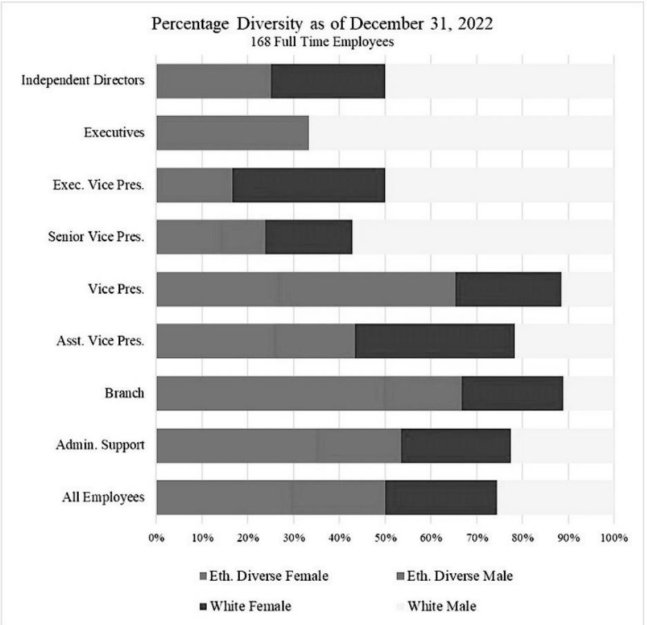

{0}------------------------------------------------

# 2022 Annual Report MainStreet Bancshares, Inc.

{1}------------------------------------------------

{2}------------------------------------------------

May 2023

Dear Shareholder,

At MainStreet Bank, we've always operated with three core principles: 1) focus on what we do best, which means don't try to be all things to all people; 2) lead with high-quality service, not price; and 3) conservatively anticipate and prepare for market changes.

The saying goes that when you try to be all things to all people, you end up being nothing to nobody. We are like a high-end restaurant with a limited menu. The large banks are more akin to a corporate chain restaurant, which can overwhelm you with selections – but when the menu is 32 pages long, the food has probably been frozen.

Since we are focused on what we do best, it is easy to compete with quality service over price. When you compete on price, it is a race to the bottom for loan rates and a race to the top for deposit rates. Every successful person I know is willing to pay a little more for consistent quality service.

Anticipating and preparing for opportunities in our niche market is its own exciting challenge. When rates started coming down again in 2019, reaching historic lows in 2020, we knew that rates could either stay the same or go up, but they couldn't really go lower. We focused on shifting our balance sheet to favor a rising rate environment. The rest, as they say, is history. The Federal Reserve raised interest rates 4.25 percent during 2022. I'm happy to report that the balance sheet shifts we made leading up to 2022 positioned us for what became our best year ever!

We have another project with a longer lead-time that has yet to make its mark. Back in 2018, we started thinking about the effect new technologies have on changing how people manage their money. We also thought a lot about how community banks will retain their share of deposits with all the new choices coming on-line to help consumers manage their money.

Without losing sight of what we do best, we focused on our Banking as a Service (BaaS) experience to design a state-of-the-art embedded banking solution for our technology-savvy community. Our product – Avenuä – is nearly ready for launch. Our goal for Avenuä is to generate low-cost deposits and fee income. We are full of optimism for this solution and once it is fully launched, we look forward to sharing the results of our hard work and efforts.

This is an exciting time to be in community banking – even more so as we continue to develop ourselves in the financial technology space. This year we added one more core principle to the mix – stay relevant.

Thank you for your ongoing support. We are doing our best to create value and opportunity in our Company.

Sincerely,

Jeff W. Dick Chairman & CEO

{3}------------------------------------------------

{4}------------------------------------------------

#### **UNITED STATES SECURITIES AND EXCHANGE COMMISSION Washington, D.C. 20549**

## **FORM 10-K**

#### **(Mark One)** ☒ **ANNUAL REPORT PURSUANT TO SECTION 13 OR 15(d) OF THE SECURITIES EXCHANGE ACT OF 1934**

**For the fiscal year ended December 31, 2022**

**OR**

#### ☐ **TRANSITION REPORT PURSUANT TO SECTION 13 OR 15(d) OF THE SECURITIES EXCHANGE ACT OF 1934 FOR THE TRANSITION PERIOD FROM TO**

**Commission File Number 001-38817**

# **MainStreet Bancshares, Inc.**

**(Exact name of Registrant as specified in its Charter)**

| Virginia                                 | 81-2871064          |
|------------------------------------------|---------------------|
| (State or other jurisdiction of          | (I.R.S. Employer    |
| incorporation or organization)           | Identification No.) |
| 10089 Fairfax Boulevard                  |                     |
| Fairfax, VA                              | 22030               |
| (Address of principal executive offices) | (Zip Code)          |

#### **Registrant**'**s telephone number, including area code: (703) 481-4567**

Securities registered pursuant to Section 12(b) of the Act:

| Title of each class                                                                                                                            | Trading Symbol(s) | Name of each exchange on which registered |
|------------------------------------------------------------------------------------------------------------------------------------------------|----------------------|-------------------------------------------|
| Common Stock                                                                                                                                   | MNSB                 | The Nasdaq Stock Market LLC               |
| Depositary Shares (each representing a 1/40th interest in a share of 7.50% Series A Fixed-Rate Non Cumulative Perpetual Preferred Stock) | MNSBP                | The Nasdaq Stock Market LLC               |

Securities registered pursuant to Section 12(g) of the Act: **None**

Indicate by check mark if the Registrant is a well-known seasoned issuer, as defined in Rule 405 of the Securities Act. yes ☐ no ☒

Indicate by check mark if the Registrant is not required to file reports pursuant to Section 13 or 15(d) of the Act. yes ☐ no ☒

Indicate by check mark whether the Registrant: (1) has filed all reports required to be filed by Section 13 or 15(d) of the Securities Exchange Act of 1934 during the preceding 12 months (or for such shorter period that the Registrant was required to file such reports), and (2) has been subject to such filing requirements for the past 90 days. yes ☒ no ☐

Indicate by check mark whether the Registrant has submitted electronically every Interactive Data File required to be submitted pursuant to Rule 405 of Regulation S-T (§232.405 of this chapter) during the preceding 12 months (or for such shorter period that the Registrant was required to submit such files). yes ☒ no ☐

{5}------------------------------------------------

Indicate by check mark whether the registrant is a large, accelerated filer, an accelerated filer, a non-accelerated filer, smaller reporting company, or an emerging growth company. See the definitions of "large, accelerated filer," "accelerated filer," "smaller reporting company," and "emerging growth company" in Rule 12b-2 of the Exchange Act.

| Large accelerated filer    | ☐ | Accelerated filer           | ☐ |
|----------------------------|---|-----------------------------|---|
| Non-accelerated filer      | ☒ | Smaller reporting company ☒ |   |
| Emerging growth company | ☒ |                             |   |

If an emerging growth company, indicate by check mark if the registrant has elected not to use the extended transition period for complying with any new or revised financial accounting standards provided pursuant to Section 13(a) of the Exchange Act. ☒

Indicate by check mark whether the registrant has filed a report on and attestation to its management's assessment of the effectiveness of its internal control over financial reporting under Section 404(b) of the Sarbanes-Oxley Act (15 U.S.C. 7262(b)) by the registered public accounting firm that prepared or issued its audit report. ☐

If securities are registered pursuant to Section 12(b) of the Act, indicate by check mark whether the financial statements of the registrant included in the filing reflect the correction of an error to previously issued financial statements. ☐

Indicate by check mark whether any of those error corrections are restatements that required a recovery analysis of incentive-based compensation received by any of the registrant's executive officers during the relevant recovery period pursuant to section 240.10D-1(b). ☐

Indicate by check mark whether the Registrant is a shell company (as defined in Rule 12b-2 of the Exchange Act). yes ☐ no ☒

As of June 30, 2022, the last business day of the Registrant's most recently completed second fiscal quarter, the aggregate market value of the shares of common equity held by non-affiliates of the Registrant, based on the closing price of the shares of common stock on The NASDAQ Stock Market, was \$171,377,563. The number of shares of Registrant's Common Stock outstanding as of March 16, 2023, was 7,521,364.

#### DOCUMENTS INCORPORATED BY REFERENCE:

The information required by Part III of this Annual Report on Form 10-K will be found in the Company's definitive proxy statement for its 2022 Annual Meeting of Shareholders, to be filed pursuant to Regulation 14A under the Securities Exchange Act of 1934, and such information is incorporated herein by this reference.

Auditor Firm ID: 613 Auditor Name: Yount, Hyde & Barbour, P.C.

Auditor Location: Winchester, Virginia, USA

{6}------------------------------------------------

# **PART I**

**Item 1. Business**

# As used herein, the "Company," "we," "our," and "us" refer to MainStreet Bancshares, Inc., and the "Bank" refers to MainStreet Bank.

**Overview** MainStreet Bancshares, Inc. is a bank holding company that owns 100% of MainStreet Bank and MainStreet Community Capital, LLC. On October 12, 2021, the Company filed an election to be a financial holding company with the Board of Governors of the Federal Reserve System (the "Federal Reserve"). The Company elected financial holding company status in order to engage in a broader range of financial activities than are permitted for bank holding companies generally. We emphasize providing responsive and personalized services to our clients. Due to the consolidation of financial institutions in our primary market area, we believe there is a significant opportunity for a local bank to provide a full range of financial services. By offering highly professional, personalized banking products and service delivery methods and employing advanced banking technologies, we seek to distinguish ourselves from larger, regional banks operating in our market area and are able to compete effectively with other community banks.

**MainStreet Bancshares, Inc.** MainStreet Bancshares Inc. is a bank holding company incorporated under the laws of the Commonwealth of Virginia whose principal activity is the ownership and management of MainStreet Bank and MainStreet Community Capital. The Company is authorized to issue 10,000,000 shares of common stock, par value \$4.00 per share. Additionally, the Company is authorized to issue 2,000,000 shares of preferred stock, par value \$1.00 per share. There were 7,442,743, shares of common stock outstanding and 28,750 shares of 7.50% Series A Fixed-Rate Non-Cumulative Perpetual Preferred Stock outstanding at December 31, 2022. At that date, there were also outstanding 1,150,000 depositary shares, each representing a 1/40th interest in a share of the Company's Series A Preferred Stock, with a liquidation preference of \$1,000 per share (equivalent to \$25 per depositary share).

The Company is a registered bank holding company which is governed under the Bank Holding Company Act of 1956, as amended (the "Bank Holding Act"), that has elected to be a financial holding company. As such, is subject to inspection, examination, and supervision by the Federal Reserve.

The Company's execu[tive offices are located](https://www.mstreetbank.com/) at 10089 Fairfax Boulevard, Fairfax, Virginia. Our telephone number is (703) 481-4567, and our internet address is www.mstreetbank.com. The information contained on our website shall not be considered part of this Form 10-K, and the reference to our website does not constitute incorporation by reference of the information contained on the website.

#### **MainStreet Bank**

MainStreet Bank is a community commercial bank incorporated in and chartered by the Commonwealth of Virginia. The Bank is a member of the Federal Reserve Bank of Richmond, and its deposits are insured by the FDIC. The Bank opened for business on May 26, 2004, and is headquartered in Fairfax, Virginia. We currently operate six Bank branches located in Herndon, Fairfax, McLean, Clarendon, and Leesburg, Virginia, and one in Washington D.C.

The Bank is a community bank focused on serving the borrowing, cash management and depository needs of retail customers, small to medium-sized businesses, and professionals. We believe we have a solid franchise that meets the financial needs of our clients and communities by providing an array of personalized products and services delivered by seasoned banking professionals with decisions made at the local level. We believe a significant customer base in our market prefers to do business with a local institution that has a local management team, a local Board of Directors, and local founders and that this customer base may not be satisfied with the responsiveness of larger regional banks. By providing quality services, coupled with the opportunities provided by the economies in our market area, we have generated and expect to continue to generate organic growth.

We service Northern Virginia as well as the greater Washington, D.C. metropolitan area. Our goal is to deliver a customized and targeted mix of products and services that meets or exceeds customer expectations. To accomplish this goal, we have deployed a premium operating system that gives customers access to up-to-date banking technology. These systems and our skilled staff have allowed us to compete aggressively with larger financial institutions. We believe the combination of sophisticated technology and personal service sets us apart from our competition. We strive to be the leading community bank in our market.

We offer a full range of banking services to individuals, small to medium-sized businesses and professional service organizations through both traditional and electronic delivery. We were the first community bank in the Washington, D.C. metropolitan area to offer a full online business banking solution, including remote check scanners on a business customer's desktop. We offer mobile banking apps for iPhones, iPads and Android devices that provide for remote deposit of checks. In addition, we were the first bank headquartered in the Commonwealth of Virginia to offer CDARS, the Certificate of Deposit Account Registry Service, an innovative deposit insurance solution that provides Federal Deposit Insurance Corporation ("FDIC") insurance on deposits up to \$50 million. We believe that enhanced electronic delivery systems and technology increase profitability through greater productivity and cost control and allow us to offer new and better products and services.

{7}------------------------------------------------

Our products and services include business and consumer checking, premium interest-bearing checking, business account analysis, savings, certificates of deposit and other depository services, as well as a broad array of commercial, real estate and consumer loans. Internet account access is available for all personal and business accounts, internet bill payment services are available on most accounts, and a robust online cash management system is available for business customers.

#### **Avenu**Ô , **a division of MainStreet Bank**

On October 25, 2021, MainStreet Bancshares, Inc. formally introduced Avenu™, a division of MainStreet Bank. Avenu™ will provide an embedded banking solution that connects our partners (fintechs, application developers, money movers, and entrepreneurs) directly and seamlessly to our Software as a Service (SaaS) solution. Our transformational subledger combined with our high-touch compliance training goes beyond the industry standards to ensure that our Fintech partners will prosper. This division of MainStreet Bank currently serves money service businesses, payment processers, and Banking-as-a-Service customers and provides the Bank with valuable low-cost deposits and additional streams of fee income. Our SaaS software program will be deployed in 2023.

#### **MainStreet Community Capital, LLC**

In September 2021, the Company created a community development entity ("CDE") subsidiary, MainStreet Community Capital, LLC, a Virginia limited liability company, to apply for New Market Tax Credit ("NMTC") allocations from the U.S. Department of Treasury's Community Development Financial Institutions Fund. To promote development in economically distressed areas, the NMTC program was established under the Community Renewal Tax Relief Act of 2000 to provide tax incentives for capital investment in disadvantaged market areas that have not experienced economic expansion. The program establishes a tax credit for investment in a CDE and ongoing compliance with the program is accomplished through a governing board and an advisory board which maintains accountability to residents and businesses in the aforementioned disadvantaged areas. This CDE will be an intermediary vehicle for the provision of loans and investments in Low-Income Communities ("LICs"). In January 2022, the Community Development Financial Institutions Fund ("CDFI") of the United States Department of the Treasury certified MainStreet Community Capital, LLC as a registered CDE. In January 2023, MainStreet Community Capital submitted an application to apply for the 2022 NMTC program allocation. Allocation awards are expected to be announced during the fourth quarter of 2023.

#### **Emerging Growth Company Status**

We qualify as an "emerging growth company" under the JOBS Act and as defined in Section 2(a) of the Securities Act of 1933. For as long as we are an emerging growth company, we may choose to take advantage of exemptions from various reporting requirements applicable to other public companies but not to emerging growth companies. See "Risk Factors—We are an emerging growth company, and any decision on our part to comply only with certain reduced reporting and disclosure requirements applicable to emerging growth companies could make our common stock less attractive to investors."

As an emerging growth company:

- we may present as few as two years of audited financial statements and two years of related management discussion and analysis of financial condition and results of operations, in contrast to other reporting companies which must provide audited financial statements for three fiscal years,
- we are exempt from the requirement to obtain an attestation and report from our auditors on management's assessment of our internal control over financial reporting under the Sarbanes-Oxley Act of 2002,
- we are permitted to provide less extensive disclosure about our executive compensation arrangements, including recently adopted pay versus performance disclosures, and
- we are permitted to include less extensive narrative disclosures than required of other reporting companies, particularly with respect to executive compensation.

In this Form 10-K we have elected to take advantage of the reduced disclosure requirements relating to executive compensation, and in the future, we may take advantage of any or all of these exemptions for so long as we remain an emerging growth company. We will remain an emerging growth company until the earliest of (i) the end of the first fiscal year during which we have total annual gross revenues of \$1.07 billion or more, (ii) the end of the fiscal year following the fifth anniversary of the completion of our initial registered public offering of common equity securities, which will be in December 31, 2024, (iii) the date on which we have, during the previous three-year period, issued more than \$1.0 billion in non-convertible debt and (iv) the date on which we are deemed to be a "large accelerated filer" as defined in Rule 12b-2 under the Securities Exchange Act of 1934 (the "Exchange Act").

In addition to the relief described above, the JOBS Act permits us an extended transition period for complying with new or revised accounting standards affecting public companies. We have elected not to take advantage of this extended transition period, which means that the financial statements included in this Form 10-K, as well as any financial statements that we file in the future, will be subject to all new or revised accounting standards generally applicable to public companies.

{8}------------------------------------------------

#### **Nasdaq Listing**

We were approved to list shares of our common stock on the Nasdaq Capital Market under our current symbol "MNSB" as of April 22, 2019. We were approved to list our depositary shares on the Nasdaq Capital Market under the symbol "MNSBP" as of September 16, 2020. Each depository share represents a 1/40th interest in a share of our 7.50% Series A Fixed-Rate Non-Cumulative Perpetual Preferred stock.

#### **Our Business**

As of December 31, 2022, MainStreet Bancshares, Inc. had total consolidated assets of \$1.9 billion, total net loans of \$1.6 billion, total deposits of \$1.5 billion and total stockholders' equity of \$198.3 million, and total equity to total assets was 10.30%. For the years ended December 31, 2022 and 2021, our return on average assets was 1.53% and 1.32%, respectively, and our return on average equity was 13.98% and 12.38%, respectively.

We are focused on growing business relationships and building core deposits, profitable loans and non-interest income. We believe that we have a solid franchise that meets the financial needs of our clients and communities by providing an array of personalized products and services delivered by seasoned banking professionals with decisions made at the local level. We strive to be the leading community bank in our markets.

We believe that our core lending and deposit business segments continue to perform well. For each of the fiscal years ended December 31, 2022 and December 31, 2021, our net charge-offs to average loans was 0.00%. As of December 31, 2022, we had only \$21,000 in non-performing loans and non-performing assets to total assets was 0.00%.

Management believes that the Company is well positioned to build on its core performance to continue to grow profitably. Although we have successfully attracted new associates, providing depth and talent in key positions, additional employees and infrastructure are expected to be needed to manage the increasing customer relationships that would come with sustained growth.

We are a community-oriented financial institution. Our Bank offers a wide range of commercial and consumer loan and deposit products, as well as mortgage services to individuals, and small and medium sized businesses in our market. We seek to be the provider of choice for financial solutions to customers who value exceptional personalized service, local decision making, and modern banking technology. Our business involves attracting deposits from local businesses and individual customers and using these deposits to originate commercial, mortgage, and consumer loans in our market area. We also invest in securities consisting primarily of obligations of U.S. government sponsored entities, municipal obligations, mortgage-backed securities issued by Fannie Mae, Freddie Mac and Ginnie Mae, and the subordinated debt of other financial institutions. We also invest in NMTC funds that furthers our mission to provide opportunities to areas in need. The Company is the owner and beneficiary of bank owned life insurance (BOLI) policies on certain current and former Bank employees. These policies generate income and can be liquidated, if necessary, with associated tax costs.

The Federal Reserve and the Virginia State Corporation Commission, through its Bureau of Financial Institutions (the "Bureau"), regulate and monitor operations of the Company and the Bank. We are required to file with the FDIC quarterly financial condition and performance reports. The Federal Reserve and the Bureau conduct periodic onsite and offsite examinations. We must comply with a wide variety of reporting requirements and banking regulations. The laws and regulations governing us generally have been promulgated to protect depositors and the federal deposit insurance funds and not to protect shareholders. Additionally, we must bear the cost of compliance with the reporting and regulations; these costs can be significant and may have an effect on our financial performance.

*Our Market Area.* We consider our primary market area to be the northern Virginia counties of Arlington, Fairfax, Loudoun, and Prince William, and the cities of Fairfax, Alexandria, Falls Church, Manassas, and Manassas Park, as well as Washington DC and the greater Washington, DC metropolitan area. Our headquarters is located approximately 15 miles west of Washington, D.C., in Fairfax County, Virginia.

According to the U.S. Census Bureau, the Washington, D.C. Metropolitan Statistical area (MSAs) includes three of the wealthiest counties in the United States, as well as six of the top 20 wealthiest counties. Median household income growth projections range from 9% to over 14% through 2028. Overall, the Washington D.C. MSA ranks sixth out of the largest 25 MSAs ranked by population estimates as of 2021 according to the Census Bureau. We expect our strategies to benefit from the continued growth in population and high income of our market area's residents.

{9}------------------------------------------------

| Area                     | Total Population as of 2022 (Actual) | Population Change 2010-2023 | Projected Population Change 2023-2028 | Median Household Income 2022 | Median Household Income Projected Change 2023-2028 | Unemployment Rate as of November 2022 | Unemployment Rate as of November 2021 |
|--------------------------|-----------------------------------------------|-----------------------------------|------------------------------------------------|---------------------------------------|-------------------------------------------------------------------|------------------------------------------------|------------------------------------------------|
| District of Columbia     | 679,031                                       | 12.85%                            | 1.55%                                          | \$104,110                             | 14.15%                                                            | 4.5%                                           | 5.7%                                           |
| Arlington County         | 236,413                                       | 13.85%                            | -0.01%                                         | 131,529                               | 9.63%                                                             | 2.1%                                           | 2.6%                                           |
| Fairfax County           | 1,146,153                                     | 5.93%                             | 0.79%                                          | 142,162                               | 13.55%                                                            | 2.5%                                           | 2.4%                                           |
| Loudoun County           | 439,045                                       | 40.54%                            | 6.73%                                          | 166,963                               | 12.40%                                                            | 2.5%                                           | 2.2%                                           |
| Prince William County | 492,962                                       | 22.71%                            | 4.23%                                          | 121,416                               | 13.67%                                                            | 2.8%                                           | 2.8%                                           |
| United States            | 334,500,069                                   | 8.34%                             | 2.14%                                          | 73,503                                | 13.37%                                                            | 3.3%                                           | 3.9%                                           |
|                          |                                               |                                   |                                                |                                       |                                                                   |                                                |                                                |

Source: U.S. Bureau of Labor Statistics, S&P Global Market Intelligence

The Washington, D.C. MSA is a desirable market for a broad range of companies in a variety of industries, including sixteen companies from the 2022 Fortune 500 list, and six of the United States' largest 100 private companies, according to the 2022 Forbes list of largest private companies by revenue. According to the U.S Bureau of Labor Statistics, the Washington, D.C. MSA has a large and diversified economy. The following table provides an in-depth view of the distribution of employment within the Washington, D.C. MSA.

| Washington, D.C. MSA Employment by Sector | Employment Sector by Percent |  |  |
|-------------------------------------------|------------------------------------|--|--|
| Mining, Lodging, and Construction         | 5.0%                               |  |  |
| Manufacturing                             | 1.7%                               |  |  |
| Trade, Transportation, and Utilities      | 12.2%                              |  |  |
| Information                               | 2.4%                               |  |  |
| Financial Activities                      | 4.4%                               |  |  |
| Professional and Business Services        | 24.2%                              |  |  |
| Education and Health Services             | 13.2%                              |  |  |
| Leisure and Hospitality                   | 9.3%                               |  |  |
| Other Services                            | 6.0%                               |  |  |
| Government                                | 21.6%                              |  |  |

Source: U.S. Bureau of Labor Statistics, Data as of November 2022 Note: Data is not seasonally adjusted

As the home of the federal government, the broader Washington, D.C. region benefits from consistent population growth and remains well positioned to capitalize on any increase in government spending and infrastructure. Further, as banks in our market have experienced continued consolidation over the last few years, our opportunities to attract talented employees and capitalize on customer dislocation have improved. With its strong demographic characteristics, scale and robust economic activity we believe that the Washington, D.C. metropolitan area represents a strong geographic market for us to realize our continued growth strategies within our core business model.

The Company is active in community development activities that include support for affordable housing for low- or moderate-income (LMI) individuals, including multifamily rental housing, promoting economic development by financing small businesses or farms, revitalizing or stabilizing LMI geographies or designated disaster areas, and targeting support for community services to LMI individuals. The Company also makes qualified investments that target these initiatives within our geographic footprint. In addition, many of our employees and directors are involved in community activities as well as volunteer their time and expertise to local causes.

*Competitive Strengths.* We continually review our product and service offerings and based on these reviews may selectively add additional products and services to provide further diversification of our revenue sources and to capture our customers' full banking relationships. We believe that the following business strengths have been instrumental to the success of our core operations and will enable us to continue profitable growth and to maximize value to our shareholders, while remaining fundamentally sound.

Community Banking Philosophy. We provide our clients with local decision making and individualized service coupled with products and services offered by our larger institutional competitors. As our business lenders, officers, and Bank directors are based in or reside in the communities we serve, we are able to maintain a high-level of involvement in local organizations and establish a strong

{10}------------------------------------------------

understanding of the banking needs of the respective communities. We believe that our customer-centric business philosophy and sales approach enables us to build long-term relationships with desirable customers, which enhances the quality and stability of our funding and lending operations. Our mission and philosophy have positioned us well in the communities across our market area and have enabled us to attract and maintain a very talented and experienced management team.

Disciplined Credit Culture. We achieve our strong credit quality by adherence to sound underwriting and credit administration standards and by maintaining long-term customer relationships. All credit decisions between \$250,000 and \$750,000 require concurrence of a senior lender and the Bank's Chief Credit Officer. Approvals of credits in excess of \$750,000 require full consensus of the Officer's Loan Committee or the Chief Credit Officer and Chief Lending Officer. We maintain an independent loan review team, and senior management is actively involved with any credits requiring special attention.

Capital Position. The Bank exceeds the regulatory guidelines to be classified as "well capitalized." Our capital position is strong and has consistently grown. At December 31, 2022, the Bank had a tier 1 leverage capital ratio of 15.05%, a common equity tier 1 riskbased capital ratio of 15.47%, a tier 1 risk-based capital ratio of 15.47%, and a total risk-based capital ratio of 16.27%. We believe that our capital position enhances our ability to grow organically because it enables the Bank to continue lending and to remain focused on our customers' needs. For additional information, see Note 16 of Notes to Consolidated Financial Statements.

Technology. We have invested in the technology necessary to meet the developing demands of our commercial and retail customers. We utilize a strong core operating system that enables us to efficiently offer high-end deposit and loan products and have partnered with industry-leading internet banking, cash management, mobile banking, and application-based banking solutions to offer a complete banking experience to all customers, regardless of their preference. We participate in an international and nationwide automated teller machine network in order to offer our customers ATM transactions at over 55,000 locations in the United States, Canada, United Kingdom and Mexico.

Growth Opportunities*.* We believe that we can attract new customers and expand our total loans and deposits within our existing market areas through organic growth, online and mobile banking, strategic branching and possible acquisition opportunities. We expect our market will continue to create opportunities to attract new clients and, in some cases, may become the catalyst for mergers and acquisitions. We expect to grow our loan portfolio, open new branches and consider acquisitions only after rigorous due diligence and substantial quantitative analysis regarding the financial and capital impacts of any such transactions. We believe that maintaining our financial discipline will generate long-term shareholder value.

*Lending Activities.* The Bank's primary market focus is on making loans to small businesses, professionals and other consumers in its local market area, along with various aspects of real estate finance. Owner-occupied and investment commercial real estate loans represent the largest segments of the Bank's loan portfolio. The Bank's primary lending activities are principally directed to its defined market area in Northern Virginia, as well as the greater Washington, D.C. metropolitan area.

We offer a diversified loan portfolio consisting primarily of commercial business and owner-occupied and investment commercial real estate loans with higher risk-adjusted returns, shorter maturities and more sensitivity to interest rate fluctuations, while still providing high quality loan products for single-family and multi-family residential borrowers.

Stress Testing. We stress test our loan portfolio on a quarterly basis and measure the results against our capital profile. We multiply the total outstanding amount for each loan category by the highest quarter historical loss for that category in order to determine the stressed loss for commercial business loans, residential real estate lending, owner-occupied commercial real estate lending and consumer instalment lending. We stress test our investor-owned commercial real estate using three separate methodologies. If a property fails more than one of the three tests, we extend the highest exposure amount and add on 10% for selling costs.

- An immediate and sustained increase in interest rates, which would increase interest expense for the borrower;
- An immediate and sustained increase in vacancy, which would decrease rental income; and
- An immediate and sustained change in the capitalization rate, or "cap rate," which would decrease properties' collateral values.

We stress test the construction lending portfolio by applying exponential discounting (k factor) to each project based upon its percentage of completion. The project is stressed using the as-is and as-complete appraised values and assumes 10% selling costs.

The total estimated losses from the loan stress tests are subtracted from the capital account and the regulatory ratios are recalculated. As of December 31, 2022, the post-stress capital ratios were all in excess of regulatory requirements.

Commercial Business Lending*.* Commercial loans are written for a variety of business purposes, including government contract receivables, plant and equipment, general working capital, contract administration and acquisition lending. Our client base is diverse, and we do not have a concentration of commercial business loans in any specific industry segment.

{11}------------------------------------------------

Commercial Real Estate Lending. We finance owner-occupied and investment commercial real estate. Our underwriting policies and processes focus on the client's ability to repay the loan as well as assessment of the underlying real estate. Risks inherent in managing a commercial real estate portfolio relate to sudden or gradual drops in property values as well as changes in the economic climate. We attempt to mitigate those risks by carefully underwriting loans of this type and by following appropriate loan-to-value standards. Commercial real estate loans represent the largest segment of the Bank's loan portfolio. At December 31, 2022, approximately 14.3% of our loan portfolio related to owner occupied commercial real estate loans, and approximately 29.5% of our loan portfolio related to investment commercial real estate.

Real Estate Construction Lending. This segment of our portfolio is predominately residential in nature and is composed of loans with short durations. We offer real estate construction financing to customers that have in place a permanent loan "take-out," either by the Bank or another institution. Our approach to this type of lending reduces our credit risk, yet offers a competitive product in the marketplace. We also offer construction financing to many local home builders. These loans are also short duration and carefully underwritten with an increased focus on the builder's reputation and ability to deliver high quality homes on time and within budget.

We also stress test the construction lending portfolio based upon the percentage completion method by stressing the as-is and ascompleted appraised values. For further details, see stress test methodology under lending activities.

Residential Real Estate Lending. The Bank offers a variety of consumer-oriented residential real estate loans both for purchase and refinancing, most of which are brokered to the secondary market.

Consumer Installment Lending. We offer a broad array of consumer loans including term loans and overdraft protection.

Credit Policies and Administration. The Bank has adopted a comprehensive lending policy, which includes a well-defined risk tolerance and stringent underwriting standards for all types of loans. Management believes that it employs experienced lending officers, secures appropriate collateral, and carefully monitors the financial conditions of its borrowers.

In addition to normal repayment risks, all loans in the Bank's portfolio are subject to the state of the economy and the related effects on the borrower and/or the real estate market. Generally, longer-term loans have periodic interest rate adjustments and/or call provisions. Senior management monitors the loan portfolio closely minimize past due loans and swiftly address potential problem loans. In addition to the internal business processes employed in the credit administration area, the Bank engages an outside or independent credit review firm to review the loan portfolio annually. Results of the credit review are used to validate our internal loan ratings and to review independent commentary on specific loans and loan administration activities.

Lending Limit*.* As of December 31, 2022, our legal lending limit for loans to one borrower was approximately \$43.0 million. The Bank "in-house" lending limit is 50% of the legal lending limit for all relationships unless the loan is owner occupied, 1 - 4 family/residential or a government contract line of credit. If owner occupied, 1 - 4 family or a government contractor, the "in-house" lending limit is 90% of the legal lending limit for "Good" rated credits; 85% for "Standard" rated credits and 75% for "Acceptable" rated credits. Our loan policy prescribes a sub-limit to certain borrowers based upon our determination of each borrower's credit quality. We routinely participate loan amounts in excess of our policy limits to other financial institutions.

For additional information, see Note 1 and Note 5 of Notes to Consolidated Financial Statements.

*Investments and Funding.* The Bank balances its liquidity needs based on loan and deposit growth through the investment portfolio and purchased funds. It is the Bank's goal to provide adequate liquidity to support the loan growth of the Bank. In the event the Bank has excess liquidity, investment securities are used to generate additional income. In the event deposit growth does not fully support the Bank's loan growth, the Bank will utilize deposit listing services, borrowed funds, or incorporate a combination of sales of investment securities, federal funds and other purchased/borrowed funds in order to augment the Bank's funding position.

The current investment policy authorizes the Bank to invest in debt securities issued by the United States Government, agencies of the United States Government, or United States Government-sponsored enterprises. The policy permits investments in mortgage-backed securities, including pass-through securities, issued and guaranteed by Fannie Mae, Freddie Mac and Ginnie Mae. The investment policy also permits investments in federal funds and deposits in other insured institutions. In addition, management is authorized to invest in investment grade state and municipal obligations, private mortgage-backed securities, the subordinated debt of other financial institutions and equity investments in funds designed to help LMI geographies. The Bank does not engage in any hedging or trading activities in its investment portfolio. The Company is also the owner and beneficiary of bank owned life insurance (BOLI) policies on certain current and former Bank employees. These policies generate income and can be liquidated, if necessary, with associated tax costs.

Generally accepted accounting principles require that, at the time of purchase, the Bank designate a security as "held-to-maturity," "available-for-sale," or "trading," depending on our ability and intent to hold such security. Debt securities available for sale are reported at fair value, while debt securities held to maturity are reported at amortized cost. The Bank does not maintain a trading portfolio. Establishing a trading portfolio would require specific authorization by the Board of Directors.

{12}------------------------------------------------

The investment portfolio is actively managed and consists of investments classified as available-for-sale and held-to-maturity. Under the available-for sale classification, investment instruments may be sold as deemed appropriate by management. On a monthly basis, the investment portfolio is marked to market as required by ASC 320. Additionally, the investment portfolio is used to balance the Bank's asset and liability position. The Bank invests in fixed rate or floating rate instruments as necessary to reduce interest rate risk exposure.

At December 31, 2022, the held-to-maturity portfolio, which is primarily composed of municipal securities and is carried at amortized cost, totaled \$17.6 million. At that date, the available-for-sale portfolio, which is composed of U.S. Treasury securities, collateralized mortgage-backed securities, subordinated debt of other financial institutions and U.S. Government agency securities and is carried at fair value, totaled \$62.6 million. For additional information, see Note 3 of Notes to Consolidated Financial Statements.

*Subordinated Notes*. On December 30, 2016, the Company completed the issuance and sale of \$14.3 million in aggregate principal amount of fixed-to-floating rate subordinated notes in a private placement transaction to various accredited investors. During the first quarter of 2017, an additional \$700 thousand of subordinated notes was issued for a total issuance of \$15.0 million. The net proceeds of the offering supported growth and were used for other general business purposes. The notes had a maturity date of December 31, 2026, and had an annual fixed interest rate of 6.25% until December 31, 2021, with an opportunity to call the debt at December 31, 2021.

The Company, taking advantage of the attractive rates in the debt market in 2021, effectively "refinanced" this debt by completing an issuance and sale of \$30 million in fixed-to-floating subordinated notes in April 2021 with a similar structure as the previous issuance at an annual fixed interest rate of 3.75% until April 15, 2026. The net proceeds were used to fully call the subordinated notes issued in 2016 and to support additional growth for other general business purposes. After April 15, 2026, the notes will have a floating interest rate based on three-month SOFR rate plus 302 basis points (3.02%) (computed on the basis of a 360-day year of twelve 30-day months) from and including April 15, 2026, to the maturity date or any early redemption date. Interest will be paid semi-annually, in arrears, on July 1 and January 1 of each year during the time that the notes remain outstanding through the fixed interest rate period or earlier redemption date. Interest will be paid quarterly, in arrears, on April 15, July 15, October 15 and January 15 throughout the floating interest rate period or earlier redemption date.

On March 1, 2022, the Company completed the issuance of \$43.8 million in aggregate principal amount of fixed-to-floating rate subordinated notes in a private placement transaction to various accredited investors. The net proceeds of the offering have been and will be used to support growth and for other general business purposes. The notes have a maturity date of March 15, 2032, and have an annual fixed interest rate of 4.00% until March 15, 2027. Thereafter, the notes will have a floating interest rate based on three-month SOFR rate plus 233 basis points (2.33%) (computed on the basis of a 360-day year of twelve 30-day months) from and including March 15, 2027, to the maturity date or any early redemption date. Interest will be paid semi-annually, in arrears, on March 15 and September 15 of each year during the time that the notes remain outstanding through the fixed interest rate period or earlier redemption date. Interest will be paid quarterly, in arrears, on March 15, June 15, September 15 and December 15 throughout the floating interest rate period or earlier redemption date.

*Deposit Activities***.** Deposits are the major source of funding for the Bank. The Bank offers a broad array of deposit products that include demand, NOW, money market and savings accounts as well as certificates of deposit. The Bank typically pays a competitive rate on the interest-bearing deposits. As a relationship-oriented organization, we seek generally to obtain deposit relationships with our loan clients.

We offer a full range of consumer and commercial deposit products, including on-line banking with bill pay, cash management, sweep accounts, wire transfer, check imaging, remote deposit capture and courier services.

As the Bank's overall balance sheet positions dictate, we may become more or less competitive in our interest rate structure as our liquidity position changes. Additionally, we may use wholesale deposits through sources such as deposit listing services, school systems, government entities and other sources to augment our funding position.

We can also arrange for FDIC insurance for deposits up to \$50 million through CDARS, the Certificate of Deposit Account Registry Service, which provides a convenient method for a depositor to enjoy full FDIC insurance on deposits up to \$50 million through a single banking relationship.

For additional information on deposits, see Note 9 of Notes to Consolidated Financial Statements.

*Banking-as-a-Service (BaaS).* Beginning in 2016, the Board and management identified an opportunity for alternative sources of lowcost deposits and fee income. We determined that Financial Technology ("FinTech") companies were making significant inroads into banking, and we expanded our strategic plan to include banking customers that require BaaS and other payment service solutions.

Consistent with our culture, we worked over the past six years with a small group of clients in order to understand the risks associated with this business line. We developed an infrastructure to identify, measure, monitor and control the risks associated with FinTechs, providing BaaS, and payment systems in general. We designed and implemented comprehensive legal, strategic, procedural and policy documents to guide business opportunities.

{13}------------------------------------------------

We are designing Avenu™ to be a comprehensive solution that provides FinTechs with an array of embedded banking services they may offer to their customers in a scalable cloud-based platform. We guide our FinTech partners through the complex maze of banking regulations by integrating compliance and fraud detection throughout the framework of our solution as well as in-person training for FinTech partners team members. We have developed a live sandbox for our FinTech partners to provide a proof of concept and allow for quick integration and time to market when they are ready to "go-live."

Our transformational subledger combined with our high-touch compliance training goes beyond the industry standards to ensure that our FinTech partners will operate successfully. We believe partnering with FinTechs will provide an opportunity to access to untapped markets and will become a fresh source for growth in low-cost deposits and fee income.

We will continue to support the FinTech industry. Consumers in the United States express more confidence banking with FinTechs than traditional banks in many cases. As a business-focused community bank, we see FinTechs as a natural way for us to expand our footprint into consumer banking opportunities.

*Competition.* We face significant competition for the origination of loans and the attraction of deposits. Our competition for loans comes primarily from financial institutions in our market area and, to a lesser extent, from other financial service providers, such as mortgage companies and mortgage brokers. Competition for loans also comes from the increasing number of non-depository financial service companies entering the mortgage market, such as insurance companies, securities companies, and specialty finance companies. Our most direct competition for deposits has historically come from other financial institutions operating in our market area. We also face competition for investors' funds from money market funds, mutual funds and other corporate and government securities.

#### **Board Leadership and Oversight**

The Board of Directors combines the position of Chairman of the Board with the position of Chief Executive Officer, coupled with a Lead Independent Director position to further strengthen the Company's corporate governance structure. Terry Saeger serves as Vice Chairman of the Board and Lead Independent Director. The Board of Directors believes this provides an efficient and effective leadership model for the Company.

- § Combining the Chairman of the Board and Chief Executive Officer positions promotes clear accountability, effective decisionmaking, and alignment on corporate strategy. Our Chief Executive Officer, who is a co‐ founder of the Bank, has always been the CEO and has served as Chairman since 2009. He has extensive knowledge of all aspects of our current business and operations and our prospects which he communicates to the Board. He is particularly focused on the development and execution of our current strategic plans and investments for future growth.
- § The Vice Chairman and Lead Independent Director provides a means for our independent Directors to meet and discuss all issues and concerns that arise on an ongoing basis. The Lead Independent Director can independently engage external resources as needed to follow-up on issues and concerns. The Lead Independent Director also acts as a liaison to the Chairman to followup and share concerns raised by the independent Directors.

The Board of Directors also believes administration of its risk oversight function is enhanced by the Board's leadership structure. To assure effective independent oversight, the Board has adopted appropriate governance practices, including:

- § The Lead Independent Director can call for executive sessions of the independent Directors as needed,
- § The independent Compensation Committee conducts performance evaluations of the Chairman of the Board and Chief Executive Officer, and works with management to evaluate risks posed by our compensation programs and limit unnecessary or excessive risks these programs may pose to the Company, and
- § The Nominating Committee is responsible for the selection and nomination of Directors and is made up exclusively of independent Directors.

#### **Risk Management**

The Board of Directors is actively involved in oversight of risks that could affect the Company. This oversight is conducted in part through the Audit and Risk Committee of the Board of Directors, but the full Board of Directors has retained responsibility for general oversight of risks. The Chief Risk Officer and Chief Compliance Officer have reporting lines to the Audit and Risk Committee and are free to contact independent Directors whenever they feel the need to do so.

The Board of Directors satisfies this responsibility through full reports by the Audit and Risk Committee regarding its considerations and actions, regular reports directly from officers responsible for oversight of risks within the Company as well as through internal and external audits. The Audit and Risk Committee conducts an annual assessment of its performance and capabilities. Risks relating to the direct operations of the Bank are further overseen by the Board of Directors of the Bank. The Board of Directors of the Bank also has additional committees that conduct risk oversight separate from the Company. Further, the Board of Directors oversees risks through the establishment of policies and procedures that are designed to guide daily operations in a manner consistent with applicable laws, regulations and risks acceptable to the organization.

{14}------------------------------------------------

Risk is inherent with every business, particularly financial institutions. We face a number of risks, including credit risk, interest rate risk, liquidity risk, operational risk, legal risk, strategic risk and reputation risk. Management is responsible for the day-to-day management of the risks the Company faces, while the Board has responsibility for the oversight of risk management. In its risk oversight role, the Board of Directors has the responsibility to satisfy itself that the risk management processes designed and implemented by management are adequate and functioning as designed. Senior management meets regularly to discuss strategy and risks facing the Company. Senior management attends the Board meetings and is available to address any questions or concerns raised by the Board on risk management and any other matters. The independent members of the Board provide independent oversight of the Company's management and affairs.

#### **Environmental, Social, and Governance**

At MainStreet Bancshares Inc., our overarching focus is to make a positive impact on the communities we serve. The Board and management are aligned regarding the growing importance of Environmental, Social and Governance (ESG) initiatives, and we believe that an emphasis on sustainability can strengthen risk management and enhance value. We are, in many ways, at the beginning of our ESG journey. As we look to the future, we recognize that ESG initiatives require a commitment to the long term, and making an impact requires a willingness to listen to, learn from, and work with stakeholders across our community. Fortunately, this approach is second nature to community banks; the challenge is to harness information. We are undertaking efforts to quantify how we make a tangible difference in the communities where we live, play and work.

#### *Environmental*

The Company has a goal of reducing its carbon emissions each year.

MainStreet Bank's origins as a "branch-lite" financial institution mean that we have been and will continue to be part of the transition to a sustainable economy that is kinder to our environment because it is less dependent on carbon fuels. Most banks the Company's size have 20+ branches. The Bank has six locations. The Company has adopted a strategy of Put Our Bank in Your Office®, which also allows customers to conduct business with us without traveling to the Bank. On average, more than 70% of daily transactions are processed by our customers without the need to come to the Bank. These changes were underway at the Bank long before COVID-19 forced behavioral patterns in our society to change. For business operators in particular, our remote banking solutions have reduced the need to make frequent visits to a branch bank to deposit cash and checks. This helps to reduce vehicular traffic in our already crowded market.

The Company has converted all lighting to LED, scheduled HVAC units for maximum efficiency during off-work hours, incorporated mini-split units for specific location heating and cooling, tinted windows to reduce cooling needs and increased the number of indoor plants to improve air quality.

The Company has also added charging stations to accommodate employees who drive electric vehicles and encourages the purchase of hybrid vehicles.

We recognize the growing environmental risks of electronic waste and have procedures in place to reduce our impact in this regard. For example, MainStreet Bank contracts with an asset disposal company to ensure that electronic assets, including monitors, security cameras, and batteries, are disposed of and recycled in an appropriate and environmentally sensitive manner.

We have long allowed and even encouraged our employees to telecommute. Approximately 15% of our employees work remotely full-time. All but our relatively lean team of branch staff are eligible to telecommute, and most do so at least a few days a month. These arrangements give us a broader and more diverse pool of applicants in recruiting, and serve to reduce our employees' carbon footprint.

In our lending portfolio, we seek opportunities to support energy efficiency and renewable energy. In the first quarter of 2023, we are closing our first Property Assessed Clean Energy (PACE) loan, which follows Department of Energy guidelines on financing energyrelated improvements on private property.

#### *Social*

The way the Company interacts with the communities in which it operates and with its employees constitute its social impact. The \$2.2 million PACE loan mentioned above exemplifies how we approach the "S" in ESG in our communities. Our funding is renovating The Festival Center, a hub for mission-driven organizations in the Adams Morgan neighborhood of Washington, D.C. The new Festival Center will provide office space to a wide range of community-focused ministries and non-denominational non-profits, which provide access to affordable housing, job training, legal aid services, health services, substance abuse support, and more. The establishment in 2022 of MainStreet Community Capital is another business initiative we have taken to support ESG initiatives in our communities. MainStreet Community Capital's focus is to invigorate distressed, low-income communities in the Washington, D.C., metropolitan area by providing capital and other financial services. These investments are intended to spur the creation of quality jobs and services in underserved areas. MainStreet Community Capital has earned its designation as a Community Development Entity (CDE) as defined under the U.S. Treasury Department's Community Development Financial Institution (CDFI) Fund. MainStreet Community Capital has applied to the CDFI Fund for an allocation of the New Markets Tax Credits that will be awarded in 2023 and plans to continue to do so annually.

{15}------------------------------------------------

Turning to our staff, as of December 31, 2022, the Company employed 168 full-time employees. None of our employees are represented by a collective bargaining agreement.

The Board and management are focused on maintaining a strong corporate culture. The Company's goal is to always hire the most qualified individuals. The Company is located in a diversely populated geography, and the Company's workforce effectively represents that diversity. We believe that a diverse workforce enhances our ability to serve our customers and our communities by enabling us to better understand their financial needs and to provide necessary and appropriate financial services.

Seventy-five percent of the Company's employees self-identify as either female or ethnically diverse (defined as all Equal Employment Opportunity Commission classifications other than white). The Company is proud to have four veterans on its team as well.

#### *Governance*

As indicated in the discussion of Board Leadership and Oversight, the Company believes effective oversight by the Board of Directors is an essential element of a financially sound and well-managed bank. The Board establishes the Company's risk philosophy, ensures that it has an appropriate risk-management framework, determines the overall business strategy, and monitors implementation of strategy.

To maintain the high caliber of our Board, the Company invests regularly in director education. Additionally, our directors establish and adhere to a rigorous Code of Ethics and Business Conduct. We seek highly qualified directors with skills needed for a forwardlooking Board. The Company had a technology expert on the Board in 2011, well before it became a recommended practice for community banks.

At the Board level, the Company has seven independent directors, out of a totel of ten. The total of ten includes one director who stepped down from management in March 2022 and thus will become an independent director in March 2025. Two of the independent directors self-identify as female, one self-identifies as an African American male and one self-identifies as a Hispanic male. Three of the independent directors self-identify as white males.

Diversity is one factor taken into account when considering candidates to serve on the Board of Directors. The Board believes that diversity supports its goal of best serving the Company and our shareholders, customers, and employees. The matrix below summarizes the self-identified diversity attributes of our Board members. The categories listed below have the meanings defined in Nasdaq Listing Rule 5605(f)(1).

| Board Size: Total Number of Directors:                                                     |      |        | 10 |            | Gender      |
|-----------------------------------------------------------------------------------------------|------|--------|----|------------|-------------|
|                                                                                               | Male | Female |    | Non-Binary | Undisclosed |
| Number of directors based on gender identity                                               | 8    | 2      |    | —          | —           |
| Number of directors who identify in any of the categories below: African American or Black | 1    | —      |    | —          | —           |
| Alaskan Native or American Indian                                                             | —    | —      |    | —          | —           |
| Asian                                                                                         | —    | —      |    | —          | —           |
| Hispanic or Latinx                                                                            | 1    | —      |    | —          | —           |
| Native Hawaiian or Pacific Islander                                                           | —    | —      |    | —          | —           |
| White                                                                                         | 6    | 2      |    | —          | —           |
| Two or More Races or Ethnicities                                                              | —    | —      |    | —          | —           |
| LQBTQ+                                                                                        |      |        | —  |            |             |
| Undisclosed                                                                                   |      |        | —  |            |             |

{16}------------------------------------------------

| Title                 | Ethnically     | Ethnically   | White Female | White Male |
|-----------------------|----------------|--------------|--------------|------------|
|                       | Diverse Female | Diverse Male |              |            |
| Independent Directors | 0.0%           | 25.0%        | 25.0%        | 50.0%      |
| Executives            | 0.0%           | 33.0%        | 0.0%         | 67.0%      |
| Exec. Vice Pres.      | 0.0%           | 17.0%        | 33.0%        | 50.0%      |
| Senior Vice Pres.     | 14.0%          | 10.0%        | 19.0%        | 57.0%      |
| Vice Pres.            | 27.0%          | 38.0%        | 23.0%        | 12.0%      |
| Asst. Vice Pres.      | 26.0%          | 17.0%        | 35.0%        | 22.0%      |
| Branch                | 50.0%          | 17.0%        | 22.0%        | 11.0%      |
| Admin. Support        | 35.0%          | 18.0%        | 24.0%        | 23.0%      |
| All Employees         | 30.0%          | 20.0%        | 24.0%        | 26.0%      |

The Company is focused on equal pay for equal work, and on developing all employees to reach their full potential. The Company realizes that hiring a diverse workforce that is representative of the diversity of the local population also allows us to better serve our marketplace.

| Employee Age Diversity |         |         |         |         |      |
|------------------------|---------|---------|---------|---------|------|
| Age Group              | 20 – 29 | 30 – 39 | 40 – 49 | 50 – 59 | 60 + |
| Number of Employees    | 13      | 43      | 44      | 45      | 23   |
| Percentage of Total    | 8%      | 26%     | 26%     | 27%     | 14%  |
| Average Tenure (Years) | 1.5     | 2.75    | 5.5     | 5.25    | 7.5  |

{17}------------------------------------------------

The age distribution of our employee base is also appropriately diversified.The age distribution of our employees as denoted by generational categories.

| Employees by Generation |      |   |
|-------------------------|------|---|
| Pre-Baby Booms          | 0.6  | % |
| Baby Boomers            | 16.5 | % |
| Generation X            | 43.9 | % |
| Millennials             | 34.8 | % |
| Generation Z            | 4.2  | % |

The gender distribution of our employee base is diversified.

| Employees by Gender |      |   |
|---------------------|------|---|
| Female              | 55.5 | % |
| Male                | 44.5 | % |

For the fiscal year ended December 31, 2022, we had 36 promotions. These promotions were distributed as follows:

| 2022 Promotions Diversity |                    |       |  |
|---------------------------|--------------------|-------|--|
|                           | Ethnically Diverse | White |  |
| Female                    | 11                 | 9     |  |
| Male                      | 5                  | 11    |  |

The Company celebrates diversity throughout the year and fosters opportunities to learn about different cultures, religious practices, traits, and differences. The Company finds that doing so brings out the best in the team as we grow together to exceed customer expectations and create shareholder value.

#### **Supervision, Regulation and Other Factors**

*General*. The Company is a bank holding company that has elected status as a financial holding company. As such, the Company is subject to extensive regulation under the Bank Holding Company Act of 1956 and to the examination and reporting requirements of the Federal Reserve. The Company is also subject to the rules and regulations of the SEC under the federal securities laws.

As a Virginia-chartered bank that is a member of the Federal Reserve System, the Bank is subject to regulation, supervision and examination by the Bureau and the Federal Reserve. State and federal laws also govern the activities in which the Bank engages, the investments that it makes and the aggregate amount of loans that may be granted to one borrower. The Bureau and the Federal Reserve also regulate the branching authority of the Bank. In addition, various consumer and compliance laws and regulations affect the Bank's operations.

The earnings of the Company's subsidiaries, and therefore the earnings of the Company, are affected by general economic conditions, management policies, changes in state and federal legislation and actions of various regulatory authorities, including those referred to above. The following description summarizes some of the significant state and federal and state laws to which the Company and the Bank are subject. To the extent that statutory or regulatory provisions or proposals are described, the description is qualified in its entirety by reference to the particular statutory or regulatory provisions or proposals.

The statutes, regulations and policies that govern our operations are under continuous review and are subject to amendment from time to time by Congress, the Virginia legislature and federal and state regulatory agencies. Any such future statutory or regulatory changes could adversely affect our operations and financial condition.

*Regulation of the Bank*. The Bank is subject to regulation and supervision by the Bureau and by the Federal Reserve, which regulation and supervision extends to all aspects of its operations, including but not limited to requirements concerning an allowance for credit losses, lending and mortgage operations, interest rates received on loans and paid on deposits, the payment of dividends to the Company, loans to officers and directors, mergers and acquisitions, capital adequacy, and the opening and closing of branches.

As a state-chartered bank that is a member of the Federal Reserve System, the Bank is subject to periodic examinations by the Bureau and by the Federal Reserve Bank of Richmond. In these examinations, the examiners assess compliance with state and federal banking regulations and the safety and soundness standards in such matters as loan underwriting and documentation, asset quality, earnings standards, internal controls and audit systems, interest rate risk exposure, and employee compensation and benefits.

The Bureau and the Federal Reserve have enforcement responsibility over the Bank and the authority to bring actions against the Bank and certain institution-affiliated parties, including officers, directors, and employees, for violations of laws or regulations and for 

{18}------------------------------------------------

engaging in unsafe and unsound practices. Formal enforcement actions include the issuance of a capital directive or cease and desist order, civil money penalties, removal of officers and/or directors, and receivership or conservatorship of the institution.

Insurance of Deposit Accounts. The FDIC insures deposits at federally insured financial institutions like the Bank. Deposit accounts in the Bank are insured by the FDIC generally up to a maximum of \$250,000 per separately insured depositor and up to a maximum of \$250,000 for self-directed retirement accounts.

The FDIC charges insured depository institutions assessments to maintain the Deposit Insurance Fund (the "DIF"). Assessment rates for small institutions (those with less than \$10 billion in assets) are based on an institution's weighted average CAMELS component ratings and certain financial ratios and are applied to the institution's assessment base, which equals its average total assets minus its average tangible equity.

In October 2022, the FDIC adopted a final rule that increased the initial base deposit insurance assessment rate schedules uniformly by 2 basis points beginning with the first quarterly assessment period of 2023. The FDIC increased the insurance assessment rates in response to the 2020 decline in the DIF reserve ratio below the statutory minimum of 1.35% established by the Dodd-Frank Wall Street Reform and Consumer Protection Act (the "Dodd-Frank Act"), and the increased assessment is expected to improve the likelihood that the reserve ratio would be restored to 1.35% by September 30, 2028 prescribed under the FDIC's restoration plan. The FDIC's assessment rates effective January 1, 2023 (which are subject to certain adjustments) range from 3 to 16 basis points for institutions with CAMELS composite ratings of 1 or 2, 6 to 30 basis points for those with a CAMELS composite score of 3, and 16 to 30 basis points for those with CAMELS Composite scores of 4 or 5.

The FDIC has authority to increase insurance assessments. Any significant increases would have an adverse effect on the operating expenses and results of operations of the Bank. We cannot predict what the FDIC assessment rates will be in the future.

Insurance of deposits may be terminated by the FDIC upon a finding that an institution has engaged in unsafe or unsound practices, is in an unsafe or unsound condition to continue operations, or has violated any applicable law, regulation, rule, order or condition imposed by the FDIC. We do not know of any practice, condition or violation that may lead to termination of our deposit insurance.

Regulatory Capital Requirements*.* The Bank is required to comply with applicable capital adequacy requirements adopted by the Federal Reserve and the other federal bank regulatory agencies (the "Basel III Capital Rules"). The Basel III Capital Rules apply to all depository institutions as well as to all top-tier bank and savings and loan holding companies that are not subject to the Federal Reserve's Small Bank Holding Company Policy Statement. The capital requirements are quantitative measures established by regulation that require the Bank to maintain minimum amounts and ratios of capital. Failure to meet minimum capital requirements can initiate certain mandatory and possibly additional discretionary actions by bank regulators that, if undertaken, could have a direct material effect on the Company's financial statements.

The Basel III Capital Rules require the maintenance of "Common Equity Tier 1" ("CET1") capital, Tier 1 capital and Total capital to risk-weighted assets of at least 4.5%, 6% and 8%, respectively. The capital rules also establish a minimum leverage ratio of at least 4% Tier 1 capital to average consolidated assets. In addition to the above minimum requirements, the Basel III Capital Rules limits capital distributions and certain discretionary bonus payments if a banking organization does not hold a "capital conservation buffer" consisting of 2.5% of CET1 capital to risk-weighted assets above the amount necessary to meet its minimum risk-based capital requirements. The capital conservation buffer requirement effectively increases the minimum required risk-based capital ratios to 7% for CET1, 8.5% for Tier 1 capital and 10.5% for Total capital.

In determining the amount of risk-weighted assets for purposes of calculating risk-based capital ratios, a bank's assets, including certain off-balance sheet assets (e.g., recourse obligations, direct credit substitutes and residual interests), are multiplied by a risk weight factor assigned by the capital regulations based on the risk deemed inherent in the type of asset. Higher levels of capital are required for asset categories believed to present greater risk. For example, a risk weight of 0% is assigned to cash and U.S. government securities, a risk weight of 50% is generally assigned to prudently underwritten first lien one- to four-family residential mortgages, a risk weight of 100% is assigned to commercial and consumer loans, a risk weight of 150% is assigned to non-residential mortgage loans that are 90 days past due or otherwise on non-accrual status, and a risk weight of between 0% to 600% is assigned to permissible equity interests, depending on certain specified factors.

Under applicable federal statute, the federal bank regulatory agencies are required to take "prompt corrective action" with respect to institutions that do not meet specified minimum capital requirements. For these purposes, the statute establishes five capital categories: well- capitalized, adequately capitalized, undercapitalized, significantly undercapitalized, and critically undercapitalized. Under the implementing regulations, in order to be considered well-capitalized, a bank must have a ratio of CET1 capital to risk-weighted assets of 6.5%, a ratio of Tier 1 capital to risk-weighted assets of 8%, a ratio of total capital to risk-weighted assets of 10%, and a leverage ratio of 5%. In order to be considered adequately capitalized, a bank must have the minimum capital ratios required by the regulatory capital rule described above. Institutions with lower capital ratios are assigned to lower capital categories. Based on safety and soundness concerns, a bank may be assigned to a lower capital category than would otherwise apply based on its capital ratios. A bank that is not well-capitalized is subject to certain restrictions on brokered deposits and interest rates on deposits. A bank that is not at least adequately capitalized is subject to numerous additional restrictions, and a guaranty by its holding company is required. A bank with a

{19}------------------------------------------------

ratio of tangible equity to total assets of 2.0% or less is subject to the appointment of the FDIC as receiver if its capital level does not improve within 90 days.

As of December 31, 2022, the Bank was in compliance with all regulatory capital standards and qualified as "well-capitalized," under the prompt correction action regulations. See Note 16 of Notes to Consolidated Financial Statements.

Transactions with Related Parties*.* The Bank is subject to the Federal Reserve's Regulation W, which comprehensively implements the restrictions of Sections 23A and 23B of the Federal Reserve Act on transactions between a bank and its "affiliates." The sole "affiliate" of the Bank, as defined in Regulation W, is the Company. Section 23A and the implementing provisions of Regulation W generally place limits on the amount of a bank's loans or extensions of credit to, investments in, or certain other transactions with its affiliates, and on the amount of advances to third parties collateralized by the securities or obligations of affiliates. Section 23B and Regulation W generally require a bank's transactions with affiliates to be on terms substantially the same, or at least as favorable to the bank, as those prevailing at the time for comparable transactions with non-affiliated companies.

The Bank is also subject to certain restrictions on extensions of credit to executive officers, directors, certain principal shareholders and their related interests. Such extensions of credit must be made on substantially the same terms, including interest rates and collateral, as those prevailing at the time for comparable transactions with third parties and must not involve more than the normal risk of repayment or present other unfavorable features.

Community Reinvestment Act and Fair Lending Laws. All insured depository institutions have a responsibility under the Community Reinvestment Act of 1977 (the "CRA") and federal regulations thereunder to help meet the credit needs of their communities, including low- and moderate-income neighborhoods. In connection with its examination of a state-chartered Federal Reserve member bank like the Bank, the Federal Reserve is required to assess our record of meeting the credit needs of our entire community. The CRA requires the Bank's record of compliance with the CRA to be taken into account in the evaluation of applications by the Bank or the Company for approval of an expansionary proposal, such as a merger or other acquisition of another bank or the opening of a new branch office. The Bank received an "Outstanding" CRA rating in its most recent assessment received on August 22, 2022 by the Federal Reserve.

In June 2022, the Federal Reserve and the other federal bank regulatory agencies issued a joint proposal to amend their regulations implementing the CRA. The proposed rules would materially revise the current CRA framework, including new assessment area requirements, new methods of calculating credit for lending, investment, and service activities, and additional data collection and reporting requirements. The rulemaking process is in its early stages, and the final CRA rule's impact to our financial condition and results of operations cannot be predicted at this time.

In addition, the Equal Credit Opportunity Act and the Fair Housing Act prohibit lenders from discriminating in their lending practices on the basis of characteristics specified in those statutes. A failure to comply with the Equal Credit Opportunity Act or the Fair Housing Act could result in enforcement actions by a bank's principal federal regulatory agency, as well as by other federal regulatory agencies or the Department of Justice.

Other Consumer Protection Laws*.* The Bank's lending and deposit-taking operations are subject to numerous other federal and state laws designed to protect consumers. The Consumer Financial Protection Bureau ("CFPB") issues regulations and standards under the federal consumer protection laws, which include, among others, the Home Mortgage Disclosure Act, the Real Estate Settlement Procedures Act, the Truth in Lending Act, the Electronic Fund Transfer Act, the Truth in Savings Act, the Fair Credit Reporting Act, and the Dodd-Frank Act's prohibition on unfair, deceptive or abusive acts or practices. The Bank's consumer financial products and services are subject to examination by the Federal Reserve for compliance with these and other CFPB regulations and standards.

In addition, customer privacy statutes and regulations limit the ability of the Bank to disclose nonpublic consumer information to nonaffiliated third parties. These laws require us to provide notice to our customers regarding privacy policies and practices and to give our customers an option to prevent their non-public personal information from being shared with non-affiliated third parties or with our affiliates.

Cybersecurity. The federal bank regulatory agencies have adopted guidelines for establishing information security standards and cybersecurity programs for implementing safeguards under the supervision of a banking organization's board of directors. This guidance, along with related regulatory materials, increasingly focus on risk management and processes related to information technology and the use of third parties in the provision of financial products and services. The federal bank regulatory agencies expect financial institutions to establish appropriate security controls and to ensure that their risk management processes address the risk posed by compromised customer credentials, and also expect financial institutions to maintain sufficient business continuity planning processes to ensure rapid recovery, resumption and maintenance of the institution's operations after a cyberattack. If we fail to meet the expectations set forth in such regulatory guidance, we could be subject to various regulatory sanctions, including financial penalties.

In November 2021, the federal bank regulatory agencies issued a final rule to improve the sharing of information about cyber incidents that may affect the U.S. banking system. The rule, which became effective on May 1, 2022, requires a banking organization to notify its primary federal regulator within 36 hours of determining that a "computer-security incident" has materially affected – or is reasonably

{20}------------------------------------------------

likely to materially affect – the viability of the banking organization's operations, its ability to deliver banking products and services, or the stability of the financial sector. In addition, the rule requires a bank service provider to notify affected banking organization customers as soon as possible when the provider determines that it has experienced a computer-security incident that has materially affected or is reasonably likely to materially affect banking organization customers for four or more hours.

Bank Secrecy Act / Anti-Money Laundering Laws*.* The Bank is subject to the Bank Secrecy Act and other anti-money laundering laws and regulations, including the USA PATRIOT Act of 2001 and the Anti-Money Laundering Act of 2020. These laws and regulations require the Bank to implement policies, procedures, and controls to detect, prevent, and report money laundering and terrorist financing and to verify the identity of their customers. Violations of these requirements can result in substantial civil and criminal sanctions. In addition, provisions of the USA PATRIOT Act require the federal financial institution regulatory agencies to consider the effectiveness of a financial institution's anti-money laundering activities when reviewing mergers and acquisitions.

Commercial Real Estate Lending Concentrations*.* The federal banking agencies have issued guidance on sound risk management practices for concentrations in commercial real estate lending. The particular focus is on exposure to commercial real estate loans that are dependent on the cash flow from the real estate held as collateral and that are likely to be sensitive to conditions in the commercial real estate market (as opposed to real estate collateral held as a secondary source of repayment or as an abundance of caution). The purpose of the guidance is not to limit a bank's commercial real estate lending but to guide banks in developing risk management practices and capital levels commensurate with the level and nature of real estate concentrations. The guidance directs the federal banking agencies to focus their supervisory resources on institutions that may have significant commercial real estate loan concentration risk. A bank that has experienced rapid growth in commercial real estate lending, has notable exposure to a specific type of commercial real estate loan, or is approaching or exceeding the following supervisory criteria may be identified for further supervisory analysis with respect to real estate concentration risk:

- § Total reported loans for construction, land development and other land represent 100% or more of the bank's total regulatory capital; or
- § Total commercial real estate loans (as defined in the guidance) represent 300% or more of the bank's total regulatory capital and the outstanding balance of the bank's commercial real estate loan portfolio has increased 50% or more during the prior 36 months.

The guidance provides that the strength of an institution's lending and risk management practices with respect to such concentrations will be taken into account in supervisory guidance on evaluation of capital adequacy.

*Regulation of the Company*. The Company is a bank holding company under the Bank Holding Company Act that has elected status as a financial holding company. As such, we are subject to regulation, supervision, and examination by the Federal Reserve. We are required to file quarterly reports with the Federal Reserve and provide such additional information as the Federal Reserve may require. The Federal Reserve has extensive enforcement authority over bank holding companies, including, among other things, the ability to assess civil money penalties, to issue cease and desist or removal orders and to require that a holding company divest subsidiaries (including its bank subsidiaries). In general, enforcement actions may be initiated for violations of law and regulations and unsafe or unsound practices. We are also required to file certain reports with, and otherwise comply with the rules and regulations of, the SEC.

Regulatory Capital Requirements*.* The federal regulatory capital rules apply to all depository institutions as well as to bank holding companies with consolidated assets of \$3 billion or more. However, the regulatory capital requirements generally do not apply on a consolidated basis to a bank holding company with total consolidated assets of less than \$3 billion unless the holding company: (1) is engaged in significant nonbanking activities either directly or through a nonbank subsidiary; (2) conducts significant off-balance sheet activities (including securitization and asset management or administration) either directly or through a nonbank subsidiary; or (3) has a material amount of debt or equity securities outstanding (other than trust preferred securities) that are registered with the SEC. The Federal Reserve may apply the regulatory capital standards at its discretion to any bank holding company, regardless of asset size, if such action is warranted for supervisory purposes.

Because the Company has total consolidated assets of less than \$3 billion and does not engage in activities that would trigger application of the federal regulatory capital rules, it is not at present subject to consolidated capital requirements under such rules.

Acquisitions. Under the Bank Holding Company Act, we are required to obtain the prior approval of the Federal Reserve to acquire ownership or control of more than 5% of the voting shares or substantially all of the assets of any bank holding company or bank or merge or consolidate with another bank holding company. Federal law authorizes bank holding companies to make interstate acquisitions of banks without geographic limitation.

Permissible Activities. In general, the Bank Holding Company Act limits the activities of a bank holding company to those of banking, managing or controlling banks, or any other activity that the Federal Reserve has determined to be so closely related to banking or to managing or controlling banks that an exception is allowed for those activities. A bank holding company that qualifies and elects to be treated as a "financial holding company" may engage in a broad range of additional activities that are (i) financial in nature or incidental 

{21}------------------------------------------------

to such financial activities or (ii) complementary to a financial activity and do not pose a substantial risk to the safety and soundness of depository institutions or the financial system generally. These activities include securities underwriting and dealing, insurance agency and underwriting, and making merchant banking investments. On October 12, 2021, the Company filed an election to be treated as a financial holding company.

Incentive Compensation. Federal banking agencies have issued guidance on incentive compensation policies intended to ensure that the incentive compensation policies of banking organizations do not undermine the safety and soundness of such organizations by encouraging excessive risk-taking. The guidance, which covers all employees that have the ability to materially affect the risk profile of an organization, is based upon the key principles that a banking organization's incentive compensation arrangements should (i) provide incentives that do not encourage risk-taking beyond the organization's ability to effectively identify and manage risks, (ii) be compatible with effective internal controls and risk management, and (iii) be supported by strong corporate governance, including active and effective oversight by the organization's board of directors. In accordance with federal statute, the federal banking agencies prohibit incentive-based compensation arrangements that encourage inappropriate risk taking by covered financial institutions (generally institutions that have over \$1 billion in assets) and are deemed to be excessive, or that may lead to material losses.

The Federal Reserve reviews, as part of its standard, risk-focused examination process, the incentive compensation arrangements of banking organizations (such as the Company) that are not "large, complex banking organizations." These reviews are tailored to each organization based on the scope and complexity of the organization's activities and the prevalence of incentive compensation arrangements. The findings of the supervisory initiatives will be included in reports of examination. Deficiencies are incorporated into the organization's supervisory ratings, which can affect the organization's ability to make acquisitions and take other actions. Enforcement actions may be taken against a banking organization if its incentive compensation arrangements, or related riskmanagement control or governance processes, pose a risk to the organization's safety and soundness and the organization is not taking prompt and effective measures to correct the deficiencies. The scope and content of the U.S. banking regulators' policies on executive compensation is likely to continue to evolve. It cannot be determined at this time whether compliance with such policies will adversely affect the Company's ability to hire, retain and motivate its key employees.

In October 2022, the SEC adopted a final rule directing national securities exchanges, including Nasdaq, to establish listing standards requiring listed companies to adopt policies providing for the recovery or "clawback" of excess incentive-based compensation earned by current or former executive officers during the three fiscal years preceding the date the listed company determines an accounting restatement is required. The SEC final rule will require us to adopt a clawback policy within 60 days after the Nasdaq listing standard becomes effective.

Source of Strength*.* Under the Bank Holding Company Act, a bank holding company is required to act as a source of financial and managerial strength to each of its subsidiary banks and to commit resources to support each subsidiary bank. Under this source of strength doctrine, the Federal Reserve may require a bank holding company to make capital injections into a troubled subsidiary bank. The Federal Reserve may charge the bank holding company with engaging in unsafe and unsound practices if it fails to commit resources to such a subsidiary bank or if it undertakes actions that the Federal Reserve believes might jeopardize its ability to commit resources to such subsidiary bank. A capital injection may be required at times when the holding company does not have the resources to provide it.

In addition, any loans by a holding company to a subsidiary bank are subordinate in right of payment to deposits and to certain other indebtedness of such subsidiary bank. In the event of a bank holding company's bankruptcy, the bankruptcy trustee will assume any commitment by the holding company to a federal bank regulatory agency to maintain the capital of a subsidiary bank. Moreover, the bankruptcy law provides that claims based on any such commitment will be entitled to a priority of payment over the claims of the institution's general unsecured creditors, including the holders of its note obligations.

*Payment of Dividends*. The Company is subject to various restrictions relating to the payment of dividends. The Federal Reserve has issued guidance indicating that bank holding companies should generally pay dividends only if the company's net income available to common shareholders over the past year has been sufficient to fully fund the dividends, and the prospective rate of earnings retention appears consistent with the company's capital needs, asset quality and overall financial condition. The Federal Reserve's guidance also states that a bank holding company should inform and consult with its regional Federal Reserve Bank in advance of declaring or paying a dividend that exceeds earnings for the period for which the dividend is being paid or that could result in a material adverse change to the organization's capital structure. In addition, under Virginia law, the Company generally may not pay dividends or distributions to holders of common stock if it would be unable to pay its debts as they become due in the ordinary course of business or if its total assets would be less than the sum of its total liabilities plus the amount of the liquidation preference of any class of shares with superior rights than common stock.

As the majority of the Company's revenues result from dividends paid to the Company by the Bank, the Company's ability to pay dividends to our shareholders largely depends on the receipt of such dividends from the Bank. The Bank is subject to various laws and regulations limiting the amount of dividends that it can pay. Under Virginia law, without the permission of the Virginia State Corporation Commission, a state bank may not pay dividends, except from retained earnings. Under federal law applicable to state-chartered Federal Reserve member banks, a bank may not declare or pay a dividend without prior Federal Reserve approval if the total of all dividends declared during the calendar year, including the proposed dividend, exceeds the sum of the bank's net income during the current calendar

{22}------------------------------------------------

year and the retained net income of the prior two calendar years. The Federal Reserve may also object to a proposed dividend based on safety and soundness concerns.

No insured depository institution may pay a dividend if, after paying the dividend, the institution would be undercapitalized. In addition, as noted above, if the Bank does not maintain the capital conservation buffer required by applicable regulatory capital rules, its ability to pay dividends to the Company will be limited.

*Federal Securities Law.* The Company's common stock is registered under Section 12(b) of the Exchange Act, and the Company is subject to the periodic reporting and other requirements of the SEC under Section 12(b) of the Exchange Act and SEC regulations.

#### **Item 1A. Risk Factors**

*This section highlights material risks that the Company currently faces. Any of the risks described below, along with management*'*s discussion and analysis and the consolidated financial statements and footnotes, could materially adversely affect our business, financial condition, and results of operations. Additional risks of which management currently is not aware or which management currently considers to not be material may also adversely affect our business, financial condition, and results of operations. There is no assurance that this section describes all potential risks to which the Company may be exposed.*

#### **Risks Related to Our Business**

#### Credit and Lending Risks

#### *Our business, like that of most banking organizations, is highly susceptible to credit risk.*

As a lender, the Bank is exposed to the risk that borrowers will be unable to repay their loans according to terms of the loan agreements and that the collateral securing payment of the loans (if any) may not be sufficient to assure repayment. Credit losses could have a material adverse effect on our business, financial condition, and results of operations.

#### *We have significant exposure to risks associated with commercial and residential real estate.*

A substantial portion of our loan portfolio consists of commercial and residential real estate-related loans, including construction and residential and commercial mortgage loans. As of December 31, 2022, we had approximately \$228.4 million of owner-occupied and \$472.4 million of investment commercial real estate loans outstanding, which represented approximately 14.3% and 29.5%, respectively, of our loan portfolio as of December 31, 2022. As of that same date, we had approximately \$393.8 million of construction real estate loans and \$394.4 million of residential real estate loans, which represented 24.6% and 24.7% respectively.

The adverse consequences from real estate-related credit risks tend to be cyclical and are often driven by local and national economic developments that are not controllable or entirely foreseeable by us or our borrowers. As a result:

- § we have a greater risk of loan defaults and losses in the event of economic weaknesses associated with commercial and residential real estate in our market area and nationally, which may have a negative effect on the ability of our borrowers to timely repay their loans or the value of collateral securing those loans; and
- § loan concentrations and the associated risks related to commercial and residential real estate may pose additional regulatory credit risk concerns, including interest rate risk due to maturity considerations, liquidity risk due to funding considerations and risks to earnings and capital.

During the ordinary course of our business, we may foreclose on and take title to properties securing certain loans, in which event we become exposed to the costs and risks inherent in the ownership of commercial and residential real estate, which could have an adverse effect on our business, financial condition and results of operations. The amount that we, as a mortgagee, may realize after a default is dependent upon factors outside of our control, including:

- § general or local economic conditions,
- § environmental clean-up liabilities,
- § neighborhood values,
- § interest rates,
- § real estate tax rates,
- § operating expenses of the foreclosed properties,
- § supply of and demand for rental units or properties,
- § ability to obtain and maintain adequate occupancy of the properties,
- § zoning laws
- § governmental rules, regulations, and fiscal policies,
- § extreme weather conditions or other natural or man-made disasters.

{23}------------------------------------------------

Certain expenditures associated with the ownership of real estate, principally real estate taxes and maintenance costs, may also adversely affect our operating expenses.

#### *Commercial and industrial loans may expose us to greater financial and credit risk than other loans.*

Commercial and industrial loans can involve a greater degree of financial and credit risk than other loans, including less collateral at liquidation. Any significant failure to pay on time by these customers would hurt our earnings. The increased financial and credit risks associated with these types of loans result from several factors, including the concentration of principal in a limited number of loans and borrowers, the size of loan balances, the effects of general economic conditions on income-producing properties and the increased difficulty of evaluating and monitoring these types of loans and factors outside the borrowers' control such as adverse financial conditions and governmental regulations. In addition, when underwriting a commercial or industrial loan, we may take a security interest in commercial real estate, and, in some instances upon a default by the borrower, we may foreclose on and take title to the property, which may lead to additional risks for us under applicable environmental laws described below.

In recent years commercial real estate markets both nationally and locally have been adversely affected by the COVID-19 pandemic. Remote employee work opportunities during the pandemic have impacted, and may continue to impact, the occupancy of commercial properties. Weakness in our commercial real estate market could result in an increased delinquency rate and losses from these loans. We believe that the resilience of our market and borrowers provides an ability to adjust to and withstand such risks. However, increased losses from this portfolio could have an adverse effect on our business, financial condition and results of operations.

#### *The small-to-midsized businesses that we lend to may have fewer resources to weather adverse business developments, which may impair a borrower*'*s ability to repay a loan, and such impairment could have a material adverse effect on our business, financial condition, and results of operations.*

We focus our business development and marketing strategy primarily on small-to-midsized businesses. These businesses frequently have smaller market shares than their competition, may be more vulnerable to economic downturns, often need substantial additional capital to expand or compete and may experience substantial volatility in operating results, any of which may impair a borrower's ability to repay a loan. In addition, the success of a small-to-midsized business often depends on the management skills, talents and efforts of one or two people or a small group of people, and the death, disability or resignation of one or more of these people could have an adverse impact on the business and its ability to repay its loan. If general economic conditions negatively impact the markets in which we operate and small-to-midsized businesses are adversely affected or our borrowers are otherwise harmed by adverse business developments, this, in turn, could have a material adverse effect on our business, financial condition and results of operations.

#### *The borrowing needs of our customers may increase, especially during a challenging economic environment, which could result in increased borrowing against our contractual obligations to extend credit.*

A commitment to extend credit is a formal agreement to lend funds to a customer as long as there is no violation of any condition established under the agreement. The actual borrowing needs of our customers under these credit commitments have historically been lower than the contractual amount of the commitments. A significant portion of these commitments expire without being drawn upon. Because of the credit profile of our customers, we typically have a substantial amount of total unfunded credit commitments, which is not reflected on our balance sheet. As of December 31, 2022, we had \$435.8 million in unfunded credit commitments to our customers. Actual borrowing needs of our customers may exceed our expectations, especially during a challenging economic environment when our customers may be more dependent on our credit commitments due to the lack of available credit elsewhere, the increasing costs of credit, or the limited availability of financings from venture firms. This could adversely affect our liquidity, which could impair our ability to fund operations and meet obligations as they become due and could have a material adverse effect on our business, financial condition, and results of operations.

#### *Our allowance for credit losses may not be adequate to cover actual future losses.*

Our success depends significantly on the quality of our assets, particularly loans. Like all financial institutions, we are exposed to the risk that our borrowers may not repay their loans according to their terms, and the collateral securing the payment of these loans may be insufficient to fully compensate us for the outstanding balance of the loan plus the costs to dispose of the collateral.

We maintain an allowance for credit losses ("ACL"), which includes the allowance for loan losses ("ALLL"), at a level we believe is adequate to absorb expected losses in our loan portfolio as of the corresponding balance sheet date. The process to determine the ACL uses models and assumptions that require us to make difficult and complex judgments that are often interrelated. This includes forecasting how borrowers will perform in changing and unprecedented economic conditions. The ability of our borrowers to repay their obligations will likely be impacted by changes in future economic conditions, which in turn could impact the accuracy of our loss forecasts and allowance estimates. There is also the possibility that we have failed or will fail to accurately identify the appropriate economic indicators, to accurately estimate the timing of future changes in economic conditions, or to estimate accurately the impacts of future changes in economic conditions to our borrowers, which similarly could impact the accuracy of our loss forecasts and allowance estimates.

If the models, estimates, and assumptions we use to establish reserves or the judgments we make in extending credit to our borrowers prove inaccurate in predicting future events, we may suffer unexpected losses. The ACL is our best estimate of expected credit losses; 

{24}------------------------------------------------

however, there is no guarantee that it will be sufficient to address credit losses, particularly if the economic outlook deteriorates significantly and quickly. In such an event, we may increase our ACL, which would reduce our earnings. Additionally, to the extent that economic conditions worsen, impacting our consumer and commercial borrowers or underlying collateral, and credit losses are worse than expected, as may be caused by persistent inflation, an economic recession or otherwise, we may increase our provision for loan losses, which could have an adverse effect on our results of operations and could negatively impact our financial condition.

Continuing deterioration in economic conditions, including inflation, a possible recession, higher interest rates, unresolved or new adverse effects of the COVID-19 pandemic, and unanticipated problem loans, may necessitate an increase in our allowance for loan losses. In addition, bank regulatory authorities may require an increase or future charge-offs based on their judgments which may differ from ours.

#### *We may be required to increase our provisions for credit losses and to charge off loans in the future, which increases and charges could materially adversely affect us.*

There is no precise method of predicting the timing of loan losses. We can give no assurance that our allowance for credit losses is or will be sufficient to absorb actual loan losses. We maintain an allowance for loan losses, which is a reserve established through a provision for loan losses charged to expense, that represents management's estimable and observable losses within the existing portfolio of loans. The level of the allowance reflects management's evaluation of, among other factors, the status of specific impaired loans, trends in historical loss experience, delinquency trends, credit concentrations and economic conditions within our market area. The determination of the appropriate level of the allowance for loan losses inherently involves a high degree of subjectivity and judgment and requires us to make significant estimates of current and expected future credit risks and future trends, any or all of which may undergo subsequent material changes. Changes in economic conditions affecting borrowers, new information regarding existing loans, identification of additional problem loans and other factors, both within and outside of our control, may require us to increase our allowance for loan losses. Increases in nonperforming loans have a significant impact on our allowance for loan losses.

In addition, bank regulatory agencies periodically review our allowance for loan losses and may require us to increase the provision for loan losses or to recognize further loan charge-offs, based on judgments that differ from those of management. If loan charge-offs in future periods exceed our allowance for loan losses, we will need to record additional provisions to increase our allowance for loan losses. Furthermore, growth in our loan portfolio would generally lead to an increase in the provision for loan losses. Generally, increases in our allowance for loan losses will result in a decrease in net income and shareholders' equity, and may have a material adverse effect on our financial condition, results of operations and cash flows. Material additions to our allowance could also materially decrease our net income and, possibly, capital, and may have an adverse effect on our business.

*Our credit standards and judgments and our ongoing process of credit assessment might not protect us from significant credit losses.* We extend credit to a variety of customers based on internally established standards, judgments and procedures. We manage credit risk through a program of underwriting standards, the review of certain credit decisions and an on-going process of assessment of the quality of the credit already extended. We avoid highly leveraged transactions as well as excessive industry and other concentrations. Our credit administration function employs risk management techniques to ensure that loans adhere to corporate policy and problem loans are promptly identified. While these procedures are designed to provide us with the information needed to implement policy adjustments where necessary, and to take proactive corrective actions, there can be no assurance that such measures will be effective in avoiding undue credit risk.

#### *We are subject to environmental liability risk associated with our lending activities.*

In the course of our business, we may purchase real estate, or we may foreclose on and take title to real estate. Although we exercise prudent due diligence when making loans, we could be subject to environmental liabilities with respect to these properties. We may be held liable to a governmental entity or to third parties for property damage, personal injury, investigation and clean-up costs incurred by these parties in connection with environmental contamination or may be required to investigate or clean up hazardous or toxic substances or chemical releases at a property. The costs associated with investigation or remediation activities could be substantial. In addition, if we are the owner or former owner of a contaminated site, we may be subject to common law claims by third parties based on damages and costs resulting from environmental contamination emanating from the property. Any significant environmental liabilities could cause an adverse effect on our business, financial condition and results of operations.

#### *Climate change could have a material negative impact on us.*

Climate change could negatively impact our business, as well as the operations and activities of our customers. Climate change could present both immediate and long-term risks to our operations, and these risks could increase over time. Climate change could present multi-faceted risks, including operational risks from the physical effects of environmental events on our facilities and other assets, as well as those of our customers; potential credit risk from borrowers with significant exposure to environmental risk; and potential reputational risk from shareholder and public comments and concerns about our practices related to climate change and our relationships with customers and vendors who operate in environmentally sensitive industries. Our business, reputation and ability to attract and retain employees could also be harmed if our responses to climate change are negatively perceived.

{25}------------------------------------------------

#### Interest Rate Risks

*Changes in interest rates may negatively affect our earnings, income and financial condition as well as the value of our assets.* Our earnings and cash flows depend substantially upon our net interest income. Net interest income is the difference between interest income earned on interest-earning assets, such as loans and investment securities, and interest expense paid on interest-bearing liabilities, such as deposits and borrowed funds. Interest rates are sensitive to many factors that are beyond our control, including general economic conditions, competition, and policies of various governmental and regulatory agencies and the policies of the Federal Reserve.

In an attempt to help the overall economy and in response to inflationary pressures, throughout 2022 the Federal Reserve increased its targeted Fed Funds rate. The Federal Reserve also announced its intention to take other actions to mitigate growing signs of inflation. As the Federal Reserve continues to increase the targeted Fed Funds rate, overall interest rates have been impacted.

Changes in monetary policy, including rapid changes in interest rates, not only could influence the interest we receive on loans and investment securities and the amount of interest we pay on deposits and borrowings, but such changes could also affect: (1) our ability to originate loans and obtain deposits; (2) the fair value of our financial assets and liabilities, including our securities portfolio; and (3) the average duration of our interest-earning assets. Interest-earning assets may be more responsive to changes in interest rates than interest-bearing liabilities, or vice versa (repricing risk), individual interest rates or rate indices underlying various interest-earning assets and interest-bearing liabilities may not change in the same degree over a given time period (basis risk), and interest rate relationships may change across the spectrum of interest-earning asset and interest-bearing liability maturities (yield curve risk), including a prolonged flat or inverted yield curve environment. Higher interest payment obligations could also advesely affect certain borrowers, particularly our floating-rate borrowers. Substantial and prolonged increases in market interest rates could have a material adverse effect on our financial condition and results of operation.

*Our business may be adversely affected by the transition from the London InterBank Offered Rate (LIBOR) as a reference rate.* The London Interbank Offered Rate (LIBOR) has been used extensively in the United States and globally as a reference rate for various commercial and financial contracts, including adjustable-rate mortgages, corporate debt, interest rate swaps and other derivatives. LIBOR is set based on interest rate information reported by certain banks for short-term loans.

In 2017, the United Kingdom's Financial Conduct Authority announced that it intended to stop persuading or compelling banks to submit LIBOR rates after 2021.

In March 2022, the U.S. Government enacted the Adjustable Interest Rate (LIBOR) Act to provide a transition for legacy contracts that either lack or contain insufficient provisions addressing the cessation of LIBOR by providing for the transition to the applicable reference rate identified by the Federal Reserve on June 30, 2023 (the "LIBOR replacement date"). Effective in February 2023, the Federal Reserve adopted a final rule which establishes benchmark replacement rates to replace LIBOR on the LIBOR replacement date. The final rule identifies SOFR-based Federal Reserve selected benchmark replacements for LIBOR contracts that will not mature prior to the LIBOR replacement date and do not contain clear and practicable benchmark replacements.

The Secured Oversight Financing Rate (SOFR) is different from LIBOR in that it is a backward-looking secured rate rather than a forward-looking unsecured rate. These differences could lead to a greater disconnect between our costs to raise funds for SOFR as compared to LIBOR.

We have discontinued originating LIBOR-based financial instruments and are now originating loans based on SOFR. Until replacement rates are fully established, and all agreements have been addressed, we will continue to have a number of loans, derivative contracts, and other financial instruments with attributes that are directly or indirectly dependent on LIBOR. We are currently unable to assess the ultimate impact of the LIBOR transition.

#### Liquidity Risk

#### *Liquidity risk could impair our ability to fund operations, meet our obligations as they become due, and jeopardize our financial condition.*

Liquidity is essential to our business. An inability to raise funds through deposits, borrowings, the sale of loans and other sources could have a substantial negative effect on our liquidity. Our access to funding sources in amounts adequate to finance our activities, or on terms that are acceptable to us, could be impaired by factors that affect us specifically or the financial services industry or the economy in general. Factors that could detrimentally affect our access to liquidity sources include, among other things, a decrease in the level of our business activity as a result of a downturn in the markets in which our loans are concentrated and an adverse regulatory action against us. Our ability to borrow could also be impaired by factors that are not specific to us, such as a disruption in the financial markets or negative views and expectations about the prospects for the financial services industry.

Among other sources of funds, we rely heavily on deposits for funds to make loans and provide for our other liquidity needs. However, our loan demand has historically exceeded the rate at which we have been able to build core deposits for which there is substantial competition from a variety of different competitors, so we have relied on interest-sensitive deposits, including wholesale deposits, as

{26}------------------------------------------------

sources of funds. Those deposits may not be as stable as other types of deposits and, in the future, depositors may not renew those deposits when they mature, or we may have to pay a higher rate of interest to attract or retain them or to replace them with other deposits or with funds from other sources. Not being able to attract deposits, or to retain or replace them as they mature, would adversely affect our liquidity. Paying higher deposit rates to attract, retain or replace those deposits could have a negative effect on our interest margin and operating results. A failure to maintain adequate liquidity could have a material adverse effect on our business, financial condition and results of operation.

#### Operational Risks

#### *New lines of business, products, product enhancements or services may subject us to additional risks.*

General. From time to time, we implement new lines of business, or offer new products and product enhancements as well as new services within our existing lines of business and we will continue to do so in the future. There are substantial risks and uncertainties associated with these efforts, particularly in instances where the markets are not fully developed. In implementing, developing, or marketing new lines of business, products, product enhancements or services, we may invest significant time and resources, although we may not assign the appropriate level of resources or expertise necessary to make these new lines of business, products, product enhancements or services successful or to realize their expected benefits. Further, initial timetables for the introduction and development of new lines of business, products, product enhancements or services may not be achieved, and price and profitability targets may not prove feasible. External factors, such as compliance with regulations, competitive alternatives and shifting market preferences, may also impact the ultimate implementation of a new line of business or offerings of new products, product enhancements or services. Furthermore, any new line of business, product, product enhancement or service could have a significant impact on the effectiveness of our system of internal controls. Failure to successfully manage these risks in the development and implementation of new lines of business or offerings of new products, product enhancements or services could have an adverse impact on our business, financial condition, or results of operations.

Payments Services. In 2016, we added a new funding source by way of facilitating payment services. We are continuing to identify and solicit new customers in need of these specialized services. The primary reasons for expanding into payment services are to secure an additional source of low-cost deposits and to capture additional fee income. A bank's risks when dealing with a processor account are similar to risks from other activities in which customers conduct transactions through the bank on behalf of the customers' clients. It is necessary for a bank to implement an adequate processor approval, monitoring and auditing program that extends beyond credit risk management and is conducted on an ongoing basis. When a bank is not able to identify and understand the nature and source of transactions processed through accounts, the bank's risks and the likelihood of suspicious activity can increase. Without these precautions, a bank could be vulnerable to processing illicit or sanctioned transactions.

BaaS Software Solutions. In 2021, the Company began development of a proprietary BaaS software solution, AvenuTM, which provides an embedded banking solution that connects our partners (fintechs, application developers, money movers, and entrepreneurs) directly and seamlessly to our Software as a Service (SaaS) solution. Developing and deploying a software program may add additional risk.

#### *We face risks related to our operational, technological, and organizational infrastructure.*

Our ability to grow and compete is dependent on the Company's ability to build or acquire the necessary operational and technological infrastructure and to manage the cost of that infrastructure as we expand. In our case, operational risk can manifest itself in many ways, such as errors related to failed or inadequate processes, faulty or disabled computer systems, fraud by employees or outside persons and exposure to external events. As discussed below, we are dependent on our operational infrastructure to help manage these risks. In addition, we are heavily dependent on the strength and capability of our technology systems that the Company uses both to interface with customers and to manage internal financial and other systems. Our ability to develop and deliver new products that meet the needs of our existing customers and attract new ones depends on the functionality of our technology systems. Additionally, our ability to run our business in compliance with applicable laws and regulations is dependent on these infrastructures.

We continuously monitor our operational and technological capabilities and make modifications and improvements as circumstances warrant. In some instances, the Company may build and maintain these capabilities itself. We outsource many of these functions to third parties. These third parties may experience errors or disruptions that could adversely impact the Company and over which it may have limited control. We also face risk from the integration of new infrastructure platforms and/or new third-party providers of such platforms into the Company's existing businesses.

Many of our larger competitors have substantially greater resources to invest in technological improvements. As a result, they may be able to offer additional or superior technologies compared to those that we will be able to provide, which could put us at a competitive disadvantage. Accordingly, we may lose customers seeking new technology-driven products and services to the extent we are unable to compete effectively.

*A failure or a breach of our operational systems or infrastructure, or those of third-party service providers, could disrupt our business, result in the unauthorized disclosure of confidential or proprietary information, damage our reputation and cause financial losses.* Operations Risk. Our business is dependent on our ability to process, store and transmit, on a daily basis, a number of transactions. These transactions, as well as the information technology services we provide to clients, often must adhere to client-specific guidelines, as well as legal and regulatory standards. Developing and maintaining our operational systems and infrastructure is

{27}------------------------------------------------

challenging, particularly as a result of rapidly evolving legal and regulatory requirements and technological shifts. Our financial, accounting, data processing or other operating systems and facilities may fail to operate properly or become disabled as a result of events that are wholly or partially beyond the Company's control, such as a spike in transaction volume, cyber-attack or other unforeseen catastrophic events, which may adversely affect our ability to process these transactions or provide services.

In addition, our operations rely on the secure processing, storage and transmission of confidential, proprietary and other information on our computer systems and networks. Although we take protective measures to maintain the confidentiality, integrity and availability of our and our clients' information across all geographic and product lines, and endeavor to modify these protective measures as circumstances warrant, the nature of the threats continues to evolve. As a result, our computer systems, software and networks may be vulnerable to unauthorized access, loss or destruction of data (including confidential and proprietary client information), account takeovers, unavailability of service, computer viruses or other malicious code, cyber-attacks and other events that could have an adverse security impact. Despite the defensive measures we take to manage our internal technological and operational infrastructure, these threats may originate externally from third parties such as foreign governments, organized crime and other hackers, and outsource or infrastructure-support providers and application developers or may originate internally from within our organization. Given the increasingly high volume of our transactions, certain errors may be repeated or compounded before they can be discovered and rectified.

We also face the risk of operational disruption, failure, termination, or capacity constraints of any of the third parties that facilitate our business activities, including exchanges, clearing agents, clearing houses or other financial intermediaries. Such parties could also be the source of an attack on, or breach of, our operational systems, data or infrastructure. In addition, as interconnectivity with our clients grows, we increasingly face the risk of operational failure with respect to our clients' systems.

Vendor Support Risk. As discussed below, we rely on external vendors to support our operations. We also rely on vendors to provide part of our services we deliver to customers. While we have a vendor management program policy in place and believe we have selected our vendors appropriately, we cannot directly control their employees or their operating environments. A breach or failure of a chosen vendor could have a material adverse impact on our operating environment. Replacing a chosen vendor could also result in a significant delay and expense.

Internet Risk. Our services and technology solutions rely on the internet more and more. Computers connected to the internet are vulnerable to many types of threats by cyber criminals. Although none of these types of attacks have had a material impact on our business to date, we anticipate that the efforts to attack our systems, and those of our customers and vendors, will grow in complexity and volume. As such, we have developed an incident response plan to coordinate the efforts following the identification of an attack.

Failure to maintain a secure computing environment, stay up to date on security vulnerabilities or deploy adequate technologies to protect against attacks, may subject our information and systems to security breaches that could compromise confidential information and damage our reputation and business. We rely on industry-standard encryption and authentication security systems to provide the security required to protect our data. Periodically our systems are subjected to scans, exploitations and audits by a qualified independent third party to evaluate the effectiveness of our security controls and system configurations.

Cyber criminals may attempt to trick employees, customers or vendors through phishing schemes or other methods to disclose sensitive information. Employees receive annual security training and are periodically assessed through simulated attack tools to assist with behavior shaping and coaching against social engineering threats.

If one or more of these events occurs, it could potentially jeopardize the confidential, proprietary and other information processed and stored in, and transmitted through, the Company's computer systems and networks, or otherwise cause interruptions or malfunctions in our, as well as our clients' or other third parties' operations, which could result in damage to our reputation, substantial costs, regulatory penalties and/or client dissatisfaction or loss.

Potential costs of a cyber incident may include, but would not be limited to, remediation costs, increased protection costs, lost revenue from the unauthorized use of proprietary information or the loss of current and/or future customers, and litigation.

Insurance Risk. We maintain an insurance policy through the Company's blanket bond at the maximum of currently available limits. However, we cannot assure you that this policy would be sufficient to cover all financial losses, damages, and penalties, including lost revenues, should the Company experience any one or more of our or a third party's systems failing or experiencing attack.

*A cyber-attack or other security incident, including one that results in the theft, loss, manipulation, or misuse of information (including personal information), or the disabling of systems and access to information critical to business operations, may result in increased costs, reductions in revenue, reputational damage, legal exposure and business disruptions.*

Our ability to provide our products and services, many of which are internet-based, and communicate with our customers, depends upon the management and safeguarding of information systems and infrastructure, networks, software, data, technology,

methodologies, and business secrets, including those of our service providers. Our products and services involve the collection, authentication, management, usage, storage, transmission, and eventual destruction of sensitive and confidential information, including personal information, regarding our customers and their accounts, our employees, our partners and other third parties with which we do business. We also have arrangements in place with third parties through which we share and receive information about 

{28}------------------------------------------------

their customers who are or may become our customers. The financial services industry, including the Company, is particularly at risk because of the use of and reliance on digital banking products and other digital services, including mobile banking products, such as mobile payments, and other internet- and cloud-based products and applications, and the development of additional remote connectivity solutions, which increase cybersecurity risks and exposure.

Technologies, systems, networks, and other devices of the Bank as well as those of our employees, service providers, partners and other third parties with whom we interact, have been and may continue to be the subject of cyber-attacks and other security incidents, including computer viruses, hacking, malware, ransomware, supply chain attacks, vulnerabilities, credential stuffing, or phishing or other forms of social engineering. Such cyber-attacks and other security incidents are designed to lead to various harmful outcomes, such as unauthorized transactions in the Bank's accounts, unauthorized or unintended access to or release, gathering, monitoring, disclosure, loss, destruction, corruption, disablement, encryption, misuse, modification or other processing of confidential or sensitive information (including personal information), intellectual property, software, methodologies or business secrets, disruption, sabotage or degradation of service, systems or networks, or other damage. These threats may derive from, among other things, error, fraud, or malice on the part of our employees, insiders, or third parties or may result from accidental technological failure or design flaws. Any of these parties may also attempt to fraudulently induce employees, service providers, customers, partners or other third-party users of our systems or networks to disclose confidential or sensitive information (including personal information) in order to gain access to our systems, networks or data or that of our customers, partners, or third parties with whom we interact, or to unlawfully obtain monetary benefit through misdirected or otherwise improper payment. For instance, any party that obtains our confidential or sensitive information (including personal information) through a cyber-attack or other security incident may use this information for ransom, to be paid by us or a third party, as part of a fraudulent activity that is part of a broader criminal activity, or for other illicit purposes.

Cyber and information security risks for financial institutions like us continue to increase due to the proliferation of new technologies, the industry-wide shift to reliance upon the internet to conduct financial transactions, and the increased sophistication and activities of malicious actors, organized crime, perpetrators of fraud, hackers, terrorists, activists, extremist parties, formal and informal instrumentalities of foreign governments, state-sponsored actors and other external parties. In addition, our customers access our products and services using personal devices that are necessarily external to our security control systems. There has also been a significant proliferation of consumer information available on the internet resulting from breaches of third-party entities, including personal information, log-in credentials, and authentication data. This threat could include the risk of unauthorized account access, data loss and fraud. The use of artificial intelligence, "bots" or other automation software can increase the velocity and efficacy of these types of attacks. We will likely face an increasing number of attempted cyber-attacks as we expand our mobile and other internet-based products and services, as well as our usage of mobile and cloud technologies and as we provide more of these services to a greater number of banking customers.

The methods and techniques employed by malicious actors change frequently, are increasingly sophisticated and often are not fully recognized or understood until after they have occurred, and some techniques could occur and persist for an extended period of time before being detected and remediated. We may also be unable to hire, develop and retain talent that keeps pace with the rapidly changing cyber threat landscape, and which are capable of preventing, detecting, mitigating or remediating these risks. Although we seek to maintain a robust suite of authentication and layered information security controls, any one or combination of these controls could fail to prevent, detect, mitigate or remediate these risks in a timely manner.

A disruption or breach, including as a result of a cyber-attack or media reports of perceived security vulnerabilities at the Bank or at our service providers, could result in legal and financial exposure, regulatory intervention, litigation, remediation costs, card reissuance, supervisory liability, damage to our reputation or loss of confidence in the security of our systems, products and services that could adversely affect our business. There can be no assurance that unauthorized access or cyber incidents will not occur or that we will not suffer material losses in the future. If future attacks are successful or if customers are unable to access their accounts online for other reasons, it could adversely impact our ability to service customer accounts or loans, complete financial transactions for our customers or otherwise operate any of our businesses or services. In addition, a breach or attack affecting one of our service providers or other third parties with which we interact could harm our business even if we do not control the service that is attacked.

Further, our ability to monitor our service providers' cybersecurity practices is limited. Although the agreements that we have in place with our service providers generally include requirements relating to cybersecurity and data privacy, we cannot guarantee that such agreements will prevent a cyber incident impacting our systems or information or enable us to obtain adequate or any reimbursement from our service providers in the event we should suffer any such incidents.

In addition, the increasing prevalence and the evolution of cyber-attacks and other efforts to breach or disrupt our systems or networks or those of our customers, service providers, partners or other third parties with which we interact has led, and will likely continue to lead, to increased costs to us with respect to preventing, detecting, mitigating and remediating these risks, as well as any related attempted fraud. In order to address ongoing and future risks, we must expend resources to support protective security measures, investigate and remediate any vulnerabilities of our information systems and infrastructure and invest in new technology designed to mitigate security risks. Further, high profile cyber incidents at the Bank or other financial institutions could lead to a general loss of customer confidence in financial institutions that could negatively affect us, including harming the market perception of the effectiveness of our security measures or the global financial system in general, which could result in reduced use of our financial products. We have insurance against some cyber risks and attacks; nonetheless, our insurance coverage may not be sufficient to offset the impact of a material loss

{29}------------------------------------------------

event (including if our insurer denies coverage as to any particular claim in the future), and such insurance may increase in cost or cease to be available on commercially reasonable terms, or at all, in the future.

#### *We rely on third party service providers to provide key components of our business infrastructure, and a failure of these parties to perform for any reason could disrupt our operations.*

Third parties provide key components of our business infrastructure such as data processing, internet connections, network access, core application processing, statement production and account analysis. Our business depends on the successful and uninterrupted functioning of our information technology and telecommunications systems and third-party servicers. The failure of these systems, or the termination of a third-party software license or service agreement on which any of these systems is based, could interrupt our operations. Because our information technology and telecommunications systems interface with and depend on third-party systems, we could experience service denials if demand for such services exceeds capacity, or such third-party systems fail or experience interruptions. Replacing vendors or addressing other issues with our third-party service providers could entail significant delay and expense. If we are unable to efficiently replace ineffective service providers, or if we experience a significant, sustained or repeated system failure or service denial, it could compromise our ability to operate effectively, damage our reputation, result in a loss of customer business, and subject us to additional regulatory scrutiny and possible financial liability, any of which could have an adverse effect on our business, financial condition and results of operations.

#### *Reputational risk and social factors may impact our results.*

Our ability to originate and maintain accounts is highly dependent upon consumer and other external perceptions, whether or not true, of our business practices and/or our financial health. Adverse perceptions could damage our reputation in both the customer and funding markets, leading to difficulties in generating and maintaining accounts as well as in financing them. Adverse developments with respect to the consumer or other external perceptions regarding the practices of our competitors, or our industry as a whole, may also adversely impact our reputation. In addition, adverse reputational impacts on third parties with whom we have important relationships may also adversely impact our reputation. Adverse impacts on our reputation, or the reputation of our industry, may also result in greater regulatory and/or legislative scrutiny, which may lead to laws or regulations that may change or constrain the manner in which the Company engages with its customers and the products the Company offers. Adverse reputational impacts or events may also increase our litigation risk. We carefully monitor internal and external developments for areas of potential reputational risk and have established governance structures to assist in evaluating such risks in our business practices and decisions.

#### *We could be subject to losses, regulatory action, or reputational harm due to fraudulent and negligent acts on the part of loan applicants, our employees and vendors.*

In deciding whether to extend credit or enter into other transactions with clients and counterparties, and the terms of any such transaction, we may rely on information furnished by or on behalf of clients and counterparties, including financial statements, property appraisals, title information, employment and income documentation, account information and other financial information. We may also rely on representations of clients and counterparties as to the accuracy and completeness of that information and, with respect to financial statements, on reports of independent auditors. Any such misrepresentation or incorrect or incomplete information, whether fraudulent or inadvertent, may not be detected prior to funding. In addition, one or more of our employees or vendors could cause a significant operational breakdown or failure, either as a result of human error or where an individual purposefully sabotages or fraudulently manipulates our loan documentation, operations or systems. Whether a misrepresentation is made by the applicant or another third party, we generally bear the risk of loss associated with the misrepresentation. A loan subject to a material misrepresentation is typically unsellable or subject to repurchase if it is sold prior to detection of the misrepresentation. The sources of the misrepresentations may also be difficult to locate, and we may be unable to recover any of the monetary losses we may suffer as a result of the misrepresentations. Any of these developments could have an adverse effect on our business, financial condition and results of operations.

#### *We are subject to claims and litigation pertaining to intellectual property.*

Banking and other financial services companies, such as ours, rely on technology companies to provide information technology products and services necessary to support their day-to-day operations. Technology companies frequently enter into litigation based on allegations of patent infringement or other violations of intellectual property rights. In addition, patent holding companies seek to monetize patents they have purchased or otherwise obtained. Competitors of our vendors, or other individuals or companies, may from time to time claim to hold intellectual property sold to us by our vendors. Such claims may increase in the future as the financial services sector becomes more reliant on information technology vendors. The plaintiffs in these actions frequently seek injunctions and substantial damages.

Regardless of the scope or validity of such patents or other intellectual property rights, or the merits of any claims by potential or actual litigants, we may have to engage in protracted litigation. Such litigation is often expensive, time-consuming, disruptive to our operations and distracting to management. If we are found to infringe one or more patents or other intellectual property rights, we may be required to pay substantial damages or royalties to a third party. In certain cases, we may consider entering into licensing agreements for disputed intellectual property, although no assurance can be given that such licenses can be obtained on acceptable terms or that litigation will not occur. These licenses may also significantly increase our operating expenses. If legal matters related to intellectual property claims were resolved against us or settled, we could be required to make payments in amounts that could have an adverse effect on our business, financial condition, and results of operations. As described below these competitors include banks, other financial institution and nonbanks offering services and products previously only provided by banks.

{30}------------------------------------------------

#### *The decreased soundness of other financial institutions could adversely affect us.*

Our ability to engage in routine funding transactions could be adversely affected by the actions and commercial soundness of other financial institutions. Financial services institutions are interrelated as a result of trading, clearing, counterparty or other relationships. We have exposure to many different industries and counterparties, and we routinely execute transactions with counterparties in the financial industry. As a result, defaults by, or even rumors or questions about, one or more financial services institutions, or the financial services industry generally, have led in the past to market-wide liquidity problems and could lead to losses or defaults by us or by other institutions. Many of these transactions expose us to credit risk in the event of default of our counterparty or client. In addition, our credit risk may be exacerbated when the collateral that we hold cannot be realized upon or is liquidated at prices insufficient to recover the full amount of the loan. We cannot assure you that any such losses would not materially and adversely affect our business, financial condition or results of operations.

#### *COVID-19 and its variants have not been completely eliminated.*

The Company has resumed pre-COVID-19 pandemic business activities, and our employees have returned to the office. The Bank's branch offices are open and operating during normal business hours. To protect the health of its customers and employees, the Company continues to take precautions. Those actions have not impaired our ability to conduct business and fully serve our customers. While the adverse impacts of the COVID-19 pandemic have dissipated, COVID-19 and its variants have not been completely eliminated. New variants could adversely disrupt our future operations.

#### Strategic Risks

#### *Strong competition within our market area could reduce our profits and slow growth.*

We face strong competition in making loans, attracting deposits and hiring and retaining experienced employees from various competitors, many of which are larger and have greater financial resources than the Company. Price competition for loans and deposits may result in our charging lower interest rates on loans and paying higher interest rates on deposits, thereby reducing our net interest income. Price competition also may limit our ability to originate loans and adversely affect our growth and profitability. Competition makes it more difficult and costly to attract and retain qualified employees.

#### *Our financial performance will be negatively affected if we are unable to execute our growth strategy.*

Our stated growth strategy is to grow organically and supplement that growth with select acquisitions, if available. Our success depends primarily on generating loans and deposits of acceptable risk and expense. There can be no assurance that we will be successful in continuing our organic, or internal, growth strategy. Our ability to identify appropriate markets for expansion, recruit and retain qualified personnel, and fund growth at reasonable cost, depends upon prevailing economic conditions, maintenance of sufficient capital, competitive factors, changes in banking laws, and other factors.

We cannot be certain as to our ability to manage increased levels of assets and liabilities without increased expenses and higher levels of nonperforming assets. We may be required to make additional investments in equipment and personnel to manage higher asset levels and loan balances, which may adversely affect earnings, shareholder returns, and our efficiency ratio. Increases in operating expenses or nonperforming assets may decrease our earnings and the value of the Company's capital stock.

#### *We may face increasing deposit-pricing pressures, which may, among other things, reduce our profitability.*

Deposit pricing pressures may result from competition as well as changes to the interest rate environment. Current economic conditions have intensified competition for deposits. The competition has had an impact on interest rates paid to attract deposits as well as fees charged on deposit products. In addition to the competitive pressures from other depository institutions, we face heightened competition from non-depository financial products such as securities and other alternative investments.

Furthermore, technology and other market changes have made it more convenient for bank customers to transfer funds for investing purposes. Bank customers also have greater access to deposit vehicles that facilitate spreading deposit balances among different depository institutions to maximize FDIC insurance coverage. In addition to competitive forces, we also are at risk from market forces as they affect interest rates. It is not uncommon when interest rates transition from a low interest rate environment to a rising rate environment, for deposit and other funding costs to rise in advance of yields on earning assets. In order to keep deposits required for funding purposes, it may be necessary to raise deposit rates without commensurate increases in asset pricing in the short term.

In recent years it has been the policy of the Federal Reserve to maintain interest rates at historically low levels through its targeted federal funds rate and the purchase of mortgage-backed securities. As a result, market rates on the loans we have originated and the yields on securities we have purchased have been at historically low levels. As discussed above, rates are fluctuating, and due to a number of factors including changes in monetary policies of the Federal Reserve, will likely continue to fluctuate.

#### External and Market-Related Risks

*Changes in general business, economic and political conditions, especially in our market area, could adversely affect our growth and earnings.*

{31}------------------------------------------------

Our success depends, to a certain extent, upon general business economic and political conditions, local and national, as well as governmental monetary policies. Conditions such as inflation, recession, unemployment, changes in interest rates, money supply and other factors beyond our control may adversely affect our asset quality, deposit levels and loan demand and, therefore our growth and earnings. In addition, there are continuing concerns related to, among other things, the level of U.S. government debt and fiscal actions that may be taken to address that debt, a potential resurgence of economic and political tensions with China or an escalation of tensions between Russia and Ukraine, all of which may have a destabilizing effect on financial markets and economic activity. Economic pressure on consumers, businesses and overall economic uncertainty may result in changes in spending, borrowing, and saving habits. These economic conditions and other negative developments in the domestic or international credit markets and economies may significantly affect the markets in which we do business. Because we have a significant amount of real estate loans, decreases in real estate values could adversely affect the value of property used as collateral and our ability to sell the collateral upon foreclosure. Adverse changes in the economy may also have a negative effect on the ability of our borrowers to make timely repayments of their loans, which would have an adverse impact on our earnings. If during a period of reduced real estate values, we are required to liquidate the collateral securing a loan to satisfy the debt or to increase our allowance for loan losses, it could materially reduce our profitability and adversely affect our financial condition. The substantial majority of our loans are to individuals and businesses in the Northern Virginia and Washington D.C metropolitan area. Consequently, significant declines in the economy in the Northern Virginia and Washington D.C. metropolitan area could have a materially adverse effect on our financial condition and results of operations.

Additionally, the emergence of widespread health emergencies or pandemics, such as coronavirus ("COVID-19"), could lead to quarantines, business shutdowns, increases in unemployment, labor shortages, disruptions to supply chains, and overall economic instability. Events such as these may become more common in the future and could cause significant damage such as disrupt power and communication services, impact the stability of our facilities and result in additional expenses, impair the ability of our borrowers to repay their loans, reduce the value of collateral securing the repayment of our loans, which could result in the loss of revenue. While we have established and regularly test disaster recovery procedures, the occurrence of any such event could have a material adverse effect on our business, operations and financial condition.

#### *If we do not adjust to rapid changes in the financial services industry, our financial performance may suffer.*

We face substantial competition for customer relationships, as well as other sources of funding in the communities we serve. Competing providers include other banks, savings institutions and trust companies, insurance companies, mortgage banking operations, credit unions, finance companies, title companies, money market funds and other financial and nonfinancial companies which offer products functionally equivalent to those available at the Bank. Many competing providers have greater financial resources than we do and offer services within and outside the market areas we serve. In addition to this challenge of attracting and retaining customers for traditional banking services, our competitors include securities dealers, brokers, mortgage bankers, investment advisors and finance and insurance companies who seek to offer one-stop financial services to their customers that may include services that financial institutions have not been able or allowed to offer to their customers in the past. The increasingly competitive environment is primarily a result of changes in regulation, changes in technology and product delivery systems and the accelerating pace of consolidation among financial service providers. If we are unable to adjust both to increased competition for traditional banking services and changing customer needs and preferences, our financial performance and your investment in our capital stock could be adversely affected.

#### *Additional required capital may not be available.*

We are required by federal regulatory authorities to maintain adequate levels of capital to support our operations. In addition, we may elect to raise additional capital to support our business or to finance acquisitions, if any, or we may otherwise elect or be required to raise additional capital. Our ability to raise additional capital, if needed, will depend on conditions in the capital markets, economic conditions, and a number of other factors, many of which are outside of our control, and on our financial performance. Accordingly, there can be no assurance that we can raise additional capital if needed or on terms acceptable to us. If we cannot raise additional capital when needed, it may have a material adverse effect on our financial condition, results of operations and prospects.

#### Compliance and Regulatory Risks

#### *We operate in a highly regulated environment, and we may be adversely affected by changes in laws and regulations.*

We are subject to extensive regulation, supervision and examination by the Federal Reserve, our primary federal regulator, the Virginia Bureau of Financial Institutions, our chartering authority and the FDIC, as insurer of our deposits. Such regulation and supervision govern the activities in which we may engage and are intended primarily for the protection of the insurance fund and the depositors and borrowers of the Bank rather than for holders of our common stock. Various consumers and compliance laws also affect our operations.

Regulatory authorities have extensive discretion in their supervisory and enforcement activities, including the imposition of restrictions on our operations, the classification of our assets and determination of the level of our allowance for loan losses. Any change in such regulation and oversight, whether in the form of regulatory policy, regulations, legislation, or supervisory action, may have a material impact on our operations. The earnings of the Bank, and therefore the earnings of the Company, are affected by changes in federal and state legislation and actions of various regulatory authorities.

{32}------------------------------------------------

#### **Risks Associated with Our Common Stock**

#### *The market price for the Company*'*s common stock price may be volatile.*

The market price of our common stock may be highly volatile, which may make it difficult for you to resell your shares at the volume, prices, and times desired. There are many factors that may impact the market price and trading volume of our common stock, including, without limitation:

- § actual or anticipated fluctuations in our operating results, financial condition, or asset quality,
- § operating results that vary from the expectations of management, securities analysts and investors,
- § changes in expectations as to our future financial performance,
- § operating and stock price performance of companies that investors deem comparable to us,
- § future issuances of our common stock or other securities,
- § changes in general economic or business conditions,
- § changes in the credit, mortgage and housing markets, the markets for securities relating to mortgages or housing, and developments with respect to financial institutions generally,
- § proposed or adopted changes in laws, regulations or policies affecting us,
- § significant acquisitions or business combinations, strategic partnerships, joint ventures or capital commitments by or involving our competitors or us, and
- § other economic, competitive, governmental, regulatory, and technological factors affecting our operations, pricing, products, and services.

#### *The Company depends on the Bank for dividends, distributions and other payments.*

There can be no assurance of whether or when we may pay dividends in the future. Cash available to pay dividends to our shareholders is derived primarily, if not entirely, from dividends paid to us from the Bank. The ability of the Bank to pay dividends to us as well as our ability to pay dividends to our shareholders is limited by regulatory and legal restrictions and the need to maintain sufficient consolidated capital. We may also decide to limit the payment of dividends even when we have the legal ability to pay them in order to retain capital for use in our business. Further, any lenders making loans to us may impose financial covenants that may be more restrictive than regulatory requirements with respect to the payment of dividends.

We are prohibited from paying dividends on our common stock if the required payments on our subordinated debentures have not been made. Additionally, dividends on our common stock could be adversely impacted if dividend payments on our preferred stock have not been made.

#### *Although we have paid cash dividends on shares of our common stock in the past, we may not pay cash dividends on shares of our common stock in the future.*

Holders of shares of our common stock are only entitled to receive such dividends as our Board of Directors may declare out of funds legally available for such purpose. We have a history of paying dividends to our shareholders. However, future cash dividends will depend upon our results of operations, financial condition, cash requirements, the need to maintain adequate capital levels, the need to comply with safe and sound banking practices as well as meet regulatory expectations, and other factors, including the ability of the Bank to make distributions to us, which ability may be restricted by statutory, contractual, or other constraints. There can be no assurance that we will continue to pay dividends even if the necessary financial and regulatory conditions are met and if sufficient cash is available for distribution.

#### *Our common stock is subordinate to our existing and future preferred stock and to our subordinated notes.*

The Company has outstanding preferred stock that is senior to the common stock and could adversely affect the ability of the Company to declare or pay dividends or distributions of common stock. In addition, the terms of the Company's outstanding fixed-tofloating rate subordinated notes prohibit it from declaring or paying any dividends, or purchasing, acquiring, or making a liquidation payment with respect to, its capital stock, during an event of default under the subordinated note purchase agreement. Furthermore, if the Company experiences a material deterioration in its financial condition, liquidity, capital, results of operations or risk profile, the Company's regulators may not permit it to make future payments on its preferred stock, thereby preventing the payment of dividends on the common stock.

#### *We are an emerging growth company, and any decision on our part to comply only with certain reduced reporting and disclosure requirements applicable to emerging growth companies could make our common stock less attractive to investors.* We are an emerging growth company, and, for as long as we continue to be an emerging growth company, we may choose to take advantage of exemptions from various reporting requirements applicable to other public companies but not to emerging growth companies, including, but not limited to, reduced disclosure obligations regarding executive compensation in our periodic reports and proxy statements, and exemptions from the requirements of holding a nonbinding advisory vote on executive compensation and stockholder approval of any golden parachute payments not previously approved. As an emerging growth company, we also are not subject to Section 404(b) of the Sarbanes Oxley Act of 2002, which would require that our independent auditors review and attest as to the effectiveness of our internal control over financial reporting. In this Form 10-K, we have elected to take advantage of the

{33}------------------------------------------------

reduced disclosure requirements relating to executive compensation, and in the future, we may take advantage of any or all of these exemptions for so long as we remain an emerging growth company. In addition to the relief described above, the JOBS Act permits us an extended transition period for complying with new or revised accounting standards affecting public companies. We have elected not to take advantage of this extended transition period, which means that the financial statements included in this Form 10-K, as well as any financial statements that we file in the future, will be subject to all new or revised accounting standards generally applicable to public companies.

We will cease to be an emerging growth company upon the earliest of: (i)the first fiscal year after our annual gross revenues are \$1.07 billion or more; (ii)the date on which we have, during the previous three-year period, issued more than \$1.0 billion in non-convertible debt securities; or (iii)the end of any fiscal year in which the market value of our common stock held by non-affiliates exceeded \$700 million as of the end of the second quarter of that fiscal year, or five years after completing our initial public offering. Investors may find our common stock less attractive because we choose to rely on these exemptions. If some investors find our common stock less attractive as a result of our choices to reduce disclosure, there may be a less active trading market for our common stock and the price of our common stock may be more volatile.

#### **General Risk Factors**

#### *We will depend on our management team to implement our business strategy and execute successful operations, and we could be harmed by the loss of their services.*

We are dependent upon the services of the members of our senior management team who direct our strategy and operations. Members of our senior management team, as well as commercial lending specialists who possess expertise in our markets and key business relationships, could be difficult to replace. The loss of these persons, or our inability to hire additional qualified personnel, could impact our ability to implement our business strategy and could have a material adverse effect on our results of operations and our ability to compete in our markets.

#### *We may not be able to attract and retain skilled people.*

Our success depends, in large part, on our ability to attract and retain key people. Competition for the best people in most activities in which we engage can be intense, and we may not be able to retain or hire the people we want or need. In order to attract and retain qualified employees, we must compensate our employees at market levels. If we are unable to continue to attract and retain qualified employees or do so at rates necessary to maintain our competitive position, our performance, including our competitive position, could suffer, and, in turn, adversely affect our business, financial condition and results of operations. The number of experienced banking professionals in our markets may not be the same as in certain other markets.

#### *We may be subject to increased litigation which could result in legal liability and damage to our reputation.*

We may be named from time to time as a defendant in litigation relating to its business and activities. Litigation may include claims for substantial compensatory or punitive damages or claims for indeterminate amounts of damages. We are also involved from time to time in other reviews, investigations, and proceedings (both formal and informal) by governmental and self- regulatory agencies regarding its business. These matters also could result in adverse judgments, settlements, fines, penalties, injunctions, or other relief.

In addition, in recent years, a number of judicial decisions have upheld the right of borrowers to sue lending institutions on the basis of various evolving legal theories, collectively termed "lender liability." Generally, lender liability is founded on the premise that a lender has either violated a duty, whether implied or contractual, of good faith and fair dealing owed to the borrower or has assumed a degree of control over the borrower resulting in the creation of a fiduciary duty owed to the borrower or its other creditors or shareholders.

Substantial legal liability or significant regulatory action against the Company could materially adversely affect its business, financial condition or results of operations, or cause significant harm to our reputation.

*Our reported financial results depend on management*'*s selection of accounting methods and certain assumptions and estimates.* Our accounting policies and assumptions are fundamental to the Company's reported financial condition and results of operations. Management must exercise judgment in selecting and applying many of these accounting policies and methods so that they comply with generally accepted accounting principles and reflect management's judgment of the most appropriate manner to report our financial condition and results. In some cases, management must select the accounting policy or method to apply from two or more alternatives, any of which may be reasonable under the circumstances, yet may result in the Company's reporting materially different results than would have been reported under an alternative method.

#### *The obligations associated with being a public company require significant resources and management attention.*

As a public company, we face increased legal, accounting, administrative and other costs, and expenses that we have not previously incurred, particularly after we are no longer an emerging growth company. We are subject to the reporting requirements of the Exchange Act, which requires that we file annual, quarterly and current reports with respect to our business and financial condition and proxy and other information statements, and the applicable rules and regulations implemented by the SEC, the Sarbanes-Oxley Act, the Dodd-Frank Act, the PCAOB and the Nasdaq Stock Market, each of which imposes additional reporting and other obligations on public companies.

{34}------------------------------------------------

As a public company, we are required to:

- § prepare and distribute periodic reports, proxy statements and other shareholder communications in compliance with the federal securities laws and rules,
- § expand the roles and duties of our board of directors and committees thereof,
- § institute more comprehensive financial reporting and disclosure compliance procedures,
- § involve and retain to a greater degree outside counsel and accountants in the activities listed above
- § enhance our investor relations function,
- § establish new internal policies, including those relating to trading in our securities and disclosure controls and procedures,
- § retain additional personnel,
- § comply with Nasdaq Stock Market listing standards, and
- § comply with applicable requirements of the Sarbanes-Oxley Act.

We expect these rules and regulations and changes in laws, regulations and standards relating to corporate governance and public disclosure, which have created uncertainty for public companies, to increase legal and financial compliance costs and make some activities more time consuming and costly. These laws, regulations and standards are subject to varying interpretations, in many cases due to their lack of specificity, and, as a result, their application in practice may evolve over time as new guidance is provided by regulatory and governing bodies. This could result in continuing uncertainty regarding compliance matters and higher costs necessitated by ongoing revisions to disclosure and governance practices. Our investment in compliance with existing and evolving regulatory requirements will result in increased administrative expenses and a diversion of management's time and attention from revenue-generating activities to compliance activities, which could have an adverse effect on our business, financial condition and results of operations. These increased costs could require us to divert a significant amount of money that we could otherwise use to expand our business and achieve our strategic objectives.

#### **Item 1B. Unresolved Staff Comments**

None.

#### **Item 2. Properties**

As of December 31, 2022, the net book value of our office properties was \$11.8 million, and the net book value of our furniture, fixtures and equipment was \$2.3 million. The following table sets forth information regarding our offices.

| Location                                              | Leased or Owned | Year Acquired or Leased | Net Book Value of Real Property (in thousands) |
|-------------------------------------------------------|-----------------------|-------------------------------|---------------------------------------------------------|
| Headquarters                                          |                       |                               |                                                         |
| 10089 Fairfax Blvd., Fairfax, VA 22030                | Owned                 | 2010                          | \$7,481                                                 |
| Herndon Branch 727 Elden Street, Herndon, VA 20170 | Leased                | 2004                          | ---                                                     |
| Operations Center                                     |                       |                               |                                                         |
| 22980 Shaw Rd, Sterling, VA 20166                     | Leased                | 2021                          | ---                                                     |
| McLean Branch                                         |                       |                               |                                                         |
| 1354 Old Chain Bridge Rd, McLean, VA 22101            | Owned                 | 2014                          | 1,386                                                   |
| Clarendon Branch                                      |                       |                               |                                                         |
| 1000 N. Highland St., Arlington, VA 22201             | Owned                 | 2009                          | 562                                                     |
| Leesburg Branch                                       |                       |                               |                                                         |
| 307 E. Market St., Leesburg, VA 20176                 | Owned                 | 2017                          | 2,357                                                   |
| Washington D.C. Branch                                |                       |                               |                                                         |
| 1130 Connecticut Ave. NW, Washington, DC 20036        | Leased                | 2019                          | ---                                                     |

We believe that current facilities are adequate to meet our present and foreseeable needs, subject to possible future expansion. See Note 7 of Notes to the December 31, 2022, Consolidated Financial Statements, for additional disclosures related to the Company's properties.

{35}------------------------------------------------

#### **Item 3. Legal Proceedings**

From time to time, we are a party to various litigation matters incidental to our ordinary conduct of our business. Management believes that none of these legal proceedings, individually or in the aggregate, will have a material adverse impact on the results of operations or financial condition of the Company.

#### **Item 4. Mine Safety Disclosures**

Not Applicable

#### **Item 5. Market for Registrant**'**s Common Equity, Related Stockholder Matters and Issuer Purchases of Equity Securities**

#### **Common Stock**

Our common stock is traded on the Nasdaq Capital Market under the symbol "MNSB." At December 31, 2022, the Company had approximately 240 shareholders of record. This total does not reflect shares held in nominee or "street name" accounts through various firms.

#### **Dividends**

Holders of our common stock are only entitled to receive dividends when, as and if declared by the Board of Directors out of funds legally available for dividends. As the Company is a financial holding company and does not engage directly in business activities of a material nature, its ability to pay dividends on our common stock will depend, in large part, upon the receipt of dividends from the Bank. Any future determination relating to our dividend policy will be made by the Board of Directors and will depend on a number of factors, including general and economic conditions, industry standards, our financial condition and operating results, our available cash and current and anticipated cash needs, capital requirements, our ability to service debt obligations senior to our common stock, banking regulations, contractual, legal, tax and regulatory restrictions, and limitations on the payment of dividends by the Company to its shareholders or by the Bank, and such other factors as the Board of Directors may deem relevant. During the fiscal year ended December 31, 2022, the Company declared and paid four cash dividends.

Holders of the common stock are subject to priority dividend rights of any holders of preferred stock then outstanding. There were 28,750 shares of preferred stock outstanding at December 31, 2022.

A discussion of applicable regulatory restrictions on dividends by the Company and the Bank is provided in Item 1 ("Business") under "Supervision, Regulation and Other Factors – Payment of Dividends."

#### **Securities Authorized for Issuance Under Equity Compensation Plans**

The following table provides information concerning securities authorized for issuance under equity compensation plans, the weighted average price of such securities and the number of securities remaining available for future issuance, as of December 31, 2022.

|                                    | Number of securities to be issued upon exercise of outstanding options, warrants and | Weighted average exercise price of outstanding options, warrants and | Number of securities remaining and available for future issuance |
|------------------------------------|--------------------------------------------------------------------------------------------------------|-------------------------------------------------------------------------------------|------------------------------------------------------------------------------|
| Equity Compensation Plan Category  | rights                                                                                                 | rights (1)                                                                          | (2)                                                                          |
| Plans approved by shareholders     | 259,036                                                                                                | \$ —                                                                             | 280,607                                                                      |
| Plans not approved by shareholders | —                                                                                                      | —                                                                                   | —                                                                            |
| Total                              | 259,036                                                                                                | \$ —                                                                             | 280,607                                                                      |

- (1) Restricted stock shares were not included when calculating the weighted-average exercise price.
- (2) Remaining shares available for issuance include 280,607 shares under the 2019 Equity Incentive Plan ("2019 Plan"). Shares remaining to be issued subsequent to December 31, 2022 under the 2019 Plan can be issued either as a restricted stock grant or upon exercise of stock options.

#### **Unregistered Sales and Issuer Repurchases of Common Stock**

#### *Unregistered Sales of Common Stock*

Set forth below is information concerning sales of common stock by the Company during the past 3 years that were not registered under the Securities Act.

{36}------------------------------------------------

In 2019, the Board of Directors of the Bank and the Bank's shareholders approved the MainStreet Bank 2019 Equity Incentive Plan (the "2019 Plan"), to provide officers, other selected employees and directors with additional incentives to promote growth and performance. The terms and conditions of the 2019 Plan were subsequently converted into and deemed to be the terms and conditions of a substantially identical Company incentive compensation plan. To date, a total of 369,393 shares of restricted common stock have been awarded under the 2019 Plan. During 2022, 101,876 shares of restricted common stock vested from shares issued under both the 2019 Plan and the Bank's 2016 Equity Incentive Plan ("2016 Plan"). See Note 18 of Notes to Consolidated Financial Statements. In August 2019, the Company registered with the SEC, on Form S-8, the shares of common stock that would then be issuable under the 2019 Plan. As a result of the stockholders' approval of the 2019 Plan, no additional awards were made under the 2016 Plan. All awards that were then outstanding under the 2016 Plan remained outstanding in accordance with their terms.

#### *Repurchases of Common Stock*

On October 22, 2020, the Company announced that the Board of Directors had authorized a plan to repurchase up to \$17.0 million of the Company's outstanding common stock in open market transactions or privately negotiated transactions, including pursuant to a trading plan in accordance with Rule 10b-18 under the Securities Exchange Act of 1934. The new stock repurchase program replaces the Company's previous program. During the year ended December 31, 2022 the Company repurchased 62,041 shares under this plan. The Company did not repurchase any common shares during the year ended December 31, 2021.

On May 18, 2022, the Company announced that the Board of Directors had authorized a new plan to repurchase up to \$7.5 million of the Company's outstanding common stock in open market transactions or privately negotiated transactions, including pursuant to a trading plan in accordance with Rule 10b-18 under the Securities Exchange Act of 1934. The new stock repurchase program replaces the Company's previous program. During the year ended December 31, 2022, the Company repurchased 222,652 shares under this plan. Collectively, the Company repurchased 284,693 shares of common stock during the fiscal year December 31, 2022. The Company did not repurchase common stock during the fourth quarter of 2022.

|                                                     | Total Number of Shares | Average Price Paid | Total number of shares purchased as part of publicly announced plans | Maximum number (or approximate dollar value) of shares that may yet be purchased under the plans |
|-----------------------------------------------------|------------------------------|-----------------------|-------------------------------------------------------------------------------------------|-----------------------------------------------------------------------------------------------------------------------|
| Dollars in thousands, except for per share amounts) | Purchased                    | per Share             | or programs                                                                               | or programs                                                                                                           |
| October 1, 2022 - October 31, 2022                  | —                            | \$ —               | —                                                                                         | \$ —                                                                                                               |
| November 1, 2022 - November 30, 2022                | —                            | \$ —               | —                                                                                         | \$ —                                                                                                               |
| December 1, 2022 - December 31, 2022                | —                            | \$ —               | —                                                                                         | \$ —                                                                                                               |
| Total                                               | —                            |                       | —                                                                                         |                                                                                                                       |
|                                                     |                              |                       |                                                                                           |                                                                                                                       |

#### **Preferred Stock and Depositary Shares**

On September 15, 2020, the Company closed its underwritten public offering of 1,000,000 depositary shares, each representing 1/40th of a share of 7.50% Series A Fixed-Rate Non-Cumulative Perpetual Preferred Stock, par value \$1.00 per share (the "Series A Preferred Stock"). On September 25, 2020, the Company completed the sale of an additional 150,000 depositary shares pursuant to the underwriters' full exercise of their over-allotment option to purchase additional depositary shares.

Trading the depositary shares on the Nasdaq Capital Market commenced on September 16, 2020, under the symbol "MNSBP."

The Board of Directors declared a quarterly cash dividend on the outstanding shares of the Series A Preferred Stock each quarter in agreement with the depositary share offering. Each declared cash dividend equated to approximately \$0.47 per depositary share, or \$18.75 per share of Series A Preferred Stock outstanding.

#### **Item 6. [Reserved]**

#### **Item 7. Management**'**s Discussion and Analysis of Financial Condition and Results of Operations**

The purpose of this discussion is to focus on significant changes in the financial condition and results of operations of the Company during the years ended December 31, 2022 and 2021. The following discussion supplements and provides information about the major components of the results of operations, financial condition, liquidity, and capital resources of the Company. This discussion and analysis should be read in conjunction with the accompanying consolidated financial statements.

#### **Forward-Looking Statements**

This Annual Report on Form 10-K contains certain forward-looking statements and information relating to the Company within the meaning of the Private Securities Litigation Reform Act of 1995 that are based on the beliefs of management as well as assumptions made by and information currently available to management. Forward-looking statements can be identified by the fact that they do not 

{37}------------------------------------------------

relate strictly to historical or current facts. They often include words like "believe," "expect," "anticipate," "estimate," and "intend" or future or conditional verbs such as "will," "should," "could," or "may" and similar expressions or the negative thereof. Important factors that could cause actual results to differ materially from those in the forward–looking statements included herein include, but are not limited to:

- § general economic conditions, either nationally or in our market area, that are worse than expected,
- § inflation and an interest rate environment that may reduce our margins or reduce the fair value of financial instruments,
- § competition among depository and other financial institutions, particularly intensified competition for deposits,
- § adverse changes in the securities markets,
- § changes in laws or government regulations or policies affecting financial institutions, including changes in regulatory structure and in regulatory fees and capital requirements,
- § our ability to enter new markets successfully and capitalize on growth opportunities,
- § our ability to successfully integrate acquired entities,
- § changes in consumer spending, borrowing and savings habits,
- § changes in accounting policies and practices,
- § changes in our organization, compensation, and benefit plans,
- § our ability to attract and retain key employees,
- § changes in our financial condition or results of operations that reduce capital,
- § changes in the financial condition or future prospects of issuers of securities that we own,
- § the concentration of our business in the Northern Virginia as well as the greater Washington, DC metropolitan area and the effect of changes in the economic, political, and environmental conditions on this market,
- § adequacy of our allowance for credit losses,
- § deterioration of our asset quality,
- § cyber threats, attacks, or events,
- § reliance on third parties for key services,
- § future performance of our loan portfolio with respect to recently originated loans,
- § additional risks related to new lines of business, products, product enhancements or services,
- § results of examination of us by our regulators, including the possibility that our regulators may require us to increase our allowance for loan losses or to write-down assets or take other supervisory action,
- § the effectiveness of our internal controls over financial reporting and our ability to remediate any future material weakness in our internal controls over financial reporting,
- § liquidity, interest rate and operational risks associated with our business,
- § implications of our status as a smaller reporting company and as an emerging growth company, and
- § a work stoppage, forced quarantine, or other interruption or the unavailability of key employees.

Should one or more of these risks or uncertainties materialize or should underlying assumptions prove incorrect, actual results may vary materially from those described herein. We caution readers not to place undue reliance on forward-looking statements. The Company disclaims any obligation to revise or update any forward-looking statements contained in this Form 10-K to reflect future events or developments. The discussion of the critical accounting policies and analysis set forth below is intended to supplement and highlight information contained in the accompanying Consolidated Financial Statements and the selected financial data presented elsewhere in this Form 10-K.

#### **Critical Accounting Policies**

The accounting and financial reporting policies of the Company conform to accounting principles generally accepted in the United States of America and to general practices within the banking industry. Accordingly, the financial statements require certain estimates, judgments, and assumptions, which are believed to be reasonable, based upon the information available. These estimates and assumptions affect the reported amounts of assets and liabilities at the date of the financial statements and the reported amounts of income and expenses during the periods presented. Critical accounting policies comprise those that management believes are the most critical to aid in fully understanding and evaluating our reported financial results. These policies require numerous estimates or economic assumptions that may prove inaccurate or may be subject to variations which may significantly affect our reported results and financial condition for the current period or in future periods.

The accounting principles followed by the Company and the methods of applying these principles conform with accounting principles generally accepted in the United States of America and with general practices within the banking industry. The Company's critical accounting policies relate to (1) the allowance for loan losses, (2) fair value of financial instruments, and (3) derivative financial instruments. These critical accounting policies require the use of estimates, assumptions and judgments which are based on information available as of the date of the financial statements. Accordingly, as this information changes, future financial statements could reflect the use of different estimates, assumptions and judgments. Certain determinations inherently have a greater reliance on the use of

{38}------------------------------------------------

estimates, assumptions, and judgments and, as such, have a greater possibility of producing results that could be materially different than originally reported.

Allowance for Loan Losses: Management's policy is to maintain the allowance for loan losses at a level sufficient to absorb estimated probable incurred losses inherent in the loan portfolio. Management performs periodic and systematic detailed reviews of its loan portfolio to identify trends and to assess the overall collectability of the loan portfolio. Accounting standards require that loan losses be recorded when management determines it is probable that a loss has been incurred and the amount of the loss can be reasonably estimated.

The allowance consists of a specific component and a general component. The specific component relates to loans that are classified as impaired and is established when the discounted cash flows (or collateral value or observable market price) of the impaired loan is lower than the carrying value of that loan. For impaired collateral dependent loans, an updated appraisal will typically be ordered if a current one is not on file. Appraisals are performed by independent third-party appraisers with relevant industry experience. Adjustments to the appraised value may be made based on recent sales of like properties or general market conditions when appropriate. The general component covers non-classified or performing loans and those loans classified as substandard or special mention that are not impaired. The general component is based on historical loss experience adjusted for qualitative factors, such as current economic conditions, including current home sales and foreclosures, unemployment rates and retail sales. Non-impaired classified loans are assigned a higher allowance factor based on an internal migration analysis, which increases with the severity of classification, than non-classified loans.

Estimates for the allowance for loan losses are determined by analyzing historical losses, historical migration to charge-off experience, current trends in delinquencies and charge-offs, the results of regulatory examinations and changes in the size, composition and risk assessment of the loan portfolio. Also included in management's estimate for the allowance for loan losses are considerations with respect to the impact of current economic events. These events may include, but are not limited to, fluctuations in overall interest rates, political conditions, legislation that may directly or indirectly affect the banking industry and economic conditions affecting specific geographical areas and industries in which the Company conducts business.

While management uses the best information available to establish the allowance for loan losses, future adjustments to the allowance for loan losses and methodology may be necessary if economic or other conditions differ substantially from the assumptions used in making the estimates. Such adjustments to original estimates, as necessary, are made in the period in which these factors and other relevant considerations indicate that loss levels vary from previous estimates. A detailed discussion of the methodology used in determining the allowance for loan losses is included in Note 1, Basis of Presentation, in Notes to Consolidated Financial Statements.

Fair Value of Financial Instruments: A portion of the Company's assets and liabilities is carried at fair value, with changes in fair value recorded either in earnings or accumulated other comprehensive income (loss). These include investment securities available for sale and interest rate loan swaps on qualifying commercial loans. Periodically, the estimation of fair value also affects investment securities held to maturity when it is determined that an impairment write-down is other than temporary. Fair value determination is also relevant for certain other assets such as other real estate owned, which is recorded at the lower of the recorded balance or fair value, less estimated costs to sell. The determination of fair value also impacts certain other assets that are periodically evaluated for impairment using fair value estimates, including impaired loans.

Fair value is generally based upon quoted market prices, when available. If such quoted market prices are not available, fair value is based upon internally developed models that primarily use observable market-based parameters as inputs. Valuation adjustments may be made to ensure that financial instruments are recorded at fair value. These adjustments may include amounts to reflect counterparty credit quality and the Company's creditworthiness, among other things, as well as other unobservable parameters. Any such valuation adjustments are applied consistently over time. While management believes the Company's valuation methodologies are appropriate and consistent with other market participants, the use of different methodologies or assumptions to determine the fair value of certain financial instruments could result in a different estimate of fair value at the reporting date.

See Note 20, Fair Value Presentation, in Notes to Consolidated Financial Statements for a detailed discussion of determining fair value, including pricing validation processes.

Derivative Financial Instruments: The Bank recognizes derivative financial instruments at fair value as either other assets or other liabilities in the consolidated balance sheet. The Bank's derivative financial instruments include interest rate swaps with certain qualifying commercial loan customers and dealer counterparties. Because the interest rate swaps with loan customers and dealer counterparties are not designated as hedging instruments, adjustments to reflect unrealized gains and losses resulting from changes in fair value of these instruments are reported as noninterest income or noninterest expense, as applicable. The Bank's interest rate swaps with loan customers and dealer counterparties are described more fully in Note 19 in the December 31, 2022, Consolidated Financial Statements.

{39}------------------------------------------------

#### *Selected Financial Data*

The following table sets forth summarized historical consolidated financial information for each of the periods indicated. This information should be read together with the accompanying consolidated financial statements included in this Form 10-K. The historical information indicated as of and for the years ended December 31, 2022, and 2021 has been derived from the Company's audited consolidated financial statements for the years ended December 31, 2022, and 2021. Historical results set forth below and elsewhere in this Form 10-K are not necessarily indicative of future performance.

|                                        | At December 31, |           |    |           |  |  |  |
|----------------------------------------|-----------------|-----------|----|-----------|--|--|--|
|                                        |                 | 2022      |    | 2021      |  |  |  |
|                                        | (In thousands)  |           |    |           |  |  |  |
| Selected Financial Condition Data:     |                 |           |    |           |  |  |  |
| Total assets                           | \$              | 1,925,751 | \$ | 1,647,402 |  |  |  |
| Total cash and cash equivalents        |                 | 130,600   |    | 93,199    |  |  |  |
| Total investment securities            |                 | 80,273    |    | 120,262   |  |  |  |
| Loans receivable, net                  |                 | 1,579,950 |    | 1,341,760 |  |  |  |
| Bank-owned life insurance              |                 | 37,249    |    | 36,241    |  |  |  |
| Premises and equipment, net            |                 | 14,709    |    | 14,863    |  |  |  |
| Computer software, net of amortization |                 | 9,149     |    | 2,493     |  |  |  |
| Total deposits                         |                 | 1,512,889 |    | 1,411,963 |  |  |  |
| FHLB advances and other borrowings     |                 | 100,000   |    | —         |  |  |  |
| Subordinated debt                      |                 | 72,245    |    | 29,294    |  |  |  |
| Total stockholders' equity             |                 | 198,282   |    | 188,788   |  |  |  |

|                                                                   | For the year ended December 31, |        |    |         |  |  |
|-------------------------------------------------------------------|---------------------------------|--------|----|---------|--|--|
|                                                                   |                                 | 2022   |    | 2021    |  |  |
|                                                                   | (In thousands)                  |        |    |         |  |  |
| Selected Operating Data:                                          |                                 |        |    |         |  |  |
| Interest income                                                   | \$                              | 83,845 | \$ | 64,199  |  |  |
| Interest expense                                                  |                                 | 13,836 |    | 10,663  |  |  |
| Net interest income                                               |                                 | 70,009 |    | 53,536  |  |  |
| Provision for (recovery of) loan losses                           |                                 | 2,398  |    | (1,175) |  |  |
| Net interest income after provision for (recovery of) loan losses |                                 | 67,611 |    | 54,711  |  |  |
| Total non-interest income                                         |                                 | 4,834  |    | 6,110   |  |  |
| Total non-interest expenses                                       |                                 | 39,057 |    | 32,865  |  |  |
| Income before income taxes                                        |                                 | 33,388 |    | 27,956  |  |  |
| Income tax expense                                                |                                 | 6,714  |    | 5,785   |  |  |
| Net income                                                        |                                 | 26,674 |    | 22,171  |  |  |
| Less: Preferred stock dividends                                   |                                 | 2,156  |    | 2,156   |  |  |
| Net income available to common shareholders                       | \$                              | 24,518 | \$ | 20,015  |  |  |
| Basic and diluted net income per common share                     | \$                              | 3.26   | \$ | 2.65    |  |  |

{40}------------------------------------------------

|                                                                         | At or For the Years Ended December 31, |    |           |
|-------------------------------------------------------------------------|-------------------------------------------|----|-----------|
|                                                                         | 2022                                      |    | 2021      |
| Performance Ratios:                                                     |                                           |    |           |
| Return on average assets                                                | 1.53%                                     |    | 1.32%     |
| Return on average equity                                                | 13.98%                                    |    | 12.38%    |
| Interest rate spread                                                    | 3.66%                                     |    | 2.94%     |
| Net interest margin (1)                                                 | 4.19%                                     |    | 3.33%     |
| Efficiency ratio (2)                                                    | 52.19%                                    |    | 55.10%    |
| Non-interest expense to average assets                                  | 2.24%                                     |    | 1.95%     |
| Average interest-earning assets to average interest-bearing liabilities | 164.68%                                   |    | 159.31%   |
| Per share Data and Shares Outstanding                                   |                                           |    |           |
| Earnings per common share (basic and diluted)                           | \$ 3.26                                | \$ | 2.65      |
| Book value per common share                                             | \$ 22.98                               | \$ | 21.27     |
| Dividends per common share                                              | \$ 0.25                                | \$ | —         |
| Tangible book value per common share                                    | \$ 21.75                               | \$ | 20.94     |
| Market value per common share                                           | \$ 27.49                               | \$ | 24.59     |
| Weighted average common shares (basic and diluted)                      | 7,529,382                                 |    | 7,559,310 |
| Common shares outstanding at end of period                              | 7,442,743                                 |    | 7,595,781 |
| Capital Ratios (Bank)                                                   |                                           |    |           |
| Common equity tier 1(CET1) capital to risk-weighted assets              | 15.47%                                    |    | 15.23%    |
| Total risk-based capital to risk-weighted assets                        | 16.27%                                    |    | 16.06%    |
| Tier 1 capital to risk-weighted assets                                  | 15.47%                                    |    | 15.23%    |
| Tier 1 capital to average assets                                        | 15.05%                                    |    | 12.90%    |
| Asset Quality Ratios                                                    |                                           |    |           |
| Allowance for loan losses as a percentage of total loans                | 0.88%                                     |    | 0.86%     |
| Allowance for loan losses as a percentage of non-performing assets      | N/A                                       |    | 15.09     |
| Net charge-offs to average outstanding loans during the period          | 0.00%                                     |    | 0.00%     |
| Non-performing loans as a percentage of total loans                     | 0.00%                                     |    | 0.00%     |
| Non-performing assets as a percentage of total assets                   | 0.00%                                     |    | 0.05%     |
| Other Data:                                                             |                                           |    |           |
| Common equity / total assets                                            | 8.88%                                     |    | 9.80%     |
| Total equity / total assets                                             | 10.30%                                    |    | 11.46%    |
| Average equity to average assets                                        | 10.94%                                    |    | 10.63%    |
| Number of offices                                                       | 6                                         |    | 6         |
| Number of full-time equivalent employees                                | 168                                       |    | 138       |

(1) Non-GAAP; refer to Item 7 "Management's Discussion and Analysis of Financial Condition and Results of Operations" section "Non-GAAP Measures" of this Form 10-K.

(2) Efficiency ratio is calculated as non-interest expense as a percentage of net interest income and non-interest income.

#### A**nalysis of Results of Operations for the Years Ended December 31, 2022 and 2021**

#### **Net Income**

The following table sets forth the principal components of net income for the periods indicated.

|                                             | For the Year Ended December 31, |        |      |                |          |  |
|---------------------------------------------|---------------------------------|--------|------|----------------|----------|--|
|                                             | 2022                            |        | 2021 |                | % Change |  |
|                                             |                                 |        |      | (In thousands) |          |  |
| Interest income                             | \$                              | 83,845 | \$   | 64,199         | 30.60%   |  |
| Interest expense                            |                                 | 13,836 |      | 10,663         | 29.76%   |  |
| Net interest income                         |                                 | 70,009 |      | 53,536         | 30.77%   |  |
| Provision for (recovery of) loan losses     |                                 | 2,398  |      | (1,175)        | 304.09%  |  |
| Net interest income after provision         |                                 | 67,611 |      | 54,711         | 23.58%   |  |
| Non-interest income                         |                                 | 4,834  |      | 6,110          | -20.88%  |  |
| Non-interest expense                        |                                 | 39,057 |      | 32,865         | 18.84%   |  |
| Net income before income taxes              |                                 | 33,388 |      | 27,956         | 19.43%   |  |
| Income tax expense                          |                                 | 6,714  |      | 5,785          | 16.06%   |  |
| Net income                                  |                                 | 26,674 |      | 22,171         | 20.31%   |  |
| Less: Preferred stock dividends             |                                 | 2,156  |      | 2,156          | 0.00%    |  |
| Net income available to common shareholders | \$                              | 24,518 | \$   | 20,015         | 22.50%   |  |

{41}------------------------------------------------

Net income for the year ended December 31, 2022, was \$26.7 million, an increase of \$4.5 million, or 20.3% compared to \$22.2 million earned during the year ended December 31, 2021. The increase in net income was due to \$16.5 million of additional net interest income, primarily driven by increased volume of loans and increase in interest rates. The increase net interest income was offset by an increase in non-interest expenses of \$6.2 million primarily in salaries and employee benefits and general operating expenses.

#### **Net Interest Income and Net Interest Margin**

Net interest income is the principal component of the Company's income stream and represents the difference, or spread, between interest and fee income generated from earning assets and the interest expense paid on deposits and borrowed funds. Net interest margin, stated as a percentage, is the yield obtained by dividing the difference between interest income generated on earning assets and the interest expense paid on all funding sources by average earning assets. Fluctuations in interest rates as well as changes in the volume and mix of earning assets and interest-bearing liabilities can impact net interest income and net interest margin. Net interest income before provision for or recovery of loan losses totaled \$70.0 million for the year ended December 31, 2022, compared to \$53.5 million for the year ended December 31, 2021. The increase in net interest income was driven by an increase in loan production and increase in interest rates on variable rate credits and loans that repriced during the year ended December 31, 2022.

The net interest margin was 4.19% for the year ended December 31, 2022, compared to 3.35% for the year ended December 31, 2021, on a fully tax equivalent basis. The increase in net interest margin primarily resulted from an increase of income on our interest earning assets that outpaced the increase on average rates of our cost of funds, primarily in interest-bearing deposits, money market deposits and other borrowings. The increase in the federal funds target rate will impact wholesale deposits that will reprice in a higher interest rate environment, which will increase margin pressure on our loan portfolio and other interest earning assets.

The yield for the year ended December 31, 2022 for the loan portfolio was 5.47% compared to 4.79% for the year ended December 31, 2021. The increase primarily reflects the maturity of lower yielding loans and higher yields on new and variable rate loans based on higher interest rates during the year. The Federal Reserve increased its targeted benchmark interest rate 425 - 450 basis points by the year end, which impacted yields obtained on new loans throughout the year.

For the year ended December 31, 2022, the yield on the taxable investment securities portfolio was 2.20% compared to 2.08% for the year ended December 31, 2021. For the year ended December 31, 2022, the yield on the tax-exempt investment securities portfolio was 3.48% compared to 3.42% for the year ended December 31, 2021. The increase in both categories was primarily due to rates on variable securities increasing with the current rate environment and lower yields on investment securities maturing during the period.

The rate paid on interest bearing deposits increased to 1.14% during the year ended December 31, 2022, from 0.90% during the year ended December 31, 2021. This increase was a result of higher rates paid on all outstanding deposits in conjunction with the increasing rate environment throughout the year.

The rate paid on FHLB borrowings for the year ended December 31, 2022 was 1.45% compared to the prior year when the bank did not have any FHLB borrowings outstanding.

The following table sets forth the major components of net interest income and the related yields and rates for the year ended December 31, 2022, compared to the year ended December 31, 2021.

{42}------------------------------------------------

#### *Average Balances, Net Interest Income, Yields Earned and Rates Paid*

The following table shows for the periods indicated the total dollar amount of interest from average interest-earning assets and the resulting yields, as well as the interest expense on average interest-bearing liabilities, expressed both in dollars and rates, and the net interest margin. All average balances are based on daily balances.

|                                                                            |         |           |             |        | For the Year Ended December 31, |    |           |             |         |             |  |
|----------------------------------------------------------------------------|---------|-----------|-------------|--------|---------------------------------|----|-----------|-------------|---------|-------------|--|
|                                                                            |         |           |             | 2022   | 2021                            |    |           |             |         |             |  |
|                                                                            |         |           | Interest    |        |                                 |    |           | Interest    |         |             |  |
|                                                                            |         | Average   | Income/     |        | Yield/ Cost                     |    | Average   |             | Income/ | Yield/ Cost |  |
|                                                                            | Balance |           | Expense (5) |        | (5)                             |    | Balance   | Expense (5) |         | (5)         |  |
|                                                                            |         |           |             |        | (Dollars in thousands)          |    |           |             |         |             |  |
| Interest-earning assets:                                                   |         |           |             |        |                                 |    |           |             |         |             |  |
| Loans (1)                                                                  | \$      | 1,442,716 | \$          | 78,872 | 5.47% \$                        |    | 1,289,445 | \$          | 61,743  | 4.79%       |  |
| Investment securities                                                      |         |           |             |        |                                 |    |           |             |         |             |  |
| Taxable                                                                    |         | 72,809    |             | 1,603  | 2.20%                           |    | 60,732    |             | 1,263   | 2.08%       |  |
| Tax-exempt                                                                 |         | 38,528    |             | 1,339  | 3.48%                           |    | 39,170    |             | 1,341   | 3.42%       |  |
| Federal funds and interest-bearing                                         |         |           |             |        |                                 |    |           |             |         |             |  |
| deposits                                                                   |         | 122,596   |             | 2,312  | 1.89% \$                        |    | 216,436   |             | 134     | 0.06%       |  |
| Total interest-earning assets                                              | \$      | 1,676,649 | \$          | 84,126 | 5.02%                           |    | 1,605,783 | \$          | 64,481  | 4.02%       |  |
| Non-interest-earning assets                                                |         | 67,380    |             |        |                                 |    | 79,357    |             |         |             |  |
| Total assets                                                               | \$      | 1,744,029 |             |        |                                 | \$ | 1,685,140 |             |         |             |  |
| Interest-bearing liabilities:                                              |         |           |             |        |                                 |    |           |             |         |             |  |
| Interest-bearing demand deposits                                           | \$      | 85,566    | \$          | 601    | 0.70% \$                        |    | 67,897    | \$          | 229     | 0.34%       |  |
| Money market deposits                                                      |         | 137,066   |             | 1,547  | 1.13%                           |    | 333,160   |             | 772     | 0.23%       |  |
| Savings and NOW deposits                                                   |         | 63,401    |             | 203    | 0.32%                           |    | 74,975    |             | 165     | 0.22%       |  |
| Time deposits                                                              |         | 642,918   |             | 8,202  | 1.28%                           |    | 498,001   |             | 7,613   | 1.53%       |  |
| Total interest-bearing deposits                                            | \$      | 928,951   | \$          | 10,553 | 1.14% \$                        |    | 974,033   | \$          | 8,779   | 0.90%       |  |
| Federal funds purchased                                                    |         | 2         |             | —      | —                               |    | —         |             | —       | —           |  |
| Federal Home Loan Bank advances                                            |         | 23,986    |             | 347    | 1.45%                           |    | —         |             | —       | —           |  |
| Subordinated debt                                                          |         | 65,176    |             | 2,936  | 4.50%                           |    | 33,953    |             | 1,884   | 5.55%       |  |
| Total interest-bearing liabilities                                         | \$      | 1,018,115 | \$          | 13,836 | 1.36% \$                        |    | 1,007,986 | \$          | 10,663  | 1.06%       |  |
| Non-interest-bearing liabilities:                                          |         |           |             |        |                                 |    |           |             |         |             |  |
| Demand deposits and other liabilities                                      |         | 535,075   |             |        |                                 |    | 498,031   |             |         |             |  |
| Total liabilities                                                          | \$      | 1,553,190 |             |        |                                 | \$ | 1,506,017 |             |         |             |  |
| Stockholders' Equity                                                       |         | 190,839   |             |        |                                 |    | 179,123   |             |         |             |  |
| Total liabilities and                                                      |         |           |             |        |                                 |    |           |             |         |             |  |
| Stockholders' equity                                                       | \$      | 1,744,029 |             |        |                                 | \$ | 1,685,140 |             |         |             |  |
| Net interest income                                                        |         |           | \$          | 70,290 |                                 |    |           | \$          | 53,818  |             |  |
| Interest rate spread (2)                                                   |         |           |             |        | 3.66%                           |    |           |             |         | 2.96%       |  |
| Net interest-earning assets (3)                                            | \$      | 658,534   |             |        |                                 | \$ | 597,797   |             |         |             |  |
| Net interest margin (4)                                                    |         |           |             |        | 4.19%                           |    |           |             |         | 3.35%       |  |
| Average interest-earning assets to average interest-bearing liabilities |         | 164.68%   |             |        |                                 |    | 159.31%   |             |         |             |  |

(1) Includes loans classified as non-accrual.

(2) Interest rate spread represents the difference between the average yield on average interest–earning assets and the average cost of average interest-bearing liabilities.

- (3) Net interest earning assets represent total average interest–earning assets less total interest–bearing liabilities.
(4) Net interest margin represents net interest income divided by total average interest-earning assets.

- (5) Income and yields for all periods are reported on a tax-equivalent basis using the federal statutory rate of 21%. Non-GAAP; refer to Item 7 "Management's Discussion and Analysis of Financial Condition and Results of Operations" section "Non-GAAP Measures" of this Form 10-K.
#### *Rate/ Volume Analysis*

The following table presents the effects of changing rates and volumes on net interest income for the periods indicated. The rate column shows the effects attributable to changes in rate (changes in rate multiplied by prior volume). The volume column shows the effects attributable to changes in volume (changes in volume multiplied by prior rate). The net column represents the sum of the prior 

{43}------------------------------------------------

columns. For purposes of this table, changes attributable to both rate and volume, which cannot be segregated, have been allocated proportionately, based on the changes due to rate and the changes due to volume.

|                                             |                            | For the Twelve Months Ended |    |                |            |        |  |  |  |
|---------------------------------------------|----------------------------|-----------------------------|----|----------------|------------|--------|--|--|--|
|                                             | December 31, 2022 and 2021 |                             |    |                |            |        |  |  |  |
|                                             |                            | Increase (Decrease) Due to  |    | Total Increase |            |        |  |  |  |
|                                             |                            | Volume                      |    | Rate           | (Decrease) |        |  |  |  |
|                                             |                            |                             |    | (In thousands) |            |        |  |  |  |
| Interest-earning assets:                    |                            |                             |    |                |            |        |  |  |  |
| Loans                                       | \$                         | 7,806                       | \$ | 9,323          | \$         | 17,129 |  |  |  |
| Investment securities                       |                            | 263                         |    | 75             |            | 338    |  |  |  |
| Federal funds and interest-bearing deposits |                            | (79)                        |    | 2,257          |            | 2,178  |  |  |  |
| Total interest-bearing assets               | \$                         | 7,990                       | \$ | 11,655         | \$         | 19,645 |  |  |  |
| Interest-bearing liabilities:               |                            |                             |    |                |            |        |  |  |  |
| Interest-bearing demand deposits            | \$                         | 73                          | \$ | 299            | \$         | 372    |  |  |  |
| Money market deposit accounts               |                            | (683)                       |    | 1,458          |            | 775    |  |  |  |
| Savings and NOW deposits                    |                            | (28)                        |    | 66             |            | 38     |  |  |  |
| Time deposits                               |                            | 1,972                       |    | (1,383)        |            | 589    |  |  |  |
| Total deposits                              | \$                         | 1,334                       | \$ | 440            | \$         | 1,774  |  |  |  |
| Federal Home Loan Bank advances             |                            | 347                         |    | —              |            | 347    |  |  |  |
| Subordinated debt                           |                            | 1,464                       |    | (412)          |            | 1,052  |  |  |  |
| Total interest-bearing liabilities          |                            | 3,145                       |    | 28             |            | 3,173  |  |  |  |
| Change in net interest income               | \$                         | 4,845                       | \$ | 11,627         | \$         | 16,472 |  |  |  |

#### *Provision for Loan Losses*

We establish a provision for loan losses, which is charged to operations, in order to maintain the allowance for loan losses at a level we consider necessary to absorb credit losses incurred in the loan portfolio that are both probable and reasonably estimated at the balance sheet date. In determining the level of the allowance for loan losses, we consider past and current loss experience, evaluations of real estate collateral, current economic conditions, volume and type of lending, adverse situations that may affect a borrower's ability to repay a loan and the levels of non-performing loans. The amount of the allowance is based on estimates, and actual losses may vary from such estimates as more information becomes available or economic conditions change.

This evaluation is inherently subjective, as it requires estimates that are susceptible to significant revision as circumstances change as more information becomes available. The allowance for loan losses is assessed on a monthly basis and provisions are made for loan losses as required in order to maintain the allowance.

The provision for loan losses increased to a loan loss provision of \$2.4 million for the year ended December 31, 2022, compared to the prior year which ended as a recovery of loan loss provision of \$1.2 million. The increase is a return to a normal provision for loan losses due to loan growth. The prior year was a direct result of recovering the special COVID-19 pandemic provision that was provisioned for in 2021. Loan originations increased \$24.4 million, which totaled \$575.6 million for the year ended December 31, 2021 compared to loan originations of \$599.9 million for the year ended December 31, 2022. Non-performing loans were \$0 at December 31, 2021 and \$21,000 at December 31, 2022.

On September 22, 2022, the Company completed the sale of a loan note for a customer that had stopped making payments and declared bankruptcy. The Company incurred a loss of \$211,000 on this transaction that was properly accounted for in its Statement of Income as a loss on the sale of a loan. This credit had previously identified weaknesses and deemed to be of substandard quality with an appropriate reserve allocation. We determined that the best course of action was to sell the note at a discount to an interested party. Had the loan sale not occurred, the Company would have recorded a specific allocation to the provision for loan losses and proceeded with an orderly liquidation of collateral.

During the year ended December 31, 2022, substandard loans increased \$4.2 million for a balance of \$9.5 million. During the year ended December 31, 2022, special mention loans decreased \$16.9 million to \$0. During the year ended December 31, 2022, watch list loans decreased \$45.6 million to \$25.0 million. Management does not believe any loss currently exists in these loans. During the year ended December 31, 2022, there were no charge-offs and recoveries of \$19,000 were received. During the year ended December 31, 2021, there were \$32,000 in charge-offs recorded and recoveries received of \$27,000.

#### *Non-Interest Income*

Our primary sources of non-interest income are service charges on deposit accounts, such as interchange fees and statement fees, income earned on bank owned life insurance, fees earned from executing interest rate swaps on commercial loans, and gains realized on the sale of the guaranteed portion of Small Business Administration ("SBA") loans.

{44}------------------------------------------------

The following table presents, for the periods indicated, the major categories of non-interest income:

|                                                | For the Year Ended December 31, |    |                |          |  |  |  |  |
|------------------------------------------------|---------------------------------|----|----------------|----------|--|--|--|--|
|                                                | 2022                            |    | 2021           | % Change |  |  |  |  |
|                                                |                                 |    | (In thousands) |          |  |  |  |  |
| Non-interest income                            |                                 |    |                |          |  |  |  |  |
| Deposit account service charges                | \$ 2,420                     | \$ | 2,426          | -0.25%   |  |  |  |  |
| Bank owned life insurance income               | 1,008                           |    | 900            | 12.00%   |  |  |  |  |
| Loan swap fee income                           | 619                             |    | 83             | 645.78%  |  |  |  |  |
| Net gain on called held-to-maturity securities | 4                               |    | 6              | -33.33%  |  |  |  |  |
| Net gain (loss) on sale of loans               | (168)                           |    | 847            | -119.83% |  |  |  |  |
| Other fee income                               | 951                             |    | 1,848          | -48.54%  |  |  |  |  |
| Total non-interest income                      | \$ 4,834                     | \$ | 6,110          | -20.88%  |  |  |  |  |

Non-interest income decreased \$1.3 million, or 20.9%, to \$4.8 million for the year ended December 31, 2022 from \$6.1 million for the year ended December 31, 2021. The decrease in non-interest income was primarily due to mortgage originations and other loan fees were down \$382,000 and \$528,000, respectively for the year ended December 31, 2022. Fees earned on interest rate swaps for commercial loans increased \$536,000, or 645.8%, to \$619,000 for the year ended December 31, 2022 from \$83,000 for the year ended December 31, 2021. This increase was purely related to the volume of interest rate swaps entered into during 2021 compared to 2022. Bank owned life insurance income increased \$108,000 for the year ended December 31, 2022, compared to the year ended December 31, 2021, due to the rising rate environment throughout 2022. The deposit service fees largely remained consistent for the year ended December 31, 2022, as compared to the same period in 2021.

#### *Non-Interest Expense*

Generally, non-interest expense is composed of all employee expenses and costs associated with operating our facilities, obtaining and retaining customer relationships and providing bank services. The largest component of non-interest expense is salaries and employee benefits. Non-interest expense also includes operational expenses, such as occupancy and equipment expenses, professional fees, advertising expenses and other general and administrative expenses, including FDIC assessments, communications, travel, meals, training, supplies and postage. The following table presents, for the periods indicated, the major categories of non-interest expense:

|                                  | For the Year Ended December 31, |        |    |                |          |  |  |
|----------------------------------|---------------------------------|--------|----|----------------|----------|--|--|
|                                  | 2022                            |        |    | 2021           | % Change |  |  |
|                                  |                                 |        |    | (In thousands) |          |  |  |
| Non-interest expense             |                                 |        |    |                |          |  |  |
| Salaries and employee benefits   | \$                              | 23,801 | \$ | 19,305         | 23.29%   |  |  |
| Occupancy expenses               |                                 | 1,471  |    | 1,541          | -4.54%   |  |  |
| Furniture and equipment expenses |                                 | 2,786  |    | 2,468          | 12.88%   |  |  |
| Advertising and marketing        |                                 | 2,304  |    | 1,565          | 47.22%   |  |  |
| Outside services                 |                                 | 2,075  |    | 1,394          | 48.85%   |  |  |
| Administrative expenses          |                                 | 872    |    | 685            | 27.30%   |  |  |
| Franchise tax                    |                                 | 1,430  |    | 1,544          | -7.38%   |  |  |
| FDIC insurance                   |                                 | 637    |    | 1,051          | -39.39%  |  |  |
| Data processing                  |                                 | 1,303  |    | 1,189          | 9.59%    |  |  |
| Other real estate expenses, net  |                                 | 38     |    | 84             | -54.76%  |  |  |
| Other operating expenses         |                                 | 2,340  |    | 2,039          | 14.76%   |  |  |
| Total non-interest expense       | \$                              | 39,057 | \$ | 32,865         | 18.84%   |  |  |

Non-interest expense increased \$6.2 million or 18.8% to \$39.1 million for the year ended December 31, 2022 from \$32.9 million for the year ended December 31, 2021 primarily as a result of increases in salary and employee benefits of \$4.5 million, advertising and marketing expenses of \$739,000 and outside services of \$681,000. Salaries and employee benefits expense increased by \$4.5 million to \$23.8 million for the year ended December 31, 2022 from \$19.3 million for the year ended December 31, 2021 primarily as a result of increasing our personnel team members by 30 employees. Advertising and marketing increased \$739,000, or 47.2%, to \$2.3 million for the year ended December 31, 2022 from \$1.6 million for the year ended December 31, 2021. Outside service expenses increased \$681,000, or 48.9%, to \$2.1 million for the year ended December 31, 2022, due to investments in the Company's payments division and other technological infrastructure. Offsetting these increases, our FDIC insurance decreased approximately \$414,000 to \$637,000 for the year ended December 31, 2022 from \$1.1 million for the year ended December 31, 2021. This decrease was attributed to continued financial strength that resulted in a reduction of FDIC assessments.

{45}------------------------------------------------

#### *Income Tax Expense*

Income tax expense increased \$929,000, or 16.1%, to \$6.7 million for the year ended December 31, 2022 from \$5.8 million for the year ended December 31, 2021. The increase in federal income tax expense for the year ended December 31, 2022 compared to the same period a year earlier was driven by the increase in income before income taxes of \$5.4 million, or 19.4%, to \$33.4 million as of December 31, 2022 compared to \$28.0 million for the same period in the prior year. The Company is able to apply and claim a research and development tax credit for its associated work in developing a software platform. In addition, the Company has invested in projects that generate tax credits through the Low Income Housing Tax Credits ("LIHTC") program as well as NMTC projects. As a result of tax regulation, the Company has included assessments in income tax expense for state tax liabilities during 2022. For the year ended December 31, 2022, the Bank had an effective tax rate of 20.1%, compared to effective federal tax rate of 20.7% for the year ended December 31, 2021.

#### **Avenu**ä **, a division of MainStreet Bank - Analysis of Results of Operations for the Year Ended December 31, 2022**

#### **Net Income**

The following table sets forth the principal components of net income (loss) for the Avenu division of MainStreet Bank for the periods indicated. All amounts set forth are included in the Results of Operations for the Year Ended December 31, 2022 and 2021 for MainStreet Bancshares, Inc. unless indicated otherwise.

|                                | For the Year Ended December 31, |       |    |                |          |  |  |  |
|--------------------------------|---------------------------------|-------|----|----------------|----------|--|--|--|
|                                | 2022                            |       |    | 2021           | % Change |  |  |  |
|                                |                                 |       |    | (In thousands) |          |  |  |  |
| Income Statement               |                                 |       |    |                |          |  |  |  |
| Service charge income          | \$                              | 912   | \$ | 904            | 0.88%    |  |  |  |
| Other income                   |                                 | 94    |    | 46             | 104.35%  |  |  |  |
| Income from deposits (1)       |                                 | 1,097 |    | 50             | 2094.00% |  |  |  |
| Total income                   |                                 | 2,103 |    | 1,000          | 110.30%  |  |  |  |
| Salaries and employee benefits |                                 | 1,178 |    | 521            | 126.10%  |  |  |  |
| Outside services               |                                 | 544   |    | 235            | 131.49%  |  |  |  |
| Compliance expenses            |                                 | 209   |    | —              | 100.00%  |  |  |  |
| Other operating expenses       |                                 | 605   |    | 113            | 435.40%  |  |  |  |
| Total expense                  |                                 | 2,536 |    | 869            | 191.83%  |  |  |  |
| Net income (loss) before taxes | \$                              | (433) |    | 131            | -430.53% |  |  |  |

- (1) Determined by funds transfer pricing of non-interest bearing deposits using the weighted average Effective Fed Funds Rate during fiscal year ended December 31, 2022.
For the year ended December 31, 2022, the Avenu division recorded a net loss of \$433,000. As the Company develops the software and ramps up the resources needed to operate a new division, elevated levels of non-interest expenses were anticipated. The Avenu division held \$62.9 million in average non-interest bearing deposits which provides tremendous value to the Company, while simultaneously establishing a new division. Avenu is developing a comprehensive hosted BaaS software platform that will provide Fintechs with a subledger integrated within a regulatory compliant framework, easily connectable application programming interfaces ("APIs"), and access to banking payment networks. The goal for the Avenu team is to deploy the platform in 2023.

#### **Comparison of Statements of Financial Condition at December 31, 2022 and at December 31, 2021**

#### *Total Assets*

Total assets increased \$278.3 million, or 16.9%, to \$1.9 billion at December 31, 2022 from \$1.6 billion at December 31, 2021. The increase was primarily the result of increases of \$240.7 million in gross loans receivable, \$37.4 million in cash equivalents, and \$25.4 million in other assets. These increases were offset by a decrease in available-for-sale securities of \$37.3 million, attributable to not purchasing treasury securities as part of our income tax strategy.

#### *Investment Securities*

We use our securities portfolio to provide a source of liquidity, provide an appropriate return on funds invested, manage interest rate risk, meet collateral requirements, and meet regulatory capital and liquidity requirements. Our investment policy is established and reviewed annually by the Board of Directors. We are permitted under federal law to invest in various types of liquid assets, including United States Government obligations, securities of various federal agencies and of state and municipal governments, mortgage-backed securities, time deposits of federally insured institutions, subordinated debt of other financial institutions, equity securities, certain bankers' acceptances and federal funds.

{46}------------------------------------------------

Our investment objectives are to maintain high asset quality, to provide and maintain liquidity, to establish an acceptable level of interest rate and credit risk, to provide an alternate source of low-risk investments when demand for loans is weak and to generate a favorable return. The Board of Directors has the overall responsibility for the investment portfolio, including approval of our investment policy. The Board of Directors is also responsible for implementation of the investment policy and monitoring investment performance. The Board of Directors reviews the status of the investment portfolio on a quarterly basis, or more frequently if warranted.

Generally accepted accounting principles require that, at the time of purchase, we designate a security as held to maturity, available-forsale, or trading, depending on our ability and intent to hold such security. Debt securities available for sale are reported at fair value, while debt securities held to maturity are reported at amortized cost. We do not maintain a trading portfolio. Establishing a trading portfolio would require specific authorization by the Board of Directors.

The total investment securities portfolio, including both investment securities available for sale and investment securities held to maturity, was \$80.3 million at December 31, 2022, a decrease of \$40.0 million compared with December 31, 2021. At December 31, 2022, the investment securities portfolio includes \$62.6 million of investment securities available for sale and \$17.6 million of investment securities held to maturity compared to \$99.9 million of investment securities available for sale and \$20.3 million of investment securities held to maturity at December 31, 2021.

The Company did not sell any securities within the investment portfolio for the year ended December 31, 2022 or 2021.

While all securities are reviewed by the Company for other-than-temporary impairments ("OTTI"), the securities that typically are impacted by credit impairment are non-agency collateralized mortgage obligations and asset-backed securities. Refer to Note 3, in Notes to Consolidated Financial Statements for further details. To date, we have had no OTTI.

*Portfolio Maturities and Yields.* The composition and maturities of the investment securities portfolio at December 31, 2022, are summarized in the following table. Maturities are based on the final contractual payment date, and do not reflect the effect of scheduled principal repayments, prepayments, or early redemptions that may occur. Adjustable-rate mortgage-backed securities are included in the period in which interest rates are next scheduled to adjust. The Company does invest in both taxable and non-taxable municipal securities. No material changes occurred in the non-taxable security portfolio for the year ended December 31, 2022.

|                |                  |           |                    |           | More than Five         |           |           |           |           |          |           |  |
|----------------|------------------|-----------|--------------------|-----------|------------------------|-----------|-----------|-----------|-----------|----------|-----------|--|
|                |                  |           | More than One Year |           | Years                  |           | More than |           |           |          |           |  |
|                | One Year or Less |           | through Five Years |           | through Ten Years      |           | Ten Years |           | Total     |          |           |  |
|                |                  | Weighted  |                    | Weighted  |                        | Weighted  |           | Weighted  |           |          | Weighted  |  |
|                | Amortized        | Average   | Amortized          | Average   | Amortized              | Average   | Amortized | Average   | Amortized | Fair     | Average   |  |
|                | Cost             | Yield (1) | Cost               | Yield (1) | Cost                   | Yield (1) | Cost      | Yield (1) | Cost      | Value    | Yield (1) |  |
|                |                  |           |                    |           | (Dollars in thousands) |           |           |           |           |          |           |  |
| Securities     |                  |           |                    |           |                        |           |           |           |           |          |           |  |
| available      |                  |           |                    |           |                        |           |           |           |           |          |           |  |
| for sale:      |                  |           |                    |           |                        |           |           |           |           |          |           |  |
| Collateralized |                  |           |                    |           |                        |           |           |           |           |          |           |  |
| Mortgage       |                  |           |                    |           |                        |           |           |           |           |          |           |  |
| Securities     | \$ —          | —         | \$ —            | —         | \$ 481              | 2.60% \$  | 26,320    | 1.78% \$  | 26,801    | \$22,227 | 1.79%     |  |
| Subordinated   |                  |           |                    |           |                        |           |           |           |           |          |           |  |
| Debt           | —                | —         | —                  | —         | 9,970                  | 3.89%     | —         | —         | 9,970     | 8,827    | 3.89%     |  |
| Municipal      |                  |           |                    |           |                        |           |           |           |           |          |           |  |
| Securities     |                  |           |                    |           |                        |           |           |           |           |          |           |  |
| Taxable        | —                | —         | 1,000              | 3.42%%    | 1,425                  | 1.55%     | 8,250     | 2.44%     | 10,675    | 7,966    | 2.41%     |  |
| Tax-exempt     | —                | —         | —                  | —         | 1,180                  | 4.36%     | 21,643    | 3.48%     | 22,823    | 20,175   | 3.53%     |  |
| U.S.           |                  |           |                    |           |                        |           |           |           |           |          |           |  |
| Government     |                  |           |                    |           |                        |           |           |           |           |          |           |  |
| Agencies       | —                | —         | —                  | —         | —                      | —         | 3,470     | 5.01%     | 3,470     | 3,436    | 5.01%     |  |
|                |                  |           |                    |           |                        |           |           |           |           |          |           |  |
| Total          | \$ —          | —         | \$ 1,000        | 3.42%% \$ | 13,056                 | 3.54% \$  | 59,683    | 2.67% \$  | 73,739    | \$62,631 | 2.85%     |  |
| Securities     |                  |           |                    |           |                        |           |           |           |           |          |           |  |
| held to        |                  |           |                    |           |                        |           |           |           |           |          |           |  |
| maturity:      |                  |           |                    |           |                        |           |           |           |           |          |           |  |
| Municipal      |                  |           |                    |           |                        |           |           |           |           |          |           |  |
| Tax-exempt     | \$ 264        | 3.35% \$  | 1,073              | 3.84%% \$ | 7,328                  | 3.80% \$  | 6,477     | 3.77% \$  | 15,142    | \$14,940 | 3.78%     |  |
| Subordinated   |                  |           |                    |           |                        |           |           |           |           |          |           |  |
| Debt           | —                | —         | —                  | —         | 2,500                  | 5.60%     | —         | —         | 2,500     | 2,500    | 5.60%     |  |
| Total          |                  |           |                    |           |                        |           |           |           |           |          |           |  |
| Securities     | \$ 264        | 3.35% \$  | 1,073              | 3.84% \$  | 9,828                  | 4.25% \$  | 6,477     | 3.77% \$  | 17,642    | \$17,440 | 4.04%     |  |

(1) Yields are reported on a taxable equivalent basis using the statutory federal corporate tax rate of 21%.

{47}------------------------------------------------

#### *Loan Portfolio*

Our primary source of income is derived from interest earned on loans. Our loan portfolio consists of loans secured by real estate as well as commercial business loans and consumer loans, substantially all of which are secured by corresponding deposits at the Bank. Our loan customers primarily consist of small- to medium-sized businesses, professionals, real estate investors, small residential builders and individuals. Our owner occupied and investment commercial real estate loans, residential construction loans and commercial business loans provide us with higher risk-adjusted returns, shorter maturities and more sensitivity to interest rate fluctuations, and are complemented by our relatively lower risk residential real estate loans to individuals. Our lending activities are principally directed to our market area consisting of the Washington, D.C. and Northern Virginia metropolitan areas.

*Loan Portfolio Maturities and Yields.* The following table summarizes the scheduled repayments of our loan portfolio at December 31, 2022. Demand loans, having no stated repayment schedule or maturity, and overdraft loans are reported as being due in one year or less. Maturities are based on the final contractual payment date and do not reflect the impact of prepayments and scheduled principal amortization.

|                                       | As of December 31, 2022 |         |                 |         |          |                |                   |         |                       |         |
|---------------------------------------|-------------------------|---------|-----------------|---------|----------|----------------|-------------------|---------|-----------------------|---------|
|                                       | Single Family        |         | Multi Family |         | Farmland |                | Owner Occupied |         | Non-owner Occupied |         |
|                                       |                         |         |                 |         |          | (In thousands) |                   |         |                       |         |
| Amounts due in:                       |                         |         |                 |         |          |                |                   |         |                       |         |
| One year or less                      | \$                      | 36,251  | \$              | 29,677  | \$       | 84             | \$                | 5,378   | \$                    | 89,345  |
| After one year through two years      |                         | 12,950  |                 | 51,249  |          | —              |                   | 19,215  |                       | 36,248  |
| After two years through three years   |                         | 6,551   |                 | 1,757   |          | —              |                   | 2,441   |                       | 7,756   |
| After three years through five years  |                         | 31,803  |                 | 62,656  |          | —              |                   | 29,474  |                       | 85,289  |
| After five years through ten years    |                         | 77,335  |                 | 68,959  |          | —              |                   | 153,349 |                       | 209,164 |
| After ten years through fifteen years |                         | 1,602   |                 | 1,326   |          | 71             |                   | 17,357  |                       | 44,476  |
| After fifteen years                   |                         | 12,123  |                 | —       |          | —              |                   | 1,160   |                       | 76      |
| Total                                 | \$                      | 178,615 | \$              | 215,624 | \$       | 155            | \$                | 228,374 | \$                    | 472,354 |

|                                       | Construction and Land Development |         | Commercial and Industrial |                | Consumer |        | Total Loan Portfolio Maturities |           |
|---------------------------------------|-----------------------------------------|---------|---------------------------------|----------------|----------|--------|---------------------------------------|-----------|
| Amounts due in:                       |                                         |         |                                 | (In thousands) |          |        |                                       |           |
| One year or less                      | \$                                      | 176,062 | \$                              | 24,363         | \$       | 5,564  | \$                                    | 366,724   |
| After one year through two years      |                                         | 22,851  |                                 | 22,566         |          | 3,906  |                                       | 168,985   |
| After two years through three years   |                                         | 8,000   |                                 | 7,440          |          | 2,187  |                                       | 36,132    |
| After three years through five years  |                                         | 68,380  |                                 | 22,794         |          | 1,508  |                                       | 301,904   |
| After five years through ten years    |                                         | 88,612  |                                 | 18,608         |          | —      |                                       | 616,027   |
| After ten years through fifteen years |                                         | 28,115  |                                 | —              |          | 171    |                                       | 93,118    |
| After fifteen years                   |                                         | 1,763   |                                 | 1,580          |          | —      |                                       | 16,702    |
| Total                                 | \$                                      | 393,783 | \$                              | 97,351         | \$       | 13,336 | \$                                    | 1,599,592 |

The following table sets forth our fixed and adjustable-rate loans at December 31, 2022, contractually due after December 31, 2022.

|                                   | Due After December 31, 2022 |         |    |                     |    |           |  |  |
|-----------------------------------|-----------------------------|---------|----|---------------------|----|-----------|--|--|
|                                   | Fixed Rates              |         |    | Adjustable Rates |    | Total     |  |  |
|                                   |                             |         |    | (In thousands)      |    |           |  |  |
| Residential real estate:          |                             |         |    |                     |    |           |  |  |
| Single family                     | \$                          | 41,640  | \$ | 136,975             | \$ | 178,615   |  |  |
| Multifamily                       |                             | 124,596 |    | 91,028              |    | 215,624   |  |  |
| Farmland                          |                             | 155     |    | —                   |    | 155       |  |  |
| Commercial real estate:           |                             |         |    |                     |    |           |  |  |
| Owner occupied                    |                             | 97,884  |    | 130,490             |    | 228,374   |  |  |
| Non-owner occupied                |                             | 151,840 |    | 320,514             |    | 472,354   |  |  |
| Construction and land development |                             | 46,843  |    | 346,940             |    | 393,783   |  |  |
| Commercial – non-real estate:     |                             |         |    |                     |    |           |  |  |
| Commercial and industrial         |                             | 46,669  |    | 50,682              |    | 97,351    |  |  |
| Consumer – non-real estate:       |                             |         |    |                     |    |           |  |  |
| Unsecured                         |                             | 1,984   |    | —                   |    | 1,984     |  |  |
| Secured                           |                             | 9,909   |    | 1,443               |    | 11,352    |  |  |
| Totals                            | \$                          | 521,520 | \$ | 1,078,072           | \$ | 1,599,592 |  |  |

{48}------------------------------------------------

The following table shows our loan originations, participations, purchases, sales and repayment activities for the periods indicated.

|                                                  | Years Ended December 31, |           |    |           |  |  |  |
|--------------------------------------------------|--------------------------|-----------|----|-----------|--|--|--|
|                                                  |                          | 2021      |    |           |  |  |  |
|                                                  | 2022 (In thousands)   |           |    |           |  |  |  |
| Total loans at beginning of year:                | \$                       | 1,358,935 | \$ | 1,249,435 |  |  |  |
| Loans originated:                                |                          |           |    |           |  |  |  |
| Real estate loans:                               |                          |           |    |           |  |  |  |
| Residential real estate:                         |                          |           |    |           |  |  |  |
| Single family                                    |                          | 48,488    |    | 61,578    |  |  |  |
| Multifamily                                      |                          | 78,061    |    | 85,890    |  |  |  |
| Farmland                                         |                          | —         |    | 488       |  |  |  |
| Commercial real estate:                          |                          |           |    |           |  |  |  |
| Owner occupied                                   |                          | 71,869    |    | 49,593    |  |  |  |
| Non-owner occupied                               |                          | 126,244   |    | 70,672    |  |  |  |
| Construction and land development                |                          | 232,322   |    | 194,797   |  |  |  |
| Commercial – non-real estate:                    |                          |           |    |           |  |  |  |
| Commercial and industrial                        |                          | 39,977    |    | 110,929   |  |  |  |
| Consumer – non-real estate:                      |                          |           |    |           |  |  |  |
| Unsecured                                        |                          | 1,984     |    | 185       |  |  |  |
| Secured                                          |                          | 973       |    | 1,427     |  |  |  |
| Total loans originated:                          |                          | 599,918   |    | 575,559   |  |  |  |
| Loan principal repayments:                       |                          |           |    |           |  |  |  |
| Principal repayments                             |                          | 359,261   |    | 492,105   |  |  |  |
| Loans transferred to (from) loans held for sale: |                          |           |    |           |  |  |  |
| Transfers from loans held for sale               |                          | —         |    | (26,046)  |  |  |  |
| Net loan activity                                |                          | 240,657   |    | 109,500   |  |  |  |
| Total loans at the end of year                   | \$                       | 1,599,592 | \$ | 1,358,935 |  |  |  |

Loans, net of unearned income, totaled \$1.6 billion at December 31, 2022, an increase of \$240.7 million from December 31, 2021. The increase in total loans was primarily driven by growth in the overall loan portfolio, with significant increases in multifamily residential real estate, as well as the owner occupied, and non-owner occupied commercial real estate portfolio.

#### **Asset Quality**

The Company's asset quality remained strong during the year ended December 31, 2022. Nonperforming assets, which includes nonaccrual loans, accruing loans 90 days past due, accruing troubled debt restructured ("TDR") loans 90 days past due, and other real estate owned totaled \$21,000 at December 31, 2022, and \$775,000 million at December 31, 2021.

A loan's past due status is based on the contractual due date of the most delinquent payment due. All loans which are 30 or more days past due at the end of the month are reported to the Board of Directors. Commercial loans are generally placed on nonaccrual status when the collection of principal or interest is 90 days or more past due, or earlier, if collection is uncertain based on an evaluation of the net realizable value of the collateral and the financial strength of the borrower. Consumer loans are generally placed on nonaccrual status when the collection of principal or interest is 120 days or more past due, or earlier, if collection is uncertain based on an evaluation of the net realizable value of the collateral and the financial strength of the borrower. Loans greater than 90 days past due may remain on accrual status if management determines it has adequate collateral to cover the principal and interest. For those loans that are carried on nonaccrual status, payments are first applied to principal outstanding. A loan may be returned to accrual status if the borrower has demonstrated a sustained period of repayment performance in accordance with the contractual terms of the loan and there is reasonable assurance the borrower will continue to make payments as agreed.

The Company may identify loans for potential restructure primarily through direct communication with the borrower and evaluation of the borrower's financial statements, revenue projections, tax returns, and credit reports. Even if the borrower is not presently in default, management will consider the likelihood that cash flow shortages, adverse economic conditions and negative trends may result in a payment default in the near future.

{49}------------------------------------------------

As a percentage of total assets, nonperforming assets were 0.00% at December 31, 2022, compared with 0.05% at December 31, 2021. As of December 31, 2022, the Company had no loans placed on nonaccrual status.

See Note 1, Organization, Basis of Presentation, and Impact of Recently Issued Accounting Pronouncements and Note 5, Allowance for Loan Losses, in Notes to Consolidated Financial Statements for further information on the Company's credit grade categories, which are derived from standard regulatory rating definitions.

The following table summarizes asset quality information at December 31, 2022, and December 31, 2021.

|                                                      | December 31,           | December 31, |
|------------------------------------------------------|------------------------|--------------|
|                                                      | 2022                   | 2021         |
|                                                      | (Dollars in thousands) |              |
| Loans accruing past 90 days:                         |                        |              |
| Commercial and industrial                            | \$ 15               | \$ —      |
| Consumer non real estate - secured                   | 6                      | —            |
| Total non-performing loans                           | 21                     | —            |
| Other real estate owned                              | —                      | 775          |
| Total non-performing assets                          | \$ 21               | \$ 775    |
| Ratios:                                              |                        |              |
| Total non-performing loans to gross loans receivable | 0.00%                  | 0.00%        |
| Total non-performing loans to total assets           | 0.00%                  | 0.00%        |
| Total non-performing assets to total assets          | 0.00%                  | 0.05%        |

There was no interest income that would have been recorded for the years ended December 31, 2022 and 2021 had non-accruing loans been current according to their original terms.

According to United States generally accepted accounting principles, restructuring a debt constitutes a TDR if the creditor, for economic or legal reasons related to the debtor's financial difficulties, grants a concession to the debtor that it would not otherwise consider. The CARES Act states that from March 1, 2020, until the end of the year (unless the President terminates the COVID-19 emergency declaration sooner), financial institutions may elect to suspend the TDR accounting principles for loan modifications related to COVID-19. The Consolidated Appropriations Act of 2021, enacted in December 2020, extended this relief to the earlier of January 1, 2022, or the first day of a bank's fiscal year that begins after the national emergency ends.

The suspension applies during the modification. A modification can be a forbearance agreement, a new repayment plan, interest rate modification, or any other arrangement that defers or delays the payment of principal or interest. This provision applies only to loans that were current or less than 30 days past due on payments as of December 31, 2019.

The agencies are to defer to the financial institutions to suspend the TDR requirements. Financial institutions may presume that borrowers current on payments are not experiencing financial difficulties at modification to determine TDR status, and no further TDR analysis is required for each loan modification in the program. Examiners will exercise judgment in reviewing loan modifications, including TDRs, will not automatically adversely risk rate credits affected by COVID-19, and will not criticize prudent efforts to modify the terms on existing loans to affected customers.

As of December 31, 2022, there were no loans not disclosed in the above table, where known information about possible credit problems of borrowers causes management to have serious doubts as to the ability of such borrowers to comply with the present loan repayment terms.

*Analysis and Determination of the Allowance for Loan Losses.* The allowance for loan losses is maintained at a level which, in management's judgment, is adequate to absorb probable and estimable credit losses inherent in the loan portfolio. The amount of the allowance is based on management's evaluation of the collectability of the loan portfolio, including the nature of the portfolio, credit concentrations, trends in historical loss experience, specific impaired loans, and economic conditions. Allowances for impaired loans are generally determined based on collateral values or the present value of estimated cash flows. Because of uncertainties associated with regional economic conditions, collateral values, and future cash flows on impaired loans, it is reasonably possible that management's estimate of probable credit losses inherent in the loan portfolio and the related allowance may change materially in the near-term. The allowance is increased by a provision for loans losses which is charged to expense and reduced by full and partial chargeoffs, net of recoveries. Changes in the allowance relating to impaired loans are charged or credited to the provision for loan losses. Management's periodic evaluation of the adequacy of the allowance is based on various factors, including, but not limited to, management's ongoing review and grading of loans, facts and issues related to specific loans, historical loan loss or loan pools, the fair value of the underlying collateral, current economic conditions and other qualitative and quantitative factors which could affect potential credit losses. An integral part of their examination process, the Federal Reserve Board will periodically review our allowance for loan losses, and as a result of such reviews, we may have to adjust our allowance for loan losses.

{50}------------------------------------------------

The following table sets forth activity in our allowance for loan losses for the periods indicated.

|                                                                    |    | For the Year Ended December 31, | For the Year Ended December 31, |         |  |
|--------------------------------------------------------------------|----|---------------------------------------|---------------------------------------|---------|--|
|                                                                    |    | 2022                                  | 2021 (Dollars in thousands)        |         |  |
| Balance at beginning of year                                       |    | 11,697                                | \$                                    | 12,877  |  |
| Charge-offs:                                                       | \$ |                                       |                                       |         |  |
| Consumer                                                           |    | —                                     |                                       | (32)    |  |
| Total charge-offs                                                  |    | —                                     |                                       | (32)    |  |
| Recoveries:                                                        |    |                                       |                                       |         |  |
| Commercial and industrial                                          |    | —                                     |                                       | 11      |  |
| Consumer                                                           |    | 19                                    |                                       | 16      |  |
| Total recoveries                                                   |    | 19                                    |                                       | 27      |  |
| Net (charge-offs) recoveries                                       |    | 19                                    |                                       | (5)     |  |
| Provision for (recovery of) loan losses                            |    | 2,398                                 |                                       | (1,175) |  |
| Balance at end of period                                           | \$ | 14,114                                | \$                                    | 11,697  |  |
| Ratios:                                                            |    |                                       |                                       |         |  |
| Net charge offs to average loans outstanding (annualized)          |    | 0.00%                                 |                                       | 0.00%   |  |
| Allowance for loan losses to non-performing loans at end of period |    | 0.15%                                 |                                       | N/A     |  |
| Allowance for loan losses to gross loans at end of period          |    | 0.88%                                 |                                       | 0.86%   |  |

At December 31, 2022, our allowance for loan losses represented 0.88% of total loans and had only \$21,000 in non-performing loans. The allowance for loan losses increased to \$14.1 million at December 31, 2022 from \$11.7 million at December 31, 2021 as a direct result of normal loan provisions in conjunction with loan growth throughout the year. There were \$19,000 in net loan recoveries and \$5,000 in net loan charge-offs during the years ended December 31, 2022 and December 31, 2021, respectively.

*Allocation of Allowance for Loan Losses.* The following table sets forth the allowance for loan losses allocated by loan category and the percent of the allowance in each category to the total allocated allowance at the dates indicated. The allowance for loan losses allocated to each category is not necessarily indicative of future losses in any particular category and does not restrict the use of the allowance to absorb losses in other categories.

|                                                                    |    | At December 31,                 |                                                                                      |                                                              |                                 |                                                                                      |                                                              |  |  |  |  |
|--------------------------------------------------------------------|----|---------------------------------|--------------------------------------------------------------------------------------|--------------------------------------------------------------|---------------------------------|--------------------------------------------------------------------------------------|--------------------------------------------------------------|--|--|--|--|
|                                                                    |    |                                 | 2022                                                                                 |                                                              | 2021                            |                                                                                      |                                                              |  |  |  |  |
| (Dollars in thousands)                                             |    | Allowance for Loan Losses | Percent of Allowance in Each Category to Total Allocated Allowance | Percent of Loans in Each Category to Total Loans | Allowance for Loan Losses | Percent of Allowance in Each Category to Total Allocated Allowance | Percent of Loans in Each Category to Total Loans |  |  |  |  |
| Residential Real Estate:                                           |    |                                 |                                                                                      |                                                              |                                 |                                                                                      |                                                              |  |  |  |  |
| Single family                                                      | \$ | 1,240                           | 8.8%                                                                                 | 11.2% \$                                                     | 1,119                           | 9.6%                                                                                 | 11.9%                                                        |  |  |  |  |
| Multifamily                                                        |    | 906                             | 6.4%                                                                                 | 13.5%                                                        | 551                             | 4.7%                                                                                 | 10.1%                                                        |  |  |  |  |
| Farmland                                                           |    | —                               | —                                                                                    | 0.0%                                                         | 2                               | 0.0%                                                                                 | 0.1%                                                         |  |  |  |  |
| Commercial Real Estate:                                            |    |                                 |                                                                                      |                                                              |                                 |                                                                                      |                                                              |  |  |  |  |
| Owner occupied                                                     |    | 2,102                           | 14.9%                                                                                | 14.3%                                                        | 1,859                           | 15.9%                                                                                | 12.7%                                                        |  |  |  |  |
| Non-owner occupied                                                 |    | 5,057                           | 35.8%                                                                                | 29.5%                                                        | 3,830                           | 32.7%                                                                                | 26.6%                                                        |  |  |  |  |
| Construction and Land Development Commercial – Non Real Estate: |    | 3,347                           | 23.7%                                                                                | 24.6%                                                        | 2,697                           | 23.1%                                                                                | 24.8%                                                        |  |  |  |  |
| Commercial and industrial Consumer – Non Real Estate:           |    | 1,418                           | 10.0%                                                                                | 6.1%                                                         | 1,540                           | 13.2%                                                                                | 12.1%                                                        |  |  |  |  |
| Unsecured                                                          |    | —                               | —                                                                                    | 0.1%                                                         | 32                              | 0.3%                                                                                 | 0.0%                                                         |  |  |  |  |
| Secured                                                            |    | 44                              | 0.4%                                                                                 | 0.7%                                                         | 67                              | 0.6%                                                                                 | 1.7%                                                         |  |  |  |  |
| Total                                                              | \$ | 14,114                          | 100.0%                                                                               | 100.0% \$                                                    | 11,697                          | 100.0%                                                                               | 100.0%                                                       |  |  |  |  |

{51}------------------------------------------------

#### **Funding Activities**

Deposits are the primary source of funds for lending and investing activities and their cost is the largest category of interest expense. The Company also utilizes brokered deposits as a funding source in addition to customer deposits. Scheduled payments, as well as prepayments, and maturities from portfolios of loans and investment securities also provide a stable source of funds. FHLB advances, other secured borrowings, federal funds purchased, and other short-term borrowed funds, as well as longer-term debt issued through the capital markets, all provide supplemental liquidity sources. The Company's funding activities are monitored and governed through the Company's asset/liability management process

#### *Deposits*

Total deposits increased by \$100.9 million from December 31, 2021 to December 31, 2022. Brokered deposits, which are included in the table below, totaled \$317.3 million and \$245.5 million at December 31, 2022, and December 31, 2021, respectively. The following table presents the Company's average deposits segregated by major category for the year ended December 31, 2022:

|                             | At December 31,    |         |                             |                    |                 |                             |  |  |  |
|-----------------------------|--------------------|---------|-----------------------------|--------------------|-----------------|-----------------------------|--|--|--|
|                             |                    | 2022    |                             |                    |                 |                             |  |  |  |
|                             | Average Balance | Percent | Weighted Average Rate | Average Balance | 2021 Percent | Weighted Average Rate |  |  |  |
|                             |                    |         | (Dollars in thousands)      |                    |                 |                             |  |  |  |
| Deposit type:               |                    |         |                             |                    |                 |                             |  |  |  |
| Interest-bearing demand     | \$ 85,566       | 5.85%   | 0.70% \$                    | 67,897             | 4.68%           | 0.34%                       |  |  |  |
| Money market                | 137,066            | 9.37%   | 1.13% \$                    | 333,160            | 22.93%          | 0.23%                       |  |  |  |
| Savings and NOW             | 63,401             | 4.33%   | 0.32% \$                    | 74,975             | 5.16%           | 0.22%                       |  |  |  |
| Time deposits               | 642,918            | 43.93%  | 1.28% \$                    | 498,001            | 34.28%          | 1.53%                       |  |  |  |
| Interest-bearing deposits   | 928,951            | 63.48%  | 1.14%                       | 974,033            | 67.05%          | 0.90%                       |  |  |  |
| Non-interest bearing demand | 534,338            | 36.52%  |                             | 478,727            | 32.95%          |                             |  |  |  |
| Total deposits              | \$ 1,463,289    | 100.00% | 0.72% \$                    | 1,452,760          | 100.00%         | 0.60%                       |  |  |  |

The overall increase in total deposits were primarily driven by an increase in non-interest bearing demand deposits and time deposits largely due to our deposit gather strategies. These increases were partially offset by a decrease in money market deposits. Non-interest bearing deposits increased from December 31, 2022, compared to December 31, 2021 primarily as a result of increased efforts Company wide to replace higher cost of funds with sticky lower cost deposit accounts.

At December 31, 2022, the Company had \$486.9 million in total deposits in excess of the FDIC insurance limit of \$250,000.

Certificates of deposit in amounts in excess of the FDIC insurance limit of \$250,000 totaled approximately \$331.3 million. The following table sets forth the maturity of these certificates as of December 31, 2022.

|                                        | December 31, 2022 |         |  |  |  |
|----------------------------------------|-------------------|---------|--|--|--|
|                                        | (In thousands)    |         |  |  |  |
| Maturity period:                       |                   |         |  |  |  |
| Three months or less                   | \$                | 113,962 |  |  |  |
| Over three through six months          |                   | 93,817  |  |  |  |
| Over six through twelve months         |                   | 85,494  |  |  |  |
| Over twelve months through three years |                   | 37,984  |  |  |  |
| Over three years                       |                   | —       |  |  |  |
| Total                                  | \$                | 331,257 |  |  |  |

{52}------------------------------------------------

The following table sets forth all of our time deposits classified by interest rate as of the dates indicated.

|                      | At December 31, |                |      |         |  |  |  |
|----------------------|-----------------|----------------|------|---------|--|--|--|
|                      |                 | 2022           | 2021 |         |  |  |  |
|                      |                 | (In thousands) |      |         |  |  |  |
| Interest Rate Range: |                 |                |      |         |  |  |  |
| 0.01 – 0.99%         | \$              | 260,427        | \$   | 274,274 |  |  |  |
| 1.00 – 1.99%         |                 | 94,188         |      | 19,596  |  |  |  |
| 2.00 – 2.99%         |                 | 129,629        |      | 144,731 |  |  |  |
| 3.00 and greater     |                 | 123,897        |      | 20,547  |  |  |  |
| Total                | \$              | 608,141        | \$   | 459,148 |  |  |  |

The following table sets forth by interest rate ranges information concerning the maturities of our certificates of deposit as of December 31, 2022.

|                      | Period to Maturity                   |         |    |                                  |    |                                    |    |                          |    |         |                                                |  |
|----------------------|--------------------------------------|---------|----|----------------------------------|----|------------------------------------|----|--------------------------|----|---------|------------------------------------------------|--|
|                      | Less Than or Equal to One Year |         |    | More Than One to Two Years |    | More Than Two to Three Years |    | More Than Three Years |    | Total   | Percent of Total Certificate Accounts |  |
|                      |                                      |         |    |                                  |    | (Dollars in thousands)             |    |                          |    |         |                                                |  |
| Interest Rate Range: |                                      |         |    |                                  |    |                                    |    |                          |    |         |                                                |  |
| 0.01 – 0.99%         | \$                                   | 252,571 | \$ | 5,725                            | \$ | 1,715                              | \$ | 416                      | \$ | 260,427 | 42.82%                                         |  |
| 1.00 – 1.99%         |                                      | 50,554  |    | 39,174                           |    | 4,364                              |    | 96                       |    | 94,188  | 15.49%                                         |  |
| 2.00 – 2.99%         |                                      | 103,216 |    | 26,339                           |    | 74                                 |    | —                        |    | 129,629 | 21.32%                                         |  |
| 3.00 and greater     |                                      | 110,543 |    | 11,601                           |    | 1,091                              |    | 662                      |    | 123,897 | 20.37%                                         |  |
| Total                | \$                                   | 516,884 | \$ | 82,839                           | \$ | 7,244                              | \$ | 1,174                    | \$ | 608,141 | 100.00%                                        |  |

#### **Borrowed Funds**

We may obtain advances from the Federal Home Loan Bank of Richmond upon the security of the common stock we own in that bank and certain of our residential and commercial mortgage loans, provided certain standards related to creditworthiness have been met. These advances are made pursuant to several credit programs, each of which has its own interest rate and range of maturities. Federal Home Loan Bank advances are generally available to meet seasonal and other withdrawals of deposit accounts and to permit increased lending.

At December 31, 2022 and 2021, we were permitted to borrow up to an aggregate total of \$465.0 million and \$414.0 million, respectively, from the Federal Home Loan Bank of Richmond. There were Federal Home Loan Bank borrowings outstanding of \$100.0 million and \$0 at December 31, 2022, and December 31, 2021, respectively. Additionally, we had credit availability of \$104.0 million with correspondent banks for short-term liquidity needs, if necessary. No borrowings were outstanding at December 31, 2022 and 2021, under this facility.

#### **Liquidity and Capital Resources**

Liquidity is the ability of the Company to convert assets into cash or cash equivalents without significant loss and to raise additional funds by increasing liabilities. Liquidity management involves maintaining the Company's ability to meet the day-to-day cash flow requirements of its customers, whether they are depositors wishing to withdraw funds or borrowers requiring funds to meet their credit needs. Without proper liquidity management, the Company would not be able to perform the primary function of a financial intermediary and would, therefore, not be able to meet the needs of the communities it serves.

The Company assesses liquidity needs on a daily basis using a sophisticated monitoring system that identifies daily sources and uses for a rolling 30-day period. The Company also assesses liquidity needs under various scenarios of market conditions, asset growth and changes in credit ratings. The assessment includes liquidity stress testing which measures various sources and uses of funds under the different scenarios. The assessment provides regular monitoring of unused borrowing capacity and available sources of contingent liquidity to prepare for unexpected liquidity needs and to cover unanticipated events that could affect liquidity.

The asset portion of the balance sheet provides liquidity primarily through unencumbered debt securities available for sale, loan principal and interest payments, maturities and prepayments of investment securities held to maturity and, to a lesser extent, sales of investment debt securities available for sale. Other short-term investments such as federal funds sold and maturing interest- bearing deposits with other banks, are additional sources of liquidity.

The liability portion of the balance sheet provides liquidity through various customers' interest-bearing and noninterest-bearing deposit accounts and through FHLB and other borrowings. Brokered deposits, federal funds purchased, and other short-term borrowings are 

{53}------------------------------------------------

additional sources of liquidity and, basically, represent the Company's incremental borrowing capacity. These sources of liquidity are used as necessary to fund asset growth and meet short-term liquidity needs.

In addition to the Company's financial performance and condition, liquidity may be impacted by the Company's structure as a bank holding company that is a separate legal entity from the Bank. The Company requires cash for various operating needs that could include payment of dividends to its stockholder, the servicing of debt, and the payment of general corporate expenses. The primary source of liquidity for the Company is dividends paid by the Bank. Applicable federal and state statutes and regulations impose restrictions on the amount of dividends that may be paid by the Bank. In addition to the formal statutes and regulations, regulatory authorities also consider the adequacy of the Bank's total capital in relation to its assets, deposits and other such items. Any future dividends must be set forth in the Company's capital plans before any dividends can be paid.

The Company's ability to raise funding at competitive prices is affected by the rating agencies' views of the Company's credit quality, liquidity, capital and earnings. Management meets with the rating agencies on a routine basis to discuss the current outlook for the Company.

The Board of Director's and the Asset Liability Committee (ALCO) are responsible for establishing and monitoring our liquidity targets and strategies in order to ensure that sufficient liquidity exists for meeting the borrowing needs and deposit withdrawals of our customers as well as unanticipated contingencies. We believe that we have enough sources of liquidity to satisfy our short and long-term liquidity needs as of December 31, 2022.

We monitor and adjust our investments in liquid assets based upon our assessment of: (1) expected loan demand; (2) expected deposit flows; (3) yields available on interest-earning deposits and securities; and (4) the objectives of our asset/liability management program. Excess liquid assets are invested generally in interest-earning deposits and short-and intermediate-term securities.

While maturities and scheduled amortization of loans and securities are predictable sources of funds, deposit flows and loan prepayments are greatly influenced by general interest rates, economic conditions, and competition. Our most liquid assets are cash and cash equivalents, which include federal funds sold and interest-earning deposits in other banks. The levels of these assets are dependent on our operating, financing, lending and investing activities during any given period. At December 31, 2022, cash and cash equivalents totaled \$130.6 million. Securities classified as available-for-sale, which provide additional sources of liquidity, totaled \$62.6 million at December 31, 2022.

Our cash flows are comprised of three primary classifications: cash flows from operating activities, investing activities, and financing activities. Net cash provided by operating activities was \$33.5 million and \$29.1 million for the twelve months ended December 31, 2022, and December 31, 2021, respectively. Net cash used in investing activities, which consists primarily of disbursements for loan originations and the purchase of securities, offset by principal collections on loans and proceeds from maturing securities, was \$228.7 million and \$60.5 million for the twelve months ended December 31, 2022, and December 31, 2021, respectively. There were no sales of available-for-sale debt securities in 2022 or 2021. Net cash provided by financing activities was \$232.6 million and used in financing activities was \$14.2 million for the twelve months ended December 31, 2022 and 2021, respectively, which consisted primarily of increases in interest bearing deposits and FHLB advances for the twelve months ended December 31, 2022. There were no net repayments from the Federal Home Loan Bank for year ended 2022.

We are committed to maintaining a strong liquidity position. We monitor our liquidity position on a daily basis. We anticipate that we will have sufficient funds to meet our current funding commitments. Certificates of deposit due within one year of December 31, 2022, totaled \$516.9 million of total deposits. If these deposits do not remain with us, we will be required to seek other sources of funds in the normal course of business, including other deposits and Federal Home Loan Bank advances. Depending on market conditions, we may be required to pay higher rates on such deposits or borrowings than we currently pay. We believe, however, based on past experience that a significant portion of such deposits will remain with us. We have the ability to attract and retain deposits by adjusting the interest rates offered. Management believes that the current sources of liquidity are adequate to meet the Company's requirements and plans for continued growth.

#### **Regulatory Capital**

The Bank is subject to various regulatory capital requirements administered by the federal banking agencies. Failure to meet minimum capital requirements can initiate certain mandatory and possible additional discretionary actions by regulators that, if undertaken, could have a direct material effect on the Company's consolidated financial statements. Under capital adequacy guidelines and the regulatory framework for prompt corrective action, the Bank must meet specific capital guidelines that involve quantitative measures of assets, liabilities, and certain off-balance sheet items as calculated under regulatory accounting practices. The capital amounts and classifications are also subject to qualitative judgments by the regulators about components, risk weightings and other factors.

The federal regulatory capital rules apply to all depository institutions as well as to bank holding companies with consolidated assets of \$3 billion or more. However, the regulatory capital requirements generally do not apply on a consolidated basis to a bank holding company with total consolidated assets of less than \$3 billion unless the holding company: (1) is engaged in significant nonbanking activities either directly or through a nonbank subsidiary; (2) conducts significant off-balance sheet activities (including securitization and asset management or administration) either directly or through a nonbank subsidiary; or (3) has a material amount of debt or equity

{54}------------------------------------------------

securities outstanding (other than trust preferred securities) that are registered with the Securities and Exchange Commission. The Federal Reserve may apply the regulatory capital standards at its discretion to any bank holding company, regardless of asset size, if such action is warranted for supervisory purposes.

Because the Company has total consolidated assets of less than \$3 billion and does not engage in activities that would trigger application of the federal regulatory capital rules, it is not at present subject to consolidated capital requirements under the such rules.

The Basel III Capital Rules, a comprehensive capital framework for U.S. banking organizations, became effective for the Company and the Bank on January 1, 2015 (subject to a phase-in period for certain provisions). Under the Basel III rules, the Company must hold a capital conservation buffer above the adequately capitalized risk-based capital ratios. The capital conservation buffer was phased in from 0.0% for 2015 to 2.50% by 2019. The capital conservation buffer for 2022 and 2021 is 2.50%. Quantitative measures established by regulation to ensure capital adequacy require the Company to maintain minimum amounts and ratios of Total capital, Common Equity Tier 1 capital, and Tier 1 capital (as defined in the regulations) to risk weighted assets (as defined), and of Tier 1 capital (as defined) to average assets (as defined). Management believes, as of December 31, 2022, the Company and the Bank meets all capital adequacy requirements to which it is subject.

As of December 31, 2022 and 2021, the most recent notification from the Federal Reserve Bank of Richmond categorized the Bank as well capitalized under the regulatory framework for prompt corrective action. To be categorized as well capitalized, the Bank must maintain minimum total risk-based, Common Equity Tier 1 risk-based, Tier 1 risk-based, and Tier 1 leverage ratios as set forth in the following table. There are no conditions or events since that notification that management believes have changed the Bank's category.

The Bank's actual regulatory capital amounts and ratios as of December 31, 2022 and 2021 are presented in the table below.

|                                    | Actual |         |        |    | Capital Adequacy Purposes |           | To Be Well Capitalized Under the Prompt Corrective Action Provision |         |            |
|------------------------------------|--------|---------|--------|----|------------------------------|-----------|------------------------------------------------------------------------------|---------|------------|
| (Dollars in thousands)             | Amount |         | Ratio  |    | Amount                       | Ratio     | Amount                                                                       |         | Ratio      |
| As of December 31, 2022            |        |         |        |    |                              |           |                                                                              |         |            |
| Total capital (to risk-weighted    |        |         |        |    |                              |           |                                                                              |         |            |
| assets)                            | \$     | 286,572 | 16.27% | \$ | 140,929                      | ≥ 8.0% | \$                                                                           | 176,161 | ≥ 10.0% |
| Common equity tier 1 capital (to   |        |         |        |    |                              |           |                                                                              |         |            |
| risk-weighted assets)              | \$     | 272,458 | 15.47% | \$ | 79,272                       | ≥ 4.5% | \$                                                                           | 114,504 | ≥ 6.5%  |
| Tier 1 capital (to risk-weighted   |        |         |        |    |                              |           |                                                                              |         |            |
| assets)                            | \$     | 272,458 | 15.47% | \$ | 105,696                      | ≥ 6.0% | \$                                                                           | 140,929 | ≥ 8.0%  |
| Tier 1 capital (to average assets) | \$     | 272,538 | 15.05% | \$ | 72,435                       | ≥ 4.0% | \$                                                                           | 90,544  | ≥ 5.0%  |
| As of December 31, 2021            |        |         |        |    |                              |           |                                                                              |         |            |
| Total capital (to risk-weighted    |        |         |        |    |                              |           |                                                                              |         |            |
| assets)                            | \$     | 227,359 | 16.06% | \$ | 113,249                      | ≥ 8.0% | \$                                                                           | 141,562 | ≥ 10.0% |
| Common equity tier 1 capital (to   |        |         |        |    |                              |           |                                                                              |         |            |
| risk-weighted assets)              | \$     | 215,662 | 15.23% | \$ | 63,703                       | ≥ 4.5% | \$                                                                           | 92,015  | ≥ 6.5%  |
| Tier 1 capital (to risk-weighted   |        |         |        |    |                              |           |                                                                              |         |            |
| assets)                            | \$     | 215,662 | 15.23% | \$ | 84,937                       | ≥ 6.0% | \$                                                                           | 113,249 | ≥ 8.0%  |
| Tier 1 capital (to average assets) | \$     | 215,662 | 12.90% | \$ | 66,898                       | ≥ 4.0% | \$                                                                           | 83,622  | ≥ 5.0%  |

#### **Non-GAAP Measures**

In reporting the results of December 31, 2022, the Company has provided supplemental performance measures on an operating basis. These measures are a supplement to GAAP used to prepare the Company's financial statements and should not be considered in isolation or as a substitute for comparable measures calculated in accordance with GAAP. In addition, the Company's non-GAAP measures may not be comparable to non-GAAP measures of other companies. The Company uses the non-GAAP measures discussed herein in its analysis of the Company's performance.

Net interest margin on a fully tax equivalent (FTE) basis, provides valuable additional insight into the net interest margin and the impact that investments in tax-exempt securities have on our financial metrics. The entire FTE adjustment is attributable to the interest tax effect on tax-exempt securities, using the statutory federal income tax rate of 21%.

The Company believes that tangible common stockholder's equity, excluding intangible assets, is a meaningful supplement to GAAP financial measures and useful to investors because it provides an additional measure to calculate the book value of our common shares by removing the value of a subjective portion of our balance sheet.

{55}------------------------------------------------

The following table reconciles these non-GAAP measures from their respective GAAP basis measures for the years ended December 31,

|                                                 | For the year ended December 31, |           |    |           |  |  |
|-------------------------------------------------|---------------------------------|-----------|----|-----------|--|--|
| (Dollars in thousands)                          | 2022                            |           |    | 2021      |  |  |
| Net interest margin (FTE)                       |                                 |           |    |           |  |  |
| Net interest income (GAAP)                      | \$                              | 70,009    | \$ | 53,536    |  |  |
| FTE adjustment on tax-exempt securities         |                                 | 281       |    | 282       |  |  |
| Net interest income (FTE) (non-GAAP)            |                                 | 70,290    |    | 53,818    |  |  |
| Average interest earning assets                 | \$                              | 1,676,649 |    | 1,605,783 |  |  |
| Net interest margin (GAAP)                      |                                 | 4.18%     |    | 3.33%     |  |  |
| Net interest margin (FTE) (non-GAAP)            |                                 | 4.19%     |    | 3.35%     |  |  |
| Stockholders equity, adjusted                   |                                 |           |    |           |  |  |
| Total stockholders equity (GAAP)                | \$                              | 198,282   | \$ | 188,788   |  |  |
| Less: preferred stock                           |                                 | (27,263)  |    | (27,263)  |  |  |
| Total common stockholders equity (GAAP)         |                                 | 171,019   |    | 161,525   |  |  |
| Less: intangible assets                         |                                 | 9,149     |    | 2,493     |  |  |
| Tangible common stockholders equity (non-GAAP)  |                                 | 161,870   |    | 159,032   |  |  |
| Shares outstanding                              |                                 | 7,442,743 |    | 7,595,781 |  |  |
| Tangible book value per common share (non-GAAP) | \$                              | 21.75     | \$ | 20.94     |  |  |

#### **Item 7A. Quantitative and Qualitative Disclosures about Market Risk**

#### *Market Risk Management*

The effective management of market risk is essential to achieving the Company's strategic financial objectives. As a financial institution, the Company's most significant market risk exposure is interest rate risk in its balance sheet; however, market risk also includes product liquidity risk, price risk and volatility risk in the Company's lines of business. The primary objectives of market risk management are to minimize any adverse effect that changes in market risk factors may have on net interest income, and to offset the risk of price changes for certain assets recorded at fair value.

#### *Interest Rate Market Risk*

The Company's net interest income and the fair value of its financial instruments are influenced by changes in the level of interest rates. The Company manages its exposure to fluctuations in interest rates through policies established by its Asset/Liability Committee. The Asset/Liability Committee meets regularly and has responsibility for approving asset/liability management policies, formulating strategies to improve balance sheet positioning and/or earnings and reviewing the interest rate sensitivity of the Company.

We estimate what our net interest income would be for a 12-month period. We then calculate what the net interest income would be for the same period under different interest rate assumptions. These estimates require certain assumptions to be made, including loan and mortgage-related investment prepayment speeds, reinvestment rates, and deposit maturity and decay rates. These assumptions are inherently uncertain. As a result, no simulation model can precisely predict the impact of changes in interest rates on our net interest income.

The table below sets forth, as of December 31, 2022, the calculation of the estimated changes in our net interest income that would result from changes in market interest rates over one year if we take no action from our current plan.

| Basis Point Change in | Net Interest Income | Year 1 Change |  |  |  |
|-----------------------|---------------------|---------------|--|--|--|
| Interest Rates        | Year 1 Forecast     | From Level    |  |  |  |
|                       | (000's)             |               |  |  |  |
| +400                  | \$39,336            | 63.14%        |  |  |  |
| +300                  | \$35,752            | 48.27%        |  |  |  |
| +200                  | \$31,847            | 32.08%        |  |  |  |
| +100                  | \$28,271            | 17.25%        |  |  |  |
| Level                 | \$24,112            | —             |  |  |  |
| -100                  | \$19,857            | -17.65%       |  |  |  |
| -200                  | \$15,088            | -37.43%       |  |  |  |
| -300                  | \$10,798            | -55.22%       |  |  |  |
| -400                  | \$6,764             | -71.95%       |  |  |  |

{56}------------------------------------------------

**Economic Value of Equity (**"**EVE**"**).** We analyze the sensitivity of our financial condition to changes in interest rates through our economic value of equity model. This analysis measures the difference between predicted changes in the fair value of our assets and predicted changes in the present value of our liabilities assuming various changes in current interest rates. The table below represents an analysis of our interest rate risk as measured by the estimated changes in our economic value of equity, resulting from an instantaneous and sustained parallel shift in the yield curve at December 31, 2022.

|                                                   |                      |         | Estimated Increase (Decrease) EVE |          |                        | EVE as a Percentage of Fair Value of Assets (3) |                                        |  |  |
|---------------------------------------------------|----------------------|---------|--------------------------------------|----------|------------------------|----------------------------------------------------|----------------------------------------|--|--|
| Basis Point Change in Interest Rates (1) | Estimated EVE (2) |         |                                      | Amount   | Percent                | EVE Ratio (4)                                   | Increase (Decrease) Basis Points |  |  |
|                                                   |                      |         |                                      |          | (Dollars in thousands) |                                                    |                                        |  |  |
| +400                                              | \$                   | 330,364 | \$                                   | (4,740)  | (1.41)%                | 4.87%                                              | 87                                     |  |  |
| +300                                              | \$                   | 337,010 | \$                                   | 1,906    | 0.57%                  | 5.20%                                              | 93                                     |  |  |
| +200                                              | \$                   | 339,397 | \$                                   | 4,293    | 1.28%                  | 4.33%                                              | 77                                     |  |  |
| +100                                              | \$                   | 340,263 | \$                                   | 5,158    | 1.54%                  | 2.97%                                              | 53                                     |  |  |
| Level                                             | \$                   | 335,105 | \$                                   | —        | —                      | —                                                  | —                                      |  |  |
| -100                                              | \$                   | 324,423 | \$                                   | (10,682) | (3.19)%                | (4.44)%                                            | (79)                                   |  |  |
| -200                                              | \$                   | 308,977 | \$                                   | (26,127) | (7.80)%                | (10.16)%                                           | (182)                                  |  |  |
| -300                                              | \$                   | 291,949 | \$                                   | (43,156) | (12.88)%               | (16.29)%                                           | (291)                                  |  |  |
| -400                                              | \$                   | 273,933 | \$                                   | (61,172) | (18.25)%               | (22.66)%                                           | (405)                                  |  |  |

(1) Assumes an immediate uniform change in interest rates at all maturities.

(2) EVE is the fair value of expected cash flows from assets, less fair value of the expected cash flows arising from our liabilities adjusted for the value of off-balance sheet contracts.

(3) Fair value of assets represents the amount at which an asset could be exchanged between knowledgeable and willing parties in an arms-length transaction.

(4) EVE Ratio represents EVE divided by the fair value of assets.

#### **Market Interest Rate Shift**

The financial statements and related data presented herein have been prepared in accordance with generally accepted accounting principles in the United States of America which require the measurement of financial position and operating results in terms of historical dollars without considering changes in relative purchasing power of money over time due to inflation.

The majority of assets and liabilities of a financial institution are monetary in nature; therefore, a financial institution differs greatly from most commercial and industrial companies, which have significant investments in fixed assets or inventories that are greatly impacted by inflation. However, inflation does have an important impact on the growth of total assets in the banking industry and the resulting need to increase equity capital at higher than normal rates in order to maintain an appropriate equity-to-assets ratio. Inflation also affects other expenses that tend to rise during periods of general inflation.

Management believes the most significant potential impact of inflation on financial results is a direct result of the Company's ability to manage the impact of changes in interest rates. Management attempts to maintain a balanced position between rate-sensitive assets and liabilities in order to minimize the impact of interest rate fluctuations on net interest income. However, this goal can be difficult to completely achieve in times of rapidly changing interest rates and is one of many factors considered in determining the Company's interest rate positioning. The Company is asset sensitive as of December 31, 2022. Refer to the Net Interest Income Sensitivity table for additional details on the Company's interest rate sensitivity.

The Bank also uses derivative financial instruments to manage risk to the Bank associated with changing interest rates, and to assist customers with their risk management objectives. The Bank enters into interest rate swaps with certain qualifying commercial loan customers to meet their interest rate risk management needs. The net result of these interest rate swaps is that the customer pays a fixed rate of interest and the Bank receives a floating rate thus allowing the Bank another tool to further manage the interest rate risk for certain products. These back-to-back loan swaps qualify as financial derivatives with fair values reported in "Other assets" and "Other liabilities" in the Consolidated Balance Sheet.

We believe that our current interest rate exposure is manageable and does not indicate any significant exposure to interest rate changes.

{57}------------------------------------------------

#### **Item 8. Financial Statements and Supplementary Data**

#### **REPORT OF INDEPENDENT REGISTERED PUBLIC ACCOUNTING FIRM**

To the Stockholders and the Board of Directors MainStreet Bancshares, Inc. Fairfax, Virginia

#### **Opinion on the Financial Statements**

We have audited the accompanying consolidated statements of financial condition of MainStreet Bancshares, Inc. and Subsidiary (the Company) as of December 31, 2022 and 2021, the related consolidated statements of income, comprehensive income, stockholders' equity and cash flows for the years then ended, and the related notes to the consolidated financial statements (collectively, the financial statements). In our opinion, the financial statements present fairly, in all material respects, the financial position of the Company as of December 31, 2022 and 2021, and the results of its operations and its cash flows for the years then ended, in conformity with accounting principles generally accepted in the United States of America.

#### **Basis for Opinion**

These financial statements are the responsibility of the Company's management. Our responsibility is to express an opinion on the Company's financial statements based on our audits. We are a public accounting firm registered with the Public Company Accounting Oversight Board (United States) (PCAOB) and are required to be independent with respect to the Company in accordance with U.S. federal securities laws and the applicable rules and regulations of the Securities and Exchange Commission and the PCAOB.

We conducted our audits in accordance with the standards of the PCAOB. Those standards require that we plan and perform the audits to obtain reasonable assurance about whether the financial statements are free of material misstatement, whether due to error or fraud. The Company is not required to have, nor were we engaged to perform, an audit of its internal control over financial reporting. As part of our audits, we are required to obtain an understanding of internal control over financial reporting but not for the purpose of expressing an opinion on the effectiveness of the Company's internal control over financial reporting. Accordingly, we express no such opinion.

Our audits included performing procedures to assess the risks of material misstatement of the financial statements, whether due to error or fraud, and performing procedures that respond to those risks. Such procedures included examining, on a test basis, evidence regarding the amounts and disclosures in the financial statements. Our audits also included evaluating the accounting principles used and significant estimates made by management, as well as evaluating the overall presentation of the financial statements. We believe that our audits provide a reasonable basis for our opinion.

#### /s/ YOUNT, HYDE & BARBOUR, P.C.

We have served as the Company's auditor since 2008.

Winchester, Virginia March 23, 2023

{58}------------------------------------------------

#### **Item 8** – **Financial Statements and Supplementary Data**

#### **Consolidated Financial Statements**

Consolidated Statements of Financial Condition as of December 31, 2022 and December 31, 2021 (Dollars in thousands, except per share data)

|                                                                                                                                                                                                                                                                                                                                                    |    | At December 31, 2022 | At December 31, 2021 |           |
|----------------------------------------------------------------------------------------------------------------------------------------------------------------------------------------------------------------------------------------------------------------------------------------------------------------------------------------------------|----|-------------------------|-------------------------|-----------|
| Assets                                                                                                                                                                                                                                                                                                                                             |    |                         |                         |           |
| Cash and due from banks                                                                                                                                                                                                                                                                                                                            | \$ | 48,931                  | \$                      | 61,827    |
| Federal funds sold                                                                                                                                                                                                                                                                                                                                 |    | 81,669                  |                         | 31,372    |
| Cash and cash equivalents                                                                                                                                                                                                                                                                                                                          |    | 130,600                 |                         | 93,199    |
| Investment securities available-for-sale, at fair value                                                                                                                                                                                                                                                                                            |    | 62,631                  |                         | 99,913    |
| Investment securities held-to-maturity, at amortized cost                                                                                                                                                                                                                                                                                          |    | 17,642                  |                         | 20,349    |
| Restricted securities, at amortized cost                                                                                                                                                                                                                                                                                                           |    | 24,325                  |                         | 15,609    |
| Loans, net of allowance for loan losses of \$14,114 and \$11,697, respectively                                                                                                                                                                                                                                                                     |    | 1,579,950               |                         | 1,341,760 |
| Premises and equipment, net                                                                                                                                                                                                                                                                                                                        |    | 14,709                  |                         | 14,863    |
| Other real estate owned, net                                                                                                                                                                                                                                                                                                                       |    | —                       |                         | 775       |
| Accrued interest and other receivables                                                                                                                                                                                                                                                                                                             |    | 9,581                   |                         | 7,701     |
| Computer software, net of amortization                                                                                                                                                                                                                                                                                                             |    | 9,149                   |                         | 2,493     |
| Bank owned life insurance                                                                                                                                                                                                                                                                                                                          |    | 37,249                  |                         | 36,241    |
| Other assets                                                                                                                                                                                                                                                                                                                                       |    | 39,915                  |                         | 14,499    |
| Total Assets                                                                                                                                                                                                                                                                                                                                       | \$ | 1,925,751               | \$                      | 1,647,402 |
| Liabilities and Stockholders' Equity Liabilities                                                                                                                                                                                                                                                                                                |    |                         |                         |           |
| Non-interest bearing deposits                                                                                                                                                                                                                                                                                                                      | \$ | 550,690                 | \$                      | 530,678   |
| Interest bearing demand deposits                                                                                                                                                                                                                                                                                                                   |    | 80,099                  |                         | 69,232    |
| Savings and NOW deposits                                                                                                                                                                                                                                                                                                                           |    | 51,419                  |                         | 85,175    |
| Money market deposits                                                                                                                                                                                                                                                                                                                              |    | 222,540                 |                         | 267,730   |
| Time deposits                                                                                                                                                                                                                                                                                                                                      |    | 608,141                 |                         | 459,148   |
| Total deposits                                                                                                                                                                                                                                                                                                                                     |    | 1,512,889               |                         | 1,411,963 |
| Federal Home Loan Bank advances                                                                                                                                                                                                                                                                                                                    |    | 100,000                 |                         | —         |
| Subordinated debt, net                                                                                                                                                                                                                                                                                                                             |    | 72,245                  |                         | 29,294    |
| Other liabilities                                                                                                                                                                                                                                                                                                                                  |    | 42,335                  |                         | 17,357    |
| Total Liabilities                                                                                                                                                                                                                                                                                                                                  |    | 1,727,469               |                         | 1,458,614 |
| Commitments and contingencies (Note 13) Stockholders' Equity                                                                                                                                                                                                                                                                                    |    |                         |                         |           |
| Preferred stock, \$1.00 par value, 2,000,000 shares authorized non-cumulative perpetual; 28,750 issued and outstanding as of December 31, 2022 and December 31, 2021 Common stock, \$4.00 par value, 10,000,000 shares authorized; issued and outstanding 7,442,743 shares (including 259,036 nonvested shares) for December 31, 2022 and |    | 27,263                  |                         | 27,263    |
| 7,595,781 shares (including 229,257 nonvested shares) for December 31, 2021                                                                                                                                                                                                                                                                        |    | 28,736                  |                         | 29,466    |
| Capital surplus                                                                                                                                                                                                                                                                                                                                    |    | 63,999                  |                         | 67,668    |
| Retained earnings                                                                                                                                                                                                                                                                                                                                  |    | 86,830                  |                         | 64,194    |
| Accumulated other comprehensive income (loss)                                                                                                                                                                                                                                                                                                      |    | (8,546)                 |                         | 197       |
| Total Stockholders' Equity                                                                                                                                                                                                                                                                                                                         |    | 198,282                 |                         | 188,788   |
| Total Liabilities and Stockholders' Equity                                                                                                                                                                                                                                                                                                         | \$ | 1,925,751               | \$                      | 1,647,402 |
|                                                                                                                                                                                                                                                                                                                                                    |    |                         |                         |           |

**See Notes to the Consolidated Financial Statements**

{59}------------------------------------------------

Consolidated Statements of Income for the Years Ended December 31, 2022 and 2021 (Dollars in thousands, except per share

data).

|                                                                   | For the Year Ended December 31, |    |         |
|-------------------------------------------------------------------|---------------------------------|----|---------|
|                                                                   | 2022                            |    | 2021    |
| Interest Income                                                   |                                 |    |         |
| Interest and fees on loans                                        | \$ 78,872                    | \$ | 61,743  |
| Interest and dividends on investments securities                  |                                 |    |         |
| U.S. government agencies and corporations                         | 37                              |    | 62      |
| Mortgage-backed securities                                        | 438                             |    | 350     |
| Tax-exempt obligations of states and political subdivisions       | 1,058                           |    | 1,060   |
| Taxable obligations of states and political subdivisions          | 254                             |    | 207     |
| Other                                                             | 874                             |    | 643     |
| Interest on federal funds sold                                    | 2,312                           |    | 134     |
| Total Interest Income                                             | 83,845                          |    | 64,199  |
| Interest Expense                                                  |                                 |    |         |
| Interest on interest bearing DDA deposits                         | 601                             |    | 229     |
| Interest on savings and NOW deposits                              | 203                             |    | 165     |
| Interest on money market deposits                                 | 1,547                           |    | 772     |
| Interest on time deposits                                         | 8,202                           |    | 7,613   |
| Interest on Federal Home Loan Bank advances                       | 347                             |    | —       |
| Interest on subordinated debt                                     | 2,936                           |    | 1,884   |
| Total Interest Expense                                            | 13,836                          |    | 10,663  |
| Net Interest Income                                               | 70,009                          |    | 53,536  |
| Provision for (recovery of) loan losses                           | 2,398                           |    | (1,175) |
| Net interest income after provision for (recovery of) loan losses | 67,611                          |    | 54,711  |
| Non-Interest Income                                               |                                 |    |         |
| Deposit account service charges                                   | 2,420                           |    | 2,426   |
|                                                                   |                                 |    |         |
| Bank owned life insurance income                                  | 1,008                           |    | 900     |
| Loan swap fee income                                              | 619                             |    | 83      |
| Net gain on held-to-maturity securities                           | 4                               |    | 6       |
| Net gain (loss) on sale of loans                                  | (168)                           |    | 847     |
| Other fee income                                                  | 951                             |    | 1,848   |
| Total Non-Interest Income                                         | 4,834                           |    | 6,110   |
| Non-Interest Expense                                              |                                 |    |         |
| Salaries and employee benefits                                    | 23,801                          |    | 19,305  |
| Furniture and equipment expenses                                  | 2,786                           |    | 2,468   |
| Advertising and marketing                                         | 2,304                           |    | 1,565   |
| Occupancy expenses                                                | 1,471                           |    | 1,541   |
| Outside services                                                  | 2,075                           |    | 1,394   |
| Franchise tax                                                     | 1,430                           |    | 1,544   |
| FDIC insurance                                                    | 637                             |    | 1,051   |
| Data processing                                                   | 1,303                           |    | 1,189   |
| Administrative expenses                                           | 872                             |    | 685     |
| Other real estate expenses, net                                   | 38                              |    | 84      |
| Other operating expenses                                          | 2,340                           |    | 2,039   |
| Total Non-Interest Expense                                        | 39,057                          |    | 32,865  |
| Income before income taxes                                        | 33,388                          |    | 27,956  |
| Income Tax Expense                                                | 6,714                           |    | 5,785   |
| Net Income                                                        | \$ 26,674                    | \$ | 22,171  |
| Preferred Stock Dividends                                         | 2,156                           |    | 2,156   |
| Net Income available to common shareholders                       | \$ 24,518                    | \$ | 20,015  |
| Net Income per common share:                                      |                                 |    |         |
| Basic                                                             | \$ 3.26                      | \$ | 2.65    |
|                                                                   |                                 |    |         |
| Diluted                                                           | \$ 3.26                      | \$ | 2.65    |

**See Notes to the Consolidated Financial Statements**

{60}------------------------------------------------

Consolidated Statements of Comprehensive Income for the Years Ended December 31, 2022 and 2021 (Dollars in thousands)

|                                                                                          |    | For the Year Ended December 31, |    |        |  |
|------------------------------------------------------------------------------------------|----|---------------------------------|----|--------|--|
|                                                                                          |    | 2022                            |    | 2021   |  |
| Comprehensive Income, net of taxes                                                       |    |                                 |    |        |  |
| Net Income                                                                               | \$ | 26,674                          | \$ | 22,171 |  |
| Other comprehensive loss, net of tax benefit:                                            |    |                                 |    |        |  |
| Unrealized losses on available for sale securities arising during the period (net of tax |    |                                 |    |        |  |
| benefit, \$2.6 million and \$223, respectively)                                          |    | (8,759)                         |    | (800)  |  |
| Add: reclassification adjustment for amortization of unrealized losses on securities     |    |                                 |    |        |  |
| transferred from available for sale to held to maturity (net of tax, \$4 and \$5,        |    |                                 |    |        |  |
| respectively)                                                                            |    | 16                              |    | 20     |  |
| Other comprehensive loss                                                                 |    | (8,743)                         |    | (780)  |  |
| Comprehensive Income                                                                     | \$ | 17,931                          | \$ | 21,391 |  |

#### **See Notes to the Consolidated Financial Statements**

Consolidated Statements of Stockholders' Equity for the Years Ended December 31, 2022 and 2021 (Dollars in thousands).

|                                     |              |              |              |              | Accumulated Other |               |
|-------------------------------------|--------------|--------------|--------------|--------------|----------------------|---------------|
|                                     | Preferred    | Common       | Capital      | Retained     | Comprehensive        |               |
|                                     | Stock        | Stock        | Surplus      | Earnings     | Income (Loss)        | Total         |
| Balance, December 31, 2021          | \$ 27,263 | \$ 29,466 | \$ 67,668 | \$ 64,194 | \$ 197            | \$ 188,788 |
| Vesting of restricted stock         | —            | 407          | (407)        | —            | —                    | —             |
| Stock based compensation expense    | —            | —            | 2,519        | —            | —                    | 2,519         |
| Common stock repurchased            | —            | (1,137)      | (5,781)      | —            | —                    | (6,918)       |
| Dividends on preferred stock -      |              |              |              |              |                      |               |
| (\$0.47 per depositary share)       | —            | —            | —            | (2,156)      | —                    | (2,156)       |
| Dividends on common stock - (\$0.25 |              |              |              |              |                      |               |
| per share)                          | —            | —            | —            | (1,882)      | —                    | (1,882)       |
| Net income                          | —            | —            | —            | 26,674       | —                    | 26,674        |
| Other comprehensive loss            | —            | —            | —            | —            | (8,743)              | (8,743)       |
| Balance, December 31, 2022          | \$ 27,263 | \$ 28,736 | \$ 63,999 | \$ 86,830 | \$ (8,546) \$     | 198,282       |

|                                  | Preferred Stock | Common Stock | Capital Surplus | Retained Earnings | Accumulated Other Comprehensive Income | Total         |
|----------------------------------|--------------------|-----------------|--------------------|----------------------|-------------------------------------------------|---------------|
| Balance, December 31, 2020       | \$ 27,263       | \$ 29,130    | \$ 66,116       | \$ 44,179         | \$ 977                                       | \$ 167,665 |
| Vesting of restricted stock      | —                  | 336             | (336)              | —                    | —                                               | —             |
| Stock based compensation expense | —                  | —               | 1,888              | —                    | —                                               | 1,888         |
| Dividends on preferred stock -   |                    |                 |                    |                      |                                                 |               |
| (\$0.47 per depositary share)    | —                  | —               | —                  | (2,156)              | —                                               | (2,156)       |
| Net income                       | —                  | —               | —                  | 22,171               | —                                               | 22,171        |
| Other comprehensive loss         | —                  | —               | —                  | —                    | (780)                                           | (780)         |
| Balance, December 31, 2021       | \$ 27,263       | \$ 29,466    | \$ 67,668       | \$ 64,194         | \$ 197                                       | \$ 188,788 |
|                                  |                    |                 |                    |                      |                                                 |               |

**See Notes to the Consolidated Financial Statements**

{61}------------------------------------------------

Consolidated Statements of Cash Flows (Dollars in thousands)

| Year Ended December 31,                                                           | 2022           | 2021          |
|-----------------------------------------------------------------------------------|----------------|---------------|
| Cash Flows from Operating Activities                                              |                |               |
| Net income                                                                        | \$ 26,674   | \$ 22,171  |
| Adjustments to reconcile net income to net cash provided by operating activities: |                |               |
| Depreciation, amortization, and accretion, net                                    | 2,083          | 1,893         |
| Amortization of right-of-use assets                                               | 496            | 472           |
| Deferred income tax (benefit)                                                     | (894)          | 336           |
| Loss on sale of other real estate owned                                           | 4              | 40            |
| Loss on valuation of other real estate owned                                      | 70             | 22            |
| Provision for (recovery of) loan losses                                           | 2,398          | (1,175)       |
| Stock based compensation expense                                                  | 2,519          | 1,888         |
| Income from bank owned life insurance                                             | (1,008)        | (900)         |
| Subordinated debt amortization expense                                            | 328            | 223           |
| Gain on disposal of premises and equipment                                        | —              | (57)          |
| Loss (gain) on loans held for sale                                                | 168            | (847)         |
| Gain on called held-to-maturity securities                                        | (4)            | (6)           |
| Change in:                                                                        |                |               |
| Accrued interest receivable and other receivables                                 | (1,861)        | 1,903         |
| Other assets                                                                      | (22,407)       | 8,224         |
| Other liabilities                                                                 | 24,978         | (5,063)       |
| Net cash provided by operating activities                                         | 33,544         | 29,124        |
| Cash Flows from Investing Activities                                              |                |               |
| Activity in available-for-sale securities:                                        |                |               |
| Payments                                                                          | 6,634          | 7,635         |
| Maturities, sales, called, refunded                                               | 245,000        | 417,000       |
| Purchases                                                                         | (226,215)      | (378,619)     |
| Activity in held-to-maturity securities:                                          |                |               |
| Maturities, called, refunded                                                      | 2,595          | 2,040         |
| Purchases of equity securities                                                    | (3,916)        | (10,651)      |
| Purchases of restricted investment in bank stock                                  | (9,123)        | (758)         |
| Redemption of restricted investment in bank stock                                 | 4,125          | 332           |
| Net increase in loan portfolio                                                    | (240,756)      | (83,617)      |
| Proceeds from sale of other real estate owned                                     | 701            | 343           |
| Proceeds from sale of loans                                                       | —              | 31,264        |
| Purchases of bank owned life insurance                                            | —              | (10,000)      |
| Proceeds from sale of premises and equipment                                      | —              | 79            |
| Purchases of premises and equipment                                               | (1,125)        | (1,806)       |
| Computer software developed                                                       | (6,656)        | (2,493)       |
| Net cash used in investing activities                                             | (228,736)      | (60,515)      |
| Cash Flows from Financing Activities                                              |                |               |
| Net increase in non-interest deposits                                             | 20,012         | 160,181       |
| Net increase (decrease) in interest bearing demand, savings, and time deposits    | 80,914         | (186,464)     |
| Net increase in Federal Home Loan Bank advances and other borrowings              | 100,000        | —             |
| Net increase in subordinated debt                                                 | 42,623         | 14,237        |
| Repurchase of common stock                                                        | (6,918)        | —             |
|                                                                                   |                |               |
| Cash dividends paid on preferred stock                                            | (2,156)        | (2,156)       |
| Cash dividends paid on common stock                                               | (1,882)        | —             |
| Net cash provided by (used in) financing activities                               | 232,593        | (14,202)      |
| Increase (decrease) in Cash and Cash Equivalents                                  | 37,401         | (45,593)      |
| Cash and Cash Equivalents, beginning of period                                    | 93,199         | 107,528       |
| Cash and Cash Equivalents, end of period                                          | \$ 130,600  | \$ 93,199  |
| Supplementary Disclosure of Cash Flow Information                                 |                |               |
| Cash paid during the period for interest                                          | \$ 12,639   | \$ 10,165  |
| Cash paid during the period for income taxes                                      | \$ 6,381    | \$ 6,838   |
| Right of use assets obtained in exchange for new operating lease liabilities      | \$ —        | \$ 1,922   |
| Transfers from loans receivable to loans held for sale, at carrying value         | \$ 715      | \$ 26,046  |
|                                                                                   |                |               |
| Net unrealized loss on securities available-for-sale                              | \$ (11,373) | \$ (1,023) |

{62}------------------------------------------------

#### **MAINSTREET BANCSHARES, INC. AND SUBSIDIARY Notes to Unaudited Consolidated Financial Statements**

#### **Note 1. Organization, Basis of Presentation, and Impact of Recently Issued Accounting Pronouncements**

#### **Organization**

MainStreet Bancshares Inc. (the "Company") is a bank holding company incorporated under the laws of the Commonwealth of Virginia whose principal activity is the ownership and management of MainStreet Bank. On May 18, 2016, the stockholders of MainStreet Bank (the "Bank") approved a Reorganization Agreement and Plan of Share Exchange ("Reorganization") whereby the Bank would reorganize into a holding company structure. The Plan of Share Exchange called for each outstanding share of Bank common stock to be automatically converted into and exchanged for one share of the Company's common stock, and the common stockholders of the Bank would become the common stockholders of the Company on the effective date of the Reorganization. On October 12, 2021, the Company filed an election with the Federal Reserve Board to be a financial holding company in order to engage in a broader range of financial activities than are permitted for bank holding companies generally. The Company is authorized to issue 10,000,000 shares of common stock with a par value of \$4.00 per share. Additionally, the Company is authorized to issue 2,000,000 shares of preferred stock at a par value \$1.00 per share. There are currently 28,750 shares of preferred stock outstanding.

On July 15, 2016, the Reorganization became effective, and the Bank became a wholly-owned subsidiary of the Company. The holding company is regulated under the Bank Holding Company Act of 1956, as amended, and is subject to inspection, examination, and supervision by the Federal Reserve Board.

On April 18, 2019, the Company completed the registration of its common stock with the Securities Exchange Commission through its filing of a General Form for Registration of Securities on Form 10 ("Form 10"), pursuant to Section 12(b) of the Securities Exchange Act of 1934. The Company is considered an "emerging growth company" under the Jumpstart Our Business Startups Act of 2012, or the "JOBS Act," and as defined in Section 2(a) of the Securities Act of 1933, as amended, or the "Securities Act." We are also a "smaller reporting company" as defined in Exchange Act Rule 12b-2. As such, we may elect to comply with certain reduced public company reporting requirements in future reports that we file with the Securities and Exchange Commission, or the "SEC."

We were approved to list shares of our common stock on the Nasdaq Capital Market under our current symbol "MNSB" as of April 22, 2019. We were approved to list depositary shares of preferred stock on the Nasdaq Capital Market on the symbol "MNSBP" as of September 16, 2020. Each depositary share represents a 140th interest in a share of 7.50% Series A Fixed-Rate Non-Cumulative Perpetual Preferred Stock.

In August 2021, the Company created a community development entity ("CDE") subsidiary, MainStreet Community Capital, LLC, a Virginia limited liability company to promote development in economically distressed areas. This CDE will be an intermediary vehicle for the provision of loans and investments in Low-Income Communities ("LICs"). In January 2022, the Community Development Financial Institutions Fund ("CDFI") of the United States Department of the Treasury certified MainStreet Community Capital, LLC as a registered CDE.

MainStreet Bank is headquartered in Fairfax, Virginia where it also operates a branch. The Bank was incorporated on March 28, 2003, and received its charter from the Bureau of Financial Institutions of the Commonwealth of Virginia (the "Bureau") on March 16, 2004. The Bank commenced regular operations on May 26, 2004, and is supervised by the Bureau and the Federal Reserve Bank of Richmond. The Bank is a member of the Federal Reserve System and the Federal Deposit Insurance Corporation. The Bank places special emphasis on serving the needs of individuals, and small and medium-sized businesses and professionals in the Washington, D.C. metropolitan area.

#### **Basis of Presentation**

The accompanying financial statements have been prepared in conformity with accounting principles generally accepted in the United States of America ("US GAAP") as applicable to a smaller reporting company.

*Principles of Consolidation* – The consolidated financial statements include accounts of the Company and its wholly-owned subsidiaries, the Bank and MainStreet Community Capital, LLC. All significant intercompany transactions and balances have been eliminated in consolidation.

*Cash and cash equivalents* – For the purpose of presentation in the Statements of Cash Flows, the Bank has defined cash and cash equivalents as those amounts included in the statement of financial condition captions "Cash and due from banks" and "Federal funds sold."

{63}------------------------------------------------

*Investment securities* – The Bank's investment debt securities are classified as either held to maturity, available for sale or trading. At December 31, 2022 and December 31, 2021, the Bank held approximately \$17.6 million and \$20.3 million, respectively, in securities classified as held to maturity. The Bank held no securities classified as trading.

Debt securities which are not classified as held to maturity or trading are classified as securities available for sale. Debt securities available for sale are reported at fair value. Any unrealized gain or loss, net of applicable income taxes, is reported as a separate addition to or reduction from stockholders' equity. Gains and losses arising from the sale of debt securities available for sale are recognized based on the specific identification method on a trade-date basis and included in results of operations.

Debt securities held to maturity includes securities purchased with the ability and positive intent to hold to maturity. Debt securities are stated at historical cost adjusted for amortization of premiums and accretion of discount. Any investment security, for which there has been a value impairment deemed by management to be other than temporary, is written down to its estimated fair value with a charge to current operations.

Purchase premiums and discounts are recognized in interest income using the interest method over the terms of the securities. Declines in the fair value of held to maturity and available for sale debt securities below their cost that are deemed to be other than temporary are reflected in earnings as realized losses. In determining whether other-than-temporary impairment exists, management considers many factors, including (1) the length of time and the extent to which the fair value has been less than cost, (2) the financial condition and near-term prospects of the issuer, and (3) whether the Bank intends to sell the security, whether it is more likely than not that the Bank will be required to sell the security before recovery of its amortized cost basis, and whether the Bank expects to recover the security's entire amortized cost basis. Gains and losses on the sale of securities are recorded on the trade date and are determined using the specific identification method.

Restricted equity securities consist of the Federal Reserve Bank and Federal Home Loan Bank of Atlanta ("FHLB") stock in the amount of \$4.8 million and \$5.1 million respectively, as of December 31, 2022, compared to \$4.1 million and \$826,000, respectively, as of December 31, 2021. Restricted equity securities also consisted of \$126,800 in Community Bankers Bank stock at December 31, 2022 and December 31, 2021. This restricted stock is recorded at cost because its ownership is restricted and it lacks a market for resale. The Bank is required to maintain Federal Reserve Bank stock at a level of 6% of capital and surplus. The FHLB requires the Bank to maintain stock, at a minimum, in an amount equal to 4.5% of outstanding borrowings and 0.20% of total assets. When evaluating restricted stock for impairment, its value is based on ultimate recoverability of the par value rather than by recognizing temporary declines in value. The Bank does not consider these investments to be impaired at December 31, 2022 or December 31, 2021 and no previous impairment has been recognized. Restricted equities include \$6.7 million in Low-Income Housing Tax Credits ("LIHTC") that are carried at amortized cost through the proportional amortization method. Restricted equities also include \$6.1 million of nonmarketable securities as of December 31, 2022 that do not qualify for equity method accounting. As of December 31, 2021 restricted equities include \$4.9 million in LIHTC and \$5.7 million of nonmarketable securities that do not qualify for equity method accounting. These investments are recorded at cost because the ownership is restricted and lacks a market for resale.

*Loans held for sale* - Loans intended for sale are recorded at the lower aggregate cost or fair value as of the statement of financial condition date. Gains and losses on loan sales are determined by the specific-identification method.

*Loans* - The Bank makes commercial and consumer loans to customers. Our recorded investment in loans that management has the intent and ability to hold for the foreseeable future, or until maturity or pay-off, generally are reported at their unpaid principal balances adjusted for charge-offs, unearned discounts, any deferred fees or costs on originated loans, and the allowance for loan losses. Interest on loans is credited to operations based on the principal amount outstanding. Loan fees and origination costs are deferred, and the net amount is amortized as an adjustment of the related loan's yield using the effective interest method. The Bank is amortizing these amounts over the contractual life of the related loans.

A loan's past due status is based on the contractual due date of the most delinquent payment due. All loans which are 30 or more days past due at the end of the month are reported to the Board of Directors. Commercial loans are generally placed on nonaccrual status when the collection of principal or interest is 90 days or more past due, or earlier, if collection is uncertain based on an evaluation of the net realizable value of the collateral and the financial strength of the borrower. Consumer loans are generally placed on nonaccrual status when the collection of principal or interest is 120 days or more past due, or earlier, if collection is uncertain based on an evaluation of the net realizable value of the collateral and the financial strength of the borrower. Loans greater than 90 days past due may remain on accrual status if management determines it has adequate collateral to cover the principal and interest. For those loans that are carried on nonaccrual status, payments are first applied to principal outstanding. A loan may be returned to accrual status if the borrower has demonstrated a sustained period of repayment performance in accordance with the contractual terms of the loan and there is reasonable assurance the borrower will continue to make payments as agreed. It is Bank policy to charge-off loans whose collectability is sufficiently questionable and can no longer be justified as an asset on the statement of financial condition. To determine if a loan should be chargedoff, all possible sources of repayment are analyzed, including: (1) the potential for future cash flow, (2) the value of the Bank's collateral, and (3) the strength of co-makers or guarantors. All principal and previously accrued interest is charged to the allowance for loan losses. All future payments received on the loan are credited to the allowance for loan losses as a recovery. These policies are applied consistently across our loan portfolio.

{64}------------------------------------------------

*Impairment of a loan -* The Bank considers a loan impaired when it is probable that the Bank will be unable to collect all interest and principal payments as scheduled in the loan agreement when due. A loan is not considered impaired during a period of an insignificant delay in payment if the ultimate collectability of all amounts due is expected. Impairment is measured on a loan-by-loan basis for all commercial, construction and residential loans by either the present value of expected future cash flows discounted at the loan's effective interest rate, the loan's obtainable market price or the fair value of the collateral if the loan is collateral dependent. Consistent with the Bank's method for nonaccrual loans, payments on impaired loans are first applied to principal outstanding. Smaller balance consumer loans are not individually evaluated for impairment.

Troubled Debt Restructuring (TDR) occurs when the Bank agrees to modify the original terms of a loan due to the deterioration in the financial condition of the borrower. TDRs are considered impaired loans. Upon designation as a TDR, the Bank evaluates the borrower's payment history, past due status and ability to make payments based on the revised terms of the loan. If a loan was accruing prior to being modified as a TDR and if the Bank concludes that the borrower is able to continue making such payments, and there are no other factors or circumstances that would cause it to conclude otherwise, the loan will remain on an accruing status. If a loan was on nonaccrual status at the time of the TDR, the loan will remain on nonaccrual status following the modification and may be returned to accrual status based on the policy for returning loans to accrual status as noted above. Restructured loans for which there was no rate concession, and therefore made at a market rate of interest, may be eligible to be removed from TDR status in periods subsequent to the restructuring depending on the performance of the loan. As of December 31, 2022, and December 31, 2021, the Bank had zero loans classified as TDR.

*Allowance for Loan Losses -* The allowance for loan losses is established through charges to earnings in the form of a provision for loan losses. Loan losses are charged against the allowance for loan losses for the difference between the carrying value of the loan and the estimated net realizable value or fair value of the collateral, if collateral dependent, when:

- Management believes that the collectability of the principal is unlikely regardless of delinquency status.
- The loan is a consumer loan and is 120 days past due.
- The loan is a non-consumer loan, unless the loan is well secured and recovery is probable.
- The borrower is in bankruptcy, unless the debt has been reaffirmed, is well secured and recovery is probable.

Subsequent recoveries, if any, are credited to the allowance.

The allowance represents an amount that, in management's judgment, will be adequate to absorb probable and estimable losses inherent in the loan portfolio. Management's judgment in determining the level of the allowance is based on evaluations of the collectability of loans while taking into consideration such factors as trends in delinquencies and charge-offs, changes in the nature and volume of the loan portfolio, current economic conditions that may affect a borrower's ability to repay and the value of collateral, overall portfolio quality and review of specific potential losses. This evaluation is inherently subjective, as it requires estimates that are susceptible to significant revision as more information becomes available. The evaluation also considers the following risk characteristics of each loan portfolio segment:

- Real estate residential mortgage loans, including equity lines of credit, carry risks associated with the continued creditworthiness of the borrower and the changes in the value of the collateral.
- Real estate construction loans and land improvement carry risks that the project will not be finished according to schedule, the project will not be finished according to budget and the value of the collateral may, at any point in time, be less than the principal amount of the loan. Construction loans also bear the risk that the general contractor, who may or may not be a loan customer, may be unable to finish the construction project as planned because of financial pressure unrelated to the project.
- Commercial real estate loans carry risks of the client's ability to repay the loan from the cash flow derived from the underlying real estate. Risks inherent in managing a commercial real estate portfolio relate to sudden or gradual drops in property values as well as changes in the economic climate. Real estate security diminishes risks only to the extent that a market exists for the subject collateral. These risks are attempted to be mitigated by carefully underwriting loans of this type and by following appropriate loan-to-value standards.
- Commercial and industrial loans carry risks associated with the successful operation of a business or a real estate project, in addition to other risks associated with the ownership of real estate, because the repayment of these loans may be dependent upon the profitability and cash flows of the business or project. In addition, there is risk associated with the value of collateral other than real estate which may depreciate over time and cannot be appraised with as much precision.

{65}------------------------------------------------

- Consumer secured loans (indirect lending) carry risks associated with the continued creditworthiness of the borrower and the value of the collateral (e.g., rapidly-depreciating assets such as automobiles). These risks are attempted to be mitigated by following appropriate loan-to-value standards and an experienced management team for this type of portfolio.
The allowance consists of specific and general components. The specific component relates to loans that are classified as impaired and is established when the discounted cash flows (or collateral value or observable market price) of the impaired loan is lower than the carrying value of that loan. For collateral dependent loans, an updated appraisal will be ordered if a current one is not on file. Appraisals are performed by independent third-party appraisers with the relevant industry experience. Adjustments to the appraised value may be made based on recent sales of like properties or general market conditions when appropriate. The general component covers nonclassified or performing loans and those loans classified as substandard or special mention that are not impaired. The general component is based on historical loss experience adjusted for qualitative factors, such as current economic conditions, including current home sales and foreclosures, unemployment rates and retail sales. Non-impaired classified loans are assigned a higher allowance factor based on an internal migration analysis, which increases with the severity of classification, than non-classified loans. The characteristics of the loan ratings are as follows:

- Pass rated loans are to persons or business entities with an acceptable financial condition, appropriate collateral margins, appropriate cash flow to service the existing loan, and an appropriate leverage ratio. The borrower has paid all obligations as agreed and it is expected that this type of payment history will continue. When necessary, acceptable personal guarantors support the loan.
- Watch rated loans have all the characteristics of pass rated loans but show signs of emerging financial weaknesses which the Bank will continue monitoring more closely. Watch rated loans are still performing as agreed.
- Special mention loans have a specific defined weakness in the borrower's operations and the borrower's ability to generate positive cash flow on a sustained basis. The borrower's recent payment history is characterized by late payments. The Bank's risk exposure is mitigated by collateral supporting the loan. The collateral is considered to be well-margined, well maintained, accessible and readily marketable.
- Substandard loans are considered to have specific and well-defined weaknesses that jeopardize the viability of the Bank's credit extension. The payment history for the loan has been inconsistent and the expected or projected primary repayment source may be inadequate to service the loan. The estimated net liquidation value of the collateral pledged and/or ability of the personal guarantor(s) to pay the loan may not adequately protect the Bank. There is a distinct possibility that the Bank will sustain some loss if the deficiencies associated with the loan are not corrected in the near term. A substandard loan would not automatically meet our definition of impaired unless the loan is significantly past due and the borrower's performance and financial condition provide evidence that it is probable that the Bank will be unable to collect all amounts when due.
- Doubtful rated loans have all the weaknesses inherent in a loan that is classified substandard but with the added characteristics that the weaknesses make collection or liquidation in full, on the basis of currently existing facts, conditions and values, highly questionable and improbable. The possibility of loss is extremely high.
- Loss rated loans are not considered collectible under normal circumstances and there is no realistic expectation for any future payment on the loan. Loss rated loans are fully charged off.

*Other Real Estate Owned (*"*OREO*"*) -* Assets acquired through, or in lieu of, loan foreclosure are held for sale and are initially recorded at fair value less costs to sell at the date of foreclosure, establishing a new cost basis. Subsequent to foreclosure, management periodically performs valuations of the foreclosed assets based on updated appraisals, general market conditions, and recent sales of like properties, length of time the properties have been held and our ability and intention with regard to continued ownership of the properties. The Bank may incur additional write-downs of foreclosed assets to fair value less costs to sell if valuations indicate a further deterioration in market values. Revenue and expenses from operations and changes in the valuation allowance are included in net expenses from foreclosed assets and improvements are capitalized.

*Interest income on loans* – Interest on loans is accrued and credited to income on daily balances of the principal amount outstanding. The accrual of interest on loans is discontinued when, in the opinion of management, there is an indication that the borrower may be unable to meet payments as they become due. Upon such discontinuance, all unpaid accrued interest is reversed.

Generally, the Bank will return a loan to accrual status when all delinquent interest and principal becomes current and remains current for six consecutive months under the terms of the loan agreement or the loan is well-secured or in process of collection. Upon returning to accrual status, interest payments applied to the principal balance of a loan while in nonaccrual status are recognized as a yield adjustment over the remaining life.

{66}------------------------------------------------

*Loan origination and commitment fees and certain related direct costs* **-** Loan origination and commitment fees charged by the Bank and certain direct loan origination costs are deferred and the net amount is amortized as a yield adjustment. The Bank amortizes these net amounts over the life of the related loans or, in the case of demand loans, over the estimated life. Net fees related to standby letters of credit are recognized over the commitment period.

*Premises and equipment* – Land is carried at cost. Premises and equipment are stated at cost, less accumulated depreciation and amortization computed principally on the straight-line basis over the estimated useful life of each asset, which ranges from 3 to 39 years. Leasehold improvements are amortized over the shorter of the related lease term or the estimated useful lives of the improvements. Construction in progress includes assets which will be reclassified and depreciated once placed into service.

*Computer software development* - The Company capitalizes new product development costs incurred for software to be sold from the point at which technological feasibility has been established through the point at which the product is ready for general availability. Software development costs that are capitalized are evaluated annually for impairment and are assigned an estimated economic life based on the type of product, market characteristics, and maturity of the market for that particular product. These costs are amortized on a straight-line basis. All of this amortization expense is included within components of operating income.

*Income taxes* – The Bank uses an asset and liability approach in financial accounting and reporting for income taxes. Deferred income tax assets and liabilities are computed for differences between the financial statement and tax bases of assets and liabilities that will result in taxable or deductible amounts in the future. The principal items relate primarily to differences between the allowance for loan losses, deferred loan fees, and accumulated depreciation and amortization. Valuation allowances are established when necessary to reduce deferred tax assets to the amount expected to be realized. Income tax expense (benefit) is the tax payable or refundable for the period plus or minus the change during the period in deferred tax assets and liabilities.

When tax returns are filed, it is highly certain that some positions taken would be sustained upon examination by the taxing authorities, while others are subject to uncertainty about the merits of the position taken or the amount of the position that would be ultimately sustained. The benefit of a tax position is recognized in the financial statements in the period during which, based on all available evidence, management believes it is more likely than not that the position will be sustained upon examination, including the resolution of appeals or litigation processes, if any. Tax positions taken are not offset or aggregated with other positions. Tax positions that meet the more-likely-than-not recognition threshold are measured as the largest amount of tax benefit that is more than 50% likely of being realized upon settlement with the applicable taxing authority. The portion of the benefits associated with tax positions taken that exceeds the amount measured as described above is reflected as a liability for unrecognized tax benefits in the accompanying balance sheet along with any associated interest and penalties that would be payable to the taxing authorities upon examination. As of December 31, 2022, and December 31, 2021, there were no such liabilities recorded.

Interest and penalties associated with unrecognized tax benefits, if any, would be classified as additional income taxes in the statement of income.

*Comprehensive income* – Accounting principles generally require that recognized revenue, expenses, gains, and losses be included in net income. Although, certain changes in assets and liabilities, such as unrealized gains and losses on available for sale securities, are reported as a separate component of the equity section of the balance sheet, such items, along with net income, are components of comprehensive income.

*Stock compensation plans* – Stock compensation accounting guidance (FASB ASC 718, "Compensation – Stock Compensation") requires that the compensation cost relating to share-based payment transactions be recognized in financial statements. That cost will be measured based on the grant date fair value of the equity or liability instruments issued.

The stock compensation accounting guidance requires that compensation cost for all stock awards be calculated and recognized over the employees' service period, generally defined as the vesting period. For awards with graded-vesting, compensation cost is recognized on a straight-line basis over the requisite service period for the entire award. A Black-Sholes model is used to estimate the fair value of stock options, while the market price of the Bank's common stock at the date of grant is used for restricted stock awards. No stock options were granted during 2022 and 2021.

*Earnings per common share* – Net income per common share has been determined under the provisions of FASB ASC 260, "Earnings Per Share" and has been computed based on the weighted average common shares outstanding during the year ended December 31, (7,529,382 for 2022 and 7,559,310 for 2021). Diluted earnings per share reflect additional potential common shares that would have been outstanding if dilutive potential common shares had been issued, as well as any adjustment to income that would result from the assumed issuance.

The only potential dilutive stock of the Bank as defined in FASB ASC 260 would be stock options granted to various directors, officers, and employees of the Bank. There were no such options outstanding at December 31, 2022 or December 31, 2021. Restricted stock is included in the computation of basic earnings per share as the holder is entitled to full benefits of a stockholder during the vesting period and is thus considered a participating security.

{67}------------------------------------------------

*Off-balance sheet instruments* – In the ordinary course of business, the Bank has entered into off-balance sheet financial instruments consisting of commitments to extend credit, commercial letters of credit, and standby letters of credit. Such financial instruments are recorded in the financial statements when they are funded, or related fees are incurred or received.

*Advertising and marketing expense* – Advertising and marketing costs are expensed as incurred.

*Use of estimates* – The preparation of financial statements in conformity with accounting principles generally accepted in the United States of America, requires management to make estimates and assumptions that affect the reported amounts of assets and liabilities at the date of the financial statements and the reported amounts of income and expenses during the reporting period. Actual results could differ from the estimates.

The Company's critical accounting policies relate to (1) the allowance for loan losses, (2) fair value of financial instruments, and (3) derivative financial instruments. These critical accounting policies require the use of estimates, assumptions and judgments which are based on information available as of the date of the financial statements. Accordingly, as this information changes, future financial statements could reflect the use of different estimates, assumptions and judgments. Certain determinations inherently have a greater reliance on the use of estimates, assumptions and judgments and, as such, have a greater possibility of producing results that could be materially different than originally reported. In connection with the determination of the allowances for losses on loans, management obtains independent appraisals for significant properties.

*Fair value of financial instruments* – Fair values of financial instruments are estimated using relevant market information and other assumptions, as more fully disclosed in Note 20. Fair value estimates involve uncertainties and matters of significant judgment. Changes in assumptions or in market conditions could significantly affect the estimates.

*Derivative Financial Instruments* – The Bank recognizes derivative financial instruments at fair value as either an other-asset or otherliability in the consolidated statement of financial condition. The Bank's derivative financial instruments include interest rate swaps with certain qualifying commercial loan customers and dealer counterparties. Because the interest rate swaps with loan customers and dealer counterparties are not designated as hedging instruments, adjustments to reflect unrealized gains and losses resulting from changes in fair value of these instruments are reported as noninterest income or noninterest expense, as applicable. The Bank's interest rate swaps with loan customers and dealer counterparties are described more fully in Note 19.

*Transfers of financial assets* – Transfers of financial assets are accounted for as sales, when control over the assets has been surrendered. Control over transferred assets is deemed to be surrendered when (1) the assets have been isolated from the Bank – put presumptively beyond reach of the transferor and its creditors, even in bankruptcy or other receivership, (2) the transferee obtains the right (free of conditions that constrain it from taking advantage of that right) to pledge or exchange the transferred assets, and (3) the Bank does not maintain effective control over the transferred assets through an agreement to repurchase them before their maturity or the ability to unilaterally cause the holder to return specific assets.

*Revenue Recognition.* Most revenue associated with the Company's financial instruments, including interest income and gains/losses on investment securities, derivatives and sales of financial instruments are outside the scope of ASC Topic 606. The Company's services that fall within the scope of ASC Topic 606 are presented within noninterest income and are recognized as revenue. A description of the primary revenue streams accounted for under ASC Topic 606 follows:

*Service Charges on Deposit Accounts.* The Company earns fees from its deposit customers for overdraft and account maintenance services. Overdraft fees are recognized when the overdraft occurs. Account maintenance fees, which relate primarily to monthly maintenance, are earned over the course of a month, representing the period over which the company satisfies the performance obligation.

*Other Service Charges and Fees.* The Company earns fees from its customers for transaction-based services. Such services include safe deposit box, ATM, stop payment, wire transfer, mortgage origination and interest rate swap fees. In each case, these service charges and fees are recognized in income at the time or within the same period that the Company's performance obligation is satisfied.

*Interchange Income.* The Company earns interchange fees from debit and credit cardholder transactions conducted through various payment networks. Interchange fees from cardholder transactions represent a percentage of the underlying transaction value and are recognized daily, concurrently with the transaction processing services.

{68}------------------------------------------------

#### **Impact of Recently Issued Accounting Pronouncements**

During June 2016, the Financial Accounting Standards Board (FASB) issued Accounting Standards Update (ASU) 2016-13, "Financial Instruments – Credit Losses (Topic 326): Measurement of Credit Losses on Financial Instruments." The ASU, as amended, requires an entity to measure expected credit losses for financial assets carried at amortized cost based on historical experience, current conditions, and reasonable and supportable forecasts. Among other things, the ASU also amended the impairment model for available for sale securities and addressed purchased financial assets with deterioration. The Company adopted ASU 2016-13 as of January 1, 2023 in accordance with the required implementation date and recorded the impact of adoption to retained earnings, net of deferred income taxes, as required by the standard. The adjustment recorded at adoption was not significant to the overall allowance for credit losses or shareholders' equity as compared to December 31, 2022 and consisted of adjustments to the allowance for credit losses on loans as well as an adjustment to the Company's reserve for unfunded loan commitments. Subsequent to adoption, the Company will record adjustments to its allowances for credit losses and reserves for unfunded commitments through the provision for credit losses in the consolidated statements of income.

The Company is utilizing a third-party model to tabulate its estimate of current expected credit losses, using a weighted average remaining life methodology. In accordance with ASC 326, the Company has segmented its loan portfolio based on similar risk characteristics which included call report codes and other attributes that significant to the Company. The Company primarily utilizes average remaining portfolio life and Federal Reserve Economic Data for its reasonable and supportable forecasting of current expected credit losses. To further adjust the allowance for credit losses for expected losses not already included within the quantitative component of the calculation, the Company may consider the following qualitative adjustment factors: lending practices, national/local economics, portfolio composition, employee experience, credit quality indicators, underlying collateral, concentrations, and other external factors. The Company's CECL implementation process was overseen by the Allowance for Credit Losses Committee and included an assessment of data availability and gap analysis, data collection, consideration and analysis of multiple loss estimation methodologies, an assessment of relevant qualitative factors and correlation analysis of multiple potential loss drivers and their impact on the Company's historical loss experience.

In March 2020, the Financial Accounting Standards Board (FASB) issued Accounting Standards Update (ASU) No. 2020-04 "Reference Rate Reform (Topic 848): Facilitation of the Effects of Reference Rate Reform on Financial Reporting." These amendments provide temporary optional guidance to ease the potential burden in accounting for reference rate reform. The ASU provides optional expedients and exceptions for applying generally accepted accounting principles to contract modifications and hedging relationships, subject to meeting certain criteria, that reference LIBOR or another reference rate expected to be discontinued. It is intended to help stakeholders during the global market-wide reference rate transition period. The guidance is effective for all entities as of March 12, 2020 through December 31, 2022. Subsequently, in January 2021, the Financial Accounting Standards Board (FASB) issued Accounting Standards Update (ASU) No. 2021-01 "Reference Rate Reform (Topic 848): Scope." This ASU clarifies that certain optional expedients and exceptions in Topic 848 for contract modifications and hedge accounting apply to derivatives that are affected by the discounting transition. The ASU also amends the expedients and exceptions in Topic 848 to capture the incremental consequences of the scope clarification and to tailor the existing guidance to derivative instruments affected by the discounting transition. An entity may elect to apply ASU No. 2021-01 on contract modifications that change the interest rate used for margining, discounting, or contract price alignment retrospectively as of any date from the beginning of the interim period that includes March 12, 2020, or prospectively to new modifications from any date within the interim period that includes or is subsequent to January 7, 2021, up to the date that financial statements are available to be issued. An entity may elect to apply ASU No. 2021-01 to eligible hedging relationships existing as of the beginning of the interim period that includes March 12, 2020, and to new eligible hedging relationships entered into after the beginning of the interim period that includes March 12, 2020. The Company has inventoried its exposure to instruments that include a reference to LIBOR and have included amendments to transition to an appropriate comparable rate. The Company has also discontinued using LIBOR as a primary rate reference. The Company is assessing ASU 2020-04 and its impact on the Company's transition away from LIBOR for its loan and other financial instruments.

In August 2021, the FASB issued ASU 2021-06, "'Presentation of Financial Statements (Topic 205), Financial Services—Depository and Lending (Topic 942), and Financial Services—Investment Companies (Topic 946): Amendments to SEC Paragraphs Pursuant to SEC Final Rule Releases No. 33-10786, Amendments to Financial Disclosures about Acquired and Disposed Businesses, and No. 33- 10835, Update of Statistical Disclosures for Bank and Savings and Loan Registrants. This ASU incorporates recent SEC rule changes into the FASB Codification, including SEC Final Rule Releases No. 33-10786, Amendments to Financial Disclosures about Acquired and Disposed Businesses, and No. 33-10835, Update of Statistical Disclosures for Bank and Savings and Loan Registrants". The ASU is effective upon addition to the FASB Codification. The Company does not expect the adoption of ASU 2021-06 to have a material impact on its consolidated financial statements.

#### **Recently Adopted Accounting Developments**

ASU 2016-13 - Financial Instruments - Credit Losses (Topic 326): Measurement of Credit Losses on Financial Instruments: In June 2016, FASB issued ASU 2016-13 - Financial Instruments - Credit Losses (Topic 326): Measurement of Credit Losses on Financial Instruments. The new accounting guidance in this ASU replaces the incurred loss model with an expected loss model, which is

{69}------------------------------------------------

referred to as the current expected credit loss ("CECL") model. The CECL model is applicable to the measurement of credit losses on financial assets measured at amortized cost, including loan receivables, and held-to-debt securities. It also applies to off-balance sheet credit exposures not accounted for as loan recievables (loan commitments, standby letters of credit, financial guarantees, and other similar instruments) and net investments in leases recognized by a lessor. The CECL model requires an entity to estimate credit losses over the life of an asset or off-balance sheet exposure. The new accounting guidance is effective for annual reporting periods and interim reporting periods within those annual periods, beginning after December 15, 2022.

Adoption will be applied through a one-time cumulative-effect adjustment to retained earnings as of the beginning of the first reporting period in which the guidance is effective. Management adopted the guidance on January 1, 2023 and implemented changes to relevant systems as necessary. The Company currently intends to use a blend of multiple economic forecasts to estimate expected credit losses over a six-month reasonable forecast period and then revert, over a one year period, to longer term historical loss experience to arrive at lifetime expected credit losses. The estimated increase in the allowance is primarily due to required increases for commercial real estate, residential, and installment loans to include the requirement to estimate lifetime expected credit losses and the remaining length of time to maturity for these loans. Additionally, management expects an increase in the allowance for credit losses for unfunded commitments.

While adoption of this ASU is expected to increase the allowance for credit losses, it does not change the overall credit risk in the Company's loan, lease and securities portfolios or the ultimate losses therein. The transition adjustment to increase the allowance will result in a decrease to shareholders' equity on January 1, 2023, but will not have an impact on the Bank's regulatory capital. The ultimate impact of the adoption of this ASU on January 1, 2023 was an increase of \$2.2 million, comprised of increases of \$895,000 in the allowance for credit losses and \$1.3 million for the reserve for unfunded commitments. This represents an increase of 2 and 8 basis points, respectively. Calculated credit losses on held-to-maturity debt securities were not material and there was no impact to the available for sale portfolio or other financial instruments.

#### **Note 2. Restrictions on Cash**

To comply with Federal Reserve regulations, the Bank is required to maintain certain average cash reserve balances. The daily average cash reserve requirements were \$0 as of December 31, 2022 and December 31, 2021.

On March 15, 2020, the Federal Reserve reduced reserve requirement ratios to zero percent effective March 26, 2020. This action eliminated reserve requirements for all depository institutions. Prior to the change, reserve requirement ratios on net transactions accounts differed based on the amount of net transactions accounts at the depository institution.

A certain amount of net transaction accounts, known as the "reserve requirement exemption amount," was subject to a reserve requirement ratio of zero percent. Net transaction account balances above the reserve requirement exemption amount and up to a specified amount, known as the "low reserve tranche," were subject to a reserve requirement ratio of 3 percent. Net transaction account balances above the low reserve tranche were subject to a reserve requirement ratio of 10 percent. The reserve requirement exemption amount and the low reserve tranche are indexed each year pursuant to formulas specified in the Federal Reserve Act

#### **Note 3. Investment Securities**

Investment securities available-for-sale was comprised of the following:

|                                | December 31, 2022 |        |    |                              |    |                               |            |        |  |  |  |
|--------------------------------|-------------------|--------|----|------------------------------|----|-------------------------------|------------|--------|--|--|--|
| (Dollars in thousands)         | Amortized Cost |        |    | Gross Unrealized Gains |    | Gross Unrealized Losses | Fair Value |        |  |  |  |
| Collateralized Mortgage Backed | \$                | 26,801 | \$ | —                            | \$ | (4,574)                       | \$         | 22,227 |  |  |  |
| Subordinated Debt              |                   | 9,970  |    | —                            |    | (1,143)                       |            | 8,827  |  |  |  |
| Municipal Securities           |                   |        |    |                              |    |                               |            |        |  |  |  |
| Taxable                        |                   | 10,675 |    | —                            |    | (2,709)                       |            | 7,966  |  |  |  |
| Tax-exempt                     |                   | 22,823 |    | 10                           |    | (2,658)                       |            | 20,175 |  |  |  |
| U.S. Governmental Agencies     |                   | 3,470  |    | 2                            |    | (36)                          |            | 3,436  |  |  |  |
| Total                          | \$                | 73,739 | \$ | 12                           | \$ | (11,120)                      | \$         | 62,631 |  |  |  |

{70}------------------------------------------------

Investment securities held-to-maturity was comprised of the following:

| (Dollars in thousands) |           | December 31, 2022 |                              |    |                               |            |    |        |  |  |  |
|------------------------|-----------|-------------------|------------------------------|----|-------------------------------|------------|----|--------|--|--|--|
|                        | Amortized |                   | Gross Unrealized Gains |    | Gross Unrealized Losses | Fair Value |    |        |  |  |  |
| Municipal Securities   |           |                   |                              |    |                               |            |    |        |  |  |  |
| Tax-exempt             | \$        | 15,142            | \$                           | 35 | \$                            | (237)      | \$ | 14,940 |  |  |  |
| Subordinated Debt      |           | 2,500             |                              | —  |                               | —          |    | 2,500  |  |  |  |
| Total                  | \$        | 17,642            | \$                           | 35 | \$                            | (237)      | \$ | 17,440 |  |  |  |

Investment securities available-for-sale was comprised of the following:

|                                | December 31, 2021 |        |    |                              |    |                               |    |            |  |  |  |  |
|--------------------------------|-------------------|--------|----|------------------------------|----|-------------------------------|----|------------|--|--|--|--|
| (Dollars in thousands)         | Amortized Cost |        |    | Gross Unrealized Gains |    | Gross Unrealized Losses |    | Fair Value |  |  |  |  |
| U.S. Treasury Securities       | \$                | 20,000 | \$ | —                            | \$ | —                             | \$ | 20,000     |  |  |  |  |
| Collateralized Mortgage Backed |                   | 31,521 |    | 151                          |    | (790)                         |    | 30,882     |  |  |  |  |
| Subordinated Debt              |                   | 8,720  |    | 31                           |    | (47)                          |    | 8,704      |  |  |  |  |
| Municipal Securities           |                   |        |    |                              |    |                               |    |            |  |  |  |  |
| Taxable                        |                   | 10,704 |    | 13                           |    | (160)                         |    | 10,557     |  |  |  |  |
| Tax-exempt                     |                   | 22,978 |    | 1,182                        |    | (17)                          |    | 24,143     |  |  |  |  |
| U.S. Governmental Agencies     |                   | 5,725  |    | —                            |    | (98)                          |    | 5,627      |  |  |  |  |
| Total                          | \$                | 99,648 | \$ | 1,377                        | \$ | (1,112)                       | \$ | 99,913     |  |  |  |  |

Investment securities held-to-maturity was comprised of the following:

|                        | December 31, 2021 |                   |    |                              |    |                               |    |            |  |  |  |
|------------------------|-------------------|-------------------|----|------------------------------|----|-------------------------------|----|------------|--|--|--|
| (Dollars in thousands) |                   | Amortized Cost |    | Gross Unrealized Gains |    | Gross Unrealized Losses |    | Fair Value |  |  |  |
| Municipal Securities   |                   |                   |    |                              |    |                               |    |            |  |  |  |
| Tax-exempt             | \$                | 17,849            | \$ | 795                          | \$ | —                             | \$ | 18,644     |  |  |  |
| Subordinated Debt      |                   | 2,500             |    | —                            |    | —                             |    | 2,500      |  |  |  |
| Total                  | \$                | 20,349            | \$ | 795                          | \$ | —                             | \$ | 21,144     |  |  |  |

The scheduled maturities of securities available-for-sale and held-to-maturity at December 31, 2021 were as follows:

|                                  | December 31, 2022 |                    |                  |        |      |           |            |        |  |  |  |  |
|----------------------------------|-------------------|--------------------|------------------|--------|------|-----------|------------|--------|--|--|--|--|
|                                  |                   | Available-for-Sale | Held-to-Maturity |        |      |           |            |        |  |  |  |  |
|                                  |                   | Amortized          |                  |        |      | Amortized |            |        |  |  |  |  |
| (Dollars in thousands)           |                   | Cost               | Fair Value       |        | Cost |           | Fair Value |        |  |  |  |  |
| Due in one year or less          | \$                | —                  | \$               | —      | \$   | 264       | \$         | 262    |  |  |  |  |
| Due from one to five years       |                   | 1,000              |                  | 963    |      | 1,073     |            | 1,073  |  |  |  |  |
| Due from after five to ten years |                   | 13,056             |                  | 11,583 |      | 9,828     |            | 9,819  |  |  |  |  |
| Due after ten years              |                   | 59,683             |                  | 50,085 |      | 6,477     |            | 6,286  |  |  |  |  |
| Total                            | \$                | 73,739             | \$               | 62,631 | \$   | 17,642    | \$         | 17,440 |  |  |  |  |

Securities with a fair value of \$3.6 million and \$410,492 at December 31, 2022 and December 31, 2021, respectively, were pledged as collateral to secure public funds and loans swaps.

There were no securities sold from the available-for-sale portfolio during the years ended December 31, 2022 and 2021.

{71}------------------------------------------------

The following tables summarize the fair value and unrealized losses at December 31, 2022 and December 31, 2021, aggregated by investment category and length of time that individual securities have been in a continuous loss position:

|                                | December 31, 2022 |                     |    |                     |    |            |    |                    |       |            |    |                    |
|--------------------------------|-------------------|---------------------|----|---------------------|----|------------|----|--------------------|-------|------------|----|--------------------|
|                                |                   | Less than 12 Months |    | 12 Months or Longer |    |            |    |                    | Total |            |    |                    |
| (Dollars in thousands)         |                   | Fair Value          |    | Unrealized Loss  |    | Fair Value |    | Unrealized Loss |       | Fair Value |    | Unrealized Loss |
| Available-for-sale:            |                   |                     |    |                     |    |            |    |                    |       |            |    |                    |
| Collateralized Mortgage Backed | \$                | 2,021               | \$ | (151)               | \$ | 20,206     | \$ | (4,423)            | \$    | 22,227     | \$ | (4,574)            |
| Subordinated Debt              |                   | 3,357               |    | (393)               |    | 4,720      |    | (750)              |       | 8,077      |    | (1,143)            |
| Municipal Securities           |                   |                     |    |                     |    |            |    |                    |       |            |    |                    |
| Taxable                        |                   | 1,377               |    | (198)               |    | 6,589      |    | (2,511)            |       | 7,966      |    | (2,709)            |
| Tax-exempt                     |                   | 11,028              |    | (838)               |    | 7,663      |    | (1,820)            |       | 18,691     |    | (2,658)            |
| U.S Governmental Agencies      |                   | 1,768               |    | (2)                 |    | 1,018      |    | (34)               |       | 2,786      |    | (36)               |
| Total                          | \$                | 19,551              | \$ | (1,582)             | \$ | 40,196     | \$ | (9,538)            | \$    | 59,747     | \$ | (11,120)           |
| Held-to-maturity:              |                   |                     |    |                     |    |            |    |                    |       |            |    |                    |
| Municipal securities           |                   |                     |    |                     |    |            |    |                    |       |            |    |                    |
| Tax-exempt                     | \$                | 10,599              | \$ | (237)               | \$ | —          | \$ | —                  | \$    | 10,599     | \$ | (237)              |
| Total                          | \$                | 10,599              | \$ | (237)               | \$ | —          | \$ | —                  | \$    | 10,599     | \$ | (237)              |

|                                | December 31, 2021 |                     |    |                     |    |            |    |            |       |            |    |            |
|--------------------------------|-------------------|---------------------|----|---------------------|----|------------|----|------------|-------|------------|----|------------|
|                                |                   | Less than 12 Months |    | 12 Months or Longer |    |            |    |            | Total |            |    |            |
|                                |                   |                     |    | Unrealized          |    |            |    | Unrealized |       |            |    | Unrealized |
| (Dollars in thousands)         |                   | Fair Value          |    | Loss                |    | Fair Value |    | Loss       |       | Fair Value |    | Loss       |
| Available-for-sale:            |                   |                     |    |                     |    |            |    |            |       |            |    |            |
| Collateralized Mortgage Backed | \$                | 11,922              | \$ | (215)               | \$ | 12,043     | \$ | (575)      | \$    | 23,965     | \$ | (790)      |
| Subordinated Debt              |                   | 4,673               |    | (47)                |    | —          |    | —          |       | 4,673      |    | (47)       |
| Municipal Securities           |                   |                     |    |                     |    |            |    |            |       |            |    |            |
| Taxable                        |                   | 5,484               |    | (63)                |    | 3,482      |    | (97)       |       | 8,966      |    | (160)      |
| Tax-exempt                     |                   | 2,594               |    | (17)                |    | —          |    | —          |       | 2,594      |    | (17)       |
| U.S Government Agencies        |                   | —                   |    | —                   |    | 5,445      |    | (98)       |       | 5,445      |    | (98)       |
| Total                          | \$                | 24,673              | \$ | (342)               | \$ | 20,970     | \$ | (770)      | \$    | 45,643     | \$ | (1,112)    |

The factors considered in evaluating securities for impairment include whether the Bank intends to sell the security, whether it is more likely than not that the Bank will be required to sell the security before recovery of its amortized cost basis, and whether the Bank expects to recover the security's entire amortized cost basis. These unrealized losses are primarily attributable to current financial market conditions for these types of investments, particularly changes in interest rates, causing bond prices to decline, and are not attributable to credit deterioration.

At December 31, 2022, there were twelve collateralized mortgage backed securities with fair values totaling \$2.0 million, twentytwo municipal securities with a fair value of \$12.4 million, eight subordinated debt securities with fair values of \$3.4 million, and one U.S. government agency securitiy with a fair value of \$1.8 million considered temporarily impaired and in an unrealized loss position of less than 12 months. At December 31, 2022, there were seven U.S. government agencies with fair values totaling approximately \$1.0 million, thirteen collateralized mortgage backed securities with a fair value totaling \$20.2 million, thirteen subordinated debt securities with fair values of \$4.7 million and twenty municipal securities with a fair value of \$14.3 million that were in an unrealized loss position of more than 12 months. The Bank does not consider any of the securities in the available for sale portfolio to be otherthan-temporarily impaired at December 31, 2022 and December 31, 2021. There were no securities sold during 2022 or 2021.

All municipal securities originally purchased as available for sale were transferred to held to maturity during 2013. The unrealized loss on the securities transferred to held to maturity is being amortized over the expected life of the securities. The unamortized, unrealized loss, before tax, at December 31, 2022 and December 31, 2021 was \$8,228 and \$29,016, respectively.

{72}------------------------------------------------

#### **Note 4. Loans Receivable**

Loans receivable were comprised of the following:

|                                   | December 31, | December 31, |                 |  |
|-----------------------------------|--------------|--------------|-----------------|--|
| (Dollars in thousands)            |              | 2022         | 2021            |  |
| Residential Real Estate:          |              |              |                 |  |
| Single family                     | \$           | 178,615      | \$ 161,362   |  |
| Multifamily                       |              | 215,624      | 137,705         |  |
| Farmland                          |              | 155          | 1,323           |  |
| Commercial Real Estate:           |              |              |                 |  |
| Owner-occupied                    |              | 228,374      | 173,086         |  |
| Non-owner occupied                |              | 472,354      | 361,101         |  |
| Construction and Land Development |              | 393,783      | 337,173         |  |
| Commercial – Non Real-Estate:     |              |              |                 |  |
| Commercial & industrial           |              | 97,351       | 164,014         |  |
| Consumer – Non Real Estate:       |              |              |                 |  |
| Unsecured                         |              | 1,984        | 185             |  |
| Secured                           |              | 11,352       | 22,986          |  |
| Total Gross Loans                 |              | 1,599,592    | 1,358,935       |  |
| Less: unearned fees               |              | (5,528)      | (5,478)         |  |
| Less: allowance for loan losses   |              | (14,114)     | (11,697)        |  |
| Net Loans                         | \$           | 1,579,950    | \$ 1,341,760 |  |

The unsecured consumer loans above include \$2.0 million and \$185,135 of overdrafts reclassified as loans for the years ended December 31, 2022 and December 31, 2021, respectively.

There were no nonaccrual loans as of December 31, 2022 and December 31, 2021.

{73}------------------------------------------------

The following tables present the segments of the loan portfolio summarized by aging categories as of December 31, 2022 and December 31, 2021:

|                                 | December 31, 2022 |                    |    |                    |    |                    |          |               |                |            |
|---------------------------------|-------------------|--------------------|----|--------------------|----|--------------------|----------|---------------|----------------|------------|
|                                 |                   | 30-59 Days Past |    | 60-89 Days Past |    | Greater than 90 | Total    |               | Total Loans |            |
| (Dollars in thousands)          |                   | Due                |    | Due                |    | Days               | Past Due | Current       | Receivable     | Nonaccrual |
| Residential Real Estate:        |                   |                    |    |                    |    |                    |          |               |                |            |
| Single Family                   | \$                | —                  | \$ | —                  | \$ | —                  | \$ —  | \$ 178,615 | \$ 178,615  | \$ —    |
| Multifamily                     |                   | —                  |    | —                  |    | —                  | —        | 215,624       | 215,624        | —          |
| Farmland                        |                   | —                  |    | —                  |    | —                  | —        | 155           | 155            | —          |
| Commercial Real Estate:         |                   |                    |    |                    |    |                    |          |               |                |            |
| Owner occupied                  |                   | —                  |    | —                  |    | —                  | —        | 228,374       | 228,374        | —          |
| Non-owner occupied              |                   | —                  |    | —                  |    | —                  | —        | 472,354       | 472,354        | —          |
| Construction & Land Development |                   | —                  |    | —                  |    | —                  | —        | 393,783       | 393,783        | —          |
| Commercial – Non Real Estate:   |                   |                    |    |                    |    |                    |          |               |                |            |
| Commercial & industrial         |                   | —                  |    | —                  |    | 15                 | 15       | 97,336        | 97,351         | —          |
| Consumer – Non Real Estate:     |                   |                    |    |                    |    |                    |          |               |                |            |
| Unsecured                       |                   | —                  |    | —                  |    | —                  | —        | 1,984         | 1,984          | —          |
| Secured                         |                   | 11                 |    | 12                 |    | 6                  | 29       | 11,323        | 11,352         | —          |
| Total                           | \$                | 11                 | \$ | 12                 | \$ | 21                 | \$ 44 | \$1,599,548   | \$1,599,592    | \$ —    |

|                                 | December 31, 2021         |    |                           |    |                            |   |                   |    |               |                              |            |  |
|---------------------------------|---------------------------|----|---------------------------|----|----------------------------|---|-------------------|----|---------------|------------------------------|------------|--|
| (Dollars in thousands)          | 30-59 Days Past Due |    | 60-89 Days Past Due |    | Greater than 90 Days |   | Total Past Due |    | Current       | Total Loans Receivable | Nonaccrual |  |
| Residential Real Estate:        |                           |    |                           |    |                            |   |                   |    |               |                              |            |  |
| Single Family                   | \$                        | —  | \$                        | —  | \$                         | — | \$                | —  | \$ 161,362 | \$ 161,362                | \$ —    |  |
| Multifamily                     |                           | —  |                           | —  |                            | — |                   | —  | 137,705       | 137,705                      | —          |  |
| Farmland                        |                           | —  |                           | —  |                            | — |                   | —  | 1,323         | 1,323                        | —          |  |
| Commercial Real Estate:         |                           |    |                           |    |                            |   |                   |    |               |                              |            |  |
| Owner occupied                  |                           | —  |                           | —  |                            | — |                   | —  | 173,086       | 173,086                      | —          |  |
| Non-owner occupied              |                           | —  |                           | —  |                            | — |                   | —  | 361,101       | 361,101                      | —          |  |
| Construction & Land Development |                           | —  |                           | —  |                            | — |                   | —  | 337,173       | 337,173                      | —          |  |
| Commercial – Non Real Estate:   |                           |    |                           |    |                            |   |                   |    |               |                              |            |  |
| Commercial & industrial         |                           | —  |                           | —  |                            | — |                   | —  | 164,014       | 164,014                      | —          |  |
| Consumer – Non Real Estate:     |                           |    |                           |    |                            |   |                   |    |               |                              |            |  |
| Unsecured                       |                           | —  |                           | —  |                            | — |                   | —  | 185           | 185                          | —          |  |
| Secured                         |                           | 46 |                           | 25 |                            | — |                   | 71 | 22,915        | 22,986                       | —          |  |
| Total                           | \$                        | 46 | \$                        | 25 | \$                         | — | \$                | 71 | \$1,358,864   | \$1,358,935                  | \$ —    |  |

No loans were modified under the terms of a TDR during the years ended December 31, 2022 and 2021, and there were no loans modified as TDR's that subsequently defaulted during the years ended December 31, 2022 and 2021 that were modified as TDR's within the twelve months prior to default.

{74}------------------------------------------------

#### **Note 5. Allowance for Loan Losses**

The following tables summarize the activity in the allowance for loan losses by loan class for the twelve months ended December 31, 2022 and 2021:

|                                               |             | Real Estate |            |    |              |          |             |              |
|-----------------------------------------------|-------------|-------------|------------|----|--------------|----------|-------------|--------------|
|                                               | Residential |             | Commercial |    | Construction | Consumer | Commercial  | Total        |
| Beginning Balance                             | \$ 1,672 | \$          | 5,689      | \$ | 2,697        | \$ 99 | \$ 1,540 | \$ 11,697 |
| Recoveries                                    | —           |             | —          |    | —            | 19       | —           | 19           |
| Provision (recovery)                          | 474         |             | 1,470      |    | 650          | (74)     | (122)       | 2,398        |
| Ending Balance                                | \$ 2,146 | \$          | 7,159      | \$ | 3,347        | \$ 44 | \$ 1,418 | \$ 14,114 |
| Ending Balance: Individually evaluated for |             |             |            |    |              |          |             |              |
| Impairment                                    | \$ —     | \$          | —          | \$ | —            | \$ —  | \$ —     | \$ —      |
| Collectively evaluated for Impairment      | \$ 2,146 | \$          | 7,159      | \$ | 3,347        | \$ 44 | \$ 1,418 | \$ 14,114 |

#### **Allowance for Credit Losses By Portfolio Segment For the twelve months ended December 31, 2022**

**Allowance for Credit Losses By Portfolio Segment For the twelve months ended December 31, 2021**

|                            |             | Real Estate |            |       |              |       |          |       |            |       |              |
|----------------------------|-------------|-------------|------------|-------|--------------|-------|----------|-------|------------|-------|--------------|
|                            | Residential |             | Commercial |       | Construction |       | Consumer |       | Commercial |       | Total        |
| Beginning Balance          | \$          | 1,223       | \$         | 6,552 | \$           | 3,326 | \$       | 371   | \$         | 1,405 | \$ 12,877 |
| Charge-offs                |             | —           |            | —     |              | —     |          | (32)  |            | —     | (32)         |
| Recoveries                 |             | —           |            | —     |              | —     |          | 16    | \$         | 11    | 27           |
| Provision (recovery)       |             | 449         |            | (863) |              | (629) |          | (256) |            | 124   | (1,175)      |
| Ending Balance             | \$          | 1,672       | \$         | 5,689 | \$           | 2,697 | \$       | 99    | \$         | 1,540 | \$ 11,697 |
| Ending Balance:            |             |             |            |       |              |       |          |       |            |       |              |
| Individually evaluated for |             |             |            |       |              |       |          |       |            |       |              |
| Impairment                 | \$          | —           | \$         | —     | \$           | —     | \$       | —     | \$         | —     | \$ —      |
| Collectively evaluated for |             |             |            |       |              |       |          |       |            |       |              |
| Impairment                 | \$          | 1,672       | \$         | 5,689 | \$           | 2,697 | \$       | 99    | \$         | 1,540 | \$ 11,697 |

The Company maintains a general allowance for loan losses based on evaluating known and inherent risks in the loan portfolio, including management's continuing analysis of the factors underlying the quality of the loan portfolio. These factors include changes in the size and composition of the loan portfolio, actual loan loss experience, and current and anticipated economic conditions. The reserve is an estimate based upon factors and trends identified by management at the time the financial statements are prepared.

The following tables summarize information in regards to the recorded investment in loans receivable by loan class as of December 31, 2022 and December 31, 2021:

|                                   | December 31, 2022 |                |                                                                |                                                                |           |  |
|-----------------------------------|-------------------|----------------|----------------------------------------------------------------|----------------------------------------------------------------|-----------|--|
|                                   | Loans Receivable  |                |                                                                |                                                                |           |  |
| (Dollars in thousands)            |                   | Ending Balance | Ending Balance: Individually Evaluated for Impairment | Ending Balance: Collectively Evaluated for Impairment |           |  |
| Residential Real Estate           | \$                | 394,394        | \$ 149                                                      | \$                                                             | 394,245   |  |
| Commercial Real Estate            |                   | 700,728        | —                                                              |                                                                | 700,728   |  |
| Construction and Land Development |                   | 393,783        | —                                                              |                                                                | 393,783   |  |
| Commercial & Industrial           |                   | 97,351         | —                                                              |                                                                | 97,351    |  |
| Consumer                          |                   | 13,336         | —                                                              |                                                                | 13,336    |  |
| Total                             | \$                | 1,599,592      | \$ 149                                                      | \$                                                             | 1,599,443 |  |

{75}------------------------------------------------

|                                   | December 31, 2021 |                |                                                  |                                                  |            |           |  |
|-----------------------------------|-------------------|----------------|--------------------------------------------------|--------------------------------------------------|------------|-----------|--|
|                                   | Loans Receivable  |                |                                                  |                                                  |            |           |  |
|                                   |                   |                | Ending Balance: Individually Evaluated for | Ending Balance: Collectively Evaluated for |            |           |  |
| (Dollars in thousands)            |                   | Ending Balance |                                                  | Impairment                                       | Impairment |           |  |
| Residential Real Estate           | \$                | 300,390        | \$                                               | 147                                              | \$         | 300,243   |  |
| Commercial Real Estate            |                   | 534,187        |                                                  | 1,076                                            |            | 533,111   |  |
| Construction and Land Development |                   | 337,173        |                                                  | —                                                |            | 337,173   |  |
| Commercial & Industrial           |                   | 164,014        |                                                  | 8                                                |            | 164,006   |  |
| Consumer                          |                   | 23,171         |                                                  | —                                                |            | 23,171    |  |
| Total                             | \$                | 1,358,935      | \$                                               | 1,231                                            | \$         | 1,357,704 |  |

The following table summarizes information in regard to impaired loans by loan portfolio class as of December 31, 2022 and December 31, 2021:

|                                    | December 31, 2022      |     |                                |     |                      |   |                        | December 31, 2021 |                                |       |                      |   |  |  |
|------------------------------------|------------------------|-----|--------------------------------|-----|----------------------|---|------------------------|-------------------|--------------------------------|-------|----------------------|---|--|--|
| (Dollars in thousands)             | Recorded Investment |     | Unpaid Principal Balance |     | Related Allowance |   | Recorded Investment |                   | Unpaid Principal Balance |       | Related Allowance |   |  |  |
| With no related allowance recorded |                        |     |                                |     |                      |   |                        |                   |                                |       |                      |   |  |  |
| Residential Real Estate:           |                        |     |                                |     |                      |   |                        |                   |                                |       |                      |   |  |  |
| Single family                      | \$                     | 149 | \$                             | 149 | \$                   | — | \$                     | 147               | \$                             | 147   | \$                   | — |  |  |
| Commercial Real Estate:            |                        |     |                                |     |                      |   |                        |                   |                                |       |                      |   |  |  |
| Non-Owner Occupied                 |                        | —   |                                | —   |                      | — |                        | 1,076             |                                | 1,076 |                      | — |  |  |
| Commercial & Industrial            |                        | —   |                                | —   |                      | — |                        | 8                 |                                | 8     |                      | — |  |  |
| Total                              | \$                     | 149 | \$                             | 149 | \$                   | — | \$                     | 1,231             | \$                             | 1,231 | \$                   | — |  |  |

The following table presents additional information regarding the impaired loans for the years ended December 31, 2022 and 2021.

|                                    | Years Ended                     |                   |                                  |    |                                 |       |                                  |    |  |  |
|------------------------------------|---------------------------------|-------------------|----------------------------------|----|---------------------------------|-------|----------------------------------|----|--|--|
|                                    |                                 | December 31, 2021 |                                  |    |                                 |       |                                  |    |  |  |
| (Dollars in thousands)             | Average Record Investment |                   | Interest Income Recognized |    | Average Record Investment |       | Interest Income Recognized |    |  |  |
| With no related allowance recorded |                                 |                   |                                  |    |                                 |       |                                  |    |  |  |
| Residential Real Estate:           |                                 |                   |                                  |    |                                 |       |                                  |    |  |  |
| Single family                      | \$                              | 149               | \$                               | 15 | \$                              | 209   | \$                               | 9  |  |  |
| Commercial Real Estate:            |                                 |                   |                                  |    |                                 |       |                                  |    |  |  |
| Non-Owner Occupied                 |                                 | —                 |                                  | —  |                                 | 1,080 |                                  | 65 |  |  |
| Commercial & Industrial            |                                 | —                 |                                  | —  |                                 | 32    |                                  | 2  |  |  |
| Total                              | \$                              | 149               | \$                               | 15 | \$                              | 1,321 | \$                               | 76 |  |  |
|                                    |                                 |                   |                                  |    |                                 |       |                                  |    |  |  |

No additional funds are committed to be advanced in connection with impaired loans. There were no nonaccrual loans at December 31, 2022 and December 31, 2021 excluded from the impaired loan disclosure.

Credit quality risk ratings include regulatory classifications of Pass, Watch, Special Mention, Substandard, Doubtful and Loss. Loans classified as Pass have quality metrics to support that the loan will be repaid according to the terms established. Loans classified as Watch have similar characteristics as Pass loans with some emerging signs of financial weaknesses that should be monitored closer. Loans classified as Special Mention have potential weaknesses that deserve management's close attention. If uncorrected, the potential weaknesses may result in deterioration of prospects for repayment. Loans classified substandard have a well-defined weakness or weaknesses that jeopardize the liquidation of the debt. They include loans that are inadequately protected by the current net worth and paying capacity of the obligor or of the collateral pledged, if any. Loans classified doubtful have all the weaknesses inherent in loans classified substandard with the added characteristic that collection or liquidation in full, on the basis of current conditions and facts, is highly improbable. Loans classified as a loss are considered uncollectible and are charged to the allowance for loan losses. Loans not classified are rated pass.

{76}------------------------------------------------

The following tables summarize the aggregate Pass and criticized categories of Watch, Special Mention, Substandard and Doubtful within the Company's internal risk rating system as of December 31, 2022 and December 31, 2021:

|                               |    | December 31, 2022 |    |        |    |         |    |             |    |          |    |           |
|-------------------------------|----|-------------------|----|--------|----|---------|----|-------------|----|----------|----|-----------|
|                               |    |                   |    |        |    | Special |    |             |    |          |    |           |
| (Dollars in thousands)        |    | Pass              |    | Watch  |    | Mention |    | Substandard |    | Doubtful |    | Total     |
| Residential Real Estate:      |    |                   |    |        |    |         |    |             |    |          |    |           |
| Single Family                 | \$ | 178,172           | \$ | —      | \$ | —       | \$ | 443         | \$ | —        | \$ | 178,615   |
| Multifamily                   |    | 215,624           |    | —      |    | —       |    | —           |    | —        |    | 215,624   |
| Farmland                      |    | 155               |    | —      |    | —       |    | —           |    | —        |    | 155       |
| Commercial Real Estate:       |    |                   |    |        |    |         |    |             |    |          |    |           |
| Owner occupied                |    | 227,231           |    | —      |    | —       |    | 1,143       |    | —        |    | 228,374   |
| Non-owner occupied            |    | 439,537           |    | 24,897 |    | —       |    | 7,920       |    | —        |    | 472,354   |
| Construction & Land           |    |                   |    |        |    |         |    |             |    |          |    |           |
| Development                   |    | 393,783           |    | —      |    | —       |    | —           |    | —        |    | 393,783   |
| Commercial – Non Real Estate: |    |                   |    |        |    |         |    |             |    |          |    |           |
| Commercial & industrial       |    | 97,246            |    | 97     |    | —       |    | 8           |    | —        |    | 97,351    |
| Consumer – Non Real Estate:   |    |                   |    |        |    |         |    |             |    |          |    |           |
| Unsecured                     |    | 1,984             |    | —      |    | —       |    | —           |    | —        |    | 1,984     |
| Secured                       |    | 11,352            |    | —      |    | —       |    | —           |    | —        |    | 11,352    |
| Total                         | \$ | 1,565,084         | \$ | 24,994 | \$ | —       | \$ | 9,514       | \$ | —        | \$ | 1,599,592 |

|                               |    | December 31, 2021 |    |        |    |         |    |             |    |          |       |           |
|-------------------------------|----|-------------------|----|--------|----|---------|----|-------------|----|----------|-------|-----------|
|                               |    |                   |    |        |    | Special |    |             |    |          |       |           |
| (Dollars in thousands)        |    | Pass              |    | Watch  |    | Mention |    | Substandard |    | Doubtful | Total |           |
| Residential Real Estate:      |    |                   |    |        |    |         |    |             |    |          |       |           |
| Single Family                 | \$ | 160,234           | \$ | —      | \$ | 734     | \$ | 394         | \$ | —        | \$    | 161,362   |
| Multifamily                   |    | 137,705           |    | —      |    | —       |    | —           |    | —        |       | 137,705   |
| Farmland                      |    | 1,323             |    | —      |    | —       |    | —           |    | —        |       | 1,323     |
| Commercial Real Estate:       |    |                   |    |        |    |         |    |             |    |          |       | —         |
| Owner occupied                |    | 168,352           |    | 4,734  |    | —       |    | —           |    | —        |       | 173,086   |
| Non-owner occupied            |    | 297,873           |    | 46,379 |    | 15,275  |    | 1,574       |    | —        |       | 361,101   |
| Construction & Land           |    |                   |    |        |    |         |    |             |    |          |       |           |
| Development                   |    | 317,846           |    | 19,327 |    | —       |    | —           |    | —        |       | 337,173   |
| Commercial – Non Real Estate: |    |                   |    |        |    |         |    |             |    |          |       | —         |
| Commercial & industrial       |    | 159,634           |    | 145    |    | 857     |    | 3,378       |    | —        |       | 164,014   |
| Consumer – Non Real Estate:   |    |                   |    |        |    |         |    |             |    |          |       | —         |
| Unsecured                     |    | 185               |    | —      |    | —       |    | —           |    | —        |       | 185       |
| Secured                       |    | 22,986            |    | —      |    | —       |    | —           |    | —        |       | 22,986    |
| Total                         | \$ | 1,266,138         | \$ | 70,585 | \$ | 16,866  | \$ | 5,346       | \$ | —        | \$    | 1,358,935 |

#### **Note 6. Related Party Transactions**

The Bank grants loans and letters of credit to its executive officers, directors and their affiliated entities. Such loans are made in the ordinary course of business on substantially the same terms and conditions, including interest rates and collateral, as those prevailing at the same time for comparable transactions with unrelated persons, and, in the opinion of management, do not involve more than normal risk or present other unfavorable features.

The aggregate amount of such loans outstanding at December 31, 2022 was approximately \$556,240 compared to \$642,640 at December 31, 2021. During 2022, new loans and line of credit advances to such related parties was approximately \$4,900 compared to \$50,971 during 2021. Repayments on loans to directors and officers were \$91,300 and \$57,137 during 2022 and 2021, respectively. The Bank maintains deposit accounts with some of its executive officers, directors and their affiliated entities. Such deposit accounts at December 31, 2022 and December 31, 2021 amounted to approximately \$2.1 million and \$2.3 million, respectively.

{77}------------------------------------------------

#### **Note 7. Premises and Equipment**

Premises and equipment are summarized as follows at December 31:

| (Dollars in thousands)            | 2022         | 2021         |
|-----------------------------------|--------------|--------------|
| Cost                              |              |              |
| Building                          | \$ 13,005 | \$ 12,765 |
| Land                              | 2,856        | 2,856        |
| Leasehold improvements            | 1,091        | 1,083        |
| Furniture, fixtures and equipment | 4,300        | 3,680        |
| Computer software and equipment   | 1,856        | 1,458        |
|                                   | 23,108       | 21,842       |
| Less accumulated depreciation     | (8,399)      | (7,121)      |
| Construction in progress          | —            | 142          |
| Premises and equipment, net       | \$ 14,709 | \$ 14,863 |

Depreciation and amortization charged to operations were \$1.3 million and \$1.2 million during the years ended December 31, 2022 and December 31, 2021, respectively.

#### **Note 8. Intangible Assets**

The carrying amount of computer software developed was \$9.1 million and \$2.5 at December 31, 2022 and December 31, 2021, respectively. The following table presents the changes in the carrying amount of computer software developed during the years ended December 31, 2022 and 2021.

|                                | Years Ended              |                   |                             |   |                          |                             |    |   |  |  |  |
|--------------------------------|--------------------------|-------------------|-----------------------------|---|--------------------------|-----------------------------|----|---|--|--|--|
|                                |                          | December 31, 2022 | December 31, 2021           |   |                          |                             |    |   |  |  |  |
| (Dollars in thousands)         | Gross Carrying Amount |                   | Accumulated Amortization |   | Gross Carrying Amount | Accumulated Amortization |    |   |  |  |  |
| Amortizable intangible assets: |                          |                   |                             |   |                          |                             |    |   |  |  |  |
| Computer software              | \$                       | 9,149             | \$                          | — | \$                       | 2,493                       | \$ | — |  |  |  |
| Total                          | \$                       | 9,149             | \$                          | — | \$                       | 2,493                       | \$ | — |  |  |  |

The Company is still in the development stage of the computer software where costs are capitalized. Capitalization ceases when the software is substantially complete and ready for its intended use. At that time the intangible asset will be amortized on a straight-line bases over the estimated useful life of the asset. As of December 31, 2022, the Company has not recorded any amortization on its intangible computer software.

#### **Note 9. Deposits**

Time deposits in denominations of \$250,000 or more totaled approximately \$374.8 million and \$289.7 million at December 31, 2022 and 2021, respectively.

At December 31, 2022, maturities of time deposits are as follows:

| (Dollars in thousands) | Year ended December 31, |
|------------------------|----------------------------|
| 2023                   | \$ 516,884              |
| 2024                   | 82,839                     |
| 2025                   | 7,244                      |
| 2026                   | 927                        |
| Thereafter             | 247                        |
| Total                  | \$ 608,141              |

Brokered deposits, as defined by the FDIC, totaled approximately \$317.3 million and \$245.1 million at December 31, 2022 and December 31, 2021, respectively.

#### **Note 10. Borrowed Funds**

{78}------------------------------------------------

The Bank also has a credit availability agreement with the FHLB based on a percentage of total assets. As of December 31, 2022, the credit availability with FHLB is approximately \$365.0 million. This credit availability agreement provides the Bank with access to a myriad of advance products offered by the FHLB. The rate of interest charged is based on market conditions. At December 31, 2022, there were commercial real estate, residential 1-4 and multi-family loans totaling \$1.3 billion were used to collateralize FHLB advances.

The following summarizes the contractual maturities of long-term FHLB advances at December 31, 2022.

| (Dollars in thousands) |               |
|------------------------|---------------|
| 2023                   | \$ 100,000 |
| Total                  | \$ 100,000 |

The average balance on FHLB advances for the years ended December 31, 2022 and December 31, 2021 was approximately \$24.0 million and \$0, respectively. The weighted average interest rate paid during the year ended December 31, 2022 and 2021 was 1.45% and 0%, respectively. The weighted average interest rate paid at December 31, 2022 and 2021 was 4.31% and 0%, respectively.

#### **Note 11. Income Taxes**

The Company files tax returns in the U.S. federal jurisdiction and required states. With few exceptions, the Bank is no longer subject to tax examination by tax authorities for years prior to 2018.

The Commonwealth of Virginia assesses a Bank Franchise Tax on banks instead of a state income tax. The Bank Franchise Tax expense is reported in non-interest expense and the tax's calculation is unrelated to taxable income.

The provision for income taxes consists of the following components:

| (Dollars in thousands) | 2022        | 2021        |
|------------------------|-------------|-------------|
| Current expense        | \$ 7,608 | \$ 5,449 |
| Deferred (benefit)     | (894)       | 336         |
| Total                  | \$ 6,714 | \$ 5,785 |

Income tax expense for the years ended December 31, 2022 and 2021 differed from the federal statutory rate applied to income before income taxes for the following reasons:

|                                                    | Year ended December 31, |       |      |       |
|----------------------------------------------------|-------------------------|-------|------|-------|
| (Dollars in thousands)                             | 2022                    |       | 2021 |       |
| Computed "expected" income tax expense             | \$                      | 7,012 | \$   | 5,871 |
| Increase (decrease)in income taxes resulting from: |                         |       |      |       |
| Tax exempt Interest                                |                         | (200) |      | (215) |
| BOLI Income                                        |                         | (211) |      | (189) |
| Low Income Housing Investment                      |                         | 130   |      | 49    |
| State Income Taxes                                 |                         | 637   |      | 326   |
| Restricted Stock Adjustment                        |                         | (119) |      | 4     |
| Federal tax credits                                |                         | (472) |      | (64)  |
| Other Adjustments                                  |                         | (63)  |      | 3     |
| Total                                              | \$                      | 6,714 | \$   | 5,785 |

{79}------------------------------------------------

The tax effects of temporary differences result in deferred tax assets and liabilities as presented below:

|                                                    | December 31, |       |      |       |
|----------------------------------------------------|--------------|-------|------|-------|
| (Dollars in thousands)                             | 2022         |       | 2021 |       |
| Deferred tax assets:                               |              |       |      |       |
| Allowance for loan losses                          | \$           | 3,238 | \$   | 2,591 |
| Restricted stock                                   |              | 511   |      | 373   |
| OREO adjustment                                    |              | —     |      | 96    |
| Net loan fees                                      |              | 1,268 |      | 1,214 |
| Right-of-use liability                             |              | 1,705 |      | 1,718 |
| Accrued compenation                                |              | 403   |      | 116   |
| Unrealized losses on securities available-for-sale |              | 2,555 |      | —     |
| Other                                              |              | 42    |      | 5     |
| Gross deferred tax assets                          |              | 9,722 |      | 6,113 |
| Deferred tax liabilities:                          |              |       |      |       |
| Depreciation                                       |              | 378   |      | 393   |
| Unrealized gain on securities available-for-sale   |              | —     |      | 56    |
| Prepaid expense                                    |              | 11    |      | 22    |
| Right-of-use Asset                                 |              | 1,534 |      | 1,585 |
| Internally developed software costs                |              | 153   |      | —     |
| Other                                              |              | 95    |      | 11    |
| Gross deferred tax liabilities                     |              | 2,171 |      | 2,067 |
| Net deferred tax asset                             | \$           | 7,551 | \$   | 4,046 |

#### N**ote 12. Earnings Per Common Share**

Basic earnings per share excludes dilution and is computed by dividing net income available to common stockholders by the weighted average number of common shares outstanding for the period. Diluted earnings per share reflects the potential dilution that could occur if securities or other contracts to issue common stock were exercised or converted into common stock or resulted in the issuance of common stock which then shared in the earnings of the Bank. There were no such potentially dilutive securities outstanding in 2022 or 2021.

The weighted average number of shares used in the calculation of basic and diluted earnings per share includes unvested restricted shares of the Company's common stock outstanding. Applicable guidance requires that outstanding unvested share-based payment awards that contain voting rights and rights to non-forfeitable dividends participate in undistributed earnings with common stockholders.

|                                                                                             | For the Year Ended December 31, |           |    |           |  |
|---------------------------------------------------------------------------------------------|---------------------------------|-----------|----|-----------|--|
| (Dollars in thousands)                                                                      |                                 | 2022      |    | 2021      |  |
| Net income                                                                                  | \$                              | 26,674    | \$ | 22,171    |  |
| Preferred stock dividends                                                                   |                                 | (2,156)   |    | (2,156)   |  |
| Net income available to common shareholders                                                 | \$                              | 24,518    | \$ | 20,015    |  |
| Weighted average number of shares issued, basic and diluted Net income per common share: |                                 | 7,529,382 |    | 7,559,310 |  |
| Basic and diluted income per common share                                                   | \$                              | 3.26      | \$ | 2.65      |  |

{80}------------------------------------------------

#### **Note 13. Commitments and Contingencies**

The Bank's financial statements do not reflect various commitments and contingent liabilities which arise in the normal course of business and which involve elements of credit risk, interest risk and liquidity risk. These commitments and contingent liabilities are commitments to extend credit and standby letters of credit.

The amounts of loan commitments and standby letters of credit are set forth in the following table as of December 31, 2022 and 2021:

| (Dollars in thousands)    | December 31,  |    |         |  |
|---------------------------|---------------|----|---------|--|
|                           | 2022          |    | 2021    |  |
| Loan commitments          | \$ 435,751 | \$ | 304,335 |  |
| Standby letters of credit | \$ —       | \$ | 230     |  |

Commitments to extend credit and standby letters of credit all include exposure to some credit loss in the event of nonperformance of the customer. The Bank's credit policies and procedures for credit commitments and financial guarantees are the same as those for extensions of credit that are recorded on the statements of financial condition. Because these instruments have fixed maturity dates, and because many of them expire without being drawn upon, they do not generally present any significant liquidity risk to the Bank. The Bank has not incurred any losses on commitments in 2022 or 2021.

During 2020, the Bank made a commitment of \$5.0 million to the Housing Equity Fund of Virginia XXIV, L.L.C. This commitment will be funded through capital calls from the fund and we expect our investment to be fully funded by December 31, 2023.

During 2020, the Bank made a commitment of \$2.0 million to the Washington Housing Initiative Impact Pool, LLC. This commitment will be funded through capital calls from the fund. As of December 31, 2022, approximately \$1.4 million has been deployed, with a remaining unfunded balance of approximately \$600,000.

During 2022, the Bank made a commitment of \$2.0 million to the VCDC Equity Fund 26, LLC. This commitment will be funded through capital calls from the fund and we expect our investment to be fully funded by December 31, 2028.

From time to time, we are a party to various litigation matters incidental to our ordinary conduct of our business. Management believes that none of these legal proceedings, individually or in the aggregate, will have a material adverse impact on the results of operations or financial condition of the Company.

#### **Note 14. Leases**

The right-of-use assets and lease liabilities are included in other assets and other liabilities, respectively, in the Consolidated Statements of Financial Condition.

Lease liabilities represent the Company's obligation to make lease payments and are presented at each reporting date as the net present value of the remaining contractual cash flows. Cash flows are discounted at the Company's incremental borrowing rate in effect at the commencement date of the lease. The incremental borrowing rate was equal to the rate of borrowing from the FHLB that aligned with the term of the lease contract. Right-of-use assets represent the Company's right to use the underlying asset for the lease term and are calculated as the sum of the lease liability and if applicable, prepaid rent, initial direct costs and any incentives received from the lessor.

The Company's long-term lease agreements are classified as operating leases. Certain of these leases offer the option to extend the lease term and the Company has included such extensions in its calculation of the lease liabilities to the extent the options are reasonably assured of being exercised. The lease agreements do not provide for residual value guarantees and have no restrictions or covenants that would impact dividends or require incurring additional financial obligations.

{81}------------------------------------------------

Cash paid for amounts included in the measurement of lease liabilities during the twelve months ended December 31, 2022 was \$623,000 and \$590,000 for the same period in 2021. During twelve months ended December 31, 2022 and 2021, the Company recognized lease expense of \$677,000 and \$693,000, respectively.

|                                                              | As of December 31, |       |      |       |  |  |
|--------------------------------------------------------------|--------------------|-------|------|-------|--|--|
| (Dollars in thousands)                                       |                    | 2022  | 2021 |       |  |  |
| Lease liabilities                                            | \$                 | 7,342 | \$   | 7,753 |  |  |
| Right-of-use assets                                          | \$                 | 6,688 | \$   | 7,154 |  |  |
| Weighted-average remaining lease term – operating leases (in |                    |       |      |       |  |  |
| months).                                                     |                    | 162.9 |      | 173.2 |  |  |
| Weighted-average discount rate – operating leases            |                    | 2.80% |      | 2.81% |  |  |

|                                                                       | For the year ended December 31, |      |    |      |  |  |
|-----------------------------------------------------------------------|---------------------------------|------|----|------|--|--|
| (Dollars in thousands)                                                |                                 | 2022 |    | 2021 |  |  |
| Lease Cost                                                            |                                 |      |    |      |  |  |
| Operating lease cost                                                  | \$                              | 677  | \$ | 693  |  |  |
| Total lease costs                                                     | \$                              | 677  | \$ | 693  |  |  |
| Cash paid for amounts included in measurement of lease liabilities \$ |                                 | 623  | \$ | 590  |  |  |

The Company is the lessor for three operating leases. One lease is extended on a month-to-month basis while two of these leases have arrangements for over twelve months with an option to extend the lease terms. The lease agreements do not provide for residual value guarantees and have no restrictions or covenants that would impact dividends or require incurring additional financial obligations. Total rent income on these operating leases is approximately \$6,000 per month.

As of December 31, 2022, all of the Company's lease obligations are classified as operating leases. The Company does not have any finance lease obligations.

A maturity analysis of operating lease liabilities and reconciliation of the undiscounted cash flows to the total of operating lease liabilities as of December 31, 2022 is as follows:

| (Dollars in thousands)        |             |
|-------------------------------|-------------|
| 2023                          | \$ 638   |
| 2024                          | 654         |
| 2025                          | 671         |
| 2026                          | 689         |
| 2027                          | 587         |
| Thereafter                    | 5,561       |
| Total undiscounted cash flows | 8,800       |
| Discount                      | (1,458)     |
| Lease liabilities             | \$ 7,342 |
|                               |             |

#### **Note 15. Significant Concentrations of Credit Risk**

Substantially all the Bank's loans, commitments and standby letters of credit have been granted to customers located in the greater Washington, D.C. Metropolitan Area. The concentrations of credit by type of loan are set forth in Note 4.

The Bank maintains its cash and federal funds sold in correspondent bank deposit accounts. The amount on deposit at December 31, 2022 exceeded the insurance limits of the Federal Deposit Insurance Corporation by \$89.1 million. The Bank has not experienced any losses in such accounts and believes it is not exposed to any significant credit risks.

#### **Note 16. Regulatory Matters**

Information presented for December 31, 2022 and December 31, 2021, reflects the Basel III capital requirements that became effective January 1, 2015 for the Bank. Under these capital requirements and the regulatory framework for prompt corrective action, the Bank must meet specific capital guidelines that involve quantitative measures of the Bank's assets, liabilities and certain off-balance-sheet items as calculated under regulatory accounting practices. The Bank's capital amounts and classifications are also subject to qualitative judgments by regulators about components, risk- weightings and other factors.

{82}------------------------------------------------

The Basel III Capital Rules, a comprehensive capital framework for U.S. banking organizations, became effective for the Company and the Bank on January 1, 2015 (subject to a phase-in period for certain provisions). Under the Basel III rules, the Company must hold a capital conservation buffer above the adequately capitalized risk-based capital ratios. The capital conservation buffer for 2021 and 2022 is 2.50%. Quantitative measures established by regulation to ensure capital adequacy require the Company to maintain minimum amounts and ratios of Total capital, Common Equity Tier 1 capital, and Tier 1 capital (as defined in the regulations) to risk weighted assets (as defined), and of Tier 1 capital (as defined) to average assets (as defined). Management believes, as of December 31, 2022, the Company and the Bank meets all capital adequacy requirements to which it is subject.

The Bank's actual capital amounts and ratios are presented in the table (dollars in thousands):

|                                                |         |        |                              |           | To Be Well                                                     |            |  |
|------------------------------------------------|---------|--------|------------------------------|-----------|----------------------------------------------------------------|------------|--|
|                                                | Actual  |        | Capital Adequacy Purposes |           | Capitalized Under the Prompt Corrective Action Provision |            |  |
| (Dollars in thousands)                         | Amount  | Ratio  | Amount                       | Ratio     | Amount                                                         | Ratio      |  |
| As of December 31, 2022                        |         |        |                              |           |                                                                |            |  |
|                                                | \$      |        | \$                           |           | \$                                                             |            |  |
| Total capital (to risk-weighted assets)        | 286,572 | 16.27% | 140,929                      | ≥ 8.0% | 176,161                                                        | ≥ 10.0% |  |
| Common equity tier 1 capital (to risk-weighted | \$      |        |                              |           | \$                                                             |            |  |
| assets)                                        | 272,458 | 15.47% | \$ 79,272                    | ≥ 4.5% | 114,504                                                        | ≥ 6.5%  |  |
|                                                | \$      |        | \$                           |           | \$                                                             |            |  |
| Tier 1 capital (to risk-weighted assets)       | 272,458 | 15.47% | 105,696                      | ≥ 6.0% | 140,929                                                        | ≥ 8.0%  |  |
|                                                | \$      |        |                              |           |                                                                |            |  |
| Tier 1 capital (to average assets)             | 272,538 | 15.05% | \$ 72,435                    | ≥ 4.0% | \$ 90,544                                                      | ≥ 5.0%  |  |
| As of December 31, 2021                        |         |        |                              |           |                                                                |            |  |
|                                                | \$      |        | \$                           |           | \$                                                             |            |  |
| Total capital (to risk-weighted assets)        | 227,359 | 16.06% | 113,249                      | ≥ 8.0% | 141,562                                                        | ≥ 10.0% |  |
| Common equity tier 1 capital (to risk-weighted | \$      |        |                              |           |                                                                |            |  |
| assets)                                        | 215,662 | 15.23% | \$ 63,703                    | ≥ 4.5% | \$ 92,015                                                      | ≥ 6.5%  |  |
|                                                | \$      |        |                              |           | \$                                                             |            |  |
| Tier 1 capital (to risk-weighted assets)       | 215,662 | 15.23% | \$ 84,937                    | ≥ 6.0% | 113,249                                                        | ≥ 8.0%  |  |
|                                                | \$      |        |                              |           |                                                                |            |  |
| Tier 1 capital (to average assets)             | 215,662 | 12.90% | \$ 66,898                    | ≥ 4.0% | \$ 83,622                                                      | ≥ 5.0%  |  |
|                                                |         |        |                              |           |                                                                |            |  |

#### **Note 17. Defined Contribution Benefit Plan**

The Bank adopted a 401(k) defined contribution plan on October 1, 2004, which is administered by Principal Investments. Participants have the right to contribute up to a maximum of 15% of pretax annual compensation or the maximum allowed by the Internal Revenue Code, whichever is less. The Bank began making a matching contribution to the plan on January 1, 2010. The Bank matches dollar for dollar up to 3% of the employee's contribution and then fifty cents on the dollar on the next two percentage points up to the employee contribution of 5%. The total amount the Bank matched during 2022 and 2021 was \$616,721 and \$492,578, respectively.

#### **Note 18. Stock Based Compensation Plan**

ASC Topic 718, *Compensation* – *Stock Compensation,* requires the Company to recognize expense related to the fair value of sharebased compensation awards in net income. Total compensation expense for restricted stock recorded for the years ended December 31, 2022 and December 31, 2021 were \$2.5 million and \$1.9 million, respectively.

On July 17, 2019, the Board of Directors of the Company adopted, and the Company's shareholders subsequently approved, the MainStreet Bank 2019 Equity Incentive Plan (the "2019 Plan"), to provide officers, other selected employees and directors of the Company with additional incentives to promote the growth and performance of the Company. During the year ended December 31, 2022, there were 138,644 restricted shares awarded, 6,989 restricted shares were forfeited, and no stock options were awarded under the 2019 Plan. The restricted shares awarded during 2022 vest equally on an annual basis over a three, five, or ten year period. As a result of the stockholders' approval of the 2019 Plan, no additional awards have been or will be made under the Company's 2016 Plan, although all awards that were outstanding under the 2016 Plan as of July 17, 2019 remained outstanding in accordance with their terms.

A summary of the status of the Bank's nonvested restricted stock shares as of December 31, 2022 and changes during the year ended December 31, 2022 is presented below:

{83}------------------------------------------------

|                                   |           | Weighted Average Grant |  |  |  |
|-----------------------------------|-----------|---------------------------|--|--|--|
| Nonvested Restricted Stock Shares | Shares    | Date Fair Value           |  |  |  |
| Nonvested at January 1, 2022      | 229,257   | \$ 19.33               |  |  |  |
| Granted                           | 138,644   | 24.50                     |  |  |  |
| Vested                            | (101,876) | 19.31                     |  |  |  |
| Forfeited                         | (6,989)   | 21.54                     |  |  |  |
| Nonvested at December 31, 2022    | 259,036   | \$ 22.05               |  |  |  |

As of December 31, 2022, there was \$3.5 million of total unrecognized compensation cost related to nonvested restricted stock awards. The cost is expected to be recognized over approximately ten years. The total fair value of shares vested during the years ended December 31, 2022 and 2021 was \$2.0 million and \$1.5 million, respectively.

#### **Note 19. Derivatives and Risk Management Activities**

The Bank uses derivative financial instruments (or "derivatives") primarily to assist customers with their risk management objectives. The Bank classifies these items as free standing derivatives consisting of customer accommodation interest rate loan swaps (or "interest rate loan swaps"). The Bank enters into interest rate swaps with certain qualifying commercial loan customers to meet their interest rate risk management needs. The Bank simultaneously enters into interest rate swaps with dealer counterparties, with identical notional amounts and terms. The net result of these interest rate swaps is that the customer pays a fixed rate of interest and the Bank receives a floating rate. These back-to-back interest rate loan swaps qualify as financial derivatives with fair values reported in "Other assets" and "Other liabilities" in the consolidated financial statements. Changes in fair value are recorded in other noninterest expense and net to zero because of the identical amounts and terms of the interest rate loan swaps.

The following tables summarize key elements of the Banks's derivative instruments as of December 31, 2022 and December 31, 2021.

## *December 31, 2022*

| Customer-related interest rate contracts     |               |           |              |              |             |
|----------------------------------------------|---------------|-----------|--------------|--------------|-------------|
|                                              | Notional      |           |              |              | Collateral  |
| (Dollars in thousands)                       | Amount        | Positions | Assets       | Liabilities  | Pledges     |
| Matched interest rate swap with borrower     | \$ 245,717 | 44        | —            | \$ 23,896 | \$ 3,034 |
| Matched interest rate swap with counterparty | \$ 245,717 | 44        | \$ 23,896 | —            | \$ 3,034 |

#### *December 31, 2021*

**Customer-related interest rate contracts**

|                                              | Notional      |           |             |             | Collateral   |
|----------------------------------------------|---------------|-----------|-------------|-------------|--------------|
| (Dollars in thousands)                       | Amount        | Positions | Assets      | Liabilities | Pledges      |
| Matched interest rate swap with borrower     | \$ 210,793 | 40        | \$ 2,097 | —           | \$ 15,120 |
| Matched interest rate swap with counterparty | \$ 210,793 | 40        | —           | \$ 2,097 | \$ 15,120 |

The Company is able to recognize fee income upon execution of the interest rate swap contract. Interest rate swap fee income for the twelve months ended December 31, 2022 and 2021 was \$619,000 and \$83,000, respectively.

#### **Note 20. Fair Value Presentation**

In accordance with FASB ASC 820, "Fair Value Measurements and Disclosure", the Bank uses fair value measurements to record fair value adjustments to certain assets and liabilities and to determine fair value disclosures. The fair value of a financial instrument is the price that would be received to sell an asset or paid to transfer a liability ("an exit price") in the principal or most advantageous market for the asset or liability in an orderly transaction between market participants at the measurement date. Fair value is best determined based upon quoted market prices. However, in many instances, there are no quoted market prices for the Bank's various financial instruments. In cases where quoted market prices are not available, fair values are based on estimates using present value or other valuation techniques. Those techniques are significantly affected by the assumptions used, including the discount rate and estimates of future cash flows. Accordingly, the fair value estimates may not be realized in an immediate settlement of the instrument.

The fair value guidance provides a consistent definition of fair value, which focuses on exit price in the principal or most advantageous market for the asset or liability in an orderly transaction (that is, not a forced liquidation or distressed sale) between market participants at the measurement date under current market conditions. If there has been a significant decrease in the volume and level of activity for the asset or liability, a change in valuation technique or the use of multiple valuation techniques may be appropriate. In such instances, determining the price at which willing market participants would transact at the measurement date under current market conditions 

{84}------------------------------------------------

depends on the facts and circumstances and requires the use of significant judgment. The fair value is a reasonable point within the range that is the most representative of fair value under current market conditions.

In accordance with the guidance, a hierarchy of valuation techniques is based on whether the inputs to those valuation techniques are observable or unobservable. Observable inputs reflect market data obtained from independent sources, while unobservable inputs reflect the Bank's market assumptions. The three levels of the fair value hierarchy under FASB ASC 820 based on these two types of inputs are as follows:

Level 1 –Valuation is based on quoted prices in active markets for identical assets and liabilities that the reporting entity has the ability to access at the measurement date.

Level 2 –Valuation is based on observable inputs including quoted prices in active markets for similar assets and liabilities, quoted prices for identical or similar assets and liabilities in less active markets, and model-based valuation techniques for which significant assumptions can be derived primarily from or corroborated by observable data in the market.

Level 3 –Valuation is based on model-based techniques that use one or more significant inputs or assumptions that are unobservable in the market.

The following describes the valuation techniques used by the Bank to measure certain financial assets and liabilities recorded at fair value on a recurring basis in the financial statements:

#### **Securities available for sale**

Securities available for sale are recorded at fair value on a recurring basis. Fair value measurement is based upon quoted market prices, when available (Level 1). If quoted market prices are not available, fair values are measured utilizing independent valuation techniques of identical or similar securities for which significant assumptions are derived primarily from or corroborated by observable market data. Third party vendors compile prices from various sources and may determine the fair value of identical or similar securities by using pricing models that consider observable market data (Level 2). In certain cases where there is limited activity or less transparency around inputs to the valuation, securities are classified within Level 3 of the valuation hierarchy. As of December 31, 2022 and December 31, 2021, the Bank's entire portfolio of available for sale securities are considered to be Level 2 securities, with the exception of one subordintated debt security.

#### **Derivative asset (liability)** – **interest rate swaps on loans**

As discussed in "Note 19: Derivatives and Risk Management Activities", the Bank recognizes interest rate swaps at fair value on a recurring basis. The Bank has contracted with a third party vendor to provide valuations for these interest rate swaps using standard valuation techniques and therefore classifies such interest rate swaps as Level 2.

{85}------------------------------------------------

The following tables provide the fair value for assets required to be measured and reported at fair value on a recurring basis as of December 31, 2022 and December 31, 2021:

|                                                                    | December 31, 2022 |         |    |                              |    |         |       |         |  |  |  |
|--------------------------------------------------------------------|-------------------|---------|----|------------------------------|----|---------|-------|---------|--|--|--|
| (Dollars in thousands)                                             | Level 1           |         |    | Level 2                      |    | Level 3 | Total |         |  |  |  |
| Assets:                                                            |                   |         |    |                              |    |         |       |         |  |  |  |
| Investment securities available-for-sale:                          |                   |         |    |                              |    |         |       |         |  |  |  |
| Collateralized Mortgage Backed                                     | \$                | —       | \$ | 22,227                       | \$ | —       | \$    | 22,227  |  |  |  |
| Subordinated Debt                                                  |                   | —       |    | 8,577                        |    | 250     |       | 8,827   |  |  |  |
| Municipal Securities                                               |                   |         |    |                              |    |         |       |         |  |  |  |
| Taxable                                                            |                   | —       |    | 7,966                        |    | —       |       | 7,966   |  |  |  |
| Tax-exempt                                                         |                   | —       |    | 20,175                       |    | —       |       | 20,175  |  |  |  |
| U.S. Government Agencies                                           |                   | —       |    | 3,436                        |    | —       |       | 3,436   |  |  |  |
| Derivative asset – interest rate swap on loans                     |                   | —       |    | 23,896                       |    | —       |       | 23,896  |  |  |  |
| Total                                                              | \$                | —       | \$ | 86,277                       | \$ | 250     | \$    | 86,527  |  |  |  |
| Liabilities:                                                       |                   |         |    |                              |    |         |       |         |  |  |  |
| Derivative liability – interest rate swap on loans                 |                   | —       |    | 23,896                       |    | —       |       | 23,896  |  |  |  |
| Total                                                              | \$                | —       | \$ | 23,896                       | \$ | —       | \$    | 23,896  |  |  |  |
|                                                                    |                   |         |    |                              |    |         |       |         |  |  |  |
| (Dollars in thousands)                                             |                   | Level 1 |    | December 31, 2021 Level 2 |    | Level 3 |       | Total   |  |  |  |
| Assets:                                                            |                   |         |    |                              |    |         |       |         |  |  |  |
| Investment securities available-for-sale:                          |                   |         |    |                              |    |         |       |         |  |  |  |
|                                                                    |                   |         |    |                              |    |         |       |         |  |  |  |
|                                                                    |                   |         |    |                              |    |         |       |         |  |  |  |
| U.S. Treasury Securities                                           | \$                | —       | \$ | 20,000                       | \$ | —       | \$    | 20,000  |  |  |  |
| Collateralized Mortgage Backed                                     |                   | —       |    | 30,882                       |    | —       |       | 30,882  |  |  |  |
| Subordinated Debt                                                  |                   | —       |    | 8,704                        |    | —       |       | 8,704   |  |  |  |
| Municipal Securities                                               |                   |         |    |                              |    |         |       |         |  |  |  |
| Taxable                                                            |                   | —       |    | 10,557                       |    | —       |       | 10,557  |  |  |  |
| Tax-exempt                                                         |                   | —       |    | 24,143                       |    | —       |       | 24,143  |  |  |  |
| U.S. Government Agencies                                           |                   | —       |    | 5,627                        |    | —       |       | 5,627   |  |  |  |
| Derivative asset – interest rate swap on loans                     |                   | —       |    | 2,097                        |    | —       |       | 2,097   |  |  |  |
| Total                                                              | \$                | —       | \$ | 102,010                      | \$ | —       | \$    | 102,010 |  |  |  |
| Liabilities: Derivative liability – interest rate swap on loans |                   | —       |    | 2,097                        |    | —       |       | 2,097   |  |  |  |

#### **Reconciliation of Level 3 Inputs**

| Dollars in thousands         | Subordinated Debt |
|------------------------------|----------------------|
| December 31, 2021 fair value | \$ —              |
| Additions                    | 250                  |
| December 31, 2022 fair value | \$ 250            |

Certain assets are measured at fair value on a nonrecurring basis in accordance with GAAP. Adjustments to the fair value of these assets usually result from the application of lower-of-cost-or-market accounting or write-downs of individual assets.

The following describes the valuation techniques used by the Bank to measure certain assets recorded at fair value on a nonrecurring basis in the financial statements:

#### **Impaired loans**

Loans are designated as impaired when, in the judgment of management based on current information and events, it is probable that all amounts due according to the contractual terms of the loan agreement will not be collected when due. The measurement of loss associated with impaired loans can be based on either the observable market price of the loan or the fair value of the collateral. Collateral may be in the form of real estate or business assets including equipment, inventory, and accounts receivable. The vast majority of the collateral 

{86}------------------------------------------------

is real estate. The value of real estate collateral is determined utilizing an income or market valuation approach based on an appraisal conducted by an independent, licensed appraiser outside of the Bank using observable market data (Level 2). However, if the collateral value is significantly adjusted due to differences in the comparable properties, or is discounted by the Bank because of marketability, then the fair value is considered Level 3. The value of business equipment is based upon an outside appraisal if deemed significant, or the net book value on the applicable business' financial statements if not considered significant. Likewise, values for inventory and accounts receivables collateral are based on financial statement balances or aging reports (Level 3). Impaired loans allocated to the Allowance for Loan Losses are measured at fair value on a nonrecurring basis. Any fair value adjustments are recorded in the period incurred as provision for loan losses on the Statements of Income.

#### **Other real estate owned**

Other real estate owned ("OREO") is measured at fair value less cost to sell, based on an appraisal conducted by an independent, licensed appraiser outside of the Bank. If the collateral value is significantly adjusted due to differences in the comparable properties, or is discounted by the Bank because of marketability, then the fair value is considered Level 3. OREO is measured at fair value on a nonrecurring basis. Any initial fair value adjustment is charged against the Allowance for Loan Losses. Subsequent fair value adjustments are recorded in the period incurred and included in other noninterest expense on the Statements of Income.

The following table summarizes the value of the Bank's assets as of December 31, 2021 that were measured at fair value on a nonrecurring basis during the period. The Bank did not have any other real estate owned assets as of December 31, 2022 or impaired loans measured at fair value as of December 31, 2022 or 2021.

|           |         | Level 3 | Total |
|-----------|---------|---------|-------|
|           |         |         |       |
| \$ —\$ | —\$     | 775\$   | 775   |
| \$ —\$ | —\$     | 775\$   | 775   |
|           | Level 1 | Level 2 |       |

The following table presents quantitative information about Level 3 fair value measurements for financial assets measured at fair value on a nonreoccuring basis as of December 31, 2021.

|                   |            |                           | Fair Value Measurements at December 31, 2021 |          |  |  |
|-------------------|------------|---------------------------|----------------------------------------------|----------|--|--|
| (Dollars in       |            | Range of                  |                                              |          |  |  |
| thousands)        | Fair Value | Valuation Technique(s) | Unobservable Inputs                          | Inputs   |  |  |
| Other Real Estate |            |                           | Discount to reflect current market           |          |  |  |
| Owned, net        | \$ 775  | Appraisals                | conditions and estimated selling costs       | 6% - 10% |  |  |
| Total             | \$ 775  |                           |                                              |          |  |  |

#### **Fair Value of Financial Instruments**

FASB ASC 825, Financial Instruments, requires disclosure about fair value of financial instruments, including those financial assets and financial liabilities that are not required to be measured and reported at fair value on a recurring or nonrecurring basis. ASC 825 excludes certain financial instruments and all nonfinancial instruments from its disclosure requirements. Accordingly, the aggregate fair value amounts presented may not necessarily represent the underlying fair value of the Company. Additionally, in accordance with ASU 2016-01, which the Company adopted on January 1, 2018 on a prospective basis, the Company uses the exit price notion, rather than the entry price notion, in calculation the fair values of financial instruments not measured at fair value on a recurring basis.

{87}------------------------------------------------

The following tables reflect the carrying amounts and estimated fair values of the Company's financial instruments whether or not recognized on the Consolidated Statements of Financial Condition at fair value.

| December 31, 2022 (Dollars in thousands)         |    | Carrying Amount |    | Estimated Fair Value |    | Quoted Prices in Active Markets for Identical Assets Level 1 |    | Significant Other Observable Inputs Level 2 |    | Significant Unobservable Inputs Level 3 |  |
|-----------------------------------------------------|----|--------------------|----|-------------------------|----|--------------------------------------------------------------------------------|----|---------------------------------------------------------|----|--------------------------------------------------|--|
| Assets:                                             |    |                    |    |                         |    |                                                                                |    |                                                         |    |                                                  |  |
| Cash and cash equivalents                           | \$ | 130,600            | \$ | 130,600                 | \$ | 130,600                                                                        | \$ | —                                                       | \$ | —                                                |  |
| Restricted equity securities                        |    | 24,325             |    | 24,325                  |    | —                                                                              |    | 24,325                                                  |    | —                                                |  |
| Securities:                                         |    |                    |    |                         |    |                                                                                |    |                                                         |    |                                                  |  |
| Available for sale                                  |    | 62,631             |    | 62,631                  |    | —                                                                              |    | 62,631                                                  |    | —                                                |  |
| Held to maturity                                    |    | 17,642             |    | 17,440                  |    | —                                                                              |    | 17,440                                                  |    | —                                                |  |
| Loans, net                                          |    | 1,579,950          |    | 1,584,533               |    | —                                                                              |    | —                                                       |    | 1,584,533                                        |  |
| Derivative asset – interest rate swap on loans      |    | 23,896             |    | 23,896                  |    | —                                                                              |    | 23,896                                                  |    | —                                                |  |
| Bank owned life insurance                           |    | 37,249             |    | 37,249                  |    | —                                                                              |    | 37,249                                                  |    | —                                                |  |
| Accrued interest receivable                         |    | 8,779              |    | 8,779                   |    | —                                                                              |    | 8,779                                                   |    | —                                                |  |
| Liabilities:                                        |    |                    |    |                         |    |                                                                                |    |                                                         |    |                                                  |  |
| Deposits                                            | \$ | 1,512,889          | \$ | 1,503,869               | \$ | —                                                                              | \$ | 904,748                                                 | \$ | 599,121                                          |  |
| Subordinated debt, net                              |    | 72,245             |    | —                       |    | —                                                                              |    | 64,235                                                  |    | —                                                |  |
| Advances from the FHLB                              |    | 100,000            |    | 99,983                  |    | —                                                                              |    | —                                                       |    | 99,983                                           |  |
| Derivative liability – interest rate swaps on loans |    | 23,896             |    | 23,896                  |    | —                                                                              |    | 23,896                                                  |    | —                                                |  |
| Accrued interest payable                            |    | 896                |    | 896                     |    | —                                                                              |    | 896                                                     |    | —                                                |  |

| December 31, 2021 (Dollars in thousands)         | Carrying Amount | Estimated Fair Value | Quoted Prices in Active Markets for Identical Assets Level 1 | Significant Other Observable Inputs Level 2 | Significant Unobservable Inputs Level 3 |
|-----------------------------------------------------|--------------------|-------------------------|--------------------------------------------------------------------------------|---------------------------------------------------------|--------------------------------------------------|
| Assets:                                             |                    |                         |                                                                                |                                                         |                                                  |
| Cash and cash equivalents                           | \$ 93,199       | \$ 93,199            | \$ 93,199                                                                   | \$ —                                                 | \$ —                                          |
| Restricted equity securities                        | 15,609             | 15,609                  | —                                                                              | 15,609                                                  | —                                                |
| Securities:                                         |                    |                         |                                                                                |                                                         |                                                  |
| Available for sale                                  | 99,913             | 99,913                  | —                                                                              | 99,913                                                  | —                                                |
| Held to maturity                                    | 20,349             | 21,144                  | —                                                                              | 21,144                                                  | —                                                |
| Loans, net                                          | 1,341,760          | 1,346,048               | —                                                                              | —                                                       | 1,346,048                                        |
| Derivative asset – interest rate swap on loans      | 2,097              | 2,097                   | —                                                                              | 2,097                                                   | —                                                |
| Bank owned life insurance                           | 36,241             | 36,241                  | —                                                                              | 36,241                                                  | —                                                |
| Accrued interest receivable                         | 6,735              | 6,735                   | —                                                                              | 6,735                                                   | —                                                |
| Liabilities:                                        |                    |                         |                                                                                |                                                         |                                                  |
| Deposits                                            | \$ 1,411,963    | \$ 1,415,551         | \$ —                                                                        | \$ 952,815                                           | \$ 462,736                                    |
| Subordinated debt, net                              | 29,294             | 29,570                  | —                                                                              | 29,570                                                  | —                                                |
| Derivative liability – interest rate swaps on loans | 2,097              | 2,097                   | —                                                                              | 2,097                                                   | —                                                |
| Accrued interest payable                            | 462                | 462                     | —                                                                              | 462                                                     | —                                                |

Fair value estimates are made at a specific point in time, based on relevant market information and information about the financial instrument. These estimates do not reflect any premium or discount that could result from offering for sale at one time the Bank's entire holdings of a particular financial instrument. Because no market exists for a significant portion of the Bank's financial instruments, fair value estimates are based on judgments regarding future expected loss experience, current economic conditions, risk characteristics of various financial instruments and other factors. These estimates are subjective in nature and involve uncertainties and matters of significant judgment, and therefore, cannot be determined with precision. Changes in assumptions could significantly affect the estimates.

{88}------------------------------------------------

Fair value estimates are based on existing on-balance sheet and off-balance sheet financial instruments without attempting to estimate the value of anticipated future business and the value of assets and liabilities that are not considered financial instruments. Significant assets that are not considered financial assets include deferred income taxes and bank premises and equipment. In addition, the tax ramifications related to the realization of the unrealized gains and losses can have a significant effect on fair value estimates and have not been considered in the estimates.

The above information should not be interpreted as an estimate of the fair value of the entire Company since a fair value calculation is only provided for a limited portion of the Company's assets and liabilities. Due to a wide range of valuation techniques and the degree of subjectivity used in making the estimates, comparisons between the Company's disclosures and those of other companies may not be meaningful. There were no changes in methodologies or transfers between levels at December 31, 2022 from December 31, 2021.

#### **Note 21. Other Real Estate Owned**

At December 31, 2022 and 2021, Other Real Estate Owned was \$0 and \$775,000, respectively. OREO is comprised of non-residential property associated with a commercial relationship and located in Virginia. Changes in the balance for OREO are as follows:

| (Dollars in thousands)                  | 2022 | 2021  |    |       |
|-----------------------------------------|------|-------|----|-------|
| Balance, beginning of year              | \$   | 775   | \$ | 1,180 |
| Loss on sale of other real estate owned |      | (4)   |    | —     |
| Loss on valuation, net                  |      | (70)  |    | (22)  |
| Sale of other real estate owned         |      | (701) |    | (383) |
| Balance, end of year                    | \$   | —     | \$ | 775   |

Expenses applicable to other real estate owned include the following:

| (Dollars in thousands)                            | 2022     | 2021     |
|---------------------------------------------------|----------|----------|
| Net loss on sales of real estate                  | \$ 4  | \$ 40 |
| Loss on valuation, net                            | 70       | 22       |
| Operating expenses (income), net of rental income | (36)     | 22       |
| Balance, end of year                              | \$ 38 | \$ 84 |

As of December 31, 2022, there were no real estate loans in the process of foreclosure.

#### **Note 22. Accumulated Other Comprehensive Income**

The following table presents the cumulative balances of the components of accumulated other comprehensive income net of deferred taxes, as of December 31, 2022 and December 31, 2021:

| (Dollars in thousands)                           | 2022              | 2021 |  |  |
|--------------------------------------------------|-------------------|------|--|--|
| Unrealized gain on securities                    | \$ (11,108) \$ | 265  |  |  |
| Unrealized loss on securities transferred to HTM | (8)               | (29) |  |  |
| Tax effect                                       | 2,570             | (39) |  |  |
| Total accumulated other comprehensive income     | \$ (8,546) \$  | 197  |  |  |

#### **Note 23. Capital**

On September 15, 2020, the Company issued 1,000,000 depositary shares, each representing a 1/40th interest in a share of the Company's Fixed Rate Series A Noncumulative Perpetual Preferred Stock, par value \$1.00 per share, with a liquidation preference of \$1,000 per share (equivalent to \$25 per depositary share). Dividends will accrue on the depositary shares at a fixed rate equal to 7.50% per annum. On September 25, 2020, the Company completed the sale of an additional 150,000 depositary shares, pursuant to the underwriters' full exercise of their over-allotment option to purchase additional depositary shares.

{89}------------------------------------------------

On October 22, 2020, the Board of Directors of the Company authorized a common stock repurchase program to repurchase up to \$17.0 million of the Company's common stock at the discretion of management. The new common stock repurchase program replaced the Company's previous repurchase plan which was authorized on September 18, 2019. The Company repurchased approximately \$12.8 million of common stock during the year ended December 31, 2020 and \$4.0 million of common stock during the year ended December 31, 2022, under this plan. The Company did not repurchase any common stock during the year ended December 31, 2021.

On May 18, 2022, the Board of Directors of the Company authorized a common stock repurchase program to repurchase up to \$7.5 million of the Company's common stock at the discretion of management. The new common stock repurchase program replaced the Company's previous repurchase plan which was authorized on October 22, 2020. The Company repurchased approximately \$3.0 million of common stock during the year ended December 31, 2022.

#### **Note 24. Subordinated Notes**

On April 6, 2021, the Company completed the issuance of \$30.0 million in aggregate principal amount of fixed-to-floating rate subordinated notes in a private placement transaction to various accredited investors. The net proceeds of the offering are intended to retire the subordinated debt issued in 2016, to support growth and be used for other general business purposes. The notes have a maturity date of April 15, 2031 and have an annual fixed interest rate of 3.75% until April 15, 2026. Thereafter, the notes will have a floating interest rate based on three-month SOFR rate plus 302 basis points (3.02%) (computed on the basis of a 360-day year of twelve 30-day months) from and including April 15, 2026 to the maturity date or any early redemption date. Interest will be paid semi-annually, in arrears, on April 15 and October 15 of each year during the time that the notes remain outstanding through the fixed interest rate period or earlier redemption date. Interest will be paid quarterly, in arrears, on April 15, July 15, October 15 and January 15 throughout the floating interest rate period or earlier redemption date.

On March 1, 2022, the Company completed the issuance of \$43.8 million in aggregate principal amount of fixed-to-floating rate subordinated notes in a private placement transaction to various accredited investors. The net proceeds of the offering will be used to support growth and for other general business purposes. The notes have a maturity date of March 15, 2032 and have an annual fixed interest rate of 4.00% until March 15, 2027. Thereafter, the notes will have a floating interest rate based on three-month SOFR rate plus 233 basis points (2.33%) (computed on the basis of a 360-day year of twelve 30-day months) from and including March 15, 2027 to the maturity date or any early redemption date. Interest will be paid semi-annually, in arrears, on March 15 and September 15 of each year during the time that the notes remain outstanding through the fixed interest rate period or earlier redemption date. Interest will be paid quarterly, in arrears, on March 15, June 15, September 15 and December 15 throughout the floating interest rate period or earlier redemption date.

#### **Note 25. Condensed Parent Company Financial Statements**

Condensed financial statements pertaining only to the Company are presented below. The investment in subsidiary is accounted for using the equity method of accounting.

The payment of dividends by the subsidiary is restricted by various regulatory limitations. Banking regulations also prohibit extensions of credit to the parent company unless appropriately secured by assets.

#### **Condensed Parent Company Only Condensed Balance Sheet (Dollars in thousands)**

| December 31, 2022                          |    | 2021    |    |         |
|-----------------------------------------------|----|---------|----|---------|
| ASSETS                                        |    |         |    |         |
| Cash on deposit with subsidiary               | \$ | 5,077   | \$ | 376     |
| Restricted securities, at cost                |    | 1,430   |    | —       |
| Investment in subsidiary                      |    | 263,912 |    | 215,858 |
| Other assets                                  |    | 124     |    | 2,138   |
| Total Assets                                  | \$ | 270,543 | \$ | 218,372 |
| Liabilities:                                  |    |         |    |         |
| Other liabilities                             | \$ | 16      | \$ | 290     |
| Subordinated debt, net of debt issuance costs |    | 72,245  |    | 29,294  |
| Stockholders' equity                          |    | 198,282 |    | 188,788 |
| Total Liabilities and Stockholders' Equity    | \$ | 270,543 | \$ | 218,372 |

{90}------------------------------------------------

#### **Condensed Statement of Income (Dollars in thousands)**

| For the Year Ended December 31,             | 2022 |         |    | 2021    |  |  |
|---------------------------------------------|------|---------|----|---------|--|--|
| Income                                      |      |         |    |         |  |  |
| Dividends from subsidiary                   | \$   | 4,038   | \$ | 2,156   |  |  |
| Expenses                                    |      |         |    |         |  |  |
| Subordinated debt interest expense          |      | 2,936   |    | 1,884   |  |  |
| Non-interest expense                        |      | 26      |    | —       |  |  |
| Total expenses                              |      | 2,962   |    | 1,884   |  |  |
| Undistributed earnings of subsidiary        |      | 24,797  |    | 21,504  |  |  |
| Net income before income taxes              | \$   | 25,873  | \$ | 21,776  |  |  |
| Income tax benefit                          |      | (801)   |    | (395)   |  |  |
| Net income                                  | \$   | 26,674  | \$ | 22,171  |  |  |
| Less: preferred stock dividends             |      | (2,156) |    | (2,156) |  |  |
| Net income available to common shareholders | \$   | 24,518  | \$ | 20,015  |  |  |

#### **Condensed Statement of Cash Flows (Dollars in thousands)**

| Year Ended December 31,                                           | 2022 |          | 2021 |          |
|-------------------------------------------------------------------|------|----------|------|----------|
| CASH FLOWS FROM OPERATING ACTIVITIES:                             |      |          |      |          |
| Net income                                                        | \$   | 26,674   | \$   | 22,171   |
| Adjustments to reconcile net income to net cash provided by (used |      |          |      |          |
| in) operating activities:                                         |      |          |      |          |
| Equity in undistributed earnings of subsidiary                    |      | (24,797) |      | (21,504) |
| Stock based compensation                                          |      | 2,519    |      | 1,888    |
| Subordinated debt amortization expense                            |      | 328      |      | 223      |
| Decrease (increase) in other assets                               |      | 2,014    |      | (578)    |
| Increase (decrease) in other liabilities                          |      | (274)    |      | (159)    |
| Net cash provided by operating activities                         |      | 6,464    |      | 2,041    |
| CASH FLOWS FROM INVESTING ACTIVITIES:                             |      |          |      |          |
| Purchase of restricted equities                                   |      | (1,430)  |      | —        |
| Investment in bank subsidiary                                     |      | (32,000) |      | (17,500) |
| Net cash used in investing activities                             |      | (33,430) |      | (17,500) |
| CASH FLOWS FROM FINANCING ACTIVITIES:                             |      |          |      |          |
| Repurchase of common stock                                        |      | (6,918)  |      | —        |
| Cash dividends paid on preferred stock                            |      | (2,156)  |      | (2,156)  |
| Cash dividend paid on common stock                                |      | (1,882)  |      | —        |
| Net increase in subordinated debt                                 |      | 42,623   |      | 14,237   |
| Net cash provided by financing activities                         |      | 31,667   |      | 12,081   |
| NET INCREASE (DECREASE) IN CASH AND CASH                          |      |          |      |          |
| EQUIVALENTS                                                       |      | 4,701    |      | (3,378)  |
| CASH AND CASH EQUIVALENTS, BEGINNING OF YEAR                      |      | 376      |      | 3,754    |
| CASH AND CASH EQUIVALENTS, END OF YEAR                            | \$   | 5,077    | \$   | 376      |

{91}------------------------------------------------

#### **Item 9. Changes in and Disagreements with Accountants on Accounting and Financial Disclosure**

None.

#### **Item 9A. Controls and Procedures**

*Disclosure Controls and Procedures.* Our management, with the participation of our Chief Executive Officer and Chief Financial Officer, evaluated the effectiveness of our disclosure controls and procedures (as defined in Rules 13a-15(e) and 15d-15(e) under the Securities Exchange Act of 1934 (the "Exchange Act")) as of December 31, 2022. Based on their evaluation of the Company's disclosure controls and procedures, the Company's Chief Executive Officer and Chief Financial Officer have concluded that our disclosure controls and procedures designed to ensure that information required to be disclosed by the Company in reports that it files or submits under the Exchange Act is recorded, processed, summarized and reported within the time periods specified in the Securities and Exchange Commission rules and regulations are designed and operating in an effective manner.

*Management*'*s Report on Internal Control over Financial Reporting.* Management of the Company is also responsible for establishing and maintaining adequate internal control over financial reporting (as defined in Rule 13a-15(f) under the Exchange Act). Because of its inherent limitations, internal control over financial reporting may not prevent or detect misstatements. Therefore, even those systems determined to be effective can provide only reasonable assurance with respect to financial statement preparation and presentation.

Management, including the Company's principal executive and principal financial officer, assessed the effectiveness of the Company's internal control over financial reporting as of December 31, 2022. In making this assessment, management used the criteria set forth by the Committee of Sponsoring Organizations of the Treadway Commission (COSO) in *Internal Control* – *Integrated Framework (2013)*. Based on our assessment, we believe that, as of December 31, 2022, the Company's internal control over financial reporting was effective based on those criteria.

The Company's annual report does not include an attestation report of the Company's independent registered public accounting firm, Yount, Hyde, & Barbour. P.C. (YHB), regarding internal control over financial reporting. Management's report was not subject to attestation by YHB pursuant to rules of the Securities and Exchange Commission that permit the Company to provide only management's report in its annual report.

The 2022 consolidated financial statements have been audited by the independent registered public accounting firm of Yount, Hyde, & Barbour. P.C. Personnel from YHB were given unrestricted access to all financial records and related data, including minutes of all meetings of the Board of Directors and Committees thereof. Management believes that all representation made to the independent auditors were valid and appropriate. The resulting report from YHB accompanies the consolidated financial statements.

*Changes in Internal Controls.* There were no changes in the Company's internal control over financial reporting during the Company's fourth quarter ended December 31, 2022, that have materially affected, or are reasonably likely to materially affect, the Company's internal control over financial reporting.

#### **Item 9B. Other Information**

None.

#### **Item 9C. Disclosure Regarding Foreign Jurisdictions that Prevent Inspections.**

None.

{92}------------------------------------------------

#### **Part III**

#### **Item 10. Directors, Executive Officers and Corporate Governance**

The information required by this Item with respect to our directors, executive officers, and certain corporate governance practices is contained in our Proxy Statement for our 2023 Annual Meeting of Shareholders (the "Proxy Statement") or is an amendment to this Form 10-K to be filed with the SEC within 120 days after the end of the Company's fiscal year ended December 31, 2022. Such information is incorporated herein by reference.

#### **Item 11. Executive Compensation**

The information required by this Item is incorporated herein by reference to our Proxy Statement or is an amendment to this Form 10- K to be filed with the SEC within 120 days after the end of the Company's fiscal year ended December 31, 2022.

#### **Item 12. Security Ownership of Certain Beneficial Owners and Management and Related Stockholder Matters**

The information required by this Item regarding security ownership of certain beneficial owners and management is incorporated by reference to our Proxy Statement or is an amendment to this Form 10-K to be filed with the SEC within 120 days after the end of the Company's fiscal year ended December 31, 2022.

#### **Item 13. Certain Relationships and Related Transactions, and Director Independence**

The information required by this Item is incorporated herein by reference to our Proxy Statement or is an amendment to this Form 10- K to be filed with the SEC within 120 days after the end of the Company's fiscal year ended December 31, 2022.

#### **Item 14. Principal Accountant Fees and Services**

The information required by this Item is incorporated herein by reference to our Proxy Statement or is an amendment to this Form 10- K to be filed with the SEC within 120 days after the end of the Company's fiscal year ended December 31, 2022.

{93}------------------------------------------------

# Board of Directors and Executive Officers

### **Elizabeth S. Bennett**

Bank and Company Director

Retired. Former partner and Chief Financial Officer with National Realty Partners LLC, a full service commercial real estate and community association management company.

#### **Charles C. Brockett**

Company Director

Retired. Former President of MainStreet Bancshares, Inc. (retired 3/31/2022)

#### **Thomas J. Chmelik**

Bank and Company Director & Secretary

Chief Financial Officer and Senior Executive Vice President of MainStreet Bancshares, Inc. and MainStreet Bank.

#### **Rafael DeLeon** Bank and Company Director

A veteran regulator with over three decades with the Office of the Comptroller of the Currency, Mr. DeLeon is currently senior vice president of industry engagement for Ncontracts, a provider of integrated risk management and lending compliance solutions for the financial services industry.

### **Jeff W. Dick** Bank and Company Chairman

Chief Executive Officer of MainStreet Bancshares, Inc. and MainStreet Bank.

## **Russell Echlov**

Bank and Company Director

Partner and Founder of Ledyard Capital - an independent investment firm focused on

opportunities at the intersection of the financial and technology sectors as well as other opportunities that arise from the rapidly evolving financial services landscape.

#### **Darrell Green**

Bank and Company Director

Owner, Darrell Green Enterprises, Inc., a marketing company that facilitates opportunities for Mr. Green and other athletes.

### **Paul Thomas Haddock**

Bank and Company Director

President of Azure, Inc., a privately held company which he formed in 1984 to assist upand-coming entrepreneurs.

#### **Abdul Hersiburane**

Bank Director

President of MainStreet Bank

#### **Patsy I. Rust**

Bank and Company Director

Retired, former Senior Vice President and founding shareholder of MainStreet Bank.

#### **Terry M. Saeger**

Bank and Company Vice Chairman and Lead Independent Director

President of The Saeger Group, LLC. a business strategy and C-level consultancy. Mr. Saeger is a Senior Business Counselor for the Leesburg Small Business Development Center and George Mason Small Business Development Center. Both groups are sponsored by the U.S. Small Business Administration (SBA) and George Mason University.

{94}------------------------------------------------

# Shareholder Information

**Annual Meeting** The annual meeting of shareholders will be held at 11:00 AM on Wednesday, May 17, 2023. The meeting will be held as a virtual-only internet webcast meeting without a physical location. Formal notice of the meeting, together with a proxy statement and proxy, was mailed on or about April 10, 2023.

**Common Stock** MainStreet Bancshares, Inc. common stock is traded on the Nasdaq Capital Market as ticker symbol "MNSB" and the preferred stock is traded on the Nasdaq Capital Market as ticker symbol MNSBP."

## **Transfer Agent for the Common Stock**

Inquiries concerning MainStreet Bancshares, Inc. common stock, including stock transfers, lost or stolen stock certificates, changes of address and dividend payments should be directed to:

#### **American Stock Transfer & Trust Company, LLC Operations Center 6201 15th Avenue Brooklyn, NY 1 1219 (800) 937-5449**

## **SEC Filings**

The Annual Report on Form 10-K and other Securities and [Exchange](https://ir.mstreetbank.com/) Commission (SEC) filings are available without charge through our [websi](https://www.sec.gov/)te at www.ir.mstreetbank.com, the Securities and Exchange Commission website at www.sec.gov, or by written request addressed to:

> **Investor Relations MainStreet Bancshares. Inc. 10089 Fairfax Blvd Fairfax, Virginia 22030 (703) 481-4599**

**Governance Documents** Governance-related documents, including our Code of Ethics and Business Conduct. Insider Trading Policy, Whistleblower Protection Policy Code of [Ethics](https://ir.mstreetbank.com/govdocs) for Senior [Financial](https://ir.mstreetbank.com/govdocs) Officer, and committee charters are available without charge through our website, www. ir.mstreetbank.com/govdocs. or by written request addressed to:

> **Corporate Secretary MainStreet Bancshares, Inc. 10089 Fairfax Blvd Fairfax, Virginia 22030**

### **Shareholder Communications**

Shareholders may communicate with the Board of Directors in writing. Such communications should be sent to the Corporate Secretary to the address noted above.

#### **Forward-Looking Statements**

MainStreet Bancshares, lnc.'s 2022 Annual Report may include certain "forward looking" statements. These forward-looking statements generally are identified by words such as "expects" or "anticipates" and words of similar effect and include statements regarding the Company's financial and operating goals. Actual results may differ materially from those expressed in any forward-looking statements due to a variety of factors, including those discussed in "Risk Factors" and elsewhere in the Annual Report and in our filings with the Securities and Exchange Commission.

{95}------------------------------------------------

# Put our Bank in Your Office®