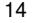

{0}------------------------------------------------

# **UNITED STATES SECURITIES AND EXCHANGE COMMISSION Washington, D.C. 20549**

**FORM 10-K**

#### <span id="page-0-0"></span>☒ ANNUAL REPORT UNDER SECTION 13 OR 15(d) OF THE SECURITIES EXCHANGE ACT OF 1934

For the fiscal year ended: **December 31, 2022**

☐ TRANSITION REPORT UNDER SECTION 13 OR 15(d) OF THE SECURITIES EXCHANGE ACT OF 1934

For the transition period from ____________ to ____________

Commission file number: **001-38793**

#### **INMUNE BIO INC.**

(Exact name of registrant as specified in its charter)

| Nevada                          | 47-5205835          |
|---------------------------------|---------------------|
| (State or other jurisdiction of | (I.R.S. Employer    |
| incorporation or organization)  | Identification No.) |
|                                 |                     |

**INMUNE BIO INC.**

# **David Moss**

**225 NE Mizner Blvd, Suite 640**

**Boca Raton, FL 33432 Phone: (858) 964 3720**

(Address of principal executive offices)(Zip Code)

**(858) 964 3720**

(Registrant's telephone number, including area code)

**Securities registered pursuant to Section 12(b) of the Act:**

| Title of each class              | Trading Symbol | Name of Market Where Traded |
|----------------------------------|----------------|-----------------------------|
| Common Stock (\$0.001 par value) | INMB           | The Nasdaq Stock Market LLC |

#### **Securities registered pursuant to Section 12(g) of the Act: None**

Indicate by check mark if the registrant is a well-known seasoned issuer, as defined in Rule 405 of the Securities Act. Yes ☐ No ☒

Indicate by check mark if the registrant is not required to file reports pursuant to Section 13 or Section 15(d) of the Act. Yes ☐ No ☒

Indicate by checkmark whether the registrant (1) has filed all reports required to be filed by Section 13 or 15(d) of the Securities Exchange Act of 1934 during the preceding 12 months (or for such shorter period that the registrant was required to file such reports), and (2) has been subject to such filing requirements for the past 90 days. Yes ☒ No ☐

Indicate by check mark whether the registrant has submitted electronically every Interactive Data File required to be submitted pursuant to Rule 405 of Regulation S-T (§ 232.405 of this chapter) during the preceding 12 months (or for such shorter period that the registrant was required to submit such files). Yes ☒ No ☐

Indicate by check mark whether the registrant is a large accelerated filer, an accelerated filer, a non-accelerated filer, smaller reporting company, or an emerging growth company. See the definitions of "large accelerated filer," "accelerated filer," "smaller reporting company," and "emerging growth company" in Rule 12b-2 of the Exchange Act.

| Large accelerated filer | ☐ | Accelerated filer         | ☐ |
|-------------------------|---|---------------------------|---|
| Non-accelerated filer   | ☒ | Smaller reporting company | ☒ |
| Emerging Growth Company | ☒ |                           |   |

If an emerging growth company, indicate by check mark if the registrant has elected not to use the extended transition period for complying with any new or revised financial accounting standards provided pursuant to Section 13(a) of the Exchange Act. ☐

Indicate by check mark whether the registrant has filed a report on and attestation to its management's assessment of the effectiveness of its internal control over financial reporting under Section 404(b) of the Sarbanes-Oxley Act (15 U.S.C. 7262(b)) by the registered public accounting firm that prepared or issued its audit report. ☐

If securities are registered pursuant to Section 12(b) of the Act, indicate by check mark whether the financial statements of the registrant included in the filing reflect the correction of an error to previously issued financial statements. ☐

Indicate by check mark whether any of those error corrections are restatements that required a recovery analysis of incentive-based compensation received by any of the registrant's executive officers during the relevant recovery period pursuant to §240.10D-1(b). ☐

Indicate by check mark whether the registrant is a shell company (as defined in Rule 12b-2 of the Exchange Act). Yes ☐ No ☒

The aggregate market value of the registrant's common stock held by non-affiliates of the registrant was approximately \$ 103 million as of the last business day of the registrant's most recently completed second fiscal quarter (June 30, 2022), based upon the closing sale price for the registrant's common stock on that day as reported by the NASDAQ Capital Market. Shares of common stock held by each officer and director of the registrant on June 30, 2022 have been excluded in that such persons may be deemed to be affiliates.

As of March 2, 2023, there are 17,945,995 shares of common stock, \$0.001 par value per share outstanding.

# **DOCUMENTS INCORPORATED BY REFERENCE**

Portions of the registrant's definitive proxy statement to be filed by the registrant in connection with its 2023 Annual Meeting of Shareholders are

{1}------------------------------------------------

#### FORM 10-K FOR THE YEAR ENDED DECEMBER 31, 2022

# **TABLE OF CONTENTS**

|           | Item Number and Caption                                                                                      | Page     |
|-----------|--------------------------------------------------------------------------------------------------------------|----------|
|           | Forward-Looking Statements                                                                                   | ii       |
|           |                                                                                                              |          |
| PART I    |                                                                                                              |          |
|           |                                                                                                              |          |
| 1.        | Business                                                                                                     | 1        |
| 1A.       | Risk Factors                                                                                                 | 34       |
| 1B.<br>2. | Unresolved Staff Comments<br>Properties                                                                      | 59<br>59 |
| 3.        | Legal Proceedings                                                                                            | 59       |
| 4.        | Mine Safety Disclosures                                                                                      | 59       |
|           |                                                                                                              |          |
| PART II   |                                                                                                              |          |
|           |                                                                                                              |          |
| 5.        | Market for Registrant's Common Equity, Related Stockholder Matters and Issuer Purchases of Equity Securities | 60       |
| 6.        | [Reserved]                                                                                                   | 60       |
| 7.        | Management's Discussion and Analysis of Financial Condition and Results of Operations                        | 60       |
| 7A.       | Quantitative and Qualitative Disclosures About Market Risk                                                   | 71       |
| 8.        | Financial Statements and Supplementary Data                                                                  | F-1      |
| 9.        | Changes in and Disagreements with Accountants on Accounting, and Financial Disclosure                        | 72       |
| 9A.       | Controls and Procedures                                                                                      | 72       |
| 9B.       | Other Information                                                                                            | 72       |
| 9C.       | Disclosure Regarding Foreign Jurisdictions that Prevent Inspections                                          | 72       |
|           |                                                                                                              |          |
| PART III  |                                                                                                              |          |
|           |                                                                                                              |          |
| 10.       | Directors, Executive Officers, and Corporate Governance                                                      | 73       |
| 11.       | Executive Compensation                                                                                       | 73       |
| 12.       | Security Ownership of Certain Beneficial Owners and Management and Related Stockholder Matters               | 73       |
| 13.       | Certain Relationships and Related Transactions, and Director Independence                                    | 73       |
| 14.       | Principal Accounting Fees and Services                                                                       | 73       |
|           |                                                                                                              |          |
| PART IV   |                                                                                                              |          |
| 15.       | Exhibits                                                                                                     | 74       |
| 16.       | Form 10-K Summary                                                                                            | 77       |
|           | Signatures                                                                                                   | 78       |
|           |                                                                                                              |          |
|           |                                                                                                              |          |
|           | i                                                                                                            |          |

## **PART I**

*All brand names or trademarks appearing in this report are the property of their respective holders. Unless the context requires otherwise, references in this report to "INmune Bio" the "Company," "we," "us," and "our" refer to INmune Bio Inc., a Nevada corporation.*

#### **FORWARD-LOOKING STATEMENTS**

This Annual Report on Form 10-K (this "Annual Report") contains "forward-looking statements" Forward-looking statements reflect our current view about future events. When used in this Report, the words "anticipate," "believe," "estimate," "expect," "future," "intend," "plan," or the negative of these terms and similar expressions, as they relate to us or our management, identify forward-looking statements. Such statements include, but are not limited to, statements contained in this Report relating to our business strategy, our future operating results and liquidity and capital resources outlook. Forwardlooking statements are based on our current expectations and assumptions regarding our business, the economy and other future conditions. Because forward–looking statements relate to the future, they are subject to inherent uncertainties, risks and changes in circumstances that are difficult to predict. Our actual results may differ materially from those contemplated by the forward-looking statements. They are neither statements of historical fact nor guarantees of assurance of future performance. We caution you therefore against relying on any of these forward-looking statements. Important factors that could cause actual results to differ materially from those in the forward-looking statements include, without limitation, our ability to raise capital to fund continuing operations; our ability to protect our intellectual property rights; the impact of any infringement actions or other litigation brought against us; competition from other providers and products; our ability to develop and commercialize products and services; changes in government regulation; our ability to complete capital raising transactions; and other factors (including the risks contained in the section of this Annual Report entitled "Risk Factors") relating to our industry, our operations and results of operations. Actual results may differ significantly from those anticipated, believed, estimated, expected, intended or planned.

Factors or events that could cause our actual results to differ may emerge from time to time, and it is not possible for us to predict all of them. We cannot guarantee future results, levels of activity, performance or achievements. Except as required by applicable law, including the securities laws of the

{2}------------------------------------------------

ii

#### **PART I**

#### **Item 1. Business**

#### **Our Strategy**

Our objective is to develop and commercialize our product candidates to treat diseases where the innate immune system is dysfunctional causing and contributing to the patient's disease. Innate immune dysfunction can occur for a variety of reasons including genetics, lifestyle, and other factors however, age plays a significant role in the development of immune dysfunction. Innate immune dysfunction can be in cancer where Natural Killer ("NK") cells are inactive and contribute to a tumor's evasion of the immune system and/or disease progression. Further, chronic inflammation causes expression of MUC4 and immunosuppressive cells of the tumor microenvironment proliferate to protect the tumor from attack by the patient's immune system and can cause other diseases such as neurologic and metabolic diseases where chronic inflammation results in innate immune system dysfunction. Our initial focus will be the treatment of cancer, treatment of Alzheimer's Disease ("AD"), the treatment of Treatment Resistant Depression ("TRD") and an outlicensing strategy for Duchenne's Muscular Dystrophy ("DMD"). In cancer, we plan to pursue two parallel development programs: (1) with INKmune we will initially focus on treating women with resistant disease relapse refractory carcinoma solid tumor and patients with high-risk myelodysplastic syndrome (high risk MDS); (2) with INB03, we plan to treat patients with cancers that express MUC4, a mucinous polyglucan on the surface of some epithelial cancer cells, that appears to predict resistant to immunotherapy including women with MUC4 expressing HER2+ breast cancer and potentially other MUC4 resistant cancers. Our third drug candidate XPro1595 ("XPro"), targets Alzheimer's Disease and TRD. XPro for AD has completed Phase I trials and Phase II trials are underway in Australia and Canada. The Company is currently in discussions with the US FDA to obtain approval to commence the Phase II AD trials in the U.S. which the FDA placed on full clinical hold on May 20, 2022. XPro for TRD is being prepared for Phase II trials and will start after the FDA has cleared XPro for use in the US. In early 2023, the Company also announced pre-clinical data in DMD including new intellectual property for the purpose of trying to seek partnership for the development of this program. DMD is a X-linked genetic disease that occurs most often in young boys. People with DMD do not produce dystrophin, a protein necessary for normal skeletal muscle function. The patients develop weakness of skeletal muscles initially seen as weakness in standing and walking. Over time, the disease progresses forcing the patient to be wheelchair bound by early teens. The patients die young due to respiratory and cardiac failure before they reach thirty years old. Therapies for DMD delay progression, there is no cure.

The overall principal components of our business strategy to achieve these objectives are to:

- pursue development strategies and regulatory approval pathways that allow the treatment of oncology patients with our lead product candidates, INKmune and INB03;
- pursue development strategies and regulatory approval pathways that allow the treatment of neurodegenerative diseases in patients with our lead product candidates, XPro;
- Pursue development strategies with a dominant-negative tumor necrosis factor ("DN-TNF") compound for the treatment of DMD;
- adopt a product development strategy that solidifies our existing intellectual property ("IP") to prevent competition and expand our IP suite into related immunotherapeutic areas;
- provide clear value propositions to third-party payers, such as managed care companies or government programs like Medicare, to merit reimbursement for our product candidates; and
- Collaborate with other pharmaceutical companies with respect to, among other things, our INKmune and the DN-TNF platform that includes INB03 and XPro product candidates, our DMD DN-TNF candidate and other products that will benefit from development or marketing beyond our current resources.

*Pursue development and regulatory approval pathways.* We believe INKmune, INB03 and XPro may be approvable under pathways that are potentially shorter than those typically available for drug products based on novel active ingredients, including as an orphan drug under the Orphan Drug Act and approval under the Food and Drug Administration (the "FDA") Accelerated Approval Program (see "Government Regulation"). We have not yet had a discussion with the Medicines and Healthcare Products Regulatory Agency ("MHRA") and/or FDA regarding such designation, but plan to do so in the future. We believe the INKmune MDS cancer program may qualify for orphan status. We believe that it would take a minimum of six months to receive Orphan Drug status once we apply for application and a minimum of 12 months to receive a designation once we submit an application. We might never have these discussions, submit applications under the Orphan Drug Act or the FDA Accelerated Approval Program or have these applications approved if we do.

1

*Adopt a two-pronged patent strategy.* We are pursuing a two-pronged product development strategy that will seek to solidify our existing IP to prevent competition and expand our IP suite into related therapeutic areas. We are confident that our core in-licensed IP (see "Intellectual Property") will allow us both freedom-to-operate and provide robust protection from outside competition. We will continue to invest in expanding our patent suite. We will also seek to further to strengthen our IP position by looking to in-license IP related to our focus on the innate immune system.

*Provide clear value propositions to third-party payors to merit reimbursement for our product candidates* . We are designing our clinical development programs to demonstrate compelling, competitive advantages to patients and prescribers, and to demonstrate value propositions to thirdparty payors. We believe the use of INKmune and/or INB03 in patients with a high risk of tumor progression and death from tumor should prolong survival, improve the patient's quality of life and decrease the total cost of care for patients with these lethal malignancies. For example, cancer patients relapse frequently. Each relapse requires a complex treatment regimen that has decreasing benefits. Treatment with INKmune as an out-patient may provide a more durable remission and limit the need for treatment-associated hospitalizations. At the patient level, we believe INKmune and INB03 therapy, if approved, should improve survival and quality of life. At the payor level, we believe INKmune, if approved, should provide more predictable costs and outcomes. Therapies for Alzheimer's disease are needed for medical, social and economic reasons. The cost of Alzheimer's disease to the government is large and growing. Recently approved therapies that target amyloid have a modest impact on disease progression and are difficult to use due to side

{3}------------------------------------------------

effects in some patients. The cost of AD to families and care givers is real and burdensome. We believe treatment of dementia patients with XPro, including Alzheimer's disease, may provide a strategy to alter the costly dynamic of this disease in society today.

*Collaborate to maximize the value of our technology* . We believe there are two reasons for us to enter collaborations with other companies. The first is the further development of INKmune, INB03, XPro and DN-TNF by either providing additional innovations to the product, including combination therapy strategies, and/or providing resources to improve the speed and breadth of the development process. The second is to optimize the commercialization of our products either globally or regionally. The ideal partner will benefit us in both ways.

We continue to look for ways to utilize our unique capabilities to optimize clinical application of cell therapies. We believe that we have identified a way to manufacture human mesenchymal stem cells for the medical research and biotech community that offers large volumes of high-quality, low passage human umbilical cord mesenchymal stem cells with minimal batch-to-batch variability. We have established a reliable supply of human umbilical cords based on our agreement with the Anthony Nolan Cord Blood Bank in the United Kingdom and may seek additional supplies in the future. We have developed a validated manufacturing process that reliably produces contract manufacturer of the clinical grade ("cGMP") quality mesenchymal stem cells that we call CORDstrom. The manufacturing process can be performed at a contract manufacturing site under the direction of Mark Lowdell, the Company's CSO. We will seek academic laboratories and biopharma companies who need a reliable source of high quality pooled human umbilical cord mesenchymal stem cells for research of and development of clinical products. Once identified, we plan to act as a cGMP for the development of therapeutic products by utilizing contract manufacturers. Because the production of the product is not continuous, we do not expect to engage a contract manufacturer until we have a customer identified. To date, we are supporting two academic clinical trials with CORDstrom. One program is a Phase 2 trial sponsored by the Great Ormond Street Children's Hospital in the UK treating children with Erythematous Bullousa ("EB"), a disfiguring skin disease in children that is similar to a second degree burn and the second program is treatment of system lupus in adults. Both these studies are ongoing. INmune Bio is supplying the clinical product for treatment of these patients. The Company does not know the results of these trials until they are announced by the principal investigators at the clinical sites. We have identified contract manufacturers in the UK that have the capability to produce cGMP stem cells. We expect the commercial arrangement with academic laboratories or biopharma companies to be a combination of fee-for-service and licensing that does not require additional investment by us. We will be opportunistic in pursuing therapeutic opportunities for our own portfolio with this platform in the future if resources become available. The regulatory path for therapeutic applications of the mesenchymal stem cell products is well established and similar to the regulatory approval process for other cell therapies. We will only be responsible for regulatory compliance related to manufacturing of the mesenchymal stem cells when the product is being developed by a third party. When developing a therapeutic product for the Company's commercial portfolio, the Company will be responsible for all aspects of the regulatory process.

2

#### **Overview of Immunotherapy for Cancer**

The immune system has two parts, innate and adaptive. The innate immune system is the body's first line of defense against an infection, providing immediate, non-specific responses to eliminate harmful cells in the body. Components of the innate immune system include cytokines, chemokines, macrophages, neutrophils and NK cells, among others.

The adaptive immune system is often initially triggered by the innate immune system, mounts a delayed response against diseased cells and plays a role protecting against re-infection. An adaptive immune response is highly specific to a pathogen or antigen and is developed or learned from prior exposure. Key components of the adaptive immune system include antibodies which bind to antigens and mark them for destruction by other immune cells, B-cells which produce these antibodies upon exposure to antigens, and T-cells which attack and eliminate the diseased cells.

The biopharmaceutical industry has made significant advances in harnessing specific components of innate and adaptive immune systems for therapeutic use. Some of these approaches are summarized below.

*Cytokines.* Tumor Necrosis Factor alpha ("TNF") is the focus of XPro and INB03. TNF biology has four elements that include two cytokines, soluble TNF and trans-membrane TNF ("sTNF" and "tmTNF," respectively), and two receptors, TNF Receptor 1 and 2 ("TNFR1" and "TNFR2"). The biology of TNF ligation of TNFR varies dramatically based on what elements of the TNF system that are used. sTNF binding to TNFR1 is responsible for inflammation and cell death while sTNF binding to TNFR2 promotes proliferation of regulatory T cells ("Treg"). In patients with advanced cancers, increased sTNF is not favorable to long-term survival because it promotes epithelial-mesenchymal transformation and metastasis while making the tumor microenvironment more immunosuppressive promoting resistance to therapy. In the CNS, sTNF promotes neuronal cell death, demyelination and synaptic pruning while tmTNF promotes nerve cell survival, improves synaptic function and stimulates remyelination. In brief, sTNF is the "bad" TNF and tmTNF is the "good" TNF. In patients with cancer, infection or neurologic disease, blockade of tmTNF function has negative consequences such as immunosuppression, increased infection, synaptic dysfunction and demyelination.

One of the early applications of immunotherapy is the use of cytokines, including interferons and interleukin-2 ("IL-2"). Interferons are molecules that inhibit the growth and replication of diseased cells and stimulate innate immune cells to attack them. They have been used as standard of care for hepatitis B and C and multiple sclerosis, and to a lesser extent, as treatment for certain cancers, including chronic myeloid leukemia, cutaneous T-cell lymphoma, myeloma and non-Hodgkin's lymphoma. However, the use of interferons has generally decreased over the years due to serious adverse events (*e.g.*, flu-like symptoms and dramatic weight loss) and introduction of new therapies with higher efficacy, better safety profiles and more convenient administration although Alpha-interferon remains the treatment of choice for some hematological conditions such as polycythemia. IL-2 activates T-cells and NK cells to attack diseased cells. IL-2 has been used to treat select cancers, but due to its relatively poor safety profile, physicians often only resort to this therapy for the most advanced settings.

*Antibody therapy.* Antibodies exist in three formats: monoclonals ("mAbs"), oligo/polyclonal and antibody-drug conjugates. mAbs represent an effective therapeutic modality and are important to the treatment paradigm of various diseases. Drug manufacturers have leveraged mAbs' ability to induce an antibody-dependent cell-mediated cytotoxicity, or ADCC effect to develop better treatments that prolong survival and quality of life of patients. In addition, mAbs designed to inhibit specific checkpoints in the immune system have overcome in vivo immune suppression and the resulting immune responses have led to profound therapeutic benefit in some patients. However, the degree of efficacy of these therapies is heavily reliant on the immune system of patients, many of whom are severely immuno-compromised. In addition, mAbs are manufactured through a complex process that requires purification of cell products created from a cell line. Polyspecific antibodies, for example bi-specific antibodies, are able to target more than one antigen. These are often used to bring and effector T cell in contact with a target cell. Antibody drug conjugates are mAbs attached to a toxin, chemotherapy or radio therapy that delivers the cancer killing payload directly to the cancer.

{4}------------------------------------------------

*Dendritic Cell Therapies.* This approach is designed to indirectly stimulate a patient's T-cells by leveraging the role of dendritic cells in presenting antigens to T-cells. Cancer vaccines are the most common application of dendritic cells. The only FDA-approved dendritic cell therapy is PROVENGE, which entails collecting monocytes from the patient, maturing them into dendritic cells, "loading" *ex vivo* with the patient's cancer antigens, and then re-infusing in the patient. Currently, this process is cumbersome and expensive, and again, relies on an intact and effective immune system of the patient. There are additional ongoing preclinical studies and clinical trials being conducted by our competitors aimed at addressing certain of the limitations associated with this approach. To date, current clinical results of dendritic cell therapies have been mixed.

*CAR-T and TCR Therapies.* T-cells recognize diseased cells by receptors engaging with antigens that are present on or inside the diseased cells. CAR-T therapy entails genetically engineering T-cells to express synthetic CARs that direct T-cells to antigens on the surface of cancer cells. TCR therapy modifies T-cells to express high-affinity tumor specific TCRs that recognize intra-cellular antigens that must be presented on the surface of target cells. In early clinical trials, CAR-T and TCR therapies have demonstrated impressive anti-tumor activity in a narrow spectrum of hematologic cancers and garnered significant attention by research institutions and biopharmaceutical companies. We believe a key limitation of adaptive autologous immunotherapy is the need to retrieve non-compromised immune cells from a cancer patient which requires a complex and costly manufacturing process to develop the therapy. The complexity of this personalized process is reflected in the price of the two approved therapies. CAR-T therapies tisagenlecleucel and axicabtagene ciloleucel for advanced leukemia and lymphoma respectively. The cost of a single therapy is many hundreds of thousands of dollars. As a consequence of this need to harvest active T-cells, current Phase I clinical trials for autologous CAR-T cell therapy in large part enroll patients from highly selected, often relatively early-stage disease in a narrow spectrum of cancers, including bulky hematological cancers. In addition, Phase I clinical trials of CAR-T cell immunotherapy have reported severe adverse toxicities of cytokine release syndrome and neurotoxicity, requiring hospitalization, pre-conditioning and, in some instances, intensive care unit admission following side effects associated with cytokine release syndrome. As a result, though our competitors continue to develop their CAR-T and TCR product candidates with the goal of addressing certain of the limitations associated with these approaches, we believe these serious challenges may limit their potential and use in a variety of indications, including solid tumors.

*Checkpoint Inhibitors.* Immune cells express proteins that are immune checkpoints that control and down-regulate the immune response. These are best defined in T lymphocytes and include PD-1, CTLA-4, TIM-3 and LAG3. Tumor cells express the ligands to these receptors. When T cells bind the ligand to these proteins on the tumor cells, the T cell is turned off and does not attempt to attack the tumor cell. Thus, checkpoint inhibitors ("CPI") are part of the complex strategy used by the tumor to evade the patient's immune system and are responsible for resistance to immunotherapy. Biopharmaceutical companies have successfully developed CPI that block the receptor/ligand interaction to promote the adaptive immune response to the tumor. Six CPI are currently approved, pembrolizumab, nivolumab, atezolizumab, avelumab, durvalumab, and ipilimumab for a wide variety of solid tumors including melanoma, lung, bladder, gastric cancers and others. More CPI are in development and more tumor types will be added to the list of sensitive tumors over the next years. CPI have become the backbone of cancer therapy and are expected to be the best -selling class of drugs by 2027.

*NK Cells.* NK cells typically represent approximately 2% to 13% of circulating lymphocytes and are a critical component of the immune system responsible for innate immunity. Unlike adaptive immune cells, they are ever present and ready to attack, having the inherent ability to detect and eliminate diseased cells without the need for antigen presentation, which is why they are called "natural killers."

NK cells bind to stress ligands expressed by the diseased cells and directly eliminate them. This binding induces NK cells to release cytokines, including, interferons and GM-CSF, which are integral in recruiting additional innate and adaptive immune responses by the host. NK cells also represent a critical effector cell for ADCC, whereby target cells bound with human antibodies, whether made by the patient's body or administered, are selectively destroyed by the NK cells.

#### 4

## **Our Innate Immune Dominant-Negative TNF ("DN-TNF") product candidate**

We renamed XPro, which we license from Xencor, to INB03 when it is used for cancer related indications. We will continue to call the drug XPro when used for treatment of neurologic and psychiatric diseases, including Alzheimer's disease and TRD discussed below. INB03 and XPro are the same drug with different names. INB03 neutralizes soluble TNF in the tumor microenvironment ("TME"). Neutralizing sTNF in the TME has two main effects – decreases expression of MUC4 by the tumor and converting the immunosuppressive cancer promoting TME that promotes tumor growth to an immunologically active TME that promotes tumor cell death. INB03 decreases proliferation of MDSC, promotes recruitment of cytotoxic T cells to the TME and may convert immunosuppressive tumor macrophages into tumor phagocytic macrophages. In murine models, these changes make the tumor reverse resistance to treatment with immunotherapy alone or in combination with tyrosine kinase inhibitors (TKI) such a lapatinib and tucatinib. MUC4 expression is increased by sTNF produced by the tumor. MUC4 causes resistance to trastuzumab therapy in HER2+ breast and gastric cancer cells by preventing binding of trastuzumab to HER2 by steric hinderance. By neutralizing sTNF with INB03, decreases MUC4 expression to allow trastuzumab to bind HER2. The importance of trastuzumab based immunotherapy in the treatment of HER2 expressing tumors has increased recently due to the success of trastuzumab-deruxtecan (Enhertu, TDxd). TDxd improves survival in women with metastatic HER2+ breast cancer in both high and low HER2 expressing tumors. MUC4 expression inhibits the TDxd tumor killing in a murine model of HER2+ trastuzumab resistant HER2+ breast cancer. The mechanism by which combination of INB03 with TKI improves efficacy over TKI alone remains under investigation. By using INB03 as part of combination therapy for cancer, we believe the patient's dysregulated immune response, a hallmark of cancer progression and resistance to therapy, to be converted to a coordinated immune response that can overcome resistance mechanisms to immunotherapy in MUC4 expressing cancers. These immune responses have been studied in at least two animal models. In a murine model of an inflammatory cancer, where 3-methylcholanthrese is given to mice in a subcutaneous injection that causes the development of multiple cutaneous fibrosarcoma. This model was developed by Y Akamatsu in 1967 while working at the National Cancer Institute of the NIH. In research published by Professor Nikola Vujanovic in *Cancer Immunology Research* in 2016, treatment with INB03 resulted in smaller and fewer cancers with increased survival. INB03 is an engineered PEGylated protein that neutralizes human soluble TNF, a human inflammatory cytokine that is increased in patients with advanced cancer. By specifically neutralizing the cytokine, there is decreased phosphorylation of STAT3, an essential step required for the proliferation of the MDSC population, and secretion of the immunosuppressive cytokines. The combination of decreased MDSC proliferation and decreased immunosuppressive cytokines allows the immune system to respond to the tumor. This data was published in an article entitled Inhibition of Soluble Tumor Necrosis Factor Prevents Chemically Induced Carcinogenesis in Mice in Cancer Immunology Research in *Cancer Immunology Research,* 2016. In summary, INB03 functions as an innate immune system checkpoint inhibitor by eliminating the population of MDSC that provides an immunosuppressive shield protecting the tumor, the patient's immune system is able to function normally to the benefit of the patient – it can attack the tumor. TNF plays an important role in breast cancer (Schillaci R, Front. Oncol., 22 April 2020 | https://doi.org/10.3389/fonc.2020.00584). In a murine model of trastuzumab resistant breast cancer using JMIT-1 cells, a human cell line of HER2 positive breast cancer resistant to trastuzumab placed into immunocompromised mice, INB03 downregulates MUC4 from the surface of the JMIT-1 HER2+ breast cancer cells to allow the trastuzumab resistant cells to become trastuzumab sensitive (Figure A from Bruni, NYAS 2020) to decrease tumor growth (from Schillaci SABCS 2018, Figure B). JMIT-1 cells are also resistant to lapatinib, a TKI inhibitor used as a second line therapy in women with trastuzumab resistant HER2+ breast cancer. The addition of INB03 to lapatinib in the animal model reverses lapatinib resistance in part by decreasing expression of MUC4 (from Bruni NYAS 2020, Figure C). In addition to decreasing resistance to trastuzumab by decreasing MUC4 expression, INB03

{5}------------------------------------------------

decreases the immunosuppressive tumor microenvironment (Schillaci SABCS 2018, Bruni NYAS 2020). Recently, Dr. Schillaci reported the MUC4 expressing triple negative breast (TNBC) cancer patients have a worse overall survival. (Schillaci SABCS 2021). More recently, Schillaci has shown that MUC4 causes resistance to trastuzumab ADC (trastuzumab-XXX and TDxd). Combination therapy with INB03 overcomes resistance in this breast cancer model. These data may be relevant to all tumors that express HER2 or MUC4 including upper gastrointestinal malignancies such as gastric and pancreatic cancer. We believe MUC4 expression is a biomarker of resistance that may improve therapeutic decision making by clinical teams


Because INB03 targets the patient's immune system and not the tumor, we believe INB03 is an immunotherapy that can be used to treat many types of hematologic malignancies and solid tumors as part of combination therapy. The decision to use INB03 in a patient will be based on biomarkers that should predict that a patient will benefit from treatment with the drug. We believe the ideal biomarker is easy to use and is determined before treatment begins. MUC4 expression by epithelial tumors is an example of this type of biomarker. Our Phase I clinical trial preceded the identification of MUC4 as a biomarker and focused on using determining the safety of INB03 as monotherapy in patients with advanced solid tumors. This is a typical Phase I clinical trial design for first-in-man trials in cancer. We expect to use INB03 as part of combination therapy with approved cancer therapies as part of Phase II development. We do not expect to need to modify INB03 therapy to treat each different type of cancer, because INB03 therapy targets the

{6}------------------------------------------------

immune system, not the cancer. We do expect to develop the INB03 beyond Phase II to target a specific type of cancer to meet the current system of regulatory approval. For instance, INB03 may be approved to treat patients with HER2+/MUC4+ breast cancer. To get subsequent approval for the treatment of patients with MUC4+ TNBC or MUC4+ pancreatic cancer, we will need to perform a pivotal trial in patients with TNBC and pancreatic cancer respectively. After the first regulatory approval, if and when achieved, we believe the difficulty and cost of achieving these labels extensions will decline with each successive approval. At this time, we cannot predict if patients without biomarkers of inflammation, elevated MDSC or cytokines, or increased expression of MUC4 will benefit from treatment with INB03. Those studies may be performed in the future, but they are not a priority.

XPro neutralizes soluble TNF in the brain in exactly the same way INB03 neutralizes soluble TNF in the tumor microenvironment but the effects of soluble TNF neutralization in the brain are different. The cause of the destructive neuroinflammation in the brain are microglial and astroglial cells. The glial cell are two of four cells in the neural unit that also includes oligodendrocytes and nerve cells. Activated microglial cells are considered the resident macrophages of the brain. The primary role of microglial cells is to protect the neural unit from infection. When innate immune dysfunction causes chronic inflammation, activated microglial cells produce soluble TNF that activates astrocytes. Activated glial cells cause nerve cell and oligodrocyte dysfunction that results in synaptic pruning, nerve cell death and demyelination of neurons. These pathologies contribute, in part, to neurodegenerative diseases such as AD, Parkinson's disease, ALS, MS, Huntington's disease, glaucoma and TBI (traumatic brain injury) may contribute to neuropsychiatric diseases such as depression, bi-polar disease, sleep disorders, autism, schizophrenia and PTSD. In the setting of AD, microglial activation causes dendritic pruning, synaptic dysfunction and nerve cell death that contributes to cognitive decline and the behavioral manifestations of AD including depression, aggressiveness, sleep disorders, hallucinations and anhedonia. Elimination of microglial activation should reverse these symptoms. Because soluble TNF is the apex cytokine in the inflammatory cytokine cascade, neutralization of soluble TNF with XPro should prevent glial activation and normalizes function of the neural unit.

The Company has completed a Phase I trial using XPro to reverse neuroinflammation in patients with Alzheimer's disease. The trial was performed in Australia and is partially funded by a \$1M USD Part-the-Cloud Award from the Alzheimer's Association. The clinical trial was the first in the Company's development program for the treatment of dementia. The open label, dose escalation trial in patients with Alzheimer's disease with biomarkers of peripheral inflammation (one of CRP>1.5mg/L, HgbA1c>6.0, ESR>10sec or have ApoE4) treats the patients with XPro as a once-a-week subcutaneous injection for 3 months. AD patients with one biomarker of inflammation are classified as having AD with neuroinflammation (ADi). The company estimates this group of patients includes at least 40% of patients with AD. Patients have multiple biomarkers of neuroinflammation tested before and during therapy including soluble biomarkers in blood and cerebral spinal fluid, behavioral biomarkers (neuropsychiatric symptoms of AD) and neuroimaging biomarkers using MRI. The primary goal of this short, open label study was to demonstrate that treatment with XPro decreases neuroinflammation safely and to define the dose of XPro to use in the Phase II trial. The Company has opened a Phase II trial in ADi in Australia ("AUS") and Canada ("CAN"). We anticipate opening additional countries including the US in 2023. The Phase II ADi program is not yet open in the US. The FDA has placed a full clinical hold on the program related to product characteristics in the product produced for the Phase II program at KBI Biosciences in 2021. The XPro produced by KBI is being used in the Phase II trial in AUS and CAN, the Phase II extension trial in patients that have completed the Phase II trial in AUS and the Expanded Access Scheme in patients who completed the Phase I trial in AUS. The Company is working closely with the FDA to reverse the clinical hold. We cannot predict when this will occur. Our plan is to continue to enroll patients in the Phase II ADi trial in regulatory venues outside of the US while working to resolve the concerns of the FDA. The goal of the Phase II trial will be to demonstrate the prolonged control of neuroinflammation in patients with dementia will help control cognitive decline. The Company has review its two Phase II trials in dementia, one each in mild cognitive impairment due to neuroinflammation ("MCI") and mild ADi. New data supports combining the two trials into a single trial. Instead of having separate blinded randomized Phase II clinical trials in mild ADi and MCI2 , there will be one clinical trial in early ADi that will include patients with either mild ADi or MCI. Combination of the two trials into a single clinical trial may speed enrollment and decrease costs and will likely mirror the planned Phase III registration trial without increasing the risk of the clinical program.

```
7
```
The Phase I trial enrolled 18 patients at doses of 0.3, 0.6 and 1.0mg/kg given once a week as subcutaneous injection for three months. Patients in the 10mg/kg group were offered extended use of the drug for up to 12 months. Three patients remained on XPro for 12 months. Preliminary data was presented in a webinar on 13 July 2020. Neuroimaging data from six patients were presented in the figure below. In summary, treatment with XPro at either 0.3 or 1.0mg/kg once-a-week as a subcutaneous injection (low and target dose respectively) decreased white matter free water ("WMFW") as measured by MRI. WMFW is a validated biomarker of neuroinflammation. Although the number of patients is low, there was a dose response with a greater decrease in WMFW in the target dose compared to the low dose group. An analysis of inflammation in white matter tracts demonstrated a significant decrease in WMFW (40%; range 20-52%) in the arcute fasciculus, a white matter tract important in the control of language and short-term memory (Figure D). These data suggest XPro is decreasing neuroinflammation in patients with Alzheimer's disease who have biomarkers of peripheral inflammation.


Additional data was presented on January 21, 2021. The goal of the January 21 data release was to show a correlation between the white matter free water, a novel biomarker of inflammation with cerebral spinal fluid ("CSF") cytokines and chemokine levels, a traditional measure neuroinflammation. CSF cytokine/chemokines were measured in 9 patients before and after 12 weeks of weekly therapy with XPro using a panel from OLINK Target 48 Cytokine (https://www.olink.com/products/olink-target-48-cytokine/), that measures 45 (Figure AD1).

{7}------------------------------------------------


In the 6 patients in the 1mg/kg per week dose, only one cytokine and chemokine, interferon gamma ("INFg") did not change in the CSF of patients, the remainder all decreased on average of 15%. Using data from all patients treated for 12 weeks (3 low dose, 6 target dose), a high correlation (R 2=.7561) between the white matter free water safe mask and the inflammation composite score is shown in figure AD2. The data analyzed provides evidence that XPro decreases neuroinflammation in patients with Alzheimer's disease.


We believe these data support the use of XPro to treat other diseases where neuroinflammation is a part of the pathophysiology of the disease. The company studied the consequences of decreasing neuroinflammation in the 6 patients from target dose group (XPro 1mg/kg for 12 weeks) be looking at the CSF proteome using technology for Proteome Sciences using their TMT Calibrator™ platform. A large data set of proteins were identified. Early analysis of the data focusing on 26 AD related proteins demonstrated changes in inflammation, neuronal and synaptic proteins caused by decreasing neuroinflammation after treatment with XPro (Figure AD3). The proteome also demonstrated a clear dose response with a greater number of proteins being affected by the target dose compared to low dose XPro therapy (0.3 vs 1.0 mg/kg/week for 12 weeks) (Figure AD4). The CSF proteome data is only partially analyzed. Additional data may result from these ongoing analytics.

{8}------------------------------------------------


The results of the Phase I study demonstrated that XPro safely decreases neuroinflammation in patients with ADi who have biomarkers of peripheral inflammation or are ApoE4 positive when given for at least 3 months at the 1mg/kg once a week dose. Decreasing neuroinflammation with XPro appears to decrease neurodegeneration and improve synaptic function and promote remyelination. The effect of XPro on the biology and immunology of the brain in patients with AD suggest XPro therapy in patients with peripheral biomarkers of inflammation or ApoE4 allele(s) may impact cognitive decline. Although there were anecdotes of improved cognitive function in patients receiving the target dose of XPro, this cannot be verified because the trial was not a blinded, randomized trial. The impact on cognition of controlling neuroinflammation with XPro will be studied in the Phase II program which is a blinded randomized, placebo controlled clinical trial.

The Company has consolidated the two Phase II trials into a single trial of early ADi. Early ADi patients have either mild AD or MCI with neuroinflammation. Mild AD or MIC patients must with at least one of elevated CRP, hemoglobinA1c, ESR in blood or have an ApoE4 allele are eligible for the trial. The blinded randomized trial in patients with early ADi will enroll 201 patients in a 2:1 ratio (XPro:placebo) at 1mg/kg once a week. The trial is currently enrolling study subjects. Patients will be treated for 6 months. The primary end-point is Early/Mild Alzheimer's Cognitive Composite (EMACC), a sensitive cognitive end-point validated for use in patients with early AD. Secondary cognitive (ADAS-Cog13, CDR-SB and NPI) and functional (GAS, ADCS-ADL) end-points will be measured. Biomarkers of inflammation using white and gray matter analytics measured by MRI DTI similar to those used in the Phase I trial will also be used. All patients will be eligible to continue XPro for at 12 additional months. Clinical and MRI metrics will be followed during the extension trial.

Effective therapy for TRD is a large unmet need. Twenty percent of patients with a Major Depressive Disorder have TRD. Once third of TRD patients have peripheral biomarkers to inflammation (elevated CRP). This is a large patient population. The role of TNF and anti-TNF therapeutics was explored in a small open label clinical trial by Prof. Andrew Miller, MD of Emory University whereby it was demonstrated that patients which have elevated TNF levels responded to treatment with infliximab (Miller, 2011).

The Company received a \$2.9M USD award from the National Institute of Mental Health ("NIMH") to treat TRD with XPro. The blinded, randomized Phase II trial will use a biomarkers of peripheral inflammation to select patients with TRD for enrollment. Patients will be treated for 6 weeks. Primary end-points include both clinical and neuroimaging measures. The final trial design is ongoing and discussions with the FDA are not complete. The Company anticipates receiving authorization to initiate the clinical trial in 2023 at which point the Company may begin to request funds from the NIMH pursuant to the award.

INB03 and XPro are delivered as a subcutaneous injection, similar to an insulin treatment, given one to three times per week. Because this is a simple subcutaneous injection similar to an insulin injection (the therapy patients give themselves for treatment of Type 1 diabetes mellitus), we expect patients to administer the therapy by themselves or caregivers and not require expensive or logistically challenging clinic visits to receive the therapy.

10

# *Release of INB03 and XPro drug supply*

GMP DN-TNF product (INB03 and XPro) used in the oncology Phase I, AD Phase I and COVID-19 Phase II trial were manufactured by Lonza at a site in New Hampshire. The supply of Lonza DN-TNF product is limited but allowed completion of the Phase I study in Alzheimer's disease and support of patients in the extension study for 12 months. New batches of XPro have been produced to support future clinical trials. The Company engaged KBI Biopharma to manufacture 6 lots of XPro/INB03 at the Boulder, Colorado facility using the original master cell bank and updated manufacturing process. Two lots have been converted into drug product using the US fill/finish facility of Vetter Pharma. Two of the lots are frozen as drug substance at -80C with a plan to convert to drug product the second half of 2023. The final two lots are frozen as a cell paste with a plan to process to drug substance in during 2023 or 2024 as needed to support the clinical trials. We plan to use a two-step approach to improve the yield of the drug substance from the fermentation process. We hope to improve the yield of the drug product using the existing E.coli-based system. Once the new process is validated and functional, we will perform a manufacturing campaign drug for future clinical trials. In the future, the Company may consider a strain change to improve yield of the fermentation step further. The decision for strain improvements and strain change will be made in the future as clinical development programs proceed.

{9}------------------------------------------------

We have completed a Phase I trial with INB03 in oncology and a Phase I trial with XPro in patients with Alzheimer's disease. The Phase II program with Alzheimer's disease started during 2022. The Phase I trial with XPro in patients with Alzheimer's disease was performed in Australia under the regulatory authority of the TGA using the Clinical Trials Exemption ("CTX") scheme. Our first interaction with the regulatory body occurred in March 2018. The Company received approval to initiate the Phase I trial with INB03 in patients with advanced solid tumors on May 21, 2018. The second interaction with the regulatory body occurred in March 2019. The Company received approval to initiate the Phase I trial with XPro in patients with Alzheimer's disease in May 2019 and received authorization to start the Phase II trial in patients with mild AD on January 5, 2022. Our first interaction with the FDA occurred in July 2020 as part of the Phase II Quellor program to treat respiratory failure in patients hospitalized with COVID-19 infection. The newly manufactured XPro is being used to support the Phase II AD trial in AUS and CAN, the extension trial in AUS, and the Expand Access Scheme in AUS. The FDA has not allowed the use of this drug in the US yet. The FDA has asked for additional analytical testing to demonstrate comparability between the XPro used in the Phase I oncology, AD and Phase II COVID-19 clinical trials with the drug planned to be used in the Phase II AD clinical trials. This comparability testing is underway. We cannot predict when the FDA will release the US Phase II from clinical hold. The CAN and AUS regulatory authorities are aware of the FDA clinical hold – they have not asked for similar information and allow the clinical program to proceed.

#### *INB03 Product Development Path: Proposed Phase II Studies in patients with cancer*

Phase I open label study in patients with advanced solid tumors has been completed. All future studies cancer will use INB03 as part of combination therapy. The evolution of oncology standard of care occurs quickly. Immune checkpoint inhibitors ("CPI") were introduced 5 years ago. The success of CPI change the focus of cancer therapy from cytotoxic based cancer regimens to immunotherapy-based cancer regimens. The approval of Trastuzumab ("TDxd") in 2022 had a similar effect on HER2 expressing cancers. For example, use of trastuzumab based therapy in HER2+ breast cancer required 3+ expression of HER2. With TDxd, low HER2 expression (1+ or 2+ but not null) benefit for TDxd. This has dramatically expanded the number of women eligible for trastuzumab based immunotherapy from 20% to half of women with breast cancer. This dramatic change in breast cancer standard-ofcare impacted our development plans for INB03 in breast cancer. The Phase II trial is planned to be in women who have failed TDxd therapy. About half of women who receive TDxd are resistant to therapy. We believe, but need to confirm, that many of those women express MUC4. We believe an exploratory, single arm open label Phase II in woman who progress after TDxd is warranted. We believe the combination of TDxD, INB03 and TKI will be effective. We continue to conduct pre-clinical studies of INB03 in MUC4 expressing tumors. A decision on the clinical trial will not be made until the preclinical work has been completed and the data has been presented to an Advisory Board of clinical experts.

11

#### *INB03 Registration Studies and/or Partnering*

We plan to pursue an efficient registration strategy using INB03 to improve the lives of patients with cancer and biomarkers of resistance such as MUC4. We believe that this strategy has use across many types of solid tumors including patients who have failed CPI, tyrosine kinase inhibitors ("TKI") and anti-cancer antibody therapy such as trastuzumab monoclonal antibodies and trastuzumab based antibody drug conjugates. We have an active partnering position as it relates to INB03 development in cancer, although limited partnering discussion are underway at this time for INB03. We do not expect partnering discussions to begin until Phase II data demonstrating efficacy of INB03 as part of combination therapy for cancer are available.

Our INB03 platform can be used in cancer patients in many ways. The Phase I trial suggests the drug should not be used alone to treat cancer but used in combination with, but not limited to, other cancer therapies including cytotoxic chemotherapy, immunotherapy, radiation and surgery. We believe that INB03 can also be used to treat many types of hematologic and epithelial cancers.

#### *INB03 and XPro Regulatory Strategy*

Drugs from the DN-TNF platform will be developed using adequately powered, well designed studies with the goal to demonstrate a meaningful clinical benefit to patients. Beyond Phase I, these will most often be blinded, randomized clinical trials using validated end-points that have been authorized by a regulatory authority – the FDA, TGA, MHRA, EMA, etc. Currently, all planned studies will be performed in North America, AUS, EU and/or the UK. Because there are no therapies similar to INB03 or XPro approved in any market, we plan to take advantage of the regulatory opportunities afforded to therapies that treat markets with a high unmet need. In the U.S., this includes Orphan Drug Designation and expedited programs for approval including Accelerated Approval, Breakthrough Therapy Designation, Fast Track Designation, and priority review (see "Government Regulation). We cannot predict which, if any, of these programs we will benefit from without further discussions with the FDA, EMA and other competent regulatory authorities.

#### *Immunotherapy for Treatment of Alzheimer's Disease*

XPro is being developed for the treatment of Alzheimer's disease. Microglial activation and neuroinflammation are important causes of the synaptic dysfunction and nerve cell death that causes cognitive decline in patient with dementia and Alzheimer's disease. The relationship between β amyloid plaques and tau neurofibrillary tangles, the traditional targets in AD drug development and neuroinflammation is complex. We believe targeting plaques and tangles will have limited benefit. Targeting neuroinflammation, the common pathway leading to synaptic dysfunction and nerve cell death, may be an effective treatment strategy. Substantial pre-clinical data supports the use of XPro in murine models of AD. Substantial indirect data supports use of XPro in humans including a decreased risk of AD in patients treated with non-selective TNF inhibitors for rheumatoid arthritis and treatment using direct injection into paraspinous venous plexus. Because of different mechanism of action of XPro compared to the non-selective TNF inhibitors, we expect a lower risk of immunosuppression and demyelinating complications such as multiple sclerosis (MS). The Company reported preliminary data on July 13, 2020 and January 21, 2021 supporting the use of XPro to decrease neuroinflammation in patients with Alzheimer's disease and biomarkers of peripheral inflammation (see above).

We completed enrollment of patients into an open label, biomarker directed, Phase I clinical trial in AUS that approaches AD as an immunologic disease. Patients with dementia with the diagnosis of AD with biomarkers of chronic inflammation that includes at least one of a hs-CRP>1.5 mg/L, a ESR>10 mm/h, a HbgA1C>6.0% or are ApoE4 positive were treated with XPro for 12 weeks. Three dosing cohorts were preformed – 0.3, 0.6 and 1.0 mg per week as a subcutaneous injection. Patients had multiple inflammatory biomarkers test before therapy, at 6 weeks and at 12 weeks. Biomarkers were reported in blood and cerebral spinal fluid, MRI measures of white matter tract neuroinflammation, axonal quality and axon myelin, and MRI measures of gray matter quality after XPro therapy. Cognitive end-points were not the focus of the Phase 1 clinical trial because of the wide range of disease severity enrolled and lack of a placebo group. Patients enrolled in the Phase I trial had MMSE ranging from 24 to 12. This wide range of disease severity at the time of enrollment and the lack of a blinded concurrent control group did not allow for determination of cognitive benefit beyond several anecdotal reports. The first patient was enrolled in the low dose 0.3mg/kg/week cohort in the last week of November 2019. The Safety Review Committee met by teleconference on January 7, 2020, to review the course of the patients in the first cohort and voted to open the second cohort, 1.0mg/kg/week, to enrollment. The first patients were enrolled in the cohort the second week of February 2020. Based on preliminary data released on July 13, 2020, and January 21, 2021, we closed after completion of a 0.6mg/kg treatment group. We canceled plans to treat patients with 3.0mg/kg. The data from the Phase I trial allowed the Company to choose a design the Phase II trials described above.

{10}------------------------------------------------

#### *XPro Registration Studies and/or Partnering*

We plan to aggressively pursue an efficient registration strategy using XPro to improve the lives of patients with ADi. We define ADi as Alzheimer's disease with biomarkers of inflammation. We believe ADi is not the only indication for XPro in neurodegenerative and neuropsychiatric diseases. We plan to pursue other indications in neurodegenerative diseases as resources become available. We have received NIMH funding to support a Phase II TRD program that hopes to start patient enrollment in 2023. We have an active partnering position as it relates to XPro development in neurodegenerative and neuropshyciatric diseases, although limited partnering discussion are underway at this time. There are two partnering opportunities with this novel immunotherapy for the treatment of neurologic and psychiatric diseases. The first is a traditional partnership focused on the developing the drug for all neurodegenerative and neuropsychiatric applications. The second is a more focused partnership developing XPro as part of a combination therapy for a company's existing therapy. After completion of proof-of-concept Phase II studies, we will decide what the most efficient registration strategy is available to the company with XPro.

#### *DN-TNF for the treatment of Duchene Muscular Dystrophy*

The Company also is exploring partnership opportunities outside of neurodegenerative disease with DN-TNF such as DMD. DMD is a X-linked muscular dystrophy that occurs in 1 in 3500 male births in the US. The disease is caused by defects in dystrophin, a protein needed for efficient function of skeletal muscle. Boys with DMD develop skeletal muscle weakness that manifests early on with difficult standing and walking. The boys become wheelchair bound by late adolescence and die of respiratory and cardiac failure in their twenties. There is no cure. Symptomatic therapies include corticosteroids and novel strategies to replace dystrophin including ASO and gene therapies. Better therapies are needed.

The pathology of DMD is inflammation, skeletal muscle cell destruction, replacement of muscle fibers with fat and fibrosis. The most widely used therapy, corticosteroids are focused on decreasing skeletal muscle inflammation. Although anti-inflammatory, corticosteroids cause metabolic and immunologic problems including insulin resistance, obesity, hirsutism, short stature, depression and behavioral problems. Long term use of corticosteroids exacerbates skeletal muscle weakness.

In collaboration with Professor Armando Vallarta of University of California Irvine, the Company has completed and has ongoing studies with DN-TNF in murine models of DMD. The animal models show that DN-TNF therapy decreases inflammation and muscle degradation, promotes muscle regeneration and decreases fibrosis. This is a unique set of attributes compared to other therapies on the market or in development. Because muscle cells produce TNF, we believe the benefits of DN-TNF therapy extends beyond the obvious immunologic attributes of modifying T cell and macrophage infiltrates. Pre-clinical animal studies continue to better define the exact mechanism for these effects.

The Company has filed global IP on the use of DN-TNF to treat muscular dystrophy. The Company has placed the IP and knowhow into a wholly owned subsidiary called DN02, Inc. The purpose of this structure is to facilitate partnering and/or co-development of DN-TNF for DMD in a way that does not complicate or compromise the development of XPro for CNS diseases. The Company is actively seeking a partner to develop DN-TNF for DMD. We cannot predict if or when or under what terms a partnership will be formed.

#### 13

#### **INKmune: Our NK cell Directed Product Candidate**

INKmune is our lead product candidate that converts the patient's resting NK cells into cancer memory like NK cells, an essential step to allow them to participate in the immune control of the patient's cancer. We have shown this works ex vivo in human tissue cell cultures, and we believe that this will work in vivo which is the purpose of our planned clinical trials.

Cancers grow and relapse because they evade the immune system. In many cancers, NK cells are the most important cell for the elimination of residual disease that causes cancer relapse. NK cells target cells based on a series of complex antigens on the cancer cell surface that signal the NK cells to activate and kill the cancer cell. NK cells develop a memory like NK cell phenotype to enhance killing of cancer cells. This phenotype requires multiple simultaneous signals to be delivered to the NK cells. A cocktail of three cytokines, IL12, IL15 and IL18 can be used to convert a resting NK cell to cytokine induced memory like NK cells ("CIML") [Fehneger 2016 ] or by INKmune priming with INB16 (TpNK – tumor primed NK cells). Although the intracellular biology of these two strategies has yet to be worked out, they do not appear to be identical. In summary, INKmune converts resting NK cells into tumor killing memory like NK cells that function well in the hostile environment of the TME. (Figure 1 below).

{11}------------------------------------------------




The ability of NK cells to kill tumor cells depends on the strength and duration of the cell-cell interaction. This is call avidity. The higher the avidity the greater the tumor cell killing. Cytokine stimulation may increase avidity of NK binding to some cancer cells whereas, in all experiments to date, INKmune priming enhances NK binding to all cancer cells tested. The relative increase in avidity to specific cancer cells is cytokine specific; as shown below, IL15 increases NK avidity for the ovarian cancer line SKOV-3 whereas IL2 has a limited effect. IL15 primed NK cells lyse SKOV-3 cells whereas IL2 primed NK do not. INKmune primed NK (TpNK) showed the highest avidity for the tumor cells and the highest level of cytotoxicity. It is likely that the use of multiple cytokines will achieve the same level of avidity and cytotoxicity as INKmune but studies with multiple cytokines have not yet been performed (Figure below).


- 
- 
- 

We have demonstrated TpNK killing of many tumor types in laboratory studies. Tumor priming is effective regardless of the source of the NK cells (normal volunteers or patients with cancer) and in many types of tumors – both cell lines and primary tumors from patients. The principle of TpNK killing has also been demonstrated in two Phase I trials in patient with acute myelogenous leukemia ("AML"). These trials were not supported by us and used a first-generation personalized cell therapy product and treatment strategy that is different from the INKmune product and treatment strategy. In these trials, haplo-identical NK cells obtained from a first degree relative by leukapheresis were primed ex-vivo using a lysate of the parent cell line from which we derived INB16 - INKmune. Once the TpNK therapy has been produced and passed quality testing, the patient received conditioning therapy with chemotherapy (cyclophosphamide and fludarabine), the primed haplo-identical NK cells were given to patients by intravenous infusion. Two Phase I clinical trials have been performed using that first-generation adoptive cell therapy treatment strategy. An investigator-initiated trial performed at the Royal Free Hospital in London 2009 was funded by a UK charity. Fifteen patients with relapsed, high-risk AML were enrolled in the trial. Because of drop-out due to disease progression, delays in product production and complications of conditioning therapy, only 7 of the fifteen patients were treated with the TpNK cell product. Four of seven patients showed clear benefit from the treatment with the TpNK product with prolonged relapse free remission and, in one patient, conversion of a partial remission to full remission. None of the remissions were durable; all patients ultimately died from disease progression. The safety of the product was found to be a combination of toxicity from the chemotherapy/radiotherapy conditioning regimen and the TpNK therapy. In general, the complications were well tolerated although did require medical intervention including prolonged periods of aplasia in two heavily pretreated patients that resolved with supportive care. The results of this study have been published in a medical journal (PLoS One. 2015 Jun 10;10(6):e0123416. doi: 10.1371/journal.pone.0123416. eCollection 2015). In 2013, a second open label, multi-center trial was performed in the US using the same product and procedures but targeting a slightly different patient population. In the second trial, 12 patients in first remission with AML were treated with the haplo

{12}------------------------------------------------

identical TpNK product produced using the first generation ex-vivo priming process. After conditioning with chemotherapy alone, the patients received TpNK in three dosing cohorts – 3x10^5, 1x10^6 or 3x10^6 TpNK per kilogram. Patients were followed for safety and relapse free survival. This trial confirmed the safety of the TpNK treatment in patients with AML and reinforced many of the efficacy findings seen in the first trial with none of the previously experienced side effects. Patients benefited from haplo-identical TpNK therapy with prolonged relapse free survival including two patients that remain in remission more than 42 months after treatment. This trial has been published. (Biol Blood Marrow Transplant. 2018 Mar 26. pii: S1083- 8791(18)30132-0. doi: 10.1016/j.bbmt.2018.03.019.) The results of the laboratory and Phase I studies provide evidence that our strategy for treating residual disease is sensible but unproven.

Because INKmune primes NK cells to target naturally occurring antigens, we believe INKmune can be used in to treat a wide variety of cancers including hematologic malignancy (AML, MM, CML, high risk MDS) and solid tumors (renal, prostate, breast, ovarian, pancreas and lung). We expect the list of INKmune sensitive tumors to continue to expand.

The primary role for INKmune will be an immunotherapy targeting residual disease in patients after debulking cancer therapies such as cytotoxic chemotherapy and surgery. At this time, we plan to give INKmune as monotherapy. We do not rule out the possibility of using INKmune as part of combination therapy in the future. We do not expect to need to modify INKmune to treat these additional types of cancer, because we believe INKmune is a universal cancer therapy where "one size fits all". We believe for INKmune to receive regulatory approval for each cancer indication, clinical trials will need to be performed which demonstrate its safety and effectiveness as a treatment for each such cancer. We believe the difficulty and cost of achieving these labels extensions will decline with each successive approval, if and when achieved. For example, if INKmune is proven to be effective therapy in patients with ovarian cancer and high-risk MDS, we will need to perform separate pivotal trials for approval in lung, prostate or renal cancer.

# **Three step process to preparation for INKmune human clinical trials:**

# *INKmune GMP scale-up for Phase I/II clinical material*

The working cell banks and individual INKmune product to be used in the patients for the clinical trial have been produced at the Centre for Cell, Gene & Tissue Therapeutics at Royal Free Hospital / University College London to full cGMP (MHRA MIA(IMP)11149). All manufacturing has been under the direction of Professor Mark Lowdell. The Company can produce enough INKmune to complete both Phase I clinical trials in women with ovarian cancer and in patients with high-risk MDS. We have validated storage of INKmune for up over 3 years in vapor phase nitrogen and have a fully scalable, closed system manufacturing process in validation which can produce up to 6 patient doses per week during phase I and II trials. At intermediate scale we can manufacture 40 doses per week in a single 80-liter bioreactor. Importantly, we have validated the storage of INKmune at -80 oC for up to 27 days which greatly facilitates the delivery and local storage of the drug for clinical trials and post commercialization use. In contrast, as far as we know all other NK cell therapies and T cell therapies require complex shipping of drug products in vapor phase nitrogen below -150 oC and specialized arrangements for ongoing storage at the clinical sites. We may need additional INKmune for future clinical trials.

#### *Interaction with Regulatory Authorities Regarding INKmune Development*

The INKmune Phase I studies in high-risk MDS are being performed in the UK and Greece. We met with the Medicines and Healthcare Products Regulatory Agency ("MHRA"), the UK version of the FDA as part of a Scientific Advice Meetings in preparation for submitting the CTA for our first planned program. The purpose of the meeting was to explain to the MHRA our manufacturing process and clinical plan for the development of INKmune in a Phase I relapse/refractory ovarian cancer. We are working to seek regulatory approval to start a solid tumor program in the US. The Company has had initial discussion with the FDA. Those discussions are ongoing. We plan to file an IND for a solid tumor indication in 2023. We have not announced the solid tumor target.


### *INKmune Product Development Path Proposed Phase I Study in patients with high-risk MDS*

During 2021, we initiated an open label Phase I cancer study in patients with high-risk myelodysplastic syndrome ("MDS"). Patients are being enrolled who have a low burden of disease after completion of conventional therapy. The first patients were enrolled in the first quarter of 2021. In the Phase I trial, patients with detectable residual disease in bone marrow and/or peripheral blood (<15% blasts by conventional tests) will be treated with intravenous infusions of INKmune and monitored for changes in peripheral blood NK activation, NK function and changes in residual blast counts in blood and bone marrow. We and others have previously shown that MDS patients with inadequate NK function have statistically significantly poorer prognosis

{13}------------------------------------------------

than matched patients with normal levels of NK function (Tsirogianni et al 2019) and we have shown in laboratory experiments that the functional activity of NK cells from MDS patients can be enhanced by exposure to INKmune. Moreover, INKmune-primed NK cells are not inhibited by the hypoxic conditions of the diseased bone marrow microenvironment.

The first patient was treated in the second quarter of 2021. The patient is now more than 12 months out from therapy with INKmune. The patient, part of the first cohort, received 1x10^8 INKmune cells on day 1,8 and 15 as an in-patient. The patient did not require any type of conditioning therapy or cytokine support. The patient tolerated the three infusions without any problems. The patient underwent intensive monitoring over 120 days. There are 4 observations from this first patient. The patient has dramatically increased the number of activated, "memory-like" NK cells in circulation. Memory-like NK cells (mlNK) are activated NK cells with a unique cell surface protein phenotype and which show enhanced lysis of tumor cell in vitro. Post treatment with INKmune, elevated levels of mlNK cells were present in the patients in the peripheral blood for more than 119 days when trial follow-up ceased. The patient mlNK actively kill NK resistant cancer targets in vitro. Finally, the patient has had a significant clinical improvement with a reduction of his ECOG score from 2 to 0 and a significant reduction in blood product support.

Three compassionate use cases have also been treated. Two were young patients with AML who had failed previous hematopoietic stem cell transplants ("HSCT"). The first compassionate-treatment patient showed such improved neutrophil and platelet counts that she was discharged from hospital for the first time in six months. The second patient treated compassionately had failed two high risk HSCT and entered the course of INKmune therapy with high percentage of blasts in his bone marrow. His blood NK cells responded in differentiation into mlNK as hoped but it is too early to determine if INKmune has provide any clinical benefit.


## *INKmune Registration Studies and/or Partnering*

The Company plans to file an Investigational New Drug ("IND") application in 2023 for a Phase I/II trial of INKmune in a solid tumor indication. Other solid cancers are of interest including nasopharyngeal cancer ("NPC") which is a known target for NK cells and an important unmet clinical need in emerging markets such as mainland China. Renal cell carcinoma is also a known target for INKmune. We may seek partner or sell INKmune. Although our development strategy is focused on North America and Europe, we believe INKmune will also be attractive for markets on the Pacific Rim, South Asia and South America, but will wait for partners to help with the development in those regions, however, at this time, we are not negotiating with any potential partners.

Importantly, we have published data demonstrating INKmune efficacy at priming allogeneic NK cells ex-vivo (described above) and this includes priming of NK cells differentiated from cord-blood derived hematopoietic stem cells (Domogala et al *Cytotherapy* 2017: 19:710-720). Numerous companies are developing therapeutic strategies using cord blood derived NK cell products and one or more may wish to partner with us to potentiate their product by co-incubation or co-administration with INKmune. We are also aware of companies developing cytokine primed NK cells (CIML) for the treatment of cancer. We believe tumor primed NK cells are superior to ex vivo or in vivo cytokine strategies.

#### **Challenges in the Market for Our Product Candidates**

The market for new oncology therapies is competitive, complicated, and rapidly evolving. We will be competing with companies that are older, larger, better financed and have greater experience. There are two types of drug companies – development companies and commercial companies. Development companies take the risk of developing new products to proof-of-concept. Once proof-of-concept has been achieved, if the drug provides clinical benefit, the product is usually acquired by a commercial company, which completes the drug's clinical development and markets the product. We are a development company which will seek to develop products such as INKmune from the bench to the bedside to demonstrate proof-of-concept. The goal for us is to successfully develop such products to the point where they are attractive targets for potential partners/acquirers.

According to a recent Markets and Markets report, the immunotherapy market is growing rapidly at an annual rate of over 13%. Recently, the market is biased towards T cell-based immunotherapies including bi-specific antibody therapies, checkpoint inhibitors and CAR-T cell-based therapies. There are substantial numbers of clinical trials that are focused on the adaptive immune system versus clinical trials that are focused on the innate immune system for the treatment of cancer. Our challenge will be to educate partners on the value of NK cell-based therapeutic strategies. The need to educate people of the importance of INB03 is equally challenging. At the academic and investor level, there is little recognition of the role MUC4 plays in causing resistance to immunotherapy. The concept of adding a drug to modify the immunosuppressive environment of the TME to allow immunotherapy to be effective is also new. We will be responsible for educating them on the importance of MUC4 expression, TAM, MDSC and why INB03 may be an important addition to the oncologist's armamentarium. We believe educating investors and partners about new therapeutic opportunities is an easier task than trying to differentiate our company from the many other cancer immunotherapy companies. We plan to use a combination of publication, presentation

{14}------------------------------------------------

and investor relations to discuss INKmune and INB03 and to educate the clinical, biopharma and investor community on the value of these novel therapeutic approaches.

# **DN-TNF Competition**

To our knowledge, there are no other companies developing a therapy to treat patients with MUC4+HER2+ tumors. This set of biomarkers predicts a tumor that will be resistant to therapy. We believe MUC4 expression means that patient will be resistant to first line trastuzumab based immunotherapy and will be resistant to CPI. INB03 is a unique category of cancer therapies. It is does not kill cancer cells. INB03 modulates the immunology of the TME to make existing therapies more effective. The advantage of this strategy is that it can be used prospectively, and it does not add toxicity to existing therapy.


#### **INKmune Competition**

Our industry is highly competitive and subject to rapid and significant technological change. Our potential competitors include large pharmaceutical and biotechnology companies, specialty pharmaceutical and generic drug companies, academic institutions, government agencies and research institutions. We believe that key competitive factors that will affect the development and commercial success of our product candidates are efficacy, safety, tolerability, reliability, price, and reimbursement level. Many of our potential competitors, including many of the organizations named below, have substantially greater financial, technical, and human resources than we do and significantly greater experience in the discovery and development of product candidates, obtaining FDA and other regulatory approvals of products and the commercialization of those products. Accordingly, our competitors may be more successful than us in obtaining FDA approval for and achieving widespread market acceptance of their drugs. Our competitors' drugs may be more effective, or more effectively marketed and sold, than any drug we may commercialize and may render our product candidates obsolete or non-competitive before we can recover the expenses of developing and commercializing any of our product candidates. We anticipate that we will face intense and increasing competition as new drugs enter the market and advanced technologies become available. Further, the development of new treatment methods for the conditions we are targeting could render our drugs non-competitive or obsolete.

INKmune is an immunotherapy that harnesses the biology of NK cells for the treatment of cancer. There is a long list of immunotherapy strategies for the treatment of cancer and the immunotherapy for cancer market is growing rapidly. There are at least three ways to classify immunotherapy for cancer. The list below classifies immunotherapy strategies beginning with those that are most closely related to INKmune:

- 1. Companies in the NK cell therapy business;
- 2. Companies in the personalized immune-oncology business; and
- 3. Companies in the precision immuno-oncology business.


We are not aware of any approved treatments that are classified as NK cell therapies. We are aware of public companies in the NK cell therapy business such as Century Therapeutics, Immunity Bio, Nkarta, Fate Therapeutics, Glycostem and others. These companies are developing products that involve replacing or supplementing NK cells of the patient for the treatment cancer. Their product requires extensive ex-vivo cell manipulations which, with respect to Century Therapeutics and Fate Therapeutics, may include gene therapy. The next larger group of companies are in the personalized immunooncology business with products focused on T cell activation strategies. The most popular are the CAR-T cell therapies which are a patient specific exvivo gene therapy approach to a single disease (for example: pediatric ALL). CAR-T therapy has become wildly popular of late and includes many private companies, newer public companies such as Bluebird, Juno Therapeutics and Mustang Bio as well as established companies such as Novartis and Gilead. For many of the companies, CAR-T cell therapies is their only business. For the latter two, CAR-T cell therapies is a newly in-licensed program with marketing authorization in the US. Finally, the precision immune-oncology category also includes companies with anti-cancer antibody products and the newer "check-point" inhibitors. Antibody therapies are all about "illuminating" the cancer to the innate immune system (NK cells). Monoclonal antibodies were the original immunotherapy that drove the growth of well-known biopharma companies including Genentech/Roche, Amgen, Merck and others. Each of these products is disease specific (ie: treat only HER2+ breast cancer). Modern therapeutic antibodies are much more complicated bispecific and tri-specific antibodies that attempt to connect the cancer with activated T-cells of the adaptive immune system. Check-point inhibitors are currently the most rapidly expanding product category in immuno-oncology. These CTLA-4 (ipilimumab) and PD-1 inhibitors (pembrolizumab and nivolumab) specifically block a mechanism that shields cancers from T-cell killing. The two companies in this business are Merck (pembrolizumab) and

{15}------------------------------------------------

GSK (ipilimumab and nivolumab). There are many others trying to join this promising therapeutic area including large companies such as BMS and Roche.

There are several FDA approved drugs that improve the ability of the innate immune system (NK-cells) to treat cancer including mono-clonal antibody therapies (for example: Rituximab®; Avastin® and Herceptin® marketed by Roche/Genentech); and "check-point" inhibitors (Yervoy® and Opdivo®, BMS, Keytruda®, Merck and others). There is a large amount of development activity in the immune checkpoint inhibitor field from both pharmaceutical giants including AstraZeneca, Merck & Co, Pfizer, Merck KGaA, Roche, GSK, Novartis and Amgen and many start-ups, small companies and university spin-offs which have emerged in the past two years. Examples (in alphabetical order) include Agenus, Alligator Bioscience, Ambrx, AnaptysBio, argenx, Bioceros, BioNovion, Cellerant Therapeutics, Checkpoint Therapeutics, Compugen, CureTech, Enumeral, Five Prime Therapeutics, Genmab, GITR, ImmuNext, IOmet Pharma, iTeos Therapeutics, Jounce Therapeutics, KAHR Medical, Multimeric Biotherapeutics, Nativis, Orega Biotech, Pelican Therapeutics, Pieris Pharmaceuticals, Prima BioMed, Redx Pharma, Sorrento Therapeutics, Tesaro, TG Therapeutics, Theravectys and ToleroTech active in the field. The list of companies with poly-specific antibodies that attempt to link the cancer with a cytotoxic T cell is long, includes both private and public companies (Amgen, Xencor, F-Star, Merus and many others). Finally, two CAR-T cell therapies were just approved for the treatment of ALL – Kymriah™ (Novartis) and Yescarta™ (Gilead). We expect additional drugs to gain marketing authorization in the immune-oncology space.

To our knowledge, there are no innate immune check-point inhibitors in development that have the unique characteristics of INB03 that neutralize sTNF to: i) decreases the proliferation of MDSC; ii) decreasing local and systemic immunosuppression caused by MDSC by stopping production of immunosuppressive cytokines and; iii) improving NK/DC cross-talk to recruit the adaptive immune system to fight the cancer.

20

# **Intellectual Property**

We seek to protect our therapeutic programs by continuously developing patent properties covering novel compositions, formulations, purposelimited compositions, combination treatments, methods of medical treatment, and other inventions, whether created internally or in-licensed, in the United States Patent & Trademark Office (the "USPTO"), the World Intellectual Property Organization ("WIPO") under the Patent Cooperation Treaty ("PCT"), and in patent offices for various foreign jurisdictions. While each invention is unique and territories for protection are decided on a case-by-case basis, we generally pursue patents in Australia, Canada, Europe, Japan, and the United States, and sometimes in Brazil, China and/or Korea. We currently have in our portfolio eleven (11) issued patents and forty-seven (47) pending patent applications, including both company-owned and in-licensed properties. The following sections and corresponding tables summarize, for each of our current therapeutic programs, our pending and granted patent positions, to the extent publicly available, as of the time of preparing this document:

## DN-TNF Platform Technology (Oncology, Central Nervous System Disorders, Acute and Chronic Peripheral Diseases)

The DN-TNF Platform Technology covers a variety of dominant negative tumor necrosis factor ("DN-TNF") variant proteins, including the pegylated DN-TNF protein variants known as XPro and INB03. These DN-TNF protein variants can be considered a platform technology for treating the underlying immune dysfunction associated with many disease manifestations. Unlike approved anti-TNF therapeutics, DNTNF selectively targets and neutralizes soluble TNF, and is therefore not immunosuppressive. Additionally, XPro has been shown to cross the blood brain barrier after peripheral administration, making it attractive for use in treating CNS disorders. The following table summarizes current IP covering our DN-TNF Platform Technology:

|                                     | # Pending    | # Issued | Geographical | Nominal Patent |
|-------------------------------------|--------------|----------|--------------|----------------|
| Subject Matter / Compound           | Applications | Patents  | Scope        | Term           |
| DNTNF compositions and formulations | 2            | 4        | global       | 2024-2041      |
| Use of DNTNF for treating disease   | 31           | 3        | global       | 2033-2041      |

#### INB-16 / INKmune (Oncology)

INKmune is a replication-incompetent derivative of our proprietary INB-16 cell line. One commercial application of INKmune includes use as a therapeutic composition designed to enhance the ability of a patient's own NK cells to seek, recognize and eliminate cancer. Another commercial application of INKmune includes use as a cytokine-like ("pseudokine") agent for enhancing NK cell killing specificity, potency, and efficacy of NK cell based therapeutics. INKmune, as a therapeutic, is intended for provision as an I.V. -infused product containing replication-incompetent bio substrate units, each of which is adapted to present an aggregate of protein ligands and/or receptors to a patient's own NK cells, *in vivo*. Upon contacting the patient's NK cells, INKmune converts resting NK cells into what we call "primed" NK cells ("pNKs"). Data suggests that pNKs demonstrate enhanced killing of tumor cells, thus INKmune may indirectly improve a patient's own immune response to cancer. As a pseudokine agent, INKmune can be used to contact the NK cells of an NK cell therapeutic product *in vitro*, e.g., during manufacturing, for enhancing characteristics of the NK cell therapeutic and rendering an improved product. The following table summarizes current IP covering INB-16 / INKmune:

|                                                   | # Pending    | # Issued | Geographical | Nominal Patent |
|---------------------------------------------------|--------------|----------|--------------|----------------|
| Subject Matter / Compound                         | Applications | Patents  | Scope        | Term           |
| INB-16 / INKmune compositions                     | 2            | 0        | global       | 2036-2040      |
| Use of INKmune for treating disease               | 10           | 4        | global       | 2036-2040      |
| Use of INKmune for enhancing NK cell therapeutics | 2            | 0        | global       | 2036-2040      |

#### *General IP Disclosures*

Our commercial success depends in part on obtaining and maintaining patent and trade secret protections, where applicable, of our current and future product candidates and the methods used to manufacture them, as well as successfully defending our patents against third-party challenges.

Our ability to stop third parties from making, using, selling, offering to sell or importing our products depends on the extent to which we have rights under valid and enforceable patents or trade secrets that cover these activities, and whether we are able to enforce such rights. We cannot assure you that our pending patent applications will result in issued patents, or that any or all rights will be enforceable in every jurisdiction whether or not patent rights are

{16}------------------------------------------------

#### sought.

International PCT patent applications cover all 152 nations which are signatories of the PCT. However, our global IP strategy generally targets Australia, Canada, Europe, Japan, and the United States, and sometimes Brazil, China and/or Korea, as targets for extending patent protection under the PCT. Decisions regarding which countries to extend patent coverage under the PCT is taken on a case-by-case basis, subject to normal business considerations such as value and return on investment. Given the markets for products we are developing, we consider the foregoing jurisdictions to amount to "global" coverage as used herein as it relates to IP.

The above disclosures related to patents and patent applications are subject to change based on strategic patent portfolio building decisions, which may include refiling and reissue, certain abandonments, including those in favor of continuing patent applications, maturations from provisional to non-provisional filings, and other regular patent prosecution activities.

#### Trademarks

The designations INMUNE BIOTM, INB16 TM, INKmune TM, PSEUDOKINE TM, and XPro TM are trademarks of INmune Bio, Inc. Some or all these trademarks may be protected by applications pending at the USPTO and other trademark registration authorities globally. As part of the trademark registration process, we may be required to submit a statement of use evidencing *bona fide* use of each mark in commerce. By nature of being in the biopharmaceutical business, certain regulatory requirements must be met in connection with certain products and/or services prior to receiving marketing authorization from a regulatory agency, and thus it may take some time before products and/or services are offered for sale and a statement of use can be submitted for perfecting trademark registration. For these reasons, we may be required to obtain extensions of time, or to refile applications, seeking registration of trademarks. We cannot guarantee that a given trademark application will be allowed or issued in a respective office for each jurisdiction.

#### *IP License Agreements*

#### *Immune Ventures, LLC License Agreement*

On October 29, 2015, the Company entered into an exclusive license agreement (the "INKmune License Agreement") with Immune Ventures, LLC ("Immune Ventures"). Pursuant to the INKmune License Agreement, we were granted an exclusive worldwide, sub-licensable, royalty-bearing license to commercialize INKmune (the "INKmune License"). In consideration for the INKmune License, we are obligated to pay Immune Ventures certain milestone and royalty payments.

The term of the Immune Ventures Agreement began on October 29, 2015, and, if not terminated sooner pursuant to the agreement, ends on a country-by-country basis on the date of the expiration of the last to expire patent rights where patent rights exist. Subject to granting, prosecution-related patent term adjustments, and requirements for maintenance and renewals, the latest to expire patent is scheduled to expire on March 15, 2038 ("Natural Expiration"). Upon Natural Expiration of the Immune Ventures Agreement, we shall have a fully paid up, perpetual, royalty-free license without further obligation to Immune Ventures. The Immune Ventures Agreement can be terminated by Immune Ventures if, after 60 days from our receipt of notice that we have not made a payment under the Immune Ventures Agreement we still do not make this payment. On July 18, 2018, the parties amended the agreement under which the Company was required to achieve milestones pursuant to the agreement. On October 30, 2020, the parties executed an additional amendment to the agreement under which the Company is required to achieve the following milestones:

Initiation of Phase II clinical trials or equivalent by October 29, 2023; Initiation of Phase III clinical trials or equivalent by October 29, 2025; and Filing of NDA or equivalent by October 29, 2026 or equivalent.

If we don't achieve the above milestones, we are required to negotiate in good faith with Immune Ventures to determine how we can either remedy the failure or achieve an alternate development. If we fail to make any required efforts or if the efforts do not remedy the situation within 60 days of written notice by Immune Ventures, then Immune Ventures may provide notice to terminate the license or convert it to a non-exclusive license.

#### *University of Pittsburg License Agreement*

On October 3, 2017, the Company entered into an Assignment and Assumption Agreement with Immune Ventures related to intellectual property licensed from the University of Pittsburgh. Pursuant to the Assignment and Assumption Agreement (the "Assignment Agreement"), Immune Ventures assigned all its rights, obligations and liabilities under an Exclusive License Agreement between the University of Pittsburgh – Of the Commonwealth System of Higher Education ("Licensor") and Immune Ventures to INmune Bio ("Licensee"), (the "PITT Agreement").

As consideration under the PITT Agreement, we are obligated to pay: (i) annual maintenance fees, (ii) royalty payments based on the sale of products making use of the licensed technology, and (iii) milestone payments.

In 2022, the Company paid \$5,000 according to the PITT Agreement as an annual maintenance fee.

The PITT Agreement expires upon the earlier of: (i) expiration of the last claim of the Patent Rights forming the subject matter of the PITT Agreement; or (ii) the date that is 20 years from the effective date of the agreement (June 26, 2037).

The Company may terminate the PITT Agreement upon 3 months prior written notice provided all payments under the license are current. Licensor may terminate the PITT Agreement upon written notice if: (i) the Company defaults as to performance of material obligations which have not been cured within 60 days after receiving written notice; or (ii) the Company ceases to carry out its business, becomes bankrupt or insolvent, applies for or consents to the appointment of a trustee, receiver or liquidator of its assets or seeks relief under any law for the aid of debtors.

*Xencor License Agreement*

{17}------------------------------------------------

proprietary biological molecule that inhibits soluble tumor necrosis factor (the "Xencor Agreement"). During June 2021, the Company entered into the First Amendment to License Agreement with Xencor. Pursuant to the Xencor Agreement, Xencor granted the Company an exclusive worldwide, royalty-bearing license in licensed patent rights, licensed know-how and licensed materials (as defined in the Xencor Agreement) to make, develop, use, sell and import any pharmaceutical product that comprises, contains, or incorporates Xencor's proprietary protein known as "XPro" that inhibits soluble tumor necrosis factor (or all modifications, formulations and variants of the licensed protein that specifically bind soluble tumor necrosis factor) alone or in combination with one or more active ingredients, in any dosage or formulation. The Xencor Agreement expires upon the later of: (a) the expiration of the last to expire valid claim covering any pharmaceutical product that contains, comprises, or incorporates Xencor's proprietary protein known as XPro alone or in combination with one or more active ingredients, in any dosage or formulation. ("Licensed Product") in such country or (b) ten years following the first sale to a third party of the licensed product in such country. Net Sales with respect to any Licensed Product is the gross amounts invoiced by us for sales of the Licensed Products less deductions actually incurred. A valid claim is an issued, unexpired or pending claim with the patent rights that Xencor controls as of October 3, 2017 which patent rights are necessary to make, develop, use, sell, have sold, offer for sale and import a Licensed Product in the Field (the Field means all applications for the treatment of diseases in humans) or the Product Patent Rights, which claim has not lapsed, been abandoned, been revoked or been held to be unpatentable, invalid or unenforceable by a final judgment of a court or other governmental agency or competent jurisdiction from which no appeal can be or is taken within the time allowed for appeal and which has not been admitted to be invalid or unenforceable through reissue, re-examination, disclaimer or otherwise. Product Patent Rights shall mean any and all our patent rights that are necessary to make, develop, use, sell, have sold, offer for sale and import a Licensed Product in the Field, including any improvements or patent rights directed to the Licensed Product. Either party may terminate the Xencor Agreement upon 60 days' (10 days for any payment default) prior written notice to the other party after the breach of any material provision of the agreement by the other party if the breaching party has not cured the breach within the 60-day period (10-day period for any payment default) following written notice of termination by the non-breaching party. We can terminate the Xencor Agreement upon 180 days prior written notice to Xencor. Xencor may terminate the Xencor Agreement in its entirety or with respect to any specific Licensed Product upon written notice in the event that we contest, oppose or challenge or assist any party in contesting, opposing or challenging, Xencor's ownership of, or the enforceability or validity of the Patent Rights that Xencor controls as of October 3, 2017 which Patent Rights are necessary to make develop, use, sell, have sold, offered for sale and import a Licensed Product in the Field. Either party may terminate the Xencor Agreement upon written notice to the other party upon or after the insolvency, bankruptcy, dissolution or winding up of such other party or the making or seeking to make or arrange an assignment for the benefit of creditors of such other party or the initiation of proceedings in voluntary or involuntary bankruptcy which proceeding, or action remains undismissed or unstayed for a period of more than 60 days.

In consideration of the Xencor Agreement, we agreed to royalty payments and a percentage of any payments received in exchange for a sublicense.

#### **INKmune Research and Development**

We expect to use third parties to conduct our preclinical and clinical trials under the direct supervision of management.

#### **INKmune Manufacturing**

We intend to contract with third parties for the manufacture of our compounds for investigational purposes, for preclinical and clinical testing and for any FDA approved products for commercial sale. Pre-clinical and clinical material for the early clinical trials with INKmune has been manufactured under the direction of Mark Lowdell at a licensed Good Manufacturing Practice ("GMP") facility. The master cell bank, working cell bank and individual product doses were completed in July 2018. This clinical material is planned for use in the Phase I/II clinical trials in ovarian cancer. As we progress in our clinical programs, additional working cell banks and therapeutic product will be produced from the existing master cell bank. This process takes approximately 6 months and is not anticipated to delay the initiation of the high-risk MDS Phase I/II trials. We may transfer the manufacturing to a different commercial contract manufacturing organization after completion of these Phase II studies.

#### **Human Mesenchymal Stem Cells**

In November 2017 (amended in October 2022), we entered into a Material Transfer and License Agreement with the Anthony Nolan Cord Blood Bank ("AN"), the oldest and largest non-directed cord blood bank in the United Kingdom for the supply the starting material for the mesenchymal stem cells - umbilical cords not used after cord blood harvest. Mark Lowdell's research group developed and validated a methodology for producing large numbers of clinical-grade pooled human umbilical cord derived mesenchymal stem cells ("HucMSC"). We believe we are well positioned to become a preferred manufacturing partner for companies who need MSC for clinical programs. Manufacture of HucMSC is performed under the direction of Mark Lowdell in a licensed GMP facility that is contracted to the Company as part of existing research and development agreements. The starting material for the HucMSC product is provided by the AN. The HucMSC product produced in this facility are fully qualified to be used for either research or clinical trials. We have developed a validated manufacturing process that reliably produces contract manufacturer of the clinical grade ("cGMP") quality mesenchymal stem cells that we call CORDstrom. To date, we are supporting two academic clinical trials with CORDstrom. One program is a in the UK treating children with erythematous bullousa, a disfiguring skin disease in children that is similar to a second degree burn and treatment of system lupus in adults. Both these studies are ongoing. INmune Bio is supplying the clinical product for treatment of these patients. The Company does not know the results of these trials until they are announced by the principal investigators at the clinical sites. Currently, we plan to supply HucMSC to third parties for their research use and in clinical trials as part of the development process for commercial pro/ducts. We may decide to expand this agreement in the future if the commercial and/or development opportunities warrant such expansion. At the current time, we expect this program to be funded by revenues from commercial sales. The agreement with AN terminates on November 29, 2027. AN may terminate the license on written notice to us, if a donor withdraws consent to the continued use of umbilical cord tissue samples that were obtained by AN. Additionally, either party may terminate the agreement on 30 days prior written notice to the other if that other party materially breach any term of the agreement and such breaches (to the extent it is remediable) is not remedied within 30 days of the written request to the other party to do so.

#### **Challenges in the Market for Immunotherapy Products**

## **Government Regulation**

The FDA and other federal, state, local and foreign regulatory agencies impose substantial requirements upon the clinical development, approval, labeling, manufacture, marketing, and distribution of drug products. These agencies regulate, among other things, research and development activities and

{18}------------------------------------------------

the testing, approval, manufacture, quality control, safety, effectiveness, labeling, storage, record keeping, advertising and promotion of our product candidates. The regulatory approval process is generally lengthy and expensive, with no guarantee of a positive result. Moreover, failure to comply with applicable FDA or other requirements may result in civil or criminal penalties, recall or seizure of products, injunctive relief including partial or total suspension of production, or withdrawal of a product from the market.

Various regulatory authorities regulate, among other things, the research, manufacture, promotion, and distribution of drugs in the United States under the FDA and other statutes and implementing regulations. The process required by the FDA before prescription drug product candidates may be marketed in the United States generally involves the following:

- completion of extensive nonclinical laboratory tests, animal studies and formulation studies, all performed in accordance with the FDA's Good Laboratory Practice regulations;
- submission to the FDA of an investigational new drug application, or IND, which must become effective before human clinical trials may begin;
- for some products, performance of adequate and well-controlled human clinical trials in accordance with the FDA's regulations, including Good Clinical Practices, to establish the safety and efficacy of the product candidate for each proposed indication;
- submission to the FDA of a new drug application or NDA;
- satisfactory completion of an FDA preapproval inspection of the manufacturing facilities at which the product is produced to assess compliance with current Good Manufacturing Practice, or cGMP, regulations; and
- FDA review and approval of the NDA prior to any commercial marketing, sale or shipment of the drug.

The testing and approval process requires substantial time, effort and financial resources, and we cannot be certain that any approvals for our product candidates will be granted on a timely basis, if at all.

Preclinical tests include laboratory evaluations of product chemistry, formulation and stability, as well as studies to evaluate toxicity in animals and other animal studies. The results of preclinical tests, together with manufacturing information and analytical data, are submitted as part of an IND to the FDA. Some preclinical testing may continue even after an IND is submitted. The IND also includes one or more protocols for the initial clinical trial or trials and an investigator's brochure. An IND automatically becomes effective 30 days after receipt by the FDA, unless the FDA, within the 30-day time period, raises concerns or questions relating to the proposed clinical trials as outlined in the IND and places the clinical trial on a clinical hold. In such cases, the IND sponsor and the FDA must resolve any outstanding concerns or questions before any clinical trials can begin. Clinical trial holds also may be imposed at any time before or during studies due to safety concerns or non-compliance with regulatory requirements. An independent institutional review board, or IRB, at each of the clinical centers proposing to conduct the clinical trial must review and approve the plan for any clinical trial before it commences at that center. An IRB considers, among other things, whether the risks to individuals participating in the trials are minimized and are reasonable in relation to anticipated benefits. The IRB also approves the consent form signed by the trial participants and must monitor the study until completed.

The FDA offers several regulatory mechanisms that provide expedited or accelerated approval procedures for selected drugs in the indications on which we are focusing our efforts. These include accelerated approval under Subpart H of the agency's NDA approval regulations, fast track drug development procedures and priority review.

| 26 |  |
|----|--|
|    |  |

We plan to seek orphan drug designation for INKmune for the treatment of high-risk MDS if the results of the clinical trials support this activity. The United States, European Union and other jurisdictions may grant orphan drug designation to drugs intended to treat a "rare disease or condition," which, in the United States, is generally a disease or condition that affects no more than 200,000 individuals. In the European Union, orphan drug designation can be granted if: the disease is life threatening or chronically debilitating and affects no more than 50 in 100,000 persons in the European Union; without incentive it is unlikely that the drug would generate sufficient return to justify the necessary investment; and no satisfactory method of treatment for the condition exists or, if it does, the new drug will provide a significant benefit to those affected by the condition. If a product that has an orphan drug designation subsequently receives the first regulatory approval for the indication for which it has such designation, the product is entitled to orphan exclusivity, meaning that the applicable regulatory authority may not approve any other applications to market the same drug for the same indication, except in limited circumstances, for a period of seven years in the United States and 10 years in the European Union Orphan drug designation does not prevent competitors from developing or marketing different drugs for the same indication or the same drug for different indications. Orphan drug designation must be requested before submitting an NDA. After orphan drug designation is granted, the identity of the therapeutic agent and its potential orphan use are publicly disclosed. Orphan drug designation does not convey an advantage in, or shorten the duration of, the review and approval process. However, this designation provides an exemption from marketing and authorization (NDA) fees. We plan to follow a similar path with INB03 or XPro, although the precise indication cannot be determined until we are farther along in the development process.

# *Clinical Trials*

Phase 1 clinical trials typically involve the initial introduction of the product candidate into healthy human volunteers. In Phase 1 clinical trials, the product candidate is typically tested for safety, dosage tolerance, absorption, metabolism, distribution, excretion and pharmacodynamics.

Phase 2 clinical trials are conducted in a limited patient population to gather evidence about the efficacy of the product candidate for specific, targeted indications; to determine dosage tolerance and optimal dosage; and to identify possible adverse effects and safety risks.

Phase 3 clinical trials are undertaken to evaluate clinical efficacy and to test for safety in an expanded patient population at geographically dispersed clinical trial sites. The size of Phase 3 clinical trials depends upon clinical and statistical considerations for the product candidate and disease, but sometimes can include several thousand patients. Phase 3 clinical trials are intended to establish the overall risk-benefit ratio of the product candidate and provide an adequate basis for product labeling.

Clinical trials involve the administration of the product candidate to human subjects under the supervision of qualified medical investigators according to approved protocols that detail the objectives of the study, dosing procedures, subject selection and exclusion criteria, and the parameters to be used to monitor participant safety. Regulatory procedures differ in each country we will be working in. For example, in the US, each protocol is submitted to the FDA as part of the IND for their review and consent before enrolling patients in the clinical trial. The US is not the only place to perform clinical trials. Most countries have systems in place to allow academics and companies to sponsor clinical trials of novel therapies in patients. For financial

{19}------------------------------------------------

and technical reasons, the Company will perform the Phase I clinical trials of our programs in the United Kingdom and Australia. The US will be included in the Phase II programs. Other venues such as Europe, Canada, Japan and other Pacific Rim countries may be included in the development program in the future. The first clinical trial with INKmune will be initiated in the United Kingdom. In the United Kingdom, the regulatory submission is made to the MHRA for a clinical trials authorization ("CTA"). This is a multistep process. The Company had a Scientific Advice meeting with the MHRA in September 2017 to discuss the INKmune Phase I/II trial in women with relapse/refractory ovarian cancer including trial design, manufacturing processes and clinical trial execution. The MHRA gave recommendations on trial design, manufacturing controls and the regulatory procedures needed to initiate the clinical trial. We received CTA approval from the MHRA for an INKmune trial in ovarian cancer on December 18, 2018. The approval allows for the execution of the Phase I/II INKmune clinical trial in the United Kingdom. We plan to have two cancer clinics referring the 6 patients needed for the Phase I portion of the trial. We expect the first Phase I sites to be in the United Kingdom. If the first cohort of the Phase I trial proceeds as planned, we expect to expand the clinical trial in the United Kingdom and may include clinical sites in the US. Any Phase II program will start as a multi-national trial because at least 30 patients will be required to complete the Phase II program. The additional clinical sites in the United Kingdom or US have not been identified at this time. No additional regulatory procedures will be needed to add sites in the United Kingdom. To add sites in the US, we will need to file an IND with the FDA. Once the FDA approves the IND, clinical sites can be opened. We have chosen relapsed/refractory ovarian cancer as the anticipated Phase 1 study for INKmune for a number of reasons. Relapsed refractory is a disease with poor treatment options. Our pre-clinical data suggests INKmune may have advantages over other immunotherapies in the treatment of ovarian cancer. Ovarian cancer has a sensitive and validated biomarker to measure disease burden – CA125. This allows the Company to accurately select patients for the clinical trial and determine if INKmune therapy is effective. This provides regulatory advantages for registration of INKmune. INB03 will follow a similar development strategy but used Australia for the Phase I programs. In Australia, clinical trials for INB03 are performed under the clinical trials notification ("CTN") scheme authorized by the Therapeutic Good Administration ("TGA"). The TGA is the equivalent agency to the FDA in the US and the MHRA in the United Kingdom. We filed an Australian Clinical Trial Notification, or CTN, for INB03 and XPro during the second quarter of 2018 and 2019 respectively. Applications were accepted in May 2018 and 2019 to allow us to initiate the Phase I trials in cancer and Alzheimer's disease respectively. We have completed the oncology Phase 1 open label dose escalation trial in patients with advanced solid tumors and biomarkers of inflammation in their blood.

27

The INBO3 Phase I trial has been completed and provided evidence of safety and a pharmacodynamic drug affect, decrease of inflammatory biomarkers, needed to move the program to a Phase II clinical trial in cancer. The Phase II clinical trial will combine INB03 with approved second line therapy in patients with HER2+ breast cancer with or without brain metastasis that have progressed after treatment with TDxd. This is a combination trial where the addition of INB03 to approved second line therapy may provide a therapeutic alternative in a disease without any drugs approved. The Company has not lost interest in combining INB03 with immune checkpoint inhibitors (CPI), but competition for patients is fierce in this arena. Our plan is to pursue treatment of tumors that express MUC4 as our lead indication. Tumors that express MUC4 are resistant to all forms of immunotherapy due to a combination of increased MDSC in the tumor, decrease tumor macrophage (TAM) phagocytosis, decreased inflammation in the tumor (a "cold" tumor) and direct effects of MUC4 and soluble TNF on HER2 function. If combination therapy with INB03 decreases MUC4 expression and changes the TME to make the "cold" tumor "hot", then addition of a CPI will be warranted. At this time, the combination trial to treat MUC4+ TDxd resistant HER2+ expressing cancer is our most probable registration strategy for INB03. This includes the combination of INB03 with trastuzumab antibody drug conjugate therapy TDxd in combination with a TKI and/or CPI. Current therapies for TDxd resistant cancers are used on a trial by error approach. Using MUC4 expression as a biomarker for to predict resistance may bring a precision medicine approach to this difficult clinical scenario. Addition of INB03 to the treatment regimen for treating MUC4+ cancers may convert "cold" tumors to "hot" tumors making the eligible for treatment with CPI. The design and successful completion of a Phase II trial is not guarantee of clinical relevance or commercial viability. There are multiple therapies on the market or in development for the treatment of resistant breast cancer. The introduction of TDxd to the clinician's armamentarium is new and evolving. The future standard-of-care is not known. The registration and development strategy for INB03 is multinational. The Phase II program may enroll patients in other countries, including the United States after submitting an Investigational New Drug application, or IND, to the U.S. Food and Drug Administration, or FDA. If partnering is successful at any stage of INB03 development, we expect the partner to influence the development and regulatory decisions needed with moving the drug to commercialization. Finally, combination therapy to treat patients resistant to trastuzumab or CPI are not the only oncology application for INB03. INB03 can be combined with other immune-oncology therapy to improve efficacy, safety or both. INB03 can be used as part of combination therapy with immuno-oncology drugs, paired with tradition therapies such as cytotoxic chemotherapy, kinase inhibitors, cell therapies or radiation therapy. The company is pursuing pre-clinical data in some of these areas. When and if positive developments occur, we will communicate them to our shareholders. There are other regulatory venues that will be important for both our products – the largest and most important is Europe. In Europe, the European Medicines Agencies ("EMA") is responsible for authorization of clinical trials in member states. In EU, there may be a requirement to get individual country authorization at the same time as EMA authorization. The initial development of INB03 and XPro occurred in AUS followed by trials in other regulatory jurisdictions including the US. The development of INKmune will start in the United Kingdom followed by trials in the US. XPro is being developed for the treatment of Alzheimer's disease under a Part-the-Cloud Award received Feb 2019. The biomarker directed Phase I trial was performed in AUS using a regulatory strategy identical to that used for INB03 in cancer. Regulatory approval to initiate the trial was received on February 8, 2019. XPro treats microglial activation and innate immune dysregulation may be the cause with Alzheimer's disease in some patients. To our knowledge, there are few companies using an anti-inflammatory strategy for the treatment of Alzheimer's disease. Those companies include Denali Therapeutics (NASDAQ: DNLI); developing DNL747 that targets critical signaling proteins in the TNF pathway that regulate inflammation and cell death. Alector (NASDAQ: ALEC) in partnership with Abbvie is developing AL002 that targets TREM2 on microglial cells. Gliacure is targeting microglial cells in Alzheimer's disease with a small molecule candidate GC021109.

Lecanemab (Leqembi™; Eisai) was approved for the treatment of patients with Early AD in January 2023 This is this the second anti-amyloid drug for the treatment of ealy AD to be approved. Donanemab (Lilly), a third drug anti-amyloid therapy for early AD is expected to be approved in the second half of 2023. These three drugs have similar efficacy and safety profiles. One of the common safety problems is the development of ARIA (Alzheimer's Related Imaging Abnormality) that causes a delay or discontinuation of therapy. ARIA is neuroinflammation related side-effect more common in patients expressing ApoE4. The modest efficacy, sub-optimal safety and difficulty of use makes combination therapy for the treatment of early AD an attractive development and therapeutic strategy. The Company is following the developments in this area closely.

Clinical testing must satisfy extensive FDA regulations. Reports detailing the results of the clinical trials must be submitted at least annually to the FDA and safety reports must be submitted for serious and unexpected adverse events. Success in early-stage clinical trials does not assure success in later stage clinical trials. The FDA, an IRB or we may suspend a clinical trial at any time on various grounds, including a finding that the research subjects or patients are being exposed to an unacceptable health risk.

{20}------------------------------------------------

submitted to the FDA as part of an NDA. An NDA also must contain extensive manufacturing information, as well as proposed labeling for the finished product. An NDA applicant must develop information about the chemistry and physical characteristics of the drug and finalize a process for manufacturing the product in accordance with cGMP. The manufacturing process must be capable of consistently producing quality product within specifications approved by the FDA. The manufacturer must develop methods for testing the quality, purity and potency of the final product. In addition, appropriate packaging must be selected and tested, and stability studies must be conducted to demonstrate that the product does not undergo unacceptable deterioration over its shelf life. Prior to approval, the FDA will conduct an inspection of the manufacturing facilities to assess compliance with cGMP.

The FDA reviews all NDAs submitted before it accepts them for filing. The FDA may request additional information rather than accept an NDA for filing. In this event, the NDA must be resubmitted with the additional information and is subject to review before the FDA accepts it for filing. After an application is filed, the FDA may refer the NDA to an advisory committee for review, evaluation and recommendation as to whether the application should be approved and under what conditions. The FDA is not bound by the recommendation of an advisory committee, but it considers them carefully when making decisions. The FDA may deny approval of an NDA if the applicable regulatory criteria are not satisfied. Data obtained from clinical trials are not always conclusive and the FDA may interpret data differently than we interpret the same data. The FDA may issue a complete response letter, which may require additional clinical or other data or impose other conditions that must be met in order to secure final approval of the NDA. If a product receives regulatory approval, the approval may be significantly limited to specific diseases and dosages or the indications for use may otherwise be limited, which could restrict the commercial value of the product. In addition, the FDA may require us to conduct Phase 4 testing which involves clinical trials designed to further assess a drug's safety and effectiveness after NDA approval and may require surveillance programs to monitor the safety of approved products which have been commercialized. Once issued, the FDA may withdraw product approval if ongoing regulatory requirements are not met or if safety or efficacy questions are raised after the product reaches the market.

# *Post-Approval Requirements*

Any products manufactured or distributed by us pursuant to FDA approvals are subject to pervasive and continuing regulation by the FDA, including, among other things, requirements relating to record-keeping, reporting of adverse experiences, periodic reporting, distribution, and advertising and promotion of the product. After approval, most changes to the approved product, such as adding new indications or other labeling claims, are subject to prior FDA review and approval. There also are continuing, annual user fee requirements for any marketed products and the establishments at which such products are manufactured, as well as new application fees for supplemental applications with clinical data. Pharmaceutical manufacturers and their subcontractors are required to register their establishments with the FDA and certain state agencies and are subject to periodic unannounced inspections by the FDA and certain state agencies for compliance with GMP, which impose certain procedural and documentation requirements upon us and our thirdparty manufacturers. Changes to the manufacturing process are strictly regulated, and, depending on the significance of the change, may require prior FDA approval before being implemented. FDA regulations also require investigation and correction of any deviations from cGMP and impose reporting requirements upon us and any third-party manufacturers that we may decide to use. Accordingly, manufacturers must continue to expend time, money and effort in the area of production and quality control to maintain compliance with cGMP and other aspects of regulatory compliance. If our future suppliers are not able to comply with these requirements, the FDA may, among other things, halt our clinical trials, require us to recall a product from distribution, or withdraw approval of the product.

$$\mathbf{29}$$

The FDA may withdraw approval if compliance with regulatory requirements and standards is not maintained or if problems occur after the product reaches the market. Later discovery of previously unknown problems with a product, including adverse events of unanticipated severity or frequency, or with manufacturing processes, or failure to comply with regulatory requirements, may result in revisions to the approved labeling to add new safety information; imposition of post-market studies or clinical studies to assess new safety risks; or imposition of distribution restrictions or other restrictions under a REMS program.

The FDA closely regulates the marketing, labeling, advertising and promotion of pharmaceutical products. A company can make only those claims relating to safety and efficacy, purity and potency that are approved by the FDA and in accordance with the provisions of the approved label. The FDA and other agencies actively enforce the laws and regulations prohibiting the promotion of off-label uses. Failure to comply with these requirements can result in, among other things, adverse publicity, warning letters, corrective advertising and potential civil and criminal penalties. Physicians may prescribe legally available products for uses that are not described in the product's labeling and that differ from those tested by us and approved by the FDA. Such off-label uses are common across medical specialties. Physicians may believe that such off-label uses are the best treatment for many patients in varied circumstances. The FDA does not regulate the behavior of physicians in their choice of treatments. The FDA does, however, restrict manufacturer's communications on the subject of off-label use of their products.

# *Other Healthcare Laws and Compliance Requirements*

Our sales, promotion, medical education, clinical research and other activities following product approval will be subject to regulation by numerous regulatory and law enforcement authorities in the United States in addition to FDA, including potentially the Federal Trade Commission, the Department of Justice, the Centers for Medicare and Medicaid Services, or CMS, other divisions of the U.S. Department of Health and Human Services and state and local governments. Our promotional and scientific/educational programs must comply with the federal Anti-Kickback Statute, the civil False Claims Act, physician payment transparency laws, privacy laws, security laws, and additional federal and state laws similar to the foregoing.

The federal Anti-Kickback Statute prohibits, among other things, the knowing and willing, direct or indirect offer, receipt, solicitation or payment of remuneration in exchange for or to induce the referral of patients, including the purchase, order or lease of any good, facility, item or service that would be paid for in whole or part by Medicare, Medicaid or other federal health care programs. Remuneration has been broadly defined to include anything of value, including cash, improper discounts, and free or reduced-price items and services. The federal Anti-Kickback Statute has been interpreted to apply to arrangements between pharmaceutical manufacturers on one hand and prescribers, purchasers, formulary managers, and beneficiaries on the other. Although there are a number of statutory exceptions and regulatory safe harbors protecting some common activities from prosecution, the exceptions and safe harbors are drawn narrowly. Practices that involve remuneration that may be alleged to be intended to induce prescribing, purchases or recommendations may be subject to scrutiny if they do not qualify for an exception or safe harbor. Failure to meet all of the requirements of a particular applicable statutory exception or regulatory safe harbor does not make the conduct per se illegal under the federal Anti-Kickback Statute. Instead, the legality of the arrangement will be evaluated on a case-by-case basis based on a cumulative review of all its facts and circumstances. Several courts have interpreted the statute's intent requirement to mean that if any one purpose of an arrangement involving remuneration is to induce referrals of federal healthcare covered business, the federal Anti-Kickback Statute has been violated. The government has enforced the federal Anti-Kickback Statute to reach large settlements with healthcare companies based on sham research or consulting and other financial arrangements with physicians. Further, a person or entity does not need to have actual knowledge of the statute or specific intent to violate it to have committed a violation. In addition, the government may assert that a claim including items or services resulting from a violation of the federal Anti-Kickback Statute constitutes a false or fraudulent claim for purposes of the False Claims Act. Many states have similar laws that apply to their state health care programs as well as private payors.

{21}------------------------------------------------

Federal false claims and false statement laws, including the federal civil False Claims Act, or FCA, imposes liability on persons or entities that, among other things, knowingly present or cause to be presented claims that are false or fraudulent or not provided as claimed for payment or approval by a federal health care program. The FCA has been used to prosecute persons or entities that "cause" the submission of claims for payment that are inaccurate or fraudulent, by, for example, providing inaccurate billing or coding information to customers, promoting a product off-label, submitting claims for services not provided as claimed, or submitting claims for services that were provided but not medically necessary. Actions under the FCA may be brought by the Attorney General or as a qui tam action by a private individual in the name of the government. Violations of the FCA can result in significant monetary penalties and treble damages. The federal government is using the FCA, and the accompanying threat of significant liability, in its investigation and prosecution of pharmaceutical and biotechnology companies throughout the country, for example, in connection with the promotion of products for unapproved uses and other illegal sales and marketing practices. The government has obtained multi-million and multibillion dollar settlements under the FCA in addition to individual criminal convictions under applicable criminal statutes. In addition, certain companies that were found to be in violation of the FCA have been forced to implement extensive corrective action plans, and have often become subject to consent decrees or corporate integrity agreements, restricting the manner in which they conduct their business.

The federal Health Insurance Portability and Accountability Act of 1996, or HIPAA, created additional federal criminal statutes that prohibit, among other things, knowingly and willfully executing, or attempting to execute, a scheme to defraud any healthcare benefit program, including private third-party payors; knowingly and willfully falsifying, concealing or covering up a material fact or making any materially false, fictitious or fraudulent statement in connection with the delivery of or payment for healthcare benefits, items or services; and willfully obstructing a criminal investigation of a healthcare offense. Like the federal Anti-Kickback Statute, the Affordable Care Act amended the intent standard for certain healthcare fraud statutes under HIPAA such that a person or entity no longer needs to have actual knowledge of the statute or specific intent to violate it in order to have committed a violation.

Given the significant size of actual and potential settlements, we expect that the government will continue to devote substantial resources to investigating healthcare providers' and manufacturers' compliance with applicable fraud and abuse laws. Also, many states have similar fraud and abuse statutes or regulations that may be broader in scope and may apply regardless of payor, in addition to items and services reimbursed under Medicaid and other state programs. Additionally, to the extent that our products, once commercialized, are sold in a foreign country, we may be subject to similar foreign laws.

In addition, there has been a recent trend of increased federal and state regulation of payments made to physicians and other healthcare providers. The Patient Protection and Affordable Care Act, as amended by the Health Care and Education Reconciliation Act, or collectively, the Affordable Care Act, among other things, imposed new reporting requirements on certain manufacturers of drugs, devices, biologics and medical supplies for which payment is available under Medicare, Medicaid or the Children's Health Insurance Program, with specific exceptions, for payments or other transfers of value made by them to physicians and teaching hospitals, as well as ownership and investment interests held by physicians and their immediate family members. Covered manufacturers are required to collect and report detailed payment data and submit legal attestation to the accuracy of such data to the government each year. Failure to submit required information may result in civil monetary penalties of up to an aggregate of \$150,000 per year (or up to an aggregate of \$1 million per year for "knowing failures"), for all payments, transfers of value or ownership or investment interests that are not timely, accurately and completely reported in an annual submission. Additionally, entities that do not comply with mandatory reporting requirements may be subject to a corporate integrity agreement. Certain states also mandate implementation of commercial compliance programs, impose restrictions on covered manufacturers' marketing practices and/or require the tracking and reporting of gifts, compensation and other remuneration to physicians and other healthcare professionals.

We may also be subject to data privacy and security regulation by both the federal government and the states in which we conduct our business. HIPAA, as amended by the Health Information Technology and Clinical Health Act, or HITECH, and their respective implementing regulations, imposes specified requirements on certain health care providers, plans and clearinghouses (collectively, "covered entities") and their "business associates," relating to the privacy, security and transmission of individually identifiable health information. Among other things, HITECH makes HIPAA's security standards directly applicable to "business associates," defined as independent contractors or agents of covered entities that create, receive, maintain or transmit protected health information in connection with providing a service for or on behalf of a covered entity. HITECH also increased the civil and criminal penalties that may be imposed against covered entities, business associates and possibly other persons, and gave state attorneys general new authority to file civil actions for damages or injunctions in federal courts to enforce HIPAA and seek attorney's fees and costs associated with pursuing federal civil actions. In addition, certain states have their own laws that govern the privacy and security of health information in certain circumstances, many of which differ from each other and/or HIPAA in significant ways and may not have the same effect, thus complicating compliance efforts.

#### *Coverage and Reimbursement*

Sales of pharmaceutical products depend significantly on the extent to which coverage and adequate reimbursement are provided by third-party payors. Third-party payors include state and federal government health care programs, managed care providers, private health insurers and other organizations. Although we currently believe that third-party payors will provide coverage and reimbursement for our product candidates, if approved, we cannot be certain of this. Third-party payors are increasingly challenging the price, examining the cost-effectiveness, and reducing reimbursement for medical products and services. In addition, significant uncertainty exists as to the reimbursement status of newly approved healthcare products. The U.S. government, state legislatures and foreign governments have continued implementing cost containment programs, including price controls, restrictions on coverage and reimbursement and requirements for substitution of generic products. Adoption of price controls and cost containment measures, and adoption of more restrictive policies in jurisdictions with existing controls and measures, could further limit our net revenue and results. We may need to conduct expensive clinical studies to demonstrate the comparative cost-effectiveness of our products. The product candidates that we develop may not be considered cost-effective and thus may not be covered or sufficiently reimbursed. It is time consuming and expensive for us to seek coverage and reimbursement from third-party payors, as each payor will make its own determination as to whether to cover a product and at what level of reimbursement. Thus, one payor's decision to provide coverage and adequate reimbursement for a product does not assure that another payor will provide coverage or that the reimbursement levels will be adequate. Moreover, a payor's decision to provide coverage for a drug product does not imply that an adequate reimbursement rate will be approved. Reimbursement may not be available or sufficient to allow us to sell our products on a competitive and profitable basis.

{22}------------------------------------------------

The United States and some foreign jurisdictions are considering or have enacted a number of legislative and regulatory proposals to change the healthcare system in ways that could affect our ability to sell our products profitably. Among policy makers and payors in the United States and elsewhere, there is significant interest in promoting changes in healthcare systems with the stated goals of containing healthcare costs, improving quality and/or expanding access. In the United States, the pharmaceutical industry has been a particular focus of these efforts and has been significantly affected by major legislative initiatives.

By way of example, in March 2010, the Affordable Care Act ("ACA") was signed into law, intended to broaden access to health insurance, reduce or constrain the growth of healthcare spending, enhance remedies against fraud and abuse, add new transparency requirements for the healthcare and health insurance industries, impose new taxes and fees on the health industry and impose additional health policy reforms. Among the provisions of the ACA of importance to our potential drug candidates are:

- an annual, nondeductible fee on any entity that manufactures, or imports specified branded prescription drugs and biologic agents, apportioned among these entities according to their market share in certain government healthcare programs;
- an increase in the statutory minimum rebates a manufacturer must pay under the Medicaid Drug Rebate Program to 23.1% and 13.0% of the average manufacturer price for branded and generic drugs, respectively;
- a new methodology by which rebates owed by manufacturers under the Medicaid Drug Rebate Program are calculated for drugs that are inhaled, infused, instilled, implanted or injected;
- a new Medicare Part D coverage gap discount program, in which manufacturers must agree to offer 50% point-of-sale discounts off negotiated prices of applicable brand drugs to eligible beneficiaries during their coverage gap period, as a condition for a manufacturer's outpatient drugs to be covered under Medicare Part D;
- extension of a manufacturer's Medicaid rebate liability to covered drugs dispensed to individuals who are enrolled in Medicaid managed care organizations;

32

- expansion of eligibility criteria for Medicaid programs by, among other things, allowing states to offer Medicaid coverage to additional individuals and by adding new mandatory eligibility categories for certain individuals with income at or below 133% of the federal poverty level, thereby potentially increasing a manufacturer's Medicaid rebate liability;
- expansion of the entities eligible for discounts under the Public Health Service pharmaceutical pricing program; and
- a new Patient-Centered Outcomes Research Institute to oversee, identify priorities in, and conduct comparative clinical effectiveness research, along with funding for such research.

In addition, other legislative changes have been proposed and adopted since the ACA was enacted. These changes include, among others, the Budget Control Act of 2011, which mandates aggregate reductions to Medicare payments to providers of up to 2% per fiscal year effective April 1, 2013, and, due to subsequent legislative amendments, will remain in effect through 2024 unless additional Congressional action is taken. In January 2013, President Obama signed into law the American Taxpayer Relief Act of 2012, which, among other things, further reduced Medicare payments to several providers, including hospitals and cancer treatment centers, increased the statute of limitations period for the government to recover overpayments to providers from three to five years. These new laws may result in additional reductions in Medicare and other healthcare funding, which could have a material adverse effect on customers for our product candidates, if approved, and, accordingly, our financial operations.

Since its enactment, there have been judicial, administrative, executive and legislative challenges to certain aspects of the ACA. On June 17, 2021 the U.S. Supreme Court dismissed the most recent judicial challenge to the ACA brought by several states without specifically ruling on the constitutionality of the ACA. Thus, the ACA will remain in effect in its current form. Further, prior to the U.S. Supreme Court ruling, President Biden issued an executive order to, among other things, instruct certain governmental agencies to review and reconsider their existing policies and rules that limit access to health care, including among others, reexamining Medicaid demonstration projects and waiver programs that include work requirements, and policies that create unnecessary barriers to obtaining access to health insurance coverage through Medicaid or the ACA.

On March 11, 2021, President Biden signed the American Rescue Plan Act of 2021 into law, which eliminates the statutory Medicaid drug rebate cap, currently set at 100% of a drug's average manufacturer price, for single source and innovator multiple source drugs, beginning January 1, 2024. Payment methodologies may also be subject to changes in healthcare legislation and regulatory initiatives. For example, Centers for Medicare and Medicaid Services may develop new payment and delivery models, such as bundled payment models. There also has been heightened governmental scrutiny in the United States of pharmaceutical pricing practices in light of the rising cost of prescription drugs and biologics. Such scrutiny has resulted in several recent U.S. Congressional inquiries and proposed and enacted federal and state legislation designed to, among other things, bring more transparency to drug pricing, reduce the cost of prescription drugs under Medicare, review the relationship between pricing and manufacturer patient programs and reform government program reimbursement methodologies for drugs. By way of example, in August 2022, the Inflation Reduction Act of 2022, or the IRA, was signed into law. Among other things, the IRA requires manufacturers of certain drugs to engage in price negotiations with Medicare (beginning in 2026), with prices that can be negotiated subject to a cap; imposes rebates under Medicare Part B and Medicare Part D to penalize price increases that outpace inflation (first due in 2023); and replaces the Part D coverage gap discount program with a new discounting program (beginning in 2025). The IRA permits the Secretary of the Department of Health and Human Services to implement many of these provisions through guidance, as opposed to regulation, for the initial years. For that and other reasons, it is currently unclear how the IRA will be effectuated, or the impact of the IRA on our business.

At the state level, legislatures in the United States have also increasingly passed legislation and implemented regulations designed to control pharmaceutical product pricing, including price or patient reimbursement constraints, discounts, restrictions on certain product access and marketing cost disclosure and transparency measures and, in some cases, designed to encourage importation from other countries and bulk purchasing. In addition, regional healthcare authorities and individual hospitals are increasingly using bidding procedures to determine what pharmaceutical products and which suppliers will be included in their prescription drug and other healthcare programs.

We expect that the ACA, as well as other healthcare reform measures that may be adopted in the future, may result in more rigorous coverage criteria and lower reimbursement, and in additional downward pressure on the price that we receive for any approved product. Any reduction in reimbursement from Medicare or other government-funded programs may result in a similar reduction in payments from private payors. The implementation of cost containment measures or other healthcare reforms may prevent us from being able to generate revenue, attain profitability or

{23}------------------------------------------------

#### **Human Capital Resources**

As of December 31, 2022, we had 10 full-time employees. We consider the intellectual capital of our employees to be an important driver of our business and key to our future prospects. We monitor our compensation programs closely and provide what we consider to be a very competitive mix of compensation and insurance benefits for all our employees, as well as participation in our equity programs. None of our employees is subject to a collective bargaining agreement or represented by a trade or labor union. We consider our relations with our employees to be good.

## **Corporate Information**

We were incorporated under the laws of the State of Nevada on September 25, 2015. Our principal executive office is located at 225 NE Mizner Blvd, Suite 640, Boca Raton FL 33432 and our telephone number is (858) 964-3720.

#### **Item 1a. Risk Factors**

#### Summary of Risk Factors

Below is a summary of the principal factors that make an investment in our common stock speculative or risky. This summary does not address all of the risks that we face. Additional discussion of the risks summarized in this risk factor summary, and other risks that we face, can be found below under the heading "Risk Factors" and should be carefully considered, together with other information in this Form 10-K and our other filings with the SEC, before making an investment decision regarding our common stock.

- We have incurred significant losses since our inception and anticipate that we will continue to incur losses for the foreseeable future.
- Our ability to successfully engage with, and satisfactorily respond to, requests for additional information from the FDA concerning the clinical hold on our investigational new drug application for XPro and the timing and outcomes of such interactions, including our plans to engage the FDA in order to lift the clinical hold.
- We will require additional capital to fund our operations and if we fail to obtain necessary financing, we will not be able to complete the development and commercialization of our product candidates.
- We have a substantial amount of debt, and we may be unable to make required payments of interest and principal as they become due.
- We are significantly dependent on the success of our DN-TNF product platform and Natural Killer Cell Priming Platform (INKmune) and our product candidates based on these platforms.
- We need to attract and retain highly skilled personnel; we may be unable to effectively manage growth with our limited resources.
- We depend upon our senior management and key consultants and their loss or unavailability could put us at a competitive disadvantage.
- The biotechnology and immunotherapy industries are characterized by rapid technological developments and a high degree of competition. We may be unable to compete with more substantial enterprises.
- We can provide no assurance that our clinical product candidates will obtain regulatory approval or that the results of clinical studies will be favorable.
- Drug discovery and development is a complex, time-consuming and expensive process with a high rate of failure.
- We may face legal claims; legal disputes are expensive, and we may not be able to afford the costs.
- We can provide no assurance of the successful and timely development of new products.
- We must comply with significant government regulations.
- We rely upon patents to protect our technology. We may be unable to protect our intellectual property rights.
- *●* The price of our common stock may be volatile.
- The market prices for our common stock may be adversely impacted by future events.
- A limited public trading market may cause volatility in the price of our common stock.
- Our Rights Agreement contains anti-takeover provisions that could discourage, delay or prevent a change in control, which may cause our stock price to decline.

*You should carefully consider the risks described below as well as other information provided to you in this document, including information in the section of this document entitled "Information Regarding Forward Looking Statements." If any of the following risks actually occur, the Company's business, financial condition or results of operations could be materially adversely affected, the value of the Company's Common Stock could decline, and you may lose all or part of your investment.*

{24}------------------------------------------------

# *We will need additional capital. If additional capital is not available or is available at unattractive terms, we may be forced to delay, reduce the scope of or eliminate our research and development programs, reduce our commercialization efforts or curtail our operations.*

As of December 31, 2022, we had cash and cash equivalents of \$52.2 million and we had \$15 million of outstanding debt. In order to develop and bring our product candidates to market, we must commit substantial resources to costly and time-consuming research, preclinical and clinical trials and marketing activities. We anticipate that our existing cash and cash equivalents will enable us to maintain our current operations for at least the next twelve months. We anticipate using our cash and cash equivalents to fund further research and development with respect to our lead product candidates. We may, however, need to raise additional funding sooner if our business or operations change in a manner that consumes available resources more rapidly than we anticipate. Our requirements for additional capital will depend on many factors, including:

- successful commercialization of our product candidates;
- the time and costs involved in obtaining regulatory approval for our product candidates;
- costs associated with protecting our intellectual property rights;
- development of marketing and sales capabilities;
- payments received under future collaborative agreements, if any; and
- market acceptance of our products, if any.

Issuances of additional debt or equity securities could impact the rights of the holders of our common stock and will dilute their ownership percentage. Moreover, the establishment of other funding facilities may impose restrictions on our operations. These restrictions could include limitations on additional borrowing and specific restrictions on the use of our assets, as well as prohibitions on our ability to create liens, pay dividends, redeem our stock or make investments. We may also raise additional capital by pursuing opportunities for the licensing or sale of certain intellectual property and other assets. We cannot offer assurances, however, that any strategic collaboration, sales of securities or sales or licenses of assets will be available to us on a timely basis or on acceptable terms, if at all. We may be required to enter into relationships with third parties to develop or commercialize products or technologies that we otherwise would have sought to develop independently, and any such relationships may not be on terms as commercially favorable to us as might otherwise be the case.

In the event that sufficient additional funds are not obtained through strategic collaboration opportunities, sales of securities, funding facilities, licensing arrangements, borrowing arrangements and/or asset sales on a timely basis, we may be required to reduce expenses through the delay, reduction or curtailment of our projects, or further reduction of costs for facilities and administration.

We cannot provide assurances that changed or unexpected circumstances will not result in the depletion of our capital resources more rapidly than we currently anticipate. There can be no assurances that we will be able to raise additional capital in sufficient amounts or on favorable terms, or at all. If we are unable to raise adequate additional capital when required or in sufficient amounts or on terms acceptable to us, we may have to delay, scale back or discontinue one or more product development programs, curtail our commercialization activities, significantly reduce expenses, sell assets (potentially at a loss), enter into relationships with third parties to develop or commercialize products or technologies that we otherwise would have sought to develop or commercialize independently, cease operations altogether, pursue an acquisition of our company at a price that may result in up to a total loss on investment for our stockholders, file for bankruptcy or seek other protection from creditors, or liquidate all of our assets.

| 35 |
|----|

# *To fund our operations and service our debt, we will be required to generate a significant amount of cash. Our ability to generate cash depends on a number of factors, some of which are beyond our control, and any failure to meet our debt obligations would have a material adverse effect on our business, financial condition, cash flows and results of operations and could cause the market value of our common stock to decline.*

Prevailing economic conditions and financial, business and other factors, many of which are beyond our control, may affect our ability to make payments on our debt. If we do not generate sufficient cash flow to satisfy our debt obligations, we may have to undertake alternative financing plans, such as refinancing or restructuring our debt, selling assets, reducing or delaying capital investments or seeking to raise additional capital. Alternatively, we may also attempt to refinance certain of our debt, for example, to extend maturities. Our ability to restructure or refinance our debt will depend on the capital markets and our financial condition at such time. If we are unable to access the capital markets, whether because of the condition of those capital markets or our own financial condition or reputation within such capital markets, we may be unable to refinance our debt. In addition, any refinancing of our debt could be at higher interest rates and may require us to comply with more onerous covenants, which could further restrict our business operations. Our inability to generate sufficient cash flow to satisfy our debt obligations or to refinance our obligations on commercially reasonable terms, or at all, could have a material adverse effect on our business, financial condition, cash flows and results of operations and could cause the market value of our common stock and/or debt securities to decline.

Our ability to continue to reduce our indebtedness will depend upon factors including our future operating performance, our ability to access the capital markets to refinance existing debt and prevailing economic conditions and financial, business and other factors, many of which are beyond our control. We can provide no assurance of the amount by which we will reduce our debt, if at all. In addition, servicing our debt will result in a reduction in the amount of our cash flow available for other purposes, including operating costs and research and development costs.

## *Our debt agreement contains covenant restrictions that may limit our ability to operate our business.*

The terms of our debt agreement contains, and any of our other future debt agreements may contain, covenant restrictions that limit our ability to operate our business, including restrictions on our ability to, among other things, incur additional debt or issue guarantees, create liens, repurchase stock, or make other restricted payments, and make certain voluntary prepayments of specified debt. As a result of these covenants, our ability to respond to changes in business and economic conditions and engage in beneficial transactions, including to obtain additional financing as needed, may be restricted. Furthermore, our failure to comply with our debt covenants could result in a default under our debt agreements, which could permit the holders to accelerate our obligation to repay the debt. If any of our debt is accelerated, we may not have sufficient funds available to repay it. The Company violated certain non-financial debt covenants during 2022 and obtained a waiver from its lender for the violations during February 2023.

{25}------------------------------------------------

## *The FDA has placed a clinical hold on XPro. If the FDA does not remove the clinical hold on a timely basis, or at all, our development timelines and our business may be adversely affected, and our stock price may decline.*

As previously announced by the Company in a press release dated on May 23, 2022, the FDA placed a full clinical hold on XPro, requesting additional information around the Company's chemistry manufacturing and controls for the treatment. The Company is working with the regulatory body to have the current hold removed as soon as possible, but it is not yet clear when the hold will be lifted. If the FDA does not lift the clinical hold in a timely manner, or at all, our long-term development timeline for XPro and our business, financial condition or results of operations, may be adversely affected. The trial for XPro in Alzheimer's disease is currently open in Australia and Canada.

# *We face intense competition in the markets targeted by our lead product candidates. Many of our competitors have substantially greater resources than we do, and we expect that all of our product candidates under development will face intense competition from existing or future drugs.*

We expect that all of our product candidates under development, if approved, will face intense competition from existing and future drugs marketed by large companies. These competitors may successfully market products that compete with our products, successfully identify drug candidates or develop products earlier than we do, or develop products that are more effective, have fewer side effects or cost less than our products, if any.

| 36 |  |  |
|----|--|--|
|----|--|--|

Additionally, if a competitor receives FDA approval before we do for a drug that is similar to one of our product candidates, FDA approval for our product candidate may be precluded or delayed due to periods of non-patent exclusivity and/or the listing with the FDA by the competitor of patents covering its newly-approved drug product. Periods of non-patent exclusivity for new versions of existing drugs such as our current product candidates can extend up to three and one-half years. See "Business — Government Regulation."

These competitive factors could require us to conduct substantial new research and development activities to establish new product targets, which would be costly and time consuming. These activities would adversely affect our ability to commercialize products and achieve revenue and profits.

# *Competition and technological change may make our product candidates and technologies less attractive or obsolete.*

We compete with established pharmaceutical and biotechnology companies that are pursuing other forms of treatment for the same indications we are pursuing and that have greater financial and other resources. Other companies may succeed in developing products earlier than us, obtaining FDA approval for products more rapidly, or developing products that are more effective than our product candidates. Research and development by others may render our technology or product candidates obsolete or noncompetitive, or result in treatments or cures superior to any therapy we develop. We face competition from companies that internally develop competing technology or acquire competing technology from universities and other research institutions. As these companies develop their technologies, they may develop competitive positions that may prevent, make futile, or limit our product commercialization efforts, which would result in a decrease in the revenue we would be able to derive from the sale of any products.

There can be no assurance that any of our product candidates will be accepted by the marketplace as readily as these or other competing treatments. Furthermore, if our competitors' products are approved before ours, it could be more difficult for us to obtain approval from the FDA. Even if our products are successfully developed and approved for use by all governing regulatory bodies, there can be no assurance that physicians and patients will accept our product(s) as a treatment of choice.

Furthermore, the pharmaceutical research industry is diverse, complex, and rapidly changing. By its nature, the business risks associated therewith are numerous and significant. The effects of competition, intellectual property disputes, market acceptance, and FDA regulations preclude us from forecasting revenues or income with certainty or even confidence.

## *If we fail to protect our intellectual property rights, our ability to pursue the development of our technologies and products would be negatively affected.*

Our success will depend, in part, on our ability to obtain patents and maintain adequate protection of our technologies and products. If we do not adequately protect our intellectual property, competitors may be able to use our technologies to produce and market drugs in direct competition with us and erode our competitive advantage. Some foreign countries lack rules and methods for defending intellectual property rights and do not protect proprietary rights to the same extent as the United States. Many companies have had difficulty protecting their proprietary rights in these foreign countries. We may not be able to prevent misappropriation of our proprietary rights.

We have received, and are currently seeking, patent protection for numerous compounds and methods of treating diseases. However, the patent process is subject to numerous risks and uncertainties, and there can be no assurance that we will be successful in protecting our products by obtaining and defending patents. These risks and uncertainties include the following: patents that may be issued or licensed may be challenged, invalidated, or circumvented, or otherwise may not provide any competitive advantage; our competitors, many of which have substantially greater resources than us and many of which have made significant investments in competing technologies, may seek, or may already have obtained, patents that will limit, interfere with, or eliminate our ability to make, use, and sell our potential products either in the United States or in international markets; there may be significant pressure on the United States government and other international governmental bodies to limit the scope of patent protection both inside and outside the United States for treatments that prove successful as a matter of public policy regarding worldwide health concerns; countries other than the United States may have less restrictive patent laws than those upheld by United States courts, allowing foreign competitors the ability to exploit these laws to create, develop, and market competing products.

Moreover, any patents issued to us may not provide us with meaningful protection, or others may challenge, circumvent or narrow our patents. Third parties may also independently develop products similar to our products, duplicate our unpatented products or design around any patents on products we develop. Additionally, extensive time is required for development, testing and regulatory review of a potential product. While extensions of patent term due to regulatory delays may be available, it is possible that, before any of our product candidates can be commercialized, any related patent, even with an extension, may expire or remain in force for only a short period following commercialization, thereby reducing any advantages of the patent.

{26}------------------------------------------------

applications concerning pharmaceutical and/or biotechnology-related inventions be limited or narrowed substantially to cover only the specific innovations exemplified in the patent application, thereby limiting the scope of protection against competitive challenges. Thus, even if we or our licensors are able to obtain patents, the patents may be substantially narrower than anticipated.

Our success depends on patent applications that are licensed exclusively to us and other patents to which we may obtain assignment or licenses. We may not be aware, however, of all patents, published applications or published literature that may affect our business either by blocking our ability to commercialize our product candidates, by preventing the patentability of our product candidates to us or our licensors, or by covering the same or similar technologies that may invalidate our patents, limit the scope of our future patent claims or adversely affect our ability to market our product candidates.

In addition to patents, we rely on a combination of trade secrets, confidentiality, nondisclosure and other contractual provisions, and security measures to protect our confidential and proprietary information. These measures may not adequately protect our trade secrets or other proprietary information. If they do not adequately protect our rights, third parties could use our technology, and we could lose any competitive advantage we may have. In addition, others may independently develop similar proprietary information or techniques or otherwise gain access to our trade secrets, which could impair any competitive advantage we may have.

Patent protection and other intellectual property protection is crucial to the success of our business and prospects, and there is a substantial risk that such protections will prove inadequate.

## *We license our patents from others. If such owners do not properly maintain or enforce the intellectual property underlying such licenses, our competitive position and business prospects could be harmed. Our licensors may also seek to terminate our license.*

We are a party to a number of licenses that give us rights to third-party intellectual property that is necessary or useful to our business. To this end, we are dependent on our licenses with Xencor, Inc., Immune Ventures, LLC and the University of Pittsburgh. Our success will depend in part on the ability of our licensors to obtain, maintain and enforce our licensed intellectual property. Our licensors may not successfully prosecute any applications for or maintain intellectual property to which we have licenses, may determine not to pursue litigation against other companies that are infringing such intellectual property, or may pursue such litigation less aggressively than we would. Without protection for the intellectual property we license, other companies might be able to offer similar products for sale, which could adversely affect our competitive business position and harm our business prospects. If we lose any of our right to use third-party intellectual property, it could adversely affect our ability to commercialize our technologies, products or services, as well as harm our competitive business position and our business prospects.

| 38 |  |
|----|--|
|    |  |

# *We are dependent on our licensing agreement with Xencor, and the termination of this agreement could a have an adverse effect on our business.*

On October 3, 2017, the Company entered into a license agreement with Xencor, Inc., which has discovered and developed a proprietary biological molecule that inhibits soluble tumor necrosis factor. Pursuant to the license agreement, Xencor granted the Company an exclusive worldwide, royalty-bearing license in licensed patent rights, licensed know-how and licensed materials to make, develop, use, sell and import any pharmaceutical product that comprises, contains, or incorporates Xencor's proprietary protein known as XPro that inhibits soluble tumor necrosis factor (or all modifications, formulations and variants of the licensed protein that specifically bind soluble tumor necrosis factor) alone or in combination with one or more active ingredients, in any dosage or formulation. If we breach this Agreement Xencor may be able to terminate it and as a result of this terminate our business could be negatively impacted.

# *Our officers and Directors own the company that we license our INKmune patent from.*

On October 29, 2015, we entered into an exclusive license agreement with Immune Ventures, LLC (Immune Ventures). The license agreement relates to our natural killer program, INKmune. Immune Ventures is owned by our RJ Tesi, our CEO and Chairman of the Board of Directors, David Moss, our Chief Financial Officer and Treasurer and Mark Lowdell, our Chief Scientific Officer. Because our officers and directors also own Immune Ventures there may be an inherent conflict of interest which could result in unanticipated actions that adversely affect us.

# *We have a limited operating history and expect to incur significant additional operating losses.*

We are an early-stage company formed in September 2015 and have only a limited operating history. Therefore, there is limited historical financial information upon which to base an evaluation of our performance. Our prospects must be considered in light of the uncertainties, risks, expenses, and difficulties frequently encountered by companies in their early stages of operations. We expect to incur substantial additional operating expenses over the next several years as our research, development, and commercial activities increase. The amount of future losses and when, if ever, we will achieve profitability are uncertain. Our ability to generate material revenue and achieve profitability will depend on, among other things, successful completion of the preclinical and clinical development of our product candidate; obtaining necessary regulatory approvals from the FDA and international regulatory agencies; implementing successful manufacturing, sales, and marketing arrangements; and raising sufficient funds to finance our activities. If we are unsuccessful at some or all of these undertakings, our business, prospects, and results of operations may be materially adversely affected.

# *INKmune represents a novel approach to cancer treatment that creates significant challenges for us.*

We believe INKmune represents a novel approach to cancer treatment. Advancing this novel therapy creates significant challenges for us, including:

- Educating medical personnel regarding the potential side effect profile of INKmune;
- Sourcing clinical and, if approved, commercial supplies for the materials used to manufacture and process our product candidates;
- Obtaining regulatory approval, as the FDA and other regulatory authorities have limited experience with commercial development of immunotherapies for cancer; and
- Establishing sales and marketing capabilities upon obtaining any regulatory approval to gain market acceptance of a novel therapy.

# *Even if we are able to commercialize any product candidate that we develop, the product may become subject to unfavorable pricing regulations, third-party payor reimbursement practices or healthcare reform initiatives that could harm our business.*

{27}------------------------------------------------

The commercial success of our product candidates will depend substantially, both domestically and abroad, on the extent to which the costs of our product candidates will be paid by health maintenance, managed care, pharmacy benefit and similar healthcare management organizations, or reimbursed by government health administration authorities (such as Medicare and Medicaid), private health coverage insurers and other third-party payors. If reimbursement is not available, or is available only to limited levels, we may not be able to successfully commercialize our product candidates. Even if coverage is provided, the approved reimbursement amount may not be high enough to allow us to establish and maintain pricing sufficient to realize a meaningful return on our investment.

There is significant uncertainty related to third-party payor coverage and reimbursement of newly approved drugs. Marketing approvals, pricing and reimbursement for new drug products vary widely from country to country. Some countries require approval of the sale price of a drug before it can be marketed. In many countries, the pricing review period begins after marketing or product licensing approval is granted. In some non-U.S. markets, prescription pharmaceutical pricing remains subject to continuing governmental control even after initial approval is granted. As a result, we might obtain marketing approval for a product in a particular country, but then be subject to price regulations that delay commercial launch of the product, possibly for lengthy time periods, which may negatively impact the revenues we are able to generate from the sale of the product in that country. Adverse pricing limitations may hinder our ability to recoup our investment in one or more product candidates, even if our product candidates obtain marketing approval.

#### *We depend on obtaining certain patents and protecting our proprietary rights.*

Our success will depend, in part, on our ability to obtain patents, maintain trade secret protection and operate without infringing on the proprietary rights of third parties or having third parties circumvent our rights. We have filed and are actively pursuing a patent application for our product candidates. The patent positions of biotechnology, biopharmaceutical and pharmaceutical companies can be highly uncertain and involve complex legal and factual questions. Thus, there can be no assurance that our patent application will result in the issuance of a patent, that we will develop additional proprietary products that are patentable, that any patents issued to us will provide us with any competitive advantages or will not be challenged by any third parties, that the patents of others will not impede our ability to do business or that third parties will not be able to circumvent our patents. Furthermore, there can be no assurance that others will not independently develop similar products, duplicate any of our products not under patent protection, or, if patents are issued to us, design around the patented products we developed or will develop.

We may be required to obtain licenses from third parties to avoid infringing patents or other proprietary rights. No assurance can be given that any licenses required under any such patents or proprietary rights would be made available, if at all, on terms we find acceptable. If we do not obtain such licenses, we could encounter delays in the introduction of products or could find that the development, manufacture or sale of products requiring such licenses could be prohibited.

A number of pharmaceutical, biopharmaceutical and biotechnology companies and research and academic institutions have developed technologies, filed patent applications or received patents on various technologies that may be related to or affect our business. Some of these technologies, applications or patents may conflict with our technologies or patent applications. Such conflict could limit the scope of the patents, if any, that we may be able to obtain or result in the denial of our patent applications. In addition, if patents that cover our activities are issued to other companies, there can be no assurance that we would be able to obtain licenses to these patents at a reasonable cost or be able to develop or obtain alternative technology. If we do not obtain such licenses, we could encounter delays in the introduction of products, or could find that the development, manufacture or sale of products requiring such licenses could be prohibited. In addition, we could incur substantial costs in defending ourselves in suits brought against us on patents it might infringe or in filing suits against others to have such patents declared invalid.

Much of our know-how and technology may not be patentable. To protect our rights, we plan to require employees, consultants, advisors and collaborators to enter into confidentiality agreements. There can be no assurance, however, that these agreements will provide meaningful protection for our trade secrets, know-how or other proprietary information in the event of any unauthorized use or disclosure. Further, our business may be adversely affected by competitors who independently develop competing technologies, especially if we obtain no, or only narrow, patent protection.

40

# *We are subject to various government regulations.*

The manufacture and sale of human therapeutic products in the U.S. and foreign jurisdictions are governed by a variety of statutes and regulations. These laws require approval of manufacturing facilities, controlled research and testing of products and government review and approval of a submission containing manufacturing, preclinical and clinical data in order to obtain marketing approval based on establishing the safety and efficacy of the product for each use sought, including adherence to current cGMP during production and storage, and control of marketing activities, including advertising and labeling.

The products we are currently developing will require significant development, preclinical and clinical testing and investment of substantial funds prior to its commercialization. The process of obtaining required approvals can be costly and time-consuming, and there can be no assurance that we develop successfully this product or any future products, or that this product or any future products we develop will prove to be safe and effective in clinical trials or receive applicable regulatory approvals. Potential investors and shareholders should be aware of the risks, problems, delays, expenses and difficulties which we may encounter in view of the extensive regulatory environment which controls our business.

# *If we are unable to keep up with rapid technological changes in our field or compete effectively, we will be unable to operate profitably.*

We are engaged in a rapidly changing field. Other products and therapies that will compete directly with the product that we are seeking to develop and market currently exist or are being developed. Competition from fully integrated pharmaceutical companies and more established biotechnology companies is intense and is expected to increase. Most of these companies have significantly greater financial resources and expertise in discovery and development, manufacturing, preclinical and clinical testing, obtaining regulatory approvals and marketing than us. Smaller companies may also prove to be significant competitors, particularly through collaborative arrangements with large pharmaceutical and established biopharmaceutical or biotechnology companies. Many of these competitors have significant products that have been approved or are in development and operate large, wellfunded discovery and development programs. Academic institutions, governmental agencies and other public and private research organizations also conduct research, seek patent protection and establish collaborative arrangements for therapeutic products and clinical development and marketing. These companies and institutions compete with us in recruiting and retaining highly qualified scientific and management personnel. In addition to the above factors, we will face competition based on product efficacy and safety, the timing and scope of regulatory approvals, availability of supply, marketing

{28}------------------------------------------------

and sales capability, reimbursement coverage, price and patent position. There is no assurance that our competitors will not develop more effective or more affordable products, or achieve earlier patent protection or product commercialization, than our own.

Other companies may succeed in developing products earlier than ourselves, obtaining FDA and European Medicines Agency ("EMA") approvals for such products more rapidly than we will, or in developing products that are more effective than products we propose to develop. While we will seek to expand our technological capabilities in order to remain competitive, there can be no assurance that research and development by others will not render our technology or products obsolete or non-competitive or result in treatments or cures superior to any therapy we develop, or that any therapy we develop will be preferred to any existing or newly developed technologies.

## *We may request priority review for our product candidate in the future. The FDA may not grant priority review for our product candidate. Moreover, even if the FDA designates such product for priority review, that designation may not lead to a faster regulatory review or approval process and, in any event, would not assure FDA approval.*

We may be eligible for priority review designation for our product candidate if the FDA determines such product candidate offers major advances in treatment or provides a treatment where no adequate therapy exists. A priority review designation means that the goal for the FDA to review an application in six months, rather than the standard review period of ten months. The FDA has broad discretion with respect to whether or not to grant priority review status to a product candidate, so even if we believe a particular product candidate is eligible for such designation or status, the FDA may decide not to grant it. Thus, while the FDA has granted priority review to other oncology disease products, our product candidate, should we determine to seek priority review, may not receive similar designation. Moreover, even if our product candidate is designated for priority review, such a designation does not necessarily mean a faster regulatory review process or necessarily confer any advantage with respect to approval compared to conventional FDA procedures. Receiving priority review from the FDA does not guarantee approval within an accelerated timeline or thereafter.

41

# *We believe we may in some instances be able to secure approval from the FDA or comparable non-U.S. regulatory authorities to use accelerated development pathways. If we are unable to obtain such approval, we may be required to conduct additional preclinical studies or clinical trials beyond those that we contemplate, which could increase the expense of obtaining, and delay the receipt of, necessary marketing approvals.*

We anticipate that we may seek an accelerated approval pathway for our product candidates. Under the accelerated approval provisions in the Federal Food, Drug, and Cosmetic Act, or FDCA, and the FDA's implementing regulations, the FDA may grant accelerated approval to a product designed to treat a serious or life-threatening condition that provides meaningful therapeutic benefit over available therapies upon a determination that the product has an effect on a surrogate endpoint or intermediate clinical endpoint that is reasonably likely to predict clinical benefit. The FDA considers a clinical benefit to be a positive therapeutic effect that is clinically meaningful in the context of a given disease, such as irreversible morbidity or mortality. For the purposes of accelerated approval, a surrogate endpoint is a marker, such as a laboratory measurement, radiographic image, physical sign, or other measure that is thought to predict clinical benefit, but is not itself a measure of clinical benefit. An intermediate clinical endpoint is a clinical endpoint that can be measured earlier than an effect on irreversible morbidity or mortality that is reasonably likely to predict an effect on irreversible morbidity or mortality or other clinical benefit. The accelerated approval pathway may be used in cases in which the advantage of a new drug over available therapy may not be a direct therapeutic advantage but is a clinically important improvement from a patient and public health perspective. If granted, accelerated approval is usually contingent on the sponsor's agreement to conduct, in a diligent manner, additional post-approval confirmatory studies to verify and describe the drug's clinical benefit. If such post-approval studies fail to confirm the drug's clinical benefit, the FDA may withdraw its approval of the drug.

Prior to seeking such accelerated approval, we will seek feedback from the FDA and will otherwise evaluate our ability to seek and receive such accelerated approval. There can be no assurance that after our evaluation of the feedback and other factors we will decide to pursue or submit a New Drug Application, or NDA, for accelerated approval or any other form of expedited development, review or approval. Similarly, there can be no assurance that after subsequent FDA feedback we will continue to pursue or apply for accelerated approval or any other form of expedited development, review or approval, even if we initially decide to do so. Furthermore, if we decide to submit an application for accelerated approval or under another expedited regulatory designation (e.g., breakthrough therapy designation), there can be no assurance that such submission or application will be accepted or that any expedited development, review or approval will be granted on a timely basis, or at all. The FDA or other non-U.S. authorities could also require us to conduct further studies prior to considering our application or granting approval of any type. A failure to obtain accelerated approval or any other form of expedited development, review or approval for our product candidate would result in a longer time period to commercialization of such product candidate, could increase the cost of development of such product candidate and could harm our competitive position in the marketplace.

# *Clinical drug development involves a lengthy and expensive process with an uncertain outcome. We may incur additional costs or experience delays in completing, or ultimately be unable to complete the development and commercialization of our product candidate.*

Our product candidates are either in early clinical development or have not entered into clinical trials and are in development stage. Therefore, the risk of failure of our product candidates is high. It is impossible to predict when or if our product candidates will prove effective or safe in humans or will receive regulatory approval. Before obtaining marketing approval from regulatory authorities for the sale of any product candidate, we must complete preclinical development and then conduct extensive clinical trials to demonstrate the safety and efficacy of our product candidate in humans. Clinical testing is expensive, difficult to design and implement, can take many years to complete and is uncertain as to outcome. A failure of one or more clinical trials can occur at any stage of testing. The clinical development of our product candidates is susceptible to the risk of failure inherent at any stage of drug development, including failure to demonstrate efficacy in a clinical trial or across a broad population of patients, the occurrence of severe or medically or commercially unacceptable adverse events, failure to comply with protocols or applicable regulatory requirements and determination by the FDA or any comparable non-U.S. regulatory authority that a drug product is not safe or effective for its intended uses. It is possible that even if our product candidate has a beneficial effect, that effect will not be detected during clinical evaluation as a result of one or more of a variety of factors, including the size, duration, design, measurements, conduct or analysis of our clinical trials. Conversely, as a result of the same factors, our clinical trials may indicate an apparent positive effect of a product candidate that is greater than the actual positive effect, if any. Similarly, in our clinical trials we may fail to detect toxicity of, or intolerability caused by our product candidates, or mistakenly believe that our product candidates are toxic or not well tolerated when that is not in fact the case.

The outcome of preclinical studies and early clinical trials may not be predictive of the success of later clinical trials, and interim results of a clinical trial do not necessarily predict final results. Many companies in the pharmaceutical and biotechnology industries have suffered significant setbacks

{29}------------------------------------------------

in late-stage clinical trials after achieving positive results in earlier development, and we cannot be certain that we will not face additional setbacks.

The design of a clinical trial can determine whether its results will support approval of a product; however, flaws in the design of a clinical trial may not become apparent until the clinical trial is well advanced or completed. In addition, preclinical and clinical data are often susceptible to varying interpretations and analyses. Many companies that believed their product candidates performed satisfactorily in preclinical studies and clinical trials have nonetheless failed to obtain marketing approval for the product candidates. Even if we believe that the results of clinical trials for our product candidate warrant marketing approval, the FDA or comparable non-U.S. regulatory authorities may disagree and may not grant marketing approval of our product candidate.

In some instances, there can be significant variability in safety or efficacy results between different clinical trials of the same product candidate due to numerous factors, including changes in trial procedures set forth in protocols, differences in the size and type of the patient populations, changes in and adherence to the clinical trial protocols and the rate of dropout among clinical trial participants. Any clinical trials that we may conduct may not demonstrate the efficacy and safety necessary to obtain regulatory approval to market our product candidate.

## *The results of preclinical studies and early-stage clinical trials may not be predictive of future results. Initial success in clinical trials may not be indicative of results obtained when these trials are completed or in later-stage trials.*

The results of preclinical studies may not be predictive of the results of clinical trials, and the results of any early-stage clinical trials we commence may not be predictive of the results of the later-stage clinical trials. In addition, initial success in clinical trials may not be indicative of results obtained when such trials are completed. In particular, the small number of patients in our planned early clinical trials may make the results of these trials less predictive of the outcome of later clinical trials. For example, even if successful, the results of our initial clinical trials for XPro may not be predictive of the results of further clinical trials of this drug candidate or any of our other drug candidates. Moreover, preclinical and clinical data often are susceptible to varying interpretations and analyses, and many companies that have believed their drug candidates performed satisfactorily in preclinical studies and clinical trials nonetheless have failed to obtain marketing approval of their products. Our future clinical trials may not ultimately be successful or support further clinical development of any of our drug candidates. There is a high failure rate for drug candidates proceeding through clinical trials. A number of companies in the pharmaceutical and biotechnology industries have suffered significant setbacks in clinical development even after achieving encouraging results in earlier studies. Any such setbacks in our clinical development could materially harm our business, results of operations, financial condition and prospects.

## *Interim top-line and preliminary data from our planned clinical trials that we announce or publish from time to time may change as more patient data become available and are subject to audit and verification procedures that could result in material changes in the final data.*

From time to time, we may publish interim top-line or preliminary data from our planned clinical trials. Interim data from clinical trials that we may complete are subject to the risk that one or more of the clinical outcomes may materially change as patient enrollment continues and more patient data become available. Preliminary or top-line data also remain subject to audit and verification procedures that may result in the final data being materially different from the preliminary data we previously published. As a result, interim and preliminary data should be viewed with caution until the final data are available. Adverse differences between preliminary or interim data and final data could significantly harm our reputation and business prospects.

## *If clinical trials of our product candidates fail to demonstrate safety and efficacy to the satisfaction of the FDA and comparable non-U.S. regulators, we may incur additional costs or experience delays in completing, or ultimately be unable to complete, the development and commercialization of our product candidates.*

We are not permitted to commercialize, market, promote or sell any product candidate in the United States without obtaining marketing approval from the FDA. Comparable non-U.S. regulatory authorities, such as the EMA, impose similar restrictions. We may never receive such approvals. We must complete extensive preclinical development and clinical trials to demonstrate the safety and efficacy of our product candidate in humans before we will be able to obtain these approvals.

43

Clinical testing is expensive, difficult to design and implement, can take many years to complete and is inherently uncertain as to outcome. We have not previously submitted an NDA to the FDA or similar drug approval filings to comparable non-U.S. regulatory authorities for any product candidate.

Any inability to successfully complete preclinical and clinical development could result in additional costs to us and impair our ability to generate revenues from product sales, regulatory and commercialization milestones and royalties. In addition, if (1) we are required to conduct additional clinical trials or other testing of our product candidate beyond the trials and testing than we contemplate, (2) we are unable to successfully complete clinical trials of our product candidate or other testing, (3) the results of these trials or tests are unfavorable, uncertain or are only modestly favorable, or (4) there are unacceptable safety concerns associated with our product candidate, we, in addition to incurring additional costs, may:

- be delayed in obtaining marketing approval for our product candidate;
- not obtain marketing approval at all;
- obtain approval for indications or patient populations that are not as broad as we intended or desired;
- obtain approval with labeling that includes significant use or distribution restrictions or significant safety warnings, including boxed warnings;
- be subject to additional post-marketing testing or other requirements; or
- be required to remove the product from the market after obtaining marketing approval.

# *If we experience any of a number of possible unforeseen events in connection with clinical trials of any of our product candidates, potential marketing approval or commercialization of that product candidate could be delayed or prevented.*

We may experience numerous unforeseen events during, or as a result of, clinical trials that could delay or prevent marketing approval of any of our product candidates, including:

- clinical trials of our product candidate may produce unfavorable or inconclusive results;

{30}------------------------------------------------

- we may decide, or regulators may require us, to conduct additional clinical trials or abandon product development programs;
- the number of patients required for clinical trials of our product candidate may be larger than we anticipate, patient enrollment in these clinical trials may be slower than we anticipate, or participants may drop out of these clinical trials at a higher rate than we anticipate;
- data safety monitoring committees may recommend suspension, termination or a clinical hold for various reasons, including concerns about patient safety;
- regulators or institutional review boards, or IRBs, may suspend or terminate the trial or impose a clinical hold for various reasons, including noncompliance with regulatory requirements or concerns about patient safety;
- patients with serious, life-threatening diseases included in our clinical trials may die or suffer other adverse medical events for reasons that may not be related to our product candidate;
- participating patients may be subject to unacceptable health risks;
- patients may not complete clinical trials due to safety issues, side effects, or other reasons;
- changes in regulatory requirements and guidance may occur, which require us to amend clinical trial protocols to reflect these changes;
- our third-party contractors, including those manufacturing our product candidate or components or ingredients thereof or conducting clinical trials on our behalf, may fail to comply with regulatory requirements or meet their contractual obligations to us in a timely manner or at all;
- regulators or IRBs may not authorize us or our investigators to commence a clinical trial or conduct a clinical trial at a prospective trial site;
- we may experience delays in reaching or fail to reach agreement on acceptable clinical trial contracts or clinical trial protocols with prospective trial sites;
- patients who enroll in a clinical trial may misrepresent their eligibility to do so or may otherwise not comply with the clinical trial protocol, resulting in the need to drop the patients from the clinical trial, increase the needed enrollment size for the clinical trial or extend the clinical trial's duration;
- we may have to suspend or terminate clinical trials of our product candidate for various reasons, including a finding that the participants are being exposed to unacceptable health risks, undesirable side effects or other unexpected characteristics of a product candidate;

```
44
```
- the FDA or comparable non-U.S. regulatory authorities may disagree with our clinical trial design or our interpretation of data from preclinical studies and clinical trials;
- the FDA or comparable non-U.S. regulatory authorities may fail to approve or subsequently find fault with the manufacturing processes or facilities of third-party manufacturers with which we enter into agreements for clinical and commercial supplies;
- the supply or quality of raw materials or manufactured product candidate or other materials necessary to conduct clinical trials of our product candidate may be insufficient, inadequate, delayed, or not available at an acceptable cost, or we may experience interruptions in supply; and
- the approval policies or regulations of the FDA or comparable non-U.S. regulatory authorities may significantly change in a manner rendering our clinical data insufficient to obtain marketing approval.

Product development costs for us will increase if we experience delays in testing or pursuing marketing approvals and we may be required to obtain additional funds to complete clinical trials and prepare for possible commercialization of our product candidates. We do not know whether any preclinical tests or clinical trials will begin as planned, will need to be restructured or will be completed on schedule, or at all. Significant preclinical or clinical trial delays also could shorten any periods during which we may have the exclusive right to commercialize our product candidates or allow our competitors to bring products to market before we do and impair our ability to successfully commercialize our product candidates and may harm our business and results of operations. In addition, many of the factors that cause, or lead to, clinical trial delays may ultimately lead to the denial of marketing approval of our product candidates.

#### *If we experience delays or difficulties in the enrollment of patients in clinical trials, we may not achieve our clinical development on our anticipated timeline, or at all, and our receipt of necessary regulatory approvals could be delayed or prevented.*

We may not be able to initiate or continue clinical trials for INKmune our DN-TNF product platform or any other product candidate if we are unable to locate and enroll a sufficient number of eligible patients to participate in clinical trials. Patient enrollment is a significant factor in the timing of clinical trials, and is affected by many factors, including:

- have the FDA clinical hold on XPro lifted;
- the size and nature of the patient population;
- the severity of the disease under investigation;
- the proximity of patients to clinical sites;
- the eligibility criteria for the trial;
- the design of the clinical trial;
- efforts to facilitate timely enrollment;

{31}------------------------------------------------

- competing clinical trials; and
- clinicians' and patients' perceptions as to the potential advantages and risks of the drug being studied in relation to other available therapies, including any new drugs that may be approved for the indications we are investigating.

Our inability to enroll a sufficient number of patients for our clinical trials could result in significant delays or may require us to abandon one or more clinical trials altogether. Enrollment delays in our clinical trials may result in increased development costs for our product candidates, delay or halt the development of and approval processes for our product candidates and jeopardize our ability to achieve our clinical development timeline and goals, including the dates by which we will commence, complete and receive results from clinical trials. Enrollment delays may also delay or jeopardize our ability to commence sales and generate revenues from our product candidates. Any of the foregoing could cause the value of the Company to decline and limit our ability to obtain additional financing, if needed.

## *We will need to obtain FDA approval of any proposed product brand names, and any failure or delay associated with such approval may adversely impact our business.*

A pharmaceutical product cannot be marketed in the U.S. or other countries until we have completed rigorous and extensive regulatory review processes, including approval of a brand name. Any brand names we intend to use for our product candidates will require approval from the FDA regardless of whether we have secured a formal trademark registration from the U.S. Patent and Trademark Office, or the USPTO. The FDA typically conducts a review of proposed product brand names, including an evaluation of potential for confusion with other product names. The FDA may also object to a product brand name if it believes the name inappropriately implies medical claims. If the FDA objects to any of our proposed product brand names, we may be required to adopt an alternative brand name for our product candidates. If we adopt an alternative brand name, we will lose the benefit of our existing trademark applications for such product candidate and may be required to expend significant additional resources in an effort to identify a suitable product brand name that would qualify under applicable trademark laws, not infringe the existing rights of third parties and be acceptable to the FDA. We may be unable to build a successful brand identity for a new trademark in a timely manner or at all, which would limit our ability to commercialize our product candidates.

## *We may rely on orphan drug status to develop and commercialize our product candidates, but orphan drug designation, if obtained, may not confer marketing exclusivity or other expected commercial benefits as anticipated.*

Market exclusivity afforded by orphan drug designation is generally offered as an incentive to drug developers to invest in developing and commercializing products for unique diseases that impact a limited number of patients. The FDA may grant orphan drug designation to drugs intended to treat a rare disease or condition, which is generally a disease or condition that affects fewer than 200,000 individuals in the United States. Qualification to maintain orphan drug status is generally monitored by the regulatory authorities during the orphan drug exclusivity period, currently seven years from the date of approval in the United States.

We intend to seek orphan drug designation in the United States for our product candidate for the treatment of AML and ovarian cancer and we expect to rely on orphan drug exclusivity for our product candidate. Even if granted, orphan drug designation, and related market exclusivity, in the United States could be lost. Further, even if we are granted orphan drug status, the FDA can still approve different drugs for use in treating the same indication or disease, which would create a more competitive market for us, and our revenues will be diminished.

Further, for our product candidate, it is possible that another company also holding orphan drug designation for the same product candidate will receive marketing approval for the same indication before we do. If that were to happen, our applications for that indication may not be approved until the competing company's period of exclusivity expires. Even if we are the first to obtain marketing authorization for an orphan drug indication, there are circumstances under which a competing product may be approved for the same indication during the seven-year period of marketing exclusivity, such as if the later product is shown to be clinically superior to the orphan product, or if the later product is deemed a different product than ours. Further, the sevenyear marketing exclusivity would not prevent competitors from obtaining approval of the same product candidate as ours for indications other than those in which we have been granted orphan drug designation, or for the use of other types of products in the same indications as our orphan product.

46

# *If the market opportunities for our product candidates are smaller than we believe they are, our revenues may be adversely affected, and our business may suffer. Because the target patient populations of our product candidates are small, we must be able to successfully identify patients and capture a significant market share to achieve and maintain profitability.*

We focus our research and product development on treatments for certain cancer indications. Our projections of both the number of people who have failed other therapies or have limited medical options for such indications, are based on estimates. These estimates may prove to be incorrect and new studies may change the estimated incidence or prevalence. The number of patients with such diseases in the United States, Europe and elsewhere may turn out to be lower than expected or may not be otherwise amenable to treatment with our products, or new patients may become increasingly difficult to identify or gain access to, all of which would adversely affect our results of operations and our business. Additionally, because our target patient populations are small, we will be required to capture a significant market share to achieve and maintain profitability.

# *We may fail to comply with regulatory requirements .*

Our success will be dependent upon our ability, and our collaborative partners' abilities, to maintain compliance with regulatory requirements, including cGMP, and safety reporting obligations. The failure to comply with applicable regulatory requirements can result in, among other things, fines, injunctions, civil penalties, total or partial suspension of regulatory approvals, refusal to approve pending applications, recalls or seizures of products, operating and production restrictions and criminal prosecutions.

*Even if our product candidates receive marketing approval, they may fail to achieve the degree of market acceptance by physicians, patients, third-party payors and others in the medical community necessary for commercial success and the market opportunity for the product candidates may be smaller than we estimate.*

{32}------------------------------------------------

We have never commercialized a product. Even if INKmune, our DN-TNF product platform (INB03 or XPro), or any other product candidate we develop is approved by the appropriate regulatory authorities for marketing and sale, it may nonetheless fail to gain sufficient market acceptance by physicians, patients, third-party payors and others in the medical community. For example, physicians are often reluctant to switch their patients from existing therapies even when new and potentially more effective or convenient treatments enter the market. Further, patients often acclimate to the therapy that they are currently taking and do not want to switch unless their physicians recommend switching products or they are required to switch therapies due to lack of reimbursement for existing therapies.

Efforts to educate the medical community and third-party payors on the benefits of our product candidate may require significant resources and may not be successful. If our product candidate is approved but does not achieve an adequate level of market acceptance, we may not generate significant revenues and we may not become profitable. The degree of market acceptance of INmune or any other product candidate we develop, if approved for commercial sale, will depend on a number of factors, including:

- the efficacy and safety of the product;
- the potential advantages of the product compared to alternative treatments;
- the prevalence and severity of any side effects;
- the clinical indications for which the product is approved;
- whether the product is designated under physician treatment guidelines as a first-line therapy or as a second- or third-line therapy;
- limitations or warnings, including distribution or use restrictions, contained in the product's approved labeling;
- our ability to offer the product for sale at competitive prices;
- our ability to establish and maintain pricing sufficient to realize a meaningful return on our investment;
- the product's convenience and ease of administration compared to alternative treatments;

- the willingness of the target patient population to try, and of physicians to prescribe, the product;
- the strength of sales, marketing and distribution support;
- the approval of other new products for the same indications;
- changes in the standard of care for the targeted indications for the product;
- the timing of market introduction of our approved products as well as competitive products and other therapies;
- availability and amount of reimbursement from government payors, managed care plans and other third-party payors;
- adverse publicity about the product or favorable publicity about competitive products; and
- potential product liability claims.

The potential market opportunities for our product candidate are difficult to estimate precisely. Our estimates of the potential market opportunities are predicated on many assumptions, including industry knowledge and publications, third-party research reports and other surveys. While we believe that our internal assumptions are reasonable, these assumptions involve the exercise of significant judgment on the part of our management, are inherently uncertain and the reasonableness of these assumptions has not been assessed by an independent source. If any of the assumptions proves to be inaccurate, the actual markets for our product candidate could be smaller than our estimates of the potential market opportunities.

## **Even if we obtain regulatory approvals for INKmune and/or any product from our DN-TNF platform (INB03, XPro) those approvals and ongoing regulation of our products may limit how we manufacture and market our products, which could prevent us from realizing the full benefit of our efforts.**

If we obtain regulatory approvals, INKmune and/or the DN-TNF product platform, and the manufacturing facilities used for its production will be subject to continual review, including periodic inspections, by the FDA and other United States and foreign regulatory authorities. In addition, regulatory authorities may impose significant restrictions on the indicated uses or marketing of INKmune or other products that we may develop. These and other factors may significantly restrict our ability to successfully commercialize INKmune.

We and many of our vendors and suppliers will be required to comply with current Good Manufacturing Practices, or GMP, which include requirements relating to quality control and quality assurance as well as to the corresponding maintenance of records and documentation. Furthermore, any manufacturing facilities will need to be approved by regulatory agencies before these facilities can be used to manufacture, and they will also be subject to additional regulatory inspections. Any material changes we may make to our manufacturing process may require approval by the FDA and state or foreign regulatory authorities. Failure to comply with FDA or other applicable regulatory requirements may result in criminal prosecution, civil penalties, recall or seizure of products, partial or total suspension of production or withdrawal of a product from the market.

We must also report adverse events that occur when our products are used. The discovery of previously unknown problems with INKmune, the DN-TNF product platform or manufacturing facilities used to manufacture INKmune, or the DN-TNF product platform may result in restrictions or sanctions on our products or manufacturing facilities, including withdrawal of our products from the market. Regulatory agencies may also require us to reformulate our products, conduct additional clinical trials, make changes in the labeling of our product or obtain re-approvals. This may cause our reputation in the marketplace to suffer or subject us to lawsuits, including class action suits.

{33}------------------------------------------------

# *If our product candidates receive marketing approval and we, or others, later discover that the drug is less effective than previously believed or causes undesirable side effects that were not previously identified, our ability to market the drugs could be compromised.*

Clinical trials of our product candidates will be conducted in carefully defined subsets of patients who have agreed to enter into clinical trials. Consequently, it is possible that our clinical trials may indicate an apparent positive effect of a product candidate that is greater than the actual positive effect, if any, or alternatively fail to identify undesirable side effects. If, following approval of our product candidate, we, or others, discover that the drug is less effective than previously believed or causes undesirable side effects that were not previously identified, any of the following adverse events could occur:

- regulatory authorities may withdraw their approval of the drug or seize the drug;
- we may be required to recall the drug or change the way the drug is administered;
- additional restrictions may be imposed on the marketing of, or the manufacturing processes for, the particular drug;
- we may be subject to fines, injunctions or the imposition of civil or criminal penalties;
- regulatory authorities may require the addition of labeling statements, such as a "black box" warning or a contraindication;
- we may be required to create a Medication Guide outlining the risks of the previously unidentified side effects for distribution to patients;
- we could be sued and held liable for harm caused to patients;
- the drug may become less competitive; and
- our reputation may suffer.

Any of these events could have a material and adverse effect on our operations and business.

## *Any product candidate for which we obtain marketing approval, along with the manufacturing processes, qualification testing, post-approval clinical data, labeling and promotional activities for such product, will be subject to continual and additional requirements of the FDA and other regulatory authorities.*

These requirements include submissions of safety and other post-marketing information, reports, registration and listing requirements, good manufacturing practices, or GMP requirements relating to quality control, quality assurance and corresponding maintenance of records and documents, and recordkeeping. Even if marketing approval of our product candidate is granted, the approval may be subject to limitations on the indicated uses for which the product may be marketed or to conditions of approval or contain requirements for costly post-marketing testing and surveillance to monitor the safety or efficacy of the product. The FDA closely regulates the post-approval marketing and promotion of pharmaceutical products to ensure such products are marketed only for the approved indications and in accordance with the provisions of the approved labeling.

In addition, later discovery of previously unknown problems with our products, manufacturing processes, or failure to comply with regulatory requirements, may lead to various adverse results, including:

- restrictions on such products, manufacturers or manufacturing processes;
- restrictions on the labeling or marketing of a product;
- restrictions on product distribution or use;

49

- requirements to conduct post-marketing clinical trials;
- requirements to institute a risk evaluation mitigation strategy, or REMS, to monitor safety of the product post-approval;
- warning letters issued by the FDA or other regulatory authorities;
- withdrawal of the products from the market;
- refusal to approve pending applications or supplements to approved applications that we submit;
- recall of products, fines, restitution or disgorgement of profits or revenue;
- suspension, revocation or withdrawal of marketing approvals;
- refusal to permit the import or export of our products; and
- injunctions or the imposition of civil or criminal penalties.

*We currently have no marketing and sales organization and have no experience in marketing products. If we are unable to establish marketing and sales capabilities or enter into agreements with third parties to market and sell our product candidates, we may not be able to generate product revenue.*

We currently have no sales, marketing or distribution capabilities and have no experience as a company in marketing products. If we develop internal sales, marketing and distribution organization, this will require significant capital expenditures, management resources and time, and we would

{34}------------------------------------------------

have to compete with other pharmaceutical and biotechnology companies to recruit, hire, train and retain marketing and sales personnel.

If we are unable or decide not to establish internal sales, marketing and distribution capabilities, we expect to pursue collaborative arrangements regarding the sales, marketing and distribution of our products. However, we may not be able to establish or maintain such collaborative arrangements, or if we are able to do so, their sales forces may not be successful in marketing our products. Any revenue we receive would depend upon the efforts of such third parties, which may not be successful. We may have little or no control over the sales, marketing and distribution efforts of such third parties and our revenue from product sales may be lower than if we had commercialized our product candidates ourselves. We also face competition in our search for third parties to assist us with the sales, marketing and distribution efforts of our product candidates. There can be no assurance that we will be able to develop internal sales, marketing distribution capabilities or establish or maintain relationships with third-party collaborators to commercialize any product in the United States or overseas.

## *We face substantial competition from other pharmaceutical and biotechnology companies and our operating results may suffer if we fail to compete effectively.*

The development and commercialization of new drug products is highly competitive. We expect that we will face significant competition from major pharmaceutical companies, specialty pharmaceutical companies and biotechnology companies worldwide with respect to INKmune, our DN-TNF product platform, and any other of our product candidates that we may seek to develop or commercialize in the future. Specifically, due to the large unmet medical need, global demographics and relatively attractive reimbursement dynamics, the oncology market is fiercely competitive and there are a number of large pharmaceutical and biotechnology companies that currently market and sell products or are pursuing the development of product candidates for the treatment of cancer. Our competitors may succeed in developing, acquiring or licensing technologies and drug products that are more effective, have fewer or more tolerable side effects or are less costly than any product candidates that we are currently developing or that we may develop, which could render our product candidates obsolete and noncompetitive.

# *We rely on key personnel and, if we are unable to retain or motivate key personnel or hire qualified personnel, we may not be able to grow effectively.*

We are dependent on certain members of our management, the loss of services of one or more of whom could materially adversely affect us. In particular, our success depends to a significant extent upon the continued services of Dr. Raymond J. Tesi, our President and CEO. Dr. Tesi has overseen INmune Bio since inception and provides leadership for our growth and operations strategy as well as being an inventor of our patents. Although we have entered into an employment agreement with Dr. Tesi, if he were to nevertheless terminate his employment with us, the loss of the services of Dr. Tesi, would have a material adverse effect on our growth, revenues, and prospective business. We are also highly dependent on the other principal members of our management and scientific team. We are not aware of any present intention of any of our key personnel to leave our company or to retire. The loss of any of our key personnel, or the inability to attract and retain qualified personnel, may significantly delay or prevent the achievement of our research, development or business objectives and could materially adversely affect our business, financial condition and results of operations.

Our ability to manage growth effectively will require us to continue to implement and improve our management systems and to recruit and train new employees. There can be no assurance that we will be able to successfully attract and retain skilled and experienced personnel.

# *Product liability lawsuits against us could divert our resources, cause us to incur substantial liabilities and limit commercialization of any products that we may develop.*

We face an inherent risk of product liability claims as a result of the clinical testing of our product candidate despite obtaining appropriate informed consents from our clinical trial participants. We will face an even greater risk if we commercially sell any product that we may develop. For example, we may be sued if any product we develop allegedly causes injury or is found to be otherwise unsuitable during clinical testing, manufacturing, marketing or sale. Any such product liability claims may include allegations of defects in manufacturing, defects in design, a failure to warn of dangers inherent in the product, negligence, strict liability or a breach of warranties. Claims could also be asserted under state consumer protection acts. If we cannot successfully defend ourselves against product liability claims, we may incur substantial liabilities or be required to limit commercialization of our product candidate. Regardless of the merits or eventual outcome, liability claims may result in:

- decreased demand for our product candidate or products that we may develop;
- injury to our reputation and significant negative media attention;
- withdrawal of clinical trial participants;
- significant costs to defend resulting litigation;
- substantial monetary awards to trial participants or patients;
- loss of revenue;
- reduced resources of our management to pursue our business strategy; and
- the inability to commercialize any products that we may develop.

Although we plan to maintain general liability insurance, this insurance may not fully cover potential liabilities that we may incur. The cost of any product liability litigation or other proceeding, even if resolved in our favor, could be substantial. In addition, insurance coverage is becoming increasingly expensive. If we are unable to obtain or maintain sufficient insurance coverage at an acceptable cost or to otherwise protect against potential product liability claims, it could prevent or inhibit the development and commercial production and sale of our product candidate, which could adversely affect our business, financial condition, results of operations and prospects.

{35}------------------------------------------------

#### *We will need to grow the size and capabilities of our organization, and we may experience difficulties in managing this growth.*

To execute our business plan, we will need to rapidly add other management, accounting, regulatory, manufacturing and scientific staff. We currently have 11 full time employees and retain the services of additional personnel on an independent contractor basis. We will need to attract, retain and motivate a significant number of new additional managerial, operational, sales, marketing, financial, and other personnel, as well as highly skilled scientific and medical personnel, and to expand our capabilities to successfully pursue our research, development, manufacturing and commercialization efforts and secure collaborations to market and distribute our products. This growth may strain our existing managerial, operational, financial and other resources. We also intend to add personnel in our research and development and manufacturing departments as we expand our clinical trial and research capabilities. Any inability to attract and retain qualified employees to enable our planned growth and establish additional capabilities or our failure to manage our growth effectively could delay or curtail our product development and commercialization efforts and harm our business.

#### *If we or any of our third-party manufacturers do not maintain high standards of manufacturing, our ability to develop and commercialize our product candidate could be delayed or curtailed.*

We and any third parties that we may use in the future to manufacture our products must continuously adhere to cGMP regulations rigorously enforced by the FDA through its facilities inspection program. If our facilities or the facilities of third parties who produce our products do not pass a preapproval inspection, the FDA will not grant market approval for our product candidates. In complying with cGMP, we and any third-party manufacturers will need to expend significant time, money and effort in production, record-keeping and quality control to assure that each component of our product candidates meets applicable specifications and other requirements. We or any of these third-party manufacturers may also be subject to comparable or more stringent regulations of foreign regulatory authorities. If we or any of our third-party manufacturers fail to comply with these requirements, we may be subject to regulatory action, which could delay or curtail our ability to develop, obtain regulatory approval of, and commercialize our product candidates. If our component part manufacturers and suppliers fail to provide components of sufficient quality, and that meet our required specifications, our clinical trials or commercialization of our product candidates could be delayed or halted, and we could face product liability claims. There can be no assurance we can manufacture a scalable quantity of our product for clinical trials or commercialization.

#### *If we or our third-party manufacturers use hazardous and biological materials in a manner that causes injury or violates applicable law, we may be liable for damages.*

Our research and development activities involve the controlled use of potentially hazardous substances, including chemical and biological materials, by us and any third-party manufacturers. We and such manufacturers will be subject to federal, state and local laws and regulations in the United States governing the use, manufacture, storage, handling and disposal of medical and hazardous materials. Although we will seek to ensure that our procedures for using, storing and disposing of these materials comply with legally prescribed standards, we cannot completely eliminate the risk of contamination or injury resulting from medical or hazardous materials. As a result of any such contamination or injury, we may incur liability or local, city, state or federal authorities may curtail the use of these materials and interrupt our business operations. In the event of an accident, we could be held liable for damages or penalized with fines, and the liability could exceed our resources. We do not have any insurance for liabilities arising from medical or hazardous materials. Compliance with applicable environmental laws and regulations is expensive, and current or future environmental regulations may impair our research, development and production efforts, which could harm our business, prospects, financial condition or results of operations.

## *We plan to rely on third parties to conduct clinical trials for our product candidates. Any failure by a third party to meet its obligations with respect to the clinical development of our product candidate may delay or impair our ability to obtain regulatory approval for our product candidates.*

We plan to rely on academic institutions and private oncology centers to conduct clinical trials relating to our product candidates. Our reliance on third parties to conduct clinical trials could, depending on the actions of such third parties, jeopardize the validity of the clinical data generated and adversely affect our ability to obtain marketing approval from the FDA or other applicable regulatory authorities.

Such clinical trial arrangements will provide us with information rights with respect to the clinical data, including access to and the ability to use and reference the data, including for our own regulatory filings, resulting from the clinical trials. If investigators or institutions breach their obligations with respect to the clinical trials of our product candidate, or if the data proves to be inadequate, then our ability to design and conduct any future clinical trials may be adversely affected.

52

Our reliance on these third parties for research and development activities will reduce our control over these activities but will not relieve us of our responsibilities. For example, we will design our clinical trials and will remain responsible for ensuring that each of our clinical trials is conducted in accordance with the general investigational plan and protocols for the trial. Moreover, the FDA requires us to comply with standards, commonly referred to as good clinical practices, or GCPs, for conducting, recording and reporting the results of clinical trials to assure that data and reported results are credible and accurate and that the rights, integrity and confidentiality of trial participants are protected. Our reliance on third parties that we do not control will not relieve us of these responsibilities and requirements. We also are required to register ongoing clinical trials and post the results of completed clinical trials on a government-sponsored database, ClinicalTrials.gov, within specified timeframes. Failure to do so can result in fines, adverse publicity and civil and criminal sanctions.

Furthermore, these third parties may also have relationships with other entities, some of which may be our competitors. If these third parties do not successfully carry out their contractual duties, meet expected deadlines or conduct our clinical trials in accordance with regulatory requirements or our stated protocols, we will not be able to obtain, or may be delayed in obtaining, marketing approvals for our product candidate and will not be able to, or may be delayed in our efforts to, successfully commercialize our product candidate.

We also expect to rely on other third parties to store and distribute drug supplies for our clinical trials. Any performance failure on the part of our distributors could delay clinical development or marketing approval of our product candidate or commercialization of our products, producing additional losses and depriving us of potential product revenue.

# *Recent legislative and regulatory activity may exert downward pressure on potential pricing and reimbursement for our products, if approved, could materially affect our opportunity to commercialize such products.*

The United States and several other jurisdictions are considering, or have already enacted, a number of legislative and regulatory proposals to change the healthcare system in ways that could affect our ability to sell any of our products profitably, if approved. Among policy-makers and payors in the United States and elsewhere, there is significant interest in promoting changes in healthcare systems with the stated goals of containing healthcare costs, improving quality and/or expanding access to healthcare. In the United States, the pharmaceutical industry has been a particular focus of these

{36}------------------------------------------------

efforts and has been significantly affected by major legislative initiatives. There have been, and likely will continue to be, legislative and regulatory proposals at the federal and state levels directed at broadening the availability of healthcare and containing or lowering the cost of healthcare. We cannot predict the initiatives that may be adopted in the future. The continuing efforts of the government, insurance companies, managed care organizations and other payors of healthcare services to contain or reduce costs of healthcare may adversely affect:

- the demand for any of our products, if approved;
- our ability to set a price that we believe is fair for any of our products, if approved;
- our ability to generate revenues and achieve or maintain profitability;
- the level of taxes that we are required to pay; and
- the availability of capital.

In March 2010, the Affordable Care Act, or the ACA, became law in the United States (see "Business — Government Regulation"). The goal of ACA is to reduce the cost of healthcare, broaden access to health insurance, constrain healthcare spending, enhance remedies against fraud and abuse, add transparency requirements for the healthcare and health insurance industries, impose taxes and fees on the health industry, impose additional health policy reforms, and substantially change the way healthcare is financed by both governmental and private insurers. While we cannot predict what impact on federal reimbursement policies this legislation will have in general or on our business specifically, ACA may result in downward pressure on pharmaceutical reimbursement, which could negatively affect market acceptance of any of our products, if they are approved.

| 53 |
|----|
|----|

We cannot predict what healthcare reform initiatives may be adopted in the future. Further federal, state and foreign legislative and regulatory developments are likely, and we expect ongoing initiatives to increase pressure on drug pricing. Such reforms could have an adverse effect on anticipated revenues from product candidates that we may successfully develop and for which we may obtain regulatory approval and may affect our overall financial condition and ability to develop product candidates.

#### *Changes in U.S. patent law could diminish the value of patents in general, thereby impairing our ability to protect our products.*

As is the case with other pharmaceutical companies, our success is heavily dependent on intellectual property, particularly on obtaining and enforcing patents. Obtaining and enforcing patents in the pharmaceutical industry involves both technological and legal complexity, and therefore, is costly, time-consuming and inherently uncertain. In addition, the United States has recently enacted and is currently implementing wide-ranging patent reform legislation. Further, recent U.S. Supreme Court rulings have either narrowed the scope of patent protection available in certain circumstances or weakened the rights of patent owners in certain situations. In addition to increasing uncertainty with regard to our ability to obtain patents in the future, this combination of events has created uncertainty with respect to the value of patents, once obtained.

In September 2011, the Leahy-Smith America Invents Act, or the American Invents Act, or AIA, was signed into law. The AIA includes a number of significant changes to U.S. patent law, including provisions that affect the way patent applications will be prosecuted and may also affect patent litigation. The USPTO is currently developing regulations and procedures to govern administration of the AIA, and many of the substantive changes to patent law associated with the AIA. It is not clear what other, if any, impact the AIA will have on the operation of our business. Moreover, the AIA and its implementation could increase the uncertainties and costs surrounding the prosecution of our patent application, which could have a material adverse effect on our business and financial condition.

An important change introduced by the AIA is that, as of March 16, 2013, the United States transitioned to a "first-to-file" system for deciding which party should be granted a patent when two or more patent applications are filed by different parties claiming the same invention. A third party that files a patent application in the USPTO after that date but before us could therefore be awarded a patent covering an invention of ours even if we had made the invention before it was made by the third party. This will require us to be cognizant going forward of the time from invention to filing of a patent application. Furthermore, our ability to obtain and maintain valid and enforceable patents depends on whether the differences between our technology and the prior art allow our technology to be patentable over the prior art. Since patent applications in the United States and most other countries are confidential for a period of time after filing, we cannot be certain that we were the first to either (1) file any patent application related to our product candidates or (2) invent any of the inventions claimed in our patents or patent applications.

Among some of the other changes introduced by the AIA are changes that limit where a patentee may file a patent infringement suit and providing opportunities for third parties to challenge any issued patent in the USPTO. This applies to all of our U.S. patents, even those issued before March 16, 2013. Because of a lower evidentiary standard in USPTO proceedings compared to the evidentiary standard in United States federal court necessary to invalidate a patent claim, a third party could potentially provide evidence in a USPTO proceeding sufficient for the USPTO to hold a claim invalid even though the same evidence would be insufficient to invalidate the claim if first presented in a district court action. Accordingly, a third party may attempt to use the USPTO procedures to invalidate our patent claims that would not have been invalidated if first challenged by the third party as a defendant in a district court action.

54

## *Deterioration in general economic conditions in the United States, Canada and globally, including the effect of prolonged periods of inflation on our suppliers, third-party service providers and potential partners, could harm our business and results of operations.*

Our business and results of operations could be adversely affected by changes in national or global economic conditions. These conditions include but are not limited to inflation, rising interest rates, availability of capital markets, energy availability and costs, the negative impacts caused by pandemics and public health crises, negative impacts resulting from the military conflict between Russia and the Ukraine, and the effects of governmental initiatives to manage economic conditions. Impacts of such conditions could be passed on to our business in the form of higher costs for labor and materials, higher investigator fees, possible reductions in pharmaceutical industry-wide spending on research and development and acquisitions and higher costs of capital.

{37}------------------------------------------------

Public health threats, such as the novel coronavirus (COVID-19), influenza and other highly communicable diseases or viruses could adversely impact our operations and disrupt our ongoing or planned research and development activities. We cannot presently predict the scope and severity of any potential future business shutdowns or disruptions, but if we or any of the third parties with whom we engage, including the suppliers, clinical trial sites, regulators and other third parties with whom we conduct business, were to experience shutdowns or other business disruptions, our ability to conduct our business in the manner and on the timelines presently planned could be materially and negatively impacted.

#### *We are exposed to risks related to currency exchange rates.*

We conduct a significant portion of our operations outside of the United States. Because our financial statements are presented in U.S. dollars, changes in currency exchange rates have had and could have in the future a significant effect on our operating results when our operating results are translated into U.S. dollars.

## *Our employees, principal investigators, consultants and commercial partners may engage in misconduct or other improper activities, including noncompliance with regulatory standards and requirements and insider trading, which could cause significant liability for us and harm our reputation.*

We are exposed to the risk of fraud or other misconduct by our employees, principal investigators, consultants and collaborators, including intentional failures to comply with FDA or Office of Inspector General regulations or similar regulations of comparable non-U.S. regulatory authorities, provide accurate information to the FDA or comparable non-U.S. regulatory authorities, comply with manufacturing standards we have established, comply with federal and state healthcare fraud and abuse laws and regulations and similar laws and regulations established and enforced by comparable non-U.S. regulatory authorities, report financial information or data accurately or disclose unauthorized activities to us. Misconduct by these parties could also involve the improper use of information obtained in the course of clinical trials, which could result in regulatory sanctions and serious harm to our reputation. It is not always possible to identify and deter misconduct, and the precautions we take to detect and prevent this activity may not be effective in controlling unknown or unmanaged risks or losses or in protecting us from governmental investigations or other actions or lawsuits stemming from a failure to be in compliance with such laws, standards or regulations. Such actions could have a significant impact on our business and results of operations, including the imposition of significant fines or other sanctions.

55

#### *A cybersecurity incident and other technology disruptions could negatively affect our business and our relationships with customers.*

We use technology in substantially all aspects of our business operations. The widespread use of technology, including mobile devices, cloud computing, and the internet, give rise to cybersecurity risks, including security breach, espionage, system disruption, theft and inadvertent release of information. Our business involves the storage and transmission of numerous classes of sensitive and/or confidential information and intellectual property, including information relating to suppliers, private information about employees, and financial and strategic information about us and our business partners. If we fail to effectively assess and identify cybersecurity risks associated with the use of technology in our business operations, we may become increasingly vulnerable to such risks. Additionally, while we have implemented measures to prevent security breaches and cyber incidents, our preventative measures and incident response efforts may not be entirely effective. The theft, destruction, loss, misappropriation, or release of sensitive and/or confidential information or intellectual property, or interference with our information technology systems or the technology systems of third parties on which we rely, could result in business disruption, negative publicity, brand damage, violation of privacy laws, loss of customers, potential liability and competitive disadvantage.

#### *Use of social media platforms presents new risks.*

We believe that our potential patient population is active on social media. Social media practices in the pharmaceutical and biotechnology industries are evolving, which creates uncertainty and risk of noncompliance with regulations applicable to our business. For example, patients may use social media platforms to comment on the effectiveness of, or adverse experiences with, a product candidate, which could result in reporting obligations. In addition, there is a risk of inappropriate disclosure of sensitive information or negative or inaccurate posts or comments about us or our product candidates on any social networking website. In addition, our employees or third parties with whom we contract, such as our CROs or CMOs, may knowingly or inadvertently make use of social media in a manner that may give rise to liability, lead to the loss of trade secrets or other intellectual property or result in public exposure of personal information of our employees, clinical trial patients, customers and others or information regarding our product candidates or clinical trials. Any of these events could have a material adverse effect on our business, prospects, operating results and financial condition and could adversely affect the price of our common shares.

56

#### **Risks Related to our Common Stock**

#### *We do not intend to pay dividends for the foreseeable future.*

We have paid no dividends on our common stock to date, and we do not anticipate paying any dividends to holders of our common stock in the foreseeable future. While our future dividend policy will be based on the operating results and capital needs of the business, we anticipate that we will retain any earnings to finance our future expansion and for the implementation of our business plan. As an investor, you should take note of the fact that a lack of a dividend can further affect the market value of our common stock and could significantly affect the value of any investment in our Company.

#### *We are subject to the reporting requirements of federal securities laws, which can be expensive and may divert resources from other projects, thus impairing our ability grow.*

We are a public reporting company and, accordingly, subject to the information and reporting requirements of the Exchange Act and other federal securities laws, including compliance with the Sarbanes-Oxley Act of 2002 (the "Sarbanes-Oxley Act"). The costs of preparing and filing annual and quarterly reports, proxy statements and other information with the SEC and furnishing audited reports to stockholders would cause our expenses to be higher than they would be if we remained privately held.

It may be time consuming, difficult and costly for us to develop and implement the internal controls and reporting procedures required by the

{38}------------------------------------------------

Sarbanes-Oxley Act. We may need to hire additional financial reporting, internal controls and other finance personnel in order to develop and implement appropriate internal controls and reporting procedures.

# *We are an "emerging growth company" within the meaning of the Securities Act of 1933, as amended, or the Securities Act, and if we decide to take advantage of certain exemptions from various reporting requirements applicable to emerging growth companies, our common stock could be less attractive to investors.*

We will remain an emerging growth company until the earliest of (1) the last day of the fiscal year during which we have total annual gross revenues of \$1.07 billion or more, (2) December 31, 2024 (the last day of the fiscal year following the fifth anniversary of the completion of our initial public offering), (3) the date on which we have, during the previous three-year period, issued more than \$1.0 billion in non-convertible debt, and (4) the date on which we are deemed to be a "large accelerated filer" under the Securities Exchange Act of 1934, as amended, or the Exchange Act (i.e., the first day of the fiscal year after we have (a) more than \$700.0 million in outstanding common equity held by our non-affiliates, measured each year on the last day of our second fiscal quarter, and (b) been public for at least 12 months).

Even after we no longer qualify as an emerging growth company, we may still qualify as a "smaller reporting company," which would allow us to take advantage of many of the same exemptions from disclosure requirements including exemption from compliance with the auditor attestation requirements of Section 404 of the Sarbanes-Oxley Act and reduced disclosure obligations regarding executive compensation in our periodic reports and proxy statements. We cannot predict if investors will find our common stock less attractive because we may rely on these exemptions. If some investors find our common stock less attractive as a result, there may be a less active trading market for our common stock and our stock price may be more volatile.

# *Our stock price may be volatile.*

The market price of our common stock is likely to be highly volatile and could fluctuate widely in price in response to various factors, many of which are beyond our control, including the following:

- changes in our industry;
- competitive pricing pressures;

57

- our ability to obtain working capital financing;
- additions or departures of key personnel;
- limited "public float" in the hands of a small number of persons whose sales or lack of sales could result in positive or negative pricing pressure on the market price for our common stock;
- sales of our common stock;
- our ability to execute our business plan;
- operating results that fall below expectations;
- loss of any strategic relationship;
- regulatory developments;
- economic and other external factors;
- period-to-period fluctuations in our financial results; and
- inability to develop or acquire new or needed technology or products.

In addition, the securities markets have from time-to-time experienced significant price and volume fluctuations that are unrelated to the operating performance of particular companies. These market fluctuations may also materially and adversely affect the market price of our Common Stock.

### *You may have difficulty trading and obtaining quotations for our common stock.*

Our securities are not actively traded, and the bid and asked prices for our common stock may fluctuate widely. As a result, investors may find it difficult to dispose of, or to obtain accurate quotations of the price of, our securities. This severely limits the liquidity of the common stock and would likely reduce the market price of our common stock and hamper our ability to raise additional capital. There is a limited market for our securities. Accordingly, investors may therefore bear the economic risk of an investment in the Securities thereof, for an indefinite period of time.

#### *Additional stock offerings in the future may dilute your percentage ownership of our company.*

Given our plans and expectations that we may need additional capital and personnel, we may need to issue additional shares of common stock or securities convertible or exercisable for shares of common stock, including convertible preferred stock, convertible notes, stock options or warrants. The issuance of additional securities in the future will dilute the percentage ownership of then current stockholders.

## *Anti-takeover provisions in our stockholder rights plan could make a third-party acquisition of us difficult.*

We have a stockholder rights plan that may have the effect of discouraging unsolicited takeover proposals. Specifically, the rights issued under the stockholder rights plan could cause significant dilution to a person or group that attempts to acquire us on terms not approved in advance by our board of directors. The rights plan is not intended to prevent a takeover, and we believe it will enable all our stockholders to realize the full potential value of their investment in the Company and protect the Company and its stockholders from efforts to obtain control of the Company that are inconsistent with the best interests of the Company and its stockholders. The rights under the plan will expire on December 30, 2023, subject to a possible earlier expiration to the

{39}------------------------------------------------

## **ITEM 1B. UNRESOLVED STAFF COMMENTS**

Not applicable.

#### **ITEM 2. PROPERTIES**

The Company leases approximately 5,000 square feet of office space in Boca Raton, Florida from a third-party, which serves as the headquarters of the Company. We currently pay approximately \$15,000 per month for this lease which expires in January 2027.

We believe our current facilities are suitable and adequate to meet our current needs.

#### **ITEM 3. LEGAL PROCEEDINGS**

We currently are not a party to any material litigation or other material legal proceedings. We may, from time to time, be subject to legal proceedings and claims arising in the normal course of business.

#### **ITEM 4. MINE SAFETY DISCLOSURES**

Not applicable.

#### 59

#### **PART II**

# **ITEM 5. MARKET FOR REGISTRANT'S COMMON EQUITY, RELATED STOCKHOLDER MATTERS AND ISSUER PURCHASES OF EQUITY SECURITIES**

#### **Common Stock**

Our common stock trades under the symbol "INMB" on the Nasdaq and has been publicly traded since February 4, 2019. Prior to this time, there was no public market for our common stock.

As of December 31, 2022, there were 28 holders of record of our common stock. Because shares of our common stock are held by depositories, brokers and other nominees, the number of beneficial holders of our shares is substantially larger than the number of record holders.

#### **Dividend Policy**

We have not declared any cash dividends on our common stock since inception and do not anticipate paying such dividends in the foreseeable future. We plan to retain any future earnings for use in our business operations. Any decisions as to future payment of cash dividends will depend on our earnings and financial position and such other factors as the Board of Directors deems relevant.

#### **ITEM 6. [RESERVED]**

#### **ITEM 7. MANAGEMENT'S DISCUSSION AND ANALYSIS OF FINANCIAL CONDITION AND RESULTS OF OPERATIONS**

*You should read the following discussion and analysis of our financial condition and results of operations in conjunction with our financial statements and notes thereto appearing elsewhere in this Annual Report. In addition to historical financial information, the following discussion and analysis contains forward-looking statements that involve risks, uncertainties, and assumptions. Our actual results could differ materially from those anticipated by these forward-looking statements as a result of many factors. We discuss factors that we believe could cause or contribute to these differences below and elsewhere in this Form 10-K, including those set forth under "Risk Factors" and "Forward-Looking Statements."*

#### **Overview**

We are a clinical-stage immunology company focused on developing drugs that may reprogram the patient's innate immune system to treat disease. We believe this may be done by targeting cells of the innate immune system that cause acute and chronic inflammation and are involved in immune dysfunction associated with chronic diseases such as cancer and neurodegenerative diseases. The Company's drugs are in clinical trials and have not been approved by a regulatory authority. The Company has two therapeutic platforms – a dominant-negative TNF platform ("DN-TNF", "XPro™", "XPro1595™" or "*pegipanermin"*) and a Natural Killer ("NK", or "INKmune™") platform. The DN-TNF platform neutralizes soluble TNF ("sTNF") without affecting trans-membrane TNF ("tmTNF") or TNF receptors -TNFR1 and TNFR2. This unique biologic mechanism differentiates the DN-TNF drugs from currently approved non-selective TNF inhibitors that inhibit both sTNF and tmTNF. Protecting the function of tmTNF and TNF receptors while neutralizing the function of sTNF is a potent anti-inflammatory strategy that does not cause immunosuppression or demyelination which occur in the currently approved non-selective TNF inhibitors. Currently approved non-selective TNF inhibitors treat autoimmune disease, but are contraindicated in patients with infection, cancer and neurologic diseases because they increase the risk of infection, cancer and demyelinating neurologic diseases, respectively; all the safety problems are due to off-target effects on inhibiting tmTNF. The NK platform targets the dysfunctional natural killer cells in patients with cancer. NK cells are part of the normal immunologic response to cancer with important roles in immunosurveillance to prevent cancer and in preventing relapse by eliminating residual disease. Residual disease is the cancer left behind after therapy is finished. Residual disease can grow to cause relapse. The mechanism by which INKmune improves the ability of the patient's NK cells to kill their cancer is complex. The NK cells of cancer patients lose the ability to bind and kill cancer cells. A measure of NK cell binding to cancer cells is avidity. The higher the avidity, the greater the bond between the NK cell to cancer cell and thus the greater NK killing of cancer cells. INKmune increase NK avidity and further improves mitochondrial function and upregulates nutrient receptors. These metabolic changes may help the INKmune primed NK cell to function in the hostile tumor microenvironment and persist much longer. These mechanisms improve the ability of INKmune primed NK cells to overcome the immune evasion of the patient's cancer cells. We believe

{40}------------------------------------------------

INKmune is best used to eliminate residual disease after the patient has completed other cancer therapies. Both the DN-TNF platform and the INKmune platform can be used to treat multiple diseases. The DN-TNF platform will be used as an immunotherapy for the treatment of cancer and neurodegenerative disease. INKmune is being developed to treat NK sensitive hematologic malignancies and solid tumors.

We believe our DN-TNF platform can be used as a cancer therapy to reduce resistance in immunotherapy and as a CNS ("central nervous system") therapy to target glial activation to prevent progression of Alzheimer's disease ("AD"), and to target neuroinflammation in treatment resistant depression ("TRD") and as a drug to prevent muscle degeneration, prevent fibrosis and promote muscle regeneration in Duchene muscular dystrophy (DMD). The drug is named differently for the oncology and CNS indications; INB03™ or XPro™, respectively, but it is the same drug product. For DMD, the company is exploring DN-TNF compounds that is optimized for the treatment of DMD. This novel compound has the same mechanism of action but has novel IP protection. In each case, we believe neutralizing sTNF is a cornerstone to the treatment of these diseases. As an immunotherapy for cancer, we are using INB03 to neutralize sTNF produced by HER2+ trastuzumab resistant breast cancers to reverse resistance to targeted therapy. sTNF produced by the tumor causes an up-regulation of MUC4 express causing steric hindrance of trastuzumab binding to the HER receptor on HER2+ breast cancer cells. Without binding, trastuzumab based therapies are not effective. Neutralizing sTNF reverses MUC4 expression converting a trastuzumab resistant breast cancer cell into a trastuzumab sensitive breast cancer cell. In addition, INB03 changes the immunobiology of the tumor microenvironment by decreasing the number of immunosuppressive myeloid cells, both myeloid derived suppressor cells and tumor active macrophages, and increasing the number of cytotoxic lymphocytes and phagocytic macrophages in the TME. The Company has completed an open label dose escalation trial in cancer patients with metastatic solid tumors that have failed multiple lines of therapy. The trial informs the design of the Phase II trial by demonstrating that INB03 was safe and well tolerated, defined the dose of INB03 to carry into Phase II trials, and demonstrated a pharmacodynamic end-point. A Phase II trial is planned in patients with advanced MUC4+ expressing cancer.

Likewise, we believe the DN-TNF platform can be used to treat selected neurodegenerative diseases by modifying the brain microenvironment ("BME"). The Company believes the core pathology of cognitive decline is a combination of neurodegeneration and synaptic dysfunction. Neurodegeneration is nerve cell death that may include demyelination. Synaptic dysfunction means the connections between nerve cells stop working efficiently and may decrease in number. The combination of neurodegeneration and synaptic dysfunction causes cognitive decline and behavioral changes associated with Alzheimer's disease (AD. XPro completed a Phase I trial treating patients with Alzheimer's disease that was partially funded by a Part-the-Clouds Award from the Alzheimer's Association. We believe XPro targets activated microglia and astrocytes of the brain that produce sTNF that promotes nerve cell loss and synaptic dysfunction, key elements in the development of dementia. In animal models, elimination of sTNF prevents nerve cell dysfunction and reverses synaptic pruning. The Phase I trial in patients with biomarkers of inflammation with AD has been completed. The open label, dose escalation trial was designed to demonstrate that XPro can safely decrease neuroinflammation in patients with ADi. The endpoints of the trial are measures of neuroinflammation and neurodegeneration in blood and cerebral spinal fluid by measuring changes in inflammatory cytokine levels in the CNS and using MRI-DTI to measure white matter free water. White matter free water; a validated measure of neuroinflammation in the brain. XPro, at the 1mg/kg/week dose decreased inflammatory cytokines in the CSF and decreased white matter free water in the brain demonstrating that XPro can decrease neuroinflammation in patients with AD. We also studied downstream benefits of decreasing neuroinflammation by measuring changes in the CSF proteome and quantifying changes in novel white matter MRI biomarkers. XPro significantly decreases biomarkers of neurodegeneration as measured by changes in the CSF proteome including neurofilament light chain, phospho Tau 217 and VILIP-1; decreases of 84%, 46% and 91% respectively after 3 months of therapy. Three months of XPro therapy improved measures of synaptic function, as measured in the CSF proteome including a 222% increase in Contactin 2 and a 56% decrease neurogranin, changes that contribute to improved synaptic function.

The successful completion of the Phase I trial in AD has informed the design of a blinded randomized, placebo controlled Phase II trials in patients with early ADi. Early ADi includes patients with AD and MCI who have at least one biomarker of inflammation (ADi and MCI2 respectively). The early ADi trial is a blinded randomized trial to test if treatment of early AD patients with neuroinflammation with XPro will affect cognitive decline. The Phase II trial in early ADi has six important elements. Two hundred patients are being enrolled in a 2:1 ratio (XPro vs placebo). The patients will receive 1mg/kg/week as a subcutaneous injection for six months. An enrichment strategy identical to the successful strategy used in the Phase I trial will be used to ensure patients have neuroinflammation. Patients will need to have one or more enrichment criteria: elevated blood level of at least one of C-reactive protein, hemoglobin A1c, erythrocyte sedimentation and at least one allele of ApoE4. The primary end-point will be Early/mild Alzheimer's Cognitive Composite ("EMACC"), a validated cognitive measure that is more sensitive than traditional end-points used in many studies of patients with early AD. The trial is open in Australia and Canada and will open in the US pending the lift of a clinical hold by the US FDA. All patients will be offered to stay on therapy for at least 12 months in an extension trial. Clinical and biomarker data will be collected during the extension trial.

61

Effective therapy for TRD is a large unmet need. Twenty percent of patients with a Major Depressive Disorder have TRD. Once third of TRD patients have peripheral biomarkers to inflammation (elevated CRP). This is a large patient population. The role of TNF and anti-TNF therapeutics was explored in a small open label clinical trial by Prof. Andrew Miller, MD of Emory University demonstrated the patients have elevated TNF levels and treatment with infliximab treated their depression (Miller, 2011). The Company received a \$2.9M USD award from the National Institute of Mental Health ("NIMH") to treat TRD with XPro. The blinded, randomized Phase II trial will use biomarkers of peripheral inflammation to select patients with TRD for enrollment. Patients will be treated for 6 weeks. Primary end-points include both clinical and neuroimaging measures. The final trial design is ongoing and discussions with the FDA are not complete. The Company anticipates receiving authorization to initiate the clinical trial once the pending clinical hold is lifted.

We believe that INKmune improves the ability of the patient's own NK cells to attack their tumor. INKmune interacts with the patient's NK cells to convert them from inert resting NK cells into memory-like NK cells that kill the patient's cancer cells. INKmune is a replication incompetent proprietary cell line that is given to the patient after determining that i) the patient has adequate NK cells in their circulation and ii) those NK cells are functional when exposed to INKmune in vitro. INKmune is designed to be given to patients after their immune system has recovered after cytotoxic chemotherapy to target the residual disease the remains after treatment with cytotoxic therapy. We believe INKmune can be used to treat numerous hematologic malignancies and solid tumors including leukemia, multiple myeloma, lymphoma, lung, ovary, breast, renal and prostate cancer. The Company has initiated a Phase I trial using INKmune to treat patients with high risk MDS/AML, a form of leukemia. One patient has been treated in the Phase I trial for MDS and three patients have been treated compassionately in AML. In the four patients, INKmune therapy is safe, produces memory-like NK cells that kill cancer in vitro, promotes development of cancer killing memory-like NK cells that can be found in the patient's circulation of 4 months. The Company will continue to enroll patients in the Phase I trial. The Company intends to initiate a separate Phase I/2 trial of INKmune in a solid tumor during 2023.

{41}------------------------------------------------

We believe that INKmune improves the ability of the patient's own NK cells to attack their tumor. INKmune interacts with the patient's NK cells to convert them from inert resting NK cells into memory-like NK cells that kill the patient's cancer cells. INKmune is a replication incompetent proprietary cell line that is given to the patient after determining that i) the patient has adequate NK cells in their circulation and ii) those NK cells are functional when exposed to INKmune in vitro. INKmune is designed to be given to patients after their immune system has recovered after cytotoxic chemotherapy to target the residual disease the remains after treatment with cytotoxic therapy. We believe INKmune can be used to treat numerous hematologic malignancies and solid tumors including leukemia, multiple myeloma, lymphoma, lung, ovary, breast, renal and prostate cancer. The Company has initiated a Phase I trial using INKmune to treat patients with high risk MDS/AML, a form of leukemia. One patient has been treated in the Phase I trial for MDS and three patients have been treated compassionately in AML. In the four patients, INKmune therapy is safe, produces memory-like NK cells that kill cancer in vitro, promotes development of cancer killing memory-like NK cells that can be found in the patient's circulation of 4 months. The Company will continue to enroll patients in the Phase I trial.

Since our inception in 2015, we have devoted substantially all of our resources to the discovery and development of our product candidates, including clinical trials and preclinical studies as well as general and administrative support for these operations. To date, we have generated no significant revenue. We have incurred net losses in each year since our inception and, as of December 31, 2022, we had an accumulated deficit of approximately \$91.0 million. Our net losses were \$27,299,000 and \$30,340,000 for the years ended December 31, 2022 and 2021, respectively. Substantially all of our net losses resulted from costs incurred in connection with our research and development programs and from general and administrative costs associated with our operations, including stock-based compensation.

The Company is subject to risks and uncertainties as a result of the COVID-19 pandemic. The extent of the impact of the COVID-19 pandemic on the Company's business is highly uncertain and difficult to predict. Also, economies worldwide have also been negatively impacted by the COVID-19 pandemic, however policymakers around the globe have responded with fiscal policy actions to support the healthcare industry and economy as a whole. The magnitude and overall effectiveness of these actions remain uncertain.

In addition, the Company's clinical trials have been affected by and may continue to be affected by the COVID-19 pandemic. Clinical site initiation and patient enrollment have and may continue to be delayed due to prioritization of hospital resources toward the COVID-19 pandemic. Some patients have not, and others may not be able to comply with clinical trial protocols if quarantines impede patient movement or interrupt healthcare services. Similarly, the ability to recruit and retain patients and principal investigators and site staff who, as healthcare providers, may have heightened exposure to COVID-19, may adversely impact the Company's clinical trial operations.

The severity of the impact of the COVID-19 pandemic on the Company's business will depend on a number of factors, including, but not limited to, the duration and severity of the pandemic and the extent and severity of the impact on the Company's service providers, suppliers, contract research organizations ("CROs") and the Company's clinical trials, all of which are uncertain and cannot be predicted. As of the date of issuance of Company's financial statements, the extent to which the COVID-19 pandemic may materially impact the Company's financial condition, liquidity or results of operations is uncertain.

$$^{63}$$

As a company with less than \$1.07 billion in revenue during our last fiscal year, we qualify as an "emerging growth company" under the JOBS Act. As an emerging growth company, we may take advantage of specified reduced disclosure and other requirements that are otherwise applicable generally to public companies. These provisions include:

- only two years of audited financial statements in addition to any required unaudited interim financial statements with correspondingly reduced "Management's Discussion and Analysis of Financial Condition and Results of Operations" disclosure;
- reduced disclosure about our executive compensation arrangements;
- no non-binding advisory votes on executive compensation or golden parachute arrangements;
- exemption from the auditor attestation requirement in the assessment of our internal control over financial reporting; and
- delaying the adoption of new or revised accounting standards that have different effective dates for public and private companies until those standards apply to private companies.

We have elected to take advantage of the above-referenced exemptions and we may take advantage of these exemptions for up to five years or such earlier time that we are no longer an emerging growth company. We would cease to be an emerging growth company if we have more than \$1.07 billion in annual revenues, we have more than \$700 million in market value of our stock held by non-affiliates, or we issue more than \$1 billion of nonconvertible debt over a three-year period. We may choose to take advantage of some but not all of these reduced burdens.

#### **Components of Operating Results**

## *Operating Expenses*

# *Research and Development*

Research and development expense consists of expenses incurred while performing research and development activities to discover and develop our product candidates. This includes conducting preclinical studies and clinical trials, manufacturing development efforts and activities related to regulatory filings for product candidates. We recognize research and development expenses as they are incurred. Our research and development expense primarily consist of:

- clinical trial and regulatory-related costs;
- expenses incurred under agreements with investigative sites and consultants that conduct our clinical trials;
- manufacturing and testing costs and related supplies and materials; and

{42}------------------------------------------------

- employee-related expenses, including salaries, benefits, travel and stock-based compensation
We typically use our employee, consultant and infrastructure resources across our development programs. We track outsourced development costs by product candidate or development program, but we do not allocate personnel costs, other internal costs or external consultant costs to specific product candidates or development programs.

We participate, through our wholly-owned subsidiary in Australia, in the Australian research and development tax incentive program, such that a percentage of our qualifying research and development expenditures are reimbursed by the Australian government, and such incentives are reflected as a reduction of research and development expense. The Australian research and development tax incentive is recognized when there is reasonable assurance that the incentive will be received, the relevant expenditure has been incurred and the amount of the consideration can be reliably measured.

We participate, through our wholly-owned subsidiary in the United Kingdom, in the research and development program provided by the United Kingdom tax relief program, such that a percentage of our qualifying research and development expenditures are reimbursed by the United Kingdom government, and such incentives are reflected as a reduction of research and development expense. The United Kingdom has recently enacted certain changes to the research and development program which will limit the research and development tax incentive available to the Company. The United Kingdom research and development tax incentive is recognized when there is reasonable assurance that the incentive will be received, the relevant expenditure has been incurred and the amount of the consideration can be reliably measured.

Substantially all of our research and development expenses to date have been incurred in connection with our current and future product candidates. We expect our research and development expenses to increase significantly for the foreseeable future as we advance an increased number of our product candidates through clinical development, including the conduct of our planned clinical trials and manufacturing drug to be used in those clinical trials. The process of conducting clinical trials necessary to obtain regulatory approval is costly and time consuming. The successful development of product candidates is highly uncertain. At this time, we cannot reasonably estimate the nature, timing or costs required to complete the remaining development of any product candidates. This is due to the numerous risks and uncertainties associated with the development of product candidates.

The costs of clinical trials may vary significantly over the life of a project owing to, but not limited to, the following:

- per patient trial costs;
- the number of sites included in the clinical trials;
- the countries in which the clinical trials are conducted;
- the length of time required to enroll eligible patients;
- the number of patients that participate in the clinical trials;
- the number of doses that patients receive;
- the cost of comparative agents used in clinical trials;
- the drop-out or discontinuation rates of patients;
- potential additional safety monitoring or other studies requested by regulatory agencies;
- the duration of patient follow-up;
- the efficacy and safety profile of the product candidate; and
- the cost of manufacturing, finishing, labeling and storage drug used in the clinical trial

We do not expect any of our product candidates to be commercially available for at least the next several years, if ever. We expect to continue to incur significant expenses and increasing operating losses for the foreseeable future, which may fluctuate significantly from quarter-to-quarter and year-toyear. We anticipate that our expenses will increase substantially as we:

- continue research and development, including preclinical and clinical development of our existing product candidates;
- potentially seek regulatory approval for our product candidates;

65

- seek to discover and develop additional product candidates;
- establish a commercialization infrastructure and scale up our manufacturing and distribution capabilities to commercialize any of our product candidates for which we may obtain regulatory approval;
- seek to comply with regulatory standards and laws;
- maintain, leverage and expand our intellectual property portfolio;
- hire clinical, manufacturing, scientific and other personnel to support our product candidate's development and future commercialization efforts;

{43}------------------------------------------------

- add operational, financial and management information systems and personnel; and
- incur additional legal, accounting and other expenses in operating as a public company.

## *General and Administrative Expenses*

General and administrative expenses consist principally of payroll and personnel expenses, including stock-based compensation; professional fees for legal, consulting, accounting and tax services; insurance, overhead, including rent and utilities; and other general operating expenses not otherwise classified as research and development expenses.

#### *Other income, net*

Other expense consists primarily of interest expense incurred on debt, partially offset by interest income from a money market investment.

#### **Critical Accounting Policies and Significant Judgments and Estimates**

This management's discussion and analysis of our financial condition and results of operations is based on our financial statements, which we have prepared in accordance with accounting principles generally accepted in the United States. The preparation of our financial statements requires us to make estimates and assumptions that affect the reported amounts of assets and liabilities and the disclosure of contingent assets and liabilities at the date of our financial statements, as well as the reported revenues and expenses during the reported periods. We evaluate these estimates and judgments on an ongoing basis. We base our estimates on historical experience and on various other factors that we believe are reasonable under the circumstances, the results of which form the basis for making judgments about the carrying value of assets and liabilities that are not readily apparent from other sources. Actual results may differ from these estimates under different assumptions or conditions.

#### *In-Process Research and Development*

The Company evaluates the carrying value of indefinite-lived intangible assets, which consists of in-process research and development ("IPR&D"), on an annual basis or more frequently when indicators of impairment exist. An impairment of indefinite-lived intangible assets would occur if the fair value of the intangible asset is less than the carrying value. Intangible assets with finite lives are tested for impairment when events or changes in circumstances indicate that the carrying amount of such assets may not be recoverable. If these facts and circumstances exist, the Company assesses for recovery by comparing the carrying values of the assets with their future undiscounted net cash flows. Significant management judgment is required in the forecast of future operating results that are used in the preparation of expected undiscounted cash flows.

| 66 |  |
|----|--|
|    |  |

IPR&D assets are considered to be indefinite-lived until the completion or abandonment of the associated research and development projects. During the period the assets are considered indefinite-lived, they are tested for impairment. If the related project is terminated or abandoned, the Company may have a full or partial impairment related to the IPR&D assets, calculated as the excess of their carrying value over fair value. The valuation process is very complex and requires significant input and judgment using internal and external sources with respect to the Company's future revenue and expense growth rates, changes in working capital use, the selection of an appropriate discount rate, and other assumptions and estimates.

#### *Research and Development ("R&D")*

R&D expenses consist primarily of costs related to clinical studies and outside services, personnel expenses, and other R&D expenses. Clinical studies and outside services costs relate primarily to services performed by clinical research organizations and related clinical or development manufacturing costs, materials and supplies, filing fees, regulatory support, and other third-party fees. Personnel expenses relate primarily to salaries, benefits and share-based compensation. R&D expenditures are charged to operations as incurred.

We recognize R&D tax credits receivable from the United Kingdom and Australian government for spending on R&D as a reduction of R&D expenses.

#### *Stock-Based Compensation*

We measure and recognize compensation expense for all stock-based awards granted to service providers, employees, and directors based on the estimated fair value of the award on the grant date. We calculate the estimated fair value of stock options on the date of grant using the Black-Scholes option-pricing model, which is impacted by the fair value of our common stock, as well as changes in assumptions regarding a number of highly complex and subjective variables. These variables include, but are not limited to, the market value of common stock on the grant date, the expected dividend yield, the expected term of the awards, the risk-free interest rates and the expected common stock price volatility over the term of the option awards. The expected volatility is based on the historical volatility of a few unrelated public companies within our industry over the most recent period commensurate with the estimated expected term of our stock options as we have insufficient historical information regarding the volatility of the share price of our common stock. The risk-free interest rate for periods within the contractual life of the option is based on the U.S. Treasury yield in effect at the time of grant. We have never declared or paid dividends and have no plans to do so in the foreseeable future.

We recognize the fair value of stock options on a straight-line basis over the period during which a service provider is required to provide services in exchange for the award (generally the vesting period). We account for forfeitures as they occur.

#### **Off-Balance Sheet Arrangements**

During the periods presented, we did not have any off-balance sheet arrangements as defined under SEC rules.

#### **Licensing and Collaboration Agreements**

We anticipate that in-licensing, out-licensing and strategic collaborations will become an integral part of our operations, providing the company with opportunities to leverage our partners' expertise and capabilities to further expand the potential of our technologies, product candidates and revenue streams.

{44}------------------------------------------------

In October 2017, we licensed INB03 (also known as XPro) from Xencor. This exclusive, global, unrestricted license came with considerable knowhow, intellectual property, pre-clinical data, regulatory documentation and product stocks. Currently, we are focused on the immune-oncology uses of this unique asset. In the future, we may develop the asset in a wide variety of therapeutic areas, with a variety of delivery techniques by ourselves or in conjunction with partners.

#### **Results of Operations**

### **Comparison of the Years Ended December 31, 2022 and December 31, 2021**

|                            | Year Ended           |  |                      |  |         |
|----------------------------|----------------------|--|----------------------|--|---------|
| (in thousands)             | December 31,<br>2022 |  | December 31,<br>2021 |  | Change  |
| Revenues                   | \$<br>(374) \$       |  | (181) \$             |  | (193)   |
| General and Administrative | 9,258                |  | 8,791                |  | 467     |
| Research and Development   | 17,067               |  | 20,543               |  | (3,476) |
| Other Expense, net         | 1,348                |  | 1,187                |  | 161     |
| Net loss                   | (27,299) \$<br>\$    |  | (30,340) \$          |  | (3,041) |

#### *Revenues*

During 2022 and 2021, the Company sold MSC's to one and three customers, respectively, and recognized \$374,000 and \$181,000 of revenues, respectively.

#### *General and Administrative*

General and administrative expenses were \$9.3 million for the year ended December 31, 2022, compared to \$8.8 million for the year ended December 31, 2021. The increase in general and administrative expenses is largely due to higher compensation, including stock-based compensation (\$1.5 million higher during the year ended December 31, 2022) and higher rent expense and right of use asset impairment (\$0.2 million higher during the year ended December 31, 2022), partially offset by lower consulting expense (\$1.5 million lower during the year ended December 31, 2022).

#### *Research and Development*

Research and development expenses decreased to \$17.1 million for the year ended December 31, 2022 from \$20.5 million for the year ended December 31, 2021. The decrease in research and development expenses during the year ended December 31, 2022 compared to 2021 is mainly due to the Company incurring \$4.6 million of lower manufacturing costs in connection with producing its DN-TNF product and also due to incurring \$2.6 million of lower expenses on the COVID-19 clinical trial, partially offset by the Company's compensation (including stock-based compensation) which was \$1.8 million higher in 2022 compared to 2021.

#### *Other Expense, net*

Other expense, net increased to \$1.3 million during the year ending December 31, 2022, compared to \$1.2 million during the year ending December 31, 2021. The increase in other expense is due to higher interest expense on the Company's debt (\$1.0 million higher), partially offset by \$0.7 million higher interest income from money market investments.

#### **Liquidity and Capital Resources**

Liquidity is the ability of a company to generate funds to support its current and future operations, satisfy its obligations and otherwise operate on an ongoing basis.

We incurred a net loss of \$27,299,000 and \$30,340,000 for the years ended December 31, 2022 and 2021, respectively. Net cash used in operating activities was \$22,686,000 and \$28,504,000 for the years ended December 31, 2022 and 2021, respectively. Since inception, we have funded our operations primarily with proceeds from the sales of our common stock and from the receipts of grants. As of December 31, 2022, we had cash and cash equivalents of \$52,153,000. We anticipate that operating losses and net cash used in operating activities will increase over the next few years as we advance our products under development.

Our primary uses of capital are, and we expect will continue to be, third-party clinical and preclinical research and development services, costs incurred to manufacture our drugs under development, compensation and related expenses, legal, patent and other regulatory expenses and general overhead costs. We believe our use of CROs provides us with flexibility in managing our spending.

The Company incurs the majority of its research and development expenses in Australia and the United Kingdom. Fluctuations in the rate of exchange between the United States dollar and the pound sterling as well as the Australian dollar could adversely affect our financial results, including our expenses as well as assets and liabilities. We currently do not hedge foreign currencies but will continue to assess whether that strategy is appropriate. As of December 31, 2022, the cash balance held by our foreign subsidiaries with currencies other than the United States dollar was approximately \$0.1 million.

As of December 31, 2022, the Company had an accumulated deficit of \$91.0 million and working capital of \$53.8 million. Losses have principally occurred as a result of the substantial resources required for research and development of the Company's products which included the general and administrative expenses associated with its organization and product development, as well as the lack of sources of material revenues until such time as

{45}------------------------------------------------

the Company's products are commercialized. As of December 31, 2022, we had cash and cash equivalents of \$52.2 million. We believe our cash and cash equivalents will be sufficient to fund our operations for at least the next 12 months following the filing date of this Annual Report on Form 10-K.

#### *Registered Direct Offering*

During July 2021, the Company completed a registered direct offering whereby the Company sold 1,818,182 shares of its common stock to investors for net proceeds of \$36.9 million.

#### *ATM Sales Agreements*

During the year ended December 31, 2021, we issued and sold 1,439,480 shares of common stock at an average price of \$20.17 per share under the 2020 ATM agreement. The aggregate net proceeds were approximately \$28.4 million after BTIG's commission and other offering expenses. As of December 31, 2021, sales of our common stock pursuant to the 2020 ATM have been completed.

During March 2021, the Company entered into the 2021 ATM agreement with BTIG, as sales agent, to establish an ATM offering of up to \$45 million of common stock. During the year ended December 31, 2021, the Company sold 713,192 shares at an average price per share of \$21.73 for net proceeds of approximately \$14.9 million under the 2021 ATM agreement.

## *Term Loan*

On June 10, 2021, we entered into a Loan and Security Agreement with SVB and an affiliate of SVB, providing for a \$15.0 million term loan. The Term Loan also provides for us to request an additional \$5.0 million term loan from the Lenders, which may be granted or denied at the sole discretion of the Lenders. The Term Loan provides for an annual interest rate equal to the greater of (i) the prime rate then in effect as reported in The Wall Street Journal plus 4.50% and (ii) 7.75% and also includes a final payment fee equal to 6.5% of the original principal amount borrowed payable on the earlier of the repayment of the loan in full and the maturity date. The Company used the proceeds of the term loan to fund the cash consideration for the Option Cancellation Agreement with Xencor.

| 69 |
|----|
|    |
|    |
|    |

#### *Cash Flows*

The following table provides information regarding our cash flows for the years ended December 31, 2022 and 2021:

|                                                     |                | Year Ended<br>December 31, |  |  |
|-----------------------------------------------------|----------------|----------------------------|--|--|
|                                                     | 2022           | 2021                       |  |  |
| Net cash used in operating activities               | \$<br>(22,686) | \$<br>(28,504)             |  |  |
| Net cash used in investing activities               | -              | (15,000)                   |  |  |
| Net cash provided by financing activities           | 729            | 96,357                     |  |  |
| Impact on cash from foreign currency translation    | (700)          | (10)                       |  |  |
|                                                     |                |                            |  |  |
| Net(decrease) increase in cash and cash equivalents | (22,657)<br>\$ | \$<br>52,843               |  |  |

#### Net Cash Used in Operating Activities

Our cash used in operating activities was primarily driven by our net loss.

Operating activities used \$22.7 million of cash for the year ended December 31, 2022, primarily resulting from our net loss of \$27.3 million, a net cash outflow of \$2.9 million for changes in our net operating assets and liabilities, and non-cash stock-based compensation charges of \$7.1 million. The change in our net operating assets and liabilities was primarily due to an increase in research and development tax credit receivable of \$3.2 million and an increase in prepaid expenses and other current assets of \$1.7 million, partially offset by an increase in accounts payable and accrued liabilities of \$1.5 million.

Operating activities used \$28.5 million of cash for the year ended December 31, 2021, primarily resulting from our net loss of \$30.3 million, a net cash outflow of \$3.1 million for changes in our net operating assets and liabilities, and non-cash stock-based compensation charges of \$4.8 million. The change in our net operating assets and liabilities was primarily due to an increase in research and development tax credit receivable of \$3.2 million and an increase in prepaid expenses and other current assets of \$2.1 million, partially offset by an increase in accounts payable and accrued liabilities of \$2.2 million.

# Investing Activities

Investing activities used \$15.0 million of cash for the year ended December 31, 2021. During the year ended December 31, 2021, the Company paid Xencor \$15.0 million to settle an option to acquire 10% of the Company's common stock on a fully diluted basis which was issued to acquire the Company's acquired in-process research and development intangible asset.

# Net Cash Provided by Financing Activities

During the year ended December 31, 2022, the Company sold 82,900 shares of its common stock to certain officers and directors for approximately \$0.7 million.

During the year ended December 31, 2021, the Company sold 1,439,480 shares of its common stock under its 2020 ATM agreement for net proceeds of approximately \$28.4 million.

{46}------------------------------------------------

During the year ended December 31, 2021, the Company sold 713,192 shares of its common stock under the 2021 ATM agreement for net proceeds of approximately \$14.9 million.

During July 2021, the Company completed a registered direct offering whereby the Company sold 1,818,182 shares of its common stock to investors for net proceeds of \$36.9 million.

During June 2021, we entered into a Loan and Security Agreement with SVB and an affiliate of SVB, providing for a \$15.0 million term loan.

During the year ended December 31, 2021, the Company received approximately 1.2 million in connection with the exercise of stock options and warrants.

# **Item 7A. Quantitative and Qualitative Disclosures about Market Risk**

We are exposed to market risk from changes in foreign currency rates.

71

# **Item 8. Financial Statements and Supplementary Data**

# **INDEX TO CONSOLIDATED FINANCIAL STATEMENTS**

|                                                                                                      | Page |
|------------------------------------------------------------------------------------------------------|------|
| AUDITED FINANCIAL STATEMENTS:                                                                        |      |
|                                                                                                      |      |
| REPORT OF INDEPENDENT REGISTERED PUBLIC ACCOUNTING FIRM (PCAOB ID Number 688)                        | F-2  |
|                                                                                                      |      |
| CONSOLIDATED BALANCE SHEETS AS OF DECEMBER 31, 2022 AND 2021                                         | F-3  |
|                                                                                                      |      |
| CONSOLIDATED STATEMENTS OF OPERATIONS AND COMPREHENSIVE LOSS FOR THE YEARS ENDED DECEMBER 31, 2022   |      |
| AND 2021                                                                                             | F-4  |
|                                                                                                      |      |
| CONSOLIDATED STATEMENTS OF CHANGES IN STOCKHOLDERS' EQUITY FOR THE YEARS ENDED DECEMBER 31, 2022 AND |      |
| 2021                                                                                                 | F-5  |
|                                                                                                      |      |
| CONSOLIDATED STATEMENTS OF CASH FLOWS FOR THE YEARS ENDED DECEMBER 31, 2022 AND 2021                 | F-6  |
|                                                                                                      |      |
| NOTES TO CONSOLIDATED FINANCIAL STATEMENTS                                                           | F-7  |
|                                                                                                      |      |

F-1

# **REPORT OF INDEPENDENT REGISTERED PUBLIC ACCOUNTING FIRM**

To the Stockholders and Board of Directors of INmune Bio, Inc. Boca Raton, Florida

#### **Opinion on the Financial Statements**

We have audited the accompanying consolidated balance sheets of INmune Bio, Inc. (the "Company") as of December 31, 2022 and 2021, the related consolidated statements of operations and comprehensive loss, changes in stockholders' equity and cash flows for each of the two years in the period ended December 31, 2022, and the related notes (collectively referred to as the "financial statements"). In our opinion, the financial statements present fairly, in all material respects, the financial position of the Company as of December 31, 2022 and 2021, and the results of its operations and its cash flows for each of the two years in the period ended December 31, 2022, in conformity with accounting principles generally accepted in the United States of America

#### **Basis for Opinion**

These financial statements are the responsibility of the Company's management. Our responsibility is to express an opinion on the Company's financial statements based on our audits. We are a public accounting firm registered with the Public Company Accounting Oversight Board (United States) ("PCAOB") and are required to be independent with respect to the Company in accordance with the U.S. federal securities laws and the applicable rules and regulations of the Securities and Exchange Commission and the PCAOB.

We conducted our audits in accordance with the standards of the PCAOB. Those standards require that we plan and perform the audits to obtain reasonable assurance about whether the financial statements are free of material misstatement, whether due to error or fraud. The Company is not required to have, nor were we engaged to perform, an audit of its internal control over financial reporting. As part of our audits, we are required to obtain an understanding of internal control over financial reporting but not for the purpose of expressing an opinion on the effectiveness of the Company's internal control over financial reporting. Accordingly, we express no such opinion.

Our audits included performing procedures to assess the risks of material misstatement of the financial statements, whether due to error or fraud, and performing procedures that respond to those risks. Such procedures included examining, on a test basis, evidence regarding the amounts and disclosures in the financial statements. Our audits also included evaluating the accounting principles used and significant estimates made by management, as well as evaluating the overall presentation of the financial statements. We believe that our audits provide a reasonable basis for our opinion.

{47}------------------------------------------------

## We have served as the Company's auditor since 2017.

Houston, Texas

March 2, 2023

F-2

## **INMUNE BIO INC.**

# **CONSOLIDATED BALANCE SHEETS**

## **(In thousands, except share and per share amounts)**

|                                                                | December 31,<br>2022 | December 31,<br>2021 |  |
|----------------------------------------------------------------|----------------------|----------------------|--|
| ASSETS                                                         |                      |                      |  |
| CURRENT ASSETS                                                 |                      |                      |  |
| Cash and cash equivalents                                      | \$<br>52,153         | \$<br>74,810         |  |
| Research and development tax credit receivable                 | 8,099                | 4,913                |  |
| Other tax receivable                                           | 362                  | 591                  |  |
| Prepaid expenses and other current assets                      | 4,027                | 2,278                |  |
| Prepaid expenses – related party                               | 34                   | 14                   |  |
| TOTAL CURRENT ASSETS                                           | 64,675               | 82,606               |  |
| Operating lease – right of use assets                          | 507                  | 726                  |  |
| Other assets                                                   | 99                   | 99                   |  |
| Acquired in-process research and development intangible assets | 16,514               | 16,514               |  |
| TOTAL ASSETS                                                   | \$<br>81,795         | \$<br>99,945         |  |
|                                                                |                      |                      |  |
| LIABILITIES AND STOCKHOLDERS' EQUITY                           |                      |                      |  |
| CURRENT LIABILITIES                                            |                      |                      |  |
| Accounts payable and accrued liabilities                       | \$<br>5,206          | \$<br>3,733          |  |
| Accounts payable and accrued liabilities – related parties     | 9                    | 80                   |  |
| Deferred liabilities                                           | 616                  | 474                  |  |
| Current portion of long-term debt                              | 5,000                | -                    |  |
| Operating lease, current liabilities                           | 87                   | 72                   |  |
| TOTAL CURRENT LIABILITIES                                      | 10,918               | 4,359                |  |
| Long-term debt, less debt discount                             | 9,697                | 14,458               |  |
| Long-term operating lease liabilities                          | 526                  | 704                  |  |
| Accrued liability – long-term                                  | 550                  | 199                  |  |
| TOTAL LIABILITIES                                              | 21,691               | 19,720               |  |
| COMMITMENTS AND CONTINGENCIES                                  |                      |                      |  |
|                                                                |                      |                      |  |

#### **STOCKHOLDERS' EQUITY**

| Preferred stock, \$0.001 par value, 10,000,000 shares authorized, 0 shares issued and outstanding           | -            | -            |
|-------------------------------------------------------------------------------------------------------------|--------------|--------------|
| Common stock, \$0.001 par value, 200,000,000 shares authorized, 17,945,995 and 17,843,303 shares issued and |              |              |
| outstanding, respectively                                                                                   | 18           | 18           |
| Additional paid-in capital                                                                                  | 151,799      | 143,921      |
| Accumulated other comprehensive (loss) income                                                               | (699)        | 1            |
| Accumulated deficit                                                                                         | (91,014)     | (63,715)     |
| TOTAL STOCKHOLDERS' EQUITY                                                                                  | 60,104       | 80,225       |
|                                                                                                             |              |              |
| TOTAL LIABILITIES AND STOCKHOLDERS' EQUITY                                                                  | \$<br>81,795 | \$<br>99,945 |

See accompanying notes to these consolidated financial statements.

#### **INMUNE BIO INC.**

**CONSOLIDATED STATEMENTS OF OPERATIONS AND COMPREHENSIVE LOSS FOR THE YEARS ENDED DECEMBER 31, 2022 AND 2021 (In thousands, except share and per share amounts)**

{48}------------------------------------------------

| REVENUE                                                                  | \$<br>374      | \$<br>181      |
|--------------------------------------------------------------------------|----------------|----------------|
|                                                                          |                |                |
| OPERATING EXPENSES<br>General and administrative                         | 9,258          | 8,791          |
| Research and development                                                 | 17,067         | 20,543         |
| Total operating expenses                                                 | 26,325         | 29,334         |
| LOSS FROM OPERATIONS                                                     | (25,951)       | (29,153)       |
| OTHER EXPENSE, NET                                                       |                |                |
| Other expense, net                                                       | (1,348)        | (1,187)        |
| Total other expense, net                                                 | (1,348)        | (1,187)        |
| NET LOSS                                                                 | \$<br>(27,299) | \$<br>(30,340) |
| Net loss per common share – basic and diluted                            | \$<br>(1.52)   | \$<br>(1.88)   |
| Weighted average number of common shares outstanding – basic and diluted | 17,927,327     | 16,130,539     |
| COMPREHENSIVE LOSS                                                       |                |                |
| Net loss                                                                 | \$<br>(27,299) | \$<br>(30,340) |
| Other comprehensive loss – foreign currency translation                  | (700)          | (10)           |
| Total comprehensive loss                                                 | \$<br>(27,999) | \$<br>(30,350) |

See accompanying notes to these consolidated financial statements.

# F-4

## **INMUNE BIO INC.**

#### **CONSOLIDATED STATEMENTS OF CHANGES IN STOCKHOLDERS' EQUITY FOR THE YEARS ENDED DECEMBER 31, 2022 AND 2021 (In thousands, except share amounts)**

|                                                           | Common Stock |          | Additional<br>Paid-In | Accumulated<br>Other<br>Comprehensive | Accumulated       | Total<br>Stockholders' |
|-----------------------------------------------------------|--------------|----------|-----------------------|---------------------------------------|-------------------|------------------------|
|                                                           | Shares       | Amount   | Capital               | Income (loss)                         | Deficit           | Equity                 |
| Balance as of January 1, 2021                             | 13,481,283   | \$<br>13 | \$<br>72,105          | \$<br>11                              | \$<br>(33,375) \$ | 38,754                 |
| Issuance of common stock for cash, net                    | 3,970,854    | 5        | 80,248                | -                                     | -                 | 80,253                 |
| Settlement of Xencor warrant for cash and<br>common stock | 192,533      | -        | (15,000)              | -                                     | -                 | (15,000)               |
| Warrants issued to lenders as debt<br>inducement          | -            | -        | 619                   | -                                     | -                 | 619                    |
| Exercise of warrants                                      | 15,633       | -        | 18                    | -                                     | -                 | 18                     |
| Exercise of stock options                                 | 183,000      | -        | 1,135                 | -                                     | -                 | 1,135                  |
| Stock-based compensation                                  | -            | -        | 4,796                 | -                                     | -                 | 4,796                  |
| Loss on foreign currency translation                      | -            | -        | -                     | (10)                                  | -                 | (10)                   |
| Net loss                                                  | -            | -        | -                     | -                                     | (30,340)          | (30,340)               |
| Balance as of December 31, 2021                           | 17,843,303   | 18       | 143,921               | 1                                     | (63,715)          | 80,225                 |
| Issuance of common stock for cash                         | 82,900       | -        | 699                   | -                                     | -                 | 699                    |
| Exercise of warrants for cash                             | 19,792       | -        | 30                    | -                                     | -                 | 30                     |
| Stock-based compensation                                  | -            | -        | 7,149                 | -                                     | -                 | 7,149                  |
| Loss on foreign currency translation                      | -            | -        | -                     | (700)                                 | -                 | (700)                  |
| Net loss                                                  | -            | -        | -                     | -                                     | (27,299)          | (27,299)               |
| Balance as of December 31, 2022                           | 17,945,995   | \$<br>18 | \$<br>151,799         | (699) \$<br>\$                        | (91,014) \$       | 60,104                 |

See accompanying notes to these consolidated financial statements.

F-5

# **INMUNE BIO INC.**

# **CONSOLIDATED STATEMENTS OF CASH FLOWS FOR THE YEARS ENDED DECEMBER 31, 2022 AND 2021 (In thousands)**

**2022 2021**

{49}------------------------------------------------

| Adjustments to reconcile net loss to net cash used in operating activities:                                    |              |              |
|----------------------------------------------------------------------------------------------------------------|--------------|--------------|
| Stock-based compensation                                                                                       | 7,149        | 4,796        |
| Impairment of right of use asset                                                                               | 89           | -            |
| Accretion of debt discount                                                                                     | 239          | 126          |
| Changes in operating assets and liabilities:                                                                   |              |              |
| Research and development tax credit receivable                                                                 | (3,186)      | (3,227)      |
| Other tax receivable                                                                                           | 229          | (478)        |
| Prepaid expenses and other current assets                                                                      | (1,749)      | (2,058)      |
| Prepaid expenses – related party                                                                               | (20)         | (14)         |
| Other assets                                                                                                   | -            | (99)         |
| Accounts payable and accrued liabilities                                                                       | 1,473        | 2,215        |
| Accounts payable and accrued liabilities – related parties                                                     | (71)         | 46           |
| Deferred liabilities                                                                                           | 142          | 284          |
| Accrued liability – long-term                                                                                  | 351          | 199          |
| Operating lease liabilities                                                                                    | (33)         | 46           |
| Net cash used in operating activities                                                                          | (22,686)     | (28,504)     |
|                                                                                                                |              |              |
| CASH FROM INVESTING ACTIVITIES                                                                                 |              |              |
| Cash paid to Xencor to settle warrant for acquired research and development intangible assets                  | -            | (15,000)     |
| Net cash used in investing activities                                                                          |              | (15,000)     |
|                                                                                                                | -            |              |
|                                                                                                                |              |              |
| CASH FLOWS FROM FINANCING ACTIVITIES:                                                                          |              |              |
| Net proceeds from the issuance of debt                                                                         | -            | 14,951       |
| Net proceeds from sale of common stock                                                                         | 699          | 80,253       |
| Net proceeds from the exercise of stock options                                                                | -            | 1,135        |
| Net proceeds from the exercise of warrants                                                                     | 30           | 18           |
| Net cash provided by financing activities                                                                      | 729          | 96,357       |
|                                                                                                                |              |              |
| Impact on cash from foreign currency translation                                                               | (700)        | (10)         |
|                                                                                                                |              |              |
| NET (DECREASE) INCREASE IN CASH                                                                                | (22,657)     | 52,843       |
| CASH AT BEGINNING OF YEAR                                                                                      | 74,810       | 21,967       |
| CASH AT END OF YEAR                                                                                            | \$<br>52,153 | \$<br>74,810 |
|                                                                                                                |              |              |
| SUPPLEMENTAL DISCLOSURE OF CASH FLOWS INFORMATION:                                                             |              |              |
| Cash paid for income taxes                                                                                     | \$<br>-      | \$<br>-      |
| Cash paid for interest expense                                                                                 | \$<br>1,372  | \$<br>559    |
|                                                                                                                |              |              |
| NONCASH INVESTING AND FINANCING ACTIVITIES:                                                                    |              |              |
| Common stock issued to Xencor to settle warrant issued for acquired research and development intangible assets | \$<br>-      | \$<br>3,300  |
| Warrants issued to lenders as debt inducement                                                                  | \$<br>-      | \$<br>619    |
|                                                                                                                |              |              |

See accompanying notes to these consolidated financial statements.

F-6

# **INMUNE BIO INC.**

### **NOTES TO CONSOLIDATED FINANCIAL STATEMENTS**

# **NOTE 1 – ORGANIZATION AND BASIS OF PRESENTATION**

# *Organization and Business Overview*

INmune Bio, Inc. (the "Company" or "INmune Bio") was organized in the State of Nevada on September 25, 2015 and is a clinical stage biotechnology pharmaceutical company focused on developing and commercializing its product candidates to treat diseases where the innate immune system is not functioning normally and contributing to the patient's disease. INmune Bio has two product platforms. The DN-TNF product platform utilizes dominantnegative technology to selectively neutralize soluble TNF, a key driver of innate immune dysfunction and mechanistic target of many diseases. DN-TNF is currently being developed for Alzheimer's and treatment resistant depression ("XPro") and cancer ("INB03") and an out-licensing strategy for Duchenne's Muscular Dystrophy ("DMD"). The Natural Killer Cell Priming Platform includes INKmune aimed at priming the patient's NK cells to eliminate minimal residual disease in patients with cancer. INmune Bio's product platforms utilize a precision medicine approach for the treatment of a wide variety of hematologic malignancies, solid tumors and chronic inflammation.

#### *Basis of Presentation and Principles of Consolidation*

The accompanying consolidated financial statements of the Company have been prepared in accordance with Generally Accepted Accounting Principles ("US GAAP") in the United States of America and the rules of the Securities and Exchange Commission ("SEC").

The consolidated financial statements herein have been prepared in accordance with US GAAP and include the accounts of INmune Bio, its whollyowned UK subsidiary, and its wholly-owned Australia subsidiary (collectively, the "Company"). All significant intercompany accounts and transactions have been eliminated.

#### **NOTE 2 – LIQUIDITY**

As of December 31, 2022, the Company had an accumulated deficit of \$ 91,014,000 and experienced losses since its inception. The Company had cash, cash equivalents of \$52,153,000 as of December 31, 2022 and has not generated positive cash flows from operations. To date, the Company has funded its operations primarily through the sale of its common stock. Although it is difficult to predict the Company's liquidity requirements, as of December 31,

{50}------------------------------------------------

2022, and based upon the Company's current operating plan, the Company believes that it will have sufficient cash to meet its projected operating requirements for at least the next 12 months following the filing date of this Annual Report on Form 10-K based on the balance of cash available as of December 31, 2022.

Management expects operating losses to continue for the foreseeable future. There can be no assurance that the Company will ever earn revenues or achieve profitability, or if achieved, that they will be sustained on a continuing basis. In addition, the manufacturing, clinical and preclinical development activities as well as the commercialization of the Company's products, if approved, will require significant additional financing. The Company may be unable to secure such financing when needed, or if available, such financings may be under terms that are unfavorable to the Company or the current stockholders. If the Company is unable to raise additional funds when needed, it may be required to delay, reduce the scope of, or eliminate development programs, which may adversely affect its business and operations.

# **NOTE 3 – SUMMARY OF SIGNIFICANT ACCOUNTING POLICIES**

#### *Use of Estimates*

Preparing financial statements in conformity with US GAAP requires management to make estimates and assumptions that affect the reported amounts of assets, liabilities, revenue, and expenses. Actual results and outcomes may differ from management's estimates and assumptions.

# *Risks and Uncertainties*

The Company is subject to risks and uncertainties as a result of the COVID-19 pandemic. The extent of the impact of the COVID-19 pandemic on the Company's business is highly uncertain and difficult to predict. Also, economies worldwide have also been negatively impacted by the COVID-19 pandemic, however policymakers around the globe have responded with fiscal policy actions to support the healthcare industry and economy as a whole. The magnitude and overall effectiveness of these actions remain uncertain.

In addition, the Company's clinical trials have been affected by and may continue to be affected by the COVID-19 pandemic. Clinical site initiation and patient enrollment have and may continue to be delayed due to prioritization of hospital resources toward the COVID-19 pandemic. Some patients have not, and others may not be able to comply with clinical trial protocols if quarantines impede patient movement or interrupt healthcare services. Similarly, the ability to recruit and retain patients and principal investigators and site staff who, as healthcare providers, may have heightened exposure to COVID-19, may adversely impact the Company's clinical trial operations.

The severity of the impact of the COVID-19 pandemic on the Company's business will depend on a number of factors, including, but not limited to, the duration and severity of the pandemic and the extent and severity of the impact on the Company's service providers, suppliers, contract research organizations ("CROs") and the Company's clinical trials, all of which are uncertain and cannot be predicted. As of the date of issuance of Company's financial statements, the extent to which the COVID-19 pandemic may materially impact the Company's financial condition, liquidity or results of operations is uncertain.

## *Cash and Cash Equivalents*

The Company considers all highly liquid instruments purchased with an original maturity of three months or less to be cash equivalents. The Company holds cash in banks in excess of Federal Deposit Insurance Corporation insurance limits. However, the Company believes risk of loss is minimal as the cash is held by large, highly-rated financial institutions.

| F-8 |  |
|-----|--|
|     |  |

# *Research and Development Tax Incentive Receivable*

The Company, through its wholly-owned subsidiary in Australia, participates in the Australian research and development tax incentive program, such that a percentage of our qualifying research and development expenditures are reimbursed by the Australian government, and such incentives are reflected as a reduction of research and development expense. The Australian research and development tax incentive is recognized when there is reasonable assurance that the incentive will be received, the relevant expenditure has been incurred and the amount of the consideration can be reliably measured. At each period end, management estimates the reimbursement available to the Company based on available information at the time.

The Company, through its wholly-owned subsidiary in the United Kingdom, participates in the research and development program provided by the United Kingdom tax relief program, such that a percentage of our qualifying research and development expenditures are reimbursed by the United Kingdom government, and such incentives are reflected as a reduction of research and development expense. The United Kingdom research and development tax incentive is recognized when there is reasonable assurance that the incentive will be received, the relevant expenditure has been incurred and the amount of the consideration can be reliably measured. At each period end, management estimates the reimbursement available to the Company based on available information at the time.

#### *Intangible Assets*

The Company capitalizes costs incurred in connection with in-process research and development purchased from others if the asset has alternative uses and such uses are not restricted under applicable license agreements; patent applications (principally legal fees), patent purchases, and trademarks related to its cell line as intangible assets. Acquired in-process research and development costs that do not have alternative uses are expensed as incurred. When the assets are determined to have a finite life (upon completion of the development of the in-process research and development for its DN-TNF platform), the useful life will be determined, and the in-process research and development intangible assets will be amortized.

During the fourth quarter and if business factors indicate more frequently, the Company performs an assessment of the qualitative factors affecting the fair value of our in-process research and development. If the qualitative assessment suggests that impairment is more likely than not, a quantitative analysis is performed. The quantitative analysis involves a comparison of the fair value of the in-process research and development with the carrying amount. If the carrying amount of the in-process research and development exceeds its fair value, an impairment loss is recognized in an amount equal to that excess. During the years ended December 31, 2022 and 2021, the Company performed a qualitative assessment of its in-process research and development and

{51}------------------------------------------------

determined that there were no indicators of impairment.

#### *Basic and Diluted Loss per Share*

Basic loss per share is computed by dividing net loss available to common shareholders by the weighted average number of outstanding common shares during the period. Diluted loss per share gives effect to all dilutive potential common shares outstanding during the period. Dilutive loss per share excludes all potential common shares if their effect is anti-dilutive. For all periods presented, there is no difference in the number of shares used to calculate basic and diluted shares outstanding due to the Company's net loss position.

At December 31, 2022, the Company had 4,841,417 potentially issuable shares of common stock upon the exercise of stock options and 74,074 potentially issuable shares of common stock upon the exercise of warrants.

At December 31, 2021, the Company had 4,097,000 potentially issuable shares of common stock upon the exercise of stock options and 93,866 potentially issuable shares of common stock upon the exercise of warrants.

## *Revenue Recognition*

The Company recognizes revenue when the customer obtains control of promised goods or services, in an amount that reflects the consideration the Company expects to receive in exchange for those goods or services. The Company recognizes revenue following the five-step model prescribed under ASC Topic 606: (1) identify contract(s) with a customer; (2) identify the performance obligations in the contract; (3) determine the transaction price; (4) allocate the transaction price to the performance obligations in the contract; and (5) recognize revenues when (or as) the Company satisfies the performance obligations. The Company records the expenses related to revenue in research and development expense, in the periods such expenses were incurred.

The Company records deferred revenues when cash payments are received or due in advance of performance, including amounts which are refundable.

The Company's 2022 and 2021 revenue was from the sale of MSC's to one and three customers, respectively, and was recognized when the MSC's were delivered to the customers.

### *Stock-Based Compensation*

The Company utilizes the Black-Scholes option pricing model to estimate the fair value of stock option awards at the date of grant, which requires the input of highly subjective assumptions, including expected volatility and expected life. Changes in these inputs and assumptions can materially affect the measure of estimated fair value of our share-based compensation. These assumptions are subjective and generally require significant analysis and judgment to develop. When estimating fair value, some of the assumptions will be based on, or determined from, external data and other assumptions may be derived from our historical experience with stock-based payment arrangements. The appropriate weight to place on historical experience is a matter of judgment, based on relevant facts and circumstances. The Company accounts for forfeitures of stock options as they occur.

#### *Research and Development*

Research and development ("R&D") costs are expensed as incurred. Research and development credits are recorded by the Company as a reduction of research and development costs. Major components of research and development costs include cash compensation, stock-based compensation, costs of preclinical studies, clinical trials and related clinical manufacturing, costs of drug development, costs of materials and supplies, facilities cost, overhead costs, regulatory and compliance costs, and fees paid to consultants and other entities that conduct certain research and development activities on the Company's behalf.

The Company recognizes grants as contra research and development expense in the consolidated statement of operations on a systematic basis over the periods in which the entity recognizes as expenses the related costs for which the grants are intended to compensate.

#### *Income Taxes*

The Company follows the liability method of accounting for income taxes. Under this method, deferred income tax assets and liabilities are recognized for the estimated tax consequences attributable to differences between the financial statement carrying values and their respective income tax basis (temporary differences). The effect on deferred income tax assets and liabilities of a change in tax rates is recognized in income in the period that includes the enactment date.

#### *Foreign Currency Translation*

The Company's financial statements are presented in the U.S. dollar ("\$"), which is the Company's reporting currency, while its functional currencies are the U.S. Dollar for its U.S. based operations, British Pound ("GBP") for its United Kingdom-based operations and Australian Dollars ("AUD") for its Australian-based operations. All assets and liabilities are translated at the exchange rate on the balance sheet date, stockholders' equity is translated at historical rates and statement of operations items are translated at the weighted average exchange rate for the period. The resulting translation adjustments are reported under other comprehensive income. Gains and losses resulting from the translations of foreign currency transactions and balances are reflected in the statement of operations and comprehensive loss.

#### *Recently Adopted Accounting Pronouncements*

In June 2016, the FASB issued ASU No. 2016-13, Financial Instruments—Credit Losses (Topic 326), Measurement of Credit Losses on Financial Instruments, as clarified in subsequent amendments. ASU 2016-13 changes the impairment model for certain financial instruments. The new model is a forward-looking expected loss model and will apply to financial assets subject to credit losses and measured at amortized cost and certain off-balance sheet credit exposures. This includes loans, held-to-maturity debt securities, loan commitments, financial guarantees and net investments in leases, as well as trade receivables. For available-for-sale debt securities with unrealized losses, credit losses will be measured in a manner similar to today, except that the losses will be recognized as allowances rather than reductions in the amortized cost of the securities. In October 2019, the FASB voted to delay the effective date of this standard. Topic 326 will be effective for the Company on January 1, 2023. The Company does not expect this standard to have a material effect on the Company's financial statements.

{52}------------------------------------------------

# *Subsequent Events*

The Company has evaluated all transactions through the financial statement issuance date for subsequent disclosure consideration.

# **NOTE 4 – RESEARCH AND DEVELOPMENT ACTIVITY**

According to UK tax law, the Company is allowed an R&D tax credit that reduces a company's tax bill in the UK for expenses incurred in R&D subject to certain requirements. The Company's UK subsidiary submits R&D tax credit requests annually for research and development expenses incurred. At December 31, 2022 and 2021, the Company had a research and development tax credit receivable of \$2,690,000 and \$3,319,000, respectively for R&D expenses incurred in the UK. During the years ended December 31, 2022 and 2021, the Company received \$0 and \$814,000 of R&D tax credit reimbursements, respectively from the UK. During January 2023, the Company received \$2,710,000 of R&D tax credit reimbursements from the UK.

According to AUS tax law, the Company is allowed an R&D tax credit that reduces a company's tax bill in AUS for expenses incurred in R&D subject to certain requirements. The Company's Australian subsidiary submits R&D tax credit requests annually for research and development expenses incurred. At December 31, 2022 and 2021, the Company had a research and development tax credit receivable of \$5,409,000 and \$1,594,000, respectively, for R&D expenses incurred in Australia. During the years ended December 31, 2022 and 2021, the Company received \$0 and \$1,296,000 of R&D tax credit reimbursements, respectively from Australia. During February 2023, the Company received \$3,763,000 of R&D tax credit reimbursements from Australia.

#### *Xencor, Inc. License Agreement*

On October 3, 2017, the Company entered into a license agreement ("Xencor License Agreement") with Xencor, Inc. ("Xencor"), which has discovered and developed a proprietary biological molecule that inhibits soluble tumor necrosis factor. During June 2021, the Company entered into the First Amendment to License Agreement. Pursuant to the license agreement, Xencor granted the Company an exclusive worldwide, royalty-bearing license in licensed patent rights, licensed know-how and licensed materials (as defined in the license agreement) to make, develop, use, sell and import any pharmaceutical product that comprises, contains, or incorporates Xencor's proprietary protein known as "XPro" that inhibits soluble tumor necrosis factor (or all modifications, formulations and variants of the licensed protein that specifically bind soluble tumor necrosis factor) alone or in combination with one or more active ingredients, in any dosage or formulation ("Licensed Products"). The Company believes the protein has numerous medical applications. Such additional alternative applications of the technology are available under the Xencor License Agreement. In connection with the Xencor License Agreement, the Company paid Xencor a one-time non-creditable and non-refundable fee of \$100,000 and issued Xencor 1,585,000 shares of the Company's common stock with a fair value of \$12,221,000. In addition, the Company issued Xencor fully vested warrants with a fair value of \$ 4,193,000 to purchase an additional number of shares of common stock equal to 10% of the fully diluted company shares immediately following such purchase, which warrant has since been cancelled (see the description below). The aggregate purchase price for the full exercise of the warrant was \$10,000,000.

The Company recorded \$16,514,000 for the acquisition of intangible assets for the in-process research and development as the fair value of the cash, stock and warrants on the date of the License Agreement acquisition in accordance with Accounting Standards Codification 730 – *Research and Development*. The Company has the license rights to pursue alternative applications of the technology as part of its future development plans.

The Company also agreed to pay Xencor a 5% royalty on Net Sales of all Licensed Products in a given calendar year, which are payable on a country-bycountry and licensed product by licensed product basis until the date that is the later of (a) the expiration of the last to expire valid claim covering such Licensed Product in such country or (b) ten years following the first sale to a third party of the licensed product in such country.

Under the Xencor License Agreement, the Company also agreed to pay Xencor a percentage of any sublicensing revenue that it receives.

On June 10, 2021, the Company and Xencor entered into an Option Cancellation Agreement whereby Xencor terminated its warrant to purchase 10% of the fully diluted shares of the Company in exchange for a cash payment of \$15,000,000 and 192,533 shares of the Company's common stock with a fair value of \$3,300,000 based on the market price of the common stock as of June 10, 2021, which the Company issued in June 2021. The Company filed a registration statement covering the resale of these shares during September 2021 and agreed to keep the registration statement continuously effective until all such shares cease to be outstanding or otherwise cease to be registrable securities as defined in the Option Cancellation Agreement. The Company charged the cash consideration paid to Xencor to enter into the Option Cancellation Agreement to equity as the fair value of the warrant immediately prior to the Option Cancellation Agreement was greater than the consideration paid to Xencor.

#### *INKmune License Agreement*

On October 29, 2015, the Company entered into an exclusive license agreement (the "INKmune License Agreement") with Immune Ventures, LLC ("Immune Ventures"). Pursuant to the INKmune License Agreement, the Company was granted exclusive worldwide rights to the patents, including rights to incorporate any improvements or additions to the patents that may be developed in the future. In consideration for the patent rights, the Company agreed to the following milestone payments:

| (in thousands)            |             |
|---------------------------|-------------|
| Each Phase I initiation   | \$<br>25    |
| Each Phase II initiation  | \$<br>250   |
| Each Phase III initiation | \$<br>350   |
| Each NDA/EMA filing       | \$<br>1,000 |
| Each NDA/EMA awarded      | \$<br>9,000 |

During July 2021, the Company initiated a Phase I clinical trial using INKmune and the Company paid Immune Ventures a \$ 25,000 milestone payment.

In addition, the Company agreed to pay the licensor a royalty of 1% of net sales during the life of each patent granted to the Company. The License is owned by Immune Ventures. RJ Tesi, the Company's President and a member of our Board of Directors, David Moss, its Chief Financial Officer and Treasurer and Mark Lowdell, its Chief Scientific Officer, are the owners of Immune Ventures. As of December 31, 2022 and December 31, 2021, no sales had occurred under this license.

{53}------------------------------------------------

The term of the agreement began on October 29, 2015 and, if not terminated sooner pursuant to the agreement, ends on a country-by-country basis on the date of the expiration of the last to expire patent rights where patent rights exists. Upon the termination of the agreement, we shall have a fully paid up, perpetual, royalty-free license without further obligation to Immune Ventures. The agreement can be terminated by Immune Ventures if, after 60 days from the Company's receipt of notice that the Company has not made a payment under the agreement, and the Company still does not make this payment. On July 20, 2018, the parties amended the agreement under which the Company was required achieve milestones pursuant to the agreement. On October 30, 2020, the parties executed an additional amendment to the agreement under which the Company is required to achieve the following milestones:

Initiation of Phase II clinical trials or equivalent by October 29, 2023

Initiation of Phase III clinical trials or equivalent by October 29, 2025

Filing of NDA or equivalent by October 29, 2026 or equivalent

If the Company doesn't achieve the above milestones, it is required to negotiate in good faith with Immune Ventures to determine how it can either remedy the failure or achieve an alternate development. If the Company fails to make any required efforts, or if the efforts do not remedy the situation within 60 days of written notice by Immune Ventures, then Immune Ventures may provide notice to terminate the license or convert it to a non-exclusive license.

# *University of Pittsburg License Agreement*

On October 3, 2017, the Company entered into an Assignment and Assumption Agreement with Immune Ventures related to intellectual property licensed from the University of Pittsburgh. Pursuant to the Assignment and Assumption Agreement ("Assignment Agreement"), Immune Ventures assigned all of its rights, obligations and liabilities under an Exclusive License Agreement between the University of Pittsburgh – Of the Commonwealth System of Higher Education ("Licensor") and Immune Ventures to INmune Bio ("Licensee"), (the "PITT Agreement").

| F-12 |
|------|
|      |

Consideration under the PITT Agreement includes: (i) annual maintenance fees, (ii) royalty payments based on the sale of products making use of the licensed technology, and (iii) milestone payments.

Annual maintenance fees under the PITT Agreement include: \$ 5,000 due June 26 of each year 2020-2022; \$10,000 due on June 26 of each year 2023- 2024; and \$25,000 due on June 26 of each year 2025 and annually thereafter until first commercial sale. The Company had no amounts owed pursuant to the PITT Agreement as of December 31, 2022.

| (in thousands)                                        |          |
|-------------------------------------------------------|----------|
| June 26 of each year 2020-2022                        | \$<br>5  |
| June 26 of each year 2023-2024                        | \$<br>10 |
| June 26 of each year 2025 until first commercial sale | \$<br>25 |

Upon first commercial sale of a product making use of the licensed technology under the PITT Agreement, the Licensee is required to pay royalties equal to 2.5% of Net Sales each calendar quarter. There were no commercial sales of product making use of the licensed technology under the PITT Agreement in 2022.

Moreover, under the PITT Agreement the Licensee is required to make milestone payments as follows:

| (in thousands)                                                     |             |
|--------------------------------------------------------------------|-------------|
| Each Phase I initiation                                            | \$<br>50    |
| Each Phase III initiation                                          | \$<br>500   |
| First commercial sale of product making use of licensed technology | \$<br>1,250 |

The Company made a \$50,000 milestone payment in March 2019 pursuant to the PITT Agreement as a result of a Phase I initiation. The PITT Agreement expires upon the earlier of: (i) expiration of the last claim of the Patent Rights forming the subject matter of the PITT Agreement; or (ii) the date that is 20 years from the effective date of the agreement (June 26, 2037).

The Licensee may terminate the PITT Agreement upon 3 months prior written notice provided all payments under the license are current. The Licensor may terminate the PITT Agreement upon written notice if: (i) Licensee defaults as to performance of material obligations which have not been cured within 60 days after receiving written notice; or (ii) Licensee ceases to carry out its business, becomes bankrupt or insolvent, applies for or consents to the appointment of a trustee, receiver or liquidator of its assets or seeks relief under any law for the aid of debtors.

# **NOTE 5 – FAIR VALUE MEASUREMENTS**

The following table presents the hierarchy for assets and liabilities measured at fair value on a recurring basis:

| (in thousands)         |    | Total  | Quoted<br>Price in<br>Active Market<br>(Level 1) |    | Significant<br>Other<br>Observable<br>Inputs<br>(Level 2) | Significant<br>Unobservable<br>Inputs<br>(Level 3) |   |
|------------------------|----|--------|--------------------------------------------------|----|-----------------------------------------------------------|----------------------------------------------------|---|
| December 31, 2022:     |    |        |                                                  |    |                                                           |                                                    |   |
| Cash equivalents       |    |        |                                                  |    |                                                           |                                                    |   |
| Money market fund      | \$ | 51,058 | \$<br>51,058                                     | \$ | -                                                         | \$                                                 | - |
| Total cash equivalents | \$ | 51,058 | \$<br>51,058                                     | \$ | -                                                         | \$                                                 | - |

The Company had no assets and liabilities measured at fair value on a recurring basis as of December 31, 2021.

{54}------------------------------------------------

# **NOTE 6 – LEASE**

In May 2019, the Company signed a sublease agreement with CTI Clinical Trial & Consulting Services ("CTI") for office space in La Jolla, California. The lessor was CTI Clinical Trial & Consulting Services ("CTI"). CTI is majority-owned by a member of the Company's Board of Directors. During 2022, the Company entered into a sublease termination agreement with CTI whereby the Company paid CTI \$153,000 to terminate the sublease. During the year ended December 31, 2022, the Company recorded a right-of-use asset impairment of \$89,000 within general and administrative expenses.

In September 2021, the Company signed a lease with a third party for office space in Boca Raton, Florida. The lease agreement has a 64-month term and commenced during the fourth quarter of 2021.

Below is a summary of the Company's right-of-use assets and liabilities:

| (in thousands, except years and rate)                  | December 31,<br>2022 |    | December 31,<br>2021 |
|--------------------------------------------------------|----------------------|----|----------------------|
| Right-of-use asset (La Jolla lease)                    | \$<br>-              | \$ | 118                  |
| Right-of-use asset (Boca Raton lease)                  | 507                  |    | 608                  |
| Total                                                  | \$<br>507            | \$ | 726                  |
|                                                        |                      |    |                      |
| Operating lease, current liability (La Jolla lease)    | \$<br>-              | \$ | 52                   |
| Operating lease, current liability (Boca Raton lease)  | 87                   |    | 20                   |
| Total                                                  | 87                   |    | 72                   |
|                                                        |                      |    |                      |
| Long-term operating lease liability (La Jolla lease)   | -                    |    | 84                   |
| Long-term operating lease liability (Boca Raton lease) | 526                  |    | 620                  |
|                                                        | 526                  |    | 704                  |
| Total lease liability                                  | \$<br>613            | \$ | 776                  |
|                                                        |                      |    |                      |
| Weighted-average remaining lease term                  | 4.3 years            |    | 4.6 years            |
|                                                        |                      |    |                      |
| Weighted-average discount rate                         | 12.0%                |    | 10.0%                |

# **NOTE 7 – RELATED PARTY TRANSACTIONS**

UCL

At December 31, 2022 and 2021, the Company owed UCL Consultants Limited ("UCL") \$ 0 and \$10,000, respectively, in connection with medical research performed on behalf of the Company. During the years ended December 31, 2022 and 2021, the Company paid UCL \$586,000 and \$218,000, respectively, for medical research performed on behalf of the Company. UCL is a wholly owned subsidiary of the University of London. The Company's Chief Scientific and Manufacturing Officer is a professor at the University of London.

# CTI

During the years ended December 31, 2022 and 2021, the Company paid CTI \$ 153,000 and \$38,000, respectively, pursuant to its sublease agreement with CTI. See Note 6. The Company also paid CTI \$5,000 in 2022 for medical research performed on behalf of the Company.

# AmplifyBio

During the years ended December 31, 2022 and 2021, the Company paid AmplifyBio \$ 230,000 and \$0, respectively, to perform certain medical research on behalf of the Company. The CEO of AmplifyBio is on the Board of Directors of the Company.

# **NOTE 8 – DEBT**

On June 10, 2021, the Company entered into a Loan and Security Agreement (the "Term Loan") with Silicon Valley Bank and SVB Innovation Credit Fund VIII, L.P., together (the "Lenders"). The Term Loan provides for a \$ 15.0 million term loan, of which the Company borrowed the entire amount on June 10, 2021 and is secured by the Company's assets. The Term Loan also provides for the Company to request an additional \$5.0 million term loan from the Lenders, which may be granted or denied at the sole discretion of the Lenders.

| F-14 |  |
|------|--|
|------|--|

The term loan and debt discount are as follows as of December 31, 2022:

| (in thousands)                               |              |
|----------------------------------------------|--------------|
| Term Loan                                    | \$<br>15,000 |
| Less: debt discount and financing costs, net | (303)        |
| Less: current portion                        | (5,000)      |
| Long-term debt                               | \$<br>9,697  |

For the years ended December 31, 2022 and 2021, the Company recognized interest expense of \$ 2,014,000 and \$985,000, respectively, related to the Term Loan.

The term loan repayment schedule provided for interest only payments beginning on July 1, 2021, and continuing for 12 months, followed by monthly principal and interest payments, starting on July 1, 2022 and continuing through the maturity date of January 1, 2025. During August 2021, the Lenders extended the interest-only period for one year due to the Company achieving an equity milestone as fully defined in the Term Loan. As a result of achieving the equity milestone, monthly principal and interest payments begin on July 1, 2023. All outstanding principal and accrued and unpaid interest will be due and payable on the maturity date. The Term Loan provides for an annual interest rate equal to the greater of (i) the prime rate then in effect as

{55}------------------------------------------------

reported in The Wall Street Journal plus 4.50% and (ii) 7.75%. At December 31, 2022, the interest rate was 12.0%.

The Term Loan includes a final payment fee equal to 6.5% of the original principal amount borrowed payable on the earlier of the repayment of the loan in full and the maturity date. The Company has the option to prepay the outstanding balance of the term loans in full, subject to a prepayment premium of (i) 2% of the original principal amount borrowed for any prepayment after the first anniversary and on or before the second anniversary of the loan or (ii) 1% of the original principal amount borrowed for any prepayment after the second anniversary of the loan but before the maturity date.

The expected repayment of the \$15.0 million Term loan principal is as follows as of December 31, 2022:

| (in thousands, except years) |         |
|------------------------------|---------|
| 2022                         | \$<br>- |
| 2023                         | 5,000   |
| 2024                         | 10,000  |
| Total debt                   | 15,000  |

Upon the occurrence of certain events, including but not limited to the Company's failure to satisfy its payment obligations under the Term Loan, the breach of certain of its other covenants under the Term Loan, or the occurrence of a material adverse change, the Lenders will have the right, among other remedies, to declare all principal and interest immediately due and payable, and will have the right to receive the final payment fee and, if the payment of principal and interest is due prior to maturity, the applicable prepayment fee. The Company violated certain non-financial debt covenants as of December 31, 2022 and received a waiver from the Lenders waiving these debt covenant violations.

# **NOTE 9 – STOCKHOLDERS' EQUITY**

## *Common Stock – Issuance to Directors and Officers*

During the year ended December 31, 2022, directors and officers of the Company purchased 82,900 shares of the Company's common stock from the Company at \$8.43 per share (which was the closing price of the Company's common stock on March 22, 2022) for gross proceeds of \$ 699,000.

#### *Common Stock – At the Market Offerings*

During April 2020, the Company entered into a sales agreement with BTIG, LLC ("BTIG"), as sales agent, to establish an ATM offering to sell up to \$10.0 million of the Company's common stock (the "2020 ATM"). In August 2020, the sales agreement was amended whereby the aggregate offering was increased from \$10.0 million to \$30.0 million. During the year ended December 31, 2021, the Company sold 1,439,480 shares of its common stock at an average price of \$20.17 per share under the 2020 ATM agreement. The aggregate net proceeds were approximately \$28.4 million after BTIG's commission and other offering expenses.

During March 2021, the Company entered into a sales agreement with BTIG, as agent, to establish an At-The-Market ("ATM") offering of up to \$ 45 million of common stock (the "2021 ATM"), subject to certain limitations on the amount of common stock that may be offered and sold by the Company set forth in the sales agreement. During the year ended December 31, 2021, the Company sold 713,192 shares of its common stock at an average price of \$21.73 per share under the 2021 ATM agreement. The aggregate net proceeds were approximately \$14.9 million after BTIG's commission and other offering expenses.

#### *Registered Direct Offering*

During July 2021, the Company completed a registered direct offering whereby the Company sold 1,818,182 shares of its common stock to investors for gross proceeds of \$38.0 million (net proceeds of \$36.9 million).

#### *Issuance of shares to Xencor*

On June 10, 2021, the Company and Xencor entered into an Option Cancellation Agreement whereby the Company issued 192,533 shares of its common stock to Xencor (See Note 4).

#### *Stock options*

During 2022, the Company granted certain employees and directors options to purchase 819,000 shares of its common stock pursuant to the 2021 Incentive Stock Plan. The stock options had a fair value of approximately \$5.5 million that was calculated using the Black-Scholes option-pricing model. Variables used in the Black-Scholes option-pricing model include: (1) discount rate of 1.60% - 3.06% based on the applicable US Treasury bill rate (2) expected life of 6.0 – 10.0 years, (3) expected volatility of approximately 105% - 108% based on the trading history of similar companies, and (4) zero expected dividends.

During 2021, the Company granted various employees, consultants and directors options to purchase 823,000 shares of common stock pursuant to the 2021, 2019 and 2017 Incentive Stock Plans. The stock options vest over zero to four years and had a fair value of \$ 14,027,000 that was calculated using the Black-Scholes option-pricing model. Variables used in the Black-Scholes option-pricing model include: (1) discount rate of 0.78-1.49%% based on the applicable US Treasury bill rate (2) expected life of 6.00-10.00 years, (3) expected volatility of approximately 105%-114% based on the trading history of similar companies, and (4) zero expected dividends.

At December 31, 2022, the Company had 607,108 shares reserved for issuance, of which 591,132 shares were available for issuance pursuant to the 2021 Incentive Stock Plan, 7,313 shares were available for issuance pursuant to the 2019 Incentive Stock Plan, and 8,663 shares were available for issuance pursuant to the 2017 Stock Incentive Plan.

The following table summarizes stock option activity:

{56}------------------------------------------------

| (in thousands, except share and per share amounts) | Number of<br>Shares | Weighted<br>average<br>Exercise<br>Price |       | Weighted<br>average<br>Remaining<br>Contractual<br>Term<br>(years) | Aggregate<br>Intrinsic<br>Value |
|----------------------------------------------------|---------------------|------------------------------------------|-------|--------------------------------------------------------------------|---------------------------------|
| Outstanding at January 1, 2021                     | 3,457,000           | \$                                       | 5.82  | 8.05                                                               | -                               |
| Options granted                                    | 823,000             | \$                                       | 20.63 | 10.0                                                               | -                               |
| Options exercised                                  | (183,000)           | \$                                       | 6.21  | -                                                                  | -                               |
| Options cancelled                                  | -                   | \$                                       | -     | -                                                                  | -                               |
| Outstanding at December 31, 2021                   | 4,097,000           | \$                                       | 8.67  | 7.21                                                               | -                               |
| Options granted                                    | 819,000             | \$                                       | 8.01  | 10.0                                                               | -                               |
| Options exercised                                  | -                   | \$                                       | -     | -                                                                  | -                               |
| Options cancelled                                  | (74,583)            | \$                                       | 11.68 | -                                                                  | -                               |
| Outstanding at December 31, 2022                   | 4,841,417           | \$                                       | 8.60  | 6.28                                                               | \$<br>4,155                     |
| Exercisable at December 31, 2022                   | 3,601,817           | \$                                       | 7.38  | 6.97                                                               | \$<br>4,108                     |

F-16

During the years ended December 31, 2022 and 2021, the Company recognized stock-based compensation expense of \$ 7,149,000 and \$4,796,000, respectively, related to stock options. As of December 31, 2021, there was \$11,198,000 of total unrecognized compensation cost related to non-vested stock options which is expected to be recognized over a weighted-average period of 2.23 years.

## *Warrants*

The Company issued warrants to the Company's lenders upon obtaining its loan in June 2021. The warrants have a 10-year term and an exercise price of \$14.05. At December 31, 2022, 45,386 of these warrants are outstanding and the intrinsic value of these warrants is \$ 0.

The Company issued warrants to its placement agents in connection with its February 2019 initial public offering. The warrants are exercisable until December 19, 2023 and have an exercise price of \$9.60. At December 31, 2022, 28,688 of these warrants are outstanding and the intrinsic value is \$ 0.

During the year ended December 31, 2022, a third party exercised 19,792 warrants which were issued in 2017 for cash proceeds of approximately \$30,000. The Company issued 19,792 shares of its common stock in connection with the exercise of warrants.

# *Stock-based Compensation by Class of Expense*

The following summarizes the components of stock-based compensation expense in the consolidated statements of operations for the years ended December 31, 2022 and 2021 respectively:

|                            | Year Ended<br>December 31,<br>2022 |    | Year Ended<br>December 31,<br>2021 |
|----------------------------|------------------------------------|----|------------------------------------|
| Research and development   | \$<br>2,645,000                    | \$ | 1,651,000                          |
| General and administrative | 4,504,000                          |    | 3,145,000                          |
| Total                      | \$<br>7,149,000                    | \$ | 4,796,000                          |

#### *Shareholder Rights Agreement*

On December 30, 2020, the Board of Directors (the "Board") of the Company approved and adopted a Rights Agreement, dated as of December 30, 2020, by and between the Company and VStock Transfer, LLC, as rights agent, pursuant to which the Board declared a dividend of one preferred share purchase right (each, a "Right") for each outstanding share of the Company's common stock held by stockholders as of the close of business on January 11, 2021. When exercisable, each right initially would represent the right to purchase from the Company one one-thousandth of a share of a newly designated series of preferred stock, Series A Junior Participating Preferred Stock, par value \$0.001 per share, of the Company, at an exercise price of \$300.00 per one one-thousandth of a Series A Junior Participating Preferred Share, subject to adjustment. Subject to various exceptions, the Rights become exercisable in the event any person (excluding certain exempted or grandfathered persons) becomes the beneficial owner of twenty percent or more of the Company's common stock without the approval of the Board. The Rights Agreement shall expire on December 30, 2023.

| F-17 |  |
|------|--|
|------|--|

# *Preferred Stock*

In 2020, the Company designated 45,000 shares of its preferred stock with par value of \$ 0.001 per share as Series A Junior Participating Preferred Stock. The remaining 9,955,000 shares of preferred stock with par value of \$ 0.001 remain undesignated. None of the preferred shares were issued and outstanding at December 31, 2022 and 2021.

# **NOTE 10 – INCOME TAXES**

The provision for income taxes consists of the following components:

|                           | December 31,<br>2022 | December 31,<br>2021 |
|---------------------------|----------------------|----------------------|
| Current expense (benefit) | \$<br>-              | \$<br>-              |

{57}------------------------------------------------

Federal - -

| Foreign                    | -       | -       |
|----------------------------|---------|---------|
| Current income tax expense | -       | -       |
|                            |         |         |
| Deferred expense (benefit) | -       | -       |
| Federal                    | -       | -       |
| Foreign                    | -       | -       |
| Deferred income tax        | -       | -       |
| Net deferred taxes         | \$<br>- | \$<br>- |

A reconciliation of income tax benefit computed using the federal statutory income tax rate to the Company's tax expense is as follows:

| (in thousands, except percentage)                   | December 31,<br>2022 | December 31,<br>2021 |
|-----------------------------------------------------|----------------------|----------------------|
| Federal tax benefit at statutory rate (21%)         | \$<br>(5,733) \$     | (6,381)              |
| Stock-based compensation                            | 1,049                | 1,156                |
| State income tax benefit, net of federal tax effect | (269)                | (519)                |
| Foreign tax differential                            | (237)                | (41)                 |
| Research credits                                    | 18                   | 2,372                |
| Other                                               | 3                    | 2                    |
| Return to provision adjustment                      | (1,774)              | 166                  |
| Change in valuation allowance                       | 6,943                | 3,245                |
| Income tax benefit                                  | \$<br>-              | \$<br>-              |

F-18

The principal components of deferred tax assets and liabilities consist of the following at December 31, 2022 and 2021, respectively:

| (in thousands)            | December 31,<br>2022 |          | December 31,<br>2021 |  |
|---------------------------|----------------------|----------|----------------------|--|
| Deferred tax assets       |                      |          |                      |  |
| Stock-based compensation  | \$                   | 1,386    | \$<br>934            |  |
| Research and development  |                      | 1,114    | -                    |  |
| Federal NOL carryforwards |                      | 5,441    | 3,702                |  |
| State NOL carryforwards   |                      | 1,487    | -                    |  |
| Foreign NOL carryforwards |                      | 4,307    | 2,156                |  |
| Total deferred tax assets |                      | 13,735   | 6,792                |  |
| Less valuation allowance  |                      | (13,735) | (6,792)              |  |
| Net deferred tax assets   | \$                   | -        | \$<br>-              |  |

At December 31, 2022, the Company had a federal net operating loss carryforward of approximately \$ 25.9 million. The net operating loss carryforwards for 2017 will begin to expire in the year ending December 31, 2037. The net operating loss carryforwards starting in 2018 have no expiration.

The Company's gross deferred tax assets of \$ 13.7 million and \$6.8 million at December 31, 2022 and 2021, respectively, primarily consist of net operating loss carryforwards for income tax purposes. A valuation allowance is required to be recorded when it is not more likely than not that some portion or all of the net deferred tax assets will be realized. Since the Company cannot be assured of generating taxable income and thereby realizing the net deferred tax assets, a full valuation allowance has been recorded. The change in the valuation allowance was \$6,943,000 during the year ended December 31, 2022.

The Company recognizes uncertain tax positions in accordance with ASC 740 on the basis of evaluating whether it is more likely than not that the tax positions will be sustained upon examination by tax authorities. For those tax positions that meet the more-likely-than not recognition threshold, we recognize the largest amount of tax benefit that is more than 50 percent likely to be realized upon ultimate settlement. As of December 31, 2022, and 2021, the Company has no significant uncertain tax positions. There are no unrecognized tax benefits included on the balance sheet that would, if recognized, impact the effective tax rate. The Company does not anticipate there will be a significant change in unrecognized tax benefits within the next 12 months.

# **NOTE 11 – COLLABORATIVE AGREEMENTS**

During 2020, the Company was awarded a \$ 500,000 grant from the Amyotrophic Lateral Sclerosis ("ALS") Association to fund a study of the efficacy of XPro to reverse ALS in vitro and to fund a study of the efficacy of XPro to protect against ALS model phenotypes in vivo. All of the proceeds pursuant to the grant were received prior to 2022. The grant period for the study ended December 31, 2022 and the Company has recorded a payable of \$18,000 to the ALS Association in accounts payable and accrued liabilities for amounts received but not spent as of December 31, 2022.

During September 2020, the Company was awarded a grant of up to \$2.9 million from the National Institutes of Health ("NIH"). The grant will support a Phase 2 study of XPro in patients with treatment resistant depression. As of December 31, 2022, the Company has not received any proceeds pursuant to this grant.

{58}------------------------------------------------

During September 2021, the Company signed a lease agreement with a third party for office space in Boca Raton, Florida. The operating lease has a 64 month term and commenced during the fourth quarter of 2021.

Future minimum payments pursuant to the leases are as follows:

*(in thousands, except years)*

| 2023                                       | \$<br>166 |
|--------------------------------------------|-----------|
| 2024                                       | 186       |
| 2025                                       | 193       |
| 2026                                       | 198       |
| 2027                                       | 51        |
| Total lease payments                       | 794       |
| Less: imputed interest                     | (181)     |
| Present value of future lease payments     | 613       |
| Less: operating lease, current liabilities | (87)      |
| Long-term operating lease liabilities      | \$<br>526 |
|                                            |           |

During the years ended December 31, 2022 and 2021, the Company recognized \$ 209,000 and \$102,000, respectively, in operating lease expense, which is included in general and administrative expenses in the Company's consolidated statement of operations.

# *Litigation*

The Company is subject to claims and suits that arise from time to time in the ordinary course of our business. Although management currently believes that resolving claims against the Company, individually or in aggregate, will not have a material adverse impact in the Company's consolidated financial statements, these matters are subject to inherent uncertainties and management's view of these matters may change in the future.

# **NOTE 13 – SUBSEQUENT EVENTS**

During February 2023, the Company issued 605,000 stock options with a 10-year life and an exercise price of \$ 9.74 to certain employees and directors. The stock options had a fair value of approximately \$4.5 million that was calculated using the Black-Scholes option-pricing model.

F-20

# **Item 9. Changes in and Disagreements with Accountants on Accounting and Financial Disclosure**

None.

# **Item 9A. Controls and Procedures**

Disclosure Controls and Procedures

# **Evaluation of Disclosure Controls and Procedures**

Our management, with the participation of our Chief Executive Officer and Chief Financial Officer, evaluated the effectiveness of our disclosure controls and procedures as of December 31, 2022. The term "disclosure controls and procedures," as defined in Rules 13a-15(e) and 15d-15(e) under the Securities Exchange Act of 1934, as amended (the "Exchange Act"), means controls and other procedures of a company that are designed to ensure that information required to be disclosed by a company in the reports that it files or submits under the Exchange Act is recorded, processed, summarized and reported, within the time periods specified in the SEC's rules and forms. Disclosure controls and procedures include, without limitation, controls and procedures designed to ensure that information required to be disclosed by a company in the reports that it files or submits under the Exchange Act is accumulated and communicated to the company's management, including its principal executive and principal financial officers, as appropriate to allow timely decisions regarding required disclosure. Management recognizes that any controls and procedures, no matter how well designed and operated, can provide only reasonable assurance of achieving their objectives and management necessarily applies its judgment in evaluating the cost-benefit relationship of possible controls and procedures. Based on the evaluation, our Chief Executive Officer and Chief Financial Officer concluded that our disclosure controls and procedures were effective at the reasonable assurance level as of December 31, 2022.

# **Attestation Report of the Registered Public Accounting Firm**

Our independent registered public accounting firm will not be required to formally attest to the effectiveness of our internal controls over financial reporting for as long as we are an "emerging growth company" pursuant to the provisions of the Jumpstart Our Business Startups Act.

# **Management's Report on Internal Control Over Financial Reporting**

Our CEO and our CFO are responsible for establishing and maintaining adequate internal control over financial reporting, as such term is defined in Exchange Act Rules 13a-15(f). Management conducted an assessment of the effectiveness of our internal control over financial reporting as of December 31, 2022. In making this assessment, management used the criteria described in Internal Control-Integrated Framework (2013) issued by the Committee of Sponsoring Organizations of the Treadway Commission ("COSO"). Our management concluded that our internal controls over financial reporting were effective based on those criteria, as of December 31, 2022.

# **Changes in Internal Control over Financial Reporting**

None.

# **Item 9B. Other Information**

None.

{59}------------------------------------------------

#### **PART III**

Certain information required by Part III is omitted from this report because the Company will file a definitive proxy statement within 120 days after the end of its fiscal year pursuant to Regulation 14A (the Proxy Statement) for its annual meeting of stockholders, and certain information included in the Proxy Statement is incorporated herein by reference.

#### **Item 10.** *Directors, Executive Officers and Corporate Governance*

The information required by this Item 10 will be set forth in the Proxy Statement and is incorporated in this report by reference.

#### **Item 11.** *Executive Compensation*

The information required by this item will be set forth in the Proxy Statement and is incorporated in this report by reference.

#### **Item 12.** *Security Ownership of Certain Beneficial Owners and Management and Related Stockholder Matters*

#### **Equity Compensation Plan Information**

The following table provides certain information with respect to all of our compensation plans in effect as of December 31, 2022:

|                                                        |                 |                | (C)           |
|--------------------------------------------------------|-----------------|----------------|---------------|
|                                                        |                 |                | Number of     |
|                                                        |                 |                | Securities    |
|                                                        |                 |                | Remaining     |
|                                                        | (A)             |                | Available for |
|                                                        | Number of       |                | Future        |
|                                                        | Securities to   | (B)            | Issuance      |
|                                                        | be Issued       | Weighted       | Under Equity  |
|                                                        | Upon            | Average        | Compensation  |
|                                                        | Exercise of     | Exercise Price | Plans         |
|                                                        | Outstanding     | of Outstanding | (excluding    |
|                                                        | Options,        | Options,       | securities    |
|                                                        | Warrants and    | Warrants and   | reflected in  |
| Plan Category                                          | Rights          | Rights         | column(A))    |
| Equity Compensation Plans approved by stockholders     | 4,841,417(1) \$ | 8.60           | 607,108(2)    |
| Equity Compensation Plans not approved by stockholders | —               | —              | —             |
| Total                                                  | 4,841,417       | \$<br>8.60     | 607,108       |
|                                                        |                 |                |               |

- (1) Consists of shares subject to outstanding stock options, under the INmune Bio Inc. 2021 Stock Incentive Plan (the "2021 Plan"), the 2019 Stock Incentive Plan (the "2019 Plan") and INmune Bio Inc. 2017 Stock Incentive Plan (the "2017 Plan) some of which are vested and some of which remain subject to the vesting of the respective equity award.
- (2) Consists of shares available for future issuance under the 2021 Plan, 2019 Plan and the 2017 Plan. As of December 31, 2022, an aggregate of 591,132 shares of common stock were available for issuance under the 2021 Plan, 7,313 shares of common stock were available for issuance under the 2019 Plan and 8,663 shares of common stock were available for issuance under the 2017 Plan.

## **Other**

The other information required by this item will be set forth in the Proxy Statement and is incorporated in this report by reference.

#### **Item 13.** *Certain Relationships and Related Transactions, and Director Independence*

The information required by this item will be set forth in the Proxy Statement and is incorporated in this report by reference.

#### **Item 14.** *Principal Accounting Fees and Services*

The information required by this item will be set forth in the Proxy Statement and is incorporated in this report by reference.

73

**PART IV**

#### **Item 15. Exhibits.**

**Exhibit No. Description of Exhibit**

| 1.1 | Form of Placement Agent Agreement (Incorporated by reference to Exhibit 1.1 to the Registration Statement on Form S-1/A filed with the |
|-----|----------------------------------------------------------------------------------------------------------------------------------------|
|     | SEC on November 20, 2018).                                                                                                             |

{60}------------------------------------------------

| 1.2  | Underwriting Agreement dated July 16, 2020 (Incorporated by reference to Exhibit 1.1 to the Current Report on Form 8-K filed with the SEC<br>on July 16, 2020).                                                                                                                                       |
|------|-------------------------------------------------------------------------------------------------------------------------------------------------------------------------------------------------------------------------------------------------------------------------------------------------------|
| 3.1  | Certificate of Incorporation (Incorporated by reference to Exhibit 3.1 to the Registration Statement on Form S-1 filed with the SEC on August<br>30, 2018).                                                                                                                                           |
| 3.2  | Bylaws (Incorporated by reference to Exhibit 3.2 to the Registration Statement on Form S-1 filed with the SEC on August 30, 2018).                                                                                                                                                                    |
| 3.3  | Certificate of Designations of Series A Junior Participating Preferred Stock of INmune Bio Inc. (Incorporated by reference to Exhibit 3.1 to the<br>Company's Current Report on Form 8-K Filed with the SEC on December 30, 2020).                                                                    |
| 4.1  | Description of Securities of INmune Bio Inc. (Incorporated by reference to Exhibit 4.1 to our Annual Report on Form 10-K filed with the SEC<br>on March 3, 2022).                                                                                                                                     |
| 4.2  | Form of Registrant's common stock certificate (Incorporated by reference to Exhibit 4.1 to the Registration Statement on Form S-1/A filed<br>with the SEC on September 26, 2018).                                                                                                                     |
| 4.3  | Form of Placement Agent Common Stock Warrant (Incorporated by reference to Exhibit 4.2 to the Registration Statement on Form S-1/A<br>filed with the SEC on September 26, 2018).                                                                                                                      |
| 4.4  | Rights Agreement, dated as of December 30, 2020 (Incorporated by reference to Exhibit 4.1 to the Company's Current Report on Form 8-K<br>filed with the SEC on December 30, 2020).                                                                                                                    |
| 4.5  | Amendment No. 1 to the Rights Agreement between INmune Bio Inc. and VStock Transfer, LLC (Incorporated by reference to Exhibit 4.1 to<br>the Company's Current Report on Form 8-K filed with the SEC on December 21, 2021).                                                                           |
| 4.6  | Amendment No. 2 to the Rights Agreement between INmune Bio Inc. and VStock Transfer, LLC (Incorporated by reference to Exhibit 4.1 to<br>the Company's Current Report on Form 8-K filed with the SEC on December 12, 2022).                                                                           |
| 10.1 | Form of Subscription Agreement (Incorporated by reference to Exhibit 10.1 to the Registration Statement on Form S-1 filed with the SEC on<br>August 30, 2018).                                                                                                                                        |
| 10.2 | License Agreement between INmune Bio Inc. and Immune Ventures LLC (Incorporated by reference to Exhibit 10.2 to the Registration<br>Statement on Form S-1 filed with the SEC on August 30, 2018).                                                                                                     |
| 10.3 | Assignment and Assumption Agreement with Immune Ventures LLC (Incorporated by reference to Exhibit 10.3 to the Registration Statement<br>on Form S-1 filed with the SEC on August 30, 2018).                                                                                                          |
| 10.4 | Exclusive License Agreement by the University of Pittsburgh of the Common Wealth system of Higher Education and Immune Ventures LLC<br>(Incorporated by reference to Exhibit 10.4 to the Registration Statement on Form S-1 filed with the SEC on August 30, 2018).                                   |
| 10.5 | First Amendment to Exclusive License Agreement by and between the University of Pittsburgh of the Commonwealth system of Higher<br>Education and Immune Ventures, LLC (Incorporated by reference to Exhibit 10.5 to the Registration Statement on Form S-1 filed with the<br>SEC on August 30, 2018). |
| 10.6 | Material Transfer and License Agreement between Anthony Nolan Cord Blood Bank and Immune Bio International LTD. (Incorporated by<br>reference to Exhibit 10.7 to the Registration Statement on Form S-1 filed with the SEC on August 30, 2018).                                                       |
|      | 74                                                                                                                                                                                                                                                                                                    |

| 10.7 | Employment Agreement between INmune Bio Inc. and Raymond Tesi (Incorporated by reference to Exhibit 10.8 to the Registration<br>Statement on Form S-1 filed with the SEC on August 30, 2018). |
|------|-----------------------------------------------------------------------------------------------------------------------------------------------------------------------------------------------|
| 10.8 | Employment Agreement between INmune Bio Inc. and David Moss (Incorporated by reference to Exhibit 10.9 to the Registration Statement<br>on Form S-1 filed with the SEC on August 30, 2018).   |
| 10.9 | Consulting Agreement between INmune Bio Inc. and Mark Lowdell (Incorporated by reference to Exhibit 10.10 to the Registration Statement                                                       |

- on Form S-1 filed with the SEC on August 30, 2018). 10.10 INmune Bio Inc. 2017 Stock Incentive Plan [(Incorporated](http://www.sec.gov/Archives/edgar/data/1711754/000164033418001703/inmune_ex1011.htm) by reference to Exhibit 10.11 to the Registration Statement on Form S-1 filed with
- the SEC on August 30, 2018). 10.11 Form of Incentive Option Agreement with employees [(Incorporated](http://www.sec.gov/Archives/edgar/data/1711754/000164033418001703/inmune_ex1012.htm) by reference to Exhibit 10.12 to the Registration Statement on Form S-1 filed with the SEC on August 30, 2018).
- 10.12 Form of Incentive Option Agreement with [non-employee](http://www.sec.gov/Archives/edgar/data/1711754/000164033418001703/inmune_ex1013.htm) directors (Incorporated by reference to Exhibit 10.13 to the Registration Statement on Form S-1 filed with the SEC on August 30, 2018).
- 10.13 License Agreement between INmune Bio Inc. and Xencor, Inc. [(Incorporated](http://www.sec.gov/Archives/edgar/data/1711754/000164033418001703/inmune_ex1015.htm) by reference to Exhibit 10.15 to the Registration Statement on Form S-1 filed with the SEC on August 30, 2018).
- 10.14 Amendment to the Consultancy Agreement between INmune Bio Inc. and Mark Lowdell [(Incorporated](http://www.sec.gov/Archives/edgar/data/1711754/000164033418001703/inmune_ex1017.htm) by reference to Exhibit 10.17 to the Registration Statement on Form S-1 filed with the SEC on August 30, 2018).
- 10.15 First Amendment to Stock Issuance Agreement [(Incorporated](http://www.sec.gov/Archives/edgar/data/1711754/000164033418001703/inmune_ex1020.htm) by reference to Exhibit 10.20 to the Registration Statement on Form S-1 filed with the SEC on August 30, 2018).

{61}------------------------------------------------

| 10.16 | Form of Waiver of Registration Rights. (Incorporated by reference to Exhibit 10.21 to the Registration Statement on Form S-1/A filed with the<br>SEC on September 26, 2018).                                           |
|-------|------------------------------------------------------------------------------------------------------------------------------------------------------------------------------------------------------------------------|
| 10.17 | Form of Subscription Agreement to be used in connection with the Best Efforts Offering (Incorporated by reference to the Registration<br>Statement on Form S-1/A filed with the SEC on September 26, 2018).            |
| 10.18 | Purchase Agreement between INmune Bio Inc. and Lincoln Park Capital Fund, LLC, dated May 15, 2019 (Incorporated by reference to<br>Exhibit 10.1 to the Current Report on Form 8-K filed with the SEC on May 16, 2019). |
|       |                                                                                                                                                                                                                        |

75

- 10.19 Registration Rights Agreement between INmune Bio Inc. and Lincoln Park Capital Fund, LLC, dated May 15, 2019 [(Incorporated](http://www.sec.gov/Archives/edgar/data/1711754/000164033419000899/inmb_ex102.htm) by reference to Exhibit 10.2 to the Current Report on Form 8-K filed with the SEC on May 16, 2019).
- 10.20 Amendment to Securities Purchase Agreement between INmune Bio Inc. and Raymond J. Tesi [(Incorporated](http://www.sec.gov/Archives/edgar/data/1711754/000164033419000911/inmb_ex101.htm) by reference to Exhibit 10.1 to the Current Report on Form 8-K filed with the SEC on May 17, 2019).
- 10.21 Amendment to Securities Purchase Agreement between INmune Bio Inc. and David J. Moss [(Incorporated](http://www.sec.gov/Archives/edgar/data/1711754/000164033419000911/inmb_ex102.htm) by reference to Exhibit 10.2 to the Current Report on Form 8-K filed with the SEC on May 17, 2019).
- 10.22 Sublease between INmune Bio Inc. and CTI-Clinical Trial Services, Inc. [(Incorporated](http://www.sec.gov/Archives/edgar/data/1711754/000164033419000971/inmb_ex991.htm) by reference to Exhibit 99.1 to the Current Report on Form 8-K filed with the SEC on May 24, 2019).
- 10.23 Amendment No. 2 to Securities Purchase Agreement between INmune Bio Inc. and Raymond J. Tesi [(Incorporated](http://www.sec.gov/Archives/edgar/data/1711754/000164033419000974/inmb_ex103.htm) by reference to Exhibit 10.3 to the Current Report on Form 8-K filed with the SEC on May 24, 2019).
- 10.24 INmune Bio Inc. 2019 Stock Incentive Plan [(Incorporated](http://www.sec.gov/Archives/edgar/data/1711754/000121390020005916/f10k2019ex10-29_inmunebio.htm) by reference to Exhibit 10.29 to the Form 10-K filed with the SEC on March 11, 2020).
- 10.25 [At-the-Market](http://www.sec.gov/Archives/edgar/data/1711754/000121390020009372/ea120711ex1-1_inmunebio.htm) Sales Agreement, dated April 16, 2020 (Incorporated by reference to Exhibit 1.1 to the Current Report on Form 8-K filed with the SEC on April 17, 2020).
- 10.26 Amendment No. 1 to [At-the-Market](http://www.sec.gov/Archives/edgar/data/1711754/000121390020022769/ea125447ex1-1_inmune.htm) Sales Agreement 2020 (Incorporated by reference to Exhibit 1.1 to the Current Report on Form 8-K filed with the SEC on August 19, 2020).
- 10.27 Employment Agreement effective as of January 1, 2021 between INmune Bio Inc. and Raymond J. Tesi [(incorporated](http://www.sec.gov/Archives/edgar/data/1711754/000121390021013456/f10k2020ex10-28_inmunebio.htm) by reference to our Annual Report on Form 10-K filed with the SEC on March 4, 2021).
- 10.28 Employment Agreement effective as of January 1, 2021 between INmune Bio Inc. and David Moss [(incorporated](http://www.sec.gov/Archives/edgar/data/1711754/000121390021013456/f10k2020ex10-29_inmunebio.htm) by reference to our Annual Report on Form 10-K filed with the SEC on March 4, 2021).
- 10.29 Form of Securities Purchase Agreement [(incorporated](http://www.sec.gov/Archives/edgar/data/1711754/000121390021037078/ea144282ex10-1_inmunebioinc.htm) by reference to the Current Report on 8-K filed with the SEC on July 15, 2021).
- 10.30 Form of Placement Agency Agreement [(incorporated](http://www.sec.gov/Archives/edgar/data/1711754/000121390021037078/ea144282ex10-2_inmunebioinc.htm) by reference to the Current Report on Form 8-K filed with the SEC on July 15, 2021).
- 10.31 Lease Agreement dated September 13, 2021 [(incorporated](http://www.sec.gov/Archives/edgar/data/1711754/000121390021048041/ea147394ex10-1_inmunebio.htm) by reference to the Current Report on Form 8-K filed with the SEC on September 15, 2021).
- 10.32 [At-the-Market](http://www.sec.gov/Archives/edgar/data/1711754/000121390021014649/ea137374ex1-1_inmunebioinc.htm) Sales Agreement, dated March 10, 2021 between the Company and BTIG, LLC (incorporated by reference to the Current Report on Form 8-K filed with the SEC on March 11, 2021).
- 10.33 Financial Advisory Agreement dated March 29, 2021 between the Company and National Securities Corp. [(incorporated](http://www.sec.gov/Archives/edgar/data/1711754/000121390021018348/ea138576ex10-1_inmunebio.htm) by reference to the Current Report on Form 8-K filed with the SEC on March 29, 2021).

10.34 INmune Bio Inc. 2021 Stock Incentive Plan [(incorporated](http://www.sec.gov/Archives/edgar/data/1711754/000121390021030752/ea142128ex10-1_inmunebioinc.htm) by reference to the Current Report on Form 8-K filed with the SEC on June 3, 2021).

10.35 Option Cancellation Agreement between the Company and Xencor, Inc. [(incorporated](http://www.sec.gov/Archives/edgar/data/1711754/000121390021032522/ea142743ex10-1_inmunebio.htm) by reference to the Current Report on Form 8-K filed with the SEC on June 15, 2021).

76

| 10.36 | First Amendment to License Agreement (incorporated by reference to the Current Report on Form 8-K filed with the SEC on June 15, 2021).    |
|-------|--------------------------------------------------------------------------------------------------------------------------------------------|
|       |                                                                                                                                            |
| 10.37 | Loan and Security Agreement (incorporated by reference to the Current Report on Form 8-K filed with the SEC on June 15, 2021).             |
|       |                                                                                                                                            |
| 10.38 | Warrant to purchase common stock issued to SVB Innovation Credit Fund VIII, L.P. (incorporated by reference to the Current Report on       |
|       | Form 8-K filed with the SEC on June 15, 2021).                                                                                             |
|       |                                                                                                                                            |
| 10.39 | Warrant to purchase common stock issued to Silicon Valley Bank (incorporated by reference to the Current Report on Form 8-K filed with the |
|       | SEC on June 15, 2021).                                                                                                                     |
|       |                                                                                                                                            |
| 10.40 | Form of nonqualified stock option agreement option agreement between the Company and non-employee directors (incorporated by               |

reference to the Current Report on Form 8-K filed with the SEC on June 24, 2021).

{62}------------------------------------------------

| 10.41                      | Form of incentive stock option agreement between the Company and employees (incorporated by reference to the Current Report on Form<br>8-K filed with the SEC on June 24, 2021). |  |  |  |
|----------------------------|----------------------------------------------------------------------------------------------------------------------------------------------------------------------------------|--|--|--|
| 10.42                      | Securities Purchase Agreement (incorporated by reference to the Current Report on Form 8-K filed with the SEC on July 15, 2021).                                                 |  |  |  |
| 10.43                      | Placement Agency Agreement (incorporated by reference to the Current Report on Form 8-K filed with the SEC on July 15, 2021).                                                    |  |  |  |
| 10.44                      | Lease Agreement dated September 13, 2021 (incorporated by reference to the Current Report on Form 8-K filed with the SEC on<br>September 15, 2021).                              |  |  |  |
| 10.45                      | Form of Securities Purchase Agreement (incorporated by reference to the Current Report on Form 8-K filed with the SEC on March 24,<br>2022).                                     |  |  |  |
| 21.1                       | Subsidiaries.                                                                                                                                                                    |  |  |  |
| 23.1                       | Consent of Marcum LLP, independent registered public accounting firm.                                                                                                            |  |  |  |
| 31.1                       | Certification of principal executive officer pursuant to Section 3.02 of the Sarbanes-Oxley Act of 2002.                                                                         |  |  |  |
| 31.2                       | Certification of principal financial officer pursuant to Section 302 of the Sarbanes-Oxley Act of 2002.                                                                          |  |  |  |
| 32.1                       | Certification of principal executive officer pursuant to Section 906 of the Sarbanes-Oxley Act of 2002.                                                                          |  |  |  |
| 32.2                       | Certification of principal financial officer pursuant to Section 906 of the Sarbanes-Oxley Act of 2002.                                                                          |  |  |  |
| 101.INS                    | Inline XBRL Instance Document                                                                                                                                                    |  |  |  |
| 101.SCH                    | Inline XBRL Taxonomy Extension Schema Document                                                                                                                                   |  |  |  |
| 101.CAL                    | Inline XBRL Taxonomy Extension Calculation Linkbase Document                                                                                                                     |  |  |  |
| 101.DEF                    | Inline XBRL Taxonomy Extension Definition Linkbase Document                                                                                                                      |  |  |  |
| 101.LAB                    | Inline XBRL Taxonomy Extension Label Linkbase Document                                                                                                                           |  |  |  |
| 101.PRE                    | Inline XBRL Taxonomy Extension Presentation Linkbase Document                                                                                                                    |  |  |  |
| 104                        | Cover Page Interactive Data File (formatted as Inline XBRL and contained in Exhibit 101)                                                                                         |  |  |  |
| Item 16. Form 10-K Summary |                                                                                                                                                                                  |  |  |  |

None.

77

# **SIGNATURES**

Pursuant to the requirements of Section 13 or 15(d) of the Securities Exchange Act of 1934, the registrant has duly caused this report to be signed on its behalf by the undersigned, thereunto duly authorized.

**INMUNE BIO INC.**

/s/ Raymond J. Tesi, M.D. Dated: March 2, 2023 Raymond J. Tesi, M.D. Chief Executive Officer (Principal Executive Officer)

/s/ David J. Moss

Dated: March 2, 2023 David J. Moss Chief Financial Officer (Principal Financial and Accounting Officer)

Pursuant to the requirements of the Securities Exchange Act of 1934, this report has been signed below by the following persons on behalf of the registrant and in the capacities and on the dates indicated.

| Signature                                          | Title                                                                                         | Date          |
|----------------------------------------------------|-----------------------------------------------------------------------------------------------|---------------|
| /s/ Raymond J. Tesi, M.D.<br>Raymond J. Tesi, M.D. | President, Chief Executive Officer and Director<br>(Principal Executive Officer)              | March 2, 2023 |
| /s/ David J. Moss<br>David J. Moss                 | Chief Financial Officer, Treasurer, Secretary<br>(Principal Financial and Accounting Officer) | March 2, 2023 |
| /s/ Timothy Schroeder<br>Timothy Schroeder         | Director                                                                                      | March 2, 2023 |

{63}------------------------------------------------

| /<br>s<br>/<br>J. K<br>elly<br>G<br>a<br>n<br>jei<br>J. Kelly Ganjei                                                  | Dir<br>e<br>c<br>t<br>o<br>r | M<br>a<br>r<br>c<br>h<br>2, 2<br>0<br>2<br>3 |
|-----------------------------------------------------------------------------------------------------------------------|------------------------------|----------------------------------------------|
| /<br>s<br>/<br>S<br>c<br>o<br>t<br>t<br>J<br>u<br>d<br>a, J<br>D<br>S<br>c<br>o<br>t<br>t<br>J<br>u<br>d<br>a, J<br>D | Dir<br>e<br>c<br>t<br>o<br>r | M<br>a<br>r<br>c<br>h<br>2, 2<br>0<br>2<br>3 |
| /<br>s<br>/<br>E<br>d<br>g<br>a<br>r<br>d<br>o<br>B<br>a<br>r<br>a<br>c<br>c<br>hini<br>Edgardo Baracchini            | Dir<br>e<br>c<br>t<br>o<br>r | M<br>a<br>r<br>c<br>h<br>2, 2<br>0<br>2<br>3 |
| /<br>s<br>/<br>M<br>a<br>r<br>cia<br>Alle<br>n<br>M<br>a<br>r<br>cia<br>Alle<br>n                                     | Dir<br>e<br>c<br>t<br>o<br>r | M<br>a<br>r<br>c<br>h<br>2, 2<br>0<br>2<br>3 |
|                                                                                                                       |                              |                                              |