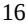
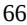

{0}------------------------------------------------

# **UNITED STATES SECURITIES AND EXCHANGE COMMISSION**

**Washington, D.C. 20549**

# **FORM 10-K**

**(Mark One)**

☒ **ANNUAL REPORT PURSUANT TO SECTION 13 OR 15(d) OF THE SECURITIES EXCHANGE ACT OF 1934**

**For the fiscal year ended December 31, 2022**

**OR**

☐ **TRANSITION REPORT PURSUANT TO SECTION 13 OR 15(d) OF THE SECURITIES EXCHANGE ACT OF 1934 FOR THE TRANSITION PERIOD FROM**

**Commission File Number 001-38613**

# **Bionano Genomics, Inc.**

**(Exact name of Registrant as specified in its Charter)**

**Delaware 26-1756290**

(State or other jurisdiction of incorporation or organization)

**9540 Towne Centre Drive, Suite 100,**

**San Diego, CA 92121**

(Address of principal executive offices) (Zip Code)

(I.R.S. Employer Identification No.)

**Registrant's telephone number, including area code: (858) 888-7600**

**Securities registered pursuant to Section 12(b) of the Act:**

| Title of Each Class               | Trading Symbol(s) | Name of Each Exchange on which Registered |
|-----------------------------------|-------------------|-------------------------------------------|
| Common Stock, \$0.0001 par value  | BNGO              | The Nasdaq Stock Market, LLC              |
| Warrants to purchase Common Stock | BNGOW             | The Nasdaq Stock Market, LLC              |

**Securities registered pursuant to Section 12(g) of the Act: None**

Indicate by check mark if the Registrant is a well-known seasoned issuer, as defined in Rule 405 of the Securities Act. Yes ☐ No x

Indicate by check mark if the Registrant is not required to file reports pursuant to Section 13 or 15(d) of the Act. Yes ☐ No x

Indicate by check mark whether the Registrant: (1) has filed all reports required to be filed by Section 13 or 15(d) of the Securities Exchange Act of 1934 during the preceding 12 months (or for such shorter period that the Registrant was required to file such reports), and (2) has been subject to such filing requirements for the past 90 days. Yes x No ☐

Indicate by check mark whether the Registrant has submitted electronically every Interactive Data File required to be submitted pursuant to Rule 405 of Regulation S-T (§232.405 of this chapter) during the preceding 12 months (or for such shorter period that the Registrant was required to submit such files). Yes x No ☐

Indicate by check mark whether the registrant is a large accelerated filer, an accelerated filer, a non-accelerated filer, a smaller reporting company, or an emerging growth company. See the definitions of "large accelerated filer," "accelerated filer," "smaller reporting company," and "emerging growth company" in Rule 12b-2 of the Exchange Act.

| Large accelerated filer | ☐ | Accelerated filer         | ☐ |
|-------------------------|---|---------------------------|---|
| Non-accelerated filer   | ☒ | Smaller reporting company | ☒ |
| Emerging growth company | ☐ |                           |   |

If an emerging growth company, indicate by check mark if the registrant has elected not to use the extended transition period for complying with any new or revised financial accounting standards provided pursuant to Section 13(a) of the Exchange Act. ☐

Indicate by check mark whether the registrant has filed a report on and attestation to its management's assessment of the effectiveness of its internal control over financial reporting under Section 404(b) of the Sarbanes-Oxley Act (15 U.S.C. 7262(b)) by the registered public accounting firm that prepared or issued its audit report ☐

If securities are registered pursuant to Section 12(b) of the Act, indicate by check mark whether the financial statements of the registrant included in the filing reflect the correction of an error to previously issued financial statements. ☐

Indicate by check mark whether any of those error corrections are restatements that required a recovery analysis of incentive-based compensation received by any of the registrant's executive officers during the relevant recovery period pursuant to § 240.10D-1(b). ☐

Indicate by check mark whether the Registrant is a shell company (as defined in Rule 12b-2 of the Exchange Act). YES ☐ NO x

The aggregate market value of the voting and non-voting common equity held by non-affiliates of the registrant as of June 30, 2022 (the last business day of the registrant's most recently completed second fiscal quarter) was approximately \$400,284,000 based on the closing price of the registrant's common stock on June 30, 2022 of \$1.38 per share, as reported by the Nasdaq Capital Market.

As of March 6, 2023, the Registrant had 306,239,000 shares of common stock, \$0.0001 par value per share, outstanding.

#### DOCUMENTS INCORPORATED BY REFERENCE

Portions of the definitive proxy statement, or the Proxy Statement, for the Registrant's 2023 Annual Meeting of Stockholders are incorporated by reference into Part III of this Annual Report on Form 10-K. The Proxy Statement will be filed with the Securities and Exchange Commission within 120 days of the Registrant's fiscal year ended December 31, 2022.

{1}------------------------------------------------

{2}------------------------------------------------

|            |                                                                                                              | Page |
|------------|--------------------------------------------------------------------------------------------------------------|------|
| PART I     |                                                                                                              |      |
| Item 1.    | Business                                                                                                     | 5    |
| Item 1A.   | Risk Factors                                                                                                 | 25   |
| Item 1B.   | Unresolved Staff Comments                                                                                    | 64   |
| Item 2.    | Properties                                                                                                   | 64   |
| Item 3.    | Legal Proceedings                                                                                            | 65   |
| Item 4.    | Mine Safety Disclosures                                                                                      | 65   |
| PART II    |                                                                                                              |      |
| Item 5.    | Market for Registrant's Common Equity, Related Stockholder Matters and Issuer Purchases of Equity Securities | 65   |
| Item 6.    | [Reserved]                                                                                                   | 65   |
| Item 7.    | Management's Discussion and Analysis of Financial Condition and Results of Operations                        | 65   |
| Item 7A.   | Quantitative and Qualitative Disclosures About Market Risk                                                   | 76   |
| Item 8.    | Financial Statements and Supplementary Data                                                                  | 77   |
| Item 9.    | Changes in and Disagreements With Accountants on Accounting and Financial Disclosure                         | 113  |
| Item 9A.   | Controls and Procedures                                                                                      | 113  |
| Item 9B.   | Other Information                                                                                            | 113  |
| Item 9C.   | Disclosure Regarding Foreign Jurisdictions that Prevent Inspections                                          | 113  |
| PART III   |                                                                                                              |      |
| Item 10.   | Directors, Executive Officers and Corporate Governance                                                       | 114  |
| Item 11.   | Executive Compensation                                                                                       | 114  |
| Item 12.   | Security Ownership of Certain Beneficial Owners and Management and Related Stockholder Matters               | 114  |
| Item 13.   | Certain Relationships and Related Transactions, and Director Independence                                    | 114  |
| Item 14.   | Principal Accountant Fees and Services                                                                       | 114  |
| PART IV    |                                                                                                              |      |
| Item 15.   | Exhibit and Financial Statement Schedules                                                                    | 114  |
| Item 16.   | Form 10-K Summary                                                                                            | 117  |
| Signatures |                                                                                                              | 117  |
|            |                                                                                                              |      |

{3}------------------------------------------------

*As used in this Form 10-K, "Bionano," the "Company," "we," "our," and "us" refer to Bionano Genomics, Inc. and its subsidiaries or, as the context may require, Bionano Genomics, Inc. only. "Lineagen" (doing business as "Bionano Laboratories"), "BioDiscovery" and "Purigen" refer to our wholly owned subsidiaries, Lineagen, Inc., BioDiscovery, LLC and Purigen Biosystems, Inc., respectively.*

#### **Note Regarding Forward-Looking Statements**

This Annual Report on Form 10-K (this Annual Report) contains forward-looking statements and information within the meaning of the safe harbor provisions for the U.S. Private Securities Litigation Reform Act of 1955. All statements other than statements of historical facts contained in this Annual Report, including statements regarding our future results of operations or financial condition, business strategy and plans, and objectives of management for future operations, are forward-looking statements. In some cases, you can identify forward-looking statements because they contain words such as "anticipate," "believe," "contemplate," "continue," "could," "estimate," "expect," "intend," "may," "plan," "potential," "predict," "project," "should," "target," "will" or "would" or the negative of these words or other similar terms or expressions.

We have based these forward-looking statements largely on our current expectations and projections about future events and financial trends that we believe may affect our financial condition, results of operations, business strategy and financial needs. These forward-looking statements are subject to known and unknown risks, uncertainties and assumptions, including risks described in the section entitled "Risk Factors" and elsewhere in this Annual Report, regarding, among other things:

- the size and growth potential of the markets for our products, and our ability to serve those markets;
- the rate and degree of market acceptance of our products;
- our ability to manage the growth of our business and integrate acquired businesses;
- our ability to expand our commercial organization to address effectively existing and new markets that we intend to target;
- the impact from future regulatory, judicial, and legislative changes or developments in the U.S. and foreign countries;
- our ability to successfully execute our strategy and meet anticipated goals and milestones
- our ability to compete effectively in a competitive industry;
- the introduction of competitive technologies or improvements in existing technologies and the success of any such technologies;
- the performance of our third-party contract sales organizations, suppliers and manufacturers;
- our ability to attract and retain key scientific or management personnel;
- the accuracy of our estimates regarding expenses, future revenues, reimbursement rates, capital requirements and needs for additional financing;
- the impact of geopolitical and macroeconomic developments, such as the ongoing conflict between Ukraine and Russia, related sanctions and the COVID-19 pandemic on our business and operations, as well as the business or operations of our suppliers, customers, manufacturers, research partners and other third parties with whom we conduct business and our expectations with respect to the duration of such impacts and the resulting effects on our business;
- our ability to realize the anticipated benefits and synergies of our recent and any future acquisitions or other strategic transactions;
- our ability to continue as a going concern within 12 months of this Annual Report and our ability to obtain funding for our operations; and
- our ability to attract collaborators and strategic partnerships.

You should not rely on forward-looking statements as predictions of future events. The outcome of the events described in these forward-looking statements is subject to risks, uncertainties and other factors described in Part I, Item 1A Risk Factors and elsewhere in this Annual Report. Moreover, we operate in a very competitive and rapidly changing environment. New risks and uncertainties may emerge from time to time, and it is not possible for us to predict all risks and uncertainties that could have an impact on the forward-looking statements contained in this Annual Report.

The results, events and circumstances reflected in the forward-looking statements may not be achieved or occur, and actual results, events or circumstances could differ materially from those described in the forward-looking statements.

In addition, statements that "we believe" and similar statements reflect our beliefs and opinions on the relevant subject. These statements are based on information available to us as of the date of this Annual Report. And while we believe that information provides a reasonable basis for these statements, that information may be limited or incomplete. Our statements should not be

{4}------------------------------------------------

read to indicate that we have conducted an exhaustive inquiry into, or review of, all relevant information. These statements are inherently uncertain, and investors are cautioned not to unduly rely on these statements.

The forward-looking statements made in this Annual Report relate only to events as of the date on which the statements are made. We undertake no obligation to update any forward-looking statements made in this Annual Report to reflect events or circumstances after the date of this Annual Report or to reflect new information or the occurrence of unanticipated events, except as required by law. We may not actually achieve the plans, intentions, or expectations disclosed in our forward-looking statements, and you should not place undue reliance on our forward-looking statements. Our forwardlooking statements do not reflect the potential impact of any future acquisitions, mergers, dispositions, joint ventures or investments.

#### **RISK FACTOR SUMMARY**

*Below is a summary of the principal factors that make an investment in our securities speculative or risky. This summary does not address all of the risks that we face. Additional discussion of the risks and uncertainties summarized in this risk factor summary, and other risks and uncertainties that we face, are set forth below under the heading "Risk Factors" and should be carefully considered, together with other information in this Annual Report and our other filings with the SEC before making investment decisions regarding our securities.*

- *•* We are an early commercial-stage company and have a limited commercial history, which may make it difficult to evaluate our current business and predict our future performance;
- We have incurred recurring net losses since we were formed and expect to incur losses in the future. We cannot be certain that we will achieve or sustain profitability;
- Our quarterly and annual operating results and cash flows have fluctuated in the past and might continue to fluctuate, which makes our future operating results difficult to predict and could cause the market price of our securities to decline substantially;
- Our future capital needs are uncertain and we may require additional funding in the future to advance the commercialization of our Saphyr system, Ionic Purification system, NxClinical software, and our other products, technologies and services, as well as continue our research and development efforts. If we fail to obtain additional funding, we will be forced to delay, reduce or eliminate our commercialization and development efforts;
- Unfavorable geopolitical and macroeconomic developments could adversely affect our business, financial condition or results of operations;
- The COVID-19 pandemic has materially affected and could continue to materially affect our operations globally, including at our headquarters in San Diego, California, as well as the business or operations of our research partners, customers and other third parties with whom we conduct business;
- Acquisitions, joint ventures and other strategic transactions could disrupt or otherwise harm our business and may cause dilution to our stockholders;
- If our products or technologies fail to achieve and sustain sufficient market acceptance, our revenue will be adversely affected;
- In the near term, sales of our Saphyr system, Ionic Purification system, NxClinical software, consumables and genome analysis services will depend on levels of research and development spending by clinical research laboratories, academic and governmental research institutions and biopharmaceutical companies, a reduction in which could limit demand for our technologies and products and adversely affect our business and operating results;
- If we do not successfully manage the development and launch of new products and technologies, our financial results could be adversely affected;
- Our future success is dependent upon our ability to further penetrate our existing customer base, attract new customers and retain the customers of our acquired businesses;
- The size of the markets for our products and technologies may be smaller than we estimate, and new markets may not develop as quickly as we expect, or at all, limiting our ability to successfully sell our products and technologies.
- We are currently limited to "research use only," or RUO, with respect to many of the materials and components used in our consumable products including our assays;
- If the FDA determines that our RUO products are medical devices or if we seek to market our RUO products for clinical diagnostic or health screening use, we will be required to obtain regulatory clearance(s) or approval(s), and may be required to cease or limit sales of our then marketed products, which could materially and adversely affect our business, financial condition and results of operations. Any such regulatory process would be expensive, time-consuming and uncertain both in timing and in outcome;

{5}------------------------------------------------

- If we are unable to protect our intellectual property, it may reduce our ability to maintain any technological or competitive advantage over our competitors and potential competitors, and our business may be harmed; and
- The price of our securities has been and may in the future be volatile or may decline regardless of our operating performance, and you could lose all or part of your investment.

{6}------------------------------------------------

## **PART I**

## **ITEM 1. BUSINESS**

## *Overview*

We are a global genomics company focused on elevating the health and wellness of all people. We are pioneers of optical genome mapping (OGM) for genome analysis and provide a suite of genome analysis solutions designed to enable researchers and clinicians to reveal answers to challenging questions in biology and medicine. Our mission is to transform the way the world sees the genome. Through our OGM solutions, our nucleic acid isolation and purification solutions, our genomic analysis and interpretation software, and our clinical testing and laboratory services, we believe that we have a suite of products that will drive new discoveries, elevate health and wellness, and increase our understanding of the genome in transformative ways.

We market and sell the Saphyr system, which delivers OGM data to enable ultra-sensitive and ultra-specific detection of all classes of structural variation (SV). The Saphyr system is used to identify structural changes in chromosomes, known as cytogenetics, and to accelerate the search for answers in genetic disease and cancer applications. The Saphyr system is comprised of an instrument, chip consumables, reagents and software containing a suite of data analysis and visualization tools. The Saphyr system has been shown to outperform the current gold standard methods for cytogenetics and molecular genetics including karyotyping, fluorescence in-situ hybridization (FISH), Southern blot and chromosomal microarray (CMA). The Saphyr system has also been shown to identify structural changes in chromosomes that cannot be identified using current commercially available solutions for gene sequencing. ®

We market and sell the Ionic Purification system, which is able to deliver high quality DNA in a more natural, native form and with fewer contaminants when compared to other isolation and purifications solutions. The Ionic Purification system is used to extract, purify, and concentrate DNA or RNA from a variety of sample types, and is comprised of an instrument, consumables, and reagents. ®

Our software delivers genomic data interpretation solutions tailored for research use in cytogenomics and molecular pathology labs in genetic disease and cancer research markets, with an emphasis on structural variation. This industry leading, platform agnostic software solution is designed to provide analysis, visualization, interpretation and reporting of SVs, single-nucleotide variants and absence of heterozygosity across the genome in one consolidated view. Our software currently enables analysis of next-generation sequencing (NGS) and microarray data, and we are developing a version that we expect to be able to incorporate OGM data to make our software a more comprehensive offering for analysis of genomic data. We believe the integration of OGM with data types common in the industry, such as Variant Call Format (VCF), and Binary Alignment Map (BAM), should accelerate and broaden our position in digital cytogenetics and comprehensive genome analysis by enabling us to simplify the assessment of clinically relevant variants in cytogenomics applications, potentially reducing interpretation time per sample and expanding our reach into the discovery and translational research markets through the combination of OGM and NGS.

Our Bionano Laboratories business provides proprietary genetic clinical testing services for individuals demonstrating clinical presentations consistent with neurodevelopmental disorders (NDDs), including autism spectrum disorders (ASDs) and other disorders of childhood development. Their comprehensive genetic testing services include reporting for known NDD-causing genome variations, including testing for proprietary variations, and combines testing with our Proprietary Variant Index (PRISM) which uses a proprietary database of over 35,000 individuals with NDDs tested with over 60,000 tests that provides additional evidence for candidate genes associated with NDDs. This testing is a CLIA-certified diagnostic testing service, and we have expertise in selling cytogenetic assays to physicians, providing genetic counseling services to individuals undergoing testing and their families, and contracting with third-party payors for reimbursement. Additionally, Bionano Laboratories has developed OGM-based laboratory developed tests (LDTs) for facioscapulohumeral muscular dystrophy type 1 (FSHD1), which is a progressive disorder that primarily affects the muscles of the face, shoulder blades (scapula), upper arms, and lower legs, and for detecting SVs in individuals with hematologic malignancies.

Bionano Laboratories also provides laboratory services to clinicians, scientists, pharmaceutical companies, and others who are seeking to incorporate OGM into their genomics research without the need to bring our Saphyr system in house. Laboratory services for OGM are performed in our laboratory facilities in San Diego, California and at partner laboratories in the United States and Europe, and serve as solutions for researchers and clinicians who would like to use OGM for various applications in genomics but have yet to acquire the Saphyr system.

Over the past year, we believe we have transformed our business from an instrument company to a provider of a full suite of genomic solutions. We expanded into molecular genetic clinical testing services through our August 2020 acquisition of Lineagen. We furthered our transformation through the expansion into software solutions, made possible by our October 2021 acquisition of BioDiscovery and continued with our November 2022 acquisition of Purigen bringing their leading nucleic acid isolation and purification technology to Bionano. We believe that these acquisitions, along with internal investments in research and development and the build out of our commercial teams, have positioned us well to provide solutions to our customers that we believe will make OGM the standard of care for many constitutional genetic disorders and cancers.

{7}------------------------------------------------

#### **Recent Highlights**

#### *Achievement of 2022 ELEVATE! Milestones*

Bionano executed on its 2022 ELEVATE! milestones and achieved or exceeded all publicly stated milestones outlined at the beginning of 2022.

- **Reimbursement:** We applied for a category 1 Current Procedural Terminology (CPT) code for OGM.
- **Clinical Studies:** We received institutional review board (IRB) approval for our hematological study. Site selection was completed, and enrollment commenced for our hematological study. Data generation for our prenatal study commenced. We completed our postnatal study. We had an interim publication for our prenatal study.
- **Expand Awareness:** We achieved an installed base of 240 Saphyr systems.
- **Planned Product Developments:** We released a pre-commercial version of NxClinical software, version 7.0, enabling OGM data analysis in the field. We released labeling protocol 2.0 and the SP Next DNA isolation protocol. We placed a pre-commercial version of our next-generation OGM system in the field. Our Bionano Laboratories business launched an OGM test menu for genetic disease and hematologic malignancies.

#### *Commercial Adoption of Offerings for Saphyr*

Bionano executed on its commercialization strategy, expanded the utilization of its Saphyr system and increased the amount of Bionano data generated across the globe, driving commercial momentum.

- Grew our installed base of Saphyr systems to 240 as of December 31, 2022, an increase of approximately 46% from a total installed base of 164 as of December 31, 2021. Installed base represents the global number of Saphyr instruments installed at end-customer locations to perform optical genome mapping.
- Sold 4,781 flowcells in the fourth quarter of 2022, an increase of approximately 49% over the 3,204 flowcells sold during the fourth quarter of 2021. For the year ended December 31, 2022, total flowcells sold reached 15,375, an increase of approximately 23% over the 12,518 flowcells sold during the year ended December 31, 2021. The Saphyr chip is the consumable that packages nanochannel arrays for DNA linearization. In its current form, each Saphyr chip has three flowcells. Flowcells sold refers to the units of genome mapping consumables used for analyzing one genome, purchased by customers to process optical genome mapping.

#### *Continued to Validate the Utility of OGM for Applications in Clinical Research with Benchmarking, Scientific Publication and Adoption*

Rigorous and extensive benchmarking of our Saphyr system against traditional cytogenetic methods and long read sequencing has continued and these results were published and validated in several key publications, presentations and announcements including:

- Researchers from The University of Texas MD Anderson Cancer Center published the first study to evaluate the utility of OGM for myelodysplastic syndrome (MDS) prognostication. The publication reported that when OGM was used instead of karyotyping, 17 to 21% of study subjects had different prognostic risk scores depending on the scoring system used, and in 13% of study subjects additional pathogenic variants were revealed.
- In a study published in *Blood Cancer Journal*, researchers found that in 33% of MDS samples and 54% of acute myeloid leukemia (AML) samples, more clinically relevant variants were detected using OGM than were found by traditional cytogenetic methods and these variants were reported to be highly relevant to the understanding of pathogenesis of these disorders.
- Researchers from eight research institutes analyzed OGM's utility for detection of cytogenetic abnormalities in AML samples, finding that OGM identified pathogenic variants in 12% of casesthat altered European LeukemiaNet (ELN) risk-level or identified eligibility for clinical trials.
- The first published validation study to evaluate the performance of OGM versus traditional cytogenetic techniques for the analysis of hematological neoplasms showed that OGM's technical performance resulted in a 100% first-pass rate, with concordance to traditional methods showing a sensitivity of 98.7%, a specificity of 100%, and an accuracy of 99.2%.
- A study demonstrated the utility of OGM as part of a workflow to evaluate the quality of hypoimmunogenic induced pluripotent stem cells (iPSCs) which could be used in regenerative medicine. This research provides scientific and practical support for OGM's ability to detect cryptic and balanced SVs in CRISPR-edited cells, some of which were not detected by karyotyping, and which may impact the genomic integrity of iPSCs.

{8}------------------------------------------------

## *Macroeconomic and Geopolitical Developments*

We are subject to additional risks and uncertainties as a result of adverse geopolitical and macroeconomic developments, such as any lingering effects of COVID-19, the ongoing conflict between Ukraine and Russia and related sanctions, and uncertain market conditions, including inflation and supply chain disruptions, which could continue to have a material impact on our business and financial results.

For a more detailed discussion of the impacts of macroeconomic and geopolitical developments on our business, see "Management's Discussion and Analysis of Financial Condition and Results of Operations - Macroeconomic and Geopolitical Developments."

#### **Industry Background**

Genome analysis is the process of extracting and interpreting biological information from DNA and RNA. DNA is the code that is found in all living cells and determines the characteristics and health of all living organisms. Although each organism's DNA order is unique, all DNA is composed of the same four nucleotides that come in pairs, which are referred to as base pairs. The human genome is composed of six billion of these base pairs (three billion of which are the maternal copy and three billion of which are the paternal copy of the genome), distributed across 23 pairs of chromosomes ranging in size from approximately 50 million to approximately 250 million base pairs. Genome variation is defined as at least one base pair differing in a comparison of sequence against a reference standard and can be as large as tens of millions of base pairs.

Genome structure refers to the way in which the various functional elements of the genome such as genes, reading frames, promoters and others are ordered, oriented and organized across the 23 pairs of chromosomes. SVs represent differences in the amount or location of genomic DNA from one individual compared to a reference genome. SV is one of the most biologically important aspects of the human genome and is a major factor for the cause of genetic disorders and cancer. Each SV involves the rearrangement or repetition of as few as several hundred base pairs to as many as tens of millions of base pairs. SVs may be inherited or arise spontaneously. SVs are well-known to cause diseases such as constitutional genetic disorders and cancer. Many researchers and clinicians now agree that despite major advances in the speed and cost-effectiveness of DNA sequencing, it fails to reliably detect SVs. OGM enables the detection of all known classes of SVs, and we believe no methodology exists that can detect SVs more comprehensively or cost efficiently than OGM with the Saphyr system.

We believe the traditional cytogenomic methods of detecting SVs for research and clinical applications, such as karyotyping, CMA, and FISH are antiquated and cumbersome and can only detect a small proportion of the SVs across an entire genome. OGM is designed to offer cytogeneticists the ability to fully digitize and replace these traditional methods with one simplified, cost effective and scalable workflow using the Saphyr system.

We believe that DNA isolation is the critical first step in the analysis of DNA. Short and long read sequencing applications typically require nucleotide lengths of 150 and, generally, 10,000 to 20,000 base pairs, respectively. OGM, conversely, optimally requires DNA lengths of greater than 100,000 base pairs. Due to market needs, the vast majority of DNA isolation and preparation technologies have been directed to meeting the requirements for short and long read sequencing applications. We believe that DNA isolation and purification processes that allow long segments of DNA (ultra-high molecular weight (UHMW) DNA) to remain intact are important for the success of OGM. Our Ionic Purification system has the capability to isolate and purify UHMW DNA that is ideal for OGM applications. We believe that the system's ease of use, reproducibility, and cost per sample profile has the potential to accelerate the adoption of OGM across a broad spectrum of applications.

We believe that software is necessary for genome analysis and should be the primary interface for how cytogeneticists interact with the data and report their findings. We believe the software's ease of use, core analysis functionality and the time necessary to obtain a reportable result are the most important factors to customers when considering a platform adoption decision and that data interpretation is typically a critical bottleneck in methods of genome analysis and therefore software is a key component in the entire workflow. The majority of software solutions on the market today have been developed with NGS as the primary application with the focus on the interpretation and reporting of single nucleotide variants (SNVs) instead of SVs. Our software solution, NxClinical™, was developed with CNV as the core focus and has become established as an industry leading solution for interpretation and reporting of CNVs for CMA and NGS. To the extent we are successful in integrating OGM into our NxClinical software, we anticipate that our software will be the first software solution delivering a fully integrated interpretation capability for SVs from OGM as well as seamless integration with NGS, with the potential to enable complementary OGM and NGS workflows through one software solution.

#### **Our Solutions**

We believe that an end-to-end OGM solution begins with the sample and ends with data analysis. The OGM workflow includes several steps: DNA isolation, DNA labeling, DNA mapping, data processing and data analysis. At each step we have either organically developed a solution or partnered with a third party to enable and provide a solution. We highly value our relationships with third parties that enable us to provide these solutions and will continue to work with others to ensure our customers' needs are being met. We are constantly on the look-out for opportunities to better meet the needs of our customers

{9}------------------------------------------------

whether that is through partnerships, organic development, or strategic acquisitions that accelerate and up-shift our capabilities. To that end, we have recently engaged in two transactions, which we believe will substantially benefit our customers and their adoption of OGM as a solution of choice for SV and CNV analysis. In 2021 we acquired BioDiscovery and its leading NxClinical software for data analysis, and in 2022 we acquired Purigen, and its proprietary isolation and purification technology. We believe that each of these acquisitions, together with our organic development, will significantly enhance the customer experience with OGM.

#### **OGM Systems**

Our system uses a proprietary approach to measure genome structure and SV through OGM. The OGM workflow is novel, comprehensive, scalable, cost effective and highly differentiated. OGM data is currently generated using the Saphyr system, which directly measures sequence specific patterns (SSPs) along UHMW DNA molecules in an unbiased approach without any amplification. Using the SSPs, software constructs a detailed physical map of the genome that accurately assigns the chromosomal location, order, orientation and quantity of sequence and in-turn, all the genome's functional elements. We believe OGM is capable of comprehensive, cost-effective and efficient detection of all classes of SVs and CNVs. Today, these SVs cannot be reliably detected by genome sequencing, from existing high throughput sequencers, which is focused on identifying genomic differences involving a few base pairs or SNVs, which the Saphyr system does not identify. We believe the Saphyr system is ideally suited to be adopted alongside the installed base of high throughput sequencers as a complement that is designed to give users the ability to see a much wider scope of genome variation, from single bases of DNA to full chromosomes.

OGM was built upon four key elements:

- **Extremely long molecules for analysis (or UHMW DNA).** The Saphyr system is capable of analyzing single molecules that are on average approximately 250,000 base pairs in length and can be as long as millions of base pairs. These lengths are over 1,000 times longer than the average short read length with Illumina sequencing systems and approximately 10-20 times longer than the average long read lengths with Pacific Biosciences of California (PacBio), and Oxford Nanopore systems. We believe these long read lengths overcome the inherent challenges of genome complexity and are the key to the Saphyr system's unprecedented sensitivity and specificity.
- **Proprietary nanotechnology for massively parallel linearization and analysis of long molecules with single molecule imaging.** Analyzing UHMW DNA required invention. We invented, patented, developed and commercialized nanochannel arrays to capture long single molecules of DNA from a solution and unwind and linearize them for SV analysis. Each molecule is imaged separately, making it possible to deconvolute complex mixtures including haplotypes and heterogeneous tumors.
- **DNA labeling chemistry specifically for physical mapping.** The detailed analysis of SSPs we use is also highly unique and novel. Instead of identifying the sequence of every base pair in these long fragments, we label and detect SSPs or motifs that occur universally across every genome with an average frequency of approximately one site for every few thousand base pairs. The key to our method entails introducing fluorescent tags at the sequence-specific site using highly specific and robust enzymatic chemistry along the extremely long fragments. These fragments, stretched out in nanochannels, are then directly imaged allowing us to measure the distance between labels with high accuracy. The pattern of labels detected on all these fragments can then be related to the pattern of sequence motif sites in a reference genome for comparison. Changes in the pattern indicate structural variation.
- **Bioinformatic tools for SV analysis.** Finally, our approach includes a novel bioinformatics platform that we developed from the ground-up to take advantage of the unique benefits of our solution. It comprises proprietary algorithms for the construction of a structurally accurate physical map of the genome to assign structure. Physical

{10}------------------------------------------------

maps of a test subject are then compared to a reference or other subjects in cross-mapping analysis that allows our system to detect genome wide SV, including the most complex balanced events.

The Saphyr system provides a solution for comprehensive SV analysis at a higher resolution than traditional techniques allowing for more answers that matter to be obtained in genetic disease and cancer applications. We believe that the Saphyr system is the only product capable of detecting SVs at high sensitivity and specificity with a workflow that is cost-effective and time efficient.

Our customers include researchers and clinicians who seek to identify and understand the biological implications of genome variation. We believe that the Saphyr system can replace more traditional cytogenetic tools which are expensive, slow and labor-intense, with an advanced solution designed to simplify workflow, reduce cost, and increase assay success rates. We believe the Saphyr system has the potential to significantly increase success rates and provide more answers across a wide range of applications in genomics.

#### **Nucleic Acid Isolation and Purification Systems**

Our nucleic acid isolation and purification system uses a novel and proprietary application of isotachophoresis (ITP) to isolate nucleic acid molecules in a gentle and efficient process. The process involves the gentle lysis of biological samples followed by the addition of the sample and buffer to an Ionic fluid chip. An electric field is applied to the chip and the nucleic acid is isolated in its natural, native form. Traditional methods of isolating nucleic acid, including column-based isolation and bead-based isolation, can be laborious, and result in molecules that are denatured, dehydrated and fragmented, and solutions that are contaminated and have low purity. An additional limitation of many of the traditional isolation processes is the number of cells that are required to be processed in order to obtain sufficient nucleic acid molecules for OGM analysis. Current methodologies require upwards of 1.5 million cells in order to isolate sufficient DNA for use on the Saphyr system. Our Ionic Purification system, employing ITP technology, addresses many of these deficiencies and yields high purity nucleic acid that is not denatured, dehydrated or fragmented. Additionally, the Ionic Purification system is capable of isolating sufficient quantities of DNA for use in OGM applications from far fewer cells in contrast to traditional methods. We believe the addition of the Ionic Purification system to the OGM workflow will provide a more efficient yield of DNA at higher quality than can be achieved with current processes. ®

Although OGM is our primary focus, the Ionic Purification system has a current customer base of non-OGM users that use the system to isolate and purify nucleic acid molecules from sample types including formalin-fixed, paraffin-embedded (FFPE) sample, tissue, cells, and viral. We anticipate continuing to support and expanding this customer base.

#### **Software Solutions**

We offer industry leading genome analysis software that enables genomics labs to analyze and interpret data across a wide range of platforms to generate highly informative data visualizations for streamlined and simple reporting of causal variants. Today, NxClinical software is among the most comprehensive solutions for analysis and interpretation of any microarray or NGS generated data integrating CNVs, absence of heterozygosity (AOH) and loss of heterozygosity (LOH), as well as SNVs from sequencing data into a single well integrated interface that is used across the globe by renowned academic and commercial clinical laboratories.

Our acquisition of BioDiscovery has expanded our portfolio into providing data analysis and interpretation solutions across NGS, CMA and we are working to add OGM. These software solutions are expected to allow us to leverage and expand our network of Bionano customers and to potentially enable future adoption of OGM. We believe integrating OGM data into the NxClinical software should substantially improve the analysis and reporting capabilities of our current Saphyr system, making OGM easier to adopt and use by our customers. Through BioDiscovery, we can now serve the NGS and array markets directly though software with an industry leading data interpretation solution for revealing more answers with delivery of copy number variants across the genome. Our software monetization strategy is predicated on a pay-per-sample model where customers running NGS and/or array today can adopt, which sets the stage for future OGM adoptions. Software is a way for us to participate directly in the NGS market while also enabling OGM data to be seamlessly integrated with NGS in one view for a comprehensive analysis, which is unique to Bionano.

#### **Testing and Laboratory Services**

Our Bionano Laboratories business offers tests that use CMA for evaluation of patients suspected of having certain genetic diseases, which is recommended by the American College of Medical Genetics and Genomics (ACMG), the American Academy of Pediatrics (AAP), and the American Academy of Neurology (AAN), among other renowned societies. We are actively performing research to determine whether OGM with the Saphyr system can replace CMA as the front-line test for children with developmental disorders. As the scientific, peer-reviewed literature supports this claim, the coding entities such as CMS and the AMA would need to adopt the proper procedural codes to allow for insurance reimbursement of new testing methodologies before they become mainstream clinical diagnostic instruments. Importantly, OGM is expected to be able to detect full mutations consistent with fragile X syndrome, which is another front-line test for children, especially males, with

{11}------------------------------------------------

autism spectrum disorder and intellectual disability. Studies are ongoing to determine the sensitivity and specificity for OGM as it relates to fragile X syndrome. Bionano Laboratories also employs Whole Exome Sequencing (WES), which aims to detect genome SNVs that are different from genome SVs and are not detectable by OGM.

We believe that Bionano Laboratories is uniquely positioned to develop LDT's that can improve upon the existing SOC for diagnostic testing for NDDs. Bionano Laboratories is working with payers to secure reimbursement alternatives for OGM-based testing. If reimbursements can be established, Bionano Laboratories intends to share its strategies with other labs which may drive demand for the Saphyr system. Bionano Laboratories plans to expand its testing menu with inclusion of OGM to demonstrate workflow implementation in a clinical setting in order to drive adoption as well as serve as a conduit for enabling access for those customers unable to make a capital equipment expenditure. Bionano Laboratories is working to enable access, demonstrate excellence of the OGM workflow as a model within a CLIA setting for educational purposes, and drive advancements in product development for clinical grade testing of OGM at scale.

#### **Our Commercial Offerings**

#### *The Saphyr System and Consumables*

We develop and market the Saphyr system, a complete sample-to-result solution for SV analysis by OGM that empowers comprehensive genome analysis and facilitates a deeper understanding of genetic variation and function. We believe the Saphyr system is capable of addressing the needs for SV analysis because it is:

- **Highly sensitive.** We believe Saphyr is the most sensitive detector of SV larger than 500 base pairs currently on the market.
- **Cost effective.** The consumables cost per genome, at an average of approximately \$500, can be less than the combination of standard techniques and well below both short-read and long-read WGS at a depth of 160x coverage.
- **Scalable and fast.** Relative to traditional techniques, Saphyr has demonstrated up to a 75% reduction in turnaround time for analysis of acute lymphoblastic leukemia (ALL) subjects when used instead of karyotyping, FISH and MLPA.

#### *The Saphyr Instrument*

The Saphyr instrument is a single-molecule imager that includes high performance optics, automated sample loading based on machine learning algorithms and computational hardware and control software. The instrument's high-performance optics simultaneously image DNA linearized in hundreds of thousands of nanochannels. The instrument's control interface is the user's primary control center to design and monitor experiments as they occur in real time. The computational hardware is responsible for the secondary processing of the image data being produced on the Saphyr instruments. The Saphyr instrument is currently capable of analyzing up to 5,000 human genomes per year at 30x coverage. At the end of 2022 we announced the placement of a pre-commercial unit that we expect to significantly increase the throughput.

#### *The Saphyr Chip*

The Saphyr Chip® is the consumable that packages the nanochannel arrays for DNA linearization. In its current form, each Saphyr chip has three flow cells containing approximately 120,000 nanochannels that are roughly 30 nanometers wide, and each flowcell can hold one unique sample. To manufacture the arrays, we use photolithography in a semiconductor fabrication facility to print hundreds of thousands of tiny grooves on silicon wafers and then dice the wafers into individual chips. Our chips are inexpensive to manufacture and highly scalable. The fluidic environment in each channel allows individual molecules to move swiftly utilizing only the charge of DNA. Hundreds of thousands of molecules can move through hundreds of thousands of parallel nanochannels simultaneously, enabling extremely high-throughput processing on a single-molecule basis.

{12}------------------------------------------------

## *Saphyr Sample Prep and Labeling Kits*

Our Bionano Prep™ kits and DNA labeling kits provide the reagents and protocols needed to extract and label UHMW DNA for use with the Saphyr system. These kits are optimized for performing our genome mapping applications on a variety of sample types.

Our workflow begins with the isolation of UHMW DNA. Our Bionano Prep kits are optimized for isolating and purifying UHMW DNA in a process that is gentler than existing DNA extraction methods. The resulting purified DNA is up to millions of base pairs long and optimal for use with our systems. Our kits and protocols enable the extraction of UHMW DNA from a variety of sample types including human or animal tissue and tumors, plant tissue, cell lines, bone marrow aspirates and human blood.

Our labeling reagents are optimized for applications on our genome mapping systems. Starting with UHMW DNA purified using the appropriate Bionano Prep kit, fluorescent labels are attached to specific sequence motifs. The result is uniquely identifiable genome-specific label patterns that enable de novo map assembly, anchoring sequencing contigs and discovery of SVs as small as 500 base pairs to up to chromosome arm lengths.

Our kit for DNA labeling, the Direct Label and Stain (DLS) kit, is a proprietary, nondestructive chemistry for sequence motif labeling of genomic DNA that improves every aspect of our genome mapping. DLS uses a single direct-labeling enzymatic reaction to attach a fluorophore to the DNA at a specific 6-base pair sequence motif, yielding approximately 16 labels per 100,000 base pairs in the human genome. After labeling, the molecules are linearized in the Saphyr chip on the Saphyr instrument and imaged. Through the isolation, labeling and linearization steps, the molecules maintain an average length of around 250,000 base pairs. The label patterns on each molecule allow them to be uniquely identified and aligned in a pair-wise comparison against all other molecules imaged from the same sample.

#### *The Ionic Purification System*

We acquired the Ionic Purification system through our November 2022 acquisition of Purigen. The Ionic Purification system uses a proprietary ITP method to isolate and purify nucleic acid molecules. The technology was initially developed at Stanford University and intellectual property from that development was exclusively licensed to Purigen. The technology was further developed and commercialized by Purigen. The system includes an instrument, consumable and reagents necessary to process samples. The system works by applying an electric field to specially formulated reagents in a consumable. The electric field electrophoretically focuses nucleic acid into a narrow band and purifies the molecules away from other potential inhibitors. This results in a higher yield of pure nucleic acid than traditional bind-and-strip approaches that is also less fragmented and free from bead or wash buffer contamination.

We offer reagents to isolate DNA and RNA from FFPE, tissue, and cells. We are optimizing the system with the intent it be used in an OGM workflow. We believe that the isolation and purification of DNA using the Ionic system in an OGM workflow will create a number of opportunities, including, enabling additional sample types not currently available to OGM, increasing sample throughput, decreasing sample preparation complexity.

{13}------------------------------------------------

#### *Software Solutions*

Our data solutions offering includes a complete suite of hardware and software for end-to-end experiment management, algorithms for assembling genome maps and algorithms and databases for bioinformatics processing, all of which is driven through convenient web-based management and monitoring tools.

We have a suite of proprietary algorithms and databases that fully enable our proprietary bioinformatic and SV analysis pipelines. Using pairwise alignment of the single molecule images, consensus genome maps are constructed, refined, extended and merged. Molecules are then clustered into two alleles, and a diploid assembly is created to allow for heterozygous SV detection. Genome maps typically span entire chromosome arms in single, contiguous maps. Comparative analysis of maps reveals SV. Our customers use our variant annotation workflow to specifically uncover rare and sample-specific mutations.

Our hardware solution includes the Saphyr Compute Server, which provides cluster-like performance in an affordable, compact solution and the Bionano Compute Server, which expands the analytical capacity of the suite of tools. With these solutions, our customers are capable of performing multiple simultaneous analyses and sustaining continuous throughput, which allows them to spend less time waiting for data, so they can focus on investigating results. We also offer a cloud-based solution for data analysis.

Our NxClinical software is among the most comprehensive and up-to-date solutions for cytogenetics and molecular genetics, providing one solution for analysis and interpretation of all genomic variants from microarray and NGS data. We are developing a version of NxClinical to incorporate OGM data, which is expected to become our software solution once completed.

#### *Testing and Laboratory Services*

Our Bionano Laboratories business offers OGM data to researchers seeking access to OGM data. Bionano Laboratories intends to build a menu of LDTs using OGM solutions, and in 2022 Bionano Laboratories introduced their first two OGM-based tests, one for hematological malignancy and another for genetic disorder applications. Additionally, Bionano Laboratories offers molecular genetic clinical testing services for individuals demonstrating clinical presentations consistent with NDDs, including ASDs and other disorders of childhood development, including:

- FirstStepDx PLUS is a CMA designed to identify an underlying genetic cause in individuals with autism spectrum disorder, developmental delay, and intellectual disability;
- Fragile X syndrome (FXS) testing is designed to detect individuals (both males and females) with FXS, as well as carriers of the condition;
- NextStepDx PLUS is a whole exome sequencing test designed to identify genetic variants that are associated with disorders of childhood development;
- EpiPanelDx PLUS is a genetic testing panel designed for patients who have experienced seizures, infantile spasms, encephalopathy, or febrile seizures; and
- PGx test identifies over 60 alleles in 11 genes. PGx testing is one aspect of personalized medicine and is used to aid health care providers with medications and dosage.

#### **Market Opportunity**

According to Markets and Markets, the worldwide market for genomics products and services is expected to reach approximately \$54.4 billion by 2025, up from approximately \$22.7 billion in 2020, representing a compound annual growth rate of 19%.

We expect to see OGM adoption in cytogenomics, discovery research and cell bioprocessing quality control (QC). Within cytogenetics and molecular pathology, we estimate the number of cytogenetic labs on a worldwide basis (excluding India and

{14}------------------------------------------------

developing countries) to be approximately 10,000. We estimate that these labs analyze approximately 10.0 million samples per year. Additionally, we estimate the number of pharmaceutical and biotech companies that are engaged in research and development of various cell therapies that rely on methods, including cytogenetics, for QC of the cell modification and manufacturing process to be approximately 1,400. Based on these estimates, we believe the economic potential for OGM in these markets is approximately \$10.0 billion annually, \$3.0 billion of which we attribute to cell bioprocessing QC. We believe there are additional potential future market opportunities for OGM including newborn screening, population genomics, and neurological and cardiological risk assessment which are not included in our estimates above.

We believe the three areas of the genomics market that are driving demand for the Saphyr system today:

- *Consolidation of traditional cytogenetics techniques in constitutional and cancer applications.* To provide a robust clinical analysis, cytogenetic assays detect known SVs that are linked to specific diseases or therapeutic responses. The technologies used for detecting SVs are expensive and involve cumbersome workflows with relatively limited ability to scale to higher volumes or more complex testing panels. Sequencers tend not to be used for cytogenetics due to their inability to reliably detect SVs. Cytogenetics laboratories are beginning to adopt the Saphyr system as a more effective, scalable and efficient approach to finding the SVs causative to genetic diseases and cancer. For this segment, the Saphyr system can be used as the sole tool for providing comprehensive and accurate detection of all classes of SVs and enable clinically relevant calls without the need for any sequencing or legacy cytogenetic technology. We estimate that approximately 10,000 cytogenetics labs exist worldwide (excluding India and developing countries).
- *Combining OGM with sequencing for molecular genetics and discovery research applications.* In discovery research across patient cohorts, sequencing is primarily used to find SNVs responsible for disease or therapeutic response. Sequencing alone, however, is significantly limited due to its inability to reveal SV. Our Saphyr system has been expanding this market segment by complementing sequencing to expand the scope of genome variation that can be analyzed in studies to achieve a more comprehensive view of the genome*.*
- *Cell bioprocessing QC applications.* An important part of cell bioprocessing applications is to ensure that genomic modifications did not introduce any SVs into the cell population. As a QC step, our Saphyr system has been used by researchers to evaluate the ability of OGM to detect SVs that may impact cellular stability. Several studies have been published showing the OGM can be used to evaluate cellular stability. We believe that this is an emerging market opportunity and could be up to \$3.0 billion annually.

We believe that if our OGM-based solutions can successfully penetrate these addressable market opportunities, this should spur additional basic and translational research creating new areas where the Saphyr instrument (or successor instruments) and OGM data can be used to improve the standard of care and patient management. These may include preconception, products of conception and prenatal genetic applications, uses to advance gene editing techniques and precision medicine. In the long term, we anticipate potential opportunities in population screening, newborn screening, biopharma applications in cell quality control and oncology.

#### **Our Strategy**

We are primarily focused on driving adoption of OGM through the Saphyr system (and successor instruments). Our goal is to streamline SV identification and enable new research in genomics to allow greater insight into their role in human health in ways that have not been possible with any other current research and diagnostic technologies.

Our strategy to achieve this includes:

- *Demonstrate that Saphyr is a superior alternative to traditional techniques in constitutional genetic disorders and hematologic malignancy applications.* Optical genome mapping has demonstrated superior detection sensitivity for all classes of SVs relative to karyotyping, FISH and CMA in numerous peer-reviewed publications over the past several years and offers benefits of improved assay success rates, faster time to result and a lower total cost. The value proposition and competitive differentiation for OGM in cytogenetics market is exceptionally strong with an immediate opportunity to digitize legacy microscope techniques (karyotyping) with a superior approach using the Saphyr system.
- *Complement NGS with OGM in translational, applied and discovery research markets.* We believe the combination of NGS and OGM can provide the most comprehensive and cost-effective analysis of genome variants from SNVs to whole chromosomes. NGS is an accurate technique for measuring genome variants below 500 bp while OGM bridges the gap by enabling detection of all SVs above 500 bp to reveal more answers and resolve previously unresolved cases from using NGS alone. There are over 15,000 NGS instruments installed globally and our vision is for each of these sequencers to be complemented with an OGM system to provide a more comprehensive picture of the genome for more discoveries, publications and translation into molecular genetics.
- *Accelerate broad reimbursement for OGM and establish it as the SOC in guidelines by professional medical societies.* We are investing in four multi-center clinical studies for postnatal, prenatal, hematologic malignancies and solid tumor analyses relative to SOC. Each study is designed with an expectation for recruitment of 1,000 subjects and

{15}------------------------------------------------

will assess sensitivity, specificity, reproducibility, concordance and incremental clinically relevant findings relative to SOC. We are investing in these programs to build the necessary evidence to establish reimbursement and to pave the way for inclusion in professional society guidelines to advance SOC.

- *Support the publication of findings with OGM by our customers beyond the more than 687 papers published to date.* The annual number of publications featuring data generated by the Saphyr system and its predecessor system has steadily increased since 2010 when the first publication appeared. Recently, the overall number of these publications has grown significantly. For example, of the 521 peer-reviewed and pre-print papers published since 2019, 173 were published in 2022 alone. We intend to continue to support and foster our customer base to help grow the number of publications featuring our systems' data. We believe that these publications are impactful as our customers' studies cover SVs in areas of high unmet medical need, such as rare and undiagnosed pediatric diseases, neurological and muscular diseases, developmental delays and disorders, prostate cancer and leukemia.
- *Continue to innovate our products and technologies.* We designed the Saphyr system to accommodate performance enhancements without the need for replacement of the entire instrument. For example, hardware upgrades and new consumables are made available to purchase by customers. We intend for these performance enhancements to be delivered on a regular basis. In addition, we periodically make available software upgrades to customers through download at no charge. We expect to continue developing and refining our technologies to improve the ease of use of our Saphyr system and enable our existing installed systems to meaningfully increase sample throughput and sensitivity and specificity of SV detection. A high throughput version is currently in development is expected to significantly increase the throughput and lower the cost per sample. Compared to the Saphyr system, which images DNA at a rate of approximately 205 Gbp per hour, the new system is expected to image nearly 820 Gbp per hour and we announced the placement of a pre-commercial beta system at a customer facility in December 2022.
- *Partner with industry-leading companies and laboratories to expand adoption in clinical markets.* Establish additional collaborations with customers to help drive validating studies. Expand partnership efforts with clinical diagnostic companies to commercialize LDTs in the U.S. as well as LDTs and approved tests outside the U.S.

#### **Sales and Marketing**

As of December 31, 2022, our commercial team consisted of 168 individuals in sales, sales support and marketing. Our sales support personnel include individuals in customer solutions, field service engineers and field application specialists. This commercial staff is primarily located in North America, Europe, and China. Most of our sales support team is located at our headquarters in San Diego and some work remotely throughout the U.S., Europe, and China.

We sell our products through a direct sales force based in North America and Europe. Our sales strategy involves the use of a combination of sales managers and sales representatives. We intend to increase our sales, support, and marketing efforts in the future by continuing to expand our direct footprint in North America and Europe as well as developing a more comprehensive support network in China and India, where we believe significant market opportunities exist, as we expand our business.

We sell our products through a network of distributors in the Asia-Pacific region and select other markets outside of North America and Europe. Specifically, we distribute our instruments and reagents via third-party distributors in markets such as China, Japan, South Korea, Singapore, Australia, India and South Africa. Three of our distributors are in China, one in Australia, one in Italy, one in Sweden, one in Japan, and one in South Korea.

The role of our sales managers and sales representatives is to educate customers on the advantages of Saphyr and the applications that our system makes possible. The role of our field application specialists is to provide on-site training and scientific technical support to prospective and existing customers. Our field application specialists are technical experts with advanced degrees, including seven with PhDs., and generally have extensive experience in academic research and core sequencing lab experience.

In addition, we maintain an applications lab team in San Diego, California composed of scientific experts who can transfer knowledge from the research and development team to the field application specialists. The applications lab team also runs foundational scientific collaborations and proof of principle studies, which help demonstrate the value of our product offering to prospective customers. This team also provides commercial services by running samples on Saphyr for researchers who do not have a Saphyr system of their own.

Our systems are relatively new to the life science marketplace and require a capital investment by our customers. The sales process typically involves numerous interactions and demonstrations with multiple people within an organization. Some potential customers conduct in-depth evaluations of the system including having us run experiments on in-house Saphyr systems. In addition, in most countries, sales to academic or governmental institutions require participation in a tender process involving preparation of extensive documentation and a lengthy review process. Because of these factors and the budget cycles of our customers, our sales cycle, the time from initial contact with a customer to our receipt of a purchase order, can often be nine to 12 months.

{16}------------------------------------------------

Bionano Laboratories primarily sells a suite of LDTs to pediatric physicians through a physician-directed "in-person" sales model. This commercial staff is located in North America, and the sales personnel primarily work remotely in U.S. states where Bionano Laboratories has obtained insurance reimbursement. The sales and marketing efforts are targeted primarily on specialty pediatricians, including pediatric neurologists, medical geneticists, and developmental and behavioral pediatricians. Bionano Laboratories also targets general pediatricians with large numbers of patients. Their managed care efforts are directed to establishing contracts and/or credentialing with private and governmental insurance carriers that provide coverage for patients with ASD and other forms of NDDs.

#### *Instruments*

Our instruments are manufactured by a third-party medical device manufacturer. Complete or nearly complete instruments are shipped by the manufacturer to us for final assembly and quality control testing. Upon completion, we ship directly to our customers' locations globally, or distributors' locations in the case of certain systems sold in the Asia-Pacific region. Installation of, and training on, our products is provided by our employees in the markets where we conduct direct sales, and by distributors in those markets where we operate with distributors.

We believe this manufacturing strategy is efficient and conserves capital. However, in the event it becomes necessary to utilize a different contract manufacturer, we would experience additional costs, delays and difficulties in doing so, and our business could be harmed. This manufacturer actively manages obsolescence of all components in our system. This is done through their supply management process where we get notified of any parts that will become obsolete with enough lead time to identify alternatives.

#### *Consumables*

All of our chip consumables for both OGM and ITP applications are produced by third-party manufacturers at their facilities; however, we have established procedures for a replacement manufacturer if required. We complete final assembly and quality control assessments of our chips at our headquarters in San Diego and our facility in Pleasanton.

Our OGM reagents are sourced from a limited number of suppliers, including certain single source suppliers. Our ITP reagents are sourced from a limited number of suppliers, including certain single source suppliers and also prepared in-house at our facility in Pleasanton. The OGM reagents include all components required to run a sample on OGM, such as capture and detector reagents, enzyme reagents and enzyme substrate. The ITP reagents include all the components required to run a sample for isolation and purification of nucleic acid. Although we believe that alternatives would be available, it would take time to identify and validate replacement reagents for our assay kits, which could negatively affect our ability to supply assay kits on a timely basis. Some reagents are supplied through a single source supplier. This supplier requires a sufficient notification period to allow for supply continuity and the identification and technology transfer to a new supplier in the event either party wishes to terminate the relationship.

We actively manage component obsolescence by subscribing to our vendors' end-of-life notifications. If a vendor is unable to provide sufficient notification, we keep safety stock of the component to minimize disruption to operations

#### *Manufacturing and Supply*

Our manufacturing strategy is to outsource instrument and chip manufacturing and internally develop and assemble reagent kits in our own facility.

#### *Software*

Our fundamental long-term software strategy is based on our goal of making OGM ubiquitous. We believe that simplified data interpretation and a seamless integration with NGS and array data to provide the most compressive genome analysis will increase utilization. In addition, we can participate directly in the NGS and array markets for genetic disease and cancer applications independent of OGM using a monetization model with a pay-per-sample NxClinical software offering. In this manner we can expand our network of Bionano customers into our software ecosystem with among the most comprehensive platform-agnostic genome interpretation solution where our proprietary original content in OGM can be adopted when needed to obtain a more comprehensive view of the genome by revealing all classes of SVs.

#### *Testing and Laboratory Services*

Bionano Laboratories' OGM testing is performed at our lab in San Diego, or at our partner labs in the United States and Europe. Bionano Laboratories intends to increase its testing capacity, and expand its menu of testing. Bionano Laboratories has CLIA certification for its San Diego lab.

For diagnostic testing, Bionano Laboratories maintains contracts with a network of laboratories to perform the wet work on various non-OGM LDT tests in order to conserve capital and maintain flexibility of adjusting contract labs to seek the best-in-class/most updated technology and customer service. As of December 31, 2022, Bionano Laboratories has established contracts with four primary laboratories to perform wet lab services. All third-party laboratories have met stringent criteria and are CLIA-

{17}------------------------------------------------

certified. Bionano Laboratories obtains raw data from contracted laboratories for select tests and then performs its own interpretation and reporting. In addition to its current menu, Bionano Laboratories' plans to add OGM-based LDTs to be performed at its San Diego facility, the first two of which have been announced.

#### **Key Agreements**

#### *License Agreement with Princeton University*

In January 2004, we entered into a license agreement (the Princeton License Agreement) with Princeton University (Princeton). Pursuant to the Princeton License Agreement, we received a worldwide, exclusive right and license to, among other things, manufacture and market products or services utilizing patents and inventions related to our sample preparation, DNA imaging and genomic data analysis platform and other key technology.

We are obligated to pay Princeton an annual license maintenance fee in the mid-four digits, which can be reduced by royalties paid to Princeton during the preceding 12 month period. We are also obligated to make royalty payments to Princeton equal to (i) a percentage in the mid-single digits of our and any of our sub-licensees' net sales of products covered by the Princeton License Agreement and (ii) a percentage in the low-single digits of our and any of our sub-licensees' revenue from services covered by the Princeton License Agreement. Our royalty obligations continue on a licensed product-by-licensed product and licensed service-by-licensed service basis, in every country of the world, until the later of the last sale of a licensed product or service or the expiration of all the Princeton patent rights covering such products or services.

The term of the Princeton License Agreement will continue until all of our royalty payment obligations have expired, unless terminated earlier. Princeton may terminate the Princeton License Agreement upon written notice in the event of our material breach of the Princeton License Agreement if such breach remains uncured for 60 days. We may terminate the Princeton License Agreement without cause upon 60 days' advance written notice to Princeton.

#### *License Agreement with Stanford University*

In connection with our November 2022 acquisition of Purigen, we acquired an amended and restated license agreement (the Stanford License Agreement) between Purigen and the Board of Trustees of the Leland Stanford Junior University (Stanford). Pursuant to the Stanford License Agreement, we received a worldwide, exclusive right and license to, among other things, make, have made, use, import, offer to sell and sell certain products utilizing patents and inventions related to our ITP-based sample preparation platform.

We are obligated to pay Stanford an annual license maintenance fee in the low-five digits, which can be reduced by royalties paid to Stanford during the preceding 12 month period. We are also obligated to make royalty payments to Stanford equal to a percentage in the low-single digits of our and any of our sub-licensees' annual net sales of products covered by the Stanford License Agreement. Our royalty obligations continue on a licensed product-by-licensed product basis, in every country of the world, until the later of the last sale of a licensed product or the expiration of all the Stanford patent rights covering such products.

The term of the Stanford License Agreement will continue until all of our royalty payment obligations have expired, unless terminated earlier. Stanford may terminate the Stanford License Agreement upon written notice in the event of our material breach of the Stanford License Agreement if such breach remains uncured for 60 days. We may terminate the Stanford License Agreement without cause upon 30 days' advance written notice to Stanford.

#### *Agreement for the Manufacture of Our Instruments*

We have engaged a single third-party manufacturer to produce and test our instruments on an as-ordered basis. The manufacturer of our instruments has no obligation to manufacture our instruments without a purchase order. In addition, this manufacturer has no obligation to maintain inventory in excess of any open purchase orders or materials in excess of the amount it reasonably determines will be consumed within 90 days. We are obligated to purchase any material deemed in excess pursuant to the agreement. The price we pay is determined according to a mutually agreed-upon pricing formula. We may terminate a purchase order by giving the manufacturer at least 30 days' written notice.

#### *Agreement for the Manufacture of Our Chip Consumables*

We have engaged a single third-party manufacturer to manufacture our chip consumables used in our Saphyr system and provide engineering services to us. This third-party has no obligation to manufacture our chip consumables without a purchase order. The prices and fees we pay are established in our agreement with this manufacturer or determined by the manufacturer pursuant if supported by appropriate information. Our agreement with this manufacturer automatically renews for successive one year terms unless a party notifies the other party in writing at least 30 days prior to the expiration of the then-current term. We may terminate an order of the agreement at any time upon 30 days' written notice.

{18}------------------------------------------------

#### **Intellectual Property**

#### *Genome Analysis*

Our core technology for nucleic acid research is related to methods and devices for non-sequencing based analysis of macromolecules such as nucleic acids. Using this technology, long (UHMC) nucleic acids can be suitably labeled and elongated in order to ascertain structural information such as scaffold organization, copy number, and genomic repeats that is not readily obtained with current sequencing-based approaches. We recently added a portfolio of patents and patent applications related to ITP through the Purigen acquisition, which we plan to continue to pursue and develop. We have secured and continue to pursue intellectual property rights globally, including rights related to isolation, purification and analysis of nucleic acid molecules, as well as innovations in the molecular biology and bioinformatics spaces. Additionally, our portfolio includes patents and patent applications directed to related parts of our business, including certain diagnostic tests and methods of diagnosis and analysis of microarray and image data.

We have developed a global patent portfolio that includes more than 160 issued patents or allowed applications across approximately 35 patent families that are either owned or exclusively licensed. The owned and licensed patent families contain issued patents and pending applications that relate to devices, systems, and methods for macromolecular analysis, isolation and purification of molecules, genetic testing, computer software systems and reflect our active and ongoing research programs.

In addition to pursuing patents, we have taken steps to protect our intellectual property and proprietary technology by entering into confidentiality agreements and intellectual property assignment agreements with our employees, consultants, corporate partners and, as applicable, advisors.

In addition to a robust and active patent portfolio, we believe that our software and algorithms for analysis, visualization and interpretation of genomic data represent a valuable asset that we continue to develop and exploit through current and planned software offerings.

#### **Government Regulation**

Our business is subject to and impacted by extensive and frequently changing laws and regulations in the United States (at both the federal and state levels) and internationally. These include laws and regulations particular to our business and laws and regulations relating to conducting business generally (e.g., export controls laws, U.S. Foreign Corrupt Practices Act and similar laws of other jurisdictions). We also are subject to inspections and audits by governmental agencies. Set forth below are highlights of certain key regulatory schemes applicable to our business. Below are discussions concerning government regulation of our Optical Genome Mapping, or OGM, products and services and, separately, the Diagnostic Services performed by Bionano Laboratories.

#### *Optical Genome Mapping*

Our OGM products are currently intended for research use only, or RUO, applications, although our customers may use our products to develop their own products that are subject to regulation by the FDA. Although most products intended for RUO are not currently subject to clearance or approval by the FDA, RUO products fall under the FDA's jurisdiction if they are used for clinical rather than research purposes. Consequently, our products are labeled "For Research Use Only."

The FDA's 2013 Guidance for Industry and Food and Drug Administration Staff on "Distribution of In Vitro Diagnostic Products Labeled for Research Use Only or Investigational Use Only," or, the RUO/IUO Guidance, provides the FDA's thinking on when IVD products are properly labeled for RUO or for IUO. The RUO/IUO Guidance explains that the FDA will review the totality of the circumstances when evaluating whether equipment and testing components are properly labeled as RUO. Merely including a labeling statement that a product is intended for research use only will not necessarily exempt the device from the FDA's 510(k) clearance, premarket approval, or other requirements, if the circumstances surrounding the distribution of the product indicate that the manufacturer intends its product to be used for clinical diagnostic use. These circumstances may include written or verbal marketing claims or links to articles regarding a product's performance in clinical applications, a manufacturer's provision of technical support for clinical validation or clinical applications, or solicitation of business from clinical laboratories, all of which could be considered evidence of intended uses that conflict with RUO labeling.

When marketed for clinical diagnostic use, our products will be regulated by the FDA as medical devices. The FDA defines a medical device in part as an instrument, apparatus, implement, machine, contrivance, implant, in vitro reagent, or other similar or related article which is intended for the diagnosis of disease or other conditions or in the cure, mitigation, treatment, or prevention of disease in man. FDA regulates the development, testing, manufacturing, marketing, post-market surveillance, distribution, advertising and labeling of medical devices. The FDA also requires the device to be registered by the medical device manufacturer and listed as a marketed product.

The FDA classifies medical devices into one of three classes on the basis of the intended use of the device, the risk associated with the use of the device for that indication, as determined by the FDA, and on the controls deemed by the FDA to be necessary to reasonably ensure their safety and effectiveness. Class I devices, which have the lowest level of risk associated

{19}------------------------------------------------

with them, are subject to general controls. Class II devices are subject to general controls and special controls, including performance standards. Class III devices, which have the highest level of risk associated with them, are subject to general controls and premarket approval. Most Class I devices and some Class II devices are exempt from a requirement that the manufacturer submit a premarket notification, or 510(k), and receive clearance from the FDA which is otherwise a premarketing requirement for a Class II device. Class III devices may not be commercialized until a premarket approval application, or PMA, is submitted to and approved by the FDA.

#### *510(k) Clearance Pathway*

To obtain 510(k) clearance, a sponsor must submit to the FDA a premarket notification demonstrating that the device is substantially equivalent, or SE, to a device legally marketed in the U.S. for which a PMA was not required. The FDA is supposed to make a SE determination within 90 days of FDA's receipt of the 510(k), but it often takes longer if the FDA requests additional information. Most 510(k)s do not require supporting data from clinical trials, but the FDA may request such data.

#### *Premarket Approval Pathway*

A PMA must be submitted if a new device cannot be cleared through the 510(k) process. The PMA process is generally more complex, costly and time consuming than the 510(k) process. A PMA must be supported by extensive data including, but not limited to, technical, preclinical, clinical trials, manufacturing and labeling to demonstrate to the FDA's satisfaction the safety and effectiveness of the device for its intended use. After a PMA is sufficiently complete, the FDA will accept the application for filing and begin an in-depth review of the submitted information. By statute, the FDA has 180 days to review the accepted application, although, review of the application generally can take between one and three years. During this review period, the FDA may request additional information or clarification of information already provided. Also during the review period, an advisory panel of experts from outside the FDA may be convened to review and evaluate the application and provide recommendations to the FDA as to the approvability of the device. In addition, the FDA will conduct a preapproval inspection of the manufacturing facility to ensure compliance with its quality system regulations, or QSRs. New premarket approval applications or premarket approval application supplements are also required for product modifications that affect the safety and efficacy of the device.

#### *Clinical Trials*

Clinical trials are usually required to support a PMA and are sometimes required for a 510(k). In the U.S., if the device is determined to present a "significant risk," the manufacturer may not begin a clinical trial until it submits an investigational device exemption application, or IDE, and obtains approval of the IDE from the FDA. These clinical trials are also subject to the review, approval and oversight of an IRB at each clinical trial site. The clinical trials must be conducted in accordance with the FDA's IDE regulations and good clinical practices. A clinical trial may be suspended by the FDA, the sponsor or an IRB at its institution at any time for various reasons, including a belief that the risks to the study participants outweigh the benefits of participation in the trial. Even if a clinical trial is completed, the results may not demonstrate the safety and efficacy of a device to the satisfaction of the FDA, or may be equivocal or otherwise not be sufficient to obtain approval of a device.

After a medical device is placed on the market, numerous regulatory requirements apply. These include among other things:

- Compliance with QSRs, which require manufacturers to follow stringent design, testing, control, documentation, record maintenance, including maintenance of complaint and related investigation files, and other quality assurance controls during the manufacturing process;
- Reporting of device malfunctions, serious injuries or deaths;
- Registration of the establishments where the devices are produced and listing of the devices with the FDA;
- Labeling regulations, which prohibit the promotion of products for uncleared or unapproved uses; and
- Medical device reporting obligations, which require that manufacturers investigate and report to the FDA adverse events, including deaths, or serious injuries that may have been or were caused by a medical device and malfunctions in the device that would likely cause or contribute to a death or serious injury if it were to recur.

Failure to comply with applicable regulatory requirements can result in enforcement action by the FDA, which may include sanctions, including but not limited to, warning letters; fines, injunctions, and civil penalties; recall or seizure of the device; operating restrictions, partial suspension or total shutdown of production; refusal to grant 510(k) clearance or PMA approvals of new devices; withdrawal of 510(k) clearance or PMA approvals; and civil or criminal prosecution. To ensure compliance with regulatory requirements, medical device manufacturers are subject to market surveillance and periodic, prescheduled and unannounced inspections by the FDA.

{20}------------------------------------------------

#### *Laboratory Developed Tests (LDTs)*

Federal agencies involved in the regulation of LDTs include CMS and the FDA. CMS regulates the quality of clinical laboratories and the clinical testing process pursuant to the Clinical Laboratory Improvement Amendments of 1988 (CLIA) and the FDA regulates the safety and effectiveness of the diagnostic test pursuant to authorities in the Federal, Food, Drug, and Cosmetic Act (FDCA). Although the FDA has statutory authority to regulate medical devices, the FDA has historically exercised its enforcement discretion and not enforced applicable provisions of the FDCA and FDA regulations with respect to LDTs, which are a subset of in vitro diagnostic tests that are intended for clinical use and designed, manufactured and used entirely within a single laboratory. The FDA does not consider devices to be LDTs if they are designed or manufactured completely, or partly, outside of the laboratory that offers and uses them. We sell our Saphyr system on an RUO basis to CLIA certified cytogenetic laboratories, which may use the system to develop LDTs.

At various times since 2006, the FDA has issued documents outlining its intent to require varying levels of FDA oversight of many types of LDTs. Congress has also considered legislation that would change how LDTs are regulated. It is unclear at this time if or when the FDA will finalize its plans to end enforcement discretion for LDTs, and even then, whether the new regulatory requirements are expected to be phased-in over time. However, the FDA may decide to regulate certain LDTs on a case-by-case basis at any time. A significant change in the way that the FDA regulates any LDTs that we, our collaborators, or our customers develop using our technology could affect our business. If the FDA requires laboratories to undergo premarket review and comply with other applicable FDA requirements in the future, the cost and time required to commercialize an LDT will increase substantially and may reduce the financial incentive for laboratories to develop LDTs, which could reduce demand for our instruments and our other products. In addition, if the FDA were to change the way that it regulates LDTs to require that we undergo pre-market review or comply with other applicable FDA requirements before we can sell our instruments or our other products to clinical cytogenetics laboratories, our ability to sell our instruments and other products to this addressable market would be delayed, thereby impeding our ability to penetrate this market and generate revenue from sales of our instruments and our other products.

#### *Europe/Rest of World Government Regulation*

Whether or not we obtain FDA approval for a product, we must obtain the requisite approvals from regulatory authorities in non-U.S. countries prior to the commencement of clinical trials or marketing of our product for clinical diagnostic use in those countries. The regulations in other jurisdictions vary from those in the U.S. and may be easier or more difficult to satisfy and are subject to change. For example, the European Union recently published new regulations that will result in greater regulation of medical devices and IVDs. The IVD Regulation is significantly different from the IVD Directive that it replaces in that it will ensure that the new requirements apply uniformly and on the same schedule across the member states, including a risk-based classification system and increasing the requirements for conformity assessment. The conformity assessment process results in the receipt of a CE designation which has been sufficient to begin marketing many types of IVDs. That process will become more difficult and costly to complete.

#### *Other Governmental Regulation*

We are subject to laws and regulations related to the protection of the environment, the health and safety of employees and the handling, transportation and disposal of medical specimens, infectious and hazardous waste and radioactive materials. For example, the U.S. Occupational Safety and Health Administration has established extensive requirements relating specifically to workplace safety for healthcare employers in the U.S. This includes requirements to develop and implement multi-faceted programs to protect workers from exposure to blood-borne pathogens, including preventing or minimizing any exposure through needle stick injuries. For purposes of transportation, some biological materials and laboratory supplies are classified as hazardous materials and are subject to regulation by one or more of the following agencies: the U.S. Department of Transportation, the U.S. Public Health Service, the U.S. Postal Service and the International Air Transport Association. We generally use third-party vendors to dispose of regulated medical waste, hazardous waste and radioactive materials that we may use during our research.

Laboratories that purchase certain of our OGM products and perform clinical diagnostic testing are also subject to extensive regulation under the Clinical Laboratory Improvement Amendments of 1988, or CLIA, requiring clinical laboratories to meet specified standards in areas such as personnel qualifications, administration, participation in proficiency testing, patient test management, quality control, quality assurance and inspections. Adverse interpretations of current CLIA regulations or future changes in CLIA regulations could have an adverse effect on sales of any affected products. Moreover, if we decide to operate our own clinical testing laboratory with respect to our OGM products, such clinical testing would require compliance with CLIA. If, in the future, we operate our own clinical laboratory to perform clinical diagnostic testing with respect to our OGM products, such activities would become subject to the Health Insurance Portability and Accountability Act of 1996, or HIPAA, and its corresponding regulations, as well as additional federal and state laws that impose a variety of fraud and abuse prohibitions on healthcare providers, including clinical laboratories.

{21}------------------------------------------------

## *Coverage and Reimbursement*

Currently, our OGM products are for research use only, but clinical laboratories may acquire our instrumentation through a capital purchase or capital lease and use the Saphyr system and direct label and stain chemistry to create their own diagnostic tests and potentially seek reimbursement for such tests. Our customers may generate revenue for these testing services by seeking the necessary approval of their product from the FDA or CMS, along with coverage and reimbursement from third-party payors, including government health programs and private health plans. The ability of our customers to commercialize diagnostic tests based on our technology will depend in part on the extent to which coverage and reimbursement for these tests will be available from such third-party payors.

In the U.S., molecular testing laboratories have multiple options for reimbursement coding, but we expect that the primary codes used will be the genomic sequencing procedure codes, or GSPs. The American Medical Association, or AMA, added GSPs to its clinical laboratory fee schedule in 2015. In addition, CMS issued a coverage determination providing for the reimbursement of next-generation sequencing for certain cancer diagnostics using an FDA-approved in vitro diagnostic test. Private health plans often follow CMS coverage and reimbursement guidelines to a substantial degree, and it is difficult to predict what CMS will decide with respect to the coverage and reimbursement of any products or services our customers try to commercialize.

In Europe, coverage for molecular diagnostic testing is varied. Countries with statutory health insurance (e.g., Germany, France, The Netherlands) tend to be more progressive in technology adoption with favorable reimbursement for molecular diagnostic testing. In countries such as the United Kingdom with tax-based insurance, adoption and reimbursement for molecular diagnostic testing is not uniform and is influenced by local budgets.

Ultimately, coverage and reimbursement of new products and services is uncertain, and whether laboratories that use our instruments to develop their own products or services will attain coverage and adequate reimbursement is unknown. In the U.S., there is no uniform policy for determining coverage and reimbursement. Coverage can differ from payor to payor, and the process for determining whether a payor will provide coverage may be separate from the process for setting the reimbursement rate. In addition, the U.S. government, state legislatures and foreign governments have shown significant interest in implementing cost containment programs to limit the growth of government-paid healthcare costs, including price controls and restrictions on reimbursement.

#### *Diagnostic Services*

#### *Clinical Laboratory Improvement Amendments of 1988 and State Regulation*

As a clinical laboratory, Bionano Laboratories is required to hold certain federal and state licenses, certifications and permits to conduct is business. As to federal certifications, in 1988, Congress passed the CLIA, establishing more rigorous quality standards for all commercial laboratories that perform testing on human specimens for the purpose of providing information for the diagnosis, prevention, or treatment of disease or the assessment of the health or impairment of human beings. CLIA requires such laboratories to be certified by the federal government and mandates compliance with various operational, personnel, facilities administration, quality and proficiency testing requirements intended to ensure the accuracy, reliability and timeliness of patient test results. CLIA certification is also a prerequisite to be eligible to bill state and federal healthcare programs, as well as many commercial third-party payers, for laboratory testing services. Both of Bionano Laboratories' facilities, one located in Salt Lake City, Utah and the other in San Diego, California are CLIA certified. These laboratories must comply with all applicable CLIA requirements. If a clinical laboratory is found to be out of compliance with CLIA standards, CMS may impose sanctions, limit or revoke the laboratory's CLIA certificate (and prohibit the owner, operator or laboratory director from owning, operating, or directing a laboratory for two years following license revocation), a directed plan of correction, on-site monitoring, civil monetary penalties, civil actions for injunctive relief, criminal penalties, or suspension or exclusion from the Medicare and Medicaid programs.

CLIA provides that a state may adopt laboratory licensure requirements and regulations that are more stringent than those under federal law and requires compliance with such laws and regulations. The State of Utah follows all CLIA regulations for laboratory facility and personnel requirements. Utah does not have any additional licensure and regulations. The State of California follows CLIA regulations for in-state laboratory facilities, but requires additional licensing requirements for laboratory personnel established by the California Department of Public Health (CDPH). CAP accreditation for the San Diego facility is pending.

Additionally, certain states require clinical laboratories to obtain out-of-state licenses to test specimens from patients, or to receive orders from physicians, within those states. Our Salt Lake City facility currently holds such out-of-state laboratory licenses in Pennsylvania and Maryland.

{22}------------------------------------------------

#### *HIPAA and other Privacy Laws*

The Health Insurance Portability and Accountability Act of 1996 ("HIPAA"), established comprehensive federal standards for the privacy and security of health information. The HIPAA standards apply to three types of organizations: health plans, healthcare clearing houses, and healthcare providers that conduct certain healthcare transactions electronically ("Covered Entities"). Title II of HIPAA, the Administrative Simplification Act, contains provisions that address the privacy of health data, the security of health data, the standardization of identifying numbers used in the healthcare system and the standardization of certain healthcare transactions. The privacy regulations protect medical records and other protected health information by, among other things, limiting their use and release, giving patients the right to access their medical records and limiting most disclosures of health information to the minimum amount necessary to accomplish an intended purpose. The HIPAA security standards require the adoption of administrative, physical, and technical safeguards and the adoption of written security policies and procedures.

On February 17, 2009, Congress enacted Subtitle D of the Health Information Technology for Economic and Clinical Health Act, or HITECH, provisions of the American Recovery and Reinvestment Act of 2009. HITECH expanded and strengthened HIPAA, created new targets for enforcement, imposed new penalties for noncompliance and established new breach notification requirements for Covered Entities. Regulations implementing major provisions of HITECH were finalized on January 25, 2013 through publication of the HIPAA Omnibus Rule (the "Omnibus Rule").

Under HITECH's breach notification requirements, Covered Entities must report breaches of protected health information that has not been encrypted or otherwise secured in accordance with guidance from the Secretary of the U.S. Department of Health and Human Services (the "Secretary"). Required breach notices must be made as soon as is reasonably practicable, but no later than 60 days following discovery of the breach. Reports must be made to affected individuals and to the Secretary and, in some cases depending on the size of the breach, they must be reported through local and national media. Breach reports can lead to investigation, enforcement and civil litigation, including class action lawsuits.

As a result of the clinical diagnostic services offered by Bionano Laboratories, Bionano Laboratories, is currently subject to HIPAA and maintains an active compliance program that is designed to identify security incidents and other issues in a timely fashion and enable us to remediate, mitigate harm or report if required by law. Bionano Laboratories is subject to prosecution and/or administrative enforcement and increased civil and criminal penalties for noncompliance, including a new, four-tiered system of monetary penalties adopted under HITECH. Bionano Laboratories is also subject to enforcement by state attorneys general who were given authority to enforce HIPAA under HITECH. To mitigate penalties under the HITECH breach notification provisions, Bionano Laboratories must ensure that breaches of protected health information are promptly detected and reported within the company, so that Bionano Laboratories can make all required notifications on a timely basis. However, even if Bionano Laboratories makes required reports on a timely basis, Bionano Laboratories may still be subject to penalties for the underlying breach.

In addition to the federal privacy and security regulations, there are a number of state laws regarding the privacy and security of health information and personal data that are applicable to our clinical laboratories. Many states have also implemented genetic testing and privacy laws imposing specific patient consent requirements and protecting test results by strictly limiting the disclosure of those results. State requirements are particularly stringent regarding predictive genetic tests, due to the risk of genetic discrimination against healthy patients identified through testing as being at a high risk for disease. We believe that we have taken the steps required of us to comply with health information privacy and security statutes and regulations, including genetic testing and genetic information privacy laws in all jurisdictions, both state and federal. However, these laws constantly change, and we may not be able to maintain compliance in all jurisdictions where we do business. Failure to maintain compliance, or changes in state or federal laws regarding privacy or security could result in civil and/or criminal penalties, significant reputational damage and could have a material adverse effect on our business.

The General Data Protection Regulation ("GDPR"), which applies to all EU member states from May 25, 2018, also applies to some of our operations. The GDPR is discussed in more detail elsewhere in this report. The GDPR applies not only to organizations within the EU, but also applies to organizations outside of the EU that offer goods or services to EU data subjects or that process or hold personal data of EU data subjects. Additionally, from January 1, 2021, companies have had to comply with the GDPR and also the United Kingdom GDPR ("UK GDPR"), which, together with the amended United Kingdom Data Protection Act 2018, retains the GDPR in the United Kingdom national law. Both the GDPR and the UK GDPR regulations specify potential liabilities for certain data protection violations, and we anticipate that it will result in a greater compliance burden for us as we conduct our business in the European Union. Fines for non-compliance can range from the greater of 2% of annual global revenues or €10 million, up to the greater of 4% of annual global revenues or €20 million. The GDPR is discussed in more detail under the heading "International Regulations" below.

{23}------------------------------------------------

## *Reimbursement and Billing*

Reimbursement and billing for diagnostic services is highly complex. Laboratories must bill various payors, such as private third-party payors, including managed care organizations ("MCO"), and state and federal health care programs, such as Medicare and Medicaid, and each may have different billing requirements. Additionally, the audit requirements Bionano Laboratories must meet to ensure compliance with applicable laws and regulations, as well as our internal compliance policies and procedures, add further complexity to the billing process. Other factors that complicate billing include:

- variability in coverage and information requirements among various payors;
- patient financial assistance programs;
- missing, incomplete or inaccurate billing information provided by ordering physicians;
- billings to payors with whom we do not have contracts;
- disputes with payors as to which party is responsible for payment; and
- disputes with payors as to the appropriate level of reimbursement.

Depending on the reimbursement arrangement and applicable law, the party that reimburses us for our services may be:

- a third-party who provides coverage to the patient, such as an insurance company or MCO;
- a state or federal healthcare program; or
- the patient.

Presently, approximately 90% of the diagnostic service revenue for Bionano Laboratories is paid by private third-party payors.

## *Federal and State Fraud and Abuse Laws*

A variety of state and federal laws prohibit fraud and abuse involving state and federal health care programs, such as Medicare and Medicaid. These laws are interpreted broadly and enforced aggressively by various state and federal agencies, including CMS, the Department of Justice, the Office of Inspector General for the Department of Health and Human Services ("OIG"), and various state agencies. In addition, the Medicare and Medicaid programs increasingly use a variety of contractors to review claims data and to identify improper payments as well as fraud and abuse. Any overpayments must be repaid within 60 days of identification unless a favorable decision is obtained on appeal. In some cases, these overpayments can be used as the basis for an extrapolation, by which the error rate is applied to a larger set of claims, and which can result in even higher repayments.

## *Anti-Kickback Laws*

The Anti-Kickback Statute prohibits, among other things, knowingly and willfully offering, paying, soliciting, receiving or providing remuneration, directly or indirectly, in exchange for or to induce either the referral of an individual, or the furnishing, arranging for or recommending of an item or service that is reimbursable, in whole or in part, by a federal health care program. "Remuneration" is broadly defined to include anything of monetary value, such as, for example, cash payments, gifts or gift certificates, discounts, or the furnishing of services, supplies or equipment. The Anti-Kickback Statute can be interpreted broadly to prohibit many arrangements and practices that are lawful in businesses outside of the health care industry.

Recognizing the potential breadth of interpretation of the Anti-Kickback Statute and the fact that it may technically prohibit many otherwise innocuous or beneficial arrangements within the health care industry, the OIG has issued a series of regulations, or safe harbors intended to protect such arrangements. Compliance with all requirements of a safe harbor immunizes the parties to the business arrangement from prosecution under the Anti-Kickback Statute. The failure of a business arrangement to fit within a safe harbor does not necessarily mean that the arrangement is illegal or that the OIG will pursue prosecution but would be evaluated on a case-by-case basis. Still, in the absence of an applicable safe harbor, a violation of the Anti-Kickback Statute may occur even if only one purpose of an arrangement is to induce referrals. The penalties for violating the Anti-Kickback Statute can be severe. These sanctions include criminal, civil and administrative penalties, imprisonment and possible exclusion from the federal health care programs. Many states have adopted laws similar to the Anti-Kickback Statute, and some apply to items and services reimbursable by any payor, including private third-party payors.

Further, the Eliminating Kickbacks in Recovery Act of 2018, or EKRA, prohibits payments for referrals to recovery homes, clinical treatment facilities, and laboratories. EKRA's reach extends beyond federal health care programs to include private insurance (i.e., it is an "all payor" statute). For purposes of EKRA, the term "laboratory" is defined broadly and without reference to any connection to substance use disorder treatment. The law includes a limited number of exceptions, some of which closely align with corresponding federal Anti-Kickback Statute exceptions and safe harbors, and others that materially differ.

{24}------------------------------------------------

## *Physician Self-Referral Bans*

The federal ban on physician self-referrals, commonly known as the Stark Law, prohibits, subject to certain exceptions, physician referrals of Medicare patients to an entity providing certain designated health services, which include laboratory services, if the physician or an immediate family member of the physician has any financial relationship with the entity. Several Stark Law exceptions are relevant to arrangements involving clinical laboratories, including but not limited to: (1) fair market value compensation for the provision of items or services; (2) payments by physicians to a laboratory for clinical laboratory services; (3) certain space and equipment rental arrangements that satisfy certain requirements; and (4) personal services arrangements. Penalties for violating the Stark Law include the return of funds received for all prohibited referrals, fines, civil monetary penalties and possible exclusion from federal health care programs. In addition to the Stark Law, many states have their own self-referral bans, which may extend to all self-referrals, regardless of the payor.

#### *State and Federal Prohibitions on False Claims*

The federal False Claims Act imposes liability on any person or entity that, among other things, knowingly presents, or causes to be presented, a false or fraudulent claim for payment to the federal government. Under the False Claims Act, a person acts knowingly if he or she has actual knowledge of the information or acts in deliberate ignorance or in reckless disregard of the truth or falsity of the information. Specific intent to defraud is not required. The qui tam provisions of the False Claims Act allow a private individual to bring an action on behalf of the federal government and to share in any amounts paid by the defendant to the government in connection with the action. Penalties include payment of up to three times the actual damages sustained by the government, plus significant civil penalties, as well as possible exclusion from federal health care programs. In addition, various states have enacted similar laws modeled after the False Claims Act that apply to items and services reimbursed under Medicaid and other state health care programs, and, in several states, such laws apply to claims submitted to any payor.

#### *Civil Monetary Penalties Law*

The federal Civil Monetary Penalties Law, or the CMP Law, prohibits, among other things, (1) the offering or transfer of remuneration to a Medicare or state health care program beneficiary if the person knows or should know it is likely to influence the beneficiary's selection of a particular provider, practitioner, or supplier of services reimbursable by Medicare or a state health care program, unless an exception applies; (2) employing or contracting with an individual or entity that the provider knows or should know is excluded from participation in a federal health care program; (3) billing for services requested by an unlicensed physician or an excluded provider; and (4) billing for medically unnecessary services. The penalties for violating the CMP Law include exclusion, substantial fines, and payment of up to three times the amount billed, depending on the nature of the offense.

#### *Penalties*

Failure to comply with the aforementioned fraud and abuse laws could result in significant penalties, including civil, criminal, and administrative penalties, damages, fines, disgorgement, the curtailment or restructuring of our operations, exclusion from participation in federal and state healthcare programs, additional integrity oversight and reporting obligations, imprisonment, contractual damages, and reputational harm. If any of the physicians or other healthcare providers or entities with whom we do business is found to be not in compliance with applicable laws, they may be subject to criminal, civil or administrative sanctions, including exclusions from government funded healthcare programs.

#### *International Regulations*

We market some of our tests outside of the United States and are subject to foreign regulatory requirements governing laboratory licensure, human clinical testing, use of tissue, privacy and data security, and marketing approval for our tests. These requirements vary by jurisdiction, differ from those in the United States and may require us to implement additional compliance measures or perform additional pre-clinical or clinical testing. For example, the In Vitro Diagnostic Medical Devices (2017/746/EU) ("IVDR") will replace the existing In Vitro Diagnostic Medical Devices Directive (98/79/EC) ("IVDD") in the European Union ("EU"). The IVDR was published in May 2017, marking the start of a five-year period of transition from the IVDD. During the transitional period the IVDR will come into force gradually, starting with the provisions related to the designation of Notified Bodies and the ability of manufacturers to apply for new certificates under the IVDR. The transitional period will end on 26 May 2022, the "Date of Application" ("DoA") of the Regulation. From that point the IVDR will apply fully. The EU has also implemented the General Data Protection Regulation, or GDPR, which requires us to meet new and more stringent requirements regarding the handling of personal data about European Union residents. In many countries outside of the United States, coverage, pricing and reimbursement approvals are also required. We are also required to maintain accurate information on and control over sales and distributors' activities that may fall within the purview of the Foreign Corrupt Practices Act, its books and records provisions and its anti-bribery provisions.

{25}------------------------------------------------

## *Other Regulatory Requirements*

Our laboratories, and the laboratories of Bionano Laboratories, are subject to federal, state and local regulations relating to the handling and disposal of regulated medical waste, hazardous waste and biohazardous waste, including chemical, biological agents and compounds, blood and bone marrow samples and other human tissue. Typically, we use outside vendors who are contractually obligated to comply with applicable laws and regulations to dispose of such waste. These vendors are licensed or otherwise qualified to handle and dispose of such waste.

We are subject to laws and regulations related to the protection of the environment, the health and safety of employees and the handling, transportation and disposal of medical specimens, infectious and hazardous waste and radioactive materials. For example, the U.S. Occupational Safety and Health Administration ("OSHA") has established extensive requirements relating specifically to workplace safety for healthcare employers in the U.S. This includes requirements to develop and implement multi-faceted programs to protect workers from exposure to blood-borne pathogens, including preventing or minimizing any exposure through needle stick injuries. For purposes of transportation, some biological materials and laboratory supplies are classified as hazardous materials and are subject to regulation by one or more of the following agencies: the U.S. Department of Transportation, the U.S. Public Health Service, the United States Postal Service, the Office of Foreign Assets Control, and the International Air Transport Association. We generally use thirdparty vendors to dispose of regulated medical waste, hazardous waste and radioactive materials and contractually require them to comply with applicable laws and regulations.

## *Healthcare Reform*

In the U.S. and abroad, there have been and continue to be a number of legislative initiatives to contain healthcare costs and change the way healthcare is financed. By way of example, in March 2010, the Patient Protection and Affordable Care Act, as amended by the Health Care and Education Reconciliation Act, collectively, the ACA, became law. The ACA is a sweeping law intended to broaden access to health insurance, reduce or constrain the growth of healthcare spending, enhance remedies against fraud and abuse, add new transparency requirements for the healthcare and health insurance industries, impose new taxes and fees on the health industry and impose additional health policy reforms.

There have been executive, judicial and Congressional challenges to certain aspects of the ACA. For example, President Trump signed several Executive Orders and other directives designed to delay the implementation of certain provisions of the ACA or otherwise circumvent some of the requirements for health insurance mandated by the ACA. Concurrently, Congress considered legislation to repeal or repeal and replace all or part of the ACA. While Congress has not passed comprehensive repeal legislation, it has enacted laws that modify certain provisions of the ACA, such as removing penalties, effective January 1, 2019, for not complying with the ACA's individual mandate to carry health insurance. On June 17, 2021, the U.S. Supreme Court dismissed a challenge on procedural grounds that argued the ACA is unconstitutional in its entirety because the "individual mandate" was repealed by Congress. It is possible that the ACA will be subject to judicial or Congressional challenges in the future. It is unclear how such challenges and the healthcare reform measures of the Biden administration will impact the ACA and our business.

Further, other legislative changes have been proposed and adopted since the ACA was enacted. For example, on August 16, 2022, President Biden signed the Inflation Reduction Act into law, which among other things, extends enhanced subsidies for individuals purchasing health insurance coverage in ACA marketplaces through plan year 2025. The IRA also eliminates the coverage gap under the Medicare Part D program beginning in 2025 by significantly lowering the beneficiary maximum out-of-pocket cost and through a newly established manufacturer discount program. In addition, on April 1, 2014, the Protecting Access to Medicare Act of 2014, or PAMA, was signed into law, which, among other things, significantly altered the payment methodology under the Medicare Clinical Laboratory Fee Schedule, or CLFS. PAMA requires certain laboratories performing clinical diagnostic laboratory tests to report to CMS the amounts paid by private payors for laboratory tests. Beginning on January 1, 2018, CMS has begun using reported private payor pricing to periodically revise payment rates under the CLFS. Based on current law, between January 1, 2023 and March 31, 2023, applicable laboratories will be required to report on data collected during January 1, 2019 and June 30, 2019. This data will be utilized to determine 2024 to 2026 CLFS rates.

We expect that additional state and federal healthcare reform measures will be adopted in the future, any of which could limit the amounts that federal and state governments will pay for healthcare products and services. In addition, sales of our tests outside of the U.S. will subject us to foreign regulatory requirements, which may also change over time.

#### **Acquisitions**

We acquired BioDiscovery in October 2021 and Purigen in November 2022. For a further discussion of these acquisitions, please refer to Note 14, Acquisitions, to our consolidated financial statements included in this Annual Report.

#### **Human Capital Management**

As of December 31, 2022, we had 405 employees, of which 168 work in sales, sales support and marketing, 130 work in research and development, and 107 work in general and administrative. As of December 31, 2022, of our 405 employees, 342

{26}------------------------------------------------

were located in the U.S. and 63 were employed outside the U.S. None of our employees are represented by a labor union or are subject to a collective bargaining agreement.

Our human capital resources objectives include, as applicable, identifying, recruiting, retaining, incentivizing and integrating our existing and new employees, advisors and consultants. The principal purposes of our equity incentive plans are to attract, retain and reward personnel through the granting of stock-based compensation awards, in order to increase stockholder value and the success of our company by motivating such individuals to perform to the best of their abilities and achieve our objectives.

We value diversity, equity, and inclusion across our workforce, in our communities, and in the work that we do. We will continue to focus on diversity, equity, and inclusion initiatives that support a culture that is centered on belonging while aligning with our shared corporate mission and values.

#### **Corporate Information**

We were formed in January 2003 as BioNanomatrix LLC, a Delaware limited liability company. In August 2007, we became BioNanomatrix Inc., a Delaware corporation. In October 2011, we changed our name to BioNano Genomics, Inc., and in July 2018, we changed our name to Bionano Genomics, Inc.

Our principal executive offices are located at 9540 Towne Centre Drive, Suite 100, San Diego, California 92121, and our telephone number is (858) 888- 7600. Our website address is www.bionanogenomics.com. Information contained in, or that can be accessed through, our website is not incorporated by reference into this Annual Report, and you should not consider information on our website to be part of this Annual Report. Our design logo, "Bionano," and our other registered and common law trade names, trademarks and service marks are the property of Bionano Genomics, Inc.

#### **Available Information**

Access to our Annual Report on Form 10-K, quarterly reports on Form 10-Q, current reports on Form 8-K, and amendments to these reports filed with or furnished to the SEC, may be obtained through the investor section of our website at http://www.bionanogenomics.com. We do not charge for access to and viewing of these reports. Information in the investor section and on our website is not part of this Annual Report on Form 10-K or any of our other securities filings. Our filings with the SEC may be accessed through the SEC's website at www.sec.gov. All statements made in any of our securities filings, including all forward-looking statements or information, are made as of the date of the document in which the statement is included unless otherwise specified, and we do not assume or undertake any obligation to update any of those statements or documents unless we are required to do so by law.

#### **ITEM 1A. RISK FACTORS**

#### **RISK FACTORS**

*You should consider and read carefully all of the risks and uncertainties described below, as well as other information included in this Annual Report, including our financial statements and related notes appearing below. The risks described below are not the only ones facing us. The occurrence of any of the following risks or additional risks and uncertainties not presently known to us or that we currently believe to be immaterial could materially and adversely affect our business, financial condition or results of operations. In such case, the trading price of our securities could decline. This Annual Report also contains forward-looking statements and estimates that involve risks and uncertainties. Our actual results could differ materially from those anticipated in the forward-looking statements as a result of specific factors, including the risks and uncertainties described below.*

#### **Risks related to our financial condition and need for additional capital**

#### *We are an early commercial-stage company and have a limited commercial history, which may make it difficult to evaluate our current business and predict our future performance.*

We are an early commercial-stage company and have a limited commercial history. Our limited commercial history may make it difficult to evaluate our current business and, especially when combined with the other risk factors listed in this section, makes predictions about our future success or viability subject to significant uncertainty. In particular, we have significantly increased our headcount through recent acquisitions of other businesses and the expansion of our sales, marketing and research and development teams, which has increased our operating costs in a manner not historically reflected in our unaudited consolidated financial statements, and plan to further increase headcount as we expand our operations. Because our business model has evolved over time, and combined with our recent acquisitions, this has impacted the composition and concentration of our revenues, which we expect to continue to change with any future acquisitions and further expansion of our operations. These changes, among others, may make it difficult to evaluate our current business, assess our future performance relative to prior performance and accurately predict our future performance. We have encountered in the past, and will continue to encounter in the future, risks and difficulties frequently experienced by early commercial-stage companies, including those associated with scaling up our infrastructure, increasing the size of our organization and integrating acquired businesses. If we

{27}------------------------------------------------

do not address these risks successfully, or if our assumptions regarding these risks and uncertainties are incorrect or change over time, our results of operations could differ materially from our expectations and our business, financial condition and results of operations could be materially and adversely affected.

#### *We have incurred recurring net losses since we were formed and expect to incur losses in the future. We cannot be certain that we will achieve or sustain profitability.*

Since our inception, we have incurred recurring net losses. We incurred net losses of \$132.6 million and \$72.4 million, and used cash in operations of \$124.8 million and \$71.9 million for the years ended December 31, 2022 and 2021, respectively. As of December 31, 2022, we had an accumulated deficit of \$348.7 million.We cannot predict if we will be profitable in the near future or at all. We expect that our losses will continue for the foreseeable future as we plan to invest significant additional funds toward the expansion of our commercial organization, research and development efforts and capital expenditures, among other things. Our recent acquisitions have increased our expenses and we expect that any future acquisitions of businesses, assets, products or technologies will further increase our expenses, which may result in additional losses. We also expect significant increases in our stock-based compensation expense in future periods, reflecting higher stock option valuations as a public company and the issuance of additional equity awards due to increased headcount. In addition, we incur significant legal, accounting and other expenses as a result of being a public company, especially as we no longer qualify as an emerging growth company and are therefore required to comply with additional disclosure and compliance requirements. These factors, among others, will make it hard for us to achieve and sustain profitability. We may also incur significant losses in the future for a number of other reasons, many of which are beyond our control, including the level of market acceptance of our products, the introduction of competitive products and technologies, our future product development efforts, our market penetration and our margins, as well as the other risks described below.

## *Our quarterly and annual operating results and cash flows have fluctuated in the past and might continue to fluctuate, which makes our future operating results difficult to predict and could cause the market price of our securities to decline substantially.*

Numerous factors, many of which are outside our control, may cause or contribute to significant fluctuations in our quarterly and annual operating results. These fluctuations may make financial planning and forecasting uncertain and may result in unanticipated decreases in our available cash, which could negatively affect our business and prospects. In addition, one or more of such factors may cause our revenue or operating expenses in one period to be disproportionately higher or lower relative to the other periods. As a result, comparing our operating results on a period-to-period basis might not be meaningful. You should not rely on our past results as indicative of our future performance. Moreover, our stock price might be based on expectations of future performance that are unrealistic or that we might not meet and, if our revenue or operating results fall below the expectations of investors or securities analysts, the price of our securities could decline substantially.

Our operating results have varied in the past. In addition to other risk factors listed in this section, some of the important factors that, alone or together, may cause fluctuations in our quarterly and annual operating results include:

- adoption of our OGM solutions on our Saphyr system, Ionic Purification system or successor systems;
- our successful creation of an end-to-end solution for OGM;
- the successful integration of our Bionano Laboratories, BioDiscovery and Purigen businesses;
- execution on our commercial and reimbursement strategy involving Bionano Laboratories;
- customer demand for current BioDiscovery software solutions, including NxClinical software, and future software solutions developed through BioDiscovery's platform;
- the position of our Purigen business in the DNA isolation space of genome analysis and customer demand for our Ionic Purification system;
- the timing of customer orders and payments and our ability to recognize revenue;
- the rate of utilization of consumables by our customers;
- reductions in or other difficulties relating to staffing, capacity, shutdowns or slowdowns of laboratories and other institutions in our customer base, such as reduced or delayed investment in new technologies or spending on products, technologies or consumables;
- differences in purchasing patterns across our customer base, including potential differences in consumables spending between earlier adopters of our technologies and more recent customers and variances in rates of increase of consumables spending following new technology purchases;

{28}------------------------------------------------

- geopolitical and macroeconomic developments, such as the conflict between Ukraine and Russia and related sanctions, such as the COVID-19 pandemic, inflation, increased cost of goods, supply chain issues, and global financial market conditions;
- our ability to successfully integrate new personnel, technology and other assets that we may acquire into our company;
- the timing of the introduction of new systems, products, technologies, system and product enhancements and services;
- changes in governmental funding of life sciences research and development or other changes that impact budgets, budget cycles or seasonal or other spending patterns of our customers;
- future accounting pronouncements or changes in our accounting policies; and
- the outcome of any current or future litigation or governmental investigations involving us or other third parties with whom we do business.

In addition, a significant portion of our operating expenses are relatively fixed in nature, including our existing and recently acquired leases, and planned expenditures are based in part on expectations regarding future revenue. Accordingly, unexpected revenue shortfalls could decrease our gross margins and cause significant changes in our operating results from quarter to quarter. If this occurs, the trading price of our securities could fall substantially. This variability and unpredictability caused by factors such as those described above and elsewhere in this section could also result in our failing to meet the expectations of industry or financial analysts or investors for any period. If our revenue or operating results fall below the expectations of analysts or investors or below any guidance we may provide, or if the guidance we provide is below the expectations of analysts or investors, the price of our securities could decline substantially. Such a stock price decline could occur even when we have met or exceeded any previously publicly stated guidance or expectations.

#### *If we are unable to maintain adequate revenue growth or do not successfully manage such growth, our business and growth prospects will be harmed.*

We may not achieve substantial growth rates in future periods. Investors should not rely on our operating results for any prior periods as an indication of our future operating performance. To effectively manage our anticipated future growth, we must continue to maintain and enhance our financial, accounting, manufacturing, customer support and sales administration systems, processes and controls, and to integrate such systems, processes and controls into our newly acquired businesses. Failure to effectively manage our anticipated growth could lead us to over-invest or under-invest in development, operational and administrative infrastructure; result in weaknesses in our infrastructure, systems, or controls; give rise to operational mistakes, losses, loss of customers, productivity or business opportunities; and result in loss of employees and reduced productivity of remaining employees.

Our continued growth could require significant capital expenditures and might divert financial resources from other projects such as the development or integration of new products, technologies and services. As additional products and technologies are commercialized, we may need to incorporate new equipment, implement new technology systems, or hire new personnel with different qualifications. Failure to manage this growth or transition could result in turnaround time delays, higher product costs, declining product quality, deteriorating customer service, and slower responses to competitive challenges. A failure in any one of these areas could make it difficult for us to meet market expectations for our products and technologies, and could damage our reputation and the prospects for our business.

If our management is unable to effectively manage our anticipated growth, our expenses may increase more than expected, our revenue could decline or grow more slowly than expected and we may be unable to implement our business strategy. The quality of our products, technologies and services may suffer, which could negatively affect our reputation and harm our ability to retain and attract customers.

## *Our future capital needs are uncertain and we may require additional funding in the future to advance the commercialization of our Saphyr system, Ionic Purification system, NxClinical software, and our other products, technologies and services, as well as continue our research and development efforts. If we fail to obtain additional funding, we will be forced to delay, reduce or eliminate our commercialization and development efforts.*

Our operations have consumed substantial amounts of cash since our inception. We expect to continue to spend substantial amounts of cash in order to continue the commercialization of our products and technologies, fund our research and development programs, expand headcount and execute potential strategic transactions. In connection with the preparation of our financial statements for the fiscal year ended December 31, 2022, we performed an analysis of our ability to continue as a going concern. We believe, based on our current business plan, that our existing cash and cash equivalents will not be sufficient for the next twelve months from the issuance of this report. Our ability to execute our operating plan depends on our ability to generate sales and obtain additional funding through equity offerings, debt financings or potential licensing and collaboration arrangements. For example, we will likely need to raise substantial additional capital to:

{29}------------------------------------------------

- expand our sales and marketing efforts to further commercialize our products, technologies and services and address competitive developments;
- expand our research and development efforts to improve our existing products, technologies and services and develop and launch new products, technologies and services, particularly if any of our products, technologies and services are deemed by the U.S. Food and Drug Administration, or FDA, to be medical devices or otherwise subject to additional regulation by the FDA;
- pursue a regulatory path with the FDA, or a regulatory body outside the United States, to market our existing RUO products or new products utilized for diagnostic purposes;
- lease additional facilities or build-out existing facilities as we continue to grow our employee headcount, inventory and research and development;
- further expand our operations outside the United States;
- enter into collaboration arrangements, if any, or in-license products and technologies;
- acquire or invest in complimentary businesses or assets;
- add operational, financial and management information systems; and
- cover increased costs incurred as a result of continued operation as a public company, including costs resulting from our no longer qualifying as an emerging growth company and, if applicable, in the future, loss of our status as a smaller reporting company or changes in our status from a nonaccelerated filer to an accelerated filer or large accelerated filer.

Our future funding requirements will be influenced by many factors, including:

- the cost of integrating our newly acquired businesses or of acquiring future businesses;
- market acceptance of our products, technologies and services, and the variability in costs to achieve such acceptance;
- the cost and timing of establishing additional sales, marketing and distribution capabilities;
- the cost of our research and development activities;
- our ability to satisfy any outstanding or future debt obligations;
- increasing interest rates;
- supply chain disruptions;
- the success of our existing distribution and marketing arrangements and our ability to enter into additional arrangements in the future;
- the effects of geopolitical or macroeconomic developments, such as the ongoing military conflict between Russia and Ukraine, related sanctions or the COVID-19 pandemic; and
- the effect of competing technological and market developments.

The various ways we could raise additional capital carry potential risks. We cannot assure you that we will be able to obtain additional funds on acceptable terms, or at all. If we raise additional funds by issuing equity or equity-linked securities, our stockholders may experience dilution. Any equity or debt securities we issue could provide for rights, preferences, or privileges senior to those of holders of our common stock. Future debt financing, if available, may involve covenants restricting our operations or our ability to incur additional debt. Any debt or equity financing may contain terms that are not favorable to us or our stockholders. If we raise additional funds through collaboration and licensing arrangements with third parties, it may be necessary to relinquish some rights to our technologies or our products, or grant licenses on terms that are not favorable to us.

Global economic conditions have been worsening, with disruptions to, and volatility in, the credit and financial markets in the U.S. and worldwide resulting from the effects of ongoing geopolitical or macroeconomic developments. If these conditions persist or worsen, we could experience an inability to access additional capital. If we do not have, or are not able to obtain, sufficient funds, we may have to delay development or commercialization of our technologies and products. We also may have to reduce marketing, customer support or other resources devoted to our products or technologies or cease operations. Any of these factors could have a material adverse effect on our financial condition, operating results and business. Any of the foregoing could significantly harm our business, prospects, financial condition and results of operation and could cause the price of our securities to decline.

{30}------------------------------------------------

#### *If we are not able to increase the number of authorized shares of our common stock or our trading price does not increase, we may be limited in our ability to issue and sell our shares, and, as a result, our operations and financial condition may be materially and adversely affected.*

We will need to seek the additional capital necessary to fund our operations through public or private equity offerings, debt financings, and collaborative and licensing arrangements. We have limited shares of our common stock currently available and authorized for issuance. Investors in prior transactions have purchased our shares of common stock or our convertible securities, such as warrants, for which we must reserve unissued shares of our common stock. We therefore will likely need to increase the number of authorized shares of our common stock, which requires stockholder approval, in order to issue shares of our common stock or securities convertible, exercisable or exchangeable into shares of our common stock to investors and other strategic partners, in capital raising transactions. If our trading price does not increase or if we are unable to increase the authorized shares of our common stock, we will be limited in our efforts to raise additional capital. As a result, our operations and financial condition may be materially and adversely affected.

#### *Unfavorable geopolitical and macroeconomic developments could adversely affect our business, financial condition or results of operations.*

Our results of operations could be adversely affected by general conditions in the global economy, the global financial markets and adverse geopolitical and macroeconomic developments, including without limitation inflation, slowing growth, rising interest rates and recession. A severe or prolonged global economic downturn could result in a variety of risks to our business. For example, inflation rates, particularly in the United States, have increased recently to levels not seen in years, and increased inflation may result in decreased demand for our products and services, increases in our operating costs (including our labor costs), prolonged unemployment, reduced liquidity and limits on our ability to access credit or otherwise raise capital on acceptable terms, if at all. In addition, the Federal Reserve has raised, and may again raise, interest rates in response to concerns about inflation, which coupled with reduced government spending and volatility in financial markets may have the effect of further increasing economic uncertainty and heightening these risks. Risks of a prolonged global economic downturn are particularly true in Europe, which is undergoing a continued severe economic crisis. A weak or declining economy, regardless of the reason for the decline, could also strain our suppliers, possibly resulting in supply disruption. Any actual or perceived disruption in our product distribution channel could alter customer buying decisions, prompting customers to delay or cancel their orders, which would negatively impact our sales revenue and could harm our reputation. For example, during the COVID-19 pandemic, customers that committed to order minimum quantities of consumables or to purchase our Saphyr instrument delayed such commitments. In addition, we anticipate that ongoing disruptions in our supply chain due to lingering COVID-19 and general macroeconomic effects may cause shortages in the materials required to operate our instruments, therefore limiting our ability to process customer samples and the ability of users of our systems to operate our system. We have experienced supply chain disruptions, some of which have delayed shipment of products to our customers. Any of the foregoing could harm our business and we cannot anticipate all of the ways in which the current economic climate and financial market conditions could adversely impact our business.

Additionally, following the invasion of Ukraine by Russia, financial markets around the world experienced volatility. In response to the invasion, the United States, United Kingdom and European Union, along with others, imposed significant new sanctions and export controls against Russia, Russian banks and certain Russian individuals and may implement additional sanctions or take further punitive actions in the future. The full economic and social impact of the sanctions imposed on Russia (as well as possible future punitive measures that may be implemented), as well as the counter measures imposed by Russia, in addition to the ongoing military conflict between Ukraine and Russia, which could conceivably expand into the surrounding region, remains uncertain; however, both the conflict and related sanctions have resulted, and could continue to result in disruptions to trade, commerce, pricing stability, credit availability, supply chain continuity and reduced access to liquidity, in both Europe and globally, and has introduced significant uncertainty into global markets. In particular, the Russia-Ukraine conflict has contributed to rapidly rising costs of living (driven largely by higher energy prices) in Europe and other advanced economies. As the adverse effects of this conflict continue to develop and potentially spread, both in Europe and throughout the rest of the world, our customers may be negatively impacted, which in turn may cause them to delay purchasing decisions and otherwise depress the level of spend conducted by such customers for our products, technologies and services. Further, a weak or declining economy could strain our suppliers, possibly resulting in additional supply disruption. As a result, our business and results of operations may be adversely affected by the ongoing conflict between Ukraine and Russia and related sanctions, particularly to the extent it escalates to involve additional countries, further economic sanctions or wider military conflict. We have operations, as well as current and potential new customers throughout Europe. If economic conditions in Europe and other key markets for our products and technologies continue to remain uncertain or deteriorate further, including as a result of COVID-19 or otherwise, we could experience adverse effects on our business, supply chain, partners or customers.

{31}------------------------------------------------

#### *The COVID-19 pandemic has materially affected and could continue to materially affect our operations globally, including at our headquarters in San Diego, California, as well as the business or operations of our research partners, customers and other third parties with whom we conduct business.*

Our business could be adversely affected by health crises in regions where we have operations, concentrations of sales and marketing teams, contractors, distributors or other business operations. Such health crises could also affect the business or operations of our research partners, customers and other third parties with whom we conduct business. In particular, the evolving effects of the COVID-19 pandemic and government measures taken in response have had significant impacts, both direct and indirect, on businesses and commerce, as significant reductions in business-related activities have occurred, supply chains have been disrupted, manufacturing and clinical development activities have been curtailed or suspended and enrollment in studies has been limited or made more difficult. Continued remote work policies, quarantines, shelter-in-place and similar government orders, shutdowns or other restrictions, or the perception of such orders, shutdowns, or other restrictions have materially affected and may continue to materially affect how we, our customers, and our suppliers are operating our businesses.

As public health directives surrounding the pandemic have relaxed, we have modified our work-from-home policies for certain employees and certain of our business practices, including reopening our offices and permitting travel and in-person events, taking into consideration government restrictions, employee safety and health risks. Our approach may vary among geographies depending on appropriate health protocols, and may change at any time. Additionally, our efforts to reopen our offices safely may not be successful, could expose our employees to health risks, and could involve additional costs or liability. To the extent our employees are exposed to or become ill with COVID-19, our ability to conduct our global and domestic operations may be impaired from time to time. For example, we experienced at various times during the pandemic the inability to visit certain customer sites to support installation of, training on or service to our OGM systems. As a result, in the past, we have had to delay instrument installations or service related visits. The COVID-19 pandemic may also have long-term effects on the nature of the office environment and remote working, which may present strategy, operational, talent recruiting and retention, worker productivity and efficiency, and workplace culture challenges that may adversely affect our business. Furthermore, our remote workforce poses increased risks to our information technology systems and data as more of our personnel leverage resources not necessarily within our control.

In connection with our Bionano Laboratories diagnostic services, COVID-19 poses the risk that we or our employees, contractors, suppliers, courier delivery services and other partners may be prevented from conducting business activities, including due to, among other things, spread of the disease within these groups or shutdowns that may be requested or mandated by governmental authorities. The continued spread of COVID-19 and the measures taken by the governments of countries affected could disrupt the supply chain of materials needed for our diagnostic tests, interrupt our ability to receive specimens, impair our ability to perform or deliver the results from our tests, impede patient movement or interrupt healthcare services causing a decrease in test volumes, delay coverage decisions from Medicare and third-party payors, delay ongoing and planned clinical studies involving our tests, negatively affect enrollment in our ongoing or future studies, cause us to make strategic determinations regarding, among other things, the cost and quality of the components and supplies we acquire, and have a material adverse effect on our business, financial condition and results of operations. For example, COVID-19 related disruptions to the global supply chain created challenges in getting sufficient components and raw materials for production of our OGM systems and consumables, as well as resulted, at least in part, in unfavorable flowcell yields in 2021 and part of 2022. If the pandemic persists, these disruptions could reoccur or persist.

As global economic conditions recover, business activity may not recover as quickly as anticipated or at all, and it is not possible at this time to estimate the long-term impacts that these factors could have on our business, or the global economy as a whole, as the impact will depend on future developments, which are highly uncertain and cannot be predicted. Conditions will be subject to the effectiveness of government policies, including vaccine mandates, vaccine shortages and administration rates, the emergence of new strains or variants of the virus in markets and communities where we, our customers, and our suppliers are operating our business and other factors that are not foreseeable. Any of the foregoing could adversely affect our business, financial condition and results of operations. In addition, these factors may also have the effect of heightening many of the other risks and uncertainties described in this Annual Report on Form 10-K.

## *Changes in tax laws or regulations that are applied adversely to us or our customers may have a material adverse effect on our business, cash flow, financial condition or results of operations.*

New income, sales, use, excise or other tax laws, statutes, rules, regulations or ordinances could be enacted at any time, which could adversely affect our business operations and financial performance. Further, existing tax laws, statutes, rules, regulations or ordinances could be interpreted, changed, modified or applied adversely to us. For example, legislation informally titled the Tax Cuts and Jobs Act; the Coronavirus Aid, Relief, and Economic Security Act; and the Inflation Reduction Act enacted many significant changes to the U.S. tax laws. Future guidance from the Internal Revenue Service and other tax authorities with respect to such legislation may affect us, and certain aspects of such legislation could be repealed or modified in future legislation. These developments, along with any other future changes in U.S. tax laws could have a material impact on the value

{32}------------------------------------------------

of our deferred tax assets, could result in significant one-time charges, and could increase our future U.S. tax expense. In addition, it is uncertain if and to what extent various states will conform to federal tax legislation.

Moreover, should the scale of our international business activities expand, any changes in the U.S. taxation of such activities or any other changes in applicable non-U.S. tax laws could increase our worldwide effective tax rate and harm our future financial position and results of operations. Limitations on the ability of taxpayers to claim and utilize foreign tax credits and the deferral of certain tax deductions until earnings outside of the U.S. are repatriated to the U.S., as well as changes to United States tax laws that may be enacted in the future, could impact the tax treatment of future foreign earnings.

#### *Our ability to use net operating losses and certain other tax attributes to offset future taxable income and taxes may be subject to limitations.*

As of December 31, 2022, we had federal and state tax net operating loss carryforwards of \$463.8 million and \$197.6 million, respectively. The federal tax loss carryforwards include \$282.9 million that do not expire, but utilization of such tax loss carryforwards is limited to 80% of our taxable income. The remaining federal tax loss carryforwards of \$180.9 million and state tax loss carryforwards begin to expire in 2027 and 2023, respectively, unless previously utilized. As of December 31, 2022, we also had federal and California research credit carryforwards of \$9.4 million and \$8.8 million, respectively. The federal research credit carryforwards begin to expire in 2027 unless previously utilized. The California research credits carry forward indefinitely.

In addition, utilization of our net operating losses and research and development credit carryforwards may be subject to limitations due to ownership changes that have occurred or that could occur in the future in accordance with applicable provisions of the Internal Revenue Code of 1986, as amended, and corresponding provisions of state law. We may have experienced one or more ownership changes in the past and we may also experience additional ownership changes in the future as a result of subsequent changes in our stock ownership, some of which may be outside of our control. If an ownership change occurs and our ability to use our net operating loss or research and development credit carryforwards is materially limited, it would harm our future operating results by increasing our future tax obligations. In addition, at the state level, there may be periods during which the use of net operating loss carryforwards is suspended or otherwise limited, which could accelerate or permanently increase state taxes owed.

#### *If our estimates or judgments relating to our critical accounting policies are based on assumptions that change or prove to be incorrect, our results of operation could fall below our publicly announced guidance or the expectations of securities analysts and investors, resulting in a decline in the market price of our securities.*

The preparation of financial statements in conformity with generally accepted accounting principles in the United States, or GAAP, requires management to make estimates and assumptions that affect the amounts reported in our financial statements and accompanying notes. We base our estimates on historical experience and on various other assumptions that we believe to be reasonable under the circumstances, the results of which form the basis for making judgments about the carrying values of assets, liabilities, equity, revenue and expenses that are not readily apparent from other sources. If our assumptions underlying our estimates and judgements relating to our critical accounting policies change or if actual circumstances differ from our assumptions, estimates or judgements, our operating results may be adversely affected and could fall below our publicly announced guidance or the expectations of securities analysts and investors, resulting in a decline in the market price of our securities.

#### **Risks related to our business operations**

#### *Acquisitions, joint ventures and other strategic transactions could disrupt or otherwise harm our business and may cause dilution to our stockholders.*

As part of our growth strategy, we have acquired and may continue to acquire other businesses, products or technologies as well as pursue strategic alliances, joint ventures, technology licenses or investments in complementary businesses or assets. We may not be able to locate or make suitable acquisitions on acceptable terms, and future acquisitions may not be effectively and profitably integrated into our business. Our failure to successfully complete the integration of any business or assets that we acquire could have an adverse effect on our prospects, business activities, cash flow, financial condition, results of operations and stock price. Integration challenges may include the following:

- disruption in our relationships with our pre-acquisition customers, distributors or suppliers, or in the relationships of our acquired businesses with their pre-acquisition customers, distributors or suppliers, as a result of such a transaction;
- unanticipated expenses and liabilities related to acquired companies or assets;
- disputes with the seller(s) of any acquired companies or assets or litigation with the seller(s) or third parties resulting from acquired companies or assets;
- difficulties integrating acquired personnel, technologies, operations and legal compliance obligations into our existing business;

{33}------------------------------------------------

- diversion of management time and focus from operating our business to acquisition integration challenges;
- increases in our expenses and reductions in our cash available for operations and other uses;
- possible write-offs or impairment charges relating to acquired businesses or assets;
- difficulties developing and marketing new products, technologies and services or integrating new products, technologies and services into our commercial plan;
- entering markets in which we have limited or no prior experience; and
- coordinating our efforts throughout various localities and time zones.

Foreign acquisitions involve unique risks in addition to those mentioned above, including those related to integration of operations across different cultures and languages, currency risks and the particular economic, political and regulatory risks associated with specific countries.

In addition, in connection with any such transactions, we may also issue equity securities in a dilutive manner, incur additional debt, assume contractual obligations or liabilities or expend significant cash. Such transactions could harm our operating results and cash position, negatively affect the price of our stock and cause dilution to our current stockholders. For example, in connection with our acquisition of Lineagen, a U.S.-based provider of proprietary molecular diagnostics services for individuals presenting with certain neurodevelopmental disorders, we issued 6.2 million shares of our common stock, in our acquisition of BioDiscovery, a U.S.-based software company with solutions for analysis, interpretation and reporting of genomics data, we paid upfront consideration consisting of a combination of approximately \$52.3 million in cash and 2.7 million shares of our common stock, and in our acquisition of Purigen, a U.S-based DNA and RNA extraction company, we paid upfront consideration of approximately \$32.0 million in cash. In connection with the acquisition of BioDiscovery, we issued an additional 5.0 million shares of our common stock subject to vesting based on continued service of a key employee. These shares vested in full on October 4, 2022.

The issuances of shares in connection with the Lineagen and BioDiscovery acquisitions resulted in dilution to our existing stockholders, the payment of cash in the BioDiscovery acquisition reduced our cash by approximately \$52.3 million, the payment of cash in the Purigen acquisition reduced our cash by approximately \$32.0 million, our headcount increased by more than 75 employees as a result of all three acquisitions, and we acquired new leases in each acquisition. Accordingly, in addition to transaction costs, these acquisitions have increased our operating expenses, further increasing our net losses. We cannot predict the number, timing or size of any future strategic transactions, or the effect that any such transactions might have on our operating results.

Although we conducted extensive business, financial and legal due diligence in connection with our evaluation of our recent acquisitions, our due diligence investigations may not have identified every matter that could adversely affect our business, operating results and financial condition, and such investigations may have identified matters that, in the opinion of our management based on information available at the time, bore an acceptable level of risk that they, individually or in the aggregate, might or might not adversely affect our business, operating results or financial condition. We may be unable to adequately address the financial, legal and operational risks introduced by our recent acquisitions and may have difficulty developing experience with the industries in which Lineagen, BioDiscovery and/or Purigen operate. Accordingly, we cannot guarantee that our recent acquisitions will yield the results we have anticipated and unforeseen complexities and expenses may arise. In addition, we may not achieve the revenues, growth prospects and synergies expected from these recent acquisitions, and any such benefits we do achieve may not offset our increased costs, resulting in a potential impairment of goodwill or other assets that were acquired. For any future acquisitions, we may similarly be unable to achieve revenue, growth prospects and synergies in a manner consistent with our expectations. Our failure to do so could adversely affect our business, operating results and financial condition.

#### *If our products or technologies fail to achieve and sustain sufficient market acceptance, our revenue will be adversely affected.*

Our success depends on our ability to develop and market products and technologies that are recognized and accepted as reliable, enabling and costeffective. Most of the potential customers for our products and technologies already use expensive research systems in their laboratories that they have used for many years and may be reluctant to replace those systems with ours. Market acceptance of our systems will depend on many factors, including our ability to demonstrate to potential customers that our technology is an attractive alternative to existing technologies. Compared to some competing technologies, our technology is new and complex, and many potential customers have limited knowledge of, or experience with, our products and technologies. Prior to adopting our systems, some potential customers may need to devote time and effort to testing and validating our systems. Any failure of our systems to meet these customer benchmarks could result in potential customers choosing to retain their existing systems or to purchase systems other than ours. In addition, it is important that our gene mapping and DNA isolation systems be perceived as accurate and reliable by the scientific and medical research community as a whole.

{34}------------------------------------------------

The scientific community is comprised of a small number of early adopters and key opinion leaders who significantly influence the rest of the community. Historically, a significant part of our sales and marketing efforts has been directed at demonstrating the advantages of our technology to industry leaders, including those key opinion leaders, and encouraging such leaders to publish or present the results of their evaluation of our system. If we are unable to continue to motivate leading researchers to use our technology, or if such researchers are unable to achieve or unwilling to publish or present significant experimental results using our systems, acceptance and adoption of our systems will be slowed and our ability to increase our revenue would be adversely affected. We also run the risk that researchers may produce publications or presentations with findings that are negative about our technologies or systems, and that such findings may be due to factors outside of our control, which may also slow acceptance and adoption of our systems and adversely affect our ability to increase our revenue.

#### *Equity issuances in connection with strategic transactions or raising additional capital may cause dilution to our stockholders or restrict our operations.*

From time to time, we expect to finance our strategic transactions or cash needs through a combination of equity and debt financings. To the extent that we finance our strategic transactions or raise additional capital through the sale of equity or convertible debt securities, your ownership interest could be diluted and the terms of these securities may include liquidation or other preferences that adversely affect your rights as a common stockholder. Debt financing may involve agreements that include covenants limiting or restricting our ability to take specific actions, such as incurring additional debt, making capital expenditures or declaring dividends and may be secured by all or a portion of our assets.

For example, in January 2021, we completed two underwritten public offerings pursuant to which we issued an aggregate of approximately 71.7 million shares of our common stock for gross proceeds, before deducting underwriting discounts and commissions and offering expenses, of approximately \$331.8 million. In March 2021, we entered into an at-the-market facility with Cowen and Company, LLC, or Cowen, which provides for the sale, in our sole discretion, of shares of our common stock having an aggregate offering price of up to \$350.0 million through or to Cowen, acting as sales agent or principal, which we amended in March 2023 to provide for sales of up to \$200.0 million going forward. In August and September 2021, we sold 2.3 million shares of common stock through Cowen for gross proceeds of approximately \$13.9 million before deducting offering costs. In the fiscal year ended December 31, 2022, we sold 6.6 million shares of common stock under the Cowen ATM for gross proceeds of approximately \$23.1 million before deducting offering costs. In January and February 2023, we sold approximately 9.5 million shares of common stock under the Cowen ATM for gross proceeds of approximately \$15.2 million before deducting offering costs. In addition, we issued shares of our common stock in connection with our acquisitions of Lineagen and BioDiscovery. Any future significant sales of our capital stock or strategic transactions in which we use equity as consideration would result in further dilution to our current stockholders. As a result of these issuances, our investors experienced dilution of their ownership interests.

#### *The issuance of shares under awards granted under existing or future employee equity benefit plans may cause immediate and substantial dilution to our existing stockholders.*

In order to provide persons who have a responsibility for our management and/or growth with additional incentive, to increase their proprietary interest in our success, and to support and increase our ability to attract and retain individuals of exceptional talent, we maintain multiple equity incentive plans. The total number of shares of our common stock available for the grant of awards under these plans is 8.6 million, 0.1 million and 2.1 million for our 2018 Equity Incentive Plan, as amended, 2018 Employee Stock Purchase Plan and 2020 Inducement Plan, as amended, respectively, subject to adjustment, including pursuant to automatic "evergreen" increases in certain of our plans. As of December 31, 2022, we had outstanding equity awards underlying those plans accounting for 24.4 million underlying shares. We may also adopt one or more additional employee equity benefit plans in the future. The issuance of shares under an employee equity benefit plan may result in substantial dilution to the interests of other stockholders. For example on February 15, 2023, our Board of Directors granted our executive officers options to purchase an aggregate of 3.3 million shares of our common stock, and 0.7 million restricted stock units (RSUs), which represented approximately 1% of our outstanding shares of common stock based on the 306.2 million shares of common stock outstanding as of March 6, 2023. Accordingly, the issuance of shares under current or future employee equity benefit plans will have the effect of further diluting the proportionate equity interest and voting power of holders of our common stock.

#### *If we are unable to execute our sales and marketing strategy for our Bionano Laboratories products and services, including diagnostic assays, and are unable to gain acceptance in the market, we may be unable to generate sufficient revenue to sustain our Bionano Laboratories business.*

Our Bionano Laboratories business provides molecular diagnostics services and has engaged in only limited sales and marketing activities for the diagnostic assays currently offered through our CLIA-certified laboratory. To date, the revenue generated by our Bionano Laboratories business has been insufficient to fund operations.

Although we believe that our current assays and our planned future assays represent a promising commercial opportunity, our products or assays may never gain significant acceptance in the marketplace and therefore may never generate substantial

{35}------------------------------------------------

revenue or profits for us. We will need to further establish a market for our products and diagnostic assays and build that market through physician education, awareness programs and the publication of clinical trial results. Gaining acceptance in medical communities requires, among other things, publications in leading peer-reviewed journals of results from studies using our current products, assays and services and/or our planned future products, assays and services. The process of publication in leading medical journals is subject to a peer review process and peer reviewers may not consider the results of our studies sufficiently novel or worthy of publication. Failure to have our studies published in peer-reviewed journals would limit the adoption of our current products, assays and services and our planned future products, assays and services.

Our ability to successfully market the products and diagnostic assays that we have developed, and may develop in the future, will depend on numerous factors, including:

- conducting clinical utility studies of such assays in collaboration with key thought leaders to demonstrate their use and value in important medical decisions such as treatment selection;
- whether our current or future partners, vigorously support our offerings;
- the success of our sales force;
- whether healthcare providers believe such diagnostic assays provide clinical utility;
- whether the medical community accepts that such diagnostic assays are sufficiently sensitive and specific to be meaningful in patient care and treatment decisions;
- our ability to continually source raw materials, shipping kits and other products that we sell or consume in our manufacturing process that are of sufficient quality and supply;
- our ability to continue to fund planned sales and marketing activities; and
- whether private health insurers, government health programs and other third-party payors will adopt our current and future assays in their guidelines, or cover such diagnostic assays and, if so, whether they will adequately reimburse us.

Geopolitical and macroeconomic developments, such as the COVID-19 pandemic may also increase the risk and uncertainty of the events described above and delay our development timelines. Failure to achieve widespread market acceptance of our current products, assays and services, as well as our planned future products, assays and services, would materially harm our business, financial condition and results of operations.

### *In the near term, sales of our Saphyr system, Ionic Purification system, NxClinical software, consumables and genome analysis services will depend on levels of research and development spending by clinical research laboratories, academic and governmental research institutions and biopharmaceutical companies, a reduction in which could limit demand for our technologies and products and adversely affect our business and operating results.*

In the near term, we expect that our revenue from sales of our Saphyr system, Ionic Purification system, NxClinical software, consumables and OGM services will be derived primarily from sales to academic and governmental research institutions, and academic and commercial clinical laboratories, as well as biopharmaceutical and contract research companies worldwide for research applications. The demand for our products and technologies will depend in part upon the research and development budgets of these customers, which are impacted by factors beyond our control, such as:

- changes in government programs that provide funding to research institutions and companies;
- changes in the regulatory environment;
- scientists' and customers' opinions of the utility of new products, technologies or services;
- reductions in or other difficulties relating to, among other things, staffing, capacity, shutdowns or slowdowns of laboratories and other institutions as well as other impacts stemming from various geopolitical and macroeconomic developments, such as the conflict between Ukraine and Russia, related sanctions and the COVID-19 pandemic;
- differences in budgetary cycles; and
- market acceptance of relatively new technologies, such as ours.

In addition, our operating results may fluctuate substantially due to reductions and delays in research and development expenditures by our customers. Any decrease in customers' budgets or expenditures, including impacts stemming from various geopolitical and macroeconomic developments, such as the conflict between Ukraine and Russia, related sanctions and the COVID-19 pandemic, or in the size, scope or frequency of capital or operating expenditures, could materially and adversely affect our business, operating results and financial condition.

{36}------------------------------------------------

#### *The sales cycle for our systems can be lengthy and variable, which makes it difficult for us to forecast revenue and other operating results.*

The sales process for our systems generally involves numerous interactions with multiple individuals within an organization, and often includes in-depth analysis by potential customers of our technology and products and a lengthy review process. Our customers' evaluation processes often involve a number of factors, many of which are beyond our control. As a result of these factors, the capital investment required to purchase our systems and the budget cycles of our customers, the time from initial contact with a customer to our receipt of a purchase order can vary significantly. Given the length and uncertainty of our sales cycle, we have in the past experienced, and expect to in the future experience, fluctuations in our sales on a period-to-period basis. In addition, any failure to meet customer expectations could result in customers choosing to retain their existing systems, use existing assays not requiring capital equipment or purchase systems other than ours.

#### *Our long-term results depend upon our ability to improve existing products and technologies and introduce and market new products and technologies successfully.*

Our business is dependent on the continued improvement of our existing products and technologies and our development of new products and technologies utilizing our current or other potential future technology. As we introduce new products or technologies or refine, improve or upgrade versions of existing products or technologies, we cannot predict the level of market acceptance or the amount of market share these products or technologies will achieve, if any.

Consistent with our strategy of offering new products and product refinements, we expect to continue to use a substantial amount of capital for product development and refinement. We may need additional capital for product development and refinement than is available on terms favorable to us, if at all, which could adversely affect our business, financial condition or results of operations.

We generally sell our products and technologies in industries that are characterized by rapid technological changes, frequent new product and technology introductions and changing industry standards. If we do not develop new products and technologies and product and technology enhancements based on technological innovation on a timely basis, our products and technologies may become obsolete over time and our revenues, cash flow, profitability and competitive position will suffer. Our success will depend on several factors, including our ability to:

- correctly identify customer needs and preferences and predict future needs and preferences;
- allocate our research and development funding to products and technologies with higher growth prospects;
- anticipate and respond to our competitors' development of new products and technological innovations;
- innovate and develop new technologies and applications, including software applications through our BioDiscovery subsidiary, and acquire or obtain rights to third-party technologies that may have valuable applications in the markets we serve;
- our ability to successfully market our Ionic Purification system through our Purigen business, and to integrate that technology in our existing ecosystem of technologies;
- successfully commercialize new technologies in a timely manner, price them competitively and manufacture and deliver sufficient volumes of new products of appropriate quality on time; and
- customers' willingness to adopt new technologies.

In addition, if we fail to accurately predict future customer needs and preferences or fail to produce viable technologies, we may invest heavily in research and development of products and technologies that do not lead to significant revenue. For example, we completed the BioDiscovery acquisition in October 2021 and the Purigen acquisition in November 2022 and will need to devote time and resources in order to further develop and integrate BioDiscovery's software and technology solutions and Purigen's Ionic Purification system for our current and anticipated product offerings. We may be unsuccessful in achieving our desired results or in marketing such solutions to our future customers. Even if we successfully innovate and develop new products and technologies and product and technological enhancements, we may incur substantial costs in doing so, and our profitability may suffer.

Our ability to develop new products and technologies based on innovation can affect our competitive position and often requires the investment of significant resources. Difficulties or delays in research, development or production of new products, technologies and services or failure to gain market acceptance of new products and technologies may reduce future revenues and adversely affect our competitive position.

{37}------------------------------------------------

#### *If we do not successfully manage the development and launch of new products and technologies, our financial results could be adversely affected.*

We face risks associated with launching new products and technologies. If we encounter development or manufacturing challenges or discover errors during our product or technology development cycle, the launch dates of new products and technologies may be delayed. The expenses or losses associated with unsuccessful product and technology development or launch activities or lack of market acceptance of our new products and technologies could adversely affect our business or financial condition.

#### *Our future success is dependent upon our ability to further penetrate our existing customer base, attract new customers and retain the customers of our acquired businesses.*

Our current customer base for our products and technologies is primarily composed of academic and governmental research institutions and biopharmaceutical and contract research companies and, for our Bionano Laboratories diagnostic services, physicians and their patients. Our success will depend upon our ability to respond to the evolving needs of, and increase our market share among, existing customers and additional potential customers, marketing new products, technologies and services as we develop them. Our successes will also depend on our ability to maintain relationships with the customers of our acquired businesses. Identifying, engaging and marketing to customers who are unfamiliar with our current products and technologies requires substantial time, expertise and expense and involves a number of risks, including:

- our ability to attract, retain and manage the sales, marketing and service personnel necessary to expand market acceptance for our technology;
- the time and cost of maintaining and growing a specialized sales, marketing and service force; and
- the fact that our sales, marketing and service force may be unable to execute successful commercial activities.

We have utilized third parties to assist with sales, distribution and customer support in certain regions of the world. We may be unsuccessful in attracting desirable sales and distribution partners. We may also be unable to enter into arrangements with such partners on favorable terms. Any failure of our sales and marketing efforts, or those of any third-party sales and distribution partners, could adversely affect our business

#### *The size of the markets for our products and technologies may be smaller than we estimate, and new markets may not develop as quickly as we expect, or at all, limiting our ability to successfully sell our products and technologies.*

The market for our OGM-based products and technologies is evolving, making it difficult to predict with any accuracy the market opportunity for our current and future products and technologies. Our estimates of the total addressable market for our current and future products and technologies are based on a number of internal and third-party estimates and assumptions. Both our current market opportunity estimates for cytogenomics and discovery research and our potential future market opportunity estimates, including newborn screening, population genomics, neurological and cardiological risk assessment, and cell bioprocessing quality control, are forward-looking statements and are subject to significant risks and uncertainties. While these were prepared in good faith, we cannot provide assurances as to future results or events because these estimates are dependent in part on, among other things, anticipated demand for OGM instruments, complementary capabilities of OGM and NGS, and expected consumption of chips and sample prep and labeling kits. In particular, these estimates are based on current and projected selling prices for instruments and consumables, each of which is subject to change over time and may be drastically affected without warning due to matters outside of our control, including geopolitical and macroeconomic developments.

The estimates and assumptions underlying our addressable market opportunities also involve significant judgments with respect to, among other things, future economic, competitive, regulatory, market and financial conditions, as well as future customer demand, business decisions and corporate opportunities that may not be realized, and that are inherently subject to significant business, economic, competitive and regulatory risks and uncertainties, all of which are difficult to predict and many of which are outside of our control. For example, as interest rates continue to rise, our customers may be unable to deploy additional capital to purchase, or re-prioritize their budget away from, our products and technologies. In addition, our underlying assumptions and estimates may prove to be inaccurate and our financial objectives may not be realized, and therefore our actual results may differ materially from our estimated addressable market opportunities.

Any addressable market opportunities identified in this Annual Report on Form 10-K should not be construed as financial guidance and should not otherwise be relied upon as being necessarily indicative of future results, and you are cautioned not to place undue reliance on our estimated addressable opportunities. In preparing our estimated addressable opportunities, we have relied upon and assumed, without independent verification, the accuracy and completeness of certain industry and market information provided to us by third parties or through publicly available sources, which information involves assumptions and limitations, and you should not give undue weight to such information.

{38}------------------------------------------------

#### *We are currently limited to RUO with respect to many of the materials and components used in our consumable products including our assays.*

Our instruments, consumable products and assays are purchased from suppliers with a restriction that they be used for RUO. While we have focused initially on the life sciences research market and RUO products only, part of our business strategy is to expand our product line to encompass products that are intended to be used for the diagnosis of disease and precision healthcare, either alone or in collaboration with third parties. The use of our RUO products for any such diagnostic purposes would require that we obtain regulatory clearance or approval to market our products for those purposes and also that we acquire the materials and components used in such products from suppliers without an RUO restriction. There can be no assurance that we will be able to acquire these materials and components for use in diagnostic products on acceptable terms, if at all. If we are unable to do so, we would not be able to expand our non-Bionano Laboratories product offerings beyond RUO, and our business and prospects would suffer.

The FDA Guidance on "Distribution of In Vitro Diagnostic Products Labeled for Research Use Only or Investigational Use Only", or, the RUO/IUO Labeling Guidance, emphasizes that the FDA will review the totality of the circumstances when evaluating whether equipment and testing components are properly labeled as RUO. It further states that merely including a labeling statement that a product is intended for RUO will not necessarily render the device exempt from the FDA's 510(k) clearance, PMA, or other requirements, if the circumstances surrounding the distribution of the product indicate that the manufacturer intends for its product to be offered for clinical diagnostic use. These circumstances may include written or verbal marketing claims or links to articles regarding a product's performance in clinical applications, a manufacturer's provision of technical support for clinical validation or clinical applications, or solicitation of business from clinical laboratories, all of which could be considered evidence of intended uses that conflict with RUO labeling. If the FDA were to determine that our RUO products were intended for use in clinical investigation, diagnosis or treatment decisions, or that express or implied clinical or diagnostic claims were made for our RUO products, those products could be considered misbranded or adulterated under the Federal Food, Drug, and Cosmetic Act. If the FDA determines that our RUO products are being marketed for clinical diagnostic use without the required PMA or 510(k) clearance, we may be required to cease marketing our products as planned, recall the products from customers, revise our marketing plans, and/or suspend or delay the commercialization of our products until we obtain the required authorization. We also may be subject to a range of enforcement actions by the FDA, including warning or untitled letters, injunctions, civil monetary penalties, criminal prosecution, and recall and/or seizure of products, as well as significant adverse publicity.

If, in the future, we choose to commercialize our RUO products for clinical diagnostic use, we will be required to comply with the FDA's premarket review and post-market control requirements for in-vitro diagnostics, or IVDs, products, as may be applicable. Complying with the FDA's PMA and/or 510(k) clearance requirements may be expensive, time-consuming, and subject us to significant and/or unanticipated delays. Our efforts may never result in an approved PMA or 510(k) clearance for our products. Even if we obtain a PMA or 510(k) clearance, where required, such authorization may not be for the use or uses we believe are commercially attractive and/or are critical to the commercial success of our products. As a result, being subject to the FDA's premarket review and/or post-market control requirements for our products could materially and adversely affect our business, financial condition and results of operations.

#### *We have limited experience in marketing and selling our products and technologies, and if we are unable to successfully commercialize our products and technologies, our business and operating results will be adversely affected.*

We have limited experience marketing and selling our products and technologies. We currently sell our Saphyr system and Ionic Purification system for RUO, through our direct field sales and support organizations located in North America and Europe and through a combination of our own sales force and third-party distributors in additional major markets such as Australia, China, Japan and South Korea.

The future sales of our products and technologies will depend in large part on our ability to effectively market and sell our products and technologies, successfully manage and expand our sales force, and increase the scope of our marketing efforts. We may also enter into additional distribution arrangements in the future. Because we have limited experience in marketing and selling our products and technologies, our ability to forecast demand, the infrastructure required to support such demand and the sales cycle to customers is unproven. If we do not build an efficient and effective sales force, our business and operating results will be adversely affected.

#### *We rely on a single contract manufacturer for our optical genome mapping systems and a single contract manufacturer for our chip consumables. If either of these manufacturers should fail or not perform satisfactorily, our ability to supply these products would be negatively and adversely affected.*

We currently rely on a single contract manufacturer to manufacture and supply all of our OGM-based instruments, including our new Ionic Purification instruments. See "Business — Key Agreements" in this Annual Report on Form 10-K. In addition, we rely on a single contract manufacturer based in the United States to manufacture and supply all of our chip consumables. Since our contracts with these manufacturers do not commit them to supply quantities beyond the amounts included in our

{39}------------------------------------------------

purchase orders, and do not commit them to carry inventory or make available any particular quantities, these contract manufacturers may give other customers' needs higher priority than ours, and we may not be able to obtain adequate supplies in a timely manner or on commercially reasonable terms. If either of these manufacturers were to be unable to supply instruments or chip consumables, our business would be harmed.

In the event it becomes necessary to utilize different contract manufacturers for our OGM-based instruments or chip consumables, we would experience additional costs, delays and difficulties in doing so as a result of identifying and entering into an agreement with a new supplier as well as preparing such new supplier to meet the logistical requirements associated with manufacturing our units, and our business would suffer. We may also experience additional costs and delays in the event we need access to or rights under any intellectual property of these current manufacturers.

#### *We have experienced manufacturing problems or delays that could limit the growth of our revenue or increase our losses.*

We have encountered situations that resulted in delays or shortfalls caused by our outsourced manufacturing suppliers and by other third-party suppliers who manufacture components for our products. We have been negatively impacted by unfavorable flowcell yields in the production cycle. If the same or a similar issue were to occur, it could lead to lower gross margins in future periods. If we are unable to keep up with demand for our products, our revenue could be impaired, market acceptance for our products could be adversely affected and our customers might instead purchase our competitors' products. Our inability to successfully manufacture our products would have a material adverse effect on our operating results.

#### *If our laboratory facilities become damaged or inoperable or we are required to vacate our existing facilities, our ability to conduct our laboratory analysis and pursue our research and development efforts may be jeopardized.*

We currently perform all research and development activities and most of our OGM services at a single laboratory facility in San Diego, California with the remaining genome analysis services at a facility we occupy at a customer's lab in Clermont-Ferrand, France. All of our molecular diagnostics services are processed at a single laboratory facility in Salt Lake City, Utah.

Our facilities and equipment could be harmed or rendered inoperable by natural or man-made disasters, including war, fire, earthquake, power loss, communications failure, terrorism, burglary, public health crises (including restrictions that may result from various geopolitical and macroeconomic developments, such as the ongoing conflict between Ukraine and Russia or the COVID-19 pandemic) or other events, which may make it difficult or impossible for us to perform our testing services for some period of time or to receive and store samples. The inability to perform tests or to reduce the backlog of sample analysis that could develop if one or both of our facilities become inoperable, for even a short period of time, may result in the loss of revenue, loss of customers or harm to our reputation, and we may be unable to regain that revenue, those customers or repair our reputation in the future. Furthermore, integral parties in our supply chain are operating from single sites, increasing their vulnerability to natural disasters and man-made disasters or other sudden, unforeseen and severe adverse events.

In addition, the loss of our samples due to such events could limit or prevent our ability to conduct research and development analysis on existing tests as well as tests in development.

Our facilities and the equipment we use to perform our testing and research and development could be unavailable or costly and time-consuming to repair or replace. It would be difficult, time-consuming and expensive to rebuild our facilities, to locate and qualify a new facility, replace certain pieces of equipment or license or transfer our proprietary technology to a third party, particularly in light of licensure and accreditation requirements. Even in the unlikely event that we are able to find a third party with such qualifications to enable us to resume our operations, we may be unable to negotiate commercially reasonable terms.

We carry insurance for damage to our property and the disruption of our business, but this insurance may not cover all of the risks associated with damage or disruption to our business, may not provide coverage in amounts sufficient to cover our potential losses and may not continue to be available to us on acceptable terms, if at all.

#### *We rely on a limited number of suppliers or, in some cases, one supplier, for some of our materials and components used in our products, and may not be able to find replacements or immediately transition to alternative suppliers, which could have a material adverse effect on our business, financial condition, results of operations and reputation.*

We rely on limited or sole suppliers for certain reagents and other materials and components that are used in our products. While we periodically forecast our needs for such materials and enter into standard purchase orders with our suppliers, we do not have long-term contracts with many of these suppliers. If we were to lose such suppliers, there can be no assurance that we will be able to identify or enter into agreements with alternative suppliers on a timely basis on acceptable terms, if at all. An interruption in our operations, including our laboratory operations, could occur if we encounter delays or difficulties in securing these materials, or if the quality of the materials supplied do not meet our requirements, or if we cannot then obtain an acceptable substitute. The time and effort required to qualify a new supplier and ensure that the new materials provide the same or better quality results could result in significant additional costs. Any such interruption could significantly affect our business, financial condition, results of operations and reputation.

{40}------------------------------------------------

In addition, certain of the components used in our instruments are sourced from limited or sole suppliers. If we were to lose such suppliers, there can be no assurance that we will be able to identify or enter into agreements with alternative suppliers on a timely basis on acceptable terms, if at all. An interruption in our ability to sell and deliver instruments to customers could occur if we encounter delays or difficulties in securing these components, or if the quality of the components supplied do not meet specifications, or if we cannot then obtain an acceptable substitute. If any of these events occur, our business and operating results could be harmed.

Also, in order to mitigate these risks, we maintain inventories of certain supplies at higher levels than would be the case if multiple sources of supply were available. If our sales or testing volume decreases or we switch suppliers, we may hold excess supplies with expiration dates that occur before use which would adversely affect our losses and cash flow position. As we introduce any new products, we may experience supply issues as we ramp up our sales or test volume. If we should encounter delays or difficulties in securing, reconfiguring or revalidating the equipment, reagents or other materials we require for our products, our business, financial condition, results of operations and reputation could be adversely affected.

#### *Undetected errors or defects in our products or technologies could harm our reputation, decrease market acceptance of our products or technologies or expose us to product liability claims or recalls.*

Our products or technologies may contain undetected errors or defects when first introduced or as new versions or new products or technologies are released. Disruptions affecting the introduction or release of, or other performance problems with, our products or technologies may damage our customers' businesses and could harm their and our reputations. If that occurs, we may incur significant costs, the attention of our key personnel could be diverted, or other significant customer relations problems may arise. We may also be subject to warranty and liability claims for damages related to errors or defects in our products or technologies. In addition, if we do not meet industry or quality standards, if applicable, our products may be subject to recall. A material liability claim, recall or other occurrence that harms our reputation or decreases market acceptance of our products or technologies could harm our business and operating results.

If our customers develop or use our products or assays for diagnostic purposes, someone could file a product liability claim alleging that one of our products contained a design or manufacturing defect that resulted in the failure to adequately perform, leading to death or injury. In addition, the marketing, sale and use of our current or future products and assays could lead to the filing of product liability claims against us if someone alleges that our products failed to perform as designed. We may also be subject to liability for errors in the results we provide or for a misunderstanding of, or inappropriate reliance upon, the information we provide.

A product liability claim could result in substantial damages and be costly and time consuming to defend, either of which could materially harm our business or financial condition. We cannot assure investors that our product liability insurance would adequately protect our assets from the financial impact of defending a product liability claim. Any product liability claim brought against us, with or without merit, could increase our product liability insurance rates or prevent us from securing insurance coverage in the future. Additionally, any product liability lawsuit could damage our reputation, or cause current partners to terminate existing agreements and potential partners to seek other partners, any of which could impact our results of operations.

We may also initiate a correction to our existing products or assays, which could lead to increased costs and increased scrutiny by regulatory authorities and our customers regarding the quality and safety of our products or services, as well as negative publicity. The occurrence of any of these events could have an adverse effect on our business and results of operations.

#### *Our reliance on distributors for sales of our products outside of the United States could limit or prevent us from selling our products and could impact our revenue.*

We intend to continue to grow our business internationally, and to do so we must attract additional distributors and retain existing distributors to maximize the commercial opportunity for our products. There is no guarantee that we will be successful in attracting or retaining desirable sales and distribution partners or that we will be able to enter into such arrangements on favorable terms. Distributors may not commit the necessary resources to market and sell our products to the level of our expectations or may choose to favor marketing the products of our competitors. If current or future distributors do not perform adequately, or we are unable to enter into effective arrangements with distributors in particular geographic areas, we may not realize long-term international revenue growth. In addition, if our distributors fail to comply with applicable laws and ethical standards, including anti-bribery laws, this could damage our reputation and could have a significant adverse effect on our business and our revenues.

We expect to generate a substantial portion of our revenue internationally in the future and can become further subject to various risks relating to our international activities, which could adversely affect our business, operating results and financial condition.

During the years ended December 31, 2022 and 2021, approximately 58% and 54%, respectively, of our revenue was generated from customers located outside of the United States. We believe that a substantial percentage of our future revenue will come

{41}------------------------------------------------

from international sources as we expand our overseas operations and develop opportunities in additional areas. We have limited experience operating internationally and engaging in international business involves a number of difficulties and risks, including:

- required compliance with existing and changing foreign regulatory requirements and laws;
- difficulties and costs of staffing and managing foreign operations;
- difficulties protecting or procuring intellectual property rights;
- required compliance with anti-bribery laws, such as the U.S. Foreign Corrupt Practices Act, data privacy and security requirements, labor laws and anti-competition regulations;
- export or import restrictions;
- laws and business practices favoring local companies;
- longer payment cycles and difficulties in enforcing agreements and collecting receivables through certain foreign legal systems;
- political and economic instability; and
- potentially adverse tax consequences, tariffs, customs charges, bureaucratic requirements and other trade barriers.

Historically, most of our revenue has been denominated in U.S. dollars. For sales made to customers outside of the United States, we may sell our products and services in local currency outside of the United States. As our operations in countries outside of the United States grow, our results of operations and cash flows may be subject to fluctuations due to changes in foreign currency exchange rates, which could harm our business in the future. For example, if the value of the U.S. dollar increases relative to foreign currencies, in the absence of a corresponding change in local currency prices, our revenue could be adversely affected as we convert revenue from local currencies to U.S. dollars. If we dedicate significant resources to our international operations and are unable to manage these risks effectively, our business, operating results and financial condition will suffer.

#### *We are subject to U.S. and foreign anti-corruption and anti-money laundering laws with respect to our operations and non-compliance with such laws can subject us to criminal and/or civil liability and harm our business.*

We are subject to the U.S. Foreign Corrupt Practices Act, as amended, the U.S. domestic bribery statute contained in 18 U.S.C. § 201, the U.S. Travel Act, the USA PATRIOT Act, the United Kingdom Bribery Act 2010, and other state and national anti-bribery and anti-money laundering laws in countries in which we conduct activities. Anti-corruption laws are interpreted broadly and prohibit companies and their employees and third-party intermediaries from authorizing, promising, offering, providing, soliciting, or accepting, directly or indirectly, improper payments or benefits to or from any person whether in the public or private sector for the purpose of obtaining or retaining business or securing any other improper advantage. We rely on third-party representatives, distributors, and other business partners to support sales of our products and services and our efforts to ensure regulatory compliance. In addition, as we increase our international sales and business, we may engage with additional business partners. We can be held liable for the corrupt or other illegal activities of our employees, representatives, contractors, business partners, and agents, even if we do not explicitly authorize or have actual knowledge of such activities.

Any violations of anti-corruption and anti-money laundering laws, or allegations of such violations, could disrupt our operations, involve significant management distraction, involve significant costs and expenses, including legal fees, and could result in a material adverse effect on our business, prospects, financial condition, or results of operations. We could also incur severe penalties, including criminal and civil penalties, disgorgement, and other remedial measures.

#### *We are subject to governmental export and import controls that could impair our ability to compete in international markets due to licensing requirements and subject us to liability if we are not in compliance with applicable laws.*

Our products are subject to export control and import laws and regulations, including the U.S. Export Administration Regulations, U.S. Customs regulations, and various economic and trade sanctions regulations administered by the U.S. Treasury Department's Office of Foreign Assets Controls. Exports of our products must be made in compliance with these laws and regulations. If we fail to comply with these laws and regulations, we and certain of our employees could be subject to substantial civil or criminal penalties, including the possible loss of export or import privileges; fines, which may be imposed on us and responsible employees or managers; and, in extreme cases, the incarceration of responsible employees or managers.

In addition, changes in our products or changes in applicable export or import laws and regulations may create delays in the introduction and sale of our products in international markets, prevent our customers from deploying our products or, in some cases, prevent the export or import of our products to certain countries, governments or persons altogether. Any change in export or import laws and regulations, shift in the enforcement or scope of existing laws and regulations, or change in the countries, governments, persons or technologies targeted by such laws and regulations, could also result in decreased use of our

{42}------------------------------------------------

products, or in our decreased ability to export or sell our products to existing or potential customers. Any decreased use of our products or limitation on our ability to export or sell our products would likely adversely affect our business, financial condition and results of operations.

#### *If we are unable to recruit, train, retain, motivate and integrate key personnel, we may not achieve our goals.*

Our future success depends on our ability to recruit, train, retain, motivate and integrate key personnel, including our recently expanded senior management team, as well as our research and development, manufacturing and sales and marketing personnel. Competition for qualified personnel is intense. This competition has become exacerbated by the increase in employee resignations throughout the United States, which is commonly referred to as the "great resignation." We may also experience employee turnover as a result of the ongoing "great resignation." Our growth depends, in particular, on attracting and retaining highly-trained sales personnel with the necessary scientific background and ability to understand our systems at a technical level to effectively identify and sell to potential new customers and develop new products and technologies. Because of the complex and technical nature of our products and technologies and the dynamic market in which we compete, any failure to attract, train, retain, motivate and integrate qualified personnel could materially harm our operating results and growth prospects. In response to competition, rising inflation rates and labor shortages, we may need to adjust employee cash compensation, which would affect our operating costs and our margins, or equity compensation, which would affect our outstanding share count, causing dilution to existing shareholders and possibly souring investor sentiment, which could in turn make it difficult to achieve our goals.

#### *If we cannot provide quality technical and applications support, we could lose customers and our business and prospects will suffer.*

The placement of our products at new customer sites, the introduction of our technology into our customers' existing laboratory workflows and ongoing customer support can be complex. Accordingly, we need highly trained technical support personnel. Hiring technical support personnel is very competitive in our industry due to the limited number of people available with the necessary scientific and technical backgrounds and ability to understand our technology at a technical level. To effectively support potential new customers and the expanding needs of current customers, we will need to substantially expand our technical support staff. If we are unable to attract, train or retain the number of highly qualified technical services personnel that our business needs, our business and prospects will suffer.

#### *If our information technology systems or data or those of third parties upon which we rely, are or were compromised, we could experience adverse consequences resulting from such compromise, including but not limited to regulatory investigations or actions; litigation; fines and penalties; disruptions of our business operations; reputational harm; loss of revenue or profits; loss of customers or sales; and other adverse consequences.*

We are increasingly dependent upon information technology systems, infrastructure and data to operate our business. In the ordinary course of our business, we collect, store, use, protect, secure, generate, transfer, dispose of, transmit, disclose, and otherwise process sensitive, proprietary, and confidential information, including intellectual property, trade secrets, financial information, and personal data (including protected health information) (collectively, "Sensitive Data"). We may rely upon third-party service providers and technologies to operate critical business systems to process Sensitive Data in a variety of contexts, including, without limitation, third-party providers of cloud-based infrastructure, encryption and authentication technology, employee email, content delivery to customers, and other functions and, as a result, we and the third parties upon which we rely face a variety of evolving threats, including but not limited to ransomware attacks, which could cause security incidents. Our ability to monitor these third parties' cybersecurity practices is limited, and these third parties may not have adequate information security measures in place. While we may be entitled to damages if our third-party service providers fail to satisfy their privacy or security-related obligations to us, any award may be insufficient to cover our damages, or we may be unable to recover such award. We may share or receive sensitive data with or from third parties.

Cyberattacks, malicious internet-based activity, and online and offline fraud are prevalent and continue to increase. Moreover, these threats are becoming increasingly difficult to detect, and they come from a variety of sources. In addition to traditional computer "hackers," threat actors, personnel (such as through theft or misuse), "hacktivists," sophisticated nation-states, and nation-state-supported actors now engage and are expected to continue to engage in attacks, including without limitation nation-state actors for geopolitical reasons and in conjunction with military conflicts and defense activities. During times of war and other major conflicts, including as a result of the ongoing military conflict between Russia and Ukraine and the related sanctions imposed against Russia, we and the third parties upon which we rely may be vulnerable to a heightened risk of these attacks, including cyber-attacks that could materially disrupt our systems and operations, supply chain, and ability to produce, sell and distribute our goods and services. We and the third parties upon which we rely may be subject to a variety of evolving threats, including but not limited to social-engineering attacks (such as through phishing attacks), malicious code (such as viruses and worms), malware (including as a result of advanced persistent threat intrusions), denial-of-service attacks (such as credential stuffing), credential harvesting, personnel misconduct or error, ransomware attacks, supply-chain attacks, software bugs, server malfunctions, software or hardware failures, loss of data or other information technology assets, adware, telecommunications failures, earthquakes, fires, floods, and other similar threats. In particular, ransomware attacks, including

{43}------------------------------------------------

those perpetrated by organized criminal threat actors, nation-states, and nation-state supported actors, are becoming increasingly prevalent and severe and can lead to significant interruptions in our operations, loss of Sensitive Data and income, reputational harm, and diversion of funds. Extortion payments may alleviate the negative impact of a ransomware attack, but we may be unwilling or unable to make such payments due to, for example, applicable laws or regulations prohibiting such payments. Similarly, supply chain attacks have increased in frequency and severity, and we cannot guarantee that third parties and infrastructure in our supply chain or our third-party partners' supply chains have not been compromised or that they do not contain exploitable defects or bugs that could result in a breach of or disruption to our information technology systems (including our software) or the third-party information technology systems that support us and our services. Remote work has become more common and has increased risks to our information technology systems and data, as more of our employees utilize network connections, computers and devices outside our premises or network, including working at home, while in transit, and in public locations. Additionally, past or future business transactions (such as acquisitions or integrations) could expose us to additional cybersecurity risks and vulnerabilities, as our systems and Sensitive Data could be negatively affected by vulnerabilities present in acquired or integrated entities' systems and technologies.

Any of the previously identified or similar threats could cause a security incident or other interruption. A security incident or other interruption could result in unauthorized, unlawful, or accidental acquisition, modification, destruction, loss, alteration, encryption, disclosure of, or access to data. A security incident or other interruption could disrupt our ability (and that of third parties upon whom we rely) to provide our products, software and services. We may expend significant resources or modify our business activities in an effort to protect against security incidents. Certain data privacy and security obligations may require us to implement and maintain specific security measures, or industry-standard or reasonable security measures to protect our information technology systems and Sensitive Data.

While we have implemented security measures designed to protect against security incidents, there can be no assurance that these measures will be effective. We may be unable in the future to detect vulnerabilities in our information technology systems (including our software) because such threats and techniques change frequently, are often sophisticated in nature, and may not be detected until after a security incident has occurred. Despite our efforts to identify and remediate vulnerabilities, if any, in our information technology systems (including our software), our efforts may not be successful. Further, we may experience delays in developing and deploying remedial measures designed to address any such identified vulnerabilities.

Applicable data privacy and security obligations may require us to notify relevant stakeholders of security incidents. Such disclosures are costly, and the disclosures or the failure to comply with such requirements could lead to adverse consequences. If we (or a third party upon whom we rely) experience a security incident or are perceived to have experienced a security incident, we may experience adverse consequences. These consequences may include: government enforcement actions (for example, investigations, fines, penalties, audits, and inspections); additional reporting requirements and/or oversight; restrictions on processing data (including personal data); litigation (including class claims); indemnification obligations; negative publicity; reputational harm; monetary fund diversions; interruptions in our operations (including availability of data); financial loss; and other similar harms. Security incidents and attendant consequences may cause customers to stop using our software or services, deter new customers from using our software or services, and negatively impact our ability to grow and operate our business.

Our contracts may not contain limitations of liability, and even where they do, there can be no assurance that limitations of liability in our contracts are sufficient to protect us from liabilities, damages, or claims related to our data privacy and security obligations. We cannot be sure that our insurance coverage, if any, will be adequate or sufficient to protect us from or to mitigate liabilities arising out of our privacy and security practices, that such coverage will continue to be available on commercially reasonable terms or at all, or that such coverage will pay future claims.

#### *We are subject to stringent and changing laws, regulations, rules, contractual obligations, policies and other obligations related to data privacy and security. Our actual or perceived failure to comply with such obligations could lead to regulatory investigations or actions; litigation; fines and penalties; disruption of our business operations; reputational harm; loss of revenue or profits; loss of customers or sales; and other adverse business consequences.*

In the ordinary course of business, we collect, store, protect, secure, generate, transfer, dispose of, use, transmit, disclose and otherwise process personal data (including protected health information) and other sensitive information, including proprietary and confidential business data, trade secrets, and intellectual property. Our data processing activities may subject us to numerous data privacy and security obligations, such as various laws, regulations, guidance, industry standards, external and internal privacy and security policies, contracts, and other obligations that govern the processing of personal data by us and on our behalf. In the United States, federal, state, and local governments have enacted numerous data privacy and security laws, including data breach notification laws, personal data privacy laws, consumer protection laws (e.g., Section 5 of the Federal Trade Commission Act), and other similar laws (e.g., wiretapping laws). For example, the federal Health Insurance Portability and Accountability Act of 1996, or HIPAA, as amended by the Health Information Technology for Economic and Clinical Health Act, or HITECH, and their respective implementing regulations, impose specific requirements relating to the privacy, security, and transmission of individually identifiable health information. As another example, the California Consumer Privacy

{44}------------------------------------------------

Act of 2018, or the CCPA, imposes obligations on businesses to which it applies. These obligations include, but are not limited to, providing specific disclosures in privacy notices and affording California residents certain rights related to their personal data. The CCPA allows for statutory fines for noncompliance (up to \$7,500 per violation and allows private litigants affected by certain data breaches to recover significant statutory damages). In addition, the California Privacy Rights Act of 2020, or the CPRA, operative January 1, 2023, expands the CCPA's obligations on businesses. For example, the CPRA establishes a new California Privacy Protection Agency to implement and enforce relevant laws, which could increase the risk of an enforcement action, and applies to personal information of business representatives and employees. Other states have also recently enacted data privacy laws, as well as at the federal and local levels. For example, Virginia passed the Consumer Data Protection Act, and Colorado passed the Colorado Privacy Act, both of which differ from the CPRA and take effect in 2023.

Outside the United States, an increasing number of laws, regulations, and industry standards apply to data privacy and security. For example, the European Union's General Data Protection Regulation, or EU GDPR, and the United Kingdom's GDPR, or UK GDPR, impose strict requirements for processing the personal data of individuals. For example, under the EU GDPR, companies may face temporary or definitive bans on data processing and other corrective actions; fines of up to 20 million euros or 4% of annual global revenue, whichever is greater; or private litigation related to the processing of personal data brought by classes of data subjects or consumer protection organizations authorized at law to represent their interests.

We may be unable to transfer personal data from Europe and other jurisdictions to the United States or other countries due to data localization requirements or limitations on cross-border data flows. Europe and other jurisdictions have enacted laws requiring data to be localized or limiting the transfer of personal data to other countries. In particular, the European Economic Area (EEA) and the United Kingdom (UK) have significantly restricted the transfer of personal data to the United States and other countries whose privacy laws it believes are inadequate. Other jurisdictions may adopt similarly stringent interpretations of their data localization and cross-border data transfer laws. Although there are currently various mechanisms that may be used to transfer personal data from the EEA and UK to the United States in compliance with law, such as the EEA and UK's standard contractual clauses, these mechanisms are subject to legal challenges, and there is no assurance that we can satisfy or rely on these measures to lawfully transfer personal data to the United States. If there is no lawful manner for us to transfer personal data from the EEA, the UK, or other jurisdictions to the United States, or if the requirements for a legally-compliant transfer are too onerous, we could face significant adverse consequences, including the interruption or degradation of our operations, the need to relocate part of or all of our business or data processing activities to other jurisdictions at significant expense, increased exposure to regulatory actions, substantial fines and penalties, the inability to transfer data and work with partners, vendors and other third parties, and injunctions against our processing or transferring of personal data necessary to operate our business. Some European regulators have prevented companies from transferring personal data out of Europe for allegedly violating the GDPR's cross-border data transfer limitations.

In addition, privacy advocates and industry groups have proposed, and may propose in the future, standards with which we may be legally or contractually bound to comply. For example, we may also be subject to the Payment Card Industry Data Security Standard, or PCI DSS. The PCI DSS requires companies to adopt certain measures to ensure the security of cardholder information, including using and maintaining firewalls, adopting proper password protections for certain devices and software, and restricting data access. Noncompliance with PCI-DSS can result in penalties ranging from \$5,000 to \$100,000 per month by credit card companies, litigation, damage to our reputation, and revenue losses. We may also rely on vendors to process payment card data, and those vendors may be subject to PCI DSS, and our business may be negatively affected if our vendors are fined or suffer other consequences as a result of PCI DSS noncompliance.

We may also be subject to contractual obligations and policies related to data privacy and security. Publication of our privacy policies and other statements regarding data privacy and security may subject us to investigation or enforcement actions by regulators if those policies or statements are found to be deficient, lacking in transparency, deceptive, unfair, or misrepresentative of our practices. We may also be bound by contractual obligations related to data privacy and security, and our efforts to comply with such obligations may not be successful.

Our data privacy and security obligations are quickly changing in an increasingly stringent fashion, creating some uncertainty as to the effective future legal framework. Additionally, these obligations may be subject to differing applications and interpretations, which may be inconsistent or in conflict among jurisdictions. Preparing for and complying with these obligations requires us to devote significant resources (including, without limitation, financial and time-related resources). These obligations may necessitate changes to our information technologies, systems, and practices and to those of any third parties on which we rely. Although we endeavor to comply with all applicable data privacy and security obligations, we may at times fail (or be perceived to have failed) to do so. Moreover, despite our efforts, our personnel or third parties upon which we rely may fail to comply with such obligations, which could negatively impact our business operations and compliance posture. For example, any failure by a third-party processor to comply with applicable law, regulations, or contractual obligations could result in adverse effects, including inability to operate our business and proceedings against us by governmental entities or others. If we fail, or are perceived to have failed, to address or comply with data privacy and security obligations, we could face significant consequences. These consequences may include, but are not limited to, government enforcement actions (e.g., investigations, fines, penalties, audits, inspections, and similar); litigation (including class-related claims); additional reporting

{45}------------------------------------------------

requirements and/or oversight; bans on processing personal data; orders to destroy or not use personal data; and imprisonment of company officials. Any of these events could have a material adverse effect on our reputation, business, or financial condition, including but not limited to, loss of customers; interruptions or stoppages in our business operations; inability to process personal data or to operate in certain jurisdictions; limited ability to develop or commercialize our products; expenditure of time and resources to defend any claim or inquiry; adverse publicity; or revision or restructuring of our operations.

### *The life sciences research and diagnostic markets are highly competitive. If we fail to effectively compete, our business, financial condition and operating results will suffer.*

We face significant competition in the life sciences research and diagnostic markets. We currently compete with both established and early stage companies that design, manufacture and market systems and consumable supplies. We believe our principal competitors in the life sciences research and genome mapping markets include PacBio, Oxford Nanopore Technologies, Genomic Vision, Qiagen, and Dovetail Genomics (now part of Cantata Bio). In addition, there are a number of new market entrants in the process of developing novel technologies for the life sciences research, diagnostic and screening markets.

Many of our current competitors are either publicly-traded, or are divisions of publicly-traded companies, and may enjoy a number of competitive advantages over us, including:

- greater name and brand recognition;
- substantially greater financial and human resources;
- broader product lines;
- larger sales forces and more established distributor networks;
- substantial intellectual property portfolios;
- larger and more established customer bases and relationships; and

• better established, larger scale, and lower cost manufacturing capabilities.

We believe that the principal competitive factors in all of our target markets include:

- cost of instruments and consumables;
	- accuracy, including sensitivity and specificity, and reproducibility of results;
	- reputation among customers;
	- innovation in product offerings;
	- flexibility, scalability and ease of use; and
	- compatibility with existing laboratory processes, tools and methods.

We cannot assure investors that our products or technologies will compete favorably or that we will be successful in the face of increasing competition from new products and technologies introduced by our existing competitors or new companies entering our markets. In addition, we cannot assure investors that our competitors do not have or will not develop products or technologies that currently or in the future will enable them to produce competitive products or technologies with greater capabilities or at lower costs than ours. Any failure to compete effectively could materially and adversely affect our business, financial condition and operating results.

#### *If we fail to comply with environmental, health and safety laws and regulations, we could become subject to fines or penalties or incur costs that could have a material adverse effect on the success of our business.*

We, and any the third parties with access to our facilities, are subject to numerous environmental, health and safety laws and regulations, including those governing laboratory procedures and the handling, use, storage, treatment and disposal of hazardous materials and wastes. Each of our operations involve the use of hazardous and flammable materials, including chemicals and biological and radioactive materials. Our operations also produce hazardous waste. We generally contract with third parties for the disposal of these materials and wastes. We cannot eliminate the risk of contamination or injury from these materials. We could be held liable for any resulting damages in the event of contamination or injury resulting from the use of hazardous materials by us or the third parties with whom we contract, and any liability could exceed our resources. We also could incur significant costs associated with civil or criminal fines and penalties. Although we maintain workers' compensation insurance to cover us for costs and expenses we may incur due to injuries to our employees resulting from the use of hazardous materials, this insurance may not provide adequate coverage against potential liabilities. We do not maintain insurance for environmental liability or toxic tort claims that may be asserted against us in connection with our storage or disposal of

{46}------------------------------------------------

biological, hazardous or radioactive materials. We do not have any insurance for liabilities arising from medical or hazardous materials. In addition, we may incur substantial costs in order to comply with current or future environmental, health and safety laws and regulations. Compliance with applicable environmental laws and regulations is expensive, and these current or future laws and regulations may impair our research, development and commercialization efforts, which could harm our business, prospects, financial condition or results of operations. Failure to comply with these laws and regulations also may result in substantial fines, penalties or other sanctions.

#### **Risks related to government regulation and diagnostic product reimbursement**

*If the FDA determines that our RUO products are medical devices or if we seek to market our RUO products for clinical diagnostic or health screening use, we will be required to obtain regulatory clearance(s) or approval(s), and may be required to cease or limit sales of our then marketed products, which could materially and adversely affect our business, financial condition and results of operations. Any such regulatory process would be expensive, time-consuming and uncertain both in timing and in outcome.*

Our RUO products are focused on the life sciences research market. This includes laboratories associated with academic and governmental research institutions, as well as pharmaceutical, biotechnology and contract research companies. Accordingly, our products are labeled as RUO, and are not intended for diagnostic use. While we have focused initially on the life sciences research market and RUO products only, our strategy is to expand our product line to encompass products that are intended to be used for the diagnosis of disease, either alone or in collaboration with third parties. Such IVD products will be subject to regulation by the FDA as medical devices, or comparable international agencies, including requirements for regulatory clearance or approval of such products before they can be marketed. If the FDA were to determine that our products are intended for clinical use or if we decided to market our products for such use, we would be required to obtain FDA 510(k) clearance or premarket approval in order to sell our products in a manner consistent with FDA laws and regulations. Such regulatory approval processes or clearances are expensive, time-consuming and uncertain; our efforts may never result in any approved premarket approval application, or PMA, or 510(k) clearance for our products; and failure by us or a collaborator to obtain or comply with such approvals and clearances could have an adverse effect on our business, financial condition or operating results.

IVD products may be regulated as medical devices by the FDA and comparable international agencies and may require either clearance from the FDA following the 510(k) pre-market notification process or PMA from the FDA, in each case prior to marketing. If we or our collaborators are required to obtain a PMA or 510(k) clearance for products based on our technology, we or they would be subject to a substantial number of additional requirements for medical devices, including establishment registration, device listing, Quality Systems Regulations which cover the design, testing, production, control, quality assurance, labeling, packaging, servicing, sterilization (if required), and storage and shipping of medical devices (among other activities), product labeling, advertising, recordkeeping, post-market surveillance, post-approval studies, adverse event reporting, and correction and removal (recall) regulations. One or more of the products we or a collaborator may develop using our technology may also require clinical trials in order to generate the data required for PMA approval. Complying with these requirements may be time-consuming and expensive. We or our collaborators may be required to expend significant resources to ensure ongoing compliance with the FDA regulations and/or take satisfactory corrective action in response to enforcement action, which may have a material adverse effect on the ability to design, develop, and commercialize products using our technology as planned. Failure to comply with these requirements may subject us or a collaborator to a range of enforcement actions, such as warning letters, injunctions, civil monetary penalties, criminal prosecution, recall and/or seizure of products, and revocation of marketing authorization, as well as significant adverse publicity. If we or our collaborators fail to obtain, or experience significant delays in obtaining, regulatory approvals for IVD products, such products may not be able to be launched or successfully commercialized in a timely manner, or at all.

Laboratory developed tests, or LDTs, are a subset of IVD tests that are designed, manufactured and used within a single laboratory. Our Bionano Laboratories diagnostic services are provided as LDTs. The FDA maintains that LDTs are medical devices and has for the most part exercised enforcement discretion for most LDTs. A significant change in the way that the FDA regulates any LDTs that we, our collaborators or our customers market or develop using our technology could affect our business. If the FDA requires laboratories to undergo premarket review and comply with other applicable FDA requirements in the future, the cost and time required to commercialize an LDT will increase substantially, and may reduce the financial incentive for us to continue to offer our Bionano Laboratories genetic diagnostic services or for our customer laboratories to develop LDTs, which could reduce demand for our RUO instruments and our other products. In addition, if the FDA were to change the way that it regulates LDTs to require that we undergo pre-market review or comply with other applicable FDA requirements before we can sell our RUO instruments or our other products to clinical cytogenetics laboratories, our ability to sell our RUO instruments and other products to this addressable market would be delayed, thereby impeding our ability to penetrate this market and generate revenue from sales of our instruments and our other products.

Failure to comply with applicable FDA requirements could subject us to misbranding or adulteration allegations under the Federal Food, Drug, and Cosmetic Act. We could be subject to a range of enforcement actions, including warning letters,

{47}------------------------------------------------

injunctions, civil monetary penalties, criminal prosecution, and recall and/or seizure of products, as well as significant adverse publicity. In addition, changes to the current regulatory framework, including the imposition of additional or new regulations, could arise at any time during the development or marketing of our products, which may negatively affect our ability to obtain or maintain FDA or comparable regulatory approval of our products, if required.

Foreign jurisdictions have laws and regulations similar to those described above, which may adversely affect our ability to market our products as planned in such countries. The number and scope of these requirements are increasing. As in the United States, the cost and time required to comply with regulatory requirements may be substantial, and there is no guarantee that we will obtain the necessary authorization(s) required to make our products commercially viable. As a result, the imposition of foreign requirements may also have a material adverse effect on the commercial viability of our operations.

#### *We expect to rely on third parties in conducting any required future studies of diagnostic products that may be required by the FDA or other regulatory authorities, and those third parties may not perform satisfactorily.*

We do not have the ability to independently conduct clinical trials or other studies that may be required to obtain FDA and other regulatory clearance or approval for future diagnostic products. Accordingly, we expect that we would rely on third parties, such as clinical investigators, consultants, and collaborators to conduct such studies if needed. Our reliance on these third parties for clinical and other development activities would reduce our control over these activities. If these third parties do not successfully carry out their contractual duties or regulatory obligations or meet expected deadlines, if the third parties need to be replaced or if the quality or accuracy of the data they obtain is compromised, we may not be able to obtain regulatory clearance or approval.

#### *Billing for our Bionano Laboratories diagnostic testing procedures is complex and requires substantial time and resources to collect payment.*

Billing for clinical laboratory testing services in connection with our Bionano Laboratories diagnostic services is complex, time-consuming and expensive. Depending on the billing arrangement and applicable law, we bill various payors, including Medicare, Medicaid, private insurance companies, private healthcare institutions, and patients, all of which have different billing requirements. We generally bill third-party payors for our diagnostic testing services and pursue reimbursement on a case-by-case basis where pricing contracts are not in place. To the extent laws or contracts require us to bill patient copayments or co-insurance, we must also comply with these requirements. We may also face increased risk in our collection efforts, including potential write-offs of accounts receivable and long collection cycles, which could adversely affect our business, results of operations and financial condition.

Several factors make the billing process complex, including:

- differences between the billing rates and reimbursement rates for our products;
- compliance with complex federal and state regulations related to billing government healthcare programs, including Medicare, Medicaid and TRICARE;
- risk of government audits related to billing;
- disputes among payors as to which party is responsible for payment;
- differences in coverage and information and billing requirements among payors, including the need for prior authorization and/or advanced notification;
- the effect of patient co-payments or co-insurance and our ability to collect such payments from patients;
- changes to billing codes used for our products;
- changes to requirements related to our current or future clinical studies, including our registry studies, which can affect eligibility for payment;
- ongoing monitoring provisions of LCDs for our products, which can affect the circumstances under which a claim would be considered medically necessary;
- incorrect or missing billing information; and
- the resources required to manage the billing and claims appeals process.

We use standard industry billing codes, known as CPT codes, to bill for our diagnostic testing services. If these codes were to change, there is a risk of an error being made in the claim adjudication process. Such errors can occur with claims submission, third-party transmission or in the processing of the claim by the payor. Claim adjudication errors may result in a delay in payment processing or a reduction in the amount of the payment we receive.

{48}------------------------------------------------

As we introduce new products, we may need to add new codes to our billing process as well as our financial reporting systems. Failure or delays in effecting these changes in external billing and internal systems and processes could negatively affect our collection rates, revenue and cost of collecting.

Additionally, our billing activities require us to implement compliance procedures and oversight, train and monitor our employees, and undertake internal audits to evaluate compliance with applicable laws and regulations as well as internal compliance policies and procedures. When payors deny our claims, we may challenge the reason, low payment amount or payment denials. Payors also conduct external audits to evaluate payments, which add further complexity to the billing process. If the payor makes an overpayment determination, there is a risk that we may be required to return all or some portion of prior payments we have received.

Additionally, the Patient Protection and Affordable Care Act of 2010, as amended by the Health Care and Education Reconciliation Act of 2010, collectively the ACA, requires providers and suppliers to report and return any overpayments received from government payors under the Medicare and Medicaid programs within 60 days of identification. Failure to identify and return such overpayments exposes the provider or supplier to liability under federal false claims laws. These billing complexities, and the related uncertainty in obtaining payment for our products, could negatively affect our revenue and cash flow, our ability to achieve sustained profitability, and the consistency and comparability of our results of operations.

#### *If our Bionano Laboratories diagnostic testing procedures are subject to unfavorable pricing regulations or third-party payor coverage and reimbursement policies, our business could be harmed.*

Our Bionano Laboratories-related revenue depends on achieving and maintaining broad coverage and adequate reimbursement for our Bionano Laboratories products and diagnostic assays from third-party payors, including both government and commercial third-party payors. If third-party payors do not provide coverage of, or do not provide adequate reimbursement for, a substantial portion of the list price of our Bionano Laboratories products and diagnostic assays, we may need to seek additional payment from the patient beyond any co-payments and deductibles, which may adversely affect demand for our Bionano Laboratories products and diagnostic assays. Coverage determinations by a third-party payor may depend on a number of factors, including, but not limited to, a third-party payor's determination of whether our products or services are appropriate, medically necessary or cost-effective. If we are unable to provide third-party payors with sufficient evidence of the clinical utility and validity of our Bionano Laboratories products and diagnostic assays, they may not provide coverage, or may provide limited coverage, which will adversely affect our revenues and our ability to succeed.

Since each third-party payor makes its own decision as to whether to establish a policy to cover our Bionano Laboratories products and diagnostic assays, enter into a contract with us and set the amount it will reimburse for a product, these negotiations are a time-consuming and costly process, and they do not guarantee that the third-party payor will provide coverage or adequate reimbursement for our Bionano Laboratories products and diagnostic assays. In addition, the determinations by a third-party payor whether to cover our Bionano Laboratories products and diagnostic assays and the amount it will reimburse for them are often made on an indication-by-indication basis.

In cases where there is no coverage policy or we do not have a contracted rate for reimbursement as a participating provider, the patient is typically responsible for a greater share of the cost of the product, which may result in further delay of our revenue, increase our collection costs or decrease the likelihood of collection.

Our claims for reimbursement from third-party payors may be denied upon submission, and we may need to take additional steps to receive payment, such as appealing the denials. Such appeals and other processes are time-consuming and expensive, and may not result in payment. Third-party payors may perform audits of historically paid claims and attempt to recoup funds years after the funds were initially distributed if the third-party payors believe the funds were paid in error or determine that our Bionano Laboratories products and diagnostic assays were medically unnecessary. If a third-party payor audits our claims and issues a negative audit finding, and we are not able to overturn the audit findings through appeal, the recoupment may result in a material adverse effect on our revenue. Additionally, in some cases commercial third-party payors for whom we are not a participating provider may elect at any time to review claims previously paid and determine the amount they paid was too much. In these situations, the third-party payor will typically notify us of their decision and then offset whatever amount they determine they overpaid against amounts they owe us on current claims. We cannot predict when, or how often, a third-party payor might engage in these reviews and we may not be able to dispute these retroactive adjustments.

Additionally, coverage policies and third-party payor reimbursement rates may change at any time. Therefore, even if favorable coverage and reimbursement status is attained, less favorable coverage policies and reimbursement rates may be implemented in the future that may adversely affect the coverage and reimbursement of our Bionano Laboratories products and diagnostic assays.

{49}------------------------------------------------

#### *If diagnostic procedures that are enabled by our Saphyr technology are subject to unfavorable pricing regulations or third-party payor coverage and reimbursement policies, our business could be harmed.*

Currently, our Saphyr system is for RUO, but clinical laboratories may acquire our instrumentation through a capital purchase or capital lease and use the Saphyr and direct label stain chemistry to create their own potentially reimbursable products, such as laboratory developed tests for in vitro diagnostics. Our customers may generate revenue for these testing services by seeking the necessary approval of their product from the FDA or the Centers for Medicare & Medicaid Services, or CMS, along with coverage and reimbursement from third-party payors, including government health programs and private health plans. The ability of our customers to commercialize diagnostic tests based on our technology will depend in part on the extent to which coverage and reimbursement for these tests will be available from such third-party payors.

In the United States, molecular testing laboratories have multiple options for reimbursement coding, but we expect that the primary codes used will be the genomic sequencing procedure codes, or GSPs. The American Medical Association, or AMA, added GSPs to its clinical laboratory fee schedule in 2015. In addition, CMS issued a coverage determination providing for the reimbursement of next-generation sequencing for certain cancer diagnostics using an FDA-approved in vitro diagnostic test. Private health plans often follow CMS coverage and reimbursement guidelines to a substantial degree, and it is difficult to predict what CMS will decide with respect to the coverage and reimbursement of any products our customers try to commercialize.

In Europe, coverage for molecular diagnostic testing is varied. Countries with statutory health insurance (e.g., Germany, France, The Netherlands) tend to be more progressive in technology adoption with favorable reimbursement for molecular diagnostic testing. In countries such as the United Kingdom with tax-based insurance, adoption and reimbursement for molecular diagnostic testing is not uniform and is influenced by local budgets.

Ultimately, coverage and reimbursement of new products is uncertain, and whether laboratories that use our instruments to develop their own products will attain coverage and adequate reimbursement is unknown. In the United States, there is no uniform policy for determining coverage and reimbursement. Coverage can differ from payor to payor, and the process for determining whether a payor will provide coverage may be separate from the process for setting the reimbursement rate. In addition, the U.S. government, state legislatures and foreign governments have shown significant interest in implementing cost containment programs to limit the growth of government-paid healthcare costs, including price controls and restrictions on reimbursement. We cannot be sure that coverage will be available for any diagnostic tests based on our technology, and, if coverage is available, the level of payments. Reimbursement may impact the demand for those tests. If coverage and reimbursement is not available or is available only to limited levels, our customers may not be able to successfully commercialize any tests for which they receive marketing authorization.

#### *Healthcare legislative or regulatory reform measures may have a negative impact on our business and results of operations.*

In March 2010, the ACA became law. The ACA is a sweeping law intended to broaden access to health insurance, reduce or constrain the growth of healthcare spending, enhance remedies against fraud and abuse, add new transparency requirements for the healthcare and health insurance industries, impose new taxes and fees on the health industry and impose additional health policy reforms. For example, the ACA contained a 2.3% excise tax on certain entities that manufacture or import medical devices offered for sale in the United States, with limited exceptions, which has been permanently eliminated as part of the 2020 spending package.

There have been executive, judicial and Congressional challenges to certain aspects of the ACA. For example, while Congress has not passed comprehensive repeal legislation, it has enacted laws that modify certain provisions of the ACA such as removing penalties, starting January 1, 2019, for not complying with the ACA's individual mandate to carry health insurance. On June 17, 2021 the U.S. Supreme Court dismissed a challenge on procedural grounds that argued the ACA was unconstitutional in its entirety because the "individual mandate" was repealed by Congress. Thus, the ACA will remain in effect in its current form.

In addition, other legislative changes have been proposed and adopted since the ACA was enacted. On August 16, 2022, President Biden signed the Inflation Reduction Act into law, which among other things, extends enhanced subsidies for individuals purchasing health insurance coverage in ACA marketplaces through plan year 2025. The IRA also eliminates the coverage gap under the Medicare Part D program beginning in 2025 by significantly lowering the beneficiary maximum out-of-pocket cost through a newly established manufacturer discount program. In addition, on April 1, 2014, the Protecting Access to Medicare Act of 2014, or PAMA, was signed into law, which, among other things, significantly altered the payment methodology under the Medicare Clinical Laboratory Fee Schedule, or CLFS. PAMA requires certain laboratories performing clinical diagnostic laboratory tests to report to CMS the amounts paid by private payors for laboratory tests. Such reporting has been subject to numerous delays. Beginning on January 1, 2018, CMS has begun using reported private payor pricing to periodically revise payment rates under the CLFS. Based on current law, between January 1, 2023 and March 31, 2023, applicable laboratories will be required to report on data collected during January 1, 2019 and June 30, 2019. This data will be utilized to determine 2024 to 2026 CLFS rates.

{50}------------------------------------------------

We expect that the ACA, as well as other healthcare reform measures that may be adopted in the future, may result in more rigorous coverage criteria and additional downward pressure on the price that we or our collaborators will receive for any cleared or approved product. Any reduction in payments from Medicare or other government programs may result in a similar reduction in payments from private payors. The implementation of cost containment measures or other healthcare reforms may prevent our customers from successfully commercializing any tests for which they receive approval, which could prevent us from being able to generate revenue and attain profitability.

#### *Complying with numerous regulations pertaining to our business is an expensive and time-consuming process, and any failure to comply could result in substantial penalties.*

We are subject to the Clinical Laboratory Improvement Amendment of 1988, or CLIA, which is a federal law regulating clinical laboratories that perform testing on specimens derived from humans for the purpose of providing information for the diagnosis, prevention or treatment of disease. Our clinical laboratory is located in Utah and must be certified under CLIA in order for us to perform testing on human specimens. CLIA is intended to ensure the quality and reliability of clinical laboratories in the United States by mandating specific standards in the areas of personnel qualifications, administration, and participation in proficiency testing, patient test management, quality control, quality assurance and inspections. We have a current certificate of compliance under CLIA to perform cytogenetics. To renew this certificate, we are subject to survey and inspection every two years. Moreover, CLIA inspectors may make periodic inspections of our clinical laboratory outside of the renewal process. The failure to comply with CLIA requirements can result in enforcement actions, including the revocation, suspension, or limitation of our CLIA certificate of compliance, as well as a directed plan of correction, state on-site monitoring, civil money penalties, civil injunctive suit and/or criminal penalties. We must maintain CLIA compliance and certification to be eligible to bill for assays provided to Medicare beneficiaries. If we were to be found out of compliance with CLIA program requirements and subjected to sanctions, our business and reputation could be harmed. Even if it were possible for us to bring our laboratory back into compliance, we could incur significant expenses and potentially lose revenue in doing so.

We hold laboratory licenses from the states of California, Pennsylvania, and Maryland, to test specimens from patients in those states or received from ordering physicians in those states. Other states may have similar requirements or may adopt similar requirements in the future. Finally, we may be subject to regulation in foreign jurisdictions if we seek to expand international distribution of our assays outside the United States.

If we were to lose our CLIA certification or state laboratory licenses, whether as a result of a revocation, suspension or limitation, we would no longer be able to offer our assays, which would limit our revenues and harm our business. If we were to lose, or fail to obtain, a license in any other state where we are required to hold a license, we would not be able to test specimens from those states. Additionally, if we were to lose our CAP accreditation, our reputation for quality, as well as our business, financial condition and results of operations, could be significantly and adversely affected.

#### *We are subject to federal and state healthcare fraud and abuse laws and other federal and state laws applicable to our business activities, including our marketing practices. If we are unable to comply, or have not complied, with such laws, we could face substantial penalties*.

Our operations are subject to various federal and state fraud and abuse laws, including, without limitation, the federal and state anti-kickback statutes and false claims laws. These laws may impact, among other things, our sales and marketing and education programs, and our financial and business relationships with health care professionals. The laws that may affect our ability to operate include, but are not limited to:

- the federal Anti-Kickback Statute, or the AKS, which prohibits, among other things, any person or entity from knowingly and willfully soliciting, receiving, offering or paying any remuneration, directly or indirectly, overtly or covertly, in cash or in kind, to induce or reward either the referral of an individual for, or the purchase, order or recommendation of an item or service reimbursable, in whole or in part, under a federal healthcare program, such as the Medicare and Medicaid programs. The term ''remuneration'' has been broadly interpreted to include anything of value. There are a number of statutory exceptions and regulatory safe harbors protecting some common activities from prosecution, however these are drawn narrowly. Additionally, a person or entity does not need to have actual knowledge of the statute or specific intent to violate it in order to have committed a violation. In addition, the ACA codified case law that a claim including items or services resulting from a violation of the AKS constitutes a false or fraudulent claim for purposes of the federal False Claims Act, or the FCA;
- the Stark Law, which prohibits a physician from making a referral for certain designated health services covered by the Medicare or Medicaid program, including laboratory and pathology services, if the physician or an immediate family member of the physician has a financial relationship with the entity providing the designated health services and prohibits that entity from billing, presenting or causing to be presented a claim for the designated health services furnished pursuant to the prohibited referral, unless an exception applies;

{51}------------------------------------------------

- federal civil and criminal false claims laws and civil monetary penalty laws, such as the FCA, which can be enforced by private citizens through civil qui tam actions, prohibits individuals or entities from, among other things, knowingly presenting, or causing to be presented false, fictitious or fraudulent claims for payment or approval by the federal government, including federal health care programs, such as Medicare and Medicaid, and knowingly making, using or causing to be made or used a false record or statement material to a false or fraudulent claim, or knowingly making a false statement to improperly avoid, decrease or conceal an obligation to pay money to the federal government;
- the Eliminating Kickbacks in Recovery Act of 2018, or EKRA, prohibits payments for referrals to recovery homes, clinical treatment facilities, and laboratories. EKRA's reach extends beyond federal health care programs to include private insurance (i.e., it is an "all payor" statute). For purposes of EKRA, the term "laboratory" is defined broadly and without reference to any connection to substance use disorder treatment. The law includes a limited number of exceptions, some of which closely align with corresponding federal Anti-Kickback Statute exceptions and safe harbors, and others that materially differ;
- the federal Health Insurance Portability and Accountability Act of 1996, or HIPAA, which, among other things, imposes criminal liability for executing or attempting to execute a scheme to defraud any healthcare benefit program, including private third-party payors, knowingly and willfully embezzling or stealing from a healthcare benefit program, willfully obstructing a criminal investigation of a healthcare offense, and knowingly and willfully falsifying, concealing or covering up a material fact or making any materially false, fictitious or fraudulent statement or representation, in connection with the delivery of or payment for healthcare benefits, items or services. Like the AKS, a person or entity does not need to have actual knowledge of the statute or specific intent to violate it in order to have committed a violation;
- HIPAA, as amended by the Health Information Technology for Economic and Clinical Health Act, or HITECH, and their implementing regulations, which imposes privacy, security and breach reporting obligations with respect to individually identifiable health information upon entities subject to the law, such as health plans, healthcare clearinghouses and certain healthcare providers, known as covered entities, and their respective business associates, individuals or entities that perform services for them that involve individually identifiable health information as well as their covered subcontractors;
- state laws that prohibit other specified practices, such as billing physicians for tests that they order or providing tests at no or discounted cost to induce physician or patient adoption; insurance fraud laws; waiving coinsurance, co-payments, deductibles, and other amounts owed by patients; billing a state Medicaid program at a price that is higher than what is charged to one or more other third-party payors employing, exercising control over or splitting professional fees with licensed professionals in violation of state laws prohibiting fee splitting or the corporate practice of medicine and other professions;
- federal and state consumer protection and unfair competition laws, which broadly regulate marketplace activities and activities that potentially harm consumers;
- the prohibition on reassignment of Medicare claims, which, subject to certain exceptions, precludes the reassignment of Medicare claims to any other party;
- state and foreign law equivalents of each of the above federal laws, such as anti-kickback and false claims laws, that may impose similar or more prohibitive restrictions, and may apply to items or services reimbursed by any non-governmental third-party payors, including private insurers; and
- federal, state, local and foreign laws that govern the data privacy and security of health information or personally identifiable information in certain circumstances, including state health information privacy and data breach notification laws which govern the collection, use, disclosure, and protection of health-related and other personal data, many of which differ from each other in significant ways and often are not pre-empted by HIPAA, thus complicating compliance efforts.

As a clinical laboratory, our business practices may face additional scrutiny from government regulatory agencies such as the Department of Justice, the U.S. Department of Health and Human Services Office of Inspector General, or OIG, and CMS.

Certain arrangements between clinical laboratories and referring physicians have been identified in fraud alerts issued by the OIG as implicating the AKS. The OIG has stated that it is particularly concerned about these types of arrangements because the choice of laboratory, as well as the decision to order laboratory tests, typically are made or strongly influenced by the physician, with little or no input from patients. Moreover, the provision of payments or other items of value by a clinical laboratory to a referral source could be prohibited under the Stark Law unless the arrangement meets all criteria of an applicable exception. The government has been active in enforcement of these laws as they apply to clinical laboratories.

We have entered into consulting and scientific advisory board arrangements, speaking arrangements and clinical research agreements with physicians and other healthcare providers, including some who could influence the use of our products.

{52}------------------------------------------------

Although we believe that these have been structured in compliance with applicable laws, because of the complex and far-reaching nature of these laws, regulatory agencies may view these transactions as prohibited arrangements that must be restructured, or discontinued, or for which we could be subject to other significant penalties. We could be adversely affected if regulatory agencies interpret our financial relationships with providers who may influence the ordering of and use of our products to be in violation of applicable laws.

Ensuring that our business arrangements with third parties comply with applicable healthcare laws and regulations is costly. If our operations are found to be in violation of any of these laws, we may be subject to significant penalties, including, without limitation, civil, criminal, and administrative penalties, damages, fines, disgorgement, the curtailment or restructuring of our operations, exclusion from participation in federal and state healthcare programs, additional integrity oversight and reporting obligations, imprisonment, contractual damages, and reputational harm, any of which could adversely affect our ability to operate our business and our results of operations. If any of the physicians or other healthcare providers or entities with whom we do business is found to be not in compliance with applicable laws, they may be subject to criminal, civil or administrative sanctions, including exclusions from government funded healthcare programs.

Additionally, sales of our products outside of the United States will subject us to similar foreign regulatory requirements, all of which are far-reaching and complex, and our failure to comply with such regulatory requirements could result in substantial penalties and have a material adverse effect on our business.

#### **Risks related to intellectual property**

#### *If we are unable to protect our intellectual property, it may reduce our ability to maintain any technological or competitive advantage over our competitors and potential competitors, and our business may be harmed.*

We rely on patent protection as well as trademark, copyright, trade secret and other intellectual property rights protection and contractual restrictions to protect our proprietary technologies, all of which provide limited protection and may not adequately protect our rights or permit us to gain or keep any competitive advantage. We have developed a global patent portfolio that includes more than 160 issued patents or allowed applications across approximately 35 patent families that are either owned or exclusively licensed. The owned and licensed patent families contain issued patents and pending applications that relate to devices, systems, and methods for macromolecular analysis, isolation and purification of molecules, genetic testing, computer software systems and reflect our active and ongoing research programs. We also were the assignee of approximately 97 pending patent applications and granted patents in particular jurisdictions outside the United States. If we fail to protect and/or maintain our intellectual property, third parties may be able to compete more effectively against us, we may lose our technological or competitive advantage, and/or we may incur substantial litigation costs in our attempts to recover or restrict use of our intellectual property.

We cannot assure investors that any of our currently pending or future patent applications will result in granted patents, and we cannot predict how long it will take for such patents to issue, if at all. It is possible that, for any of our patents that have issued or that may issue in the future, our competitors may design their products, technologies or services around our patented technologies. Further, we cannot assure investors that other parties will not challenge any patents granted to us, or that courts or regulatory agencies will hold our patents to be valid, enforceable, and/or infringed. We cannot guarantee investors that we will be successful in defending challenges made against our patents and patent applications. Any successful third-party challenge or challenges to our patents could result in the unenforceability or invalidity of such patents, or such patents being interpreted narrowly and/or in a manner adverse to our interests. Our ability to establish or maintain a technological or competitive advantage over our competitors and/or market entrants may be diminished because of these uncertainties. For these and other reasons, our intellectual property may not provide us with any competitive advantage. For example:

- we or our licensors might not have been the first to make the inventions claimed or disclosed by our pending patent applications or issued patents;
- we or our licensors might not have been the first to file patent applications for these inventions. To determine the priority of these inventions, we may have to participate in interference proceedings or derivation proceedings declared by the U.S. Patent and Trademark Office, or the USPTO, which could result in substantial cost to us, and could possibly result in a loss or narrowing of patent rights. No assurance can be given that our or our licensors' patent applications or granted patents will have priority over any other patent or patent application involved in such a proceeding, or will be held valid as an outcome of the proceeding;
- other parties may independently develop similar or alternative products and technologies or duplicate any of our products and technologies, which can potentially impact our market share, revenue, and goodwill, regardless of whether intellectual property rights are successfully enforced against these other parties;
- it is possible that our owned or licensed pending patent applications will not result in granted patents, and even if such pending patent applications issue as patents, they may not provide intellectual property protection of commercially

{53}------------------------------------------------

viable products or product features, may not provide us with any competitive advantages, or may be challenged and invalidated by third parties, patent offices, and/or the courts;

- we may be unaware of or unfamiliar with prior art and/or interpretations of prior art that could potentially impact the validity or scope of our patents or pending patent applications, or patent applications that we intend to file;
- we take efforts to enter into agreements with employees, consultants, collaborators, and, as applicable, advisors to confirm ownership and chain of title in intellectual property rights. However, an inventorship or ownership dispute could arise that may permit one or more third parties to practice or enforce our intellectual property rights, including possible efforts to enforce rights against us;
- we may elect not to maintain or pursue intellectual property rights that, at some point in time, may be considered relevant to or enforceable against a competitor;
- we may not develop additional proprietary products and technologies that are patentable, or we may develop additional proprietary products and technologies that are not patentable;
- the patents or other intellectual property rights of others may have an adverse effect on our business; and
- we apply for patents relating to our products and technologies and uses thereof, as we deem appropriate. However, we or our representatives or their agents may fail to apply for patents on important products and technologies in a timely fashion or at all, or we or our representatives or their agents may fail to apply for patents in potentially relevant jurisdictions.

To the extent our intellectual property offers inadequate protection, or is found to be invalid or unenforceable, we would be exposed to a greater risk of direct or indirect competition. If our intellectual property does not provide adequate coverage of our competitors' products, technologies or services, our competitive position could be adversely affected, as could our business.

Further, to the extent that computation methods implemented by software included in our products or technologies are not protected by our patents, our dependence on copyright and trade secret protection may not provide adequate protection. In addition, the Supreme Court's ruling in Alice Corporation Pty. Ltd. v. CLS Bank International has narrowed the scope of patent protection available for computational methods in certain circumstances.

#### *The measures that we use to protect the security of our intellectual property and other proprietary rights may not be adequate, which could result in the loss of legal protection for, and thereby diminish the value of, such intellectual property and other rights.*

In addition to pursuing patents on our technologies, we also rely upon trademarks, trade secrets, copyrights and unfair competition laws, as well as license agreements and other contractual provisions, to protect our intellectual property and other proprietary rights. Despite these measures, any of our intellectual property rights could be challenged, invalidated, circumvented or misappropriated. In addition, we take steps to protect our intellectual property and proprietary technologies by entering into confidentiality agreements and intellectual property assignment agreements with our employees, consultants, corporate partners and, when needed, our advisors. Such agreements may not be enforceable or may not provide meaningful protection for our trade secrets and/or other proprietary information in the event of unauthorized use or disclosure or other breaches of the agreements, and we may not be able to prevent such unauthorized disclosure. Moreover, if a party having an agreement with us has an overlapping or conflicting obligation to a third-party, our rights in and to certain intellectual property could be undermined. Monitoring unauthorized and inadvertent disclosure is difficult, and we do not know whether the steps we have taken to prevent such disclosure are, or will be, adequate. If we were to enforce a claim that a third-party had illegally obtained and was using our trade secrets, it would be expensive and time consuming, the outcome would be unpredictable, and any remedy may be inadequate. In addition, courts outside the United States may be less willing to protect trade secrets.

In addition, competitors could purchase our products or technologies and attempt to replicate and/or improve some or all of the competitive advantages we derive from our development efforts, willfully infringe our intellectual property rights, design their products or technologies around our protected technologies or develop their own competitive technologies that fall outside of our intellectual property rights. If our intellectual property does not adequately protect our market share against competitors' products or technologies, services and methods, our competitive position could be adversely affected, as could our business.

{54}------------------------------------------------

#### *We have rights in some intellectual property that has been discovered through government funded programs and thus is subject to federal regulations such as "march-in" rights, certain reporting requirements, and a preference for U.S. industry. Compliance with such regulations may limit our exclusive rights, subject us to expenditure of resources with respect to reporting requirements, and limit our ability to contract with non-U.S. manufacturers.*

Some of the intellectual property rights assigned to us and/or in-licensed to us have been generated through the use of U.S. government funding and are therefore subject to certain federal regulations. For example, all of the intellectual property rights licensed to us under our license agreement with Princeton University have been generated using U.S. government funds. As a result, the U.S. government has certain rights to intellectual property embodied in our current or future products pursuant to the Bayh-Dole Act of 1980. These U.S. government rights in certain inventions developed under a governmentfunded program include a non-exclusive, non-transferable, irrevocable worldwide license to use inventions for any governmental purpose. In addition, the U.S. government has the right to require us to grant exclusive, partially exclusive, or non-exclusive licenses to any of these inventions to a third-party if the government determines that: (i) adequate steps have not been taken to commercialize the invention; (ii) government action is necessary to meet public health or safety needs; or (iii) government action is necessary to meet requirements for public use under federal regulations (also referred to as "march-in rights"). The U.S. government also has the right to take title to these inventions if we fail, or the applicable licensor fails, to disclose the invention to the government, elect title, and file an application to register the intellectual property within specified time limits. In addition, the U.S. government may acquire title to these inventions in any country in which a patent application is not filed within specified time limits. Intellectual property generated under a government funded program is also subject to certain reporting requirements, compliance with which may require us, or the applicable licensor, to expend substantial resources. In addition, the U.S. government requires that any products embodying the subject invention or produced through the use of the subject invention be manufactured substantially in the United States. The manufacturing preference requirement can be waived if the owner of the intellectual property can show that reasonable but unsuccessful efforts have been made to grant licenses on similar terms to potential licensees that would be likely to manufacture substantially in the United States or that, under the circumstances, domestic manufacture is not commercially feasible. This preference for U.S. manufacturing may limit our ability to license the applicable patent rights on an exclusive basis under certain circumstances.

If we enter into future arrangements involving government funding, and we make or license inventions that result from such funding, intellectual property rights to such discoveries may be subject to the applicable provisions of the Bayh-Dole Act. To the extent any of our current or future intellectual property is generated through the use of U.S. government funding, the provisions of the Bayh-Dole Act may similarly apply. Any exercise by the government of certain of its rights could harm our competitive position, business, financial condition, results of operations and prospects.

#### *We depend on technology that is licensed to us by Princeton University. Any loss of our rights to this technology could prevent us from selling our products.*

Some technology that relates to analysis of nucleic acids is licensed exclusively to us from Princeton University, or Princeton. We do not own the patents that underlie this license. Our rights to use this technology and employ the inventions claimed in the licensed patents are subject to the continuation of and compliance with the terms of the license. Our principal obligations under our license agreement with Princeton are as follows:

- royalty payments;
- annual maintenance fees;
- using commercially reasonable efforts to develop and sell a product using the licensed technology and developing a market for such product;
- paying and/or reimbursing fees related to prosecution, maintenance and enforcement of patent rights; and
- providing certain reports.

If we breach any of these obligations, Princeton may have the right to terminate or modify the license, which could result in our being unable to develop, manufacture and sell our products or a competitor gaining access to the relevant technology. Termination or certain modifications of our license agreement with Princeton would have a material adverse effect on our business.

In addition, we are a party to a number of other agreements that include licenses to intellectual property, including non-exclusive licenses. We may need to enter into additional license agreements in the future. Our business could suffer, for example, if any current or future licenses terminate, if the licensors fail to abide by the terms of the license, if the licensed patents or other rights are found to be invalid or unenforceable, or if we are unable to enter into necessary licenses on acceptable terms.

As we have done previously, we may need or may choose to obtain licenses and/or acquire intellectual property rights from third parties to advance our research or begin commercialization of our current or future products or services, and we cannot

{55}------------------------------------------------

provide any assurances that third-party patents do not exist that might be enforced against our current or future products or services in the absence of such a license. We may fail to obtain any of these licenses or intellectual property rights on commercially reasonable terms. Even if we are able to obtain a license, it may be non-exclusive, thereby giving our competitors access to the same technologies licensed to us. In that event, we may be required to expend significant time and resources to develop or license replacement technology. If we are unable to do so, we may be unable to develop or commercialize the affected products or services, which could materially harm our business and the third parties owning such intellectual property rights could seek either an injunction prohibiting our sales, or, with respect to our sales, an obligation on our part to pay royalties and/or other forms of compensation.

Licensing of intellectual property is important to our business and involves complex legal, business and scientific issues. Disputes may arise between us and our licensors regarding intellectual property subject to a license agreement, including:

- the scope of rights granted under the license agreement and other interpretation-related issues;
- whether and the extent to which our technologies and processes infringe any intellectual property of the licensor that is not subject to the licensing agreement;
- whether to take action to enforce any intellectual property rights against an allegedly infringing product or process of a third-party;
- our right to sublicense patent and other rights to third parties;
- our diligence obligations with respect to the use of licensed technology in relation to our development and commercialization of our products and services, and what activities satisfy those diligence obligations; and
- the ownership of inventions and know-how, such as intellectual property resulting from the joint creation or use of intellectual property by our licensors and us and our partners.

If disputes over intellectual property that we have licensed prevent or impair our ability to maintain our current licensing arrangements on acceptable terms, we may be unable to successfully develop and commercialize the affected product or service, or the dispute may have an adverse effect on our results of operation.

In addition to agreements pursuant to which we in-license intellectual property, we may in the future grant licenses under our intellectual property, or sell certain intellectual property. Like in-licenses, out-licenses can be complex and disputes may arise between us and our licensees, such as the types of disputes described above. Moreover, licensees may breach their obligations, or we may be exposed to liability due to our failure or alleged failure to satisfy our obligations. Any such occurrence could have an adverse effect on our business.

#### *If we or any of our partners is sued for infringing intellectual property rights of third parties, it would be costly and time consuming, and an unfavorable outcome in that litigation could have a material adverse effect on our business.*

Our success also depends on our ability to develop, manufacture, market and sell our products and technologies and perform our services without infringing the proprietary rights of third parties. Numerous U.S. and foreign-issued patents and pending patent applications owned by third parties exist in the fields in which we are developing manufacturing, marketing and selling products and technologies and performing services. As part of a business strategy to impede our successful commercialization and entry into new markets, competitors may allege that our products, technologies and/or services infringe their intellectual property rights.

We could incur substantial costs and divert the attention of our management and technical personnel in defending ourselves against claims of infringement made by third parties. Any adverse ruling by a court or administrative body, or perception of an adverse ruling, may have a material adverse impact on our ability to conduct our business and our finances. Moreover, third parties making claims against us may be able to obtain injunctive relief against us, which could block our ability to offer one or more products, technologies or services and could result in a substantial award of damages against us. In addition, since we sometimes indemnify customers, collaborators or licensees, we may have additional liability in connection with any infringement or alleged infringement of third-party intellectual property. Intellectual property litigation can be very expensive, and we may not have the financial means to defend ourselves or our customers, collaborators and licensees.

Because patent applications can take many years to issue, there may be pending applications, some of which are unknown to us, that may result in issued patents upon which our products, services or proprietary technologies may infringe. Moreover, we may fail to identify issued patents of relevance or incorrectly conclude that an issued patent is invalid or not infringed any of our products, services or proprietary technologies. There is a substantial amount of litigation involving patents and other intellectual property rights in our industry. If a third-party claims that we or any of our licensors, customers or collaboration partners infringe upon a third-party's intellectual property rights, we may have to:

- seek to obtain licenses that may not be available on commercially reasonable terms, if at all;

{56}------------------------------------------------

- abandon any product or service alleged or held to infringe, or redesign our products or technologies or processes to avoid potential assertion of infringement;
- pay substantial damages including, in exceptional cases, treble damages and attorneys' fees, which we may have to pay if a court decides that the product or proprietary technology at issue infringes upon or violates the third-party's rights;
- pay substantial royalties or fees for, or grant cross-licenses to, our technology; or
- defend litigation or administrative proceedings that may be costly whether we win or lose, and which could result in a substantial diversion of our financial and management resources.

#### *We may be involved in lawsuits to protect or enforce our patents or the patents of our licensors, which could be expensive, time-consuming and unsuccessful.*

Competitors may infringe our patents or the patents we license in. In the event of infringement or unauthorized use, we may file one or more infringement lawsuits, which can be expensive and time-consuming. An adverse result in any such litigation proceedings could put one or more of our patents at risk of being invalidated, being found to be unenforceable, and/or being interpreted narrowly and could put our patent applications at risk of not issuing and/or could impact the validity or enforceability positions of our other patents or those we license. Furthermore, because of the substantial amount of discovery required in connection with intellectual property litigation, there is a risk that some of our confidential information could be compromised by disclosure during this type of litigation.

Most of our competitors are larger than we are and have substantially greater resources. They are, therefore, likely to be able to sustain the costs of complex patent litigation longer than we could. In addition, the uncertainties associated with litigation could have a material adverse effect on our ability to raise the funds necessary to continue our operations, continue our internal research programs, in-license needed technology, pursue, obtain or maintain intellectual property rights, or enter into development partnerships that would help us bring our products, technologies or services to market.

In addition, patent litigation can be very costly and time-consuming. An adverse outcome in such litigation or proceedings may expose us or any of our future development partners to loss of our proprietary position, expose us to significant liabilities, or require us to seek licenses that may not be available on commercially acceptable terms, if at all.

#### *Our issued patents could be found invalid or unenforceable if challenged in court or at the Patent Office or other administrative agency, which could have a material adverse impact on our business.*

If we or any of our partners were to initiate legal proceedings against a third-party to enforce a patent related to one of our products, technologies or services, the defendant in such litigation could counterclaim that our patent is invalid and/or unenforceable. In patent litigation in the United States, defendant counterclaims alleging invalidity and/or unenforceability are commonplace, as are validity challenges by the defendant against the subject patent or other patents before the USPTO. Grounds for a validity challenge could be an alleged failure to meet any of several statutory requirements, including lack of novelty, obviousness or non-enablement, failure to meet the written description requirement, indefiniteness, and/or failure to disclose the best mode or to claim patent eligible subject matter. Grounds for an unenforceability assertion could be an allegation that someone connected with prosecution of the patent intentionally withheld material information from the USPTO, or made a misleading statement, during prosecution. Additional grounds for an unenforceability assertion include an allegation of misuse or anticompetitive use of patent rights, and an allegation of incorrect inventorship with deceptive intent. Third parties may also raise similar claims before the USPTO even outside the context of litigation. The outcome is unpredictable following legal assertions of invalidity and unenforceability. With respect to the validity question, for example, we cannot be certain that no invalidating prior art existed of which we and the patent examiner were unaware during prosecution. These assertions may also be based on information known to us or the USPTO. If a defendant or third-party were to prevail on a legal assertion of invalidity and/or unenforceability, we would lose at least part, and perhaps all, of the claims of the challenged patent. Such a loss of patent protection would or could have a material adverse impact on our business.

#### *We may be subject to claims that our employees, consultants or independent contractors have wrongfully used or disclosed alleged trade secrets of their other clients or former employers to us, and/or that their other clients or former employers allegedly have rights in our intellectual property, which could subject us to costly litigation.*

As is common in the life sciences industry, we engage the services of consultants and independent contractors to assist us in the development of our products, technologies and services. Many of these consultants and independent contractors were previously employed at, or may have previously or may be currently providing consulting or other services to, universities or other technology, biotechnology or pharmaceutical companies, including our competitors or potential competitors. We may become subject to claims that our company, a consultant or an independent contractor inadvertently or otherwise used or disclosed trade secrets or other information proprietary to their former employers or their former or current clients. We may similarly be subject to claims stemming from similar actions of an employee, such as one who was previously employed by another company, including a competitor or potential competitor. We may become subject to claims that one or more current or

{57}------------------------------------------------

former employees, consultants, advisors, or independent contractors of ours owns rights in our intellectual property and/or has assigned or is under an obligation to assign rights in our intellectual property to another party. This may include a competitor of ours. If a competitor has rights in our patents, the competitor or a licensee or related entity of the competitor may be able to make, use, sell, import, and/or export the patented technology without liability to us under our patents or the patents we license. Litigation may be necessary to defend against these claims. Even if we are successful in defending against these claims, litigation could result in substantial costs and be a distraction to our management team. If we were not successful, we could lose valuable intellectual property rights.

#### *We may be subject to claims challenging the inventorship or ownership of our patents and other intellectual property.*

We generally enter into confidentiality and intellectual property assignment agreements with our employees, consultants, contractors, and, as applicable, advisors. These agreements generally provide that inventions conceived by the party in the course of rendering services to us will be our exclusive property. However, those agreements may not be honored and may not effectively assign or may be alleged to ineffectively assign intellectual property rights to us. For example, even if we have a consulting agreement in place with an academic advisor pursuant to which such academic advisor is required to assign any inventions developed in connection with providing services to us, such academic advisor may not have the right to assign such inventions to us, as it may conflict with his or her obligations to assign all such intellectual property to his or her employing institution.

In addition, we sometimes enter into agreements where we provide services to third parties, such as customers. Under such circumstances, our agreements may provide that certain intellectual property that we conceive in the course of providing those services is assigned to the customer. In those cases, we may not be able to use that particular intellectual property in, for example, our work for other customers without a license.

#### *We may not be able to protect our intellectual property rights throughout the world, which could materially and negatively affect our business.*

Filing, prosecuting, maintaining, and defending patents on current and future products, technologies and services in all countries throughout the world would be prohibitively expensive, and our intellectual property rights in some countries outside the United States can be less extensive than those in the United States. In addition, the laws of some foreign countries do not protect intellectual property rights to the same extent as federal and state laws in the United States. Consequently, regardless of whether we are able to prevent third parties from practicing our inventions in the United States, we may not be able to prevent third parties from practicing our inventions in all countries outside the United States, or from selling or importing products made using our inventions in and into the United States or other jurisdictions. Competitors may use our technologies in jurisdictions where we have not pursued and obtained patent protection to develop their own products, technologies or services, and further, may export otherwise infringing products or technologies to territories where we have patent protection, but enforcement is not as strong as it is in the United States. These products, technologies or services may compete with our products, technologies or services and our patents or other intellectual property rights may not be effective or sufficient to prevent them from competing. Even if we pursue and obtain issued patents in particular jurisdictions, our patent claims or other intellectual property rights may not be effective or sufficient to prevent third parties from so competing. Patent protection must ultimately be sought on a country-by-country basis, which is an expensive and time-consuming process with uncertain outcomes. Accordingly, we may choose not to seek patent protection in certain countries, and we will not have the benefit of patent protection in such countries.

Many companies have encountered significant problems in protecting and defending intellectual property rights in foreign jurisdictions. The legal systems of certain countries, particularly certain developing countries, do not favor the enforcement of patents and other intellectual property protection, particularly those relating to biotechnology, which could make it difficult for us to stop the infringement of our patents or marketing of competing products, technologies or services in violation of our proprietary rights generally. Proceedings to enforce our patent rights in foreign jurisdictions could result in substantial costs and divert our efforts and attention from other aspects of our business, could put our patents at risk of being invalidated or interpreted narrowly and our patent applications at risk of not issuing, and could provoke third parties to assert claims against us. We may not prevail in any lawsuits that we initiate and the damages or other remedies awarded, if any, may not be commercially meaningful.

Accordingly, our efforts to enforce our intellectual property rights around the world may be inadequate to obtain a significant commercial advantage from the intellectual property that we develop or license and may adversely impact our business.

In addition, we and our partners also face the risk that our products or components thereof are imported, reimported, or exported into markets with relatively higher prices from markets with relatively lower prices, which would result in a decrease of sales and any payments we receive from the affected market. Recent developments in U.S. patent law have made it more difficult to stop these and related practices based on theories of patent infringement.

{58}------------------------------------------------

#### *Changes in patent laws or patent jurisprudence could diminish the value of patents in general, thereby impairing our ability to protect our products or technologies.*

As is the case with other life science industry companies, our success is heavily dependent on intellectual property, particularly patents. Obtaining and enforcing patents involve both technological complexity and legal complexity. Therefore, obtaining and enforcing patents is costly, time-consuming and inherently uncertain. In addition, the America Invents Act, or the AIA, became effective on March 16, 2013.

An important change introduced by the AIA is that the United States transitioned to a "first-to-file" system for deciding which party should be granted a patent when two or more patent applications are filed by different parties claiming the same invention. A third-party that files a patent application in the USPTO after that date but before us could therefore be awarded a patent claiming or disclosing an invention of ours even if we had made the invention before it was made by the third-party. This will require us to be cognizant going forward of the time from invention to filing of a patent application, but circumstances could prevent us from promptly filing patent applications on our inventions. Additionally, there can be a trade-off between obtaining an earlier filing date, and waiting to obtain additional data and/or further refine a patent application. In some circumstances, the effects of a decision to pursue an earlier filing or a later filing will not be known until prior art or third-party activities are subsequently discovered, such as by the USPTO or by a thirdparty seeking to challenge patent rights. These circumstances may apply, for example, to patent applications prepared and filed around the time of the implementation of the AIA, or with a priority application that preceded the implementation of the AIA.

Among some of the other changes introduced by the AIA are changes that limit where a patent holder may file a patent infringement suit and providing additional opportunities for third parties to challenge an issued patent in the USPTO. This applies to all of our owned and in-licensed U.S. patents, even those issued before March 16, 2013. Because of a lower standard for evidence in USPTO proceedings compared to the standard for evidence in U.S. federal courts necessary to invalidate a patent claim, a third-party could potentially provide evidence in a USPTO proceeding sufficient for the USPTO to hold a claim invalid even though the same evidence would be insufficient to invalidate the claim if first presented in a court action. Accordingly, a third-party may try to use the USPTO procedures to invalidate our patent claims that would not have been invalidated if first challenged by the third-party in court. The AIA and its implementation could increase the uncertainties and costs surrounding the prosecution of our patent applications and the enforcement or defense of our issued patents. In addition, the contours of the laws under the AIA are subject to further judicial interpretation and/or legislative changes.

Additionally, the U.S. Supreme Court has ruled on several patent cases in recent years, such as Impression Products, Inc. v. Lexmark International, Inc., Association for Molecular Pathology v. Myriad Genetics, Inc., Mayo Collaborative Services v. Prometheus Laboratories, Inc. and Alice Corporation Pty. Ltd. v. CLS Bank International, either narrowing the scope of patent protection available in certain circumstances or weakening the rights of patent owners in certain situations. In addition to increasing uncertainty with our ability to obtain patents in the future, this combination of events has created uncertainty as to the value of patents, once obtained, including patents in the molecular biology analysis and diagnostic space in particular. Depending on decisions by the U.S. Congress, the federal courts, and the USPTO, the laws and regulations governing patents could change in unpredictable ways that could weaken our ability to obtain new patents or to enforce our existing patents and patents that we might obtain in the future.

#### *Obtaining and maintaining our patent protection depends on compliance with various procedural, document submission, fee payment and other requirements imposed by governmental patent agencies, and our patent protection could be reduced or eliminated for non-compliance with these requirements.*

The USPTO and various foreign governmental patent agencies require compliance with a number of procedural, documentary, fee payment and other provisions during the patent process. There are situations in which noncompliance can result in abandonment or lapse of a patent or patent application, resulting in partial or complete loss of patent rights in the relevant jurisdiction. In such an event, competitors might be able to enter the market earlier than would otherwise have been the case. In some cases, our licensors may be responsible for these payments, thereby decreasing our control over compliance with these requirements.

#### *If our trademarks and trade names are not adequately protected, then we may not be able to build name recognition in our markets of interest and our business may be adversely affected.*

Our registered or unregistered trademarks or trade names may be challenged, infringed, circumvented or declared generic or determined to be infringing other marks. We may not be able to protect our rights to these trademarks and trade names, which we need to build name recognition by potential partners or customers in our markets of interest. At times, competitors may adopt trade names or trademarks similar to ours, thereby impeding our ability to build brand identity and possibly leading to market confusion. In addition, there could be potential trade name or trademark infringement claims brought by owners of other registered trademarks. Over the long term, if we are unable to establish name recognition based on our trademarks and trade names, then we may not be able to compete effectively and our business may be adversely affected.

{59}------------------------------------------------

#### *We may use third-party open source software components in future products or technologies, and failure to comply with the terms of the underlying open source software licenses could restrict our ability to sell such products or technologies.*

While our current products do not contain any software tools licensed by third-party authors under "open source" licenses, we may choose to use open source software in future products. Use and distribution of open source software may entail greater risks than use of third-party commercial software, as open source licensors generally do not provide warranties or other contractual protections regarding infringement claims or the quality of the code. Some open source licenses may contain requirements that we make available source code for modifications or derivative works we create based upon the type of open source software we use. If we combine our proprietary software with open source software in a certain manner, we could, under certain open source licenses, be required to release the source code of our proprietary software to the public. This would allow our competitors to create similar products with less development effort and time, and ultimately could result in a loss of product sales.

Although we intend to monitor any use of open source software to avoid subjecting our products to conditions, we do not intend, the terms of many open source licenses have not been interpreted by U.S. courts, and there is a risk that any such licenses could be construed in a way that could impose unanticipated conditions or restrictions on our ability to commercialize our products. Moreover, we cannot assure investors that our processes for controlling our use of open source software in our products will be effective. If we are held to have breached the terms of an open source software license, we could be required to seek licenses from third parties to continue offering our products on terms that are not economically feasible, to re-engineer our products, to discontinue the sale of our products if re-engineering could not be accomplished on a timely basis, or to make generally available, in source code form, our proprietary code, any of which could adversely affect our business, operating results, and financial condition.

## *We use third-party software that may be difficult to replace or cause errors or failures of our products that could lead to lost customers or harm to our reputation.*

We use software licensed from third parties in our products. In the future, this software may not be available to us on commercially reasonable terms, or at all. Any loss of the right to use any of this software could result in delays in the production of our products until equivalent technology is either developed by us, or, if available, is identified, obtained and integrated, which could harm our business. In addition, any errors or defects in third-party software or other third-party software failures could result in errors or defects or cause our products to fail, which could harm our business and be costly to correct. Many of these providers attempt to impose limitations on their liability for such errors, defects or failures, and, if enforceable, we may have additional liability to our customers or third-party providers that could harm our reputation and increase our operating costs.

We intend to maintain our relationships with third-party software providers and to seek software from such providers that does not contain any errors or defects. Any failure to do so could adversely impact our ability to deliver reliable products to our customers and could harm our results of operations.

#### *Numerous factors may limit any potential competitive advantage provided by our intellectual property rights.*

The degree of future protection afforded by our intellectual property rights is uncertain because intellectual property rights have limitations, and may not adequately protect our business, provide a barrier to entry against our competitors or potential competitors, or permit us to maintain our competitive advantage. Moreover, if a third-party has intellectual property rights that cover or impact our use of our technologies, we may not be able to fully use or extract value from our intellectual property rights. For example:

- others may be able to develop and/or use technologies that are similar to our technologies or aspects of our technologies but that does not cover the claims of any our patents or patents that may issue from our patent applications or those we license;
- we or the licensor of our licensed-in patents might not have been the first to make the inventions disclosed and/or claimed in a pending patent application that we own or license;
- we or the licensor of our licensed-in patents might not have been the first to file patent applications disclosing and/or claiming an invention;
- others may independently develop similar or alternative technologies without infringing our or our licensors' intellectual property rights;
- pending patent applications that we own or license may not lead to issued patents or may not result in the claims that we want (for example, as to the scope of issued claims, if any);
- patents, if issued, that we own or license may not provide us with any competitive advantages, or may be held invalid or unenforceable, as a result of legal challenges by our competitors or other third parties;

{60}------------------------------------------------

- third parties may compete with us in jurisdictions where we do not pursue and obtain patent protection;
- we may not be able to obtain and/or maintain necessary or useful licenses on reasonable terms or at all;
- third parties may assert an ownership interest in our intellectual property and, if successful, such disputes may preclude us from exercising exclusive rights over that intellectual property;
- we may not be able to maintain the confidentiality of our trade secrets or other proprietary information;
- we may not develop or in-license additional proprietary technologies that are patentable; and
- the patents or other intellectual property of others may have an adverse effect on our business.

Should any of these events occur, they could significantly harm our business and results of operations.

#### **Risks related to ownership of our securities**

## *The price of our securities has been and may in the future be volatile or may decline regardless of our operating performance, and you could lose all or part of your investment.*

Our stock price has been and may continue to be volatile. The daily closing market price for our common stock has varied significantly in the last 12 months, ranging between a high price of \$3.60 on August 15, 2022 and August 12, 2022 and a low price of \$1.23 on May 11, 2022. During this time, the price per share of common stock has ranged from an intra-day low of \$1.16 per share to an intra-day high of \$4.35 per share.

The trading price of our securities is likely to be highly volatile and could be subject to wide fluctuations in response to various factors, some of which are beyond our control, including limited trading volume. In addition to the risk factors discussed in this section and elsewhere in our Annual Report on Form 10-K, these factors include:

- our commercial progress in marketing and selling our genome analysis systems, including sales and revenue trends;
- changes in laws or regulations applicable to our systems;
- adverse developments related to our laboratory facilities;
- increased competition in the diagnostics services industry;
- changes in the structure or funding of research at academic and governmental research institutions, as well as pharmaceutical, biotechnology and contract research companies, including changes that would affect their ability to purchase our products, consumables and technologies;
- the failure to obtain and/or maintain coverage and adequate reimbursement for our Bionano Laboratories products and diagnostic assays and patients' willingness to pay out-of-pocket in the absence of such coverage and adequate reimbursement;
- the failure of our customers to obtain and/or maintain coverage and adequate reimbursement for their services using our Saphyr systems, Ionic Purification systems or our NxClinical software;
- adverse developments concerning our manufacturers and suppliers;
- our inability to establish future collaborations;
- additions or departures of key scientific or management personnel;
- introduction of new testing services offered by us or our competitors;
- announcements of significant acquisitions, dispositions, strategic partnerships, joint ventures or capital commitments by us or our competitors;
- our ability to effectively manage our growth;
- the size and growth, if any, of our targeted markets;
- the failure or discontinuation of any of our product development and research programs;
- actual or anticipated variations in quarterly operating results;
- our cash position;
- our failure to meet the estimates and projections of the investment community and securities analysts or that we may otherwise provide to the public;
- publication of research reports about us or our industries or positive or negative recommendations or withdrawal of research coverage by securities analysts;

{61}------------------------------------------------

- changes in the market valuations of similar companies;
- overall performance of the equity markets;
- issuances of debt or equity securities;
- sales of our securities by us or our stockholders in the future;
- trading volume of our securities;
- changes in accounting practices;
- ineffectiveness of our internal controls;
- data breaches of our company, providers, vendors or customers;
- regulatory or legal developments in the United States and other countries;
- disputes or other developments relating to proprietary rights, including our ability to adequately protect our proprietary rights in our technologies;
- significant lawsuits, including patent or stockholder litigation;
- general political and economic conditions;
- natural disasters, infectious diseases, conflict, including the ongoing military conflict between Russia and Ukraine and the related sanctions, civil unrest, epidemics or pandemics including COVID-19, outbreaks, resurgences or major catastrophic events;
- general economic conditions, including economic slowdowns, recessions, inflation, rising interest rates and tightening of credit markets; and
- other events or factors, many of which are beyond our control.

In addition, the stock market in general, and the market for life science technology companies in particular (including companies in the diagnostic, genomic and biotechnology related sectors), have experienced extreme price and volume fluctuations that have often been unrelated or disproportionate to the operating performance of these companies. Broad market and industry factors may negatively affect the market price of our securities, regardless of our actual operating performance. In the past, securities class action litigation has often been instituted against companies following periods of volatility in the market price of a company's securities. Because of the volatility of our stock price, we may become the target of securities litigation in the future. This type of litigation, if instituted, could result in substantial costs and a diversion of management's attention and resources, which would harm our business, operating results or financial condition.

## *If we are not able to comply with the applicable continued listing requirements or standards of The Nasdaq Capital Market, Nasdaq could delist our common stock.*

Our ability to publicly or privately sell equity securities and the liquidity of our common stock could be adversely affected if we are delisted from The Nasdaq Capital Market or if we are unable to transfer our listing to another stock market. In order to maintain this listing, we must satisfy minimum financial and other continued listing requirements and standards, including a requirement to maintain a minimum bid price of the Company's common stock of \$1.00 per share.

In the past, we have failed to comply with the per share minimum required for continued listing on The Nasdaq Capital Market pursuant to Nasdaq Listing Rule 5550(a)(2), or the Minimum Bid Price Requirement.

Although we have regained compliance with Nasdaq continued listing requirements, if we fail to satisfy another Nasdaq requirement for continued listing, Nasdaq staff could provide notice that our common stock may become subject to delisting. We cannot assure you that such an event will not happen and, if it does, that we will be able to regain compliance. Accordingly, there can be no guarantee that we will be able to maintain our Nasdaq listing. If our common stock is delisted by Nasdaq, it could lead to a number of negative implications, including an adverse effect on the price of our common stock, increased volatility in our common stock, reduced liquidity in our common stock, the loss of federal preemption of state securities laws and greater difficulty in obtaining financing. In addition, delisting of our common stock could deter broker-dealers from making a market in or otherwise seeking or generating interest in our common stock, could result in a loss of current or future coverage by certain sell-side analysts and might deter certain institutions and persons from investing in our securities at all. Delisting could also cause a loss of confidence of our customers, collaborators, vendors, suppliers and employees, which could harm our business and future prospects.

{62}------------------------------------------------

#### *Our principal stockholders and management own a significant percentage of our stock and will be able to exert significant control over matters subject to stockholder approval.*

Our executive officers, directors and 5% stockholders and their affiliates currently beneficially own a significant percentage of our outstanding voting stock. These stockholders may be able to determine all matters requiring stockholder approval. For example, these stockholders may be able to control elections of directors, amendments of our organizational documents, or approval of any merger, sale of assets or other major corporate transaction. This may prevent or discourage unsolicited acquisition proposals or offers for our securities that you may feel are in your best interest as one of our stockholders.

### *If we fail to maintain effective internal control over financial reporting, we may not be able to accurately report our financial results or file our periodic reports in a timely manner, which may cause adverse effects on our business and may cause investors to lose confidence in our reported financial information and may lead to a decline in our stock price.*

We are subject to the reporting requirements of the Exchange Act, the Sarbanes-Oxley Act and the rules and regulations of Nasdaq. The Sarbanes-Oxley Act requires, among other things, that we maintain effective disclosure controls and procedures and internal controls over financial reporting. Internal control over financial reporting is a process designed to provide reasonable assurance regarding the reliability of financial reporting and the preparation of financial statements in accordance with accounting principles generally accepted in the United States. Effective internal control over financial reporting is necessary for us to provide reliable financial reports in a timely manner. The rules governing the standards that must be met for our management to assess our internal control over financial reporting are complex and require significant documentation, testing and possible remediation.

We cannot assure you that we will not experience future material weaknesses or that we will be able to successfully remediate any such material weakness in a timely manner or at all. If our independent registered public accounting firm is subsequently unable to conclude that our internal control over financial reporting is effective, we could lose investor confidence in the accuracy and completeness of our financial reports, the market price of our securities could decline, and we could be subject to sanctions or investigations by Nasdaq, the SEC or other regulatory authorities and we could be subject to shareholder litigation. Failure to remedy any material weakness in our internal control over financial reporting, or to implement or maintain other effective control systems required of public companies, could also restrict our future access to the capital markets.

Further, in connection with our Annual Report on Form 10-K for the period ended December 31, 2021, our independent registered public accounting firm was required to attest to the effectiveness of our internal control over financial reporting pursuant to Section 404 of the Sarbanes-Oxley Act of 2002, or the Sarbanes-Oxley Act. As of December 31, 2022, we qualified as a "non-accelerated filer" based on the market value of our common stock held by nonaffiliates as of June 30, 2022 and revenue for the fiscal year ended December 31, 2021. For as long as we are a non-accelerated filer, we will not be required to obtain an independent assessment of the effectiveness of our internal controls, including in connection with this Annual Report on Form 10-K. An independent assessment of the effectiveness of our internal controls could detect problems that our management's assessment might not. Consequently, if we choose not to obtain an independent assessment, there is a risk that we may not detect problems with our internal controls that otherwise might have been detected.

These inherent limitations include the realities that judgments in decision-making can be faulty, and that breakdowns can occur because of simple errors or mistakes. Additionally, controls can be circumvented by the individual acts of some persons, by collusion of two or more people or by an unauthorized override of the controls. Accordingly, because of the inherent limitations in our control system, misstatements due to error or fraud may occur and not be detected.

#### *We are a smaller reporting company, and the reduced reporting requirements applicable to smaller reporting companies could make our securities less attractive to investors.*

As of June 30, 2021, the market value of our common stock held by non-affiliates exceeded \$700.0 million, causing us to no longer qualify as a "smaller reporting company" beginning with our first Quarterly Report on Form 10-Q for the quarterly period ended March 31, 2022. However, as of June 30, 2022, the market value of our common stock held by non-affiliates did not exceed \$560.0 million and our revenue for the fiscal year ended December 31, 2021 did not exceed \$100.0 million. As a result, we once again qualified as a smaller reporting company effective as of our Quarterly Report on Form 10-Q for the quarterly period ended June 30, 2022, although we continued to be a large accelerated filer until the filing of this Annual Report on Form 10-K. Consequently, we qualify as a smaller reporting company and a non-accelerated filer for our 2023 reporting period, which allows us to immediately take advantage of many exemptions from various reporting requirements that are applicable to other public companies that are not smaller reporting companies, including not being required to comply with the auditor attestation requirements of Section 404 of the Sarbanes-Oxley Act and reduced disclosure obligations regarding executive compensation in our periodic reports and proxy statements, but we still expect to incur substantial legal and financial compliance costs. As we have chosen to avail ourselves of certain scaled disclosure requirements applicable to smaller reporting companies, the content of our disclosures may differ from period to period. We may no longer qualify as a smaller reporting company in the future should the market value of our common stock held by non-affiliates as of the end of the second quarter of any given year once again exceed \$700.0 million or our revenue as of the end of any fiscal year exceed \$100.0

{63}------------------------------------------------

million. There may be further variance in the content of our disclosures as we avail ourselves of certain scaled disclosure requirements if we subsequently no longer qualify as a smaller reporting company because we would be required to provide the full disclosures required of non-smaller reporting companies. We cannot predict if investors will find our securities less attractive because we rely on these exemptions, which could result in a less active trading market for our securities and increased volatility in the price of our securities.

#### *A significant portion of our total outstanding shares are restricted from immediate resale but may be sold into the market in the near future. This could cause the market price of our common stock to drop significantly, even if our business is doing well.*

Sales of a substantial number of shares of our common stock in the public market could occur at any time, subject to the restrictions and limitations described below. If our stockholders sell, or the market perceives that our stockholders intend to sell, substantial amounts of our common stock in the public market, the market price of our common stock could decline significantly. All of our outstanding shares of common stock are available for sale in the public market, subject only to the restrictions of Rule 144 under the Securities Act in the case of our affiliates.

In addition, as of the date of this Annual Report on Form 10-K, we have filed registration statements on Form S-8 under the Securities Act registering the issuance of an aggregate of 36,796,518 shares of common stock subject to options or other equity awards issued or reserved for future issuance under our equity incentive plans. We also intend to file future registration statements on Form S-8 under the Securities Act registering the issuance of additional shares of common stock as the number of shares that may be issued under certain employee equity benefit plans automatically increase due to "evergreen" provisions. Shares registered under these registration statements on Form S-8 are available for sale in the public market subject to vesting arrangements and exercise of options, the lock-up agreements described above and the restrictions of Rule 144 in the case of our affiliates.

#### *Anti-takeover provisions under our charter documents and Delaware law could delay or prevent a change of control which could limit the market price of our securities and may prevent or frustrate attempts by our security holders to replace or remove our current management.*

Our amended and restated certificate of incorporation and amended and restated bylaws, contain provisions that could delay or prevent a change of control of our company or changes in our board of directors that our stockholders might consider favorable. Some of these provisions include:

- a board of directors divided into three classes serving staggered three-year terms, such that not all members of the board will be elected at one time;
- a prohibition on stockholder action through written consent, which requires that all stockholder actions be taken at a meeting of our stockholders;
- a requirement that special meetings of stockholders be called only by the chairman of the board of directors, the chief executive officer, the president or by a majority of the total number of authorized directors;
- advance notice requirements for stockholder proposals and nominations for election to our board of directors;
- a requirement that no member of our board of directors may be removed from office by our stockholders except for cause and, in addition to any other vote required by law, upon the approval of not less than two-thirds of all outstanding shares of our voting stock then entitled to vote in the election of directors;
- a requirement of approval of not less than two-thirds of all outstanding shares of our voting stock to amend any bylaws by stockholder action or to amend specific provisions of our certificate of incorporation; and
- the authority of the board of directors to issue preferred stock on terms determined by the board of directors without stockholder approval and which preferred stock may include rights superior to the rights of the holders of common stock.

In addition, because we are incorporated in Delaware, we are governed by the provisions of Section 203 of the Delaware General Corporate Law, which may prohibit certain business combinations with stockholders owning 15% or more of our outstanding voting stock. These anti-takeover provisions and other provisions in our amended and restated certificate of incorporation and amended and restated bylaws could make it more difficult for stockholders or potential acquirers to obtain control of our board of directors or initiate actions that are opposed by the then-current board of directors and could also delay or impede a merger, tender offer or proxy contest involving our company. These provisions could also discourage proxy contests and make it more difficult for you and other stockholders to elect directors of your choosing or cause us to take other corporate actions you desire. Any delay or prevention of a change of control transaction or changes in our board of directors could cause the market price of our securities to decline.

{64}------------------------------------------------

#### *Our recurring losses, negative cash flows and significant accumulated deficit have raised substantial doubt regarding our ability to continue as a going concern.*

Since inception, we have experienced recurring operating losses and negative cash flows from operating activities, and have significant accumulated deficit. We expect to continue to generate operating losses and consume significant cash resources for the foreseeable future. Without additional financing, these conditions raise substantial doubt about our ability to continue as a going concern, meaning that we may be unable to continue operations for the foreseeable future or realize assets and discharge liabilities in the ordinary course of operations. As a result, our financial statements include an explanatory paragraph expressing substantial doubt about our ability to continue as a going concern. If we are unable to obtain sufficient funding, our business, prospects, financial condition and results of operations will be materially and adversely affected and we may be unable to continue as a going concern. If we are unable to continue as a going concern, we may have to liquidate our assets and may receive less than the value at which those assets are carried on our consolidated financial statements, and it is likely that investors will lose all or a part of their investment. Future reports from our independent registered public accounting firm may also contain statements expressing doubt about our ability to continue as a going concern. If we seek additional financing to fund our business activities in the future and there remains doubt about our ability to continue as a going concern, investors or other financing sources may be unwilling to provide additional funding on commercially reasonable terms or at all.

### *Our amended and restated certificate of incorporation provides that the Court of Chancery of the State of Delaware and the federal district courts of the United States of America will be the exclusive forums for substantially all disputes between us and our stockholders, which could limit our stockholders' ability to obtain a favorable judicial forum for disputes with us or our directors, officers or other employees.*

Our amended and restated certificate of incorporation provides that the Court of Chancery of the State of Delaware is the exclusive forum for the following types of actions or proceedings under Delaware statutory or common law:

- any derivative action or proceeding brought on our behalf;
- any action asserting a breach of fiduciary duty;
- any action asserting a claim against us arising under the Delaware General Corporation Law, our amended and restated certificate of incorporation, or our amended and restated bylaws; and
- any action asserting a claim against us that is governed by the internal-affairs doctrine.

This provision would not apply to suits brought to enforce a duty or liability created by the Exchange Act. Furthermore, Section-22 of the Securities Act creates concurrent jurisdiction for federal and state courts over all such Securities Act actions. Accordingly, both state and federal courts have jurisdiction to entertain such claims. To prevent having to litigate claims in multiple jurisdictions and the threat of inconsistent or contrary rulings by different courts, among other considerations, our amended and restated certificate of incorporation further provides that the federal district courts of the United States of America will be the exclusive forum for resolving any complaint asserting a cause of action arising under the Securities Act. While the Delaware courts have determined that such choice of forum provisions are facially valid, a stockholder may nevertheless seek to bring a claim in a venue other than those designated in the exclusive forum provisions. In such instance, we would expect to vigorously assert the validity and enforceability of the exclusive forum provisions of our amended and restated certificate of incorporation. This may require significant additional costs associated with resolving such action in other jurisdictions and there can be no assurance that the provisions will be enforced by a court in those other jurisdictions.

These exclusive forum provisions may limit a stockholder's ability to bring a claim in a judicial forum that it finds favorable for disputes with us or our directors, officers or other employees, which may discourage lawsuits against us and our directors, officers and other employees. If a court were to find either exclusive-forum provision contained in our amended and restated certificate of incorporation to be inapplicable or unenforceable in an action, we may incur further significant additional costs associated with resolving the dispute in other jurisdictions, all of which could adversely affect our results of operations and financial condition.

#### *An active trading market for our common stock may not be sustained.*

Our shares of common stock began trading on The Nasdaq Capital Market on September 21, 2018. Given the limited trading history of our common stock, there is a risk that an active trading market for our shares will not be sustained, which could put downward pressure on the market price of our common stock and thereby affect the ability of our stockholders to sell their shares.

{65}------------------------------------------------

## **General Risk Factors**

## *If securities or industry analysts do not publish research or publish inaccurate or unfavorable research about our business, the price of our securities and trading volume could decline.*

The trading market for our securities will depend in part on the research and reports that securities or industry analysts publish about us or our business. As a newer public company, we have only limited research coverage on our company by equity research analysts. If securities or industry analysts elect not to initiate or continue to provide coverage of our company, the trading price for our securities would likely be negatively impacted. If one or more of the analysts who covers us downgrades our securities or publishes inaccurate or unfavorable research about our business, the price of our securities may decline. If one or more of these analysts ceases coverage of our company or fails to publish reports on us regularly, demand for our securities could decrease, which might cause the price of our securities and trading volume to decline.

## *Future sales of substantial amounts of our common stock, or the possibility that such sales could occur, could adversely affect the market price of our common stock.*

Future sales in the public market of shares of our common stock, including shares issued upon exercise of our outstanding stock options, or the perception by the market that these sales could occur, could lower the market price of our common stock or make it difficult for us to raise additional capital.

## *Our business could be negatively affected as a result of actions of activist stockholders, and such activism could impact the trading value of our securities.*

Stockholders may, from time to time, engage in proxy solicitations or advance stockholder proposals, or otherwise attempt to effect changes and assert influence on our board of directors and management. Activist campaigns that contest or conflict with our strategic direction or seek changes in the composition of our board of directors could have an adverse effect on our operating results and financial condition. A proxy contest would require us to incur significant legal and advisory fees, proxy solicitation expenses and administrative and associated costs and require significant time and attention by our board of directors and management, diverting their attention from the pursuit of our business strategy. Any perceived uncertainties as to our future direction and control, our ability to execute on our strategy, or changes to the composition of our board of directors or senior management team arising from a proxy contest could lead to the perception of a change in the direction of our business or instability which may result in the loss of potential business opportunities, make it more difficult to pursue our strategic initiatives, or limit our ability to attract and retain qualified personnel and business partners, any of which could adversely affect our business and operating results. If individuals are ultimately elected to our board of directors with a specific agenda, it may adversely affect our ability to effectively implement our business strategy and create additional value for our stockholders. We may choose to initiate, or may become subject to, litigation as a result of the proxy contest or matters arising from the proxy contest, which would serve as a further distraction to our board of directors and management and would require us to incur significant additional costs. In addition, actions such as those described above could cause significant fluctuations in our stock price based upon temporary or speculative market perceptions or other factors that do not necessarily reflect the underlying fundamentals and prospects of our business.

## *Securities class action litigation could divert our management's attention and harm our business and could subject us to significant liabilities.*

The stock markets have from time to time experienced significant price and volume fluctuations that have affected the market prices for the equity securities of life sciences and biotechnology companies. These broad market fluctuations may cause the market price of our ordinary shares to decline. In the past, securities class action litigation has often been brought against a company following a decline in the market price of its securities. This risk is especially relevant for us because biotechnology and biopharma companies have experienced significant stock price volatility in recent years. Even if we are successful in defending claims that may be brought in the future, such litigation could result in substantial costs and may be a distraction to our management and may lead to an unfavorable outcome that could adversely impact our financial condition and prospects.

## **ITEM 1B. UNRESOLVED STAFF COMMENTS**

None.

## **ITEM 2. PROPERTIES**

We lease an aggregate of approximately 35,823 square feet of office, laboratory, and manufacturing space in two buildings at our headquarters in San Diego, California, with the lease for all rented space expiring December 31, 2025. In December 2021, we executed a new lease for approximately 11,978 additional square feet of office and laboratory space in San Diego, California that expires in January 2026. In January 2022, we executed an amendment to our headquarters lease for a new unit adding an additional 5,278 square feet of office and laboratory space in San Diego, California that expires in January 2026.

{66}------------------------------------------------

In August 2020, through the acquisition of Lineagen we obtained a lease for approximately 9,710 square feet of office space in Salt Lake City, Utah under a non-cancelable operating lease that expires in December 2026. We continue to conduct part of our Bionano Laboratories business at this property.

In October 2021, through the acquisition of BioDiscovery, we obtained a finance lease for approximately 4,786 square feet of office space in El Segundo, California that expires in February 2041. We continue to conduct part of our BioDiscovery business at this property.

In November 2022, through the acquisition of Purigen, we obtained an operating lease for approximately 16,165 square feet of office and laboratory space in Pleasanton, California that expires in July 2027. We continue to conduct part of our Purigen business at this property.

We feel our properties are sufficient to satisfy our current needs.

#### **ITEM 3. LEGAL PROCEEDINGS**

We are not currently a party to any material legal proceedings and we are not aware of any pending or threatened legal proceedings against us that could reasonably be expected to have a material adverse effect on our business, financial condition or results of operations.

#### **ITEM 4. MINE SAFETY DISCLOSURES**

Not applicable.

#### **PART II**

#### **ITEM 5. MARKET FOR REGISTRANT'S COMMON EQUITY, RELATED STOCKHOLDER MATTERS AND ISSUER PURCHASES OF EQUITY SECURITIES**

#### *Market Information*

Our common stock trades on The Nasdaq Capital Market under the symbol "BNGO."

#### *Common Stock Holders*

As of March 6, 2023, there were approximately 95 holders of record of our common stock. Certain shares of our common stock are held in "street" name and thus the actual number of beneficial owners of such shares is not known or included in the foregoing number.

#### *Warrant Holders*

As of March 6, 2023, there was one holder of record of our warrants issued in our initial public offering, which are listed on the Nasdaq Stock Market LLC under the symbol "BNGOW" ("Warrants"). Certain of our Warrants are held in "street" name and thus the actual number of beneficial owners of such Warrants is not known or included in the foregoing number.

#### *Dividend Policy*

We have never declared or paid cash dividends on our capital stock. We currently intend to retain any future earnings for use in the operation of our business and do not intend to declare or pay any cash dividends in the foreseeable future. Any future determination to pay dividends on our capital stock would be at the discretion of our board of directors, subject to applicable laws, and would depend on our financial condition, results of operations, capital requirements, general business conditions and other factors that our board of directors considers relevant.

#### *Purchases of Equity Securities by the Issuer and Affiliated Purchasers*

None.

#### *Recent Sales of Unregistered Securities*

Not applicable.

#### **ITEM 6.** [RESERVED]

#### **ITEM 7. MANAGEMENT'S DISCUSSION AND ANALYSIS OF FINANCIAL CONDITION AND RESULTS OF OPERATIONS**

You should read the following discussion and analysis of our financial condition and results of operations together in conjunction with our financial statements and the related notes included elsewhere in this Annual Report. Some of the information contained in this discussion and analysis or set forth elsewhere in this Annual Report, including information with respect to our plans and strategy for our business and expected financial results, includes forward-looking statements that

{67}------------------------------------------------

involve risks and uncertainties. You should review the risks described in Part I, Item 1A Risk Factors and elsewhere in this Annual Report.

#### **Overview**

We are a provider of genome analysis solutions that can enable researchers and clinicians to reveal answers to challenging questions in biology and medicine. Our mission is to transform the way the world sees the genome through OGM solutions, diagnostic services and software. We offer OGM solutions for applications across basic, translational and clinical research, and for other applications including bioprocessing. Through our Bionano Laboratories business, we also provide diagnostic testing for patients with clinical presentations consistent with autism spectrum disorder and other neurodevelopmental disabilities. Through our BioDiscovery business, we offer an industry-leading, platform-agnostic software solution, which integrates next-generation sequencing and microarray data designed to provide analysis, visualization, interpretation and reporting of copy number variants, singlenucleotide variants and absence of heterozygosity across the genome in one consolidated view. Through our Purigen business, we offer nucleic acid extraction and purification solutions using proprietary ITP technology.

We expect to see OGM adoption in cytogenomics, discovery research and cell bioprocessing quality control (QC). Within cytogenetics and molecular pathology, we estimate the number of cytogenetic labs on a worldwide basis (excluding India and developing countries) to be approximately 10,000. We estimate that these labs analyze approximately 10.0 million samples per year. Additionally, we estimate the number of pharmaceutical and biotech companies that are engaged in research and development of various cell therapies that rely on methods, including cytogenetics, for QC of the cell modification and manufacturing process to be approximately 1,400. Based on these estimates, we believe the economic potential for OGM in these markets is approximately \$10.0 billion annually, \$3.0 billion of which we attribute to cell bioprocessing QC. We believe there are additional potential future market opportunities for OGM including newborn screening, population genomics, and neurological and cardiological risk assessment which are not included in our estimates above.

We have incurred losses in each year since our inception. Our net losses were \$132.6 million and \$72.4 million for the years ended December 31, 2022, and 2021, respectively. As of December 31, 2022, we had an accumulated deficit of \$348.7 million.

We expect to continue to incur significant expenses and operating losses as we:

- expand our sales and marketing efforts to further commercialize our products;
- continue research and development efforts to improve our existing products;
- hire additional personnel;
- enter into collaboration arrangements, if any;
- add operational, financial and management information systems; and
- incur increased costs as a result of operating as a public company.

Accordingly, based on recurring losses from operations incurred since inception, the expectation of continued operating losses, and the need to raise additional capital to finance our future operations, we determined that there is substantial doubt about our ability to continue as a going concern within 12 months of this Annual Report.

#### *Macroeconomic and Geopolitical Developments*

We are subject to additional risks and uncertainties as a result of adverse geopolitical and macroeconomic developments, such as the ongoing conflict between Ukraine and Russia and related sanctions, any lingering effects of COVID-19 and uncertain market conditions, including inflation and supply chain disruptions, which could continue to have a material impact on our business and financial results.

Following the invasion of Ukraine by Russia, the U.S. and global financial markets experienced volatility, which has led to disruptions to trade, commerce, pricing stability, credit availability, supply chain continuity and reduced access to liquidity globally. In response to the invasion, the United States, United Kingdom and European Union, along with others, imposed significant new sanctions and export controls against Russia, Russian banks and certain Russian individuals and may implement additional sanctions or take further punitive actions in the future. The full economic and social impact of the sanctions imposed on Russia and possible future punitive measures that may be implemented, as well as the counter measures imposed by Russia, in addition to the ongoing military conflict between Ukraine and Russia, which could conceivably expand into the surrounding region, remains uncertain; however, both the conflict and related sanctions have resulted, and could continue to result, in disruptions to trade, commerce, pricing stability, credit availability, supply chain continuity and reduced access to liquidity on acceptable terms, in both Europe and globally, and has introduced significant uncertainty into global markets. As a result, our business and results of operations may be adversely affected by the ongoing conflict between Ukraine and Russia and related sanctions, particularly to the extent it escalates to involve additional countries, further economic sanctions or wider military conflict.

{68}------------------------------------------------

We closely monitor and comply with various applicable guidelines and legal requirements in the jurisdictions in which we operate. As a result of COVID-19 and actions taken to reduce its spread, we could see additional supply chain disruptions that impact our ability to produce our products and may cause us to make strategic determinations regarding, among other things, the cost and quality of the components and supplies we acquire. We may also see negative effects on enrollment in our ongoing or future clinical studies. At various times throughout the pandemic, we have been unable to visit certain customer sites to support installation or service our OGM systems. Our manufacturing partners, suppliers, and customers have implemented similar operational reductions. This overall reduction in activity has contributed to a decrease in sales which negatively impacted our financial results in fiscal years 2021 and 2022. The future effects of the COVID-19 pandemic, if any, are unknown and our financial results may continue to be negatively affected as a result. The COVID-19 pandemic may also have long-term effects on the nature of the office environment and remote working, which may present strategy, operational, talent recruiting and retention and workplace culture challenges that may adversely affect our business.

During the twelve months ended December 31, 2022, we experienced supply chain challenges, which we largely attribute to the COVID-19 pandemic. While the COVID-19 pandemic did not prevent us from operating our business during the twelve months ended December 31, 2022 and 2021, we experienced increased costs to secure certain component parts in our products and to produce our products at our contract manufacturers. We expect these increased costs to remain high as the COVID-19 pandemic, the Ukraine-Russia conflict and their respective effects persist. As global economic conditions recover, business activity may not recover as quickly as anticipated, and it is not possible at this time to estimate the long-term impact that these and related events could have on our business, as the impact will depend on future developments, which are highly uncertain and cannot be predicted. For instance, product demand may be reduced due to an economic recession, a decrease in corporate capital expenditures, prolonged unemployment, rising inflation rates, labor shortages, reduction in consumer confidence, adverse geopolitical and macroeconomic developments, or any similar negative economic condition. Further, the travel restrictions on our business have limited our ability to support our global and domestic operations, including providing installation and training and customer service, which has and may continue to slow the pace of our commercial strategy, sales and marketing efforts. These negative effects could have a material impact on our operations, business, earnings, and liquidity.

#### **Financial Overview**

#### *Revenue*

We generate product revenue from sales of our systems and consumables, which includes our instruments, and our NxClinical™ software. We currently sell our systems for research use only applications and our customers are primarily laboratories associated with academic and governmental research institutions, academic and commercial clinical laboratories, as well as pharmaceutical, biotechnology and contract research companies. In addition, we provide instruments to certain customers under our reagent rental program, under which we provide an instrument to customers at no cost and the customers agree to purchase minimum quantities of consumables. Consumable revenue consists of sales of reagents and chips necessary to process a sample. Sales of our NxClinical™ software, which provides customers with solutions for analysis, interpretation and reporting of genomics data, are made on a subscription basis. We generate service revenue from the sale of diagnostic testing services for those with autism spectrum disorder and other neurodevelopmental disabilities through Bionano Laboratories, as well as services performed related to customer sample evaluations using the Saphyr system. Other revenue consists of warranty and other service-based revenue, including support, repair and maintenance services.

{69}------------------------------------------------

The following table presents our revenue for the periods indicated:

|                           | Years Ended December 31, |            |    |            |
|---------------------------|--------------------------|------------|----|------------|
|                           |                          | 2022       |    | 2021       |
| Product revenue           | \$                       | 20,425,000 | \$ | 12,686,000 |
| Service and other revenue |                          | 7,377,000  |    | 5,295,000  |
| Total                     | \$                       | 27,802,000 | \$ | 17,981,000 |

The following table reflects total revenue by geography and as a percentage of total revenue, based on the billing address of our customers. Americas consists of North America and South America. EMEA consists of Europe, Middle East and Africa. Asia Pacific includes China, Japan, South Korea, Singapore, Australia and India.

|              | Years Ended December 31, |          |      |            |       |
|--------------|--------------------------|----------|------|------------|-------|
|              | 2022                     |          | 2021 |            |       |
|              | \$                       | %        |      | \$         | %     |
| Americas     | \$ 13,862,000         | 50 % \$  |      | 9,329,000  | 52 %  |
| EMEA         | 8,960,000                | 32 %     |      | 5,604,000  | 31 %  |
| Asia Pacific | 4,980,000                | 18 %     |      | 3,048,000  | 17 %  |
| Total        | \$ 27,802,000         | 100 % \$ |      | 17,981,000 | 100 % |

#### *Cost of Revenue*

Cost of product revenue for our systems and consumables includes raw material parts costs and associated freight, shipping and handling costs, contract manufacturing costs, salaries and other personnel costs, equipment depreciation, overhead and other direct costs related to those sales recognized as product revenue in the period. Cost of service and other revenue consists of third-party laboratory costs to process the diagnostic samples, salaries of our clinical technicians who interpret and deliver the results to patients, warranty services, and other costs of servicing equipment at customer sites.

#### *Research and Development Expenses*

Research and development expenses consist of salaries and other personnel costs, stock-based compensation, research supplies, third-party development costs for new products, materials for prototypes, equipment depreciation, and allocated overhead costs that include facility and other overhead costs. We have made substantial investments in research and development since our inception, and plan to continue to make investments in the future. Our research and development efforts have focused primarily on the tasks required to support development and commercialization of new and existing products. We believe that our continued investment in research and development is essential to our long-term competitive position.

#### *Selling, General and Administrative Expenses*

Selling, general and administrative expenses consist primarily of salaries and other personnel costs, amortization expense related to acquired intangibles, and stock-based compensation for our sales and marketing, finance, legal, human resources and general management, as well as professional services, such as legal and accounting services.

{70}------------------------------------------------

#### **Results of Operations**

The following table sets forth our results of operations for the years ended December 31, 2022 and 2021:

|                                                         | Years Ended December 31, |               | Period-to-Period Change |    | Period-to-Period Percentage Change |              |
|---------------------------------------------------------|--------------------------|---------------|-------------------------|----|---------------------------------------|--------------|
|                                                         |                          | 2022          | 2021                    |    | 2022 to 2021                          | 2022 to 2021 |
| Product revenue                                         | \$                       | 20,425,000    | \$ 12,686,000        | \$ | 7,739,000                             | 61%          |
| Service and other revenue                               |                          | 7,377,000     | 5,295,000               |    | 2,082,000                             | 39%          |
| Total revenue                                           |                          | 27,802,000    | 17,981,000              |    | 9,821,000                             | 55%          |
| Cost of product revenue                                 |                          | 15,966,000    | 10,524,000              |    | 5,442,000                             | 52%          |
| Cost of service and other revenue                       |                          | 5,891,000     | 3,583,000               |    | 2,308,000                             | 64%          |
| Total cost of revenue                                   |                          | 21,857,000    | 14,107,000              |    | 7,750,000                             | 55%          |
| Research and development                                |                          | 49,047,000    | 22,485,000              |    | 26,562,000                            | 118%         |
| Selling, general and administrative                     |                          | 88,596,000    | 58,490,000              |    | 30,106,000                            | 51%          |
| Total operating expenses                                |                          | 137,643,000   | 80,975,000              |    | 56,668,000                            | 70%          |
| Loss from operations                                    |                          | (131,698,000) | (77,101,000)            |    | (54,597,000)                          | 71%          |
| Interest income                                         |                          | 1,507,000     | 236,000                 |    | 1,271,000                             | 539%         |
| Interest expense                                        |                          | (298,000)     | (927,000)               |    | 629,000                               | (68)%        |
| Gain on forgiveness of Paycheck Protection Program loan |                          | —             | 1,775,000               |    | (1,775,000)                           | 100%         |
| Loss on debt extinguishment                             |                          | —             | (2,076,000)             |    | 2,076,000                             | (100)%       |
| Other expense                                           |                          | (223,000)     | (59,000)                |    | (164,000)                             | 278%         |
| Loss before income taxes                                |                          | (130,712,000) | (78,152,000)            |    | (52,560,000)                          | 67%          |
| Benefit (provision) for income taxes                    |                          | (1,884,000)   | 5,717,000               |    | (7,601,000)                           | (133)%       |
| Net loss                                                | \$                       | (132,596,000) | \$ (72,435,000)      | \$ | (60,161,000)                          | 83%          |

#### *Revenue*

|                       |              | Years Ended December 31, |    |              | Period-to-Period Change | Period-to Period Percentage Change |  |  |
|-----------------------|--------------|--------------------------|----|--------------|-------------------------|------------------------------------------|--|--|
|                       | 2022 2021 |                          |    | 2022 to 2021 | 2022 to 2021            |                                          |  |  |
| Instruments           | \$           | 8,567,000                | \$ | 5,887,000    | \$ 2,680,000         | 46%                                      |  |  |
| Consumables           |              | 6,731,000                |    | 5,808,000    | 923,000                 | 16%                                      |  |  |
| Software              |              | 5,127,000                |    | 991,000      | 4,136,000               | 417%                                     |  |  |
| Total product revenue |              | 20,425,000               |    | 12,686,000   | 7,739,000               | 61%                                      |  |  |
| Services and other    |              | 7,377,000                |    | 5,295,000    | 2,082,000               | 39%                                      |  |  |
| Total revenue         | \$           | 27,802,000               | \$ | 17,981,000   | \$ 9,821,000         | 55%                                      |  |  |
|                       |              |                          |    |              |                         |                                          |  |  |

We have revised the classification of its revenue between the categories in the table above for the December 31, 2021 income statement to separately present software revenue. In our December 31, 2021 income statement, "software" was included in "services and other."

Revenue increased by \$9.8 million, or 55% to \$27.8 million for the year ended December 31, 2022, as compared to \$18.0 million for the same period in 2021, driven primarily from an increase in instrument and software sales as discussed below.

Instrument revenue increased \$2.7 million, or 46%, to \$8.6 million for the year ended December 31, 2022, as compared to the year ended December 31, 2021, due to an increase in instruments sold. For the year ended December 31, 2022, our installed base grew to 240 Saphyr systems compared to the 164 systems for the year ended December 31, 2021. We expect the number of Saphyr placements to continue to grow during 2023, driven by increased market awareness and additional published data demonstrating the utility of OGM solutions.

Consumables revenue increased \$0.9 million, or 16%, to \$6.7 million for the year ended December 31, 2022, as compared to the year ended December 31, 2021. The increase in consumable revenue was attributable to higher Saphyr consumables sales given the growth of the instrument installed base. For the year ended December 31, 2022, total flowcells sold reached 15,375, an increase of approximately 23% from the 12,518 flowcells sold during the year ended December 31, 2021.

Software revenue increased \$4.1 million, or 417%, to \$5.1 million for the year ended December 31, 2022, as compared to the year ended December 31, 2021. The increase is attributed to BioDiscovery's NxClinical™ software contributing for a full year in 2022, and software revenue is expected to even out as a result. BioDiscovery was acquired in October 2021.

{71}------------------------------------------------

Service and other revenue increased \$2.1 million, or 39%, to \$7.4 million for the year ended December 31, 2022, primarily due to a \$1.2 million increase in revenue contributed from diagnostic and service project revenue contributed from Bionano Laboratories.

#### *Cost of Revenue, Gross Profit, and Gross Margin*

|                      | Years Ended December 31, |    |              | Period-to-Period Change | Period-to Period Percentage Change |  |  |
|----------------------|--------------------------|----|--------------|-------------------------|------------------------------------------|--|--|
|                      | 2022 2021             |    | 2022 to 2021 | 2022 to 2021            |                                          |  |  |
| Gross profit (loss): |                          |    |              |                         |                                          |  |  |
| Product              | \$ 4,459,000          | \$ | 2,162,000    | \$ 2,297,000         | 106%                                     |  |  |
| Service and other    | 1,486,000                |    | 1,712,000    | (226,000)               | (13)%                                    |  |  |
| Total gross profit   | \$ 5,945,000          | \$ | 3,874,000    | \$ 2,071,000         | 53%                                      |  |  |
|                      |                          |    |              |                         |                                          |  |  |
| Gross margin:        |                          |    |              |                         |                                          |  |  |
| Product              | 22 %                     |    | 17 %         |                         |                                          |  |  |
| Service and other    | 20 %                     |    | 32 %         |                         |                                          |  |  |
| Total gross margin   | 21 %                     |    | 22 %         |                         |                                          |  |  |

Cost of product revenue increased by \$5.4 million, or 52%, to \$16.0 million for the year ended December 31, 2022, compared to \$10.5 million for the year ended December 31, 2021. The increase in cost of product revenue was primarily due to higher sales of instruments and consumables.

Cost of service and other revenue increased \$2.3 million, or 64%, to \$5.9 million for the year ended December 31, 2022, compared to \$3.6 million for the year ended December 31, 2021. The increase in cost of service and other revenue is primarily due to increased service costs on our growing installed base as well as increased costs to support the service offerings from Bionano Laboratories.

Product gross profit increased \$2.3 million, or 106%, to \$4.5 million for the year ended December 31, 2022, compared to \$2.2 million for the year ended December 31, 2021. The increase is primarily due to a change in product mix, where NxClinical™ software revenue represented 25% of product sales in 2022 compared to 8% in 2021, offset by an increase in product costs resulting from unfavorable flowcell yields in the production cycle and other inventory write offs.

Service and other gross profit decreased by \$0.2 million, or 13%, to \$1.5 million for the year ended December 31, 2022, compared to \$1.7 million for the year ended December 31, 2021. The decrease in service and other gross profit is primarily due to increased service costs on our growing installed base as well increased costs to support the service offerings from Bionano Laboratories.

#### *Research and Development Expenses*

Research and development (R&D) expenses increased by \$26.6 million, or 118%, to \$49.0 million for the year ended December 31, 2022 as compared to \$22.5 million for the same period in 2021. The increase is primarily due to a \$19.4 million increase in compensation expenses, of which \$9.9 million relates to stock-based compensation expense. The increase in compensation expense is primarily driven by increased headcount. We anticipate future additions to our development teams as well as continued increases to our product development costs and, thus, future increases to R&D expenses. This increase was further driven by a \$5.6 million increase in product development costs, including internal materials and supply consumption costs, foundry expenses, clinical trial research, and consulting costs.

We expect R&D expenses to increase in 2023 relative to 2022 as we have added headcount in order to support our efforts to develop more scalable and efficient manufacturing workflows, expand the utility of Saphyr, and develop the next versions of OGM products – including integration of OGM data into our NxClinical software.

#### *Selling, General and Administrative Expenses*

Selling, general and administrative expenses increased \$30.1 million, or 51%, to \$88.6 million for the year ended December 31, 2022 as compared to \$58.5 million for the same period in 2021. The increase is primarily due to a \$16.7 million increase in compensation expenses, of which \$2.8 million relates to stock-based compensation, a \$4.4 million increase in amortization of intangibles related to the acquisitions of BioDiscovery and Purigen, a \$3.2 million increase in marketing expenses, and a \$1.8 million increase in other headcount-related expenses. Other headcount-related expenses included the cost of recruiting, temporary employment, and facilities expenses incurred in order to support increased product demand.

The increase in compensation expense is driven primarily by increased headcount. This is due to growth in our global sales, service, and back-office teams to facilitate the expanding customer base, as well as headcount additions attributed to the acquisition of Purigen. We anticipate headcount additions to our global sales, service and back-office teams in the coming 12

{72}------------------------------------------------

months. While we expect headcount to continue to grow, we anticipate that headcount will grow at a slower pace than the trailing twelve months.

We expect selling, general, and administrative expenses to increase in 2023 due to our continuing investment in growing and supporting our customer base.

#### *Interest Expense*

Interest expense decreased by \$0.6 million, or 68%, to \$0.3 million for the year ended December 31, 2022, as compared to \$0.9 million for the same period in 2021. In May 2021, we paid off the outstanding principal balance of our March 2019 Loan and Security Agreement (Innovatus LSA).

#### *Interest Income*

Interest income increased by \$1.3 million, or 539%, to \$1.5 million for the year ended December 31, 2022, as compared to \$0.2 million for the same period in 2021 resulting from positive returns on investments. We did not hold available for sale securities until August 2021. Our total available-for-sale securities balance was \$108.1 million as of December 31, 2022.

#### *Gain on forgiveness of Paycheck Protection Program loan*

A gain on forgiveness of our Paycheck Protection Program loan (PPP Loan) of \$1.8 million was recognized during the year ended December 31, 2021 in connection with the forgiveness of the PPP Loan, including all accrued interest in full.

#### *Loss on debt extinguishment*

A loss on debt extinguishment of \$2.1 million was recognized during the year ended December 31, 2021 in connection with our payment in full of the Innovatus LSA, including all accrued interest, an end of term fee, a prepayment fee, and write-off of unamortized debt issuance costs

#### *Income tax benefit (expense)*

Income tax expense increased by \$7.6 million, or 133%, to a \$1.9 million expense for the year ended December 31, 2022, as compared to a \$5.7 million benefit for the same period in 2021, driven by the acquisition of BioDiscovery. We adjusted the business combination accounting for the tax impact of the BioDiscovery acquisition within the one year measurement period for the acquisition. The effect of the adjustment was to decrease the net deferred tax liability and decrease goodwill recorded in connection with the acquisition by \$1.8 million, which increased the valuation allowance associated with our deferred taxes by \$1.8 million, which we recorded to deferred tax expense for the year ended December 31, 2022.

#### **Liquidity and Capital Resources**

Since our inception, we have incurred net losses and negative cash flows from operations. We incurred net losses of \$132.6 million and \$72.4 million, and used \$124.8 million and \$71.9 million of cash from our operating activities for the years ended December 31, 2022 and 2021, respectively. As of December 31, 2022, we had an accumulated deficit of \$348.7 million, cash and cash equivalents of \$5.1 million and \$108.1 million in available-for-sale securities.

#### *Sources of Liquidity*

In the years ended December 31, 2022 and 2021, we have generated cash flows from sales of common stock and other equity instruments. We anticipate that future sources of liquidity will principally come from sales of common stock and other equity instruments, borrowings from credit facilities and revenue from our commercial operations. Revenue from our commercial operations has increased due to our acquisition of revenue-positive BioDiscovery. See Note 10 to our consolidated financial statements for a discussion of our recent equity activity and Note 9 to our consolidated financial statements for a discussion of terms and provisions of our debt included in this Annual Report. See the section below entitled "*Capital Resources*" for a discussion of our no longer qualifying as a well-known seasoned issuer and its impacts on our ability to generate liquidity.

#### *Future Capital Requirements*

We expect that our near and longer-term liquidity requirements will consist of working capital and general corporate expenses associated with the growth of our business, including, without limitation, expenses associated with scaling up our operations and continuing to increase our manufacturing capacity, sales and marketing expense, increasing market awareness of our products and services to target customers, instrument placements with customers via the reagent rental sales strategy, additional research and development expenses associated with expanding our offerings, expenses associated with continuing to build out our corporate infrastructure and expenses associated with being a public company. Our short-term capital expenditure needs relate primarily to the ongoing build out of our facilities, service lab and service-related capabilities, research and development expenses related to current and future product offerings, and enhancements to information technology. We expect such expenditures to continue throughout 2023.

{73}------------------------------------------------

Based on our \$5.1 million in cash and cash equivalents and \$108.1 million in available for sale securities as of December 31, 2022, we anticipate our available cash balance will not be sufficient for the next twelve months from the issuance of this report. Accordingly, based on recurring losses from operations incurred since inception, the expectation of continued operating losses, and the need to raise additional capital to finance our future operations, we determined that there is substantial doubt about our ability to continue as a going concern within 12 months after the date that the financial statements included in this Annual Report are issued. As a result, in order to continue to operate our business beyond that time, we will need to raise additional funds. However, there can be no assurance that we will be able to generate funds on terms acceptable to us, on a timely basis, or at all. In addition, we have based this estimate on assumptions that may prove to be wrong, and we could deplete our capital resources sooner than we currently anticipate.

#### *Cash Flows*

We derive cash flows from operations primarily from the sale of our products and services. Our cash flows from operating activities are also significantly influenced by our use of cash for operating expenses to support the growth of our business. We have historically experienced negative cash flows from operating activities as we have developed our technology, expanded our business and built our infrastructure and this may continue in the future. The following table sets forth the cash flow from operating, investing and financing activities for the periods presented:

|                                 | Years Ended December 31, |    |               |  |  |
|---------------------------------|--------------------------|----|---------------|--|--|
|                                 | 2022 2021             |    |               |  |  |
| Net cash provided by (used in): |                          |    |               |  |  |
| Operating activities            | \$ (124,816,000)      | \$ | (71,927,000)  |  |  |
| Investing activities            | 82,767,000               |    | (278,062,000) |  |  |
| Financing activities            | 23,007,000               |    | 336,111,000   |  |  |

#### *Operating Activities*

#### *2022 Compared to 2021*

We derive cash flows from operations primarily from the sale of our products and services. Our cash flows from operating activities are also significantly influenced by our use of cash for operating expenses to support the growth of our business. We have historically experienced negative cash flows from operating activities as we have developed our technology, expanded our business and built our infrastructure, and this may continue in the future. We anticipate our use of cash in operating activities to increase in the next 12 to 24 months due to anticipated increases in headcount and ongoing support of our growing operations, including R&D operations and servicing our expanding commercial footprint. As discussed below, we anticipate our available cash balance will not be sufficient for the next twelve months from the issuance of this report. We plan to raise additional capital to fulfill our operating and capital requirements for at least 12 months through public or private equity or debt financings, however, we may not be able to secure such financing in a timely manner or an favorable terms, if it all.

Net cash used in operating activities was \$124.8 million during the year ended December 31, 2022 as compared to \$71.9 million during the year ended December 31, 2021. The increase in cash used in operating activities of \$52.9 million is attributed to increased headcount of 35% across the business, increased professional fees to support ongoing business operations and increase our international presence and increased spending on materials and supplies during the year ended December 31, 2022.

#### *Investing Activities*

#### *2022 Compared to 2021*

Historically, our primary investing activities have consisted of capital expenditures for the purchase of capital equipment to support our expanding infrastructure, as well as the acquisitions of Lineagen, BioDiscovery and Purigen to grow our business. We expect to continue to incur additional costs for capital expenditures related to these efforts in future periods. Net cash provided by investing activities was \$82.8 million during the year ended December 31, 2022, compared to \$278.1 million used in investing activities during the year ended December 31, 2021. This increase in cash provided by investment activities of \$360.8 million is attributed to sales of available-for-sale investments and is offset by the acquisition of Purigen, our new wholly owned subsidiary.

#### *Financing Activities*

#### *2022 Compared to 2021*

Net cash provided by financing activities was \$23.0 million during the year ended December 31, 2022 as compared to \$336.1 million during the year ended December 31, 2021, a decrease of \$313.1 million. During the year ended December 31, 2021, we raised approximately \$311.1 million in net proceeds from executing two follow-on offerings, \$10.0 million from warrant and stock option exercises, and \$29.9 million in sales under our at-the-market facilities with Landenburg Thalmann & Co. Inc. (Landenburg) and Cowen (Cowen). These proceeds were offset by our repayment in full of all outstanding amounts under our

{74}------------------------------------------------

Innovatus LSA of \$15.0 million, including all accrued interest, the end of term fee, and a prepayment fee. During the year ended December 31, 2022, we raised approximately \$23.1 million in gross proceeds from sales under the Cowen ATM.

#### **Capital Resources**

As of December 31, 2022, we had approximately \$5.1 million in cash and cash equivalents, \$108.1 million of available-for-sale securities, and \$121.4 million of working capital.

During the fourth quarter of 2020, we sold 27.0 million shares of our common stock under our prior at-the-market facility at an average share price of \$0.82, and received gross proceeds of approximately \$22.1 million before deducting offering costs of \$0.6 million. In January 2021, we sold an additional 6.3 million shares of our common stock under the prior at-the-market facility at an average share price of \$2.68, and received gross proceeds of approximately \$16.9 million before deducting offering costs of \$0.4 million. This at-the-market facility was terminated effective March 22, 2021 and replaced by an at-the-market facility with Cowen (the Cowen ATM).

On January 12, 2021, we completed an underwritten public offering of 33.4 million shares of our common stock, including 4.4 million shares of our common stock sold pursuant to the underwriters' exercise in full of their option to purchase additional shares. The price to the public in the offering was \$3.05 per share and the underwriters purchased the shares from us pursuant to the underwriting agreement at a price of \$2.87 per share. The gross proceeds to us were approximately \$101.8 million before deducting underwriting discounts and commissions and other offering expenses.

On January 19, 2021, we filed an automatic shelf registration statement on Form S-3 (File No. 333-252216) with the U.S. Securities and Exchange Commission, or SEC, as a "well-known seasoned issuer." The registration statement allows us to issue an indeterminate number or amount of common stock, preferred stock, debt securities and warrants from time to time in one or more offerings. However, there can be no assurance that we will complete any future offerings of securities. Any future offerings under this registration statement will be dependent upon, among other factors, market conditions, available pricing, our financial condition, investor perception of our prospects and our capital needs. Further, as of the date of this Annual Report, the worldwide market value of our voting and non-voting common equity held by our non-affiliates did not equal \$700.0 million or more, calculated as of a date within 60 days prior to filing, and, consequently, we are no longer a well-known seasoned issuer. We may continue to use our automatic shelf registration statement but only for a limited time and only if we follow the applicable provisions of the Securities Act of 1933, as amended (the Securities Act), the rules promulgated thereunder and the guidance of the SEC relating to a former well-known seasoned issuer utilizing an automatic shelf registration statement. We anticipate filing a new shelf registration statement after filing this Annual Report; however, we anticipate being unable to raise additional capital as efficiently as when we could rely on our automatic shelf registration statement, and raising capital may take more time and be more costly as a result.

On January 25, 2021, we completed an underwritten public offering pursuant to our shelf registration statement of 38.3 million shares of our common stock, including 5.0 million shares of our common stock sold pursuant to the underwriters' exercise in full of their option to purchase additional shares. The price to the public in the offering was \$6.00 per share and the underwriters purchased the shares from us pursuant to the underwriting agreement at a price of \$5.64 per share. The gross proceeds to us were approximately \$230.0 million before deducting underwriting discounts and commissions and other offering expenses.

We have in place the Cowen ATM, as amended, pursuant to which we may offer and sell from time to time up to \$200.0 million of shares from the date of the amendment going forward through or to Cowen, acting as sales agent or principal. In the third quarter of 2021, we sold 2.3 million shares of common stock under the Cowen ATM at an average share price of \$6.15 per share, and received gross proceeds of approximately \$13.9 million before deducting offering costs of \$0.6 million. In the third quarter of 2022, we sold approximately 6.6 million shares of common stock under the Cowen ATM at an average share price of \$3.46 per share, and received gross proceeds of approximately \$23.1 million before deducting offering costs of \$0.6 million. In January, February and March 2023, we sold approximately 9.5 million shares of common stock under the Cowen ATM and received gross proceeds of approximately \$15.2 million before deducting offering costs of \$0.4 million.

We performed an analysis of our ability to continue as a going concern. We believe, based on our current business plan, that our existing cash and cash equivalents will not be sufficient for the next twelve months from the issuance of this report. We plan to continue to fund our losses from operations through cash and cash equivalents on hand, as well as through public or private equity or debt financings. There can be no assurance that additional funds will be available when needed from any source or, if available, will be available on terms that are acceptable to us. Even if we raise additional capital, we may also be required to modify, delay or abandon some of our plans which could have a material adverse effect on our business, operating results and financial condition and our ability to achieve our intended business objectives. Any of these actions could materially harm our business, results of operations and future prospects. We have based these estimates on assumptions that may prove to be wrong,

{75}------------------------------------------------

and we could use our available capital resources sooner than we currently expect. See Note 1 to our consolidated financial statements included elsewhere in this Annual Report for more information.

#### **Contingent Consideration**

As part of the merger agreement related to the acquisition of BioDiscovery, we agreed to pay a milestone payment of \$10.0 million in cash contingent on the achievement of a commercial milestone within eighteen months of the acquisition date. We determined the fair value of the milestone consideration using a scenario-based technique, as the trigger for payment is event driven. The outcome of the milestone consideration is binary, meaning the milestone is either achieved or not achieved, and the only other variable factor is the timing of when the milestone is achieved. We determined it is highly likely that the milestone will be achieved and therefore used a 95% probability factor which is applied to the \$10.0 million milestone consideration.

As part of the merger agreement related to the acquisition of Purigen, we agreed to pay two independent milestone payments up to an aggregate of \$32.0 million.

The fair value of the Purigen milestones are reassessed on a quarterly basis using a probability weighted model and a Monte Carlo Simulation. We determined the fair value of this milestone consideration using a scenario-based technique, as the trigger for payment is event driven. We determined the likelihood of each independent milestone and used probability factors ranging from 20% to 80% which were applied to the individual payments. A Monte Carlo Simulation was performed to determine the likelihood that the milestone will be achieved and was applied to the milestone consideration payment.

Based on these valuation assumptions, the fair value of the contingent consideration liabilities was determined to be \$22.4 million as of December 31, 2022, \$9.4 million of which is current as of December 31, 2022.

#### **Contractual Obligations**

The following table summarizes our future cash outflows for contractual obligations as of December 31, 2022.

|                                                              | Payments Due by Period |            |                  |           |           |           |           |           |                   |           |
|--------------------------------------------------------------|------------------------|------------|------------------|-----------|-----------|-----------|-----------|-----------|-------------------|-----------|
|                                                              | Total                  |            | Less than 1 Year |           | 1-3 Years |           | 3-5 Years |           | More than 5 years |           |
|                                                              |                        |            |                  |           |           |           |           |           |                   |           |
| Operating lease obligations, including interest              | \$                     | 9,042,000  | \$               | 2,586,000 | \$        | 5,472,000 | \$        | 984,000   | \$                | —         |
| Finance lease obligations, including interest, related party |                        | 7,287,000  |                  | 322,000   |           | 668,000   |           | 703,000   |                   | 5,594,000 |
| Purchase obligations                                         |                        | 1,350,000  |                  | 1,350,000 |           | —         |           | —         |                   | —         |
| Total contractual obligations                                | \$                     | 17,679,000 | \$               | 4,258,000 | \$        | 6,140,000 | \$        | 1,687,000 | \$                | 5,594,000 |

Operating lease obligations relate to our office, laboratory and manufacturing space for our corporate headquarters in San Diego, California, Bionano Laboratories operations in Salt Lake City, Utah, and Purigen office and laboratory space in Pleasanton, California. Finance lease obligations relate to our BioDiscovery office in El Segundo, California. See Note 11, Commitments and Contingencies to our consolidated financial statements included in this Annual Report.

Purchase obligations primarily represent commitments for purchases of inventory from our supplier as disclosed in Note 11, Commitments and Contingencies to our consolidated financial statements included in this Annual Report.

#### **Critical Accounting Policies and Estimates**

Our management's discussion and analysis of our financial condition and results of operations is based on our consolidated financial statements, which have been prepared in accordance with generally accepted accounting principles in the United States. These accounting principles require us to make certain estimates, judgments and assumptions that affect the reported amounts of assets and liabilities as of the date of the financial statements, as well as the reported amounts of revenues and expenses during the periods presented. We believe that the estimates, judgments and assumptions are reasonable based upon information available to us at the time that these estimates, judgments and assumptions are made. To the extent there are material differences between these estimates, judgments or assumptions and actual results, our financial statements will be affected. Historically, revisions to our estimates have not resulted in a material change to our financial statements. While our significant accounting policies are more fully described in Note 2 to our consolidated financial statements appearing elsewhere in this Annual Report, the significant accounting estimates that we believe are important to aid in fully understanding and evaluating our reported financial results include the following:

#### *Stock-Based Compensation Expense*

We recognize compensation expense for employees based on an estimated grant date fair value using the Black-Scholes option-pricing method. We have elected to account for forfeitures as they occur.

{76}------------------------------------------------

The inputs for the Black-Scholes valuation model require management's significant assumptions. The common share price was determined by using the quoted price on the grant date. The risk-free interest rates were based on the rate for U.S. Treasury securities at the date of grant with maturity dates approximately equal to the expected life at the grant date. The expected life was based on the simplified method in accordance with the SEC Staff Accounting Bulletin Nos. 107 and 110. The expected volatility was estimated based on historical volatility information of peer companies that are publicly available. Our expected dividend yield assumption is zero as we have never paid dividends and have no present intention to do so in the future.

#### *Goodwill*

We review goodwill annually at the reporting unit level at the same time every year or when an event occurs or circumstances change such that it is reasonably possible that an impairment may exist. We have established December 31 as the annual impairment test date. We first make a qualitative assessment as to whether goodwill is impaired and if it is more likely than not that goodwill is impaired, we perform a quantitative impairment analysis to determine if goodwill is impaired. We may also determine to skip the qualitative assessment in any year and move directly to the quantitative test. For the quantitative test, we determine the fair value of the reporting unit, then compare the fair value of the reporting unit to its carrying value. Goodwill impairment is recorded for any excess of a reporting unit's carrying amount over its fair value, not to exceed the total amount of goodwill allocated to the reporting unit. The determination of fair value requires a number of significant assumptions and judgments, including assumptions about future economic conditions, revenue growth, operating margins, and discount rates.

We have determined that we are a single reporting unit for purposes of goodwill impairment testing. As of December 31, 2022, we performed a qualitative assessment of goodwill impairment which included an evaluation of changes in industry, market and macroeconomic conditions as well as consideration of our financial performance and any significant trends. Our qualitative assessment indicated that it was not more likely that not that goodwill is impaired. No impairments of goodwill were reported during the years ended December 31, 2022 and 2021.

#### *Business Combinations*

We apply the provisions of ASC 805, Business Combinations, in accounting for acquisitions. It requires us to recognize separately from goodwill the identifiable assets acquired and the liabilities assumed at the acquisition date fair values. Goodwill as of the acquisition date is measured as the excess of consideration transferred over the net of the acquisition date fair values of the identifiable assets acquired and the liabilities assumed. While we use our best estimates and assumptions to accurately value assets acquired and liabilities assumed at the acquisition date as well as any contingent consideration, where applicable, our estimates are inherently uncertain and subject to refinement. As a result, during the measurement period, which may be up to one year from the acquisition date, we may record adjustments to the assets acquired and liabilities assumed with the corresponding offset to goodwill. Upon the conclusion of the measurement period or final determination of the values of assets acquired or liabilities assumed, whichever comes first, any subsequent adjustments are required to be recorded to our consolidated statements of operations.

Accounting for business combinations requires management to make significant estimates and assumptions, especially at the acquisition date, including estimates for intangible assets, contractual obligations assumed, pre-acquisition contingencies and any contingent consideration, where applicable. Although we believe that the assumptions and estimates we have made in the past have been reasonable and appropriate, they are based in part on historical experience and information obtained from management of the acquired company and are inherently uncertain.

We generally use the income approach to derive the fair value of the above identified intangible assets when accounting for business combinations. This approach calculates fair value by estimating future cash flows attributable to the assets and then discounting these cash flows to a present value using a risk-adjusted discount rate. We selected this method because we believe the income approach most appropriately measures the value of our income producing assets. This approach requires significant management judgment with respect to future volume, revenue and expense growth rates, changes in working capital use, appropriate discount rates, terminal values and other assumptions and estimates. The estimates and assumptions used are consistent with our business plans. The use of alternative estimates and assumptions could increase or decrease the estimated fair value of the asset. Actual results may differ from management's estimates.

We record contingent consideration resulting from a business combination at its fair value on the acquisition date. On a quarterly basis, we revalue this obligation and record any increase or decrease in fair value as an adjustment to the consolidated statement of operations. Changes to the fair value of the contingent consideration obligation may result from changes to the discount rate, the passage of time, or changes in our estimate of the likelihood or timing of achieving the criteria for payment of the contingent consideration. Significant judgment is employed in determining the appropriateness of these assumptions as of the acquisition date and for each subsequent reporting period. Accordingly, changes in the assumptions described above could have a material impact on the amount of income or expense we record for contingent consideration in any given period.

#### *Recent Accounting Pronouncements*

Refer to Note 2, ''Summary of Significant Accounting Policies,'' in the accompanying notes to our consolidated financial statements included in this Annual Report for a discussion of recent accounting pronouncements.

{77}------------------------------------------------

### **ITEM 7A. QUANTITATIVE AND QUALITATIVE DISCLOSURES ABOUT MARKET RISK**

We have operations both within the United States and internationally, and we are exposed to market risks in the ordinary course of business. These risks primarily relate to interest rates, foreign currency exchange rates and inflation.

#### *Interest Rate Risk*

We had approximately \$5.1 million in cash and cash equivalents and \$108.1 million in available for sale securities as of December 31, 2022, which include highly liquid, investment grade debt securities. Such interest-bearing instruments are exposed to a certain degree of interest rate risk. The primary objective of our investment activities is to preserve principal while at the same time maximizing yields without significantly increasing risk. We do not enter into investments for trading or speculative purposes and have not used any derivative financial instruments to manage our interest rate risk exposure. To achieve this objective, we invest in highly liquid and high-quality government and other debt securities. To minimize our exposure due to adverse shifts in interest rates, we invest primarily in short-term securities.

Although we are seeing, and expect to continue to see, increased interest rates, due to our investment in highly liquid and high quality government and other debt securities as well as short-term securities, as of the date of this Annual Report on Form 10-K, we do not expect anticipated changes in interest rates to have a material effect on our interest rate risk in future reporting periods. Due to the short holding period of our investments and the nature of our investments, a hypothetical change of 100 basis points would have approximately a \$0.4 million impact on our investments.

Our liabilities for acquisition-related contingent consideration, which is adjusted to fair value each reporting period, is also impacted by changes in interest rates. The risk-free interest rate used to estimate our weighted average cost of capital is a component of the discount rate used to calculate the present value of future cash flows due upon the achievement of certain milestones. As a result, any changes in the underlying risk-free interest rate could result in material changes to the fair value of such liabilities and could materially impact the amount of non-cash expense (or income) recorded each reporting period. As a consequence of the U.S. Federal Reserve raising interest rates, the underlying risk-free interest rate we use for purposes of calculating fair value of our liabilities for acquisition-related contingent consideration has increased from our prior reporting periods, but such increase did not have a material impact on our financial statements, and we currently do not expect anticipated future changes to have a material effect in future reporting periods.

#### *Foreign Currency Exchange Rate Risk*

We conduct a portion of our business in currencies other than our U.S. dollar functional currency. Transactional exposure arises where transactions occur in currencies other than the functional currency. Transactions in foreign currencies are recorded at the exchange rate prevailing at the date of the transaction. The resulting monetary assets and liabilities are translated into the appropriate functional currency at exchange rates prevailing at the balance sheet date and the resulting gains and losses are reported in foreign currency translation adjustments in the unaudited condensed consolidated statements of comprehensive loss. Our foreign currency exposures are primarily concentrated in the British Pound, Chinese Renminbi, Euro, and Canadian dollar. We do not currently participate in material foreign exchange hedging activities.

Additionally, we have operations outside of the United States. The functional currency of each foreign subsidiary is generally the local currency. We are exposed to foreign currency exchange risk as the functional currency financial statements of foreign subsidiaries are translated to U.S. dollars. The assets and liabilities of our foreign subsidiaries having a functional currency other than the U.S. dollar are translated into U.S. dollars at the exchange rate prevailing at the balance sheet date, and at the average exchange rate for the reporting period for revenue and expense accounts. The cumulative foreign currency translation adjustment is recorded as a component of accumulated other comprehensive loss in shareholders' equity. The reported results of our foreign subsidiaries will be influenced by their translation into U.S. dollars by currency movements against the U.S. dollar. As of December 31, 2022 and December 31, 2021, we had minimal assets and liabilities denominated in foreign currencies and expect similar levels of foreign currency denomination in the next 12 months. We believe a hypothetical 10% change in foreign exchange rates as of December 31, 2022 would not have a material impact on our business, financial condition, or results of operations.

#### *Inflation*

Geopolitical and macroeconomic developments, including the on-going conflict between Ukraine and Russia and related sanctions and the COVID-19 pandemic, have contributed to supply chain challenges, which we believe have resulted in inflation headwinds, particularly increased logistical costs and raw material prices. During the year ended December 31, 2022, we experienced increased costs to secure certain component parts in our products and to produce our products at our contract manufacturers. However we do not believe that inflation has had a material effect on our business, financial condition or results of operations, other than its impact on the general economy, as our cost of revenue for the year ended December 31, 2022 was not significantly impacted by the cost increases we experienced. While the effects of the above-described geopolitical and macroeconomic developments, as well as other inflationary pressures, are highly uncertain, as of the date of this Annual Report on Form 10-K, we do not expect anticipated changes in inflation to have a material effect on our business, financial condition or

{78}------------------------------------------------

results of operations for future reporting periods other than the general impacts on companies due to general economic and market conditions. If our costs were to become subject to significant inflationary pressures, we may not be able to fully offset such higher costs through price increases. Our inability or failure to do so could harm our business, financial condition or results of operations.

#### **ITEM 8. FINANCIAL STATEMENTS AND SUPPLEMENTARY DATA**

#### **Index to Consolidated Financial Statements**

|                                                                                                              | Pages |
|--------------------------------------------------------------------------------------------------------------|-------|
| Reports of Independent Registered Public Accounting Firm (BDO USA, LLP; San Diego, California; PCAOB ID#243) | 78    |
| Consolidated Balance Sheets                                                                                  | 80    |
| Consolidated Statements of Operations                                                                        | 81    |
| Consolidated Statements of Comprehensive Loss                                                                | 82    |
| Consolidated Statements of Stockholders' Equity                                                              | 83    |
| Consolidated Statements of Cash Flows                                                                        | 84    |
| Notes to Consolidated Financial Statements                                                                   | 86    |
|                                                                                                              |       |

{79}------------------------------------------------

#### **Report of Independent Registered Public Accounting Firm**

Stockholders and Board of Directors

Bionano Genomics, Inc.

San Diego, California

#### **Opinion on the Consolidated Financial Statements**

We have audited the accompanying consolidated balance sheets of Bionano Genomics, Inc. (the "Company") as of December 31, 2022 and 2021, the related consolidated statements of operations, comprehensive loss, stockholders' equity, and cash flows for the years then ended, and the related notes (collectively referred to as the "consolidated financial statements"). In our opinion, the consolidated financial statements present fairly, in all material respects, the financial position of the Company at December 31, 2022 and 2021, and the results of its operations and its cash flows for the years then ended, in conformity with accounting principles generally accepted in the United States of America.

#### **Going Concern Uncertainty**

The accompanying consolidated financial statements have been prepared assuming that the Company will continue as a going concern. As described in Note 1 to the financial statements, the Company has suffered recurring losses from operations that raise substantial doubt about its ability to continue as a going concern. Management's plans in regard to these matters are also described in Note 1. The financial statements do not include any adjustments that might result from the outcome of this uncertainty.

#### **Basis for Opinion**

These consolidated financial statements are the responsibility of the Company's management. Our responsibility is to express an opinion on the Company's consolidated financial statements based on our audit. We are a public accounting firm registered with the Public Company Accounting Oversight Board (United States) ("PCAOB") and are required to be independent with respect to the Company in accordance with the U.S. federal securities laws and the applicable rules and regulations of the Securities and Exchange Commission and the PCAOB.

We conducted our audits in accordance with the standards of the PCAOB. Those standards require that we plan and perform the audit to obtain reasonable assurance about whether the consolidated financial statements are free of material misstatement, whether due to error or fraud. The Company is not required to have, nor were we engaged to perform, an audit of its internal control over financial reporting. As part of our audits we are required to obtain an understanding of internal control over financial reporting but not for the purpose of expressing an opinion on the effectiveness of the Company's internal control over financial reporting. Accordingly, we express no such opinion.

Our audits included performing procedures to assess the risks of material misstatement of the consolidated financial statements, whether due to error or fraud, and performing procedures that respond to those risks. Such procedures included examining, on a test basis, evidence regarding the amounts and disclosures in the consolidated financial statements. Our audits also included evaluating the accounting principles used and significant estimates made by management, as well as evaluating the overall presentation of the consolidated financial statements. We believe that our audits provide a reasonable basis for our opinion.

#### **Critical Audit Matter**

The critical audit matter communicated below is a matter arising from the current period audit of the consolidated financial statements that was communicated or required to be communicated to the audit committee and that: (i) relates to accounts or disclosures that are material to the consolidated financial statements and (ii) involved our especially challenging, subjective, or complex judgments. The communication of the critical audit matter does not alter in any way our opinion on the consolidated financial statements, taken as a whole, and we are not, by communicating the critical audit matter below, providing separate opinions on the critical audit matter or on the accounts or disclosures to which it relates.

#### **Acquisition of Purigen Biosystems, Inc.**

As described in Note 14 to the Company's consolidated financial statements, the Company acquired Purigen Biosystems, Inc. for an estimated purchase price of \$44.9 million, which includes estimated contingent consideration for potential future payments to be made upon achievement of certain milestones. The Company allocated the purchase price to the estimated fair values of the assets acquired, including certain identifiable intangible assets such as developed technology, and liabilities assumed.

{80}------------------------------------------------

We identified the determination of the fair values of the developed technology and contingent consideration as a critical audit matter. The principal considerations for our determination included the following: (i) the assumptions used by the Company in determining the fair value of the developed technology, specifically the revenue and expense forecasts and discount rate, and in determining the fair value of the contingent consideration, specifically the probability of achievement of certain milestones and discount rate, are subjective and require significant judgment, and (ii) the fair values of the developed technology and contingent consideration are sensitive to changes in those specific assumptions. Auditing these elements involved especially challenging auditor judgment due to the nature and extent of audit effort required to address these matters, including the extent of specialized skill or knowledge needed.

The primary procedures we performed to address this critical audit matter included:

- a. Assessing the reasonableness of the revenue and expense forecasts by evaluating: (i) historical performance of the target entity (ii) financial projections against industry metrics and peer-group companies and (iii) management's operating plan for future sales.
- b. Evaluating the reasonableness of the probability of milestones by evaluating available information that either corroborated or contradicted management's conclusions. Estimates of future sales were evaluated for reasonableness in relation to internal and external analyses.
- c. Utilizing personnel with specialized knowledge and skill in valuation to assist in: (i) evaluating the appropriateness of the valuation models utilized in determining the valuation of developed technology and the contingent consideration (ii) assessing the reasonableness of the discount rates by computing an independently developed range using publicly available data from comparable entities and (iii) performing independent estimates to evaluate the potential effect of changes in the significant assumptions.

/s/ BDO USA, LLP

We have served as the Company's auditor since 2020.

San Diego, CA

March 9, 2023

{81}------------------------------------------------

#### **BIONANO GENOMICS, INC. Consolidated Balance Sheets**

|                                                                                                                                                                                                         | December 31, |               |    |               |
|---------------------------------------------------------------------------------------------------------------------------------------------------------------------------------------------------------|--------------|---------------|----|---------------|
|                                                                                                                                                                                                         |              | 2022          |    | 2021          |
| Assets                                                                                                                                                                                                  |              |               |    |               |
| Current assets:                                                                                                                                                                                         |              |               |    |               |
| Cash and cash equivalents                                                                                                                                                                               | \$           | 5,091,000     | \$ | 24,571,000    |
| Investments                                                                                                                                                                                             |              | 108,095,000   |    | 226,041,000   |
| Accounts receivable, net of allowance for doubtful accounts of \$293,000 and \$690,000 as of December 31, 2022 and 2021, respectively                                                                |              | 7,022,000     |    | 4,934,000     |
| Inventory                                                                                                                                                                                               |              | 29,761,000    |    | 12,387,000    |
| Prepaid expenses and other current assets                                                                                                                                                               |              | 7,329,000     |    | 4,481,000     |
| Total current assets                                                                                                                                                                                    |              | 157,298,000   |    | 272,414,000   |
| Restricted cash                                                                                                                                                                                         |              | 400,000       |    | —             |
| Property and equipment, net                                                                                                                                                                             |              | 18,029,000    |    | 10,318,000    |
| Operating lease right-of-use assets                                                                                                                                                                     |              | 7,222,000     |    | 6,691,000     |
| Finance lease right-of-use assets, related party                                                                                                                                                        |              | 3,707,000     |    | 3,926,000     |
| Intangible assets, net                                                                                                                                                                                  |              | 41,143,000    |    | 26,842,000    |
| Goodwill                                                                                                                                                                                                |              | 77,289,000    |    | 56,160,000    |
| Other long-term assets                                                                                                                                                                                  |              | 2,414,000     |    | 749,000       |
| Total assets                                                                                                                                                                                            | \$           | 307,502,000   | \$ | 377,100,000   |
| Liabilities and stockholders' equity                                                                                                                                                                    |              |               |    |               |
| Current liabilities:                                                                                                                                                                                    |              |               |    |               |
| Accounts payable                                                                                                                                                                                        | \$           | 12,534,000    | \$ | 10,769,000    |
| Accrued expenses                                                                                                                                                                                        |              | 10,552,000    |    | 8,621,000     |
| Contract liabilities                                                                                                                                                                                    |              | 871,000       |    | 684,000       |
| Operating lease liability                                                                                                                                                                               |              | 2,260,000     |    | 1,467,000     |
| Finance lease liability, related party                                                                                                                                                                  |              | 285,000       |    | 299,000       |
| Contingent consideration                                                                                                                                                                                |              | 9,382,000     |    | —             |
| Total current liabilities                                                                                                                                                                               |              | 35,884,000    |    | 21,840,000    |
| Operating lease liability, net of current portion                                                                                                                                                       |              | 5,504,000     |    | 5,288,000     |
| Finance lease liability, net of current portion, related party                                                                                                                                          |              | 3,619,000     |    | 3,642,000     |
| Contingent consideration, net of current portion                                                                                                                                                        |              | 12,970,000    |    | 9,066,000     |
| Long-term contract liabilities                                                                                                                                                                          |              | 127,000       |    | 146,000       |
| Total liabilities                                                                                                                                                                                       | \$           | 58,104,000    | \$ | 39,982,000    |
|                                                                                                                                                                                                         |              |               |    |               |
| Commitments and contingencies (Note 11)                                                                                                                                                                 |              |               |    |               |
|                                                                                                                                                                                                         |              |               |    |               |
| Stockholders' equity:                                                                                                                                                                                   |              |               |    |               |
| Preferred stock, \$0.0001 par value; 10,000,000 shares authorized and no shares issued or outstanding as of December 31, 2022 and 2021                                                               |              | —             |    | —             |
| Common stock, \$0.0001 par value, 400,000,000 shares authorized at December 31, 2022 and 2021; 297,183,000 and 289,602,000 shares issued and outstanding at December 31, 2022 and 2021, respectively |              | 30,000        |    | 29,000        |
| Additional paid-in capital                                                                                                                                                                              |              | 599,207,000   |    | 553,747,000   |
| Accumulated deficit                                                                                                                                                                                     |              | (348,715,000) |    | (216,119,000) |
| Accumulated other comprehensive loss                                                                                                                                                                    |              | (1,124,000)   |    | (539,000)     |
| Total stockholders' equity                                                                                                                                                                              |              | 249,398,000   |    | 337,118,000   |
| Total liabilities and stockholders' equity                                                                                                                                                              | \$           | 307,502,000   | \$ | 377,100,000   |

See accompanying notes to the consolidated financial statements.

{82}------------------------------------------------

## **BIONANO GENOMICS, INC. Consolidated Statements of Operations**

|                                                               |      | Years Ended December 31, |    |              |  |  |
|---------------------------------------------------------------|------|--------------------------|----|--------------|--|--|
|                                                               | 2022 |                          |    | 2021         |  |  |
| Revenue:                                                      |      |                          |    |              |  |  |
| Product revenue                                               | \$   | 20,425,000               | \$ | 12,686,000   |  |  |
| Service and other revenue                                     |      | 7,377,000                |    | 5,295,000    |  |  |
| Total revenue                                                 |      | 27,802,000               |    | 17,981,000   |  |  |
| Cost of revenue:                                              |      |                          |    |              |  |  |
| Cost of product revenue                                       |      | 15,966,000               |    | 10,524,000   |  |  |
| Cost of service and other revenue                             |      | 5,891,000                |    | 3,583,000    |  |  |
| Total cost of revenue                                         |      | 21,857,000               |    | 14,107,000   |  |  |
| Operating expenses:                                           |      |                          |    |              |  |  |
| Research and development                                      |      | 49,047,000               |    | 22,485,000   |  |  |
| Selling, general and administrative                           |      | 88,596,000               |    | 58,490,000   |  |  |
| Total operating expenses                                      |      | 137,643,000              |    | 80,975,000   |  |  |
| Loss from operations                                          |      | (131,698,000)            |    | (77,101,000) |  |  |
| Other expenses                                                |      |                          |    |              |  |  |
| Interest income                                               |      | 1,507,000                |    | 236,000      |  |  |
| Interest expense                                              |      | (298,000)                |    | (927,000)    |  |  |
| Gain on forgiveness of Paycheck Protection Program Loan       |      | —                        |    | 1,775,000    |  |  |
| Loss on debt extinguishment                                   |      | —                        |    | (2,076,000)  |  |  |
| Other income (expenses)                                       |      | (223,000)                |    | (59,000)     |  |  |
| Total other income (expense)                                  |      | 986,000                  |    | (1,051,000)  |  |  |
| Loss before income taxes                                      |      | (130,712,000)            |    | (78,152,000) |  |  |
| Benefit (provision) for income taxes                          |      | (1,884,000)              |    | 5,717,000    |  |  |
| Net loss                                                      | \$   | (132,596,000)            | \$ | (72,435,000) |  |  |
| Net loss per share, basic and diluted                         | \$   | (0.46)                   | \$ | (0.26)       |  |  |
| Weighted-average common shares outstanding, basic and diluted |      | 289,210,000              |    | 276,782,000  |  |  |

See accompanying notes to the consolidated financial statements.

{83}------------------------------------------------

## **BIONANO GENOMICS, INC. Consolidated Statements of Comprehensive Loss**

|                                                 | Years Ended December 31, |               |      |              |  |
|-------------------------------------------------|--------------------------|---------------|------|--------------|--|
|                                                 |                          | 2022          | 2021 |              |  |
| Net Loss:                                       | \$                       | (132,596,000) | \$   | (72,435,000) |  |
| Other comprehensive loss:                       |                          |               |      |              |  |
| Unrealized gain (loss) on investment securities |                          | (548,000)     |      | (539,000)    |  |
| Foreign currency translation adjustments        |                          | (37,000)      |      | —            |  |
| Other comprehensive loss                        | \$                       | (585,000)     | \$   | (539,000)    |  |
| Total comprehensive loss                        | \$                       | (133,181,000) | \$   | (72,974,000) |  |

See accompanying notes to the consolidated financial statements.

{84}------------------------------------------------

## **BIONANO GENOMICS, INC. Consolidated Statements of Stockholders' Equity (Deficit)**

|                                                                                                                    | Common Stock | Additional Paid-in |    |             | Accumulated |               | Accumulated Other |                    | Total Stockholders' |               |
|--------------------------------------------------------------------------------------------------------------------|--------------|-----------------------|----|-------------|-------------|---------------|-------------------|--------------------|------------------------|---------------|
|                                                                                                                    | Shares       | Amount                |    | Capital     |             | Deficit       |                   | Comprehensive Loss |                        | Equity        |
| Balance at January 1, 2021                                                                                         | 189,953,000  | \$ 19,000          | \$ | 178,747,000 | \$          | (143,684,000) | \$                | — \$               |                        | 35,082,000    |
| Stock option exercises                                                                                             | 479,000      | —                     |    | 602,000     |             | —             |                   | —                  |                        | 602,000       |
| Stock-based compensation expense                                                                                   | —            | —                     |    | 9,719,000   |             | —             |                   | —                  |                        | 9,719,000     |
| Issue common stock, net of issuance costs                                                                       | 80,178,000   | 8,000                 |    | 341,015,000 |             | —             |                   | —                  |                        | 341,023,000   |
| Issue stock for warrant exercises                                                                                  | 10,794,000   | 1,000                 |    | 9,417,000   |             | —             |                   | —                  |                        | 9,418,000     |
| Issue stock for employee stock purchase plan                                                                    | 300,000      | —                     |    | 89,000      |             | —             |                   | —                  |                        | 89,000        |
| Issuance of common stock due to the vesting of restricted stock units, net of shares withheld to cover taxes | 169,000      | —                     |    | —           |             | —             |                   | —                  |                        | —             |
| Issue stock for acquisition                                                                                        | 7,729,000    | 1,000                 |    | 14,158,000  |             |               |                   |                    |                        | 14,159,000    |
| Net loss                                                                                                           | —            | —                     |    | —           |             | (72,435,000)  |                   | —                  |                        | (72,435,000)  |
| Other comprehensive loss                                                                                           | —            | —                     |    | —           |             | —             |                   | (539,000)          |                        | (539,000)     |
| Balance at December 31, 2021                                                                                       | 289,602,000  | \$ 29,000          | \$ | 553,747,000 | \$          | (216,119,000) | \$                | (539,000) \$       |                        | 337,118,000   |
| Stock option exercises                                                                                             | 468,000      | —                     |    | 343,000     |             | —             |                   | —                  |                        | 343,000       |
| Stock-based compensation expense                                                                                   | —            | —                     |    | 22,417,000  |             | —             |                   | —                  |                        | 22,417,000    |
| Issue common stock, net of issuance costs                                                                       | 6,640,000    | 1,000                 |    | 22,550,000  |             | —             |                   | —                  |                        | 22,551,000    |
| Issue stock for employee stock purchase plan                                                                    | 300,000      | —                     |    | 150,000     |             | —             |                   | —                  |                        | 150,000       |
| Issuance of common stock due to the vesting of restricted stock units, net of shares withheld to cover taxes | 173,000      | —                     |    | —           |             | —             |                   | —                  |                        | —             |
| Net loss                                                                                                           | —            | —                     |    | —           |             | (132,596,000) |                   | —                  |                        | (132,596,000) |
| Other comprehensive loss                                                                                           | —            | —                     |    | —           |             |               |                   | (585,000)          |                        | (585,000)     |
| Balance at December 31, 2022                                                                                       | 297,183,000  | \$ 30,000          | \$ | 599,207,000 | \$          | (348,715,000) | \$                | (1,124,000) \$     |                        | 249,398,000   |

See accompanying notes to the consolidated financial statements.

{85}------------------------------------------------

#### **BIONANO GENOMICS, INC Consolidated Statements of Cash Flows**

|                                                                                                             | Years Ended December 31, |      |               |  |
|-------------------------------------------------------------------------------------------------------------|--------------------------|------|---------------|--|
|                                                                                                             | 2022                     | 2021 |               |  |
| Operating activities:                                                                                       |                          |      |               |  |
| Net loss                                                                                                    | \$ (132,596,000)      | \$   | (72,435,000)  |  |
| Adjustments to reconcile net loss to net cash used in operating activities:                                 |                          |      |               |  |
| Depreciation and amortization expense                                                                       | 9,621,000                |      | 3,351,000     |  |
| Amortization of financing lease right-of-use asset, related party                                           | 219,000                  |      | 19,000        |  |
| Amortization of interest on securities                                                                      | 638,000                  |      | 329,000       |  |
| Non-cash interest expense                                                                                   | —                        |      | 205,000       |  |
| Net realized loss (gain) on investments                                                                     | 66,000                   |      | —             |  |
| Non-cash lease expense                                                                                      | 478,000                  |      | 671,000       |  |
| Settlement of interest on debt                                                                              | —                        |      | (1,235,000)   |  |
| (Benefit) expense from deferred income taxes                                                                | 1,760,000                |      | (5,777,000)   |  |
| Stock-based compensation                                                                                    | 22,417,000               |      | 9,719,000     |  |
| Provision for bad debt expense                                                                              | 649,000                  |      | —             |  |
| Gain on forgiveness of PPP Loan                                                                             | —                        |      | (1,775,000)   |  |
| Loss on debt extinguishment                                                                                 | —                        |      | 1,480,000     |  |
| Cost of leased equipment sold to customer                                                                   | 204,000                  |      | 568,000       |  |
| Client warranty exchange of fixed asset                                                                     | —                        |      | 539,000       |  |
| Change in fair value of contingent consideration                                                            | 316,000                  |      | 66,000        |  |
| Changes in operating assets and liabilities (net of assets acquired and liabilities assumed in acquisition) |                          |      |               |  |
| Accounts receivable                                                                                         | (2,900,000)              |      | (493,000)     |  |
| Inventory                                                                                                   | (23,676,000)             |      | (15,928,000)  |  |
| Prepaid expenses and other current assets                                                                   | (3,197,000)              |      | (1,324,000)   |  |
| Other assets                                                                                                | (1,130,000)              |      | (647,000)     |  |
| Accounts payable                                                                                            | 1,949,000                |      | 6,781,000     |  |
| Accrued expenses and contract liabilities                                                                   | 366,000                  |      | 3,959,000     |  |
| Net cash used in operating activities                                                                       |                          |      |               |  |
|                                                                                                             | (124,816,000)            |      | (71,927,000)  |  |
| Investing activities:                                                                                       |                          |      |               |  |
| BioDiscovery acquisition, net of cash acquired                                                              | —                        |      | (49,086,000)  |  |
| BioDiscovery acquisition, return of purchase consideration from escrow                                      | 694,000                  |      | —             |  |
| Purigen acquisition, net of cash acquired                                                                   | (31,344,000)             |      | —             |  |
| Purchases of property and equipment                                                                         | (2,408,000)              |      | (822,000)     |  |
| Sale of property and equipment                                                                              | 26,000                   |      | —             |  |
| Construction in process                                                                                     | (792,000)                |      | (638,000)     |  |
| Purchases of intangible assets                                                                              | (102,000)                |      | —             |  |
| Payment of initial direct costs on lease                                                                    | —                        |      | (607,000)     |  |
| Purchase of available for sale securities                                                                   | (84,195,000)             |      | (313,392,000) |  |
| Sale and maturities of available for sale securities                                                        | 200,888,000              |      | 86,483,000    |  |
| Net cash provided by (used in) investing activities                                                         | 82,767,000               |      | (278,062,000) |  |
| Financing activities:                                                                                       |                          |      |               |  |
| Repayment of term-loan debt                                                                                 | —                        |      | (15,000,000)  |  |
| Principal payments of financing lease liability, related party                                              | (36,000)                 |      | (5,000)       |  |
| Proceeds from PPP Loan                                                                                      | —                        |      | —             |  |
| Proceeds from sale of common stock                                                                          | 23,128,000               |      | 342,711,000   |  |
| Offering expenses on sale of common stock                                                                   | (578,000)                |      | (1,704,000)   |  |
| Proceeds from sale of common stock under employee stock purchase plan                                       | 150,000                  |      | 89,000        |  |
| Proceeds from warrant and option exercises                                                                  | 343,000                  |      | 10,020,000    |  |
| Net cash provided by financing activities                                                                   | 23,007,000               |      | 336,111,000   |  |
| Effect of exchange rates on cash, cash equivalents and restricted cash                                      | (38,000)                 |      | —             |  |

{86}------------------------------------------------

|                                                                                                                                                                                            | Years Ended December 31, |              |    |              |
|--------------------------------------------------------------------------------------------------------------------------------------------------------------------------------------------|--------------------------|--------------|----|--------------|
|                                                                                                                                                                                            |                          | 2022         |    | 2021         |
| Net increase (decrease) in cash, cash equivalents and restricted cash                                                                                                                      |                          | (19,080,000) |    | (13,878,000) |
| Cash, cash equivalents and restricted cash at beginning of period                                                                                                                          |                          | 24,571,000   |    | 38,449,000   |
| Cash, cash equivalents and restricted cash at end of period                                                                                                                                | \$                       | 5,491,000    | \$ | 24,571,000   |
| Reconciliation of cash, cash equivalents and restricted cash reported within the consolidated balance sheets to the total amounts reported on the consolidated statements of cash flows |                          |              |    |              |
| Cash and cash equivalents                                                                                                                                                                  |                          | 5,091,000    |    | 24,571,000   |
| Restricted cash                                                                                                                                                                            |                          | 400,000      |    | —            |
| Total cash, cash equivalents and restricted cash at end of period                                                                                                                          | \$                       | 5,491,000    | \$ | 24,571,000   |
| Supplemental disclosure of cash flow information                                                                                                                                           |                          |              |    |              |
| Cash paid for interest                                                                                                                                                                     | \$                       | 298,000      | \$ | 1,910,000    |
| Cash paid for operating lease liabilities                                                                                                                                                  | \$                       | 1,622,000    | \$ | 447,000      |
| Supplemental disclosure of non-cash financing and investing activity                                                                                                                       |                          |              |    |              |
| Fair value of common stock issued related to BioDiscovery acquisition                                                                                                                      | \$                       | — \$         |    | 14,159,000   |
| Contingent consideration related to BioDiscovery acquisition                                                                                                                               | \$                       | — \$         |    | 9,000,000    |
| Contingent consideration related to Purigen acquisition                                                                                                                                    | \$                       | 12,970,000   | \$ | —            |
| Operating lease liabilities resulting from obtaining and modifying right-of-use assets                                                                                                     | \$                       | 517,000      | \$ | 4,751,000    |
| Transfer of instruments and servers from inventory into property and equipment, net                                                                                                        | \$                       | 7,244,000    | \$ | 6,857,000    |
| Property and equipment included in accounts payable                                                                                                                                        | \$                       | 90,000       | \$ | —            |
| Forgiveness of PPP Loan                                                                                                                                                                    | \$                       | — \$         |    | 1,775,000    |
| Stock issued for services                                                                                                                                                                  | \$                       | — \$         |    | 15,000       |
| Warrant exercise pursuant to cashless exercise                                                                                                                                             | \$                       | — \$         |    | 129,000      |

See accompanying notes to the consolidated financial statements.

{87}------------------------------------------------

## **BIONANO GENOMICS, INC. NOTES TO CONSOLIDATED FINANCIAL STATEMENTS**

#### **1. Organization and Operations**

#### *Description of Business*

Bionano Genomics, Inc. (collectively, with its consolidated subsidiaries, the "Company") is a provider of genome analysis solutions that can enable researchers and clinicians to reveal answers to challenging questions in biology and medicine. The Company offers OGM solutions for applications across basic, translational and clinical research, and for other applications including bioprocessing. Through its Lineagen, Inc. (doing business as Bionano Laboratories, "Bionano Laboratories") business, the Company also provides diagnostic testing for patients with clinical presentations consistent with autism spectrum disorder and other neurodevelopmental disabilities. Through its BioDiscovery, LLC ("BioDiscovery") business, the Company also offers platform-agnostic software solution, which integrates next-generation sequencing and microarray data designed to provide analysis, visualization, interpretation and reporting of copy number variants, single-nucleotide variants and absence of heterozygosity across the genome in one consolidated view. Through our Purigen Biosystems Inc. ("Purigen") business, we offer nucleic acid extraction and purification solutions using proprietary isotachophoresis ("ITP") technology.

#### *Liquidity and Going Concern*

The Company has experienced recurring net losses from operations, negative cash flows from operating activities, and significant accumulated deficit since its inception and expects to continue to incur net losses into the foreseeable future. As of December 31, 2022, the Company had approximately \$5.1 million in cash and cash equivalents, \$108.1 million in short term investments, and working capital of \$121.4 million.

The Company has an accumulated deficit of \$348.7 million as of December 31, 2022. In 2022, the Company used \$124.8 million cash in operations.

Management expects operating losses and negative cash flows to continue for at least the next year as the Company continues to incur costs related to research and commercialization efforts. Management has prepared cash flows forecasts which indicate that based on the Company's expected operating losses and negative cash flows, there is substantial doubt about the Company's ability to continue as a going concern within twelve months after the date that the financial statements for the year ended December 31, 2022, are issued. Management's ability to continue as a going concern is dependent upon its ability to raise additional funding. Management's plans to raise additional capital to fulfill its operating and capital requirements for at least 12 months include public or private equity or debt financings. However, the Company may not be able to secure such financing in a timely manner or on favorable terms, if at all.

Furthermore, if the Company issues equity securities to raise additional funds, its existing stockholders may experience dilution, and the new equity securities may have rights, preferences and privileges senior to those of the Company's existing stockholders.

The financial statements have been prepared on a going concern basis, which contemplates the realization of assets and settlement of liabilities in the normal course of business, and do not include any adjustments to reflect the outcome of this uncertainty.

#### **2. Summary of Significant Accounting Policies**

#### *Use of Estimates*

The preparation of financial statements in conformity with U.S. generally accepted accounting principles ("U.S. GAAP") requires management to make significant estimates and assumptions that affect the reported amounts of assets and liabilities and disclosure of contingent assets and liabilities at the date of the financial statements and the reported amounts of revenues and expenses during the reporting periods. Significant estimates and assumptions used by management include estimates of selling prices for multiple performance obligation arrangements, expected future cash flows including growth rates, discount rates, terminal values and other assumptions and estimates used in purchase accounting and to evaluate the recoverability of long-lived assets and goodwill, warranty reserves, certain accrued expenses, contingent liabilities, tax reserves, deferred tax rates and recoverability of the Company's net deferred tax assets, stock-based compensation expense, and related valuation allowances. Although the Company regularly assesses these estimates, actual results could differ materially from these estimates. Changes in estimates are recorded in the period in which they become known. The Company bases its estimates on historical experience and various other assumptions that it believes to be reasonable under the circumstances.

#### *Basis of Presentation*

The consolidated financial statements are prepared in accordance with U.S. GAAP and include the accounts of the Company's 100%-owned subsidiaries. All intercompany transactions and balances have been eliminated in consolidation.

{88}------------------------------------------------

#### *Reclassifications*

Certain amounts reported in prior years have been reclassified to conform with the presentation in the current year. These reclassifications had no effect on the reported results of operations.

#### *Business Combinations*

The Company accounted for its acquisitions of BioDiscovery and Purigen using the acquisition method of accounting pursuant to Accounting Standards Codification Topic 805, Business Combinations ("ASC 805"). See Note 14, Acquisitions, for a more fulsome discussion of our acquisition of BioDiscovery and Purigen. Under ASC 805, the tangible and identifiable intangible assets acquired and liabilities assumed in a business combination are recorded based on their estimated fair values as of the acquisition date. Any excess purchase price over the estimated fair value assigned to the tangible and identifiable intangible assets acquired and liabilities assumed is recorded to goodwill.

The Company estimated the fair value of identifiable intangible assets acquired with the assistance of independent valuations that use information and assumptions provided by the Company's management.

Under ASC 805, acquisition-related transaction costs (such as advisory, legal, valuation, other professional fees) are expensed in the statements of operations in the periods incurred.

#### *Cash and Cash Equivalents*

Cash equivalents primarily represent funds invested in readily available money market accounts. The Company has not experienced any losses in such accounts. The Company believes that it is not exposed to any significant credit risk on cash and cash equivalents.

#### *Restricted Cash*

Restricted cash consists of cash restricted from withdrawal and usage and represents funds that are restricted related to the lease assumed in the acquisition of Purigen, which is further discussed in Note 14.

#### *Fair Value Measurements*

The Company measures certain financial assets and liabilities at fair value on a recurring basis. Fair value is the price the Company would receive to sell an asset or pay to transfer a liability in an orderly transaction with a market participant at the measurement date.

ASC 820, "Fair Value Measurements and Disclosures", defines and establishes a framework for measuring fair value and expands disclosures about fair value measurements. In accordance with ASC 820, the Company has categorized its financial assets and liabilities, based on the priority of the inputs to the valuation technique, into a three-level fair value hierarchy as set forth below.

*Level 1* – Assets and liabilities whose values are based on unadjusted quoted prices for identical assets or liabilities in an active market that the company has the ability to access at the measurement date.

*Level 2* – Assets and liabilities whose values are based on quoted prices for similar attributes in active markets; quoted prices in markets where trading occurs infrequently; and inputs other than quoted prices that are observable, either directly or indirectly, for substantially the full term of the asset or liability.

*Level 3* – Assets and liabilities whose values are based on prices or valuation techniques that require inputs that are both unobservable and significant to the overall fair value measurement.

If the inputs used to measure the financial instruments fall within different levels of the hierarchy, the categorization is based on the lowest level input that is significant to the fair value measurement of the instrument.

#### *Investment Securities*

All investments have been classified as "available-for-sale" and are carried at fair value as determined based upon quoted market prices or pricing models for similar securities at period end. Investments with contractual maturities less than 12 months at the balance sheet date are considered short-term investments. Investments with contractual maturities beyond one year are also classified as short-term due to the Company's ability to liquidate the investment for use in operations within the next 12 months. Realized gains and losses on investment securities are included in earnings and are derived using the specific identification method for determining the cost of securities sold. The Company has not realized any significant gains or losses on sales of available-for-sale investment securities during any of the periods presented. As all the Company's investment holdings are in the form of debt securities, unrealized gains and losses that are determined to be temporary in nature are reported as a component of accumulated other comprehensive income (loss). A decline in the fair value of any security below cost that is deemed other than temporary results in a charge to earnings and the establishment of a new cost basis for the

{89}------------------------------------------------

security. Interest income is recognized when earned, as are the amortization of purchase premiums and accretion of purchase discounts on investment securities.

#### *Concentrations*

#### *Credit Risks*

Financial instruments, which potentially subject the Company to significant concentration of credit risk, consist primarily of cash and cash equivalents and accounts receivable. The Company maintains deposits in federally insured major financial institutions in excess of federally insured limits. The Company has not experienced any losses in such accounts and management believes that the Company is not exposed to significant credit risk due to the financial position of the depository institution in which those deposits are held.

The Company's customers are located throughout the world. The Company generally does not require collateral from its customers. More information on accounts receivable is contained in the paragraph titled "Accounts Receivable" below.

#### *Sources of Materials and Products*

The materials and components for the Company's product offerings are currently obtained from single or limited sources. The Company competes with other companies for production capacity, therefore, the Company is exposed to a risk of inventory being unavailable at acceptable prices, or at all, if suppliers are unable (or decide) to provide sufficient levels of materials and components and the Company is unable to identify alternative suppliers.

#### *Accounts Receivable*

|                                      | December 31, 2022 | December 31, 2021 |  |  |
|--------------------------------------|----------------------|----------------------|--|--|
| Accounts receivable, net:            |                      |                      |  |  |
| Accounts receivable, trade           | \$ 7,315,000      | \$ 5,624,000      |  |  |
| Less allowance for doubtful accounts | (293,000)            | (690,000)            |  |  |
|                                      | \$ 7,022,000      | \$ 4,934,000      |  |  |

The Company extends credit to its customers in the normal course of business. For diagnostic testing services, receivables are based on either contractual rates with third-party payors, plus the amounts expected to be collected for any patient-responsibility portion, or for non-contracted arrangements, using the amounts expected to be collected from third-party payors and/or the patient-customer based on historical collection experience. The Company does not perform credit evaluations and therefore subsequent adjustments to the amount expected to be collected are recorded to revenue.

For OGM products and services, credit is extended based upon an evaluation of each customer's credit history, financial condition, and other factors. Estimates of allowances for doubtful accounts are determined by evaluating individual customer circumstances, historical payment patterns, length of time past due, and economic and other factors. Bad debt expense is recorded as necessary to maintain an appropriate level of allowance for doubtful accounts in selling, general and administrative expense. Amounts are charged to the allowance for doubtful accounts when collection efforts have been exhausted and are deemed uncollectible.

Accounts receivable is subject to concentration risk whenever a customer has a balance that meets or exceeds 10% of the Company's total accounts receivable balance. As of December 31, 2022 and 2021, no customers met or exceeded 10% of the Company's total accounts receivable balance.

#### *Inventory*

Inventory is stated at the lower of cost or net realizable value, on a first-in, first-out basis. Inventory is valued at standard cost. Inventory includes raw materials and finished goods that may be used in the research and development process and such items are expensed as consumed or expired. Provisions for slow-moving, excess, and obsolete inventories are estimated based on product life cycles, historical experience, and usage forecasts.

{90}------------------------------------------------

The components of inventories, net of reserve, are as follows:

|      | December 31, |    |            |  |  |
|------|--------------|----|------------|--|--|
| 2022 |              |    | 2021       |  |  |
|      |              |    |            |  |  |
| \$   | 5,319,000    | \$ | 4,649,000  |  |  |
|      | 7,055,000    |    | 1,660,000  |  |  |
|      | 17,387,000   |    | 6,078,000  |  |  |
| \$   | 29,761,000   | \$ | 12,387,000 |  |  |
|      |              |    |            |  |  |

The Company has revised the classification of its inventory between the categories in the table above for the December 31, 2021 balance sheet.

#### *Long-Lived Assets (including Finite-Lived Intangible Assets)*

Long-lived assets consist of property and equipment and acquired finite-lived intangible assets. Property and equipment generally consist of laboratory equipment, computer and office equipment, furniture and fixtures, and leasehold improvements. Property and equipment are recorded at cost and depreciated or amortized using the straight-line method over the estimated useful lives of the assets (generally three to five years, or the remaining term of the lease for leasehold improvements, whichever is shorter). Repairs and maintenance costs are charged to expense as incurred.

Intangible assets acquired in a business combination are recognized separately from goodwill and are initially recognized at their fair value at the acquisition date. Finite-lived intangible assets are amortized over the estimated useful life of the asset on a basis that approximates the pattern of economic benefit. Intangible assets are reviewed for impairment if indicators of potential impairment exist. There was no indication of impairment of intangible assets for any of the periods presented.

As a result of the Lineagen, BioDiscovery, and Purigen acquisitions, the Company recorded intangible assets, which consist of trade name intangibles, customer relationship intangibles, and a developed technology intangible, which are amortized on a straight-line basis over their estimated useful lives of five years. Straight-line amortization was determined to be materially consistent with the pattern of expected use of the intangible assets.

If the Company identifies a change in the circumstances related to its long-lived assets, such as property and equipment and intangible assets (other than goodwill), that indicates the carrying value of any such asset may not be recoverable, the Company will perform an impairment analysis. A long-lived asset (other than goodwill) is not recoverable when the undiscounted cash flows expected to be generated by the asset (or asset group) are less than the asset's carrying amount. Any required impairment loss would be measured as the amount by which the asset's carrying value exceeds its fair value, and would be recorded as a reduction in the carrying value of the related asset and a charge to operating expense.

During the years ended December 31, 2022 and 2021, the Company recognized no impairment losses on long-lived assets. Substantially all of the Company's long-lived assets are located in the U.S.

#### *Contingent Consideration*

The Company recorded contingent consideration resulting from a business combination at its fair value on the acquisition date. On a quarterly basis, the Company revalues this obligation and records any increase or decrease in fair value as an adjustment to the consolidated statement of operations. Changes to the fair value of the contingent consideration obligation may result from changes to the discount rate, the passage of time, or changes in the estimate of the likelihood or timing of achieving the criteria for payment of the contingent consideration.

#### *Goodwill*

| Goodwill         |
|------------------|
| \$ 7,173,000  |
| 48,987,000       |
| 56,160,000       |
| 22,651,000       |
| (1,522,000)      |
| \$ 77,289,000 |
|                  |

Goodwill arises when the purchase price of an acquired business exceeds the fair value of the identifiable net assets acquired, with such excess recorded as goodwill on the balance sheet. Goodwill is not subsequently amortized. Goodwill is reviewed for impairment annually (during the fourth quarter) or more frequently if indications of impairment exist. Goodwill is assigned to

{91}------------------------------------------------

specific reporting units for purposes of impairment assessment. The Company has determined that it has a single operating segment and a single reporting unit.

In testing goodwill for impairment, the Company will first assess qualitative factors to determine whether it is more likely than not that the fair value of the reporting unit is less than its carrying amount. If the qualitative assessment indicates that it is more likely than not that the fair value of the reporting unit is less than its carrying value, then the Company will perform a quantitative impairment analysis by comparing the fair value of the reporting unit to the carrying value of the reporting unit, including goodwill. An impairment charge for goodwill is recognized for the amount by which the carrying value of the reporting unit exceeds its fair value, not to exceed the total goodwill allocated to the reporting unit.

During the years ended December 31, 2022 and 2021, the Company recognized no impairment losses on goodwill.

#### *Leases*

Right-of-use ("ROU") assets represent our right to use an underlying asset during the lease term, and lease liabilities represent our obligation to make lease payments arising from the lease. Operating leases are included in operating lease right-of-use assets and operating lease liabilities in the consolidated balance sheets, while finance leases are included in finance lease right-of-use assets and finance lease liabilities.

Lease assets and liabilities are recognized at commencement based on the present value of lease payments over the lease term. The Company generally uses its incremental borrowing rate based on the estimated rate of interest for collateralized borrowing over a similar term of the lease payments. The ROU assets also include any prepaid or accrued lease payments and is adjusted for lease incentives and initial direct costs.

Lease terms may include options to extend or terminate the lease which are recognized when it is reasonably certain that the Company will exercise that option. Leases with terms of 12 months or less are not recorded on the balance sheet. Lease expense is recognized on a straight-line basis over the lease terms, or in some cases, the useful life of the underlying asset. Variable lease payments are excluded from the measurement of ROU assets and lease liabilities and are recognized in the period in which the obligation for those payments is incurred. The Company accounts for the lease and non-lease components as a single lease component for all classes of underlying assets.

#### *Revenue Recognition*

The Company generates revenue primarily from the sale of products and services. The Company considers revenue to be earned when all of the following criteria are met: the Company has a contract with a customer that creates enforceable rights and obligations; promised products or services are identified; the transaction price, or the amount the Company expects to receive, including an estimate of uncertain amounts subject to a constraint to ensure revenue is not recognized in an amount that would result in a significant reversal upon resolution of the uncertainty, is determinable; and the Company has transferred control of the promised items to the customer. A performance obligation is a promise in a contract to transfer a distinct good or service to the customer, and is the unit of account in the contract. The transaction price for the contract is measured as the amount of consideration the Company expects to receive in exchange for the goods and services expected to be transferred. A contract's transaction price is allocated to each distinct performance obligation and recognized as revenue when, or as, control of the distinct good or service is transferred.

The Company provides assurance type warranties on many of its products. As customers cannot purchase such warranties independently of the products under the contract and they are not priced separately, assurance type warranties are not separate performance obligations.

The Company recognizes a receivable when we have an unconditional right to payment, which is generally at the time of delivery of software, consumables and instruments, including any extended warranties, or at the time services are rendered. Payment terms are typically 30 days for sales to customers in the United States but may be longer in international markets. The Company treats shipping and handling costs performed after a customer obtains control of the good as a fulfillment cost and records these costs within selling, general and administrative expenses, less any amounts reimbursed by the customer, when the corresponding revenue is recognized.

Revenue is recorded net of discounts and sales tax. The Company's contracts typically do not provide for product returns or refunds. In general, estimates of variable consideration and constraints are not material to the Company's financial statements. Employee sales commissions are recorded as selling, general and administrative expenses when incurred as the amortization period for such costs, if capitalized, would have been one year or less.

{92}------------------------------------------------

#### *Product revenue recognition*

Product revenue consists of sales of our Saphyr system and related consumables, as well as sales of software. These products are sold primarily through a direct sales force, and within international markets, there is more reliance on distributors. In addition, the Company provides the Saphyr system to certain customers under its reagent rental program, under which the Company provides Saphyr systems to customers at no cost and the customers agree to purchase minimum quantities of consumables.

Transfer of control for the Company's products is generally at shipment or delivery, depending on contractual terms, but occurs when title and risk of loss transfers to the customer which represents the point in time when the customer obtains control of the product. Transfer of control of software is recognized at the point-in-time when the software license is transferred to the customer. As such the Company's performance obligation related to product sales is satisfied at a point in time.

For transfers of instruments and consumables to customers under the Company's rental reagent program, the Company allocates the total contract consideration between the instrument and the consumables based on estimates of stand-alone selling prices, and recognizes the instrument revenue evenly over the rental period, and the consumables revenue when the consumables are delivered. Rental revenue related to the reagent rental program recognized over-time totaled \$0.4 million and \$0.2 million during the years ended December 31, 2022 and 2021, respectively.

Revenue related to software license maintenance agreements is recognized over-time based on the contract term. Revenue recognized over-time related to software sales totaled \$0.4 million and \$0.1 million during the years ended December 31, 2022 and 2021, respectively.

#### *Service and other revenue recognition*

Service and other revenue primarily consist of revenue from diagnostic testing services, license maintenance agreements, software hosting arrangements, and support, repair and maintenance services and extended warranties on Saphyr systems.

Revenue from the completion of diagnostic testing services is initially recorded at the estimated consideration the Company expects to receive from contractual and non-contractual payors, and is subject to adjustment based on the amount actually collected. The Company performs its obligation under a contract with a customer by processing diagnostic tests and communicating the test results, which the Company has determined is the point at which control is transferred to the customer for revenue recognition purposes.

Revenue for hosting arrangements is recognized over-time on a usage basis as the customer processes the number of genetic samples purchased with the software. Hosting arrangements revenue recognized over-time totaled \$0.5 million and \$0.1 million during the years ended December 31, 2022 and 2021, respectively.

Revenue from support and maintenance contracts and extended warranties is recognized over time based on the contract term, which represents a faithful depiction of the transfer of goods and services given the stand-ready nature of the performance obligations. Service revenue related to repairs and customer sample evaluations is recognized as the services are performed based on the specific nature of the service. Warranty and maintenance revenue recognized over-time totaled \$0.7 million and \$0.6 million during the years ended December 31, 2022 and 2021, respectively.

#### *Remaining Performance Obligations*

As of December 31, 2022, the estimated revenue expected to be recognized in the future related to performance obligations that are unsatisfied was \$1.0 million. These remaining performance obligations primarily relate to extended warranty and support and maintenance obligations, as well as obligations related to software under hosting arrangements. The Company expects to recognize approximately 87.4% of this amount as revenue in 2023, 9.1% in 2024, 3.3% in 2025 and 0.2% in 2026 and thereafter.

We periodically review the warranty reserve for adequacy and adjust the warranty accrual, if necessary, based on actual experience and estimated costs to be incurred. Warranty expense is recorded as a component of cost of product revenue. The Company's liability for product warranties provided under its agreements with customers was \$0.5 million and \$0.2 million as of December 31, 2022 and 2021, respectively. Warranty expense recorded in cost of goods sold totaled \$1.0 million and \$0.5 million during the years ended December 31, 2022 and 2021, respectively.

#### *Contract Assets and Liabilities*

Contract assets primarily relate to the Company's conditional right to consideration for work completed but not billed at the reporting date. Contract assets at the beginning and end of the period, as well as the changes in the balance, were immaterial.

Contract liabilities primarily relate to payments received from customers in advance of performance under the contract. The Company records a contract liability, or deferred revenue, when it has an obligation to provide service, and to a much lesser extent product, to the customer and payment is received or due in advance of performance. Deferred revenue primarily relates to support and maintenance contracts and extended warranty obligations. Contract liabilities are classified as other current

{93}------------------------------------------------

liabilities and other long-term liabilities on the consolidated balance sheets. The Company recognized revenue of \$0.7 million and \$0.4 million during the years ended December 31, 2022 and 2021, respectively, which was included in the contract liability balance at the end of the previous year.

#### *Distributor Transactions*

In certain markets, the Company sells products and provides services to customers through distributors that specialize in life sciences products. In cases where the product is delivered to a distributor, revenue recognition generally occurs when the distributors obtains control of the product. The terms of sales transactions through distributors are generally consistent with the terms of direct sales to customers and do not contain return rights. Distributor sales transactions typically differ from direct customer sales as they do not require the Company's services to install the instrument at the end customer or perform the services for the customer that are beyond the standard warranty in the first year following the sale. These transactions are accounted for in accordance with the Company's revenue recognition policy described herein.

#### *Cost of Revenue*

Cost of revenue for products consists of the Company's raw material parts costs and associated freight, shipping and handling costs, contract manufacturing costs, royalties due to third parties, salaries and other personnel costs, equipment depreciation, overhead and other direct costs related to those sales recognized as product revenue in the period.

Cost of service and other revenue consists of salaries and other personnel costs, and facility costs associated with costs related to warranties and other costs of servicing equipment at customer sites, and performance of diagnostics services.

#### *Research and Development Costs*

Costs incurred for research and product development, including acquired technology and costs incurred for technology in the development stage, are expensed as incurred.

#### *Patent Costs*

Costs related to filing and pursuing patent applications are recorded as selling, general and administrative expense and expensed as incurred since recoverability of such expenditures is uncertain.

#### *Stock-based Compensation*

The Company issues stock-based awards as compensation to employees and directors. Stock-based awards may include stock options, restricted stock units, and performance stock units. These awards are accounted for as equity awards. To-date, the Company recognizes stock-based compensation expense net of actual forfeitures on a straight-line basis over the underlying award's requisite service period, which is generally the vesting period, as measured using the award's grant date fair value. The Company determines grant date fair value of stock option awards using the Black-Scholes option-pricing model. The fair value of restricted stock units and performance stock units are determined using the closing price of the Company's common stock on the grant date. For service based vesting grants, expense is recognized over the requisite service period based on the number of options or shares expected to ultimately vest. For performance stock units, expense is recognized over the implicit service period, assuming vesting is probable. No expense is recognized for the performance stock units if it is not probable the vesting criteria will be satisfied.

#### *Income Taxes*

The Company accounts for income taxes under the asset and liability method, which requires the recognition of deferred tax assets and liabilities for the expected future tax consequences of events that have been included in the financial statements. Under this method, deferred tax assets and liabilities are determined on the basis of the differences between the financial statements and tax basis of assets and liabilities using enacted tax rates in effect for the year in which the differences are expected to reverse. The effect of a change in tax rates on deferred tax assets and liabilities is recognized in income in the period that includes the enactment date.

The Company recognizes deferred tax assets to the extent that the Company believes these assets are more likely than not to be realized. In making such a determination, management considers all available positive and negative evidence, including future reversals of existing taxable temporary differences, projected future taxable income, tax-planning strategies, and results of recent operations. If management determines that the Company would be able to realize its deferred tax assets in the future in excess of their recorded amount, management would make an adjustment to the deferred tax asset valuation allowance, which would reduce the provision for income taxes. Changes in the valuation allowance when they are recognized in the provision for income taxes may result in a change in the estimated annual effective tax rate.

The Company recognizes the impact of uncertain tax positions at the largest amount that is "more likely than not" to be sustained upon audit by the relevant taxing authority. An uncertain tax position will not be recognized if it does not have a greater than 50% likelihood of being sustained. The Company recognizes interest and penalties related to unrecognized tax benefits within income tax expense. Any accrued interest and penalties are included within the related tax liability.

{94}------------------------------------------------

#### *Segment Reporting*

Operating segments are identified as components of an enterprise about which separate discrete financial information is available for evaluation by the chief operating decision-maker in making decisions regarding resource allocation and assessing performance. The Company's chief operating decisionmaker, the Chief Executive Officer, views the Company's operations and manages its business as one operating segment.

#### *Net Loss Per Share*

Basic net loss per share is calculated by dividing the net loss by the weighted-average number of common shares outstanding for the period. Diluted net loss per share is computed by dividing the net loss by the weighted average number of common shares and common share equivalents outstanding for the period. Common share equivalents are only included when their effect is dilutive. Pre-funded warrants from the Company's follow-on offering have been treated as if they were common shares outstanding on the date of issuance. The Company's potentially dilutive securities which include outstanding warrants to purchase stock and outstanding stock options under the Company's equity incentive plans have been excluded from the computation of diluted net loss per share as they would be anti-dilutive to the net loss per share. Restricted stock is treated as outstanding for accounting purposes. For all periods presented, there is no difference in the number of shares used to calculate basic and diluted shares outstanding due to the Company's net loss position.

Potentially dilutive securities not included in the calculation of diluted net loss per share because to do so would be anti-dilutive were as follows (in common stock equivalent shares):

|                           | Years Ended December 31, |            |  |
|---------------------------|--------------------------|------------|--|
|                           | 2022                     | 2021       |  |
| Common stock options      | 24,022,000               | 12,765,000 |  |
| Common warrants           | 4,356,000                | 4,356,000  |  |
| Unvested restricted stock | —                        | 5,006,000  |  |
| RSUs                      | 96,000                   | 361,000    |  |
| PSUs                      | 290,000                  | 290,000    |  |
| Total                     | 28,764,000               | 22,778,000 |  |

#### *Recently Issued But Not Yet Adopted Accounting Pronouncements*

In June 2016, the FASB issued ASU No. 2016-13, Financial Instruments - Credit Losses: Measurement of Credit Losses on Financial Instruments (ASU 2016-13), which amends the impairment model by requiring entities to use a forward looking approach based on expected losses to estimate credit losses on certain types of financial instruments, including trade receivables and available-for-sale debt securities. The standard is effective for the company beginning in the first quarter of 2023, with early adoption permitted. The Company is currently evaluating the expected impact of ASU 2016-13 on its financial statements.

#### *Recently Adopted Accounting Pronouncements*

In February 2016, the Financial Accounting Standards Board issued Accounting Standards Update 2016-02, "Leases (Topic 842)" ("ASC 842") which requires lessees to recognize leases on the balance sheet and disclose key information about leasing arrangements. ASC 842 establishes a right-of-use model that requires a lessee to recognize a ROU asset and lease liability on the balance sheet for all leases with a term longer than 12 months. ASC 842 also requires disclosures to meet the objective of enabling users of financial statements to assess the amount, timing, and uncertainty of cash flows arising from leases. The standard was adopted on January 1, 2021, as the Company lost its status as an Emerging Growth Company effective December 31, 2021, and therefore was required to adopt the standard for the year ending December 31, 2021, using the modified retrospective method. Under this transition method, the Company recognized and measured leases that existed at the adoption date in the audited consolidated balance sheet as of January 1, 2021. In connection with the adoption of ASC 842, the Company elected the package of practical expedients requiring no reassessment of whether any expired or existing contracts contain leases, the lease classification of any expired or existing leases, or initial direct costs for any existing leases. The Company also made accounting policy elections not to apply the recognition requirements under ASC 842 to any short-term leases and to account for each separate lease and associated non-lease components as a single lease component for all the Company's leases. The adoption of this new accounting standard resulted in increased qualitative and quantitative disclosures regarding the amount, timing, and uncertainty of cash flows arising from leases. For further details, see Note 11, Commitments and Contingencies. The adoption of the new standard did not materially impact the Company's consolidated results of operations.

In October 2021, the FASB issued ASU 2021-08, Business Combinations (Topic 805): Accounting for Contract Assets and Contract Liabilities From Contracts With Customers. This ASU requires an acquirer to account for revenue contracts acquired in a business combination in accordance with ASC 606, Revenue from Contracts with Customers, as if it had originated the contracts. Prior to ASU 2021-08, an acquirer generally recognized assets acquired and liabilities assumed in a business

{95}------------------------------------------------

combination, including contract assets and contract liabilities arising from revenue contracts with customers and other similar contracts, at fair value on the acquisition date. The guidance is effective for the Company for fiscal years beginning after December 15, 2022, including interim periods within those fiscal years, and should be applied prospectively to business combinations occurring on or after the effective date. Early adoption is permitted. An entity that early adopts in an interim period should apply the amendments (1) retrospectively to all business combinations for which the acquisition date occurs on or after the beginning of the fiscal year that includes the interim period of early application and (2) prospectively to all business combinations that occur on or after the date of initial application. The Company adopted ASU 2021-08 on October 1, 2021, and applied the ASU prospectively to its acquisition that occurred in 2021.

In May 2021, the FASB issued ASU No. 2021-04, Issuer's Accounting for Certain Modifications or Exchanges for Freestanding Equity-Classified Written Call Options to clarify the accounting for modifications or exchanges of equity-classified warrants. The standard is effective for fiscal years beginning after December 15, 2021. Early adoption is permitted. The Company's adoption of this accounting standard on January 1, 2022, did not have a material impact on the Company's unaudited condensed consolidated financial statements and related disclosures.

#### **3. Revenue from Contracts with Customers**

*Revenue by Source*

|                       | Years Ended December 31, |    |            |  |
|-----------------------|--------------------------|----|------------|--|
|                       | 2022                     |    | 2021       |  |
| Instruments           | \$ 8,567,000          | \$ | 5,887,000  |  |
| Consumables           | 6,731,000                |    | 5,808,000  |  |
| Software              | 5,127,000                |    | 991,000    |  |
| Total product revenue | 20,425,000               |    | 12,686,000 |  |
| Services and other    | 7,377,000                |    | 5,295,000  |  |
| Total revenue         | \$ 27,802,000         | \$ | 17,981,000 |  |
|                       |                          |    |            |  |

The Company has revised the classification of its revenue between the categories in the table above for the December 31, 2021 income statement. In the December 31, 2021 income statement, "software" was included in "services and other."

*Revenue by Geographic Location*

|              | Years Ended December 31, |          |      |            |       |  |  |
|--------------|--------------------------|----------|------|------------|-------|--|--|
|              |                          | 2022     | 2021 |            |       |  |  |
|              | \$                       | %        | \$   |            | %     |  |  |
| Americas     | \$ 13,862,000         | 50 % \$  |      | 9,329,000  | 52 %  |  |  |
| EMEA         | 8,960,000                | 32 %     |      | 5,604,000  | 31 %  |  |  |
| Asia Pacific | 4,980,000                | 18 %     |      | 3,048,000  | 17 %  |  |  |
| Total        | \$ 27,802,000         | 100 % \$ |      | 17,981,000 | 100 % |  |  |

The tables above provide revenue from contracts with customers by source and geographic location on a disaggregated basis. Americas consists of North America and South America. EMEA consists of Europe, the Middle East and Africa. Asia Pacific includes China, Japan, South Korea, Singapore, Australia and India. For the years ended December 31, 2022 and 2021, sales in the United States represented 42% and 46% of revenues, respectively. During the years ended December 31, 2022 and 2021, sales in China accounted for 14% and 11% of revenues, respectively. No other countries represented greater than 10% of revenue during the years ended December 31, 2022 and 2021. During the year ended December 31, 2022, the Company changed the presentation of its revenues from India to be included in the Asia Pacific geographic region. Prior to the year ended December 31, 2022, the Company had presented revenues from India in the EMEIA geographic region. The impact of this change on prior period disclosures is immaterial.

{96}------------------------------------------------

## **4. Investments and Fair Value Measurements**

The Company holds investment securities that consist of highly liquid, investment grade debt securities. The Company determines the fair value of its investment securities based upon one or more valuations reported by its investment accounting and reporting service provider. The investment service provider values the securities using a hierarchical security pricing model that relies primarily on valuations provided by an industry-recognized valuation service. Such valuations may be based on trade prices in active markets for identical assets or liabilities (Level 1 inputs) or valuation models using inputs that are observable either directly or indirectly (Level 2 inputs), such as quoted prices for similar assets or liabilities, yield curves, volatility factors, credit spreads, default rates, loss severity, current market and contractual prices for the underlying instruments or debt, and broker and dealer quotes, as well as other relevant economic measures.

The following table presents the Company's financial assets and liabilities measured at fair value on a recurring basis in the Consolidated Balance Sheets:

|                                             | December 31, 2022                      |             |         |                                 |         |             |         |            |  |  |
|---------------------------------------------|----------------------------------------|-------------|---------|---------------------------------|---------|-------------|---------|------------|--|--|
|                                             | Total Fair Value                       |             |         | Fair Value Measurement Category |         |             |         |            |  |  |
|                                             | and Carrying Value on Balance Sheet |             | Level 1 |                                 | Level 2 |             | Level 3 |            |  |  |
| Assets:                                     |                                        |             |         |                                 |         |             |         |            |  |  |
| Commercial paper                            | \$                                     | 20,020,000  | \$      | — \$                            |         | 20,020,000  | \$      | —          |  |  |
| Corporate notes/bonds                       |                                        | 86,094,000  |         | —                               |         | 86,094,000  |         | —          |  |  |
| Securities of government sponsored entities |                                        | 1,981,000   |         |                                 |         | 1,981,000   |         |            |  |  |
| Total investments:                          | \$                                     | 108,095,000 | \$      | — \$                            |         | 108,095,000 | \$      | —          |  |  |
| Money market funds                          | \$                                     | 1,868,000   | \$      | 1,868,000                       | \$      |             | — \$    | —          |  |  |
| Liabilities:                                |                                        |             |         |                                 |         |             |         |            |  |  |
| Contingent consideration                    | \$                                     | 22,352,000  | \$      | — \$                            |         |             | — \$    | 22,352,000 |  |  |

|                                             | December 31, 2021                      |                  |                                 |            |    |             |    |           |  |  |  |
|---------------------------------------------|----------------------------------------|------------------|---------------------------------|------------|----|-------------|----|-----------|--|--|--|
|                                             |                                        | Total Fair Value | Fair Value Measurement Category |            |    |             |    |           |  |  |  |
|                                             | and Carrying Value on Balance Sheet |                  |                                 | Level 1    |    | Level 2     |    | Level 3   |  |  |  |
| Assets:                                     |                                        |                  |                                 |            |    |             |    |           |  |  |  |
| Commercial paper                            | \$                                     | 100,860,000      | \$                              | — \$       |    | 100,860,000 | \$ | —         |  |  |  |
| Corporate notes/bonds                       |                                        | 125,181,000      |                                 | —          |    | 125,181,000 |    | —         |  |  |  |
| Securities of government sponsored entities |                                        | —                |                                 | —          |    | —           |    | —         |  |  |  |
| Total investments:                          | \$                                     | 226,041,000      | \$                              | — \$       |    | 226,041,000 | \$ | —         |  |  |  |
| Money market funds                          | \$                                     | 11,126,000       | \$                              | 11,126,000 | \$ | — \$        |    | —         |  |  |  |
| Liabilities:                                |                                        |                  |                                 |            |    |             |    |           |  |  |  |
| Contingent consideration                    | \$                                     | 9,066,000        | \$                              | — \$       |    | — \$        |    | 9,066,000 |  |  |  |

Money Market Funds are classified as cash equivalents on the balance sheet.

Contingent consideration relates to the acquisitions of BioDiscovery and Purigen. The outcome of the milestone consideration for all contingent consideration liabilities is binary, meaning the milestones are either achieved or not achieved, and the only other variable factor is the timing of when the milestones are achieved. The fair value measurement of the contingent consideration liabilities is based on significant inputs not observed in the market (Level 3 inputs). These unobservable inputs represent a Level 3 measurement because they are supported by little or no market activity and reflect the Company's assumptions in measuring fair value.

The fair value of the BioDiscovery contingent consideration liability is reassessed on a quarterly basis using a probability weighted model. Assumptions used to estimate the acquisition date fair value of the contingent consideration related to the acquisition of BioDiscovery include the probability of achieving, or changes in timing, of certain milestones, and a discount rate. During the years ended December 31, 2022 and December 31, 2021, a discount rate of 3% was used. The Company determined the fair value of the BioDiscovery milestone consideration using a scenario-based technique, as the trigger for

{97}------------------------------------------------

payment is event driven. The Company determined it is highly likely that the milestone related to the BioDiscovery acquisition will be achieved and therefore used a 95% probability factor which is applied to the \$10.0 million milestone consideration. The change in fair value of the contingent consideration during the years ended December 31, 2022 and December 31, 2021 was due to the passage of time. During the year ended December 31, 2022, the milestone consideration liability related to the BioDiscovery acquisition was reclassified from non-current liabilities to current liabilities.

Contingent consideration liabilities related to the Purigen milestones are related to the achievement of two independent milestones with aggregate possible milestone payments totaling \$32.0 million.

The fair value of the Purigen milestones are reassessed on a quarterly basis using a probability weighted model and a Monte Carlo Simulation. Assumptions used to estimate the acquisition date fair value of the milestones using a probability weighted model include the probability of achieving, or changes in timing, of independent milestones, and a discount rate of 15.3%. The Company determined the fair value of this milestone consideration using a scenario-based technique, as the trigger for payment is event driven. The Company determined the likelihood of each independent milestone and used probability factors ranging from 20% to 80% which were applied to the individual payments. A Monte Carlo Simulation was performed to determine the likelihood that the milestone will be achieved and was applied to the milestone consideration payment.

Changes in estimated fair value of contingent consideration liability in the year ended December 31, 2022 is as follows:

|                                                                                          | Contingent Consideration Liability (Level 3 Measurement) |
|------------------------------------------------------------------------------------------|----------------------------------------------------------------------|
| Balance as of December 31, 2021                                                          | \$ 9,066,000                                                      |
| Liability recorded as a result of current period acquisition                             | 12,970,000                                                           |
| Change in estimated fair value, recorded in selling, general and administrative expenses | 316,000                                                              |
| Cash payments                                                                            | —                                                                    |
| Balance as of December 31, 2022                                                          | \$ 22,352,000                                                     |

Changes in estimated fair value of contingent consideration liability in the year ended December 31, 2021 is as follows:

|                                                                                          | Contingent Consideration Liability (Level 3 Measurement) |
|------------------------------------------------------------------------------------------|----------------------------------------------------------------------|
| Balance as of December 31, 2020                                                          | \$ —                                                              |
| Liability recorded as a result of current period acquisition                             | 9,000,000                                                            |
| Change in estimated fair value, recorded in selling, general and administrative expenses | 66,000                                                               |
| Cash payments                                                                            | —                                                                    |
| Balance as of December 31, 2021                                                          | \$ 9,066,000                                                      |

As of December 31, 2022, the following table summarizes the amortized cost and the unrealized gains (losses) of the available for sale securities:

|                                          | Commercial Paper |                |    |                           |  | Corporate Notes/Bonds |                           | Securities of Government Sponsored Entities |                |    |                           |
|------------------------------------------|------------------|----------------|----|---------------------------|--|-----------------------|---------------------------|------------------------------------------------|----------------|----|---------------------------|
|                                          |                  | Amortized Cost |    | Unrealized Gain (Loss) |  | Amortized Cost        | Unrealized Gain (Loss) |                                                | Amortized Cost |    | Unrealized Gain (Loss) |
| Less than 1 year                         | \$               | 20,093,000     | \$ | (73,000) \$               |  | 72,823,000            | \$ (910,000)           | \$                                             | 1,998,000      | \$ | (16,000)                  |
| Due after one year through five years |                  | —              |    | —                         |  | 14,268,000            | (88,000)                  |                                                | —              |    | —                         |
| Total                                    | \$               | 20,093,000     | \$ | (73,000) \$               |  | 87,091,000            | \$ (998,000)           | \$                                             | 1,998,000      | \$ | (16,000)                  |

{98}------------------------------------------------

As of December 31, 2021, the following table summarizes the amortized cost and the unrealized gains (losses) of the available for sale securities:

|                                          | Commercial Paper |                |    |             |  | Corporate Notes/Bonds |                 |           | Securities of Government Sponsored Entities |                |                 |        |
|------------------------------------------|------------------|----------------|----|-------------|--|-----------------------|-----------------|-----------|------------------------------------------------|----------------|-----------------|--------|
|                                          | Unrealized Gain  |                |    |             |  |                       | Unrealized Gain |           |                                                |                | Unrealized Gain |        |
|                                          |                  | Amortized Cost |    | (Loss)      |  | Amortized Cost        |                 | (Loss)    |                                                | Amortized Cost |                 | (Loss) |
| Less than 1 year                         | \$               | 100,929,000    | \$ | (69,000) \$ |  | 41,173,000            | \$              | (61,000)  | \$                                             | — \$           |                 | —      |
| Due after one year through five years |                  | —              |    | —           |  | 84,478,000            |                 | (409,000) |                                                | —              |                 | —      |
| Total                                    | \$               | 100,929,000    | \$ | (69,000) \$ |  | 125,651,000           | \$              | (470,000) | \$                                             | — \$           |                 | —      |

As of December 31, 2022, the following table summarizes available-for-sale securities in an unrealized loss position:

|                                                | Less Than 12 Months |    |                          |  | 12 Months or Greater |    | Total                    |    |             |    |                          |
|------------------------------------------------|---------------------|----|--------------------------|--|----------------------|----|--------------------------|----|-------------|----|--------------------------|
|                                                | Fair Value          |    | Gross Unrealized Loss |  | Fair Value           |    | Gross Unrealized Loss |    | Fair Value  |    | Gross Unrealized Loss |
| Commercial paper                               | \$ 20,020,000    | \$ | (73,000) \$              |  | — \$                 |    | — \$                     |    | 20,020,000  | \$ | (73,000)                 |
| Corporate Notes/Bonds                          | 9,661,000           |    | (27,000)                 |  | 74,452,000           |    | (971,000)                |    | 84,113,000  |    | (998,000)                |
| Securities of Government Sponsored Entities | 1,981,000           |    | (16,000)                 |  | —                    |    | —                        |    | 1,981,000   |    | (16,000)                 |
| Total                                          | \$ 31,662,000    | \$ | (116,000) \$             |  | 74,452,000           | \$ | (971,000)                | \$ | 106,114,000 | \$ | (1,087,000)              |
|                                                |                     |    |                          |  |                      |    |                          |    |             |    |                          |

As of December 31, 2021, the following table summarizes available-for-sale securities in an unrealized loss position:

|                                                |                                                                                  | Less Than 12 Months |    |              |  | 12 Months or Greater |                          |  | Total |  |             |    |           |
|------------------------------------------------|----------------------------------------------------------------------------------|---------------------|----|--------------|--|----------------------|--------------------------|--|-------|--|-------------|----|-----------|
|                                                | Gross Unrealized Gross Unrealized Fair Value Loss Fair Value Loss |                     |    | Fair Value   |  |                      | Gross Unrealized Loss |  |       |  |             |    |           |
| Commercial paper                               | \$                                                                               | 100,860,000         | \$ | (69,000) \$  |  | — \$                 |                          |  | — \$  |  | 100,860,000 | \$ | (69,000)  |
| Corporate Notes/Bonds                          |                                                                                  | 125,181,000         |    | (470,000)    |  | —                    |                          |  | —     |  | 125,181,000 |    | (470,000) |
| Securities of Government Sponsored Entities |                                                                                  | —                   |    | —            |  | —                    |                          |  | —     |  | —           |    | —         |
| Total                                          | \$                                                                               | 226,041,000         | \$ | (539,000) \$ |  | — \$                 |                          |  | — \$  |  | 226,041,000 | \$ | (539,000) |

As of December 31, 2022, the Company held 16 securities which have been in an unrealized loss position for a period of less than 12 months. As of December 31, 2022, the Company held 24 securities which have been in an unrealized loss position for a period of greater than 12 months. As of December 31, 2021, the Company held 57 securities which had been in an unrealized loss position for a period of less than 12 months. There were no securities in an unrealized loss position for a period greater than 12 months as of December 31, 2021.

As of December 31, 2022 and December 31, 2021, the Company did not intend to sell these investments and it is not more likely than not that the Company will be required to sell the investments before recovery of their amortized cost basis. The Company does not believe the unrealized losses incurred during the period are due to credit-related factors. The credit ratings of the securities held remain of high quality, and the Company continues to receive payments of interest and principal as they become due, and our expectation is that those payments will continue to be received timely. As such, the Company has not recognized any impairment in its financial statements related to its available for sale investment securities.

During the year ended December 31, 2022, the Company received proceeds of \$22.8 million relating to sales of its available for sale securities, and recognized a loss of \$0.1 million in other income relating to the sale of these securities. During the year ended December 31, 2021, the Company recognized a loss of \$0.01 million in other income relating to the maturity of its securities. Amounts are reclassified out of accumulated other comprehensive income into earnings using the specific identification method.

Included in interest income for the year ended December 31, 2022 was interest income related to the Company's available for sale securities of \$1.5 million. Included in interest income for the year ended December 31, 2021 was interest income related to the Company's available for sale securities of \$0.4 million. All available-for-sale securities are classified as current assets, even if the maturity when acquired by the Company is greater than one year due to the ability to liquidate within the next 12 months.

{99}------------------------------------------------

#### **5. Prepaid Expenses and Other Current Assets**

Prepaid expenses and other current assets consist of the following:

|                                                                     | December 31, 2022 | December 31, 2021 |  |
|---------------------------------------------------------------------|----------------------|----------------------|--|
| Prepayment to supplier                                              | \$ 245,000        | \$ 285,000        |  |
| Prepaid insurance                                                   | 948,000              | 1,461,000            |  |
| Interest receivable                                                 | 474,000              | 387,000              |  |
| Prepaid employee related expenses                                   | 680,000              | —                    |  |
| Internal use cloud computing arrangement software development costs | 530,000              | —                    |  |
| Prepaid software subscriptions                                      | 1,601,000            | 734,000              |  |
| Prepaid marketing expenses                                          | 439,000              | 237,000              |  |
| Other current assets                                                | 2,412,000            | 1,378,000            |  |
| Total                                                               | \$ 7,329,000      | \$ 4,481,000      |  |

#### **6. Property and Equipment, Net**

Property and equipment, net consist of the following:

|                                                | December 31, 2022 |              |    | December 31, 2021 |
|------------------------------------------------|----------------------|--------------|----|----------------------|
| Computer and office equipment                  | \$                   | 1,622,000    | \$ | 819,000              |
| Lab equipment                                  |                      | 15,080,000   |    | 9,341,000            |
| Service equipment placed at customer sites     |                      | 10,403,000   |    | 6,556,000            |
| Leasehold improvements                         |                      | 4,001,000    |    | 2,674,000            |
| Total property and equipment, gross            |                      | 31,106,000   |    | 19,390,000           |
| Less accumulated depreciation and amortization |                      | (13,077,000) |    | (9,072,000)          |
| Total property and equipment, net              | \$                   | 18,029,000   | \$ | 10,318,000           |

For the years ended December 31, 2022 and 2021, the Company recorded depreciation expense of \$3.8 million and \$1.9 million, respectively, which includes an allocation to cost of revenue of \$1.5 million and \$0.9 million respectively.

#### **7. Intangible Assets, Net**

Intangible assets that are subject to amortization consisted of the following at December 31, 2022 and 2021:

|                        | 2022                     |    |                             |    |                        | 2021                     |    |                             |    |                        |  |
|------------------------|--------------------------|----|-----------------------------|----|------------------------|--------------------------|----|-----------------------------|----|------------------------|--|
|                        | Gross Carrying Amount |    | Accumulated Amortization |    | Net Carrying Amount | Gross Carrying Amount |    | Accumulated Amortization |    | Net Carrying Amount |  |
| Trade name             | \$ 2,630,000          | \$ | (552,000)                   | \$ | 2,078,000              | \$ 1,630,000          | \$ | (210,000)                   | \$ | 1,420,000              |  |
| Customer relationships | 4,150,000                |    | (1,172,000)                 |    | 2,978,000              | 3,950,000                |    | (378,000)                   |    | 3,572,000              |  |
| Developed technology   | 41,600,000               |    | (5,615,000)                 |    | 35,985,000             | 22,800,000               |    | (950,000)                   |    | 21,850,000             |  |
| Intangibles, net       | \$ 48,380,000         | \$ | (7,339,000)                 | \$ | 41,041,000             | \$ 28,380,000         | \$ | (1,538,000)                 | \$ | 26,842,000             |  |

{100}------------------------------------------------

The Company recorded amortization expense for intangible assets of \$5.8 million and \$1.4 million for the years ended December 31, 2022 and 2021 respectively, in selling, general and administrative expenses. Intangible assets are amortized on a straight-line basis over their estimated useful lives of five years, with the exception of the developed technology intangible acquired through the acquisition of Purigen, which is amortized over fifteen years. Trade name intangibles have a weighted average remaining amortization period of four years. Customer relationships have a weighted average remaining amortization period of four years. Developed technology intangibles have a weighted average amortization period of ten years.

Intangible assets not subject to amortization totaled \$0.1 million at December 31, 2022 and related to the Company's domain name. The Company did not hold any intangibles not subject to amortization at December 31, 2021.

Future amortization expense of intangible assets is as follows:

| 2023       | \$ 7,169,000  |
|------------|------------------|
| 2024       | 7,169,000        |
| 2025       | 7,064,000        |
| 2026       | 5,737,000        |
| 2027       | 1,473,000        |
| Thereafter | 12,429,000       |
| Total      | \$ 41,041,000 |
|            |                  |

#### **8. Accrued Expenses**

Accrued expenses consist of the following:

|                                 | December 31, 2022 |            | December 31, 2021 |  |
|---------------------------------|----------------------|------------|----------------------|--|
| Compensation expenses           | \$                   | 7,002,000  | \$ 4,529,000      |  |
| Taxes payable                   |                      | 825,000    | 677,000              |  |
| Insurance                       |                      | 613,000    | 1,011,000            |  |
| Professional fees and royalties |                      | 210,000    | 288,000              |  |
| Warranty liabilities            |                      | 489,000    | 175,000              |  |
| Accrued clinical study fees     |                      | 250,000    | 1,000                |  |
| Customer deposits               |                      | 17,000     | 826,000              |  |
| Other                           |                      | 1,146,000  | 1,114,000            |  |
| Total                           | \$                   | 10,552,000 | \$ 8,621,000      |  |

#### **9. Long-Term Debt**

#### *Paycheck Protection Program*

On April 17, 2020, the Company received the PPP Loan proceeds of approximately \$1.8 million pursuant to the Paycheck Protection Program under the Coronavirus Aid, Relief, and Economic Security Act (the "CARES Act") administered by the U.S. Small Business Administration (the "SBA"). The PPP Loan accrued interest at a rate of 1% per annum and was subject to the standard terms and conditions applicable to loans administered by the SBA under the CARES Act. In February 2021, the Company applied for forgiveness of the PPP Loan, and in March 2021, the PPP Loan, including all accrued interest, was forgiven in full. A gain on forgiveness of Paycheck Protection Program loan of \$1.8 million was recognized during the year ended December 31, 2021.

#### *Innovatus Loan and Security Agreement*

In March 2019, the Company entered into a Loan and Security Agreement (the "LSA") by and among Innovatus Life Sciences Lending Fund I, LP, a Delaware limited partnership ("Innovatus"), as collateral agent and the lenders listed on Schedule 1.1 thereto, including East West Bank. The LSA provided a first term loan of \$17.5 million, a second term loan of \$2.5 million and a third term loan of \$5.0 million (collectively, the "Term Loans") if the Company satisfied certain funding conditions. Interest on the Term Loans was due on the first of each month at a rate of 10.25% per annum in cash or a discounted rate of 7.25% in cash with 3.0% of the 10.25% per annum rate added to the principal of the loan and subject to accruing interest through the end of the interest only payment period, which was scheduled to end March 1, 2022. At inception, the Company elected to pay interest in cash at a rate of 7.25% per annum and have 3.0% per annum of the interest added back to the outstanding principal. As of May 14, 2021 (the effective date of the loan payoff), the effective interest rate, including debt issuance costs, for the Term Loans was 16.7%.

{101}------------------------------------------------

The LSA provided for prepayment fees of 3.0% of the outstanding balance of the loan if the loan was repaid on or prior to March 14, 2020, 2.0% of the amount prepaid if the prepayment occurs after March 14, 2020 but prior to March 14, 2021, 1% of the amount prepaid after March 14, 2021 but prior to March 14, 2022 and 0% of the amount prepaid if the prepayment occurs thereafter. In addition, upon the final repayment of the total amounts borrowed, the Company was required to pay an end of term fee of \$0.8 million. This end of term fee was being recognized as interest expense over the term of the LSA. As of December 31, 2021, the outstanding term loan with Innovatus was paid in full, including all accrued interest, the end of term fee, and a prepayment fee for a total of \$17.0 million. The Company recorded a loss on debt extinguishment of \$2.1 million.

The LSA also provided for a revolving line of credit in an amount not to exceed \$5.0 million (the "Revolver"), which was terminated effectively upon payment in full of the above term loan.

The LSA was collateralized by substantially all of the Company's assets, including its intellectual property. The LSA required the Company to comply with various affirmative and negative covenants, including: (1) a liquidity covenant requiring the Company to maintain a minimum cash balance at all times in a collateral account and (2) a revenue covenant requiring the Company to meet certain minimum revenue targets measured at the end of each calendar quarter. The LSA also included certain standard events of default, and a provision that Innovatus could declare an event of default upon the occurrence of any event that it interprets as having a material adverse impact to the Company's business, operations, or condition, a material impairment on the Company's ability to pay the secured obligations under the LSA, or upon a material adverse effect on the collateral under the agreement, thereby requiring the Company to repay the loans immediately, together with a prepayment fee and other applicable fees.

In March 2019, in connection with the receipt of \$20.0 million in proceeds from the Term Loans, the Company issued to Innovatus a warrant to purchase up to 0.2 million shares of its common stock at an exercise price of \$4.63 per share, which has a term of 10 years. These warrants were equity classified and their respective fair value was recorded as a discount to the debt. The warrants were exercised during the year end December 31, 2021.

In June 2019, the LSA was amended to among other things: (i) extend the deadline for the Company to maintain its domestic depository and operating accounts with the Bank, subject to a control agreement in favor of Innovatus, to July 31, 2019 and (ii) permit the Company to incur credit card indebtedness in an amount not to exceed \$0.2 million. As of September 30, 2019, the Company did not achieve the revenue covenant under the Innovatus LSA. As a result, in October 2019, the Company obtained a waiver letter from Innovatus. Pursuant to the waiver letter, Innovatus agreed to allow the Company to cure its noncompliance with the revenue covenant as of September 30, 2019 so long as the Company (i) raised at least \$10 million in gross proceeds from the sale of its securities in an underwritten public offering by October 31, 2019 and (ii) amended the warrant to purchase stock, issued by the Company to Innovatus in March 2019 to decrease the exercise price of the warrant from \$4.63 per share to \$0.48 per share. Also pursuant to the waiver letter, as consideration for the prospective breach of a liquidity covenant, the Company agreed to issue to Innovatus \$0.6 million shares of the Company's common stock. As a result of the amendment and shares issued, the Company recognized \$0.6 million as a debt discount, which was being amortized as interest expense over the remaining term of the LSA.

As of December 31, 2019, the Company did not achieve certain financial covenants under the Innovatus LSA. As a result, in March 2020, the Company and Innovatus entered into an amendment to the Innovatus LSA (the "Second Amendment") to, among other things: (i) waive the events of default from not achieving the specific financial covenants for the December 31, 2019 measurement date, (ii) require an immediate partial repayment of \$2.1 million, (iii) require an additional partial repayment of \$2.9 million on the earlier of completion of an Equity Event (as defined in the Second Amendment), or April 30, 2020, (iv) modify the liquidity covenant, such that the Company's minimum cash balance shall vary based on outstanding borrowing capacity under the Revolver (provided, however, that the Company shall maintain a minimum cash balance of \$2 million at any given time), (v) reduce the dollar amount of certain minimum revenue covenants measured as of the end of each calendar quarter (each, a "Revenue Covenant") and (vi) modify the terms of certain events of default. For example, the Second Amendment provides for a cure period in connection with the breach of certain minimum revenue financial covenants, as long as the Company submits an updated management plan and financial projections, which are subject to Innovatus approval, and completes a Qualified Financing Event (as defined in the Second Amendment) within 45 days of such breach.

In connection with the Second Amendment, the Company was obligated to pay Innovatus a waiver fee in the amount of \$0.2 million and a prepayment fee of \$0.1 million, payable in cash or in shares of the Company's common stock at the Company's election, no later than following completion of the Equity Event, as defined in the Second Amendment. The Company completed a follow-on public offering in April 2020 that constituted an Equity Event under the Second Amendment. A portion of the proceeds from the follow-on offering were used to pay-down \$2.9 million of principal balance outstanding under the Term Loans in accordance with the Second Amendment. In addition, the Company issued 0.9 million shares of its common stock to Innovatus to satisfy the \$0.2 million waiver fee and the \$0.1 million prepayment fee due under the Second Amendment. As a result of the amendment and shares issued, the Company recognized \$0.3 million as a debt discount, which was being amortized as interest expense over the remaining term of the LSA. Also pursuant to the Second Amendment, the Company subsequently registered such shares for resale on a registration statement on Form S-3 (the "Registration Statement")

{102}------------------------------------------------

filed with the Securities and Exchange Commission on June 22, 2020 and declared effective on July 7, 2020. The Company has not and will not receive any of the proceeds from the offering described in the Registration Statement. In connection with the Merger, the Company and Lineagen entered into a Third Amendment (the "Third Amendment") to the Innovatus LSA. Among other things, the Third Amendment adds Lineagen as a "Borrower" under the Innovatus LSA and updates certain financial covenants in light of Lineagen becoming a wholly owned subsidiary of the Company.

The Innovatus LSA was paid in full and terminated in 2021.

#### **10. Stockholders' Equity and Stock-Based Compensation**

#### *Common Stock*

The Company is currently authorized to issue up to 400 million shares of \$0.0001 par value common stock. All issued shares of common stock are entitled to vote on a 1 share/1 vote basis.

#### *Preferred Stock*

The Company is currently authorized to issue up to 10 million shares of \$0.0001 par value preferred stock. No preferred stock has been issued to date.

#### *Sale of Common Stock*

#### *Follow-on Public Offerings*

On January 12, 2021, the Company completed an underwritten public offering of 33.4 million shares of common stock, including 4.4 million shares of common stock sold pursuant to the underwriters' exercise in full of their option to purchase additional shares. The price to the public in the offering was \$3.05 per share and the underwriters purchased the shares from the Company pursuant to the underwriting agreement at a price of \$2.87 per share. The gross proceeds were approximately \$101.8 million before deducting underwriting discounts and commissions and other offering expenses of \$0.3 million.

On January 25, 2021, the Company completed an underwritten public offering of 38.3 million shares of common stock, including 5.0 million shares of common stock sold pursuant to the underwriters' exercise in full of their option to purchase additional shares. The price to the public in the offering was \$6.00 per share and the underwriters purchased the shares from the Company pursuant to the underwriting agreement at a price of \$5.64 per share. The gross proceeds to us were approximately \$230.0 million before deducting underwriting discounts and commissions and other offering expenses of \$0.4 million.

#### *Shelf Registration Statements; Ladenburg and Cowen At-the-Market Facilities*

In August 2020, the Company filed a shelf registration statement on Form S-3 with the SEC covering the offering, issuance and sale of up to \$125 million of the Company's securities, including up to \$40 million of common stock pursuant to an At Market Issuance Sales Agreement, with Ladenburg Thalmann & Co. Inc. acting as sales agent (the "Ladenburg ATM"). In January 2021, the Company sold 6.3 million shares of common stock under the ATM at an average share price of \$2.68, and received gross proceeds of approximately \$16.9 million before deducting offering costs of \$0.4 million. The Company terminated the Ladenburg ATM in March 2021.

On January 19, 2021, the Company filed an automatic shelf registration statement on Form S-3 with the SEC. On March 23, 2021, the Company entered into a Sales Agreement with Cowen and Company, LLC ("Cowen") which provides for the sale, in the Company's sole discretion, of shares of common stock having an aggregate offering price of up to \$350.0 million through or to Cowen, acting as sales agent or principal, which was amended on March 9, 2023 to decrease the maximum aggregate offering price to \$200.0 million for sales made on and after the date of the amendment (the "Cowen ATM"). The Company agreed to pay Cowen a commission of up to 3.0% of the aggregate gross proceeds from each sale of shares, reimburse legal fees and disbursements and provide Cowen with customary indemnification and contribution rights. In August and September 2021, the Company sold 2.3 million shares of common stock under the Cowen ATM at an average share price of \$6.15 per share, and received gross proceeds of approximately \$13.9 million before deducting offering costs of \$0.6 million. In August 2022, the Company sold approximately 6.6 million shares of common stock under the Cowen ATM at an average share price of \$3.46 per share, and received gross proceeds of approximately \$23.1 million before deducting offering costs of \$0.6 million.

In January and February 2023, the Company sold approximately 9.5 million shares of common stock under the Cowen ATM at an average share price of \$1.60 per share, and received gross proceeds of approximately \$15.2 million before deducting offering costs of \$0.4 million.

#### *Stock Warrants*

A summary of the Company's warrant activity for the year ended December 31, 2022 was as follows:

{103}------------------------------------------------

|                                  | Shares of Stock under Warrants | Weighted Average Exercise Price | Weighted Average Remaining Contractual Term | Aggregate Intrinsic Value |
|----------------------------------|-----------------------------------|------------------------------------------|---------------------------------------------------------|---------------------------------|
| Outstanding at January 1, 2021   | 15,174,000                        | \$ 2.34                               | 3.76 \$                                                 | 26,841,000                      |
| Granted                          | —                                 | —                                        |                                                         | —                               |
| Exercised                        | (10,794,000)                      | 0.88                                     |                                                         | 58,191,000                      |
| Canceled                         | (24,000)                          | 3.29                                     |                                                         | —                               |
| Outstanding at December 31, 2021 | 4,356,000                         | \$ 5.96                               | 1.76 \$                                                 | 785,000                         |
| Granted                          | —                                 | —                                        |                                                         | —                               |
| Exercised                        | —                                 | —                                        |                                                         | —                               |
| Canceled                         | —                                 | —                                        |                                                         | —                               |
| Outstanding at December 31, 2022 | 4,356,000                         | \$ 5.96                               | 0.76 \$                                                 | 273,000                         |

#### *2018 Equity Incentive Plan*

In August 2018, the Company's board of directors (the "Board") and its stockholders adopted the 2018 Equity Incentive Plan (the "2018 Plan"), as a successor to and continuation of the Company's 2006 Equity Incentive Plan (the "2006 Plan"). Under the 2018 Plan, the Company may grant stock options, stock appreciation rights, restricted stock, restricted stock units and other awards to individuals who are then its employees, directors and consultants, including employees and consultants of its affiliates. The Company has initially reserved 1.5 million shares of common stock for issuance under the 2018 Plan, which is the sum of (1) 1.0 million new shares, plus (2) the number of shares that remained available for issuance under the 2006 Plan at the time the 2018 Plan became effective, and (3) any shares subject to outstanding stock options or other stock awards that were granted under the 2006 Plan that would have otherwise returned to the 2006 Plan. In addition, the number of shares of common stock reserved for issuance under the 2018 Plan will automatically increase on January 1 of each calendar year, starting on January 1, 2019 through January 1, 2028, in an amount equal to 5% of the total number of shares of the Company's capital stock outstanding on the last day of the calendar month before the date of each automatic increase, or a lesser number of shares determined by the Board. As of December 31, 2022, 8.6 million shares of common stock were authorized for future grants under the 2018 Plan.

#### *2020 Inducement Plan*

In August 2020, the Company's Board adopted the 2020 Inducement Plan, which was further amended by the Board on October 6, 2021, and November 21, 2022. Under the 2020 Plan, the Company may grant stock options, stock appreciation rights, restricted stock, restricted stock units and other awards to individuals who are then its employees, directors and consultants, including employees and consultants of its affiliates. The Company initially reserved 2.1 million shares of common stock for issuance under the 2020 Plan. An additional 1.0 million of shares of common stock were reserved for issuance under the Inducement Plan on each of October 6, 2021 and November 21, 2022 for a total of 4.1 million shares pursuant to amendments approved by the Board. As of December 31, 2022, there were approximately 2.1 million shares of common stock authorized for future grants under the 2020 Plan.

#### *Stock Options*

A summary of the Company's stock option activity is as follows:

| Shares of Stock under Stock Options | Weighted Average Exercise Price | Weighted Average Remaining Contractual Term | Aggregate Intrinsic Value |
|-------------------------------------------|------------------------------------------|---------------------------------------------------------|---------------------------------|
| 12,765,000                                | \$ 4.97                               |                                                         | 7,891,000                       |
| 16,148,000                                | 2.12                                     |                                                         |                                 |
| (467,000)                                 | 0.74                                     |                                                         | 580,000                         |
| (4,424,000)                               | 4.18                                     |                                                         |                                 |
| 24,022,000                                | 3.28                                     | 8.5                                                     | 2,068,000                       |
|                                           | 3.79                                     |                                                         | 1,513,000                       |
|                                           | 7,791,000 \$                             |                                                         | 8.9 \$ 7.5 \$                |

The weighted-average grant date fair value of stock option grants during the years ended December 31, 2022 and 2021 was \$1.35 and \$4.35, respectively. The total intrinsic value of the stock options exercised during the years ended December 31, 2022 and 2021 were \$0.6 million and \$2.5 million, respectively. The contractual term of stock options granted to employees

{104}------------------------------------------------

was 10 years, which is also the maximum contractual term permitted for stock options (and stock appreciation rights) issued under the 2018 Plan. Stock options generally vest or become exercisable monthly over a four-year period.

#### *Restricted Stock*

#### *Restricted Stock*

A restricted stock award in the amount of 5.0 million shares with a grant date fair value of \$5.20 a share was granted as part of the acquisition of BioDiscovery. One-third of the Restricted Shares was scheduled to vest on October 18, 2022 and one-twelfth of the Restricted Shares was scheduled to vest every three months following October 18, 2022, subject to continuous service of the key employee. The fair value of the restricted stock award was based on the market value of common stock as of the date of grant and was amortized to stock-based compensation expense over the service period.

On October 4, 2022, the restricted stock award was modified due to the change in employment status of the key employee from full time to emeritus. As a result of the modification, the restricted stock award vested in full on October 4, 2022. The award was revalued on the modification date, resulting in a modified grant date fair value of \$2.04 a share (\$15.8 million less than the initial grant date fair value of the award). The fair value of the modified restricted stock award was based on the market value of common stock as of the modification date.

#### *Restricted Stock Units and Performance Stock Units*

The Company issues restricted stock units (RSU) and performance stock units (PSU). The Company grants restricted stock pursuant to the 2018 Plan and satisfy such grants through the issuance of new shares. RSUs are share awards that, upon vesting, will deliver to the holder shares of our common stock. RSUs generally vest over a two-year period with equal vesting annually. We issue PSUs for which the number of shares issuable at the end of a four-year performance period is based on our performance relative to specified revenue targets and continued employment through the vesting period.

#### Restricted stock activity was as follows:

|                                  | Stock Units | Weighted- Average Grant Date Fair Value per Share |  |  |  |
|----------------------------------|-------------|---------------------------------------------------------|--|--|--|
| Outstanding at January 1, 2022   | 361,000 \$  | 4.74                                                    |  |  |  |
| Granted                          | —           | —                                                       |  |  |  |
| Released                         | (265,000)   | 4.74                                                    |  |  |  |
| Forfeited                        | —           | —                                                       |  |  |  |
| Outstanding at December 31, 2022 | 96,000 \$   | 4.74                                                    |  |  |  |

The total intrinsic value of the RSUs that vested was \$1.3 million during fiscal 2022, determined as of the date of vesting. The weighted average remaining contractual term for the RSUs is 0.4 years as of December 31, 2022.

Performance stock activity was as follows:

|                                  | Stock Units | Weighted- Average Grant Date Fair Value per Share |
|----------------------------------|-------------|---------------------------------------------------------|
| Outstanding at January 1, 2022   | 290,000 \$  | 4.74                                                    |
| Granted                          | —           | —                                                       |
| Released                         | —           | —                                                       |
| Forfeited                        | —           | —                                                       |
| Outstanding at December 31, 2022 | 290,000 \$  | 4.74                                                    |

{105}------------------------------------------------

The weighted average remaining contractual term for the PSUs is 2.4 years as of December 31, 2022

#### *Stock-Based Compensation Expense*

The Company recognized stock-based compensation expense for the years ended December 31, 2022 and 2021 was as follows:

|                                        | Years Ended December 31, |            |      |           |
|----------------------------------------|--------------------------|------------|------|-----------|
|                                        |                          | 2022       | 2021 |           |
| Research and development               | \$                       | 13,402,000 | \$   | 3,531,000 |
| General and administrative             |                          | 9,015,000  |      | 6,188,000 |
| Total stock-based compensation expense | \$                       | 22,417,000 | \$   | 9,719,000 |

The weighted-average assumptions used in the Black-Scholes-Merton option pricing model to determine the fair value of the employee stock option grants were as follows:

|                          |       | Years Ended December 31, |
|--------------------------|-------|--------------------------|
|                          | 2022  | 2021                     |
| Risk-free interest rate  | 2.4%  | 1.1%                     |
| Expected volatility      | 68.0% | 76.2%                    |
| Expected term (in years) | 5.8   | 6.0                      |
| Expected dividend yield  | 0.0%  | 0.0%                     |

*Risk-free interest rate.* The risk-free rate assumption is based on the U.S. Treasury instruments, the terms of which were consistent with the expected term of the Company's stock options.

*Expected volatility.* Due to the Company's limited operating history and lack of company-specific historical or implied volatility as a private company, the expected volatility assumption was determined by examining the historical volatilities of a group of industry peers whose share prices are publicly available.

*Expected term.* The expected term of stock options represents the weighted-average period the stock options are expected to be outstanding. The Company does not have sufficient historical exercise data to provide a reasonable basis upon which to estimate expected term due to the limited period of time its equity shares have been publicly traded. As a result, the Company uses the simplified method for estimating the expected term as provided by the Securities and Exchange Commission. The simplified method calculates the expected term as the average of the time-to-vesting and the contractual life of the options.

*Expected dividend yield.* The expected dividend assumption is based on the Company's history and expectation of dividend payouts. The Company has not paid and does not intend to pay dividends.

*Forfeitures*. The Company reduces stock-based compensation expense for actual forfeitures during the period.

#### *Unrecognized Stock-Based Compensation Expense*

As of December 31, 2022, the unrecognized compensation expense for all non-vested share-based awards was \$31.8 million and is expected to be recognized as expense over a weighted-average period of 2.7 years.

#### *Employee Stock Purchase Plan*

In August 2018, the Board and the Company's stockholders adopted the 2018 Employee Stock Purchase Plan (the "ESPP"). A total of 0.2 million shares of common stock were initially reserved for issuance under the ESPP. In addition, the number shares of common stock reserved for issuance under the ESPP will automatically increase on January 1 of each calendar year, beginning on January 1, 2019, through January 1, 2028, by the lesser of (1) 1% of the total number of shares of the Company's common stock outstanding on the last day of the calendar month before the date of the automatic increase, (2) 220,000 shares, or (3) a lesser number of shares as determined by the Board. As of December 31, 2022, 0.1 million shares of common stock were authorized for future grants under the ESPP.

#### *Executive Option Grants and RSUs*

On February 15, 2023, the compensation committee of the Company's board of directors granted various executive officers stock options to purchase an aggregate of 3.3 million shares of common stock at an exercise price of \$1.63 per share, and RSUs amounting to 0.7 million shares of common stock at a grant date fair value of \$1.63 per share, in each case with an effective grant date and vesting commencement date of February 15, 2023 (the "Grant Date"). These stock option grants and RSUs were issued from the 2018 Plan. The shares subject to the option shall vest monthly over 48 months beginning on the one-month anniversary of the Grant Date, such that the option shall be fully vested and exercisable on the four-year anniversary of the Grant Date. The RSUs shall vest monthly over 48 months beginning one year after the Grant Date, and the balance of the shares

{106}------------------------------------------------

vest in a series of three successive equal annual installments measured from the first anniversary of the Grant Date, such that the option shall be fully vested and exercisable on the four-year anniversary of the Grant Date.

#### **11. Commitments and Contingencies**

*Leases*

#### *Operating leases*

The Company leases approximately 35,823 square feet of office, laboratory, and manufacturing space in two buildings at our headquarters in San Diego, California, with the lease for all rented space expiring December 31, 2025. In December 2021, the Company executed a new lease for approximately 11,978 additional square feet square feet of office and laboratory space in San Diego, California that expires in January 2026. In January 2022, the Company executed a new lease for an additional 5,278 square feet of office and laboratory space in San Diego, California that expires in January 2026. In December 2022, the Company executed a new lease, subject to the consent of a third party that was obtained in February 2023, for an additional 18,005 square feet of office and laboratory space in San Diego, California that commences in April 2023 and expires in March 2024. Rent payments for the additional space are \$49,000 each month through the end of the lease term.

In August 2020, through the acquisition of Lineagen, the Company obtained a lease for approximately 9,710 square feet of office space in a Salt Lake City, Utah under a non-cancelable operating lease that expires in December 2026.

In November 2022, through the acquisition of Purigen, the Company obtained a lease for approximately 16,165 square feet of office and laboratory space in Pleasanton, California, under a non-cancelable operating lease agreement that expires in July 2027.

#### *Finance lease*

In October 2021, through the acquisition of BioDiscovery, the Company obtained a finance lease of 4,786 square feet of office space in El Segundo, California that expires in February 2041. The portion of the future payments designated as principal repayment and related interest was classified as a finance lease obligation on our consolidated balance sheets. Refer to Note 15. Related Party Transactions for additional information.

#### *Supplemental information*

For all leases, the Company has the ability to enter into renewal negotiations, prior to the lease end date, with no specific terms. At this time, it is not reasonably certain that we will extend the term of the lease and therefore the renewal period has been excluded from the aforementioned ROU asset and lease liability measurements. The leases are subject to variable charges for common area maintenance and other costs that are determined based on actual costs and includes certain lease incentives such as tenant improvement allowances. The base rent for the leases is subject to an annual increase each year. Rent expense is being recognized on a straight-line basis over the term of the lease. The Company's estimated incremental borrowing rate summarized in the table below was used in its present value calculations as the operating and finance leases do not have a stated rate and the implicit rate was not readily determinable. In determining the incremental borrowing rate, the Company considered the interest rate of the Term Loans as well as publicly available data for discount rates used by peer companies.

Supplemental information pertaining to the Company's leases in which the Company is the lessee is as follows:

|                                                                        | Year Ended December 31, |    |             |  |
|------------------------------------------------------------------------|-------------------------|----|-------------|--|
|                                                                        | 2022                    |    | 2021        |  |
| Cash payments included in the measurement of lease liabilities:        |                         |    |             |  |
| Operating cash flows from operating leases                             | \$ 1,622,000         | \$ | 447,000     |  |
| Operating cash flows from finance leases                               | \$ 278,000           | \$ | 47,000      |  |
| Financing cash flows from finance leases                               | \$ 36,000            | \$ | 5,000       |  |
| Weighted-average remaining lease term:                                 |                         |    |             |  |
| Operating leases                                                       | 3.41 years              |    | 4.10 years  |  |
| Finance leases                                                         | 18.17 years             |    | 19.20 years |  |
| Weighted-average discount rate:                                        |                         |    |             |  |
| Operating leases                                                       | 8.3 %                   |    | 7.1 %       |  |
| Finance leases                                                         | 7.1 %                   |    | 7.1 %       |  |
| Noncash lease liabilities resulting from obtaining right-of-use assets |                         |    |             |  |
| Operating leases                                                       | \$ 517,000           | \$ | 4,751,000   |  |

{107}------------------------------------------------

The following table provides the components of the Company's lease cost:

|                                     | Year Ended December 31, |    |           |  |
|-------------------------------------|-------------------------|----|-----------|--|
|                                     | 2022                    |    | 2021      |  |
| Operating leases                    |                         |    |           |  |
| Operating lease costs               | \$ 2,084,000         | \$ | 1,118,000 |  |
| Variable lease costs                | 940,000                 |    | 386,000   |  |
| Total rent expense                  | 3,024,000               |    | 1,504,000 |  |
| Finance lease                       |                         |    |           |  |
| Amortization of right of use assets | 219,000                 |    | 19,000    |  |
| Interest on lease liabilities       | 278,000                 |    | 47,000    |  |
| Variable lease costs                | 32,000                  |    | —         |  |
| Total finance lease costs           | 529,000                 |    | 66,000    |  |
|                                     |                         |    |           |  |
| Gross sublease income               | (106,000)               |    | (18,000)  |  |
| Total lease costs                   | \$ 3,447,000         | \$ | 1,552,000 |  |

The future minimum payments under non-cancellable operating and finance leases as of December 31, 2022, are as follows:

|                                         | Operating Leases |             | Finance Lease |             |
|-----------------------------------------|------------------|-------------|---------------|-------------|
| 2023                                    | \$               | 2,586,000   | \$            | 322,000     |
| 2024                                    |                  | 2,684,000   |               | 330,000     |
| 2025                                    |                  | 2,788,000   |               | 338,000     |
| 2026                                    |                  | 729,000     |               | 347,000     |
| 2027                                    |                  | 255,000     |               | 356,000     |
| Thereafter                              |                  | —           |               | 5,594,000   |
| Total future lease payments             |                  | 9,042,000   |               | 7,287,000   |
| Less: imputed interest                  |                  | (1,278,000) |               | (3,383,000) |
| Total lease liabilities                 |                  | 7,764,000   |               | 3,904,000   |
| Less: lease liability, current portion  |                  | 2,260,000   |               | 285,000     |
| Lease liability, net of current portion | \$               | 5,504,000   | \$            | 3,619,000   |

#### *Purchase Commitments*

The Company has a contractual commitment with a supplier to purchase \$0.3 million of products every month for an initial term of two years beginning in May 2021 until May 2023. \$3.2 million and \$1.9 million of materials were purchased under this minimum purchase commitment during the years ended December 31, 2022 and 2021, respectively. The contract can be terminated with 90 days written notice by either party.

#### *Litigation*

From time to time, the Company may be subject to potential liabilities under various claims and legal actions that are pending or may be asserted. These matters arise in the ordinary course and conduct of the business. The Company regularly assesses contingencies to determine the degree of probability and range of possible loss for potential accrual in the financial statements. An estimated loss contingency is accrued in the financial statements if it is probable that a liability has been incurred and the amount of the loss can be reasonably estimated. Based on the Company's assessment, it currently does not have any material loss exposure as it is not a defendant in any claims or legal actions.

#### *Contingent Consideration*

Refer to Note 4. Investments and Fair Value Measurements for discussion regarding contingent consideration.

{108}------------------------------------------------

### **12. Income Taxes**

The domestic and foreign components of income (loss) from continuing operations are as follows:

|                                        | Year Ended December 31, |    |              |  |
|----------------------------------------|-------------------------|----|--------------|--|
|                                        | 2022                    |    | 2021         |  |
| Domestic                               | \$ (131,237,000)     | \$ | (78,356,000) |  |
| Foreign                                | 525,000                 |    | 204,000      |  |
| Loss before provision for income taxes | \$ (130,712,000)     | \$ | (78,152,000) |  |
|                                        |                         |    |              |  |

The provision for domestic and foreign income taxes is as follows:

|                                               | Year Ended December 31, |    |             |
|-----------------------------------------------|-------------------------|----|-------------|
|                                               | 2022                    |    | 2021        |
| Current:                                      |                         |    |             |
| Federal                                       | \$ — \$              |    | —           |
| Foreign                                       | 123,000                 |    | 39,000      |
| State and local                               | 1,000                   |    | 21,000      |
| Total current income tax provision (benefit)  | \$ 124,000           | \$ | 60,000      |
| Deferred:                                     |                         |    |             |
| Federal                                       | \$ (277,000)         | \$ | (4,055,000) |
| Foreign                                       | —                       |    | —           |
| State and local                               | 2,037,000               |    | (1,722,000) |
| Total deferred income tax provision (benefit) | 1,760,000               |    | (5,777,000) |
| Income tax provision (benefit)                | \$ 1,884,000         | \$ | (5,717,000) |

{109}------------------------------------------------

Reconciliations of the income tax computed at the federal statutory tax rate to the expense for income taxes are as follows:

|                                             | Year Ended December 31, |              |    |              |
|---------------------------------------------|-------------------------|--------------|----|--------------|
|                                             |                         | 2022         |    | 2021         |
| Income taxes at statutory rate              | \$                      | (27,447,000) | \$ | (16,413,000) |
| State income taxes, net of federal benefits |                         | (1,321,000)  |    | (2,030,000)  |
| Change in valuation allowance               |                         | 27,342,000   |    | 12,879,000   |
| Stock-based compensation                    |                         | 1,345,000    |    | 581,000      |
| Section 162(m)                              |                         | 2,447,000    |    | 966,000      |
| Other permanent differences                 |                         | 434,000      |    | 149,000      |
| Research credits                            |                         | (1,733,000)  |    | (938,000)    |
| Other                                       |                         | 817,000      |    | (911,000)    |
| Income tax expense (benefit)                | \$                      | 1,884,000    | \$ | (5,717,000)  |

Significant components of the Company's deferred tax assets at December 31, 2022 and 2021 are as follows:

|                                                 | December 31,      |    |              |
|-------------------------------------------------|-------------------|----|--------------|
|                                                 | 2022              |    | 2021         |
| Deferred tax assets:                            |                   |    |              |
| Net operating loss carryforwards                | \$ 109,612,000 | \$ | 81,399,000   |
| Research and development credits                | 9,816,000         |    | 6,911,000    |
| Stock-based compensation                        | 1,639,000         |    | 849,000      |
| ASC 842 - lease liability                       | 2,599,000         |    | 2,517,000    |
| UNICAP                                          | 1,049,000         |    | 481,000      |
| Other                                           | 1,944,000         |    | 976,000      |
| Total gross                                     | 126,659,000       |    | 93,133,000   |
| Deferred tax liabilities:                       |                   |    |              |
| Amortization                                    | (2,202,000)       |    | (7,478,000)  |
| ASC 842 - ROU asset                             | (2,441,000)       |    | (2,504,000)  |
| Less: valuation allowance                       | (122,016,000)     |    | (83,151,000) |
| Deferred tax assets, net of valuation allowance | \$ —           | \$ | —            |

As of December 31, 2022, the Company has federal and state tax net operating loss carryforwards of \$463.8 million and \$197.6 million, respectively. The federal tax loss carryforwards include \$282.9 million that do not expire but utilization is limited to 80% of the Company's taxable income in any given tax year based on current federal tax laws. The remaining federal tax loss carryforwards of \$180.9 million and state tax loss carryforwards begin to expire in 2027 and 2023, respectively, unless previously utilized. As of December 31, 2022, the Company also has federal and California research credit carryforwards of \$9.4 million and \$8.8 million, respectively. The federal research credit carryforwards begin to expire in 2027 unless previously utilized. The California research credits carry forward indefinitely.

Management assesses all available evidence to estimate if sufficient future taxable income will be generated to use the existing deferred tax assets. The Company has experienced net losses since inception, and the revenue and income potential of the Company's business and market are unproven. Due to the Company's continuing research and development ("R&D") activities, the Company expects to continue to incur net losses into the foreseeable future. As such, the Company cannot conclude that it is more likely than not that its deferred tax assets will be realized. A valuation allowance of \$122.0 million, and \$83.2 million as of December 31, 2022, and 2021, respectively, has been established to offset the deferred tax assets.

The Company acquired BioDiscovery, LLC. an entity designated for income tax purposes as a corporation in a plan of reorganization within the meaning of Section 368(a)(1)(A) on October 18, 2021. Under ASC 805-740, the Company recorded deferred tax liabilities of \$5.8 million related to customer lists, patents/trademarks, developed technology, and fixed assets as part of the business combination. As the deferred tax liability recorded in the business combination constitutes a source of future taxable income, the Company recorded a decrease to its valuation allowance against its deferred tax assets of \$5.8 million as a deferred income tax benefit for the year ended December 31, 2021.

As permitted under ASC 805, the Company is allowed a measurement period, which may not exceed one year, in which to complete its accounting for the acquisition. During the year ended December 31, 2022, the Company recorded a decrease to the deferred tax liabilities previously recorded by \$1.8 million due to adjustments to pre-acquisition tax losses and the state rate

{110}------------------------------------------------

change. The Company recorded a corresponding increase in the valuation allowance of \$1.8 million as a deferred income tax expense for the year ended December 31, 2022. The purchase price for BioDiscovery was finalized during the year ended December 31, 2022.

In November 2022, the Company completed the stock acquisition of Purigen Biosystems, Inc. The Company recorded a net deferred tax asset of \$11.5 million of which \$4.4 million related to deferred tax liabilities for non-deductible intangibles and \$15.4 million related to deferred tax assets for preacquisition tax loss and credit carryforwards. As management determined that the net deferred tax asset was not more likely than not to realize, a full valuation allowance was recorded. There was no impact on the Company's income tax provision as of December 31, 2022. The measurement period remains open for the Purigen acquisition as of December 31, 2022.

Utilization of the net operating losses and R&D credit carryforwards are subject to annual limitations due to ownership changes that have occurred or that could occur in the future, as required by Sections 382 and 383 of the Internal Revenue Code of 1986, as amended (the "Code"), as well as similar state and foreign provisions. These ownership changes will limit the amount of net operating losses and R&D credit carryforwards that can be utilized annually to offset future taxable income and tax, respectively. In general, an "ownership change" as defined by Section 382 of the Code results from a transaction or series of transactions over a three-year period resulting in an ownership change of more than 50 percentage points of outstanding stock of a company by certain stockholders. Due to the existence of the valuation allowance, limitations created by past or future ownership changes, if any, will not impact its effective tax rate.

The Company last performed a 382 study during 2013 and since this date there have been changes in ownership that will limit the Company's ability to utilize the net operating loss and R&D credit carryforwards. The Company is in the process of refreshing its 382 study but the results of that analysis are unknown as of the issuance date of these consolidated financial statements. The completion of the 382 study could result in material reductions to deferred tax assets and related valuation allowance disclosed above. However, the Company had not utilized any of the net operating losses and R&D credits during the years ended December 31, 2022, and 2021.

Reconciliations of the beginning and ending amount of unrecognized tax benefits, excluding interest and penalties, are as follows:

|                                                       | December 31, |           |    |           |
|-------------------------------------------------------|--------------|-----------|----|-----------|
|                                                       |              | 2022      |    | 2021      |
| Balance at beginning of the year                      | \$           | 5,119,000 | \$ | 4,201,000 |
| Additions/(reductions) for tax positions - prior year |              | 903,000   |    | 231,000   |
| Increase related to current year positions            |              | 1,259,000 |    | 687,000   |
| Balance at the end of the year                        | \$           | 7,281,000 | \$ | 5,119,000 |

The Company recognizes the benefit of uncertain tax positions at the largest amount that is more likely than not to be sustained upon audit by the relevant taxing authority. An uncertain tax position will not be recognized if it has less than a 50% likelihood of being sustained. Due to the valuation allowance position, none of the unrecognized tax benefits, if recognized, will impact the Company`s effective tax rate. The Company does not anticipate a significant change in the unrecognized tax benefits during the next twelve months.

The Company's practice is to recognize interest and penalties related to income tax matters in income tax expense. The Company had no accrual of interest and penalties on the Company's balance sheets and has not recognized any interest and penalties in the statements of operations for the years ended December 31, 2022 and 2021.

The Company is subject to taxation in the United States, the United Kingdom and China. The Company's tax years from 2007 (inception) are subject to examination by the United States and state authorities due to the carry forward of unutilized net operating losses and R&D credits.

#### **13. Employee Benefits**

The Company has a defined contribution 401(k) plan available to eligible employees. Under the terms of the plan, employees may make voluntary contributions as a percent of compensation, limited to the maximum amount allowable under federal tax regulations. The Company, at its discretion, may make certain contributions to the 401(k) plan. The Company expensed matching contributions of \$1.5 million and \$0.8 million for the years ended December 31, 2022 and 2021, respectively.

#### **14. Acquisitions**

#### *Purigen Acquisition*

In November 2022, the Company, Mazdan Merger Sub, Inc., a wholly owned subsidiary of the Company ("Purigen Merger Sub"), Purigen and Shareholder Representative Services LLC, solely in its capacity as the securityholders' representative,

{111}------------------------------------------------

entered into an Agreement and Plan of Merger (the "Purigen Merger Agreement") pursuant to which the Company agreed to acquire Purigen. Pursuant to the terms and conditions of the Purigen Merger Agreement, Purigen Merger Sub merged with and into Purigen, whereupon the separate corporate existence of Purigen Merger Sub ceased, with Purigen continuing as the surviving corporation of such merger and a wholly owned subsidiary of the Company. Purigen's isotachophoresis (ITP) technology is expected to expand and accelerate the adoption of OGM.

Pursuant to Purigen Merger Agreement, the Company paid upfront consideration consisting of a combination of approximately \$32.0 million in cash. The upfront consideration is subject to adjustment for, among other things, cash, unpaid indebtedness, unpaid transaction expenses and working capital relative to a target. Under the Purigen Merger Agreement, the Company has also agreed to pay additional consideration, up to an aggregate of \$32.0 million in cash based on the achievement of certain milestones. Cash of \$1.2 million will be held in an escrow fund for purposes of satisfying any post-closing purchase price adjustments and indemnification claims under the Purigen Merger Agreement.

The Company accounted for its acquisition of Purigen using the acquisition method of accounting pursuant to ASC 805. The tangible and identifiable intangible assets acquired and liabilities assumed were recorded at their estimated fair values as of the acquisition date, and the excess of the purchase price over the estimated fair value assigned to the tangible and identifiable intangible assets acquired and liabilities assumed was recorded to goodwill. Goodwill relates to the expected synergies from combining the operations of the companies. The acquisition was structured as a stock sale and therefore goodwill is non-tax deductible.

The purchase price allocation for the acquisition of Purigen is preliminary and subject to revision as additional information about the fair value of assets and liabilities becomes available. As permitted under ASC 805, the Company is allowed a measurement period, which may not exceed one year, in which to complete its accounting for the acquisition. Per the terms of the Purigen Merger Agreement, the purchase price is still subject to adjustment for the final determination of cash, unpaid indebtedness, unpaid transaction expenses and working capital, as well for deferred and current tax assets and liabilities

The following is the estimated purchase price for the acquisition of Purigen:

| Cash                                            | \$ 32,034,000 |
|-------------------------------------------------|------------------|
| Estimated fair value of milestone consideration | \$ 12,970,000 |
| Estimated return of cash to buyer from escrow   | \$ (90,000)   |
| Total estimated purchase price                  | \$ 44,914,000 |

The total estimated purchase price was allocated to Purigen's tangible and identifiable intangible assets acquired and liabilities assumed based on their estimated fair values as of the acquisition date, with the excess recorded as goodwill, as follows:

| Cash & cash equivalents                              | \$ 290,000    |
|------------------------------------------------------|------------------|
| Accounts receivable                                  | 259,000          |
| Inventory                                            | 944,000          |
| Prepaid expenses and other current assets            | 184,000          |
| Property and equipment, net                          | 805,000          |
| Restricted cash                                      | 400,000          |
| Operating lease right-of-use assets                  | 1,636,000        |
| Other long-term assets                               | 533,000          |
| Intangible assets                                    | 20,000,000       |
| Goodwill                                             | 22,651,000       |
| Accounts payable and other accrued liabilities       | (1,152,000)      |
| Operating lease liability (short-term and long-term) | (1,636,000)      |
| Net assets acquired                                  | \$ 44,914,000 |
|                                                      |                  |

The acquisition date fair values of identifiable intangible assets acquired are as following:

| Developed technology                         | \$ 18,800,000 |
|----------------------------------------------|------------------|
| Customer relationships                       | 200,000          |
| Tradename                                    | 1,000,000        |
| Fair value of identifiable intangible assets | \$ 20,000,000 |

The Company uses the income approach to derive the fair value of the identified intangible assets acquired. This approach calculates fair value by estimating future cash flows attributable to the assets and then discounting these cash flows to a present value using a risk-adjusted discount rate.

{112}------------------------------------------------

The customer relationships and trade name intangibles are being amortized on a straight-line basis over their estimated useful lives of 5 years. The developed technology intangible is being amortized on a straight-line basis over its estimated useful live of 15 years. Straight-line amortization was determined to be materially consistent with the pattern of expected use of the intangible assets.

As the Company began integrating Purigen's operations with its existing operations during the fourth quarter of 2022, it is not practical or meaningful to distinguish Purigen's expenses or net income or loss from that of the combined operations. Purigen revenues included in the Company's consolidated statement of operations from the date of acquisition through December 31, 2022 were not significant.

#### *BioDiscovery Acquisition*

In October 2021, the Company, Starship Merger Sub I, Inc., a wholly owned subsidiary of the Company ("BioDiscovery Merger Sub I"), Starship Merger Sub II, LLC, a California limited liability company ("BioDiscovery Merger Sub II"), BioDiscovery, Inc., a California corporation ("Former BioDiscovery"), and Soheil Shams, solely in his capacity as the securityholders' representative, entered into an Agreement and Plan of Merger (the "BioDiscovery Merger Agreement"), pursuant to which the Company agreed to acquire Former BioDiscovery. Pursuant to the terms and conditions of the BioDiscovery Merger Agreement, BioDiscovery Merger Sub I merged with and into Former BioDiscovery ("BioDiscovery Merger I"), whereupon the separate corporate existence of BioDiscovery Merger Sub I ceased, with Former BioDiscovery continuing as the surviving corporation of BioDiscovery Merger I and a wholly owned subsidiary of the Company. Immediately after BioDiscovery Merger I, pursuant to the terms and conditions of the BioDiscovery Merger Agreement, Former BioDiscovery merged with and into BioDiscovery Merger Sub II ("BioDiscovery Merger II"), whereupon the separate corporate existence of Former BioDiscovery ceased, with BioDiscovery Merger Sub II continuing as the surviving company of BioDiscovery Merger II and a wholly owned subsidiary of the Company. Concurrent with BioDiscovery Merger II, BioDiscovery Merger Sub II changed its name to that of our current subsidiary, BioDiscovery, LLC.

Pursuant to the BioDiscovery Merger Agreement, the Company completed the acquisition of BioDiscovery, LLC for a combination of approximately \$52.3 million in cash and \$40.0 million in shares of Company common stock. Of the \$40.0 million in shares of Company common stock, approximately \$26.0 million was subject to vesting based on continuous service. These shares vested in full in October 2022. See Note 9 to our consolidated financial statements for a discussion of the restricted stock vesting terms and accounting treatment.

As permitted under ASC 805, the Company is allowed a measurement period, which may not exceed one year, in which to complete its accounting for the acquisition. During the year ended December 31, 2022, the Company recorded an increase to the value of acquired contract liabilities in the amount of \$0.3 million, a decrease to acquired deferred tax liabilities in the amount of \$1.8 million, and an increase to acquired other assets in the amount of \$0.1 million, with the offset recorded to goodwill. There were no additional purchase price adjustments made during 2022. The purchase price for BioDiscovery was finalized during the year ended December 31, 2022.

The following is the purchase price for the acquisition of BioDiscovery:

| Cash                                        | \$ 52,291,000 |
|---------------------------------------------|------------------|
| Fair value of milestone consideration       | \$ 9,000,000  |
| Return of cash to buyer from escrow         | \$ (694,000)  |
| Shares common stock issued as consideration | 2,723,000        |
| Stock price per share on closing date       | \$ 5.20       |
| Value of common stock consideration         | \$ 14,159,000 |
| Total purchase price                        | \$ 74,756,000 |

The total purchase price was allocated to BioDiscovery's tangible and identifiable intangible assets acquired and liabilities assumed based on their estimated fair values as of the acquisition date, with the excess recorded as goodwill, as follows:

{113}------------------------------------------------

| Cash and cash equivalents                           | \$ 3,205,000  |
|-----------------------------------------------------|------------------|
| Accounts receivable                                 | 1,782,000        |
| Right-of-use assets                                 | 3,987,000        |
| Other assets                                        | 280,000          |
| Intangible assets                                   | 26,800,000       |
| Goodwill                                            | 47,466,000       |
| Accounts payable and other accrued liabilities      | (193,000)        |
| Right-of-use liabilities (short-term and long-term) | (3,987,000)      |
| Deferred tax liability                              | (4,016,000)      |
| Contract liabilities                                | (568,000)        |
| Net assets acquired                                 | \$ 74,756,000 |
|                                                     |                  |

The acquisition date fair values of identifiable intangible assets acquired are as following:

| Customer relationships                       | \$ 3,000,000  |
|----------------------------------------------|------------------|
| Developed technology                         | 22,800,000       |
| Tradename                                    | 1,000,000        |
| Fair value of identifiable intangible assets | \$ 26,800,000 |

The Company uses the income approach to derive the fair value of the identified intangible assets acquired. This approach calculates fair value by estimating future cash flows attributable to the assets and then discounting these cash flows to a present value using a risk-adjusted discount rate.

The developed technology, customer relationships and trade name intangibles are both being amortized on a straight-line basis over their estimated useful lives of five years. Straight-line amortization was determined to be materially consistent with the pattern of expected use of the intangible assets.

As the Company began integrating BioDiscovery's operations with its existing operations during the fourth quarter of 2021, it was not practical or meaningful to distinguish BioDiscovery's expenses or net income or loss from that of the combined operations.

The Company recognized approximately \$1.8 million and \$1.5 million of acquisition-related transaction costs for the acquisitions of Purigen and BioDiscovery, including financial advisor fees, legal expenses and accounting fees for the years ended December 31, 2022 and 2021, respectively. These costs are included in the consolidated statement of operations in selling, general and administrative expense.

#### *Pro forma Financial Information*

The unaudited pro forma financial information in the table below summarizes the combined results of operations for the Company, BioDiscovery and Purigen as if the companies had been combined as of the beginning of the year prior to the acquisition. These amounts have been calculated after applying the Company's accounting policies and adjusting the results of BioDiscovery and Purigen to reflect the additional amortization that would have been charged assuming the fair value adjustments to intangible assets had been applied at the beginning of the year prior to the acquisition. The following unaudited pro forma financial information is for informational purposes only and is not necessarily indicative of the results of operations that would have been achieved as if the acquisitions had taken place as of January 1, 2020 and January 1, 2021, respectively.

|                                      | Years Ended December 31, (Unaudited) |    |              |
|--------------------------------------|-----------------------------------------|----|--------------|
|                                      | 2022                                    |    | 2021         |
| Revenue                              | \$ 29,893,000                        | \$ | 24,086,000   |
| Net loss                             | (143,309,000)                           |    | (91,505,000) |
| Basic and diluted net loss per share | \$ (0.50)                            | \$ | (0.32)       |

#### **15. Related Party Transactions**

Through the acquisition of BioDiscovery in October 2021, the Company inherited a building lease with a landlord owned by BioDiscovery's former Director and Chief Executive Officer, who served as the Company's Chief Informatics Officer from the date of the acquisition through October 2022. The Company recorded \$0.5 million and \$0.1 million in finance lease costs related to this lease for the years ended December 31, 2022 and 2021, respectively. Refer to Note 11. Commitments and Contingencies for future commitments pertaining to this finance lease.

{114}------------------------------------------------

### **ITEM 9. CHANGES IN DISAGREEMENTS WITH ACCOUNTANTS ON ACCOUNTING AND FINANCIAL DISCLOSURE**

None.

#### **ITEM 9A. CONTROLS AND PROCEDURES**

#### **Evaluation of Disclosure Controls and Procedures**

We maintain "disclosure controls and procedures," as defined in Rules 13a-15(e) and Rule 15d-15(e) of the Exchange Act of 1934, as amended (the "Exchange Act"). Disclosure controls and procedures are controls and other procedures designed to ensure that the information required to be disclosed by us in the reports that we file or submit under the Exchange Act is recorded, processed, summarized and reported within the time periods specified in the SEC's rules and forms. Disclosure controls and procedures include, without limitation, controls and procedures designed to ensure that information required to be disclosed by us in the reports that we file or submit under the Exchange Act is accumulated and communicated to our management, including our principal executive officer and our principal financial officer, or persons performing similar functions, as appropriate to allow timely decisions regarding required disclosure.

As of December 31, 2022, our management, with the participation of our principal executive officer and principal financial officer, evaluated the effectiveness of our disclosure controls and procedures (as defined in Rules 13a-15(e) and 15d-15(e) under the Exchange Act). Our management recognizes that any controls and procedures, no matter how well designed and operated, can provide only reasonable assurance of achieving their objectives, and management necessarily applies its judgment in evaluating the cost-benefit relationship of possible controls and procedures. Based on this assessment, our management, including our principal executive officer and principal financial officer, has concluded that our disclosure controls and procedures were effective as of December 31, 2022.

#### **Management's Annual Report on Internal Control over Financial Reporting**

Our management is responsible for establishing and maintaining adequate internal control over financial reporting as such term as defined in Exchange Act Rule 13a-15(f). Internal control over financial reporting is a process designed by, or under the supervision and with the participation of our management, including our principal executive and financial officers, to provide reasonable assurance regarding the reliability of financial reporting and the preparation of financial statements for external purposes in accordance with accounting principles generally accepted in the United States of America.

As of December 31, 2022, under the supervision and with the participation of our management, including our principal executive officer and principal financial officer, we conducted an evaluation of the effectiveness of our internal control over financial reporting based on the framework in Internal Control-Integrated Framework (2013) issued by the Committee of Sponsoring Organizations of the Treadway Commission. Based on this assessment, our management concluded that, as of December 31, 2022, our internal control over financial reporting was effective based on those criteria.

As the acquisition of Purigen occurred in the fourth quarter of 2022, we excluded the internal control over financial reporting of Purigen from the scope of our assessment of the effectiveness of the Company's internal controls. This exclusion is in accordance with the general guidance issued by the Staff of the SEC that an assessment of a recently-acquired business may be omitted from our scope in the year of acquisition, if specified conditions are satisfied. Goodwill and net intangibles assets acquired were not excluded from our assessment. Purigen's total net assets excluded from our assessment constituted approximately 2% of the Company's total assets as of December 31, 2022, and Purigen's revenues excluded from our assessment represented approximately 0.1% of the Company's total revenue for the year ended December 31, 2022.

#### *Changes in Internal Control over Financial Reporting*

Except as described below, there were no changes to our internal control over financial reporting (as defined in Rules 13a-15(f) and 15-d-15(f) under the Exchange Act) that occurred during the quarter ended December 31, 2022 that have materially affected, or are reasonably likely to materially affect, our internal control over financial reporting.

In October 2021, we acquired BioDiscovery LLC. We have integrated the internal controls of the acquired business into our overall system of internal control over financial reporting as of December 31, 2022.

#### **ITEM 9B. OTHER INFORMATION**

None.

## **ITEM 9C. DISCLOSURE REGARDING FOREIGN JURISDICTIONS THAT PREVENT INSPECTIONS**

Not applicable.

**PART III**

{115}------------------------------------------------

#### **ITEM 10. DIRECTORS, EXECUTIVE OFFICERS, AND CORPORATE GOVERNANCE**

The information required by this item will be set forth under the captions "Proposal 1 – Election of Directors," "Information Regarding the Board of Directors and Corporate Governance," "Information Regarding Committees of the Board of Directors," "Executive Officers," and "Delinquent Section 16(a) Reports," if any, in our definitive proxy statement to be filed with the Securities and Exchange Commission in connection with our 2023 Annual Meeting of Stockholders, or the Proxy Statement, which is expected to be filed not later than 120 days after the end of our fiscal year ended December 31, 2022, and is incorporated in this Annual Report by reference.

We have adopted a code of business conduct and ethics, or the Ethics Code, that applies to all our employees, officers and directors. This includes our principal executive officer, principal financial officer and principal accounting officer or controller, or persons performing similar functions. The full text of the Ethics Code is available on our website at www.bionanogenomics.com. If we ever were to amend or waive any provision of our Ethics Code that applies to the Company's principal executive officer, principal financial officer, principal accounting officer or controller, or any person performing similar functions, we intend to satisfy our disclosure obligations, if any, with respect to any such waiver or amendment by posting such information on our website set forth above rather than by filing a Current Report on Form 8-K. Information contained in, or that can be accessed through, our website is not incorporated by reference herein, and you should not consider information on our website to be part of this Annual Report.

### **ITEM 11. EXECUTIVE COMPENSATION**

The information required by this item will be set forth under the caption "Executive and Director Compensation" in the Proxy Statement and is incorporated in this Annual Report by reference.

## **ITEM 12. SECURITY OWNERSHIP OF CERTAIN BENEFICIAL OWNERS AND MANAGEMENT AND RELATED STOCKHOLDER MATTERS**

The information required by this item will be set forth under the captions "Security Ownership of Certain Beneficial Owners and Management" and "Equity Compensation Plan Information" in the Proxy Statement and is incorporated in this Annual Report by reference.

#### **ITEM 13. CERTAIN RELATIONSHIPS AND RELATED TRANSACTIONS, AND DIRECTOR INDEPENDENCE**

The information required by this item will be set forth under the captions "Transaction With Related Persons and Indemnification" and "Information Regarding the Board of Directors and Corporate Governance" in the Proxy Statement and is incorporated in this Annual Report by reference.

#### **ITEM 14. PRINCIPAL ACCOUNTANT FEES AND SERVICES**

The information required by this item will be set forth under the caption "Principal Accountant Fees and Services" and "Pre-Approval Policies and Procedures" in the Proxy Statement and is incorporated in this Annual Report by reference.

#### **PART IV**

#### **ITEM 15. EXHIBIT AND FINANCIAL STATEMENT SCHEDULES**

List the following documents filed as a part of the report:

- (1) Financial statements
The response to this portion of Item 15 is set forth under Item 8 above.

The following consolidated financial statements of Bionano Genomics, Inc are included in Item 8 of this report:

- Reports of Independent Registered Public Accounting Firm
- Consolidated Balance Sheets December 31, 2022 and 2021
- Consolidated Statements of Operations Years ended December 31, 2022 and 2021
- Consolidated Statements of Comprehensive Loss Years ended December 31, 2022 and 2021
- Consolidated Statements of Stockholders' Equity (Deficit) Years ended December 31, 2022 and 2021
- Consolidated Statements of Cash Flows Years ended December 31, 2022 and 2021
- Notes to Consolidated Financial Statements
- (2) Financial statement schedule.

All schedules have been omitted because they are not required or because the required information is given in the financial statements or notes thereto set forth under Item 8 above.

{116}------------------------------------------------

## (3) Exhibits

A list of exhibits filed with this Annual Report or incorporated herein by reference can be found in the Exhibit Index below.

## **Exhibit Index**

| Agreement and Plan of Merger, dated October 8, 2021, by and among the Company, Starship Merger Sub I, Inc., Starship Merger Sub II, LLC, BioDiscovery, Inc. and Soheil Shams.   |
|------------------------------------------------------------------------------------------------------------------------------------------------------------------------------------|
| Agreement and Plan of Merger, dated November 23, 2022, by and among the Company, Mazdan Merger Sub, Inc., Purigen Biosystems, Inc. and Shareholder Representative Services LLC. |
| Amended and Restated Certificate of Incorporation, as amended.                                                                                                                     |
| Amended and Restated Bylaws.                                                                                                                                                       |
| Form of Common Stock Certificate.                                                                                                                                                  |
| Form of Warrant to Purchase Series D-1 Preferred Stock issued to Midcap Financial Trust.                                                                                           |
| Form of Warrant to Purchase Common Stock Issued to Underwriters (attached to Underwriting Agreement).                                                                              |
| Form of Warrant Certificate (included in Exhibit 4.5).                                                                                                                             |
| Form of Warrant Agent Agreement by and between the Registrant and American Stock Transfer & Trust Company LLC, as warrant agent.                                                   |
| Form of Warrant to Purchase Common Stock for Service Providers.                                                                                                                    |
| Registration Rights Agreement, dated March 14, 2019, by and among the Company and the Innovatus Investors.                                                                         |
| Form of Warrant to Purchase Common Stock issued to Investors in October 2019 Public Offering.                                                                                      |
| Form of Warrant to Purchase Common Stock issued to Investors in April 2020 Public Offering.                                                                                        |
| Description of the Company's Securities.                                                                                                                                           |
| Bionano Genomics, Inc. Amended and Restated 2006 Equity Compensation Plan (the "2006 Plan").                                                                                       |
| Forms of grant notice, stock option agreement and notice of exercise under the 2006 Plan.                                                                                          |
| Bionano Genomics, Inc. 2018 Equity Incentive Plan, as amended (the "2018 Plan").                                                                                                   |
| Forms of grant notice, stock option agreement and notice of exercise under the 2018 Plan.                                                                                          |
| Forms of director grant notice, stock option agreement and notice of exercise under the 2018 Plan.                                                                                 |
| Forms of double-trigger grant notice, stock option agreement and notice of exercise under the 2018 Plan.                                                                           |
| Forms of international grant notice, stock option agreement and notice of exercise under the 2018 Plan.                                                                            |
| Forms of restricted stock unit grant notice and restricted stock unit award agreement under the Bionano Genomics, Inc. 2018 Equity                                                 |
| Incentive Plan.                                                                                                                                                                    |
| Bionano Genomics, Inc. 2018 Employee Stock Purchase Plan.                                                                                                                          |
| Bionano Genomics, Inc. 2020 Inducement Plan, as amended.                                                                                                                           |
| Form of Stock Option Grant Notice and Stock Option Agreement under the Bionano Genomics, Inc. 2020 Inducement Plan.                                                                |
| Bionano Genomics, Inc. Non-Employee Director Compensation Policy, as amended                                                                                                       |
| Form of Indemnification Agreement by and between the Registrant and each director and executive officer.                                                                           |
| Employment Agreement by and between the Registrant and R. Erik Holmlin, Ph.D., dated November 7, 2017, as amended.                                                                 |
| Employment Agreement, effective as of September 1, 2020, by and between Christopher Stewart and the Company.                                                                       |
| Employment Agreement, effective as of August 31, 2020, by and between Alka Chaubey and the Company.                                                                                |
| Employment Agreement by and between the Registrant and Mark Oldakowski, dated November 7, 2017.                                                                                    |
| Lease by and between the Registrant and The Irvine Company LLC, dated January 16, 2012.                                                                                            |
| First Amendment to the Lease by and between the Registrant and The Irvine Company LLC, dated September 10, 2013.                                                                   |
| Second Amendment to the Lease by and between the Registrant and The Irvine Company LLC, dated July 1, 2015.                                                                        |
| Third Amendment to the Lease by and between the Registrant and The Irvine Company LLC, dated December 19, 2019.                                                                    |
| Fourth Amendment to the Lease by and between the Registrant and The Irvine Company LLC, dated February 15, 2021.                                                                   |
| Fifth Amendment to the Lease by and between the Registrant and The Irvine Company, LLC, dated January 12, 2022.                                                                    |
| Standard Industrial/Commercial Single-Tenant Lease, made effective as of November 23, 2021, by and between the Company and 6777 Nancy Ridge LLC.                                |

{117}------------------------------------------------

| Exhibit Number         | Description                                                                                                                                                                                                                                                                                                     |
|---------------------------|-----------------------------------------------------------------------------------------------------------------------------------------------------------------------------------------------------------------------------------------------------------------------------------------------------------------|
| (14) 10.13             | Commercial Single-Tenant Lease – Net, dated February 28, 2016, by and between Tesa Beach LLC and BioDiscovery, Inc.                                                                                                                                                                                             |
| 10.14                     | Lease, dated August 22, 2016, by and between SFF BBC, LLC and Purigen Biosystems, Inc.                                                                                                                                                                                                                          |
| 10.14A                    | First Amendment to the Lease by and between Purigen Biosystems Inc, and SFF BBC, LLC, dated August 22, 2016                                                                                                                                                                                                     |
| (16) 10.15             | Sales Agreement, dated March 23, 2021, by and between the Company and Cowen and Company, LLC.                                                                                                                                                                                                                   |
| (5)                       |                                                                                                                                                                                                                                                                                                                 |
| 10.16# (5)             | License Agreement by and between Princeton University and the Registrant, dated January 7, 2004.                                                                                                                                                                                                                |
| 10.16A# (5)            | First Amendment to the License Agreement by and between Princeton University and the Registrant, dated December 17, 2004.                                                                                                                                                                                       |
| 10.16B# (5)            | Second Amendment to the License Agreement by and between Princeton University and the Registrant, dated February 25, 2010.                                                                                                                                                                                      |
| 10.16C# (5) 10.16D# | Third Amendment to the License Agreement by and between Princeton University and the Registrant, dated October 17, 2011. Fourth Amendment License Agreement by and between Princeton University and the Registrant, dated February 9, 2012.                                                                  |
| (5) 10.17#             | Master Services Agreement by and between the Registrant and Skorpios Technologies, Inc. (f/k/a Novati Technologies, Inc. and f/k/a SVTC Technologies, LLC), dated March 2, 2009, as amended.                                                                                                                 |
| (5) 10.18#             | License Agreement by and between the Registrant and New York University dated November 4, 2013.                                                                                                                                                                                                                 |
| (5) 10.19#             | License Agreement by and between the Registrant and Q Biotechnology CV dated May 1, 2014.                                                                                                                                                                                                                       |
| (5) 10.19A#            | Amendment to Non-Exclusive Patent License Agreement by and between the Registrant and Q Biotechnology CV dated May 1, 2014.                                                                                                                                                                                     |
| (5) 10.20#             | Manufacturing Services Agreement by and between the Registrant and Paramit Corporation, dated February 18, 2015.                                                                                                                                                                                                |
| (5) 10.21#             | Option and Sublicense Agreement by and between the Registrant and Pacific Biosciences of California, Inc. dated February 2, 2016.                                                                                                                                                                               |
| 10.22^€                   | Amended and Restated Exclusive License Agreement with Equity, dated July 16, 2021, by and between The Board of Trustees of the Leland Stanford Junior University and Purigen Biosystems, Inc.                                                                                                                |
| 10.22A^€                  | Amendment No. 1 to the Amended and Restated Exclusive License Agreement Effective the 16th Day of July 2021 Between Stanford University and Purigen Biosystems, Inc., dated November 14, 2022, by and between The Board of Trustees of the Leland Stanford Junior University and Purigen Biosystems, Inc. |
| 21.1                      | Subsidiaries of the Registrant.                                                                                                                                                                                                                                                                                 |
| 23.1                      | Consent of BDO USA LLP, independent registered public accounting firm.                                                                                                                                                                                                                                          |
| 24.1                      | Power of Attorney (included on signature page).                                                                                                                                                                                                                                                                 |
| 31.1                      | Certification of Principal Executive Officer pursuant to Rules 13a-14(a) and 15d-14(a) promulgated under the Securities Exchange Act of 1934, as amended.                                                                                                                                                    |
| 31.2                      | Certification of Principal Financial Officer pursuant to Rules 13a-14(a) and 15d-14(a) promulgated under the Securities Exchange Act of 1934, as amended.                                                                                                                                                    |
| 32.1*                     | Certification of Principal Executive Officer pursuant to 18 U.S.C. Section 1350, as adopted pursuant to Section 906 of the Sarbanes-Oxley Act of 2002.                                                                                                                                                       |
| 32.2*                     | Certification of Principal Financial Officer pursuant to 18 U.S.C. Section 1350, as adopted pursuant to Section 906 of the Sarbanes-Oxley Act of 2002.                                                                                                                                                       |
| 101.INS                   | Inline XBRL Instance Document—the instance document does not appear in the Interactive Data File as its XBRL tags are embedded within the Inline XBRL document.                                                                                                                                              |
| 101.SCH                   | Inline XBRL Taxonomy Extension Schema Document.                                                                                                                                                                                                                                                                 |
| 101.CAL                   | Inline XBRL Taxonomy Extension Calculation Linkbase Document.                                                                                                                                                                                                                                                   |
| 101.DEF                   | Inline XBRL Taxonomy Extension Definition Linkbase Document.                                                                                                                                                                                                                                                    |
| 101.LAB                   | Inline XBRL Taxonomy Extension Label Linkbase Document.                                                                                                                                                                                                                                                         |
| 101.PRE                   | Inline XBRL Taxonomy Extension Presentation Linkbase Document.                                                                                                                                                                                                                                                  |
| 104                       | Cover Page Interactive Data File (formatted in Inline XBRL and contained in Exhibit 101)                                                                                                                                                                                                                        |
| (1)                       | Incorporated by reference to the Registrant's Current Report on Form 8-K, filed with the SEC on October 19, 2021.                                                                                                                                                                                               |
| (2)                       | Incorporated by reference to the Registrant's Current Report on Form 8-K, filed with the SEC on November 28, 2022.                                                                                                                                                                                              |
| (3)                       | Incorporated by reference to the Registrant's Annual Report on Form 10-K, filed with the SEC on March 23, 2021                                                                                                                                                                                                  |
| (4)                       | Incorporated by reference to the Registrant's Current Report on Form 8-K, filed with the SEC on August 24, 2018.                                                                                                                                                                                                |
| (5)                       | Incorporated by reference to the Registrant's Registration Statement on Form S-1 (File No. 333-225970), as amended.                                                                                                                                                                                             |
| (6)                       | Incorporated by reference to the Registrant's Current Report on Form 8-K, filed with the SEC on November 21, 2018.                                                                                                                                                                                              |
| (7)                       | Incorporated by reference to the Registrant's Current Report on Form 8-K, filed with the SEC on March 14, 2019.                                                                                                                                                                                                 |

{118}------------------------------------------------

#### **Exhibit Number Description**

- Incorporated by reference to the Registrant's Registration Statement on Form S-1 (File No. 333-233828), as amended. (8)
- Incorporated by reference to the Registrant's Registration Statement on Form S-1 (File No. 333-237074). (9)
- Incorporated by reference to the Registrant's Registration Statement on Form S-8 (File No. 333-245764). (10)
- Incorporated by reference to the Registrant's Quarterly Report on Form 10-Q, filed with the SEC on August 4, 2021. (11)
- Incorporated by reference to the Registrant's Registration Statement on Form S-8 (File No. 333-227073). (12)
- Incorporated by reference to the Registrant's Current Report on Form 8-K, filed with the SEC on August 4, 2020. (13)
- Incorporated by reference to the Registrant's Annual Report on Form 10-K, filed with the SEC on March 1, 2022. (14)
- Incorporated by reference to the Registrant's Quarterly Report on Form 10-Q, filed with the SEC on November 13, 2020. (15)
- Incorporated by reference to the Registrant's Current Report on Form 8-K, filed with the SEC on March 24, 2021. (16)
- ^ Certain exhibits and schedules have been omitted pursuant to Item 601(a)(5) of Regulation S-K. The Registrant hereby undertakes to furnish supplementally a copy of any omitted exhibit or schedule upon request by the SEC. +
- Indicates management contract or compensatory plan.
- Confidential treatment has been granted with respect to certain portions of this exhibit. Omitted portions have been filed separately with the SEC. #
- € Pursuant to Item 601(b)(10) of Regulation S-K, certain portions of this exhibit have been omitted (indicated by "[***]") because the Company has determined that the information is not material and is the type that the Company treats as private or confidential. *
- This certification is deemed not filed for purpose of section 18 of the Exchange Act or otherwise subject to the liability of that section, nor shall it be deemed incorporated by reference into any filing under the Securities Act or the Exchange Act.

#### **ITEM 16. FORM 10-K SUMMARY**

None.

#### **SIGNATURES**

Pursuant to the requirements of Section 13 or 15(d) of the Securities Exchange Act of 1934, as amended, the Registrant has duly caused this Annual Report to be signed on its behalf by the undersigned, thereunto duly authorized**.**

Bionano Genomics, Inc.

Date: March 9, 2023 By: /s/ R. Erik Holmlin, Ph.D. **R. Erik Holmlin, Ph.D.**

*President and Chief Executive Officer*

#### **POWER OF ATTORNEY**

KNOW ALL PERSONS BY THESE PRESENTS, that each person whose signature appears below constitutes and appoints each of R. Erik Holmlin, Ph.D. and Christopher Stewart as his or her true and lawful attorney-in-fact and agent, with full power of substitution and resubstitution, for him or her and in his or her name, place and stead, in any and all capacities, to sign this Annual Report on Form 10-K of Bionano Genomics, Inc., and any or all amendments thereto, and to file the same, with all exhibits thereto, and other documents in connection therewith, with the Securities and Exchange Commission, granting unto said attorney-in-fact and agent full power and authority to do and perform each and every act and thing requisite or necessary to be done in and about the premises hereby ratifying and confirming all that said attorney-in-fact and agent, or his or her substitute or substitutes, may lawfully do or cause to be done by virtue hereof.

Pursuant to the requirements of the Securities Exchange Act of 1934, as amended, this Annual Report has been signed below by the following persons on behalf of the Registrant in the capacities and on the dates indicated.

{119}------------------------------------------------

| Signature                                                               | Title                                                                   | Date          |
|-------------------------------------------------------------------------|-------------------------------------------------------------------------|---------------|
| /s/ R. Erik Holmlin, Ph.D. R. Erik Holmlin, Ph.D.                    | Chief Executive Officer and Director (Principal Executive Officer)   | March 9, 2023 |
| /s/ Christopher Stewart Christopher Stewart                          | Chief Financial Officer (Principal Financial and Accounting Officer) | March 9, 2023 |
| /s/ David L. Barker, Ph.D. David L. Barker, Ph.D.                    | Director                                                                | March 9, 2023 |
| /s/ Albert A. Luderer, Ph.D. Albert A. Luderer, Ph.D.                | Director                                                                | March 9, 2023 |
| /s/ Yvonne Linney, Ph.D. Yvonne Linney, Ph.D.                        | Director                                                                | March 9, 2023 |
| /s/ Hannah Mamuszka Hannah Mamuszka                                  | Director                                                                | March 9, 2023 |
| /s/ Aleksandar Rajkovic, M.D., Ph.D Aleksandar Rajkovic, M.D., Ph.D. | Director                                                                | March 9, 2023 |
| /s/ Christopher Twomey Christopher Twomey                            | Director                                                                | March 9, 2023 |
| /s/ Kristiina Vuori, M.D., Ph.D. Kristiina Vuori, M.D., Ph.D.        | Director                                                                | March 9, 2023 |
| /s/ Vincent Wong, J.D., M.B.A. Vincent Wong, J.D., M.B.A.            | Director                                                                | March 9, 2023 |

{120}------------------------------------------------

#### **DESCRIPTION OF SECURITIES**

#### **General**

The following summary describes Bionano Genomic, Inc.'s (or "we," "our" or "us") securities registered under Section 12 of the Securities Exchange Act of 1934, as amended (the "Exchange Act"), certain provisions of our certificate of incorporation and bylaws, and certain provisions of Delaware law. Because it is only a summary, it does not contain all of the information that may be important to you. For a complete description of the matters set forth in this Description of Securities, you should refer to our amended and restated certificate of incorporation, as amended ("Restated Certificate"), amended and restated bylaws ("Bylaws"), form of warrant certificate and form of warrant agent agreement, each of which are filed as exhibits to our Annual Report on Form 10-K, as well as the applicable provisions of the General Corporation Law of the State of Delaware ("DGCL"). The Restated Certificate authorizes us to issue 400,000,000 shares of common stock, par value \$0.0001 per share, and 10,000,000 shares of preferred stock, par value \$0.0001 per share. Our board of directors has the authority, without stockholder approval, except as required by the listing standards of The Nasdaq Stock Market LLC, to issue additional shares of our capital stock. In addition, our board of directors has the authority, without further action by our stockholders, to designate the rights, preferences, privileges, qualifications and restrictions of our preferred stock in one or more series.

#### **Common Stock**

#### *Voting Rights*

Our common stock is entitled to one vote for each share held of record on all matters submitted to a vote of the stockholders, including the election of directors, and does not have cumulative voting rights. The Restated Certificate establishes a classified board of directors that is divided into three classes with staggered three-year terms. Only the directors in one class will be subject to election by a plurality of the votes cast at each annual meeting of our stockholders, with the directors in the other classes continuing for the remainder of their respective three-year terms.

#### *Economic Rights*

Except as otherwise expressly provided in the Restated Certificate or required by applicable law, all shares of common stock have the same rights and privileges and rank equally, share ratably, and are identical in all respects for all matters, including those described below.

*Dividends*. Subject to preferences that may be applicable to any then-outstanding preferred stock, the holders of common stock are entitled to receive dividends, if any, as may be declared from time to time by our board of directors out of legally available funds.`

*Liquidation Rights*. In the event of our liquidation, dissolution or winding-up, holders of our common stock are entitled to share ratably in the net assets legally available for distribution to stockholders after the payment of all of our debts and other liabilities, subject to the satisfaction of any liquidation preference granted to the holders of any outstanding shares of preferred stock.

#### *No Preemptive or Similar Rights*

The holders of our shares of common stock are not entitled to preemptive rights, and are not subject to conversion, redemption or sinking fund provisions. The rights, preferences and privileges of the holders of our common stock are subject to, and may be adversely affected by, the rights of the holders of shares of any series of our preferred stock that we may designate and issue in the future.

#### **Preferred Stock**

Our board of directors may authorize the issuance of preferred stock with voting or conversion rights that could adversely affect the voting power or other rights of the holders of the common stock. The issuance of preferred stock, while providing flexibility in connection with possible acquisitions and other corporate purposes, could, among other things, have the effect of delaying, deferring or preventing a change in our control that may otherwise benefit holders of our common stock and may adversely affect the market price of the common stock and the voting and other rights of the holders of common stock. We have no current plans to issue any shares of preferred stock.

#### **Warrants**

Each warrant issued in our initial public offering entitles the holder to purchase one share of our common stock at an initial exercise price of \$6.125, subject to adjustment. Each warrant became exercisable 30 days after our initial public offering and will expire at 5:00 p.m. New York City time on August 21, 2023. The warrants were issued in registered form, in each case pursuant to a warrant agreement between American Stock Transfer & Trust Company, LLC, as warrant agent, and us.

{121}------------------------------------------------

The exercise price and number of shares issuable upon exercise of the warrants may be adjusted upon the occurrence of certain events, including but not limited to any stock split, stock dividend, extraordinary dividend, recapitalization, reorganization, merger or consolidation. However, the warrants will not be adjusted for issuances of common stock or securities convertible or exercisable into common stock at a price below the then current exercise price of such warrant.

If, at any time warrants are outstanding, we consummate any fundamental transaction, as described in such warrants and generally including any consolidation or merger with or into another corporation, the consummation of a transaction whereby another entity acquires more than 50% of our outstanding common stock, or the sale or other disposition of all or substantially all of our assets, or other transaction in which our common stock are converted into or exchanged for other securities or other consideration, the holder of any such warrants will thereafter receive upon exercise of such warrants, the securities or other consideration to which a holder of the number of common stock then deliverable upon the exercise or conversion of such warrants would have been entitled upon such consolidation or merger or other transaction.

The number of shares of our common stock that may be acquired by any holder upon any exercise of the warrants will be limited to the extent necessary to insure that, following such exercise (or other issuance), the total number of common stock then beneficially owned by such holder and its affiliates and any other persons whose beneficial ownership of common stock would be aggregated with the holder's for purposes of Section 13(d) of the Exchange Act, does not exceed 9.99% (or in certain instances 4.99%) of the total number of issued and outstanding shares of our common stock (including for such purpose the common stock issuable upon such exercise), which we refer to as the beneficial ownership limitation; provided, however, that if a holder and/or its affiliates already own 9.99% (or 4.99%, as applicable) on the date of this offering then the beneficial ownership limitation will not apply to such holder. A holder may elect to increase or decrease this beneficial ownership limitation from 9.99% (or 4.99%, as applicable) to any other percentage of the total number of issued and outstanding shares of our common stock (including for such purpose the common stock issuable upon such exercise) upon providing us with not less than 61 days' prior written notice, and any such increase will apply only to such holder.

The warrants may be exercised, at the option of each holder, in whole or in part, upon surrender of the warrant certificate on or prior to the expiration date at the offices of the warrant agent, with the exercise form on the reverse side of the warrant certificate completed and executed as indicated, accompanied by full payment of the exercise price for the number of common stock purchased upon such exercise, by certified check payable to us or by wire transfer of immediately available funds to an account designated by us. Subject to applicable laws, the warrants may be transferred at the option of the holders upon surrender of the warrants to us together with the appropriate instruments of transfer.

The warrant holders do not have the rights or privileges of holders of our common stock or any voting rights until they exercise their warrants and receive common stock. After the issuance of common stock upon exercise of such warrants, each holder will be entitled to one vote for each common stock held of record on all matters to be voted on by stockholders. If we fail to issue a holder of our warrants, within three business days after receipt of an applicable exercise notice, a certificate for the number of shares of our common stock to which such holder is entitled, then such holder can rescind the exercise of such warrant. If we are otherwise unable to issue and deliver the number of shares of our common stock that a holder is entitled to under the warrant, we have no obligation to pay such holder any cash or other consideration to settle such warrant.

Under the terms of the warrant agreement, we have agreed to use our reasonable best efforts to maintain the effectiveness of the registration statement and current prospectus relating to common stock issuable upon exercise of the warrants at any time that the warrants are exercisable. During any period that we fail to have maintained an effective registration statement covering the common stock underlying such warrants, the holder may exercise such warrants on a cashless basis.

#### **Anti-Takeover Provisions**

The provisions of the DGCL, the Restated Certificate and the Bylaws, certain provisions of which are summarized below, may have the effect of delaying, deferring or discouraging another person from acquiring control of our company. They are also designed, in part, to encourage persons seeking to acquire control of us to negotiate first with our board of directors. We believe that the benefits of increased protection of our potential ability to negotiate with an unfriendly or unsolicited acquirer outweigh the disadvantages of discouraging a proposal to acquire us because negotiation of these proposals could result in an improvement of their terms.

#### *Delaware Anti-Takeover Law*

We are subject to Section 203 of the DGCL, which prohibits a Delaware corporation from engaging in any business combination with any interested stockholder for a period of three years after the date that such stockholder became an interested stockholder, subject to certain exceptions.

#### *Certificate of Incorporation and Bylaws*

Among other things, the Restated Certificate and the Bylaws:

{122}------------------------------------------------

- do not provide stockholders with cumulative voting rights such that stockholders holding a majority of the voting power of our shares of common stock may be able to elect all of our directors;
- provide for stockholder actions to be taken at a duly called meeting of stockholders and not by written consent;
- provide that a special meeting of stockholders may only be called by a majority of our board of directors, the chair of our board of directors or our chief executive officer;
- establish an advance notice procedure for stockholder proposals to be brought before an annual meeting of our stockholders, including proposed nominations of persons for election to our board of directors;
- divide our board of directors into three classes with staggered three-year terms;
- provide that the authorized number of directors may be changed only by resolution adopted by a majority of the authorized number of directors constituting the board of directors;
- provide that the board of directors or any individual director may only be removed with cause and the affirmative vote of the holders of at least 66 2/3% of the voting power of all of our then outstanding common stock; and
- provide that all vacancies, including newly created directorships, may, except as otherwise required by law or subject to the rights of holders of preferred stock as designated from time to time, be filled by the affirmative vote of a majority of directors then in office, even if less than a quorum.

The foregoing provisions make it difficult for another party to obtain control of us by replacing our board of directors. Since our board of directors has the power to retain and discharge our officers, these provisions could also make it more difficult for existing stockholders or another party to effect a change in management. In addition, the authorization of undesignated preferred stock makes it possible for our board of directors to issue preferred stock with voting or other rights or preferences that could impede the success of any attempt to change our control.

These provisions are designed to reduce our vulnerability to an unsolicited acquisition proposal and to discourage certain tactics that may be used in proxy fights. However, such provisions could have the effect of discouraging others from making tender offers for our shares and may have the effect of deterring hostile takeovers or delaying changes in our control or management. As a consequence, these provisions may also inhibit fluctuations in the market price of our stock that could result from actual or rumored takeover attempts.

#### **Choice of Forum**

The Restated Certificate provides that the Court of Chancery of the State of Delaware is the exclusive forum for: (i) any derivative action or proceeding brought on our behalf; (ii) any action asserting a breach of fiduciary duty; (iii) any action asserting a claim against us or any of our directors or officers or other employees arising under the Delaware General Corporation Law, the Restated Certificate or the Bylaws; or (iv) any action asserting a claim against us that is governed by the internal affairs doctrine. The Restated Certificate further provides that U.S. federal district courts will be the exclusive forum for resolving any complaint asserting a cause of action arising under the Securities Act. These choice of forum provisions of the Restated Certificate will not apply to suits brought to enforce a duty or liability created by the Exchange Act.

{123}------------------------------------------------

## **Bionano Genomics, Inc.**

#### **Stock Option Grant Notice (2018 Equity Incentive Plan)**

Bionano Genomics, Inc. (the "*Company*"), pursuant to its 2018 Equity Incentive Plan (the "*Plan*"), hereby grants to Optionholder an option to purchase the number of shares of the Company's Common Stock set forth below. This option is subject to all of the terms and conditions as set forth in this Stock Option Grant Notice, in the Option Agreement, the Plan and the Notice of Exercise, all of which are attached hereto and incorporated herein in their entirety. Capitalized terms not explicitly defined herein but defined in the Plan or the Option Agreement will have the same definitions as in the Plan or the Option Agreement. If there is any conflict between the terms in this Stock Option Grant Notice and the Plan, the terms of the Plan will control.

| Optionholder:                       |  |
|-------------------------------------|--|
| Date of Grant:                      |  |
| Vesting Commencement Date:          |  |
| Number of Shares Subject to Option: |  |
| Exercise Price (Per Share):         |  |
| Total Exercise Price:               |  |
| Expiration Date:                    |  |
|                                     |  |

**Type of Grant:** Incentive Stock Option Nonstatutory Stock Option 1

**Exercise Schedule**: Same as Vesting Schedule

**Vesting Schedule**: **[**______________], subject to Optionholder's Continuous Service as of each such date

**Payment:** By one or a combination of the following items (described in the Option Agreement):

By cash, check, bank draft or money order payable to the Company Pursuant to a Regulation T Program if the shares are publicly traded

By delivery of already-owned shares if the shares are publicly traded

If and only to the extent this option is a Nonstatutory Stock Option, and subject to the Company's consent at the time of exercise, by a "net exercise" arrangement

If this is an Incentive Stock Option, it (plus other outstanding Incentive Stock Options) cannot be first *exercisable* for more than \$100,000 in value (measured by exercise price) in any calendar year. Any excess over \$100,000 is a Nonstatutory Stock Option. 1

{124}------------------------------------------------

**Additional Terms/Acknowledgements:** Optionholder acknowledges receipt of, and understands and agrees to, this Stock Option Grant Notice, the Option Agreement and the Plan. Optionholder acknowledges and agrees that this Stock Option Grant Notice and the Option Agreement may not be modified, amended or revised except as provided in the Plan. Optionholder further acknowledges that as of the Date of Grant, this Stock Option Grant Notice, the Option Agreement, and the Plan set forth the entire understanding between Optionholder and the Company regarding this option award and supersede all prior oral and written agreements, promises and/or representations on that subject with the exception of, if applicable, (i) equity awards previously granted and delivered to Optionholder, (ii) any compensation recovery policy that is adopted by the Company or is otherwise required by applicable law and (iii) any written employment or severance arrangement or other written agreement entered into between the Company and Optionholder specifying the terms that should govern this option upon the terms and conditions set forth therein.

By accepting this option, Optionholder acknowledges having received and read the Stock Option Grant Notice, the Option Agreement and the Plan and agrees to all of the terms and conditions set forth in these documents. Optionholder consents to receive Plan and related documents by electronic delivery and to participate in the Plan through an on-line or electronic system established and maintained by the Company or another third party designated by the Company.

#### **Bionano Genomics, Inc.**

| By:    | Optionholder: |       |           |
|--------|---------------|-------|-----------|
|        | Signature     |       |           |
| Title: |               |       | Signature |
| Date:  |               | Date: |           |

**Attachments**: Option Agreement, 2018 Equity Incentive Plan and Notice of Exercise

173074160 v6

{125}------------------------------------------------

#### **Attachment I**

#### **Bionano Genomics, Inc.**

#### **Option Agreement (2018 Equity Incentive Plan) (Incentive Stock Option or Nonstatutory Stock Option)**

Pursuant to your Stock Option Grant Notice ("*Grant Notice*") and this Option Agreement, Bionano Genomics, Inc. (the "*Company*") has granted you an option under its 2018 Equity Incentive Plan (the "*Plan*") to purchase the number of shares of the Company's Common Stock indicated in your Grant Notice at the exercise price indicated in your Grant Notice. The option is granted to you effective as of the date of grant set forth in the Grant Notice (the "*Date of Grant*"). If there is any conflict between the terms in this Option Agreement and the Plan, the terms of the Plan will control. Capitalized terms not explicitly defined in this Option Agreement or in the Grant Notice but defined in the Plan will have the same definitions as in the Plan.

The details of your option, in addition to those set forth in the Grant Notice and the Plan, are as follows:

**1. Vesting.** Subject to the provisions contained herein, your option will vest as provided in your Grant Notice. Vesting will cease upon the termination of your Continuous Service.

**2. Number of Shares and Exercise Price.** The number of shares of Common Stock subject to your option and your exercise price per share in your Grant Notice will be adjusted for Capitalization Adjustments.

**3. Exercise Restriction for Non-Exempt Employees.** If you are an Employee eligible for overtime compensation under the Fair Labor Standards Act of 1938, as amended (that is, a "*Non-Exempt Employee*"), and except as otherwise provided in the Plan, you may not exercise your option until you have completed at least six (6) months of Continuous Service measured from the Date of Grant, even if you have already been an employee for more than six (6) months. Consistent with the provisions of the Worker Economic Opportunity Act, you may exercise your option as to any vested portion prior to such six (6) month anniversary in the case of (i) your death or disability, (ii) a Corporate Transaction in which your option is not assumed, continued or substituted, (iii) a Change in Control or (iv) your termination of Continuous Service on your "retirement" (as defined in the Company's benefit plans).

**4. Method of Payment.** You must pay the full amount of the exercise price for the shares you wish to exercise. You may pay the exercise price in cash or by check, bank draft or money order payable to the Company or in any other manner *permitted by your Grant Notice,* which may include one or more of the following:

**(a)** Provided that at the time of exercise the Common Stock is publicly traded, pursuant to a program developed under Regulation T as promulgated by the Federal Reserve Board that, prior to the issuance of Common Stock, results in either the receipt of cash (or check) by the Company or the receipt of irrevocable instructions to pay the aggregate exercise price to the Company from the sales proceeds. This manner of payment is also known as a "broker-assisted exercise", "same day sale", or "sell to cover".

**(b)** Provided that at the time of exercise the Common Stock is publicly traded, by delivery to the Company (either by actual delivery or attestation) of already-owned shares of Common Stock that are owned free and clear of any liens, claims, encumbrances or security interests, and that are valued at Fair Market Value on the date of exercise. "Delivery" for these purposes, in the sole discretion of the Company at the time you exercise your option, will include delivery to the Company of your

173074160 v6

{126}------------------------------------------------

attestation of ownership of such shares of Common Stock in a form approved by the Company. You may not exercise your option by delivery to the Company of Common Stock if doing so would violate the provisions of any law, regulation or agreement restricting the redemption of the Company's stock.

**(c)** If this option is a Nonstatutory Stock Option, subject to the consent of the Company at the time of exercise, by a "net exercise" arrangement pursuant to which the Company will reduce the number of shares of Common Stock issued upon exercise of your option by the largest whole number of shares with a Fair Market Value that does not exceed the aggregate exercise price. You must pay any remaining balance of the aggregate exercise price not satisfied by the "net exercise" in cash or other permitted form of payment. Shares of Common Stock will no longer be outstanding under your option and will not be exercisable thereafter if those shares (i) are used to pay the exercise price pursuant to the "net exercise," (ii) are delivered to you as a result of such exercise, and (iii) are withheld to satisfy your tax withholding obligations.

**5. Whole Shares.** You may exercise your option only for whole shares of Common Stock.

**6. Securities Law Compliance.** In no event may you exercise your option unless the shares of Common Stock issuable upon exercise are then registered under the Securities Act or, if not registered, the Company has determined that your exercise and the issuance of the shares would be exempt from the registration requirements of the Securities Act. The exercise of your option also must comply with all other applicable laws and regulations governing your option, and you may not exercise your option if the Company determines that such exercise would not be in material compliance with such laws and regulations (including any restrictions on exercise required for compliance with Treas. Reg. 1.401(k)-1(d)(3), if applicable).

**7. Term.** You may not exercise your option before the Date of Grant or after the expiration of the option's term. The term of your option expires, subject to the provisions of Section 5(h) of the Plan, upon the earliest of the following:

- **(a)** immediately upon the termination of your Continuous Service for Cause;
**(b)** three (3) months after the termination of your Continuous Service for any reason other than Cause, your Disability or your death (except as otherwise provided in Section 7(d) below); *provided, however,* that if during any part of such three (3) month period your option is not exercisable solely because of the condition set forth in the section above regarding "Securities Law Compliance," your option will not expire until the earlier of the Expiration Date or until it has been exercisable for an aggregate period of three (3) months after the termination of your Continuous Service; *provided further,* if during any part of such three (3) month period, the sale of any Common Stock received upon exercise of your option would violate the Company's insider trading policy, then your option will not expire until the earlier of the Expiration Date or until it has been exercisable for an aggregate period of three (3) months after the termination of your Continuous Service during which the sale of the Common Stock received upon exercise of your option would not be in violation of the Company's insider trading policy. Notwithstanding the foregoing, if (i) you are a Non-Exempt Employee, (ii) your Continuous Service terminates within six (6) months after the Date of Grant, and (iii) you have vested in a portion of your option at the time of your termination of Continuous Service, your option will not expire until the earlier of (x) the later of (A) the date that is seven (7) months after the Date of Grant, and (B) the date that is three (3) months after the termination of your Continuous Service, and (y) the Expiration Date;

**(c)** twelve (12) months after the termination of your Continuous Service due to your Disability (except as otherwise provided in Section 7(d) below);

**(d)** eighteen (18) months after your death if you die either during your Continuous Service or within three (3) months after your Continuous Service terminates for any reason other than Cause;

173074160 v6

{127}------------------------------------------------

- **(e)** the Expiration Date indicated in your Grant Notice; or
- **(f)** the day before the tenth (10th) anniversary of the Date of Grant.

If your option is an Incentive Stock Option, note that to obtain the federal income tax advantages associated with an Incentive Stock Option, the Code requires that at all times beginning on the Date of Grant and ending on the day three (3) months before the date of your option's exercise, you must be an employee of the Company or an Affiliate, except in the event of your death or Disability. The Company has provided for extended exercisability of your option under certain circumstances for your benefit but cannot guarantee that your option will necessarily be treated as an Incentive Stock Option if you continue to provide services to the Company or an Affiliate as a Consultant or Director after your employment terminates or if you otherwise exercise your option more than three (3) months after the date your employment with the Company or an Affiliate terminates.

### **8. Exercise.**

**(a)** You may exercise the vested portion of your option (and the unvested portion of your option if your Grant Notice so permits) during its term by (i) delivering a Notice of Exercise (in a form designated by the Company) or completing such other documents and/or procedures designated by the Company for exercise and (ii) paying the exercise price and any applicable withholding taxes to the Company's Secretary, stock plan administrator, or such other person as the Company may designate, together with such additional documents as the Company may then require.

**(b)** By exercising your option you agree that, as a condition to any exercise of your option, the Company may require you to enter into an arrangement providing for the payment by you to the Company of any tax withholding obligation of the Company arising by reason of (i) the exercise of your option, (ii) the lapse of any substantial risk of forfeiture to which the shares of Common Stock are subject at the time of exercise, or (iii) the disposition of shares of Common Stock acquired upon such exercise.

**(c)** If your option is an Incentive Stock Option, by exercising your option you agree that you will notify the Company in writing within fifteen (15) days after the date of any disposition of any of the shares of the Common Stock issued upon exercise of your option that occurs within two (2) years after the Date of Grant or within one (1) year after such shares of Common Stock are transferred upon exercise of your option.

**(d)** By accepting your option you agree that you will not sell, dispose of, transfer, make any short sale of, grant any option for the purchase of, or enter into any hedging or similar transaction with the same economic effect as a sale with respect to any shares of Common Stock or other securities of the Company held by you, for a period of one hundred eighty (180) days following the effective date of a registration statement of the Company filed under the Securities Act or such longer period as the underwriters or the Company will request to facilitate compliance with FINRA Rule 2241 or any successor or similar rules or regulation (the "*Lock-Up Period*"); *provided, however*, that nothing contained in this section will prevent the exercise of a repurchase option, if any, in favor of the Company during the Lock-Up Period. You further agree to execute and deliver such other agreements as may be reasonably requested by the Company or the underwriters that are consistent with the foregoing or that are necessary to give further effect thereto. In order to enforce the foregoing covenant, the Company may impose stop-transfer instructions with respect to your shares of Common Stock until the end of such period. You also agree that any transferee of any shares of Common Stock (or other securities) of the Company held by you will be bound by this Section 8(d). The underwriters of the Company's stock are intended third party beneficiaries of this Section 8(d) and will have the right, power and authority to enforce the provisions hereof as though they were a party hereto.

173074160 v6

{128}------------------------------------------------

**9. Transferability.** Except as otherwise provided in this Section 9, your option is not transferable, except by will or by the laws of descent and distribution, and is exercisable during your life only by you.

**(a) Certain Trusts.** Upon receiving written permission from the Board or its duly authorized designee, you may transfer your option to a trust if you are considered to be the sole beneficial owner (determined under Section 671 of the Code and applicable state law) while the option is held in the trust. You and the trustee must enter into transfer and other agreements required by the Company.

**(b) Domestic Relations Orders.** Upon receiving written permission from the Board or its duly authorized designee, and provided that you and the designated transferee enter into transfer and other agreements required by the Company, you may transfer your option pursuant to the terms of a domestic relations order, official marital settlement agreement or other divorce or separation instrument as permitted by Treasury Regulation 1.421-1(b)(2) that contains the information required by the Company to effectuate the transfer. You are encouraged to discuss the proposed terms of any division of this option with the Company prior to finalizing the domestic relations order or marital settlement agreement to help ensure the required information is contained within the domestic relations order or marital settlement agreement. If this option is an Incentive Stock Option, this option may be deemed to be a Nonstatutory Stock Option as a result of such transfer.

**(c) Beneficiary Designation.** Upon receiving written permission from the Board or its duly authorized designee, you may, by delivering written notice to the Company, in a form approved by the Company and any broker designated by the Company to handle option exercises, designate a third party who, on your death, will thereafter be entitled to exercise this option and receive the Common Stock or other consideration resulting from such exercise. In the absence of such a designation, your executor or administrator of your estate will be entitled to exercise this option and receive, on behalf of your estate, the Common Stock or other consideration resulting from such exercise.

**10. Option not a Service Contract.** Your option is not an employment or service contract, and nothing in your option will be deemed to create in any way whatsoever any obligation on your part to continue in the employ of the Company or an Affiliate, or of the Company or an Affiliate to continue your employment. In addition, nothing in your option will obligate the Company or an Affiliate, their respective stockholders, boards of directors, officers or employees to continue any relationship that you might have as a Director or Consultant for the Company or an Affiliate.

## **11. Withholding Obligations.**

**(a)** At the time you exercise your option, in whole or in part, and at any time thereafter as requested by the Company, you hereby authorize withholding from payroll and any other amounts payable to you, and otherwise agree to make adequate provision for (including by means of a "same day sale" pursuant to a program developed under Regulation T as promulgated by the Federal Reserve Board to the extent permitted by the Company), any sums required to satisfy the federal, state, local and foreign tax withholding obligations of the Company or an Affiliate, if any, which arise in connection with the exercise of your option.

**(b)** If this option is a Nonstatutory Stock Option, then upon your request and subject to approval by the Company, and compliance with any applicable legal conditions or restrictions, the Company may withhold from fully vested shares of Common Stock otherwise issuable to you upon the exercise of your option a number of whole shares of Common Stock having a Fair Market Value, determined by the Company as of the date of exercise, not in excess of the maximum amount of tax permitted to be withheld by law (or such lower amount as may be necessary to avoid classification of your option as a liability for financial accounting purposes).

173074160 v6

{129}------------------------------------------------

**(c)** You may not exercise your option unless the tax withholding obligations of the Company and/or any Affiliate are satisfied. Accordingly, you may not be able to exercise your option when desired even though your option is vested, and the Company will have no obligation to issue a certificate for such shares of Common Stock or release such shares of Common Stock from any escrow provided for herein, if applicable, unless such obligations are satisfied.

**12. Tax Consequences**. You hereby agree that the Company does not have a duty to design or administer the Plan or its other compensation programs in a manner that minimizes your tax liabilities. You will not make any claim against the Company, or any of its Officers, Directors, Employees or Affiliates related to tax liabilities arising from your option or your other compensation. In particular, you acknowledge that this option is exempt from Section 409A of the Code only if the exercise price per share specified in the Grant Notice is at least equal to the "fair market value" per share of the Common Stock on the Date of Grant and there is no other impermissible deferral of compensation associated with the option.

**13. Notices.** Any notices provided for in your option or the Plan will be given in writing (including electronically) and will be deemed effectively given upon receipt or, in the case of notices delivered by mail by the Company to you, five (5) days after deposit in the United States mail, postage prepaid, addressed to you at the last address you provided to the Company. The Company may, in its sole discretion, decide to deliver any documents related to participation in the Plan and this option by electronic means or to request your consent to participate in the Plan by electronic means. By accepting this option, you consent to receive such documents by electronic delivery and to participate in the Plan through an on-line or electronic system established and maintained by the Company or another third party designated by the Company.

**14. Governing Plan Document.** Your option is subject to all the provisions of the Plan, the provisions of which are hereby made a part of your option, and is further subject to all interpretations, amendments, rules and regulations, which may from time to time be promulgated and adopted pursuant to the Plan. If there is any conflict between the provisions of your option and those of the Plan, the provisions of the Plan will control. In addition, your option (and any compensation paid or shares issued under your option) is subject to recoupment in accordance with The Dodd–Frank Wall Street Reform and Consumer Protection Act and any implementing regulations thereunder, any clawback policy adopted by the Company and any compensation recovery policy otherwise required by applicable law.

**15. Other Documents.** You hereby acknowledge receipt of and the right to receive a document providing the information required by Rule 428(b)(1) promulgated under the Securities Act, which includes the Plan prospectus. In addition, you acknowledge receipt of the Company's policy permitting certain individuals to sell shares only during certain "window" periods and the Company's insider trading policy, in effect from time to time.

**16. Effect on Other Employee Benefit Plans.** The value of this option will not be included as compensation, earnings, salaries, or other similar terms used when calculating your benefits under any employee benefit plan sponsored by the Company or any Affiliate, except as such plan otherwise expressly provides. The Company expressly reserves its rights to amend, modify, or terminate any of the Company's or any Affiliate's employee benefit plans.

**17. Voting Rights.** You will not have voting or any other rights as a stockholder of the Company with respect to the shares to be issued pursuant to this option until such shares are issued to you. Upon such issuance, you will obtain full voting and other rights as a stockholder of the Company. Nothing contained in this option, and no action taken pursuant to its provisions, will create or be construed to create a trust of any kind or a fiduciary relationship between you and the Company or any other person.

173074160 v6

{130}------------------------------------------------

**18. Severability.** If all or any part of this Option Agreement or the Plan is declared by any court or governmental authority to be unlawful or invalid, such unlawfulness or invalidity will not invalidate any portion of this Option Agreement or the Plan not declared to be unlawful or invalid. Any Section of this Option Agreement (or part of such a Section) so declared to be unlawful or invalid shall, if possible, be construed in a manner which will give effect to the terms of such Section or part of a Section to the fullest extent possible while remaining lawful and valid.

## **19. Miscellaneous**.

**(a)** The rights and obligations of the Company under your option will be transferable to any one or more persons or entities, and all covenants and agreements hereunder will inure to the benefit of, and be enforceable by the Company's successors and assigns.

**(b)** You agree upon request to execute any further documents or instruments necessary or desirable in the sole determination of the Company to carry out the purposes or intent of your option.

**(c)** You acknowledge and agree that you have reviewed your option in its entirety, have had an opportunity to obtain the advice of counsel prior to executing and accepting your option, and fully understand all provisions of your option.

**(d)** This Option Agreement will be subject to all applicable laws, rules, and regulations, and to such approvals by any governmental agencies or national securities exchanges as may be required.

**(e)** All obligations of the Company under the Plan and this Option Agreement will be binding on any successor to the Company, whether the existence of such successor is the result of a direct or indirect purchase, merger, consolidation, or otherwise, of all or substantially all of the business and/or assets of the Company.

* * *

This Option Agreement will be deemed to be signed by you upon the signing by you of the Stock Option Grant Notice to which it is attached.

{131}------------------------------------------------

#### **Attachment II**

#### **Equity Incentive Plan**

v6

{132}------------------------------------------------

#### **Attachment III**

#### **Notice of Exercise**

#### **Bionano Genomics, Inc.**

9640 Towne Centre Drive, Suite 100 Date of Exercise: _______________ San Diego, California 92121

This constitutes notice to Bionano Genomics, Inc. (the "*Company*") under my stock option that I elect to purchase the below number of shares of Common Stock of the Company (the "*Shares*") for the price set forth below.

|                                                             | Incentive        | Nonstatutory      |
|-------------------------------------------------------------|------------------|-------------------|
| Type of option (check one):                                 |                  |                   |
| Stock option dated:                                         | _______________  | _______________   |
| Number of Shares as to which option is exercised:     | _______________  | _______________   |
| Certificates to be issued in name of:                    | _______________  | _______________   |
| Total exercise price:                                       | \$______________ | \$______________  |
| Cash payment delivered herewith:                         | \$______________ | \$______________  |
| [Value of ________ Shares delivered 2 herewith:       |                  |                   |
| [Value of ________ Shares pursuant to net 3 exercise: | \$______________ | \$______________] |
|                                                             | \$______________ | \$______________] |
| 4 [Regulation T Program (cashless exercise):             |                  |                   |
|                                                             | \$______________ | \$______________] |

By this exercise, I agree (i) to provide such additional documents as you may require pursuant to the terms of the Bionano Genomics, Inc. 2018 Equity Incentive Plan, (ii) to provide for the payment by me to you (in the manner designated by you) of your withholding obligation, if any, relating to the exercise of this option, and (iii) if this exercise relates to an incentive stock option, to notify you in writing within fifteen (15) days after the date of any disposition of any of the Shares issued upon exercise

173074160 v6

Shares must meet the public trading requirements set forth in the option. Shares must be valued in accordance with the terms of the option being exercised, and must be owned free and clear of any liens, claims, encumbrances or security interests. Certificates must be endorsed or accompanied by an executed assignment separate from certificate. 2

The option must be a Nonstatutory Stock Option, and the Company must have established net exercise procedures at the time of exercise, in order to utilize this payment method. 3

Shares must meet the public trading requirements set forth in the option. 4

{133}------------------------------------------------

of this option that occurs within two (2) years after the date of grant of this option or within one (1) year after such Shares are issued upon exercise of this option.

I further agree that, if required by the Company (or a representative of the underwriters) in connection with the first underwritten registration of the offering of any securities of the Company under the Securities Act, I will not sell, dispose of, transfer, make any short sale of, grant any option for the purchase of, or enter into any hedging or similar transaction with the same economic effect as a sale with respect to any shares of Common Stock or other securities of the Company for a period of one hundred eighty (180) days following the effective date of a registration statement of the Company filed under the Securities Act (or such longer period as the underwriters or the Company shall request to facilitate compliance with FINRA Rule 2241 or any successor or similar rule or regulation) (the "*Lock-Up Period*"). I further agree to execute and deliver such other agreements as may be reasonably requested by the Company or the underwriters that are consistent with the foregoing or that are necessary to give further effect thereto. In order to enforce the foregoing covenant, the Company may impose stoptransfer instructions with respect to securities subject to the foregoing restrictions until the end of such period.

Very truly yours,

173074160 v6

{134}------------------------------------------------

### **Bionano Genomics, Inc.**

#### **Stock Option Grant Notice (2018 Equity Incentive Plan)**

Bionano Genomics, Inc. (the "*Company*"), pursuant to its 2018 Equity Incentive Plan (the "*Plan*"), hereby grants to Optionholder an option to purchase the number of shares of the Company's Common Stock set forth below. This option is subject to all of the terms and conditions as set forth in this Stock Option Grant Notice, in the Option Agreement, the Plan and the Notice of Exercise, all of which are attached hereto and incorporated herein in their entirety. Capitalized terms not explicitly defined herein but defined in the Plan or the Option Agreement will have the same definitions as in the Plan or the Option Agreement. If there is any conflict between the terms in this Stock Option Grant Notice and the Plan, the terms of the Plan will control.

| Optionholder:                       |  |
|-------------------------------------|--|
| Date of Grant:                      |  |
| Vesting Commencement Date:          |  |
| Number of Shares Subject to Option: |  |
| Exercise Price (Per Share):         |  |
| Total Exercise Price:               |  |
| Expiration Date:                    |  |
|                                     |  |

**Type of Grant:** Incentive Stock Option Nonstatutory Stock Option 1

**Exercise Schedule**: Same as Vesting Schedule

**Vesting Schedule**: **[**______________], subject to Optionholder's Continuous Service as of each such date and the potential vesting acceleration described in Section 1 of the Option Agreement

**Payment:** By one or a combination of the following items (described in the Option Agreement):

By cash, check, bank draft or money order payable to the Company Pursuant to a Regulation T Program if the shares are publicly traded By delivery of already-owned shares if the shares are publicly traded

If and only to the extent this option is a Nonstatutory Stock Option, and subject to the Company's consent at the time of exercise, by a "net exercise" arrangement

1. 179426020 v2

If this is an Incentive Stock Option, it (plus other outstanding Incentive Stock Options) cannot be first *exercisable* for more than \$100,000 in value (measured by exercise price) in any calendar year. Any excess over \$100,000 is a Nonstatutory Stock Option. 1

{135}------------------------------------------------

**Additional Terms/Acknowledgements:** Optionholder acknowledges receipt of, and understands and agrees to, this Stock Option Grant Notice, the Option Agreement and the Plan. Optionholder acknowledges and agrees that this Stock Option Grant Notice and the Option Agreement may not be modified, amended or revised except as provided in the Plan. Optionholder further acknowledges that as of the Date of Grant, this Stock Option Grant Notice, the Option Agreement, and the Plan set forth the entire understanding between Optionholder and the Company regarding this option award and supersede all prior oral and written agreements, promises and/or representations on that subject with the exception of, if applicable, (i) equity awards previously granted and delivered to Optionholder, (ii) any compensation recovery policy that is adopted by the Company or is otherwise required by applicable law and (iii) any written employment or severance arrangement or other written agreement entered into between the Company and Optionholder specifying the terms that should govern this option upon the terms and conditions set forth therein.

By accepting this option, Optionholder acknowledges having received and read the Stock Option Grant Notice, the Option Agreement and the Plan and agrees to all of the terms and conditions set forth in these documents. Optionholder consents to receive Plan and related documents by electronic delivery and to participate in the Plan through an on-line or electronic system established and maintained by the Company or another third party designated by the Company.

#### **Bionano Genomics, Inc.**

| By:    |           | Optionholder: |           |
|--------|-----------|---------------|-----------|
|        | Signature |               |           |
| Title: |           |               | Signature |
| Date:  |           | Date:         |           |

**Attachments**: Option Agreement, 2018 Equity Incentive Plan and Notice of Exercise

179426020 v2

{136}------------------------------------------------

#### **Attachment I**

#### **Bionano Genomics, Inc.**

#### **Option Agreement (2018 Equity Incentive Plan) (Incentive Stock Option or Nonstatutory Stock Option)**

Pursuant to your Stock Option Grant Notice ("*Grant Notice*") and this Option Agreement, Bionano Genomics, Inc. (the "*Company*") has granted you an option under its 2018 Equity Incentive Plan (the "*Plan*") to purchase the number of shares of the Company's Common Stock indicated in your Grant Notice at the exercise price indicated in your Grant Notice. The option is granted to you effective as of the date of grant set forth in the Grant Notice (the "*Date of Grant*"). If there is any conflict between the terms in this Option Agreement and the Plan, the terms of the Plan will control. Capitalized terms not explicitly defined in this Option Agreement or in the Grant Notice but defined in the Plan will have the same definitions as in the Plan.

The details of your option, in addition to those set forth in the Grant Notice and the Plan, are as follows:

### **1. Vesting.**

**(a)** Subject to the provisions contained herein, your option will vest as provided in your Grant Notice. Vesting will cease upon the termination of your Continuous Service. If a Change in Control occurs and your Continuous Service has not terminated as of immediately prior to such Change in Control, the vesting and exercisability of your option will be accelerated in full.

**(b)** If any payment or benefit you would receive from the Company or otherwise in connection with a Change in Control or other similar transaction (a "*280G Payment*") would (i) constitute a "parachute payment" within the meaning of Section 280G of the Code, and (ii) but for this sentence, be subject to the excise tax imposed by Section 4999 of the Code (the "*Excise Tax*"), then any such 280G Payment (a "*Payment*") shall be equal to the Reduced Amount. The "*Reduced Amount*" shall be either (x) the largest portion of the Payment that would result in no portion of the Payment (after reduction) being subject to the Excise Tax or (y) the largest portion, up to and including the total, of the Payment, whichever amount (i.e., the amount determined by clause (x) or by clause (y)), after taking into account all applicable federal, state and local employment taxes, income taxes, and the Excise Tax (all computed at the highest applicable marginal rate), results in your receipt, on an after-tax basis, of the greater economic benefit notwithstanding that all or some portion of the Payment may be subject to the Excise Tax. If a reduction in a Payment is required pursuant to the preceding sentence and the Reduced Amount is determined pursuant to clause (x) of the preceding sentence, the reduction shall occur in the manner (the "*Reduction Method*") that results in the greatest economic benefit for you. If more than one method of reduction will result in the same economic benefit, the items so reduced will be reduced pro rata (the "*Pro Rata Reduction Method*").

Notwithstanding the foregoing, if the Reduction Method or the Pro Rata Reduction Method would result in any portion of the Payment being subject to taxes pursuant to Section 409A of the Code that would not otherwise be subject to taxes pursuant to Section 409A of the Code, then the Reduction Method and/or the Pro Rata Reduction Method, as the case may be, shall be modified so as to avoid the imposition of taxes pursuant to Section 409A of the Code as follows: (A) as a first priority, the modification shall preserve to the greatest extent possible, the greatest economic benefit for you as determined on an after-tax basis; (B) as a second priority, Payments that are contingent on future events (e.g., being terminated without cause), shall be reduced (or eliminated) before Payments that are not contingent on future events; and (C) as a third priority, Payments that are "deferred compensation" within the meaning of Section 409A of the Code shall be reduced (or eliminated) before Payments that are not deferred compensation within the meaning of Section 409A of the Code.

179426020 v2

{137}------------------------------------------------

Unless you and the Company agree on an alternative accounting firm, the accounting firm engaged by the Company for general tax compliance purposes as of the day prior to the effective date of the change of control transaction triggering the Payment shall perform the foregoing calculations. If the accounting firm so engaged by the Company is serving as accountant or auditor for the individual, entity or group effecting the change of control transaction, the Company shall appoint a nationally recognized accounting firm to make the determinations required hereunder. The Company shall bear all expenses with respect to the determinations by such accounting firm required to be made hereunder. The Company shall use commercially reasonable efforts to cause the accounting firm engaged to make the determinations hereunder to provide its calculations, together with detailed supporting documentation, to you and the Company within fifteen (15) calendar days after the date on which your right to a 280G Payment becomes reasonably likely to occur (if requested at that time by you or the Company) or such other time as requested by you or the Company.

If you receive a Payment for which the Reduced Amount was determined pursuant to clause (x) of the first paragraph of this Section 1(b) and the Internal Revenue Service determines thereafter that some portion of the Payment is subject to the Excise Tax, you shall promptly return to the Company a sufficient amount of the Payment (after reduction pursuant to clause (x) of the first paragraph of this Section 1(b) so that no portion of the remaining Payment is subject to the Excise Tax. For the avoidance of doubt, if the Reduced Amount was determined pursuant to clause (y) in the first paragraph of this Section 1(b), you shall have no obligation to return any portion of the Payment pursuant to the preceding sentence.

**2. Number of Shares and Exercise Price.** The number of shares of Common Stock subject to your option and your exercise price per share in your Grant Notice will be adjusted for Capitalization Adjustments.

**3. Exercise Restriction for Non-Exempt Employees.** If you are an Employee eligible for overtime compensation under the Fair Labor Standards Act of 1938, as amended (that is, a "*Non-Exempt Employee*"), and except as otherwise provided in the Plan, you may not exercise your option until you have completed at least six (6) months of Continuous Service measured from the Date of Grant, even if you have already been an employee for more than six (6) months. Consistent with the provisions of the Worker Economic Opportunity Act, you may exercise your option as to any vested portion prior to such six (6) month anniversary in the case of (i) your death or disability, (ii) a Corporate Transaction in which your option is not assumed, continued or substituted, (iii) a Change in Control or (iv) your termination of Continuous Service on your "retirement" (as defined in the Company's benefit plans).

**4. Method of Payment.** You must pay the full amount of the exercise price for the shares you wish to exercise. You may pay the exercise price in cash or by check, bank draft or money order payable to the Company or in any other manner *permitted by your Grant Notice,* which may include one or more of the following:

**(a)** Provided that at the time of exercise the Common Stock is publicly traded, pursuant to a program developed under Regulation T as promulgated by the Federal Reserve Board that, prior to the issuance of Common Stock, results in either the receipt of cash (or check) by the Company or the receipt of irrevocable instructions to pay the aggregate exercise price to the Company from the sales proceeds. This manner of payment is also known as a "broker-assisted exercise", "same day sale", or "sell to cover".

**(b)** Provided that at the time of exercise the Common Stock is publicly traded, by delivery to the Company (either by actual delivery or attestation) of already-owned shares of Common Stock that are owned free and clear of any liens, claims, encumbrances or security interests, and that are valued at Fair Market Value on the date of exercise. "Delivery" for these purposes, in the sole discretion of the Company at the time you exercise your option, will include delivery to the Company of your attestation of ownership of such shares of Common Stock in a form approved by the Company. You may

{138}------------------------------------------------

not exercise your option by delivery to the Company of Common Stock if doing so would violate the provisions of any law, regulation or agreement restricting the redemption of the Company's stock.

**(c)** If this option is a Nonstatutory Stock Option, subject to the consent of the Company at the time of exercise, by a "net exercise" arrangement pursuant to which the Company will reduce the number of shares of Common Stock issued upon exercise of your option by the largest whole number of shares with a Fair Market Value that does not exceed the aggregate exercise price. You must pay any remaining balance of the aggregate exercise price not satisfied by the "net exercise" in cash or other permitted form of payment. Shares of Common Stock will no longer be outstanding under your option and will not be exercisable thereafter if those shares (i) are used to pay the exercise price pursuant to the "net exercise," (ii) are delivered to you as a result of such exercise, and (iii) are withheld to satisfy your tax withholding obligations.

**5. Whole Shares.** You may exercise your option only for whole shares of Common Stock.

**6. Securities Law Compliance.** In no event may you exercise your option unless the shares of Common Stock issuable upon exercise are then registered under the Securities Act or, if not registered, the Company has determined that your exercise and the issuance of the shares would be exempt from the registration requirements of the Securities Act. The exercise of your option also must comply with all other applicable laws and regulations governing your option, and you may not exercise your option if the Company determines that such exercise would not be in material compliance with such laws and regulations (including any restrictions on exercise required for compliance with Treas. Reg. 1.401(k)-1(d)(3), if applicable).

**7. Term.** You may not exercise your option before the Date of Grant or after the expiration of the option's term. The term of your option expires, subject to the provisions of Section 5(h) of the Plan, upon the earliest of the following:

- **(a)** immediately upon the termination of your Continuous Service for Cause;
**(b)** twelve (12) months after the termination of your Continuous Service for any reason other than Cause, your Disability or your death (except as otherwise provided in Section 7(d) below);

**(c)** twelve (12) months after the termination of your Continuous Service due to your Disability (except as otherwise provided in Section 7(d) below);

**(d)** eighteen (18) months after your death if you die either during your Continuous Service or within three (3) months after your Continuous Service terminates for any reason other than Cause;

- **(e)** the Expiration Date indicated in your Grant Notice; or
- **(f)** the day before the tenth (10th) anniversary of the Date of Grant.

If your option is an Incentive Stock Option, note that to obtain the federal income tax advantages associated with an Incentive Stock Option, the Code requires that at all times beginning on the Date of Grant and ending on the day three (3) months before the date of your option's exercise, you must be an employee of the Company or an Affiliate, except in the event of your death or Disability. The Company has provided for extended exercisability of your option under certain circumstances for your benefit but cannot guarantee that your option will necessarily be treated as an Incentive Stock Option if you continue to provide services to the Company or an Affiliate as a Consultant or Director after your employment terminates or if you otherwise exercise your option more than three (3) months after the date your employment with the Company or an Affiliate terminates.

179426020 v2

{139}------------------------------------------------

### **8. Exercise.**

**(a)** You may exercise the vested portion of your option (and the unvested portion of your option if your Grant Notice so permits) during its term by (i) delivering a Notice of Exercise (in a form designated by the Company) or completing such other documents and/or procedures designated by the Company for exercise and (ii) paying the exercise price and any applicable withholding taxes to the Company's Secretary, stock plan administrator, or such other person as the Company may designate, together with such additional documents as the Company may then require.

**(b)** By exercising your option you agree that, as a condition to any exercise of your option, the Company may require you to enter into an arrangement providing for the payment by you to the Company of any tax withholding obligation of the Company arising by reason of (i) the exercise of your option, (ii) the lapse of any substantial risk of forfeiture to which the shares of Common Stock are subject at the time of exercise, or (iii) the disposition of shares of Common Stock acquired upon such exercise.

**(c)** If your option is an Incentive Stock Option, by exercising your option you agree that you will notify the Company in writing within fifteen (15) days after the date of any disposition of any of the shares of the Common Stock issued upon exercise of your option that occurs within two (2) years after the Date of Grant or within one (1) year after such shares of Common Stock are transferred upon exercise of your option.

**(d)** By accepting your option you agree that you will not sell, dispose of, transfer, make any short sale of, grant any option for the purchase of, or enter into any hedging or similar transaction with the same economic effect as a sale with respect to any shares of Common Stock or other securities of the Company held by you, for a period of one hundred eighty (180) days following the effective date of a registration statement of the Company filed under the Securities Act or such longer period as the underwriters or the Company will request to facilitate compliance with FINRA Rule 2241 or any successor or similar rules or regulation (the "*Lock-Up Period*"); *provided, however*, that nothing contained in this section will prevent the exercise of a repurchase option, if any, in favor of the Company during the Lock-Up Period. You further agree to execute and deliver such other agreements as may be reasonably requested by the Company or the underwriters that are consistent with the foregoing or that are necessary to give further effect thereto. In order to enforce the foregoing covenant, the Company may impose stop-transfer instructions with respect to your shares of Common Stock until the end of such period. You also agree that any transferee of any shares of Common Stock (or other securities) of the Company held by you will be bound by this Section 8(d). The underwriters of the Company's stock are intended third party beneficiaries of this Section 8(d) and will have the right, power and authority to enforce the provisions hereof as though they were a party hereto.

**9. Transferability.** Except as otherwise provided in this Section 9, your option is not transferable, except by will or by the laws of descent and distribution, and is exercisable during your life only by you.

**(a) Certain Trusts.** Upon receiving written permission from the Board or its duly authorized designee, you may transfer your option to a trust if you are considered to be the sole beneficial owner (determined under Section 671 of the Code and applicable state law) while the option is held in the trust. You and the trustee must enter into transfer and other agreements required by the Company.

**(b) Domestic Relations Orders.** Upon receiving written permission from the Board or its duly authorized designee, and provided that you and the designated transferee enter into transfer and other agreements required by the Company, you may transfer your option pursuant to the terms of a domestic relations order, official marital settlement agreement or other divorce or separation instrument as permitted by Treasury Regulation 1.421-1(b)(2) that contains the information required by the Company to effectuate the transfer. You are encouraged to discuss the proposed terms of any division of this option

179426020 v2

{140}------------------------------------------------

with the Company prior to finalizing the domestic relations order or marital settlement agreement to help ensure the required information is contained within the domestic relations order or marital settlement agreement. If this option is an Incentive Stock Option, this option may be deemed to be a Nonstatutory Stock Option as a result of such transfer.

**(c) Beneficiary Designation.** Upon receiving written permission from the Board or its duly authorized designee, you may, by delivering written notice to the Company, in a form approved by the Company and any broker designated by the Company to handle option exercises, designate a third party who, on your death, will thereafter be entitled to exercise this option and receive the Common Stock or other consideration resulting from such exercise. In the absence of such a designation, your executor or administrator of your estate will be entitled to exercise this option and receive, on behalf of your estate, the Common Stock or other consideration resulting from such exercise.

**10. Option not a Service Contract.** Your option is not an employment or service contract, and nothing in your option will be deemed to create in any way whatsoever any obligation on your part to continue in the employ of the Company or an Affiliate, or of the Company or an Affiliate to continue your employment. In addition, nothing in your option will obligate the Company or an Affiliate, their respective stockholders, boards of directors, officers or employees to continue any relationship that you might have as a Director or Consultant for the Company or an Affiliate.

## **11. Withholding Obligations.**

**(a)** At the time you exercise your option, in whole or in part, and at any time thereafter as requested by the Company, you hereby authorize withholding from payroll and any other amounts payable to you, and otherwise agree to make adequate provision for (including by means of a "same day sale" pursuant to a program developed under Regulation T as promulgated by the Federal Reserve Board to the extent permitted by the Company), any sums required to satisfy the federal, state, local and foreign tax withholding obligations of the Company or an Affiliate, if any, which arise in connection with the exercise of your option.

**(b)** If this option is a Nonstatutory Stock Option, then upon your request and subject to approval by the Company, and compliance with any applicable legal conditions or restrictions, the Company may withhold from fully vested shares of Common Stock otherwise issuable to you upon the exercise of your option a number of whole shares of Common Stock having a Fair Market Value, determined by the Company as of the date of exercise, not in excess of the maximum amount of tax permitted to be withheld by law (or such lower amount as may be necessary to avoid classification of your option as a liability for financial accounting purposes).

**(c)** You may not exercise your option unless the tax withholding obligations of the Company and/or any Affiliate are satisfied. Accordingly, you may not be able to exercise your option when desired even though your option is vested, and the Company will have no obligation to issue a certificate for such shares of Common Stock or release such shares of Common Stock from any escrow provided for herein, if applicable, unless such obligations are satisfied.

**12. Tax Consequences**. You hereby agree that the Company does not have a duty to design or administer the Plan or its other compensation programs in a manner that minimizes your tax liabilities. You will not make any claim against the Company, or any of its Officers, Directors, Employees or Affiliates related to tax liabilities arising from your option or your other compensation. In particular, you acknowledge that this option is exempt from Section 409A of the Code only if the exercise price per share specified in the Grant Notice is at least equal to the "fair market value" per share of the Common Stock on the Date of Grant and there is no other impermissible deferral of compensation associated with the option.

179426020 v2

{141}------------------------------------------------

**13. Notices.** Any notices provided for in your option or the Plan will be given in writing (including electronically) and will be deemed effectively given upon receipt or, in the case of notices delivered by mail by the Company to you, five (5) days after deposit in the United States mail, postage prepaid, addressed to you at the last address you provided to the Company. The Company may, in its sole discretion, decide to deliver any documents related to participation in the Plan and this option by electronic means or to request your consent to participate in the Plan by electronic means. By accepting this option, you consent to receive such documents by electronic delivery and to participate in the Plan through an on-line or electronic system established and maintained by the Company or another third party designated by the Company.

**14. Governing Plan Document.** Your option is subject to all the provisions of the Plan, the provisions of which are hereby made a part of your option, and is further subject to all interpretations, amendments, rules and regulations, which may from time to time be promulgated and adopted pursuant to the Plan. If there is any conflict between the provisions of your option and those of the Plan, the provisions of the Plan will control. In addition, your option (and any compensation paid or shares issued under your option) is subject to recoupment in accordance with The Dodd–Frank Wall Street Reform and Consumer Protection Act and any implementing regulations thereunder, any clawback policy adopted by the Company and any compensation recovery policy otherwise required by applicable law.

**15. Other Documents.** You hereby acknowledge receipt of and the right to receive a document providing the information required by Rule 428(b)(1) promulgated under the Securities Act, which includes the Plan prospectus. In addition, you acknowledge receipt of the Company's policy permitting certain individuals to sell shares only during certain "window" periods and the Company's insider trading policy, in effect from time to time.

**16. Effect on Other Employee Benefit Plans.** The value of this option will not be included as compensation, earnings, salaries, or other similar terms used when calculating your benefits under any employee benefit plan sponsored by the Company or any Affiliate, except as such plan otherwise expressly provides. The Company expressly reserves its rights to amend, modify, or terminate any of the Company's or any Affiliate's employee benefit plans.

**17. Voting Rights.** You will not have voting or any other rights as a stockholder of the Company with respect to the shares to be issued pursuant to this option until such shares are issued to you. Upon such issuance, you will obtain full voting and other rights as a stockholder of the Company. Nothing contained in this option, and no action taken pursuant to its provisions, will create or be construed to create a trust of any kind or a fiduciary relationship between you and the Company or any other person.

**18. Severability.** If all or any part of this Option Agreement or the Plan is declared by any court or governmental authority to be unlawful or invalid, such unlawfulness or invalidity will not invalidate any portion of this Option Agreement or the Plan not declared to be unlawful or invalid. Any Section of this Option Agreement (or part of such a Section) so declared to be unlawful or invalid shall, if possible, be construed in a manner which will give effect to the terms of such Section or part of a Section to the fullest extent possible while remaining lawful and valid.

### **19. Miscellaneous**.

**(a)** The rights and obligations of the Company under your option will be transferable to any one or more persons or entities, and all covenants and agreements hereunder will inure to the benefit of, and be enforceable by the Company's successors and assigns.

**(b)** You agree upon request to execute any further documents or instruments necessary or desirable in the sole determination of the Company to carry out the purposes or intent of your option.

179426020 v2

{142}------------------------------------------------

**(c)** You acknowledge and agree that you have reviewed your option in its entirety, have had an opportunity to obtain the advice of counsel prior to executing and accepting your option, and fully understand all provisions of your option.

**(d)** This Option Agreement will be subject to all applicable laws, rules, and regulations, and to such approvals by any governmental agencies or national securities exchanges as may be required.

**(e)** All obligations of the Company under the Plan and this Option Agreement will be binding on any successor to the Company, whether the existence of such successor is the result of a direct or indirect purchase, merger, consolidation, or otherwise, of all or substantially all of the business and/or assets of the Company.

* * *

This Option Agreement will be deemed to be signed by you upon the signing by you of the Stock Option Grant Notice to which it is attached.

{143}------------------------------------------------

#### **Attachment II**

#### **Equity Incentive Plan**

v2

{144}------------------------------------------------

#### **Attachment III**

#### **Notice of Exercise**

#### **Bionano Genomics, Inc.**

9640 Towne Centre Drive, Suite 100 Date of Exercise: _______________ San Diego, California 92121

This constitutes notice to Bionano Genomics, Inc. (the "*Company*") under my stock option that I elect to purchase the below number of shares of Common Stock of the Company (the "*Shares*") for the price set forth below.

|                                                             | Incentive        | Nonstatutory      |
|-------------------------------------------------------------|------------------|-------------------|
| Type of option (check one):                                 |                  |                   |
| Stock option dated:                                         | _______________  | _______________   |
| Number of Shares as to which option is exercised:     | _______________  | _______________   |
| Certificates to be issued in name of:                    | _______________  | _______________   |
| Total exercise price:                                       | \$______________ | \$______________  |
| Cash payment delivered herewith:                         | \$______________ | \$______________  |
| [Value of ________ Shares delivered 2 herewith:       |                  |                   |
| [Value of ________ Shares pursuant to net 3 exercise: | \$______________ | \$______________] |
|                                                             | \$______________ | \$______________] |
| 4 [Regulation T Program (cashless exercise):             |                  |                   |
|                                                             | \$______________ | \$______________] |

By this exercise, I agree (i) to provide such additional documents as you may require pursuant to the terms of the Bionano Genomics, Inc. 2018 Equity Incentive Plan, (ii) to provide for the payment by me to you (in the manner designated by you) of your withholding obligation, if any, relating to the exercise of this option, and (iii) if this exercise relates to an incentive stock option, to notify you in writing within fifteen (15) days after the date of any disposition of any of the Shares issued upon exercise

179426020 v2

Shares must meet the public trading requirements set forth in the option. Shares must be valued in accordance with the terms of the option being exercised, and must be owned free and clear of any liens, claims, encumbrances or security interests. Certificates must be endorsed or accompanied by an executed assignment separate from certificate. 2

The option must be a Nonstatutory Stock Option, and the Company must have established net exercise procedures at the time of exercise, in order to utilize this payment method. 3

Shares must meet the public trading requirements set forth in the option. 4

{145}------------------------------------------------

of this option that occurs within two (2) years after the date of grant of this option or within one (1) year after such Shares are issued upon exercise of this option.

I further agree that, if required by the Company (or a representative of the underwriters) in connection with the first underwritten registration of the offering of any securities of the Company under the Securities Act, I will not sell, dispose of, transfer, make any short sale of, grant any option for the purchase of, or enter into any hedging or similar transaction with the same economic effect as a sale with respect to any shares of Common Stock or other securities of the Company for a period of one hundred eighty (180) days following the effective date of a registration statement of the Company filed under the Securities Act (or such longer period as the underwriters or the Company shall request to facilitate compliance with FINRA Rule 2241 or any successor or similar rule or regulation) (the "*Lock-Up Period*"). I further agree to execute and deliver such other agreements as may be reasonably requested by the Company or the underwriters that are consistent with the foregoing or that are necessary to give further effect thereto. In order to enforce the foregoing covenant, the Company may impose stoptransfer instructions with respect to securities subject to the foregoing restrictions until the end of such period.

Very truly yours,

179426020 v2

{146}------------------------------------------------

### **Bionano Genomics, Inc.**

#### **Stock Option Grant Notice (2018 Equity Incentive Plan)**

Bionano Genomics, Inc. (the "*Company*"), pursuant to its 2018 Equity Incentive Plan (the "*Plan*"), hereby grants to Optionholder an option to purchase the number of shares of the Company's Common Stock set forth below. This option is subject to all of the terms and conditions as set forth in this Stock Option Grant Notice, in the Option Agreement, the Plan and the Notice of Exercise, all of which are attached hereto and incorporated herein in their entirety. Capitalized terms not explicitly defined herein but defined in the Plan or the Option Agreement will have the same definitions as in the Plan or the Option Agreement. If there is any conflict between the terms in this Stock Option Grant Notice and the Plan, the terms of the Plan will control.

| Optionholder:                       |  |
|-------------------------------------|--|
| Date of Grant:                      |  |
| Vesting Commencement Date:          |  |
| Number of Shares Subject to Option: |  |
| Exercise Price (Per Share):         |  |
| Total Exercise Price:               |  |
| Expiration Date:                    |  |
|                                     |  |

**Type of Grant:** Incentive Stock Option Nonstatutory Stock Option 1

**Exercise Schedule**: Same as Vesting Schedule

**Vesting Schedule**: **[**______________], subject to Optionholder's Continuous Service as of each such date and the potential vesting acceleration described in Section 1 of the Option Agreement

**Payment:** By one or a combination of the following items (described in the Option Agreement):

By cash, check, bank draft or money order payable to the Company Pursuant to a Regulation T Program if the shares are publicly traded

By delivery of already-owned shares if the shares are publicly traded

If and only to the extent this option is a Nonstatutory Stock Option, and subject to the Company's consent at the time of exercise, by a "net exercise" arrangement

If this is an Incentive Stock Option, it (plus other outstanding Incentive Stock Options) cannot be first *exercisable* for more than \$100,000 in value (measured by exercise price) in any calendar year. Any excess over \$100,000 is a Nonstatutory Stock Option. 1

{147}------------------------------------------------

**Additional Terms/Acknowledgements:** Optionholder acknowledges receipt of, and understands and agrees to, this Stock Option Grant Notice, the Option Agreement and the Plan. Optionholder acknowledges and agrees that this Stock Option Grant Notice and the Option Agreement may not be modified, amended or revised except as provided in the Plan. Optionholder further acknowledges that as of the Date of Grant, this Stock Option Grant Notice, the Option Agreement, and the Plan set forth the entire understanding between Optionholder and the Company regarding this option award and supersede all prior oral and written agreements, promises and/or representations on that subject with the exception of, if applicable, (i) equity awards previously granted and delivered to Optionholder, (ii) any compensation recovery policy that is adopted by the Company or is otherwise required by applicable law and (iii) any written employment or severance arrangement or other written agreement entered into between the Company and Optionholder specifying the terms that should govern this option upon the terms and conditions set forth therein.

By accepting this option, Optionholder acknowledges having received and read the Stock Option Grant Notice, the Option Agreement and the Plan and agrees to all of the terms and conditions set forth in these documents. Optionholder consents to receive Plan and related documents by electronic delivery and to participate in the Plan through an on-line or electronic system established and maintained by the Company or another third party designated by the Company.

#### **Bionano Genomics, Inc.**

| By:    | Optionholder: |       |           |
|--------|---------------|-------|-----------|
|        | Signature     |       |           |
| Title: |               |       | Signature |
| Date:  |               | Date: |           |

**Attachments**: Option Agreement, 2018 Equity Incentive Plan and Notice of Exercise

179425913 v2

{148}------------------------------------------------

#### **Attachment I**

#### **Bionano Genomics, Inc.**

#### **Option Agreement (2018 Equity Incentive Plan) (Incentive Stock Option or Nonstatutory Stock Option)**

Pursuant to your Stock Option Grant Notice ("*Grant Notice*") and this Option Agreement, Bionano Genomics, Inc. (the "*Company*") has granted you an option under its 2018 Equity Incentive Plan (the "*Plan*") to purchase the number of shares of the Company's Common Stock indicated in your Grant Notice at the exercise price indicated in your Grant Notice. The option is granted to you effective as of the date of grant set forth in the Grant Notice (the "*Date of Grant*"). If there is any conflict between the terms in this Option Agreement and the Plan, the terms of the Plan will control. Capitalized terms not explicitly defined in this Option Agreement or in the Grant Notice but defined in the Plan will have the same definitions as in the Plan.

The details of your option, in addition to those set forth in the Grant Notice and the Plan, are as follows:

**1. Vesting.** Subject to the provisions contained herein, your option will vest as provided in your Grant Notice. Vesting will cease upon the termination of your Continuous Service. Notwithstanding the foregoing, if a Change in Control occurs and within one (1) month prior to, or within twelve (12) months after, the effective time of such Change in Control, your Continuous Service terminates due to an involuntary termination (not including death or Disability) without Cause or due to your voluntary termination with Good Reason, then, as of the date of termination of Continuous Service, the vesting and exercisability of your option will be accelerated in full.

**(a)** "*Good Reason*" shall mean that any of following actions are taken by the Company without your prior written consent: (i) a material reduction by the Company of your base salary; (ii) a material breach by the Company of your employment agreement or any other material written agreement between you and the Company concerning the terms and conditions of your employment with the Company; (iii) the relocation of your principal place of employment, without your consent, to a place that increases your one-way commute by more than thirty-five (35) miles as compared to your then-current principal place of employment immediately prior to such relocation; or (iv) a material reduction in your duties, authority, or responsibilities relative to your duties, authority, or responsibilities in effect immediately prior to such reduction; *provided, however*, that, any such termination by you shall only be deemed for Good Reason pursuant to this definition if: (1) you give the Company written notice of your intent to terminate for Good Reason within thirty (30) days following the occurrence of the condition(s) that you believe constitute(s) Good Reason, which notice shall describe such condition(s); (2) the Company fails to remedy such condition(s) within thirty (30) days following receipt of the written notice (the "*Cure Period*"); and (3) you voluntarily terminate your employment within thirty (30) days following the end of the Cure Period.

**(b)** If any payment or benefit you would receive from the Company or otherwise in connection with a Change in Control or other similar transaction (a "*280G Payment*") would (i) constitute a "parachute payment" within the meaning of Section 280G of the Code, and (ii) but for this sentence, be subject to the excise tax imposed by Section 4999 of the Code (the "*Excise Tax*"), then any such 280G Payment (a "*Payment*") shall be equal to the Reduced Amount. The "*Reduced Amount*" shall be either (x) the largest portion of the Payment that would result in no portion of the Payment (after reduction) being subject to the Excise Tax or (y) the largest portion, up to and including the total, of the Payment, whichever amount (i.e., the amount determined by clause (x) or by clause (y)), after taking into account all applicable federal, state and local employment taxes, income taxes, and the Excise Tax (all computed at the highest applicable marginal rate), results in your receipt, on an after-tax basis, of the greater

179425913 v2

{149}------------------------------------------------

economic benefit notwithstanding that all or some portion of the Payment may be subject to the Excise Tax. If a reduction in a Payment is required pursuant to the preceding sentence and the Reduced Amount is determined pursuant to clause (x) of the preceding sentence, the reduction shall occur in the manner (the "*Reduction Method*") that results in the greatest economic benefit for you. If more than one method of reduction will result in the same economic benefit, the items so reduced will be reduced pro rata (the "*Pro Rata Reduction Method*").

Notwithstanding the foregoing, if the Reduction Method or the Pro Rata Reduction Method would result in any portion of the Payment being subject to taxes pursuant to Section 409A of the Code that would not otherwise be subject to taxes pursuant to Section 409A of the Code, then the Reduction Method and/or the Pro Rata Reduction Method, as the case may be, shall be modified so as to avoid the imposition of taxes pursuant to Section 409A of the Code as follows: (A) as a first priority, the modification shall preserve to the greatest extent possible, the greatest economic benefit for you as determined on an after-tax basis; (B) as a second priority, Payments that are contingent on future events (e.g., being terminated without cause), shall be reduced (or eliminated) before Payments that are not contingent on future events; and (C) as a third priority, Payments that are "deferred compensation" within the meaning of Section 409A of the Code shall be reduced (or eliminated) before Payments that are not deferred compensation within the meaning of Section 409A of the Code.

Unless you and the Company agree on an alternative accounting firm, the accounting firm engaged by the Company for general tax compliance purposes as of the day prior to the effective date of the change of control transaction triggering the Payment shall perform the foregoing calculations. If the accounting firm so engaged by the Company is serving as accountant or auditor for the individual, entity or group effecting the change of control transaction, the Company shall appoint a nationally recognized accounting firm to make the determinations required hereunder. The Company shall bear all expenses with respect to the determinations by such accounting firm required to be made hereunder. The Company shall use commercially reasonable efforts to cause the accounting firm engaged to make the determinations hereunder to provide its calculations, together with detailed supporting documentation, to you and the Company within fifteen (15) calendar days after the date on which your right to a 280G Payment becomes reasonably likely to occur (if requested at that time by you or the Company) or such other time as requested by you or the Company.

If you receive a Payment for which the Reduced Amount was determined pursuant to clause (x) of the first paragraph of this Section 1(b) and the Internal Revenue Service determines thereafter that some portion of the Payment is subject to the Excise Tax, you shall promptly return to the Company a sufficient amount of the Payment (after reduction pursuant to clause (x) of the first paragraph of this Section 1(b) so that no portion of the remaining Payment is subject to the Excise Tax. For the avoidance of doubt, if the Reduced Amount was determined pursuant to clause (y) in the first paragraph of this Section 1(b), you shall have no obligation to return any portion of the Payment pursuant to the preceding sentence.

**2. Number of Shares and Exercise Price.** The number of shares of Common Stock subject to your option and your exercise price per share in your Grant Notice will be adjusted for Capitalization Adjustments.

**3. Exercise Restriction for Non-Exempt Employees.** If you are an Employee eligible for overtime compensation under the Fair Labor Standards Act of 1938, as amended (that is, a "*Non-Exempt Employee*"), and except as otherwise provided in the Plan, you may not exercise your option until you have completed at least six (6) months of Continuous Service measured from the Date of Grant, even if you have already been an employee for more than six (6) months. Consistent with the provisions of the Worker Economic Opportunity Act, you may exercise your option as to any vested portion prior to such six (6) month anniversary in the case of (i) your death or disability, (ii) a Corporate Transaction in which your option is not assumed, continued or substituted, (iii) a Change in Control or (iv) your termination of Continuous Service on your "retirement" (as defined in the Company's benefit plans).

179425913 v2

{150}------------------------------------------------

**4. Method of Payment.** You must pay the full amount of the exercise price for the shares you wish to exercise. You may pay the exercise price in cash or by check, bank draft or money order payable to the Company or in any other manner *permitted by your Grant Notice,* which may include one or more of the following:

**(a)** Provided that at the time of exercise the Common Stock is publicly traded, pursuant to a program developed under Regulation T as promulgated by the Federal Reserve Board that, prior to the issuance of Common Stock, results in either the receipt of cash (or check) by the Company or the receipt of irrevocable instructions to pay the aggregate exercise price to the Company from the sales proceeds. This manner of payment is also known as a "broker-assisted exercise", "same day sale", or "sell to cover".

**(b)** Provided that at the time of exercise the Common Stock is publicly traded, by delivery to the Company (either by actual delivery or attestation) of already-owned shares of Common Stock that are owned free and clear of any liens, claims, encumbrances or security interests, and that are valued at Fair Market Value on the date of exercise. "Delivery" for these purposes, in the sole discretion of the Company at the time you exercise your option, will include delivery to the Company of your attestation of ownership of such shares of Common Stock in a form approved by the Company. You may not exercise your option by delivery to the Company of Common Stock if doing so would violate the provisions of any law, regulation or agreement restricting the redemption of the Company's stock.

**(c)** If this option is a Nonstatutory Stock Option, subject to the consent of the Company at the time of exercise, by a "net exercise" arrangement pursuant to which the Company will reduce the number of shares of Common Stock issued upon exercise of your option by the largest whole number of shares with a Fair Market Value that does not exceed the aggregate exercise price. You must pay any remaining balance of the aggregate exercise price not satisfied by the "net exercise" in cash or other permitted form of payment. Shares of Common Stock will no longer be outstanding under your option and will not be exercisable thereafter if those shares (i) are used to pay the exercise price pursuant to the "net exercise," (ii) are delivered to you as a result of such exercise, and (iii) are withheld to satisfy your tax withholding obligations.

**5. Whole Shares.** You may exercise your option only for whole shares of Common Stock.

**6. Securities Law Compliance.** In no event may you exercise your option unless the shares of Common Stock issuable upon exercise are then registered under the Securities Act or, if not registered, the Company has determined that your exercise and the issuance of the shares would be exempt from the registration requirements of the Securities Act. The exercise of your option also must comply with all other applicable laws and regulations governing your option, and you may not exercise your option if the Company determines that such exercise would not be in material compliance with such laws and regulations (including any restrictions on exercise required for compliance with Treas. Reg. 1.401(k)-1(d)(3), if applicable).

**7. Term.** You may not exercise your option before the Date of Grant or after the expiration of the option's term. The term of your option expires, subject to the provisions of Section 5(h) of the Plan, upon the earliest of the following:

**(a)** immediately upon the termination of your Continuous Service for Cause;

**(b)** three (3) months after the termination of your Continuous Service for any reason other than Cause, your Disability or your death (except as otherwise provided in Section 7(d) below); *provided, however,* that if during any part of such three (3) month period your option is not exercisable solely because of the condition set forth in the section above regarding "Securities Law Compliance," your option will not expire until the earlier of the Expiration Date or until it has been exercisable for an aggregate period of three (3) months after the termination of your Continuous Service; *provided further,* if

{151}------------------------------------------------

during any part of such three (3) month period, the sale of any Common Stock received upon exercise of your option would violate the Company's insider trading policy, then your option will not expire until the earlier of the Expiration Date or until it has been exercisable for an aggregate period of three (3) months after the termination of your Continuous Service during which the sale of the Common Stock received upon exercise of your option would not be in violation of the Company's insider trading policy. Notwithstanding the foregoing, if (i) you are a Non-Exempt Employee, (ii) your Continuous Service terminates within six (6) months after the Date of Grant, and (iii) you have vested in a portion of your option at the time of your termination of Continuous Service, your option will not expire until the earlier of (x) the later of (A) the date that is seven (7) months after the Date of Grant, and (B) the date that is three (3) months after the termination of your Continuous Service, and (y) the Expiration Date;

**(c)** twelve (12) months after the termination of your Continuous Service due to your Disability (except as otherwise provided in Section 7(d) below);

**(d)** eighteen (18) months after your death if you die either during your Continuous Service or within three (3) months after your Continuous Service terminates for any reason other than Cause;

- **(e)** the Expiration Date indicated in your Grant Notice; or
- **(f)** the day before the tenth (10th) anniversary of the Date of Grant.

If your option is an Incentive Stock Option, note that to obtain the federal income tax advantages associated with an Incentive Stock Option, the Code requires that at all times beginning on the Date of Grant and ending on the day three (3) months before the date of your option's exercise, you must be an employee of the Company or an Affiliate, except in the event of your death or Disability. The Company has provided for extended exercisability of your option under certain circumstances for your benefit but cannot guarantee that your option will necessarily be treated as an Incentive Stock Option if you continue to provide services to the Company or an Affiliate as a Consultant or Director after your employment terminates or if you otherwise exercise your option more than three (3) months after the date your employment with the Company or an Affiliate terminates.

### **8. Exercise.**

**(a)** You may exercise the vested portion of your option (and the unvested portion of your option if your Grant Notice so permits) during its term by (i) delivering a Notice of Exercise (in a form designated by the Company) or completing such other documents and/or procedures designated by the Company for exercise and (ii) paying the exercise price and any applicable withholding taxes to the Company's Secretary, stock plan administrator, or such other person as the Company may designate, together with such additional documents as the Company may then require.

**(b)** By exercising your option you agree that, as a condition to any exercise of your option, the Company may require you to enter into an arrangement providing for the payment by you to the Company of any tax withholding obligation of the Company arising by reason of (i) the exercise of your option, (ii) the lapse of any substantial risk of forfeiture to which the shares of Common Stock are subject at the time of exercise, or (iii) the disposition of shares of Common Stock acquired upon such exercise.

**(c)** If your option is an Incentive Stock Option, by exercising your option you agree that you will notify the Company in writing within fifteen (15) days after the date of any disposition of any of the shares of the Common Stock issued upon exercise of your option that occurs within two (2) years after the Date of Grant or within one (1) year after such shares of Common Stock are transferred upon exercise of your option.

{152}------------------------------------------------

**(d)** By accepting your option you agree that you will not sell, dispose of, transfer, make any short sale of, grant any option for the purchase of, or enter into any hedging or similar transaction with the same economic effect as a sale with respect to any shares of Common Stock or other securities of the Company held by you, for a period of one hundred eighty (180) days following the effective date of a registration statement of the Company filed under the Securities Act or such longer period as the underwriters or the Company will request to facilitate compliance with FINRA Rule 2241 or any successor or similar rules or regulation (the "*Lock-Up Period*"); *provided, however*, that nothing contained in this section will prevent the exercise of a repurchase option, if any, in favor of the Company during the Lock-Up Period. You further agree to execute and deliver such other agreements as may be reasonably requested by the Company or the underwriters that are consistent with the foregoing or that are necessary to give further effect thereto. In order to enforce the foregoing covenant, the Company may impose stop-transfer instructions with respect to your shares of Common Stock until the end of such period. You also agree that any transferee of any shares of Common Stock (or other securities) of the Company held by you will be bound by this Section 8(d). The underwriters of the Company's stock are intended third party beneficiaries of this Section 8(d) and will have the right, power and authority to enforce the provisions hereof as though they were a party hereto.

**9. Transferability.** Except as otherwise provided in this Section 9, your option is not transferable, except by will or by the laws of descent and distribution, and is exercisable during your life only by you.

**(a) Certain Trusts.** Upon receiving written permission from the Board or its duly authorized designee, you may transfer your option to a trust if you are considered to be the sole beneficial owner (determined under Section 671 of the Code and applicable state law) while the option is held in the trust. You and the trustee must enter into transfer and other agreements required by the Company.

**(b) Domestic Relations Orders.** Upon receiving written permission from the Board or its duly authorized designee, and provided that you and the designated transferee enter into transfer and other agreements required by the Company, you may transfer your option pursuant to the terms of a domestic relations order, official marital settlement agreement or other divorce or separation instrument as permitted by Treasury Regulation 1.421-1(b)(2) that contains the information required by the Company to effectuate the transfer. You are encouraged to discuss the proposed terms of any division of this option with the Company prior to finalizing the domestic relations order or marital settlement agreement to help ensure the required information is contained within the domestic relations order or marital settlement agreement. If this option is an Incentive Stock Option, this option may be deemed to be a Nonstatutory Stock Option as a result of such transfer.

**(c) Beneficiary Designation.** Upon receiving written permission from the Board or its duly authorized designee, you may, by delivering written notice to the Company, in a form approved by the Company and any broker designated by the Company to handle option exercises, designate a third party who, on your death, will thereafter be entitled to exercise this option and receive the Common Stock or other consideration resulting from such exercise. In the absence of such a designation, your executor or administrator of your estate will be entitled to exercise this option and receive, on behalf of your estate, the Common Stock or other consideration resulting from such exercise.

**10. Option not a Service Contract.** Your option is not an employment or service contract, and nothing in your option will be deemed to create in any way whatsoever any obligation on your part to continue in the employ of the Company or an Affiliate, or of the Company or an Affiliate to continue your employment. In addition, nothing in your option will obligate the Company or an Affiliate, their respective stockholders, boards of directors, officers or employees to continue any relationship that you might have as a Director or Consultant for the Company or an Affiliate.

{153}------------------------------------------------

### **11. Withholding Obligations.**

**(a)** At the time you exercise your option, in whole or in part, and at any time thereafter as requested by the Company, you hereby authorize withholding from payroll and any other amounts payable to you, and otherwise agree to make adequate provision for (including by means of a "same day sale" pursuant to a program developed under Regulation T as promulgated by the Federal Reserve Board to the extent permitted by the Company), any sums required to satisfy the federal, state, local and foreign tax withholding obligations of the Company or an Affiliate, if any, which arise in connection with the exercise of your option.

**(b)** If this option is a Nonstatutory Stock Option, then upon your request and subject to approval by the Company, and compliance with any applicable legal conditions or restrictions, the Company may withhold from fully vested shares of Common Stock otherwise issuable to you upon the exercise of your option a number of whole shares of Common Stock having a Fair Market Value, determined by the Company as of the date of exercise, not in excess of the maximum amount of tax permitted to be withheld by law (or such lower amount as may be necessary to avoid classification of your option as a liability for financial accounting purposes).

**(c)** You may not exercise your option unless the tax withholding obligations of the Company and/or any Affiliate are satisfied. Accordingly, you may not be able to exercise your option when desired even though your option is vested, and the Company will have no obligation to issue a certificate for such shares of Common Stock or release such shares of Common Stock from any escrow provided for herein, if applicable, unless such obligations are satisfied.

**12. Tax Consequences**. You hereby agree that the Company does not have a duty to design or administer the Plan or its other compensation programs in a manner that minimizes your tax liabilities. You will not make any claim against the Company, or any of its Officers, Directors, Employees or Affiliates related to tax liabilities arising from your option or your other compensation. In particular, you acknowledge that this option is exempt from Section 409A of the Code only if the exercise price per share specified in the Grant Notice is at least equal to the "fair market value" per share of the Common Stock on the Date of Grant and there is no other impermissible deferral of compensation associated with the option.

**13. Notices.** Any notices provided for in your option or the Plan will be given in writing (including electronically) and will be deemed effectively given upon receipt or, in the case of notices delivered by mail by the Company to you, five (5) days after deposit in the United States mail, postage prepaid, addressed to you at the last address you provided to the Company. The Company may, in its sole discretion, decide to deliver any documents related to participation in the Plan and this option by electronic means or to request your consent to participate in the Plan by electronic means. By accepting this option, you consent to receive such documents by electronic delivery and to participate in the Plan through an on-line or electronic system established and maintained by the Company or another third party designated by the Company.

**14. Governing Plan Document.** Your option is subject to all the provisions of the Plan, the provisions of which are hereby made a part of your option, and is further subject to all interpretations, amendments, rules and regulations, which may from time to time be promulgated and adopted pursuant to the Plan. If there is any conflict between the provisions of your option and those of the Plan, the provisions of the Plan will control. In addition, your option (and any compensation paid or shares issued under your option) is subject to recoupment in accordance with The Dodd–Frank Wall Street Reform and Consumer Protection Act and any implementing regulations thereunder, any clawback policy adopted by the Company and any compensation recovery policy otherwise required by applicable law.

**15. Other Documents.** You hereby acknowledge receipt of and the right to receive a document providing the information required by Rule 428(b)(1) promulgated under the Securities Act,

{154}------------------------------------------------

which includes the Plan prospectus. In addition, you acknowledge receipt of the Company's policy permitting certain individuals to sell shares only during certain "window" periods and the Company's insider trading policy, in effect from time to time.

**16. Effect on Other Employee Benefit Plans.** The value of this option will not be included as compensation, earnings, salaries, or other similar terms used when calculating your benefits under any employee benefit plan sponsored by the Company or any Affiliate, except as such plan otherwise expressly provides. The Company expressly reserves its rights to amend, modify, or terminate any of the Company's or any Affiliate's employee benefit plans.

**17. Voting Rights.** You will not have voting or any other rights as a stockholder of the Company with respect to the shares to be issued pursuant to this option until such shares are issued to you. Upon such issuance, you will obtain full voting and other rights as a stockholder of the Company. Nothing contained in this option, and no action taken pursuant to its provisions, will create or be construed to create a trust of any kind or a fiduciary relationship between you and the Company or any other person.

**18. Severability.** If all or any part of this Option Agreement or the Plan is declared by any court or governmental authority to be unlawful or invalid, such unlawfulness or invalidity will not invalidate any portion of this Option Agreement or the Plan not declared to be unlawful or invalid. Any Section of this Option Agreement (or part of such a Section) so declared to be unlawful or invalid shall, if possible, be construed in a manner which will give effect to the terms of such Section or part of a Section to the fullest extent possible while remaining lawful and valid.

## **19. Miscellaneous**.

**(a)** The rights and obligations of the Company under your option will be transferable to any one or more persons or entities, and all covenants and agreements hereunder will inure to the benefit of, and be enforceable by the Company's successors and assigns.

**(b)** You agree upon request to execute any further documents or instruments necessary or desirable in the sole determination of the Company to carry out the purposes or intent of your option.

**(c)** You acknowledge and agree that you have reviewed your option in its entirety, have had an opportunity to obtain the advice of counsel prior to executing and accepting your option, and fully understand all provisions of your option.

**(d)** This Option Agreement will be subject to all applicable laws, rules, and regulations, and to such approvals by any governmental agencies or national securities exchanges as may be required.

**(e)** All obligations of the Company under the Plan and this Option Agreement will be binding on any successor to the Company, whether the existence of such successor is the result of a direct or indirect purchase, merger, consolidation, or otherwise, of all or substantially all of the business and/or assets of the Company.

* * *

This Option Agreement will be deemed to be signed by you upon the signing by you of the Stock Option Grant Notice to which it is attached.

{155}------------------------------------------------

{156}------------------------------------------------

#### **Attachment II**

#### **Equity Incentive Plan**

v2

{157}------------------------------------------------

#### **Attachment III**

#### **Notice of Exercise**

#### **Bionano Genomics, Inc.**

9640 Towne Centre Drive, Suite 100 Date of Exercise: _______________ San Diego, California 92121

This constitutes notice to Bionano Genomics, Inc. (the "*Company*") under my stock option that I elect to purchase the below number of shares of Common Stock of the Company (the "*Shares*") for the price set forth below.

|                                                             | Incentive        | Nonstatutory      |
|-------------------------------------------------------------|------------------|-------------------|
| Type of option (check one):                                 |                  |                   |
| Stock option dated:                                         | _______________  | _______________   |
| Number of Shares as to which option is exercised:     | _______________  | _______________   |
| Certificates to be issued in name of:                    | _______________  | _______________   |
| Total exercise price:                                       | \$______________ | \$______________  |
| Cash payment delivered herewith:                         | \$______________ | \$______________  |
| [Value of ________ Shares delivered 2 herewith:       |                  |                   |
| [Value of ________ Shares pursuant to net 3 exercise: | \$______________ | \$______________] |
|                                                             | \$______________ | \$______________] |
| 4 [Regulation T Program (cashless exercise):             |                  |                   |
|                                                             | \$______________ | \$______________] |

By this exercise, I agree (i) to provide such additional documents as you may require pursuant to the terms of the Bionano Genomics, Inc. 2018 Equity Incentive Plan, (ii) to provide for the payment by me to you (in the manner designated by you) of your withholding obligation, if any, relating to the exercise of this option, and (iii) if this exercise relates to an incentive stock option, to notify you in writing within fifteen (15) days after the date of any disposition of any of the Shares issued upon exercise

179425913 v2

Shares must meet the public trading requirements set forth in the option. Shares must be valued in accordance with the terms of the option being exercised, and must be owned free and clear of any liens, claims, encumbrances or security interests. Certificates must be endorsed or accompanied by an executed assignment separate from certificate. 2

The option must be a Nonstatutory Stock Option, and the Company must have established net exercise procedures at the time of exercise, in order to utilize this payment method. 3

Shares must meet the public trading requirements set forth in the option. 4

{158}------------------------------------------------

of this option that occurs within two (2) years after the date of grant of this option or within one (1) year after such Shares are issued upon exercise of this option.

I further agree that, if required by the Company (or a representative of the underwriters) in connection with the first underwritten registration of the offering of any securities of the Company under the Securities Act, I will not sell, dispose of, transfer, make any short sale of, grant any option for the purchase of, or enter into any hedging or similar transaction with the same economic effect as a sale with respect to any shares of Common Stock or other securities of the Company for a period of one hundred eighty (180) days following the effective date of a registration statement of the Company filed under the Securities Act (or such longer period as the underwriters or the Company shall request to facilitate compliance with FINRA Rule 2241 or any successor or similar rule or regulation) (the "*Lock-Up Period*"). I further agree to execute and deliver such other agreements as may be reasonably requested by the Company or the underwriters that are consistent with the foregoing or that are necessary to give further effect thereto. In order to enforce the foregoing covenant, the Company may impose stoptransfer instructions with respect to securities subject to the foregoing restrictions until the end of such period.

Very truly yours,

179425913 v2

{159}------------------------------------------------

#### L E A S E

#### 5 7 0 0 S t o n e r i d g e D r i v e P l e a s a n t o n , C a l i f o r n i a

B a s i c L e a s e I n f o r m a t i o n

{160}------------------------------------------------

| Date:                              | August 22, 2016                                                                                                                                                                                                                                                |                                                                                                                                                                                                                                                                                                          |  |
|------------------------------------|----------------------------------------------------------------------------------------------------------------------------------------------------------------------------------------------------------------------------------------------------------------|----------------------------------------------------------------------------------------------------------------------------------------------------------------------------------------------------------------------------------------------------------------------------------------------------------|--|
| Landlord:                          | SFF BBC, LLC, a California limited liability company                                                                                                                                                                                                        |                                                                                                                                                                                                                                                                                                          |  |
| Tenant:                            | PURIGEN BIOSYSTEMS, INC., a Delaware corporation                                                                                                                                                                                                            |                                                                                                                                                                                                                                                                                                          |  |
| Building (section 1.1):            | That certain building located at 5700 Stoneridge Drive, Pleasanton, California                                                                                                                                                                              |                                                                                                                                                                                                                                                                                                          |  |
| Premises (section 1.1):            | st A portion of the first (1 ) floor of the Building comprising 16,165 square feet of rentable area and commonly known as Suite 100                                                                                                                      |                                                                                                                                                                                                                                                                                                          |  |
| Project (section 1.1):             | Those certain buildings located at 5700 and 5720 Stoneridge Drive, Pleasanton, California, and the parcel(s) of land on which the buildings are located                                                                                                  |                                                                                                                                                                                                                                                                                                          |  |
| Parking (section 1.4):             | 3.8 unreserved parking spaces per 1,000 rentable square feet of Premises (for an initial parking space total of sixty-one (61) as of the Commencement Date)                                                                                              |                                                                                                                                                                                                                                                                                                          |  |
| Lease Term (section 2.1):          | Approximately sixty-three (63) months                                                                                                                                                                                                                          |                                                                                                                                                                                                                                                                                                          |  |
| Commencement Date (section 2.1):   | The earlier to occur of (i) the date upon which Tenant first commences to conduct business in the Premises, and (ii) the date of Substantial Completion (as hereinafter defined in Section 2.3) of Tenant Improvements Work (as defined in Exhibit B) |                                                                                                                                                                                                                                                                                                          |  |
| Target Completion Date (Exhibit B) | One Hundred Twenty (120) days following mutual execution of this Lease                                                                                                                                                                                         |                                                                                                                                                                                                                                                                                                          |  |
| Expiration Date (section 2.1):     | rd The last day of the sixty-third (63 ) full calendar month following the Commencement Date                                                                                                                                                             |                                                                                                                                                                                                                                                                                                          |  |
| Base Rent (section 3.1(a)):        | Month                                                                                                                                                                                                                                                          | Monthly Base Rent                                                                                                                                                                                                                                                                                        |  |
|                                    | Lease Months 01 - 15* Lease Months 16 - 27 Lease Months 28 - 39 Lease Months 40 - 51 Lease Months 52 - 63 expiration of the prior Lease Month.                                                                                                  | \$27,965.45* \$28,773.70 \$29,743.60 \$30,551.85 \$31,521.75 Lease Month 1 shall commence on the Commencement Date and end on the last day of the first full calendar month thereafter, and each subsequent Lease Month shall be the calendar month commencing on the day after the |  |
|                                    | Provided that an Event of Default is not then occurring under this Lease, the monthly Base Rent for the Premises shall be fully abated for the period commencing on the Commencement Date and ending on the date that is                                 |                                                                                                                                                                                                                                                                                                          |  |

-2-

Commencement Date").

ninety (90) days following the Commencement Date (the "Rent

{161}------------------------------------------------

| Allowance Rent (section 3.1(e) and Exhibit B): | Begins on Rent Commencement Date                                                                                                                                                                                                                   |
|------------------------------------------------|----------------------------------------------------------------------------------------------------------------------------------------------------------------------------------------------------------------------------------------------------|
| Rent Payment Address (section 3.3):            | SFF BBC, LLC c/o Cushman & Wakefield of California, Inc. P.O. Box 45257 San Francisco, CA 94145-0257                                                                                                                                      |
| Tenant's Percentage Share (section 4.1(c)):    | 11.95%                                                                                                                                                                                                                                             |
| Permitted Use (section 6.1):                   | General Office, laboratory, research and development, manufacturing and legally permitted ancillary uses                                                                                                                                        |
| Service Hours (section 7.2)                    | 8:00 A.M. to 6:00 P.M. ("Business Hours") Monday through Friday (except union holidays and legal holidays) ("Business Days")                                                                                                                    |
| Letter of Credit (section 27.1):               | \$400,000.00, subject to reduction pursuant to section 27.6 below                                                                                                                                                                                  |
| Tenant's Address (section 30.1):               | At the Premises Attn: Klint Rose                                                                                                                                                                                                                |
|                                                | With a copy to:                                                                                                                                                                                                                                    |
|                                                | LATHAM & WATKINS LLP 140 Scott Drive Menlo Park, CA 94025 Attn: Mark V. Roeder Direct Dial: +1.650.463.3043 Fax: +1.650.463.2600 Email: mark.roeder@lw.com                                                                       |
| Landlord's Address (section 30.1):             | c/o PSAI Realty Partners, LLC, 155 Montgomery St., Suite 1600, San Francisco, California 94104                                                                                                                                                  |
| Landlord's Broker (section 32.1):              | Newmark Cornish & Carey                                                                                                                                                                                                                            |
| Tenant's Broker (section 32.1):                | Colliers International                                                                                                                                                                                                                             |
| Exhibits                                       | Exhibit A ̶Plan Outlining Premises Exhibit B ̶Initial Improvement of the Premises Exhibit C ̶Rules and Regulations Exhibit D ̶Form of Letter of Credit Exhibit E ̶Appraisal Procedure Exhibit F ̶Hazardous Substances Questionnaire |

{162}------------------------------------------------

The foregoing Basic Lease Information is incorporated in and made a part of this Lease. If there is any conflict between the Basic Lease Information and any other part of this Lease, the former shall control.

PURIGEN BIOSYSTEMS, INC., SFF BBC, LLC,

| Name:  | Klint Rose |  |                         |
|--------|------------|--|-------------------------|
| Title: | CEO        |  | By: /s/ Erik A. Foraker |

TENANT: LANDLORD:

a Delaware corporation a California limited liability company

By: /s/ Klint Rose By: SSF II REIT, LLC, a Delaware limited liability company, its Manager

| Name:  | Erik A. Foraker  |  |
|--------|------------------|--|
| Title: | Co-Admin. Member |  |

279330373 v2

-iii-

{163}------------------------------------------------

#### **TA B L E O F C O N T E N T S**

| A RT I C L E 1      | P r e m is e s                                                                                                                                                                                                                                       | 1      |
|---------------------------------------|------------------------------------------------------------------------------------------------------------------------------------------------------------------------------------------------------------------------------------------------------------------------|--------|
| A RT I C L E 2      | Te r m                                                                                                                                                                                                                                                           | 2      |
| A RT I C L E 3      | R e n t                                                                                                                                                                                                                                                       | 2      |
| A RT I C L E 4      | O p e r a t i n g E x p e n s e s a n d P r o p e r t y Ta x e s D e f i n i t i o n s                                                   | 4      |
| A RT I C L E 5      | O th e r Ta x e s P a y a b l e b y Te n a n t                                                                                                                                                          | 6      |
| A RT I C L E 6      | U s e ; E n v i r o n m e n t a l M a t t e r s                                                                                                                                                   | 6      |
| A RT I C L E 7      | S e r v i c e s a n d L a n d l o r d ' s R e p a i r O b l i g a t i o n s                                                                             | 8      |
| A RT I C L E 8      | A lt e r a t i o n s                                                                                                                                                                                                                        | 9      |
| A RT I C L E 9      | L i e n s                                                                                                                                                                                                                                                  | 1 1 |
| A RT I C L E 1 0 | Te n a n t ' s M a i n t e n a n c e a n d R e p a i r s                                                                                                                              | 1 1 |
| A RT I C L E 1 1 | D a m a g e o r D e s t r u c t i o n                                                                                                                                                                            | 1 1 |
| A RT I C L E 1 2 | S u b r o g a t i o n                                                                                                                                                                                                                    | 1 2 |
| A RT I C L E 1 3 | I n d e m n i f i c a t i o n a n d I n s u r a n c e                                                                                                                                    | 1 2 |
| A RT I C L E 1 4 | C o m p l i a n c e Wi t h L e g a l R e q u i r e m e n t s                                                                                                                    | 1 4 |
| A RT I C L E 1 5 | A s s i g n m e n t a n d S u b l e t t i n g                                                                                                                                                        | 1 4 |
| A RT I C L E 1 6 | R u l e s a n d R e g u l a t i o n s                                                                                                                                                                            | 1 6 |
| A RT I C L E 1 7 | E n t r y b y L a n d l o r d                                                                                                                                                                                                | 1 6 |
| A RT I C L E 1 8 | E v e n t s o f D e f a u l t                                                                                                                                                                                                | 1 6 |
| A RT I C L E 1 9 | R e m e d i e s U p o n D e f a u l t                                                                                                                                                                            | 1 7 |
| A RT I C L E 2 0 | L a n d l o r d ' s R i g h t t o C u r e D e f a u l t s                                                                                                                          | 1 8 |
| A RT I C L E 2 1 | E m in e n t D o m a i n                                                                                                                                                                                                              | 1 8 |
| A RT I C L E 2 2 | S u b o r d i n a t i o n t o M o r t g a g e s                                                                                                                                                   | 1 9 |
| A RT I C L E 2 3 | S u r r e n d e r o f P r e m is e s ; O w n e r s h i p a n d R e m o v a l o f T r a d e F i x t u r e s | 1 9 |
| A RT I C L E 2 4 | S a l e                                                                                                                                                                                                                                                       | 2 0 |
| A RT I C L E 2 5 | E s t o p p e l C e r t i f i c a t e                                                                                                                                                                            | 2 0 |
| A RT I C L E 2 6 | H o l d i n g O v e r                                                                                                                                                                                                                    | 2 0 |
| A RT I C L E 2 7 | L e t t e r o f C r e d i t                                                                                                                                                                                                     | 2 0 |
| A RT I C L E 2 8 | S i g n a g e                                                                                                                                                                                                                                        | 2 3 |
| A RT I C L E 2 9 | Wa i v e r                                                                                                                                                                                                                                                 | 2 3 |
| A RT I C L E 3 0 | N o t i c e s                                                                                                                                                                                                                                        | 2 4 |
| A RT I C L E 3 1 | M is c e l l a n e o u s                                                                                                                                                                                                              | 2 4 |
| A RT I C L E 3 2 | R e a l E s t a t e B r o k e r s                                                                                                                                                                                      | 2 6 |
| A RT I C L E 3 3 | A u t h o r i t y                                                                                                                                                                                                                              | 2 6 |
| A RT I C L E 3 4 | C o m p l e t e A g r e e m e n t                                                                                                                                                                                      | 2 6 |
| A RT I C L E 3 5 | O p t i o n t o R e n e w                                                                                                                                                                                                          | 2 6 |
| A RT I C L E 3 6 | R i g h t o f F i r s t O f f e r                                                                                                                                                                                      | 2 7 |
| A RT I C L E 3 7 | E m e r g e n c y G e n e r a t o r                                                                                                                                                                                 | 2 8 |
|                                       |                                                                                                                                                                                                                                                                        |        |

2 7 9 3 3 0 3 7 3 v 2

#### ( i )

{164}------------------------------------------------

- Exhibit A Plan Outlining the Premises
- Exhibit B Initial Improvement of the Premises
- Exhibit C Rules and Regulations
- Exhibit D Form of Letter of Credit
- Exhibit E Appraisal Procedure
- Exhibit F Hazardous Substances Questionnaire

Other Attachments (if any)

-ii-

{165}------------------------------------------------

LEASE

THIS LEASE, made as of the date specified in the Basic Lease Information by and between the landlord specified in the Basic Lease Information ("Landlord"), and the tenant specified in the Basic Lease Information ("Tenant"),

#### W I T N E S S E T H :

#### ARTICLE 1 Premises

1.1 Landlord hereby leases to Tenant, and Tenant hereby leases from Landlord, subject to the terms, covenants and conditions set forth in this Lease, the space (the "Premises") substantially shown outlined on the floor plan attached hereto as Exhibit A and described in the Basic Lease Information, which Premises are located in the building (the "Building") described in the Basic Lease Information. The Building is part of a larger Project commonly known as Britannia Business Center II consisting of 5700 and 5720 Stoneridge Drive, Pleasanton, California (collectively, the "Project"). As used in this Lease, the term "Project" shall include the parcel or parcels of land on which the Project is located and all appurtenances thereto and all improvements located thereon (including, without limitation, the buildings located at 5700 and 5720 Stoneridge Drive, Pleasanton, California). During the Lease Term, Tenant shall have the nonexclusive right, in common with other tenants of the Project, to use only for their intended purposes of lobbies, entrances, stairs, elevators and other public portions of the Project, that are designated by Landlord from time to time as common areas and not leased to or allocated for the exclusive use of another tenant of the Project. Landlord shall have the right from time to time to change the size, location, configuration, character or use of any such common areas, construct additional improvements or facilities in any such common areas, or close any such common areas; provided that Tenant's use of and access to the Premises is not materially impaired. Tenant shall not interfere with the rights of Landlord and other tenants of the Project to use such common areas. All of the windows and outside decks or terraces and walls of the Premises and any space in the Premises used for shafts, stacks, pipes, conduits, ducts, electric or other utilities, sinks or other Building facilities, and the use thereof and access thereto through the Premises for the purposes of operation, maintenance and repairs, are reserved to Landlord.

1.2 Tenant acknowledges that Tenant has inspected the Premises, the Building and the Project or has had the Premises, the Building and the Project inspected by professional consultants retained by Tenant, Tenant is familiar with the condition of the Premises, the Building and the Project, the Premises, the Building and the Project are suitable for Tenant's purposes, and, except as otherwise expressly provided in this Lease, and except for the improvements to be constructed or installed by Landlord pursuant to Exhibit B (if any), the condition of the Premises, the Building and the Project is acceptable to Tenant. Except for the improvements to be constructed or installed by Landlord pursuant to Exhibit B (if any), Landlord shall have no obligation to construct or install any improvements in the Premises, the Building or the Project or to remodel, renovate, recondition, alter or improve the Premises, the Building or the Project in any manner, and Tenant shall accept the Premises "as is" on the Commencement Date. For purposes of Section 1938 of the California Civil Code, Landlord hereby discloses to Tenant, and Tenant hereby acknowledges, that the Premises have not undergone inspection by a person certified pursuant to Section 4459.2 of the California Government Code (a Certified Access Specialist). Tenant hereby waives any and all rights it otherwise might now or hereafter have under Section 1938 of the California Civil Code. Landlord and Tenant expressly agree that there are and shall be no implied warranties of merchantability, habitability, fitness for a particular purpose, or any other kind arising out of this Lease and there are and shall be no warranties that extend beyond the warranties, if any, expressly set forth in this Lease. As of the Commencement Date, Landlord shall cause, at Landlord's sole cost and expense and without reimbursement, the Base Building (as defined below) serving the Premises to be in good working order and condition; provided that the foregoing shall not imply any representation or warranty as to the useful life of such systems, nor shall the foregoing diminish Tenant's responsibility pursuant to section 10.1 below to perform any repairs, modifications or improvements to the same necessitated after the Commencement Date, whether by reason of Tenant's use of the same, Tenant's Alterations (as defined below), ordinary wear and tear, or otherwise. The foregoing warranty by Landlord specifically excludes any equipment that is installed by Tenant following the Commencement Date and any malfunctioning of any Building systems due to Tenant's Alterations or Tenant's acts or omissions. "Base Building" means the structural portions of the Building (including exterior walls, roof and foundation of the Building), the exterior of the Building and all base Building systems, including, without limitation, plumbing, air conditioning, heating, electrical, security, life safety and power, except those special systems installed for specific tenants and the portion of any other Building system within the Premises or any other specific tenant space which exclusively serves such tenant or is otherwise the responsibility of such tenant pursuant to its lease.

1.3 No easement for light, air or view is included with or appurtenant to the Premises. Any diminution or shutting off of light, air or view by any structure which may hereafter be erected (whether or not constructed by Landlord) shall in no way affect this Lease or impose any liability on Landlord.

1.4 Notwithstanding section 1.1 of this Lease relating to use of the common areas of the Project for parking, Tenant shall have the right to use only the number of parking spaces specified in the Basic Lease Information. No parking spaces shall be reserved for the exclusive use of Tenant. Tenant shall use such parking spaces solely for parking vehicles of Tenant's officers and employees. Tenant shall not, at any time, use more than the number of parking spaces specified in the Basic Lease Information. Tenant shall comply with all Rules and Regulations and all laws now or hereafter in effect relating to the use of parking spaces. Without limiting the foregoing, in no event shall this Lease be void or voidable, nor shall Landlord be liable to Tenant for any loss or damage, nor shall there be any abatement of rent hereunder, by reason of any reduction in Tenant's parking rights hereunder by reason of strikes, lock-outs, labor disputes, shortages of material or labor, fire, flood or other casualty, acts of God or any other cause beyond the control of Landlord.

> ARTICLE 2 Term

279330373 v2

-1-

{166}------------------------------------------------

2.1 The terms and provisions of this Lease shall be effective as of the date of this Lease. The term of this Lease shall be the term specified in the Basic Lease Information (the "Lease Term"), which shall commence on the commencement date specified in the Basic Lease Information (the "Commencement Date") and, unless extended or sooner terminated as hereinafter provided, shall end on the expiration date specified in the Basic Lease Information (the "Expiration Date"). If Landlord, for any reason whatsoever, does not deliver possession of the Premises to Tenant by the Target Completion Date, this Lease shall not be void or voidable and Landlord shall not be liable to Tenant for any loss or damage resulting therefrom, but in such event, the Commencement Date shall be postponed until the date on which Landlord delivers possession of the Premises, to Tenant; provided, however, that if the Commencement Date does not occur on or before the date that is sixty (60) days after the Target Completion Date, as such date may be extended by Tenant Delay or Force Majeure (as defined and as permitted below) (such date, as so extended, the "Trigger Date"), then Tenant may terminate this Lease upon written notice to Landlord given within ten (10) calendar days after the Trigger Date; provided, however, that Tenant's termination notice shall be void and of no further force or effect if the Commencement Date shall occur within thirty (30) days after Landlord's receipt of Tenant's termination notice. The foregoing right of Tenant to terminate this Lease shall be Tenant's sole remedy for such delay in the Commencement Date. For purposes of this Lease, "Force Majeure" shall mean strikes, lock-outs, labor disputes, shortages of material or labor, fire, earthquake, flood or other casualty, acts of terror, acts of God, tenant holdover, or any other cause (other than financial inability) beyond the reasonable control of Landlord. Notwithstanding anything to the contrary contained in this Lease, no Force Majeure event shall extend the Trigger Date for more than thirty (30) days.

2.2 At any time during the Lease Term, Landlord may deliver to Tenant a notice confirming the Commencement Date and the Expiration Date, as determined in accordance with this Lease, which notice Tenant shall execute and return to Landlord within five (5) days following receipt.

2.3 Landlord shall construct or install in the Premises those Tenant Improvements to be constructed or installed by Landlord pursuant to Exhibit B. Landlord shall deliver and Tenant shall accept the Premises upon Substantial Completion. "Substantial Completion" of the Tenant Improvements shall be deemed to occur when Landlord has completed the Tenant Improvements to be constructed or installed by Landlord pursuant to Exhibit B substantially in accordance with the plans and specifications therefor approved by Landlord and Tenant, in good and workmanlike manner and in compliance with all applicable laws, subject to the completion or correction of items on Landlord's punch list which do not substantially interfere with Tenant's use of the Premises as they were designed to be used. Landlord shall complete or correct the items on Landlord's punch list promptly after the Commencement Date. If the Substantial Completion of the Premises is delayed as a result of any Tenant Delay (as defined in Exhibit B), then, notwithstanding anything to the contrary set forth in this Lease or in Exhibit B and regardless of the actual date of the Substantial Completion of the Premises, Tenant's obligation to pay Base Rent and additional rent hereunder shall commence as of the date the Commencement Date would have occurred if no Tenant Delay(s) had occurred.

#### ARTICLE 3

#### Rent

3.1 Tenant shall pay to Landlord the following amounts as rent for the Premises:

(a) During the Lease Term, Tenant shall pay to Landlord, as monthly rent, the base rent specified in the Basic Lease Information (the "Base Rent").

(b) During each calendar year or part thereof during the Lease Term, Tenant shall pay to Landlord, as additional rent, Tenant's Percentage Share (as hereinafter defined) of all Operating Expenses (as hereinafter defined) paid or incurred by Landlord in such calendar year.

(c) During each calendar year or part thereof during the Lease Term, Tenant shall pay to Landlord, as additional rent, Tenant's Percentage Share of all Property Taxes (as hereinafter defined) paid or incurred by Landlord in such calendar year.

(d) During each calendar year or part thereof during the Lease Term, Tenant shall pay to Landlord, as additional rent, the actual cost incurred by Landlord with respect to all electricity, chilled water, air conditioning, gas, fuel, steam, heat, light, power and other utilities consumed within the Premises, as more particularly described herein (all such costs payable by Tenant pursuant to this section 3.1(d) shall be referred to as "Tenant's Monthly Utility Charge", and all such amounts shall constitute rent hereunder).

(i) All electricity directly serving the Premises ("Direct Electrical Costs") shall be metered or submetered and Tenant shall pay, as monthly rental, the actual cost (without mark up by Landlord) of all such Direct Electrical Costs either to Landlord as a reimbursement, or, at Landlord's election, as a payment directly to the entity providing such electricity. Such payments to Landlord of Direct Electrical Costs shall be made within thirty (30) days of Landlord's delivery of an invoice to Tenant therefor.

(ii) With respect to all utility costs for the Premises other than Direct Electrical Costs (collectively, "Other Utility Costs"), Landlord shall have the right, from time to time, to fairly and equitably allocate some or all of such Other Utility Costs among different portions or occupants of the Building ("Cost Pools"), in Landlord's reasonable discretion. Such Cost Pools may include, but shall not be limited to, office space tenants and research and development and laboratory tenants of the Building. The utility costs within each such Cost Pool shall be allocated and charged to the tenants within such Cost Pool in an equitable manner.

{167}------------------------------------------------

(e) Beginning on the Rent Commencement Date (or, if not the first day of a month, the first day of the month following the Rent Commencement Date), during each calendar year or part thereof during the Lease Term, Tenant shall pay to Landlord, as additional rent, the Allowance Rent, if any, as provided in Exhibit B attached hereto.

(f) Throughout the Lease Term, Tenant shall pay, as additional rent, all other amounts of money and charges required to be paid by Tenant under this Lease, whether or not such amounts of money and charges are otherwise designated "additional rent." As used in this Lease, "rent" shall mean and include all Base Rent, Allowance Rent, all additional rent and all other amounts payable by Tenant in accordance with this Lease.

3.2 The additional rent payable pursuant to sections 3.1(b), 3.1(c), and 3.1(d)(ii) hereof shall be calculated and paid in accordance with the following procedures:

(a) On or before the first day of each calendar year during the Lease Term, or as soon thereafter as practicable, Landlord shall give Tenant written notice of Landlord's estimate of the amounts payable under sections 3.1(b), 3.1(c), and 3.1(d)(ii) hereof for the ensuing calendar year. On or before the first day of each month during such ensuing calendar year, Tenant shall pay to Landlord, as monthly rent, one twelfth of such estimated amounts. If such notice is not given for any calendar year, Tenant shall continue to pay on the basis of the prior calendar year's estimate until the month after such notice is given. If at any time it appears to Landlord that the amounts payable under sections 3.1(b), 3.1(c), and 3.1(d)(ii) hereof for the current calendar year will vary from Landlord's estimate, Landlord may, by giving written notice to Tenant, revise its estimate for such calendar year. If Landlord delivers its estimate after the first day of a calendar year, or if Landlord revises its estimate for a calendar year, then subsequent payments by Tenant for such calendar year shall be based on such late or revised estimate, as the case may be, with an appropriate adjustment to the amount of such subsequent payments such that, prior to the end of such calendar year or portion thereof during the Lease Term, Tenant shall have paid Landlord's entire estimate of the amounts payable under sections 3.1(b), 3.1(c), and 3.1(d)(ii) hereof for such calendar year.

(b) Within a reasonable time after the end of each calendar year, but no later than April 1, Landlord shall give Tenant a written statement of the amounts payable under sections 3.1(b), 3.1(c), and 3.1(d)(ii) hereof for such calendar year certified by Landlord. If such statement shows an amount owing by Tenant that is less than the estimated payments for such calendar year previously made by Tenant, Landlord shall credit the excess to the next succeeding monthly installments payable under sections 3.1(b), 3.1(c), and 3.1(d)(ii) hereof. If such statement shows an amount owing by Tenant that is more than the estimated payments for such calendar year previously made by Tenant, Tenant shall pay the deficiency to Landlord within ten (10) days after delivery of such statement. Failure by Landlord to give any notice or statement to Tenant under this section 3.2 shall not waive Landlord's right to receive, and Tenant's obligation to pay, the amounts payable by Tenant under sections 3.1(b), 3.1(c), and 3.1(d)(ii) hereof. During the Lease Term, but in no event more often than once in any one (1) year period, Tenant or its authorized employee or representative shall have the right to inspect the books of Landlord relating to Operating Expenses and Property Taxes, after giving reasonable prior written notice to Landlord and during the business hours of Landlord at Landlord's office in the Project or at such other location as Landlord may designate, for the purpose of verifying the information in such statement; provided that, if Tenant utilizes an independent accountant to perform such review, then such accountant shall be one of national standing which is reasonably acceptable to Landlord and is not compensated on a contingency basis; and provided further that Tenant shall have no right to inspect such books pertaining to any given period more than ninety (90) days after Landlord shall have delivered the written statement pertaining to such period.

(c) If the Lease Term ends on a day other than the last day of a calendar year, the amounts payable by Tenant under sections 3.1(b), 3.1(c), and 3.l(d)(ii) hereof applicable to the calendar year in which the end of the term occurs shall be prorated on the basis which the number of days from the commencement of such calendar year to and including the date on which the end of the term occurs bears to three hundred sixty five (365). Termination of this Lease shall not affect the obligations of Landlord and Tenant pursuant to section 3.2(b) hereof to be performed after such termination.

3.3 Tenant shall pay all monthly installments of Base Rent and monthly installments of Landlord's estimates of amounts payable under sections 3.1(b), 3.1(c), and 3.1(d)(ii) hereof and monthly installments of the Allowance Rent (collectively, "Monthly Rent") to Landlord, in advance, on or before the first day of each and every calendar month during the Lease Term, without notice, demand, deduction or offset, in lawful money of the United States of America. Landlord instructs Tenant to pay all such Monthly Rent to the address specified therefor in the Basic Lease Information, or to such other person or at such other place as Landlord may from time to time designate in writing. Landlord shall have the right to apply payments received from Tenant pursuant to this Lease, regardless of Tenant's designation of such payments, to satisfy any obligations of Tenant hereunder, in such order and amounts as Landlord, in its sole discretion, may elect. If Tenant's obligation to pay Base Rent hereunder commences on a day other than the first day of a calendar month, or if the Lease Term terminates on a day other than the last day of a calendar month, then the Base Rent payable for such partial month shall be appropriately prorated on the basis of a thirty (30)-day month. Upon signing this Lease, Tenant shall pay to Landlord an amount equal to the Base Rent for the first full calendar month of the Term in which monthly Base Rent is payable, which amount Landlord shall apply to the Base Rent for such first full calendar month.

#### ARTICLE 4 Operating Expenses and Property Taxes Definitions

## 4.1 The following terms shall have the definitions herein specified:

(a) "Operating Expenses" shall mean all costs and expenses paid or incurred by Landlord in connection with the ownership, management, operation, replacement, maintenance or repair of the Project or providing services in accordance with this Lease, including, without limitation, the following: (i) salaries, wages, other compensation and benefits for personnel engaged in the

279330373 v2

-3-

{168}------------------------------------------------

management, operation, maintenance or repair of the Project; (ii) uniforms provided to such personnel; (iii) premiums and other charges incurred by Landlord with respect to fire, other casualty, rent and liability insurance, any other insurance as is deemed necessary or advisable in the reasonable judgment of Landlord, or any insurance required by the holder of any mortgage or deed of trust encumbering any portion of the Project; (iv) costs of repairing an insured casualty to the extent of the deductible amount under the applicable insurance policy; (v) water and sewer charges or fees; (vi) license, permit and inspection fees; (vii) sales, use and excise taxes on goods and services purchased by Landlord; (viii) telephone, delivery, postage, stationery supplies and other expenses; (ix) management fees and expenses, not materially exceeding management fees normally payable for comparable management services in comparable buildings in the Hacienda Business Park, Pleasanton, California market; (x) costs and expenses for electricity, chilled water, air conditioning, water for heating, gas, fuel, steam, heat, lights, power and other energy related utilities required in connection with the operation, maintenance and repair of the Project; (xi) equipment lease payments; (xii) repairs and replacements to, and physical maintenance of, the Project (whether designated as capital costs or not), including costs incurred in connection with the parking areas serving the Project (including costs of painting, restriping, and resurfacing the parking areas of the Project) and costs incurred with respect to the repair or replacement of worn out or broken Building systems (including HVAC systems), equipment, facilities, parts and installations; (xiii) window cleaning, security, guard, extermination, water treatment, garbage and waste disposal, rubbish removal, plumbing and other services; (xiv) inspection or service contracts for elevator, electrical, mechanical and other Building equipment and systems; (xv) supplies, tools, materials and equipment used in connection with the management, operation, maintenance or repair of the Project; (xvi) accounting, legal and other professional fees and expenses (excluding legal fees incurred by Landlord relating to disputes with specific tenants or the negotiation, interpretation or enforcement of specific leases); (xvii) painting the exterior or the public or common areas or the Project and the cost of maintaining the sidewalks, landscaping and other common areas of the Project; (xviii) the cost of furniture, draperies, carpeting and other customary and ordinary items of personal property (excluding paintings, sculptures or other works of fine art) provided by Landlord for use in common areas of the Project or in the Building office, such costs to be reasonably amortized as determined by Landlord; (xix) all costs and expenses resulting from work, labor, supplies, materials or services similar or in addition to, or in lieu of, any of the foregoing, or resulting from compliance with any laws, ordinances, rules, regulations or orders, or to comply with any amendment or other change to the enactment or interpretation of any applicable laws from its enactment or interpretation; (xx) Building office rent or rental value for office space reasonably necessary for the proper management and operation of the Project; (xxi) all costs and expenses of contesting by appropriate legal proceedings any matter concerning managing, operating, maintaining or repairing the Project or the amount or validity of any Property Taxes; (xxii) reasonable depreciation as determined by Landlord on all personal property, fixtures and equipment (including window washing machinery) used in the management, operation, maintenance or repair of the Project and on exterior window coverings provided by Landlord and carpeting in public corridors and common areas; and (xxiii) the cost, reasonably amortized as determined by Landlord, together with interest at the rate of seven percent (7%) per annum, or such higher annual rate as Landlord may actually have to pay, on the unamortized balance (calculated by using the useful life of such capital improvement), of all capital improvements made to the Project or capital assets acquired by Landlord that are (A) required to comply with any conservation program or required by any Legal Requirement (as defined in section 14.1 below) that is first enacted, or first interpreted to apply to the Project, after the date of this Lease or (B) performed primarily to reduce current or future operating costs, to upgrade Project security, to otherwise improve the operating efficiency of the Project, or for the protection of the health and safety of the occupants of the Project.

Operating Expenses shall not include (1) Property Taxes, (2) depreciation on the Project (except as specified above), (3) Intentionally Deleted, (4) real estate brokers' commissions, (5) interest and the cost of capital improvements (except the cost of capital improvements and capital assets and interest thereon as specified above), (6) Direct Electrical Costs or any other amounts for which Tenant is billed pursuant to section 3.1(d) above, (7) attorneys' fees and disbursements, incurred in connection with the leasing of space in the Building (including without limitation the enforcement of any lease or the surrender, termination or modification of any lease of space in the Building and any lease negotiations with prospective Building tenants), (8) the cost of decorating, improving for tenant occupancy, painting or redecorating portions of the Building to be demised to tenants, including any relocation costs, (9) wages or salaries paid to executive personnel of Landlord above the level of senior property manager or senior asset manager that are not providing full-time service at the Building, (10) advertising and promotional expenditures, (11) leasing commissions, finders fees and all other leasing expenses incurred in procuring tenants in the Building, (12) any items to the extent such items are required to be reimbursed to Landlord by Tenant or by other tenants or occupants of the Building or by third parties (other than by means of an escalation or expense pass-through provision similar to this section 4.1, (13) costs and expenses of special cleaning or other services of a type which are not Building standard but which are provided to any other tenant or occupant, (14) the cost of any new capital improvements (not replacement or upgrading of an existing item or the repairs/replacements permitted under clause (xii) above) which, by standard accounting principles, should be capitalized (except as otherwise expressly provided herein) other than the capital improvements provided in clause (xxiii) above, (15) any costs incurred in the ownership of the Building, as opposed to the operation and maintenance of the Building, including Landlord's income taxes, excess profit taxes, franchise taxes or similar taxes on Landlord's business; preparation of income tax returns; corporation, partnership or other business form organizational expenses; franchise taxes; filing fees; or other such expenses, (16) brokerage commissions, origination fees, points, mortgage recording taxes, title charges and other costs or fees incurred in connection with any financing or refinancing or transfer of the Building; (17) cost of repairs or replacements occasioned by fire, windstorm or other casualty (other than deductible amounts), the costs of which are required to be covered by insurance required to be maintained by Landlord under this Lease or reimbursed by governmental authorities in eminent domain; (18) overhead and profit increment paid to subsidiaries or affiliates of Landlord for services on or to the Project, to the extent that the costs of such services exceed market-based costs for such services rendered by unaffiliated persons or entities of similar skill, competence and experience; (19) penalties, fines, legal expenses, or late payment interest incurred by Landlord due to violation by Landlord, or Landlord's agents, contractors or employees, or the Project, of any applicable laws, or the payment terms and conditions of any lease or service contract covering space in the Project or Landlord's obligations as owner of the Project (such as late payment penalties and interest on real estate taxes, late payment of utility bills); (20) any compensation paid to clerks, attendants or other persons in any commercial concession operated by Landlord in the Project from which Landlord receives any form of income whatsoever, whether or not Landlord actually makes a profit from such concession; and (21) cost and expenses incurred in connection with Hazardous Materials present in the Project as of the Lease Commencement Date, introduced into the Project by

{169}------------------------------------------------

Landlord or its affiliates, or their respective employees, agents, contractors contamination in the Building or any other tenant in the Project, or which may migrate to the Project, through no fault of Tenant, through air, water or soil.

Notwithstanding any other provision herein to the contrary, in the event the Project is not fully occupied during any calendar year, an adjustment shall be made by Landlord in computing Operating Expenses for such year so that the Operating Expenses that vary based on occupancy levels shall be computed for such year as though the Project had been fully occupied during such year. Landlord shall have the right, from time to time, to equitably allocate some or all of the Operating Expenses for the Project among different portions or occupants of the Project (the "Cost Pools"), in Landlord's discretion. The Operating Expenses within each such Cost Pool shall be allocated and charged to the tenants within such Cost Pool in an equitable and consistent manner over all expense years. To the extent certain Operating Expenses are solely attributable to the Building (but not the other building), Landlord shall have the right, at its sole discretion, to create a Cost Pool for such Building expenses, and Tenant's Percentage Share for such expenses shall be 25.17%.

(b) "Property Taxes" shall mean all taxes, assessments, excises, levies, fees and charges (and any tax, assessment, excise, levy, fee or charge levied wholly or partly in lieu thereof or as a substitute therefor or as an addition thereto) of every kind and description, general or special, ordinary or extraordinary, foreseen or unforeseen, secured or unsecured, whether or not now customary or within the contemplation of Landlord and Tenant, that are levied, assessed, charged, confirmed or imposed by any public or government authority on or against, or otherwise with respect to, the Project or any part thereof, any personal property used in connection with the Project and any taxes based upon the receipt of rent, including gross receipts or sales taxes applicable to the receipt of rent. Property Taxes shall also include any assessment, tax, fee, levy or charge in addition to, or in substitution, partially or totally, of any assessment, tax, fee, levy or charge previously included within the definition of real property taxes. Property Taxes shall not include (i) net income (measured by the income of Landlord from all sources or from sources other than solely rent), franchise, documentary transfer, inheritance or capital stock taxes of Landlord, unless levied or assessed against Landlord in whole or in part in lieu of, as a substitute for, or as an addition to any Property Taxes, or (ii) any tax, assessment, fee or charge paid by Tenant pursuant to section 5.1 hereof.

(c) "Tenant's Percentage Share" shall mean the percentage specified in the Basic Lease Information.

#### ARTICLE 5 Other Taxes Payable by Tenant

5.1 In addition to all monthly rent and other charges to be paid by Tenant under this Lease, Tenant shall reimburse Landlord upon demand for all taxes, assessments, excises, levies, fees and charges, including, without limitation, all transit impact development fees, housing impact development fees and other payments related to the cost of providing facilities or services, whether or not now customary or within the contemplation of Landlord and Tenant, that are payable by Landlord and levied, assessed, charged, confirmed or imposed by any public or government authority upon, or measured by, or reasonably attributable to (a) the Premises, (b) the cost or value of any equipment, furniture, fixtures and other personal property located in the Premises or the cost or value of any leasehold improvements made in or to the Premises by or for Tenant, regardless of whether title to such improvements is vested in Tenant or Landlord, (c) any monthly rent or any additional rent payable under this Lease, including, without limitation, any gross income tax or excise tax levied by any public or government authority with respect to the receipt of any such rent, (d) the possession, leasing, operation, management, maintenance, alteration, repair, use or occupancy by Tenant of the Premises, or (e) this transaction or any document to which Tenant is a party creating or transferring an interest or an estate in the Premises. Such taxes, assessments, excises, levies, fees and charges shall not include net income (measured by the income of Landlord from all sources or from sources other than solely rent), franchise, documentary transfer, inheritance or capital stock taxes of Landlord, unless levied or assessed against Landlord in whole or in part in lieu of, as a substitute for, or as an addition to any such taxes, assessments, excises, levies, fees and charges. If it is unlawful for Tenant to reimburse Landlord for any such taxes, assessments, excises, levies, fees or charges, the Base Rent payable prior to the imposition thereof shall be increased to provide Landlord the same net Base Rent after the imposition thereof as Landlord received prior to the imposition of such taxes, assessments, excises, levies, fees or charges. All taxes, assessments, excises, levies, fees and charges payable by Tenant under this Article 5 shall be deemed to be, and shall be paid as, additional rent.

#### ARTICLE 6

#### Use; Environmental Matters

6.1 Tenant shall use the Premises only for the purposes described in the Basic Lease Information for Tenant's business and no other purpose whatsoever without the prior written consent of Landlord, which may be withheld in Landlord's sole discretion. Tenant shall not do or permit to be done in, on or about the Premises, nor bring or keep or permit to be brought or kept therein, anything which is prohibited by or will in any way conflict with any law, ordinance, rule, regulation or order now in force or which may hereafter be enacted, or which is prohibited by any property insurance policy carried by Landlord for the Project, or will in any way increase the existing rate of, or cause a cancellation of, or affect any property or other insurance for the Project or any part thereof or any of its contents. Tenant shall not do or permit anything to be done in, on or about the Premises which will in any way obstruct or interfere with the rights of Landlord or other tenants of the Project, or injure or annoy them. Tenant shall not use or allow the Premises to be used for any improper, immoral, unlawful or objectionable activity, nor shall Tenant cause, maintain or permit any nuisance in, on or about the Premises or commit or suffer to be committed any waste in, on or about the Premises. Tenant shall not bring into the Building any furniture, equipment, materials or other objects which overload the Building or any portion thereof.

6.2 Tenant may utilize certain hazardous substances in the Premises provided that the specific types, amounts and proposed uses of such hazardous substances will require the approval of Landlord (which approval Landlord shall not unreasonably withhold, condition or delay). In connection with any request by Tenant to utilize hazardous substances in the Premises, Tenant must demonstrate and document to Landlord's reasonable satisfaction that all hazardous substances utilized by Tenant in the Premises (i)

279330373 v2

-5-

{170}------------------------------------------------

are necessary or useful to Tenant's business, (ii) will be used, kept, and stored in a manner so as to prevent releases to the environment or exposure to people and in compliance with all environmental laws so brought or used or kept in or about the Premises, and (iii) Tenant obtains, at Tenant's sole cost and expense, any environmental permits, plans or approvals required for its operations under this Lease and for the Premises, including, but not limited to Hazardous Materials Business Plans, Storm Water Pollution Prevention Plans, Spill Response Plans, Air Pollution Control Permits, Waste Discharge Requirements and NPDES Permits. Any such request by Tenant to utilize hazardous substances at the Premises shall be accompanied with copies of any Material Safety Data Sheets (as required by the Occupational Safety and Health Act) relating to such hazardous substances. Prior to bringing any hazardous substances on to the Premises of a type and quantity not previously approved by Landlord pursuant to this section 6.4, Tenant shall complete the Landlord's Hazardous Substances Questionnaire in the form attached hereto as Exhibit F attached hereto and made a part hereof (a "Hazardous Substances Questionnaire"). Tenant hereby certifies to Landlord that the information set forth in any Hazardous Substances Questionnaire delivered to Landlord is true, correct, and complete. Tenant covenants to comply with the use restrictions shown on such Hazardous Substances Questionnaire, if any.

6.3 Tenant's business and operations, and in particular, its handling, storage, use and disposal of hazardous substances, shall at all times comply with all applicable laws and regulations. Tenant shall secure and abide by all permits or approvals necessary for Tenant's operations on the Premises, and shall timely request renewals of any such permits or approvals. Tenant further agrees that Tenant will not permit any hazardous substances to come into contact with soil or groundwater under or around the Premises. Tenant will give or post all notices required by applicable laws concerning the presence in or on the Premises or the release of such hazardous substances from the Premises. If Tenant shall at any time fail to comply with this Article 6, Tenant shall immediately notify Landlord in writing of such noncompliance.

6.4 Any increase in the premiums for necessary insurance on the Building which arises from Tenant's use and/or storage of hazardous substances shall be solely at Tenant's expense. Tenant shall procure and maintain at its sole expense such additional insurance as may be necessary to comply with any requirement of any Federal, State or local governmental agency with jurisdiction.

6.5 Landlord may, upon reasonable notice to Tenant, be granted access to and enter the Premises no more than once annually to perform or cause to have performed an environmental inspection, site assessment or audit. Such environmental inspector or auditor may be chosen by Landlord, in its sole discretion, and be performed at Landlord's sole expense. Notwithstanding the above, if at any time, Landlord has actual notice or reasonable cause to believe that Tenant has violated, or permitted any violations of any Environmental Law, then Landlord will be entitled to perform its environmental inspection, assessment or audit at any time upon five (5) business days prior notice to Tenant, notwithstanding the above mentioned annual limitation. If it is established that Tenant has violated such Environmental Law then Tenant shall reimburse Landlord for the costs of any inspection, sampling and analysis that discloses contamination for which Tenant is liable under the terms of this Article 6. Landlord's entrance upon the Premises to inspect and perform samplings shall be subject to the provisions of section 17.1 of this Lease.

6.6 At Landlord's option, Tenant shall perform any required or necessary investigation, repair, cleanup, removal or remedial action, corrective action, or detoxification of the Premises due to hazardous substances utilized in the Premises during the Term of this Lease. In such case, Landlord shall have the right, in its sole discretion, to approve all plans, consultants, and cleanup standards. Tenant shall provide Landlord on a timely basis with (i) copies of all documents, reports, and communications with governmental authorities; and (ii) notice and an opportunity to attend all meetings with governmental authorities. Tenant shall comply with all notice requirements and Landlord and Tenant agree to cooperate with governmental authorities seeking access to the Premises for purposes of sampling or inspection. No disturbance of Tenant's use of the Premises resulting from activities conducted pursuant to this section shall constitute an actual or constructive eviction of Tenant from the Premises. In the event that cleanup extends beyond the termination of the Lease, then such cleanup period shall constitute a holding over in the Premises pursuant to section 26.1 until such cleanup is completed and any certificate of clearance or similar document provided for under applicable laws has been delivered to Landlord. Tenant will immediately notify Landlord and provide copies upon receipt of all written complaints, claims, citations, demands, inquiries, reports, or notices relating to the condition of the Premises or compliance with environmental laws. Tenant will promptly cure and have dismissed with prejudice any of those actions and proceedings relating to hazardous substances releases during Tenant's occupancy of the Premises. Tenant will keep the Premises free of any lien imposed pursuant to any environmental laws relating to hazardous substances released or brought on the Premises by Tenant. Notwithstanding anything to the contrary contained in this Lease, under no circumstances shall Tenant have any responsibility for hazardous substances present as of the Commencement Date, or caused to be present at any time by Landlord, Landlord's affiliates or their respective employees, agents, and contractors or any other occupant of space in the Project outside the Premises, or which may migrate into the Premises, Building or Project through air, water or soil, through no fault of Tenant.

6.7 Upon the expiration or earlier termination of this Lease, Tenant agrees to promptly remove from the Premises and the Building, at its sole cost and expense, any and all hazardous substances, including any equipment or systems containing hazardous substances, which are installed, brought upon, stored, used, generated or released upon, in, under or about the Premises and/or the Building or any portion thereof by Tenant and/or any agents, employees, contractors, invitees or licensees of Tenant (such obligation to survive the expiration or sooner termination of this Lease).

6.8 For purposes of this Lease, the following definitions shall apply: "hazardous substance(s)" shall mean any solid, liquid or gaseous substance or material that is described or characterized as a toxic or hazardous substance, waste, material, pollutant, contaminant or infectious waste, or any matter that in certain specified quantities would be injurious to the public health or welfare, or words of similar import, in any of the "environmental laws," as that term is defined below, or any other words which are intended to define, list or classify substances by reason of deleterious properties such as ignitability, corrosivity, reactivity, carcinogenicity, toxicity or reproductive toxicity and includes, without limitation, asbestos, petroleum (including crude oil or any fraction thereof, natural gas, natural gas liquids, liquefied natural gas, or synthetic gas usable for fuel, or any mixture thereof), petroleum products, polychlorinated biphenyls, urea formaldehyde, radon gas, nuclear or radioactive matter, medical waste, soot, vapors, fumes, acids,

{171}------------------------------------------------

alkalis, chemicals, microbial matters (such as molds, fungi or other bacterial matters), biological agents and chemicals which may cause adverse health effects, including but not limited to, cancers and /or toxicity. "Environmental laws" shall mean any and all federal, state, local or quasi-governmental laws (whether under common law, statute or otherwise), ordinances, decrees, codes, rulings, awards, rules, regulations or guidance or policy documents now or hereafter enacted or promulgated and as amended from time to time, in any way relating to (i) the protection of the environment, the health and safety of persons (including employees), property or the public welfare from actual or potential release, discharge, escape or emission (whether past or present) of any hazardous substances or (ii) the manufacture, processing, distribution, use, treatment, storage, disposal, transport or handling of any hazardous substances.

6.9 Tenant shall indemnify and defend Landlord against and hold Landlord harmless from all claims, demands, actions, judgments, liabilities, costs, expenses, losses, damages, penalties, fines and obligations of any nature (including reasonable attorneys' fees and disbursements incurred in the investigation, defense or settlement of claims) that Landlord may incur as a result of, or in connection with, claims arising from the presence, use, storage, transportation, treatment, disposal, release or other handling, on or about or beneath the Premises, of any hazardous substances introduced or permitted on or about or beneath the Premises by any act or omission of Tenant or its agents, officers, employees, contractors, invitees or licensees. The liability of Tenant under this section 6.9 shall survive the termination of this Lease with respect to acts or omissions that occur before such termination.

#### ARTICLE 7 Services and Landlord's Repair Obligations

7.1 Landlord shall maintain the public and common areas of the Project (such as lobbies, stairs, corridors and restrooms in the common areas, but not including any such areas located within any tenant's premises), the roof and exterior elements of the Project, and the mechanical (heating, ventilating and air conditioning) and electrical systems of the Project in reasonably good order and condition. Any damage in or to any such areas, elements or systems caused by Tenant or any agent, employee, contractor, licensee or invitee of Tenant shall be repaired by Landlord at Tenant's expense and Tenant shall reimburse Landlord therefor on demand, as additional rent. Landlord shall not be liable for any criminal acts of others or for any direct, consequential or other loss or damage related to any malfunction, circumvention or other failure of any access control service, device or personnel.

7.2 Landlord shall furnish the following utilities and services ("Basic Services") for the Premises: (i) during Business Days (as defined in the Basic Lease Information), electricity for Building standard lighting and power suitable for the use of the Premises for ordinary general office purposes, (ii) during Business Hours (as defined in the Basic Lease Information) on Business Days, heat and air conditioning required in Landlord's judgment for the comfortable use and occupancy of the Premises for ordinary general office purposes, and (iii) elevator service to the floor(s) of the Premises by nonattended automatic elevators. Notwithstanding the foregoing, however, Tenant may use water, heat, air conditioning, electric current, elevator and other services in excess of that provided in Basic Services ("Excess Services," which shall include without limitation any power usage other than through existing standard 110-volt AC outlets; electricity and/or water consumed by Tenant in connection with any dedicated or supplemental heating, ventilating and/or air conditioning, computer power, telecommunications and/or other special units or systems of Tenant; chilled, heated or condenser water; or water used for any purpose other than ordinary drinking and lavatory purposes), provided that the Excess Services desired by Tenant are reasonably available to Landlord and to the Premises (it being understood that in no event shall Landlord be obligated to make available to the Premises more than the pro rata share of the capacity of any Excess Service available to the Building or the applicable floor of the Building, as the case may be), and provided further that Tenant complies with the procedures established by Landlord from time to time for requesting and paying for such Excess Services and with all other provisions of this Article 7. Landlord reserves the right to install in the Premises or the Building electric current and/or water meters (including, without limitation, any additional wiring, conduit or panel required therefor) to measure the electric current or water consumed by Tenant or to cause the usage to be measured by other reasonable methods (e.g. by temporary "check" meters or by survey).

7.3 Except for the cost of utilities (which are addressed in section 3.1(d) above), the cost of Basic Services shall be included in Operating Expenses. In addition, Tenant shall pay to Landlord upon demand (i) the cost, at Landlord's prevailing rate, of any Excess Services used by Tenant, (ii) the reasonable cost of installing, operating, maintaining or repairing any meter or other device used to measure Tenant's consumption of utilities, (iii) the cost of installing, operating, maintaining or repairing any Temperature Balance Equipment (as defined in section 7.4 below) for the Premises and/or any equipment required in connection with any Excess Services requested by Tenant, and (iv) any cost otherwise incurred by Landlord in keeping account of or determining any Excess Services used by Tenant. Landlord's failure to bill Tenant for any of the foregoing shall not waive Landlord's right to bill Tenant for the same at a later time.

7.4 If the temperature otherwise maintained in any portion of the Premises by the heating, air conditioning or ventilation system is affected as a result of (i) the type or quantity of any lights, machines or equipment (including without limitation typical office equipment) used by Tenant in the Premises, (ii) the occupancy of such portion of the Premises to exceed the normal occupancy for normal office and research and development use of the Premises, or (iii) any rearrangement of partitioning or other improvements, then at Tenant's sole cost, Landlord may install any equipment, or modify any existing equipment (including the standard air conditioning equipment) Landlord deems necessary to restore the temperature balance (such new equipment or modifications to existing equipment termed herein "Temperature Balance Equipment"). Tenant agrees to keep closed, when necessary, draperies and/or window treatments which, because of the sun's position, must be closed to provide for the efficient operation of the air conditioning system, and Tenant agrees to cooperate with Landlord and to abide by the regulations and requirements which Landlord may prescribe for the proper functioning and protection of the heating, ventilating and air conditioning system. Landlord makes no representation to Tenant regarding the adequacy or fitness of the heating, air conditioning or ventilation equipment in the Building to maintain temperatures that may be required for, or because of, any computer or communications rooms, machine rooms, conference rooms or other areas of high concentration of personnel or electrical usage, or any other uses other than or in excess of the fractional horsepower

-7-

{172}------------------------------------------------

normally required for office equipment, and Landlord shall have no liability for loss or damage suffered by Tenant or others in connection therewith.

7.5 Landlord's obligation to provide utilities and services for the Premises are subject to the Rules and Regulations of the Project, applicable laws (including the rules or actions of the public utility company furnishing the utility or service), and shutdowns for maintenance and repairs, for security purposes, or due to strikes, lockouts, labor disputes, fire or other casualty, acts of God, or other causes beyond the control of Landlord. In the event of an interruption in, or failure or inability to provide any service or utility for the Premises for any reason, such interruption, failure or inability shall not constitute an eviction of Tenant, constructive or otherwise, or impose upon Landlord any liability whatsoever, including, but not limited to, liability for consequential damages or loss of business by Tenant. Tenant hereby waives the provisions of California Civil Code Section 1932(1) or any other applicable existing or future laws permitting the termination of this Lease due to such interruption, failure or inability. Landlord shall use commercially reasonable efforts to provide not less than five (5) days prior notice of any planned utilities or systems shut-down.

7.6 In the event any governmental authority having jurisdiction over the Project promulgates or revises any applicable laws or building, fire or other code or imposes mandatory or voluntary controls or guidelines on Landlord or the Project relating to the use or conservation of energy or utilities or the reduction of automobile or other emissions (collectively "Controls") or in the event Landlord is required or elects to make alterations to the Project in order to comply with such mandatory or voluntary Controls, Landlord may, in its sole discretion, comply with such Controls or make such alterations to the Project related thereto. Such compliance and the making of such alterations shall not constitute an eviction of Tenant, constructive or otherwise, or impose upon Landlord any liability whatsoever, including, but not limited to, liability for consequential damages or loss of business by Tenant.

7.7 Tenant acknowledges that Landlord may, from time to time, be required to disclose certain information concerning the Building's energy use pursuant to California Public Resources Code Section 25402.10 and the regulations promulgated pursuant thereto (collectively, together with any future law or regulation regarding disclosure of energy efficiency data with respect to the Building, "Energy Disclosure Regulations"). Tenant shall cooperate with Landlord with respect to any disclosure and/or reporting requirements pursuant to any Energy Disclosure Regulations. Without limiting the generality of the foregoing, Tenant shall, within ten (10) days following request from Landlord, disclose to Landlord all information requested by Landlord in connection with the Energy Disclosure Regulations, including, but not limited to, the amount of power or other utilities consumed within the Premises for which the meters for such utilities are in Tenant's name, the number of employees working within the Premises, the operating hours for Tenant's business in the Premises, and the type and number of equipment operated by Tenant in the Premises. Tenant acknowledges that this information shall be provided on a non-confidential basis and may be provided by Landlord to the applicable utility providers, the California Energy Commission (and other governmental entities having jurisdiction with respect to the Energy Disclosure Regulations), and any third parties to whom Landlord is required to make the disclosures pursuant to the Energy Disclosure Regulations. Tenant agrees that none of the Landlord Parties (as defined below) shall be liable for any loss, cost, damage, expense or liability related to Landlord's disclosure of such information provided by Tenant. In addition, Tenant represents to Landlord that any and all information provided by Tenant to Landlord pursuant to this paragraph shall be, to the best of Tenant's knowledge, true and correct in all material respects and Tenant shall indemnify, defend and hold harmless the Landlord Parties from and against all claims, demands, liabilities, damages, losses, costs and expenses, including, without limitation, reasonable attorneys' fees, incurred in connection with or arising from any breach of the foregoing representation and/or Tenant's failure to timely provide any information requested by Landlord pursuant to this paragraph.

#### ARTICLE 8 Alterations

8.1 Tenant shall not make any alterations, additions, modifications or improvements in or to the Premises or any part thereof, or attach any fixtures or equipment thereto (collectively, "Alterations"), without Landlord's prior written consent, which shall not be unreasonably withheld, conditioned or delayed. Notwithstanding the preceding sentence, Tenant may make such Alterations without Landlord's consent only if the total cost is Five Thousand Dollars (\$5,000.00) or less and it will not affect in any way the structural, exterior, entry or roof elements of the Project or the Premises, or the mechanical, electrical, plumbing, utility or life safety systems of the Project, but Tenant shall give prior written notice of any such Alterations to Landlord. All Alterations (except the Tenant Improvements to be constructed or installed by Landlord pursuant to Exhibit B) in or to the Premises to which Landlord consents shall be made by Tenant at Tenant's sole cost and expense as follows:

(a) Tenant shall submit to Landlord, for Landlord's prior written approval, complete plans and specifications for all work to be done by Tenant. Such plans and specifications shall be prepared by responsible licensed architect(s) and engineer(s) approved in writing by Landlord, shall comply with all applicable codes, laws, ordinances, rules and regulations, shall not adversely affect the basic Building shell or any systems, components or elements of the Building, shall be in a form sufficient to secure the approval of all government authorities with jurisdiction over the approval thereof, and shall be otherwise satisfactory to Landlord in Landlord's reasonable discretion. Landlord shall respond to Tenant's plans and specifications (and to any resubmittal of plans) within ten (10) business days of Landlord's receipt thereof; provided that Landlord's non-response shall be deemed disapproval of the plans and specifications. Landlord may also require, as a condition to its consent to any Alterations, that any architect retained by Tenant in connection with such Alterations be certified as a Certified Access Specialist (CASp), and that following the completion of such Alterations, such architect shall certify the Premises as meeting all applicable construction-related accessibility standards pursuant to California Civil Code section 55.53. Tenant shall provide Landlord advance written notice of the licensed architect(s) and engineer(s) whom Tenant proposes to engage to prepare such plans and specifications. Landlord shall notify Tenant in writing whether Landlord approves or disapproves such architect(s) and engineer(s) within ten (10) business days of request. Landlord's approval or consent to any such work shall not impose any liability upon Landlord, and no action taken by Landlord in connection with such approval, including, without limitation, attending construction meetings of Tenant's contractors, shall render Tenant the agent of Landlord for purposes of constructing any Alterations.

{173}------------------------------------------------

(b) If Landlord disapproves such plans and specifications, or any portion thereof, Landlord shall notify Tenant of such disapproval and of the revisions which Landlord requires in order to obtain Landlord's approval within a reasonable period of time (and in any event no more than ten (10) business days following submittal of request). Thereafter, Tenant shall submit to Landlord revised plans and specifications incorporating the revisions required by Landlord. Such revisions shall be subject to Landlord's prior written approval. Tenant shall pay all costs, including the fees and expenses of the licensed architect(s) and engineer(s), in preparing such plans and specifications.

(c) Tenant shall pay for all work (including, without limitation, the cost of all utilities, permits, fees, taxes, and property and liability insurance premiums in connection therewith) required to make the Alterations. Tenant shall engage responsible licensed contractor(s) approved in writing by Landlord to perform all work. Tenant shall provide Landlord advance written notice of the contractors, subcontractors, mechanics and materialmen whom Tenant proposes to engage for the work, all of which shall be licensed in the State in which the Project is located and capable of being bonded. Landlord shall notify Tenant in writing whether Landlord approves or disapproves such contractor(s) within a reasonable period of time (and in any event no more than ten (10) business days following submittal of request). All contractors and other persons shall at all times be subject to Landlord's control while in the Project. In connection with proposed Alterations the estimated costs of which is estimated to exceed \$100,000, Landlord shall have the right to require that Tenant post such security for the payment of the Alterations as Landlord reasonably determines is necessary and Landlord shall also have the right to require that any such contractor engaged by Tenant shall, prior to commencing work in the Premises, provide Landlord with a performance bond and a labor and materials payment bond from a surety reasonably acceptable to Landlord in the amount of the contract price for the work naming Landlord and Tenant (and any other person designated by Landlord) as co obligees. Prior to the commencement of any Alterations, if required by Landlord, Tenant shall provide Landlord with evidence that Tenant carries "Builder's All Risk" insurance in form and amount approved by Landlord covering such Alterations. Under no circumstances shall Landlord be liable to Tenant for any liability, loss, cost or expense incurred by Tenant on account of Tenant's plans and specifications, Tenant's contractors or subcontractors, design of any work, construction of any work, or delay in completion of any work. In addition, Tenant acknowledges and agrees that any and all Alterations have not been expressly or impliedly required as a condition to the execution of this Lease for the use of the Premises permitted under this Lease or in lieu of payment of rent.

(d) Tenant shall give written notice to Landlord of the date on which construction of any work will be commenced at least ten (10) days prior to such date(or such additional time as may be necessary under applicable laws) to afford Landlord the opportunity of posting and recording appropriate notices of non-responsibility. Tenant shall cause all work to be performed by the licensed contractor(s) approved in writing by Landlord (which approval shall not be unreasonably withheld, conditioned or delayed) and in accordance with the plans and specifications approved in writing by Landlord (which approval shall not be unreasonably withheld, conditioned or delayed) and in full compliance with all applicable codes, laws, ordinances, rules and regulations.

(e) All changes in the plans and specifications approved by Landlord shall be subject to Landlord's prior written approval, which shall not be unreasonably withheld, conditioned or delayed. If Tenant wishes to make any such change in such approved plans and specifications, Tenant shall have Tenant's architect(s) and engineer(s) prepare plans and specifications for such change and submit them to Landlord for Landlord's written approval. If Landlord disapproves such change, Landlord shall, within five (5) days of submittal, specify in writing the reasons for disapproval and such plans and specifications shall be revised by Tenant and resubmitted to Landlord for Landlord's written approval. After Landlord's written approval of such change, such change shall become part of the plans and specifications approved by Landlord.

(f) Tenant shall pay Landlord on demand prior to or during the course of construction of any Alterations an amount (the "Supervision Fee") equal to four percent (4%) of the total cost of such Alteration (and for purposes of calculating the Supervision Fee, such cost shall include architectural and engineering fees, but shall not include permit fees) as compensation to Landlord for Landlord's review of the plans and specifications for such Alterations and general oversight of the construction. Notwithstanding anything to the contrary contained in this Lease, the Supervision Fee payable to Landlord in connection with the Tenant Improvements shall be two and one half percent (2.5%) of the amount of the approved Work Cost Estimate described in Exhibit B). In addition, Tenant shall pay to Landlord any direct costs incurred by Landlord with respect to any Alterations made by Tenant (beyond the normal services provided to tenants in the Project) and shall reimburse Landlord for all out-of-pocket expenses incurred by Landlord in connection with the review, approval and supervision of such Alterations.

8.2 All Alterations, including, without limitation, carpeting and all other improvements made pursuant to Exhibit B, if any, whether temporary or permanent in character, made in or to the Premises either by Tenant or by Landlord shall become part of the Project and Landlord's property; provided that any improvements made pursuant to **Exhibit B**, and any Alterations, to the extent paid for by Tenant, shall remain the property of the Tenant during the Term of this Lease. At Landlord's sole election any or all Alterations made for or by Tenant shall be removed by Tenant from the Premises at the expiration or sooner termination of this Lease and the Premises shall be restored by Tenant to their condition prior to the making of the Alterations, ordinary wear and tear excepted. The removal of the Alterations and the restoration of the Premises shall be performed by a general contractor selected by Tenant and approved by Landlord, in which event Tenant shall pay the general contractor's fees and costs in connection with such work. Movable furniture, equipment, trade fixtures and personal property (except partitions) shall remain the property of Tenant and Tenant shall, at Tenant's expense, remove all such property from the Project at the end of the Lease Term. Termination of this Lease shall not affect the obligations of Tenant pursuant to this section 8.2 to be performed after such termination. Upon Tenant's express written request making specific reference to this section 8.2, Landlord shall advise Tenant at the time of Landlord's approval of any Alteration requested by Tenant (or within ten (10) business days after receipt of Tenant's notice to Landlord with respect to those Alterations not requiring Landlord's approval) whether Landlord will require the removal of the Alteration and restoration of the Premises to its previous condition at the expiration or sooner termination of this Lease. Landlord's failure to expressly waive in writing Tenant's removal obligation as to any Alterations shall preserve Landlord's right to make its foregoing election with respect to such Alterations.

279330373 v2

-9-

{174}------------------------------------------------

8.3 Tenant hereby acknowledges that notwithstanding anything contained herein to the contrary, Landlord is not and shall not be deemed to be a "participating owner" with respect to any Alterations (including, without limitation, the improvements made pursuant to Exhibit B, if any) made in or to the Premises. Prior to commencement of any work at the Premises under a contract signed by Tenant, Tenant shall obtain from all contractors, subcontractors, major materialmen and suppliers performing work in the Premises for Tenant a writing or writings duly executed by authorized representatives of such contractors, subcontractors, major materialmen or suppliers containing the following language or substantially identical provisions:

"Contractor acknowledges and agrees that it is performing a work of improvement on a Tenant's leasehold interest and agrees to limit any right to impose a mechanic's or materialman's lien to Tenant's leasehold interest. Contractor further agrees that the work of improvement is not being performed at Landlord's insistence, is not being performed for the benefit of Landlord or Landlord's ownership (fee) interest, and that Landlord is not directing Contractor's work. Contractor further agrees that Landlord is not participating in the work of improvement or in Tenant's enterprise. Contractor further agrees that it will provide Landlord with written notice of commencement of work within three (3) business days following commencement, so that Landlord may timely post a Notice of Non-Responsibility. Contractor waives and relinquishes the benefit of the "participating owner" doctrine as stated in California law, and further waives and relinquishes any right it may otherwise have had to impose any mechanic's or materialman's lien on Landlord's ownership interest in the property."

#### ARTICLE 9 Liens

9.1 Tenant shall keep the Premises and the Project free from mechanics', materialmen's and all other liens arising out of any work performed, materials furnished or obligations incurred by Tenant. Tenant shall promptly and fully pay and discharge all claims on which any such lien could be based. Tenant shall have the right to contest the amount or validity of any such lien, provided Tenant gives prior written notice of such contest to Landlord, prosecutes such contest by appropriate proceedings in good faith and with diligence, and, upon request by Landlord, furnishes such bond as may be required by law to protect the Project and the Premises from such lien. Landlord shall have the right to post and keep posted on the Premises any notices that may be provided by law or which Landlord may deem to be proper for the protection of Landlord, the Premises and the Project from such liens, and to take any other action Landlord deems necessary to remove or discharge liens or encumbrances at the expense of Tenant.

#### ARTICLE 10 Tenant's Maintenance and Repairs

10.1 Tenant shall, at all times during the Lease Term and at Tenant's sole cost and expense, maintain and repair the Premises and every part thereof (including, without limitation (i) any portions of the Buildings systems located within and/or exclusively serving the Premises, (ii) any supplemental systems exclusively serving the Premises (including air-conditioning systems or power generators, regardless of whether they are located inside or outside the Premises), and (iii) any equipment used in connection with the Premises and installed specifically for Tenant) and all equipment, fixtures and improvements therein and keep all of the foregoing clean and in good order and operating condition, ordinary wear and tear and damage thereto by fire or other casualty excepted. Tenant hereby waives all rights under California Civil Code section 1941 and all rights to make repairs at the expense of Landlord or in lieu thereof to vacate the Premises as provided by California Civil Code section 1942 or any other law, statute or ordinance now or hereafter in effect. Except as otherwise expressly set forth in this Lease, Landlord has no obligation and has made no promise to alter, remodel, improve, repair, maintain, decorate or paint the Premises, the Building or the Project or any part thereof or any equipment, fixtures or improvements therein. Except as otherwise expressly set forth in this Lease, no representations respecting the condition of the Premises, the Building or the Project have been made to Tenant either by Landlord or by any real estate broker. Tenant's obligation to keep the Premises and every part thereof and all equipment, fixtures and improvements located therein and/or exclusively serving the Premises in good condition and repair in accordance with this section 10.1 is part of the consideration for Landlord's leasing the Premises to Tenant.

#### ARTICLE 11 Damage or Destruction

11.1 If the Building or the Premises, or any part thereof, is damaged by fire or other casualty before the Commencement Date or during the Lease Term, within forty-five (45) days of the date of the damage Landlord shall give Tenant notice of Landlord's reasonable estimate of the time required from the date of the damage to repair the damage (the "Damage Estimate"). If the Building or the Premises, or any part thereof, is damaged by fire or other casualty before the Commencement Date or during the Lease Term, and this Lease is not terminated pursuant to sections 11.2 or 11.3 hereof, Landlord shall repair such damage and restore the Building and the Premises to substantially the same condition in which the Building and the Premises existed before the occurrence of such fire or other casualty (provided that Landlord shall have no obligation to restore any above-Building standard improvements or Alterations in the Premises, unless the cost thereof is paid by Tenant in advance of such restoration, or any Alterations made by or for Tenant in the Premises following the Commencement Date) and this Lease shall, subject to the provisions of this Article 11, remain in full force and effect. If such fire or other casualty damages the Premises or common areas of the Project necessary for Tenant's use and occupancy of the Premises and Tenant ceases to use any portion of the Premises as a result thereof, then during the period the Premises are rendered untenantable by such damage Tenant shall be entitled to a reduction in Monthly Rent (other than Allowance Rent, except to the extent that Landlord's rent loss insurance covers such Allowance Rent) in the proportion that the area of the Premises rendered unusable by such damage bears to the total area of the Premises. Landlord shall not be obligated to repair any damage to, or to make any replacement of, any movable furniture, equipment, trade fixtures or personal property in the Premises or Alterations made by or for Tenant in the Premises following the Commencement Date. Tenant shall, at Tenant's sole cost and expense, repair and replace all such movable furniture, equipment, trade fixtures, personal property and any Alterations made by or for Tenant in the Premises following the Commencement Date. Such repair and replacement by Tenant shall be done in accordance with Article 8 hereof. Tenant hereby

{175}------------------------------------------------

waives California Civil Code sections 1932(2) and 1933(4), or any successor statute, providing for termination of hiring upon destruction of the thing hired.

11.2 If the Project or the Premises, or any part thereof, is damaged by fire or other casualty and (a) such fire or other casualty occurs during the last twelve (12) months of the Lease Term and the Damage Estimate is more than two (2) months, or (b) the insurance proceeds received by Landlord in respect of such damage are not adequate to pay the entire cost, as reasonably estimated by Landlord, of the repair and restoration work to be performed by Landlord in accordance with section 11.1 hereof, or (c) the Damage Estimate is more than six (6) months, then, in any such event, Landlord shall have the right, by giving written notice to Tenant within sixty (60) days after the occurrence of such fire or other casualty, to terminate this Lease as of the date specified in such notice, which date shall be not less than thirty (30) days nor more than sixty (60) days after the date such notice is given.

11.3 If the Project or the Premises, or any part thereof, is damaged by fire or other casualty and (a) such fire or other casualty occurs during the last twelve (12) months of the Lease Term and the Damage Estimate is more than two (2) months, or (b) the Damage Estimate is more than two hundred seventy (270) days, then, in any such event, Tenant shall have the right, by giving written notice to Landlord within sixty (60) days after the occurrence of such fire or other casualty, to terminate this Lease as of the date specified in such notice, which date shall be not less than thirty (30) days nor more than sixty (60) days after the date such notice is given.

#### ARTICLE 12 Subrogation

12.1 Each party hereto hereby releases the other party and the respective partners, shareholders, agents, employees, officers, directors and authorized representatives of such released party, from any claims such releasing party may have for damage to the Project, the Building or the Premises or any of such releasing party's fixtures, personal property, improvements and alterations in or about the Premises, the Building or the Project that is caused by or results from risks insured against under any fire and extended coverage insurance policies actually carried by such releasing party or deemed to be carried by such releasing party; provided, however, that such waiver shall be limited to the extent of the net insurance proceeds payable by the relevant insurance company with respect to such loss or damage (or in the case of deemed coverage, the net proceeds that would have been payable). For purposes of this section 12.1, Tenant shall be deemed to be carrying any of the insurance policies required pursuant to section 13.2 but not actually carried by Tenant, and Landlord shall be deemed to carry full replacement cost standard fire and extended coverage policies on the Project. Each party hereto shall cause each such fire and extended coverage insurance policy obtained by it to provide that the insurance company waives all rights of recovery by way of subrogation against the other respective party and the other released parties in connection with any matter covered by such policy.

#### ARTICLE 13 Indemnification and Insurance

13.1 Tenant hereby waives all claims against Landlord, Landlord's members, partners, shareholders, trustees, and beneficiaries, the Project's property manager, and Landlord's asset manager, and their respective officers, directors, agents, servants, employees and independent contractors (collectively, the "Landlord Parties"), for damage to or loss or theft of any property or for any bodily or personal injury, illness or death of any person in, on or about the Premises, the Building or the Project arising at any time and from any cause whatsoever other than by reason of the gross negligence or willful misconduct of any Landlord Parties or Landlord's breach of this Lease. Tenant further assumes all risk of, and agrees that Landlord and the Landlord Parties shall not be liable for, any and all loss, cost, damage, expense and liability (including without limitation court costs and reasonable attorneys' fees) sustained as a result of the Premises not having been inspected by a Certified Access Specialist (CASp). Tenant shall indemnify, defend and hold harmless the Landlord Parties from and against all claims, demands, liabilities, damages, losses, costs and expenses, including, without limitation, reasonable attorneys' fees, incurred in connection with or arising from (a) any cause whatsoever in, on or about the Premises or any part thereof arising at any time other than solely by reason of the gross negligence or willful misconduct of any Landlord Parties or Landlord's breach of this Lease, or (b) any act or omission of Tenant or its agents, employees, contractors, invitees or licensees in, on or about any part of the Project other than the Premises, or (c) any breach by Tenant of the terms of this Lease. This Article 13 shall survive the termination of this Lease with respect to any damage, bodily or personal injury, illness or death occurring prior to such termination.

13.2 Tenant shall, at Tenant's sole cost and expense, obtain and keep in force during the term of this Lease the following insurance:

(a) Workers' compensation and employers' liability insurance policies with a minimum limit of \$1,000,000. The policies shall contain a Waiver of Subrogation endorsement in favor of the Landlord Parties.

(b) Automobile liability insurance policy containing liability symbol "1" (any automobile), including owned, non-owned and hired automobiles, with a combined single limit of \$2,000,000 for bodily injury and property damage or equivalent approved by Landlord.

(c) An occurrence form commercial general liability insurance policy with coverage at least as broad as ISO form CG0001 with limits of not less than \$2,000,000 combined single limit, each occurrence and aggregate, and will not provide for a self-insured retention or deductible in excess of \$25,000. Such insurance shall include Legal Liability limits of \$1,000,000 per occurrence, and \$2,000,000 products/completed operations coverage and such insurance shall be primary insurance as respects any claims, losses or liability arising directly or indirectly from the Tenant's operations and/or occupancy, and any other insurance maintained by Landlord shall be excess and not contributory with the insurance required hereunder. Said insurance policies shall include an endorsement, providing that the Landlord Parties and their officers and employees are additional insured using CG 2011 or

279330373 v2

-11-

{176}------------------------------------------------

comparable wording. The Additional Insured(s) endorsement shall be at no cost to Landlord or the other additional insured(s). All such insurance shall insure the performance by Tenant of the indemnity agreement set forth in section 13.1 hereof.

(d) Umbrella liability insurance policy with a limit of not less than \$5,000,000 or such higher limit as may be required by Landlord. The policy shall provide excess coverage over Tenant's Employers' Liability, Automobile Liability and Commercial General Liability coverages.

(e) Insurance policy for full replacement cost of Tenant's movable furniture, equipment, trade fixtures and personal property in the Premises and any Alterations made by or for Tenant after the Commencement Date, with special form cause of loss (including earthquake and flood if applicable) with agreed value endorsement. Loss of business income and continuing expense coverage will be included for a minimum of 12 months rental value. All amounts received by Tenant under the insurance specified in this section 13.2 shall first be applied to the payment of the cost of the repair and replacement Tenant is obligated to do under Article 11 hereof.

13.3 Landlord reserves the right to increase the amounts of coverage specified in section 13.2 above from time to time as required by Landlord's lender (provided, however, that Landlord makes no representation that the limits of liability required hereunder from time to time shall be adequate to protect Tenant). In addition, Landlord reserves the right to require that Tenant cause any of its contractors, vendors, movers or other parties conducting activities in or about or occupying the Premises to obtain and maintain insurance as determined by Landlord (which insurance coverages may be greater than those set forth in section 13.2 above and which may include types of insurance not specified above with respect to Tenant but shall not be greater than that typically required by landlords of comparable properties in Hacienda Business Park, Pleasanton, CA) and as to which Landlord and such other parties designated by Landlord shall be additional insureds.

13.4 All insurance required under this Article 13 and all renewals thereof shall be issued by good and responsible companies rated not less than A-:VIII in Best's Insurance Guide and qualified to do and doing business in the State in which the Building is located. Each policy, other than Tenant's workers' compensation insurance, shall: (a) provide that the policy shall not be canceled or altered without thirty (30) days' prior written notice to Landlord and shall remain in effect notwithstanding any such cancellation or alteration until such notice shall have been given to Landlord and such period of thirty (30) days shall have expired; (b) protect Tenant, as named insured, and Landlord and all the other Landlord Parties and any other parties designated by Landlord, as additional insureds, using such ISO or other form of endorsement as directed in writing by Landlord; (c) shall insure Landlord's and such other parties' contingent liability with regard to acts or omissions of Tenant; (d) include all waiver of subrogation rights endorsements necessary to effect the provisions of Article 12 above; (e) provide that the policy and the coverage provided shall be primary, that Landlord, although an additional insured, shall nevertheless be entitled to recovery under such policy for any damage to Landlord or the other Landlord Parties by reason of acts or omissions of Tenant, and that any coverage carried by Landlord shall be noncontributory with respect to policies carried by Tenant; (f) specifically include all liability assumed by Tenant under this Lease (provided, however, that such contractual liability coverage shall not limit or be deemed to satisfy Tenant's indemnity obligations under this Lease); and (g) if subject to deductibles, shall provide for deductible amounts not in excess of those approved in advance in writing by Landlord in its reasonable discretion. Tenant shall deliver certificates of insurance, acceptable to Landlord, to Landlord at least ten (10) days before the Commencement Date and at least ten (10) days before expiration of each policy. In addition, upon the issuance thereof, Tenant shall deliver each such policy or a certified copy thereof to Landlord for retention by Landlord, If Tenant fails to insure or fails to furnish to Landlord upon notice to do so any such policy or certified copy and certificate thereof as required, Landlord shall have the right from time to time to effect such insurance for the benefit of Tenant or Landlord or both of them and all premiums paid by Landlord shall be payable by Tenant as additional rent on demand.

{177}------------------------------------------------

#### ARTICLE 14 Compliance With Legal Requirements

14.1 Tenant shall, at its sole cost and expense, promptly comply with all laws, ordinances, rules, regulations, orders and other requirements of any government or public authority now in force or which may hereafter be in force, with the requirements of any board of fire underwriters or other similar body now or hereafter constituted, and with any direction or certificate of occupancy issued pursuant to any law by any governmental agency or officer, insofar as any thereof relate to or affect the condition, use or occupancy of the Premises or the operation, use or maintenance of any equipment, fixtures or improvements in the Premises (collectively, "Legal Requirements"), excluding requirements of structural changes or capital improvements not related to or affected by Tenant's acts or use of the Premises or by Alterations made by or for Tenant.

#### ARTICLE 15 Assignment and Subletting

15.1 Except in connection with a Permitted Transfer (defined below), Tenant shall not, directly or indirectly, without the prior written consent of Landlord, which consent shall not be unreasonably withheld, conditioned or delayed, assign this Lease or any interest herein or sublease the Premises or any part thereof, or permit the use or occupancy of the Premises by any person other than Tenant. Tenant shall not, directly or indirectly, without the prior written consent of Landlord, pledge, mortgage or hypothecate this Lease or any interest herein. This Lease shall not, nor shall any interest herein, be assignable as to the interest of Tenant involuntarily or by operation of law without the prior written consent of Landlord. For purposes of this Lease, any of the following transfers on a cumulative basis, other than any Permitted Transfer, shall constitute an assignment of this Lease that requires the prior written consent of Landlord: if Tenant is a corporation, the transfer of more than forty-nine percent (49%) of the stock of the corporation; if Tenant is a partnership or a limited liability company, the transfer of more than forty-nine percent (49%) of the capital or profits or partnership or membership interests in the partnership or limited liability company; and if Tenant is a trust, the transfer of more than forty-nine (49%) of the beneficial interest under the trust. Any of the foregoing acts (other than any Permitted Transfer) without such prior written consent of Landlord shall be void and shall, at the option of Landlord, constitute a default that entitles Landlord to terminate this Lease.

15.2 If Tenant wishes to assign this Lease or sublease all or any part of the Premises, other than in connection with a Permitted Transfer, Tenant shall provide Landlord written notice identifying the intended assignee or subtenant by name and address and specifying all of the terms of the intended assignment or sublease, and a copy of all documentation pertaining to such assignment or sublease (except that Landlord shall have the right to require that Tenant and such assignee or subtenant execute Landlord's standard reasonable form of consent document). Tenant shall give Landlord such additional information as Landlord reasonably requests concerning the intended assignee or subtenant (including, without limitation, current financial statements) or the intended assignment or sublease. Without limiting or excluding other reasonable grounds for withholding Landlord's consent to a proposed assignment or sublease, Landlord shall have the right to withhold consent if (a) the proposed assignee or subtenant or the use of the Premises to be made by the proposed assignee or subtenant is not consistent with the character and nature of other tenants and uses in the Project or is prohibited by this Lease or any laws, covenants, or restrictions applicable to the Project, (b) it is not demonstrated to the satisfaction of Landlord that the proposed assignee or subtenant has good business and moral character and reputation and is financially able to perform all of the obligations of Tenant under this Lease (in the case of an assignment) or the sublease it intends to enter into, (c) the assignment or subletting would increase the operating costs for the Project or the burden on the Project services, (d) the space will be used for a personnel or employment agency, an office or facility of any governmental or quasi-governmental agency or authority, or any use by or affiliation with a foreign government (including without limitation an embassy or consulate or similar office), (e) the proposed assignee or subtenant is a current tenant of the Project or a prospective tenant of the Project and Landlord has or will have available space in the Project that is reasonably comparable to the Premises or the portion thereof subject to such subletting, as applicable, or that otherwise meets such prospective tenant's needs, or the proposed assignee or subtenant is a current tenant of the Project and Landlord has or will have available space in the Project that is reasonably comparable to the Premises or the portion thereof subject to such subletting, as applicable, or that otherwise meets such prospective tenant's needs, or (f) the proposed assignee or subtenant is an entity or related to an entity with whom Landlord or any affiliate of Landlord has had adverse dealings.

15.3 Notwithstanding anything to the contrary in this Article 15, if Tenant wishes to assign this Lease or sublease all or any part of the Premises, except in connection with any Permitted Transfer, Landlord shall have the right, by giving notice to Tenant within thirty (30) days after Tenant requests the consent of Landlord (i) in the event of an assignment of this Lease, to terminate this Lease effective as of the date such assignment would have become effective (and such termination date shall become the Expiration Date for purposes of this Lease), or (ii) in the event of a sublease (A) to sublet from Tenant any portion of the Premises proposed by Tenant to be sublet, for the term for which such portion is proposed to be sublet, but at the lesser of the proposed sublease rent or the same rent (including additional rent as provided for in sections 3.1(b) and (c) above) as Tenant is required to pay to Landlord under this Lease for the same space, computed on a pro rata square footage basis, and during the term of such sublease Tenant shall be released of its obligations under this Lease with regard to the subject space or (B) to terminate this Lease as it pertains to the portion of the Premises so proposed by Tenant to be sublet effective as of the date such sublease would have become effective (and such termination date shall become the Expiration Date for purposes of this Lease with respect to such portion of the Premises). In event that Landlord exercises the rights provided in this section 15.3 to recapture a portion of the Premises, then the cost of demising such recaptured space from the remainder of the Premises (including, without limitation, the separation of utilities) shall be at Tenant's sole cost and expense.

15.4 Tenant shall pay to Landlord, as Landlord's cost of processing each proposed assignment or subletting, an amount equal to the sum of (i) Landlord's reasonable attorneys' and other professional fees, plus (ii) the sum of \$750.00 for the cost of Landlord's administrative, accounting and clerical time (collectively, "Processing Costs"), and the amount of all direct and indirect costs and expenses incurred by Landlord arising from the assignee or sublessee taking occupancy of the subject space (including, without limitation, costs of freight elevator operation for moving of furnishings and trade fixtures, security service, janitorial and

279330373 v2

-13-

{178}------------------------------------------------

cleaning service, and rubbish removal service). Notwithstanding anything to the contrary herein, Landlord shall not be required to process any request for Landlord's consent to an assignment or subletting until Tenant has paid to Landlord the amount of Landlord's estimate of the Processing Costs and all other direct and indirect costs and expenses of Landlord and its agents arising from the assignee or subtenant taking occupancy.

15.5 No assignment, sublease, pledge, mortgage, hypothecation or other transfer, nor any consent by Landlord to any of the foregoing, shall release Tenant from any of Tenant's obligations and liabilities under this Lease or alter the primary liability of Tenant to pay rent and to perform all other obligations to be performed by Tenant hereunder (and Landlord may proceed directly against Tenant without the necessity of exhausting any remedies against such assignee, subtenant or successor), or shall be deemed to be a consent to any subsequent pledge, mortgage, hypothecation, assignment, sublease, or occupation or use by another person. Tenant hereby acknowledges and agrees, and any instrument by which an assignment or sublease is accomplished shall expressly provide: (a) that the assignee will perform and observe all the agreements, covenants and conditions to be performed and observed by Tenant under this Lease as and when performance and observance is due after the effective date of the assignment and subtenant shall agree not to cause a default under the terms of this Lease, (b) that Landlord will have the right to enforce such agreements, covenants and conditions directly against such assignee or subtenant, (c) in the case of a sublease, the subtenant shall, at Landlord's election, attorn directly to Landlord in the event that this Lease is terminated for any reason, (d) in the case of an assignment, the assignee assumes all of Tenant's obligations under this Lease arising on or after the date of the assignment, and (e) in the case of a sublease, the subtenant acknowledges that its sublease is subordinate to the terms of this Lease. Any assignment or sublease without an instrument containing the foregoing provisions shall be void and shall, at the option of Landlord, constitute a default under this Lease. No assignment or sublease other than a Permitted Transfer shall be valid and no assignee or subtenant shall take possession of the Premises or any part thereof until an executed duplicate original of such assignment or sublease (and any standard form of consent document required by Landlord) has been delivered to Landlord, together with the written consent to such assignment or sublease of any guarantor of Tenant's obligations hereunder, if any, and certificates evidencing that such subtenant or assignee is carrying all insurance coverage required under this Lease has been provided to Landlord.

15.6 If Landlord consents in writing, then as condition to and in consideration for such consent, all "excess rent" (as hereinafter defined) derived from such assignment or sublease shall be divided and paid fifty percent (50%) to Tenant and fifty percent (50%) to Landlord during each month of the sublease term. Landlord's share of such excess rent shall be computed monthly and shall be deemed to be, and shall be paid by Tenant to Landlord as, additional rent following Tenant's receipt thereof. Tenant shall pay Landlord's share of such excess rent to Landlord promptly after such excess rent is received by Tenant. As used in this section 15.6, "excess rent" shall mean the amount by which the total money and other economic consideration to be paid by the assignee or subtenant as a result of an assignment or sublease, whether denominated rent or otherwise, for any given month exceeds, in the aggregate, the total amount of rent which Tenant is obligated to pay to Landlord under this Lease for such month (prorated to reflect the rent allocable to the portion of the Premises subject to such assignment or sublease), less the reasonable costs paid by Tenant for brokers' commissions and attorneys' fees and rent concessions made and improvements costs incurred in connection with such sublease or assignment, which costs shall be amortized without interest over the term of such assignment or sublease. As a condition to Tenant recapturing its assignment or subletting costs as provided herein, Tenant shall provide to Landlord, within thirty (30) days of Landlord's execution of Landlord's consent to the assignment or subletting, a detailed accounting of such costs and reasonable supporting documents.

15.7 Any sublease hereunder shall be subordinate and subject to the provisions of this Lease, and if this Lease shall be terminated during the term of any sublease, Landlord shall have the right to: (a) treat such sublease as canceled and repossess the entire Premises by any lawful means, or (b) require that such subtenant attorn to and recognize Landlord as its landlord under any such sublease. If Tenant shall be in default beyond any applicable cure period under this Lease, Landlord is hereby irrevocably authorized, as Tenant's agent and attorney-in-fact, to direct any subtenant to make all payments under or in connection with a sublease directly to Landlord (which Landlord shall apply towards Tenant's obligations under this Lease) until such default is cured. Such subtenant shall rely on any representation by Landlord that Tenant is in default hereunder, without any need for confirmation thereof by Tenant.

15.8 Notwithstanding anything to the contrary in section 15.1, 15.2, 15.3, 15.4, and 15.6 but subject to sections 15.5 and 15.7, Tenant may assign this Lease or sublet the Premises or any portion thereof, without Landlord's consent, to any partnership, corporation or other entity which controls, is controlled by, or is under common control with Tenant or Tenant's parent (control being defined for such purposes as ownership of at least 50% of the equity interests in, and the power to direct the management of, the relevant entity), or to any partnership, corporation or other entity resulting from a merger or consolidation with Tenant or Tenant's parent, or to any person or entity which acquires all or substantially all the assets of Tenant as a going concern (including by means of a purchase of all or substantially all of Tenant's stock) (collectively, an "Affiliate"), provided that (i) Landlord receives at least ten (10) days' prior written notice of the assignment or subletting, together with evidence that the requirements of this section 15.8 have been met (provided, however, if Tenant is prohibited by law from making such disclosure to Landlord, such notice may be provided within ten (10) business days following the closing), (ii) the Affiliate's net worth is not less than Tenant's net worth as of the date of this Lease or as of the date immediately prior to the assignment or subletting (or series of transactions of which the same is a part), whichever is greater, (iii) the Affiliate has proven experience in the operation of a firstclass business of a type consistent with the use of the Building as a first-class Building, (iv) except in the case of an assignment where the assignor is dissolved as a matter of law following the series of transactions of which the assignment is a part (e.g. a merger) and where such assignor makes sufficient reserves for contingent liabilities (including its obligations under this Lease) as required by applicable law, the Affiliate remains an Affiliate for the duration of the subletting or the balance of the term in the event of an assignment, (v) the Affiliate assumes (in the event of an assignment) in writing all of Tenant's obligations under this Lease, and agrees (in the event of a sublease) that such subtenant will, at Landlord's election, attorn directly to Landlord in the event that this Lease is terminated for any reason, (vi) Landlord receives a fully executed copy of an assignment or sublease agreement between Tenant and the Affiliate, (vii) in the case of an assignment by means of a purchase of all or substantially all of Tenant's stock, the essential purpose of such assignment is to transfer an active, ongoing business with substantial assets in addition to this Lease, and in the case of an assignment (by any means), or a sublease, the transaction is for legitimate business purposes unrelated to this Lease and the transaction is not a subterfuge by Tenant to avoid it

{179}------------------------------------------------

obligations under this Lease or the restrictions on assignment and subletting contained herein, and (viii) in the case of a sublease, the Affiliate executes and Tenant delivers to Landlord a fully executed counterpart of Landlord's waiver and acknowledgement form for an Affiliate sublease. Each of the transfers permitted by this Section 15.8 shall be a "Permitted Transfer". In addition, a sale or transfer of the memberships, interests, shares, or stock of Tenant shall be deemed a Permitted Transfer if (1) such sale or transfer occurs in connection with any *bona fide* financing or capitalization for the benefit of Tenant and does not result in a change in the CEO or President of Tenant, (2) such sale or transfer occurs among those holding the memberships, interests, shares or stock as of the date of this Lease and does not result in a change in the persons responsible for the day-to-day management of Tenant, or (3) Tenant is, or in connection with the proposed transfer becomes, a publicly traded entity. Landlord shall have no right to terminate the Lease in connection with, and shall have no right to any sums or other economic consideration resulting from, any Permitted Transfer.

#### ARTICLE 16 Rules and Regulations

16.1 Tenant shall faithfully observe and comply with the rules and regulations (the "Rules and Regulations") set forth in Exhibit C and, after notice thereof, all modifications thereof and additions thereto from time to time made in writing by Landlord. If there is any conflict, this Lease shall prevail over the Rules and Regulations and any modifications thereof or additions thereto. Landlord shall not be responsible to Tenant for the noncompliance by any other tenant or occupant of the Project with any Rules and Regulations.

#### ARTICLE 17 Entry by Landlord

17.1 Landlord shall have the right to enter the Premises at any time, and upon reasonable advance notice (provided that no advance notice need be given if an emergency (as determined by Landlord in its good faith judgment) necessitates an immediate entry or prior to entry to provide routine janitorial services), to (a) inspect the Premises, (b) exhibit the Premises to prospective purchasers, lenders or, in the last nine (9) months of the Term, to tenants, (c) determine whether Tenant is performing all of its obligations hereunder, (d) supply any service to be provided by Landlord, (e) post notices of nonresponsibility, and (f) make any repairs to the Premises, or make any repairs to any adjoining space or utility services, or make any repairs, alterations or improvements to any other portion of the Project, provided all such work shall be done as promptly as reasonably practicable and so as to cause as little interference to Tenant as reasonably practicable. Tenant waives all claims for damages for any injury or inconvenience to or interference with Tenant's business, any loss of occupancy or quiet enjoyment of the Premises or any other loss occasioned by such entry. Landlord shall at all times have and retain a key with which to unlock all of the doors in, on or about the Premises (excluding Tenant's vaults, safes and similar areas designated in writing by Tenant and approved in writing by Landlord in advance), and Landlord shall have the right to use any and all means which Landlord may deem proper to open such doors in an emergency to obtain entry to the Premises. Any entry to the Premises obtained by Landlord by any of such means, or otherwise, shall not under any circumstances be construed or deemed to be a forcible or unlawful entry into or a detainer of the Premises or an eviction, actual or constructive, of Tenant from the Premises or any portion thereof.

#### ARTICLE 18 Events of Default

18.1 The occurrence of any one or more of the following events ("Event of Default") shall constitute a breach of this Lease by Tenant:

(a) Tenant fails to pay any Monthly Rent as and when such rent becomes due and payable and such failure continues for more than three (3) days; or

(b) Tenant fails to pay any other additional rent or other amount of money or charge payable by Tenant hereunder as and when such additional rent or amount or charge becomes due and payable and such failure continues for more than ten (10) days after Landlord gives written notice thereof to Tenant; provided, however, that after the third (3 ) such failure in a calendar year, only the passage of time, but no further notice, shall be required to establish an Event of Default in the same calendar year; or rd

(c) Tenant fails to perform or observe any agreement, covenant or condition according to the provisions of Articles 6, 9,15, 22 or 25 of this Lease as and when performance or observance is due and such failure continues for more than two (2) business days after Landlord gives written notice thereof to Tenant; or

(d) Tenant fails to perform or observe any other agreement, covenant or condition of this Lease to be performed or observed by Tenant as and when performance or observance is due and such failure continues for more than ten (10) days after Landlord gives written notice thereof to Tenant; provided, however, that if, by the nature of such agreement, covenant or condition, such failure cannot reasonably be cured within such period of ten (10) days, an Event of Default shall not exist as long as Tenant commences with due diligence and dispatch the curing of such failure within such period of ten (10) days and, having so commenced, thereafter prosecutes with diligence and dispatch and completes the curing of such failure within a reasonable time; or

(e) Tenant or any guarantor of Tenant's obligations under this Lease (i) is generally not paying its debts as they become due, (ii) files, or consents by answer or otherwise to the filing against it of, a petition for relief or reorganization or arrangement or any other petition in bankruptcy or liquidation or to take advantage of any bankruptcy or insolvency law of any jurisdiction, (iii) makes an assignment for the benefit of its creditors, (iv) consents to the appointment of a custodian, receiver, trustee or other officer with similar powers of Tenant (or such guarantor) or of any substantial part of Tenant's (or such guarantor's) property, or (v) takes action for the purpose of any of the foregoing; or

279330373 v2

-15-

{180}------------------------------------------------

(f) A court or governmental authority of competent jurisdiction enters an order appointing a custodian, receiver, trustee or other officer with similar powers with respect to Tenant (or any guarantor of Tenant's obligations under this Lease) or with respect to any substantial part of Tenant's (or such guarantor's) property, or constituting an order for relief or approving a petition for relief or reorganization or any other petition in bankruptcy or for liquidation or to take advantage of any bankruptcy or insolvency law of any jurisdiction, or ordering the dissolution, winding-up or liquidation of Tenant (or such guarantor), or if any such petition is filed against Tenant (or such guarantor) and such petition is not dismissed within sixty (60) days; or

(g) This Lease or any estate of Tenant or any guarantor of Tenant's obligations under this Lease hereunder is levied upon under any attachment or execution and such attachment or execution is not vacated within thirty (30) days; or

(h) Tenant abandons the Premises; or

(i) Any guarantor of Tenant's obligations under this Lease fails to perform or observe any agreement, covenant or condition of the guaranty to be performed or observed by such guarantor as and when performance or observance is due and such failure continues for more than ten (10) days after Landlord gives written notice thereof to such guarantor.

#### ARTICLE 19 Remedies Upon Default

19.1 Landlord shall have the remedy described in California Civil Code section 1951.2. If an Event of Default occurs, Landlord at any time thereafter shall have the right to give a written termination notice to Tenant (which may be included in a single notice given by Landlord under section 18.1 hereof) and on the date specified in such notice, Tenant's right to possession shall terminate and this Lease shall terminate. Upon such termination, Landlord shall have the right to recover from Tenant:

(a) The worth at the time of award of all unpaid rent which had been earned at the time of termination;

(b) The worth at the time of award of the amount by which all unpaid rent which would have been earned after termination until the time of award exceeds the amount of such rental loss that Tenant proves could have been reasonably avoided;

(c) The worth at the time of award of the amount by which all unpaid rent for the balance of the Lease Term after the time of award exceeds the amount of such rental loss that Tenant proves could be reasonably avoided; and

(d) All other amounts necessary to compensate Landlord for all the detriment proximately caused by Tenant's failure to perform its obligations under this Lease or which in the ordinary course of things would be likely to result therefrom.

The "worth at the time of award" of the amounts referred to in clauses (a) and (b) above shall be computed by allowing interest at the Interest Rate (as defined in section 31.2 below). The "worth at the time of award" of the amount referred to in clause (c) above shall be computed by discounting such amount at the discount rate of the Federal Reserve Bank of San Francisco at the time of award plus one percent (1%). For the purpose of determining unpaid rent under clauses (a), (b) and (c) above, the rent reserved in this Lease shall be deemed to be all sums of every nature required to be paid by Tenant pursuant to the terms of this Lease, whether to Landlord or to others.

19.2 Landlord shall have the remedy described in California Civil Code section 1951.4 (lessor may continue lease in effect after lessee's breach and abandonment and recover rent as it becomes due, if lessee has the right to sublet or assign, subject only to reasonable limitations). Accordingly, even though Tenant has breached this Lease and an Event of Default has occurred, this Lease shall continue in effect for so long as Landlord does not terminate Tenant's right to possession, and Landlord shall have the right to enforce all its rights and remedies under this Lease, including the right to recover all rent as it becomes due under this Lease. Acts of maintenance or preservation or efforts to relet the Premises or the appointment of a receiver upon initiative of Landlord to protect Landlord's interest under this Lease shall not constitute a termination of Tenant's right to possession unless written notice of termination is given by Landlord to Tenant.

19.3 The remedies provided for in this Lease are in addition to all other remedies available to Landlord at law or in equity by statute or otherwise. Tenant hereby waives, for Tenant and for all those claiming under Tenant, any and all rights now or hereafter existing to redeem by order or judgment of any court or by any legal process or writ, Tenant's right of occupancy of the Premises after any termination of this Lease.

19.4 If Landlord defaults under this Lease, Tenant shall give written notice to Landlord specifying such default with particularity, and Landlord shall have thirty (30) days after receipt of such notice within which to cure such default; provided, however, that if such default cannot reasonably be cured within such period of thirty (30) days, a default by Landlord shall not exist as long as Landlord commences with due diligence and dispatch the curing of such default within such period of thirty (30) days and, having so commenced, thereafter prosecutes with diligence and dispatch and completes the curing of such default within a reasonable time. In the event of any default by Landlord, Tenant's exclusive remedy shall be an action for damages. Notwithstanding any other provision of this Lease, neither Landlord nor any of the other Landlord Parties shall have any personal liability under this Lease. In the event of any default by Landlord under this Lease, Tenant agrees to look solely to the equity or interest then owned by Landlord in the Project, and in no event shall any deficiency judgment or personal money judgment of any kind be sought or obtained against Landlord or any of the other Landlord Parties.

#### ARTICLE 20 Landlord's Right to Cure Defaults

20.1 All agreements to be performed by Tenant under this Lease shall be at Tenant's sole cost and expense and without any abatement of rent. If Tenant fails to pay any sum of money required to be paid by Tenant hereunder or fails to perform any other

{181}------------------------------------------------

act on Tenant's part to be performed hereunder within ten (10) days following notice from Landlord, Landlord shall have the right, without waiving or releasing Tenant from any obligations of Tenant, but shall not be obligated, to make any such payment or to perform any such other act on behalf of Tenant in accordance with this Lease. All sums so paid by Landlord and all necessary incidental costs shall be deemed additional rent hereunder and shall be payable by Tenant to Landlord on demand, together with interest on all such sums from the date of expenditure by Landlord to the date of repayment by Tenant at the Interest Rate. Landlord shall have, in addition to all other rights and remedies of Landlord, the same rights and remedies in the event of the nonpayment of such sums plus interest by Tenant as in the case of default by Tenant in the payment of rent.

#### ARTICLE 21 Eminent Domain

21.1 If a material part of the Premises is taken for a period in excess of one hundred eighty (180) days by exercise of the power of eminent domain before the Commencement Date or during the Lease Term, Landlord and Tenant each shall have the right, by giving written notice to the other within thirty (30) days after the date of such taking, to terminate this Lease. If either Landlord or Tenant exercises such right to terminate this Lease in accordance with this section 21.1, this Lease shall terminate as of the date of such taking. If neither Landlord nor Tenant exercises such right to terminate this Lease in accordance with this section 21.1, or if less than a material part of the Premises is so taken, this Lease shall terminate as to the portion of the Premises so taken as of the date of such taking and shall remain in full force and effect as to the portion of the Premises not so taken, and the Base Rent and amounts payable under sections 3.1(b) and 3.1(c) hereof shall be reduced as of the date of such taking in the proportion that the usable area of the Premises so taken bears to the total usable area of the Premises (but the Allowance Rent shall not be reduced). If all of the Premises is taken by exercise of the power of eminent domain before the Commencement Date or during the Lease Term, this Lease shall terminate as of the date of such taking.

21.2 If all or any part of the Premises is taken by exercise of the power of eminent domain, all awards, compensation, damages, income, rent and interest payable in connection with such taking shall, except as expressly set forth in this section 21.2, be paid to and become the property of Landlord, and Tenant hereby assigns to Landlord all of the foregoing. Without limiting the generality of the foregoing, Tenant shall have no claim against Landlord or the entity exercising the power of eminent domain for the value of the leasehold estate created by this Lease or any unexpired Lease Term. Tenant shall have the right to claim and receive directly from the entity exercising the power of eminent domain only the share of any award determined to be owing to Tenant for the taking of improvements installed in the portion of the Premises so taken by Tenant at Tenant's sole cost and expense based on the unamortized cost paid by Tenant for such improvements, for the taking of Tenant's movable furniture, equipment, trade fixtures and personal property, for loss of goodwill, for interference with or interruption of Tenant's business, or for removal and relocation expenses, but only if such share does not reduce the amount otherwise payable to Landlord.

21.3 Notwithstanding anything to the contrary contained in this Article 21, in the event of a temporary taking of all or any portion of the Premises for a period of one hundred and eighty (180) days or less, then this Lease shall not terminate but the Base Rent and amounts payable under sections 3.1(b) and 3.1(c) hereof (but not the Allowance Rent) shall be abated for the period of such taking in proportion to the ratio that the amount of rentable square feet of the Premises taken bears to the total rentable square feet of the Premises. Landlord shall be entitled to receive the entire award made in connection with any such temporary taking.

21.4 As used in this Article 21, a "taking" means the acquisition of all or part of the Premises for a public use by exercise of the power of eminent domain and the taking shall be considered to occur as of the earlier of the date on which possession of the Premises (or part so taken) by the entity exercising the power of eminent domain is authorized as stated in an order for possession or the date on which title to the Premises (or part so taken) vests in the entity exercising the power of eminent domain. Tenant hereby waives any and all rights it might otherwise have pursuant to section 1265.130 of the California Code of Civil Procedure.

#### ARTICLE 22 Subordination to Mortgages

22.1 This Lease shall be subject and subordinate at all times to the lien of all mortgages and deeds of trust securing any amount or amounts whatsoever which may now exist or hereafter be placed on or against the Building or on or against Landlord's interest or estate therein (any of the foregoing being a "Superior Interest"), all without the necessity of having further instruments executed by Tenant to effect such subordination. Notwithstanding the foregoing, in the event of a foreclosure of any such mortgage or deed of trust or of any other action or proceeding for the enforcement thereof, or of any sale thereunder, this Lease shall not be terminated or extinguished, nor shall the rights and possession of Tenant hereunder be disturbed, if no Event of Default exists under this Lease, and Tenant shall attorn to the person who acquires Landlord's interest hereunder through any such mortgage or deed of trust. Tenant agrees to execute, acknowledge and deliver upon demand such further instruments evidencing such subordination of this Lease to the lien of all such mortgages and deeds of trust as may reasonably be required by Landlord. Tenant hereby acknowledges that, after the date hereof, Landlord may obtain secured financing for the Building secured by a mortgage or deed of trust. If any lender secured or to be secured by a mortgage or deed of trust should require, as a condition to such financing, either execution by Tenant of an agreement requiring Tenant to send such lender written notice of any default by Landlord under this Lease, giving such lender the right to cure such default until such lender has completed foreclosure and preventing Tenant from terminating this Lease unless such default remains uncured after foreclosure has been completed, or any modification of the agreements, covenants or conditions of this Lease, or both of them, then Tenant agrees to execute and deliver such agreement or modification as required by such lender within ten (10) days after receipt thereof; provided, however, that no such modification shall affect the length of the Lease Term or increase the rent payable by Tenant under Article 3 hereof. Landlord shall request that the holder of any Superior Interest created after the date of this Lease execute a written "non-disturbance agreement" in favor of Tenant providing that if Tenant is not in default under this Lease beyond any applicable grace period, such party will recognize this Lease and Tenant's rights hereunder and will not disturb Tenant's possession hereunder, and if this Lease is by operation of law terminated in a foreclosure, that a new lease will be entered into on the same terms as this Lease for the remaining term hereof; provided that if, in order to obtain such non-

279330373 v2

-17-

{182}------------------------------------------------

disturbance agreement Landlord is required to expend any sum, Landlord shall so notify Tenant and Tenant may elect to pay such sum or to withdraw Tenant's request for such non-disturbance agreement. In no event shall Landlord be required to expend any sums in connection therewith. The failure of any such holder of a Superior Interest to execute and deliver such a non-disturbance agreement upon Landlord's request shall not constitute a default hereunder by Landlord, it being understood that Landlord's sole obligation is to request in good faith the execution and delivery of such agreement.

#### ARTICLE 23

#### Surrender of Premises; Ownership and Removal of Trade Fixtures

23.1 No act or thing done by Landlord or any agent or employee of Landlord during the Lease Term shall be deemed to constitute an acceptance by Landlord of a surrender of the Premises unless such intent is specifically acknowledged in writing by Landlord. The delivery of keys to the Premises to Landlord or any agent or employee of Landlord shall not constitute a surrender of the Premises or effect a termination of this Lease, whether or not the keys are thereafter retained by Landlord, and notwithstanding such delivery Tenant shall be entitled to the return of such keys at any reasonable time upon request until this Lease shall have been properly terminated. The voluntary or other surrender of this Lease by Tenant, whether accepted by Landlord or not, or a mutual termination hereof, shall not work a merger, and at the option of Landlord shall operate as an assignment to Landlord of all subleases or subtenancies affecting the Premises or terminate any or all such subtenants or subtenancies.

23.2 Upon the expiration of the Lease Term, or upon any earlier termination of this Lease, Tenant shall, subject to the provisions of this Article 23 and section 8.2 above, quit and surrender possession of the Premises to Landlord in as good order and condition as when Tenant took possession, ordinary wear and tear and damage thereto by fire or other casualty excepted. Upon such expiration or termination, Tenant shall, without expense to Landlord, remove or cause to be removed from the Premises all debris and rubbish, and such items of furniture, equipment, business and trade fixtures, free-standing cabinet work, movable partitions, voice and data cabling and other articles of personal property owned by Tenant or installed or placed by Tenant at its expense in the Premises, and such similar articles of any other persons claiming under Tenant, as Landlord may, in its sole discretion, require to be removed; provided, however, that in lieu of removing certain cabling, Tenant shall, at Landlord's request, abandon and leave in place, without additional payment to Tenant or credit against rent, any cabling (including conduit) designated by Landlord and installed in the Premises or elsewhere in the Project by or on behalf of Tenant (including all connections for such cabling), in a neat and safe condition in accordance with the requirements of all applicable Legal Requirements, including the National Electric Code or any successor statute, and terminated at both ends of a connector, properly labeled at each end and in each electrical closet and junction box. Any such property not so removed by Tenant shall be deemed to be abandoned and at the option of Landlord shall either (a) become Landlord's property without any payment to Tenant or (b) remain Tenant's property, but Landlord shall have the right to sell or otherwise dispose of such personal property in any commercially reasonable manner, provided that any proceeds realized from the sale of Tenant's property shall be applied first to offset all expenses of storage and sale, then credited against Tenant's outstanding obligations under this Lease (including, without limitation, past due rent amounts and any termination damages owing by Tenant to Landlord pursuant to Article 19 hereof), and any remaining balance shall be returned to Tenant.

#### ARTICLE 24 Sale

24.1 If the original Landlord hereunder, or any successor owner of the Building, sells or conveys the Building, all liabilities and obligations on the part of the original Landlord, or such successor owner, under this Lease accruing after such sale or conveyance shall terminate and the original Landlord, or such successor owner, shall automatically be released therefrom, and thereupon all such liabilities and obligations shall be binding upon the new owner. Tenant agrees to attorn to such new owner. All liabilities and obligations on the part of the original Landlord or such successor owner that accrued before the sale or conveyance shall remain the responsibility of the original Landlord or such successor owner. This Article 24 shall survive termination of the Lease.

#### ARTICLE 25 Estoppel Certificate

25.1 At any time and from time to time, Tenant shall, within ten (10) business days after written request by Landlord, execute, acknowledge and deliver to Landlord a certificate certifying: (a) that this Lease is unmodified and in full force and effect (or, if there have been modifications, that this Lease is in full force and effect as modified, and stating the date and nature of each modification); (b) the Commencement Date and the Expiration Date determined in accordance with Article 2 hereof and the date, if any, to which all rent and other sums payable hereunder have been paid; (c) that no notice has been received by Tenant of any default by Tenant hereunder which has not been cured, except as to defaults specified in such certificate; (d) that Landlord is not in default hereunder, except as to defaults specified in such certificate; and (e) such other matters as may be reasonably requested by Landlord or any actual or prospective purchaser or mortgage lender. Any such certificate may be relied upon by Landlord and any actual or prospective purchaser, mortgagee or beneficiary under any deed of trust of the Building or any part thereof.

#### ARTICLE 26 Holding Over

26.1 Any holding over after the expiration or other termination of the Lease Term without the express written consent of Landlord delivered to Tenant shall be construed to be a tenancy at sufferance. Any holding over after the expiration or other termination of the Lease Term with the express written consent of Landlord delivered to Tenant shall be construed to be a tenancy from month to month only, and shall be on all the terms set forth herein, except that the monthly Base Rent shall be an amount equal to one hundred fifty percent (150%) of the monthly Base Rent payable for the last full month of the Lease Term (without giving consideration to any period of abatement arising as a result of the occurrence of any casualty or for any other reason). Acceptance by Landlord of any rent after the expiration or termination of this Lease shall not constitute a consent by Landlord to any such tenancy

{183}------------------------------------------------

from month to month or result in any other tenancy or any renewal of the Lease Term. The provisions of this section are in addition to, and do not affect, Landlord's right to re-entry or other rights hereunder or provided by law.

26.2 Tenant shall indemnify, defend and hold Landlord harmless from and against all claims, demands, liabilities, damages, losses, costs and expenses, including, without limitation, attorneys' fees, incurred by or asserted against Landlord and arising directly or indirectly from Tenant's failure to timely surrender the Premises, including but not limited to (i) any rent payable by or any loss, cost, or damages, including lost profits, claimed by any prospective tenant of the Premises or any portion thereof, and (ii) Landlord's damages as a result of such prospective tenant rescinding or refusing to enter into the prospective lease of the Premises or any portion thereof by reason of such failure to timely surrender the Premises.

#### ARTICLE 27 Letter of Credit

27.1 Concurrently with Tenant's execution and delivery of this Lease, as security for the performance by Tenant of Tenant's obligations hereunder, Tenant shall cause to be delivered to Landlord an original irrevocable standby letter of credit (the "Letter of Credit") in the amount of \$400,000.00 (the "Letter of Credit Amount"), naming Landlord as beneficiary. The Letter of Credit shall be issued by a Qualified Bank (as defined below) and have an expiration date not earlier than the sixtieth (60 ) day after the Expiration Date, or, in the alternative, have a term of not less than one (1) year and be automatically renewable for an additional one (1) year period unless notice of non-renewal is given by the issuer to Landlord not later than sixty (60) days prior to the expiration thereof, and shall provide that Landlord may make partial and multiple draws thereunder, up to the face amount thereof. In addition, the Letter of Credit shall provide that, in the event of Landlord's assignment or other transfer of its interest in this Lease, the Letter of Credit shall be freely transferable by Landlord, without charge and without recourse, to the assignee or transferee of such interest and the bank shall confirm the same to Landlord and such assignee or transferee. The Letter of Credit shall provide for payment to Landlord upon the issuer's receipt of a sight draft from Landlord together with Landlord's certificate certifying that Landlord is entitled to draw upon the Letter of Credit as a result of a Letter of Credit Draw Event, and with no other conditions, shall be in the form attached hereto as Exhibit D, and otherwise be in form and content satisfactory to Landlord. If the Letter of Credit has an expiration date earlier than the Expiration Date, then throughout the term of this Lease (including any renewal or extension of the term) Tenant shall provide evidence of renewal of the Letter of Credit to Landlord at least sixty (60) days prior to the date the Letter of Credit expires. th

27.2 As used herein, "Qualified Bank" shall mean Silicon Valley Bank or other commercial bank (1) that is acceptable to Landlord and is solvent, nationally recognized, and has a local San Francisco Bay Area office which will negotiate or pay letters of credit, (2) which accepts deposits and maintains accounts, (3) that is chartered under the laws of the United States, any State thereof, or the District of Columbia, and which is insured by the Federal Deposit Insurance Corporation, and (4) which has a long term rating from Standard and Poor's Financial Services, LLC of not less than "BBB+" and a long term rating from Moody's Investors Service, Inc, of not less than "A2" (or in the event such ratings are no longer available, a comparable rating from Standard and Poor's Professional Rating Service or Moody's Professional Rating Service or such other rating service as is reasonably acceptable to Landlord) (collectively, the "Bank's Credit Rating Threshold").

27.3 Landlord, or its then authorized representatives, shall have the right to draw down an amount up to the face amount of the Letter of Credit and hold the funds drawn in cash without obligation for interest thereon as the security for the performance of Tenant's obligations under this Lease, if any of the following shall have occurred or be applicable (each of the following being an "Letter of Credit Draw Event"): (i) following an Event of Default, for any such amount that is due to Landlord under the terms and conditions of this Lease; (ii) this Lease has terminated prior to the expiration of this Lease term as a result of an Event of Default by Tenant; (iii) Tenant has filed a voluntary petition under the U. S. Bankruptcy Code or any state bankruptcy code (collectively, "Bankruptcy Code"); (iv) an involuntary petition has been filed against Tenant under the Bankruptcy Code; (v) this Lease has been rejected, or is deemed rejected, under Section 365 of the U.S. Bankruptcy Code, following the filing of a voluntary petition by Tenant under the Bankruptcy Code, or the filing of an involuntary petition against Tenant under the Bankruptcy Code; (vi) the issuing bank has notified Landlord that the Letter of Credit will not be renewed or extended through the existing expiration date thereof; (vii) the issuing bank has failed to notify Landlord that the Letter of Credit will be renewed or extended on or before the date that is sixty (60) days before the applicable Letter of Credit expiration date; (viii) Tenant is placed into receivership or conservatorship, or becomes subject to similar proceedings under Federal or State law; or (ix) Tenant executes an assignment for the benefit of creditors. In addition, it shall be a Letter of Credit Draw Event if (1) the issuing bank is no longer a Qualified Bank (including, without limitation, any of the applicable ratings of the issuing bank being reduced below the Bank's Credit Rating Threshold) or (2) there is otherwise a material adverse change in the financial condition of the issuing bank, and Tenant has failed to provide Landlord with a replacement letter of credit, conforming in all material respects to the requirements of this Article 27 in the amount of the applicable Letter of Credit Amount, within ten (10) business days following Landlord's written demand therefor (with no other notice or cure or grace period being applicable thereto, notwithstanding anything in this Lease to the contrary). The Letter of Credit shall be honored by the issuing bank regardless of whether Tenant disputes Landlord's right to draw upon the Letter of Credit. In addition, in the event the issuing bank is placed into receivership or conservatorship by the Federal Deposit Insurance Corporation, any state regulator, or any successor or similar entity, then, effective as of the date such receivership or conservatorship occurs, said Letter of Credit shall be deemed to fail to meet the requirements of this Article 27, and, within ten (10) business days following Landlord's notice to Tenant of such receivership or conservatorship (the "Letter of Credit FDIC Replacement Notice"), Tenant shall replace such Letter of Credit with a substitute letter of credit from a different Qualified Bank and that complies in all material respects with the requirements of this Article 27. If Tenant fails to replace such Letter of Credit with such conforming, substitute letter of credit pursuant to the terms and conditions of this Article 27, then, notwithstanding anything in this Lease to the contrary, Landlord shall have the right to declare Tenant in default of this Lease for which there shall be no notice or grace or cure periods being applicable thereto (other than the aforesaid ten (10) business day period). Tenant shall have no right to voluntarily replace the Letter of Credit without Landlord's prior written approval, in Landlord's sole and absolute discretion. Tenant shall be responsible for the payment of any and all costs incurred

279330373 v2

-19-

{184}------------------------------------------------

by Landlord relating to the review of any substitute Letter of Credit (including, without limitation, Landlord's reasonable attorneys' fees).

27.4 Tenant hereby acknowledges and agrees that Landlord is entering into this Lease in material reliance upon the ability of Landlord to draw upon the Letter of Credit upon the occurrence of any Letter of Credit Draw Event and apply the proceeds of the Letter of Credit in accordance with this Article 27. In the event of any Letter of Credit Draw Event, Landlord may, but without obligation to do so, and without notice to Tenant, draw upon the Letter of Credit, in part or in whole, and apply the proceeds of the Letter of Credit to cure any such Letter of Credit Draw Event and/or to compensate Landlord for any and all damages or losses of any kind or nature sustained or which Landlord reasonably estimates that it will sustain resulting from Tenant's breach or default of this Lease or other Letter of Credit Draw Event and/or to compensate Landlord for any and all damages or losses arising out of, or incurred in connection with, the termination of this Lease, including, without limitation, those specifically identified in this Lease and Section 1951.2 of the California Civil Code. The use, application, or retention of the Letter of Credit proceeds, or any portion thereof, by Landlord shall not prevent Landlord from exercising any other right or remedy provided by this Lease or by any applicable law, it being intended that Landlord shall not first be required to proceed against the Letter of Credit, and such Letter of Credit or the proceeds thereof shall not operate as a limitation on any recovery to which Landlord may otherwise be entitled and shall not constitute a waiver of any other rights of Landlord. No condition or term of this Lease shall be deemed to render the Letter of Credit conditional to justify the issuer of the Letter of Credit in failing to honor a drawing upon such Letter of Credit in a timely manner. Tenant agrees and acknowledges that: (i) the Letter of Credit constitutes a separate and independent contract between Landlord and the issuing bank; (ii) Tenant is not a third party beneficiary of such contract; (iii) Tenant has no properly interest whatsoever in the Letter of Credit or the proceeds thereof; (iv) Tenant has no right to assign or encumber the Letter of Credit or any part thereof and neither Landlord nor its successors or assigns will be bound by any such assignment, encumbrance, attempted assignment or attempted encumbrance; and (v) in the event Tenant becomes a debtor under any chapter of the Bankruptcy Code, Tenant is placed into receivership or conservatorship, there is an event of a receivership, conservatorship, bankruptcy filing by, or on behalf of, Tenant, or Tenant executes an assignment for the benefit of creditors, neither Tenant, any trustee, receiver, conservator, assignee, nor Tenant's bankruptcy estate shall have any right to restrict or limit Landlord's claim or rights to the Letter of Credit or the proceeds thereof by application of Section 502(b)(6) of the U.S. Bankruptcy Code, any similar State or federal law, or otherwise.

27.5 Landlord and Tenant: (i) acknowledge and agree that in no event or circumstance shall the Letter of Credit, any renewal or substitute therefor or any proceeds thereof be deemed to be or treated as a "security deposit" under any law applicable to security deposits in the commercial context, including, but not limited to, Section 1950.7 of the California Civil Code, as such Section now exists or as it may be hereafter amended or succeeded (the "Security Deposit Laws"); (ii) acknowledge and agree that the Letter of Credit (including any renewal thereof or substitute therefor or any proceeds thereof) is not intended to serve as a security deposit, and the Security Deposit Laws shall have no applicability or relevancy thereto; and (iii) waive any and all rights, duties and obligations that any such party may now, or in the future will, have relating to or arising from the Security Deposit Laws. Tenant hereby irrevocably waives and relinquishes the provisions of Section 1950.7 of the California Civil Code and any successor statute, and all other provisions of law, now or hereafter in effect, which (x) establish the time frame by which a landlord must refund a security deposit under a lease, and/or (y) provide that a landlord may claim from a security deposit only those sums reasonably necessary to remedy defaults in the payment of rent, to repair damage caused by a tenant or to clean the premises, it being agreed that Landlord may, in addition, claim those sums specified in this Article 27 and/or those sums reasonably necessary to (a) compensate Landlord for any loss or damage caused by Tenant's breach of this Lease, including any damages Landlord suffers following termination of this Lease, and/or (b) compensate Landlord for any and all damages arising out of, or incurred in connection with, the termination of this Lease, including, without limitation, those specifically identified in Section 1951.2 of the California Civil Code.

27.6 Subject to the terms hereof, provided that no Event of Default has previously occurred under this Lease and Tenant is not then in default under this Lease, Tenant shall be entitled to the following reductions in the Letter of Credit Amount: (i) if as of the date that is thirty (30) months following the Commencement Date (a) Tenant is generating operating income and (b) has achieved (1) Total Assets of at least \$8,000,000, of which at least \$2,000,000 is Cash, (2) Current Assets of at least \$6,000,000, of which at least \$2,000,000 is Cash, and (3) a Tangible Net Worth of at least \$7,000,000, all as reflected on the most recent financial statements required to be delivered pursuant to Section 31,8 of this Lease, then the Letter of Credit Amount shall be reduced to \$250,000; and (ii) upon the date that Tenant has achieved (1) Total Assets of at least \$26,000,000, of which at least \$12,000,000 is Cash, (2) Current Assets of at least \$24,000,000, of which at least \$12,000,000 is Cash, and (3) a Tangible Net Worth of at least \$24,000,000, all as reflected on the most recent financial statements required to be delivered pursuant to Section 31.8 of this Lease, then the Letter of Credit Amount shall be reduced to \$75,000.

27.7 If Tenant is entitled to such reduction in the Letter of Credit Amount, then Landlord shall cooperate in a commercially reasonable manner with Tenant upon Tenant's request to replace or amend the Letter of Credit to reflect such reduced Letter of Credit Amount. Notwithstanding the foregoing, if a default under the Lease (or any breach under the Lease where there exist circumstances under which Landlord is enjoined or otherwise prevented by operation of law from giving to Tenant a written notice which would be necessary for such failure of payment to constitute a default) shall occur and be continuing at the time that Tenant is otherwise entitled to a reduction in the Letter of Credit Amount, then the Letter of Credit Amount shall not reduce until such time as Tenant has cured such default.

27.8 As used in this Article 27, the following terms shall have the following meanings:

(a) "Cash" means (1) unrestricted cash, (2) unrestricted marketable direct obligations issued or unconditionally guaranteed by the United States government and backed by the full faith and credit of the United States government; and (3) unrestricted domestic and Eurodollar certificates of deposit and time deposits, bankers' acceptances and floating rate certificates of deposit issued by any commercial bank organized under the laws of the United States, any state thereof, the District of Columbia, any foreign bank, or its branches or agencies (fully protected against currency fluctuations), which, at the time of acquisition, are rated A-1

{185}------------------------------------------------

(or better) by S&P or P-1 (or better) by Moody's; provided that the maturities of such Cash and Cash Equivalents shall not exceed one (1) year from the date of calculation.

- (b) "Current Assets" means all assets anticipated to be converted to Cash within 12 months, as computed in accordance with GAAP.
- (c) "Total Assets" means all tangible assets of Tenant (i.e., not including intangible assets such as goodwill).

{186}------------------------------------------------

(d) "Tangible Net Worth" shall mean the Total Assets of Tenant less liabilities (including, without limitation, contingent liabilities) of Tenant, as computed in accordance with GAAP.

#### ARTICLE 28 Signage

28.1 Tenant, at Tenant's sole cost and expense (including, without limitation, costs and expenses to construct any such signage to the extent the same does not exist as of the date of this Lease), and subject to Tenant's compliance with applicable Legal Requirements (including signage ordinances), shall be entitled to signage on or adjacent to the glass entry to the Premises, which shall be subject to Landlord's prior written approval ("Tenant's Building Signage"). Except for Tenant's Building Signage (and the monument signage provided in section 28.2 below), Tenant shall have no other right to maintain any signage at any other location in, on or about the exterior of the Building. Tenant's Building Signage, and any changes to Tenant's Building Signage, shall be subject to Landlord's reasonable approval as to the design, size, color, material, content, location and illumination, shall be appropriate for the Building, shall be in conformity with the overall design and ambiance of the Building, and shall comply with all applicable Legal Requirements and the Britannia Business Center II signage criteria. Tenant shall be responsible for obtaining any governmental permits or approvals required for Tenant's Building Signage, all at Tenant's sole cost and expense; provided, however, that Landlord, at no cost to Landlord, shall reasonably cooperate with Tenant as reasonably required for obtaining any governmental permits or approvals required for Tenant's Building Signage. Tenant's repair, maintenance, construction and/or improvement of Tenant's Building Signage shall be at its sole cost and expense and shall comply with all applicable Legal Requirements, the requirements applicable to construction of Alterations pursuant to Article 8 of this Lease, and such other reasonable rules, procedures and requirements as Landlord shall impose with respect to such work, including insurance coverage in connection therewith. Any cost or reimbursement obligations of Tenant under this section 28.1, including with respect to the installation, maintenance or removal of Tenant's Building Signage, shall survive the expiration or earlier termination of this Lease. Tenant's rights to maintain Tenant's Building Signage shall terminate upon the earlier to occur of: (a) the expiration or earlier termination of the Lease or Tenant's right to possession of the Premises; or (b) an Event of Default occurs under this Lease. If Tenant's signage rights shall terminate pursuant to the foregoing, the same shall not be reinstated, notwithstanding that the cause for termination may have been cured. Upon the termination of Tenant's signage rights under this section 28.1, Tenant shall remove any of Tenant's Building Signage at Tenant's sole cost and expense, and repair and restore to good condition the areas of the Building on which the signage was located or that were otherwise affected by such signage or the removal thereof (including, without limitation, patching any holes or other penetrations caused by such signage and otherwise restoring the Building to the condition existing prior to the initial installation of such signage), or at Landlord's election, Landlord may perform any such removal and/or repair and restoration and Tenant shall pay Landlord the reasonable cost thereof within thirty (30) days after Landlord's written demand. If any signs, projections, awnings, signals or advertisements are installed by Tenant in violation of this section 28.1, or done by Tenant through any person not approved by Landlord, Landlord shall notify Tenant in writing and if Tenant fails to remove such signage within ten (10) Business Days after Landlord's notice, Landlord shall have the right to remove such signs, projections, awnings, signals or advertisements without being liable to the Tenant by reason thereof and to charge the cost of such removal to Tenant, payable within thirty (30) days of Landlord's demand therefor.

28.2 Tenant shall be entitled to one (1) Project standard sign on the Premises monument sign installed by Landlord identifying Tenant's business, in size and location designated by Landlord. Any such Tenant signage shall comply with the requirements of this Article 28 and otherwise the design, size, color, content and location of the signs shall be in accordance with the Project's signage criteria. Tenant shall provide Landlord with Tenant's signage to install on such monument at Tenant's sole cost; provided, however, that Landlord shall install such signage at Tenant's cost. If, after Tenant's name is initially listed on the monument sign, Tenant requests a change in Tenant's name as printed thereon, Tenant shall reimburse Landlord for Landlord's cost of preparing and installing such new signage on the monument sign.

#### ARTICLE 29 Waiver

29.1 The waiver by Landlord or Tenant of any breach of any agreement, covenant or condition in this Lease shall not be deemed to be a waiver of any subsequent breach of the same or any other agreement, covenant or condition in this Lease, nor shall any custom or practice which may grow up between Landlord and Tenant in the administration of this Lease be construed to waive or to lessen the right of Landlord or Tenant to insist upon the performance by Landlord or Tenant in strict accordance with this Lease. The subsequent acceptance of rent hereunder by Landlord or the payment of rent by Tenant shall not waive any preceding breach by Tenant of any agreement, covenant or condition in this Lease, nor cure any Event of Default, nor waive any forfeiture of this Lease or unlawful detainer action, other than the failure of Tenant to pay the particular rent so accepted, regardless of Landlord's or Tenant's knowledge of such preceding breach at the time of acceptance or payment of such rent.

{187}------------------------------------------------

#### ARTICLE 30 Notices

30.1 All notices that may be given or are required to be given by either Landlord or Tenant to the other under this Lease shall be in writing and shall be either hand delivered, delivered by a nationally recognized overnight courier, or deposited in the United States mail, postage prepaid, certified mail with return receipt requested, and addressed as follows: to Tenant, before the Commencement Date, at the address of Tenant specified in the Basic Lease Information, or at such other place as Tenant may from time to time designate in a notice to Landlord, and, after the Commencement Date, to Tenant at the Premises, or at such other place as Tenant may from time to time designate in a notice to Landlord; to Landlord at the address of Landlord specified in the Basic Lease Information, or at such other place as Landlord may from time to time designate in a notice to Tenant. All notices shall be effective on the date of delivery. If any notice is not delivered or cannot be delivered because the receiving party changed the address of the receiving party and did not previously give notice of such change to the sending party, or due to a refusal to accept the notice by the receiving party, such notice shall be effective on the date delivery is attempted. Any notice under this Lease may be given on behalf of a party by the attorney for such party.

#### ARTICLE 31 Miscellaneous

31.1 The words "Landlord" and "Tenant" as used herein shall include the plural as well as the singular. If there is more than one Tenant, the obligations hereunder imposed upon Tenant shall be joint and several. Time is of the essence of this Lease and each and all of its provisions. Submission of this instrument for examination or signature by Tenant does not constitute a reservation of or option for lease, and it is not effective as a lease or otherwise until execution and delivery by both Landlord and Tenant. Subject to Article 15 hereof, this Lease shall benefit and bind Landlord and Tenant and the personal representatives, heirs, successors and assigns of Landlord and Tenant. Unless required by a lender pursuant to section 22.1, neither this Lease nor any memorandum, short form, affidavit or other writing with respect thereto, shall be recorded by Tenant or anyone acting through, under or on behalf of Tenant. Tenant shall not, without the prior written consent of Landlord, use the name of the Project or the Building for any purpose other than as the address of the business to be conducted by Tenant in the Premises. If any provision of this Lease is determined to be illegal or unenforceable, such determination shall not affect any other provision of this Lease and all such other provisions shall remain in full force and effect. This Lease shall be construed as though the covenants herein between Landlord and Tenant are independent and not dependent and Tenant hereby expressly waives the benefit of any statute to the contrary and agrees that if Landlord fails to perform its obligations set forth herein, Tenant shall not be entitled to make any repairs or perform any acts hereunder at Landlord's expense or to any setoff of the rent or other amounts owing hereunder against Landlord. If Tenant requests the consent or approval of Landlord to any assignment, sublease or other action by Tenant, Tenant shall pay on demand to Landlord all costs and expenses, including, without limitation, reasonable attorneys' fees, incurred by Landlord in connection therewith. This Lease shall be governed by and construed in accordance with the laws of the State in which the Building is located.

31.2 Tenant acknowledges that the late payment by Tenant of any monthly installment of Monthly Rent will cause Landlord to incur costs and expenses, the exact amount of which is extremely difficult and impractical to fix. Such costs and expenses will include, without limitation, administration and collection costs and processing and accounting expenses. Therefore, if any monthly installment of Monthly Rent is not received by Landlord from Tenant within three (3) days after such installment is due, Tenant shall immediately pay to Landlord a late charge equal to ten percent (10%) of such delinquent installment. Landlord and Tenant agree that such late charge represents a reasonable estimate of such costs and expenses and is fair compensation to Landlord for its loss suffered by Tenant's failure to make timely payment. In no event shall such late charge be deemed to grant to Tenant a grace period or extension of time within which to pay any Monthly Rent or prevent Landlord from exercising any right or remedy available to Landlord upon Tenant's failure to pay each installment of Monthly Rent due under this Lease in a timely fashion, including the right to terminate this Lease. All amounts of money payable by Tenant to Landlord hereunder, if not paid when due, shall bear interest from the due date until paid at the rate (the "Interest Rate") equal to ten percent (10%) per annum.

31.3 If there is any legal action or proceeding between Landlord and Tenant to enforce any provision of this Lease or to protect or establish any right or remedy of either Landlord or Tenant hereunder, the unsuccessful party to such action or proceeding shall pay to the prevailing party all costs and expenses, including reasonable attorneys' fees, incurred by such prevailing party in such action or proceeding and in any appeal in connection therewith. If such prevailing party recovers a judgment in any such action, proceeding or appeal, such costs, expenses and attorneys' fees shall be included in and as a part of such judgment. Notwithstanding the foregoing, however, Landlord shall be deemed the prevailing party in any unlawful detainer or other action or proceeding instituted by Landlord based upon any default or alleged default of Tenant hereunder if (a) judgment is entered in favor of Landlord, or (b) prior to trial or judgment Tenant pays all or any portion of the rent claimed by Landlord, vacates the Premises, or otherwise cures the default claimed by Landlord.

31.4 Exhibit A (Plan Outlining the Premises), Exhibit B (Initial Improvement of the Premises) and Exhibit C (Rules and Regulations) and any other attachments specified in the Basic Lease Information are attached to and made a part of this Lease.

31.5 Landlord and Tenant each hereby expressly, irrevocably, fully and forever releases, waives and relinquishes any and all right to trial by jury and any and all right to receive from the other (or any past, present or future board member, trustee, director, officer, employee, agent, representative, or advisor of the other) punitive, exemplary or consequential damages, in each case, however occurring in any claim, demand, action, suit, proceeding or cause of action in which Landlord and Tenant are parties, which in any way (directly or indirectly) arises out of, results from or relates to any of the following, in each case whether now existing or hereafter arising and whether based on contract or tort or any other legal basis: this Lease; any past, present or future act, omission, conduct or activity with respect to this Lease; any transaction, event or occurrence contemplated by this Lease; the performance of any obligation or the exercise of any right under this Lease. Landlord and Tenant reserve the right to recover actual or compensatory damages, with interest, attorneys' fees, costs and expenses as provided in this Lease, for any breach of this Lease.

-23-

{188}------------------------------------------------

#### 31.6 Intentionally Omitted.

31.7 Without limiting the generality of section 31.6 above, Landlord reserves the right (upon thirty (30) days' prior notice to, but otherwise without the consent of Tenant) to make improvements and/or additions to portions of the Building, including, without limitation, adding floor area to one or more existing floors of the Building, and to undertake structural and seismic improvement projects in the Project. Such construction activity may result in columns, beams and other structural components being placed in the Premises to accommodate the construction work and/or the permanent additions and/or expansions to be constructed. Any such construction activity is entirely discretionary with Landlord, and Tenant agrees that no representation, express or implied, with respect to the future condition of the Project or the Building or any improvements thereto have been made to Tenant by Landlord or any Landlord representative. Tenant hereby waives any and all rights or claims of any kind for rent offsets or based on constructive eviction, nuisance, or interference with enjoyment which may arise in connection with or result from such construction activities; provided, however, Landlord shall use commercially reasonable efforts to minimize disruption of Tenant's business caused by such construction activities.

31.8 Upon completion of the preparation of Tenant's financial statements for each fiscal year (but in no event later than 180 days following the expiration of such fiscal year), Tenant shall furnish to Landlord copies of true and accurate audited financial statements for such fiscal year, as prepared on an audited basis by the independent certified public accountants of Tenant (which accountants shall be from a reputable national or regional accounting firm) in accordance with GAAP, and certified by a responsible officer of Tenant as presenting fairly in all material respects the financial condition and results of operations of Tenant. In addition, at any time within fifteen (15) days after Landlord's request therefor, Tenant shall furnish to Landlord copies of Tenant's most recent internally prepared financial statements reflecting Tenant's then current financial situation. Landlord shall use good faith efforts to keep such information received from Tenant confidential, except that Landlord may disclose such financial information received from Tenant to any lender or prospective lender for, or purchaser or prospective purchaser of, the Building, as necessary in the course of any litigation arising out of or concerning this Lease, or as required by applicable law, and provided however that the foregoing confidentiality requirement shall be inapplicable in the event the subject financial information is made publicly available by the Securities and Exchange Commission or any other governmental body. "GAAP" means those generally accepted accounting principles and practices that are recognized as such by the American Institute of Certified Public Accountants or by the Financial Accounting Standards Board or through other appropriate boards or committees thereof, and that are consistently applied for all periods, after the date hereof, so as to properly reflect the financial position of Tenant, except that any accounting principle or practice required to be changed by the Financial Accounting Standards Board (or other appropriate board or committee of the said Board) in order to continue as a generally accepted accounting principle or practice may be so changed.

31.9 Notwithstanding any other provision of this Lease, the liability of Landlord for its obligations under this Lease is limited solely to Landlord's interest in the Project as the same may from time to time be encumbered, and no personal liability shall at any time be asserted or enforceable against any other assets of Landlord or against the constituent shareholders, partners or other owners of Landlord, or the directors, officers, employees and agents of Landlord or such constituent shareholder, partner or other owner, on account of any of Landlord's obligations or actions under this Lease.

31.10 Tenant agrees that the terms of this Lease are confidential and constitute proprietary information of Landlord, and that disclosure of the terms hereof could adversely affect the ability of Landlord to negotiate with other tenants. Tenant hereby agrees that Tenant and its partners, officers, directors, employees, agents, real estate brokers and sales persons and attorneys shall not disclose the terms of this Lease to any other person without Landlord's prior written consent, except to any accountants of Tenant in connection with the preparation of Tenant's financial statements or tax returns, to an assignee of this Lease or sublessee of the Premises, to Tenant's current or prospective investors, lenders, and/or acquirers, or to an entity or person to whom disclosure is required by applicable law or in connection with any action brought to enforce this Lease, or to the extent otherwise required by applicable law.

31.11 Landlord and Tenant agree that the rentable area of the Premises as calculated as of the date of this Lease is accurately set forth in the Basic Lease Information. The rentable square footage of the Premises, Building and Project shall not be changed except in connection with a change in the physical size of any of them.

{189}------------------------------------------------

#### ARTICLE 32 Real Estate Brokers

32.1 Landlord and Tenant each warrants and represents to the other that it has negotiated this Lease directly with the real estate brokers specified in the Basic Lease Information and has not authorized or employed, or acted by implication to authorize or to employ, any other real estate broker or salesperson to act for such party in connection with this Lease. Landlord and Tenant shall each indemnify and defend the other against and hold such indemnified party harmless from all claims, demands, liabilities, damages, losses, costs and expenses, including, without limitation, reasonable attorneys' fees, arising from any claim for any compensation, commission or finder's fee by any real estate broker or salesperson actually or allegedly representing or acting on behalf of such indemnifying party other than those specified in this Article 32. Landlord shall pay any commission owing to the real estate brokers identified in the Basic Lease Information pursuant to a separate agreement, and shall indemnify, defend and hold Tenant harmless from and against any and all claims by such real estate brokers.

#### ARTICLE 33 Authority

33.1 If Tenant is a corporation, partnership, limited liability company, trust, association or other entity, Tenant hereby covenants and warrants that (a) Tenant is duly incorporated or otherwise established or formed and validly existing under the laws of its state of incorporation, establishment or formation, (b) Tenant has and is duly qualified to do business in the state in which the Building is located, (c) Tenant has full corporate, partnership, trust, association or other appropriate power and authority to enter into this Lease and to perform all Tenant's obligations hereunder, and (d) each person (and all of the persons if more than one signs) signing this Lease on behalf of Tenant is duly and validly authorized to do so. Upon request, Tenant shall deliver to Landlord a true and correct copy of resolutions duly adopted by the board of directors or other governing body of Tenant, certified by the secretary or assistant secretary of Tenant to be true and correct, unmodified and in full force, which authorize and approve this Lease and authorize each person signing this Lease on behalf of Tenant to do so.

#### ARTICLE 34 Complete Agreement

34.1 There are no oral agreements between Landlord and Tenant affecting this Lease, and this Lease supersedes and cancels any and all previous negotiations, arrangements, brochures, offers, agreements and understandings, oral or written, if any, between Landlord and Tenant or displayed by Landlord to Tenant with respect to the subject matter of this Lease, the Premises, the Building or the Project. There are no representations between Landlord and Tenant or between any real estate broker and Tenant other than those expressly set forth in this Lease and all reliance with respect to any representations is solely upon representations expressly set forth in this Lease. This Lease may not be amended or modified in any respect whatsoever except by an instrument in writing signed by Landlord and Tenant.

#### ARTICLE 35 Option to Renew

35.1 Tenant shall have the option to renew this Lease for one (1) additional term of five (5) years, commencing upon the expiration of the initial Lease Term. The renewal option must be exercised, if at all, by written notice given by Tenant to Landlord not later than nine (9) months nor earlier than twelve (12) months prior to expiration of the initial Lease Term. Notwithstanding the foregoing, at Landlord's election, this renewal option shall be null and void and Tenant shall have no right to renew this Lease if on the date that Tenant exercises its renewal option or as of the date immediately preceding the commencement of the renewal period: (a) Tenant is not in, and has not during the Lease Term been in, default under the Lease beyond any applicable cure periods; (b) more than twenty-five percent (25%) of the rentable square footage of the Premises is sublet (other than to an Affiliate of Tenant); (c) the Lease has been assigned prior to such date, other than to an Affiliate; (d) the Tenant originally named herein, or an Affiliate, is not occupying the Premises; or (e) the Premises is not intended for the exclusive use of Tenant (and any Affiliates) during the renewal term.

35.2 If Tenant exercises the renewal option, then all of the terms and conditions set forth in this Lease as applicable to the Premises during the initial Lease Term shall apply during the renewal term, except that (a) Tenant shall have no further right to renew this Lease, (b) Tenant shall take the Premises in their then "as-is" state and condition, (c) the rates for parking in the Building shall be as reasonably determined by Landlord based on the then current rates for parking in the Building, and (d) subject to section 35.5 below, the Base Rent payable by Tenant for the Premises shall be the then fair market rent for the Premises based upon the terms of this Lease, as renewed. Fair market rent shall include the periodic rental increases, if any, that would be included for space leased for the period the space will be covered by the Lease.

35.3 For purposes of this Article 35, the term "fair market rent" shall mean the rental rate for comparable space under primary lease (and not sublease) to new tenants, taking into consideration the quality of the Building and such amenities as existing improvements and the like, situated in similar buildings in comparable locations in Hacienda Business Park, Pleasanton, California, in comparable physical and economic condition, taking into consideration the then prevailing ordinary rental market practices with respect to tenant concessions (if any) (e.g., not offering extraordinary rental, promotional deals and other concessions to tenants which deviate from what is the then prevailing ordinary practice in an effort to alleviate cash flow problems, difficulties in meeting loan obligations or other financial distress, or in response to a greater than average vacancy rate).

35.4 The fair market rent shall be mutually agreed upon by Landlord and Tenant in writing within the thirty (30) calendar day period commencing four (4) months prior to commencement of the renewal period. If Landlord and Tenant are unable to agree upon the fair market monthly rent within said thirty (30) day period, then the fair market rent shall be established by appraisal in accordance with the procedures set forth in Exhibit E attached hereto.

279330373 v2

-25-

{190}------------------------------------------------

35.5 Notwithstanding anything in the foregoing or Exhibit E attached hereto to the contrary, in no event shall the Base Rent during the renewal period be less than the aggregate of the amounts of Base Rent (for all of the Premises leased hereunder, without regard to any abatement, but deducting the amount of the Allowance Rent) for the calendar month immediately preceding the commencement of the renewal period.

#### ARTICLE 36 Right of First Offer

36.1 Tenant shall have the one-time right of first offer (the "Right of First Offer") with respect to any contiguous space located adjacent to the Premises that becomes available (the "Offering Space"). Tenant's Right of First Offer shall be exercised, if at all, as set forth in section 36.2 below. Notwithstanding anything herein to the contrary, Tenant's Right of First Offer is subject and subordinate to the expansion rights existing on the date hereof (whether such rights are designated as a right of first offer, right of first refusal, expansion option or otherwise) of any tenant of the Project.

36.2 At any time after Landlord has determined that (i) the existing tenant in the Offering Space will not extend or renew the term of its lease for the Offering Space, whether pursuant to a then existing right or pursuant to new arrangements with Landlord and (ii) Landlord intends to market the Offering Space through a third party broker to the general public, then prior to leasing such Offering Space to a party other than the existing tenant, Landlord shall advise Tenant (the "Advice") of the terms under which Landlord is prepared to lease the Offering Space to Tenant, which terms shall reflect the fair market (hereinafter defined) rate for such Offering Space as reasonably determined by Landlord. Tenant may lease such Offering Space in its entirety only, under such terms, by delivering written notice of exercise to Landlord (the "Notice of Exercise") within five (5) business days after the date of the Advice, except that Tenant shall have no such Right of First Offer and Landlord need not provide Tenant with an Advice, if at the time that Landlord would otherwise deliver the Advice: (a) Tenant is in default under the Lease beyond any applicable cure periods; (b) more than 100% of the Premises is sublet other than to an Affiliate; (c) the Lease has been assigned prior to such date other than to an Affiliate; (d) Tenant or an Affiliate is not occupying the Premises; or (e) the Offering Space is not intended for the exclusive use of Tenant and /or any Affiliate during the Lease Term.

36.3 If Tenant timely and validly exercises the Right of First Offer, the lease of the Offering Space shall be on the terms stated in the Advice and the terms and conditions of this Lease (but to the extent that the terms of the Advice and this Lease conflict, the terms and conditions of the Advice shall govern), subject to the following:

(a) The lease term for the Offering Space shall be as stated in the Advice;

(b) Tenant shall pay Base Rent and additional rent for the Offering Space in accordance with the terms and conditions of the Advice, which terms and conditions shall reflect the fair market rate for the Offering Space as determined in Landlord's reasonable judgment. For purposes hereof, the term "fair market rent" shall mean the rental rate for comparable space under primary lease (and not sublease) to new tenants, taking into consideration the quality of the Building and such amenities as existing improvements, view, floor on which the Premises are situated and the like, situated in first-class, reputable, established buildings in comparable locations in Pleasanton, California, in comparable physical and economic condition, taking into consideration the then prevailing ordinary rental market practices with respect to tenant concessions (if any) (e.g., not offering extraordinary rental, promotional deals and other concessions to tenants which deviate from what is the then-prevailing ordinary practice in an effort to alleviate cash flow problems, difficulties in meeting loan obligations or other financial distress, or in response to a greater than average vacancy rate); and

(c) The Offering Space (including improvements and personalty, if any) shall be accepted by Tenant in its condition and as-built configuration existing on the earlier of the date Tenant takes possession of the Offering Space or as of the date the term for such Offering Space commences, unless the Advice specifies any work to be performed or improvements allowances to be given by Landlord in the Offering Space, in which case Landlord shall perform such work or give such improvement allowances in the Offering Space. If Landlord is delayed delivering possession of the Offering Space due to the holdover or unlawful possession of such space by any party, Landlord shall use reasonable efforts to obtain possession of the space, and the commencement of the term for the Offering Space shall be postponed until the date Landlord delivers possession of the Offering Space to Tenant free from occupancy by any party.

{191}------------------------------------------------

36.4 The rights of Tenant hereunder with respect to the Offering Space shall terminate on the earlier to occur of: (a) Tenant's failure to exercise its Right of First Offer within the period provided in section 36.1 above; (b) the date Landlord would have provided Tenant an Advice if Tenant had not been in violation of one or more of the conditions set forth in section 36.1 above; or (c) that date that is six (6) months prior to the expiration of the term of this Lease.

36.5 If Tenant exercises its Right of First Offer, Landlord shall prepare an amendment (the "Offering Amendment") adding the Offering Space to the Premises on the terms set forth in the Advice and reflecting the changes in the Base Rent, rentable square footage of the Premises, Tenant's Percentage Share and other appropriate terms. A copy of the Offering Amendment shall be sent to Tenant within a reasonable time after Landlord's receipt of the Notice of Exercise executed by Tenant, and Tenant shall execute and return the Offering Amendment to Landlord within fifteen (15) days thereafter, but an otherwise valid exercise of the Right of First Offer shall be fully effective whether or not the Offering Amendment is executed.

#### ARTICLE 37 Emergency Generator

37.1 Subject to the terms hereof and applicable laws, Tenant shall have the right to install one (1) back-up electrical generator (the "Generator") in a location reasonably designated by Landlord (the "Generator Area"). In no event shall Tenant permit the Generator to interfere with normal and customary use or operation of the Building by Landlord or other tenants and/or occupants (including, without limitation, by means of noise or odor). Tenant shall be responsible for any and all costs, if any, incurred by Landlord as a result of or in connection with Tenant's installation, operation, use and/or removal of the Generator. In the event that Landlord shall incur any costs as a result of or in connection with the rights granted to Tenant herein, Tenant shall reimburse Landlord for the same within ten (10) business days following billing. If required by Landlord, Tenant, at Tenant's sole cost and expense, shall install screening, landscaping or other improvements satisfactory to Landlord (in Landlord's reasonable discretion) in order to satisfy Landlord's aesthetic requirements in connection with the Generator. Subject to Landlord's prior approval of all plans and specifications, which approval shall not be unreasonably withheld, conditioned or delayed, and at Tenant's sole cost and expense, Landlord shall permit Tenant to install and maintain the Generator in the Generator Area, and connections between the Generator and Landlord's electrical systems in the Building, all in compliance with all applicable laws. Without limitation of the foregoing, all conditions relating to the installation, connection, use, repair and removal of the Generator (including, without limitation, the manner and means of Tenant's connection of the Generator to the core of the Building and/or through the Building risers to the Premises) shall be subject to the prior approval of Landlord, which approval shall not be unreasonably withheld, conditioned or delayed and otherwise subject to the provisions of Article 8 related to the performance of improvements within the Premises. Tenant shall be responsible for all maintenance and repairs and compliance with law obligations related to the Generator and acknowledges and that Landlord shall have no responsibility in connection therewith and that Landlord shall not be liable for any damage that may occur with respect to the Generator. The Generator shall be used by Tenant only during (i) testing and regular maintenance, and (ii) the period of any electrical power outage in the Building. Tenant shall be entitled to operate the Generator and such connections to the Building for testing and regular maintenance only upon twenty four hours prior notice to Landlord and at times reasonably approved by Landlord. Tenant shall submit the specifications for design, operation, installation and maintenance of the connections to the Generator and facilities related thereto to Landlord for Landlord's consent, which consent will not be unreasonably withheld, conditioned or delayed and may be conditioned on Tenant complying with such reasonable requirements imposed by Landlord, based on the advice of Landlord's engineers, so that the Building's systems or other components of the Building are not adversely affected by the installation and operation of the Generator and/or based upon other reasonable factors as determined by Landlord. The cost of design (including engineering costs) and installation of the Generator and the costs of the Generator itself shall be Tenant's sole responsibility. Landlord makes no representation or warranty of any kind with respect to such Generator. The Generator shall be deemed to be a part of the Premises for purposes of the insurance provisions of this Lease, as amended hereby, and, in addition, Tenant shall maintain, at Tenant's cost, industry standard "boiler and machinery" insurance coverage with respect thereto.

37.2 At Landlord's option, Landlord may require that Tenant remove the Generator and all related facilities and equipment upon the expiration or earlier termination of this Lease, as amended (or upon any earlier termination of Tenant's rights with respect to the Generator as provided hereunder), and repair all damage to the Building resulting from such removal and restore all affected areas to their condition existing prior to Tenant's installation of the Generator, all at Tenant's sole cost and expense. The terms of the preceding sentence as well as the indemnity set forth below shall survive the termination or earlier expiration of the Lease, as amended.

279330373 v2

-27-

{192}------------------------------------------------

37.3 Tenant shall indemnify, defend, protect, and hold harmless Landlord, its partners, subpartners and their respective officers, agents, servants, employees, and independent contractors from any and all loss, cost, damage, expense and liability (including, without limitation, court costs and reasonable attorneys' fees) incurred in connection with or arising from any cause related to or connected with the installation, use, operation, repair and/or removal of the Generator and/or any acts, omissions or negligence of Tenant or of any person claiming by, through or under Tenant, or of the contractors, agents, servants, employees, invitees, guests or licensees of Tenant or any such person, in connection with the Generator. In the event that Tenant shall fail to comply with the requirements set forth herein and such failure shall continue for ten (10) business days without cure, without limitation of Landlord's other remedies (a) Landlord shall have the right to terminate Tenant's rights with respect to the Generator, and/or (b) Landlord shall have the right, at Tenant's sole cost and expense, to cure such breach, in which event Tenant shall be obligated to pay to Landlord, within ten (10) business days following demand by Landlord, the amount expended by Landlord.

IN WITNESS WHEREOF, Landlord and Tenant have executed this Lease as of the date first hereinabove written.

#### TENANT: LANDLORD:

PURIGEN BIOSYSTEMS, INC., SFF BBC, LLC,

a Delaware corporation a California limited liability company

By: /s/ Klint Rose liability company, its Manager

Name: Klint Rose Title: CEO

By: SFF II REIT, LLC, a Delaware limited

By: /s/ Erik A. Foraker

| Name:  | Erik A. Foraker  |
|--------|------------------|
| Title: | Co-Admin. Member |

EXHIBIT A -29-

{193}------------------------------------------------

## **EXHIBIT A**

#### Plan Outlining the Premises

EXHIBIT A -1-

{194}------------------------------------------------

#### **E X H I B I T B**

#### I n i t i a l I m p r o v e m e n t o f t h e P r e m is e s

E X H I B I T B - 1 -

{195}------------------------------------------------

**EXHIBIT C**

Rules and Regulations

EXHIBIT D -2-

{196}------------------------------------------------

#### **EXHIBIT D**

#### FORM OF LETTER OF CREDIT

EXHIBIT D -3-

{197}------------------------------------------------

#### **E X H I B I T E**

#### A p p r a i s a l P r o c e d u r e

E X H I B I T E - 1 -

{198}------------------------------------------------

## **EXHIBIT F**

#### Hazardous Substances Questionnaire

EXHIBIT F -1-

{199}------------------------------------------------

#### FIRST AMENDMENT TO LEASE

THIS FIRST AMENDMENT TO LEASE (this "Amendment") is dated as of August 6, 2021, between SFF BBC, LLC, a California limited liability company ("Landlord"), and PURIGEN BIOSYSTEMS, INC., a Delaware corporation ("Tenant").

#### RECITALS

A. Landlord and Tenant are parties to that certain lease dated August 22, 2016 (the "Lease"), pursuant to which Tenant leases from Landlord certain premises known as 5700 Stoneridge Drive, Pleasanton, California consisting of 16,165 rentable square feet (the "Premises"). Capitalized terms not defined herein shall have the meaning set forth in the Lease.

B. Landlord and Tenant desire to amend the Lease to provide for: (i) the extension of the Lease Term, (ii) the modification of Base Rent payable under the Lease, and (iii) certain other Lease modifications, all as more particularly set forth herein.

NOW, THEREFORE, in consideration of the foregoing, the parties hereto agree as follows:

1. Recitals; Defined Terms. Landlord and Tenant hereby acknowledge and agree that all of the foregoing Recitals are true and correct and are fully incorporated herein.

2. Extension Term. The term of the Lease for the Premises shall be extended from May 1, 2022 (the "Extension Term Commencement Date"), to July 31, 2027. The extension period is referred to in this Amendment as the "Extension Term." All terms and conditions of the Lease will apply to the Extension Term, except as otherwise set forth in this Amendment.

3. Base Rent. Prior to the Extension Term Commencement Date, Tenant shall continue to pay Base Rent for the Premises in accordance with the terms of the Lease. Effective as of the Extension Term Commencement Date and continuing throughout the Extension Term, Tenant shall pay Base Rent for the Premises in the following amounts:

| Period                       | Monthly Base Rent |
|------------------------------|-------------------|
| May 1, 2022 - April 30, 2023 | \$37,179.50*      |
| May 1, 2023 - April 30, 2024 | \$38,294.89       |
| May 1, 2024 - April 30, 2025 | \$39,443.73       |
| May 1, 2025 - April 30, 2026 | \$40,627.04       |
| May 1, 2026 - April 30, 2027 | \$41,845.85       |
| May 1, 2027 - July 31, 2027  | \$43,101.23*      |

*Notwithstanding anything to the contrary contained herein, and provided that no default by Tenant occurs under the Lease beyond any applicable notice and cure period, Landlord hereby agrees that Tenant shall not be required to pay Base Rent with respect to the Premises for the periods (i) commencing May 1, 2022 and ending June 30, 2022, and (ii) commencing July 1, 2027 and ending July 31, 2027, which total abated amount shall not exceed \$117,460.23. If a default by Tenant occurs under the terms of the Lease that results in termination of the Lease in accordance with the provisions of the Lease, then as a part of the recovery set forth in the Lease, Landlord shall be entitled to the immediate recovery, as of the day prior to such termination, of the Base Rent that was abated under the provisions of this Paragraph 3.

4. Option to Renew. Tenant shall continue to have the option to renew the term of the Lease for one (1) additional term of five (5) years, pursuant to the terms and conditions of Article 35 of the Lease.

5. Premises As-Is. Tenant currently occupies the Premises and Tenant shall accept the Premises in its as-is condition as of the commencement of the Extension Term, and Landlord shall have no obligation to make or pay for any alterations, additions, improvement or renovations in or to the Premises to prepare the same for Tenant's occupancy during the Extension Term.

6. CASp Disclosure. As required by Section 1938(a) of the California Civil Code, Landlord discloses to you that the Premises has not undergone inspection by a Certified Access Specialist ("CASp"). As required by Section 1938(e) of the California Civil Code, Landlord also states that:

"A Certified Access Specialist (CASp) can inspect the subject premises and determine whether the subject premises comply with all of the applicable construction-related accessibility standards under state law. Although state law does not require a CASp inspection of the subject premises, the commercial property owner or lessor may not prohibit the lessee or tenant from obtaining a CASp inspection of the subject premises for the occupancy or potential occupancy of the lessee or tenant, if requested by the lessee or tenant. The parties shall mutually agree on the arrangements for the time and manner of the CASp inspection, the payment of the fee for the CASp inspection, and the cost of making any repairs necessary to correct violations of construction-related accessibility standards within the premises."

{200}------------------------------------------------

As permitted by the quoted language above, it is agreed that: (a) any CASp inspection requested by Tenant shall be requested by Tenant within ten (10) days after the date on which this Amendment has been executed by Landlord and Tenant, (b) the contract under which the inspection is to be performed shall not limit the CASp's liability if the CASp fails to perform the inspection in accordance with the standard of care applicable to experts performing such inspections, Landlord shall be an intended third party beneficiary of such contract and the contract shall otherwise comply with the provisions of this Lease applicable to Tenant contracts for construction; (c) the CASp inspection shall be conducted (i) at Tenant's sole cost and expense, (ii) by a CASp approved in advance by Landlord, (iii) after normal business hours, (iv) in a manner reasonably satisfactory to Landlord, and (v) shall be addressed to, and, upon completion, promptly delivered to, Landlord and Tenant; (d) the information in the inspection shall not be disclosed by Tenant to anyone other than contractors, subcontractors, and consultants of Tenant who have a need to know the information therein and who agree in writing not to further disclose such information; and (e) to the extent that such CASp inspection identifies any necessary repairs to correct violations of construction-related accessibility standards within the Premises, the provisions of Article 9 of the Lease shall govern Tenant's responsibility to make such repairs to such premises. Tenant hereby waives any and all rights it otherwise might now or hereafter have under Section 1938 of the California Civil Code.

7. Brokers. Landlord and Tenant each represents and warrants to the other that, other than Colliers International, representing Tenant, and Newmark, representing Landlord, Landlord and Tenant, respectively, have not authorized or employed, or acted by implication to authorize or to employ, any real estate broker or salesman to act for Landlord or Tenant, respectively, in connection with this Amendment. Landlord and Tenant shall each indemnify, defend and hold the other harmless from and against any and all claims as a result of a breach by the indemnifying party of the foregoing representation (including reasonable attorneys' fees, court costs and any commissions, if ultimately owed).

8. No Offer. Submission of this instrument for examination and signature by Tenant does not constitute an offer to amend the Lease or a reservation of or option to amend the Lease, and this instrument is not effective as a lease amendment or otherwise until executed and delivered by both Landlord and Tenant.

- 9. Lease in Full Force and Effect. Except as provided above, the Lease is unmodified hereby and remains in full force and effect.
10. Counterparts. The parties may execute several copies of this Amendment. All copies of this Amendment bearing signatures of the parties shall constitute one and the same Amendment, binding upon all parties. The parties may exchange counterpart signatures by facsimile or electronic transmission and the same shall constitute delivery of this Amendment with respect to the delivering party. If a variation or discrepancy among counterparts occurs, the copy of this Amendment in Landlord's possession shall control.

[*signature page to follow*]

{201}------------------------------------------------

IN WITNESS WHEREOF, the parties hereto have executed this Amendment as of the date and year first above written above.

## LANDLORD: TENANT:

SFF BBC, LLC, a California limited liability company

- By: SFF II REIT, LLC, a Delaware limited liability company, its Manager By: /s/ Barney Saunders

| By:    | /s/ Erik Foraker  |
|--------|-------------------|
| Name:  | Erik Foraker      |
| Title: | Managing Director |

PURIGEN BIOSYSTEMS, INC., a Delaware corporation

|            | Name:  |                 |
|------------|--------|-----------------|
| 08/30/2021 |        | Barney Saunders |
|            | Title: | CEO             |

{202}------------------------------------------------

**S05-338: CDT AMENDED AND RESTATED EXCLUSIVE LICENSE AGREEMENT 8/3/2021**

## **AMENDED AND RESTATED EXCLUSIVE LICENSE AGREEMENT WITH EQUITY**

This Amended and Restated Exclusive License Agreement (the "Agreement") between THE BOARD OF TRUSTEES OF THE LELAND STANFORD JUNIOR UNIVERSITY ("Stanford"), an institution of higher education having powers under the laws of the State of California, and Purigen Biosystems ("Purigen"), a corporation having a principal place of business at 5700 Stoneridge Drive, Suite 100, Pleasanton, CA 94588, is effective on the 16th day of July, 2021 ("Effective Date").

## **1. BACKGROUND**

Stanford has assignments of inventions which improve sample preparation and analysis of biological and chemical samples. These inventions are:

• [***]

These inventions were made in the course of research supported by Stanford SPARK Program, Space and Naval Warfare Systems Center, National Institutes of Health, Stanford Spectrum Program, Air Force Research Laboratory, and National Science Foundation. Stanford wants to have the invention perfected and marketed as soon as possible so that resulting products may be available for public use and benefit.

The parties entered into a license agreement on October 4, 2013 ("Original Agreement'). The Original Agreement was amended by the parties:

- Amendment #1 on April 7, 2014 to include inventions disclosed in [***], among other changes ("Amendment #1");
- Amendment #2 on January 9, 2017 to update the diligence milestones and milestone payments ("Amendment #2"); and
- Amendment #3 on May 1, 2018 to further update the diligence milestones and milestone payments ("Amendment #3").

Now, the parties wish to amend and restate the Original Agreement, Amendment #1, Amendment #2, and Amendment #3 in their entireties to:

- Add the invention disclosed in [***];
- Update the grant:
- Remove the definition of Technology, which had been reserved for future use, but was never used;
- Define an Excluded Field of Use to be excluded from the Licensed Field of Use;
- update and add diligence milestones; and

{203}------------------------------------------------

- update the Change of Control definition, among other changes, according to the terms and conditions stated below.
## **2. DEFINITIONS**

Whenever used in this Agreement with an initial capital letter, the following terms, whether used in the singular or the plural, shall have the meanings specified below.

- 2.1 **"Affiliate"** means any person, corporation, or other business entity which controls, is controlled by, or is under common control with Purigen. "Control" means the direct or indirect ownership of, or other beneficial interest in, fifty percent (50%) or more of the voting stock, other voting interest, or income of a corporation or other entity.
- 2.2 **"Change of Control"** means the following, as applied only to the entirety of that part of Purigen's business that exercises all of the rights granted under this Agreement:
	- (A) acquisition of ownership—directly or indirectly, beneficially or of record—by any person or group (within the meaning of the Exchange Act and the rules of the SEC or equivalent body under a different jurisdiction) of the capital stock of Purigen representing more than 50% of either the aggregate ordinary voting power or the aggregate equity value represented by the issued and outstanding capital stock of Purigen; and/or
	- (B) the sale of all or substantially all Purigen's assets and/or business in one transaction or in a series of related transactions.
- 2.3 **"Diagnostics"** means [***].
- 2.4 **"Excluded Field of Use"** means Diagnostics in "Developing Nations" as defined in Appendix C.
- 2.5 **"Exclusive"** means that, subject to Articles 3, 5, and 16: Stanford will not grant further licenses under the Licensed Patents in the Licensed Field of Use in the Licensed Territory.
- 2.6 **"Fully Diluted Basis"** means the total number of shares of Purigen's issued and outstanding common stock, assuming:
	- (A) the conversion of all issued and outstanding securities convertible into common stock;
	- (B) the exercise of all issued and outstanding warrants or options, regardless of whether then exercisable; and
	- (C) the issuance, grant, and exercise of all securities reserved for issuance pursuant to any Purigen stock or stock option plan then in effect.
- 2.7 **"Licensed Field of Use"** means all fields of use excluding the Excluded Field of Use.
- 2.8 **"Licensed Patent"** means the patents and patent applications listed in Appendix F, including: any foreign patent application corresponding thereto; any divisional, continuation, reexamination application or extension corresponding thereto; each patent that issues or reissues from any of these patent applications; and each patent and patent application that

Page **2** of **#NUM_PAGES#**

{204}------------------------------------------------

claims priority to, or common priority with, any of the foregoing. Stanford will not file a continuation-in-part (CIP) application unless both parties agree. Any claim of an unexpired Licensed Patent is presumed to be valid unless it has been held to be invalid by a final judgment of a court of competent jurisdiction from which no appeal can be or is taken.

- 2.9 **"Licensed Product"** means a product or part of a product in the Licensed Field of Use where the making, using, importing or selling of which, absent this license, infringes, induces infringement, or contributes to infringement of a Licensed Patent.
- 2.10 **"Licensed Territory"** means worldwide.
- 2.11 **"Net Sales"** means the amounts invoiced by Purigen or Sublicensees from sales of Licensed Products. Net Sales excludes the following items (but only as they pertain to the making, using, importing or selling of Licensed Products or are included in gross revenue):
	- (A) import, export, value-added, excise and sales taxes, and custom duties or other similar governmental charges levied directly on the production, sale, transportation, delivery or use of a Licensed Product;
	- (B) costs of insurance, customer freight charges, packing, and transportation from the place of manufacture to the customer's premises or point of installation;
	- (C) costs of installation at the place of use;
	- (D) credit for returns, allowances, or trades;
	- (E) customary trade, quantity or cash discounts to the extent actually allowed and taken; and
	- (F) any other deductions not listed above to the extent that such deduction is, after the Effective Date, a new bona fide deduction from gross invoiced sales under such new rules of U.S. Generally Accepted Accounting Principles (GAAP).
- 2.12 **"Nonroyalty Sublicensing Consideration"** means any consideration received by Purigen from a sublicensee directly related to the Licensed Patents but excluding any consideration for:
	- (A) royalties on products sales (royalties on product sales by sublicensees will be treated as if Purigen made the sale of such product);
	- (B) investments in Purigen stock or any other equity purchase;
	- (C) research and development expenses calculated on a fully burdened basis;
	- (D) debt and
	- (E) reimbursement of out-of pocket patent prosecution and maintenance expenses for Licensed Patents.

## Page **3** of **#NUM_PAGES#**

{205}------------------------------------------------

- 1.1 **"Stanford Indemnitees"** means Stanford, Stanford Health Care and Lucile Packard Children's Hospital at Stanford and their respective trustees, officers, employees, students, agents, faculty, representatives, and volunteers.
- 1.2 **"Sublicense"** means any agreement between Purigen or its Affiliates and a third party that contains a grant to Stanford's Licensed Patents regardless of the name given to the agreement by the parties; however, an agreement to make, have made, use or sell Licensed Products on behalf of Purigen or its Affiliates is not considered a Sublicense.
- 1.3 **"Research Tools"** means any product sold, where the result is not reported to a patient, caregiver or veterinarian for use in a therapeutic decision.
- 1.4 **"Sublicensee"** means any third party to whom Purigen or its Affiliates have granted a Sublicense.
- 1.5 **"Valid Claim"** shall mean a claim of (i) any issued, unexpired patent within the Licensed Patents which has not been dedicated to the public, disclaimed, abandoned or held invalid or unenforceable by a court or other government agency of competent jurisdiction in a decision from which no appeal can be taken or is otherwise not taken, or (ii) a pending patent application within the Licensed Patents which has not been irrevocably cancelled, withdrawn or abandoned.

## **3. GRANT**

- 3.1 **Grant.** Subject to the terms and conditions of this Agreement, Stanford grants Purigen a license to Stanford's rights in the Licensed Patent in the Licensed Field of Use to make, have made, use, import, offer to sell and sell Licensed Products in the Licensed Territory, as follows:
	- (A) An Exclusive license to dockets [***] in the Licensed Field of Use beginning on the Effective Date and ending on the expiration date of the last-to-expire Licensed Patent;
	- (B) A nonexclusive license to dockets [***] beginning on the Effective Date and ending when the last-to-expire Licensed Patent expires.

Purigen shall have the right to exercise the foregoing licenses through an Affiliate only if such Affiliate has agreed in writing to comply with this entire Agreement. Purigen shall remain fully responsible for such Affiliates' compliance and performance under this Agreement, and for any breach of this Agreement by such Affiliate. Any such Affiliates will be considered to be Purigen for purposes of this Agreement, with all the same rights and obligations as Purigen. An exercise of the licensed rights by such an Affiliate shall not require a Sublicense.

- 3.2 **Retained Rights.** Stanford retains the right, on behalf of itself, Stanford Health Care, Lucile Packard Children's Hospital and Stanford and all other non-profit research institutions, to practice the Licensed Patent for any non-profit purpose, including sponsored research and collaborations. Purigen agrees that, notwithstanding any other provision of this Agreement, it has no right to enforce the Licensed Patent against any such institution. Stanford and any such other institution have the right to publish any information included in a Licensed Patent.
Page **4** of **#NUM_PAGES#**

{206}------------------------------------------------

- 3.3 **Specific Exclusion.** Stanford does not:
	- (A) grant to Purigen any other licenses, implied or otherwise, to any patents or other rights of Stanford other than those rights granted under Licensed Patent, regardless of whether the patents or other rights are dominant or subordinate to any Licensed Patent, or are required to exploit any Licensed Patent;
	- (B) commit to Purigen to bring suit against third parties for infringement, except as described in Article 15; and
	- (C) agree to furnish to Purigen any technology or technological information or to provide Purigen with any assistance.

## **4. SUBLICENSING**

- 4.1 **Permitted Sublicensing.** Purigen or its Affiliates may grant Sublicenses in the Licensed Field of Use only if Purigen or its Affiliates are developing or selling Licensed Products. Sublicenses with any exclusivity must include diligence requirements commensurate with the diligence requirements of Appendix A. Stanford agrees that Purigen may apportion without discrimination between Purigen and Stanford patents a commercially reasonable percentage of sublicensing payments made to Stanford pursuant to Section 4.6, provided however that Purigen provides Stanford with the proposed apportionment and justification prior Purigen's payment pursuant to Section 8.1. Stanford and Purigen agree to meet to discuss such proposed apportionment if in Stanford's opinion the apportionment does not reasonably reflect the value of the Licensed Patents.
- 4.2 **Required Sublicensing.** If Purigen is unable or unwilling to serve or develop a potential market or market territory for which there is a third party willing to be a sublicensee, Purigen will, at Stanford's request, negotiate in good faith a Sublicense with any such sublicensee, provided that such sublicensee is non-competitive with Purigen and addressing an unmet need in the developing world. Stanford would like licensees to address unmet needs, such as those of neglected patient populations or geographic areas, giving particular attention to improved therapeutics, diagnostics and agricultural technologies for the developing world.
- 4.3 **Sublicense Requirements.** Any Sublicense:
	- (A) is subject to this Agreement;
	- (B) will reflect that any sublicensee will not further Sublicense;
	- (C) will prohibit sublicensee from paying royalties to an escrow or other similar account;
	- (D) will expressly include the provisions of Sections 8, 9, 10 and 11 for the benefit of Stanford; and
	- (E) will include the provisions of Section 4.4 and require the transfer of all the sublicensee's obligations to Purigen, including the payment of royalties specified in the Sublicense, to Stanford or its designee, if this Agreement is terminated. If the sublicensee is a spin-out from Purigen, Purigen must guarantee the sublicensee's performance with respect to the payment of Stanford's share of Sublicense royalties.

Page **5** of **#NUM_PAGES#**

{207}------------------------------------------------

## 4.4 **Litigation by sublicensee.** Any Sublicense must include the following clauses:

- (A) In the event sublicensee brings an action seeking to invalidate any Licensed Patent:
	- (1) Sublicensee will double the payment paid to Purigen during the pendency of such action. Moreover, should the outcome of such action determine that any claim of a patent challenged by the Sublicensee is both valid and infringed by a Licensed Product, Sublicensee will pay to Purigen an amount that is triple times the payment paid under the original Sublicense;
	- (2) Sublicensee will have no right to recoup any royalties paid before or during the period challenge;
	- (3) any dispute regarding the validity of any Licensed Patent shall be litigated in the courts located in Santa Clara County, and the parties agree not to challenge personal jurisdiction in that forum;
	- (4) Sublicensee shall not pay royalties into any escrow or other similar account.
- (B) Sublicensee will provide written notice to Stanford at least [***] months prior to bringing an action seeking to invalidate a Licensed Patent. Sublicensee will include with such written notice an identification of all prior art it believes invalidates any claim of the Licensed Patent.
- 4.5 **Copy of Sublicenses and sublicensee Royalty Reports.** Purigen will submit to Stanford a copy of each Sublicense, any subsequent amendments and all copies of sublicensees' royalty reports. Beginning with the first Sublicense, the Chief Financial Officer or equivalent will certify annually regarding the name and number of sublicensees.
- 4.6 **Sharing of Nonroyalty Sublicensing Consideration.** All Net Sales of Licensed Products revenue generated by sublicensees are to be included in Purigen's Net Sales for royalty calculation purposes. In addition, Purigen will pay to Stanford a portion of all Nonroyalty Sublicensing Consideration for the sublicense of Licensed Patents, as provided below:

Stanford will also receive [***]% of any additional sublicense fees from all Nonroyalty Sublicensing Consideration.

## **5. GOVERNMENT RIGHTS**

This Agreement is subject to Title 35 Sections 200-204 of the United States Code. Among other things, these provisions provide the United States Government with nonexclusive rights in the Licensed Patent. They also impose the obligation that Licensed Product sold or produced in the United States be "manufactured substantially in the United States." Purigen will ensure all obligations of these provisions are met. If requested by Purigen, Stanford will make reasonable efforts to obtain a waiver to any such obligation.

## **6. DILIGENCE**

- 6.1 **Milestones.** Purigen will continue to diligently develop, manufacture, and sell Licensed Product and will use commercially reasonable efforts to develop markets for Licensed
Page **6** of **#NUM_PAGES#**

{208}------------------------------------------------

Product. In addition, Purigen will meet the milestones shown in Appendix A, and notify Stanford in writing as each milestone is met.

- 6.2 **Progress Report.** By [***] of each year, Purigen will submit a written annual report to Stanford covering the preceding calendar year. The report will use the template of Appendix D and will include information sufficient to enable Stanford to satisfy reporting requirements of the U.S. Government and for Stanford to ascertain progress by Purigen toward meeting this Agreement's diligence requirements. Each report will describe, where relevant: [***].
- 6.3 **Clinical Trial Notice.** Purigen will notify the Stanford University Office of Technology Licensing prior to commencing any clinical trials at Stanford. If Purigen does not notify Stanford University Office of Technology Licensing at least [***] days prior to enrolling the [***] patient in a clinical trial at Stanford, Purigen agrees that it will pay \$[***] to Stanford within [***] days of being invoiced.

## **7. ROYALTIES**

- 7.1 **Issue Fee.** Purigen will pay to Stanford a non-creditable, non-refundable license issue fee of \$[***] within [***] days of signing this Agreement.
- 7.2 **Equity Interest.** As of the Effective Date, Purigen has granted to Stanford [***] shares of common stock.
- 7.3 **Reserved.**
- 7.4 **Purchase Right.** Stanford exercised its [***]% Purchase Right according to the terms of the Original Agreement as set forth in Appendix E of this Agreement.
- 7.5 Section 7.5 is set forth in Appendix E of this Agreement.
- 7.6 Section 7.6 is set forth in Appendix E of this Agreement.
- 7.7 **Repurchase Obligation.** If Stanford is to conduct any clinical trial on behalf of Purigen or any agent of Purigen, Purigen will repurchase all Stanford's equity interest in Purigen (whether or not acquired pursuant to this Agreement) and Stanford's right to acquire Purigen securities under this Agreement will terminate upon the commencement of such trial. Purigen cannot begin any such trial until Stanford no longer holds any equity interest in Purigen. The repurchase price for any such equity interest will be the fair market value for that equity at the time Purigen and Stanford enter into a definitive agreement under which any such clinical research will be performed. Fair market value of publicly traded equity instruments will be determined by taking the average of the closing price for such equity over the [***] days preceding such date. Fair market value of non-public equity instruments will be at least as high as the greater of:
	- (A) the last value placed on any such equity in Purigen through an arms-length transaction regarding the issuance or sale of any equity in Purigen; or

Page **7** of **#NUM_PAGES#**

{209}------------------------------------------------

- (B) the last value placed on such equity by Purigen' s Board of Directors in good faith in connection with any transaction purporting to value such equity at fair market value, other than this repurchase of shares from Stanford.
- 7.8 **License Maintenance Fee.** On [***] and each [***] thereafter, Purigen will pay Stanford a yearly license maintenance fee of \$[***]. Yearly maintenance payments are nonrefundable, but they are creditable each year as described in Section 7.13.
- 7.9 **Milestone Payment.** Purigen will pay Stanford \$[***] upon annual Net Sales from all Licensed Products reaching at least \$[***].
- 7.10 **Earned Royalty.** Purigen will pay Stanford:
	- (A) earned royalties of [***]% on Net Sales of Licensed Products that would, but for this license, fall within the scope of [***]; and
	- (B) [***]% on Net Sales of Licensed Products that would, but for this license, fall within the scope of [***].

With respect to each Licensed Product, earned royalties will be payable on a country-by-country basis, for so long as the making, using or selling of the Licensed Product is covered by a Valid Claim in the country in which such Licensed Product is made, used or sold.

- 7.11 **Royalty Stacking.** In the event that Purigen is required to incur royalty obligations to any third party in order to make, have made, use or sell a Licensed Product within the Licensed Field Of Use, then Purigen shall be entitled to set off as a credit against Earned Royalty payable to Stanford under Section 7.10 on Net Sales of such Licensed Product, [***] of the percentage points paid to such third parties under such licenses for sales of Licensed Product; provided, however, that in no event shall the Earned Royalty payable to Stanford under section 7.10 for Net Sales be lower than [***]% on Net Sales of Licensed Products in [***] and [***]% on Net Sales of Licensed Products outside [***]. For example, if Purigen pays a third party a [***]% royalty, then Stanford agrees to reduce the royalty rate owed to Stanford by [***]%, which is half of the percentage paid to the third party, subject to the floor royalty rates provided in this section 7.11.
- 7.12 **Earned Royalty if Purigen Challenges the Patent.** Notwithstanding the above, should Purigen bring an action seeking to invalidate any Licensed Patent, Purigen will pay royalties to Stanford at the rate of [***] times the Earned Royalty rates in Section 7.10 on the Net Sales of all Licensed Products sold during the pendency of such action. Moreover, should the outcome of such action determine that any claim of a patent challenged by Purigen is both valid and infringed by a Licensed Product, Purigen will pay royalties at the rate of [***] times the Earned Royalty rates in Section 7.10 on the Net Sales of all Licensed Products sold.
- 7.13 **Creditable Payments.** The license maintenance fee for a year may be offset against earned royalty payments due on Net Sales occurring in that year.

For example:

- (A) if Purigen pays Stanford a \$[***] maintenance payment for year Y, and according to Section 7.10 \$[***] in earned royalties are due Stanford for Net Sales in year Y,
Page **8** of **#NUM_PAGES#**

{210}------------------------------------------------

Purigen will only need to pay Stanford an additional \$[***] for that year's earned royalties.

- (B) if Purigen pays Stanford a \$[***] maintenance payment for year Y, and according to Section 7.10 \$[***] in earned royalties are due Stanford for Net Sales in year Y, Purigen will not need to pay Stanford any earned royalty payment for that year. Purigen will not be able to offset the remaining \$[***] against a future year's earned royalties.
- 7.14 **Obligation to Pay Royalties.** If certain Licensed Products are made, used, imported, or offered for sale before the date this Agreement terminates, and those Licensed Products are sold after the termination date, Purigen will pay Stanford an earned royalty for its exercise of rights based on the Net Sales of those Licensed Products.
- 7.15 **No Escrow.** Purigen shall not pay royalties into any escrow or other similar account.
- 7.16 **Currency.** Purigen will calculate the royalty on sales in currencies other than U.S. Dollars using the appropriate foreign exchange rate for the currency quoted by the Wall Street Journal on the close of business on the last banking day of each calendar quarter. Purigen will make royalty payments to Stanford in U.S. Dollars.
- 7.17 **Non-U.S. Taxes.** Purigen will pay all non-U.S. taxes related to royalty payments. These payments are not deductible from any payments due to Stanford.
- 7.18 **Interest.** Any payments not made when due will bear interest at the lower of (a) the Prime Rate published in the Wall Street Journal plus 200 basis points or (b) the maximum rate permitted by law.

## **8. ROYALTY REPORTS, PAYMENTS, AND ACCOUNTING**

- 8.1 **Earned Royalty Payment and Report.** Beginning with the [***] sale of a Licensed Product by Purigen or a sublicensee, Purigen will submit to Stanford a written report (even if there are no sales) and an earned royalty payment within [***] days after the end of each [***]. This report will be in the form of Appendix B and will state the number, description, and aggregate Net Sales of Licensed Product during the completed [***]. The report will include an overview of the process and documents relied upon to permit Stanford to understand how the earned royalties are calculated. With each report Purigen will include any earned royalty payment due Stanford for the completed [***] (as calculated under Section 7.10).
- 8.2 **No Refund.** In the event that a validity or non-infringement challenge of a Licensed Patent brought by Purigen is successful, Purigen will have no right to recoup any royalties paid before or during the period challenge.
- 8.3 **Termination Report.** Purigen will pay to Stanford all applicable royalties and submit to Stanford a written report within [***] days after the license terminates. Purigen will continue to submit earned royalty payments and reports to Stanford after the license terminates, until all Licensed Products made or imported under the license have been sold.
- 8.4 **Accounting.** Purigen will maintain records showing manufacture, importation, sale, and use of a Licensed Product for [***] from the date of sale of that Licensed Product. Records will include general-ledger records showing cash receipts and expenses, and

Page **9** of **#NUM_PAGES#**

{211}------------------------------------------------

records that include: [***] and related information in sufficient detail to enable Stanford to determine the royalties payable under this Agreement.

- 8.5 **Audit by Stanford.** Purigen will allow Stanford or its designee to examine Purigen's records to verify payments made by Purigen under this Agreement.
- 8.6 **Paying for Audit.** Stanford will pay for any audit done under Section 8.5. But if the audit reveals an underreporting of earned royalties due Stanford of [***]% or more for the period being audited, Purigen will pay the audit costs.
- 8.7 **Self-audit.** Purigen will conduct an independent audit of sales and royalties at least every [***] if annual sales of Licensed Product are over \$[***]. The audit will address, at a minimum, the amount of gross sales by or on behalf of Purigen during the audit period, the amount of funds owed to Stanford under this Agreement, and whether the amount owed has been paid to Stanford and is reflected in the records of Purigen. Purigen will submit the auditor's report promptly to Stanford upon completion. [***] will pay for the entire cost of the audit.

## **9. WARRANTIES**

To the best of its knowledge, Stanford represents that (i) it has the lawful right to grant the rights and licenses granted herein, (ii) it is and shall be the owner of the entire right, title and interest in and to the Licensed Patents; (iii) with respect to an Exclusively-licensed Licensed Patents, it has not granted licenses to any party, in the Licensed Field of Use in the Licensed Territory prior to the Effective Date; and (iv) it has not previously granted, and will not grant, any rights in the Licensed Patents that are inconsistent with the rights and licenses granted to Purigen, its Affiliates, or sublicenses, herein.

## **10. EXCLUSIONS AND NEGATION OF WARRANTIES**

- 10.1 **Negation of Warranties.** Stanford provides Purigen the rights granted in this Agreement AS IS and WITH ALL FAULTS. Stanford makes no representations and extends no warranties of any kind, either express or implied, except as provided in Section 9.1 of this Agreement. Among other things, Stanford disclaims any express or implied warranty:
	- (A) of merchantability, of fitness for a particular purpose,
	- (B) of non-infringement or
	- (C) arising out of any course of dealing.
- 10.2 **No Representation of Licensed Patent.** Purigen also acknowledges that Stanford does not represent or warrant:
	- (A) the validity or scope of any Licensed Patent; or
	- (B) that the exploitation of Licensed Patent will be successful.

Page **10** of **#NUM_PAGES#**

{212}------------------------------------------------

## **11. INDEMNITY**

- 11.1 **Indemnification.** Purigen will indemnify, hold harmless, and defend all Stanford Indemnitees against any claim of any kind arising out of or related to the exercise of any rights granted Purigen under this Agreement or the breach of this Agreement by Purigen.
- 11.2 **No Indirect Liability.** [***] is not liable for any special, consequential, lost profit, expectation, punitive or other indirect damages in connection with any claim arising out of or related to this Agreement, whether grounded in tort (including negligence), strict liability, contract, or otherwise.
- 11.3 **Workers' Compensation.** Purigen will comply with all statutory workers' compensation and employers' liability requirements for activities performed under this Agreement.
- 11.4 **Insurance.** During the term of this Agreement when Purigen is selling Licensed Products, Purigen will maintain Comprehensive General Liability Insurance, including Product Liability Insurance, with a reputable and financially secure insurance carrier to cover the activities of Purigen and its sublicensees. The insurance will provide minimum limits of liability of \$[***] and will include all Stanford Indemnitees as additional insureds. Insurance must cover claims incurred, discovered, manifested, or made during or after the expiration of this Agreement and must be placed with carriers with ratings of at least [***] as rated by A.M. Best. Within [***] days of the Effective Date of this Agreement, Purigen will furnish a Certificate of Insurance evidencing primary coverage and additional insured requirements. Purigen will provide to Stanford [***] days prior written notice of cancellation or material change to this insurance coverage. Purigen will advise Stanford in writing that it maintains excess liability coverage (following form) over primary insurance for at least the minimum limits set forth above. All insurance of Purigen will be primary coverage; insurance of Stanford and Stanford Hospitals and Clinics will be excess and noncontributory.

## **12. EXPORT**

Purigen and its Affiliates and Sublicensees shall comply with all United States laws and regulations controlling the export of licensed commodities and technical data. (For the purpose of this paragraph, "licensed commodities" means any article, material or supply but does not include information; and "technical data" means tangible or intangible technical information that is subject to US export regulations, including blueprints, plans, diagrams, models, formulae, tables, engineering designs and specifications, manuals and instructions.) These laws and regulations may include, but are not limited to, the Export Administration Regulations (15 CFR 730-774), the International Traffic in Arms Regulations (22 CFR 120-130) and the various economic sanctions regulations administered by the US Department of the Treasury (31 CFR 500-600).

Among other things, these laws and regulations prohibit or require a license for the export or retransfer of certain commodities and technical data to specified countries, entities and persons. Purigen hereby gives written assurance that it will comply with, and will cause its Affiliates and Sublicensees to comply with all United States export control laws and regulations, that it bears sole responsibility for any violation of such laws and regulations by itself or its Affiliates or Sublicensees, and that it will indemnify, defend and hold Stanford harmless for the consequences of any such violation.

Page **11** of **#NUM_PAGES#**

{213}------------------------------------------------

## **13. MARKING**

If required by law, before any Licensed Patent issues, Purigen will mark Licensed Product with the words "Patent Pending." Otherwise, Purigen will, if required by law, mark Licensed Product with the number of any issued Licensed Patent.

## **14. STANFORD NAMES AND MARKS**

Purigen will not use (i) Stanford's name or other trademarks, (ii) the name or trademarks of any organization related to Stanford, or (iii) the name of any Stanford faculty member, employee, student or volunteer without the prior written consent of Stanford. Permission may be withheld at Stanford's sole discretion. This prohibition includes, but is not limited to, use in press releases, advertising, marketing materials, other promotional materials, presentations, case studies, reports, websites, application or software interfaces, and other electronic media.

## **15. PROSECUTION AND PROTECTION OF PATENTS**

## 15.1 **Patent Prosecution.**

- (A) Stanford will be responsible for preparing, filing, prosecuting and maintaining the Licensed Patents. As long as Purigen is current on all payments due under this Agreement, Stanford agrees to (i) instruct Stanford's patent counsel to furnish to Purigen copies of material documents relevant to such filing and prosecution prior to any deadlines, and (ii) allow Purigen a reasonable opportunity to comment on material documents filed with any patent office with respect to the Licensed Patents.
- (B) In the event Purigen decides that it no longer intends to pay for filing, prosecution, or maintenance of one or more Licensed Patents, Purigen shall give Stanford written notice at least [***] in advance of any applicable deadline for that Licensed Patent. Stanford may in its discretion continue to prosecute and maintain such Licensed Patent(s) at its expense, in which case such Licensed Patent(s) will no longer be covered by the license granted under this Agreement and Purigen will have no further obligation regarding patent expenses for such Licensed Patent(s).
- 15.2 **Patent Costs.** Purigen will reimburse Stanford:
	- (A) \$[***] to offset patent expenses for exclusively licensed Licensed Patents related to [***], including any interference or reexamination matters, incurred by Stanford before the Effective Date. The balance is to be paid in two installments:
		- (1) \$[***] on [***]; and
		- (2) \$[***] on [***].
	- (B) for all reasonable attorneys' fees, including attorneys' fees for interferences or reexaminations, incurred by Stanford for the exclusively licensed Licensed Patents after the Effective Date. In all instances, Stanford will pay the fees prescribed for large entities to the United States Patent and Trademark Office.

Page **12** of **#NUM_PAGES#**

{214}------------------------------------------------

- 15.3 **Infringement Procedure.** Purigen will promptly notify Stanford if it believes a third party infringes a Licensed Patent or if a third party files a declaratory judgment action with respect to any Licensed Patent. During the Exclusive term of this Agreement and if Purigen is developing Licensed Product, Purigen will have the right to institute a suit against such third party or defend any declaratory judgment action initiated by this third party as provided in Sections 15.4 - 15.9.
- 15.4 **Purigen Suit.** Purigen has the first right to institute suit and may name Stanford as a party for standing purposes subject to Section 15.7. If Purigen decides to institute suit, it will notify Stanford in writing. If Stanford does not notify Purigen in writing that it desires to jointly prosecute the suit within [***] days after the date of the notice, Stanford will assign and hereby does assign to Purigen all rights and causes of action arising from the alleged infringement, except that Purigen will not prosecute, settle or otherwise compromise any such suit in a manner that adversely affects Stanford's interests without Stanford's prior written consent. In such case, Purigen will bear the entire cost of the litigation, including expenses and counsel fees incurred by Stanford, and will retain the entire amount of any recovery or settlement, subject to Section 15.8. Purigen will keep Stanford reasonably apprised of all developments in the suit and will seek Stanford's input and approval on any substantive submissions or positions taken in the litigation regarding the scope, validity and enforceability of the Licensed Patent.
- 15.5 **Joint Suit.** If Stanford and Purigen so agree, they may institute suit or defend the declaratory judgment action jointly. If so, they will:
	- (A) prosecute the suit in both their names;
	- (B) bear the out-of-pocket costs equally;
	- (C) share any recovery or settlement equally; and
	- (D) agree how they will exercise control over the action.
- 15.6 **Stanford Suit.** If neither Section 15.4 nor 15.5 apply, Stanford may institute and prosecute a suit or defend any declaratory judgment action so long as it conforms with the requirements of this Section. Stanford may name Purigen as a party for standing purposes. Stanford will diligently pursue the suit and Stanford will bear the entire cost of the litigation, including expenses and counsel fees incurred by Purigen. Stanford will keep Purigen reasonably apprised of all developments in the suit and will seek Purigen's input and approval on any substantive submissions or positions taken in the litigation regarding the scope, validity and enforceability of the Licensed Patent. Under this Section 15.6, Purigen will assign and hereby does assign to Stanford all rights, causes of action and damages or recovery arising from the alleged infringement.
- 15.7 Stanford may be named as a party only if
	- (A) Purigen's and Stanford's respective counsel recommend that such action is necessary in their reasonable opinion to achieve standing;
	- (B) Stanford is not the first named party in the action; and
	- (C) the pleadings and any public statements about the action state that Purigen is pursuing the action and that Purigen has the right to join Stanford as a party.

Page **13** of **#NUM_PAGES#**

{215}------------------------------------------------

- 15.8 **Recovery.** If Purigen sues under Section 15.4, then any recovery in excess of any unrecovered litigation costs and fees will be shared with Stanford as follows:
	- (A) any payment for past sales will be deemed Net Sales, and Purigen will pay Stanford royalties at the rates specified in Section 7.10;
	- (B) any payment for future sales will be deemed a payment under a Sublicense, and royalties will be shared as specified in Article 4.
	- (C) Purigen and Stanford will negotiate in good faith appropriate compensation to Stanford for any non-cash settlement or non-cash cross-license.
- 15.9 **Abandonment of Suit.** If either Stanford or Purigen commences a suit and then wants to abandon the suit, it will give timely notice to the other party. The other party may continue prosecution of the suit after Stanford and Purigen agree on the sharing of expenses and any recovery in the suit.

## **16. TERMINATION**

- 16.1 **Termination by Purigen.** Purigen may terminate this Agreement by giving Stanford written notice at least 30 days in advance of the effective date of termination selected by Purigen.
## 16.2 **Termination by Stanford.**

- (A) Stanford may also terminate this Agreement if Purigen is in material breach of this agreement because it:
	- (1) is delinquent on any report or payment;
	- (2) is not diligently developing and commercializing Licensed Product;
	- (3) misses a milestone described in Appendix A;
	- (4) is in breach of any provision; or
	- (5) provides any false report.
- (B) Termination under this Section 16.2 will take effect 60 days after written notice by Stanford unless Purigen remedies the problem in that 60-day period.
- (C) If Purigen disputes any alleged breach or default in good faith by providing written notice to Stanford within 30 days of receiving the notice of breach, Stanford shall not have the right to terminate this Agreement unless and until it has been determined in accordance with the arbitration mechanism under this Agreement that Purigen has committed the alleged breach entitling Stanford to terminate this Agreement, and Purigen fails to cure such breach within the applicable cure period after such determination, such cure period not to be less than sixty (60) days.
- 16.3 **Surviving Provisions.** Surviving any termination or expiration are:
	- (A) Purigen's obligation to pay royalties accrued or accruable;

## Page **14** of **#NUM_PAGES#**

{216}------------------------------------------------

- (B) any claim of Purigen or Stanford, accrued or to accrue, because of any breach or default by the other party; and
- (C) the provisions of Articles 8.3, 9, 10, and 11 and any other provision that by its nature is intended to survive.

## **17. CHANGE OF CONTROL, ASSIGNMENT AND NON-ASSIGNABILITY**

- 17.1 **Change of Control.** If there is a Change of Control or if this Agreement is assigned to a third party that was not an Affiliate prior to the Change of Control, Purigen will pay Stanford a \$[***] ("Change of Control Fee") or (Assignment Fee") per Section 17.2.
- 17.2 **Conditions of Assignment.** Purigen may assign this Agreement upon prior and complete performance of the following conditions:
	- (A) Purigen must give Stanford [***] days prior written notice of the assignment, including the new assignee's contact information; and
	- (B) the new assignee must agree in writing to Stanford to be bound by this Agreement
	- (C) Stanford must have received either:
		- (1) A \$[***] Change of Control Fee, concurrent with the Change of Control; or
		- (2) A \$[***] Assignment Fee.
- 17.3 **After the Assignment.** Upon a permitted assignment of this Agreement pursuant to Article 17, Purigen will be released of liability under this Agreement and the term "Purigen" in this Agreement will mean the assignee.
- 17.4 **Bankruptcy.** In the event of a bankruptcy or insolvency, assignment is permitted only to a party that can provide adequate assurance of future performance, including diligent development and sales of Licensed Product.
- 17.5 **Nonassignability of Agreement.** Except in conformity with Section 17.2, Section 17.3 and Section 17.4, this Agreement is not assignable by Purigen under any other circumstances and any attempt to assign this Agreement by Purigen is null and void.

## **18. DISPUTE RESOLUTION**

- 18.1 **Dispute Resolution by Arbitration.** Any dispute between the parties regarding this Agreement will be settled by arbitration in accordance with [***].
- 18.2 **Request for Arbitration.** Either party may request such arbitration. Stanford and Purigen will mutually agree in writing on a third party arbitrator within [***] days of the arbitration request. The arbitrator's decision will be final and nonappealable and may be entered in any court having jurisdiction.
- 18.3 **Discovery.** The parties will be entitled to discovery as if the arbitration were a civil suit in [***]. The arbitrator may limit the scope, time, and issues involved in discovery.

Page **15** of **#NUM_PAGES#**

{217}------------------------------------------------

- 18.4 **Place of Arbitration.** The arbitration will be held in [***] unless the parties mutually agree in writing to another place.
- 18.5 **Patent Validity.** Any dispute regarding the validity of any Licensed Patent shall be litigated in the courts located in [***], and the parties agree not to challenge personal jurisdiction in that forum.

## **19. NOTICES**

- 19.1 **Legal Action.** Purigen will provide written notice to Stanford at least [***] prior to bringing an action seeking to invalidate any Licensed Patent or a declaration of non-infringement. Purigen will include with such written notice an identification of all prior art it believes invalidates any claim of the Licensed Patent.
- 19.2 **All Notices.** All notices under this Agreement are deemed fully given when written, addressed, and sent as follows:

All general notices to Purigen are mailed or emailed to:

All financial invoices to Purigen (i.e., accounting contact) are e-mailed to:

All progress report invoices to Purigen (i.e., technical contact) are e-mailed to:

All general notices to Stanford are e-mailed or mailed to:

Office of Technology Licensing

All payments to Stanford are mailed to:

Stanford University Office of Technology Licensing

All progress reports to Stanford are e-mailed or mailed to:

Office of Technology Licensing

Any notice related to Section 7.4 or Section 7.5 (Stanford Purchase Rights) shall be copied concurrently to [***]. Either party may change its address with written notice to the other party.

## Page **16** of **#NUM_PAGES#**

{218}------------------------------------------------

## **20. MISCELLANEOUS**

- 20.1 **Waiver.** No term of this Agreement can be waived except by the written consent of the party waiving compliance.
- 20.2 **Choice of Law.** This Agreement and any dispute arising under it is governed by the laws of the State of [***], United States of America, applicable to agreements negotiated, executed, and performed within [***].
- 20.3 **Entire Agreement.** The parties have read this Agreement and agree to be bound by its terms, and further agree that it constitutes the complete and entire agreement of the parties and supersedes all previous communications, oral or written, and all other communications between them relating to the license and to the subject hereof. This Agreement may not be amended except by writing executed by authorized representatives of both parties. No representations or statements of any kind made by either party, which are not expressly stated herein, will be binding on such party.
- 20.4 **Severability.** In the event a competent court holds any provision of this Agreement to be invalid or unenforceable for any reason, that specific provision shall be ineffective to the extent of that invalidity or unenforceability, and that invalidity or unenforceability shall not affect any other provision of this Agreement, which shall be interpreted to preserve the Parties' original intent.
- 20.5 **Exclusive Forum.** The state and federal courts having jurisdiction over Stanford, California, United States of America, provide the exclusive forum for any court action between the parties relating to this Agreement. Purigen submits to the jurisdiction of such courts, and waives any claim that such a court lacks jurisdiction over Purigen or constitutes an inconvenient or improper forum.
- 20.6 **Headings.** No headings in this Agreement affect its interpretation.
- 20.7 **Electronic Copy.** The parties to this document agree that a copy of the original signature (including an electronic copy) may be used for any and all purposes for which the original signature may have been used. The parties further waive any right to challenge the admissibility or authenticity of this document in a court of law based solely on the absence of an original signature.

The parties execute this Agreement in duplicate originals by their duly authorized officers or representatives.

### **THE BOARD OF TRUSTEES OF THE LELAND STANFORD JUNIOR UNIVERSITY**

| Signature: | /s/ Scott Elrod    |
|------------|--------------------|
| Name:      | Scott Elrod        |
| Title:     | Associate Director |
| Date:      | August 3, 2021     |
|            |                    |

Page **17** of **#NUM_PAGES#**

{219}------------------------------------------------

## **PURIGEN BIOSYSTEMS, INC.**

| Signature: | /s/ Barney Saunders |
|------------|---------------------|
| Name:      | Barney Saunders     |
| Title:     | CEO                 |
| Date:      | August 3, 2021      |

Page **18** of **#NUM_PAGES#**

{220}------------------------------------------------

## **Appendices**

- Appendix A Milestones
- Appendix B Earned Royalty Report
- Appendix C Developing Nations
- Appendix D Progress Report
- Appendix E Equity Purchase Rights
- Appendix F Patent List

## Page **19** of **#NUM_PAGES#**

{221}------------------------------------------------

## **Appendix A - Milestones**

Page **20** of **#NUM_PAGES#**

{222}------------------------------------------------

## **Appendix B - Earned Royalty Report**

Page **21** of **#NUM_PAGES#**

{223}------------------------------------------------

## **Appendix C – Developing Nations**

Page **22** of **#NUM_PAGES#**

{224}------------------------------------------------

## **Appendix D – Progress Report**

Page **23** of **#NUM_PAGES#**

{225}------------------------------------------------

## **Appendix E – Equity Purchase Rights**

- 7.4 [***]% Purchase Right. In any private offering of Purigen' s equity securities (or securities convertible into or exercisable for Purigen's equity securities) for cash (or in satisfaction of debt issued for cash) having its final closing held on or after the date of this Agreement, Stanford may purchase for cash up to [***]% of the securities issued in such offering. This right will expire following the first round of bona fide equity investment in Purigen from a single investor or group of investors that includes at least one venture capital, professional angel, corporate or other similar institutional investor (other than Stanford) and that either (i) is at least \$[***] in size or (ii) involves the sale to outside investors of at least [***]% of the shares outstanding after such round on a Fully-Diluted Basis, but will apply to all shares to be issued in such round. For the avoidance of doubt, any securities Stanford may acquire or have the right to acquire under Sections 7.2 and 7.3 shall not reduce the number of securities Stanford may purchase under this Section 7.4.
- 7.5 Future Offerings; Limitation on Right to Purchase. In any private offering of Purigen' s equity securities (or securities convertible into or exercisable for Purigen's equity securities) in exchange for cash (or in satisfaction of debt issued for cash), Stanford may purchase for cash that number of the securities issued in such offering as is necessary for Stanford to maintain its pro rata ownership interest in Purigen on a Fully-Diluted Basis. For the avoidance of doubt: (i) any securities Stanford may acquire or have the right to acquire under Section 7.3 shall not reduce the number of securities Stanford may purchase under this Section 7.5; (ii) if both Section 7.4 and this Section 7.5 apply to an offering, the provision granting Stanford the superior rights will govern; and (iii) Stanford shall not be obligated to purchase under Section 7.4 or 7.5 any Purigen securities it has the right to acquire under Section 7.3.
- 7.6 Purchase Terms and Procedures; Financial Information; Notices.
	- (A) In any offering subject to Section 7.4 or 7.5:
		- (1) Purigen will give Stanford notice of the terms of the offering, including: (i) the names of the investors, the allocation of shares among them and the total amounts to be invested by each of them in such offering; (ii) pre- and post- (projected) financing capitalization table; (iii) investor presentation (if available); (iv) an introduction to the lead investor in such offering for the purpose of discussing the lead investor's due diligence process; and (v) such other documents and information as Stanford may reasonably request for the purpose of making an investment decision or verifying the number of shares it is entitled to purchase in such offering;

Page **24** of **#NUM_PAGES#**

{226}------------------------------------------------

- (2) Stanford's purchase right shall be on the same terms as the other investors in such offering, except that Stanford shall not be required to enter into any investor rights or similar agreement unless such agreement: (i) provides Stanford with rights no less favorable than those granted to any other investor that is a party to any such agreement with Purigen, regardless of the number of Purigen shares held by Stanford; (ii) provides that any registration rights granted to investors apply to both common and preferred stock held by Stanford; (iii) provides Stanford with rights no less favorable than those set forth in Sections 7.3 through and including Section 7.7; and (iv) provides that no amendment to the rights specified in the preceding clauses (i), (ii) and (iii) will be effective without Stanford's written consent;
- (3) Stanford may elect to exercise its right of purchase, in whole or in part, by notice given to Purigen within [***] Stanford business days (i.e., days other than Saturdays, Sundays, and holidays or other days on which Stanford is officially closed) after receipt of Purigen's notice; and
- (4) If Stanford elects not to purchase, or fails to give an election notice within such period, Stanford's purchase right will not apply to the offering if (and only if and to the extent) it is consummated within [***] days on the same or less favorable (to the investor) terms as stated in Purigen's notice to Stanford.
- (B) If there is a conflict between the terms of this Agreement and those of any Purigen investor rights or similar agreement to which Stanford is a party, this Agreement will prevail.
- (C) Stanford's rights under Sections 7.4 and 7.5 will not apply to the issuance of stock: (i) to employees and other service providers pursuant to a plan approved by Purigen's Board of Directors; or (ii) as additional consideration in lending or leasing transactions.
- (D) In the event of the closing of a firm commitment underwritten public offering of Purigen's common stock, the rights granted in Sections 7.4 and 7.5 will terminate (in addition to any earlier termination pursuant to their terms) immediately before such closing.
- (E) Purigen shall furnish to Stanford, as promptly as reasonably practicable, Purigen's annual financial statements and annual operating plan, including an annual report of the holders of Purigen's capital stock and other securities, and such other

Page **25** of **#NUM_PAGES#**

{227}------------------------------------------------

information as Stanford may reasonably request from time to time for the purpose of valuing its interest in Purigen.

- (F) Notwithstanding any notice provision in this Agreement to the contrary, any notice given under this Agreement that refers or relates to any of Section 7.3 through and including Section 7.7 shall be copied concurrently to [***]; provided, however, that delivery of the copy will not by itself constitute notice for any purpose under this Agreement.
Page **26** of **#NUM_PAGES#**

{228}------------------------------------------------

**Appendix F – Patent List**

Page **27** of **#NUM_PAGES#**

{229}------------------------------------------------

**Exhibit 10.22A CERTAIN CONFIDENTIAL INFORMATION CONTAINED IN THIS DOCUMENT, MARKED BY [***], HAS BEEN OMITTED BECAUSE IT IS BOTH (I) NOT MATERIAL AND (II) IS THE TYPE THAT THE REGISTRANT TREATS AS PRIVATE OR CONFIDENTIAL.**

**S05-338 · CDTAmendment11/12/2022**

### **AMENDMENT № 1**

## **TO THE**

## **AMENDED AND RESTATED EXCLUSIVE LICENSE AGREEMENT EFFECTIVE THE 16th DAY OF JULY 2021**

## **BETWEEN**

## **STANFORD UNIVERSITY**

## **AND**

## **PURIGEN BIOSYSTEMS, INC**

Effective the 14th day of November, 2022, THE BOARD OF TRUSTEES OF THE LELAND STANFORD JUNIOR UNIVERSITY ("Stanford"), an institution of higher education having powers under the laws of the State of California, and Purigen Biosystems, Inc. ("**Purigen**"), a corporation having a principal place of business at 5700 Stoneridge Drive, Suite 100, Pleasanton, CA 94588, agree as follows:

## **1. BACKGROUND**

Stanford and Purigen are parties to an amended and restated exclusive license agreement effective the 16 day of July, 2021, ("Original Agreement") for the following inventions to improve sample preparation and analysis of biological and chemical samples, which were invented in the laboratory of Professor Juan Santiago.. The inventions are: th

• [***]

Purigen does not utilize the invention described in Stanford Docket [***] (the "[***] Invention") and claimed in US Patent [***] for its primary product and services business. Rather, Purigen plans to develop the [***] Invention for a second product line related to DNA/RNA separation, as outlined in diligence milestones [***] in Appendix A of the Original Agreement.

Stanford and Purigen now wish to amend the Original Agreement to distinguish between the diligence milestones specifically related to the development of the [***] Invention from the diligence milestones related to overall net sales.

## **2. AMENDMENT**

- 2.1 Paragraph 6.1 of Original Agreement is hereby replaced in its entirety with the following:
## "6.1 **Milestones.**

- (A) Purigen will continue to diligently develop, manufacture, and sell Licensed Product and will use Commercially Reasonable Efforts to develop markets for Licensed Product. In addition,

{230}------------------------------------------------

Purigen will meet the milestones shown in Appendix A, and notify Stanford in writing as each milestone is met.

- (B) If Purigen fails to meet a milestone, Stanford and Purigen will meet and discuss in good faith Purigen's efforts to meet such milestone and agree on a plan of action or a revised milestone. If Stanford and Purigen are unable to agree on a plan of action or a revised milestone, then:
	- (1) If Purigen has missed a milestone in Appendix A, Category 1: Net Sales Milestone, Purigen may extend any date for a single Net Sales Milestone by [***] months with a payment to Stanford of \$[***] ("Milestone Extension"). Whenever a Milestone Extension is made, all subsequent Net Sales Milestones will be automatically extended by a corresponding [***]–month period. Purigen may make up to [***] Milestone Extensions through to (and including) the last Net Sales Milestone and may also use more than one Milestone Extension with respect to a single Net Sales Milestone – provided that the total number of Milestone Extensions does not exceed two such Milestone Extensions. If such Milestone Extension fee is not paid or Purigen fails to meet the Net Sales Milestone within the Milestone Extension period, then Stanford may terminate this Agreement, subject to Section 16.2;
	- (2) If Purigen has missed a milestone in Appendix A, Category 2: [***] Invention Product Development Milestones, then Stanford may:
		- (a) convert Purigen's license to Stanford Docket [***] from Exclusive to nonexclusive; or
		- (b) terminate Purigen's license to Stanford Docket [***], but will not have the right to terminate this Agreement with respect to any other licensed Stanford Docket, as applicable."
- 2.2 Paragraph 15.3 of the Original Agreement is hereby deleted in its entirety and replaced with the following:

**15.3 Infringement Procedure**. Purigen will promptly notify Stanford if it believes a third party infringes a Licensed Patent or if a third party files a declaratory judgment action with respect to any Licensed Patent. During the Exclusive term of this Agreement and if Purigen is developing Licensed Product, with respect to exclusively licensed Licensed Patents, Purigen will have the right to institute a suit against such third party or defend any declaratory judgment action initiated by this third party as provided in Sections 15.4 - 15.9.

- 2.3 Paragraph 15.4 of the Original Agreement is hereby deleted in its entirety and replaced with the following:
**15.4 Purigen Suit**. With respect to exclusively licensed Licensed Patents, Purigen has the first right to institute suit and may name Stanford as a party for standing purposes subject to Section 15.7. If Purigen decides to institute suit, it will notify Stanford in writing. If Stanford does not notify Purigen in writing that it desires to jointly prosecute the suit within [***] days after the date of the notice, Stanford will assign and hereby does assign to Purigen all rights and causes of action arising from the alleged infringement, except that Purigen will not prosecute, settle or otherwise compromise any such suit in a manner that adversely affects Stanford's interests

{231}------------------------------------------------

without Stanford's prior written consent. In such case, Purigen will bear the entire cost of the litigation, including expenses and counsel fees incurred by Stanford, and will retain the entire amount of any recovery or settlement, subject to Section 15.8. Purigen will keep Stanford reasonably apprised of all developments in the suit and will seek Stanford's input and approval on any substantive submissions or positions taken in the litigation regarding the scope, validity and enforceability of the Licensed Patent.

- 2.4 Appendix A Milestones of the Original Agreement is hereby deleted in its entirety and replaced with Appendix A of this Amendment.
## **3. "CONSIDERATION**

In consideration for this amendment, Purigen will pay Stanford a nonrefundable, noncreditable fee of \$[***] within [***] days of signing this amendment.

## **4. OTHER TERMS**

- 4.1 All other terms of the Original Agreement remain in full force and effect.
- 4.2 The parties to this document agree that a copy of the original signature (including an electronic copy) may be used for any and all purposes for which the original signature may have been used. The parties further waive any right to challenge the admissibility or authenticity of this document in a court of law based solely on the absence of an original signature.

The parties execute this Amendment № 1 by their duly authorized officers or representatives.

| THE BOARD OF TRUSTEES OF THE |
|------------------------------|
| LELAND STANFORD JUNIOR       |
| UNIVERSITY                   |

Signature: /s/ Mona Wan

Name: Mona Wan Title: Senior Associate Director, Licensing Life Sciences Date: November 15, 2022

{232}------------------------------------------------

## **PURIGEN BIOSYSTEMS, INC.**

Signature: /s/ Klint Rose

Name: Klint Rose Title: CSO Date: 11/12/2022 

{233}------------------------------------------------

**Appendix A – Milestones**

**page 5 of 5**

{234}------------------------------------------------

## **Subsidiaries of Bionano Genomics, Inc.**

**Bionano Genomics UK, Ltd.,** a private limited company organized under the laws of the United Kingdom **Bionano Genomics (Shanghai) Trading Co., Ltd.,** a private limited company organized under the laws of the China **BioDiscovery, Inc**, a California limited liability company **Lineagen, Inc.**, a Delaware corporation doing business as Bionano Laboratories **Purigen Biosystems, Inc.**, a Delaware corporation

**PURIGEN BIOSYSTEMS UK LTD**, a private limited company organized under the laws of the United Kingdom

{235}------------------------------------------------

#### **CONSENT OF INDEPENDENT REGISTERED PUBLIC ACCOUNTING FIRM**

We consent to the incorporation by reference in the Registration Statements on Form S-3 (File Nos. 333-237070, 333-239360, 333-245762, 333-251956 and 333-252216) and Form S-8 (Nos. 333-227073, 333-230589, 333-237069, 333-245764, 333-248468, 333-254654, 333-260762 and 333-263176) of Bionano Genomics, Inc. (the "Company") of our report dated March 9, 2023, relating to the consolidated financial statements which appear in this Annual Report on Form 10-K. Our report contains an explanatory paragraph regarding the Company's ability to continue as a going concern.

/s/ BDO USA, LLP

San Diego, California March 9, 2023

{236}------------------------------------------------

I, R. Erik Holmlin, certify that:

- 1. I have reviewed this Annual Report on Form 10-K of Bionano Genomics, Inc., a Delaware corporation (the "registrant");
- 2. Based on my knowledge, this report does not contain any untrue statement of a material fact or omit to state a material fact necessary to make the statements made, in light of the circumstances under which such statements were made, not misleading with respect to the period covered by this report;
- 3. Based on my knowledge, the financial statements, and other financial information included in this report, fairly present in all material respects the financial condition, results of operations and cash flows of the registrant as of, and for, the periods presented in this report;
- 4. The registrant's other certifying officer and I are responsible for establishing and maintaining disclosure controls and procedures (as defined in Exchange Act Rules 13a-15(e) and 15d-15(e)) and internal control over financial reporting (as defined in Exchange Act Rules 13a-15(f) and 15d-15(f)) for the registrant and have:
	- (a) Designed such disclosure controls and procedures, or caused such disclosure controls and procedures to be designed under our supervision, to ensure that material information relating to the registrant, including its consolidated subsidiaries, is made known to us by others within those entities, particularly during the period in which this report is being prepared;
	- (b) Designed such internal control over financial reporting, or caused such internal control over financial reporting to be designed under our supervision, to provide reasonable assurance regarding the reliability of financial reporting and the preparation of financial statements for external purposes in accordance with generally accepted accounting principles;
	- (c) Evaluated the effectiveness of the registrant's disclosure controls and procedures and presented in this report our conclusions about the effectiveness of the disclosure controls and procedures, as of the end of the period covered by this report based on such evaluation; and
	- (d) Disclosed in this report any change in the registrant's internal control over financial reporting that occurred during the registrant's most recent fiscal quarter (the registrant's fourth fiscal quarter in the case of an annual report) that has materially affected, or is reasonably likely to materially affect, the registrant's internal control over financial reporting; and
- 5. The registrant's other certifying officer and I have disclosed, based on our most recent evaluation of internal control over financial reporting, to the registrant's auditors and the audit committee of the registrant's board of directors (or persons performing the equivalent functions):
	- (a) All significant deficiencies and material weaknesses in the design or operation of internal control over financial reporting which are reasonably likely to adversely affect the registrant's ability to record, process, summarize and report financial information; and
	- (b) Any fraud, whether or not material, that involves management or other employees who have a significant role in the registrant's internal control over financial reporting.

Date: March 9, 2023

/s/ R. Erik Holmlin, Ph.D. R. Erik Holmlin, Ph.D. President and Chief Executive Officer *(Principal Executive Officer)*

{237}------------------------------------------------

I, Christopher Stewart, certify that:

- 1. I have reviewed this Annual Report on Form 10-K of Bionano Genomics, Inc., a Delaware corporation (the "registrant");
- 2. Based on my knowledge, this report does not contain any untrue statement of a material fact or omit to state a material fact necessary to make the statements made, in light of the circumstances under which such statements were made, not misleading with respect to the period covered by this report;
- 3. Based on my knowledge, the financial statements, and other financial information included in this report, fairly present in all material respects the financial condition, results of operations and cash flows of the registrant as of, and for, the periods presented in this report;
- 4. The registrant's other certifying officer and I are responsible for establishing and maintaining disclosure controls and procedures (as defined in Exchange Act Rules 13a-15(e) and 15d-15(e)) and internal control over financial reporting (as defined in Exchange Act Rules 13a-15(f) and 15d-15(f)) for the registrant and have:
	- (a) Designed such disclosure controls and procedures, or caused such disclosure controls and procedures to be designed under our supervision, to ensure that material information relating to the registrant, including its consolidated subsidiaries, is made known to us by others within those entities, particularly during the period in which this report is being prepared;
	- (b) Designed such internal control over financial reporting, or caused such internal control over financial reporting to be designed under our supervision, to provide reasonable assurance regarding the reliability of financial reporting and the preparation of financial statements for external purposes in accordance with generally accepted accounting principles;
	- (c) Evaluated the effectiveness of the registrant's disclosure controls and procedures and presented in this report our conclusions about the effectiveness of the disclosure controls and procedures, as of the end of the period covered by this report based on such evaluation; and
	- (d) Disclosed in this report any change in the registrant's internal control over financial reporting that occurred during the registrant's most recent fiscal quarter (the registrant's fourth fiscal quarter in the case of an annual report) that has materially affected, or is reasonably likely to materially affect, the registrant's internal control over financial reporting; and
- 5. The registrant's other certifying officer and I have disclosed, based on our most recent evaluation of internal control over financial reporting, to the registrant's auditors and the audit committee of the registrant's board of directors (or persons performing the equivalent functions):
	- (a) All significant deficiencies and material weaknesses in the design or operation of internal control over financial reporting which are reasonably likely to adversely affect the registrant's ability to record, process, summarize and report financial information; and
	- (b) Any fraud, whether or not material, that involves management or other employees who have a significant role in the registrant's internal control over financial reporting.

Date: March 9, 2023

/s/ Christopher Stewart Christopher Stewart Chief Financial Officer *(Principal Financial and Accounting Officer)*

{238}------------------------------------------------

Pursuant to the requirement set forth in Rule 13a-14(b) of the Securities Exchange Act of 1934, as amended, (the "Exchange Act") and 18 U.S.C. Section 1350 as adopted pursuant to Section 906 of the Sarbanes-Oxley Act of 2002, R. Erik Holmlin, Chief Executive Officer of Bionano Genomics, Inc., a Delaware corporation (the "Company"), hereby certifies that, to the best of his knowledge:

- 1. The Company's Annual Report on Form 10-K for the fiscal year ended December 31, 2022, as filed with the Securities and Exchange Commission on the date hereof (the "Annual Report"), and to which this Certification is attached as Exhibit 32.1, fully complies with the requirements of Section 13(a) or Section 15(d) of the Exchange Act; and
- 2. The information contained in the Annual Report fairly presents, in all material respects, the financial condition and results of operations of the Company.

Date: March 9, 2023

/s/ R. Erik Holmlin, Ph.D.

R. Erik Holmlin, Ph.D.

President and Chief Executive Officer *(Principal Executive Officer)*

*This certification accompanies and is being "furnished" with this Annual Report, shall not be deemed "filed" by the Company for purposes of Section 18 of the Exchange Act, or otherwise subject to liability under that Section and shall not be deemed to be incorporated by reference into any filing of the Company under the Securities Act of 1933, as amended, or the Securities Exchange Act of 1934, as amended, whether made before or after the date of this Annual Report, irrespective of any general incorporation language contained in such filing.*

{239}------------------------------------------------

Pursuant to the requirement set forth in Rule 13a-14(b) of the Securities Exchange Act of 1934, as amended, (the "Exchange Act") and 18 U.S.C. Section 1350 as adopted pursuant to Section 906 of the Sarbanes-Oxley Act of 2002, Christopher Stewart, Chief Financial Officer of Bionano Genomics, Inc., a Delaware corporation (the "Company"), hereby certifies that, to the best of his knowledge:

- 1. The Company's Annual Report on Form 10-K for the fiscal year ended December 31, 2022, as filed with the Securities and Exchange Commission on the date hereof (the "Annual Report"), and to which this Certification is attached as Exhibit 32.2, fully complies with the requirements of Section 13(a) or Section 15(d) of the Exchange Act; and
- 2. The information contained in the Annual Report fairly presents, in all material respects, the financial condition and results of operations of the Company.

Date: March 9, 2023

/s/ Christopher Stewart Christopher Stewart Chief Financial Officer *(Principal Financial and Accounting Officer)*

*This certification accompanies and is being "furnished" with this Annual Report, shall not be deemed "filed" by the Company for purposes of Section 18 of the Exchange Act, or otherwise subject to liability under that Section and shall not be deemed to be incorporated by reference into any filing of the Company under the Securities Act of 1933, as amended, or the Securities Exchange Act of 1934, as amended, whether made before or after the date of this Annual Report, irrespective of any general incorporation language contained in such filing.*